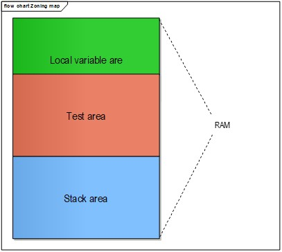
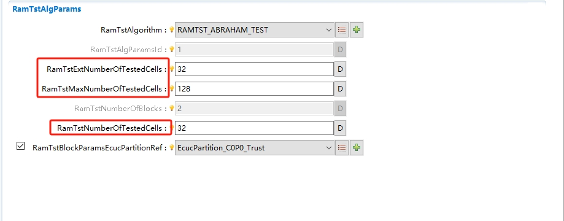

====================
RamTst
====================

文档信息 Document Information
========================================================

版本历史 Version History
------------------------------------------------

.. list-table::
   :widths: 10 10 10 10 20
   :header-rows: 1

   * - 日期(Date)
     - 作者(Author)
     - 版本(Version)
     - 状态(Status)
     - 说明(Description)

   * - 2025/03/13
     - peng.wu
     - V0.1
     - 发布(Release)
     - 首次发布(First release)

   * - 2025/04/04
     - peng.wu
     - V1.0
     - 发布(Release)
     - 正式发布(Official release)

参考文档 References
------------------------------------------------

.. list-table::
   :widths: 10 10 30 10
   :header-rows: 1

   * - 编号(Number)
     - 分类(Classification)
     - 标题(Title)
     - 版本(Version)
   * - 1
     - Autosar
     -   AUTOSAR_CP_SRS_RAMTest.pdf
     - R23-11
   * - 2
     - Autosar
     -  AUTOSAR_CP_SWS_RAMTest.pdf
     - R23-11

术语与简写 Terms and Abbreviations
========================================================

术语 Terms
------------------------------------------------------------------------------------------------
.. :align: center   表格内容居中(Table contents are centered)

.. list-table::
   :widths: 15 40
   :header-rows: 1

   * - 术语(Terms)
     - 解释(Explanation)

   * - Background test
     - 后台测试由调度器定期调用，且可被中断。该测试被拆分到多个调度任务中执行。(Background test is called periodically by a scheduler, and is interruptible. The test is split up over many scheduled tasks.)
   
   * - Foreground test
     - 前台测试通过用户调用触发。(Foreground test is called via users call.)

   * - Memory block
     - 已定义内存区域。(Defined memory area.)

   * - Synchronous
     - 当调用方软件实体处于阻塞状态，直至被调用的操作执行完成，这种通信即为同步通信。(Synchronous communication refers to the scenario where the calling software entity remains in a blocked state until the called operation is completed.)

   * - Asynchronous
     - 异步通信不会阻塞发送方软件实体。发送方软件实体无需等待通信伙伴的响应，即可继续执行自身操作。(Asynchronous communication does not block the sending software entity. The sending software entity can continue to execute its own operations without waiting for a response from the communication partner.)

简写 Abbreviations
------------------------------------------------

.. list-table::
   :widths: 10 20 30
   :header-rows: 1

   * - 简写(Abbreviation)
     - 全称(Full name)
     - 解释(Explanation)

   * - DEM
     - Diagnostic Event Manager
     - 诊断事件管理器
   * - DET
     - Default Error Tracer
     - 默认错误跟踪器.
   * - RAM
     - Random Access Memory.
     - 随机存取存储器
   * - OS
     - Operating System
     - 操作系统
   * - EcuM
     - ECU Manager.
     - Ecu管理器.

简介 Introduction
==================================
RamTst同时支持破坏性和非破坏性测试策略。对于破坏性测试策略，测试结束后将填充测试Ram的内容。

RamTst supports both destructive and non-destructive test strategies. For the destructive test strategy, the content of the tested RAM will be filled after the test is completed.

对于非破坏性测试策略，完整的程序(保存、更改、恢复)应该不间断地执行。即在测试之前，将RAM数据复制到一个变量中，并在测试完成后将其恢复到原始位置。

For the non-destructive test strategy, the complete procedure (save, modify, restore) shall be executed without interruption. That is, before the test, the RAM data is copied to a variable, and after the test is completed, it is restored to its original location.

对于RamTst，需要将RAM区域进行划分，如图 :ref:`RamAttribute` 展示了Ram的区域划分，可划分为RamTst模块的局部变量区域、待测RAM区域和堆栈区域。

For RamTst, the RAM area needs to be divided. As shown in Figure :ref:`RamAttribute`, the division of RAM areas is displayed, which can be divided into the local variable area of the RamTst module, the RAM area to be tested, and the stack area.

   Ram Attribute

功能描述 Functional Description
==========================================================

特性 Features
--------------------------------------------------------------------------------------------------

前台测试 Foreground Test
~~~~~~~~~~~~~~~~~~~~~~~~~~~~~~~~~~~~~~~~~~~~~~~~~~~~~~~~~~~~~~~~
前台测试表示为不可打断的同步计算方式，直到测试任务执行完成后退出，用户通过调用RamTst_RunFullTest() 或 RamTst_RunPartialTest()开始执行前台测试。

The foreground test is represented as an uninterruptible synchronous calculation method, which exits only after the test task is completed. The user starts the foreground test by calling RamTst_RunFullTest() or RamTst_RunPartialTest().

这两个API都具有返回值，如果API返回E_OK，则表示前台测试执行成功，如果返回E_NOT_OK,则表示前台测试执行失败。

Both APIs have return values. If the API returns E_OK, it indicates that the foreground test is executed successfully; if it returns E_NOT_OK, it indicates that the foreground test fails to execute.

后台测试 Background Test
~~~~~~~~~~~~~~~~~~~~~~~~~~~~~~~~~~~~~~~~~~~~~~~~~~~~~~~~~~~~~~~~
在后台测试期间，被测试的配置RAM区域被划分为几个原子小块。每次在一个循环中调用RamTst_MainFunction，每次测试单个原子块时，在测试完该块之前不应该中断测试。

During the background test, the configured RAM area to be tested is divided into several atomic small blocks. Each time RamTst_MainFunction is called in a loop, when testing a single atomic block, the test shall not be interrupted until the block is tested.

如图 :ref:`BackGroundTest` 展示了RamTst的后台执行。

As shown in Figure :ref:`BackGroundTest`, the background execution of RamTst is displayed.

.. figure:: ../../../_static/参考手册/RamTst/RamTstBackGround.jpg
   :alt: RamTst模块RamTstBackGround图(RamTstBackGround Diagram of RamTst Module)
   :name: BackGroundTest
   :align: center

   BackGround Test

在后台测试期间，RamTst可以通过调用RamTst_Allow，RamTst_Stop开启和结束后台测试，调用RamTst_Suspend，RamTst_Resume服务挂起和恢复后台测试。挂起的服务不会立即处理，只有在执行最小测试单元测试后，测试才会挂起。后台测试中，当所有Block执行结束后，将调回到第一个Block重新开始测试。

During the background test, RamTst can start and end the background test by calling RamTst_Allow and RamTst_Stop, and call the RamTst_Suspend and RamTst_Resume services to suspend and resume the background test. The suspended service will not be processed immediately. The test will be suspended only after the execution of the minimum test unit is completed. During the background test, after all Blocks are executed, the test will return to the first Block and restart the test.

March算法 March Algorithm
~~~~~~~~~~~~~~~~~~~~~~~~~~~~~~~~~~~~~~~~~~~~~~~~~~~~~~~~~~~~~~~~~~~~~~~~
(1)对整个RAM单元写零。

(1)Write zero to the entire RAM unit.

(2)按地址升序读取单元格，读取每个单元格的值并检查是否为0，然后对该单元格写1。

(2)Read the cells in ascending order of address, read the value of each cell and check if it is 0, then write 1 to the cell.

(3)按地址升序读取单元格，读取每个单元格的值，检查是否为1。

(3)Read the cells in ascending order of address, read the value of each cell and check if it is 1.

CheckBoard算法 CheckBoard Algorithm
~~~~~~~~~~~~~~~~~~~~~~~~~~~~~~~~~~~~~~~~~~~~~~~~~~~~~~~~~~~~~~~~~~~~~~~~
(1)将0和1按升序写入RAM单元中的一位和下一位。

(1)Write 0 and 1 to one bit and the next bit in the RAM unit in ascending order.

(2)按地址升序读取单元，检查RAM单元中是否有一位为0，下一位为1。

(2)Read the units in ascending order of address, and check if one bit in the RAM unit is 0 and the next bit is 1.

(3)按地址降序读取单元，检查当前RAM单元是否为1，下一个RAM单元是否为0。

(3)Read the units in descending order of address, and check if the current RAM unit is 1 and the next RAM unit is 0.

(4)将1和0按降序写入RAM单元中的1位和下一位。

(4)Write 1 and 0 to one bit and the next bit in the RAM unit in descending order.

(5)按地址升序读取单元，检查RAM单元中是否有一位为1，下一位为0。

(5)Read the units in ascending order of address, and check if one bit in the RAM unit is 1 and the next bit is 0.

(6)按地址降序读取单元，检查当前RAM单元是否为0，下一个RAM单元是否为1。

(6)Read the units in descending order of address, and check if the current RAM unit is 0 and the next RAM unit is 1.

WalkPath算法 WalkPath Algorithm
~~~~~~~~~~~~~~~~~~~~~~~~~~~~~~~~~~~~~~~~~~~~~~~~~~~~~~~~~~~~~~~~~~~~~~~~
(1)对整个RAM单元写零。

(1)Write zero to the entire RAM unit.

(2)将1写入RAM cell中的1位，检查剩余位是否为0，然后将该位写回0。

(2)Write 1 to one bit in the RAM cell, check if the remaining bits are 0, then write the bit back to 0.

(3)按升序将1写入整个RAM单元。

(3)Write 1 to the entire RAM unit in ascending order.

(4)将0写入RAM cell中的1位，检查剩余位是否为1，然后将该位写回1。

(4)Write 0 to one bit in the RAM cell, check if the remaining bits are 1, then write the bit back to 1.

Galpat算法 Galpat Algorithm
~~~~~~~~~~~~~~~~~~~~~~~~~~~~~~~~~~~~~~~~~~~~~~~~~~~~~~~~~~~~~~~~~~~~~~~~
(1)对整个RAM单元写零。

(1)Write zero to the entire RAM unit.

(2)RAM单元中的位按升序写为1。

(2)Write 1 to the bits in the RAM unit in ascending order.

(3)检查剩余位是否为全0或全1，并检查写入位是否为1。

(3)Check if the remaining bits are all 0 or all 1, and check if the written bit is 1.

(4)RAM单元中的位按降序写入0。

(4)Write 0 to the bits in the RAM unit in descending order.

(5)检查剩余位是否全为1或全为0，并检查写入位是否为0。

(5)Check if the remaining bits are all 1 or all 0, and check if the written bit is 0.

TransGalpat算法 TransGalpat Algorithm
~~~~~~~~~~~~~~~~~~~~~~~~~~~~~~~~~~~~~~~~~~~~~~~~~~~~~~~~~~~~~~~~~~~~~~~~
(1)计算当前RAM单元的第一个签名值。

(1)Calculate the first signature value of the current RAM unit.

(2)反转RAM单元的值。

(2)Invert the value of the RAM unit.

(3)计算当前RAM单元的第二签名值。

(3)Calculate the second signature value of the current RAM unit.

(4)比较两个签名。

(4)Compare the two signatures.

(5)再次反转RAM单元的值。

(5)Invert the value of the RAM unit again.

(6)计算当前RAM单元的第三个签名值。

(6)Calculate the third signature value of the current RAM unit.

(7)检查第一个签名值与第三个签名值是否相等

(7)Check if the first signature value is equal to the third signature value.

Abraham算法 Abraham Algorithm
~~~~~~~~~~~~~~~~~~~~~~~~~~~~~~~~~~~~~~~~~~~~~~~~~~~~~~~~~~~~~~~~~~~~~~~~
A .第一步:

A .Step 1:

a)将零写入整个RAM单元。

a)Write zero to the entire RAM unit.

b)按地址升序读取每个单元格的值，检查是否为0，然后将其写入1。

b)Read the value of each cell in ascending order of address, check if it is 0, then write 1 to it.

c)按地址降序读取每个单元格的值，检查是否为1。

c)Read the value of each cell in descending order of address, check if it is 1.

d)按地址升序读取每个cell的值，检查是否为1，然后写入0;

d)Read the value of each cell in ascending order of address, check if it is 1, then write 0 to it;

e)按地址降序读取每个单元格的值，检查是否为0。

e)Read the value of each cell in descending order of address, check if it is 0.

B .第二步:

B .Step 2:

a)按地址降序读取每个cell的值，检查是否为0，然后写入1;

a)Read the value of each cell in descending order of address, check if it is 0, then write 1 to it;

b)按地址升序读取每个cell的值，检查是否为1。

b)Read the value of each cell in ascending order of address, check if it is 1.

c)按地址降序读取每个cell的值，检查是否为1，然后写入0;

c)Read the value of each cell in descending order of address, check if it is 1, then write 0 to it;

d)按地址升序读取每个cell的值，检查是否为0。

d)Read the value of each cell in ascending order of address, check if it is 0.

C .第三步:

C .Step 3:

a)按地址升序读取每个cell的值，检查是否为0，将其写为1，再写回0;

a)Read the value of each cell in ascending order of address, check if it is 0, write 1 to it, then write 0 back to it;

b)按地址降序读取每个单元格的值，检查是否为0。

b)Read the value of each cell in descending order of address, check if it is 0.

D .第四步:

D .Step 4:

a)按地址降序读取每个cell的值，检查是否为0，将其写入1，再写入0;

a)Read the value of each cell in descending order of address, check if it is 0, write 1 to it, then write 0 back to it;

b)按地址升序读取每个cell的值，检查是否为0。

b)Read the value of each cell in ascending order of address, check if it is 0.

E .第五步:

E .Step 5:

a)将Ram单元写入所有单元

a)Write 1 to all cells of the RAM unit;

b)按地址升序读取每个cell的值，检查是否为1，然后写入0;

b)Read the value of each cell in ascending order of address, check if it is 1, then write 0 to it;

c)按地址降序读取每个单元格的值，检查是否为1。

c)Read the value of each cell in descending order of address, check if it is 1.

F .第六步:

F .Step 6:

a)按地址降序读取每个cell的值，检查是否为1，写为0后再写回1;

a)Read the value of each cell in descending order of address, check if it is 1, write 0 to it, then write 1 back to it;

b)按地址升序读取每个cell的值，检查是否为1。

b)Read the value of each cell in ascending order of address, check if it is 1.

非破坏性策略 Non-Destructive Strategy
~~~~~~~~~~~~~~~~~~~~~~~~~~~~~~~~~~~~~~~~~~~~~~~~~~~~~~~~~~~~~~~~~~~~~~~~
RamTsts应该不中断地执行完整的程序(保存、更改、恢复)。在测试之前，将RAM数据复制到一个变量中，并在测试完成后将其恢复到原始位置。

RamTsts shall execute the complete procedure (save, modify, restore) without interruption. Before the test, the RAM data is copied to a variable, and after the test is completed, it is restored to its original location.

破坏性策略 Destructive Strategy
~~~~~~~~~~~~~~~~~~~~~~~~~~~~~~~~~~~~~~~~~~~~~~~~~~~~~~~~~~~~~~~~~~~~~~~~
对于破坏性测试策略，测试Ram内容在测试结束后，使用配置的填充值作为填充。

For the destructive test strategy, after the test is completed, the content of the tested RAM shall be filled with the configured filling value.

偏差 Deviation
----------------------------------
None

扩展 Extension
----------------------------------
None

集成 Integration
========================================

变量自测试 Variable Self-Test
------------------------------------------------------------------------------------------------
集成前，需要在链接文件中划分出对应的区域，RamTst模块的局部变量区域和堆栈区域用于在初始化时，执行自测试。

Before integration, the corresponding areas need to be divided in the link file. The local variable area and stack area of the RamTst module are used to execute the self-test during initialization.

多分区 Multi-Partition
------------------------------------------------------------------------------------------------
RamTst多分区场景下，需要配置算法集中的RamTstBlockParamsEcucPartitionRef关联对应的分区。RamTst执行时会判断当前算法集是否在支持的分区下测试。

In the multi-partition scenario of RamTst, it is necessary to configure RamTstBlockParamsEcucPartitionRef in the algorithm set to associate the corresponding partition. RamTst will determine whether the current algorithm set is tested under the supported partition during execution.

前台测试 Foreground Test
------------------------------------------------------------------------------------------------
RamTst的前台测试为不可打断的同步操作，且测试策略一般都为破坏性的block，所以对于前台测试的Block，一般是在ECU上电启动os前，或者下电结束前执行，避免因为前台测试的Block数量过多或者Size太大，导致的测试时间过长，以及破坏性策略所带来的数据损坏。

The foreground test of RamTst is an uninterruptible synchronous operation, and the test strategy is generally a destructive block. Therefore, the Block for the foreground test is generally executed before the ECU powers on and starts the OS, or before the power-off ends. This avoids excessive test time caused by too many Blocks or too large Size of the foreground test, as well as data damage caused by the destructive strategy.

文件列表 File List
--------------------------------------------------------------------

静态文件 Static Files
~~~~~~~~~~~~~~~~~~~~~~~~~~~~~~~~~~~~~~~~

.. list-table::
   :widths: 10 30
   :header-rows: 1

   * - 文件(File)
     - 描述(Description)
   
   * - RamTst.c
     - API implementation of the RamTst; contains macro definitions, internal variables, internal functions, and global functions that need to be used.
   * - RamTst.h
     - API declarations and macro definitions of the RamTst; including macro definitions, configuration structure declarations, and external function declarations that need to be used.
   * - RamTst_Types.h
     - Contains the memory abstraction of RamTst.
   * - RamTst_MemMap.h
     - Contains the memory abstraction of the RamTst.

动态文件 Dynamic Files
~~~~~~~~~~~~~~~~~~~~~~~~~~~~~~~~~~~~~~~~
.. list-table::
   :widths: 10 30
   :header-rows: 1

   * - 文件(File)
     - 描述(Description)

   * - RamTst_cfg.h
     - Declaration parameter of RamTst; Contains macro definitions, version information, and API declarations that need to be used.
   * - RamTst_Lcfg.c
     - Configuration parameter of RamTst; Contains the block address, size, and algorithm that need to be used.
   * - RamTst_Lcfg.h
     - Link time declaration of RamTst; Contains macro definitions, version information, and API declarations that need to be used.

错误处理 Error Handling
------------------------------------------------------------------------------------------------

开发错误 Development Errors
~~~~~~~~~~~~~~~~~~~~~~~~~~~~~~~~~~~~~~~~~~~~~~~~~~~~~~~~
.. list-table:: 
   :widths: 20 10 30
   :header-rows: 1

   * - Error code
     - Value[hex]
     - Description

   * - RAMTST_E_NO_ERROR
     - 0x0u
     - API function called with no det error

   * - RAMTST_E_STATUS_FAILURE
     - 0x1u
     - A particular API is called in an unexpected state

   * - RAMTST_E_OUT_OF_RANGE
     - 0x02u
     - API parameter out of specified range

   * - RAMTST_E_UNINIT
     - 0x03u
     - API service used without module initialization

   * - RAMTST_E_PARAM_POINTER
     - 0x04u
     - API service called with a NULL pointer

   * - RAMTST_E_SELF_CHECK_ERR
     - 0x05u
     - RamTst Self Check Err

   * - RAMTST_E_TIMEOUT
     - 0x06u
     - RamTst timeout

   * - RAMTST_E_WRONG_CONDITION
     - 0x07u
     - partition info error

产品错误 Product Errors
~~~~~~~~~~~~~~~~~~~~~~~~~~~~~~~~~~~~~~~~~~~~~~~~~~~~~~~~
None

扩展产品错误 Extended Product Errors
~~~~~~~~~~~~~~~~~~~~~~~~~~~~~~~~~~~~~~~~~~~~~~~~~~~~~~~~
.. list-table:: 
   :widths: 20 10 30
   :header-rows: 1

   * - Error code
     - Value[hex]
     - Description

   * - RAMTST_MAIN_RAM_FAILURE
     - Value[hex]
     - The function RamTst_MainFunction shall update the overall test result status and error is updated based on the current status of RamTstAlgParams

   * - RAMTST_RUNFL_RAM_FAILURE
     - Value[hex]
     - The function RamTst_RunFullTest shall update the overall test result status and error is updated based on the current status of RamTstAlgParams

   * - RAMTST_PART_RAM_FAILURE
     - Value[hex]
     - The function RamTst_RunPartialTest shall update the test result status of the tested block and error is updated based on the current status of RamTstAlgParams

接口描述 Interface Description
==============================================================

.. include:: RamTst_api.rst

依赖的服务 Applicable Services
------------------------------------------------------------------------------------------------

可选接口 Optional Interface
~~~~~~~~~~~~~~~~~~~~~~~~~~~~~~~~~~~~~~~~~~~~~~~~~~~~~~~~

.. list-table::
   :widths: 10 5 30
   :header-rows: 1

   * - API Function
     - Header File
     - Description

   * - Det_ReportError
     - Det.h
     - Service to report development errors

强制接口 Compulsory interface
~~~~~~~~~~~~~~~~~~~~~~~~~~~~~~~~~~~~~~~~~~~~~~~~~~~~~~~~
.. 可选的章节，根据模块实际情况确定

.. list-table::
   :widths: 10 5 30
   :header-rows: 1

   * - API Function
     - Header File
     - Description
   * - Dem_SetEventStatus
     - Dem.h
     - Called by SW-Cs or BSW modules to report monitor status information to the Dem

配置接口 Configuration Interfaces
~~~~~~~~~~~~~~~~~~~~~~~~~~~~~~~~~~~~~~~~~~~~~~~~~~~~~~~~
.. 可选的章节，根据模块实际情况确定
.. 格式同强制接口

.. list-table::
   :widths: 10 5 30
   :header-rows: 1

   * - API Function
     - Header File
     - Description
   * - RamTst_TestCompletedNotification
     - RamTst.h
     - The function RamTst_TestCompleted shall be called every time when all RAM blocks of the current test configuration have been tested in the background
   * - RamTst_ErrorNotification
     - RamTst.h
     - The function RamTst_Error shall be called every time when a RAM failure has been detected by the selected test algorithm in the background

配置 Configuration
====================================

LocalVarAreaAddr
-------------------------------
指定RamTst的局部变量以及堆栈，存放在这个区域内，用于在初始化阶段，进行自测试。

Specify the local variables and stack of RamTst to be stored in this area, which is used to perform self-test during the initialization phase.

如图 :ref:`LocalVarAreaAddrVar` 展示了RamTstLocalVarAreaAddr的配置界面，可配置签名值写入的固定地址。

As shown in Figure :ref:`LocalVarAreaAddrVar`, the configuration interface of RamTstLocalVarAreaAddr is displayed, and the fixed address for writing the signature value can be configured.

.. figure:: ../../../_static/参考手册/RamTst/RamTstLocalVarAreaAddr.png
   :alt: RamTst模块LocalVarAreaAddr配置图(LocalVarAreaAddr Configuration Diagram of RamTst Module)
   :name: LocalVarAreaAddrVar
   :align: center

   RamTst LocalVarAreaAddrVar Configuration

RamTstCellSize
-------------------------------
指定RamTst的测试单元大小，以bit为单位。

Specify the test cell size of RamTst, in bits.

如图 :ref:`CellSize` 展示了RamTstCellSize的配置界面，可配置测试单元大小。

As shown in Figure :ref:`CellSize`, the configuration interface of RamTstCellSize is displayed, and the test cell size can be configured.

.. figure:: ../../../_static/参考手册/RamTst/RamTstCellSize.png
   :alt: RamTst模块CellSize配置图 (CellSize Configuration Diagram of RamTst Module)
   :name: CellSize
   :align: center

   RamTst CellSize Configuration

配置的RamTstExtNumberOfTestedCells，RamTstMaxNumberOfTestedCells以及RamTstNumberOfTestedCells都必须为RamTstCellSize的倍数。

The configured RamTstExtNumberOfTestedCells, RamTstMaxNumberOfTestedCells, and RamTstNumberOfTestedCells must all be multiples of RamTstCellSize.

如图 :ref:`TestCells` 展示了RamTstTestCells的配置界面，可配置测试单元大小。

As shown in Figure :ref:`TestCells`, the configuration interface of RamTstTestCells is displayed, and the test cell size can be configured.

   RamTst TestCells Configuration

