===================
BswM产品参考手册
===================

**缩写词注解**

+--------------------+------------------------+------------------------+
| **缩写词**         | **解释/描述**          | **中文解释**           |
+--------------------+------------------------+------------------------+
| BswM               | Basic Software Mode    | 基础软件模式管理       |
|                    | Manager                |                        |
+--------------------+------------------------+------------------------+
| RTE                | Runtime Environment    | 运行时环境             |
+--------------------+------------------------+------------------------+
| EcuM               | ECU State Manager      | ECU状态管理            |
+--------------------+------------------------+------------------------+
| Wakeup Source      | The peripheral or ECU  | 唤醒源                 |
|                    | component which deals  |                        |
|                    | with wakeup events is  |                        |
|                    | called a wakeup source |                        |
+--------------------+------------------------+------------------------+

简介
====

模式管理属于系统服务栈，在AutoSar R19-11软件层级架构如下图：

|image1|

图1-1 模式管理协议栈简介

模式管理由BswM与EcuM组成，这两个模块对于Bsw中不同协议栈的串联与Ecu的整体把控紧密相关，其中BswM可以通过配置高度自由实现Bsw中模块的串联工作，EcuM则对Mcu的睡眠唤醒提供支持。

参考资料
--------

[1] AUTOSAR_EXP_LayeredSoftwareArchitecture.pdf，R19-11

[2] AUTOSAR_SWS_ECUStateManager.pdf，R19-11

[3] AUTOSAR_SWS_BSWModeManager.pdf，R19-11

[4] AUTOSAR_EXP_ModeManagementGuide.pdf，R19-11

功能描述
========

BSWM模块主要有如下两个功能：

1.模式仲裁。

2.模式控制。

模式仲裁
--------

仲裁功能介绍
~~~~~~~~~~~~

模式仲裁是接收来自SWC或其他BSW模块的模式请求和通知，根据简单的规则作出模式切换。

Bsw或SW-C通知BswM进入模式仲裁，可以配置不同的Bsw模块给BswM的通知端口匹配的输入值；这些输入值可以根据具体需求组合成逻辑表达式；逻辑表达式决定了BswM执行的动作列表，动作列表是一系列Bsw或RTE模块操作接口。

仲裁功能实现
~~~~~~~~~~~~

**模式仲裁**\ ：每个模式仲裁的规则都有一个逻辑表达式，逻辑表达式的条件来源与Bsw模块的请求或Swc的请求，而逻辑表达式可以对多个请求的输入源使用逻辑运算符（与，或，异或，与非）进行连接。

|image2|

图2-1 模式仲裁示意图

实现仲裁需要配置BswMRule、BswMLogicalExpression、BswMModeCondition以及BswMModeRequestPort（或者BswMEventRequestPort）如下图所示：其中BswMRule指需要仲裁的规则，BswMLogicalExpression提供仲裁逻辑表达式，逻辑表达式的条件由RequestPort和BswMModeCondition构成。

|image3|

图2-2 模式仲裁配置项示意图

模式控制
--------

模式控制介绍
~~~~~~~~~~~~

模式控制是以模式仲裁得到的结果，执行相应的动作。BswM执行流程如下：

|image4|

图2-3 模式控制执行流程

模式控制实现
~~~~~~~~~~~~

BswM可以配置一系列行为作为仲裁结果需要执行的动作，这些行为可以是操作Bsw模块或Rte，或另外的一个仲裁规则，典型示例如下：

|image5|

图2-4 ActionList引用示意图

对于BswM而言，配置项决定了串联的实施的具有功能，需要根据实际项目中的需求来调整BswM配置以满足应用场景。实现模式控制主要是通过BSWM调用其他BSW模块的函数来达到控制其模块的目的（如请求网络调用ComM_RequestComMode）。

实现模式控制需要配置BswMActionList以及BswMAction，其中BswMActionList会被BswMRule引用：

|image6|

图2-5 模式控制配置示意图

在BswMActionList中配置需要具体执行的Action：

|image7|

图2-6 ActionList配置示意图

在Action中会选择需要关联的具体BSW模块需要执行的动作：

|image8|

图2-7 Action配置示意图

源文件描述
==========

表3-1 BswM文件描述

+----------------------------------+-----------------------------------+
| **文件**                         | **说明**                          |
+----------------------------------+-----------------------------------+
| BswM.c                           | BswM模块提供的API（不             |
|                                  | 与其他模块交互），以及内部函数等  |
+----------------------------------+-----------------------------------+
| BswM.h                           | LC配置数据类型，以及通用API的声明 |
+----------------------------------+-----------------------------------+
| BswM_Bsw.c                       | BswMModeRequestPor                |
|                                  | t中BswMBswModeNotification对应API |
+----------------------------------+-----------------------------------+
| BswM_Bsw.h                       | BswM_Bsw.c中API声明               |
+----------------------------------+-----------------------------------+
| BswM_CanSM.c                     | BSWM与CANSM模块交互API            |
+----------------------------------+-----------------------------------+
| BswM_CanSM.h                     | BswM_CanSM.c中API声明             |
+----------------------------------+-----------------------------------+
| BswM_ComM.c                      | BSWM与ComM模块交互API             |
+----------------------------------+-----------------------------------+
| BswM_ComM.h                      | BswM_ComM.c中API声明              |
+----------------------------------+-----------------------------------+
| BswM_Dcm.c                       | BSWM与Dcm模块交互API              |
+----------------------------------+-----------------------------------+
| BswM_Dcm.h                       | BswM_Dcm.c中API声明               |
+----------------------------------+-----------------------------------+
| BswM_EcuM.c                      | BSWM与EcuM模块交互API             |
+----------------------------------+-----------------------------------+
| BswM_EcuM.h                      | BswM_EcuM.c中API声明              |
+----------------------------------+-----------------------------------+
| BswM_EthSM.c                     | BSWM与EthSM模块交互API            |
+----------------------------------+-----------------------------------+
| BswM_EthSM.h                     | BswM_EthSM.c中API声明             |
+----------------------------------+-----------------------------------+
| BswM_FrSM.c                      | BSWM与FrSM模块交互API             |
+----------------------------------+-----------------------------------+
| BswM_FrSM.h                      | BswM_FrSM.c中API声明              |
+----------------------------------+-----------------------------------+
| BswM_Internal.h                  | BswM中PC配置                      |
|                                  | 数据结构类型定义以及内部函数声明  |
+----------------------------------+-----------------------------------+
| BswM_J1939Dcm.c                  | BSWM与J1939Dcm模块交互API         |
+----------------------------------+-----------------------------------+
| BswM_J1939Dcm.h                  | BswM_J1939Dcm.c中API声明          |
+----------------------------------+-----------------------------------+
| BswM_J1939Nm.c                   | BSWM与J1939Nm模块交互API          |
+----------------------------------+-----------------------------------+
| BswM_J1939Nm.h                   | BswM_J1939Nm.c中API声明           |
+----------------------------------+-----------------------------------+
| BswM_Lcfg.h                      | LC配置数据结构                    |
+----------------------------------+-----------------------------------+
| BswM_LinSM.c                     | BSWM与LinSM模块交互API            |
+----------------------------------+-----------------------------------+
| BswM_LinSM.h                     | BswM_LinSM.c中API声明             |
+----------------------------------+-----------------------------------+
| BswM_LinTp.c                     | BSWM与LinTp模块交互API            |
+----------------------------------+-----------------------------------+
| BswM_LinTp.h                     | BswM_LinTp.c中API声明             |
+----------------------------------+-----------------------------------+
| BswM_MemMap.h                    | BswM所有变量                      |
|                                  | 、函数用到的MemMap机制包含头文件  |
+----------------------------------+-----------------------------------+
| BswM_Nm.c                        | BSWM与Nm模块交互API               |
+----------------------------------+-----------------------------------+
| BswM_Nm.h                        | BswM_Nm.c中API声明                |
+----------------------------------+-----------------------------------+
| BswM_NvM.c                       | BSWM与NvM模块交互API              |
+----------------------------------+-----------------------------------+
| BswM_NvM.h                       | BswM_NvM.c中API声明               |
+----------------------------------+-----------------------------------+
| BswM_PBcfg.h                     | PB配置数据结构                    |
+----------------------------------+-----------------------------------+
| BswM_RuleArbitrate.c             | Rule仲裁函数                      |
+----------------------------------+-----------------------------------+
| BswM_Sd.c                        | BSWM与Sd模块交互API               |
+----------------------------------+-----------------------------------+
| BswM_Sd.h                        | BswM_Sd.c中API声明                |
+----------------------------------+-----------------------------------+
| BswM_Swc.c                       | BSWM与Swc模块交互API              |
+----------------------------------+-----------------------------------+
| BswM_Swc.h                       | BswM_Swc.c中API声明               |
+----------------------------------+-----------------------------------+
| BswM_TimerControl.c              | BswM中timer control相关API        |
+----------------------------------+-----------------------------------+
| BswM_Types.h                     | BswM定义的通用数据类型            |
+----------------------------------+-----------------------------------+
| BswM_WdgM.c                      | BSWM与WdgM模块交互API             |
+----------------------------------+-----------------------------------+
| BswM_WdgM.h                      | BswM_WdgM.c中API声明              |
+----------------------------------+-----------------------------------+
| SchM_BswM.h                      | 定义BswM_MainFunction函           |
|                                  | 数声明，已经某些关键区域保护机制  |
+----------------------------------+-----------------------------------+
| BswM_Cfg.c                       | BswM中所有PC配置数据              |
+----------------------------------+-----------------------------------+
| BswM_Cfg.h                       |                                   |
+----------------------------------+-----------------------------------+
| BswM_LCfg.c                      | BswM中所有Link time配置数据       |
+----------------------------------+-----------------------------------+

|image9|

图3-1 BSWM文件交互关系图

API接口
=======

类型定义
--------

BswM_ConfigType类型定义
~~~~~~~~~~~~~~~~~~~~~~~

+-----------+----------------------------------------------------------+
| 名称      | BswM_ConfigType                                          |
+-----------+----------------------------------------------------------+
| 类型      | 无                                                       |
+-----------+----------------------------------------------------------+
| 范围      | 无                                                       |
+-----------+----------------------------------------------------------+
| 描述      | BswM模块中PB配置数据类型                                 |
+-----------+----------------------------------------------------------+

BswM_ModeType类型定义
~~~~~~~~~~~~~~~~~~~~~

+-----------+----------------------------------------------------------+
| 名称      | BswM_ModeType                                            |
+-----------+----------------------------------------------------------+
| 类型      | Uint16                                                   |
+-----------+----------------------------------------------------------+
| 范围      | 0-65535                                                  |
+-----------+----------------------------------------------------------+
| 描述      | 提供给BswM user请求的模式                                |
+-----------+----------------------------------------------------------+

BswM_UserType类型定义
~~~~~~~~~~~~~~~~~~~~~

+-----------+----------------------------------------------------------+
| 名称      | BswM_UserType                                            |
+-----------+----------------------------------------------------------+
| 类型      | Uint16                                                   |
+-----------+----------------------------------------------------------+
| 范围      | 0-65535                                                  |
+-----------+----------------------------------------------------------+
| 描述      | BswM user类型                                            |
+-----------+----------------------------------------------------------+

输入函数描述
------------

+---------------------------------+------------------------------------+
| **输入模块**                    | **API**                            |
+---------------------------------+------------------------------------+
| Com                             | Com_SetIpduGroup                   |
+---------------------------------+------------------------------------+
|                                 | Com_ReceptionDMControl             |
+---------------------------------+------------------------------------+
|                                 | Com_IpduGroupControl               |
+---------------------------------+------------------------------------+
|                                 | Com_SwitchIpduTxMode               |
+---------------------------------+------------------------------------+
| ComM                            | ComM_CommunicationAllowed          |
+---------------------------------+------------------------------------+
|                                 | ComM_LimitChannelToNoComMode       |
+---------------------------------+------------------------------------+
|                                 | ComM_RequestComMode                |
+---------------------------------+------------------------------------+
| OS                              | ControlIdle                        |
+---------------------------------+------------------------------------+
| Det                             | Det_ReportError                    |
+---------------------------------+------------------------------------+
| EcuM                            | EcuM_AL_DriverInitBswM\_<x>        |
+---------------------------------+------------------------------------+
|                                 | EcuM_GoDownHaltPoll                |
+---------------------------------+------------------------------------+
|                                 | EcuM_SetState                      |
+---------------------------------+------------------------------------+
| J1939Dcm                        | J1939Dcm_SetState                  |
+---------------------------------+------------------------------------+
| J1939Rm                         | J1939Rm_SetState                   |
+---------------------------------+------------------------------------+
| LinSM                           | LinSM_ScheduleRequest              |
+---------------------------------+------------------------------------+
| Nm                              | Nm_DisableCommunication            |
+---------------------------------+------------------------------------+
|                                 | Nm_EnableCommunication             |
+---------------------------------+------------------------------------+
| Sd                              | Sd_ClientServiceSetState           |
+---------------------------------+------------------------------------+
|                                 | Sd_ConsumedEventGroupSetState      |
+---------------------------------+------------------------------------+
|                                 | Sd_ServerServiceSetState           |
+---------------------------------+------------------------------------+

静态接口函数定义
----------------

BswM_BswMPartitionRestarted函数定义
~~~~~~~~~~~~~~~~~~~~~~~~~~~~~~~~~~~

+-------------+-------------------+---------+-------------------------+
| 函数名称：  | BswM_BswMP        |         |                         |
|             | artitionRestarted |         |                         |
+-------------+-------------------+---------+-------------------------+
| 函数原型：  | void              |         |                         |
|             | BswM_BswMP        |         |                         |
|             | artitionRestarted |         |                         |
|             | (                 |         |                         |
|             |                   |         |                         |
|             | void              |         |                         |
|             |                   |         |                         |
|             | )                 |         |                         |
+-------------+-------------------+---------+-------------------------+
| 服务编号：  | 0x1e              |         |                         |
+-------------+-------------------+---------+-------------------------+
| 同步/异步： | 同步              |         |                         |
+-------------+-------------------+---------+-------------------------+
| 是          | 是                |         |                         |
| 否可重入：  |                   |         |                         |
+-------------+-------------------+---------+-------------------------+
| 输入参数：  | 无                | 值域：  | 无                      |
+-------------+-------------------+---------+-------------------------+
| 输入        | 无                |         |                         |
| 输出参数：  |                   |         |                         |
+-------------+-------------------+---------+-------------------------+
| 输出参数：  | 无                |         |                         |
+-------------+-------------------+---------+-------------------------+
| 返回值：    | 无                |         |                         |
+-------------+-------------------+---------+-------------------------+
| 功能概述：  | 多分区的          |         |                         |
|             | 情况下，当前分区  |         |                         |
|             | bswm接收另一个分  |         |                         |
|             | 区的bswm复位指示  |         |                         |
+-------------+-------------------+---------+-------------------------+

BswM_CanSM_CurrentIcomConfiguration函数定义
~~~~~~~~~~~~~~~~~~~~~~~~~~~~~~~~~~~~~~~~~~~

+-------------+-------------------+---------+-------------------------+
| 函数名称：  | B                 |         |                         |
|             | swM_CanSM_Current |         |                         |
|             | IcomConfiguration |         |                         |
+-------------+-------------------+---------+-------------------------+
| 函数原型：  | void              |         |                         |
|             | B                 |         |                         |
|             | swM_CanSM_Current |         |                         |
|             | IcomConfiguration |         |                         |
|             | (                 |         |                         |
|             |                   |         |                         |
|             | NetworkHandleType |         |                         |
|             | Network,          |         |                         |
|             |                   |         |                         |
|             | IcomConfigIdType  |         |                         |
|             | Act               |         |                         |
|             | iveConfiguration, |         |                         |
|             |                   |         |                         |
|             | Ico               |         |                         |
|             | mSwitch_ErrorType |         |                         |
|             | Error             |         |                         |
|             |                   |         |                         |
|             | )                 |         |                         |
+-------------+-------------------+---------+-------------------------+
| 服务编号：  | 0x1a              |         |                         |
+-------------+-------------------+---------+-------------------------+
| 同步/异步： | 同步              |         |                         |
+-------------+-------------------+---------+-------------------------+
| 是          | 是                |         |                         |
| 否可重入：  |                   |         |                         |
+-------------+-------------------+---------+-------------------------+
| 输入参数：  | Network           | 值域：  | 0~255                   |
+-------------+-------------------+---------+-------------------------+
|             | Ac                |         | 0~255                   |
|             | tiveConfiguration |         |                         |
+-------------+-------------------+---------+-------------------------+
|             | Error             |         | ICOM_SWITCH_E_OK,       |
|             |                   |         |                         |
|             |                   |         | ICOM_SWITCH_E_FAILED    |
+-------------+-------------------+---------+-------------------------+
| 输入        | 无                |         |                         |
| 输出参数：  |                   |         |                         |
+-------------+-------------------+---------+-------------------------+
| 输出参数：  | 无                |         |                         |
+-------------+-------------------+---------+-------------------------+
| 返回值：    | 无                |         |                         |
+-------------+-------------------+---------+-------------------------+
| 功能概述：  | CanSm通知Bsw      |         |                         |
|             | M关于Icom配置状态 |         |                         |
+-------------+-------------------+---------+-------------------------+

BswM_CanSM_CurrentState函数定义
~~~~~~~~~~~~~~~~~~~~~~~~~~~~~~~

+------------+-----------+-----+--------------------------------------+
| 函数名称： | BswM_     |     |                                      |
|            | CanSM_Cur |     |                                      |
|            | rentState |     |                                      |
+------------+-----------+-----+--------------------------------------+
| 函数原型： | void      |     |                                      |
|            | BswM_     |     |                                      |
|            | CanSM_Cur |     |                                      |
|            | rentState |     |                                      |
|            | (         |     |                                      |
|            |           |     |                                      |
|            | NetworkH  |     |                                      |
|            | andleType |     |                                      |
|            | Network,  |     |                                      |
|            |           |     |                                      |
|            | CanSM_Bs  |     |                                      |
|            | wMCurrent |     |                                      |
|            | StateType |     |                                      |
|            | Cur       |     |                                      |
|            | rentState |     |                                      |
|            |           |     |                                      |
|            | )         |     |                                      |
+------------+-----------+-----+--------------------------------------+
| 服务编号： | 0x05      |     |                                      |
+------------+-----------+-----+--------------------------------------+
| 同         | 同步      |     |                                      |
| 步/异步：  |           |     |                                      |
+------------+-----------+-----+--------------------------------------+
| 是         | 是        |     |                                      |
| 否可重入： |           |     |                                      |
+------------+-----------+-----+--------------------------------------+
| 输入参数： | Network   | 值  | 0~255                                |
|            |           | 域  |                                      |
|            |           | ：  |                                      |
+------------+-----------+-----+--------------------------------------+
|            | Cur       |     | CANSM_BSWM_NO_COMMUNICATION,         |
|            | rentState |     |                                      |
|            |           |     | CANSM_BSWM_SILENT_COMMUNICATION,     |
|            |           |     |                                      |
|            |           |     | CANSM_BSWM_FULL_COMMUNICATION,       |
|            |           |     |                                      |
|            |           |     | CANSM_BSWM_BUS_OFF,                  |
|            |           |     |                                      |
|            |           |     | CANSM_BSWM_CHANGE_BAUDRATE           |
+------------+-----------+-----+--------------------------------------+
| 输入       | 无        |     |                                      |
| 输出参数： |           |     |                                      |
+------------+-----------+-----+--------------------------------------+
| 输出参数： | 无        |     |                                      |
+------------+-----------+-----+--------------------------------------+
| 返回值：   | 无        |     |                                      |
+------------+-----------+-----+--------------------------------------+
| 功能概述： | Can       |     |                                      |
|            | Sm通知Bsw |     |                                      |
|            | M当前状态 |     |                                      |
+------------+-----------+-----+--------------------------------------+

BswM_ComM_CurrentMode函数定义
~~~~~~~~~~~~~~~~~~~~~~~~~~~~~

+------------+-----------------+-------+------------------------------+
| 函数名称： | BswM_C          |       |                              |
|            | omM_CurrentMode |       |                              |
+------------+-----------------+-------+------------------------------+
| 函数原型： | void            |       |                              |
|            | BswM_C          |       |                              |
|            | omM_CurrentMode |       |                              |
|            | (               |       |                              |
|            |                 |       |                              |
|            | Ne              |       |                              |
|            | tworkHandleType |       |                              |
|            | Network,        |       |                              |
|            |                 |       |                              |
|            | ComM_ModeType   |       |                              |
|            | RequestedMode   |       |                              |
|            |                 |       |                              |
|            | )               |       |                              |
+------------+-----------------+-------+------------------------------+
| 服务编号： | 0x0e            |       |                              |
+------------+-----------------+-------+------------------------------+
| 同         | 同步            |       |                              |
| 步/异步：  |                 |       |                              |
+------------+-----------------+-------+------------------------------+
| 是         | 是              |       |                              |
| 否可重入： |                 |       |                              |
+------------+-----------------+-------+------------------------------+
| 输入参数： | Network         | 值    | 0~255                        |
|            |                 | 域：  |                              |
+------------+-----------------+-------+------------------------------+
|            | RequestedMode   |       | COMM_NO_COMMUNICATION        |
|            |                 |       |                              |
|            |                 |       | COMM_SILENT_COMMUNICATION    |
|            |                 |       |                              |
|            |                 |       | COMM_FULL_COMMUNICATION      |
+------------+-----------------+-------+------------------------------+
| 输入       | 无              |       |                              |
| 输出参数： |                 |       |                              |
+------------+-----------------+-------+------------------------------+
| 输出参数： | 无              |       |                              |
+------------+-----------------+-------+------------------------------+
| 返回值：   | 无              |       |                              |
+------------+-----------------+-------+------------------------------+
| 功能概述： | ComM通          |       |                              |
|            | 知BswM当前模式  |       |                              |
+------------+-----------------+-------+------------------------------+

BswM_ComM_CurrentPNCMode函数定义
~~~~~~~~~~~~~~~~~~~~~~~~~~~~~~~~

+-----------------+--------------+----+-------------------------------+
| 函数名称：      | BswM_ComM_Cu |    |                               |
|                 | rrentPNCMode |    |                               |
+-----------------+--------------+----+-------------------------------+
| 函数原型：      | void         |    |                               |
|                 | BswM_ComM_Cu |    |                               |
|                 | rrentPNCMode |    |                               |
|                 | (            |    |                               |
|                 |              |    |                               |
|                 | P            |    |                               |
|                 | NCHandleType |    |                               |
|                 | PNC,         |    |                               |
|                 |              |    |                               |
|                 | ComM         |    |                               |
|                 | _PncModeType |    |                               |
|                 | Cu           |    |                               |
|                 | rrentPncMode |    |                               |
|                 |              |    |                               |
|                 | )            |    |                               |
+-----------------+--------------+----+-------------------------------+
| 服务编号：      | 0x15         |    |                               |
+-----------------+--------------+----+-------------------------------+
| 同步/异步：     | 同步         |    |                               |
+-----------------+--------------+----+-------------------------------+
| 是否可重入：    | 是           |    |                               |
+-----------------+--------------+----+-------------------------------+
| 输入参数：      | PNC          | 值 | 0~255                         |
|                 |              | 域 |                               |
|                 |              | ： |                               |
|                 |              |    |                               |
+-----------------+--------------+----+-------------------------------+
|                 | Cu           |    | COMM_PNC_NO_COMMUNICATION     |
|                 | rrentPncMode |    |                               |
|                 |              |    | COMM_PNC_PREPARE_SLEEP        |
|                 |              |    |                               |
|                 |              |    | COMM_PNC_READY_SLEEP          |
|                 |              |    |                               |
|                 |              |    | COMM_PNC_REQUESTED            |
+-----------------+--------------+----+-------------------------------+
| 输入输出参数：  | 无           |    |                               |
+-----------------+--------------+----+-------------------------------+
| 输出参数：      | 无           |    |                               |
+-----------------+--------------+----+-------------------------------+
| 返回值：        | 无           |    |                               |
+-----------------+--------------+----+-------------------------------+
| 功能概述：      | ComM         |    |                               |
|                 | 通知BswM     |    |                               |
|                 | Pnc模式      |    |                               |
+-----------------+--------------+----+-------------------------------+

BswM_ComM_InitiateReset函数定义
~~~~~~~~~~~~~~~~~~~~~~~~~~~~~~~

+-------------+-------------------+---------+-------------------------+
| 函数名称：  | BswM_C            |         |                         |
|             | omM_InitiateReset |         |                         |
+-------------+-------------------+---------+-------------------------+
| 函数原型：  | void              |         |                         |
|             | BswM_C            |         |                         |
|             | omM_InitiateReset |         |                         |
|             | (                 |         |                         |
|             |                   |         |                         |
|             | void              |         |                         |
|             |                   |         |                         |
|             | )                 |         |                         |
+-------------+-------------------+---------+-------------------------+
| 服务编号：  | 0x22              |         |                         |
+-------------+-------------------+---------+-------------------------+
| 同步/异步： | 同步              |         |                         |
+-------------+-------------------+---------+-------------------------+
| 是          | 否                |         |                         |
| 否可重入：  |                   |         |                         |
+-------------+-------------------+---------+-------------------------+
| 输入参数：  | 无                | 值域：  | 无                      |
+-------------+-------------------+---------+-------------------------+
| 输入        | 无                |         |                         |
| 输出参数：  |                   |         |                         |
+-------------+-------------------+---------+-------------------------+
| 输出参数：  | 无                |         |                         |
+-------------+-------------------+---------+-------------------------+
| 返回值：    | 无                |         |                         |
+-------------+-------------------+---------+-------------------------+
| 功能概述：  | Function called   |         |                         |
|             | by ComM to signal |         |                         |
|             | a shutdown.       |         |                         |
+-------------+-------------------+---------+-------------------------+

BswM_Dcm_ApplicationUpdated函数定义
~~~~~~~~~~~~~~~~~~~~~~~~~~~~~~~~~~~

+-------------+-------------------+---------+-------------------------+
| 函数名称：  | BswM_Dcm_A        |         |                         |
|             | pplicationUpdated |         |                         |
+-------------+-------------------+---------+-------------------------+
| 函数原型：  | void              |         |                         |
|             | BswM_Dcm_A        |         |                         |
|             | pplicationUpdated |         |                         |
|             | (                 |         |                         |
|             |                   |         |                         |
|             | void              |         |                         |
|             |                   |         |                         |
|             | )                 |         |                         |
+-------------+-------------------+---------+-------------------------+
| 服务编号：  | 0x14              |         |                         |
+-------------+-------------------+---------+-------------------------+
| 同步/异步： | 同步              |         |                         |
+-------------+-------------------+---------+-------------------------+
| 是          | 是                |         |                         |
| 否可重入：  |                   |         |                         |
+-------------+-------------------+---------+-------------------------+
| 输入参数：  | 无                | 值域：  | 无                      |
+-------------+-------------------+---------+-------------------------+
| 输入        | 无                |         |                         |
| 输出参数：  |                   |         |                         |
+-------------+-------------------+---------+-------------------------+
| 输出参数：  | 无                |         |                         |
+-------------+-------------------+---------+-------------------------+
| 返回值：    | 无                |         |                         |
+-------------+-------------------+---------+-------------------------+
| 功能概述：  | Dcm通知BswM       |         |                         |
|             | App应用有更新     |         |                         |
+-------------+-------------------+---------+-------------------------+

BswM_Dcm_CommunicationMode_CurrentState函数定义
~~~~~~~~~~~~~~~~~~~~~~~~~~~~~~~~~~~~~~~~~~~~~~~

+-------------+-------------------+---------+-------------------------+
| 函数名称：  | BswM_             |         |                         |
|             | Dcm_Communication |         |                         |
|             | Mode_CurrentState |         |                         |
+-------------+-------------------+---------+-------------------------+
| 函数原型：  | void              |         |                         |
|             | BswM_             |         |                         |
|             | Dcm_Communication |         |                         |
|             | Mode_CurrentState |         |                         |
|             | (                 |         |                         |
|             |                   |         |                         |
|             | NetworkHandleType |         |                         |
|             | Network,          |         |                         |
|             |                   |         |                         |
|             | Dcm_Comm          |         |                         |
|             | unicationModeType |         |                         |
|             | RequestedMode     |         |                         |
|             |                   |         |                         |
|             | )                 |         |                         |
+-------------+-------------------+---------+-------------------------+
| 服务编号：  | 0x06              |         |                         |
+-------------+-------------------+---------+-------------------------+
| 同步/异步： | 同步              |         |                         |
+-------------+-------------------+---------+-------------------------+
| 是          | 是                |         |                         |
| 否可重入：  |                   |         |                         |
+-------------+-------------------+---------+-------------------------+
| 输入参数：  | Network           | 值域：  | 0~255                   |
+-------------+-------------------+---------+-------------------------+
|             | RequestedMode     |         | 0~255                   |
+-------------+-------------------+---------+-------------------------+
| 输入        | 无                |         |                         |
| 输出参数：  |                   |         |                         |
+-------------+-------------------+---------+-------------------------+
| 输出参数：  | 无                |         |                         |
+-------------+-------------------+---------+-------------------------+
| 返回值：    | 无                |         |                         |
+-------------+-------------------+---------+-------------------------+
| 功能概述：  | Dcm通知BswM       |         |                         |
|             | 通讯模式改变请求  |         |                         |
+-------------+-------------------+---------+-------------------------+

BswM_Deinit函数定义
~~~~~~~~~~~~~~~~~~~

+-------------+-------------------+---------+-------------------------+
| 函数名称：  | BswM_Deinit       |         |                         |
+-------------+-------------------+---------+-------------------------+
| 函数原型：  | void BswM_Deinit  |         |                         |
|             | (                 |         |                         |
|             |                   |         |                         |
|             | void              |         |                         |
|             |                   |         |                         |
|             | )                 |         |                         |
+-------------+-------------------+---------+-------------------------+
| 服务编号：  | 0x04              |         |                         |
+-------------+-------------------+---------+-------------------------+
| 同步/异步： | 同步              |         |                         |
+-------------+-------------------+---------+-------------------------+
| 是          | 否                |         |                         |
| 否可重入：  |                   |         |                         |
+-------------+-------------------+---------+-------------------------+
| 输入参数：  | 无                | 值域：  | 无                      |
+-------------+-------------------+---------+-------------------------+
| 输入        | 无                |         |                         |
| 输出参数：  |                   |         |                         |
+-------------+-------------------+---------+-------------------------+
| 输出参数：  | 无                |         |                         |
+-------------+-------------------+---------+-------------------------+
| 返回值：    | 无                |         |                         |
+-------------+-------------------+---------+-------------------------+
| 功能概述：  | 取消初始化BSWM    |         |                         |
+-------------+-------------------+---------+-------------------------+

BswM_EcuM_CurrentState函数定义
~~~~~~~~~~~~~~~~~~~~~~~~~~~~~~

+------------+------------------+--------+----------------------------+
| 函数名称： | BswM_E           |        |                            |
|            | cuM_CurrentState |        |                            |
+------------+------------------+--------+----------------------------+
| 函数原型： | Void             |        |                            |
|            | BswM_E           |        |                            |
|            | cuM_CurrentState |        |                            |
|            | (                |        |                            |
|            |                  |        |                            |
|            | EcuM_StateType   |        |                            |
|            | CurrentState)    |        |                            |
+------------+------------------+--------+----------------------------+
| 服务编号： | 0xf              |        |                            |
+------------+------------------+--------+----------------------------+
| 同         | 同步             |        |                            |
| 步/异步：  |                  |        |                            |
+------------+------------------+--------+----------------------------+
| 是         | 是               |        |                            |
| 否可重入： |                  |        |                            |
+------------+------------------+--------+----------------------------+
| 输入参数： | CurrentState     | 值     | 0~255                      |
|            |                  | 域：   |                            |
+------------+------------------+--------+----------------------------+
| 输入       | 无               |        |                            |
| 输出参数： |                  |        |                            |
+------------+------------------+--------+----------------------------+
| 输出参数： | 无               |        |                            |
+------------+------------------+--------+----------------------------+
| 返回值：   | 无               |        |                            |
+------------+------------------+--------+----------------------------+
| 功能概述： | EcuM通知         |        |                            |
|            | BswM当前ECU状态  |        |                            |
+------------+------------------+--------+----------------------------+

BswM_EcuM_CurrentWakeup函数定义
~~~~~~~~~~~~~~~~~~~~~~~~~~~~~~~

+------------+------------------+--------+----------------------------+
| 函数名称： | BswM_Ec          |        |                            |
|            | uM_CurrentWakeup |        |                            |
+------------+------------------+--------+----------------------------+
| 函数原型： | void             |        |                            |
|            | BswM_Ec          |        |                            |
|            | uM_CurrentWakeup |        |                            |
|            | (                |        |                            |
|            |                  |        |                            |
|            | EcuM_            |        |                            |
|            | WakeupSourceType |        |                            |
|            | source,          |        |                            |
|            |                  |        |                            |
|            | EcuM_            |        |                            |
|            | WakeupStatusType |        |                            |
|            | state            |        |                            |
|            |                  |        |                            |
|            | )                |        |                            |
+------------+------------------+--------+----------------------------+
| 服务编号： | 0x10             |        |                            |
+------------+------------------+--------+----------------------------+
| 同         | 同步             |        |                            |
| 步/异步：  |                  |        |                            |
+------------+------------------+--------+----------------------------+
| 是         | 是               |        |                            |
| 否可重入： |                  |        |                            |
+------------+------------------+--------+----------------------------+
| 输入参数： | source           | 值     | 配置的唤醒源               |
|            |                  | 域：   |                            |
+------------+------------------+--------+----------------------------+
|            | state            |        | ECUM_WKSTATUS_NONE         |
|            |                  |        |                            |
|            |                  |        | ECUM_WKSTATUS_PENDING      |
|            |                  |        |                            |
|            |                  |        | ECUM_WKSTATUS_VALIDATED    |
|            |                  |        |                            |
|            |                  |        | ECUM_WKSTATUS_EXPIRED      |
|            |                  |        |                            |
|            |                  |        | ECUM_WKSTATUS_ENABLED      |
+------------+------------------+--------+----------------------------+
| 输入       | 无               |        |                            |
| 输出参数： |                  |        |                            |
+------------+------------------+--------+----------------------------+
| 输出参数： | 无               |        |                            |
+------------+------------------+--------+----------------------------+
| 返回值：   | 无               |        |                            |
+------------+------------------+--------+----------------------------+
| 功能概述： | EcuM通知BswM当   |        |                            |
|            | 前ECU唤醒源状态  |        |                            |
+------------+------------------+--------+----------------------------+

BswM_EcuM_RequestedState函数定义
~~~~~~~~~~~~~~~~~~~~~~~~~~~~~~~~

+------------+------------------+--------+----------------------------+
| 函数名称： | BswM_Ecu         |        |                            |
|            | M_RequestedState |        |                            |
+------------+------------------+--------+----------------------------+
| 函数原型： | void             |        |                            |
|            | BswM_Ecu         |        |                            |
|            | M_RequestedState |        |                            |
|            | (                |        |                            |
|            |                  |        |                            |
|            | EcuM_StateType   |        |                            |
|            | State,           |        |                            |
|            |                  |        |                            |
|            | Ec               |        |                            |
|            | uM_RunStatusType |        |                            |
|            | CurrentState     |        |                            |
|            |                  |        |                            |
|            | )                |        |                            |
+------------+------------------+--------+----------------------------+
| 服务编号： | 0x29             |        |                            |
+------------+------------------+--------+----------------------------+
| 同         | 同步             |        |                            |
| 步/异步：  |                  |        |                            |
+------------+------------------+--------+----------------------------+
| 是         | 是               |        |                            |
| 否可重入： |                  |        |                            |
+------------+------------------+--------+----------------------------+
| 输入参数： | State            | 值     | EcuM请求的状态             |
|            |                  | 域：   |                            |
+------------+------------------+--------+----------------------------+
|            | CurrentState     |        | Run Request                |
|            |                  |        | Protocol执行结果           |
+------------+------------------+--------+----------------------------+
| 输入       | 无               |        |                            |
| 输出参数： |                  |        |                            |
+------------+------------------+--------+----------------------------+
| 输出参数： | 无               |        |                            |
+------------+------------------+--------+----------------------------+
| 返回值：   | 无               |        |                            |
+------------+------------------+--------+----------------------------+
| 功能概述： | EcuM             |        |                            |
|            | 调用函数通知Run  |        |                            |
|            | Request          |        |                            |
|            | Pr               |        |                            |
|            | otocol的当前状态 |        |                            |
+------------+------------------+--------+----------------------------+

BswM_EthIf_PortGroupLinkStateChg函数定义
~~~~~~~~~~~~~~~~~~~~~~~~~~~~~~~~~~~~~~~~

+-------------+-------------------+---------+-------------------------+
| 函数名称：  | BswM_EthIf_Port   |         |                         |
|             | GroupLinkStateChg |         |                         |
+-------------+-------------------+---------+-------------------------+
| 函数原型：  | void              |         |                         |
|             | BswM_EthIf_Port   |         |                         |
|             | GroupLinkStateChg |         |                         |
|             | (                 |         |                         |
|             |                   |         |                         |
|             | EthIf_Switc       |         |                         |
|             | hPortGroupIdxType |         |                         |
|             | PortGroupIdx,     |         |                         |
|             |                   |         |                         |
|             | EthT              |         |                         |
|             | rcv_LinkStateType |         |                         |
|             | PortGroupState    |         |                         |
|             |                   |         |                         |
|             | )                 |         |                         |
+-------------+-------------------+---------+-------------------------+
| 服务编号：  | 0x26              |         |                         |
+-------------+-------------------+---------+-------------------------+
| 同步/异步： | 同步              |         |                         |
+-------------+-------------------+---------+-------------------------+
| 是          | 是                |         |                         |
| 否可重入：  |                   |         |                         |
+-------------+-------------------+---------+-------------------------+
| 输入参数：  | PortGroupIdx      | 值域：  | 0~255                   |
+-------------+-------------------+---------+-------------------------+
|             | PortGroupState    |         | ETH_MODE_DOWN           |
|             |                   |         |                         |
|             |                   |         | ETH_MODE_ACTIVE         |
+-------------+-------------------+---------+-------------------------+
| 输入        | 无                |         |                         |
| 输出参数：  |                   |         |                         |
+-------------+-------------------+---------+-------------------------+
| 输出参数：  | 无                |         |                         |
+-------------+-------------------+---------+-------------------------+
| 返回值：    | 无                |         |                         |
+-------------+-------------------+---------+-------------------------+
| 功能概述：  | Et                |         |                         |
|             | hIf通知BswM当前sw |         |                         |
|             | itchPortGroup状态 |         |                         |
+-------------+-------------------+---------+-------------------------+

BswM_EthSM_CurrentState函数定义
~~~~~~~~~~~~~~~~~~~~~~~~~~~~~~~

+------------+-----------------+--------+-----------------------------+
| 函数名称： | BswM_Eth        |        |                             |
|            | SM_CurrentState |        |                             |
+------------+-----------------+--------+-----------------------------+
| 函数原型： | void            |        |                             |
|            | BswM_Eth        |        |                             |
|            | SM_CurrentState |        |                             |
|            | (               |        |                             |
|            |                 |        |                             |
|            | Ne              |        |                             |
|            | tworkHandleType |        |                             |
|            | Network,        |        |                             |
|            |                 |        |                             |
|            | EthSM_Netwo     |        |                             |
|            | rkModeStateType |        |                             |
|            | CurrentState    |        |                             |
|            |                 |        |                             |
|            | )               |        |                             |
+------------+-----------------+--------+-----------------------------+
| 服务编号： | 0x0d            |        |                             |
+------------+-----------------+--------+-----------------------------+
| 同         | 同步            |        |                             |
| 步/异步：  |                 |        |                             |
+------------+-----------------+--------+-----------------------------+
| 是         | 是              |        |                             |
| 否可重入： |                 |        |                             |
+------------+-----------------+--------+-----------------------------+
| 输入参数： | Network         | 值     | 0~255                       |
|            |                 | 域：   |                             |
+------------+-----------------+--------+-----------------------------+
|            | CurrentState    |        | ETHSM_STATE_OFFLINE         |
|            |                 |        |                             |
|            |                 |        | ETHSM_STATE_WAIT_TRCVLINK   |
|            |                 |        |                             |
|            |                 |        | ETHSM_STATE_WAIT_ONLINE     |
|            |                 |        |                             |
|            |                 |        | ETHSM_STATE_ONLINE          |
|            |                 |        |                             |
|            |                 |        | ETHSM_STATE_ONHOLD          |
|            |                 |        |                             |
|            |                 |        | ETHSM_STATE_WAIT_OFFLINE    |
+------------+-----------------+--------+-----------------------------+
| 输入       | 无              |        |                             |
| 输出参数： |                 |        |                             |
+------------+-----------------+--------+-----------------------------+
| 输出参数： | 无              |        |                             |
+------------+-----------------+--------+-----------------------------+
| 返回值：   | 无              |        |                             |
+------------+-----------------+--------+-----------------------------+
| 功能概述： | EthSM通         |        |                             |
|            | 知BswM当前状态  |        |                             |
+------------+-----------------+--------+-----------------------------+

BswM_FrSM_CurrentState函数定义
~~~~~~~~~~~~~~~~~~~~~~~~~~~~~~

+------------+--------------+------+---------------------------------+
| 函数名称： | BswM_FrSM_   |      |                                 |
|            | CurrentState |      |                                 |
+------------+--------------+------+---------------------------------+
| 函数原型： | void         |      |                                 |
|            | BswM_FrSM_   |      |                                 |
|            | CurrentState |      |                                 |
|            | (            |      |                                 |
|            |              |      |                                 |
|            | Netwo        |      |                                 |
|            | rkHandleType |      |                                 |
|            | Network,     |      |                                 |
|            |              |      |                                 |
|            | FrSM_Bs      |      |                                 |
|            | wM_StateType |      |                                 |
|            | CurrentState |      |                                 |
|            |              |      |                                 |
|            | )            |      |                                 |
+------------+--------------+------+---------------------------------+
| 服务编号： | 0x0c         |      |                                 |
+------------+--------------+------+---------------------------------+
| 同         | 同步         |      |                                 |
| 步/异步：  |              |      |                                 |
+------------+--------------+------+---------------------------------+
| 是         | 是           |      |                                 |
| 否可重入： |              |      |                                 |
+------------+--------------+------+---------------------------------+
| 输入参数： | Network      | 值域 | 0~255                           |
|            |              | ：   |                                 |
+------------+--------------+------+---------------------------------+
|            | CurrentState |      | FRSM_BSWM_READY                 |
|            |              |      |                                 |
|            |              |      | FRSM_BSWM_READY_ECU_PASSIVE     |
+------------+--------------+------+---------------------------------+
| 输入       | 无           |      |                                 |
| 输出参数： |              |      |                                 |
+------------+--------------+------+---------------------------------+
| 输出参数： | 无           |      |                                 |
+------------+--------------+------+---------------------------------+
| 返回值：   | 无           |      |                                 |
+------------+--------------+------+---------------------------------+
| 功能概述： | FrSM通知     |      |                                 |
|            | BswM当前状态 |      |                                 |
+------------+--------------+------+---------------------------------+

BswM_GetVersionInfo函数定义
~~~~~~~~~~~~~~~~~~~~~~~~~~~

+------------+--------------------+---------+-------------------------+
| 函数名称： | B                  |         |                         |
|            | swM_GetVersionInfo |         |                         |
+------------+--------------------+---------+-------------------------+
| 函数原型： | void               |         |                         |
|            | B                  |         |                         |
|            | swM_GetVersionInfo |         |                         |
|            | (                  |         |                         |
|            |                    |         |                         |
|            | Std                |         |                         |
|            | _VersionInfoType\* |         |                         |
|            | VersionInfo        |         |                         |
|            |                    |         |                         |
|            | )                  |         |                         |
+------------+--------------------+---------+-------------------------+
| 服务编号： | 0x01               |         |                         |
+------------+--------------------+---------+-------------------------+
| 同         | 同步               |         |                         |
| 步/异步：  |                    |         |                         |
+------------+--------------------+---------+-------------------------+
| 是         | 是                 |         |                         |
| 否可重入： |                    |         |                         |
+------------+--------------------+---------+-------------------------+
| 输入参数： | 无                 | 值域：  | 无                      |
+------------+--------------------+---------+-------------------------+
| 输入       | 无                 |         |                         |
| 输出参数： |                    |         |                         |
+------------+--------------------+---------+-------------------------+
| 输出参数： | VersionInfo        |         |                         |
+------------+--------------------+---------+-------------------------+
| 返回值：   | 无                 |         |                         |
+------------+--------------------+---------+-------------------------+
| 功能概述： | 获取BswM版本号.    |         |                         |
+------------+--------------------+---------+-------------------------+

BswM_Init函数定义
~~~~~~~~~~~~~~~~~

+------------+--------------------+---------+-------------------------+
| 函数名称： | BswM_Init          |         |                         |
+------------+--------------------+---------+-------------------------+
| 函数原型： | void BswM_Init (   |         |                         |
|            |                    |         |                         |
|            | const              |         |                         |
|            | BswM_ConfigType \* |         |                         |
|            | ConfigPtr          |         |                         |
|            |                    |         |                         |
|            | )                  |         |                         |
+------------+--------------------+---------+-------------------------+
| 服务编号： | 0x00               |         |                         |
+------------+--------------------+---------+-------------------------+
| 同         | 同步               |         |                         |
| 步/异步：  |                    |         |                         |
+------------+--------------------+---------+-------------------------+
| 是         | 有条件的重入       |         |                         |
| 否可重入： |                    |         |                         |
+------------+--------------------+---------+-------------------------+
| 输入参数： | ConfigPtr          | 值域：  | NULL_PTR                |
+------------+--------------------+---------+-------------------------+
| 输入       | 无                 |         |                         |
| 输出参数： |                    |         |                         |
+------------+--------------------+---------+-------------------------+
| 输出参数： | 无                 |         |                         |
+------------+--------------------+---------+-------------------------+
| 返回值：   | 无                 |         |                         |
+------------+--------------------+---------+-------------------------+
| 功能概述： | 初始化BSWM模块     |         |                         |
+------------+--------------------+---------+-------------------------+

BswM_J1939DcmBroadcastStatus函数定义
~~~~~~~~~~~~~~~~~~~~~~~~~~~~~~~~~~~~

+------------+--------------------+---------+-------------------------+
| 函数名称： | BswM_J1939         |         |                         |
|            | DcmBroadcastStatus |         |                         |
+------------+--------------------+---------+-------------------------+
| 函数原型： | void               |         |                         |
|            | BswM_J1939         |         |                         |
|            | DcmBroadcastStatus |         |                         |
|            | (                  |         |                         |
|            |                    |         |                         |
|            | uint16 NetworkMask |         |                         |
|            |                    |         |                         |
|            | )                  |         |                         |
+------------+--------------------+---------+-------------------------+
| 服务编号： | 0x1b               |         |                         |
+------------+--------------------+---------+-------------------------+
| 同         | 同步               |         |                         |
| 步/异步：  |                    |         |                         |
+------------+--------------------+---------+-------------------------+
| 是         | 是                 |         |                         |
| 否可重入： |                    |         |                         |
+------------+--------------------+---------+-------------------------+
| 输入参数： | NetworkMask        | 值域：  | 0..65535                |
+------------+--------------------+---------+-------------------------+
| 输入       | 无                 |         |                         |
| 输出参数： |                    |         |                         |
+------------+--------------------+---------+-------------------------+
| 输出参数： | 无                 |         |                         |
+------------+--------------------+---------+-------------------------+
| 返回值：   | 无                 |         |                         |
+------------+--------------------+---------+-------------------------+
| 功能概述： | J1939Dcm通         |         |                         |
|            | 知BswM广播状态变化 |         |                         |
+------------+--------------------+---------+-------------------------+

BswM_J1939Nm_StateChangeNotification函数定义
~~~~~~~~~~~~~~~~~~~~~~~~~~~~~~~~~~~~~~~~~~~~

+------------+---------------+-------+-------------------------------+
| 函数名称： | BswM_J1939    |       |                               |
|            | Nm_StateChang |       |                               |
|            | eNotification |       |                               |
+------------+---------------+-------+-------------------------------+
| 函数原型： | void          |       |                               |
|            | BswM_J1939    |       |                               |
|            | Nm_StateChang |       |                               |
|            | eNotification |       |                               |
|            | (             |       |                               |
|            |               |       |                               |
|            | Netw          |       |                               |
|            | orkHandleType |       |                               |
|            | Network,      |       |                               |
|            |               |       |                               |
|            | uint8 Node,   |       |                               |
|            |               |       |                               |
|            | Nm_StateType  |       |                               |
|            | NmState       |       |                               |
|            |               |       |                               |
|            | )             |       |                               |
+------------+---------------+-------+-------------------------------+
| 服务编号： | 0x18          |       |                               |
+------------+---------------+-------+-------------------------------+
| 同         | 同步          |       |                               |
| 步/异步：  |               |       |                               |
+------------+---------------+-------+-------------------------------+
| 是         | 是            |       |                               |
| 否可重入： |               |       |                               |
+------------+---------------+-------+-------------------------------+
| 输入参数： | Network       | 值    | 0~255                         |
|            |               | 域：  |                               |
+------------+---------------+-------+-------------------------------+
|            | Node          |       | 0~255                         |
+------------+---------------+-------+-------------------------------+
|            | NmState       |       | NM_STATE_UNINIT,              |
|            |               |       |                               |
|            |               |       | NM_STATE_BUS_SLEEP,           |
|            |               |       |                               |
|            |               |       | NM_STATE_PREPARE_BUS_SLEEP,   |
|            |               |       |                               |
|            |               |       | NM_STATE_READY_SLEEP,         |
|            |               |       |                               |
|            |               |       | NM_STATE_NORMAL_OPERATION,    |
|            |               |       |                               |
|            |               |       | NM_STATE_REPEAT_MESSAGE,      |
|            |               |       |                               |
|            |               |       | NM_STATE_SYNCHRONIZE,         |
|            |               |       |                               |
|            |               |       | NM_STATE_OFFLINE              |
+------------+---------------+-------+-------------------------------+
| 输入       | 无            |       |                               |
| 输出参数： |               |       |                               |
+------------+---------------+-------+-------------------------------+
| 输出参数： | 无            |       |                               |
+------------+---------------+-------+-------------------------------+
| 返回值：   | 无            |       |                               |
+------------+---------------+-------+-------------------------------+
| 功能概述： | J1939Nm通知   |       |                               |
|            | BswM当前状态  |       |                               |
+------------+---------------+-------+-------------------------------+

BswM_LinSM_CurrentSchedule函数定义
~~~~~~~~~~~~~~~~~~~~~~~~~~~~~~~~~~

+------------+--------------------+---------+-------------------------+
| 函数名称： | BswM_Lin           |         |                         |
|            | SM_CurrentSchedule |         |                         |
+------------+--------------------+---------+-------------------------+
| 函数原型： | void               |         |                         |
|            | BswM_Lin           |         |                         |
|            | SM_CurrentSchedule |         |                         |
|            | (                  |         |                         |
|            |                    |         |                         |
|            | NetworkHandleType  |         |                         |
|            | Network,           |         |                         |
|            |                    |         |                         |
|            | L                  |         |                         |
|            | inIf_SchHandleType |         |                         |
|            | CurrentSchedule    |         |                         |
|            |                    |         |                         |
|            | )                  |         |                         |
+------------+--------------------+---------+-------------------------+
| 服务编号： | 0x0a               |         |                         |
+------------+--------------------+---------+-------------------------+
| 同         | 同步               |         |                         |
| 步/异步：  |                    |         |                         |
+------------+--------------------+---------+-------------------------+
| 是         | 是                 |         |                         |
| 否可重入： |                    |         |                         |
+------------+--------------------+---------+-------------------------+
| 输入参数： | Network            | 值域：  | 0~255                   |
+------------+--------------------+---------+-------------------------+
|            | CurrentSchedule    |         | 0~255                   |
+------------+--------------------+---------+-------------------------+
| 输入       | 无                 |         |                         |
| 输出参数： |                    |         |                         |
+------------+--------------------+---------+-------------------------+
| 输出参数： | 无                 |         |                         |
+------------+--------------------+---------+-------------------------+
| 返回值：   | 无                 |         |                         |
+------------+--------------------+---------+-------------------------+
| 功能概述： | LinSM              |         |                         |
|            | 通知BswM当前时间表 |         |                         |
+------------+--------------------+---------+-------------------------+

BswM_LinSM_CurrentState函数定义
~~~~~~~~~~~~~~~~~~~~~~~~~~~~~~~

+------------+--------------------+---------+-------------------------+
| 函数名称： | BswM_              |         |                         |
|            | LinSM_CurrentState |         |                         |
+------------+--------------------+---------+-------------------------+
| 函数原型： | void               |         |                         |
|            | BswM_              |         |                         |
|            | LinSM_CurrentState |         |                         |
|            | (                  |         |                         |
|            |                    |         |                         |
|            | NetworkHandleType  |         |                         |
|            | Network,           |         |                         |
|            |                    |         |                         |
|            | LinSM_ModeType     |         |                         |
|            | CurrentState       |         |                         |
|            |                    |         |                         |
|            | )                  |         |                         |
+------------+--------------------+---------+-------------------------+
| 服务编号： | 0x09               |         |                         |
+------------+--------------------+---------+-------------------------+
| 同         | 同步               |         |                         |
| 步/异步：  |                    |         |                         |
+------------+--------------------+---------+-------------------------+
| 是         | 是                 |         |                         |
| 否可重入： |                    |         |                         |
+------------+--------------------+---------+-------------------------+
| 输入参数： | Network            | 值域：  | 0~255                   |
+------------+--------------------+---------+-------------------------+
|            | CurrentState       |         | LINSM_FULL_COM          |
|            |                    |         |                         |
|            |                    |         | LINSM_NO_COM            |
+------------+--------------------+---------+-------------------------+
| 输入       | 无                 |         |                         |
| 输出参数： |                    |         |                         |
+------------+--------------------+---------+-------------------------+
| 输出参数： | 无                 |         |                         |
+------------+--------------------+---------+-------------------------+
| 返回值：   | 无                 |         |                         |
+------------+--------------------+---------+-------------------------+
| 功能概述： | Lin                |         |                         |
|            | SM通知BswM当前状态 |         |                         |
+------------+--------------------+---------+-------------------------+

BswM_LinTp_RequestMode函数定义
~~~~~~~~~~~~~~~~~~~~~~~~~~~~~~

+------------+------------------+-------+-----------------------------+
| 函数名称： | BswM_L           |       |                             |
|            | inTp_RequestMode |       |                             |
+------------+------------------+-------+-----------------------------+
| 函数原型： | void             |       |                             |
|            | BswM_L           |       |                             |
|            | inTp_RequestMode |       |                             |
|            | (                |       |                             |
|            |                  |       |                             |
|            | N                |       |                             |
|            | etworkHandleType |       |                             |
|            | Network,         |       |                             |
|            |                  |       |                             |
|            | LinTp_Mode       |       |                             |
|            | Li               |       |                             |
|            | nTpRequestedMode |       |                             |
|            |                  |       |                             |
|            | )                |       |                             |
+------------+------------------+-------+-----------------------------+
| 服务编号： | 0x0b             |       |                             |
+------------+------------------+-------+-----------------------------+
| 同         | 同步             |       |                             |
| 步/异步：  |                  |       |                             |
+------------+------------------+-------+-----------------------------+
| 是         | 是               |       |                             |
| 否可重入： |                  |       |                             |
+------------+------------------+-------+-----------------------------+
| 输入参数： | Network          | 值    | 0~255                       |
|            |                  | 域：  |                             |
+------------+------------------+-------+-----------------------------+
|            | Li               |       | LINTP_APPLICATIVE_SCHEDULE  |
|            | nTpRequestedMode |       |                             |
|            |                  |       | LINTP_DIAG_REQUEST          |
|            |                  |       |                             |
|            |                  |       | LINTP_DIAG_RESPONSE         |
+------------+------------------+-------+-----------------------------+
| 输入       | 无               |       |                             |
| 输出参数： |                  |       |                             |
+------------+------------------+-------+-----------------------------+
| 输出参数： | 无               |       |                             |
+------------+------------------+-------+-----------------------------+
| 返回值：   | 无               |       |                             |
+------------+------------------+-------+-----------------------------+
| 功能概述： | LinIf通          |       |                             |
|            | 知BswM当前Tp请求 |       |                             |
+------------+------------------+-------+-----------------------------+

BswM_Nm_CarWakeUpIndication函数定义
~~~~~~~~~~~~~~~~~~~~~~~~~~~~~~~~~~~

+------------+--------------------+---------+-------------------------+
| 函数名称： | BswM_Nm_C          |         |                         |
|            | arWakeUpIndication |         |                         |
+------------+--------------------+---------+-------------------------+
| 函数原型： | void               |         |                         |
|            | BswM_Nm_C          |         |                         |
|            | arWakeUpIndication |         |                         |
|            | (                  |         |                         |
|            |                    |         |                         |
|            | NetworkHandleType  |         |                         |
|            | Network            |         |                         |
|            |                    |         |                         |
|            | )                  |         |                         |
+------------+--------------------+---------+-------------------------+
| 服务编号： | 0x24               |         |                         |
+------------+--------------------+---------+-------------------------+
| 同         | 同步               |         |                         |
| 步/异步：  |                    |         |                         |
+------------+--------------------+---------+-------------------------+
| 是         | 否                 |         |                         |
| 否可重入： |                    |         |                         |
+------------+--------------------+---------+-------------------------+
| 输入参数： | Network            | 值域：  | 0~255                   |
+------------+--------------------+---------+-------------------------+
| 输入       | 无                 |         |                         |
| 输出参数： |                    |         |                         |
+------------+--------------------+---------+-------------------------+
| 输出参数： | 无                 |         |                         |
+------------+--------------------+---------+-------------------------+
| 返回值：   | 无                 |         |                         |
+------------+--------------------+---------+-------------------------+
| 功能概述： | Nm通知BswM被唤醒   |         |                         |
+------------+--------------------+---------+-------------------------+

BswM_NvM_CurrentBlockMode函数定义
~~~~~~~~~~~~~~~~~~~~~~~~~~~~~~~~~

+------------+----------------+------+--------------------------------+
| 函数名称： | BswM_NvM_Cu    |      |                                |
|            | rrentBlockMode |      |                                |
+------------+----------------+------+--------------------------------+
| 函数原型： | void           |      |                                |
|            | BswM_NvM_Cu    |      |                                |
|            | rrentBlockMode |      |                                |
|            | (              |      |                                |
|            |                |      |                                |
|            | N              |      |                                |
|            | vM_BlockIdType |      |                                |
|            | Block,         |      |                                |
|            |                |      |                                |
|            | NvM_Req        |      |                                |
|            | uestResultType |      |                                |
|            | Cu             |      |                                |
|            | rrentBlockMode |      |                                |
|            |                |      |                                |
|            | )              |      |                                |
+------------+----------------+------+--------------------------------+
| 服务编号： | 0x16           |      |                                |
+------------+----------------+------+--------------------------------+
| 同         | 同步           |      |                                |
| 步/异步：  |                |      |                                |
+------------+----------------+------+--------------------------------+
| 是         | 是             |      |                                |
| 否可重入： |                |      |                                |
+------------+----------------+------+--------------------------------+
| 输入参数： | Block          | 值域 | 0..65535                       |
|            |                | ：   |                                |
+------------+----------------+------+--------------------------------+
|            | Cu             |      | NVM_REQ_OK                     |
|            | rrentBlockMode |      |                                |
|            |                |      | NVM_REQ_NOT_OK                 |
|            |                |      |                                |
|            |                |      | NVM_REQ_PENDING                |
|            |                |      |                                |
|            |                |      | NVM_REQ_INTEGRITY_FAILED       |
|            |                |      |                                |
|            |                |      | NVM_REQ_BLOCK_SKIPPED          |
|            |                |      |                                |
|            |                |      | NVM_REQ_NV_INVALIDATED         |
|            |                |      |                                |
|            |                |      | NVM_REQ_CANCELED               |
|            |                |      |                                |
|            |                |      | NVM_REQ_REDUNDANCY_FAILED      |
|            |                |      |                                |
|            |                |      | NVM_REQ_RESTORED_FROM_ROM      |
+------------+----------------+------+--------------------------------+
| 输入       | 无             |      |                                |
| 输出参数： |                |      |                                |
+------------+----------------+------+--------------------------------+
| 输出参数： | 无             |      |                                |
+------------+----------------+------+--------------------------------+
| 返回值：   | 无             |      |                                |
+------------+----------------+------+--------------------------------+
| 功能概述： | NvM通          |      |                                |
|            | 知BswM某个blo  |      |                                |
|            | ck操作状态改变 |      |                                |
+------------+----------------+------+--------------------------------+

BswM_NvM_CurrentJobMode函数定义
~~~~~~~~~~~~~~~~~~~~~~~~~~~~~~~

+------------+----------------+------+--------------------------------+
| 函数名称： | BswM_NvM_      |      |                                |
|            | CurrentJobMode |      |                                |
+------------+----------------+------+--------------------------------+
| 函数原型： | void           |      |                                |
|            | BswM_NvM_      |      |                                |
|            | CurrentJobMode |      |                                |
|            | (              |      |                                |
|            |                |      |                                |
|            | NvM_MultiBl    |      |                                |
|            | ockRequestType |      |                                |
|            | Mult           |      |                                |
|            | iBlockRequest, |      |                                |
|            |                |      |                                |
|            | NvM_Req        |      |                                |
|            | uestResultType |      |                                |
|            | CurrentJobMode |      |                                |
|            |                |      |                                |
|            | )              |      |                                |
+------------+----------------+------+--------------------------------+
| 服务编号： | 0x17           |      |                                |
+------------+----------------+------+--------------------------------+
| 同         | 同步           |      |                                |
| 步/异步：  |                |      |                                |
+------------+----------------+------+--------------------------------+
| 是         | 是             |      |                                |
| 否可重入： |                |      |                                |
+------------+----------------+------+--------------------------------+
| 输入参数： | Mul            | 值域 | NVM_READ_ALL,                  |
|            | tiBlockRequest | ：   |                                |
|            |                |      | NVM_WRITE_ALL,                 |
|            |                |      |                                |
|            |                |      | NVM_VALIDATE_ALL,              |
|            |                |      |                                |
|            |                |      | NVM_FIRST_INIT_ALL,            |
|            |                |      |                                |
|            |                |      | NVM_CANCEL_WRITE_ALL           |
+------------+----------------+------+--------------------------------+
|            | CurrentJobMode |      | NVM_REQ_OK                     |
|            |                |      |                                |
|            |                |      | NVM_REQ_NOT_OK                 |
|            |                |      |                                |
|            |                |      | NVM_REQ_PENDING                |
|            |                |      |                                |
|            |                |      | NVM_REQ_INTEGRITY_FAILED       |
|            |                |      |                                |
|            |                |      | NVM_REQ_BLOCK_SKIPPED          |
|            |                |      |                                |
|            |                |      | NVM_REQ_NV_INVALIDATED         |
|            |                |      |                                |
|            |                |      | NVM_REQ_CANCELED               |
|            |                |      |                                |
|            |                |      | NVM_REQ_REDUNDANCY_FAILED      |
|            |                |      |                                |
|            |                |      | NVM_REQ_RESTORED_FROM_ROM      |
+------------+----------------+------+--------------------------------+
| 输入       | 无             |      |                                |
| 输出参数： |                |      |                                |
+------------+----------------+------+--------------------------------+
| 输出参数： | 无             |      |                                |
+------------+----------------+------+--------------------------------+
| 返回值：   | 无             |      |                                |
+------------+----------------+------+--------------------------------+
| 功能概述： | NvM通知BswM    |      |                                |
|            | readall        |      |                                |
|            | 或writeall状态 |      |                                |
+------------+----------------+------+--------------------------------+

BswM_RequestMode函数定义
~~~~~~~~~~~~~~~~~~~~~~~~

+------------+--------------------+---------+-------------------------+
| 函数名称： | BswM_RequestMode   |         |                         |
+------------+--------------------+---------+-------------------------+
| 函数原型： | void               |         |                         |
|            | BswM_RequestMode ( |         |                         |
|            |                    |         |                         |
|            | BswM_UserType      |         |                         |
|            | requesting_user,   |         |                         |
|            |                    |         |                         |
|            | BswM_ModeType      |         |                         |
|            | requested_mode     |         |                         |
|            |                    |         |                         |
|            | )                  |         |                         |
+------------+--------------------+---------+-------------------------+
| 服务编号： | 0x02               |         |                         |
+------------+--------------------+---------+-------------------------+
| 同         | 同步               |         |                         |
| 步/异步：  |                    |         |                         |
+------------+--------------------+---------+-------------------------+
| 是         | 是                 |         |                         |
| 否可重入： |                    |         |                         |
+------------+--------------------+---------+-------------------------+
| 输入参数： | requesting_user    | 值域：  | IN：                    |
|            |                    |         | 取决于配置工具的配置。  |
|            |                    |         |                         |
|            |                    |         | Uint8：0-255            |
|            |                    |         |                         |
|            |                    |         | Uint16：0-65535         |
|            |                    |         |                         |
|            |                    |         | Uint32：0- 4294967295   |
+------------+--------------------+---------+-------------------------+
|            | requested_mode     |         |                         |
+------------+--------------------+---------+-------------------------+
| 输入       | 无                 |         |                         |
| 输出参数： |                    |         |                         |
+------------+--------------------+---------+-------------------------+
| 输出参数： | 无                 |         |                         |
+------------+--------------------+---------+-------------------------+
| 返回值：   | 无                 |         |                         |
+------------+--------------------+---------+-------------------------+
| 功能概述： | 提供给没有模式     |         |                         |
|            | 请求接口的BSW模块  |         |                         |
|            | ，供其请求特定模式 |         |                         |
+------------+--------------------+---------+-------------------------+

BswM_Sd_ClientServiceCurrentState函数定义
~~~~~~~~~~~~~~~~~~~~~~~~~~~~~~~~~~~~~~~~~

+------------+-------------------+-----+------------------------------+
| 函数名称： | BswM_Sd_ClientSe  |     |                              |
|            | rviceCurrentState |     |                              |
+------------+-------------------+-----+------------------------------+
| 函数原型： | void              |     |                              |
|            | BswM_Sd_ClientSe  |     |                              |
|            | rviceCurrentState |     |                              |
|            | (                 |     |                              |
|            |                   |     |                              |
|            | uint16            |     |                              |
|            | SdClien           |     |                              |
|            | tServiceHandleId, |     |                              |
|            |                   |     |                              |
|            | Sd_ClientServic   |     |                              |
|            | eCurrentStateType |     |                              |
|            | C                 |     |                              |
|            | urrentClientState |     |                              |
|            |                   |     |                              |
|            | )                 |     |                              |
+------------+-------------------+-----+------------------------------+
| 服务编号： | 0x1f              |     |                              |
+------------+-------------------+-----+------------------------------+
| 同         | 同步              |     |                              |
| 步/异步：  |                   |     |                              |
+------------+-------------------+-----+------------------------------+
| 是         | 是                |     |                              |
| 否可重入： |                   |     |                              |
+------------+-------------------+-----+------------------------------+
| 输入参数： | SdClie            | 值  | 0..65535                     |
|            | ntServiceHandleId | 域  |                              |
|            |                   | ：  |                              |
+------------+-------------------+-----+------------------------------+
|            | C                 |     | SD_CLIENT_SERVICE_DOWN       |
|            | urrentClientState |     |                              |
|            |                   |     | SD_CLIENT_SERVICE_AVAILABLE  |
+------------+-------------------+-----+------------------------------+
| 输入       | 无                |     |                              |
| 输出参数： |                   |     |                              |
+------------+-------------------+-----+------------------------------+
| 输出参数： | 无                |     |                              |
+------------+-------------------+-----+------------------------------+
| 返回值：   | 无                |     |                              |
+------------+-------------------+-----+------------------------------+
| 功能概述： | Sd通              |     |                              |
|            | 知BswM客户端状态  |     |                              |
+------------+-------------------+-----+------------------------------+

BswM_Sd_ConsumedEventGroupCurrentState函数定义
~~~~~~~~~~~~~~~~~~~~~~~~~~~~~~~~~~~~~~~~~~~~~~

+------------+-----------------------+--------+-----------------------+
| 函数名称： | BswM_Sd_ConsumedE     |        |                       |
|            | ventGroupCurrentState |        |                       |
+------------+-----------------------+--------+-----------------------+
| 函数原型： | void                  |        |                       |
|            | BswM_Sd_ConsumedE     |        |                       |
|            | ventGroupCurrentState |        |                       |
|            | (                     |        |                       |
|            |                       |        |                       |
|            | uint16                |        |                       |
|            | SdConsum              |        |                       |
|            | edEventGroupHandleId, |        |                       |
|            |                       |        |                       |
|            | Sd_ConsumedEvent      |        |                       |
|            | GroupCurrentStateType |        |                       |
|            | ConsumedEventGroup    |        |                       |
|            |                       |        |                       |
|            | State                 |        |                       |
|            |                       |        |                       |
|            | )                     |        |                       |
+------------+-----------------------+--------+-----------------------+
| 服务编号： | 0x21                  |        |                       |
+------------+-----------------------+--------+-----------------------+
| 同         | 同步                  |        |                       |
| 步/异步：  |                       |        |                       |
+------------+-----------------------+--------+-----------------------+
| 是         | 是                    |        |                       |
| 否可重入： |                       |        |                       |
+------------+-----------------------+--------+-----------------------+
| 输入参数： | Sd                    | 值     | 0..65535              |
|            | ClientServiceHandleId | 域：   |                       |
+------------+-----------------------+--------+-----------------------+
|            | Co                    |        | 无                    |
|            | nsumedEventGroupState |        |                       |
+------------+-----------------------+--------+-----------------------+
| 输入       | 无                    |        |                       |
| 输出参数： |                       |        |                       |
+------------+-----------------------+--------+-----------------------+
| 输出参数： | 无                    |        |                       |
+------------+-----------------------+--------+-----------------------+
| 返回值：   | 无                    |        |                       |
+------------+-----------------------+--------+-----------------------+
| 功能概述： | SdEventgr             |        |                       |
|            | oup通知BswM客户端状态 |        |                       |
+------------+-----------------------+--------+-----------------------+

BswM_Sd_EventHandlerCurrentState函数定义
~~~~~~~~~~~~~~~~~~~~~~~~~~~~~~~~~~~~~~~~

+--------+---------------------+-----+--------------------------------+
| 函数   | BswM_Sd_Event       |     |                                |
| 名称： | HandlerCurrentState |     |                                |
+--------+---------------------+-----+--------------------------------+
| 函数   | void                |     |                                |
| 原型： | BswM_Sd_Event       |     |                                |
|        | HandlerCurrentState |     |                                |
|        | (                   |     |                                |
|        |                     |     |                                |
|        | uint16              |     |                                |
|        | SdEv                |     |                                |
|        | entHandlerHandleId, |     |                                |
|        |                     |     |                                |
|        | Sd_EventHand        |     |                                |
|        | lerCurrentStateType |     |                                |
|        | EventHandlerStatus  |     |                                |
|        |                     |     |                                |
|        | )                   |     |                                |
+--------+---------------------+-----+--------------------------------+
| 服务   | 0x20                |     |                                |
| 编号： |                     |     |                                |
+--------+---------------------+-----+--------------------------------+
| 同步/  | 同步                |     |                                |
| 异步： |                     |     |                                |
+--------+---------------------+-----+--------------------------------+
| 是否可 | 是                  |     |                                |
| 重入： |                     |     |                                |
+--------+---------------------+-----+--------------------------------+
| 输入   | SdE                 | 值  | 0..65535                       |
| 参数： | ventHandlerHandleId | 域  |                                |
|        |                     | ：  |                                |
+--------+---------------------+-----+--------------------------------+
|        | EventHandlerStatus  |     | SD_EVENT_HANDLER_RELEASED      |
|        |                     |     |                                |
|        |                     |     | SD_EVENT_HANDLER_REQUESTED     |
+--------+---------------------+-----+--------------------------------+
| 输     | 无                  |     |                                |
| 入输出 |                     |     |                                |
| 参数： |                     |     |                                |
+--------+---------------------+-----+--------------------------------+
| 输出   | 无                  |     |                                |
| 参数： |                     |     |                                |
+--------+---------------------+-----+--------------------------------+
| 返回   | 无                  |     |                                |
| 值：   |                     |     |                                |
+--------+---------------------+-----+--------------------------------+
| 功能   | Sd通知BswM          |     |                                |
| 概述： | EventHandler状态    |     |                                |
+--------+---------------------+-----+--------------------------------+

BswM_WdgM_RequestPartitionReset函数定义
~~~~~~~~~~~~~~~~~~~~~~~~~~~~~~~~~~~~~~~

+-------------+-------------------+---------+-------------------------+
| 函数名称：  | BswM_WdgM_Requ    |         |                         |
|             | estPartitionReset |         |                         |
+-------------+-------------------+---------+-------------------------+
| 函数原型：  | void              |         |                         |
|             | BswM_WdgM_Requ    |         |                         |
|             | estPartitionReset |         |                         |
|             | (                 |         |                         |
|             |                   |         |                         |
|             | ApplicationType   |         |                         |
|             | Application       |         |                         |
|             |                   |         |                         |
|             | )                 |         |                         |
+-------------+-------------------+---------+-------------------------+
| 服务编号：  | 0x11              |         |                         |
+-------------+-------------------+---------+-------------------------+
| 同步/异步： | 同步              |         |                         |
+-------------+-------------------+---------+-------------------------+
| 是          | 是                |         |                         |
| 否可重入：  |                   |         |                         |
+-------------+-------------------+---------+-------------------------+
| 输入参数：  | Application       | 值域：  | Uint32                  |
+-------------+-------------------+---------+-------------------------+
| 输入        | 无                |         |                         |
| 输出参数：  |                   |         |                         |
+-------------+-------------------+---------+-------------------------+
| 输出参数：  | 无                |         |                         |
+-------------+-------------------+---------+-------------------------+
| 返回值：    | 无                |         |                         |
+-------------+-------------------+---------+-------------------------+
| 功能概述：  | WdgM通知Bsw       |         |                         |
|             | M当前分区需要复位 |         |                         |
+-------------+-------------------+---------+-------------------------+

可配置函数定义
--------------

无。

配置
====

BswMGeneral
-----------

|image10|

图5-1 BswMGeneral容器配置图

表5-1 BswMGeneral属性描述

+--------------------+----------+------------+------+-----+---+----------+
| **UI名称**         | **描述** |            |      |     |   |          |
+--------------------+----------+------------+------+-----+---+----------+
| BswMCanSMEnabled   | 取值范围 | T          |      | 默  |   | False    |
|                    |          | rue、False |      | 认  |   |          |
|                    |          |            |      | 取  |   |          |
|                    |          |            |      | 值  |   |          |
+--------------------+----------+------------+------+-----+---+----------+
|                    | 参数描述 | 是否       |      |     |   |          |
|                    |          | 使能与CanS |      |     |   |          |
|                    |          | M相关的API |      |     |   |          |
+--------------------+----------+------------+------+-----+---+----------+
|                    | 依赖关系 | 无         |      |     |   |          |
+--------------------+----------+------------+------+-----+---+----------+
| Bs                 | 取值范围 | T          |      | 默  |   | False    |
| wMCanSMIcomEnabled |          | rue、False |      | 认  |   |          |
|                    |          |            |      | 取  |   |          |
|                    |          |            |      | 值  |   |          |
+--------------------+----------+------------+------+-----+---+----------+
|                    | 参数描述 | 是否使     |      |     |   |          |
|                    |          | 能与CANSM  |      |     |   |          |
|                    |          | Ico        |      |     |   |          |
|                    |          | m相关的API |      |     |   |          |
+--------------------+----------+------------+------+-----+---+----------+
|                    | 依赖关系 | 无         |      |     |   |          |
+--------------------+----------+------------+------+-----+---+----------+
| BswMComMEnabled    | 取值范围 | T          |      | 默  |   | False    |
|                    |          | rue、False |      | 认  |   |          |
|                    |          |            |      | 取  |   |          |
|                    |          |            |      | 值  |   |          |
+--------------------+----------+------------+------+-----+---+----------+
|                    | 参数描述 | 是         |      |     |   |          |
|                    |          | 否使能与CO |      |     |   |          |
|                    |          | M相关的API |      |     |   |          |
+--------------------+----------+------------+------+-----+---+----------+
|                    | 依赖关系 | 无         |      |     |   |          |
+--------------------+----------+------------+------+-----+---+----------+
| BswMDcmEnabled     | 取值范围 | T          |      | 默  |   | False    |
|                    |          | rue、False |      | 认  |   |          |
|                    |          |            |      | 取  |   |          |
|                    |          |            |      | 值  |   |          |
+--------------------+----------+------------+------+-----+---+----------+
|                    | 参数描述 | 是         |      |     |   |          |
|                    |          | 否使能与Dc |      |     |   |          |
|                    |          | m相关的API |      |     |   |          |
+--------------------+----------+------------+------+-----+---+----------+
|                    | 依赖关系 | 无         |      |     |   |          |
+--------------------+----------+------------+------+-----+---+----------+
| BswMDevErrorDetect | 取值范围 | T          |      | 默  |   | False    |
|                    |          | rue、False |      | 认  |   |          |
|                    |          |            |      | 取  |   |          |
|                    |          |            |      | 值  |   |          |
+--------------------+----------+------------+------+-----+---+----------+
|                    | 参数描述 | 是否       |      |     |   |          |
|                    |          | 需要使能开 |      |     |   |          |
|                    |          | 发错误检查 |      |     |   |          |
+--------------------+----------+------------+------+-----+---+----------+
|                    | 依赖关系 | 无         |      |     |   |          |
+--------------------+----------+------------+------+-----+---+----------+
| BswMEcuMEnabled    | 取值范围 | T          |      | 默  |   | False    |
|                    |          | rue、False |      | 认  |   |          |
|                    |          |            |      | 取  |   |          |
|                    |          |            |      | 值  |   |          |
+--------------------+----------+------------+------+-----+---+----------+
|                    | 参数描述 | 是否       |      |     |   |          |
|                    |          | 使能与Ecu  |      |     |   |          |
|                    |          | M相关的API |      |     |   |          |
+--------------------+----------+------------+------+-----+---+----------+
|                    | 依赖关系 | 无         |      |     |   |          |
+--------------------+----------+------------+------+-----+---+----------+
| BswMEthSMEnabled   | 取值范围 | T          |      | 默  |   | False    |
|                    |          | rue、False |      | 认  |   |          |
|                    |          |            |      | 取  |   |          |
|                    |          |            |      | 值  |   |          |
+--------------------+----------+------------+------+-----+---+----------+
|                    | 参数描述 | 是否       |      |     |   |          |
|                    |          | 使能与EthS |      |     |   |          |
|                    |          | M相关的API |      |     |   |          |
+--------------------+----------+------------+------+-----+---+----------+
|                    | 依赖关系 | 无         |      |     |   |          |
+--------------------+----------+------------+------+-----+---+----------+
| BswMFrSMEnabled    | 取值范围 | T          | 默认 |     | F |          |
|                    |          | rue、False | 取值 |     | a |          |
|                    |          |            |      |     | l |          |
|                    |          |            |      |     | s |          |
|                    |          |            |      |     | e |          |
+--------------------+----------+------------+------+-----+---+----------+
|                    | 参数描述 | 是否       |      |     |   |          |
|                    |          | 使能与FrS  |      |     |   |          |
|                    |          | M相关的API |      |     |   |          |
+--------------------+----------+------------+------+-----+---+----------+
|                    | 依赖关系 | 无         |      |     |   |          |
+--------------------+----------+------------+------+-----+---+----------+
| BswMGen            | 取值范围 | T          | 默认 |     | F |          |
| ericRequestEnabled |          | rue、False | 取值 |     | a |          |
|                    |          |            |      |     | l |          |
|                    |          |            |      |     | s |          |
|                    |          |            |      |     | e |          |
+--------------------+----------+------------+------+-----+---+----------+
|                    | 参数描述 | 是否使能   |      |     |   |          |
|                    |          | BswM_Reque |      |     |   |          |
|                    |          | stMode接口 |      |     |   |          |
+--------------------+----------+------------+------+-----+---+----------+
|                    | 依赖关系 | 无         |      |     |   |          |
+--------------------+----------+------------+------+-----+---+----------+
| B                  | 取值范围 | T          | 默认 |     | F |          |
| swMJ1939DcmEnabled |          | rue、False | 取值 |     | a |          |
|                    |          |            |      |     | l |          |
|                    |          |            |      |     | s |          |
|                    |          |            |      |     | e |          |
+--------------------+----------+------------+------+-----+---+----------+
|                    | 参数描述 | 是否使能   |      |     |   |          |
|                    |          | 与J1939Dc  |      |     |   |          |
|                    |          | m相关的API |      |     |   |          |
+--------------------+----------+------------+------+-----+---+----------+
|                    | 依赖关系 | 无         |      |     |   |          |
+--------------------+----------+------------+------+-----+---+----------+
| BswMJ1939NmEnabled | 取值范围 | T          | 默认 |     | F |          |
|                    |          | rue、False | 取值 |     | a |          |
|                    |          |            |      |     | l |          |
|                    |          |            |      |     | s |          |
|                    |          |            |      |     | e |          |
+--------------------+----------+------------+------+-----+---+----------+
|                    | 参数描述 | 是否使     |      |     |   |          |
|                    |          | 能与J1939N |      |     |   |          |
|                    |          | m相关的API |      |     |   |          |
+--------------------+----------+------------+------+-----+---+----------+
|                    | 依赖关系 | 无         |      |     |   |          |
+--------------------+----------+------------+------+-----+---+----------+
| BswMLinSMEnabled   | 取值范围 | T          | 默认 |     | F |          |
|                    |          | rue、False | 取值 |     | a |          |
|                    |          |            |      |     | l |          |
|                    |          |            |      |     | s |          |
|                    |          |            |      |     | e |          |
+--------------------+----------+------------+------+-----+---+----------+
|                    | 参数描述 | 是否       |      |     |   |          |
|                    |          | 使能与LinS |      |     |   |          |
|                    |          | M相关的API |      |     |   |          |
+--------------------+----------+------------+------+-----+---+----------+
|                    | 依赖关系 | 无         |      |     |   |          |
+--------------------+----------+------------+------+-----+---+----------+
| BswMLinTPEnabled   | 取值范围 | T          | 默认 |     | F |          |
|                    |          | rue、False | 取值 |     | a |          |
|                    |          |            |      |     | l |          |
|                    |          |            |      |     | s |          |
|                    |          |            |      |     | e |          |
+--------------------+----------+------------+------+-----+---+----------+
|                    | 参数描述 | 是否       |      |     |   |          |
|                    |          | 使能与LinT |      |     |   |          |
|                    |          | p相关的API |      |     |   |          |
+--------------------+----------+------------+------+-----+---+----------+
|                    | 依赖关系 | 无         |      |     |   |          |
+--------------------+----------+------------+------+-----+---+----------+
| BswM               | 取值范围 | 0 … INF    | 默认 |     | 无 |         |
| MainFunctionPeriod |          |            | 取值 |     |   |          |
+--------------------+----------+------------+------+-----+---+----------+
|                    | 参数描述 | 定义main   |      |     |   |          |
|                    |          | fu         |      |     |   |          |
|                    |          | nction执行 |      |     |   |          |
|                    |          | 的调度时间 |      |     |   |          |
+--------------------+----------+------------+------+-----+---+----------+
|                    | 依赖关系 | 无         |      |     |   |          |
+--------------------+----------+------------+------+-----+---+----------+
| BswMNvMEnabled     | 取值范围 | T          | 默认 |     | F |          |
|                    |          | rue、False | 取值 |     | a |          |
|                    |          |            |      |     | l |          |
|                    |          |            |      |     | s |          |
|                    |          |            |      |     | e |          |
+--------------------+----------+------------+------+-----+---+----------+
|                    | 参数描述 | 是         |      |     |   |          |
|                    |          | 否使能与Nv |      |     |   |          |
|                    |          | m相关的API |      |     |   |          |
+--------------------+----------+------------+------+-----+---+----------+
|                    | 依赖关系 | 无         |      |     |   |          |
+--------------------+----------+------------+------+-----+---+----------+
| BswMSchMEnabled    | 取值范围 | T          | 默认 |     | F |          |
|                    |          | rue、False | 取值 |     | a |          |
|                    |          |            |      |     | l |          |
|                    |          |            |      |     | s |          |
|                    |          |            |      |     | e |          |
+--------------------+----------+------------+------+-----+---+----------+
|                    | 参数描述 | 是否       |      |     |   |          |
|                    |          | 使能与Sch  |      |     |   |          |
|                    |          | M相关的API |      |     |   |          |
+--------------------+----------+------------+------+-----+---+----------+
|                    | 依赖关系 | 无         |      |     |   |          |
+--------------------+----------+------------+------+-----+---+----------+
| BswMSdEnabled      | 取值范围 | T          | 默认 |     | F |          |
|                    |          | rue、False | 取值 |     | a |          |
|                    |          |            |      |     | l |          |
|                    |          |            |      |     | s |          |
|                    |          |            |      |     | e |          |
+--------------------+----------+------------+------+-----+---+----------+
|                    | 参数描述 | 是         |      |     |   |          |
|                    |          | 否使能与S  |      |     |   |          |
|                    |          | d相关的API |      |     |   |          |
+--------------------+----------+------------+------+-----+---+----------+
|                    | 依赖关系 | 无         |      |     |   |          |
+--------------------+----------+------------+------+-----+---+----------+
| BswMVersionInfoApi | 取值范围 | T          | 默认 |     | F |          |
|                    |          | rue、False | 取值 |     | a |          |
|                    |          |            |      |     | l |          |
|                    |          |            |      |     | s |          |
|                    |          |            |      |     | e |          |
+--------------------+----------+------------+------+-----+---+----------+
|                    | 参数描述 | 是否使能   |      |     |   |          |
|                    |          | BswM_GetV  |      |     |   |          |
|                    |          | ersionInfo |      |     |   |          |
+--------------------+----------+------------+------+-----+---+----------+
|                    | 依赖关系 | 无         |      |     |   |          |
+--------------------+----------+------------+------+-----+---+----------+
| BswMWdgMEnabled    | 取值范围 | T          | 默认 |     | F |          |
|                    |          | rue、False | 取值 |     | a |          |
|                    |          |            |      |     | l |          |
|                    |          |            |      |     | s |          |
|                    |          |            |      |     | e |          |
+--------------------+----------+------------+------+-----+---+----------+
|                    | 参数描述 | 是否       |      |     |   |          |
|                    |          | 使能与Wdg  |      |     |   |          |
|                    |          | M相关的API |      |     |   |          |
+--------------------+----------+------------+------+-----+---+----------+
|                    | 依赖关系 | 无         |      |     |   |          |
+--------------------+----------+------------+------+-----+---+----------+

BswMUserIncludeFiles
--------------------

|image11|

图5-2 BswMUserIncludeFiles容器配置图

表5-2 BswMUserIncludeFiles属性描述

+--------------------------+------------+-----------+---------+-------+
| **UI名称**               | **描述**   |           |         |       |
+--------------------------+------------+-----------+---------+-------+
| BswMUserIncludeFile      | 取值范围   | 无        | 默      | 无    |
|                          |            |           | 认取值  |       |
+--------------------------+------------+-----------+---------+-------+
|                          | 参数描述   | 需要包    |         |       |
|                          |            | 含的外部  |         |       |
|                          |            | 头文件，  |         |       |
|                          |            | 一般用于  |         |       |
|                          |            | 调用User  |         |       |
|                          |            | Callout函 |         |       |
|                          |            | 数时添加  |         |       |
|                          |            | 用户函数  |         |       |
|                          |            | 的头文件  |         |       |
+--------------------------+------------+-----------+---------+-------+
|                          | 依赖关系   | 无        |         |       |
+--------------------------+------------+-----------+---------+-------+

BswMConfigs
-----------

|image12|

图5-3 BswMConfigs容器配置图

表5-3 BswMConfigs属性描述

+-----------------------+----------+--------------+---------+---------+
| **UI名称**            | **描述** |              |         |         |
+-----------------------+----------+--------------+---------+---------+
| BswMPartitionRef      | 取值范围 | 引用到[      | 默      | 无      |
|                       |          | E            | 认取值  |         |
|                       |          | cucPartition |         |         |
|                       |          | ]            |         |         |
+-----------------------+----------+--------------+---------+---------+
|                       | 参数描述 | 通过OS       |         |         |
|                       |          | Applic       |         |         |
|                       |          | ation与EcucP |         |         |
|                       |          | artition关联 |         |         |
|                       |          | ，从而知道   |         |         |
|                       |          | 此partition  |         |         |
|                       |          | 处于哪个核   |         |         |
+-----------------------+----------+--------------+---------+---------+
|                       | 依赖关系 | 仅在多核系统 |         |         |
|                       |          | 中才需要配置 |         |         |
+-----------------------+----------+--------------+---------+---------+

BswMLogicalExpression
---------------------

|image13|

图5-4 BswMLogicalExpression容器配置图

表5-4 BswMLogicalExpression属性描述

+--------------------+--------------+-----------------+----------+----+
| **UI名称**         | **描述**     |                 |          |    |
+--------------------+--------------+-----------------+----------+----+
| B                  | 取值范围     | BSWM_AND、      | 默认取值 | 无 |
| swMLogicalOperator |              |                 |          |    |
|                    |              | BSWM_NAND、     |          |    |
|                    |              |                 |          |    |
|                    |              | BSWM_NOT、      |          |    |
|                    |              |                 |          |    |
|                    |              | BSWM_OR、       |          |    |
|                    |              |                 |          |    |
|                    |              | BSWM_XOR、      |          |    |
+--------------------+--------------+-----------------+----------+----+
|                    | 参数描述     | 用于存在多个    |          |    |
|                    |              | 仲裁条件时，仲  |          |    |
|                    |              | 裁条件的连接符  |          |    |
|                    |              |                 |          |    |
|                    |              | |image14|       |          |    |
+--------------------+--------------+-----------------+----------+----+
|                    | 依赖关系     | 当仲裁条        |          |    |
|                    |              | 件只有一个时，  |          |    |
|                    |              | 不用配置此项。  |          |    |
|                    |              | 当有多个时，需  |          |    |
|                    |              | 通过此配置项关  |          |    |
|                    |              | 联多个仲裁条件  |          |    |
|                    |              | （eg：与、或）  |          |    |
+--------------------+--------------+-----------------+----------+----+
| BswMArgumentRef    | 取值范围     | 引用到[Bs       | 默认取值 | 无 |
|                    |              | wMModeCondition |          |    |
|                    |              | ]               |          |    |
+--------------------+--------------+-----------------+----------+----+
|                    | 参数描述     | 每              |          |    |
|                    |              | 一个Argument代  |          |    |
|                    |              | 表一个仲裁条件  |          |    |
+--------------------+--------------+-----------------+----------+----+
|                    | 依赖关系     | 无              |          |    |
+--------------------+--------------+-----------------+----------+----+

BswMModeCondition
-----------------

|image15|

|image16|

|image17|

|image18|

图5-5 BswMModeCondition容器配置图

表5-5 BswMModeCondition属性描述

+---------------------+--------+------------+-------+---+---+---+--------+
| **UI名称**          | **     |            |       |   |   |   |        |
|                     | 描述** |            |       |   |   |   |        |
+---------------------+--------+------------+-------+---+---+---+--------+
| BswMConditionType   | 取     | B          |       |   | 默 |  | 无     |
|                     | 值范围 | SWM_EQUALS |       |   | 认 |  |        |
|                     |        |            |       |   | 取 |  |        |
|                     |        | BSWM_      |       |   | 值 |  |        |
|                     |        | EQUALS_NOT |       |   |   |   |        |
|                     |        |            |       |   |   |   |        |
|                     |        | BSWM_EV    |       |   |   |   |        |
|                     |        | ENT_IS_SET |       |   |   |   |        |
|                     |        |            |       |   |   |   |        |
|                     |        | B          |       |   |   |   |        |
|                     |        | SWM_EVENT_ |       |   |   |   |        |
|                     |        | IS_CLEARED |       |   |   |   |        |
+---------------------+--------+------------+-------+---+---+---+--------+
|                     | 参     | 用         |       |   |   |   |        |
|                     | 数描述 | 于判断条件 |       |   |   |   |        |
|                     |        | 判断符号， |       |   |   |   |        |
|                     |        | 如下图：\  |       |   |   |   |        |
|                     |        |  |image19| |       |   |   |   |        |
+---------------------+--------+------------+-------+---+---+---+--------+
|                     | 依     | 依赖于     |       |   |   |   |        |
|                     | 赖关系 | BswMCondi  |       |   |   |   |        |
|                     |        | tionMode， |       |   |   |   |        |
|                     |        | 当BswMCon  |       |   |   |   |        |
|                     |        | ditionMode |       |   |   |   |        |
|                     |        | 配置为引用 |       |   |   |   |        |
|                     |        | BswMModeR  |       |   |   |   |        |
|                     |        | equestPort |       |   |   |   |        |
|                     |        | 时，此处只 |       |   |   |   |        |
|                     |        | 能选择BSW  |       |   |   |   |        |
|                     |        | M_EQUALS或 |       |   |   |   |        |
|                     |        | 者BSWM_EQ  |       |   |   |   |        |
|                     |        | UALS_NOT； |       |   |   |   |        |
|                     |        |            |       |   |   |   |        |
|                     |        | 当BswMCon  |       |   |   |   |        |
|                     |        | ditionMode |       |   |   |   |        |
|                     |        | 配置为引用 |       |   |   |   |        |
|                     |        | BswMEventR |       |   |   |   |        |
|                     |        | equestPort |       |   |   |   |        |
|                     |        | 时，此处只 |       |   |   |   |        |
|                     |        | 能选择BSWM |       |   |   |   |        |
|                     |        | _EVENT_IS_ |       |   |   |   |        |
|                     |        | SET或者BSW |       |   |   |   |        |
|                     |        | M_EVENT_IS |       |   |   |   |        |
|                     |        | _CLEARED。 |       |   |   |   |        |
+---------------------+--------+------------+-------+---+---+---+--------+
| BswMConditionMode   | 取     | 无         |       | 默 |  |   | 无     |
|                     | 值范围 |            |       | 认 |  |   |        |
|                     |        |            |       | 取 |  |   |        |
|                     |        |            |       | 值 |  |   |        |
+---------------------+--------+------------+-------+---+---+---+--------+
|                     | 参     | 选         |       |   |   |   |        |
|                     | 数描述 | 择用于比较 |       |   |   |   |        |
|                     |        | 的条件是基 |       |   |   |   |        |
|                     |        | 于那个请求 |       |   |   |   |        |
|                     |        | 端口，比如 |       |   |   |   |        |
|                     |        | 下图中，比 |       |   |   |   |        |
|                     |        | 较条件为D  |       |   |   |   |        |
|                     |        | CM中28服务 |       |   |   |   |        |
|                     |        | 的请求模式 |       |   |   |   |        |
|                     |        |            |       |   |   |   |        |
|                     |        | |image20|  |       |   |   |   |        |
+---------------------+--------+------------+-------+---+---+---+--------+
|                     | 依     | Reference  |       |   |   |   |        |
|                     | 赖关系 | to [       |       |   |   |   |        |
|                     |        | BswMModeR  |       |   |   |   |        |
|                     |        | equestPort |       |   |   |   |        |
|                     |        | or         |       |   |   |   |        |
|                     |        | BswMEventR |       |   |   |   |        |
|                     |        | equestPort |       |   |   |   |        |
|                     |        | ]          |       |   |   |   |        |
+---------------------+--------+------------+-------+---+---+---+--------+
| BswMConditionValue  | 取     | 无         |       | 默 |  |   | 无     |
|                     | 值范围 |            |       | 认 |  |   |        |
|                     |        |            |       | 取 |  |   |        |
|                     |        |            |       | 值 |  |   |        |
+---------------------+--------+------------+-------+---+---+---+--------+
|                     | 参     | 用于和B    |       |   |   |   |        |
|                     | 数描述 | swMConditi |       |   |   |   |        |
|                     |        | onMode作比 |       |   |   |   |        |
|                     |        | 较的比较值 |       |   |   |   |        |
|                     |        |            |       |   |   |   |        |
|                     |        | |image21|  |       |   |   |   |        |
+---------------------+--------+------------+-------+---+---+---+--------+
|                     | 依     | 需要       |       |   |   |   |        |
|                     | 赖关系 | 和BswMCon  |       |   |   |   |        |
|                     |        | ditionMode |       |   |   |   |        |
|                     |        | 中配置对应 |       |   |   |   |        |
|                     |        | ，如BswMC  |       |   |   |   |        |
|                     |        | onditionMo |       |   |   |   |        |
|                     |        | de中选择引 |       |   |   |   |        |
|                     |        | 用CanSMInd |       |   |   |   |        |
|                     |        | ，那么此处 |       |   |   |   |        |
|                     |        | 比较值必须 |       |   |   |   |        |
|                     |        | 为CanSM对  |       |   |   |   |        |
|                     |        | 应的比较值 |       |   |   |   |        |
+---------------------+--------+------------+-------+---+---+---+--------+
| BswMBswMode         | 取     | 无         |       | 默 |  |   | 无     |
|                     | 值范围 |            |       | 认 |  |   |        |
|                     |        |            |       | 取 |  |   |        |
|                     |        |            |       | 值 |  |   |        |
+---------------------+--------+------------+-------+---+---+---+--------+
|                     | 参     | This       |       |   |   |   |        |
|                     | 数描述 | container  |       |   |   |   |        |
|                     |        | defines    |       |   |   |   |        |
|                     |        | the value  |       |   |   |   |        |
|                     |        | and type   |       |   |   |   |        |
|                     |        | of a mode  |       |   |   |   |        |
|                     |        | in the     |       |   |   |   |        |
|                     |        | BSW.       |       |   |   |   |        |
+---------------------+--------+------------+-------+---+---+---+--------+
|                     | 依     | 如果BswM   |       |   |   |   |        |
|                     | 赖关系 | ConditionV |       |   |   |   |        |
|                     |        | alue是来自 |       |   |   |   |        |
|                     |        | BSW模块，  |       |   |   |   |        |
|                     |        | 则需要配置 |       |   |   |   |        |
+---------------------+--------+------------+-------+---+---+---+--------+
| B                   | 取     | 无         |       | 默 |  |   | 无     |
| swMBswRequestedMode | 值范围 |            |       | 认 |  |   |        |
|                     |        |            |       | 取 |  |   |        |
|                     |        |            |       | 值 |  |   |        |
+---------------------+--------+------------+-------+---+---+---+--------+
|                     | 参     | 配         |       |   |   |   |        |
|                     | 数描述 | 置用于和B  |       |   |   |   |        |
|                     |        | swMConditi |       |   |   |   |        |
|                     |        | onMode中所 |       |   |   |   |        |
|                     |        | 选的请求端 |       |   |   |   |        |
|                     |        | 口的比较值 |       |   |   |   |        |
+---------------------+--------+------------+-------+---+---+---+--------+
|                     | 依     | 根据Bsw    |       |   |   |   |        |
|                     | 赖关系 | MCondition |       |   |   |   |        |
|                     |        | Mode中配置 |       |   |   |   |        |
|                     |        | 会自动使能 |       |   |   |   |        |
|                     |        | ，如果使能 |       |   |   |   |        |
|                     |        | ，需要用户 |       |   |   |   |        |
|                     |        | 填相应的值 |       |   |   |   |        |
+---------------------+--------+------------+-------+---+---+---+--------+
| BswModeCompareValue | 取     | 无         | 默认  |   |   | 无 |       |
|                     | 值范围 |            | 取值  |   |   |   |        |
+---------------------+--------+------------+-------+---+---+---+--------+
|                     | 参     | 配         |       |   |   |   |        |
|                     | 数描述 | 置用于和B  |       |   |   |   |        |
|                     |        | swMConditi |       |   |   |   |        |
|                     |        | onMode中所 |       |   |   |   |        |
|                     |        | 选的请求端 |       |   |   |   |        |
|                     |        | 口的比较值 |       |   |   |   |        |
+---------------------+--------+------------+-------+---+---+---+--------+
|                     | 依     | 需要和     |       |   |   |   |        |
|                     | 赖关系 | BswMCondi  |       |   |   |   |        |
|                     |        | tionMode中 |       |   |   |   |        |
|                     |        | 配置对应， |       |   |   |   |        |
|                     |        | 此参数会根 |       |   |   |   |        |
|                     |        | 据BswMCon  |       |   |   |   |        |
|                     |        | ditionMode |       |   |   |   |        |
|                     |        | 的配置自动 |       |   |   |   |        |
|                     |        | 有下拉选项 |       |   |   |   |        |
+---------------------+--------+------------+-------+---+---+---+--------+
| BswMModeDeclaration | 取     | 无         |       | 默 |  |   | 无     |
|                     | 值范围 |            |       | 认 |  |   |        |
|                     |        |            |       | 取 |  |   |        |
|                     |        |            |       | 值 |  |   |        |
+---------------------+--------+------------+-------+---+---+---+--------+
|                     | 参     | When the   |       |   |   |   |        |
|                     | 数描述 | mode       |       |   |   |   |        |
|                     |        | c          |       |   |   |   |        |
|                     |        | orresponds |       |   |   |   |        |
|                     |        | to a mode  |       |   |   |   |        |
|                     |        | request or |       |   |   |   |        |
|                     |        | mode       |       |   |   |   |        |
|                     |        | indication |       |   |   |   |        |
|                     |        | interface  |       |   |   |   |        |
|                     |        | the mode   |       |   |   |   |        |
|                     |        | is defined |       |   |   |   |        |
|                     |        | by a mode  |       |   |   |   |        |
|                     |        | de         |       |   |   |   |        |
|                     |        | claration. |       |   |   |   |        |
+---------------------+--------+------------+-------+---+---+---+--------+
|                     | 依     | 如果配置此 |       |   |   |   |        |
|                     | 赖关系 | 项，则需要 |       |   |   |   |        |
|                     |        | 创建BswMMo |       |   |   |   |        |
|                     |        | deValueRef |       |   |   |   |        |
+---------------------+--------+------------+-------+---+---+---+--------+
| BswMModeValueRef    | 取     | 无         |       | 默 |  |   | 无     |
|                     | 值范围 |            |       | 认 |  |   |        |
|                     |        |            |       | 取 |  |   |        |
|                     |        |            |       | 值 |  |   |        |
+---------------------+--------+------------+-------+---+---+---+--------+
|                     | 参     | 此项引用S  |       |   |   |   |        |
|                     | 数描述 | WC中定义的 |       |   |   |   |        |
|                     |        | [          |       |   |   |   |        |
|                     |        | MODE-D     |       |   |   |   |        |
|                     |        | ECLARATION |       |   |   |   |        |
|                     |        | ]          |       |   |   |   |        |
+---------------------+--------+------------+-------+---+---+---+--------+
|                     | 依     | 如果       |       |   |   |   |        |
|                     | 赖关系 | BswMCondit |       |   |   |   |        |
|                     |        | ionValue是 |       |   |   |   |        |
|                     |        | 来自Swc中  |       |   |   |   |        |
|                     |        | 定义的Mode |       |   |   |   |        |
|                     |        | Decleara   |       |   |   |   |        |
|                     |        | tion模块， |       |   |   |   |        |
|                     |        | 则需要配置 |       |   |   |   |        |
+---------------------+--------+------------+-------+---+---+---+--------+

BswMModeRequestPort
-------------------

|image22|

图5-6 BswMModeRequestPort容器配置图

表5-6 BswMModeRequestPort属性描述

+------------------------+--------+---------------------+--------+---+
| **UI名称**             | **     |                     |        |   |
|                        | 描述** |                     |        |   |
+------------------------+--------+---------------------+--------+---+
| BswMRequestProcessing  | 取     | BSWM_DEFERRED       | 默     | 无 |
|                        | 值范围 |                     | 认取值 |   |
|                        |        | BSWM_IMMEDIATE      |        |   |
+------------------------+--------+---------------------+--------+---+
|                        | 参     | 当请求源触发        |        |   |
|                        | 数描述 | 时，模式仲裁是立即  |        |   |
|                        |        | 处理还是推迟到下次M |        |   |
|                        |        | ainfunction中去处理 |        |   |
+------------------------+--------+---------------------+--------+---+
|                        | 依     | 无                  |        |   |
|                        | 赖关系 |                     |        |   |
+------------------------+--------+---------------------+--------+---+

BswMModeInitValue
-----------------

|image23|

图5-7 BswMModeInitValue容器配置图

表5-7 BswMModeInitValue属性描述

+------------------------+--------+---------------------+--------+---+
| **UI名称**             | **     |                     |        |   |
|                        | 描述** |                     |        |   |
+------------------------+--------+---------------------+--------+---+
| BswMModeInitValue      | 取     | 无                  | 默     | 无 |
|                        | 值范围 |                     | 认取值 |   |
+------------------------+--------+---------------------+--------+---+
|                        | 参     | 每个P               |        |   |
|                        | 数描述 | ort初始状态值。上图 |        |   |
|                        |        | 中每个输入框代表每  |        |   |
|                        |        | 种port的比较值，比  |        |   |
|                        |        | 如，配置了一个BswM  |        |   |
|                        |        | GenericPort，如果需 |        |   |
|                        |        | 要对此BswMGenericP  |        |   |
|                        |        | ort赋初值，则需要配 |        |   |
|                        |        | 置上图中BswMGeneri  |        |   |
|                        |        | cRequestInitValue。 |        |   |
|                        |        |                     |        |   |
|                        |        | 注：配置多个想通的p |        |   |
|                        |        | ort，配置此项则会使 |        |   |
|                        |        | 所有的初始值都一样  |        |   |
+------------------------+--------+---------------------+--------+---+
|                        | 依     | 依赖于              |        |   |
|                        | 赖关系 | ModeRequestPort和E  |        |   |
|                        |        | ventRequestPort配置 |        |   |
+------------------------+--------+---------------------+--------+---+

BswMModeRequestSource
---------------------

|image24|

图5-8 BswMModeRequestSource容器配置图

表5-8 BswMModeRequestSource属性描述

+-----------------------+-----------+----------+---+---------+---+-------+
| **UI名称**            | **描述**  |          |   |         |   |       |
+-----------------------+-----------+----------+---+---------+---+-------+
| BswMBswModeDeclarat   | 取值范围  | 无       |   | 默      |   | 无    |
| ion-GroupPrototypeRef |           |          |   | 认取值  |   |       |
+-----------------------+-----------+----------+---+---------+---+-------+
|                       | 参数描述  | 引用     |   |         |   |       |
|                       |           | 到SWC定  |   |         |   |       |
|                       |           | 义的Mode |   |         |   |       |
|                       |           | Dec      |   |         |   |       |
|                       |           | laration |   |         |   |       |
|                       |           | Group    |   |         |   |       |
|                       |           | Pr       |   |         |   |       |
|                       |           | ototype. |   |         |   |       |
+-----------------------+-----------+----------+---+---------+---+-------+
|                       | 依赖关系  | Mode     |   |         |   |       |
|                       |           | Dec      |   |         |   |       |
|                       |           | laration |   |         |   |       |
|                       |           | Group是S |   |         |   |       |
|                       |           | WC定义的 |   |         |   |       |
|                       |           | ，因此如 |   |         |   |       |
|                       |           | 果配置此 |   |         |   |       |
|                       |           | 项需要导 |   |         |   |       |
|                       |           | 入SWC的a |   |         |   |       |
|                       |           | rxml文件 |   |         |   |       |
+-----------------------+-----------+----------+---+---------+---+-------+
| BswMCanSMIcom         | 取值范围  | ICOM_S   |   | 默      |   | 无    |
| IndicationSwitchError |           | WITCH_E_ |   | 认取值  |   |       |
|                       |           | OK，ICOM |   |         |   |       |
|                       |           | _SWITCH_ |   |         |   |       |
|                       |           | E_FAILED |   |         |   |       |
+-----------------------+-----------+----------+---+---------+---+-------+
|                       | 参数描述  | 标识来自 |   |         |   |       |
|                       |           | 该模式请 |   |         |   |       |
|                       |           | 求对应的 |   |         |   |       |
|                       |           | CanSM    |   |         |   |       |
|                       |           | 的       |   |         |   |       |
|                       |           | 指示类型 |   |         |   |       |
|                       |           | （错误或 |   |         |   |       |
|                       |           | 无错误） |   |         |   |       |
+-----------------------+-----------+----------+---+---------+---+-------+
|                       | 依赖关系  | 无       |   |         |   |       |
+-----------------------+-----------+----------+---+---------+---+-------+
| BswMCanSMChannelRef   | 取值范围  | 引用[    |   | 默      |   | 无    |
|                       |           | Com      |   | 认取值  |   |       |
|                       |           | MChannel |   |         |   |       |
|                       |           | ]        |   |         |   |       |
+-----------------------+-----------+----------+---+---------+---+-------+
|                       | 参数描述  | 此端口   |   |         |   |       |
|                       |           | 关联的[  |   |         |   |       |
|                       |           | Com      |   |         |   |       |
|                       |           | MChannel |   |         |   |       |
|                       |           | ]        |   |         |   |       |
+-----------------------+-----------+----------+---+---------+---+-------+
|                       | 依赖关系  | 无       |   |         |   |       |
+-----------------------+-----------+----------+---+---------+---+-------+
| BswMComMChannelRef    | 取值范围  | 引用[    |   | 默      |   | 无    |
|                       |           | Com      |   | 认取值  |   |       |
|                       |           | MChannel |   |         |   |       |
|                       |           | ]        |   |         |   |       |
+-----------------------+-----------+----------+---+---------+---+-------+
|                       | 参数描述  | 表       |   |         |   |       |
|                       |           | 示此端口 |   |         |   |       |
|                       |           | 对应的[  |   |         |   |       |
|                       |           | Com      |   |         |   |       |
|                       |           | MChannel |   |         |   |       |
|                       |           | ]        |   |         |   |       |
+-----------------------+-----------+----------+---+---------+---+-------+
|                       | 依赖关系  | 无       |   |         |   |       |
+-----------------------+-----------+----------+---+---------+---+-------+
| BswMComMPncRef        | 取值范围  | 引用到[  |   | 默      |   | 无    |
|                       |           | ComMPnc  |   | 认取值  |   |       |
|                       |           | ]        |   |         |   |       |
+-----------------------+-----------+----------+---+---------+---+-------+
|                       | 参数描述  | 表       |   |         |   |       |
|                       |           | 示此端口 |   |         |   |       |
|                       |           | 对应的[  |   |         |   |       |
|                       |           | ComMPnc] |   |         |   |       |
+-----------------------+-----------+----------+---+---------+---+-------+
|                       | 依赖关系  | 无       |   |         |   |       |
+-----------------------+-----------+----------+---+---------+---+-------+
| BswMDcmComMChannelRef | 取值范围  | 引用到[  |   | 默      |   | 无    |
|                       |           | Com      |   | 认取值  |   |       |
|                       |           | MChannel |   |         |   |       |
|                       |           | ]        |   |         |   |       |
+-----------------------+-----------+----------+---+---------+---+-------+
|                       | 参数描述  | Dcm模式  |   |         |   |       |
|                       |           | 请求端口 |   |         |   |       |
|                       |           | 对应的[  |   |         |   |       |
|                       |           | Com      |   |         |   |       |
|                       |           | MChannel |   |         |   |       |
|                       |           | ]        |   |         |   |       |
+-----------------------+-----------+----------+---+---------+---+-------+
|                       | 依赖关系  | 无       |   |         |   |       |
+-----------------------+-----------+----------+---+---------+---+-------+
| BswMEcuMWakeupSrcRef  | 取值范围  | 引用到[  |   | 默      |   | 无    |
|                       |           | EcuMWake |   | 认取值  |   |       |
|                       |           | upSource |   |         |   |       |
|                       |           | ]        |   |         |   |       |
+-----------------------+-----------+----------+---+---------+---+-------+
|                       | 参数描述  | BswM     |   |         |   |       |
|                       |           | EcuMWake |   |         |   |       |
|                       |           | upSource |   |         |   |       |
|                       |           | 请求端口 |   |         |   |       |
|                       |           | 对应的[  |   |         |   |       |
|                       |           | EcuMWake |   |         |   |       |
|                       |           | upSource |   |         |   |       |
|                       |           | ]        |   |         |   |       |
+-----------------------+-----------+----------+---+---------+---+-------+
|                       | 依赖关系  | 无       |   |         |   |       |
+-----------------------+-----------+----------+---+---------+---+-------+
| BswMEcuMR             | 取值范围  | B        | 默 |        | 无 |      |
| UNRequestProtocolPort |           | SWM_ECUM | 认 |        |   |       |
|                       |           | _STATE_P | 取 |        |   |       |
|                       |           |          | 值 |        |   |       |
|                       |           | OST_RUN  |   |         |   |       |
+-----------------------+-----------+----------+---+---------+---+-------+
|                       |           | B        |   |         |   |       |
|                       |           | SWM_ECUM |   |         |   |       |
|                       |           | _STATE_R |   |         |   |       |
|                       |           |          |   |         |   |       |
|                       |           | UN       |   |         |   |       |
+-----------------------+-----------+----------+---+---------+---+-------+
|                       | 参数描述  | 标识     |   |         |   |       |
|                       |           | 与模式请 |   |         |   |       |
|                       |           | 求相关的 |   |         |   |       |
|                       |           | EcuM     |   |         |   |       |
|                       |           | 状态     |   |         |   |       |
+-----------------------+-----------+----------+---+---------+---+-------+
|                       | 依赖关系  | EcuM模   |   |         |   |       |
|                       |           | 块的Mode |   |         |   |       |
|                       |           | Handling |   |         |   |       |
|                       |           | 需要打开 |   |         |   |       |
+-----------------------+-----------+----------+---+---------+---+-------+
| BswMEt                | 取值范围  | 引用到[  |   | 默      |   | 无    |
| hIfSwitchPortGroupRef |           | EthI     |   | 认取值  |   |       |
|                       |           | fSwitchP |   |         |   |       |
|                       |           | ortGroup |   |         |   |       |
|                       |           | ]        |   |         |   |       |
+-----------------------+-----------+----------+---+---------+---+-------+
|                       | 参数描述  | Bs       |   |         |   |       |
|                       |           | wMEthIfP |   |         |   |       |
|                       |           | ortGroup |   |         |   |       |
|                       |           | LinkStat |   |         |   |       |
|                       |           | eChg请求 |   |         |   |       |
|                       |           | 端口对应 |   |         |   |       |
|                       |           | 的[EthI  |   |         |   |       |
|                       |           | fSwitchP |   |         |   |       |
|                       |           | ortGroup |   |         |   |       |
|                       |           | ]        |   |         |   |       |
+-----------------------+-----------+----------+---+---------+---+-------+
|                       | 依赖关系  | 无       |   |         |   |       |
+-----------------------+-----------+----------+---+---------+---+-------+
| BswMEthSMChannelRef   | 取值范围  | 引用到[  |   | 默      |   | 无    |
|                       |           | Com      |   | 认取值  |   |       |
|                       |           | MChannel |   |         |   |       |
|                       |           | ]        |   |         |   |       |
+-----------------------+-----------+----------+---+---------+---+-------+
|                       | 参数描述  | BswMEth  |   |         |   |       |
|                       |           | SMIndica |   |         |   |       |
|                       |           | tion请求 |   |         |   |       |
|                       |           | 端口对应 |   |         |   |       |
|                       |           | 的[ComM  |   |         |   |       |
|                       |           | Channel] |   |         |   |       |
+-----------------------+-----------+----------+---+---------+---+-------+
|                       | 依赖关系  | 无       |   |         |   |       |
+-----------------------+-----------+----------+---+---------+---+-------+
| BswMFrSMChannelRef    | 取值范围  | 引用到[  |   | 默      |   | 无    |
|                       |           | Com      |   | 认取值  |   |       |
|                       |           | MChannel |   |         |   |       |
|                       |           | ]        |   |         |   |       |
+-----------------------+-----------+----------+---+---------+---+-------+
|                       | 参数描述  | BswMFr   |   |         |   |       |
|                       |           | SMIndica |   |         |   |       |
|                       |           | tion请求 |   |         |   |       |
|                       |           | 端口对应 |   |         |   |       |
|                       |           | 的[ComM  |   |         |   |       |
|                       |           | Channel] |   |         |   |       |
+-----------------------+-----------+----------+---+---------+---+-------+
|                       | 依赖关系  | 无       |   |         |   |       |
+-----------------------+-----------+----------+---+---------+---+-------+
| BswMModeRequesterId   | 取值范围  | 无       |   | 默      |   | 无    |
|                       |           |          |   | 认取值  |   |       |
+-----------------------+-----------+----------+---+---------+---+-------+
|                       | 参数描述  | 标识通   |   |         |   |       |
|                       |           | 用模式请 |   |         |   |       |
|                       |           | 求接口的 |   |         |   |       |
|                       |           | 不同用户 |   |         |   |       |
+-----------------------+-----------+----------+---+---------+---+-------+
|                       | 依赖关系  | 无       |   |         |   |       |
+-----------------------+-----------+----------+---+---------+---+-------+
| B                     | 取值范围  | 引用到[  |   | 默      |   | 无    |
| swMJ1939DcmChannelRef |           | Com      |   | 认取值  |   |       |
|                       |           | MChannel |   |         |   |       |
|                       |           | ]        |   |         |   |       |
+-----------------------+-----------+----------+---+---------+---+-------+
|                       | 参数描述  | BswMJ19  |   |         |   |       |
|                       |           | 39DcmBro |   |         |   |       |
|                       |           | adcastSt |   |         |   |       |
|                       |           | atus请求 |   |         |   |       |
|                       |           | 端口对应 |   |         |   |       |
|                       |           | 的[ComM  |   |         |   |       |
|                       |           | Channel] |   |         |   |       |
+-----------------------+-----------+----------+---+---------+---+-------+
|                       | 依赖关系  | 无       |   |         |   |       |
+-----------------------+-----------+----------+---+---------+---+-------+
| BswMJ1939NmChannelRef | 取值范围  | 引用到[  |   | 默      |   | 无    |
|                       |           | Com      |   | 认取值  |   |       |
|                       |           | MChannel |   |         |   |       |
|                       |           | ]        |   |         |   |       |
+-----------------------+-----------+----------+---+---------+---+-------+
|                       | 参数描述  | B        |   |         |   |       |
|                       |           | swMJ1939 |   |         |   |       |
|                       |           | NmIndica |   |         |   |       |
|                       |           | tion请求 |   |         |   |       |
|                       |           | 端口对应 |   |         |   |       |
|                       |           | 的[ComM  |   |         |   |       |
|                       |           | Channel] |   |         |   |       |
+-----------------------+-----------+----------+---+---------+---+-------+
|                       | 依赖关系  | 无       |   |         |   |       |
+-----------------------+-----------+----------+---+---------+---+-------+
| BswMJ1939NmNodeRef    | 取值范围  | 引用     |   | 默      |   | 无    |
|                       |           | 到[J193  |   | 认取值  |   |       |
|                       |           | 9NmNode] |   |         |   |       |
+-----------------------+-----------+----------+---+---------+---+-------+
|                       | 参数描述  | B        |   |         |   |       |
|                       |           | swMJ1939 |   |         |   |       |
|                       |           | NmIndica |   |         |   |       |
|                       |           | tion请求 |   |         |   |       |
|                       |           | 端口对应 |   |         |   |       |
|                       |           | 的[J193  |   |         |   |       |
|                       |           | 9NmNode] |   |         |   |       |
+-----------------------+-----------+----------+---+---------+---+-------+
|                       | 依赖关系  | 无       |   |         |   |       |
+-----------------------+-----------+----------+---+---------+---+-------+
| BswMLinSMChannelRef   | 取值范围  | 引用到[  |   | 默      |   | 无    |
|                       |           | Com      |   | 认取值  |   |       |
|                       |           | MChannel |   |         |   |       |
|                       |           | ]        |   |         |   |       |
+-----------------------+-----------+----------+---+---------+---+-------+
|                       | 参数描述  | BswMLin  |   |         |   |       |
|                       |           | SMIndica |   |         |   |       |
|                       |           | tion请求 |   |         |   |       |
|                       |           | 端口对应 |   |         |   |       |
|                       |           | 的[ComM  |   |         |   |       |
|                       |           | Channel] |   |         |   |       |
+-----------------------+-----------+----------+---+---------+---+-------+
|                       | 依赖关系  | 无       |   |         |   |       |
+-----------------------+-----------+----------+---+---------+---+-------+
| BswMLinScheduleRef    | 取值范围  | 引用到   |   | 默      |   | 无    |
|                       |           | [LinSMS  |   | 认取值  |   |       |
|                       |           | chedule] |   |         |   |       |
+-----------------------+-----------+----------+---+---------+---+-------+
|                       | 参数描述  | BswMLin  |   |         |   |       |
|                       |           | Schedule |   |         |   |       |
|                       |           | Indicati |   |         |   |       |
|                       |           | on请求端 |   |         |   |       |
|                       |           | 口对应的 |   |         |   |       |
|                       |           | [LinSMS  |   |         |   |       |
|                       |           | chedule] |   |         |   |       |
+-----------------------+-----------+----------+---+---------+---+-------+
|                       | 依赖关系  | 无       |   |         |   |       |
+-----------------------+-----------+----------+---+---------+---+-------+
| BswMLinSMChannelRef   | 取值范围  | 引用     |   | 默      |   | 无    |
|                       |           | 到[ComM  |   | 认取值  |   |       |
|                       |           | Channel] |   |         |   |       |
+-----------------------+-----------+----------+---+---------+---+-------+
|                       | 参数描述  | BswML    |   |         |   |       |
|                       |           | inSchedu |   |         |   |       |
|                       |           | leIndica |   |         |   |       |
|                       |           | tion请求 |   |         |   |       |
|                       |           | 端口对应 |   |         |   |       |
|                       |           | 的[ComM  |   |         |   |       |
|                       |           | Channel] |   |         |   |       |
+-----------------------+-----------+----------+---+---------+---+-------+
|                       | 依赖关系  | 无       |   |         |   |       |
+-----------------------+-----------+----------+---+---------+---+-------+
| BswMLinTpChannelRef   | 取值范围  | 引用     |   | 默      |   | 无    |
|                       |           | 到[ComM  |   | 认取值  |   |       |
|                       |           | Channel] |   |         |   |       |
+-----------------------+-----------+----------+---+---------+---+-------+
|                       | 参数描述  | BswMLinT |   |         |   |       |
|                       |           | pModeReq |   |         |   |       |
|                       |           | uest请求 |   |         |   |       |
|                       |           | 端口对应 |   |         |   |       |
|                       |           | 的[ComM  |   |         |   |       |
|                       |           | Channel] |   |         |   |       |
+-----------------------+-----------+----------+---+---------+---+-------+
|                       | 依赖关系  | 无       |   |         |   |       |
+-----------------------+-----------+----------+---+---------+---+-------+
| BswMNvmService        | 取值范围  | Nv       |   | 默      |   | 无    |
|                       |           | mCancelW |   | 认取值  |   |       |
|                       |           | riteAll/ |   |         |   |       |
|                       |           |          |   |         |   |       |
|                       |           | Nvm      |   |         |   |       |
|                       |           | ReadAll/ |   |         |   |       |
|                       |           |          |   |         |   |       |
|                       |           | NvmW     |   |         |   |       |
|                       |           | riteAll/ |   |         |   |       |
|                       |           |          |   |         |   |       |
|                       |           | NvmFir   |   |         |   |       |
|                       |           | stInitAl |   |         |   |       |
|                       |           | l/NvmVal |   |         |   |       |
|                       |           | idateAll |   |         |   |       |
+-----------------------+-----------+----------+---+---------+---+-------+
|                       | 参数描述  | BswM     |   |         |   |       |
|                       |           | NvMJobMo |   |         |   |       |
|                       |           | deIndica |   |         |   |       |
|                       |           | tion表示 |   |         |   |       |
|                       |           | 执行任务 |   |         |   |       |
|                       |           | 的当前状 |   |         |   |       |
|                       |           | 态，标识 |   |         |   |       |
|                       |           | 与模式请 |   |         |   |       |
|                       |           | 求相关的 |   |         |   |       |
|                       |           | Nvm 任务 |   |         |   |       |
+-----------------------+-----------+----------+---+---------+---+-------+
|                       | 依赖关系  | 无       |   |         |   |       |
+-----------------------+-----------+----------+---+---------+---+-------+
| BswMNvMBlockRef       | 取值范围  | 引用到[  |   | 默      |   | 无    |
|                       |           | Nv       |   | 认取值  |   |       |
|                       |           | MBlockDe |   |         |   |       |
|                       |           | scriptor |   |         |   |       |
|                       |           | ]        |   |         |   |       |
+-----------------------+-----------+----------+---+---------+---+-------+
|                       | 参数描述  | BswMNv   |   |         |   |       |
|                       |           | MRequest |   |         |   |       |
|                       |           | 请求端口 |   |         |   |       |
|                       |           | 对应的[  |   |         |   |       |
|                       |           | Nv       |   |         |   |       |
|                       |           | MBlockDe |   |         |   |       |
|                       |           | scriptor |   |         |   |       |
|                       |           | ]        |   |         |   |       |
+-----------------------+-----------+----------+---+---------+---+-------+
|                       | 依赖关系  | 无       |   |         |   |       |
+-----------------------+-----------+----------+---+---------+---+-------+
| B                     | 取值范围  | 引用到[  |   | 默      |   | 无    |
| swMSdClientMethodsRef |           | SdClient |   | 认取值  |   |       |
|                       |           | Service] |   |         |   |       |
+-----------------------+-----------+----------+---+---------+---+-------+
|                       | 参数描述  | BswMSdC  |   |         |   |       |
|                       |           | lientSer |   |         |   |       |
|                       |           | viceCurr |   |         |   |       |
|                       |           | entState |   |         |   |       |
|                       |           | 请求端口 |   |         |   |       |
|                       |           | 对应的[  |   |         |   |       |
|                       |           | SdClient |   |         |   |       |
|                       |           | Service] |   |         |   |       |
+-----------------------+-----------+----------+---+---------+---+-------+
|                       | 依赖关系  | 无       |   |         |   |       |
+-----------------------+-----------+----------+---+---------+---+-------+
| BswMSd                | 取值范围  | 引用到[  |   | 默      |   | 无    |
| ConsumedEventGroupRef |           | SdCo     |   | 认取值  |   |       |
|                       |           | nsumedEv |   |         |   |       |
|                       |           | entGroup |   |         |   |       |
|                       |           | ]        |   |         |   |       |
+-----------------------+-----------+----------+---+---------+---+-------+
|                       | 参数描述  | BswM     |   |         |   |       |
|                       |           | SdConsum |   |         |   |       |
|                       |           | edEventG |   |         |   |       |
|                       |           | roupCurr |   |         |   |       |
|                       |           | entState |   |         |   |       |
|                       |           | 请求端口 |   |         |   |       |
|                       |           | 对应的[  |   |         |   |       |
|                       |           | SdCo     |   |         |   |       |
|                       |           | nsumedEv |   |         |   |       |
|                       |           | entGroup |   |         |   |       |
|                       |           | ]        |   |         |   |       |
+-----------------------+-----------+----------+---+---------+---+-------+
|                       | 依赖关系  | 无       |   |         |   |       |
+-----------------------+-----------+----------+---+---------+---+-------+
| BswMSdEventHandlerRef | 取值范围  | 引用到[  |   | 默      |   | 无    |
|                       |           | SdEven   |   | 认取值  |   |       |
|                       |           | tHandler |   |         |   |       |
|                       |           | ]        |   |         |   |       |
+-----------------------+-----------+----------+---+---------+---+-------+
|                       | 参数描述  | BswMSd   |   |         |   |       |
|                       |           | EventHan |   |         |   |       |
|                       |           | dlerCurr |   |         |   |       |
|                       |           | entState |   |         |   |       |
|                       |           | 请求端口 |   |         |   |       |
|                       |           | 对应的[  |   |         |   |       |
|                       |           | SdEven   |   |         |   |       |
|                       |           | tHandler |   |         |   |       |
|                       |           | ]        |   |         |   |       |
+-----------------------+-----------+----------+---+---------+---+-------+
|                       | 依赖关系  | 无       |   |         |   |       |
+-----------------------+-----------+----------+---+---------+---+-------+
| BswMSwcModeNoti       | 取值范围  | 引用到 [ |   | 默      |   | 无    |
| fication-ModeDeclarat |           | MODE-DEC |   | 认取值  |   |       |
| ionGroup-PrototypeRef |           | LARATION |   |         |   |       |
|                       |           | -GROUP-P |   |         |   |       |
|                       |           | ROTOTYPE |   |         |   |       |
|                       |           | ]        |   |         |   |       |
+-----------------------+-----------+----------+---+---------+---+-------+
|                       | 参数描述  | BswMSwc  |   |         |   |       |
|                       |           | ModeNoti |   |         |   |       |
|                       |           | fication |   |         |   |       |
|                       |           | 请求端口 |   |         |   |       |
|                       |           | 对应的[  |   |         |   |       |
|                       |           | MODE-DEC |   |         |   |       |
|                       |           | LARATION |   |         |   |       |
|                       |           | -GROUP-P |   |         |   |       |
|                       |           | ROTOTYPE |   |         |   |       |
|                       |           | ]        |   |         |   |       |
+-----------------------+-----------+----------+---+---------+---+-------+
|                       | 依赖关系  | [        |   |         |   |       |
|                       |           | MODE-DEC |   |         |   |       |
|                       |           | LARATION |   |         |   |       |
|                       |           | -GROUP-P |   |         |   |       |
|                       |           | ROTOTYPE |   |         |   |       |
|                       |           | ]是在S   |   |         |   |       |
|                       |           | WC中定义 |   |         |   |       |
+-----------------------+-----------+----------+---+---------+---+-------+
| B                     | 取值范围  | 引用到 [ |   | 默      |   | 无    |
| swMSwcModeRequest-Var |           | VARIABLE |   | 认取值  |   |       |
| iableDataPrototypeRef |           | -DATA-PR |   |         |   |       |
|                       |           | OTOTYPE] |   |         |   |       |
+-----------------------+-----------+----------+---+---------+---+-------+
|                       | 参数描述  | Bs       |   |         |   |       |
|                       |           | wMSwcMod |   |         |   |       |
|                       |           | eRequest |   |         |   |       |
|                       |           | 请求端口 |   |         |   |       |
|                       |           | 对应的[  |   |         |   |       |
|                       |           | VARIABLE |   |         |   |       |
|                       |           | -DATA-PR |   |         |   |       |
|                       |           | OTOTYPE] |   |         |   |       |
+-----------------------+-----------+----------+---+---------+---+-------+
|                       | 依赖关系  | VARI     |   |         |   |       |
|                       |           | ABLE-DAT |   |         |   |       |
|                       |           | A-PROTOT |   |         |   |       |
|                       |           | YPE是在S |   |         |   |       |
|                       |           | WC中定义 |   |         |   |       |
+-----------------------+-----------+----------+---+---------+---+-------+

BswMEventRequestSource
----------------------

|image25|

图5-9 BswMEventRequestSource容器配置图

表5-9 BswMEventRequestSource属性描述

+-----------------------+-----------+-----------+------------+-------+
| **UI名称**            | **描述**  |           |            |       |
+-----------------------+-----------+-----------+------------+-------+
| BswME                 | 取值范围  | BSWM      | 默认取值   | 无    |
| ventRequestProcessing |           | _DEFERRED |            |       |
|                       |           |           |            |       |
|                       |           | BSWM_     |            |       |
|                       |           | IMMEDIATE |            |       |
+-----------------------+-----------+-----------+------------+-------+
|                       | 参数描述  | BswM.当   |            |       |
|                       |           | 请求源触  |            |       |
|                       |           | 发时，模  |            |       |
|                       |           | 式仲裁是  |            |       |
|                       |           | 立即处理  |            |       |
|                       |           | 还是推迟  |            |       |
|                       |           | 到下次Ma  |            |       |
|                       |           | infunctio |            |       |
|                       |           | n中去处理 |            |       |
+-----------------------+-----------+-----------+------------+-------+
|                       | 依赖关系  | 无        |            |       |
+-----------------------+-----------+-----------+------------+-------+
| BswMComMInitiateReset | 取值范围  | 无        | 默认取值   | 无    |
+-----------------------+-----------+-----------+------------+-------+
|                       | 参数描述  | 当ComM    |            |       |
|                       |           | 调        |            |       |
|                       |           | 用BswM_Co |            |       |
|                       |           | mM_Initia |            |       |
|                       |           | teReset时 |            |       |
|                       |           | ，此端口  |            |       |
|                       |           | 会被触发  |            |       |
+-----------------------+-----------+-----------+------------+-------+
|                       | 依赖关系  | 无        |            |       |
+-----------------------+-----------+-----------+------------+-------+
| BswMDcmApplica        | 取值范围  | 无        | 默认取值   | 无    |
| tionUpdatedIndication |           |           |            |       |
+-----------------------+-----------+-----------+------------+-------+
|                       | 参数描述  | 当Dcm调用 |            |       |
|                       |           | BswM_Dcm  |            |       |
|                       |           | _Applicat |            |       |
|                       |           | ionUpdate |            |       |
|                       |           | d时此端口 |            |       |
|                       |           | 会被触发  |            |       |
+-----------------------+-----------+-----------+------------+-------+
|                       | 依赖关系  | 无        |            |       |
+-----------------------+-----------+-----------+------------+-------+
| BswMNmChannelRef      | 取值范围  | 引用到[   | 默认取值   | 无    |
|                       |           | Co        |            |       |
|                       |           | mMChannel |            |       |
|                       |           | ]         |            |       |
+-----------------------+-----------+-----------+------------+-------+
|                       | 参数描述  | BswMNmCar |            |       |
|                       |           | WakeUpInd |            |       |
|                       |           | ication请 |            |       |
|                       |           | 求端口对  |            |       |
|                       |           | 应的[Com  |            |       |
|                       |           | MChannel] |            |       |
+-----------------------+-----------+-----------+------------+-------+
|                       | 依赖关系  | 无        |            |       |
+-----------------------+-----------+-----------+------------+-------+
| B                     | 取值范围  | 无        | 默认取值   | 无    |
| swMPartitionRestarted |           |           |            |       |
+-----------------------+-----------+-----------+------------+-------+
|                       | 参数描述  | 当分区发  |            |       |
|                       |           | 生错误时  |            |       |
|                       |           | ，Rte通过 |            |       |
|                       |           | 此端口通  |            |       |
|                       |           | 知到BswM  |            |       |
+-----------------------+-----------+-----------+------------+-------+
|                       | 依赖关系  | 无        |            |       |
+-----------------------+-----------+-----------+------------+-------+
| BswMWdgMReq           | 取值范围  | 引用到[   | 默认取值   | 无    |
| uestPartitionResetRef |           | Ecuc      |            |       |
|                       |           | Partition |            |       |
|                       |           | ]         |            |       |
+-----------------------+-----------+-----------+------------+-------+
|                       | 参数描述  | WdgM调用  |            |       |
|                       |           | BswM_Wdg  |            |       |
|                       |           | M_Request |            |       |
|                       |           | Partition |            |       |
|                       |           | Reset发起 |            |       |
|                       |           | 分区重启  |            |       |
|                       |           | 时，通过  |            |       |
|                       |           | 此端口通  |            |       |
|                       |           | 知到BSWM  |            |       |
+-----------------------+-----------+-----------+------------+-------+
|                       | 依赖关系  | 无        |            |       |
+-----------------------+-----------+-----------+------------+-------+

BswMRule
--------

|image26|

图5-10 BswMRule容器配置图

表5-10 BswMRule属性描述

+-----------------------+--------+------------------+---------+------+
| **UI名称**            | **     |                  |         |      |
|                       | 描述** |                  |         |      |
+-----------------------+--------+------------------+---------+------+
| Bs                    | 取     | True，false      | 默      | F    |
| wMNestedExecutionOnly | 值范围 |                  | 认取值  | alse |
+-----------------------+--------+------------------+---------+------+
|                       | 参     | 指示此rule是     |         |      |
|                       | 数描述 | 否为Subordinate  |         |      |
|                       |        | rule             |         |      |
+-----------------------+--------+------------------+---------+------+
|                       | 依     | BswMNestedExe    |         |      |
|                       | 赖关系 | cutionOnly配置TR |         |      |
|                       |        | UE表示此Rule不能 |         |      |
|                       |        | 直接被仲裁，只能 |         |      |
|                       |        | 用于在模式控制Ac |         |      |
|                       |        | tionlist中被引用 |         |      |
+-----------------------+--------+------------------+---------+------+
| BswMRuleInitState     | 取     | BSWM_FALSE       | 默      | 无   |
|                       | 值范围 |                  | 认取值  |      |
|                       |        | BSWM_TRUE        |         |      |
|                       |        |                  |         |      |
|                       |        | BSWM_UNDEFINED   |         |      |
+-----------------------+--------+------------------+---------+------+
|                       | 参     | 定义此           |         |      |
|                       | 数描述 | Rule的初始化状态 |         |      |
+-----------------------+--------+------------------+---------+------+
|                       | 依     | 无               |         |      |
|                       | 赖关系 |                  |         |      |
+-----------------------+--------+------------------+---------+------+
| BswMRuleExpressionRef | 取     | 引用到[          | 默      | 无   |
|                       | 值范围 | BswML            | 认取值  |      |
|                       |        | ogicalExpression |         |      |
|                       |        | ]                |         |      |
+-----------------------+--------+------------------+---------+------+
|                       | 参     | 定义此ru         |         |      |
|                       | 数描述 | le的仲裁规则引用 |         |      |
+-----------------------+--------+------------------+---------+------+
|                       | 依     | 无               |         |      |
|                       | 赖关系 |                  |         |      |
+-----------------------+--------+------------------+---------+------+
| Bs                    | 取     | 引用到[          | 默      | 无   |
| wMRuleFalseActionList | 值范围 | BswMActionList ] | 认取值  |      |
+-----------------------+--------+------------------+---------+------+
|                       | 参     | 表示当r          |         |      |
|                       | 数描述 | ule仲裁为FALSE时 |         |      |
|                       |        | ，需要执行的动作 |         |      |
+-----------------------+--------+------------------+---------+------+
|                       | 依     | 无               |         |      |
|                       | 赖关系 |                  |         |      |
+-----------------------+--------+------------------+---------+------+
| B                     | 取     | 引用到[          | 默      | 无   |
| swMRuleTrueActionList | 值范围 | BswMActionList ] | 认取值  |      |
+-----------------------+--------+------------------+---------+------+
|                       | 参     | 表示当           |         |      |
|                       | 数描述 | rule仲裁为TRUE时 |         |      |
|                       |        | ，需要执行的动作 |         |      |
+-----------------------+--------+------------------+---------+------+
|                       | 依     | 无               |         |      |
|                       | 赖关系 |                  |         |      |
+-----------------------+--------+------------------+---------+------+

BswMDataTypeMappingSets
-----------------------

|image27|

图5-11 BswMDataTypeMappingSets容器配置图

表5-11 BswMDataTypeMappingSets属性描述

+-----------------------+--------+------------------+---------+------+
| **UI名称**            | **     |                  |         |      |
|                       | 描述** |                  |         |      |
+-----------------------+--------+------------------+---------+------+
| BswM                  | 取     | 无               | 默      | 无   |
| DataTypeMappingSetRef | 值范围 |                  | 认取值  |      |
+-----------------------+--------+------------------+---------+------+
|                       | 参     | 引用到[Dat       |         |      |
|                       | 数描述 | aTypeMappingSet] |         |      |
+-----------------------+--------+------------------+---------+------+
|                       | 依     | 无               |         |      |
|                       | 赖关系 |                  |         |      |
+-----------------------+--------+------------------+---------+------+

BswMAction
----------

|image28|

图5-12 BswMAction容器配置图

表5-12 BswMAction属性描述

+----------------------+---------+---------------+---+---------+------+
| **UI名称**           | *       |               |   |         |      |
|                      | *描述** |               |   |         |      |
+----------------------+---------+---------------+---+---------+------+
| BswMClea             | 取      | 引用到[       |   | 默      | 无   |
| rEventRequestPortRef | 值范围  | BswMEven      |   | 认取值  |      |
|                      |         | tRequestPort] |   |         |      |
+----------------------+---------+---------------+---+---------+------+
|                      | 参      | 选择需要清除  |   |         |      |
|                      | 数描述  | 内部状态的Eve |   |         |      |
|                      |         | ntRequestPort |   |         |      |
+----------------------+---------+---------------+---+---------+------+
|                      | 依      | 无            |   |         |      |
|                      | 赖关系  |               |   |         |      |
+----------------------+---------+---------------+---+---------+------+
| BswMComAllowed       | 取      | True，False   |   | 默      | F    |
|                      | 值范围  |               |   | 认取值  | alse |
+----------------------+---------+---------------+---+---------+------+
|                      | 参      | 表            |   |         |      |
|                      | 数描述  | 示调用ComM_Co |   |         |      |
|                      |         | mmunicationAl |   |         |      |
|                      |         | lowed()时传入 |   |         |      |
|                      |         | 的Allowed参数 |   |         |      |
+----------------------+---------+---------------+---+---------+------+
|                      | 依      | 无            |   |         |      |
|                      | 赖关系  |               |   |         |      |
+----------------------+---------+---------------+---+---------+------+
| Bsw                  | 取      | 引用到[       |   | 默      | 无   |
| MComMAllowChannelRef | 值范围  | ComMChannel ] |   | 认取值  |      |
+----------------------+---------+---------------+---+---------+------+
|                      | 参      | 表            |   |         |      |
|                      | 数描述  | 示调用ComM_Co |   |         |      |
|                      |         | mmunicationAl |   |         |      |
|                      |         | lowed()时传入 |   |         |      |
|                      |         | 的Channel参数 |   |         |      |
+----------------------+---------+---------------+---+---------+------+
|                      | 依      | 无            |   |         |      |
|                      | 赖关系  |               |   |         |      |
+----------------------+---------+---------------+---+---------+------+
| BswMComMLimitMode    | 取      | True，False   |   | 默      | 无   |
|                      | 值范围  |               |   | 认取值  |      |
+----------------------+---------+---------------+---+---------+------+
|                      | 参      | Com           |   |         |      |
|                      | 数描述  | M_LimitChanne |   |         |      |
|                      |         | lToNoComMode. |   |         |      |
|                      |         |               |   |         |      |
|                      |         | 指            |   |         |      |
|                      |         | 调用ComM_Lim  |   |         |      |
|                      |         | itChannelToNo |   |         |      |
|                      |         | ComMode中传入 |   |         |      |
|                      |         | 的Status参数  |   |         |      |
+----------------------+---------+---------------+---+---------+------+
|                      | 依      | 无            |   |         |      |
|                      | 赖关系  |               |   |         |      |
+----------------------+---------+---------------+---+---------+------+
| Bsw                  | 取      | 无            |   | 默      | 无   |
| MComMLimitChannelRef | 值范围  |               |   | 认取值  |      |
+----------------------+---------+---------------+---+---------+------+
|                      | 参      | 指            |   |         |      |
|                      | 数描述  | 调用ComM_Lim  |   |         |      |
|                      |         | itChannelToNo |   |         |      |
|                      |         | ComMode中传入 |   |         |      |
|                      |         | 的Channel参数 |   |         |      |
+----------------------+---------+---------------+---+---------+------+
|                      | 依      | Symbolic name |   |         |      |
|                      | 赖关系  | reference to  |   |         |      |
|                      |         | [ ComMChannel |   |         |      |
|                      |         | ]             |   |         |      |
+----------------------+---------+---------------+---+---------+------+
| B                    | 取      | BSWM_FULL_COM |   | 默      | 无   |
| swMComMRequestedMode | 值范围  |               |   | 认取值  |      |
|                      |         | BSWM_NO_COM   |   |         |      |
+----------------------+---------+---------------+---+---------+------+
|                      | 参      | 调            |   |         |      |
|                      | 数描述  | 用ComM_Reque  |   |         |      |
|                      |         | stComMode时传 |   |         |      |
|                      |         | 入的Mode参数  |   |         |      |
+----------------------+---------+---------------+---+---------+------+
|                      | 依      | 无            |   |         |      |
|                      | 赖关系  |               |   |         |      |
+----------------------+---------+---------------+---+---------+------+
| BswMComMUserRef      | 取      | 无            | 默 |        | 无   |
|                      | 值范围  |               | 认 |        |      |
|                      |         |               | 取 |        |      |
|                      |         |               | 值 |        |      |
+----------------------+---------+---------------+---+---------+------+
|                      | 参      | 调            |   |         |      |
|                      | 数描述  | 用ComM_Reque  |   |         |      |
|                      |         | stComMode时传 |   |         |      |
|                      |         | 入的User参数  |   |         |      |
+----------------------+---------+---------------+---+---------+------+
|                      | 依      | Symbolic name |   |         |      |
|                      | 赖关系  | reference to  |   |         |      |
|                      |         | [ ComMUser ]  |   |         |      |
+----------------------+---------+---------------+---+---------+------+
| BswMCor              | 取      | 无            |   | 默      | 无   |
| eHaltActivationState | 值范围  |               |   | 认取值  |      |
+----------------------+---------+---------------+---+---------+------+
|                      | 参      | 调用Contro    |   |         |      |
|                      | 数描述  | lIdle中传入的 |   |         |      |
|                      |         | IdleMode参数  |   |         |      |
+----------------------+---------+---------------+---+---------+------+
|                      | 依      | 通            |   |         |      |
|                      | 赖关系  | 过调用OS提供  |   |         |      |
|                      |         | 的ControlIdle |   |         |      |
+----------------------+---------+---------------+---+---------+------+
| BswMTargetCoreRef    | 取      | 引用到[       |   | 默      | 无   |
|                      | 值范围  | EcucC         |   | 认取值  |      |
|                      |         | oreDefinition |   |         |      |
|                      |         | ]             |   |         |      |
+----------------------+---------+---------------+---+---------+------+
|                      | 参      | 调用Cont      |   |         |      |
|                      | 数描述  | rolIdle中传入 |   |         |      |
|                      |         | 的CoreID参数  |   |         |      |
+----------------------+---------+---------------+---+---------+------+
|                      | 依      | 无            |   |         |      |
|                      | 赖关系  |               |   |         |      |
+----------------------+---------+---------------+---+---------+------+
| BswMD                | 取      | 引用到[       |   | 默      | 无   |
| isabledDMPduGroupRef | 值范围  | ComIPduGroup  |   | 认取值  |      |
|                      |         | ]             |   |         |      |
+----------------------+---------+---------------+---+---------+------+
|                      | 参      | 此项关联的    |   |         |      |
|                      | 数描述  | IpduGroup，会 |   |         |      |
|                      |         | 调用Com_SetIp |   |         |      |
|                      |         | duGroup设置其 |   |         |      |
|                      |         | vector为FALSE |   |         |      |
+----------------------+---------+---------------+---+---------+------+
|                      | 依      | 无            |   |         |      |
|                      | 赖关系  |               |   |         |      |
+----------------------+---------+---------------+---+---------+------+
| BswME                | 取      | 引用到[       |   | 默      | 无   |
| nabledDMPdu-GroupRef | 值范围  | ComIPduGroup  |   | 认取值  |      |
|                      |         | ]             |   |         |      |
+----------------------+---------+---------------+---+---------+------+
|                      | 参      | 此项关联的    |   |         |      |
|                      | 数描述  | IpduGroup，会 |   |         |      |
|                      |         | 调用Com_SetIp |   |         |      |
|                      |         | duGroup设置其 |   |         |      |
|                      |         | vector为TRUE  |   |         |      |
+----------------------+---------+---------------+---+---------+------+
|                      | 依      | 无            |   |         |      |
|                      | 赖关系  |               |   |         |      |
+----------------------+---------+---------------+---+---------+------+
| BswMEcuMD            | 取      | 引用          |   | 默      | 无   |
| riverInitListBswMRef | 值范围  | 到[EcuMDriver |   | 认取值  |      |
|                      |         | InitListBswM] |   |         |      |
+----------------------+---------+---------------+---+---------+------+
|                      | 参      | BswM通        |   |         |      |
|                      | 数描述  | 过此配置项，  |   |         |      |
|                      |         | 初始化BSW模块 |   |         |      |
+----------------------+---------+---------------+---+---------+------+
|                      | 依      | 无            |   |         |      |
|                      | 赖关系  |               |   |         |      |
+----------------------+---------+---------------+---+---------+------+
| BswMEcuMUserIdRef    | 取      | 引用到[EcuMFl |   | 默      | 无   |
|                      | 值范围  | exUserConfig] |   | 认取值  |      |
+----------------------+---------+---------------+---+---------+------+
|                      | 参      | 用于调        |   |         |      |
|                      | 数描述  | 用EcuM_GoDow  |   |         |      |
|                      |         | nHaltPoll中传 |   |         |      |
|                      |         | 入的user参数  |   |         |      |
+----------------------+---------+---------------+---+---------+------+
|                      | 依      | 无            |   |         |      |
|                      | 赖关系  |               |   |         |      |
+----------------------+---------+---------------+---+---------+------+
| Bs                   | 取      | OFF           |   | 默      | 无   |
| wMEcuMShutdownTarget | 值范围  |               |   | 认取值  |      |
|                      |         | RESET         |   |         |      |
|                      |         |               |   |         |      |
|                      |         | SLEEP         |   |         |      |
+----------------------+---------+---------------+---+---------+------+
|                      | 参      | 调用          |   |         |      |
|                      | 数描述  | EcuM_SelectS  |   |         |      |
|                      |         | hutdownTarget |   |         |      |
|                      |         | 时传入的shutd |   |         |      |
|                      |         | ownTarget参数 |   |         |      |
+----------------------+---------+---------------+---+---------+------+
|                      | 依      | 无            |   |         |      |
|                      | 赖关系  |               |   |         |      |
+----------------------+---------+---------------+---+---------+------+
| BswMEcuMResetModeRef | 取      | 引用到[E      |   | 默      | 无   |
|                      | 值范围  | cuMResetMode] |   | 认取值  |      |
+----------------------+---------+---------------+---+---------+------+
|                      | 参      | 调            |   |         |      |
|                      | 数描述  | 用EcuM_Selec  |   |         |      |
|                      |         | tShutdownTarg |   |         |      |
|                      |         | et时传入的shu |   |         |      |
|                      |         | tdownMode参数 |   |         |      |
+----------------------+---------+---------------+---+---------+------+
|                      | 依      | BswMEcu       |   |         |      |
|                      | 赖关系  | MShutdownTarg |   |         |      |
|                      |         | et配置为BSWM_ |   |         |      |
|                      |         | ECUM_SHUTDOWN |   |         |      |
|                      |         | _TARGET_RESET |   |         |      |
+----------------------+---------+---------------+---+---------+------+
| BswMEcuMSleepModeRef | 取      | 引用到[E      |   | 默      | 无   |
|                      | 值范围  | cuMSleepMode] |   | 认取值  |      |
+----------------------+---------+---------------+---+---------+------+
|                      | 参      | 调            |   |         |      |
|                      | 数描述  | 用EcuM_Selec  |   |         |      |
|                      |         | tShutdownTarg |   |         |      |
|                      |         | et时传入的shu |   |         |      |
|                      |         | tdownMode参数 |   |         |      |
+----------------------+---------+---------------+---+---------+------+
|                      | 依      | 无BswMEcu     |   |         |      |
|                      | 赖关系  | MShutdownTarg |   |         |      |
|                      |         | et配置为BSWM_ |   |         |      |
|                      |         | ECUM_SHUTDOWN |   |         |      |
|                      |         | _TARGET_SLEEP |   |         |      |
+----------------------+---------+---------------+---+---------+------+
| BswMEcuMState        | 取      | POST_RUN      |   | 默      | 无   |
|                      | 值范围  |               |   | 认取值  |      |
|                      |         | RUN           |   |         |      |
|                      |         |               |   |         |      |
|                      |         | SHUTDOWN      |   |         |      |
|                      |         |               |   |         |      |
|                      |         | SLEEP         |   |         |      |
|                      |         |               |   |         |      |
|                      |         | STARTUP       |   |         |      |
+----------------------+---------+---------------+---+---------+------+
|                      | 参      | 调用EcuM      |   |         |      |
|                      | 数描述  | _SetState时传 |   |         |      |
|                      |         | 入的State参数 |   |         |      |
+----------------------+---------+---------------+---+---------+------+
|                      | 依      | 无            |   |         |      |
|                      | 赖关系  |               |   |         |      |
+----------------------+---------+---------------+---+---------+------+
| BswMEthTrcvMode      | 取      | BSWM_ET       |   | 默      | 无   |
|                      | 值范围  | H_MODE_ACTIVE |   | 认取值  |      |
|                      |         |               |   |         |      |
|                      |         | BSWM_         |   |         |      |
|                      |         | ETH_MODE_DOWN |   |         |      |
+----------------------+---------+---------------+---+---------+------+
|                      | 参      | 调用EthIf_Sw  |   |         |      |
|                      | 数描述  | itchPortGroup |   |         |      |
|                      |         | RequestMode传 |   |         |      |
|                      |         | 入的mode参数  |   |         |      |
+----------------------+---------+---------------+---+---------+------+
|                      | 依      | 无            |   |         |      |
|                      | 赖关系  |               |   |         |      |
+----------------------+---------+---------------+---+---------+------+
| BswMEth              | 取      | 引用到[       |   | 默      | 无   |
| IfSwitchPortGroupRef | 值范围  | EthIfSw       |   | 认取值  |      |
|                      |         | itchPortGroup |   |         |      |
|                      |         | ]             |   |         |      |
+----------------------+---------+---------------+---+---------+------+
|                      | 参      | 调用          |   |         |      |
|                      | 数描述  | EthIf_Switch  |   |         |      |
|                      |         | PortGroupRequ |   |         |      |
|                      |         | estMode传入的 |   |         |      |
|                      |         | PortGroup参数 |   |         |      |
+----------------------+---------+---------------+---+---------+------+
|                      | 依      | 无            |   |         |      |
|                      | 赖关系  |               |   |         |      |
+----------------------+---------+---------------+---+---------+------+
| BswMFrSMAllS         | 取      | 引用到[       |   | 默      | 无   |
| lotsNetworkHandleRef | 值范围  | ComMChannel ] |   | 认取值  |      |
+----------------------+---------+---------------+---+---------+------+
|                      | 参      | 调            |   |         |      |
|                      | 数描述  | 用FrSm_AllSl  |   |         |      |
|                      |         | ots传入的参数 |   |         |      |
+----------------------+---------+---------------+---+---------+------+
|                      | 依      | 无            |   |         |      |
|                      | 赖关系  |               |   |         |      |
+----------------------+---------+---------------+---+---------+------+
| BswMJ1               | 取      | J1939DCM_S    |   | 默      | 无   |
| 939DcmRequestedState | 值范围  | TAT-E_OFFLINE |   | 认取值  |      |
|                      |         |               |   |         |      |
|                      |         | J1939DCM_     |   |         |      |
|                      |         | STA-TE_ONLINE |   |         |      |
+----------------------+---------+---------------+---+---------+------+
|                      | 参      | 调用          |   |         |      |
|                      | 数描述  | J1939Dcm_Set  |   |         |      |
|                      |         | State时传入的 |   |         |      |
|                      |         | newState参数  |   |         |      |
+----------------------+---------+---------------+---+---------+------+
|                      | 依      | 无            |   |         |      |
|                      | 赖关系  |               |   |         |      |
+----------------------+---------+---------------+---+---------+------+
| Bsw                  | 取      | 引用到[       |   | 默      | 无   |
| MJ1939Dcm-ChannelRef | 值范围  | ComMChannel ] |   | 认取值  |      |
+----------------------+---------+---------------+---+---------+------+
|                      | 参      | 调            |   |         |      |
|                      | 数描述  | 用J1939Dcm_S  |   |         |      |
|                      |         | etState时传入 |   |         |      |
|                      |         | 的channel参数 |   |         |      |
+----------------------+---------+---------------+---+---------+------+
|                      | 依      | 无            |   |         |      |
|                      | 赖关系  |               |   |         |      |
+----------------------+---------+---------------+---+---------+------+
| BswMJ1939DcmNodeRef  | 取      | 引用到        |   | 默      | 无   |
|                      | 值范围  | [J1939NmNode] |   | 认取值  |      |
+----------------------+---------+---------------+---+---------+------+
|                      | 参      | 调用J1939Dcm  |   |         |      |
|                      | 数描述  | _SetState时传 |   |         |      |
|                      |         | 入的node参数  |   |         |      |
+----------------------+---------+---------------+---+---------+------+
|                      | 依      | 无            |   |         |      |
|                      | 赖关系  |               |   |         |      |
+----------------------+---------+---------------+---+---------+------+
| BswMJ                | 取      | J1939RM_S     |   | 默      | 无   |
| 1939RmRequestedState | 值范围  | TAT-E_OFFLINE |   | 认取值  |      |
|                      |         |               |   |         |      |
|                      |         | J1939RM_      |   |         |      |
|                      |         | STA-TE_ONLINE |   |         |      |
+----------------------+---------+---------------+---+---------+------+
|                      | 参      | 调用J1939Rm   |   |         |      |
|                      | 数描述  | \_Set         |   |         |      |
|                      |         | State时传入的 |   |         |      |
|                      |         | newState参数  |   |         |      |
+----------------------+---------+---------------+---+---------+------+
|                      | 依      | 无            |   |         |      |
|                      | 赖关系  |               |   |         |      |
+----------------------+---------+---------------+---+---------+------+
| B                    | 取      | 引用到[       |   | 默      | 无   |
| swMJ1939RmChannelRef | 值范围  | ComMChannel ] |   | 认取值  |      |
+----------------------+---------+---------------+---+---------+------+
|                      | 参      | 调用J1939Rm_S |   |         |      |
|                      | 数描述  | etState时传入 |   |         |      |
|                      |         | 的channel参数 |   |         |      |
+----------------------+---------+---------------+---+---------+------+
|                      | 依      | 无            |   |         |      |
|                      | 赖关系  |               |   |         |      |
+----------------------+---------+---------------+---+---------+------+
| BswMJ1939RmNodeRef   | 取      | 引用到        |   | 默      | 无   |
|                      | 值范围  | [J1939NmNode] |   | 认取值  |      |
+----------------------+---------+---------------+---+---------+------+
|                      | 参      | 调用J1939Rm   |   |         |      |
|                      | 数描述  | _SetState时传 |   |         |      |
|                      |         | 入的Node参数  |   |         |      |
+----------------------+---------+---------------+---+---------+------+
|                      | 依      | 无            |   |         |      |
|                      | 赖关系  |               |   |         |      |
+----------------------+---------+---------------+---+---------+------+
| BswMLinScheduleRef   | 取      | 引用到[       |   | 默      | 无   |
|                      | 值范围  | LinSMSchedule |   | 认取值  |      |
|                      |         | ]             |   |         |      |
+----------------------+---------+---------------+---+---------+------+
|                      | 参      | 调用Lin       |   |         |      |
|                      | 数描述  | SM_ScheduleRe |   |         |      |
|                      |         | quest时传入的 |   |         |      |
|                      |         | schedule参数  |   |         |      |
+----------------------+---------+---------------+---+---------+------+
|                      | 依      | 无            |   |         |      |
|                      | 赖关系  |               |   |         |      |
+----------------------+---------+---------------+---+---------+------+
| BswMNMAction         | 取      | BSW           |   | 默      | 无   |
|                      | 值范围  | M_NM_DI-SABLE |   | 认取值  |      |
|                      |         |               |   |         |      |
|                      |         | BS            |   |         |      |
|                      |         | WM_NM_EN-ABLE |   |         |      |
+----------------------+---------+---------------+---+---------+------+
|                      | 参      | 配置          |   |         |      |
|                      | 数描述  | 为ENABLE会调  |   |         |      |
|                      |         | 用Nm_EnableCo |   |         |      |
|                      |         | mmunication； |   |         |      |
|                      |         |               |   |         |      |
|                      |         | 配置为DI      |   |         |      |
|                      |         | SABLE则会调用 |   |         |      |
|                      |         | Nm_DisableCo  |   |         |      |
|                      |         | mmunication； |   |         |      |
+----------------------+---------+---------------+---+---------+------+
|                      | 依      | 无            |   |         |      |
|                      | 赖关系  |               |   |         |      |
+----------------------+---------+---------------+---+---------+------+
| BswM                 | 取      | 引用到[       |   | 默      | 无   |
| ComMNetworkHandleRef | 值范围  | ComMChannel ] |   | 认取值  |      |
+----------------------+---------+---------------+---+---------+------+
|                      | 参      | 调用N         |   |         |      |
|                      | 数描述  | m_EnableCommu |   |         |      |
|                      |         | nication或者N |   |         |      |
|                      |         | m_DisableComm |   |         |      |
|                      |         | unication传入 |   |         |      |
|                      |         | 的channel参数 |   |         |      |
+----------------------+---------+---------------+---+---------+------+
|                      | 依      | 依赖于BswMN   |   |         |      |
|                      | 赖关系  | MAction配置， |   |         |      |
|                      |         | 从而决定会调  |   |         |      |
|                      |         | 用Nm_EnableCo |   |         |      |
|                      |         | mmunication或 |   |         |      |
|                      |         | 者Nm_Disable  |   |         |      |
|                      |         | Communication |   |         |      |
+----------------------+---------+---------------+---+---------+------+
| BswM                 | 取      | False，true   |   | 默      | F    |
| PduGroupSwitchReinit | 值范围  |               |   | 认取值  | alse |
+----------------------+---------+---------------+---+---------+------+
|                      | 参      | 调用          |   |         |      |
|                      | 数描述  | Com_IpduGrou  |   |         |      |
|                      |         | pStart传入的i |   |         |      |
|                      |         | nitialize参数 |   |         |      |
+----------------------+---------+---------------+---+---------+------+
|                      | 依      | 无            |   |         |      |
|                      | 赖关系  |               |   |         |      |
+----------------------+---------+---------------+---+---------+------+
| Bsw                  | 取      | 引用到[       |   | 默      | 无   |
| MDisabledPduGroupRef | 值范围  | ComIPduGroup  |   | 认取值  |      |
|                      |         | ]             |   |         |      |
+----------------------+---------+---------------+---+---------+------+
|                      | 参      | 调            |   |         |      |
|                      | 数描述  | 用Com_IpduGro |   |         |      |
|                      |         | upStart传入的 |   |         |      |
|                      |         | IPduGroup参数 |   |         |      |
|                      |         | ，配置为Disa  |   |         |      |
|                      |         | ble的需要调用 |   |         |      |
|                      |         | Com_SetIpduGr |   |         |      |
|                      |         | oup设置其IPDU |   |         |      |
|                      |         | Group的       |   |         |      |
|                      |         | vector为FALSE |   |         |      |
+----------------------+---------+---------------+---+---------+------+
|                      | 依      | 无            |   |         |      |
|                      | 赖关系  |               |   |         |      |
+----------------------+---------+---------------+---+---------+------+
| Bs                   | 取      | 引用到[       |   | 默      | 无   |
| wMEnabledPduGroupRef | 值范围  | ComIPduGroup  |   | 认取值  |      |
|                      |         | ]             |   |         |      |
+----------------------+---------+---------------+---+---------+------+
|                      | 参      | 调用Com_IpduG |   |         |      |
|                      | 数描述  | roupStart传入 |   |         |      |
|                      |         | 的IPduGroup参 |   |         |      |
|                      |         | 数，配置为ena |   |         |      |
|                      |         | ble的需要调用 |   |         |      |
|                      |         | Com_SetIpduGr |   |         |      |
|                      |         | oup设置其IPDU |   |         |      |
|                      |         | Group的       |   |         |      |
|                      |         | vector为TRUE  |   |         |      |
+----------------------+---------+---------------+---+---------+------+
|                      | 依      | 无            |   |         |      |
|                      | 赖关系  |               |   |         |      |
+----------------------+---------+---------------+---+---------+------+
| BswMPduRouterAction  | 取      | BSWM          |   | 默      | 无   |
|                      | 值范围  | _PDUR_DISABLE |   | 认取值  |      |
|                      |         |               |   |         |      |
|                      |         | BSWM          |   |         |      |
|                      |         | _PDUR_EN-ABLE |   |         |      |
+----------------------+---------+---------------+---+---------+------+
|                      | 参      | 根据配        |   |         |      |
|                      | 数描述  | 置决定调用Pd  |   |         |      |
|                      |         | uR_DisableRou |   |         |      |
|                      |         | ting或者PduR_ |   |         |      |
|                      |         | EnableRouting |   |         |      |
+----------------------+---------+---------------+---+---------+------+
|                      | 依      | 无            |   |         |      |
|                      | 赖关系  |               |   |         |      |
+----------------------+---------+---------------+---+---------+------+
| BswMPduRou           | 取      | True，false   |   | 默      | 无   |
| terDisableInitBuffer | 值范围  |               |   | 认取值  |      |
+----------------------+---------+---------------+---+---------+------+
|                      | 参      | 调用          |   |         |      |
|                      | 数描述  | PduR_DisableR |   |         |      |
|                      |         | outing传入的i |   |         |      |
|                      |         | nitialize参数 |   |         |      |
+----------------------+---------+---------------+---+---------+------+
|                      | 依      | Bsw           |   |         |      |
|                      | 赖关系  | MPduRouterAct |   |         |      |
|                      |         | ion配置为BSWM |   |         |      |
|                      |         | _PDUR_DISABLE |   |         |      |
+----------------------+---------+---------------+---+---------+------+
| BswMRequestedModeRef | 取      | 引用到[       |   | 默      | 无   |
|                      | 值范围  | MOD           |   | 认取值  |      |
|                      |         | E-DECLARATION |   |         |      |
|                      |         | ]             |   |         |      |
+----------------------+---------+---------------+---+---------+------+
|                      | 参      | 用于模式请    |   |         |      |
|                      | 数描述  | 求端口传入的[ |   |         |      |
|                      |         | MOD           |   |         |      |
|                      |         | E-DECLARATION |   |         |      |
|                      |         | ]             |   |         |      |
+----------------------+---------+---------------+---+---------+------+
|                      | 依      | [             |   |         |      |
|                      | 赖关系  | MOD           |   |         |      |
|                      |         | E-DECLARATION |   |         |      |
|                      |         | ]在SWC中定义  |   |         |      |
+----------------------+---------+---------------+---+---------+------+
| BswMR                | 取      | 引用到[       |   | 默      | 无   |
| teModeRequestPortRef | 值范围  | BswMRteMo     |   | 认取值  |      |
|                      |         | deRequestPort |   |         |      |
|                      |         | ]             |   |         |      |
+----------------------+---------+---------------+---+---------+------+
|                      | 参      | 用于          |   |         |      |
|                      | 数描述  | 模式请求端口  |   |         |      |
|                      |         | 传入的端口号  |   |         |      |
+----------------------+---------+---------------+---+---------+------+
|                      | 依      | 无            |   |         |      |
|                      | 赖关系  |               |   |         |      |
+----------------------+---------+---------------+---+---------+------+
| BswMRteSwitchPortRef | 取      | 引用到[       |   | 默      | 无   |
|                      | 值范围  | B             |   | 认取值  |      |
|                      |         | swMSwitchPort |   |         |      |
|                      |         | ]             |   |         |      |
+----------------------+---------+---------------+---+---------+------+
|                      | 参      | 确定SwithP    |   |         |      |
|                      | 数描述  | ort引用的端口 |   |         |      |
+----------------------+---------+---------------+---+---------+------+
|                      | 依      | 无            |   |         |      |
|                      | 赖关系  |               |   |         |      |
+----------------------+---------+---------------+---+---------+------+
| BswMSwitchedMode     | 取      | 引用到[       |   | 默      | 无   |
|                      | 值范围  | MOD           |   | 认取值  |      |
|                      |         | E-DECLARATION |   |         |      |
|                      |         | ]             |   |         |      |
+----------------------+---------+---------------+---+---------+------+
|                      | 参      | 该            |   |         |      |
|                      | 数描述  | 参数包含Mode  |   |         |      |
|                      |         | Declaration   |   |         |      |
|                      |         | Gr            |   |         |      |
|                      |         | oup中某个模式 |   |         |      |
|                      |         | 对应的整数值  |   |         |      |
+----------------------+---------+---------------+---+---------+------+
|                      | 依      | 无            |   |         |      |
|                      | 赖关系  |               |   |         |      |
+----------------------+---------+---------------+---+---------+------+
| BswMSchMMod          | 取      | 引用到[       |   | 默      | 无   |
| eDeclarationGroupRef | 值范围  | MODE-DECL     |   | 认取值  |      |
|                      |         | ARATION-GROUP |   |         |      |
|                      |         | ]             |   |         |      |
+----------------------+---------+---------------+---+---------+------+
|                      | 参      | 对 BswM       |   |         |      |
|                      | 数描述  | 将从中生成    |   |         |      |
|                      |         | Mod           |   |         |      |
|                      |         | eDeclarationG |   |         |      |
|                      |         | roupPrototype |   |         |      |
|                      |         | 的            |   |         |      |
|                      |         | ModeDec       |   |         |      |
|                      |         | larationGroup |   |         |      |
|                      |         | 的引用        |   |         |      |
+----------------------+---------+---------------+---+---------+------+
|                      | 依      | 无            |   |         |      |
|                      | 赖关系  |               |   |         |      |
+----------------------+---------+---------------+---+---------+------+
| BswM                 | 取      | BSWM_SD       |   | 默      | 无   |
| SdClientServiceState | 值范围  | _CLIEN-T_SERV |   | 认取值  |      |
|                      |         | ICE_RE-LEASED |   |         |      |
|                      |         |               |   |         |      |
|                      |         | BSWM_SD_      |   |         |      |
|                      |         | CLIEN-T_SERVI |   |         |      |
|                      |         | CE_RE-QUESTED |   |         |      |
+----------------------+---------+---------------+---+---------+------+
|                      | 参      | 此            |   |         |      |
|                      | 数描述  | 指定是否应释  |   |         |      |
|                      |         | 放或请求相应  |   |         |      |
|                      |         | 的客户端服务  |   |         |      |
+----------------------+---------+---------------+---+---------+------+
|                      | 依      | 无            |   |         |      |
|                      | 赖关系  |               |   |         |      |
+----------------------+---------+---------------+---+---------+------+
| Bs                   | 取      | 引用到[       |   | 默      | 无   |
| wMSdClientMethodsRef | 值范围  | Sd            |   | 认取值  |      |
|                      |         | ClientService |   |         |      |
|                      |         | ]             |   |         |      |
+----------------------+---------+---------------+---+---------+------+
|                      | 参      | 对 Sd         |   |         |      |
|                      | 数描述  | 模块中客户    |   |         |      |
|                      |         | 端服务的引用  |   |         |      |
+----------------------+---------+---------------+---+---------+------+
|                      | 依      | 无            |   |         |      |
|                      | 赖关系  |               |   |         |      |
+----------------------+---------+---------------+---+---------+------+
| BswMSdCon            | 取      | BSWM_SD_CO-N  |   | 默      | 无   |
| sumedEventGroupState | 值范围  | SUMED_EVENTG- |   | 认取值  |      |
|                      |         | ROUP_RELEASED |   |         |      |
|                      |         |               |   |         |      |
|                      |         | BSWM_SD_CO-NS |   |         |      |
|                      |         | UMED_EVENTG-R |   |         |      |
|                      |         | OUP_REQUESTED |   |         |      |
+----------------------+---------+---------------+---+---------+------+
|                      | 参      | 此            |   |         |      |
|                      | 数描述  | 参数指定是否  |   |         |      |
|                      |         | 应释放或请求  |   |         |      |
|                      |         | 相应的Consume |   |         |      |
|                      |         | d-event-group |   |         |      |
+----------------------+---------+---------------+---+---------+------+
|                      | 依      | 无            |   |         |      |
|                      | 赖关系  |               |   |         |      |
+----------------------+---------+---------------+---+---------+------+
| BswMSdC              | 取      | 引用到[       |   | 默      | 无   |
| onsumedEventGroupRef | 值范围  | SdConsu       |   | 认取值  |      |
|                      |         | medEventGroup |   |         |      |
|                      |         | ]             |   |         |      |
+----------------------+---------+---------------+---+---------+------+
|                      | 参      | 对在 Sd       |   |         |      |
|                      | 数描述  | 模            |   |         |      |
|                      |         | 块中的客户端  |   |         |      |
|                      |         | 服务中定义的  |   |         |      |
|                      |         | eventGroup    |   |         |      |
|                      |         | 的引用        |   |         |      |
+----------------------+---------+---------------+---+---------+------+
|                      | 依      | 无            |   |         |      |
|                      | 赖关系  |               |   |         |      |
+----------------------+---------+---------------+---+---------+------+
| BswM                 | 取      | BSWM_SD_      |   | 默      | 无   |
| SdServerServiceState | 值范围  | SE-RVER_SERVI |   | 认取值  |      |
|                      |         | C-E_AVAILABLE |   |         |      |
|                      |         |               |   |         |      |
|                      |         | BSW           |   |         |      |
|                      |         | M_SD_SE-RVER_ |   |         |      |
|                      |         | SERVIC-E_DONE |   |         |      |
+----------------------+---------+---------------+---+---------+------+
|                      | 参      | 指定相应的服  |   |         |      |
|                      | 数描述  | 务器服务是否  |   |         |      |
|                      |         | 应关闭或可用  |   |         |      |
+----------------------+---------+---------------+---+---------+------+
|                      | 依      | 无            |   |         |      |
|                      | 赖关系  |               |   |         |      |
+----------------------+---------+---------------+---+---------+------+
| Bs                   | 取      | 引用到[       |   | 默      | 无   |
| wMSdServerMethodsRef | 值范围  | Sd            |   | 认取值  |      |
|                      |         | ServerService |   |         |      |
|                      |         | ]             |   |         |      |
+----------------------+---------+---------------+---+---------+------+
|                      | 参      | 对 Sd         |   |         |      |
|                      | 数描述  | 模块中的服务  |   |         |      |
|                      |         | 器服务的引用  |   |         |      |
+----------------------+---------+---------------+---+---------+------+
|                      | 依      | 无            |   |         |      |
|                      | 赖关系  |               |   |         |      |
+----------------------+---------+---------------+---+---------+------+
| Bsw                  | 取      | True，false   |   | 默      | 无   |
| MSwitchIPduModeValue | 值范围  |               |   | 认取值  |      |
+----------------------+---------+---------------+---+---------+------+
|                      | 参      | 指定调        |   |         |      |
|                      | 数描述  | 用Com_SwitchI |   |         |      |
|                      |         | pduTxMode时传 |   |         |      |
|                      |         | 入的Mode参数  |   |         |      |
+----------------------+---------+---------------+---+---------+------+
|                      | 依      | 无            |   |         |      |
|                      | 赖关系  |               |   |         |      |
+----------------------+---------+---------------+---+---------+------+
| B                    | 取      | 引用到[       |   | 默      | 无   |
| swMSwitchIPduModeRef | 值范围  | ComIPdu ]     |   | 认取值  |      |
+----------------------+---------+---------------+---+---------+------+
|                      | 参      | 指定调        |   |         |      |
|                      | 数描述  | 用Com_SwitchI |   |         |      |
|                      |         | pduTxMode时传 |   |         |      |
|                      |         | 入的PduId参数 |   |         |      |
+----------------------+---------+---------------+---+---------+------+
|                      | 依      | 无            |   |         |      |
|                      | 赖关系  |               |   |         |      |
+----------------------+---------+---------------+---+---------+------+
| BswMTimerAction      | 取      | BSW           |   | 默      | 无   |
|                      | 值范围  | M_TIMER_START |   | 认取值  |      |
|                      |         |               |   |         |      |
|                      |         | BS            |   |         |      |
|                      |         | WM_TIMER_STOP |   |         |      |
+----------------------+---------+---------------+---+---------+------+
|                      | 参      | 指定对BswMTi  |   |         |      |
|                      | 数描述  | mer的操作（开 |   |         |      |
|                      |         | 始或者停止）  |   |         |      |
+----------------------+---------+---------------+---+---------+------+
|                      | 依      | 无            |   |         |      |
|                      | 赖关系  |               |   |         |      |
+----------------------+---------+---------------+---+---------+------+
| BswMTimerValue       | 取      | 0 .. INF      |   | 默      | 无   |
|                      | 值范围  |               |   | 认取值  |      |
+----------------------+---------+---------------+---+---------+------+
|                      | 参      | 当            |   |         |      |
|                      | 数描述  | Timer启动时， |   |         |      |
|                      |         | 给定的填充值  |   |         |      |
+----------------------+---------+---------------+---+---------+------+
|                      | 依      | Bs            |   |         |      |
|                      | 赖关系  | wMTimerAction |   |         |      |
|                      |         | =             |   |         |      |
|                      |         | BSW           |   |         |      |
|                      |         | M_TIMER_START |   |         |      |
+----------------------+---------+---------------+---+---------+------+
| BswMTimerRef         | 取      | 引用到[       |   | 默      | 无   |
|                      | 值范围  | BswMTimer ]   |   | 认取值  |      |
+----------------------+---------+---------------+---+---------+------+
|                      | 参      | 表示引用到哪  |   |         |      |
|                      | 数描述  | 一个BswMTimer |   |         |      |
+----------------------+---------+---------------+---+---------+------+
|                      | 依      | 无            |   |         |      |
|                      | 赖关系  |               |   |         |      |
+----------------------+---------+---------------+---+---------+------+
| BswMTriggeredIPduRef | 取      | 引用到[       |   | 默      | 无   |
|                      | 值范围  | ComIPdu ]     |   | 认取值  |      |
+----------------------+---------+---------------+---+---------+------+
|                      | 参      | 调用Com_Trig  |   |         |      |
|                      | 数描述  | gerIPDUSend传 |   |         |      |
|                      |         | 入的PduId参数 |   |         |      |
+----------------------+---------+---------------+---+---------+------+
|                      | 依      | 无            |   |         |      |
|                      | 赖关系  |               |   |         |      |
+----------------------+---------+---------------+---+---------+------+
| Bsw                  | 取      | 无            |   | 默      | 无   |
| MUserCalloutFunction | 值范围  |               |   | 认取值  |      |
+----------------------+---------+---------------+---+---------+------+
|                      | 参      | 当            |   |         |      |
|                      | 数描述  | action中调用  |   |         |      |
|                      |         | 的动作列表不  |   |         |      |
|                      |         | 是其他BSW定义 |   |         |      |
|                      |         | 的规范动作时  |   |         |      |
|                      |         | ，可以配置Bsw |   |         |      |
|                      |         | MUserCalloutF |   |         |      |
|                      |         | unction调用用 |   |         |      |
|                      |         | 户自定义函数  |   |         |      |
+----------------------+---------+---------------+---+---------+------+
|                      | 依      | 一般情况      |   |         |      |
|                      | 赖关系  | 下，如果调用  |   |         |      |
|                      |         | 用户自定义函  |   |         |      |
|                      |         | 数，需要配置  |   |         |      |
|                      |         | BswMUserIncl  |   |         |      |
|                      |         | udeFile，使其 |   |         |      |
|                      |         | 包含用户自定  |   |         |      |
|                      |         | 义函数的声明  |   |         |      |
+----------------------+---------+---------------+---+---------+------+

BswMActionList
--------------

|image29|

图5-13 BswMActionList容器配置图

表5-13 BswMActionList属性描述

+-----------------------+--------+---------------+------------+------+
| **UI名称**            | **     |               |            |      |
|                       | 描述** |               |            |      |
+-----------------------+--------+---------------+------------+------+
| Bs                    | 取     | B             | 默认取值   | 无   |
| wMActionListExecution | 值范围 | SWM_CONDITION |            |      |
|                       |        |               |            |      |
|                       |        | BSWM_TRIGGER  |            |      |
+-----------------------+--------+---------------+------------+------+
|                       | 参     | 当            |            |      |
|                       | 数描述 | 配置为CONDITI |            |      |
|                       |        | ON模式时，此A |            |      |
|                       |        | ctionList每次 |            |      |
|                       |        | 都会被执行；  |            |      |
|                       |        |               |            |      |
|                       |        | 当配置        |            |      |
|                       |        | 为TRIGGER模式 |            |      |
|                       |        | 时，此ActionL |            |      |
|                       |        | ist仅在仲裁结 |            |      |
|                       |        | 果发生改变时  |            |      |
|                       |        | 才会被执行；  |            |      |
|                       |        |               |            |      |
|                       |        | |image30|     |            |      |
+-----------------------+--------+---------------+------------+------+
|                       | 依     | 无            |            |      |
|                       | 赖关系 |               |            |      |
+-----------------------+--------+---------------+------------+------+
| B                     | 取     | 无            | 默认取值   | 无   |
| swMActionListPriority | 值范围 |               |            |      |
+-----------------------+--------+---------------+------------+------+
|                       | 参     | Actio         |            |      |
|                       | 数描述 | nList的优先级 |            |      |
+-----------------------+--------+---------------+------------+------+
|                       | 依     | 无            |            |      |
|                       | 赖关系 |               |            |      |
+-----------------------+--------+---------------+------------+------+

BswMActionListItem
------------------

|image31|

图5-14 BswMActionListItem容器配置图

表5-14 BswMActionListItem属性描述

+-----------------------+--------+---------------+------------+------+
| **UI名称**            | **     |               |            |      |
|                       | 描述** |               |            |      |
+-----------------------+--------+---------------+------------+------+
| BswMAbortOnFail       | 取     | True，False   | 默认取值   | F    |
|                       | 值范围 |               |            | alse |
+-----------------------+--------+---------------+------------+------+
|                       | 参     | 如            |            |      |
|                       | 数描述 | 果一个action  |            |      |
|                       |        | list有多个act |            |      |
|                       |        | ion，如果其中 |            |      |
|                       |        | 有个action的  |            |      |
|                       |        | BswMAbortOnF  |            |      |
|                       |        | ail配置为TRUE |            |      |
|                       |        | ，则当其actio |            |      |
|                       |        | n返回E_NOT_OK |            |      |
|                       |        | 后，actionlis |            |      |
|                       |        | t就会终止执行 |            |      |
+-----------------------+--------+---------------+------------+------+
|                       | 依     | 无            |            |      |
|                       | 赖关系 |               |            |      |
+-----------------------+--------+---------------+------------+------+
| Bs                    | 取     | 无            | 默认取值   | 无   |
| wMActionListItemIndex | 值范围 |               |            |      |
+-----------------------+--------+---------------+------------+------+
|                       | 参     | ActionList    |            |      |
|                       | 数描述 | Item在此Actio |            |      |
|                       |        | nList中的索引 |            |      |
+-----------------------+--------+---------------+------------+------+
|                       | 依     | 无            |            |      |
|                       | 赖关系 |               |            |      |
+-----------------------+--------+---------------+------------+------+
| BswMActionListItemRef | 取     | 从[           | 默认取值   | 无   |
|                       | 值范围 | BswMAction ,  |            |      |
|                       |        | B             |            |      |
|                       |        | swMActionList |            |      |
|                       |        | , BswMRule    |            |      |
|                       |        | ]中选择       |            |      |
+-----------------------+--------+---------------+------------+------+
|                       | 参     | 表示此ActionL |            |      |
|                       | 数描述 | istItem的引用 |            |      |
+-----------------------+--------+---------------+------------+------+
|                       | 依     | 当其引        |            |      |
|                       | 赖关系 | 用到BswMRule  |            |      |
|                       |        | ，需要保证    |            |      |
|                       |        | 被引用的BswM  |            |      |
|                       |        | Rule->BswMNes |            |      |
|                       |        | tedExecutionO |            |      |
|                       |        | nly配置为TRUE |            |      |
+-----------------------+--------+---------------+------------+------+
| B                     | 取     | 引用到[       | 默认取值   | 无   |
| swMReportFailToDemRef | 值范围 | DemE          |            |      |
|                       |        | ventParameter |            |      |
|                       |        | ]             |            |      |
+-----------------------+--------+---------------+------------+------+
|                       | 参     | 上报到DE      |            |      |
|                       | 数描述 | M的运行时错误 |            |      |
+-----------------------+--------+---------------+------------+------+
|                       | 依     | 无            |            |      |
|                       | 赖关系 |               |            |      |
+-----------------------+--------+---------------+------------+------+

BswMRteModeRequestPort
----------------------

|image32|

图5-15 BswMRteModeRequestPort容器配置图

表5-15 BswMRteModeRequestPort属性描述

+-----------------------+--------+---------------+------------+------+
| **UI名称**            | **     |               |            |      |
|                       | 描述** |               |            |      |
+-----------------------+--------+---------------+------------+------+
| BswMRteModeRequestPo  | 取     | 无            | 默认取值   | 无   |
| rtInterfaceMappingRef | 值范围 |               |            |      |
+-----------------------+--------+---------------+------------+------+
|                       | 参     | 对用于模      |            |      |
|                       | 数描述 | 式请求的变量  |            |      |
|                       |        | 和参数接口映  |            |      |
|                       |        | 射的外部引用. |            |      |
+-----------------------+--------+---------------+------------+------+
|                       | 依     | 无            |            |      |
|                       | 赖关系 |               |            |      |
+-----------------------+--------+---------------+------------+------+
| BswMRteModeRe         | 取     | 无            | 默认取值   | 无   |
| questPortInterfaceRef | 值范围 |               |            |      |
+-----------------------+--------+---------------+------------+------+
|                       | 参     | 这是对        |            |      |
|                       | 数描述 | 用于模式请求  |            |      |
|                       |        | 的可变数据原  |            |      |
|                       |        | 型的实例引用  |            |      |
+-----------------------+--------+---------------+------------+------+
|                       | 依     | 无            |            |      |
|                       | 赖关系 |               |            |      |
+-----------------------+--------+---------------+------------+------+

BswMSwitchPort
--------------

|image33|

图5-16 BswMSwitchPort容器配置图

表5-16 BswMSwitchPort属性描述

+-----------------------+--------+---------------+------------+------+
| **UI名称**            | **     |               |            |      |
|                       | 描述** |               |            |      |
+-----------------------+--------+---------------+------------+------+
| BswMM                 | 取     | 引用到[       | 默认取值   | 无   |
| odeSwitchInterfaceRef | 值范围 | MODE-SWI      |            |      |
|                       |        | TCH-INTERFACE |            |      |
|                       |        | ]             |            |      |
+-----------------------+--------+---------------+------------+------+
|                       | 参     | BswMSwitch    |            |      |
|                       | 数描述 | Port引用到的[ |            |      |
|                       |        | MODE-SWI      |            |      |
|                       |        | TCH-INTERFACE |            |      |
|                       |        | ]             |            |      |
+-----------------------+--------+---------------+------------+------+
|                       | 依     | [             |            |      |
|                       | 赖关系 | MODE-SWI      |            |      |
|                       |        | TCH-INTERFACE |            |      |
|                       |        | ]是           |            |      |
|                       |        | 在SWC中定义的 |            |      |
+-----------------------+--------+---------------+------------+------+

.. |image1| image:: ../../_static/参考手册/BswM/image1.png
   :width: 5.76736in
   :height: 3.87153in
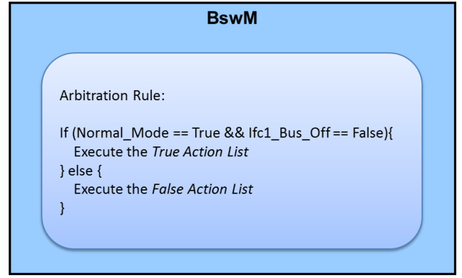
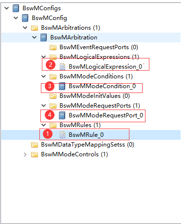
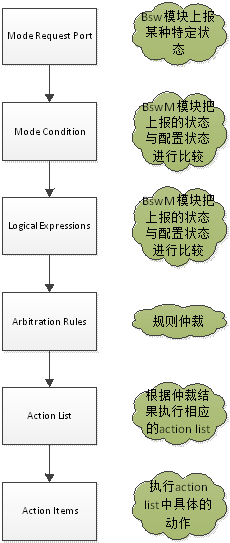
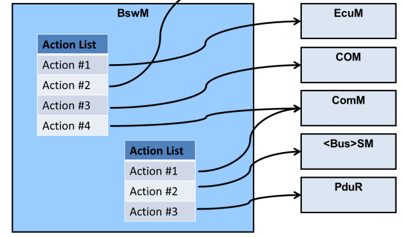
.. |image6| image:: ../../_static/参考手册/BswM/image6.png
   :width: 5.76736in
   :height: 2.04861in
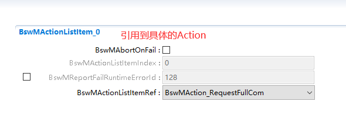
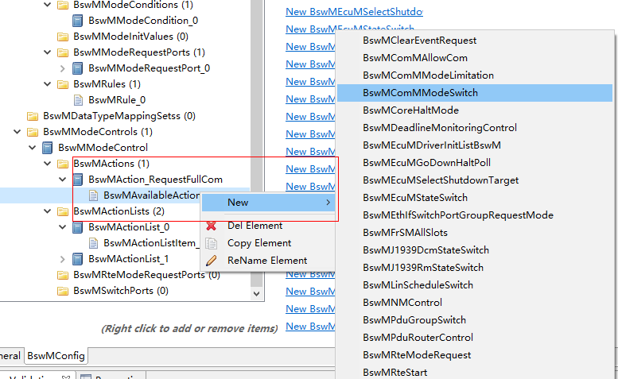
.. |image9| image:: ../../_static/参考手册/BswM/image9.png
   :width: 5.75in
   :height: 5.16458in
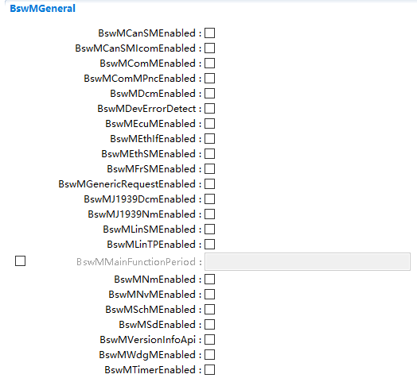
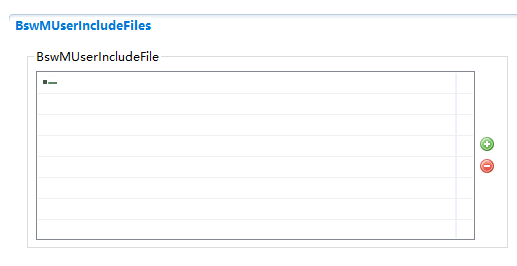

.. |image13| image:: ../../_static/参考手册/BswM/image13.png
   :width: 5.34308in
   :height: 2.72883in
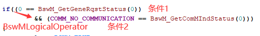

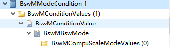
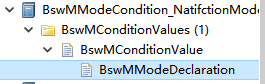

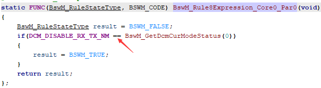
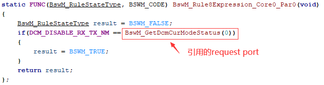
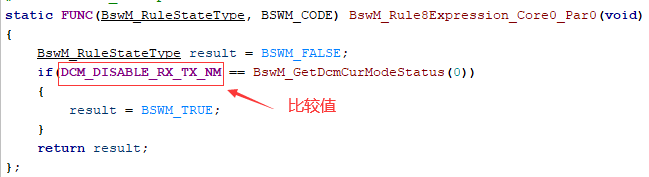

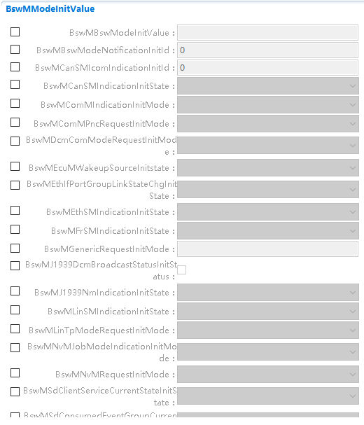
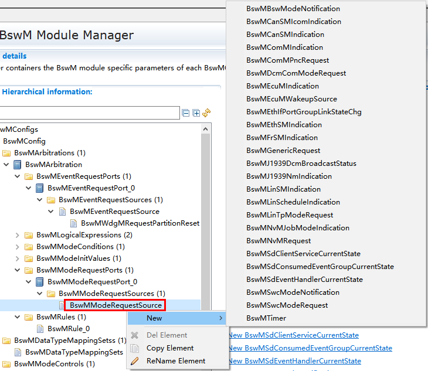
.. |image25| image:: ../../_static/参考手册/BswM/image25.png
   :width: 5.76736in
   :height: 1.84236in
.. |image26| image:: ../../_static/参考手册/BswM/image26.png
   :width: 5.37433in
   :height: 1.6977in
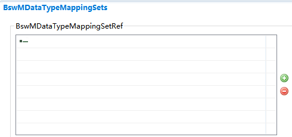
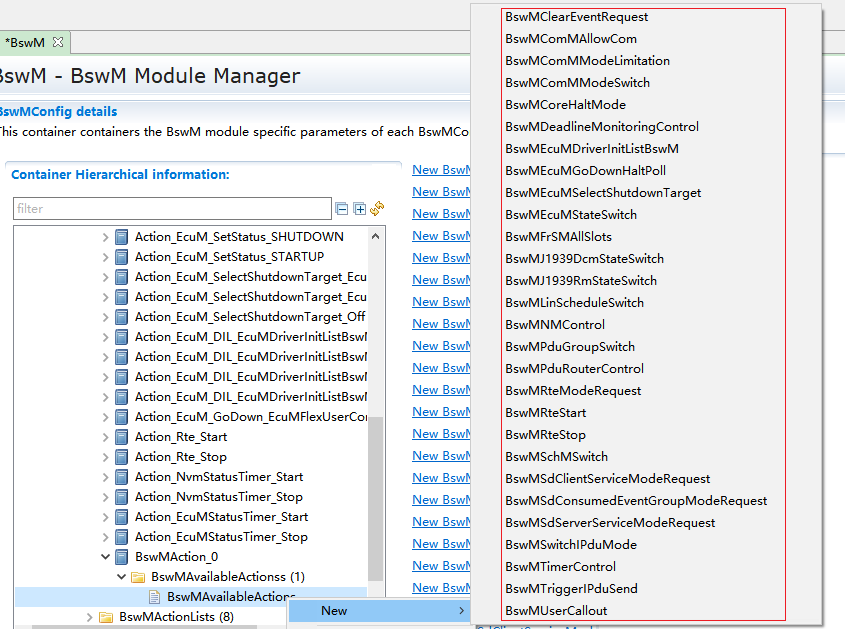
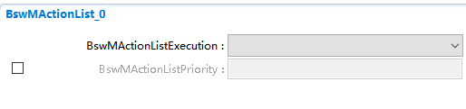
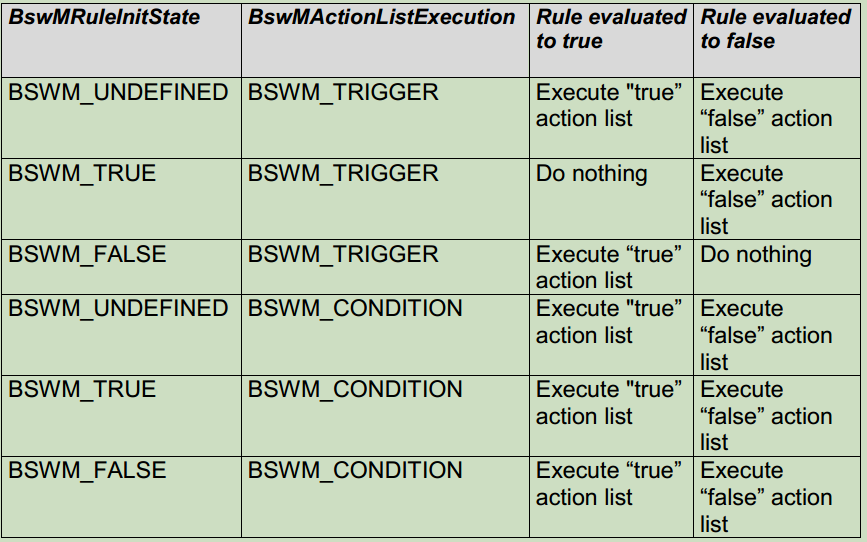
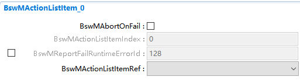
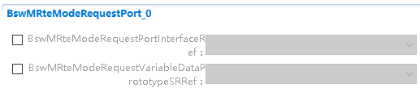

