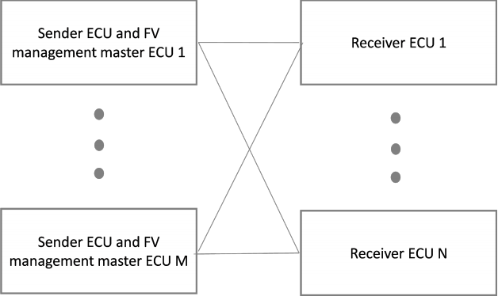
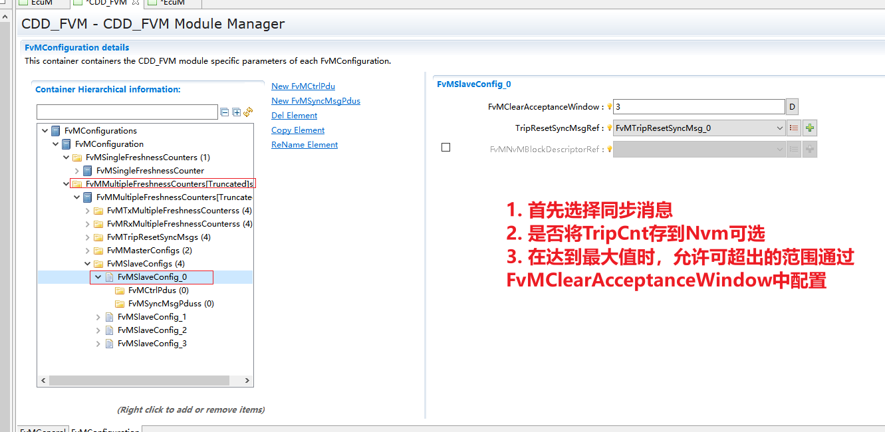
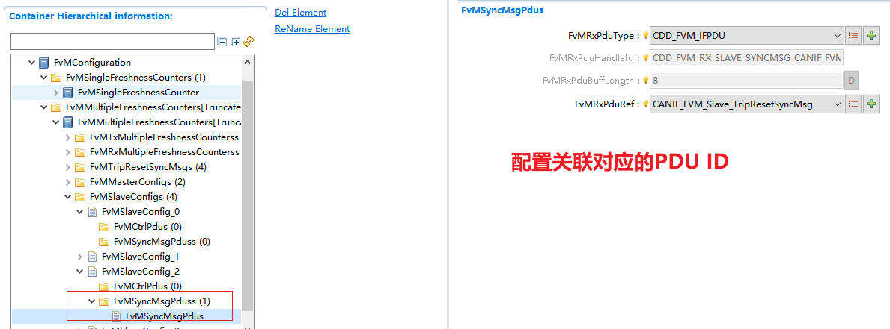
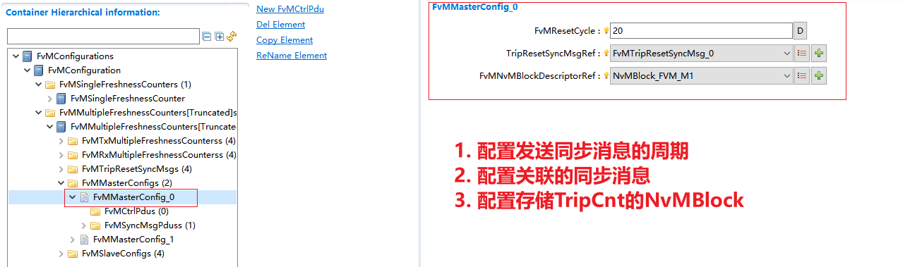

===================
CDD_FVM
===================

文档信息 Document Information
============================================================

版本历史 Version History
--------------------------------------------------------------------------------------------------------

.. list-table::
   :widths: 10 10 10 10 20
   :header-rows: 1

   * - 日期(Date)
     - 作者(Author)
     - 版本(Version)
     - 状态(Status)
     - 说明(Description)

   * - 2025/2/10
     - Jian.Jiang
     - V0.1
     - 发布(Release)
     - 首次发布(First release)

   * - 2025/04/04
     - Jian.Jiang
     - V1.0
     - 发布(Release)
     - 正式发布(Official release)

参考文档 References
--------------------------------------------------------------------------------------------------------

.. list-table::
   :widths: 10 10 30 10
   :header-rows: 1

   * - 编号(Number)
     - 分类(Classification)
     - 标题(Title)
     - 版本(Version)
   * - 1
     - Autosar
     - AUTOSAR_CP_EXP_LayeredSoftwareArchitecture.pdf
     - R23-11 
   * - 2
     - Autosar
     - AUTOSAR_CP_SWS_SecureOnboardCommunication.pdf
     - R23-11

术语与简写 Terms and Abbreviations
====================================================================

术语 Terms
--------------------------------------------------------------------------------------------------------

.. list-table::
   :widths: 10 40
   :header-rows: 1

   * - 术语(Terms)
     - 解释(Explanation)

   * - Authentication
     - 身份验证是与标识相关的服务。此功能适用于实体和信息本身。参与交流的两个政党应互相识别。通过通道传递的信息应验证有关来源，原始日期，数据内容，发送的时间等。由于这些原因，密码学的这一方面通常被细分为两个主要类别：实体身份验证和数据来源身份验证。数据来源身份验证隐式提供数据完整性（因为如果修改了消息，则源已更改）。(Authentication is a service related to identification. This function applies to both entities and the information itself. The two parties involved in communication shall identify each other. The information transmitted through the channel shall be verified regarding its source, original date, data content, transmission time, etc. For these reasons, this aspect of cryptography is usually divided into two main categories: entity authentication and data origin authentication. Data origin authentication implicitly provides data integrity (because if the message is modified, the source has changed).)

   * - Authentic I-PDU
     - 原始的I-PDU是一种任意的AutoSar I-PDU，其内容在网络传输过程中通过安全的I-PDU确保。(An Authentic I-PDU is an arbitrary AUTOSAR I-PDU whose content is ensured by a Secured I-PDU during network transmission.)

   * - Secured I-PDU
     - 安全的I-PDU是一种Autosar I-PDU，其中包含由其他身份验证信息补充的原始I-PDU的有效载荷。(A Secured I-PDU is an AUTOSAR I-PDU that contains the payload of an Authentic I-PDU supplemented with additional authentication information.)

简写 Abbreviations
--------------------------------------------------------------------------------------------------------

.. list-table::
   :widths: 10 20 30
   :header-rows: 1

   * - 简写(Abbreviation)
     - 全称(Full name)
     - 解释(Explanation)

   * - FV
     - Freshness Value
     - 新鲜度值

   * - FM
     - Freshness Manager
     - 新鲜度管理器

   * - SecOC
     - Secure Onboard Communication
     - 安全的机载通信 

简介 Introduction
===================================================

FVM模块主要为模块SecOC提供新鲜度值（FV），提供多种方式管理新鲜度值。

The FVM module mainly provides Freshness Values (FV) for the SecOC module and supports multiple methods for managing Freshness Values.

.. figure:: ../../../_static/参考手册/CDD_FVM/FVM架构图.png
   :alt: FVM模块层次图(FVM Module Hierarchy Diagram)
   :name: FVM_fig_arch
   :align: center

   FVM模块层次图. (FVM Module Layer Diagram.)

如图 :ref:`FVM_fig_arch` 所示，FVM模块处于AUTOSAR架构中的复杂驱动层，是非标准模块，只为SecOC模块提供新鲜度值。

As shown in Figure :ref:`FVM_fig_arch`, the FVM module is located in the Complex Driver Layer of the AUTOSAR architecture. It is a non-standard module and only provides Freshness Values for the SecOC module.

功能描述 Functional Description
==============================================

特性 Features
------------------------------------------------------------------------------

基于单个新鲜度计数器的新鲜度值 Freshness Value Based on a Single Freshness Counter
~~~~~~~~~~~~~~~~~~~~~~~~~~~~~~~~~~~~~~~~~~~~~~~~~~~~~~~~~~~~~~~~~~~~~~~~~~~~~~~~~~~~
在向接收器侧的SecOC提供认证信息之前，新鲜度计数器会递增。

Before providing authentication information to the SecOC on the receiver side, the Freshness Counter shall be incremented.

为了确保新鲜度，通信通道两侧的新鲜度计数器应同步递增。

To ensure freshness, the Freshness Counters on both sides of the communication channel shall be incremented synchronously.

对于每一条预期在接收方被识别为单个传入消息的传出消息，新鲜度计数器都必须递增。在接收端，每个接收到的消息（包括计数器更新）的MAC验证应精确执行一次。

For each outgoing message that is expected to be identified as a single incoming message at the receiver, the Freshness Counter must be incremented. On the receiver side, the MAC verification for each received message (including counter updates) shall be performed exactly once.

FVM模块应构建新鲜度验证值（即用于验证的新鲜度值）并将其提供给SecOC。如果完整的新鲜度值在安全的I-PDU中传输，则需要验证构造的新鲜度验证值是否大于最后存储的新鲜度价值概念。如果它不大于最后存储的新鲜度值概念，FVM应停止验证并丢弃安全I-PDU

The FVM module shall construct the Freshness Verification Value (i.e., the Freshness Value used for verification) and provide it to the SecOC. If the complete Freshness Value is transmitted in the Secured I-PDU, it is necessary to verify whether the constructed Freshness Verification Value is greater than the last stored Freshness Value concept. If it is not greater than the last stored Freshness Value concept, the FVM shall stop the verification and discard the Secured I-PDU.

基于多个新鲜度计数器的新鲜度值（前提条件：截断新鲜度值） Freshness Value Based on Multiple Freshness Counters (Prerequisite: Truncated Freshness Value)
~~~~~~~~~~~~~~~~~~~~~~~~~~~~~~~~~~~~~~~~~~~~~~~~~~~~~~~~~~~~~~~~~~~~~~~~~~~~~~~~~~~~~~~~~~~~~~~~~~~~~~~~~~~~~~~~~~~~~~~~~~~~~~~~~~~~~~~~~~~~~~~~~~~~~~~~

从解耦计数器构建新鲜度值。新鲜度值管理器（FVM）（SW-C或CDD）向SecOC提供新鲜度值（FV）。

The Freshness Value is constructed from decoupled counters. The Freshness Value Manager (FVM) (SW-C or CDD) provides the Freshness Value (FV) to the SecOC.

FVM在新鲜度值被截断的前提下支持FV的主从同步机制。主从同步机制有两种：单主同步和多主同步。

The FVM supports the master-slave synchronization mechanism for FVs under the prerequisite that the Freshness Value is truncated. There are two types of master-slave synchronization mechanisms: single-master synchronization and multi-master synchronization.

如下图所示单主方式主机只有一个，主机只提供同步信息，而不为SecOC提供新鲜度值，从机接收同步信息并为SecOC提供新鲜度值。

As shown in the figure below, in the single-master mode, there is only one master. The master only provides synchronization information and does not provide Freshness Values for the SecOC. The slaves receive the synchronization information and provide Freshness Values for the SecOC.

.. figure:: ../../../_static/参考手册/CDD_FVM/FVM_fig_FV_sync.png
   :alt: 单主同步方式(Single-Master Synchronization Mode)
   :name: FVM_fig_FV_sync
   :align: center

   单主同步方式。  (Single-Master Synchronization Mode.)

如下图所示多主方式主机有多个，主机提供同步信息和新鲜度值，从机接收同步信息并为SecOC提供新鲜度值。

As shown in the figure below, in the multi-master mode, there are multiple masters. The masters provide both synchronization information and Freshness Values, while the slaves receive the synchronization information and provide Freshness Values for the SecOC.

   多主同步方式。 (Multi-Master Synchronization Mode.)

新鲜度值的结构 Structure of the Freshness Value
************************************************************************************************************************************************************

.. figure:: ../../../_static/参考手册/CDD_FVM/FVM_fig_FV_struct.png
   :alt: 新鲜度值结构(Freshness Value Structure)
   :name: FVM_fig_FV_struct
   :align: center

   新鲜度值结构。 (Freshness Value Structure.)

每个计数器的说明如下表格：

The description of each counter is as follows:

.. list-table::
   :widths: 10 30
   :header-rows: 1

   * - Data
     - Description  

   * - Trip Counter (TripCnt)
     - FV管理主ECU以行程为单位递增此计数器。通过单一FV管理主方法，FV管理主ECU向发送方ECU和接收方ECU发送新的TripCnt作为同步消息（TripResetSyncMsg）。所有发送器和接收器ECU都保持此值。通过多FV管理主方法，发送方ECU向接收方ECU发送新的TripCnt作为同步消息。接收器ECU保持此值(The FV management master ECU increments this counter in units of trips. Through the single FV management master method, the FV management master ECU sends a new TripCnt to the sender ECU and receiver ECU as a synchronization message (TripResetSyncMsg). All sender and receiver ECUs maintain this value. Through the multi-FV management master method, the sender ECU sends a new TripCnt to the receiver ECU as a synchronization message. The receiver ECU maintains this value.)

   * - Reset counter (ResetCnt)
     - FV管理主ECU在ResetCycle配置的周期内定期递增此计数器。通过单一FV管理主方法，FV管理主ECU向发送方ECU和接收方ECU发送新的ResetCnt作为同步消息（TripResetSyncMsg）。所有发送器和接收器ECU都保持此值。通过多FV管理主方法，发送方ECU向接收方ECU发送新的ResetCnt作为同步消息。接收器ECU保持该值。(The FV management master ECU increments this counter periodically within the period configured by ResetCycle. Through the single FV management master method, the FV management master ECU sends a new ResetCnt to the sender ECU and receiver ECU as a synchronization message (TripResetSyncMsg). All sender and receiver ECUs maintain this value. Through the multi-FV management master method, the sender ECU sends a new ResetCnt to the receiver ECU as a synchronization message. The receiver ECU maintains this value.)

   * - Message counter (MsgCnt)
     - 此计数器随着发送器ECU的每次消息传输而递增。它由发送方ECU为每条安全消息进行管理。“MsgCntLow”是指消息计数器传输的截断新鲜度值中包含的范围（在SecOCFreshnessValueTxLength内）。“MsgCntUpper”是指未包含在消息计数器传输的截断新鲜度值中的范围（SecOCFreshnessValueTxLength之外）。(This counter is incremented with each message transmission by the sender ECU. It is managed by the sender ECU for each Secured Message. "MsgCntLow" refers to the range included in the truncated Freshness Value transmitted by the Message Counter (within SecOCFreshnessValueTxLength). "MsgCntUpper" refers to the range not included in the truncated Freshness Value transmitted by the Message Counter (outside SecOCFreshnessValueTxLength).)

   * - Reset Flag (ResetFlag)
     - 此标志与重置计数器同步更新。它是重置计数器下端的ResetFlagLength（位）值。(This flag is updated synchronously with the Reset Counter. It is the value of ResetFlagLength (in bits) at the lower end of the Reset Counter.)

用于构建新鲜度值的计数器规范 Counter Specifications for Constructing Freshness Values
********************************************************************************************************************************************************************************

新鲜度值的长度（SecOCFreshnessValueLength）不能超过64位，因此必须单独采用三个计数器（跳闸计数器、重置计数器、消息计数器）和重置标志中的每一个的长度，以满足其总长度不超过64位的要求。

The length of the Freshness Value (SecOCFreshnessValueLength) shall not exceed 64 bits. Therefore, the length of each of the three counters (Trip Counter, Reset Counter, Message Counter) and the Reset Flag must be selected individually to meet the requirement that their total length does not exceed 64 bits.

.. list-table::
   :widths: 10 20 20 10 10
   :header-rows: 1

   * - Counter
     - Increment condition  
     - Initialization condition
     - Initial value
     - Counter length

   * - Trip counter (TripCnt)
     - 1. When the FV management master ECU starts 2. On wakeup 3. On reset 4. When the power status changes: "IG-OFF=>IG-ON", incremented by 1
     - The increment conditions occur at the maximum value of the trip counter.
     - FV management master ECU: 1 Slave ECU: 0
     - TripCntLength Max 24 bit

   * - Reset counter (ResetCnt)
     - Incremented by 1 at regular time intervals (ResetCycle)
     - The trip counter is incremented or initialized
     - FV management master ECU: 1 Slave ECU: 0
     - ResetCntLength Max 24bit

   * - Message counter (MsgCnt)
     - Increment 1 value for each message transmission
     - The reset counter is incremented or initialized.
     - Slave ECU: 0
     - MsgCntLength Max 48 bit

   * - Reset Flag (ResetFlag)
     -  
     -  
     -  
     - ResetFlagLength Max 2bit

同步消息格式 Synchronization Message Format
*************************************************************************************************************************************************

FV管理主ECU和从ECU处理符合以下格式的同步消息：

The FV management master ECU and slave ECUs process synchronization messages that conform to the following format:

.. figure:: ../../../_static/参考手册/CDD_FVM/FVM_fig_FV_sync_msg.png
   :alt: 新鲜度值同步消息(Freshness Value Synchronization Message)
   :name: FVM_fig_FV_sync_msg
   :align: center

   新鲜度值同步消息。 (Freshness Value Synchronization Message.)

传输新鲜度值的构建 Construction of Transmitted Freshness Values
*************************************************************************************************************************************************

当SecOC请求获取用于传输的新鲜度值时，FVM根据下表构建用于传输的鲜度值。

When the SecOC requests to obtain the Freshness Value for transmission, the FVM constructs the Freshness Value for transmission according to the table below.

.. figure:: ../../../_static/参考手册/CDD_FVM/FVM_fig_Send_FV_build.png
   :alt: 发送新鲜度值构建(Construction of Transmitted Freshness Value)
   :name: FVM_fig_Send_FV_build
   :align: center

   发送新鲜度值构建。 (Construction of Transmitted Freshness Value.)

接收新鲜度值的构建 Construction of Received Freshness Values
*************************************************************************************************************************************************

当SecOC请求获取新鲜度值进行验证时，FVM根据以下三个结果，根据下表构建新鲜度值以进行验证。

When the SecOC requests to obtain the Freshness Value for verification, the FVM constructs the Freshness Value for verification according to the three results below and the table below.

.. figure:: ../../../_static/参考手册/CDD_FVM/FVM_fig_Recv_FV_build.png
   :alt: 接收新鲜度值构建(Construction of Received Freshness Value)
   :name: FVM_fig_Recv_FV_build
   :align: center

   接收新鲜度值构建。 (Construction of Received Freshness Value.)

偏差 Deviation
--------------------------------------------------------------------

None

集成 Integration
========================================

文件列表 File List
--------------------------------------------------------------------

静态文件 Static Files
~~~~~~~~~~~~~~~~~~~~~~~~~~~~~~~~~~~~~~~~

.. list-table::
   :widths: 10 30
   :header-rows: 1

   * - 文件(File)
     - 描述(Description)
   
   * - CDD_FVM.h
     - FVM通用API申明(Declaration of FVM general APIs)

   * - CDD_FVM_Internal.h
     - CDD_FVM定义的内部数据类型(Internal data types defined by CDD_FVM)

   * - CDD_FVM_MemMap.h
     - CDD_FVM所有变量、函数用到的MemMap机制包含头文件(Header file containing the MemMap mechanism used by all variables and functions of CDD_FVM)

   * - CDD_FVM_Types.h
     - CDD_FVM定义的数据类型定义(Definitions of data types defined by CDD_FVM)

   * - CDD_FVM.c
     - FVM模块提供的API（不与其他模块交互），以及内部函数等(APIs provided by the FVM module (that do not interact with other modules), as well as internal functions, etc.)

动态文件 Dynamic Files
~~~~~~~~~~~~~~~~~~~~~~~~~~~~~~~~~~~~~~~~

.. list-table::
   :widths: 10 30
   :header-rows: 1

   * - 文件(File)
     - 描述(Description)
   
   * - CDD_FVM_Cfg.h
     - CDD_FVM中所有PC配置数据以及宏定义(All PC configuration data and macro definitions in CDD_FVM)

   * - CDD_FVM_Cfg.c
     - 定义CDD_FVM模块PC/PB配置的结构体参数(Defines the structure parameters for PC/PB configuration of the CDD_FVM module)

错误处理 Error Handling
------------------------------------------------------------------------

开发错误 Development Errors
~~~~~~~~~~~~~~~~~~~~~~~~~~~~~~~~~~~~~~~~~~
.. list-table:: 
   :widths: 20 10 30
   :header-rows: 1

   * - Error code
     - Value[hex]
     - Description

   * - CDD_FVM_E_PARAM_POINTER
     - 0x01
     - Invalid pointer parameter

   * - CDD_FVM_E_PARAM_POINTER
     - 0x02
     - Module not initialized

   * - CDD_FVM_E_INVALID_PDU_SDU_ID
     - 0x03
     - Invalid PDU SDU ID 

   * - CDD_FVM_E_INIT_FAILED
     - 0x07
     - Initialization failed

产品错误 Product Errors
~~~~~~~~~~~~~~~~~~~~~~~~~~~~~~~~~~~~~~~~~~

None

运行时错误 Runtime Errors
~~~~~~~~~~~~~~~~~~~~~~~~~~~~~~~~~~~~~~~~~~

None

接口描述 Interface Description
==============================================================

.. include:: CDD_FVM_api.rst

依赖的服务 Applicable Services
------------------------------------------------------------------------------------------------------------

强制接口 Compulsory interface
~~~~~~~~~~~~~~~~~~~~~~~~~~~~~~~~~~~~~~~~~~~~~~~~~~~~~~~~~~~~~~~~

.. list-table::
   :widths: 10 5 30
   :header-rows: 1

   * - API Function
     - Header File
     - Description

   * - Det_ReportRuntimeError 
     - Det.h
     - Service to report runtime errors. If a callout has been configured then this callout shall be called.

   * - TcpIp_Bind 
     - TcpIp.h
     - By this API service the TCP/IP stack is requested to bind a UDP or TCP socket to a local resource.

可选接口 Optional Interface
~~~~~~~~~~~~~~~~~~~~~~~~~~~~~~~~~~~~~~~~~~~~~~~~~~~~~~~~~~~~~~~~

.. list-table::
   :widths: 10 5 30
   :header-rows: 1

   * - API Function
     - Header File
     - Description

   * - Det_ReportError 
     - Det.h
     - Service to report development errors.

   * - PduR_CDD_FVMTransmit 
     - PduR_CDD_FVM.h
     - Requests transmission of a PDU.

配置 Configuration
====================================

基于单一计数器新鲜度配置 Freshness Configuration Based on a Single Counter
----------------------------------------------------------------------------------------------------------------------------------------------------------------------------------------------------------------------------

用户选择单一计数器为SecOC提供新鲜度值时，发送在容器FvMTxSingleFReshnessCounter中配置； 接收在容器FvMRxSingleFReshnessCounter中配置。

When the user selects a single counter to provide Freshness Values for the SecOC, the transmission is configured in the container FvMTxSingleFreshnessCounter; the reception is configured in the container FvMRxSingleFreshnessCounter.

基于单一计数器新鲜度TX配置 TX Configuration of Freshness Based on a Single Counter
~~~~~~~~~~~~~~~~~~~~~~~~~~~~~~~~~~~~~~~~~~~~~~~~~~~~~~~~~~~~~~~~~~~~~~~~~~~~~~~~~~~~~~~~~~~~~
针对不同的SecOC都需要单独配置FvMTxSingleFReshnessCounter，不可以共用一个FvMTxSingleFReshnessCounter，其下的FvMTxSecOCPduProcessintRef引用的是SecOC模块中的配置SecOCTxPduProcessing。

A separate FvMTxSingleFreshnessCounter shall be configured for each different SecOC; sharing a single FvMTxSingleFreshnessCounter is not allowed. The FvMTxSecOCPduProcessingRef under it references the configuration SecOCTxPduProcessing in the SecOC module.

.. figure:: ../../../_static/参考手册/CDD_FVM/FVM_fig_FVM_Single_FV_TX_Cfg.png
    :alt: 单一新鲜度值发送配置(Single Freshness Value Transmission Configuration)
    :name: FVM_fig_FVM_Single_FV_TX_Cfg
    :align: center
  
    单一新鲜度值发送配置。 (Single Freshness Value Transmission Configuration.)

基于单一计数器新鲜度RX配置 RX Configuration of Freshness Based on a Single Counter
~~~~~~~~~~~~~~~~~~~~~~~~~~~~~~~~~~~~~~~~~~~~~~~~~~~~~~~~~~~~~~~~~~~~~~~~~~~~~~~~~~~~~~~~~~~~~
针对不同的SecOC都需要单独配置FvMRxSingleFReshnessCounter，不可以共用FvMRxSingleFReshnessCounter，其下的FvMRxSecOCPduProcessintRef引用的是SecOC模块中的配置SecOCRxPduProcessing。

A separate FvMRxSingleFreshnessCounter shall be configured for each different SecOC; sharing a single FvMRxSingleFreshnessCounter is not allowed. The FvMRxSecOCPduProcessingRef under it references the configuration SecOCRxPduProcessing in the SecOC module.

.. figure:: ../../../_static/参考手册/CDD_FVM/FVM_fig_FVM_Single_FV_RX_Cfg.png
    :alt: 单一新鲜度值接收配置(Single Freshness Value Reception Configuration)
    :name: FVM_fig_FVM_Single_FV_RX_Cfg
    :align: center

    单一新鲜度值接收配置。 (Single Freshness Value Reception Configuration.)

基于复合计数器的新鲜度值配置 Freshness Value Configuration Based on Multiple Counters
----------------------------------------------------------------------------------------------------------------------------------------------------------------------------------------------------------------------------

使用复合计数器为SecOC提供新鲜度值时，需要有以下步骤：

When using multiple counters to provide Freshness Values for the SecOC, the following steps are required:

1.首先在容器FvMTripResetSyncMsg配置同步报文信息;

1.First, configure the synchronization message information in the container FvMTripResetSyncMsg;

2.然后在容器FvMSlaveConfig配置从机信息;

2.Then, configure the slave information in the container FvMSlaveConfig;

3.最后在容器FvMTxMultipleFreshnessCounters/FvMRxMultipleFreshnessCounters中配置对应Secoc发送或者接收的新鲜度值。

3.Finally, configure the Freshness Values corresponding to SecOC transmission or reception in the container FvMTxMultipleFreshnessCounters/FvMRxMultipleFreshnessCounters.

基于复合计数器从机配置 Slave Configuration Based on Multiple Counters
~~~~~~~~~~~~~~~~~~~~~~~~~~~~~~~~~~~~~~~~~~~~~~~~~~~~~~~~~~~~~~~~~~~~~~~~~~~~~~~~~~~~~~~~~~~~~~~~

1.配置同步报文信息。

1.Configure the synchronization message information.

.. figure:: ../../../_static/参考手册/CDD_FVM/FVM_fig_FVM_Sync_Msg_Cfg.png
    :alt: 同步报文配置(Synchronization Message Configuration)
    :name: FVM_fig_FVM_Sync_Msg_Cfg
    :align: center

    同步报文配置。 (Synchronization Message Configuration.)

2.配置从机信息, 如果处于单主系统中必须配置接收同步消息报文的Pdu(FvMSyncMsgPdus)。从机配置如图 :ref:`FVM_fig_FVM_Slave_Cfg` 所示， 同步消息配置如图 :ref:`FVM_fig_FVM_Slave_Sync_Msg_Cfg` 所示。

2.Configure the slave information. If the system is a single-master system, the Pdu for receiving synchronization messages (FvMSyncMsgPdus) must be configured. The slave configuration is shown in Figure :ref:`FVM_fig_FVM_Slave_Cfg`, and the synchronization message configuration is shown in Figure :ref:`FVM_fig_FVM_Slave_Sync_Msg_Cfg`.

    从机配置。 (Slave Configuration.)

    从机同步消息配置。 (Slave Synchronization Message Configuration.)

基于复合计数器的主机配置 Master Configuration Based on Multiple Counters
~~~~~~~~~~~~~~~~~~~~~~~~~~~~~~~~~~~~~~~~~~~~~~~~~~~~~~~~~~~~~~~~~~~~~~~~~~~~~~~~~~~~~~~~~~~~~~~~~~~~~~~

1.通过配置FvMEnableMasterECU 使能主机配置功能。

1.Enable the master configuration function by configuring FvMEnableMasterECU.

2.配置FvMSupportMuiltMaster使能多主机配置功能。

2.Enable the multi-master configuration function by configuring FvMSupportMultiMaster.

3.配置主机信息，主机配置如图 :ref:`FVM_fig_FVM_Master_Cfg` 所示。主机同步消息配置如图 :ref:`FVM_fig_FVM_Master_Sync_Msg_Cfg` 所示。

3.Configure the master information. The master configuration is shown in Figure :ref:`FVM_fig_FVM_Master_Cfg`. The master synchronization message configuration is shown in Figure :ref:`FVM_fig_FVM_Master_Sync_Msg_Cfg`.

    主机配置。 (Master Configuration.)

.. figure:: ../../../_static/参考手册/CDD_FVM/FVM_fig_FVM_Master_Sync_Msg_Cfg.png
    :alt: 主机同步消息配置(Master Synchronization Message Configuration)
    :name: FVM_fig_FVM_Master_Sync_Msg_Cfg
    :align: center

    主机同步消息配置。 (Master Synchronization Message Configuration.)

4.使能了FvMSupportMuiltMaster，可以配置多组FvMMasterConfig，如果从机与主机在同一ECU上，则配置FvMMasterConfig中的TripResetSyncMsgRef与FvMSlaveConfig中的TripResetSyncMsgRef相同。

4.If FvMSupportMuiltMaster is enabled, multiple sets of FvMMasterConfig can be configured. If the slave and master are on the same ECU, the TripResetSyncMsgRef in FvMMasterConfig shall be the same as the TripResetSyncMsgRef in FvMSlaveConfig.

基于复合计数器新鲜度TX配置 TX Configuration of Freshness Based on Multiple Counters
~~~~~~~~~~~~~~~~~~~~~~~~~~~~~~~~~~~~~~~~~~~~~~~~~~~~~~~~~~~~~~~~~~~~~~~~~~~~~~~~~~~~~~~~~~~~~

1.针对不同的SecOC都需要单独配置FvMTxMultipleFreshnessCounters，不可以共用一个FvMTxMultipleFreshnessCounters，其下的FvMTxSecOCPduProcessintRef引用的是SecOC模块中的配置SecOCTxPduProcessing。

1.A separate FvMTxMultipleFreshnessCounters shall be configured for each different SecOC; sharing a single FvMTxMultipleFreshnessCounters is not allowed. The FvMTxSecOCPduProcessingRef under it references the configuration SecOCTxPduProcessing in the SecOC module.

.. figure:: ../../../_static/参考手册/CDD_FVM/FVM_fig_FVM_Multiple_FV_TX_Cfg.png
    :alt: 发送复合新鲜度值配置(Configuration of Transmitted Composite Freshness Value)
    :name: FVM_fig_FVM_Multiple_FV_TX_Cfg
    :align: center

    发送复合新鲜度值配置。 (Configuration of Transmitted Composite Freshness Value.)

2.基于复合计数器新鲜度TX新鲜度值分配

2.Allocation of TX Freshness Value Based on Multiple Counters

.. figure:: ../../../_static/参考手册/CDD_FVM/FVM_fig_FVM_Multiple_FV_TX_FV_Cfg.png
    :alt: 发送复合新鲜度值结构配置(Structure Configuration of Transmitted Composite Freshness Value)
    :name: FVM_fig_FVM_Multiple_FV_TX_FV_Cfg
    :align: center

    发送复合新鲜度值结构配置。 (Structure Configuration of Transmitted Composite Freshness Value.)

基于复合计数器新鲜度RX配置 RX Configuration of Freshness Based on Multiple Counters
~~~~~~~~~~~~~~~~~~~~~~~~~~~~~~~~~~~~~~~~~~~~~~~~~~~~~~~~~~~~~~~~~~~~~~~~~~~~~~~~~~~~~~

1.针对不同的SecOC都需要单独配置FvMRxMultipleFreshnessCounters，不可以共用FvMRxMultipleFreshnessCounters，其下的FvMRxSecOCPduProcessintRef引用的是SecOC模块中的配置SecOCRxPduProcessing。

1.A separate FvMRxMultipleFreshnessCounters shall be configured for each different SecOC; sharing a single FvMRxMultipleFreshnessCounters is not allowed. The FvMRxSecOCPduProcessingRef under it references the configuration SecOCRxPduProcessing in the SecOC module.

.. figure:: ../../../_static/参考手册/CDD_FVM/FVM_fig_FVM_Multiple_FV_RX_Cfg.png
    :alt: 接收复合新鲜度值配置(Configuration of Received Composite Freshness Value)
    :name: FVM_fig_FVM_Multiple_FV_RX_Cfg
    :align: center

    接收复合新鲜度值配置。 (Configuration of Received Composite Freshness Value.)

2.基于复合计数器新鲜度RX新鲜度值分配

2.Allocation of RX Freshness Value Based on Multiple Counters

.. figure:: ../../../_static/参考手册/CDD_FVM/FVM_fig_FVM_Multiple_FV_RX_FV_Cfg.png
    :alt: 接收复合新鲜度值结构配置(Structure Configuration of Received Composite Freshness Value)
    :name: FVM_fig_FVM_Multiple_FV_RX_FV_Cfg
    :align: center

    接收复合新鲜度值结构配置。 (Structure Configuration of Received Composite Freshness Value.)
