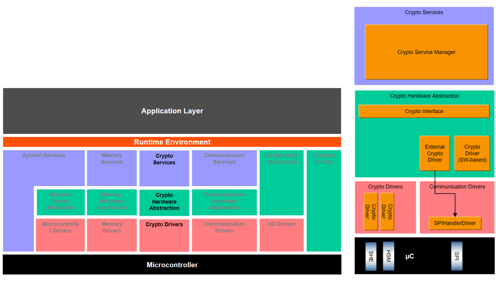
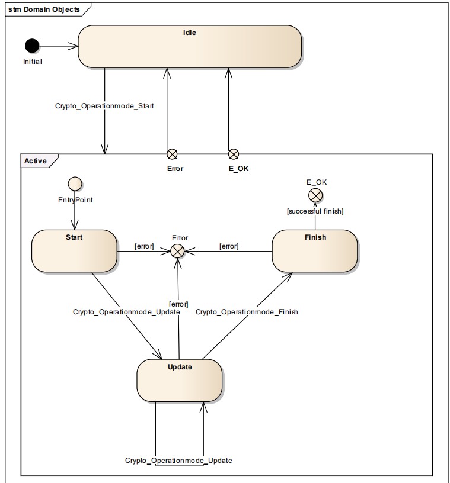
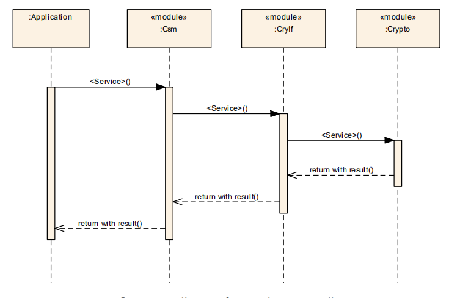
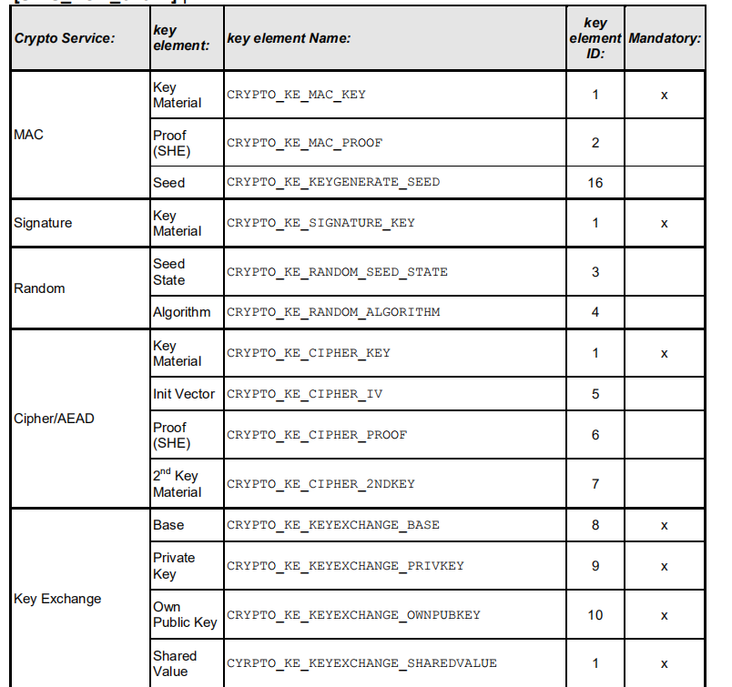
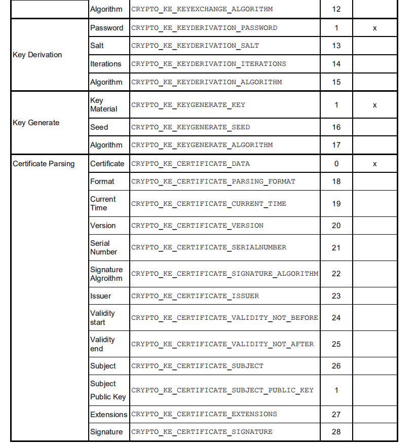
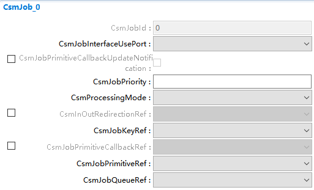
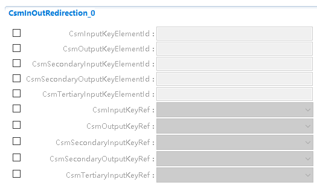
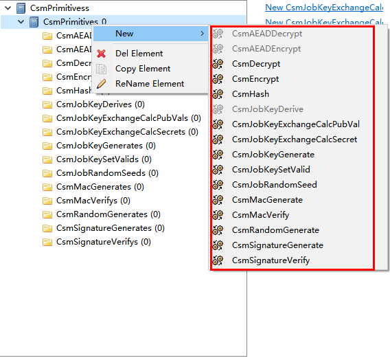

===================
CSM产品参考手册
===================

**缩写词注解**

+----------+-----------------------------+-----------------------------+
| **       | **解释/描述**               | **中文解释**                |
| 缩写词** |                             |                             |
+----------+-----------------------------+-----------------------------+
| CSM      | Crypto Service Manager      | 加密服务管理                |
+----------+-----------------------------+-----------------------------+
| CRYIF    | Crypto Interface            | 加密接口层                  |
+----------+-----------------------------+-----------------------------+
| CRYPTO   | Crypto Driver               | 加密驱                      |
|          |                             | 动（硬件驱动或者软件驱动）  |
+----------+-----------------------------+-----------------------------+
| DET      | Default Error Tracer        | 开发错误检测模块            |
+----------+-----------------------------+-----------------------------+
| HSM      | Hardware Security Module    | 硬件中用于计算加密算法      |
|          |                             | 的模块（相当于另外一块CPU） |
+----------+-----------------------------+-----------------------------+
| Job      | CsmJob                      | CSM模块中的                 |
|          |                             | 一个加密处理任务，一般每个J |
|          |                             | ob会引用到一个cryptographic |
|          |                             | primitive                   |
+----------+-----------------------------+-----------------------------+

简介
====

CSM应提供同步或异步服务，以支持对所有软件模块的基本密码功能的唯一访问。CSM应该提供一个抽象层，它为更高的软件层提供一个标准化的接口来访问这些功能。软件模块所需的功能可能与其他软件模块所需的功能不同。因此，应该可以为每个软件模块单独配置和初始化CSM提供的服务。此配置还包括对CSM服务的同步或异步处理的选择。CSM模块的构建遵循通用方法。如果结构和接口的详细规范限制了CSM的可用性范围，则以通用方式定义接口和结构。这为将来的扩展提供了机会。

|image1|

图1-1 Crypto架构图

参考资料
--------

[1] AUTOSAR_SWS_CryptoServiceManager.pdf，R19-11

功能描述
========

基本功能
--------

CSM是一种提供加密功能的服务，它基于一个依赖于软件库或硬件模块的加密驱动程序。此外，混合设置与多个密码驱动程序是可能的。CSM通过CRYIF访问不同的加密驱动程序。

一般功能
--------

CSM通过引入Job的概念来处理加密工作。

Job是已配置的密码原语的实例，对于每个Job，CSM每次只能处理一个实例，但允许不同Job的并行处理，如果一个服务请求正被相应的Job处理，此时来了另一个相同Job的要求，CSM应当返回CRYPTO_E_BUSY。

:mark:`注意`：Job正在被处理意味着相应的加密驱动程序对象正在积极地处理这个Job。当一个Job没有完成，但是加密驱动程序对象没有被激活，这并不意味着这个Job正在被处理。如果配置了异步接口，则CSM模块应提供一个主函数Csm_MainFunction()，该主函数被循环调用，以通过状态机控制Job的处理。

Job状态
~~~~~~~

将单一的调用函数与加密Job的流方式相结合，需要模式参数，它决定了加密Job的运行模式。此服务操作是一个标志字段，指示操作模式启动、更新或完成，它显式地声明应该执行什么操作。这些操作模式可以混合使用，并同时执行。状态的实际事务是在与这些状态一起工作的层中进行的，即在加密驱动程序中。

|image2|

图2-1 Job状态图

单调用方法不需要多次调用显式API，只需要调用一次即可。由于单调用的开销小，可以提高性能，所以多用于需要快速处理的小数据输入过程中。当使用流方法(启动、更新、完成)操作时，专用的加密驱动程序对象正在等待进一步的输入(更新)，直到到达完成状态。同时，不能在此加密驱动程序实例上处理其他Job。

同步Job
~~~~~~~

如果使用同步接口，则接口函数将必要的信息传递给底层加密堆栈模块并等待返回结果。

|image3|

图2-2 同步任务执行流程图

异步Job
~~~~~~~

如果使用异步接口，则接口函数只能将必要的信息传递给底层加密堆栈模块，然后等待底层处理完成调用回调函数通知CSM。

|image4|

图2-3 异步任务执行流程图

Queue相关
~~~~~~~~~

Quene，即队列，为CSM内部针对Job设置的一个功能，CSM应在内部完成对其的操作。

CSM可能有多个队列，其中的Job根据其优先级排列，以处理多个加密请求。从CSM队列通过CryIf到加密驱动程序对象的路径称为通道。CSM的每个队列都映射到一个通道，以访问crypto驱动程序对象的crypto原语。队列的大小是可配置的。为了优化加密驱动程序对象的硬件使用，加密驱动程序中还有一个可选的队列。加密驱动程序对象表示独立加密设备(硬件或软件，如AES加速器)的实例。对于具有高优先级的Job，HSM上可以有一个用于快速AES和CMAC计算的通道，该通道在加密驱动程序中的本地AES计算服务上结束。但同时，加密驱动程序对象也可能是软件，例如用于RSA计算，用户能够加密、解密、签名或验证数据。

在同步Job处理中，队列将不起作用。因此，如果选择同步Job处理，则队列大小应该为0。但是，也可以将通道(包括队列)与同步和异步Job一起使用。可以在Csm_MainFunction()中将排队的Job传递给CRYIF。如果Job的状态是活动的，则CSM应假定映射的加密驱动程序实例当前正在处理该Job，而调用者希望继续操作(例如，使用update提供更多数据)，必须在加密驱动程序实例中执行可信性检查。

Key管理功能
~~~~~~~~~~~

Key，即对应的keyid具有配置给出的符号名称。Crypto堆栈API使用来自CSM模块的以下关键元素索引定义：

|image5|

|image6|

图2-4 KeyElement示意图

对于包含加密密钥材料的每个密钥元素，应在用于数据交换的配置中指定所提供密钥的格式，例如Csm_KeyElementGet()或Csm_KeyElementSet()。特定密码驱动程序支持的密钥格式是随密码驱动程序一起提供的预配置信息的一部分。

特定于供应商的keyelementid应该启动1000来避免对未来扩展版本的加密堆栈的干扰。关键元素CRYPTO_KE\_[…]_ALGORITHM用于配置密钥管理函数的行为，因为它们独立于Job，因此不能像原语那样进行配置。

源文件描述
==========

表3-1 CSM组件文件描述

+-------------------+--------------------------------------------------+
| **文件**          | **说明**                                         |
+-------------------+--------------------------------------------------+
| CSM.c             | CSM模块源文件，包含了API函数的实现。             |
+-------------------+--------------------------------------------------+
| CSM.h             | CSM模块头文件，包                                |
|                   | 含了API函数的扩展声明并定义了配置的数据结构体。  |
+-------------------+--------------------------------------------------+
| CSM_Cfg.h         | 定义CSM模块预编译时用到的配置参数。              |
+-------------------+--------------------------------------------------+
| CSM_Cfg.c         | CSM模块配置生成文件。                            |
+-------------------+--------------------------------------------------+
| CSM_Cbk.h         | 包含CSM供上层调用的API函数的声明                 |
+-------------------+--------------------------------------------------+
| CSM_Internal.h    | 包含CSM内部的变量和数据结构体的定义              |
+-------------------+--------------------------------------------------+
| CSM_MemMap.h      | CSM编译抽象文件                                  |
+-------------------+--------------------------------------------------+

API接口
=======

类型定义 
---------

Csm_ConfigType类型定义
~~~~~~~~~~~~~~~~~~~~~~

+-----------+----------------------------------------------------------+
| 名称      | Csm_ConfigType                                           |
+-----------+----------------------------------------------------------+
| 类型      | Structure                                                |
+-----------+----------------------------------------------------------+
| 范围      | 无                                                       |
+-----------+----------------------------------------------------------+
| 描述      | Csm模块的配置数据结构体                                  |
+-----------+----------------------------------------------------------+

Crypto_InputOutputRedirectionConfigType类型定义
~~~~~~~~~~~~~~~~~~~~~~~~~~~~~~~~~~~~~~~~~~~~~~~

+-----------+----------------------------+----------------------------+
| 名称      | Crypto_InputO              |                            |
|           | utputRedirectionConfigType |                            |
+-----------+----------------------------+----------------------------+
| 类型      | Enumeration                |                            |
+-----------+----------------------------+----------------------------+
| 范围      | CRYPTO_RED                 | 0x01                       |
|           | IRECT_CONFIG_PRIMARY_INPUT |                            |
+-----------+----------------------------+----------------------------+
|           | CRYPTO_REDIR               | 0x02                       |
|           | ECT_CONFIG_SECONDARY_INPUT |                            |
+-----------+----------------------------+----------------------------+
|           | CRYPTO_REDI                | 0x04                       |
|           | RECT_CONFIG_TERTIARY_INPUT |                            |
+-----------+----------------------------+----------------------------+
|           | CRYPTO_REDI                | 0x10                       |
|           | RECT_CONFIG_PRIMARY_OUTPUT |                            |
+-----------+----------------------------+----------------------------+
|           | CRYPTO_REDIRE              | 0x20                       |
|           | CT_CONFIG_SECONDARY_OUTPUT |                            |
+-----------+----------------------------+----------------------------+
| 描述      | Csm模块的配置数据结构体    |                            |
+-----------+----------------------------+----------------------------+

Crypto_JobType类型定义
~~~~~~~~~~~~~~~~~~~~~~

+-----------+----------------------------------------------------------+
| 名称      | Crypto_JobType                                           |
+-----------+----------------------------------------------------------+
| 类型      | Structure                                                |
+-----------+----------------------------------------------------------+
| 范围      | 无                                                       |
+-----------+----------------------------------------------------------+
| 描述      | Csm模块执行的Job结构类型                                 |
+-----------+----------------------------------------------------------+

Crypto_JobStateType类型定义
~~~~~~~~~~~~~~~~~~~~~~~~~~~

+-----------+----------------------------------------------------------+
| 名称      | Crypto_JobStateType                                      |
+-----------+----------------------------------------------------------+
| 类型      | Enumeration                                              |
+-----------+----------------------------------------------------------+
| 范围      | 无                                                       |
+-----------+----------------------------------------------------------+
| 描述      | 当前job状态的枚举                                        |
+-----------+----------------------------------------------------------+

Crypto_JobPrimitiveInputOutputType类型定义
~~~~~~~~~~~~~~~~~~~~~~~~~~~~~~~~~~~~~~~~~~

+-----------+----------------------------------------------------------+
| 名称      | Crypto_JobPrimitiveInputOutputType                       |
+-----------+----------------------------------------------------------+
| 类型      | Structure                                                |
+-----------+----------------------------------------------------------+
| 范围      | 无                                                       |
+-----------+----------------------------------------------------------+
| 描述      | 包含依赖于job和密码原语的输入和输出信息的结构体          |
+-----------+----------------------------------------------------------+

Crypto_JobInfoType类型定义
~~~~~~~~~~~~~~~~~~~~~~~~~~

+-----------+----------------------------------------------------------+
| 名称      | Crypto_JobInfoType                                       |
+-----------+----------------------------------------------------------+
| 类型      | Structure                                                |
+-----------+----------------------------------------------------------+
| 范围      | 无                                                       |
+-----------+----------------------------------------------------------+
| 描述      | 包含job信息(jobID和job优先级)的结构体                    |
+-----------+----------------------------------------------------------+

Crypto_JobPrimitiveInfoType类型定义
~~~~~~~~~~~~~~~~~~~~~~~~~~~~~~~~~~~

+-----------+----------------------------------------------------------+
| 名称      | Crypto_JobPrimitiveInfoType                              |
+-----------+----------------------------------------------------------+
| 类型      | Structure                                                |
+-----------+----------------------------------------------------------+
| 范围      | 无                                                       |
+-----------+----------------------------------------------------------+
| 描述      | 包含进一步的信息，这取决于job和密码原语的结构体          |
+-----------+----------------------------------------------------------+

Crypto_JobRedirectionInfoType类型定义
~~~~~~~~~~~~~~~~~~~~~~~~~~~~~~~~~~~~~

+-----------+----------------------------------------------------------+
| 名称      | Crypto_JobRedirectionInfoType                            |
+-----------+----------------------------------------------------------+
| 类型      | Structure                                                |
+-----------+----------------------------------------------------------+
| 范围      | 无                                                       |
+-----------+----------------------------------------------------------+
| 描述      | 包含依赖于job和密码原语的输入和输出信息的结构体          |
+-----------+----------------------------------------------------------+

Crypto_AlgorithmInfoType类型定义
~~~~~~~~~~~~~~~~~~~~~~~~~~~~~~~~

+-----------+----------------------------------------------------------+
| 名称      | Crypto_AlgorithmInfoType                                 |
+-----------+----------------------------------------------------------+
| 类型      | Structure                                                |
+-----------+----------------------------------------------------------+
| 范围      | 无                                                       |
+-----------+----------------------------------------------------------+
| 描述      | 决定了精确的算法的结构体。注意，                         |
|           | 不是每个算法都需要指定所有字段。AUTOSAR只允许有效的组合  |
+-----------+----------------------------------------------------------+

Crypto_ProcessingType类型定义
~~~~~~~~~~~~~~~~~~~~~~~~~~~~~

+-----------+----------------------------------------------------------+
| 名称      | Crypto_ProcessingType                                    |
+-----------+----------------------------------------------------------+
| 类型      | Enumeration                                              |
+-----------+----------------------------------------------------------+
| 范围      | 同步或者异步                                             |
+-----------+----------------------------------------------------------+
| 描述      | 决定了Job的处理方式（同步或者异步）                      |
+-----------+----------------------------------------------------------+

Crypto_PrimitiveInfoType类型定义
~~~~~~~~~~~~~~~~~~~~~~~~~~~~~~~~

+-----------+----------------------------------------------------------+
| 名称      | Crypto_PrimitiveInfoType                                 |
+-----------+----------------------------------------------------------+
| 类型      | Structure                                                |
+-----------+----------------------------------------------------------+
| 范围      | 无                                                       |
+-----------+----------------------------------------------------------+
| 描述      | 包含有关密码原语的基本信息的结构体                       |
+-----------+----------------------------------------------------------+

Csm_ConfigIdType类型定义
~~~~~~~~~~~~~~~~~~~~~~~~

+-----------+----------------------------------------------------------+
| 名称      | Csm_ConfigIdType                                         |
+-----------+----------------------------------------------------------+
| 类型      | uint16                                                   |
+-----------+----------------------------------------------------------+
| 范围      | 0..65535                                                 |
+-----------+----------------------------------------------------------+
| 描述      | 通过在服务中唯一的数字标识符标识CSM服务配置              |
|           |                                                          |
|           | CSM服务配置的名称，即容器的名称                          |
|           |                                                          |
|           | Csm\_<Service>Config，作为该参数的符号名                 |
+-----------+----------------------------------------------------------+

输入函数描述
------------

+----------------------------------+-----------------------------------+
| **输入模块**                     | **API**                           |
+----------------------------------+-----------------------------------+
| Det                              | Det_ReportError                   |
+----------------------------------+-----------------------------------+
| CryIf                            | CryIf_ProcessJob                  |
+----------------------------------+-----------------------------------+
|                                  | CryIf_CancelJob                   |
+----------------------------------+-----------------------------------+
|                                  | CryIf_KeyElementSet               |
+----------------------------------+-----------------------------------+
|                                  | CryIf_KeySetValid                 |
+----------------------------------+-----------------------------------+
|                                  | CryIf_KeyElementGet               |
+----------------------------------+-----------------------------------+
|                                  | CryIf_KeyElementCopy              |
+----------------------------------+-----------------------------------+
|                                  | CryIf_KeyCopy                     |
+----------------------------------+-----------------------------------+
|                                  | CryIf_RandomSeed                  |
+----------------------------------+-----------------------------------+
|                                  | CryIf_KeyGenerate                 |
+----------------------------------+-----------------------------------+
|                                  | CryIf_KeyExchangeCalcSecret       |
+----------------------------------+-----------------------------------+
|                                  | CryIf_CertificateParse            |
+----------------------------------+-----------------------------------+
|                                  | CryIf_CertificateVerify           |
+----------------------------------+-----------------------------------+

静态接口函数定义
----------------

Csm_Init函数定义
~~~~~~~~~~~~~~~~

+-------------+-------------------+---------+-------------------------+
| 函数名称：  | Csm_Init          |         |                         |
+-------------+-------------------+---------+-------------------------+
| 函数原型：  | FUNC(void,        |         |                         |
|             | CSM_CODE)         |         |                         |
|             |                   |         |                         |
|             | Csm_Init(         |         |                         |
|             |                   |         |                         |
|             | P2CONS            |         |                         |
|             | T(Csm_ConfigType, |         |                         |
|             | AUTOMATIC,        |         |                         |
|             | CSM_APPL_DATA)    |         |                         |
|             | configPtr         |         |                         |
|             |                   |         |                         |
|             | )                 |         |                         |
+-------------+-------------------+---------+-------------------------+
| 服务编号：  | 0x00              |         |                         |
+-------------+-------------------+---------+-------------------------+
| 同步/异步： | 同步              |         |                         |
+-------------+-------------------+---------+-------------------------+
| 是          | 否                |         |                         |
| 否可重入：  |                   |         |                         |
+-------------+-------------------+---------+-------------------------+
| 输入参数：  | configPtr         | 值域：  | 无                      |
+-------------+-------------------+---------+-------------------------+
| 输入        | 无                |         |                         |
| 输出参数：  |                   |         |                         |
+-------------+-------------------+---------+-------------------------+
| 输出参数：  | 无                |         |                         |
+-------------+-------------------+---------+-------------------------+
| 返回值：    | 无                |         |                         |
+-------------+-------------------+---------+-------------------------+
| 功能概述：  | 初始化CSM模块     |         |                         |
+-------------+-------------------+---------+-------------------------+

Csm_GetVersionInfo函数定义
~~~~~~~~~~~~~~~~~~~~~~~~~~

+-------------+-------------------+---------+-------------------------+
| 函数名称：  | C                 |         |                         |
|             | sm_GetVersionInfo |         |                         |
+-------------+-------------------+---------+-------------------------+
| 函数原型：  | FUNC(void,        |         |                         |
|             | CSM_CODE)         |         |                         |
|             |                   |         |                         |
|             | Cs                |         |                         |
|             | m_GetVersionInfo( |         |                         |
|             |                   |         |                         |
|             | P2VAR(Std         |         |                         |
|             | _VersionInfoType, |         |                         |
|             | AUTOMATIC,        |         |                         |
|             | CSM_APPL_DATA)    |         |                         |
|             | versioninfo       |         |                         |
|             |                   |         |                         |
|             | )                 |         |                         |
+-------------+-------------------+---------+-------------------------+
| 服务编号：  | 0x3b              |         |                         |
+-------------+-------------------+---------+-------------------------+
| 同步/异步： | 同步              |         |                         |
+-------------+-------------------+---------+-------------------------+
| 是          | 是                |         |                         |
| 否可重入：  |                   |         |                         |
+-------------+-------------------+---------+-------------------------+
| 输入参数：  | 无                | 值域：  | 无                      |
+-------------+-------------------+---------+-------------------------+
| 输入        | 无                |         |                         |
| 输出参数：  |                   |         |                         |
+-------------+-------------------+---------+-------------------------+
| 输出参数：  | versioninfo       |         |                         |
+-------------+-------------------+---------+-------------------------+
| 返回值：    | 无                |         |                         |
+-------------+-------------------+---------+-------------------------+
| 功能概述：  | 返回版本信息      |         |                         |
+-------------+-------------------+---------+-------------------------+

Csm_Hash函数定义
~~~~~~~~~~~~~~~~

+-------------+-------------------+---------+-------------------------+
| 函数名称：  | Csm_Hash          |         |                         |
+-------------+-------------------+---------+-------------------------+
| 函数原型：  | FUN               |         |                         |
|             | C(Std_ReturnType, |         |                         |
|             | CSM_CODE)         |         |                         |
|             |                   |         |                         |
|             | Csm_Hash(         |         |                         |
|             |                   |         |                         |
|             | uint32 jobId,     |         |                         |
|             |                   |         |                         |
|             | Crypto_           |         |                         |
|             | OperationModeType |         |                         |
|             | mode,             |         |                         |
|             |                   |         |                         |
|             | P2CONST(uint8,    |         |                         |
|             | AUTOMATIC,        |         |                         |
|             | CSM_APPL_DATA)    |         |                         |
|             | dataPtr,          |         |                         |
|             |                   |         |                         |
|             | uint32            |         |                         |
|             | dataLength,       |         |                         |
|             |                   |         |                         |
|             | P2VAR(uint8,      |         |                         |
|             | AUTOMATIC,        |         |                         |
|             | CSM_APPL_DATA)    |         |                         |
|             | resultPtr,        |         |                         |
|             |                   |         |                         |
|             | P2VAR(uint32,     |         |                         |
|             | AUTOMATIC,        |         |                         |
|             | CSM_APPL_DATA)    |         |                         |
|             | resultLengthPtr   |         |                         |
|             |                   |         |                         |
|             | )                 |         |                         |
+-------------+-------------------+---------+-------------------------+
| 服务编号：  | 0x5d              |         |                         |
+-------------+-------------------+---------+-------------------------+
| 同步/异步： | 取决于配置        |         |                         |
+-------------+-------------------+---------+-------------------------+
| 是          | 否                |         |                         |
| 否可重入：  |                   |         |                         |
+-------------+-------------------+---------+-------------------------+
| 输入参数：  | jobId             | 值域：  | 0-CSM_JOB_NUM           |
+-------------+-------------------+---------+-------------------------+
|             | mode              |         | 无                      |
+-------------+-------------------+---------+-------------------------+
|             | dataPtr           |         | 无                      |
+-------------+-------------------+---------+-------------------------+
|             | dataLength        |         | 无                      |
+-------------+-------------------+---------+-------------------------+
| 输入        | resultLengthPtr   |         |                         |
| 输出参数：  |                   |         |                         |
+-------------+-------------------+---------+-------------------------+
| 输出参数：  | resultPtr         |         |                         |
+-------------+-------------------+---------+-------------------------+
| 返回值：    | Std_ReturnType    |         |                         |
+-------------+-------------------+---------+-------------------------+
| 功能概述：  | 执行哈            |         |                         |
|             | 希计算并存储结果  |         |                         |
+-------------+-------------------+---------+-------------------------+

Csm_MacGenerate函数定义
~~~~~~~~~~~~~~~~~~~~~~~

+-------------+-------------------+---------+-------------------------+
| 函数名称：  | Csm_MacGenerate   |         |                         |
+-------------+-------------------+---------+-------------------------+
| 函数原型：  | FUN               |         |                         |
|             | C(Std_ReturnType, |         |                         |
|             | CSM_CODE)         |         |                         |
|             |                   |         |                         |
|             | Csm_MacGenerate(  |         |                         |
|             |                   |         |                         |
|             | uint32 jobId,     |         |                         |
|             |                   |         |                         |
|             | Crypto_           |         |                         |
|             | OperationModeType |         |                         |
|             | mode,             |         |                         |
|             |                   |         |                         |
|             | P2CONST(uint8,    |         |                         |
|             | AUTOMATIC,        |         |                         |
|             | CSM_APPL_DATA)    |         |                         |
|             | dataPtr,          |         |                         |
|             |                   |         |                         |
|             | uint32            |         |                         |
|             | dataLength,       |         |                         |
|             |                   |         |                         |
|             | P2VAR(uint8,      |         |                         |
|             | AUTOMATIC,        |         |                         |
|             | CSM_APPL_DATA)    |         |                         |
|             | macPtr,           |         |                         |
|             |                   |         |                         |
|             | P2VAR(uint32,     |         |                         |
|             | AUTOMATIC,        |         |                         |
|             | CSM_APPL_DATA)    |         |                         |
|             | macLengthPtr      |         |                         |
|             |                   |         |                         |
|             | )                 |         |                         |
+-------------+-------------------+---------+-------------------------+
| 服务编号：  | 0x60              |         |                         |
+-------------+-------------------+---------+-------------------------+
| 同步/异步： | 取决于配置        |         |                         |
+-------------+-------------------+---------+-------------------------+
| 是          | 否                |         |                         |
| 否可重入：  |                   |         |                         |
+-------------+-------------------+---------+-------------------------+
| 输入参数：  | jobId             | 值域：  | 0-CSM_JOB_NUM           |
+-------------+-------------------+---------+-------------------------+
|             | mode              |         | 无                      |
+-------------+-------------------+---------+-------------------------+
|             | dataPtr           |         | 无                      |
+-------------+-------------------+---------+-------------------------+
|             | dataLength        |         | 无                      |
+-------------+-------------------+---------+-------------------------+
| 输入        | macLengthPtr      |         |                         |
| 输出参数：  |                   |         |                         |
+-------------+-------------------+---------+-------------------------+
| 输出参数：  | macPtr            |         |                         |
+-------------+-------------------+---------+-------------------------+
| 返回值：    | Std_ReturnType    |         |                         |
+-------------+-------------------+---------+-------------------------+
| 功能概述：  | 执行              |         |                         |
|             | mac计算并存储结果 |         |                         |
+-------------+-------------------+---------+-------------------------+

Csm_MacVerify函数定义
~~~~~~~~~~~~~~~~~~~~~

+-------------+-------------------+---------+-------------------------+
| 函数名称：  | Csm_MacVerify     |         |                         |
+-------------+-------------------+---------+-------------------------+
| 函数原型：  | FUN               |         |                         |
|             | C(Std_ReturnType, |         |                         |
|             | CSM_CODE)         |         |                         |
|             |                   |         |                         |
|             | Csm_MacVerify(    |         |                         |
|             |                   |         |                         |
|             | uint32 jobId,     |         |                         |
|             |                   |         |                         |
|             | Crypto_           |         |                         |
|             | OperationModeType |         |                         |
|             | mode,             |         |                         |
|             |                   |         |                         |
|             | P2CONST(uint8,    |         |                         |
|             | AUTOMATIC,        |         |                         |
|             | CSM_APPL_DATA)    |         |                         |
|             | dataPtr,          |         |                         |
|             |                   |         |                         |
|             | uint32            |         |                         |
|             | dataLength,       |         |                         |
|             |                   |         |                         |
|             | P2CONST(uint8,    |         |                         |
|             | AUTOMATIC,        |         |                         |
|             | CSM_APPL_DATA)    |         |                         |
|             | macPtr,           |         |                         |
|             |                   |         |                         |
|             | uint32 macLength, |         |                         |
|             |                   |         |                         |
|             | P2VAR(Crypto_     |         |                         |
|             | VerifyResultType, |         |                         |
|             | AUTOMATIC,        |         |                         |
|             | CSM_APPL_DATA)    |         |                         |
|             | verifyPtr         |         |                         |
|             |                   |         |                         |
|             | )                 |         |                         |
+-------------+-------------------+---------+-------------------------+
| 服务编号：  | 0x61              |         |                         |
+-------------+-------------------+---------+-------------------------+
| 同步/异步： | 取决于配置        |         |                         |
+-------------+-------------------+---------+-------------------------+
| 是          | 否                |         |                         |
| 否可重入：  |                   |         |                         |
+-------------+-------------------+---------+-------------------------+
| 输入参数：  | jobId             | 值域：  | 0-CSM_JOB_NUM           |
+-------------+-------------------+---------+-------------------------+
|             | mode              |         | 无                      |
+-------------+-------------------+---------+-------------------------+
|             | dataPtr           |         | 无                      |
+-------------+-------------------+---------+-------------------------+
|             | dataLength        |         | 无                      |
+-------------+-------------------+---------+-------------------------+
|             | macPtr            |         | 无                      |
+-------------+-------------------+---------+-------------------------+
|             | macLength         |         | 无                      |
+-------------+-------------------+---------+-------------------------+
| 输入        | 无                |         |                         |
| 输出参数：  |                   |         |                         |
+-------------+-------------------+---------+-------------------------+
| 输出参数：  | verifyPtr         |         |                         |
+-------------+-------------------+---------+-------------------------+
| 返回值：    | Std_ReturnType    |         |                         |
+-------------+-------------------+---------+-------------------------+
| 功能概述：  | 执行mac验证计     |         |                         |
|             | 算并存储验证结果  |         |                         |
+-------------+-------------------+---------+-------------------------+

Csm_Encrypt函数定义
~~~~~~~~~~~~~~~~~~~

+-------------+-------------------+---------+-------------------------+
| 函数名称：  | Csm_Encrypt       |         |                         |
+-------------+-------------------+---------+-------------------------+
| 函数原型：  | FUN               |         |                         |
|             | C(Std_ReturnType, |         |                         |
|             | CSM_CODE)         |         |                         |
|             |                   |         |                         |
|             | Csm_Encrypt(      |         |                         |
|             |                   |         |                         |
|             | uint32 jobId,     |         |                         |
|             |                   |         |                         |
|             | Crypto_           |         |                         |
|             | OperationModeType |         |                         |
|             | mode,             |         |                         |
|             |                   |         |                         |
|             | P2CONST(uint8,    |         |                         |
|             | AUTOMATIC,        |         |                         |
|             | CSM_APPL_DATA)    |         |                         |
|             | dataPtr,          |         |                         |
|             |                   |         |                         |
|             | uint32            |         |                         |
|             | dataLength,       |         |                         |
|             |                   |         |                         |
|             | P2VAR(uint8,      |         |                         |
|             | AUTOMATIC,        |         |                         |
|             | CSM_APPL_DATA)    |         |                         |
|             | resultPtr,        |         |                         |
|             |                   |         |                         |
|             | P2VAR(uint32,     |         |                         |
|             | AUTOMATIC,        |         |                         |
|             | CSM_APPL_DATA)    |         |                         |
|             | resultLengthPtr   |         |                         |
|             |                   |         |                         |
|             | )                 |         |                         |
+-------------+-------------------+---------+-------------------------+
| 服务编号：  | 0x5e              |         |                         |
+-------------+-------------------+---------+-------------------------+
| 同步/异步： | 取决于配置        |         |                         |
+-------------+-------------------+---------+-------------------------+
| 是          | 否                |         |                         |
| 否可重入：  |                   |         |                         |
+-------------+-------------------+---------+-------------------------+
| 输入参数：  | jobId             | 值域：  | 0-CSM_JOB_NUM           |
+-------------+-------------------+---------+-------------------------+
|             | mode              |         | 无                      |
+-------------+-------------------+---------+-------------------------+
|             | dataPtr           |         | 无                      |
+-------------+-------------------+---------+-------------------------+
|             | dataLength        |         | 无                      |
+-------------+-------------------+---------+-------------------------+
| 输入        | resultLengthPtr   |         |                         |
| 输出参数：  |                   |         |                         |
+-------------+-------------------+---------+-------------------------+
| 输出参数：  | resultPtr         |         |                         |
+-------------+-------------------+---------+-------------------------+
| 返回值：    | Std_ReturnType    |         |                         |
+-------------+-------------------+---------+-------------------------+
| 功能概述：  | 执行加            |         |                         |
|             | 密计算并存储结果  |         |                         |
+-------------+-------------------+---------+-------------------------+

Csm_Decrypt函数定义
~~~~~~~~~~~~~~~~~~~

+-------------+-------------------+---------+-------------------------+
| 函数名称：  | Csm_Decrypt       |         |                         |
+-------------+-------------------+---------+-------------------------+
| 函数原型：  | FUN               |         |                         |
|             | C(Std_ReturnType, |         |                         |
|             | CSM_CODE)         |         |                         |
|             |                   |         |                         |
|             | Csm_Decrypt(      |         |                         |
|             |                   |         |                         |
|             | uint32 jobId,     |         |                         |
|             |                   |         |                         |
|             | Crypto_           |         |                         |
|             | OperationModeType |         |                         |
|             | mode,             |         |                         |
|             |                   |         |                         |
|             | P2CONST(uint8,    |         |                         |
|             | AUTOMATIC,        |         |                         |
|             | CSM_APPL_DATA)    |         |                         |
|             | dataPtr,          |         |                         |
|             |                   |         |                         |
|             | uint32            |         |                         |
|             | dataLength,       |         |                         |
|             |                   |         |                         |
|             | P2VAR(uint8,      |         |                         |
|             | AUTOMATIC,        |         |                         |
|             | CSM_APPL_DATA)    |         |                         |
|             | resultPtr,        |         |                         |
|             |                   |         |                         |
|             | P2VAR(uint32,     |         |                         |
|             | AUTOMATIC,        |         |                         |
|             | CSM_APPL_DATA)    |         |                         |
|             | resultLengthPtr   |         |                         |
|             |                   |         |                         |
|             | )                 |         |                         |
+-------------+-------------------+---------+-------------------------+
| 服务编号：  | 0x5f              |         |                         |
+-------------+-------------------+---------+-------------------------+
| 同步/异步： | 取决于配置        |         |                         |
+-------------+-------------------+---------+-------------------------+
| 是          | 否                |         |                         |
| 否可重入：  |                   |         |                         |
+-------------+-------------------+---------+-------------------------+
| 输入参数：  | jobId             | 值域：  | 0-CSM_JOB_NUM           |
+-------------+-------------------+---------+-------------------------+
|             | mode              |         | 无                      |
+-------------+-------------------+---------+-------------------------+
|             | dataPtr           |         | 无                      |
+-------------+-------------------+---------+-------------------------+
|             | dataLength        |         | 无                      |
+-------------+-------------------+---------+-------------------------+
| 输入        | resultLengthPtr   |         |                         |
| 输出参数：  |                   |         |                         |
+-------------+-------------------+---------+-------------------------+
| 输出参数：  | resultPtr         |         |                         |
+-------------+-------------------+---------+-------------------------+
| 返回值：    | Std_ReturnType    |         |                         |
+-------------+-------------------+---------+-------------------------+
| 功能概述：  | 执行解            |         |                         |
|             | 密计算并存储结果  |         |                         |
+-------------+-------------------+---------+-------------------------+

Csm_AEADEncrypt函数定义
~~~~~~~~~~~~~~~~~~~~~~~

+-------------+-------------------+---------+-------------------------+
| 函数名称：  | Csm_AEADEncrypt   |         |                         |
+-------------+-------------------+---------+-------------------------+
| 函数原型：  | FUN               |         |                         |
|             | C(Std_ReturnType, |         |                         |
|             | CSM_CODE)         |         |                         |
|             |                   |         |                         |
|             | Csm_AEADEncrypt(  |         |                         |
|             |                   |         |                         |
|             | uint32 jobId,     |         |                         |
|             |                   |         |                         |
|             | Crypto_           |         |                         |
|             | OperationModeType |         |                         |
|             | mode,             |         |                         |
|             |                   |         |                         |
|             | P2CONST(uint8,    |         |                         |
|             | AUTOMATIC,        |         |                         |
|             | CSM_APPL_DATA)    |         |                         |
|             | plaintextPtr,     |         |                         |
|             |                   |         |                         |
|             | uint32            |         |                         |
|             | plaintextLength,  |         |                         |
|             |                   |         |                         |
|             | P2CONST(uint8,    |         |                         |
|             | AUTOMATIC,        |         |                         |
|             | CSM_APPL_DATA)    |         |                         |
|             | a                 |         |                         |
|             | ssociatedDataPtr, |         |                         |
|             |                   |         |                         |
|             | uint32            |         |                         |
|             | asso              |         |                         |
|             | ciatedDataLength, |         |                         |
|             |                   |         |                         |
|             | P2VAR(uint8,      |         |                         |
|             | AUTOMATIC,        |         |                         |
|             | CSM_APPL_DATA)    |         |                         |
|             | ciphertextPtr,    |         |                         |
|             |                   |         |                         |
|             | P2VAR(uint32,     |         |                         |
|             | AUTOMATIC,        |         |                         |
|             | CSM_APPL_DATA)    |         |                         |
|             | cip               |         |                         |
|             | hertextLengthPtr, |         |                         |
|             |                   |         |                         |
|             | P2VAR(uint8,      |         |                         |
|             | AUTOMATIC,        |         |                         |
|             | CSM_APPL_DATA)    |         |                         |
|             | tagPtr,           |         |                         |
|             |                   |         |                         |
|             | P2VAR(uint32,     |         |                         |
|             | AUTOMATIC,        |         |                         |
|             | CSM_APPL_DATA)    |         |                         |
|             | tagLengthPtr      |         |                         |
|             |                   |         |                         |
|             | )                 |         |                         |
+-------------+-------------------+---------+-------------------------+
| 服务编号：  | 0x62              |         |                         |
+-------------+-------------------+---------+-------------------------+
| 同步/异步： | 取决于配置        |         |                         |
+-------------+-------------------+---------+-------------------------+
| 是          | 否                |         |                         |
| 否可重入：  |                   |         |                         |
+-------------+-------------------+---------+-------------------------+
| 输入参数：  | jobId             | 值域：  | 0-CSM_JOB_NUM           |
+-------------+-------------------+---------+-------------------------+
|             | mode              |         | 无                      |
+-------------+-------------------+---------+-------------------------+
|             | plaintextPtr      |         | 无                      |
+-------------+-------------------+---------+-------------------------+
|             | plaintextLength   |         | 无                      |
+-------------+-------------------+---------+-------------------------+
|             | associatedDataPtr |         | 无                      |
+-------------+-------------------+---------+-------------------------+
|             | ass               |         | 无                      |
|             | ociatedDataLength |         |                         |
+-------------+-------------------+---------+-------------------------+
| 输入        | ci                |         |                         |
| 输出参数：  | phertextLengthPtr |         |                         |
+-------------+-------------------+---------+-------------------------+
|             | tagLengthPtr      |         |                         |
+-------------+-------------------+---------+-------------------------+
| 输出参数：  | ciphertextPtr     |         |                         |
+-------------+-------------------+---------+-------------------------+
|             | tagPtr            |         |                         |
+-------------+-------------------+---------+-------------------------+
| 返回值：    | Std_ReturnType    |         |                         |
+-------------+-------------------+---------+-------------------------+
| 功能概述：  | 执行AEAD加        |         |                         |
|             | 密计算并存储结果  |         |                         |
+-------------+-------------------+---------+-------------------------+

Csm_AEADDecrypt函数定义
~~~~~~~~~~~~~~~~~~~~~~~

+-------------+-------------------+---------+-------------------------+
| 函数名称：  | Csm_AEADDecrypt   |         |                         |
+-------------+-------------------+---------+-------------------------+
| 函数原型：  | FUN               |         |                         |
|             | C(Std_ReturnType, |         |                         |
|             | CSM_CODE)         |         |                         |
|             |                   |         |                         |
|             | Csm_AEADDecrypt(  |         |                         |
|             |                   |         |                         |
|             | uint32 jobId,     |         |                         |
|             |                   |         |                         |
|             | Crypto_           |         |                         |
|             | OperationModeType |         |                         |
|             | mode,             |         |                         |
|             |                   |         |                         |
|             | P2CONST(uint8,    |         |                         |
|             | AUTOMATIC,        |         |                         |
|             | CSM_APPL_DATA)    |         |                         |
|             | ciphertextPtr,    |         |                         |
|             |                   |         |                         |
|             | uint32            |         |                         |
|             | ciphertextLength, |         |                         |
|             |                   |         |                         |
|             | P2CONST(uint8,    |         |                         |
|             | AUTOMATIC,        |         |                         |
|             | CSM_APPL_DATA)    |         |                         |
|             | a                 |         |                         |
|             | ssociatedDataPtr, |         |                         |
|             |                   |         |                         |
|             | uint32            |         |                         |
|             | asso              |         |                         |
|             | ciatedDataLength, |         |                         |
|             |                   |         |                         |
|             | P2CONST(uint8,    |         |                         |
|             | AUTOMATIC,        |         |                         |
|             | CSM_APPL_DATA)    |         |                         |
|             | tagPtr,           |         |                         |
|             |                   |         |                         |
|             | uint32 tagLength, |         |                         |
|             |                   |         |                         |
|             | P2VAR(uint8,      |         |                         |
|             | AUTOMATIC,        |         |                         |
|             | CSM_APPL_DATA)    |         |                         |
|             | plaintextPtr,     |         |                         |
|             |                   |         |                         |
|             | P2VAR(uint32,     |         |                         |
|             | AUTOMATIC,        |         |                         |
|             | CSM_APPL_DATA)    |         |                         |
|             | pl                |         |                         |
|             | aintextLengthPtr, |         |                         |
|             |                   |         |                         |
|             | P2VAR(Crypto_     |         |                         |
|             | VerifyResultType, |         |                         |
|             | AUTOMATIC,        |         |                         |
|             | CSM_APPL_DATA)    |         |                         |
|             | verifyPtr         |         |                         |
|             |                   |         |                         |
|             | )                 |         |                         |
+-------------+-------------------+---------+-------------------------+
| 服务编号：  | 0x63              |         |                         |
+-------------+-------------------+---------+-------------------------+
| 同步/异步： | 取决于配置        |         |                         |
+-------------+-------------------+---------+-------------------------+
| 是          | 否                |         |                         |
| 否可重入：  |                   |         |                         |
+-------------+-------------------+---------+-------------------------+
| 输入参数：  | jobId             | 值域：  | 0-CSM_JOB_NUM           |
+-------------+-------------------+---------+-------------------------+
|             | mode              |         | 无                      |
+-------------+-------------------+---------+-------------------------+
|             | ciphertextPtr     |         | 无                      |
+-------------+-------------------+---------+-------------------------+
|             | ciphertextLength  |         | 无                      |
+-------------+-------------------+---------+-------------------------+
|             | associatedDataPtr |         | 无                      |
+-------------+-------------------+---------+-------------------------+
|             | ass               |         | 无                      |
|             | ociatedDataLength |         |                         |
+-------------+-------------------+---------+-------------------------+
|             | tagPtr            |         | 无                      |
+-------------+-------------------+---------+-------------------------+
|             | tagLength         |         | 无                      |
+-------------+-------------------+---------+-------------------------+
| 输入        | plaintextPtr      |         |                         |
| 输出参数：  |                   |         |                         |
+-------------+-------------------+---------+-------------------------+
| 输出参数：  | p                 |         |                         |
|             | laintextLengthPtr |         |                         |
+-------------+-------------------+---------+-------------------------+
|             | verifyPtr         |         |                         |
+-------------+-------------------+---------+-------------------------+
| 返回值：    | Std_ReturnType    |         |                         |
+-------------+-------------------+---------+-------------------------+
| 功能概述：  | 执行AEAD解        |         |                         |
|             | 密计算并存储结果  |         |                         |
+-------------+-------------------+---------+-------------------------+

Csm_SignatureGenerate函数定义
~~~~~~~~~~~~~~~~~~~~~~~~~~~~~

+-------------+-------------------+---------+-------------------------+
| 函数名称：  | Csm_              |         |                         |
|             | SignatureGenerate |         |                         |
+-------------+-------------------+---------+-------------------------+
| 函数原型：  | FUN               |         |                         |
|             | C(Std_ReturnType, |         |                         |
|             | CSM_CODE)         |         |                         |
|             |                   |         |                         |
|             | Csm_S             |         |                         |
|             | ignatureGenerate( |         |                         |
|             |                   |         |                         |
|             | uint32 jobId,     |         |                         |
|             |                   |         |                         |
|             | Crypto_           |         |                         |
|             | OperationModeType |         |                         |
|             | mode,             |         |                         |
|             |                   |         |                         |
|             | P2CONST(uint8,    |         |                         |
|             | AUTOMATIC,        |         |                         |
|             | CSM_APPL_DATA)    |         |                         |
|             | dataPtr,          |         |                         |
|             |                   |         |                         |
|             | uint32            |         |                         |
|             | dataLength,       |         |                         |
|             |                   |         |                         |
|             | P2VAR(uint8,      |         |                         |
|             | AUTOMATIC,        |         |                         |
|             | CSM_APPL_DATA)    |         |                         |
|             | resultPtr,        |         |                         |
|             |                   |         |                         |
|             | P2VAR(uint32,     |         |                         |
|             | AUTOMATIC,        |         |                         |
|             | CSM_APPL_DATA)    |         |                         |
|             | resultLengthPtr   |         |                         |
|             |                   |         |                         |
|             | )                 |         |                         |
+-------------+-------------------+---------+-------------------------+
| 服务编号：  | 0x76              |         |                         |
+-------------+-------------------+---------+-------------------------+
| 同步/异步： | 取决于配置        |         |                         |
+-------------+-------------------+---------+-------------------------+
| 是          | 否                |         |                         |
| 否可重入：  |                   |         |                         |
+-------------+-------------------+---------+-------------------------+
| 输入参数：  | jobId             | 值域：  | 0-CSM_JOB_NUM           |
+-------------+-------------------+---------+-------------------------+
|             | mode              |         | 无                      |
+-------------+-------------------+---------+-------------------------+
|             | dataPtr           |         | 无                      |
+-------------+-------------------+---------+-------------------------+
|             | dataLength        |         | 无                      |
+-------------+-------------------+---------+-------------------------+
| 输入        | resultLengthPtr   |         |                         |
| 输出参数：  |                   |         |                         |
+-------------+-------------------+---------+-------------------------+
| 输出参数：  | resultPtr         |         |                         |
+-------------+-------------------+---------+-------------------------+
| 返回值：    | Std_ReturnType    |         |                         |
+-------------+-------------------+---------+-------------------------+
| 功能概述：  | 生                |         |                         |
|             | 成签名并存储结果  |         |                         |
+-------------+-------------------+---------+-------------------------+

Csm\_ SignatureVerify函数定义
~~~~~~~~~~~~~~~~~~~~~~~~~~~~~

+-------------+-------------------+---------+-------------------------+
| 函数名称：  | Cs                |         |                         |
|             | m_SignatureVerify |         |                         |
+-------------+-------------------+---------+-------------------------+
| 函数原型：  | FUN               |         |                         |
|             | C(Std_ReturnType, |         |                         |
|             | CSM_CODE)         |         |                         |
|             |                   |         |                         |
|             | Csm               |         |                         |
|             | _SignatureVerify( |         |                         |
|             |                   |         |                         |
|             | uint32 jobId,     |         |                         |
|             |                   |         |                         |
|             | Crypto_           |         |                         |
|             | OperationModeType |         |                         |
|             | mode,             |         |                         |
|             |                   |         |                         |
|             | P2CONST(uint8,    |         |                         |
|             | AUTOMATIC,        |         |                         |
|             | CSM_APPL_DATA)    |         |                         |
|             | dataPtr,          |         |                         |
|             |                   |         |                         |
|             | uint32            |         |                         |
|             | dataLength,       |         |                         |
|             |                   |         |                         |
|             | P2CONST(uint8,    |         |                         |
|             | AUTOMATIC,        |         |                         |
|             | CSM_APPL_DATA)    |         |                         |
|             | signaturePtr,     |         |                         |
|             |                   |         |                         |
|             | uint32            |         |                         |
|             | signatureLength,  |         |                         |
|             |                   |         |                         |
|             | P2VAR(Crypto_     |         |                         |
|             | VerifyResultType, |         |                         |
|             | AUTOMATIC,        |         |                         |
|             | CSM_APPL_DATA)    |         |                         |
|             | verifyPtr         |         |                         |
|             |                   |         |                         |
|             | )                 |         |                         |
+-------------+-------------------+---------+-------------------------+
| 服务编号：  | 0x64              |         |                         |
+-------------+-------------------+---------+-------------------------+
| 同步/异步： | 取决于配置        |         |                         |
+-------------+-------------------+---------+-------------------------+
| 是          | 否                |         |                         |
| 否可重入：  |                   |         |                         |
+-------------+-------------------+---------+-------------------------+
| 输入参数：  | jobId             | 值域：  | 0-CSM_JOB_NUM           |
+-------------+-------------------+---------+-------------------------+
|             | mode              |         | 无                      |
+-------------+-------------------+---------+-------------------------+
|             | dataPtr           |         | 无                      |
+-------------+-------------------+---------+-------------------------+
|             | dataLength        |         | 无                      |
+-------------+-------------------+---------+-------------------------+
|             | signaturePtr      |         | 无                      |
+-------------+-------------------+---------+-------------------------+
|             | signatureLength   |         | 无                      |
+-------------+-------------------+---------+-------------------------+
| 输入        | 无                |         |                         |
| 输出参数：  |                   |         |                         |
+-------------+-------------------+---------+-------------------------+
| 输出参数：  | verifyPtr         |         |                         |
+-------------+-------------------+---------+-------------------------+
| 返回值：    | Std_ReturnType    |         |                         |
+-------------+-------------------+---------+-------------------------+
| 功能概述：  | 验证签            |         |                         |
|             | 名并存储验证结果  |         |                         |
+-------------+-------------------+---------+-------------------------+

Csm_RandomGenerate函数定义
~~~~~~~~~~~~~~~~~~~~~~~~~~

+-------------+-------------------+---------+-------------------------+
| 函数名称：  | C                 |         |                         |
|             | sm_RandomGenerate |         |                         |
+-------------+-------------------+---------+-------------------------+
| 函数原型：  | FUN               |         |                         |
|             | C(Std_ReturnType, |         |                         |
|             | CSM_CODE)         |         |                         |
|             |                   |         |                         |
|             | Cs                |         |                         |
|             | m_RandomGenerate( |         |                         |
|             |                   |         |                         |
|             | uint32 jobId,     |         |                         |
|             |                   |         |                         |
|             | P2VAR(uint8,      |         |                         |
|             | AUTOMATIC,        |         |                         |
|             | CSM_APPL_DATA)    |         |                         |
|             | resultPtr,        |         |                         |
|             |                   |         |                         |
|             | P2VAR(uint32,     |         |                         |
|             | AUTOMATIC,        |         |                         |
|             | CSM_APPL_DATA)    |         |                         |
|             | resultLengthPtr   |         |                         |
|             |                   |         |                         |
|             | )                 |         |                         |
+-------------+-------------------+---------+-------------------------+
| 服务编号：  | 0x72              |         |                         |
+-------------+-------------------+---------+-------------------------+
| 同步/异步： | 取决于配置        |         |                         |
+-------------+-------------------+---------+-------------------------+
| 是          | 否                |         |                         |
| 否可重入：  |                   |         |                         |
+-------------+-------------------+---------+-------------------------+
| 输入参数：  | jobId             | 值域：  | 0-CSM_JOB_NUM           |
+-------------+-------------------+---------+-------------------------+
|             | resultPtr         |         | 无                      |
+-------------+-------------------+---------+-------------------------+
|             | resultLengthPtr   |         | 无                      |
+-------------+-------------------+---------+-------------------------+
| 输入        | resultLengthPtr   |         |                         |
| 输出参数：  |                   |         |                         |
+-------------+-------------------+---------+-------------------------+
| 输出参数：  | resultPtr         |         |                         |
+-------------+-------------------+---------+-------------------------+
| 返回值：    | Std_ReturnType    |         |                         |
+-------------+-------------------+---------+-------------------------+
| 功能概述：  | 随机              |         |                         |
|             | 数生成并储存结果  |         |                         |
+-------------+-------------------+---------+-------------------------+

Csm_KeyElementSet函数定义
~~~~~~~~~~~~~~~~~~~~~~~~~

+-------------+-------------------+---------+-------------------------+
| 函数名称：  | Csm_KeyElementSet |         |                         |
+-------------+-------------------+---------+-------------------------+
| 函数原型：  | FUN               |         |                         |
|             | C(Std_ReturnType, |         |                         |
|             | CSM_CODE)         |         |                         |
|             |                   |         |                         |
|             | C                 |         |                         |
|             | sm_KeyElementSet( |         |                         |
|             |                   |         |                         |
|             | uint32 keyId,     |         |                         |
|             |                   |         |                         |
|             | uint32            |         |                         |
|             | keyElementId,     |         |                         |
|             |                   |         |                         |
|             | P2CONST(uint8,    |         |                         |
|             | AUTOMATIC,        |         |                         |
|             | CSM_APPL_DATA)    |         |                         |
|             | keyPtr,           |         |                         |
|             |                   |         |                         |
|             | uint32 keyLength  |         |                         |
|             |                   |         |                         |
|             | )                 |         |                         |
+-------------+-------------------+---------+-------------------------+
| 服务编号：  | 0x78              |         |                         |
+-------------+-------------------+---------+-------------------------+
| 同步/异步： | 同步              |         |                         |
+-------------+-------------------+---------+-------------------------+
| 是          | 否                |         |                         |
| 否可重入：  |                   |         |                         |
+-------------+-------------------+---------+-------------------------+
| 输入参数：  | keyId             | 值域：  | 0-CSM_KEY_NUM           |
+-------------+-------------------+---------+-------------------------+
|             | keyElementId      |         | 无                      |
+-------------+-------------------+---------+-------------------------+
|             | keyPtr            |         | 无                      |
+-------------+-------------------+---------+-------------------------+
|             | keyLength         |         | 无                      |
+-------------+-------------------+---------+-------------------------+
| 输入        | 无                |         |                         |
| 输出参数：  |                   |         |                         |
+-------------+-------------------+---------+-------------------------+
| 输出参数：  | 无                |         |                         |
+-------------+-------------------+---------+-------------------------+
| 返回值：    | Std_ReturnType    |         |                         |
+-------------+-------------------+---------+-------------------------+
| 功能概述：  | 将给定的密        |         |                         |
|             | 钥元素字节设置为  |         |                         |
|             | 由keyId标识的密钥 |         |                         |
+-------------+-------------------+---------+-------------------------+

Csm_KeySetValid函数定义
~~~~~~~~~~~~~~~~~~~~~~~

+-------------+-------------------+---------+-------------------------+
| 函数名称：  | Csm_KeySetValid   |         |                         |
+-------------+-------------------+---------+-------------------------+
| 函数原型：  | FUN               |         |                         |
|             | C(Std_ReturnType, |         |                         |
|             | CSM_CODE)         |         |                         |
|             |                   |         |                         |
|             | Csm_KeySetValid(  |         |                         |
|             |                   |         |                         |
|             | uint32 keyId      |         |                         |
|             |                   |         |                         |
|             | )                 |         |                         |
+-------------+-------------------+---------+-------------------------+
| 服务编号：  | 0x67              |         |                         |
+-------------+-------------------+---------+-------------------------+
| 同步/异步： | 同步              |         |                         |
+-------------+-------------------+---------+-------------------------+
| 是          | 否                |         |                         |
| 否可重入：  |                   |         |                         |
+-------------+-------------------+---------+-------------------------+
| 输入参数：  | keyId             | 值域：  | 0-CSM_KEY_NUM           |
+-------------+-------------------+---------+-------------------------+
| 输入        | 无                |         |                         |
| 输出参数：  |                   |         |                         |
+-------------+-------------------+---------+-------------------------+
| 输出参数：  | 无                |         |                         |
+-------------+-------------------+---------+-------------------------+
| 返回值：    | Std_ReturnType    |         |                         |
+-------------+-------------------+---------+-------------------------+
| 功能概述：  | 将ke              |         |                         |
|             | yId标识的密钥的密 |         |                         |
|             | 钥状态设置为valid |         |                         |
+-------------+-------------------+---------+-------------------------+

Csm_KeyElementGet函数定义
~~~~~~~~~~~~~~~~~~~~~~~~~

+-------------+-------------------+---------+-------------------------+
| 函数名称：  | Csm_KeyElementGet |         |                         |
+-------------+-------------------+---------+-------------------------+
| 函数原型：  | FUN               |         |                         |
|             | C(Std_ReturnType, |         |                         |
|             | CSM_CODE)         |         |                         |
|             |                   |         |                         |
|             | C                 |         |                         |
|             | sm_KeyElementGet( |         |                         |
|             |                   |         |                         |
|             | uint32 keyId,     |         |                         |
|             |                   |         |                         |
|             | uint32            |         |                         |
|             | keyElementId,     |         |                         |
|             |                   |         |                         |
|             | P2VAR(uint8,      |         |                         |
|             | AUTOMATIC,        |         |                         |
|             | CSM_APPL_DATA)    |         |                         |
|             | keyPtr,           |         |                         |
|             |                   |         |                         |
|             | P2VAR(uint32,     |         |                         |
|             | AUTOMATIC,        |         |                         |
|             | CSM_APPL_DATA)    |         |                         |
|             | keyLengthPtr      |         |                         |
|             |                   |         |                         |
|             | )                 |         |                         |
+-------------+-------------------+---------+-------------------------+
| 服务编号：  | 0x68              |         |                         |
+-------------+-------------------+---------+-------------------------+
| 同步/异步： | 同步              |         |                         |
+-------------+-------------------+---------+-------------------------+
| 是          | 否                |         |                         |
| 否可重入：  |                   |         |                         |
+-------------+-------------------+---------+-------------------------+
| 输入参数：  | keyId             | 值域：  | 0-CSM_KEY_NUM           |
+-------------+-------------------+---------+-------------------------+
|             | keyElementId      |         | 无                      |
+-------------+-------------------+---------+-------------------------+
| 输入        | keyLengthPtr      |         |                         |
| 输出参数：  |                   |         |                         |
+-------------+-------------------+---------+-------------------------+
| 输出参数：  | keyPtr            |         |                         |
+-------------+-------------------+---------+-------------------------+
| 返回值：    | Std_ReturnType    |         |                         |
+-------------+-------------------+---------+-------------------------+
| 功能概述：  | 获取指定的key元素 |         |                         |
+-------------+-------------------+---------+-------------------------+

Csm_KeyElementCopy函数定义
~~~~~~~~~~~~~~~~~~~~~~~~~~

+-------------+-------------------+---------+-------------------------+
| 函数名称：  | C                 |         |                         |
|             | sm_KeyElementCopy |         |                         |
+-------------+-------------------+---------+-------------------------+
| 函数原型：  | FUN               |         |                         |
|             | C(Std_ReturnType, |         |                         |
|             | CSM_CODE)         |         |                         |
|             |                   |         |                         |
|             | Cs                |         |                         |
|             | m_KeyElementCopy( |         |                         |
|             |                   |         |                         |
|             | CONST(uint32,     |         |                         |
|             | CSM_APPL_DATA)    |         |                         |
|             | keyId,            |         |                         |
|             |                   |         |                         |
|             | CONST(uint32,     |         |                         |
|             | CSM_APPL_DATA)    |         |                         |
|             | keyElementId,     |         |                         |
|             |                   |         |                         |
|             | CONST(uint32,     |         |                         |
|             | CSM_APPL_DATA)    |         |                         |
|             | targetKeyId,      |         |                         |
|             |                   |         |                         |
|             | CONST(uint32,     |         |                         |
|             | CSM_APPL_DATA)    |         |                         |
|             | t                 |         |                         |
|             | argetKeyElementId |         |                         |
|             |                   |         |                         |
|             | )                 |         |                         |
+-------------+-------------------+---------+-------------------------+
| 服务编号：  | 0x71              |         |                         |
+-------------+-------------------+---------+-------------------------+
| 同步/异步： | 同步              |         |                         |
+-------------+-------------------+---------+-------------------------+
| 是          | 否                |         |                         |
| 否可重入：  |                   |         |                         |
+-------------+-------------------+---------+-------------------------+
| 输入参数：  | keyId             | 值域：  | 0-CSM_KEY_NUM           |
+-------------+-------------------+---------+-------------------------+
|             | keyElementId      |         | 无                      |
+-------------+-------------------+---------+-------------------------+
|             | targetKeyId       |         | 0-CSM_KEY_NUM           |
+-------------+-------------------+---------+-------------------------+
|             | t                 |         | 无                      |
|             | argetKeyElementId |         |                         |
+-------------+-------------------+---------+-------------------------+
| 输入        | 无                |         |                         |
| 输出参数：  |                   |         |                         |
+-------------+-------------------+---------+-------------------------+
| 输出参数：  | 无                |         |                         |
+-------------+-------------------+---------+-------------------------+
| 返回值：    | Std_ReturnType    |         |                         |
+-------------+-------------------+---------+-------------------------+
| 功能概述：  | 将一个key         |         |                         |
|             | Element从keyId->  |         |                         |
|             | keyElementId复    |         |                         |
|             | 制到targetKeyId-> |         |                         |
|             | t                 |         |                         |
|             | argetKeyElementId |         |                         |
+-------------+-------------------+---------+-------------------------+

Csm_KeyCopy函数定义
~~~~~~~~~~~~~~~~~~~

+-------------+-------------------+---------+-------------------------+
| 函数名称：  | Csm_KeyCopy       |         |                         |
+-------------+-------------------+---------+-------------------------+
| 函数原型：  | FUN               |         |                         |
|             | C(Std_ReturnType, |         |                         |
|             | CSM_CODE)         |         |                         |
|             |                   |         |                         |
|             | Csm_KeyCopy(      |         |                         |
|             |                   |         |                         |
|             | CONST(uint32,     |         |                         |
|             | CSM_APPL_DATA)    |         |                         |
|             | keyId,            |         |                         |
|             |                   |         |                         |
|             | CONST(uint32,     |         |                         |
|             | CSM_APPL_DATA)    |         |                         |
|             | targetKeyId       |         |                         |
|             |                   |         |                         |
|             | )                 |         |                         |
+-------------+-------------------+---------+-------------------------+
| 服务编号：  | 0x73              |         |                         |
+-------------+-------------------+---------+-------------------------+
| 同步/异步： | 同步              |         |                         |
+-------------+-------------------+---------+-------------------------+
| 是          | 否                |         |                         |
| 否可重入：  |                   |         |                         |
+-------------+-------------------+---------+-------------------------+
| 输入参数：  | keyId             | 值域：  | 0-CSM_KEY_NUM           |
+-------------+-------------------+---------+-------------------------+
|             | targetKeyId       |         | 0-CSM_KEY_NUM           |
+-------------+-------------------+---------+-------------------------+
| 输入        | 无                |         |                         |
| 输出参数：  |                   |         |                         |
+-------------+-------------------+---------+-------------------------+
| 输出参数：  | 无                |         |                         |
+-------------+-------------------+---------+-------------------------+
| 返回值：    | Std_ReturnType    |         |                         |
+-------------+-------------------+---------+-------------------------+
| 功能概述：  | 将一个Key的       |         |                         |
|             | 所有元素从一个键  |         |                         |
|             | 复制到一个目标键  |         |                         |
+-------------+-------------------+---------+-------------------------+

Csm_KeyElementCopyPartial函数定义
~~~~~~~~~~~~~~~~~~~~~~~~~~~~~~~~~

+-------------+--------------------+---------+-------------------------+
| 函数名称：  | Csm_Key            |         |                         |
|             | ElementCopyPartial |         |                         |
+-------------+--------------------+---------+-------------------------+
| 函数原型：  | FU                 |         |                         |
|             | NC(Std_ReturnType, |         |                         |
|             | CSM_CODE)          |         |                         |
|             |                    |         |                         |
|             | Csm_KeyE           |         |                         |
|             | lementCopyPartial( |         |                         |
|             |                    |         |                         |
|             | uint32 keyId,      |         |                         |
|             |                    |         |                         |
|             | uint32             |         |                         |
|             | keyElementId,      |         |                         |
|             |                    |         |                         |
|             | uint32             |         |                         |
|             | keyEl              |         |                         |
|             | ementSourceOffset, |         |                         |
|             |                    |         |                         |
|             | uint32             |         |                         |
|             | keyEl              |         |                         |
|             | ementTargetOffset, |         |                         |
|             |                    |         |                         |
|             | uint32             |         |                         |
|             | key                |         |                         |
|             | ElementCopyLength, |         |                         |
|             |                    |         |                         |
|             | uint32             |         |                         |
|             | targetKeyId,       |         |                         |
|             |                    |         |                         |
|             | uint32             |         |                         |
|             | targetKeyElementId |         |                         |
|             |                    |         |                         |
|             | )                  |         |                         |
+-------------+--------------------+---------+-------------------------+
| 服务编号：  | 0x79               |         |                         |
+-------------+--------------------+---------+-------------------------+
| 同步/异步： | 同步               |         |                         |
+-------------+--------------------+---------+-------------------------+
| 是          | 否                 |         |                         |
| 否可重入：  |                    |         |                         |
+-------------+--------------------+---------+-------------------------+
| 输入参数：  | keyId              | 值域：  | 0-CSM_KEY_NUM           |
+-------------+--------------------+---------+-------------------------+
|             | keyElementId       |         | 无                      |
+-------------+--------------------+---------+-------------------------+
|             | keyE               |         | 无                      |
|             | lementSourceOffset |         |                         |
+-------------+--------------------+---------+-------------------------+
|             | keyE               |         | 无                      |
|             | lementTargetOffset |         |                         |
+-------------+--------------------+---------+-------------------------+
|             | ke                 |         | 无                      |
|             | yElementCopyLength |         |                         |
+-------------+--------------------+---------+-------------------------+
|             | targetKeyId        |         | 0-CSM_KEY_NUM           |
+-------------+--------------------+---------+-------------------------+
|             | targetKeyElementId |         | 无                      |
+-------------+--------------------+---------+-------------------------+
| 输入        | 无                 |         |                         |
| 输出参数：  |                    |         |                         |
+-------------+--------------------+---------+-------------------------+
| 输出参数：  | 无                 |         |                         |
+-------------+--------------------+---------+-------------------------+
| 返回值：    | Std_ReturnType     |         |                         |
+-------------+--------------------+---------+-------------------------+
| 功能概述：  | 将密钥元素复制     |         |                         |
|             | 到同一加密驱动程序 |         |                         |
|             | 中的另一个密钥元素 |         |                         |
+-------------+--------------------+---------+-------------------------+

Csm_RandomSeed函数定义
~~~~~~~~~~~~~~~~~~~~~~

+-------------+-------------------+---------+-------------------------+
| 函数名称：  | Csm_RandomSeed    |         |                         |
+-------------+-------------------+---------+-------------------------+
| 函数原型：  | FUN               |         |                         |
|             | C(Std_ReturnType, |         |                         |
|             | CSM_CODE)         |         |                         |
|             |                   |         |                         |
|             | Csm_RandomSeed(   |         |                         |
|             |                   |         |                         |
|             | uint32 keyId,     |         |                         |
|             |                   |         |                         |
|             | P2CONST(uint8,    |         |                         |
|             | AUTOMATIC,        |         |                         |
|             | CSM_APPL_DATA)    |         |                         |
|             | seedPtr,          |         |                         |
|             |                   |         |                         |
|             | uint32 seedLength |         |                         |
|             |                   |         |                         |
|             | )                 |         |                         |
+-------------+-------------------+---------+-------------------------+
| 服务编号：  | 0x69              |         |                         |
+-------------+-------------------+---------+-------------------------+
| 同步/异步： | 同步              |         |                         |
+-------------+-------------------+---------+-------------------------+
| 是          | 否                |         |                         |
| 否可重入：  |                   |         |                         |
+-------------+-------------------+---------+-------------------------+
| 输入参数：  | keyId             | 值域：  | 0-CSM_KEY_NUM           |
+-------------+-------------------+---------+-------------------------+
|             | seedPtr           |         | 无                      |
+-------------+-------------------+---------+-------------------------+
|             | seedLength        |         | 无                      |
+-------------+-------------------+---------+-------------------------+
| 输入        | 无                |         |                         |
| 输出参数：  |                   |         |                         |
+-------------+-------------------+---------+-------------------------+
| 输出参数：  | 无                |         |                         |
+-------------+-------------------+---------+-------------------------+
| 返回值：    | Std_ReturnType    |         |                         |
+-------------+-------------------+---------+-------------------------+
| 功能概述：  | 提供随机数        |         |                         |
+-------------+-------------------+---------+-------------------------+

CryIf_KeyGenerate函数定义
~~~~~~~~~~~~~~~~~~~~~~~~~

+-------------+-------------------+---------+-------------------------+
| 函数名称：  | Csm_KeyGenerate   |         |                         |
+-------------+-------------------+---------+-------------------------+
| 函数原型：  | FUN               |         |                         |
|             | C(Std_ReturnType, |         |                         |
|             | CSM_CODE)         |         |                         |
|             |                   |         |                         |
|             | Csm_KeyGenerate(  |         |                         |
|             |                   |         |                         |
|             | uint32 keyId      |         |                         |
|             |                   |         |                         |
|             | )                 |         |                         |
+-------------+-------------------+---------+-------------------------+
| 服务编号：  | 0x6a              |         |                         |
+-------------+-------------------+---------+-------------------------+
| 同步/异步： | 同步              |         |                         |
+-------------+-------------------+---------+-------------------------+
| 是          | 否                |         |                         |
| 否可重入：  |                   |         |                         |
+-------------+-------------------+---------+-------------------------+
| 输入参数：  | keyId             | 值域：  | 0-CSM_KEY_NUM           |
+-------------+-------------------+---------+-------------------------+
| 输入        | 无                |         |                         |
| 输出参数：  |                   |         |                         |
+-------------+-------------------+---------+-------------------------+
| 输出参数：  | 无                |         |                         |
+-------------+-------------------+---------+-------------------------+
| 返回值：    | Std_ReturnType    |         |                         |
+-------------+-------------------+---------+-------------------------+
| 功能概述：  | 将密钥生成函      |         |                         |
|             | 数分配给已配置的  |         |                         |
|             | 密码驱动程序对象  |         |                         |
+-------------+-------------------+---------+-------------------------+

Csm_KeyDerive函数定义
~~~~~~~~~~~~~~~~~~~~~

+-------------+-------------------+---------+-------------------------+
| 函数名称：  | Csm_KeyDerive     |         |                         |
+-------------+-------------------+---------+-------------------------+
| 函数原型：  | FUN               |         |                         |
|             | C(Std_ReturnType, |         |                         |
|             | CSM_CODE)         |         |                         |
|             |                   |         |                         |
|             | Csm_KeyDerive(    |         |                         |
|             |                   |         |                         |
|             | uint32 keyId,     |         |                         |
|             |                   |         |                         |
|             | uint32            |         |                         |
|             | targetKeyId       |         |                         |
|             |                   |         |                         |
|             | )                 |         |                         |
+-------------+-------------------+---------+-------------------------+
| 服务编号：  | 0x6b              |         |                         |
+-------------+-------------------+---------+-------------------------+
| 同步/异步： | 同步              |         |                         |
+-------------+-------------------+---------+-------------------------+
| 是          | 否                |         |                         |
| 否可重入：  |                   |         |                         |
+-------------+-------------------+---------+-------------------------+
| 输入参数：  | keyId             | 值域：  | 0-CSM_KEY_NUM           |
+-------------+-------------------+---------+-------------------------+
|             | targetKeyId       |         | 0-CSM_KEY_NUM           |
+-------------+-------------------+---------+-------------------------+
| 输入        | 无                |         |                         |
| 输出参数：  |                   |         |                         |
+-------------+-------------------+---------+-------------------------+
| 输出参数：  | 无                |         |                         |
+-------------+-------------------+---------+-------------------------+
| 返回值：    | Std_ReturnType    |         |                         |
+-------------+-------------------+---------+-------------------------+
| 功能概述：  | 通过使用由ke      |         |                         |
|             | yId标识的给定键中 |         |                         |
|             | 的键元素派生新key |         |                         |
+-------------+-------------------+---------+-------------------------+

Csm_KeyExchangeCalcPubVal函数定义
~~~~~~~~~~~~~~~~~~~~~~~~~~~~~~~~~

+-------------+-------------------+---------+-------------------------+
| 函数名称：  | Csm_KeyE          |         |                         |
|             | xchangeCalcPubVal |         |                         |
+-------------+-------------------+---------+-------------------------+
| 函数原型：  | FUN               |         |                         |
|             | C(Std_ReturnType, |         |                         |
|             | CSM_CODE)         |         |                         |
|             |                   |         |                         |
|             | Csm_KeyEx         |         |                         |
|             | changeCalcPubVal( |         |                         |
|             |                   |         |                         |
|             | uint32 keyId,     |         |                         |
|             |                   |         |                         |
|             | P2VAR(uint8,      |         |                         |
|             | AUTOMATIC,        |         |                         |
|             | CSM_APPL_DATA)    |         |                         |
|             | publicValuePtr,   |         |                         |
|             |                   |         |                         |
|             | P2VAR(uint32,     |         |                         |
|             | AUTOMATIC,        |         |                         |
|             | CSM_APPL_DATA)    |         |                         |
|             | pub               |         |                         |
|             | licValueLengthPtr |         |                         |
|             |                   |         |                         |
|             | )                 |         |                         |
+-------------+-------------------+---------+-------------------------+
| 服务编号：  | 0x6c              |         |                         |
+-------------+-------------------+---------+-------------------------+
| 同步/异步： | 同步              |         |                         |
+-------------+-------------------+---------+-------------------------+
| 是          | 是                |         |                         |
| 否可重入：  |                   |         |                         |
+-------------+-------------------+---------+-------------------------+
| 输入参数：  | keyId             | 值域：  | 0-CSM_KEY_NUM           |
+-------------+-------------------+---------+-------------------------+
| 输入        | pub               |         |                         |
| 输出参数：  | licValueLengthPtr |         |                         |
+-------------+-------------------+---------+-------------------------+
| 输出参数：  | publicValuePtr    |         |                         |
+-------------+-------------------+---------+-------------------------+
| 返回值：    | Std_ReturnType    |         |                         |
+-------------+-------------------+---------+-------------------------+
| 功能概述：  | 将                |         |                         |
|             | 密钥交换公共值计  |         |                         |
|             | 算函数分配给配置  |         |                         |
|             | 好的密码驱动对象  |         |                         |
+-------------+-------------------+---------+-------------------------+

Csm_KeyExchangeCalcSecret函数定义
~~~~~~~~~~~~~~~~~~~~~~~~~~~~~~~~~

+------------+----------------------+--------+------------------------+
| 函数名称： | Csm_K                |        |                        |
|            | eyExchangeCalcSecret |        |                        |
+------------+----------------------+--------+------------------------+
| 函数原型： | FUNC(Std_ReturnType, |        |                        |
|            | CSM_CODE)            |        |                        |
|            |                      |        |                        |
|            | Csm_Ke               |        |                        |
|            | yExchangeCalcSecret( |        |                        |
|            |                      |        |                        |
|            | uint32 keyId,        |        |                        |
|            |                      |        |                        |
|            | P2CONST(uint8,       |        |                        |
|            | AUTOMATIC,           |        |                        |
|            | CSM_APPL_DATA)       |        |                        |
|            | pa                   |        |                        |
|            | rtnerPublicValuePtr, |        |                        |
|            |                      |        |                        |
|            | uint32               |        |                        |
|            | part                 |        |                        |
|            | nerPublicValueLength |        |                        |
|            |                      |        |                        |
|            | )                    |        |                        |
+------------+----------------------+--------+------------------------+
| 服务编号： | 0x6d                 |        |                        |
+------------+----------------------+--------+------------------------+
| 同         | 同步                 |        |                        |
| 步/异步：  |                      |        |                        |
+------------+----------------------+--------+------------------------+
| 是         | 否                   |        |                        |
| 否可重入： |                      |        |                        |
+------------+----------------------+--------+------------------------+
| 输入参数： | keyId                | 值域： | 0-CSM_KEY_NUM          |
+------------+----------------------+--------+------------------------+
|            | p                    |        | 无                     |
|            | artnerPublicValuePtr |        |                        |
+------------+----------------------+--------+------------------------+
|            | part                 |        | 无                     |
|            | nerPublicValueLength |        |                        |
+------------+----------------------+--------+------------------------+
| 输入       | 无                   |        |                        |
| 输出参数： |                      |        |                        |
+------------+----------------------+--------+------------------------+
| 输出参数： | 无                   |        |                        |
+------------+----------------------+--------+------------------------+
| 返回值：   | Std_ReturnType       |        |                        |
+------------+----------------------+--------+------------------------+
| 功能概述： | 使用密钥id和伙伴     |        |                        |
|            | 公钥标识的密钥材料计 |        |                        |
|            | 算密钥交换的共享密钥 |        |                        |
+------------+----------------------+--------+------------------------+

Csm_JobKeySetValid函数定义
~~~~~~~~~~~~~~~~~~~~~~~~~~

+-------------+-------------------+---------+-------------------------+
| 函数名称：  | C                 |         |                         |
|             | sm_JobKeySetValid |         |                         |
+-------------+-------------------+---------+-------------------------+
| 函数原型：  | FUN               |         |                         |
|             | C(Std_ReturnType, |         |                         |
|             | CSM_CODE)         |         |                         |
|             |                   |         |                         |
|             | Cs                |         |                         |
|             | m_JobKeySetValid( |         |                         |
|             |                   |         |                         |
|             | uint32 jobId,     |         |                         |
|             |                   |         |                         |
|             | uint32 keyId      |         |                         |
|             |                   |         |                         |
|             | )                 |         |                         |
+-------------+-------------------+---------+-------------------------+
| 服务编号：  | 0x7a              |         |                         |
+-------------+-------------------+---------+-------------------------+
| 同步/异步： | 同步              |         |                         |
+-------------+-------------------+---------+-------------------------+
| 是          | 是                |         |                         |
| 否可重入：  |                   |         |                         |
+-------------+-------------------+---------+-------------------------+
| 输入参数：  | keyId             | 值域：  | 0-CSM_KEY_NUM           |
+-------------+-------------------+---------+-------------------------+
|             | jobId             |         | 0-CSM_JOB_NUM           |
+-------------+-------------------+---------+-------------------------+
| 输入        | 无                |         |                         |
| 输出参数：  |                   |         |                         |
+-------------+-------------------+---------+-------------------------+
| 输出参数：  | 无                |         |                         |
+-------------+-------------------+---------+-------------------------+
| 返回值：    | Std_ReturnType    |         |                         |
+-------------+-------------------+---------+-------------------------+
| 功能概述：  | 将ke              |         |                         |
|             | yId标识的密钥的密 |         |                         |
|             | 钥状态设置为valid |         |                         |
+-------------+-------------------+---------+-------------------------+

Csm_JobRandomSeed函数定义
~~~~~~~~~~~~~~~~~~~~~~~~~

+-------------+-------------------+---------+-------------------------+
| 函数名称：  | C                 |         |                         |
|             | sm_JobKeyGenerate |         |                         |
+-------------+-------------------+---------+-------------------------+
| 函数原型：  | FUN               |         |                         |
|             | C(Std_ReturnType, |         |                         |
|             | CSM_CODE)         |         |                         |
|             |                   |         |                         |
|             | Cs                |         |                         |
|             | m_JobKeyGenerate( |         |                         |
|             |                   |         |                         |
|             | uint32 jobId,     |         |                         |
|             |                   |         |                         |
|             | uint32 keyId      |         |                         |
|             |                   |         |                         |
|             | )                 |         |                         |
+-------------+-------------------+---------+-------------------------+
| 服务编号：  | 0x7c              |         |                         |
+-------------+-------------------+---------+-------------------------+
| 同步/异步： | 同步              |         |                         |
+-------------+-------------------+---------+-------------------------+
| 是          | 否                |         |                         |
| 否可重入：  |                   |         |                         |
+-------------+-------------------+---------+-------------------------+
| 输入参数：  | keyId             | 值域：  | 0-CSM_KEY_NUM           |
+-------------+-------------------+---------+-------------------------+
|             | jobId             |         | 0-CSM_JOB_NUM           |
+-------------+-------------------+---------+-------------------------+
| 输入        | 无                |         |                         |
| 输出参数：  |                   |         |                         |
+-------------+-------------------+---------+-------------------------+
| 输出参数：  | 无                |         |                         |
+-------------+-------------------+---------+-------------------------+
| 返回值：    | Std_ReturnType    |         |                         |
+-------------+-------------------+---------+-------------------------+
| 功能概述：  | 生成新的密钥      |         |                         |
|             | 材料并将其存储在  |         |                         |
|             | keyId标识的密钥中 |         |                         |
+-------------+-------------------+---------+-------------------------+

Csm_JobKeyGenerate函数定义
~~~~~~~~~~~~~~~~~~~~~~~~~~

+-------------+-------------------+---------+-------------------------+
| 函数名称：  | C                 |         |                         |
|             | sm_JobKeyGenerate |         |                         |
+-------------+-------------------+---------+-------------------------+
| 函数原型：  | FUN               |         |                         |
|             | C(Std_ReturnType, |         |                         |
|             | CSM_CODE)         |         |                         |
|             |                   |         |                         |
|             | Cs                |         |                         |
|             | m_JobKeyGenerate( |         |                         |
|             |                   |         |                         |
|             | uint32 jobId,     |         |                         |
|             |                   |         |                         |
|             | uint32 keyId      |         |                         |
|             |                   |         |                         |
|             | )                 |         |                         |
+-------------+-------------------+---------+-------------------------+
| 服务编号：  | 0x7c              |         |                         |
+-------------+-------------------+---------+-------------------------+
| 同步/异步： | 同步              |         |                         |
+-------------+-------------------+---------+-------------------------+
| 是          | 否                |         |                         |
| 否可重入：  |                   |         |                         |
+-------------+-------------------+---------+-------------------------+
| 输入参数：  | keyId             | 值域：  | 0-CSM_KEY_NUM           |
+-------------+-------------------+---------+-------------------------+
|             | jobId             |         | 0-CSM_JOB_NUM           |
+-------------+-------------------+---------+-------------------------+
| 输入        | 无                |         |                         |
| 输出参数：  |                   |         |                         |
+-------------+-------------------+---------+-------------------------+
| 输出参数：  | 无                |         |                         |
+-------------+-------------------+---------+-------------------------+
| 返回值：    | Std_ReturnType    |         |                         |
+-------------+-------------------+---------+-------------------------+
| 功能概述：  | 生成新的密钥      |         |                         |
|             | 材料并将其存储在  |         |                         |
|             | keyId标识的密钥中 |         |                         |
+-------------+-------------------+---------+-------------------------+

Csm_JobKeyDerive函数定义
~~~~~~~~~~~~~~~~~~~~~~~~

+-------------+-------------------+---------+-------------------------+
| 函数名称：  | Csm_JobKeyDerive  |         |                         |
+-------------+-------------------+---------+-------------------------+
| 函数原型：  | FUN               |         |                         |
|             | C(Std_ReturnType, |         |                         |
|             | CSM_CODE)         |         |                         |
|             |                   |         |                         |
|             | Csm_JobKeyDerive( |         |                         |
|             |                   |         |                         |
|             | uint32 jobId,     |         |                         |
|             |                   |         |                         |
|             | uint32 keyId,     |         |                         |
|             |                   |         |                         |
|             | uint32            |         |                         |
|             | targetKeyId       |         |                         |
|             |                   |         |                         |
|             | )                 |         |                         |
+-------------+-------------------+---------+-------------------------+
| 服务编号：  | 0x7d              |         |                         |
+-------------+-------------------+---------+-------------------------+
| 同步/异步： | 同步              |         |                         |
+-------------+-------------------+---------+-------------------------+
| 是          | 否                |         |                         |
| 否可重入：  |                   |         |                         |
+-------------+-------------------+---------+-------------------------+
| 输入参数：  | keyId             | 值域：  | 0-CSM_KEY_NUM           |
+-------------+-------------------+---------+-------------------------+
|             | jobId             |         | 0-CSM_JOB_NUM           |
+-------------+-------------------+---------+-------------------------+
|             | targetKeyId       |         | 无                      |
+-------------+-------------------+---------+-------------------------+
| 输入        | 无                |         |                         |
| 输出参数：  |                   |         |                         |
+-------------+-------------------+---------+-------------------------+
| 输出参数：  | 无                |         |                         |
+-------------+-------------------+---------+-------------------------+
| 返回值：    | Std_ReturnType    |         |                         |
+-------------+-------------------+---------+-------------------------+
| 功能概述：  | 使用由ke          |         |                         |
|             | yId标识的给定键中 |         |                         |
|             | 的键元素派生新键  |         |                         |
+-------------+-------------------+---------+-------------------------+

Csm_JobKeyExchangeCalcPubVal函数定义
~~~~~~~~~~~~~~~~~~~~~~~~~~~~~~~~~~~~

+-------------+-------------------+---------+-------------------------+
| 函数名称：  | Csm_JobKeyE       |         |                         |
|             | xchangeCalcPubVal |         |                         |
+-------------+-------------------+---------+-------------------------+
| 函数原型：  | FUN               |         |                         |
|             | C(Std_ReturnType, |         |                         |
|             | CSM_CODE)         |         |                         |
|             |                   |         |                         |
|             | Csm_JobKeyEx      |         |                         |
|             | changeCalcPubVal( |         |                         |
|             |                   |         |                         |
|             | uint32 jobId,     |         |                         |
|             |                   |         |                         |
|             | uint32 keyId,     |         |                         |
|             |                   |         |                         |
|             | P2VAR(uint8,      |         |                         |
|             | AUTOMATIC,        |         |                         |
|             | CSM_APPL_DATA)    |         |                         |
|             | publicValuePtr,   |         |                         |
|             |                   |         |                         |
|             | P2VAR(uint32,     |         |                         |
|             | AUTOMATIC,        |         |                         |
|             | CSM_APPL_DATA)    |         |                         |
|             | pub               |         |                         |
|             | licValueLengthPtr |         |                         |
|             |                   |         |                         |
|             | )                 |         |                         |
+-------------+-------------------+---------+-------------------------+
| 服务编号：  | 0x7e              |         |                         |
+-------------+-------------------+---------+-------------------------+
| 同步/异步： | 同步              |         |                         |
+-------------+-------------------+---------+-------------------------+
| 是          | 否                |         |                         |
| 否可重入：  |                   |         |                         |
+-------------+-------------------+---------+-------------------------+
| 输入参数：  | keyId             | 值域：  | 0-CSM_KEY_NUM           |
+-------------+-------------------+---------+-------------------------+
| 输入        | 无                |         |                         |
| 输出参数：  |                   |         |                         |
+-------------+-------------------+---------+-------------------------+
| 输出参数：  | 无                |         |                         |
+-------------+-------------------+---------+-------------------------+
| 返回值：    | Std_ReturnType    |         |                         |
+-------------+-------------------+---------+-------------------------+
| 功能概述：  | 计算              |         |                         |
|             | 密钥交换的当前用  |         |                         |
|             | 户的公钥，并将公  |         |                         |
|             | 钥存储在公钥指针  |         |                         |
|             | 所指向的内存位置  |         |                         |
+-------------+-------------------+---------+-------------------------+

Csm_JobKeyExchangeCalcSecret函数定义
~~~~~~~~~~~~~~~~~~~~~~~~~~~~~~~~~~~~

+-------------+-------------------+---------+-------------------------+
| 函数名称：  | Csm_JobKeyE       |         |                         |
|             | xchangeCalcSecret |         |                         |
+-------------+-------------------+---------+-------------------------+
| 函数原型：  | FUN               |         |                         |
|             | C(Std_ReturnType, |         |                         |
|             | CSM_CODE)         |         |                         |
|             |                   |         |                         |
|             | Csm_JobKeyEx      |         |                         |
|             | changeCalcSecret( |         |                         |
|             |                   |         |                         |
|             | uint32 jobId,     |         |                         |
|             |                   |         |                         |
|             | uint32 keyId,     |         |                         |
|             |                   |         |                         |
|             | P2CONST(uint8,    |         |                         |
|             | AUTOMATIC,        |         |                         |
|             | CSM_APPL_DATA)    |         |                         |
|             | partn             |         |                         |
|             | erPublicValuePtr, |         |                         |
|             |                   |         |                         |
|             | uint32            |         |                         |
|             | partner           |         |                         |
|             | PublicValueLength |         |                         |
|             |                   |         |                         |
|             | )                 |         |                         |
+-------------+-------------------+---------+-------------------------+
| 服务编号：  | 0x7f              |         |                         |
+-------------+-------------------+---------+-------------------------+
| 同步/异步： | 同步              |         |                         |
+-------------+-------------------+---------+-------------------------+
| 是          | 否                |         |                         |
| 否可重入：  |                   |         |                         |
+-------------+-------------------+---------+-------------------------+
| 输入参数：  | keyId             | 值域：  | 0-CSM_KEY_NUM           |
+-------------+-------------------+---------+-------------------------+
| 输入        | 无                |         |                         |
| 输出参数：  |                   |         |                         |
+-------------+-------------------+---------+-------------------------+
| 输出参数：  | 无                |         |                         |
+-------------+-------------------+---------+-------------------------+
| 返回值：    | Std_ReturnType    |         |                         |
+-------------+-------------------+---------+-------------------------+
| 功能概述：  | 使用密钥          |         |                         |
|             | id和伙伴公钥标识  |         |                         |
|             | 的密钥材料计算密  |         |                         |
|             | 钥交换的共享密钥  |         |                         |
+-------------+-------------------+---------+-------------------------+

Csm_CancelJob函数定义
~~~~~~~~~~~~~~~~~~~~~

+-------------+-------------------+---------+-------------------------+
| 函数名称：  | Csm_CancelJob     |         |                         |
+-------------+-------------------+---------+-------------------------+
| 函数原型：  | FUN               |         |                         |
|             | C(Std_ReturnType, |         |                         |
|             | CSM_CODE)         |         |                         |
|             |                   |         |                         |
|             | Csm_CancelJob(    |         |                         |
|             |                   |         |                         |
|             | uint32 Job,       |         |                         |
|             |                   |         |                         |
|             | Crypto_           |         |                         |
|             | OperationModeType |         |                         |
|             | mode              |         |                         |
|             |                   |         |                         |
|             | )                 |         |                         |
+-------------+-------------------+---------+-------------------------+
| 服务编号：  | 0x6f              |         |                         |
+-------------+-------------------+---------+-------------------------+
| 同步/异步： | 同步              |         |                         |
+-------------+-------------------+---------+-------------------------+
| 是          | 否                |         |                         |
| 否可重入：  |                   |         |                         |
+-------------+-------------------+---------+-------------------------+
| 输入参数：  | keyId             | 值域：  | 0-CSM_KEY_NUM           |
+-------------+-------------------+---------+-------------------------+
| 输入        | 无                |         |                         |
| 输出参数：  |                   |         |                         |
+-------------+-------------------+---------+-------------------------+
| 输出参数：  | 无                |         |                         |
+-------------+-------------------+---------+-------------------------+
| 返回值：    | Std_ReturnType    |         |                         |
+-------------+-------------------+---------+-------------------------+
| 功能概述：  | 取消job           |         |                         |
+-------------+-------------------+---------+-------------------------+

Csm_CallbackNotification函数定义
~~~~~~~~~~~~~~~~~~~~~~~~~~~~~~~~

+-------------+-------------------+---------+-------------------------+
| 函数名称：  | Csm_Cal           |         |                         |
|             | lbackNotification |         |                         |
+-------------+-------------------+---------+-------------------------+
| 函数原型：  | void              |         |                         |
|             | Csm_Cal           |         |                         |
|             | lbackNotification |         |                         |
|             | (                 |         |                         |
|             | Crypto_JobType\*  |         |                         |
|             | Job,              |         |                         |
|             | Crypto_ResultType |         |                         |
|             | result            |         |                         |
|             | )                 |         |                         |
+-------------+-------------------+---------+-------------------------+
| 服务编号：  | 0x70              |         |                         |
+-------------+-------------------+---------+-------------------------+
| 同步/异步： | 同步              |         |                         |
+-------------+-------------------+---------+-------------------------+
| 是          | 是                |         |                         |
| 否可重入：  |                   |         |                         |
+-------------+-------------------+---------+-------------------------+
| 输入参数：  | result            | 值域：  | 无                      |
+-------------+-------------------+---------+-------------------------+
|             | Job               |         | 无                      |
+-------------+-------------------+---------+-------------------------+
| 输入        | 无                |         |                         |
| 输出参数：  |                   |         |                         |
+-------------+-------------------+---------+-------------------------+
| 输出参数：  | 无                |         |                         |
+-------------+-------------------+---------+-------------------------+
| 返回值：    | 无                |         |                         |
+-------------+-------------------+---------+-------------------------+
| 功能概述：  | 通知CSM           |         |                         |
|             | Job已             |         |                         |
|             | 经完成，这个函数  |         |                         |
|             | 由底层(CRYIF)使用 |         |                         |
+-------------+-------------------+---------+-------------------------+

Csm_MainFunction函数定义
~~~~~~~~~~~~~~~~~~~~~~~~

+-------------+-------------------+---------+-------------------------+
| 函数名称：  | Csm_MainFunction  |         |                         |
+-------------+-------------------+---------+-------------------------+
| 函数原型：  | FUNC(void,        |         |                         |
|             | CSM_CODE)         |         |                         |
|             |                   |         |                         |
|             | Csm_MainFunction( |         |                         |
|             |                   |         |                         |
|             | void              |         |                         |
|             |                   |         |                         |
|             | )                 |         |                         |
+-------------+-------------------+---------+-------------------------+
| 服务编号：  | 0x01              |         |                         |
+-------------+-------------------+---------+-------------------------+
| 同步/异步： | 取决于配置        |         |                         |
+-------------+-------------------+---------+-------------------------+
| 是          | 否                |         |                         |
| 否可重入：  |                   |         |                         |
+-------------+-------------------+---------+-------------------------+
| 输入参数：  | 无                | 值域：  | 无                      |
+-------------+-------------------+---------+-------------------------+
| 输入        | 无                |         |                         |
| 输出参数：  |                   |         |                         |
+-------------+-------------------+---------+-------------------------+
| 输出参数：  | 无                |         |                         |
+-------------+-------------------+---------+-------------------------+
| 返回值：    | 无                |         |                         |
+-------------+-------------------+---------+-------------------------+
| 功能概述：  | 循环调用API来     |         |                         |
|             | 处理请求的job。C  |         |                         |
|             | sm_MainFunction将 |         |                         |
|             | 检查要传递给底层  |         |                         |
|             | CRYIF的job的队列  |         |                         |
+-------------+-------------------+---------+-------------------------+

可配置函数
----------

无。

配置
====

 CsmGeneral
-----------

|image7|

图5-1 CsmGeneral容器配置图

表5-1 CsmGeneral属性描述

+------------+----------+--------------+-----+---+------+---+---+----------+
| **UI名称** | **描述** |              |     |   |      |   |   |          |
+------------+----------+--------------+-----+---+------+---+---+----------+
| CsmAsy     | 取值范围 | 1 ..         |     | 默 |     |   | 无 |         |
| mPrivateKe |          | 4294967295   |     | 认 |     |   |   |          |
| yMaxLength |          |              |     | 取 |     |   |   |          |
|            |          |              |     | 值 |     |   |   |          |
+------------+----------+--------------+-----+---+------+---+---+----------+
|            | 参数描述 | 所有算法的   |     |   |      |   |   |          |
|            |          | 非对称公钥的 |     |   |      |   |   |          |
|            |          | 最大长度(以  |     |   |      |   |   |          |
|            |          | 字节为单位)  |     |   |      |   |   |          |
+------------+----------+--------------+-----+---+------+---+---+----------+
|            | 依赖关系 | 无           |     |   |      |   |   |          |
+------------+----------+--------------+-----+---+------+---+---+----------+
| CsmAs      | 取值范围 | 1 ..         |     | 默 |     |   | 无 |         |
| ymPublicKe |          | 4294967295   |     | 认 |     |   |   |          |
| yMaxLength |          |              |     | 取 |     |   |   |          |
|            |          |              |     | 值 |     |   |   |          |
+------------+----------+--------------+-----+---+------+---+---+----------+
|            | 参数描述 | 所有算法的   |     |   |      |   |   |          |
|            |          | 非对称密钥的 |     |   |      |   |   |          |
|            |          | 最大长度(以  |     |   |      |   |   |          |
|            |          | 字节为单位)  |     |   |      |   |   |          |
+------------+----------+--------------+-----+---+------+---+---+----------+
|            | 依赖关系 | 无           |     |   |      |   |   |          |
+------------+----------+--------------+-----+---+------+---+---+----------+
| CsmDevE    | 取值范围 | TRUE/FALSE   |     |   | 默认 |   |   | FALSE    |
| rrorDetect |          |              |     |   | 取值 |   |   |          |
+------------+----------+--------------+-----+---+------+---+---+----------+
|            | 参数描述 | 打开         |     |   |      |   |   |          |
|            |          | 或关闭开发错 |     |   |      |   |   |          |
|            |          | 误检测和通知 |     |   |      |   |   |          |
|            |          |              |     |   |      |   |   |          |
|            |          | true：启用   |     |   |      |   |   |          |
|            |          | 检测和通知。 |     |   |      |   |   |          |
|            |          |              |     |   |      |   |   |          |
|            |          | false：禁    |     |   |      |   |   |          |
|            |          | 用检测和通知 |     |   |      |   |   |          |
+------------+----------+--------------+-----+---+------+---+---+----------+
|            | 依赖关系 | 无           |     |   |      |   |   |          |
+------------+----------+--------------+-----+---+------+---+---+----------+
| C          | 取值范围 | 0 .. INF     | 默  |   |      | 无 |  |          |
| smMainFunc |          |              | 认  |   |      |   |   |          |
| tionPeriod |          |              | 取  |   |      |   |   |          |
|            |          |              | 值  |   |      |   |   |          |
+------------+----------+--------------+-----+---+------+---+---+----------+
|            | 参数描述 | 指定主函数C  |     |   |      |   |   |          |
|            |          | sm_MainFunct |     |   |      |   |   |          |
|            |          | ion的周期(以 |     |   |      |   |   |          |
|            |          | 秒为单位)。  |     |   |      |   |   |          |
+------------+----------+--------------+-----+---+------+---+---+----------+
|            | 依赖关系 | 无           |     |   |      |   |   |          |
+------------+----------+--------------+-----+---+------+---+---+----------+
| CsmUse     | 取值范围 | TRUE/FALSE   | 默  |   |      | F |   |          |
| Deprecated |          |              | 认  |   |      | A |   |          |
|            |          |              | 取  |   |      | L |   |          |
|            |          |              | 值  |   |      | S |   |          |
|            |          |              |     |   |      | E |   |          |
+------------+----------+--------------+-----+---+------+---+---+----------+
|            | 参数描述 | 决定不       |     |   |      |   |   |          |
|            |          | 支持的接口是 |     |   |      |   |   |          |
|            |          | 否为应使用。 |     |   |      |   |   |          |
|            |          |              |     |   |      |   |   |          |
|            |          | true：使用不 |     |   |      |   |   |          |
|            |          | 赞成的接口。 |     |   |      |   |   |          |
|            |          |              |     |   |      |   |   |          |
|            |          | false：使    |     |   |      |   |   |          |
|            |          | 用普通接口。 |     |   |      |   |   |          |
+------------+----------+--------------+-----+---+------+---+---+----------+
|            | 依赖关系 | 无           |     |   |      |   |   |          |
+------------+----------+--------------+-----+---+------+---+---+----------+
| CsmVers    | 取值范围 | TRUE/FALSE   | 默  |   |      | F |   |          |
| ionInfoApi |          |              | 认  |   |      | A |   |          |
|            |          |              | 取  |   |      | L |   |          |
|            |          |              | 值  |   |      | S |   |          |
|            |          |              |     |   |      | E |   |          |
+------------+----------+--------------+-----+---+------+---+---+----------+
|            | 参数描述 | 切换以启用   |     |   |      |   |   |          |
|            |          | 和禁用Csm_Ge |     |   |      |   |   |          |
|            |          | tVersionInfo |     |   |      |   |   |          |
|            |          | ()           |     |   |      |   |   |          |
|            |          |              |     |   |      |   |   |          |
|            |          | True： API   |     |   |      |   |   |          |
|            |          | Csm_Ge       |     |   |      |   |   |          |
|            |          | tVersionInfo |     |   |      |   |   |          |
|            |          | ()是可用的。 |     |   |      |   |   |          |
|            |          |              |     |   |      |   |   |          |
|            |          | False：Csm_  |     |   |      |   |   |          |
|            |          | GetVersionIn |     |   |      |   |   |          |
|            |          | fo()不可用。 |     |   |      |   |   |          |
+------------+----------+--------------+-----+---+------+---+---+----------+
|            | 依赖关系 | 无           |     |   |      |   |   |          |
+------------+----------+--------------+-----+---+------+---+---+----------+

CsmInclude
----------

|image8|

图5-2 CsmInclude容器配置图

表5-2 CsmInclude属性描述

+------------+----------+---------------------+----------+------------+
| **UI名称** | **描述** |                     |          |            |
+------------+----------+---------------------+----------+------------+
| I          | 取值范围 | 无                  | 默认取值 | 无         |
| ncludeName |          |                     |          |            |
+------------+----------+---------------------+----------+------------+
|            | 参数描述 | 用户包含外部头文    |          |            |
|            |          | 件，主要包含CallCal |          |            |
|            |          | lBack函数的声明文件 |          |            |
+------------+----------+---------------------+----------+------------+
|            | 依赖关系 | 无                  |          |            |
+------------+----------+---------------------+----------+------------+

CsmJob
------

|image9|

图5-3 CsmJob容器配置图

表5-3 CsmJob属性描述

+------------+----------+--------------+-----+---+------+---+---+----------+
| **UI名称** | **描述** |              |     |   |      |   |   |          |
+------------+----------+--------------+-----+---+------+---+---+----------+
| CsmJobId   | 取值范围 | 0 ..         |     | 默 |     |   | 无 |         |
|            |          | 4294967295   |     | 认 |     |   |   |          |
|            |          |              |     | 取 |     |   |   |          |
|            |          |              |     | 值 |     |   |   |          |
+------------+----------+--------------+-----+---+------+---+---+----------+
|            | 参数描述 | CSMjob的标   |     |   |      |   |   |          |
|            |          | 识符。实际配 |     |   |      |   |   |          |
|            |          | 置的标识符集 |     |   |      |   |   |          |
|            |          | 应该是连续的 |     |   |      |   |   |          |
|            |          | 、无间隙的。 |     |   |      |   |   |          |
+------------+----------+--------------+-----+---+------+---+---+----------+
|            | 依赖关系 | 无           |     |   |      |   |   |          |
+------------+----------+--------------+-----+---+------+---+---+----------+
| Cs         | 取值范围 | CR           |     | 默 |     |   | 无 |         |
| mJobInterf |          | YPTO_USE_FNC |     | 认 |     |   |   |          |
| aceUsePort |          |              |     | 取 |     |   |   |          |
|            |          | CRY          |     | 值 |     |   |   |          |
|            |          | PTO_USE_PORT |     |   |      |   |   |          |
|            |          |              |     |   |      |   |   |          |
|            |          | C            |     |   |      |   |   |          |
|            |          | RYPTO_USE_PO |     |   |      |   |   |          |
|            |          | RT_OPTIMIZED |     |   |      |   |   |          |
+------------+----------+--------------+-----+---+------+---+---+----------+
|            | 参数描述 | job是否      |     |   |      |   |   |          |
|            |          | 需要RTE接口  |     |   |      |   |   |          |
+------------+----------+--------------+-----+---+------+---+---+----------+
|            | 依赖关系 | 无           |     |   |      |   |   |          |
+------------+----------+--------------+-----+---+------+---+---+----------+
| C          | 取值范围 | TRUE/FALSE   |     |   | 默认 |   |   | FALSE    |
| smJobPrimi |          |              |     |   | 取值 |   |   |          |
| tiveCallba |          |              |     |   |      |   |   |          |
| ckUpdateNo |          |              |     |   |      |   |   |          |
| tification |          |              |     |   |      |   |   |          |
+------------+----------+--------------+-----+---+------+---+---+----------+
|            | 参数描述 | 此参         |     |   |      |   |   |          |
|            |          | 数指示，如果 |     |   |      |   |   |          |
|            |          | 更新操作已完 |     |   |      |   |   |          |
|            |          | 成，是否应调 |     |   |      |   |   |          |
|            |          | 用回调函数。 |     |   |      |   |   |          |
+------------+----------+--------------+-----+---+------+---+---+----------+
|            | 依赖关系 | 无           |     |   |      |   |   |          |
+------------+----------+--------------+-----+---+------+---+---+----------+
| CsmJ       | 取值范围 | 0 ..         | 默  |   |      | 无 |  |          |
| obPriority |          | 4294967295   | 认  |   |      |   |   |          |
|            |          |              | 取  |   |      |   |   |          |
|            |          |              | 值  |   |      |   |   |          |
+------------+----------+--------------+-----+---+------+---+---+----------+
|            | 参数描述 | j            |     |   |      |   |   |          |
|            |          | ob的优先级。 |     |   |      |   |   |          |
|            |          |              |     |   |      |   |   |          |
|            |          | 值           |     |   |      |   |   |          |
|            |          | 越高，job的  |     |   |      |   |   |          |
|            |          | 优先级越高。 |     |   |      |   |   |          |
+------------+----------+--------------+-----+---+------+---+---+----------+
|            | 依赖关系 | 无           |     |   |      |   |   |          |
+------------+----------+--------------+-----+---+------+---+---+----------+
| CsmProc    | 取值范围 | CRYPTO_PROC  | 默  |   |      | 无 |  |          |
| essingMode |          | ESSING_ASYNC | 认  |   |      |   |   |          |
|            |          |              | 取  |   |      |   |   |          |
|            |          | CRYPTO_PRO   | 值  |   |      |   |   |          |
|            |          | CESSING_SYNC |     |   |      |   |   |          |
+------------+----------+--------------+-----+---+------+---+---+----------+
|            | 参数描述 | 确定         |     |   |      |   |   |          |
|            |          | 该job的接口  |     |   |      |   |   |          |
|            |          | 应使用的方式 |     |   |      |   |   |          |
|            |          | 。同步处理返 |     |   |      |   |   |          |
|            |          | 回结果，而异 |     |   |      |   |   |          |
|            |          | 步处理返回而 |     |   |      |   |   |          |
|            |          | 不处理job。  |     |   |      |   |   |          |
|            |          | 相应的回调将 |     |   |      |   |   |          |
|            |          | 通知调用者。 |     |   |      |   |   |          |
+------------+----------+--------------+-----+---+------+---+---+----------+
|            | 依赖关系 | 无           |     |   |      |   |   |          |
+------------+----------+--------------+-----+---+------+---+---+----------+
| Cs         | 取值范围 | 无           | 默  |   |      | 无 |  |          |
| mInOutRedi |          |              | 认  |   |      |   |   |          |
| rectionRef |          |              | 取  |   |      |   |   |          |
|            |          |              | 值  |   |      |   |   |          |
+------------+----------+--------------+-----+---+------+---+---+----------+
|            | 参数描述 | 此参数引用   |     |   |      |   |   |          |
|            |          | 使用的重定向 |     |   |      |   |   |          |
+------------+----------+--------------+-----+---+------+---+---+----------+
|            | 依赖关系 | CsmInOut     |     |   |      |   |   |          |
|            |          | Redirections |     |   |      |   |   |          |
+------------+----------+--------------+-----+---+------+---+---+----------+
| Cs         | 取值范围 | 无           |     | 默 |     |   | 无 |         |
| mJobKeyRef |          |              |     | 认 |     |   |   |          |
|            |          |              |     | 取 |     |   |   |          |
|            |          |              |     | 值 |     |   |   |          |
+------------+----------+--------------+-----+---+------+---+---+----------+
|            | 参数描述 | 这           |     |   |      |   |   |          |
|            |          | 个参数指的是 |     |   |      |   |   |          |
|            |          | CsmPrimitive |     |   |      |   |   |          |
|            |          | 的应使用键。 |     |   |      |   |   |          |
|            |          |              |     |   |      |   |   |          |
|            |          | 可           |     |   |      |   |   |          |
|            |          | 以为不同的j  |     |   |      |   |   |          |
|            |          | ob使用CsmKey |     |   |      |   |   |          |
+------------+----------+--------------+-----+---+------+---+---+----------+
|            | 依赖关系 | CsmKey       |     |   |      |   |   |          |
+------------+----------+--------------+-----+---+------+---+---+----------+
| CsmJob     | 取值范围 | 无           |     | 默 |     |   | 无 |         |
| PrimitiveC |          |              |     | 认 |     |   |   |          |
| allbackRef |          |              |     | 取 |     |   |   |          |
|            |          |              |     | 值 |     |   |   |          |
+------------+----------+--------------+-----+---+------+---+---+----------+
|            | 参数描述 | 此参数       |     |   |      |   |   |          |
|            |          | 引用使用的C  |     |   |      |   |   |          |
|            |          | smCallback。 |     |   |      |   |   |          |
|            |          |              |     |   |      |   |   |          |
|            |          | 当加密job    |     |   |      |   |   |          |
|            |          | 完成时，将调 |     |   |      |   |   |          |
|            |          | 用所引用的C  |     |   |      |   |   |          |
|            |          | smCallback。 |     |   |      |   |   |          |
+------------+----------+--------------+-----+---+------+---+---+----------+
|            | 依赖关系 | 当           |     |   |      |   |   |          |
|            |          | CsmProcessi  |     |   |      |   |   |          |
|            |          | ngMode配置为 |     |   |      |   |   |          |
|            |          | ASYN异步模式 |     |   |      |   |   |          |
+------------+----------+--------------+-----+---+------+---+---+----------+
| CsmJobPr   | 取值范围 | 无           |     |   | 默认 |   |   | 无       |
| imitiveRef |          |              |     |   | 取值 |   |   |          |
+------------+----------+--------------+-----+---+------+---+---+----------+
|            | 参数描述 | 此参数引     |     |   |      |   |   |          |
|            |          | 用所使用的Cs |     |   |      |   |   |          |
|            |          | mPrimitive。 |     |   |      |   |   |          |
|            |          |              |     |   |      |   |   |          |
|            |          | 不同的       |     |   |      |   |   |          |
|            |          | job可以引用  |     |   |      |   |   |          |
|            |          | 一个CsmPrimi |     |   |      |   |   |          |
|            |          | tive。所引用 |     |   |      |   |   |          |
|            |          | 的CsmPrimiti |     |   |      |   |   |          |
|            |          | ve提供了关于 |     |   |      |   |   |          |
|            |          | 实际密码例程 |     |   |      |   |   |          |
|            |          | 的详细信息。 |     |   |      |   |   |          |
+------------+----------+--------------+-----+---+------+---+---+----------+
|            | 依赖关系 | C            |     |   |      |   |   |          |
|            |          | smPrimitives |     |   |      |   |   |          |
+------------+----------+--------------+-----+---+------+---+---+----------+
| CsmJ       | 取值范围 | 无           | 默  |   |      | 无 |  |          |
| obQueueRef |          |              | 认  |   |      |   |   |          |
|            |          |              | 取  |   |      |   |   |          |
|            |          |              | 值  |   |      |   |   |          |
+------------+----------+--------------+-----+---+------+---+---+----------+
|            | 参数描述 | 这个参数     |     |   |      |   |   |          |
|            |          | 指的是队列。 |     |   |      |   |   |          |
|            |          |              |     |   |      |   |   |          |
|            |          | 如果底       |     |   |      |   |   |          |
|            |          | 层加密驱动程 |     |   |      |   |   |          |
|            |          | 序对象忙，则 |     |   |      |   |   |          |
|            |          | 使用该队列。 |     |   |      |   |   |          |
|            |          | 队列也引用所 |     |   |      |   |   |          |
|            |          | 使用的通道。 |     |   |      |   |   |          |
+------------+----------+--------------+-----+---+------+---+---+----------+
|            | 依赖关系 | CsmQueue     |     |   |      |   |   |          |
+------------+----------+--------------+-----+---+------+---+---+----------+

CsmKey
------

|image10|

图5-4 CsmKey容器配置图

表5-4 CsmKey属性描述

+------------+----------+---------------------+---+---------+---+----------+
| **UI名称** | **描述** |                     |   |         |   |          |
+------------+----------+---------------------+---+---------+---+----------+
| CsmKeyId   | 取值范围 | 0 .. 4294967295     | 默 |        | 无 |         |
|            |          |                     | 认 |        |   |          |
|            |          |                     | 取 |        |   |          |
|            |          |                     | 值 |        |   |          |
+------------+----------+---------------------+---+---------+---+----------+
|            | 参数描述 | Csm                 |   |         |   |          |
|            |          | Key的标识符。实际配 |   |         |   |          |
|            |          | 置的标识符集应该是  |   |         |   |          |
|            |          | 连续的、无间隙的。  |   |         |   |          |
+------------+----------+---------------------+---+---------+---+----------+
|            | 依赖关系 | 无                  |   |         |   |          |
+------------+----------+---------------------+---+---------+---+----------+
| Csm        | 取值范围 | TRUE/FALSE          | 默 |        | F |          |
| KeyUsePort |          |                     | 认 |        | A |          |
|            |          |                     | 取 |        | L |          |
|            |          |                     | 值 |        | S |          |
|            |          |                     |   |         | E |          |
+------------+----------+---------------------+---+---------+---+----------+
|            | 参数描述 | Key需要RTE接口吗?   |   |         |   |          |
|            |          |                     |   |         |   |          |
|            |          | True                |   |         |   |          |
|            |          | ：此键使用的RTE接口 |   |         |   |          |
|            |          |                     |   |         |   |          |
|            |          | False：             |   |         |   |          |
|            |          | 此键没有使用RTE接口 |   |         |   |          |
+------------+----------+---------------------+---+---------+---+----------+
|            | 依赖关系 | 无                  |   |         |   |          |
+------------+----------+---------------------+---+---------+---+----------+
| CsmKeyRef  | 取值范围 | 无                  |   | 默      |   | 无       |
|            |          |                     |   | 认取值  |   |          |
+------------+----------+---------------------+---+---------+---+----------+
|            | 参数描述 | 此参数引用所        |   |         |   |          |
|            |          | 使用的CryIfKey。底  |   |         |   |          |
|            |          | 层的CryIfKey指的是  |   |         |   |          |
|            |          | 加密驱动程序中的一  |   |         |   |          |
|            |          | 个特定的加密密钥。  |   |         |   |          |
+------------+----------+---------------------+---+---------+---+----------+
|            | 依赖关系 | CryIfKey            |   |         |   |          |
+------------+----------+---------------------+---+---------+---+----------+

CsmQueue
--------

|image11|

图5-5 CsmQueue容器配置图

表5-5 CsmQueue属性描述

+------------+----------+---------------------+----------+------------+
| **UI名称** | **描述** |                     |          |            |
+------------+----------+---------------------+----------+------------+
| Cs         | 取值范围 | 1 .. 4294967295     | 默认取值 | 无         |
| mQueueSize |          |                     |          |            |
+------------+----------+---------------------+----------+------------+
|            | 参数描述 | CsmQueue的          |          |            |
|            |          | 大小。如果由于硬件  |          |            |
|            |          | 繁忙而无法由底层硬  |          |            |
|            |          | 件处理job，则job将  |          |            |
|            |          | 保留在优先队列中。  |          |            |
|            |          |                     |          |            |
|            |          | 如果队列已满，      |          |            |
|            |          | 则将拒绝下一个job。 |          |            |
+------------+----------+---------------------+----------+------------+
|            | 依赖关系 | 无                  |          |            |
+------------+----------+---------------------+----------+------------+
| Csm        | 取值范围 | 无                  | 默认取值 | 无         |
| ChannelRef |          |                     |          |            |
+------------+----------+---------------------+----------+------------+
|            | 参数描述 | 指                  |          |            |
|            |          | 底层的密码接口通道  |          |            |
+------------+----------+---------------------+----------+------------+
|            | 依赖关系 | CryIfChannel        |          |            |
+------------+----------+---------------------+----------+------------+

CsmInOutRedirection
-------------------

|image12|

图5-6 CsmInOutRedirection容器配置图

表5-6 CsmInOutRedirection属性描述

+------------+----------+--------------+-----+---+------+---+---+----------+
| **UI名称** | **描述** |              |     |   |      |   |   |          |
+------------+----------+--------------+-----+---+------+---+---+----------+
| CsmInputKe | 取值范围 | 0 ..         |     | 默 |     |   | 无 |         |
| yElementId |          | 4294967295   |     | 认 |     |   |   |          |
|            |          |              |     | 取 |     |   |   |          |
|            |          |              |     | 值 |     |   |   |          |
+------------+----------+--------------+-----+---+------+---+---+----------+
|            | 参数描述 | 用作输入的键 |     |   |      |   |   |          |
|            |          | 元素的标识符 |     |   |      |   |   |          |
+------------+----------+--------------+-----+---+------+---+---+----------+
|            | 依赖关系 | 无           |     |   |      |   |   |          |
+------------+----------+--------------+-----+---+------+---+---+----------+
| C          | 取值范围 | 0 ..         |     | 默 |     |   | 无 |         |
| smOutputKe |          | 4294967295   |     | 认 |     |   |   |          |
| yElementId |          |              |     | 取 |     |   |   |          |
|            |          |              |     | 值 |     |   |   |          |
+------------+----------+--------------+-----+---+------+---+---+----------+
|            | 参数描述 | 用作输出的键 |     |   |      |   |   |          |
|            |          | 元素的标识符 |     |   |      |   |   |          |
+------------+----------+--------------+-----+---+------+---+---+----------+
|            | 依赖关系 | 无           |     |   |      |   |   |          |
+------------+----------+--------------+-----+---+------+---+---+----------+
| CsmSecond  | 取值范围 | 0 ..         |     |   | 默认 |   |   | 无       |
| aryInputKe |          | 4294967295   |     |   | 取值 |   |   |          |
| yElementId |          |              |     |   |      |   |   |          |
+------------+----------+--------------+-----+---+------+---+---+----------+
|            | 参数描述 | 用作         |     |   |      |   |   |          |
|            |          | 辅助输入的键 |     |   |      |   |   |          |
|            |          | 元素的标识符 |     |   |      |   |   |          |
+------------+----------+--------------+-----+---+------+---+---+----------+
|            | 依赖关系 | 无           |     |   |      |   |   |          |
+------------+----------+--------------+-----+---+------+---+---+----------+
| CsmSeconda | 取值范围 | 0 ..         | 默  |   |      | 无 |  |          |
| ryOutputKe |          | 4294967295   | 认  |   |      |   |   |          |
| yElementId |          |              | 取  |   |      |   |   |          |
|            |          |              | 值  |   |      |   |   |          |
+------------+----------+--------------+-----+---+------+---+---+----------+
|            | 参数描述 | 用作         |     |   |      |   |   |          |
|            |          | 辅助输出的键 |     |   |      |   |   |          |
|            |          | 元素的标识符 |     |   |      |   |   |          |
+------------+----------+--------------+-----+---+------+---+---+----------+
|            | 依赖关系 | 无           |     |   |      |   |   |          |
+------------+----------+--------------+-----+---+------+---+---+----------+
| CsmTerti   | 取值范围 | 0 ..         | 默  |   |      | 无 |  |          |
| aryInputKe |          | 4294967295   | 认  |   |      |   |   |          |
| yElementId |          |              | 取  |   |      |   |   |          |
|            |          |              | 值  |   |      |   |   |          |
+------------+----------+--------------+-----+---+------+---+---+----------+
|            | 参数描述 | 用作第三     |     |   |      |   |   |          |
|            |          | 级输入的关键 |     |   |      |   |   |          |
|            |          | 元素的标识符 |     |   |      |   |   |          |
+------------+----------+--------------+-----+---+------+---+---+----------+
|            | 依赖关系 | 无           |     |   |      |   |   |          |
+------------+----------+--------------+-----+---+------+---+---+----------+
| CsmI       | 取值范围 | 无           | 默  |   |      | 无 |  |          |
| nputKeyRef |          |              | 认  |   |      |   |   |          |
|            |          |              | 取  |   |      |   |   |          |
|            |          |              | 值  |   |      |   |   |          |
+------------+----------+--------------+-----+---+------+---+---+----------+
|            | 参数描述 | 这个         |     |   |      |   |   |          |
|            |          | 参数指的是用 |     |   |      |   |   |          |
|            |          | 作输入的key  |     |   |      |   |   |          |
+------------+----------+--------------+-----+---+------+---+---+----------+
|            | 依赖关系 | CsmKey       |     |   |      |   |   |          |
+------------+----------+--------------+-----+---+------+---+---+----------+
| CsmOu      | 取值范围 | 无           |     | 默 |     |   | 无 |         |
| tputKeyRef |          |              |     | 认 |     |   |   |          |
|            |          |              |     | 取 |     |   |   |          |
|            |          |              |     | 值 |     |   |   |          |
+------------+----------+--------------+-----+---+------+---+---+----------+
|            | 参数描述 | 此参数引用   |     |   |      |   |   |          |
|            |          | 用作输出的键 |     |   |      |   |   |          |
+------------+----------+--------------+-----+---+------+---+---+----------+
|            | 依赖关系 | CsmKey       |     |   |      |   |   |          |
+------------+----------+--------------+-----+---+------+---+---+----------+
| Csm        | 取值范围 | 无           |     | 默 |     |   | 无 |         |
| SecondaryI |          |              |     | 认 |     |   |   |          |
| nputKeyRef |          |              |     | 取 |     |   |   |          |
|            |          |              |     | 值 |     |   |   |          |
+------------+----------+--------------+-----+---+------+---+---+----------+
|            | 参数描述 | 这个参       |     |   |      |   |   |          |
|            |          | 数指的是用作 |     |   |      |   |   |          |
|            |          | 辅助输入的键 |     |   |      |   |   |          |
+------------+----------+--------------+-----+---+------+---+---+----------+
|            | 依赖关系 | CsmKey       |     |   |      |   |   |          |
+------------+----------+--------------+-----+---+------+---+---+----------+
| CsmS       | 取值范围 | 无           |     |   | 默认 |   |   | 无       |
| econdaryOu |          |              |     |   | 取值 |   |   |          |
| tputKeyRef |          |              |     |   |      |   |   |          |
+------------+----------+--------------+-----+---+------+---+---+----------+
|            | 参数描述 | 这个参数     |     |   |      |   |   |          |
|            |          | 指的是用作辅 |     |   |      |   |   |          |
|            |          | 助输出的键。 |     |   |      |   |   |          |
+------------+----------+--------------+-----+---+------+---+---+----------+
|            | 依赖关系 | CsmKey       |     |   |      |   |   |          |
+------------+----------+--------------+-----+---+------+---+---+----------+
| Cs         | 取值范围 | 无           | 默  |   |      | 无 |  |          |
| mTertiaryI |          |              | 认  |   |      |   |   |          |
| nputKeyRef |          |              | 取  |   |      |   |   |          |
|            |          |              | 值  |   |      |   |   |          |
+------------+----------+--------------+-----+---+------+---+---+----------+
|            | 参数描述 | 这个参数     |     |   |      |   |   |          |
|            |          | 指的是用作第 |     |   |      |   |   |          |
|            |          | 三级输入的键 |     |   |      |   |   |          |
+------------+----------+--------------+-----+---+------+---+---+----------+
|            | 依赖关系 | CsmKey       |     |   |      |   |   |          |
+------------+----------+--------------+-----+---+------+---+---+----------+

CsmPrimitives
-------------

|image13|

图5-7 CsmPrimitives容器配置图

表5-7 CsmPrimitives属性描述

+------------+----------+---------------------+----------+------------+
| **UI名称** | **描述** |                     |          |            |
+------------+----------+---------------------+----------+------------+
| Csm        | 取值范围 | 无                  | 默认取值 | 无         |
| Primitives |          |                     |          |            |
+------------+----------+---------------------+----------+------------+
|            | 参数描述 | 用于配置            |          |            |
|            |          | CsmPrimitives的容器 |          |            |
+------------+----------+---------------------+----------+------------+
|            | 依赖关系 | 无                  |          |            |
+------------+----------+---------------------+----------+------------+
| 包含内容   | CsmAEA   |                     |          |            |
|            | DDecrypt |                     |          |            |
|            |          |                     |          |            |
|            | CsmAEA   |                     |          |            |
|            | DEncrypt |                     |          |            |
|            |          |                     |          |            |
|            | Cs       |                     |          |            |
|            | mDecrypt |                     |          |            |
|            |          |                     |          |            |
|            | Cs       |                     |          |            |
|            | mEncrypt |                     |          |            |
|            |          |                     |          |            |
|            | CsmHash  |                     |          |            |
|            |          |                     |          |            |
|            | CsmJob   |                     |          |            |
|            | Certific |                     |          |            |
|            | ateParse |                     |          |            |
|            |          |                     |          |            |
|            | CsmJobC  |                     |          |            |
|            | ertifica |                     |          |            |
|            | teVerify |                     |          |            |
|            |          |                     |          |            |
|            | CsmJobK  |                     |          |            |
|            | eyDerive |                     |          |            |
|            |          |                     |          |            |
|            | Cs       |                     |          |            |
|            | mJobKeyE |                     |          |            |
|            | xchangeC |                     |          |            |
|            | alcPubVa |                     |          |            |
|            |          |                     |          |            |
|            | Csm      |                     |          |            |
|            | JobKeyEx |                     |          |            |
|            | changeCa |                     |          |            |
|            | lcSecret |                     |          |            |
|            |          |                     |          |            |
|            | C        |                     |          |            |
|            | smJobKey |                     |          |            |
|            | Generate |                     |          |            |
|            |          |                     |          |            |
|            | C        |                     |          |            |
|            | smJobKey |                     |          |            |
|            | SetValid |                     |          |            |
|            |          |                     |          |            |
|            | CsmJobRa |                     |          |            |
|            | ndomSeed |                     |          |            |
|            |          |                     |          |            |
|            | CsmMac   |                     |          |            |
|            | Generate |                     |          |            |
|            |          |                     |          |            |
|            | CsmM     |                     |          |            |
|            | acVerify |                     |          |            |
|            |          |                     |          |            |
|            | C        |                     |          |            |
|            | smRandom |                     |          |            |
|            | Generate |                     |          |            |
|            |          |                     |          |            |
|            | CsmS     |                     |          |            |
|            | ignature |                     |          |            |
|            | Generate |                     |          |            |
|            |          |                     |          |            |
|            | Cs       |                     |          |            |
|            | mSignatu |                     |          |            |
|            | reVerify |                     |          |            |
+------------+----------+---------------------+----------+------------+

CsmHashConfig
~~~~~~~~~~~~~

+------------+----------+--------------+------------+---+----+---+---+------+
| **UI名称** | **描述** |              |            |   |    |   |   |      |
+------------+----------+--------------+------------+---+----+---+---+------+
| Cs         | 取值范围 | CR           |            |   | 默 |   |   | 无   |
| mHashAlgor |          | YPTO_ALGOFAM |            |   | 认 |   |   |      |
| ithmFamily |          | _BLAKE_1_256 |            |   | 取 |   |   |      |
|            |          | 0x0F         |            |   | 值 |   |   |      |
|            |          |              |            |   |    |   |   |      |
|            |          | CR           |            |   |    |   |   |      |
|            |          | YPTO_ALGOFAM |            |   |    |   |   |      |
|            |          | _BLAKE_1_512 |            |   |    |   |   |      |
|            |          | 0x10         |            |   |    |   |   |      |
|            |          |              |            |   |    |   |   |      |
|            |          | CRY          |            |   |    |   |   |      |
|            |          | PTO_ALGOFAM_ |            |   |    |   |   |      |
|            |          | BLAKE_2s_256 |            |   |    |   |   |      |
|            |          | 0x11         |            |   |    |   |   |      |
|            |          |              |            |   |    |   |   |      |
|            |          | CRY          |            |   |    |   |   |      |
|            |          | PTO_ALGOFAM_ |            |   |    |   |   |      |
|            |          | BLAKE_2s_512 |            |   |    |   |   |      |
|            |          | 0x12         |            |   |    |   |   |      |
|            |          |              |            |   |    |   |   |      |
|            |          | CRYPTO_AL    |            |   |    |   |   |      |
|            |          | GOFAM_CUSTOM |            |   |    |   |   |      |
|            |          | 0xFF         |            |   |    |   |   |      |
|            |          |              |            |   |    |   |   |      |
|            |          | CRYPTO_ALGOF |            |   |    |   |   |      |
|            |          | AM_RIPEMD160 |            |   |    |   |   |      |
|            |          | 0x0E         |            |   |    |   |   |      |
|            |          |              |            |   |    |   |   |      |
|            |          | CRYPTO_      |            |   |    |   |   |      |
|            |          | ALGOFAM_SHA1 |            |   |    |   |   |      |
|            |          | 0x01         |            |   |    |   |   |      |
|            |          |              |            |   |    |   |   |      |
|            |          | CRYPTO_ALGO  |            |   |    |   |   |      |
|            |          | FAM_SHA2_224 |            |   |    |   |   |      |
|            |          | 0x02         |            |   |    |   |   |      |
|            |          |              |            |   |    |   |   |      |
|            |          | CRYPTO_ALGO  |            |   |    |   |   |      |
|            |          | FAM_SHA2_256 |            |   |    |   |   |      |
|            |          | 0x03         |            |   |    |   |   |      |
|            |          |              |            |   |    |   |   |      |
|            |          | CRYPTO_ALGO  |            |   |    |   |   |      |
|            |          | FAM_SHA2_384 |            |   |    |   |   |      |
|            |          | 0x04         |            |   |    |   |   |      |
|            |          |              |            |   |    |   |   |      |
|            |          | CRYPTO_ALGO  |            |   |    |   |   |      |
|            |          | FAM_SHA2_512 |            |   |    |   |   |      |
|            |          | 0x05         |            |   |    |   |   |      |
|            |          |              |            |   |    |   |   |      |
|            |          | CRY          |            |   |    |   |   |      |
|            |          | PTO_ALGOFAM_ |            |   |    |   |   |      |
|            |          | SHA2_512_224 |            |   |    |   |   |      |
|            |          | 0x06         |            |   |    |   |   |      |
|            |          |              |            |   |    |   |   |      |
|            |          | CRY          |            |   |    |   |   |      |
|            |          | PTO_ALGOFAM_ |            |   |    |   |   |      |
|            |          | SHA2_512_256 |            |   |    |   |   |      |
|            |          | 0x07         |            |   |    |   |   |      |
|            |          |              |            |   |    |   |   |      |
|            |          | CRYPTO_ALGO  |            |   |    |   |   |      |
|            |          | FAM_SHA3_224 |            |   |    |   |   |      |
|            |          | 0x08         |            |   |    |   |   |      |
|            |          |              |            |   |    |   |   |      |
|            |          | CRYPTO_ALGO  |            |   |    |   |   |      |
|            |          | FAM_SHA3_256 |            |   |    |   |   |      |
|            |          | 0x09         |            |   |    |   |   |      |
|            |          |              |            |   |    |   |   |      |
|            |          | CRYPTO_ALGO  |            |   |    |   |   |      |
|            |          | FAM_SHA3_384 |            |   |    |   |   |      |
|            |          | 0x0A         |            |   |    |   |   |      |
|            |          |              |            |   |    |   |   |      |
|            |          | CRYPTO_ALGO  |            |   |    |   |   |      |
|            |          | FAM_SHA3_512 |            |   |    |   |   |      |
|            |          | 0x0B         |            |   |    |   |   |      |
|            |          |              |            |   |    |   |   |      |
|            |          | CRYP         |            |   |    |   |   |      |
|            |          | TO_ALGOFAM_S |            |   |    |   |   |      |
|            |          | HA3_SHAKE128 |            |   |    |   |   |      |
|            |          | 0x0C         |            |   |    |   |   |      |
|            |          |              |            |   |    |   |   |      |
|            |          | CRYP         |            |   |    |   |   |      |
|            |          | TO_ALGOFAM_S |            |   |    |   |   |      |
|            |          | HA3_SHAKE256 |            |   |    |   |   |      |
|            |          | 0x0D         |            |   |    |   |   |      |
+------------+----------+--------------+------------+---+----+---+---+------+
|            | 参数描述 | 确定用于     |            |   |    |   |   |      |
|            |          | 加密服务的算 |            |   |    |   |   |      |
|            |          | 法族。这个参 |            |   |    |   |   |      |
|            |          | 数定义了算法 |            |   |    |   |   |      |
|            |          | 最重要的部分 |            |   |    |   |   |      |
+------------+----------+--------------+------------+---+----+---+---+------+
|            | 依赖关系 | 无           |            |   |    |   |   |      |
+------------+----------+--------------+------------+---+----+---+---+------+
| CsmHashA   | 取值范围 | 无           |            |   | 默 |   |   | 无   |
| lgorithmFa |          |              |            |   | 认 |   |   |      |
| milyCustom |          |              |            |   | 取 |   |   |      |
|            |          |              |            |   | 值 |   |   |      |
+------------+----------+--------------+------------+---+----+---+---+------+
|            | 参数描述 | 这是自定义   |            |   |    |   |   |      |
|            |          | 算法族的名称 |            |   |    |   |   |      |
|            |          |              |            |   |    |   |   |      |
|            |          | CRYPT        |            |   |    |   |   |      |
|            |          | O_ALGOFAM_CU |            |   |    |   |   |      |
|            |          | STOM被用作cs |            |   |    |   |   |      |
|            |          | mhashalg族。 |            |   |    |   |   |      |
+------------+----------+--------------+------------+---+----+---+---+------+
|            | 依赖关系 | 无           |            |   |    |   |   |      |
+------------+----------+--------------+------------+---+----+---+---+------+
| CsmHashAlg | 取值范围 | CRYPTO_ALG   |            | 默 |   |   | 0 |      |
| orithmMode |          | OMODE_CUSTOM |            | 认 |   |   | x |      |
|            |          | 0xFF         |            | 取 |   |   | 0 |      |
|            |          |              |            | 值 |   |   | 0 |      |
|            |          | CRYPTO_ALGO  |            |   |    |   |   |      |
|            |          | MODE_NOT_SET |            |   |    |   |   |      |
|            |          | 0x00         |            |   |    |   |   |      |
+------------+----------+--------------+------------+---+----+---+---+------+
|            | 参数描述 | 确           |            |   |    |   |   |      |
|            |          | 定加密服务使 |            |   |    |   |   |      |
|            |          | 用的算法模式 |            |   |    |   |   |      |
+------------+----------+--------------+------------+---+----+---+---+------+
|            | 依赖关系 | 无           |            |   |    |   |   |      |
+------------+----------+--------------+------------+---+----+---+---+------+
| CsmHas     | 取值范围 | 无           | 默认取值   |   |    |   |   | 无   |
| hAlgorithm |          |              |            |   |    |   |   |      |
| ModeCustom |          |              |            |   |    |   |   |      |
+------------+----------+--------------+------------+---+----+---+---+------+
|            | 参数描述 | 自定义原     |            |   |    |   |   |      |
|            |          | 语模式的名称 |            |   |    |   |   |      |
+------------+----------+--------------+------------+---+----+---+---+------+
|            | 依赖关系 | 无           |            |   |    |   |   |      |
+------------+----------+--------------+------------+---+----+---+---+------+
| C          | 取值范围 | CRYPTO_ALG   |            |   | 默 |   |   | 0x00 |
| smHashAlgo |          | OMODE_CUSTOM |            |   | 认 |   |   |      |
| rithmSecon |          | 0xFF         |            |   | 取 |   |   |      |
| daryFamily |          |              |            |   | 值 |   |   |      |
|            |          | CRYPTO_ALGO  |            |   |    |   |   |      |
|            |          | MODE_NOT_SET |            |   |    |   |   |      |
|            |          | 0x00         |            |   |    |   |   |      |
+------------+----------+--------------+------------+---+----+---+---+------+
|            | 参数描述 | 确定用于加密 |            |   |    |   |   |      |
|            |          | 服务的算法族 |            |   |    |   |   |      |
+------------+----------+--------------+------------+---+----+---+---+------+
|            | 依赖关系 | 无           |            |   |    |   |   |      |
+------------+----------+--------------+------------+---+----+---+---+------+
| CsmHash    | 取值范围 | 无           | 默认取值   |   |    |   |   | 无   |
| AlgorithmS |          |              |            |   |    |   |   |      |
| econdaryFa |          |              |            |   |    |   |   |      |
| milyCustom |          |              |            |   |    |   |   |      |
+------------+----------+--------------+------------+---+----+---+---+------+
|            | 参数描述 | 这是         |            |   |    |   |   |      |
|            |          | 自定义算法族 |            |   |    |   |   |      |
|            |          | 的第二个名字 |            |   |    |   |   |      |
|            |          |              |            |   |    |   |   |      |
|            |          | 将CRY        |            |   |    |   |   |      |
|            |          | PTO_ALGOFAM_ |            |   |    |   |   |      |
|            |          | CUSTOM设置为 |            |   |    |   |   |      |
|            |          |              |            |   |    |   |   |      |
|            |          | CsmHashAl    |            |   |    |   |   |      |
|            |          | gorithmSecon |            |   |    |   |   |      |
|            |          | daryFamily。 |            |   |    |   |   |      |
+------------+----------+--------------+------------+---+----+---+---+------+
|            | 依赖关系 | 无           |            |   |    |   |   |      |
+------------+----------+--------------+------------+---+----+---+---+------+
| CsmHashDat | 取值范围 | 1 ..         |            |   | 默 | 无 |  |      |
| aMaxLength |          | 4294967295   |            |   | 认 |   |   |      |
|            |          |              |            |   | 取 |   |   |      |
|            |          |              |            |   | 值 |   |   |      |
+------------+----------+--------------+------------+---+----+---+---+------+
|            | 参数描述 | 输           |            |   |    |   |   |      |
|            |          | 入数据长度的 |            |   |    |   |   |      |
|            |          | 最大大小(以  |            |   |    |   |   |      |
|            |          | 字节为单位)  |            |   |    |   |   |      |
+------------+----------+--------------+------------+---+----+---+---+------+
|            | 依赖关系 | 无           |            |   |    |   |   |      |
+------------+----------+--------------+------------+---+----+---+---+------+
| CsmHashRe  | 取值范围 | 1 ..         |            |   | 默 |   | 无 |     |
| sultLength |          | 4294967295   |            |   | 认 |   |   |      |
|            |          |              |            |   | 取 |   |   |      |
|            |          |              |            |   | 值 |   |   |      |
+------------+----------+--------------+------------+---+----+---+---+------+
|            | 参数描述 | 输出哈希长   |            |   |    |   |   |      |
|            |          | 度的大小(以  |            |   |    |   |   |      |
|            |          | 字节为单位)  |            |   |    |   |   |      |
+------------+----------+--------------+------------+---+----+---+---+------+
|            | 依赖关系 | 无           |            |   |    |   |   |      |
+------------+----------+--------------+------------+---+----+---+---+------+

CsmMacGenerateConfig
~~~~~~~~~~~~~~~~~~~~

+------------+----------+----------------------------+---+------+---+---+------+
| **UI名称** | **描述** |                            |   |      |   |   |      |
+------------+----------+----------------------------+---+------+---+---+------+
| CsmMacGen  | 取值范围 | CRYPTO_ALGOFAM_3DES 0x13   |   | 默认 |   |   | 无   |
| erateAlgor |          |                            |   | 取值 |   |   |      |
| ithmFamily |          | CRYPTO_ALGOFAM_AES 0x14    |   |      |   |   |      |
|            |          |                            |   |      |   |   |      |
|            |          | CRYPTO_ALGOFAM_BLAKE_1_256 |   |      |   |   |      |
|            |          | 0x0F                       |   |      |   |   |      |
|            |          |                            |   |      |   |   |      |
|            |          | CRYPTO_ALGOFAM_BLAKE_1_512 |   |      |   |   |      |
|            |          | 0x10                       |   |      |   |   |      |
|            |          |                            |   |      |   |   |      |
|            |          | C                          |   |      |   |   |      |
|            |          | RYPTO_ALGOFAM_BLAKE_2s_256 |   |      |   |   |      |
|            |          | 0x11                       |   |      |   |   |      |
|            |          |                            |   |      |   |   |      |
|            |          | C                          |   |      |   |   |      |
|            |          | RYPTO_ALGOFAM_BLAKE_2s_512 |   |      |   |   |      |
|            |          | 0x12                       |   |      |   |   |      |
|            |          |                            |   |      |   |   |      |
|            |          | CRYPTO_ALGOFAM_CHACHA 0x15 |   |      |   |   |      |
|            |          |                            |   |      |   |   |      |
|            |          | CRYPTO_ALGOFAM_CUSTOM 0xFF |   |      |   |   |      |
|            |          |                            |   |      |   |   |      |
|            |          | CRYPTO_ALGOFAM_RIPEMD160   |   |      |   |   |      |
|            |          | 0x0E                       |   |      |   |   |      |
|            |          |                            |   |      |   |   |      |
|            |          | CRYPTO_ALGOFAM_RNG 0x1B    |   |      |   |   |      |
|            |          |                            |   |      |   |   |      |
|            |          | CRYPTO_ALGOFAM_SHA1 0x01   |   |      |   |   |      |
|            |          |                            |   |      |   |   |      |
|            |          | CRYPTO_ALGOFAM_SHA2_224    |   |      |   |   |      |
|            |          | 0x02                       |   |      |   |   |      |
|            |          |                            |   |      |   |   |      |
|            |          | CRYPTO_ALGOFAM_SHA2_256    |   |      |   |   |      |
|            |          | 0x03                       |   |      |   |   |      |
|            |          |                            |   |      |   |   |      |
|            |          | CRYPTO_ALGOFAM_SHA2_384    |   |      |   |   |      |
|            |          | 0x04                       |   |      |   |   |      |
|            |          |                            |   |      |   |   |      |
|            |          | CRYPTO_ALGOFAM_SHA2_512    |   |      |   |   |      |
|            |          | 0x05                       |   |      |   |   |      |
|            |          |                            |   |      |   |   |      |
|            |          | C                          |   |      |   |   |      |
|            |          | RYPTO_ALGOFAM_SHA2_512_224 |   |      |   |   |      |
|            |          | 0x06                       |   |      |   |   |      |
|            |          |                            |   |      |   |   |      |
|            |          | C                          |   |      |   |   |      |
|            |          | RYPTO_ALGOFAM_SHA2_512_256 |   |      |   |   |      |
|            |          | 0x07                       |   |      |   |   |      |
|            |          |                            |   |      |   |   |      |
|            |          | CRYPTO_ALGOFAM_SHA3_224    |   |      |   |   |      |
|            |          | 0x08                       |   |      |   |   |      |
|            |          |                            |   |      |   |   |      |
|            |          | CRYPTO_ALGOFAM_SHA3_256    |   |      |   |   |      |
|            |          | 0x09                       |   |      |   |   |      |
|            |          |                            |   |      |   |   |      |
|            |          | CRYPTO_ALGOFAM_SHA3_384    |   |      |   |   |      |
|            |          | 0x0A                       |   |      |   |   |      |
|            |          |                            |   |      |   |   |      |
|            |          | CRYPTO_ALGOFAM_SHA3_512    |   |      |   |   |      |
|            |          | 0x0B                       |   |      |   |   |      |
|            |          |                            |   |      |   |   |      |
|            |          | CR                         |   |      |   |   |      |
|            |          | YPTO_ALGOFAM_SHA3_SHAKE128 |   |      |   |   |      |
|            |          | 0x0C                       |   |      |   |   |      |
|            |          |                            |   |      |   |   |      |
|            |          | CR                         |   |      |   |   |      |
|            |          | YPTO_ALGOFAM_SHA3_SHAKE256 |   |      |   |   |      |
|            |          | 0x0D                       |   |      |   |   |      |
|            |          |                            |   |      |   |   |      |
|            |          | CRYPTO_ALGOFAM_SIPHASH     |   |      |   |   |      |
|            |          | 0x1C                       |   |      |   |   |      |
+------------+----------+----------------------------+---+------+---+---+------+
|            | 参数描述 | 确定用                     |   |      |   |   |      |
|            |          | 于加密服务的算法族。这个参 |   |      |   |   |      |
|            |          | 数定义了算法最重要的部分。 |   |      |   |   |      |
+------------+----------+----------------------------+---+------+---+---+------+
|            | 依赖关系 | 无                         |   |      |   |   |      |
+------------+----------+----------------------------+---+------+---+---+------+
| CsmMa      | 取值范围 | 无                         |   | 默认 |   |   | 无   |
| cGenerateA |          |                            |   | 取值 |   |   |      |
| lgorithmFa |          |                            |   |      |   |   |      |
| milyCustom |          |                            |   |      |   |   |      |
+------------+----------+----------------------------+---+------+---+---+------+
|            | 参数描述 | 如果使用的                 |   |      |   |   |      |
|            |          | 是CRYPTO_ALGOFAM_CUSTOM，  |   |      |   |   |      |
|            |          | 那么这是自定义算法族的名称 |   |      |   |   |      |
|            |          |                            |   |      |   |   |      |
|            |          | Csm                        |   |      |   |   |      |
|            |          | MacGenerateAlgorithmFamily |   |      |   |   |      |
+------------+----------+----------------------------+---+------+---+---+------+
|            | 依赖关系 | 无                         |   |      |   |   |      |
+------------+----------+----------------------------+---+------+---+---+------+
| Cs         | 取值范围 | 1 .. 4294967295            | 默 |     |   | 无 |     |
| mMacGenera |          |                            | 认 |     |   |   |      |
| teAlgorith |          |                            | 取 |     |   |   |      |
| mKeyLength |          |                            | 值 |     |   |   |      |
+------------+----------+----------------------------+---+------+---+---+------+
|            | 参数描述 | 确定加密服务使用的算法模式 |   |      |   |   |      |
+------------+----------+----------------------------+---+------+---+---+------+
|            | 依赖关系 | 无                         |   |      |   |   |      |
+------------+----------+----------------------------+---+------+---+---+------+
| CsmMacG    | 取值范围 | CRYPTO_ALGOMODE_CMAC 0x10  | 默 |     |   |   | 无   |
| enerateAlg |          |                            | 认 |     |   |   |      |
| orithmMode |          | CRYPTO_ALGOMODE_CTRDRBG    | 取 |     |   |   |      |
|            |          | 0x12                       | 值 |     |   |   |      |
|            |          |                            |   |      |   |   |      |
|            |          | CRYPTO_ALGOMODE_CUSTOM     |   |      |   |   |      |
|            |          | 0xFF                       |   |      |   |   |      |
|            |          |                            |   |      |   |   |      |
|            |          | CRYPTO_ALGOMODE_GMAC 0x11  |   |      |   |   |      |
|            |          |                            |   |      |   |   |      |
|            |          | CRYPTO_ALGOMODE_HMAC 0x0f  |   |      |   |   |      |
|            |          |                            |   |      |   |   |      |
|            |          | CRYPTO_ALGOMODE_NOT_SET    |   |      |   |   |      |
|            |          | 0x00                       |   |      |   |   |      |
|            |          |                            |   |      |   |   |      |
|            |          | C                          |   |      |   |   |      |
|            |          | RYPTO_ALGOMODE_SIPHASH_2_4 |   |      |   |   |      |
|            |          | 0x17                       |   |      |   |   |      |
|            |          |                            |   |      |   |   |      |
|            |          | C                          |   |      |   |   |      |
|            |          | RYPTO_ALGOMODE_SIPHASH_4_8 |   |      |   |   |      |
|            |          | 0x18                       |   |      |   |   |      |
+------------+----------+----------------------------+---+------+---+---+------+
|            | 参数描述 | 确定加密服务使用的算法模式 |   |      |   |   |      |
+------------+----------+----------------------------+---+------+---+---+------+
|            | 依赖关系 | 无                         |   |      |   |   |      |
+------------+----------+----------------------------+---+------+---+---+------+
| Csm        | 取值范围 | 无                         |   | 默认 |   |   | 无   |
| MacGenerat |          |                            |   | 取值 |   |   |      |
| eAlgorithm |          |                            |   |      |   |   |      |
| ModeCustom |          |                            |   |      |   |   |      |
+------------+----------+----------------------------+---+------+---+---+------+
|            | 参数描述 | 用于加密                   |   |      |   |   |      |
|            |          | 服务的自定义算法模式的名称 |   |      |   |   |      |
+------------+----------+----------------------------+---+------+---+---+------+
|            | 依赖关系 | 无                         |   |      |   |   |      |
+------------+----------+----------------------------+---+------+---+---+------+
| CsmMacGe   | 取值范围 | CRYPTO_ALGOFAM_NOT_SET     | 默 |     |   |   | 0x00 |
| nerateAlgo |          | 0x00                       | 认 |     |   |   |      |
| rithmSecon |          |                            | 取 |     |   |   |      |
| daryFamily |          | CRYPTO_ALGOMODE_CUSTOM     | 值 |     |   |   |      |
|            |          | 0xFF                       |   |      |   |   |      |
+------------+----------+----------------------------+---+------+---+---+------+
|            | 参数描述 | 确                         |   |      |   |   |      |
|            |          | 定用于加密服务的辅助算法族 |   |      |   |   |      |
+------------+----------+----------------------------+---+------+---+---+------+
|            | 依赖关系 | 无                         |   |      |   |   |      |
+------------+----------+----------------------------+---+------+---+---+------+
| CsmM       | 取值范围 | 无                         |   | 默认 | 无 |  |      |
| acGenerate |          |                            |   | 取值 |   |   |      |
| AlgorithmS |          |                            |   |      |   |   |      |
| econdaryFa |          |                            |   |      |   |   |      |
| milyCustom |          |                            |   |      |   |   |      |
+------------+----------+----------------------------+---+------+---+---+------+
|            | 参数描述 | 这                         |   |      |   |   |      |
|            |          | 是自定义算法族的第二个名字 |   |      |   |   |      |
|            |          |                            |   |      |   |   |      |
|            |          | 将C                        |   |      |   |   |      |
|            |          | RYPTO_ALGOFAM_CUSTOM设置为 |   |      |   |   |      |
|            |          |                            |   |      |   |   |      |
|            |          | CsmHashAlgori              |   |      |   |   |      |
|            |          | thmSecondaryFamilyCustom。 |   |      |   |   |      |
+------------+----------+----------------------------+---+------+---+---+------+
|            | 依赖关系 | 无                         |   |      |   |   |      |
+------------+----------+----------------------------+---+------+---+---+------+
| CsmMacG    | 取值范围 | 1 .. 4294967295            |   | 默认 |   | 无 |     |
| enerateDat |          |                            |   | 取值 |   |   |      |
| aMaxLength |          |                            |   |      |   |   |      |
+------------+----------+----------------------------+---+------+---+---+------+
|            | 参数描述 | 输入数据长                 |   |      |   |   |      |
|            |          | 度的最大大小(以字节为单位) |   |      |   |   |      |
+------------+----------+----------------------------+---+------+---+---+------+
|            | 依赖关系 | 无                         |   |      |   |   |      |
+------------+----------+----------------------------+---+------+---+---+------+
| CsmMac     | 取值范围 | 1 .. 4294967295            |   | 默认 |   | 无 |     |
| GenerateRe |          |                            |   | 取值 |   |   |      |
| sultLength |          |                            |   |      |   |   |      |
+------------+----------+----------------------------+---+------+---+---+------+
|            | 参数描述 | 输出M                      |   |      |   |   |      |
|            |          | AC长度的大小(以字节为单位) |   |      |   |   |      |
+------------+----------+----------------------------+---+------+---+---+------+
|            | 依赖关系 | 无                         |   |      |   |   |      |
+------------+----------+----------------------------+---+------+---+---+------+

CsmMacVerifyConfig
~~~~~~~~~~~~~~~~~~

+------------+----------+-----------------------------+---+---+---+---+------+
| **UI名称** | **描述** |                             |   |   |   |   |      |
+------------+----------+-----------------------------+---+---+---+---+------+
| CsmMacV    | 取值范围 | CRYPTO_ALGOFAM_3DES 0x13    |   | 默 |  |   | 无   |
| erifyAlgor |          |                             |   | 认 |  |   |      |
| ithmFamily |          | CRYPTO_ALGOFAM_AES 0x14     |   | 取 |  |   |      |
|            |          |                             |   | 值 |  |   |      |
|            |          | CRYPTO_ALGOFAM_BLAKE_1_256  |   |   |   |   |      |
|            |          | 0x0F                        |   |   |   |   |      |
|            |          |                             |   |   |   |   |      |
|            |          | CRYPTO_ALGOFAM_BLAKE_1_512  |   |   |   |   |      |
|            |          | 0x10                        |   |   |   |   |      |
|            |          |                             |   |   |   |   |      |
|            |          | CRYPTO_ALGOFAM_BLAKE_2s_256 |   |   |   |   |      |
|            |          | 0x11                        |   |   |   |   |      |
|            |          |                             |   |   |   |   |      |
|            |          | CRYPTO_ALGOFAM_BLAKE_2s_512 |   |   |   |   |      |
|            |          | 0x12                        |   |   |   |   |      |
|            |          |                             |   |   |   |   |      |
|            |          | CRYPTO_ALGOFAM_CHACHA 0x15  |   |   |   |   |      |
|            |          |                             |   |   |   |   |      |
|            |          | CRYPTO_ALGOFAM_RIPEMD160    |   |   |   |   |      |
|            |          | 0x0E                        |   |   |   |   |      |
|            |          |                             |   |   |   |   |      |
|            |          | CRYPTO_ALGOFAM_RNG 0x1B     |   |   |   |   |      |
|            |          |                             |   |   |   |   |      |
|            |          | CRYPTO_ALGOFAM_SHA1 0x01    |   |   |   |   |      |
|            |          |                             |   |   |   |   |      |
|            |          | CRYPTO_ALGOFAM_SHA2_224     |   |   |   |   |      |
|            |          | 0x02                        |   |   |   |   |      |
|            |          |                             |   |   |   |   |      |
|            |          | CRYPTO_ALGOFAM_SHA2_256     |   |   |   |   |      |
|            |          | 0x03                        |   |   |   |   |      |
|            |          |                             |   |   |   |   |      |
|            |          | CRYPTO_ALGOFAM_SHA2_384     |   |   |   |   |      |
|            |          | 0x04                        |   |   |   |   |      |
|            |          |                             |   |   |   |   |      |
|            |          | CRYPTO_ALGOFAM_SHA2_512     |   |   |   |   |      |
|            |          | 0x05                        |   |   |   |   |      |
|            |          |                             |   |   |   |   |      |
|            |          | CRYPTO_ALGOFAM_SHA2_512_224 |   |   |   |   |      |
|            |          | 0x06                        |   |   |   |   |      |
|            |          |                             |   |   |   |   |      |
|            |          | CRYPTO_ALGOFAM_SHA2_512_256 |   |   |   |   |      |
|            |          | 0x07                        |   |   |   |   |      |
|            |          |                             |   |   |   |   |      |
|            |          | CRYPTO_ALGOFAM_SHA3_224     |   |   |   |   |      |
|            |          | 0x08                        |   |   |   |   |      |
|            |          |                             |   |   |   |   |      |
|            |          | CRYPTO_ALGOFAM_SHA3_256     |   |   |   |   |      |
|            |          | 0x09                        |   |   |   |   |      |
|            |          |                             |   |   |   |   |      |
|            |          | CRYPTO_ALGOFAM_SHA3_384     |   |   |   |   |      |
|            |          | 0x0A                        |   |   |   |   |      |
|            |          |                             |   |   |   |   |      |
|            |          | CRYPTO_ALGOFAM_SHA3_512     |   |   |   |   |      |
|            |          | 0x0B                        |   |   |   |   |      |
|            |          |                             |   |   |   |   |      |
|            |          | C                           |   |   |   |   |      |
|            |          | RYPTO_ALGOFAM_SHA3_SHAKE128 |   |   |   |   |      |
|            |          | 0x0C                        |   |   |   |   |      |
|            |          |                             |   |   |   |   |      |
|            |          | C                           |   |   |   |   |      |
|            |          | RYPTO_ALGOFAM_SHA3_SHAKE256 |   |   |   |   |      |
|            |          | 0x0D                        |   |   |   |   |      |
|            |          |                             |   |   |   |   |      |
|            |          | CRYPTO_ALGOFAM_SIPHASH 0x1C |   |   |   |   |      |
|            |          |                             |   |   |   |   |      |
|            |          | CRYPTO_ALGOMODE_CUSTOM 0xFF |   |   |   |   |      |
+------------+----------+-----------------------------+---+---+---+---+------+
|            | 参数描述 | 确定用                      |   |   |   |   |      |
|            |          | 于加密服务的算法族。这个参  |   |   |   |   |      |
|            |          | 数定义了算法最重要的部分。  |   |   |   |   |      |
+------------+----------+-----------------------------+---+---+---+---+------+
|            | 依赖关系 | 无                          |   |   |   |   |      |
+------------+----------+-----------------------------+---+---+---+---+------+
| Csm        | 取值范围 | 无                          |   | 默 |  |   | 无   |
| MacVerifyA |          |                             |   | 认 |  |   |      |
| lgorithmFa |          |                             |   | 取 |  |   |      |
| milyCustom |          |                             |   | 值 |  |   |      |
+------------+----------+-----------------------------+---+---+---+---+------+
|            | 参数描述 | 用于加                      |   |   |   |   |      |
|            |          | 密服务的自定义算法族的名称  |   |   |   |   |      |
+------------+----------+-----------------------------+---+---+---+---+------+
|            | 依赖关系 | 无                          |   |   |   |   |      |
+------------+----------+-----------------------------+---+---+---+---+------+
| CsmMacVeri | 取值范围 | 1 .. 4294967295             |   | 默 |  | 无 |     |
| fyAlgorith |          |                             |   | 认 |  |   |      |
| mKeyLength |          |                             |   | 取 |  |   |      |
|            |          |                             |   | 值 |  |   |      |
+------------+----------+-----------------------------+---+---+---+---+------+
|            | 参数描述 | MAC密钥的大小(以字节为单位) |   |   |   |   |      |
+------------+----------+-----------------------------+---+---+---+---+------+
|            | 依赖关系 | 无                          |   |   |   |   |      |
+------------+----------+-----------------------------+---+---+---+---+------+
| CsmMa      | 取值范围 | CRYPTO_ALGOMODE_CMAC 0x10   |   | 默 |  |   | 无   |
| cVerifyAlg |          |                             |   | 认 |  |   |      |
| orithmMode |          | CRYPTO_ALGOMODE_CTRDRBG     |   | 取 |  |   |      |
|            |          | 0x12                        |   | 值 |  |   |      |
|            |          |                             |   |   |   |   |      |
|            |          | CRYPTO_ALGOMODE_CUSTOM 0xFF |   |   |   |   |      |
|            |          |                             |   |   |   |   |      |
|            |          | CRYPTO_ALGOMODE_GMAC 0x11   |   |   |   |   |      |
|            |          |                             |   |   |   |   |      |
|            |          | CRYPTO_ALGOMODE_HMAC 0x0f   |   |   |   |   |      |
|            |          |                             |   |   |   |   |      |
|            |          | CRYPTO_ALGOMODE_NOT_SET     |   |   |   |   |      |
|            |          | 0x00                        |   |   |   |   |      |
|            |          |                             |   |   |   |   |      |
|            |          | CRYPTO_ALGOMODE_SIPHASH_2_4 |   |   |   |   |      |
|            |          | 0x17                        |   |   |   |   |      |
|            |          |                             |   |   |   |   |      |
|            |          | CRYPTO_ALGOMODE_SIPHASH_4_8 |   |   |   |   |      |
|            |          | 0x18                        |   |   |   |   |      |
+------------+----------+-----------------------------+---+---+---+---+------+
|            | 参数描述 | 确定加密服务使用的算法模式  |   |   |   |   |      |
+------------+----------+-----------------------------+---+---+---+---+------+
|            | 依赖关系 | 无                          |   |   |   |   |      |
+------------+----------+-----------------------------+---+---+---+---+------+
| C          | 取值范围 | 无                          | 默 |  |   |   | 无   |
| smMacVerif |          |                             | 认 |  |   |   |      |
| yAlgorithm |          |                             | 取 |  |   |   |      |
| ModeCustom |          |                             | 值 |  |   |   |      |
+------------+----------+-----------------------------+---+---+---+---+------+
|            | 参数描述 | 用于加密                    |   |   |   |   |      |
|            |          | 服务的自定义算法模式的名称  |   |   |   |   |      |
+------------+----------+-----------------------------+---+---+---+---+------+
|            | 依赖关系 | 无                          |   |   |   |   |      |
+------------+----------+-----------------------------+---+---+---+---+------+
| CsmMac     | 取值范围 | CRYPTO_ALGOFAM_NOT_SET 0x00 |   | 默 |  |   | 0x00 |
| VerifyAlgo |          |                             |   | 认 |  |   |      |
| rithmSecon |          | CRYPTO_ALGOMODE_CUSTOM 0xFF |   | 取 |  |   |      |
| daryFamily |          |                             |   | 值 |  |   |      |
+------------+----------+-----------------------------+---+---+---+---+------+
|            | 参数描述 | 确                          |   |   |   |   |      |
|            |          | 定用于加密服务的辅助算法族  |   |   |   |   |      |
+------------+----------+-----------------------------+---+---+---+---+------+
|            | 依赖关系 | 无                          |   |   |   |   |      |
+------------+----------+-----------------------------+---+---+---+---+------+
| Cs         | 取值范围 | 无                          | 默 |  | 无 |  |      |
| mMacVerify |          |                             | 认 |  |   |   |      |
| AlgorithmS |          |                             | 取 |  |   |   |      |
| econdaryFa |          |                             | 值 |  |   |   |      |
| milyCustom |          |                             |   |   |   |   |      |
+------------+----------+-----------------------------+---+---+---+---+------+
|            | 参数描述 | 这                          |   |   |   |   |      |
|            |          | 是自定义算法族的第二个名字  |   |   |   |   |      |
|            |          |                             |   |   |   |   |      |
|            |          | 将                          |   |   |   |   |      |
|            |          | CRYPTO_ALGOFAM_CUSTOM设置为 |   |   |   |   |      |
|            |          |                             |   |   |   |   |      |
|            |          | CsmHashAlgor                |   |   |   |   |      |
|            |          | ithmSecondaryFamilyCustom。 |   |   |   |   |      |
+------------+----------+-----------------------------+---+---+---+---+------+
|            | 依赖关系 | 无                          |   |   |   |   |      |
+------------+----------+-----------------------------+---+---+---+---+------+
| CsmMa      | 取值范围 | 1 .. 4294967295             | 默 |  |   | 无 |     |
| cVerifyCom |          |                             | 认 |  |   |   |      |
| pareLength |          |                             | 取 |  |   |   |      |
|            |          |                             | 值 |  |   |   |      |
+------------+----------+-----------------------------+---+---+---+---+------+
|            | 参数描述 | 输入数据长                  |   |   |   |   |      |
|            |          | 度的最大大小(以字节为单位)  |   |   |   |   |      |
+------------+----------+-----------------------------+---+---+---+---+------+
|            | 依赖关系 | 无                          |   |   |   |   |      |
+------------+----------+-----------------------------+---+---+---+---+------+
| CsmMa      | 取值范围 | 1 .. 4294967295             |   | 默 |  | 无 |     |
| cVerifyDat |          |                             |   | 认 |  |   |      |
| aMaxLength |          |                             |   | 取 |  |   |      |
|            |          |                             |   | 值 |  |   |      |
+------------+----------+-----------------------------+---+---+---+---+------+
|            | 参数描述 | 输出                        |   |   |   |   |      |
|            |          | MAC长度的大小(以字节为单位) |   |   |   |   |      |
+------------+----------+-----------------------------+---+---+---+---+------+
|            | 依赖关系 | 无                          |   |   |   |   |      |
+------------+----------+-----------------------------+---+---+---+---+------+

CsmEncryptConfig
~~~~~~~~~~~~~~~~

+------------+----------+---------------------------+--------+---+---+------+
| **UI名称** | **描述** |                           |        |   |   |      |
+------------+----------+---------------------------+--------+---+---+------+
| CsmEn      | 取值范围 | CRYPTO_ALGOFAM_3DES 0x13  | 默     |   |   | 无   |
| cryptAlgor |          |                           | 认取值 |   |   |      |
| ithmFamily |          | CRYPTO_ALGOFAM_AES 0x14   |        |   |   |      |
|            |          |                           |        |   |   |      |
|            |          | CRYPTO_ALGOFAM_CHACHA     |        |   |   |      |
|            |          | 0x15                      |        |   |   |      |
|            |          |                           |        |   |   |      |
|            |          | CRYPTO_ALGOFAM_CUSTOM     |        |   |   |      |
|            |          | 0xFF                      |        |   |   |      |
|            |          |                           |        |   |   |      |
|            |          | CRYPTO_ALGOFAM_ECIES 0x1D |        |   |   |      |
|            |          |                           |        |   |   |      |
|            |          | CRYPTO_ALGOFAM_RSA 0x16   |        |   |   |      |
+------------+----------+---------------------------+--------+---+---+------+
|            | 参数描述 | 确定用于加                |        |   |   |      |
|            |          | 密服务的算法族。这个参数  |        |   |   |      |
|            |          | 定义了算法最重要的部分。  |        |   |   |      |
+------------+----------+---------------------------+--------+---+---+------+
|            | 依赖关系 | 无                        |        |   |   |      |
+------------+----------+---------------------------+--------+---+---+------+
| C          | 取值范围 | 无                        | 默     |   |   | 无   |
| smEncryptA |          |                           | 认取值 |   |   |      |
| lgorithmFa |          |                           |        |   |   |      |
| milyCustom |          |                           |        |   |   |      |
+------------+----------+---------------------------+--------+---+---+------+
|            | 参数描述 | 这是自定义算法族的名称    |        |   |   |      |
|            |          |                           |        |   |   |      |
|            |          | 使用CRYPTO_ALGOFAM_CUSTO  |        |   |   |      |
|            |          | M作为csmencryptalgmfamily |        |   |   |      |
+------------+----------+---------------------------+--------+---+---+------+
|            | 依赖关系 | 无                        |        |   |   |      |
+------------+----------+---------------------------+--------+---+---+------+
| CsmEncry   | 取值范围 | 1 .. 4294967295           | 默     |   | 无 |     |
| ptAlgorith |          |                           | 认取值 |   |   |      |
| mKeyLength |          |                           |        |   |   |      |
+------------+----------+---------------------------+--------+---+---+------+
|            | 参数描述 | 加密                      |        |   |   |      |
|            |          | 密钥的大小(以字节为单位)  |        |   |   |      |
+------------+----------+---------------------------+--------+---+---+------+
|            | 依赖关系 | 无                        |        |   |   |      |
+------------+----------+---------------------------+--------+---+---+------+
| Csm        | 取值范围 | CRYPTO_ALGOMODE_12ROUNDS  | 默     |   |   | 无   |
| EncryptAlg |          | 0x0d                      | 认取值 |   |   |      |
| orithmMode |          |                           |        |   |   |      |
|            |          | CRYPTO_ALGOMODE_20ROUNDS  |        |   |   |      |
|            |          | 0x0e                      |        |   |   |      |
|            |          |                           |        |   |   |      |
|            |          | CRYPTO_ALGOMODE_8ROUNDS   |        |   |   |      |
|            |          | 0x0c                      |        |   |   |      |
|            |          |                           |        |   |   |      |
|            |          | CRYPTO_ALGOMODE_CBC 0x02  |        |   |   |      |
|            |          |                           |        |   |   |      |
|            |          | CRYPTO_ALGOMODE_CFB 0x03  |        |   |   |      |
|            |          |                           |        |   |   |      |
|            |          | CRYPTO_ALGOMODE_CTR 0x05  |        |   |   |      |
|            |          |                           |        |   |   |      |
|            |          | CRYPTO_ALGOMODE_CUSTOM    |        |   |   |      |
|            |          | 0xFF                      |        |   |   |      |
|            |          |                           |        |   |   |      |
|            |          | CRYPTO_ALGOMODE_ECB 0x01  |        |   |   |      |
|            |          |                           |        |   |   |      |
|            |          | CRYPTO_ALGOMODE_NOT_SET   |        |   |   |      |
|            |          | 0x00                      |        |   |   |      |
|            |          |                           |        |   |   |      |
|            |          | CRYPTO_ALGOMODE_OFB 0x04  |        |   |   |      |
|            |          |                           |        |   |   |      |
|            |          | C                         |        |   |   |      |
|            |          | RYPTO_ALGOMODE_RSAES_OAEP |        |   |   |      |
|            |          | 0x08                      |        |   |   |      |
|            |          |                           |        |   |   |      |
|            |          | CRYPTO_                   |        |   |   |      |
|            |          | ALGOMODE_RSAES_PKCS1_v1_5 |        |   |   |      |
|            |          |                           |        |   |   |      |
|            |          | 0x09                      |        |   |   |      |
|            |          |                           |        |   |   |      |
|            |          | CRYPTO_ALGOMODE_XTS 0x06  |        |   |   |      |
+------------+----------+---------------------------+--------+---+---+------+
|            | 参数描述 | 确                        |        |   |   |      |
|            |          | 定加密服务使用的算法模式  |        |   |   |      |
+------------+----------+---------------------------+--------+---+---+------+
|            | 依赖关系 | 无                        |        |   |   |      |
+------------+----------+---------------------------+--------+---+---+------+
| CsmEncryp  | 取值范围 | 无                        | 默     |   |   | 无   |
| tAlgorithm |          |                           | 认取值 |   |   |      |
| ModeCustom |          |                           |        |   |   |      |
+------------+----------+---------------------------+--------+---+---+------+
|            | 参数描述 | 用于加密服                |        |   |   |      |
|            |          | 务的自定义算法模式的名称  |        |   |   |      |
+------------+----------+---------------------------+--------+---+---+------+
|            | 依赖关系 | 无                        |        |   |   |      |
+------------+----------+---------------------------+--------+---+---+------+
| CsmE       | 取值范围 | CRYPTO_ALGOFAM_NOT_SET    | 默     |   |   | 0x00 |
| ncryptAlgo |          | 0x00                      | 认取值 |   |   |      |
| rithmSecon |          |                           |        |   |   |      |
| daryFamily |          | CRYPTO_ALGOMODE_CUSTOM    |        |   |   |      |
|            |          | 0xFF                      |        |   |   |      |
+------------+----------+---------------------------+--------+---+---+------+
|            | 参数描述 | 确定                      |        |   |   |      |
|            |          | 用于加密服务的辅助算法族  |        |   |   |      |
+------------+----------+---------------------------+--------+---+---+------+
|            | 依赖关系 | 无                        |        |   |   |      |
+------------+----------+---------------------------+--------+---+---+------+
| CsmEncrypt | 取值范围 | 无                        | 默     | 无 |  |      |
| AlgorithmS |          |                           | 认取值 |   |   |      |
| econdaryFa |          |                           |        |   |   |      |
| milyCustom |          |                           |        |   |   |      |
+------------+----------+---------------------------+--------+---+---+------+
|            | 参数描述 | 用于加密服务              |        |   |   |      |
|            |          | 的自定义辅助算法族的名称  |        |   |   |      |
+------------+----------+---------------------------+--------+---+---+------+
|            | 依赖关系 | 无                        |        |   |   |      |
+------------+----------+---------------------------+--------+---+---+------+
| Csm        | 取值范围 | 1 .. 4294967295           | 默     |   | 无 |     |
| EncryptDat |          |                           | 认取值 |   |   |      |
| aMaxLength |          |                           |        |   |   |      |
+------------+----------+---------------------------+--------+---+---+------+
|            | 参数描述 | 输入数据长度              |        |   |   |      |
|            |          | 的最大大小(以字节为单位)  |        |   |   |      |
+------------+----------+---------------------------+--------+---+---+------+
|            | 依赖关系 | 无                        |        |   |   |      |
+------------+----------+---------------------------+--------+---+---+------+
| CsmEn      | 取值范围 | 1 .. 4294967295           | 默     |   | 无 |     |
| cryptResul |          |                           | 认取值 |   |   |      |
| tMaxLength |          |                           |        |   |   |      |
+------------+----------+---------------------------+--------+---+---+------+
|            | 参数描述 | 输输出密码长度            |        |   |   |      |
|            |          | 的最大大小(以字节为单位)  |        |   |   |      |
+------------+----------+---------------------------+--------+---+---+------+
|            | 依赖关系 | 无                        |        |   |   |      |
+------------+----------+---------------------------+--------+---+---+------+

 CsmDecryptConfig
~~~~~~~~~~~~~~~~~

+------------+----------+--------------------------------+---+---+---+------+
| **UI名称** | **描述** |                                |   |   |   |      |
+------------+----------+--------------------------------+---+---+---+------+
| CsmDe      | 取值范围 | CRYPTO_ALGOFAM_3DES 0x13       | 默 |  |   | 无   |
| cryptAlgor |          |                                | 认 |  |   |      |
| ithmFamily |          | CRYPTO_ALGOFAM_AES 0x14        | 取 |  |   |      |
|            |          |                                | 值 |  |   |      |
|            |          | CRYPTO_ALGOFAM_CHACHA 0x15     |   |   |   |      |
|            |          |                                |   |   |   |      |
|            |          | CRYPTO_ALGOFAM_CUSTOM 0xFF     |   |   |   |      |
|            |          |                                |   |   |   |      |
|            |          | CRYPTO_ALGOFAM_ECIES 0x1D      |   |   |   |      |
|            |          |                                |   |   |   |      |
|            |          | CRYPTO_ALGOFAM_RSA 0x16        |   |   |   |      |
+------------+----------+--------------------------------+---+---+---+------+
|            | 参数描述 | 确定用于加密服务的算法族。这   |   |   |   |      |
|            |          | 个参数定义了算法最重要的部分。 |   |   |   |      |
+------------+----------+--------------------------------+---+---+---+------+
|            | 依赖关系 | 无                             |   |   |   |      |
+------------+----------+--------------------------------+---+---+---+------+
| C          | 取值范围 | 无                             | 默 |  |   | 无   |
| smDecryptA |          |                                | 认 |  |   |      |
| lgorithmFa |          |                                | 取 |  |   |      |
| milyCustom |          |                                | 值 |  |   |      |
+------------+----------+--------------------------------+---+---+---+------+
|            | 参数描述 | 如果使用CRYPTO_A               |   |   |   |      |
|            |          | LGOFAM_CUSTOM作为csmdecryptalg |   |   |   |      |
|            |          | family，则自定义算法组的名称。 |   |   |   |      |
+------------+----------+--------------------------------+---+---+---+------+
|            | 依赖关系 | 无                             |   |   |   |      |
+------------+----------+--------------------------------+---+---+---+------+
| CsmDecry   | 取值范围 | 1 .. 4294967295                | 默 |  | 无 |     |
| ptAlgorith |          |                                | 认 |  |   |      |
| mKeyLength |          |                                | 取 |  |   |      |
|            |          |                                | 值 |  |   |      |
+------------+----------+--------------------------------+---+---+---+------+
|            | 参数描述 | 加密密钥的大小(以字节为单位)   |   |   |   |      |
+------------+----------+--------------------------------+---+---+---+------+
|            | 依赖关系 | 无                             |   |   |   |      |
+------------+----------+--------------------------------+---+---+---+------+
| Csm        | 取值范围 | CRYPTO_ALGOMODE_12ROUNDS 0x0d  | 默 |  |   | 无   |
| DecryptAlg |          |                                | 认 |  |   |      |
| orithmMode |          | CRYPTO_ALGOMODE_20ROUNDS 0x0e  | 取 |  |   |      |
|            |          |                                | 值 |  |   |      |
|            |          | CRYPTO_ALGOMODE_8ROUNDS 0x0c   |   |   |   |      |
|            |          |                                |   |   |   |      |
|            |          | CRYPTO_ALGOMODE_CBC 0x02       |   |   |   |      |
|            |          |                                |   |   |   |      |
|            |          | CRYPTO_ALGOMODE_CFB 0x03       |   |   |   |      |
|            |          |                                |   |   |   |      |
|            |          | CRYPTO_ALGOMODE_CTR 0x05       |   |   |   |      |
|            |          |                                |   |   |   |      |
|            |          | CRYPTO_ALGOMODE_CUSTOM 0xFF    |   |   |   |      |
|            |          |                                |   |   |   |      |
|            |          | CRYPTO_ALGOMODE_ECB 0x01       |   |   |   |      |
|            |          |                                |   |   |   |      |
|            |          | CRYPTO_ALGOMODE_OFB 0x04       |   |   |   |      |
|            |          |                                |   |   |   |      |
|            |          | CRYPTO_ALGOMODE_RSAES_OAEP     |   |   |   |      |
|            |          | 0x08                           |   |   |   |      |
|            |          |                                |   |   |   |      |
|            |          | CR                             |   |   |   |      |
|            |          | YPTO_ALGOMODE_RSAES_PKCS1_v1_5 |   |   |   |      |
|            |          |                                |   |   |   |      |
|            |          | 0x09                           |   |   |   |      |
|            |          |                                |   |   |   |      |
|            |          | CRYPTO_ALGOMODE_XTS 0x06       |   |   |   |      |
+------------+----------+--------------------------------+---+---+---+------+
|            | 参数描述 | 确定加密服务使用的算法模式     |   |   |   |      |
+------------+----------+--------------------------------+---+---+---+------+
|            | 依赖关系 | 无                             |   |   |   |      |
+------------+----------+--------------------------------+---+---+---+------+
| CsmDecryp  | 取值范围 | 无                             | 默 |  |   | 无   |
| tAlgorithm |          |                                | 认 |  |   |      |
| ModeCustom |          |                                | 取 |  |   |      |
|            |          |                                | 值 |  |   |      |
+------------+----------+--------------------------------+---+---+---+------+
|            | 参数描述 | 用于                           |   |   |   |      |
|            |          | 加密服务的自定义算法模式的名称 |   |   |   |      |
+------------+----------+--------------------------------+---+---+---+------+
|            | 依赖关系 | 无                             |   |   |   |      |
+------------+----------+--------------------------------+---+---+---+------+
| CsmD       | 取值范围 | CRYPTO_ALGOFAM_NOT_SET 0x00    | 默 |  |   | 0x00 |
| ecryptAlgo |          |                                | 认 |  |   |      |
| rithmSecon |          | CRYPTO_ALGOMODE_CUSTOM 0xFF    | 取 |  |   |      |
| daryFamily |          |                                | 值 |  |   |      |
+------------+----------+--------------------------------+---+---+---+------+
|            | 参数描述 | 确定用于加密服务的辅助算法族   |   |   |   |      |
+------------+----------+--------------------------------+---+---+---+------+
|            | 依赖关系 | 无                             |   |   |   |      |
+------------+----------+--------------------------------+---+---+---+------+
| CsmDecrypt | 取值范围 | 无                             | 默 | 无 |  |     |
| AlgorithmS |          |                                | 认 |  |   |      |
| econdaryFa |          |                                | 取 |  |   |      |
| milyCustom |          |                                | 值 |  |   |      |
+------------+----------+--------------------------------+---+---+---+------+
|            | 参数描述 | 用于加                         |   |   |   |      |
|            |          | 密服务的自定义辅助算法族的名称 |   |   |   |      |
+------------+----------+--------------------------------+---+---+---+------+
|            | 依赖关系 | 无                             |   |   |   |      |
+------------+----------+--------------------------------+---+---+---+------+
| Csm        | 取值范围 | 1 .. 4294967295                | 默 |  | 无 |     |
| DecryptDat |          |                                | 认 |  |   |      |
| aMaxLength |          |                                | 取 |  |   |      |
|            |          |                                | 值 |  |   |      |
+------------+----------+--------------------------------+---+---+---+------+
|            | 参数描述 | 输入数                         |   |   |   |      |
|            |          | 据长度的最大大小(以字节为单位) |   |   |   |      |
+------------+----------+--------------------------------+---+---+---+------+
|            | 依赖关系 | 无                             |   |   |   |      |
+------------+----------+--------------------------------+---+---+---+------+
| CsmDe      | 取值范围 | 1 .. 4294967295                | 默 |  | 无 |     |
| cryptResul |          |                                | 认 |  |   |      |
| tMaxLength |          |                                | 取 |  |   |      |
|            |          |                                | 值 |  |   |      |
+------------+----------+--------------------------------+---+---+---+------+
|            | 参数描述 | 输输出密                       |   |   |   |      |
|            |          | 码长度的最大大小(以字节为单位) |   |   |   |      |
+------------+----------+--------------------------------+---+---+---+------+
|            | 依赖关系 | 无                             |   |   |   |      |
+------------+----------+--------------------------------+---+---+---+------+

 CsmAEADEncryptConfig
~~~~~~~~~~~~~~~~~~~~~

+------------+----------+-------------------------+----------+---+---+------+
| **UI名称** | **描述** |                         |          |   |   |      |
+------------+----------+-------------------------+----------+---+---+------+
| CsmAEADEn  | 取值范围 | CRYPTO_ALGOFAM_3DES     | 默认取值 |   |   | 无   |
| cryptAlgor |          | 0x13                    |          |   |   |      |
| ithmFamily |          |                         |          |   |   |      |
|            |          | CRYPTO_ALGOFAM_AES 0x14 |          |   |   |      |
|            |          |                         |          |   |   |      |
|            |          | CRYPTO_ALGOFAM_CUSTOM   |          |   |   |      |
|            |          | 0xFF                    |          |   |   |      |
+------------+----------+-------------------------+----------+---+---+------+
|            | 参数描述 | 确定用于加密服          |          |   |   |      |
|            |          | 务的算法族。这个参数定  |          |   |   |      |
|            |          | 义了算法最重要的部分。  |          |   |   |      |
+------------+----------+-------------------------+----------+---+---+------+
|            | 依赖关系 | 无                      |          |   |   |      |
+------------+----------+-------------------------+----------+---+---+------+
| CsmAE      | 取值范围 | 无                      | 默认取值 |   |   | 无   |
| ADEncryptA |          |                         |          |   |   |      |
| lgorithmFa |          |                         |          |   |   |      |
| milyCustom |          |                         |          |   |   |      |
+------------+----------+-------------------------+----------+---+---+------+
|            | 参数描述 | 如果使用CRYPTO_ALG      |          |   |   |      |
|            |          | OFAM_CUSTOM作为CsmAEADE |          |   |   |      |
|            |          | ncryptAlgorithmFamily， |          |   |   |      |
|            |          | 则自定义算法组的名称。  |          |   |   |      |
+------------+----------+-------------------------+----------+---+---+------+
|            | 依赖关系 | 无                      |          |   |   |      |
+------------+----------+-------------------------+----------+---+---+------+
| Cs         | 取值范围 | 1 .. 4294967295         | 默认取值 |   | 无 |     |
| mAEADEncry |          |                         |          |   |   |      |
| ptAlgorith |          |                         |          |   |   |      |
| mKeyLength |          |                         |          |   |   |      |
+------------+----------+-------------------------+----------+---+---+------+
|            | 参数描述 | AEAD加密密              |          |   |   |      |
|            |          | 钥的大小(以字节为单位)  |          |   |   |      |
+------------+----------+-------------------------+----------+---+---+------+
|            | 依赖关系 | 无                      |          |   |   |      |
+------------+----------+-------------------------+----------+---+---+------+
| CsmAEAD    | 取值范围 | CRYPTO_ALGOMODE_CUSTOM  | 默认取值 |   |   | 无   |
| EncryptAlg |          | 0xFF                    |          |   |   |      |
| orithmMode |          |                         |          |   |   |      |
|            |          | CRYPTO_ALGOMODE_GCM     |          |   |   |      |
|            |          | 0x07                    |          |   |   |      |
+------------+----------+-------------------------+----------+---+---+------+
|            | 参数描述 | 确定                    |          |   |   |      |
|            |          | 加密服务使用的算法模式  |          |   |   |      |
+------------+----------+-------------------------+----------+---+---+------+
|            | 依赖关系 | 无                      |          |   |   |      |
+------------+----------+-------------------------+----------+---+---+------+
| Csm        | 取值范围 | 无                      | 默认取值 |   |   | 无   |
| AEADEncryp |          |                         |          |   |   |      |
| tAlgorithm |          |                         |          |   |   |      |
| ModeCustom |          |                         |          |   |   |      |
+------------+----------+-------------------------+----------+---+---+------+
|            | 参数描述 | 用于加密服务            |          |   |   |      |
|            |          | 的自定义算法模式的名称  |          |   |   |      |
+------------+----------+-------------------------+----------+---+---+------+
|            | 依赖关系 | 无                      |          |   |   |      |
+------------+----------+-------------------------+----------+---+---+------+
| CsmAEAD    | 取值范围 | 1 .. 4294967295         | 默认取值 |   |   | 无   |
| EncryptAss |          |                         |          |   |   |      |
| ociatedDat |          |                         |          |   |   |      |
| aMaxLength |          |                         |          |   |   |      |
+------------+----------+-------------------------+----------+---+---+------+
|            | 参数描述 | 确定用                  |          |   |   |      |
|            |          | 于加密服务的辅助算法族  |          |   |   |      |
+------------+----------+-------------------------+----------+---+---+------+
|            | 依赖关系 | 无                      |          |   |   |      |
+------------+----------+-------------------------+----------+---+---+------+
| Csm        | 取值范围 | 1 .. 4294967295         | 默认取值 | 无 |  |      |
| AEADEncryp |          |                         |          |   |   |      |
| tCiphertex |          |                         |          |   |   |      |
| tMaxLength |          |                         |          |   |   |      |
+------------+----------+-------------------------+----------+---+---+------+
|            | 参数描述 | 输出密文长度的          |          |   |   |      |
|            |          | 最大大小(以字节为单位)  |          |   |   |      |
+------------+----------+-------------------------+----------+---+---+------+
|            | 依赖关系 | 无                      |          |   |   |      |
+------------+----------+-------------------------+----------+---+---+------+
| Cs         | 取值范围 | 1 .. 4294967295         | 默认取值 |   | 无 |     |
| mAEADEncry |          |                         |          |   |   |      |
| ptPlaintex |          |                         |          |   |   |      |
| tMaxLength |          |                         |          |   |   |      |
+------------+----------+-------------------------+----------+---+---+------+
|            | 参数描述 | 输入明文长度的          |          |   |   |      |
|            |          | 最大大小(以字节为单位)  |          |   |   |      |
+------------+----------+-------------------------+----------+---+---+------+
|            | 依赖关系 | 无                      |          |   |   |      |
+------------+----------+-------------------------+----------+---+---+------+
| Csm        | 取值范围 | 1 .. 4294967295         | 默认取值 |   | 无 |     |
| AEADEncryp |          |                         |          |   |   |      |
| tTagLength |          |                         |          |   |   |      |
+------------+----------+-------------------------+----------+---+---+------+
|            | 参数描述 | 输出标记长              |          |   |   |      |
|            |          | 度的大小(以字节为单位)  |          |   |   |      |
+------------+----------+-------------------------+----------+---+---+------+
|            | 依赖关系 | 无                      |          |   |   |      |
+------------+----------+-------------------------+----------+---+---+------+
| CsmAEADEnc | 取值范围 | 无                      | 默认取值 |   | 无 |     |
| ryptKeyRef |          |                         |          |   |   |      |
+------------+----------+-------------------------+----------+---+---+------+
|            | 参数描述 | 此参数引                |          |   |   |      |
|            |          | 用用于该加密原语的密钥  |          |   |   |      |
+------------+----------+-------------------------+----------+---+---+------+
|            | 依赖关系 | CsmKey                  |          |   |   |      |
+------------+----------+-------------------------+----------+---+---+------+
| Cs         | 取值范围 | 无                      | 默认取值 |   | 无 |     |
| mAEADEncry |          |                         |          |   |   |      |
| ptQueueRef |          |                         |          |   |   |      |
+------------+----------+-------------------------+----------+---+---+------+
|            | 参数描述 | 此参数引                |          |   |   |      |
|            |          | 用用于该加密原语的队列  |          |   |   |      |
+------------+----------+-------------------------+----------+---+---+------+
|            | 依赖关系 | CsmQueue                |          |   |   |      |
+------------+----------+-------------------------+----------+---+---+------+

CsmAEADDecryptConfig
~~~~~~~~~~~~~~~~~~~~

+------------+----------+-----------------------------+-----+---+---+------+
| **UI名称** | **描述** |                             |     |   |   |      |
+------------+----------+-----------------------------+-----+---+---+------+
| CsmAEADDe  | 取值范围 | CRYPTO_ALGOFAM_3DES 0x13    | 默  |   |   | 无   |
| cryptAlgor |          |                             | 认  |   |   |      |
| ithmFamily |          | CRYPTO_ALGOFAM_AES 0x14     | 取  |   |   |      |
|            |          |                             | 值  |   |   |      |
|            |          | CRYPTO_ALGOFAM_CUSTOM 0xFF  |     |   |   |      |
+------------+----------+-----------------------------+-----+---+---+------+
|            | 参数描述 | 确定用                      |     |   |   |      |
|            |          | 于加密服务的算法族。这个参  |     |   |   |      |
|            |          | 数定义了算法最重要的部分。  |     |   |   |      |
+------------+----------+-----------------------------+-----+---+---+------+
|            | 依赖关系 | 无                          |     |   |   |      |
+------------+----------+-----------------------------+-----+---+---+------+
| CsmAE      | 取值范围 | 无                          | 默  |   |   | 无   |
| ADDecryptA |          |                             | 认  |   |   |      |
| lgorithmFa |          |                             | 取  |   |   |      |
| milyCustom |          |                             | 值  |   |   |      |
+------------+----------+-----------------------------+-----+---+---+------+
|            | 参数描述 | 如果使                      |     |   |   |      |
|            |          | 用CRYPTO_ALGOFAM_CUSTOM作为 |     |   |   |      |
|            |          | CsmAEADDecryptAlgorithmFam  |     |   |   |      |
|            |          | ily，则自定义算法组的名称。 |     |   |   |      |
+------------+----------+-----------------------------+-----+---+---+------+
|            | 依赖关系 | 无                          |     |   |   |      |
+------------+----------+-----------------------------+-----+---+---+------+
| Cs         | 取值范围 | 1 .. 4294967295             | 默  |   | 无 |     |
| mAEADDecry |          |                             | 认  |   |   |      |
| ptAlgorith |          |                             | 取  |   |   |      |
| mKeyLength |          |                             | 值  |   |   |      |
+------------+----------+-----------------------------+-----+---+---+------+
|            | 参数描述 | AEAD解                      |     |   |   |      |
|            |          | 密密钥的大小(以字节为单位)  |     |   |   |      |
+------------+----------+-----------------------------+-----+---+---+------+
|            | 依赖关系 | 无                          |     |   |   |      |
+------------+----------+-----------------------------+-----+---+---+------+
| CsmAEAD    | 取值范围 | CRYPTO_ALGOMODE_CUSTOM 0xFF | 默  |   |   | 无   |
| DecryptAlg |          |                             | 认  |   |   |      |
| orithmMode |          | CRYPTO_ALGOMODE_GCM 0x07    | 取  |   |   |      |
|            |          |                             | 值  |   |   |      |
+------------+----------+-----------------------------+-----+---+---+------+
|            | 参数描述 | 确定解密服务使用的算法模式  |     |   |   |      |
+------------+----------+-----------------------------+-----+---+---+------+
|            | 依赖关系 | 无                          |     |   |   |      |
+------------+----------+-----------------------------+-----+---+---+------+
| Csm        | 取值范围 | 无                          | 默  |   |   | 无   |
| AEADDecryp |          |                             | 认  |   |   |      |
| tAlgorithm |          |                             | 取  |   |   |      |
| ModeCustom |          |                             | 值  |   |   |      |
+------------+----------+-----------------------------+-----+---+---+------+
|            | 参数描述 | 用于加密                    |     |   |   |      |
|            |          | 服务的自定义算法模式的名称  |     |   |   |      |
+------------+----------+-----------------------------+-----+---+---+------+
|            | 依赖关系 | 无                          |     |   |   |      |
+------------+----------+-----------------------------+-----+---+---+------+
| CsmAEAD    | 取值范围 | 1 .. 4294967295             | 默  |   |   | 无   |
| DecryptAss |          |                             | 认  |   |   |      |
| ociatedDat |          |                             | 取  |   |   |      |
| aMaxLength |          |                             | 值  |   |   |      |
+------------+----------+-----------------------------+-----+---+---+------+
|            | 参数描述 | 输入相关数据长              |     |   |   |      |
|            |          | 度的最大大小(以字节为单位)  |     |   |   |      |
+------------+----------+-----------------------------+-----+---+---+------+
|            | 依赖关系 | 无                          |     |   |   |      |
+------------+----------+-----------------------------+-----+---+---+------+
| Csm        | 取值范围 | 1 .. 4294967295             | 默  | 无 |  |      |
| AEADDecryp |          |                             | 认  |   |   |      |
| tCiphertex |          |                             | 取  |   |   |      |
| tMaxLength |          |                             | 值  |   |   |      |
+------------+----------+-----------------------------+-----+---+---+------+
|            | 参数描述 | 输入密                      |     |   |   |      |
|            |          | 文的最大大小(以字节为单位)  |     |   |   |      |
+------------+----------+-----------------------------+-----+---+---+------+
|            | 依赖关系 | 无                          |     |   |   |      |
+------------+----------+-----------------------------+-----+---+---+------+
| Cs         | 取值范围 | 1 .. 4294967295             | 默  |   | 无 |     |
| mAEADDecry |          |                             | 认  |   |   |      |
| ptPlaintex |          |                             | 取  |   |   |      |
| tMaxLength |          |                             | 值  |   |   |      |
+------------+----------+-----------------------------+-----+---+---+------+
|            | 参数描述 | 输出明                      |     |   |   |      |
|            |          | 文长度的大小(以字节为单位)  |     |   |   |      |
+------------+----------+-----------------------------+-----+---+---+------+
|            | 依赖关系 | 无                          |     |   |   |      |
+------------+----------+-----------------------------+-----+---+---+------+
| Csm        | 取值范围 | 1 .. 4294967295             | 默  |   | 无 |     |
| AEADDecryp |          |                             | 认  |   |   |      |
| tTagLength |          |                             | 取  |   |   |      |
|            |          |                             | 值  |   |   |      |
+------------+----------+-----------------------------+-----+---+---+------+
|            | 参数描述 | 输入                        |     |   |   |      |
|            |          | 标记长度的大小(以位为单位)  |     |   |   |      |
+------------+----------+-----------------------------+-----+---+---+------+
|            | 依赖关系 | 无                          |     |   |   |      |
+------------+----------+-----------------------------+-----+---+---+------+
| CsmAEADDec | 取值范围 | 无                          | 默  |   | 无 |     |
| ryptKeyRef |          |                             | 认  |   |   |      |
|            |          |                             | 取  |   |   |      |
|            |          |                             | 值  |   |   |      |
+------------+----------+-----------------------------+-----+---+---+------+
|            | 参数描述 | 此参                        |     |   |   |      |
|            |          | 数引用用于该解密原语的密钥  |     |   |   |      |
+------------+----------+-----------------------------+-----+---+---+------+
|            | 依赖关系 | CsmKey                      |     |   |   |      |
+------------+----------+-----------------------------+-----+---+---+------+
| Cs         | 取值范围 | 无                          | 默  |   | 无 |     |
| mAEADDecry |          |                             | 认  |   |   |      |
| ptQueueRef |          |                             | 取  |   |   |      |
|            |          |                             | 值  |   |   |      |
+------------+----------+-----------------------------+-----+---+---+------+
|            | 参数描述 | 此参                        |     |   |   |      |
|            |          | 数引用用于该解密原语的队列  |     |   |   |      |
+------------+----------+-----------------------------+-----+---+---+------+
|            | 依赖关系 | CsmQueue                    |     |   |   |      |
+------------+----------+-----------------------------+-----+---+---+------+

CsmSignatureGenerateConfig
~~~~~~~~~~~~~~~~~~~~~~~~~~

+------------+----------+-------------------------------+---+---+---+------+
| **UI名称** | **描述** |                               |   |   |   |      |
+------------+----------+-------------------------------+---+---+---+------+
| CsmSi      | 取值范围 | CRYPTO_ALGOFAM_BRAINPOOL 0x15 | 默 |  |   | 无   |
| gnatureGen |          |                               | 认 |  |   |      |
| erateAlgor |          | CRYPTO_ALGOFAM_ECCNIST 0x16   | 取 |  |   |      |
| ithmFamily |          |                               | 值 |  |   |      |
|            |          | CRYPTO_ALGOFAM_3DES 0x13      |   |   |   |      |
|            |          |                               |   |   |   |      |
|            |          | CRYPTO_ALGOFAM_AES 0x14       |   |   |   |      |
|            |          |                               |   |   |   |      |
|            |          | CRYPTO_ALGOFAM_CUSTOM 0xFF    |   |   |   |      |
+------------+----------+-------------------------------+---+---+---+------+
|            | 参数描述 | 确                            |   |   |   |      |
|            |          | 定用于加密服务的算法族。这个  |   |   |   |      |
|            |          | 参数定义了算法最重要的部分。  |   |   |   |      |
+------------+----------+-------------------------------+---+---+---+------+
|            | 依赖关系 | 无                            |   |   |   |      |
+------------+----------+-------------------------------+---+---+---+------+
| C          | 取值范围 | 无                            | 默 |  |   | 无   |
| smSignatur |          |                               | 认 |  |   |      |
| eGenerateA |          |                               | 取 |  |   |      |
| lgorithmFa |          |                               | 值 |  |   |      |
| milyCustom |          |                               |   |   |   |      |
+------------+----------+-------------------------------+---+---+---+------+
|            | 参数描述 | 用于加                        |   |   |   |      |
|            |          | 密服务的自定义算法族的名称。  |   |   |   |      |
|            |          |                               |   |   |   |      |
|            |          | 这是自定义算法族的名称        |   |   |   |      |
|            |          |                               |   |   |   |      |
|            |          | 这里                          |   |   |   |      |
|            |          | 使用的是CRYPTO_ALGOFAM_CUSTOM |   |   |   |      |
|            |          |                               |   |   |   |      |
|            |          | CsmSig                        |   |   |   |      |
|            |          | natureGenerateAlgorithmFamily |   |   |   |      |
+------------+----------+-------------------------------+---+---+---+------+
|            | 依赖关系 | 无                            |   |   |   |      |
+------------+----------+-------------------------------+---+---+---+------+
| Csm        | 取值范围 | CRYPTO_ALGOMODE_CUSTOM 0xFF   | 默 |  | 无 |     |
| SignatureG |          |                               | 认 |  |   |      |
| enerateAlg |          | CRYPTO_ALGOMODE_NOT_SET 0x00  | 取 |  |   |      |
| orithmMode |          |                               | 值 |  |   |      |
|            |          | CRYP                          |   |   |   |      |
|            |          | TO_ALGOMODE_RSASSA_PKCS1_v1_5 |   |   |   |      |
|            |          | 0x0b                          |   |   |   |      |
|            |          |                               |   |   |   |      |
|            |          | CRYPTO_ALGOMODE_RSASSA_PSS    |   |   |   |      |
|            |          | 0x0a                          |   |   |   |      |
+------------+----------+-------------------------------+---+---+---+------+
|            | 参数描述 | 确定加密服务使用的算法模式    |   |   |   |      |
+------------+----------+-------------------------------+---+---+---+------+
|            | 依赖关系 | 无                            |   |   |   |      |
+------------+----------+-------------------------------+---+---+---+------+
| CsmSignat  | 取值范围 | 无                            | 默 |  |   | 无   |
| ureGenerat |          |                               | 认 |  |   |      |
| eAlgorithm |          |                               | 取 |  |   |      |
| ModeCustom |          |                               | 值 |  |   |      |
+------------+----------+-------------------------------+---+---+---+------+
|            | 参数描述 | 用于加                        |   |   |   |      |
|            |          | 密服务的自定义算法模式的名称  |   |   |   |      |
+------------+----------+-------------------------------+---+---+---+------+
|            | 依赖关系 | 无                            |   |   |   |      |
+------------+----------+-------------------------------+---+---+---+------+
| CsmS       | 取值范围 | CRYPTO_ALGOFAM_BLAKE_1_256    | 默 |  |   | 无   |
| ignatureGe |          | 0x0F                          | 认 |  |   |      |
| nerateAlgo |          |                               | 取 |  |   |      |
| rithmSecon |          | CRYPTO_ALGOFAM_BLAKE_1_512    | 值 |  |   |      |
| daryFamily |          | 0x10                          |   |   |   |      |
|            |          |                               |   |   |   |      |
|            |          | CRYPTO_ALGOFAM_BLAKE_2s_256   |   |   |   |      |
|            |          | 0x11                          |   |   |   |      |
|            |          |                               |   |   |   |      |
|            |          | CRYPTO_ALGOFAM_BLAKE_2s_512   |   |   |   |      |
|            |          | 0x12                          |   |   |   |      |
|            |          |                               |   |   |   |      |
|            |          | CRYPTO_ALGOFAM_CUSTOM 0xFF    |   |   |   |      |
|            |          |                               |   |   |   |      |
|            |          | CRYPTO_ALGOFAM_NOT_SET 0x00   |   |   |   |      |
|            |          |                               |   |   |   |      |
|            |          | CRYPTO_ALGOFAM_RIPEMD160 0x0E |   |   |   |      |
|            |          |                               |   |   |   |      |
|            |          | CRYPTO_ALGOFAM_SHA1 0x01      |   |   |   |      |
|            |          |                               |   |   |   |      |
|            |          | CRYPTO_ALGOFAM_SHA2_224 0x02  |   |   |   |      |
|            |          |                               |   |   |   |      |
|            |          | CRYPTO_ALGOFAM_SHA2_256 0x03  |   |   |   |      |
|            |          |                               |   |   |   |      |
|            |          | CRYPTO_ALGOFAM_SHA2_384 0x04  |   |   |   |      |
|            |          |                               |   |   |   |      |
|            |          | CRYPTO_ALGOFAM_SHA2_512 0x05  |   |   |   |      |
|            |          |                               |   |   |   |      |
|            |          | CRYPTO_ALGOFAM_SHA2_512_224   |   |   |   |      |
|            |          | 0x06                          |   |   |   |      |
|            |          |                               |   |   |   |      |
|            |          | CRYPTO_ALGOFAM_SHA2_512_256   |   |   |   |      |
|            |          | 0x07                          |   |   |   |      |
|            |          |                               |   |   |   |      |
|            |          | CRYPTO_ALGOFAM_SHA3_224 0x08  |   |   |   |      |
|            |          |                               |   |   |   |      |
|            |          | CRYPTO_ALGOFAM_SHA3_256 0x09  |   |   |   |      |
|            |          |                               |   |   |   |      |
|            |          | CRYPTO_ALGOFAM_SHA3_384 0x0A  |   |   |   |      |
|            |          |                               |   |   |   |      |
|            |          | CRYPTO_ALGOFAM_SHA3_512 0x0B  |   |   |   |      |
|            |          |                               |   |   |   |      |
|            |          | CRYPTO_ALGOFAM_SHA3_SHAKE128  |   |   |   |      |
|            |          | 0x0C                          |   |   |   |      |
|            |          |                               |   |   |   |      |
|            |          | CRYPTO_ALGOFAM_SHA3_SHAKE256  |   |   |   |      |
|            |          | 0x0D                          |   |   |   |      |
+------------+----------+-------------------------------+---+---+---+------+
|            | 参数描述 | 确定加密服务使用的算法模式    |   |   |   |      |
+------------+----------+-------------------------------+---+---+---+------+
|            | 依赖关系 | 无                            |   |   |   |      |
+------------+----------+-------------------------------+---+---+---+------+
| CsmSignatu | 取值范围 | 无                            | 默 |  |   | 无   |
| reGenerate |          |                               | 认 |  |   |      |
| AlgorithmS |          |                               | 取 |  |   |      |
| econdaryFa |          |                               | 值 |  |   |      |
| milyCustom |          |                               |   |   |   |      |
+------------+----------+-------------------------------+---+---+---+------+
|            | 参数描述 | 用于加密服                    |   |   |   |      |
|            |          | 务的自定义辅助算法族的名称。  |   |   |   |      |
|            |          | 这是自定义算法族的第二个名字  |   |   |   |      |
|            |          |                               |   |   |   |      |
|            |          | 将CRYPTO_ALGOFAM_CUSTOM设置为 |   |   |   |      |
|            |          |                               |   |   |   |      |
|            |          | CsmSignatureGener             |   |   |   |      |
|            |          | ateAlgorithmSecondaryFamily。 |   |   |   |      |
+------------+----------+-------------------------------+---+---+---+------+
|            | 依赖关系 | 无                            |   |   |   |      |
+------------+----------+-------------------------------+---+---+---+------+
| Csm        | 取值范围 | 1 .. 4294967295               | 默 | 无 |  |     |
| SignatureG |          |                               | 认 |  |   |      |
| enerateDat |          |                               | 取 |  |   |      |
| aMaxLength |          |                               | 值 |  |   |      |
+------------+----------+-------------------------------+---+---+---+------+
|            | 参数描述 | 输入                          |   |   |   |      |
|            |          | 数据长度的大小(以字节为单位)  |   |   |   |      |
+------------+----------+-------------------------------+---+---+---+------+
|            | 依赖关系 | 无                            |   |   |   |      |
+------------+----------+-------------------------------+---+---+---+------+
| CsmSignat  | 取值范围 | 1 .. 4294967295               | 默 |  | 无 |     |
| ureGenerat |          |                               | 认 |  |   |      |
| eKeyLength |          |                               | 取 |  |   |      |
|            |          |                               | 值 |  |   |      |
+------------+----------+-------------------------------+---+---+---+------+
|            | 参数描述 | S                             |   |   |   |      |
|            |          | ign的大小以字节为单位生成密钥 |   |   |   |      |
+------------+----------+-------------------------------+---+---+---+------+
|            | 依赖关系 | 无                            |   |   |   |      |
+------------+----------+-------------------------------+---+---+---+------+
| Cs         | 取值范围 | 1 .. 4294967295               | 默 |  | 无 |     |
| mSignature |          |                               | 认 |  |   |      |
| GenerateRe |          |                               | 取 |  |   |      |
| sultLength |          |                               | 值 |  |   |      |
+------------+----------+-------------------------------+---+---+---+------+
|            | 参数描述 | 输出                          |   |   |   |      |
|            |          | 签名长度的大小(以字节为单位)  |   |   |   |      |
+------------+----------+-------------------------------+---+---+---+------+
|            | 依赖关系 | 无                            |   |   |   |      |
+------------+----------+-------------------------------+---+---+---+------+

CsmSignatureVerifyConfig
~~~~~~~~~~~~~~~~~~~~~~~~

+------------+----------+-------------------------------+---+---+---+------+
| **UI名称** | **描述** |                               |   |   |   |      |
+------------+----------+-------------------------------+---+---+---+------+
| Csm        | 取值范围 | CRYPTO_ALGOFAM_BRAINPOOL 0x15 | 默 |  |   | 无   |
| SignatureV |          |                               | 认 |  |   |      |
| erifyAlgor |          | CRYPTO_ALGOFAM_ECCNIST 0x16   | 取 |  |   |      |
| ithmFamily |          |                               | 值 |  |   |      |
|            |          | CRYPTO_ALGOFAM_3DES 0x13      |   |   |   |      |
|            |          |                               |   |   |   |      |
|            |          | CRYPTO_ALGOFAM_AES 0x14       |   |   |   |      |
|            |          |                               |   |   |   |      |
|            |          | CRYPTO_ALGOFAM_CUSTOM 0xFF    |   |   |   |      |
+------------+----------+-------------------------------+---+---+---+------+
|            | 参数描述 | 确                            |   |   |   |      |
|            |          | 定用于加密服务的算法族。这个  |   |   |   |      |
|            |          | 参数定义了算法最重要的部分。  |   |   |   |      |
+------------+----------+-------------------------------+---+---+---+------+
|            | 依赖关系 | 无                            |   |   |   |      |
+------------+----------+-------------------------------+---+---+---+------+
| CsmSignat  | 取值范围 | 无                            | 默 |  |   | 无   |
| ureVerifyA |          |                               | 认 |  |   |      |
| lgorithmFa |          |                               | 取 |  |   |      |
| milyCustom |          |                               | 值 |  |   |      |
+------------+----------+-------------------------------+---+---+---+------+
|            | 参数描述 | 用于加                        |   |   |   |      |
|            |          | 密服务的自定义算法族的名称。  |   |   |   |      |
|            |          |                               |   |   |   |      |
|            |          | 这是自定义算法族的名称        |   |   |   |      |
|            |          |                               |   |   |   |      |
|            |          | 这里                          |   |   |   |      |
|            |          | 使用的是CRYPTO_ALGOFAM_CUSTOM |   |   |   |      |
|            |          |                               |   |   |   |      |
|            |          | CsmS                          |   |   |   |      |
|            |          | ignatureVerifyAlgorithmFamily |   |   |   |      |
+------------+----------+-------------------------------+---+---+---+------+
|            | 依赖关系 | 无                            |   |   |   |      |
+------------+----------+-------------------------------+---+---+---+------+
| C          | 取值范围 | CRYPTO_ALGOMODE_CUSTOM 0xFF   | 默 |  | 无 |     |
| smSignatur |          |                               | 认 |  |   |      |
| eVerifyAlg |          | CRYPTO_ALGOMODE_NOT_SET 0x00  | 取 |  |   |      |
| orithmMode |          |                               | 值 |  |   |      |
|            |          | CRYP                          |   |   |   |      |
|            |          | TO_ALGOMODE_RSASSA_PKCS1_v1_5 |   |   |   |      |
|            |          | 0x0b                          |   |   |   |      |
|            |          |                               |   |   |   |      |
|            |          | CRYPTO_ALGOMODE_RSASSA_PSS    |   |   |   |      |
|            |          | 0x0a                          |   |   |   |      |
+------------+----------+-------------------------------+---+---+---+------+
|            | 参数描述 | 确定加密服务使用的算法模式    |   |   |   |      |
+------------+----------+-------------------------------+---+---+---+------+
|            | 依赖关系 | 无                            |   |   |   |      |
+------------+----------+-------------------------------+---+---+---+------+
| CsmSign    | 取值范围 | 无                            | 默 |  |   | 无   |
| atureVerif |          |                               | 认 |  |   |      |
| yAlgorithm |          |                               | 取 |  |   |      |
| ModeCustom |          |                               | 值 |  |   |      |
+------------+----------+-------------------------------+---+---+---+------+
|            | 参数描述 | 用于加                        |   |   |   |      |
|            |          | 密服务的自定义算法模式的名称  |   |   |   |      |
+------------+----------+-------------------------------+---+---+---+------+
|            | 依赖关系 | 无                            |   |   |   |      |
+------------+----------+-------------------------------+---+---+---+------+
| Cs         | 取值范围 | CRYPTO_ALGOFAM_BLAKE_1_256    | 默 |  |   | 无   |
| mSignature |          | 0x0F                          | 认 |  |   |      |
| VerifyAlgo |          |                               | 取 |  |   |      |
| rithmSecon |          | CRYPTO_ALGOFAM_BLAKE_1_512    | 值 |  |   |      |
| daryFamily |          | 0x10                          |   |   |   |      |
|            |          |                               |   |   |   |      |
|            |          | CRYPTO_ALGOFAM_BLAKE_2s_256   |   |   |   |      |
|            |          | 0x11                          |   |   |   |      |
|            |          |                               |   |   |   |      |
|            |          | CRYPTO_ALGOFAM_BLAKE_2s_512   |   |   |   |      |
|            |          | 0x12                          |   |   |   |      |
|            |          |                               |   |   |   |      |
|            |          | CRYPTO_ALGOFAM_CUSTOM 0xFF    |   |   |   |      |
|            |          |                               |   |   |   |      |
|            |          | CRYPTO_ALGOFAM_NOT_SET 0x00   |   |   |   |      |
|            |          |                               |   |   |   |      |
|            |          | CRYPTO_ALGOFAM_RIPEMD160 0x0E |   |   |   |      |
|            |          |                               |   |   |   |      |
|            |          | CRYPTO_ALGOFAM_SHA1 0x01      |   |   |   |      |
|            |          |                               |   |   |   |      |
|            |          | CRYPTO_ALGOFAM_SHA2_224 0x02  |   |   |   |      |
|            |          |                               |   |   |   |      |
|            |          | CRYPTO_ALGOFAM_SHA2_256 0x03  |   |   |   |      |
|            |          |                               |   |   |   |      |
|            |          | CRYPTO_ALGOFAM_SHA2_384 0x04  |   |   |   |      |
|            |          |                               |   |   |   |      |
|            |          | CRYPTO_ALGOFAM_SHA2_512 0x05  |   |   |   |      |
|            |          |                               |   |   |   |      |
|            |          | CRYPTO_ALGOFAM_SHA2_512_224   |   |   |   |      |
|            |          | 0x06                          |   |   |   |      |
|            |          |                               |   |   |   |      |
|            |          | CRYPTO_ALGOFAM_SHA2_512_256   |   |   |   |      |
|            |          | 0x07                          |   |   |   |      |
|            |          |                               |   |   |   |      |
|            |          | CRYPTO_ALGOFAM_SHA3_224 0x08  |   |   |   |      |
|            |          |                               |   |   |   |      |
|            |          | CRYPTO_ALGOFAM_SHA3_256 0x09  |   |   |   |      |
|            |          |                               |   |   |   |      |
|            |          | CRYPTO_ALGOFAM_SHA3_384 0x0A  |   |   |   |      |
|            |          |                               |   |   |   |      |
|            |          | CRYPTO_ALGOFAM_SHA3_512 0x0B  |   |   |   |      |
|            |          |                               |   |   |   |      |
|            |          | CRYPTO_ALGOFAM_SHA3_SHAKE128  |   |   |   |      |
|            |          | 0x0C                          |   |   |   |      |
|            |          |                               |   |   |   |      |
|            |          | CRYPTO_ALGOFAM_SHA3_SHAKE256  |   |   |   |      |
|            |          | 0x0D                          |   |   |   |      |
+------------+----------+-------------------------------+---+---+---+------+
|            | 参数描述 | 确定加密服务使用的算法模式    |   |   |   |      |
+------------+----------+-------------------------------+---+---+---+------+
|            | 依赖关系 | 无                            |   |   |   |      |
+------------+----------+-------------------------------+---+---+---+------+
| CsmSigna   | 取值范围 | 无                            | 默 |  |   | 无   |
| tureVerify |          |                               | 认 |  |   |      |
| AlgorithmS |          |                               | 取 |  |   |      |
| econdaryFa |          |                               | 值 |  |   |      |
| milyCustom |          |                               |   |   |   |      |
+------------+----------+-------------------------------+---+---+---+------+
|            | 参数描述 | 用于加密服                    |   |   |   |      |
|            |          | 务的自定义辅助算法族的名称。  |   |   |   |      |
|            |          | 这是自定义算法族的第二个名字  |   |   |   |      |
|            |          |                               |   |   |   |      |
|            |          | 将CRYPTO_ALGOFAM_CUSTOM设置为 |   |   |   |      |
|            |          |                               |   |   |   |      |
|            |          | CsmSig                        |   |   |   |      |
|            |          | natureVerifyAlgorithmFamily。 |   |   |   |      |
+------------+----------+-------------------------------+---+---+---+------+
|            | 依赖关系 | 无                            |   |   |   |      |
+------------+----------+-------------------------------+---+---+---+------+
| C          | 取值范围 | 1 .. 4294967295               | 默 | 无 |  |     |
| smSignatur |          |                               | 认 |  |   |      |
| eVerifyCom |          |                               | 取 |  |   |      |
| pareLength |          |                               | 值 |  |   |      |
+------------+----------+-------------------------------+---+---+---+------+
|            | 参数描述 | 输入                          |   |   |   |      |
|            |          | 数据长度的大小(以字节为单位)  |   |   |   |      |
+------------+----------+-------------------------------+---+---+---+------+
|            | 依赖关系 | 无                            |   |   |   |      |
+------------+----------+-------------------------------+---+---+---+------+
| C          | 取值范围 | 1 .. 4294967295               | 默 |  | 无 |     |
| smSignatur |          |                               | 认 |  |   |      |
| eVerifyDat |          |                               | 取 |  |   |      |
| aMaxLength |          |                               | 值 |  |   |      |
+------------+----------+-------------------------------+---+---+---+------+
|            | 参数描述 | S                             |   |   |   |      |
|            |          | ign的大小以字节为单位生成密钥 |   |   |   |      |
+------------+----------+-------------------------------+---+---+---+------+
|            | 依赖关系 | 无                            |   |   |   |      |
+------------+----------+-------------------------------+---+---+---+------+
| CsmSign    | 取值范围 | 1 .. 4294967295               | 默 |  | 无 |     |
| atureVerif |          |                               | 认 |  |   |      |
| yKeyLength |          |                               | 取 |  |   |      |
|            |          |                               | 值 |  |   |      |
+------------+----------+-------------------------------+---+---+---+------+
|            | 参数描述 | Sig                           |   |   |   |      |
|            |          | n验证密钥的大小(以字节为单位) |   |   |   |      |
+------------+----------+-------------------------------+---+---+---+------+
|            | 依赖关系 | 无                            |   |   |   |      |
+------------+----------+-------------------------------+---+---+---+------+

CsmRandomGenerateConfig
~~~~~~~~~~~~~~~~~~~~~~~

+------------+----------+-------------------------------+---+---+---+------+
| **UI名称** | **描述** |                               |   |   |   |      |
+------------+----------+-------------------------------+---+---+---+------+
| Cs         | 取值范围 | CRYPTO_ALGOFAM_3DES 0x13      | 默 |  |   | 无   |
| mRandomGen |          |                               | 认 |  |   |      |
| erateAlgor |          | CRYPTO_ALGOFAM_AES 0x14       | 取 |  |   |      |
| ithmFamily |          |                               | 值 |  |   |      |
|            |          | CRYPTO_ALGOFAM_BLAKE_1_256    |   |   |   |      |
|            |          | 0x0F                          |   |   |   |      |
|            |          |                               |   |   |   |      |
|            |          | CRYPTO_ALGOFAM_BLAKE_1_512    |   |   |   |      |
|            |          | 0x10                          |   |   |   |      |
|            |          |                               |   |   |   |      |
|            |          | CRYPTO_ALGOFAM_BLAKE_2s_256   |   |   |   |      |
|            |          | 0x11                          |   |   |   |      |
|            |          |                               |   |   |   |      |
|            |          | CRYPTO_ALGOFAM_BLAKE_2s_512   |   |   |   |      |
|            |          | 0x12                          |   |   |   |      |
|            |          |                               |   |   |   |      |
|            |          | CRYPTO_ALGOFAM_CHACHA 0x15    |   |   |   |      |
|            |          |                               |   |   |   |      |
|            |          | CRYPTO_ALGOFAM_CUSTOM 0xFF    |   |   |   |      |
|            |          |                               |   |   |   |      |
|            |          | CRYPTO_ALGOFAM_RIPEMD160 0x0E |   |   |   |      |
|            |          |                               |   |   |   |      |
|            |          | CRYPTO_ALGOFAM_RNG 0x1B       |   |   |   |      |
|            |          |                               |   |   |   |      |
|            |          | CRYPTO_ALGOFAM_SHA1 0x01      |   |   |   |      |
|            |          |                               |   |   |   |      |
|            |          | CRYPTO_ALGOFAM_SHA2_224 0x02  |   |   |   |      |
|            |          |                               |   |   |   |      |
|            |          | CRYPTO_ALGOFAM_SHA2_256 0x03  |   |   |   |      |
|            |          |                               |   |   |   |      |
|            |          | CRYPTO_ALGOFAM_SHA2_384 0x04  |   |   |   |      |
|            |          |                               |   |   |   |      |
|            |          | CRYPTO_ALGOFAM_SHA2_512 0x05  |   |   |   |      |
|            |          |                               |   |   |   |      |
|            |          | CRYPTO_ALGOFAM_SHA2_512_224   |   |   |   |      |
|            |          | 0x06                          |   |   |   |      |
|            |          |                               |   |   |   |      |
|            |          | CRYPTO_ALGOFAM_SHA2_512_256   |   |   |   |      |
|            |          | 0x07                          |   |   |   |      |
|            |          |                               |   |   |   |      |
|            |          | CRYPTO_ALGOFAM_SHA3_224 0x08  |   |   |   |      |
|            |          |                               |   |   |   |      |
|            |          | CRYPTO_ALGOFAM_SHA3_256 0x09  |   |   |   |      |
|            |          |                               |   |   |   |      |
|            |          | CRYPTO_ALGOFAM_SHA3_384 0x0A  |   |   |   |      |
|            |          |                               |   |   |   |      |
|            |          | CRYPTO_ALGOFAM_SHA3_512 0x0B  |   |   |   |      |
|            |          |                               |   |   |   |      |
|            |          | CRYPTO_ALGOFAM_SHA3_SHAKE128  |   |   |   |      |
|            |          | 0x0C                          |   |   |   |      |
|            |          |                               |   |   |   |      |
|            |          | CRYPTO_ALGOFAM_SHA3_SHAKE256  |   |   |   |      |
|            |          | 0x0D                          |   |   |   |      |
+------------+----------+-------------------------------+---+---+---+------+
|            | 参数描述 | 确                            |   |   |   |      |
|            |          | 定用于加密服务的算法族。这个  |   |   |   |      |
|            |          | 参数定义了算法最重要的部分。  |   |   |   |      |
+------------+----------+-------------------------------+---+---+---+------+
|            | 依赖关系 | 无                            |   |   |   |      |
+------------+----------+-------------------------------+---+---+---+------+
| CsmRando   | 取值范围 | 无                            | 默 |  |   | 无   |
| mGenerateA |          |                               | 认 |  |   |      |
| lgorithmFa |          |                               | 取 |  |   |      |
| milyCustom |          |                               | 值 |  |   |      |
+------------+----------+-------------------------------+---+---+---+------+
|            | 参数描述 | 用于加                        |   |   |   |      |
|            |          | 密服务的自定义算法族的名称。  |   |   |   |      |
|            |          |                               |   |   |   |      |
|            |          | 这是自定义算法族的名称        |   |   |   |      |
|            |          |                               |   |   |   |      |
|            |          | 这里                          |   |   |   |      |
|            |          | 使用的是CRYPTO_ALGOFAM_CUSTOM |   |   |   |      |
|            |          |                               |   |   |   |      |
|            |          | CsmRandomAlgorithmFamily      |   |   |   |      |
+------------+----------+-------------------------------+---+---+---+------+
|            | 依赖关系 | 无                            |   |   |   |      |
+------------+----------+-------------------------------+---+---+---+------+
| CsmRandomG | 取值范围 | CRYPTO_ALGOMODE_CMAC 0x10     | 默 |  | 无 |     |
| enerateAlg |          |                               | 认 |  |   |      |
| orithmMode |          | CRYPTO_ALGOMODE_CTRDRBG 0x12  | 取 |  |   |      |
|            |          |                               | 值 |  |   |      |
|            |          | CRYPTO_ALGOMODE_CUSTOM 0xFF   |   |   |   |      |
|            |          |                               |   |   |   |      |
|            |          | CRYPTO_ALGOMODE_GMAC 0x11     |   |   |   |      |
|            |          |                               |   |   |   |      |
|            |          | CRYPTO_ALGOMODE_HMAC 0x0f     |   |   |   |      |
|            |          |                               |   |   |   |      |
|            |          | CRYPTO_ALGOMODE_NOT_SET 0x00  |   |   |   |      |
|            |          |                               |   |   |   |      |
|            |          | CRYPTO_ALGOMODE_SIPHASH_2_4   |   |   |   |      |
|            |          | 0x17                          |   |   |   |      |
|            |          |                               |   |   |   |      |
|            |          | CRYPTO_ALGOMODE_SIPHASH_4_8   |   |   |   |      |
|            |          | 0x18                          |   |   |   |      |
+------------+----------+-------------------------------+---+---+---+------+
|            | 参数描述 | 确定加密服务使用的算法模式    |   |   |   |      |
+------------+----------+-------------------------------+---+---+---+------+
|            | 依赖关系 | 无                            |   |   |   |      |
+------------+----------+-------------------------------+---+---+---+------+
| CsmRan     | 取值范围 | 无                            | 默 |  |   | 无   |
| domGenerat |          |                               | 认 |  |   |      |
| eAlgorithm |          |                               | 取 |  |   |      |
| ModeCustom |          |                               | 值 |  |   |      |
+------------+----------+-------------------------------+---+---+---+------+
|            | 参数描述 | 用                            |   |   |   |      |
|            |          | 于加密服务的自定义算法模式的  |   |   |   |      |
|            |          | 名称。这是自定义算法族的名称  |   |   |   |      |
|            |          |                               |   |   |   |      |
|            |          | 这里                          |   |   |   |      |
|            |          | 使用的是CRYPTO_ALGOFAM_CUSTOM |   |   |   |      |
|            |          |                               |   |   |   |      |
|            |          | CsmRa                         |   |   |   |      |
|            |          | ndomGenerateAlgorithmFamily。 |   |   |   |      |
+------------+----------+-------------------------------+---+---+---+------+
|            | 依赖关系 | 无                            |   |   |   |      |
+------------+----------+-------------------------------+---+---+---+------+
| C          | 取值范围 | CRYPTO_ALGOFAM_CUSTOM 0xFF    | 默 |  |   | 无   |
| smRandomGe |          |                               | 认 |  |   |      |
| nerateAlgo |          | CRYPTO_ALGOFAM_NOT_SET 0x00   | 取 |  |   |      |
| rithmSecon |          |                               | 值 |  |   |      |
| daryFamily |          |                               |   |   |   |      |
+------------+----------+-------------------------------+---+---+---+------+
|            | 参数描述 | 确定用于加密服务的算法族      |   |   |   |      |
+------------+----------+-------------------------------+---+---+---+------+
|            | 依赖关系 | 无                            |   |   |   |      |
+------------+----------+-------------------------------+---+---+---+------+
| CsmRand    | 取值范围 | 无                            | 默 |  |   | 无   |
| omGenerate |          |                               | 认 |  |   |      |
| AlgorithmS |          |                               | 取 |  |   |      |
| econdaryFa |          |                               | 值 |  |   |      |
| milyCustom |          |                               |   |   |   |      |
+------------+----------+-------------------------------+---+---+---+------+
|            | 参数描述 | 用于加密服                    |   |   |   |      |
|            |          | 务的自定义辅助算法族的名称。  |   |   |   |      |
|            |          | 这是自定义算法族的第二个名字  |   |   |   |      |
|            |          |                               |   |   |   |      |
|            |          | 将CRYPTO_ALGOFAM_CUSTOM设置为 |   |   |   |      |
|            |          |                               |   |   |   |      |
|            |          | CsmRan                        |   |   |   |      |
|            |          | domAlgorithmSecondaryFamily。 |   |   |   |      |
+------------+----------+-------------------------------+---+---+---+------+
|            | 依赖关系 | 无                            |   |   |   |      |
+------------+----------+-------------------------------+---+---+---+------+
| CsmRandom  | 取值范围 | 1 .. 4294967295               | 默 | 无 |  |     |
| GenerateRe |          |                               | 认 |  |   |      |
| sultLength |          |                               | 取 |  |   |      |
|            |          |                               | 值 |  |   |      |
+------------+----------+-------------------------------+---+---+---+------+
|            | 参数描述 | 随机                          |   |   |   |      |
|            |          | 生成密钥的大小(以字节为单位)  |   |   |   |      |
+------------+----------+-------------------------------+---+---+---+------+
|            | 依赖关系 | 无                            |   |   |   |      |
+------------+----------+-------------------------------+---+---+---+------+

CsmJobKeySetValid
~~~~~~~~~~~~~~~~~

+------------+----------+-------------------------------+------+------+
| **UI名称** | **描述** |                               |      |      |
+------------+----------+-------------------------------+------+------+
| CsmJobK    | 取值范围 | 无                            | 默认 | 无   |
| eySetValid |          |                               | 取值 |      |
+------------+----------+-------------------------------+------+------+
|            | 参数描述 | KeySetValid原语的配置         |      |      |
+------------+----------+-------------------------------+------+------+
|            | 依赖关系 | 无                            |      |      |
+------------+----------+-------------------------------+------+------+

CsmCallback
-----------

|image14|

图5-8 CsmPCallback容器配置图

表5-8 CsmPCallback属性描述

+------------+----------+-------------------------------+------+------+
| **UI名称** | **描述** |                               |      |      |
+------------+----------+-------------------------------+------+------+
| CsmCa      | 取值范围 | 无                            | 默认 | 无   |
| llbackFunc |          |                               | 取值 |      |
+------------+----------+-------------------------------+------+------+
|            | 参数描述 | 在异                          |      |      |
|            |          | 步操作完成时调用的回调函数。  |      |      |
|            |          |                               |      |      |
|            |          | 必                            |      |      |
|            |          | 须将相应的job配置为异步处理。 |      |      |
+------------+----------+-------------------------------+------+------+
|            | 依赖关系 | 无                            |      |      |
+------------+----------+-------------------------------+------+------+
| Csm        | 取值范围 | 0 .. 4294967295               | 默认 | 无   |
| CallbackId |          |                               | 取值 |      |
+------------+----------+-------------------------------+------+------+
|            | 参数描述 | 回调                          |      |      |
|            |          | 函数的标识符。实际配置的标识  |      |      |
|            |          | 符集应该是连续的、无间隙的。  |      |      |
+------------+----------+-------------------------------+------+------+
|            | 依赖关系 | 此ID是按照0开始按升序方式自动 |      |      |
|            |          | 生成，需要保证配置的CallBack  |      |      |
|            |          | 函数个数必须小于异步Job的个数 |      |      |
+------------+----------+-------------------------------+------+------+

.. |image3| image:: ../../_static/参考手册/CSM/image3.png
   :width: 5.71667in
   :height: 5.84167in

.. |image7| image:: ../../_static/参考手册/CSM/image7.png
   :width: 5.37433in
   :height: 1.8956in

.. |image10| image:: ../../_static/参考手册/CSM/image10.png
   :width: 5.2181in
   :height: 1.18735in

