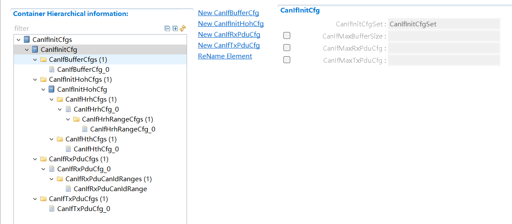

===================
CanIf产品参考手册
===================

**缩写词注解**

+------------+-------------------------+------------------------------+
| **缩写词** | **英文全称**            | **中文解释**                 |
+------------+-------------------------+------------------------------+
| DLC        | Data Length Code        | L-PDU中表示报文长度的部分    |
+------------+-------------------------+------------------------------+
| HRH        | CAN hardware receive    | CAN驱动层接收硬件单元的抽象  |
|            | handle                  |                              |
+------------+-------------------------+------------------------------+
| HTH        | CAN hardware transmit   | CAN驱动层发送硬件单元的抽象  |
|            | handle                  |                              |
+------------+-------------------------+------------------------------+
| HOH        | CAN hardware object     | CAN硬件抽象单元（HRH+HTH）   |
|            | handle                  |                              |
+------------+-------------------------+------------------------------+
| I-PDU      | Interaction Layer       | 交互层协议数据单元           |
|            | Protocol Data Unit      |                              |
+------------+-------------------------+------------------------------+
| L-PDU      | Data Link Layer         | 数据链路层协议数据单元       |
|            | Protocol Data Unit      |                              |
+------------+-------------------------+------------------------------+
| DET        | Default Error Tracer    | 开发错误检测                 |
+------------+-------------------------+------------------------------+
| CAN FD     | Controller Area Network | 相比传                       |
|            | Flexible Data-Rate      | 统CAN，其波特率及负载都更高  |
+------------+-------------------------+------------------------------+

简介
====

CanIf模块将底层不同的Can驱动，CanTrcv驱动抽象化，方便上层模块统一通过CanIf模块进行访问。在AUTOSAR架构中，其上层模块主要为PduR，CanTp，J1939Tp，CanNm，CanSm等。CanIf主要功能包含L-PDU的接收指示，L-PDU的发送及发送确认等通信功能，以及Can
Controller/Trcv的模式控制，波特率切换，睡眠唤醒等其它功能栈功能。

|image1|\ 图1-1 CanIf模块层次图

CanIf模块处于AUTOSAR架构中的通信硬件抽象层，其下层模块为CanDrv/CanTrcv驱动模块，上层模块可能为PduR，CanTp，CanNm，CanSM，EcuM，Xcp，J1939Tp，J1939Nm，CDD。

CanIf实现了与上下层模块间基于PDU的发送/接收，实现了对硬件单元模式的控制以及模式切换通知，实现了对睡眠/唤醒机制的支持。

参考资料
--------

[1] AUTOSAR_SWS_CANInterface.pdf， R19-11和4.2.2

[2] AUTOSAR_SWS_CANDriver.pdf，R19-11和4.2.2

[3] AUTOSAR_SWS_CANTransceiverDriver.pdf，R19-11和4.2.2

[4] AUTOSAR_SWS_PDURouter.pdf，R19-11和4.2.2

[5] AUTOSAR_SWS_COM.pdf，R19-11和4.2.2

[6] AUTOSAR_SRS_COM.pdf，R19-11和4.2.2

功能描述
========

模式控制功能
------------

模式控制功能介绍
~~~~~~~~~~~~~~~~

1.CanIf模块的状态机控制，包括未初始化和已初始化状态，除了CanIf_Init
和CanIf_GetVersionInfo之外，都需要在已初始化状态下才能正常调用。

2.Controller模式控制，分为STOP，START，SLEEP三种，只有在START状态下Controller才能正常通信。

3.Trcv模式控制，分为NORMAL，STANDBY，SLEEP三种，只有在NORMAL状态下Trcv才能正常通信。

4.Controller的Pdu模式控制，分为OFFLINE，TX_OFFLINE，TX_OFFLINE_ACTIVE，ONLINE四种，ONLINE模式下允许正常收发通信，TX_OFFLINE模式下只能接收不能发送，TX_OFFLINE_ACTIVE模式下允许接收和虚拟发送，OFFLINE模式下不允许收发通信。

模式控制功能实现
~~~~~~~~~~~~~~~~

1.上电之后CanIf处于CANIF_UNINIT状态，正确调用CanIf_Init（参数为CanIf模块PB配置参数指针）之后状态切换到CANIF_INITED。

2.CanIf_Init初始化之后，Controller模式为STOP，调用接口CanIf_SetControllerMode切换Controller模式，调用CanIf_GetControllerMode获取当前Controller模式。当Controller发生BusOff事件时，Controller模式切换到STOP。

3.调用CanIf_SetTrcvMode切换Trcv模式，调用CanIf_GetTrcvMode获取Trcv当前模式。

4.CanIf_Init初始化之后，Pdu模式为OFFLINE，调用CanIf_SetPduMode切换Pdu模式，调用CanIf_GetPduMode获取当前Controller的Pdu模式。其中TX_OFFLINE_ACTIVE模式需要在配置项CanIfTxOfflineActiveSupport使能时才支持。当Controller发生BusOff事件时，Pdu模式切换到TX_OFFLINE。

TxPdu发送功能
-------------

TxPdu发送功能介绍
~~~~~~~~~~~~~~~~~

当模块初始化成功，Controller模式及其Pdu模式，Trcv模式均处于允许发送状态，可通过CanIf两种发送机制来发送L-Pdu：

方式一：上层模块调用CanIf_Transmit请求TxPdu的发送，发送时机由上层决定；

方式二：下层驱动调用CanIf_TriggerTransmit请求TxPdu的发送数据，发送时机由下层决定；

TxPdu发送成功后，下层驱动调用CanIf_TxConfirmation进行发送确认。

TxPdu发送功能实现
~~~~~~~~~~~~~~~~~

当上层模块调用CanIf_Transmit请求TxPdu发送，并传入L-PDU的SDU及可能存在的MetaData数据时，CanIf根据Static/Dynamic
CanId策略计算出该TxPdu当前对应的CanId，调用Can_Write由配置的HTH进行发送。

CAN总线通常不支持TriggerTransmit进行发送，该机制通常用于LIN总线。

当驱动层TxPdu发送成功后，调用CanIf_TxConfirmation，CanIf调用<Up>\_
TxConfirmation通知上层模块。

对于TxPdu发送，可以配置TxBuffer机制（CanIfBufferSize>0）来降低因发送邮箱BUSY而导致丢帧的概率。需注意的是配置项CanIfBufferSize决定该HTH最多缓存的不同TxPdu帧数，对于每个TxPdu最多只能缓存一帧。

RxPdu接收功能
-------------

RxPdu接收功能介绍
~~~~~~~~~~~~~~~~~

当模块初始化成功，Controller模式及其Pdu模式，Trcv模式均处于允许接收状态，将从驱动层接收到的报文，传递到上层模块。

RxPdu接收功能实现
~~~~~~~~~~~~~~~~~

当驱动层邮箱收到报文后，调用CanIf_RxIndication将接收数据传递到CanIf模块，CanIf通过接收的HRH以及CanId，查询匹配到接收RxPdu，调用关联上层模块的<Up>\_
RxIndication将接收RxPdu数据传递给上层模块。

RxPdu上层模块由配置项CanIfRxPduUserRxIndicationUL决定，<Up>\_
RxIndication由配置项CanIfRxPduUserRxIndicationName决定。

睡眠唤醒功能
------------

睡眠唤醒功能介绍
~~~~~~~~~~~~~~~~

上层模块可以通过CanIf来将Controller/Trcv设置为SLEEP模式，支持Controller/Trcv唤醒源检测，Controller/Trcv唤醒确认，Trcv唤醒原因获取，Trcv唤醒标志位检测/清除，Trcv唤醒模式设置。

睡眠唤醒功能实现
~~~~~~~~~~~~~~~~

CanIf提供CanIf_SetControllerMode/CanIf_SetTrcvMode来设置Controller/Trcv的模式（包含SLEEP模式），当发生唤醒事件后可通过调用CanIf_CheckWakeup来检测是否由Controller/Trcv导致的唤醒事件，可通过CanIf_CheckValidation来检测唤醒成功确认（唤醒确认条件为接收到任意Pdu/NM
Pdu，参见配置项CanIfPublicWakeupCheckValidByNM是否勾选）。

源文件描述
==========

表3-1 CanIf组件文件描述

+-----------------+----------------------------------------------------+
| **文件**        | **说明**                                           |
+-----------------+----------------------------------------------------+
| CanIf_Cfg.h     | 定义CanIf模块PC配置的宏定义。                      |
+-----------------+----------------------------------------------------+
| CanIf_Cfg.c     | 定义CanIf模块PC/PB配置的结构体参数。               |
+-----------------+----------------------------------------------------+
| CanIf.h         | 实现CanIf模块全部外部接口（除                      |
|                 | 了回调函数）的声明，以及配置文件中全局变量的声明。 |
+-----------------+----------------------------------------------------+
| CanIf.c         | 作为CanIf模块的核心文                              |
|                 | 件，实现CanIf模块全部对外接口，以及实现CanIf模块功 |
|                 | 能所必须的local函数，local宏定义，local变量定义。  |
+-----------------+----------------------------------------------------+
| CanIf_Cbk.h     | 实现CanIf模块全部回调函数的声明。                  |
+-----------------+----------------------------------------------------+
| CanIf_Types.h   | 实现外部                                           |
|                 | /内部类型的定义，包括AUTOSAR标准定义的类型，以及P  |
|                 | B/PC配置参数结构体类型，以及内部运行时结构体类型。 |
+-----------------+----------------------------------------------------+
| CanIf_MemMap.h  | 实现CanIf模块内存布局。                            |
+-----------------+----------------------------------------------------+

|image2|

图3-1 CanIf组件文件交互关系图

API接口
=======

类型定义
--------

CanIf_ConfigType类型定义
~~~~~~~~~~~~~~~~~~~~~~~~

+-----------+----------------------------------------------------------+
| 名称      | CanIf_ConfigType                                         |
+-----------+----------------------------------------------------------+
| 类型      | struct                                                   |
+-----------+----------------------------------------------------------+
| 范围      | 无                                                       |
+-----------+----------------------------------------------------------+
| 描述      | CanIf模块PB配置结构体类型                                |
+-----------+----------------------------------------------------------+

CanIf_ControllerModeType类型定义
~~~~~~~~~~~~~~~~~~~~~~~~~~~~~~~~

+-----------+----------------------------------------------------------+
| 名称      | CanIf_ControllerModeType                                 |
+-----------+----------------------------------------------------------+
| 类型      | enum                                                     |
+-----------+----------------------------------------------------------+
| 范围      | CANIF_CS_UN                                              |
|           | INIT，CANIF_CS_STOPPED，CANIF_CS_STARTED，CANIF_CS_SLEEP |
+-----------+----------------------------------------------------------+
| 描述      | CanIf模块中Can控制器模式类型                             |
+-----------+----------------------------------------------------------+

CanIf_PduModeType类型定义
~~~~~~~~~~~~~~~~~~~~~~~~~

+-----------+----------------------------------------------------------+
| 名称      | CanIf_PduModeType                                        |
+-----------+----------------------------------------------------------+
| 类型      | enum                                                     |
+-----------+----------------------------------------------------------+
| 范围      | CANIF_OFFLINE，                                          |
|           | CANIF_TX_OFFLINE，CANIF_TX_OFFLINE_ACTIVE，CANIF_ONLINE  |
+-----------+----------------------------------------------------------+
| 描述      | CanIf模块中Pdu通信模式类型                               |
+-----------+----------------------------------------------------------+

CanIf_NotifStatusType类型定义
~~~~~~~~~~~~~~~~~~~~~~~~~~~~~

+-----------+----------------------------------------------------------+
| 名称      | CanIf_NotifStatusType                                    |
+-----------+----------------------------------------------------------+
| 类型      | enum                                                     |
+-----------+----------------------------------------------------------+
| 范围      | CANIF_TX_RX_NOTIFICATION，CANIF_NO_NOTIFICATION          |
+-----------+----------------------------------------------------------+
| 描述      | CanIf模块中Pdu/Controller收发通知类型                    |
+-----------+----------------------------------------------------------+

输入函数描述
------------

+----------------------------+-----------------------------------------+
| **输入模块**               | **API**                                 |
+----------------------------+-----------------------------------------+
| CanDrv                     | Can_SetControllerMode                   |
+----------------------------+-----------------------------------------+
|                            | Can_Write                               |
+----------------------------+-----------------------------------------+
|                            | Can_CheckWakeup                         |
+----------------------------+-----------------------------------------+
|                            | Can_SetBaudrate                         |
+----------------------------+-----------------------------------------+
|                            | Can_SetIcomConfiguration                |
+----------------------------+-----------------------------------------+
| SchM                       | SchM_Enter_CanIf\_<ExclusiveArea>       |
+----------------------------+-----------------------------------------+
|                            | SchM_Exit_CanIf\_<ExclusiveArea>        |
+----------------------------+-----------------------------------------+
| Det                        | Det_ReportRuntimeError                  |
+----------------------------+-----------------------------------------+
|                            | Det_ReportError                         |
+----------------------------+-----------------------------------------+
| CanTrcv                    | CanTrcv_SetOpMode                       |
+----------------------------+-----------------------------------------+
|                            | CanTrcv_GetOpMode                       |
+----------------------------+-----------------------------------------+
|                            | CanTrcv_GetBusWuReason                  |
+----------------------------+-----------------------------------------+
|                            | CanTrcv_SetWakeupMode                   |
+----------------------------+-----------------------------------------+
|                            | CanTrcv_ClearTrcvWufFlag                |
+----------------------------+-----------------------------------------+
|                            | CanTrcv_CheckWakeFlag                   |
+----------------------------+-----------------------------------------+
|                            | CanTrcv_CheckWakeup                     |
+----------------------------+-----------------------------------------+
| <Up_User>                  | User_TriggerTransmit                    |
+----------------------------+-----------------------------------------+
|                            | User_TxConfirmation                     |
+----------------------------+-----------------------------------------+
|                            | User_RxIndication                       |
+----------------------------+-----------------------------------------+
|                            | User_ValidateWakeupEvent                |
+----------------------------+-----------------------------------------+
|                            | User_ControllerBusOff                   |
+----------------------------+-----------------------------------------+
|                            | User_ConfirmPnAvailability              |
+----------------------------+-----------------------------------------+
|                            | User_ClearTrcvWufFlagIndication         |
+----------------------------+-----------------------------------------+
|                            | User_CheckTrcvWakeFlagIndication        |
+----------------------------+-----------------------------------------+
|                            | User_ControllerModeIndication           |
+----------------------------+-----------------------------------------+
|                            | User_TrcvModeIndication                 |
+----------------------------+-----------------------------------------+

静态接口函数定义
----------------

CanIf_Init函数定义
~~~~~~~~~~~~~~~~~~

+------------+----------------------+-------+-------------------------+
| 函数名称： | CanIf_Init           |       |                         |
+------------+----------------------+-------+-------------------------+
| 函数原型： | void                 |       |                         |
|            | CanIf_Init(const     |       |                         |
|            | CanIf_ConfigType\*   |       |                         |
|            | ConfigPtr)           |       |                         |
+------------+----------------------+-------+-------------------------+
| 服务编号： | 0x01                 |       |                         |
+------------+----------------------+-------+-------------------------+
| 同         | 同步                 |       |                         |
| 步/异步：  |                      |       |                         |
+------------+----------------------+-------+-------------------------+
| 是         | 否                   |       |                         |
| 否可重入： |                      |       |                         |
+------------+----------------------+-------+-------------------------+
| 输入参数： | ConfigPtr            | 值    | 无                      |
|            |                      | 域：  |                         |
+------------+----------------------+-------+-------------------------+
| 输入       | 无                   |       |                         |
| 输出参数： |                      |       |                         |
+------------+----------------------+-------+-------------------------+
| 输出参数： | 无                   |       |                         |
+------------+----------------------+-------+-------------------------+
| 返回值：   | 无                   |       |                         |
+------------+----------------------+-------+-------------------------+
| 功能概述： | CanIf模块初始化      |       |                         |
+------------+----------------------+-------+-------------------------+

CanIf_DeInit函数定义
~~~~~~~~~~~~~~~~~~~~

+-------------+-------------------+------+----------------------------+
| 函数名称：  | CanIf_DeInit      |      |                            |
+-------------+-------------------+------+----------------------------+
| 函数原型：  | void              |      |                            |
|             | C                 |      |                            |
|             | anIf_DeInit(void) |      |                            |
+-------------+-------------------+------+----------------------------+
| 服务编号：  | 0x02              |      |                            |
+-------------+-------------------+------+----------------------------+
| 同步/异步： | 同步              |      |                            |
+-------------+-------------------+------+----------------------------+
| 是          | 否                |      |                            |
| 否可重入：  |                   |      |                            |
+-------------+-------------------+------+----------------------------+
| 输入参数：  | 无                | 值   | 无                         |
|             |                   | 域： |                            |
+-------------+-------------------+------+----------------------------+
| 输入        | 无                |      |                            |
| 输出参数：  |                   |      |                            |
+-------------+-------------------+------+----------------------------+
| 输出参数：  | 无                |      |                            |
+-------------+-------------------+------+----------------------------+
| 返回值：    | 无                |      |                            |
+-------------+-------------------+------+----------------------------+
| 功能概述：  | CanIf模块反初始化 |      |                            |
+-------------+-------------------+------+----------------------------+

CanIf_SetControllerMode函数定义
~~~~~~~~~~~~~~~~~~~~~~~~~~~~~~~

+-------------+-------------------+---------+-------------------------+
| 函数名称：  | CanIf_            |         |                         |
|             | SetControllerMode |         |                         |
+-------------+-------------------+---------+-------------------------+
| 函数原型：  | Std_ReturnType    |         |                         |
|             | CanIf_S           |         |                         |
|             | etControllerMode( |         |                         |
|             |                   |         |                         |
|             | uint8             |         |                         |
|             | ControllerId,     |         |                         |
|             |                   |         |                         |
|             | CanIf_C           |         |                         |
|             | ontrollerModeType |         |                         |
|             | ControllerMode)   |         |                         |
+-------------+-------------------+---------+-------------------------+
| 服务编号：  | 0x03              |         |                         |
+-------------+-------------------+---------+-------------------------+
| 同步/异步： | 异步              |         |                         |
+-------------+-------------------+---------+-------------------------+
| 是          | 不同的Controll    |         |                         |
| 否可重入：  | er可重入，相同的C |         |                         |
|             | ontroller不可重入 |         |                         |
+-------------+-------------------+---------+-------------------------+
| 输入参数：  | ControllerId      | 值域：  | 无                      |
|             |                   |         |                         |
|             | ControllerMode    |         |                         |
+-------------+-------------------+---------+-------------------------+
| 输入        | 无                |         |                         |
| 输出参数：  |                   |         |                         |
+-------------+-------------------+---------+-------------------------+
| 输出参数：  | 无                |         |                         |
+-------------+-------------------+---------+-------------------------+
| 返回值：    | Std_ReturnType    |         |                         |
+-------------+-------------------+---------+-------------------------+
| 功能概述：  | Contr             |         |                         |
|             | oller模式切换请求 |         |                         |
+-------------+-------------------+---------+-------------------------+

CanIf_GetControllerMode函数定义
~~~~~~~~~~~~~~~~~~~~~~~~~~~~~~~

+-------------+-------------------+---------+-------------------------+
| 函数名称：  | CanIf_            |         |                         |
|             | GetControllerMode |         |                         |
+-------------+-------------------+---------+-------------------------+
| 函数原型：  | Std_ReturnType    |         |                         |
|             | CanIf_G           |         |                         |
|             | etControllerMode( |         |                         |
|             |                   |         |                         |
|             | uint8             |         |                         |
|             | ControllerId,     |         |                         |
|             |                   |         |                         |
|             | CanIf_Con         |         |                         |
|             | trollerModeType\* |         |                         |
|             | C                 |         |                         |
|             | ontrollerModePtr) |         |                         |
+-------------+-------------------+---------+-------------------------+
| 服务编号：  | 0x04              |         |                         |
+-------------+-------------------+---------+-------------------------+
| 同步/异步： | 同步              |         |                         |
+-------------+-------------------+---------+-------------------------+
| 是          | 否                |         |                         |
| 否可重入：  |                   |         |                         |
+-------------+-------------------+---------+-------------------------+
| 输入参数：  | ControllerId      | 值域：  | 无                      |
+-------------+-------------------+---------+-------------------------+
| 输入        | 无                |         |                         |
| 输出参数：  |                   |         |                         |
+-------------+-------------------+---------+-------------------------+
| 输出参数：  | ControllerModePtr |         |                         |
+-------------+-------------------+---------+-------------------------+
| 返回值：    | Std_ReturnType    |         |                         |
+-------------+-------------------+---------+-------------------------+
| 功能概述：  | 获取C             |         |                         |
|             | ontroller当前模式 |         |                         |
+-------------+-------------------+---------+-------------------------+

CanIf_Transmit函数定义
~~~~~~~~~~~~~~~~~~~~~~

+-------------+-------------------+---------+-------------------------+
| 函数名称：  | CanIf_Transmit    |         |                         |
+-------------+-------------------+---------+-------------------------+
| 函数原型：  | Std_ReturnType    |         |                         |
|             | CanIf_Transmit(   |         |                         |
|             |                   |         |                         |
|             | PduIdType         |         |                         |
|             | CanIfTxSduId,     |         |                         |
|             |                   |         |                         |
|             | const             |         |                         |
|             | PduInfoType\*     |         |                         |
|             | CanIfTxInfoPtr)   |         |                         |
+-------------+-------------------+---------+-------------------------+
| 服务编号：  | 0x05              |         |                         |
+-------------+-------------------+---------+-------------------------+
| 同步/异步： | 同步              |         |                         |
+-------------+-------------------+---------+-------------------------+
| 是          | 是                |         |                         |
| 否可重入：  |                   |         |                         |
+-------------+-------------------+---------+-------------------------+
| 输入参数：  | CanIfTxSduId      | 值域：  | 无                      |
|             | CanIfTxInfoPtr    |         |                         |
+-------------+-------------------+---------+-------------------------+
| 输入        | 无                |         |                         |
| 输出参数：  |                   |         |                         |
+-------------+-------------------+---------+-------------------------+
| 输出参数：  | 无                |         |                         |
+-------------+-------------------+---------+-------------------------+
| 返回值：    | Std_ReturnType    |         |                         |
+-------------+-------------------+---------+-------------------------+
| 功能概述：  | TxPdu发送请求     |         |                         |
+-------------+-------------------+---------+-------------------------+

CanIf_CancelTransmit函数定义
~~~~~~~~~~~~~~~~~~~~~~~~~~~~

+-------------+-------------------+---------+-------------------------+
| 函数名称：  | Can               |         |                         |
|             | If_CancelTransmit |         |                         |
+-------------+-------------------+---------+-------------------------+
| 函数原型：  | Std_ReturnType    |         |                         |
|             | CanI              |         |                         |
|             | f_CancelTransmit( |         |                         |
|             |                   |         |                         |
|             | PduIdType         |         |                         |
|             | CanIfTxSduId)     |         |                         |
+-------------+-------------------+---------+-------------------------+
| 服务编号：  | 0x18              |         |                         |
+-------------+-------------------+---------+-------------------------+
| 同步/异步： | 同步              |         |                         |
+-------------+-------------------+---------+-------------------------+
| 是          | 否                |         |                         |
| 否可重入：  |                   |         |                         |
+-------------+-------------------+---------+-------------------------+
| 输入参数：  | CanIfTxSduId      | 值域：  | 无                      |
+-------------+-------------------+---------+-------------------------+
| 输入        | 无                |         |                         |
| 输出参数：  |                   |         |                         |
+-------------+-------------------+---------+-------------------------+
| 输出参数：  | 无                |         |                         |
+-------------+-------------------+---------+-------------------------+
| 返回值：    | Std_ReturnType    |         |                         |
+-------------+-------------------+---------+-------------------------+
| 功能概述：  | TxPdu发送取消请求 |         |                         |
+-------------+-------------------+---------+-------------------------+

CanIf_ReadRxPduData函数定义
~~~~~~~~~~~~~~~~~~~~~~~~~~~

+-------------+-------------------+---------+-------------------------+
| 函数名称：  | Ca                |         |                         |
|             | nIf_ReadRxPduData |         |                         |
+-------------+-------------------+---------+-------------------------+
| 函数原型：  | Std_ReturnType    |         |                         |
|             | Can               |         |                         |
|             | If_ReadRxPduData( |         |                         |
|             |                   |         |                         |
|             | PduIdType         |         |                         |
|             | CanIfRxSduId,     |         |                         |
|             |                   |         |                         |
|             | PduInfoType\*     |         |                         |
|             | CanIfRxInfoPtr)   |         |                         |
+-------------+-------------------+---------+-------------------------+
| 服务编号：  | 0x06              |         |                         |
+-------------+-------------------+---------+-------------------------+
| 同步/异步： | 同步              |         |                         |
+-------------+-------------------+---------+-------------------------+
| 是          | 否                |         |                         |
| 否可重入：  |                   |         |                         |
+-------------+-------------------+---------+-------------------------+
| 输入参数：  | CanIfRxSduId      | 值域：  | 无                      |
+-------------+-------------------+---------+-------------------------+
| 输入        | 无                |         |                         |
| 输出参数：  |                   |         |                         |
+-------------+-------------------+---------+-------------------------+
| 输出参数：  | CanIfRxInfoPtr    |         |                         |
+-------------+-------------------+---------+-------------------------+
| 返回值：    | Std_ReturnType    |         |                         |
+-------------+-------------------+---------+-------------------------+
| 功能概述：  | 获取              |         |                         |
|             | RxPdu最新接收数据 |         |                         |
+-------------+-------------------+---------+-------------------------+

CanIf_ReadTxNotifStatus函数定义
~~~~~~~~~~~~~~~~~~~~~~~~~~~~~~~

+-------------+-------------------+---------+-------------------------+
| 函数名称：  | CanIf_            |         |                         |
|             | ReadTxNotifStatus |         |                         |
+-------------+-------------------+---------+-------------------------+
| 函数原型：  | CanI              |         |                         |
|             | f_NotifStatusType |         |                         |
|             | CanIf_R           |         |                         |
|             | eadTxNotifStatus( |         |                         |
|             |                   |         |                         |
|             | PduIdType         |         |                         |
|             | CanIfTxSduId)     |         |                         |
+-------------+-------------------+---------+-------------------------+
| 服务编号：  | 0x07              |         |                         |
+-------------+-------------------+---------+-------------------------+
| 同步/异步： | 同步              |         |                         |
+-------------+-------------------+---------+-------------------------+
| 是          | 否                |         |                         |
| 否可重入：  |                   |         |                         |
+-------------+-------------------+---------+-------------------------+
| 输入参数：  | CanIfTxSduId      | 值域：  | 无                      |
+-------------+-------------------+---------+-------------------------+
| 输入        | 无                |         |                         |
| 输出参数：  |                   |         |                         |
+-------------+-------------------+---------+-------------------------+
| 输出参数：  | 无                |         |                         |
+-------------+-------------------+---------+-------------------------+
| 返回值：    | CanI              |         |                         |
|             | f_NotifStatusType |         |                         |
+-------------+-------------------+---------+-------------------------+
| 功能概述：  | 获取TxPdu的T      |         |                         |
|             | xConfirmation状态 |         |                         |
+-------------+-------------------+---------+-------------------------+

CanIf_ReadRxNotifStatus函数定义
~~~~~~~~~~~~~~~~~~~~~~~~~~~~~~~

+-------------+-------------------+---------+-------------------------+
| 函数名称：  | CanIf_            |         |                         |
|             | ReadRxNotifStatus |         |                         |
+-------------+-------------------+---------+-------------------------+
| 函数原型：  | CanI              |         |                         |
|             | f_NotifStatusType |         |                         |
|             | CanIf_R           |         |                         |
|             | eadRxNotifStatus( |         |                         |
|             |                   |         |                         |
|             | PduIdType         |         |                         |
|             | CanIfRxSduId)     |         |                         |
+-------------+-------------------+---------+-------------------------+
| 服务编号：  | 0x08              |         |                         |
+-------------+-------------------+---------+-------------------------+
| 同步/异步： | 同步              |         |                         |
+-------------+-------------------+---------+-------------------------+
| 是          | 否                |         |                         |
| 否可重入：  |                   |         |                         |
+-------------+-------------------+---------+-------------------------+
| 输入参数：  | CanIfRxSduId      | 值域：  | 无                      |
+-------------+-------------------+---------+-------------------------+
| 输入        | 无                |         |                         |
| 输出参数：  |                   |         |                         |
+-------------+-------------------+---------+-------------------------+
| 输出参数：  | 无                |         |                         |
+-------------+-------------------+---------+-------------------------+
| 返回值：    | CanI              |         |                         |
|             | f_NotifStatusType |         |                         |
+-------------+-------------------+---------+-------------------------+
| 功能概述：  | 获                |         |                         |
|             | 取RxPdu的接收状态 |         |                         |
+-------------+-------------------+---------+-------------------------+

CanIf_SetPduMode函数定义
~~~~~~~~~~~~~~~~~~~~~~~~

+-------------+-------------------+---------+-------------------------+
| 函数名称：  | CanIf_SetPduMode  |         |                         |
+-------------+-------------------+---------+-------------------------+
| 函数原型：  | Std_ReturnType    |         |                         |
|             | CanIf_SetPduMode( |         |                         |
|             |                   |         |                         |
|             | uint8             |         |                         |
|             | ControllerId,     |         |                         |
|             |                   |         |                         |
|             | CanIf_PduModeType |         |                         |
|             | PduModeRequest)   |         |                         |
+-------------+-------------------+---------+-------------------------+
| 服务编号：  | 0x09              |         |                         |
+-------------+-------------------+---------+-------------------------+
| 同步/异步： | 同步              |         |                         |
+-------------+-------------------+---------+-------------------------+
| 是          | 否                |         |                         |
| 否可重入：  |                   |         |                         |
+-------------+-------------------+---------+-------------------------+
| 输入参数：  | ControllerId      | 值域：  | 无                      |
|             |                   |         |                         |
|             | PduModeRequest    |         |                         |
+-------------+-------------------+---------+-------------------------+
| 输入        | 无                |         |                         |
| 输出参数：  |                   |         |                         |
+-------------+-------------------+---------+-------------------------+
| 输出参数：  | 无                |         |                         |
+-------------+-------------------+---------+-------------------------+
| 返回值：    | Std_ReturnType    |         |                         |
+-------------+-------------------+---------+-------------------------+
| 功能概述：  | Controller        |         |                         |
|             | 的PduMode切换请求 |         |                         |
+-------------+-------------------+---------+-------------------------+

CanIf_GetPduMode函数定义
~~~~~~~~~~~~~~~~~~~~~~~~

+-------------+-------------------+---------+-------------------------+
| 函数名称：  | CanIf_GetPduMode  |         |                         |
+-------------+-------------------+---------+-------------------------+
| 函数原型：  | Std_ReturnType    |         |                         |
|             | CanIf_GetPduMode( |         |                         |
|             |                   |         |                         |
|             | uint8             |         |                         |
|             | ControllerId,     |         |                         |
|             |                   |         |                         |
|             | Ca                |         |                         |
|             | nIf_PduModeType\* |         |                         |
|             | PduModePtr)       |         |                         |
+-------------+-------------------+---------+-------------------------+
| 服务编号：  | 0x0A              |         |                         |
+-------------+-------------------+---------+-------------------------+
| 同步/异步： | 同步              |         |                         |
+-------------+-------------------+---------+-------------------------+
| 是          | 不同Contro        |         |                         |
| 否可重入：  | ller可重入，相同C |         |                         |
|             | ontroller不可重入 |         |                         |
+-------------+-------------------+---------+-------------------------+
| 输入参数：  | ControllerId      | 值域：  | 无                      |
+-------------+-------------------+---------+-------------------------+
| 输入        | 无                |         |                         |
| 输出参数：  |                   |         |                         |
+-------------+-------------------+---------+-------------------------+
| 输出参数：  | PduModePtr        |         |                         |
+-------------+-------------------+---------+-------------------------+
| 返回值：    | Std_ReturnType    |         |                         |
+-------------+-------------------+---------+-------------------------+
| 功能概述：  | 获取Contro        |         |                         |
|             | ller的PduMode状态 |         |                         |
+-------------+-------------------+---------+-------------------------+

CanIf_GetVersionInfo函数定义
~~~~~~~~~~~~~~~~~~~~~~~~~~~~

+-------------+-------------------+---------+-------------------------+
| 函数名称：  | Can               |         |                         |
|             | If_GetVersionInfo |         |                         |
+-------------+-------------------+---------+-------------------------+
| 函数原型：  | void              |         |                         |
|             | Can               |         |                         |
|             | If_GetVersionInfo |         |                         |
|             | (                 |         |                         |
|             |                   |         |                         |
|             | Std_              |         |                         |
|             | VersionInfoType\* |         |                         |
|             | VersionInfo)      |         |                         |
+-------------+-------------------+---------+-------------------------+
| 服务编号：  | 0x0B              |         |                         |
+-------------+-------------------+---------+-------------------------+
| 同步/异步： | 同步              |         |                         |
+-------------+-------------------+---------+-------------------------+
| 是          | 是                |         |                         |
| 否可重入：  |                   |         |                         |
+-------------+-------------------+---------+-------------------------+
| 输入参数：  | 无                | 值域：  | 无                      |
+-------------+-------------------+---------+-------------------------+
| 输入        | 无                |         |                         |
| 输出参数：  |                   |         |                         |
+-------------+-------------------+---------+-------------------------+
| 输出参数：  | VersionInfo       |         |                         |
+-------------+-------------------+---------+-------------------------+
| 返回值：    | 无                |         |                         |
+-------------+-------------------+---------+-------------------------+
| 功能概述：  | 获取              |         |                         |
|             | CanIf模块软件版本 |         |                         |
+-------------+-------------------+---------+-------------------------+

CanIf_SetDynamicTxId函数定义
~~~~~~~~~~~~~~~~~~~~~~~~~~~~

+-------------+-------------------+---------+-------------------------+
| 函数名称：  | Can               |         |                         |
|             | If_SetDynamicTxId |         |                         |
+-------------+-------------------+---------+-------------------------+
| 函数原型：  | void              |         |                         |
|             | Can               |         |                         |
|             | If_SetDynamicTxId |         |                         |
|             | (                 |         |                         |
|             |                   |         |                         |
|             | PduIdType         |         |                         |
|             | CanIfTxSduId,     |         |                         |
|             |                   |         |                         |
|             | Can_IdType CanId) |         |                         |
+-------------+-------------------+---------+-------------------------+
| 服务编号：  | 0x0C              |         |                         |
+-------------+-------------------+---------+-------------------------+
| 同步/异步： | 同步              |         |                         |
+-------------+-------------------+---------+-------------------------+
| 是          | 否                |         |                         |
| 否可重入：  |                   |         |                         |
+-------------+-------------------+---------+-------------------------+
| 输入参数：  | CanIfTxSduId      | 值域：  | 无                      |
|             |                   |         |                         |
|             | CanId             |         |                         |
+-------------+-------------------+---------+-------------------------+
| 输入        | 无                |         |                         |
| 输出参数：  |                   |         |                         |
+-------------+-------------------+---------+-------------------------+
| 输出参数：  | 无                |         |                         |
+-------------+-------------------+---------+-------------------------+
| 返回值：    | 无                |         |                         |
+-------------+-------------------+---------+-------------------------+
| 功能概述：  | 设置              |         |                         |
|             | 动态TxPdu的CanId  |         |                         |
+-------------+-------------------+---------+-------------------------+

CanIf_SetTrcvMode函数定义
~~~~~~~~~~~~~~~~~~~~~~~~~

+-------------+-------------------+---------+-------------------------+
| 函数名称：  | CanIf_SetTrcvMode |         |                         |
+-------------+-------------------+---------+-------------------------+
| 函数原型：  | Std_ReturnType    |         |                         |
|             | CanIf_SetTrcvMode |         |                         |
|             | (                 |         |                         |
|             |                   |         |                         |
|             | uint8             |         |                         |
|             | TransceiverId,    |         |                         |
|             |                   |         |                         |
|             | Can               |         |                         |
|             | Trcv_TrcvModeType |         |                         |
|             | TransceiverMode)  |         |                         |
+-------------+-------------------+---------+-------------------------+
| 服务编号：  | 0x0D              |         |                         |
+-------------+-------------------+---------+-------------------------+
| 同步/异步： | 异步              |         |                         |
+-------------+-------------------+---------+-------------------------+
| 是          | 否                |         |                         |
| 否可重入：  |                   |         |                         |
+-------------+-------------------+---------+-------------------------+
| 输入参数：  | TransceiverId     | 值域：  | 无                      |
|             |                   |         |                         |
|             | TransceiverMode   |         |                         |
+-------------+-------------------+---------+-------------------------+
| 输入        | 无                |         |                         |
| 输出参数：  |                   |         |                         |
+-------------+-------------------+---------+-------------------------+
| 输出参数：  | 无                |         |                         |
+-------------+-------------------+---------+-------------------------+
| 返回值：    | Std_ReturnType    |         |                         |
+-------------+-------------------+---------+-------------------------+
| 功能概述：  | 请求设置Trcv模式  |         |                         |
+-------------+-------------------+---------+-------------------------+

CanIf_GetTrcvMode函数定义
~~~~~~~~~~~~~~~~~~~~~~~~~

+-------------+-------------------+---------+-------------------------+
| 函数名称：  | CanIf_GetTrcvMode |         |                         |
+-------------+-------------------+---------+-------------------------+
| 函数原型：  | Std_ReturnType    |         |                         |
|             | C                 |         |                         |
|             | anIf_GetTrcvMode( |         |                         |
|             |                   |         |                         |
|             | CanTr             |         |                         |
|             | cv_TrcvModeType\* |         |                         |
|             | Tr                |         |                         |
|             | ansceiverModePtr, |         |                         |
|             |                   |         |                         |
|             | uint8             |         |                         |
|             | TransceiverId)    |         |                         |
+-------------+-------------------+---------+-------------------------+
| 服务编号：  | 0x0E              |         |                         |
+-------------+-------------------+---------+-------------------------+
| 同步/异步： | 同步              |         |                         |
+-------------+-------------------+---------+-------------------------+
| 是          | 否                |         |                         |
| 否可重入：  |                   |         |                         |
+-------------+-------------------+---------+-------------------------+
| 输入参数：  | TransceiverId     | 值域：  | 无                      |
+-------------+-------------------+---------+-------------------------+
| 输入        | 无                |         |                         |
| 输出参数：  |                   |         |                         |
+-------------+-------------------+---------+-------------------------+
| 输出参数：  | T                 |         |                         |
|             | ransceiverModePtr |         |                         |
+-------------+-------------------+---------+-------------------------+
| 返回值：    | Std_ReturnType    |         |                         |
+-------------+-------------------+---------+-------------------------+
| 功能概述：  | 获取Trcv模式      |         |                         |
+-------------+-------------------+---------+-------------------------+

CanIf_GetTrcvWakeupReason函数定义
~~~~~~~~~~~~~~~~~~~~~~~~~~~~~~~~~

+-------------+-------------------+---------+-------------------------+
| 函数名称：  | CanIf_Ge          |         |                         |
|             | tTrcvWakeupReason |         |                         |
+-------------+-------------------+---------+-------------------------+
| 函数原型：  | Std_ReturnType    |         |                         |
|             | CanIf_Get         |         |                         |
|             | TrcvWakeupReason( |         |                         |
|             |                   |         |                         |
|             | uint8             |         |                         |
|             | TransceiverId,    |         |                         |
|             |                   |         |                         |
|             | CanTrcv_TrcvW     |         |                         |
|             | akeupReasonType\* |         |                         |
|             | TrcvWuReasonPtr)  |         |                         |
+-------------+-------------------+---------+-------------------------+
| 服务编号：  | 0x0F              |         |                         |
+-------------+-------------------+---------+-------------------------+
| 同步/异步： | 同步              |         |                         |
+-------------+-------------------+---------+-------------------------+
| 是          | 否                |         |                         |
| 否可重入：  |                   |         |                         |
+-------------+-------------------+---------+-------------------------+
| 输入参数：  | TransceiverId     | 值域：  | 无                      |
+-------------+-------------------+---------+-------------------------+
| 输入        | 无                |         |                         |
| 输出参数：  |                   |         |                         |
+-------------+-------------------+---------+-------------------------+
| 输出参数：  | TrcvWuReasonPtr   |         |                         |
+-------------+-------------------+---------+-------------------------+
| 返回值：    | Std_ReturnType    |         |                         |
+-------------+-------------------+---------+-------------------------+
| 功能概述：  | 获                |         |                         |
|             | 取Trcv的唤醒原因  |         |                         |
+-------------+-------------------+---------+-------------------------+

CanIf_SetTrcvWakeupMode函数定义
~~~~~~~~~~~~~~~~~~~~~~~~~~~~~~~

+-------------+-------------------+---------+-------------------------+
| 函数名称：  | CanIf_            |         |                         |
|             | SetTrcvWakeupMode |         |                         |
+-------------+-------------------+---------+-------------------------+
| 函数原型：  | Std_ReturnType    |         |                         |
|             | CanIf_S           |         |                         |
|             | etTrcvWakeupMode( |         |                         |
|             |                   |         |                         |
|             | uint8             |         |                         |
|             | TransceiverId,    |         |                         |
|             |                   |         |                         |
|             | CanTrcv_T         |         |                         |
|             | rcvWakeupModeType |         |                         |
|             | TrcvWakeupMode)   |         |                         |
+-------------+-------------------+---------+-------------------------+
| 服务编号：  | 0x10              |         |                         |
+-------------+-------------------+---------+-------------------------+
| 同步/异步： | 同步              |         |                         |
+-------------+-------------------+---------+-------------------------+
| 是          | 否                |         |                         |
| 否可重入：  |                   |         |                         |
+-------------+-------------------+---------+-------------------------+
| 输入参数：  | TransceiverId     | 值域：  | 无                      |
|             |                   |         |                         |
|             | TrcvWakeupMode    |         |                         |
+-------------+-------------------+---------+-------------------------+
| 输入        | 无                |         |                         |
| 输出参数：  |                   |         |                         |
+-------------+-------------------+---------+-------------------------+
| 输出参数：  | 无                |         |                         |
+-------------+-------------------+---------+-------------------------+
| 返回值：    | Std_ReturnType    |         |                         |
+-------------+-------------------+---------+-------------------------+
| 功能概述：  | 设置Trcv唤醒模式  |         |                         |
+-------------+-------------------+---------+-------------------------+

CanIf_CheckWakeup函数定义
~~~~~~~~~~~~~~~~~~~~~~~~~

+-------------+-------------------+---------+-------------------------+
| 函数名称：  | CanIf_CheckWakeup |         |                         |
+-------------+-------------------+---------+-------------------------+
| 函数原型：  | Std_ReturnType    |         |                         |
|             | C                 |         |                         |
|             | anIf_CheckWakeup( |         |                         |
|             |                   |         |                         |
|             | EcuM              |         |                         |
|             | _WakeupSourceType |         |                         |
|             | WakeupSource)     |         |                         |
+-------------+-------------------+---------+-------------------------+
| 服务编号：  | 0x11              |         |                         |
+-------------+-------------------+---------+-------------------------+
| 同步/异步： | 异步              |         |                         |
+-------------+-------------------+---------+-------------------------+
| 是          | 是                |         |                         |
| 否可重入：  |                   |         |                         |
+-------------+-------------------+---------+-------------------------+
| 输入参数：  | WakeupSource      | 值域：  | 无                      |
+-------------+-------------------+---------+-------------------------+
| 输入        | 无                |         |                         |
| 输出参数：  |                   |         |                         |
+-------------+-------------------+---------+-------------------------+
| 输出参数：  | 无                |         |                         |
+-------------+-------------------+---------+-------------------------+
| 返回值：    | Std_ReturnType    |         |                         |
+-------------+-------------------+---------+-------------------------+
| 功能概述：  | 唤                |         |                         |
|             | 醒源检测(底层Can  |         |                         |
|             | 驱动/CanTrcv驱动) |         |                         |
+-------------+-------------------+---------+-------------------------+

CanIf_CheckValidation函数定义
~~~~~~~~~~~~~~~~~~~~~~~~~~~~~

+-------------+-------------------+---------+-------------------------+
| 函数名称：  | CanI              |         |                         |
|             | f_CheckValidation |         |                         |
+-------------+-------------------+---------+-------------------------+
| 函数原型：  | Std_ReturnType    |         |                         |
|             | CanIf             |         |                         |
|             | _CheckValidation( |         |                         |
|             |                   |         |                         |
|             | EcuM              |         |                         |
|             | _WakeupSourceType |         |                         |
|             | WakeupSource)     |         |                         |
+-------------+-------------------+---------+-------------------------+
| 服务编号：  | 0x12              |         |                         |
+-------------+-------------------+---------+-------------------------+
| 同步/异步： | 同步              |         |                         |
+-------------+-------------------+---------+-------------------------+
| 是          | 是                |         |                         |
| 否可重入：  |                   |         |                         |
+-------------+-------------------+---------+-------------------------+
| 输入参数：  | WakeupSource      | 值域：  | 无                      |
+-------------+-------------------+---------+-------------------------+
| 输入        | 无                |         |                         |
| 输出参数：  |                   |         |                         |
+-------------+-------------------+---------+-------------------------+
| 输出参数：  | 无                |         |                         |
+-------------+-------------------+---------+-------------------------+
| 返回值：    | Std_ReturnType    |         |                         |
+-------------+-------------------+---------+-------------------------+
| 功能概述：  | 唤醒事件确认      |         |                         |
+-------------+-------------------+---------+-------------------------+

CanIf_GetTxConfirmationState函数定义
~~~~~~~~~~~~~~~~~~~~~~~~~~~~~~~~~~~~

+-------------+-------------------+---------+-------------------------+
| 函数名称：  | CanIf_GetTx       |         |                         |
|             | ConfirmationState |         |                         |
+-------------+-------------------+---------+-------------------------+
| 函数原型：  | CanI              |         |                         |
|             | f_NotifStatusType |         |                         |
|             | CanIf_GetTxC      |         |                         |
|             | onfirmationState( |         |                         |
|             |                   |         |                         |
|             | uint8             |         |                         |
|             | ControllerId)     |         |                         |
+-------------+-------------------+---------+-------------------------+
| 服务编号：  | 0x19              |         |                         |
+-------------+-------------------+---------+-------------------------+
| 同步/异步： | 同步              |         |                         |
+-------------+-------------------+---------+-------------------------+
| 是          | 不同Contro        |         |                         |
| 否可重入：  | ller可重入，不同C |         |                         |
|             | ontroller不可重入 |         |                         |
+-------------+-------------------+---------+-------------------------+
| 输入参数：  | ControllerId      | 值域：  | 无                      |
+-------------+-------------------+---------+-------------------------+
| 输入        | 无                |         |                         |
| 输出参数：  |                   |         |                         |
+-------------+-------------------+---------+-------------------------+
| 输出参数：  | 无                |         |                         |
+-------------+-------------------+---------+-------------------------+
| 返回值：    | CanI              |         |                         |
|             | f_NotifStatusType |         |                         |
+-------------+-------------------+---------+-------------------------+
| 功能概述：  | 获取C             |         |                         |
|             | ontroller是否已发 |         |                         |
|             | 送报文成功（TxCon |         |                         |
|             | firmation已发生） |         |                         |
+-------------+-------------------+---------+-------------------------+

CanIf_ClearTrcvWufFlag函数定义
~~~~~~~~~~~~~~~~~~~~~~~~~~~~~~

+-------------+-------------------+---------+-------------------------+
| 函数名称：  | CanIf             |         |                         |
|             | _ClearTrcvWufFlag |         |                         |
+-------------+-------------------+---------+-------------------------+
| 函数原型：  | Std_ReturnType    |         |                         |
|             | CanIf_            |         |                         |
|             | ClearTrcvWufFlag( |         |                         |
|             |                   |         |                         |
|             | uint8             |         |                         |
|             | TransceiverId)    |         |                         |
+-------------+-------------------+---------+-------------------------+
| 服务编号：  | 0x1E              |         |                         |
+-------------+-------------------+---------+-------------------------+
| 同步/异步： | 异步              |         |                         |
+-------------+-------------------+---------+-------------------------+
| 是          | 不同Trcv可重入，  |         |                         |
| 否可重入：  | 相同Trcv不可重入  |         |                         |
+-------------+-------------------+---------+-------------------------+
| 输入参数：  | TransceiverId     | 值域：  | 无                      |
+-------------+-------------------+---------+-------------------------+
| 输入        | 无                |         |                         |
| 输出参数：  |                   |         |                         |
+-------------+-------------------+---------+-------------------------+
| 输出参数：  | 无                |         |                         |
+-------------+-------------------+---------+-------------------------+
| 返回值：    | Std_ReturnType    |         |                         |
+-------------+-------------------+---------+-------------------------+
| 功能概述：  | 请求清            |         |                         |
|             | 除Trcv唤醒标志位  |         |                         |
+-------------+-------------------+---------+-------------------------+

CanIf_CheckTrcvWakeFlag函数定义
~~~~~~~~~~~~~~~~~~~~~~~~~~~~~~~

+-------------+-------------------+---------+-------------------------+
| 函数名称：  | CanIf_            |         |                         |
|             | CheckTrcvWakeFlag |         |                         |
+-------------+-------------------+---------+-------------------------+
| 函数原型：  | Std_ReturnType    |         |                         |
|             | CanIf_C           |         |                         |
|             | heckTrcvWakeFlag( |         |                         |
|             |                   |         |                         |
|             | uint8             |         |                         |
|             | TransceiverId)    |         |                         |
+-------------+-------------------+---------+-------------------------+
| 服务编号：  | 0x1F              |         |                         |
+-------------+-------------------+---------+-------------------------+
| 同步/异步： | 异步              |         |                         |
+-------------+-------------------+---------+-------------------------+
| 是          | 不同Trcv可重入，  |         |                         |
| 否可重入：  | 相同Trcv不可重入  |         |                         |
+-------------+-------------------+---------+-------------------------+
| 输入参数：  | TransceiverId     | 值域：  | 无                      |
+-------------+-------------------+---------+-------------------------+
| 输入        | 无                |         |                         |
| 输出参数：  |                   |         |                         |
+-------------+-------------------+---------+-------------------------+
| 输出参数：  | 无                |         |                         |
+-------------+-------------------+---------+-------------------------+
| 返回值：    | Std_ReturnType    |         |                         |
+-------------+-------------------+---------+-------------------------+
| 功能概述：  | 检                |         |                         |
|             | 测Trcv唤醒标志位  |         |                         |
+-------------+-------------------+---------+-------------------------+

CanIf_SetBaudrate函数定义
~~~~~~~~~~~~~~~~~~~~~~~~~

+-------------+-------------------+---------+-------------------------+
| 函数名称：  | CanIf_SetBaudrate |         |                         |
+-------------+-------------------+---------+-------------------------+
| 函数原型：  | Std_ReturnType    |         |                         |
|             | C                 |         |                         |
|             | anIf_SetBaudrate( |         |                         |
|             |                   |         |                         |
|             | uint8             |         |                         |
|             | ControllerId,     |         |                         |
|             |                   |         |                         |
|             | uint16            |         |                         |
|             | BaudRateConfigID) |         |                         |
+-------------+-------------------+---------+-------------------------+
| 服务编号：  | 0x27              |         |                         |
+-------------+-------------------+---------+-------------------------+
| 同步/异步： | 同步              |         |                         |
+-------------+-------------------+---------+-------------------------+
| 是          | 不同Controller    |         |                         |
| 否可重入：  | Id可重入，相同Con |         |                         |
|             | trollerId不可重入 |         |                         |
+-------------+-------------------+---------+-------------------------+
| 输入参数：  | ControllerId      | 值域：  | 无                      |
|             | BaudRateConfigID  |         |                         |
+-------------+-------------------+---------+-------------------------+
| 输入        | 无                |         |                         |
| 输出参数：  |                   |         |                         |
+-------------+-------------------+---------+-------------------------+
| 输出参数：  | 无                |         |                         |
+-------------+-------------------+---------+-------------------------+
| 返回值：    | Std_ReturnType    |         |                         |
+-------------+-------------------+---------+-------------------------+
| 功能概述：  | 切换              |         |                         |
|             | Controller波特率  |         |                         |
+-------------+-------------------+---------+-------------------------+

CanIf_SetIcomConfiguration函数定义
~~~~~~~~~~~~~~~~~~~~~~~~~~~~~~~~~~

+-------------+-------------------+---------+-------------------------+
| 函数名称：  | CanIf_Set         |         |                         |
|             | IcomConfiguration |         |                         |
+-------------+-------------------+---------+-------------------------+
| 函数原型：  | Std_ReturnType    |         |                         |
|             | CanIf_SetI        |         |                         |
|             | comConfiguration( |         |                         |
|             |                   |         |                         |
|             | uint8             |         |                         |
|             | ControllerId,     |         |                         |
|             |                   |         |                         |
|             | IcomConfigIdType  |         |                         |
|             | ConfigurationId)  |         |                         |
+-------------+-------------------+---------+-------------------------+
| 服务编号：  | 0x25              |         |                         |
+-------------+-------------------+---------+-------------------------+
| 同步/异步： | 异步              |         |                         |
+-------------+-------------------+---------+-------------------------+
| 是          | 不同Controller    |         |                         |
| 否可重入：  | Id可重入，相同Con |         |                         |
|             | trollerId不可重入 |         |                         |
+-------------+-------------------+---------+-------------------------+
| 输入参数：  | ControllerId      | 值域：  | 无                      |
|             |                   |         |                         |
|             | ConfigurationId   |         |                         |
+-------------+-------------------+---------+-------------------------+
| 输入        | 无                |         |                         |
| 输出参数：  |                   |         |                         |
+-------------+-------------------+---------+-------------------------+
| 输出参数：  | 无                |         |                         |
+-------------+-------------------+---------+-------------------------+
| 返回值：    | Std_ReturnType    |         |                         |
+-------------+-------------------+---------+-------------------------+
| 功能概述：  | 切换Con           |         |                         |
|             | troller的Icom配置 |         |                         |
+-------------+-------------------+---------+-------------------------+

CanIf_TriggerTransmit函数定义
~~~~~~~~~~~~~~~~~~~~~~~~~~~~~

+-------------+-------------------+---------+-------------------------+
| 函数名称：  | CanI              |         |                         |
|             | f_TriggerTransmit |         |                         |
+-------------+-------------------+---------+-------------------------+
| 函数原型：  | Std_ReturnType    |         |                         |
|             | CanIf             |         |                         |
|             | _TriggerTransmit( |         |                         |
|             |                   |         |                         |
|             | PduIdType         |         |                         |
|             | TxPduId,          |         |                         |
|             |                   |         |                         |
|             | PduInfoType\*     |         |                         |
|             | PduInfoPtr)       |         |                         |
+-------------+-------------------+---------+-------------------------+
| 服务编号：  | 0x41              |         |                         |
+-------------+-------------------+---------+-------------------------+
| 同步/异步： | 同步              |         |                         |
+-------------+-------------------+---------+-------------------------+
| 是          | 不同TxPdu可重入， |         |                         |
| 否可重入：  | 相同TxPdu不可重入 |         |                         |
+-------------+-------------------+---------+-------------------------+
| 输入参数：  | TxPduId           | 值域：  | 无                      |
+-------------+-------------------+---------+-------------------------+
| 输入        | PduInfoPtr        |         |                         |
| 输出参数：  |                   |         |                         |
+-------------+-------------------+---------+-------------------------+
| 输出参数：  | 无                |         |                         |
+-------------+-------------------+---------+-------------------------+
| 返回值：    | Std_ReturnType    |         |                         |
+-------------+-------------------+---------+-------------------------+
| 功能概述：  | 请求获            |         |                         |
|             | 取TxPdu的报文数据 |         |                         |
+-------------+-------------------+---------+-------------------------+

CanIf_TxConfirmation函数定义
~~~~~~~~~~~~~~~~~~~~~~~~~~~~

+-------------+-------------------+---------+-------------------------+
| 函数名称：  | Can               |         |                         |
|             | If_TxConfirmation |         |                         |
+-------------+-------------------+---------+-------------------------+
| 函数原型：  | void              |         |                         |
|             | CanI              |         |                         |
|             | f_TxConfirmation( |         |                         |
|             |                   |         |                         |
|             | PduIdType         |         |                         |
|             | CanTxPduId)       |         |                         |
+-------------+-------------------+---------+-------------------------+
| 服务编号：  | 0x13              |         |                         |
+-------------+-------------------+---------+-------------------------+
| 同步/异步： | 同步              |         |                         |
+-------------+-------------------+---------+-------------------------+
| 是          | 是                |         |                         |
| 否可重入：  |                   |         |                         |
+-------------+-------------------+---------+-------------------------+
| 输入参数：  | CanTxPduId        | 值域：  | 无                      |
+-------------+-------------------+---------+-------------------------+
| 输入        | 无                |         |                         |
| 输出参数：  |                   |         |                         |
+-------------+-------------------+---------+-------------------------+
| 输出参数：  | 无                |         |                         |
+-------------+-------------------+---------+-------------------------+
| 返回值：    | 无                |         |                         |
+-------------+-------------------+---------+-------------------------+
| 功能概述：  | TxPdu发送确认     |         |                         |
+-------------+-------------------+---------+-------------------------+

CanIf_RxIndication函数定义
~~~~~~~~~~~~~~~~~~~~~~~~~~

+-------------+-------------------+---------+-------------------------+
| 函数名称：  | C                 |         |                         |
|             | anIf_RxIndication |         |                         |
+-------------+-------------------+---------+-------------------------+
| 函数原型：  | void              |         |                         |
|             | Ca                |         |                         |
|             | nIf_RxIndication( |         |                         |
|             |                   |         |                         |
|             | const             |         |                         |
|             | Can_HwType\*      |         |                         |
|             | Mailbox,          |         |                         |
|             |                   |         |                         |
|             | const             |         |                         |
|             | PduInfoType\*     |         |                         |
|             | PduInfoPtr)       |         |                         |
+-------------+-------------------+---------+-------------------------+
| 服务编号：  | 0x14              |         |                         |
+-------------+-------------------+---------+-------------------------+
| 同步/异步： | 同步              |         |                         |
+-------------+-------------------+---------+-------------------------+
| 是          | 是                |         |                         |
| 否可重入：  |                   |         |                         |
+-------------+-------------------+---------+-------------------------+
| 输入参数：  | Mailbox           | 值域：  | 无                      |
|             |                   |         |                         |
|             | PduInfoPtr        |         |                         |
+-------------+-------------------+---------+-------------------------+
| 输入        | 无                |         |                         |
| 输出参数：  |                   |         |                         |
+-------------+-------------------+---------+-------------------------+
| 输出参数：  | 无                |         |                         |
+-------------+-------------------+---------+-------------------------+
| 返回值：    | 无                |         |                         |
+-------------+-------------------+---------+-------------------------+
| 功能概述：  | RxPdu接收指示     |         |                         |
+-------------+-------------------+---------+-------------------------+

CanIf_ControllerBusOff函数定义
~~~~~~~~~~~~~~~~~~~~~~~~~~~~~~

+-------------+-------------------+---------+-------------------------+
| 函数名称：  | CanIf             |         |                         |
|             | _ControllerBusOff |         |                         |
+-------------+-------------------+---------+-------------------------+
| 函数原型：  | void              |         |                         |
|             | CanIf_            |         |                         |
|             | ControllerBusOff( |         |                         |
|             |                   |         |                         |
|             | uint8             |         |                         |
|             | ControllerId)     |         |                         |
+-------------+-------------------+---------+-------------------------+
| 服务编号：  | 0x16              |         |                         |
+-------------+-------------------+---------+-------------------------+
| 同步/异步： | 同步              |         |                         |
+-------------+-------------------+---------+-------------------------+
| 是          | 是                |         |                         |
| 否可重入：  |                   |         |                         |
+-------------+-------------------+---------+-------------------------+
| 输入参数：  | ControllerId      | 值域：  | 无                      |
+-------------+-------------------+---------+-------------------------+
| 输入        | 无                |         |                         |
| 输出参数：  |                   |         |                         |
+-------------+-------------------+---------+-------------------------+
| 输出参数：  | 无                |         |                         |
+-------------+-------------------+---------+-------------------------+
| 返回值：    | 无                |         |                         |
+-------------+-------------------+---------+-------------------------+
| 功能概述：  | Controller发      |         |                         |
|             | 生BusOff事件通知  |         |                         |
+-------------+-------------------+---------+-------------------------+

CanIf_ConfirmPnAvailability函数定义
~~~~~~~~~~~~~~~~~~~~~~~~~~~~~~~~~~~

+-------------+-------------------+---------+-------------------------+
| 函数名称：  | CanIf_Conf        |         |                         |
|             | irmPnAvailability |         |                         |
+-------------+-------------------+---------+-------------------------+
| 函数原型：  | void              |         |                         |
|             | CanIf_Confi       |         |                         |
|             | rmPnAvailability( |         |                         |
|             |                   |         |                         |
|             | uint8             |         |                         |
|             | TransceiverId)    |         |                         |
+-------------+-------------------+---------+-------------------------+
| 服务编号：  | 0x1A              |         |                         |
+-------------+-------------------+---------+-------------------------+
| 同步/异步： | 同步              |         |                         |
+-------------+-------------------+---------+-------------------------+
| 是          | 是                |         |                         |
| 否可重入：  |                   |         |                         |
+-------------+-------------------+---------+-------------------------+
| 输入参数：  | TransceiverId     | 值域：  | 无                      |
+-------------+-------------------+---------+-------------------------+
| 输入        | 无                |         |                         |
| 输出参数：  |                   |         |                         |
+-------------+-------------------+---------+-------------------------+
| 输出参数：  | 无                |         |                         |
+-------------+-------------------+---------+-------------------------+
| 返回值：    | 无                |         |                         |
+-------------+-------------------+---------+-------------------------+
| 功能概述：  | Trcv运行          |         |                         |
|             | 在PN通信模式通知  |         |                         |
+-------------+-------------------+---------+-------------------------+

CanIf_ClearTrcvWufFlagIndication函数定义
~~~~~~~~~~~~~~~~~~~~~~~~~~~~~~~~~~~~~~~~

+-------------+-------------------+---------+-------------------------+
| 函数名称：  | CanIf_ClearTrcv   |         |                         |
|             | WufFlagIndication |         |                         |
+-------------+-------------------+---------+-------------------------+
| 函数原型：  | void              |         |                         |
|             | CanIf_ClearTrcvW  |         |                         |
|             | ufFlagIndication( |         |                         |
|             |                   |         |                         |
|             | uint8             |         |                         |
|             | TransceiverId)    |         |                         |
+-------------+-------------------+---------+-------------------------+
| 服务编号：  | 0x20              |         |                         |
+-------------+-------------------+---------+-------------------------+
| 同步/异步： | 同步              |         |                         |
+-------------+-------------------+---------+-------------------------+
| 是          | 是                |         |                         |
| 否可重入：  |                   |         |                         |
+-------------+-------------------+---------+-------------------------+
| 输入参数：  | TransceiverId     | 值域：  | 无                      |
+-------------+-------------------+---------+-------------------------+
| 输入        | 无                |         |                         |
| 输出参数：  |                   |         |                         |
+-------------+-------------------+---------+-------------------------+
| 输出参数：  | 无                |         |                         |
+-------------+-------------------+---------+-------------------------+
| 返回值：    | 无                |         |                         |
+-------------+-------------------+---------+-------------------------+
| 功能概述：  | Trcv唤醒标        |         |                         |
|             | 志位清除成功通知  |         |                         |
+-------------+-------------------+---------+-------------------------+

CanIf_CheckTrcvWakeFlagIndication函数定义
~~~~~~~~~~~~~~~~~~~~~~~~~~~~~~~~~~~~~~~~~

+-------------+-------------------+---------+-------------------------+
| 函数名称：  | CanIf_CheckTrcvW  |         |                         |
|             | akeFlagIndication |         |                         |
+-------------+-------------------+---------+-------------------------+
| 函数原型：  | void              |         |                         |
|             | CanIf_CheckTrcvWa |         |                         |
|             | keFlagIndication( |         |                         |
|             |                   |         |                         |
|             | uint8             |         |                         |
|             | TransceiverId)    |         |                         |
+-------------+-------------------+---------+-------------------------+
| 服务编号：  | 0x21              |         |                         |
+-------------+-------------------+---------+-------------------------+
| 同步/异步： | 同步              |         |                         |
+-------------+-------------------+---------+-------------------------+
| 是          | 是                |         |                         |
| 否可重入：  |                   |         |                         |
+-------------+-------------------+---------+-------------------------+
| 输入参数：  | TransceiverId     | 值域：  | 无                      |
+-------------+-------------------+---------+-------------------------+
| 输入        | 无                |         |                         |
| 输出参数：  |                   |         |                         |
+-------------+-------------------+---------+-------------------------+
| 输出参数：  | 无                |         |                         |
+-------------+-------------------+---------+-------------------------+
| 返回值：    | 无                |         |                         |
+-------------+-------------------+---------+-------------------------+
| 功能概述：  | Trcv唤醒标        |         |                         |
|             | 志位检测完成通知  |         |                         |
+-------------+-------------------+---------+-------------------------+

CanIf_ControllerModeIndication函数定义
~~~~~~~~~~~~~~~~~~~~~~~~~~~~~~~~~~~~~~

+-------------+-------------------+---------+-------------------------+
| 函数名称：  | CanIf_Control     |         |                         |
|             | lerModeIndication |         |                         |
+-------------+-------------------+---------+-------------------------+
| 函数原型：  | void              |         |                         |
|             | CanIf_Controll    |         |                         |
|             | erModeIndication( |         |                         |
|             |                   |         |                         |
|             | uint8             |         |                         |
|             | ControllerId,     |         |                         |
|             |                   |         |                         |
|             | CanIf_C           |         |                         |
|             | ontrollerModeType |         |                         |
|             | ControllerMode)   |         |                         |
+-------------+-------------------+---------+-------------------------+
| 服务编号：  | 0x17              |         |                         |
+-------------+-------------------+---------+-------------------------+
| 同步/异步： | 同步              |         |                         |
+-------------+-------------------+---------+-------------------------+
| 是          | 是                |         |                         |
| 否可重入：  |                   |         |                         |
+-------------+-------------------+---------+-------------------------+
| 输入参数：  | ControllerId      | 值域：  | 无                      |
|             |                   |         |                         |
|             | ControllerMode    |         |                         |
+-------------+-------------------+---------+-------------------------+
| 输入        | 无                |         |                         |
| 输出参数：  |                   |         |                         |
+-------------+-------------------+---------+-------------------------+
| 输出参数：  | 无                |         |                         |
+-------------+-------------------+---------+-------------------------+
| 返回值：    | 无                |         |                         |
+-------------+-------------------+---------+-------------------------+
| 功能概述：  | Contr             |         |                         |
|             | oller模式变化通知 |         |                         |
+-------------+-------------------+---------+-------------------------+

CanIf_TrcvModeIndication函数定义
~~~~~~~~~~~~~~~~~~~~~~~~~~~~~~~~

+-------------+-------------------+---------+-------------------------+
| 函数名称：  | CanIf_T           |         |                         |
|             | rcvModeIndication |         |                         |
+-------------+-------------------+---------+-------------------------+
| 函数原型：  | void              |         |                         |
|             | CanIf_Tr          |         |                         |
|             | cvModeIndication( |         |                         |
|             |                   |         |                         |
|             | uint8             |         |                         |
|             | TransceiverId,    |         |                         |
|             |                   |         |                         |
|             | Can               |         |                         |
|             | Trcv_TrcvModeType |         |                         |
|             | TransceiverMode)  |         |                         |
+-------------+-------------------+---------+-------------------------+
| 服务编号：  | 0x22              |         |                         |
+-------------+-------------------+---------+-------------------------+
| 同步/异步： | 同步              |         |                         |
+-------------+-------------------+---------+-------------------------+
| 是          | 是                |         |                         |
| 否可重入：  |                   |         |                         |
+-------------+-------------------+---------+-------------------------+
| 输入参数：  | TransceiverId     | 值域：  | 无                      |
|             |                   |         |                         |
|             | TransceiverMode   |         |                         |
+-------------+-------------------+---------+-------------------------+
| 输入        | 无                |         |                         |
| 输出参数：  |                   |         |                         |
+-------------+-------------------+---------+-------------------------+
| 输出参数：  | 无                |         |                         |
+-------------+-------------------+---------+-------------------------+
| 返回值：    | 无                |         |                         |
+-------------+-------------------+---------+-------------------------+
| 功能概述：  | Trcv模式改变通知  |         |                         |
+-------------+-------------------+---------+-------------------------+

CanIf_CurrentIcomConfiguration函数定义
~~~~~~~~~~~~~~~~~~~~~~~~~~~~~~~~~~~~~~

+-------------+-------------------+---------+-------------------------+
| 函数名称：  | CanIf_Current     |         |                         |
|             | IcomConfiguration |         |                         |
+-------------+-------------------+---------+-------------------------+
| 函数原型：  | void              |         |                         |
|             | CanIf_CurrentI    |         |                         |
|             | comConfiguration( |         |                         |
|             |                   |         |                         |
|             | uint8             |         |                         |
|             | ControllerId,     |         |                         |
|             |                   |         |                         |
|             | IcomConfigIdType  |         |                         |
|             | ConfigurationId,  |         |                         |
|             |                   |         |                         |
|             | Ico               |         |                         |
|             | mSwitch_ErrorType |         |                         |
|             | Error)            |         |                         |
+-------------+-------------------+---------+-------------------------+
| 服务编号：  | 0x26              |         |                         |
+-------------+-------------------+---------+-------------------------+
| 同步/异步： | 同步              |         |                         |
+-------------+-------------------+---------+-------------------------+
| 是          | 不同Controll      |         |                         |
| 否可重入：  | er可重入，相同的C |         |                         |
|             | ontroller不可重入 |         |                         |
+-------------+-------------------+---------+-------------------------+
| 输入参数：  | ControllerId      | 值域：  | 无                      |
|             |                   |         |                         |
|             | ConfigurationId   |         |                         |
|             |                   |         |                         |
|             | Error             |         |                         |
+-------------+-------------------+---------+-------------------------+
| 输入        | 无                |         |                         |
| 输出参数：  |                   |         |                         |
+-------------+-------------------+---------+-------------------------+
| 输出参数：  | 无                |         |                         |
+-------------+-------------------+---------+-------------------------+
| 返回值：    | 无                |         |                         |
+-------------+-------------------+---------+-------------------------+
| 功能概述：  | Controller的      |         |                         |
|             | Icom配置改变通知  |         |                         |
+-------------+-------------------+---------+-------------------------+

可配置函数定义
--------------

无。

配置
====

CanIfPublicCfg
--------------

|image3|

图5-1 CanIfPublicCfg

表5-1 CanIfPublicCfg

+----------------+----------+--------------------+---+--------+---+---------+
| **UI名称**     | **描述** |                    |   |        |   |         |
+----------------+----------+--------------------+---+--------+---+---------+
| CanIfM         | 取值范围 | true/false         |   | 默     |   | false   |
| etaDataSupport |          |                    |   | 认取值 |   |         |
+----------------+----------+--------------------+---+--------+---+---------+
|                | 参数描述 | 是                 |   |        |   |         |
|                |          | 否使能MetaData机制 |   |        |   |         |
+----------------+----------+--------------------+---+--------+---+---------+
|                | 依赖关系 | 当                 |   |        |   |         |
|                |          | CanIfMetaDataSupp  |   |        |   |         |
|                |          | ort使能，CanIf关联 |   |        |   |         |
|                |          | 的ECUC中Pdu才能配  |   |        |   |         |
|                |          | 置MetaDataTypeRef  |   |        |   |         |
+----------------+----------+--------------------+---+--------+---+---------+
| CanI           | 取值范围 | true/false         |   | 默     |   | false   |
| fPublicCancelT |          |                    |   | 认取值 |   |         |
| ransmitSupport |          |                    |   |        |   |         |
+----------------+----------+--------------------+---+--------+---+---------+
|                | 参数描述 | 是否使能           |   |        |   |         |
|                |          | TxPdu发送取消机制  |   |        |   |         |
+----------------+----------+--------------------+---+--------+---+---------+
|                | 依赖关系 | 无                 |   |        |   |         |
+----------------+----------+--------------------+---+--------+---+---------+
| CanIfPubli     | 取值范围 | string             |   | 默     |   | 无      |
| cCddHeaderFile |          |                    |   | 认取值 |   |         |
+----------------+----------+--------------------+---+--------+---+---------+
|                | 参数描述 | 模块               |   |        |   |         |
|                |          | 与CDD交互时，需要  |   |        |   |         |
|                |          | 包含的头文件，填写 |   |        |   |         |
|                |          | 规则必须为“xxx.h”  |   |        |   |         |
+----------------+----------+--------------------+---+--------+---+---------+
|                | 依赖关系 | 根据CDD            |   |        |   |         |
|                |          | 具体实现的头文件名 |   |        |   |         |
+----------------+----------+--------------------+---+--------+---+---------+
| CanIfPublic    | 取值范围 | true/false         |   | 默     |   | true    |
| DevErrorDetect |          |                    |   | 认取值 |   |         |
+----------------+----------+--------------------+---+--------+---+---------+
|                | 参数描述 | 是否使能模块       |   |        |   |         |
|                |          | 的开发错误检测机制 |   |        |   |         |
+----------------+----------+--------------------+---+--------+---+---------+
|                | 依赖关系 | 依赖Det模块的实现  |   |        |   |         |
+----------------+----------+--------------------+---+--------+---+---------+
| CanIfPublic    | 取值范围 | UINT16/UINT8       |   | 默     |   | UINT32  |
| HandleTypeEnum |          |                    |   | 认取值 |   |         |
+----------------+----------+--------------------+---+--------+---+---------+
|                | 参数描述 | 决定Can_           |   |        |   |         |
|                |          | HwHandleType的定义 |   |        |   |         |
+----------------+----------+--------------------+---+--------+---+---------+
|                | 依赖关系 | 当CAN hardware     |   |        |   |         |
|                |          | units超过255时，   |   |        |   |         |
|                |          | 该项需配置为UNIT16 |   |        |   |         |
+----------------+----------+--------------------+---+--------+---+---------+
| CanI           | 取值范围 | UINT16/UINT32      | 默 |       | U |         |
| fPublicCanIdTy |          |                    | 认 |       | I |         |
|                |          |                    | 取 |       | N |         |
| peEnum         |          |                    | 值 |       | T |         |
|                |          |                    |   |        | 3 |         |
|                |          |                    |   |        | 2 |         |
+----------------+----------+--------------------+---+--------+---+---------+
|                | 参数描述 | 根据 Can_IdType    |   |        |   |         |
|                |          | 的定义设定         |   |        |   |         |
+----------------+----------+--------------------+---+--------+---+---------+
|                | 依赖关系 | 当驱动 Can_IdType  |   |        |   |         |
|                |          | 定义为 uint16      |   |        |   |         |
|                |          | 时，该项需配       |   |        |   |         |
|                |          | 置为UNIT16；当驱动 |   |        |   |         |
|                |          | Can_IdType 定义为  |   |        |   |         |
|                |          | uint32             |   |        |   |         |
|                |          | 时，该项需配置为   |   |        |   |         |
|                |          | UNIT32             |   |        |   |         |
+----------------+----------+--------------------+---+--------+---+---------+
| CanIfPub       | 取值范围 | true/false         |   | 默     |   | false   |
| licIcomSupport |          |                    |   | 认取值 |   |         |
+----------------+----------+--------------------+---+--------+---+---------+
|                | 参数描述 | 是否使能Pretended  |   |        |   |         |
|                |          | Network            |   |        |   |         |
+----------------+----------+--------------------+---+--------+---+---------+
|                | 依赖关系 | 该功               |   |        |   |         |
|                |          | 能依赖于CAN驱动对  |   |        |   |         |
|                |          | 虚拟网络功能的支持 |   |        |   |         |
+----------------+----------+--------------------+---+--------+---+---------+
| C              | 取值范围 | true/false         |   | 默     |   | true    |
| anIfPublicMult |          |                    |   | 认取值 |   |         |
| ipleDrvSupport |          |                    |   |        |   |         |
+----------------+----------+--------------------+---+--------+---+---------+
|                | 参数描述 | 是否支持多CAN驱动  |   |        |   |         |
+----------------+----------+--------------------+---+--------+---+---------+
|                | 依赖关系 | 限制CanIfCt        |   |        |   |         |
|                |          | rlDrvCfg的配置数目 |   |        |   |         |
+----------------+----------+--------------------+---+--------+---+---------+
| CanIfP         | 取值范围 | true/false         |   | 默     |   | false   |
| ublicPnSupport |          |                    |   | 认取值 |   |         |
+----------------+----------+--------------------+---+--------+---+---------+
|                | 参数描述 | 是否使能Partial    |   |        |   |         |
|                |          | Network，依        |   |        |   |         |
|                |          | 赖于Trcv驱动的配置 |   |        |   |         |
+----------------+----------+--------------------+---+--------+---+---------+
|                | 依赖关系 | 限制TxPdu的CanIfTx |   |        |   |         |
|                |          | PduPnFilterPdu配置 |   |        |   |         |
+----------------+----------+--------------------+---+--------+---+---------+
| CanIfPublicRe  | 取值范围 | true/false         |   | 默     |   | false   |
| adRxPduDataApi |          |                    |   | 认取值 |   |         |
+----------------+----------+--------------------+---+--------+---+---------+
|                | 参数描述 | 是否使能C          |   |        |   |         |
|                |          | anIf_ReadRxPduData |   |        |   |         |
+----------------+----------+--------------------+---+--------+---+---------+
|                | 依赖关系 | 无                 |   |        |   |         |
+----------------+----------+--------------------+---+--------+---+---------+
| CanIfPu        | 取值范围 | true/false         |   | 默     |   | false   |
| blicReadRxPduN |          |                    |   | 认取值 |   |         |
| otifyStatusApi |          |                    |   |        |   |         |
+----------------+----------+--------------------+---+--------+---+---------+
|                | 参数描述 | 是否使能CanIf      |   |        |   |         |
|                |          | _ReadRxNotifStatus |   |        |   |         |
+----------------+----------+--------------------+---+--------+---+---------+
|                | 依赖关系 | 无                 |   |        |   |         |
+----------------+----------+--------------------+---+--------+---+---------+
| CanIfPu        | 取值范围 | true/false         |   | 默     |   | false   |
| blicReadTxPduN |          |                    |   | 认取值 |   |         |
| otifyStatusApi |          |                    |   |        |   |         |
+----------------+----------+--------------------+---+--------+---+---------+
|                | 参数描述 | 是否使能CanIf      |   |        |   |         |
|                |          | _ReadTxNotifStatus |   |        |   |         |
+----------------+----------+--------------------+---+--------+---+---------+
|                | 依赖关系 | 无                 |   |        |   |         |
+----------------+----------+--------------------+---+--------+---+---------+
| CanIfPublicSet | 取值范围 | true/false         |   | 默     |   | false   |
| DynamicTxIdApi |          |                    |   | 认取值 |   |         |
+----------------+----------+--------------------+---+--------+---+---------+
|                | 参数描述 | 是否使能Ca         |   |        |   |         |
|                |          | nIf_SetDynamicTxId |   |        |   |         |
+----------------+----------+--------------------+---+--------+---+---------+
|                | 依赖关系 | 无                 |   |        |   |         |
+----------------+----------+--------------------+---+--------+---+---------+
| CanIfPub       | 取值范围 | true/false         |   | 默     |   | false   |
| licTxBuffering |          |                    |   | 认取值 |   |         |
+----------------+----------+--------------------+---+--------+---+---------+
|                | 参数描述 | 是否使能C          |   |        |   |         |
|                |          | anIf发送Buffer机制 |   |        |   |         |
+----------------+----------+--------------------+---+--------+---+---------+
|                | 依赖关系 | 无                 |   |        |   |         |
+----------------+----------+--------------------+---+--------+---+---------+
| CanIfP         | 取值范围 | true/false         |   | 默     |   | true    |
| ublicTxConfirm |          |                    |   | 认取值 |   |         |
| PollingSupport |          |                    |   |        |   |         |
+----------------+----------+--------------------+---+--------+---+---------+
|                | 参数描述 | 是否使能CanIf_GetT |   |        |   |         |
|                |          | xConfirmationState |   |        |   |         |
+----------------+----------+--------------------+---+--------+---+---------+
|                | 依赖关系 | 无                 |   |        |   |         |
+----------------+----------+--------------------+---+--------+---+---------+
| CanIfPublic    | 取值范围 | true/false         |   | 默     |   | true    |
| VersionInfoApi |          |                    |   | 认取值 |   |         |
+----------------+----------+--------------------+---+--------+---+---------+
|                | 参数描述 | 是否使能获         |   |        |   |         |
|                |          | 取模块软件版本信息 |   |        |   |         |
+----------------+----------+--------------------+---+--------+---+---------+
|                | 依赖关系 | 无                 |   |        |   |         |
+----------------+----------+--------------------+---+--------+---+---------+
| Can            | 取值范围 | true/false         |   | 默     |   | false   |
| IfPublicWakeup |          |                    |   | 认取值 |   |         |
| CheckValidByNM |          |                    |   |        |   |         |
+----------------+----------+--------------------+---+--------+---+---------+
|                | 参数描述 | 是否使能通过NM     |   |        |   |         |
|                |          | RxPdu来确认唤醒    |   |        |   |         |
+----------------+----------+--------------------+---+--------+---+---------+
|                | 依赖关系 | 依                 |   |        |   |         |
|                |          | 赖于唤醒确认的使能 |   |        |   |         |
|                |          |                    |   |        |   |         |
|                |          | CanIfPublicWakeu   |   |        |   |         |
|                |          | pCheckValidSupport |   |        |   |         |
+----------------+----------+--------------------+---+--------+---+---------+
| CanIfP         | 取值范围 | true/false         |   | 默     |   | false   |
| ublicWakeupChe |          |                    |   | 认取值 |   |         |
| ckValidSupport |          |                    |   |        |   |         |
+----------------+----------+--------------------+---+--------+---+---------+
|                | 参数描述 | 是否使能唤醒确认   |   |        |   |         |
+----------------+----------+--------------------+---+--------+---+---------+
|                | 依赖关系 | 依赖于CanIfW       |   |        |   |         |
|                |          | akeupSupport的使能 |   |        |   |         |
+----------------+----------+--------------------+---+--------+---+---------+
| CanIf          | 取值范围 | true/false         |   | 默     |   | false   |
| SetBaudrateApi |          |                    |   | 认取值 |   |         |
+----------------+----------+--------------------+---+--------+---+---------+
|                | 参数描述 | 是否使能           |   |        |   |         |
|                |          | CanIf_SetBaudrate  |   |        |   |         |
+----------------+----------+--------------------+---+--------+---+---------+
|                | 依赖关系 | 依                 |   |        |   |         |
|                |          | 赖于CAN驱动的支持  |   |        |   |         |
+----------------+----------+--------------------+---+--------+---+---------+
| CanIfTriggerT  | 取值范围 | true/false         |   | 默     |   | false   |
| ransmitSupport |          |                    |   | 认取值 |   |         |
+----------------+----------+--------------------+---+--------+---+---------+
|                | 参数描述 | 是否使能Can        |   |        |   |         |
|                |          | If_TriggerTransmit |   |        |   |         |
+----------------+----------+--------------------+---+--------+---+---------+
|                | 依赖关系 | 无                 |   |        |   |         |
+----------------+----------+--------------------+---+--------+---+---------+
| CanIfTxOfflin  | 取值范围 | true/false         |   | 默     |   | false   |
| eActiveSupport |          |                    |   | 认取值 |   |         |
+----------------+----------+--------------------+---+--------+---+---------+
|                | 参数描述 | 是否使能T          |   |        |   |         |
|                |          | xPdu的模拟发送模式 |   |        |   |         |
+----------------+----------+--------------------+---+--------+---+---------+
|                | 依赖关系 | 无                 |   |        |   |         |
+----------------+----------+--------------------+---+--------+---+---------+
| CanI           | 取值范围 | true/false         |   | 默     |   | true    |
| fWakeupSupport |          |                    |   | 认取值 |   |         |
+----------------+----------+--------------------+---+--------+---+---------+
|                | 参数描述 | 是否使能唤醒机制   |   |        |   |         |
+----------------+----------+--------------------+---+--------+---+---------+
|                | 依赖关系 | 依赖于Can          |   |        |   |         |
|                |          | Drv和CanTrcv的支持 |   |        |   |         |
+----------------+----------+--------------------+---+--------+---+---------+

CanIfPrivateCfg
---------------

|image4|

图5-2 CanIfPrivateCfg

表5-2 CanIfPrivateCfg

+-----------------+----------+-------------------+----------+---------+
| **UI名称**      | **描述** |                   |          |         |
+-----------------+----------+-------------------+----------+---------+
| C               | 取值范围 | true（固定配置）  | 默认取值 | true    |
| anIfFixedBuffer |          |                   |          |         |
+-----------------+----------+-------------------+----------+---------+
|                 | 参数描述 | 对于数据长度      |          |         |
|                 |          | <8字节的报文，分  |          |         |
|                 |          | 配固定8字节Buffer |          |         |
+-----------------+----------+-------------------+----------+---------+
|                 | 依赖关系 | 无                |          |         |
+-----------------+----------+-------------------+----------+---------+
| CanIf           | 取值范围 | true/false        | 默认取值 | true    |
| PrivateDlcCheck |          |                   |          |         |
+-----------------+----------+-------------------+----------+---------+
|                 | 参数描述 | 选                |          |         |
|                 |          | 择是否支持DLC检测 |          |         |
+-----------------+----------+-------------------+----------+---------+
|                 | 依赖关系 | 无                |          |         |
+-----------------+----------+-------------------+----------+---------+
| CanIfPrivateSof | 取值范围 | LINEAR/BINARY     | 默认取值 | LINEAR  |
| twareFilterType |          |                   |          |         |
+-----------------+----------+-------------------+----------+---------+
|                 | 参数描述 | HRH               |          |         |
|                 |          | 接                |          |         |
|                 |          | 收到的报文→RxPdu  |          |         |
|                 |          | 的匹配算法        |          |         |
|                 |          |                   |          |         |
|                 |          | 在配置为 BINARY   |          |         |
|                 |          | 时，在下面情      |          |         |
|                 |          | 况下按照二分法查  |          |         |
|                 |          |                   |          |         |
|                 |          | 找                |          |         |
|                 |          | RxPdu，其它       |          |         |
|                 |          | 情况按照线性查找  |          |         |
|                 |          | RxPdu。           |          |         |
|                 |          |                   |          |         |
|                 |          | ① 该 HRH 关 联 的 |          |         |
|                 |          | RxPdu 均 未 配 置 |          |         |
|                 |          |                   |          |         |
|                 |          | CanI              |          |         |
|                 |          | fRxPduCanIdMask； |          |         |
|                 |          |                   |          |         |
|                 |          | ② 该 HRH 关 联 的 |          |         |
|                 |          | RxPdu 均 配 置 了 |          |         |
|                 |          | 相 同 的          |          |         |
|                 |          |                   |          |         |
|                 |          | Ca                |          |         |
|                 |          | nIfRxPduCanIdMask |          |         |
|                 |          | 且 这些 RxPdu     |          |         |
|                 |          | 全部未配置        |          |         |
|                 |          |                   |          |         |
|                 |          | CanIf             |          |         |
|                 |          | RxPduCanIdRange； |          |         |
+-----------------+----------+-------------------+----------+---------+
|                 | 依赖关系 | 无                |          |         |
+-----------------+----------+-------------------+----------+---------+
| Ca              | 取值范围 | false(固定配置)   | 默认取值 | false   |
| nIfSupportTTCAN |          |                   |          |         |
+-----------------+----------+-------------------+----------+---------+
|                 | 参数描述 | 定义是否支持TTCAN |          |         |
+-----------------+----------+-------------------+----------+---------+
|                 | 依赖关系 | 无                |          |         |
+-----------------+----------+-------------------+----------+---------+
| CanDrive        | 取值范围 | AUTOSAR422/       | 默认取值 | AUT     |
| rAutosarVersion |          | AUTOSAR431/       |          | OSAR422 |
|                 |          |                   |          |         |
|                 |          | AUTOSAR440        |          |         |
+-----------------+----------+-------------------+----------+---------+
|                 | 参数描述 | 选择集成的C       |          |         |
|                 |          | an驱动的AUTOSAR版 |          |         |
|                 |          | 本，根据集成的Can |          |         |
|                 |          | 驱动AUTOSAR版本选 |          |         |
|                 |          | 择，若无匹配的版  |          |         |
|                 |          | 本则需手动适配。  |          |         |
+-----------------+----------+-------------------+----------+---------+
|                 | 依赖关系 | 无                |          |         |
+-----------------+----------+-------------------+----------+---------+

CanIfDispatchCfg
----------------

|image5|

图5-3 CanIfDispatchCfg

表5-3 CanIfDispatchCfg

+------------------+----------+-----------+----------+----------------+
| **UI名称**       | **描述** |           |          |                |
+------------------+----------+-----------+----------+----------------+
| CanIfDispatchUse | 取值范围 | string    | 默认取值 | 无             |
| rCheckTrcvWakeFl |          |           |          |                |
| agIndicationName |          |           |          |                |
+------------------+----------+-----------+----------+----------------+
|                  | 参数描述 | <User     |          |                |
|                  |          | _ClearTrc |          |                |
|                  |          | vWufFlagI |          |                |
|                  |          | ndication |          |                |
|                  |          | >的接口名 |          |                |
+------------------+----------+-----------+----------+----------------+
|                  | 依赖关系 | 接口      |          |                |
|                  |          | 名依赖于  |          |                |
|                  |          |           |          |                |
|                  |          | CanIfDisp |          |                |
|                  |          | atchUserC |          |                |
|                  |          | heckTrcvW |          |                |
|                  |          | akeFlagIn |          |                |
|                  |          | dicationU |          |                |
|                  |          | L的选择； |          |                |
|                  |          |           |          |                |
|                  |          | 该        |          |                |
|                  |          | 配置的使  |          |                |
|                  |          | 能依赖于C |          |                |
|                  |          | anIfPubli |          |                |
|                  |          | cPnSuppor |          |                |
|                  |          | t的使能； |          |                |
+------------------+----------+-----------+----------+----------------+
| CanIfDispatchU   | 取值范围 | CAN_SM    | 默认取值 | 无             |
| serCheckTrcvWake |          |           |          |                |
| FlagIndicationUL |          | CDD       |          |                |
+------------------+----------+-----------+----------+----------------+
|                  | 参数描述 | CheckTrc  |          |                |
|                  |          | vWakeFlag |          |                |
|                  |          | Indicatio |          |                |
|                  |          | n通知到上 |          |                |
|                  |          | 层的模块  |          |                |
+------------------+----------+-----------+----------+----------------+
|                  | 依赖关系 | 该        |          |                |
|                  |          | 配置的使  |          |                |
|                  |          | 能依赖于  |          |                |
|                  |          | CanIfPub  |          |                |
|                  |          | licPnSupp |          |                |
|                  |          | ort的使能 |          |                |
+------------------+----------+-----------+----------+----------------+
| CanIfDispatchUs  | 取值范围 | string    | 默认取值 | 无             |
| erClearTrcvWufFl |          |           |          |                |
| agIndicationName |          |           |          |                |
+------------------+----------+-----------+----------+----------------+
|                  | 参数描述 | <User     |          |                |
|                  |          | _ClearTrc |          |                |
|                  |          | vWufFlagI |          |                |
|                  |          | ndication |          |                |
|                  |          | >的接口名 |          |                |
+------------------+----------+-----------+----------+----------------+
|                  | 依赖关系 | 接口      |          |                |
|                  |          | 名依赖于  |          |                |
|                  |          |           |          |                |
|                  |          | Ca        |          |                |
|                  |          | nIfDispat |          |                |
|                  |          | chUserCle |          |                |
|                  |          | arTrcvWuf |          |                |
|                  |          | FlagIndic |          |                |
|                  |          | ationUL； |          |                |
|                  |          |           |          |                |
|                  |          | 该        |          |                |
|                  |          | 配置的使  |          |                |
|                  |          | 能依赖于C |          |                |
|                  |          | anIfPubli |          |                |
|                  |          | cPnSuppor |          |                |
|                  |          | t的使能； |          |                |
+------------------+----------+-----------+----------+----------------+
| CanIfDispatch    | 取值范围 | CAN_SM    | 默认取值 | 无             |
| UserClearTrcvWuf |          |           |          |                |
| FlagIndicationUL |          | CDD       |          |                |
+------------------+----------+-----------+----------+----------------+
|                  | 参数描述 | ClearTr   |          |                |
|                  |          | cvWufFlag |          |                |
|                  |          | Indicatio |          |                |
|                  |          | n通知到上 |          |                |
|                  |          | 层的模块  |          |                |
+------------------+----------+-----------+----------+----------------+
|                  | 依赖关系 | 该        |          |                |
|                  |          | 配置的使  |          |                |
|                  |          | 能依赖于  |          |                |
|                  |          | CanIfPub  |          |                |
|                  |          | licPnSupp |          |                |
|                  |          | ort的使能 |          |                |
+------------------+----------+-----------+----------+----------------+
| CanIfDispa       | 取值范围 | string    | 默认取值 | 无             |
| tchUserConfirmPn |          |           |          |                |
| AvailabilityName |          |           |          |                |
+------------------+----------+-----------+----------+----------------+
|                  | 参数描述 | <User_Con |          |                |
|                  |          | firmPnAva |          |                |
|                  |          | ilability |          |                |
|                  |          | >的接口名 |          |                |
+------------------+----------+-----------+----------+----------------+
|                  | 依赖关系 | 接口      |          |                |
|                  |          | 名依赖于  |          |                |
|                  |          |           |          |                |
|                  |          | CanIfD    |          |                |
|                  |          | ispatchUs |          |                |
|                  |          | erConfirm |          |                |
|                  |          | PnAvailab |          |                |
|                  |          | ilityUL； |          |                |
|                  |          |           |          |                |
|                  |          | 该        |          |                |
|                  |          | 配置的使  |          |                |
|                  |          | 能依赖于C |          |                |
|                  |          | anIfPubli |          |                |
|                  |          | cPnSuppor |          |                |
|                  |          | t的使能； |          |                |
+------------------+----------+-----------+----------+----------------+
| CanIfDis         | 取值范围 | CAN_SM    | 默认取值 | 无             |
| patchUserConfirm |          |           |          |                |
| PnAvailabilityUL |          | CDD       |          |                |
+------------------+----------+-----------+----------+----------------+
|                  | 参数描述 | Co        |          |                |
|                  |          | nfirmPnAv |          |                |
|                  |          | ailabilit |          |                |
|                  |          | y通知到的 |          |                |
|                  |          | 上层模块  |          |                |
+------------------+----------+-----------+----------+----------------+
|                  | 依赖关系 | 该        |          |                |
|                  |          | 配置的使  |          |                |
|                  |          | 能依赖于C |          |                |
|                  |          | anIfPubli |          |                |
|                  |          | cPnSuppor |          |                |
|                  |          | t的使能； |          |                |
+------------------+----------+-----------+----------+----------------+
| CanIfDispatchUs  | 取值范围 | string    | 默认取值 | CanSM_Co       |
| erCtrlBusOffName |          |           |          | ntrollerBusOff |
+------------------+----------+-----------+----------+----------------+
|                  | 参数描述 | <Use      |          |                |
|                  |          | r_Control |          |                |
|                  |          | lerBusOff |          |                |
|                  |          | >的接口名 |          |                |
+------------------+----------+-----------+----------+----------------+
|                  | 依赖关系 | 接口      |          |                |
|                  |          | 名依赖于  |          |                |
|                  |          |           |          |                |
|                  |          | CanI      |          |                |
|                  |          | fDispatch |          |                |
|                  |          | UserCtrlB |          |                |
|                  |          | usOffUL； |          |                |
+------------------+----------+-----------+----------+----------------+
| CanIfDispatch    | 取值范围 | CAN_SM    | 默认取值 | CAN_SM         |
| UserCtrlBusOffUL |          |           |          |                |
|                  |          | CDD       |          |                |
+------------------+----------+-----------+----------+----------------+
|                  | 参数描述 | Controlle |          |                |
|                  |          | rBusOff事 |          |                |
|                  |          | 件通知的  |          |                |
|                  |          | 上层模块  |          |                |
+------------------+----------+-----------+----------+----------------+
|                  | 依赖关系 | 依        |          |                |
|                  |          | 赖于CanSM |          |                |
|                  |          | 或者CDD模 |          |                |
|                  |          | 块的实现  |          |                |
+------------------+----------+-----------+----------+----------------+
| CanIfDi          | 取值范围 | string    | 默认取值 | Ca             |
| spatchUserCtrlMo |          |           |          | nSM_Controller |
| deIndicationName |          |           |          | ModeIndication |
+------------------+----------+-----------+----------+----------------+
|                  | 参数描述 | <Us       |          |                |
|                  |          | er_Contro |          |                |
|                  |          | llerModeI |          |                |
|                  |          | ndication |          |                |
|                  |          | >的接口名 |          |                |
+------------------+----------+-----------+----------+----------------+
|                  | 依赖关系 | 接口      |          |                |
|                  |          | 名依赖于  |          |                |
|                  |          |           |          |                |
|                  |          | Can       |          |                |
|                  |          | IfDispatc |          |                |
|                  |          | hUserCtrl |          |                |
|                  |          | ModeIndic |          |                |
|                  |          | ationUL； |          |                |
+------------------+----------+-----------+----------+----------------+
| CanIf            | 取值范围 | CAN_SM    | 默认取值 | CAN_SM         |
| DispatchUserCtrl |          |           |          |                |
| ModeIndicationUL |          | CDD       |          |                |
+------------------+----------+-----------+----------+----------------+
|                  | 参数描述 | Ctrl      |          |                |
|                  |          | ModeIndic |          |                |
|                  |          | ation事件 |          |                |
|                  |          | 通知到的  |          |                |
|                  |          | 上层模块  |          |                |
+------------------+----------+-----------+----------+----------------+
|                  | 依赖关系 | 无        |          |                |
+------------------+----------+-----------+----------+----------------+
| CanIfDi          | 取值范围 | string    | 默认取值 | 无             |
| spatchUserTrcvMo |          |           |          |                |
| deIndicationName |          |           |          |                |
+------------------+----------+-----------+----------+----------------+
|                  | 参数描述 | <User_    |          |                |
|                  |          | TrcvModeI |          |                |
|                  |          | ndication |          |                |
|                  |          | >的接口名 |          |                |
+------------------+----------+-----------+----------+----------------+
|                  | 依赖关系 | 接口      |          |                |
|                  |          | 名依赖于  |          |                |
|                  |          |           |          |                |
|                  |          | Can       |          |                |
|                  |          | IfDispatc |          |                |
|                  |          | hUserTrcv |          |                |
|                  |          | ModeIndic |          |                |
|                  |          | ationUL； |          |                |
|                  |          |           |          |                |
|                  |          | 依赖      |          |                |
|                  |          | 于模块配  |          |                |
|                  |          | 置了至少  |          |                |
|                  |          | 一个CanT  |          |                |
|                  |          | rcv驱动； |          |                |
+------------------+----------+-----------+----------+----------------+
| CanIf            | 取值范围 | CAN_SM    | 默认取值 | 无             |
| DispatchUserTrcv |          |           |          |                |
| ModeIndicationUL |          | CDD       |          |                |
+------------------+----------+-----------+----------+----------------+
|                  | 参数描述 | <User_    |          |                |
|                  |          | TrcvModeI |          |                |
|                  |          | ndication |          |                |
|                  |          | >的接口名 |          |                |
+------------------+----------+-----------+----------+----------------+
|                  | 依赖关系 | 依赖      |          |                |
|                  |          | 于模块配  |          |                |
|                  |          | 置了至少  |          |                |
|                  |          | 一个CanT  |          |                |
|                  |          | rcv驱动； |          |                |
+------------------+----------+-----------+----------+----------------+
| CanIfDis         | 取值范围 | string    | 默认取值 | 无             |
| patchUserValidat |          |           |          |                |
| eWakeupEventName |          |           |          |                |
+------------------+----------+-----------+----------+----------------+
|                  | 参数描述 | <User_V   |          |                |
|                  |          | alidateWa |          |                |
|                  |          | keupEvent |          |                |
|                  |          | >的接口名 |          |                |
+------------------+----------+-----------+----------+----------------+
|                  | 依赖关系 | 接口      |          |                |
|                  |          | 名依赖于  |          |                |
|                  |          |           |          |                |
|                  |          | CanI      |          |                |
|                  |          | fDispatch |          |                |
|                  |          | UserValid |          |                |
|                  |          | ateWakeup |          |                |
|                  |          | EventUL； |          |                |
|                  |          |           |          |                |
|                  |          | 依赖      |          |                |
|                  |          | 于配置项  |          |                |
|                  |          |           |          |                |
|                  |          | CanIfP    |          |                |
|                  |          | ublicWake |          |                |
|                  |          | upCheckVa |          |                |
|                  |          | lidSuppor |          |                |
|                  |          | t的使能； |          |                |
+------------------+----------+-----------+----------+----------------+
| CanIfD           | 取值范围 | ECUM      | 默认取值 | 无             |
| ispatchUserValid |          |           |          |                |
| ateWakeupEventUL |          | CDD       |          |                |
+------------------+----------+-----------+----------+----------------+
|                  | 参数描述 | <User_V   |          |                |
|                  |          | alidateWa |          |                |
|                  |          | keupEvent |          |                |
|                  |          | >的接口名 |          |                |
+------------------+----------+-----------+----------+----------------+
|                  | 依赖关系 | 依赖      |          |                |
|                  |          | 于配置项  |          |                |
|                  |          |           |          |                |
|                  |          | CanIfP    |          |                |
|                  |          | ublicWake |          |                |
|                  |          | upCheckVa |          |                |
|                  |          | lidSuppor |          |                |
|                  |          | t的使能； |          |                |
+------------------+----------+-----------+----------+----------------+

CanIfCtrlDrvCfg
---------------

|image6|

图5-4 CanIfCtrlDrvCfg

表5-4 CanIfCtrlDrvCfg

+------------------+----------+---------------------+--------+--------+
| **UI名称**       | **描述** |                     |        |        |
+------------------+----------+---------------------+--------+--------+
| CanIfCtrlDrv     | 取值范围 | 关联                | 默     | 无     |
| InitHohConfigRef |          | 到[CanIfInitHohCfg] | 认取值 |        |
+------------------+----------+---------------------+--------+--------+
|                  | 参数描述 | 该CanDrv关          |        |        |
|                  |          | 联的HOH（多个CanDrv |        |        |
|                  |          | 可关联到同一个HOH） |        |        |
+------------------+----------+---------------------+--------+--------+
|                  | 依赖关系 | 无                  |        |        |
+------------------+----------+---------------------+--------+--------+
| Can              | 取值范围 | 关联                | 默     | 无     |
| IfCtrlDrvNameRef |          | 到CanDrv中驱动Name  | 认取值 |        |
+------------------+----------+---------------------+--------+--------+
|                  | 参数描述 | 用于获              |        |        |
|                  |          | 取CanIf模块需要调用 |        |        |
|                  |          | 的CanDrv功能接口名  |        |        |
+------------------+----------+---------------------+--------+--------+
|                  | 依赖关系 | 依赖于CanDrv的配置  |        |        |
+------------------+----------+---------------------+--------+--------+

CanIfCtrlCfg
------------

|image7|

图5-5 CanIfCtrlCfg

表5-5 CanIfCtrlCfg

+-------------+----------+----------------+----------+----------------+
| **UI名称**  | **描述** |                |          |                |
+-------------+----------+----------------+----------+----------------+
| CanIfCtrlId | 取值范围 | string         | 默认取值 | 无             |
+-------------+----------+----------------+----------+----------------+
|             | 参数描述 | 该Controller在 |          |                |
|             |          | CanIf模块中的I |          |                |
|             |          | ndex（宏定义） |          |                |
+-------------+----------+----------------+----------+----------------+
|             | 依赖关系 | 宏             |          |                |
|             |          | 名根据CanIfCtr |          |                |
|             |          | lCfg名自动生成 |          |                |
+-------------+----------+----------------+----------+----------------+
| CanIfCtrlWa | 取值范围 | true/false     | 默认取值 | false          |
| keupSupport |          |                |          |                |
+-------------+----------+----------------+----------+----------------+
|             | 参数描述 | 表示           |          |                |
|             |          | 该Controller是 |          |                |
|             |          | 否支持唤醒机制 |          |                |
+-------------+----------+----------------+----------+----------------+
|             | 依赖关系 | 依             |          |                |
|             |          | 赖于CanIfWakeu |          |                |
|             |          | pSupport的使能 |          |                |
+-------------+----------+----------------+----------+----------------+
| CanIfCtr    | 取值范围 | 关联到CanD     | 默认取值 | 无             |
| lCanCtrlRef |          | rv中Controller |          |                |
+-------------+----------+----------------+----------+----------------+
|             | 参数描述 | 该参数         |          |                |
|             |          | 引用CAN驱动模  |          |                |
|             |          | 块中Controller |          |                |
+-------------+----------+----------------+----------+----------------+
|             | 依赖关系 | 依             |          |                |
|             |          | 赖于Can驱动中  |          |                |
|             |          | Controller的配 |          |                |
|             |          | 置。若Can驱动  |          |                |
|             |          | 为第三方工具无 |          |                |
|             |          | 法查询CanIf的  |          |                |
|             |          | 配置参数，无法 |          |                |
|             |          | 获知CanIf和Can |          |                |
|             |          | Cont           |          |                |
|             |          | roller的映射关 |          |                |
|             |          | 系，通常需要Ca |          |                |
|             |          | nIf与Can中Cont |          |                |
|             |          | roller的Id要配 |          |                |
|             |          | 置一样，否则需 |          |                |
|             |          | 要定制化转换。 |          |                |
+-------------+----------+----------------+----------+----------------+

CanIfTrcvCfg
------------

|image8|

图5-6 CanIfTrcvCfg

表5-6 CanIfTrcvCfg

+-------------+----------+----------------+----------+----------------+
| **UI名称**  | **描述** |                |          |                |
+-------------+----------+----------------+----------+----------------+
| CanIfTrcvId | 取值范围 | string         | 默认取值 | 无             |
+-------------+----------+----------------+----------+----------------+
|             | 参数描述 | 该Trcv在       |          |                |
|             |          | CanIf模块中的I |          |                |
|             |          | ndex（宏定义） |          |                |
+-------------+----------+----------------+----------+----------------+
|             | 依赖关系 | 宏             |          |                |
|             |          | 名根据CanIfTrc |          |                |
|             |          | vCfg名自动生成 |          |                |
+-------------+----------+----------------+----------+----------------+
| CanIfTrcvWa | 取值范围 | true/false     | 默认取值 | false          |
| keupSupport |          |                |          |                |
+-------------+----------+----------------+----------+----------------+
|             | 参数描述 | 表示该Trcv是   |          |                |
|             |          | 否支持唤醒机制 |          |                |
+-------------+----------+----------------+----------+----------------+
|             | 依赖关系 | 依             |          |                |
|             |          | 赖于CanIfWakeu |          |                |
|             |          | pSupport的使能 |          |                |
+-------------+----------+----------------+----------+----------------+
| CanIfTrc    | 取值范围 | 引用Trcv收发器 | 默认取值 | 无             |
| vCanTrcvRef |          |                |          |                |
+-------------+----------+----------------+----------+----------------+
|             | 参数描述 | 该参数引用Can  |          |                |
|             |          | Trcv模块中Trcv |          |                |
+-------------+----------+----------------+----------+----------------+
|             | 依赖关系 | 依赖于C        |          |                |
|             |          | anTrcv中Trcv的 |          |                |
|             |          | 配置。若CanTr  |          |                |
|             |          | cv驱动为第三方 |          |                |
|             |          | 工具无法查询C  |          |                |
|             |          | anIf的配置参数 |          |                |
|             |          | ，通常需要CanI |          |                |
|             |          | f与CanTrcv驱动 |          |                |
|             |          | 中Trcv的Id要配 |          |                |
|             |          | 置一样，否则需 |          |                |
|             |          | 要定制化转换。 |          |                |
+-------------+----------+----------------+----------+----------------+

CanIfTxPduCfg
-------------

|image9|

图5-7 CanIfTxPduCfg

表5-7 CanIfTxPduCfg

+------------+----------+---------------------+----------+------------+
| **UI名称** | **描述** |                     |          |            |
+------------+----------+---------------------+----------+------------+
| CanIf      | 取值范围 | 0                   | 默认取值 | 0x0        |
| TxPduCanId |          | x0…0x1fffffff/0x7ff |          |            |
+------------+----------+---------------------+----------+------------+
|            | 参数描述 | 表示T               |          |            |
|            |          | xPdu的CanId（11位用 |          |            |
|            |          | 于标准CAN标识符...  |          |            |
|            |          | 29位                |          |            |
|            |          | 用于扩展CAN标识符） |          |            |
+------------+----------+---------------------+----------+------------+
|            | 依赖关系 | 依赖于              |          |            |
|            |          | CanIfTxPduCanIdType |          |            |
+------------+----------+---------------------+----------+------------+
| CanIfTxPd  | 取值范围 | 0                   | 默认取值 | 0x1fffffff |
| uCanIdMask |          | x0…0x1fffffff/0x7ff |          |            |
+------------+----------+---------------------+----------+------------+
|            | 参数描述 | 用于MetaDa          |          |            |
|            |          | ta机制动态更改CanId |          |            |
+------------+----------+---------------------+----------+------------+
|            | 依赖关系 | 依                  |          |            |
|            |          | 赖于CanIfTxPduType  |          |            |
|            |          |                     |          |            |
|            |          | 和C                 |          |            |
|            |          | anIfMetaDataSupport |          |            |
+------------+----------+---------------------+----------+------------+
| CanIfTxPd  | 取值范围 | EXTENDED_CAN        | 默认取值 | 无         |
| uCanIdType |          |                     |          |            |
|            |          | EXTENDED_FD_CAN     |          |            |
|            |          |                     |          |            |
|            |          | STANDARD_CAN        |          |            |
|            |          |                     |          |            |
|            |          | STANDARD_FD_CAN     |          |            |
+------------+----------+---------------------+----------+------------+
|            | 参数描述 | CanId类型选择       |          |            |
+------------+----------+---------------------+----------+------------+
|            | 依赖关系 | CanIfTxPduCanIdTyp  |          |            |
|            |          | e为EXTENDED，CanIfT |          |            |
|            |          | xPduCanId和CanIfTxP |          |            |
|            |          | duCanIdMask配置范围 |          |            |
|            |          | ≤0x1fffffff；CanIf  |          |            |
|            |          | TxPduCanIdType为STA |          |            |
|            |          | NDARD，CanIfTxPduCa |          |            |
|            |          | nId和CanIfTxPduCanI |          |            |
|            |          | dMask配置范围≤0x7ff |          |            |
+------------+----------+---------------------+----------+------------+
| Ca         | 取值范围 | string              | 默认取值 | 无         |
| nIfTxPduId |          |                     |          |            |
+------------+----------+---------------------+----------+------------+
|            | 参数描述 | 表示TxPd            |          |            |
|            |          | u在CanIf中的Index号 |          |            |
+------------+----------+---------------------+----------+------------+
|            | 依赖关系 | 根据CanIfTxPduRef   |          |            |
|            |          | 关联的Pdu名自动生成 |          |            |
+------------+----------+---------------------+----------+------------+
| C          | 取值范围 | true/false          | 默认取值 | false      |
| anIfTxPduP |          |                     |          |            |
| nFilterPdu |          |                     |          |            |
+------------+----------+---------------------+----------+------------+
|            | 参数描述 | 表示该Tx            |          |            |
|            |          | Pdu是否能通过PN过滤 |          |            |
+------------+----------+---------------------+----------+------------+
|            | 依赖关系 | 依赖于CanIfPu       |          |            |
|            |          | blicPnSupport的使能 |          |            |
+------------+----------+---------------------+----------+------------+
| CanIfT     | 取值范围 | true/false          | 默认取值 | false      |
| xPduReadNo |          |                     |          |            |
| tifyStatus |          |                     |          |            |
+------------+----------+---------------------+----------+------------+
|            | 参数描述 | 表示该TxPdu是否支   |          |            |
|            |          | 持读取发送通知状态  |          |            |
+------------+----------+---------------------+----------+------------+
|            | 依赖关系 | 依赖                |          |            |
|            |          | 于CanIfPublicReadT  |          |            |
|            |          | xPduNotifyStatusApi |          |            |
+------------+----------+---------------------+----------+------------+
| CanIf      | 取值范围 | true/false          | 默认取值 | false      |
| TxPduTrigg |          |                     |          |            |
| erTransmit |          |                     |          |            |
+------------+----------+---------------------+----------+------------+
|            | 参数描述 | 表示该TxPdu是否     |          |            |
|            |          | 支持TriggerTransmit |          |            |
+------------+----------+---------------------+----------+------------+
|            | 依赖关系 | 依                  |          |            |
|            |          | 赖于CanIfTriggerTr  |          |            |
|            |          | ansmitSupport的使能 |          |            |
+------------+----------+---------------------+----------+------------+
| CanI       | 取值范围 | DYNAMIC             | 默认取值 | STATIC     |
| fTxPduType |          |                     |          |            |
|            |          | STATIC              |          |            |
+------------+----------+---------------------+----------+------------+
|            | 参数描述 | 表                  |          |            |
|            |          | 示该TxPdu的CanId是  |          |            |
|            |          | 否支持动态改变，当  |          |            |
|            |          | CanIf中Pdu关联的ECU |          |            |
|            |          | C中Pdu配置了MetaDat |          |            |
|            |          | a时，其CanIfTxPduTy |          |            |
|            |          | pe必须配置为DYNAMIC |          |            |
+------------+----------+---------------------+----------+------------+
|            | 依赖关系 | 无                  |          |            |
+------------+----------+---------------------+----------+------------+
| Can        | 取值范围 | string              | 默认取值 | 无         |
| IfTxPduUse |          |                     |          |            |
| rTriggerTr |          |                     |          |            |
| ansmitName |          |                     |          |            |
+------------+----------+---------------------+----------+------------+
|            | 参数描述 | 表示                |          |            |
|            |          | 上层模块<User_Trigg |          |            |
|            |          | erTransmit>的接口名 |          |            |
+------------+----------+---------------------+----------+------------+
|            | 依赖关系 | 依赖于该            |          |            |
|            |          | TxPdu的CanIfTxPduTr |          |            |
|            |          | iggerTransmit使能； |          |            |
|            |          |                     |          |            |
|            |          | 依赖                |          |            |
|            |          | 于CanIfTxPduUserTxC |          |            |
|            |          | onfirmationUL选择； |          |            |
+------------+----------+---------------------+----------+------------+
| Ca         | 取值范围 | string              | 默认取值 | 无         |
| nIfTxPduUs |          |                     |          |            |
| erTxConfir |          |                     |          |            |
| mationName |          |                     |          |            |
+------------+----------+---------------------+----------+------------+
|            | 参数描述 | 表示上层模块<       |          |            |
|            |          | User_TxConfirmation |          |            |
|            |          | >的接口名           |          |            |
+------------+----------+---------------------+----------+------------+
|            | 依赖关系 | 依赖                |          |            |
|            |          | 于CanIfTxPduUserTxC |          |            |
|            |          | onfirmationUL选择； |          |            |
+------------+----------+---------------------+----------+------------+
| CanIfTxPdu | 取值范围 | CAN_NM              | 默认取值 | 无         |
| UserTxConf |          |                     |          |            |
| irmationUL |          | CAN_TP              |          |            |
|            |          |                     |          |            |
|            |          | CAN_TSYN            |          |            |
|            |          |                     |          |            |
|            |          | CDD                 |          |            |
|            |          |                     |          |            |
|            |          | J1939NM             |          |            |
|            |          |                     |          |            |
|            |          | J1939TP             |          |            |
|            |          |                     |          |            |
|            |          | PDUR                |          |            |
|            |          |                     |          |            |
|            |          | XCP                 |          |            |
+------------+----------+---------------------+----------+------------+
|            | 参数描述 | 表示发              |          |            |
|            |          | 送该TxPdu的上层模块 |          |            |
+------------+----------+---------------------+----------+------------+
|            | 依赖关系 | 无                  |          |            |
+------------+----------+---------------------+----------+------------+
| CanIfTxPd  | 取值范围 | 引用[               | 默认取值 | 无         |
| uBufferRef |          | CanIfBufferCfg]     |          |            |
+------------+----------+---------------------+----------+------------+
|            | 参数描述 | 表示                |          |            |
|            |          | 该TxPdu关联的TxBuff |          |            |
|            |          | er（间接关联到HTH） |          |            |
+------------+----------+---------------------+----------+------------+
|            | 依赖关系 | 无                  |          |            |
+------------+----------+---------------------+----------+------------+
| Can        | 取值范围 | 关联ECUC中Pdu       | 默认取值 | 无         |
| IfTxPduRef |          |                     |          |            |
+------------+----------+---------------------+----------+------------+
|            | 参数描述 | 通过ECUC中Pdu索引   |          |            |
|            |          | ，明确Pdu的路由路径 |          |            |
+------------+----------+---------------------+----------+------------+
|            | 依赖关系 | 依赖                |          |            |
|            |          | 于ECUC中Pdu的配置， |          |            |
|            |          | CanIf中CanIfTxPduR  |          |            |
|            |          | ef关联的ECUC中Pdu必 |          |            |
|            |          | 须要被别的模块关联  |          |            |
+------------+----------+---------------------+----------+------------+

CanIfBufferCfg
--------------

|image10|

图5-8 CanIfBufferCfg

表5-8 CanIfBufferCfg

+------------+----------+---------------------+----------+------------+
| **UI名称** | **描述** |                     |          |            |
+------------+----------+---------------------+----------+------------+
| CanIf      | 取值范围 | 0..255              | 默认取值 | 0          |
| BufferSize |          |                     |          |            |
+------------+----------+---------------------+----------+------------+
|            | 参数描述 | 表示关联的HTH的Buf  |          |            |
|            |          | ferSize（用于缓存通 |          |            |
|            |          | 过该HTH发送的TxPdu  |          |            |
|            |          | 报文），配置为0表示 |          |            |
|            |          | 该HTH不支持发送缓存 |          |            |
+------------+----------+---------------------+----------+------------+
|            | 依赖关系 | 依赖于配置Can       |          |            |
|            |          | IfPublicTxBuffering |          |            |
+------------+----------+---------------------+----------+------------+
| CanIfBu    | 取值范围 | 引用CanIfHthCfg     | 默认取值 | 无         |
| fferHthRef |          |                     |          |            |
+------------+----------+---------------------+----------+------------+
|            | 参数描述 | 关联HTH（间接将T    |          |            |
|            |          | xPdu与HTH关联起来） |          |            |
+------------+----------+---------------------+----------+------------+
|            | 依赖关系 | 与CanIfHth          |          |            |
|            |          | Cfg为一一对应的关系 |          |            |
+------------+----------+---------------------+----------+------------+

CanIfHthCfg
-----------

|image11|

图5-9 CanIfHthCfg

表5-9 CanIfHthCfg

+------------+----------+---------------------+----------+------------+
| **UI名称** | **描述** |                     |          |            |
+------------+----------+---------------------+----------+------------+
| CanIfHthCa | 取值范围 | 引用CanIfCtrlCfg    | 默认取值 | 无         |
| nCtrlIdRef |          |                     |          |            |
+------------+----------+---------------------+----------+------------+
|            | 参数描述 | 关联到CanIf模块     |          |            |
|            |          | 中配置的Controller  |          |            |
+------------+----------+---------------------+----------+------------+
|            | 依赖关系 | 关联到              |          |            |
|            |          | 配置项CanIfCtrlCfg  |          |            |
+------------+----------+---------------------+----------+------------+
| CanIfH     | 取值范围 | 引用                | 默认取值 | 无         |
| thIdSymRef |          | CanDrv中HTH硬件单元 |          |            |
+------------+----------+---------------------+----------+------------+
|            | 参数描述 | 关联到Can驱         |          |            |
|            |          | 动中硬件发送单元HTH |          |            |
+------------+----------+---------------------+----------+------------+
|            | 依赖关系 | 依赖于Can驱动中硬   |          |            |
|            |          | 件发送单元HTH的配置 |          |            |
+------------+----------+---------------------+----------+------------+

CanIfRxPduCfg
-------------

|image12|

图5-10 CanIfRxPduCfg

表5-10 CanIfRxPduCfg

+------------+----------+---------------------+----------+------------+
| **UI名称** | **描述** |                     |          |            |
+------------+----------+---------------------+----------+------------+
| CanIf      | 取值范围 | 0x0 .. 0x1FFFFFFF   | 默认取值 | 0x0        |
| RxPduCanId |          |                     |          |            |
+------------+----------+---------------------+----------+------------+
|            | 参数描述 | 标准                |          |            |
|            |          | 帧：0x0-0x7FF;扩展  |          |            |
|            |          | 帧：0x0-0x1FFFFFFF  |          |            |
+------------+----------+---------------------+----------+------------+
|            | 依赖关系 | 依赖于              |          |            |
|            |          | CanIfRxPduCanIdType |          |            |
+------------+----------+---------------------+----------+------------+
| CanIfRxPd  | 取值范围 | 0x0 .. 0x1FFFFFFF   | 默认取值 | 0x1FFFFFFF |
| uCanIdMask |          |                     |          |            |
+------------+----------+---------------------+----------+------------+
|            | 参数描述 | 接收报文CanId的     |          |            |
|            |          | 掩码，用于接收过滤  |          |            |
+------------+----------+---------------------+----------+------------+
|            | 依赖关系 | 依赖于              |          |            |
|            |          | CanIfRxPduCanIdType |          |            |
+------------+----------+---------------------+----------+------------+
| CanIfRxPd  | 取值范围 | EXTENDED_CAN        | 默认取值 | 无         |
| uCanIdType |          |                     |          |            |
|            |          | EXTENDED_FD_CAN     |          |            |
|            |          |                     |          |            |
|            |          | EXTENDED_NO_FD_CAN  |          |            |
|            |          |                     |          |            |
|            |          | STANDARD_CAN        |          |            |
|            |          |                     |          |            |
|            |          | STANDARD_FD_CAN     |          |            |
|            |          |                     |          |            |
|            |          | STANDARD_NO_FD_CAN  |          |            |
+------------+----------+---------------------+----------+------------+
|            | 参数描述 | 表示接收CAN报文类型 |          |            |
+------------+----------+---------------------+----------+------------+
|            | 依赖关系 | 无                  |          |            |
+------------+----------+---------------------+----------+------------+
| Can        | 取值范围 | 0..64               | 默认取值 | 8          |
| IfRxPduDlc |          |                     |          |            |
+------------+----------+---------------------+----------+------------+
|            | 参数描述 | RxPdu的DLC          |          |            |
|            |          | 长度（用于DLC检测） |          |            |
+------------+----------+---------------------+----------+------------+
|            | 依赖关系 | 依赖于配置C         |          |            |
|            |          | anIfPrivateDlcCheck |          |            |
+------------+----------+---------------------+----------+------------+
| Ca         | 取值范围 | string              | 默认取值 | 无         |
| nIfRxPduId |          |                     |          |            |
+------------+----------+---------------------+----------+------------+
|            | 参数描述 | 表示                |          |            |
|            |          | 该RxPdu在CanIf模块  |          |            |
|            |          | 中的Index，由其关联 |          |            |
|            |          | 的Pdu名自动生成宏名 |          |            |
+------------+----------+---------------------+----------+------------+
|            | 依赖关系 | 根据CanIfRxPduRef   |          |            |
|            |          | 关联的Pdu名自动生成 |          |            |
+------------+----------+---------------------+----------+------------+
| CanIfRxP   | 取值范围 | true/false          | 默认取值 | false      |
| duReadData |          |                     |          |            |
+------------+----------+---------------------+----------+------------+
|            | 参数描述 | 表示该RxPdu是       |          |            |
|            |          | 否支持CanIf_ReadRx  |          |            |
|            |          | PduData获取接收数据 |          |            |
+------------+----------+---------------------+----------+------------+
|            | 依赖关系 | 依赖                |          |            |
|            |          | 于CanIfPublicReadR  |          |            |
|            |          | xPduDataApi，当RxPd |          |            |
|            |          | u支持CanIfRxPduRead |          |            |
|            |          | Data时，接收报文Can |          |            |
|            |          | Id必须为唯一值（Can |          |            |
|            |          | IfRxPduCanIdRange配 |          |            |
|            |          | 置不能是一个范围）  |          |            |
+------------+----------+---------------------+----------+------------+
| CanIfR     | 取值范围 | true/false          | 默认取值 | false      |
| xPduReadNo |          |                     |          |            |
| tifyStatus |          |                     |          |            |
+------------+----------+---------------------+----------+------------+
|            | 参数描述 | 表示该RxPdu是否支   |          |            |
|            |          | 持CanIf_ReadRxNoti  |          |            |
|            |          | fStatus获取接收状态 |          |            |
+------------+----------+---------------------+----------+------------+
|            | 依赖关系 | 依赖                |          |            |
|            |          | 于CanIfPublicReadR  |          |            |
|            |          | xPduNotifyStatusApi |          |            |
+------------+----------+---------------------+----------+------------+
| CanIfRxPdu | 取值范围 | string              | 默认取值 | 无         |
| UserRxIndi |          |                     |          |            |
| cationName |          |                     |          |            |
+------------+----------+---------------------+----------+------------+
|            | 参数描述 | 表示<U              |          |            |
|            |          | ser_RxIndication>的 |          |            |
|            |          | 接口名，由工具自动  |          |            |
|            |          | 生成（CanIfRxPduUse |          |            |
|            |          | rRxIndicationUL配置 |          |            |
|            |          | 为CDD时可手动更改） |          |            |
+------------+----------+---------------------+----------+------------+
|            | 依赖关系 | 依赖于CanIfRxPd     |          |            |
|            |          | uUserRxIndicationUL |          |            |
+------------+----------+---------------------+----------+------------+
| CanIfRxP   | 取值范围 | CAN_NM              | 默认取值 | 无         |
| duUserRxIn |          |                     |          |            |
| dicationUL |          | CAN_TP              |          |            |
|            |          |                     |          |            |
|            |          | CAN_TSYN            |          |            |
|            |          |                     |          |            |
|            |          | CDD                 |          |            |
|            |          |                     |          |            |
|            |          | J1939NM             |          |            |
|            |          |                     |          |            |
|            |          | J1939TP             |          |            |
|            |          |                     |          |            |
|            |          | PDUR                |          |            |
|            |          |                     |          |            |
|            |          | XCP                 |          |            |
+------------+----------+---------------------+----------+------------+
|            | 参数描述 | 表示该RxPdu接收数   |          |            |
|            |          | 据传递到上层的模块  |          |            |
+------------+----------+---------------------+----------+------------+
|            | 依赖关系 | 无                  |          |            |
+------------+----------+---------------------+----------+------------+
| CanIfRxP   | 取值范围 | 引用CanIfHrhCfg     | 默认取值 | 无         |
| duHrhIdRef |          |                     |          |            |
+------------+----------+---------------------+----------+------------+
|            | 参数描述 | 表示该              |          |            |
|            |          | RxPdu通过关联的HRH  |          |            |
|            |          | 接收                |          |            |
+------------+----------+---------------------+----------+------------+
|            | 依赖关系 | 依赖于Can           |          |            |
|            |          | If模块中CanIfHrhCfg |          |            |
+------------+----------+---------------------+----------+------------+
| Can        | 取值范围 | 关联ECUC中Pdu       | 默认取值 | 无         |
| IfRxPduRef |          |                     |          |            |
+------------+----------+---------------------+----------+------------+
|            | 参数描述 | 通过ECUC中Pdu索引   |          |            |
|            |          | ，明确Pdu的路由路径 |          |            |
+------------+----------+---------------------+----------+------------+
|            | 依赖关系 | 依赖于ECUC中Pdu     |          |            |
+------------+----------+---------------------+----------+------------+

CanIfRxPduCanIdRange
--------------------

|image13|

图5-11 CanIfRxPduCanIdRange

表5-11 CanIfRxPduCanIdRange

+------------+----------+---------------------+----------+------------+
| **UI名称** | **描述** |                     |          |            |
+------------+----------+---------------------+----------+------------+
| CanIfRxPdu | 取值范围 | 0x0 .. 0x1FFFFFFF   | 默认取值 | 0x0        |
| CanIdRange |          |                     |          |            |
| LowerCanId |          |                     |          |            |
+------------+----------+---------------------+----------+------------+
|            | 参数描述 | 表示该R             |          |            |
|            |          | xPdu过滤的CanId下限 |          |            |
+------------+----------+---------------------+----------+------------+
|            | 依赖关系 | 依赖于CanIfR        |          |            |
|            |          | xPduCanIdType，CanI |          |            |
|            |          | fRxPduCanIdRangeLow |          |            |
|            |          | erCanId≤CanIfRxPduC |          |            |
|            |          | anIdRangeUpperCanId |          |            |
+------------+----------+---------------------+----------+------------+
| CanIfRxPdu | 取值范围 | 0x0 .. 0x1FFFFFFF   | 默认取值 | 0x0        |
| CanIdRange |          |                     |          |            |
| UpperCanId |          |                     |          |            |
+------------+----------+---------------------+----------+------------+
|            | 参数描述 | 表示该R             |          |            |
|            |          | xPdu过滤的CanId上限 |          |            |
+------------+----------+---------------------+----------+------------+
|            | 依赖关系 | 依赖于CanI          |          |            |
|            |          | fRxPduCanIdType；Ca |          |            |
|            |          | nIfRxPduCanIdRangeL |          |            |
|            |          | owerCanId≤CanIfRxPd |          |            |
|            |          | uCanIdRangeUpperCan |          |            |
|            |          | Id；CanIfRxPduCanId |          |            |
|            |          | Type为STANDARD，Can |          |            |
|            |          | IfRxPduCanIdRangeUp |          |            |
|            |          | perCanId配置范围≤0x |          |            |
|            |          | 7ff；CanIfRxPduCanI |          |            |
|            |          | dType为EXTENDED，Ca |          |            |
|            |          | nIfRxPduCanIdRangeU |          |            |
|            |          | pperCanId配置范围≤0 |          |            |
|            |          | x1fffffff；CanIfHrh |          |            |
|            |          | RangeRxPduRangeCanI |          |            |
|            |          | dType为STANDARD，Ca |          |            |
|            |          | nIfHrhRangeRxPduUpp |          |            |
|            |          | erCanId配置范围≤0x7 |          |            |
|            |          | ff；CanIfHrhRangeRx |          |            |
|            |          | PduRangeCanIdType为 |          |            |
|            |          | EXTENDED，CanIfHrhR |          |            |
|            |          | angeRxPduUpperCanId |          |            |
|            |          | 配置范围≤0x1fffffff |          |            |
+------------+----------+---------------------+----------+------------+

CanIfHrhCfg
-----------

|image14|

图5-12 CanIfHrhCfg

表5-12 CanIfHrhCfg

+------------+----------+---------------------+----------+------------+
| **UI名称** | **描述** |                     |          |            |
+------------+----------+---------------------+----------+------------+
| Ca         | 取值范围 | true/false          | 默认取值 | ture       |
| nIfHrhSoft |          |                     |          |            |
| wareFilter |          |                     |          |            |
+------------+----------+---------------------+----------+------------+
|            | 参数描述 | 表示该              |          |            |
|            |          | HRH是否使能软件滤波 |          |            |
+------------+----------+---------------------+----------+------------+
|            | 依赖关系 | 依赖                |          |            |
|            |          | 于关联的CAN驱动中HR |          |            |
|            |          | H的类型（配置为Full |          |            |
|            |          | Can不需要软件滤波） |          |            |
+------------+----------+---------------------+----------+------------+
| CanIfHrhCa | 取值范围 | 引用CanIfCtrlCfg    | 默认取值 | 无         |
| nCtrlIdRef |          |                     |          |            |
+------------+----------+---------------------+----------+------------+
|            | 参数描述 | 表示该HRH关联的CanI |          |            |
|            |          | f中配置的Controller |          |            |
+------------+----------+---------------------+----------+------------+
|            | 依赖关系 | 依赖于CanIfCtrlCfg  |          |            |
+------------+----------+---------------------+----------+------------+
| CanIfH     | 取值范围 | 引用CAN驱           | 默认取值 | 无         |
| rhIdSymRef |          | 动中硬件接收单元HRH |          |            |
+------------+----------+---------------------+----------+------------+
|            | 参数描述 | Ca                  |          |            |
|            |          | nIf中HRH与CAN驱动中 |          |            |
|            |          | 硬件接收单元的关联  |          |            |
+------------+----------+---------------------+----------+------------+
|            | 依赖关系 | 依赖于CAN驱动中     |          |            |
|            |          | 硬件接收单元的配置  |          |            |
+------------+----------+---------------------+----------+------------+

CanIfHrhRangeCfg
----------------

|image15|

图5-13 CanIfHrhRangeCfg

表5-13 CanIfHrhRangeCfg

+------------+----------+---------------------+----------+------------+
| **UI名称** | **描述** |                     |          |            |
+------------+----------+---------------------+----------+------------+
| CanIfHrhR  | 取值范围 | 0x0-0x1FFFFFFF      | 默认取值 | 无         |
| angeBaseId |          |                     |          |            |
+------------+----------+---------------------+----------+------------+
|            | 参数描述 | 表示HRH软           |          |            |
|            |          | 件滤波的BaseCanId（ |          |            |
|            |          | 掩码方式过滤所需）  |          |            |
+------------+----------+---------------------+----------+------------+
|            | 依赖关系 | 依赖于CanIfHrhSof   |          |            |
|            |          | twareFilter的使能， |          |            |
|            |          |                     |          |            |
|            |          | 当前结合到CA        |          |            |
|            |          | N驱动中通常都是通过 |          |            |
|            |          | 硬件掩码进行过滤，  |          |            |
|            |          | 软件不支持这种方式  |          |            |
|            |          | ，因此工具不可配。  |          |            |
+------------+----------+---------------------+----------+------------+
| CanIfHr    | 取值范围 | 0x0-0x1FFFFFFF      | 默认取值 | 无         |
| hRangeMask |          |                     |          |            |
+------------+----------+---------------------+----------+------------+
|            | 参数描述 | 表示该              |          |            |
|            |          | HRH软件滤波的掩码（ |          |            |
|            |          | 掩码方式过滤所需）  |          |            |
+------------+----------+---------------------+----------+------------+
|            | 依赖关系 | 依赖于CanIfHrhSof   |          |            |
|            |          | twareFilter的使能， |          |            |
|            |          |                     |          |            |
|            |          | 当前结合到CA        |          |            |
|            |          | N驱动中通常都是通过 |          |            |
|            |          | 硬件掩码进行过滤，  |          |            |
|            |          | 软件不支持这种方式  |          |            |
|            |          | ，因此工具不可配。  |          |            |
+------------+----------+---------------------+----------+------------+
| CanIfHrh   | 取值范围 | 0x0-0x1FFFFFFF      | 默认取值 | 0x0        |
| RangeRxPdu |          |                     |          |            |
| LowerCanId |          |                     |          |            |
+------------+----------+---------------------+----------+------------+
|            | 参数描述 | 该HRH               |          |            |
|            |          | 接收报文CanId的下限 |          |            |
+------------+----------+---------------------+----------+------------+
|            | 依赖关系 | 依赖于CanIfHrhS     |          |            |
|            |          | oftwareFilter的使能 |          |            |
+------------+----------+---------------------+----------+------------+
| Ca         | 取值范围 | STANDARD/EXTENDED   | 默认取值 | 无         |
| nIfHrhRang |          |                     |          |            |
| eRxPduRang |          |                     |          |            |
| eCanIdType |          |                     |          |            |
+------------+----------+---------------------+----------+------------+
|            | 参数描述 | 该HRH过滤CanI       |          |            |
|            |          | d类型（11位和29位） |          |            |
+------------+----------+---------------------+----------+------------+
|            | 依赖关系 | 依赖于CanIfHrhS     |          |            |
|            |          | oftwareFilter的使能 |          |            |
+------------+----------+---------------------+----------+------------+
| CanIfHrh   | 取值范围 | 0x0-0x1FFFFFFF      | 默认取值 | 0x1fffffff |
| RangeRxPdu |          |                     |          |            |
| UpperCanId |          |                     |          |            |
+------------+----------+---------------------+----------+------------+
|            | 参数描述 | 该HRH               |          |            |
|            |          | 接收报文CanId的上限 |          |            |
+------------+----------+---------------------+----------+------------+
|            | 依赖关系 | 依赖于CanIfHrhS     |          |            |
|            |          | oftwareFilter的使能 |          |            |
+------------+----------+---------------------+----------+------------+

CanIfInitCfg
------------

|image16|

图5-14 CanIfInitCfg

表5-14 CanIfInitCfg

+------------+----------+----------------------+----+-----------------+
| **UI名称** | **描述** |                      |    |                 |
+------------+----------+----------------------+----+-----------------+
| CanIf      | 取值范围 | CanIfInitCfgSet      | 默 | CanIfInitCfgSet |
| InitCfgSet |          |                      | 认 |                 |
|            |          |                      | 取 |                 |
|            |          |                      | 值 |                 |
+------------+----------+----------------------+----+-----------------+
|            | 参数描述 | 表示                 |    |                 |
|            |          | CanIf模块PB配置参数  |    |                 |
+------------+----------+----------------------+----+-----------------+
|            | 依赖关系 | 工具固定生成，不可变 |    |                 |
+------------+----------+----------------------+----+-----------------+
| CanIfMax   | 取值范围 | 0 ..                 | 默 | 无              |
| BufferSize |          |                      | 认 |                 |
|            |          | 18446744073709551615 | 取 |                 |
|            |          |                      | 值 |                 |
+------------+----------+----------------------+----+-----------------+
|            | 参数描述 | Can                  |    |                 |
|            |          | If模块TxBuffer总长度 |    |                 |
+------------+----------+----------------------+----+-----------------+
|            | 依赖关系 | 用于PB配             |    |                 |
|            |          | 置的实现，目前不支持 |    |                 |
+------------+----------+----------------------+----+-----------------+
| CanIfM     | 取值范围 | 0 ..                 | 默 | 无              |
| axRxPduCfg |          |                      | 认 |                 |
|            |          | 18446744073709551615 | 取 |                 |
|            |          |                      | 值 |                 |
+------------+----------+----------------------+----+-----------------+
|            | 参数描述 | CanIf模块            |    |                 |
|            |          | 支持的最大RxPdu数目  |    |                 |
+------------+----------+----------------------+----+-----------------+
|            | 依赖关系 | 用于PB配             |    |                 |
|            |          | 置的实现，目前不支持 |    |                 |
+------------+----------+----------------------+----+-----------------+
| CanIfM     | 取值范围 | 0 ..                 | 默 | 无              |
| axTxPduCfg |          |                      | 认 |                 |
|            |          | 18446744073709551615 | 取 |                 |
|            |          |                      | 值 |                 |
+------------+----------+----------------------+----+-----------------+
|            | 参数描述 | CanIf模块            |    |                 |
|            |          | 支持的最大TxPdu数目  |    |                 |
+------------+----------+----------------------+----+-----------------+
|            | 依赖关系 | 用于PB配             |    |                 |
|            |          | 置的实现，目前不支持 |    |                 |
+------------+----------+----------------------+----+-----------------+

.. |image1| image:: ../../_static/参考手册/CanIf/image1.png
.. |image2| image:: ../../_static/参考手册/CanIf/image2.png
   :width: 5.76736in
   :height: 6.00833in
.. |image3| image:: ../../_static/参考手册/CanIf/image3.png
.. |image4| image:: ../../_static/参考手册/CanIf/image5.png
   :width: 5.76389in
   :height: 1.62639in
.. |image5| image:: ../../_static/参考手册/CanIf/image6.png
   :width: 5.76736in
   :height: 2.71528in
.. |image6| image:: ../../_static/参考手册/CanIf/image7.png
   :width: 5.76736in
   :height: 1.15417in
.. |image7| image:: ../../_static/参考手册/CanIf/image8.png
   :width: 5.76736in
   :height: 1.22083in
.. |image8| image:: ../../_static/参考手册/CanIf/image9.png
   :width: 5.76736in
   :height: 1.28264in
.. |image9| image:: ../../_static/参考手册/CanIf/image10.png
   :width: 5.76736in
   :height: 2.14097in
.. |image10| image:: ../../_static/参考手册/CanIf/image11.png
   :width: 5.76736in
   :height: 1.29722in
.. |image11| image:: ../../_static/参考手册/CanIf/image12.png
   :width: 5.76736in
   :height: 2.50625in
.. |image12| image:: ../../_static/参考手册/CanIf/image13.png
   :width: 5.76736in
   :height: 2.66111in
.. |image13| image:: ../../_static/参考手册/CanIf/image14.png
   :width: 5.76736in
   :height: 2.80625in
.. |image14| image:: ../../_static/参考手册/CanIf/image15.png
   :width: 5.76736in
   :height: 2.47708in
.. |image15| image:: ../../_static/参考手册/CanIf/image16.png
   :width: 5.76736in
   :height: 2.78889in

