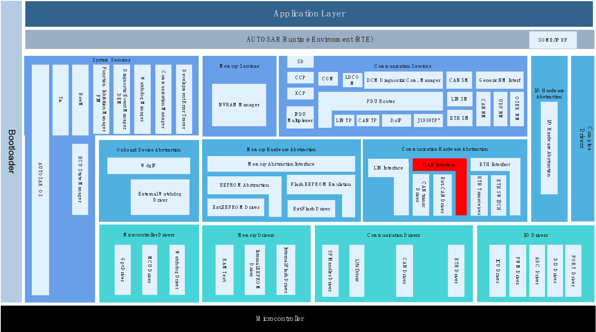
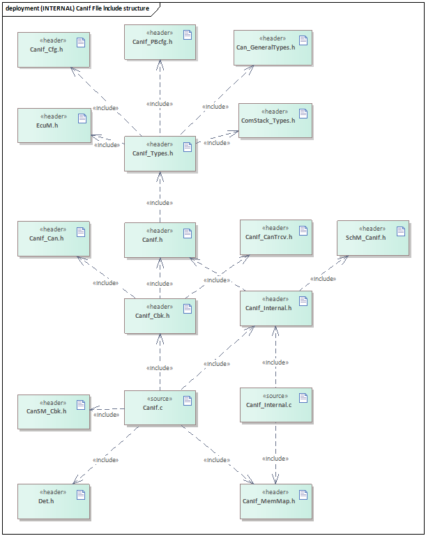

====================
CanIf
====================

文档信息（Document Information）
========================================

版本历史（Version History）
------------------------------------

.. list-table::
   :widths: 10 10 10 10 20
   :header-rows: 1

   * - 日期（Date）
     - 作者（Author）
     - 版本（Version）
     - 状态（Status）
     - 说明（Description）
   * - 2025/3/3
     - miao.wang
     - V0.1
     - 发布（Release）
     - 首次发布（First release）
   * - 2025/04/04
     - miao.wang
     - V1.0
     - 发布（Release）
     - 正式发布（Official release）

参考文档（Reference Document）
------------------------------------

.. list-table::
   :widths: 10 10 30 10
   :header-rows: 1

   * - 编号（Number）
     - 分类（Classification）
     - 标题（Title）
     - 版本（Version）
   * - 1
     - Autosar
     - AUTOSAR_CP_SRS_CAN.pdf
     - R23-11
   * - 2
     - Autosar
     - AUTOSAR_CP_SWS_CANInterface.pdf
     - R23-11

术语与简写（Terms and Abbreviations）
==========================================

术语（Term）
-----------------------
   .. :align: center   表格内容居中

.. list-table::
   :widths: 10 40
   :header-rows: 1

   * - 术语（Term）
     - 解释（Explanation）

   * - CAN Hardware Unit
     - 一个CAN物理单元包含一个或多个相同类型的CAN控制器
      
       A CAN physical unit contains one or more CAN controllers of the same type

   * - CanIf Receive L-PDU
     - CanIf接收的“由下至上”的PDU
      
       The "bottom-up" PDU received by CanIf

   * - CanIf Transmit L-PDU
     - CanIf发送的“由上至下”的PDU
      
       The "top-down" PDU sent by CanIf

简写（Abbreviation）
------------------------

.. list-table::
   :widths: 10 20 30
   :header-rows: 1

   * - 简写（Abbreviation）
     - 全称（Full name）
     - 解释（Explanation）

   * - CanDrv
     - CAN Driver module
     - CAN控制器驱动模块

   * - CAN FD
     - CAN with Flexible Data-Rate
     - 相比传统CAN，其波特率及负载都更高

   * - CanIf
     - CAN Interface module
     - CAN接口模块

   * - CanTrcv
     - CAN Transceiver Driver module
     - CAN收发器驱动模块

   * - HOH
     - CAN hardware object handle
     - CAN硬件抽象单元（HRH+HTH）

   * - HRH
     - CAN hardware receive handle
     - CAN驱动层接收硬件单元的抽象

   * - HTH
     - CAN hardware transmit handle
     - CAN驱动层发送硬件单元的抽象

   * - DET
     - Default Error Tracer
     - 开发错误检测

简介（Introduction）
============================

CanIf模块将底层不同的Can驱动，CanTrcv驱动抽象化，方便上层模块统一通过CanIf模块进行访问。
在AUTOSAR架构中，其上层模块主要为PduR，CanTp，J1939Tp，CanNm，CanSm等。
CanIf主要功能包含L-PDU的接收指示，L-PDU的发送及发送确认等通信功能，
以及Can Controller/Trcv的模式控制，波特率切换，睡眠唤醒等其它功能栈功能。

The CanIf module abstracts different underlying Can drivers and CanTrcv drivers, facilitating unified access by upper-layer modules through the CanIf module.
In the AUTOSAR architecture, its upper-layer modules mainly include PduR, CanTp, J1939Tp, CanNm, CanSm, etc.
The main functions of CanIf include communication functions such as L-PDU reception indication, L-PDU transmission and transmission confirmation,
as well as other functional stack functions like mode control of Can Controller/Trcv, baud rate switching, sleep and wake-up, etc.

   CanIf模块层次图
   
   CanIf Module Hierarchy Diagram

CanIf模块处于AUTOSAR架构中的通信硬件抽象层，其下层模块为CanDrv/CanTrcv驱动模块，
上层模块可能为PduR，CanTp，CanNm，CanSM，EcuM，Xcp，J1939Tp，J1939Nm，CDD。

The CanIf module is located in the communication hardware abstraction layer of the AUTOSAR architecture. Its lower-layer modules are the CanDrv/CanTrcv driver modules, and the upper-layer modules may include PduR, CanTp, CanNm, CanSM, EcuM, Xcp, J1939Tp, J1939Nm, and CDD.

CanIf实现了与上下层模块间基于PDU的发送/接收，实现了对硬件单元模式的控制以及模式切换通知，
实现了对睡眠/唤醒机制的支持。

CanIf implements PDU-based transmission/reception with upper and lower layer modules, realizes the control of hardware unit modes and mode switch notifications, and supports the sleep/wake-up mechanism.

功能描述（Functional Description）
=========================================
.. 本章节仅描述模块支持的功能大致情况，不宜做细致描述；更加细致的描述在配置章节，结合配置，从集成角度描述

模式控制功能（Mode control function）
--------------------------------------------

模式控制功能介绍（Introduction to Mode Control Function）
~~~~~~~~~~~~~~~~~~~~~~~~~~~~~~~~~~~~~~~~~~~~~~~~~~~~~~~~~~~~~

#. CanIf模块的状态机控制，包括未初始化和已初始化状态，除了CanIf_Init 和CanIf_GetVersionInfo之外，都需要在已初始化状态下才能正常调用。

   The state machine control of the CanIf module includes uninitialized and initialized states. Except for CanIf_Init and CanIf_GetVersionInfo, all other functions can only be called normally in the initialized state.

#. Controller模式控制，分为STOPPED，STARTED，SLEEP三种，只有在START状态下Controller才能正常通信。

   Controller mode control is divided into three types: STOPPED, STARTED, and SLEEP. Only in the STARTED state can the Controller communicate normally.

#. Trcv模式控制，分为NORMAL，STANDBY，SLEEP三种，只有在NORMAL状态下Trcv才能正常通信。

   Trcv mode control is divided into three types: NORMAL, STANDBY, and SLEEP. Only in the NORMAL state can Trcv communicate normally.

#. Controller的Pdu模式控制，分为OFFLINE，TX_OFFLINE，TX_OFFLINE_ACTIVE，ONLINE四种，
   ONLINE模式下允许正常收发通信，TX_OFFLINE模式下只能接收不能发送，
   TX_OFFLINE_ACTIVE模式下允许接收和虚拟发送，OFFLINE模式下不允许收发通信。

   The Pdu mode control of the Controller is divided into four types: OFFLINE, TX_OFFLINE, TX_OFFLINE_ACTIVE, and ONLINE. 
   In the ONLINE mode, normal sending and receiving of communications are allowed; in the TX_OFFLINE mode, only receiving is allowed and sending is not permitted; 
   in the TX_OFFLINE_ACTIVE mode, receiving and virtual sending are allowed; in the OFFLINE mode, sending and receiving of communications are not allowed.

模式控制功能实现（Implementation of Mode Control Function）
~~~~~~~~~~~~~~~~~~~~~~~~~~~~~~~~~~~~~~~~~~~~~~~~~~~~~~~~~~~~~~~

#. 上电之后CanIf处于CANIF_UNINIT状态，正确调用CanIf_Init（参数为CanIf模块PB配置参数指针）之后状态切换到CANIF_INITED。

   After power-on, CanIf is in the CANIF_UNINIT state. After the CanIf_Init (with the parameter being the pointer to the CanIf module PB configuration parameters) is called correctly, the state switches to CANIF_INITED.

#. CanIf_Init初始化之后，Controller模式为STOPPED，调用接口CanIf_SetControllerMode切换Controller模式，
   调用CanIf_GetControllerMode获取当前Controller模式。当Controller发生BusOff事件时，Controller模式切换到STOPPED。
     
   After CanIf_Init is initialized, the Controller mode is STOPPED. The interface CanIf_SetControllerMode is called to switch the Controller mode, and CanIf_GetControllerMode is called to obtain the current Controller mode. When a BusOff event occurs in the Controller, the Controller mode switches to STOPPED.

#. 调用CanIf_SetTrcvMode切换Trcv模式，调用CanIf_GetTrcvMode获取Trcv当前模式。
  
   Call CanIf_SetTrcvMode to switch the Trcv mode, and call CanIf_GetTrcvMode to obtain the current Trcv mode.

#. CanIf_Init初始化之后，Pdu模式为OFFLINE，调用CanIf_SetPduMode切换Pdu模式，
   调用CanIf_GetPduMode获取当前Controller的Pdu模式。
   其中TX_OFFLINE_ACTIVE模式需要在配置项CanIfTxOfflineActiveSupport使能时才支持。
   当Controller发生BusOff事件时，Pdu模式切换到TX_OFFLINE。

   After initialization by CanIf_Init, the Pdu mode is OFFLINE. Call CanIf_SetPduMode to switch the Pdu mode, and call CanIf_GetPduMode to obtain the current Pdu mode of the Controller. 
   Among them, the TX_OFFLINE_ACTIVE mode is only supported when the configuration item CanIfTxOfflineActiveSupport is enabled. 
   When a BusOff event occurs in the Controller, the Pdu mode switches to TX_OFFLINE.

TxPdu发送功能（TxPdu transmission function）
-------------------------------------------------

TxPdu发送功能介绍（Introduction to TxPdu Transmission Function）
~~~~~~~~~~~~~~~~~~~~~~~~~~~~~~~~~~~~~~~~~~~~~~~~~~~~~~~~~~~~~~~~~~~~~~~~~~

当模块初始化成功，Controller模式及其Pdu模式，Trcv模式均处于允许发送状态时，可通过CanIf两种发送机制来发送L-Pdu：

When the module is initialized successfully, and the Controller mode, its Pdu mode, and the Trcv mode are all in a state that allows transmission, L-Pdu can be sent through two transmission mechanisms of CanIf:

- 方式一：上层模块调用CanIf_Transmit请求TxPdu的发送，发送时机由上层决定；
  
  Method 1: The upper-layer module calls CanIf_Transmit to request the transmission of TxPdu, and the transmission timing is determined by the upper layer.

- 方式二：下层驱动调用CanIf_TriggerTransmit请求TxPdu的发送数据，发送时机由下层决定；

  Method 2: The lower-layer driver calls CanIf_TriggerTransmit to request the transmission data of TxPdu, and the transmission timing is determined by the lower layer.

TxPdu发送成功后，下层驱动调用CanIf_TxConfirmation进行发送确认。

After the TxPdu is sent successfully, the lower-layer driver calls CanIf_TxConfirmation for transmission confirmation.

TxPdu发送功能实现（Implementation of TxPdu Transmission Function）
~~~~~~~~~~~~~~~~~~~~~~~~~~~~~~~~~~~~~~~~~~~~~~~~~~~~~~~~~~~~~~~~~~~~~~~~~~~

当上层模块调用CanIf_Transmit请求TxPdu发送，并传入L-PDU的SDU及可能存在的MetaData数据时，
CanIf根据Static/Dynamic CanId策略计算出该TxPdu当前对应的CanId，调用Can_Write由配置的HTH进行发送。

When the upper-layer module calls CanIf_Transmit to request the transmission of TxPdu and passes in the SDU of the L-PDU and possibly existing MetaData, CanIf calculates the current corresponding CanId of the TxPdu according to the Static/Dynamic CanId strategy, and calls Can_Write to send it through the configured HTH.

CAN总线通常不支持TriggerTransmit进行发送，该机制通常用于LIN总线。

The CAN bus generally does not support transmission via TriggerTransmit; this mechanism is typically used for the LIN bus.

当驱动层TxPdu发送成功后，调用CanIf_TxConfirmation，CanIf调用<User_TxConfirmation>通知上层模块。

When the driver layer successfully sends a TxPdu, it calls CanIf_TxConfirmation, and CanIf then invokes <User_TxConfirmation> to notify the upper-layer module.

对于TxPdu发送，可以配置TxBuffer机制（CanIfBufferSize>0）来降低因发送邮箱BUSY而导致丢帧的概率。
需注意的是配置项CanIfBufferSize决定该HTH最多缓存的不同TxPdu帧数，对于每个TxPdu最多只能缓存一帧。

For TxPdu transmission, the TxBuffer mechanism (CanIfBufferSize > 0) can be configured to reduce the probability of frame loss caused by a busy transmit mailbox. 
It should be noted that the configuration item CanIfBufferSize determines the maximum number of different TxPdu frames that can be buffered by the HTH, and only one frame can be buffered for each TxPdu.

RxPdu接收功能（RxPdu Receiving Function）
-----------------------------------------------

RxPdu接收功能介绍（Introduction to RxPdu Receiving Function）
~~~~~~~~~~~~~~~~~~~~~~~~~~~~~~~~~~~~~~~~~~~~~~~~~~~~~~~~~~~~~~~~~

当模块初始化成功，Controller模式及其Pdu模式，Trcv模式均处于允许接收状态时，将从驱动层接收到的报文，传递到上层模块。

When the module is initialized successfully, and the Controller mode, its Pdu mode, and the Trcv mode are all in a state that allows reception, the messages received from the driver layer will be transmitted to the upper-layer module.

RxPdu接收功能实现（Implementation of RxPdu Receiving Function）
~~~~~~~~~~~~~~~~~~~~~~~~~~~~~~~~~~~~~~~~~~~~~~~~~~~~~~~~~~~~~~~~~~~~~

当驱动层邮箱收到报文后，调用CanIf_RxIndication将接收数据传递到CanIf模块，CanIf通过接收的HRH以及CanId，
查询匹配到接收RxPdu，调用关联上层模块的<User_RxIndication>将接收RxPdu数据传递给上层模块。

When the driver layer mailbox receives a message, it calls CanIf_RxIndication to pass the received data to the CanIf module. The CanIf module queries and matches the received RxPdu through the received HRH and CanId, and then calls the <User_RxIndication> associated with the upper-layer module to pass the received RxPdu data to the upper-layer module.

RxPdu上层模块由配置项CanIfRxPduUserRxIndicationUL决定，<User_RxIndication>由配置项CanIfRxPduUserRxIndicationName决定。

The upper-layer module of RxPdu is determined by the configuration item CanIfRxPduUserRxIndicationUL, and <User_RxIndication> is determined by the configuration item CanIfRxPduUserRxIndicationName.

睡眠唤醒功能（Sleep and Wake-up Function）
-----------------------------------------------

睡眠唤醒功能介绍（Introduction to Sleep and Wake-up Function）
~~~~~~~~~~~~~~~~~~~~~~~~~~~~~~~~~~~~~~~~~~~~~~~~~~~~~~~~~~~~~~~~~~~~~~

上层模块可以通过CanIf来将Controller/Trcv设置为SLEEP模式，支持Controller/Trcv唤醒源检测，
Controller/Trcv唤醒确认，Trcv唤醒原因获取，Trcv唤醒标志位检测/清除，Trcv唤醒模式设置。

The upper-layer module can set the Controller/Trcv to SLEEP mode through CanIf, and supports Controller/Trcv wake-up source detection, Controller/Trcv wake-up confirmation, Trcv wake-up reason acquisition, Trcv wake-up flag detection/clearance, and Trcv wake-up mode setting.

睡眠唤醒功能实现（Implementation of Sleep and Wake-up Function）
~~~~~~~~~~~~~~~~~~~~~~~~~~~~~~~~~~~~~~~~~~~~~~~~~~~~~~~~~~~~~~~~~~~~~~

CanIf提供CanIf_SetControllerMode/CanIf_SetTrcvMode来设置Controller/Trcv的模式（包含SLEEP模式），
当发生唤醒事件后可通过调用CanIf_CheckWakeup来检测是否由Controller/Trcv导致的唤醒事件，
可通过CanIf_CheckValidation来检测唤醒成功确认（唤醒确认条件为接收到任意Pdu/NM Pdu，
参见配置项CanIfPublicWakeupCheckValidByNM是否勾选）。

CanIf provides CanIf_SetControllerMode/CanIf_SetTrcvMode to set the mode of Controller/Trcv (including SLEEP mode). When a wake-up event occurs, CanIf_CheckWakeup can be called to detect whether the wake-up event is caused by the Controller/Trcv. CanIf_CheckValidation can be used to detect the successful confirmation of wake-up (the wake-up confirmation condition is receiving any Pdu/NM Pdu, see whether the configuration item CanIfPublicWakeupCheckValidByNM is checked).

特性（Features）
-------------------------

.. only:: doc_pbs

  支持变体功能（Support variant functionality）
  ~~~~~~~~~~~~~~~~~~~~~~~~~~~~~~~~~~~~~~~~~~~~~~~~~~~~~

  - 支持TxPdu中CanId、HTH、EcuC Pdu等配置变体
    
    Supports configuration variants such as CanId, HTH, and EcuC Pdu in TxPdu.
  
  - 支持RxPdu中CanId、DLC、HRH、EcuC Pdu等配置变体
    
    Supports configuration variants such as CanId, DLC, HRH, and EcuC Pdu in RxPdu.

偏差
--------------

None

扩展
-------------

None

集成（Integration）
=======================

文件列表（File list）
--------------------------

静态文件（Static Files）
~~~~~~~~~~~~~~~~~~~~~~~~~~~~~~~~~~

.. list-table::
   :widths: 10 30
   :header-rows: 1

   * - 文件（File）
     - 描述（Description）

   * - CanIf.h
     - 声明CanIf模块的全部外部接口（除了回调函数），以及配置文件中的全局变量。
        
       Declare all external interfaces of the CanIf module (except callback functions) and the global variables in the configuration file.

   * - CanIf.c
     - 作为CanIf模块的核心文件，实现CanIf模块全部对外接口，以及实现CanIf模块功能所必须的local函数，local宏定义，local变量定义。
        
       As the core file of the CanIf module, it implements all the external interfaces of the CanIf module, as well as the local functions, local macro definitions, and local variable definitions that are necessary for realizing the functions of the CanIf module.

   * - CanIf_Types.h
     - 定义CanIf模块外部/内部类型，包括AUTOSAR标准定义的类型。
        
       Define the external/internal types of the CanIf module, including the types defined by the AUTOSAR standard.

   * - CanIf_Internal.h
     - 声明CanIf模块内部功能所必须的local函数，local宏定义，local变量。
      
       Declare the local functions, local macro definitions, and local variables necessary for the internal functions of the CanIf module. 

   * - CanIf_Internal.c
     - 实现CanIf模块内部功能所必须的local函数，local宏定义，local变量。
      
       Implement the local functions, local macro definitions, and local variables necessary for the internal functions of the CanIf module. 

   * - CanIf_DetError.h
     - 声明CanIf模块DET错误检测功能的函数接口。
      
       Declare the function interfaces for the DET error detection functionality of the CanIf module.

   * - CanIf_DetError.c
     - 实现CanIf模块DET错误检测功能的函数接口。
      
       Implement the function interfaces for the DET error detection functionality of the CanIf module.

   * - CanIf_CanTrcv.h
     - 声明CanIf模块提供给CanTrcv模块的回调函数。
      
       Declare the callback functions provided by the CanIf module to the CanTrcv module.

   * - CanIf_Can.h
     - 声明CanIf模块提供给Can模块的回调函数。
      
       Declare the callback functions provided by the CanIf module to the Can module.

   * - CanIf_Cbk.h
     - 包含CanIf模块全部回调函数的声明。
      
       Contains declarations of all callback functions of the CanIf module.

   * - CanIf_MemMap.h
     - 声明CanIf模块内存布局。
      
       Declare the memory layout of the CanIf module.

动态文件（Dynamic file）
~~~~~~~~~~~~~~~~~~~~~~~~~~~~~~~~

.. list-table::
   :widths: 10 30
   :header-rows: 1

   * - 文件（File）
     - 描述（Description）

   * - CanIf_CfgTypes.h
     - 定义PB/PC配置参数结构体类型，以及内部运行时结构体类型。
        
       Define the structure types of PB/PC configuration parameters and the internal runtime structure types.

   * - CanIf_Cfg.h
     - 定义CanIf模块PC配置的宏定义。
        
       Define the macro definitions for the CanIf module's PC configuration. 

   * - CanIf_Cfg.c
     - 定义CanIf模块PC配置的结构体参数。
      
       Define the structure parameters for the CanIf module's PC configuration.

   * - CanIf_PBcfg.h
     - 定义CanIf模块PB配置的宏定义。
      
       Define the macro definitions for the PB configuration of the CanIf module.

   * - CanIf_PBcfg.c
     - 定义CanIf模块PB配置的结构体参数。
      
       Define the structure parameters for the CanIf module's PB configuration.

错误处理（Error handling）
----------------------------------

开发错误（Development error）
~~~~~~~~~~~~~~~~~~~~~~~~~~~~~~~~~~~
.. list-table::
   :widths: 20 10 30
   :header-rows: 1

   * - Error code
     - Value[Hex]
     - Description

   * - CANIF_E_PARAM_CANID
     - 0x0A
     - API service called with invalid CAN ID

   * - CANIF_E_PARAM_HOH
     - 0x0C
     - API service called with invalid hardware object

   * - CANIF_E_PARAM_LPDU
     - 0x0D
     - API service called with invalid PDU ID

   * - CANIF_E_PARAM_CONTROLLERID
     - 0x0F
     - API service called with invalid controller ID

   * - CANIF_E_PARAM_WAKEUPSOURCE
     - 0x10
     - API service called with invalid wakeup source

   * - CANIF_E_PARAM_TRCV
     - 0x11
     - API service called with invalid transceiver ID

   * - CANIF_E_PARAM_TRCVMODE
     - 0x12
     - API service called with invalid transceiver mode

   * - CANIF_E_PARAM_TRCVWAKEUPMODE
     - 0x13
     - API service called with invalid transceiver wakeup mode

   * - CANIF_E_PARAM_POINTER
     - 0x14
     - API service called with invalid pointer

   * - CANIF_E_PARAM_CTRLMODE
     - 0x15
     - API service called with invalid controller mode

   * - CANIF_E_PARAM_PDU_MODE
     - 0x16
     - API service called with invalid PDU mode

   * - CANIF_E_PARAM_CAN_ERROR
     - 0x17
     - API services called with invalid parameter

   * - CANIF_E_UNINIT
     - 0x1E
     - API service used without module initialization

   * - CANIF_E_INVALID_TXPDUID
     - 0x32
     - Transmit PDU ID invalid

   * - CANIF_E_INVALID_RXPDUID
     - 0x3C
     - Receive PDU ID invalid

   * - CANIF_E_INIT_FAILED
     - 0x50
     - CAN Interface initialisation failed

产品错误（Product error）
~~~~~~~~~~~~~~~~~~~~~~~~~~~~~~~~~~~~
None

运行时错误（Runtime error）
~~~~~~~~~~~~~~~~~~~~~~~~~~~~~~~~~~~~~

.. list-table::
   :widths: 20 10 30
   :header-rows: 1

   * - Error code
     - Value[Hex]
     - Description

   * - CANIF_E_INVALID_DATA_LENGTH
     - 0x3D
     - Failed Data Length Check

   * - CANIF_E_DATA_LENGTH_MISMATCH
     - 0x3E
     - Data Length

   * - CANIF_E_STOPPED
     - 0x46
     - Transmit requested on offline PDU channel

   * - CANIF_E_TXPDU_LENGTH_EXCEEDED
     - 0x5A
     - Message length was exceeding the maximum length

接口描述（Interface Description）
=========================================

.. 目前能够自动生成的有类型定义，普通函数，回调函数。
.. 有些模块的API来自多个头文件，需要自行裁剪合并
.. 引用接口描述。来自于code->doxygen->xml->rst
.. include:: CanIf_h_api.rst

配置（Configuration）
------------------------------

1. Tx Data Path
----------------------

配置数据发送路径，需要引用上层EcuC的Pdu和下层CanDrv的CanController，
并逐层配置CanIfTxPduCfg、CanIfBufferCfg、CanIfHthCfg、CanIfCtrlCfg。
 
To configure the data transmission path, it is necessary to reference the Pdu of the upper-layer EcuC and the CanController of the lower-layer CanDrv, and configure CanIfTxPduCfg, CanIfBufferCfg, CanIfHthCfg, and CanIfCtrlCfg layer by layer.

   CanIfTxPduCfg

.. figure:: ../../../_static/参考手册/CanIf/image3.png
   :name: CanIf_CanIfBufferCfg
   :align: center

   CanIfBufferCfg

.. figure:: ../../../_static/参考手册/CanIf/image4.png
   :name: CanIf_Pdu
   :align: center

   EcuC Pdu

如图，

As shown in the figure,

 - 配置项CanIfTxPduCfg/CanIfTxPduRef，向上关联了EcuC的Pdu

   The configuration item CanIfTxPduCfg/CanIfTxPduRef is upwardly associated with the Pdu of EcuC.

 - 配置项CanIfTxPduCfg/CanIfTxPduBufferRef，向下关联了CanIfBufferCfg

   The configuration item CanIfTxPduCfg/CanIfTxPduBufferRef has a downward association with CanIfBufferCfg.

.. figure:: ../../../_static/参考手册/CanIf/image5.png
   :name: CanIf_CanIfHthCfg
   :align: center

   CanIfHthCfg

.. figure:: ../../../_static/参考手册/CanIf/image6.png
   :name: CanIf_CanIfCtrlCfg
   :align: center

   CanIfCtrlCfg

如图，

As shown in the figure,

 - 配置项CanIfBufferCfg/CanIfBufferHthRef，向下关联了CanIfHthCfg

   The configuration item CanIfBufferCfg/CanIfBufferHthRef is downwardly associated with CanIfHthCfg.

 - 配置项CanIfHthCfg/CanIfHthCanCtrlIdRef，向下关联了CanIfCtrlCfg
   
   The configuration item CanIfHthCfg/CanIfHthCanCtrlIdRef is downwardly associated with CanIfCtrlCfg.

2. Rx Data Path
----------------------

配置数据接收路径，需要引用上层EcuC的Pdu和下层CanDrv的CanController，
并逐层配置CanIfTxPduCfg、CanIfHrhCfg、CanIfCtrlCfg。

To configure the data reception path, it is necessary to reference the Pdu of the upper-layer EcuC and the CanController of the lower-layer CanDrv, and configure CanIfTxPduCfg, CanIfHrhCfg, and CanIfCtrlCfg layer by layer.

.. figure:: ../../../_static/参考手册/CanIf/image7.png
   :name: CanIf_CanIfRxPduCfg
   :align: center

   CanIfRxPduCfg

.. figure:: ../../../_static/参考手册/CanIf/image8.png
   :name: CanIf_CanIfHrhCfg
   :align: center

   CanIfHrhCfg

如图，

As shown in the figure,

 - 配置项CanIfRxPduCfg/CanIfRxPduRef，向上关联了EcuC的Pdu

   The configuration item CanIfRxPduCfg/CanIfRxPduRef is upwardly associated with the Pdu of EcuC.

 - 配置项CanIfRxPduCfg/CanIfRxPduHrhIdRef，向下关联了CanIfHrhCfg

   The configuration item CanIfRxPduCfg/CanIfRxPduHrhIdRef is downwardly associated with CanIfHrhCfg.

 - 配置项CanIfHrhCfg/CanIfHrhCanCtrlIdRef，向下关联了CanIfCtrlCfg

   The configuration item CanIfHrhCfg/CanIfHrhCanCtrlIdRef is downwardly associated with CanIfCtrlCfg.

