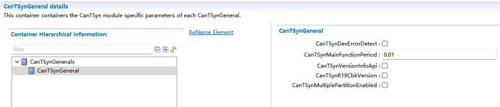
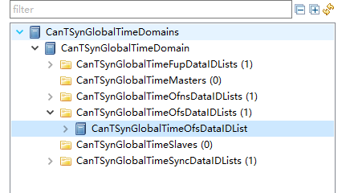
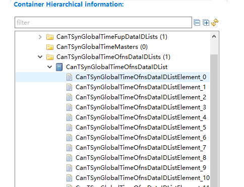
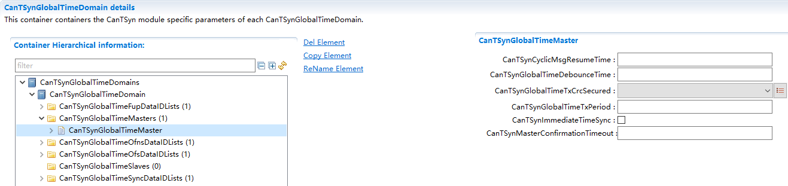
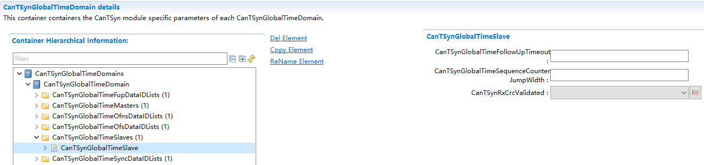
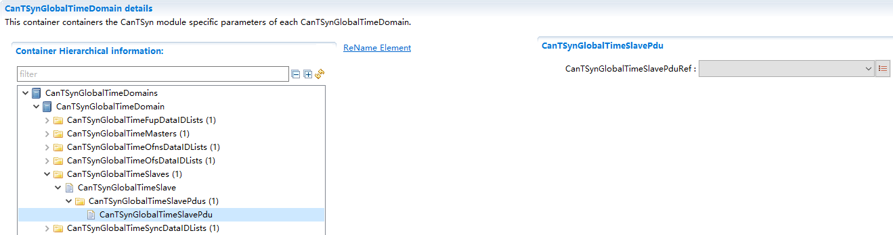

===================
CanTSyn产品参考手册
===================

**缩写词注解**

+------------+---------------------------+----------------------------+
| **缩写词** | **英文全称**              | **中文解释**               |
+------------+---------------------------+----------------------------+
| (G)TD      | (Global) Time Domain      | （全局）时间域             |
+------------+---------------------------+----------------------------+
| (G)TM      | (Global)Time Master       | （全局）时间主控           |
+------------+---------------------------+----------------------------+
| <Bus>TSyn  | A bus specific Time       | 特定总线时间同步模块       |
|            | Synchronization module    |                            |
+------------+---------------------------+----------------------------+
| CAN        | Controller Area Network   | 控制器区域网络             |
+------------+---------------------------+----------------------------+
| CanTSyn    | Time Synchronization      | CAN时间同步模块            |
|            | module for CAN            |                            |
+------------+---------------------------+----------------------------+
| CRC        | Cyclic Redundancy         | 循环冗余检验               |
|            | Checksum                  |                            |
+------------+---------------------------+----------------------------+
| Debounce   | Minimum gap between two   | 同一                       |
| Time       | Tx messages with the same | PDU两条发送消息的最小间隔  |
|            | PDU                       |                            |
+------------+---------------------------+----------------------------+
| DEM        | Diagnostic Event Manager  | 诊断事件管理               |
+------------+---------------------------+----------------------------+
| DET        | Default Error Tracer      | 默认错误跟踪器             |
+------------+---------------------------+----------------------------+
| DLC        | Data Length Code          | 数据长度代码               |
+------------+---------------------------+----------------------------+
| FUP        | Follow-Up message         | 后续消息                   |
| message    |                           |                            |
+------------+---------------------------+----------------------------+
| OFNS       | Offset adjustment message | 偏移调整消息               |
| message    |                           |                            |
+------------+---------------------------+----------------------------+
| OFS        | Offset Synchronization    | 偏移同步消息               |
| message    | message                   |                            |
+------------+---------------------------+----------------------------+
| StbM       | Synchronized Time-Base    | 同步的时间基管理           |
|            | Manager                   |                            |
+------------+---------------------------+----------------------------+
| SYNC       | Time Synchronization      | 时间同步消息               |
| message    | message                   |                            |
+------------+---------------------------+----------------------------+
| TG         | Time Gateway              | 时间网关                   |
+------------+---------------------------+----------------------------+
| Timesync   | Time Synchronization      | 时间同步                   |
+------------+---------------------------+----------------------------+
| TS         | Time Slave                | 时间从属                   |
+------------+---------------------------+----------------------------+
| TSD        | Time Sub-domain           | 时间子域                   |
+------------+---------------------------+----------------------------+

简介
====

   CanTSyn在AutoSAR软件层级架构如下图，其所属于时间同步栈。

|image1|

图1-1 CanTSyn所在AutoSAR软件架构

本文中描述CanTSyn，StbM负责管理时间域，给CanTSyn提供接口用来更新同步时间，给其他用户提供接口用来获取/通知同步时间。CanTSyn负责Can总线上的时间同步。

参考资料
--------

   [1] AUTOSAR_SWS_TimeSyncOverCAN.pdf，R19-11

   [2] AUTOSAR_SWS_SynchronizedTimeBaseManager.pdf，R19-11

   [3] AUTOSAR_EXP_LayeredSoftwareArchitecture.pdf，R19-11

功能描述
========

CanTSyn功能
-----------

CanTSyn功能介绍
~~~~~~~~~~~~~~~

CanTSyn模块和StbM模块息息相关，StbM模块提供了时间同步的功能和时钟实例的指针，但不负责在各个总线内的时间分发任务。那么CanTSyn模块就处理了在CAN总线发放时间信息的任务。

仅仅通过广播的方式把时间信息从Time Masters发送到Time
Slaves会导致时间不精准，这是因为CAN总线传输仲裁机制以及BSW的延迟。

CanTSyn功能实现
~~~~~~~~~~~~~~~

我们通过以下的两步算法来尽可能消除这样的延迟：

发送方（Time
Master）首先记录当前的同步时间（SYNC）以及本地时间(T0VLT)并在第一个广播信息（所谓的SYNC信息）里，把同步好的时间的秒部分（SYNCSEC）作为内容发送。发送方在收到
“CAN transmit
confirmation”时记录时间戳来得到信息实际发送的时间点（T1VLT）。

接收方（Time Slave）收到信息 “CAN receive
indication”时记录时间戳来检测信息实际收到的时间点（T2VLT）。

在第二个广播信息（所谓的FUP（follow-up）信息）里，发送方发送T4作为内容，T4为SYNC消息准备发送和实际发送的时间差（T1VLT-T0VLT）加上T0SYNCNS（同步时间的纳秒部分）（T4=T0SYNCNS+(T1VLT-T0VLT)）。对于发送方来说，此时T0SYNCSEC+T4就为同步时间。

Time
Slave现在从SYNC和FUP消息里获取了足够的信息，再加上先前记录的时间戳T2VLT，就可以确定更加确切的时间信息。接收方获取当前的时间戳为T3VLT，再减去T2VLT，我们就将FUP及SYNC消息中的传输延迟包含在内，再加上T0SYNCSEC+T4（Master的同步时间），我们就得到最终的同步时间T5=
T0SYNCSEC+T4+（T3VLT-T2VLT）。

至此，Time Master和Time Slave完成时间同步。

以下图片显示了CAN时间同步机制：

|image2|

图2-1 Can时间同步算法

源文件描述
==========

表3-1 CanTSyn组件文件描述

+---------------------+------------------------------------------------+
| **文件**            | **说明**                                       |
+---------------------+------------------------------------------------+
| CanTSyn.c           | 包含需                                         |
|                     | 要使用的宏定义，内部变量，内部函数，全局函数。 |
+---------------------+------------------------------------------------+
| CanTSyn.h           | 包含需要使用的宏                               |
|                     | 定义，类型定义，配置结构体声明，外部函数声明。 |
+---------------------+------------------------------------------------+
| CanTSyn_Cbk.h       | 包含需要使用的宏定义                           |
|                     | ，类型定义，配置结构体声明，外部回调函数声明。 |
+---------------------+------------------------------------------------+
| CanTSyn_Cfg.h       | 包含配置宏定义。                               |
+---------------------+------------------------------------------------+
| CanTSyn_Cfg.c       | 包含配置参数结构体。                           |
+---------------------+------------------------------------------------+
| CanTSyn_MemMap.h    | CanTSyn模块的内存映射。                        |
+---------------------+------------------------------------------------+

|image3|\ 图3-1 CanTSyn组件文件交互关系图

API接口
=======

类型定义
--------

CanTSyn_ConfigType类型定义
~~~~~~~~~~~~~~~~~~~~~~~~~~

+-----------+----------------------------------------------------------+
| 名称      | CanTSyn_ConfigType                                       |
+-----------+----------------------------------------------------------+
| 类型      | Structure                                                |
+-----------+----------------------------------------------------------+
| 范围      | 无                                                       |
+-----------+----------------------------------------------------------+
| 描述      | 配置参数结构体类型定义                                   |
+-----------+----------------------------------------------------------+

CanTSyn_TransmissionModeType类型定义
~~~~~~~~~~~~~~~~~~~~~~~~~~~~~~~~~~~~

+-----------+----------------------------------------------------------+
| 名称      | CanTSyn_TransmissionModeType                             |
+-----------+----------------------------------------------------------+
| 类型      | Enumeration                                              |
+-----------+----------------------------------------------------------+
| 范围      | CANTSYN_TX_OFF                                           |
|           |                                                          |
|           | CANTSYN_TX_ON                                            |
+-----------+----------------------------------------------------------+
| 描述      | 传输模式                                                 |
+-----------+----------------------------------------------------------+

输入函数描述
------------

+----------------------------------+-----------------------------------+
| **输入模块**                     | **API**                           |
+----------------------------------+-----------------------------------+
| Crc                              | Crc_CalculateCRC8H2F              |
+----------------------------------+-----------------------------------+
| Det                              | Det_ReportError                   |
+----------------------------------+-----------------------------------+
| CanIf                            | CanIf_Transmit                    |
+----------------------------------+-----------------------------------+
| StbM                             | StbM_BusGetCurrentTime            |
+----------------------------------+-----------------------------------+
|                                  | StbM_BusSetGlobalTime             |
+----------------------------------+-----------------------------------+
|                                  | StbM_GetCurrentVirtualLocalTime   |
+----------------------------------+-----------------------------------+
|                                  | StbM_GetOffset                    |
+----------------------------------+-----------------------------------+
|                                  | StbM_GetTimeBaseStatus            |
+----------------------------------+-----------------------------------+
|                                  | StbM_GetTimeBaseUpdateCounter     |
+----------------------------------+-----------------------------------+

静态接口函数定义
----------------

CanTSyn_GetVersionInfo函数定义
~~~~~~~~~~~~~~~~~~~~~~~~~~~~~~

+-------------+--------------------------------------------------------+
| 函数名称：  | CanTSyn_GetVersionInfo                                 |
+-------------+--------------------------------------------------------+
| 函数原型：  | void CanTSyn_GetVersionInfo (                          |
|             |                                                        |
|             | Std_VersionInfoType\* versioninfo                      |
|             |                                                        |
|             | )                                                      |
+-------------+--------------------------------------------------------+
| 服务编号：  | 0x02                                                   |
+-------------+--------------------------------------------------------+
| 同步/异步： | 同步                                                   |
+-------------+--------------------------------------------------------+
| 是          | 否                                                     |
| 否可重入：  |                                                        |
+-------------+--------------------------------------------------------+
| 输入参数：  | 无                                                     |
+-------------+--------------------------------------------------------+
| 输入        | 无                                                     |
| 输出参数：  |                                                        |
+-------------+--------------------------------------------------------+
| 输出参数：  | versionInfoPtr：版本信息                               |
+-------------+--------------------------------------------------------+
| 返回值：    | 无                                                     |
+-------------+--------------------------------------------------------+
| 功能概述：  | 获取CanTSyn模块版本信息                                |
+-------------+--------------------------------------------------------+

CanTSyn_Init函数定义
~~~~~~~~~~~~~~~~~~~~

+-------------+--------------------+---------+------------------------+---+
| 函数名称：  | CanTSyn_Init       |         |                        |   |
+-------------+--------------------+---------+------------------------+---+
| 函数原型：  | void CanTSyn_Init  |         |                        |   |
|             | (                  |         |                        |   |
|             |                    |         |                        |   |
|             | const              |         |                        |   |
|             | Ca                 |         |                        |   |
|             | nTSyn_ConfigType\* |         |                        |   |
|             | configPtr          |         |                        |   |
|             |                    |         |                        |   |
|             | )                  |         |                        |   |
+-------------+--------------------+---------+------------------------+---+
| 服务编号：  | 0x01               |         |                        |   |
+-------------+--------------------+---------+------------------------+---+
| 同步/异步： | 同步               |         |                        |   |
+-------------+--------------------+---------+------------------------+---+
| 是          | 否                 |         |                        |   |
| 否可重入：  |                    |         |                        |   |
+-------------+--------------------+---------+------------------------+---+
| 输入参数：  | configPtr          | 值域：  | 配置结构指针           |   |
+-------------+--------------------+---------+------------------------+---+
| 输入        | 无                 |         |                        |   |
| 输出参数：  |                    |         |                        |   |
+-------------+--------------------+---------+------------------------+---+
| 输出参数：  | 无                 |         |                        |   |
+-------------+--------------------+---------+------------------------+---+
| 返回值：    | 无                 |         |                        |   |
+-------------+--------------------+---------+------------------------+---+
| 功能概述：  | 初始化模块。       |         |                        |   |
+-------------+--------------------+---------+------------------------+---+

CanTSyn_SetTransmissionMode函数定义
~~~~~~~~~~~~~~~~~~~~~~~~~~~~~~~~~~~

+-------------+-------------------+---------+-------------------------+
| 函数名称：  | CanTSyn_Se        |         |                         |
|             | tTransmissionMode |         |                         |
+-------------+-------------------+---------+-------------------------+
| 函数原型：  | void              |         |                         |
|             | CanTSyn_Se        |         |                         |
|             | tTransmissionMode |         |                         |
|             | (                 |         |                         |
|             |                   |         |                         |
|             | uint8 CtrlIdx,    |         |                         |
|             |                   |         |                         |
|             | CanTSyn_Tra       |         |                         |
|             | nsmissionModeType |         |                         |
|             | Mode              |         |                         |
|             |                   |         |                         |
|             | )                 |         |                         |
+-------------+-------------------+---------+-------------------------+
| 服务编号：  | 0x03              |         |                         |
+-------------+-------------------+---------+-------------------------+
| 同步/异步： | 同步              |         |                         |
+-------------+-------------------+---------+-------------------------+
| 是          | 否                |         |                         |
| 否可重入：  |                   |         |                         |
+-------------+-------------------+---------+-------------------------+
| 输入参数：  | CtrlIdx           | 值域：  | CAN通道序号             |
+-------------+-------------------+---------+-------------------------+
|             | Mode              | 值域：  | CANTSYN_TX_OFF          |
|             |                   |         | CANTSYN_TX_ON           |
+-------------+-------------------+---------+-------------------------+
| 输入        | 无                |         |                         |
| 输出参数：  |                   |         |                         |
+-------------+-------------------+---------+-------------------------+
| 输出参数：  | 无                |         |                         |
+-------------+-------------------+---------+-------------------------+
| 返回值：    | 无                |         |                         |
+-------------+-------------------+---------+-------------------------+
| 功能概述：  | 开                |         |                         |
|             | 关发送消息功能。  |         |                         |
+-------------+-------------------+---------+-------------------------+

CanTSyn_RxIndication函数定义
~~~~~~~~~~~~~~~~~~~~~~~~~~~~

+-------------+-------------------+---------+-------------------------+
| 函数名称：  | Can               |         |                         |
|             | TSyn_RxIndication |         |                         |
+-------------+-------------------+---------+-------------------------+
| 函数原型：  | void              |         |                         |
|             | Can               |         |                         |
|             | TSyn_RxIndication |         |                         |
|             | (                 |         |                         |
|             |                   |         |                         |
|             | PduIdType         |         |                         |
|             | RxPduId,          |         |                         |
|             |                   |         |                         |
|             | const             |         |                         |
|             | PduInfoType\*     |         |                         |
|             | PduInfoPtr        |         |                         |
|             |                   |         |                         |
|             | )                 |         |                         |
+-------------+-------------------+---------+-------------------------+
| 服务编号：  | 0x42              |         |                         |
+-------------+-------------------+---------+-------------------------+
| 同步/异步： | 同步              |         |                         |
+-------------+-------------------+---------+-------------------------+
| 是          | 对于不同的PDU可   |         |                         |
| 否可重入：  | 重入，否则不可。  |         |                         |
+-------------+-------------------+---------+-------------------------+
| 输入参数：  | RxPduId           | 值域：  | 收到的PDU Id            |
+-------------+-------------------+---------+-------------------------+
|             | PduInfoPtr        | 值域：  | 数据信息指针            |
+-------------+-------------------+---------+-------------------------+
| 输入        | 无                |         |                         |
| 输出参数：  |                   |         |                         |
+-------------+-------------------+---------+-------------------------+
| 输出参数：  | 无                |         |                         |
+-------------+-------------------+---------+-------------------------+
| 返回值：    | 无                |         |                         |
+-------------+-------------------+---------+-------------------------+
| 功能概述：  | 提示从            |         |                         |
|             | 下层模块收到PDU。 |         |                         |
+-------------+-------------------+---------+-------------------------+

CanTSyn_TxConfirmation函数定义
~~~~~~~~~~~~~~~~~~~~~~~~~~~~~~

+-------------+----------------------+------+-------------------------+
| 函数名称：  | Ca                   |      |                         |
|             | nTSyn_TxConfirmation |      |                         |
+-------------+----------------------+------+-------------------------+
| 函数原型：  | void                 |      |                         |
|             | Ca                   |      |                         |
|             | nTSyn_TxConfirmation |      |                         |
|             | (                    |      |                         |
|             |                      |      |                         |
|             | PduIdType TxPduId,   |      |                         |
|             |                      |      |                         |
|             | Std_ReturnType       |      |                         |
|             | result               |      |                         |
|             |                      |      |                         |
|             | )                    |      |                         |
+-------------+----------------------+------+-------------------------+
| 服务编号：  | 0x40                 |      |                         |
+-------------+----------------------+------+-------------------------+
| 同步/异步： | 同步                 |      |                         |
+-------------+----------------------+------+-------------------------+
| 是          | 对于不同的P          |      |                         |
| 否可重入：  | DU可重入，否则不可。 |      |                         |
+-------------+----------------------+------+-------------------------+
| 输入参数：  | RxPduId              | 值   | 收到的PDU Id            |
|             |                      | 域： |                         |
+-------------+----------------------+------+-------------------------+
|             | result               | 值   | E_OK：成功发送。        |
|             |                      | 域： |                         |
|             |                      |      | E_NOT_Ok：发送失败      |
+-------------+----------------------+------+-------------------------+
| 输入        | 无                   |      |                         |
| 输出参数：  |                      |      |                         |
+-------------+----------------------+------+-------------------------+
| 输出参数：  | 无                   |      |                         |
+-------------+----------------------+------+-------------------------+
| 返回值：    | 无                   |      |                         |
+-------------+----------------------+------+-------------------------+
| 功能概述：  | 下层模块             |      |                         |
|             | 确认发送成功或失败。 |      |                         |
+-------------+----------------------+------+-------------------------+

CanTSyn_MainFunction函数定义
~~~~~~~~~~~~~~~~~~~~~~~~~~~~

+-------------+--------------------------------------------------------+
| 函数名称：  | CanTSyn_MainFunction                                   |
+-------------+--------------------------------------------------------+
| 函数原型：  | void CanTSyn_MainFunction (                            |
|             |                                                        |
|             | void                                                   |
|             |                                                        |
|             | )                                                      |
+-------------+--------------------------------------------------------+
| 服务编号：  | 0x06                                                   |
+-------------+--------------------------------------------------------+
| 功能概述：  | 模块主函数，循环调用，发送时间同步消息。               |
+-------------+--------------------------------------------------------+

可配置函数定义
--------------

无。

配置
====

配置列表
--------

表5-1属性描述

+------------+---------------------------------------------------------+
| UI名称     | 该配置项在配置工具界面显示的名称                        |
+------------+---------------------------------------------------------+
| 取值范围   | 该配置项允许的取值区间                                  |
+------------+---------------------------------------------------------+
| 默认取值   | 该配置项默认的配置值                                    |
+------------+---------------------------------------------------------+
| 参数描述   | 该配置项在标准的AUTOSAR_EcucParamDef.arxml文件中的描述  |
+------------+---------------------------------------------------------+
| 依赖关系   | 该配置项与其他模块或配置项的关系                        |
+------------+---------------------------------------------------------+

CanTSynGeneral
--------------

|image4|

图5-1 CanTSynGeneral 工具配置

表5-2 CanTSynGeneral配置描述

+-------------------+-----------+------------------+---------+--------+
| **UI名称**        | **描述**  |                  |         |        |
+-------------------+-----------+------------------+---------+--------+
| CanT              | 取值范围  | True、False      | 默      | False  |
| SynDevErrorDetect |           |                  | 认取值  |        |
+-------------------+-----------+------------------+---------+--------+
|                   | 参数描述  | 开关             |         |        |
|                   |           | 错误检测和通知。 |         |        |
+-------------------+-----------+------------------+---------+--------+
|                   | 依赖关系  | 无               |         |        |
+-------------------+-----------+------------------+---------+--------+
| CanTSynM          | 取值范围  | 0 .. INF         | 默      | 无     |
| ainFunctionPeriod |           |                  | 认取值  |        |
+-------------------+-----------+------------------+---------+--------+
|                   | 参数描述  | 主函数调度周期。 |         |        |
+-------------------+-----------+------------------+---------+--------+
|                   | 依赖关系  | 无               |         |        |
+-------------------+-----------+------------------+---------+--------+
| CanT              | 取值范围  | True、False      | 默      | False  |
| SynVersionInfoApi |           |                  | 认取值  |        |
+-------------------+-----------+------------------+---------+--------+
|                   | 参数描述  | 开关获           |         |        |
|                   |           | 取版本信息接口。 |         |        |
+-------------------+-----------+------------------+---------+--------+
|                   | 依赖关系  | 无               |         |        |
+-------------------+-----------+------------------+---------+--------+
| .. rubric:: Can   | 取值范围  | True、False      | 默      | False  |
| TSynR19CbkVersion |           |                  | 认取值  |        |
|    :name: can     |           |                  |         |        |
| tsynr19cbkversion |           |                  |         |        |
|    :              |           |                  |         |        |
| class: unnumbered |           |                  |         |        |
+-------------------+-----------+------------------+---------+--------+
|                   | 参数描述  | 选择C            |         |        |
|                   |           | anTSyn回调函数为 |         |        |
|                   |           | R19版本（默认为  |         |        |
|                   |           | 4.2.2 版本）。   |         |        |
+-------------------+-----------+------------------+---------+--------+
|                   | 依赖关系  | 无               |         |        |
+-------------------+-----------+------------------+---------+--------+

CanTSynGlobalTimeDomain
-----------------------

|image5|

图5-2 CanTSynGlobalTimeDomain 工具配置

表5-3 CanTSynGlobalTimeDomain配置描述

+-------------------+-----------+------------------+---------+--------+
| **UI名称**        | **描述**  |                  |         |        |
+-------------------+-----------+------------------+---------+--------+
| CanTSynG          | 取值范围  | 0 .. 31          | 默      | 无     |
| lobalTimeDomainId |           |                  | 认取值  |        |
+-------------------+-----------+------------------+---------+--------+
|                   | 参数描述  | 时间域ID。       |         |        |
+-------------------+-----------+------------------+---------+--------+
|                   | 依赖关系  | 无               |         |        |
+-------------------+-----------+------------------+---------+--------+
| CanTSynUse        | 取值范围  | True、False      | 默      | False  |
| ExtendedMsgFormat |           |                  | 认取值  |        |
+-------------------+-----------+------------------+---------+--------+
|                   | 参数描述  | 是否使           |         |        |
|                   |           | 用时间同步扩展格 |         |        |
|                   |           | 式（仅CANFD）。  |         |        |
+-------------------+-----------+------------------+---------+--------+
|                   | 依赖关系  | 无               |         |        |
+-------------------+-----------+------------------+---------+--------+
| CanTSynSynchr     | 取值范围  | reference        | 默      | 无     |
| onizedTimeBaseRef |           |                  | 认取值  |        |
+-------------------+-----------+------------------+---------+--------+
|                   | 参数描述  | 引               |         |        |
|                   |           | 用需要的时间基。 |         |        |
+-------------------+-----------+------------------+---------+--------+
|                   | 依赖关系  | StbMSync         |         |        |
|                   |           | hronizedTimeBase |         |        |
+-------------------+-----------+------------------+---------+--------+

CanTSynGlobalTimeSyncDataIDList
~~~~~~~~~~~~~~~~~~~~~~~~~~~~~~~

|image6|

图5-3 CanTSynGlobalTimeSyncDataIDList工具配置

 CanTSynGlobalTimeSyncDataIDListElement
^^^^^^^^^^^^^^^^^^^^^^^^^^^^^^^^^^^^^^^

|image7|

图5-4 CanTSynGlobalTimeSyncDataIdListElement工具配置

表5-4 CanTSynGlobalTimeSyncDataIdListElement配置描述

+----------------------+-----------+------------------+---------+-----+
| **UI名称**           | **描述**  |                  |         |     |
+----------------------+-----------+------------------+---------+-----+
| CanTSynGlobalTim     | 取值范围  | 0 .. 15          | 默      | 无  |
| eSyncDataIDListIndex |           |                  | 认取值  |     |
+----------------------+-----------+------------------+---------+-----+
|                      | 参数描述  | 用于             |         |     |
|                      |           | CRC计算和信息校  |         |     |
|                      |           | 验SYNC报文的Dat  |         |     |
|                      |           | aIDList的Index。 |         |     |
+----------------------+-----------+------------------+---------+-----+
|                      | 依赖关系  | 不可配，自       |         |     |
|                      |           | 动根据顺序生成。 |         |     |
+----------------------+-----------+------------------+---------+-----+
| CanTSynGlobalTim     | 取值范围  | 0 .. 255         | 默      | 无  |
| eSyncDataIDListValue |           |                  | 认取值  |     |
+----------------------+-----------+------------------+---------+-----+
|                      | 参数描述  | 用于CRC计算和信  |         |     |
|                      |           | 息校验SYNC报文的 |         |     |
|                      |           | DataIDList的值。 |         |     |
+----------------------+-----------+------------------+---------+-----+
|                      | 依赖关系  | 无               |         |     |
+----------------------+-----------+------------------+---------+-----+

CanTSynGlobalTimeFupDataIDList
~~~~~~~~~~~~~~~~~~~~~~~~~~~~~~

|image8|

图5-5 CanTSynGlobalTimeFupDataIdList工具配置

 CanTSynGlobalTimeFupDataIDListElement
^^^^^^^^^^^^^^^^^^^^^^^^^^^^^^^^^^^^^^

|image9|

图5-6 CanTSynGlobalTimeFupDataIdListElement工具配置

表5-5 CanTSynGlobalTimeFupDataIdListElement配置描述

+---------------------+-----------+------------------+---------+-----+
| **UI名称**          | **描述**  |                  |         |     |
+---------------------+-----------+------------------+---------+-----+
| CanTSynGlobalTim    | 取值范围  | 0 .. 15          | 默      | 无  |
| eFupDataIDListIndex |           |                  | 认取值  |     |
+---------------------+-----------+------------------+---------+-----+
|                     | 参数描述  | 用               |         |     |
|                     |           | 于CRC计算和信息  |         |     |
|                     |           | 校验FUP报文的Dat |         |     |
|                     |           | aIDList的Index。 |         |     |
+---------------------+-----------+------------------+---------+-----+
|                     | 依赖关系  | 不可配，自       |         |     |
|                     |           | 动根据顺序生成。 |         |     |
+---------------------+-----------+------------------+---------+-----+
| CanTSynGlobalTim    | 取值范围  | 0 .. 255         | 默      | 无  |
| eFupDataIDListValue |           |                  | 认取值  |     |
+---------------------+-----------+------------------+---------+-----+
|                     | 参数描述  | 用于CRC计算和信  |         |     |
|                     |           | 息校验SYNC报文的 |         |     |
|                     |           | DataIDList的值。 |         |     |
+---------------------+-----------+------------------+---------+-----+
|                     | 依赖关系  | 无               |         |     |
+---------------------+-----------+------------------+---------+-----+

CanTSynGlobalTimeOfsDataIDList
~~~~~~~~~~~~~~~~~~~~~~~~~~~~~~

|image10|

图5-7 CanTSynGlobalTimeOfsDataIdList工具配置

 CanTSynGlobalTimeOfsDataIDListElement
^^^^^^^^^^^^^^^^^^^^^^^^^^^^^^^^^^^^^^

|image11|

图5-8 CanTSynGlobalTimeOfsDataIdListElement工具配置

表5-6 CanTSynGlobalTimeOfsDataIdListElement配置描述

+--------------------+-----------+------------------+---------+------+
| **UI名称**         | **描述**  |                  |         |      |
+--------------------+-----------+------------------+---------+------+
| CanTSynGlobalTime  | 取值范围  | 0 .. 15          | 默      | 无   |
| OfsDataIDListIndex |           |                  | 认取值  |      |
+--------------------+-----------+------------------+---------+------+
|                    | 参数描述  | 用               |         |      |
|                    |           | 于CRC计算和信息  |         |      |
|                    |           | 校验OFS报文的Dat |         |      |
|                    |           | aIDList的Index。 |         |      |
+--------------------+-----------+------------------+---------+------+
|                    | 依赖关系  | 不可配，自       |         |      |
|                    |           | 动根据顺序生成。 |         |      |
+--------------------+-----------+------------------+---------+------+
| CanTSynGlobalTime  | 取值范围  | 0 .. 255         | 默      | 无   |
| OfsDataIDListValue |           |                  | 认取值  |      |
+--------------------+-----------+------------------+---------+------+
|                    | 参数描述  | 用于CRC计算和信  |         |      |
|                    |           | 息校验OFS报文的  |         |      |
|                    |           | DataIDList的值。 |         |      |
+--------------------+-----------+------------------+---------+------+
|                    | 依赖关系  | 无               |         |      |
+--------------------+-----------+------------------+---------+------+

CanTSynGlobalTimeOfnsDataIDList
~~~~~~~~~~~~~~~~~~~~~~~~~~~~~~~

|image12|

图5-9 CanTSynGlobalTimeOfnsDataIdList工具配置

 CanTSynGlobalTimeOfnsDataIDListElement
^^^^^^^^^^^^^^^^^^^^^^^^^^^^^^^^^^^^^^^

|image13|

图5-10 CanTSynGlobalTimeOfnsDataIdListElement工具配置

表5-7 CanTSynGlobalTimeOfnsDataIdListElement配置描述

+--------------------+-----------+------------------+---------+------+
| **UI名称**         | **描述**  |                  |         |      |
+--------------------+-----------+------------------+---------+------+
| CanTSynGlobalTimeO | 取值范围  | 0 .. 15          | 默      | 无   |
| fnsDataIDListIndex |           |                  | 认取值  |      |
+--------------------+-----------+------------------+---------+------+
|                    | 参数描述  | 用于             |         |      |
|                    |           | CRC计算和信息校  |         |      |
|                    |           | 验OFNS报文的Dat  |         |      |
|                    |           | aIDList的Index。 |         |      |
+--------------------+-----------+------------------+---------+------+
|                    | 依赖关系  | 不可配，自       |         |      |
|                    |           | 动根据顺序生成。 |         |      |
+--------------------+-----------+------------------+---------+------+
| CanTSynGlobalTimeO | 取值范围  | 0 .. 255         | 默      | 无   |
| fnsDataIDListValue |           |                  | 认取值  |      |
+--------------------+-----------+------------------+---------+------+
|                    | 参数描述  | 用于CRC计算和信  |         |      |
|                    |           | 息校验OFNS报文的 |         |      |
|                    |           | DataIDList的值。 |         |      |
+--------------------+-----------+------------------+---------+------+
|                    | 依赖关系  | 无               |         |      |
+--------------------+-----------+------------------+---------+------+

CanTSynGlobalTimeMaster
~~~~~~~~~~~~~~~~~~~~~~~

|image14|

图5-11 CanTSynGlobalTimeMaster工具配置

表5-8 CanTSynGlobalTimeMaster配置描述

+--------------------+-----------+------------------+---------+------+
| **UI名称**         | **描述**  |                  |         |      |
+--------------------+-----------+------------------+---------+------+
| CanTSynC           | 取值范围  | 0 .. INF         | 默      | 无   |
| yclicMsgResumeTime |           |                  | 认取值  |      |
+--------------------+-----------+------------------+---------+------+
|                    | 参数描述  | 在立即传         |         |      |
|                    |           | 输之后，间隔多久 |         |      |
|                    |           | 发送第一帧常规循 |         |      |
|                    |           | 环时间同步报文。 |         |      |
|                    |           | 单位：秒。       |         |      |
+--------------------+-----------+------------------+---------+------+
|                    | 依赖关系  | 无               |         |      |
+--------------------+-----------+------------------+---------+------+
| CanTSynGlob        | 取值范围  | 0 .. INF         | 默      | 无   |
| alTimeDebounceTime |           |                  | 认取值  |      |
+--------------------+-----------+------------------+---------+------+
|                    | 参数描述  | SYNC消息和       |         |      |
|                    |           | FUP消息之间以及O |         |      |
|                    |           | FS和OFNS消息之间 |         |      |
|                    |           | 的发送间隔时间。 |         |      |
+--------------------+-----------+------------------+---------+------+
|                    | 依赖关系  | 无               |         |      |
+--------------------+-----------+------------------+---------+------+
| CanTSynGlob        | 取值范围  | CRC_SUPPORTED/   | 默      | 无   |
| alTimeTxCrcSecured |           | C                | 认取值  |      |
|                    |           | RC_NOT_SUPPORTED |         |      |
+--------------------+-----------+------------------+---------+------+
|                    | 参数描述  | 发送报文的C      |         |      |
|                    |           | RC校验支持形式。 |         |      |
+--------------------+-----------+------------------+---------+------+
|                    | 依赖关系  | 当其为CRC_SUPPOR |         |      |
|                    |           | TED时，若CanTSyn |         |      |
|                    |           | GlobalTimeDomain |         |      |
|                    |           | Id为0-15，则需配 |         |      |
|                    |           | 置CanTSynGlobalT |         |      |
|                    |           | imeSyncDataIDLis |         |      |
|                    |           | t和CanTSynGlobal |         |      |
|                    |           | TimeFupDataIDLis |         |      |
|                    |           | t；若CanTSynGlob |         |      |
|                    |           | alTimeDomainId为 |         |      |
|                    |           | 16-31，则需配置C |         |      |
|                    |           | anTSynGlobalTime |         |      |
|                    |           | OfsDataIDList和C |         |      |
|                    |           | anTSynGlobalTime |         |      |
|                    |           | OfnsDataIDList。 |         |      |
+--------------------+-----------+------------------+---------+------+
| CanTSyn            | 取值范围  | 0 .. INF         | 默      | 无   |
| GlobalTimeTxPeriod |           |                  | 认取值  |      |
+--------------------+-----------+------------------+---------+------+
|                    | 参数描述  | 同               |         |      |
|                    |           | 步报文发送周期。 |         |      |
+--------------------+-----------+------------------+---------+------+
|                    | 依赖关系  | 无               |         |      |
+--------------------+-----------+------------------+---------+------+
| CanTSy             | 取值范围  | True、False      | 默      | 无   |
| nImmediateTimeSync |           |                  | 认取值  |      |
+--------------------+-----------+------------------+---------+------+
|                    | 参数描述  | 开关在主函数     |         |      |
|                    |           | 中对StbM_GetTim  |         |      |
|                    |           | eBaseUpdateCount |         |      |
|                    |           | er()的周期调用。 |         |      |
+--------------------+-----------+------------------+---------+------+
|                    | 依赖关系  | 无               |         |      |
+--------------------+-----------+------------------+---------+------+
| CanTSynMasterC     | 取值范围  | 0 .. INF         | 默      | 无   |
| onfirmationTimeout |           |                  | 认取值  |      |
+--------------------+-----------+------------------+---------+------+
|                    | 参数描述  | 发送             |         |      |
|                    |           | 时间同步消息之后 |         |      |
|                    |           | 的确认等待超时。 |         |      |
+--------------------+-----------+------------------+---------+------+
|                    | 依赖关系  | 无               |         |      |
+--------------------+-----------+------------------+---------+------+

 CanTSynGlobalTimeMasterPdu
^^^^^^^^^^^^^^^^^^^^^^^^^^^

|image15|

图5-12 CanTSynGlobalTimeMasterPdu工具配置

表5-9 CanTSynGlobalTimeMasterPdu配置描述

+-------------------+-----------+------------------+---------+--------+
| **UI名称**        | **描述**  |                  |         |        |
+-------------------+-----------+------------------+---------+--------+
| CanTSy            | 取值范围  | Reference        | 默      | 无     |
| nGlobalTimePduRef |           |                  | 认取值  |        |
+-------------------+-----------+------------------+---------+--------+
|                   | 参数描述  | 发送时间同步消息 |         |        |
|                   |           | 所用的pdu引用。  |         |        |
+-------------------+-----------+------------------+---------+--------+
|                   | 依赖关系  | Pdu              |         |        |
+-------------------+-----------+------------------+---------+--------+

CanTSynGlobalTimeSlave
~~~~~~~~~~~~~~~~~~~~~~

|image16|

图5-13 CanTSynGlobalTimeSlave工具配置

表5-10 CanTSynGlobalTimeSlave配置描述

+--------------------+-----------+------------------+---------+--------+
| **UI名称**         | **描述**  |                  |         |        |
+--------------------+-----------+------------------+---------+--------+
| CanTSynGlobalT     | 取值范围  | 0 .. INF         | 默      | 无     |
| imeFollowUpTimeout |           |                  | 认取值  |        |
+--------------------+-----------+------------------+---------+--------+
|                    | 参数描述  | 等待Follow_Up    |         |        |
|                    |           | 报文的超时时间。 |         |        |
+--------------------+-----------+------------------+---------+--------+
|                    | 依赖关系  | 无               |         |        |
+--------------------+-----------+------------------+---------+--------+
| CanTS              | 取值范围  | 1 .. 15          | 默      | 无     |
| ynGlobalTimeSequen |           |                  | 认取值  |        |
| ceCounterJumpWidth |           |                  |         |        |
+--------------------+-----------+------------------+---------+--------+
|                    | 参数描述  | 两帧             |         |        |
|                    |           | SYNC或OFS消息之  |         |        |
|                    |           | 间的最大Sequence |         |        |
|                    |           | Counter差。      |         |        |
+--------------------+-----------+------------------+---------+--------+
|                    | 依赖关系  | 无               |         |        |
+--------------------+-----------+------------------+---------+--------+
| Can                | 取值范围  | CRC_IGNORED/     | 默      | 无     |
| TSynRxCrcValidated |           |                  | 认取值  |        |
|                    |           | CR               |         |        |
|                    |           | C_NOT_VALIDATED/ |         |        |
|                    |           |                  |         |        |
|                    |           | CRC_OPTIONAL/    |         |        |
|                    |           |                  |         |        |
|                    |           | CRC_VALIDATED    |         |        |
+--------------------+-----------+------------------+---------+--------+
|                    | 参数描述  | 接收报文的C      |         |        |
|                    |           | RC校验支持形式。 |         |        |
+--------------------+-----------+------------------+---------+--------+
|                    | 依赖关系  | 当其为CRC_OPTI   |         |        |
|                    |           | ONAL或CRC_VALIDA |         |        |
|                    |           | TED时，若CanTSyn |         |        |
|                    |           | GlobalTimeDomain |         |        |
|                    |           | Id为0-15，则需配 |         |        |
|                    |           | 置CanTSynGlobalT |         |        |
|                    |           | imeSyncDataIDLis |         |        |
|                    |           | t和CanTSynGlobal |         |        |
|                    |           | TimeFupDataIDLis |         |        |
|                    |           | t；若CanTSynGlob |         |        |
|                    |           | alTimeDomainId为 |         |        |
|                    |           | 16-31，则需配置C |         |        |
|                    |           | anTSynGlobalTime |         |        |
|                    |           | OfsDataIDList和C |         |        |
|                    |           | anTSynGlobalTime |         |        |
|                    |           | OfnsDataIDList。 |         |        |
+--------------------+-----------+------------------+---------+--------+

 CanTSynGlobalTimeSlavePdu
^^^^^^^^^^^^^^^^^^^^^^^^^^

|image17|

图5-14 CanTSynGlobalTimeSlavePdu工具配置

表5-11 CanTSynGlobalTimeSlavePdu配置描述

+------------------+-----------+------------------+---------+----------+
| **UI名称**       | **描述**  |                  |         |          |
+------------------+-----------+------------------+---------+----------+
| CanTSyn          | 取值范围  | Reference        | 默      | 无       |
| GlobalTimePduRef |           |                  | 认取值  |          |
+------------------+-----------+------------------+---------+----------+
|                  | 参数描述  | 接收报文         |         |          |
|                  |           | 所用的pdu引用。  |         |          |
+------------------+-----------+------------------+---------+----------+
|                  | 依赖关系  | Pdu              |         |          |
+------------------+-----------+------------------+---------+----------+

.. |image1| image:: ../../_static/参考手册/CanTSyn/image1.png
   :width: 5.8709in
   :height: 3.68556in
.. |image2| image:: ../../_static/参考手册/CanTSyn/image2.png
   :width: 5.78125in
   :height: 2.80208in
.. |image3| image:: ../../_static/参考手册/CanTSyn/image3.png
   :width: 5.76736in
   :height: 3.98958in

.. |image5| image:: ../../_static/参考手册/CanTSyn/image5.png
   :width: 5.76181in
   :height: 1.42292in
.. |image6| image:: ../../_static/参考手册/CanTSyn/image6.png
   :width: 4.13599in
   :height: 2.17739in
.. |image7| image:: ../../_static/参考手册/CanTSyn/image7.png
   :width: 5.23958in
   :height: 1.10417in
.. |image8| image:: ../../_static/参考手册/CanTSyn/image8.png
   :width: 5in
   :height: 2.41667in
.. |image9| image:: ../../_static/参考手册/CanTSyn/image9.png
   :width: 5.22917in
   :height: 1.0625in

.. |image15| image:: ../../_static/参考手册/CanTSyn/image15.png
   :width: 5.54167in
   :height: 0.72917in

