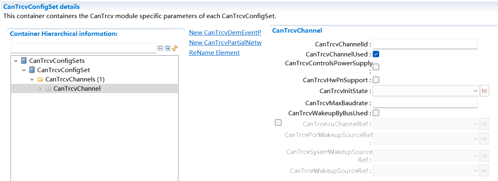
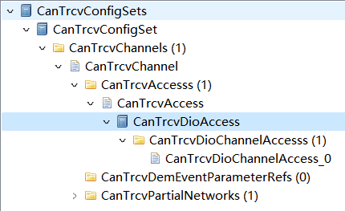
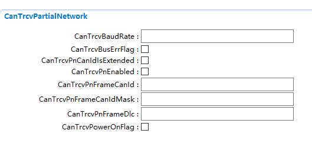

=============================
CanTrcv
=============================

**缩写词注解**

+------------+---------------------------+----------------------------+
| **缩写词** | **英文全称**              | **中文解释**               |
+------------+---------------------------+----------------------------+
| ComM       | Communication Manager     | 通信管理器                 |
+------------+---------------------------+----------------------------+
| DEM        | Diagnostic Event Manager  | 诊断事件管理器             |
+------------+---------------------------+----------------------------+
| DET        | Default Error Tracer      | 默认错误检测/追踪器        |
+------------+---------------------------+----------------------------+
| DIO        | Digital Input Output      | 数字输入/输出              |
|            | (SPAL module)             |                            |
+------------+---------------------------+----------------------------+
| EB         | Externally Buffered       | 外部缓冲通道。缓冲区存放   |
|            | channels                  | SPI驱动以外要传输的数据。  |
+------------+---------------------------+----------------------------+
| EcuM       | ECU State Manager         | ECU状态机管理器            |
+------------+---------------------------+----------------------------+
| IB         | Internally Buffered       | 内部缓冲通道。缓冲区存放   |
|            | channels                  | SPI驱动内部要传输的数据。  |
+------------+---------------------------+----------------------------+
| ISR        | Interrupt Service Routine | 中断服务程序               |
+------------+---------------------------+----------------------------+
| MCAL       | Micro Controller          | 微控制器抽象层             |
|            | Abstraction Layer         |                            |
+------------+---------------------------+----------------------------+
| Port       | Port module (SPAL module) | 端口模块                   |
+------------+---------------------------+----------------------------+
| n/a        | Not Applicable            | 不适用                     |
+------------+---------------------------+----------------------------+
| SBC        | System Basis Chip         | 系统                       |
|            |                           | 基础芯片。一个整合收发器， |
|            |                           | 看门狗以及电源控制的设备。 |
+------------+---------------------------+----------------------------+
| SPAL       | Standard Peripheral       | 标准外设抽象层             |
|            | Abstraction Layer         |                            |
+------------+---------------------------+----------------------------+
| API        | Application Programming   | 应用接口                   |
|            | Interface                 |                            |
+------------+---------------------------+----------------------------+

简介
====

CanTrcv在AutoSar R19-11软件层级架构如下图：

|image1|

图 CanTrcv在AutoSar的软件层级架构图

CanTrcv抽象化Can收发器硬件，提供独立于硬件的接口给CanIf等上层模块。它通过使用MCAL层的API接口访问CAN收发器硬件，从ECU布局中抽象出来。

参考资料
--------

[1] AUTOSAR_SWS_CanTransceiverDriver.PDF，R19-11

[2] AUTOSAR_SRS_CAN.PDF，R19-11

功能描述
========

CanTrcv功能
-----------

CanTrcv功能介绍
~~~~~~~~~~~~~~~

CAN收发器驱动程序模块负责处理ECU上的CAN收发器硬件芯片，并将CAN总线上使用的信号电平调整为微控制器可以识别的逻辑(数字)信号电平。此外，收发器还能检测到电气故障，如线路问题、地面偏移或长主导信号的传输。

根据CAN收发器与微控制器的接口，驱动程序模块可以标记由外部端口pin记录的探测错误或由SPI总线记录的检测错误；特定CAN收发器支持电源控制，并通过CAN总线唤醒。有些CAN收发器具备特定功能，如系统基础芯片(SBC)，它除了CAN基本功能之外，还实现了电源控制和高级监控，并通过SPI总线和MCU进行访问。部分网络唤醒是CAN系统中的一种状态，其中一些节点处于低功耗模式，而其他节点正在通信。这减少了整个网络的功耗。在低功耗模式下，节点被预先定义的唤醒帧唤醒。支持选择性唤醒的收发器除了普通收发器提供的唤醒模式(Wakeup
Pattern)外，还可以通过唤醒帧(Wakeup Frame)来唤醒。

CanTrcv功能实现
~~~~~~~~~~~~~~~

CAN收发器驱动程序的目标是指定适合CAN收发器设备的接口和行为和抽象CAN收发器硬件；它为上层提供了一个独立于硬件的接口；它通过使用MCAL层的API接口访问CAN收发器硬件，从ECU布局中抽象出来。

CanTrcv在访问到硬件，发现唤醒事件之后，也可以通过回调接口通知到上层CanIf/EcuM从而使BSW能处理这些唤醒事件。

源文件描述
==========

表 CanTrcv组件文件描述

+---------------------+------------------------------------------------+
| **文件**            | **说明**                                       |
+---------------------+------------------------------------------------+
| CanTrcv.c           | 包含需                                         |
|                     | 要使用的宏定义，内部变量，内部函数，全局函数。 |
+---------------------+------------------------------------------------+
| CanTrcv_Driver.c    | 包含需                                         |
|                     | 要使用的关于硬件的宏定义，内部变量，内部函数。 |
+---------------------+------------------------------------------------+
| CanTrcv_Driver.h    | 包含需要使                                     |
|                     | 用的关于硬件的宏定义，类型定义，内部函数声明。 |
+---------------------+------------------------------------------------+
| CanTrcv_Types.h     | 包含需要使用的类型定义。                       |
+---------------------+------------------------------------------------+
| CanTrcv.h           | 包含需要使用的宏                               |
|                     | 定义，类型定义，配置结构体声明，外部函数声明。 |
+---------------------+------------------------------------------------+
| CanTrcv_Cfg.h       | 生成CanTrcv模块配置相关的宏定义。              |
+---------------------+------------------------------------------------+
| CanTrcv_Cfg.c       | 生成CanTrcv模块配置相关的结构体。              |
+---------------------+------------------------------------------------+
| CanTrcv_MemMap.h    | CanTrcv模块的内存映射。                        |
+---------------------+------------------------------------------------+

|image2|

图 CanTrcv组件文件交互关系图

API接口
=======

类型定义
--------

CanTrcv_ConfigType类型定义
~~~~~~~~~~~~~~~~~~~~~~~~~~

+-----------+----------------------------------------------------------+
| 名称      | CanTrcv_ConfigType                                       |
+-----------+----------------------------------------------------------+
| 类型      | Structure                                                |
+-----------+----------------------------------------------------------+
| 范围      | 无                                                       |
+-----------+----------------------------------------------------------+
| 描述      | 配置参数结构体类型定义                                   |
+-----------+----------------------------------------------------------+

CanTrcv_PNActivationType类型定义
~~~~~~~~~~~~~~~~~~~~~~~~~~~~~~~~

+-----------+----------------------------------------------------------+
| 名称      | CanTrcv_PNActivationType                                 |
+-----------+----------------------------------------------------------+
| 类型      | Enumeration                                              |
+-----------+----------------------------------------------------------+
| 范围      | PN_ENABLED                                               |
|           |                                                          |
|           | PN_DISABLED                                              |
+-----------+----------------------------------------------------------+
| 描述      | 部分唤醒功能开关                                         |
+-----------+----------------------------------------------------------+

CanTrcv_TrcvFlagStateType类型定义
~~~~~~~~~~~~~~~~~~~~~~~~~~~~~~~~~

+-----------+----------------------------------------------------------+
| 名称      | CanTrcv_TrcvFlagStateType                                |
+-----------+----------------------------------------------------------+
| 类型      | Enumeration                                              |
+-----------+----------------------------------------------------------+
| 范围      | CANTRCV_FLAG_SET                                         |
|           |                                                          |
|           | CANTRCV_FLAG_CLEARED                                     |
+-----------+----------------------------------------------------------+
| 描述      | CanTrcv硬件是否置位                                      |
+-----------+----------------------------------------------------------+

输入函数描述
------------

+----------------------------------+-----------------------------------+
| **输入模块**                     | **API**                           |
+----------------------------------+-----------------------------------+
| CanIf                            | CanIf_ConfirmPnAvailability       |
+----------------------------------+-----------------------------------+
|                                  | CanIf_TrcvModeIndication          |
+----------------------------------+-----------------------------------+
|                                  | CanIf_ClearTrcvWufFlagIndication  |
+----------------------------------+-----------------------------------+
|                                  | CanIf_CheckTrcvWakeFlagIndication |
+----------------------------------+-----------------------------------+
| Det                              | Det_ReportError                   |
+----------------------------------+-----------------------------------+
|                                  | Det_ReportRuntimeError            |
+----------------------------------+-----------------------------------+
| EcuM                             | EcuM_SetWakeupEvent               |
+----------------------------------+-----------------------------------+
| Icu                              | Icu_DisableNotification           |
+----------------------------------+-----------------------------------+
|                                  | Icu_EnableNotification            |
+----------------------------------+-----------------------------------+
| Dio                              | 预留，根据硬件决定                |
+----------------------------------+-----------------------------------+
| Spi                              | 预留，根据硬件决定                |
+----------------------------------+-----------------------------------+
| Tm                               | Tm_BusyWait1us16bit               |
+----------------------------------+-----------------------------------+
| Dem                              | Dem_SetEventStatus                |
+----------------------------------+-----------------------------------+

静态接口函数定义
----------------

CanTrcv_Init函数定义
~~~~~~~~~~~~~~~~~~~~

+-------------+-------------------------+------+----------------------+
| 函数名称：  | CanTrcv_Init            |      |                      |
+-------------+-------------------------+------+----------------------+
| 函数原型：  | void CanTrcv_Init       |      |                      |
|             | (const                  |      |                      |
|             | CanTrcv_ConfigType\*    |      |                      |
|             | ConfigPtr)              |      |                      |
+-------------+-------------------------+------+----------------------+
| 服务编号：  | 0x00                    |      |                      |
+-------------+-------------------------+------+----------------------+
| 同步/异步： | 同步                    |      |                      |
+-------------+-------------------------+------+----------------------+
| 是          | 否                      |      |                      |
| 否可重入：  |                         |      |                      |
+-------------+-------------------------+------+----------------------+
| 输入参数：  | ConfigPtr：配置参数指针 | 值   | 无                   |
|             |                         | 域： |                      |
+-------------+-------------------------+------+----------------------+
| 输入        | 无                      |      |                      |
| 输出参数：  |                         |      |                      |
+-------------+-------------------------+------+----------------------+
| 输出参数：  | 无                      |      |                      |
+-------------+-------------------------+------+----------------------+
| 返回值：    | 无                      |      |                      |
+-------------+-------------------------+------+----------------------+
| 功能概述：  | 初始化CanTrcv模块       |      |                      |
+-------------+-------------------------+------+----------------------+

CanTrcv_SetOpMode函数定义
~~~~~~~~~~~~~~~~~~~~~~~~~

+----------+-----------------------+-----+----------------------------+
| 函       | CanTrcv_SetOpMode     |     |                            |
| 数名称： |                       |     |                            |
+----------+-----------------------+-----+----------------------------+
| 函       | Std_ReturnType        |     |                            |
| 数原型： | CanTrcv_SetOpMode (   |     |                            |
|          |                       |     |                            |
|          | uint8 Transceiver,    |     |                            |
|          |                       |     |                            |
|          | CanTrcv_TrcvModeType  |     |                            |
|          | OpMode                |     |                            |
|          |                       |     |                            |
|          | )                     |     |                            |
+----------+-----------------------+-----+----------------------------+
| 服       | 0x01                  |     |                            |
| 务编号： |                       |     |                            |
+----------+-----------------------+-----+----------------------------+
| 同步     | 异步                  |     |                            |
| /异步：  |                       |     |                            |
+----------+-----------------------+-----+----------------------------+
| 是否     | 对于不                |     |                            |
| 可重入： | 同transceivers可重入  |     |                            |
+----------+-----------------------+-----+----------------------------+
| 输       | Transceiver           | 值  | 0-                         |
| 入参数： |                       | 域  | (CANTRCV_MAX_CHANNELS-1)   |
|          |                       | ：  |                            |
+----------+-----------------------+-----+----------------------------+
|          | OpMode：运行模式      | 值  | 无                         |
|          |                       | 域  |                            |
|          |                       | ：  |                            |
+----------+-----------------------+-----+----------------------------+
| 输入输   | 无                    |     |                            |
| 出参数： |                       |     |                            |
+----------+-----------------------+-----+----------------------------+
| 输       | 无                    |     |                            |
| 出参数： |                       |     |                            |
+----------+-----------------------+-----+----------------------------+
| 返回值： | Std_ReturnType：E_O   |     |                            |
|          | K：切换请求接收并成功 |     |                            |
|          |                       |     |                            |
|          | E_NOT_O               |     |                            |
|          | K：切换失败，遇到错误 |     |                            |
+----------+-----------------------+-----+----------------------------+
| 功       | 切换运行模式          |     |                            |
| 能概述： |                       |     |                            |
+----------+-----------------------+-----+----------------------------+

CanTrcv_GetOpMode函数定义
~~~~~~~~~~~~~~~~~~~~~~~~~

+------------+--------------------+------+----------------------------+
| 函数名称： | CanTrcv_GetOpMode  |      |                            |
+------------+--------------------+------+----------------------------+
| 函数原型： | Std_ReturnType     |      |                            |
|            | CanTrcv_GetOpMode  |      |                            |
|            | (                  |      |                            |
|            |                    |      |                            |
|            | uint8 Transceiver, |      |                            |
|            |                    |      |                            |
|            | CanT               |      |                            |
|            | rcv_TrcvModeType\* |      |                            |
|            | OpMode             |      |                            |
|            |                    |      |                            |
|            | )                  |      |                            |
+------------+--------------------+------+----------------------------+
| 服务编号： | 0x02               |      |                            |
+------------+--------------------+------+----------------------------+
| 同         | 同步               |      |                            |
| 步/异步：  |                    |      |                            |
+------------+--------------------+------+----------------------------+
| 是         | 是                 |      |                            |
| 否可重入： |                    |      |                            |
+------------+--------------------+------+----------------------------+
| 输入参数： | Transc             | 值   | 0-                         |
|            | eiver：Transceiver | 域： | (CANTRCV_MAX_CHANNELS-1)   |
|            | Id                 |      |                            |
+------------+--------------------+------+----------------------------+
| 输入       | 无                 |      |                            |
| 输出参数： |                    |      |                            |
+------------+--------------------+------+----------------------------+
| 输出参数： | Op                 | 值   | 无                         |
|            | Mode：运行模式指针 | 域： |                            |
+------------+--------------------+------+----------------------------+
| 返回值：   | St                 |      |                            |
|            | d_ReturnType：E_OK |      |                            |
|            | ：成功获取运行模式 |      |                            |
|            |                    |      |                            |
|            | E_NOT_OK：         |      |                            |
|            | 获取失败，遇到错误 |      |                            |
+------------+--------------------+------+----------------------------+
| 功能概述： | 获取运行模式       |      |                            |
+------------+--------------------+------+----------------------------+

CanTrcv_GetBusWuReason函数定义
~~~~~~~~~~~~~~~~~~~~~~~~~~~~~~

+------------+--------------------+------+----------------------------+
| 函数名称： | CanT               |      |                            |
|            | rcv_GetBusWuReason |      |                            |
+------------+--------------------+------+----------------------------+
| 函数原型： | Std_ReturnType     |      |                            |
|            | CanT               |      |                            |
|            | rcv_GetBusWuReason |      |                            |
|            | (                  |      |                            |
|            |                    |      |                            |
|            | uint8 Transceiver, |      |                            |
|            |                    |      |                            |
|            | CanTrcv_Trcv       |      |                            |
|            | WakeupReasonType\* |      |                            |
|            | reason             |      |                            |
|            |                    |      |                            |
|            | )                  |      |                            |
+------------+--------------------+------+----------------------------+
| 服务编号： | 0x03               |      |                            |
+------------+--------------------+------+----------------------------+
| 同         | 同步               |      |                            |
| 步/异步：  |                    |      |                            |
+------------+--------------------+------+----------------------------+
| 是         | 是                 |      |                            |
| 否可重入： |                    |      |                            |
+------------+--------------------+------+----------------------------+
| 输入参数： | Transc             | 值   | 0-                         |
|            | eiver：Transceiver | 域： | (CANTRCV_MAX_CHANNELS-1)   |
|            | Id                 |      |                            |
+------------+--------------------+------+----------------------------+
| 输入       | 无                 |      |                            |
| 输出参数： |                    |      |                            |
+------------+--------------------+------+----------------------------+
| 输出参数： | reason：唤醒原因   | 值   |                            |
|            |                    | 域： |                            |
+------------+--------------------+------+----------------------------+
| 返回值：   | St                 |      |                            |
|            | d_ReturnType：E_OK |      |                            |
|            | ：成功获取唤醒原因 |      |                            |
|            |                    |      |                            |
|            | E_NOT_OK：         |      |                            |
|            | 获取失败，遇到错误 |      |                            |
+------------+--------------------+------+----------------------------+
| 功能概述： | 获取唤醒原因       |      |                            |
+------------+--------------------+------+----------------------------+

CanTrcv_GetVersionInfo函数定义
~~~~~~~~~~~~~~~~~~~~~~~~~~~~~~

+-------------+-------------------+------+---------------------------+
| 函数名称：  | CanTr             |      |                           |
|             | cv_GetVersionInfo |      |                           |
+-------------+-------------------+------+---------------------------+
| 函数原型：  | void              |      |                           |
|             | CanTr             |      |                           |
|             | cv_GetVersionInfo |      |                           |
|             | (                 |      |                           |
|             |                   |      |                           |
|             | Std\_             |      |                           |
|             | VersionInfoType\* |      |                           |
|             | versioninfo       |      |                           |
|             |                   |      |                           |
|             | )                 |      |                           |
+-------------+-------------------+------+---------------------------+
| 服务编号：  | 0x04              |      |                           |
+-------------+-------------------+------+---------------------------+
| 同步/异步： | 同步              |      |                           |
+-------------+-------------------+------+---------------------------+
| 是          | 是                |      |                           |
| 否可重入：  |                   |      |                           |
+-------------+-------------------+------+---------------------------+
| 输入参数：  | 无                |      |                           |
+-------------+-------------------+------+---------------------------+
| 输入        | 无                |      |                           |
| 输出参数：  |                   |      |                           |
+-------------+-------------------+------+---------------------------+
| 输出参数：  | versioni          | 值   | 无                        |
|             | nfo：版本信息指针 | 域： |                           |
+-------------+-------------------+------+---------------------------+
| 返回值：    | 无                |      |                           |
+-------------+-------------------+------+---------------------------+
| 功能概述：  | 获取版本信息      |      |                           |
+-------------+-------------------+------+---------------------------+

CanTrcv_SetWakeupMode函数定义
~~~~~~~~~~~~~~~~~~~~~~~~~~~~~

+------------+------------------+--------+----------------------------+
| 函数名称： | CanTr            |        |                            |
|            | cv_SetWakeupMode |        |                            |
+------------+------------------+--------+----------------------------+
| 函数原型： | Std_ReturnType   |        |                            |
|            | CanTr            |        |                            |
|            | cv_SetWakeupMode |        |                            |
|            | (                |        |                            |
|            |                  |        |                            |
|            | uint8            |        |                            |
|            | Transceiver,     |        |                            |
|            |                  |        |                            |
|            | CanTrcv_Tr       |        |                            |
|            | cvWakeupModeType |        |                            |
|            | TrcvWakeupMode   |        |                            |
|            |                  |        |                            |
|            | )                |        |                            |
+------------+------------------+--------+----------------------------+
| 服务编号： | 0x05             |        |                            |
+------------+------------------+--------+----------------------------+
| 同         | 同步             |        |                            |
| 步/异步：  |                  |        |                            |
+------------+------------------+--------+----------------------------+
| 是         | 对于不同t        |        |                            |
| 否可重入： | ransceiver可重入 |        |                            |
+------------+------------------+--------+----------------------------+
| 输入参数： | Transcei         | 值域： | 0-                         |
|            | ver：Transceiver |        | (CANTRCV_MAX_CHANNELS-1)   |
|            | Id               |        |                            |
+------------+------------------+--------+----------------------------+
|            | TrcvWakeupMode： | 值域： | 无                         |
|            | 处理唤醒事件模式 |        |                            |
+------------+------------------+--------+----------------------------+
| 输入       | 无               |        |                            |
| 输出参数： |                  |        |                            |
+------------+------------------+--------+----------------------------+
| 输出参数： | 无               |        |                            |
+------------+------------------+--------+----------------------------+
| 返回值：   | Std\_            |        |                            |
|            | ReturnType：E_OK |        |                            |
|            | ：成功处理唤醒事 |        |                            |
|            | 件并设置唤醒模式 |        |                            |
|            |                  |        |                            |
|            | E_NOT_OK：处     |        |                            |
|            | 理失败，遇到错误 |        |                            |
+------------+------------------+--------+----------------------------+
| 功能概述： | 根据TrcvWake     |        |                            |
|            | upMode开启、禁用 |        |                            |
|            | 或清除唤醒事件。 |        |                            |
+------------+------------------+--------+----------------------------+

CanTrcv_MainFunction函数定义
~~~~~~~~~~~~~~~~~~~~~~~~~~~~

+-------------+--------------------------------------------------------+
| 函数名称：  | CanTrcv_MainFunction                                   |
+-------------+--------------------------------------------------------+
| 函数原型：  | void CanTrcv_MainFunction (void)                       |
+-------------+--------------------------------------------------------+
| 服务编号：  | 0x06                                                   |
+-------------+--------------------------------------------------------+
| 同步/异步： | 同步                                                   |
+-------------+--------------------------------------------------------+
| 是          | 否                                                     |
| 否可重入：  |                                                        |
+-------------+--------------------------------------------------------+
| 输入参数：  | 无                                                     |
+-------------+--------------------------------------------------------+
| 输入        | 无                                                     |
| 输出参数：  |                                                        |
+-------------+--------------------------------------------------------+
| 输出参数：  | 无                                                     |
+-------------+--------------------------------------------------------+
| 返回值：    | 无                                                     |
+-------------+--------------------------------------------------------+
| 功能概述：  | 主调度函数，周期性扫描唤醒时间。                       |
+-------------+--------------------------------------------------------+

CanTrcv_CheckWakeup函数定义
~~~~~~~~~~~~~~~~~~~~~~~~~~~

+------------+------------------+--------+----------------------------+
| 函数名称： | Can              |        |                            |
|            | Trcv_CheckWakeup |        |                            |
+------------+------------------+--------+----------------------------+
| 函数原型： | Std_ReturnType   |        |                            |
|            | Can              |        |                            |
|            | Trcv_CheckWakeup |        |                            |
|            | (uint8           |        |                            |
|            | Transceiver)     |        |                            |
+------------+------------------+--------+----------------------------+
| 服务编号： | 0x07             |        |                            |
+------------+------------------+--------+----------------------------+
| 同         | 同步             |        |                            |
| 步/异步：  |                  |        |                            |
+------------+------------------+--------+----------------------------+
| 是         | 是               |        |                            |
| 否可重入： |                  |        |                            |
+------------+------------------+--------+----------------------------+
| 输入参数： | Transcei         | 值域： | 0-                         |
|            | ver：Transceiver |        | (CANTRCV_MAX_CHANNELS-1)   |
|            | Id               |        |                            |
+------------+------------------+--------+----------------------------+
| 输入       | 无               |        |                            |
| 输出参数： |                  |        |                            |
+------------+------------------+--------+----------------------------+
| 输出参数： | 无               |        |                            |
+------------+------------------+--------+----------------------------+
| 返回值：   | Std_Re           |        |                            |
|            | turnType：E_OK： |        |                            |
|            | 成功处理唤醒事件 |        |                            |
|            |                  |        |                            |
|            | E_NOT_OK：处     |        |                            |
|            | 理失败，遇到错误 |        |                            |
+------------+------------------+--------+----------------------------+
| 功能概述： | 唤醒中断发生     |        |                            |
|            | 后检查唤醒事件。 |        |                            |
+------------+------------------+--------+----------------------------+

CanTrcv_MainFunctionDiagnostics函数定义
~~~~~~~~~~~~~~~~~~~~~~~~~~~~~~~~~~~~~~~

+-------------+--------------------------------------------------------+
| 函数名称：  | CanTrcv_MainFunctionDiagnostics                        |
+-------------+--------------------------------------------------------+
| 函数原型：  | void CanTrcv_MainFunctionDiagnostics (void)            |
+-------------+--------------------------------------------------------+
| 服务编号：  | 0x08                                                   |
+-------------+--------------------------------------------------------+
| 同步/异步： | 同步                                                   |
+-------------+--------------------------------------------------------+
| 是          | 否                                                     |
| 否可重入：  |                                                        |
+-------------+--------------------------------------------------------+
| 输入参数：  | 无                                                     |
+-------------+--------------------------------------------------------+
| 输入        | 无                                                     |
| 输出参数：  |                                                        |
+-------------+--------------------------------------------------------+
| 输出参数：  | 无                                                     |
+-------------+--------------------------------------------------------+
| 返回值：    | 无                                                     |
+-------------+--------------------------------------------------------+
| 功能概述：  | 主诊断调度函数，周期性读取硬件状态并报告错误。         |
+-------------+--------------------------------------------------------+

CanTrcv_DeInit函数定义
~~~~~~~~~~~~~~~~~~~~~~

+-------------+--------------------------------------------------------+
| 函数名称：  | CanTrcv_DeInit                                         |
+-------------+--------------------------------------------------------+
| 函数原型：  | void CanTrcv_DeInit (void)                             |
+-------------+--------------------------------------------------------+
| 服务编号：  | 0x10                                                   |
+-------------+--------------------------------------------------------+
| 同步/异步： | 同步                                                   |
+-------------+--------------------------------------------------------+
| 是          | 否                                                     |
| 否可重入：  |                                                        |
+-------------+--------------------------------------------------------+
| 输入参数：  | 无                                                     |
+-------------+--------------------------------------------------------+
| 输入        | 无                                                     |
| 输出参数：  |                                                        |
+-------------+--------------------------------------------------------+
| 输出参数：  | 无                                                     |
+-------------+--------------------------------------------------------+
| 返回值：    | 无                                                     |
+-------------+--------------------------------------------------------+
| 功能概述：  | 反初始化函数，停止CanTrcv模块。                        |
+-------------+--------------------------------------------------------+

CanTrcv_GetTrcvSystemData函数定义
~~~~~~~~~~~~~~~~~~~~~~~~~~~~~~~~~

+------------+--------------------+------+----------------------------+
| 函数名称： | CanTrcv            |      |                            |
|            | _GetTrcvSystemData |      |                            |
+------------+--------------------+------+----------------------------+
| 函数原型： | Std_ReturnType     |      |                            |
|            | CanTrcv            |      |                            |
|            | _GetTrcvSystemData |      |                            |
|            | (                  |      |                            |
|            |                    |      |                            |
|            | uint8 Transceiver, |      |                            |
|            |                    |      |                            |
|            | const uint32\*     |      |                            |
|            | TrcvSysData        |      |                            |
|            |                    |      |                            |
|            | )                  |      |                            |
+------------+--------------------+------+----------------------------+
| 服务编号： | 0x09               |      |                            |
+------------+--------------------+------+----------------------------+
| 同         | 同步               |      |                            |
| 步/异步：  |                    |      |                            |
+------------+--------------------+------+----------------------------+
| 是         | 否                 |      |                            |
| 否可重入： |                    |      |                            |
+------------+--------------------+------+----------------------------+
| 输入参数： | Transc             | 值   | 0-                         |
|            | eiver：Transceiver | 域： | (CANTRCV_MAX_CHANNELS-1)   |
|            | Id                 |      |                            |
+------------+--------------------+------+----------------------------+
| 输入       | 无                 |      |                            |
| 输出参数： |                    |      |                            |
+------------+--------------------+------+----------------------------+
| 输出参数： | TrcvSysDa          | 值   | 无                         |
|            | ta：收发器系统数据 | 域： |                            |
+------------+--------------------+------+----------------------------+
| 返回值：   | St                 |      |                            |
|            | d_ReturnType：E_OK |      |                            |
|            | ：成功获取系统数据 |      |                            |
|            |                    |      |                            |
|            | E_NOT_OK：         |      |                            |
|            | 获取失败，遇到错误 |      |                            |
+------------+--------------------+------+----------------------------+
| 功能概述： | 获取收发器系统数据 |      |                            |
+------------+--------------------+------+----------------------------+

CanTrcv_ClearTrcvWufFlag函数定义
~~~~~~~~~~~~~~~~~~~~~~~~~~~~~~~~

+------------+--------------------+------+----------------------------+
| 函数名称： | CanTrc             |      |                            |
|            | v_ClearTrcvWufFlag |      |                            |
+------------+--------------------+------+----------------------------+
| 函数原型： | Std_ReturnType     |      |                            |
|            | CanTrc             |      |                            |
|            | v_ClearTrcvWufFlag |      |                            |
|            | (uint8             |      |                            |
|            | Transceiver)       |      |                            |
+------------+--------------------+------+----------------------------+
| 服务编号： | 0x0a               |      |                            |
+------------+--------------------+------+----------------------------+
| 同         | 同步               |      |                            |
| 步/异步：  |                    |      |                            |
+------------+--------------------+------+----------------------------+
| 是         | 对于不同           |      |                            |
| 否可重入： | transceivers可重入 |      |                            |
+------------+--------------------+------+----------------------------+
| 输入参数： | Transc             | 值   | 0-                         |
|            | eiver：Transceiver | 域： | (CANTRCV_MAX_CHANNELS-1)   |
|            | Id                 |      |                            |
+------------+--------------------+------+----------------------------+
| 输入       | 无                 |      |                            |
| 输出参数： |                    |      |                            |
+------------+--------------------+------+----------------------------+
| 输出参数： | 无                 |      |                            |
+------------+--------------------+------+----------------------------+
| 返回值：   | Std\_              |      |                            |
|            | ReturnType：E_OK： |      |                            |
|            | 成功清除唤醒帧Flag |      |                            |
|            |                    |      |                            |
|            | E_NOT_OK：         |      |                            |
|            | 清除失败，遇到错误 |      |                            |
+------------+--------------------+------+----------------------------+
| 功能概述： | 清除硬件唤醒帧Flag |      |                            |
+------------+--------------------+------+----------------------------+

CanTrcv_ReadTrcvTimeoutFlag函数定义
~~~~~~~~~~~~~~~~~~~~~~~~~~~~~~~~~~~

+------------+--------------------+------+----------------------------+
| 函数名称： | CanTrcv_R          |      |                            |
|            | eadTrcvTimeoutFlag |      |                            |
+------------+--------------------+------+----------------------------+
| 函数原型： | Std_ReturnType     |      |                            |
|            | CanTrcv_R          |      |                            |
|            | eadTrcvTimeoutFlag |      |                            |
|            | (                  |      |                            |
|            |                    |      |                            |
|            | uint8 Transceiver, |      |                            |
|            |                    |      |                            |
|            | CanTrcv_T          |      |                            |
|            | rcvFlagStateType\* |      |                            |
|            | FlagState          |      |                            |
|            |                    |      |                            |
|            | )                  |      |                            |
+------------+--------------------+------+----------------------------+
| 服务编号： | 0x0b               |      |                            |
+------------+--------------------+------+----------------------------+
| 同         | 同步               |      |                            |
| 步/异步：  |                    |      |                            |
+------------+--------------------+------+----------------------------+
| 是         | 否                 |      |                            |
| 否可重入： |                    |      |                            |
+------------+--------------------+------+----------------------------+
| 输入参数： | Transc             | 值   | 0-                         |
|            | eiver：Transceiver | 域： | (CANTRCV_MAX_CHANNELS-1)   |
|            | Id                 |      |                            |
+------------+--------------------+------+----------------------------+
| 输入       | 无                 |      |                            |
| 输出参数： |                    |      |                            |
+------------+--------------------+------+----------------------------+
| 输出参数： | FlagS              | 值   | CANTRCV_FLAG_SET/          |
|            | tate：超时Flag状态 | 域： |                            |
|            |                    |      | CANTRCV_FLAG_CLEARED       |
+------------+--------------------+------+----------------------------+
| 返回值：   | Std_Retu           |      |                            |
|            | rnType：E_OK：成功 |      |                            |
|            | 读取收发器超时Flag |      |                            |
|            |                    |      |                            |
|            | E_NOT_OK：         |      |                            |
|            | 读取失败，遇到错误 |      |                            |
+------------+--------------------+------+----------------------------+
| 功能概述： | 读取硬件超时Flag   |      |                            |
+------------+--------------------+------+----------------------------+

CanTrcv_ClearTrcvTimeoutFlag函数定义
~~~~~~~~~~~~~~~~~~~~~~~~~~~~~~~~~~~~

+------------+------------------+--------+----------------------------+
| 函数名称： | CanTrcv_Clea     |        |                            |
|            | rTrcvTimeoutFlag |        |                            |
+------------+------------------+--------+----------------------------+
| 函数原型： | Std_ReturnType   |        |                            |
|            | CanTrcv_Clea     |        |                            |
|            | rTrcvTimeoutFlag |        |                            |
|            | (uint8           |        |                            |
|            | Transceiver)     |        |                            |
+------------+------------------+--------+----------------------------+
| 服务编号： | 0x0c             |        |                            |
+------------+------------------+--------+----------------------------+
| 同         | 同步             |        |                            |
| 步/异步：  |                  |        |                            |
+------------+------------------+--------+----------------------------+
| 是         | 否               |        |                            |
| 否可重入： |                  |        |                            |
+------------+------------------+--------+----------------------------+
| 输入参数： | Transcei         | 值域： | 0-                         |
|            | ver：Transceiver |        | (CANTRCV_MAX_CHANNELS-1)   |
|            | Id               |        |                            |
+------------+------------------+--------+----------------------------+
| 输入       | 无               |        |                            |
| 输出参数： |                  |        |                            |
+------------+------------------+--------+----------------------------+
| 输出参数： | 无               |        |                            |
+------------+------------------+--------+----------------------------+
| 返回值：   | Std_ReturnTy     |        |                            |
|            | pe：E_OK：成功清 |        |                            |
|            | 除收发器超时Flag |        |                            |
|            |                  |        |                            |
|            | E_NOT_OK：清     |        |                            |
|            | 除失败，遇到错误 |        |                            |
+------------+------------------+--------+----------------------------+
| 功能概述： | 清除硬件超时Flag |        |                            |
+------------+------------------+--------+----------------------------+

CanTrcv_ReadTrcvSilenceFlag函数定义
~~~~~~~~~~~~~~~~~~~~~~~~~~~~~~~~~~~

+-----------+----------------------+-----+----------------------------+
| 函        | CanTrcv              |     |                            |
| 数名称：  | _ReadTrcvSilenceFlag |     |                            |
+-----------+----------------------+-----+----------------------------+
| 函        | Std_ReturnType       |     |                            |
| 数原型：  | CanTrcv              |     |                            |
|           | _ReadTrcvSilenceFlag |     |                            |
|           | (                    |     |                            |
|           |                      |     |                            |
|           | uint8 Transceiver,   |     |                            |
|           |                      |     |                            |
|           | CanTrcv              |     |                            |
|           | _TrcvFlagStateType\* |     |                            |
|           | FlagState            |     |                            |
|           |                      |     |                            |
|           | )                    |     |                            |
+-----------+----------------------+-----+----------------------------+
| 服        | 0x0d                 |     |                            |
| 务编号：  |                      |     |                            |
+-----------+----------------------+-----+----------------------------+
| 同        | 同步                 |     |                            |
| 步/异步： |                      |     |                            |
+-----------+----------------------+-----+----------------------------+
| 是否      | 否                   |     |                            |
| 可重入：  |                      |     |                            |
+-----------+----------------------+-----+----------------------------+
| 输        | Tran                 | 值  | 0-                         |
| 入参数：  | sceiver：Transceiver | 域  | (CANTRCV_MAX_CHANNELS-1)   |
|           | Id                   | ：  |                            |
+-----------+----------------------+-----+----------------------------+
| 输入输    | 无                   |     |                            |
| 出参数：  |                      |     |                            |
+-----------+----------------------+-----+----------------------------+
| 输        | FlagState：Silence   | 值  | CANTRCV_FLAG_SET/          |
| 出参数：  | Flag状态             | 域  |                            |
|           |                      | ：  | CANTRCV_FLAG_CLEARED       |
+-----------+----------------------+-----+----------------------------+
| 返回值：  | Std\_                |     |                            |
|           | ReturnType：E_OK：成 |     |                            |
|           | 功读取收发器Silence  |     |                            |
|           | Flag                 |     |                            |
|           |                      |     |                            |
|           | E_NOT_OK             |     |                            |
|           | ：读取失败，遇到错误 |     |                            |
+-----------+----------------------+-----+----------------------------+
| 功        | 读取硬件Silence Flag |     |                            |
| 能概述：  |                      |     |                            |
+-----------+----------------------+-----+----------------------------+

CanTrcv_CheckWakeFlag函数定义
~~~~~~~~~~~~~~~~~~~~~~~~~~~~~

+------------+------------------+--------+----------------------------+
| 函数名称： | CanTr            |        |                            |
|            | cv_CheckWakeFlag |        |                            |
+------------+------------------+--------+----------------------------+
| 函数原型： | Std_ReturnType   |        |                            |
|            | CanTr            |        |                            |
|            | cv_CheckWakeFlag |        |                            |
|            | (uint8           |        |                            |
|            | Transceiver)     |        |                            |
+------------+------------------+--------+----------------------------+
| 服务编号： | 0x0e             |        |                            |
+------------+------------------+--------+----------------------------+
| 同         | 异步             |        |                            |
| 步/异步：  |                  |        |                            |
+------------+------------------+--------+----------------------------+
| 是         | 否               |        |                            |
| 否可重入： |                  |        |                            |
+------------+------------------+--------+----------------------------+
| 输入参数： | Transcei         | 值域： | 0-                         |
|            | ver：Transceiver |        | (CANTRCV_MAX_CHANNELS-1)   |
|            | Id               |        |                            |
+------------+------------------+--------+----------------------------+
| 输入       | 无               |        |                            |
| 输出参数： |                  |        |                            |
+------------+------------------+--------+----------------------------+
| 输出参数： | 无               |        |                            |
+------------+------------------+--------+----------------------------+
| 返回值：   | Std_Re           |        |                            |
|            | turnType：E_OK： |        |                            |
|            | 成功检查唤醒Flag |        |                            |
|            |                  |        |                            |
|            | E_NOT_OK：检     |        |                            |
|            | 查失败，遇到错误 |        |                            |
+------------+------------------+--------+----------------------------+
| 功能概述： | 检查硬件wakeup   |        |                            |
|            | Flag状态         |        |                            |
+------------+------------------+--------+----------------------------+

CanTrcv_SetPNActivationState函数定义
~~~~~~~~~~~~~~~~~~~~~~~~~~~~~~~~~~~~

+-------------+-------------------+---------+-------------------------+
| 函数名称：  | CanTrcv_Set       |         |                         |
|             | PNActivationState |         |                         |
+-------------+-------------------+---------+-------------------------+
| 函数原型：  | Std_ReturnType    |         |                         |
|             | CanTrcv_Set       |         |                         |
|             | PNActivationState |         |                         |
|             | (                 |         |                         |
|             |                   |         |                         |
|             | CanTrcv           |         |                         |
|             | _PNActivationType |         |                         |
|             | ActivationState   |         |                         |
|             |                   |         |                         |
|             | )                 |         |                         |
+-------------+-------------------+---------+-------------------------+
| 服务编号：  | 0x0f              |         |                         |
+-------------+-------------------+---------+-------------------------+
| 同步/异步： | 同步              |         |                         |
+-------------+-------------------+---------+-------------------------+
| 是          | 否                |         |                         |
| 否可重入：  |                   |         |                         |
+-------------+-------------------+---------+-------------------------+
| 输入参数：  | Acti              | 值域：  | PN_ENABLED：            |
|             | vationState：部分 |         | 部分唤醒开启            |
|             | 唤醒功能开关状态  |         |                         |
|             |                   |         | PN_DIABLED：            |
|             |                   |         | 部分唤醒关闭            |
+-------------+-------------------+---------+-------------------------+
| 输入        | 无                |         |                         |
| 输出参数：  |                   |         |                         |
+-------------+-------------------+---------+-------------------------+
| 输出参数：  | 无                |         |                         |
+-------------+-------------------+---------+-------------------------+
| 返回值：    | Std_Retur         |         |                         |
|             | nType：E_OK：成功 |         |                         |
|             | 设置部分唤醒开关  |         |                         |
|             |                   |         |                         |
|             | E_NOT_OK：设      |         |                         |
|             | 置失败，遇到错误  |         |                         |
+-------------+-------------------+---------+-------------------------+
| 功能概述：  | 设置部分唤醒开关  |         |                         |
+-------------+-------------------+---------+-------------------------+

可配置函数定义
--------------

无。

配置
====

配置列表
--------

表 属性描述

+------------+---------------------------------------------------------+
| UI名称     | 该配置项在配置工具界面显示的名称                        |
+------------+---------------------------------------------------------+
| 取值范围   | 该配置项允许的取值区间                                  |
+------------+---------------------------------------------------------+
| 默认取值   | 该配置项默认的配置值                                    |
+------------+---------------------------------------------------------+
| 参数描述   | 该配置项在标准的AUTOSAR_EcucParamDef.arxml文件中的描述  |
+------------+---------------------------------------------------------+
| 依赖关系   | 该配置项与其他模块或配置项的关系                        |
+------------+---------------------------------------------------------+

CanTrcvGeneral
--------------

|image3|

图 CanTrcvGeneral工具配置

表 CanTrcvGeneral配置描述

+--------------------------------------+-------------------------------------------------------------------------------------------------------------------------------------------------------------------+-----------------------------------------------------------+
|                UI名称                |                                                                                描述                                                                               |                             　                            |
+--------------------------------------+----------+---------------------------------------------------------------------------------------+----------------------------------------------------------------+-----------------------------------------------------------+
| CanTrcvDevErrorDetect                | 取值范围 | True、False                                                                           | 默认取值                                                       | FALSE                                                     |
|                                      +----------+---------------------------------------------------------------------------------------+----------------------------------------------------------------+-----------------------------------------------------------+
|                                      | 参数描述 | Switches the development error   detection and notification on or off.                                                                                                                                             |
|                                      +----------+--------------------------------------------------------------------------------------------------------------------------------------------------------------------------------------------------------------------+
|                                      | 依赖关系 | 无                                                                                                                                                                                                                 |
+--------------------------------------+----------+---------------------------------------------------------------------------------------+----------------------------------------------------------------+-----------------------------------------------------------+
| CanTrcvIndex                         | 取值范围 | 0 ..255                                                                               | 默认取值                                                       | 无                                                        |
|                                      +----------+---------------------------------------------------------------------------------------+----------------------------------------------------------------+-----------------------------------------------------------+
|                                      | 参数描述 | Specifies the InstanceId of   this module instance. If only one instance is present it shall have the Id 0.                                                                                                        |
|                                      +----------+--------------------------------------------------------------------------------------------------------------------------------------------------------------------------------------------------------------------+
|                                      | 依赖关系 | 无                                                                                                                                                                                                                 |
+--------------------------------------+----------+---------------------------------------------------------------------------------------+----------------------------------------------------------------+-----------------------------------------------------------+
| CanTrcvMainFunctionDiagnosticsPeriod | 取值范围 | 0..INF                                                                                | 默认取值                                                       | 无                                                        |
|                                      +----------+---------------------------------------------------------------------------------------+----------------------------------------------------------------+-----------------------------------------------------------+
|                                      | 参数描述 | This parameter describes the   period for cyclic call to CanTrcv_MainFunctionDiagnostics. Unit is seconds.                                                                                                         |
|                                      +----------+--------------------------------------------------------------------------------------------------------------------------------------------------------------------------------------------------------------------+
|                                      | 依赖关系 | 无                                                                                                                                                                                                                 |
+--------------------------------------+----------+---------------------------------------------------------------------------------------+----------------------------------------------------------------+-----------------------------------------------------------+
| CanTrcvMainFunctionPeriod            | 取值范围 | 0..INF                                                                                | 默认取值                                                       | 无                                                        |
|                                      +----------+---------------------------------------------------------------------------------------+----------------------------------------------------------------+-----------------------------------------------------------+
|                                      | 参数描述 | This parameter describes the   period for cyclic call to CanTrcv_MainFunction. Unit is seconds.                                                                                                                    |
|                                      +----------+--------------------------------------------------------------------------------------------------------------------------------------------------------------------------------------------------------------------+
|                                      | 依赖关系 | 无                                                                                                                                                                                                                 |
+--------------------------------------+----------+---------------------------------------------------------------------------------------+----------------------------------------------------------------+-----------------------------------------------------------+
| CanTrcvTimerType                     |          | None                                                                                  |                                                                | None                                                      |
|                                      | 取值范围 +---------------------------------------------------------------------------------------+ 默认取值                                                       |                                                           |
|                                      |          | Timer_1us16bit                                                                        |                                                                |                                                           |
|                                      +----------+---------------------------------------------------------------------------------------+----------------------------------------------------------------+-----------------------------------------------------------+
|                                      | 参数描述 | Type of the Time Service   Predefined Timer.                                                                                                                                                                       |
|                                      +----------+--------------------------------------------------------------------------------------------------------------------------------------------------------------------------------------------------------------------+
|                                      | 依赖关系 | 无                                                                                                                                                                                                                 |
+--------------------------------------+----------+---------------------------------------------------------------------------------------+----------------------------------------------------------------+-----------------------------------------------------------+
| CanTrcvVersionInfoApi                | 取值范围 | True, False                                                                           | 默认取值                                                       | FALSE                                                     |
|                                      +----------+---------------------------------------------------------------------------------------+----------------------------------------------------------------+-----------------------------------------------------------+
|                                      | 参数描述 | Switches version information   API on and off. If switched off, function need not be present in compiled   code.                                                                                                   |
|                                      +----------+--------------------------------------------------------------------------------------------------------------------------------------------------------------------------------------------------------------------+
|                                      | 依赖关系 | 无                                                                                                                                                                                                                 |
+--------------------------------------+----------+---------------------------------------------------------------------------------------+----------------------------------------------------------------+-----------------------------------------------------------+
| CanTrcvWaitTime                      | 取值范围 | 0..2.55E-4                                                                            | 默认取值                                                       | 无                                                        |
|                                      +----------+---------------------------------------------------------------------------------------+----------------------------------------------------------------+-----------------------------------------------------------+
|                                      | 参数描述 | Wait time for transceiver   state changes in seconds.                                                                                                                                                              |
|                                      +----------+--------------------------------------------------------------------------------------------------------------------------------------------------------------------------------------------------------------------+
|                                      | 依赖关系 | 无                                                                                                                                                                                                                 |
+--------------------------------------+----------+---------------------------------------------------------------------------------------+----------------------------------------------------------------+-----------------------------------------------------------+
| CanTrcvWakeUpSupport                 |          | CANTRCV_WAKEUP_BY_POLLING                                                             |                                                                |                                                           |
|                                      | 取值范围 +---------------------------------------------------------------------------------------+ 默认取值                                                       | 无                                                        |
|                                      |          | CANTRCV_WAKEUP_NOT_SUPPORTED                                                          |                                                                |                                                           |
|                                      +----------+---------------------------------------------------------------------------------------+----------------------------------------------------------------+-----------------------------------------------------------+
|                                      |          | Informs whether wake up is   supported by polling or not supported. In case no                                                                                                                                     |
|                                      | 参数描述 +--------------------------------------------------------------------------------------------------------------------------------------------------------------------------------------------------------------------+
|                                      |          | wake up is   supported by the hardware, setting has to be NOT_SUPPORTED. Only in the case   of wake up supported by polling, function CanTrcv_MainFunction has to be   present and to be invoked by the scheduler. |
|                                      +----------+--------------------------------------------------------------------------------------------------------------------------------------------------------------------------------------------------------------------+
|                                      | 依赖关系 | 无                                                                                                                                                                                                                 |
+--------------------------------------+----------+--------------------------------------------------------------------------------------------------------------------------------------------------------------------------------------------------------------------+

CanTrcvConfigSet
----------------

|image4|

图 CanTrcvConfigSet工具配置

表 CanTrcvConfigSet配置描述

+-------------------+-----------+------------------+---------+--------+
| **UI名称**        | **描述**  |                  |         |        |
+-------------------+-----------+------------------+---------+--------+
| CanT              | 取值范围  | 0 .. 255         | 默      | 0      |
| rcvSPICommRetries |           |                  | 认取值  |        |
+-------------------+-----------+------------------+---------+--------+
|                   | 参数描述  | Indicates the    |         |        |
|                   |           | maximum number   |         |        |
|                   |           | of communication |         |        |
|                   |           | retries in case  |         |        |
|                   |           | of a failed SPI  |         |        |
|                   |           | communication    |         |        |
|                   |           | (applies both to |         |        |
|                   |           | timed out        |         |        |
|                   |           | communication    |         |        |
|                   |           | and to           |         |        |
|                   |           | errors/NACK in   |         |        |
|                   |           | the response     |         |        |
|                   |           | data).           |         |        |
+-------------------+-----------+------------------+---------+--------+
|                   | 依赖关系  | 需要配置Ca       |         |        |
|                   |           | nTrcvSpiSequence |         |        |
+-------------------+-----------+------------------+---------+--------+
| CanT              | 取值范围  | 0..100           | 默      | 0      |
| rcvSPICommTimeout |           |                  | 认取值  |        |
+-------------------+-----------+------------------+---------+--------+
|                   | 参数描述  | Indicates the    |         |        |
|                   |           | maximum time     |         |        |
|                   |           | allowed to the   |         |        |
|                   |           | CanTrcv for      |         |        |
|                   |           | replying (either |         |        |
|                   |           | positively or    |         |        |
|                   |           | negatively) to a |         |        |
|                   |           | SPI command.     |         |        |
+-------------------+-----------+------------------+---------+--------+
|                   | 依赖关系  | 需要配置Ca       |         |        |
|                   |           | nTrcvSpiSequence |         |        |
+-------------------+-----------+------------------+---------+--------+

CanTrcvChannels
~~~~~~~~~~~~~~~

|image5|

图 CanTrcvChannel工具配置

表 CanTrcvChannel配置描述

+----------------------+-----------+------------------+---------+-----+
| **UI名称**           | **描述**  |                  |         |     |
+----------------------+-----------+------------------+---------+-----+
| CanTrcvChannleId     | 取值范围  | 0 .. 255         | 默      | 无  |
|                      |           |                  | 认取值  |     |
+----------------------+-----------+------------------+---------+-----+
|                      | 参数描述  | Unique           |         |     |
|                      |           | identifier of    |         |     |
|                      |           | the CAN          |         |     |
|                      |           | Transceiver      |         |     |
|                      |           | Channel.         |         |     |
+----------------------+-----------+------------------+---------+-----+
|                      | 依赖关系  | 无               |         |     |
+----------------------+-----------+------------------+---------+-----+
| CanTrcvChannelUsed   | 取值范围  | true, false      | 默      | t   |
|                      |           |                  | 认取值  | rue |
+----------------------+-----------+------------------+---------+-----+
|                      | 参数描述  | Shall the        |         |     |
|                      |           | related CAN      |         |     |
|                      |           | transceiver      |         |     |
|                      |           | channel be used? |         |     |
+----------------------+-----------+------------------+---------+-----+
|                      | 依赖关系  | 无               |         |     |
+----------------------+-----------+------------------+---------+-----+
| CanTrc               | 取值范围  | true, false      | 默      | fa  |
| vControlsPowerSupply |           |                  | 认取值  | lse |
+----------------------+-----------+------------------+---------+-----+
|                      | 参数描述  | Is ECU power     |         |     |
|                      |           | supply           |         |     |
|                      |           | controlled by    |         |     |
|                      |           | this             |         |     |
|                      |           | transceiver?     |         |     |
|                      |           |                  |         |     |
|                      |           | TRUE =           |         |     |
|                      |           | Controlled by    |         |     |
|                      |           | transceiver.     |         |     |
|                      |           | FALSE = Not      |         |     |
|                      |           | controlled by    |         |     |
|                      |           | transceiver.     |         |     |
+----------------------+-----------+------------------+---------+-----+
|                      | 依赖关系  | 无               |         |     |
+----------------------+-----------+------------------+---------+-----+
| CanTrcvHwPnSupport   | 取值范围  | true, false      | 默      | fa  |
|                      |           |                  | 认取值  | lse |
+----------------------+-----------+------------------+---------+-----+
|                      | 参数描述  | Indicates        |         |     |
|                      |           | whether the HW   |         |     |
|                      |           | supports the     |         |     |
|                      |           | selective        |         |     |
|                      |           | wake-up function |         |     |
+----------------------+-----------+------------------+---------+-----+
|                      | 依赖关系  | 开启此项         |         |     |
|                      |           | 才可以配置CanTr  |         |     |
|                      |           | cvPartialNetwork |         |     |
+----------------------+-----------+------------------+---------+-----+
| CanTrcvInitState     | 取值范围  | CANTR            | 默      | 无  |
|                      |           | CV_OP_MODE_SLEEP | 认取值  |     |
|                      |           |                  |         |     |
|                      |           | CANTRCV          |         |     |
|                      |           | _OP_MODE_STANDBY |         |     |
+----------------------+-----------+------------------+---------+-----+
|                      | 参数描述  | State of CAN     |         |     |
|                      |           | transceiver      |         |     |
|                      |           | after call to    |         |     |
|                      |           | CanTrcv_Init.    |         |     |
+----------------------+-----------+------------------+---------+-----+
|                      | 依赖关系  | 无               |         |     |
+----------------------+-----------+------------------+---------+-----+
| CanTrcvMaxBaudrate   | 取值范围  | 0..12000         | 默      | 无  |
|                      |           |                  | 认取值  |     |
+----------------------+-----------+------------------+---------+-----+
|                      | 参数描述  | Indicates the    |         |     |
|                      |           | data transfer    |         |     |
|                      |           | rate in kbps.    |         |     |
|                      |           |                  |         |     |
|                      |           | Maximum data     |         |     |
|                      |           | transfer rate in |         |     |
|                      |           | kbps for         |         |     |
|                      |           | transceiver      |         |     |
|                      |           | hardware type.   |         |     |
|                      |           | Only used for    |         |     |
|                      |           | validation       |         |     |
|                      |           | purposes. This   |         |     |
|                      |           | value can be     |         |     |
|                      |           | used by          |         |     |
|                      |           | configuration    |         |     |
|                      |           | tools.           |         |     |
+----------------------+-----------+------------------+---------+-----+
|                      | 依赖关系  | 无               |         |     |
+----------------------+-----------+------------------+---------+-----+
| Ca                   | 取值范围  | true, false      | 默      | fa  |
| nTrcvWakeupByBusUsed |           |                  | 认取值  | lse |
+----------------------+-----------+------------------+---------+-----+
|                      | 参数描述  | Is wake up by    |         |     |
|                      |           | bus supported?   |         |     |
+----------------------+-----------+------------------+---------+-----+
|                      | 依赖关系  | 无               |         |     |
+----------------------+-----------+------------------+---------+-----+
| CanTrcvIcuChannelRef | 取值范围  | 无               | 默      | 无  |
|                      |           |                  | 认取值  |     |
+----------------------+-----------+------------------+---------+-----+
|                      | 参数描述  | Reference to the |         |     |
|                      |           | IcuChannel to    |         |     |
|                      |           | enable/disable   |         |     |
|                      |           | the interrupts   |         |     |
|                      |           | for wakeups.     |         |     |
+----------------------+-----------+------------------+---------+-----+
|                      | 依赖关系  | 无               |         |     |
+----------------------+-----------+------------------+---------+-----+
| CanTr                | 取值范围  | 无               | 默      | 无  |
| cvPorWakeupSourceRef |           |                  | 认取值  |     |
+----------------------+-----------+------------------+---------+-----+
|                      | 参数描述  | Symbolic name    |         |     |
|                      |           | reference to     |         |     |
|                      |           | specify the      |         |     |
|                      |           | wakeup sources   |         |     |
|                      |           | that should be   |         |     |
|                      |           | used in the      |         |     |
|                      |           | calls to         |         |     |
|                      |           | Ecu              |         |     |
|                      |           | M_SetWakeupEvent |         |     |
+----------------------+-----------+------------------+---------+-----+
|                      | 依赖关系  | Ca               |         |     |
|                      |           | nTrcvHwPnSupport |         |     |
|                      |           | =TRUE &          |         |     |
|                      |           |                  |         |     |
|                      |           | CanTrcv          |         |     |
|                      |           | PowerOnFlag=TRUE |         |     |
+----------------------+-----------+------------------+---------+-----+
| CanTrcvS             | 取值范围  | 无               | 默      | 无  |
| yserrWakeupSourceRef |           |                  | 认取值  |     |
+----------------------+-----------+------------------+---------+-----+
|                      | 参数描述  | Symbolic name    |         |     |
|                      |           | reference to     |         |     |
|                      |           | specify the      |         |     |
|                      |           | wakeup sources   |         |     |
|                      |           | that should be   |         |     |
|                      |           | used in the      |         |     |
|                      |           | calls to         |         |     |
|                      |           | Ecu              |         |     |
|                      |           | M_SetWakeupEvent |         |     |
+----------------------+-----------+------------------+---------+-----+
|                      | 依赖关系  | Ca               |         |     |
|                      |           | nTrcvHwPnSupport |         |     |
|                      |           | =TRUE&           |         |     |
|                      |           |                  |         |     |
|                      |           | CanTrc           |         |     |
|                      |           | vBusErrFlag=TRUE |         |     |
+----------------------+-----------+------------------+---------+-----+
| Ca                   | 取值范围  | 无               | 默      | 无  |
| nTrcvWakeupSourceRef |           |                  | 认取值  |     |
+----------------------+-----------+------------------+---------+-----+
|                      | 参数描述  | Reference to a   |         |     |
|                      |           | wakeup source in |         |     |
|                      |           | the EcuM         |         |     |
|                      |           | configuration.   |         |     |
+----------------------+-----------+------------------+---------+-----+
|                      | 依赖关系  | CanTrcvWake      |         |     |
|                      |           | upByBusUsed=TRUE |         |     |
+----------------------+-----------+------------------+---------+-----+

CanTrcvAccess
^^^^^^^^^^^^^^

|image6|

图 CanTrcvAccess工具配置

CanTrcvDioAccess
''''''''''''''''

|image7|

图 CanTrcvDioAccess工具配置

|image8|

图 CanTrcvDioChannelAccess工具配置

表 CanTrcvDioAccess配置描述

+----------------------+-----------+------------------+---------+-----+
| **UI名称**           | **描述**  |                  |         |     |
+----------------------+-----------+------------------+---------+-----+
| CanTrcvH             | 取值范围  | 无               | 默      | 无  |
| ardwareInterfaceName |           |                  | 认取值  |     |
+----------------------+-----------+------------------+---------+-----+
|                      | 参数描述  | CAN transceiver  |         |     |
|                      |           | hardware         |         |     |
|                      |           | interface name.  |         |     |
+----------------------+-----------+------------------+---------+-----+
|                      | 依赖关系  | 无               |         |     |
+----------------------+-----------+------------------+---------+-----+
| CanTrcvDioSymNameRef | 取值范围  | 无               | 默      | 无  |
|                      |           |                  | 认取值  |     |
+----------------------+-----------+------------------+---------+-----+
|                      | 参数描述  | Choice Reference |         |     |
|                      |           | to a DIO Port,   |         |     |
|                      |           | DIO Channel or   |         |     |
|                      |           | DIO Channel      |         |     |
|                      |           | Group.           |         |     |
+----------------------+-----------+------------------+---------+-----+
|                      | 依赖关系  | 无               |         |     |
+----------------------+-----------+------------------+---------+-----+

CanTrcvSpiAccess
''''''''''''''''

|image9|

图 CanTrcvSpiAccess工具配置

|image10|

图 CanTrcvSpiSequence工具配置

表 CanTrcvSpiSequence配置描述

+----------------------+-----------+------------------+---------+-----+
| **UI名称**           | **描述**  |                  |         |     |
+----------------------+-----------+------------------+---------+-----+
| CanTrcv              | 取值范围  | true, false      | 默      | fa  |
| SpiAccessSynchronous |           |                  | 认取值  | lse |
+----------------------+-----------+------------------+---------+-----+
|                      | 参数描述  | This parameter   |         |     |
|                      |           | is used to       |         |     |
|                      |           | define whether   |         |     |
|                      |           | the access to    |         |     |
|                      |           | the Spi sequence |         |     |
|                      |           | is synchronous   |         |     |
|                      |           | or asynchronous. |         |     |
+----------------------+-----------+------------------+---------+-----+
|                      | 依赖关系  | 无               |         |     |
+----------------------+-----------+------------------+---------+-----+
| Ca                   | 取值范围  | 无               | 默      | 无  |
| nTrcvSpiSequenceName |           |                  | 认取值  |     |
+----------------------+-----------+------------------+---------+-----+
|                      | 参数描述  | Reference to a   |         |     |
|                      |           | Spi sequence     |         |     |
|                      |           | configuration    |         |     |
|                      |           | container.       |         |     |
+----------------------+-----------+------------------+---------+-----+
|                      | 依赖关系  | 无               |         |     |
+----------------------+-----------+------------------+---------+-----+

CanTrcvPartialNetwork
^^^^^^^^^^^^^^^^^^^^^

|image11|

|image12|

图 CanTrcvPartialNetwork工具配置

表 CanTrcvPartialNetwork配置描述

+----------------------+-----------+------------------+---------+-----+
| **UI名称**           | **描述**  |                  |         |     |
+----------------------+-----------+------------------+---------+-----+
| CanTrcvBaudRate      | 取值范围  | 0 .. 12000       | 默      | 无  |
|                      |           |                  | 认取值  |     |
+----------------------+-----------+------------------+---------+-----+
|                      | 参数描述  | Indicates the    |         |     |
|                      |           | data transfer    |         |     |
|                      |           | rate in kbps.    |         |     |
+----------------------+-----------+------------------+---------+-----+
|                      | 依赖关系  | 无               |         |     |
+----------------------+-----------+------------------+---------+-----+
| CanTrcvBusErrFlag    | 取值范围  | true, false      | 默      | fa  |
|                      |           |                  | 认取值  | lse |
+----------------------+-----------+------------------+---------+-----+
|                      | 参数描述  | Indicates if the |         |     |
|                      |           | Bus Error        |         |     |
|                      |           | (BUSERR) flag is |         |     |
|                      |           | managed by the   |         |     |
|                      |           | BSW.             |         |     |
+----------------------+-----------+------------------+---------+-----+
|                      | 依赖关系  | 开启此项才可     |         |     |
|                      |           | 配置CanTrcvDemE  |         |     |
|                      |           | ventParameterRef |         |     |
+----------------------+-----------+------------------+---------+-----+
| CanT                 | 取值范围  | true, false      | 默      | fa  |
| rcvPnCanIdIsExtended |           |                  | 认取值  | lse |
+----------------------+-----------+------------------+---------+-----+
|                      | 参数描述  | Indicates        |         |     |
|                      |           | whether extended |         |     |
|                      |           | or standard ID   |         |     |
|                      |           | is used.         |         |     |
+----------------------+-----------+------------------+---------+-----+
|                      | 依赖关系  | 无               |         |     |
+----------------------+-----------+------------------+---------+-----+
| CanTrcvPnEnabled     | 取值范围  | true, false      | 默      | fa  |
|                      |           |                  | 认取值  | lse |
+----------------------+-----------+------------------+---------+-----+
|                      | 参数描述  | Indicates        |         |     |
|                      |           | whether the      |         |     |
|                      |           | selective        |         |     |
|                      |           | wake-up function |         |     |
|                      |           | is enabled or    |         |     |
|                      |           | disabled in HW.  |         |     |
+----------------------+-----------+------------------+---------+-----+
|                      | 依赖关系  | 无               |         |     |
+----------------------+-----------+------------------+---------+-----+
| CanTrcvPnFrameCanId  | 取值范围  | 0 .. 4294967295  | 默      | 无  |
|                      |           |                  | 认取值  |     |
+----------------------+-----------+------------------+---------+-----+
|                      | 参数描述  | CAN ID of the    |         |     |
|                      |           | Wake-up Frame    |         |     |
|                      |           | (WUF).           |         |     |
+----------------------+-----------+------------------+---------+-----+
|                      | 依赖关系  | 无               |         |     |
+----------------------+-----------+------------------+---------+-----+
| Can                  | 取值范围  | 0 .. 4294967295  | 默      | 无  |
| TrcvPnFrameCanIdMask |           |                  | 认取值  |     |
+----------------------+-----------+------------------+---------+-----+
|                      | 参数描述  | ID Mask for the  |         |     |
|                      |           | selective        |         |     |
|                      |           | activation of    |         |     |
|                      |           | the transceiver. |         |     |
|                      |           | It is used to    |         |     |
|                      |           | enable-Frame     |         |     |
|                      |           | Wake-up (WUF) on |         |     |
|                      |           | a group of IDs.  |         |     |
+----------------------+-----------+------------------+---------+-----+
|                      | 依赖关系  | 无               |         |     |
+----------------------+-----------+------------------+---------+-----+
| CanTrcvPnFrameDlc    | 取值范围  | 0..8             | 默      | 无  |
|                      |           |                  | 认取值  |     |
+----------------------+-----------+------------------+---------+-----+
|                      | 参数描述  | Data Length of   |         |     |
|                      |           | the Wake-up      |         |     |
|                      |           | Frame (WUF).     |         |     |
+----------------------+-----------+------------------+---------+-----+
|                      | 依赖关系  | 无               |         |     |
+----------------------+-----------+------------------+---------+-----+
| CanTrcvPowerOnFlag   | 取值范围  | true, false      | 默      | fa  |
|                      |           |                  | 认取值  | lse |
+----------------------+-----------+------------------+---------+-----+
|                      | 参数描述  | Indicates if the |         |     |
|                      |           | Power On Reset   |         |     |
|                      |           | (POR) flag is    |         |     |
|                      |           | available and is |         |     |
|                      |           | managed by the   |         |     |
|                      |           | transceiver.     |         |     |
+----------------------+-----------+------------------+---------+-----+
|                      | 依赖关系  | 无               |         |     |
+----------------------+-----------+------------------+---------+-----+

CanTrcvPnFrameDataMaskSpec
''''''''''''''''''''''''''

|image13|

|image14|

图 CanTrcvPnFrameDataMaskSpec工具配置

表 CanTrcvPnFrameDataMaskSpec配置描述

+----------------------+-----------+------------------+---------+-----+
| **UI名称**           | **描述**  |                  |         |     |
+----------------------+-----------+------------------+---------+-----+
| Ca                   | 取值范围  | 0..255           | 默      | 无  |
| nTrcvPnFrameDataMask |           |                  | 认取值  |     |
+----------------------+-----------+------------------+---------+-----+
|                      | 参数描述  | Defines the n    |         |     |
|                      |           | byte (Byte0 =    |         |     |
|                      |           | LSB) of the data |         |     |
|                      |           | payload mask to  |         |     |
|                      |           | be used on the   |         |     |
|                      |           | received payload |         |     |
|                      |           | in order to      |         |     |
|                      |           | determine if the |         |     |
|                      |           | transceiver must |         |     |
|                      |           | be wok-en up by  |         |     |
|                      |           | the received     |         |     |
|                      |           | Wake-up Frame    |         |     |
|                      |           | (WUF).           |         |     |
+----------------------+-----------+------------------+---------+-----+
|                      | 依赖关系  | 无               |         |     |
+----------------------+-----------+------------------+---------+-----+
| CanTrcv              | 取值范围  | 0..7             | 默      | 无  |
| PnFrameDataMaskIndex |           |                  | 认取值  |     |
+----------------------+-----------+------------------+---------+-----+
|                      | 参数描述  | holds the        |         |     |
|                      |           | position n in    |         |     |
|                      |           | frame of the     |         |     |
|                      |           | mask-part        |         |     |
+----------------------+-----------+------------------+---------+-----+
|                      | 依赖关系  | 无               |         |     |
+----------------------+-----------+------------------+---------+-----+

CanTrcvDemEventParameterRef
^^^^^^^^^^^^^^^^^^^^^^^^^^^

|image15|

|image16|

图 CanTrcvDemEventParameterRef工具配置

表 CanTrcvDemEventParameterRef配置描述

+----------------------+-----------+------------------+---------+-----+
| **UI名称**           | **描述**  |                  |         |     |
+----------------------+-----------+------------------+---------+-----+
| CanTrcvEBusError     | 取值范围  | 无               | 默      | 无  |
|                      |           |                  | 认取值  |     |
+----------------------+-----------+------------------+---------+-----+
|                      | 参数描述  | Reference to the |         |     |
|                      |           | D                |         |     |
|                      |           | emEventParameter |         |     |
|                      |           | which shall be   |         |     |
|                      |           | issued when bus  |         |     |
|                      |           | error has        |         |     |
|                      |           | occurred.        |         |     |
+----------------------+-----------+------------------+---------+-----+
|                      | 依赖关系  | C                |         |     |
|                      |           | anTrcvBusErrFlag |         |     |
+----------------------+-----------+------------------+---------+-----+

注：该Container依赖于CanTrcvBusErrFlag

.. |image1| image:: ../../_static/参考手册/CanTrcv/image1.png
   :width: 5.6875in
   :height: 5.92361in
.. |image2| image:: ../../_static/参考手册/CanTrcv/image2.png
   :width: 5.76736in
   :height: 4.08056in

.. |image6| image:: ../../_static/参考手册/CanTrcv/image6.png
   :width: 3.40833in
   :height: 1.64167in

.. |image8| image:: ../../_static/参考手册/CanTrcv/image8.png
   :width: 4.59167in
   :height: 1in

.. |image10| image:: ../../_static/参考手册/CanTrcv/image10.png
   :width: 4.41667in
   :height: 2.44167in
.. |image11| image:: ../../_static/参考手册/CanTrcv/image11.png
   :width: 3.55in
   :height: 1.225in

.. |image13| image:: ../../_static/参考手册/CanTrcv/image13.png
   :width: 3.025in
   :height: 0.8in
.. |image14| image:: ../../_static/参考手册/CanTrcv/image14.png
   :width: 4.20833in
   :height: 0.88333in
.. |image15| image:: ../../_static/参考手册/CanTrcv/image15.png
   :width: 3.09167in
   :height: 1.01667in
.. |image16| image:: ../../_static/参考手册/CanTrcv/image16.png
   :width: 5.47848in
   :height: 1.01029in
