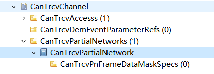

===================
CanTrcv产品参考手册
===================

**缩写词注解**

+------------+---------------------------+----------------------------+
| **缩写词** | **英文全称**              | **中文解释**               |
+------------+---------------------------+----------------------------+
| ComM       | Communication Manager     | 通信管理器                 |
+------------+---------------------------+----------------------------+
| DEM        | Diagnostic Event Manager  | 诊断事件管理器             |
+------------+---------------------------+----------------------------+
| DET        | Default Error Tracer      | 默认错误检测/追踪器        |
+------------+---------------------------+----------------------------+
| DIO        | Digital Input Output      | 数字输入/输出              |
|            | (SPAL module)             |                            |
+------------+---------------------------+----------------------------+
| EB         | Externally Buffered       | 外部缓冲通道。缓冲区存放   |
|            | channels                  | SPI驱动以外要传输的数据。  |
+------------+---------------------------+----------------------------+
| EcuM       | ECU State Manager         | ECU状态机管理器            |
+------------+---------------------------+----------------------------+
| IB         | Internally Buffered       | 内部缓冲通道。缓冲区存放   |
|            | channels                  | SPI驱动内部要传输的数据。  |
+------------+---------------------------+----------------------------+
| ISR        | Interrupt Service Routine | 中断服务程序               |
+------------+---------------------------+----------------------------+
| MCAL       | Micro Controller          | 微控制器抽象层             |
|            | Abstraction Layer         |                            |
+------------+---------------------------+----------------------------+
| Port       | Port module (SPAL module) | 端口模块                   |
+------------+---------------------------+----------------------------+
| n/a        | Not Applicable            | 不适用                     |
+------------+---------------------------+----------------------------+
| SBC        | System Basis Chip         | 系统                       |
|            |                           | 基础芯片。一个整合收发器， |
|            |                           | 看门狗以及电源控制的设备。 |
+------------+---------------------------+----------------------------+
| SPAL       | Standard Peripheral       | 标准外设抽象层             |
|            | Abstraction Layer         |                            |
+------------+---------------------------+----------------------------+
| API        | Application Programming   | 应用接口                   |
|            | Interface                 |                            |
+------------+---------------------------+----------------------------+

简介
====

CanTrcv在AutoSar R19-11软件层级架构如下图：

|image1|

图1-1 CanTrcv在AutoSar的软件层级架构图

CanTrcv抽象化Can收发器硬件，提供独立于硬件的接口给CanIf等上层模块。它通过使用MCAL层的API接口访问CAN收发器硬件，从ECU布局中抽象出来。

参考资料
--------

[1] AUTOSAR_SWS_CanTransceiverDriver.PDF，R19-11

[2] AUTOSAR_SRS_CAN.PDF，R19-11

功能描述
========

CanTrcv功能
-----------

CanTrcv功能介绍
~~~~~~~~~~~~~~~

CAN收发器驱动程序模块负责处理ECU上的CAN收发器硬件芯片，并将CAN总线上使用的信号电平调整为微控制器可以识别的逻辑(数字)信号电平。此外，收发器还能检测到电气故障，如线路问题、地面偏移或长主导信号的传输。

根据CAN收发器与微控制器的接口，驱动程序模块可以标记由外部端口pin记录的探测错误或由SPI总线记录的检测错误；特定CAN收发器支持电源控制，并通过CAN总线唤醒。有些CAN收发器具备特定功能，如系统基础芯片(SBC)，它除了CAN基本功能之外，还实现了电源控制和高级监控，并通过SPI总线和MCU进行访问。部分网络唤醒是CAN系统中的一种状态，其中一些节点处于低功耗模式，而其他节点正在通信。这减少了整个网络的功耗。在低功耗模式下，节点被预先定义的唤醒帧唤醒。支持选择性唤醒的收发器除了普通收发器提供的唤醒模式(Wakeup
Pattern)外，还可以通过唤醒帧(Wakeup Frame)来唤醒。

CanTrcv功能实现
~~~~~~~~~~~~~~~

CAN收发器驱动程序的目标是指定适合CAN收发器设备的接口和行为和抽象CAN收发器硬件；它为上层提供了一个独立于硬件的接口；它通过使用MCAL层的API接口访问CAN收发器硬件，从ECU布局中抽象出来。

CanTrcv在访问到硬件，发现唤醒事件之后，也可以通过回调接口通知到上层CanIf/EcuM从而使BSW能处理这些唤醒事件。

源文件描述
==========

表3-1 CanTrcv组件文件描述

+---------------------+------------------------------------------------+
| **文件**            | **说明**                                       |
+---------------------+------------------------------------------------+
| CanTrcv.c           | 包含需                                         |
|                     | 要使用的宏定义，内部变量，内部函数，全局函数。 |
+---------------------+------------------------------------------------+
| CanTrcv_Driver.c    | 包含需                                         |
|                     | 要使用的关于硬件的宏定义，内部变量，内部函数。 |
+---------------------+------------------------------------------------+
| CanTrcv_Driver.h    | 包含需要使                                     |
|                     | 用的关于硬件的宏定义，类型定义，内部函数声明。 |
+---------------------+------------------------------------------------+
| CanTrcv_Types.h     | 包含需要使用的类型定义。                       |
+---------------------+------------------------------------------------+
| CanTrcv.h           | 包含需要使用的宏                               |
|                     | 定义，类型定义，配置结构体声明，外部函数声明。 |
+---------------------+------------------------------------------------+
| CanTrcv_Cfg.h       | 生成CanTrcv模块配置相关的宏定义。              |
+---------------------+------------------------------------------------+
| CanTrcv_Cfg.c       | 生成CanTrcv模块配置相关的结构体。              |
+---------------------+------------------------------------------------+
| CanTrcv_MemMap.h    | CanTrcv模块的内存映射。                        |
+---------------------+------------------------------------------------+

|image2|

图3-1 CanTrcv组件文件交互关系图

API接口
=======

类型定义
--------

CanTrcv_ConfigType类型定义
~~~~~~~~~~~~~~~~~~~~~~~~~~

+-----------+----------------------------------------------------------+
| 名称      | CanTrcv_ConfigType                                       |
+-----------+----------------------------------------------------------+
| 类型      | Structure                                                |
+-----------+----------------------------------------------------------+
| 范围      | 无                                                       |
+-----------+----------------------------------------------------------+
| 描述      | 配置参数结构体类型定义                                   |
+-----------+----------------------------------------------------------+

CanTrcv_PNActivationType类型定义
~~~~~~~~~~~~~~~~~~~~~~~~~~~~~~~~

+-----------+----------------------------------------------------------+
| 名称      | CanTrcv_PNActivationType                                 |
+-----------+----------------------------------------------------------+
| 类型      | Enumeration                                              |
+-----------+----------------------------------------------------------+
| 范围      | PN_ENABLED                                               |
|           |                                                          |
|           | PN_DISABLED                                              |
+-----------+----------------------------------------------------------+
| 描述      | 部分唤醒功能开关                                         |
+-----------+----------------------------------------------------------+

CanTrcv_TrcvFlagStateType类型定义
~~~~~~~~~~~~~~~~~~~~~~~~~~~~~~~~~

+-----------+----------------------------------------------------------+
| 名称      | CanTrcv_TrcvFlagStateType                                |
+-----------+----------------------------------------------------------+
| 类型      | Enumeration                                              |
+-----------+----------------------------------------------------------+
| 范围      | CANTRCV_FLAG_SET                                         |
|           |                                                          |
|           | CANTRCV_FLAG_CLEARED                                     |
+-----------+----------------------------------------------------------+
| 描述      | CanTrcv硬件是否置位                                      |
+-----------+----------------------------------------------------------+

输入函数描述
------------

+----------------------------------+-----------------------------------+
| **输入模块**                     | **API**                           |
+----------------------------------+-----------------------------------+
| CanIf                            | CanIf_ConfirmPnAvailability       |
+----------------------------------+-----------------------------------+
|                                  | CanIf_TrcvModeIndication          |
+----------------------------------+-----------------------------------+
|                                  | CanIf_ClearTrcvWufFlagIndication  |
+----------------------------------+-----------------------------------+
|                                  | CanIf_CheckTrcvWakeFlagIndication |
+----------------------------------+-----------------------------------+
| Det                              | Det_ReportError                   |
+----------------------------------+-----------------------------------+
|                                  | Det_ReportRuntimeError            |
+----------------------------------+-----------------------------------+
| EcuM                             | EcuM_SetWakeupEvent               |
+----------------------------------+-----------------------------------+
| Icu                              | Icu_DisableNotification           |
+----------------------------------+-----------------------------------+
|                                  | Icu_EnableNotification            |
+----------------------------------+-----------------------------------+
| Dio                              | 预留，根据硬件决定                |
+----------------------------------+-----------------------------------+
| Spi                              | 预留，根据硬件决定                |
+----------------------------------+-----------------------------------+
| Tm                               | Tm_BusyWait1us16bit               |
+----------------------------------+-----------------------------------+
| Dem                              | Dem_SetEventStatus                |
+----------------------------------+-----------------------------------+

静态接口函数定义
----------------

CanTrcv_Init函数定义
~~~~~~~~~~~~~~~~~~~~

+-------------+-------------------+---------+-------------------------+
| 函数名称：  | CanTrcv_Init      |         |                         |
+-------------+-------------------+---------+-------------------------+
| 函数原型：  | void CanTrcv_Init |         |                         |
|             | (const            |         |                         |
|             | Can               |         |                         |
|             | Trcv_ConfigType\* |         |                         |
|             | ConfigPtr)        |         |                         |
+-------------+-------------------+---------+-------------------------+
| 服务编号：  | 0x00              |         |                         |
+-------------+-------------------+---------+-------------------------+
| 同步/异步： | 同步              |         |                         |
+-------------+-------------------+---------+-------------------------+
| 是          | 否                |         |                         |
| 否可重入：  |                   |         |                         |
+-------------+-------------------+---------+-------------------------+
| 输入参数：  | Config            | 值域：  | 无                      |
|             | Ptr：配置参数指针 |         |                         |
+-------------+-------------------+---------+-------------------------+
| 输入        | 无                |         |                         |
| 输出参数：  |                   |         |                         |
+-------------+-------------------+---------+-------------------------+
| 输出参数：  | 无                |         |                         |
+-------------+-------------------+---------+-------------------------+
| 返回值：    | 无                |         |                         |
+-------------+-------------------+---------+-------------------------+
| 功能概述：  | 初始化CanTrcv模块 |         |                         |
+-------------+-------------------+---------+-------------------------+

CanTrcv_SetOpMode函数定义
~~~~~~~~~~~~~~~~~~~~~~~~~

+------------+------------------+--------+----------------------------+
| 函数名称： | C                |        |                            |
|            | anTrcv_SetOpMode |        |                            |
+------------+------------------+--------+----------------------------+
| 函数原型： | Std_ReturnType   |        |                            |
|            | C                |        |                            |
|            | anTrcv_SetOpMode |        |                            |
|            | (                |        |                            |
|            |                  |        |                            |
|            | uint8            |        |                            |
|            | Transceiver,     |        |                            |
|            |                  |        |                            |
|            | CanT             |        |                            |
|            | rcv_TrcvModeType |        |                            |
|            | OpMode           |        |                            |
|            |                  |        |                            |
|            | )                |        |                            |
+------------+------------------+--------+----------------------------+
| 服务编号： | 0x01             |        |                            |
+------------+------------------+--------+----------------------------+
| 同         | 异步             |        |                            |
| 步/异步：  |                  |        |                            |
+------------+------------------+--------+----------------------------+
| 是         | 对于不同tr       |        |                            |
| 否可重入： | ansceivers可重入 |        |                            |
+------------+------------------+--------+----------------------------+
| 输入参数： | Transcei         | 值域： | 0-                         |
|            | ver：Transceiver |        | (CANTRCV_MAX_CHANNELS-1)   |
|            | Id               |        |                            |
+------------+------------------+--------+----------------------------+
|            | OpMode：运行模式 |        | 无                         |
+------------+------------------+--------+----------------------------+
| 输入       | 无               |        |                            |
| 输出参数： |                  |        |                            |
+------------+------------------+--------+----------------------------+
| 输出参数： | 无               |        |                            |
+------------+------------------+--------+----------------------------+
| 返回值：   | Std_Retu         |        |                            |
|            | rnType：E_OK：切 |        |                            |
|            | 换请求接收并成功 |        |                            |
|            |                  |        |                            |
|            | E_NOT_OK：切     |        |                            |
|            | 换失败，遇到错误 |        |                            |
+------------+------------------+--------+----------------------------+
| 功能概述： | 切换运行模式     |        |                            |
+------------+------------------+--------+----------------------------+

CanTrcv_GetOpMode函数定义
~~~~~~~~~~~~~~~~~~~~~~~~~

+------------+------------------+--------+----------------------------+
| 函数名称： | C                |        |                            |
|            | anTrcv_GetOpMode |        |                            |
+------------+------------------+--------+----------------------------+
| 函数原型： | Std_ReturnType   |        |                            |
|            | C                |        |                            |
|            | anTrcv_GetOpMode |        |                            |
|            | (                |        |                            |
|            |                  |        |                            |
|            | uint8            |        |                            |
|            | Transceiver,     |        |                            |
|            |                  |        |                            |
|            | CanTrc           |        |                            |
|            | v_TrcvModeType\* |        |                            |
|            | OpMode           |        |                            |
|            |                  |        |                            |
|            | )                |        |                            |
+------------+------------------+--------+----------------------------+
| 服务编号： | 0x02             |        |                            |
+------------+------------------+--------+----------------------------+
| 同         | 同步             |        |                            |
| 步/异步：  |                  |        |                            |
+------------+------------------+--------+----------------------------+
| 是         | 是               |        |                            |
| 否可重入： |                  |        |                            |
+------------+------------------+--------+----------------------------+
| 输入参数： | Transcei         | 值域： | 0-                         |
|            | ver：Transceiver |        | (CANTRCV_MAX_CHANNELS-1)   |
|            | Id               |        |                            |
+------------+------------------+--------+----------------------------+
| 输入       | 无               |        |                            |
| 输出参数： |                  |        |                            |
+------------+------------------+--------+----------------------------+
| 输出参数： | OpMo             |        |                            |
|            | de：运行模式指针 |        |                            |
+------------+------------------+--------+----------------------------+
| 返回值：   | Std_Re           |        |                            |
|            | turnType：E_OK： |        |                            |
|            | 成功获取运行模式 |        |                            |
|            |                  |        |                            |
|            | E_NOT_OK：获     |        |                            |
|            | 取失败，遇到错误 |        |                            |
+------------+------------------+--------+----------------------------+
| 功能概述： | 获取运行模式     |        |                            |
+------------+------------------+--------+----------------------------+

CanTrcv_GetBusWuReason函数定义
~~~~~~~~~~~~~~~~~~~~~~~~~~~~~~

+------------+------------------+--------+----------------------------+
| 函数名称： | CanTrc           |        |                            |
|            | v_GetBusWuReason |        |                            |
+------------+------------------+--------+----------------------------+
| 函数原型： | Std_ReturnType   |        |                            |
|            | CanTrc           |        |                            |
|            | v_GetBusWuReason |        |                            |
|            | (                |        |                            |
|            |                  |        |                            |
|            | uint8            |        |                            |
|            | Transceiver,     |        |                            |
|            |                  |        |                            |
|            | CanTrcv_TrcvWa   |        |                            |
|            | keupReasonType\* |        |                            |
|            | reason           |        |                            |
|            |                  |        |                            |
|            | )                |        |                            |
+------------+------------------+--------+----------------------------+
| 服务编号： | 0x03             |        |                            |
+------------+------------------+--------+----------------------------+
| 同         | 同步             |        |                            |
| 步/异步：  |                  |        |                            |
+------------+------------------+--------+----------------------------+
| 是         | 是               |        |                            |
| 否可重入： |                  |        |                            |
+------------+------------------+--------+----------------------------+
| 输入参数： | Transcei         | 值域： | 0-                         |
|            | ver：Transceiver |        | (CANTRCV_MAX_CHANNELS-1)   |
|            | Id               |        |                            |
+------------+------------------+--------+----------------------------+
| 输入       | 无               |        |                            |
| 输出参数： |                  |        |                            |
+------------+------------------+--------+----------------------------+
| 输出参数： | reason：唤醒原因 |        |                            |
+------------+------------------+--------+----------------------------+
| 返回值：   | Std_Re           |        |                            |
|            | turnType：E_OK： |        |                            |
|            | 成功获取唤醒原因 |        |                            |
|            |                  |        |                            |
|            | E_NOT_OK：获     |        |                            |
|            | 取失败，遇到错误 |        |                            |
+------------+------------------+--------+----------------------------+
| 功能概述： | 获取唤醒原因     |        |                            |
+------------+------------------+--------+----------------------------+

CanTrcv_GetVersionInfo函数定义
~~~~~~~~~~~~~~~~~~~~~~~~~~~~~~

+-------------+-------------------+---------+-------------------------+
| 函数名称：  | CanTr             |         |                         |
|             | cv_GetVersionInfo |         |                         |
+-------------+-------------------+---------+-------------------------+
| 函数原型：  | void              |         |                         |
|             | CanTr             |         |                         |
|             | cv_GetVersionInfo |         |                         |
|             | (                 |         |                         |
|             |                   |         |                         |
|             | Std_              |         |                         |
|             | VersionInfoType\* |         |                         |
|             | versioninfo       |         |                         |
|             |                   |         |                         |
|             | )                 |         |                         |
+-------------+-------------------+---------+-------------------------+
| 服务编号：  | 0x04              |         |                         |
+-------------+-------------------+---------+-------------------------+
| 同步/异步： | 同步              |         |                         |
+-------------+-------------------+---------+-------------------------+
| 是          | 是                |         |                         |
| 否可重入：  |                   |         |                         |
+-------------+-------------------+---------+-------------------------+
| 输入参数：  | 无                | 值域：  | 无                      |
+-------------+-------------------+---------+-------------------------+
| 输入        | 无                |         |                         |
| 输出参数：  |                   |         |                         |
+-------------+-------------------+---------+-------------------------+
| 输出参数：  | versioni          |         |                         |
|             | nfo：版本信息指针 |         |                         |
+-------------+-------------------+---------+-------------------------+
| 返回值：    | 无                |         |                         |
+-------------+-------------------+---------+-------------------------+
| 功能概述：  | 获取版本信息      |         |                         |
+-------------+-------------------+---------+-------------------------+

CanTrcv_SetWakeupMode函数定义
~~~~~~~~~~~~~~~~~~~~~~~~~~~~~

+------------+------------------+--------+----------------------------+
| 函数名称： | CanTr            |        |                            |
|            | cv_SetWakeupMode |        |                            |
+------------+------------------+--------+----------------------------+
| 函数原型： | Std_ReturnType   |        |                            |
|            | CanTr            |        |                            |
|            | cv_SetWakeupMode |        |                            |
|            | (                |        |                            |
|            |                  |        |                            |
|            | uint8            |        |                            |
|            | Transceiver,     |        |                            |
|            |                  |        |                            |
|            | CanTrcv_Tr       |        |                            |
|            | cvWakeupModeType |        |                            |
|            | TrcvWakeupMode   |        |                            |
|            |                  |        |                            |
|            | )                |        |                            |
+------------+------------------+--------+----------------------------+
| 服务编号： | 0x05             |        |                            |
+------------+------------------+--------+----------------------------+
| 同         | 同步             |        |                            |
| 步/异步：  |                  |        |                            |
+------------+------------------+--------+----------------------------+
| 是         | 对于不同t        |        |                            |
| 否可重入： | ransceiver可重入 |        |                            |
+------------+------------------+--------+----------------------------+
| 输入参数： | Transcei         | 值域： | 0-                         |
|            | ver：Transceiver |        | (CANTRCV_MAX_CHANNELS-1)   |
|            | Id               |        |                            |
+------------+------------------+--------+----------------------------+
|            | TrcvWakeupMode： | 值域： | 无                         |
|            | 处理唤醒事件模式 |        |                            |
+------------+------------------+--------+----------------------------+
| 输入       | 无               |        |                            |
| 输出参数： |                  |        |                            |
+------------+------------------+--------+----------------------------+
| 输出参数： | 无               |        |                            |
+------------+------------------+--------+----------------------------+
| 返回值：   | Std_             |        |                            |
|            | ReturnType：E_OK |        |                            |
|            | ：成功处理唤醒事 |        |                            |
|            | 件并设置唤醒模式 |        |                            |
|            |                  |        |                            |
|            | E_NOT_OK：处     |        |                            |
|            | 理失败，遇到错误 |        |                            |
+------------+------------------+--------+----------------------------+
| 功能概述： | 根据TrcvWake     |        |                            |
|            | upMode开启、禁用 |        |                            |
|            | 或清除唤醒事件。 |        |                            |
+------------+------------------+--------+----------------------------+

CanTrcv_MainFunction函数定义
~~~~~~~~~~~~~~~~~~~~~~~~~~~~

+-------------+-------------------+---------+-------------------------+
| 函数名称：  | Can               |         |                         |
|             | Trcv_MainFunction |         |                         |
+-------------+-------------------+---------+-------------------------+
| 函数原型：  | void              |         |                         |
|             | Can               |         |                         |
|             | Trcv_MainFunction |         |                         |
|             | (void)            |         |                         |
+-------------+-------------------+---------+-------------------------+
| 服务编号：  | 0x06              |         |                         |
+-------------+-------------------+---------+-------------------------+
| 同步/异步： | 同步              |         |                         |
+-------------+-------------------+---------+-------------------------+
| 是          | 否                |         |                         |
| 否可重入：  |                   |         |                         |
+-------------+-------------------+---------+-------------------------+
| 输入参数：  | 无                | 值域：  | 无                      |
+-------------+-------------------+---------+-------------------------+
| 输入        | 无                |         |                         |
| 输出参数：  |                   |         |                         |
+-------------+-------------------+---------+-------------------------+
| 输出参数：  | 无                |         |                         |
+-------------+-------------------+---------+-------------------------+
| 返回值：    | 无                |         |                         |
+-------------+-------------------+---------+-------------------------+
| 功能概述：  | 主调度函数，周期  |         |                         |
|             | 性扫描唤醒时间。  |         |                         |
+-------------+-------------------+---------+-------------------------+

CanTrcv_CheckWakeup函数定义
~~~~~~~~~~~~~~~~~~~~~~~~~~~

+------------+------------------+--------+----------------------------+
| 函数名称： | Can              |        |                            |
|            | Trcv_CheckWakeup |        |                            |
+------------+------------------+--------+----------------------------+
| 函数原型： | Std_ReturnType   |        |                            |
|            | Can              |        |                            |
|            | Trcv_CheckWakeup |        |                            |
|            | (uint8           |        |                            |
|            | Transceiver)     |        |                            |
+------------+------------------+--------+----------------------------+
| 服务编号： | 0x07             |        |                            |
+------------+------------------+--------+----------------------------+
| 同         | 同步             |        |                            |
| 步/异步：  |                  |        |                            |
+------------+------------------+--------+----------------------------+
| 是         | 是               |        |                            |
| 否可重入： |                  |        |                            |
+------------+------------------+--------+----------------------------+
| 输入参数： | Transcei         | 值域： | 0-                         |
|            | ver：Transceiver |        | (CANTRCV_MAX_CHANNELS-1)   |
|            | Id               |        |                            |
+------------+------------------+--------+----------------------------+
| 输入       | 无               |        |                            |
| 输出参数： |                  |        |                            |
+------------+------------------+--------+----------------------------+
| 输出参数： | 无               |        |                            |
+------------+------------------+--------+----------------------------+
| 返回值：   | Std_Re           |        |                            |
|            | turnType：E_OK： |        |                            |
|            | 成功处理唤醒事件 |        |                            |
|            |                  |        |                            |
|            | E_NOT_OK：处     |        |                            |
|            | 理失败，遇到错误 |        |                            |
+------------+------------------+--------+----------------------------+
| 功能概述： | 唤醒中断发生     |        |                            |
|            | 后检查唤醒事件。 |        |                            |
+------------+------------------+--------+----------------------------+

CanTrcv_MainFunctionDiagnostics函数定义
~~~~~~~~~~~~~~~~~~~~~~~~~~~~~~~~~~~~~~~

+-------------+-------------------+---------+-------------------------+
| 函数名称：  | CanTrcv_MainFu    |         |                         |
|             | nctionDiagnostics |         |                         |
+-------------+-------------------+---------+-------------------------+
| 函数原型：  | void              |         |                         |
|             | CanTrcv_MainFu    |         |                         |
|             | nctionDiagnostics |         |                         |
|             | (void)            |         |                         |
+-------------+-------------------+---------+-------------------------+
| 服务编号：  | 0x08              |         |                         |
+-------------+-------------------+---------+-------------------------+
| 同步/异步： | 同步              |         |                         |
+-------------+-------------------+---------+-------------------------+
| 是          | 否                |         |                         |
| 否可重入：  |                   |         |                         |
+-------------+-------------------+---------+-------------------------+
| 输入参数：  | 无                | 值域：  | 无                      |
+-------------+-------------------+---------+-------------------------+
| 输入        | 无                |         |                         |
| 输出参数：  |                   |         |                         |
+-------------+-------------------+---------+-------------------------+
| 输出参数：  | 无                |         |                         |
+-------------+-------------------+---------+-------------------------+
| 返回值：    | 无                |         |                         |
+-------------+-------------------+---------+-------------------------+
| 功能概述：  | 主诊断调度函数    |         |                         |
|             | ，周期性读取硬件  |         |                         |
|             | 状态并报告错误。  |         |                         |
+-------------+-------------------+---------+-------------------------+

CanTrcv_DeInit函数定义
~~~~~~~~~~~~~~~~~~~~~~

+-------------+-------------------+---------+-------------------------+
| 函数名称：  | CanTrcv_DeInit    |         |                         |
+-------------+-------------------+---------+-------------------------+
| 函数原型：  | void              |         |                         |
|             | CanTrcv_DeInit    |         |                         |
|             | (void)            |         |                         |
+-------------+-------------------+---------+-------------------------+
| 服务编号：  | 0x10              |         |                         |
+-------------+-------------------+---------+-------------------------+
| 同步/异步： | 同步              |         |                         |
+-------------+-------------------+---------+-------------------------+
| 是          | 否                |         |                         |
| 否可重入：  |                   |         |                         |
+-------------+-------------------+---------+-------------------------+
| 输入参数：  | 无                | 值域：  | 无                      |
+-------------+-------------------+---------+-------------------------+
| 输入        | 无                |         |                         |
| 输出参数：  |                   |         |                         |
+-------------+-------------------+---------+-------------------------+
| 输出参数：  | 无                |         |                         |
+-------------+-------------------+---------+-------------------------+
| 返回值：    | 无                |         |                         |
+-------------+-------------------+---------+-------------------------+
| 功能概述：  | 反初始化函数，    |         |                         |
|             | 停止CanTrcv模块。 |         |                         |
+-------------+-------------------+---------+-------------------------+

CanTrcv_GetTrcvSystemData函数定义
~~~~~~~~~~~~~~~~~~~~~~~~~~~~~~~~~

+------------+------------------+--------+----------------------------+
| 函数名称： | CanTrcv_G        |        |                            |
|            | etTrcvSystemData |        |                            |
+------------+------------------+--------+----------------------------+
| 函数原型： | Std_ReturnType   |        |                            |
|            | CanTrcv_G        |        |                            |
|            | etTrcvSystemData |        |                            |
|            | (                |        |                            |
|            |                  |        |                            |
|            | uint8            |        |                            |
|            | Transceiver,     |        |                            |
|            |                  |        |                            |
|            | const uint32\*   |        |                            |
|            | TrcvSysData      |        |                            |
|            |                  |        |                            |
|            | )                |        |                            |
+------------+------------------+--------+----------------------------+
| 服务编号： | 0x09             |        |                            |
+------------+------------------+--------+----------------------------+
| 同         | 同步             |        |                            |
| 步/异步：  |                  |        |                            |
+------------+------------------+--------+----------------------------+
| 是         | 否               |        |                            |
| 否可重入： |                  |        |                            |
+------------+------------------+--------+----------------------------+
| 输入参数： | Transcei         | 值域： | 0-                         |
|            | ver：Transceiver |        | (CANTRCV_MAX_CHANNELS-1)   |
|            | Id               |        |                            |
+------------+------------------+--------+----------------------------+
| 输入       | 无               |        |                            |
| 输出参数： |                  |        |                            |
+------------+------------------+--------+----------------------------+
| 输出参数： | TrcvSysData      |        |                            |
|            | ：收发器系统数据 |        |                            |
+------------+------------------+--------+----------------------------+
| 返回值：   | Std_Re           |        |                            |
|            | turnType：E_OK： |        |                            |
|            | 成功获取系统数据 |        |                            |
|            |                  |        |                            |
|            | E_NOT_OK：获     |        |                            |
|            | 取失败，遇到错误 |        |                            |
+------------+------------------+--------+----------------------------+
| 功能概述： | 获               |        |                            |
|            | 取收发器系统数据 |        |                            |
+------------+------------------+--------+----------------------------+

CanTrcv_ClearTrcvWufFlag函数定义
~~~~~~~~~~~~~~~~~~~~~~~~~~~~~~~~

+------------+------------------+--------+----------------------------+
| 函数名称： | CanTrcv_         |        |                            |
|            | ClearTrcvWufFlag |        |                            |
+------------+------------------+--------+----------------------------+
| 函数原型： | Std_ReturnType   |        |                            |
|            | CanTrcv_         |        |                            |
|            | ClearTrcvWufFlag |        |                            |
|            | (uint8           |        |                            |
|            | Transceiver)     |        |                            |
+------------+------------------+--------+----------------------------+
| 服务编号： | 0x0a             |        |                            |
+------------+------------------+--------+----------------------------+
| 同         | 同步             |        |                            |
| 步/异步：  |                  |        |                            |
+------------+------------------+--------+----------------------------+
| 是         | 对于不同tr       |        |                            |
| 否可重入： | ansceivers可重入 |        |                            |
+------------+------------------+--------+----------------------------+
| 输入参数： | Transcei         | 值域： | 0-                         |
|            | ver：Transceiver |        | (CANTRCV_MAX_CHANNELS-1)   |
|            | Id               |        |                            |
+------------+------------------+--------+----------------------------+
| 输入       | 无               |        |                            |
| 输出参数： |                  |        |                            |
+------------+------------------+--------+----------------------------+
| 输出参数： | 无               |        |                            |
+------------+------------------+--------+----------------------------+
| 返回值：   | Std_Retu         |        |                            |
|            | rnType：E_OK：成 |        |                            |
|            | 功清除唤醒帧Flag |        |                            |
|            |                  |        |                            |
|            | E_NOT_OK：清     |        |                            |
|            | 除失败，遇到错误 |        |                            |
+------------+------------------+--------+----------------------------+
| 功能概述： | 清               |        |                            |
|            | 除硬件唤醒帧Flag |        |                            |
+------------+------------------+--------+----------------------------+

CanTrcv_ReadTrcvTimeoutFlag函数定义
~~~~~~~~~~~~~~~~~~~~~~~~~~~~~~~~~~~

+------------+------------------+--------+----------------------------+
| 函数名称： | CanTrcv_Rea      |        |                            |
|            | dTrcvTimeoutFlag |        |                            |
+------------+------------------+--------+----------------------------+
| 函数原型： | Std_ReturnType   |        |                            |
|            | CanTrcv_Rea      |        |                            |
|            | dTrcvTimeoutFlag |        |                            |
|            | (                |        |                            |
|            |                  |        |                            |
|            | uint8            |        |                            |
|            | Transceiver,     |        |                            |
|            |                  |        |                            |
|            | CanTrcv_Trc      |        |                            |
|            | vFlagStateType\* |        |                            |
|            | FlagState        |        |                            |
|            |                  |        |                            |
|            | )                |        |                            |
+------------+------------------+--------+----------------------------+
| 服务编号： | 0x0b             |        |                            |
+------------+------------------+--------+----------------------------+
| 同         | 同步             |        |                            |
| 步/异步：  |                  |        |                            |
+------------+------------------+--------+----------------------------+
| 是         | 否               |        |                            |
| 否可重入： |                  |        |                            |
+------------+------------------+--------+----------------------------+
| 输入参数： | Transcei         | 值域： | 0-                         |
|            | ver：Transceiver |        | (CANTRCV_MAX_CHANNELS-1)   |
|            | Id               |        |                            |
+------------+------------------+--------+----------------------------+
| 输入       | 无               |        |                            |
| 输出参数： |                  |        |                            |
+------------+------------------+--------+----------------------------+
| 输出参数： | FlagSta          |        |                            |
|            | te：超时Flag状态 |        |                            |
+------------+------------------+--------+----------------------------+
| 返回值：   | Std_ReturnTy     |        |                            |
|            | pe：E_OK：成功读 |        |                            |
|            | 取收发器超时Flag |        |                            |
|            |                  |        |                            |
|            | E_NOT_OK：读     |        |                            |
|            | 取失败，遇到错误 |        |                            |
+------------+------------------+--------+----------------------------+
| 功能概述： | 读取硬件超时Flag |        |                            |
+------------+------------------+--------+----------------------------+

CanTrcv_ClearTrcvTimeoutFlag函数定义
~~~~~~~~~~~~~~~~~~~~~~~~~~~~~~~~~~~~

+------------+------------------+--------+----------------------------+
| 函数名称： | CanTrcv_Clea     |        |                            |
|            | rTrcvTimeoutFlag |        |                            |
+------------+------------------+--------+----------------------------+
| 函数原型： | Std_ReturnType   |        |                            |
|            | CanTrcv_Clea     |        |                            |
|            | rTrcvTimeoutFlag |        |                            |
|            | (uint8           |        |                            |
|            | Transceiver)     |        |                            |
+------------+------------------+--------+----------------------------+
| 服务编号： | 0x0c             |        |                            |
+------------+------------------+--------+----------------------------+
| 同         | 同步             |        |                            |
| 步/异步：  |                  |        |                            |
+------------+------------------+--------+----------------------------+
| 是         | 否               |        |                            |
| 否可重入： |                  |        |                            |
+------------+------------------+--------+----------------------------+
| 输入参数： | Transcei         | 值域： | 0-                         |
|            | ver：Transceiver |        | (CANTRCV_MAX_CHANNELS-1)   |
|            | Id               |        |                            |
+------------+------------------+--------+----------------------------+
| 输入       | 无               |        |                            |
| 输出参数： |                  |        |                            |
+------------+------------------+--------+----------------------------+
| 输出参数： | 无               |        |                            |
+------------+------------------+--------+----------------------------+
| 返回值：   | Std_ReturnTy     |        |                            |
|            | pe：E_OK：成功清 |        |                            |
|            | 除收发器超时Flag |        |                            |
|            |                  |        |                            |
|            | E_NOT_OK：清     |        |                            |
|            | 除失败，遇到错误 |        |                            |
+------------+------------------+--------+----------------------------+
| 功能概述： | 清除硬件超时Flag |        |                            |
+------------+------------------+--------+----------------------------+

CanTrcv_ReadTrcvSilenceFlag函数定义
~~~~~~~~~~~~~~~~~~~~~~~~~~~~~~~~~~~

+------------+------------------+--------+----------------------------+
| 函数名称： | CanTrcv_Rea      |        |                            |
|            | dTrcvSilenceFlag |        |                            |
+------------+------------------+--------+----------------------------+
| 函数原型： | Std_ReturnType   |        |                            |
|            | CanTrcv_Rea      |        |                            |
|            | dTrcvSilenceFlag |        |                            |
|            | (                |        |                            |
|            |                  |        |                            |
|            | uint8            |        |                            |
|            | Transceiver,     |        |                            |
|            |                  |        |                            |
|            | CanTrcv_Trc      |        |                            |
|            | vFlagStateType\* |        |                            |
|            | FlagState        |        |                            |
|            |                  |        |                            |
|            | )                |        |                            |
+------------+------------------+--------+----------------------------+
| 服务编号： | 0x0d             |        |                            |
+------------+------------------+--------+----------------------------+
| 同         | 同步             |        |                            |
| 步/异步：  |                  |        |                            |
+------------+------------------+--------+----------------------------+
| 是         | 否               |        |                            |
| 否可重入： |                  |        |                            |
+------------+------------------+--------+----------------------------+
| 输入参数： | Transcei         | 值域： | 0-                         |
|            | ver：Transceiver |        | (CANTRCV_MAX_CHANNELS-1)   |
|            | Id               |        |                            |
+------------+------------------+--------+----------------------------+
| 输入       | 无               |        |                            |
| 输出参数： |                  |        |                            |
+------------+------------------+--------+----------------------------+
| 输出参数： | Fl               |        |                            |
|            | agState：Silence |        |                            |
|            | Flag状态         |        |                            |
+------------+------------------+--------+----------------------------+
| 返回值：   | Std_ReturnTy     |        |                            |
|            | pe：E_OK：成功读 |        |                            |
|            | 取收发器Silence  |        |                            |
|            | Flag             |        |                            |
|            |                  |        |                            |
|            | E_NOT_OK：读     |        |                            |
|            | 取失败，遇到错误 |        |                            |
+------------+------------------+--------+----------------------------+
| 功能概述： | 读取硬件Silence  |        |                            |
|            | Flag             |        |                            |
+------------+------------------+--------+----------------------------+

CanTrcv_CheckWakeFlag函数定义
~~~~~~~~~~~~~~~~~~~~~~~~~~~~~

+------------+------------------+--------+----------------------------+
| 函数名称： | CanTr            |        |                            |
|            | cv_CheckWakeFlag |        |                            |
+------------+------------------+--------+----------------------------+
| 函数原型： | Std_ReturnType   |        |                            |
|            | CanTr            |        |                            |
|            | cv_CheckWakeFlag |        |                            |
|            | (uint8           |        |                            |
|            | Transceiver)     |        |                            |
+------------+------------------+--------+----------------------------+
| 服务编号： | 0x0e             |        |                            |
+------------+------------------+--------+----------------------------+
| 同         | 异步             |        |                            |
| 步/异步：  |                  |        |                            |
+------------+------------------+--------+----------------------------+
| 是         | 否               |        |                            |
| 否可重入： |                  |        |                            |
+------------+------------------+--------+----------------------------+
| 输入参数： | Transcei         | 值域： | 0-                         |
|            | ver：Transceiver |        | (CANTRCV_MAX_CHANNELS-1)   |
|            | Id               |        |                            |
+------------+------------------+--------+----------------------------+
| 输入       | 无               |        |                            |
| 输出参数： |                  |        |                            |
+------------+------------------+--------+----------------------------+
| 输出参数： | 无               |        |                            |
+------------+------------------+--------+----------------------------+
| 返回值：   | Std_Re           |        |                            |
|            | turnType：E_OK： |        |                            |
|            | 成功检查唤醒Flag |        |                            |
|            |                  |        |                            |
|            | E_NOT_OK：检     |        |                            |
|            | 查失败，遇到错误 |        |                            |
+------------+------------------+--------+----------------------------+
| 功能概述： | 检查硬件wakeup   |        |                            |
|            | Flag状态         |        |                            |
+------------+------------------+--------+----------------------------+

CanTrcv_SetPNActivationState函数定义
~~~~~~~~~~~~~~~~~~~~~~~~~~~~~~~~~~~~

+-------------+-------------------+---------+-------------------------+
| 函数名称：  | CanTrcv_Set       |         |                         |
|             | PNActivationState |         |                         |
+-------------+-------------------+---------+-------------------------+
| 函数原型：  | Std_ReturnType    |         |                         |
|             | CanTrcv_Set       |         |                         |
|             | PNActivationState |         |                         |
|             | (                 |         |                         |
|             |                   |         |                         |
|             | CanTrcv           |         |                         |
|             | _PNActivationType |         |                         |
|             | ActivationState   |         |                         |
|             |                   |         |                         |
|             | )                 |         |                         |
+-------------+-------------------+---------+-------------------------+
| 服务编号：  | 0x0f              |         |                         |
+-------------+-------------------+---------+-------------------------+
| 同步/异步： | 同步              |         |                         |
+-------------+-------------------+---------+-------------------------+
| 是          | 否                |         |                         |
| 否可重入：  |                   |         |                         |
+-------------+-------------------+---------+-------------------------+
| 输入参数：  | Acti              | 值域：  | PN_ENABLED：            |
|             | vationState：部分 |         | 部分唤醒开启            |
|             | 唤醒功能开关状态  |         |                         |
|             |                   |         | PN_DIABLED：            |
|             |                   |         | 部分唤醒关闭            |
+-------------+-------------------+---------+-------------------------+
| 输入        | 无                |         |                         |
| 输出参数：  |                   |         |                         |
+-------------+-------------------+---------+-------------------------+
| 输出参数：  | 无                |         |                         |
+-------------+-------------------+---------+-------------------------+
| 返回值：    | Std_Retur         |         |                         |
|             | nType：E_OK：成功 |         |                         |
|             | 设置部分唤醒开关  |         |                         |
|             |                   |         |                         |
|             | E_NOT_OK：设      |         |                         |
|             | 置失败，遇到错误  |         |                         |
+-------------+-------------------+---------+-------------------------+
| 功能概述：  | 设置部分唤醒开关  |         |                         |
+-------------+-------------------+---------+-------------------------+

可配置函数定义
--------------

无。

配置
====

配置列表
--------

表5-1 属性描述

+------------+---------------------------------------------------------+
| UI名称     | 该配置项在配置工具界面显示的名称                        |
+------------+---------------------------------------------------------+
| 取值范围   | 该配置项允许的取值区间                                  |
+------------+---------------------------------------------------------+
| 默认取值   | 该配置项默认的配置值                                    |
+------------+---------------------------------------------------------+
| 参数描述   | 该配置项在标准的AUTOSAR_EcucParamDef.arxml文件中的描述  |
+------------+---------------------------------------------------------+
| 依赖关系   | 该配置项与其他模块或配置项的关系                        |
+------------+---------------------------------------------------------+

CanTrcvGeneral
--------------

|image3|

|image4|

图5-1 CanTrcvGeneral工具配置

表5-2 CanTrcvGeneral配置描述

+-------------------+-----------+------------------+---------+--------+
| **UI名称**        | **描述**  |                  |         |        |
+-------------------+-----------+------------------+---------+--------+
| CanT              | 取值范围  | True、False      | 默      | False  |
| rcvDevErrorDetect |           |                  | 认取值  |        |
+-------------------+-----------+------------------+---------+--------+
|                   | 参数描述  | Switches the     |         |        |
|                   |           | development      |         |        |
|                   |           | error detection  |         |        |
|                   |           | and notification |         |        |
|                   |           | on or off.       |         |        |
+-------------------+-----------+------------------+---------+--------+
|                   | 依赖关系  | 无               |         |        |
+-------------------+-----------+------------------+---------+--------+
| CanTrcvIndex      | 取值范围  | 0 ..255          | 默      | 无     |
|                   |           |                  | 认取值  |        |
+-------------------+-----------+------------------+---------+--------+
|                   | 参数描述  | Specifies the    |         |        |
|                   |           | InstanceId of    |         |        |
|                   |           | this module      |         |        |
|                   |           | instance. If     |         |        |
|                   |           | only one         |         |        |
|                   |           | instance is      |         |        |
|                   |           | present it shall |         |        |
|                   |           | have the Id 0.   |         |        |
+-------------------+-----------+------------------+---------+--------+
|                   | 依赖关系  | 无               |         |        |
+-------------------+-----------+------------------+---------+--------+
| Ca                | 取值范围  | 0..INF           | 默      | 无     |
| nTrcvMainFunction |           |                  | 认取值  |        |
| DiagnosticsPeriod |           |                  |         |        |
+-------------------+-----------+------------------+---------+--------+
|                   | 参数描述  | This parameter   |         |        |
|                   |           | describes the    |         |        |
|                   |           | period for       |         |        |
|                   |           | cyclic call to   |         |        |
|                   |           | CanTrcv_MainFunc |         |        |
|                   |           | tionDiagnostics. |         |        |
|                   |           | Unit is seconds. |         |        |
+-------------------+-----------+------------------+---------+--------+
|                   | 依赖关系  | 无               |         |        |
+-------------------+-----------+------------------+---------+--------+
| CanTrcvTimerType  | 取值范围  | None             | 默      | None   |
|                   |           |                  | 认取值  |        |
|                   |           | Timer_1us16bit   |         |        |
+-------------------+-----------+------------------+---------+--------+
|                   | 参数描述  | Type of the Time |         |        |
|                   |           | Service          |         |        |
|                   |           | Predefined       |         |        |
|                   |           | Timer.           |         |        |
+-------------------+-----------+------------------+---------+--------+
|                   | 依赖关系  | 无               |         |        |
+-------------------+-----------+------------------+---------+--------+
| CanT              | 取值范围  | True, False      | 默      | False  |
| rcvVersionInfoApi |           |                  | 认取值  |        |
+-------------------+-----------+------------------+---------+--------+
|                   | 参数描述  | Switches version |         |        |
|                   |           | information API  |         |        |
|                   |           | on and off. If   |         |        |
|                   |           | switched off,    |         |        |
|                   |           | function need    |         |        |
|                   |           | not be present   |         |        |
|                   |           | in compiled      |         |        |
|                   |           | code.            |         |        |
+-------------------+-----------+------------------+---------+--------+
|                   | 依赖关系  | 无               |         |        |
+-------------------+-----------+------------------+---------+--------+
| CanTrcvWaitTime   | 取值范围  | 0..2.55E-4       | 默      | 无     |
|                   |           |                  | 认取值  |        |
+-------------------+-----------+------------------+---------+--------+
|                   | 参数描述  | Wait time for    |         |        |
|                   |           | transceiver      |         |        |
|                   |           | state changes in |         |        |
|                   |           | seconds.         |         |        |
+-------------------+-----------+------------------+---------+--------+
|                   | 依赖关系  | 无               |         |        |
+-------------------+-----------+------------------+---------+--------+
| Can               | 取值范围  | CANTRCV_W        | 默      | 无     |
| TrcvWakeUpSupport |           | AKEUP_BY_POLLING | 认取值  |        |
|                   |           |                  |         |        |
|                   |           | CANTRCV_WAKE     |         |        |
|                   |           | UP_NOT_SUPPORTED |         |        |
+-------------------+-----------+------------------+---------+--------+
|                   | 参数描述  | Informs whether  |         |        |
|                   |           | wake up is       |         |        |
|                   |           | supported by     |         |        |
|                   |           | polling or not   |         |        |
|                   |           | supported. In    |         |        |
|                   |           | case no          |         |        |
|                   |           |                  |         |        |
|                   |           | wake up is       |         |        |
|                   |           | supported by the |         |        |
|                   |           | hardware,        |         |        |
|                   |           | setting has to   |         |        |
|                   |           | be               |         |        |
|                   |           | NOT_SUPPORTED.   |         |        |
|                   |           | Only in the case |         |        |
|                   |           | of wake up       |         |        |
|                   |           | supported by     |         |        |
|                   |           | polling,         |         |        |
|                   |           | function         |         |        |
|                   |           | CanT             |         |        |
|                   |           | rcv_MainFunction |         |        |
|                   |           | has to be        |         |        |
|                   |           | present and to   |         |        |
|                   |           | be invoked by    |         |        |
|                   |           | the scheduler.   |         |        |
+-------------------+-----------+------------------+---------+--------+
|                   | 依赖关系  | 无               |         |        |
+-------------------+-----------+------------------+---------+--------+

CanTrcvConfigSet
----------------

|image5|

|image6|

图5-2 CanTrcvConfigSet工具配置

表5-3 CanTrcvConfigSet配置描述

+-------------------+-----------+------------------+---------+--------+
| **UI名称**        | **描述**  |                  |         |        |
+-------------------+-----------+------------------+---------+--------+
| CanT              | 取值范围  | 0 .. 255         | 默      | 0      |
| rcvSPICommRetries |           |                  | 认取值  |        |
+-------------------+-----------+------------------+---------+--------+
|                   | 参数描述  | Indicates the    |         |        |
|                   |           | maximum number   |         |        |
|                   |           | of communication |         |        |
|                   |           | retries in case  |         |        |
|                   |           | of a failed SPI  |         |        |
|                   |           | communication    |         |        |
|                   |           | (applies both to |         |        |
|                   |           | timed out        |         |        |
|                   |           | communication    |         |        |
|                   |           | and to           |         |        |
|                   |           | errors/NACK in   |         |        |
|                   |           | the response     |         |        |
|                   |           | data).           |         |        |
+-------------------+-----------+------------------+---------+--------+
|                   | 依赖关系  | 需要配置Ca       |         |        |
|                   |           | nTrcvSpiSequence |         |        |
+-------------------+-----------+------------------+---------+--------+
| CanT              | 取值范围  | 0..100           | 默      | 0      |
| rcvSPICommTimeout |           |                  | 认取值  |        |
+-------------------+-----------+------------------+---------+--------+
|                   | 参数描述  | Indicates the    |         |        |
|                   |           | maximum time     |         |        |
|                   |           | allowed to the   |         |        |
|                   |           | CanTrcv for      |         |        |
|                   |           | replying (either |         |        |
|                   |           | positively or    |         |        |
|                   |           | negatively) to a |         |        |
|                   |           | SPI command.     |         |        |
+-------------------+-----------+------------------+---------+--------+
|                   | 依赖关系  | 需要配置Ca       |         |        |
|                   |           | nTrcvSpiSequence |         |        |
+-------------------+-----------+------------------+---------+--------+

CanTrcvChannels
~~~~~~~~~~~~~~~

|image7|

|image8|

图5-3 CanTrcvChannel工具配置

表5-4 CanTrcvChannel配置描述

+----------------------+-----------+------------------+---------+-----+
| **UI名称**           | **描述**  |                  |         |     |
+----------------------+-----------+------------------+---------+-----+
| CanTrcvChannleId     | 取值范围  | 0 .. 255         | 默      | 无  |
|                      |           |                  | 认取值  |     |
+----------------------+-----------+------------------+---------+-----+
|                      | 参数描述  | Unique           |         |     |
|                      |           | identifier of    |         |     |
|                      |           | the CAN          |         |     |
|                      |           | Transceiver      |         |     |
|                      |           | Channel.         |         |     |
+----------------------+-----------+------------------+---------+-----+
|                      | 依赖关系  | 无               |         |     |
+----------------------+-----------+------------------+---------+-----+
| CanTrcvChannelUsed   | 取值范围  | true, false      | 默      | t   |
|                      |           |                  | 认取值  | rue |
+----------------------+-----------+------------------+---------+-----+
|                      | 参数描述  | Shall the        |         |     |
|                      |           | related CAN      |         |     |
|                      |           | transceiver      |         |     |
|                      |           | channel be used? |         |     |
+----------------------+-----------+------------------+---------+-----+
|                      | 依赖关系  | 无               |         |     |
+----------------------+-----------+------------------+---------+-----+
| CanTrc               | 取值范围  | true, false      | 默      | fa  |
| vControlsPowerSupply |           |                  | 认取值  | lse |
+----------------------+-----------+------------------+---------+-----+
|                      | 参数描述  | Is ECU power     |         |     |
|                      |           | supply           |         |     |
|                      |           | controlled by    |         |     |
|                      |           | this             |         |     |
|                      |           | transceiver?     |         |     |
|                      |           |                  |         |     |
|                      |           | TRUE =           |         |     |
|                      |           | Controlled by    |         |     |
|                      |           | transceiver.     |         |     |
|                      |           | FALSE = Not      |         |     |
|                      |           | controlled by    |         |     |
|                      |           | transceiver.     |         |     |
+----------------------+-----------+------------------+---------+-----+
|                      | 依赖关系  | 无               |         |     |
+----------------------+-----------+------------------+---------+-----+
| CanTrcvHwPnSupport   | 取值范围  | true, false      | 默      | fa  |
|                      |           |                  | 认取值  | lse |
+----------------------+-----------+------------------+---------+-----+
|                      | 参数描述  | Indicates        |         |     |
|                      |           | whether the HW   |         |     |
|                      |           | supports the     |         |     |
|                      |           | selective        |         |     |
|                      |           | wake-up function |         |     |
+----------------------+-----------+------------------+---------+-----+
|                      | 依赖关系  | 开启此项         |         |     |
|                      |           | 才可以配置CanTr  |         |     |
|                      |           | cvPartialNetwork |         |     |
+----------------------+-----------+------------------+---------+-----+
| CanTrcvInitState     | 取值范围  | CANTR            | 默      | 无  |
|                      |           | CV_OP_MODE_SLEEP | 认取值  |     |
|                      |           |                  |         |     |
|                      |           | CANTRCV          |         |     |
|                      |           | _OP_MODE_STANDBY |         |     |
+----------------------+-----------+------------------+---------+-----+
|                      | 参数描述  | State of CAN     |         |     |
|                      |           | transceiver      |         |     |
|                      |           | after call to    |         |     |
|                      |           | CanTrcv_Init.    |         |     |
+----------------------+-----------+------------------+---------+-----+
|                      | 依赖关系  | 无               |         |     |
+----------------------+-----------+------------------+---------+-----+
| CanTrcvMaxBaudrate   | 取值范围  | 0..12000         | 默      | 无  |
|                      |           |                  | 认取值  |     |
+----------------------+-----------+------------------+---------+-----+
|                      | 参数描述  | Indicates the    |         |     |
|                      |           | data transfer    |         |     |
|                      |           | rate in kbps.    |         |     |
|                      |           |                  |         |     |
|                      |           | Maximum data     |         |     |
|                      |           | transfer rate in |         |     |
|                      |           | kbps for         |         |     |
|                      |           | transceiver      |         |     |
|                      |           | hardware type.   |         |     |
|                      |           | Only used for    |         |     |
|                      |           | validation       |         |     |
|                      |           | purposes. This   |         |     |
|                      |           | value can be     |         |     |
|                      |           | used by          |         |     |
|                      |           | configuration    |         |     |
|                      |           | tools.           |         |     |
+----------------------+-----------+------------------+---------+-----+
|                      | 依赖关系  | 无               |         |     |
+----------------------+-----------+------------------+---------+-----+
| Ca                   | 取值范围  | true, false      | 默      | fa  |
| nTrcvWakeupByBusUsed |           |                  | 认取值  | lse |
+----------------------+-----------+------------------+---------+-----+
|                      | 参数描述  | Is wake up by    |         |     |
|                      |           | bus supported?   |         |     |
+----------------------+-----------+------------------+---------+-----+
|                      | 依赖关系  | 无               |         |     |
+----------------------+-----------+------------------+---------+-----+
| CanTrcvIcuChannelRef | 取值范围  | 无               | 默      | 无  |
|                      |           |                  | 认取值  |     |
+----------------------+-----------+------------------+---------+-----+
|                      | 参数描述  | Reference to the |         |     |
|                      |           | IcuChannel to    |         |     |
|                      |           | enable/disable   |         |     |
|                      |           | the interrupts   |         |     |
|                      |           | for wakeups.     |         |     |
+----------------------+-----------+------------------+---------+-----+
|                      | 依赖关系  | 无               |         |     |
+----------------------+-----------+------------------+---------+-----+
| CanTr                | 取值范围  | 无               | 默      | 无  |
| cvPorWakeupSourceRef |           |                  | 认取值  |     |
+----------------------+-----------+------------------+---------+-----+
|                      | 参数描述  | Symbolic name    |         |     |
|                      |           | reference to     |         |     |
|                      |           | specify the      |         |     |
|                      |           | wakeup sources   |         |     |
|                      |           | that should be   |         |     |
|                      |           | used in the      |         |     |
|                      |           | calls to         |         |     |
|                      |           | Ecu              |         |     |
|                      |           | M_SetWakeupEvent |         |     |
+----------------------+-----------+------------------+---------+-----+
|                      | 依赖关系  | Ca               |         |     |
|                      |           | nTrcvHwPnSupport |         |     |
|                      |           | =TRUE &          |         |     |
|                      |           |                  |         |     |
|                      |           | CanTrcv          |         |     |
|                      |           | PowerOnFlag=TRUE |         |     |
+----------------------+-----------+------------------+---------+-----+
| CanTrcvS             | 取值范围  | 无               | 默      | 无  |
| yserrWakeupSourceRef |           |                  | 认取值  |     |
+----------------------+-----------+------------------+---------+-----+
|                      | 参数描述  | Symbolic name    |         |     |
|                      |           | reference to     |         |     |
|                      |           | specify the      |         |     |
|                      |           | wakeup sources   |         |     |
|                      |           | that should be   |         |     |
|                      |           | used in the      |         |     |
|                      |           | calls to         |         |     |
|                      |           | Ecu              |         |     |
|                      |           | M_SetWakeupEvent |         |     |
+----------------------+-----------+------------------+---------+-----+
|                      | 依赖关系  | Ca               |         |     |
|                      |           | nTrcvHwPnSupport |         |     |
|                      |           | =TRUE&           |         |     |
|                      |           |                  |         |     |
|                      |           | CanTrc           |         |     |
|                      |           | vBusErrFlag=TRUE |         |     |
+----------------------+-----------+------------------+---------+-----+
| Ca                   | 取值范围  | 无               | 默      | 无  |
| nTrcvWakeupSourceRef |           |                  | 认取值  |     |
+----------------------+-----------+------------------+---------+-----+
|                      | 参数描述  | Reference to a   |         |     |
|                      |           | wakeup source in |         |     |
|                      |           | the EcuM         |         |     |
|                      |           | configuration.   |         |     |
+----------------------+-----------+------------------+---------+-----+
|                      | 依赖关系  | CanTrcvWake      |         |     |
|                      |           | upByBusUsed=TRUE |         |     |
+----------------------+-----------+------------------+---------+-----+

 CanTrcvAccess
^^^^^^^^^^^^^^

|image9|

图5-4 CanTrcvAccess工具配置

CanTrcvDioAccess
''''''''''''''''

|image10|

|image11|

图5-5 CanTrcvDioAccess工具配置

表5-5 CanTrcvDioAccess配置描述

+----------------------+-----------+------------------+---------+-----+
| **UI名称**           | **描述**  |                  |         |     |
+----------------------+-----------+------------------+---------+-----+
| CanTrcvH             | 取值范围  | 无               | 默      | 无  |
| ardwareInterfaceName |           |                  | 认取值  |     |
+----------------------+-----------+------------------+---------+-----+
|                      | 参数描述  | CAN transceiver  |         |     |
|                      |           | hardware         |         |     |
|                      |           | interface name.  |         |     |
+----------------------+-----------+------------------+---------+-----+
|                      | 依赖关系  | 无               |         |     |
+----------------------+-----------+------------------+---------+-----+
| CanTrcvDioSymNameRef | 取值范围  | 无               | 默      | 无  |
|                      |           |                  | 认取值  |     |
+----------------------+-----------+------------------+---------+-----+
|                      | 参数描述  | Choice Reference |         |     |
|                      |           | to a DIO Port,   |         |     |
|                      |           | DIO Channel or   |         |     |
|                      |           | DIO Channel      |         |     |
|                      |           | Group.           |         |     |
+----------------------+-----------+------------------+---------+-----+
|                      | 依赖关系  | 无               |         |     |
+----------------------+-----------+------------------+---------+-----+

CanTrcvSpiAccess
''''''''''''''''

|image12|

图5-6 CanTrcvSpiAccess工具配置

|image13|

图5-7 CanTrcvSpiSequence工具配置

表5-6 CanTrcvSpiSequence配置描述

+----------------------+-----------+------------------+---------+-----+
| **UI名称**           | **描述**  |                  |         |     |
+----------------------+-----------+------------------+---------+-----+
| CanTrcv              | 取值范围  | true, false      | 默      | fa  |
| SpiAccessSynchronous |           |                  | 认取值  | lse |
+----------------------+-----------+------------------+---------+-----+
|                      | 参数描述  | This parameter   |         |     |
|                      |           | is used to       |         |     |
|                      |           | define whether   |         |     |
|                      |           | the access to    |         |     |
|                      |           | the Spi sequence |         |     |
|                      |           | is synchronous   |         |     |
|                      |           | or asynchronous. |         |     |
+----------------------+-----------+------------------+---------+-----+
|                      | 依赖关系  | 无               |         |     |
+----------------------+-----------+------------------+---------+-----+
| Ca                   | 取值范围  | 无               | 默      | 无  |
| nTrcvSpiSequenceName |           |                  | 认取值  |     |
+----------------------+-----------+------------------+---------+-----+
|                      | 参数描述  | Reference to a   |         |     |
|                      |           | Spi sequence     |         |     |
|                      |           | configuration    |         |     |
|                      |           | container.       |         |     |
+----------------------+-----------+------------------+---------+-----+
|                      | 依赖关系  | 无               |         |     |
+----------------------+-----------+------------------+---------+-----+

CanTrcvPartialNetwork
^^^^^^^^^^^^^^^^^^^^^

|image14|

|image15|

图5-8 CanTrcvPartialNetwork工具配置

表5-7 CanTrcvPartialNetwork配置描述

+----------------------+-----------+------------------+---------+-----+
| **UI名称**           | **描述**  |                  |         |     |
+----------------------+-----------+------------------+---------+-----+
| CanTrcvBaudRate      | 取值范围  | 0 .. 12000       | 默      | 无  |
|                      |           |                  | 认取值  |     |
+----------------------+-----------+------------------+---------+-----+
|                      | 参数描述  | Indicates the    |         |     |
|                      |           | data transfer    |         |     |
|                      |           | rate in kbps.    |         |     |
+----------------------+-----------+------------------+---------+-----+
|                      | 依赖关系  | 无               |         |     |
+----------------------+-----------+------------------+---------+-----+
| CanTrcvBusErrFlag    | 取值范围  | true, false      | 默      | fa  |
|                      |           |                  | 认取值  | lse |
+----------------------+-----------+------------------+---------+-----+
|                      | 参数描述  | Indicates if the |         |     |
|                      |           | Bus Error        |         |     |
|                      |           | (BUSERR) flag is |         |     |
|                      |           | managed by the   |         |     |
|                      |           | BSW.             |         |     |
+----------------------+-----------+------------------+---------+-----+
|                      | 依赖关系  | 开启此项才可     |         |     |
|                      |           | 配置CanTrcvDemE  |         |     |
|                      |           | ventParameterRef |         |     |
+----------------------+-----------+------------------+---------+-----+
| CanT                 | 取值范围  | true, false      | 默      | fa  |
| rcvPnCanIdIsExtended |           |                  | 认取值  | lse |
+----------------------+-----------+------------------+---------+-----+
|                      | 参数描述  | Indicates        |         |     |
|                      |           | whether extended |         |     |
|                      |           | or standard ID   |         |     |
|                      |           | is used.         |         |     |
+----------------------+-----------+------------------+---------+-----+
|                      | 依赖关系  | 无               |         |     |
+----------------------+-----------+------------------+---------+-----+
| CanTrcvPnEnabled     | 取值范围  | true, false      | 默      | fa  |
|                      |           |                  | 认取值  | lse |
+----------------------+-----------+------------------+---------+-----+
|                      | 参数描述  | Indicates        |         |     |
|                      |           | whether the      |         |     |
|                      |           | selective        |         |     |
|                      |           | wake-up function |         |     |
|                      |           | is enabled or    |         |     |
|                      |           | disabled in HW.  |         |     |
+----------------------+-----------+------------------+---------+-----+
|                      | 依赖关系  | 无               |         |     |
+----------------------+-----------+------------------+---------+-----+
| CanTrcvPnFrameCanId  | 取值范围  | 0 .. 4294967295  | 默      | 无  |
|                      |           |                  | 认取值  |     |
+----------------------+-----------+------------------+---------+-----+
|                      | 参数描述  | CAN ID of the    |         |     |
|                      |           | Wake-up Frame    |         |     |
|                      |           | (WUF).           |         |     |
+----------------------+-----------+------------------+---------+-----+
|                      | 依赖关系  | 无               |         |     |
+----------------------+-----------+------------------+---------+-----+
| Can                  | 取值范围  | 0 .. 4294967295  | 默      | 无  |
| TrcvPnFrameCanIdMask |           |                  | 认取值  |     |
+----------------------+-----------+------------------+---------+-----+
|                      | 参数描述  | ID Mask for the  |         |     |
|                      |           | selective        |         |     |
|                      |           | activation of    |         |     |
|                      |           | the transceiver. |         |     |
|                      |           | It is used to    |         |     |
|                      |           | enable-Frame     |         |     |
|                      |           | Wake-up (WUF) on |         |     |
|                      |           | a group of IDs.  |         |     |
+----------------------+-----------+------------------+---------+-----+
|                      | 依赖关系  | 无               |         |     |
+----------------------+-----------+------------------+---------+-----+
| CanTrcvPnFrameDlc    | 取值范围  | 0..8             | 默      | 无  |
|                      |           |                  | 认取值  |     |
+----------------------+-----------+------------------+---------+-----+
|                      | 参数描述  | Data Length of   |         |     |
|                      |           | the Wake-up      |         |     |
|                      |           | Frame (WUF).     |         |     |
+----------------------+-----------+------------------+---------+-----+
|                      | 依赖关系  | 无               |         |     |
+----------------------+-----------+------------------+---------+-----+
| CanTrcvPowerOnFlag   | 取值范围  | true, false      | 默      | fa  |
|                      |           |                  | 认取值  | lse |
+----------------------+-----------+------------------+---------+-----+
|                      | 参数描述  | Indicates if the |         |     |
|                      |           | Power On Reset   |         |     |
|                      |           | (POR) flag is    |         |     |
|                      |           | available and is |         |     |
|                      |           | managed by the   |         |     |
|                      |           | transceiver.     |         |     |
+----------------------+-----------+------------------+---------+-----+
|                      | 依赖关系  | 无               |         |     |
+----------------------+-----------+------------------+---------+-----+

CanTrcvPnFrameDataMaskSpec
''''''''''''''''''''''''''

|image16|

|image17|

图5-9 CanTrcvPnFrameDataMaskSpec工具配置

表5-8 CanTrcvPnFrameDataMaskSpec配置描述

+----------------------+-----------+------------------+---------+-----+
| **UI名称**           | **描述**  |                  |         |     |
+----------------------+-----------+------------------+---------+-----+
| Ca                   | 取值范围  | 0..255           | 默      | 无  |
| nTrcvPnFrameDataMask |           |                  | 认取值  |     |
+----------------------+-----------+------------------+---------+-----+
|                      | 参数描述  | Defines the n    |         |     |
|                      |           | byte (Byte0 =    |         |     |
|                      |           | LSB) of the data |         |     |
|                      |           | payload mask to  |         |     |
|                      |           | be used on the   |         |     |
|                      |           | received payload |         |     |
|                      |           | in order to      |         |     |
|                      |           | determine if the |         |     |
|                      |           | transceiver must |         |     |
|                      |           | be wok-en up by  |         |     |
|                      |           | the received     |         |     |
|                      |           | Wake-up Frame    |         |     |
|                      |           | (WUF).           |         |     |
+----------------------+-----------+------------------+---------+-----+
|                      | 依赖关系  | 无               |         |     |
+----------------------+-----------+------------------+---------+-----+
| CanTrcv              | 取值范围  | 0..7             | 默      | 无  |
| PnFrameDataMaskIndex |           |                  | 认取值  |     |
+----------------------+-----------+------------------+---------+-----+
|                      | 参数描述  | holds the        |         |     |
|                      |           | position n in    |         |     |
|                      |           | frame of the     |         |     |
|                      |           | mask-part        |         |     |
+----------------------+-----------+------------------+---------+-----+
|                      | 依赖关系  | 无               |         |     |
+----------------------+-----------+------------------+---------+-----+

CanTrcvDemEventParameterRef
^^^^^^^^^^^^^^^^^^^^^^^^^^^

|image18|

|image19|

图5-10 CanTrcvDemEventParameterRef工具配置

表5-9 CanTrcvDemEventParameterRef配置描述

+----------------------+-----------+------------------+---------+-----+
| **UI名称**           | **描述**  |                  |         |     |
+----------------------+-----------+------------------+---------+-----+
| CanTrcvEBusError     | 取值范围  | 无               | 默      | 无  |
|                      |           |                  | 认取值  |     |
+----------------------+-----------+------------------+---------+-----+
|                      | 参数描述  | Reference to the |         |     |
|                      |           | D                |         |     |
|                      |           | emEventParameter |         |     |
|                      |           | which shall be   |         |     |
|                      |           | issued when bus  |         |     |
|                      |           | error has        |         |     |
|                      |           | occurred.        |         |     |
+----------------------+-----------+------------------+---------+-----+
|                      | 依赖关系  | C                |         |     |
|                      |           | anTrcvBusErrFlag |         |     |
+----------------------+-----------+------------------+---------+-----+

:mark:`注：该Container依赖于CanTrcvBusErrFlag`

.. |image1| image:: ../../_static/参考手册/CanTrcv/image1.png
   :width: 5.6875in
   :height: 5.92361in
.. |image2| image:: ../../_static/参考手册/CanTrcv/image2.png
   :width: 5.76736in
   :height: 4.08056in
.. |image3| image:: ../../_static/参考手册/CanTrcv/image3.png
   :width: 4.12448in
   :height: 0.79157in
.. |image4| image:: ../../_static/参考手册/CanTrcv/image4.png
   :width: 5.76736in
   :height: 2.71597in
.. |image5| image:: ../../_static/参考手册/CanTrcv/image5.png
   :width: 4.11407in
   :height: 1.2915in

.. |image7| image:: ../../_static/参考手册/CanTrcv/image7.png
   :width: 3.73291in
   :height: 1.13148in
.. |image8| image:: ../../_static/参考手册/CanTrcv/image8.png
   :width: 5.76736in
   :height: 3.56875in
.. |image9| image:: ../../_static/参考手册/CanTrcv/image9.png
   :width: 3.97867in
   :height: 2.07266in
.. |image10| image:: ../../_static/参考手册/CanTrcv/image10.png
   :width: 4.02257in
   :height: 1.04275in

.. |image12| image:: ../../_static/参考手册/CanTrcv/image12.png
   :width: 3.79119in
   :height: 2.69758in
.. |image13| image:: ../../_static/参考手册/CanTrcv/image13.png
   :width: 5.76736in
   :height: 2.89375in
.. |image14| image:: ../../_static/参考手册/CanTrcv/image14.png
   :width: 3.98908in
   :height: 1.19777in
.. |image15| image:: ../../_static/参考手册/CanTrcv/image15.png
   :width: 4.50743in
   :height: 2.17277in

.. |image17| image:: ../../_static/参考手册/CanTrcv/image17.png
   :width: 4.33905in
   :height: 1.14446in
.. |image18| image:: ../../_static/参考手册/CanTrcv/image18.png
   :width: 3.85368in
   :height: 1.52064in
.. |image19| image:: ../../_static/参考手册/CanTrcv/image19.png
   :width: 5.47848in
   :height: 1.01029in
