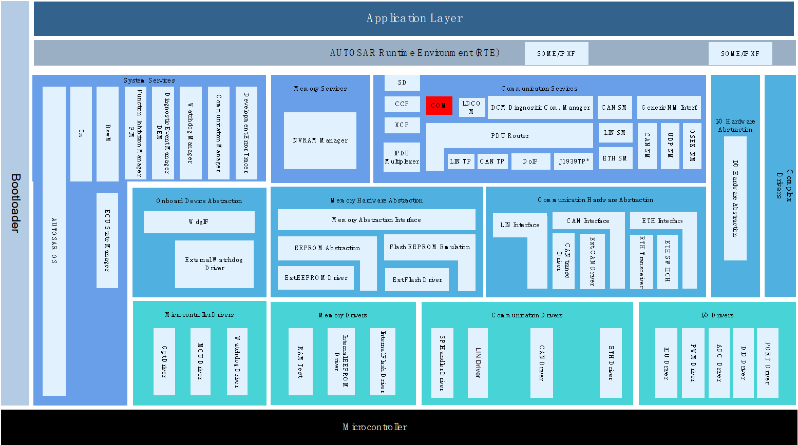
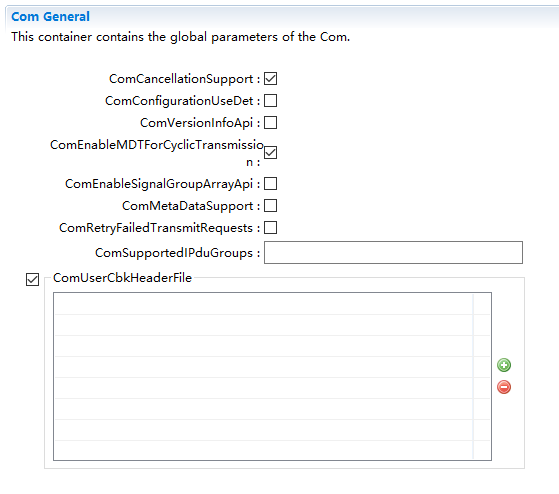
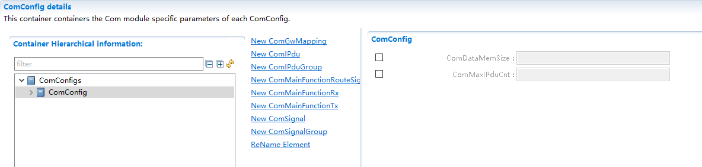
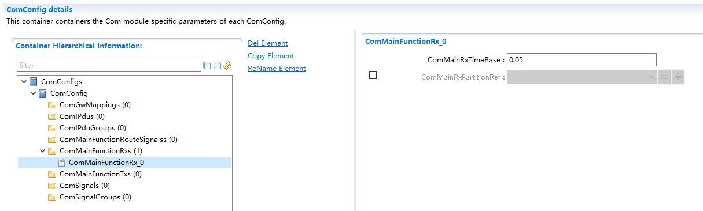
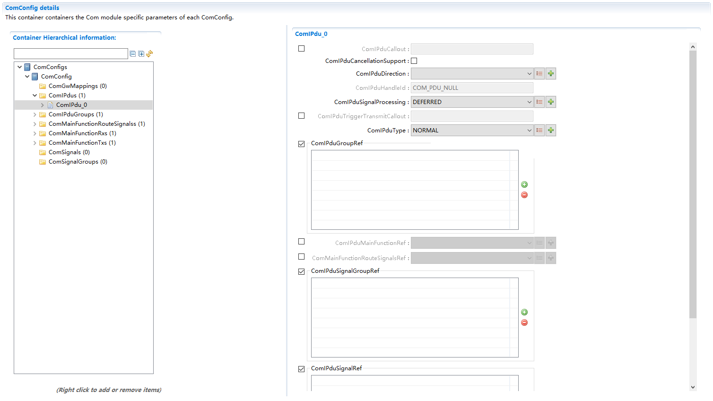
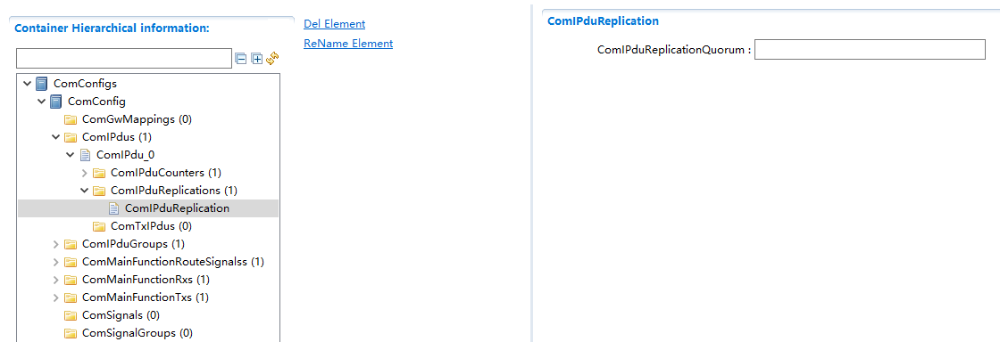
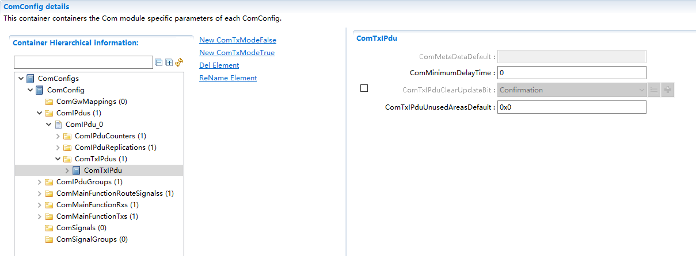
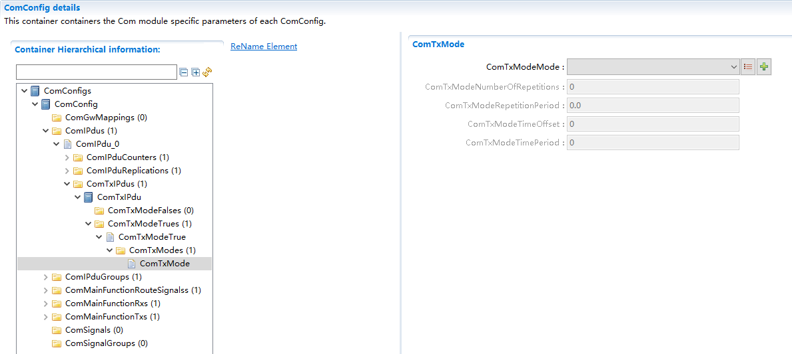
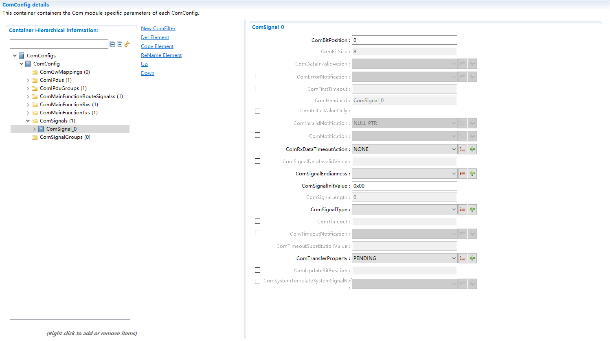
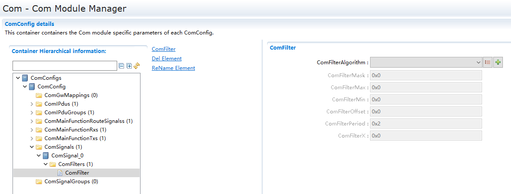

===================
Com产品参考手册
===================

**缩写词注解**

+------------+---------------------------------+-----------------------+
| **缩写词** | **英文全称**                    | **中文解释**          |
+------------+---------------------------------+-----------------------+
| DM         | Deadline Monitoring             | 超时监控              |
+------------+---------------------------------+-----------------------+
| I-PDU      | Interaction Layer Protocol Data | 交互层协议数据单元    |
|            | Unit                            |                       |
+------------+---------------------------------+-----------------------+
| L-PDU      | Data Link Layer Protocol Data   | 数                    |
|            | Unit                            | 据链路层协议数据单元  |
+------------+---------------------------------+-----------------------+
| MDT        | Minimum Delay Timer             | 最小延迟时间          |
+------------+---------------------------------+-----------------------+
| OSEK COM   | OSEK Communication（open        | OSEK通信协议          |
|            | systems and the corresponding   |                       |
|            | interfaces for automotive       |                       |
|            | electronics）                   |                       |
+------------+---------------------------------+-----------------------+
| TM         | Transmission Mode               | I-PDU传输模式         |
+------------+---------------------------------+-----------------------+
| TMC        | Transmission Mode Condition     | （信号）传输模式状况  |
+------------+---------------------------------+-----------------------+
| TMS        | Transmission Mode Selector      | (I-PDU)传输模式选择   |
+------------+---------------------------------+-----------------------+
| DET        | Default Error Tracer            | 开发错误检测          |
+------------+---------------------------------+-----------------------+
| RTE        | Runtime environment             | 运行时环境            |
+------------+---------------------------------+-----------------------+

简介
====

Com模块主要实现了Signal在I-PDU中的封装及解析功能，为RTE层提供了基于Signal的发送与接收接口，实现了基于Signal的网关功能，实现了PDU的不同发送模式，以及Signal滤波，Update
bit，Pdu Counter等功能。

|image1|

图1-1 Com模块层次图

Com模块处于AUTOSAR架构中的通信服务层，其下层模块为PduR模块，上层模块为RTE。

参考资料
--------

[1] AUTOSAR_SRS_COM.pdf，R19-11和4.2.2

[2] AUTOSAR_SWS_COM.pdf，R19-11和4.2.2

[3] AUTOSAR_SWS_PDURouter.pdf，R19-11和4.2.2

功能描述
========

I-PDU Group功能
---------------

I-PDU Group功能介绍
~~~~~~~~~~~~~~~~~~~

Com模块实现基于I-PDU
Group的使能控制，接收超时检测使能控制。根据I-PDU与I-PDU
Group的包含关系，间接实现对各个I-PDU的通信使能控制及Rx
I-PDU的接收超时检测使能控制。

I-PDU Group使能控制功能实现
~~~~~~~~~~~~~~~~~~~~~~~~~~~

通过ComIPdu配置参数ComIPduGroupRef，以及ComIPduGroup的配置实现将ComIPdu进行不同的分组。对于不从属于任何ComIPduGroup的ComIPdu其通信使能状态初始化之后一直为Enable且不可动态更改，Rx
ComIPdu接收超时使能状态初始化之后一直为Disable且不可动态更改。

IpduGroupVector中的每个bit位代表一个ComIPduGroup，通过调用Com_IpduGroupControl和Com_ReceptionDMControl实现ComIPduGroup通信使能控制和接收超时使能控制，间接实现每个ComIPdu的控制。

Com提供两个接口Com_ClearIpduGroupVector和Com_SetIpduGroup实现对每个ComIPduGroup所在IpduGroupVector中对应bit位置0或置1（0表示Disable，1表示Enable）。

Signal封装解析功能
------------------

Signal封装解析功能介绍
~~~~~~~~~~~~~~~~~~~~~~

信号的封装和解析是Com模块的核心功能，根据各个信号的配置信息将发送Signal封装到关联的Tx
IPdu数据中，从Rx IPdu数据中解析接收Signal。

Com模块为RTE/应用层提供了完整的基于Signal/SignalGroup的收发接口。

Signal封装解析功能实现
~~~~~~~~~~~~~~~~~~~~~~

信号的封装和解析涉及的信号配置参数为ComBitPosition，ComBitSize，ComSignalEndianness，ComSignalType，ComSignalLength。Com模块根据这些配置信息，将发送信号值封装到对应IPdu报文数据中，从接收IPdu报文数据中解析出接收信号值。

上层通过调用Com_SendSignal来请求非动态长度类型Signal/GroupSignal的发送，调用Com_SendDynSignal来请求动态长度类型（UINT8_DYN）Signal/GroupSignal的发送，调用Com_SendSignalGroup来请求SignalGroup的发送，调用Com_InvalidateSignal来请求Signal发送无效值，调用Com_InvalidateSignalGroup来请求SignalGroup发送无效值，调用Com_SendSignalGroupArray请求上层字节对齐的SignalGroup（已完成各GroupSignal的封装）发送。

上层通过调用Com_ReceiveSignal获取非动态长度类型接收Signal/GroupSignal信号值，调用Com_ReceiveDynSignal获取动态长度类型接收Signal/GroupSignal信号值，调用Com_ReceiveSignalGroup请求SignalGroup的接收，调用Com_ReceiveSignalGroupArray获取字节对齐SignalGroup的数据值。

IPdu收发功能
------------

IPdu收发功能介绍
~~~~~~~~~~~~~~~~

Com模块实现IPdu的收发方式按数据流分两种类型，即IF方式和TP方式，IF方式通常用于“数据长度较小”的IPdu，而TP方式通常用于“数据长度较大”的IPdu，这里的“数据长度”是相对于传输总线来定义的，如CAN总线为8字节，CANFD为64字节，ETH可以达到1000+字节。其中IF
IPdu的发送又分为Direct和TriggerTransmit两种类型，前者发送时机由Com决定，后者发送时机由下层模块决定。

Tx
IPdu从发送时机角度又分为四种模式，即PERIODIC，DIRECT，MIXED，NONE。NONE模式通常与TriggerTransmit，或者调用Com_TriggerIPDUSend/
Com_TriggerIPDUSendWithMetaData来配置实现IPdu的发送。

IPdu收发功能实现
~~~~~~~~~~~~~~~~

通过ComIPdu的配置参数ComIPduType决定该IPdu通过IF/TP方式进行收发：

1.IF发送：PduR_ComTransmit→ Com_TxConfirmation；

2.IF接收：Com_RxIndication；

3.TP发送：PduR_ComTransmit→N次Com_CopyTxData→ Com_TpTxConfirmation；

4.TP接收：Com_StartOfReception→N次Com_CopyRxData→ Com_TpRxIndication；

对于Tx
IPdu通过配置ComTxModeMode来选择发送模式，对于PERIODIC模式需配置发送偏移ComTxModeTimeOffset和发送周期ComTxModeTimePeriod，对于DIRECT模式需配置发送重复次数ComTxModeNumberOfRepetitions和重复发送报文周期ComTxModeRepetitionPeriod（需重复发送次数＞0），对于MIXED模式需配置以上所有参数，对于NONE模式则不需要配置以上任何参数。

超时监测功能
------------

超时监测功能介绍
~~~~~~~~~~~~~~~~

Com模块实现基于Signal/SignalGroup的超时监测功能。对于发送实现超时通知机制，对于接收实现超时通知和超时替换两种机制。

超时监测功能实现
~~~~~~~~~~~~~~~~

发送超时监测：监测Signal/SignalGroup请求发送到其所在的IPdu发送成功这段时间，IPdu超时时间阈值取请求发送的Signal/SignalGroup配置的超时时间最小值。当发生发送超时，调用各Signal/SignalGroup配置的超时通知函数ComTimeoutNotification通知上层模块。

接收超时监测：监测两次正确接收Signal/SignalGroup信号值之间的时间段，Signal/SignalGroup超时时间阈值根据其各自的配置参数决定。当发生超时时，调用其超时通知函数ComTimeoutNotification通知上层模块，也可以将接收信号值替换为初始值（通过配置参数ComRxDataTimeoutAction选择REPLACE实现）。

信号滤波功能
------------

信号滤波功能介绍
~~~~~~~~~~~~~~~~

Com模块实现基于信号的信号值进行过滤的机制，虽然对于收发信号的过滤算法一样，但过滤的目的完全不同。

对于接收Signal/SignalGroup，过滤算法未通过时，将舍弃当前接收到的Signal/SignalGroup。

对于发送Signal/GroupSignal，过滤算法的结果只决定该发送IPdu选择ComTxModeTrue或者ComTxModeFalse进行报文发送，不会舍弃信号本身。

信号滤波功能实现
~~~~~~~~~~~~~~~~

通过配置Signal/GroupSignal的ComFilter来选择其过滤算法及算法所需的各种参数，过滤算法的结果分TRUE和FALSE两种。

对于接收Signal/SignalGroup只有当通过过滤算法，才将接收信号值更新到接收Buffer中供上层模块获取，未通过过滤算法则舍弃当前接收信号值，不更新接收Buffer中的信号值。对于SignalGroup，只要其包含的任一GroupSignal未通过过滤算法，则整个SignalGroup信号值都将舍弃。

对于发送Signal/GroupSignal，若过滤算法通过，其TMC置为TRUE，未通过置为FALSE。只要该IPdu包含的所有Signal/GroupSignal中存在任一TMC为TRUE，则IPdu的TMS为TRUE，否则为FALSE。IPdu根据其TMS选择通过ComTxModeTrue或者ComTxModeFalse进行报文发送，发送Pdu中ComTxIPdu至少需要配置ComTxModeTrue。发送信号的滤波只有在ComTxModeTrue和ComTxModeFalse都配置时才有意义。

信号Update功能
--------------

信号Update功能介绍
~~~~~~~~~~~~~~~~~~

Com模块实现基于Signal/SignalGroup的Update
Bit机制来识别信号是否更新（信号更新，但信号值不一定变化）。

信号Update功能实现
~~~~~~~~~~~~~~~~~~

Signal/SignalGroup通过配置参数ComUpdateBitPosition来决定是否支持Update机制，Update
Bit本身占用IPdu中一个Bit位，该Bit位为1表示对应Signal/SignalGroup有更新，为0表示对应Signal/SignalGroup没有更新。

对于发送信号，当请求Signal/SignalGroup发送时，Com模块将其Update位置1，表示该信号有更新，通过ComTxIPdu的配置参数ComTxIPduClearUpdateBit决定什么时候清除（置0）该发送IPdu中所有的Update位。

对于接收信号，只有当检测到Signal/SignalGroup的Update位为1，才执行进一步的接收操作，否则舍弃该信号。

IPdu Rolling Counter功能
------------------------

IPdu Rolling Counter功能介绍
~~~~~~~~~~~~~~~~~~~~~~~~~~~~

Com模块实现基于IPdu的Rolling
Counter功能，让IPdu接收端能够识别出IPdu的序列是否正确。

IPdu Rolling Counter功能实现
~~~~~~~~~~~~~~~~~~~~~~~~~~~~

对于配置了ComIPduCounter的Tx
IPdu，Com每发送一次该IPdu将其Counter值+1，到达Counter最大值之后翻转到0（初始Counter值为0）。Counter值在IPdu中的位置由配置参数ComIPduCounterStartPosition和ComIPduCounterSize决定，需注意的是Counter值所在范围不能跨字节。

对于配置了ComIPduCounter的Rx
IPdu，启动后接收到的第一帧IPdu，其Counter值无论为什么值都匹配成功，之后期望Counter值根据上一次接收IPdu（即使该IPdu的Counter值不匹配）的Counter值+1而定。
对于接收Counter是否匹配，需结合当前期望Counter以及ComIPduCounterThreshold来决定。对于Counter不匹配的IPdu，Com将舍弃该IPdu，并可以通过配置ComIPduCounterErrorNotification实现接收Counter错误通知。

信号网关功能
------------

信号网关功能介绍
~~~~~~~~~~~~~~~~

Com中信号的网关只针对Signal和GroupSignal，R19_11标准中不再支持基于SignalGroup的网关。信号网关不仅支持1：1，同样支持1：N。

对于GwSource信号与GwDestination信号，其信号类型及信号长度必须一致。GwSource信号关联Rx
IPdu，GwDestination信号关联Tx IPdu。

注：TP Pdu中的Signal/Group Signal不支持信号网关。

信号网关功能实现
~~~~~~~~~~~~~~~~

信号网关路由通过配置ComGwMapping实现，信号网关的周期性处理主函数为Com_MainFunctionRouteSignals。

注：当配置了ComGwMapping时，ComGwSource和ComGwDestination必须要配置具体内容。

GwSource信号可以通过两种方式进行配置，通过配置ComGwSourceDescription方式和通过配置ComGwSignal方式。前者针对网关Source信号在ComSignal/ComGroupSignal中未配置（上层模块不获取该信号值），后者针对网关Source信号在ComSignal/ComGroupSignal中有配置（不光希望信号被转发，上层模块同样希望获取该信号值），因此前者需要类似配置Signal参数来配置ComGwSourceDescription，而后者只需通过ComGwSignal→ComGwSignalRef关联到ComSignal/ComGroupSignal就行。

同样GwDestination也可以通过两种方式进行配置，通过配置ComGwDestinationDescription方式和通过配置ComGwSignal方式。前者针对网关Description信号在ComSignal/ComGroupSignal中未配置（上层模块不请求该信号发送），后者针对网关Description信号在ComSignal/ComGroupSignal中有配置（不光希望信号通过网关转发，上层模块同样希望请求该信号发送），因此前者需要类似配置Signal参数来配置ComGwDestinationDescription，而后者只需通过ComGwSignal→ComGwSignalRef关联到ComSignal/ComGroupSignal就行。

源文件描述
==========

表3-1 Com组件文件描述

+------------------+---------------------------------------------------+
| **文件**         | **说明**                                          |
+------------------+---------------------------------------------------+
| Com_Cfg.h        | 定义Com模块PC配置的宏定义。                       |
+------------------+---------------------------------------------------+
| Com_Cfg.c        | 定义Com模块PC/PB配置的结构体参数。                |
+------------------+---------------------------------------------------+
| Com.h            | 实现Com模块全                                     |
|                  | 部外部接口的声明，以及配置文件中全局变量的声明。  |
+------------------+---------------------------------------------------+
| Com.c            | 作为Com模块的核心                                 |
|                  | 文件，实现Com模块全部对外接口，以及实现Com模块功  |
|                  | 能所必须的local函数，local宏定义，local变量定义。 |
+------------------+---------------------------------------------------+
| Com_MemMap.h     | 实现Com模块内存布局。                             |
+------------------+---------------------------------------------------+
| Com_Types.h      | 实现外部/                                         |
|                  | 内部类型的定义，包括AUTOSAR标准定义的类型，以及PB |
|                  | /PC配置参数结构体类型，以及内部运行时结构体类型。 |
+------------------+---------------------------------------------------+
| Com_Cbk.h        | 实现Com模块全部回调函数的声明。                   |
+------------------+---------------------------------------------------+
| Com_Internal.h   | 实现Com模块内部函数的声明。                       |
+------------------+---------------------------------------------------+
| Com_Callout.c    | 实现Com模块IPDU配置的Callout回调函数定义。        |
+------------------+---------------------------------------------------+
| Com_Callout.h    | 实现Com模块IPDU配置的Callout回调函数声明。        |
+------------------+---------------------------------------------------+
| Com_Internal.c   | 实现Com模块公共内部函数的定义。                   |
+------------------+---------------------------------------------------+
| Com_GwInternal.c | 实现Com模块信号网关功能内部函数的定义。           |
+------------------+---------------------------------------------------+
| Com_RxInternal.c | 实现Com模块信号接收内部函数的定义。               |
+------------------+---------------------------------------------------+
| Com_TxInternal.c | 实现Com模块信号发送内部函数的定义。               |
+------------------+---------------------------------------------------+

|image2|

图3-1 Com组件文件交互关系图

API接口
=======

类型定义
--------

Com_StatusType类型定义
~~~~~~~~~~~~~~~~~~~~~~

+-----------+----------------------------------------------------------+
| 名称      | Com_StatusType                                           |
+-----------+----------------------------------------------------------+
| 类型      | enum                                                     |
+-----------+----------------------------------------------------------+
| 范围      | COM_UNINIT = 0x00, COM模块已初始化且可用                 |
|           |                                                          |
|           | COM_INIT , COM模块未初始化且不可用                       |
+-----------+----------------------------------------------------------+
| 描述      | Com状态类型                                              |
+-----------+----------------------------------------------------------+

Com_SignalIdType类型定义
~~~~~~~~~~~~~~~~~~~~~~~~

+-----------+----------------------------------------------------------+
| 名称      | Com_SignalIdType                                         |
+-----------+----------------------------------------------------------+
| 类型      | uint16                                                   |
+-----------+----------------------------------------------------------+
| 范围      | 无                                                       |
+-----------+----------------------------------------------------------+
| 描述      | 表示信号的Id号                                           |
+-----------+----------------------------------------------------------+

Com_SignalGroupIdType类型定义
~~~~~~~~~~~~~~~~~~~~~~~~~~~~~

+-----------+----------------------------------------------------------+
| 名称      | Com_SignalGroupIdType                                    |
+-----------+----------------------------------------------------------+
| 类型      | uint16                                                   |
+-----------+----------------------------------------------------------+
| 范围      | 无                                                       |
+-----------+----------------------------------------------------------+
| 描述      | 表示信号组的Id号                                         |
+-----------+----------------------------------------------------------+

Com_IpduGroupIdType类型定义
~~~~~~~~~~~~~~~~~~~~~~~~~~~

+-----------+----------------------------------------------------------+
| 名称      | Com_IpduGroupIdType                                      |
+-----------+----------------------------------------------------------+
| 类型      | uint16                                                   |
+-----------+----------------------------------------------------------+
| 范围      | 无                                                       |
+-----------+----------------------------------------------------------+
| 描述      | 表示IpduGroup的Id号                                      |
+-----------+----------------------------------------------------------+

Com_IpduGroupVector类型定义
~~~~~~~~~~~~~~~~~~~~~~~~~~~

+-----------+----------------------------------------------------------+
| 名称      | Com_IpduGroupVector                                      |
+-----------+----------------------------------------------------------+
| 类型      | uint8[(ComSupportedIPduGroups-1)/8+1]                    |
+-----------+----------------------------------------------------------+
| 范围      | 无                                                       |
+-----------+----------------------------------------------------------+
| 描述      | 表示IpduGroup的使能Flag                                  |
+-----------+----------------------------------------------------------+

Com_ConfigType类型定义
~~~~~~~~~~~~~~~~~~~~~~

+-----------+----------------------------------------------------------+
| 名称      | Com_ConfigType                                           |
+-----------+----------------------------------------------------------+
| 类型      | struct                                                   |
+-----------+----------------------------------------------------------+
| 范围      | 无                                                       |
+-----------+----------------------------------------------------------+
| 描述      | 表示Com的PB配置结构体                                    |
+-----------+----------------------------------------------------------+

输入函数描述
------------

+----------------------------+-----------------------------------------+
| **输入模块**               | **API**                                 |
+----------------------------+-----------------------------------------+
| Det                        | Det_ReportError                         |
+----------------------------+-----------------------------------------+
| PduR                       | PduR_ComTransmit                        |
+----------------------------+-----------------------------------------+
|                            | PduR_ComCancelTransmit                  |
+----------------------------+-----------------------------------------+
| <RTE/Up>                   | Com_CbkTxAck                            |
+----------------------------+-----------------------------------------+
|                            | Com_CbkTxErr                            |
+----------------------------+-----------------------------------------+
|                            | Com_CbkTxTOut                           |
+----------------------------+-----------------------------------------+
|                            | Com_CbkRxAck                            |
+----------------------------+-----------------------------------------+
|                            | Com_CbkRxTOut                           |
+----------------------------+-----------------------------------------+
|                            | Com_CbkInv                              |
+----------------------------+-----------------------------------------+
|                            | Com_CbkCounterErr                       |
+----------------------------+-----------------------------------------+
|                            | Com_RxIpduCallout                       |
+----------------------------+-----------------------------------------+
|                            | Com_TxIpduCallout                       |
+----------------------------+-----------------------------------------+

静态接口函数定义
----------------

Com_Init函数定义
~~~~~~~~~~~~~~~~

+---------------+-----------------+---------+-------------------------+
| 函数名称：    | Com_Init        |         |                         |
+---------------+-----------------+---------+-------------------------+
| 函数原型：    | void            |         |                         |
|               | Com_Init(const  |         |                         |
|               | C               |         |                         |
|               | om_ConfigType\* |         |                         |
|               | config)         |         |                         |
+---------------+-----------------+---------+-------------------------+
| 服务编号：    | 0x01            |         |                         |
+---------------+-----------------+---------+-------------------------+
| 同步/异步：   | 同步            |         |                         |
+---------------+-----------------+---------+-------------------------+
| 是否可重入：  | 否              |         |                         |
+---------------+-----------------+---------+-------------------------+
| 输入参数：    | config          | 值域：  | 无                      |
+---------------+-----------------+---------+-------------------------+
| 输            | 无              |         |                         |
| 入输出参数：  |                 |         |                         |
+---------------+-----------------+---------+-------------------------+
| 输出参数：    | 无              |         |                         |
+---------------+-----------------+---------+-------------------------+
| 返回值：      | 无              |         |                         |
+---------------+-----------------+---------+-------------------------+
| 功能概述：    | Co              |         |                         |
|               | m模块初始化函数 |         |                         |
+---------------+-----------------+---------+-------------------------+

Com_DeInit函数定义
~~~~~~~~~~~~~~~~~~

+---------------+------------------------------------------------------+
| 函数名称：    | Com_DeInit                                           |
+---------------+------------------------------------------------------+
| 函数原型：    | void Com_DeInit(void)                                |
+---------------+------------------------------------------------------+
| 服务编号：    | 0x02                                                 |
+---------------+------------------------------------------------------+
| 同步/异步：   | 同步                                                 |
+---------------+------------------------------------------------------+
| 是否可重入：  | 否                                                   |
+---------------+------------------------------------------------------+
| 输入参数：    | 无                                                   |
+---------------+------------------------------------------------------+
| 输            | 无                                                   |
| 入输出参数：  |                                                      |
+---------------+------------------------------------------------------+
| 输出参数：    | 无                                                   |
+---------------+------------------------------------------------------+
| 返回值：      | 无                                                   |
+---------------+------------------------------------------------------+
| 功能概述：    | Com模块反初始化                                      |
+---------------+------------------------------------------------------+

Com_IpduGroupControl函数定义
~~~~~~~~~~~~~~~~~~~~~~~~~~~~

+---------------+-----------------+---------+-------------------------+
| 函数名称：    | Com_I           |         |                         |
|               | pduGroupControl |         |                         |
+---------------+-----------------+---------+-------------------------+
| 函数原型：    | void            |         |                         |
|               | Com_Ip          |         |                         |
|               | duGroupControl( |         |                         |
|               |                 |         |                         |
|               | Com_            |         |                         |
|               | IpduGroupVector |         |                         |
|               | i               |         |                         |
|               | pduGroupVector, |         |                         |
|               |                 |         |                         |
|               | boolean         |         |                         |
|               | initialize)     |         |                         |
+---------------+-----------------+---------+-------------------------+
| 服务编号：    | 0x03            |         |                         |
+---------------+-----------------+---------+-------------------------+
| 同步/异步：   | 同步            |         |                         |
+---------------+-----------------+---------+-------------------------+
| 是否可重入：  | 否              |         |                         |
+---------------+-----------------+---------+-------------------------+
| 输入参数：    | ipduGroupVector | 值域：  | 无                      |
+---------------+-----------------+---------+-------------------------+
|               | initialize      | 值域：  | 无                      |
+---------------+-----------------+---------+-------------------------+
| 输            | 无              |         |                         |
| 入输出参数：  |                 |         |                         |
+---------------+-----------------+---------+-------------------------+
| 输出参数：    | 无              |         |                         |
+---------------+-----------------+---------+-------------------------+
| 返回值：      | 无              |         |                         |
+---------------+-----------------+---------+-------------------------+
| 功能概述：    | Ip              |         |                         |
|               | duGroup使能控制 |         |                         |
+---------------+-----------------+---------+-------------------------+

Com_ReceptionDMControl函数定义
~~~~~~~~~~~~~~~~~~~~~~~~~~~~~~

+-------------+-------------------+---------+-------------------------+
| 函数名称：  | Com_R             |         |                         |
|             | eceptionDMControl |         |                         |
+-------------+-------------------+---------+-------------------------+
| 函数原型：  | void              |         |                         |
|             | Com_Re            |         |                         |
|             | ceptionDMControl( |         |                         |
|             |                   |         |                         |
|             | Co                |         |                         |
|             | m_IpduGroupVector |         |                         |
|             | ipduGroupVector)  |         |                         |
+-------------+-------------------+---------+-------------------------+
| 服务编号：  | 0x06              |         |                         |
+-------------+-------------------+---------+-------------------------+
| 同步/异步： | 同步              |         |                         |
+-------------+-------------------+---------+-------------------------+
| 是          | 否                |         |                         |
| 否可重入：  |                   |         |                         |
+-------------+-------------------+---------+-------------------------+
| 输入参数：  | ipduGroupVector   | 值域：  | 无                      |
+-------------+-------------------+---------+-------------------------+
| 输入        | 无                |         |                         |
| 输出参数：  |                   |         |                         |
+-------------+-------------------+---------+-------------------------+
| 输出参数：  | 无                |         |                         |
+-------------+-------------------+---------+-------------------------+
| 返回值：    | 无                |         |                         |
+-------------+-------------------+---------+-------------------------+
| 功能概述：  | IpduGroup接收     |         |                         |
|             | 超时检测使能控制  |         |                         |
+-------------+-------------------+---------+-------------------------+

Com_GetStatus函数定义
~~~~~~~~~~~~~~~~~~~~~

+-------------+--------------------------------------------------------+
| 函数名称：  | Com_GetStatus                                          |
+-------------+--------------------------------------------------------+
| 函数原型：  | Com_StatusType Com_GetStatus(void)                     |
+-------------+--------------------------------------------------------+
| 服务编号：  | 0x07                                                   |
+-------------+--------------------------------------------------------+
| 同步/异步： | 同步                                                   |
+-------------+--------------------------------------------------------+
| 是          | 是                                                     |
| 否可重入：  |                                                        |
+-------------+--------------------------------------------------------+
| 输入参数：  | 无                                                     |
+-------------+--------------------------------------------------------+
| 输入        | 无                                                     |
| 输出参数：  |                                                        |
+-------------+--------------------------------------------------------+
| 输出参数：  | 无                                                     |
+-------------+--------------------------------------------------------+
| 返回值：    | Com_StatusType                                         |
|             |                                                        |
|             | COM_UNINIT：Com模块未初始化                            |
|             |                                                        |
|             | COM_INIT：Com模块已初始化                              |
+-------------+--------------------------------------------------------+
| 功能概述：  | 获取模块初始化状态信息                                 |
+-------------+--------------------------------------------------------+

Com_GetVersionInfo函数定义
~~~~~~~~~~~~~~~~~~~~~~~~~~

+-------------+-------------------+---------+-------------------------+
| 函数名称：  | C                 |         |                         |
|             | om_GetVersionInfo |         |                         |
+-------------+-------------------+---------+-------------------------+
| 函数原型：  | void              |         |                         |
|             | Co                |         |                         |
|             | m_GetVersionInfo( |         |                         |
|             |                   |         |                         |
|             | Std_              |         |                         |
|             | VersionInfoType\* |         |                         |
|             | versioninfo)      |         |                         |
+-------------+-------------------+---------+-------------------------+
| 服务编号：  | 0x09              |         |                         |
+-------------+-------------------+---------+-------------------------+
| 同步/异步： | 同步              |         |                         |
+-------------+-------------------+---------+-------------------------+
| 是          | 是                |         |                         |
| 否可重入：  |                   |         |                         |
+-------------+-------------------+---------+-------------------------+
| 输入参数：  | 无                |         |                         |
+-------------+-------------------+---------+-------------------------+
| 输入        | 无                |         |                         |
| 输出参数：  |                   |         |                         |
+-------------+-------------------+---------+-------------------------+
| 输出参数：  | versioninfo       | 值域：  | 无                      |
+-------------+-------------------+---------+-------------------------+
| 返回值：    | 无                |         |                         |
+-------------+-------------------+---------+-------------------------+
| 功能概述：  | 获取模块软件版本  |         |                         |
+-------------+-------------------+---------+-------------------------+

Com_ClearIpduGroupVector函数定义
~~~~~~~~~~~~~~~~~~~~~~~~~~~~~~~~

+-------------+-------------------+---------+-------------------------+
| 函数名称：  | Com_Cle           |         |                         |
|             | arIpduGroupVector |         |                         |
+-------------+-------------------+---------+-------------------------+
| 函数原型：  | void              |         |                         |
|             | Com_Clea          |         |                         |
|             | rIpduGroupVector( |         |                         |
|             |                   |         |                         |
|             | Co                |         |                         |
|             | m_IpduGroupVector |         |                         |
|             | ipduGroupVector)  |         |                         |
+-------------+-------------------+---------+-------------------------+
| 服务编号：  | 0x1c              |         |                         |
+-------------+-------------------+---------+-------------------------+
| 同步/异步： | 同步              |         |                         |
+-------------+-------------------+---------+-------------------------+
| 是          | 否                |         |                         |
| 否可重入：  |                   |         |                         |
+-------------+-------------------+---------+-------------------------+
| 输入参数：  | 无                |         |                         |
+-------------+-------------------+---------+-------------------------+
| 输入        | ipduGroupVector   | 值域：  | 无                      |
| 输出参数：  |                   |         |                         |
+-------------+-------------------+---------+-------------------------+
| 输出参数：  | 无                |         |                         |
+-------------+-------------------+---------+-------------------------+
| 返回值：    | 无                |         |                         |
+-------------+-------------------+---------+-------------------------+
| 功能概述：  | Ip                |         |                         |
|             | duGroupVector清零 |         |                         |
+-------------+-------------------+---------+-------------------------+

Com_SetIpduGroup函数定义
~~~~~~~~~~~~~~~~~~~~~~~~

+-------------+-------------------+---------+-------------------------+
| 函数名称：  | Com_SetIpduGroup  |         |                         |
+-------------+-------------------+---------+-------------------------+
| 函数原型：  | void              |         |                         |
|             | Com_SetIpduGroup( |         |                         |
|             |                   |         |                         |
|             | Co                |         |                         |
|             | m_IpduGroupVector |         |                         |
|             | ipduGroupVector,  |         |                         |
|             |                   |         |                         |
|             | Co                |         |                         |
|             | m_IpduGroupIdType |         |                         |
|             | ipduGroupId,      |         |                         |
|             |                   |         |                         |
|             | boolean bitval)   |         |                         |
+-------------+-------------------+---------+-------------------------+
| 服务编号：  | 0x1d              |         |                         |
+-------------+-------------------+---------+-------------------------+
| 同步/异步： | 同步              |         |                         |
+-------------+-------------------+---------+-------------------------+
| 是          | 否                |         |                         |
| 否可重入：  |                   |         |                         |
+-------------+-------------------+---------+-------------------------+
| 输入参数：  | ipduGroupId       | 值域：  | 无                      |
+-------------+-------------------+---------+-------------------------+
|             | bitval            | 值域：  | 无                      |
+-------------+-------------------+---------+-------------------------+
| 输入        | ipduGroupVector   | 值域：  | 无                      |
| 输出参数：  |                   |         |                         |
+-------------+-------------------+---------+-------------------------+
| 输出参数：  | 无                |         |                         |
+-------------+-------------------+---------+-------------------------+
| 返回值：    | 无                |         |                         |
+-------------+-------------------+---------+-------------------------+
| 功能概述：  | 设置IpduGr        |         |                         |
|             | oup所在的Vector位 |         |                         |
+-------------+-------------------+---------+-------------------------+

Com_SendSignal函数定义
~~~~~~~~~~~~~~~~~~~~~~

+-------------+-------------------+---------+-------------------------+
| 函数名称：  | Com_SendSignal    |         |                         |
+-------------+-------------------+---------+-------------------------+
| 函数原型：  | uint8             |         |                         |
|             | Com_SendSignal(   |         |                         |
|             |                   |         |                         |
|             | Com_SignalIdType  |         |                         |
|             | SignalId,         |         |                         |
|             |                   |         |                         |
|             | const void\*      |         |                         |
|             | SignalDataPtr)    |         |                         |
+-------------+-------------------+---------+-------------------------+
| 服务编号：  | 0x0a              |         |                         |
+-------------+-------------------+---------+-------------------------+
| 同步/异步： | 异步              |         |                         |
+-------------+-------------------+---------+-------------------------+
| 是          | 不同              |         |                         |
| 否可重入：  | Signal可重入，相  |         |                         |
|             | 同Signal不可重入  |         |                         |
+-------------+-------------------+---------+-------------------------+
| 输入参数：  | SignalId          | 值域：  | 无                      |
+-------------+-------------------+---------+-------------------------+
|             | SignalDataPtr     | 值域：  | 无                      |
+-------------+-------------------+---------+-------------------------+
| 输入        | 无                |         |                         |
| 输出参数：  |                   |         |                         |
+-------------+-------------------+---------+-------------------------+
| 输出参数：  | 无                |         |                         |
+-------------+-------------------+---------+-------------------------+
| 返回值：    | uint8             |         |                         |
|             |                   |         |                         |
|             | E_OK:发送信       |         |                         |
|             | 号请求被成功接收  |         |                         |
|             |                   |         |                         |
|             | COM_SERVICE_N     |         |                         |
|             | OT_AVAILABLE:对应 |         |                         |
|             | 的IpduGroup停止了 |         |                         |
|             |                   |         |                         |
|             | COM_BUSY:         |         |                         |
|             | 对于大型数        |         |                         |
|             | 据类型处理的情况  |         |                         |
|             | 下TP-Buffer被锁定 |         |                         |
+-------------+-------------------+---------+-------------------------+
| 功能概述：  | 信号发送请求（    |         |                         |
|             | 非动态长度信号）  |         |                         |
+-------------+-------------------+---------+-------------------------+

Com_SendDynSignal函数定义
~~~~~~~~~~~~~~~~~~~~~~~~~

+-------------+-------------------+---------+-------------------------+
| 函数名称：  | Com_SendDynSignal |         |                         |
+-------------+-------------------+---------+-------------------------+
| 函数原型：  | uint8             |         |                         |
|             | C                 |         |                         |
|             | om_SendDynSignal( |         |                         |
|             |                   |         |                         |
|             | Com_SignalIdType  |         |                         |
|             | SignalId,         |         |                         |
|             |                   |         |                         |
|             | const void\*      |         |                         |
|             | SignalDataPtr,    |         |                         |
|             |                   |         |                         |
|             | uint16 Length)    |         |                         |
+-------------+-------------------+---------+-------------------------+
| 服务编号：  | 0x21              |         |                         |
+-------------+-------------------+---------+-------------------------+
| 同步/异步： | 异步              |         |                         |
+-------------+-------------------+---------+-------------------------+
| 是          | 不同              |         |                         |
| 否可重入：  | Signal可重入，相  |         |                         |
|             | 同Signal不可重入  |         |                         |
+-------------+-------------------+---------+-------------------------+
| 输入参数：  | SignalId          | 值域：  | 无                      |
+-------------+-------------------+---------+-------------------------+
|             | SignalDataPtr     | 值域：  | 无                      |
+-------------+-------------------+---------+-------------------------+
|             | Length            | 值域：  | 无                      |
+-------------+-------------------+---------+-------------------------+
| 输入        | 无                |         |                         |
| 输出参数：  |                   |         |                         |
+-------------+-------------------+---------+-------------------------+
| 输出参数：  | 无                |         |                         |
+-------------+-------------------+---------+-------------------------+
| 返回值：    | uint8             |         |                         |
|             |                   |         |                         |
|             | E_OK:发送动态信   |         |                         |
|             | 号请求被成功接收  |         |                         |
|             |                   |         |                         |
|             | E_NOT_OK:请       |         |                         |
|             | 求发送的长度大于  |         |                         |
|             | 此信号配置的长度  |         |                         |
|             |                   |         |                         |
|             | COM_SERVICE_N     |         |                         |
|             | OT_AVAILABLE:对应 |         |                         |
|             | 的IpduGroup停止了 |         |                         |
|             |                   |         |                         |
|             | COM_BUSY:         |         |                         |
|             | TP-B              |         |                         |
|             | uffer被锁定，上一 |         |                         |
|             | 次TP还未完成发送  |         |                         |
+-------------+-------------------+---------+-------------------------+
| 功能概述：  | 动态              |         |                         |
|             | 长度信号发送请求  |         |                         |
+-------------+-------------------+---------+-------------------------+

Com_ReceiveSignal函数定义
~~~~~~~~~~~~~~~~~~~~~~~~~

+-------------+-------------------+---------+-------------------------+
| 函数名称：  | Com_ReceiveSignal |         |                         |
+-------------+-------------------+---------+-------------------------+
| 函数原型：  | uint8             |         |                         |
|             | C                 |         |                         |
|             | om_ReceiveSignal( |         |                         |
|             |                   |         |                         |
|             | Com_SignalIdType  |         |                         |
|             | SignalId,         |         |                         |
|             |                   |         |                         |
|             | void\*            |         |                         |
|             | SignalDataPtr)    |         |                         |
+-------------+-------------------+---------+-------------------------+
| 服务编号：  | 0x0b              |         |                         |
+-------------+-------------------+---------+-------------------------+
| 同步/异步： | 同步              |         |                         |
+-------------+-------------------+---------+-------------------------+
| 是          | 不同              |         |                         |
| 否可重入：  | Signal可重入，相  |         |                         |
|             | 同Signal不可重入  |         |                         |
+-------------+-------------------+---------+-------------------------+
| 输入参数：  | SignalId          | 值域：  | 无                      |
+-------------+-------------------+---------+-------------------------+
| 输入        | 无                |         |                         |
| 输出参数：  |                   |         |                         |
+-------------+-------------------+---------+-------------------------+
| 输出参数：  | SignalDataPtr     | 值域：  | 无                      |
+-------------+-------------------+---------+-------------------------+
| 返回值：    | uint8             |         |                         |
|             |                   |         |                         |
|             | E_OK:接收信       |         |                         |
|             | 号请求被成功接收  |         |                         |
|             |                   |         |                         |
|             | COM_SERVICE_N     |         |                         |
|             | OT_AVAILABLE:对应 |         |                         |
|             | 的IpduGroup停止了 |         |                         |
|             |                   |         |                         |
|             | COM_BUSY:         |         |                         |
|             | 对于大型数        |         |                         |
|             | 据类型处理的情况  |         |                         |
|             | 下TP-Buffer被锁定 |         |                         |
+-------------+-------------------+---------+-------------------------+
| 功能概述：  | 信号接收（        |         |                         |
|             | 非动态长度信号）  |         |                         |
+-------------+-------------------+---------+-------------------------+

Com_ReceiveDynSignal函数定义
~~~~~~~~~~~~~~~~~~~~~~~~~~~~

+-------------+-------------------+---------+-------------------------+
| 函数名称：  | Com               |         |                         |
|             | _ReceiveDynSignal |         |                         |
+-------------+-------------------+---------+-------------------------+
| 函数原型：  | uint8             |         |                         |
|             | Com_              |         |                         |
|             | ReceiveDynSignal( |         |                         |
|             |                   |         |                         |
|             | Com_SignalIdType  |         |                         |
|             | SignalId,         |         |                         |
|             |                   |         |                         |
|             | void\*            |         |                         |
|             | SignalDataPtr,    |         |                         |
|             |                   |         |                         |
|             | uint16\* Length)  |         |                         |
+-------------+-------------------+---------+-------------------------+
| 服务编号：  | 0x22              |         |                         |
+-------------+-------------------+---------+-------------------------+
| 同步/异步： | 同步              |         |                         |
+-------------+-------------------+---------+-------------------------+
| 是          | 不同              |         |                         |
| 否可重入：  | Signal可重入，相  |         |                         |
|             | 同Signal不可重入  |         |                         |
+-------------+-------------------+---------+-------------------------+
| 输入参数：  | SignalId          | 值域：  | 无                      |
+-------------+-------------------+---------+-------------------------+
| 输入        | Length            | 值域：  | 无                      |
| 输出参数：  |                   |         |                         |
+-------------+-------------------+---------+-------------------------+
| 输出参数：  | SignalDataPtr     | 值域：  | 无                      |
+-------------+-------------------+---------+-------------------------+
| 返回值：    | uint8             |         |                         |
|             |                   |         |                         |
|             | E_OK:接收动态信   |         |                         |
|             | 号请求被成功接收  |         |                         |
|             |                   |         |                         |
|             | E_NOT_OK:         |         |                         |
|             | 长度(在参数       |         |                         |
|             | 中)小于接收到的动 |         |                         |
|             | 态长度信号的长度  |         |                         |
|             |                   |         |                         |
|             | COM_SERVICE_N     |         |                         |
|             | OT_AVAILABLE:对应 |         |                         |
|             | 的IpduGroup停止了 |         |                         |
|             |                   |         |                         |
|             | COM_BUSY:         |         |                         |
|             | TP-Buffer被锁定   |         |                         |
+-------------+-------------------+---------+-------------------------+
| 功能概述：  | 动态              |         |                         |
|             | 长度信号接收请求  |         |                         |
+-------------+-------------------+---------+-------------------------+

Com_UpdateShadowSignal函数定义
~~~~~~~~~~~~~~~~~~~~~~~~~~~~~~

+-------------+---------------------+-------+-------------------------+
| 函数名称：  | Com                 |       |                         |
|             | _UpdateShadowSignal |       |                         |
+-------------+---------------------+-------+-------------------------+
| 函数原型：  | void                |       |                         |
|             | Com_                |       |                         |
|             | UpdateShadowSignal( |       |                         |
|             |                     |       |                         |
|             | Com_SignalIdType    |       |                         |
|             | SignalId,           |       |                         |
|             |                     |       |                         |
|             | const void\*        |       |                         |
|             | SignalDataPtr)      |       |                         |
+-------------+---------------------+-------+-------------------------+
| 服务编号：  | 0x0c                |       |                         |
+-------------+---------------------+-------+-------------------------+
| 同步/异步： | 同步                |       |                         |
+-------------+---------------------+-------+-------------------------+
| 是          | 不同Grou            |       |                         |
| 否可重入：  | pSignal可重入，相同 |       |                         |
|             | GroupSignal不可重入 |       |                         |
+-------------+---------------------+-------+-------------------------+
| 输入参数：  | SignalId            | 值    | 无                      |
|             |                     | 域：  |                         |
+-------------+---------------------+-------+-------------------------+
|             | SignalDataPtr       | 值    | 无                      |
|             |                     | 域：  |                         |
+-------------+---------------------+-------+-------------------------+
| 输入        | 无                  |       |                         |
| 输出参数：  |                     |       |                         |
+-------------+---------------------+-------+-------------------------+
| 输出参数：  | 无                  |       |                         |
+-------------+---------------------+-------+-------------------------+
| 返回值：    | 无                  |       |                         |
+-------------+---------------------+-------+-------------------------+
| 功能概述：  | 更新GroupSignal的Sh |       |                         |
|             | adowBuffer（功能由C |       |                         |
|             | om_SendSignal，Com_ |       |                         |
|             | SendDynSignal实现） |       |                         |
+-------------+---------------------+-------+-------------------------+

Com_SendSignalGroup函数定义
~~~~~~~~~~~~~~~~~~~~~~~~~~~

+-------------+---------------------+-------+-------------------------+
| 函数名称：  | Com_SendSignalGroup |       |                         |
+-------------+---------------------+-------+-------------------------+
| 函数原型：  | uint8               |       |                         |
|             | C                   |       |                         |
|             | om_SendSignalGroup( |       |                         |
|             |                     |       |                         |
|             | Co                  |       |                         |
|             | m_SignalGroupIdType |       |                         |
|             | SignalGroupId)      |       |                         |
+-------------+---------------------+-------+-------------------------+
| 服务编号：  | 0x0d                |       |                         |
+-------------+---------------------+-------+-------------------------+
| 同步/异步： | 异步                |       |                         |
+-------------+---------------------+-------+-------------------------+
| 是          | 不同Sign            |       |                         |
| 否可重入：  | alGroup可重入，相同 |       |                         |
|             | SignalGroup不可重入 |       |                         |
+-------------+---------------------+-------+-------------------------+
| 输入参数：  | SignalGroupId       | 值    | 无                      |
|             |                     | 域：  |                         |
+-------------+---------------------+-------+-------------------------+
| 输入        | 无                  |       |                         |
| 输出参数：  |                     |       |                         |
+-------------+---------------------+-------+-------------------------+
| 输出参数：  | 无                  |       |                         |
+-------------+---------------------+-------+-------------------------+
| 返回值：    | uint8               |       |                         |
|             |                     |       |                         |
|             | E_OK:发送信         |       |                         |
|             | 号组请求被成功接收  |       |                         |
|             |                     |       |                         |
|             | COM_SERVI           |       |                         |
|             | CE_NOT_AVAILABLE:对 |       |                         |
|             | 应的IpduGroup停止了 |       |                         |
|             |                     |       |                         |
|             | COM_BUSY:           |       |                         |
|             | 对于大              |       |                         |
|             | 型数据类型处理的情  |       |                         |
|             | 况下TP-Buffer被锁定 |       |                         |
+-------------+---------------------+-------+-------------------------+
| 功能概述：  | SignalGroup发送请求 |       |                         |
+-------------+---------------------+-------+-------------------------+

Com_ReceiveSignalGroup函数定义
~~~~~~~~~~~~~~~~~~~~~~~~~~~~~~

+-------------+---------------------+-------+-------------------------+
| 函数名称：  | Com                 |       |                         |
|             | _ReceiveSignalGroup |       |                         |
+-------------+---------------------+-------+-------------------------+
| 函数原型：  | uint8               |       |                         |
|             | Com_                |       |                         |
|             | ReceiveSignalGroup( |       |                         |
|             |                     |       |                         |
|             | Co                  |       |                         |
|             | m_SignalGroupIdType |       |                         |
|             | SignalGroupId)      |       |                         |
+-------------+---------------------+-------+-------------------------+
| 服务编号：  | 0x0e                |       |                         |
+-------------+---------------------+-------+-------------------------+
| 同步/异步： | 同步                |       |                         |
+-------------+---------------------+-------+-------------------------+
| 是          | 不同Sign            |       |                         |
| 否可重入：  | alGroup可重入，相同 |       |                         |
|             | SignalGroup不可重入 |       |                         |
+-------------+---------------------+-------+-------------------------+
| 输入参数：  | SignalGroupId       | 值    | 无                      |
|             |                     | 域：  |                         |
+-------------+---------------------+-------+-------------------------+
| 输入        | 无                  |       |                         |
| 输出参数：  |                     |       |                         |
+-------------+---------------------+-------+-------------------------+
| 输出参数：  | 无                  |       |                         |
+-------------+---------------------+-------+-------------------------+
| 返回值：    | uint8               |       |                         |
|             |                     |       |                         |
|             | E_OK:接收信         |       |                         |
|             | 号组请求被成功接收  |       |                         |
|             |                     |       |                         |
|             | COM_SERVI           |       |                         |
|             | CE_NOT_AVAILABLE:对 |       |                         |
|             | 应的IpduGroup停止了 |       |                         |
|             |                     |       |                         |
|             | COM_BUSY:           |       |                         |
|             | 对于大              |       |                         |
|             | 型数据类型处理的情  |       |                         |
|             | 况下TP-Buffer被锁定 |       |                         |
+-------------+---------------------+-------+-------------------------+
| 功能概述：  | SignalGroup接收请求 |       |                         |
+-------------+---------------------+-------+-------------------------+

Com_ReceiveShadowSignal函数定义
~~~~~~~~~~~~~~~~~~~~~~~~~~~~~~~

+-------------+---------------------+------+---+-------------------------+
| 函数名称：  | Com_                |      |   |                         |
|             | ReceiveShadowSignal |      |   |                         |
+-------------+---------------------+------+---+-------------------------+
| 函数原型：  | void                |      |   |                         |
|             | Com_R               |      |   |                         |
|             | eceiveShadowSignal( |      |   |                         |
|             |                     |      |   |                         |
|             | Com_SignalIdType    |      |   |                         |
|             | SignalId,           |      |   |                         |
|             |                     |      |   |                         |
|             | void\*              |      |   |                         |
|             | SignalDataPtr)      |      |   |                         |
+-------------+---------------------+------+---+-------------------------+
| 服务编号：  | 0x0f                |      |   |                         |
+-------------+---------------------+------+---+-------------------------+
| 同步/异步： | 同步                |      |   |                         |
+-------------+---------------------+------+---+-------------------------+
| 是          | 不同Grou            |      |   |                         |
| 否可重入：  | pSignal可重入，相同 |      |   |                         |
|             | GroupSignal不可重入 |      |   |                         |
+-------------+---------------------+------+---+-------------------------+
| 输入参数：  | SignalId            | 值   |   | 无                      |
|             |                     | 域： |   |                         |
+-------------+---------------------+------+---+-------------------------+
| 输入        | 无                  |      |   |                         |
| 输出参数：  |                     |      |   |                         |
+-------------+---------------------+------+---+-------------------------+
| 输出参数：  | SignalDataPtr       | 值   | 无 |                        |
|             |                     | 域： |   |                         |
+-------------+---------------------+------+---+-------------------------+
| 返回值：    | 无                  |      |   |                         |
+-------------+---------------------+------+---+-------------------------+
| 功能概述：  | GroupSignal接收     |      |   |                         |
|             | 请求（功能由Com_Rec |      |   |                         |
|             | eiveSignal，Com_Rec |      |   |                         |
|             | eiveDynSignal实现） |      |   |                         |
+-------------+---------------------+------+---+-------------------------+

Com_SendSignalGroupArray函数定义
~~~~~~~~~~~~~~~~~~~~~~~~~~~~~~~~

+-------------+---------------------+-------+-------------------------+
| 函数名称：  | Com_S               |       |                         |
|             | endSignalGroupArray |       |                         |
+-------------+---------------------+-------+-------------------------+
| 函数原型：  | uint8               |       |                         |
|             | Com_Se              |       |                         |
|             | ndSignalGroupArray( |       |                         |
|             |                     |       |                         |
|             | Co                  |       |                         |
|             | m_SignalGroupIdType |       |                         |
|             | SignalGroupId,      |       |                         |
|             |                     |       |                         |
|             | const uint8\*       |       |                         |
|             | S                   |       |                         |
|             | ignalGroupArrayPtr) |       |                         |
+-------------+---------------------+-------+-------------------------+
| 服务编号：  | 0x23                |       |                         |
+-------------+---------------------+-------+-------------------------+
| 同步/异步： | 异步                |       |                         |
+-------------+---------------------+-------+-------------------------+
| 是          | 不同Sign            |       |                         |
| 否可重入：  | alGroup可重入，相同 |       |                         |
|             | SignalGroup不可重入 |       |                         |
+-------------+---------------------+-------+-------------------------+
| 输入参数：  | SignalGroupId       | 值    | 无                      |
|             |                     | 域：  |                         |
+-------------+---------------------+-------+-------------------------+
|             | SignalGroupArrayPtr | 值    | 无                      |
|             |                     | 域：  |                         |
+-------------+---------------------+-------+-------------------------+
| 输入        | 无                  |       |                         |
| 输出参数：  |                     |       |                         |
+-------------+---------------------+-------+-------------------------+
| 输出参数：  | 无                  |       |                         |
+-------------+---------------------+-------+-------------------------+
| 返回值：    | uint8               |       |                         |
|             |                     |       |                         |
|             | E_OK                |       |                         |
|             | :发送请求被成功接收 |       |                         |
|             |                     |       |                         |
|             | COM_SERVI           |       |                         |
|             | CE_NOT_AVAILABLE:对 |       |                         |
|             | 应的IpduGroup停止了 |       |                         |
|             |                     |       |                         |
|             | COM_BUSY:           |       |                         |
|             | 对于大              |       |                         |
|             | 型数据类型处理的情  |       |                         |
|             | 况下TP-Buffer被锁定 |       |                         |
+-------------+---------------------+-------+-------------------------+
| 功能概述：  | SignalG             |       |                         |
|             | roupArray的发送请求 |       |                         |
+-------------+---------------------+-------+-------------------------+

Com_ReceiveSignalGroupArray函数定义
~~~~~~~~~~~~~~~~~~~~~~~~~~~~~~~~~~~

+-------------+---------------------+------+---+-------------------------+
| 函数名称：  | Com_Rece            |      |   |                         |
|             | iveSignalGroupArray |      |   |                         |
+-------------+---------------------+------+---+-------------------------+
| 函数原型：  | uint8               |      |   |                         |
|             | Com_Recei           |      |   |                         |
|             | veSignalGroupArray( |      |   |                         |
|             |                     |      |   |                         |
|             | Co                  |      |   |                         |
|             | m_SignalGroupIdType |      |   |                         |
|             | SignalGroupId,      |      |   |                         |
|             |                     |      |   |                         |
|             | uint8\*             |      |   |                         |
|             | S                   |      |   |                         |
|             | ignalGroupArrayPtr) |      |   |                         |
+-------------+---------------------+------+---+-------------------------+
| 服务编号：  | 0x24                |      |   |                         |
+-------------+---------------------+------+---+-------------------------+
| 同步/异步： | 同步                |      |   |                         |
+-------------+---------------------+------+---+-------------------------+
| 是          | 不同Sign            |      |   |                         |
| 否可重入：  | alGroup可重入，相同 |      |   |                         |
|             | SignalGroup不可重入 |      |   |                         |
+-------------+---------------------+------+---+-------------------------+
| 输入参数：  | SignalGroupId       | 值   |   | 无                      |
|             |                     | 域： |   |                         |
+-------------+---------------------+------+---+-------------------------+
| 输入        | 无                  |      |   |                         |
| 输出参数：  |                     |      |   |                         |
+-------------+---------------------+------+---+-------------------------+
| 输出参数：  | SignalGroupArrayPtr | 值   | 无 |                        |
|             |                     | 域： |   |                         |
+-------------+---------------------+------+---+-------------------------+
| 返回值：    | uint8               |      |   |                         |
|             |                     |      |   |                         |
|             | E_OK                |      |   |                         |
|             | :接收请求被成功接收 |      |   |                         |
|             |                     |      |   |                         |
|             | COM_SERVI           |      |   |                         |
|             | CE_NOT_AVAILABLE:对 |      |   |                         |
|             | 应的IpduGroup停止了 |      |   |                         |
|             |                     |      |   |                         |
|             | COM_BUSY:           |      |   |                         |
|             | 对于大              |      |   |                         |
|             | 型数据类型处理的情  |      |   |                         |
|             | 况下TP-Buffer被锁定 |      |   |                         |
+-------------+---------------------+------+---+-------------------------+
| 功能概述：  | SignalG             |      |   |                         |
|             | roupArray的接收请求 |      |   |                         |
+-------------+---------------------+------+---+-------------------------+

Com_InvalidateSignal函数定义
~~~~~~~~~~~~~~~~~~~~~~~~~~~~

+-------------+---------------------+-------+-------------------------+
| 函数名称：  | C                   |       |                         |
|             | om_InvalidateSignal |       |                         |
+-------------+---------------------+-------+-------------------------+
| 函数原型：  | uint8               |       |                         |
|             | Com_InvalidateSign  |       |                         |
|             | al(Com_SignalIdType |       |                         |
|             | SignalId)           |       |                         |
+-------------+---------------------+-------+-------------------------+
| 服务编号：  | 0x10                |       |                         |
+-------------+---------------------+-------+-------------------------+
| 同步/异步： | 异步                |       |                         |
+-------------+---------------------+-------+-------------------------+
| 是          | 不同Signal可重入，  |       |                         |
| 否可重入：  | 不同Signal不可重入  |       |                         |
+-------------+---------------------+-------+-------------------------+
| 输入参数：  | SignalId            | 值    | 无                      |
|             |                     | 域：  |                         |
+-------------+---------------------+-------+-------------------------+
| 输入        | 无                  |       |                         |
| 输出参数：  |                     |       |                         |
+-------------+---------------------+-------+-------------------------+
| 输出参数：  | 无                  |       |                         |
+-------------+---------------------+-------+-------------------------+
| 返回值：    | uint8               |       |                         |
|             |                     |       |                         |
|             | E_OK:请求被成功接收 |       |                         |
|             |                     |       |                         |
|             | COM_SERVI           |       |                         |
|             | CE_NOT_AVAILABLE:对 |       |                         |
|             | 应的IpduGroup停止了 |       |                         |
|             |                     |       |                         |
|             | COM_BUSY:           |       |                         |
|             | 对于大              |       |                         |
|             | 型数据类型处理的情  |       |                         |
|             | 况下TP-Buffer被锁定 |       |                         |
+-------------+---------------------+-------+-------------------------+
| 功能概述：  | 请                  |       |                         |
|             | 求发送信号的无效值  |       |                         |
+-------------+---------------------+-------+-------------------------+

Com_InvalidateShadowSignal函数定义
~~~~~~~~~~~~~~~~~~~~~~~~~~~~~~~~~~

+-------------+---------------------+-------+-------------------------+
| 函数名称：  | Com_Inv             |       |                         |
|             | alidateShadowSignal |       |                         |
+-------------+---------------------+-------+-------------------------+
| 函数原型：  | void                |       |                         |
|             | Com_I               |       |                         |
|             | nvalidateShadowSign |       |                         |
|             | al(Com_SignalIdType |       |                         |
|             | SignalId)           |       |                         |
+-------------+---------------------+-------+-------------------------+
| 服务编号：  | 0x16                |       |                         |
+-------------+---------------------+-------+-------------------------+
| 同步/异步： | 同步                |       |                         |
+-------------+---------------------+-------+-------------------------+
| 是          | 不同Grou            |       |                         |
| 否可重入：  | pSignal可重入，不同 |       |                         |
|             | GroupSignal不可重入 |       |                         |
+-------------+---------------------+-------+-------------------------+
| 输入参数：  | SignalId            | 值    | 无                      |
|             |                     | 域：  |                         |
+-------------+---------------------+-------+-------------------------+
| 输入        | 无                  |       |                         |
| 输出参数：  |                     |       |                         |
+-------------+---------------------+-------+-------------------------+
| 输出参数：  | 无                  |       |                         |
+-------------+---------------------+-------+-------------------------+
| 返回值：    | 无                  |       |                         |
+-------------+---------------------+-------+-------------------------+
| 功能概述：  | 请求发送            |       |                         |
|             | GroupSignal的无效值 |       |                         |
+-------------+---------------------+-------+-------------------------+

Com_InvalidateSignalGroup函数定义
~~~~~~~~~~~~~~~~~~~~~~~~~~~~~~~~~

+-------------+---------------------+-------+-------------------------+
| 函数名称：  | Com_In              |       |                         |
|             | validateSignalGroup |       |                         |
+-------------+---------------------+-------+-------------------------+
| 函数原型：  | uint8               |       |                         |
|             | Com_Inv             |       |                         |
|             | alidateSignalGroup( |       |                         |
|             |                     |       |                         |
|             | Co                  |       |                         |
|             | m_SignalGroupIdType |       |                         |
|             | SignalGroupId)      |       |                         |
+-------------+---------------------+-------+-------------------------+
| 服务编号：  | 0x1b                |       |                         |
+-------------+---------------------+-------+-------------------------+
| 同步/异步： | 异步                |       |                         |
+-------------+---------------------+-------+-------------------------+
| 是          | 不同Sign            |       |                         |
| 否可重入：  | alGroup可重入，不同 |       |                         |
|             | SignalGroup不可重入 |       |                         |
+-------------+---------------------+-------+-------------------------+
| 输入参数：  | SignalGroupId       | 值    | 无                      |
|             |                     | 域：  |                         |
+-------------+---------------------+-------+-------------------------+
| 输入        | 无                  |       |                         |
| 输出参数：  |                     |       |                         |
+-------------+---------------------+-------+-------------------------+
| 输出参数：  | 无                  |       |                         |
+-------------+---------------------+-------+-------------------------+
| 返回值：    | uint8               |       |                         |
|             |                     |       |                         |
|             | E_OK                |       |                         |
|             | :发送请求被成功接收 |       |                         |
|             |                     |       |                         |
|             | COM_SERVI           |       |                         |
|             | CE_NOT_AVAILABLE:对 |       |                         |
|             | 应的IpduGroup停止了 |       |                         |
|             |                     |       |                         |
|             | COM_BUSY:           |       |                         |
|             | 对于大              |       |                         |
|             | 型数据类型处理的情  |       |                         |
|             | 况下TP-Buffer被锁定 |       |                         |
+-------------+---------------------+-------+-------------------------+
| 功能概述：  | Signal              |       |                         |
|             | Group无效值发送请求 |       |                         |
+-------------+---------------------+-------+-------------------------+

Com_TriggerIPDUSend函数定义
~~~~~~~~~~~~~~~~~~~~~~~~~~~

+-------------+---------------------+-------+-------------------------+
| 函数名称：  | Com_TriggerIPDUSend |       |                         |
+-------------+---------------------+-------+-------------------------+
| 函数原型：  | Std_ReturnType      |       |                         |
|             | Com_Trigge          |       |                         |
|             | rIPDUSend(PduIdType |       |                         |
|             | PduId)              |       |                         |
+-------------+---------------------+-------+-------------------------+
| 服务编号：  | 0x17                |       |                         |
+-------------+---------------------+-------+-------------------------+
| 同步/异步： | 同步                |       |                         |
+-------------+---------------------+-------+-------------------------+
| 是          | 否                  |       |                         |
| 否可重入：  |                     |       |                         |
+-------------+---------------------+-------+-------------------------+
| 输入参数：  | PduId               | 值    | 无                      |
|             |                     | 域：  |                         |
+-------------+---------------------+-------+-------------------------+
| 输入        | 无                  |       |                         |
| 输出参数：  |                     |       |                         |
+-------------+---------------------+-------+-------------------------+
| 输出参数：  | 无                  |       |                         |
+-------------+---------------------+-------+-------------------------+
| 返回值：    | Std_ReturnType      |       |                         |
|             |                     |       |                         |
|             | E_                  |       |                         |
|             | OK:Ipdu触发发送成功 |       |                         |
|             |                     |       |                         |
|             | E_NOT_              |       |                         |
|             | OK:Ipdu触发发送失败 |       |                         |
+-------------+---------------------+-------+-------------------------+
| 功能概述：  | IPdu触发发送请求    |       |                         |
+-------------+---------------------+-------+-------------------------+

Com_TriggerIPDUSendWithMetaData函数定义
~~~~~~~~~~~~~~~~~~~~~~~~~~~~~~~~~~~~~~~

+-------------+---------------------+-------+-------------------------+
| 函数名称：  | Com_TriggerI        |       |                         |
|             | PDUSendWithMetaData |       |                         |
+-------------+---------------------+-------+-------------------------+
| 函数原型：  | Std_ReturnType      |       |                         |
|             | Com_TriggerIP       |       |                         |
|             | DUSendWithMetaData( |       |                         |
|             |                     |       |                         |
|             | PduIdType PduId,    |       |                         |
|             |                     |       |                         |
|             | uint8\* MetaData)   |       |                         |
+-------------+---------------------+-------+-------------------------+
| 服务编号：  | 0x28                |       |                         |
+-------------+---------------------+-------+-------------------------+
| 同步/异步： | 同步                |       |                         |
+-------------+---------------------+-------+-------------------------+
| 是          | 否                  |       |                         |
| 否可重入：  |                     |       |                         |
+-------------+---------------------+-------+-------------------------+
| 输入参数：  | PduId               | 值    | 无                      |
|             |                     | 域：  |                         |
+-------------+---------------------+-------+-------------------------+
|             | MetaData            | 值    | 无                      |
|             |                     | 域：  |                         |
+-------------+---------------------+-------+-------------------------+
| 输入        | 无                  |       |                         |
| 输出参数：  |                     |       |                         |
+-------------+---------------------+-------+-------------------------+
| 输出参数：  | 无                  |       |                         |
+-------------+---------------------+-------+-------------------------+
| 返回值：    | Std_ReturnType      |       |                         |
|             |                     |       |                         |
|             | E_                  |       |                         |
|             | OK:Ipdu触发发送成功 |       |                         |
|             |                     |       |                         |
|             | E_NOT_              |       |                         |
|             | OK:Ipdu触发发送失败 |       |                         |
+-------------+---------------------+-------+-------------------------+
| 功能概述：  | IPdu发送请求，并    |       |                         |
|             | 请求MetaData值改变  |       |                         |
+-------------+---------------------+-------+-------------------------+

Com_SwitchIpduTxMode函数定义
~~~~~~~~~~~~~~~~~~~~~~~~~~~~

+-------------+---------------------+-------+-------------------------+
| 函数名称：  | C                   |       |                         |
|             | om_SwitchIpduTxMode |       |                         |
+-------------+---------------------+-------+-------------------------+
| 函数原型：  | void                |       |                         |
|             | Co                  |       |                         |
|             | m_SwitchIpduTxMode( |       |                         |
|             |                     |       |                         |
|             | PduIdType PduId,    |       |                         |
|             |                     |       |                         |
|             | boolean Mode)       |       |                         |
+-------------+---------------------+-------+-------------------------+
| 服务编号：  | 0x27                |       |                         |
+-------------+---------------------+-------+-------------------------+
| 同步/异步： | 同步                |       |                         |
+-------------+---------------------+-------+-------------------------+
| 是          | 否                  |       |                         |
| 否可重入：  |                     |       |                         |
+-------------+---------------------+-------+-------------------------+
| 输入参数：  | PduId               | 值    | 无                      |
|             |                     | 域：  |                         |
+-------------+---------------------+-------+-------------------------+
|             | Mode                | 值    | 无                      |
|             |                     | 域：  |                         |
+-------------+---------------------+-------+-------------------------+
| 输入        | 无                  |       |                         |
| 输出参数：  |                     |       |                         |
+-------------+---------------------+-------+-------------------------+
| 输出参数：  | 无                  |       |                         |
+-------------+---------------------+-------+-------------------------+
| 返回值：    | 无                  |       |                         |
+-------------+---------------------+-------+-------------------------+
| 功能概述：  | I                   |       |                         |
|             | Pdu发送模式切换请求 |       |                         |
+-------------+---------------------+-------+-------------------------+

Com_TriggerTransmit函数定义
~~~~~~~~~~~~~~~~~~~~~~~~~~~

+-------------+---------------------+-------+-------------------------+
| 函数名称：  | Com_TriggerTransmit |       |                         |
+-------------+---------------------+-------+-------------------------+
| 函数原型：  | Std_ReturnType      |       |                         |
|             | C                   |       |                         |
|             | om_TriggerTransmit( |       |                         |
|             |                     |       |                         |
|             | PduIdType TxPduId,  |       |                         |
|             |                     |       |                         |
|             | PduInfoType\*       |       |                         |
|             | PduInfoPtr)         |       |                         |
+-------------+---------------------+-------+-------------------------+
| 服务编号：  | 0x41                |       |                         |
+-------------+---------------------+-------+-------------------------+
| 同步/异步： | 同步                |       |                         |
+-------------+---------------------+-------+-------------------------+
| 是          | 不同Pdu可重         |       |                         |
| 否可重入：  | 入，相同Pdu不可重入 |       |                         |
+-------------+---------------------+-------+-------------------------+
| 输入参数：  | TxPduId             | 值    | 无                      |
|             |                     | 域：  |                         |
+-------------+---------------------+-------+-------------------------+
| 输入        | PduInfoPtr          | 值    | 无                      |
| 输出参数：  |                     | 域：  |                         |
+-------------+---------------------+-------+-------------------------+
| 输出参数：  | 无                  |       |                         |
+-------------+---------------------+-------+-------------------------+
| 返回值：    | Std_ReturnType      |       |                         |
|             |                     |       |                         |
|             | E_OK：SDU已经被复制 |       |                         |
|             |                     |       |                         |
|             | E_NOT_OK            |       |                         |
|             | ：没有SDU数据被复制 |       |                         |
+-------------+---------------------+-------+-------------------------+
| 功能概述：  | IF TxPdu数据请求    |       |                         |
+-------------+---------------------+-------+-------------------------+

Com_RxIndication函数定义
~~~~~~~~~~~~~~~~~~~~~~~~

+-------------+---------------------+-------+-------------------------+
| 函数名称：  | Com_RxIndication    |       |                         |
+-------------+---------------------+-------+-------------------------+
| 函数原型：  | void                |       |                         |
|             | Com_RxIndication(   |       |                         |
|             |                     |       |                         |
|             | PduIdType RxPduId,  |       |                         |
|             |                     |       |                         |
|             | const PduInfoType\* |       |                         |
|             | PduInfoPtr)         |       |                         |
+-------------+---------------------+-------+-------------------------+
| 服务编号：  | 0x42                |       |                         |
+-------------+---------------------+-------+-------------------------+
| 同步/异步： | 同步                |       |                         |
+-------------+---------------------+-------+-------------------------+
| 是          | 不同Pdu可重         |       |                         |
| 否可重入：  | 入，相同Pdu不可重入 |       |                         |
+-------------+---------------------+-------+-------------------------+
| 输入参数：  | RxPduId             | 值    | 无                      |
|             |                     | 域：  |                         |
+-------------+---------------------+-------+-------------------------+
|             | PduInfoPtr          | 值    | 无                      |
|             |                     | 域：  |                         |
+-------------+---------------------+-------+-------------------------+
| 输入        | 无                  |       |                         |
| 输出参数：  |                     |       |                         |
+-------------+---------------------+-------+-------------------------+
| 输出参数：  | 无                  |       |                         |
+-------------+---------------------+-------+-------------------------+
| 返回值：    | 无                  |       |                         |
+-------------+---------------------+-------+-------------------------+
| 功能概述：  | IF RxPdu接收指示    |       |                         |
+-------------+---------------------+-------+-------------------------+

Com_TpRxIndication函数定义
~~~~~~~~~~~~~~~~~~~~~~~~~~

+-------------+---------------------+-------+-------------------------+
| 函数名称：  | Com_TpRxIndication  |       |                         |
+-------------+---------------------+-------+-------------------------+
| 函数原型：  | void                |       |                         |
|             | Com_TpRxIndication( |       |                         |
|             |                     |       |                         |
|             | PduIdType id,       |       |                         |
|             |                     |       |                         |
|             | Std_ReturnType      |       |                         |
|             | result)             |       |                         |
+-------------+---------------------+-------+-------------------------+
| 服务编号：  | 0x45                |       |                         |
+-------------+---------------------+-------+-------------------------+
| 同步/异步： | 同步                |       |                         |
+-------------+---------------------+-------+-------------------------+
| 是          | 是                  |       |                         |
| 否可重入：  |                     |       |                         |
+-------------+---------------------+-------+-------------------------+
| 输入参数：  | id                  | 值    | 无                      |
|             |                     | 域：  |                         |
+-------------+---------------------+-------+-------------------------+
|             | result              | 值    | 无                      |
|             |                     | 域：  |                         |
+-------------+---------------------+-------+-------------------------+
| 输入        | 无                  |       |                         |
| 输出参数：  |                     |       |                         |
+-------------+---------------------+-------+-------------------------+
| 输出参数：  | 无                  |       |                         |
+-------------+---------------------+-------+-------------------------+
| 返回值：    | 无                  |       |                         |
+-------------+---------------------+-------+-------------------------+
| 功能概述：  | TP RxPdu接收结束    |       |                         |
+-------------+---------------------+-------+-------------------------+

Com_TxConfirmation函数定义
~~~~~~~~~~~~~~~~~~~~~~~~~~

+-------------+---------------------+-------+-------------------------+
| 函数名称：  | Com_TxConfirmation  |       |                         |
+-------------+---------------------+-------+-------------------------+
| 函数原型：  | void                |       |                         |
|             | Com_TxConfirmation( |       |                         |
|             |                     |       |                         |
|             | PduIdType TxPduId)  |       |                         |
+-------------+---------------------+-------+-------------------------+
| 服务编号：  | 0x40                |       |                         |
+-------------+---------------------+-------+-------------------------+
| 同步/异步： | 同步                |       |                         |
+-------------+---------------------+-------+-------------------------+
| 是          | 不同Pdu可重         |       |                         |
| 否可重入：  | 入，相同Pdu不可重入 |       |                         |
+-------------+---------------------+-------+-------------------------+
| 输入参数：  | TxPduId             | 值    | 无                      |
|             |                     | 域：  |                         |
+-------------+---------------------+-------+-------------------------+
| 输入        | 无                  |       |                         |
| 输出参数：  |                     |       |                         |
+-------------+---------------------+-------+-------------------------+
| 输出参数：  | 无                  |       |                         |
+-------------+---------------------+-------+-------------------------+
| 返回值：    | 无                  |       |                         |
+-------------+---------------------+-------+-------------------------+
| 功能概述：  | IF TxPdu发送确认    |       |                         |
+-------------+---------------------+-------+-------------------------+

Com_TpTxConfirmation函数定义
~~~~~~~~~~~~~~~~~~~~~~~~~~~~

+-------------+---------------------+-------+-------------------------+
| 函数名称：  | C                   |       |                         |
|             | om_TpTxConfirmation |       |                         |
+-------------+---------------------+-------+-------------------------+
| 函数原型：  | void                |       |                         |
|             | Co                  |       |                         |
|             | m_TpTxConfirmation( |       |                         |
|             |                     |       |                         |
|             | PduIdType id,       |       |                         |
|             |                     |       |                         |
|             | Std_ReturnType      |       |                         |
|             | result)             |       |                         |
+-------------+---------------------+-------+-------------------------+
| 服务编号：  | 0x48                |       |                         |
+-------------+---------------------+-------+-------------------------+
| 同步/异步： | 同步                |       |                         |
+-------------+---------------------+-------+-------------------------+
| 是          | 是                  |       |                         |
| 否可重入：  |                     |       |                         |
+-------------+---------------------+-------+-------------------------+
| 输入参数：  | id                  | 值    | 无                      |
|             |                     | 域：  |                         |
+-------------+---------------------+-------+-------------------------+
|             | result              | 值    | 无                      |
|             |                     | 域：  |                         |
+-------------+---------------------+-------+-------------------------+
| 输入        | 无                  |       |                         |
| 输出参数：  |                     |       |                         |
+-------------+---------------------+-------+-------------------------+
| 输出参数：  | 无                  |       |                         |
+-------------+---------------------+-------+-------------------------+
| 返回值：    | 无                  |       |                         |
+-------------+---------------------+-------+-------------------------+
| 功能概述：  | TP TxPdu发送结束    |       |                         |
+-------------+---------------------+-------+-------------------------+

Com_StartOfReception函数定义
~~~~~~~~~~~~~~~~~~~~~~~~~~~~

+-------------+---------------------+-------+-------------------------+
| 函数名称：  | C                   |       |                         |
|             | om_StartOfReception |       |                         |
+-------------+---------------------+-------+-------------------------+
| 函数原型：  | BufReq_ReturnType   |       |                         |
|             | Co                  |       |                         |
|             | m_StartOfReception( |       |                         |
|             |                     |       |                         |
|             | PduIdType id,       |       |                         |
|             |                     |       |                         |
|             | const PduInfoType\* |       |                         |
|             | info,               |       |                         |
|             |                     |       |                         |
|             | PduLengthType       |       |                         |
|             | TpSduLength,        |       |                         |
|             |                     |       |                         |
|             | PduLengthType\*     |       |                         |
|             | bufferSizePtr)      |       |                         |
+-------------+---------------------+-------+-------------------------+
| 服务编号：  | 0x46                |       |                         |
+-------------+---------------------+-------+-------------------------+
| 同步/异步： | 同步                |       |                         |
+-------------+---------------------+-------+-------------------------+
| 是          | 是                  |       |                         |
| 否可重入：  |                     |       |                         |
+-------------+---------------------+-------+-------------------------+
| 输入参数：  | id                  | 值    | 无                      |
|             |                     | 域：  |                         |
+-------------+---------------------+-------+-------------------------+
|             | info                | 值    | 无                      |
|             |                     | 域：  |                         |
+-------------+---------------------+-------+-------------------------+
|             | TpSduLength         | 值    | 无                      |
|             |                     | 域：  |                         |
+-------------+---------------------+-------+-------------------------+
| 输入        | 无                  |       |                         |
| 输出参数：  |                     |       |                         |
+-------------+---------------------+-------+-------------------------+
| 输出参数：  | bufferSizePtr       | 值    | 无                      |
|             |                     | 域：  |                         |
+-------------+---------------------+-------+-------------------------+
| 返回值：    | BufReq_ReturnType   |       |                         |
|             |                     |       |                         |
|             | BUFREQ_OK：请求成功 |       |                         |
|             |                     |       |                         |
|             | BUFREQ              |       |                         |
|             | _E_NOT_OK：请求失败 |       |                         |
|             |                     |       |                         |
|             | BU                  |       |                         |
|             | FREQ_E_OVFL：无法提 |       |                         |
|             | 供所需长度的缓冲区  |       |                         |
+-------------+---------------------+-------+-------------------------+
| 功能概述：  | TP开始接收数据请求  |       |                         |
+-------------+---------------------+-------+-------------------------+

Com_CopyRxData函数定义
~~~~~~~~~~~~~~~~~~~~~~

+-------------+---------------------+-------+-------------------------+
| 函数名称：  | Com_CopyRxData      |       |                         |
+-------------+---------------------+-------+-------------------------+
| 函数原型：  | BufReq_ReturnType   |       |                         |
|             | Com_CopyRxData(     |       |                         |
|             |                     |       |                         |
|             | PduIdType id,       |       |                         |
|             |                     |       |                         |
|             | const PduInfoType\* |       |                         |
|             | info,               |       |                         |
|             |                     |       |                         |
|             | PduLengthType\*     |       |                         |
|             | bufferSizePtr)      |       |                         |
+-------------+---------------------+-------+-------------------------+
| 服务编号：  | 0x44                |       |                         |
+-------------+---------------------+-------+-------------------------+
| 同步/异步： | 同步                |       |                         |
+-------------+---------------------+-------+-------------------------+
| 是          | 是                  |       |                         |
| 否可重入：  |                     |       |                         |
+-------------+---------------------+-------+-------------------------+
| 输入参数：  | id                  | 值    | 无                      |
|             |                     | 域：  |                         |
+-------------+---------------------+-------+-------------------------+
|             | info                | 值    | 无                      |
|             |                     | 域：  |                         |
+-------------+---------------------+-------+-------------------------+
| 输入        | 无                  |       |                         |
| 输出参数：  |                     |       |                         |
+-------------+---------------------+-------+-------------------------+
| 输出参数：  | bufferSizePtr       | 值    | 无                      |
|             |                     | 域：  |                         |
+-------------+---------------------+-------+-------------------------+
| 返回值：    | BufReq_ReturnType   |       |                         |
|             |                     |       |                         |
|             | BUF                 |       |                         |
|             | REQ_OK:数据拷贝成功 |       |                         |
|             |                     |       |                         |
|             | BUFREQ_E_NOT_OK:    |       |                         |
|             | 数据拷贝失败        |       |                         |
+-------------+---------------------+-------+-------------------------+
| 功能概述：  | TP RxPdu数据段接收  |       |                         |
+-------------+---------------------+-------+-------------------------+

Com_CopyTxData函数定义
~~~~~~~~~~~~~~~~~~~~~~

+-------------+---------------------+-------+-------------------------+
| 函数名称：  | Com_CopyTxData      |       |                         |
+-------------+---------------------+-------+-------------------------+
| 函数原型：  | BufReq_ReturnType   |       |                         |
|             | Com_CopyTxData(     |       |                         |
|             |                     |       |                         |
|             | PduIdType id,       |       |                         |
|             |                     |       |                         |
|             | const PduInfoType\* |       |                         |
|             | info,               |       |                         |
|             |                     |       |                         |
|             | RetryInfoType\*     |       |                         |
|             | retry,              |       |                         |
|             |                     |       |                         |
|             | PduLengthType\*     |       |                         |
|             | availableDataPtr)   |       |                         |
+-------------+---------------------+-------+-------------------------+
| 服务编号：  | 0x43                |       |                         |
+-------------+---------------------+-------+-------------------------+
| 同步/异步： | 同步                |       |                         |
+-------------+---------------------+-------+-------------------------+
| 是          | 否                  |       |                         |
| 否可重入：  |                     |       |                         |
+-------------+---------------------+-------+-------------------------+
| 输入参数：  | id                  | 值    | 无                      |
|             |                     | 域：  |                         |
+-------------+---------------------+-------+-------------------------+
|             | info                | 值    | 无                      |
|             |                     | 域：  |                         |
+-------------+---------------------+-------+-------------------------+
|             | retry               | 值    | 无                      |
|             |                     | 域：  |                         |
+-------------+---------------------+-------+-------------------------+
| 输入        | 无                  |       |                         |
| 输出参数：  |                     |       |                         |
+-------------+---------------------+-------+-------------------------+
| 输出参数：  | availableDataPtr    | 值    |                         |
|             |                     | 域：  |                         |
+-------------+---------------------+-------+-------------------------+
| 返回值：    | BufReq_ReturnType   |       |                         |
|             |                     |       |                         |
|             | BUFREQ_O            |       |                         |
|             | K：数据已按照请求完 |       |                         |
|             | 全复制到发送缓冲区  |       |                         |
|             |                     |       |                         |
|             | BUFR                |       |                         |
|             | EQ_E_BUSY：请求所需 |       |                         |
|             | 数量的Tx数据不可用  |       |                         |
|             |                     |       |                         |
|             | BUFREQ_E_NOT_O      |       |                         |
|             | K：数据复制请求失败 |       |                         |
+-------------+---------------------+-------+-------------------------+
| 功能概述：  | TP TxPdu数据段请求  |       |                         |
+-------------+---------------------+-------+-------------------------+

Com_MainFunctionRx函数定义
~~~~~~~~~~~~~~~~~~~~~~~~~~

+-------------+--------------------------------------------------------+
| 函数名称：  | Com_MainFunctionRx                                     |
+-------------+--------------------------------------------------------+
| 函数原型：  | void Com_MainFunctionRx(void)                          |
+-------------+--------------------------------------------------------+
| 服务编号：  | 0x18                                                   |
+-------------+--------------------------------------------------------+
| 同步/异步： | 同步                                                   |
+-------------+--------------------------------------------------------+
| 是          | 否                                                     |
| 否可重入：  |                                                        |
+-------------+--------------------------------------------------------+
| 输入参数：  | 无                                                     |
+-------------+--------------------------------------------------------+
| 输入        | 无                                                     |
| 输出参数：  |                                                        |
+-------------+--------------------------------------------------------+
| 输出参数：  | 无                                                     |
+-------------+--------------------------------------------------------+
| 返回值：    | 无                                                     |
+-------------+--------------------------------------------------------+
| 功能概述：  | RxPdu的周期处理函数                                    |
+-------------+--------------------------------------------------------+

Com_MainFunctionTx函数定义
~~~~~~~~~~~~~~~~~~~~~~~~~~

+-------------+--------------------------------------------------------+
| 函数名称：  | Com_MainFunctionTx                                     |
+-------------+--------------------------------------------------------+
| 函数原型：  | void Com_MainFunctionTx(void)                          |
+-------------+--------------------------------------------------------+
| 服务编号：  | 0x19                                                   |
+-------------+--------------------------------------------------------+
| 同步/异步： | 同步                                                   |
+-------------+--------------------------------------------------------+
| 是          | 否                                                     |
| 否可重入：  |                                                        |
+-------------+--------------------------------------------------------+
| 输入参数：  | 无                                                     |
+-------------+--------------------------------------------------------+
| 输入        | 无                                                     |
| 输出参数：  |                                                        |
+-------------+--------------------------------------------------------+
| 输出参数：  | 无                                                     |
+-------------+--------------------------------------------------------+
| 返回值：    | 无                                                     |
+-------------+--------------------------------------------------------+
| 功能概述：  | TxPdu的周期处理函数                                    |
+-------------+--------------------------------------------------------+

Com_MainFunctionRouteSignals函数定义
~~~~~~~~~~~~~~~~~~~~~~~~~~~~~~~~~~~~

+-------------+--------------------------------------------------------+
| 函数名称：  | Com_MainFunctionRouteSignals                           |
+-------------+--------------------------------------------------------+
| 函数原型：  | void Com_MainFunctionRouteSignals(void)                |
+-------------+--------------------------------------------------------+
| 服务编号：  | 0x1a                                                   |
+-------------+--------------------------------------------------------+
| 同步/异步： | 同步                                                   |
+-------------+--------------------------------------------------------+
| 是          | 否                                                     |
| 否可重入：  |                                                        |
+-------------+--------------------------------------------------------+
| 输入参数：  | 无                                                     |
+-------------+--------------------------------------------------------+
| 输入        | 无                                                     |
| 输出参数：  |                                                        |
+-------------+--------------------------------------------------------+
| 输出参数：  | 无                                                     |
+-------------+--------------------------------------------------------+
| 返回值：    | 无                                                     |
+-------------+--------------------------------------------------------+
| 功能概述：  | 信号网关的周期处理函数                                 |
+-------------+--------------------------------------------------------+

可配置函数定义
--------------

无。

配置
====

ComGeneral
----------

|image3|

图5-1 ComGeneral

表5‑1 ComGeneral

+----------------+----------+----------------------+----------+--------+
| **UI名称**     | **描述** |                      |          |        |
+----------------+----------+----------------------+----------+--------+
| ComCance       | 取值范围 | true/false           | 默认取值 | false  |
| llationSupport |          |                      |          |        |
+----------------+----------+----------------------+----------+--------+
|                | 参数描述 | 是否使能取消机制     |          |        |
+----------------+----------+----------------------+----------+--------+
|                | 依赖关系 | ComCancell           |          |        |
|                |          | ationSupport的使能需 |          |        |
|                |          | 要与PduR中配置的Com  |          |        |
|                |          | Modu                 |          |        |
|                |          | le的配置项PduRCancel |          |        |
|                |          | Transmit使能保持一致 |          |        |
+----------------+----------+----------------------+----------+--------+
| ComConfi       | 取值范围 | true/false           | 默认取值 | false  |
| gurationUseDet |          |                      |          |        |
+----------------+----------+----------------------+----------+--------+
|                | 参数描述 | 是否使能Det检测机制  |          |        |
+----------------+----------+----------------------+----------+--------+
|                | 依赖关系 | 依赖于Det模块的支持  |          |        |
+----------------+----------+----------------------+----------+--------+
| Com            | 取值范围 | true/false           | 默认取值 | false  |
| VersionInfoApi |          |                      |          |        |
+----------------+----------+----------------------+----------+--------+
|                | 参数描述 | 是否                 |          |        |
|                |          | 使能获取模块软件版本 |          |        |
+----------------+----------+----------------------+----------+--------+
|                | 依赖关系 | 无                   |          |        |
+----------------+----------+----------------------+----------+--------+
| ComEn          | 取值范围 | true/false           | 默认取值 | true   |
| ableMDTForCycl |          |                      |          |        |
| icTransmission |          |                      |          |        |
+----------------+----------+----------------------+----------+--------+
|                | 参数描述 | 对于                 |          |        |
|                |          | 周期发送是否使能MDT  |          |        |
|                |          | 机制（最小发送间隔） |          |        |
+----------------+----------+----------------------+----------+--------+
|                | 依赖关系 | 无                   |          |        |
+----------------+----------+----------------------+----------+--------+
| ComEnableSigna | 取值范围 | True/false           | 默认取值 | false  |
| lGroupArrayApi |          |                      |          |        |
+----------------+----------+----------------------+----------+--------+
|                | 参数描述 | 是否使能Signal       |          |        |
|                |          | GroupArray的收发接口 |          |        |
+----------------+----------+----------------------+----------+--------+
|                | 依赖关系 | 无                   |          |        |
+----------------+----------+----------------------+----------+--------+
| ComM           | 取值范围 | true/false           | 默认取值 | false  |
| etaDataSupport |          |                      |          |        |
+----------------+----------+----------------------+----------+--------+
|                | 参数描述 | 是否使能MetaData机制 |          |        |
+----------------+----------+----------------------+----------+--------+
|                | 依赖关系 | 无                   |          |        |
+----------------+----------+----------------------+----------+--------+
| Co             | 取值范围 | true/false           | 默认取值 | false  |
| mRetryFailedTr |          |                      |          |        |
| ansmitRequests |          |                      |          |        |
+----------------+----------+----------------------+----------+--------+
|                | 参数描述 | 是否                 |          |        |
|                |          | 使能发送失败重发机制 |          |        |
+----------------+----------+----------------------+----------+--------+
|                | 依赖关系 | 无                   |          |        |
+----------------+----------+----------------------+----------+--------+
| ComSuppo       | 取值范围 | 0 .. 65535           | 默认取值 | 无     |
| rtedIPduGroups |          |                      |          |        |
+----------------+----------+----------------------+----------+--------+
|                | 参数描述 | Com支                |          |        |
|                |          | 持最大IPduGroup数目  |          |        |
+----------------+----------+----------------------+----------+--------+
|                | 依赖关系 | 实际配置ComIPd       |          |        |
|                |          | uGroups数目应该要≤Co |          |        |
|                |          | mSupportedIPduGroups |          |        |
+----------------+----------+----------------------+----------+--------+
| ComUse         | 取值范围 | string               | 默认取值 | 无     |
| rCbkHeaderFile |          |                      |          |        |
+----------------+----------+----------------------+----------+--------+
|                | 参数描述 | Com模块需            |          |        |
|                |          | 包含的回调函数头文件 |          |        |
+----------------+----------+----------------------+----------+--------+
|                | 依赖关系 | ComUserCbkHea        |          |        |
|                |          | derFile中添加的strin |          |        |
|                |          | g名格式必须为"xxx.h" |          |        |
+----------------+----------+----------------------+----------+--------+

ComConfig
---------

|image4|

图5-2 ComConfig

表5-2 ComConfig

+----------------+----------+----------------------+----------+--------+
| **UI名称**     | **描述** |                      |          |        |
+----------------+----------+----------------------+----------+--------+
| ComDataMemSize | 取值范围 | 0                    | 默认取值 | 无     |
|                |          | ..                   |          |        |
|                |          | 18446744073709551615 |          |        |
+----------------+----------+----------------------+----------+--------+
|                | 参数描述 | PB配置数据最大值     |          |        |
+----------------+----------+----------------------+----------+--------+
|                | 依赖关系 | 用于PB配置           |          |        |
|                |          | 内存分配，当前不支持 |          |        |
+----------------+----------+----------------------+----------+--------+
| ComMaxIPduCnt  | 取值范围 | 0                    | 默认取值 | 无     |
|                |          | ..                   |          |        |
|                |          | 18446744073709551615 |          |        |
+----------------+----------+----------------------+----------+--------+
|                | 参数描述 | IPdus的最大配置数目  |          |        |
+----------------+----------+----------------------+----------+--------+
|                | 依赖关系 | 用于PB配置           |          |        |
|                |          | 内存分配，当前不支持 |          |        |
+----------------+----------+----------------------+----------+--------+

ComTimeBase
-----------

|image5|

图5-3 ComTimeBase

表5-3 ComTimeBase

+----------------+----------+----------------------+----------+--------+
| **UI名称**     | **描述** |                      |          |        |
+----------------+----------+----------------------+----------+--------+
| ComGwTimeBase  | 取值范围 | 0 .. 3600            | 默认取值 | 0.005  |
+----------------+----------+----------------------+----------+--------+
|                | 参数描述 | Com_MainFunction     |          |        |
|                |          | RouteSignals调用周期 |          |        |
+----------------+----------+----------------------+----------+--------+
|                | 依赖关系 | 不能配置为0          |          |        |
+----------------+----------+----------------------+----------+--------+
| ComRxTimeBase  | 取值范围 | 0 .. 3600            | 默认取值 | 0.005  |
+----------------+----------+----------------------+----------+--------+
|                | 参数描述 | Com_Ma               |          |        |
|                |          | inFunctionRx调用周期 |          |        |
+----------------+----------+----------------------+----------+--------+
|                | 依赖关系 | 不能配置为0          |          |        |
+----------------+----------+----------------------+----------+--------+
| ComTxTimeBase  | 取值范围 | 0 .. 3600            | 默认取值 | 0.005  |
+----------------+----------+----------------------+----------+--------+
|                | 参数描述 | Com_Ma               |          |        |
|                |          | inFunctionTx调用周期 |          |        |
+----------------+----------+----------------------+----------+--------+
|                | 依赖关系 | 不能配置为0          |          |        |
+----------------+----------+----------------------+----------+--------+

ComIPduGroup
------------

|image6|

图5-4 ComIPduGroup

表5-4 ComIPduGroup

+----------------+----------+----------------------+----------+--------+
| **UI名称**     | **描述** |                      |          |        |
+----------------+----------+----------------------+----------+--------+
| ComIPd         | 取值范围 | string               | 默认取值 | 无     |
| uGroupHandleId |          |                      |          |        |
+----------------+----------+----------------------+----------+--------+
|                | 参数描述 | IPduGroup的Id号      |          |        |
+----------------+----------+----------------------+----------+--------+
|                | 依赖关系 | 根据Co               |          |        |
|                |          | mIPduGroup名自动生成 |          |        |
+----------------+----------+----------------------+----------+--------+
| ComIPd         | 取值范围 | 索引[ComIPduGroup]   | 默认取值 | 无     |
| uGroupGroupRef |          |                      |          |        |
+----------------+----------+----------------------+----------+--------+
|                | 参数描述 | 表示该IPduGrou       |          |        |
|                |          | p从属于哪些IPduGroup |          |        |
+----------------+----------+----------------------+----------+--------+
|                | 依赖关系 | 无                   |          |        |
+----------------+----------+----------------------+----------+--------+

ComIPdu
-------

|image7|

图5-5 ComIPdu

表5-5 ComIPdu

+----------------+----------+------------------+--------+-------------+
| **UI名称**     | **描述** |                  |        |             |
+----------------+----------+------------------+--------+-------------+
| ComIPduCallout | 取值范围 | string           | 默     | 无          |
|                |          |                  | 认取值 |             |
+----------------+----------+------------------+--------+-------------+
|                | 参数描述 | IPdu的C          |        |             |
|                |          | allout回调函数名 |        |             |
+----------------+----------+------------------+--------+-------------+
|                | 依赖关系 | 无               |        |             |
+----------------+----------+------------------+--------+-------------+
| ComIPduCance   | 取值范围 | true/false       | 默     | false       |
| llationSupport |          |                  | 认取值 |             |
+----------------+----------+------------------+--------+-------------+
|                | 参数描述 | 表示             |        |             |
|                |          | 该IPdu是否使能取 |        |             |
|                |          | 消发送/接收请求  |        |             |
+----------------+----------+------------------+--------+-------------+
|                | 依赖关系 | 依               |        |             |
|                |          | 赖于ComCancellat |        |             |
|                |          | ionSupport的使能 |        |             |
+----------------+----------+------------------+--------+-------------+
| Co             | 取值范围 | RECEIVE/SEND     | 默     | 无          |
| mIPduDirection |          |                  | 认取值 |             |
+----------------+----------+------------------+--------+-------------+
|                | 参数描述 | I                |        |             |
|                |          | Pdu接收/发送属性 |        |             |
+----------------+----------+------------------+--------+-------------+
|                | 依赖关系 | PDU只有          |        |             |
|                |          | ComIPduDirection |        |             |
|                |          | 配置为SEND时，才 |        |             |
|                |          | 能添加ComTxIPdu  |        |             |
+----------------+----------+------------------+--------+-------------+
| C              | 取值范围 | string           | 默     | 无          |
| omIPduHandleId |          |                  | 认取值 |             |
+----------------+----------+------------------+--------+-------------+
|                | 参数描述 | 表示该IPdu       |        |             |
+----------------+----------+------------------+--------+-------------+
|                | 依赖关系 | 依               |        |             |
|                |          | 赖于ComCancellat |        |             |
|                |          | ionSupport的使能 |        |             |
+----------------+----------+------------------+--------+-------------+
| ComIPduSi      | 取值范围 | DE               | 默     | DEFERRED    |
| gnalProcessing |          | FERRED/IMMEDIATE | 认取值 |             |
+----------------+----------+------------------+--------+-------------+
|                | 参数描述 | 表示该IPdu中信号 |        |             |
|                |          | 的处理时机（延迟 |        |             |
|                |          | 处理/立即处理）  |        |             |
+----------------+----------+------------------+--------+-------------+
|                | 依赖关系 | 无               |        |             |
+----------------+----------+------------------+--------+-------------+
| C              | 取值范围 | string           | 默     | 无          |
| omIPduTriggerT |          |                  | 认取值 |             |
| ransmitCallout |          |                  |        |             |
+----------------+----------+------------------+--------+-------------+
|                | 参数描述 | 发送IF           |        |             |
|                |          | IPdu的TriggerTr  |        |             |
|                |          | ansmit回调函数名 |        |             |
+----------------+----------+------------------+--------+-------------+
|                | 依赖关系 | 依赖             |        |             |
|                |          | 于上层模块Trigg  |        |             |
|                |          | erTransmit接口名 |        |             |
+----------------+----------+------------------+--------+-------------+
| ComIPduType    | 取值范围 | NORMAL / TP      | 默     | NORMAL      |
|                |          |                  | 认取值 |             |
+----------------+----------+------------------+--------+-------------+
|                | 参数描述 | 表示该IPd        |        |             |
|                |          | u为IF/TP收发模式 |        |             |
+----------------+----------+------------------+--------+-------------+
|                | 依赖关系 | 无               |        |             |
+----------------+----------+------------------+--------+-------------+
| C              | 取值范围 | 索               | 默     | 无          |
| omIPduGroupRef |          | 引[ComIPduGroup] | 认取值 |             |
+----------------+----------+------------------+--------+-------------+
|                | 参数描述 | 表示该IPdu被哪些 |        |             |
|                |          | ComIPduGroup包含 |        |             |
+----------------+----------+------------------+--------+-------------+
|                | 依赖关系 | 无               |        |             |
+----------------+----------+------------------+--------+-------------+
| ComIPdu        | 取值范围 | 索引             | 默     | 无          |
| SignalGroupRef |          | [ComSignalGroup] | 认取值 |             |
+----------------+----------+------------------+--------+-------------+
|                | 参数描述 | 表示该IPdu包含哪 |        |             |
|                |          | 些ComSignalGroup |        |             |
+----------------+----------+------------------+--------+-------------+
|                | 依赖关系 | 无               |        |             |
+----------------+----------+------------------+--------+-------------+
| Co             | 取值范围 | 索引[ComSignal]  | 默     | 无          |
| mIPduSignalRef |          |                  | 认取值 |             |
+----------------+----------+------------------+--------+-------------+
|                | 参数描述 | 表示该IPdu包     |        |             |
|                |          | 含哪些ComSignal  |        |             |
+----------------+----------+------------------+--------+-------------+
|                | 依赖关系 | 无               |        |             |
+----------------+----------+------------------+--------+-------------+
| ComPduIdRef    | 取值范围 | 索引[Pdu]        | 默     | 无          |
|                |          |                  | 认取值 |             |
+----------------+----------+------------------+--------+-------------+
|                | 参数描述 | 关联EcuC中Pdu    |        |             |
+----------------+----------+------------------+--------+-------------+
|                | 依赖关系 | 依赖于EcuC中配置 |        |             |
|                |          | 的Pdu，Com模块中 |        |             |
|                |          | 不能多个Pdu关联  |        |             |
|                |          | ECUC中同一个Pdu; |        |             |
|                |          | Co               |        |             |
|                |          | m中Pdu实际长度（ |        |             |
|                |          | 根据包含的信号计 |        |             |
|                |          | 算）不能大于ECU  |        |             |
|                |          | C中配置的Pdu长度 |        |             |
|                |          | ；动态信号必要位 |        |             |
|                |          | 于Pdu的最后部分  |        |             |
+----------------+----------+------------------+--------+-------------+

ComIPduCounter
--------------

|image8|

图5-6 ComIPduCounter

表5-6 ComIPduCounter

+----------------+----------+----------------------+----------+--------+
| **UI名称**     | **描述** |                      |          |        |
+----------------+----------+----------------------+----------+--------+
| Com            | 取值范围 | string               | 默认取值 | 无     |
| IPduCounterErr |          |                      |          |        |
| orNotification |          |                      |          |        |
+----------------+----------+----------------------+----------+--------+
|                | 参数描述 | 接收IPdu的Count      |          |        |
|                |          | er值不匹配通知接口名 |          |        |
+----------------+----------+----------------------+----------+--------+
|                | 依赖关系 | 无                   |          |        |
+----------------+----------+----------------------+----------+--------+
| ComI           | 取值范围 | 1 .. 8               | 默认取值 | 无     |
| PduCounterSize |          |                      |          |        |
+----------------+----------+----------------------+----------+--------+
|                | 参数描述 | IPdu的Co             |          |        |
|                |          | unter值所占bit位大小 |          |        |
+----------------+----------+----------------------+----------+--------+
|                | 依赖关系 | Count                |          |        |
|                |          | er所在范围不能跨字节 |          |        |
+----------------+----------+----------------------+----------+--------+
| ComIPduCounte  | 取值范围 | 0 .. 4294967295      | 默认取值 | 无     |
| rStartPosition |          |                      |          |        |
+----------------+----------+----------------------+----------+--------+
|                | 参数描述 | IP                   |          |        |
|                |          | du的Counter起始bit位 |          |        |
+----------------+----------+----------------------+----------+--------+
|                | 依赖关系 | Count                |          |        |
|                |          | er所在范围不能跨字节 |          |        |
+----------------+----------+----------------------+----------+--------+
| ComIPduCo      | 取值范围 | 0 .. 255             | 默认取值 | 无     |
| unterThreshold |          |                      |          |        |
+----------------+----------+----------------------+----------+--------+
|                | 参数描述 | 接收IPdu的           |          |        |
|                |          | Counter阈值，用于计  |          |        |
|                |          | 算有效Counter的范围  |          |        |
+----------------+----------+----------------------+----------+--------+
|                | 依赖关系 | 无                   |          |        |
+----------------+----------+----------------------+----------+--------+

ComIPduReplication
------------------

|image9|

图5-7 ComIPduReplication

表5-7 ComIPduReplication

+--------------+----------+----------------------+----------+---------+
| **UI名称**   | **描述** |                      |          |         |
+--------------+----------+----------------------+----------+---------+
| ComIPduRepli | 取值范围 | 1 .. 3               | 默认取值 | 无      |
| cationQuorum |          |                      |          |         |
+--------------+----------+----------------------+----------+---------+
|              | 参数描述 | 表示该IPdu重复接收阈 |          |         |
|              |          | 值，只有当正确接收完 |          |         |
|              |          | 全相同的多帧报文，该 |          |         |
|              |          | IPdu才执行接收处理。 |          |         |
+--------------+----------+----------------------+----------+---------+
|              | 依赖关系 | 无                   |          |         |
+--------------+----------+----------------------+----------+---------+
| ComIP        | 取值范围 | 索引[Pdu]            | 默认取值 | 无      |
| duReplicaRef |          |                      |          |         |
+--------------+----------+----------------------+----------+---------+
|              | 参数描述 | 关联重复接收的PduR   |          |         |
|              |          | PDUs，当时代码       |          |         |
|              |          | 实现不需要配置该项。 |          |         |
+--------------+----------+----------------------+----------+---------+
|              | 依赖关系 | 该配置               |          |         |
|              |          | 项目前不支持进行配置 |          |         |
+--------------+----------+----------------------+----------+---------+

ComTxIPdu
---------

|image10|

图5-8 ComTxIPdu

表5-8 ComTxIPdu

+----------------+----------+----------------------+----------+--------+
| **UI名称**     | **描述** |                      |          |        |
+----------------+----------+----------------------+----------+--------+
| ComM           | 取值范围 | string               | 默认取值 | 无     |
| etaDataDefault |          |                      |          |        |
+----------------+----------+----------------------+----------+--------+
|                | 参数描述 | IPdu的默认MetaData值 |          |        |
+----------------+----------+----------------------+----------+--------+
|                | 依赖关系 | 依赖于ComMetaDataS   |          |        |
|                |          | upport使能，以及关联 |          |        |
|                |          | 的EcuC中Pdu配置了Met |          |        |
|                |          | aData；配置了MetaDat |          |        |
|                |          | a的Pdu不能包含动态信 |          |        |
|                |          | 号；当Pdu包含MetaDa  |          |        |
|                |          | ta时，需要配置ComMet |          |        |
|                |          | aDataDefault；ComMet |          |        |
|                |          | aDataDefault需要以十 |          |        |
|                |          | 六进制进行填写，且数 |          |        |
|                |          | 据长度必须与ECUC中Me |          |        |
|                |          | taData类型的长度匹配 |          |        |
+----------------+----------+----------------------+----------+--------+
| ComMi          | 取值范围 | 0 .. 3600            | 默认取值 | 0.0    |
| nimumDelayTime |          |                      |          |        |
+----------------+----------+----------------------+----------+--------+
|                | 参数描述 | IPdu发               |          |        |
|                |          | 送的最小时间间隔MDT  |          |        |
+----------------+----------+----------------------+----------+--------+
|                | 依赖关系 | 无                   |          |        |
+----------------+----------+----------------------+----------+--------+
| ComTxIPdu      | 取值范围 | Confirmation/Tran    | 默认取值 | Confir |
| ClearUpdateBit |          | smit/TriggerTransmit |          | mation |
+----------------+----------+----------------------+----------+--------+
|                | 参数描述 | IPd                  |          |        |
|                |          | u中UpdateBit清除时机 |          |        |
+----------------+----------+----------------------+----------+--------+
|                | 依赖关系 | 无                   |          |        |
+----------------+----------+----------------------+----------+--------+
| ComTxIPduUnus  | 取值范围 | 0 .. 255             | 默认取值 | 0x0    |
| edAreasDefault |          |                      |          |        |
+----------------+----------+----------------------+----------+--------+
|                | 参数描述 | IP                   |          |        |
|                |          | du未使用字段的默认值 |          |        |
+----------------+----------+----------------------+----------+--------+
|                | 依赖关系 | 无                   |          |        |
+----------------+----------+----------------------+----------+--------+

ComTxMode
---------

|image11|

图5-9 ComTxMode

表5-9 ComTxMode

+----------------+----------+----------------------+----------+--------+
| **UI名称**     | **描述** |                      |          |        |
+----------------+----------+----------------------+----------+--------+
| ComTxModeMode  | 取值范围 | DIRECT               | 默认取值 | 无     |
|                |          | /MIXED/NONE/PERIODIC |          |        |
+----------------+----------+----------------------+----------+--------+
|                | 参数描述 | 表示IPdu的发送模式   |          |        |
+----------------+----------+----------------------+----------+--------+
|                | 依赖关系 | 无                   |          |        |
+----------------+----------+----------------------+----------+--------+
| ComTxModeNumbe | 取值范围 | 0 .. 255             | 默认取值 | 无     |
| rOfRepetitions |          |                      |          |        |
+----------------+----------+----------------------+----------+--------+
|                | 参数描述 | IPdu触发发送重复次数 |          |        |
+----------------+----------+----------------------+----------+--------+
|                | 依赖关系 | 只有当配置为DI       |          |        |
|                |          | RECT/MIXED才可配置， |          |        |
|                |          | ComT                 |          |        |
|                |          | xModeNumberOfRepetit |          |        |
|                |          | ions>0时，其包含的信 |          |        |
|                |          | 号不能配置update信息 |          |        |
+----------------+----------+----------------------+----------+--------+
| ComTxModeRe    | 取值范围 | 0 .. 3600            | 默认取值 | 无     |
| petitionPeriod |          |                      |          |        |
+----------------+----------+----------------------+----------+--------+
|                | 参数描述 | IPdu触发             |          |        |
|                |          | 发送重复发送间隔周期 |          |        |
+----------------+----------+----------------------+----------+--------+
|                | 依赖关系 | 只有当配置为DIR      |          |        |
|                |          | ECT/MIXED，且ComTxMo |          |        |
|                |          | deNumberOfRepetition |          |        |
|                |          | s配置大于0时才可配置 |          |        |
+----------------+----------+----------------------+----------+--------+
| ComTx          | 取值范围 | 0 .. 3600            | 默认取值 | 无     |
| ModeTimeOffset |          |                      |          |        |
+----------------+----------+----------------------+----------+--------+
|                | 参数描述 | IPdu起始发送偏移时间 |          |        |
+----------------+----------+----------------------+----------+--------+
|                | 依赖关系 | 只有当配置为PERIODIC |          |        |
|                |          | /MIXED才可配置       |          |        |
+----------------+----------+----------------------+----------+--------+
| ComTx          | 取值范围 | 0 .. 3600            | 默认取值 | 无     |
| ModeTimePeriod |          |                      |          |        |
+----------------+----------+----------------------+----------+--------+
|                | 参数描述 | IPdu发送的周期       |          |        |
+----------------+----------+----------------------+----------+--------+
|                | 依赖关系 | 只有当配置为PERIODIC |          |        |
|                |          | /MIXED才可配置       |          |        |
+----------------+----------+----------------------+----------+--------+

ComSignal
---------

|image12|

图5-10 ComSignal

表5-10 ComSignal

+----------------+----------+----------------------+----------+--------+
| **UI名称**     | **描述** |                      |          |        |
+----------------+----------+----------------------+----------+--------+
| ComBitPosition | 取值范围 | 0 .. 4294967295      | 默认取值 | 0      |
+----------------+----------+----------------------+----------+--------+
|                | 参数描述 | 信号起始位置（bit）  |          |        |
+----------------+----------+----------------------+----------+--------+
|                | 依赖关系 | 无                   |          |        |
+----------------+----------+----------------------+----------+--------+
| ComBitSize     | 取值范围 | 0 .. 64              | 默认取值 | 8      |
+----------------+----------+----------------------+----------+--------+
|                | 参数描述 | 信号长度（bit）      |          |        |
+----------------+----------+----------------------+----------+--------+
|                | 依赖关系 | 依赖于               |          |        |
|                |          | ComSignalType的配置; |          |        |
|                |          | 信号类型与           |          |        |
|                |          | 信号Size范围要匹配;  |          |        |
|                |          | 除了UINT8_N、        |          |        |
|                |          | UINT8_DYN信号外，别  |          |        |
|                |          | 的信号的Size不能为0  |          |        |
+----------------+----------+----------------------+----------+--------+
| ComHandleId    | 取值范围 | string               | 默认取值 | 无     |
+----------------+----------+----------------------+----------+--------+
|                | 参数描述 | 信号的Id值           |          |        |
+----------------+----------+----------------------+----------+--------+
|                | 依赖关系 | 根据Com              |          |        |
|                |          | Signal信号名自动生成 |          |        |
+----------------+----------+----------------------+----------+--------+
| C              | 取值范围 | string               | 默认取值 | 无     |
| omNotification |          |                      |          |        |
+----------------+----------+----------------------+----------+--------+
|                | 参数描述 | 信号                 |          |        |
|                |          | 接收/发送通知函数名  |          |        |
+----------------+----------+----------------------+----------+--------+
|                | 依赖关系 | 根据Rte              |          |        |
|                |          | 回调函数命名规则生成 |          |        |
+----------------+----------+----------------------+----------+--------+
| ComSignalDa    | 取值范围 | string               | 默认取值 | 无     |
| taInvalidValue |          |                      |          |        |
+----------------+----------+----------------------+----------+--------+
|                | 参数描述 | 信号的无效信号值     |          |        |
+----------------+----------+----------------------+----------+--------+
|                | 依赖关系 | 按十六进制           |          |        |
|                |          | 方式，若为数组类型的 |          |        |
|                |          | 信号，字节间通过“，  |          |        |
|                |          | ”实现；当接收信号配  |          |        |
|                |          | 置了ComSignalDataIn  |          |        |
|                |          | validValue，必须配置 |          |        |
|                |          | ComDataInvalidAction |          |        |
+----------------+----------+----------------------+----------+--------+
| ComSi          | 取值范围 | BIG_ENDIAN/          | 默认取值 | 无     |
| gnalEndianness |          | LITTLE_ENDIAN/OPAQUE |          |        |
+----------------+----------+----------------------+----------+--------+
|                | 参数描述 | 信号大小端           |          |        |
+----------------+----------+----------------------+----------+--------+
|                | 依赖关系 | 依赖于               |          |        |
|                |          | ComSignalType的配置  |          |        |
+----------------+----------+----------------------+----------+--------+
| ComS           | 取值范围 | string               | 默认取值 | 0x00   |
| ignalInitValue |          |                      |          |        |
+----------------+----------+----------------------+----------+--------+
|                | 参数描述 | 信号的初始值         |          |        |
+----------------+----------+----------------------+----------+--------+
|                | 依赖关系 | 按十六进制方式       |          |        |
|                |          | ，若为数组类型的信号 |          |        |
|                |          | ，字节间通过“，”实现 |          |        |
+----------------+----------+----------------------+----------+--------+
| C              | 取值范围 | 0 .. 4294967295      | 默认取值 | 无     |
| omSignalLength |          |                      |          |        |
+----------------+----------+----------------------+----------+--------+
|                | 参数描述 | 表示U                |          |        |
|                |          | INT8_N/UINT8_DYN信号 |          |        |
|                |          | 的字节长度/最大长度  |          |        |
+----------------+----------+----------------------+----------+--------+
|                | 依赖关系 | 依赖于               |          |        |
|                |          | ComSignalType的配置; |          |        |
|                |          | UINT8_N              |          |        |
|                |          | 、UINT8_DYN信号，sig |          |        |
|                |          | nalLength配置值需＞0 |          |        |
+----------------+----------+----------------------+----------+--------+
| ComSignalType  | 取值范围 | BOOLEAN/FLOAT32      | 默认取值 | 无     |
|                |          | /FLOAT64/SINT16/SINT |          |        |
|                |          | 32/SINT64/SINT8/UINT |          |        |
|                |          | 16/UINT32/UINT64/UIN |          |        |
|                |          | T8/UINT8_DYN/UINT8_N |          |        |
+----------------+----------+----------------------+----------+--------+
|                | 参数描述 | 信号类型             |          |        |
+----------------+----------+----------------------+----------+--------+
|                | 依赖关系 | 信号                 |          |        |
|                |          | 类型ComSignalType配  |          |        |
|                |          | 置为UINT8_DYN或者UIN |          |        |
|                |          | T8_N时，ComBitPositi |          |        |
|                |          | on必须为字节的最低位 |          |        |
+----------------+----------+----------------------+----------+--------+
| ComTimeout     | 取值范围 | 0 .. 3600            | 默认取值 | 无     |
+----------------+----------+----------------------+----------+--------+
|                | 参数描述 | 信号超时时间         |          |        |
+----------------+----------+----------------------+----------+--------+
|                | 依赖关系 | 无                   |          |        |
+----------------+----------+----------------------+----------+--------+
| ComTimeo       | 取值范围 | string               | 默认取值 | 无     |
| utNotification |          |                      |          |        |
+----------------+----------+----------------------+----------+--------+
|                | 参数描述 | 信号超时通知函数名   |          |        |
+----------------+----------+----------------------+----------+--------+
|                | 依赖关系 | 依                   |          |        |
|                |          | 赖于ComTimeout的配置 |          |        |
+----------------+----------+----------------------+----------+--------+
| ComUpd         | 取值范围 | 0 .. 4294967295      | 默认取值 | 无     |
| ateBitPosition |          |                      |          |        |
+----------------+----------+----------------------+----------+--------+
|                | 参数描述 | 信号的UpdateBit位置  |          |        |
+----------------+----------+----------------------+----------+--------+
|                | 依赖关系 | 无                   |          |        |
+----------------+----------+----------------------+----------+--------+
| ComDat         | 取值范围 | NOTIFY/REPLACE       | 默认取值 | 无     |
| aInvalidAction |          |                      |          |        |
+----------------+----------+----------------------+----------+--------+
|                | 参数描述 | 接收                 |          |        |
|                |          | 到信号无效值处理方式 |          |        |
+----------------+----------+----------------------+----------+--------+
|                | 依赖关系 | 依赖于ComSignalDa    |          |        |
|                |          | taInvalidValue的配置 |          |        |
|                |          | ；当ComDataInvalidA  |          |        |
|                |          | ction选择为REPLACE时 |          |        |
|                |          | ，ComInvalidNotific  |          |        |
|                |          | ation必须为NULL_PTR; |          |        |
|                |          | 信                   |          |        |
|                |          | 号的ComSignalDataIn  |          |        |
|                |          | validValue需与信号类 |          |        |
|                |          | 型匹配（UINT8_N、UI  |          |        |
|                |          | NT8_DYN信号还涉及与C |          |        |
|                |          | omSignalLength匹配） |          |        |
+----------------+----------+----------------------+----------+--------+
| C              | 取值范围 | 0 .. 3600            | 默认取值 | 无     |
| omFirstTimeout |          |                      |          |        |
+----------------+----------+----------------------+----------+--------+
|                | 参数描述 | 信号第一次超时时     |          |        |
|                |          | 间（start/restart）  |          |        |
+----------------+----------+----------------------+----------+--------+
|                | 依赖关系 | 无                   |          |        |
+----------------+----------+----------------------+----------+--------+
| ComInval       | 取值范围 | string               | 默认取值 | 无     |
| idNotification |          |                      |          |        |
+----------------+----------+----------------------+----------+--------+
|                | 参数描述 | 信号无效通知         |          |        |
+----------------+----------+----------------------+----------+--------+
|                | 依赖关系 | 依赖于ComSignalData  |          |        |
|                |          | InvalidValue和ComDat |          |        |
|                |          | aInvalidAction的配置 |          |        |
+----------------+----------+----------------------+----------+--------+
| ComRxDat       | 取值范围 | NONE/REPLACE         | 默认取值 | NONE   |
| aTimeoutAction |          |                      |          |        |
+----------------+----------+----------------------+----------+--------+
|                | 参数描述 | 信号超时处理方式     |          |        |
+----------------+----------+----------------------+----------+--------+
|                | 依赖关系 | 依赖于ComTimeout/C   |          |        |
|                |          | omFirstTimeout的配置 |          |        |
+----------------+----------+----------------------+----------+--------+
| ComErr         | 取值范围 | string               | 默认取值 | 无     |
| orNotification |          |                      |          |        |
+----------------+----------+----------------------+----------+--------+
|                | 参数描述 | 信                   |          |        |
|                |          | 号发送错误通知函数名 |          |        |
+----------------+----------+----------------------+----------+--------+
|                | 依赖关系 | 对于发送信           |          |        |
|                |          | 号，该配置项才有意义 |          |        |
+----------------+----------+----------------------+----------+--------+
| ComIn          | 取值范围 | true/false           | 默认取值 | false  |
| itialValueOnly |          |                      |          |        |
+----------------+----------+----------------------+----------+--------+
|                | 参数描述 | 发送信号的信         |          |        |
|                |          | 号值是否只能为初始化 |          |        |
+----------------+----------+----------------------+----------+--------+
|                | 依赖关系 | 无                   |          |        |
+----------------+----------+----------------------+----------+--------+
| ComTr          | 取值范围 | PENDI                | 默认取值 | P      |
| ansferProperty |          | NG/TRIGGERED/TRIGGER |          | ENDING |
|                |          | ED_ON_CHANGE/TRIGGER |          |        |
|                |          | ED_ON_CHANGE_WITHOUT |          |        |
|                |          | _REPETITION/TRIGGERE |          |        |
|                |          | D_WITHOUT_REPETITION |          |        |
+----------------+----------+----------------------+----------+--------+
|                | 参数描述 | 信号触发方式选择     |          |        |
+----------------+----------+----------------------+----------+--------+
|                | 依赖关系 | 依赖于关联的发送     |          |        |
|                |          | IPdu的ComTxModeMode  |          |        |
+----------------+----------+----------------------+----------+--------+
| ComS           | 取值范围 | 索引[I-SIGN          | 默认取值 | 无     |
| ystemTemplateS |          | AL-TO-I-PDU-MAPPING] |          |        |
| ystemSignalRef |          |                      |          |        |
+----------------+----------+----------------------+----------+--------+
|                | 参数描述 | 信号关联索引         |          |        |
+----------------+----------+----------------------+----------+--------+
|                | 依赖关系 | 用于RTE/应用         |          |        |
|                |          | ，与Com模块功能无关  |          |        |
+----------------+----------+----------------------+----------+--------+
| ArcS           | 取值范围 | 索引[SystemSignal]   | 默认取值 | 无     |
| ystemSignalRef |          |                      |          |        |
+----------------+----------+----------------------+----------+--------+
|                | 参数描述 | 信号关联索引         |          |        |
+----------------+----------+----------------------+----------+--------+
|                | 依赖关系 | 用于RTE/应用         |          |        |
|                |          | ，与Com模块功能无关  |          |        |
+----------------+----------+----------------------+----------+--------+

ComFilter
---------

|image13|

图5-11 ComFilter

表5-11 ComFilter

+----------------+----------+----------------------+----------+--------+
| **UI名称**     | **描述** |                      |          |        |
+----------------+----------+----------------------+----------+--------+
| ComF           | 取值范围 | ALWAYS/              | 默认取值 | 无     |
| ilterAlgorithm |          | MASKED_NEW           |          |        |
|                |          | _DIFFERS_MASKED_OLD/ |          |        |
|                |          | M                    |          |        |
|                |          | ASKED_NEW_DIFFERS_X/ |          |        |
|                |          | MASKED_NEW_EQUALS_X/ |          |        |
|                |          | NEVER/               |          |        |
|                |          | NEW_IS_OUTSIDE/      |          |        |
|                |          | NEW_IS_WITHIN/       |          |        |
|                |          | ONE_EVERY_N          |          |        |
+----------------+----------+----------------------+----------+--------+
|                | 参数描述 | 信号滤波方式         |          |        |
+----------------+----------+----------------------+----------+--------+
|                | 依赖关系 | ONE_EVERY_           |          |        |
|                |          | N的过滤方式下，ComFi |          |        |
|                |          | lterOffset配置值应<C |          |        |
|                |          | omFilterPeriod配置值 |          |        |
+----------------+----------+----------------------+----------+--------+
| ComFilterMask  | 取值范围 | string（十六进制）   | 默认取值 | 无     |
+----------------+----------+----------------------+----------+--------+
|                | 参数描述 | 信号滤波掩码         |          |        |
+----------------+----------+----------------------+----------+--------+
|                | 依赖关系 | 依赖于ComFil         |          |        |
|                |          | terAlgorithm配置类型 |          |        |
+----------------+----------+----------------------+----------+--------+
| ComFilterMax   | 取值范围 | string（十六进制）   | 默认取值 | 无     |
+----------------+----------+----------------------+----------+--------+
|                | 参数描述 | 信号滤波上限值       |          |        |
+----------------+----------+----------------------+----------+--------+
|                | 依赖关系 | 依赖于ComFilte       |          |        |
|                |          | rAlgorithm配置类型； |          |        |
|                |          | ComFilterMin配置值应 |          |        |
|                |          | ≤ComFilterMax配置值  |          |        |
+----------------+----------+----------------------+----------+--------+
| ComFilterMin   | 取值范围 | string（十六进制）   | 默认取值 | 无     |
+----------------+----------+----------------------+----------+--------+
|                | 参数描述 | 信号滤波下限值       |          |        |
+----------------+----------+----------------------+----------+--------+
|                | 依赖关系 | 依赖于ComFilte       |          |        |
|                |          | rAlgorithm配置类型； |          |        |
|                |          | ComFilterMin配置值应 |          |        |
|                |          | ≤ComFilterMax配置值  |          |        |
+----------------+----------+----------------------+----------+--------+
| C              | 取值范围 | string（十六进制）   | 默认取值 | 无     |
| omFilterOffset |          |                      |          |        |
+----------------+----------+----------------------+----------+--------+
|                | 参数描述 | 信号滤波偏移值       |          |        |
+----------------+----------+----------------------+----------+--------+
|                | 依赖关系 | 依赖于ComFil         |          |        |
|                |          | terAlgorithm配置类型 |          |        |
+----------------+----------+----------------------+----------+--------+
| C              | 取值范围 | string（十六进制）   | 默认取值 | 无     |
| omFilterPeriod |          |                      |          |        |
+----------------+----------+----------------------+----------+--------+
|                | 参数描述 | 信号滤波周期值       |          |        |
+----------------+----------+----------------------+----------+--------+
|                | 依赖关系 | 依赖于ComFil         |          |        |
|                |          | terAlgorithm配置类型 |          |        |
+----------------+----------+----------------------+----------+--------+
| ComFilterX     | 取值范围 | string（十六进制）   | 默认取值 | 无     |
+----------------+----------+----------------------+----------+--------+
|                | 参数描述 | 信号滤波X值          |          |        |
+----------------+----------+----------------------+----------+--------+
|                | 依赖关系 | 依赖于ComFil         |          |        |
|                |          | terAlgorithm配置类型 |          |        |
+----------------+----------+----------------------+----------+--------+

ComSignalGroup
--------------

|image14|

图5-12 ComSignalGroup

表5-12 ComSignalGroup

+----------------+----------+----------------------+----------+--------+
| **UI名称**     | **描述** |                      |          |        |
+----------------+----------+----------------------+----------+--------+
| ComHandleId    | 取值范围 | string               | 默认取值 | 无     |
+----------------+----------+----------------------+----------+--------+
|                | 参数描述 | 信号组的Id值         |          |        |
+----------------+----------+----------------------+----------+--------+
|                | 依赖关系 | 根据信号组名自动生成 |          |        |
+----------------+----------+----------------------+----------+--------+
| C              | 取值范围 | string               | 默认取值 | 无     |
| omNotification |          |                      |          |        |
+----------------+----------+----------------------+----------+--------+
|                | 参数描述 | 信号组               |          |        |
|                |          | 接收/发送通知函数名  |          |        |
+----------------+----------+----------------------+----------+--------+
|                | 依赖关系 | 根据Rte              |          |        |
|                |          | 回调函数命名规则生成 |          |        |
+----------------+----------+----------------------+----------+--------+
| ComSignalGr    | 取值范围 | true/false           | 默认取值 | false  |
| oupArrayAccess |          |                      |          |        |
+----------------+----------+----------------------+----------+--------+
|                | 参数描述 | 是否支持信           |          |        |
|                |          | 号组字节对齐方式收发 |          |        |
+----------------+----------+----------------------+----------+--------+
|                | 依赖关系 | 依赖于ComEnableSig   |          |        |
|                |          | nalGroupArrayApi使能 |          |        |
+----------------+----------+----------------------+----------+--------+
| ComTimeout     | 取值范围 | 0 .. 3600            | 默认取值 | 无     |
+----------------+----------+----------------------+----------+--------+
|                | 参数描述 | 信号组超时时间       |          |        |
+----------------+----------+----------------------+----------+--------+
|                | 依赖关系 | 无                   |          |        |
+----------------+----------+----------------------+----------+--------+
| ComTimeo       | 取值范围 | string               | 默认取值 | 无     |
| utNotification |          |                      |          |        |
+----------------+----------+----------------------+----------+--------+
|                | 参数描述 | 信号组超时通知函数名 |          |        |
+----------------+----------+----------------------+----------+--------+
|                | 依赖关系 | 依                   |          |        |
|                |          | 赖于ComTimeout的配置 |          |        |
+----------------+----------+----------------------+----------+--------+
| ComUpd         | 取值范围 | 0 .. 4294967295      | 默认取值 | 无     |
| ateBitPosition |          |                      |          |        |
+----------------+----------+----------------------+----------+--------+
|                | 参数描述 | 信                   |          |        |
|                |          | 号组的UpdateBit位置  |          |        |
+----------------+----------+----------------------+----------+--------+
|                | 依赖关系 | 无                   |          |        |
+----------------+----------+----------------------+----------+--------+
| ComDat         | 取值范围 | NOTIFY/REPLACE       | 默认取值 | 无     |
| aInvalidAction |          |                      |          |        |
+----------------+----------+----------------------+----------+--------+
|                | 参数描述 | 接收                 |          |        |
|                |          | 到信号组无效值处理方 |          |        |
|                |          | 式（至少一个GroupSi  |          |        |
|                |          | gnal接收值为无效值） |          |        |
+----------------+----------+----------------------+----------+--------+
|                | 依赖关系 | 依                   |          |        |
|                |          | 赖于其包含的GroupSig |          |        |
|                |          | nal配置项ComSignalDa |          |        |
|                |          | taInvalidValue的配置 |          |        |
+----------------+----------+----------------------+----------+--------+
| C              | 取值范围 | 0 .. 3600            | 默认取值 | 无     |
| omFirstTimeout |          |                      |          |        |
+----------------+----------+----------------------+----------+--------+
|                | 参数描述 | 信号组第一次超时时   |          |        |
|                |          | 间（start/restart）  |          |        |
+----------------+----------+----------------------+----------+--------+
|                | 依赖关系 | 无                   |          |        |
+----------------+----------+----------------------+----------+--------+
| ComInval       | 取值范围 | string               | 默认取值 | 无     |
| idNotification |          |                      |          |        |
+----------------+----------+----------------------+----------+--------+
|                | 参数描述 | 信号组无效通         |          |        |
|                |          | 知（至少一个GroupSi  |          |        |
|                |          | gnal接收值为无效值） |          |        |
+----------------+----------+----------------------+----------+--------+
|                | 依赖关系 | 依赖于ComDat         |          |        |
|                |          | aInvalidAction的配置 |          |        |
+----------------+----------+----------------------+----------+--------+
| ComRxDat       | 取值范围 | NONE/REPLACE         | 默认取值 | NONE   |
| aTimeoutAction |          |                      |          |        |
+----------------+----------+----------------------+----------+--------+
|                | 参数描述 | 信号组超时处理方式   |          |        |
+----------------+----------+----------------------+----------+--------+
|                | 依赖关系 | 依赖于ComTimeout/C   |          |        |
|                |          | omFirstTimeout的配置 |          |        |
+----------------+----------+----------------------+----------+--------+
| ComErr         | 取值范围 | string               | 默认取值 | 无     |
| orNotification |          |                      |          |        |
+----------------+----------+----------------------+----------+--------+
|                | 参数描述 | 信号                 |          |        |
|                |          | 组发送错误通知函数名 |          |        |
+----------------+----------+----------------------+----------+--------+
|                | 依赖关系 | 对于发送信号         |          |        |
|                |          | 组，该配置项才有意义 |          |        |
+----------------+----------+----------------------+----------+--------+
| ComIn          | 取值范围 | true/false           | 默认取值 | false  |
| itialValueOnly |          |                      |          |        |
+----------------+----------+----------------------+----------+--------+
|                | 参数描述 | 发送信号组的信       |          |        |
|                |          | 号值是否只能为初始化 |          |        |
+----------------+----------+----------------------+----------+--------+
|                | 依赖关系 | 无                   |          |        |
+----------------+----------+----------------------+----------+--------+
| ComTr          | 取值范围 | PENDI                | 默认取值 | P      |
| ansferProperty |          | NG/TRIGGERED/TRIGGER |          | ENDING |
|                |          | ED_ON_CHANGE/TRIGGER |          |        |
|                |          | ED_ON_CHANGE_WITHOUT |          |        |
|                |          | _REPETITION/TRIGGERE |          |        |
|                |          | D_WITHOUT_REPETITION |          |        |
+----------------+----------+----------------------+----------+--------+
|                | 参数描述 | 信号组触发方式选择   |          |        |
+----------------+----------+----------------------+----------+--------+
|                | 依赖关系 | 依赖于关联的发送     |          |        |
|                |          | IPdu的ComTxModeMode  |          |        |
+----------------+----------+----------------------+----------+--------+
| Com            | 取值范围 | 索引[I-SIGN          | 默认取值 | 无     |
| SystemTemplate |          | AL-TO-I-PDU-MAPPING] |          |        |
| SignalGroupRef |          |                      |          |        |
+----------------+----------+----------------------+----------+--------+
|                | 参数描述 | 信号组关联索引       |          |        |
+----------------+----------+----------------------+----------+--------+
|                | 依赖关系 | 用于RTE/应用         |          |        |
|                |          | ，与Com模块功能无关  |          |        |
+----------------+----------+----------------------+----------+--------+
| ArcSystem      | 取值范围 | 索引                 | 默认取值 | 无     |
| SignalGroupRef |          | [SystemSignalGroup]  |          |        |
+----------------+----------+----------------------+----------+--------+
|                | 参数描述 | 信号组关联索引       |          |        |
+----------------+----------+----------------------+----------+--------+
|                | 依赖关系 | 用于RTE/应用         |          |        |
|                |          | ，与Com模块功能无关  |          |        |
+----------------+----------+----------------------+----------+--------+

ComGroupSignal
--------------

|image15|

图5-13 ComGroupSignal

表5-13 ComGroupSignal

+----------------+----------+----------------------+----------+--------+
| **UI名称**     | **描述** |                      |          |        |
+----------------+----------+----------------------+----------+--------+
| ComBitPosition | 取值范围 | 0 .. 4294967295      | 默认取值 | 0      |
+----------------+----------+----------------------+----------+--------+
|                | 参数描述 | 信号起始位置（bit）  |          |        |
+----------------+----------+----------------------+----------+--------+
|                | 依赖关系 | 无                   |          |        |
+----------------+----------+----------------------+----------+--------+
| ComBitSize     | 取值范围 | 0 .. 64              | 默认取值 | 8      |
+----------------+----------+----------------------+----------+--------+
|                | 参数描述 | 信号长度（bit）      |          |        |
+----------------+----------+----------------------+----------+--------+
|                | 依赖关系 | 依赖于               |          |        |
|                |          | ComSignalType的配置  |          |        |
+----------------+----------+----------------------+----------+--------+
| ComHandleId    | 取值范围 | string               | 默认取值 | 无     |
+----------------+----------+----------------------+----------+--------+
|                | 参数描述 | 信号的Id值           |          |        |
+----------------+----------+----------------------+----------+--------+
|                | 依赖关系 | 根据ComGroup         |          |        |
|                |          | Signal信号名自动生成 |          |        |
+----------------+----------+----------------------+----------+--------+
| ComSignalDa    | 取值范围 | string               | 默认取值 | 无     |
| taInvalidValue |          |                      |          |        |
+----------------+----------+----------------------+----------+--------+
|                | 参数描述 | 信号的无效信号值     |          |        |
+----------------+----------+----------------------+----------+--------+
|                | 依赖关系 | 按十六进制方式       |          |        |
|                |          | ，若为数组类型的信号 |          |        |
|                |          | ，字节间通过“，”实现 |          |        |
+----------------+----------+----------------------+----------+--------+
| ComSi          | 取值范围 | BIG_ENDIAN/          | 默认取值 | 无     |
| gnalEndianness |          | LITTLE_ENDIAN/OPAQUE |          |        |
+----------------+----------+----------------------+----------+--------+
|                | 参数描述 | 信号大小端           |          |        |
+----------------+----------+----------------------+----------+--------+
|                | 依赖关系 | 依赖于               |          |        |
|                |          | ComSignalType的配置  |          |        |
+----------------+----------+----------------------+----------+--------+
| ComS           | 取值范围 | string               | 默认取值 | 0x00   |
| ignalInitValue |          |                      |          |        |
+----------------+----------+----------------------+----------+--------+
|                | 参数描述 | 信号的初始值         |          |        |
+----------------+----------+----------------------+----------+--------+
|                | 依赖关系 | 按十六进制方式，     |          |        |
|                |          | 若为数组类型的信号， |          |        |
|                |          | 字节间通过“，”实现;  |          |        |
|                |          | 信号的ComSigna       |          |        |
|                |          | lInitValue需与信号类 |          |        |
|                |          | 型匹配（UINT8_N、UI  |          |        |
|                |          | NT8_DYN信号还涉及与C |          |        |
|                |          | omSignalLength匹配） |          |        |
+----------------+----------+----------------------+----------+--------+
| C              | 取值范围 | 0 .. 4294967295      | 默认取值 | 无     |
| omSignalLength |          |                      |          |        |
+----------------+----------+----------------------+----------+--------+
|                | 参数描述 | 表示U                |          |        |
|                |          | INT8_N/UINT8_DYN信号 |          |        |
|                |          | 的字节长度/最大长度  |          |        |
+----------------+----------+----------------------+----------+--------+
|                | 依赖关系 | 依赖于               |          |        |
|                |          | ComSignalType的配置  |          |        |
+----------------+----------+----------------------+----------+--------+
| ComSignalType  | 取值范围 | BOOLEAN/FLOAT32      | 默认取值 | 无     |
|                |          | /FLOAT64/SINT16/SINT |          |        |
|                |          | 32/SINT64/SINT8/UINT |          |        |
|                |          | 16/UINT32/UINT64/UIN |          |        |
|                |          | T8/UINT8_DYN/UINT8_N |          |        |
+----------------+----------+----------------------+----------+--------+
|                | 参数描述 | 信号类型             |          |        |
+----------------+----------+----------------------+----------+--------+
|                | 依赖关系 | 无                   |          |        |
+----------------+----------+----------------------+----------+--------+
| ComTr          | 取值范围 | PENDING              | 默认取值 | 无     |
| ansferProperty |          | /TRIGGERED_ON_CHANGE |          |        |
+----------------+----------+----------------------+----------+--------+
|                | 参数描述 | 组信号触发方式选择   |          |        |
+----------------+----------+----------------------+----------+--------+
|                | 依赖关系 | 只有其               |          |        |
|                |          | 关联的SignalGroup配  |          |        |
|                |          | 置项ComTransferPrope |          |        |
|                |          | rty为TRIGGERED_ON_CH |          |        |
|                |          | ANGE时，才可配置该项 |          |        |
+----------------+----------+----------------------+----------+--------+
| ComS           | 取值范围 | 索引[I-SIGN          | 默认取值 | 无     |
| ystemTemplateS |          | AL-TO-I-PDU-MAPPING] |          |        |
| ystemSignalRef |          |                      |          |        |
+----------------+----------+----------------------+----------+--------+
|                | 参数描述 | 组信号关联索引       |          |        |
+----------------+----------+----------------------+----------+--------+
|                | 依赖关系 | 用于RTE/应用         |          |        |
|                |          | ，与Com模块功能无关  |          |        |
+----------------+----------+----------------------+----------+--------+
| ArcS           | 取值范围 | 索引[SystemSignal]   | 默认取值 | 无     |
| ystemSignalRef |          |                      |          |        |
+----------------+----------+----------------------+----------+--------+
|                | 参数描述 | 组信号关联索引       |          |        |
+----------------+----------+----------------------+----------+--------+
|                | 依赖关系 | 用于RTE/应用         |          |        |
|                |          | ，与Com模块功能无关  |          |        |
+----------------+----------+----------------------+----------+--------+

ComGwSignal
-----------

|image16|

图5-14 ComGwSignal

表5-14 ComGwSignal

+----------------+----------+----------------------+----------+--------+
| **UI名称**     | **描述** |                      |          |        |
+----------------+----------+----------------------+----------+--------+
| ComGwSignalRef | 取值范围 | 索引[ComSi           | 默认取值 | 无     |
|                |          | gnal/ComGroupSignal] |          |        |
+----------------+----------+----------------------+----------+--------+
|                | 参数描述 | 关联ComS             |          |        |
|                |          | ignal/ComGroupSignal |          |        |
+----------------+----------+----------------------+----------+--------+
|                | 依赖关系 | 当为GwSource         |          |        |
|                |          | 时关联接收信号，当为 |          |        |
|                |          | GwDestination时关联  |          |        |
|                |          | 发送信号；ComGwSigna |          |        |
|                |          | lRef不能重复关联同一 |          |        |
|                |          | 个Signal/GroupSignal |          |        |
+----------------+----------+----------------------+----------+--------+

ComGwSourceDescription
----------------------

|image17|

图5-15 ComGwSourceDescription

表5-15 ComGwSourceDescription

+----------------+----------+----------------------+----------+--------+
| **UI名称**     | **描述** |                      |          |        |
+----------------+----------+----------------------+----------+--------+
| ComBitPosition | 取值范围 | 0 .. 4294967295      | 默认取值 | 0      |
+----------------+----------+----------------------+----------+--------+
|                | 参数描述 | 网关                 |          |        |
|                |          | 信号起始位置（bit）  |          |        |
+----------------+----------+----------------------+----------+--------+
|                | 依赖关系 | 无                   |          |        |
+----------------+----------+----------------------+----------+--------+
| ComBitSize     | 取值范围 | 0 .. 64              | 默认取值 | 8      |
+----------------+----------+----------------------+----------+--------+
|                | 参数描述 | 网关信号长度（bit）  |          |        |
+----------------+----------+----------------------+----------+--------+
|                | 依赖关系 | 依赖于               |          |        |
|                |          | ComSignalType的配置  |          |        |
|                |          | ；网关信号的Srouce和 |          |        |
|                |          | Dest信号，其信号Size |          |        |
|                |          | 和信号类型必须要一样 |          |        |
+----------------+----------+----------------------+----------+--------+
| ComSi          | 取值范围 | BIG_ENDIAN/          | 默认取值 | 无     |
| gnalEndianness |          | LITTLE_ENDIAN/OPAQUE |          |        |
+----------------+----------+----------------------+----------+--------+
|                | 参数描述 | 信号大小端           |          |        |
+----------------+----------+----------------------+----------+--------+
|                | 依赖关系 | 依赖于               |          |        |
|                |          | ComSignalType的配置  |          |        |
+----------------+----------+----------------------+----------+--------+
| C              | 取值范围 | 0 .. 4294967295      | 默认取值 | 无     |
| omSignalLength |          |                      |          |        |
+----------------+----------+----------------------+----------+--------+
|                | 参数描述 | 表示U                |          |        |
|                |          | INT8_N/UINT8_DYN信号 |          |        |
|                |          | 的字节长度/最大长度  |          |        |
+----------------+----------+----------------------+----------+--------+
|                | 依赖关系 | 依赖于               |          |        |
|                |          | ComSignalType的配置  |          |        |
+----------------+----------+----------------------+----------+--------+
| ComSignalType  | 取值范围 | BOOLEAN/FLOAT32      | 默认取值 | 无     |
|                |          | /FLOAT64/SINT16/SINT |          |        |
|                |          | 32/SINT64/SINT8/UINT |          |        |
|                |          | 16/UINT32/UINT64/UIN |          |        |
|                |          | T8/UINT8_DYN/UINT8_N |          |        |
+----------------+----------+----------------------+----------+--------+
|                | 参数描述 | 信号类型             |          |        |
+----------------+----------+----------------------+----------+--------+
|                | 依赖关系 | 无                   |          |        |
+----------------+----------+----------------------+----------+--------+
| ComUpd         | 取值范围 | 0 .. 4294967295      | 默认取值 | 无     |
| ateBitPosition |          |                      |          |        |
+----------------+----------+----------------------+----------+--------+
|                | 参数描述 | 信号的UpdateBit位置  |          |        |
+----------------+----------+----------------------+----------+--------+
|                | 依赖关系 | 无                   |          |        |
+----------------+----------+----------------------+----------+--------+
| ComGwIPduRef   | 取值范围 | 索引[ComIPdu]        | 默认取值 | 无     |
+----------------+----------+----------------------+----------+--------+
|                | 参数描述 | 表示该网关信         |          |        |
|                |          | 号所在的接收ComIPdu  |          |        |
+----------------+----------+----------------------+----------+--------+
|                | 依赖关系 | 只能关联接收ComIPdu  |          |        |
+----------------+----------+----------------------+----------+--------+

ComGwDestinationDescription
---------------------------

|image18|

图5-16 ComGwDestinationDescription

表5-16 ComGwDestinationDescription

+----------------+----------+----------------------+----------+--------+
| **UI名称**     | **描述** |                      |          |        |
+----------------+----------+----------------------+----------+--------+
| ComBitPosition | 取值范围 | 0 .. 4294967295      | 默认取值 | 0      |
+----------------+----------+----------------------+----------+--------+
|                | 参数描述 | 网关                 |          |        |
|                |          | 信号起始位置（bit）  |          |        |
+----------------+----------+----------------------+----------+--------+
|                | 依赖关系 | 无                   |          |        |
+----------------+----------+----------------------+----------+--------+
| ComSi          | 取值范围 | BIG_ENDIAN/          | 默认取值 | 无     |
| gnalEndianness |          | LITTLE_ENDIAN/OPAQUE |          |        |
+----------------+----------+----------------------+----------+--------+
|                | 参数描述 | 信号大小端           |          |        |
+----------------+----------+----------------------+----------+--------+
|                | 依赖关系 | 依赖于               |          |        |
|                |          | ComSignalType的配置  |          |        |
+----------------+----------+----------------------+----------+--------+
| ComS           | 取值范围 | string               | 默认取值 | 0x00   |
| ignalInitValue |          |                      |          |        |
+----------------+----------+----------------------+----------+--------+
|                | 参数描述 | 信号的初始值         |          |        |
+----------------+----------+----------------------+----------+--------+
|                | 依赖关系 | 按十六进制方式       |          |        |
|                |          | ，若为数组类型的信号 |          |        |
|                |          | ，字节间通过“，”实现 |          |        |
+----------------+----------+----------------------+----------+--------+
| ComTr          | 取值范围 | PENDI                | 默认取值 | P      |
| ansferProperty |          | NG/TRIGGERED/TRIGGER |          | ENDING |
|                |          | ED_ON_CHANGE/TRIGGER |          |        |
|                |          | ED_ON_CHANGE_WITHOUT |          |        |
|                |          | _REPETITION/TRIGGERE |          |        |
|                |          | D_WITHOUT_REPETITION |          |        |
+----------------+----------+----------------------+----------+--------+
|                | 参数描述 | 网关信号触发方式选择 |          |        |
+----------------+----------+----------------------+----------+--------+
|                | 依赖关系 | 依赖于关联的发送IP   |          |        |
|                |          | du的ComTxModeMode，T |          |        |
|                |          | xSignalGroup中有一个 |          |        |
|                |          | GroupSignal配置了Com |          |        |
|                |          | TransferProperty，该 |          |        |
|                |          | TxSignalGroup中别的G |          |        |
|                |          | roupSignal也必须配置 |          |        |
|                |          | ComTransferProperty  |          |        |
+----------------+----------+----------------------+----------+--------+
| ComUpd         | 取值范围 | 0 .. 4294967295      | 默认取值 | 无     |
| ateBitPosition |          |                      |          |        |
+----------------+----------+----------------------+----------+--------+
|                | 参数描述 | 信号的UpdateBit位置  |          |        |
+----------------+----------+----------------------+----------+--------+
|                | 依赖关系 | 无                   |          |        |
+----------------+----------+----------------------+----------+--------+
| ComGwIPduRef   | 取值范围 | 索引[ComIPdu]        | 默认取值 | 无     |
+----------------+----------+----------------------+----------+--------+
|                | 参数描述 | 表示该网关信         |          |        |
|                |          | 号所在的发送ComIPdu  |          |        |
+----------------+----------+----------------------+----------+--------+
|                | 依赖关系 | 只能关联发送ComIPdu  |          |        |
+----------------+----------+----------------------+----------+--------+

.. |image2| image:: ../../_static/参考手册/Com/image2.png
   :width: 5.76736in
   :height: 3.88958in
.. |image3| image:: ../../_static/参考手册/Com/image3.png
   :width: 4.35209in
   :height: 3.61582in

.. |image7| image:: ../../_static/参考手册/Com/image7.png
   :width: 5.76736in
   :height: 4.07083in
.. |image8| image:: ../../_static/参考手册/Com/image8.png
   :width: 5.76736in
   :height: 1.76181in

.. |image11| image:: ../../_static/参考手册/Com/image11.png
   :width: 5.76736in
   :height: 2.49444in

