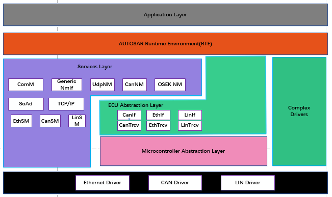
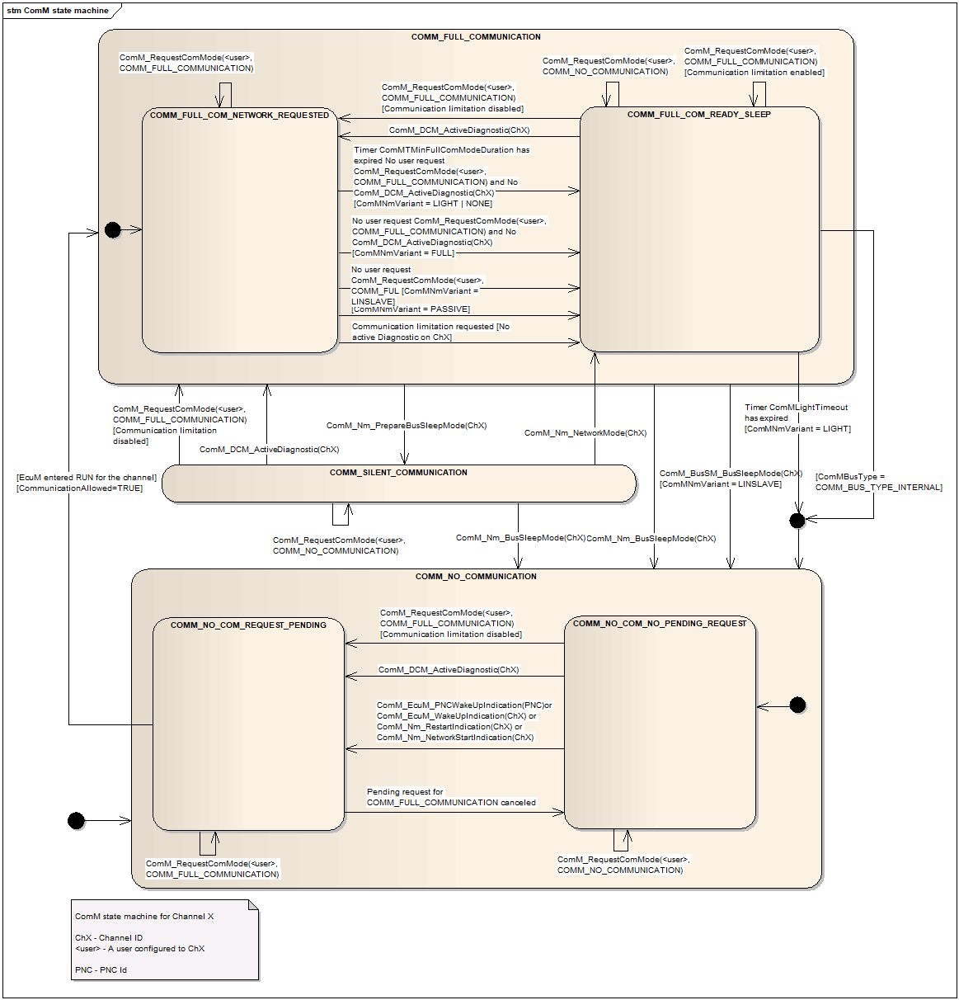
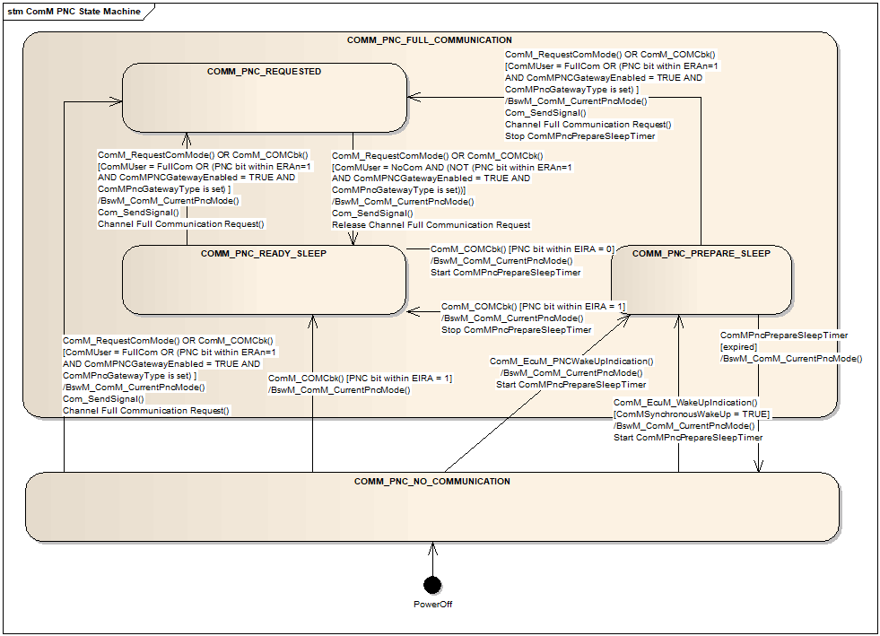
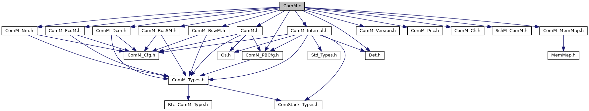
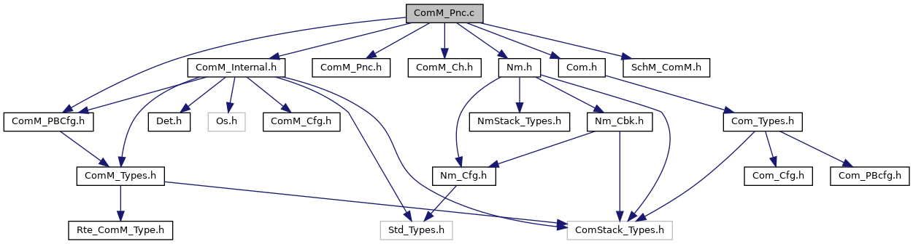
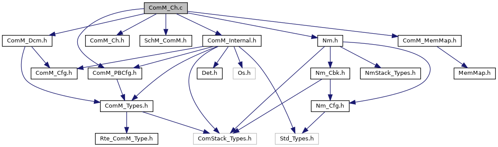

====================
ComM
====================

**缩写词注解**

+------------+---------------------------+----------------------------+
| **缩写词** | **英文全称**              | **中文解释**               |
+------------+---------------------------+----------------------------+
| API        | Application Programming   | 应用程序接口               |
|            | Interface                 |                            |
+------------+---------------------------+----------------------------+
| BswM       | Basic Software Manager    | 基础软件管理模块           |
+------------+---------------------------+----------------------------+
| BusSM      | Bus State Manger          | 与总线相关的状态管理模块   |
+------------+---------------------------+----------------------------+
| CanSM      | Can State Manger          | Can总线状态管理模块        |
+------------+---------------------------+----------------------------+
| DET        | Default Error Tracer      | 默认错误检测模块           |
+------------+---------------------------+----------------------------+
| NM         | Network Management        | 网络管理                   |
+------------+---------------------------+----------------------------+
| PDU        | Protocol Data Unit        | 协议数据单元               |
+------------+---------------------------+----------------------------+
| PN         | Partial Network           | 部分网络                   |
+------------+---------------------------+----------------------------+
| PNC        | Partial Network Cluster   | 部分网络集群               |
+------------+---------------------------+----------------------------+
| ERA        | External Request Array    | 外部请求集合               |
+------------+---------------------------+----------------------------+
| EIRA       | External and Internal     | 外部和内部请求集合         |
|            | Request Array             |                            |
+------------+---------------------------+----------------------------+
| ComM       | Communication Manager     | 通讯管理模块               |
+------------+---------------------------+----------------------------+
| DCM        | Diagnostic Communication  | 诊断通讯管理模块           |
|            | Manager                   |                            |
+------------+---------------------------+----------------------------+
| BusNm      | Bus Network Management    | 与总线相关的网络管理模块   |
+------------+---------------------------+----------------------------+
| NvM        | Non-Volatile Manager      | 非易失性管理器             |
+------------+---------------------------+----------------------------+

简介
====

ComM（COM
Manage，通信管理）模块是一个资源管理器，它封装了对基础通信服务的控制。ComM模块控制与通信相关的基础软件模块，它收集来自通信请求者的总线通信访问请求，并进行协调。

|image1|

图 ComM在AUTOSAR中的位置

ComM模块的目的是：

为用户简化总线通信栈的使用，包括简化的网络管理处理。

协调一个ECU上多个独立软件组件的总线通信栈的可用性(允许发送和接收信号)。

提供一个API来禁用发送信号，以防止ECU(主动地)唤醒通信总线。

通过为每个通道实现通道状态机来控制ECU的多个通信总线通道。

提供迫使ECU保持总线唤醒的“无通讯”模式的可能性。

通过分配请求的通信模式所需的所有资源来简化资源管理。

参考资料
--------

[1] AUTOSAR_SWS_COMManager.pdf

[2] AUTOSAR_SWS_NetworkManagementInterface.pdf

[3] AUTOSAR_SWS_BSWModeManager.pdf

[4] AUTOSAR_SWS_ECUStateManager.pdf

[5] AUTOSAR_SWS_DiagnosticCommunicationManager.pdf

[6] AUTOSAR_SWS_COM.pdf

功能描述
========

Channel与PNC状态管理功能
------------------------

AUTOSAR中，通过ComM系统服务实现对通信状态的管理。用户上电唤醒时通过主动请求通信FULL_COMMUNICATION或被动唤醒通知，用户休眠时请求NO_COMMUNICATION释放通信，ComM接收到请求后通过相应总线的SM模块和NM模块实现对总线通信状态的切换。用户无需再与各个通信总线的状态管理模块和网络管理模块进行交互。一个用户可以对应多个通道和多个PNC。当用户请求FULL_COMMUNICATION来请求通信时，该用户对应的所有channel和PNC都需要切换为FULL_COMMUNICATION的状态。在发生被动唤醒时，例如由ECUM发出的唤醒请求或者由网络管理模块发出的重启通信请求，对应的channel和PNC需要切换为FULL_COMMUNICATION的状态。ComM为每个channel和每个PNC都提供一个独立的状态机。

ComM模块实现了PNC(局域网络集群)管理功能，在ComM中可配置PNC，并且该PNC可以被通道和用户所引用，每个PNC在总线上使用NM用户数据中位向量中的专用位位置。如果节点上的本地ComM用户请求了PNC，则该节点会将NM用户数据中的相应位设置为1。如果不再请求PNC，节点将NM用户数据中的相应位设置为0。BusNm收集并聚集PNC的NM用户数据，并通过以下方式提供状态：通过COM信号向ComM发送COM位向量。ComM通过信号的内容，更新PNC状态机的状态。

PNC可以设置为网关类型和非网关类型，网关类型主要用于当局域网连接到一个以上的通道时，需要进行协调，通道可以配置为Active（主动）类型和Passive（被动）类型，Passive类型存在于当被动协调通道连接到多个PNC网关。
如果启用了ComM的PNC网关功能（ComMPNCGatewayEnabled =
true）可以将映射到此网关的ComM通道设置为主动或被动类型（COMM_GATEWAY_TYPE_ACTIVE或COMM_GATEWAY_TYPE_PASSIVE）。
如果ComM通道映射到两个不同的PNC网关，则只有一个网关主动协调此通道，而另一个则被动协调。这意味着，PNC网关始终映射到至少一个ComM通道类型为主动，并且可以映射到一个或多个ComM通道类型为被动。当PNC只要有一个Active通道收到ERA中为请求，则Passive通道发送当前PNC为请求的Nm
Pdu；当前Gateway
的PNC中所有Active通道收到ERA标识PNC为释放状态，发送当前PNC为释放的Nm
Pdu；这种表现可以简单理解为Gateway 从Active 通道向Passive转发ERA
PNC信息。

Channel状态机
~~~~~~~~~~~~~

ComM为每个通道都实现了一个状态机，ComM通道有三个主要状态，分别为COMM_NO_COMMUNICATION、COMM_SILENT_COMMUNICATION、COMM_FULL_COMMUNICATION，其中COMM_SILENT_COMMUNICATION状态用于网络管理内部状态同步，用户不可请求。COMM_NO_COMMUNICATI-

ON内部包含COMM_NO_COM_NO_PENDING_REQUEST和COMM_NO_CO-

M_REQUEST_PENDING两个子状态，COMM_FULL_COMMUNICATION内部包含COMM_FULL_COM_NETWORK_REQUESTED和COMM_FULL_COM\_-

READY_SLEEP两个子状态。ComM通道状态机如下图所示。

|image2|\ 图 ComM通道状态机

PNC状态机
~~~~~~~~~

ComM为每个PNC（局域网集群）实现一个状态机，每个PNC都有其自己的状态，通过配置映射，PNC的状态与channel的状态有关。ComM用户可以请求和释放PNC，系统通道节点上所有PNC的状态通过网络管理报文进行交换。每个PNC在总线上使用网络管理报文用户数据中位向量中的专用位位置。如果该节点上的本地ComM用户请求了PNC，则该节点会将网络管理用户数据中的相应位设置为1。如果该PNC不再被请求，节点将网络管理用户数据中的相应位设置为0。BusNm收集并聚合PNC的网络管理用户数据，并通过COM位向量通过COM信号将状态提供给ComM。

在每个系统通道上，每个PNC在网络管理用户数据中使用相同的位位置。ComM使用两种类型的位向量EIRA和ERA进行PNC状态信息交换。EIRA体现了当前节点与网络上其他节点对某一个PNC的请求与释放情况；EIRA不区分物理通道，只针对不同的PN，ERA则是在网关节点才使用，用于表示不同的通道对Pn的外部请求。ComM
PNC有两个主要状态，分别为COMM_PNC_NO_C-

OMMUNICATION、COMM_PNC_FULL_COMMUNICATION。COMM_PNC_F-

ULL_COMMUNICATION 内部有COMM_PNC_PREPARE_SLEEP，COMM_P-

NC_READY_SLEEP和COMM_PNC_REQUESTED三个子状态。ComM
PNC的状态机如下图所示。

|image3|

图 ComM PNC状态机

注：当前版本使用 Nm_UpdateIRA 接口替代 Com_SendSignal 进行 IRA 的更新。

功能抑制
--------

功能抑制是ComM中的扩展功能，ComM释放了功能抑制的接口与配置，功能抑制以通道为单位，各通道内的功能抑制相互独立。功能抑制分为唤醒抑制与无通信抑制。

唤醒抑制：表现为通道处于COMM_NO_COMMUNICATION或COMM_SILENT_COMMUNICATION状态时忽略User对通道的FULL_COMMUNICATION请求，但通道的被动唤醒功能不受影响，当全局配置项打开的情况下，唤醒抑制可以通过API来控制。

NoCom抑制：表现为限制通道切换到COMM_FULL_COMMUNICATION与COMM_SILENT_COMMUNICATION状态，当全局配置项打开的情况下，NoCom抑制也可以通过API来控制。

managed通道与managing通道
-------------------------

一个通道可以被配置为managed通道和managing通道，即被其他通道管理的通道和管理其他通道的通道。一个通道为managed通道还是managing通道是由配置参数ComMManageReference来决定的，如果通道1通过配置项ComMManageReference引用了通道2，那么，通道1为managed通道，通道2为managing通道。其中managed通道的ComMNmVariant（配置参数）为LIGHT，managing通道的ComMNmVariant为FULL。

如果一个managed通道被用户主动或ECUM被动唤醒请求FULL_COMMUNICATION
，那么它的managing通道也需要请求FULL_COMMUNICATION。当一个managing通道想要切换到NO_COMMUNICATION的时候，一定需要它的managed通道都没有请求FULL_COMMUNICATION时才能切换状态。

多核分布
--------

ComM
支持多分区（多核）分布，每一个通道和用户都支持被分配给特定的分区，通过配置项
ComMChannelPartitionRef 和 ComMUserEcucPartitionRef
来实现。使能多分区功能，要确保 ComMMultiplePartitionEnabled 设置为
TRUE。

在使能多分区功能后，所有与通道和用户相关的 API 如
ComM_CommunicationAllowed 或 ComM_RequestComMode
等，均只允许在对应通道或用户所在的分区上下文中被调用。

通道和它关联的用户可以分布在不同的分区上，ComM
使用全局共享变量进行分区间的信息交换，包括 PNC 相关的功能也是如此。

每一个通道的主函数会被对应分区的任务所调度，这部分内容由 SchM 实现。

如果ComM 被同时分布到不同的核上，则 ComM
所使用的变量所在的内存分区不能启用缓存机制。

源文件描述
==========

表 ComM组件文件描述

+-------------------+--------------------------------------------------+
| **文件**          | **说明**                                         |
+-------------------+--------------------------------------------------+
| ComM_BusSM.h      | ComM与BusSm交互API声明                           |
+-------------------+--------------------------------------------------+
| ComM_BswM.h       | ComM与BswM交互API声明                            |
+-------------------+--------------------------------------------------+
| ComM_Ch.c         | ComM 通道管理模块内部实现                        |
+-------------------+--------------------------------------------------+
| ComM_Ch.h         | ComM 通道管理模块内部接口声明                    |
+-------------------+--------------------------------------------------+
| ComM_Dcm.h        | ComM与Dcm交互API声明                             |
+-------------------+--------------------------------------------------+
| ComM_EcuM.h       | ComM与EcuM交互API声明                            |
+-------------------+--------------------------------------------------+
| ComM_Internal.h   | ComM内部公共接口声明                             |
+-------------------+--------------------------------------------------+
| ComM_Nm.h         | ComM与NmIf交互API声明                            |
+-------------------+--------------------------------------------------+
| ComM_Pnc.h        | ComM 部分网络管理模块内部实现                    |
+-------------------+--------------------------------------------------+
| ComM_Pnc.c        | ComM 部分网络管理模块内部实现                    |
+-------------------+--------------------------------------------------+
| ComM.c            | ComM源文件，包含了API函数的实现                  |
+-------------------+--------------------------------------------------+
| ComM.h            | ComM头文件，包含了API函数的声明                  |
+-------------------+--------------------------------------------------+
| ComM_Types.h      | ComM 头文件，包含了模块类型定义                  |
+-------------------+--------------------------------------------------+
| ComM_Version.h    | ComM 头文件，包含了版本信息                      |
+-------------------+--------------------------------------------------+
| ComM_Cfg.h        | ComM配置头文件，涉及配置项宏开关                 |
+-------------------+--------------------------------------------------+
| ComM_Cfg.c        | ComM配置C文件，包含多分区情况下的配置常量定义    |
+-------------------+--------------------------------------------------+
| ComM_Gent.c       | ComM 与通道有关的主函数入口实现                  |
+-------------------+--------------------------------------------------+
| ComM_PBCfg.h      | ComM 配置头文件，包含全局配置声明和相关类型定义  |
+-------------------+--------------------------------------------------+
| ComM_PBCfg.c      | ComM 配置C文件，包含全局配置定义                 |
+-------------------+--------------------------------------------------+
| ComM_Com.h        | ComM 配置头文件，包含PNC接收信号的回调函数声明   |
+-------------------+--------------------------------------------------+
| ComM_Com.c        | ComM 配置C文件，包含PNC接收信号的回调函数实现    |
+-------------------+--------------------------------------------------+
| ComM_MemMap.h     | ComM 的内存映射抽象说明                          |
+-------------------+--------------------------------------------------+

|IMG_256|

|image4|

|image5|

图 ComM组件静态文件交互关系图

API接口
=======

类型定义
--------

ComM_InitStatusType类型定义
~~~~~~~~~~~~~~~~~~~~~~~~~~~

+-----------+----------------------------------------------------------+
| 名称      | ComM_InitStatusType                                      |
+-----------+----------------------------------------------------------+
| 类型      | Enumeration                                              |
+-----------+----------------------------------------------------------+
| 范围      | COMM_UNINIT 未初始化                                     |
|           |                                                          |
|           | COMM_INIT 初始化成功                                     |
+-----------+----------------------------------------------------------+
| 描述      | 表示ComM初始化状态                                       |
+-----------+----------------------------------------------------------+

ComM_PNCModeType类型定义
~~~~~~~~~~~~~~~~~~~~~~~~

+-----------+----------------------------------------------------------+
| 名称      | ComM_PNCModeType                                         |
+-----------+----------------------------------------------------------+
| 类型      | Enumeration                                              |
+-----------+----------------------------------------------------------+
| 范围      | COMM_PNC_REQUESTED                                       |
|           |                                                          |
|           | PNC处于被请求模式                                        |
|           |                                                          |
|           | COMM_PNC\_PREPARE_SLEEP                                  |
|           |                                                          |
|           | PNC处于prepare sleep模式                                 |
|           |                                                          |
|           | COMM_PNC_READY_SLEEP                                     |
|           |                                                          |
|           | PNC处于ready sleep模式                                   |
|           |                                                          |
|           | COMM_PNC_NO_COMMUNICATION                                |
|           |                                                          |
|           | PNC处于无通信模式                                        |
|           |                                                          |
|           | COMM_PNC_REQUESTED_WITH_WAKEUP_REQUEST                   |
|           |                                                          |
|           | PNC是由本地ComM用户请求的                                |
+-----------+----------------------------------------------------------+
| 描述      | 表示PNC状态机的状态                                      |
+-----------+----------------------------------------------------------+

ComM_StateType类型定义
~~~~~~~~~~~~~~~~~~~~~~

+-----------+----------------------------------------------------------+
| 名称      | ComM_StateType                                           |
+-----------+----------------------------------------------------------+
| 类型      | uint8                                                    |
+-----------+----------------------------------------------------------+
| 范围      | COMM_NO_COM_NO_PENDING_REQUEST                           |
|           |                                                          |
|           | COMM_NO_COM_REQUEST_PENDING                              |
|           |                                                          |
|           | COMM_FULL_COM_NETWORK_REQUESTED                          |
|           |                                                          |
|           | COMM_FULL_COM_READY_SLEEP                                |
|           |                                                          |
|           | COMM_SILENT_COM                                          |
+-----------+----------------------------------------------------------+
| 描述      | 通信状态机通信状态与通信状态的状态和子状态               |
+-----------+----------------------------------------------------------+

ComM_ModeType类型定义
~~~~~~~~~~~~~~~~~~~~~

+-----------+----------------------------------------------------------+
| 名称      | ComM_ModeType                                            |
+-----------+----------------------------------------------------------+
| 类型      | uint8                                                    |
+-----------+----------------------------------------------------------+
| 范围      | COMM_NO_COMMUNICATION                                    |
|           |                                                          |
|           | COMM_SILENT_COMMUNICATION                                |
|           |                                                          |
|           | COMM_FULL_COMMUNICATION COMM_FULL\_                      |
|           |                                                          |
|           | COMMUNICATION_WITH_WAKEUP_REQUEST                        |
+-----------+----------------------------------------------------------+
| 描述      | 通信管理器的当前模式（状态机的主要状态）                 |
+-----------+----------------------------------------------------------+

ComM_UserHandleType类型定义
~~~~~~~~~~~~~~~~~~~~~~~~~~~

+-----------+----------------------------------------------------------+
| 名称      | ComM_UserHandleType                                      |
+-----------+----------------------------------------------------------+
| 类型      | uint8                                                    |
+-----------+----------------------------------------------------------+
| 范围      | 0..254 (255 是保留的，用于 COMM_NOT_USED_USER_ID)        |
+-----------+----------------------------------------------------------+
| 描述      | UserId的类型                                             |
+-----------+----------------------------------------------------------+

ComM_ConfigType类型定义
~~~~~~~~~~~~~~~~~~~~~~~

+-----------+----------------------------------------------------------+
| 名称      | ComM_ConfigType                                          |
+-----------+----------------------------------------------------------+
| 类型      | Structure                                                |
+-----------+----------------------------------------------------------+
| 范围      | --                                                       |
+-----------+----------------------------------------------------------+
| 描述      | ComM模块配置数据                                         |
+-----------+----------------------------------------------------------+

输入函数描述
------------

+----------------------------------+-----------------------------------+
| **输入模块**                     | **API**                           |
+----------------------------------+-----------------------------------+
| Det                              | Det_ReportError                   |
+----------------------------------+-----------------------------------+
| Nm                               | Nm_PassiveStartUp                 |
+----------------------------------+-----------------------------------+
|                                  | Nm_NetworkRequest                 |
+----------------------------------+-----------------------------------+
|                                  | Nm_NetworkRelease                 |
+----------------------------------+-----------------------------------+
|                                  | Nm_PduRxIndication                |
+----------------------------------+-----------------------------------+
|                                  | Nm_PrepareBusSleepMode            |
+----------------------------------+-----------------------------------+
|                                  | Nm_UpdateIRA                      |
+----------------------------------+-----------------------------------+
| Dcm                              | Dcm_ComM_NoComModeEntered         |
+----------------------------------+-----------------------------------+
|                                  | Dcm_ComM_SilentComModeEntered     |
+----------------------------------+-----------------------------------+
|                                  | Dcm_ComM_FullComModeEntered       |
+----------------------------------+-----------------------------------+
| BswM                             | BswM_ComM_CurrentMode             |
+----------------------------------+-----------------------------------+
|                                  | BswM_ComM_CurrentPNCMode          |
+----------------------------------+-----------------------------------+
|                                  | BswM_ComM_InitiateReset           |
+----------------------------------+-----------------------------------+
| NvM                              | NvM_ReadBlock                     |
+----------------------------------+-----------------------------------+
|                                  | NvM_WriteBlock                    |
+----------------------------------+-----------------------------------+
|                                  | NvM_GetErrorStatus                |
+----------------------------------+-----------------------------------+
| <BusSM>                          | <BusSM>_GetCurrentComMode         |
+----------------------------------+-----------------------------------+
|                                  | <BusSM>_RequestComMode            |
+----------------------------------+-----------------------------------+
| CanIf                            | CanIf_Transmit                    |
+----------------------------------+-----------------------------------+
| CanSM                            | CanSM_TxTimeoutException          |
+----------------------------------+-----------------------------------+
| Com                              | Com_ReceiveSignal                 |
+----------------------------------+-----------------------------------+
|                                  | Com_SendSignal                    |
+----------------------------------+-----------------------------------+

静态接口函数定义
----------------

ComM_Init函数定义
~~~~~~~~~~~~~~~~~

+-------------+-------------------+---------+-------------------------+
| 函数名称：  | ComM_Init         |         |                         |
+-------------+-------------------+---------+-------------------------+
| 函数原型：  | void ComM_Init    |         |                         |
|             | (const            |         |                         |
|             | ComM_ConfigType\* |         |                         |
|             | ConfigPtr)        |         |                         |
+-------------+-------------------+---------+-------------------------+
| 服务编号：  | 0x01              |         |                         |
+-------------+-------------------+---------+-------------------------+
| 同步/异步： | 同步              |         |                         |
+-------------+-------------------+---------+-------------------------+
| 是          | 不可重入          |         |                         |
| 否可重入：  |                   |         |                         |
+-------------+-------------------+---------+-------------------------+
| 输入参数：  | ConfigPtr         | 值域：  | 指向p                   |
|             |                   |         | ost-build配置数据的指针 |
+-------------+-------------------+---------+-------------------------+
| 输          | 无                |         |                         |
| 入输出参数: |                   |         |                         |
+-------------+-------------------+---------+-------------------------+
| 输出参数：  | 无                |         |                         |
+-------------+-------------------+---------+-------------------------+
| 返回值：    | 无                |         |                         |
+-------------+-------------------+---------+-------------------------+
| 功能概述：  | 完成对ComM模块    |         |                         |
|             | 的初始化处理，重  |         |                         |
|             | 新启动内部状态机  |         |                         |
+-------------+-------------------+---------+-------------------------+

ComM_DeInit函数定义
~~~~~~~~~~~~~~~~~~~

+-------------+--------------------------------------------------------+
| 函数名称：  | ComM_DeInit                                            |
+-------------+--------------------------------------------------------+
| 函数原型：  | void ComM_DeInit (                                     |
|             |                                                        |
|             | void                                                   |
|             |                                                        |
|             | )                                                      |
+-------------+--------------------------------------------------------+
| 服务编号：  | 0x02                                                   |
+-------------+--------------------------------------------------------+
| 同步/异步： | 同步                                                   |
+-------------+--------------------------------------------------------+
| 是          | 不可重入                                               |
| 否可重入：  |                                                        |
+-------------+--------------------------------------------------------+
| 输入参数：  | 无                                                     |
+-------------+--------------------------------------------------------+
| 输          | 无                                                     |
| 入输出参数: |                                                        |
+-------------+--------------------------------------------------------+
| 输出参数：  | 无                                                     |
+-------------+--------------------------------------------------------+
| 返回值：    | 无                                                     |
+-------------+--------------------------------------------------------+
| 功能概述：  | 反初始化ComM模块                                       |
+-------------+--------------------------------------------------------+

ComM_GetStatus函数定义
~~~~~~~~~~~~~~~~~~~~~~

+-------------+-------------------+---------+-------------------------+
| 函数名称：  | ComM_GetStatus    |         |                         |
+-------------+-------------------+---------+-------------------------+
| 函数原型：  | Std_ReturnType    |         |                         |
|             | ComM_GetStatus(   |         |                         |
|             |                   |         |                         |
|             | ComM              |         |                         |
|             | _InitStatusType\* |         |                         |
|             | Status            |         |                         |
|             |                   |         |                         |
|             | )                 |         |                         |
+-------------+-------------------+---------+-------------------------+
| 服务编号：  | 0x03              |         |                         |
+-------------+-------------------+---------+-------------------------+
| 同步/异步： | 同步              |         |                         |
+-------------+-------------------+---------+-------------------------+
| 是          | 不可重入          |         |                         |
| 否可重入：  |                   |         |                         |
+-------------+-------------------+---------+-------------------------+
| 输入参数：  | 无                |         |                         |
+-------------+-------------------+---------+-------------------------+
| 输          | 无                |         |                         |
| 入输出参数: |                   |         |                         |
+-------------+-------------------+---------+-------------------------+
| 输出参数：  | Status            | 值域：  | 初始化状态              |
+-------------+-------------------+---------+-------------------------+
| 返回值：    | E_OK:             |         |                         |
|             | 初                |         |                         |
|             | 始化状态成功返回  |         |                         |
|             |                   |         |                         |
|             | E_NOT_OK:         |         |                         |
|             | 初                |         |                         |
|             | 始化状态成功失败  |         |                         |
+-------------+-------------------+---------+-------------------------+
| 功能概述：  | 返回C             |         |                         |
|             | omM的初始化状态。 |         |                         |
+-------------+-------------------+---------+-------------------------+

ComM_GetInhibitionStatus函数定义
~~~~~~~~~~~~~~~~~~~~~~~~~~~~~~~~

+-------------+-------------------+---------+-------------------------+
| 函数名称：  | ComM_Ge           |         |                         |
|             | tInhibitionStatus |         |                         |
+-------------+-------------------+---------+-------------------------+
| 函数原型：  | Std_ReturnType    |         |                         |
|             | ComM_Get          |         |                         |
|             | InhibitionStatus( |         |                         |
|             |                   |         |                         |
|             | NetworkHandleType |         |                         |
|             | Channel,          |         |                         |
|             |                   |         |                         |
|             | ComM_Inhib        |         |                         |
|             | itionStatusType\* |         |                         |
|             | Status            |         |                         |
|             |                   |         |                         |
|             | )                 |         |                         |
+-------------+-------------------+---------+-------------------------+
| 服务编号：  | 0x04              |         |                         |
+-------------+-------------------+---------+-------------------------+
| 同步/异步： | 同步              |         |                         |
+-------------+-------------------+---------+-------------------------+
| 是          | 不可重入          |         |                         |
| 否可重入：  |                   |         |                         |
+-------------+-------------------+---------+-------------------------+
| 输入参数：  | Channel           | 值域：  | ComM的通道Id            |
+-------------+-------------------+---------+-------------------------+
| 输          | 无                |         |                         |
| 入输出参数: |                   |         |                         |
+-------------+-------------------+---------+-------------------------+
| 输出参数：  | State             | 值域：  | ComM通道的抑制状态      |
+-------------+-------------------+---------+-------------------------+
| 返回值：    | E_OK：            |         |                         |
|             | 成功返回抑制状态  |         |                         |
|             |                   |         |                         |
|             | E_NOT_OK：        |         |                         |
|             | 抑制状态返回失败  |         |                         |
+-------------+-------------------+---------+-------------------------+
| 功能概述：  | 返回Com           |         |                         |
|             | M通道的抑制状态。 |         |                         |
+-------------+-------------------+---------+-------------------------+

ComM_RequestComMode函数定义
~~~~~~~~~~~~~~~~~~~~~~~~~~~

+------------+----------+-------------+------------------------------+
| 函数名称： | Com      |             |                              |
|            | M_Reques |             |                              |
|            | tComMode |             |                              |
+------------+----------+-------------+------------------------------+
| 函数原型： | Std_Re   |             |                              |
|            | turnType |             |                              |
|            | Com      |             |                              |
|            | M_Reques |             |                              |
|            | tComMode |             |                              |
|            | (        |             |                              |
|            |          |             |                              |
|            | Com      |             |                              |
|            | M_UserHa |             |                              |
|            | ndleType |             |                              |
|            | User,    |             |                              |
|            |          |             |                              |
|            | ComM_    |             |                              |
|            | ModeType |             |                              |
|            | ComMode  |             |                              |
|            |          |             |                              |
|            | )        |             |                              |
+------------+----------+-------------+------------------------------+
| 服务编号： | 0x05     |             |                              |
+------------+----------+-------------+------------------------------+
| 同         | 同步     |             |                              |
| 步/异步：  |          |             |                              |
+------------+----------+-------------+------------------------------+
| 是         | 可重入   |             |                              |
| 否可重入： |          |             |                              |
+------------+----------+-------------+------------------------------+
| 输入参数： | User     | 值域：      | 请求模式的用户的Id           |
+------------+----------+-------------+------------------------------+
|            | ComMode  | 值域：      | COMM_FULL_COMMUNICATION      |
|            |          |             | COMM_NO_COMMUNICATION        |
+------------+----------+-------------+------------------------------+
| 输入       | 无       |             |                              |
| 输出参数:  |          |             |                              |
+------------+----------+-------------+------------------------------+
| 输出参数： | 无       |             |                              |
+------------+----------+-------------+------------------------------+
| 返回值：   | E_OK:    |             |                              |
|            | 成功切换 |             |                              |
|            | 到新模式 |             |                              |
|            |          |             |                              |
|            | E        |             |                              |
|            | _NOT_OK: |             |                              |
|            | 更改新   |             |                              |
|            | 模式失败 |             |                              |
|            |          |             |                              |
|            | COM      |             |                              |
|            | M_E_MODE |             |                              |
|            | _LIMITAT |             |                              |
|            | ION:由于 |             |                              |
|            | 模式抑制 |             |                              |
|            | ，不能更 |             |                              |
|            | 改模式。 |             |                              |
+------------+----------+-------------+------------------------------+
| 功能概述： | 用户对   |             |                              |
|            | 通信模式 |             |                              |
|            | 的请求。 |             |                              |
+------------+----------+-------------+------------------------------+

ComM_GetMaxComMode函数定义
~~~~~~~~~~~~~~~~~~~~~~~~~~

+-------------+-------------------+---------+-------------------------+
| 函数名称：  | C                 |         |                         |
|             | omM_GetMaxComMode |         |                         |
+-------------+-------------------+---------+-------------------------+
| 函数原型：  | Std_ReturnType    |         |                         |
|             | C                 |         |                         |
|             | omM_GetMaxComMode |         |                         |
|             | (                 |         |                         |
|             |                   |         |                         |
|             | Co                |         |                         |
|             | mM_UserHandleType |         |                         |
|             | User,             |         |                         |
|             |                   |         |                         |
|             | ComM_ModeType\*   |         |                         |
|             | ComMode           |         |                         |
|             |                   |         |                         |
|             | )                 |         |                         |
+-------------+-------------------+---------+-------------------------+
| 服务编号：  | 0x06              |         |                         |
+-------------+-------------------+---------+-------------------------+
| 同步/异步： | 同步              |         |                         |
+-------------+-------------------+---------+-------------------------+
| 是          | 可重入            |         |                         |
| 否可重入：  |                   |         |                         |
+-------------+-------------------+---------+-------------------------+
| 输入参数：  | User              | 值域：  | 用户的Id                |
+-------------+-------------------+---------+-------------------------+
| 输          | 无                |         |                         |
| 入输出参数: |                   |         |                         |
+-------------+-------------------+---------+-------------------------+
| 输出参数：  | ComMode           | 值域：  | 获取的通信模式          |
+-------------+-------------------+---------+-------------------------+
| 返回值：    | E_OK:             |         |                         |
|             | 成功返回允许      |         |                         |
|             | 的通信模式最大值  |         |                         |
|             |                   |         |                         |
|             | E_NOT_OK:         |         |                         |
|             | 返回允许的通      |         |                         |
|             | 信模式最大值失败  |         |                         |
+-------------+-------------------+---------+-------------------------+
| 功能概述：  | 查询相应用户最大  |         |                         |
|             | 允许的通信模式。  |         |                         |
+-------------+-------------------+---------+-------------------------+

ComM_GetRequestedComMode函数定义
~~~~~~~~~~~~~~~~~~~~~~~~~~~~~~~~

+-------------+-------------------+---------+-------------------------+
| 函数名称：  | ComM_Ge           |         |                         |
|             | tRequestedComMode |         |                         |
+-------------+-------------------+---------+-------------------------+
| 函数原型：  | Std_ReturnType    |         |                         |
|             | ComM_Ge           |         |                         |
|             | tRequestedComMode |         |                         |
|             | (                 |         |                         |
|             |                   |         |                         |
|             | Co                |         |                         |
|             | mM_UserHandleType |         |                         |
|             | User,             |         |                         |
|             |                   |         |                         |
|             | ComM_ModeType\*   |         |                         |
|             | ComMode           |         |                         |
|             |                   |         |                         |
|             | )                 |         |                         |
+-------------+-------------------+---------+-------------------------+
| 服务编号：  | 0x07              |         |                         |
+-------------+-------------------+---------+-------------------------+
| 同步/异步： | 同步              |         |                         |
+-------------+-------------------+---------+-------------------------+
| 是          | 可重入            |         |                         |
| 否可重入：  |                   |         |                         |
+-------------+-------------------+---------+-------------------------+
| 输入参数：  | User              | 值域：  | 用户的Id                |
+-------------+-------------------+---------+-------------------------+
| 输          | 无                |         |                         |
| 入输出参数: |                   |         |                         |
+-------------+-------------------+---------+-------------------------+
| 输出参数：  | ComMode           | 值域：  | 请求的通信模式          |
+-------------+-------------------+---------+-------------------------+
| 返回值：    | E_OK:成功返       |         |                         |
|             | 回请求的通信模式  |         |                         |
|             |                   |         |                         |
|             | E_NOT_OK:请求的   |         |                         |
|             | 通信模式返回失败  |         |                         |
+-------------+-------------------+---------+-------------------------+
| 功能概述：  | 查询对应用户当前  |         |                         |
|             | 请求的通信模式。  |         |                         |
+-------------+-------------------+---------+-------------------------+

ComM_GetCurrentComMode函数定义
~~~~~~~~~~~~~~~~~~~~~~~~~~~~~~~~

+-------------+-------------------+---------+-------------------------+
| 函数名称：  | ComM\_            |         |                         |
|             | GetCurrentComMode |         |                         |
+-------------+-------------------+---------+-------------------------+
| 函数原型：  | Std_ReturnType    |         |                         |
|             | ComM\_            |         |                         |
|             | GetCurrentComMode |         |                         |
|             | (                 |         |                         |
|             |                   |         |                         |
|             | Co                |         |                         |
|             | mM_UserHandleType |         |                         |
|             | User,             |         |                         |
|             |                   |         |                         |
|             | ComM_ModeType\*   |         |                         |
|             | ComMode           |         |                         |
|             |                   |         |                         |
|             | )                 |         |                         |
+-------------+-------------------+---------+-------------------------+
| 服务编号：  | 0x08              |         |                         |
+-------------+-------------------+---------+-------------------------+
| 同步/异步： | 同步              |         |                         |
+-------------+-------------------+---------+-------------------------+
| 是          | 可重入            |         |                         |
| 否可重入：  |                   |         |                         |
+-------------+-------------------+---------+-------------------------+
| 输入参数：  | User              | 值域：  | 用户的Id                |
+-------------+-------------------+---------+-------------------------+
| 输          | 无                |         |                         |
| 入输出参数: |                   |         |                         |
+-------------+-------------------+---------+-------------------------+
| 输出参数：  | ComMode           | 值域：  | 获取当前的通信模式      |
+-------------+-------------------+---------+-------------------------+
| 返回值：    | E_OK:             |         |                         |
|             | 从BusS            |         |                         |
|             | M返回通讯模式成功 |         |                         |
|             |                   |         |                         |
|             | E_NOT_OK:从BusS   |         |                         |
|             | M返回通讯模式失败 |         |                         |
+-------------+-------------------+---------+-------------------------+
| 功能概述：  | 查                |         |                         |
|             | 询当前通信模式。  |         |                         |
+-------------+-------------------+---------+-------------------------+

ComM_PreventWakeUp函数定义
~~~~~~~~~~~~~~~~~~~~~~~~~~

+-------------+---------------+---------+-----------------------------+
| 函数名称：  | ComM\_        |         |                             |
|             | PreventWakeUp |         |                             |
+-------------+---------------+---------+-----------------------------+
| 函数原型：  | S             |         |                             |
|             | td_ReturnType |         |                             |
|             | ComM\_        |         |                             |
|             | PreventWakeUp |         |                             |
|             | (             |         |                             |
|             |               |         |                             |
|             | Netw          |         |                             |
|             | orkHandleType |         |                             |
|             | Channel,      |         |                             |
|             |               |         |                             |
|             | boolean       |         |                             |
|             | Status        |         |                             |
|             |               |         |                             |
|             | )             |         |                             |
+-------------+---------------+---------+-----------------------------+
| 服务编号：  | 0x09          |         |                             |
+-------------+---------------+---------+-----------------------------+
| 同步/异步： | 同步          |         |                             |
+-------------+---------------+---------+-----------------------------+
| 是          | 不可重入      |         |                             |
| 否可重入：  |               |         |                             |
+-------------+---------------+---------+-----------------------------+
| 输入参数：  | Channel       | 值域：  | Channel的Id                 |
+-------------+---------------+---------+-----------------------------+
|             | Status        | 值域：  | 是否开启唤醒抑制功能        |
+-------------+---------------+---------+-----------------------------+
| 输          | 无            |         |                             |
| 入输出参数: |               |         |                             |
+-------------+---------------+---------+-----------------------------+
| 输出参数：  | 无            |         |                             |
+-------------+---------------+---------+-----------------------------+
| 返回值：    | E_OK:成       |         |                             |
|             | 功地更改了通  |         |                             |
|             | 道的唤醒状态  |         |                             |
|             |               |         |                             |
|             | E_NOT_OK:     |         |                             |
|             | 唤醒状态更    |         |                             |
|             | 改失败，例如  |         |                             |
|             | ComMEcuGroup  |         |                             |
|             | Classificatio |         |                             |
|             | n禁用了该功能 |         |                             |
+-------------+---------------+---------+-----------------------------+
| 功能概述：  | 更改相应通    |         |                             |
|             | 道的抑制状态C |         |                             |
|             | OMM_NO_WAKEUP |         |                             |
+-------------+---------------+---------+-----------------------------+

ComM_LimitChannelToNoComMode函数定义
~~~~~~~~~~~~~~~~~~~~~~~~~~~~~~~~~~~~

+--------------+--------------+--------+------------------------------+
| 函数名称：   | ComM         |        |                              |
|              | _LimitChanne |        |                              |
|              | lToNoComMode |        |                              |
+--------------+--------------+--------+------------------------------+
| 函数原型：   | St           |        |                              |
|              | d_ReturnType |        |                              |
|              | ComM\_       |        |                              |
|              | LimitChannel |        |                              |
|              | ToNoComMode( |        |                              |
|              |              |        |                              |
|              | Netwo        |        |                              |
|              | rkHandleType |        |                              |
|              | Channel,     |        |                              |
|              |              |        |                              |
|              | boolean      |        |                              |
|              | Status       |        |                              |
|              |              |        |                              |
|              | )            |        |                              |
+--------------+--------------+--------+------------------------------+
| 服务编号：   | 0x0b         |        |                              |
+--------------+--------------+--------+------------------------------+
| 同步/异步：  | 同步         |        |                              |
+--------------+--------------+--------+------------------------------+
| 是否可重入： | 不可重入     |        |                              |
+--------------+--------------+--------+------------------------------+
| 输入参数：   | Channel      | 值域： | Channel的Id                  |
+--------------+--------------+--------+------------------------------+
|              | Status       | 值域： | TRUE：使能COMM_NO_COMMUNI    |
|              |              |        | CATION更改为更高的通信模式。 |
|              |              |        |                              |
|              |              |        | FALSE：禁止COMM_NO_COMMUNI   |
|              |              |        | CATION更改为更高的通信模式。 |
+--------------+--------------+--------+------------------------------+
| 输           | 无           |        |                              |
| 入输出参数:  |              |        |                              |
+--------------+--------------+--------+------------------------------+
| 输出参数：   | 无           |        |                              |
+--------------+--------------+--------+------------------------------+
| 返回值：     | E_OK:        |        |                              |
|              | 成           |        |                              |
|              | 功地改变了通 |        |                              |
|              | 道的抑制状态 |        |                              |
|              |              |        |                              |
|              | E_NOT_OK:    |        |                              |
|              | 改变         |        |                              |
|              | 通道的抑制状 |        |                              |
|              | 态失败，例如 |        |                              |
|              | ComMEcuGroup |        |                              |
|              | Classificati |        |                              |
|              | on禁用该功能 |        |                              |
+--------------+--------------+--------+------------------------------+
| 功能概述：   | 更改chann    |        |                              |
|              | el对应通道的 |        |                              |
|              | 禁止状态，以 |        |                              |
|              | 便从COMM_NO  |        |                              |
|              | _COMMUNICATI |        |                              |
|              | ON更改为更高 |        |                              |
|              | 的通信模式。 |        |                              |
+--------------+--------------+--------+------------------------------+

ComM_LimitECUToNoComMode函数定义
~~~~~~~~~~~~~~~~~~~~~~~~~~~~~~~~

+-------------+------+--------+--------------------------------------+
| 函数名称：  | ComM |        |                                      |
|             | _Lim |        |                                      |
|             | itEC |        |                                      |
|             | UToN |        |                                      |
|             | oCom |        |                                      |
|             | Mode |        |                                      |
+-------------+------+--------+--------------------------------------+
| 函数原型：  | St   |        |                                      |
|             | d_Re |        |                                      |
|             | turn |        |                                      |
|             | Type |        |                                      |
|             | ComM |        |                                      |
|             | _Lim |        |                                      |
|             | itEC |        |                                      |
|             | UToN |        |                                      |
|             | oCom |        |                                      |
|             | Mode |        |                                      |
|             | (    |        |                                      |
|             |      |        |                                      |
|             | boo  |        |                                      |
|             | lean |        |                                      |
|             | St   |        |                                      |
|             | atus |        |                                      |
|             |      |        |                                      |
|             | )    |        |                                      |
+-------------+------+--------+--------------------------------------+
| 服务编号：  | 0x0c |        |                                      |
+-------------+------+--------+--------------------------------------+
| 同步/异步： | 同步 |        |                                      |
+-------------+------+--------+--------------------------------------+
| 是          | 不可 |        |                                      |
| 否可重入：  | 重入 |        |                                      |
+-------------+------+--------+--------------------------------------+
| 输入参数：  | St   | 值域： | TRUE：使能COMM_NO                    |
|             | atus |        | _COMMUNICATION更改为更高的通信模式。 |
|             |      |        |                                      |
|             |      |        | FALSE：禁止COMM_NO                   |
|             |      |        | _COMMUNICATION更改为更高的通信模式。 |
+-------------+------+--------+--------------------------------------+
| 输          | 无   |        |                                      |
| 入输出参数: |      |        |                                      |
+-------------+------+--------+--------------------------------------+
| 输出参数：  | 无   |        |                                      |
+-------------+------+--------+--------------------------------------+
| 返回值：    | E    |        |                                      |
|             | _OK: |        |                                      |
|             | E    |        |                                      |
|             | CU成 |        |                                      |
|             | 功地 |        |                                      |
|             | 改变 |        |                                      |
|             | 了通 |        |                                      |
|             | 道的 |        |                                      |
|             | 抑制 |        |                                      |
|             | 状态 |        |                                      |
|             |      |        |                                      |
|             | E    |        |                                      |
|             | _NOT |        |                                      |
|             | _OK: |        |                                      |
|             | ECU  |        |                                      |
|             | 改变 |        |                                      |
|             | 通道 |        |                                      |
|             | 的抑 |        |                                      |
|             | 制状 |        |                                      |
|             | 态失 |        |                                      |
|             | 败， |        |                                      |
|             | 例如 |        |                                      |
|             | ComM |        |                                      |
|             | EcuG |        |                                      |
|             | roup |        |                                      |
|             | Clas |        |                                      |
|             | sifi |        |                                      |
|             | cati |        |                                      |
|             | on禁 |        |                                      |
|             | 用该 |        |                                      |
|             | 功能 |        |                                      |
+-------------+------+--------+--------------------------------------+
| 功能概述：  | 更改 |        |                                      |
|             | ECU  |        |                                      |
|             | 的禁 |        |                                      |
|             | 止状 |        |                                      |
|             | 态（ |        |                                      |
|             | 对于 |        |                                      |
|             | 所有 |        |                                      |
|             | 的通 |        |                                      |
|             | 道） |        |                                      |
|             | ，以 |        |                                      |
|             | 便从 |        |                                      |
|             | COM  |        |                                      |
|             | M_NO |        |                                      |
|             | _COM |        |                                      |
|             | MUNI |        |                                      |
|             | CATI |        |                                      |
|             | ON更 |        |                                      |
|             | 改为 |        |                                      |
|             | 更高 |        |                                      |
|             | 的通 |        |                                      |
|             | 信模 |        |                                      |
|             | 式。 |        |                                      |
+-------------+------+--------+--------------------------------------+

ComM_ReadInhibitCounter函数定义
~~~~~~~~~~~~~~~~~~~~~~~~~~~~~~~~

+---------------+--------------------------------------------+---------+-------------------------------------------------+
| 函数名称：    | ComM_ReadInhibitCounter                    |         |                                                 |
+---------------+--------------------------------------------+---------+-------------------------------------------------+
|               | Std_ReturnType   ComM_ReadInhibitCounter ( |         |                                                 |
|               +--------------------------------------------+---------+-------------------------------------------------+
| 函数原型：    | uint16* CounterValue                       |         |                                                 |
|               +--------------------------------------------+---------+-------------------------------------------------+
|               | )                                          |         |                                                 |
+---------------+--------------------------------------------+---------+-------------------------------------------------+
| 服务编号：    | 0x0d                                       |         |                                                 |
+---------------+--------------------------------------------+---------+-------------------------------------------------+
| 同步/异步：   | 同步                                       |         |                                                 |
+---------------+--------------------------------------------+---------+-------------------------------------------------+
| 是否可重入：  | 可重入                                                                                                 |
+---------------+--------------------------------------------------------------------------------------------------------+
| 输入参数：    | 无                                                                                                     |
+---------------+--------------------------------------------------------------------------------------------------------+
| 输入输出参数: | 无                                                                                                     |
+---------------+--------------------------------------------+---------+-------------------------------------------------+
| 输出参数：    | CounterValue                               | 值域：  | 被拒绝的COMM_FULL_COMMUNICATION用户请求的数量。 |
+---------------+--------------------------------------------+---------+-------------------------------------------------+
|               | E_OK：成功返回抑制计数器                                                                               |
| 返回值：      +--------------------------------------------------------------------------------------------------------+
|               | E_NOT_OK：抑制计数器返回失败                                                                           |
+---------------+--------------------------------------------------------------------------------------------------------+
| 功能概述：    | 这个函数获取被拒绝的COMM_FULL_COMMUNICATION用户请求的数量。                                            |
+---------------+--------------------------------------------------------------------------------------------------------+

ComM_ResetInhibitCounter函数定义
~~~~~~~~~~~~~~~~~~~~~~~~~~~~~~~~

+-------------+--------------------------------------------------------+
| 函数名称：  | ComM_ResetInhibitCounter                               |
+-------------+--------------------------------------------------------+
| 函数原型：  | Std_ReturnType ComM_ResetInhibitCounter (              |
|             |                                                        |
|             | void                                                   |
|             |                                                        |
|             | )                                                      |
+-------------+--------------------------------------------------------+
| 服务编号：  | 0x0e                                                   |
+-------------+--------------------------------------------------------+
| 同步/异步： | 同步                                                   |
+-------------+--------------------------------------------------------+
| 是          | 可重入                                                 |
| 否可重入：  |                                                        |
+-------------+--------------------------------------------------------+
| 输入参数：  | 无                                                     |
+-------------+--------------------------------------------------------+
| 输          | 无                                                     |
| 入输出参数: |                                                        |
+-------------+--------------------------------------------------------+
| 输出参数：  | 无                                                     |
+-------------+--------------------------------------------------------+
| 返回值：    | E_OK：重置了被拒绝的COMM_FULL_COMMUNICATION的数量      |
|             |                                                        |
|             | E_NOT_OK：重置失败                                     |
+-------------+--------------------------------------------------------+
| 功能概述：  | 这个函                                                 |
|             | 数重置被拒绝的COMM_FULL_COMMUNICATION用户请求的数量。  |
+-------------+--------------------------------------------------------+

ComM_SetECUGroupClassification函数定义
~~~~~~~~~~~~~~~~~~~~~~~~~~~~~~~~~~~~~~

+-------------+---------------+---------+-----------------------------+
| 函数名称：  | ComM          |         |                             |
|             | _SetECUGroupC |         |                             |
|             | lassification |         |                             |
+-------------+---------------+---------+-----------------------------+
| 函数原型：  | S             |         |                             |
|             | td_ReturnType |         |                             |
|             | ComM\_        |         |                             |
|             | SetECUGroupCl |         |                             |
|             | assification( |         |                             |
|             |               |         |                             |
|             | ComM_Inhibit  |         |                             |
|             | ionStatusType |         |                             |
|             | Status        |         |                             |
|             |               |         |                             |
|             | )             |         |                             |
+-------------+---------------+---------+-----------------------------+
| 服务编号：  | 0x0f          |         |                             |
+-------------+---------------+---------+-----------------------------+
| 同步/异步： | 同步          |         |                             |
+-------------+---------------+---------+-----------------------------+
| 是          | 不可重入      |         |                             |
| 否可重入：  |               |         |                             |
+-------------+---------------+---------+-----------------------------+
| 输入参数：  | Status        | 值域：  | 设置的模式禁止状态          |
+-------------+---------------+---------+-----------------------------+
| 输          | 无            |         |                             |
| 入输出参数: |               |         |                             |
+-------------+---------------+---------+-----------------------------+
| 输出参数：  | 无            |         |                             |
+-------------+---------------+---------+-----------------------------+
| 返回值：    | E_OK:         |         |                             |
|             | ECU成功       |         |                             |
|             | 地修改了ComM  |         |                             |
|             | EcuGroupClass |         |                             |
|             | ification的值 |         |                             |
|             |               |         |                             |
|             | E_NOT_OK:     |         |                             |
|             | ComMEcuGroup  |         |                             |
|             | Classificatio |         |                             |
|             | n的值修改失败 |         |                             |
+-------------+---------------+---------+-----------------------------+
| 功能概述：  | 设置ComM      |         |                             |
|             | EcuGroupClass |         |                             |
|             | ification的值 |         |                             |
+-------------+---------------+---------+-----------------------------+

ComM_GetVersionInfo函数定义
~~~~~~~~~~~~~~~~~~~~~~~~~~~

+-------------+-------------------+---------+-------------------------+
| 函数名称：  | Co                |         |                         |
|             | mM_GetVersionInfo |         |                         |
+-------------+-------------------+---------+-------------------------+
| 函数原型：  | void              |         |                         |
|             | Co                |         |                         |
|             | mM_GetVersionInfo |         |                         |
|             | (                 |         |                         |
|             |                   |         |                         |
|             | Std\_             |         |                         |
|             | VersionInfoType\* |         |                         |
|             | Versioninfo       |         |                         |
|             |                   |         |                         |
|             | )                 |         |                         |
+-------------+-------------------+---------+-------------------------+
| 服务编号：  | 0x10              |         |                         |
+-------------+-------------------+---------+-------------------------+
| 同步/异步： | 同步              |         |                         |
+-------------+-------------------+---------+-------------------------+
| 是          | 可重入            |         |                         |
| 否可重入：  |                   |         |                         |
+-------------+-------------------+---------+-------------------------+
| 输入参数：  | 无                |         |                         |
+-------------+-------------------+---------+-------------------------+
| 输          | 无                |         |                         |
| 入输出参数: |                   |         |                         |
+-------------+-------------------+---------+-------------------------+
| 输出参数：  | Versioninfo       | 值域：  | 指向存储版本信息的位置  |
+-------------+-------------------+---------+-------------------------+
| 返回值：    | 无                |         |                         |
+-------------+-------------------+---------+-------------------------+
| 功能概述：  | 获取版本信息      |         |                         |
+-------------+-------------------+---------+-------------------------+

ComM_Nm_NetworkStartIndication函数定义
~~~~~~~~~~~~~~~~~~~~~~~~~~~~~~~~~~~~~~

+-------------+-------------------+---------+-------------------------+
| 函数名称：  | ComM_Nm_Netwo     |         |                         |
|             | rkStartIndication |         |                         |
+-------------+-------------------+---------+-------------------------+
| 函数原型：  | void              |         |                         |
|             | ComM_Nm_Netwo     |         |                         |
|             | rkStartIndication |         |                         |
|             | (                 |         |                         |
|             |                   |         |                         |
|             | NetworkHandleType |         |                         |
|             | Channel           |         |                         |
|             |                   |         |                         |
|             | )                 |         |                         |
+-------------+-------------------+---------+-------------------------+
| 服务编号：  | 0x15              |         |                         |
+-------------+-------------------+---------+-------------------------+
| 同步/异步： | 异步              |         |                         |
+-------------+-------------------+---------+-------------------------+
| 是          | 可重入            |         |                         |
| 否可重入：  |                   |         |                         |
+-------------+-------------------+---------+-------------------------+
| 输入参数：  | Channel           | 值域：  | ComM的通道Id            |
+-------------+-------------------+---------+-------------------------+
| 输          | 无                |         |                         |
| 入输出参数: |                   |         |                         |
+-------------+-------------------+---------+-------------------------+
| 输出参数：  | 无                |         |                         |
+-------------+-------------------+---------+-------------------------+
| 返回值：    | 无                |         |                         |
+-------------+-------------------+---------+-------------------------+
| 功能概述：  | 指示在总          |         |                         |
|             | 线睡眠模式下已收  |         |                         |
|             | 到NM消息，这表示  |         |                         |
|             | 网络中的某些节点  |         |                         |
|             | 已进入网络模式。  |         |                         |
+-------------+-------------------+---------+-------------------------+

ComM_Nm_NetworkMode函数定义
~~~~~~~~~~~~~~~~~~~~~~~~~~~

+-------------+-------------------+---------+-------------------------+
| 函数名称：  | Co                |         |                         |
|             | mM_Nm_NetworkMode |         |                         |
+-------------+-------------------+---------+-------------------------+
| 函数原型：  | void              |         |                         |
|             | Co                |         |                         |
|             | mM_Nm_NetworkMode |         |                         |
|             | (                 |         |                         |
|             |                   |         |                         |
|             | NetworkHandleType |         |                         |
|             | Channel           |         |                         |
|             |                   |         |                         |
|             | )                 |         |                         |
+-------------+-------------------+---------+-------------------------+
| 服务编号：  | 0x18              |         |                         |
+-------------+-------------------+---------+-------------------------+
| 同步/异步： | 异步              |         |                         |
+-------------+-------------------+---------+-------------------------+
| 是          | 可重入            |         |                         |
| 否可重入：  |                   |         |                         |
+-------------+-------------------+---------+-------------------------+
| 输入参数：  | Channel           | 值域：  | ComM的通道Id            |
+-------------+-------------------+---------+-------------------------+
| 输          | 无                |         |                         |
| 入输出参数: |                   |         |                         |
+-------------+-------------------+---------+-------------------------+
| 输出参数：  | 无                |         |                         |
+-------------+-------------------+---------+-------------------------+
| 返回值：    | 无                |         |                         |
+-------------+-------------------+---------+-------------------------+
| 功能概述：  | 通知网络管理      |         |                         |
|             | 已进入网络模式。  |         |                         |
+-------------+-------------------+---------+-------------------------+

ComM_Nm_PrepareBusSleepMode函数定义
~~~~~~~~~~~~~~~~~~~~~~~~~~~~~~~~~~~

+-------------+-------------------+---------+-------------------------+
| 函数名称：  | ComM_Nm_Pr        |         |                         |
|             | epareBusSleepMode |         |                         |
+-------------+-------------------+---------+-------------------------+
| 函数原型：  | void              |         |                         |
|             | ComM_Nm_Pr        |         |                         |
|             | epareBusSleepMode |         |                         |
|             | (                 |         |                         |
|             |                   |         |                         |
|             | NetworkHandleType |         |                         |
|             | Channel           |         |                         |
|             |                   |         |                         |
|             | )                 |         |                         |
+-------------+-------------------+---------+-------------------------+
| 服务编号：  | 0x19              |         |                         |
+-------------+-------------------+---------+-------------------------+
| 同步/异步： | 异步              |         |                         |
+-------------+-------------------+---------+-------------------------+
| 是          | 可重入            |         |                         |
| 否可重入：  |                   |         |                         |
+-------------+-------------------+---------+-------------------------+
| 输入参数：  | Channel           | 值域：  | ComM的通道Id            |
+-------------+-------------------+---------+-------------------------+
| 输          | 无                |         |                         |
| 入输出参数: |                   |         |                         |
+-------------+-------------------+---------+-------------------------+
| 输出参数：  | 无                |         |                         |
+-------------+-------------------+---------+-------------------------+
| 返回值：    | 无                |         |                         |
+-------------+-------------------+---------+-------------------------+
| 功能概述：  | 通知网络          |         |                         |
|             | 管理已进入Prepare |         |                         |
|             | Bus-Sleep模式。   |         |                         |
+-------------+-------------------+---------+-------------------------+

ComM_Nm_BusSleepMode函数定义
~~~~~~~~~~~~~~~~~~~~~~~~~~~~

+-------------+-------------------+---------+-------------------------+
| 函数名称：  | Com               |         |                         |
|             | M_Nm_BusSleepMode |         |                         |
+-------------+-------------------+---------+-------------------------+
| 函数原型：  | void              |         |                         |
|             | Com               |         |                         |
|             | M_Nm_BusSleepMode |         |                         |
|             | (                 |         |                         |
|             |                   |         |                         |
|             | NetworkHandleType |         |                         |
|             | Channel           |         |                         |
|             |                   |         |                         |
|             | )                 |         |                         |
+-------------+-------------------+---------+-------------------------+
| 服务编号：  | 0x1a              |         |                         |
+-------------+-------------------+---------+-------------------------+
| 同步/异步： | 异步              |         |                         |
+-------------+-------------------+---------+-------------------------+
| 是          | 可重入            |         |                         |
| 否可重入：  |                   |         |                         |
+-------------+-------------------+---------+-------------------------+
| 输入参数：  | Channel           | 值域：  | ComM的通道Id            |
+-------------+-------------------+---------+-------------------------+
| 输          | 无                |         |                         |
| 入输出参数: |                   |         |                         |
+-------------+-------------------+---------+-------------------------+
| 输出参数：  | 无                |         |                         |
+-------------+-------------------+---------+-------------------------+
| 返回值：    | 无                |         |                         |
+-------------+-------------------+---------+-------------------------+
| 功能概述：  | 通知网络管理已进  |         |                         |
|             | 入Bus-Sleep模式。 |         |                         |
+-------------+-------------------+---------+-------------------------+

ComM_Nm_RestartIndication函数定义
~~~~~~~~~~~~~~~~~~~~~~~~~~~~~~~~~

+-------------+-------------------+---------+-------------------------+
| 函数名称：  | ComM\_Nm\_        |         |                         |
|             | RestartIndication |         |                         |
+-------------+-------------------+---------+-------------------------+
| 函数原型：  | void              |         |                         |
|             | ComM\_Nm\_        |         |                         |
|             | RestartIndication |         |                         |
|             | (                 |         |                         |
|             |                   |         |                         |
|             | NetworkHandleType |         |                         |
|             | Channel           |         |                         |
|             |                   |         |                         |
|             | )                 |         |                         |
+-------------+-------------------+---------+-------------------------+
| 服务编号：  | 0x1b              |         |                         |
+-------------+-------------------+---------+-------------------------+
| 同步/异步： | 异步              |         |                         |
+-------------+-------------------+---------+-------------------------+
| 是          | 可重入            |         |                         |
| 否可重入：  |                   |         |                         |
+-------------+-------------------+---------+-------------------------+
| 输入参数：  | Channel           | 值域：  | ComM的通道Id            |
+-------------+-------------------+---------+-------------------------+
| 输          | 无                |         |                         |
| 入输出参数: |                   |         |                         |
+-------------+-------------------+---------+-------------------------+
| 输出参数：  | 无                |         |                         |
+-------------+-------------------+---------+-------------------------+
| 返回值：    | 无                |         |                         |
+-------------+-------------------+---------+-------------------------+
| 功能概述：  | 如果NmIf已开      |         |                         |
|             | 始关闭协调总线，  |         |                         |
|             | 并且并非所有协调  |         |                         |
|             | 总线都已指示总线  |         |                         |
|             | 处于睡眠状态，并  |         |                         |
|             | 且至少在协调总线  |         |                         |
|             | 之一上重新启动了N |         |                         |
|             | M，则NM接口应在已 |         |                         |
|             | 经指示总线睡眠状  |         |                         |
|             | 态的通道使用nmNe  |         |                         |
|             | tworkHandle调用回 |         |                         |
|             | 调函数ComM_Nm_Re  |         |                         |
|             | startIndication。 |         |                         |
+-------------+-------------------+---------+-------------------------+

ComM_DCM_ActiveDiagnostic函数定义
~~~~~~~~~~~~~~~~~~~~~~~~~~~~~~~~~

+-------------+-------------------+---------+-------------------------+
| 函数名称：  | ComM_DCM          |         |                         |
|             | _ActiveDiagnostic |         |                         |
+-------------+-------------------+---------+-------------------------+
| 函数原型：  | void              |         |                         |
|             | ComM_DCM          |         |                         |
|             | _ActiveDiagnostic |         |                         |
|             | (                 |         |                         |
|             |                   |         |                         |
|             | NetworkHandleType |         |                         |
|             | Channel           |         |                         |
|             |                   |         |                         |
|             | )                 |         |                         |
+-------------+-------------------+---------+-------------------------+
| 服务编号：  | 0x1f              |         |                         |
+-------------+-------------------+---------+-------------------------+
| 同步/异步： | 同步              |         |                         |
+-------------+-------------------+---------+-------------------------+
| 是          | 可重入            |         |                         |
| 否可重入：  |                   |         |                         |
+-------------+-------------------+---------+-------------------------+
| 输入参数：  | Channel           | 值域：  | ComM的通道Id            |
+-------------+-------------------+---------+-------------------------+
| 输          | 无                |         |                         |
| 入输出参数: |                   |         |                         |
+-------------+-------------------+---------+-------------------------+
| 输出参数：  | 无                |         |                         |
+-------------+-------------------+---------+-------------------------+
| 返回值：    | 无                |         |                         |
+-------------+-------------------+---------+-------------------------+
| 功能概述：  | DC                |         |                         |
|             | M诊断开始的指示。 |         |                         |
+-------------+-------------------+---------+-------------------------+

ComM_DCM_InactiveDiagnostic函数定义
~~~~~~~~~~~~~~~~~~~~~~~~~~~~~~~~~~~

+-------------+-------------------+---------+-------------------------+
| 函数名称：  | ComM_DCM_I        |         |                         |
|             | nactiveDiagnostic |         |                         |
+-------------+-------------------+---------+-------------------------+
| 函数原型：  | void              |         |                         |
|             | ComM_DCM_I        |         |                         |
|             | nactiveDiagnostic |         |                         |
|             | (                 |         |                         |
|             |                   |         |                         |
|             | NetworkHandleType |         |                         |
|             | Channel           |         |                         |
|             |                   |         |                         |
|             | )                 |         |                         |
+-------------+-------------------+---------+-------------------------+
| 服务编号：  | 0x20              |         |                         |
+-------------+-------------------+---------+-------------------------+
| 同步/异步： | 同步              |         |                         |
+-------------+-------------------+---------+-------------------------+
| 是          | 可重入            |         |                         |
| 否可重入：  |                   |         |                         |
+-------------+-------------------+---------+-------------------------+
| 输入参数：  | Channel           | 值域：  | ComM的通道Id            |
+-------------+-------------------+---------+-------------------------+
| 输          | 无                |         |                         |
| 入输出参数: |                   |         |                         |
+-------------+-------------------+---------+-------------------------+
| 输出参数：  | 无                |         |                         |
+-------------+-------------------+---------+-------------------------+
| 返回值：    | 无                |         |                         |
+-------------+-------------------+---------+-------------------------+
| 功能概述：  | DC                |         |                         |
|             | M诊断结束的指示。 |         |                         |
+-------------+-------------------+---------+-------------------------+

ComM_EcuM_WakeUpIndication函数定义
~~~~~~~~~~~~~~~~~~~~~~~~~~~~~~~~~~

+-------------+-------------------+---------+-------------------------+
| 函数名称：  | ComM_EcuM         |         |                         |
|             | _WakeUpIndication |         |                         |
+-------------+-------------------+---------+-------------------------+
| 函数原型：  | void              |         |                         |
|             | ComM_EcuM         |         |                         |
|             | _WakeUpIndication |         |                         |
|             | (                 |         |                         |
|             |                   |         |                         |
|             | NetworkHandleType |         |                         |
|             | Channel           |         |                         |
|             |                   |         |                         |
|             | )                 |         |                         |
+-------------+-------------------+---------+-------------------------+
| 服务编号：  | 0x2a              |         |                         |
+-------------+-------------------+---------+-------------------------+
| 同步/异步： | 同步              |         |                         |
+-------------+-------------------+---------+-------------------------+
| 是          | 可重入            |         |                         |
| 否可重入：  |                   |         |                         |
+-------------+-------------------+---------+-------------------------+
| 输入参数：  | Channel           | 值域：  | ComM的通道Id            |
+-------------+-------------------+---------+-------------------------+
| 输          | 无                |         |                         |
| 入输出参数: |                   |         |                         |
+-------------+-------------------+---------+-------------------------+
| 输出参数：  | 无                |         |                         |
+-------------+-------------------+---------+-------------------------+
| 返回值：    | 无                |         |                         |
+-------------+-------------------+---------+-------------------------+
| 功能概述：  | 在相应通          |         |                         |
|             | 道上的唤醒通知。  |         |                         |
+-------------+-------------------+---------+-------------------------+

ComM_EcuM_PNCWakeUpIndication函数定义
~~~~~~~~~~~~~~~~~~~~~~~~~~~~~~~~~~~~~

+-------------+-------------------+---------+-------------------------+
| 函数名称：  | ComM_EcuM_PN      |         |                         |
|             | CWakeUpIndication |         |                         |
+-------------+-------------------+---------+-------------------------+
| 函数原型：  | void              |         |                         |
|             | ComM_EcuM_PN      |         |                         |
|             | CWakeUpIndication |         |                         |
|             | (                 |         |                         |
|             |                   |         |                         |
|             | PNCHandleType     |         |                         |
|             | PNCid             |         |                         |
|             |                   |         |                         |
|             | )                 |         |                         |
+-------------+-------------------+---------+-------------------------+
| 服务编号：  | 0x37              |         |                         |
+-------------+-------------------+---------+-------------------------+
| 同步/异步： | 同步              |         |                         |
+-------------+-------------------+---------+-------------------------+
| 是          | 可重入            |         |                         |
| 否可重入：  |                   |         |                         |
+-------------+-------------------+---------+-------------------------+
| 输入参数：  | PNCid             | 值域：  | 局域网集群的Id          |
+-------------+-------------------+---------+-------------------------+
| 输          | 无                |         |                         |
| 入输出参数: |                   |         |                         |
+-------------+-------------------+---------+-------------------------+
| 输出参数：  | 无                |         |                         |
+-------------+-------------------+---------+-------------------------+
| 返回值：    | 无                |         |                         |
+-------------+-------------------+---------+-------------------------+
| 功能概述：  | 在相应            |         |                         |
|             | pnc上的唤醒通知。 |         |                         |
+-------------+-------------------+---------+-------------------------+

ComM_CommunicationAllowed函数定义
~~~~~~~~~~~~~~~~~~~~~~~~~~~~~~~~~

+-------------+-------------------+---------+-------------------------+
| 函数名称：  | ComM_Com          |         |                         |
|             | municationAllowed |         |                         |
+-------------+-------------------+---------+-------------------------+
| 函数原型：  | void              |         |                         |
|             | ComM_Com          |         |                         |
|             | municationAllowed |         |                         |
|             | (                 |         |                         |
|             |                   |         |                         |
|             | NetworkHandleType |         |                         |
|             | Channel,          |         |                         |
|             |                   |         |                         |
|             | boolean Allowed   |         |                         |
|             |                   |         |                         |
|             | )                 |         |                         |
+-------------+-------------------+---------+-------------------------+
| 服务编号：  | 0x35              |         |                         |
+-------------+-------------------+---------+-------------------------+
| 同步/异步： | 异步              |         |                         |
+-------------+-------------------+---------+-------------------------+
| 是          | 不可重入          |         |                         |
| 否可重入：  |                   |         |                         |
+-------------+-------------------+---------+-------------------------+
| 输入参数：  | Channel           | 值域：  | ComM的通道Id            |
+-------------+-------------------+---------+-------------------------+
|             | Allowed           | 值域：  | 是否允许通信            |
+-------------+-------------------+---------+-------------------------+
| 输          | 无                |         |                         |
| 入输出参数: |                   |         |                         |
+-------------+-------------------+---------+-------------------------+
| 输出参数：  | 无                |         |                         |
+-------------+-------------------+---------+-------------------------+
| 返回值：    | 无                |         |                         |
+-------------+-------------------+---------+-------------------------+
| 功能概述：  | 当允              |         |                         |
|             | 许通信时，EcuM或B |         |                         |
|             | swM应向ComM指示。 |         |                         |
+-------------+-------------------+---------+-------------------------+

ComM_BusSM_ModeIndication函数定义
~~~~~~~~~~~~~~~~~~~~~~~~~~~~~~~~~

+-------------+-------------------+---------+-------------------------+
| 函数名称：  | ComM_Bus          |         |                         |
|             | SM_ModeIndication |         |                         |
+-------------+-------------------+---------+-------------------------+
| 函数原型：  | void              |         |                         |
|             | ComM_Bus          |         |                         |
|             | SM_ModeIndication |         |                         |
|             | (                 |         |                         |
|             |                   |         |                         |
|             | NetworkHandleType |         |                         |
|             | Channel,          |         |                         |
|             |                   |         |                         |
|             | ComM_ModeType     |         |                         |
|             | ComMode           |         |                         |
|             |                   |         |                         |
|             | )                 |         |                         |
+-------------+-------------------+---------+-------------------------+
| 服务编号：  | 0x33              |         |                         |
+-------------+-------------------+---------+-------------------------+
| 同步/异步： | 异步              |         |                         |
+-------------+-------------------+---------+-------------------------+
| 是          | 可重入            |         |                         |
| 否可重入：  |                   |         |                         |
+-------------+-------------------+---------+-------------------------+
| 输入参数：  | Channel           | 值域：  | ComM的通道Id            |
+-------------+-------------------+---------+-------------------------+
|             | ComMode           | 值域：  | 通信模式                |
+-------------+-------------------+---------+-------------------------+
| 输          | 无                |         |                         |
| 入输出参数: |                   |         |                         |
+-------------+-------------------+---------+-------------------------+
| 输出参数：  | 无                |         |                         |
+-------------+-------------------+---------+-------------------------+
| 返回值：    | 无                |         |                         |
+-------------+-------------------+---------+-------------------------+
| 功能概述：  | 由相应的BusSM通   |         |                         |
|             | 知实际总线模式。  |         |                         |
+-------------+-------------------+---------+-------------------------+

ComM_BusSM_BusSleepMode函数定义
~~~~~~~~~~~~~~~~~~~~~~~~~~~~~~~

+-------------+-------------------+---------+-------------------------+
| 函数名称：  | ComM_B            |         |                         |
|             | usSM_BusSleepMode |         |                         |
+-------------+-------------------+---------+-------------------------+
| 函数原型：  | void              |         |                         |
|             | ComM_B            |         |                         |
|             | usSM_BusSleepMode |         |                         |
|             | (                 |         |                         |
|             |                   |         |                         |
|             | NetworkHandleType |         |                         |
|             | Channel           |         |                         |
|             |                   |         |                         |
|             | )                 |         |                         |
+-------------+-------------------+---------+-------------------------+
| 服务编号：  | 0x34              |         |                         |
+-------------+-------------------+---------+-------------------------+
| 同步/异步： | 同步              |         |                         |
+-------------+-------------------+---------+-------------------------+
| 是          | 可重入            |         |                         |
| 否可重入：  |                   |         |                         |
+-------------+-------------------+---------+-------------------------+
| 输入参数：  | Channel           | 值域：  | ComM的通道Id            |
+-------------+-------------------+---------+-------------------------+
| 输          | 无                |         |                         |
| 入输出参数: |                   |         |                         |
+-------------+-------------------+---------+-------------------------+
| 输出参数：  | 无                |         |                         |
+-------------+-------------------+---------+-------------------------+
| 返回值：    | E_OK: 请求被接受  |         |                         |
|             |                   |         |                         |
|             | E_NOT_OK:         |         |                         |
|             | 请求被拒绝        |         |                         |
+-------------+-------------------+---------+-------------------------+
| 功能概述：  | 通知              |         |                         |
|             | 相应的总线状态管  |         |                         |
|             | 理器实际的总线模  |         |                         |
|             | 式为“Bus-Sleep”。 |         |                         |
|             |                   |         |                         |
|             | 仅                |         |                         |
|             | 适用于LIN从节点。 |         |                         |
+-------------+-------------------+---------+-------------------------+

ComM_COMCbk\_<sn>函数定义
~~~~~~~~~~~~~~~~~~~~~~~~~

+-------------+--------------------------------------------------------+
| 函数名称：  | ComM_COMCbk\_<sn>                                      |
+-------------+--------------------------------------------------------+
| 函数原型：  | void ComM_COMCbk\_<sn> (                               |
|             |                                                        |
|             | void                                                   |
|             |                                                        |
|             | )                                                      |
+-------------+--------------------------------------------------------+
| 服务编号：  | 0x36                                                   |
+-------------+--------------------------------------------------------+
| 同步/异步： | 同步                                                   |
+-------------+--------------------------------------------------------+
| 是          | 不可重入                                               |
| 否可重入：  |                                                        |
+-------------+--------------------------------------------------------+
| 输入参数：  | 无                                                     |
+-------------+--------------------------------------------------------+
| 输          | 无                                                     |
| 入输出参数: |                                                        |
+-------------+--------------------------------------------------------+
| 输出参数：  | 无                                                     |
+-------------+--------------------------------------------------------+
| 返回值：    | 无                                                     |
+-------------+--------------------------------------------------------+
| 功能概述：  | 在COM中更新EIRA或ERA时调用此回调。                     |
+-------------+--------------------------------------------------------+

ComM_MainFunction函数定义
~~~~~~~~~~~~~~~~~~~~~~~~~

+-------------+--------------------------------------------------------+
| 函数名称：  | ComM_MainFunction                                      |
+-------------+--------------------------------------------------------+
| 函数原型：  | void ComM_MainFunction\_<ComMChannel.ShortName> (      |
|             |                                                        |
|             | void                                                   |
|             |                                                        |
|             | )                                                      |
+-------------+--------------------------------------------------------+
| 服务编号：  | 0x60                                                   |
+-------------+--------------------------------------------------------+
| 功能概述：  | ComM 模块后台主处理函数。 需被后台主循环或 OS 的 task  |
|             | 调用                                                   |
+-------------+--------------------------------------------------------+

可配置函数定义
--------------

无。

SWC服务组件封装
---------------

以下类型和接口可以封装至SWC生成完整的服务组件，可以与应用通过端口连接，没有列出的部分暂时不支持。

实现数据类型封装
~~~~~~~~~~~~~~~~

+------------------------------------------------+---------------------+
| 类型名及定义引用                               | 生成条件            |
+------------------------------------------------+---------------------+
| ComM_ModeType                                  | 无                  |
+------------------------------------------------+---------------------+
| ComM_UserHandleType                            | 无                  |
+------------------------------------------------+---------------------+
| ComM_UserHandleArrayType\_{channel_name}       | 无                  |
+------------------------------------------------+---------------------+

SR接口封装
~~~~~~~~~~

ComM_CurrentChannelRequest
^^^^^^^^^^^^^^^^^^^^^^^^^^

+-----------------+----------------------------------------------------+
| 函数名称：      | ComM_CurrentChannelRequest\_{channel_name}         |
+-----------------+----------------------------------------------------+
| 功能描述        | Array of ComMUserIdentifier, that currently hold   |
|                 | FULL_COM requests for this channel.                |
+-----------------+----------------------------------------------------+
| 变体：          | channel_name =                                     |
|                 | {ecuc(ComM/ComMConfigSet/ComMChannel.SHORT-NAME)}  |
+-----------------+----------------------------------------------------+
| 生成条件：      | ComMFullCommRequestNotificationEnabled is true     |
+-----------------+----------------------------------------------------+
| 输入参数：      | ComM_UserHandleArrayType\_{channel_name}           |
+-----------------+----------------------------------------------------+
| 从属端口：      | ComM_CR                                            |
+-----------------+----------------------------------------------------+

CS接口封装
~~~~~~~~~~

Rte_Call_ComM_ComM_UserRequest_GetCurrentComMode
^^^^^^^^^^^^^^^^^^^^^^^^^^^^^^^^^^^^^^^^^^^^^^^^

+-----------------+----------------------------------------------------+
| 函数名称：      | Rte_Call_ComM_ComM_UserRequest_GetCurrentComMode   |
+-----------------+----------------------------------------------------+
| 运行            | 详见4.3.9                                          |
| 实体函数定义：  |                                                    |
+-----------------+----------------------------------------------------+
| 变体：          | 无                                                 |
+-----------------+----------------------------------------------------+
| 生成条件：      | 无                                                 |
+-----------------+----------------------------------------------------+
| 端口类型：      | Provided Port                                      |
+-----------------+----------------------------------------------------+
| 从属端口：      | ComM_UserRequest                                   |
+-----------------+----------------------------------------------------+

Rte_Call_ComM_ComM_UserRequest_GetMaxComMode
^^^^^^^^^^^^^^^^^^^^^^^^^^^^^^^^^^^^^^^^^^^^

+-----------------+----------------------------------------------------+
| 函数名称：      | Rte_Call_ComM_ComM_UserRequest_GetMaxComMode       |
+-----------------+----------------------------------------------------+
| 运行            | 详见4.3.7                                          |
| 实体函数定义：  |                                                    |
+-----------------+----------------------------------------------------+
| 变体：          | 无                                                 |
+-----------------+----------------------------------------------------+
| 生成条件：      | 无                                                 |
+-----------------+----------------------------------------------------+
| 端口类型：      | Provided Port                                      |
+-----------------+----------------------------------------------------+
| 从属端口：      | ComM_UserRequest                                   |
+-----------------+----------------------------------------------------+

Rte_Call_ComM_ComM_UserRequest_RequestComMode
^^^^^^^^^^^^^^^^^^^^^^^^^^^^^^^^^^^^^^^^^^^^^

+-----------------+----------------------------------------------------+
| 函数名称：      | Rte_Call_ComM_ComM_UserRequest_RequestComMode      |
+-----------------+----------------------------------------------------+
| 运行            | 详见4.3.6                                          |
| 实体函数定义：  |                                                    |
+-----------------+----------------------------------------------------+
| 变体：          | 无                                                 |
+-----------------+----------------------------------------------------+
| 生成条件：      | 无                                                 |
+-----------------+----------------------------------------------------+
| 端口类型：      | Provided Port                                      |
+-----------------+----------------------------------------------------+
| 从属端口：      | ComM_UserRequest                                   |
+-----------------+----------------------------------------------------+

Rte_Call_ComM_ComM_ChannelLimitation_GetInhibitionStatus
^^^^^^^^^^^^^^^^^^^^^^^^^^^^^^^^^^^^^^^^^^^^^^^^^^^^^^^^

+-----------------+----------------------------------------------------+
| 函数名称：      | Rte_Ca                                             |
|                 | ll_ComM_ComM_ChannelLimitation_GetInhibitionStatus |
+-----------------+----------------------------------------------------+
| 运行            | 详见4.3.5                                          |
| 实体函数定义：  |                                                    |
+-----------------+----------------------------------------------------+
| 变体：          | 无                                                 |
+-----------------+----------------------------------------------------+
| 生成条件：      | ComMModeLimitationEnabled is TRUE                  |
+-----------------+----------------------------------------------------+
| 端口类型：      | Provided Port                                      |
+-----------------+----------------------------------------------------+
| 从属端口：      | ComM_ChannelLimitation                             |
+-----------------+----------------------------------------------------+

Rte_Call_ComM_ComM_ChannelLimitation_LimitChannelToNoComMode
^^^^^^^^^^^^^^^^^^^^^^^^^^^^^^^^^^^^^^^^^^^^^^^^^^^^^^^^^^^^

+-----------+----------------------------------------------------------+
| 函        | Rte\_                                                    |
| 数名称：  | Call_ComM_ComM_ChannelLimitation_LimitChannelToNoComMode |
+-----------+----------------------------------------------------------+
| 运        | 详见4.3.11                                               |
| 行实体函  |                                                          |
| 数定义：  |                                                          |
+-----------+----------------------------------------------------------+
| 变体：    | 无                                                       |
+-----------+----------------------------------------------------------+
| 生        | ComMModeLimitationEnabled and                            |
| 成条件：  | ComMResetAfterForcingNoComm open                         |
+-----------+----------------------------------------------------------+
| 端        | Provided Port                                            |
| 口类型：  |                                                          |
+-----------+----------------------------------------------------------+
| 从        | ComM_ChannelLimitation                                   |
| 属端口：  |                                                          |
+-----------+----------------------------------------------------------+

Rte_Call_ComM_ComM_ChannelWakeup_PreventWakeUp
^^^^^^^^^^^^^^^^^^^^^^^^^^^^^^^^^^^^^^^^^^^^^^

+-----------------+----------------------------------------------------+
| 函数名称：      | Rte_Call_ComM_ComM_ChannelWakeup_PreventWakeUp     |
+-----------------+----------------------------------------------------+
| 运行            | 详见4.3.10                                         |
| 实体函数定义：  |                                                    |
+-----------------+----------------------------------------------------+
| 变体：          | 无                                                 |
+-----------------+----------------------------------------------------+
| 生成条件：      | ComMWakeupInhibitionEnabled open                   |
+-----------------+----------------------------------------------------+
| 端口类型：      | Provided Port                                      |
+-----------------+----------------------------------------------------+
| 从属端口：      | ComM_ChannelWakeup                                 |
+-----------------+----------------------------------------------------+

Rte_Call_ComM_ComM_ECUModeLimitation_LimitECUToNoComMode
^^^^^^^^^^^^^^^^^^^^^^^^^^^^^^^^^^^^^^^^^^^^^^^^^^^^^^^^

+-------------+--------------------------------------------------------+
| 函数名称：  | Rt                                                     |
|             | e_Call_ComM_ComM_ECUModeLimitation_LimitECUToNoComMode |
+-------------+--------------------------------------------------------+
| 运行实体    | 详见4.3.12                                             |
| 函数定义：  |                                                        |
+-------------+--------------------------------------------------------+
| 变体：      | 无                                                     |
+-------------+--------------------------------------------------------+
| 生成条件：  | ComMModeLimitationEnabled and                          |
|             | ComMResetAfterForcingNoComm open                       |
+-------------+--------------------------------------------------------+
| 端口类型：  | Provided Port                                          |
+-------------+--------------------------------------------------------+
| 从属端口：  | ComM_ECUModeLimitation                                 |
+-------------+--------------------------------------------------------+

Rte_Call_ComM_ComM_ECUModeLimitation_ReadInhibitCounter
^^^^^^^^^^^^^^^^^^^^^^^^^^^^^^^^^^^^^^^^^^^^^^^^^^^^^^^

+-----------------+----------------------------------------------------+
| 函数名称：      | Rte_C                                              |
|                 | all_ComM_ComM_ECUModeLimitation_ReadInhibitCounter |
+-----------------+----------------------------------------------------+
| 运行            | 详见4.3.13                                         |
| 实体函数定义：  |                                                    |
+-----------------+----------------------------------------------------+
| 变体：          | 无                                                 |
+-----------------+----------------------------------------------------+
| 生成条件：      | ComMModeLimitationEnabled enable and               |
|                 | ComMGlobalNvMBlockDescriptor configured            |
+-----------------+----------------------------------------------------+
| 端口类型：      | Provided Port                                      |
+-----------------+----------------------------------------------------+
| 从属端口：      | ComM_ECUModeLimitation                             |
+-----------------+----------------------------------------------------+

Rte_Call_ComM_ComM_ECUModeLimitation_ResetInhibitCounter
^^^^^^^^^^^^^^^^^^^^^^^^^^^^^^^^^^^^^^^^^^^^^^^^^^^^^^^^

+-----------------+----------------------------------------------------+
| 函数名称：      | Rte_Ca                                             |
|                 | ll_ComM_ComM_ECUModeLimitation_ResetInhibitCounter |
+-----------------+----------------------------------------------------+
| 运行            | 详见4.3.14                                         |
| 实体函数定义：  |                                                    |
+-----------------+----------------------------------------------------+
| 变体：          | 无                                                 |
+-----------------+----------------------------------------------------+
| 生成条件：      | ComMModeLimitationEnabled enable and               |
|                 | ComMGlobalNvMBlockDescriptor configured            |
+-----------------+----------------------------------------------------+
| 端口类型：      | Provided Port                                      |
+-----------------+----------------------------------------------------+
| 从属端口：      | ComM_ECUModeLimitation                             |
+-----------------+----------------------------------------------------+

模式转换接口封装
~~~~~~~~~~~~~~~~

ComM_CurrentMode
^^^^^^^^^^^^^^^^

+-----------------+----------------------------------------------------+
| 接口名称：      | UM\_{user_name}_currentMode                        |
+-----------------+----------------------------------------------------+
| 变体：          | user_name =                                        |
|                 | {ecuc(ComM/ComMConfigSet/ComMUser.SHORT-NAME)}     |
+-----------------+----------------------------------------------------+
| 生成条件：      | 无                                                 |
+-----------------+----------------------------------------------------+
| 模式组：        | currentMode                                        |
+-----------------+----------------------------------------------------+
| 端口类型：      | Provided Port                                      |
+-----------------+----------------------------------------------------+
| 从属端口：      | ComM_UM                                            |
+-----------------+----------------------------------------------------+

配置
====

ComMGeneral
-----------

表  ComMGeneral属性描述

+--------+-----------+-----------------------+-----------+------------+
| **UI   | **描述**  |                       |           |            |
| 名称** |           |                       |           |            |
+--------+-----------+-----------------------+-----------+------------+
| ComM0  | 取值范围  | TRUE,FALSE            | 默认取值  | 无         |
| PNCVec |           |                       |           |            |
| torAvo |           |                       |           |            |
| idance |           |                       |           |            |
+--------+-----------+-----------------------+-----------+------------+
|        | 参数描述  | 如果启用了            |           |            |
|        |           | ComMPNCGatewayEnab    |           |            |
|        |           | led，此参数将避免发送 |           |            |
|        |           | 0-PNC-                |           |            |
|        |           | Vectors。（暂不支持） |           |            |
+--------+-----------+-----------------------+-----------+------------+
|        | 依赖关系  | ComM                  |           |            |
|        |           | PNCGatewayEnabled启用 |           |            |
+--------+-----------+-----------------------+-----------+------------+
| ComMDe | 取值范围  | true, false           | 默认取值  | false      |
| vError |           |                       |           |            |
| Detect |           |                       |           |            |
+--------+-----------+-----------------------+-----------+------------+
|        | 参数描述  | 打开或关闭            |           |            |
|        |           | 开发错误检测和通知。  |           |            |
+--------+-----------+-----------------------+-----------+------------+
|        | 依赖关系  | 无                    |           |            |
+--------+-----------+-----------------------+-----------+------------+
| Com    | 取值范围  | TRUE,FALSE            | 默认取值  | 无         |
| MDirec |           |                       |           |            |
| tUserM |           |                       |           |            |
| apping |           |                       |           |            |
+--------+-----------+-----------------------+-----------+------------+
|        | 参数描述  | 如果此参数设置为      |           |            |
|        |           | true，                |           |            |
|        |           | 配置工具将自动为每个  |           |            |
|        |           | ComMPNC 创建一个      |           |            |
|        |           | ComMUser，并为每个    |           |            |
|        |           | ComMChannel 创建一个  |           |            |
|        |           | ComMUser。            |           |            |
+--------+-----------+-----------------------+-----------+------------+
|        | 依赖关系  | 无                    |           |            |
+--------+-----------+-----------------------+-----------+------------+
| Co     | 取值范围  | 0 .. 255              | 默认取值  | 无         |
| mMEcuG |           |                       |           |            |
| roupCl |           |                       |           |            |
| assifi |           |                       |           |            |
| cation |           |                       |           |            |
+--------+-----------+-----------------------+-----------+------------+
|        | 参数描述  | 定义                  |           |            |
|        |           | 模式抑制是否影响ECU。 |           |            |
+--------+-----------+-----------------------+-----------+------------+
|        | 依赖关系  | 至少在启用/允许唤醒抑 |           |            |
|        |           | 制的情况下，应以非易  |           |            |
|        |           | 失性方式存储（在复位  |           |            |
|        |           | 期间必须保持该值）。  |           |            |
|        |           | 可以在运行时使用      |           |            |
|        |           | ComM_SetECU           |           |            |
|        |           | GroupClassification() |           |            |
|        |           | 进行更改，因此默认值  |           |            |
|        |           | 只能设置一次（第一次  |           |            |
|        |           | ECU 初始化）。        |           |            |
+--------+-----------+-----------------------+-----------+------------+
| C      | 取值范围  | TRUE,FALSE            | 默认取值  | 无         |
| omMMod |           |                       |           |            |
| eLimit |           |                       |           |            |
| ationE |           |                       |           |            |
| nabled |           |                       |           |            |
+--------+-----------+-----------------------+-----------+------------+
|        | 参数描述  | 如果应启              |           |            |
|        |           | 用模式限制功能，则为  |           |            |
|        |           | true。                |           |            |
+--------+-----------+-----------------------+-----------+------------+
|        | 依赖关系  | 无                    |           |            |
+--------+-----------+-----------------------+-----------+------------+
| Com    | 取值范围  | TRUE,FALSE            | 默认取值  | 无         |
| MPncGa |           |                       |           |            |
| tewayE |           |                       |           |            |
| nabled |           |                       |           |            |
+--------+-----------+-----------------------+-----------+------------+
|        | 参数描述  | 如                    |           |            |
|        |           | 果应启用PNC网关，则为 |           |            |
|        |           | true。                |           |            |
+--------+-----------+-----------------------+-----------+------------+
|        | 依赖关系  | 无                    |           |            |
+--------+-----------+-----------------------+-----------+------------+
| ComMPN | 取值范围  | 0 .. 63               | 默认取值  | 无         |
| CPrepa |           |                       |           |            |
| reSlee |           |                       |           |            |
| pTimer |           |                       |           |            |
+--------+-----------+-----------------------+-----------+------------+
|        | 参数描述  | PNC 状态机应在        |           |            |
|        |           | C                     |           |            |
|        |           | OMM_PNC_PREPARE_SLEEP |           |            |
|        |           | 中等待的              |           |            |
|        |           | 时间（以秒为单位）。  |           |            |
+--------+-----------+-----------------------+-----------+------------+
|        | 依赖关系  | #CanNm:               |           |            |
|        |           | (CanNmPnResetTime +   |           |            |
|        |           | ComM                  |           |            |
|        |           | PNCPrepareSleepTimer) |           |            |
|        |           | < CanNmTimeoutTime    |           |            |
|        |           |                       |           |            |
|        |           | # FrNm:               |           |            |
|        |           | (FrNmPnResetTime +    |           |            |
|        |           | ComM                  |           |            |
|        |           | PNCPrepareSleepTimer) |           |            |
|        |           | < (                   |           |            |
|        |           |                       |           |            |
|        |           | (FrNmReadySleepCnt    |           |            |
|        |           | +1) \*                |           |            |
|        |           | FrNmRepetitionCycle   |           |            |
|        |           | \*“一个 FlexRay       |           |            |
|        |           | 周期的持续时间”）     |           |            |
|        |           |                       |           |            |
|        |           | # UdpNm:              |           |            |
|        |           | (UdpNmPnResetTime +   |           |            |
|        |           | ComM                  |           |            |
|        |           | PNCPrepareSleepTimer) |           |            |
|        |           | < UdpNmTimeoutTime    |           |            |
+--------+-----------+-----------------------+-----------+------------+
| Co     | 取值范围  | TRUE,FALSE            | 默认取值  | 无         |
| mMPNCS |           |                       |           |            |
| upport |           |                       |           |            |
+--------+-----------+-----------------------+-----------+------------+
|        | 参数描述  | 启用或                |           |            |
|        |           | 禁用对PNC网络的支持。 |           |            |
+--------+-----------+-----------------------+-----------+------------+
|        | 依赖关系  | 无                    |           |            |
+--------+-----------+-----------------------+-----------+------------+
| Com    | 取值范围  | TRUE,FALSE            | 默认取值  | 无         |
| MReset |           |                       |           |            |
| AfterF |           |                       |           |            |
| orcing |           |                       |           |            |
| NoComm |           |                       |           |            |
+--------+-----------+-----------------------+-----------+------------+
|        | 参数描述  | 由于活动模式限制      |           |            |
|        |           | 为“无通信”模式，ComM  |           |            |
|        |           | 应在进入“无           |           |            |
|        |           | 通信”模式后执行复位。 |           |            |
+--------+-----------+-----------------------+-----------+------------+
|        | 依赖关系  | 无                    |           |            |
+--------+-----------+-----------------------+-----------+------------+
| Com    | 取值范围  | TRUE,FALSE            | 默认取值  | 无         |
| MSynch |           |                       |           |            |
| ronous |           |                       |           |            |
| WakeUp |           |                       |           |            |
+--------+-----------+-----------------------+-----------+------------+
|        | 参数描述  | 如果                  |           |            |
|        |           | 为真，一个通道的唤醒  |           |            |
|        |           | 将导致所有通道的唤醒  |           |            |
+--------+-----------+-----------------------+-----------+------------+
|        | 依赖关系  | 无                    |           |            |
+--------+-----------+-----------------------+-----------+------------+
| ComMVe | 取值范围  | true, false           | 默认取值  | false      |
| rsionI |           |                       |           |            |
| nfoApi |           |                       |           |            |
+--------+-----------+-----------------------+-----------+------------+
|        | 参数描述  | 获取                  |           |            |
|        |           | 版本信息的预处理开关  |           |            |
+--------+-----------+-----------------------+-----------+------------+
|        | 依赖关系  | 无                    |           |            |
+--------+-----------+-----------------------+-----------+------------+
| Com    | 取值范围  | TRUE,FALSE            | 默认取值  | 无         |
| MWakeu |           |                       |           |            |
| pInhib |           |                       |           |            |
| itionE |           |                       |           |            |
| nabled |           |                       |           |            |
+--------+-----------+-----------------------+-----------+------------+
|        | 参数描述  | 如果唤醒抑制          |           |            |
|        |           | 功能启用，则为True。  |           |            |
+--------+-----------+-----------------------+-----------+------------+
|        | 依赖关系  | 无                    |           |            |
+--------+-----------+-----------------------+-----------+------------+
| ComM   | 取值范围  | TRUE,FALSE            | 默认取值  | FALSE      |
| Multip |           |                       |           |            |
| lePart |           |                       |           |            |
| itionE |           |                       |           |            |
| nabled |           |                       |           |            |
+--------+-----------+-----------------------+-----------+------------+
|        | 参数描述  | 启用/禁用多分区功能   |           |            |
+--------+-----------+-----------------------+-----------+------------+
|        | 依赖关系  | 无                    |           |            |
+--------+-----------+-----------------------+-----------+------------+
| ComM   | 取值范围  | Reference to          | 默认取值  | 无         |
| Global |           |                       |           |            |
| NvMBlo |           | [ NvMBlockDescriptor  |           |            |
| ckDesc |           | ]                     |           |            |
| riptor |           |                       |           |            |
+--------+-----------+-----------------------+-----------+------------+
|        | 参数描述  | 源自NvM配置           |           |            |
+--------+-----------+-----------------------+-----------+------------+
|        | 依赖关系  | 无                    |           |            |
+--------+-----------+-----------------------+-----------+------------+

ComMConfigSet
-------------

表 ComMConfigSet属性描述

+--------+-----------+-----------------------+-----------+------------+
| **UI   | **描述**  |                       |           |            |
| 名称** |           |                       |           |            |
+--------+-----------+-----------------------+-----------+------------+
| Co     | 取值范围  | TRUE,FALSE            | 默认取值  | 无         |
| mMPNCE |           |                       |           |            |
| nabled |           |                       |           |            |
+--------+-----------+-----------------------+-----------+------------+
|        | 参数描述  | 定义在此配置设置      |           |            |
|        |           | 中是否启用部分网络。  |           |            |
+--------+-----------+-----------------------+-----------+------------+
|        | 依赖关系  | 依赖                  |           |            |
|        |           | 于ComMPNCSupport使能  |           |            |
+--------+-----------+-----------------------+-----------+------------+

ComMChannel
~~~~~~~~~~~~

表 ComMChannel属性描述

+--------+-----------+-----------------------+-----------+------------+
| **UI   | **描述**  |                       |           |            |
| 名称** |           |                       |           |            |
+--------+-----------+-----------------------+-----------+------------+
| ComMB  | 取值范围  | Enumeration           | 默认取值  | 无         |
| usType |           |                       |           |            |
+--------+-----------+-----------------------+-----------+------------+
|        | 参数描述  | 标识通道的总线类型。  |           |            |
+--------+-----------+-----------------------+-----------+------------+
|        | 依赖关系  | 无                    |           |            |
+--------+-----------+-----------------------+-----------+------------+
| ComM   | 取值范围  | String                | 默认取值  | 无         |
| CDDBus |           |                       |           |            |
| Prefix |           |                       |           |            |
+--------+-----------+-----------------------+-----------+------------+
|        | 参数描述  | 用于 API 调用 CDD     |           |            |
|        |           | 的前缀。              |           |            |
+--------+-----------+-----------------------+-----------+------------+
|        | 依赖关系  | 仅                    |           |            |
|        |           | 当ComMBusType等于COMM |           |            |
|        |           | _BUS_TYPE_CDD时适用。 |           |            |
+--------+-----------+-----------------------+-----------+------------+
| C      | 取值范围  | 0 .. 255              | 默认取值  | 无         |
| omMCha |           |                       |           |            |
| nnelId |           |                       |           |            |
+--------+-----------+-----------------------+-----------+------------+
|        | 参数描述  | 对                    |           |            |
|        |           | 应通道的通道标识号。  |           |            |
+--------+-----------+-----------------------+-----------+------------+
|        | 依赖关系  | 应与网络管理的通      |           |            |
|        |           | 道id和总线接口协调。  |           |            |
+--------+-----------+-----------------------+-----------+------------+
| Co     | 取值范围  | TRUE,FALSE            | 默认取值  | 无         |
| mMFull |           |                       |           |            |
| CommRe |           |                       |           |            |
| questN |           |                       |           |            |
| otific |           |                       |           |            |
| ationE |           |                       |           |            |
| nabled |           |                       |           |            |
+--------+-----------+-----------------------+-----------+------------+
|        | 参数描述  | 定义                  |           |            |
|        |           | 是否为此通道提供可选  |           |            |
|        |           | Sen                   |           |            |
|        |           | derReceiver端口的接口 |           |            |
|        |           | ComM_Cu               |           |            |
|        |           | rrentChannelRequest。 |           |            |
+--------+-----------+-----------------------+-----------+------------+
|        | 依赖关系  | 应存储为非易失性（重  |           |            |
|        |           | 置期间必须保留值）。  |           |            |
+--------+-----------+-----------------------+-----------+------------+
| ComM   | 取值范围  | 0 .. 65535            | 默认取值  | 0.02       |
| MainFu |           |                       |           |            |
| nction |           |                       |           |            |
| Period |           |                       |           |            |
+--------+-----------+-----------------------+-----------+------------+
|        | 参数描述  | 指                    |           |            |
|        |           | 定必须触发MainFunctio |           |            |
|        |           | n的周期(以秒为单位)。 |           |            |
+--------+-----------+-----------------------+-----------+------------+
|        | 依赖关系  | 无                    |           |            |
+--------+-----------+-----------------------+-----------+------------+
| Com    | 取值范围  | TRUE,FALSE            | 默认取值  | 无         |
| MNoCom |           |                       |           |            |
+--------+-----------+-----------------------+-----------+------------+
|        | 参数描述  | NoCom                 |           |            |
|        |           | 抑制功能的默认值      |           |            |
+--------+-----------+-----------------------+-----------+------------+
|        | 依赖关系  | ComMMode              |           |            |
|        |           | LimitationEnabled使能 |           |            |
+--------+-----------+-----------------------+-----------+------------+
| Co     | 取值范围  | TRUE,FALSE            | 默认取值  | 无         |
| mMNoWa |           |                       |           |            |
| keUpIn |           |                       |           |            |
| hibiti |           |                       |           |            |
| onNvmS |           |                       |           |            |
| torage |           |                       |           |            |
+--------+-----------+-----------------------+-----------+------------+
|        | 参数描述  | 如果此参数设          |           |            |
|        |           | 置为“true”，则信道的  |           |            |
|        |           | NoWakeUp              |           |            |
|        |           | 禁止状态应（以某种    |           |            |
|        |           | 实现特定方式）存储在  |           |            |
|        |           | ComMGlo               |           |            |
|        |           | balNvmBlockDescriptor |           |            |
|        |           | 指向的块中。          |           |            |
+--------+-----------+-----------------------+-----------+------------+
|        | 依赖关系  | 如果该参数设置为      |           |            |
|        |           | true，则必须          |           |            |
|        |           | 在（现有的，即多重性  |           |            |
|        |           | 1）ComMGlo            |           |            |
|        |           | balNvmBlockDescriptor |           |            |
|        |           | 中给出一个有效的 Nvm  |           |            |
|        |           | 块引                  |           |            |
|        |           | 用，指向一个足够大的  |           |            |
|        |           | Nvm 块。              |           |            |
+--------+-----------+-----------------------+-----------+------------+
| ComMNo | 取值范围  | TRUE,FALSE            | 默认取值  | 无         |
| Wakeup |           |                       |           |            |
+--------+-----------+-----------------------+-----------+------------+
|        | 参数描述  | NoWakeup              |           |            |
|        |           | 抑制功能的默认值      |           |            |
+--------+-----------+-----------------------+-----------+------------+
|        | 依赖关系  | 应存储为非易失性（重  |           |            |
|        |           | 置期间必须保留值）。  |           |            |
+--------+-----------+-----------------------+-----------+------------+
| ComMPN | 取值范围  | Enumeration           | 默认取值  | 无         |
| CGatew |           |                       |           |            |
| ayType |           |                       |           |            |
+--------+-----------+-----------------------+-----------+------------+
|        | 参数描述  | 标识 ComMChannel      |           |            |
|        |           | 的PNC网络网关行为。   |           |            |
+--------+-----------+-----------------------+-----------+------------+
|        | 依赖关系  | 参数不得用于          |           |            |
|        |           | 受管通道（不得设置为  |           |            |
|        |           | COM                   |           |            |
|        |           | M_GATEWAY_TYPE_ACTIVE |           |            |
|        |           | 或                    |           |            |
|        |           | COMM_GAT              |           |            |
|        |           | EWAY_TYPE_PASSIVE）。 |           |            |
+--------+-----------+-----------------------+-----------+------------+
| ComMC  | 取值范围  | Reference to [        | 默认取值  | 无         |
| hannel |           | EcucPartition ]       |           |            |
| Partit |           |                       |           |            |
| ionRef |           |                       |           |            |
+--------+-----------+-----------------------+-----------+------------+
|        | 参数描述  | 根据ComMChanne        |           |            |
|        |           | l被分配到的分区，引用 |           |            |
|        |           | EcucPartition。       |           |            |
+--------+-----------+-----------------------+-----------+------------+
|        | 依赖关系  | 无                    |           |            |
+--------+-----------+-----------------------+-----------+------------+
| C      | 取值范围  | Reference to [        | 默认取值  | 无         |
| omMMan |           | ComMChannel ]         |           |            |
| ageRef |           |                       |           |            |
| erence |           |                       |           |            |
+--------+-----------+-----------------------+-----------+------------+
|        | 参数描述  | 表示managing通道和ma  |           |            |
|        |           | naged通道之间的引用。 |           |            |
+--------+-----------+-----------------------+-----------+------------+
|        | 依赖关系  | 不能配置ComMPn        |           |            |
|        |           | cGatewayType，managed |           |            |
|        |           | channel对应的ComMN    |           |            |
|        |           | mVariant要求为LIGHT， |           |            |
|        |           | managing              |           |            |
|        |           | channel对应的Co       |           |            |
|        |           | mMNmVariant要求为FULL |           |            |
+--------+-----------+-----------------------+-----------+------------+

ComMNetworkManagement
^^^^^^^^^^^^^^^^^^^^^^

表  ComMNetworkManagement属性描述

+--------+-----------+-----------------------+-----------+------------+
| **UI   | **描述**  |                       |           |            |
| 名称** |           |                       |           |            |
+--------+-----------+-----------------------+-----------+------------+
| ComMNm | 取值范围  | 0 .. 255              | 默认取值  | 无         |
| LightT |           |                       |           |            |
| imeout |           |                       |           |            |
+--------+-----------+-----------------------+-----------+------------+
|        | 参数描述  | 定义                  |           |            |
|        |           | 离开COMM_FULL_COMMUN  |           |            |
|        |           | ICATION子状态COMM_FUL |           |            |
|        |           | L_COM_READY_SLEEP的超 |           |            |
|        |           | 时时间(以秒为单位)。  |           |            |
+--------+-----------+-----------------------+-----------+------------+
|        | 依赖关系  | 仅在将 ComMNmVariant  |           |            |
|        |           | 配置为 ComMLight      |           |            |
|        |           | 时使用                |           |            |
+--------+-----------+-----------------------+-----------+------------+
| C      | 取值范围  | Enumeration           | 默认取值  | 无         |
| omMNmV |           |                       |           |            |
| ariant |           |                       |           |            |
+--------+-----------+-----------------------+-----------+------------+
|        | 参数描述  | 定义                  |           |            |
|        |           | 网络管理的功能。应与  |           |            |
|        |           | NM 配置协调。         |           |            |
+--------+-----------+-----------------------+-----------+------------+
|        | 依赖关系  | 如果 ComMBusType =    |           |            |
|        |           | COMM_BUS_TYPE_IN      |           |            |
|        |           | TERNAL，ComMNmVariant |           |            |
|        |           | 应为 NONE。           |           |            |
|        |           |                       |           |            |
|        |           | 对于manag             |           |            |
|        |           | ed通道，ComMNmVariant |           |            |
|        |           | 应为 LIGHT。          |           |            |
|        |           |                       |           |            |
|        |           | 对于managi            |           |            |
|        |           | ng通道，ComMNmVariant |           |            |
|        |           | 应为FULL。            |           |            |
+--------+-----------+-----------------------+-----------+------------+
| ComM   | 取值范围  | TRUE,FALSE            | 默认取值  | 无         |
| PNCNmR |           |                       |           |            |
| equest |           |                       |           |            |
+--------+-----------+-----------------------+-----------+------------+
|        | 参数描述  | 如果此参              |           |            |
|        |           | 数等于真，则每次由于  |           |            |
|        |           | PNC 状态机更改为      |           |            |
|        |           | COMM_PNC_REQUESTED    |           |            |
|        |           | 而请求 FULL           |           |            |
|        |           | 通信时，应使用 API    |           |            |
|        |           | 调用                  |           |            |
|        |           | Nm_NetworkRequest。   |           |            |
+--------+-----------+-----------------------+-----------+------------+
|        | 依赖关系  | 只有当 ComMNmVariant  |           |            |
|        |           | 为 FULL时才可以将     |           |            |
|        |           | ComMPNCNmRequest      |           |            |
|        |           | 设置为 TRUE。         |           |            |
+--------+-----------+-----------------------+-----------+------------+

ComMUserPerChannel
^^^^^^^^^^^^^^^^^^^^^^^^

表  ComMUserPerChannel属性描述

+--------+-----------+-----------------------+-----------+------------+
| **UI   | **描述**  |                       |           |            |
| 名称** |           |                       |           |            |
+--------+-----------+-----------------------+-----------+------------+
| Com    | 取值范围  | Reference to [        | 默认取值  | 无         |
| MUserC |           | ComMUser ]            |           |            |
| hannel |           |                       |           |            |
+--------+-----------+-----------------------+-----------+------------+
|        | 参数描述  | 对与此通道用户对应的  |           |            |
|        |           | ComMUser 的引用。     |           |            |
+--------+-----------+-----------------------+-----------+------------+
|        | 依赖关系  | 无                    |           |            |
+--------+-----------+-----------------------+-----------+------------+

ComMPNC 
~~~~~~~~~

表  ComMPnc属性描述

+--------+-----------+-----------------------+-----------+------------+
| **UI   | **描述**  |                       |           |            |
| 名称** |           |                       |           |            |
+--------+-----------+-----------------------+-----------+------------+
| Com    | 取值范围  | 8 .. 63               | 默认取值  | 无         |
| MPNCId |           |                       |           |            |
+--------+-----------+-----------------------+-----------+------------+
|        | 参数描述  | PNC标识号。           |           |            |
+--------+-----------+-----------------------+-----------+------------+
|        | 依赖关系  | 无                    |           |            |
+--------+-----------+-----------------------+-----------+------------+
| ComMC  | 取值范围  | Reference to [        | 默认取值  | 无         |
| hannel |           | ComMChannel ]         |           |            |
| PerPNC |           |                       |           |            |
+--------+-----------+-----------------------+-----------+------------+
|        | 参数描述  | 对这个PNC所需         |           |            |
|        |           | 的ComMChannel的引用。 |           |            |
+--------+-----------+-----------------------+-----------+------------+
|        | 依赖关系  | 无                    |           |            |
+--------+-----------+-----------------------+-----------+------------+
| ComMPN | 取值范围  | Reference to [        | 默认取值  | 无         |
| CEthIf |           | EthIfSwitchPortGroup  |           |            |
| Switch |           | ]                     |           |            |
| PortGr |           |                       |           |            |
| oupRef |           |                       |           |            |
+--------+-----------+-----------------------+-----------+------------+
|        | 参数描述  | 引用与此 PNC          |           |            |
|        |           | 对应的PortGroups 。   |           |            |
+--------+-----------+-----------------------+-----------+------------+
|        | 依赖关系  | 无                    |           |            |
+--------+-----------+-----------------------+-----------+------------+
| Co     | 取值范围  | Reference to [        | 默认取值  | 无         |
| mMUser |           | ComMUser ]            |           |            |
| PerPNC |           |                       |           |            |
+--------+-----------+-----------------------+-----------+------------+
|        | 参数描述  | 这个PNC对             |           |            |
|        |           | 应的ComMUsers的引用。 |           |            |
+--------+-----------+-----------------------+-----------+------------+
|        | 依赖关系  | 无                    |           |            |
+--------+-----------+-----------------------+-----------+------------+

ComMPNCComSignal
^^^^^^^^^^^^^^^^

表  ComMPNCComSignal属性描述

+--------+-----------+-----------------------+-----------+------------+
| **UI   | **描述**  |                       |           |            |
| 名称** |           |                       |           |            |
+--------+-----------+-----------------------+-----------+------------+
| Co     | 取值范围  | Enumeration           | 默认取值  | 无         |
| mMPNCC |           |                       |           |            |
| omSign |           |                       |           |            |
| alKind |           |                       |           |            |
+--------+-----------+-----------------------+-----------+------------+
|        | 参数描述  | 指示此 PNCComSignal   |           |            |
|        |           | 是代表 EIRA 还是 ERA  |           |            |
|        |           | PNC 信息。            |           |            |
+--------+-----------+-----------------------+-----------+------------+
|        | 依赖关系  | 无                    |           |            |
+--------+-----------+-----------------------+-----------+------------+
| Co     | 取值范围  | Reference to [        | 默认取值  | 无         |
| mMPNCC |           | ComMChannel ]         |           |            |
| omSign |           |                       |           |            |
| alChan |           |                       |           |            |
| nelRef |           |                       |           |            |
+--------+-----------+-----------------------+-----------+------------+
|        | 参数描述  | 参考                  |           |            |
|        |           | Co                    |           |            |
|        |           | mMChannel，用于确定该 |           |            |
|        |           | PNCComSignal          |           |            |
|        |           | 应                    |           |            |
|        |           | 是主动还是被动（通过  |           |            |
|        |           | ComMChannel 的参数    |           |            |
|        |           | C                     |           |            |
|        |           | omMPNCGatewayType）。 |           |            |
+--------+-----------+-----------------------+-----------+------------+
|        | 依赖关系  | ComM                  |           |            |
|        |           | PNCGatewayEnabled使能 |           |            |
+--------+-----------+-----------------------+-----------+------------+
| C      | 取值范围  | Reference to [        | 默认取值  | 无         |
| omMPNC |           | ComSignal ]           |           |            |
| ComSig |           |                       |           |            |
| nalRef |           |                       |           |            |
+--------+-----------+-----------------------+-----------+------------+
|        | 参数描述  | 参考ComSignal，用于   |           |            |
|        |           | 传输PN通道请求信息。  |           |            |
+--------+-----------+-----------------------+-----------+------------+
|        | 依赖关系  | 无                    |           |            |
+--------+-----------+-----------------------+-----------+------------+

ComMUser
~~~~~~~~~

表  ComMUser属性描述

+--------+-----------+-----------------------+-----------+------------+
| **UI   | **描述**  |                       |           |            |
| 名称** |           |                       |           |            |
+--------+-----------+-----------------------+-----------+------------+
| ComMUs | 取值范围  | 0 .. 254              | 默认取值  | 无         |
| erIden |           |                       |           |            |
| tifier |           |                       |           |            |
+--------+-----------+-----------------------+-----------+------------+
|        | 参数描述  | 指代系                |           |            |
|        |           | 统中指定请求通信模式  |           |            |
|        |           | 的用户所需的标识符。  |           |            |
+--------+-----------+-----------------------+-----------+------------+
|        | 依赖关系  | E                     |           |            |
|        |           | cuMUser：用户的概念与 |           |            |
|        |           | ECU                   |           |            |
|        |           | 状态管理器规范中的    |           |            |
|        |           | 请求者概念非常相似。  |           |            |
|        |           | 这两个参数应在        |           |            |
|        |           | 配置过程中协调一致。  |           |            |
+--------+-----------+-----------------------+-----------+------------+
| ComMUs | 取值范围  | TRUE,FALSE            | 默认取值  | 无         |
| erMode |           |                       |           |            |
| Notifi |           |                       |           |            |
| cation |           |                       |           |            |
+--------+-----------+-----------------------+-----------+------------+
|        | 参数描述  | 打开                  |           |            |
|        |           | 或关闭用户模式通知。  |           |            |
+--------+-----------+-----------------------+-----------+------------+
|        | 依赖关系  | 无                    |           |            |
+--------+-----------+-----------------------+-----------+------------+
| ComMUs | 取值范围  | Reference to [        | 默认取值  | 无         |
| erEcuc |           | EcucPartition ]       |           |            |
| Partit |           |                       |           |            |
| ionRef |           |                       |           |            |
+--------+-----------+-----------------------+-----------+------------+
|        | 参数描述  | 表示在哪个“EcucPar    |           |            |
|        |           | tition”中执行请求者。 |           |            |
|        |           | 当                    |           |            |
|        |           | 分区停止时，通信请求  |           |            |
|        |           | 将在ComM中取消，以避  |           |            |
|        |           | 免由于分区停止而导致  |           |            |
|        |           | 总线保持唤醒的情况。  |           |            |
+--------+-----------+-----------------------+-----------+------------+
|        | 依赖关系  | 无                    |           |            |
+--------+-----------+-----------------------+-----------+------------+

