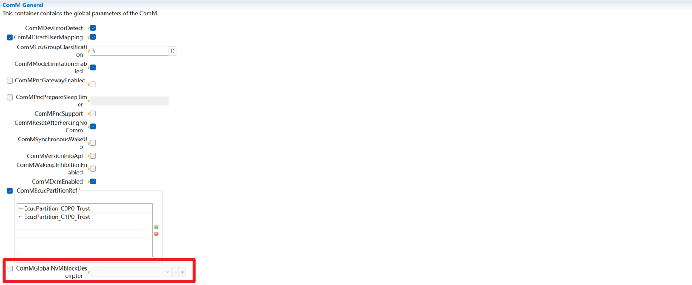
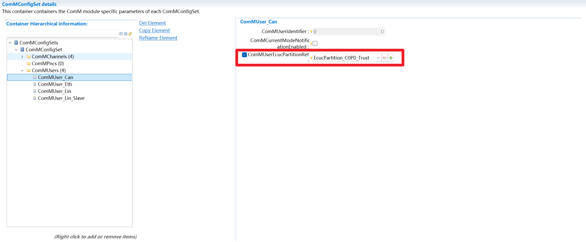

===================
ComM
===================

文档信息（Document Information）
=======================================

版本历史（Version History）
-----------------------------------

.. list-table::
   :widths: 10 10 10 10 20
   :header-rows: 1

   * - 日期（Date）
     - 作者（Author）
     - 版本（Version）
     - 状态（Status）
     - 说明（Description）
   * - 2024/11/29
     - xiaojian.liang
     - V0.1
     - 发布（Release）
     - 首次发布（First release）
   * - 2025/04/04
     - xiaojian.liang
     - V1.0
     - 发布（Release）
     - 正式发布（Official release）

参考文档（Reference Document）
----------------------------------
.. 如果没有就不存在该章节，或为None

.. list-table::
   :widths: 10 10 30 10
   :header-rows: 1

   * - 编号（Number）
     - 分类（Classification）
     - 标题（Title）
     - 版本（Version）
   * - 1
     - Autosar
     - AUTOSAR_CP_SRS_ModeManagement.pdf
     - R23-11
   * - 2
     - Autosar
     - AUTOSAR_CP_SWS_COMManager.pdf
     - R23-11

术语与简写（Terms and Abbreviations）
========================================

术语（Term）
------------------
   .. :align: center   表格内容居中

.. list-table::
   :widths: 10 40
   :header-rows: 1

   * - 术语（Term）
     - 解释（Explanation）

   * - DCM Active Diagnostic indication
     - DCM 指示一个激活的会话。DCM 因诊断目的需要通道处于 COMM_FULL_COMMUNICATION。
       
       Indicates an active session. The DCM requires the channel to be in COMM_FULL_COMMUNICATION for diagnostic purposes.

   * - Active wake-up
     - 唤醒来自于主机 ECU，例如某个传感器。
       
       The wake-up comes from the host ECU, such as a certain sensor.

   * - Bus sleep
     - 总线不再需要任何通信（例如，CAN 总线睡眠）。
       
       The bus no longer requires any communication (for example, CAN bus sleep).

   * - Communication Channel
     - 确定通信模式。
       
       Determine the communication mode.

   * - Communication Mode
     - 通信模式决定了系统中允许的通信类型。

        The communication mode determines the types of communication allowed in the system.

       "full communication" = COMM_FULL_COMMUNICATION

       "no communication" = COMM_NO_COMMUNICATION

       "silent communication" = COMM_SILENT_COMMUNICATION

       注意： COMM_SILENT_COMMUNICATION 无法被用户直接请求，用于网络管理同步睡眠目的。

       Note: COMM_SILENT_COMMUNICATION cannot be directly requested by the user and is used for network management synchronous sleep purposes.

   * - Fan-out
     - 相同的信息被发送到多个目的地/接收者。
       
       The same information is sent to multiple destinations/recipients.

   * - Independent software component
     - 一个单独开发的软件组件，在ECU上执行一组连贯的功能，并且与其他软件应用程序的接口数量最少。例如，这可以是一个基础软件组件或应用软件组件。
       
       A separately developed software component that performs a set of coherent functions on the ECU and has a minimal number of interfaces with other software applications. For example, this could be a basic software component or an application software component.

   * - Passive wake-up
     - 唤醒来自于另一个 ECU，并通过（例如通过通信总线或唤醒线）传播到当前 ECU。
       
       The wake-up comes from another ECU and is propagated to the current ECU (for example, via a communication bus or a wake-up line).

   * - User
     - ECU 状态管理器模块和通信管理器模块的请求者的概念。用户可以是 BswM、可运行实体、SW-C 或一组 SW-C，它们作为指向 ECU 状态管理器模块和通信管理器模块的单个单元。
       
       The concept of requesters for the ECU State Manager module and the Communication Manager module. A user can be BswM, a runnable entity, a SW-C, or a group of SW-Cs, which act as a single unit pointing to the ECU State Manager module and the Communication Manager module.

   * - User Request
     - 用户可以从 ComM 请求不同的通信模式。
       
       Users can request different communication modes from ComM.

   * - Managed channel
     - 由 ECUC 参数 ComMManageReference 引用的另一个通信通道，一个 Managed 通道只能被引用一次。
       
       Another communication channel referenced by the ECUC parameter ComMManageReference; a Managed channel can only be referenced once.

   * - Managing channel
     - Managing 通道可以通过 ECU 参数 ComMManageReference 引用 1..n 个其他通道。
       
       A Managing channel can reference 1..n other channels through the ECU parameter ComMManageReference.

简写（Abbreviation）
------------------------

.. list-table::
   :widths: 10 20 30
   :header-rows: 1

   * - 简写（Abbreviation）
     - 全称（Full name） 
     - 解释（Explanation）

   * - API
     - Application Programming Interface
     - 应用程序接口

   * - BswM
     - Basic Software Manager
     - 基础软件管理模块

   * - BusSM
     - Bus State Manger
     - 与总线相关的状态管理模块

   * - CanSM
     - Can State Manger
     - Can 总线状态管理模块

   * - DET
     - Default Error Tracer
     - 默认错误检测模块

   * - NM
     - Network Management
     - 网络管理

   * - PDU
     - Protocol Data Unit
     - 协议数据单元

   * - PN
     - Partial Network
     - 部分网络

   * - PNC
     - Partial Network Cluster
     - 部分网络集群

   * - ERA
     - External Request Array
     - 外部请求集合

   * - EIRA
     - External and Internal Request Array
     - 外部和内部请求集合

   * - ComM
     - Communication Manager
     - 通讯管理模块

   * - DCM
     - Diagnostic Communication Manager
     - 诊断通讯管理模块

   * - BusNm
     - Bus Network Management
     - 与总线相关的网络管理模块

   * - NvM
     - Non-Volatile Manager
     - 非易失性管理器

.. 缩写词英文全称中文解释

简介（Introduction）
========================

ComM（COM Manage，通信管理）模块是一个资源管理器，它封装了对基础通信服务的控制。ComM 模块控制与通信相关的基础软件模块，它收集来自通信请求者的总线通信访问请求，并进行协调。

The ComM (Communication Manage) module is a resource manager that encapsulates the control of basic communication services. The ComM module controls the basic software modules related to communication, collects bus communication access requests from communication requesters, and coordinates them.

.. figure:: ../../../_static/参考手册/ComM/ComM在AUTOSAR中的位置.png
   :alt: ComM 在 AUTOSAR 中的位置
   :align: center

   ComM 在 AUTOSAR 中的位置

   The position of ComM in AUTOSAR

ComM 模块的目的是：

The purpose of the ComM module is:

   - 为用户简化总线通信栈的使用，包括简化的网络管理处理。

     Simplify the use of the bus communication stack for users, including simplified network management processing.

   - 协调一个ECU上多个独立软件组件的总线通信栈的可用性（允许发送和接收信号）。

     Coordinate the availability of the bus communication stack (allowing sending and receiving of signals) for multiple independent software components on an ECU.

   - 提供一个 API 来禁用发送信号，以防止 ECU（主动地）唤醒通信总线。

     Provide an API to disable signal transmission, preventing the ECU from (actively) waking up the communication bus.

   - 通过为每个通道实现通道状态机来控制 ECU 的多个通信总线通道。

     Control multiple communication bus channels of the ECU by implementing a channel state machine for each channel.

   - 提供迫使 ECU 保持总线唤醒的“无通讯”模式的可能性。

     Provide the possibility of a "no communication" mode that forces the ECU to keep the bus awake.

   - 通过分配请求的通信模式所需的所有资源来简化资源管理。

     Simplify resource management by allocating all resources required for the requested communication mode.

功能描述（Functional Description）
==========================================
.. 本章节仅描述模块支持的功能大致情况，不宜做细致描述；更加细致的描述在配置章节，结合配置，从集成角度描述

特性（Features）
-------------------------

Channel 与 PNC 状态管理功能（Channel and PNC Status Management Function）
~~~~~~~~~~~~~~~~~~~~~~~~~~~~~~~~~~~~~~~~~~~~~~~~~~~~~~~~~~~~~~~~~~~~~~~~~
AUTOSAR 中，通过 ComM 系统服务实现对通信状态的管理。用户上电唤醒时通过主动请求通信 FULL_COMMUNICATION 或被动唤醒通知，用户休眠时请求
NO_COMMUNICATION 释放通信，ComM 接收到请求后通过相应总线的 SM 模块和 NM 模块实现对总线通信状态的切换。用户无需再与各个通信总线的状态管理
模块和网络管理模块进行交互。一个用户可以对应多个通道和多个PNC。当用户请求 FULL_COMMUNICATION 来请求通信时，该用户对应的所有 channel 和
PNC 都需要切换为 FULL_COMMUNICATION 的状态。在发生被动唤醒时，例如由 ECUM 发出的唤醒请求或者由网络管理模块发出的重启通信请求，对应的
channel 和 PNC 需要切换为 FULL_COMMUNICATION的状态。ComM 为每个 channel 和每个 PNC 都提供一个独立的状态机。

In AUTOSAR, the management of communication status is implemented through the ComM system service. When a user powers on and wakes up, they actively request FULL_COMMUNICATION or receive a passive wake-up notification. When the user enters hibernation, they request NO_COMMUNICATION to release communication. After receiving the request, ComM switches the bus communication status through the SM module and NM module of the corresponding bus. Users no longer need to interact with the status management modules and network management modules of each communication bus.
A user can correspond to multiple channels and multiple PNCs. When a user requests communication via FULL_COMMUNICATION, all channels and PNCs corresponding to that user need to switch to the FULL_COMMUNICATION state. In the case of passive wake-up, such as a wake-up request from ECUM or a request to restart communication from the network management module, the corresponding channels and PNCs need to switch to the FULL_COMMUNICATION state. ComM provides an independent state machine for each channel and each PNC.

ComM 模块实现了PNC（局域网络集群）管理功能，在 ComM 中可配置 PNC，并且该 PNC 可以被通道和用户所引用，每个 PNC 在总线上使用 NM Pnc Bit
Vector 中的专用位位置。如果节点上的本地 ComM 用户请求了 PNC，则该节点会将 NM Pnc Bit Vector 中的相应位设置为 1。如果不再请求 PNC，节
点将 NM Pnc Bit Vector 中的相应位设置为 0。Nm 模块通过 BusNm 收集并聚集 PNC 的 NM Pnc Bit Vector，传递给 ComM。ComM 通过信号的内容
，更新PNC状态机的状态。

The ComM module implements the PNC (Partial Network Cluster) management function. PNCs can be configured in ComM, and these PNCs can be referenced by channels and users. Each PNC uses a dedicated bit position in the NM Pnc Bit Vector on the bus. If a local ComM user on a node requests a PNC, the node will set the corresponding bit in the NM Pnc Bit Vector to 1. If the PNC is no longer requested, the node will set the corresponding bit in the NM Pnc Bit Vector to 0. The Nm module collects and aggregates the NM Pnc Bit Vectors of PNCs through BusNm and transmits them to ComM. ComM updates the state of the PNC state machine based on the content of the signal.

PNC 可以设置为网关类型和非网关类型，网关类型主要用于当局域网连接到一个以上的通道时，需要进行协调，通道可以配置为 Active（主动）类型和
Passive（被动）类型，Passive 类型存在于当被动协调通道连接到多个 PNC 网关。 如果启用了 ComM 的 PNC 网关功能
（ComMPNCGatewayEnabled = true）可以将映射到此网关的 ComM 通道设置为主动或被动类型（COMM_GATEWAY_TYPE_ACTIVE 或
COMM_GATEWAY_TYPE_PASSIVE）。如果 ComM 通道映射到两个不同的 PNC 网关，则只有一个网关主动协调此通道，而另一个则被动协调。这意味着，PNC
网关始终映射到至少一个 ComM 通道类型为主动，并且可以映射到一个或多个 ComM 通道类型为被动。当 PNC 只要有一个 Active 通道收到 ERA 中为请求
，则 Passive 通道发送当前 PNC 为请求的 Nm Pdu；当前 Gateway 的 PNC 中所有 Active 通道收到 ERA 标识 PNC 为释放状态，发送当前 PNC 为
释放的 Nm Pdu；这种表现可以简单理解为 Gateway 从 Active 通道向 Passive 转发 ERA PNC信息。

PNCs can be set as gateway type or non-gateway type. The gateway type is mainly used for coordination when a local area network is connected to more than one channel. Channels can be configured as Active type or Passive type. The Passive type exists when a passively coordinated channel is connected to multiple PNC gateways. 
If the PNC gateway function of ComM is enabled (ComMPNCGatewayEnabled = true), the ComM channels mapped to this gateway can be set as active or passive type (COMM_GATEWAY_TYPE_ACTIVE or COMM_GATEWAY_TYPE_PASSIVE). If a ComM channel is mapped to two different PNC gateways, only one gateway will actively coordinate this channel, while the other will coordinate it passively. This means that a PNC gateway is always mapped to at least one ComM channel of active type and can be mapped to one or more ComM channels of passive type.
When a PNC has at least one Active channel that receives a request in the ERA, the Passive channel sends an Nm Pdu indicating that the current PNC is in the requested state; when all Active channels in the PNC of the current Gateway receive the ERA identifier indicating that the PNC is in the released state, they send an Nm Pdu indicating that the current PNC is in the released state. This behavior can be simply understood as the Gateway forwarding ERA PNC information from the Active channel to the Passive channel.

Channel 状态机（Channel state machine）
****************************************************
ComM 为每个通道都实现了一个状态机，ComM 通道有三个主要状态，分别为 COMM_NO_COMMUNICATION、COMM_SILENT_COMMUNICATION 和
COMM_FULL_COMMUNICATION，其中 COMM_SILENT_COMMUNICATION 状态用于网络管理内部状态同步，用户不可请求。COMM_NO_COMMUNICATION 内部包
含 COMM_NO_COM_NO_PENDING_REQUEST 和 COMM_NO_COM_REQUEST_PENDING 两个子状态，COMM_FULL_COMMUNICATION 内部包含
COMM_FULL_COM_NETWORK_REQUESTED 和 COMM_FULL_COM_READY_SLEEP两个子状态。ComM通道状态机如下图所示。

ComM implements a state machine for each channel. A ComM channel has three main states: COMM_NO_COMMUNICATION, COMM_SILENT_COMMUNICATION, and COMM_FULL_COMMUNICATION. Among them, the COMM_SILENT_COMMUNICATION state is used for internal state synchronization of network management and cannot be requested by users. 
COMM_NO_COMMUNICATION internally includes two sub-states: COMM_NO_COM_NO_PENDING_REQUEST and COMM_NO_COM_REQUEST_PENDING. COMM_FULL_COMMUNICATION internally includes two sub-states: COMM_FULL_COM_NETWORK_REQUESTED and COMM_FULL_COM_READY_SLEEP. The state machine of the ComM channel is shown in the following figure.

.. figure:: ../../../_static/参考手册/ComM/ComM通道状态机.png
   :alt: ComM 通道状态机
   :align: center

   ComM 通道状态机

   ComM Channel State Machine

PNC 状态机（PNC state machine）
***************************************
ComM 为每个 PNC（局域网集群）实现一个状态机，每个 PNC 都有其自己的状态，通过配置映射，PNC 的状态与 channel 的状态有关。ComM 用户可以请求
和释放 PNC，系统通道节点上所有 PNC 的状态通过网络管理报文进行交换。每个 PNC 在总线上使用网络管理报文中的 Pnc Bit Vector 中的专用位位置。
如果该节点上的本地 ComM 用户请求了 PNC，则该节点会将网络管理报文中 Pnc Bit Vector 中的相应位设置为 1。如果该 PNC 不再被请求，节点将网络
管理报文中 Pnc Bit Vector 中的相应位设置为 0。BusNm 收集网络管理报文中的 Pnc Bit Vector，传递给 Nm 模块，Nm 模块聚合接收到的 Pnc Bit
Vector 信息，并通过 ComM_Nm_UpdateEIRA/ComM_Nm_UpdateERA 提供给 ComM。

ComM implements a state machine for each PNC (Partial Network Cluster), and each PNC has its own state. Through configuration mapping, the state of a PNC is related to the state of the channel. ComM users can request and release PNCs, and the states of all PNCs on the system channel nodes are exchanged through network management messages. Each PNC uses a dedicated bit position in the Pnc Bit Vector within the network management message on the bus.
If a local ComM user on the node requests a PNC, the node will set the corresponding bit in the Pnc Bit Vector of the network management message to 1. If the PNC is no longer requested, the node will set the corresponding bit in the Pnc Bit Vector of the network management message to 0. BusNm collects the Pnc Bit Vector from the network management messages and transmits it to the Nm module. The Nm module aggregates the received Pnc Bit Vector information and provides it to ComM through ComM_Nm_UpdateEIRA/ComM_Nm_UpdateERA.

在每个系统通道上，每个 PNC 在 Pnc Bit Vector 中使用相同的位位置。ComM 使用两种类型的位向量 EIRA 和 ERA 进行 PNC 状态信息交换。EIRA 体现
了当前节点与网络上其他节点对某一个 PNC 的请求与释放情况；EIRA 不区分物理通道，只针对不同的 PN，ERA 则是在网关节点才使用，用于表示不同的通道对
Pn 的外部请求。ComM PNC 有两个主要状态，分别为 COMM_PNC_NO_COMMUNICATION、COMM_PNC_FULL_COMMUNICATION。
COMM_PNC_FULL_COMMUNICATION 内部有 COMM_PNC_PREPARE_SLEEP，COMM_PNC_READY_SLEEP 和 COMM_PNC_REQUESTED三个子状态。
ComM PNC 的状态机如下图所示。

On each system channel, each PNC uses the same bit position in the Pnc Bit Vector. ComM uses two types of bit vectors, EIRA and ERA, for exchanging PNC state information. EIRA reflects the request and release status of a specific PNC by the current node and other nodes on the network; EIRA does not distinguish between physical channels and only targets different PNs. ERA is used only in gateway nodes to represent external requests for PNs from different channels.
ComM PNC has two main states: COMM_PNC_NO_COMMUNICATION and COMM_PNC_FULL_COMMUNICATION. COMM_PNC_FULL_COMMUNICATION internally includes three sub-states: COMM_PNC_PREPARE_SLEEP, COMM_PNC_READY_SLEEP, and COMM_PNC_REQUESTED.
The state machine of ComM PNC is shown in the following figure.

.. figure:: ../../../_static/参考手册/ComM/ComMPNC状态机.png
   :alt: ComM PNC 状态机
   :align: center

   ComM PNC 状态机

   ComM PNC State Machine

通信抑制（Communication suppression）
~~~~~~~~~~~~~~~~~~~~~~~~~~~~~~~~~~~~~~~
通信抑制是 ComM 中的扩展功能，ComM 释放了功能抑制的接口与配置，功能抑制以通道为单位，各通道内的功能抑制相互独立。功能抑制分为唤醒抑制与无通信抑制。

Communication suppression is an extended function in ComM. ComM provides interfaces and configurations for function suppression. Function suppression is performed on a per-channel basis, and the function suppression within each channel is independent of each other. Function suppression is divided into wake-up suppression and no-communication suppression.

唤醒抑制：表现为通道处于 COMM_NO_COMMUNICATION 或 COMM_SILENT_COMMUNICATION 状态时忽略 User 对通道的 FULL_COMMUNICATION 请求，但
通道的被动唤醒功能不受影响，当全局配置项打开的情况下，唤醒抑制可以通过API来控制。

Wake-up suppression: It behaves as ignoring the user's FULL_COMMUNICATION request for the channel when the channel is in the COMM_NO_COMMUNICATION or COMM_SILENT_COMMUNICATION state, but the passive wake-up function of the channel is not affected. When the global configuration item is enabled, wake-up suppression can be controlled through an API.

NoCom 抑制：表现为限制通道切换到 COMM_FULL_COMMUNICATION 与 COMM_SILENT_COMMUNICATION 状态，当全局配置项打开的情况下，NoCom 抑制也
可以通过 API 来控制。

NoCom suppression: It behaves as restricting the channel from switching to the COMM_FULL_COMMUNICATION and COMM_SILENT_COMMUNICATION states. When the global configuration item is enabled, NoCom suppression can also be controlled through an API.

managed 通道与 managing 通道（managed channel and managing channel）
~~~~~~~~~~~~~~~~~~~~~~~~~~~~~~~~~~~~~~~~~~~~~~~~~~~~~~~~~~~~~~~~~~~~~~~
一个通道可以被配置为 managed 通道和 managing 通道，即被其他通道管理的通道和管理其他通道的通道。一个通道为 managed 通道还是 managing 通
道是由配置参数 ComMManageReference 来决定的，如果通道 1 通过配置项 ComMManageReference 引用了通道 2，那么通道 1 为 managed 通道，
通道 2 为 managing 通道。其中 managed 通道的 ComMNmVariant（配置参数）为 LIGHT， managing 通道的 ComMNmVariant 为 FULL。

A channel can be configured as a managed channel or a managing channel, i.e., a channel managed by other channels or a channel that manages other channels. Whether a channel is a managed channel or a managing channel is determined by the configuration parameter ComMManageReference. If channel 1 references channel 2 through the configuration item ComMManageReference, then channel 1 is a managed channel and channel 2 is a managing channel. Among them, the ComMNmVariant (configuration parameter) of the managed channel is LIGHT, and the ComMNmVariant of the managing channel is FULL.

如果一个 managed 通道被用户主动或 ECUM 被动唤醒请求 FULL_COMMUNICATION ，那么它的 managing 通道也需要请求 FULL_COMMUNICATION。当一
个managing通道想要切换到 NO_COMMUNICATION 的时候，一定需要它的 managed 通道都没有请求 FULL_COMMUNICATION 时才能切换状态。

If a managed channel is requested for FULL_COMMUNICATION by an active user request or a passive wake-up from ECUM, its managing channel also needs to request FULL_COMMUNICATION. When a managing channel wants to switch to NO_COMMUNICATION, it can only switch states when all its managed channels have no requests for FULL_COMMUNICATION.

.. only:: doc_pbs

  多变体支持（Multi-variant support）
  ~~~~~~~~~~~~~~~~~~~~~~~~~~~~~~~~~~~~~~~~~~~~~~~~~~~~~~~~~~~
  ComM 支持 PNC 相关功能的多变体配置，具体支持多变体的配置项如下：

  - ComMPncEnabled: 支持在不同变体中配置是否启用 PNC 功能。
 
    ComMPncEnabled: Supports configuring whether to enable the PNC function in different variants.
 
  - ComMChannelPerPnc: 支持同一个 PNC 在不同变体中关联不同的通道。
 
    ComMChannelPerPnc: Supports associating the same PNC with different channels in different variants.
 
  - ComMUserPerPnc: 支持同一个 PNC 在不同变体中关联不同的 User。
 
    ComMUserPerPnc: Supports associating the same PNC with different Users in different variants.

偏差（Deviation）
--------------------------
.. 有序列表示例

#. 不支持 ComMNmVariant = SLAVE_ACTIVE | SLAVE_PASSIVE。

   因为 ComM_BusSM_BusSleepMode 和 LinSM 模块在时序上有冲突 ，所以未实现，相关功能可用 ComMNmVariant = LIGHT 代替。

   ComMNmVariant = SLAVE_ACTIVE | SLAVE_PASSIVE is not supported.

   It is not implemented because there is a timing conflict between the ComM_BusSM_BusSleepMode and the LinSM module, and the related functions can be replaced by ComMNmVariant = LIGHT.

#. 不支持 ComMTMinFullComModeDuration。

   因为 ComMTMinFullComModeDuration 用于防止 ComMNmVariant = LIGHT | NONE 的通道状态在 COMM_NO_COMMUNICATION 和
   COMM_FULL_COMMUNICATION 之间反复跳变，仅用于 LIGHT 通道可以通过 ComMLightTimeout 实现，NONE 通道不会切换到
   COMM_NO_COMMUNICATION，不需要使用 ComMTMinFullComModeDuration。

   ComMTMinFullComModeDuration is not supported.

   Because ComMTMinFullComModeDuration is used to prevent the channel status of ComMNmVariant = LIGHT | NONE from repeatedly switching between COMM_NO_COMMUNICATION and COMM_FULL_COMMUNICATION, it is only used for LIGHT channels and can be implemented through ComMLightTimeout. NONE channels will not switch to COMM_NO_COMMUNICATION, so ComMTMinFullComModeDuration is not needed.

#. 不支持 ComM0PncVectorAvoidance。

   ComM0PncVectorAvoidance is not supported.

#. 不支持 Dynamic PNC-to-channel-mapping。

   Dynamic PNC-to-channel-mapping is not supported.

#. 不支持模块间版本一致性检查。
  
   Inter-module version consistency check is not supported.

扩展（Extension）
--------------------------------------

None

集成（Integration）
===========================

文件列表（File list）
-------------------------------

静态文件（Static files）
~~~~~~~~~~~~~~~~~~~~~~~~

.. list-table::
   :widths: 10 30
   :header-rows: 1

   * - 文件（File）
     - 描述（Description）

   * - ComM.h
     - ComM 外部接口实现头文件
       
       ComM External Interface Implementation Header File

   * - ComM_BswM.h
     - ComM 为 BswM 提供的回调函数实现头文件
       
       Header file for the implementation of callback functions provided by ComM for BswM

   * - ComM_Dcm.h
     - ComM 为 Dcm 提供的回调函数实现头文件
       
       Header file for the implementation of callback functions provided by ComM for Dcm

   * - ComM_EcuM.h
     - ComM 为 EcuM 提供的回调函数实现头文件
       
       Header file for the implementation of callback functions provided by ComM for EcuM

   * - ComM_Internal.h
     - ComM 内部实现公共头文件
       
       ComM Internal Implementation Common Header File

   * - ComM_Nm.h
     - ComM 为 Nm 提供的回调函数实现头文件
       
       Header file for the implementation of callback functions provided by ComM for Nm

   * - ComM_Channel.h
     - ComM 通道实现头文件
       
       ComM Channel Implementation Header File

   * - ComM_Pnc.h
     - ComM PNC 实现头文件
       
       ComM PNC Implementation Header File

   * - ComM_User.h
     - ComM 用户实现头文件
       
       ComM User Implementation Header File

   * - ComM_InternalSM.h
     - ComM Internal SM 实现头文件
       
       ComM Internal SM Implementation Header File

   * - ComM_Channel.c
     - ComM 通道实现源文件
       
       ComM Channel Implementation Source File

   * - ComM_Pnc.c
     - ComM PNC 实现源文件
       
       ComM PNC Implementation Source File

   * - ComM_User.c
     - ComM 用户实现源文件
       
       ComM User Implementation Source File

   * - ComM_InternalSM.c
     - ComM Internal SM 实现源文件
       
       ComM Internal SM Implementation Source File

动态文件（Dynamic file）
~~~~~~~~~~~~~~~~~~~~~~~~~~~~

.. list-table::
   :widths: 10 30
   :header-rows: 1

   * - 文件（File）
     - 描述（Description）

   * - ComM_Cfg.h
     - ComM Pre-Compile 配置头文件
       
       ComM Pre-Compile Configuration Header File

   * - ComM_Cfg.c
     - ComM Pre-Compile 配置源文件
       
       ComM Pre-Compile Configuration Source File

   * - ComM_PBcfg.c
     - ComM Post-Build 配置源文件
       
       ComM Post-Build Configuration Source File

错误处理（Error handling）
--------------------------------

开发错误（Development errors）
~~~~~~~~~~~~~~~~~~~~~~~~~~~~~~~~~~
.. list-table::
   :widths: 20 10 30
   :header-rows: 1

   * - Error code
     - Value[hex]
     - Description

   * - COMM_E_UNINIT
     - 0x01
     - API service used without module initialization.

   * - COMM_E_WRONG_PARAMETERS
     - 0x02
     - API service used with wrong parameters.

   * - COMM_E_PARAM_POINTER
     - 0x03
     - API Service used with a null pointer.

   * - COMM_E_INVALID_PARTITION_CONTEXT
     - 0x05
     - API service used on wrong partitions.

   * - COMM_E_ALREADY_INITIALIZED
     - 0x06
     - Multiple calls to Initialization functions.

产品错误（Product error）
~~~~~~~~~~~~~~~~~~~~~~~~~~~~~~~~~~~~~~~~~~~~~~
None

运行时错误（Runtime error）
~~~~~~~~~~~~~~~~~~~~~~~~~~~~~~~~~~
None

接口描述（Interface Description）
======================================

.. 目前能够自动生成的有类型定义，普通函数，回调函数。
.. 有些模块的API来自多个头文件，需要自行裁剪合并
.. 引用接口描述。来自于code->doxygen->xml->rst
.. include:: ComM_h_api.rst
.. include:: ComM_BswM_h_api.rst
.. include:: ComM_Dcm_h_api.rst
.. include:: ComM_EcuM_h_api.rst
.. include:: ComM_Nm_h_api.rst

配置函数（Configuration function）
----------------------------------------
.. 可选的章节，根据模块实际情况确定
.. 格式同提供的服务

ComM_MainFunction
~~~~~~~~~~~~~~~~~~~~~~~~~~~~~~~~~~~~~~~~~~~~~~~~~~~~~~~~~~~~~~~~~~~~~~~~~~~~~~~~~~~~

.. code::

   void ComM_MainFunction_<ComMChannel.ShortName>(void)

This function shall perform the processing of the AUTOSAR ComM activities that are not directly initiated by the calls
e.g. from the RTE. There shall be one dedicated Main Function for each channel of ComM.

**Sync/Async**
   Synchronous

**Reentrancy**
   Non Reentrant

**Return type**
   void

依赖的服务（Dependent services）
-----------------------------------------

强制接口（Mandatory interface）
~~~~~~~~~~~~~~~~~~~~~~~~~~~~~~~~~~~~~~~~~~
.. 可选的章节，根据模块实际情况确定

.. list-table::
   :widths: 10 5 30
   :header-rows: 1

   * - API Function
     - Header File
     - Description

   * - <Bus>SM_RequestComMode
     - <Bus>SM.h
     - Function to request a communication mode from the <Bus> State Manager.

   * - BswM_ComM_CurrentMode
     - BswM_ComM.h
     - Function called by ComM to indicate the current communication mode of a ComM channel.

   * - Dcm_ComM_FullComModeEntered
     - Dcm_ComM.h
     - This call informs the Dcm module about a ComM mode change to COMM_FULL_COMMUNICATION.

   * - Dcm_ComM_NoComModeEntered
     - Dcm_ComM.h
     - This call informs the Dcm module about a ComM mode change to COMM_NO_COMMUNICATION.

   * - Dcm_ComM_SilentComModeEntered
     - Dcm_ComM.h
     - This call informs the Dcm module about a ComM mode change to COMM_SILENT_COMMUNICATION.

   * - Nm_NetworkRelease
     - Nm.h
     - This function calls the <Bus>Nm_NetworkRelease bus specific function in case NmBusType is not set to NM_BUSNM_LOCALNM (e.g. CanNm_NetworkRelease function is called if channel is configured as CAN).

   * - Nm_NetworkRequest
     - Nm.h
     - This function calls the <Bus>Nm_NetworkRequest (e.g. CanNm_NetworkRequest function is called if channel is configured as CAN) function in case Nm BusType is not set to NM_BUSNM_LOCALNM.

   * - Nm_PassiveStartUp
     - Nm.h
     - This function calls the <Bus>Nm_PassiveStartUp function in case NmBusType is not set to NM_BUSNM_LOCALNM (e.g. CanNm_PassiveStartUp function is called for NM_BUSNM_CANNM)

可选接口（Optional interface）
~~~~~~~~~~~~~~~~~~~~~~~~~~~~~~~~~~~~~~~
.. 可选的章节，根据模块实际情况确定
.. 格式同强制接口

.. list-table::
   :widths: 10 5 30
   :header-rows: 1

   * - API Function
     - Header File
     - Description

   * - BswM_ComM_CurrentPNCMode
     - BswM_ComM.h
     - Function is called by ComM to indicate the current mode of the PNC.

   * - BswM_ComM_InitiateReset
     - BswM_ComM.h
     - Function is called by ComM to signal a shutdown.

   * - Det_ReportError
     - Det.h
     - Service to report development errors.

   * - Nm_UpdateIRA
     - Nm.h
     - Tndication by ComM of internal PNC requests. This is used to aggregate the internal PNC requests.

配置接口（Configuration Interface）
~~~~~~~~~~~~~~~~~~~~~~~~~~~~~~~~~~~~~~~~~

.. list-table::
   :widths: 10 5 30
   :header-rows: 1

   * - API Function
     - Header File
     - Description

   * - SchM_Enter_ComM_Global
     - SchM_ComM.h
     - Enter exclusive area Global.

   * - SchM_Exit_ComM_Global
     - SchM_ComM.h
     - Enter exclusive area Global.

   * - SchM_Enter_ComM_Pnc
     - SchM_ComM.h
     - Enter exclusive area Pnc.

   * - SchM_Exit_ComM_Pnc
     - SchM_ComM.h
     - Enter exclusive area Pnc.

   * - SchM_Enter_ComM_UM
     - SchM_ComM.h
     - Enter exclusive area UM.

   * - SchM_Exit_ComM_UM
     - SchM_ComM.h
     - Enter exclusive area UM.

   * - SchM_Enter_ComM_CommunicationInhibition
     - SchM_ComM.h
     - Enter exclusive area CommunicationInhibition.

   * - SchM_Exit_ComM_CommunicationInhibition
     - SchM_ComM.h
     - Enter exclusive area CommunicationInhibition.

   * - SchM_Enter_ComM_Channel
     - SchM_ComM.h
     - Enter exclusive area Channel.

   * - SchM_Exit_ComM_Channel
     - SchM_ComM.h
     - Enter exclusive area Channel.

配置（configuration）
================================================================
.. 1. 配置建议以 **功能** 为导向，从 **集成** 的角度，挑重点，常用，典型配置举例讲解。示例中若需要依赖其他模块的配置，也可以截图描述，配置截图不局限于本模块。重点是功能导向，把一件事讲清楚
.. 2. 不必呈现所有容器，配置细节的属性，可能用户不太关心
.. 3. 配置项描述等信息，在工具界面上都能看到

通信抑制功能中对 NvM 的配置依赖（Configuration dependency on NvM in the communication suppression function）
-------------------------------------------------------------------------------------------------------------------
如果要启用 NvM 存储功能， **ComMGlobalNvMBlockDescriptor** 必须被配置，反之亦然。ComM 不会主动读写 NVRAM block，相关工作需要在工程集成
时完成。

If the NvM storage function is to be enabled, **ComMGlobalNvMBlockDescriptor** must be configured, and vice versa. ComM does not actively read or write NVRAM blocks; the relevant work needs to be completed during project integration.

   ComMGlobalNvMBlockDescriptor

ComM 提供 **ComM_InhibitionData** 和 **ComM_InhibitionDefault** 用于 **NvMRamBlockDataAddress** 和 **NvMRomBlockDataAddress** 的配置。
**NvMBlockHeaderInclude** 需要配置为 "ComM.h"。

ComM provides **ComM_InhibitionData** and **ComM_InhibitionDefault** for the configuration of **NvMRamBlockDataAddress** and **NvMRomBlockDataAddress**.  
**NvMBlockHeaderInclude** needs to be configured as "ComM.h".

.. important::

   在 ComM_Init() 被调用之前， `ComMGlobalNvMBlockDescriptor` 对应的 NVRAM block 必须被读取完成。

   Before ComM_Init() is called, the NVRAM block corresponding to ComMGlobalNvMBlockDescriptor must have been read completely.

   在 ComM_Deinit() 被调用之后，对应的 NVRAM block 需要被存储。

   After ComM_Deinit() is called, the corresponding NVRAM block needs to be stored.

NVRAM block 的大小根据结构类型 **ComM_InhibitionType** 计算得出，成员布局如下：

The size of the NVRAM block is calculated based on the structure type **ComM_InhibitionType**, and the member layout is as follows:

- ComM_InhibitionStatusType::EcuGroupClassification 1Byte
- uint16 InhibitCounter 2Byte
- ComM_InhibitionStatusType::InhibitionStatus[] COMM_CHANNEL_NUMBER * 1Byte

.. attention::

   计算结构体大小时要考虑结构体对齐，结构体大小和配置的通道数目有关。

   When calculating the size of a structure, structure alignment must be taken into account. The size of the structure is related to the number of configured channels.

多分区部署（Multi-partition deployment）
---------------------------------------------

配置项 **ComMEcucPartitionRef** 决定了 ComM 的 API 能够在哪些分区上使用，在单分区系统上不需要配置该参数。

The configuration item ComMEcucPartitionRef determines which partitions the ComM API can be used on. This parameter does not need to be configured in a single-partition system.

ComM 支持将通道和 User 分配到不同的分区，通过配置项 **ComMChannelPartitionRef** 和 **ComMUserEcucPartitionRef** 来实现。在多分区
系统中，所有通道和 User 都必须分配到特定分区。

ComM supports the assignment of channels and Users to different partitions, which is achieved through the configuration items ComMChannelPartitionRef and ComMUserEcucPartitionRef. In a multi-partition system, all channels and Users must be assigned to specific partitions.

.. figure:: ../../../_static/参考手册/ComM/ComMChannelPartitionRef.png
   :name: ComMChannelPartitionRef
   :align: center

   ComMChannelPartitionRef

   ComMUserEcucPartitionRef

.. important::

   ComM_Init() 和 ComM_Deinit() 需要为每一个 **ComMEcucPartitionRef** 中配置的分区调用。

   ComM_Init() and ComM_Deinit() need to be called for each partition configured in ComMEcucPartitionRef.

与特定通道有关的 API 仅能在通道被分配的分区上使用：

APIs related to a specific channel can only be used in the partition to which the channel is assigned:

- ComM_PreventWakeUp
- ComM_LimitChannelToNoComMode
- ComM_GetInhibitionStatus
- ComM_Nm_NetworkStartIndication
- ComM_Nm_NetworkMode
- ComM_Nm_PrepareBusSleepMode
- ComM_Nm_BusSleepMode
- ComM_Nm_RestartIndication
- ComM_Nm_UpdateERA
- ComM_DCM_ActiveDiagnostic
- ComM_DCM_InactiveDiagnostic
- ComM_EcuM_WakeUpIndication
- ComM_CommunicationAllowed
- ComM_BusSM_ModeIndication

与特定 User 有关的 API 仅能在 User 被分配的分区上使用：

APIs related to a specific User can only be used in the partition to which the User is assigned:

- ComM_RequestComMode
- ComM_GetMaxComMode
- ComM_GetRequestedComMode
- ComM_GetCurrentComMode
- ComM_GetCurrentPNCComMode

其余 API 仅能在 **ComMEcucPartitionRef** 中配置的分区中使用。

The remaining APIs can only be used in the partitions configured in **ComMEcucPartitionRef**.

临界区（Critical section）
--------------------------------------

ComM 使用的临界区如下，推荐的配置如下，这一部分在 Rte 模块中配置。

The critical sections used by ComM and their recommended configurations are as follows. This part is configured in the Rte module.

 + ComM_Global

   - 多核场景使用 ``OS_SPINLOCK``

     For multi-core scenarios, use OS_SPINLOCK

   - 单核多分区场景使用 ``ALL_INTERRUPT_BLOCKING``

     For single-core multi-partition scenarios, use ALL_INTERRUPT_BLOCKING

   - 其他场景使用 ``NONE``

     For other scenarios, use NONE

 + Pnc，如果不使用 Pnc 功能，配置为 ``NONE``，否则

   Pnc: If the Pnc function is not used, configure it as NONE; otherwise:

   - 多核场景使用 ``OS_SPINLOCK``
     
     For multi-core scenarios, use OS_SPINLOCK

   - 单核场景使用 ``ALL_INTERRUPT_BLOCKING``

     For single-core scenarios, use ALL_INTERRUPT_BLOCKING

 + UM，如果不使用模式切换接口 ComM_CurrentMode，配置为 ``NONE``，否则

   UM: If the mode switching interface ComM_CurrentMode is not used, configure it as NONE; otherwise：

   - 多核场景使用 ``OS_SPINLOCK``

     For multi-core scenarios, use OS_SPINLOCK

   - 单核场景使用 ``ALL_INTERRUPT_BLOCKING``

     For single-core scenarios, use ALL_INTERRUPT_BLOCKING

 - CommunicationInhibition，如果不使用通信抑制功能，配置为 ``NONE``，否则

   CommunicationInhibition: If the communication inhibition function is not used, configure it as NONE; otherwise:

   - 多核场景使用 ``OS_SPINLOCK``

     For multi-core scenarios, use OS_SPINLOCK

   - 单核场景使用 ``ALL_INTERRUPT_BLOCKING``

     For single-core scenarios, use ALL_INTERRUPT_BLOCKING

 - Channel，配置为 ``ALL_INTERRUPT_BLOCKING``

   Channel: Configure as ALL_INTERRUPT_BLOCKING

Rte_ComM_Types.h文件生成（Generation of Rte_ComM_Types.h file）
---------------------------------------------------------------------

请参考《普华基础软件_参考手册_ORIENTAIS Configurator_V2_使用指南.pdf》的3.6.3章节服务封装使用步骤内容。

Please refer to the content of section 3.6.3 "Steps for Using Service Encapsulation" in the document *"ORIENTAIS_Configurator_V2.2_User_Manual.pdf"*.
