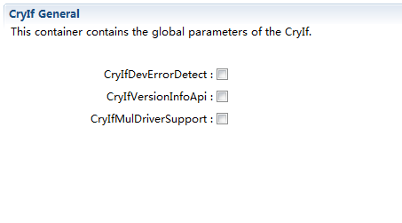
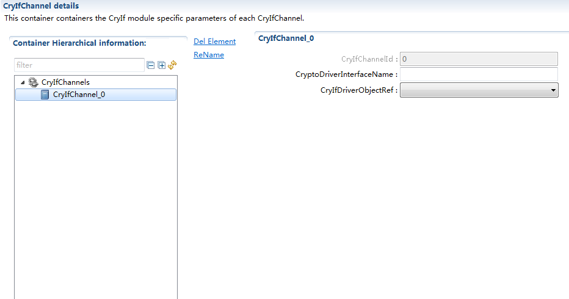

====================
CryIf 产品参考手册
====================

缩写词注解
^^^^^^^^^^

+------------+---------------------------+----------------------------+
|            | **英文全称**              | **中文解释**               |
| **缩写词** |                           |                            |
+------------+---------------------------+----------------------------+
|    HSM     |    Hardware Security      |    硬件安全模块            |
|            |    Module                 |                            |
+------------+---------------------------+----------------------------+
|    SHE     |    Security Hardware      |    安全硬件扩展            |
|            |    Extension              |                            |
+------------+---------------------------+----------------------------+
|    SW      |    Software               |    软件加密算法            |
+------------+---------------------------+----------------------------+
|    HW      |    Hardware               |    硬件加密算法            |
+------------+---------------------------+----------------------------+
|    CDD     |    Complex Device Driver  |    复杂驱动                |
+------------+---------------------------+----------------------------+
|    CSM     |    Crypto Service Manager |    AUTOSAR                 |
|            |                           |    中的加密服务管理 模块   |
+------------+---------------------------+----------------------------+
|    CRYIF   |    Crypto Interface       |    AUTOSAR                 |
|            |                           |    中的加密接口模块        |
+------------+---------------------------+----------------------------+

1 简介
======

   CryIf 模块位于底层密码解决方案(Crypto Driver 和基于 sw 的 CDD)和上层
   服务层(CSM)之间。它表示到上层服务层的密码驱动程序服务的接口。CryIf
   模块 提供了一个独特的接口来管理不同的密码 HW 和 SW 解决方案，如
   HSM、SHE 或基于 SW 的 CDD。因此，基于 Crypto
   接口维护的映射方案，Crypto 服务管理
   模块可以利用多种底层的内部和外部加密 HW 以及 SW 解决方案。

   |image1|

   图 1-1 AUTOSAR 加密栈

   CryIf 模块的主要功能为：

   1、接收 CSM 传输的数据并传输给 Crypto Driver。 2、接收 Crypto Driver
   返回的信息并返回给 CSM。

1.1 参考资料
------------

   [1] AUTOSAR_SWS_CryptoInterface.pdf，R19-11

2 功能描述
==========

2.1 基本功能
------------

   CryIf 位于 CSM 和 Crypto Driver 之间，是访问所有上层(BSW)密码操作的
   唯一接口。密码接口也是密码驱动程序的唯一用户，并提供了一个独特的接口
   来管理不同的密码硬件和软件解决方案。抽象层封装了不同的硬件和软件访问
   机制，因此加密接口的实现独立于底层的加密驱动程序，可以在硬件或软件中
   实现。它还保证了对加密服务的并发访问，使同时处理多个加密任务成为可
   能。

   除此之外，CryIf 支持多驱动，当需要支持多驱动时，打开
   CryIfMulDriverSupport
   开关，并填写不同驱动接口的前缀，即可根据接口名使 用不同的驱动。

3 源文件描述
============

   表 3-1 CryIf 文件描述

+-------------------+--------------------------------------------------+
| **文件**          | **说明**                                         |
+-------------------+--------------------------------------------------+
|    CryIf.c        |    CryIf 模块源文件，包含了 API 函数的实现。     |
+-------------------+--------------------------------------------------+
|    CryIf.h        |    CryIf 模块头文件，包含了 API                  |
|                   |    函数的扩展声明并定义了配置的                  |
|                   |                                                  |
|                   |    数据结构。                                    |
+-------------------+--------------------------------------------------+
|    CryIf_Cfg.h    |    定义 CryIf 模块预编译时用到的配置参数。       |
+-------------------+--------------------------------------------------+
|    CryIf_cfg.c    |    CryIf 模块配置生成文件。                      |
+-------------------+--------------------------------------------------+

..

   |image2|

   图 3-1 CryIf 文件交互关系图

4 API 接口
==========

4.1 类型定义
------------

4.1.1 CryIf_ConfigType 类型定义
~~~~~~~~~~~~~~~~~~~~~~~~~~~~~~~

+-----------+----------------------------------------------------------+
|    名称   |    CryIf_ConfigType                                      |
+-----------+----------------------------------------------------------+
|    类型   |    Structure                                             |
+-----------+----------------------------------------------------------+
|    范围   |    无                                                    |
+-----------+----------------------------------------------------------+
|    描述   |    CryIf 模块配置数据结构                                |
+-----------+----------------------------------------------------------+

4.2 输入函数描述
----------------

+----------------------------+-----------------------------------------+
|    **输入模块**            |    **API**                              |
+----------------------------+-----------------------------------------+
| Det                        |    Det_ReportError                      |
+----------------------------+-----------------------------------------+
|    CSM                     |    Csm_CallbackNotification             |
+----------------------------+-----------------------------------------+
|    Crypto Driver           |    Crypto\_<vi>\_<ai>_ProcessJob()      |
|                            |    Crypto\_<vi>\_<ai>_CancelJob()       |
|                            |    Crypto\_<vi>\_<ai>_KeyElementSet()   |
|                            |    Crypto\_<vi>\_<ai>_KeySetValid()     |
|                            |    Crypto\_<vi>\_<ai>_KeyElementGet()   |
|                            |    Crypto\_<vi>\_<ai>_KeyElementCopy()  |
|                            |    Cry                                  |
|                            | pto\_<vi>\_<ai>_KeyElementCopyPartial() |
|                            |    Crypto\_<vi>\_<ai>_KeyCopy()         |
|                            |    Crypto\_<vi>\_<ai>_RandomSeed()      |
|                            |    Crypto\_<vi>\_<ai>_KeyGenerate()     |
|                            |    Crypto\_<vi>\_<ai>_KeyDerive()       |
|                            |    Cry                                  |
|                            | pto\_<vi>\_<ai>_KeyExchangeCalcPubVal() |
|                            |                                         |
|                            |    Cry                                  |
|                            | pto\_<vi>\_<ai>_KeyExchangeCalcSecret() |
+----------------------------+-----------------------------------------+

4.3 静态接口函数定义
--------------------

CryIf_Init
~~~~~~~~~~

+-------------+-------------------+---------+-------------------------+
|             |    CryIf_Init     |         |                         |
|  函数名称： |                   |         |                         |
+-------------+-------------------+---------+-------------------------+
|             |    FUNC(void,     |         |                         |
|  函数原型： |    CRYIF_CODE)    |         |                         |
|             |                   |         |                         |
|             |    CryIf_Init(    |         |                         |
|             |                   |         |                         |
|             |    P2CONST(       |         |                         |
|             | CryIf_ConfigType, |         |                         |
|             |    AUTOMATIC,     |         |                         |
|             |                   |         |                         |
|             |  CRYIF_APPL_DATA) |         |                         |
|             |                   |         |                         |
|             |    configPtr      |         |                         |
|             |                   |         |                         |
|             |    )              |         |                         |
+-------------+-------------------+---------+-------------------------+
|             |    0x00           |         |                         |
|  服务编号： |                   |         |                         |
+-------------+-------------------+---------+-------------------------+
|             |    同步           |         |                         |
| 同步/异步： |                   |         |                         |
+-------------+-------------------+---------+-------------------------+
|    是       |    否             |         |                         |
| 否可重入：  |                   |         |                         |
+-------------+-------------------+---------+-------------------------+
|             |    configPtr      |         |    无                   |
|  输入参数： |                   |  值域： |                         |
+-------------+-------------------+---------+-------------------------+
|    输入     |    无             |         |                         |
| 输出参数：  |                   |         |                         |
+-------------+-------------------+---------+-------------------------+
|             |    无             |         |                         |
|  输出参数： |                   |         |                         |
+-------------+-------------------+---------+-------------------------+
|    返回值： |    无             |         |                         |
+-------------+-------------------+---------+-------------------------+
|             |    初始化 CRYIF   |         |                         |
|  功能概述： |    模块           |         |                         |
+-------------+-------------------+---------+-------------------------+

CryIf_GetVersionInfo
~~~~~~~~~~~~~~~~~~~~

+-------------+--------------------------------------------------------+
|             |    CryIf_GetVersionInfo                                |
|  函数名称： |                                                        |
+-------------+--------------------------------------------------------+
|             |    FUNC(void, CRYIF_CODE)                              |
|  函数原型： |                                                        |
|             |    CryIf_GetVersionInfo(                               |
+-------------+--------------------------------------------------------+

+-------------+------------------+---------+------------------------+---+
|             |    P2VAR(Std_    |         |                        |   |
|             | VersionInfoType, |         |                        |   |
|             |    AUTOMATIC,    |         |                        |   |
|             |    CRYIF_APPL_   |         |                        |   |
|             | DATA)versioninfo |         |                        |   |
|             |                  |         |                        |   |
|             |    )             |         |                        |   |
+-------------+------------------+---------+------------------------+---+
|             |    0x01          |         |                        |   |
|  服务编号： |                  |         |                        |   |
+-------------+------------------+---------+------------------------+---+
|             |    同步          |         |                        |   |
| 同步/异步： |                  |         |                        |   |
+-------------+------------------+---------+------------------------+---+
|    是       |    是            |         |                        |   |
| 否可重入：  |                  |         |                        |   |
+-------------+------------------+---------+------------------------+---+
|             |    versioninfo   |         |    无                  |   |
|  输入参数： |                  |  值域： |                        |   |
+-------------+------------------+---------+------------------------+---+
|    输入     |    无            |         |                        |   |
| 输出参数：  |                  |         |                        |   |
+-------------+------------------+---------+------------------------+---+
|             |    无            |         |                        |   |
|  输出参数： |                  |         |                        |   |
+-------------+------------------+---------+------------------------+---+
|    返回值： |    无            |         |                        |   |
+-------------+------------------+---------+------------------------+---+
|             |    获取版本信息  |         |                        |   |
|  功能概述： |                  |         |                        |   |
+-------------+------------------+---------+------------------------+---+

CryIf_ProcessJob
~~~~~~~~~~~~~~~~

+-------------+------------+------+------------------------------------+
|             |    CryIf_  |      |                                    |
|  函数名称： | ProcessJob |      |                                    |
+-------------+------------+------+------------------------------------+
|             |            |      |                                    |
|  函数原型： | FUNC(Std_R |      |                                    |
|             | eturnType, |      |                                    |
|             |    C       |      |                                    |
|             | RYIF_CODE) |      |                                    |
|             |    CryIf_P |      |                                    |
|             | rocessJob( |      |                                    |
|             |            |      |                                    |
|             |    uint32  |      |                                    |
|             |            |      |                                    |
|             | channelId, |      |                                    |
|             |            |      |                                    |
|             |    P       |      |                                    |
|             | 2VAR(Crypt |      |                                    |
|             | o_JobType, |      |                                    |
|             |            |      |                                    |
|             | AUTOMATIC, |      |                                    |
|             |            |      |                                    |
|             |  CRYIF_APP |      |                                    |
|             | L_DATA)job |      |                                    |
|             |            |      |                                    |
|             |    )       |      |                                    |
+-------------+------------+------+------------------------------------+
|             |    0x03    |      |                                    |
|  服务编号： |            |      |                                    |
+-------------+------------+------+------------------------------------+
|             |            |      |                                    |
| 同步/异步： | 取决于配置 |      |                                    |
+-------------+------------+------+------------------------------------+
|    是       |    是      |      |                                    |
| 否可重入：  |            |      |                                    |
+-------------+------------+------+------------------------------------+
|             |            |      |    CRYIF_CHANNELS_MAX_CONFIGURED   |
|  输入参数： |  channelId |   值 |                                    |
|             |            | 域： |                                    |
+-------------+------------+------+------------------------------------+
|    输入     |    job     |      |                                    |
| 输出参数：  |            |      |                                    |
+-------------+------------+------+------------------------------------+
|             |    无      |      |                                    |
|  输出参数： |            |      |                                    |
+-------------+------------+------+------------------------------------+
|    返回值： |    E_OK    |      |                                    |
|             | ：请求成功 |      |                                    |
|             |            |      |                                    |
|             |            |      |                                    |
|             |   E_NOT_OK |      |                                    |
|             | ：请求失败 |      |                                    |
+-------------+------------+------+------------------------------------+

+------------+-------------------------------------------------------+---+
|            |    CRYPTO_E_BUSY：请求失败，Crypro 驱动对象忙         |   |
|            |    CRYPTO_E_KEY_NOT_VALID：请求失败，密钥无效         |   |
|            |    C                                                  |   |
|            | RYPTO_E_KEY_SIZE_MISMATCH：请求失败，一个密钥元素的大 |   |
|            |    小错误，请求失败，队列已满                         |   |
|            |                                                       |   |
|            |  CRYPTO_E_KEY_READ_FAIL：服务请求失败，因为不允许提取 |   |
|            |    key 元素                                           |   |
|            |    CR                                                 |   |
|            | YPTO_E_KEY_WRITE_FAIL：服务请求失败，因为写入访问失败 |   |
|            |    C                                                  |   |
|            | RYPTO_E_KEY_NOT_AVAILABLE：服务请求失败，因为密钥不可 |   |
|            |    用                                                 |   |
|            |                                                       |   |
|            |    CRYPTO_E_SMALL_BUFFER：提供的存储结果缓冲区太小    |   |
|            |    C                                                  |   |
|            | RYPTO_E_JOB_CANCELLED：服务请求失败，因为同步作业已被 |   |
|            |    取消                                               |   |
|            |                                                       |   |
|            |    CRYPTO_E_KEY_EMPTY：请求失败，因为未初始化的源 key |   |
|            |    元素                                               |   |
+------------+-------------------------------------------------------+---+
|            |    将接收到的 Job 分派给配置的加密驱动程序对象        |   |
| 功能概述： |                                                       |   |
+------------+-------------------------------------------------------+---+

CryIf_CancelJob
~~~~~~~~~~~~~~~

+-------------+-------------------+---------+-------------------------+
|             |                   |         |                         |
|  函数名称： |   CryIf_CancelJob |         |                         |
+-------------+-------------------+---------+-------------------------+
|             |    FUN            |         |                         |
|  函数原型： | C(Std_ReturnType, |         |                         |
|             |    CRYIF_CODE)    |         |                         |
|             |                   |         |                         |
|             |  CryIf_CancelJob( |         |                         |
|             |                   |         |                         |
|             |    uint32         |         |                         |
|             |    channelId,     |         |                         |
|             |                   |         |                         |
|             |    P2VA           |         |                         |
|             | R(Crypto_JobType, |         |                         |
|             |    AUTOMATIC,     |         |                         |
|             |    CR             |         |                         |
|             | YIF_APPL_DATA)job |         |                         |
|             |                   |         |                         |
|             |    )              |         |                         |
+-------------+-------------------+---------+-------------------------+
|             |    0x0e           |         |                         |
|  服务编号： |                   |         |                         |
+-------------+-------------------+---------+-------------------------+
|             |    同步           |         |                         |
| 同步/异步： |                   |         |                         |
+-------------+-------------------+---------+-------------------------+
|    是       |    是             |         |                         |
| 否可重入：  |                   |         |                         |
+-------------+-------------------+---------+-------------------------+
|             |    channelId      |         |    CRYIF_CHANNELS_MAX\_ |
|  输入参数： |                   |  值域： |                         |
|             |                   |         |    CONFIGURED           |
+-------------+-------------------+---------+-------------------------+

+-------------+-------------------------------------------------------+---+
|    输入     |    job                                                |   |
| 输出参数：  |                                                       |   |
+-------------+-------------------------------------------------------+---+
|             |    无                                                 |   |
|  输出参数： |                                                       |   |
+-------------+-------------------------------------------------------+---+
|    返回值： |    E_OK：请求成功，作业已被删除                       |   |
|             |                                                       |   |
|             |    E_NOT_OK：请求失败，无法删除作业                   |   |
+-------------+-------------------------------------------------------+---+
|             |    将 Job 取消函数分派给配置的加密驱动程序对象        |   |
|  功能概述： |                                                       |   |
+-------------+-------------------------------------------------------+---+

CryIf_KeyElementSet
~~~~~~~~~~~~~~~~~~~

+-------------+----------------+--------+------------------------------+
|             |    CryIf       |        |                              |
|  函数名称： | _KeyElementSet |        |                              |
+-------------+----------------+--------+------------------------------+
|             |    FUNC(S      |        |                              |
|  函数原型： | td_ReturnType, |        |                              |
|             |    CRYIF_CODE) |        |                              |
|             |    CryIf_      |        |                              |
|             | KeyElementSet( |        |                              |
|             |                |        |                              |
|             |    uint32      |        |                              |
|             |    cryIfKeyId, |        |                              |
|             |    uint32      |        |                              |
|             |                |        |                              |
|             |  keyElementId, |        |                              |
|             |                |        |                              |
|             |                |        |                              |
|             | P2CONST(uint8, |        |                              |
|             |    AUTOMATIC,  |        |                              |
|             |    CRYIF_APP   |        |                              |
|             | L_DATA)keyPtr, |        |                              |
|             |                |        |                              |
|             |    uint32      |        |                              |
|             |    keyLength   |        |                              |
|             |                |        |                              |
|             |    )           |        |                              |
+-------------+----------------+--------+------------------------------+
|             |    0x04        |        |                              |
|  服务编号： |                |        |                              |
+-------------+----------------+--------+------------------------------+
|             |    同步        |        |                              |
| 同步/异步： |                |        |                              |
+-------------+----------------+--------+------------------------------+
|    是       |    否          |        |                              |
| 否可重入：  |                |        |                              |
+-------------+----------------+--------+------------------------------+
|             |    cryIfKeyId  |        |    CRYIF_KEY_MAX\_           |
|  输入参数： |                | 值域： |                              |
|             |                |        |    CONFIGURED                |
+-------------+----------------+--------+------------------------------+
|             |                |        |    CRYIF_KEYELEMENT_MAX\_    |
|             |   keyElementId |        |                              |
|             |                |        |    CONFIGURED                |
+-------------+----------------+--------+------------------------------+
|             |    keyPtr      |        |    无                        |
+-------------+----------------+--------+------------------------------+
|             |    keyLength   |        |    无                        |
+-------------+----------------+--------+------------------------------+
|    输入     |    无          |        |                              |
| 输出参数：  |                |        |                              |
+-------------+----------------+--------+------------------------------+
|             |    无          |        |                              |
|  输出参数： |                |        |                              |
+-------------+----------------+--------+------------------------------+
|    返回值： |                |        |                              |
|             | E_OK：请求成功 |        |                              |
+-------------+----------------+--------+------------------------------+

+------------+-------------------------------------------------------+---+
|            |    E_NOT_OK：请求失败                                 |   |
+------------+-------------------------------------------------------+---+
|            |    将把 set key element 函数分配给配置好的 crypto     |   |
| 功能概述： |    driver 对象                                        |   |
+------------+-------------------------------------------------------+---+

CryIf_KeySetValid
~~~~~~~~~~~~~~~~~

+-------------+-------------------+---------+-------------------------+
|             |                   |         |                         |
|  函数名称： | CryIf_KeySetValid |         |                         |
+-------------+-------------------+---------+-------------------------+
|             |    FUN            |         |                         |
|  函数原型： | C(Std_ReturnType, |         |                         |
|             |    CRYIF_CODE)    |         |                         |
|             |    C              |         |                         |
|             | ryIf_KeySetValid( |         |                         |
|             |                   |         |                         |
|             |    uint32         |         |                         |
|             |    cryIfKeyId     |         |                         |
|             |                   |         |                         |
|             |    )              |         |                         |
+-------------+-------------------+---------+-------------------------+
|             |    0x05           |         |                         |
|  服务编号： |                   |         |                         |
+-------------+-------------------+---------+-------------------------+
|             |    同步           |         |                         |
| 同步/异步： |                   |         |                         |
+-------------+-------------------+---------+-------------------------+
|    是       |    否             |         |                         |
| 否可重入：  |                   |         |                         |
+-------------+-------------------+---------+-------------------------+
|             |    cryIfKeyId     |         |    CRYIF_KEY_MAX\_      |
|  输入参数： |                   |  值域： |                         |
|             |                   |         |    CONFIGURED           |
+-------------+-------------------+---------+-------------------------+
|    输入     |    无             |         |                         |
| 输出参数：  |                   |         |                         |
+-------------+-------------------+---------+-------------------------+
|             |    无             |         |                         |
|  输出参数： |                   |         |                         |
+-------------+-------------------+---------+-------------------------+
|    返回值： |    E_OK：请求成功 |         |                         |
|             |    E              |         |                         |
|             | _NOT_OK：请求失败 |         |                         |
|             |                   |         |                         |
|             |                   |         |                         |
|             |   CRYPTO_E_BUSY： |         |                         |
|             | 请求失败，Crypro  |         |                         |
|             |    驱动对象忙     |         |                         |
+-------------+-------------------+---------+-------------------------+
|             |    把             |         |                         |
|  功能概述： | 设置的密钥有效函  |         |                         |
|             | 数分派给配置的密  |         |                         |
|             | 码驱动程序对象。  |         |                         |
+-------------+-------------------+---------+-------------------------+

CryIf_KeyElementGet
~~~~~~~~~~~~~~~~~~~

+-------------+--------------------------------------------------------+
|             |    CryIf_KeyElementGet                                 |
|  函数名称： |                                                        |
+-------------+--------------------------------------------------------+
|             |    FUNC(Std_ReturnType, CRYIF_CODE)                    |
|  函数原型： |    CryIf_KeyElementGet(                                |
|             |                                                        |
|             |    uint32 cryIfKeyId,                                  |
|             |                                                        |
|             |    uint32 keyElementId,                                |
+-------------+--------------------------------------------------------+

+-------------+------------------+---------+-------------------------+---+
|             |    P2VAR(uint8,  |         |                         |   |
|             |    AUTOMATIC,    |         |                         |   |
|             |                  |         |                         |   |
|             | CRYIF_APPL_DATA) |         |                         |   |
|             |    resultPtr,    |         |                         |   |
|             |    P2VAR(uint32, |         |                         |   |
|             |    AUTOMATIC,    |         |                         |   |
|             |                  |         |                         |   |
|             | CRYIF_APPL_DATA) |         |                         |   |
|             |                  |         |                         |   |
|             |                  |         |                         |   |
|             |  resultLengthPtr |         |                         |   |
|             |                  |         |                         |   |
|             |    )             |         |                         |   |
+-------------+------------------+---------+-------------------------+---+
|             |    0x06          |         |                         |   |
|  服务编号： |                  |         |                         |   |
+-------------+------------------+---------+-------------------------+---+
|             |    同步          |         |                         |   |
| 同步/异步： |                  |         |                         |   |
+-------------+------------------+---------+-------------------------+---+
|    是       |    是            |         |                         |   |
| 否可重入：  |                  |         |                         |   |
+-------------+------------------+---------+-------------------------+---+
|             |    cryIfKeyId    |         |    CRYIF_KEY_MAX\_      |   |
|  输入参数： |                  |  值域： |                         |   |
|             |                  |         |    CONFIGURED           |   |
+-------------+------------------+---------+-------------------------+---+
|             |    keyElementId  |         |                         |   |
|             |                  |         |  CRYIF_KEYELEMENT_MAX\_ |   |
|             |                  |         |                         |   |
|             |                  |         |    CONFIGURED           |   |
+-------------+------------------+---------+-------------------------+---+
|    输入     |    resultPtr     |         |                         |   |
| 输出参数：  |                  |         |                         |   |
+-------------+------------------+---------+-------------------------+---+
|             |                  |         |                         |   |
|  输出参数： |  resultLengthPtr |         |                         |   |
+-------------+------------------+---------+-------------------------+---+
|    返回值： |                  |         |                         |   |
|             |   E_OK：请求成功 |         |                         |   |
|             |    E_NOT_        |         |                         |   |
|             | OK：请求加密失败 |         |                         |   |
|             |                  |         |                         |   |
|             |    CRYPTO_       |         |                         |   |
|             | E_BUSY：请求失败 |         |                         |   |
|             | ，密码驱动对象忙 |         |                         |   |
|             |    CRYPTO        |         |                         |   |
|             | _E_KEY_NOT_AVAIL |         |                         |   |
|             | ABLE：请求失败， |         |                         |   |
|             | 被请求的密钥元素 |         |                         |   |
|             |    不可用        |         |                         |   |
|             |                  |         |                         |   |
|             |    CRYPTO        |         |                         |   |
|             | _E_KEY_READ_FAIL |         |                         |   |
|             | ：请求失败，因为 |         |                         |   |
|             |    readaccess    |         |                         |   |
|             |    被拒绝        |         |                         |   |
|             |    CRYPT         |         |                         |   |
|             | O_E_SMALL_BUFFER |         |                         |   |
|             | ：提供的缓冲区太 |         |                         |   |
|             | 小，无法存储结果 |         |                         |   |
|             |    CRYPTO        |         |                         |   |
|             | _E_KEY_EMPTY：由 |         |                         |   |
|             | 于未初始化源密钥 |         |                         |   |
|             | 元素而导致请求失 |         |                         |   |
|             |                  |         |                         |   |
|             |    败            |         |                         |   |
+-------------+------------------+---------+-------------------------+---+
|             |    把 get        |         |                         |   |
|  功能概述： |    密钥元素函    |         |                         |   |
|             | 数分派给已配置的 |         |                         |   |
|             | 密码驱动程序对象 |         |                         |   |
+-------------+------------------+---------+-------------------------+---+

CryIf_KeyElementCopy
~~~~~~~~~~~~~~~~~~~~

+------------+---------------------------------------------------------+
|            |    CryIf_KeyElementCopy                                 |
| 函数名称： |                                                         |
+------------+---------------------------------------------------------+
|            |    FUNC(Std_ReturnType, CRYIF_CODE)                     |
| 函数原型： |                                                         |
+------------+---------------------------------------------------------+

+------------+---------------+-------+------------------------------+---+
|            |    CryIf_Ke   |       |                              |   |
|            | yElementCopy( |       |                              |   |
|            |    uint32     |       |                              |   |
|            |               |       |                              |   |
|            |   cryIfKeyId, |       |                              |   |
|            |    uint32     |       |                              |   |
|            |               |       |                              |   |
|            | keyElementId, |       |                              |   |
|            |    uint32     |       |                              |   |
|            |    targ       |       |                              |   |
|            | etCryIfKeyId, |       |                              |   |
|            |               |       |                              |   |
|            |    uint32     |       |                              |   |
|            |    targe      |       |                              |   |
|            | tKeyElementId |       |                              |   |
|            |               |       |                              |   |
|            |    )          |       |                              |   |
+------------+---------------+-------+------------------------------+---+
|            |    0x0f       |       |                              |   |
| 服务编号： |               |       |                              |   |
+------------+---------------+-------+------------------------------+---+
|    同      |    同步       |       |                              |   |
| 步/异步：  |               |       |                              |   |
+------------+---------------+-------+------------------------------+---+
|    是      |    是         |       |                              |   |
| 否可重入： |               |       |                              |   |
+------------+---------------+-------+------------------------------+---+
|            |    cryIfKeyId |    值 |    CRYIF_KEY_MAX_CONFIGURED  |   |
| 输入参数： |               | 域：  |                              |   |
+------------+---------------+-------+------------------------------+---+
|            |               |       |    CRYIF_KEYELEMENT_MAX\_    |   |
|            |  keyElementId |       |                              |   |
|            |               |       |    CONFIGURED                |   |
+------------+---------------+-------+------------------------------+---+
|            |    tar        |       |    CRYIF_KEY_MAX_CONFIGURED  |   |
|            | getCryIfKeyId |       |                              |   |
+------------+---------------+-------+------------------------------+---+
|            |    targe      |       |    CRYIF_KEYELEMENT_MAX\_    |   |
|            | tKeyElementId |       |                              |   |
|            |               |       |    CONFIGURED                |   |
+------------+---------------+-------+------------------------------+---+
|    输 入   |    无         |       |                              |   |
|    输 出   |               |       |                              |   |
|    参      |               |       |                              |   |
|            |               |       |                              |   |
|    数：    |               |       |                              |   |
+------------+---------------+-------+------------------------------+---+
|            |    无         |       |                              |   |
| 输出参数： |               |       |                              |   |
+------------+---------------+-------+------------------------------+---+
|            |    E          |       |                              |   |
|   返回值： | _OK：请求成功 |       |                              |   |
|            |    E_NOT      |       |                              |   |
|            | _OK：请求失败 |       |                              |   |
|            |               |       |                              |   |
|            |    CR         |       |                              |   |
|            | YPTO_E_BUSY： |       |                              |   |
|            | 请求失败，密  |       |                              |   |
|            | 码驱动对象忙  |       |                              |   |
|            |    CRYP       |       |                              |   |
|            | TO_E_KEY_NOT_ |       |                              |   |
|            | AVAILABLE：请 |       |                              |   |
|            | 求失败，请求  |       |                              |   |
|            | 的密钥元素不  |       |                              |   |
|            |    可用       |       |                              |   |
|            |               |       |                              |   |
|            |    CRYPTO     |       |                              |   |
|            | _E_KEY_READ_F |       |                              |   |
|            | AIL：请求失败 |       |                              |   |
|            | ，不允许提取  |       |                              |   |
|            |    key 元素   |       |                              |   |
|            |    CRY        |       |                              |   |
|            | PTO_E_KEY_WRI |       |                              |   |
|            | TE_FAIL：请求 |       |                              |   |
|            | 失败，不允许  |       |                              |   |
|            | 写入密钥元素  |       |                              |   |
|            |    CR         |       |                              |   |
|            | YPTO_E_KEY_SI |       |                              |   |
|            | ZE_MISMATCH： |       |                              |   |
|            | 请求失败，key |       |                              |   |
|            |    元         |       |                              |   |
|            | 素大小不兼容  |       |                              |   |
|            |               |       |                              |   |
|            |    CRYPTO_    |       |                              |   |
|            | E_KEY_EMPTY： |       |                              |   |
|            | 由于未初始化  |       |                              |   |
|            | 源密钥元素而  |       |                              |   |
|            | 导致请求失败  |       |                              |   |
+------------+---------------+-------+------------------------------+---+

+------------+--------------------------------------------------------+---+
|            |    将一个 key 元素从一个 key 复制到一个目标 key        |   |
| 功能概述： |                                                        |   |
+------------+--------------------------------------------------------+---+

CryIf_KeyElementCopyPartial
~~~~~~~~~~~~~~~~~~~~~~~~~~~

+------------+-------------------+--------+---------------------------+
|            |    CryIf_KeyE     |        |                           |
| 函数名称： | lementCopyPartial |        |                           |
+------------+-------------------+--------+---------------------------+
|            |    FUN            |        |                           |
| 函数原型： | C(Std_ReturnType, |        |                           |
|            |    CRYIF_CODE)    |        |                           |
|            |    CryIf_KeyEl    |        |                           |
|            | ementCopyPartial( |        |                           |
|            |                   |        |                           |
|            |    uint32         |        |                           |
|            |    cryIfKeyId,    |        |                           |
|            |    uint32         |        |                           |
|            |    keyElementId,  |        |                           |
|            |                   |        |                           |
|            |    uint32         |        |                           |
|            |    keyEle         |        |                           |
|            | mentSourceOffset, |        |                           |
|            |    uint32         |        |                           |
|            |    keyEle         |        |                           |
|            | mentTargetOffset, |        |                           |
|            |    uint32         |        |                           |
|            |    keyE           |        |                           |
|            | lementCopyLength, |        |                           |
|            |    uint32         |        |                           |
|            |                   |        |                           |
|            | targetCryIfKeyId, |        |                           |
|            |                   |        |                           |
|            |    uint32         |        |                           |
|            |    t              |        |                           |
|            | argetKeyElementId |        |                           |
|            |                   |        |                           |
|            |    )              |        |                           |
+------------+-------------------+--------+---------------------------+
|            |    0x12           |        |                           |
| 服务编号： |                   |        |                           |
+------------+-------------------+--------+---------------------------+
|    同      |    同步           |        |                           |
| 步/异步：  |                   |        |                           |
+------------+-------------------+--------+---------------------------+
|    是      |    是             |        |                           |
| 否可重入： |                   |        |                           |
+------------+-------------------+--------+---------------------------+
|            |    cryIfKeyId     |        |    CRYIF_KEY_MAX\_        |
| 输入参数： |                   | 值域： |                           |
|            |                   |        |    CONFIGURED             |
+------------+-------------------+--------+---------------------------+
|            |    keyElementId   |        |    CRYIF_KEYELEMENT_MAX\_ |
|            |                   |        |                           |
|            |                   |        |    CONFIGURED             |
+------------+-------------------+--------+---------------------------+
|            |    keyEl          |        |    无                     |
|            | ementSourceOffset |        |                           |
+------------+-------------------+--------+---------------------------+
|            |    keyEl          |        |    无                     |
|            | ementTargetOffset |        |                           |
+------------+-------------------+--------+---------------------------+
|            |    key            |        |    无                     |
|            | ElementCopyLength |        |                           |
+------------+-------------------+--------+---------------------------+
|            |                   |        |    CRYIF_KEY_MAX\_        |
|            |  targetCryIfKeyId |        |                           |
|            |                   |        |    CONFIGURED             |
+------------+-------------------+--------+---------------------------+
|            |    t              |        |    CRYIF_KEYELEMENT_MAX\_ |
|            | argetKeyElementId |        |                           |
+------------+-------------------+--------+---------------------------+

+------------+-------------------+--------+---------------------------+
|            |                   |        |    CONFIGURED             |
+------------+-------------------+--------+---------------------------+
|    输入    |    无             |        |                           |
| 输出参数： |                   |        |                           |
+------------+-------------------+--------+---------------------------+
|            |    无             |        |                           |
| 输出参数： |                   |        |                           |
+------------+-------------------+--------+---------------------------+
|            |    E_OK：请求成功 |        |                           |
|   返回值： |    E              |        |                           |
|            | _NOT_OK：请求失败 |        |                           |
|            |                   |        |                           |
|            |    CRYPTO         |        |                           |
|            | _E_BUSY：请求失败 |        |                           |
|            | ，密码驱动对象忙  |        |                           |
|            |    CRYPTO         |        |                           |
|            | _E_KEY_NOT_AVAILA |        |                           |
|            | BLE：请求失败，请 |        |                           |
|            | 求的密钥元素不可  |        |                           |
|            |    用             |        |                           |
|            |                   |        |                           |
|            |    CRYPTO_E_KE    |        |                           |
|            | Y_READ_FAIL：请求 |        |                           |
|            | 失败，不允许提取  |        |                           |
|            |    key 元素       |        |                           |
|            |    CRY            |        |                           |
|            | PTO_E_KEY_WRITE_F |        |                           |
|            | AIL：请求失败，不 |        |                           |
|            | 允许写入密钥元素  |        |                           |
|            |    CRYPTO_        |        |                           |
|            | E_KEY_SIZE_MISMAT |        |                           |
|            | CH：请求失败，key |        |                           |
|            |    元素大小不兼容 |        |                           |
|            |                   |        |                           |
|            |    CRYPTO_        |        |                           |
|            | E_KEY_EMPTY：由于 |        |                           |
|            | 未初始化源密钥元  |        |                           |
|            | 素而导致请求失败  |        |                           |
+------------+-------------------+--------+---------------------------+
|            |    将 一 个 键 元 |        |                           |
| 功能概述： |    素 复 制 到 另 |        |                           |
|            |    一 个 键 元 素 |        |                           |
|            |    。             |        |                           |
|            |                   |        |                           |
|            | keyElementOffsets |        |                           |
|            |    和             |        |                           |
|            |                   |        |                           |
|            |    key            |        |                           |
|            | ElementCopyLength |        |                           |
|            |    只允许将       |        |                           |
|            | 源键元素的一部分  |        |                           |
|            | 复制到目标键元素  |        |                           |
|            |    中。           |        |                           |
+------------+-------------------+--------+---------------------------+

CryIf_KeyCopy
~~~~~~~~~~~~~

+-------------+-------------------+---------+-------------------------+
|             |    CryIf_KeyCopy  |         |                         |
|  函数名称： |                   |         |                         |
+-------------+-------------------+---------+-------------------------+
|             |    FUN            |         |                         |
|  函数原型： | C(Std_ReturnType, |         |                         |
|             |    CRYIF_CODE)    |         |                         |
|             |    CryIf_KeyCopy( |         |                         |
|             |                   |         |                         |
|             |    uint32         |         |                         |
|             |    cryIfKeyId,    |         |                         |
|             |    uint32         |         |                         |
|             |                   |         |                         |
|             |  targetCryIfKeyId |         |                         |
|             |                   |         |                         |
|             |    )              |         |                         |
+-------------+-------------------+---------+-------------------------+
|             |    0x10           |         |                         |
|  服务编号： |                   |         |                         |
+-------------+-------------------+---------+-------------------------+
|             |    同步           |         |                         |
| 同步/异步： |                   |         |                         |
+-------------+-------------------+---------+-------------------------+
|    是       |    是             |         |                         |
| 否可重入：  |                   |         |                         |
+-------------+-------------------+---------+-------------------------+
|             |    cryIfKeyId     |         |    CRYIF_KEY_MAX\_      |
|  输入参数： |                   |  值域： |                         |
+-------------+-------------------+---------+-------------------------+

+-------------+------------------+---------+------------------------+---+
|             |                  |         |    CONFIGURED          |   |
+-------------+------------------+---------+------------------------+---+
|             |                  |         |    CRYIF_KEY_MAX\_     |   |
|             | targetCryIfKeyId |         |                        |   |
|             |                  |         |    CONFIGURED          |   |
+-------------+------------------+---------+------------------------+---+
|    输入     |    无            |         |                        |   |
| 输出参数：  |                  |         |                        |   |
+-------------+------------------+---------+------------------------+---+
|             |    无            |         |                        |   |
|  输出参数： |                  |         |                        |   |
+-------------+------------------+---------+------------------------+---+
|    返回值： |                  |         |                        |   |
|             |   E_OK：请求成功 |         |                        |   |
|             |    E_            |         |                        |   |
|             | NOT_OK：请求失败 |         |                        |   |
|             |                  |         |                        |   |
|             |    CRYPTO_       |         |                        |   |
|             | E_BUSY：请求失败 |         |                        |   |
|             | ，密码驱动对象忙 |         |                        |   |
|             |    CRYPTO        |         |                        |   |
|             | _E_KEY_NOT_AVAIL |         |                        |   |
|             | ABLE：请求失败， |         |                        |   |
|             | 请求的密钥元素不 |         |                        |   |
|             |    可用          |         |                        |   |
|             |                  |         |                        |   |
|             |    CRYPTO_E_KEY  |         |                        |   |
|             | _READ_FAIL：请求 |         |                        |   |
|             | 失败，不允许提取 |         |                        |   |
|             |    key 元素      |         |                        |   |
|             |    CRYPT         |         |                        |   |
|             | O_E_KEY_WRITE_FA |         |                        |   |
|             | IL：请求失败，不 |         |                        |   |
|             | 允许写入密钥元素 |         |                        |   |
|             |    CRYPTO_E_     |         |                        |   |
|             | KEY_SIZE_MISMATC |         |                        |   |
|             | H：请求失败，key |         |                        |   |
|             |    元素大小不兼  |         |                        |   |
|             |    容            |         |                        |   |
|             |    CRYPTO        |         |                        |   |
|             | _E_KEY_EMPTY：由 |         |                        |   |
|             | 于未初始化源密钥 |         |                        |   |
|             | 元素而导致请求失 |         |                        |   |
|             |                  |         |                        |   |
|             |    败            |         |                        |   |
+-------------+------------------+---------+------------------------+---+
|             |                  |         |                        |   |
|  功能概述： | 将源密钥中的所有 |         |                        |   |
|             |    key           |         |                        |   |
|             |    元素          |         |                        |   |
|             | 复制到目标密钥中 |         |                        |   |
+-------------+------------------+---------+------------------------+---+

CryIf_RandomSeed
~~~~~~~~~~~~~~~~

+------------+---------------------------------------------------------+
|            |    CryIf_RandomSeed                                     |
| 函数名称： |                                                         |
+------------+---------------------------------------------------------+
|            |    Std_ReturnType CryIf_RandomSeed( uint32 cryIfKeyId， |
| 函数原型： |                                                         |
|            |    const uint8\* seedPtr，                              |
|            |                                                         |
|            |    uint32 seedLength)                                   |
+------------+---------------------------------------------------------+
|            |    0x07                                                 |
| 服务编号： |                                                         |
+------------+---------------------------------------------------------+
|    同      |    同步或异步，取决于配置                               |
| 步/异步：  |                                                         |
+------------+---------------------------------------------------------+
|    是      |    是                                                   |
| 否可重入： |                                                         |
+------------+---------------------------------------------------------+

+-----------+-----------------+--------+-----------------------------+---+
|    输     |    cryIfKeyId   |        |    CRYIF_KEY_MAX\_          |   |
| 入参数：  |                 | 值域： |                             |   |
|           |                 |        |    CONFIGURED               |   |
+-----------+-----------------+--------+-----------------------------+---+
|           |    seed         |        |    无                       |   |
|           | Ptr：保存一个指 |        |                             |   |
|           |    向内         |        |                             |   |
|           | 存位置的指针，  |        |                             |   |
|           |    该           |        |                             |   |
|           | 内存位置包含为  |        |                             |   |
|           |    种           |        |                             |   |
|           | 子提供数据的指  |        |                             |   |
|           |                 |        |                             |   |
|           |    针。         |        |                             |   |
+-----------+-----------------+--------+-----------------------------+---+
|           |    see          |        |    uint32                   |   |
|           | dLength：包含种 |        |                             |   |
|           |    子的         |        |                             |   |
|           | 长度，以字节为  |        |                             |   |
|           |                 |        |                             |   |
|           |    单位         |        |                             |   |
+-----------+-----------------+--------+-----------------------------+---+
|    输 入  |    无           |        |                             |   |
|    输 出  |                 |        |                             |   |
|    参     |                 |        |                             |   |
|           |                 |        |                             |   |
|    数：   |                 |        |                             |   |
+-----------+-----------------+--------+-----------------------------+---+
|    输     |    无           |        |                             |   |
| 出参数：  |                 |        |                             |   |
+-----------+-----------------+--------+-----------------------------+---+
|           |                 |        |                             |   |
|  返回值： |  E_OK：请求成功 |        |                             |   |
|           |                 |        |                             |   |
|           |    E_N          |        |                             |   |
|           | OT_OK：请求失败 |        |                             |   |
+-----------+-----------------+--------+-----------------------------+---+
|    功     |    该函         |        |                             |   |
| 能概述：  | 数将随机种子函  |        |                             |   |
|           | 数分配给配置好  |        |                             |   |
|           | 的密码驱动对象  |        |                             |   |
+-----------+-----------------+--------+-----------------------------+---+

CryIf_KeyGenerate
~~~~~~~~~~~~~~~~~

+-------------+-------------------+---------+-------------------------+
|             |                   |         |                         |
|  函数名称： | CryIf_KeyGenerate |         |                         |
+-------------+-------------------+---------+-------------------------+
|             |    FUN            |         |                         |
|  函数原型： | C(Std_ReturnType, |         |                         |
|             |    CRYIF_CODE)    |         |                         |
|             |    C              |         |                         |
|             | ryIf_KeyGenerate( |         |                         |
|             |                   |         |                         |
|             |    uint32         |         |                         |
|             |    cryIfKeyId     |         |                         |
|             |                   |         |                         |
|             |    )              |         |                         |
+-------------+-------------------+---------+-------------------------+
|             |    0x07           |         |                         |
|  服务编号： |                   |         |                         |
+-------------+-------------------+---------+-------------------------+
|             |    取决于配置     |         |                         |
| 同步/异步： |                   |         |                         |
+-------------+-------------------+---------+-------------------------+
|    是       |    是             |         |                         |
| 否可重入：  |                   |         |                         |
+-------------+-------------------+---------+-------------------------+
|             |    cryIfKeyId     |         |    CRYIF_KEY_MAX\_      |
|  输入参数： |                   |  值域： |                         |
+-------------+-------------------+---------+-------------------------+

+-------------+------------------+---------+------------------------+---+
|             |                  |         |    CONFIGURED          |   |
+-------------+------------------+---------+------------------------+---+
|    输入     |    无            |         |                        |   |
| 输出参数：  |                  |         |                        |   |
+-------------+------------------+---------+------------------------+---+
|             |    无            |         |                        |   |
|  输出参数： |                  |         |                        |   |
+-------------+------------------+---------+------------------------+---+
|    返回值： |                  |         |                        |   |
|             |   E_OK：请求成功 |         |                        |   |
|             |                  |         |                        |   |
|             |    E_            |         |                        |   |
|             | NOT_OK：请求失败 |         |                        |   |
+-------------+------------------+---------+------------------------+---+
|             |    将随机种      |         |                        |   |
|  功能概述： | 子函数分配给配置 |         |                        |   |
|             | 好的密码驱动对象 |         |                        |   |
+-------------+------------------+---------+------------------------+---+

CryIf_KeyDerive
~~~~~~~~~~~~~~~

+-------------+-------------------+---------+-------------------------+
|             |                   |         |                         |
|  函数名称： |   CryIf_KeyDerive |         |                         |
+-------------+-------------------+---------+-------------------------+
|             |    FUN            |         |                         |
|  函数原型： | C(Std_ReturnType, |         |                         |
|             |    CRYIF_CODE)    |         |                         |
|             |                   |         |                         |
|             |  CryIf_KeyDerive( |         |                         |
|             |                   |         |                         |
|             |    uint32         |         |                         |
|             |    cryIfKeyId,    |         |                         |
|             |    uint32         |         |                         |
|             |                   |         |                         |
|             |  targetCryIfKeyId |         |                         |
|             |                   |         |                         |
|             |    )              |         |                         |
+-------------+-------------------+---------+-------------------------+
|             |    0x08           |         |                         |
|  服务编号： |                   |         |                         |
+-------------+-------------------+---------+-------------------------+
|             |    取决于配置     |         |                         |
| 同步/异步： |                   |         |                         |
+-------------+-------------------+---------+-------------------------+
|    是       |    是             |         |                         |
| 否可重入：  |                   |         |                         |
+-------------+-------------------+---------+-------------------------+
|             |    cryIfKeyId     |         |    CRYIF_KEY_MAX\_      |
|  输入参数： |                   |  值域： |                         |
|             |                   |         |    CONFIGURED           |
+-------------+-------------------+---------+-------------------------+
|             |                   |         |    CRYIF_KEY_MAX\_      |
|             |  targetCryIfKeyId |         |                         |
|             |                   |         |    CONFIGURED           |
+-------------+-------------------+---------+-------------------------+
|    输入     |    无             |         |                         |
| 输出参数：  |                   |         |                         |
+-------------+-------------------+---------+-------------------------+
|             |    无             |         |                         |
|  输出参数： |                   |         |                         |
+-------------+-------------------+---------+-------------------------+
|    返回值： |    E_OK：请求成功 |         |                         |
|             |    E              |         |                         |
|             | _NOT_OK：请求失败 |         |                         |
|             |                   |         |                         |
|             |    CRYPT          |         |                         |
|             | O_E_KEY_EMPTY：由 |         |                         |
|             | 于未初始化源密钥  |         |                         |
|             | 元素而导致请求失  |         |                         |
|             |                   |         |                         |
|             |    败             |         |                         |
+-------------+-------------------+---------+-------------------------+

+-------------+-------------------------------------------------------+---+
|             |    将密钥派生函数分配给已配置的密码驱动程序对象       |   |
|  功能概述： |                                                       |   |
+-------------+-------------------------------------------------------+---+

CryIf_KeyExchangeCalcPubVal
~~~~~~~~~~~~~~~~~~~~~~~~~~~

+-------------+-------------------+---------+-------------------------+
|             |    CryIf_KeyE     |         |                         |
|  函数名称： | xchangeCalcPubVal |         |                         |
+-------------+-------------------+---------+-------------------------+
|             |    FUN            |         |                         |
|  函数原型： | C(Std_ReturnType, |         |                         |
|             |    CRYIF_CODE)    |         |                         |
|             |    CryIf_KeyEx    |         |                         |
|             | changeCalcPubVal( |         |                         |
|             |                   |         |                         |
|             |    uint32         |         |                         |
|             |    cryIfKeyId,    |         |                         |
|             |                   |         |                         |
|             |    P2VAR(uint8,   |         |                         |
|             |    AUTOMATIC,     |         |                         |
|             |                   |         |                         |
|             |    CRYIF_APPL_DAT |         |                         |
|             | A)publicValuePtr, |         |                         |
|             |                   |         |                         |
|             |    P2VAR(uint32,  |         |                         |
|             |    AUTOMATIC,     |         |                         |
|             |                   |         |                         |
|             |    CR             |         |                         |
|             | YIF_APPL_DATA)pub |         |                         |
|             | licValueLengthPtr |         |                         |
|             |                   |         |                         |
|             |    )              |         |                         |
+-------------+-------------------+---------+-------------------------+
|             |    0x0a           |         |                         |
|  服务编号： |                   |         |                         |
+-------------+-------------------+---------+-------------------------+
|             |    同步           |         |                         |
| 同步/异步： |                   |         |                         |
+-------------+-------------------+---------+-------------------------+
|    是       |    是             |         |                         |
| 否可重入：  |                   |         |                         |
+-------------+-------------------+---------+-------------------------+
|             |    cryIfKeyId     |         |    CRYIF_KEY_MAX\_      |
|  输入参数： |                   |  值域： |                         |
|             |                   |         |    CONFIGURED           |
+-------------+-------------------+---------+-------------------------+
|    输入     |    pub            |         |                         |
| 输出参数：  | licValueLengthPtr |         |                         |
+-------------+-------------------+---------+-------------------------+
|             |    publicValuePtr |         |                         |
|  输出参数： |                   |         |                         |
+-------------+-------------------+---------+-------------------------+
|    返回值： |    E_OK：请求成功 |         |                         |
|             |    E              |         |                         |
|             | _NOT_OK：请求失败 |         |                         |
|             |                   |         |                         |
|             |    CRYPTO         |         |                         |
|             | _E_BUSY：请求失败 |         |                         |
|             | ，密码驱动对象忙  |         |                         |
|             |    CRY            |         |                         |
|             | PTO_E_SMALL_BUFFE |         |                         |
|             | R：提供的缓冲区太 |         |                         |
|             | 小，无法存储结果  |         |                         |
|             |                   |         |                         |
|             |    CRYPTO_E_KEY_  |         |                         |
|             | EMPTY：请求失败， |         |                         |
|             | 因为没有初始化源  |         |                         |
|             |    key 元素       |         |                         |
+-------------+-------------------+---------+-------------------------+
|             |    将             |         |                         |
|  功能概述： | 密钥交换公共值计  |         |                         |
|             | 算函数分配给配置  |         |                         |
|             | 好的密码驱动对象  |         |                         |
+-------------+-------------------+---------+-------------------------+

CryIf_KeyExchangeCalcSecret
~~~~~~~~~~~~~~~~~~~~~~~~~~~

+-------------+----------------------+---------+----------------------+
|             |    CryIf_K           |         |                      |
|  函数名称： | eyExchangeCalcSecret |         |                      |
+-------------+----------------------+---------+----------------------+
|             |                      |         |                      |
|  函数原型： | FUNC(Std_ReturnType, |         |                      |
|             |    CRYIF_CODE)       |         |                      |
|             |    CryIf_Ke          |         |                      |
|             | yExchangeCalcSecret( |         |                      |
|             |                      |         |                      |
|             |    uint32            |         |                      |
|             |    cryIfKeyId,       |         |                      |
|             |                      |         |                      |
|             |    P2CONST(uint8,    |         |                      |
|             |    AUTOMATIC,        |         |                      |
|             |                      |         |                      |
|             |                      |         |                      |
|             |   CRYIF_APPL_DATA)pa |         |                      |
|             | rtnerPublicValuePtr, |         |                      |
|             |    uint32            |         |                      |
|             |    part              |         |                      |
|             | nerPublicValueLength |         |                      |
|             |                      |         |                      |
|             |    )                 |         |                      |
+-------------+----------------------+---------+----------------------+
|             |    0x0b              |         |                      |
|  服务编号： |                      |         |                      |
+-------------+----------------------+---------+----------------------+
|             |    同步              |         |                      |
| 同步/异步： |                      |         |                      |
+-------------+----------------------+---------+----------------------+
|    是       |    是                |         |                      |
| 否可重入：  |                      |         |                      |
+-------------+----------------------+---------+----------------------+
|             |    cryIfKeyId        |         |    CRYIF_KEY_MAX\_   |
|  输入参数： |                      |  值域： |                      |
|             |                      |         |    CONFIGURED        |
+-------------+----------------------+---------+----------------------+
|             |    p                 |         |    无                |
|             | artnerPublicValuePtr |         |                      |
+-------------+----------------------+---------+----------------------+
|             |    part              |         |    无                |
|             | nerPublicValueLength |         |                      |
+-------------+----------------------+---------+----------------------+
|    输入     |    无                |         |                      |
| 输出参数：  |                      |         |                      |
+-------------+----------------------+---------+----------------------+
|             |    无                |         |                      |
|  输出参数： |                      |         |                      |
+-------------+----------------------+---------+----------------------+
|    返回值： |    E_OK：请求成功    |         |                      |
|             |                      |         |                      |
|             |   E_NOT_OK：请求失败 |         |                      |
|             |                      |         |                      |
|             |                      |         |                      |
|             |  CRYPTO_E_BUSY：请求 |         |                      |
|             | 失败，密码驱动对象忙 |         |                      |
|             |    CRYPTO_E_SMAL     |         |                      |
|             | L_BUFFER：提供的缓冲 |         |                      |
|             | 区太小，无法存储结果 |         |                      |
|             |                      |         |                      |
|             |    CRYPTO            |         |                      |
|             | _E_KEY_EMPTY：请求失 |         |                      |
|             | 败，因为没有初始化源 |         |                      |
|             |    key 元素          |         |                      |
+-------------+----------------------+---------+----------------------+
|             |    将密钥交换公共共  |         |                      |
|  功能概述： | 享秘密计算函数分配给 |         |                      |
|             | 配置好的密码驱动对象 |         |                      |
+-------------+----------------------+---------+----------------------+

CryIf_CallbackNotification
~~~~~~~~~~~~~~~~~~~~~~~~~~

+-------------+-------------------+---------+-------------------------+
|             |    CryIf_Cal      |         |                         |
|  函数名称： | lbackNotification |         |                         |
+-------------+-------------------+---------+-------------------------+
|             |    FUNC(void,     |         |                         |
|  函数原型： |    CRYIF_CODE)    |         |                         |
|             |                   |         |                         |
|             |    CryIf_Call     |         |                         |
|             | backNotification( |         |                         |
|             |                   |         |                         |
|             |    P2VA           |         |                         |
|             | R(Crypto_JobType, |         |                         |
|             |    AUTOMATIC,CRY  |         |                         |
|             | IF_APPL_DATA)job, |         |                         |
|             |    Std_ReturnType |         |                         |
|             |    result         |         |                         |
|             |                   |         |                         |
|             |    )              |         |                         |
+-------------+-------------------+---------+-------------------------+
|             |    0x0d           |         |                         |
|  服务编号： |                   |         |                         |
+-------------+-------------------+---------+-------------------------+
|             |    同步           |         |                         |
| 同步/异步： |                   |         |                         |
+-------------+-------------------+---------+-------------------------+
|    是       |    否             |         |                         |
| 否可重入：  |                   |         |                         |
+-------------+-------------------+---------+-------------------------+
|             |    job            |         |    无                   |
|  输入参数： |                   |  值域： |                         |
+-------------+-------------------+---------+-------------------------+
|             |    result         |         |    无                   |
+-------------+-------------------+---------+-------------------------+
|    输入     |    无             |         |                         |
| 输出参数：  |                   |         |                         |
+-------------+-------------------+---------+-------------------------+
|             |    无             |         |                         |
|  输出参数： |                   |         |                         |
+-------------+-------------------+---------+-------------------------+
|    返回值： |    无             |         |                         |
+-------------+-------------------+---------+-------------------------+
|             |    通知 CRYIF     |         |                         |
|  功能概述： |    关于密码操作   |         |                         |
|             | 结果的请求的完成  |         |                         |
+-------------+-------------------+---------+-------------------------+

4.4 可配置函数定义
------------------

   无。

5 配置
======

CryIfGeneralConfig
------------------

   |image3|

   图 5-1 CryIfGeneralConfig 容器配置图

   表 5-1 CryIfGeneralConfig 属性描述

+------------+----------+---------------------+----------+------------+
|    **UI    | **描述** |                     |          |            |
|    名称**  |          |                     |          |            |
+------------+----------+---------------------+----------+------------+
|    CryI    |          |    TRUE/FALSE       |          |    FALSE   |
| fDevErrorD | 取值范围 |                     | 默认取值 |            |
|    etect   |          |                     |          |            |
+------------+----------+---------------------+----------+------------+
|            |          |    打开或关闭开     |          |            |
|            | 参数描述 | 发错误检测和通知。  |          |            |
|            |          |                     |          |            |
|            |          |    tru              |          |            |
|            |          | e：启用检测和通知。 |          |            |
|            |          |    false：          |          |            |
|            |          | 检测和通知被禁用。  |          |            |
+------------+----------+---------------------+----------+------------+
|            |          |    无               |          |            |
|            | 依赖关系 |                     |          |            |
+------------+----------+---------------------+----------+------------+
|    CryIfV  |          |    TRUE/FALSE       |          |    FALSE   |
| ersionInfo | 取值范围 |                     | 默认取值 |            |
|    Api     |          |                     |          |            |
+------------+----------+---------------------+----------+------------+
|            |          |    如预处理程       |          |            |
|            | 参数描述 | 序切换以启用和禁用  |          |            |
|            |          |    API 的可用性     |          |            |
|            |          |                     |          |            |
|            |          |    C                |          |            |
|            |          | ryIf_GetVersionInfo |          |            |
|            |          |    ()。             |          |            |
|            |          |                     |          |            |
|            |          |    True： API       |          |            |
|            |          |    CryIf_GetVe      |          |            |
|            |          | rsionInfo()是可用的 |          |            |
|            |          |    错误：API        |          |            |
|            |          |    CryIf_GetVe      |          |            |
|            |          | rsionInfo()不可用。 |          |            |
+------------+----------+---------------------+----------+------------+
|            |          |    无               |          |            |
|            | 依赖关系 |                     |          |            |
+------------+----------+---------------------+----------+------------+

CryIfChannelConfig
------------------

   |image4|

   图 5-2 CryIfChannelConfig 容器配置图

   表 5-2 CryIfChannelConfig 属性描述

+------------+----------+---------------------+----------+------------+
|    **UI    | **描述** |                     |          |            |
|    名称**  |          |                     |          |            |
+------------+----------+---------------------+----------+------------+
|    CryI    |          |    0 .. 4294967295  |          |    无      |
| fChannelId | 取值范围 |                     | 默认取值 |            |
+------------+----------+---------------------+----------+------------+
|            |          |                     |          |            |
|            | 参数描述 |  密码通道的标识符。 |          |            |
|            |          |                     |          |            |
|            |          |    指定 CSM         |          |            |
|            |          |    队列连           |          |            |
|            |          | 接到哪个加密通道。  |          |            |
+------------+----------+---------------------+----------+------------+
|            |          |    创建后自动生成   |          |            |
|            | 依赖关系 |    ID               |          |            |
+------------+----------+---------------------+----------+------------+
|    CryIf   |          |    无               |          |    无      |
| DriverObje | 取值范围 |                     | 默认取值 |            |
|    ctRef   |          |                     |          |            |
+------------+----------+---------------------+----------+------------+
|            |          |    此参数引用       |          |            |
|            | 参数描述 | 加密驱动程序对象。  |          |            |
|            |          |    指               |          |            |
|            |          | 定密码通道连接到哪  |          |            |
|            |          | 个密码驱动程序对象  |          |            |
+------------+----------+---------------------+----------+------------+
|            |          |    依赖于 Crypto    |          |            |
|            | 依赖关系 |    Driver 中配置的  |          |            |
|            |          |    Channel          |          |            |
+------------+----------+---------------------+----------+------------+

CryIfKeyConfig
--------------

   |image5|

   图 5-3 CryIfKeyConfig 容器配置图

   表 5-3 CryIfKeyConfig 属性描述

+------------+----------+--------------------+-----------+------------+
|    **UI    | **描述** |                    |           |            |
|    名称**  |          |                    |           |            |
+------------+----------+--------------------+-----------+------------+
|            |          |    0 .. 4294967295 |           |    无      |
| CryIfKeyId | 取值范围 |                    |  默认取值 |            |
+------------+----------+--------------------+-----------+------------+
|            |          |    CryIfkey        |           |            |
|            | 参数描述 |    的标识符。      |           |            |
|            |          |                    |           |            |
|            |          |    指定 CSM        |           |            |
|            |          |    密钥映射到哪个  |           |            |
|            |          |    CryIf 密钥。    |           |            |
+------------+----------+--------------------+-----------+------------+
|            |          |    创建后自动生成  |           |            |
|            | 依赖关系 |    ID              |           |            |
+------------+----------+--------------------+-----------+------------+
|    C       |          |    无              |           |    无      |
| ryIfKeyRef | 取值范围 |                    |  默认取值 |            |
+------------+----------+--------------------+-----------+------------+
|            |          |    此参数引用      |           |            |
|            | 参数描述 | 密码驱动程序密钥。 |           |            |
|            |          |                    |           |            |
|            |          |    指定 CryIf      |           |            |
|            |          |    密钥映射到哪个  |           |            |
|            |          | 加密驱动程序密钥。 |           |            |
+------------+----------+--------------------+-----------+------------+
|            |          |    依赖于 Crypto   |           |            |
|            | 依赖关系 |    Driver 中配置的 |           |            |
|            |          |    Key             |           |            |
+------------+----------+--------------------+-----------+------------+

.. |image1| image:: ../../_static/参考手册/CryIf/image2.png
   :width: 5.7974in
   :height: 3.3125in

.. |image4| image:: ../../_static/参考手册/CryIf/image5.png
   :width: 5.72839in
   :height: 3.01146in
.. |image5| image:: ../../_static/参考手册/CryIf/image6.png
   :width: 5.76875in
   :height: 2.875in
