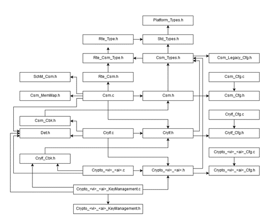
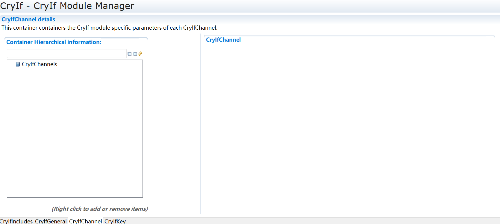

====================
CryIf
====================

文档信息 Document Information
============================================================

版本历史 Version History
--------------------------------------------------------------------------------------------------------

.. list-table::
   :widths: 10 10 10 10 20
   :header-rows: 1

   * - 日期(Date)
     - 作者(Author)
     - 版本(Version)
     - 状态(Status)
     - 说明(Description)

   * - 2025/02/22
     - jie.gu
     - V0.1
     - 发布(Release)
     - 首次发布(First release)

   * - 2025/04/04
     - jie.gu
     - V1.0
     - 发布(Release)
     - 正式发布(Official release)

参考文档 References
--------------------------------------------------------------------------------------------------------

.. list-table::
   :widths: 10 10 30 10
   :header-rows: 1

   * - 编号(Number)
     - 分类(Classification)
     - 标题(Title)
     - 版本(Version)
   * - 1
     - Autosar
     - AUTOSAR_CP_SRS_CryptoStack.pdf
     - R23-11
   * - 2
     - Autosar
     - AUTOSAR_CP_SWS_CryptoInterface.pdf
     - R23-11 

术语与简写 Terms and Abbreviations
====================================================================

术语 Terms
--------------------------------------------------------------------------------------------------------

.. list-table::
   :widths: 10 40
   :header-rows: 1

   * - 术语(Terms)
     - 解释(Explanation)

   * - Crypto Driver Object
     - Crypto Driver实现一个或多个Crypto Driver Object。Crypto Driver Object可通过硬件或软件提供不同的crypto primitive。同一Crypto Driver下的各个Crypto Driver Object彼此独立。每个Crypto Driver Object仅拥有一个workspace（即同一时间只能执行一个 crypto primitive）。(Crypto Driver realizes one or more Crypto Driver Objects.The Crypto Driver Object can provide different crypto primitives via either hardware or software. Each Crypto Driver Object under the same Crypto Driver is independent from each other. Each Crypto Driver Object has one workspace only (i.e. only one crypto primitive can be executed each time).) 

   * - Key
     - Key可由Csm中的job进行引用。在Crypto Driver中，该Key指向特定的key type。(Key can be referenced by job in Csm.) In Crypto Driver, this key points to the specific key type. 

   * - Key Type 
     - key type由key element构成，且指向这些key element。通常，key type由Crypto Driver的供应商预先配置。(The key type consists of key elements and points to these key elements.) The key type is generally pre-configured by the supplier of the Crypto Driver. 

   * - Key Element 
     - Key element用于存储数据。此类数据例如可以是密钥材料（key material），或是AES加密所需的初始向量（IV）；Key element还可用于配置密钥管理功能（key management functions）的行为。不同Key对应的Key element拥有不同的存储区域（包括非易失性存储区NV和随机存取存储区RAM）。(The key element is used for storing data.) This type of data can be key material or the initial vector (IV) required for AES encryption; furthermore, the Key elements can also be used for configuring the behavior of key management functions. The Key elements corresponding to different keys have different storage areas (including non-volatile memory NV and random access memory RAM).

   * - Job
     - Job是已完成配置的 “CsmJob”。其中，Job会引用key、cryptographic primitive 以及reference channel等要素。(Job refers to the configured 'CsmJob'.) To be specific, Job will reference elements such as key, cryptographic primitive, and reference channel.

   * - Channel
     - channel是从Crypto Service Manager队列经Crypto Interface到特定Crypto Driver Object的路径。(Channel is the path from the Crypto Service Manager queue to a specific Crypto Driver Object via the Crypto Interface.) 
   
   * - Primitive
     - primitive是在Crypto Driver Object中实现的、已配置的加密算法（cryptographic algorithm）的实例。其中，primitive会引用CSM提供给应用的功能、具体的底层 “algorithmfamily”（如 AES、MD5、RSA等）以及 “algorithmmode”（如 ECB、CBC等）。(primitive is an instance of a configured cryptographic algorithm realized in the Crypto Driver Object.) To be specific, primitive will reference the functions provided by CSM for the application, the specific underlying "algorithm family" (such as AES, MD5, RSA, etc.), and "algorithm mod" (such as ECB, CBC, etc.).

   * - Operation
     - crypto primitive的操作（operation）用于声明应执行该加密原语的哪部分功能。存在三种不同的操作类型：(The operation of crypto primitive is used for declaring the specific part of the function of the encryption primitive that should be executed) There're three different operation types:

   * - START
     - Operation表示一个新的crypto primitive请求，它应取消所有先前的请求，执行必要的初始化，并检查该加密原语是否可被处理。(Operation refers to a new crypto primitive request that should cancel all previous requests, perform necessary initialization, and check if the encryption primitive can be processed.)

   * - UPDATE
     - Operation表示crypto primitive需要输入数据。更新操作（update operation）可提供中间结果。(Operation means that crypto primitive needs data inputting.) The update operation can provide intermediate results.

   * - FINISH
     - Operation表示，至此所有数据已完全输入，crypto primitive可完成最终计算。完成操作（finish operation）可提供最终结果。(Operation means that all data has been fully inputted, and crypto primitive can complete the final calculation.) The finish operation can provide the final results.

   * - Priority
     - job的priority定义了其重要程度。priority数值越高，job的执行就越紧急。cryptographic job的priority是配置的一部分。(The priority of job defines its level of importance.) The higher the priority value, the more urgent the job execution. The priority of cryptographic jobs is part of the configuration.

   * - Processing
     - 指示job处理的类型。(It indicates the type of job processing.) 
 
   * - Service
     - service应按照《TR_Glossary》文档中的定义理解：service是一种operation类型，其接口（interface）和行为（behavior）具有公开的规范（published specification），涉及能力提供者（provider of the capability）与潜在客户端（potential clients）之间的约定（contract）。(Service should be understood according to the definition in the TR_Glossary file: Service refers to an operation type, the interface and behavior of which have published specifications. It involves the contract between providers of the capability and potential clients.)

简写 Abbreviations
--------------------------------------------------------------------------------------------------------

.. list-table::
   :widths: 10 20 30
   :header-rows: 1

   * - 简写(Abbreviation)
     - 全称(Full name)
     - 解释(Explanation)
   * - CDD
     - Complex Device Driver 
     - 复杂设备驱动
   * - CSM
     - Crypto Service Manager
     - 加密服务管理器
   * - CRYIF
     - Crypto Interface 
     - 加密接口层
   * - CRYPTO
     - Crypto Driver 
     - 加密驱动
   * - DET
     - Default Error Tracer 
     - 默认错误追踪器
   * - HSM
     - Hardware Security Module
     - 硬件安全模块
   * - HW
     - Hardware
     - 硬件
   * - SHE
     - Security Hardware Extension 
     - 安全硬件扩展
   * - SW
     - Software
     - 软件

      

简介 Introduction
==================================

CryIf 模块位于底层密码解决方案(Crypto Driver 和基于 sw 的 CDD)和上层 服务层(CSM)之间。它表示到上层服务层的密码驱动程序服务的接口。CryIf 模块 提供了一个独特的接口来管理不同的密码 HW 和 SW 解决方案，如 HSM、SHE 或基于 SW 的 CDD。因此，基于 Crypto 接口维护的映射方案，Crypto 服务管理 模块可以利用多种底层的内部和外部加密 HW 以及 SW 解决方案

The CryIf module is between the underlying cryptographic solutions (Crypto Driver and SW based CDD) and the upper layer service layer (CSM). It indicates the interface of the password driver service to the upper layer service layer. The CryIf module provides a unique interface, which can manage different password HW and SW solutions, such as HSM, SHE, or SW-based CDD. Therefore, based on the mapping scheme maintained by the Crypto interface, the Crypto service management module can utilize many kinds of underlying internal and external encryption HW and SW solutions

.. figure:: ../../../_static/参考手册/CryIf/Architecture.png
   :alt: Architecture描述(Architecture Description)
   :name: fig_Architecture
   :align: center

功能描述 Functional Description
==========================================================

特性 Features
------------------------------------------------------------------------------------------------------

1.CryIf基本功能介绍

1.Introduction to the basic functions of CryIf

CryIf 位于 CSM 和 Crypto Driver 之间，是访问所有上层(BSW)密码操作的 唯一接口。密码接口也是密码驱动程序的唯一用户，并提供了一个独特的接口 来管理不同的密码硬件和软件解决方案。抽象层封装了不同的硬件和软件访问 机制，因此加密接口的实现独立于底层的加密驱动程序，可以在硬件或软件中 实现。它还保证了对加密服务的并发访问，使同时处理多个加密任务成为可 能。

Located between CSM and Crypto Driver, CryIf is the only interface for accessing all upper layer (BSW) cryptographic operations. The password interface is also the only user of the password driver program. One unique interface is also provided for managing different password hardware and software solutions. In the abstraction layer, different hardware and software access mechanisms are encapsulated, so the realization of the encryption interface is independent from the underlying encryption driver and can be realized in hardware or software. It also ensures the concurrent access to encryption services, and supports the processing of multiple encryption tasks simultaneously.

2.转发请求

2.forward request
   
CryIf作为接口层，接收 CSM 传输的数据并传输给 Crypto Driver去执行对应的加密服务，同时将 Crypto Driver 的执行结果返回给 CSM。

As the interface layer, CryIf receives data transmitted by CSM and transmits it to Crypto Driver to execute the corresponding encryption services. It can also send the execution result of Crypto Driver to CSM at the same time.

3.支持多驱动

3.Support multiple drivers

当需要支持多驱动时，打开 CryIfMulDriverSupport 开关，并填写不同驱动接口的前缀，即可根据接口名使 用不同的驱动。

When multiple drivers need supporting, turn on the CryIfMulDriveSupport switch and fill in the prefixes of different driver interfaces, to use different drivers based on the interface name.

偏差 Deviation
--------------------------------------------------------------------

None

扩展 Extension
--------------------------------------------------------------------

None

集成 Integration
========================================

文件列表 File List
--------------------------------------------------------------------

   CryIF组件文件组织结构描述. (Descriptions of CryIf component file organization structure）

如图 :ref:`fig_CryIfFilelist` 所示，CryIf模块的文件引用关系如下：

As shown in the figure :ref:`fig_CryIfFilelist`, the file reference relationship of the CryIf module is shown as follows:

静态文件 Static Files
~~~~~~~~~~~~~~~~~~~~~~~~~~~~~~~~~~~~~~~~
None

动态文件 Dynamic Files
~~~~~~~~~~~~~~~~~~~~~~~~~~~~~~~~~~~~~~~~

.. list-table::
   :widths: 10 30
   :header-rows: 1

   * - 文件(File)
     - 描述(Description)
   
   * - CryIf.c
     - CryIf 模块源文件，包含了 API 函数的实现。(The CryIf module source file, which contains the realization of API functions.) 

   * - CryIf.h 
     - CryIf 模块头文件，包含了 API 函数的扩展声明并定义了配置的数据结构。(The CryIf module header file contains extension declarations for API functions and defines the structure of configured data.)

   * - CryIf_Cfg.h
     - 定义 CryIf 模块预编译时用到的配置参数。(Configuration parameters used for defining the pre-compilation of CryIf modules.)

   * - CryIf_cfg.c
     - CryIf 模块配置生成文件。(Files generated by CryIf module configuration.)

错误处理 Error Handling
------------------------------------------------------------------------

开发错误 Development Errors
~~~~~~~~~~~~~~~~~~~~~~~~~~~~~~~~~~~~~~~~~~

    .. list-table:: 
      :widths: 20 10 30
      :header-rows: 1

      * - Error code
        - Value[hex]
        - Description

      * - CRYIF_E_UNINIT 
        - 0x00
        - API request called before initialisation of CRYIF module.

      * - CRYIF_E_INIT_FAILED 
        - 0x01
        - Initialisation of CRYIF module failed. 

      * - CRYIF_E_PARAM_POINTER  
        - 0x02
        - API request called with invalid parameter (null pointer). 

      * - CRYIF_E_PARAM_HANDLE
        - 0x03
        - API request called with invalid parameter (out of range). 

      * - CRYIF_E_PARAM_VALUE 
        - 0x04
        - API request called with invalid parameter (invalid value). 

      * - CRYIF_E_KEY_SIZE_MISMATCH 
        - 0x05
        - Source key element size does not match the target key elements size.  

产品错误 Product Errors
~~~~~~~~~~~~~~~~~~~~~~~~~~~~~~~~~~~~~~~~~~
None

运行时错误 Runtime Errors
~~~~~~~~~~~~~~~~~~~~~~~~~~~~~~~~~~~~~~~~~~
None

应用程序集成 Application Integration
------------------------------------------------------------------------------------------
1.依赖模块

1.Dependency module

配置CryIf模块需要保证工程中存在CryptoDriver,将秘钥，通道等信息往CsM中传递，由CsM进行管理。

To configure the CryIf module, make sure the CryptoDriver is available in project so as to transfer key, channel, and other information to CsM for management.

.. include:: CryIf_Cbk_h_api.rst
.. include:: CryIf_h_api.rst

配置 Configuration
====================================

CryIfInclude配置 Configuration of CryIfInclude
----------------------------------------------------------------------------------------------------------------------

.. figure:: ../../../_static/参考手册/CryIf/CryIfInclude.png
   :alt:  CryIfInclude配置图 (CryIfInclude Configuration Diagram)
   :name: fig_CryIfInclude
   :align: center

   CryIfInclude配置图 (CryIfInclude Configuration Diagram)

IncludeName : 此参数用于cryif的配置文件引用头文件

IncludeName: This parameter is used for referencing the header file for cryif configuration file

CryIfGeneral配置 Configuration of CryIfGeneral
----------------------------------------------------------------------------------------------------------------------

.. figure:: ../../../_static/参考手册/CryIf/CryIfGeneral.png
   :alt:  CryIfGeneral配置图 (CryIfGeneral Configuration Diagram)
   :name: fig_CryIfGeneral
   :align: center

   CryIfGeneral配置图 (CryIfGeneral Configuration Diagram)

CryIfDevErrorDetect : 控制开发错误检测的开关

CryIfDevError Detect: Switch for controlling the development error detection

CryIfVersionInfoApi : 控制版本信息获取接口的开关

CryIfVersions InfoApi: Switch for controlling version information retrieval interface

CryIfChannel配置 Configuration of CryIfChannel
----------------------------------------------------------------------------------------------------------------------

   CryIfChannel配置图 (CryIfChannel Configuration Diagram)

CryIfChannelId :指定 CSM 队列连接到哪个加密通道。

CryIfChannelId: Specify the specific encrypted channel that the CSM queue is connected to.

CryIfDriverObjectRef :此参数引用加密驱动程序对象。指定密码通道连接到哪个密码驱动程序对象

CryIfDriver Object Ref: This parameter references the encrypted driver object.) Specify the specific password driver object that the password channel connects to  

CryIfKey配置 Configuration of CryIfKey
----------------------------------------------------------------------------------------------------------------------

.. figure:: ../../../_static/参考手册/CryIf/CryIfKey.png
   :alt:  CryIfKey配置图 (CryIfKey Configuration Diagram)
   :name: fig_CryIfKey
   :align: center

   CryIfKey配置图 (CryIfKey Configuration Diagram)

CryIfKeyId : 指定 CSM 密钥映射到哪个 CryIf 密钥。

CryIfKeyId: Specify the specific CryIf key that the CSM key is mapped to.

CryIfKeyRef : 指定 CryIf 密钥映射到哪个加密驱动程序密钥。

CryIfKeyRef: Specify the specific encryption driver key that the CryIf key is mapped to.
