===================
DCM产品参考手册
===================

**缩写词注解**

+-------------+---------------------------+----------------------------+
| **缩写词**  | **英文全名**              | **解释/描述**              |
+-------------+---------------------------+----------------------------+
| OBD         | On-Board Diagnostic       | 车载诊断                   |
+-------------+---------------------------+----------------------------+
| PDU         | Protocol Data Unit        | 协议数据单元               |
+-------------+---------------------------+----------------------------+
| PduR        | PDU Router                | PDU路由模块                |
+-------------+---------------------------+----------------------------+
| UDS         | Unified Diagnostic        | 统一诊断服务               |
|             | Services                  |                            |
+-------------+---------------------------+----------------------------+
| ECU         | Electronic Control Unit   | 电子控制单元               |
+-------------+---------------------------+----------------------------+
| EcuM        | Electronic Control Unit   | 电子控制单元管理           |
|             | Manager                   |                            |
+-------------+---------------------------+----------------------------+

简介
====

|image1|

图1-1 Dcm模块层次图

DCM模块实现依据ISO 14229-1和ISO
15031-5等标准规范中定义的UDS诊断和OBD诊断功能。在接收到一个诊断请求后，需要对诊断请求进行分析，包括请求的服务是否支持，寻址方式是否正确，会话级，安全级，长度，子服务等是否正确。一个正确的请求与响应如图1-2所示。

|image2|

图1-2 正确请求与响应

在ISO 14229-1
协议中，DCM模块需要实现0x10、0x11、0x14、0x19、0x22、0x23、0x24、0x27、0x28、0x29、0x2A、0x2C、0x2E、0x2F、0x31、0x34、0x35、0x36、0x37、0x38、0x3D、0x3E、0x83、0x84、0x85、0x86、0x87等服务。在ISO
15031-5协议中，DCM模块需要实现0x01、0x02、0x03、0x04、0x05、0x06、0x07、0x08、0x09、0x0A服务。按照AUTOSAR4.2.2标准规范的定义，DCM模块还需要对会话级，安全级等进行相应的管理。

按照AUTOSAR4.2.2规范，DCM模块只能同时处理一个请求，不能进行并行处理，所以推出了协议抢占功能。针对ISO
14229协议中的部分UDS服务按照AUTOSAR4.2.2规范暂不支持，如0x83、0x29、0x87、0x84服务暂不实现。在ISO
15031-5协议中，0x05服务不支持，依赖于0x06服务。

在DCM模块接收到一个请求后，会根据条件进行处理，给出正响应或者是否定响应；亦或者根据正响应抑制位等胡处理不给响应。

DCM功能点如下：

1.  DCM应该按照ISO14229-1中所描述的顺序来进行NRC的发送。UDS服务和OBD服务的标准定义了负响应码(NRCs)。DCM在DCM和其他BSW模块以及SW-Cs之间的接口中使用这些NRCs。

2.  功能性的“TesterPresent”命令是由测试人员与物理请求/响应并行发送的。这在ISO14229-
    1中被称为“保持会话”。这个功能性的“TesterPresent”将在一个单独的DcmRxPduId
    (UDS func
    DcmRxPduId)上接收，它与物理请求属于同一个DcmDslConnection。需要使用未显式配置的dcm内部接收缓冲区，并在DSL层直接进行处理。

3.  支持周期性发送，UDS服务ReadDataByPeriodicIdentifier
    (0x2A)允许测试人员从一个或多个periodicdataidentifier标识的ECU请求定期传输数据记录值。

4.  事件响应，测试人员使用UDS服务ResponseOnEvent
    (0x86)请求ECU启动或停止由指定事件发起的响应的传输。在为传输注册一个事件时，测试人员还指定了相应的服务来响应(e。g：
    UDS服务ReadDataByIdentifier (0x22))。

5.  分页发送功能，在DCM的发送缓存空间不够发送一帧很长的数据时，使用分页发送的形式，可以将数据分成很多页来进行一页一页的发送，发送完一页后组装第二页，直到数据发送完。

6.  管理安全等级，使用0x27服务对安全级进行修改，DCM模块管理相应的安全级，并判断请求的服务是否在相应的安全级是否可用。

7.  管理会话等级，使用0x10服务对会话级进行修改，DCM模块管理相应的会话级，并判断请求的服务是否在相应的会话级是否可用。在请求进入到编程会话的时候，DCM需要配合进行复位跳转到BL。

8.  支持不同协议之间的抢占，根据同时请求协议的优先级进行判断，高优先级的抢占低优先级的协议，被抢占的协议停止，开始高优先级协议的处理。

9.  通信管理，这个通信管理不是指的0x28服务，是DCM与COMM模块相互交互的一个管理，包括诊断唤醒之类的，有NO_COM,SILENT_COM和FULL_COM三种模式。这个会影响DCM的响应报文是否能够发出。

10. 支持协议开启临时缓存Queue队列，在一个诊断请求正在处理时，队列缓存最多一个额外请求在Dcm的额外缓存区中，在当前请求结束时接着处理先前缓存的请求。

SID识别与正响应抑制处理，格式与子功能检查，服务寻址方式检查等。检查正确后处理相应的服务，检查失败后发送相应的NRC。

参考资料
--------

[1] ISO 14229-1 2013

[2] AUTOSAR_SWS_DiagnosticCommunicationManager.PDF，4.2.2

[3] AUTOSAR_SWS_DiagnosticCommunicationManager.PDF，R19-11

功能描述
========

协议启动功能
------------

协议启动功能介绍
~~~~~~~~~~~~~~~~

当DCM模块接收到一个正确的服务请求之后，需要在处理服务之前将协议启动起来，启动协议需要判断当前是否被运行启动，根据协议启动情况执行后续操作。

当Protocol开启Queue队列支持(DcmDslProtocolRequestQueued)时，整体处理流程不变，但如在处理请求过程中收到第二条请求，支持最多一个额外请求的接收，会置入额外缓存区中，待上一条请求完成后会接着处理缓存区中的请求。如缓存区也已满，则返回对应的Buffer状态，无视收到的请求。

协议启动功能实现
~~~~~~~~~~~~~~~~

当DCM模块的Dcm_TpRxIndication被调用来接收一个正确的服务请求之后，调用StartProtocol接口来通知用户，让用户判断当前情况下是否允许启动协议，如果允许启动则启动协议并根据配置情况，调用想对应配置的Indication函数通知外部协议启动成功，并执行后续服务；如果协议启动失败则退出处理并发送NRC0x22。

服务处理响应功能
----------------

服务处理响应功能介绍
~~~~~~~~~~~~~~~~~~~~

当DCM模块接收到一个正确的服务请求之后，在服务正确执行过程中，可能会需要定时发送NRC0x78来表示服务正在处理过程中，避免请求设备超时，一直到服务处理完成发送出最终响应。

服务处理响应功能实现
~~~~~~~~~~~~~~~~~~~~

当DCM模块的Dcm_TpRxIndication被调用来接收一个正确的服务请求之后，执行相应的服务，如果在P2ServerMax时间内服务没有处理完成，需要调用PduR_DcmTransmit发送一个NRC0x78来进行响应，防止请求设备超时。如果在接下来的时间，服务仍未处理完成，则需要在P2*ServerMax时间时继续调用PduR_DcmTransmit发送一个NRC0x78来进行响应，如果服务仍未完成则需要在每个P2*ServerMax到达时调用PduR_DcmTransmit发送一个NRC0x78来进行响应，直到服务处理完成，然后调用PduR_DcmTransmit来发送一个最终响应。

更新会话控制时间功能
--------------------

更新会话控制时间功能介绍
~~~~~~~~~~~~~~~~~~~~~~~~

当DCM模块接收到一个正确的服务请求之后，在服务正确执行完成，响应正确发出之后，对会话时间进行更新。

更新会话控制时间功能实现
~~~~~~~~~~~~~~~~~~~~~~~~

当DCM模块的Dcm_TpRxIndication被调用来接收一个正确的服务请求，并在正确处理完服务请求并发出正确响应之后，在调用Dcm_TpTxConfirmation时，对会话时间进行更新，重启会话计时。

通信交互功能
------------

通信交互功能介绍
~~~~~~~~~~~~~~~~

在默认会话模式下，在收到一个请求时，通知COMM模块启动通信，在请求处理完成，响应发送确认时，通知COMM模块关闭通信。在非默认会话模式下，在收到一个请求时，不会通知COMM模块启动通信，在请求处理完成，响应发送确认时，不会通知COMM模块关闭通信。当默认会话切换到非默认会话的时候，会通知COMM模块启动通信，当非默认会话切换到默认会话的时候，会通知COMM模块关闭通信。COMM模块会在通信状态改变之后，调用DCM相关接口通知DCM模块通信状态的改变。

通信交互功能实现
~~~~~~~~~~~~~~~~

当DCM模块在默认会话模式下被调用Dcm_TpRxIndication，则DCM模块会先调用ComM_DCM_ActiveDiagnostic通知COMM模块启动通信，然后继续处理服务。当DCM模块在默认会话模式下被调用Dcm_TpTxConfirmation，则DCM模块会先调用ComM_DCM_InactiveDiagnostic通知COMM模块关闭通信。

当DCM模块在非默认会话模式下被调用Dcm_TpRxIndication，则DCM模块不会调用ComM_DCM_ActiveDiagnostic通知COMM模块启动通信，直接继续处理服务。当DCM模块在非默认会话模式下被调用Dcm_TpTxConfirmation，则DCM模块不会调用ComM_DCM_InactiveDiagnostic通知COMM模块关闭通信。

在DCM模块从默认会话切换到非默认会话的时候，会调用ComM_DCM_ActiveDiagnostic通知COMM模块启动通信。在DCM模块从非默认会话切换到默认会话的时候，会调用ComM_DCM_InactiveDiagnostic通知COMM模块关闭通信。

当COMM模块状态发送改变之后，会调用Dcm_ComM_NoComModeEntered、Dcm_ComM_SilentComModeEntered和Dcm_ComM_FullComModeEntered接口。在调用Dcm_ComM_NoComModeEntered和Dcm_ComM_SilentComModeEntered接口之后，DCM模块不能进行报文的发送。在调用Dcm_ComM_FullComModeEntered之后，DCM模块能对报文进行发送。

分页发送功能
------------

分页发送功能介绍
~~~~~~~~~~~~~~~~

在诊断协议中，有些服务允许交换大量数据，如UDS Service 0x19、0x22等。

在传统的方法中，ECU的内部缓冲区必须足够大，以保存将要交换的最长数据消息(最坏情况)，并且在传输开始之前完整的缓冲区被填满。ECU中的RAM内存通常是一种关键资源，特别是在较小的微处理器中。在更节省内存的方法中，缓冲区只被部分填充，部分传输，然后部分填充——以此类推。这种分页机制只需要显著减少内存量，但是需要定义良好的反应时间来填充缓冲区。用户可以决定是使用“线性缓冲区”还是分页缓冲区进行诊断。

分页发送即是使用有限的发送buffer，将需要发送的超过buffer长度的数据，分页分段进行多次的发送，以达到完整发送的目地。

分页发送功能实现
~~~~~~~~~~~~~~~~

在DCM模块接收到一个服务请求，处理完成之后，发现需要发送的数据长度大于发送缓冲区时且pagedbuffer使能则会按照如下步骤进行处理：

1. 调用DsdInternal_StartPagedProcessing，通过这个API,
   DSP子模块将完整的响应长度给DCM模块，并开始分页缓冲区处理。启动发送，这个API不会实际发送数据。

2. 下层调用Dcm_CopyTxData()，然后在接口中调用Dcm_CopyTxData_PagebufferDeal拷贝当前页需要发送数据，当当前页的数据发送完成之后，调用DspInternal_DcmUpdatePage请求更新分页信息和数据。

3. 下层调用Dcm_CopyTxData()，在分页数据没有被更新之前，均返回BUFREQ_E_BUSY。

4. 下层调用Dcm_CopyTxData()，分页数据被更新之后，调用Dcm_CopyTxData_PagebufferDeal拷贝当前页需要发送数据，并返回BUFREQ_OK。

5. 如果数据没有被全部发送完，则重复2-4步骤，直到数据全部发送完成并调用Dcm_TpTxConfirmation()。

在2-4步骤过程中，分页发送会检测是否当前页发送超时（包括填充和发送整个过程），如果超时则停止发送。

源文件描述
==========

表3-1 DCM组件文件描述

+------------------------+---------------------------------------------+
| **文件**               | **说明**                                    |
+------------------------+---------------------------------------------+
| Dcm_Cfg.h              | 定义DCM模块预编译时用到的配置参数。         |
+------------------------+---------------------------------------------+
| Dcm_Cfg.c              | 定义DCM模块配置相关的配置参数。             |
+------------------------+---------------------------------------------+
| Dcm.h                  | DCM模块头文件，包含                         |
|                        | 了API函数的扩展声明并定义了端口的数据结构。 |
+------------------------+---------------------------------------------+
| Dcm.c                  | DCM模块源文件，包含了API函数的实现。        |
+------------------------+---------------------------------------------+
| Dcm_MemMap.h           | 包含DCM模块的内存抽象。                     |
+------------------------+---------------------------------------------+
| Dcm_Types.h            | 包含DCM模块需要使用的类型定义。             |
+------------------------+---------------------------------------------+
| DcmDsd.c               | DCM模块内部任务调度层函的相关API函数实现。  |
+------------------------+---------------------------------------------+
| DcmDsd.h               | DCM模块内部任务调度层函的相关API函数声明。  |
+------------------------+---------------------------------------------+
| Dcm_Cbk.h              | DCM模块回调接口相关头文件，包含了回调接口相 |
|                        | 关API函数的扩展声明并定义了端口的数据结构。 |
+------------------------+---------------------------------------------+
| Dcm_Callout.c          | DCM模块配置相关的服务callout函数实现。      |
+------------------------+---------------------------------------------+
| Dcm_Internal.h         | DCM模                                       |
|                        | 块内部API函数的扩展声明与相关头问题的包含。 |
+------------------------+---------------------------------------------+
| DcmDsp.c               | DCM模块内部任务处理层函的相关API函数实现。  |
+------------------------+---------------------------------------------+
| DcmDsp.h               | DCM模块内部任务处理层函的相关API函数声明。  |
+------------------------+---------------------------------------------+
| UDS.h                  | DCM模块头文件，包含了UDS相关的服            |
|                        | 务API函数的扩展声明并定义了端口的数据结构。 |
+------------------------+---------------------------------------------+
| Dcm_UDS0x10.c          | DCM模块UDS服务0x10服务相关函数实现。        |
+------------------------+---------------------------------------------+
| Dcm_UDS0x11.c          | DCM模块UDS服务0x11服务相关函数实现。        |
+------------------------+---------------------------------------------+
| Dcm_UDS0x14.c          | DCM模块UDS服务0x14服务相关函数实现。        |
+------------------------+---------------------------------------------+
| Dcm_UDS0x19.c          | DCM模块UDS服务0x19服务相关函数实现。        |
+------------------------+---------------------------------------------+
| Dcm_UDS0x22.c          | DCM模块UDS服务0x22服务相关函数实现。        |
+------------------------+---------------------------------------------+
| Dcm_UDS0x23.c          | DCM模块UDS服务0x23服务相关函数实现。        |
+------------------------+---------------------------------------------+
| Dcm_UDS0x24.c          | DCM模块UDS服务0x24服务相关函数实现。        |
+------------------------+---------------------------------------------+
| Dcm_UDS0x27.c          | DCM模块UDS服务0x27服务相关函数实现。        |
+------------------------+---------------------------------------------+
| Dcm_UDS0x28.c          | DCM模块UDS服务0x28服务相关函数实现。        |
+------------------------+---------------------------------------------+
| Dcm_UDS0x2A.c          | DCM模块UDS服务0x2A服务相关函数实现。        |
+------------------------+---------------------------------------------+
| Dcm_UDS0x2C.c          | DCM模块UDS服务0x2C服务相关函数实现。        |
+------------------------+---------------------------------------------+
| Dcm_UDS0x2E.c          | DCM模块UDS服务0x2E服务相关函数实现。        |
+------------------------+---------------------------------------------+
| Dcm_UDS0x2F.c          | DCM模块UDS服务0x2F服务相关函数实现。        |
+------------------------+---------------------------------------------+
| Dcm_UDS0x31.c          | DCM模块UDS服务0x31服务相关函数实现。        |
+------------------------+---------------------------------------------+
| Dcm_UDS0x34.c          | DCM模块UDS服务0x34服务相关函数实现。        |
+------------------------+---------------------------------------------+
| Dcm_UDS0x35.c          | DCM模块UDS服务0x35服务相关函数实现。        |
+------------------------+---------------------------------------------+
| Dcm_UDS0x36.c          | DCM模块UDS服务0x36服务相关函数实现。        |
+------------------------+---------------------------------------------+
| Dcm_UDS0x37.c          | DCM模块UDS服务0x37服务相关函数实现。        |
+------------------------+---------------------------------------------+
| Dcm_UDS0x38.c          | DCM模块UDS服务0x38服务相关函数实现。        |
+------------------------+---------------------------------------------+
| Dcm_UDS0x3D.c          | DCM模块UDS服务0x3D服务相关函数实现。        |
+------------------------+---------------------------------------------+
| Dcm_UDS0x3E.c          | DCM模块UDS服务0x3E服务相关函数实现。        |
+------------------------+---------------------------------------------+
| Dcm_UDS0x85.c          | DCM模块UDS服务0x85服务相关函数实现。        |
+------------------------+---------------------------------------------+
| Dcm_UDS0x86.c          | DCM模块UDS服务0x86服务相关函数实现。        |
+------------------------+---------------------------------------------+
| OBD.h                  | DCM模块头文件，包含了OBD相关的服            |
|                        | 务API函数的扩展声明并定义了端口的数据结构。 |
+------------------------+---------------------------------------------+
| Dcm_OBDInternal.c      | DCM模块内部与OBD相关的内部API函数实现。     |
+------------------------+---------------------------------------------+
| Dcm_OBDInternal.h      | DCM模块内部与OBD相关                        |
|                        | 的内部API函数的扩展声明与相关头问题的包含。 |
+------------------------+---------------------------------------------+
| Dcm_OBD0x01.c          | DCM模块OBD服务0x01服务相关函数实现。        |
+------------------------+---------------------------------------------+
| Dcm_OBD0x02.c          | DCM模块OBD服务0x02服务相关函数实现。        |
+------------------------+---------------------------------------------+
| Dcm_OBD0x03.c          | DCM模块OBD服务0x03服务相关函数实现。        |
+------------------------+---------------------------------------------+
| Dcm_OBD0x04.c          | DCM模块OBD服务0x04服务相关函数实现。        |
+------------------------+---------------------------------------------+
| Dcm_OBD0x05.c          | DCM模块OBD服务0x05服务相关函数实现。        |
+------------------------+---------------------------------------------+
| Dcm_OBD0x06.c          | DCM模块OBD服务0x06服务相关函数实现。        |
+------------------------+---------------------------------------------+
| Dcm_OBD0x07.c          | DCM模块OBD服务0x07服务相关函数实现。        |
+------------------------+---------------------------------------------+
| Dcm_OBD0x08.c          | DCM模块OBD服务0x08服务相关函数实现。        |
+------------------------+---------------------------------------------+
| Dcm_OBD0x09.c          | DCM模块OBD服务0x09服务相关函数实现。        |
+------------------------+---------------------------------------------+
| Dcm_OBD0x0A.c          | DCM模块OBD服务0x0A服务相关函数实现。        |
+------------------------+---------------------------------------------+
| DcmDsl_CommManage.c    | DC                                          |
|                        | M模块内部DSL层与COMM模块有关的API函数实现。 |
+------------------------+---------------------------------------------+
| DcmDsl_CommManage.h    | DC                                          |
|                        | M模块内部DSL层与COMM模块有关的API函数声明。 |
+------------------------+---------------------------------------------+
| DcmDsl_MsgManage.c     | DCM模块                                     |
|                        | 内部DSL层数据接收与发送有关的API函数实现。  |
+------------------------+---------------------------------------------+
| DcmDsl_MsgManage.h     | DCM模块                                     |
|                        | 内部DSL层数据接收与发送有关的API函数声明。  |
+------------------------+---------------------------------------------+
| DcmDsl_PendingManage.c | DCM模块内部DSL                              |
|                        | 层后台处理消息相关的计时有关的API函数实现。 |
+------------------------+---------------------------------------------+
| DcmDsl_PendingManage.h | DCM模块内部DSL                              |
|                        | 层后台处理消息相关的计时有关的API函数声明。 |
+------------------------+---------------------------------------------+
| D                      | DCM模块内部DSL层协议管理有关的API函数实现。 |
| cmDsl_ProtocolManage.c |                                             |
+------------------------+---------------------------------------------+
| D                      | DCM模块内部DSL层协议管理有关的API函数声明。 |
| cmDsl_ProtocolManage.h |                                             |
+------------------------+---------------------------------------------+
| D                      | DC                                          |
| cmDsl_SecurityManage.c | M模块内部DSL层安全级管理有关的API函数实现。 |
+------------------------+---------------------------------------------+
| D                      | DC                                          |
| cmDsl_SecurityManage.h | M模块内部DSL层安全级管理有关的API函数声明。 |
+------------------------+---------------------------------------------+
| DcmDsl_SessionManage.c | DC                                          |
|                        | M模块内部DSL层会话级管理有关的API函数实现。 |
+------------------------+---------------------------------------------+
| DcmDsl_SessionManage.h | DC                                          |
|                        | M模块内部DSL层会话级管理有关的API函数声明。 |
+------------------------+---------------------------------------------+

|image3|

图3-1 DCM组件文件交互关系图

API接口
=======

类型定义
--------

Dcm_StatusType类型定义
~~~~~~~~~~~~~~~~~~~~~~

+-----------+----------------------------------------------------------+
| 名称      | Dcm_StatusType                                           |
+-----------+----------------------------------------------------------+
| 类型      | uint8                                                    |
+-----------+----------------------------------------------------------+
| 范围      | +-----------+------+---------------------------------+   |
|           | | DCM_E_OK  | 0x00 | This value is representing a    |   |
|           | |           |      | successful operation.           |   |
|           | +-----------+------+---------------------------------+   |
|           | | DC        | 0x06 | ResponseOnOneEvent request is   |   |
|           | | M_E_ROE\_ |      | not accepted by DCM (e.g. old   |   |
|           | |           |      | ResponseOnOneEvent is not       |   |
|           | | NOT       |      | finished) (used at API：        |   |
|           | | _ACCEPTED |      | Dcm_ResponseOnOneEvent())       |   |
|           | +-----------+------+---------------------------------+   |
|           | | DCM_E_P   | 0x07 | Periodic transmission request   |   |
|           | | ERIODICID |      | is not accepted by DCM (e.g.    |   |
|           | |           |      | old Periodic transmission is    |   |
|           | | \_NOT     |      | not finished) (used at API：    |   |
|           | | _ACCEPTED |      | Dc                              |   |
|           | |           |      | m_ResponseOnOneDataByPeriodicId |   |
|           | |           |      | ())                             |   |
|           | +-----------+------+---------------------------------+   |
+-----------+----------------------------------------------------------+
| 描述      | 用于传输状态信息的基本项类型                             |
+-----------+----------------------------------------------------------+

Dcm_SecLevelType类型定义
~~~~~~~~~~~~~~~~~~~~~~~~

+-----------+----------------------------------------------------------+
| 名称      | Dcm_SecLevelType                                         |
+-----------+----------------------------------------------------------+
| 类型      | Uint8                                                    |
+-----------+----------------------------------------------------------+
| 范围      | +-----------------------------+-----------------+----+   |
|           | | DCM_SEC_LEV_LOCKED          | 0x00            | 无 |   |
|           | +-----------------------------+-----------------+----+   |
|           | | Configuration dependent     | 0x01...0x3F     | 无 |   |
|           | +-----------------------------+-----------------+----+   |
|           | | Reserved by Document        | 0x40...0xFF     | 无 |   |
|           | +-----------------------------+-----------------+----+   |
+-----------+----------------------------------------------------------+
| 描述      | 安全级定义                                               |
+-----------+----------------------------------------------------------+

Dcm_SesCtrlType类型定义
~~~~~~~~~~~~~~~~~~~~~~~

+--------+-------------------------------------------------------------+
| 名称   | Dcm_SesCtrlType                                             |
+--------+-------------------------------------------------------------+
| 类型   | uint8                                                       |
+--------+-------------------------------------------------------------+
| 范围   | +--------------------------------+------------+---------+   |
|        | | DCM_DEFAULT_SESSION            | 0x01       | 无      |   |
|        | +--------------------------------+------------+---------+   |
|        | | DCM_PROGRAMMING_SESSION        | 0x02       | 无      |   |
|        | +--------------------------------+------------+---------+   |
|        | | D                              | 0x03       | 无      |   |
|        | | CM_EXTENDED_DIAGNOSTIC_SESSION |            |         |   |
|        | +--------------------------------+------------+---------+   |
|        | | DCM_SA                         | 0x04       | 无      |   |
|        | | FETY_SYSTEM_DIAGNOSTIC_SESSION |            |         |   |
|        | +--------------------------------+------------+---------+   |
|        | | configuration dependent        | 0          | 根      |   |
|        | |                                | x40...0x7E | 据配置  |   |
|        | +--------------------------------+------------+---------+   |
+--------+-------------------------------------------------------------+
| 描述   | 会话级定义                                                  |
+--------+-------------------------------------------------------------+

Dcm_ProtocolType类型定义
~~~~~~~~~~~~~~~~~~~~~~~~

+-----------+----------------------------------------------------------+
| 名称      | Dcm_ProtocolType                                         |
+-----------+----------------------------------------------------------+
| 类型      | uint8                                                    |
+-----------+----------------------------------------------------------+
| 范围      | +-------------------+------+-------------------------+   |
|           | | DCM_OBD_ON_CAN    | 0x00 | OBD on CAN (ISO15765-4; |   |
|           | |                   |      | ISO15031-5)             |   |
|           | +-------------------+------+-------------------------+   |
|           | | D                 | 0x01 | (OBD on Flexray         |   |
|           | | CM_OBD_ON_FLEXRAY |      | (Manufacturer specific; |   |
|           | |                   |      | ISO15031-5))            |   |
|           | +-------------------+------+-------------------------+   |
|           | | DCM_OBD_ON_IP     | 0x02 | (OBD on Internet        |   |
|           | |                   |      | Protocol (Manufacturer  |   |
|           | |                   |      | specific; ISO15031-5))  |   |
|           | +-------------------+------+-------------------------+   |
|           | | DCM_UDS_ON_CAN    | 0x03 | UDS on CAN (ISO15765-3; |   |
|           | |                   |      | ISO14229-1)             |   |
|           | +-------------------+------+-------------------------+   |
|           | | D                 | 0x04 | UDS on FlexRay          |   |
|           | | CM_UDS_ON_FLEXRAY |      | (Manufacturer specific; |   |
|           | |                   |      | ISO14229-1)             |   |
|           | +-------------------+------+-------------------------+   |
|           | | DCM_UDS_ON_IP     | 0x05 | (UDS on Internet        |   |
|           | |                   |      | Protocol (Manufacturer  |   |
|           | |                   |      | specific; ISO14229-1))  |   |
|           | +-------------------+------+-------------------------+   |
|           | | DCM_ROE_ON_CAN    | 0x06 | Response On Event on    |   |
|           | |                   |      | CAN                     |   |
|           | +-------------------+------+-------------------------+   |
|           | | D                 | 0x07 | Response On Event on    |   |
|           | | CM_ROE_ON_FLEXRAY |      | FlexRay                 |   |
|           | +-------------------+------+-------------------------+   |
|           | | DCM_ROE_ON_IP     | 0x08 | (Response on Event on   |   |
|           | |                   |      | Internet Protocol)      |   |
|           | +-------------------+------+-------------------------+   |
|           | | DCM_PERIODICTRANS | 0x09 | Periodic Transmission   |   |
|           | |                   |      | on CAN                  |   |
|           | | \_ON_CAN          |      |                         |   |
|           | +-------------------+------+-------------------------+   |
|           | | DCM_PERIODICTRANS | 0x0A | Periodic Transmission   |   |
|           | |                   |      | on FlexRay              |   |
|           | | \_ON_FLEXRAY      |      |                         |   |
|           | +-------------------+------+-------------------------+   |
|           | | DCM_PERIODICTRANS | 0x0B | (Periodic Transmission  |   |
|           | |                   |      | on Internet Protocol)   |   |
|           | | \_ON_IP           |      |                         |   |
|           | +-------------------+------+-------------------------+   |
|           | | DCM_NO_ACTIVE     | 0x0C | No protocol has been    |   |
|           | |                   |      | started                 |   |
|           | | \_PROTOCOL        |      |                         |   |
|           | +-------------------+------+-------------------------+   |
|           | | Reserved for      | 0    | 无                      |   |
|           | |                   | x0D. |                         |   |
|           | | | further AUTOSAR |      |                         |   |
|           | | | implementation  | .    |                         |   |
|           | |                   | 0xEF |                         |   |
|           | +-------------------+------+-------------------------+   |
|           | | DCM_SUPPLIER_1    | 0xF0 | Reserved for SW         |   |
|           | |                   |      | supplier specific.      |   |
|           | +-------------------+------+-------------------------+   |
|           | | DCM_SUPPLIER_2    | 0xF1 | Reserved for SW         |   |
|           | |                   |      | supplier specific.      |   |
|           | +-------------------+------+-------------------------+   |
|           | | DCM_SUPPLIER_3    | 0xF2 | Reserved for SW         |   |
|           | |                   |      | supplier specific.      |   |
|           | +-------------------+------+-------------------------+   |
|           | | DCM_SUPPLIER_4    | 0xF3 | Reserved for SW         |   |
|           | |                   |      | supplier specific.      |   |
|           | +-------------------+------+-------------------------+   |
|           | | DCM_SUPPLIER_5    | 0xF4 | Reserved for SW         |   |
|           | |                   |      | supplier specific.      |   |
|           | +-------------------+------+-------------------------+   |
|           | | DCM_SUPPLIER_6    | 0xF5 | Reserved for SW         |   |
|           | |                   |      | supplier specific.      |   |
|           | +-------------------+------+-------------------------+   |
|           | | DCM_SUPPLIER_7    | 0xF6 | Reserved for SW         |   |
|           | |                   |      | supplier specific.      |   |
|           | +-------------------+------+-------------------------+   |
|           | | DCM_SUPPLIER_8    | 0xF7 | Reserved for SW         |   |
|           | |                   |      | supplier specific.      |   |
|           | +-------------------+------+-------------------------+   |
|           | | DCM_SUPPLIER_9    | 0xF8 | Reserved for SW         |   |
|           | |                   |      | supplier specific.      |   |
|           | +-------------------+------+-------------------------+   |
|           | | DCM_SUPPLIER_10   | 0xF9 | Reserved for SW         |   |
|           | |                   |      | supplier specific.      |   |
|           | +-------------------+------+-------------------------+   |
|           | | DCM_SUPPLIER_11   | 0xFA | Reserved for SW         |   |
|           | |                   |      | supplier specific.      |   |
|           | +-------------------+------+-------------------------+   |
|           | | DCM_SUPPLIER_12   | 0xFB | Reserved for SW         |   |
|           | |                   |      | supplier specific.      |   |
|           | +-------------------+------+-------------------------+   |
|           | | DCM_SUPPLIER_13   | 0xFC | Reserved for SW         |   |
|           | |                   |      | supplier specific.      |   |
|           | +-------------------+------+-------------------------+   |
|           | | DCM_SUPPLIER_14   | 0xFD | Reserved for SW         |   |
|           | |                   |      | supplier specific.      |   |
|           | +-------------------+------+-------------------------+   |
|           | | DCM_SUPPLIER_15   | 0xFE | Reserved for SW         |   |
|           | |                   |      | supplier specific.      |   |
|           | +-------------------+------+-------------------------+   |
+-----------+----------------------------------------------------------+
| 描述      | 协议类型定义                                             |
+-----------+----------------------------------------------------------+

Dcm_NegativeResponseCodeType类型定义
~~~~~~~~~~~~~~~~~~~~~~~~~~~~~~~~~~~~

+-----------+----------------------------------------------------------+
| 名称      | Dcm_NegativeResponseCodeType                             |
+-----------+----------------------------------------------------------+
| 类型      | uint8                                                    |
+-----------+----------------------------------------------------------+
| 范围      | +-----------------------------------------------------+  |
|           | | +------------------+---+------------------------+   |  |
|           | | | range of values  | 0 | ISOSAERESRVD           |   |  |
|           | | | 0x01..0x0F       | x |                        |   |  |
|           | | | reserved by ISO  | 0 |                        |   |  |
|           | | | 14229            | 1 |                        |   |  |
|           | | |                  | . |                        |   |  |
|           | | |                  | . |                        |   |  |
|           | | |                  | 0 |                        |   |  |
|           | | |                  | x |                        |   |  |
|           | | |                  | 0 |                        |   |  |
|           | | |                  | F |                        |   |  |
|           | | +------------------+---+------------------------+   |  |
|           | | | DCM              | 0 | GR                     |   |  |
|           | | | _E_GENERALREJECT | x |                        |   |  |
|           | | |                  | 1 |                        |   |  |
|           | | |                  | 0 |                        |   |  |
|           | | +------------------+---+------------------------+   |  |
|           | | | DCM_E_SER        | 0 | SNS                    |   |  |
|           | | | VICENOTSUPPORTED | x |                        |   |  |
|           | | |                  | 1 |                        |   |  |
|           | | |                  | 1 |                        |   |  |
|           | | +------------------+---+------------------------+   |  |
|           | | | DCM_E_SUBFUNC    | 0 | SFNS                   |   |  |
|           | | | TIONNOTSUPPORTED | x |                        |   |  |
|           | | |                  | 1 |                        |   |  |
|           | | |                  | 2 |                        |   |  |
|           | | +------------------+---+------------------------+   |  |
|           | | | DCM_E_INCOR      | 0 | IMLOIF                 |   |  |
|           | | | RECTMESSAGELENGT | x |                        |   |  |
|           | | | HORINVALIDFORMAT | 1 |                        |   |  |
|           | | |                  | 3 |                        |   |  |
|           | | +------------------+---+------------------------+   |  |
|           | | | DCM_E            | 0 | RTL                    |   |  |
|           | | | _RESPONSETOOLONG | x |                        |   |  |
|           | | |                  | 1 |                        |   |  |
|           | | |                  | 4 |                        |   |  |
|           | | +------------------+---+------------------------+   |  |
|           | | | range of values  | 0 | ISOSAERESRVD           |   |  |
|           | | | 0x15..0x20       | x |                        |   |  |
|           | | | reserved by ISO  | 1 |                        |   |  |
|           | | | 14229            | 5 |                        |   |  |
|           | | |                  | . |                        |   |  |
|           | | |                  | . |                        |   |  |
|           | | |                  | 0 |                        |   |  |
|           | | |                  | x |                        |   |  |
|           | | |                  | 2 |                        |   |  |
|           | | |                  | 0 |                        |   |  |
|           | | +------------------+---+------------------------+   |  |
|           | | | DCM_E_B          | 0 | BRR                    |   |  |
|           | | | USYREPEATREQUEST | x |                        |   |  |
|           | | |                  | 2 |                        |   |  |
|           | | |                  | 1 |                        |   |  |
|           | | +------------------+---+------------------------+   |  |
|           | | | DCM_E_COND       | 0 | CNC                    |   |  |
|           | | | ITIONSNOTCORRECT | x |                        |   |  |
|           | | |                  | 2 |                        |   |  |
|           | | |                  | 2 |                        |   |  |
|           | | +------------------+---+------------------------+   |  |
|           | | | value 0x23       | 0 | ISOSAERESRVD           |   |  |
|           | | | reserved by ISO  | x |                        |   |  |
|           | | | 14229            | 2 |                        |   |  |
|           | | |                  | 3 |                        |   |  |
|           | | +------------------+---+------------------------+   |  |
|           | | | DCM_E_REQU       | 0 | RSE                    |   |  |
|           | | | ESTSEQUENCEERROR | x |                        |   |  |
|           | | |                  | 2 |                        |   |  |
|           | | |                  | 4 |                        |   |  |
|           | | +------------------+---+------------------------+   |  |
|           | | | DCM              | 0 | NRFSC                  |   |  |
|           | | | _E_NORESPONSEFRO | x |                        |   |  |
|           | | | MSUBNETCOMPONENT | 2 |                        |   |  |
|           | | |                  | 5 |                        |   |  |
|           | | +------------------+---+------------------------+   |  |
|           | | | DCM_E_FAILUREP   | 0 | FPEORA                 |   |  |
|           | | | REVENTSEXECUTION | x |                        |   |  |
|           | | | OFREQUESTEDACTIN | 2 |                        |   |  |
|           | | |                  | 6 |                        |   |  |
|           | | +------------------+---+------------------------+   |  |
|           | | | range of values  | 0 | ISOSAERESRVD           |   |  |
|           | | | 0x27..0x30       | x |                        |   |  |
|           | | | reserved by ISO  | 2 |                        |   |  |
|           | | | 14229            | 7 |                        |   |  |
|           | | |                  | . |                        |   |  |
|           | | |                  | . |                        |   |  |
|           | | |                  | 0 |                        |   |  |
|           | | |                  | x |                        |   |  |
|           | | |                  | 3 |                        |   |  |
|           | | |                  | 0 |                        |   |  |
|           | | +------------------+---+------------------------+   |  |
|           | | | DCM_E_R          | 0 | ROOR                   |   |  |
|           | | | EQUESTOUTOFRANGE | x |                        |   |  |
|           | | |                  | 3 |                        |   |  |
|           | | |                  | 1 |                        |   |  |
|           | | +------------------+---+------------------------+   |  |
|           | | | value 0x32       | 0 | ISOSAERESRVD           |   |  |
|           | | | reserved by ISO  | x |                        |   |  |
|           | | | 14229            | 3 |                        |   |  |
|           | | |                  | 2 |                        |   |  |
|           | | +------------------+---+------------------------+   |  |
|           | | | DCM_E_SECU       | 0 | SAD                    |   |  |
|           | | | RITYACCESSDENIED | x |                        |   |  |
|           | | |                  | 3 |                        |   |  |
|           | | |                  | 3 |                        |   |  |
|           | | +------------------+---+------------------------+   |  |
|           | | | value 0x34       | 0 | ISOSAERESRVD           |   |  |
|           | | | reserved by ISO  | x |                        |   |  |
|           | | | 14229            | 3 |                        |   |  |
|           | | |                  | 4 |                        |   |  |
|           | | +------------------+---+------------------------+   |  |
|           | | | DCM_E_INVALIDKEY | 0 | IK                     |   |  |
|           | | |                  | x |                        |   |  |
|           | | |                  | 3 |                        |   |  |
|           | | |                  | 5 |                        |   |  |
|           | | +------------------+---+------------------------+   |  |
|           | | | DCM_E_EXCEED     | 0 | ENOA                   |   |  |
|           | | | NUMBEROFATTEMPTS | x |                        |   |  |
|           | | |                  | 3 |                        |   |  |
|           | | |                  | 6 |                        |   |  |
|           | | +------------------+---+------------------------+   |  |
|           | | | D                | 0 | RTDNE                  |   |  |
|           | | | CM_E_REQUIREDTIM | x |                        |   |  |
|           | | | EDELAYNOTEXPIRED | 3 |                        |   |  |
|           | | |                  | 7 |                        |   |  |
|           | | +------------------+---+------------------------+   |  |
|           | | | range of values  | 0 | RBEDLSD                |   |  |
|           | | | 0x38..0x4F       | x |                        |   |  |
|           | | | reserved by ISO  | 3 |                        |   |  |
|           | | | 15764            | 8 |                        |   |  |
|           | | |                  | . |                        |   |  |
|           | | |                  | . |                        |   |  |
|           | | |                  | 0 |                        |   |  |
|           | | |                  | x |                        |   |  |
|           | | |                  | 4 |                        |   |  |
|           | | |                  | F |                        |   |  |
|           | | +------------------+---+------------------------+   |  |
|           | | | range of values  | 0 | ISOSAERESRVD           |   |  |
|           | | | 0x50..0x6F       | x |                        |   |  |
|           | | | reserved by ISO  | 5 |                        |   |  |
|           | | | 14229            | 0 |                        |   |  |
|           | | |                  | . |                        |   |  |
|           | | |                  | . |                        |   |  |
|           | | |                  | 0 |                        |   |  |
|           | | |                  | x |                        |   |  |
|           | | |                  | 6 |                        |   |  |
|           | | |                  | F |                        |   |  |
|           | | +------------------+---+------------------------+   |  |
|           | | | DCM_E_UPLOADDOW  | 0 | UDNA                   |   |  |
|           | | | NLOADNOTACCEPTED | x |                        |   |  |
|           | | |                  | 7 |                        |   |  |
|           | | |                  | 0 |                        |   |  |
|           | | +------------------+---+------------------------+   |  |
|           | | | DCM_E_TRANS      | 0 | TDS                    |   |  |
|           | | | FERDATASUSPENDED | x |                        |   |  |
|           | | |                  | 7 |                        |   |  |
|           | | |                  | 1 |                        |   |  |
|           | | +------------------+---+------------------------+   |  |
|           | | | DCM_E_GENERALPR  | 0 | GPF                    |   |  |
|           | | | OGRAMMINGFAILURE | x |                        |   |  |
|           | | |                  | 7 |                        |   |  |
|           | | |                  | 2 |                        |   |  |
|           | | +------------------+---+------------------------+   |  |
|           | | | DCM_E_WRONGBLOC  | 0 | WBSC                   |   |  |
|           | | | KSEQUENCECOUNTER | x |                        |   |  |
|           | | |                  | 7 |                        |   |  |
|           | | |                  | 3 |                        |   |  |
|           | | +------------------+---+------------------------+   |  |
|           | | | range of values  | 0 | ISOSAERESRVD           |   |  |
|           | | | 0x74..0x77       | x |                        |   |  |
|           | | | reserved by ISO  | 7 |                        |   |  |
|           | | | 14229            | 4 |                        |   |  |
|           | | |                  | . |                        |   |  |
|           | | |                  | . |                        |   |  |
|           | | |                  | 0 |                        |   |  |
|           | | |                  | x |                        |   |  |
|           | | |                  | 7 |                        |   |  |
|           | | |                  | 7 |                        |   |  |
|           | | +------------------+---+------------------------+   |  |
|           | | | range of values  | 0 | ISOSAERESRVD           |   |  |
|           | | | 0x79..0x7D       | x |                        |   |  |
|           | | | reserved by ISO  | 7 |                        |   |  |
|           | | | 14229            | 9 |                        |   |  |
|           | | |                  | . |                        |   |  |
|           | | |                  | . |                        |   |  |
|           | | |                  | 0 |                        |   |  |
|           | | |                  | x |                        |   |  |
|           | | |                  | 7 |                        |   |  |
|           | | |                  | D |                        |   |  |
|           | | +------------------+---+------------------------+   |  |
|           | | | DCM_E_SUBFUN     | 0 | SFNSIAS                |   |  |
|           | | | CTIONNOTSUPPORTE | x |                        |   |  |
|           | | | DINACTIVESESSION | 7 |                        |   |  |
|           | | |                  | E |                        |   |  |
|           | | +------------------+---+------------------------+   |  |
|           | | | DCM_E_SE         | 0 | SNSIAS                 |   |  |
|           | | | RVICENOTSUPPORTE | x |                        |   |  |
|           | | | DINACTIVESESSION | 7 |                        |   |  |
|           | | |                  | F |                        |   |  |
|           | | +------------------+---+------------------------+   |  |
|           | | | value 0x80       | 0 | ISOSAERESRVD           |   |  |
|           | | | reserved by ISO  | x |                        |   |  |
|           | | | 14229            | 8 |                        |   |  |
|           | | |                  | 0 |                        |   |  |
|           | | +------------------+---+------------------------+   |  |
|           | | | DCM_E_RPMTOOHIGH | 0 | RPMTH                  |   |  |
|           | | |                  | x |                        |   |  |
|           | | |                  | 8 |                        |   |  |
|           | | |                  | 1 |                        |   |  |
|           | | +------------------+---+------------------------+   |  |
|           | | | DCM_E_RPMTOOLOW  | 0 | RPMTL                  |   |  |
|           | | |                  | x |                        |   |  |
|           | | |                  | 8 |                        |   |  |
|           | | |                  | 2 |                        |   |  |
|           | | +------------------+---+------------------------+   |  |
|           | | | DCM_E            | 0 | EIR                    |   |  |
|           | | | _ENGINEISRUNNING | x |                        |   |  |
|           | | |                  | 8 |                        |   |  |
|           | | |                  | 3 |                        |   |  |
|           | | +------------------+---+------------------------+   |  |
|           | | | DCM_E_EN         | 0 | EINR                   |   |  |
|           | | | GINEISNOTRUNNING | x |                        |   |  |
|           | | |                  | 8 |                        |   |  |
|           | | |                  | 4 |                        |   |  |
|           | | +------------------+---+------------------------+   |  |
|           | | | DCM_E_ENG        | 0 | ERTTL                  |   |  |
|           | | | INERUNTIMETOOLOW | x |                        |   |  |
|           | | |                  | 8 |                        |   |  |
|           | | |                  | 5 |                        |   |  |
|           | | +------------------+---+------------------------+   |  |
|           | | | DCM_E_TE         | 0 | TEMPTH                 |   |  |
|           | | | MPERATURETOOHIGH | x |                        |   |  |
|           | | |                  | 8 |                        |   |  |
|           | | |                  | 6 |                        |   |  |
|           | | +------------------+---+------------------------+   |  |
|           | | | DCM_E_T          | 0 | TEMPTL                 |   |  |
|           | | | EMPERATURETOOLOW | x |                        |   |  |
|           | | |                  | 8 |                        |   |  |
|           | | |                  | 7 |                        |   |  |
|           | | +------------------+---+------------------------+   |  |
|           | | | DCM_E_VEH        | 0 | VSTH                   |   |  |
|           | | | ICLESPEEDTOOHIGH | x |                        |   |  |
|           | | |                  | 8 |                        |   |  |
|           | | |                  | 8 |                        |   |  |
|           | | +------------------+---+------------------------+   |  |
|           | | | DCM_E_VE         | 0 | VSTL                   |   |  |
|           | | | HICLESPEEDTOOLOW | x |                        |   |  |
|           | | |                  | 8 |                        |   |  |
|           | | |                  | 9 |                        |   |  |
|           | | +------------------+---+------------------------+   |  |
|           | | | DCM_E_THROT      | 0 | TPTH                   |   |  |
|           | | | TLE_PEDALTOOHIGH | x |                        |   |  |
|           | | |                  | 8 |                        |   |  |
|           | | |                  | A |                        |   |  |
|           | | +------------------+---+------------------------+   |  |
|           | | | DCM_E_THRO       | 0 | TPTL                   |   |  |
|           | | | TTLE_PEDALTOOLOW | x |                        |   |  |
|           | | |                  | 8 |                        |   |  |
|           | | |                  | B |                        |   |  |
|           | | +------------------+---+------------------------+   |  |
|           | | | DCM              | 0 | TRNIN                  |   |  |
|           | | | _E_TRANSMISSIONR | x |                        |   |  |
|           | | | ANGENOTINNEUTRAL | 8 |                        |   |  |
|           | | |                  | C |                        |   |  |
|           | | +------------------+---+------------------------+   |  |
|           | | | DCM_E_TRANSMISSI | 0 | TRNIG                  |   |  |
|           | | | ONRANGENOTINGEAR | x |                        |   |  |
|           | | |                  | 8 |                        |   |  |
|           | | |                  | D |                        |   |  |
|           | | +------------------+---+------------------------+   |  |
|           | | | value 0x8E       | 0 | ISOSAERESRVD           |   |  |
|           | | | reserved by ISO  | x |                        |   |  |
|           | | | 14229            | 8 |                        |   |  |
|           | | |                  | E |                        |   |  |
|           | | +------------------+---+------------------------+   |  |
|           | | | DCM_E_BRAKE      | 0 | BSNC                   |   |  |
|           | | | SWITCH_NOTCLOSED | x |                        |   |  |
|           | | |                  | 8 |                        |   |  |
|           | | |                  | F |                        |   |  |
|           | | +------------------+---+------------------------+   |  |
|           | | | DCM_E_SHIFT      | 0 | SLNIP                  |   |  |
|           | | | ERLEVERNOTINPARK | x |                        |   |  |
|           | | |                  | 9 |                        |   |  |
|           | | |                  | 0 |                        |   |  |
|           | | +------------------+---+------------------------+   |  |
|           | | | D                | 0 | TCCL                   |   |  |
|           | | | CM_E_TORQUECONVE | x |                        |   |  |
|           | | | RTERCLUTCHLOCKED | 9 |                        |   |  |
|           | | |                  | 1 |                        |   |  |
|           | | +------------------+---+------------------------+   |  |
|           | | | DCM_             | 0 | VTH                    |   |  |
|           | | | E_VOLTAGETOOHIGH | x |                        |   |  |
|           | | |                  | 9 |                        |   |  |
|           | | |                  | 2 |                        |   |  |
|           | | +------------------+---+------------------------+   |  |
|           | | | DCM              | 0 | VTL                    |   |  |
|           | | | _E_VOLTAGETOOLOW | x |                        |   |  |
|           | | |                  | 9 |                        |   |  |
|           | | |                  | 3 |                        |   |  |
|           | | +------------------+---+------------------------+   |  |
|           | | | range of values  | 0 | RFSCNC                 |   |  |
|           | | | 0x94..0xEF       | x |                        |   |  |
|           | | | reserved by ISO  | 9 |                        |   |  |
|           | | | 14229            | 4 |                        |   |  |
|           | | |                  | . |                        |   |  |
|           | | |                  | . |                        |   |  |
|           | | |                  | 0 |                        |   |  |
|           | | |                  | x |                        |   |  |
|           | | |                  | E |                        |   |  |
|           | | |                  | F |                        |   |  |
|           | | +------------------+---+------------------------+   |  |
|           | | | DCM_E_VMSCNC_0   | 0 | VMSCNC                 |   |  |
|           | | |                  | x |                        |   |  |
|           | | |                  | F |                        |   |  |
|           | | |                  | 0 |                        |   |  |
|           | | +------------------+---+------------------------+   |  |
|           | | | DCM_E_VMSCNC_1   | 0 | VMSCNC1                |   |  |
|           | | |                  | x |                        |   |  |
|           | | |                  | F |                        |   |  |
|           | | |                  | 1 |                        |   |  |
|           | | +------------------+---+------------------------+   |  |
|           | | | DCM_E_VMSCNC_2   | 0 | VMSCNC2                |   |  |
|           | | |                  | x |                        |   |  |
|           | | |                  | F |                        |   |  |
|           | | |                  | 2 |                        |   |  |
|           | | +------------------+---+------------------------+   |  |
|           | | | DCM_E_VMSCNC_3   | 0 | VMSCNC3                |   |  |
|           | | |                  | x |                        |   |  |
|           | | |                  | F |                        |   |  |
|           | | |                  | 3 |                        |   |  |
|           | | +------------------+---+------------------------+   |  |
|           | | | DCM_E_VMSCNC_4   | 0 | VMSCNC4                |   |  |
|           | | |                  | x |                        |   |  |
|           | | |                  | F |                        |   |  |
|           | | |                  | 4 |                        |   |  |
|           | | +------------------+---+------------------------+   |  |
|           | | | DCM_E_VMSCNC_5   | 0 | VMSCNC5                |   |  |
|           | | |                  | x |                        |   |  |
|           | | |                  | F |                        |   |  |
|           | | |                  | 5 |                        |   |  |
|           | | +------------------+---+------------------------+   |  |
|           | | | DCM_E_VMSCNC_6   | 0 | VMSCNC6                |   |  |
|           | | |                  | x |                        |   |  |
|           | | |                  | F |                        |   |  |
|           | | |                  | 6 |                        |   |  |
|           | | +------------------+---+------------------------+   |  |
|           | | | DCM_E_VMSCNC_7   | 0 | VMSCNC7                |   |  |
|           | | |                  | x |                        |   |  |
|           | | |                  | F |                        |   |  |
|           | | |                  | 7 |                        |   |  |
|           | | +------------------+---+------------------------+   |  |
|           | | | DCM_E_VMSCNC_8   | 0 | VMSCNC8                |   |  |
|           | | |                  | x |                        |   |  |
|           | | |                  | F |                        |   |  |
|           | | |                  | 8 |                        |   |  |
|           | | +------------------+---+------------------------+   |  |
|           | | | DCM_E_VMSCNC_9   | 0 | VMSCNC9                |   |  |
|           | | |                  | x |                        |   |  |
|           | | |                  | F |                        |   |  |
|           | | |                  | 9 |                        |   |  |
|           | | +------------------+---+------------------------+   |  |
|           | | | DCM_E_VMSCNC_A   | 0 | VMSCNCA                |   |  |
|           | | |                  | x |                        |   |  |
|           | | |                  | F |                        |   |  |
|           | | |                  | A |                        |   |  |
|           | | +------------------+---+------------------------+   |  |
|           | | | DCM_E_VMSCNC_B   | 0 | VMSCNCB                |   |  |
|           | | |                  | x |                        |   |  |
|           | | |                  | F |                        |   |  |
|           | | |                  | B |                        |   |  |
|           | | +------------------+---+------------------------+   |  |
|           | | | DCM_E_VMSCNC_C   | 0 | VMSCNCC                |   |  |
|           | | |                  | x |                        |   |  |
|           | | |                  | F |                        |   |  |
|           | | |                  | C |                        |   |  |
|           | | +------------------+---+------------------------+   |  |
|           | | | DCM_E_VMSCNC_D   | 0 | VMSCNCD                |   |  |
|           | | |                  | x |                        |   |  |
|           | | |                  | F |                        |   |  |
|           | | |                  | D |                        |   |  |
|           | | +------------------+---+------------------------+   |  |
|           | | | DCM_E_VMSCNC_E   | 0 | VMSCNCE                |   |  |
|           | | |                  | x |                        |   |  |
|           | | |                  | F |                        |   |  |
|           | | |                  | E |                        |   |  |
|           | | +------------------+---+------------------------+   |  |
|           | | | value 0xFF       | 0 | ISOSAERESRVD           |   |  |
|           | | | reserved by ISO  | x |                        |   |  |
|           | | | 14229            | F |                        |   |  |
|           | | |                  | F |                        |   |  |
|           | | +------------------+---+------------------------+   |  |
|           | +-----------------------------------------------------+  |
+-----------+----------------------------------------------------------+
| 描述      | 否定响应类型定义                                         |
+-----------+----------------------------------------------------------+

Dcm_CommunicationModeType类型定义
~~~~~~~~~~~~~~~~~~~~~~~~~~~~~~~~~

+-----------+----------------------------------------------------------+
| 名称      | Dcm_CommunicationModeType                                |
+-----------+----------------------------------------------------------+
| 类型      | uint8                                                    |
+-----------+----------------------------------------------------------+
| 范围      | +----------------+----+------------------------------+   |
|           | | DCM_ENA        | 0x | Enable the Rx and Tx for     |   |
|           | | BLE_RX_TX_NORM | 00 | normal communication         |   |
|           | +----------------+----+------------------------------+   |
|           | | D              | 0x | Enable the Rx and disable    |   |
|           | | CM_ENABLE_RX_D | 01 | the Tx for normal            |   |
|           | | ISABLE_TX_NORM |    | communication                |   |
|           | +----------------+----+------------------------------+   |
|           | | D              | 0x | Disable the Rx and enable    |   |
|           | | CM_DISABLE_RX_ | 02 | the Tx for normal            |   |
|           | | ENABLE_TX_NORM |    | communication                |   |
|           | +----------------+----+------------------------------+   |
|           | | DCM_DISABL     | 0x | Disable Rx and Tx for normal |   |
|           | | E_RX_TX_NORMAL | 03 | communication                |   |
|           | +----------------+----+------------------------------+   |
|           | | DCM_E          | 0x | Enable the Rx and Tx for     |   |
|           | | NABLE_RX_TX_NM | 04 | network management           |   |
|           | |                |    | communication                |   |
|           | +----------------+----+------------------------------+   |
|           | | DCM_ENABLE_RX  | 0x | Enable Rx and disable the Tx |   |
|           | | _DISABLE_TX_NM | 05 | for network management       |   |
|           | |                |    | communication                |   |
|           | +----------------+----+------------------------------+   |
|           | | DCM_DISABLE_R  | 0x | Disable the Rx and enable    |   |
|           | | X_ENABLE_TX_NM | 06 | the Tx for network           |   |
|           | |                |    | management communication     |   |
|           | +----------------+----+------------------------------+   |
|           | | DCM_DI         | 0x | Diable Rx and Tx for network |   |
|           | | SABLE_RX_TX_NM | 07 | management communication     |   |
|           | +----------------+----+------------------------------+   |
|           | | DCM_ENABLE     | 0x | Enable Rx and Tx for normal  |   |
|           | | _RX_TX_NORM_NM | 08 | and network management       |   |
|           | |                |    | communication                |   |
|           | +----------------+----+------------------------------+   |
|           | | DCM_           | 0x | Enable the Rx and disable    |   |
|           | | ENABLE_RX_DISA | 09 | the Tx for normal and        |   |
|           | | BLE_TX_NORM_NM |    | network management           |   |
|           | |                |    | communication                |   |
|           | +----------------+----+------------------------------+   |
|           | | DCM_           | 0x | Disable the Rx and enable    |   |
|           | | DISABLE_RX_ENA | 0A | the Tx for normal and        |   |
|           | | BLE_TX_NORM_NM |    | network management           |   |
|           | |                |    | communication                |   |
|           | +----------------+----+------------------------------+   |
|           | | DCM_DISABLE    | 0x | Disable Rx and Tx for normal |   |
|           | | _RX_TX_NORM_NM | 0B | and network management       |   |
|           | |                |    | communication                |   |
|           | +----------------+----+------------------------------+   |
+-----------+----------------------------------------------------------+
| 描述      | 通信控制模式类型定义                                     |
+-----------+----------------------------------------------------------+

Dcm_ConfigType类型定义
~~~~~~~~~~~~~~~~~~~~~~

+-----------+----------------------------------------------------------+
| 名称      | Dcm_ConfigType                                           |
+-----------+----------------------------------------------------------+
| 类型      | uint8                                                    |
+-----------+----------------------------------------------------------+
| 范围      | +--------------------------+--------------------------+  |
|           | | Implementation specific  | 无                       |  |
|           | +--------------------------+--------------------------+  |
+-----------+----------------------------------------------------------+
| 描述      | 配置类型定义                                             |
+-----------+----------------------------------------------------------+

Dcm_ConfirmationStatusType类型定义
~~~~~~~~~~~~~~~~~~~~~~~~~~~~~~~~~~

+-----------+----------------------------------------------------------+
| 名称      | Dcm_ConfirmationStatusType                               |
+-----------+----------------------------------------------------------+
| 类型      | uint8                                                    |
+-----------+----------------------------------------------------------+
| 范围      | +---------------------------+---------------+--------+   |
|           | | DCM_RES_POS_OK            | 0x00          | 无     |   |
|           | +---------------------------+---------------+--------+   |
|           | | DCM_RES_POS_NOT_OK        | 0x01          | 无     |   |
|           | +---------------------------+---------------+--------+   |
|           | | DCM_RES_NEG_OK            | 0x02          | 无     |   |
|           | +---------------------------+---------------+--------+   |
|           | | DCM_RES_NEG_NOT_OK        | 0x03          | 无     |   |
|           | +---------------------------+---------------+--------+   |
+-----------+----------------------------------------------------------+
| 描述      | 响应类型定义                                             |
+-----------+----------------------------------------------------------+

Dcm_OpStatusType类型定义
~~~~~~~~~~~~~~~~~~~~~~~~

+-----------+----------------------------------------------------------+
| 名称      | Dcm_SesCtrlType                                          |
+-----------+----------------------------------------------------------+
| 类型      | uint8                                                    |
+-----------+----------------------------------------------------------+
| 范围      | +------------+----+---------------------------------+    |
|           | | D          | 0x | Indicates the initial call to   |    |
|           | | CM_INITIAL | 00 | the operation                   |    |
|           | +------------+----+---------------------------------+    |
|           | | D          | 0x | Indicates that a pending return |    |
|           | | CM_PENDING | 01 | has been done on the previous   |    |
|           | |            |    | call of the operation           |    |
|           | +------------+----+---------------------------------+    |
|           | | DCM_CANCEL | 0x | Indicates that the DCM requests |    |
|           | |            | 02 | to cancel the pending operation |    |
|           | +------------+----+---------------------------------+    |
|           | | DCM_FORC   | 0x | Confirm a response pending      |    |
|           | | E_RCRRP_OK | 03 | transmission                    |    |
|           | +------------+----+---------------------------------+    |
+-----------+----------------------------------------------------------+
| 描述      | 操作状态类型定义                                         |
+-----------+----------------------------------------------------------+

Dcm_ReturnReadMemoryType类型定义
~~~~~~~~~~~~~~~~~~~~~~~~~~~~~~~~

+-----------+----------------------------------------------------------+
| 名称      | Dcm_ReturnReadMemoryType                                 |
+-----------+----------------------------------------------------------+
| 类型      | uint8                                                    |
+-----------+----------------------------------------------------------+
| 范围      | +--------------+----+-------------------------------+    |
|           | | DCM_READ_OK  | 0x | Reading has been done         |    |
|           | |              | 00 |                               |    |
|           | +--------------+----+-------------------------------+    |
|           | | DCM_         | 0x | Reading is pending, another   |    |
|           | | READ_PENDING | 01 | call is request to finalize   |    |
|           | |              |    | the reading                   |    |
|           | +--------------+----+-------------------------------+    |
|           | | DCM          | 0x | Reading has failed            |    |
|           | | _READ_FAILED | 02 |                               |    |
|           | +--------------+----+-------------------------------+    |
|           | | DCM_READ     | 0x | Reading is pending, the       |    |
|           | | _FORCE_RCRRP | 03 | Response pending transmission |    |
|           | |              |    | starts immediately            |    |
|           | +--------------+----+-------------------------------+    |
+-----------+----------------------------------------------------------+
| 描述      | 读取内存返回值类型定义                                   |
+-----------+----------------------------------------------------------+

Dcm_ReturnWriteMemoryType类型定义
~~~~~~~~~~~~~~~~~~~~~~~~~~~~~~~~~

+-----------+----------------------------------------------------------+
| 名称      | Dcm_ReturnWriteMemoryType                                |
+-----------+----------------------------------------------------------+
| 类型      | uint8                                                    |
+-----------+----------------------------------------------------------+
| 范围      | +--------------+----+-------------------------------+    |
|           | | DCM_WRITE_OK | 0x | Writing has been done         |    |
|           | |              | 00 |                               |    |
|           | +--------------+----+-------------------------------+    |
|           | | DCM_W        | 0x | Writing is pending, another   |    |
|           | | RITE_PENDING | 01 | called is requested           |    |
|           | +--------------+----+-------------------------------+    |
|           | | DCM_         | 0x | The writing has failed        |    |
|           | | WRITE_FAILED | 02 |                               |    |
|           | +--------------+----+-------------------------------+    |
|           | | DCM_WRITE    | 0x | Writing is pending, the       |    |
|           | | _FORCE_RCRRP | 03 | Response pending transmission |    |
|           | |              |    | starts immediately            |    |
|           | +--------------+----+-------------------------------+    |
+-----------+----------------------------------------------------------+
| 描述      | 写内存返回值类型定义                                     |
+-----------+----------------------------------------------------------+

Dcm_EcuStartModeType类型定义
~~~~~~~~~~~~~~~~~~~~~~~~~~~~

+-----------+----------------------------------------------------------+
| 名称      | Dcm_EcuStartModeType                                     |
+-----------+----------------------------------------------------------+
| 类型      | uint8                                                    |
+-----------+----------------------------------------------------------+
| 范围      | +---------------+----+------------------------------+    |
|           | | D             | 0x | The ECU starts normally      |    |
|           | | CM_COLD_START | 00 |                              |    |
|           | +---------------+----+------------------------------+    |
|           | | D             | 0x | The ECU starts from a        |    |
|           | | CM_WARM_START | 01 | bootloader jump              |    |
|           | +---------------+----+------------------------------+    |
+-----------+----------------------------------------------------------+
| 描述      | ECU启动类型定义                                          |
+-----------+----------------------------------------------------------+

Dcm_ProgConditionsType类型定义
~~~~~~~~~~~~~~~~~~~~~~~~~~~~~~

+-----------+----------------------------------------------------------+
| 名称      | Dcm_ProgConditionsType                                   |
+-----------+----------------------------------------------------------+
| 类型      | Structure                                                |
+-----------+----------------------------------------------------------+
| 范围      | +--------+---------+--------------------------------+    |
|           | | uint16 | Te      | Tester source address          |    |
|           | |        | sterSou | configured per protocol        |    |
|           | |        | rceAddr |                                |    |
|           | +--------+---------+--------------------------------+    |
|           | | uint8  | Pro     | Id of the protocol on wich the |    |
|           | |        | tocolId | request has been received      |    |
|           | +--------+---------+--------------------------------+    |
|           | | uint8  | Sid     | Service identifier of the      |    |
|           | |        |         | received request               |    |
|           | +--------+---------+--------------------------------+    |
|           | | uint8  | S       | Identifier of the received     |    |
|           | |        | ubFncId | subfonction                    |    |
|           | +--------+---------+--------------------------------+    |
|           | | b      | Repro   | Set to true in order to        |    |
|           | | oolean | graming | request reprogramming of the   |    |
|           | |        | Request | ECU. HIS representation of     |    |
|           | |        |         | FL_ExtProgRequestType.         |    |
|           | +--------+---------+--------------------------------+    |
|           | | b      | Appl    | Indicate whether the           |    |
|           | | oolean | Updated | application has been updated   |    |
|           | |        |         | or not. HIS representation of  |    |
|           | |        |         | FL_ApplicationUpdateType.      |    |
|           | +--------+---------+--------------------------------+    |
|           | | b      | Re      | Set to true in case the        |    |
|           | | oolean | sponseR | flashloader or application     |    |
|           | |        | equired | shall send a response. HIS     |    |
|           | |        |         | representation of              |    |
|           | |        |         | FL_ResponseRequiredType.       |    |
|           | +--------+---------+--------------------------------+    |
+-----------+----------------------------------------------------------+
| 描述      | 存储和BL相关的信息类型定义                               |
+-----------+----------------------------------------------------------+

Dcm_MsgItemType类型定义
~~~~~~~~~~~~~~~~~~~~~~~

+-----------+----------------------------------------------------------+
| 名称      | Dcm_MsgItemType                                          |
+-----------+----------------------------------------------------------+
| 类型      | uint8                                                    |
+-----------+----------------------------------------------------------+
| 范围      | 无                                                       |
+-----------+----------------------------------------------------------+
| 描述      | 诊断信息类型定义                                         |
+-----------+----------------------------------------------------------+

Dcm_MsgType类型定义
~~~~~~~~~~~~~~~~~~~

+-----------+----------------------------------------------------------+
| 名称      | Dcm_MsgType                                              |
+-----------+----------------------------------------------------------+
| 类型      | Dcm_MsgItemType\*                                        |
+-----------+----------------------------------------------------------+
| 范围      | 无                                                       |
+-----------+----------------------------------------------------------+
| 描述      | 诊断数据类型定义                                         |
+-----------+----------------------------------------------------------+

Dcm_MsgLenType类型定义
~~~~~~~~~~~~~~~~~~~~~~

+-----------+----------------------------------------------------------+
| 名称      | Dcm_MsgLenType                                           |
+-----------+----------------------------------------------------------+
| 类型      | uint32                                                   |
+-----------+----------------------------------------------------------+
| 范围      | 无                                                       |
+-----------+----------------------------------------------------------+
| 描述      | 诊断信息长度类型定义                                     |
+-----------+----------------------------------------------------------+

Dcm_MsgAddInfoType类型定义
~~~~~~~~~~~~~~~~~~~~~~~~~~

+-----------+----------------------------------------------------------+
| 名称      | Dcm_MsgAddInfoType                                       |
+-----------+----------------------------------------------------------+
| 类型      | Structure                                                |
+-----------+----------------------------------------------------------+
| 范围      | +----+--------------+--------------------------------+   |
|           | | b  | reqType      | (Pos LSB+0)                    |   |
|           | | it |              | 0 = physical request           |   |
|           | |    |              | 1 = functional request         |   |
|           | +----+--------------+--------------------------------+   |
|           | | b  | suppres      | Position LSB+1                 |   |
|           | | it | sPosResponse | 0 = no (do not suppress)       |   |
|           | |    |              | 1 = yes (no positive response  |   |
|           | |    |              | will be sent)                  |   |
|           | +----+--------------+--------------------------------+   |
+-----------+----------------------------------------------------------+
| 描述      | 诊断请求地址信息类型定义                                 |
+-----------+----------------------------------------------------------+

Dcm_IdContextType类型定义
~~~~~~~~~~~~~~~~~~~~~~~~~

+-----------+----------------------------------------------------------+
| 名称      | Dcm_IdContextType                                        |
+-----------+----------------------------------------------------------+
| 类型      | uint8                                                    |
+-----------+----------------------------------------------------------+
| 范围      | 无                                                       |
+-----------+----------------------------------------------------------+
| 描述      | 内容ID值类型定义                                         |
+-----------+----------------------------------------------------------+

Dcm_MsgContextType类型定义
~~~~~~~~~~~~~~~~~~~~~~~~~~

+-----------+----------------------------------------------------------+
| 名称      | Dcm_MsgContextType                                       |
+-----------+----------------------------------------------------------+
| 类型      | uint8                                                    |
+-----------+----------------------------------------------------------+
| 范围      | +---------+--------+--------------------------------+    |
|           | | Dcm_    | r      | Request data, starting         |    |
|           | | MsgType | eqData | directly after service         |    |
|           | |         |        | identifier (which is not part  |    |
|           | |         |        | of this data)                  |    |
|           | +---------+--------+--------------------------------+    |
|           | | Dcm_Msg | reqD   | Request data length (excluding |    |
|           | | LenType | ataLen | service identifier)            |    |
|           | +---------+--------+--------------------------------+    |
|           | | Dcm_    | r      | Positive response data,        |    |
|           | | MsgType | esData | starting directly after        |    |
|           | |         |        | service identifier (which is   |    |
|           | |         |        | not part of this data).        |    |
|           | +---------+--------+--------------------------------+    |
|           | | Dcm_Msg | resD   | Positive response data length  |    |
|           | | LenType | ataLen | (excluding service identifier) |    |
|           | +---------+--------+--------------------------------+    |
|           | | Dcm_    | msgA   | Additional information about   |    |
|           | | MsgAddI | ddInfo | service                        |    |
|           | | nfoType |        | request and response (see：    |    |
|           | |         |        | Dcm_MsgAddInfo)                |    |
|           | +---------+--------+--------------------------------+    |
|           | | Dcm_Msg | r      | | The maximal length of a      |    |
|           | | LenType | esMaxD |   response is                  |    |
|           | |         | ataLen | | restricted by the size of    |    |
|           | |         |        |   the buffer. The buffer size  |    |
|           | |         |        |   can depend on the            |    |
|           | |         |        |                                |    |
|           | |         |        | | diagnostic protocol          |    |
|           | |         |        |   identifier which is          |    |
|           | |         |        | | assigned to this message, e. |    |
|           | |         |        |   g. an OBD protocol id can    |    |
|           | |         |        |   obtain other properties than |    |
|           | |         |        |   the enhanced diagnostic      |    |
|           | |         |        |   protocol id. The             |    |
|           | |         |        |   resMaxDataLen is a property  |    |
|           | |         |        |   of the                       |    |
|           | |         |        | | diagnostic protocol assigned |    |
|           | |         |        |   by the                       |    |
|           | |         |        | | DSL. The value does not      |    |
|           | |         |        |   change during communication. |    |
|           | |         |        |   It cannot be                 |    |
|           | |         |        | | implemented as a constant,   |    |
|           | |         |        |   because it can differ        |    |
|           | |         |        |   between different diagnostic |    |
|           | |         |        |   protocols.                   |    |
|           | +---------+--------+--------------------------------+    |
|           | | Dcm     | idC    | This message context           |    |
|           | | _IdCont | ontext | identifier can be used to      |    |
|           | | extType |        | determine the relation between |    |
|           | |         |        | request and response           |    |
|           | |         |        | confirmation. This identifier  |    |
|           | |         |        | can be stored within the       |    |
|           | |         |        | application at request time,   |    |
|           | |         |        | so that the response can be    |    |
|           | |         |        | assigned to the original       |    |
|           | |         |        | request. Background： Within   |    |
|           | |         |        | the confirmation, the message  |    |
|           | |         |        | context is no more valid, all  |    |
|           | |         |        | message data is lost. You need |    |
|           | |         |        | an additional information to   |    |
|           | |         |        | determine the request to which |    |
|           | |         |        | this confirmation belongs.     |    |
|           | +---------+--------+--------------------------------+    |
|           | | Pd      | dcmRxP | Pdu identifier on which the    |    |
|           | | uIdType | duId： | request was received. The      |    |
|           | |         |        | PduId of the request can have  |    |
|           | |         |        | consequences for message       |    |
|           | |         |        | processing. E. g. an OBD       |    |
|           | |         |        | request will be received on    |    |
|           | |         |        | the OBD PduId and will be      |    |
|           | |         |        | processed slightly different   |    |
|           | |         |        | than an enhanced diagnostic    |    |
|           | |         |        | request received on the        |    |
|           | |         |        | physical                       |    |
|           | +---------+--------+--------------------------------+    |
+-----------+----------------------------------------------------------+
| 描述      | 处理诊断请求的必要信息类型定义                           |
+-----------+----------------------------------------------------------+

Dcm_DidSupportedType类型定义
~~~~~~~~~~~~~~~~~~~~~~~~~~~~

+-----------+----------------------------------------------------------+
| 名称      | Dcm_DidSupportedType                                     |
+-----------+----------------------------------------------------------+
| 类型      | uint8                                                    |
+-----------+----------------------------------------------------------+
| 范围      | +--------------------------+-------+-----------------+   |
|           | | DCM_DID_SUPPORTED        | 0x00  | 无              |   |
|           | +--------------------------+-------+-----------------+   |
|           | | DCM_DID_NOT_SUPPORTED    | 0x01  | 无              |   |
|           | +--------------------------+-------+-----------------+   |
+-----------+----------------------------------------------------------+
| 描述      | DID支持类型定义                                          |
+-----------+----------------------------------------------------------+

输入函数描述
------------

+----------------------------------+-----------------------------------+
| **输入模块**                     | **API**                           |
+----------------------------------+-----------------------------------+
| ComM                             | ComM_DCM_ActiveDiagnostic         |
+----------------------------------+-----------------------------------+
|                                  | ComM_DCM_InactiveDiagnostic       |
+----------------------------------+-----------------------------------+
| Dem                              | Dem_DcmDisableDTCRecordUpdate     |
+----------------------------------+-----------------------------------+
|                                  | Dem_DcmDisableDTCSetting          |
+----------------------------------+-----------------------------------+
|                                  | Dem_DcmEnableDTCRecordUpdate      |
+----------------------------------+-----------------------------------+
|                                  | Dem_DcmEnableDTCSetting           |
+----------------------------------+-----------------------------------+
|                                  | Dem_DcmGetDTCByOccurrenceTime     |
+----------------------------------+-----------------------------------+
|                                  | Dem_DcmGetDTCOfOBDFreezeFrame     |
+----------------------------------+-----------------------------------+
|                                  | Dem_                              |
|                                  | DcmGetDTCSeverityAvailabilityMask |
+----------------------------------+-----------------------------------+
|                                  | De                                |
|                                  | m_DcmGetDTCStatusAvailabilityMask |
+----------------------------------+-----------------------------------+
|                                  | Dem_DcmGetExtendedDataRecordByDTC |
+----------------------------------+-----------------------------------+
|                                  | Dem_DcmGetFreezeFrameDataByDTC    |
+----------------------------------+-----------------------------------+
|                                  | Dem_DcmGetFunctionalUnitOfDTC     |
+----------------------------------+-----------------------------------+
|                                  | Dem_DcmGetNextFilteredDTC         |
+----------------------------------+-----------------------------------+
|                                  | Dem_DcmGetNextFilteredDTCAndFDC   |
+----------------------------------+-----------------------------------+
|                                  | Dem                               |
|                                  | _DcmGetNextFilteredDTCAndSeverity |
+----------------------------------+-----------------------------------+
|                                  | Dem_DcmGetNextFilteredRecord      |
+----------------------------------+-----------------------------------+
|                                  | Dem_DcmGetNumberOfFilteredDTC     |
+----------------------------------+-----------------------------------+
|                                  | Dem_DcmGetSeverityOfDTC           |
+----------------------------------+-----------------------------------+
|                                  | Dem_Dc                            |
|                                  | mGetSizeOfExtendedDataRecordByDTC |
+----------------------------------+-----------------------------------+
|                                  | Dem_DcmGetSizeOfFreezeFrameByDTC  |
+----------------------------------+-----------------------------------+
|                                  | Dem_DcmGetStatusOfDTC             |
+----------------------------------+-----------------------------------+
|                                  | Dem_DcmGetTranslationType         |
+----------------------------------+-----------------------------------+
|                                  | Dem_DcmReadDataOfOBDFreezeFrame   |
+----------------------------------+-----------------------------------+
|                                  | Dem_DcmSetDTCFilter               |
+----------------------------------+-----------------------------------+
|                                  | Dem_DcmSetFreezeFrameRecordFilter |
+----------------------------------+-----------------------------------+
| Det                              | Det_ReportError                   |
+----------------------------------+-----------------------------------+
| NvM                              | NvM_ReadBlock                     |
+----------------------------------+-----------------------------------+
|                                  | NvM_SetBlockLockStatus            |
+----------------------------------+-----------------------------------+
|                                  | NvM_SetRamBlockStatus             |
+----------------------------------+-----------------------------------+
|                                  | NvM_WriteBlock                    |
+----------------------------------+-----------------------------------+
| BswM                             | BswM_Dcm_ApplicationUpdated       |
+----------------------------------+-----------------------------------+
|                                  | BswM_D                            |
|                                  | cm_CommunicationMode_CurrentState |
+----------------------------------+-----------------------------------+
| PduR                             | PduR_DcmTransmit                  |
+----------------------------------+-----------------------------------+
|                                  | PduR_DcmCancelReceive             |
+----------------------------------+-----------------------------------+
|                                  | PduR_DcmCancelTransmit            |
+----------------------------------+-----------------------------------+
|                                  | PduR_DcmChangeParameter           |
+----------------------------------+-----------------------------------+

静态接口函数定义
----------------

Dcm_Init函数定义
~~~~~~~~~~~~~~~~

+---------------+-------------------+-------+-------------------------+
| 函数名称：    | Dcm_Init          |       |                         |
+---------------+-------------------+-------+-------------------------+
| 函数原型：    | FUNC(void,DCM_    |       |                         |
|               | CODE)Dcm_Init(P2C |       |                         |
|               | ONST(Dcm_CfgType, |       |                         |
|               | DCM_CONST,        |       |                         |
|               | DCM_CONST         |       |                         |
|               | _PBCFG)ConfigPtr) |       |                         |
+---------------+-------------------+-------+-------------------------+
| 服务编号：    | 0x01              |       |                         |
+---------------+-------------------+-------+-------------------------+
| 同步/异步：   | 同步              |       |                         |
+---------------+-------------------+-------+-------------------------+
| 是否可重入：  | 否                |       |                         |
+---------------+-------------------+-------+-------------------------+
| 输入参数：    | Co                | 值    | 无                      |
|               | nfigPtr：配置参数 | 域：  |                         |
+---------------+-------------------+-------+-------------------------+
| 输            | 无                |       |                         |
| 入输出参数：  |                   |       |                         |
+---------------+-------------------+-------+-------------------------+
| 输出参数：    | 无                |       |                         |
+---------------+-------------------+-------+-------------------------+
| 返回值：      | 无                |       |                         |
+---------------+-------------------+-------+-------------------------+
| 功能概述：    | 初始化DCM模块变量 |       |                         |
+---------------+-------------------+-------+-------------------------+

Dcm_GetVersionInfo函数定义
~~~~~~~~~~~~~~~~~~~~~~~~~~

+---------------+-----------------+---------+-------------------------+
| 函数名称：    | Dcm             |         |                         |
|               | _GetVersionInfo |         |                         |
+---------------+-----------------+---------+-------------------------+
| 函数原型：    | FUNC(vo         |         |                         |
|               | id,DCM_CODE)Dcm |         |                         |
|               | _GetVersionInfo |         |                         |
|               | (P2VAR(Std_V    |         |                         |
|               | ersionInfoType, |         |                         |
|               | AUTOMATIC,      |         |                         |
|               | DCM_            |         |                         |
|               | VAR)VersionInfo |         |                         |
|               | )               |         |                         |
+---------------+-----------------+---------+-------------------------+
| 服务编号：    | 0x24            |         |                         |
+---------------+-----------------+---------+-------------------------+
| 同步/异步：   | 同步            |         |                         |
+---------------+-----------------+---------+-------------------------+
| 是否可重入：  | 是              |         |                         |
+---------------+-----------------+---------+-------------------------+
| 输入参数：    | 无              | 值域：  | 无                      |
+---------------+-----------------+---------+-------------------------+
| 输            | 无              |         |                         |
| 入输出参数：  |                 |         |                         |
+---------------+-----------------+---------+-------------------------+
| 输出参数：    | Versio          |         |                         |
|               | nInfo：版本信息 |         |                         |
+---------------+-----------------+---------+-------------------------+
| 返回值：      | 无              |         |                         |
+---------------+-----------------+---------+-------------------------+
| 功能概述：    | 获              |         |                         |
|               | 取模块版本信息  |         |                         |
+---------------+-----------------+---------+-------------------------+

Dcm_DemTriggerOnDTCStatus函数定义
~~~~~~~~~~~~~~~~~~~~~~~~~~~~~~~~~

+---------------+---------------------------------+------------+------+
| 函数名称：    | Dcm_DemTriggerOnDTCStatus       |            |      |
+---------------+---------------------------------+------------+------+
| 函数原型：    | FUNC(Std_ReturnType, DCM_CODE)  |            |      |
|               | Dcm_DemTriggerOnDTCStatus(      |            |      |
|               |                                 |            |      |
|               | uint32 DTC,                     |            |      |
|               |                                 |            |      |
|               | Dem_UdsStatusByteType           |            |      |
|               | DTCStatusOld,                   |            |      |
|               |                                 |            |      |
|               | Dem_UdsStatusByteType           |            |      |
|               | DTCStatusNew)                   |            |      |
+---------------+---------------------------------+------------+------+
| 服务编号：    | 0x2B                            |            |      |
+---------------+---------------------------------+------------+------+
| 同步/异步：   | 同步                            |            |      |
+---------------+---------------------------------+------------+------+
| 是否可重入：  | 否                              |            |      |
+---------------+---------------------------------+------------+------+
| 输入参数：    | DTC ：DTC值                     | 值域：     | 无   |
+---------------+---------------------------------+------------+------+
|               | DTCStatusOld：DTC老状态         | 值域：     | 无   |
+---------------+---------------------------------+------------+------+
|               | DTCStatusNew：DTC新状态         | 值域：     |      |
+---------------+---------------------------------+------------+------+
| 输            | 无                              |            |      |
| 入输出参数：  |                                 |            |      |
+---------------+---------------------------------+------------+------+
| 输出参数：    | 无                              |            |      |
+---------------+---------------------------------+------------+------+
| 返回值：      | Std_ReturnType：                |            |      |
|               |                                 |            |      |
|               | E_OK：成功（只返回这个值）      |            |      |
+---------------+---------------------------------+------------+------+
| 功能概述：    | ROE的DTC事件触发接口            |            |      |
+---------------+---------------------------------+------------+------+

Dcm_GetVin函数定义
~~~~~~~~~~~~~~~~~~

+---------------+-----------------+---------+-------------------------+
| 函数名称：    | Dcm_GetVin      |         |                         |
+---------------+-----------------+---------+-------------------------+
| 函数原型：    | FUNC(           |         |                         |
|               | Std_ReturnType, |         |                         |
|               | DCM_CODE)       |         |                         |
|               | Dcm             |         |                         |
|               | _GetVin(uint8\* |         |                         |
|               | Data)           |         |                         |
+---------------+-----------------+---------+-------------------------+
| 服务编号：    | 0x07            |         |                         |
+---------------+-----------------+---------+-------------------------+
| 同步/异步：   | 同步            |         |                         |
+---------------+-----------------+---------+-------------------------+
| 是否可重入：  | 否              |         |                         |
+---------------+-----------------+---------+-------------------------+
| 输入参数：    | 无              | 值域：  | 无                      |
+---------------+-----------------+---------+-------------------------+
| 输            | 无              |         |                         |
| 入输出参数：  |                 |         |                         |
+---------------+-----------------+---------+-------------------------+
| 输出参数：    | Data：TRUE：    |         |                         |
|               | VIN数据存放指针 |         |                         |
+---------------+-----------------+---------+-------------------------+
| 返回值：      | S               |         |                         |
|               | td_ReturnType： |         |                         |
|               |                 |         |                         |
|               | E_OK            |         |                         |
|               | ：VIN被成功填入 |         |                         |
|               |                 |         |                         |
|               | E_NOT_OK：DOIP  |         |                         |
|               | 模块使用默认VIN |         |                         |
+---------------+-----------------+---------+-------------------------+
| 功能概述：    | 获取VIN接口     |         |                         |
+---------------+-----------------+---------+-------------------------+

Dcm_GetSecurityLevel函数定义
~~~~~~~~~~~~~~~~~~~~~~~~~~~~

+---------------+-----------------+---------+-------------------------+
| 函数名称：    | Dcm_G           |         |                         |
|               | etSecurityLevel |         |                         |
+---------------+-----------------+---------+-------------------------+
| 函数原型：    | FUNC(           |         |                         |
|               | Std_ReturnType, |         |                         |
|               | DCM_CODE)Dcm_Ge |         |                         |
|               | tSecurityLevel( |         |                         |
|               |                 |         |                         |
|               | P2VAR(Dc        |         |                         |
|               | m_SecLevelType, |         |                         |
|               | AUTOMATIC,      |         |                         |
|               | D               |         |                         |
|               | CM_VAR)SecLevel |         |                         |
|               | )               |         |                         |
+---------------+-----------------+---------+-------------------------+
| 服务编号：    | 0x0d            |         |                         |
+---------------+-----------------+---------+-------------------------+
| 同步/异步：   | 同步            |         |                         |
+---------------+-----------------+---------+-------------------------+
| 是否可重入：  | 是              |         |                         |
+---------------+-----------------+---------+-------------------------+
| 输入参数：    | 无              | 值域：  | 无                      |
+---------------+-----------------+---------+-------------------------+
| 输            | 无              |         |                         |
| 入输出参数：  |                 |         |                         |
+---------------+-----------------+---------+-------------------------+
| 输出参数：    | SecLe           |         |                         |
|               | vel：当前安全级 |         |                         |
+---------------+-----------------+---------+-------------------------+
| 返回值：      | S               |         |                         |
|               | td_ReturnType： |         |                         |
|               |                 |         |                         |
|               | E               |         |                         |
|               | _OK：请求成功（ |         |                         |
|               | 只返回这个值）  |         |                         |
+---------------+-----------------+---------+-------------------------+
| 功能概述：    | 获取当          |         |                         |
|               | 前激活的安全级  |         |                         |
+---------------+-----------------+---------+-------------------------+

Dcm_GetSesCtrlType函数定义
~~~~~~~~~~~~~~~~~~~~~~~~~~

+---------------+-----------------+---------+-------------------------+
| 函数名称：    | Dcm             |         |                         |
|               | _GetSesCtrlType |         |                         |
+---------------+-----------------+---------+-------------------------+
| 函数原型：    | FUNC(Std_Retur  |         |                         |
|               | nType,DCM_CODE) |         |                         |
|               | Dcm             |         |                         |
|               | _GetSesCtrlType |         |                         |
|               |                 |         |                         |
|               | (P2VAR(D        |         |                         |
|               | cm_SesCtrlType, |         |                         |
|               | AUTOMATIC,D     |         |                         |
|               | CM_VAR)SesType) |         |                         |
+---------------+-----------------+---------+-------------------------+
| 服务编号：    | 0x06            |         |                         |
+---------------+-----------------+---------+-------------------------+
| 同步/异步：   | 同步            |         |                         |
+---------------+-----------------+---------+-------------------------+
| 是否可重入：  | 是              |         |                         |
+---------------+-----------------+---------+-------------------------+
| 输入参数：    | 无              | 值域：  | 无                      |
+---------------+-----------------+---------+-------------------------+
| 输            | 无              |         |                         |
| 入输出参数：  |                 |         |                         |
+---------------+-----------------+---------+-------------------------+
| 输出参数：    | SesT            |         |                         |
|               | ype：当前会话级 |         |                         |
+---------------+-----------------+---------+-------------------------+
| 返回值：      | S               |         |                         |
|               | td_ReturnType： |         |                         |
|               |                 |         |                         |
|               | E               |         |                         |
|               | _OK：请求成功（ |         |                         |
|               | 只返回这个值）  |         |                         |
+---------------+-----------------+---------+-------------------------+
| 功能概述：    | 获取当          |         |                         |
|               | 前激活的会话级  |         |                         |
+---------------+-----------------+---------+-------------------------+

Dcm_GetActiveProtocol函数定义
~~~~~~~~~~~~~~~~~~~~~~~~~~~~~

+---------------+-----------------+---------+-------------------------+
| 函数名称：    | Dcm_Ge          |         |                         |
|               | tActiveProtocol |         |                         |
+---------------+-----------------+---------+-------------------------+
| 函数原型：    | FUNC(S          |         |                         |
|               | td_ReturnType,D |         |                         |
|               | CM_CODE)Dcm_Get |         |                         |
|               | ActiveProtocol( |         |                         |
|               |                 |         |                         |
|               | P2VAR(Dc        |         |                         |
|               | m_ProtocolType, |         |                         |
|               | AUTOMATIC,      |         |                         |
|               | DCM_VAR         |         |                         |
|               | )ActiveProtocol |         |                         |
|               | )               |         |                         |
+---------------+-----------------+---------+-------------------------+
| 服务编号：    | 0x0f            |         |                         |
+---------------+-----------------+---------+-------------------------+
| 同步/异步：   | 同步            |         |                         |
+---------------+-----------------+---------+-------------------------+
| 是否可重入：  | 是              |         |                         |
+---------------+-----------------+---------+-------------------------+
| 输入参数：    | 无              | 值域：  | 无                      |
+---------------+-----------------+---------+-------------------------+
| 输            | 无              |         |                         |
| 入输出参数：  |                 |         |                         |
+---------------+-----------------+---------+-------------------------+
| 输出参数：    | A               |         |                         |
|               | ctiveProtocol： |         |                         |
|               | 当前激活的协议  |         |                         |
+---------------+-----------------+---------+-------------------------+
| 返回值：      | S               |         |                         |
|               | td_ReturnType： |         |                         |
|               |                 |         |                         |
|               | E               |         |                         |
|               | _OK：请求成功（ |         |                         |
|               | 只返回这个值）  |         |                         |
+---------------+-----------------+---------+-------------------------+
| 功能概述：    | 获取当前        |         |                         |
|               | 激活的协议类型  |         |                         |
+---------------+-----------------+---------+-------------------------+

Dcm_ResetToDefaultSession函数定义
~~~~~~~~~~~~~~~~~~~~~~~~~~~~~~~~~

+---------------+-----------------+---------+-------------------------+
| 函数名称：    | Dcm_ResetT      |         |                         |
|               | oDefaultSession |         |                         |
+---------------+-----------------+---------+-------------------------+
| 函数原型：    | FUNC(Std_Retur  |         |                         |
|               | nType,DCM_CODE) |         |                         |
|               | D               |         |                         |
|               | cm_ResetToDefau |         |                         |
|               | ltSession(void) |         |                         |
+---------------+-----------------+---------+-------------------------+
| 服务编号：    | 0x2a            |         |                         |
+---------------+-----------------+---------+-------------------------+
| 同步/异步：   | 同步            |         |                         |
+---------------+-----------------+---------+-------------------------+
| 是否可重入：  | 是              |         |                         |
+---------------+-----------------+---------+-------------------------+
| 输入参数：    | 无              | 值域：  | 无                      |
+---------------+-----------------+---------+-------------------------+
| 输            | 无              |         |                         |
| 入输出参数：  |                 |         |                         |
+---------------+-----------------+---------+-------------------------+
| 输出参数：    | 无              |         |                         |
+---------------+-----------------+---------+-------------------------+
| 返回值：      | S               |         |                         |
|               | td_ReturnType： |         |                         |
|               |                 |         |                         |
|               | E               |         |                         |
|               | _OK：请求成功（ |         |                         |
|               | 只返回这个值）  |         |                         |
+---------------+-----------------+---------+-------------------------+
| 功能概述：    | 重置DCM模块的会 |         |                         |
|               | 话级为默认会话  |         |                         |
+---------------+-----------------+---------+-------------------------+

Dcm_TriggerOnEvent函数定义
~~~~~~~~~~~~~~~~~~~~~~~~~~

+---------------+-----------------------------------+------+----------+
| 函数名称：    | Dcm_TriggerOnEvent                |      |          |
+---------------+-----------------------------------+------+----------+
| 函数原型：    | FUNC(Std_ReturnType,              |      |          |
|               | DCM_CODE)Dcm_TriggerOnEvent(uint8 |      |          |
|               | RoeEventId)                       |      |          |
+---------------+-----------------------------------+------+----------+
| 服务编号：    | 0x2D                              |      |          |
+---------------+-----------------------------------+------+----------+
| 同步/异步：   | 同步                              |      |          |
+---------------+-----------------------------------+------+----------+
| 是否可重入：  | 是                                |      |          |
+---------------+-----------------------------------+------+----------+
| 输入参数：    | RoeEventId：事件ID。              | 值   | 0..255   |
|               |                                   | 域： |          |
+---------------+-----------------------------------+------+----------+
| 输            | 无                                |      |          |
| 入输出参数：  |                                   |      |          |
+---------------+-----------------------------------+------+----------+
| 输出参数：    | 无                                |      |          |
+---------------+-----------------------------------+------+----------+
| 返回值：      | Std_ReturnType：                  |      |          |
|               |                                   |      |          |
|               | E_OK：取消请求成功                |      |          |
+---------------+-----------------------------------+------+----------+
| 功能概述：    | SWC触发ROE事件接口                |      |          |
+---------------+-----------------------------------+------+----------+

Dcm\_ SetActiveDiagnostic函数定义
~~~~~~~~~~~~~~~~~~~~~~~~~~~~~~~~~

+---------------+-----------------+-------+---------------------------+
| 函数名称：    | Dcm_SetA        |       |                           |
|               | ctiveDiagnostic |       |                           |
+---------------+-----------------+-------+---------------------------+
| 函数原型：    | FUNC(Std_Retur  |       |                           |
|               | nType,DCM_CODE) |       |                           |
|               | D               |       |                           |
|               | cm_SetActiveDia |       |                           |
|               | gnostic(boolean |       |                           |
|               | active)         |       |                           |
+---------------+-----------------+-------+---------------------------+
| 服务编号：    | 0x56            |       |                           |
+---------------+-----------------+-------+---------------------------+
| 同步/异步：   | 同步            |       |                           |
+---------------+-----------------+-------+---------------------------+
| 是否可重入：  | 否              |       |                           |
+---------------+-----------------+-------+---------------------------+
| 输入参数：    | active          | 值    | False/True                |
|               |                 | 域：  |                           |
+---------------+-----------------+-------+---------------------------+
| 输            | 无              |       |                           |
| 入输出参数：  |                 |       |                           |
+---------------+-----------------+-------+---------------------------+
| 输出参数：    | 无              |       |                           |
+---------------+-----------------+-------+---------------------------+
| 返回值：      | S               |       |                           |
|               | td_ReturnType： |       |                           |
|               |                 |       |                           |
|               | E               |       |                           |
|               | _OK：请求成功（ |       |                           |
|               | 只返回这个值）  |       |                           |
+---------------+-----------------+-------+---------------------------+
| 功能概述：    | 修改            |       |                           |
|               | DCM模块调用通信 |       |                           |
|               | 状态修改的状态  |       |                           |
+---------------+-----------------+-------+---------------------------+

Dcm_StartOfReception函数定义
~~~~~~~~~~~~~~~~~~~~~~~~~~~~

+---------------+--------------------------------------+-------+------+
| 函数名称：    | Dcm_StartOfReception                 |       |      |
+---------------+--------------------------------------+-------+------+
| 函数原型：    | FUNC(BufReq_ReturnType, DCM_CODE)    |       |      |
|               | Dcm_StartOfReception(                |       |      |
|               |                                      |       |      |
|               | PduIdType id,                        |       |      |
|               |                                      |       |      |
|               | P2CONST(PduInfoType, AUTOMATIC,      |       |      |
|               | DCM_VAR) info,                       |       |      |
|               |                                      |       |      |
|               | PduLengthType TpSduLength,           |       |      |
|               |                                      |       |      |
|               | P2VAR(PduLengthType, AUTOMATIC,      |       |      |
|               | DCM_VAR) bufferSizePtr)              |       |      |
+---------------+--------------------------------------+-------+------+
| 服务编号：    | 0x46                                 |       |      |
+---------------+--------------------------------------+-------+------+
| 同步/异步：   | 同步                                 |       |      |
+---------------+--------------------------------------+-------+------+
| 是否可重入：  | 是                                   |       |      |
+---------------+--------------------------------------+-------+------+
| 输入参数：    | id：I-PDU值。                        | 值    | 无   |
|               |                                      | 域：  |      |
+---------------+--------------------------------------+-------+------+
|               | in                                   | 值    | 无   |
|               | fo：数据信息，数据长度，metadata信息 | 域：  |      |
+---------------+--------------------------------------+-------+------+
|               | TpSduLength：数据总长度              | 值    | 无   |
|               |                                      | 域：  |      |
+---------------+--------------------------------------+-------+------+
| 输            | 无                                   |       |      |
| 入输出参数：  |                                      |       |      |
+---------------+--------------------------------------+-------+------+
| 输出参数：    | buffe                                |       |      |
|               | rSizePtr：上层能用于接收的buffer长度 |       |      |
+---------------+--------------------------------------+-------+------+
| 返回值：      | BufReq_ReturnType：                  |       |      |
|               |                                      |       |      |
|               | BUFREQ_OK：请求成功                  |       |      |
|               |                                      |       |      |
|               | BUFREQ_E_NOT_OK：请求失败            |       |      |
|               |                                      |       |      |
|               | BUFREQ_E_OVFL：长度溢出              |       |      |
+---------------+--------------------------------------+-------+------+
| 功能概述：    | 开始一次接收                         |       |      |
+---------------+--------------------------------------+-------+------+

Dcm_CopyRxData函数定义
~~~~~~~~~~~~~~~~~~~~~~

+---------------+--------------------------------------+------+--------+
| 函数名称：    | Dcm_CopyRxData                       |      |        |
+---------------+--------------------------------------+------+--------+
| 函数原型：    | FUNC(BufReq_ReturnType,DCM_CODE)     |      |        |
|               | Dcm_CopyRxData(PduIdType id,         |      |        |
|               | P2CONST(PduInfoType, AUTOMATIC,      |      |        |
|               | DCM_VAR) info,                       |      |        |
|               | P2                                   |      |        |
|               | VAR(PduLengthType,AUTOMATIC,DCM_VAR) |      |        |
|               | bufferSizePtr)                       |      |        |
+---------------+--------------------------------------+------+--------+
| 服务编号：    |                                      |      |        |
+---------------+--------------------------------------+------+--------+
| 同步/异步：   | 同步                                 |      |        |
+---------------+--------------------------------------+------+--------+
| 是否可重入：  | 否                                   |      |        |
+---------------+--------------------------------------+------+--------+
| 输入参数：    | id：I-PDU值。                        | 值   | 无     |
|               |                                      | 域： |        |
+---------------+--------------------------------------+------+--------+
|               | in                                   | 值   | 无     |
|               | fo：数据信息，数据长度，metadata信息 | 域： |        |
+---------------+--------------------------------------+------+--------+
| 输            | 无                                   |      |        |
| 入输出参数：  |                                      |      |        |
+---------------+--------------------------------------+------+--------+
| 输出参数：    | buffe                                |      |        |
|               | rSizePtr：上层能用于接收的buffer长度 |      |        |
+---------------+--------------------------------------+------+--------+
| 返回值：      | BufReq_ReturnType：                  |      |        |
|               |                                      |      |        |
|               | BUFREQ_OK：请求成功                  |      |        |
|               |                                      |      |        |
|               | BUFREQ_E_NOT_OK：请求失败            |      |        |
+---------------+--------------------------------------+------+--------+
| 功能概述：    | 接收后续数据                         |      |        |
+---------------+--------------------------------------+------+--------+

Dcm_TpRxIndication函数定义
~~~~~~~~~~~~~~~~~~~~~~~~~~

+---------------+-----------------+---------+-------------------------+
| 函数名称：    | Dcm             |         |                         |
|               | _TpRxIndication |         |                         |
+---------------+-----------------+---------+-------------------------+
| 函数原型：    | FU              |         |                         |
|               | NC(void,DCM_COD |         |                         |
|               | E)Dcm_TpRxIndic |         |                         |
|               | ation(PduIdType |         |                         |
|               | id,             |         |                         |
|               | Std_ReturnType  |         |                         |
|               | result)         |         |                         |
+---------------+-----------------+---------+-------------------------+
| 服务编号：    | 0x45            |         |                         |
+---------------+-----------------+---------+-------------------------+
| 同步/异步：   | 同步            |         |                         |
+---------------+-----------------+---------+-------------------------+
| 是否可重入：  | 否              |         |                         |
+---------------+-----------------+---------+-------------------------+
| 输入参数：    | id：I-PDU值。   | 值域：  | 无                      |
+---------------+-----------------+---------+-------------------------+
|               | r               | 值域：  | 无                      |
|               | esult：接收结果 |         |                         |
+---------------+-----------------+---------+-------------------------+
| 输            | 无              |         |                         |
| 入输出参数：  |                 |         |                         |
+---------------+-----------------+---------+-------------------------+
| 输出参数：    | 无              |         |                         |
+---------------+-----------------+---------+-------------------------+
| 返回值：      | 无              |         |                         |
+---------------+-----------------+---------+-------------------------+
| 功能概述：    | 接收完成指引    |         |                         |
+---------------+-----------------+---------+-------------------------+

Dcm_CopyTxData函数定义
~~~~~~~~~~~~~~~~~~~~~~

+---------------+---------------------------------------+-------+-----+
| 函数名称：    | Dcm_CopyTxData                        |       |     |
+---------------+---------------------------------------+-------+-----+
| 函数原型：    | FUNC(BufReq_ReturnType,DCM_CODE)      |       |     |
|               | Dcm_CopyTxData(PduIdType id,          |       |     |
|               | P2CONST(PduInfoType, AUTOMATIC,       |       |     |
|               | DCM_VAR) info,                        |       |     |
|               | P                                     |       |     |
|               | 2VAR(RetryInfoType,AUTOMATIC,DCM_VAR) |       |     |
|               | retry,                                |       |     |
|               | P                                     |       |     |
|               | 2VAR(PduLengthType,AUTOMATIC,DCM_VAR) |       |     |
|               | availableDataPtr)                     |       |     |
+---------------+---------------------------------------+-------+-----+
| 服务编号：    | 0x43                                  |       |     |
+---------------+---------------------------------------+-------+-----+
| 同步/异步：   | 同步                                  |       |     |
+---------------+---------------------------------------+-------+-----+
| 是否可重入：  | 是                                    |       |     |
+---------------+---------------------------------------+-------+-----+
| 输入参数：    | id：I-PDU值。                         | 值    | 无  |
|               |                                       | 域：  |     |
+---------------+---------------------------------------+-------+-----+
|               | i                                     | 值    | 无  |
|               | nfo：数据信息，数据长度，metadata信息 | 域：  |     |
+---------------+---------------------------------------+-------+-----+
| 输            | 无                                    |       |     |
| 入输出参数：  |                                       |       |     |
+---------------+---------------------------------------+-------+-----+
| 输出参数：    | retry：重传信息                       |       |     |
+---------------+---------------------------------------+-------+-----+
|               | a                                     |       |     |
|               | vailableDataPtr：上层剩余能发送的长度 |       |     |
+---------------+---------------------------------------+-------+-----+
| 返回值：      | BufReq_ReturnType                     |       |     |
+---------------+---------------------------------------+-------+-----+
| 功能概述：    | 拷贝发送数据：                        |       |     |
|               |                                       |       |     |
|               | BUFREQ_OK：请求成功                   |       |     |
|               |                                       |       |     |
|               | BUFREQ_E_NOT_OK：请求失败             |       |     |
|               |                                       |       |     |
|               | BUFREQ_E_BUSY：发送数据没有准备好     |       |     |
+---------------+---------------------------------------+-------+-----+

Dcm_TpTxConfirmation函数定义
~~~~~~~~~~~~~~~~~~~~~~~~~~~~

+---------------+-----------------+---------+-------------------------+
| 函数名称：    | Dcm_T           |         |                         |
|               | pTxConfirmation |         |                         |
+---------------+-----------------+---------+-------------------------+
| 函数原型：    | FUNC            |         |                         |
|               | (void,DCM_CODE) |         |                         |
|               | Dcm_TpTxConfirm |         |                         |
|               | ation(PduIdType |         |                         |
|               | id,             |         |                         |
|               | Std_ReturnType  |         |                         |
|               | result)         |         |                         |
+---------------+-----------------+---------+-------------------------+
| 服务编号：    | 0x48            |         |                         |
+---------------+-----------------+---------+-------------------------+
| 同步/异步：   | 同步            |         |                         |
+---------------+-----------------+---------+-------------------------+
| 是否可重入：  | 是              |         |                         |
+---------------+-----------------+---------+-------------------------+
| 输入参数：    | id：I-PDU值。   | 值域：  | 无                      |
+---------------+-----------------+---------+-------------------------+
|               | r               | 值域：  | 无                      |
|               | esult：接收结果 |         |                         |
+---------------+-----------------+---------+-------------------------+
| 输            | 无              |         |                         |
| 入输出参数：  |                 |         |                         |
+---------------+-----------------+---------+-------------------------+
| 输出参数：    | 无              |         |                         |
+---------------+-----------------+---------+-------------------------+
| 返回值：      | 无              |         |                         |
+---------------+-----------------+---------+-------------------------+
| 功能概述：    | TP数据发送确认  |         |                         |
+---------------+-----------------+---------+-------------------------+

Dcm_TxConfirmation函数定义
~~~~~~~~~~~~~~~~~~~~~~~~~~

+---------------+-----------------------+-------------+----------------+
| 函数名称：    | Dcm_TxConfirmation    |             |                |
+---------------+-----------------------+-------------+----------------+
| 函数原型：    | FUNC(                 |             |                |
|               | void,DCM_CODE)Dcm_TxC |             |                |
|               | onfirmation(PduIdType |             |                |
|               | DcmTxPduId)           |             |                |
+---------------+-----------------------+-------------+----------------+
| 服务编号：    | 0x40                  |             |                |
+---------------+-----------------------+-------------+----------------+
| 同步/异步：   | 同步                  |             |                |
+---------------+-----------------------+-------------+----------------+
| 是否可重入：  | 是                    |             |                |
+---------------+-----------------------+-------------+----------------+
| 输入参数：    | DcmTxPduId：I-PDU值。 | 值域：      | 无             |
+---------------+-----------------------+-------------+----------------+
| 输            | 无                    |             |                |
| 入输出参数：  |                       |             |                |
+---------------+-----------------------+-------------+----------------+
| 输出参数：    | 无                    |             |                |
+---------------+-----------------------+-------------+----------------+
| 返回值：      | 无                    |             |                |
+---------------+-----------------------+-------------+----------------+
| 功能概述：    | IF数据发送确认        |             |                |
+---------------+-----------------------+-------------+----------------+

Dcm_ComM_NoComModeEntered函数定义
~~~~~~~~~~~~~~~~~~~~~~~~~~~~~~~~~

+----------------+--------------------------+--------+----------------+
| 函数名称：     | D                        |        |                |
|                | cm_ComM_NoComModeEntered |        |                |
+----------------+--------------------------+--------+----------------+
| 函数原型：     | FUNC(void,DCM_CODE)      |        |                |
|                | Dcm_Com                  |        |                |
|                | M_NoComModeEntered(uint8 |        |                |
|                | NetworkId)               |        |                |
+----------------+--------------------------+--------+----------------+
| 服务编号：     | 0x21                     |        |                |
+----------------+--------------------------+--------+----------------+
| 同步/异步：    | 同步                     |        |                |
+----------------+--------------------------+--------+----------------+
| 是否可重入：   | 是                       |        |                |
+----------------+--------------------------+--------+----------------+
| 输入参数：     | NetworkId：网络ID值。    | 值域： | 0..255         |
+----------------+--------------------------+--------+----------------+
| 输入输出参数： | 无                       |        |                |
+----------------+--------------------------+--------+----------------+
| 输出参数：     | 无                       |        |                |
+----------------+--------------------------+--------+----------------+
| 返回值：       | 无                       |        |                |
+----------------+--------------------------+--------+----------------+
| 功能概述：     | 通知DCM进入NOCOM状态     |        |                |
+----------------+--------------------------+--------+----------------+

Dcm_ComM_SilentComModeEntered函数定义
~~~~~~~~~~~~~~~~~~~~~~~~~~~~~~~~~~~~~

+---------------+----------------------+----------+--------------------+
| 函数名称：    | Dcm_ComM_            |          |                    |
|               | SilentComModeEntered |          |                    |
+---------------+----------------------+----------+--------------------+
| 函数原型：    | FUNC(void,DCM_CODE)  |          |                    |
|               | Dcm_ComM_Silent      |          |                    |
|               | ComModeEntered(uint8 |          |                    |
|               | NetworkId)           |          |                    |
+---------------+----------------------+----------+--------------------+
| 服务编号：    | 0x22                 |          |                    |
+---------------+----------------------+----------+--------------------+
| 同步/异步：   | 同步                 |          |                    |
+---------------+----------------------+----------+--------------------+
| 是否可重入：  | 是                   |          |                    |
+---------------+----------------------+----------+--------------------+
| 输入参数：    | N                    | 值域：   | 0..255             |
|               | etworkId：网络ID值。 |          |                    |
+---------------+----------------------+----------+--------------------+
| 输            | 无                   |          |                    |
| 入输出参数：  |                      |          |                    |
+---------------+----------------------+----------+--------------------+
| 输出参数：    | 无                   |          |                    |
+---------------+----------------------+----------+--------------------+
| 返回值：      | 无                   |          |                    |
+---------------+----------------------+----------+--------------------+
| 功能概述：    | 通                   |          |                    |
|               | 知DCM进入到静默模式  |          |                    |
+---------------+----------------------+----------+--------------------+

Dcm_ComM_FullComModeEntered函数定义
~~~~~~~~~~~~~~~~~~~~~~~~~~~~~~~~~~~

+---------------+------------------------+----------+-----------------+
| 函数名称：    | Dcm_C                  |          |                 |
|               | omM_FullComModeEntered |          |                 |
+---------------+------------------------+----------+-----------------+
| 函数原型：    | FUNC(void,DCM_CODE)    |          |                 |
|               | Dcm_ComM_Fu            |          |                 |
|               | llComModeEntered(uint8 |          |                 |
|               | NetworkId)             |          |                 |
+---------------+------------------------+----------+-----------------+
| 服务编号：    | 0x23                   |          |                 |
+---------------+------------------------+----------+-----------------+
| 同步/异步：   | 同步                   |          |                 |
+---------------+------------------------+----------+-----------------+
| 是否可重入：  | 是                     |          |                 |
+---------------+------------------------+----------+-----------------+
| 输入参数：    | NetworkId：网络ID值。  | 值域：   | 0..255          |
+---------------+------------------------+----------+-----------------+
| 输            | 无                     |          |                 |
| 入输出参数：  |                        |          |                 |
+---------------+------------------------+----------+-----------------+
| 输出参数：    | 无                     |          |                 |
+---------------+------------------------+----------+-----------------+
| 返回值：      | 无                     |          |                 |
+---------------+------------------------+----------+-----------------+
| 功能概述：    | 通                     |          |                 |
|               | 知DCM进入到FULLCOM模式 |          |                 |
+---------------+------------------------+----------+-----------------+

Dcm_ReadMemory函数定义
~~~~~~~~~~~~~~~~~~~~~~

+---------------+--------------------------------+----------+----------+
| 函数名称：    | Dcm_ReadMemory                 |          |          |
+---------------+--------------------------------+----------+----------+
| 函数原型：    | Dcm_ReturnReadMemoryType       |          |          |
|               | Dcm_ReadMemory                 |          |          |
|               | (Dcm_OpStatusType              |          |          |
|               | OpStatus,uint8                 |          |          |
|               | MemoryIdentifier,              |          |          |
|               |                                |          |          |
|               | uint32 MemoryAddress,uint32    |          |          |
|               | MemorySize,uint8\*             |          |          |
|               | MemoryData,                    |          |          |
|               | Dcm_NegativeResponseCodeType\* |          |          |
|               | ErrorCode)                     |          |          |
+---------------+--------------------------------+----------+----------+
| 服务编号：    | 0x26                           |          |          |
+---------------+--------------------------------+----------+----------+
| 同步/异步：   | Asynchronous                   |          |          |
+---------------+--------------------------------+----------+----------+
| 是否可重入：  | 否                             |          |          |
+---------------+--------------------------------+----------+----------+
| 输入参数：    | OpStatus：操作类型             | 值域：   | 无       |
+---------------+--------------------------------+----------+----------+
|               | MemoryIdentifier：内存块ID值   | 值域：   | 无       |
+---------------+--------------------------------+----------+----------+
|               | MemoryAddress：内存地址        | 值域：   | 无       |
+---------------+--------------------------------+----------+----------+
|               | MemorySize：内存长度           | 值域：   | 无       |
+---------------+--------------------------------+----------+----------+
| 输            | 无                             |          |          |
| 入输出参数：  |                                |          |          |
+---------------+--------------------------------+----------+----------+
| 输出参数：    | MemoryDat                      |          |          |
|               | a（out）：读取的数据存放的地方 |          |          |
+---------------+--------------------------------+----------+----------+
|               | ErrorCode（out）：错误码       |          |          |
+---------------+--------------------------------+----------+----------+
| 返回值：      | Dcm_ReturnReadMemoryType：     |          |          |
|               |                                |          |          |
|               | DCM_READ_OK： 读取成功         |          |          |
|               |                                |          |          |
|               | DCM_READ_FAILED：读取失败      |          |          |
|               |                                |          |          |
|               | | DCM_READ_PENDING： 正在读取  |          |          |
|               | | DCM_READ_FORCE_RCRRP：       |          |          |
|               |                                |          |          |
|               |  立即发送NRC78并且正在处理读取 |          |          |
+---------------+--------------------------------+----------+----------+
| 功能概述：    | 读取内存callout函数            |          |          |
+---------------+--------------------------------+----------+----------+

Dcm_WriteMemory函数定义
~~~~~~~~~~~~~~~~~~~~~~~

+---------------+---------------------------------+--------+----------+
| 函数名称：    | Dcm_WriteMemory                 |        |          |
+---------------+---------------------------------+--------+----------+
| 函数原型：    | Dcm_ReturnWriteMemoryType       |        |          |
|               | Dcm_WriteMemory                 |        |          |
|               | (Dcm_OpStatusType OpStatus,     |        |          |
|               | uint8 MemoryIdentifier, uint32  |        |          |
|               | MemoryAddress, uint32           |        |          |
|               | MemorySize,uint8\*              |        |          |
|               | MemoryData                      |        |          |
|               | ,Dcm_NegativeResponseCodeType\* |        |          |
|               | ErrorCode)                      |        |          |
+---------------+---------------------------------+--------+----------+
| 服务编号：    | 0x27                            |        |          |
+---------------+---------------------------------+--------+----------+
| 同步/异步：   | Asynchronous                    |        |          |
+---------------+---------------------------------+--------+----------+
| 是否可重入：  | 否                              |        |          |
+---------------+---------------------------------+--------+----------+
| 输入参数：    | OpStatus：操作类型              | 值域： | 无       |
+---------------+---------------------------------+--------+----------+
|               | MemoryIdentifier：内存块ID值    | 值域： | 无       |
+---------------+---------------------------------+--------+----------+
|               | MemoryAddress：内存地址         | 值域： | 无       |
+---------------+---------------------------------+--------+----------+
|               | MemorySize：内存长度            | 值域： | 无       |
+---------------+---------------------------------+--------+----------+
|               | M                               | 值域： | 无       |
|               | emoryData（in）：写数据存放地方 |        |          |
+---------------+---------------------------------+--------+----------+
| 输            | 无                              |        |          |
| 入输出参数：  |                                 |        |          |
+---------------+---------------------------------+--------+----------+
| 输出参数：    | ErrorCode（out）：错误码        |        |          |
+---------------+---------------------------------+--------+----------+
| 返回值：      | Dcm_ReturnWriteMemoryType：     |        |          |
|               |                                 |        |          |
|               | DCM_WRITE_OK： 写成功           |        |          |
|               |                                 |        |          |
|               | DCM\_ WRITE \_FAILED：写失败    |        |          |
|               |                                 |        |          |
|               | | DCM\_ WRITE \_PENDING：       |        |          |
|               |   正在写                        |        |          |
|               | | DCM\_ WRITE \_FORCE_RCRRP：   |        |          |
|               |   立即发送NRC78并且正在处理写   |        |          |
+---------------+---------------------------------+--------+----------+
| 功能概述：    | 写内存callout函数               |        |          |
+---------------+---------------------------------+--------+----------+

Dcm_SetProgConditions函数定义
~~~~~~~~~~~~~~~~~~~~~~~~~~~~~

+---------------+--------------------------------+----------+----------+
| 函数名称：    | Dcm_SetProgConditions          |          |          |
+---------------+--------------------------------+----------+----------+
| 函数原型：    | Std_ReturnType                 |          |          |
|               | Dcm_SetProgConditions          |          |          |
|               | (Dcm_OpStatusType OpStatus,    |          |          |
|               | Dcm_ProgConditionsType \*      |          |          |
|               | ProgConditions)                |          |          |
+---------------+--------------------------------+----------+----------+
| 服务编号：    | 无                             |          |          |
+---------------+--------------------------------+----------+----------+
| 同步/异步：   | Asynchronous                   |          |          |
+---------------+--------------------------------+----------+----------+
| 是否可重入：  | 否                             |          |          |
+---------------+--------------------------------+----------+----------+
| 输入参数：    | OpStatus：操作类型             | 值域：   | 无       |
+---------------+--------------------------------+----------+----------+
|               | ProgConditions：编程条件信息   | 值域：   | 无       |
+---------------+--------------------------------+----------+----------+
| 输            | 无                             |          |          |
| 入输出参数：  |                                |          |          |
+---------------+--------------------------------+----------+----------+
| 输出参数：    | 无                             |          |          |
+---------------+--------------------------------+----------+----------+
| 返回值：      | Std_ReturnType：               |          |          |
|               |                                |          |          |
|               | E_OK： 成功设置                |          |          |
|               |                                |          |          |
|               | E_NOT_OK： 设置失败            |          |          |
|               |                                |          |          |
|               | DCM_E_PENDING： 正在设置       |          |          |
|               |                                |          |          |
|               | DCM_E_FORCE_RC                 |          |          |
|               | RRP：立即发送NRC0x78，正在处理 |          |          |
+---------------+--------------------------------+----------+----------+
| 功能概述：    | 设置编程条件                   |          |          |
+---------------+--------------------------------+----------+----------+

Dcm_GetProgConditions函数定义
~~~~~~~~~~~~~~~~~~~~~~~~~~~~~

+---------------+--------------------------------+----------+----------+
| 函数名称：    | Dcm_GetProgConditions          |          |          |
+---------------+--------------------------------+----------+----------+
| 函数原型：    | Dcm_EcuStartModeType           |          |          |
|               | Dcm_GetProgConditions(         |          |          |
|               |                                |          |          |
|               | Dcm_ProgConditionsType \*      |          |          |
|               | ProgConditions)                |          |          |
+---------------+--------------------------------+----------+----------+
| 服务编号：    | 无                             |          |          |
+---------------+--------------------------------+----------+----------+
| 同步/异步：   | Synchronous                    |          |          |
+---------------+--------------------------------+----------+----------+
| 是否可重入：  | 否                             |          |          |
+---------------+--------------------------------+----------+----------+
| 输入参数：    | 无                             | 值域：   | 无       |
+---------------+--------------------------------+----------+----------+
| 输            | 无                             |          |          |
| 入输出参数：  |                                |          |          |
+---------------+--------------------------------+----------+----------+
| 输出参数：    | ProgConditions：条件信息       |          |          |
+---------------+--------------------------------+----------+----------+
| 返回值：      | Dcm_EcuStartModeType           |          |          |
+---------------+--------------------------------+----------+----------+
| 功能概述：    | 设置编程条件                   |          |          |
+---------------+--------------------------------+----------+----------+

Dcm_ProcessRequestTransferExit函数定义
~~~~~~~~~~~~~~~~~~~~~~~~~~~~~~~~~~~~~~

+--------------+--------------------------------------------+------+---+
| 函数名称：   | Dcm_ProcessRequestTransferExit             |      |   |
+--------------+--------------------------------------------+------+---+
| 函数原型：   | Std_ReturnType                             |      |   |
|              | Dcm_ProcessRequestTransferExit(            |      |   |
|              |                                            |      |   |
|              | Dcm_OpStatusTypeOpStatus,uint8\*           |      |   |
|              | transferRequestParameterRecord,uint32      |      |   |
|              | transferRequestParameterRecordSize,uint8\* |      |   |
|              | transferResponseParameterRecord,uint32\*   |      |   |
|              | transferResponseParameterRecordSize,       |      |   |
|              | Dcm_NegativeResponseCodeType\* ErrorCode)  |      |   |
+--------------+--------------------------------------------+------+---+
| 服务编号：   | 0x32                                       |      |   |
+--------------+--------------------------------------------+------+---+
| 同步/异步：  | Asynchronous                               |      |   |
+--------------+--------------------------------------------+------+---+
| 是否可重入： | 否                                         |      |   |
+--------------+--------------------------------------------+------+---+
| 输入参数：   | OpStatus：操作类型                         | 值   | 无 |
|              |                                            | 域： |   |
+--------------+--------------------------------------------+------+---+
|              | transferRequestParameterRecord：请求数据   | 值   | 无 |
|              |                                            | 域： |   |
+--------------+--------------------------------------------+------+---+
|              | transf                                     | 值   | 无 |
|              | erRequestParameterRecordSize：请求数据长度 | 域： |   |
+--------------+--------------------------------------------+------+---+
| 输           | transferResp                               |      |   |
| 入输出参数： | onseParameterRecordSize（inout）：数据长度 |      |   |
+--------------+--------------------------------------------+------+---+
| 输出参数：   | ErrorCode（out）：错误码                   |      |   |
+--------------+--------------------------------------------+------+---+
|              | transf                                     |      |   |
|              | erResponseParameterRecord（out）：响应数据 |      |   |
+--------------+--------------------------------------------+------+---+
| 返回值：     | Std_ReturnType：                           |      |   |
|              |                                            |      |   |
|              | E_OK： 成功                                |      |   |
|              |                                            |      |   |
|              | E_NOT_OK： 失败                            |      |   |
|              |                                            |      |   |
|              | DCM_E_PENDING： 正在处理                   |      |   |
+--------------+--------------------------------------------+------+---+
| 功能概述：   | 请求退出数据传输的callout函数              |      |   |
+--------------+--------------------------------------------+------+---+

Dcm_ProcessRequestUpload函数定义
~~~~~~~~~~~~~~~~~~~~~~~~~~~~~~~~

+---------------+--------------------------------+-------+-------------+
| 函数名称：    | Dcm_ProcessRequestUpload       |       |             |
+---------------+--------------------------------+-------+-------------+
| 函数原型：    | Std_ReturnType                 |       |             |
|               | Dcm_ProcessRequestUpload       |       |             |
|               | (Dcm_OpStatusType              |       |             |
|               | OpStatus,uint8                 |       |             |
|               | DataFormatIdentifier,          |       |             |
|               |                                |       |             |
|               | uint32 MemoryAddress,uint32    |       |             |
|               | MemorySize,uint32\*            |       |             |
|               | BlockLength,                   |       |             |
|               | Dcm_NegativeResponseCodeType\* |       |             |
|               | ErrorCode)                     |       |             |
+---------------+--------------------------------+-------+-------------+
| 服务编号：    | 0x31                           |       |             |
+---------------+--------------------------------+-------+-------------+
| 同步/异步：   | Asynchronous                   |       |             |
+---------------+--------------------------------+-------+-------------+
| 是否可重入：  | 否                             |       |             |
+---------------+--------------------------------+-------+-------------+
| 输入参数：    | OpStatus：操作类型             | 值    | 无          |
|               |                                | 域：  |             |
+---------------+--------------------------------+-------+-------------+
|               | DataFormatIdentifier：数据格式 | 值    | 无          |
|               |                                | 域：  |             |
+---------------+--------------------------------+-------+-------------+
|               | MemoryAddress：内存地址        | 值    | 无          |
|               |                                | 域：  |             |
+---------------+--------------------------------+-------+-------------+
|               | MemorySize：内存大小           | 值    |             |
|               |                                | 域：  |             |
+---------------+--------------------------------+-------+-------------+
| 输            | 无                             |       |             |
| 入输出参数：  |                                |       |             |
+---------------+--------------------------------+-------+-------------+
| 输出参数：    | ErrorCode（out）：错误码       |       |             |
+---------------+--------------------------------+-------+-------------+
|               | BlockL                         |       |             |
|               | ength（out）：一次传输的块大小 |       |             |
+---------------+--------------------------------+-------+-------------+
| 返回值：      | Std_ReturnType：               |       |             |
|               |                                |       |             |
|               | E_OK： 成功                    |       |             |
|               |                                |       |             |
|               | E_NOT_OK： 失败                |       |             |
|               |                                |       |             |
|               | DCM_E_PENDING： 正在处理       |       |             |
+---------------+--------------------------------+-------+-------------+
| 功能概述：    | 请求上传数据                   |       |             |
+---------------+--------------------------------+-------+-------------+

Dcm_ProcessRequestDownload函数定义
~~~~~~~~~~~~~~~~~~~~~~~~~~~~~~~~~~

+--------------+--------------------------------------------+------+---+
| 函数名称：   | Dcm_ProcessRequestDownload                 |      |   |
+--------------+--------------------------------------------+------+---+
| 函数原型：   | Std_ReturnType Dcm_ProcessRequestDownload( |      |   |
|              |                                            |      |   |
|              | Dcm_OpStatusType OpStatus,uint8            |      |   |
|              | DataFormatIdentifier,                      |      |   |
|              |                                            |      |   |
|              | uint32 MemoryAddress,uint32                |      |   |
|              | MemorySize,uint32\*                        |      |   |
|              | BlockLength,Dcm_NegativeResponseCodeType\* |      |   |
|              | ErrorCode)                                 |      |   |
+--------------+--------------------------------------------+------+---+
| 服务编号：   | 0x30                                       |      |   |
+--------------+--------------------------------------------+------+---+
| 同步/异步：  | Asynchronous                               |      |   |
+--------------+--------------------------------------------+------+---+
| 是否可重入： | 否                                         |      |   |
+--------------+--------------------------------------------+------+---+
| 输入参数：   | OpStatus：操作类型                         | 值   | 无 |
|              |                                            | 域： |   |
+--------------+--------------------------------------------+------+---+
|              | DataFormatIdentifier：数据格式             | 值   | 无 |
|              |                                            | 域： |   |
+--------------+--------------------------------------------+------+---+
|              | MemoryAddress：内存地址                    | 值   | 无 |
|              |                                            | 域： |   |
+--------------+--------------------------------------------+------+---+
|              | MemorySize：内存大小                       | 值   |   |
|              |                                            | 域： |   |
+--------------+--------------------------------------------+------+---+
| 输           | 无                                         |      |   |
| 入输出参数： |                                            |      |   |
+--------------+--------------------------------------------+------+---+
| 输出参数：   | ErrorCode（out）：错误码                   |      |   |
+--------------+--------------------------------------------+------+---+
|              | BlockLength（out）：一次传输的块大小       |      |   |
+--------------+--------------------------------------------+------+---+
| 返回值：     | Std_ReturnType：                           |      |   |
|              |                                            |      |   |
|              | E_OK： 成功                                |      |   |
|              |                                            |      |   |
|              | E_NOT_OK： 失败                            |      |   |
|              |                                            |      |   |
|              | DCM_E_PENDING： 正在处理                   |      |   |
+--------------+--------------------------------------------+------+---+
| 功能概述：   | 请求上传数据                               |      |   |
+--------------+--------------------------------------------+------+---+

Dcm_ProcessRequestFileTransfer函数定义
~~~~~~~~~~~~~~~~~~~~~~~~~~~~~~~~~~~~~~

+--------------+--------------------------------------------+------+---+
| 函数名称：   | Dcm_ProcessRequestFileTransfer             |      |   |
+--------------+--------------------------------------------+------+---+
| 函数原型：   | Std_ReturnType                             |      |   |
|              | Dcm_ProcessRequestFileTransfer(            |      |   |
|              |                                            |      |   |
|              | Dcm_OpStatusType OpStatus,uint8            |      |   |
|              | modeofOperation,                           |      |   |
|              |                                            |      |   |
|              | uint16 fileSizeParameterLength,uint8\*     |      |   |
|              | filePathAndName,                           |      |   |
|              |                                            |      |   |
|              | uint8 dataFormatIdentifier,uint8\*         |      |   |
|              | f                                          |      |   |
|              | ileSizeUncompressedOrDirInfoLength,uint8\* |      |   |
|              | fileSizeCompressed,uint32\* BlockLength,   |      |   |
|              | Dcm_NegativeResponseCodeType\* ErrorCode)  |      |   |
+--------------+--------------------------------------------+------+---+
| 服务编号：   | 0x57                                       |      |   |
+--------------+--------------------------------------------+------+---+
| 同步/异步：  | Asynchronous                               |      |   |
+--------------+--------------------------------------------+------+---+
| 是否可重入： | 否                                         |      |   |
+--------------+--------------------------------------------+------+---+
| 输入参数：   | OpStatus：操作类型                         | 值   | 无 |
|              |                                            | 域： |   |
+--------------+--------------------------------------------+------+---+
|              | fileSizeParameterLength：文件路径长度      | 值   | 无 |
|              |                                            | 域： |   |
+--------------+--------------------------------------------+------+---+
|              | filePathAndName：文件路径和名字            | 值   | 无 |
|              |                                            | 域： |   |
+--------------+--------------------------------------------+------+---+
|              | dataFormatIdentifier：数据格式             | 值   |   |
|              |                                            | 域： |   |
+--------------+--------------------------------------------+------+---+
| 输           | fileS                                      |      |   |
| 入输出参数： | izeUncompressedOrDirInfoLength：非压缩长度 |      |   |
+--------------+--------------------------------------------+------+---+
|              | fileSizeCompressed：压缩长度               |      |   |
+--------------+--------------------------------------------+------+---+
| 输出参数：   | ErrorCode（out）：错误码                   |      |   |
+--------------+--------------------------------------------+------+---+
|              | BlockLength（out）：一次传输的块大小       |      |   |
+--------------+--------------------------------------------+------+---+
| 返回值：     | Std_ReturnType：                           |      |   |
|              |                                            |      |   |
|              | E_OK： 成功                                |      |   |
|              |                                            |      |   |
|              | E_NOT_OK： 失败                            |      |   |
|              |                                            |      |   |
|              | DCM_E_PENDING： 正在处理                   |      |   |
+--------------+--------------------------------------------+------+---+
| 功能概述：   | 请求文件传输                               |      |   |
+--------------+--------------------------------------------+------+---+

Dcm_MainFunction函数定义
~~~~~~~~~~~~~~~~~~~~~~~~

+---------------+-----------------+---------+-------------------------+
| 函数名称：    | D               |         |                         |
|               | cm_MainFunction |         |                         |
+---------------+-----------------+---------+-------------------------+
| 函数原型：    | FUNC            |         |                         |
|               | (void,DCM_CODE) |         |                         |
|               | Dcm_Mai         |         |                         |
|               | nFunction(void) |         |                         |
+---------------+-----------------+---------+-------------------------+
| 服务编号：    | 0x25            |         |                         |
+---------------+-----------------+---------+-------------------------+
| 同步/异步：   | 同步            |         |                         |
+---------------+-----------------+---------+-------------------------+
| 是否可重入：  | 否              |         |                         |
+---------------+-----------------+---------+-------------------------+
| 输入参数：    | 无              | 值域：  | 无                      |
+---------------+-----------------+---------+-------------------------+
| 输            | 无              |         |                         |
| 入输出参数：  |                 |         |                         |
+---------------+-----------------+---------+-------------------------+
| 输出参数：    | 无              |         |                         |
+---------------+-----------------+---------+-------------------------+
| 返回值：      | 无              |         |                         |
+---------------+-----------------+---------+-------------------------+
| 功能概述：    | DC              |         |                         |
|               | M模块主函数处理 |         |                         |
+---------------+-----------------+---------+-------------------------+

可配置函数定义
--------------

Xxx_GetSeed函数定义
~~~~~~~~~~~~~~~~~~~

+---------------+------------------------------------------+------+----+
| 函数名称：    | Xxx_GetSeed                              |      |    |
+---------------+------------------------------------------+------+----+
| 函数原型：    | Std_ReturnType Xxx_GetSeed(const uint8\* |      |    |
|               | SecurityAccessDataRecord,                |      |    |
|               | Dcm_OpStatusType OpStatus,               |      |    |
|               |                                          |      |    |
|               | uint8\*                                  |      |    |
|               | Seed,Dcm_NegativeResponseCodeType\*      |      |    |
|               | ErrorCode)                               |      |    |
+---------------+------------------------------------------+------+----+
| 服务编号：    | 0x44                                     |      |    |
+---------------+------------------------------------------+------+----+
| 同步/异步：   | Asynchronous                             |      |    |
+---------------+------------------------------------------+------+----+
| 是否可重入：  | 否                                       |      |    |
+---------------+------------------------------------------+------+----+
| 输入参数：    | SecurityAccessDataRecord：此             | 值   | 无 |
|               | 数据记录包含用于计算种子值的额外数据;该  | 域： |    |
|               | 参数的大小DcmDspSecurityADRSize至少为1。 |      |    |
+---------------+------------------------------------------+------+----+
|               | OpStatus：操作类型                       | 值   | 无 |
|               |                                          | 域： |    |
+---------------+------------------------------------------+------+----+
| 输            | 无                                       |      |    |
| 入输出参数：  |                                          |      |    |
+---------------+------------------------------------------+------+----+
| 输出参数：    | Seed：存放种子的指针                     |      |    |
+---------------+------------------------------------------+------+----+
|               | ErrorCode：负响应码                      |      |    |
+---------------+------------------------------------------+------+----+
| 返回值：      | Std_ReturnType：                         |      |    |
|               |                                          |      |    |
|               | E_OK： 成功                              |      |    |
|               |                                          |      |    |
|               | E_NOT_OK： 失败                          |      |    |
|               |                                          |      |    |
|               | DCM_E_PENDING： 正在处理                 |      |    |
+---------------+------------------------------------------+------+----+
| 功能概述：    | 获取种子的配置接口                       |      |    |
+---------------+------------------------------------------+------+----+

Xxx_CompareKey函数定义
~~~~~~~~~~~~~~~~~~~~~~

+---------------+------------------------------------------+------+----+
| 函数名称：    | Xxx_CompareKey                           |      |    |
+---------------+------------------------------------------+------+----+
| 函数原型：    | Std_ReturnType Xxx_CompareKey( const     |      |    |
|               | uint8\* Key,                             |      |    |
|               |                                          |      |    |
|               | Dcm_OpStatusType OpStatus,               |      |    |
|               | Dcm_NegativeResponseCodeType\*           |      |    |
|               | ErrorCode)                               |      |    |
+---------------+------------------------------------------+------+----+
| 服务编号：    | 0x47                                     |      |    |
+---------------+------------------------------------------+------+----+
| 同步/异步：   | Asynchronous                             |      |    |
+---------------+------------------------------------------+------+----+
| 是否可重入：  | 否                                       |      |    |
+---------------+------------------------------------------+------+----+
| 输入参数：    | Key：用于比较的key                       | 值   | 无 |
|               |                                          | 域： |    |
+---------------+------------------------------------------+------+----+
|               | OpStatus：操作类型                       | 值   | 无 |
|               |                                          | 域： |    |
+---------------+------------------------------------------+------+----+
| 输            | 无                                       |      |    |
| 入输出参数：  |                                          |      |    |
+---------------+------------------------------------------+------+----+
| 输出参数：    | ErrorCode：错误码                        |      |    |
+---------------+------------------------------------------+------+----+
| 返回值：      | Std_ReturnType：                         |      |    |
|               |                                          |      |    |
|               | E_OK： 成功                              |      |    |
|               |                                          |      |    |
|               | E_NOT_OK： 失败                          |      |    |
|               |                                          |      |    |
|               | DCM_E_PENDING： 正在处理                 |      |    |
|               |                                          |      |    |
|               | E_COMPARE_KEY_FAILED：Key不匹配          |      |    |
+---------------+------------------------------------------+------+----+
| 功能概述：    | 比较key的配置接口                        |      |    |
+---------------+------------------------------------------+------+----+

Xxx_GetSecurityAttemptCounter函数定义
~~~~~~~~~~~~~~~~~~~~~~~~~~~~~~~~~~~~~

+---------------+------------------------------------------+------+----+
| 函数名称：    | Xxx_GetSecurityAttemptCounter            |      |    |
+---------------+------------------------------------------+------+----+
| 函数原型：    | Std_ReturnType                           |      |    |
|               | Xxx_GetSecurityAttemptCounter(           |      |    |
|               | Dcm_OpStatusType OpStatus,uint8\*        |      |    |
|               | AttemptCounter )                         |      |    |
+---------------+------------------------------------------+------+----+
| 服务编号：    | 0x59                                     |      |    |
+---------------+------------------------------------------+------+----+
| 同步/异步：   | Asynchronous                             |      |    |
+---------------+------------------------------------------+------+----+
| 是否可重入：  | 否                                       |      |    |
+---------------+------------------------------------------+------+----+
| 输入参数：    | OpStatus：操作类型                       | 值   | 无 |
|               |                                          | 域： |    |
+---------------+------------------------------------------+------+----+
| 输            | 无                                       |      |    |
| 入输出参数：  |                                          |      |    |
+---------------+------------------------------------------+------+----+
| 输出参数：    | AttemptCounter：错误计数指针             |      |    |
+---------------+------------------------------------------+------+----+
| 返回值：      | Std_ReturnType：                         |      |    |
|               |                                          |      |    |
|               | E_OK： 成功                              |      |    |
|               |                                          |      |    |
|               | E_NOT_OK： 失败                          |      |    |
|               |                                          |      |    |
|               | DCM_E_PENDING： 正在处理                 |      |    |
+---------------+------------------------------------------+------+----+
| 功能概述：    | 比较key的配置接口                        |      |    |
+---------------+------------------------------------------+------+----+

Xxx_ReadData函数定义
~~~~~~~~~~~~~~~~~~~~

+---------------+------------------------------------------+------+----+
| 函数名称：    | Xxx_ReadData                             |      |    |
+---------------+------------------------------------------+------+----+
| 函数原型：    | Std_ReturnType                           |      |    |
|               | Xxx_ReadData(Dcm_OpStatusType            |      |    |
|               | OpStatus,uint8\*                         |      |    |
|               | Data,Dcm_NegativeResponseCodeType\*      |      |    |
|               | ErrorCode)                               |      |    |
+---------------+------------------------------------------+------+----+
| 服务编号：    | 0x58                                     |      |    |
+---------------+------------------------------------------+------+----+
| 同步/异步：   | Asynchronous                             |      |    |
+---------------+------------------------------------------+------+----+
| 是否可重入：  | 否                                       |      |    |
+---------------+------------------------------------------+------+----+
| 输入参数：    | OpStatus：操作类型                       | 值   | 无 |
|               |                                          | 域： |    |
+---------------+------------------------------------------+------+----+
| 输            | 无                                       |      |    |
| 入输出参数：  |                                          |      |    |
+---------------+------------------------------------------+------+----+
| 输出参数：    | Data：读取数据存放的指针                 |      |    |
+---------------+------------------------------------------+------+----+
|               | ErrorCode：错误码                        |      |    |
+---------------+------------------------------------------+------+----+
| 返回值：      | Std_ReturnType：                         |      |    |
|               |                                          |      |    |
|               | E_OK： 成功                              |      |    |
|               |                                          |      |    |
|               | E_NOT_OK： 失败                          |      |    |
|               |                                          |      |    |
|               | DCM_E_PENDING： 正在处理                 |      |    |
+---------------+------------------------------------------+------+----+
| 功能概述：    | 获取数据的配置接口                       |      |    |
+---------------+------------------------------------------+------+----+

Xxx_WriteData函数定义
~~~~~~~~~~~~~~~~~~~~~

+---------------+------------------------------------------+------+----+
| 函数名称：    | Xxx_WriteData                            |      |    |
+---------------+------------------------------------------+------+----+
| 函数原型：    | Std_ReturnType Xxx_WriteData(uint8\*     |      |    |
|               | Data,uint16 DataLength,Dcm_OpStatusType  |      |    |
|               | OpStatus, Dcm_NegativeResponseCodeType\* |      |    |
|               | ErrorCode)                               |      |    |
+---------------+------------------------------------------+------+----+
| 服务编号：    | 0x3e                                     |      |    |
+---------------+------------------------------------------+------+----+
| 同步/异步：   | Asynchronous                             |      |    |
+---------------+------------------------------------------+------+----+
| 是否可重入：  | 否                                       |      |    |
+---------------+------------------------------------------+------+----+
| 输入参数：    | OpStatus：操作类型                       | 值   | 无 |
|               |                                          | 域： |    |
+---------------+------------------------------------------+------+----+
|               | Data：写数据存放的指针                   | 值   | 无 |
|               |                                          | 域： |    |
+---------------+------------------------------------------+------+----+
|               | DataLength：写入数据的长度               | 值   | 无 |
|               |                                          | 域： |    |
+---------------+------------------------------------------+------+----+
| 输            | 无                                       |      |    |
| 入输出参数：  |                                          |      |    |
+---------------+------------------------------------------+------+----+
| 输出参数：    | ErrorCode：错误码                        |      |    |
+---------------+------------------------------------------+------+----+
| 返回值：      | Std_ReturnType：                         |      |    |
|               |                                          |      |    |
|               | E_OK： 成功                              |      |    |
|               |                                          |      |    |
|               | E_NOT_OK： 失败                          |      |    |
|               |                                          |      |    |
|               | DCM_E_PENDING： 正在处理                 |      |    |
+---------------+------------------------------------------+------+----+
| 功能概述：    | 写数据的配置接口                         |      |    |
+---------------+------------------------------------------+------+----+

Xxx_ReadDataLength函数定义
~~~~~~~~~~~~~~~~~~~~~~~~~~

+---------------+------------------------------------------+------+----+
| 函数名称：    | Xxx_ReadDataLength                       |      |    |
+---------------+------------------------------------------+------+----+
| 函数原型：    | Std_ReturnType Xxx_ReadDataLength(       |      |    |
|               | Dcm_OpStatusType OpStatus, uint16\*      |      |    |
|               | DataLength)                              |      |    |
+---------------+------------------------------------------+------+----+
| 服务编号：    | 0x4c                                     |      |    |
+---------------+------------------------------------------+------+----+
| 同步/异步：   | Asynchronous                             |      |    |
+---------------+------------------------------------------+------+----+
| 是否可重入：  | 否                                       |      |    |
+---------------+------------------------------------------+------+----+
| 输入参数：    | OpStatus：操作类型                       | 值   | 无 |
|               |                                          | 域： |    |
+---------------+------------------------------------------+------+----+
| 输            | 无                                       |      |    |
| 入输出参数：  |                                          |      |    |
+---------------+------------------------------------------+------+----+
| 输出参数：    | DataLength：写入数据的长度               |      |    |
+---------------+------------------------------------------+------+----+
| 返回值：      | Std_ReturnType：                         |      |    |
|               |                                          |      |    |
|               | E_OK： 成功                              |      |    |
|               |                                          |      |    |
|               | E_NOT_OK： 失败                          |      |    |
|               |                                          |      |    |
|               | DCM_E_PENDING： 正在处理                 |      |    |
+---------------+------------------------------------------+------+----+
| 功能概述：    | 获取读取数据长度的配置接口               |      |    |
+---------------+------------------------------------------+------+----+

Xxx_ConditionCheckRead函数定义
~~~~~~~~~~~~~~~~~~~~~~~~~~~~~~

+---------------+------------------------------------------+------+----+
| 函数名称：    | Xxx_ConditionCheckRead                   |      |    |
+---------------+------------------------------------------+------+----+
| 函数原型：    | Std_ReturnType Xxx_ConditionCheckRead    |      |    |
|               | (Dcm_OpStatusType OpStatus,              |      |    |
|               | Dcm_NegativeResponseCodeType\*           |      |    |
|               | ErrorCode)                               |      |    |
+---------------+------------------------------------------+------+----+
| 服务编号：    | 0x37                                     |      |    |
+---------------+------------------------------------------+------+----+
| 同步/异步：   | Asynchronous                             |      |    |
+---------------+------------------------------------------+------+----+
| 是否可重入：  | 否                                       |      |    |
+---------------+------------------------------------------+------+----+
| 输入参数：    | OpStatus：操作类型                       | 值   | 无 |
|               |                                          | 域： |    |
+---------------+------------------------------------------+------+----+
| 输            | 无                                       |      |    |
| 入输出参数：  |                                          |      |    |
+---------------+------------------------------------------+------+----+
| 输出参数：    | ErrorCode：错误码                        |      |    |
+---------------+------------------------------------------+------+----+
| 返回值：      | Std_ReturnType：                         |      |    |
|               |                                          |      |    |
|               | E_OK： 成功                              |      |    |
|               |                                          |      |    |
|               | E_NOT_OK： 失败                          |      |    |
|               |                                          |      |    |
|               | DCM_E_PENDING： 正在处理                 |      |    |
+---------------+------------------------------------------+------+----+
| 功能概述：    | 读取条件检查的配置接口                   |      |    |
+---------------+------------------------------------------+------+----+

Xxx_GetScalingInformation函数定义
~~~~~~~~~~~~~~~~~~~~~~~~~~~~~~~~~

+-------------+-------------------------------------------+------+----+
| 函数名称：  | Xxx_GetScalingInformation                 |      |    |
+-------------+-------------------------------------------+------+----+
| 函数原型：  | Std_ReturnType Xxx_GetScalingInformation( |      |    |
|             | uint8\* ScalingInfo,                      |      |    |
|             | Dcm_NegativeResponseCodeType\* ErrorCode  |      |    |
|             | )                                         |      |    |
+-------------+-------------------------------------------+------+----+
| 服务编号：  | 0x4b                                      |      |    |
+-------------+-------------------------------------------+------+----+
| 同步/异步： | synchronous                               |      |    |
+-------------+-------------------------------------------+------+----+
| 是          | 否                                        |      |    |
| 否可重入：  |                                           |      |    |
+-------------+-------------------------------------------+------+----+
| 输入参数：  | OpStatus：操作类型                        | 值   | 无 |
|             |                                           | 域： |    |
+-------------+-------------------------------------------+------+----+
| 输入        | 无                                        |      |    |
| 输出参数：  |                                           |      |    |
+-------------+-------------------------------------------+------+----+
| 输出参数：  | ScalingInfo（out）：数据信息的指针        |      |    |
+-------------+-------------------------------------------+------+----+
|             | ErrorCode（out）：错误码                  |      |    |
+-------------+-------------------------------------------+------+----+
| 返回值：    | Std_ReturnType：                          |      |    |
|             |                                           |      |    |
|             | E_OK： 成功                               |      |    |
|             |                                           |      |    |
|             | E_NOT_OK： 失败                           |      |    |
+-------------+-------------------------------------------+------+----+
| 功能概述：  | 获取数据信息的配置接口                    |      |    |
+-------------+-------------------------------------------+------+----+

Xxx_SetSecurityAttemptCounter函数定义
~~~~~~~~~~~~~~~~~~~~~~~~~~~~~~~~~~~~~

+---------------+------------------------------------------+------+----+
| 函数名称：    | Xxx_SetSecurityAttemptCounter            |      |    |
+---------------+------------------------------------------+------+----+
| 函数原型：    | Std_ReturnType                           |      |    |
|               | Xxx_SetSecurityAttemptCounter(           |      |    |
|               |                                          |      |    |
|               | Dcm_OpStatusType OpStatus,uint8          |      |    |
|               | AttemptCounter)                          |      |    |
+---------------+------------------------------------------+------+----+
| 服务编号：    | 0x5a                                     |      |    |
+---------------+------------------------------------------+------+----+
| 同步/异步：   | Asynchronous                             |      |    |
+---------------+------------------------------------------+------+----+
| 是否可重入：  | 否                                       |      |    |
+---------------+------------------------------------------+------+----+
| 输入参数：    | OpStatus：操作类型                       | 值   | 无 |
|               |                                          | 域： |    |
+---------------+------------------------------------------+------+----+
|               | AttemptCounter：错误计数指针             | 值   | 无 |
|               |                                          | 域： |    |
+---------------+------------------------------------------+------+----+
| 输            | 无                                       |      |    |
| 入输出参数：  |                                          |      |    |
+---------------+------------------------------------------+------+----+
| 输出参数：    | 无                                       |      |    |
+---------------+------------------------------------------+------+----+
| 返回值：      | Std_ReturnType：                         |      |    |
|               |                                          |      |    |
|               | E_OK： 成功                              |      |    |
|               |                                          |      |    |
|               | E_NOT_OK： 失败                          |      |    |
+---------------+------------------------------------------+------+----+
| 功能概述：    | 存储安全访问错误计数的接口               |      |    |
+---------------+------------------------------------------+------+----+

Xxx_ReturnControlToECU函数定义
~~~~~~~~~~~~~~~~~~~~~~~~~~~~~~

+---------------+------------------------------------------+------+----+
| 函数名称：    | Xxx_ReturnControlToECU                   |      |    |
+---------------+------------------------------------------+------+----+
| 函数原型：    | Std_ReturnType Xxx_ReturnControlToECU    |      |    |
|               | (uint8\* ControlOptionRecord,uint8\*     |      |    |
|               | ControlEnableMaskRecord,                 |      |    |
|               |                                          |      |    |
|               | Dcm_NegativeResponseCodeType\*           |      |    |
|               | ErrorCode)                               |      |    |
+---------------+------------------------------------------+------+----+
| 服务编号：    | 0x4f                                     |      |    |
+---------------+------------------------------------------+------+----+
| 同步/异步：   | synchronous                              |      |    |
+---------------+------------------------------------------+------+----+
| 是否可重入：  | 否                                       |      |    |
+---------------+------------------------------------------+------+----+
| 输入参数：    | ControlEnableMaskRecord：控制掩码        | 值   | 无 |
|               |                                          | 域： |    |
+---------------+------------------------------------------+------+----+
|               | ControlOptionRecord：控制数据            | 值   | 无 |
|               |                                          | 域： |    |
+---------------+------------------------------------------+------+----+
| 输            | 无                                       |      |    |
| 入输出参数：  |                                          |      |    |
+---------------+------------------------------------------+------+----+
| 输出参数：    | ErrorCode：错误码                        |      |    |
+---------------+------------------------------------------+------+----+
| 返回值：      | Std_ReturnType：                         |      |    |
|               |                                          |      |    |
|               | E_OK： 成功                              |      |    |
|               |                                          |      |    |
|               | E_NOT_OK： 失败                          |      |    |
+---------------+------------------------------------------+------+----+
| 功能概述：    | 重置为ECU默认数据的配置接口              |      |    |
+---------------+------------------------------------------+------+----+

Xxx_ResetToDefault函数定义
~~~~~~~~~~~~~~~~~~~~~~~~~~

+---------------+------------------------------------------+------+----+
| 函数名称：    | Xxx_SetSecurityAttemptCounter            |      |    |
+---------------+------------------------------------------+------+----+
| 函数原型：    | Std_ReturnType Xxx_ResetToDefault        |      |    |
|               | (uint8\* ControlOptionRecord,uint8\*     |      |    |
|               | ControlEnableMaskRecord,                 |      |    |
|               |                                          |      |    |
|               | Dcm_NegativeResponseCodeType\*           |      |    |
|               | ErrorCode)                               |      |    |
+---------------+------------------------------------------+------+----+
| 服务编号：    | 0x4d                                     |      |    |
+---------------+------------------------------------------+------+----+
| 同步/异步：   | synchronous                              |      |    |
+---------------+------------------------------------------+------+----+
| 是否可重入：  | 否                                       |      |    |
+---------------+------------------------------------------+------+----+
| 输入参数：    | ControlEnableMaskRecord：控制掩码        | 值   | 无 |
|               |                                          | 域： |    |
+---------------+------------------------------------------+------+----+
|               | ControlOptionRecord：控制数据            | 值   | 无 |
|               |                                          | 域： |    |
+---------------+------------------------------------------+------+----+
| 输            | 无                                       |      |    |
| 入输出参数：  |                                          |      |    |
+---------------+------------------------------------------+------+----+
| 输出参数：    | ErrorCode：错误码                        |      |    |
+---------------+------------------------------------------+------+----+
| 返回值：      | Std_ReturnType：                         |      |    |
|               |                                          |      |    |
|               | E_OK： 成功                              |      |    |
|               |                                          |      |    |
|               | E_NOT_OK： 失败                          |      |    |
+---------------+------------------------------------------+------+----+
| 功能概述：    | 重置为默认数据的配置接口                 |      |    |
+---------------+------------------------------------------+------+----+

Xxx_FreezeCurrentState函数定义
~~~~~~~~~~~~~~~~~~~~~~~~~~~~~~

+---------------+------------------------------------------+------+----+
| 函数名称：    | Xxx_FreezeCurrentState                   |      |    |
+---------------+------------------------------------------+------+----+
| 函数原型：    | Std_ReturnType Xxx_FreezeCurrentState    |      |    |
|               | (uint8\* ControlOptionRecord,uint8\*     |      |    |
|               | ControlEnableMaskRecord,                 |      |    |
|               |                                          |      |    |
|               | Dcm_NegativeResponseCodeType\*           |      |    |
|               | ErrorCode)                               |      |    |
+---------------+------------------------------------------+------+----+
| 服务编号：    | 0x4a                                     |      |    |
+---------------+------------------------------------------+------+----+
| 同步/异步：   | synchronous                              |      |    |
+---------------+------------------------------------------+------+----+
| 是否可重入：  | 否                                       |      |    |
+---------------+------------------------------------------+------+----+
| 输入参数：    | ControlEnableMaskRecord：控制掩码        | 值   | 无 |
|               |                                          | 域： |    |
+---------------+------------------------------------------+------+----+
|               | ControlOptionRecord：控制数据            | 值   | 无 |
|               |                                          | 域： |    |
+---------------+------------------------------------------+------+----+
| 输            | 无                                       |      |    |
| 入输出参数：  |                                          |      |    |
+---------------+------------------------------------------+------+----+
| 输出参数：    | ErrorCode：错误码                        |      |    |
+---------------+------------------------------------------+------+----+
| 返回值：      | Std_ReturnType：                         |      |    |
|               |                                          |      |    |
|               | E_OK： 成功                              |      |    |
|               |                                          |      |    |
|               | E_NOT_OK： 失败                          |      |    |
+---------------+------------------------------------------+------+----+
| 功能概述：    | 用于冻结当前数据状态的配置接口           |      |    |
+---------------+------------------------------------------+------+----+

Xxx_ShortTermAdjustment函数定义
~~~~~~~~~~~~~~~~~~~~~~~~~~~~~~~

+---------------+------------------------------------------+------+----+
| 函数名称：    | Xxx_ShortTermAdjustment                  |      |    |
+---------------+------------------------------------------+------+----+
| 函数原型：    | Std_ReturnType Xxx_ShortTermAdjustment   |      |    |
|               | (uint8\* ControlOptionRecord,uint8\*     |      |    |
|               | ControlEnableMaskRecord,                 |      |    |
|               |                                          |      |    |
|               | Dcm_NegativeResponseCodeType\*           |      |    |
|               | ErrorCode)                               |      |    |
+---------------+------------------------------------------+------+----+
| 服务编号：    | 0x54                                     |      |    |
+---------------+------------------------------------------+------+----+
| 同步/异步：   | synchronous                              |      |    |
+---------------+------------------------------------------+------+----+
| 是否可重入：  | 否                                       |      |    |
+---------------+------------------------------------------+------+----+
| 输入参数：    | ControlEnableMaskRecord：控制掩码        | 值   | 无 |
|               |                                          | 域： |    |
+---------------+------------------------------------------+------+----+
|               | ControlOptionRecord：控制数据            | 值   | 无 |
|               |                                          | 域： |    |
+---------------+------------------------------------------+------+----+
| 输            | 无                                       |      |    |
| 入输出参数：  |                                          |      |    |
+---------------+------------------------------------------+------+----+
| 输出参数：    | ErrorCode：错误码                        |      |    |
+---------------+------------------------------------------+------+----+
| 返回值：      | Std_ReturnType：                         |      |    |
|               |                                          |      |    |
|               | E_OK： 成功                              |      |    |
|               |                                          |      |    |
|               | E_NOT_OK： 失败                          |      |    |
+---------------+------------------------------------------+------+----+
| 功能概述：    | 调整数据控制的配置接口                   |      |    |
+---------------+------------------------------------------+------+----+

Xxx_IsDidAvailable函数定义
~~~~~~~~~~~~~~~~~~~~~~~~~~

+---------------+------------------------------------------+------+----+
| 函数名称：    | Xxx_ShortTermAdjustment                  |      |    |
+---------------+------------------------------------------+------+----+
| 函数原型：    | Std_ReturnType Xxx_IsDidAvailable(uint16 |      |    |
|               | DID,                                     |      |    |
|               |                                          |      |    |
|               | Dcm_OpStatusType                         |      |    |
|               | OpStatus,Dcm_DidSupportedType\*          |      |    |
|               | supported)                               |      |    |
+---------------+------------------------------------------+------+----+
| 服务编号：    | 0x53                                     |      |    |
+---------------+------------------------------------------+------+----+
| 同步/异步：   | Asynchronous                             |      |    |
+---------------+------------------------------------------+------+----+
| 是否可重入：  | 否                                       |      |    |
+---------------+------------------------------------------+------+----+
| 输入参数：    | OpStatus：操作类型                       | 值   | 无 |
|               |                                          | 域： |    |
+---------------+------------------------------------------+------+----+
|               | DID：DID值                               | 值   | 无 |
|               |                                          | 域： |    |
+---------------+------------------------------------------+------+----+
| 输            | 无                                       |      |    |
| 入输出参数：  |                                          |      |    |
+---------------+------------------------------------------+------+----+
| 输出参数：    | supported：支持结果                      |      |    |
+---------------+------------------------------------------+------+----+
| 返回值：      | Std_ReturnType：                         |      |    |
|               |                                          |      |    |
|               | E_OK： 成功                              |      |    |
|               |                                          |      |    |
|               | E_NOT_OK： 失败                          |      |    |
|               |                                          |      |    |
|               | DCM_E_PENDING： 正在处理                 |      |    |
+---------------+------------------------------------------+------+----+
| 功能概述：    | 范围DID检查支持的配置接口                |      |    |
+---------------+------------------------------------------+------+----+

Xxx_ReadDidData函数定义
~~~~~~~~~~~~~~~~~~~~~~~

+---------------+------------------------------------------+------+----+
| 函数名称：    | Xxx_ShortTermAdjustment                  |      |    |
+---------------+------------------------------------------+------+----+
| 函数原型：    | Std_ReturnType Xxx_ReadDidData(uint16    |      |    |
|               | DID,uint8\* Data,                        |      |    |
|               |                                          |      |    |
|               | Dcm_OpStatusType OpStatus,uint16         |      |    |
|               | DataLength,                              |      |    |
|               |                                          |      |    |
|               | Dcm_NegativeResponseCodeType ErrorCode)  |      |    |
+---------------+------------------------------------------+------+----+
| 服务编号：    | 0x40                                     |      |    |
+---------------+------------------------------------------+------+----+
| 同步/异步：   | Asynchronous                             |      |    |
+---------------+------------------------------------------+------+----+
| 是否可重入：  | 否                                       |      |    |
+---------------+------------------------------------------+------+----+
| 输入参数：    | OpStatus：操作类型                       | 值   | 无 |
|               |                                          | 域： |    |
+---------------+------------------------------------------+------+----+
|               | DID：DID值                               | 值   | 无 |
|               |                                          | 域： |    |
+---------------+------------------------------------------+------+----+
| 输            | 无                                       |      |    |
| 入输出参数：  |                                          |      |    |
+---------------+------------------------------------------+------+----+
| 输出参数：    | Data：数据输出指针                       |      |    |
+---------------+------------------------------------------+------+----+
|               | DataLength：数据输出长度                 |      |    |
+---------------+------------------------------------------+------+----+
|               | ErrorCode：错误码                        |      |    |
+---------------+------------------------------------------+------+----+
| 返回值：      | Std_ReturnType：                         |      |    |
|               |                                          |      |    |
|               | E_OK： 成功                              |      |    |
|               |                                          |      |    |
|               | E_NOT_OK： 失败                          |      |    |
|               |                                          |      |    |
|               | DCM_E_PENDING： 正在处理                 |      |    |
+---------------+------------------------------------------+------+----+
| 功能概述：    | 范围DID读取数据接口                      |      |    |
+---------------+------------------------------------------+------+----+

Xxx_WriteDidData函数定义
~~~~~~~~~~~~~~~~~~~~~~~~

+---------------+------------------------------------------+------+----+
| 函数名称：    | Xxx_ShortTermAdjustment                  |      |    |
+---------------+------------------------------------------+------+----+
| 函数原型：    | Std_ReturnType Xxx_WriteDidData(uint16   |      |    |
|               | DID,uint8\* Data,                        |      |    |
|               |                                          |      |    |
|               | Dcm_OpStatusType OpStatus,uint16         |      |    |
|               | DataLength,                              |      |    |
|               |                                          |      |    |
|               | Dcm_NegativeResponseCodeType ErrorCode)  |      |    |
+---------------+------------------------------------------+------+----+
| 服务编号：    | 0x41                                     |      |    |
+---------------+------------------------------------------+------+----+
| 同步/异步：   | Asynchronous                             |      |    |
+---------------+------------------------------------------+------+----+
| 是否可重入：  | 否                                       |      |    |
+---------------+------------------------------------------+------+----+
| 输入参数：    | OpStatus：操作类型                       | 值   | 无 |
|               |                                          | 域： |    |
+---------------+------------------------------------------+------+----+
|               | DID：DID值                               | 值   | 无 |
|               |                                          | 域： |    |
+---------------+------------------------------------------+------+----+
|               | Data：数据输出指针                       | 值   | 无 |
|               |                                          | 域： |    |
+---------------+------------------------------------------+------+----+
|               | DataLength：数据输出长度                 | 值   | 无 |
|               |                                          | 域： |    |
+---------------+------------------------------------------+------+----+
| 输            | 无                                       |      |    |
| 入输出参数：  |                                          |      |    |
+---------------+------------------------------------------+------+----+
| 输出参数：    | ErrorCode：错误码                        |      |    |
+---------------+------------------------------------------+------+----+
| 返回值：      | Std_ReturnType：                         |      |    |
|               |                                          |      |    |
|               | E_OK： 成功                              |      |    |
|               |                                          |      |    |
|               | E_NOT_OK： 失败                          |      |    |
|               |                                          |      |    |
|               | DCM_E_PENDING： 正在处理                 |      |    |
+---------------+------------------------------------------+------+----+
| 功能概述：    | 范围DID数据写配置接口                    |      |    |
+---------------+------------------------------------------+------+----+

Xxx_ReadDidRangeDataLength函数定义
~~~~~~~~~~~~~~~~~~~~~~~~~~~~~~~~~~

+---------------+------------------------------------------+------+----+
| 函数名称：    | Xxx_ShortTermAdjustment                  |      |    |
+---------------+------------------------------------------+------+----+
| 函数原型：    | Std_ReturnType                           |      |    |
|               | Xxx_ReadDidRangeDataLength(uint16        |      |    |
|               | DID,Dcm_OpStatusType OpStatus,uint16\*   |      |    |
|               | DataLength)                              |      |    |
+---------------+------------------------------------------+------+----+
| 服务编号：    | 0x5e                                     |      |    |
+---------------+------------------------------------------+------+----+
| 同步/异步：   | Asynchronous                             |      |    |
+---------------+------------------------------------------+------+----+
| 是否可重入：  | 否                                       |      |    |
+---------------+------------------------------------------+------+----+
| 输入参数：    | OpStatus：操作类型                       | 值   | 无 |
|               |                                          | 域： |    |
+---------------+------------------------------------------+------+----+
|               | DID：DID值                               | 值   | 无 |
|               |                                          | 域： |    |
+---------------+------------------------------------------+------+----+
| 输            | 无                                       |      |    |
| 入输出参数：  |                                          |      |    |
+---------------+------------------------------------------+------+----+
| 输出参数：    | DataLength：数据输出长度                 |      |    |
+---------------+------------------------------------------+------+----+
|               | ErrorCode：错误码                        |      |    |
+---------------+------------------------------------------+------+----+
| 返回值：      | Std_ReturnType：                         |      |    |
|               |                                          |      |    |
|               | E_OK： 成功                              |      |    |
|               |                                          |      |    |
|               | E_NOT_OK： 失败                          |      |    |
|               |                                          |      |    |
|               | DCM_E_PENDING： 正在处理                 |      |    |
+---------------+------------------------------------------+------+----+
| 功能概述：    | 范围DID读取数据长度配置接口              |      |    |
+---------------+------------------------------------------+------+----+

Xxx_Start函数定义
~~~~~~~~~~~~~~~~~

+---------------+------------------------------------------+------+----+
| 函数名称：    | Xxx_Start                                |      |    |
+---------------+------------------------------------------+------+----+
| 函数原型：    | Std_ReturnType Xxx_Start(uint8\*         |      |    |
|               | InBuffer,uint8\* OutBuffer,              |      |    |
|               | Dcm_NegativeResponseCodeType ErrorCode)  |      |    |
+---------------+------------------------------------------+------+----+
| 服务编号：    | 0x5a                                     |      |    |
+---------------+------------------------------------------+------+----+
| 同步/异步：   | Asynchronous                             |      |    |
+---------------+------------------------------------------+------+----+
| 是否可重入：  | 否                                       |      |    |
+---------------+------------------------------------------+------+----+
| 输入参数：    | InBuffer（in）：输入数据                 | 值   | 无 |
|               |                                          | 域： |    |
+---------------+------------------------------------------+------+----+
| 输            | 无                                       |      |    |
| 入输出参数：  |                                          |      |    |
+---------------+------------------------------------------+------+----+
| 输出参数：    | OutBuffer：输出数据                      |      |    |
+---------------+------------------------------------------+------+----+
|               | ErrorCode：错误码                        |      |    |
+---------------+------------------------------------------+------+----+
| 返回值：      | Std_ReturnType：                         |      |    |
|               |                                          |      |    |
|               | E_OK： 成功                              |      |    |
|               |                                          |      |    |
|               | E_NOT_OK： 失败                          |      |    |
|               |                                          |      |    |
|               | DCM_E_PENDING： 正在处理                 |      |    |
+---------------+------------------------------------------+------+----+
| 功能概述：    | 启动例程的配置接口                       |      |    |
+---------------+------------------------------------------+------+----+

Xxx_Stop函数定义
~~~~~~~~~~~~~~~~

+---------------+------------------------------------------+------+----+
| 函数名称：    | Xxx_Stop                                 |      |    |
+---------------+------------------------------------------+------+----+
| 函数原型：    | Std_ReturnType Xxx_Stop(uint8\*          |      |    |
|               | InBuffer,uint8\* OutBuffer,              |      |    |
|               | Dcm_NegativeResponseCodeType ErrorCode)  |      |    |
+---------------+------------------------------------------+------+----+
| 服务编号：    | 0x5c                                     |      |    |
+---------------+------------------------------------------+------+----+
| 同步/异步：   | Asynchronous                             |      |    |
+---------------+------------------------------------------+------+----+
| 是否可重入：  | 否                                       |      |    |
+---------------+------------------------------------------+------+----+
| 输入参数：    | InBuffer（in）：输入数据                 | 值   | 无 |
|               |                                          | 域： |    |
+---------------+------------------------------------------+------+----+
| 输            | 无                                       |      |    |
| 入输出参数：  |                                          |      |    |
+---------------+------------------------------------------+------+----+
| 输出参数：    | OutBuffer：输出数据                      |      |    |
+---------------+------------------------------------------+------+----+
|               | ErrorCode：错误码                        |      |    |
+---------------+------------------------------------------+------+----+
| 返回值：      | Std_ReturnType：                         |      |    |
|               |                                          |      |    |
|               | E_OK： 成功                              |      |    |
|               |                                          |      |    |
|               | E_NOT_OK： 失败                          |      |    |
|               |                                          |      |    |
|               | DCM_E_PENDING： 正在处理                 |      |    |
|               |                                          |      |    |
|               | DCM_E                                    |      |    |
|               | _FORCE_RCRRP：立即发送0x78，并且正在处理 |      |    |
+---------------+------------------------------------------+------+----+
| 功能概述：    | 停止例程的配置接口                       |      |    |
+---------------+------------------------------------------+------+----+

Xxx\_ RequestResults函数定义
~~~~~~~~~~~~~~~~~~~~~~~~~~~~

+---------------+------------------------------------------+------+----+
| 函数名称：    | Xxx_RequestResults                       |      |    |
+---------------+------------------------------------------+------+----+
| 函数原型：    | Std_ReturnType Xxx_RequestResults        |      |    |
|               | (uint8\* InBuffer,uint8\* OutBuffer,     |      |    |
|               | Dcm_NegativeResponseCodeType ErrorCode)  |      |    |
+---------------+------------------------------------------+------+----+
| 服务编号：    | 0x5a                                     |      |    |
+---------------+------------------------------------------+------+----+
| 同步/异步：   | Asynchronous                             |      |    |
+---------------+------------------------------------------+------+----+
| 是否可重入：  | 否                                       |      |    |
+---------------+------------------------------------------+------+----+
| 输入参数：    | InBuffer（in）：输入数据                 | 值   | 无 |
|               |                                          | 域： |    |
+---------------+------------------------------------------+------+----+
| 输            | 无                                       |      |    |
| 入输出参数：  |                                          |      |    |
+---------------+------------------------------------------+------+----+
| 输出参数：    | OutBuffer：输出数据                      |      |    |
+---------------+------------------------------------------+------+----+
|               | ErrorCode：错误码                        |      |    |
+---------------+------------------------------------------+------+----+
| 返回值：      | Std_ReturnType：                         |      |    |
|               |                                          |      |    |
|               | E_OK： 成功                              |      |    |
|               |                                          |      |    |
|               | E_NOT_OK： 失败                          |      |    |
|               |                                          |      |    |
|               | DCM_E_PENDING： 正在处理                 |      |    |
|               |                                          |      |    |
|               | DCM_E                                    |      |    |
|               | _FORCE_RCRRP：立即发送0x78，并且正在处理 |      |    |
+---------------+------------------------------------------+------+----+
| 功能概述：    | 获取例程结果的配置接口                   |      |    |
+---------------+------------------------------------------+------+----+

Xxx_ClearDTCCheckFnc函数定义
~~~~~~~~~~~~~~~~~~~~~~~~~~~~

+---------------+------------------------------------------+------+----+
| 函数名称：    | Xxx_ClearDTCCheckFnc                     |      |    |
+---------------+------------------------------------------+------+----+
| 函数原型：    | Std_ReturnType                           |      |    |
|               | Xxx_ClearDTCCheckFnc(uint32 GoDTC,       |      |    |
|               |                                          |      |    |
|               | Dcm_NegativeResponseCodeType\*           |      |    |
|               | ErrorCode)                               |      |    |
+---------------+------------------------------------------+------+----+
| 服务编号：    | 0x5f                                     |      |    |
+---------------+------------------------------------------+------+----+
| 同步/异步：   | synchronous                              |      |    |
+---------------+------------------------------------------+------+----+
| 是否可重入：  | 否                                       |      |    |
+---------------+------------------------------------------+------+----+
| 输入参数：    | GoDTC（in）：DTC组                       | 值   | 无 |
|               |                                          | 域： |    |
+---------------+------------------------------------------+------+----+
| 输            | 无                                       |      |    |
| 入输出参数：  |                                          |      |    |
+---------------+------------------------------------------+------+----+
| 输出参数：    | ErrorCode：错误码                        |      |    |
+---------------+------------------------------------------+------+----+
| 返回值：      | Std_ReturnType：                         |      |    |
|               |                                          |      |    |
|               | E_OK： 成功                              |      |    |
|               |                                          |      |    |
|               | E_NOT_OK： 失败                          |      |    |
+---------------+------------------------------------------+------+----+
| 功能概述：    | 清除DTC组的检查配置接口                  |      |    |
+---------------+------------------------------------------+------+----+

SWC服务组件封装
---------------

以下类型和接口可以封装至SWC生成完整的服务组件，可以与应用通过端口连接，没有列出的部分dcm底层暂时不支持。

实现数据类型封装
~~~~~~~~~~~~~~~~

+-----------------------------------------+----------------------------+
| 类型名及定义引用                        | 生成条件                   |
+-----------------------------------------+----------------------------+
| 4.1.2 Dcm_SecLevelType                  | 无                         |
+-----------------------------------------+----------------------------+
| 4.1.3 Dcm_SesCtrlType                   | 无                         |
+-----------------------------------------+----------------------------+
| 4.1.4 Dcm_ProtocolType                  | 无                         |
+-----------------------------------------+----------------------------+
| 4.1.5 Dcm_NegativeResponseCodeType      | 无                         |
+-----------------------------------------+----------------------------+
| 4.1.8 Dcm_ConfirmationStatusType        | 无                         |
+-----------------------------------------+----------------------------+
| 4.1.9 Dcm_OpStatusType                  | 无                         |
+-----------------------------------------+----------------------------+

CS接口封装
~~~~~~~~~~

注：下面提到的<UserModule>和<UserPortName>分别为用户SWC的名字和对应端口名，在与Dcm服务组件端口连接后适用。

Rte_Call_Dcm_CallbackDCMRequestServices\_{Name}_StartProtocol
^^^^^^^^^^^^^^^^^^^^^^^^^^^^^^^^^^^^^^^^^^^^^^^^^^^^^^^^^^^^^

+-------------+-------------------------------------------+------+----+
| 函数名称：  | Rte_Call_Dcm_Callbac                      |      |    |
|             | kDCMRequestServices\_{Name}_StartProtocol |      |    |
+-------------+-------------------------------------------+------+----+
| 函数定义：  | Std_ReturnType                            |      |    |
|             | Rte_Call_Dcm_Callbac                      |      |    |
|             | kDCMRequestServices\_{Name}_StartProtocol |      |    |
|             |                                           |      |    |
|             | (const Dcm_ProtocolType ProtocolId)       |      |    |
+-------------+-------------------------------------------+------+----+
| 服务编号：  | N/A                                       |      |    |
+-------------+-------------------------------------------+------+----+
| 同步/异步： | N/A                                       |      |    |
+-------------+-------------------------------------------+------+----+
| 是          | N/A                                       |      |    |
| 否可重入：  |                                           |      |    |
+-------------+-------------------------------------------+------+----+
| 输入参数：  | ProtocolId：协议ID                        | 值   | 无 |
|             |                                           | 域： |    |
+-------------+-------------------------------------------+------+----+
| 输入        | 无                                        |      |    |
| 输出参数：  |                                           |      |    |
+-------------+-------------------------------------------+------+----+
| 输出参数：  | 无                                        |      |    |
+-------------+-------------------------------------------+------+----+
| 返回值：    | Std_ReturnType：                          |      |    |
|             |                                           |      |    |
|             | E_OK： 成功                               |      |    |
|             |                                           |      |    |
|             | E_NOT_OK： 失败                           |      |    |
|             |                                           |      |    |
|             | E_PROTOCOL_NOT_ALLOWED： 协议不允许       |      |    |
+-------------+-------------------------------------------+------+----+
| 功能概述：  | 请求开始协议                              |      |    |
+-------------+-------------------------------------------+------+----+
| 变体：      | Name=DcmConfigSe                          |      |    |
|             | t/DcmDsl/DcmDslCallbackDCMRequestService. |      |    |
|             |                                           |      |    |
|             | SHORT-NAME                                |      |    |
+-------------+-------------------------------------------+------+----+
| 生成条件：  | DcmConfigS                                |      |    |
|             | et/DcmDsl/DcmDslCallbackDCMRequestService |      |    |
+-------------+-------------------------------------------+------+----+
| 端口类型：  | Require Port                              |      |    |
+-------------+-------------------------------------------+------+----+
| 从属端口：  | CallbackDCMRequestServices\_{Name}        |      |    |
+-------------+-------------------------------------------+------+----+

Rte_Call_Dcm_CallbackDCMRequestServices\_{Name}_StopProtocol
^^^^^^^^^^^^^^^^^^^^^^^^^^^^^^^^^^^^^^^^^^^^^^^^^^^^^^^^^^^^

+-------------+-------------------------------------------+------+----+
| 函数名称：  | Rte_Call_Dcm_Callba                       |      |    |
|             | ckDCMRequestServices\_{Name}_StopProtocol |      |    |
+-------------+-------------------------------------------+------+----+
| 函数定义：  | Std_ReturnType                            |      |    |
|             | Rte_Call_Dcm_Callba                       |      |    |
|             | ckDCMRequestServices\_{Name}_StopProtocol |      |    |
|             |                                           |      |    |
|             | (const Dcm_ProtocolType ProtocolId)       |      |    |
+-------------+-------------------------------------------+------+----+
| 服务编号：  | N/A                                       |      |    |
+-------------+-------------------------------------------+------+----+
| 同步/异步： | N/A                                       |      |    |
+-------------+-------------------------------------------+------+----+
| 是          | N/A                                       |      |    |
| 否可重入：  |                                           |      |    |
+-------------+-------------------------------------------+------+----+
| 输入参数：  | ProtocolId：协议ID                        | 值   | 无 |
|             |                                           | 域： |    |
+-------------+-------------------------------------------+------+----+
| 输入        | 无                                        |      |    |
| 输出参数：  |                                           |      |    |
+-------------+-------------------------------------------+------+----+
| 输出参数：  | 无                                        |      |    |
+-------------+-------------------------------------------+------+----+
| 返回值：    | Std_ReturnType：                          |      |    |
|             |                                           |      |    |
|             | E_OK： 成功                               |      |    |
|             |                                           |      |    |
|             | E_NOT_OK： 失败                           |      |    |
|             |                                           |      |    |
|             | E_PROTOCOL_NOT_ALLOWED： 协议不允许       |      |    |
+-------------+-------------------------------------------+------+----+
| 功能概述：  | 请求结束协议                              |      |    |
+-------------+-------------------------------------------+------+----+
| 变体：      | Name=DcmConfigSe                          |      |    |
|             | t/DcmDsl/DcmDslCallbackDCMRequestService. |      |    |
|             |                                           |      |    |
|             | SHORT-NAME                                |      |    |
+-------------+-------------------------------------------+------+----+
| 生成条件：  | DcmConfigS                                |      |    |
|             | et/DcmDsl/DcmDslCallbackDCMRequestService |      |    |
+-------------+-------------------------------------------+------+----+
| 端口类型：  | Require Port                              |      |    |
+-------------+-------------------------------------------+------+----+
| 从属端口：  | CallbackDCMRequestServices\_{Name}        |      |    |
+-------------+-------------------------------------------+------+----+

Rte_Call_Dcm_DataServices_DIDRange\_{Range}_IsDidAvailable
^^^^^^^^^^^^^^^^^^^^^^^^^^^^^^^^^^^^^^^^^^^^^^^^^^^^^^^^^^

+--------------+-------------------------------------------------------+
| 函数名称：   | Rte_C                                                 |
|              | all_Dcm_DataServices_DIDRange\_{Range}_IsDidAvailable |
+--------------+-------------------------------------------------------+
| 引           | 详见4.4.14                                            |
| 用函数定义： |                                                       |
+--------------+-------------------------------------------------------+
| 变体：       | Range                                                 |
|              | =DcmConfigSet/DcmDsp/DcmDsp/DcmDspDidRange.SHORT_NAME |
+--------------+-------------------------------------------------------+
| 生成条件：   | 1. DcmConfigSet/DcmDsp/DcmDsp/DcmDspDidRange.         |
|              |                                                       |
|              | DcmDspDidRangeUsePort == TRUE                         |
|              |                                                       |
|              | And                                                   |
|              |                                                       |
|              | 2. DcmConfigS                                         |
|              | et/DcmDsp/DcmDsp/DcmDspDidRange.DcmDspDidRangeHasGaps |
|              |    == TRUE                                            |
+--------------+-------------------------------------------------------+
| 端口类型：   | Require Port                                          |
+--------------+-------------------------------------------------------+
| 从属端口：   | DataServices_DIDRange\_{Range}                        |
+--------------+-------------------------------------------------------+

Rte_Call_Dcm_DataServices_DIDRange\_{Range}_ReadDidData
^^^^^^^^^^^^^^^^^^^^^^^^^^^^^^^^^^^^^^^^^^^^^^^^^^^^^^^

+--------------+-------------------------------------------------------+
| 函数名称：   | Rt                                                    |
|              | e_Call_Dcm_DataServices_DIDRange\_{Range}_ReadDidData |
+--------------+-------------------------------------------------------+
| 引           | 详见4.4.15                                            |
| 用函数定义： |                                                       |
+--------------+-------------------------------------------------------+
| 变体：       | Range                                                 |
|              | =DcmConfigSet/DcmDsp/DcmDsp/DcmDspDidRange.SHORT_NAME |
+--------------+-------------------------------------------------------+
| 生成条件：   | 1. DcmConfigSet/DcmDsp/DcmDsp/DcmDspDidRange.         |
|              |                                                       |
|              | DcmDspDidRangeUsePort == TRUE                         |
|              |                                                       |
|              | And                                                   |
|              |                                                       |
|              | 2. Dcm/DcmConfigSet/DcmDs                             |
|              | p/DcmDspDidRange/DcmDspDidRangeInfoRef->DcmDspDidRead |
|              |    != NULL                                            |
+--------------+-------------------------------------------------------+
| 端口类型：   | Require Port                                          |
+--------------+-------------------------------------------------------+
| 从属端口：   | DataServices_DIDRange\_{Range}                        |
+--------------+-------------------------------------------------------+

Rte_Call_Dcm_DataServices_DIDRange\_{Range}_ReadDidRangeDataLength
^^^^^^^^^^^^^^^^^^^^^^^^^^^^^^^^^^^^^^^^^^^^^^^^^^^^^^^^^^^^^^^^^^

+--------------+-------------------------------------------------------+
| 函数名称：   | Rte_Call_Dcm_                                         |
|              | DataServices_DIDRange\_{Range}_ReadDidRangeDataLength |
+--------------+-------------------------------------------------------+
| 引           | 详见4.4.17                                            |
| 用函数定义： |                                                       |
+--------------+-------------------------------------------------------+
| 变体：       | Range                                                 |
|              | =DcmConfigSet/DcmDsp/DcmDsp/DcmDspDidRange.SHORT_NAME |
+--------------+-------------------------------------------------------+
| 生成条件：   | 1. DcmConfigSet/DcmDsp/DcmDsp/DcmDspDidRange.         |
|              |                                                       |
|              | DcmDspDidRangeUsePort == TRUE                         |
|              |                                                       |
|              | And                                                   |
|              |                                                       |
|              | 2. Dcm/DcmConfigSet/DcmDs                             |
|              | p/DcmDspDidRange/DcmDspDidRangeInfoRef->DcmDspDidRead |
|              |    != NULL                                            |
+--------------+-------------------------------------------------------+
| 端口类型：   | Require Port                                          |
+--------------+-------------------------------------------------------+
| 从属端口：   | DataServices_DIDRange\_{Range}                        |
+--------------+-------------------------------------------------------+

Rte_Call_Dcm_DataServices_DIDRange\_{Range}_WriteDidData
^^^^^^^^^^^^^^^^^^^^^^^^^^^^^^^^^^^^^^^^^^^^^^^^^^^^^^^^

+--------------+-------------------------------------------------------+
| 函数名称：   | Rte                                                   |
|              | _Call_Dcm_DataServices_DIDRange\_{Range}_WriteDidData |
+--------------+-------------------------------------------------------+
| 引           | 详见4.4.16                                            |
| 用函数定义： |                                                       |
+--------------+-------------------------------------------------------+
| 变体：       | Range                                                 |
|              | =DcmConfigSet/DcmDsp/DcmDsp/DcmDspDidRange.SHORT_NAME |
+--------------+-------------------------------------------------------+
| 生成条件：   | 1. DcmConfigSet/DcmDsp/DcmDsp/DcmDspDidRange.         |
|              |                                                       |
|              | DcmDspDidRangeUsePort == TRUE                         |
|              |                                                       |
|              | And                                                   |
|              |                                                       |
|              | 2. Dcm/DcmConfigSet/DcmDsp                            |
|              | /DcmDspDidRange/DcmDspDidRangeInfoRef->DcmDspDidWrite |
|              |    != NULL                                            |
+--------------+-------------------------------------------------------+
| 端口类型：   | Require Port                                          |
+--------------+-------------------------------------------------------+
| 从属端口：   | DataServices_DIDRange\_{Range}                        |
+--------------+-------------------------------------------------------+

Rte_Call_Dcm_DataServices\_{Data}_ConditionCheckRead
^^^^^^^^^^^^^^^^^^^^^^^^^^^^^^^^^^^^^^^^^^^^^^^^^^^^

+--------------+-------------------------------------------------------+
| 函数名称：   | Rte_Call_Dcm_DataServices\_{Data}_ConditionCheckRead  |
+--------------+-------------------------------------------------------+
| 引           | 详见4.4.7                                             |
| 用函数定义： |                                                       |
+--------------+-------------------------------------------------------+
| 变体：       | Data=DcmConfigSet/DcmDsp/DcmDspData.SHORT-NAME        |
+--------------+-------------------------------------------------------+
| 生成条件：   | 1. DcmConfigSet/DcmDsp/DcmDspData.DcmDspDataUsePort   |
|              |    ==                                                 |
|              |    USE_DATA_SYNCH_CLIENT_SERVER/USE_DATA_ASY          |
|              | NCH_CLIENT_SERVER/USE_DATA_ASYNCH_CLIENT_SERVER_ERROR |
|              |                                                       |
|              | And                                                   |
|              |                                                       |
|              | 2. DcmConfigSet/DcmDsp/DcmDspDidInfo/DcmDspDidRead != |
|              |    NULL                                               |
|              |                                                       |
|              | And                                                   |
|              |                                                       |
|              | 3. (Dcm/DcmConfigSet/                                 |
|              | DcmDsp/DcmDspData.DcmDspDataConditionCheckReadFncUsed |
|              |    == TRUE                                            |
+--------------+-------------------------------------------------------+
| 端口类型：   | Require Port                                          |
+--------------+-------------------------------------------------------+
| 从属端口：   | DataServices\_{Data}                                  |
+--------------+-------------------------------------------------------+

Rte_Call_Dcm_DataServices\_{Data}_FreezeCurrentState
^^^^^^^^^^^^^^^^^^^^^^^^^^^^^^^^^^^^^^^^^^^^^^^^^^^^

+--------------+-------------------------------------------------------+
| 函数名称：   | Rte_Call_Dcm_DataServices\_{Data}_FreezeCurrentState  |
+--------------+-------------------------------------------------------+
| 引           | 详见4.4.12                                            |
| 用函数定义： |                                                       |
+--------------+-------------------------------------------------------+
| 变体：       | Data=DcmConfigSet/DcmDsp/DcmDspData.SHORT-NAME        |
+--------------+-------------------------------------------------------+
| 生成条件：   | 1. DcmConfigSet/DcmDsp/DcmDspData.DcmDspD             |
|              | ataUsePort==USE_DATA_SYNCH_CLIENT_SERVER/USE_DATA_ASY |
|              | NCH_CLIENT_SERVER/USE_DATA_ASYNCH_CLIENT_SERVER_ERROR |
|              |                                                       |
|              | And                                                   |
|              |                                                       |
|              | 2. DcmConfigSet/DcmDsp/DcmDspDidIn                    |
|              | fo/DcmDspDidControl/DcmDspDidFreezeCurrentState==TRUE |
+--------------+-------------------------------------------------------+
| 端口类型：   | Require Port                                          |
+--------------+-------------------------------------------------------+
| 从属端口：   | DataServices\_{Data}                                  |
+--------------+-------------------------------------------------------+

Rte_Call_Dcm_DataServices\_{Data}_GetScalingInformation
^^^^^^^^^^^^^^^^^^^^^^^^^^^^^^^^^^^^^^^^^^^^^^^^^^^^^^^

+--------------+-------------------------------------------------------+
| 函数名称：   | Rt                                                    |
|              | e_Call_Dcm_DataServices\_{Data}_GetScalingInformation |
+--------------+-------------------------------------------------------+
| 引           | 详见4.4.8                                             |
| 用函数定义： |                                                       |
+--------------+-------------------------------------------------------+
| 变体：       | Data=DcmConfigSet/DcmDsp/DcmDspData.SHORT-NAME        |
+--------------+-------------------------------------------------------+
| 生成条件：   | 1. DcmConfigSet/DcmDsp/DcmDspData.DcmDspD             |
|              | ataUsePort==USE_DATA_SYNCH_CLIENT_SERVER/USE_DATA_ASY |
|              | NCH_CLIENT_SERVER/USE_DATA_ASYNCH_CLIENT_SERVER_ERROR |
|              |                                                       |
|              | And                                                   |
|              |                                                       |
|              | 2. DcmConfigSet/DcmDsp/Dc                             |
|              | mDspData/DcmDspDataInfoRef->DcmDspDataScalingInfoSize |
|              |    != NULL                                            |
+--------------+-------------------------------------------------------+
| 端口类型：   | Require Port                                          |
+--------------+-------------------------------------------------------+
| 从属端口：   | DataServices\_{Data}                                  |
+--------------+-------------------------------------------------------+

Rte_Call_Dcm_DataServices\_{Data}_ReadData
^^^^^^^^^^^^^^^^^^^^^^^^^^^^^^^^^^^^^^^^^^

+--------------+-------------------------------------------------------+
| 函数名称：   | Rte_Call_Dcm_DataServices\_{Data}_ReadData            |
+--------------+-------------------------------------------------------+
| 引           | 详见4.4.4                                             |
| 用函数定义： |                                                       |
+--------------+-------------------------------------------------------+
| 变体：       | Data=                                                 |
|              |                                                       |
|              | 1. DcmConfigSet/DcmDsp/DcmDspData.SHORT-NAME          |
|              |                                                       |
|              | Or                                                    |
|              |                                                       |
|              | 2. D                                                  |
|              | cmConfigSet/DcmDsp/DcmDspPid/DcmDspPidData.SHORT-NAME |
+--------------+-------------------------------------------------------+
| 生成条件：   | {                                                     |
|              |                                                       |
|              | 1. DcmConfigSet/DcmDsp/DcmDspData.DcmDspD             |
|              | ataUsePort==USE_DATA_SYNCH_CLIENT_SERVER/USE_DATA_ASY |
|              | NCH_CLIENT_SERVER/USE_DATA_ASYNCH_CLIENT_SERVER_ERROR |
|              |                                                       |
|              | And                                                   |
|              |                                                       |
|              | 2. DcmConfigSet/DcmDsp/DcmDspDidInfo/DcmDspDidRead != |
|              |    NULL                                               |
|              |                                                       |
|              | }                                                     |
|              |                                                       |
|              | Or                                                    |
|              |                                                       |
|              | {                                                     |
|              |                                                       |
|              | DcmConfigSet/DcmDsp/DcmDspPid/                        |
|              | DcmDspPidData/DcmDspPidService01.DcmDspPidDataUsePort |
|              | == USE_DATA_SYNCH_CLIENT_SERVER                       |
|              |                                                       |
|              | }                                                     |
+--------------+-------------------------------------------------------+
| 端口类型：   | Require Port                                          |
+--------------+-------------------------------------------------------+
| 从属端口：   | DataServices\_{Data}                                  |
+--------------+-------------------------------------------------------+

Rte_Call_Dcm_DataServices\_{Data}_ReadDataLength
^^^^^^^^^^^^^^^^^^^^^^^^^^^^^^^^^^^^^^^^^^^^^^^^

+--------------+-------------------------------------------------------+
| 函数名称：   | Rte_Call_Dcm_DataServices\_{Data}_ReadDataLength      |
+--------------+-------------------------------------------------------+
| 引           | 详见4.4.6                                             |
| 用函数定义： |                                                       |
+--------------+-------------------------------------------------------+
| 变体：       | Data=DcmConfigSet/DcmDsp/DcmDspData.SHORT-NAME        |
+--------------+-------------------------------------------------------+
| 生成条件：   | 1. DcmConfigSet/DcmDsp/DcmDspData.DcmDspD             |
|              | ataUsePort==USE_DATA_SYNCH_CLIENT_SERVER/USE_DATA_ASY |
|              | NCH_CLIENT_SERVER/USE_DATA_ASYNCH_CLIENT_SERVER_ERROR |
|              |                                                       |
|              | And                                                   |
|              |                                                       |
|              | 2. DcmConfigSet/DcmDsp/DcmDspDidInfo/DcmDspDidRead != |
|              |    NULL                                               |
|              |                                                       |
|              | And                                                   |
|              |                                                       |
|              | 3. Dcm/DcmConfigSet/DcmDsp/DcmDspData.DcmDspDataType  |
|              |    == UINT8_DYN                                       |
+--------------+-------------------------------------------------------+
| 端口类型：   | Require Port                                          |
+--------------+-------------------------------------------------------+
| 从属端口：   | DataServices\_{Data}                                  |
+--------------+-------------------------------------------------------+

Rte_Call_Dcm_DataServices\_{Data}_ResetToDefault
^^^^^^^^^^^^^^^^^^^^^^^^^^^^^^^^^^^^^^^^^^^^^^^^

+--------------+-------------------------------------------------------+
| 函数名称：   | Rte_Call_Dcm_DataServices\_{Data}_ResetToDefault      |
+--------------+-------------------------------------------------------+
| 引           | 详见4.4.11                                            |
| 用函数定义： |                                                       |
+--------------+-------------------------------------------------------+
| 变体：       | Data=DcmConfigSet/DcmDsp/DcmDspData.SHORT-NAME        |
+--------------+-------------------------------------------------------+
| 生成条件：   | 1. DcmConfigSet/DcmDsp/DcmDspData.DcmDspD             |
|              | ataUsePort==USE_DATA_SYNCH_CLIENT_SERVER/USE_DATA_ASY |
|              | NCH_CLIENT_SERVER/USE_DATA_ASYNCH_CLIENT_SERVER_ERROR |
|              |                                                       |
|              | And                                                   |
|              |                                                       |
|              | 2. DcmConfigSet/DcmDsp/D                              |
|              | cmDspDidInfo/DcmDspDidControl/DcmDspDidResetToDefault |
|              |    == TRUE                                            |
+--------------+-------------------------------------------------------+
| 端口类型：   | Require Port                                          |
+--------------+-------------------------------------------------------+
| 从属端口：   | DataServices\_{Data}                                  |
+--------------+-------------------------------------------------------+

Rte_Call_Dcm_DataServices\_{Data}_ReturnControlToECU
^^^^^^^^^^^^^^^^^^^^^^^^^^^^^^^^^^^^^^^^^^^^^^^^^^^^

+--------------+-------------------------------------------------------+
| 函数名称：   | Rte_Call_Dcm_DataServices\_{Data}_ReturnControlToECU  |
+--------------+-------------------------------------------------------+
| 引           | 详见4.4.10                                            |
| 用函数定义： |                                                       |
+--------------+-------------------------------------------------------+
| 变体：       | Data=DcmConfigSet/DcmDsp/DcmDspData.SHORT-NAME        |
+--------------+-------------------------------------------------------+
| 生成条件：   | 1. DcmConfigSet/DcmDsp/DcmDspData.DcmDspD             |
|              | ataUsePort==USE_DATA_SYNCH_CLIENT_SERVER/USE_DATA_ASY |
|              | NCH_CLIENT_SERVER/USE_DATA_ASYNCH_CLIENT_SERVER_ERROR |
|              |                                                       |
|              | And                                                   |
|              |                                                       |
|              | {                                                     |
|              |                                                       |
|              | 1. DcmConfigSet/DcmDsp/DcmDs                          |
|              | pDidInfo/DcmDspDidControl/DcmDspDidFreezeCurrentState |
|              |    == TRUE                                            |
|              |                                                       |
|              | Or                                                    |
|              |                                                       |
|              | 2                                                     |
|              | . DcmConfigSet/DcmDsp/DcmDspDidInfo/DcmDspDidControl/ |
|              |                                                       |
|              | DcmDspDidResetToDefault == TRUE                       |
|              |                                                       |
|              | Or                                                    |
|              |                                                       |
|              | 3                                                     |
|              | . DcmConfigSet/DcmDsp/DcmDspDidInfo/DcmDspDidControl/ |
|              |                                                       |
|              | DcmDspDidShortTermAdjustment == TRUE                  |
|              |                                                       |
|              | }                                                     |
+--------------+-------------------------------------------------------+
| 端口类型：   | Require Port                                          |
+--------------+-------------------------------------------------------+
| 从属端口：   | DataServices\_{Data}                                  |
+--------------+-------------------------------------------------------+

Rte_Call_Dcm_DataServices\_{Data}_ShortTermAdjustment
^^^^^^^^^^^^^^^^^^^^^^^^^^^^^^^^^^^^^^^^^^^^^^^^^^^^^

+--------------+-------------------------------------------------------+
| 函数名称：   | Rte_Call_Dcm_DataServices\_{Data}_ShortTermAdjustment |
+--------------+-------------------------------------------------------+
| 引           | 详见4.4.13                                            |
| 用函数定义： |                                                       |
+--------------+-------------------------------------------------------+
| 变体：       | Data=DcmConfigSet/DcmDsp/DcmDspData.SHORT-NAME        |
+--------------+-------------------------------------------------------+
| 生成条件：   | 1. DcmConfigSet/DcmDsp/DcmDspData.DcmDspD             |
|              | ataUsePort==USE_DATA_SYNCH_CLIENT_SERVER/USE_DATA_ASY |
|              | NCH_CLIENT_SERVER/USE_DATA_ASYNCH_CLIENT_SERVER_ERROR |
|              |                                                       |
|              | And                                                   |
|              |                                                       |
|              | 2                                                     |
|              | . DcmConfigSet/DcmDsp/DcmDspDidInfo/DcmDspDidControl/ |
|              |                                                       |
|              | DcmDspDidShortTermAdjustment == TRUE                  |
+--------------+-------------------------------------------------------+
| 端口类型：   | Require Port                                          |
+--------------+-------------------------------------------------------+
| 从属端口：   | DataServices\_{Data}                                  |
+--------------+-------------------------------------------------------+

Rte_Call_Dcm_InfotypeServices\_{VehInfoData}_GetInfotypeValueData
^^^^^^^^^^^^^^^^^^^^^^^^^^^^^^^^^^^^^^^^^^^^^^^^^^^^^^^^^^^^^^^^^

+-------------+-------------------------------------------+------+----+
| 函数名称：  | Rte_Call_Dcm_InfotypeSer                  |      |    |
|             | vices\_{VehInfoData}_GetInfotypeValueData |      |    |
+-------------+-------------------------------------------+------+----+
| 函数定义：  | Std_ReturnType                            |      |    |
|             | Rte_Call_Dcm_InfotypeSer                  |      |    |
|             | vices\_{VehInfoData}_GetInfotypeValueData |      |    |
|             |                                           |      |    |
|             | (const Dcm_OpStatusType OpStatus,         |      |    |
|             |                                           |      |    |
|             | InfoTypeServicesArrayType\_{VehInfoData}  |      |    |
|             | DataValueBuffer,                          |      |    |
|             |                                           |      |    |
|             | uint8\* DataValueBufferSize)              |      |    |
+-------------+-------------------------------------------+------+----+
| 服务编号：  | N/A                                       |      |    |
+-------------+-------------------------------------------+------+----+
| 同步/异步： | N/A                                       |      |    |
+-------------+-------------------------------------------+------+----+
| 是          | N/A                                       |      |    |
| 否可重入：  |                                           |      |    |
+-------------+-------------------------------------------+------+----+
| 输入参数：  | OpStatus：操作类型                        | 值   | 无 |
|             |                                           | 域： |    |
+-------------+-------------------------------------------+------+----+
| 输入        | DataValueBufferSize：数据长度             |      |    |
| 输出参数：  |                                           |      |    |
+-------------+-------------------------------------------+------+----+
| 输出参数：  | DataValueBuffer：数据内容                 |      |    |
|             |                                           |      |    |
|             | 注：InfoTypeServices                      |      |    |
|             | ArrayType\_{VehInfoData}类型实际为uint8\* |      |    |
+-------------+-------------------------------------------+------+----+
| 返回值：    | Std_ReturnType：                          |      |    |
|             |                                           |      |    |
|             | E_OK： 成功                               |      |    |
|             |                                           |      |    |
|             | E_NOT_OK： 失败                           |      |    |
|             |                                           |      |    |
|             | DCM_E_PENDING： 暂未完成                  |      |    |
+-------------+-------------------------------------------+------+----+
| 功能概述：  | 获取车辆信息数据                          |      |    |
+-------------+-------------------------------------------+------+----+
| 变体：      | VehIn                                     |      |    |
|             | foData=DcmConfigSet/DcmDsp/DcmDspVehInfo/ |      |    |
|             |                                           |      |    |
|             | DcmDspVehInfoData.SHORT-NAME              |      |    |
+-------------+-------------------------------------------+------+----+
| 生成条件：  | DcmConfigSe                               |      |    |
|             | t/DcmDsp/DcmDspVehInfo/DcmDspVehInfoData/ |      |    |
|             |                                           |      |    |
|             | DcmDspVehInfoDataUsePort == TRUE          |      |    |
+-------------+-------------------------------------------+------+----+
| 端口类型：  | Require Port                              |      |    |
+-------------+-------------------------------------------+------+----+
| 从属端口：  | InfotypeServices\_{VehInfoData}           |      |    |
+-------------+-------------------------------------------+------+----+

Rte_Call_Dcm_RoutineServices\_{RoutineName}_RequestResults
^^^^^^^^^^^^^^^^^^^^^^^^^^^^^^^^^^^^^^^^^^^^^^^^^^^^^^^^^^

+--------------+-------------------------------------------------------+
| 函数名称：   | Rte_C                                                 |
|              | all_Dcm_RoutineServices\_{RoutineName}_RequestResults |
+--------------+-------------------------------------------------------+
| 引           | 详见4.4.20                                            |
| 用函数定义： |                                                       |
+--------------+-------------------------------------------------------+
| 变体：       | Rout                                                  |
|              | ineName=DcmConfigSet/DcmDsp/DcmDspRRoutine.SHORT_NAME |
+--------------+-------------------------------------------------------+
| 生成条件：   | 1. Dc                                                 |
|              | mConfigSet/DcmDsp/DcmDspRRoutine.DcmDspRoutineUsePort |
|              |    == TRUE                                            |
|              |                                                       |
|              | And                                                   |
|              |                                                       |
|              | 2. DcmConfi                                           |
|              | gSet/DcmDsp/DcmDspRoutine/DcmDspRequestRoutineResults |
|              |    != NULL                                            |
+--------------+-------------------------------------------------------+
| 端口类型：   | Require Port                                          |
+--------------+-------------------------------------------------------+
| 从属端口：   | RoutineServices\_{RoutineName}                        |
+--------------+-------------------------------------------------------+

Rte_Call_Dcm_RoutineServices\_{RoutineName}_Start
^^^^^^^^^^^^^^^^^^^^^^^^^^^^^^^^^^^^^^^^^^^^^^^^^

+--------------+-------------------------------------------------------+
| 函数名称：   | Rte_Call_Dcm_RoutineServices\_{RoutineName}_Start     |
+--------------+-------------------------------------------------------+
| 引           | 详见4.4.18                                            |
| 用函数定义： |                                                       |
+--------------+-------------------------------------------------------+
| 变体：       | Rout                                                  |
|              | ineName=DcmConfigSet/DcmDsp/DcmDspRRoutine.SHORT_NAME |
+--------------+-------------------------------------------------------+
| 生成条件：   | 1. Dc                                                 |
|              | mConfigSet/DcmDsp/DcmDspRRoutine.DcmDspRoutineUsePort |
|              |    == TRUE                                            |
|              |                                                       |
|              | And                                                   |
|              |                                                       |
|              | 2.                                                    |
|              |  DcmConfigSet/DcmDsp/DcmDspRoutine/DcmDspStartRoutine |
|              |    != NULL                                            |
+--------------+-------------------------------------------------------+
| 端口类型：   | Require Port                                          |
+--------------+-------------------------------------------------------+
| 从属端口：   | RoutineServices\_{RoutineName}                        |
+--------------+-------------------------------------------------------+

Rte_Call_Dcm_RoutineServices\_{RoutineName}_Stop
^^^^^^^^^^^^^^^^^^^^^^^^^^^^^^^^^^^^^^^^^^^^^^^^

+--------------+-------------------------------------------------------+
| 函数名称：   | Rte_Call_Dcm_RoutineServices\_{RoutineName}_Stop      |
+--------------+-------------------------------------------------------+
| 引           | 详见4.4.19                                            |
| 用函数定义： |                                                       |
+--------------+-------------------------------------------------------+
| 变体：       | Rout                                                  |
|              | ineName=DcmConfigSet/DcmDsp/DcmDspRRoutine.SHORT_NAME |
+--------------+-------------------------------------------------------+
| 生成条件：   | 1. Dc                                                 |
|              | mConfigSet/DcmDsp/DcmDspRRoutine.DcmDspRoutineUsePort |
|              |    == TRUE                                            |
|              |                                                       |
|              | And                                                   |
|              |                                                       |
|              | 2                                                     |
|              | . DcmConfigSet/DcmDsp/DcmDspRoutine/DcmDspStopRoutine |
|              |    != NULL                                            |
+--------------+-------------------------------------------------------+
| 端口类型：   | Require Port                                          |
+--------------+-------------------------------------------------------+
| 从属端口：   | RoutineServices\_{RoutineName}                        |
+--------------+-------------------------------------------------------+

Rte_Call_Dcm_RequestControlServices\_{Tid}_RequestControl
^^^^^^^^^^^^^^^^^^^^^^^^^^^^^^^^^^^^^^^^^^^^^^^^^^^^^^^^^

+-------------+-------------------------------------------+------+----+
| 函数名称：  | Rte_Call_Dcm_Req                          |      |    |
|             | uestControlServices\_{Tid}_RequestControl |      |    |
+-------------+-------------------------------------------+------+----+
| 函数定义：  | Std_ReturnType                            |      |    |
|             | Rte_Call_Dcm_Req                          |      |    |
|             | uestControlServices\_{Tid}_RequestControl |      |    |
|             |                                           |      |    |
|             | (                                         |      |    |
|             | RequestControlServicesOutArrayType\_{Tid} |      |    |
|             | OutBuffer,                                |      |    |
|             |                                           |      |    |
|             | const                                     |      |    |
|             | RequestControlServicesInArrayType\_{Tid}  |      |    |
|             | InBuffer                                  |      |    |
|             |                                           |      |    |
|             | )                                         |      |    |
+-------------+-------------------------------------------+------+----+
| 服务编号：  | N/A                                       |      |    |
+-------------+-------------------------------------------+------+----+
| 同步/异步： | N/A                                       |      |    |
+-------------+-------------------------------------------+------+----+
| 是          | N/A                                       |      |    |
| 否可重入：  |                                           |      |    |
+-------------+-------------------------------------------+------+----+
| 输入参数：  | InBuffer：输入数据                        | 值   | 无 |
|             |                                           | 域： |    |
|             | 注：实际数据类型为uint8\*                 |      |    |
+-------------+-------------------------------------------+------+----+
| 输入        | 无                                        |      |    |
| 输出参数：  |                                           |      |    |
+-------------+-------------------------------------------+------+----+
| 输出参数：  | OutBuffer：输出数据                       |      |    |
|             |                                           |      |    |
|             | 注：实际数据类型为uint8\*                 |      |    |
+-------------+-------------------------------------------+------+----+
| 返回值：    | Std_ReturnType：                          |      |    |
|             |                                           |      |    |
|             | E_OK： 成功                               |      |    |
|             |                                           |      |    |
|             | E_NOT_OK： 失败                           |      |    |
+-------------+-------------------------------------------+------+----+
| 功能概述：  | 请求控制                                  |      |    |
+-------------+-------------------------------------------+------+----+
| 变体：      | Tid=DcmConfigS                            |      |    |
|             | et/DcmDsp/DcmDspRequestControl.SHORT-NAME |      |    |
+-------------+-------------------------------------------+------+----+
| 生成条件：  | DcmConfigSet/DcmDsp/DcmDspRequestControl  |      |    |
|             | != NULL                                   |      |    |
+-------------+-------------------------------------------+------+----+
| 端口类型：  | Require Port                              |      |    |
+-------------+-------------------------------------------+------+----+
| 从属端口：  | RequestControlServices\_{Tid}             |      |    |
+-------------+-------------------------------------------+------+----+

Rte_Call_Dcm_SecurityAccess\_{SecurityLevel}_CompareKey
^^^^^^^^^^^^^^^^^^^^^^^^^^^^^^^^^^^^^^^^^^^^^^^^^^^^^^^

+--------------+-------------------------------------------------------+
| 函数名称：   | Rt                                                    |
|              | e_Call_Dcm_SecurityAccess\_{SecurityLevel}_CompareKey |
+--------------+-------------------------------------------------------+
| 引           | 详见4.4.2                                             |
| 用函数定义： |                                                       |
+--------------+-------------------------------------------------------+
| 变体：       | SecurityLevel=DcmConfigS                              |
|              | et/DcmDsp/DcmDspSecurity/DcmDspSecurityRow.SHORT-NAME |
+--------------+-------------------------------------------------------+
| 生成条件：   | DcmConfigSet/DcmDsp/DcmDspSecurity/DcmDspSecurityRow. |
|              |                                                       |
|              | DcmDspSecurityUsePort == USE_ASYNCH_CLIENT_SERVER     |
+--------------+-------------------------------------------------------+
| 端口类型：   | Require Port                                          |
+--------------+-------------------------------------------------------+
| 从属端口：   | SecurityAccess\_{SecurityLevel}                       |
+--------------+-------------------------------------------------------+

Rte_Call_Dcm_SecurityAccess\_{SecurityLevel}_GetSecurityAttemptCounter
^^^^^^^^^^^^^^^^^^^^^^^^^^^^^^^^^^^^^^^^^^^^^^^^^^^^^^^^^^^^^^^^^^^^^^

+--------------+-------------------------------------------------------+
| 函数名称：   | Rte_Call_Dcm_Secu                                     |
|              | rityAccess\_{SecurityLevel}_GetSecurityAttemptCounter |
+--------------+-------------------------------------------------------+
| 引           | 详见4.4.3                                             |
| 用函数定义： |                                                       |
+--------------+-------------------------------------------------------+
| 变体：       | SecurityLevel=DcmConfigS                              |
|              | et/DcmDsp/DcmDspSecurity/DcmDspSecurityRow.SHORT-NAME |
+--------------+-------------------------------------------------------+
| 生成条件：   | 1.                                                    |
|              | DcmConfigSet/DcmDsp/DcmDspSecurity/DcmDspSecurityRow. |
|              |                                                       |
|              | DcmDspSecurityAttemptCounterEnabled == TRUE           |
|              |                                                       |
|              | And                                                   |
|              |                                                       |
|              | 2. DcmConfigSet/DcmDsp/D                              |
|              | cmDspSecurity/DcmDspSecurityRow.DcmDspSecurityUsePort |
|              |    == USE_ASYNCH_CLIENT_SERVER                        |
+--------------+-------------------------------------------------------+
| 端口类型：   | Require Port                                          |
+--------------+-------------------------------------------------------+
| 从属端口：   | SecurityAccess\_{SecurityLevel}                       |
+--------------+-------------------------------------------------------+

Rte_Call_Dcm_SecurityAccess\_{SecurityLevel}_GetSeed
^^^^^^^^^^^^^^^^^^^^^^^^^^^^^^^^^^^^^^^^^^^^^^^^^^^^

+--------------+-------------------------------------------------------+
| 函数名称：   | Rte_Call_Dcm_SecurityAccess\_{SecurityLevel}_GetSeed  |
+--------------+-------------------------------------------------------+
| 引           | 详见4.4.1                                             |
| 用函数定义： |                                                       |
+--------------+-------------------------------------------------------+
| 变体：       | SecurityLevel=DcmConfigS                              |
|              | et/DcmDsp/DcmDspSecurity/DcmDspSecurityRow.SHORT-NAME |
+--------------+-------------------------------------------------------+
| 生成条件：   | DcmConfigSet/DcmDsp/D                                 |
|              | cmDspSecurity/DcmDspSecurityRow.DcmDspSecurityUsePort |
|              | == USE_ASYNCH_CLIENT_SERVER                           |
+--------------+-------------------------------------------------------+
| 端口类型：   | Require Port                                          |
+--------------+-------------------------------------------------------+
| 从属端口：   | SecurityAccess\_{SecurityLevel}                       |
+--------------+-------------------------------------------------------+

Rte_Call_Dcm_SecurityAccess\_{SecurityLevel}_SetSecurityAttemptCounter
^^^^^^^^^^^^^^^^^^^^^^^^^^^^^^^^^^^^^^^^^^^^^^^^^^^^^^^^^^^^^^^^^^^^^^

+--------------+-------------------------------------------------------+
| 函数名称：   | Rte_Call_Dcm_Secu                                     |
|              | rityAccess\_{SecurityLevel}_SetSecurityAttemptCounter |
+--------------+-------------------------------------------------------+
| 引           | 详见4.4.9                                             |
| 用函数定义： |                                                       |
+--------------+-------------------------------------------------------+
| 变体：       | SecurityLevel=DcmConfigS                              |
|              | et/DcmDsp/DcmDspSecurity/DcmDspSecurityRow.SHORT-NAME |
+--------------+-------------------------------------------------------+
| 生成条件：   | 1. DcmConfigSet/DcmDsp/D                              |
|              | cmDspSecurity/DcmDspSecurityRow.DcmDspSecurityUsePort |
|              |    == USE_ASYNCH_CLIENT_SERVER                        |
|              |                                                       |
|              | And                                                   |
|              |                                                       |
|              | 2. DcmConfigSet/DcmDsp/DcmDspSecurity/                |
|              | DcmDspSecurityRow.DcmDspSecurityAttemptCounterEnabled |
|              |    == TRUE                                            |
+--------------+-------------------------------------------------------+
| 端口类型：   | Require Port                                          |
+--------------+-------------------------------------------------------+
| 从属端口：   | SecurityAccess\_{SecurityLevel}                       |
+--------------+-------------------------------------------------------+

Rte_Call_Dcm_ServiceRequestNotification_Confirmation 
^^^^^^^^^^^^^^^^^^^^^^^^^^^^^^^^^^^^^^^^^^^^^^^^^^^^^

+-----------+---------------------------------------------+------+----+
| 函        | Std_ReturnType                              |      |    |
| 数名称：  |                                             |      |    |
|           | Rte_Call_                                   |      |    |
|           | Dcm_ServiceRequestNotification_Confirmation |      |    |
|           |                                             |      |    |
|           | (const uint8 SID,                           |      |    |
|           |                                             |      |    |
|           | const uint8 ReqType,                        |      |    |
|           |                                             |      |    |
|           | const uint16 SourceAddress,                 |      |    |
|           |                                             |      |    |
|           | const Dcm_ConfirmationStatusType            |      |    |
|           | confirmationStatus)                         |      |    |
+-----------+---------------------------------------------+------+----+
| 函        |                                             |      |    |
| 数定义：  |                                             |      |    |
+-----------+---------------------------------------------+------+----+
| 服        | N/A                                         |      |    |
| 务编号：  |                                             |      |    |
+-----------+---------------------------------------------+------+----+
| 同        | N/A                                         |      |    |
| 步/异步： |                                             |      |    |
+-----------+---------------------------------------------+------+----+
| 是否      | N/A                                         |      |    |
| 可重入：  |                                             |      |    |
+-----------+---------------------------------------------+------+----+
| 输        | SID：服务ID                                 | 值   | 无 |
| 入参数：  |                                             | 域： |    |
+-----------+---------------------------------------------+------+----+
|           | ReqType：请求类型                           | 值   | 无 |
|           |                                             | 域： |    |
+-----------+---------------------------------------------+------+----+
|           | SourceAddress：源地址                       | 值   | 无 |
|           |                                             | 域： |    |
+-----------+---------------------------------------------+------+----+
|           | confirmationStatus：确认状态                | 值   | 无 |
|           |                                             | 域： |    |
+-----------+---------------------------------------------+------+----+
| 输入输    | 无                                          |      |    |
| 出参数：  |                                             |      |    |
+-----------+---------------------------------------------+------+----+
| 输        | 无                                          |      |    |
| 出参数：  |                                             |      |    |
+-----------+---------------------------------------------+------+----+
| 返回值：  | Std_ReturnType：                            |      |    |
|           |                                             |      |    |
|           | E_OK： 成功                                 |      |    |
|           |                                             |      |    |
|           | E_NOT_OK： 失败                             |      |    |
+-----------+---------------------------------------------+------+----+
| 功        | 服务请求通知确认                            |      |    |
| 能概述：  |                                             |      |    |
+-----------+---------------------------------------------+------+----+
| 变体：    | 无                                          |      |    |
+-----------+---------------------------------------------+------+----+
| 生        | 1. DcmConfigSet/DcmDsd/D                    |      |    |
| 成条件：  | cmDsdRequestManufacturerNotificationEnabled |      |    |
|           |    == TRUE                                  |      |    |
|           |                                             |      |    |
|           | Or                                          |      |    |
|           |                                             |      |    |
|           | 2. DcmConfigSet/DcmD                        |      |    |
|           | sd/DcmDsdRequestSupplierNotificationEnabled |      |    |
|           |    == TRUE                                  |      |    |
+-----------+---------------------------------------------+------+----+
| 端        | Require Port                                |      |    |
| 口类型：  |                                             |      |    |
+-----------+---------------------------------------------+------+----+
| 从        | Ser                                         |      |    |
| 属端口：  | viceRequestManufacturerNotification\_{Name} |      |    |
|           |                                             |      |    |
|           | And                                         |      |    |
|           |                                             |      |    |
|           | ServiceRequestSupplierNotification\_{Name}  |      |    |
+-----------+---------------------------------------------+------+----+

Rte_Call\_<UserModule>\_<UserPortName>_TriggerEvent
^^^^^^^^^^^^^^^^^^^^^^^^^^^^^^^^^^^^^^^^^^^^^^^^^^^

+----------------+-----------------------------------------------------+
| 函数名称：     | Rte_Call\_<UserModule>\_<UserPortName>_TriggerEvent |
+----------------+-----------------------------------------------------+
| 运行           | 详见4.3.9                                           |
| 实体函数定义： |                                                     |
+----------------+-----------------------------------------------------+
| 变体：         | RoeNam                                              |
|                | e=Dcm/DcmConfigSet/DcmDsp/DcmDspRoe/DcmDspRoeEvent. |
|                |                                                     |
|                | SHORT-NAME                                          |
+----------------+-----------------------------------------------------+
| 生成条件：     | ConfigSet/DcmDsp/DcmDspRoe/DcmDspRoeEvent != NULL   |
+----------------+-----------------------------------------------------+
| 端口类型：     | Provided Port                                       |
+----------------+-----------------------------------------------------+
| 从属端口：     | DCM_Roe\_{RoeName}                                  |
+----------------+-----------------------------------------------------+

Rte_Call\_<UserModule>\_<UserPortName>_GetActiveProtocol
^^^^^^^^^^^^^^^^^^^^^^^^^^^^^^^^^^^^^^^^^^^^^^^^^^^^^^^^

+-----------------+----------------------------------------------------+
| 函数名称：      | Rte_Ca                                             |
|                 | ll\_<UserModule>\_<UserPortName>_GetActiveProtocol |
+-----------------+----------------------------------------------------+
| 运行            | 详见4.3.7                                          |
| 实体函数定义：  |                                                    |
+-----------------+----------------------------------------------------+
| 变体：          | 无                                                 |
+-----------------+----------------------------------------------------+
| 生成条件：      | 无                                                 |
+-----------------+----------------------------------------------------+
| 端口类型：      | Provided Port                                      |
+-----------------+----------------------------------------------------+
| 从属端口：      | DCMServices                                        |
+-----------------+----------------------------------------------------+

Rte_Call\_<UserModule>\_<UserPortName>_GetSecurityLevel
^^^^^^^^^^^^^^^^^^^^^^^^^^^^^^^^^^^^^^^^^^^^^^^^^^^^^^^

+-----------------+----------------------------------------------------+
| 函数名称：      | Rte_C                                              |
|                 | all\_<UserModule>\_<UserPortName>_GetSecurityLevel |
+-----------------+----------------------------------------------------+
| 运行            | 详见4.3.5                                          |
| 实体函数定义：  |                                                    |
+-----------------+----------------------------------------------------+
| 变体：          | 无                                                 |
+-----------------+----------------------------------------------------+
| 生成条件：      | 无                                                 |
+-----------------+----------------------------------------------------+
| 端口类型：      | Provided Port                                      |
+-----------------+----------------------------------------------------+
| 从属端口：      | DCMServices                                        |
+-----------------+----------------------------------------------------+

Rte_Call\_<UserModule>\_<UserPortName>_GetSesCtrlType
^^^^^^^^^^^^^^^^^^^^^^^^^^^^^^^^^^^^^^^^^^^^^^^^^^^^^

+-----------------+----------------------------------------------------+
| 函数名称：      | Rte                                                |
|                 | _Call\_<UserModule>\_<UserPortName>_GetSesCtrlType |
+-----------------+----------------------------------------------------+
| 运行            | 详见4.3.6                                          |
| 实体函数定义：  |                                                    |
+-----------------+----------------------------------------------------+
| 变体：          | 无                                                 |
+-----------------+----------------------------------------------------+
| 生成条件：      | 无                                                 |
+-----------------+----------------------------------------------------+
| 端口类型：      | Provided Port                                      |
+-----------------+----------------------------------------------------+
| 从属端口：      | DCMServices                                        |
+-----------------+----------------------------------------------------+

Rte_Call\_<UserModule>\_<UserPortName>_ResetToDefaultSession
^^^^^^^^^^^^^^^^^^^^^^^^^^^^^^^^^^^^^^^^^^^^^^^^^^^^^^^^^^^^

+-----------------+----------------------------------------------------+
| 函数名称：      | Rte_Call\_                                         |
|                 | <UserModule>\_<UserPortName>_ResetToDefaultSession |
+-----------------+----------------------------------------------------+
| 运行            | 详见4.3.8                                          |
| 实体函数定义：  |                                                    |
+-----------------+----------------------------------------------------+
| 变体：          | 无                                                 |
+-----------------+----------------------------------------------------+
| 生成条件：      | 无                                                 |
+-----------------+----------------------------------------------------+
| 端口类型：      | Provided Port                                      |
+-----------------+----------------------------------------------------+
| 从属端口：      | DCMServices                                        |
+-----------------+----------------------------------------------------+

Rte_Call\_<UserModule>\_<UserPortName>_SetActiveDiagnostic
^^^^^^^^^^^^^^^^^^^^^^^^^^^^^^^^^^^^^^^^^^^^^^^^^^^^^^^^^^

+-----------------+----------------------------------------------------+
| 函数名称：      | Rte_Call                                           |
|                 | \_<UserModule>\_<UserPortName>_SetActiveDiagnostic |
+-----------------+----------------------------------------------------+
| 运行            | 详见4.3.10                                         |
| 实体函数定义：  |                                                    |
+-----------------+----------------------------------------------------+
| 变体：          | 无                                                 |
+-----------------+----------------------------------------------------+
| 生成条件：      | 无                                                 |
+-----------------+----------------------------------------------------+
| 端口类型：      | Provided Port                                      |
+-----------------+----------------------------------------------------+
| 从属端口：      | DCMServices                                        |
+-----------------+----------------------------------------------------+

模式转换接口封装
~~~~~~~~~~~~~~~~

DcmDiagnosticSessionControl
^^^^^^^^^^^^^^^^^^^^^^^^^^^

+-----------------+----------------------------------------------------+
| 接口名称：      | DcmDiagnosticSessionControl                        |
+-----------------+----------------------------------------------------+
| 变体：          | 无                                                 |
+-----------------+----------------------------------------------------+
| 生成条件：      | DcmConfigSet/DcmDsp/DcmDspSession/DcmDspSessionRow |
|                 | != NULL                                            |
+-----------------+----------------------------------------------------+
| 模式组：        | diagnosticSession                                  |
+-----------------+----------------------------------------------------+
| 端口类型：      | Provided Port                                      |
+-----------------+----------------------------------------------------+
| 从属端口：      | modeSwitchPort_DcmDiagnosticSessionControl         |
+-----------------+----------------------------------------------------+

DcmEcuReset
^^^^^^^^^^^

+-----------------+----------------------------------------------------+
| 接口名称：      | DcmEcuReset                                        |
+-----------------+----------------------------------------------------+
| 变体：          | 无                                                 |
+-----------------+----------------------------------------------------+
| 生成条件：      | 无                                                 |
+-----------------+----------------------------------------------------+
| 模式组：        | ecuReset                                           |
+-----------------+----------------------------------------------------+
| 端口类型：      | Provided Port                                      |
+-----------------+----------------------------------------------------+
| 从属端口：      | modeSwitchPort_DcmEcuReset                         |
+-----------------+----------------------------------------------------+

配置
====

DcmGeneral
----------

|image4|

图5-1 DcmGeneral容器配置图

表5-1 DcmGeneral容器配置

+--------------+----------+------------------+---+--------+---+----------+
| **UI名称**   | **描述** |                  |   |        |   |          |
+--------------+----------+------------------+---+--------+---+----------+
| Dcm          | 取值范围 | true/false       | 默 |       | F |          |
| DDDIDStorage |          |                  | 认 |       | a |          |
|              |          |                  | 取 |       | l |          |
|              |          |                  | 值 |       | s |          |
|              |          |                  |   |        | e |          |
+--------------+----------+------------------+---+--------+---+----------+
|              | 参数描述 | 定义的D          |   |        |   |          |
|              |          | DDID存储使能开关 |   |        |   |          |
+--------------+----------+------------------+---+--------+---+----------+
|              | 依赖关系 | 无               |   |        |   |          |
+--------------+----------+------------------+---+--------+---+----------+
| DcmDe        | 取值范围 | true/false       | 默 |       | F |          |
| vErrorDetect |          |                  | 认 |       | a |          |
|              |          |                  | 取 |       | l |          |
|              |          |                  | 值 |       | s |          |
|              |          |                  |   |        | e |          |
+--------------+----------+------------------+---+--------+---+----------+
|              | 参数描述 | DET检查使能开关  |   |        |   |          |
+--------------+----------+------------------+---+--------+---+----------+
|              | 依赖关系 | 无               |   |        |   |          |
+--------------+----------+------------------+---+--------+---+----------+
| DcmHeaderF   | 取值范围 | 无               | 默 |       | 无 |         |
| ileInclusion |          |                  | 认 |       |   |          |
|              |          |                  | 取 |       |   |          |
|              |          |                  | 值 |       |   |          |
+--------------+----------+------------------+---+--------+---+----------+
|              | 参数描述 | 头文件包含       |   |        |   |          |
+--------------+----------+------------------+---+--------+---+----------+
|              | 依赖关系 | 无               |   |        |   |          |
+--------------+----------+------------------+---+--------+---+----------+
| DcmRespo     | 取值范围 | true/false       | 默 |       | F |          |
| ndAllRequest |          |                  | 认 |       | a |          |
|              |          |                  | 取 |       | l |          |
|              |          |                  | 值 |       | s |          |
|              |          |                  |   |        | e |          |
+--------------+----------+------------------+---+--------+---+----------+
|              | 参数描述 | 如果设置为FALSE, |   |        |   |          |
|              |          | D                |   |        |   |          |
|              |          | cm将不会响应包含 |   |        |   |          |
|              |          | 服务ID的诊断请求 |   |        |   |          |
|              |          | ，服务ID的范围是 |   |        |   |          |
|              |          | 0x40到0x7F或0xC0 |   |        |   |          |
|              |          | 到0xFF(响应ID)。 |   |        |   |          |
+--------------+----------+------------------+---+--------+---+----------+
|              | 依赖关系 | 无               |   |        |   |          |
+--------------+----------+------------------+---+--------+---+----------+
| DcmTaskTime  | 取值范围 | 1E-4 .. 0.1      | 默 |       | 0 |          |
|              |          |                  | 认 |       | . |          |
|              |          |                  | 取 |       | 0 |          |
|              |          |                  | 值 |       | 0 |          |
|              |          |                  |   |        | 1 |          |
+--------------+----------+------------------+---+--------+---+----------+
|              | 参数描述 | 主函数调用周期   |   |        |   |          |
+--------------+----------+------------------+---+--------+---+----------+
|              | 依赖关系 | 依               |   |        |   |          |
|              |          | 赖于底层硬件要求 |   |        |   |          |
+--------------+----------+------------------+---+--------+---+----------+
| DcmVe        | 取值范围 | true/false       | 默 |       | F |          |
| rsionInfoApi |          |                  | 认 |       | a |          |
|              |          |                  | 取 |       | l |          |
|              |          |                  | 值 |       | s |          |
|              |          |                  |   |        | e |          |
+--------------+----------+------------------+---+--------+---+----------+
|              | 参数描述 | 获取版本         |   |        |   |          |
|              |          | 信息接口使能开关 |   |        |   |          |
+--------------+----------+------------------+---+--------+---+----------+
|              | 依赖关系 | 无               |   |        |   |          |
+--------------+----------+------------------+---+--------+---+----------+
| DcmVinRef    | 取值范围 | 无               | 默 |       | 无 |         |
|              |          |                  | 认 |       |   |          |
|              |          |                  | 取 |       |   |          |
|              |          |                  | 值 |       |   |          |
+--------------+----------+------------------+---+--------+---+----------+
|              | 参数描述 | VIN码信息关联DID |   |        |   |          |
+--------------+----------+------------------+---+--------+---+----------+
|              | 依赖关系 | 无               |   |        |   |          |
+--------------+----------+------------------+---+--------+---+----------+
| DcmNvR       | 取值范围 | 无               | 默 |       | 无 |         |
| amBlockIdRef |          |                  | 认 |       |   |          |
|              |          |                  | 取 |       |   |          |
|              |          |                  | 值 |       |   |          |
+--------------+----------+------------------+---+--------+---+----------+
|              | 参数描述 | 动态DID存        |   |        |   |          |
|              |          | 储的NVM的块关联  |   |        |   |          |
+--------------+----------+------------------+---+--------+---+----------+
|              | 依赖关系 | DcmDDDI          |   |        |   |          |
|              |          | DStorage配置打开 |   |        |   |          |
+--------------+----------+------------------+---+--------+---+----------+
| Preempt      | 取值范围 | true/false       | 默 |       | F |          |
| ionProtocolC |          |                  | 认 |       | a |          |
| ancelSupport |          |                  | 取 |       | l |          |
|              |          |                  | 值 |       | s |          |
|              |          |                  |   |        | e |          |
+--------------+----------+------------------+---+--------+---+----------+
|              | 参数描述 | 协议抢占         |   |        |   |          |
|              |          | 取消接口使能开关 |   |        |   |          |
+--------------+----------+------------------+---+--------+---+----------+
|              | 依赖关系 | 无               |   |        |   |          |
+--------------+----------+------------------+---+--------+---+----------+
| DcmTimerType | 取值范围 | TM/OS/Main       |   | 默     |   | TM       |
|              |          | Function/Callout |   | 认取值 |   |          |
+--------------+----------+------------------+---+--------+---+----------+
|              | 参数描述 | 选择计时         |   |        |   |          |
|              |          | 类型\ :sup:`[1]` |   |        |   |          |
+--------------+----------+------------------+---+--------+---+----------+
|              | 依赖关系 | 无               |   |        |   |          |
+--------------+----------+------------------+---+--------+---+----------+

DcmConfigSet
------------

DcmDsd
~~~~~~

|image5|

图5-2 DcmDsd容器配置图

表5-2 DcmDsd属性描述

+--------------+----------+------------------+-----------+------------+
| **UI名称**   | **描述** |                  |           |            |
+--------------+----------+------------------+-----------+------------+
| DcmDsdRe     | 取值范围 | true/false       | 默认取值  | False      |
| questManufac |          |                  |           |            |
| turerNotific |          |                  |           |            |
| ationEnabled |          |                  |           |            |
+--------------+----------+------------------+-----------+------------+
|              | 参数描述 | 请求通知主机厂   |           |            |
|              |          | 通知函数使能开关 |           |            |
+--------------+----------+------------------+-----------+------------+
|              | 依赖关系 | 无               |           |            |
+--------------+----------+------------------+-----------+------------+
| DcmD         | 取值范围 | true/false       | 默认取值  | False      |
| sdRequestSup |          |                  |           |            |
| plierNotific |          |                  |           |            |
| ationEnabled |          |                  |           |            |
+--------------+----------+------------------+-----------+------------+
|              | 参数描述 | 请求通知供应商   |           |            |
|              |          | 通知函数使能开关 |           |            |
+--------------+----------+------------------+-----------+------------+
|              | 依赖关系 | 无               |           |            |
+--------------+----------+------------------+-----------+------------+

DcmDsdServiceRequestManufacturerNotification
^^^^^^^^^^^^^^^^^^^^^^^^^^^^^^^^^^^^^^^^^^^^

|image6|

图5-3 DcmDsdServiceRequestManufacturerNotification容器配置图

表5-3 DcmDsdServiceRequestManufacturerNotification属性描述

+--------------+----------+------------------+-----------+------------+
| **UI名称**   | **描述** |                  |           |            |
+--------------+----------+------------------+-----------+------------+
| DcmDsdSe     | 取值范围 | 无               | 默认取值  | 无         |
| rviceRequest |          |                  |           |            |
| Manufacturer |          |                  |           |            |
| Notification |          |                  |           |            |
+--------------+----------+------------------+-----------+------------+
|              | 参数描述 | 主机厂通知接口   |           |            |
+--------------+----------+------------------+-----------+------------+
|              | 依赖关系 | DcmDsdRequestMan |           |            |
|              |          | ufacturerNotific |           |            |
|              |          | ationEnabled打开 |           |            |
+--------------+----------+------------------+-----------+------------+

DcmDsdServiceRequestSupplierNotification
^^^^^^^^^^^^^^^^^^^^^^^^^^^^^^^^^^^^^^^^

|image7|

图5-4 DcmDsdServiceRequestSupplierNotification容器配置图

表5-4 DcmDsdServiceRequestSupplierNotification属性描述

+--------------+----------+------------------+-----------+------------+
| **UI名称**   | **描述** |                  |           |            |
+--------------+----------+------------------+-----------+------------+
| DcmD         | 取值范围 | 无               | 默认取值  | 无         |
| sdServiceReq |          |                  |           |            |
| uestSupplier |          |                  |           |            |
| Notification |          |                  |           |            |
+--------------+----------+------------------+-----------+------------+
|              | 参数描述 | 供应商通知接口   |           |            |
+--------------+----------+------------------+-----------+------------+
|              | 依赖关系 | DcmDsdReques     |           |            |
|              |          | tSupplierNotific |           |            |
|              |          | ationEnabled打开 |           |            |
+--------------+----------+------------------+-----------+------------+

DcmDsdServiceTable
^^^^^^^^^^^^^^^^^^

|image8|

图5-5 DcmDsdServiceTable容器配置图

表5-5 DcmDsdServiceTable属性描述

+--------------+----------+------------------+-----------+------------+
| **UI名称**   | **描述** |                  |           |            |
+--------------+----------+------------------+-----------+------------+
| Dc           | 取值范围 | 0 .. 255         | 默认取值  | 0          |
| mDsdSidTabId |          |                  |           |            |
+--------------+----------+------------------+-----------+------------+
|              | 参数描述 | 唯一的服务表号   |           |            |
+--------------+----------+------------------+-----------+------------+
|              | 依赖关系 | 无               |           |            |
+--------------+----------+------------------+-----------+------------+

DcmDsdService
'''''''''''''

|image9|

图5-6 DcmDsdService容器配置图

表5-6 DcmDsdService属性描述

+--------------+----------+------------------+-----------+------------+
| **UI名称**   | **描述** |                  |           |            |
+--------------+----------+------------------+-----------+------------+
| DcmDs        | 取值范围 | true/false       | 默认取值  | True       |
| dServiceUsed |          |                  |           |            |
+--------------+----------+------------------+-----------+------------+
|              | 参数描述 | 服务使能开关     |           |            |
+--------------+----------+------------------+-----------+------------+
|              | 依赖关系 | 无               |           |            |
+--------------+----------+------------------+-----------+------------+
| Dcm          | 取值范围 | 无               | 默认取值  | 无         |
| DsdSidTabFnc |          |                  |           |            |
+--------------+----------+------------------+-----------+------------+
|              | 参数描述 | 服务的回调接口   |           |            |
+--------------+----------+------------------+-----------+------------+
|              | 依赖关系 | 根据             |           |            |
|              |          | DcmDsdSidTabSer  |           |            |
|              |          | viceId的配置自动 |           |            |
|              |          | 获取对应接口名字 |           |            |
|              |          | ，如配置值的服务 |           |            |
|              |          | 不支持，则报错。 |           |            |
+--------------+----------+------------------+-----------+------------+
| DcmDsdSid    | 取值范围 | 0 .. 255         | 默认取值  | 0          |
| TabServiceId |          |                  |           |            |
+--------------+----------+------------------+-----------+------------+
|              | 参数描述 | 服务ID值         |           |            |
+--------------+----------+------------------+-----------+------------+
|              | 依赖关系 | 无               |           |            |
+--------------+----------+------------------+-----------+------------+
| DcmDsdSidTab | 取值范围 | true/false       | 默认取值  | False      |
| SubfuncAvail |          |                  |           |            |
+--------------+----------+------------------+-----------+------------+
|              | 参数描述 | 服务             |           |            |
|              |          | 的子服务使能开关 |           |            |
+--------------+----------+------------------+-----------+------------+
|              | 依赖关系 | 默认             |           |            |
|              |          | 生成，不可修改， |           |            |
|              |          | 根据ISO规范决定  |           |            |
+--------------+----------+------------------+-----------+------------+
| DcmDsdSu     | 取值范围 | true/false       | 默认取值  | False      |
| ppressPosRsp |          |                  |           |            |
+--------------+----------+------------------+-----------+------------+
|              | 参数描述 | 服务正           |           |            |
|              |          | 响应抑制使能开关 |           |            |
+--------------+----------+------------------+-----------+------------+
|              | 依赖关系 | DcmD             |           |            |
|              |          | sdSidTabSubfuncA |           |            |
|              |          | vail使能时可配置 |           |            |
+--------------+----------+------------------+-----------+------------+
| DcmD         | 取值范围 | PHYANDFUNC/PHY   | 默认取值  | PHYANDFUNC |
| sdSidTabAddr |          | SICAL/FUNCTIONAL |           |            |
| essingFormat |          |                  |           |            |
+--------------+----------+------------------+-----------+------------+
|              | 参数描述 | 服               |           |            |
|              |          | 务支持的寻址模式 |           |            |
+--------------+----------+------------------+-----------+------------+
|              | 依赖关系 | 无               |           |            |
+--------------+----------+------------------+-----------+------------+
| DcmD         | 取值范围 | 无               | 默认取值  | 无         |
| sdSidTabSecu |          |                  |           |            |
| rityLevelRef |          |                  |           |            |
+--------------+----------+------------------+-----------+------------+
|              | 参数描述 | 支持             |           |            |
|              |          | 服务的安全级关联 |           |            |
+--------------+----------+------------------+-----------+------------+
|              | 依赖关系 | 无               |           |            |
+--------------+----------+------------------+-----------+------------+
| Dcm          | 取值范围 | 无               | 默认取值  | 无         |
| DsdSidTabSes |          |                  |           |            |
| sionLevelRef |          |                  |           |            |
+--------------+----------+------------------+-----------+------------+
|              | 参数描述 | 支持             |           |            |
|              |          | 服务的会话级关联 |           |            |
+--------------+----------+------------------+-----------+------------+
|              | 依赖关系 | 无               |           |            |
+--------------+----------+------------------+-----------+------------+

5.2.1.3.1.1DcmDsdSubService 
                            

|image10|

图5-7 DcmDsdSubService容器配置图

表5-7 DcmDsdSubService属性描述

+--------------+----------+------------------+-----------+------------+
| **UI名称**   | **描述** |                  |           |            |
+--------------+----------+------------------+-----------+------------+
| DcmDsdSu     | 取值范围 | true/false       | 默认取值  | True       |
| bServiceUsed |          |                  |           |            |
+--------------+----------+------------------+-----------+------------+
|              | 参数描述 | 子服务使能开关   |           |            |
+--------------+----------+------------------+-----------+------------+
|              | 依赖关系 | 无               |           |            |
+--------------+----------+------------------+-----------+------------+
| DcmDsdS      | 取值范围 | 无               | 默认取值  | 无         |
| ubServiceFnc |          |                  |           |            |
+--------------+----------+------------------+-----------+------------+
|              | 参数描述 | 子服务的回调接口 |           |            |
+--------------+----------+------------------+-----------+------------+
|              | 依赖关系 | 无               |           |            |
+--------------+----------+------------------+-----------+------------+
| DcmDsd       | 取值范围 | 0 .. 255         | 默认取值  | 0          |
| SubServiceId |          |                  |           |            |
+--------------+----------+------------------+-----------+------------+
|              | 参数描述 | 子服务ID值       |           |            |
+--------------+----------+------------------+-----------+------------+
|              | 依赖关系 | 此处如果作为1    |           |            |
|              |          | 0/27服务的子服务 |           |            |
|              |          | ，则需配置对应的 |           |            |
|              |          | DcmDspSessionRo  |           |            |
|              |          | w/DcmDspSecurity |           |            |
|              |          | Row来匹配会话级/ |           |            |
|              |          | 安全级，如没有一 |           |            |
|              |          | 一对应，则报错。 |           |            |
+--------------+----------+------------------+-----------+------------+
| DcmDsdSu     | 取值范围 | 无               | 默认取值  | 无         |
| bServiceSecu |          |                  |           |            |
| rityLevelRef |          |                  |           |            |
+--------------+----------+------------------+-----------+------------+
|              | 参数描述 | 支持子           |           |            |
|              |          | 服务的安全级关联 |           |            |
+--------------+----------+------------------+-----------+------------+
|              | 依赖关系 | 无               |           |            |
+--------------+----------+------------------+-----------+------------+
| DcmDsdS      | 取值范围 | 无               | 默认取值  | 无         |
| ubServiceSes |          |                  |           |            |
| sionLevelRef |          |                  |           |            |
+--------------+----------+------------------+-----------+------------+
|              | 参数描述 | 支持子           |           |            |
|              |          | 服务的会话级关联 |           |            |
+--------------+----------+------------------+-----------+------------+
|              | 依赖关系 | 无               |           |            |
+--------------+----------+------------------+-----------+------------+

DcmDsl
~~~~~~

DcmDslBuffer 
^^^^^^^^^^^^^

|image11|

图5-8 DcmDslBuffer容器配置图

表5-8 DcmDslBuffer属性描述

+--------------+----------+------------------+-----------+------------+
| **UI名称**   | **描述** |                  |           |            |
+--------------+----------+------------------+-----------+------------+
| DcmD         | 取值范围 | 8 .. 4294967294  | 默认取值  | 8          |
| slBufferSize |          |                  |           |            |
+--------------+----------+------------------+-----------+------------+
|              | 参数描述 | 缓冲区大小       |           |            |
+--------------+----------+------------------+-----------+------------+
|              | 依赖关系 | 无               |           |            |
+--------------+----------+------------------+-----------+------------+

DcmDslCallbackDCMRequestService 
^^^^^^^^^^^^^^^^^^^^^^^^^^^^^^^^

|image12|

图5-9 DcmDslCallbackDCMRequestService容器配置图

表5-9 DcmDslCallbackDCMRequestService属性描述

+--------------+----------+------------------+-----------+------------+
| **UI名称**   | **描述** |                  |           |            |
+--------------+----------+------------------+-----------+------------+
| DcmDslC      | 取值范围 | 无               | 默认取值  | 无         |
| allbackDCMRe |          |                  |           |            |
| questService |          |                  |           |            |
+--------------+----------+------------------+-----------+------------+
|              | 参数描述 | 启动协议和停止协 |           |            |
|              |          | 议的通知接口配置 |           |            |
+--------------+----------+------------------+-----------+------------+
|              | 依赖关系 | 多协议           |           |            |
|              |          | 时需要配置此项， |           |            |
|              |          | 默认生成相关接口 |           |            |
+--------------+----------+------------------+-----------+------------+

DcmDslDiagResp 
^^^^^^^^^^^^^^^

|image13|

图5-10 DcmDslDiagResp容器配置图

表5-10 DcmDslDiagResp属性描述

+--------------+----------+------------------+-----------+------------+
| **UI名称**   | **描述** |                  |           |            |
+--------------+----------+------------------+-----------+------------+
| DcmD         | 取值范围 | 0 .. 255         | 默认取值  | 0          |
| slDiagRespMa |          |                  |           |            |
| xNumRespPend |          |                  |           |            |
+--------------+----------+------------------+-----------+------------+
|              | 参数描述 | 一次服务请求0x   |           |            |
|              |          | 78响应的最大次数 |           |            |
+--------------+----------+------------------+-----------+------------+
|              | 依赖关系 | 无               |           |            |
+--------------+----------+------------------+-----------+------------+
| D            | 取值范围 | true/false       | 默认取值  | False      |
| cmDslDiagRes |          |                  |           |            |
| pOnSecondDec |          |                  |           |            |
| linedRequest |          |                  |           |            |
+--------------+----------+------------------+-----------+------------+
|              | 参数描述 | 多               |           |            |
|              |          | 设备请求时响应N  |           |            |
|              |          | RC0x21的使能开关 |           |            |
+--------------+----------+------------------+-----------+------------+
|              | 依赖关系 | 无               |           |            |
+--------------+----------+------------------+-----------+------------+

DcmDslProtocol
^^^^^^^^^^^^^^

DcmDslProtocolRow
'''''''''''''''''

|image14|

图5-11 DcmDslProtocolRow容器配置图

表5-11 DcmDslProtocolRow属性描述

+--------------+----------+------------------+-----------+------------+
| **UI名称**   | **描述** |                  |           |            |
+--------------+----------+------------------+-----------+------------+
| DcmD         | 取值范围 | DCM_OBD_ON_CAN   | 默认取值  | DCM_       |
| slProtocolID |          | /DCM_O           |           | OBD_ON_CAN |
|              |          | BD_ON_FLEXRAY/DC |           |            |
|              |          | M_OBD_ON_IP/DCM_ |           |            |
|              |          | PERIODICTRANS_ON |           |            |
|              |          | _CAN/DCM_PERIODI |           |            |
|              |          | CTRANS_ON_FLEXRA |           |            |
|              |          | Y/DCM_PERIODICTR |           |            |
|              |          | ANS_ON_IP/DCM_RO |           |            |
|              |          | E_ON_CAN/DCM_ROE |           |            |
|              |          | _ON_FLEXRAY/DCM_ |           |            |
|              |          | ROE_ON_IP/DCM_SU |           |            |
|              |          | PPLIER_1/DCM_SUP |           |            |
|              |          | PLIER_10/DCM_SUP |           |            |
|              |          | PLIER_11/DCM_SUP |           |            |
|              |          | PLIER_12/DCM_SUP |           |            |
|              |          | PLIER_13/DCM_SUP |           |            |
|              |          | PLIER_14/DCM_SUP |           |            |
|              |          | PLIER_15/DCM_SUP |           |            |
|              |          | PLIER_2/DCM_SUPP |           |            |
|              |          | LIER_3/DCM_SUPPL |           |            |
|              |          | IER_4/DCM_SUPPLI |           |            |
|              |          | ER_5/DCM_SUPPLIE |           |            |
|              |          | R_6/DCM_SUPPLIER |           |            |
|              |          | _7/DCM_SUPPLIER_ |           |            |
|              |          | 8/DCM_SUPPLIER_9 |           |            |
|              |          | /DCM_UDS_ON_CAN/ |           |            |
|              |          | DCM_UDS_ON_FLEXR |           |            |
|              |          | AY/DCM_UDS_ON_IP |           |            |
+--------------+----------+------------------+-----------+------------+
|              | 参数描述 | 协议类型         |           |            |
+--------------+----------+------------------+-----------+------------+
|              | 依赖关系 | 无               |           |            |
+--------------+----------+------------------+-----------+------------+
| DcmDslPro    | 取值范围 | 1 .. 65535       | 默认取值  | 0xfff      |
| tocolMaximum |          |                  |           |            |
| ResponseSize |          |                  |           |            |
+--------------+----------+------------------+-----------+------------+
|              | 参数描述 | 分页发送         |           |            |
|              |          | 能发送的最大长度 |           |            |
+--------------+----------+------------------+-----------+------------+
|              | 依赖关系 | DcmPa            |           |            |
|              |          | gedBufferEnabled |           |            |
|              |          | == TRUE          |           |            |
+--------------+----------+------------------+-----------+------------+
| DcmD         | 取值范围 | 0 .. 1           | 默认取值  | 0          |
| slProtocolPr |          |                  |           |            |
| eemptTimeout |          |                  |           |            |
+--------------+----------+------------------+-----------+------------+
|              | 参数描述 | 协议抢占超时时间 |           |            |
+--------------+----------+------------------+-----------+------------+
|              | 依赖关系 | 无               |           |            |
+--------------+----------+------------------+-----------+------------+
| DcmDslProt   | 取值范围 | 0 .. 255         | 默认取值  | 0          |
| ocolPriority |          |                  |           |            |
+--------------+----------+------------------+-----------+------------+
|              | 参数描述 | 协议优先级       |           |            |
+--------------+----------+------------------+-----------+------------+
|              | 依赖关系 | 无               |           |            |
+--------------+----------+------------------+-----------+------------+
| DcmDslPro    | 取值范围 | true/false       | 默认取值  | True       |
| tocolRowUsed |          |                  |           |            |
+--------------+----------+------------------+-----------+------------+
|              | 参数描述 | 协议使能开关     |           |            |
+--------------+----------+------------------+-----------+------------+
|              | 依赖关系 | 无               |           |            |
+--------------+----------+------------------+-----------+------------+
| DcmDslProto  | 取值范围 | TYPE1/TYPE2      | 默认取值  | TYPE1      |
| colTransType |          |                  |           |            |
+--------------+----------+------------------+-----------+------------+
|              | 参数描述 | 协议传输类型     |           |            |
+--------------+----------+------------------+-----------+------------+
|              | 依赖关系 | 未使             |           |            |
|              |          | 用，可以不用关心 |           |            |
+--------------+----------+------------------+-----------+------------+
| DcmS         | 取值范围 | true/false       | 默认取值  | True       |
| endRespPendO |          |                  |           |            |
| nTransToBoot |          |                  |           |            |
+--------------+----------+------------------+-----------+------------+
|              | 参数描述 | 在跳转BOOT       |           |            |
|              |          | 之前是否发送0x78 |           |            |
+--------------+----------+------------------+-----------+------------+
|              | 依赖关系 | 无               |           |            |
+--------------+----------+------------------+-----------+------------+
| DcmTimStrP2  | 取值范围 | 0 .. 1           | 默认取值  | 0          |
| ServerAdjust |          |                  |           |            |
+--------------+----------+------------------+-----------+------------+
|              | 参数描述 | P2协议调整时间   |           |            |
+--------------+----------+------------------+-----------+------------+
|              | 依赖关系 | 无               |           |            |
+--------------+----------+------------------+-----------+------------+
| Dcm          | 取值范围 | 0 .. 1           | 默认取值  | 0          |
| TimStrP2Star |          |                  |           |            |
| ServerAdjust |          |                  |           |            |
+--------------+----------+------------------+-----------+------------+
|              | 参数描述 | P2*协议调整时间  |           |            |
+--------------+----------+------------------+-----------+------------+
|              | 依赖关系 | 无               |           |            |
+--------------+----------+------------------+-----------+------------+
| Dcm          | 取值范围 | true/false       |           |            |
| DslProtocolR |          |                  |           |            |
| equestQueued |          |                  |           |            |
+--------------+----------+------------------+-----------+------------+
|              | 参数描述 | 允许提供         |           |            |
|              |          | 一个额外的缓冲区 |           |            |
|              |          | ，以便在此协议下 |           |            |
|              |          | 处理另一个请求时 |           |            |
|              |          | 最多排队一个请求 |           |            |
+--------------+----------+------------------+-----------+------------+
|              | 依赖关系 | 无               |           |            |
+--------------+----------+------------------+-----------+------------+
| D            | 取值范围 | 无               | 默认取值  | 无         |
| cmDslProtoco |          |                  |           |            |
| lRxBufferRef |          |                  |           |            |
+--------------+----------+------------------+-----------+------------+
|              | 参数描述 | 接收buffer关联   |           |            |
+--------------+----------+------------------+-----------+------------+
|              | 依赖关系 | 无               |           |            |
+--------------+----------+------------------+-----------+------------+
| DcmDslProt   | 取值范围 | 无               | 默认取值  | 无         |
| ocolSIDTable |          |                  |           |            |
+--------------+----------+------------------+-----------+------------+
|              | 参数描述 | 服务表关联       |           |            |
+--------------+----------+------------------+-----------+------------+
|              | 依赖关系 | 无               |           |            |
+--------------+----------+------------------+-----------+------------+
| D            | 取值范围 | 无               | 默认取值  | 无         |
| cmDslProtoco |          |                  |           |            |
| lTxBufferRef |          |                  |           |            |
+--------------+----------+------------------+-----------+------------+
|              | 参数描述 | 发送buffer关联   |           |            |
+--------------+----------+------------------+-----------+------------+
|              | 依赖关系 | 无               |           |            |
+--------------+----------+------------------+-----------+------------+

5.2.2.4.1.1DcmDslConnection
                           

5.2.2.4.1.1.1DcmDslMainConnection
                                 

|image15|

图5-12 DcmDslMainConnection容器配置图

表5-12 DcmDslMainConnection属性描述

+--------------+----------+------------------+-----------+------------+
| **UI名称**   | **描述** |                  |           |            |
+--------------+----------+------------------+-----------+------------+
| DcmDslPr     | 取值范围 | 0 .. 65535       | 默认取值  | 0          |
| otocolRxTest |          |                  |           |            |
| erSourceAddr |          |                  |           |            |
+--------------+----------+------------------+-----------+------------+
|              | 参数描述 | TA值             |           |            |
+--------------+----------+------------------+-----------+------------+
|              | 依赖关系 | 无               |           |            |
+--------------+----------+------------------+-----------+------------+
| DcmDslPe     | 取值范围 | 无               | 默认取值  | 无         |
| riodicTransm |          |                  |           |            |
| issionConRef |          |                  |           |            |
+--------------+----------+------------------+-----------+------------+
|              | 参数描述 | 周期发送关联     |           |            |
+--------------+----------+------------------+-----------+------------+
|              | 依赖关系 | 无               |           |            |
+--------------+----------+------------------+-----------+------------+
| DcmDslROEC   | 取值范围 | 无               | 默认取值  | 无         |
| onnectionRef |          |                  |           |            |
+--------------+----------+------------------+-----------+------------+
|              | 参数描述 | ROE发送关联      |           |            |
+--------------+----------+------------------+-----------+------------+
|              | 依赖关系 | 无               |           |            |
+--------------+----------+------------------+-----------+------------+
| DcmD         | 取值范围 | 无               | 默认取值  | 无         |
| slProtocolCo |          |                  |           |            |
| mMChannelRef |          |                  |           |            |
+--------------+----------+------------------+-----------+------------+
|              | 参数描述 | 通信通道关联     |           |            |
+--------------+----------+------------------+-----------+------------+
|              | 依赖关系 | 无               |           |            |
+--------------+----------+------------------+-----------+------------+

5.2.2.4.1.1.1.1 DcmDslProtocolRx 
                                 

|image16|

图5-13 DcmDslProtocolRx容器配置图

表5-13 DcmDslProtocolRx属性描述

+--------------+----------+------------------+-----------+------------+
| **UI名称**   | **描述** |                  |           |            |
+--------------+----------+------------------+-----------+------------+
| DcmDslProtoc | 取值范围 | DCM_F            | 默认取值  | DCM_FUNCT  |
| olRxAddrType |          | UNCTIONAL_TYPE/D |           | IONAL_TYPE |
|              |          | CM_PHYSICAL_TYPE |           |            |
+--------------+----------+------------------+-----------+------------+
|              | 参数描述 | 接收寻址类型     |           |            |
+--------------+----------+------------------+-----------+------------+
|              | 依赖关系 | 无               |           |            |
+--------------+----------+------------------+-----------+------------+
| DcmDslPro    | 取值范围 | 无               | 默认取值  | 无         |
| tocolRxPduId |          |                  |           |            |
+--------------+----------+------------------+-----------+------------+
|              | 参数描述 | 接收PDU值        |           |            |
+--------------+----------+------------------+-----------+------------+
|              | 依赖关系 | 不可配置，根     |           |            |
|              |          | 据DcmDslProtocol |           |            |
|              |          | RxPduRef自动生成 |           |            |
+--------------+----------+------------------+-----------+------------+
| DcmDslProt   | 取值范围 | 无               | 默认取值  | 无         |
| ocolRxPduRef |          |                  |           |            |
+--------------+----------+------------------+-----------+------------+
|              | 参数描述 | 接收PDU关联      |           |            |
+--------------+----------+------------------+-----------+------------+
|              | 依赖关系 | 无               |           |            |
+--------------+----------+------------------+-----------+------------+

5.2.2.4.1.1.1.2DcmDslProtocolTx 
                                

|image17|

图5-14 DcmDslProtocolTx容器配置图

表5-14 DcmDslProtocolTx属性描述

+--------------+----------+------------------+-----------+------------+
| **UI名称**   | **描述** |                  |           |            |
+--------------+----------+------------------+-----------+------------+
| DcmDslPro    | 取值范围 | 无               | 默认取值  | 无         |
| tocolTxPduId |          |                  |           |            |
+--------------+----------+------------------+-----------+------------+
|              | 参数描述 | 发送PDU值        |           |            |
+--------------+----------+------------------+-----------+------------+
|              | 依赖关系 | 不可配置，根     |           |            |
|              |          | 据DcmDslProtocol |           |            |
|              |          | TxPduRef自动生成 |           |            |
+--------------+----------+------------------+-----------+------------+
| DcmDslProt   | 取值范围 | 无               | 默认取值  | 无         |
| ocolTxPduRef |          |                  |           |            |
+--------------+----------+------------------+-----------+------------+
|              | 参数描述 | 发送PDU关联      |           |            |
+--------------+----------+------------------+-----------+------------+
|              | 依赖关系 | 无               |           |            |
+--------------+----------+------------------+-----------+------------+

5.2.2.4.1.1.2DcmDslPeriodicTransmission
                                       

5.2.2.4.1.1.2.1DcmDslPeriodicConnection
                                       

|image18|

图5-15 DcmDslPeriodicConnection容器配置图

表5-15 DcmDslPeriodicConnection属性描述

+--------------+----------+------------------+-----------+------------+
| **UI名称**   | **描述** |                  |           |            |
+--------------+----------+------------------+-----------+------------+
| DcmDslPer    | 取值范围 | 无               | 默认取值  | 无         |
| iodicTxConfi |          |                  |           |            |
| rmationPduId |          |                  |           |            |
+--------------+----------+------------------+-----------+------------+
|              | 参数描述 | 周期发送PDU值    |           |            |
+--------------+----------+------------------+-----------+------------+
|              | 依赖关系 | 不可配置，根     |           |            |
|              |          | 据DcmDslPeriodic |           |            |
|              |          | TxPduRef自动生成 |           |            |
+--------------+----------+------------------+-----------+------------+
| DcmDslPeri   | 取值范围 | 无               | 默认取值  | 无         |
| odicTxPduRef |          |                  |           |            |
+--------------+----------+------------------+-----------+------------+
|              | 参数描述 | 周期发送PDU关联  |           |            |
+--------------+----------+------------------+-----------+------------+
|              | 依赖关系 | 无               |           |            |
+--------------+----------+------------------+-----------+------------+

5.2.2.4.1.1.3DcmDslResponseOnEvent
                                  

|image19|

图5-16 DcmDslResponseOnEvent容器配置图

表5-16 DcmDslResponseOnEvent属性描述

+--------------+----------+------------------+-----------+------------+
| **UI名称**   | **描述** |                  |           |            |
+--------------+----------+------------------+-----------+------------+
| DcmD         | 取值范围 | 无               | 默认取值  | 无         |
| slRoeTxConfi |          |                  |           |            |
| rmationPduId |          |                  |           |            |
+--------------+----------+------------------+-----------+------------+
|              | 参数描述 | ROE发送PDU值     |           |            |
+--------------+----------+------------------+-----------+------------+
|              | 依赖关系 | 不可配置         |           |            |
|              |          | ，根据DcmDslRoe  |           |            |
|              |          | TxPduRef自动生成 |           |            |
+--------------+----------+------------------+-----------+------------+
| DcmDs        | 取值范围 | 无               | 默认取值  | 无         |
| lRoeTxPduRef |          |                  |           |            |
+--------------+----------+------------------+-----------+------------+
|              | 参数描述 | ROE发送PDU关联   |           |            |
+--------------+----------+------------------+-----------+------------+
|              | 依赖关系 | 无               |           |            |
+--------------+----------+------------------+-----------+------------+

DcmDsp
~~~~~~

|image20|

图5-17 DcmDsp容器配置图

表5-17 DcmDsp属性描述

+--------------+----------+------------------+-----------+------------+
| **UI名称**   | **描述** |                  |           |            |
+--------------+----------+------------------+-----------+------------+
| DcmD         | 取值范围 | True/false       | 默认取值  | False      |
| spDDDIDcheck |          |                  |           |            |
| PerSourceDID |          |                  |           |            |
+--------------+----------+------------------+-----------+------------+
|              | 参数描述 | DDDID检查每      |           |            |
|              |          | 个源DID使能开关  |           |            |
+--------------+----------+------------------+-----------+------------+
|              | 依赖关系 | 无               |           |            |
+--------------+----------+------------------+-----------+------------+
| Dcm          | 取值范围 | BIG_ENDIA        | 默认取值  | BIG_ENDIAN |
| DspDataDefau |          | N/LITTLE_ENDIAN/ |           |            |
| ltEndianness |          | OPAQUE           |           |            |
+--------------+----------+------------------+-----------+------------+
|              | 参数描述 | 大小端           |           |            |
+--------------+----------+------------------+-----------+------------+
|              | 依赖关系 | 未使用           |           |            |
+--------------+----------+------------------+-----------+------------+
| DcmDspEna    | 取值范围 | True/false       | 默认取值  | False      |
| bleObdMirror |          |                  |           |            |
+--------------+----------+------------------+-----------+------------+
|              | 参数描述 | OBD              |           |            |
|              |          | 镜像应答使能开关 |           |            |
+--------------+----------+------------------+-----------+------------+
|              | 依赖关系 | 无               |           |            |
+--------------+----------+------------------+-----------+------------+
| DcmDsp       | 取值范围 | 1 .. 65535       | 默认取值  | 1          |
| MaxDidToRead |          |                  |           |            |
+--------------+----------+------------------+-----------+------------+
|              | 参数描述 | 一               |           |            |
|              |          | 个读取DID请求最  |           |            |
|              |          | 大携带的DID个数  |           |            |
+--------------+----------+------------------+-----------+------------+
|              | 依赖关系 | 无               |           |            |
+--------------+----------+------------------+-----------+------------+
| Dc           | 取值范围 | 1 .. 65535       | 默认取值  | 1          |
| mDspMaxPerio |          |                  |           |            |
| dicDidToRead |          |                  |           |            |
+--------------+----------+------------------+-----------+------------+
|              | 参数描述 | 最大能读         |           |            |
|              |          | 取的周期DID个数  |           |            |
+--------------+----------+------------------+-----------+------------+
|              | 依赖关系 | 无               |           |            |
+--------------+----------+------------------+-----------+------------+
| DcmDspP      | 取值范围 | 0 .. 255         | 默认取值  | 0          |
| owerDownTime |          |                  |           |            |
+--------------+----------+------------------+-----------+------------+
|              | 参数描述 | 下电延迟时间     |           |            |
+--------------+----------+------------------+-----------+------------+
|              | 依赖关系 | 未使用           |           |            |
+--------------+----------+------------------+-----------+------------+
| DcmRespon    | 取值范围 | AFTER_RE         | 默认取值  | A          |
| seToEcuReset |          | SET/BEFORE_RESET |           | FTER_RESET |
+--------------+----------+------------------+-----------+------------+
|              | 参数描述 | 复位服务响应类型 |           |            |
+--------------+----------+------------------+-----------+------------+
|              | 依赖关系 | 无               |           |            |
+--------------+----------+------------------+-----------+------------+

DcmDspClearDTC
^^^^^^^^^^^^^^

|image21|

表5-18 DcmDspClearDTC容器配置图

图5-18 DcmDspClearDTC属性描述

+--------------+----------+------------------+-----------+------------+
| **UI名称**   | **描述** |                  |           |            |
+--------------+----------+------------------+-----------+------------+
| Dc           | 取值范围 | 无               | 默认取值  | 打开后默   |
| mDspClearDTC |          |                  |           | 认函数名为 |
|              |          |                  |           |            |
|              |          |                  |           | Rte_Cle    |
|              |          |                  |           | arDTCCheck |
+--------------+----------+------------------+-----------+------------+
|              | 参数描述 | 清除DTC          |           |            |
|              |          | 检查条件回调接口 |           |            |
+--------------+----------+------------------+-----------+------------+
|              | 依赖关系 | 无               |           |            |
+--------------+----------+------------------+-----------+------------+

DcmDspComControl
^^^^^^^^^^^^^^^^

DcmDspComControlAllChannel
''''''''''''''''''''''''''

|image22|

图5-19 DcmDspComControlAllChannel容器配置图

表5-19 DcmDspComControlAllChannel属性描述

+--------------+----------+------------------+-----------+------------+
| **UI名称**   | **描述** |                  |           |            |
+--------------+----------+------------------+-----------+------------+
| DcmDsp       | 取值范围 | True/false       | 默认取值  | True       |
| ComControlAl |          |                  |           |            |
| lChannelUsed |          |                  |           |            |
+--------------+----------+------------------+-----------+------------+
|              | 参数描述 | 所有             |           |            |
|              |          | 通信控制使能开关 |           |            |
+--------------+----------+------------------+-----------+------------+
|              | 依赖关系 | 无               |           |            |
+--------------+----------+------------------+-----------+------------+
| DcmDspAllCo  | 取值范围 | 无               | 默认取值  | 无         |
| mMChannelRef |          |                  |           |            |
+--------------+----------+------------------+-----------+------------+
|              | 参数描述 | 关联的通信通道   |           |            |
+--------------+----------+------------------+-----------+------------+
|              | 依赖关系 | 无               |           |            |
+--------------+----------+------------------+-----------+------------+

DcmDspComControlSpecificChannel
'''''''''''''''''''''''''''''''

|image23|

图5-20 DcmDspComControlSpecificChannel容器配置图

表5-20 DcmDspComControlSpecificChannel属性描述

+--------------+----------+------------------+-----------+------------+
| **UI名称**   | **描述** |                  |           |            |
+--------------+----------+------------------+-----------+------------+
| DcmDspComCo  | 取值范围 | True/false       | 默认取值  | True       |
| ntrolSpecifi |          |                  |           |            |
| cChannelUsed |          |                  |           |            |
+--------------+----------+------------------+-----------+------------+
|              | 参数描述 | 特殊             |           |            |
|              |          | 通信控制使能开关 |           |            |
+--------------+----------+------------------+-----------+------------+
|              | 依赖关系 | 无               |           |            |
+--------------+----------+------------------+-----------+------------+
| DcmD         | 取值范围 | 无               | 默认取值  | 无         |
| spSpecificCo |          |                  |           |            |
| mMChannelRef |          |                  |           |            |
+--------------+----------+------------------+-----------+------------+
|              | 参数描述 | 关联的通信通道   |           |            |
+--------------+----------+------------------+-----------+------------+
|              | 依赖关系 | 无               |           |            |
+--------------+----------+------------------+-----------+------------+
| DcmDsp       | 取值范围 | 1 .. 14          | 默认取值  | 1          |
| SubnetNumber |          |                  |           |            |
+--------------+----------+------------------+-----------+------------+
|              | 参数描述 | 子网号           |           |            |
+--------------+----------+------------------+-----------+------------+
|              | 依赖关系 | 无               |           |            |
+--------------+----------+------------------+-----------+------------+

DcmDspComControlSubNode
'''''''''''''''''''''''

|image24|

图5-21 DcmDspComControlSpecificChannel容器配置图

表5-21 DcmDspComControlSpecificChannel属性描述

+--------------+----------+------------------+-----------+------------+
| **UI名称**   | **描述** |                  |           |            |
+--------------+----------+------------------+-----------+------------+
| Dcm          | 取值范围 | True/false       | 默认取值  | True       |
| DspComContro |          |                  |           |            |
| lSubNodeUsed |          |                  |           |            |
+--------------+----------+------------------+-----------+------------+
|              | 参数描述 | 子               |           |            |
|              |          | 节点控制使能开关 |           |            |
+--------------+----------+------------------+-----------+------------+
|              | 依赖关系 | 无               |           |            |
+--------------+----------+------------------+-----------+------------+
| D            | 取值范围 | 无               | 默认取值  | 无         |
| cmDspComCont |          |                  |           |            |
| rolSubNodeCo |          |                  |           |            |
| mMChannelRef |          |                  |           |            |
+--------------+----------+------------------+-----------+------------+
|              | 参数描述 | 关联的通信通道   |           |            |
+--------------+----------+------------------+-----------+------------+
|              | 依赖关系 | 无               |           |            |
+--------------+----------+------------------+-----------+------------+
| D            | 取值范围 | 1 .. 65535       | 默认取值  | 1          |
| cmDspComCont |          |                  |           |            |
| rolSubNodeId |          |                  |           |            |
+--------------+----------+------------------+-----------+------------+
|              | 参数描述 | 子节点号         |           |            |
+--------------+----------+------------------+-----------+------------+
|              | 依赖关系 | 无               |           |            |
+--------------+----------+------------------+-----------+------------+

DcmDspCommonAuthorization 
^^^^^^^^^^^^^^^^^^^^^^^^^^

|image25|

图5-22 DcmDsdSubService容器配置图

表5-22 DcmDsdSubService属性描述

+--------------+----------+------------------+-----------+------------+
| **UI名称**   | **描述** |                  |           |            |
+--------------+----------+------------------+-----------+------------+
| DcmDs        | 取值范围 | 无               | 默认取值  | 无         |
| pCommonAutho |          |                  |           |            |
| rizationSecu |          |                  |           |            |
| rityLevelRef |          |                  |           |            |
+--------------+----------+------------------+-----------+------------+
|              | 参数描述 | 安全级关联       |           |            |
+--------------+----------+------------------+-----------+------------+
|              | 依赖关系 | 无               |           |            |
+--------------+----------+------------------+-----------+------------+
| DcmDspCommo  | 取值范围 | 无               | 默认取值  | 无         |
| nAuthorizati |          |                  |           |            |
| onSessionRef |          |                  |           |            |
+--------------+----------+------------------+-----------+------------+
|              | 参数描述 | 会话级关联       |           |            |
+--------------+----------+------------------+-----------+------------+
|              | 依赖关系 | 无               |           |            |
+--------------+----------+------------------+-----------+------------+

DcmDspControlDTCSetting
^^^^^^^^^^^^^^^^^^^^^^^

|image26|

图5-23 DcmDspControlDTCSetting容器配置图

表5-23 DcmDspControlDTCSetting属性描述

+--------------+----------+------------------+-----------+------------+
| **UI名称**   | **描述** |                  |           |            |
+--------------+----------+------------------+-----------+------------+
| Dcm          | 取值范围 | True/false       | 默认取值  | False      |
| SupportDTCSe |          |                  |           |            |
| ttingControl |          |                  |           |            |
| OptionRecord |          |                  |           |            |
+--------------+----------+------------------+-----------+------------+
|              | 参数描述 | DTC控            |           |            |
|              |          | 制可选码使能开关 |           |            |
+--------------+----------+------------------+-----------+------------+
|              | 依赖关系 | 无               |           |            |
+--------------+----------+------------------+-----------+------------+

DcmDspData
^^^^^^^^^^

|image27|

图5-24 DcmDspData容器配置图

表5-24 DcmDspData属性描述

+--------------+----------+------------------+-----------+------------+
| **UI名称**   | **描述** |                  |           |            |
+--------------+----------+------------------+-----------+------------+
| DcmDs        | 取值范围 | USE_BL           | 默认取值  | US         |
| pDataUsePort |          | OCK_ID/USE_DATA_ |           | E_BLOCK_ID |
|              |          | ASYNCH_CLIENT_SE |           |            |
|              |          | RVER/USE_DATA_AS |           |            |
|              |          | YNCH_CLIENT_SERV |           |            |
|              |          | ER_ERROR/USE_DAT |           |            |
|              |          | A_ASYNCH_FNC/USE |           |            |
|              |          | _DATA_ASYNCH_FNC |           |            |
|              |          | _ERROR/USE_DATA_ |           |            |
|              |          | SENDER_RECEIVER/ |           |            |
|              |          | USE_DATA_SENDER_ |           |            |
|              |          | RECEIVER_AS_SERV |           |            |
|              |          | ICE/USE_DATA_SYN |           |            |
|              |          | CH_CLIENT_SERVER |           |            |
|              |          | /U               |           |            |
|              |          | SE_DATA_SYNCH_FN |           |            |
|              |          | C/USE_ECU_SIGNAL |           |            |
+--------------+----------+------------------+-----------+------------+
|              | 参数描述 | DTC控            |           |            |
|              |          | 制可选码使能开关 |           |            |
+--------------+----------+------------------+-----------+------------+
|              | 依赖关系 | 无               |           |            |
+--------------+----------+------------------+-----------+------------+
| Dc           | 取值范围 | BOOLEAN/SINT1    | 默认取值  | BOOLEAN    |
| mDspDataType |          | 6/SINT16_N/SINT3 |           |            |
|              |          | 2/SINT32_N/SINT8 |           |            |
|              |          | /SINT8_N/UINT16/ |           |            |
|              |          | UINT16_N/UINT32/ |           |            |
|              |          | UINT32_N/UINT8/U |           |            |
|              |          | INT8_DYN/UINT8_N |           |            |
+--------------+----------+------------------+-----------+------------+
|              | 参数描述 | 数据的类型       |           |            |
+--------------+----------+------------------+-----------+------------+
|              | 依赖关系 | 无               |           |            |
+--------------+----------+------------------+-----------+------------+
| DcmDspDataC  | 取值范围 | True/false       | 默认取值  | False      |
| onditionChec |          |                  |           |            |
| kReadFncUsed |          |                  |           |            |
+--------------+----------+------------------+-----------+------------+
|              | 参数描述 | 条件             |           |            |
|              |          | 检查接口使能开关 |           |            |
+--------------+----------+------------------+-----------+------------+
|              | 依赖关系 | 无               |           |            |
+--------------+----------+------------------+-----------+------------+
| DcmDspD      | 取值范围 | 无               | 默认取值  | 无         |
| ataCondition |          |                  |           |            |
| CheckReadFnc |          |                  |           |            |
+--------------+----------+------------------+-----------+------------+
|              | 参数描述 | 条件检查配置接口 |           |            |
+--------------+----------+------------------+-----------+------------+
|              | 依赖关系 | Dc               |           |            |
|              |          | mDspDataConditio |           |            |
|              |          | nCheckReadFncUse |           |            |
|              |          | d为true且DcmDspD |           |            |
|              |          | ataUsePort不为使 |           |            |
|              |          | 用RTE接口的类型  |           |            |
+--------------+----------+------------------+-----------+------------+
| DcmDspD      | 取值范围 | 无               | 默认取值  | 无         |
| ataEcuSignal |          |                  |           |            |
+--------------+----------+------------------+-----------+------------+
|              | 参数描述 | ECU              |           |            |
|              |          | 数据获取配置接口 |           |            |
+--------------+----------+------------------+-----------+------------+
|              | 依赖关系 | D                |           |            |
|              |          | cmDspDataUsePort |           |            |
|              |          | 为USE_ECU_SIGNAL |           |            |
+--------------+----------+------------------+-----------+------------+
| DcmDspDa     | 取值范围 | BIG_ENDIAN/LITT  | 默认取值  | BIG_ENDIAN |
| taEndianness |          | LE_ENDIAN/OPAQUE |           |            |
+--------------+----------+------------------+-----------+------------+
|              | 参数描述 | 大小端           |           |            |
+--------------+----------+------------------+-----------+------------+
|              | 依赖关系 | 未使用           |           |            |
+--------------+----------+------------------+-----------+------------+
| DcmDspD      | 取值范围 | 无               | 默认取值  | 无         |
| ataFreezeCur |          |                  |           |            |
| rentStateFnc |          |                  |           |            |
+--------------+----------+------------------+-----------+------------+
|              | 参数描述 | 冻结当           |           |            |
|              |          | 前控制的配置接口 |           |            |
+--------------+----------+------------------+-----------+------------+
|              | 依赖关系 | DcmDspDidF       |           |            |
|              |          | reezeCurrentStat |           |            |
|              |          | e为true且DcmDspD |           |            |
|              |          | ataUsePort不为使 |           |            |
|              |          | 用RTE接口的类型  |           |            |
+--------------+----------+------------------+-----------+------------+
| Dcm          | 取值范围 | 无               | 默认取值  | 无         |
| DspDataGetSc |          |                  |           |            |
| alingInfoFnc |          |                  |           |            |
+--------------+----------+------------------+-----------+------------+
|              | 参数描述 | 获取输           |           |            |
|              |          | 入数据的配置接口 |           |            |
+--------------+----------+------------------+-----------+------------+
|              | 依赖关系 | DcmDsp           |           |            |
|              |          | DataScalingInfoS |           |            |
|              |          | ize配置且DcmDspD |           |            |
|              |          | ataUsePort不为使 |           |            |
|              |          | 用RTE接口的类型  |           |            |
+--------------+----------+------------------+-----------+------------+
| Dcm          | 取值范围 | 无               | 默认取值  | 无         |
| DspDataReadD |          |                  |           |            |
| ataLengthFnc |          |                  |           |            |
+--------------+----------+------------------+-----------+------------+
|              | 参数描述 | 获取读取数       |           |            |
|              |          | 据长度的配置接口 |           |            |
+--------------+----------+------------------+-----------+------------+
|              | 依赖关系 | DcmDspData       |           |            |
|              |          | Type为UINT8_DYN/ |           |            |
|              |          | UINT8_N且DcmDspD |           |            |
|              |          | ataUsePort不为使 |           |            |
|              |          | 用RTE接口的类型  |           |            |
+--------------+----------+------------------+-----------+------------+
| DcmDspDataR  | 取值范围 | 无               | 默认取值  | 无         |
| eadEcuSignal |          |                  |           |            |
+--------------+----------+------------------+-----------+------------+
|              | 参数描述 | 读取E            |           |            |
|              |          | CU数据的配置接口 |           |            |
+--------------+----------+------------------+-----------+------------+
|              | 依赖关系 | D                |           |            |
|              |          | cmDspDataUsePort |           |            |
|              |          | 为USE_ECU_SIGNAL |           |            |
+--------------+----------+------------------+-----------+------------+
| DcmDs        | 取值范围 | 无               | 默认取值  | 无         |
| pDataReadFnc |          |                  |           |            |
+--------------+----------+------------------+-----------+------------+
|              | 参数描述 | 读               |           |            |
|              |          | 取数据的配置接口 |           |            |
+--------------+----------+------------------+-----------+------------+
|              | 依赖关系 | DcmDspD          |           |            |
|              |          | ataUsePort不为使 |           |            |
|              |          | 用RTE接口的类型  |           |            |
+--------------+----------+------------------+-----------+------------+
| Dcm          | 取值范围 | 无               | 默认取值  | 无         |
| DspDataReset |          |                  |           |            |
| ToDefaultFnc |          |                  |           |            |
+--------------+----------+------------------+-----------+------------+
|              | 参数描述 | 重置为默         |           |            |
|              |          | 认控制的配置接口 |           |            |
+--------------+----------+------------------+-----------+------------+
|              | 依赖关系 | DcmDsp           |           |            |
|              |          | DidResetToDefaul |           |            |
|              |          | t为true且DcmDspD |           |            |
|              |          | ataUsePort不为使 |           |            |
|              |          | 用RTE接口的类型  |           |            |
+--------------+----------+------------------+-----------+------------+
| DcmDspD      | 取值范围 | 无               | 默认取值  | 无         |
| ataReturnCon |          |                  |           |            |
| trolToEcuFnc |          |                  |           |            |
+--------------+----------+------------------+-----------+------------+
|              | 参数描述 | 重置为E          |           |            |
|              |          | CU控制的配置接口 |           |            |
+--------------+----------+------------------+-----------+------------+
|              | 依赖关系 | DcmDspD          |           |            |
|              |          | ataUsePort不为使 |           |            |
|              |          | 用RTE接口的类型  |           |            |
+--------------+----------+------------------+-----------+------------+
| DcmDspDa     | 取值范围 | 无               | 默认取值  | 无         |
| taShortTermA |          |                  |           |            |
| djustmentFnc |          |                  |           |            |
+--------------+----------+------------------+-----------+------------+
|              | 参数描述 | 短               |           |            |
|              |          | 暂控制的配置接口 |           |            |
+--------------+----------+------------------+-----------+------------+
|              | 依赖关系 | DcmDspDidSh      |           |            |
|              |          | ortTermAdjustmen |           |            |
|              |          | t为true且DcmDspD |           |            |
|              |          | ataUsePort不为使 |           |            |
|              |          | 用RTE接口的类型  |           |            |
+--------------+----------+------------------+-----------+------------+
| Dc           | 取值范围 | 0 .. 65535       | 默认取值  | 0          |
| mDspDataSize |          |                  |           |            |
+--------------+----------+------------------+-----------+------------+
|              | 参数描述 | 数据             |           |            |
|              |          | 长度，bit为单位  |           |            |
+--------------+----------+------------------+-----------+------------+
|              | 依赖关系 | 无               |           |            |
+--------------+----------+------------------+-----------+------------+
| DcmDsp       | 取值范围 | 无               | 默认取值  | 无         |
| DataWriteFnc |          |                  |           |            |
+--------------+----------+------------------+-----------+------------+
|              | 参数描述 | 写数据的配置接口 |           |            |
+--------------+----------+------------------+-----------+------------+
|              | 依赖关系 | DcmDspD          |           |            |
|              |          | ataUsePort不为使 |           |            |
|              |          | 用RTE接口的类型  |           |            |
+--------------+----------+------------------+-----------+------------+
| DcmD         | 取值范围 | 无               | 默认取值  | 无         |
| spDidInfoRef |          |                  |           |            |
+--------------+----------+------------------+-----------+------------+
|              | 参数描述 | DID信息关联      |           |            |
+--------------+----------+------------------+-----------+------------+
|              | 依赖关系 | 无               |           |            |
+--------------+----------+------------------+-----------+------------+
| DcmDspDa     | 取值范围 | 无               | 默认取值  | 无         |
| taBlockIdRef |          |                  |           |            |
+--------------+----------+------------------+-----------+------------+
|              | 参数描述 | NV存储块关联     |           |            |
+--------------+----------+------------------+-----------+------------+
|              | 依赖关系 | DcmDspDataUsePo  |           |            |
|              |          | rt为USE_BLOCK_ID |           |            |
+--------------+----------+------------------+-----------+------------+
| DcmDs        | 取值范围 | 无               | 默认取值  | 无         |
| pDataInfoRef |          |                  |           |            |
+--------------+----------+------------------+-----------+------------+
|              | 参数描述 | data信息关联     |           |            |
+--------------+----------+------------------+-----------+------------+
|              | 依赖关系 | 无               |           |            |
+--------------+----------+------------------+-----------+------------+

DcmDspDataInfo
^^^^^^^^^^^^^^

|image28|

图5-25 DcmDspDataInfo容器配置图

表5-25 DcmDspDataInfo属性描述

+--------------+----------+------------------+-----------+------------+
| **UI名称**   | **描述** |                  |           |            |
+--------------+----------+------------------+-----------+------------+
| D            | 取值范围 | 0 .. 4294967295  | 默认取值  | 0          |
| cmDspDataSca |          |                  |           |            |
| lingInfoSize |          |                  |           |            |
+--------------+----------+------------------+-----------+------------+
|              | 参数描述 | scaling          |           |            |
|              |          | infor            |           |            |
|              |          | mation的数据长度 |           |            |
+--------------+----------+------------------+-----------+------------+
|              | 依赖关系 | 无               |           |            |
+--------------+----------+------------------+-----------+------------+

DcmDspDid
^^^^^^^^^

|image29|

图5-26 DcmDspDid容器配置图

表5-26 DcmDspDid属性描述

+--------------+----------+------------------+-----------+------------+
| **UI名称**   | **描述** |                  |           |            |
+--------------+----------+------------------+-----------+------------+
| DcmDspD      | 取值范围 | 0 .. 65535       | 默认取值  | 0          |
| idIdentifier |          |                  |           |            |
+--------------+----------+------------------+-----------+------------+
|              | 参数描述 | DID值            |           |            |
+--------------+----------+------------------+-----------+------------+
|              | 依赖关系 | 无               |           |            |
+--------------+----------+------------------+-----------+------------+
| D            | 取值范围 | True/false       | 默认取值  | False      |
| cmDspDidUsed |          |                  |           |            |
+--------------+----------+------------------+-----------+------------+
|              | 参数描述 | DID使能开关      |           |            |
+--------------+----------+------------------+-----------+------------+
|              | 依赖关系 | 无               |           |            |
+--------------+----------+------------------+-----------+------------+
| DcmD         | 取值范围 | 无               | 默认取值  | 无         |
| spDidInfoRef |          |                  |           |            |
+--------------+----------+------------------+-----------+------------+
|              | 参数描述 | DID信息关联      |           |            |
+--------------+----------+------------------+-----------+------------+
|              | 依赖关系 | 无               |           |            |
+--------------+----------+------------------+-----------+------------+
| DcmDspDi     | 取值范围 | 无               | 默认取值  | 无         |
| dInfotypeRef |          |                  |           |            |
+--------------+----------+------------------+-----------+------------+
|              | 参数描述 | D                |           |            |
|              |          | ID与车辆信息关联 |           |            |
+--------------+----------+------------------+-----------+------------+
|              | 依赖关系 | 未使用           |           |            |
+--------------+----------+------------------+-----------+------------+
| Dcm          | 取值范围 | 无               | 默认取值  | 无         |
| DspDidPidRef |          |                  |           |            |
+--------------+----------+------------------+-----------+------------+
|              | 参数描述 | DID与PID关联     |           |            |
+--------------+----------+------------------+-----------+------------+
|              | 依赖关系 | 未使用           |           |            |
+--------------+----------+------------------+-----------+------------+
| DcmDspDidRef | 取值范围 | 无               | 默认取值  | 无         |
+--------------+----------+------------------+-----------+------------+
|              | 参数描述 | DID与DID关联     |           |            |
+--------------+----------+------------------+-----------+------------+
|              | 依赖关系 | 未使用           |           |            |
+--------------+----------+------------------+-----------+------------+

DcmDspDidSignal
'''''''''''''''

|image30|

图5-27 DcmDspDidSignal容器配置图

表5-27 DcmDspDidSignal属性描述

+--------------+----------+------------------+-----------+------------+
| **UI名称**   | **描述** |                  |           |            |
+--------------+----------+------------------+-----------+------------+
| DcmD         | 取值范围 | 0 .. 65535       | 默认取值  | 0          |
| spDidDataPos |          |                  |           |            |
+--------------+----------+------------------+-----------+------------+
|              | 参数描述 | DID数据偏移位置  |           |            |
+--------------+----------+------------------+-----------+------------+
|              | 依赖关系 | 无               |           |            |
+--------------+----------+------------------+-----------+------------+
| DcmD         | 取值范围 | 无               | 默认取值  | 无         |
| spDidDataRef |          |                  |           |            |
+--------------+----------+------------------+-----------+------------+
|              | 参数描述 | 回调接口等       |           |            |
|              |          | 的data配置项关联 |           |            |
+--------------+----------+------------------+-----------+------------+
|              | 依赖关系 | 无               |           |            |
+--------------+----------+------------------+-----------+------------+

DcmDspDidInfo
^^^^^^^^^^^^^

|image31|

图5-28 DcmDspDidInfo容器配置图

表5-28 DcmDspDidInfo属性描述

+--------------+----------+------------------+-----------+------------+
| **UI名称**   | **描述** |                  |           |            |
+--------------+----------+------------------+-----------+------------+
| DcmDspDDDI   | 取值范围 | 1 .. 255         | 默认取值  | 1          |
| DMaxElements |          |                  |           |            |
+--------------+----------+------------------+-----------+------------+
|              | 参数描述 | 动态DID情况      |           |            |
|              |          | 能有个最大源元素 |           |            |
+--------------+----------+------------------+-----------+------------+
|              | 依赖关系 | 无               |           |            |
+--------------+----------+------------------+-----------+------------+
| Dcm          | 取值范围 | True/false       | 默认取值  | False      |
| DspDidDynami |          |                  |           |            |
| callyDefined |          |                  |           |            |
+--------------+----------+------------------+-----------+------------+
|              | 参数描述 | 动态DID使能开关  |           |            |
+--------------+----------+------------------+-----------+------------+
|              | 依赖关系 | 无               |           |            |
+--------------+----------+------------------+-----------+------------+

DcmDspDidControl
''''''''''''''''

|image32|

图5-29 DcmDspDidControl容器配置图

表5-29 DcmDspDidControl属性描述

+--------------+----------+------------------+-----------+------------+
| **UI名称**   | **描述** |                  |           |            |
+--------------+----------+------------------+-----------+------------+
| DcmDspDi     | 取值范围 | DCM_             | 默认取值  | DCM_       |
| dControlMask |          | CONTROLMASK_EXTE |           | CONTROLMAS |
|              |          | RNAL/DCM_CONTROL |           | K_EXTERNAL |
|              |          | MASK_INTERNAL/DC |           |            |
|              |          | M_CONTROLMASK_NO |           |            |
+--------------+----------+------------------+-----------+------------+
|              | 参数描述 | 控制掩码的类型   |           |            |
+--------------+----------+------------------+-----------+------------+
|              | 依赖关系 | 无               |           |            |
+--------------+----------+------------------+-----------+------------+
| DcmDspDidCon | 取值范围 | 0 .. 4           | 默认取值  | 0          |
| trolMaskSize |          |                  |           |            |
+--------------+----------+------------------+-----------+------------+
|              | 参数描述 | 控制掩码长度     |           |            |
+--------------+----------+------------------+-----------+------------+
|              | 依赖关系 | 无               |           |            |
+--------------+----------+------------------+-----------+------------+
| Dcm          | 取值范围 | True/false       | 默认取值  | False      |
| DspDidFreeze |          |                  |           |            |
| CurrentState |          |                  |           |            |
+--------------+----------+------------------+-----------+------------+
|              | 参数描述 | 冻结             |           |            |
|              |          | 当前状态使能开关 |           |            |
+--------------+----------+------------------+-----------+------------+
|              | 依赖关系 | 无               |           |            |
+--------------+----------+------------------+-----------+------------+
| DcmDspDidRe  | 取值范围 | True/false       | 默认取值  | False      |
| setToDefault |          |                  |           |            |
+--------------+----------+------------------+-----------+------------+
|              | 参数描述 | 重置为           |           |            |
|              |          | 默认控制使能开关 |           |            |
+--------------+----------+------------------+-----------+------------+
|              | 依赖关系 | 无               |           |            |
+--------------+----------+------------------+-----------+------------+
| DcmD         | 取值范围 | True/false       | 默认取值  | False      |
| spDidShortTe |          |                  |           |            |
| rmAdjustment |          |                  |           |            |
+--------------+----------+------------------+-----------+------------+
|              | 参数描述 | 短暂             |           |            |
|              |          | 调整控制使能开关 |           |            |
+--------------+----------+------------------+-----------+------------+
|              | 依赖关系 | 无               |           |            |
+--------------+----------+------------------+-----------+------------+
| DcmDspDi     | 取值范围 | 无               | 默认取值  | 无         |
| dControlSecu |          |                  |           |            |
| rityLevelRef |          |                  |           |            |
+--------------+----------+------------------+-----------+------------+
|              | 参数描述 | 控制             |           |            |
|              |          | 信息的安全级关联 |           |            |
+--------------+----------+------------------+-----------+------------+
|              | 依赖关系 | 无               |           |            |
+--------------+----------+------------------+-----------+------------+
| Dc           | 取值范围 | 无               | 默认取值  | 无         |
| mDspDidContr |          |                  |           |            |
| olSessionRef |          |                  |           |            |
+--------------+----------+------------------+-----------+------------+
|              | 参数描述 | 控制             |           |            |
|              |          | 信息的会话级关联 |           |            |
+--------------+----------+------------------+-----------+------------+
|              | 依赖关系 | 无               |           |            |
+--------------+----------+------------------+-----------+------------+

5.2.3.8.1.1DcmDspDidControlEnableMask
                                     

|image33|

图5-30 DcmDspDidControlEnableMask容器配置图

表5-30 DcmDspDidControlEnableMask属性描述

+--------------+----------+------------------+-----------+------------+
| **UI名称**   | **描述** |                  |           |            |
+--------------+----------+------------------+-----------+------------+
| DcmDspD      | 取值范围 | 0 .. 31          | 默认取值  | 0          |
| idControlMas |          |                  |           |            |
| kBitPosition |          |                  |           |            |
+--------------+----------+------------------+-----------+------------+
|              | 参数描述 | 控制掩码位偏移   |           |            |
+--------------+----------+------------------+-----------+------------+
|              | 依赖关系 | value <          |           |            |
|              |          | (DcmDspDi        |           |            |
|              |          | dControlMaskSize |           |            |
|              |          | \* 8)            |           |            |
+--------------+----------+------------------+-----------+------------+

DcmDspDidRead
'''''''''''''

|image34|

图5-31 DcmDspDidRead容器配置图

表5-31 DcmDspDidRead属性描述

+--------------+----------+------------------+-----------+------------+
| **UI名称**   | **描述** |                  |           |            |
+--------------+----------+------------------+-----------+------------+
| DcmDs        | 取值范围 | 无               | 默认取值  | 无         |
| pDidReadSecu |          |                  |           |            |
| rityLevelRef |          |                  |           |            |
+--------------+----------+------------------+-----------+------------+
|              | 参数描述 | 读取数据的       |           |            |
|              |          | DID的安全级关联  |           |            |
+--------------+----------+------------------+-----------+------------+
|              | 依赖关系 | 无               |           |            |
+--------------+----------+------------------+-----------+------------+
| DcmDspDidRe  | 取值范围 | 无               | 默认取值  | 无         |
| adSessionRef |          |                  |           |            |
+--------------+----------+------------------+-----------+------------+
|              | 参数描述 | 读取数据的       |           |            |
|              |          | DID的会话级关联  |           |            |
+--------------+----------+------------------+-----------+------------+
|              | 依赖关系 | 无               |           |            |
+--------------+----------+------------------+-----------+------------+

DcmDspDidWrite
''''''''''''''

|image35|

图5-32 DcmDspDidWrite容器配置图

表5-32 DcmDspDidWrite属性描述

+--------------+----------+------------------+-----------+------------+
| **UI名称**   | **描述** |                  |           |            |
+--------------+----------+------------------+-----------+------------+
| DcmDsp       | 取值范围 | 无               | 默认取值  | 无         |
| DidWriteSecu |          |                  |           |            |
| rityLevelRef |          |                  |           |            |
+--------------+----------+------------------+-----------+------------+
|              | 参数描述 | 写数据的         |           |            |
|              |          | DID的安全级关联  |           |            |
+--------------+----------+------------------+-----------+------------+
|              | 依赖关系 | 无               |           |            |
+--------------+----------+------------------+-----------+------------+
| DcmDspDidWri | 取值范围 | 无               | 默认取值  | 无         |
| teSessionRef |          |                  |           |            |
+--------------+----------+------------------+-----------+------------+
|              | 参数描述 | 写数据的         |           |            |
|              |          | DID的会话级关联  |           |            |
+--------------+----------+------------------+-----------+------------+
|              | 依赖关系 | 无               |           |            |
+--------------+----------+------------------+-----------+------------+

DcmDspDidRange
^^^^^^^^^^^^^^

|image36|

图5-33 DcmDspDidRange容器配置图

表5-33 DcmDspDidRange属性描述

+--------------+----------+------------------+-----------+------------+
| **UI名称**   | **描述** |                  |           |            |
+--------------+----------+------------------+-----------+------------+
| DcmDspDid    | 取值范围 | True/false       | 默认取值  | False      |
| RangeHasGaps |          |                  |           |            |
+--------------+----------+------------------+-----------+------------+
|              | 参数描述 | 范围             |           |            |
|              |          | DID是否存在间隔  |           |            |
+--------------+----------+------------------+-----------+------------+
|              | 依赖关系 | 无               |           |            |
+--------------+----------+------------------+-----------+------------+
| DcmDspDidR   | 取值范围 | 0 .. 65535       | 默认取值  | 0          |
| angeIdentifi |          |                  |           |            |
| erLowerLimit |          |                  |           |            |
+--------------+----------+------------------+-----------+------------+
|              | 参数描述 | 范围DID的下限值  |           |            |
+--------------+----------+------------------+-----------+------------+
|              | 依赖关系 | 无               |           |            |
+--------------+----------+------------------+-----------+------------+
| DcmDspDidR   | 取值范围 | 0 .. 65535       | 默认取值  | 0          |
| angeIdentifi |          |                  |           |            |
| erUpperLimit |          |                  |           |            |
+--------------+----------+------------------+-----------+------------+
|              | 参数描述 | 范围DID的上限值  |           |            |
+--------------+----------+------------------+-----------+------------+
|              | 依赖关系 | 无               |           |            |
+--------------+----------+------------------+-----------+------------+
| DcmDspD      | 取值范围 | 无               | 默认取值  | 无         |
| idRangeIsDid |          |                  |           |            |
| AvailableFnc |          |                  |           |            |
+--------------+----------+------------------+-----------+------------+
|              | 参数描述 | DID在范围内是    |           |            |
|              |          | 否支持的配置接口 |           |            |
+--------------+----------+------------------+-----------+------------+
|              | 依赖关系 | DcmDspDidRan     |           |            |
|              |          | geUsePort为false |           |            |
|              |          | 才可配，否则默认 |           |            |
|              |          | 生成rte标准接口  |           |            |
+--------------+----------+------------------+-----------+------------+
| Dcm          | 取值范围 | 0 .. 65535       | 默认取值  | 0          |
| DspDidRangeM |          |                  |           |            |
| axDataLength |          |                  |           |            |
+--------------+----------+------------------+-----------+------------+
|              | 参数描述 | 范围D            |           |            |
|              |          | ID的最大数据长度 |           |            |
+--------------+----------+------------------+-----------+------------+
|              | 依赖关系 | 无               |           |            |
+--------------+----------+------------------+-----------+------------+
| DcmDspD      | 取值范围 | 无               | 默认取值  | 无         |
| idRangeReadD |          |                  |           |            |
| ataLengthFnc |          |                  |           |            |
+--------------+----------+------------------+-----------+------------+
|              | 参数描述 | 范               |           |            |
|              |          | 围DID的读取数据  |           |            |
|              |          | 长度获取配置接口 |           |            |
+--------------+----------+------------------+-----------+------------+
|              | 依赖关系 | DcmDspDidRan     |           |            |
|              |          | geUsePort为false |           |            |
|              |          | 才可配，否则默认 |           |            |
|              |          | 生成rte标准接口  |           |            |
+--------------+----------+------------------+-----------+------------+
| DcmDspDidRan | 取值范围 | 无               | 默认取值  | 无         |
| geReadDidFnc |          |                  |           |            |
+--------------+----------+------------------+-----------+------------+
|              | 参数描述 | 范围DID          |           |            |
|              |          | 数据读取配置接口 |           |            |
+--------------+----------+------------------+-----------+------------+
|              | 依赖关系 | DcmDspDidRan     |           |            |
|              |          | geUsePort为false |           |            |
|              |          | 才可配，否则默认 |           |            |
|              |          | 生成rte标准接口  |           |            |
+--------------+----------+------------------+-----------+------------+
| DcmDspDid    | 取值范围 | True/false       | 默认取值  | False      |
| RangeUsePort |          |                  |           |            |
+--------------+----------+------------------+-----------+------------+
|              | 参数描述 | 范围DI           |           |            |
|              |          | D是否使用RTE接口 |           |            |
+--------------+----------+------------------+-----------+------------+
|              | 依赖关系 | 无               |           |            |
+--------------+----------+------------------+-----------+------------+
| D            | 取值范围 | 无               | 默认取值  | 无         |
| cmDspDidRang |          |                  |           |            |
| eWriteDidFnc |          |                  |           |            |
+--------------+----------+------------------+-----------+------------+
|              | 参数描述 | 范围DID          |           |            |
|              |          | 写数据的配置接口 |           |            |
+--------------+----------+------------------+-----------+------------+
|              | 依赖关系 | DcmDspDidRan     |           |            |
|              |          | geUsePort为false |           |            |
|              |          | 才可配，否则默认 |           |            |
|              |          | 生成rte标准接口  |           |            |
+--------------+----------+------------------+-----------+------------+
| DcmDspDid    | 取值范围 | 无               | 默认取值  | 无         |
| RangeInfoRef |          |                  |           |            |
+--------------+----------+------------------+-----------+------------+
|              | 参数描述 | 范围DID安全      |           |            |
|              |          | 级会话级信息关联 |           |            |
+--------------+----------+------------------+-----------+------------+
|              | 依赖关系 | 无               |           |            |
+--------------+----------+------------------+-----------+------------+

DcmDspMemory
^^^^^^^^^^^^

DcmDspAddressAndLengthFormatIdentifier
''''''''''''''''''''''''''''''''''''''

|image37|

图5-34 DcmDspAddressAndLengthFormatIdentifier容器配置图

表5-34 DcmDspAddressAndLengthFormatIdentifier属性描述

+--------------+----------+------------------+-----------+------------+
| **UI名称**   | **描述** |                  |           |            |
+--------------+----------+------------------+-----------+------------+
| DcmDspSuppo  | 取值范围 | 0 .. 65535       | 默认取值  | 0          |
| rtedAddressA |          |                  |           |            |
| ndLengthForm |          |                  |           |            |
| atIdentifier |          |                  |           |            |
+--------------+----------+------------------+-----------+------------+
|              | 参数描述 | 支               |           |            |
|              |          | 持的请求地址格式 |           |            |
+--------------+----------+------------------+-----------+------------+
|              | 依赖关系 | 无               |           |            |
+--------------+----------+------------------+-----------+------------+

DcmDspMemoryIdInfo
''''''''''''''''''

|image38|

图5-35 DcmDspMemoryIdInfo容器配置图

表5-35 DcmDspMemoryIdInfo属性描述

+--------------+----------+------------------+-----------+------------+
| **UI名称**   | **描述** |                  |           |            |
+--------------+----------+------------------+-----------+------------+
| DcmDspM      | 取值范围 | 0 .. 65535       | 默认取值  | 0          |
| emoryIdValue |          |                  |           |            |
+--------------+----------+------------------+-----------+------------+
|              | 参数描述 | 内存地址ID       |           |            |
+--------------+----------+------------------+-----------+------------+
|              | 依赖关系 | 无               |           |            |
+--------------+----------+------------------+-----------+------------+

DcmDspReadMemoryRangeInfo
'''''''''''''''''''''''''

|image39|

图5-36 DcmDspReadMemoryRangeInfo容器配置图

表5-36 DcmDspReadMemoryRangeInfo属性描述

+--------------+----------+------------------+-----------+------------+
| **UI名称**   | **描述** |                  |           |            |
+--------------+----------+------------------+-----------+------------+
| D            | 取值范围 | 0 .. 4294967294  | 默认取值  | 0          |
| cmDspReadMem |          |                  |           |            |
| oryRangeHigh |          |                  |           |            |
+--------------+----------+------------------+-----------+------------+
|              | 参数描述 | 读               |           |            |
|              |          | 取内存的最高地址 |           |            |
+--------------+----------+------------------+-----------+------------+
|              | 依赖关系 | 无               |           |            |
+--------------+----------+------------------+-----------+------------+
| DcmDspReadMe | 取值范围 | 0 .. 4294967294  | 默认取值  | 0          |
| moryRangeLow |          |                  |           |            |
+--------------+----------+------------------+-----------+------------+
|              | 参数描述 | 读               |           |            |
|              |          | 取内存的最低地址 |           |            |
+--------------+----------+------------------+-----------+------------+
|              | 依赖关系 | 无               |           |            |
+--------------+----------+------------------+-----------+------------+
| D            | 取值范围 | 无               | 默认取值  | 无         |
| cmDspReadMem |          |                  |           |            |
| oryRangeSecu |          |                  |           |            |
| rityLevelRef |          |                  |           |            |
+--------------+----------+------------------+-----------+------------+
|              | 参数描述 | 内存地址         |           |            |
|              |          | 读取的安全级关联 |           |            |
+--------------+----------+------------------+-----------+------------+
|              | 依赖关系 | 无               |           |            |
+--------------+----------+------------------+-----------+------------+
| DcmDspReadMe | 取值范围 | 无               | 默认取值  | 无         |
| moryRangeSes |          |                  |           |            |
| sionLevelRef |          |                  |           |            |
+--------------+----------+------------------+-----------+------------+
|              | 参数描述 | 内存地址         |           |            |
|              |          | 读取的会话级关联 |           |            |
+--------------+----------+------------------+-----------+------------+
|              | 依赖关系 | 无               |           |            |
+--------------+----------+------------------+-----------+------------+

DcmDspWriteMemoryRangeInfo
''''''''''''''''''''''''''

|image40|

图5-37 DcmDspWriteMemoryRangeInfo容器配置图

表5-37 DcmDspWriteMemoryRangeInfo属性描述

+--------------+----------+------------------+-----------+------------+
| **UI名称**   | **描述** |                  |           |            |
+--------------+----------+------------------+-----------+------------+
| Dc           | 取值范围 | 0 .. 4294967294  | 默认取值  | 0          |
| mDspWriteMem |          |                  |           |            |
| oryRangeHigh |          |                  |           |            |
+--------------+----------+------------------+-----------+------------+
|              | 参数描述 | 写内存的最高地址 |           |            |
+--------------+----------+------------------+-----------+------------+
|              | 依赖关系 | 无               |           |            |
+--------------+----------+------------------+-----------+------------+
| D            | 取值范围 | 0 .. 4294967294  | 默认取值  | 0          |
| cmDspWriteMe |          |                  |           |            |
| moryRangeLow |          |                  |           |            |
+--------------+----------+------------------+-----------+------------+
|              | 参数描述 | 写内存的最低地址 |           |            |
+--------------+----------+------------------+-----------+------------+
|              | 依赖关系 | 无               |           |            |
+--------------+----------+------------------+-----------+------------+
| Dc           | 取值范围 | 无               | 默认取值  | 无         |
| mDspWriteMem |          |                  |           |            |
| oryRangeSecu |          |                  |           |            |
| rityLevelRef |          |                  |           |            |
+--------------+----------+------------------+-----------+------------+
|              | 参数描述 | 内存地           |           |            |
|              |          | 址写的安全级关联 |           |            |
+--------------+----------+------------------+-----------+------------+
|              | 依赖关系 | 无               |           |            |
+--------------+----------+------------------+-----------+------------+
| D            | 取值范围 | 无               | 默认取值  | 无         |
| cmDspWriteMe |          |                  |           |            |
| moryRangeSes |          |                  |           |            |
| sionLevelRef |          |                  |           |            |
+--------------+----------+------------------+-----------+------------+
|              | 参数描述 | 内存地           |           |            |
|              |          | 址写的会话级关联 |           |            |
+--------------+----------+------------------+-----------+------------+
|              | 依赖关系 | 无               |           |            |
+--------------+----------+------------------+-----------+------------+

DcmDspPeriodicDidTransmission
^^^^^^^^^^^^^^^^^^^^^^^^^^^^^

|image41|

图5-38 DcmDspPeriodicDidTransmission容器配置图

表5-38 DcmDspPeriodicDidTransmission属性描述

+--------------+----------+------------------+-----------+------------+
| **UI名称**   | **描述** |                  |           |            |
+--------------+----------+------------------+-----------+------------+
| DcmDs        | 取值范围 | 1 .. 255         | 默认取值  | 1          |
| pMaxPeriodic |          |                  |           |            |
| DidScheduler |          |                  |           |            |
+--------------+----------+------------------+-----------+------------+
|              | 参数描述 | DCM能调度的最    |           |            |
|              |          | 大周期DID的个数  |           |            |
+--------------+----------+------------------+-----------+------------+
|              | 依赖关系 | 无               |           |            |
+--------------+----------+------------------+-----------+------------+

DcmDspPeriodicTransmission
^^^^^^^^^^^^^^^^^^^^^^^^^^

|image42|

图5-39 DcmDspPeriodicTransmission容器配置图

表5-39 DcmDspPeriodicTransmission属性描述

+--------------+----------+------------------+-----------+------------+
| **UI名称**   | **描述** |                  |           |            |
+--------------+----------+------------------+-----------+------------+
| DcmDspPeri   | 取值范围 | 1E-4 .. 0.255    | 默认取值  | 0.001      |
| odicTransmis |          |                  |           |            |
| sionFastRate |          |                  |           |            |
+--------------+----------+------------------+-----------+------------+
|              | 参数描述 | 周期             |           |            |
|              |          | DID快速发送周期  |           |            |
+--------------+----------+------------------+-----------+------------+
|              | 依赖关系 | 无               |           |            |
+--------------+----------+------------------+-----------+------------+
| DcmDspPeriod | 取值范围 | 1E-4 .. 0.255    | 默认取值  | 0.001      |
| icTransmissi |          |                  |           |            |
| onMediumRate |          |                  |           |            |
+--------------+----------+------------------+-----------+------------+
|              | 参数描述 | 周期             |           |            |
|              |          | DID中速发送周期  |           |            |
+--------------+----------+------------------+-----------+------------+
|              | 依赖关系 | 无               |           |            |
+--------------+----------+------------------+-----------+------------+
| DcmDspPeri   | 取值范围 | 1E-4 .. 0.255    | 默认取值  | 0.001      |
| odicTransmis |          |                  |           |            |
| sionSlowRate |          |                  |           |            |
+--------------+----------+------------------+-----------+------------+
|              | 参数描述 | 周期             |           |            |
|              |          | DID慢速发送周期  |           |            |
+--------------+----------+------------------+-----------+------------+
|              | 依赖关系 | 无               |           |            |
+--------------+----------+------------------+-----------+------------+

DcmDspPid
^^^^^^^^^

|image43|

图5-40 DcmDspPid容器配置图

表5-40 DcmDspPid属性描述

+--------------+----------+------------------+-----------+------------+
| **UI名称**   | **描述** |                  |           |            |
+--------------+----------+------------------+-----------+------------+
| DcmDspP      | 取值范围 | 0 .. 255         | 默认取值  | 0          |
| idIdentifier |          |                  |           |            |
+--------------+----------+------------------+-----------+------------+
|              | 参数描述 | PID值            |           |            |
+--------------+----------+------------------+-----------+------------+
|              | 依赖关系 | 无               |           |            |
+--------------+----------+------------------+-----------+------------+
| DcmD         | 取值范围 | DCM_SERVICE_01/  | 默认取值  | DCM_       |
| spPidService |          | DCM_SERVICE_01_0 |           | SERVICE_01 |
|              |          | 2/DCM_SERVICE_02 |           |            |
+--------------+----------+------------------+-----------+------------+
|              | 参数描述 | 能使用PID的服务  |           |            |
+--------------+----------+------------------+-----------+------------+
|              | 依赖关系 | 根据             |           |            |
|              |          | 此选项决定子容器 |           |            |
|              |          | 中Service01和Ser |           |            |
|              |          | vice02是否可配。 |           |            |
+--------------+----------+------------------+-----------+------------+
| D            | 取值范围 | 0 .. 255         | 默认取值  | 0          |
| cmDspPidSize |          |                  |           |            |
+--------------+----------+------------------+-----------+------------+
|              | 参数描述 | PID数据长度      |           |            |
+--------------+----------+------------------+-----------+------------+
|              | 依赖关系 | 无               |           |            |
+--------------+----------+------------------+-----------+------------+
| D            | 取值范围 | True/false       | 默认取值  | False      |
| cmDspPidUsed |          |                  |           |            |
+--------------+----------+------------------+-----------+------------+
|              | 参数描述 | PID使能开关      |           |            |
+--------------+----------+------------------+-----------+------------+
|              | 依赖关系 | 无               |           |            |
+--------------+----------+------------------+-----------+------------+

DcmDspPidData
'''''''''''''

|image44|

图5-41 DcmDspPidData容器配置图

表5-41 DcmDspPidData属性描述

+--------------+----------+------------------+-----------+------------+
| **UI名称**   | **描述** |                  |           |            |
+--------------+----------+------------------+-----------+------------+
| DcmD         | 取值范围 | 0 .. 2040        | 默认取值  | 0          |
| spPidDataPos |          |                  |           |            |
+--------------+----------+------------------+-----------+------------+
|              | 参数描述 | PID数据偏移值    |           |            |
+--------------+----------+------------------+-----------+------------+
|              | 依赖关系 | 无               |           |            |
+--------------+----------+------------------+-----------+------------+
| DcmDs        | 取值范围 | 0 .. 2040        | 默认取值  | 0          |
| pPidDataSize |          |                  |           |            |
+--------------+----------+------------------+-----------+------------+
|              | 参数描述 | PID数据长度      |           |            |
+--------------+----------+------------------+-----------+------------+
|              | 依赖关系 | 无               |           |            |
+--------------+----------+------------------+-----------+------------+

5.2.3.13.1.1DcmDspPidDataSupportInfo
                                    

|image45|

图5-42 DcmDspPidDataSupportInfo容器配置图

表5-42 DcmDspPidDataSupportInfo属性描述

+--------------+----------+------------------+-----------+------------+
| **UI名称**   | **描述** |                  |           |            |
+--------------+----------+------------------+-----------+------------+
| Dcm          | 取值范围 | 0 .. 255         | 默认取值  | 0          |
| DspPidDataSu |          |                  |           |            |
| pportInfoBit |          |                  |           |            |
+--------------+----------+------------------+-----------+------------+
|              | 参数描述 | 支持信息位       |           |            |
+--------------+----------+------------------+-----------+------------+
|              | 依赖关系 | 无               |           |            |
+--------------+----------+------------------+-----------+------------+
| Dcm          | 取值范围 | 无               | 默认取值  | 无         |
| DspPidDataSu |          |                  |           |            |
| pportInfoRef |          |                  |           |            |
+--------------+----------+------------------+-----------+------------+
|              | 参数描述 | 支持信息关联     |           |            |
+--------------+----------+------------------+-----------+------------+
|              | 依赖关系 | 无               |           |            |
+--------------+----------+------------------+-----------+------------+

5.2.3.13.1.2DcmDspPidService01
                              

|image46|

图5-43 DcmDspPidService01容器配置图

表5-43 DcmDspPidService01属性描述

+--------------+----------+------------------+-----------+------------+
| **UI名称**   | **描述** |                  |           |            |
+--------------+----------+------------------+-----------+------------+
| DcmDspPi     | 取值范围 | USE_DATA         | 默认取值  | USE_       |
| dDataUsePort |          | _SENDER_RECEIVER |           | DATA_SENDE |
|              |          | /USE_DATA_SYNCH_ |           | R_RECEIVER |
|              |          | CLIENT_SERVER/US |           |            |
|              |          | E_DATA_SYNCH_FNC |           |            |
+--------------+----------+------------------+-----------+------------+
|              | 参数描述 | 接口类型         |           |            |
+--------------+----------+------------------+-----------+------------+
|              | 依赖关系 | 无               |           |            |
+--------------+----------+------------------+-----------+------------+
| DcmDspPidDa  | 取值范围 | BIG_ENDIAN/LITT  | 默认取值  | BIG_ENDIAN |
| taEndianness |          | LE_ENDIAN/OPAQUE |           |            |
+--------------+----------+------------------+-----------+------------+
|              | 参数描述 | 大小端           |           |            |
+--------------+----------+------------------+-----------+------------+
|              | 依赖关系 | 未使用           |           |            |
+--------------+----------+------------------+-----------+------------+
| DcmDspPi     | 取值范围 | 无               | 默认取值  | 无         |
| dDataReadFnc |          |                  |           |            |
+--------------+----------+------------------+-----------+------------+
|              | 参数描述 | 获               |           |            |
|              |          | 取数据的配置接口 |           |            |
+--------------+----------+------------------+-----------+------------+
|              | 依赖关系 | DcmDspPi         |           |            |
|              |          | dDataUsePort为US |           |            |
|              |          | E_DATA_SYNCH_FNC |           |            |
+--------------+----------+------------------+-----------+------------+
| DcmDs        | 取值范围 | BOOLEAN/SINT1    | 默认取值  | BOOLEAN    |
| pPidDataType |          | 6/SINT16_N/SINT3 |           |            |
|              |          | 2/SINT32_N/SINT8 |           |            |
|              |          | /SINT8_N/UINT16/ |           |            |
|              |          | UINT16_N/UINT32/ |           |            |
|              |          | UINT32_N/UINT8/U |           |            |
|              |          | INT8_DYN/UINT8_N |           |            |
+--------------+----------+------------------+-----------+------------+
|              | 参数描述 | 数据类型         |           |            |
+--------------+----------+------------------+-----------+------------+
|              | 依赖关系 | 未使用           |           |            |
+--------------+----------+------------------+-----------+------------+

5.2.3.13.1.3DcmDspPidService02
                              

|image47|

图5-44 DcmDspPidService02容器配置图

表5-44 DcmDspPidService02属性描述

+--------------+----------+------------------+-----------+------------+
| **UI名称**   | **描述** |                  |           |            |
+--------------+----------+------------------+-----------+------------+
| DcmDspP      | 取值范围 | 无               | 默认取值  | 无         |
| idDataDemRef |          |                  |           |            |
+--------------+----------+------------------+-----------+------------+
|              | 参数描述 | PID数据获取与D   |           |            |
|              |          | EM的接口进行关联 |           |            |
+--------------+----------+------------------+-----------+------------+
|              | 依赖关系 | 无               |           |            |
+--------------+----------+------------------+-----------+------------+

DcmDspPidSupportInfo
''''''''''''''''''''

|image48|

图5-45 DcmDspPidSupportInfo容器配置图

表5-45 DcmDspPidSupportInfo属性描述

+--------------+----------+------------------+-----------+------------+
| **UI名称**   | **描述** |                  |           |            |
+--------------+----------+------------------+-----------+------------+
| DcmDspPidSu  | 取值范围 | 0..255           | 默认取值  | 0          |
| pportInfoLen |          |                  |           |            |
+--------------+----------+------------------+-----------+------------+
|              | 参数描述 | 支持信息的长度   |           |            |
+--------------+----------+------------------+-----------+------------+
|              | 依赖关系 | 无               |           |            |
+--------------+----------+------------------+-----------+------------+
| DcmDspPidSu  | 取值范围 | 0..255           | 默认取值  | 0          |
| pportInfoPos |          |                  |           |            |
+--------------+----------+------------------+-----------+------------+
|              | 参数描述 | 支持信息的偏移量 |           |            |
+--------------+----------+------------------+-----------+------------+
|              | 依赖关系 | 无               |           |            |
+--------------+----------+------------------+-----------+------------+

DcmDspRequestControl
^^^^^^^^^^^^^^^^^^^^

|image49|

图5-46 DcmDspRequestControl容器配置图

表5-46 DcmDspRequestControl属性描述

+--------------+----------+------------------+-----------+------------+
| **UI名称**   | **描述** |                  |           |            |
+--------------+----------+------------------+-----------+------------+
| DcmDspRe     | 取值范围 | 0..255           | 默认取值  | 0          |
| questControl |          |                  |           |            |
| InBufferSize |          |                  |           |            |
+--------------+----------+------------------+-----------+------------+
|              | 参数描述 | 输入数据长度     |           |            |
+--------------+----------+------------------+-----------+------------+
|              | 依赖关系 | 无               |           |            |
+--------------+----------+------------------+-----------+------------+
| DcmDspReq    | 取值范围 | 0..255           | 默认取值  | 0          |
| uestControlO |          |                  |           |            |
| utBufferSize |          |                  |           |            |
+--------------+----------+------------------+-----------+------------+
|              | 参数描述 | 输出数据长度     |           |            |
+--------------+----------+------------------+-----------+------------+
|              | 依赖关系 | 无               |           |            |
+--------------+----------+------------------+-----------+------------+
| Dc           | 取值范围 | 0..255           | 默认取值  | 0          |
| mDspRequestC |          |                  |           |            |
| ontrolTestId |          |                  |           |            |
+--------------+----------+------------------+-----------+------------+
|              | 参数描述 | TID值            |           |            |
+--------------+----------+------------------+-----------+------------+
|              | 依赖关系 | 无               |           |            |
+--------------+----------+------------------+-----------+------------+

DcmDspRequestFileTransfer
^^^^^^^^^^^^^^^^^^^^^^^^^

|image50|

图5-47 DcmDspRequestFileTransfer容器配置图

表5-47 DcmDspRequestFileTransfer属性描述

+--------------+----------+------------------+-----------+------------+
| **UI名称**   | **描述** |                  |           |            |
+--------------+----------+------------------+-----------+------------+
| DcmReques    | 取值范围 | 0..255           | 默认取值  | 0          |
| tFileTransfe |          |                  |           |            |
| rFileSizePar |          |                  |           |            |
| ameterLength |          |                  |           |            |
+--------------+----------+------------------+-----------+------------+
|              | 参数描述 | 文件传输文       |           |            |
|              |          | 件大小参数的长度 |           |            |
+--------------+----------+------------------+-----------+------------+
|              | 依赖关系 | 无               |           |            |
+--------------+----------+------------------+-----------+------------+
| DcmReque     | 取值范围 | 0..255           | 默认取值  | 0          |
| stFileTransf |          |                  |           |            |
| erLengthForm |          |                  |           |            |
| atIdentifier |          |                  |           |            |
+--------------+----------+------------------+-----------+------------+
|              | 参数描述 | 文件             |           |            |
|              |          | 传输长度格式定义 |           |            |
+--------------+----------+------------------+-----------+------------+
|              | 依赖关系 | 无               |           |            |
+--------------+----------+------------------+-----------+------------+

DcmDspRoe
^^^^^^^^^

|image51|

图5-48 DcmDspRoe容器配置图

特别说明：ROE为86服务，在设置服务后，响应为触发模式，第一次触发时是立即发出响应，之后的响应受DcmDspRoeInterMessageTime控制。在触发ROE响应后，ROE请求会被不同协议的诊断请求抢占掉，当新的诊断请求和ROE响应相同协议时，新的诊断请求会被忽略进而处理ROE响应。建议将ROE服务与普通的诊断进行区分，配置在不同的协议表中。

表5-48 DcmDspRoe属性描述

+--------------+----------+------------------+-----------+------------+
| **UI名称**   | **描述** |                  |           |            |
+--------------+----------+------------------+-----------+------------+
| D            | 取值范围 | 0..5             | 默认取值  | 0          |
| cmDspRoeInte |          |                  |           |            |
| rMessageTime |          |                  |           |            |
+--------------+----------+------------------+-----------+------------+
|              | 参数描述 | 消息间隔时间     |           |            |
+--------------+----------+------------------+-----------+------------+
|              | 依赖关系 | 无               |           |            |
+--------------+----------+------------------+-----------+------------+
| Dc           | 取值范围 | 无               | 默认取值  | 无         |
| mDspRoeStora |          |                  |           |            |
| geBlockIdRef |          |                  |           |            |
+--------------+----------+------------------+-----------+------------+
|              | 参数描述 | ROE信            |           |            |
|              |          | 息存储NV块的关联 |           |            |
+--------------+----------+------------------+-----------+------------+
|              | 依赖关系 | 无               |           |            |
+--------------+----------+------------------+-----------+------------+

DcmDspRoeEvent
''''''''''''''

|image52|

图5-49 DcmDspRoeEvent容器配置图

表5-49 DcmDspRoeEvent属性描述

+--------------+----------+------------------+-----------+------------+
| **UI名称**   | **描述** |                  |           |            |
+--------------+----------+------------------+-----------+------------+
| DcmD         | 取值范围 | 0..254           | 默认取值  | 0          |
| spRoeEventId |          |                  |           |            |
+--------------+----------+------------------+-----------+------------+
|              | 参数描述 | ROE事件ID值      |           |            |
+--------------+----------+------------------+-----------+------------+
|              | 依赖关系 | 无               |           |            |
+--------------+----------+------------------+-----------+------------+
| Dcm          | 取值范围 | DCM_ROE_CLEARED  | 默认取值  | DCM_R      |
| DspRoeInitia |          | /DCM_ROE_STOPPED |           | OE_CLEARED |
| lEventStatus |          |                  |           |            |
+--------------+----------+------------------+-----------+------------+
|              | 参数描述 | R                |           |            |
|              |          | OE事件初始化状态 |           |            |
+--------------+----------+------------------+-----------+------------+
|              | 依赖关系 | 无               |           |            |
+--------------+----------+------------------+-----------+------------+

5.2.3.16.1.1 DcmDspRoeEventProperties
                                     

5.2.3.16.1.1.1DcmDspRoeOnChangeOfDataIdentifier
                                               

|image53|

图5-50 DcmDspRoeOnChangeOfDataIdentifier容器配置图

表5-50 DcmDspRoeOnChangeOfDataIdentifier属性描述

+--------------+----------+------------------+-----------+------------+
| **UI名称**   | **描述** |                  |           |            |
+--------------+----------+------------------+-----------+------------+
| Dcm          | 取值范围 | 无               | 默认取值  | 无         |
| DspRoeDidRef |          |                  |           |            |
+--------------+----------+------------------+-----------+------------+
|              | 参数描述 | ROE事件DID关联   |           |            |
+--------------+----------+------------------+-----------+------------+
|              | 依赖关系 | 无               |           |            |
+--------------+----------+------------------+-----------+------------+

5.2.3.16.1.1.2DcmDspRoeOnDTCStatusChange
                                        

|image54|

图5-51 DcmDspRoeOnDTCStatusChange容器配置图

表5-51 DcmDspRoeOnDTCStatusChange属性描述

+--------------+----------+------------------+-----------+------------+
| **UI名称**   | **描述** |                  |           |            |
+--------------+----------+------------------+-----------+------------+
| DcmDspRoeD   | 取值范围 | 0..255           | 默认取值  | 0          |
| TCStatusMask |          |                  |           |            |
+--------------+----------+------------------+-----------+------------+
|              | 参数描述 | RO               |           |            |
|              |          | E事件DTC状态掩码 |           |            |
+--------------+----------+------------------+-----------+------------+
|              | 依赖关系 | 无               |           |            |
+--------------+----------+------------------+-----------+------------+

DcmDspRoeEventWindowTime
''''''''''''''''''''''''

|image55|

图5-52 DcmDspRoeEventWindowTime容器配置图

表5-52 DcmDspRoeEventWindowTime属性描述

+--------------+----------+------------------+-----------+------------+
| **UI名称**   | **描述** |                  |           |            |
+--------------+----------+------------------+-----------+------------+
| DcmDspRoeEve | 取值范围 | D                | 默认取值  | DCM_ROE_E  |
| ntWindowTime |          | CM_ROE_EVENT_WIN |           | VENT_WINDO |
|              |          | DOW_CURRENT_AND_ |           | W_INFINITE |
|              |          | FOLLOWING_CYCLE/ |           |            |
|              |          | DCM_ROE_EVENT_WI |           |            |
|              |          | NDOW_CURRENT_CYC |           |            |
|              |          | LE/DCM_ROE_EVENT |           |            |
|              |          | _WINDOW_INFINITE |           |            |
+--------------+----------+------------------+-----------+------------+
|              | 参数描述 | ROE事件窗口时间  |           |            |
+--------------+----------+------------------+-----------+------------+
|              | 依赖关系 | 无               |           |            |
+--------------+----------+------------------+-----------+------------+
| DcmDspRoe    | 取值范围 | True/false       | 默认取值  | False      |
| StorageState |          |                  |           |            |
+--------------+----------+------------------+-----------+------------+
|              | 参数描述 | ROE              |           |            |
|              |          | 事件信息是否存储 |           |            |
+--------------+----------+------------------+-----------+------------+
|              | 依赖关系 | 无               |           |            |
+--------------+----------+------------------+-----------+------------+

DcmDspRoutine
^^^^^^^^^^^^^

|image56|

图5-53 DcmDspRoutine容器配置图

表5-53 DcmDspRoutine属性描述

+--------------+----------+------------------+-----------+------------+
| **UI名称**   | **描述** |                  |           |            |
+--------------+----------+------------------+-----------+------------+
| DcmDspRouti  | 取值范围 | 0..65535         | 默认取值  | 0          |
| neIdentifier |          |                  |           |            |
+--------------+----------+------------------+-----------+------------+
|              | 参数描述 | RID值            |           |            |
+--------------+----------+------------------+-----------+------------+
|              | 依赖关系 | 无               |           |            |
+--------------+----------+------------------+-----------+------------+
| DcmDspRou    | 取值范围 | 0..255           | 默认取值  | 0          |
| tineInfoByte |          |                  |           |            |
+--------------+----------+------------------+-----------+------------+
|              | 参数描述 | 特殊值           |           |            |
|              |          | 报告给测试设备的 |           |            |
+--------------+----------+------------------+-----------+------------+
|              | 依赖关系 | 未使用           |           |            |
+--------------+----------+------------------+-----------+------------+
| DcmDspRo     | 取值范围 | True/false       | 默认取值  | False      |
| utineUsePort |          |                  |           |            |
+--------------+----------+------------------+-----------+------------+
|              | 参数描述 | 使用R            |           |            |
|              |          | TE接口的使能开关 |           |            |
+--------------+----------+------------------+-----------+------------+
|              | 依赖关系 | 无               |           |            |
+--------------+----------+------------------+-----------+------------+
| DcmDs        | 取值范围 | True/false       | 默认取值  | False      |
| pRoutineUsed |          |                  |           |            |
+--------------+----------+------------------+-----------+------------+
|              | 参数描述 | RID使能开关      |           |            |
+--------------+----------+------------------+-----------+------------+
|              | 依赖关系 | 无               |           |            |
+--------------+----------+------------------+-----------+------------+
| DcmD         | 取值范围 | 无               | 默认取值  | 无         |
| spCommonAuth |          |                  |           |            |
| orizationRef |          |                  |           |            |
+--------------+----------+------------------+-----------+------------+
|              | 参数描述 | RID的            |           |            |
|              |          | 安全级会话级关联 |           |            |
+--------------+----------+------------------+-----------+------------+
|              | 依赖关系 | 无               |           |            |
+--------------+----------+------------------+-----------+------------+
| DcmDspR      | 取值范围 | 无               | 默认取值  | 无         |
| outineTidRef |          |                  |           |            |
+--------------+----------+------------------+-----------+------------+
|              | 参数描述 | RID的TID关联     |           |            |
+--------------+----------+------------------+-----------+------------+
|              | 依赖关系 | 未使用           |           |            |
+--------------+----------+------------------+-----------+------------+

DcmDspRequestRoutineResults
'''''''''''''''''''''''''''

|image57|

图5-54 DcmDspRequestRoutineResults容器配置图

表5-54 DcmDspRequestRoutineResults属性描述

+--------------+----------+------------------+-----------+------------+
| **UI名称**   | **描述** |                  |           |            |
+--------------+----------+------------------+-----------+------------+
| DcmDsp       | 取值范围 | 无               | 默认取值  | 无         |
| RequestRouti |          |                  |           |            |
| neResultsFnc |          |                  |           |            |
+--------------+----------+------------------+-----------+------------+
|              | 参数描述 | RID请            |           |            |
|              |          | 求结果的配置接口 |           |            |
+--------------+----------+------------------+-----------+------------+
|              | 依赖关系 | DcmDspRoutine    |           |            |
|              |          | UsePort为false才 |           |            |
|              |          | 可配置，否则自动 |           |            |
|              |          | 生成rte标准接口  |           |            |
+--------------+----------+------------------+-----------+------------+
| D            | 取值范围 | 无               | 默认取值  | 无         |
| cmDspRequest |          |                  |           |            |
| RoutineResul |          |                  |           |            |
| tsCommonAuth |          |                  |           |            |
| orizationRef |          |                  |           |            |
+--------------+----------+------------------+-----------+------------+
|              | 参数描述 | RID请求结果的    |           |            |
|              |          | 安全级会话级关联 |           |            |
+--------------+----------+------------------+-----------+------------+
|              | 依赖关系 | 无               |           |            |
+--------------+----------+------------------+-----------+------------+

5.2.3.17.1.1DcmDspRequestRoutineResultsIn
                                         

5.2.3.17.1.1.1DcmDspRequestRoutineResultsInSignal
                                                 

|image58|

图5-55 DcmDspRequestRoutineResultsInSignal容器配置图

表5-55 DcmDspRequestRoutineResultsInSignal属性描述

+--------------+----------+------------------+-----------+------------+
| **UI名称**   | **描述** |                  |           |            |
+--------------+----------+------------------+-----------+------------+
| D            | 取值范围 | 0..65535         | 默认取值  | 0          |
| cmDspRoutine |          |                  |           |            |
| SignalLength |          |                  |           |            |
+--------------+----------+------------------+-----------+------------+
|              | 参数描述 | 输入的信号长度   |           |            |
+--------------+----------+------------------+-----------+------------+
|              | 依赖关系 | 无               |           |            |
+--------------+----------+------------------+-----------+------------+
| DcmDs        | 取值范围 | BIG_ENDIAN/LITT  | 默认取值  | BIG_ENDIAN |
| pRoutineSign |          | LE_ENDIAN/OPAQUE |           |            |
| alEndianness |          |                  |           |            |
+--------------+----------+------------------+-----------+------------+
|              | 参数描述 | 大小端           |           |            |
+--------------+----------+------------------+-----------+------------+
|              | 依赖关系 | 未使用           |           |            |
+--------------+----------+------------------+-----------+------------+
| DcmDspRouti  | 取值范围 | BOOLEAN/SINT1    | 默认取值  | BOOLEAN    |
| neSignalType |          | 6/SINT16_N/SINT3 |           |            |
|              |          | 2/SINT32_N/SINT8 |           |            |
|              |          | /SINT8_N/UINT16/ |           |            |
|              |          | UINT16_N/UINT32/ |           |            |
|              |          | UINT32_N/UINT8/U |           |            |
|              |          | INT8_DYN/UINT8_N |           |            |
+--------------+----------+------------------+-----------+------------+
|              | 参数描述 | 数据类型         |           |            |
+--------------+----------+------------------+-----------+------------+
|              | 依赖关系 | 未使用           |           |            |
+--------------+----------+------------------+-----------+------------+
| DcmDspRout   | 取值范围 | 0..65535         | 默认取值  | 0          |
| ineSignalPos |          |                  |           |            |
+--------------+----------+------------------+-----------+------------+
|              | 参数描述 | 信号偏移量       |           |            |
+--------------+----------+------------------+-----------+------------+
|              | 依赖关系 | 未使用           |           |            |
+--------------+----------+------------------+-----------+------------+

5.2.3.17.1.2DcmDspRequestRoutineResultsOuts
                                           

5.2.3.17.1.2.1DcmDspRequestRoutineResultsOutSignal
                                                  

|image59|

图5-56 DcmDspRequestRoutineResultsOutSignal容器配置图

表5-56 DcmDspRequestRoutineResultsOutSignal属性描述

+--------------+----------+------------------+-----------+------------+
| **UI名称**   | **描述** |                  |           |            |
+--------------+----------+------------------+-----------+------------+
| D            | 取值范围 | 0..65535         | 默认取值  | 0          |
| cmDspRoutine |          |                  |           |            |
| SignalLength |          |                  |           |            |
+--------------+----------+------------------+-----------+------------+
|              | 参数描述 | 输出的信号长度   |           |            |
+--------------+----------+------------------+-----------+------------+
|              | 依赖关系 | 无               |           |            |
+--------------+----------+------------------+-----------+------------+
| DcmDs        | 取值范围 | BIG_ENDIAN/LITT  | 默认取值  | BIG_ENDIAN |
| pRoutineSign |          | LE_ENDIAN/OPAQUE |           |            |
| alEndianness |          |                  |           |            |
+--------------+----------+------------------+-----------+------------+
|              | 参数描述 | 大小端           |           |            |
+--------------+----------+------------------+-----------+------------+
|              | 依赖关系 | 未使用           |           |            |
+--------------+----------+------------------+-----------+------------+
| DcmDspRouti  | 取值范围 | BOOLEAN/SINT1    | 默认取值  | BOOLEAN    |
| neSignalType |          | 6/SINT16_N/SINT3 |           |            |
|              |          | 2/SINT32_N/SINT8 |           |            |
|              |          | /SINT8_N/UINT16/ |           |            |
|              |          | UINT16_N/UINT32/ |           |            |
|              |          | UINT32_N/UINT8/U |           |            |
|              |          | INT8_DYN/UINT8_N |           |            |
+--------------+----------+------------------+-----------+------------+
|              | 参数描述 | 数据类型         |           |            |
+--------------+----------+------------------+-----------+------------+
|              | 依赖关系 | 未使用           |           |            |
+--------------+----------+------------------+-----------+------------+
| DcmDspRout   | 取值范围 | 0..65535         | 默认取值  | 0          |
| ineSignalPos |          |                  |           |            |
+--------------+----------+------------------+-----------+------------+
|              | 参数描述 | 信号偏移量       |           |            |
+--------------+----------+------------------+-----------+------------+
|              | 依赖关系 | 未使用           |           |            |
+--------------+----------+------------------+-----------+------------+

DcmDspStartRoutine
''''''''''''''''''

|image60|

图5-57 DcmDspStartRoutine容器配置图

表5-57 DcmDspStartRoutine属性描述

+--------------+----------+------------------+-----------+------------+
| **UI名称**   | **描述** |                  |           |            |
+--------------+----------+------------------+-----------+------------+
| DcmDspSta    | 取值范围 | 无               | 默认取值  | 无         |
| rtRoutineFnc |          |                  |           |            |
+--------------+----------+------------------+-----------+------------+
|              | 参数描述 | RID启            |           |            |
|              |          | 动例程的配置接口 |           |            |
+--------------+----------+------------------+-----------+------------+
|              | 依赖关系 | DcmDspRoutine    |           |            |
|              |          | UsePort为false才 |           |            |
|              |          | 可配置，否则自动 |           |            |
|              |          | 生成rte标准接口  |           |            |
+--------------+----------+------------------+-----------+------------+
| DcmD         | 取值范围 | 无               | 默认取值  | 无         |
| spStartRouti |          |                  |           |            |
| neCommonAuth |          |                  |           |            |
| orizationRef |          |                  |           |            |
+--------------+----------+------------------+-----------+------------+
|              | 参数描述 | RID启动例程的    |           |            |
|              |          | 安全级会话级关联 |           |            |
+--------------+----------+------------------+-----------+------------+
|              | 依赖关系 | 无               |           |            |
+--------------+----------+------------------+-----------+------------+

5.2.3.17.2.1DcmDspStartRoutineIn
                                

5.2.3.17.2.1.1DcmDspStartRoutineInSignal
                                        

|image61|

图5-58 DcmDspStartRoutineInSignal容器配置图

表5-58 DcmDspStartRoutineInSignal属性描述

+--------------+----------+------------------+-----------+------------+
| **UI名称**   | **描述** |                  |           |            |
+--------------+----------+------------------+-----------+------------+
| D            | 取值范围 | 0..65535         | 默认取值  | 0          |
| cmDspRoutine |          |                  |           |            |
| SignalLength |          |                  |           |            |
+--------------+----------+------------------+-----------+------------+
|              | 参数描述 | 输入的信号长度   |           |            |
+--------------+----------+------------------+-----------+------------+
|              | 依赖关系 | 无               |           |            |
+--------------+----------+------------------+-----------+------------+
| DcmDs        | 取值范围 | BIG_ENDIAN/LITT  | 默认取值  | BIG_ENDIAN |
| pRoutineSign |          | LE_ENDIAN/OPAQUE |           |            |
| alEndianness |          |                  |           |            |
+--------------+----------+------------------+-----------+------------+
|              | 参数描述 | 大小端           |           |            |
+--------------+----------+------------------+-----------+------------+
|              | 依赖关系 | 未使用           |           |            |
+--------------+----------+------------------+-----------+------------+
| DcmDspRouti  | 取值范围 | BOOLEAN/SINT1    | 默认取值  | BOOLEAN    |
| neSignalType |          | 6/SINT16_N/SINT3 |           |            |
|              |          | 2/SINT32_N/SINT8 |           |            |
|              |          | /SINT8_N/UINT16/ |           |            |
|              |          | UINT16_N/UINT32/ |           |            |
|              |          | UINT32_N/UINT8/U |           |            |
|              |          | INT8_DYN/UINT8_N |           |            |
+--------------+----------+------------------+-----------+------------+
|              | 参数描述 | 数据类型         |           |            |
+--------------+----------+------------------+-----------+------------+
|              | 依赖关系 | 未使用           |           |            |
+--------------+----------+------------------+-----------+------------+
| DcmDspRout   | 取值范围 | 0..65535         | 默认取值  | 0          |
| ineSignalPos |          |                  |           |            |
+--------------+----------+------------------+-----------+------------+
|              | 参数描述 | 信号偏移量       |           |            |
+--------------+----------+------------------+-----------+------------+
|              | 依赖关系 | 未使用           |           |            |
+--------------+----------+------------------+-----------+------------+

5.2.3.17.2.2DcmDspStartRoutineOut
                                 

5.2.3.17.2.2.1DcmDspStartRoutineOutSignal
                                         

|image62|

图5-59 DcmDspStartRoutineOutSignal容器配置图

表5-59 DcmDspStartRoutineOutSignal属性描述

+--------------+----------+------------------+-----------+------------+
| **UI名称**   | **描述** |                  |           |            |
+--------------+----------+------------------+-----------+------------+
| D            | 取值范围 | 0..65535         | 默认取值  | 0          |
| cmDspRoutine |          |                  |           |            |
| SignalLength |          |                  |           |            |
+--------------+----------+------------------+-----------+------------+
|              | 参数描述 | 输出的信号长度   |           |            |
+--------------+----------+------------------+-----------+------------+
|              | 依赖关系 | 无               |           |            |
+--------------+----------+------------------+-----------+------------+
| DcmDs        | 取值范围 | BIG_ENDIAN/LITT  | 默认取值  | BIG_ENDIAN |
| pRoutineSign |          | LE_ENDIAN/OPAQUE |           |            |
| alEndianness |          |                  |           |            |
+--------------+----------+------------------+-----------+------------+
|              | 参数描述 | 大小端           |           |            |
+--------------+----------+------------------+-----------+------------+
|              | 依赖关系 | 未使用           |           |            |
+--------------+----------+------------------+-----------+------------+
| DcmDspRouti  | 取值范围 | BOOLEAN/SINT1    | 默认取值  | BOOLEAN    |
| neSignalType |          | 6/SINT16_N/SINT3 |           |            |
|              |          | 2/SINT32_N/SINT8 |           |            |
|              |          | /SINT8_N/UINT16/ |           |            |
|              |          | UINT16_N/UINT32/ |           |            |
|              |          | UINT32_N/UINT8/U |           |            |
|              |          | INT8_DYN/UINT8_N |           |            |
+--------------+----------+------------------+-----------+------------+
|              | 参数描述 | 数据类型         |           |            |
+--------------+----------+------------------+-----------+------------+
|              | 依赖关系 | 未使用           |           |            |
+--------------+----------+------------------+-----------+------------+
| DcmDspRout   | 取值范围 | 0..65535         | 默认取值  | 0          |
| ineSignalPos |          |                  |           |            |
+--------------+----------+------------------+-----------+------------+
|              | 参数描述 | 信号偏移量       |           |            |
+--------------+----------+------------------+-----------+------------+
|              | 依赖关系 | 未使用           |           |            |
+--------------+----------+------------------+-----------+------------+

DcmDspStopRoutine
'''''''''''''''''

|image63|

图5-60 DcmDspStopRoutine容器配置图

表5-60 DcmDspStopRoutine属性描述

+--------------+----------+------------------+-----------+------------+
| **UI名称**   | **描述** |                  |           |            |
+--------------+----------+------------------+-----------+------------+
| DcmDspSt     | 取值范围 | 无               | 默认取值  | 无         |
| opRoutineFnc |          |                  |           |            |
+--------------+----------+------------------+-----------+------------+
|              | 参数描述 | RID结            |           |            |
|              |          | 束例程的配置接口 |           |            |
+--------------+----------+------------------+-----------+------------+
|              | 依赖关系 | DcmDspRoutine    |           |            |
|              |          | UsePort为false才 |           |            |
|              |          | 可配置，否则自动 |           |            |
|              |          | 生成rte标准接口  |           |            |
+--------------+----------+------------------+-----------+------------+
| Dcm          | 取值范围 | 无               | 默认取值  | 无         |
| DspStopRouti |          |                  |           |            |
| neCommonAuth |          |                  |           |            |
| orizationRef |          |                  |           |            |
+--------------+----------+------------------+-----------+------------+
|              | 参数描述 | RID结束例程的    |           |            |
|              |          | 安全级会话级关联 |           |            |
+--------------+----------+------------------+-----------+------------+
|              | 依赖关系 | 无               |           |            |
+--------------+----------+------------------+-----------+------------+

5.2.3.17.3.1DcmDspStopRoutineIn
                               

5.2.3.17.3.1.1DcmDspStopRoutineInSignal
                                       

|image64|

图5-61 DcmDspStopRoutineInSignal容器配置图

表5-61 DcmDspStopRoutineInSignal属性描述

+--------------+----------+------------------+-----------+------------+
| **UI名称**   | **描述** |                  |           |            |
+--------------+----------+------------------+-----------+------------+
| D            | 取值范围 | 0..65535         | 默认取值  | 0          |
| cmDspRoutine |          |                  |           |            |
| SignalLength |          |                  |           |            |
+--------------+----------+------------------+-----------+------------+
|              | 参数描述 | 输入的信号长度   |           |            |
+--------------+----------+------------------+-----------+------------+
|              | 依赖关系 | 无               |           |            |
+--------------+----------+------------------+-----------+------------+
| DcmDs        | 取值范围 | BIG_ENDIAN/LITT  | 默认取值  | BIG_ENDIAN |
| pRoutineSign |          | LE_ENDIAN/OPAQUE |           |            |
| alEndianness |          |                  |           |            |
+--------------+----------+------------------+-----------+------------+
|              | 参数描述 | 大小端           |           |            |
+--------------+----------+------------------+-----------+------------+
|              | 依赖关系 | 未使用           |           |            |
+--------------+----------+------------------+-----------+------------+
| DcmDspRouti  | 取值范围 | BOOLEAN/SINT1    | 默认取值  | BOOLEAN    |
| neSignalType |          | 6/SINT16_N/SINT3 |           |            |
|              |          | 2/SINT32_N/SINT8 |           |            |
|              |          | /SINT8_N/UINT16/ |           |            |
|              |          | UINT16_N/UINT32/ |           |            |
|              |          | UINT32_N/UINT8/U |           |            |
|              |          | INT8_DYN/UINT8_N |           |            |
+--------------+----------+------------------+-----------+------------+
|              | 参数描述 | 数据类型         |           |            |
+--------------+----------+------------------+-----------+------------+
|              | 依赖关系 | 未使用           |           |            |
+--------------+----------+------------------+-----------+------------+
| DcmDspRout   | 取值范围 | 0..65535         | 默认取值  | 0          |
| ineSignalPos |          |                  |           |            |
+--------------+----------+------------------+-----------+------------+
|              | 参数描述 | 信号偏移量       |           |            |
+--------------+----------+------------------+-----------+------------+
|              | 依赖关系 | 未使用           |           |            |
+--------------+----------+------------------+-----------+------------+

5.2.3.17.3.2DcmDspStopRoutineOut
                                

5.2.3.17.3.2.1DcmDspStopRoutineOutSignal
                                        

|image65|

图5-62 DcmDspStopRoutineOutSignal容器配置图

表5-62 DcmDspStopRoutineOutSignal属性描述

+--------------+----------+------------------+-----------+------------+
| **UI名称**   | **描述** |                  |           |            |
+--------------+----------+------------------+-----------+------------+
| D            | 取值范围 | 0..65535         | 默认取值  | 0          |
| cmDspRoutine |          |                  |           |            |
| SignalLength |          |                  |           |            |
+--------------+----------+------------------+-----------+------------+
|              | 参数描述 | 输出的信号长度   |           |            |
+--------------+----------+------------------+-----------+------------+
|              | 依赖关系 | 无               |           |            |
+--------------+----------+------------------+-----------+------------+
| DcmDs        | 取值范围 | BIG_ENDIAN/LITT  | 默认取值  | BIG_ENDIAN |
| pRoutineSign |          | LE_ENDIAN/OPAQUE |           |            |
| alEndianness |          |                  |           |            |
+--------------+----------+------------------+-----------+------------+
|              | 参数描述 | 大小端           |           |            |
+--------------+----------+------------------+-----------+------------+
|              | 依赖关系 | 未使用           |           |            |
+--------------+----------+------------------+-----------+------------+
| DcmDspRouti  | 取值范围 | BOOLEAN/SINT1    | 默认取值  | BOOLEAN    |
| neSignalType |          | 6/SINT16_N/SINT3 |           |            |
|              |          | 2/SINT32_N/SINT8 |           |            |
|              |          | /SINT8_N/UINT16/ |           |            |
|              |          | UINT16_N/UINT32/ |           |            |
|              |          | UINT32_N/UINT8/U |           |            |
|              |          | INT8_DYN/UINT8_N |           |            |
+--------------+----------+------------------+-----------+------------+
|              | 参数描述 | 数据类型         |           |            |
+--------------+----------+------------------+-----------+------------+
|              | 依赖关系 | 未使用           |           |            |
+--------------+----------+------------------+-----------+------------+
| DcmDspRout   | 取值范围 | 0..65535         | 默认取值  | 0          |
| ineSignalPos |          |                  |           |            |
+--------------+----------+------------------+-----------+------------+
|              | 参数描述 | 信号偏移量       |           |            |
+--------------+----------+------------------+-----------+------------+
|              | 依赖关系 | 未使用           |           |            |
+--------------+----------+------------------+-----------+------------+

DcmDspSecurity
^^^^^^^^^^^^^^

|image66|

图5-63 DcmDspSecurity容器配置图

表5-63 DcmDspSecurity属性描述

+--------------+----------+------------------+-----------+------------+
| **UI名称**   | **描述** |                  |           |            |
+--------------+----------+------------------+-----------+------------+
| DcmDsp       | 取值范围 | 0..65535         | 默认取值  | 0          |
| SecurityMaxA |          |                  |           |            |
| ttemptCounte |          |                  |           |            |
| rReadoutTime |          |                  |           |            |
+--------------+----------+------------------+-----------+------------+
|              | 参数描述 | 读取安全级错误计 |           |            |
|              |          | 数的最大尝试周期 |           |            |
+--------------+----------+------------------+-----------+------------+
|              | 依赖关系 | DcmTaskTi        |           |            |
|              |          | me的倍数，填写的 |           |            |
|              |          | 是执行的最多周期 |           |            |
+--------------+----------+------------------+-----------+------------+

DcmDspSecurityRow
'''''''''''''''''

|image67|

图5-64 DcmDspSecurityRow容器配置图

表5-64 DcmDspSecurityRow属性描述

+--------------+----------+------------------+-----------+------------+
| **UI名称**   | **描述** |                  |           |            |
+--------------+----------+------------------+-----------+------------+
| DcmDspSec    | 取值范围 | 1 .. 4294967295  | 默认取值  | 1          |
| urityADRSize |          |                  |           |            |
+--------------+----------+------------------+-----------+------------+
|              | 参数描述 | 用于获取种       |           |            |
|              |          | 子的输入参数长度 |           |            |
+--------------+----------+------------------+-----------+------------+
|              | 依赖关系 | 无               |           |            |
+--------------+----------+------------------+-----------+------------+
| DcmDspSecur  | 取值范围 | True/false       | 默认取值  | False      |
| ityAttemptCo |          |                  |           |            |
| unterEnabled |          |                  |           |            |
+--------------+----------+------------------+-----------+------------+
|              | 参数描述 | 用于获取种       |           |            |
|              |          | 子的输入参数长度 |           |            |
+--------------+----------+------------------+-----------+------------+
|              | 依赖关系 | 无               |           |            |
+--------------+----------+------------------+-----------+------------+
| DcmDspSec    | 取值范围 | USE_ASY          | 默认取值  | USE_       |
| urityUsePort |          | NCH_CLIENT_SERVE |           | ASYNCH_CLI |
|              |          | R/USE_ASYNCH_FNC |           | ENT_SERVER |
+--------------+----------+------------------+-----------+------------+
|              | 参数描述 | 接口类型         |           |            |
+--------------+----------+------------------+-----------+------------+
|              | 依赖关系 | 无               |           |            |
+--------------+----------+------------------+-----------+------------+
| Dcm          | 取值范围 | 无               | 默认取值  | 无         |
| DspSecurityC |          |                  |           |            |
| ompareKeyFnc |          |                  |           |            |
+--------------+----------+------------------+-----------+------------+
|              | 参数描述 | 用于比           |           |            |
|              |          | 较key的配置接口  |           |            |
+--------------+----------+------------------+-----------+------------+
|              | 依赖关系 | DcmDs            |           |            |
|              |          | pSecurityUsePort |           |            |
|              |          | 为USE_ASYNCH_FNC |           |            |
+--------------+----------+------------------+-----------+------------+
| DcmDspSecur  | 取值范围 | 0..65535         | 默认取值  | 0          |
| ityDelayTime |          |                  |           |            |
+--------------+----------+------------------+-----------+------------+
|              | 参数描述 | 比较             |           |            |
|              |          | 密钥失败延时时间 |           |            |
+--------------+----------+------------------+-----------+------------+
|              | 依赖关系 | 无               |           |            |
+--------------+----------+------------------+-----------+------------+
| DcmDs        | 取值范围 | 0..65535         | 默认取值  | 0          |
| pSecurityDel |          |                  |           |            |
| ayTimeOnBoot |          |                  |           |            |
+--------------+----------+------------------+-----------+------------+
|              | 参数描述 | 从boot           |           |            |
|              |          | 跳转后的延时时间 |           |            |
+--------------+----------+------------------+-----------+------------+
|              | 依赖关系 | 未使用           |           |            |
+--------------+----------+------------------+-----------+------------+
| DcmDspSecu   | 取值范围 | 无               | 默认取值  | 无         |
| rityGetAttem |          |                  |           |            |
| ptCounterFnc |          |                  |           |            |
+--------------+----------+------------------+-----------+------------+
|              | 参数描述 | 用于获取失       |           |            |
|              |          | 败计数的配置接口 |           |            |
+--------------+----------+------------------+-----------+------------+
|              | 依赖关系 | DcmDspSecurityUs |           |            |
|              |          | ePort为USE_ASYNC |           |            |
|              |          | H_FNC且DcmDspSec |           |            |
|              |          | urityAttemptCoun |           |            |
|              |          | terEnabled为true |           |            |
+--------------+----------+------------------+-----------+------------+
| DcmDspSecuri | 取值范围 | 无               | 默认取值  | 无         |
| tyGetSeedFnc |          |                  |           |            |
+--------------+----------+------------------+-----------+------------+
|              | 参数描述 | 用于获           |           |            |
|              |          | 取种子的配置接口 |           |            |
+--------------+----------+------------------+-----------+------------+
|              | 依赖关系 | DcmDs            |           |            |
|              |          | pSecurityUsePort |           |            |
|              |          | 为USE_ASYNCH_FNC |           |            |
+--------------+----------+------------------+-----------+------------+
| DcmDspSec    | 取值范围 | 1 .. 4294967295  | 默认取值  | 1          |
| urityKeySize |          |                  |           |            |
+--------------+----------+------------------+-----------+------------+
|              | 参数描述 | 密钥长度         |           |            |
+--------------+----------+------------------+-----------+------------+
|              | 依赖关系 | 无               |           |            |
+--------------+----------+------------------+-----------+------------+
| DcmDspS      | 取值范围 | 1 .. 63          | 默认取值  | 1          |
| ecurityLevel |          |                  |           |            |
+--------------+----------+------------------+-----------+------------+
|              | 参数描述 | 安全级的级别     |           |            |
+--------------+----------+------------------+-----------+------------+
|              | 依赖关系 | SecurityLevel=   |           |            |
|              |          | (SecurityAccessT |           |            |
|              |          | ype(requestSeed) |           |            |
|              |          | + 1) / 2         |           |            |
+--------------+----------+------------------+-----------+------------+
| D            | 取值范围 | 1 .. 255         | 默认取值  | 1          |
| cmDspSecurit |          |                  |           |            |
| yNumAttDelay |          |                  |           |            |
+--------------+----------+------------------+-----------+------------+
|              | 参数描述 | 用于延时         |           |            |
|              |          | 的错误计数门限值 |           |            |
+--------------+----------+------------------+-----------+------------+
|              | 依赖关系 | 无               |           |            |
+--------------+----------+------------------+-----------+------------+
| DcmDspSecu   | 取值范围 | 1 .. 4294967295  | 默认取值  | 1          |
| ritySeedSize |          |                  |           |            |
+--------------+----------+------------------+-----------+------------+
|              | 参数描述 | 种子长度         |           |            |
+--------------+----------+------------------+-----------+------------+
|              | 依赖关系 | 无               |           |            |
+--------------+----------+------------------+-----------+------------+
| DcmDspSecu   | 取值范围 | 无               | 默认取值  | 无         |
| ritySetAttem |          |                  |           |            |
| ptCounterFnc |          |                  |           |            |
+--------------+----------+------------------+-----------+------------+
|              | 参数描述 | 用于存储错       |           |            |
|              |          | 误计数的配置接口 |           |            |
+--------------+----------+------------------+-----------+------------+
|              | 依赖关系 | DcmDspSecurityUs |           |            |
|              |          | ePort为USE_ASYNC |           |            |
|              |          | H_FNC且DcmDspSec |           |            |
|              |          | urityAttemptCoun |           |            |
|              |          | terEnabled为true |           |            |
+--------------+----------+------------------+-----------+------------+
| DcmDspSecu   | 取值范围 | 无               | 默认取值  | 无         |
| ritySeedSize |          |                  |           |            |
+--------------+----------+------------------+-----------+------------+
|              | 参数描述 | 用于存储错误     |           |            |
|              |          | 计数的NV块的关联 |           |            |
+--------------+----------+------------------+-----------+------------+
|              | 依赖关系 | DcmDspSec        |           |            |
|              |          | urityAttemptCoun |           |            |
|              |          | terEnabled为true |           |            |
|              |          | ，暂未使用（预留 |           |            |
|              |          | ，后期可以在工具 |           |            |
|              |          | 生成的错误计数相 |           |            |
|              |          | 关接口中生成相应 |           |            |
|              |          | 的使用代码或者R  |           |            |
|              |          | TE的接口中生成） |           |            |
+--------------+----------+------------------+-----------+------------+

DcmDspSession
^^^^^^^^^^^^^

DcmDspSessionRow
''''''''''''''''

|image68|

图5-65 DcmDspSessionRow容器配置图

表5-65 DcmDspSessionRow属性描述

+--------------+----------+------------------+-----------+------------+
| **UI名称**   | **描述** |                  |           |            |
+--------------+----------+------------------+-----------+------------+
| DcmDspSe     | 取值范围 | DCM_NO_BOOT      | 默认取值  | D          |
| ssionForBoot |          | /DCM_OEM_BOOT/DC |           | CM_NO_BOOT |
|              |          | M_OEM_BOOT_RESPA |           |            |
|              |          | PP/DCM_SYS_BOOT/ |           |            |
|              |          | DCM_             |           |            |
|              |          | SYS_BOOT_RESPAPP |           |            |
+--------------+----------+------------------+-----------+------------+
|              | 参数描述 | 会话级是         |           |            |
|              |          | 否进行复位的类型 |           |            |
+--------------+----------+------------------+-----------+------------+
|              | 依赖关系 | 无               |           |            |
+--------------+----------+------------------+-----------+------------+
| DcmDsp       | 取值范围 | 1..126           | 默认取值  | 1          |
| SessionLevel |          |                  |           |            |
+--------------+----------+------------------+-----------+------------+
|              | 参数描述 | 会话级的级别     |           |            |
+--------------+----------+------------------+-----------+------------+
|              | 依赖关系 | 无               |           |            |
+--------------+----------+------------------+-----------+------------+
| DcmDspSessio | 取值范围 | 0..1             | 默认取值  | 0          |
| nP2ServerMax |          |                  |           |            |
+--------------+----------+------------------+-----------+------------+
|              | 参数描述 | P2时间           |           |            |
+--------------+----------+------------------+-----------+------------+
|              | 依赖关系 | 无               |           |            |
+--------------+----------+------------------+-----------+------------+
| DcmD         | 取值范围 | 0..1             | 默认取值  | 0          |
| spSessionP2S |          |                  |           |            |
| tarServerMax |          |                  |           |            |
+--------------+----------+------------------+-----------+------------+
|              | 参数描述 | P2*时间          |           |            |
+--------------+----------+------------------+-----------+------------+
|              | 依赖关系 | 无               |           |            |
+--------------+----------+------------------+-----------+------------+

DcmDspVehInfo
^^^^^^^^^^^^^

|image69|

图5-66 DcmDspVehInfo容器配置图

表5-66 DcmDspVehInfo属性描述

+--------------+----------+------------------+-----------+------------+
| **UI名称**   | **描述** |                  |           |            |
+--------------+----------+------------------+-----------+------------+
| DcmDspVeh    | 取值范围 | 0..255           | 默认取值  | 0          |
| InfoInfoType |          |                  |           |            |
+--------------+----------+------------------+-----------+------------+
|              | 参数描述 | InfoType值       |           |            |
+--------------+----------+------------------+-----------+------------+
|              | 依赖关系 | 无               |           |            |
+--------------+----------+------------------+-----------+------------+
| D            | 取值范围 | 1..126           | 默认取值  | 1          |
| cmDspVehInfo |          |                  |           |            |
| NODIProvResp |          |                  |           |            |
+--------------+----------+------------------+-----------+------------+
|              | 参数描述 | true：           |           |            |
|              |          | 只               |           |            |
|              |          | 允许有一个子容器 |           |            |
|              |          |                  |           |            |
|              |          | false或          |           |            |
|              |          | 不存在：不受影响 |           |            |
+--------------+----------+------------------+-----------+------------+
|              | 依赖关系 | 无               |           |            |
+--------------+----------+------------------+-----------+------------+

DcmDspVehInfoData
'''''''''''''''''

|image70|

图5-67 DcmDspVehInfoData容器配置图

表5-67 DcmDspVehInfoData属性描述

+--------------+----------+------------------+-----------+------------+
| **UI名称**   | **描述** |                  |           |            |
+--------------+----------+------------------+-----------+------------+
| DcmDspVehI   | 取值范围 | 0..255           | 默认取值  | 0          |
| nfoDataOrder |          |                  |           |            |
+--------------+----------+------------------+-----------+------------+
|              | 参数描述 | 顺序值           |           |            |
+--------------+----------+------------------+-----------+------------+
|              | 依赖关系 | 未使用           |           |            |
+--------------+----------+------------------+-----------+------------+
| DcmDspVehInf | 取值范围 | 无               | 默认取值  | 无         |
| oDataReadFnc |          |                  |           |            |
+--------------+----------+------------------+-----------+------------+
|              | 参数描述 | 数               |           |            |
|              |          | 据获取的配置接口 |           |            |
+--------------+----------+------------------+-----------+------------+
|              | 依赖关系 | 无               |           |            |
+--------------+----------+------------------+-----------+------------+
| DcmDspVeh    | 取值范围 | 0..255           | 默认取值  | 0          |
| InfoDataSize |          |                  |           |            |
+--------------+----------+------------------+-----------+------------+
|              | 参数描述 | 数据长度         |           |            |
+--------------+----------+------------------+-----------+------------+
|              | 依赖关系 | 无               |           |            |
+--------------+----------+------------------+-----------+------------+
| DcmDspVehInf | 取值范围 | True/false       | 默认取值  | False      |
| oDataUsePort |          |                  |           |            |
+--------------+----------+------------------+-----------+------------+
|              | 参数描述 | 是否使用port接口 |           |            |
+--------------+----------+------------------+-----------+------------+
|              | 依赖关系 | 未使用           |           |            |
+--------------+----------+------------------+-----------+------------+

DcmPageBufferCfg
~~~~~~~~~~~~~~~~

|image71|

图5-68 DcmPageBufferCfg容器配置图

表5-68 DcmPageBufferCfg属性描述

+--------------+----------+------------------+-----------+------------+
| **UI名称**   | **描述** |                  |           |            |
+--------------+----------+------------------+-----------+------------+
| DcmPagedB    | 取值范围 | True/false       | 默认取值  | False      |
| ufferEnabled |          |                  |           |            |
+--------------+----------+------------------+-----------+------------+
|              | 参数描述 | 分页             |           |            |
|              |          | 发送功能使能开关 |           |            |
+--------------+----------+------------------+-----------+------------+
|              | 依赖关系 | 无               |           |            |
+--------------+----------+------------------+-----------+------------+
| DcmPagedB    | 取值范围 | 0..1             | 默认取值  | 0          |
| ufferTimeout |          |                  |           |            |
+--------------+----------+------------------+-----------+------------+
|              | 参数描述 | 分               |           |            |
|              |          | 页发送的超时时间 |           |            |
+--------------+----------+------------------+-----------+------------+
|              | 依赖关系 | DcmPagedBuf      |           |            |
|              |          | ferEnabled为true |           |            |
+--------------+----------+------------------+-----------+------------+

附录
====

[1]
通过DcmTimerType配置项可以选择四种计时方法。分别为TM、OS、MainFunction、
Callout。TM:使用 TM模块内部标准接口。OS：使用Os system
counter。Mainfunction：依赖周期调度，由Dcm内部计时。不同计时方法的对应接口由配置工具生成在Dcm_Callout.c
中，其中Callout计时是由客户自定义的计时类型，可以参照生成示例中TM/OS/MainFunction的实现，结合项目工程情况修改接口自行实现计时功能。

.. |image2| image:: ../../_static/参考手册/DCM/image2.png
   :width: 5.76736in
   :height: 2.34028in
.. |image3| image:: ../../_static/参考手册/DCM/image3.png
   :width: 5.35139in
   :height: 6.20764in
.. |image4| image:: ../../_static/参考手册/DCM/image4.png
   :width: 5.76736in
   :height: 4.58958in

.. |image6| image:: ../../_static/参考手册/DCM/image6.png
   :width: 5.38474in
   :height: 1.57272in

.. |image8| image:: ../../_static/参考手册/DCM/image8.png
   :width: 5.76736in
   :height: 1.55417in
.. |image9| image:: ../../_static/参考手册/DCM/image9.png
   :width: 5.76736in
   :height: 5.72986in
.. |image10| image:: ../../_static/参考手册/DCM/image10.png
   :width: 5.76736in
   :height: 5.7875in
.. |image11| image:: ../../_static/参考手册/DCM/image11.png
   :width: 5.76736in
   :height: 1.16111in
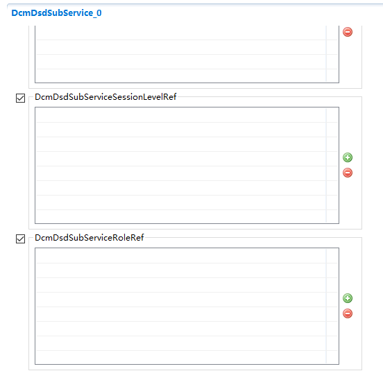
.. |image13| image:: ../../_static/参考手册/DCM/image13.png
   :width: 5.76736in
   :height: 1.67569in
.. |image14| image:: ../../_static/参考手册/DCM/image14.png
   :width: 4.42588in
   :height: 2.97031in
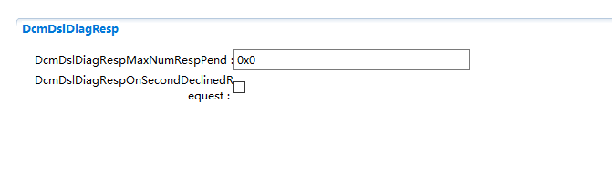
.. |image16| image:: ../../_static/参考手册/DCM/image16.png
   :width: 5.76736in
   :height: 1.60972in

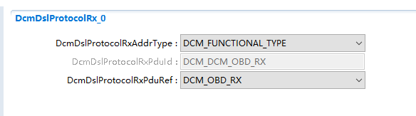
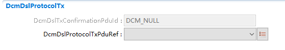

.. |image21| image:: ../../_static/参考手册/DCM/image21.png
   :width: 5.71803in
   :height: 0.71866in
.. |image22| image:: ../../_static/参考手册/DCM/image22.png
   :width: 5.7597in
   :height: 1.11444in
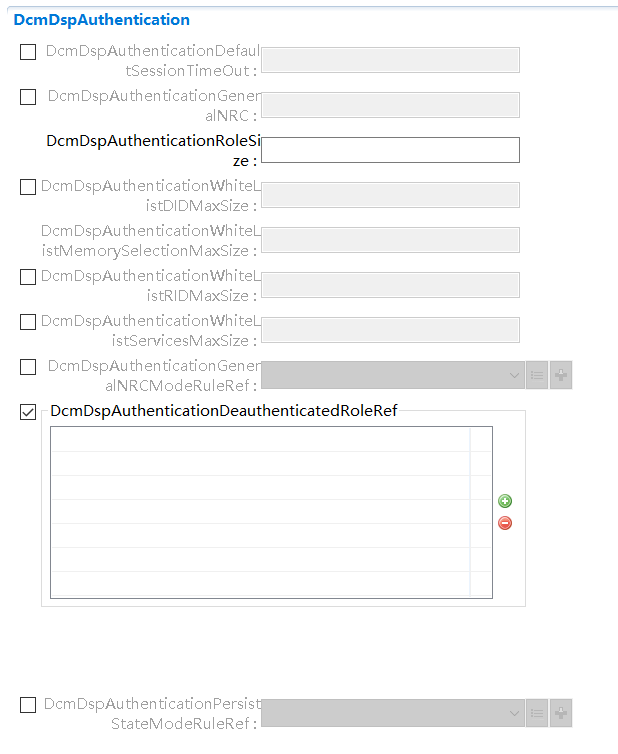
.. |image24| image:: ../../_static/参考手册/DCM/image24.png
   :width: 5.76736in
   :height: 1.27708in
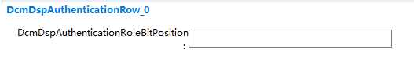
.. |image26| image:: ../../_static/参考手册/DCM/image26.png
   :width: 3.89535in
   :height: 0.82281in

.. |image28| image:: ../../_static/参考手册/DCM/image28.png
   :width: 5.76736in
   :height: 1.48542in
.. |image29| image:: ../../_static/参考手册/DCM/image29.png
   :width: 5.76736in
   :height: 3.92153in
.. |image30| image:: ../../_static/参考手册/DCM/image30.png
   :width: 5.73887in
   :height: 1.37483in
.. |image31| image:: ../../_static/参考手册/DCM/image31.png
   :width: 5.76736in
   :height: 1.15278in
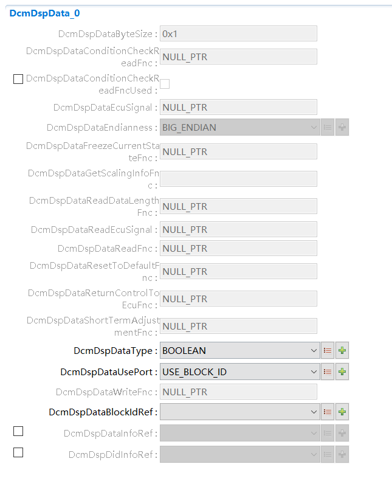
.. |image33| image:: ../../_static/参考手册/DCM/image33.png
   :width: 4.60082in
   :height: 0.63271in
.. |image34| image:: ../../_static/参考手册/DCM/image34.png
   :width: 5.76736in
   :height: 5.56389in
.. |image35| image:: ../../_static/参考手册/DCM/image35.png
   :width: 5.76736in
   :height: 5.52917in
.. |image36| image:: ../../_static/参考手册/DCM/image36.png
   :width: 5.76736in
   :height: 3.40694in
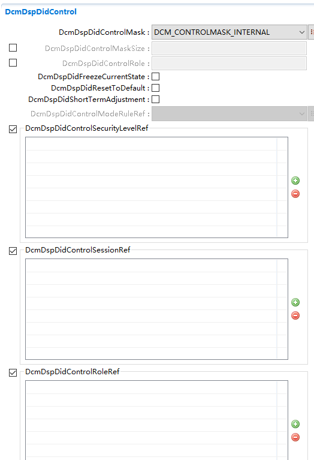

.. |image39| image:: ../../_static/参考手册/DCM/image39.png
   :width: 5.77006in
   :height: 5.37988in
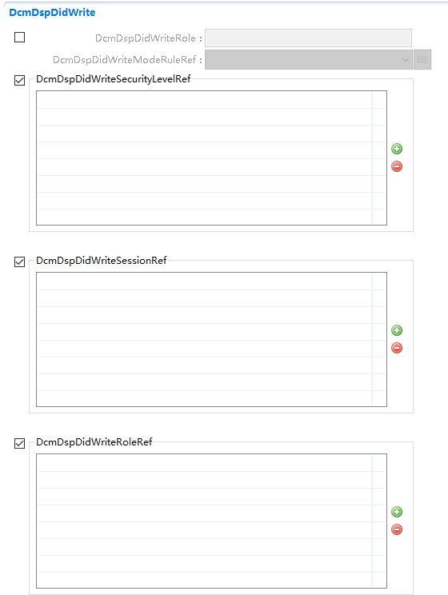
.. |image41| image:: ../../_static/参考手册/DCM/image41.png
   :width: 5.74928in
   :height: 0.89572in
.. |image42| image:: ../../_static/参考手册/DCM/image42.png
   :width: 5.76736in
   :height: 1.96944in

.. |image44| image:: ../../_static/参考手册/DCM/image44.png
   :width: 5.76736in
   :height: 1.43194in
.. |image45| image:: ../../_static/参考手册/DCM/image45.png
   :width: 5.6243in
   :height: 1.14569in
.. |image46| image:: ../../_static/参考手册/DCM/image46.png
   :width: 5.65554in
   :height: 1.68729in
.. |image47| image:: ../../_static/参考手册/DCM/image47.png
   :width: 5.76736in
   :height: 1.07986in
.. |image48| image:: ../../_static/参考手册/DCM/image48.png
   :width: 5.6243in
   :height: 1.13527in
.. |image49| image:: ../../_static/参考手册/DCM/image49.png
   :width: 5.67637in
   :height: 1.68729in
.. |image50| image:: ../../_static/参考手册/DCM/image50.png
   :width: 5.66596in
   :height: 1.52064in
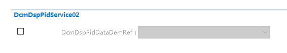
.. |image52| image:: ../../_static/参考手册/DCM/image52.png
   :width: 5.76736in
   :height: 1.23056in
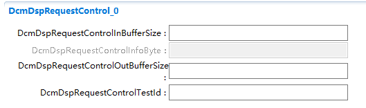
.. |image54| image:: ../../_static/参考手册/DCM/image54.png
   :width: 5.76736in
   :height: 1.09097in
.. |image55| image:: ../../_static/参考手册/DCM/image55.png
   :width: 5.63471in
   :height: 1.09361in

.. |image57| image:: ../../_static/参考手册/DCM/image57.png
   :width: 5.52014in
   :height: 1.34358in
.. |image58| image:: ../../_static/参考手册/DCM/image58.png
   :width: 5.7597in
   :height: 1.91643in

.. |image60| image:: ../../_static/参考手册/DCM/image60.png
   :width: 5.72845in
   :height: 1.42691in
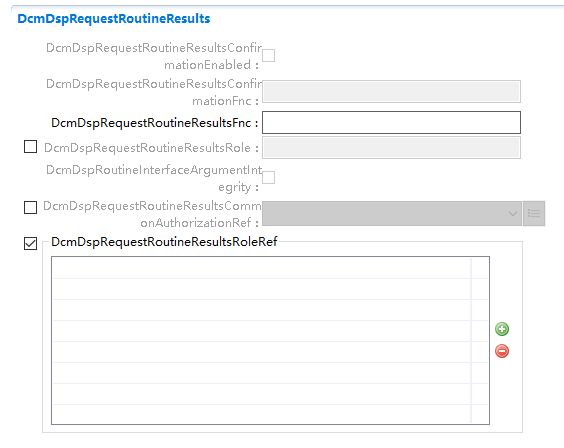
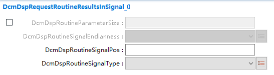
.. |image63| image:: ../../_static/参考手册/DCM/image63.png
   :width: 5.76736in
   :height: 1.14236in
.. |image64| image:: ../../_static/参考手册/DCM/image64.png
   :width: 5.52014in
   :height: 1.73937in
.. |image65| image:: ../../_static/参考手册/DCM/image65.png
   :width: 5.76736in
   :height: 1.87778in
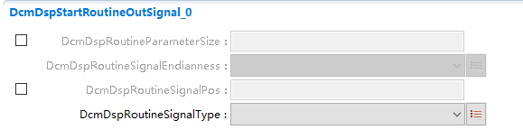
.. |image67| image:: ../../_static/参考手册/DCM/image67.png
   :width: 5.71803in
   :height: 4.74941in
.. |image68| image:: ../../_static/参考手册/DCM/image68.png
   :width: 5.61388in
   :height: 1.72895in
.. |image69| image:: ../../_static/参考手册/DCM/image69.png
   :width: 5.76736in
   :height: 1.17986in
.. |image70| image:: ../../_static/参考手册/DCM/image70.png
   :width: 5.67637in
   :height: 1.72895in
.. |image71| image:: ../../_static/参考手册/DCM/image71.png
   :width: 5.50973in
   :height: 1.18735in
