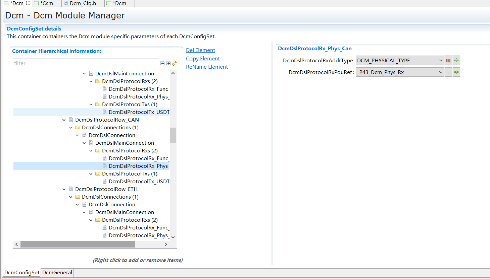
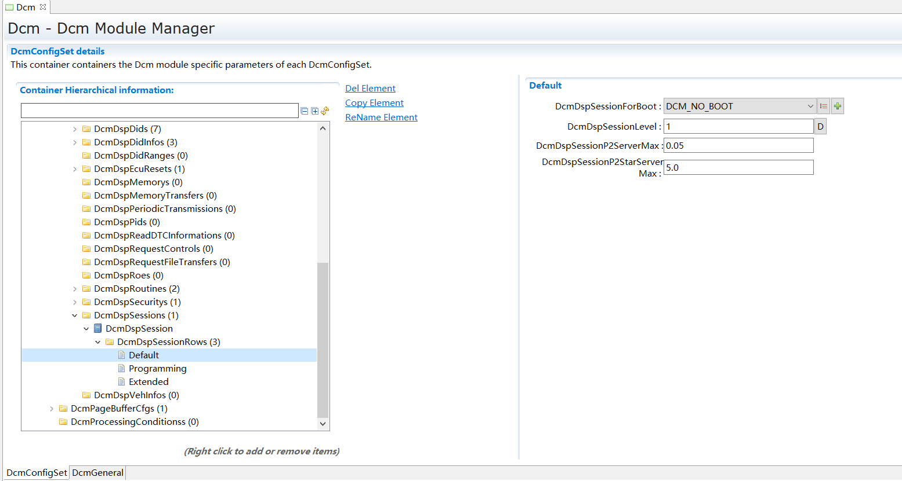
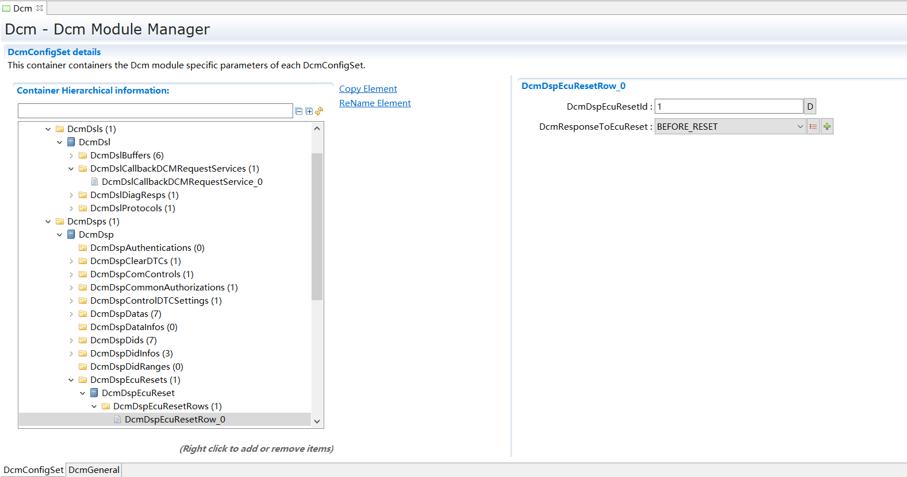
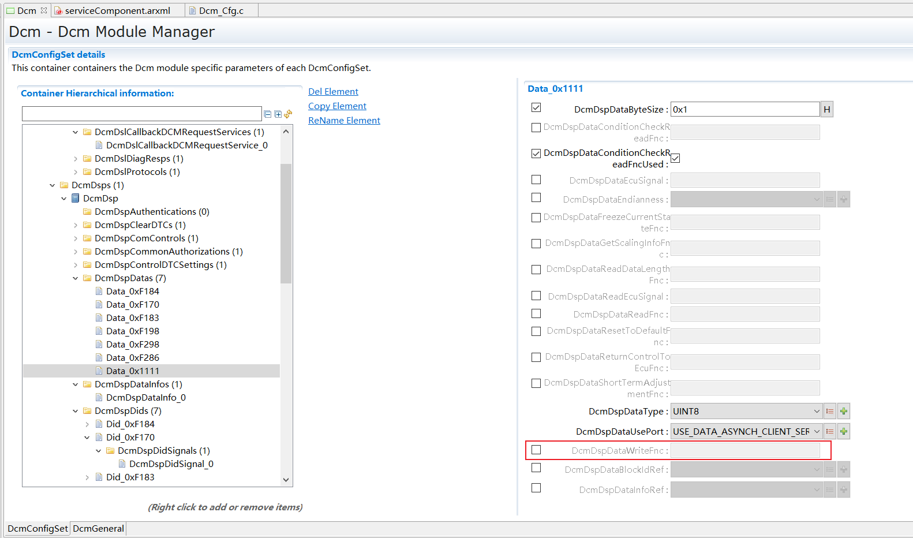
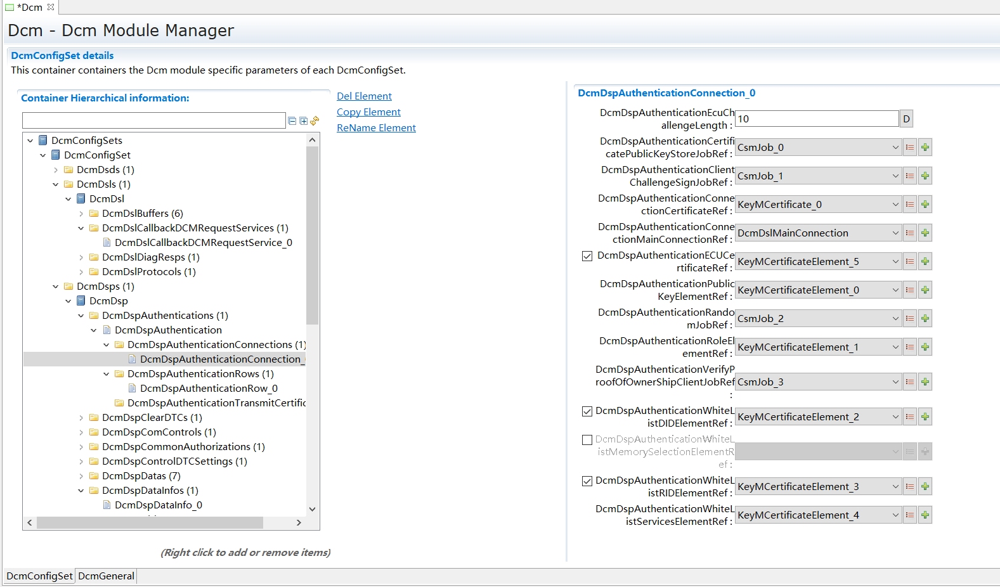
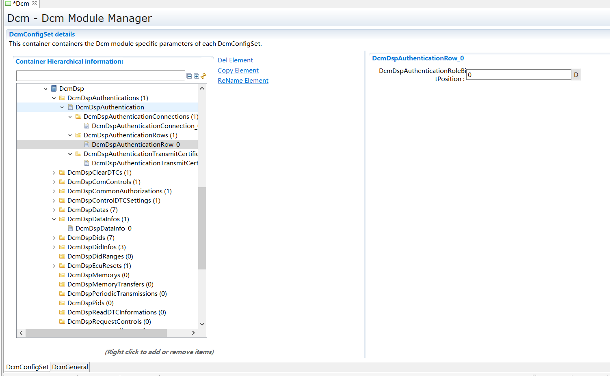
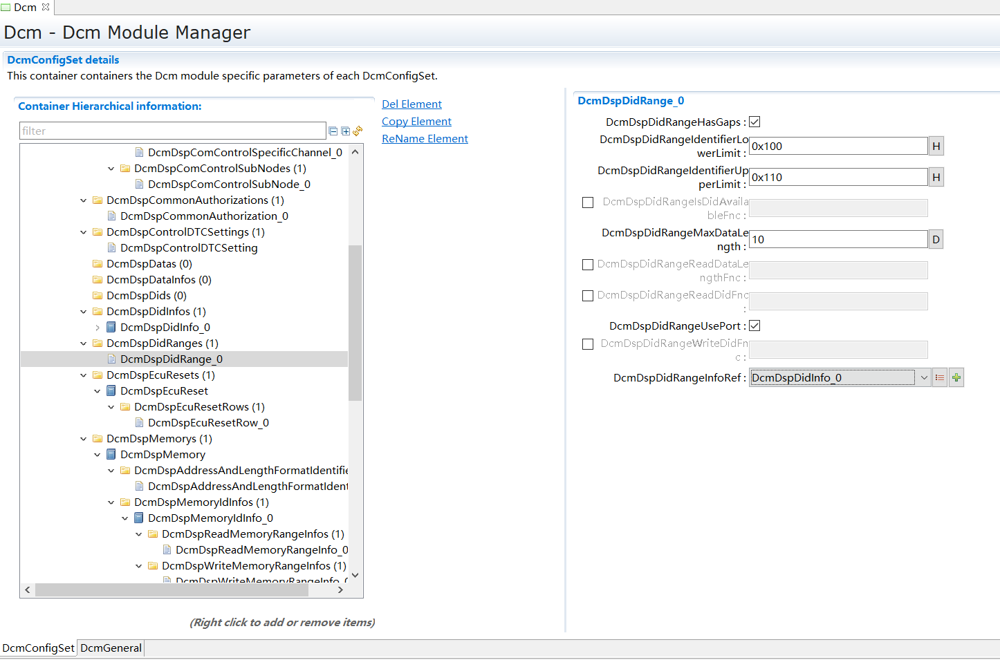

===================
Dcm
===================

文档信息(Document Information)
=======================================

版本历史(Version History)
-----------------------------------

.. list-table::
    :header-rows: 1

    * - 日期(Date)
      - 作者(Author)
      - 版本(Version)
      - 状态(Status)
      - 说明(Description)

    * - 2024/12/19
      - xinrun.wang
      - V0.1
      - 发布(Release)
      - 首次发布(First release)
    * - 2025/04/04
      - xinrun.wang
      - V1.0
      - 发布(Release)
      - 正式发布(Official release)

参考文档(References)
----------------------------------
.. list-table::
    :widths: 10 15 25 10
    :header-rows: 1

    * - 编号(Number)
      - 分类(Classification)
      - 标题(Title)
      - 版本(Version)

    * - [1]
      - Autosar
      - AUTOSAR_CP_SWS_DiagnosticCommunicationManager.pdf
      - R23-11

    * - [2]
      - ISO
      - Unified diagnostic services (UDS) - Part 1:Application Layer
      - Release 2020-02

    * - [3]
      - ISO
      - Unified diagnostic services (UDS) - Part 2:Session layer services
      - Release 2021-10

    * - [4]
      - ISO
      - Road vehicles - Communication between vehicle and external equipment for emissions-related diagnostics - Part 5: Emissions-related diagnostic services
      - Release 2016

术语与简写(Terms and Abbreviations)
========================================

术语(Terms)
------------------------
.. list-table::
    :header-rows: 1

    * - 术语(Term)
      - 解释(Explanation)

    * - AddressAndLengthFormatIdentifier
      - 定义请求消息中memoryAddress(内存地址)和memorySize(内存大小)这两个参数所使用的字节数。(Defines the number of bytes used for the memoryAddress and memorySize parameters in the request message)。

    * - Concurrent TesterPresent
      - UDS服务TesterPresent中，若设置了抑制正响应消息指示位(suppressPosRspMsgIndicationBit,对应请求格式为3E 80)，且该服务通过功能寻址(functional addressing)接收，则此服务也被称为keep-alive logic。(In the UDS service TesterPresent, if the suppress positive response message indication bit (suppressPosRspMsgIndicationBit, corresponding to the request format 3E 80) is set, and the service is received via functional addressing, then this service is also referred to as keep-alive logic)

    * - Functional Addressing
      - 诊断通信模型指：在特定通信网络中，一组或所有节点从一个发送节点接收消息的模型(即1-n通信)。(Diagnostic communication model refers to: in a specific communication network, a model where a group of or all nodes receive messages from one sending node (i.e., 1-n communication))。
        该模型也可称为“broadcast”或“multicast”。OBD通信始终以Functional Addressing模式进行。(This model can also be called "broadcast" or "multicast". OBD communication always operates in Functional Addressing mode)。

    * - Physical Addressing
      - 诊断通信模型指：在特定通信网络中，一个节点从一个发送节点接收消息的模型(即 1-1 通信)。(Diagnostic communication model refers to: in a specific communication network, a model where one node receives messages from one sending node (i.e., 1-1 communication))
        该模型也可称为“unicast”。(This model can also be called "unicast")。

    * - UDS Service
      - 此术语指ISO 14229-1[2]中定义的UDS Service。(This term refers to the UDS Service defined in ISO 14229-1 [2])

    * - OBD Service
      - 此术语指ISO 15031-5[4]中定义的OBD Service。(This term refers to the OBD Service defined in ISO 15031-5 [4])

    * - OBD UDS DTC separation
      - 该功能针对基于SAE J1979-2的UDS通信，将上报与非J1979-2的UDS通信不同的3字节DTC编号。(This function, for UDS communication based on SAE J1979-2, will report a different 3-byte DTC number compared to non-J1979-2 UDS communication)

    * - periodic transmission rate
      - 时间间隔值定义周期性数据标识符(data identifier)传输的两次调用之间的时间间隔。(The time interval value defines the time interval between two invocations of periodic data identifier transmission)
        该值是特定于配置的，并且针对快速、中等和慢速周期性数据传输分别设有不同的值。(This value is configuration-specific and has different values for fast, medium, and slow periodic data transmission respectively)
        配置的值始终是Dcm主任务时间的整数倍。(The configured value is always an integer multiple of the Dcm main task time)

简写(Abbreviations)
-------------------------
.. list-table::
    :widths: 15 20 25
    :header-rows: 1

    * - 简写(Abbreviation)
      - 全称(Full name) 
      - 解释(Explanation)

    * - API
      - Application Programming Interface
      - 接口

    * - CAN
      - Controller Area Network
      - 串行通信协议

    * - Dcm
      - Diagnostic Communication Manager
      - 实现诊断服务的模块

    * - Dem
      - Diagnostic Event Manager
      - 实现诊断事件处理的模块

    * - Det
      - Default Error Tracer
      - 开发/运行时错误报错追踪模块

    * - DID
      - Data Identifier
      - 数据ID

    * - DSD
      - Diagnostic Service Dispatcher
      - 诊断故障码

    * - DSL
      - Diagnostic Session Layer
      - 诊断故障码

    * - DSP
      - Diagnostic Sercice Processing
      - 诊断故障码

    * - DTC
      - Diagnostic Trouble Code
      - 诊断故障码

    * - ID
      - Identifier
      - 识别编号

    * - LIN
      - Local Interconnect Network
      - 局域互联网络

    * - MOST
      - Media Oriented Systems Transport
      - 多媒体通信总线

    * - NRC
      - Negative Response Code
      - 负响应码

    * - OBD
      - On-Board Diagnostics
      - 车载诊断系统

    * - PDID
      - Periodic Data Identifier
      - periodically send by the Dcm after a request of ReadDataByPeriodicIndentifer

    * - Pdu
      - Protocol Data Unit
      - 协议数据单元

    * - PID
      - Parameter Identifier
      - 参数ID，用于OBD 0x01/0x02

    * - RCRRP
      - Response correctly received - response pending
      - 立即发送一帧NRC0x78 Pending回复

    * - RID
      - Routine Identifier
      - 例程ID

    * - ROE
      - ResponseOnEvent
      - 根据事件做诊断响应，用于UDS 0x86

    * - RTE
      - Runtime Environment
      - 介于SWC和BSW间的虚拟总线环境

    * - SID
      - Service Identifier
      - 服务ID

    * - SW-C
      - Software-Component
      - 应用设计单元模块

    * - TP
      - Transport Protocol
      - TP数据传输协议

    * - UDS
      - Unified diagnostic services
      - 诊断服务的标准

    * - CS
      - Client-Server
      - 客户端-服务端的RTE通信方式，以调用函数接口的方式进行通信

    * - SR
      - Sender-Receiver
      - 发送方-接收方的RTE通信方式，以数据传递的方式进行通信

    * - CanTp
      - CAN Transport Layer
      - CAN传输模块

    * - DoIP
      - Diagnostic Over IP
      - 以太网传输模块

    * - PduR
      - Pdu Router
      - Pdu路由模块

简介(Introduction)
========================
Dcm提供一些通用的接口来实现诊断服务，实现与诊断仪以标准UDS(ISO14229-1)/OBD(SAEJ1979, ISO15031-5)协议以及独立网络相关协议(ISO15765-3, 15765-4)进行沟通和数据交互。

Dcm provides general interfaces to implement diagnostic services, enabling communication and data interaction with diagnostic tools using standard UDS (ISO14229-1)/OBD (SAEJ1979, ISO15031-5) protocols and independent network-related protocols (ISO15765-3, 15765-4).

Dcm为车辆在开发、生产和后续客户服务过程中提供诊断车辆内部信息的功能。

Dcm provides the capability to diagnose internal vehicle information during development, production, and subsequent customer service processes.

Dcm在Autosar架构中位于通信服务层，它适用于任何网络总线(CAN/FLEXRAY/LIN/MOST等)，因此特定于网络环境的实现均位于其他模块中(例如CanTp/DoIP等)。

In the AUTOSAR architecture, Dcm is located in the communication services layer and is applicable to any network bus (CAN/FLEXRAY/LIN/MOST, etc.). Therefore, implementations specific to the network environment reside in other modules (such as CanTp/DoIP, etc.).

Dcm通过调用PduR提供的独立网络总线的通用接口或提供回调接口来进行实际的数据收发，PduR根据配置决定报文收发使用的总线类型。

Dcm performs actual data transmission and reception by calling the general interfaces for independent network buses provided by PduR or by providing callback interfaces. PduR determines the bus type used for message transmission and reception based on configuration.

Dcm在接收到诊断请求后将分析内容，根据协议要求判断内容是否正确，如不正确则回复对应NRC，如正确则回复正响应。

Upon receiving a diagnostic request, Dcm analyzes the content and determines its correctness according to protocol requirements. If incorrect, it replies with the corresponding NRC; if correct, it replies with a positive response.

Dcm在处理服务过程中可能涉及到一些外部数据的获取(例如DTC状态，DID数据，RID例程等)，其中会与其他BSW模块或者SWC(通过RTE)进行交互。

During service processing, Dcm may involve acquiring external data (e.g., DTC status, DID data, RID routines, etc.), which requires interaction with other BSW modules or SWCs (via RTE).

Dcm分成三大功能主题DSL, DSD和DSP。

Dcm is divided into three major functional themes: DSL, DSD, and DSP.

.. figure:: ../../../_static/参考手册/Dcm/DcmInAutosarLayer.png
    :alt: Dcm模块层次图 (Dcm Module Hierarchy Diagram)
    :name: Dcm模块层次图 (Dcm Module Hierarchy Diagram)
    :align: center

    Dcm模块层次图 (Dcm Module Hierarchy Diagram)
   

如图 :ref:`Dcm模块层次图 (Dcm Module Hierarchy Diagram)` 所示，Dcm模块处于AUTOSAR架构中的通信服务层，其下层模块为PduR模块，上层模块为RTE。

As shown in the Dcm Module Hierarchy Diagram, the Dcm module resides in the communication services layer of the AUTOSAR architecture, with the PduR module beneath it and the RTE above it.

功能描述(Functional Description)
==========================================

特性(Features)
-------------------------

Diagnostic Session Layer(DSL)
~~~~~~~~~~~~~~~~~~~~~~~~~~~~~~~~~~~~~~~~~~~~~~~~~~~~~~~~~~~~~~~~~~~
接收诊断请求 Receiving diagnostic requests
 
透过PduR模块与TP模块进行通信，以TP的方式接收诊断请求，从PduR调用Dcm_StartOfReception开始，后续调用Dcm_CopyRxData复制接收数据，最后以Dcm_TpRxIndication收尾结束接收。

Communicates with the TP module through the PduR module to receive diagnostic requests in TP mode. The process starts with PduR calling Dcm_StartOfReception, followed by Dcm_CopyRxData to copy received data, and concludes with Dcm_TpRxIndication to complete reception.

功能寻址并发3E80 Functional addressing for concurrent 3E80
*******************************************************************
通过发送功能寻址的3E80(Concurrent TesterPresent)来重置S3超时时间，使Dcm保持在某个非默认会话下。

Resets the S3 timer by sending functionally addressed 3E80 (Concurrent TesterPresent), keeping Dcm in a non-default session.

发送诊断回复(Sending diagnostic responses)
**************************************************
透过PduR模块与TP模块进行通信，以TP的方式发送诊断回复，从Dcm调用PduR_DcmTransmit开始，后续PduR调用Dcm_CopyTxData复制发送数据，最后以Dcm_TpTxConfirmation收尾结束发送。

Communicates with the TP module through the PduR module to send diagnostic responses in TP mode. The process starts with Dcm calling PduR_DcmTransmit, followed by PduR calling Dcm_CopyTxData to copy transmission data, and concludes with Dcm_TpTxConfirmation to complete transmission.

通用连接处理(General connection handling)
*************************************************
在TP接收过程中传入metaData，Dcm获取SA和TA，在发送诊断回复时，对调SA和TA，同样传入metaData进行发送。

Pass in metaData during TP reception, Dcm obtains SA and TA. When sending a diagnostic response, swap SA and TA, swaps SA and TA and includes metaData in the transmission.

P2Server触发回复等待(NRC 0x78) P2Server triggers response waiting (NRC 0x78)
***************************************************************************************
在P2Server时间内，如果未能发出诊断回复(服务仍在处理或回复了DCM_E_PENDING)，则发送NRC 0x78告知诊断仪，需要更多时间处理，后续发出回复。
首次发送Pending需要在P2Server时间内，后续发送每个Pending间隔P2StarServer时间。
可以通过配置决定最多发送的NRC 0x78数量，超出指定的数量则发送NRC 0x10，并结束此次诊断请求处理。

If a diagnostic response cannot be sent within the P2Server time (service still processing or DCM_E_PENDING replied), sends NRC 0x78 to inform the diagnostic tool that more time is required, with the response sent later.
The first Pending must be sent within P2Server time, with subsequent Pending messages sent at P2StarServer intervals.
The maximum number of NRC 0x78 transmissions can be configured. Exceeding this limit results in NRC 0x10 transmission and termination of the current diagnostic request processing.

周期发送(Periodic Transmission)
*************************************
通过内部实现UDS 0x2A服务，读取指定DID的数据，实现周期发送UUDT报文。

Implements UDS 0x2A service internally to read data from specified DIDs, enabling periodic transmission of UUDT messages.

分页发送(Paged Transmission)
***************************************
在发送内容长度大于分配的TxBuffer大小时，可以触发分页发送(通常适用于UDS 0x19和0x22服务)，先获取部分数据，然后发起发送请求，
后续在copyTxData部分完成时可以释放部分Txbuffer，从而可以获取后续数据，直到发送完成。

Triggers paged transmission when content length exceeds allocated TxBuffer size (typically for UDS 0x19 and 0x22 services). Partial data is first acquired and transmission initiated.
Subsequently, portions of TxBuffer can be released during copyTxData completion, enabling acquisition of subsequent data until transmission is complete.

应用触发回复等待(NRC 0x78) Application-Triggered Response Waiting (NRC 0x78)
************************************************************************************
应用(应用callout接口或者自定义诊断服务)可以通过回复DCM_E_FORCE_RCRRP来立即发起一次Pending NRC 0x78回复，无论是否到达P2Server。

Applications (via application callout interfaces or custom diagnostic services) can immediately initiate a Pending NRC 0x78 response by replying DCM_E_FORCE_RCRRP, regardless of P2Server timeout status.

安全级控制(Security Level Control)
******************************************
通过内部实现UDS 0x27服务，实现安全级控制，可以进行会话切换(初始为LOCKED)，可以自行配置安全级(决定Seed长度，尝试次数，解锁方法等)，可以通过配置决定各个安全级下支持的服务、DID、RID等。

Implements UDS 0x27 service internally for security level control, enabling session switching (initially LOCKED). Security levels can be independently configured (determining seed length, attempt counts, unlock methods, etc.), and services, DIDs, RIDs supported under each security level can be defined through configuration.

会话控制(Session Control)
*******************************
通过内部实现UDS 0x10服务，实现会话控制，可以进行会话切换(通常有默认会话、编程会话、扩展会话等)，可以自行配置会话，可以通过配置决定各个会话下支持的服务、DID、RID等。

Implements UDS 0x10 service internally for session control, enabling session switching (typically including default session, programming session, extended session, etc.). Sessions can be independently configured, and services, DIDs, RIDs supported under each session can be defined through configuration.

安全认证(Security Authentication)
***************************************
通过内部实现UDS 0x29服务，实现安全认证，可以与信息安全相关模块(Csm, KeyM)进行安全认证，通过配置决定各个安全认证Role下支持的服务、DID、RID等。

Implements UDS 0x29 service internally for security authentication, enabling authentication with information security modules (Csm, KeyM). Services, DIDs, RIDs supported under each security authentication Role can be defined through configuration.

超时管理(Timeout Management)
*************************************
可以根据主函数周期监控超时情况，从而实现P2Server/S3Server等超时。
可以配置S3Server，决定Dcm在没有受到外部请求时可以维持非默认会话的时间，超出该时间则恢复到默认会话。
也可以配置P2Server和P2StarServer，决定首次和后续发送NRC 0x78的时机。

Monitors timeout conditions based on main function cycle, enabling P2Server/S3Server timeout implementation.
S3Server can be configured to determine duration Dcm maintains non-default session without external requests, reverting to default session upon timeout.
P2Server and P2StarServer can be configured to determine timing for initial and subsequent NRC 0x78 transmissions.

协议并行(Protocol Parallelism)
***********************************
在默认会话下支持不互相共享Buffer的协议并行，支持多个协议同时进行诊断报文的收发和诊断服务的处理，协议间相对独立，拥有独立的管理单元。

Supports protocol parallelism without shared buffers in default session, enabling multiple protocols to simultaneously transmit/receive diagnostic messages and process diagnostic services. Protocols operate independently with separate management units.

协议抢占(Protocol Preemption)
**********************************
在非默认会话下或互相共享Buffer的协议间不支持并行，优先级更高的协议会向优先级更低的协议发起抢占，被抢占的协议会立即取消当前的诊断请求处理，包括报文的收发。

Parallelism is not supported in non-default sessions or between protocols sharing buffers. Higher-priority protocols preempt lower-priority ones, with preempted protocols immediately canceling current diagnostic request processing, including message transmission/reception.

通信模式控制(Communication Mode Control)
***********************************************
ComM通过调用对应接口(Dcm_ComM_NoComModeEntered/Dcm_ComM_SilentComModeEntered/Dcm_ComM_FullComModeEntered)可以使得Dcm进入对应通信模式，分别对应禁止收发，只收不发和允许收发。

ComM can set Dcm into corresponding communication modes by calling respective interfaces (Dcm_ComM_NoComModeEntered/Dcm_ComM_SilentComModeEntered/Dcm_ComM_FullComModeEntered), corresponding to: disable transmission/reception, receive-only, and enable transmission/reception.

Diagnostic Service Dispatcher(DSD):
~~~~~~~~~~~~~~~~~~~~~~~~~~~~~~~~~~~~~~~~~~~~

检查诊断服务请求(Check Diagnostic Service Requests)
***********************************************************
根据配置的服务表，做请求的诊断服务/子服务的通用检查，主要有制造商/供应商许可检查，是否支持该服务/子服务，指定会话级、安全级、安全认证和模式规则是否达到，如有子服务则长度是否至少为2，等等通用检查。

Performs general checks on requested diagnostic services/sub-services based on the configured service table. These checks primarily include manufacturer/supplier permission verification, service/sub-service support validation, confirmation of specified session level, security level, security authentication, and mode rule compliance. If a sub-service is present, it also verifies that the length is at least 2 bytes, among other general validations.

传递请求/回复 Transfer Requests/Responses
*************************************************************
将请求做处理后根据接口的标准参数传递至DSP，并从DSP收取回复，组装回复准备发送回复。

Processes requests and transfers them to DSP according to standard interface parameters, then receives responses from DSP, assembles them, and prepares for transmission.

正响应抑制(Positive Response Suppression)
*************************************************************
有子服务的诊断服务请求支持正响应抑制，通过将子服务的bit7置为1来告知Dcm该诊断请求的正响应无需回复，例如3E80。

Diagnostic service requests with sub-services support positive response suppression. By setting bit 7 of the sub-service to 1, Dcm is informed that no positive response is required for this diagnostic request, such as in the case of 3E80.

负响应抑制(Negative Response Suppression)
*************************************************************
功能寻址下，NRC 0x11/0x12/0x31/0x7E/0x7F不发送诊断回复，直接结束诊断服务处理。

Under functional addressing, NRC 0x11/0x12/0x31/0x7E/0x7F do not trigger diagnostic response transmission, and the diagnostic service processing is terminated directly.

发送确认处理(Transmission Confirmation Processing)
*************************************************************
由DSP获得发送确认后，调用Confirmation Callout接口，通知应用诊断服务处理的结果(正响应成功发送/正响应发送失败或抑制/负响应成功发送/负响应发送失败或抑制)

After obtaining transmission confirmation from DSP, calls the Confirmation Callout interface to notify the application of the diagnostic service processing result (positive response sent successfully/positive response transmission failed or suppressed/negative response sent successfully/negative response transmission failed or suppressed).

Diagnostic Service Processing(DSP):
~~~~~~~~~~~~~~~~~~~~~~~~~~~~~~~~~~~~~~~~~~~~

UDS服务(UDS Services)
*****************************
根据Autosar规范，内部实现了以下UDS服务，均参照ISO14229-1实现，具体逻辑请参考文档，部分Autosar指定的服务未实现，可以参考后续的偏差：

The following UDS services are internally implemented in accordance with the AUTOSAR specification, all referencing ISO 14229-1. For specific logic, please refer to the relevant documentation. Some services specified by AUTOSAR are not implemented; refer to subsequent deviations for details:

.. list-table::
    :header-rows: 1

    * - SID
      - service
      - Subfunction

    * - 0x10
      - DiagnosticSessionControl
      - 1-126

    * - 0x11
      - ECUReset
      - 0-127

    * - 0x14
      - ClearDiagnosticInformation
      - N/A

    * - 0x19
      - ReadDTCInformation
      - 0x01, 0x02, 0x03, 0x04, 0x06, 0x0A, 0x0D, 0x0E

    * - 0x22
      - ReadDataByIdentifier
      - N/A

    * - 0x23
      - ReadMemoryByAddress
      - N/A

    * - 0x24
      - ReadScalingDataByIdentifier
      - N/A

    * - 0x27
      - SecurityAccess
      - 1-126

    * - 0x28
      - CommunicationControl
      - 0x00, 0x01, 0x02, 0x03, 0x04, 0x05

    * - 0x29
      - Authentication
      - 0x00, 0x01, 0x02, 0x03, 0x04, 0x08

    * - 0x2A
      - ReadDataByPeriodicIdentifier
      - N/A

    * - 0x2C
      - DynamicallyDefineDataIdentifier
      - 0x01, 0x02, 0x03

    * - 0x2E
      - WriteDataByIdentifier
      - N/A

    * - 0x2F
      - InputOutputControlByIdentifier
      - N/A

    * - 0x31
      - RoutineControl
      - 0x01, 0x02, 0x03

    * - 0x34
      - RequestDownload
      - N/A

    * - 0x35
      - RequestUpload
      - N/A

    * - 0x36
      - TransferData
      - N/A

    * - 0x37
      - RequestTransferExit
      - N/A

    * - 0x38
      - RequestFileTransfer
      - N/A

    * - 0x3D
      - WriteMemoryByAddress
      - N/A

    * - 0x3E
      - TesterPresent
      - N/A

    * - 0x85
      - ControlDTCSetting
      - 0x01, 0x02

    * - 0x86
      - ResponseOnEvent
      - 0x00, 0x01, 0x03, 0x04, 0x05, 0x06, 0x08, 0x09

OBD服务(OBD Services)
******************************
根据Autosar规范，内部实现了以下OBD服务，均按照规范ISO15031-5实现，具体逻辑请参考文档：

The following OBD services are internally implemented in accordance with the AUTOSAR specification, all implemented following ISO 15031-5. For specific logic, please refer to the relevant documentation:

.. list-table::
    :header-rows: 1

    * - Relevant OBD Service Identifier
      - Support in the Dcm
        
    * - $01
      - Supported
        
    * - $02
      - Supported

    * - $03
      - Supported

    * - $04
      - Supported

    * - $06
      - Supported

    * - $07
      - Supported

    * - $08
      - Supported

    * - $09
      - Supported

    * - $0A
      - Supported

Bootloader交互(Bootloader Interaction)
******************************************************
通过内部实现的0x10/0x11服务实现与Bootloader的跳转交互，通过调用Dcm_SetProgConditions接口设置接收的服务请求，是否为编程请求等信息，
在Bootloader侧可以访问相关信息决定是否需要回复诊断回复以及是否进行编程等动作。

Implements jump interaction with the Bootloader through internally implemented 0x10/0x11 services. By calling the Dcm_SetProgConditions interface, it sets information such as received service requests and whether they are programming requests.
The Bootloader side can access this information to determine whether to send diagnostic responses and whether to perform programming actions.

外部接口处理(External Interface Processing)
******************************************************
通过配置可以决定数据读取的接口是通过用户自定的callout还是通过SWC/RTE(选择CS/SR/NV)，以及接口本身为同步还是异步，
是否包含ErrorCode等，根据配置不同，Dcm需要调用的接口(应用需实现的接口)的参数则不同。

Configuration determines whether data reading interfaces use user-defined callouts or SWC/RTE (selecting CS/SR/NV), and whether the interfaces themselves are synchronous or asynchronous,
including whether they contain ErrorCode, etc. Depending on the configuration, the parameters of the interfaces that Dcm needs to call (interfaces to be implemented by the application) will vary.

NvM交互(NvM Interaction)
******************************************************
部分服务本身或服务相关变量需要借助NvM进行存储读写，将会引用NvM的block，通过标准接口对其进行读写、查询块状态等操作。

Some services themselves or service-related variables require NvM for storage read/write operations. They will reference NvM blocks and perform operations such as reading, writing, and querying block status through standard interfaces.

DcmSecureCoding
******************************************************
该功能可以指定某些DID以及某个RID，在对这些DID发起写入前需要前置29 04服务，发送证书，执行2E服务写入时将不会直接写入，
而是暂存需要写入的内容，后续在执行指定RID的startRoutine时会执行证书验证，验证通过后会对这些DID进行写入。

This function allows specifying certain DIDs and a specific RID. Before initiating writes to these DIDs, the 29 04 service must be executed first to send certificates. When executing the 2E service for writing, the data will not be written directly, but temporarily stored. Later, when executing the startRoutine of the specified RID, certificate verification will be performed. After successful verification, these DIDs will be written.

.. only:: doc_pbs

  变体(Variants)
  ~~~~~~~~~~~~~~~~~

  支持以下功能的开关，指定当前变体下需要的内容，关闭后视为未配置该内容：
  Supports enabling/disabling the following functions, specifying the content required under the current variant. When disabled, it is considered as not configured:
  - DcmDsdServiceUsed：开关服务(Toggle service)
  - DcmDsdSubServiceUsed：开关子服务(Toggle sub-service)
  - DcmDslProtocolRowUsed：开关协议(Toggle protocol)
  - DcmDspComControlAllChannelUsed：开关AllChannel类型的通信控制(Toggle AllChannel type communication control)
  - DcmDspComControlSpecificChannelUsed：开关SpecificChannel类型的通信控制(Toggle SpecificChannel type communication control)
  - DcmDspComControlSubNodeUsed：开关SubNode类型的通信控制(Toggle SubNode type communication control)
  - DcmDspDidUsed：开关DID(Toggle DID)
  - DcmDspPidUsed：开关PID(Toggle PID)
  - DcmDspRoutineUsed：开关Routine(Toggle Routine)

  - DcmDsdServiceUsed：开关服务
 
    DcmDsdServiceUsed: Toggle service
 
  - DcmDsdSubServiceUsed：开关子服务
 
    DcmDsdSubServiceUsed: Toggle sub-service

偏差(Deviation)
---------------------------

此处描述的偏差为当前实现与Autosar版本R23要求的差异，Autosar自身的限制条目请参考[1]的第4章节

The deviations described here indicate differences between the current implementation and the AUTOSAR R23-11 requirements. For restrictions inherent to the AUTOSAR standard itself, refer to Chapter 4 of [1].

Nested(Data types)
~~~~~~~~~~~~~~~~~~~~

涉及DidSignal/RoutineSignal的嵌套数据类型(CompositePool)，因为和封装需求有所冲突，且使用常规DspData/Routine类型通常可以满足应用需求，所以暂不实现。
涉及以下SWS需求：

Nested data types (CompositePool) for DidSignal/RoutineSignal conflict with encapsulation requirements. Since conventional DspData/Routine types generally satisfy application needs, this feature is temporarily unimplemented.
The following SWS requirements are involved:

- SWS_Dcm_01633
- SWS_Dcm_01634
- SWS_Dcm_01635
- SWS_Dcm_01636
- SWS_Dcm_01637
- SWS_Dcm_01638
- SWS_Dcm_01639
- SWS_Dcm_CONSTR_06048
- SWS_Dcm_91118
- SWS_Dcm_91119
- SWS_Dcm_91120
- SWS_Dcm_91121
- SWS_Dcm_91122
- SWS_Dcm_91123
- SWS_Dcm_91124

**配置(configuration)**

以下配置项删除:

The following configuration items are deleted:

#. DcmDspDidSignalCompositePool
#. DcmDspDidSignalCompositeRef
#. DcmDspRequestRoutineResultsInSignalCompositePool
#. DcmDspRequestRoutineResultsInSignalCompositeSignalRef
#. DcmDspRequestRoutineResultsOutSignalCompositePool
#. DcmDspRequestRoutineResultsOutSignalCompositeSignalRef
#. DcmDspStartRoutineInSignalCompositePool
#. DcmDspStartRoutineInSignalCompositeSignalRef
#. DcmDspStartRoutineOutSignalCompositePool
#. DcmDspStartRoutineOutSignalCompositeSignalRef
#. DcmDspStopRoutineInSignalCompositePool
#. DcmDspStopRoutineInSignalCompositeSignalRef
#. DcmDspStopRoutineOutSignalCompositePool
#. DcmDspStopRoutineOutSignalCompositeSignalRef
#. DcmDspDidSignal/DcmDspDataByteSize

**接口(Interface)**

None

service table linking
~~~~~~~~~~~~~~~~~~~~~~~~

服务表的关联位于配置中，因此无需在初始化协议时进行关联，在需要时直接取用配置即可，所以暂不实现。
涉及SWS需求SWS_Dcm_00035

Service table associations are defined within the configuration, eliminating the need for association during protocol initialization. The configuration can be directly accessed when required, hence this feature is temporarily unimplemented.
This involves SWS requirement SWS_Dcm_00035.

**配置(configuration)**
    
None

**接口(Interface)**
    
Dcm_Init无需涉及相关初始化操作

Dcm_Init does not need to involve relevant initialization operations.

协议并行时根据协议优先级做ComM诊断情况报告(ComM diagnostic status reporting based on protocol priority during parallelism)
~~~~~~~~~~~~~~~~~~~~~~~~~~~~~~~~~~~~~~~~~~~~~~~~~~~~~~~~~~~~~~~~~~~~~~~~~~~~~~~~~~~~~~~~~~~~~~~~~~~~~~~~~~~~~~~~~~~~~~~~~~~~~~~~~~~~~~~~~~~~~~~~~~~~~~~~~~~~~

协议并行时，不同协议可能来源于不同ComM通道，多协议并行期间调用comm接口提示各网络的通信情况即可，所以暂不实现。
涉及SWS需求SWS_Dcm_01050

During protocol parallelism, different protocols may originate from distinct ComM channels. Invoking ComM interfaces to report the communication status of each network during multi-protocol parallel operation is sufficient, therefore this feature is temporarily unimplemented.
This involves SWS requirement SWS_Dcm_01050.

**配置(configuration)**
    
None

**接口(Interface)**

None

协议并行时序列化调用接口/处理服务 When protocols are parallel, interfaces are called/ services are processed in a serialized manner
~~~~~~~~~~~~~~~~~~~~~~~~~~~~~~~~~~~~~~~~~~~~~~~~~~~~~~~~~~~~~~~~~~~~~~~~~~~~~~~~~~~~~~~~~~~~~~~~~~~~~~~~~~~~~~~~~~~~~~~~~~~~~~~~~~~~~~~~

因为服务/接口需要提供当前运行状态(OpStatus)，在协议并行时，如果涉及访问同一服务/接口，则可能会出现OpStatus冲突，从而服务处理混乱，
因此需求中要求对于该情况，延迟对服务/接口的调用，直到不会发生并行处理。
此处如果需要实现，则需要针对每一个服务和接口单元做状态管理，需要开辟额外内存空间，以及每次执行时的查询。在实际应用过程中，
该类情况基本不会发生，且可以通过应用行为进行避免，因此该需求暂不实现。
涉及以下SWS需求：

Since services/interfaces must provide current operational status (OpStatus), during protocol parallelism, accessing the same service/interface could cause OpStatus conflicts, leading to service processing inconsistencies. The requirement therefore mandates delaying service/interface calls until parallel processing ceases.
Implementation would require state management for each service and interface unit, involving additional memory allocation and per-execution queries. In practice, such scenarios are rare and can be mitigated through application design. Consequently, this requirement is temporarily unimplemented.
The following SWS requirements are involved:

- SWS_Dcm_01604
- SWS_Dcm_01370

**配置(configuration)**
    
None

**接口(Interface)**

None

Harmonize the naming between interfaces and modes
~~~~~~~~~~~~~~~~~~~~~~~~~~~~~~~~~~~~~~~~~~~~~~~~~~~~

需求要求SessionRow的配置container名与模式名统一，当前封装时针对固定的SessionLevel生成了对应的默认名，
没有采用SessionRow的名字，仅对除固定SessionLevel外的采用了配置名。
在配置时，根据sessionLevel自动修改container名涉及到配置变动，如果手动进行修改则过于繁琐，因此该需求可暂不实现。
涉及以下SWS需求：

The requirement specifies that the configuration container name of SessionRow should align with the mode name. In the current encapsulation, corresponding default names are generated for fixed SessionLevels, without adopting the SessionRow names. Only configuration names other than the fixed SessionLevels are used.
Automatically modifying container names based on sessionLevel during configuration involves configuration changes, and manual modification would be overly cumbersome. Therefore, this requirement is temporarily not implemented.
The following SWS requirements are involved:

- SWS_Dcm_CONSTR_06000
- SWS_Dcm_CONSTR_06001

**配置(configuration)**
    
DcmDspSessionRow.SHORT-NAME不做限制

There is no restriction on DcmDspSessionRow.SHORT-NAME.

**接口(Interface)**

None

部分Det报错(Some Det error reports)
~~~~~~~~~~~~~~~~~~~~~~~~~~~~~~~~~~~~~~~

部分要求的Det报错在Det表(文档7.2.1-7.2.2章节)中不存在，不确定ID值，因此暂不实现。
涉及SWS需求SWS_Dcm_01143

Some required Det error reports are not present in the Det table (Sections 7.2.1-7.2.2 of the document), and their ID values are undetermined. Therefore, they are not implemented temporarily.
This involves SWS requirement SWS_Dcm_01143.

**配置(configuration)**
    
None

**接口(Interface)**

None

DcmSecurityAccess模式组(DcmSecurityAccess Mode Group)
~~~~~~~~~~~~~~~~~~~~~~~~~~~~~~~~~~~~~~~~~~~~~~~~~~~~~~~~~~~~~~~~~~~~

需求要求的模式组与后续服务组件需求有冲突，因此以服务组件需求为标准，暂不实现。
涉及SWS需求SWS_Dcm_01327。

The mode group required by the specification conflicts with subsequent service component requirements. Therefore, following the service component requirements as the standard, this feature is temporarily unimplemented.
This involves SWS requirement SWS_Dcm_01327.

**配置(configuration)**
    
None

**接口(Interface)**

None

86服务相关模式组 Mode groups related to service 86
~~~~~~~~~~~~~~~~~~~~~~~~~~~~~~~~~~~~~~~~~~~~~~~~~~~~~~

需求要求的模式组在后续服务组件需求中不存在，且86服务相关模式切换应用场景很少，暂不实现。
涉及以下SWS需求：

The mode groups required by the specification are absent in subsequent service component requirements, and mode switching scenarios related to service 86 are infrequent. Therefore, this feature is temporarily unimplemented.
The following SWS requirements are involved:

- SWS_Dcm_00933
- SWS_Dcm_00934

**配置(configuration)**
    
None

**接口(Interface)**

None

DcmModeConditionCertificateCompareElementRef
~~~~~~~~~~~~~~~~~~~~~~~~~~~~~~~~~~~~~~~~~~~~~~~

模式条件使用证书作为比较元素的使用场景很少，暂不实现。
涉及以下SWS需求：

Usage scenarios employing certificates as comparison elements in mode conditions are rare. Therefore, this feature is temporarily unimplemented.
The following SWS requirements are involved:

- SWS_Dcm_CONSTR_06089
- SWS_Dcm_CONSTR_06090

**配置(configuration)**
    
DcmModeConditionCertificateCompareElementRef配置删除

The configuration of DcmModeConditionCertificateCompareElementRef is deleted

**接口(Interface)**

None

DcmDspDiagnosisScaling
~~~~~~~~~~~~~~~~~~~~~~~~~

在Dcm侧定义CompuMethod计算方法，当前集中在应用进行计算方法的设计，没有在BSW侧设计的应用场景，暂不实现。
涉及以下SWS需求：

Defining CompuMethod calculation methods on the Dcm side is currently focused on application-level design, with no usage scenarios requiring BSW-side implementation. Therefore, this feature is temporarily unimplemented.
The following SWS requirements are involved:

- SWS_Dcm_00964
- SWS_Dcm_CONSTR_06053

**配置(configuration)**

以下配置删除：  

The following configurations are deleted:

#. DcmDspData/DcmDspDiagnosisScaling
#. DcmDspPidData/DcmDspDiagnosisScaling
#. DcmDspRequestRoutineResultsInSignal/DcmDspArgumentScaling
#. DcmDspRequestRoutineResultsOutSignal/DcmDspArgumentScaling
#. DcmDspStartRoutineInSignal/DcmDspArgumentScaling
#. DcmDspStartRoutineOutSignal/DcmDspArgumentScaling
#. DcmDspStopRoutineInSignal/DcmDspArgumentScaling
#. DcmDspStopRoutineOutSignal/DcmDspArgumentScaling

**接口(Interface)**

None

19服务部分子服务(Sub-services of Service 19)
~~~~~~~~~~~~~~~~~~~~~~~~~~~~~~~~~~~~~~~~~~~~~~~~~~

当前19服务以下子服务在应用过程使用场景很少，暂不实现：

Currently, the following sub-services of Service 19 are rarely used in application processes and are not implemented temporarily:

- 0x05
- 0x07
- 0x08
- 0x09
- 0x0B
- 0x0C
- 0x12
- 0x13
- 0x14
- 0x15
- 0x17
- 0x18
- 0x19
- 0x1A
- 0x42
- 0x55
- 0x56

涉及以下SWS需求：

The following SWS requirements are involved:

- SWS_Dcm_01334
- SWS_Dcm_01343
- SWS_Dcm_01344
- SWS_Dcm_01545
- SWS_Dcm_00008
- SWS_Dcm_00379
- SWS_Dcm_00380
- SWS_Dcm_00381
- SWS_Dcm_01404
- SWS_Dcm_01405
- SWS_Dcm_01226
- SWS_Dcm_01240
- SWS_Dcm_01406
- SWS_Dcm_01547
- SWS_Dcm_00386
- SWS_Dcm_01546
- SWS_Dcm_00632
- SWS_Dcm_00574
- SWS_Dcm_00388
- SWS_Dcm_01193
- SWS_Dcm_00389
- SWS_Dcm_00464
- SWS_Dcm_00465
- SWS_Dcm_00681
- SWS_Dcm_00519
- SWS_Dcm_01232
- SWS_Dcm_01233
- SWS_Dcm_01129
- SWS_Dcm_01130
- SWS_Dcm_01131
- SWS_Dcm_01345
- SWS_Dcm_01346
- SWS_Dcm_01527
- SWS_Dcm_01607
- SWS_Dcm_01608
- SWS_Dcm_01609
- SWS_Dcm_01610
- SWS_Dcm_01611
- SWS_Dcm_01612
- SWS_Dcm_01646
- SWS_Dcm_01647
- SWS_Dcm_01648
- SWS_Dcm_01651
- SWS_Dcm_01654
- SWS_Dcm_01655
- SWS_Dcm_01656
- SWS_Dcm_01657
- SWS_Dcm_01658
- SWS_Dcm_01659
- SWS_Dcm_01660

**配置(configuration)**
    
DcmDspReadDTCInformationUserDefinedFaultMemory配置Container删除

The configuration Container of DcmDspReadDTCInformationUserDefinedFaultMemory is deleted

**接口(Interface)**

None

Did引用其他Did(Did references other Dids)
~~~~~~~~~~~~~~~~~~~~~~~~~~~~~~~~~~~~~~~~~~~~~~~~~~~~

引用到一个或多个其他did，在封装处理上存在一定问题，需求不匹配，使用场景少，暂不实现。
涉及以下SWS需求：

Referencing one or more other DIDs presents encapsulation challenges, has mismatched requirements, and has limited usage scenarios. Therefore, this feature is temporarily unimplemented.
The following SWS requirements are involved:

- SWS_Dcm_00440
- SWS_Dcm_CONSTR_06023

**配置(configuration)**
    
DcmDspDidRef配置删除

The configuration of DcmDspDidRef is deleted

**接口(Interface)**

None

DcmDspDataUsePort为USE_ECU_SIGNAL时配置DcmDspDataEcuSignal Configure DcmDspDataEcuSignal when DcmDspDataUsePort is USE_ECU_SIGNAL
~~~~~~~~~~~~~~~~~~~~~~~~~~~~~~~~~~~~~~~~~~~~~~~~~~~~~~~~~~~~~~~~~~~~~~~~~~~~~~~~~~~~~~~~~~~~~~~~~~~~~~~~~~~~~~~~~~~~~~~~~~~~~~~~~~~~~~

此处仅在IoHwAb在工程中不存在时才需配置，否则无需配置，自动映射到相应的IoHwAb名字。
涉及SWS需求SWS_Dcm_CONSTR_06057

This configuration is only required when IoHwAb is not present in the project; otherwise, it is unnecessary and automatically maps to the corresponding IoHwAb name.
This involves the SWS requirement SWS_Dcm_CONSTR_06057.

**配置(configuration)**
    
参考标题与说明

Reference Title and Description

**接口(Interface)**

None

SupportInfo
~~~~~~~~~~~~~~~

SupportInfo暂无使用场景，暂不实现。
涉及以下SWS需求：

SupportInfo currently has no usage scenarios and is temporarily unimplemented.
The following SWS requirements are involved:

- SWS_Dcm_01382
- SWS_Dcm_01383
- SWS_Dcm_00621
- SWS_Dcm_00622

**配置(configuration)**

删除以下配置：

Delete the following configurations:

#. DcmDspDidDataSupportInfo
#. DcmDspDidSupportInfo
#. DcmDspPidSupportInfo

**接口(Interface)**

None

DcmDspAuthenticationECUCertificateRef/DcmDspAuthenticationECUCertificateKeyElementRef
~~~~~~~~~~~~~~~~~~~~~~~~~~~~~~~~~~~~~~~~~~~~~~~~~~~~~~~~~~~~~~~~~~~~~~~~~~~~~~~~~~~~~~~~~

暂时使用不到这些配置项，暂不实现。
涉及SWS需求SWS_Dcm_01462

These configuration items are currently unused and temporarily unimplemented.
This involves the SWS requirement SWS_Dcm_01462.

**配置(configuration)**
    
DcmDspAuthenticationECUCertificateKeyElementRef配置项删除

The configuration item DcmDspAuthenticationECUCertificateKeyElementRef is deleted

**接口(Interface)**

None

SR方式的2F服务处理 Processing of 2F service in(SR mode)
~~~~~~~~~~~~~~~~~~~~~~~~~~~~~~~~~~~~~~~~~~~~~~~~~~~~~~~~~~~~~~

SR形式的2F处理需独立实现且较为复杂，当前使用CS方式即可，暂无使用场景，暂不实现。
涉及以下SWS需求：

Processing 2F service in SR mode requires independent implementation and is relatively complex. Currently, the CS approach suffices, and there are no usage scenarios. Therefore, this feature is temporarily unimplemented.
The following SWS requirements are involved:

- SWS_Dcm_01600
- SWS_Dcm_CONSTR_06050
- SWS_Dcm_01436
- SWS_Dcm_01437
- SWS_Dcm_01439
- SWS_Dcm_01440
- SWS_Dcm_01441
- SWS_Dcm_CONSTR_06081
- SWS_Dcm_01305
- SWS_Dcm_01306
- SWS_Dcm_01307
- SWS_Dcm_91087
- SWS_Dcm_01308
- SWS_Dcm_01309
- SWS_Dcm_01312
- SWS_Dcm_01313
- SWS_Dcm_01438
- SWS_Dcm_01277
- SWS_Dcm_01275

**配置(configuration)**
    
DcmDspDidControlEnableMask删除配置项

The configuration item DcmDspDidControlEnableMask is deleted

**接口(Interface)**

None

USE_ECU_SIGNAL大小端 Endianness for USE_ECU_SIGNAL
~~~~~~~~~~~~~~~~~~~~~~~~~~~~~~~~~~~~~~~~~~~~~~~~~~~~~~

配置为USE_ECU_SIGNAL时需考虑大小端，未配置则使用默认大小端。此处暂使用uint8*作为参数类型，所以不需要进行大小端转换，此条暂不实现。
涉及SWS需求SWS_Dcm_00640

When configured as USE_ECU_SIGNAL, endianness must be considered; if not configured, the default endianness is used. Currently, uint8* is used as the parameter type, so endianness conversion is unnecessary. This requirement is temporarily unimplemented.
This involves the SWS requirement SWS_Dcm_00640.

**配置(configuration)**
    
None

**接口(Interface)**

None

DcmDspRoutineInterfaceArgumentIntegrity
~~~~~~~~~~~~~~~~~~~~~~~~~~~~~~~~~~~~~~~~~~

ClientServerOperation.diagArgIntegrity在SWC/RTE中暂无使用需求，所以该需求暂不实现。
涉及以下SWS需求：

ClientServerOperation.diagArgIntegrity currently has no usage requirements in SWC/RTE. Therefore, this requirement is temporarily unimplemented.
The following SWS requirements are involved:

- SWS_Dcm_CONSTR_06097
- SWS_Dcm_01580
- SWS_Dcm_01581

**配置(configuration)**
    
删除以下配置：

Delete the following configurations:

#. DcmDspStartRoutine/DcmDspRoutineInterfaceArgumentIntegrity
#. DcmDspStopRoutine/DcmDspRoutineInterfaceArgumentIntegrity
#. DcmDspRequestRoutineResults/DcmDspRoutineInterfaceArgumentIntegrity

**接口(Interface)**

None

PROXY接口/RoutineConfirmation PROXY Interface /(RoutineConfirmation)
~~~~~~~~~~~~~~~~~~~~~~~~~~~~~~~~~~~~~~~~~~~~~~~~~~~~~~~~~~~~~~~~~~~~~~~~~~~~~~~

PROXY类型接口和Routine的Confirmation接口均为DRAFT，且无使用场景，暂不实现。
涉及以下SWS需求：

Both PROXY-type interfaces and Routine Confirmation interfaces are in DRAFT status and lack usage scenarios. Therefore, these features are temporarily unimplemented.
The following SWS requirements are involved:

- SWS_Dcm_01614
- SWS_Dcm_01615
- SWS_Dcm_01616
- SWS_Dcm_01617
- SWS_Dcm_91090
- SWS_Dcm_91091
- SWS_Dcm_91095
- SWS_Dcm_91092
- SWS_Dcm_91096
- SWS_Dcm_91097
- SWS_Dcm_91093
- SWS_Dcm_91094
- SWS_Dcm_91098
- SWS_Dcm_91099
- SWS_Dcm_91100
- SWS_Dcm_91101
- SWS_Dcm_91102
- SWS_Dcm_91103
- SWS_Dcm_91104
- SWS_Dcm_91105
- SWS_Dcm_91016
- SWS_Dcm_91106
- SWS_Dcm_91017
- SWS_Dcm_91107
- SWS_Dcm_91018

**配置(configuration)**
    
DcmDspDataUsePort去除PROXY相关选项

DcmDspDataUsePort removes PROXY-related options

删除以下配置项：

Delete the following configuration items:

#. DcmDspRoutineFncSignature
#. DcmDspRequestRoutineResultsConfirmationEnabled
#. DcmDspRequestRoutineResultsConfirmationFnc
#. DcmDspStartRoutineConfirmationEnabled
#. DcmDspStartRoutineConfirmationFnc
#. DcmDspStopRoutineConfirmationEnabled
#. DcmDspStopRoutineConfirmationFnc

**接口(Interface)**

None

3E服务无需安全认证 Service 3E does not require security authentication
~~~~~~~~~~~~~~~~~~~~~~~~~~~~~~~~~~~~~~~~~~~~~~~~~~~~~~~~~~~~~~~~~~~~~~~~~~~~

3E服务不配置相关安全认证要求即可，此处不做特殊处理，暂不实现。
涉及SWS需求SWS_Dcm_01558

Service 3E does not require configuration of security authentication requirements. No special handling is implemented here, hence this feature is temporarily unimplemented.
This involves the SWS requirement SWS_Dcm_01558.

**配置(configuration)**
    
None

**接口(Interface)**

None

86服务子服务onComparisonOfValues Sub-service onComparisonOfValues of Service 86
~~~~~~~~~~~~~~~~~~~~~~~~~~~~~~~~~~~~~~~~~~~~~~~~~~~~~~~~~~~~~~~~~~~~~~~~~~~~~~~~~~~~~~~~~

根据SWS_Dcm_01641中Autosar规定的服务表，子服务onComparisonOfValues暂不实现，因此此需求暂不实现。
涉及以下SWS需求：

According to the service table specified by AUTOSAR in SWS_Dcm_01641, the sub-service onComparisonOfValues is not implemented temporarily, therefore this requirement is temporarily unimplemented.
The following SWS requirements are involved:

- SWS_Dcm_01630
- SWS_Dcm_CONSTR_06105

**配置(configuration)**
    
DcmDspRoeMaxNumComparisionOfValueEvents配置项删除

The configuration item DcmDspRoeMaxNumComparisionOfValueEvents is deleted

**接口(Interface)**

None

DET报错DCM_E_SET_PROG_CONDITIONS_FAIL DET reports an error DCM_E_SET_PROG_CONDITIONS_FAIL
~~~~~~~~~~~~~~~~~~~~~~~~~~~~~~~~~~~~~~~~~~~~~~~~~~~~~~~~~~~~~~~~~~~~~~~~~~~~~~~~~~~~~~~~~~~~~~~~~~~~

当前直接忽视了返回值，没有进行报错(如果进行DET报错，因为是开发错误，通常会进入死循环，此时无法保持正常功能，与该需求后续相悖，当前暂不实现该需求)
涉及SWS需求SWS_Dcm_01185

Currently, the return value is directly ignored without error reporting (If DET error reporting were implemented, as it is a development error, it would typically enter an infinite loop, making it impossible to maintain normal functionality, which contradicts the subsequent requirements. Therefore, this requirement is temporarily unimplemented).
This involves the SWS requirement SWS_Dcm_01185.

**配置(configuration)**
    
None

**接口(Interface)**

None

Dcm_StatusType
~~~~~~~~~~~~~~~~~

该类型在DslInternal_ResponseOnOneEvent和DslInternal_ResponseOnOneDataByPeriodicId中作为返回值，
以上两种接口为内部实现接口，autosar提供了建议，实际在开发时接口存在差异，且无需该返回值，因此暂不实现。
涉及SWS需求SWS_Dcm_00976

This type serves as the return value in DslInternal_ResponseOnOneEvent and DslInternal_ResponseOnOneDataByPeriodicId.
These two interfaces are internally implemented. While AUTOSAR provides recommendations, the actual interfaces differ during development and do not require this return value. Therefore, this requirement is temporarily unimplemented.
This involves the SWS requirement SWS_Dcm_00976.

**配置(configuration)**
    
None

**接口(Interface)**

None

Dcm_DataArrayTypeUint8_{Data}Type
~~~~~~~~~~~~~~~~~~~~~~~~~~~~~~~~~~~~

该需求与SWS_Dcm_91063条件一致，重复，暂不实现。
涉及SWS需求SWS_Dcm_01121

This requirement is consistent with the conditions of SWS_Dcm_91063 and is redundant. Therefore, it is temporarily unimplemented.
This involves the SWS requirement SWS_Dcm_01121.

**配置(configuration)**
    
None

**接口(Interface)**

None

不适用的需求(Inapplicable Requirements)
~~~~~~~~~~~~~~~~~~~~~~~~~~~~~~~~~~~~~~~~~~~~~~~~~

关联到不适用于Dcm的SRS/RS，非实现/功能相关
涉及SWS需求SWS_Dcm_NA_00999

Associated with SRS/RS not applicable to Dcm, unrelated to implementation/functionality.
This involves SWS requirement SWS_Dcm_NA_00999.

**配置(configuration)**
    
None

**接口(Interface)**

None

DcmDspDataUsePort == USE_BLOCK_ID
~~~~~~~~~~~~~~~~~~~~~~~~~~~~~~~~~~~~

R23版本删除了该选项(转而全部使用NvData)，此处因为先前使用场景及用户习惯，保留该访问方式。

The R23 version removed this option (switching entirely to NvData). However, due to previous usage scenarios and user habits, this access method is retained here.

**配置(configuration)**
    
DcmDspDataUsePort增加选项USE_BLOCK_ID

Add the option USE_BLOCK_ID to DcmDspDataUsePort

**接口(Interface)**

None

IdsM
~~~~~~~

需在DcmSecurityEventRefs下配置各个报错内容，关联到IdsMEvent才会生效对应内容

Each error reporting content must be configured under DcmSecurityEventRefs and associated with IdsMEvent for the corresponding content to take effect.

**配置(configuration)**
    
DcmSecurityEventRefs

**接口(Interface)**

None

DcmDslProtocolTransType
~~~~~~~~~~~~~~~~~~~~~~~~~~~

该配置项未在需求中提及，通过配置DcmDslProtocolTx应可以得知是否与其他协议不同，会做相应处理，此处无需再特意配置

This configuration item is not mentioned in the requirements. Whether it differs from other protocols can be determined by configuring DcmDslProtocolTx, and corresponding processing will be performed. Therefore, no special configuration is required here.

**配置(configuration)**
    
DcmDslProtocolTransType配置项删除

The configuration item DcmDslProtocolTransType is deleted.

**接口(Interface)**

None

DcmDspOdxDataDescription
~~~~~~~~~~~~~~~~~~~~~~~~~~~~~~~~~~~~~

未在需求中提及，当前Odx导入暂时不需要配置项数据，暂不实现

Not mentioned in the requirements. Currently, configuration item data is not required for ODX import, so it is temporarily unimplemented.

**配置(configuration)**
    
DcmDspOdxDataDescription配置项删除

The configuration item DcmDspOdxDataDescription is deleted.

**接口(Interface)**

None

DcmDspRead/WriteMemoryRangeByLabelInfo
~~~~~~~~~~~~~~~~~~~~~~~~~~~~~~~~~~~~~~~~~

当前仅支持地址配置为数字范围，不支持string定义，暂时没有对应需求，暂不实现

Currently, only address configuration in numerical ranges is supported; string definitions are not supported. There is no corresponding requirement at present, so it is temporarily unimplemented.

**配置(configuration)**
    
以下配置项删除：

The following configuration items are deleted:

#. DcmDspReadMemoryRangeByLabelInfo
#. DcmDspWriteMemoryRangeByLabelInfo

**接口(Interface)**

None

SRDataElementClass
~~~~~~~~~~~~~~~~~~~~~~~~~~~~~~~~~~~~~~~~~

当前Dcm侧暂不提供SWC实现数据类型配置，此处暂不实现

Currently, the Dcm side does not provide SWC implementation data type configuration, so this feature is temporarily unimplemented.

**配置(configuration)**
    
以下配置项删除：

The following configuration items are deleted:

#. DcmDspExternalSRDataElementClass
#. DcmDspPidService01ExternalSRDataElementClass

**接口(Interface)**

None

PduId
~~~~~~~~~~~~~~~~~~~~~~~~~~~~~~~~~~~~~~~~~

对应PduRef所在container的symbolic name，该配置项应固定与container名关联，不可手动配置，此处直接做删除处理

Corresponds to the symbolic name of the container where PduRef is located. This configuration item should be fixedly associated with the container name and cannot be manually configured. Therefore, it is directly deleted here.

**配置(configuration)**
    
以下配置项删除：

The following configuration items are deleted:

#. DcmDslProtocolRxPduId
#. DcmDslTxConfirmationPduId
#. DcmDslPeriodicTxConfirmationPduId

**接口(Interface)**

None

DcmDspVehInfoDataOrder
~~~~~~~~~~~~~~~~~~~~~~~~~~~~~~~~~~~~~~~~~

直接按照VehInfoData的配置顺序向下排列，此处不做显现

Arranged directly according to the configuration order of VehInfoData, without explicit display here.

**配置(configuration)**
    
DcmDspVehInfoDataOrder配置项删除

The configuration item DcmDspVehInfoDataOrder is deleted.

**接口(Interface)**

None

DcmDspPidService02
~~~~~~~~~~~~~~~~~~~~~~~~~~~~~~~~~~~~~~~~~

直接调用Dem对应接口即可，无需做DcmDspPidDataDemRef的关联，暂不实现

The corresponding Dem interface can be called directly; association with DcmDspPidDataDemRef is unnecessary. Therefore, this feature is temporarily unimplemented.

**配置(configuration)**
    
DcmDspPidService02配置Container删除

The Container for DcmDspPidService02 configuration is deleted.

**接口(Interface)**

None

配置修改(Configuration Modifications)
~~~~~~~~~~~~~~~~~~~~~~~~~~~~~~~~~~~~~~~

在规范基础上，对以下配置项进行了修改，主要添加了默认值，以及修改了部分多重性和范围，用于优化配置流程

Based on the specifications, the following configuration items have been modified, mainly by adding default values and adjusting some multiplicities and ranges to optimize the configuration process.

 #. DcmDsdSidTabId

    新增默认值: 保持与其他DcmDsdSidTabId不同情况下的最小值

    New default value: The minimum value under the condition that it differs from other DcmDsdSidTabId values.

 #. DcmTimStrP2ServerAdjust

    新增默认值: 0

    New default value: 0

 #. DcmTimStrP2StarServerAdjust

    新增默认值: 0

    New default value: 0

 #. DcmDspDataDefaultEndianness

    新增默认值: OPAQUE

    New default value: OPAQUE

 #. DcmDslProtocolRxConnectionId

    新增默认值: 保持与其他DcmDslProtocolRxConnectionId不同情况下的最小值

    New default value: the minimum value under the condition that it differs from other DcmDslProtocolRxConnectionId values

 #. DcmDspDidUsed

    新增默认值: true

    New default value: true

 #. DcmDspDidByteOffset

    新增默认值: 0

    New default value: 0

 #. DcmDspDidDataRef

    多重性: 0..1 -> 1

    Multiplicity: 0..1 -> 1
    
 #. DcmDspDataDefaultEndianness

    新增默认值: OPAQUE

    New default value: OPAQUE

 #. DcmDspDataEndianness

    新增默认值: OPAQUE

    New default value: OPAQUE

 #. DcmDspDataUsePort

    新增默认值: USE_DATA_ASYNCH_CLIENT_SERVER_ERROR

    New default value: USE_DATA_ASYNCH_CLIENT_SERVER_ERROR

 #. DcmDspDataType

    新增默认值: UINT8_N

    New default value: UINT8_N

 #. DcmDspPidUsed

    新增默认值: true

    New default value: true
    
 #. DcmDspPidByteOffset

    新增默认值: 0

    New default value: 0
    
 #. DcmDspPidDataEndianness

    新增默认值: OPAQUE

    New default value: OPAQUE

 #. DcmDspPidDataType

    新增默认值: UINT8_N

    New default value: UINT8_N

 #. DcmDspRoutineInfoByte

    修正描述: E1FF -> E0FF

    Correction description: E1FF -> E0FF

 #. DcmDspRoutineUsed

    新增默认值: true

    New default value: true

 #. DcmDspRequestRoutineResultsInSignal/DcmDspRoutineSignalEndianness

    新增默认值: OPAQUE

    New default value: OPAQUE

 #. DcmDspRequestRoutineResultsOutSignal/DcmDspRoutineSignalEndianness

    新增默认值: OPAQUE

    New default value: OPAQUE

 #. DcmDspStartRoutineInSignal/DcmDspRoutineSignalEndianness

    新增默认值: OPAQUE

    New default value: OPAQUE

 #. DcmDspStartRoutineOutSignal/DcmDspRoutineSignalEndianness

    新增默认值: OPAQUE

    New default value: OPAQUE

 #. DcmDspStopRoutineInSignal/DcmDspRoutineSignalEndianness

    新增默认值: OPAQUE

    New default value: OPAQUE

 #. DcmDspStopRoutineOutSignal/DcmDspRoutineSignalEndianness

    新增默认值: OPAQUE

    New default value: OPAQUE
    
 #. DcmDspRequestRoutineResultsInSignal/DcmDspRoutineSignalPos

    新增默认值: 0

    New default value: 0

 #. DcmDspRequestRoutineResultsInSignal/DcmDspRoutineSignalPos

    新增默认值: 0

    New default value: 0

 #. DcmDspStartRoutineInSignal/DcmDspRoutineSignalPos

    新增默认值: 0

    New default value: 0

 #. DcmDspStartRoutineOutSignal/DcmDspRoutineSignalPos

    新增默认值: 0

    New default value: 0

 #. DcmDspStopRoutineInSignal/DcmDspRoutineSignalPos

    新增默认值: 0

    New default value: 0

 #. DcmDspStopRoutineOutSignal/DcmDspRoutineSignalPos

    新增默认值: 0

    New default value: 0

 #. DcmDspRequestRoutineResultsInSignal/DcmDspRoutineSignalType

    新增默认值: UINT8_N
    修正多重性: 0..1 -> 1

    New default value: UINT8_N
    Corrected multiplicity: 0..1 -> 1

 #. DcmDspRequestRoutineResultsOutSignal/DcmDspRoutineSignalType

    新增默认值: UINT8_N
    修正多重性: 0..1 -> 1

    New default value: UINT8_N
    Corrected multiplicity: 0..1 -> 1

 #. DcmDspStartRoutineInSignal/DcmDspRoutineSignalType

    新增默认值: UINT8_N
    修正多重性: 0..1 -> 1

    New default value: UINT8_N
    Corrected multiplicity: 0..1 -> 1

 #. DcmDspStartRoutineOutSignal/DcmDspRoutineSignalType

    新增默认值: UINT8_N
    修正多重性: 0..1 -> 1

    New default value: UINT8_N
    Corrected multiplicity: 0..1 -> 1

 #. DcmDspStopRoutineInSignal/DcmDspRoutineSignalType

    新增默认值: UINT8_N
    修正多重性: 0..1 -> 1

    New default value: UINT8_N
    Corrected multiplicity: 0..1 -> 1

 #. DcmDspStopRoutineOutSignal/DcmDspRoutineSignalType

    新增默认值: UINT8_N
    修正多重性: 0..1 -> 1

    New default value: UINT8_N
    Corrected multiplicity: 0..1 -> 1

 #. DcmDspSecurityDelayTime

    新增默认值: 10

    New default value: 10

 #. DcmDspSecurityDelayTimeOnBoot

    新增默认值: 0

    New default value: 0

 #. DcmDspSecurityKeySize

    新增默认值: 4

    New default value: 4

 #. DcmDspSecurityNumAttDelay

    新增默认值: 3

    New default value: 3

 #. DcmDspSecuritySeedSize

    新增默认值: 4

    New default value: 4

 #. DcmDspSecurityUsePort

    新增默认值: USE_ASYNCH_CLIENT_SERVER

    New default value: USE_ASYNCH_CLIENT_SERVER

 #. DcmDspSessionP2ServerMax

    新增默认值: 0.05

    New default value: 0.05
    
 #. DcmDspSessionP2StarServerMax

    新增默认值: 5

    New default value: 5

 #. DcmDspData/DcmDspDataByteSize

    修改范围: 0..65535 -> 1..65535

    Range modification: 0..65535 -> 1..65535

 #. DcmDspPidSize

    修改范围: 0..255 -> 1..255

    Range modification: 0..255 -> 1..255

 #. DcmDspPidDataByteSize

    修改范围: 0..255 -> 1..255

    Range modification: 0..255 -> 1..255

 #. DcmDspRoutineParameterSize

    修改范围: 0..65535 -> 1..65535

    Range modification: 0..65535 -> 1..65535

 #. DcmDspDidSize

    修改范围: 0..65535 -> 1..65535

    Range modification: 0..65535 -> 1..65535

 #. DcmDspDataScalingInfoSize

    修改范围: 0..4294967295 -> 1..4294967295

    Range modification: 0..4294967295 -> 1..4294967295

 #. DcmDspAuthenticationECUCertificateRef

    纠正规范错误，修改类型: Symbolic name reference to CsmKey -> Symbolic name reference to KeyMCertificateElement

    Correct the specification error, Modification type: Symbolic name reference to CsmKey -> Symbolic name reference to KeyMCertificateElement

 #. DcmDspStartRoutineOutSignal/DcmDspRoutineSignalPos

    修改多重性: 0..1 -> 1

    Modify multiplicity: 0..1 -> 1

封装修改(Encapsulation modification)
~~~~~~~~~~~~~~~~~~~~~~~~~~~~~~~~~~~~~~~~~~~~~~~~~~
 #. [SWS_Dcm_91051]Definition of ImplementationDataType Dcm_DataElement_{Data}Type

    StructuredType为composite相关，暂不实现
	
	    StructuredType relates to composite and is temporarily unimplemented.
    
    为配合DcmDspDidusePort的实现，此处DcmDspDidUsePort只要不是USE_ATOMIC_BNDM，均满足变体要求

    To support DcmDspDidusePort implementation, any DcmDspDidUsePort value other than USE_ATOMIC_BNDM satisfies the variant criteria.

 #. [SWS_Dcm_91063]Definition of ImplementationDataType Dcm_DataElement_{Data}_ArrayType

    此处size应为(({ecuc(Dcm/DcmConfigSet/DcmDsp/DcmDspData.DcmDspDataByteSize)}) || ({ecuc(Dcm/DcmConfigSet/DcmDsp/DcmDspPid/DcmDspPidData.DcmDspPidDataByteSize)})) Elements

    The size here should be (({ecuc(Dcm/DcmConfigSet/DcmDsp/DcmDspData.DcmDspDataByteSize)}) || ({ecuc(Dcm/DcmConfigSet/DcmDsp/DcmDspPid/DcmDspPidData.DcmDspPidDataByteSize)})) Elements

 #. [SWS_Dcm_91040]Definition of ImplementationDataType Dcm_RequestDataOut_{Routine}_{Signal}Type

    StructuredType为composite相关，暂不实现

    StructuredType relates to composite and is temporarily unimplemented.

 #. [SWS_Dcm_91052]Definition of ImplementationDataType Dcm_RequestDataIn_{Routine}_{Signal}Type

    StructuredType为composite相关，暂不实现

    StructuredType relates to composite and is temporarily unimplemented.

 #. [SWS_Dcm_91042]Definition of ImplementationDataType Dcm_StartDataIn_{Routine}_{Signal}Type

    StructuredType为composite相关，暂不实现

    StructuredType relates to composite and is temporarily unimplemented.

 #. [SWS_Dcm_91044]Definition of ImplementationDataType Dcm_StartDataOut_{Routine}_{Signal}Type

    StructuredType为composite相关，暂不实现

    StructuredType relates to composite and is temporarily unimplemented.

 #. [SWS_Dcm_91046]Definition of ImplementationDataType Dcm_StopDataIn_{Routine}_{Signal}Type

    StructuredType为composite相关，暂不实现

    StructuredType relates to composite and is temporarily unimplemented.

 #. [SWS_Dcm_91048]Definition of ImplementationDataType Dcm_StopDataOut_{Routine}_{Signal}Type

    StructuredType为composite相关，暂不实现

    StructuredType relates to composite and is temporarily unimplemented.

 #. [SWS_Dcm_00690]Definition of ClientServerInterface RoutineServices_{RoutineName}

    Confirmation相关内容暂不实现

    Content related to Confirmation is temporarily unimplemented.

 #. [SWS_Dcm_91072]Definition of ClientServerInterface Authentication

    Variation添加条件：配置了29服务，如果关联该接口的port生成条件不满足，则该接口也不生成。

    Variation addition condition: If Service 29 is configured and the port generation criteria associated with this interface are not met, the interface will not be generated.

 #. [SWS_Dcm_91065]Definition of ClientServerInterface UploadDownloadServices

    此处ReadFileOrDir中的Data的direction应为OUT

    The direction of Data in ReadFileOrDir should be OUT. 

 #. [SWS_Dcm_91073]Definition of Port Authentication_{Connection} required by module Dcm

    Variation添加条件：配置了29服务

    Variation addition condition: Service 29 is configured.

 #. [SWS_Dcm_91019]Definition of ModeDeclarationGroup DcmDiagnosticSessionControl

    此处值修改为从1开始，依次为1、2、3、4，后续其他则对应DcmDspSessionRow的sessionLevel

    The values are modified to start from 1 (1, 2, 3, 4), with subsequent values corresponding to DcmDspSessionRow's sessionLevel.

 #. [SWS_Dcm_91031]Definition of ModeDeclarationGroup DcmSecurityAccess

    此处应为动态，后续名字为DcmDspSecurityRow的shortName

    This should be dynamic, with subsequent names being the shortName of DcmDspSecurityRow.

 #. [SWS_Dcm_91067]Definition of ModeDeclarationGroup DcmAuthenticationState_{Connection}

    此处去除{Connection}的变体，改为DcmAuthenticationState，需求中未描述变体，且内容一样，无需重复定义。

    The {Connection} variation is removed and changed to DcmAuthenticationState. The variation is not described in requirements, and the content is identical, eliminating the need for duplicate definitions.

 #. [SWS_Dcm_91026]Definition of ModeSwitchInterface CommunicationControlModeSwitch Interface_{ComMChannelName}

    此处缺少条件，应为：

    A condition is missing here, which should be:
    
    ComMChannelName = {ecuc(Dcm/DcmConfigSet/DcmDsp/DcmDspComControl/DcmDspComControlAllChannel/DcmDspAllComMChannelRef->ComMChannel.SHORT-NAME)} or 

    {ecuc(Dcm/DcmConfigSet/DcmDsp/DcmDspComControl/DcmDspComControlSpecificChannel/DcmDspSpecificComMChannelRef->ComMChannel.SHORT-NAME)} or 

    {ecuc{Dcm/DcmConfigSet/DcmDsl/DcmDslProtocolRow/DcmDslConnection/DcmDslMainConnection/DcmDslProtocolComMChannelRef.SHORT-NAME}

 #. [SWS_Dcm_00686]Definition of ClientServerInterface DataServices_{Data}

    变体第二行||应为&&，其中operation FreezeCurrentState的参数controlMask的变体应为DID = ({ecuc(Dcm/DcmConfigSet/DcmDsp/DcmDspDid.SHORT-NAME)})

    In the variation's second line, "||" should be "&&". The variation for the controlMask parameter in operation FreezeCurrentState should be DID = ({ecuc(Dcm/DcmConfigSet/DcmDsp/DcmDspDid.SHORT-NAME)})

扩展(Extension)
--------------------------

功能特性(Functional Features)
~~~~~~~~~~~~~~~~~~~~~~~~~~~~~~~~~~~~
 #. 指定寻址模式 Specify addressing mode

    可以通过配置DcmDsdSidTabAddressingFormat指定服务支持的寻址模式，仅在支持的情况下处理请求并回复

    The addressing mode supported by a service can be specified by configuring DcmDsdSidTabAddressingFormat. Requests are processed and responses sent only when the addressing mode is supported.
   
 #. 指定动态DID定义的存储NvMBlock Specify the NvMBlock for storing dynamic DID definitions

    可以通过配置DcmDDDIDStorageBlockIdRef来指定存储动态DID定义所使用的NvMBlock

    The NvMBlock used for storing dynamic DID definitions can be specified by configuring DcmDDDIDStorageBlockIdRef.

 #. 队列缓存 Queue caching 

    可以指定协议支持队列缓存(队列长度固定为2)，在有请求正在接收/处理/回复过程中发起新请求的TP接收，在前一请求处理完成后直接处理缓存的请求，从而省去TP接收的时间

    Protocols can be configured to support queue caching (fixed queue length of 2). When a new request's TP reception is initiated while a previous request is being received, processed, or responded to, the cached request is processed directly after the previous request completes, saving TP reception time.

 #. P4ServerMax

    支持P4ServerMax在服务/子服务/Routine处配置，配置后要求针对该服务/子服务/Routine的处理不超出P4ServerMax的时间，如果超出则立即终止该服务的处理

    Supports P4ServerMax configuration at the service/sub-service/Routine level. Once configured, processing for that service/sub-service/Routine must not exceed the P4ServerMax time; if exceeded, the service processing is immediately terminated.

 #. NRC0x22回复时追加错误原因 Append error cause when replying with NRC0x22

    提供工程宏DCM_NRC22_SPECIFIC_CAUSE_CODE，在定义后提供callout接口，给到服务的基础信息，来决定追加的原因，在回复中包括(1byte)

    Provides the engineering macro DCM_NRC22_SPECIFIC_CAUSE_CODE. When defined, a callout interface is provided with basic service information to determine the additional cause code (1 byte) included in the response.

配置新增(New Configurations)
~~~~~~~~~~~~~~~~~~~~~~~~~~~~~~~~~~~~~~~~
 #. DcmDsdSidTabAddressingFormat

    +--------------------------+-------------------------------------------------------------------+
    | Parameter Name           | DcmDsdSidTabAddressingFormat                                      |
    +--------------------------+-------------------------------------------------------------------+
    | Parent Container         | DcmDsdService                                                     |
    +--------------------------+-------------------------------------------------------------------+
    | Description              | The required requesting address format for this specific service. |
    +--------------------------+-------------------------------------------------------------------+
    | Multiplicity             | 1                                                                 |
    +--------------------------+-------------------------------------------------------------------+
    | Type                     | EcucEnumerationParamDef                                           |
    +--------------------------+-------------------------------------------------------------------+
    | Range                    | PHYSICAL: Physical Address Only                                   |
    |                          +-------------------------------------------------------------------+
    |                          | FUNCTIONAL: Functional Address Only                               |
    |                          +-------------------------------------------------------------------+
    |                          | PHYANDFUNC: Either Physical or Functional Address is accepted     |
    +--------------------------+-------------------------------------------------------------------+
    | Default value            | PHYANDFUNC                                                        |
    +--------------------------+-------------------------------------------------------------------+
    | Post-Build Variant Value | false                                                             |
    +--------------------------+-------------------------------------------------------------------+

 #. DcmDspMemoryTransfer/DcmDspReadMemoryTransferRangeInfo

    参照DcmDspReadMemoryRangeInfo[ECUC_Dcm_00785]，仅修改命名，container里的内容不变

    References DcmDspReadMemoryRangeInfo[ECUC_Dcm_00785], with only naming modifications; container content remains unchanged.

 #. DcmDspMemoryTransfer/DcmDspWriteMemoryTransferRangeInfo

    参照DcmDspWriteMemoryRangeInfo[ECUC_Dcm_00785]，仅修改命名，container里的内容不变

    References DcmDspWriteMemoryRangeInfo[ECUC_Dcm_00785], with only naming modifications; container content remains unchanged.
    
 #. DcmDDDIDStorageBlockIdRef

    +--------------------------+------------------------------------------------+
    | Parameter Name           | DcmDDDIDStorageBlockIdRef                      |
    +--------------------------+------------------------------------------------+
    | Parent Container         | DcmGeneral                                     |
    +--------------------------+------------------------------------------------+
    | Description              | NVRAM blockId to store the DDDID data.         |
    +--------------------------+------------------------------------------------+
    | Multiplicity             | 0..1                                           |
    +--------------------------+------------------------------------------------+
    | Type                     | Symbolic name reference to NvMBlockDescriptor  |
    +--------------------------+------------------------------------------------+
    | Post-Build Variant Value | false                                          |
    +--------------------------+------------------------------------------------+
    | Scope / Dependency       | scope: ECU dependency: DcmDDDIDStorage == True |
    +--------------------------+------------------------------------------------+

 #. DcmDslProtocolRequestQueued

    +--------------------------+-------------------------------------------------------------+
    | Parameter Name           | DcmDslProtocolRequestQueued                                 |
    +--------------------------+-------------------------------------------------------------+
    | Parent Container         | DcmDslProtocolRow                                           |
    +--------------------------+-------------------------------------------------------------+
    | Description              | If set to TRUE, the Dcm provides an addtional               |
    |                          | buffer to store a second simultaneous request               |
    |                          | and will be processed when the current request is finished. |
    +--------------------------+-------------------------------------------------------------+
    | Multiplicity             | 0..1                                                        |
    +--------------------------+-------------------------------------------------------------+
    | Type                     | boolean                                                     |
    +--------------------------+-------------------------------------------------------------+
    | Post-Build Variant Value | false                                                       |
    +--------------------------+-------------------------------------------------------------+
    | Default Value            | false                                                       |
    +--------------------------+-------------------------------------------------------------+
    | Scope / Dependency       | scope: ECU                                                  |
    +--------------------------+-------------------------------------------------------------+

 #. DcmDsdSidTabP4ServerMax

    +--------------------------+---------------------------------------------------------------------+
    | Parameter Name           | DcmDsdSidTabP4ServerMax                                             |
    +--------------------------+---------------------------------------------------------------------+
    | Parent Container         | DcmDsdService                                                       |
    +--------------------------+---------------------------------------------------------------------+
    | Description              | This is the service value for P4ServerMax in seconds (per Service). |
    +--------------------------+---------------------------------------------------------------------+
    | Multiplicity             | 0..1                                                                |
    +--------------------------+---------------------------------------------------------------------+
    | Type                     | EcucFloatParamDef                                                   |
    +--------------------------+---------------------------------------------------------------------+
    | Range                    | [0..100]                                                            |
    +--------------------------+---------------------------------------------------------------------+
    | Default Value            | 0.05                                                                |
    +--------------------------+---------------------------------------------------------------------+
    | Post-Build Variant Value | false                                                               |
    +--------------------------+---------------------------------------------------------------------+
    | Scope / Dependency       | scope: ECU                                                          |
    +--------------------------+---------------------------------------------------------------------+

 #. DcmDsdSubServiceP4ServerMax

    +--------------------------+------------------------------------------------------------------------+
    | Parameter Name           | DcmDsdSubServiceP4ServerMax                                            |
    +--------------------------+------------------------------------------------------------------------+
    | Parent Container         | DcmDsdSubService                                                       |
    +--------------------------+------------------------------------------------------------------------+
    | Description              | This is the subService value for P4ServerMax in seconds (per Service). |
    +--------------------------+------------------------------------------------------------------------+
    | Multiplicity             | 0..1                                                                   |
    +--------------------------+------------------------------------------------------------------------+
    | Type                     | EcucFloatParamDef                                                      |
    +--------------------------+------------------------------------------------------------------------+
    | Range                    | [0..100]                                                               |
    +--------------------------+------------------------------------------------------------------------+
    | Default Value            | 0.05                                                                   |
    +--------------------------+------------------------------------------------------------------------+
    | Post-Build Variant Value | false                                                                  |
    +--------------------------+------------------------------------------------------------------------+
    | Scope / Dependency       | scope: ECU                                                             |
    +--------------------------+------------------------------------------------------------------------+

 #. DcmDspRoutineP4ServerMax

    +--------------------------+-------------------------------------------------------------+
    | Parameter Name           | DcmDspRoutineP4ServerMax                                    |
    +--------------------------+-------------------------------------------------------------+
    | Parent Container         | DcmDspRoutine                                               |
    +--------------------------+-------------------------------------------------------------+
    | Description              | This is the value for P4ServerMax in seconds (per Service). |
    +--------------------------+-------------------------------------------------------------+
    | Multiplicity             | 0..1                                                        |
    +--------------------------+-------------------------------------------------------------+
    | Type                     | EcucFloatParamDef                                           |
    +--------------------------+-------------------------------------------------------------+
    | Range                    | [0..100]                                                    |
    +--------------------------+-------------------------------------------------------------+
    | Default Value            | 0.05                                                        |
    +--------------------------+-------------------------------------------------------------+
    | Post-Build Variant Value | false                                                       |
    +--------------------------+-------------------------------------------------------------+
    | Scope / Dependency       | scope: ECU                                                  |
    +--------------------------+-------------------------------------------------------------+

集成(Integration)
=============================

文件列表(File List)
-------------------------------

静态文件(Static Files)
~~~~~~~~~~~~~~~~~~~~~~~~
.. list-table::
    :header-rows: 1

    * - 文件(File)
      - 描述(Description)

    * - Dcm.c
      - Dcm Public Functions Implementation

    * - Dcm.h
      - Dcm Public Function Declarations and Public DataType Definitions

    * - Dcm_Dem.h
      - Dcm Public Functions Declaration For Dem

    * - Dcm_ComM.h
      - Dcm Public Functions Declaration For ComM

    * - Dcm_Type.h
      - Dcm Public Type Definition

    * - Dcm_Internal.c
      - Dcm Private Functions/Variables Definitions

    * - Dcm_Internal.h
      - Dcm Private Functions/Types/Variables Declaration

    * - Dcm_Dsl.c
      - DcmDsl Private Functions Definitions

    * - Dcm_Dsl.h
      - DcmDsl Functions/Types/Variables Declaration

    * - Dcm_Dsd.c
      - DcmDsd Private Functions Definitions

    * - Dcm_Dsd.h
      - DcmDsd Functions/Types/Variables Declaration

    * - Dcm_Dsp.c
      - DcmDsp Private Functions Definitions

    * - Dcm_Dsp.h
      - DcmDsp Functions/Types/Variables Declaration

    * - Dcm_UDS.c
      - Dcm UDS public function implementation

    * - Dcm_UDS.h
      - Dcm UDS Functions Declaration and Type Definitions

    * - Dcm_OBD.c
      - Dcm OBD public function implementation

    * - Dcm_OBD.h
      - Dcm OBD Functions Declaration and Type Definitions

    * - Dcm_UDS0x10.c
      - Dcm UDS service 0x10 function implementation

    * - Dcm_UDS0x11.c
      - Dcm UDS service 0x11 function implementation

    * - Dcm_UDS0x14.c
      - Dcm UDS service 0x14 function implementation

    * - Dcm_UDS0x19.c
      - Dcm UDS service 0x19 function implementation

    * - Dcm_UDS0x22.c
      - Dcm UDS service 0x22 function implementation

    * - Dcm_UDS0x23.c
      - Dcm UDS service 0x23 function implementation

    * - Dcm_UDS0x24.c
      - Dcm UDS service 0x24 function implementation

    * - Dcm_UDS0x27.c
      - Dcm UDS service 0x27 function implementation

    * - Dcm_UDS0x28.c
      - Dcm UDS service 0x28 function implementation

    * - Dcm_UDS0x29.c
      - Dcm UDS service 0x29 function implementation

    * - Dcm_UDS0x2A.c
      - Dcm UDS service 0x2A function implementation

    * - Dcm_UDS0x2C.c
      - Dcm UDS service 0x2C function implementation

    * - Dcm_UDS0x2E.c
      - Dcm UDS service 0x2E function implementation

    * - Dcm_UDS0x2F.c
      - Dcm UDS service 0x2F function implementation

    * - Dcm_UDS0x31.c
      - Dcm UDS service 0x31 function implementation

    * - Dcm_UDS0x34.c
      - Dcm UDS service 0x34 function implementation

    * - Dcm_UDS0x35.c
      - Dcm UDS service 0x35 function implementation

    * - Dcm_UDS0x36.c
      - Dcm UDS service 0x36 function implementation

    * - Dcm_UDS0x37.c
      - Dcm UDS service 0x37 function implementation

    * - Dcm_UDS0x38.c
      - Dcm UDS service 0x38 function implementation

    * - Dcm_UDS0x3D.c
      - Dcm UDS service 0x3D function implementation

    * - Dcm_UDS0x3E.c
      - Dcm UDS service 0x3E function implementation

    * - Dcm_UDS0x85.c
      - Dcm UDS service 0x85 function implementation

    * - Dcm_UDS0x86.c
      - Dcm UDS service 0x86 function implementation

动态文件(Dynamic Files)
~~~~~~~~~~~~~~~~~~~~~~~~~~~~

.. list-table::
    :header-rows: 1

    * - 文件(File)
      - 描述(Description)
    
    * - Dcm_Cfg.c
      - Dcm Cfg Data Definitions

    * - Dcm_Cfg.h
      - Dcm Cfg Macros

    * - Dcm_CfgData.h
      - Dcm Cfg Data Declarations

    * - Dcm_PBCfg.c
      - Dcm Postbuild Cfg Data Definitions

    * - Dcm_Callout.c
      - Dcm Callout Function Definitions

    * - Dcm_MatchFormat.c
      - Dcm Match Format Function Definitions

    * - Dcm_MatchFormat.h
      - Dcm Match Format Function Declarations

    * - Rte_Dcm_Type.h
      - Dcm RTE Type Definitions (static) for non-RTE projects

错误处理(Error Handling)
--------------------------------

开发错误(Development Errors)
~~~~~~~~~~~~~~~~~~~~~~~~~~~~~~~~~~
.. list-table:: 
    :header-rows: 1

    * - Error code
      - Value[hex]
      - Description

    * - DCM_E_INTERFACE_RETURN_VALUE
      - 0x03
      - Interface return-value is out of range

    * - DCM_E_UNINIT
      - 0x05
      - Internal:Dcm not initialized

    * - DCM_E_PARAM
      - 0x06
      - Dcm API function with invalid input parameter

    * - DCM_E_PARAM_POINTER
      - 0x07
      - Dcm API service invoked with NULL POINTER as parameter

    * - DCM_E_SET_PROG_CONDITIONS_FAIL
      - 0x09
      - Storing the ProgConditions failed

产品错误(Product Errors)
~~~~~~~~~~~~~~~~~~~~~~~~~~~~~~~~~~~~~~~~~~~~~~
None

运行时错误(Runtime Errors)
~~~~~~~~~~~~~~~~~~~~~~~~~~~~~~~~~~
.. list-table:: 
    :header-rows: 1

    * - Error code
      - Value[hex]
      - Description

    * - DCM_E_INTERFACE_RETURN_VALUE
      - 0x02
      - Interface return-value is out of range

    * - DCM_E_INTERFACE_TIMEOUT
      - 0x01
      - Interface: Timeout occurred during interaction with another module

    * - DCM_E_INTERFACE_BUFFER_OVERFLOW
      - 0x03
      - Interface: Boundary check of buffers provided by the Dcm failed during interaction with another module (application, Dem,PduR, etc.)

.. 引用接口描述。来自于code->doxygen->latex->rst
.. include:: Dcm_api.rst

配置(Configuration)
===========================

DcmGeneral
----------------------
配置一些例如主函数周期的通用信息，部分配置项后续有深入描述，可以参考后面的描述

Configures general information such as main function cycle. Some configuration items are described in detail later and can be referenced in subsequent sections.

 - DcmDDDIDStorage: 开启后支持存储动态DID定义信息

   DcmDDDIDStorage: When enabled, supports storing dynamic DID definition information.

 - DcmDevErrorDetect: 开启后开启错误检测

   DcmDevErrorDetect: When enabled, enables error detection.

 - DcmEnableSecurityEventReporting: 开启后开启IdsM错误报告
   
   DcmEnableSecurityEventReporting: When enabled, enables IdsM error reporting.

 - DcmHeaderFileInclusion: 可以自定义头文件包含

   DcmHeaderFileInclusion: Allows custom header file inclusion.

 - DcmRespondAllRequest: 开启后支持响应所有请求，否则不会响应0x40-0x7F/0xC0-0xFF为SID的请求

   DcmRespondAllRequest: When enabled, supports responding to all requests; otherwise, does not respond to requests with SID in the range 0x40-0x7F/0xC0-0xFF.

 - DcmS3ServerTimeoutOverwrite: 可以改写默认的S3Server超时时间

   DcmS3ServerTimeoutOverwrite: Allows overriding the default S3Server timeout period.

 - DcmTaskTime: Dcm主函数周期时间

   DcmTaskTime: Dcm main function cycle time.

 - DcmVersionInfoApi: 开启后提供获取版本信息的接口

   DcmVersionInfoApi: When enabled, provides an interface to obtain version information.

 - DcmVinRef: 在Dcm_GetVin时获取VIN使用的Did

   DcmVinRef: The DID used to obtain VIN when calling Dcm_GetVin.

 - DcmDDDIDStorageBlockIdRef: DcmDDDIDStorage开启后需配置，对应存储时使用的NvMBlockId

   DcmDDDIDStorageBlockIdRef: Must be configured when DcmDDDIDStorage is enabled, corresponding to the NvMBlockId used for storage.

 - DcmMasterEcucPartitionRef: 多核时Dcm主星所在的分区

   DcmMasterEcucPartitionRef: The partition where the Dcm master core resides in a multi-core system.

.. figure:: ../../../_static/参考手册/Dcm/DcmGeneral.png
    :alt: DcmGeneral
    :name: DcmGeneral
    :align: center

    DcmGeneral

头文件包含(Header File Inclusion)
-------------------------------------------------------
在使用用户自定义的Callout接口时，通常函数的声明位于其他文件，需要在Dcm_Cfg.c包含对应头文件，可以在DcmGeneral/DcmHeaderFileInclusion中添加，如图，使用+号添加对应文件，直接写上文件名即可

When using user-defined Callout interfaces, function declarations are typically located in other files and need to be included in Dcm_Cfg.c. These can be added in DcmGeneral/DcmHeaderFileInclusion, as shown in the figure. Use the + sign to add corresponding files and directly enter the file names.

.. figure:: ../../../_static/参考手册/Dcm/DcmHeaderFileInclusion.png
    :alt: DcmHeaderFileInclusion
    :name: DcmHeaderFileInclusion
    :align: center

    DcmHeaderFileInclusion

多核主分区 Multi-core(Main Partition)
----------------------------------------------------
在多核系统中，Dcm主要分布在一个分区，仅在涉及到不同总线发送报文时会需要部署卫星在其他分区来执行发送，因此在多核场景下需要分配主星到指定分区中，如图，直接选中对应的分区即可

In a multi-core system, Dcm is primarily distributed in one partition. Satellites are only deployed in other partitions when messages need to be sent via different buses. Therefore, in multi-core scenarios, the master core must be assigned to a specified partition, as shown in the figure. Simply select the corresponding partition.

.. figure:: ../../../_static/参考手册/Dcm/DcmMasterEcucPartitionRef.png
    :alt: DcmMasterEcucPartitionRef
    :name: DcmMasterEcucPartitionRef
    :align: center

    DcmMasterEcucPartitionRef

IdsM报告(IdsM Reporting)
-----------------------------------------------
开启IdsM报告，在对应情况下报告错误给指定IdsM事件。如图，先打开DcmEnableSecurityEventReporting开关，再配置DcmSecurityEventRefs，配置需要的事件。

Enable IdsM reporting to report errors to specified IdsM events under corresponding circumstances. As shown in the figure, first enable the DcmEnableSecurityEventReporting switch, then configure DcmSecurityEventRefs with the required events.

.. figure:: ../../../_static/参考手册/Dcm/IdsMReport-1.png
    :alt: IdsMReport-1
    :name: IdsMReport-1
    :align: center

    IdsMReport-1

.. figure:: ../../../_static/参考手册/Dcm/IdsMReport-2.png
    :alt: IdsMReport-2
    :name: IdsMReport-2
    :align: center

    IdsMReport-2

配置协议(Configuration Protocol)
----------------------------------------
#. 配置DcmDslProtocolRow。

   Configure DcmDslProtocolRow.

#. 配置DcmDslProtocolPriority，数组越小优先级越高。

   Configure DcmDslProtocolPriority. The smaller the array index, the higher the priority.

#. 选择DcmDslProtocolType，选择协议类型，UDS则为DCM_UDS_ON_XXX，OBD则为DCM_OBD_ON_XXX。

   PERIODICTRANS和ROE分别对应2A和86服务的处理协议，新版本中86服务处理不再与常规协议合并，而是拥有独立协议。

   对于2A服务的处理仍在DcmDslMainConnection中关联，可以选择不创造独立协议，服务相关内容后续会详细介绍配置。
   
   Select DcmDslProtocolType. For protocol type, UDS corresponds to DCM_UDS_ON_XXX, and OBD corresponds to DCM_OBD_ON_XXX.
   
   PERIODICTRANS and ROE correspond to the processing protocols for Service 2A and Service 86 respectively. In the new version, Service 86 processing is no longer merged with regular protocols but has an independent protocol.

   Service 2A processing is still associated in DcmDslMainConnection. You can choose not to create an independent protocol. Service-related content will be described in detail later.

#. 可选配置DcmTimStrP2ServerAdjust/DcmTimStrP2StarServerAdjust，这两个配置项用于调整P2Servre和P2StarServer的时间。

   比如P2Server为50ms，P2ServerAdjust配成5ms，那实际在45ms，Dcm就会尝试发出NRC 0x78，这是为了避免在总线上花额外时间导致超出P2Server。
   
   Optionally configure DcmTimStrP2ServerAdjust/DcmTimStrP2StarServerAdjust. These configuration items adjust P2Server and P2StarServer timing.

   For example, if P2Server is 50ms and P2ServerAdjust is set to 5ms, Dcm will attempt to send NRC 0x78 at 45ms. This prevents exceeding P2Server due to additional bus time.

#. 配置DcmDemClientRef，当前为必配项，需要关联DemClient，用来在接口中使用，获取对应client的数据内容。

   Configure DcmDemClientRef. Currently mandatory, must be associated with DemClient for use in interfaces to obtain corresponding client data content.

#. 配置DcmDslBuffer，指定其大小，并在DcmDslProtocolRxBufferRef和DcmDslProtocolTxBufferRef中关联，注意同一协议的RxBuffer和TxBuffer不能相同。

   Configure DcmDslBuffer, specify its size, and associate it in DcmDslProtocolRxBufferRef and DcmDslProtocolTxBufferRef. Note that RxBuffer and TxBuffer for the same protocol cannot be identical.

#. 配置DcmDslProtocolSIDTable，选择对应的服务表，选择后该协议只能请求服务表中配置的服务。

   Configure DcmDslProtocolSIDTable and select the corresponding service table. After selection, the protocol can only request services configured in the service table.

#. 对于非PERIODICTRANS的协议类型，需配置DcmDslMainConnection，用于接收诊断请求和发送诊断回复。

   For protocol types other than PERIODICTRANS, configure DcmDslMainConnection for receiving diagnostic requests and sending diagnostic responses.

#. DcmDslProtocolComMChannelRef选择该协议对应的ComM通道，用于控制通信。

   DcmDslProtocolComMChannelRef selects the ComM channel corresponding to the protocol for communication control.

#. 至少需要配置一个DcmDslProtocolRx，通过DcmDslProtocolRxAddrType选择寻址模式，通过DcmDslProtocolRxPduRef选择对应的RxPdu，其透过PduR路由会与IF模块的PDU进行关联。

   通常来说需要配置一个物理寻址的Rx以及一个功能寻址的Rx。

   Configure at least one DcmDslProtocolRx. Select addressing mode via DcmDslProtocolRxAddrType and corresponding RxPdu via DcmDslProtocolRxPduRef, which associates with IF module PDUs through PduR routing.

   Typically, configure one Rx for physical addressing and one Rx for functional addressing.

#. 对于需要回复的协议需要配置一个DcmDslProtocolTx，通过DcmDslProtocolTxPduRef选择对应的TxPdu，其透过PduR路由会与IF模块的PDU进行关联。

   For protocols requiring responses, configure one DcmDslProtocolTx. Select corresponding TxPdu via DcmDslProtocolTxPduRef, which associates with IF module PDUs through PduR routing.

.. figure:: ../../../_static/参考手册/Dcm/DcmDslProtocolRow.png
    :alt: DcmDslProtocolRow
    :name: DcmDslProtocolRow
    :align: center

    DcmDslProtocolRow

    DcmDslProtocolRx_Phy

.. figure:: ../../../_static/参考手册/Dcm/DcmDslProtocolRx_Func.png
    :alt: DcmDslProtocolRx_Func
    :name: DcmDslProtocolRx_Func
    :align: center

    DcmDslProtocolRx_Func

.. figure:: ../../../_static/参考手册/Dcm/DcmDslProtocolTx.png
    :alt: DcmDslProtocolTx
    :name: DcmDslProtocolTx
    :align: center

    DcmDslProtocolTx

Queue队列请求配置(Queue Request Configuration)
-------------------------------------------------------------
打开该开关即可。

Simply enable this switch.

.. figure:: ../../../_static/参考手册/Dcm/DcmDslProtocolRequestQueued.png
    :alt: DcmDslProtocolRequestQueued
    :name: DcmDslProtocolRequestQueued
    :align: center

    DcmDslProtocolRequestQueued

DcmDslCallbackDCMRequestService
--------------------------------------------
配置后在标准RTE下会输出接口至封装文件提供到SWC，非RTE下则为callout接口，用于在启动和停止协议时询问许可，可以配置多个，多个时则会按顺序一一调用。

When configured, outputs interfaces to encapsulation files for SWC under standard RTE; serves as callout interfaces under non-RTE. Used to request permission when starting and stopping protocols. Multiple can be configured and will be called sequentially.

.. figure:: ../../../_static/参考手册/Dcm/DcmDslCallbackDCMRequestService.png
    :alt: DcmDslCallbackDCMRequestService
    :name: DcmDslCallbackDCMRequestService
    :align: center

    DcmDslCallbackDCMRequestService

DcmDslCallbackDCMRequestService
--------------------------------------------

配置Notification接口(Configure Notification Interface)
-------------------------------------------------------------------
可以配置DcmDsdServiceRequestManufacturerNotification和DcmDsdServiceRequestSupplierNotification，配置后在标准RTE下会输出接口至封装文件提供到SWC，非RTE下则为callout接口。

DcmDsdServiceRequestManufacturerNotification and DcmDsdServiceRequestSupplierNotification can be configured. When configured, outputs interfaces to encapsulation files for SWC under standard RTE; serves as callout interfaces under non-RTE.

用于在接收请求时调用indication接口，检查是否接收该服务请求，在请求处理完成后调用Confirmation接口，用于通知服务处理完成的结果。

Used to call indication interface when receiving requests to check service request acceptance, and call Confirmation interface after request processing completion to notify service processing results.

.. figure:: ../../../_static/参考手册/Dcm/Notification.png
    :alt: Notification
    :name: Notification
    :align: center

    Notification

配置服务表(Configure Service Table)
--------------------------------------------
#. 配置DcmDsdServiceTable

   Configure DcmDsdServiceTable

#. 配置DcmDsdService，提供DcmDsdSidTabServiceId，如果是内部实现的服务则无需配置DcmDsdSidTabFnc，如配置则视为不使用内部实现，而是自行实现。

   Configure DcmDsdService and provide DcmDsdSidTabServiceId. For internally implemented services, DcmDsdSidTabFnc need not be configured; if configured, it indicates custom implementation instead of using internal implementation.

#. 可以通过配置DcmDsdServiceUsed，来控制是否启用该服务，还有其他地方例如DcmDspDid也可以配置控制是否启用，后续则不再赘述。

   Service enablement can be controlled by configuring DcmDsdServiceUsed. Other locations like DcmDspDid can also configure enablement, which will not be repeated later.

#. DcmDsdSidTabSubfuncAvail通常不可配置，会根据服务是否有子服务来决定，如果是非标准服务，则可以自行选择。

   DcmDsdSidTabSubfuncAvail is typically non-configurable and determined by whether the service has sub-services. For non-standard services, it can be manually selected.

#. DcmDsdSidTabAddressingFormat可以选择寻址模式，默认为物理+功能寻址，在对应寻址模式才可以请求该服务。

   DcmDsdSidTabAddressingFormat selects addressing mode, defaulting to physical + functional addressing. The service can only be requested in the corresponding addressing mode.

#. DcmDsdSidTabP4ServerMax为可选配置

   DcmDsdSidTabP4ServerMax is an optional configuration.

#. DcmDsdServiceRoleRef/DcmDsdSidTabSecurityLevelRef/DcmDsdSidTabSessionLevelRef分别对应安全认证/安全级/会话级要求，仅在条件满足时才可以请求服务，否则会发送相应NRC。

   DcmDsdServiceRoleRef/DcmDsdSidTabSecurityLevelRef/DcmDsdSidTabSessionLevelRef correspond to security authentication/security level/session level requirements respectively. Services can only be requested when conditions are met; otherwise, corresponding NRCs are sent.

#. 可选配置DcmDsdSidTabModeRuleRef，配置后服务仅在对应模式规则成立时可以请求。

   Optionally configure DcmDsdSidTabModeRuleRef. After configuration, services can only be requested when corresponding mode rules are satisfied.

#. 对于拥有子服务的服务可以配置DcmDsdSubService，需提供DcmDsdSubServiceId子服务ID。

   For services with sub-services, configure DcmDsdSubService and provide DcmDsdSubServiceId (sub-service ID).

#. 同样可以通过DcmDsdSubServiceAddressingFormat选择寻址模式。

   Similarly, select addressing mode via DcmDsdSubServiceAddressingFormat.

#. 同样可以通过DcmDsdSubServiceRoleRef/DcmDsdSubServiceSecurityLevelRef/DcmDsdSubServiceSessionLevelRef选择需要满足的条件。

   Similarly, select required conditions via DcmDsdSubServiceRoleRef/DcmDsdSubServiceSecurityLevelRef/DcmDsdSubServiceSessionLevelRef.

.. figure:: ../../../_static/参考手册/Dcm/DcmDsdServiceTable.png
    :alt: DcmDsdServiceTable
    :name: DcmDsdServiceTable
    :align: center

    DcmDsdServiceTable

.. figure:: ../../../_static/参考手册/Dcm/DcmDsdService.png
    :alt: DcmDsdService
    :name: DcmDsdService
    :align: center

    DcmDsdService

.. figure:: ../../../_static/参考手册/Dcm/DcmDsdSubService.png
    :alt: DcmDsdSubService
    :name: DcmDsdSubService
    :align: center

    DcmDsdSubService

大小端配置(Endian Configuration)
--------------------------------------------
在DID, PID和Routine中可以通过DcmDspDataEndianness, DcmDspPidDataEndianness和DcmDspRoutineSignalEndianness(可配置在requestResult/Start/Stop的In/Out Signal中)配置大小端。

Endianness can be configured in DID, PID, and Routine via DcmDspDataEndianness, DcmDspPidDataEndianness, and DcmDspRoutineSignalEndianness (configurable in requestResult/Start/Stop In/Out Signals).

在未配置时根据DcmDspDataDefaultEndianness的配置决定

If not configured, determined by DcmDspDataDefaultEndianness configuration.

.. figure:: ../../../_static/参考手册/Dcm/DcmDspDataDefaultEndianness.png
    :alt: DcmDspDataDefaultEndianness
    :name: DcmDspDataDefaultEndianness
    :align: center

    DcmDspDataDefaultEndianness

.. figure:: ../../../_static/参考手册/Dcm/DcmDspPidDataEndianness.png
    :alt: DcmDspPidDataEndianness
    :name: DcmDspPidDataEndianness
    :align: center

    DcmDspPidDataEndianness

.. figure:: ../../../_static/参考手册/Dcm/DcmDspRoutineSignalEndianness.png
    :alt: DcmDspRoutineSignalEndianness
    :name: DcmDspRoutineSignalEndianness
    :align: center

    DcmDspRoutineSignalEndianness

DSP通用配置(DSP General Configuration)
--------------------------------------------
除默认大小端以外，DSP还有一些其他的通用配置，具体的内容可参考各个配置项的具体描述。

Besides default endianness, DSP has other general configurations. Specific content can be referenced in each configuration item's detailed description.

.. figure:: ../../../_static/参考手册/Dcm/DcmDsp.png
    :alt: DcmDsp
    :name: DcmDsp
    :align: center

    DcmDsp

会话配置 (UDS 0x10)(Session Configuration (UDS 0x10))
------------------------------------------------------------
配置UDS 0x10及对应子服务时需配置对应的DcmDspSessionRow, 其DcmDspSessionLevel和子服务ID应为一一对应。

When configuring UDS 0x10 and corresponding sub-services, configure corresponding DcmDspSessionRow. DcmDspSessionLevel and sub-service ID should have one-to-one correspondence.

除此之外还需配置该会话的P2Server和P2StarServer的时间，以及该session与boot的关系，常规会话选择DCM_NO_BOOT，需要跳转至boot的则选择BOOT相关，需要由APP回复的则选择RESPAPP相关

Additionally, configure the session's P2Server and P2StarServer timing, and the session's relationship with boot. Regular sessions select DCM_NO_BOOT; boot-related options for boot transitions; RESPAPP-related for APP responses.

    DcmDspSessionRow

安全级配置 (UDS 0x27) Security Level Configuration (UDS 0x27)
----------------------------------------------------------------------------
配置UDS 0x27及对应子服务时需配置对应的DcmDspSecurityRow，其DcmDspSecurityLevel和子服务ID根据规则对应((SubFunction+1)/2 向下取整 == DcmDspSecurityLevel)

When configuring UDS 0x27 and corresponding sub-services, configure corresponding DcmDspSecurityRow. DcmDspSecurityLevel and sub-service ID correspond according to rule: ((SubFunction+1)/2 rounded down == DcmDspSecurityLevel).

除此之外通常需配置Seed/Key长度，可尝试次数，超过次数后延迟时间，上电延迟时间。

Additionally, typically configure Seed/Key length, number of attempts, delay after exceeding attempts, and power-on delay time.

还有接口相关配置，可以通过DcmDspSecurityUsePort选择接口实现方式。

Also interface-related configurations; select interface implementation via DcmDspSecurityUsePort.

可以通过DcmDspSecurityAttemptCounterEnabled控制是否需要读写计数，通过配置DcmDspSecurityADRSize决定是否需要AccessDataRecord以及其长度。

Control read/write counting via DcmDspSecurityAttemptCounterEnabled. Determine AccessDataRecord requirement and length by configuring DcmDspSecurityADRSize.

.. figure:: ../../../_static/参考手册/Dcm/DcmDspSecurityRow.png
    :alt: DcmDspSecurityRow
    :name: DcmDspSecurityRow
    :align: center

    DcmDspSecurityRow

复位配置 (UDS 0x11) Reset Configuration (UDS 0x11)
----------------------------------------------------------
配置UDS 0x11及对应子服务时需配置对应的DcmDspResetRow，其DcmDspEcuResetId和子服务ID应为一一对应。

When configuring UDS 0x11 and corresponding sub-services, configure corresponding DcmDspResetRow. DcmDspEcuResetId and sub-service ID should have one-to-one correspondence.

还可以配置DcmResponseToEcuReset决定复位服务的回复是在复位前还是在复位后。

Also configure DcmResponseToEcuReset to determine whether reset service response occurs before or after reset.

    DcmDspEcuResetRow

DID配置 (UDS 0x22/0x24/0x2A/0x2C/0x2E/0x2F) DID Configuration (UDS 0x22/0x24/0x2A/0x2C/0x2E/0x2F)
--------------------------------------------------------------------------------------------------------------
这些UDS服务会对配置的DID进行操作，请求时会提供DID，其与DcmDspDidIdentifier应为一一对应(除0x2A服务仅提供DID的后一byte，前一byte始终为0xF2)。

These UDS services operate on configured DIDs. The request provides a DID, which should have one-to-one correspondence with DcmDspDidIdentifier (except for Service 0x2A, which only provides the last byte of the DID, with the first byte always being 0xF2).

DID还需通过DcmDspDidSize配置其长度，通过DcmDspDidUsePort配置接口实现方式，由以下选择方式：

DID also requires configuration of its length via DcmDspDidSize, and interface implementation method via DcmDspDidUsePort, with the following options:

 - 选择USE_DATA_ELEMENT_SPECIFIC_INTERFACES则对应使用各个DcmDspData的接口

   Selecting USE_DATA_ELEMENT_SPECIFIC_INTERFACES corresponds to using interfaces of each DcmDspData.

 - 选择SR/NV则根据DcmDspData的数据类型组成一个结构体作为唯一数据成员

   Selecting SR/NV forms a structure as the sole data member based on DcmDspData's data type.

 - 选择BndM则使用同样数据类型，但通过调用BndM的接口进行，此时则需配置DcmDspDidBndMBlockIdRef

   Selecting BndM uses the same data type but operates through BndM interfaces, requiring configuration of DcmDspDidBndMBlockIdRef.

DID还需要关联一个DcmDspDidInfo，其提供了该DID读取/写入/控制的权限，后续会详细描述。

DID also needs association with a DcmDspDidInfo, which provides read/write/control permissions for the DID, described in detail later.

.. figure:: ../../../_static/参考手册/Dcm/DcmDspDid.png
    :alt: DcmDspDid
    :name: DcmDspDid
    :align: center

    DcmDspDid

一个DID可以配置多个DcmDspDidSignal，每个Signal需提供其Offset，以及关联的DcmDspData，后续会进行描述。

A DID can be configured with multiple DcmDspDidSignals. Each Signal must provide its Offset and associated DcmDspData, described later.

.. figure:: ../../../_static/参考手册/Dcm/DcmDspDidSignal.png
    :alt: DcmDspDidSignal
    :name: DcmDspDidSignal
    :align: center

    DcmDspDidSignal

DID DATA配置(DID DATA Configuration)
----------------------------------------------------
DidSignal需要关联DcmDspData，Data需要配置其数据类型，接口类型，如果为队列则需配置其长度。

DidSignal needs association with DcmDspData. Data requires configuration of its data type and interface type. If it is a queue, its length must be configured.

接口类型(DcmDspDataUsePort)提供以下配置：

Interface type (DcmDspDataUsePort) provides the following configurations:

 - USE_BLOCK_ID: 需配置DcmDspDataBlockIdRef，通过该NvM BlockId，直接调用NvM相关接口进行数据的读写

   USE_BLOCK_ID: Requires configuration of DcmDspDataBlockIdRef. Through this NvM BlockId, directly calls NvM-related interfaces for data read/write.

 - USE_DATA_ASYNCH_CLIENT_SERVER: 走CS通信，无需配置任何接口，异步通信，接口参数携带OpStatus

   USE_DATA_ASYNCH_CLIENT_SERVER: Uses CS communication, no interface configuration required, asynchronous communication, interface parameters carry OpStatus.

 - USE_DATA_ASYNCH_CLIENT_SERVER_ERROR: 走CS通信，无需配置任何接口，异步通信，接口参数携带OpStatus和ErrorCode

   USE_DATA_ASYNCH_CLIENT_SERVER_ERROR: Uses CS communication, no interface configuration required, asynchronous communication, interface parameters carry OpStatus and ErrorCode.

 - USE_DATA_SYNCH_CLIENT_SERVER: 走CS通信，无需配置任何接口，同步通信

   USE_DATA_SYNCH_CLIENT_SERVER: Uses CS communication, no interface configuration required, synchronous communication.

 - USE_DATA_SENDER_RECEIVER: 走SR通信，无需配置任何接口

   USE_DATA_SENDER_RECEIVER: Uses SR communication, no interface configuration required.

 - USE_DATA_SENDER_RECEIVER_AS_SERVICE: 走SR通信，无需配置任何接口，SR接口IsService勾选

   USE_DATA_SENDER_RECEIVER_AS_SERVICE: Uses SR communication, no interface configuration required, SR interface IsService checked.

 - USE_DATA_ASYNCH_FNC: 在对应条件下需配置相关接口，异步通信，接口参数携带OpStatus

   USE_DATA_ASYNCH_FNC: Requires configuration of related interfaces under corresponding conditions, asynchronous communication, interface parameters carry OpStatus.

 - USE_DATA_ASYNCH_FNC_ERROR: 在对应条件下需配置相关接口，异步通信，接口参数携带OpStatus和ErrorCode

   USE_DATA_ASYNCH_FNC_ERROR: Requires configuration of related interfaces under corresponding conditions, asynchronous communication, interface parameters carry OpStatus and ErrorCode.

 - USE_DATA_SYNCH_FNC: 在对应条件下需配置相关接口，同步通信，后续说明了相应条件

   USE_DATA_SYNCH_FNC: Requires configuration of related interfaces under corresponding conditions, synchronous communication, corresponding conditions explained later.

 - USE_ECU_SIGNAL: 在工程中没有IO抽象模块时需配置DcmDspDataEcuSignal和DcmDspDataReadEcuSignal，否则无需配置
  
   USE_ECU_SIGNAL: Requires configuration of DcmDspDataEcuSignal and DcmDspDataReadEcuSignal when no IO abstraction module exists in the project; otherwise, no configuration required.

.. attention:: 

    部分接口无论选择同步/异步/带错误，接口中都将携带OpStatus和ErrorCode，具体请参考规范中的封装需求

    Some interfaces carry OpStatus and ErrorCode regardless of synchronous/asynchronous/error selection. Please refer to encapsulation requirements in the specification for details.

.. figure:: ../../../_static/参考手册/Dcm/DcmDspData.png
    :alt: DcmDspData
    :name: DcmDspData
    :align: center

    DcmDspData

DID读取配置 (UDS 0x22/0x24/0x2A/0x2C/0x2F) DID Reading Configuration (UDS 0x22/0x24/0x2A/0x2C/0x2F)
--------------------------------------------------------------------------------------------------------------
这些UDS服务会对配置的DID进行读操作，对应DID需要拥有读权限。通过在关联的DcmDspDidInfo中配置DcmDspDidRead来获取权限。

These UDS services perform read operations on configured DIDs. The corresponding DID must have read permission. Permission is obtained by configuring DcmDspDidRead in the associated DcmDspDidInfo.

可以通过配置调整读取所需的权限(会话/安全级/安全认证/模式规则)

Required permissions for reading (session/security level/security authentication/mode rules) can be adjusted through configuration.

.. figure:: ../../../_static/参考手册/Dcm/DcmDspDidRead.png
    :alt: DcmDspDidRead
    :name: DcmDspDidRead
    :align: center

    DcmDspDidRead

DcmDspDidUsePort根据需要配置即可，如果配置为USE_DATA_ELEMENT_SPECIFIC_INTERFACES，则在对应的DcmDspData中需提供读取接口，根据DcmDspDataUsePort决定是否需要手动配置接口。

Configure DcmDspDidUsePort as needed. If configured as USE_DATA_ELEMENT_SPECIFIC_INTERFACES, the corresponding DcmDspData must provide read interfaces. Whether manual interface configuration is required depends on DcmDspDataUsePort.

以下接口将被使用：

The following interfaces will be used:

 - 如果开启DcmDspDataConditionCheckReadFncUsed，则会使用DcmDspDataConditionCheckReadFnc

   If DcmDspDataConditionCheckReadFncUsed is enabled, DcmDspDataConditionCheckReadFnc will be used.

 - 如果DcmDspDataUsePort配置为USE_ECU_SIGNAL，则会使用DcmDspDataReadEcuSignal

   If DcmDspDataUsePort is configured as USE_ECU_SIGNAL, DcmDspDataReadEcuSignal will be used.

 - 如果DcmDspDataUsePort配置为USE_BLOCK_ID，则会通过DcmDspDataBlockIdRef调用NvM接口进行读取

   If DcmDspDataUsePort is configured as USE_BLOCK_ID, NvM interfaces will be called via DcmDspDataBlockIdRef for reading.

 - 如果DcmDspDataUsePort配置为其他，则会使用DcmDspDataReadFnc

   If DcmDspDataUsePort is configured as other options, DcmDspDataReadFnc will be used.

 - 如果配置了DcmDspDataInfoRef，且其配置了DcmDspDataScalingInfoSize，则会使用DcmDspDataGetScalingInfoFnc

   If DcmDspDataInfoRef is configured and has DcmDspDataScalingInfoSize set, DcmDspDataGetScalingInfoFnc will be used.

.. figure:: ../../../_static/参考手册/Dcm/DcmDspDataForRead.png
    :alt: DcmDspDataForRead
    :name: DcmDspDataForRead
    :align: center

    DcmDspDataForRead

.. figure:: ../../../_static/参考手册/Dcm/DcmDspDataInfo.png
    :alt: DcmDspDataInfo
    :name: DcmDspDataInfo
    :align: center

    DcmDspDataInfo

DID写入配置 (UDS 0x2E) DID Writing Configuration (UDS 0x2E)
--------------------------------------------------------------------
UDS 0x2E服务会对配置的DID进行写操作，对应DID需要拥有写权限。通过在关联的DcmDspDidInfo中配置DcmDspDidWrite来获取权限。

UDS 0x2E service performs write operations on configured DIDs. The corresponding DID must have write permission. Permission is obtained by configuring DcmDspDidWrite in the associated DcmDspDidInfo.

可以通过配置调整写入所需的权限(会话/安全级/安全认证/模式规则)

Required permissions for writing (session/security level/security authentication/mode rules) can be adjusted through configuration.

.. figure:: ../../../_static/参考手册/Dcm/DcmDspDidWrite.png
    :alt: DcmDspDidWrite
    :name: DcmDspDidWrite
    :align: center

    DcmDspDidWrite

DcmDspDidUsePort根据需要配置即可，如果配置为USE_DATA_ELEMENT_SPECIFIC_INTERFACES，则在对应的DcmDspData中需提供读取接口，根据DcmDspDataUsePort决定是否需要手动配置接口。

Configure DcmDspDidUsePort as needed. If configured as USE_DATA_ELEMENT_SPECIFIC_INTERFACES, the corresponding DcmDspData must provide read interfaces. Whether manual interface configuration is required depends on DcmDspDataUsePort.

将使用DcmDspDataWriteFnc接口

The DcmDspDataWriteFnc interface will be used.

    DcmDspDataForWrite

DID控制配置 (UDS 0x2F) DID Control Configuration (UDS 0x2F)
----------------------------------------------------------------------
UDS 0x2F服务会对配置的DID进行控制操作，对应DID需要拥有控制权限。通过在关联的DcmDspDidInfo中配置DcmDspDidControl来获取权限。

UDS 0x2F service performs control operations on configured DIDs. The corresponding DID must have control permission. Permission is obtained by configuring DcmDspDidControl in the associated DcmDspDidInfo.

可以通过配置调整写入所需的权限(会话/安全级/安全认证/模式规则)

Required permissions for writing (session/security level/security authentication/mode rules) can be adjusted through configuration.

还可以配置DcmDspDidControlMask，其大小，以及各个控制模式的支持情况。

DcmDspDidControlMask, its size, and support status for various control modes can also be configured.

.. figure:: ../../../_static/参考手册/Dcm/DcmDspDidControl.png
    :alt: DcmDspDidControl
    :name: DcmDspDidControl
    :align: center

    DcmDspDidControl

当前0x2F只能通过接口/CS的方式进行，因此DcmDspDidUsePort只能选择USE_DATA_ELEMENT_SPECIFIC_INTERFACES，在对应的DcmDspData中需提供读取接口，根据DcmDspDataUsePort决定是否需要手动配置接口。

Currently, 0x2F can only be processed via interface/CS method. Therefore, DcmDspDidUsePort can only select USE_DATA_ELEMENT_SPECIFIC_INTERFACES. The corresponding DcmDspData must provide read interfaces. Whether manual interface configuration is required depends on DcmDspDataUsePort.

以下接口将被使用：

The following interface will be used:

 - 如果DcmDspDataUsePort配置为USE_ECU_SIGNAL，则会使用DcmDspDataEcuSignal

   If DcmDspDataUsePort is configured as USE_ECU_SIGNAL, DcmDspDataEcuSignal will be used.

 - DcmDspDataFreezeCurrentStateFnc

 - DcmDspDataResetToDefaultFnc

 - DcmDspDataReturnControlToEcuFnc

 - DcmDspDataShortTermAdjustmentFnc

.. figure:: ../../../_static/参考手册/Dcm/DcmDspDataForControl.png
    :alt: DcmDspDataForControl
    :name: DcmDspDataForControl
    :align: center

    DcmDspDataForControl

安全认证 (UDS 0x29) Security Authentication (UDS 0x29)
------------------------------------------------------------
配置UDS 0x29服务时需配置DcmDspAuthentication，需配置以下内容：

When configuring UDS 0x29 service, DcmDspAuthentication must be configured with the following contents:

 - DcmDspAuthenticationDefaultSessionTimeOut: 配置后在默认会话下且没有诊断请求超过该时间则切换至非认证状态

   DcmDspAuthenticationDefaultSessionTimeOut: When configured, switches to unauthenticated state if no diagnostic requests are received within this time in default session.

 - DcmDspAuthenticationGeneralNRC: 配置后在证书验证失败时会返回该NRC

   DcmDspAuthenticationGeneralNRC: When configured, returns this NRC upon certificate verification failure.

 - DcmDspAuthenticationRoleSize: 支持的证书中role的长度

   DcmDspAuthenticationRoleSize: Length of role in supported certificates.

 - DcmDspAuthenticationWhiteListMemorySelectionMaxSize暂时没有对应逻辑，可以不配置

   DcmDspAuthenticationWhiteListMemorySelectionMaxSize: No corresponding logic currently, can be omitted.

 - DcmDspAuthenticationWhiteListDIDMaxSize/DcmDspAuthenticationWhiteListRIDMaxSize/DcmDspAuthenticationWhiteListServicesMaxSize: 存放白名单DID/RID/Service的最大长度

   DcmDspAuthenticationWhiteListDIDMaxSize/DcmDspAuthenticationWhiteListRIDMaxSize/DcmDspAuthenticationWhiteListServicesMaxSize: Maximum length for storing whitelisted DID/RID/Service.

 - DcmDspAuthenticationDeauthenticatedRoleRef: 非认证状态下所使用的Role

   DcmDspAuthenticationDeauthenticatedRoleRef: Role used in unauthenticated state.

 - DcmDspAuthenticationGeneralNRCModeRuleRef: 可以选择模式规则，仅在该规则通过情况下才使用通用NRC0x22

   DcmDspAuthenticationGeneralNRCModeRuleRef: Optional mode rule, uses general NRC 0x22 only when this rule is satisfied.

 - DcmDspAuthenticationPersistStateModeRuleRef: 可以选择模式规则，仅在该规则通过情况下才存储认证状态至NvMBlock

   DcmDspAuthenticationPersistStateModeRuleRef: Optional mode rule, stores authentication state to NvMBlock only when this rule is satisfied.

 - DcmDspAuthenticationPersistStateBlockIdRef: 存储认证状态所使用的NvMBlock

   DcmDspAuthenticationPersistStateBlockIdRef: NvMBlock used for storing authentication state.

.. figure:: ../../../_static/参考手册/Dcm/DcmDspAuthentication.png
    :alt: DcmDspAuthentication
    :name: DcmDspAuthentication
    :align: center

    DcmDspAuthentication

每有一个DcmDslMainConnection则需对应配置一个DcmDspAuthenticaionConnection，需配置以下内容：

For each DcmDslMainConnection, a corresponding DcmDspAuthenticationConnection must be configured with the following contents:

 - DcmDspAuthenticationConnectionMainConnectionRef需进行配置，关联对应的DcmDslMainConnection

   DcmDspAuthenticationConnectionMainConnectionRef: Must be configured to associate with corresponding DcmDslMainConnection.

 - DcmDspAuthenticationEcuChallengeLength: 发起challange，调用Csm_RandomGenerate时所输入的resultLengthPtr的长度

   DcmDspAuthenticationEcuChallengeLength: Length of resultLengthPtr input when initiating challenge and calling Csm_RandomGenerate.

 - 其中所有必配项需要进行配置，引用到CsM以及KeyM的配置项

   All mandatory items must be configured, referencing CsM and KeyM configuration items.

 - DcmDspAuthenticationWhiteListMemorySelectionElementRef暂时没有对应逻辑，可以不配置

   DcmDspAuthenticationWhiteListMemorySelectionElementRef: No corresponding logic currently, can be omitted.

 - DcmDspAuthenticationWhiteListDIDElementRef/DcmDspAuthenticationWhiteListRIDElementRef，如果需要对DID和RID进行白名单，则需进行配置

   DcmDspAuthenticationWhiteListDIDElementRef/DcmDspAuthenticationWhiteListRIDElementRef: Must be configured if DID and RID whitelisting is required.

    DcmDspAuthenticationConnection

非认证状态的role以及各个服务/DID/RID需要的role选择的是DcmDspAuthenticationRow，需要时进行配置。

Roles for unauthenticated state and roles required by services/DIDs/RIDs are selected from DcmDspAuthenticationRow, configured as needed.

每一个Row都需要配置DcmDspAuthenticationRoleBitPosition，来代表其对应的bit位

Each Row must be configured with DcmDspAuthenticationRoleBitPosition to represent its corresponding bit position.

    DcmDspAuthenticationRow

SecureCoding (UDS 0x29/0x2E/0x31)
-------------------------------------------------------------------------------
SecureCoding功能为对指定DIDs写入时需通过证书认证流程才可以进行，需执行以下步骤：

The SecureCoding function requires certificate authentication process for writing to specified DIDs, requiring the following steps:

#. 首先需执行29 04服务存储证书 

   First, execute 29 04 service to store certificate.

   配置04子服务TransmitCertificate时需配置DcmDspAuthenticationTransmitCertificate，需配置以下内容：
     
   When configuring 04 sub-service TransmitCertificate, DcmDspAuthenticationTransmitCertificate must be configured with the following contents:

   - DcmDspAuthenticationTransmitCertificateEvaluationId: 与请求中的certificateEvaluationId对应

     DcmDspAuthenticationTransmitCertificateEvaluationId: Corresponds to certificateEvaluationId in the request.

   - DcmDspAuthenticationTransmitCertificateFunction: 配置为SECURE_CODING后才会开启secureCoding功能

     DcmDspAuthenticationTransmitCertificateFunction: SecureCoding function is enabled only when configured as SECURE_CODING.

   - DcmDspAuthenticationTransmitCertificateRef: 对应KeyM的目标证书，用来存储发送的证书信息

     DcmDspAuthenticationTransmitCertificateRef: Corresponds to KeyM target certificate, used to store sent certificate information.

    .. figure:: ../../../_static/参考手册/Dcm/DcmDspAuthenticationTransmitCertificate.png
        :alt: DcmDspAuthenticationTransmitCertificate
        :name: DcmDspAuthenticationTransmitCertificate
        :align: center

        DcmDspAuthenticationTransmitCertificate

#. 执行0x2E服务进行写入

   Execute 0x2E service for writing.

   - 此处在DcmSecureCoding/DcmSecureCodingDataIdentifier配置需要证书验证才能写入的DIDs

     Configure DIDs requiring certificate verification for writing in DcmSecureCoding/DcmSecureCodingDataIdentifier.

   - 通过DcmSecureCodingDataBufferSize配置写入缓冲区大小，存放暂缓写入的数据，注意此处的大小需包括DID本身(2 bytes each)

     Configure write buffer size via DcmSecureCodingDataBufferSize to store temporarily buffered write data. Note this size must include DID itself (2 bytes each).

#. 执行写入后不会实际进行写入，需执行0x31服务进行验证，通过后执行写入

   After execution, actual writing does not occur immediately. Execute 0x31 service for verification, then perform writing after successful verification.

   - 此处在DcmSecureCoding/DcmSecureCodingValidationRoutine配置执行验证的Routine

     Configure verification Routine in DcmSecureCoding/DcmSecureCodingValidationRoutine.

   - DcmSecureCodingAuthenticationJobRef中配置执行验证对应的CsmJob

     Configure corresponding CsmJob for verification execution in DcmSecureCodingAuthenticationJobRef.

.. figure:: ../../../_static/参考手册/Dcm/DcmSecureCoding.png
    :alt: DcmSecureCoding
    :name: DcmSecureCoding
    :align: center

    DcmSecureCoding

DcmDspClearDTC (UDS 0x14)
--------------------------------------------
可选配置DcmDspClearDTCCheckFnc，配置时会调用该callout接口检查是否允许清除，该接口为纯callout接口，目前按照需求没有连接到SWC侧。

Optional configuration DcmDspClearDTCCheckFnc. When configured, calls this callout interface to check if clearing is permitted. This is a pure callout interface, currently not connected to SWC side per requirements.

可选配置DcmDspClearDTCModeRuleRef，在相关模式规则通过后才允许清除。

Optional configuration DcmDspClearDTCModeRuleRef. Clearing is permitted only when relevant mode rules are satisfied.

.. figure:: ../../../_static/参考手册/Dcm/DcmDspClearDTC.png
    :alt: DcmDspClearDTC
    :name: DcmDspClearDTC
    :align: center

    DcmDspClearDTC

DcmDspComControl (UDS 0x28)
--------------------------------------------
可以配置关联的各个ComM通道，以及恢复通信的模式规则条件

Can configure associated ComM channels and mode rule conditions for communication restoration.

 - DcmDspComControlAllChannel：subnetNumber为0时对应该配置，控制all connected networks，轮询所有配置的AllChannel

   DcmDspComControlAllChannel: Corresponds to this configuration when subnetNumber is 0, controls all connected networks, polls all configured AllChannels.

 .. figure:: ../../../_static/参考手册/Dcm/DcmDspComControlAllChannel.png
    :alt: DcmDspComControlAllChannel
    :name: DcmDspComControlAllChannel
    :align: center

    DcmDspComControlAllChannel

 - DcmDspComControlSpecificChannel：subnetNumber为1-0xE时对应该配置，根据请求的subnetNumber与配置的DcmDspSubnetNumber匹配，控制指定的网络。subnetNumber为0xF时则控制当前接收请求的网络。

   DcmDspComControlSpecificChannel: Corresponds to this configuration when subnetNumber is 1-0xE. Controls specified network by matching requested subnetNumber with configured DcmDspSubnetNumber. When subnetNumber is 0xF, controls network currently receiving request.

 .. figure:: ../../../_static/参考手册/Dcm/DcmDspComControlSpecificChannel.png
    :alt: DcmDspComControlSpecificChannel
    :name: DcmDspComControlSpecificChannel
    :align: center

    DcmDspComControlSpecificChannel

 - DcmDspComControlSubNode：处理子服务04/05时对应，根据请求的nodeIdentificationNumber与配置的DcmDspComControlSubNodeId匹配，控制指定的网络。

   DcmDspComControlSubNode: Corresponds when processing sub-services 04/05. Controls specified network by matching requested nodeIdentificationNumber with configured DcmDspComControlSubNodeId.

 .. figure:: ../../../_static/参考手册/Dcm/DcmDspComControlSubNode.png
    :alt: DcmDspComControlSubNode
    :name: DcmDspComControlSubNode
    :align: center

    DcmDspComControlSubNode

 - DcmDspComControlSetting：配置DcmDspComControlCommunicationReEnableModeRuleRef时，仅在关联模式规则通过时恢复先前关闭的网络

   DcmDspComControlSetting: When configuring DcmDspComControlCommunicationReEnableModeRuleRef, restores previously closed networks only when associated mode rules are satisfied.

 .. figure:: ../../../_static/参考手册/Dcm/DcmDspComControlSetting.png
    :alt: DcmDspComControlSetting
    :name: DcmDspComControlSetting
    :align: center

    DcmDspComControlSetting

DcmDspCommonAuthorization (UDS 0x31)
--------------------------------------------
可以配置需要的会话级/安全级/模式规则，目前仅在routine处可以进行引用，后续规范可能会扩大使用范围

Can configure required session level/security level/mode rules. Currently only referencable in routines; subsequent specifications may expand usage scope.

 .. figure:: ../../../_static/参考手册/Dcm/DcmDspCommonAuthorization.png
    :alt: DcmDspCommonAuthorization
    :name: DcmDspCommonAuthorization
    :align: center

    DcmDspCommonAuthorization

DcmDspControlDTCSetting (UDS 0x85)
--------------------------------------------
 - DcmSupportDTCSettingControlOptionRecord：开启后可以在请求中加入3bytes长度的DTCSettingControlOptionRecord

   DcmSupportDTCSettingControlOptionRecord: When enabled, allows adding 3-byte DTCSettingControlOptionRecord to requests.

 - DcmDspControlDTCSettingReEnableModeRuleRef：配置后仅在对应模式规则通过后才允许停止记录DTC，如果规则不再通过，则恢复记录DTC

   DcmDspControlDTCSettingReEnableModeRuleRef: When configured, allows stopping DTC recording only when corresponding mode rules are satisfied. If rules are no longer satisfied, DTC recording resumes.

 .. figure:: ../../../_static/参考手册/Dcm/DcmDspControlDTCSetting.png
    :alt: DcmDspControlDTCSetting
    :name: DcmDspControlDTCSetting
    :align: center

    DcmDspControlDTCSetting

DcmDspDidRange (UDS 0x22/0x2E)
--------------------------------------------
配置后可以指定一个范围区间的DID在UDS0x22/2E服务中进行读写

When configured, allows specifying a range of DIDs for read/write operations in UDS 0x22/2E services.

可以配置以下内容：

The following contents can be configured:

 - DcmDspDidRangeIdentifierLowerLimit/DcmDspDidRangeIdentifierUpperLimit：配置区间的上下限

   DcmDspDidRangeIdentifierLowerLimit/DcmDspDidRangeIdentifierUpperLimit: Configure lower and upper limits of the range.

 - DcmDspDidRangeMaxDataLength：所有范围内DID的最大读取长度

   DcmDspDidRangeMaxDataLength: Maximum read length for all DIDs within the range.

 - DcmDspDidRangeHasGaps：配置成TRUE时需提供DcmDspDidRangeIsDidAvailableFnc接口，用来根据请求的DID判断该DID是否支持读取，配置为FALSE时则无需提供，认为所有区间内的DID都可以读取

   DcmDspDidRangeHasGaps: When configured as TRUE, requires DcmDspDidRangeIsDidAvailableFnc interface to determine if requested DID supports reading. When FALSE, not required; all DIDs within range are considered readable.

 - DcmDspDidRangeIsDidAvailableFnc：根据请求的DID判断该DID是否支持读取，仅在DcmDspDidRangeHasGaps为TRUE时需要提供

   DcmDspDidRangeIsDidAvailableFnc: Determines if requested DID supports reading. Required only when DcmDspDidRangeHasGaps is TRUE.

 - DcmDspDidRangeReadDataLengthFnc：用来获取指定DID的读取长度，有读权限时需要提供

   DcmDspDidRangeReadDataLengthFnc: Used to obtain read length of specified DID. Required when read permission exists.

 - DcmDspDidRangeReadDidFnc：用来读取指定DID的数据，有读权限时需要提供

   DcmDspDidRangeReadDidFnc: Used to read data of specified DID. Required when read permission exists.

 - DcmDspDidRangeWriteDidFnc：用来写入指定DID的数据，有写权限时需要提供

   DcmDspDidRangeWriteDidFnc: Used to write data to specified DID. Required when write permission exists.

 - DcmDspDidRangeUsePort：配置为TRUE时，则通过RTE以CS接口的形式实现，此时无需配置上述接口，接口会根据情况提供

   DcmDspDidRangeUsePort: When configured as TRUE, implements via RTE using CS interfaces. Above interfaces not required in this case; interfaces provided as needed.

 - DcmDspDidRangeInfoRef：关联DcmDspDidInfo用来检查读写权限

   DcmDspDidRangeInfoRef: Associates DcmDspDidInfo to check read/write permissions.

    DcmDspDidRange

DcmDspMemory (UDS 0x23/0x3D/0x2C)
--------------------------------------------
可以配置支持的AddressAndLengthFormatIdentifier以及支持读写的内存范围，以及所需要的会话级、安全级、模式规则。

Can configure supported AddressAndLengthFormatIdentifier, memory ranges supporting read/write operations, and required session level, security level, mode rules.

UDS 0x23服务中根据该配置进行内存读取，0x3D则是进行内存写入，0x2C是可以将动态DID定义成读取一段内存内容。

UDS 0x23 service performs memory reading based on this configuration; 0x3D performs memory writing; 0x2C allows defining dynamic DID as reading a memory segment.

 - DcmDspAddressAndLengthFormatIdentifier：可以配置支持的AddressAndLengthFormatIdentifier，如果不配置则视为都可以支持，否则仅支持列表中提供的

   DcmDspAddressAndLengthFormatIdentifier: Can configure supported AddressAndLengthFormatIdentifier. If not configured, all are considered supported; otherwise, only those in the list are supported.

 .. figure:: ../../../_static/参考手册/Dcm/DcmDspAddressAndLengthFormatIdentifier.png
    :alt: DcmDspAddressAndLengthFormatIdentifier
    :name: DcmDspAddressAndLengthFormatIdentifier
    :align: center

    DcmDspAddressAndLengthFormatIdentifier

 - DcmDspMemoryIdInfo：可以配置DcmDspMemoryIdValue，在参数中提供给相关读写内存接口(未配置则为0)，提供了读写内存的上下限和所需要的会话级、安全级、模式规则。可以配置多组。

   DcmDspMemoryIdInfo: Can configure DcmDspMemoryIdValue, provided to relevant memory read/write interfaces as parameter (0 if not configured). Provides upper/lower limits for memory read/write and required session level, security level, mode rules. Multiple groups can be configured.

 .. figure:: ../../../_static/参考手册/Dcm/DcmDspMemoryIdInfo.png
    :alt: DcmDspMemoryIdInfo
    :name: DcmDspMemoryIdInfo
    :align: center

    DcmDspMemoryIdInfo

 - DcmDspReadMemoryRangeInfo/DcmDspWriteMemoryRangeInfo：在DcmDspMemoryIdInfo下方配置，可以配置多组，需提供内存上下限和所需要的会话级、安全级、模式规则，分别为读写的信息，可以配置多组。

   DcmDspReadMemoryRangeInfo/DcmDspWriteMemoryRangeInfo: Configured under DcmDspMemoryIdInfo, multiple groups possible. Must provide memory upper/lower limits and required session level, security level, mode rules. Respectively represent read/write information; multiple groups configurable.

 .. figure:: ../../../_static/参考手册/Dcm/DcmDspReadMemoryRangeInfo.png
    :alt: DcmDspReadMemoryRangeInfo
    :name: DcmDspReadMemoryRangeInfo
    :align: center

    DcmDspReadMemoryRangeInfo

 .. figure:: ../../../_static/参考手册/Dcm/DcmDspWriteMemoryRangeInfo.png
    :alt: DcmDspWriteMemoryRangeInfo
    :name: DcmDspWriteMemoryRangeInfo
    :align: center

    DcmDspWriteMemoryRangeInfo

DcmDspMemoryTransfer (UDS 0x34/0x35)
--------------------------------------------
配置结构上与DcmDspMemory完全一致，仅提供给UDS0x34/0x35服务进行刷写相关内容，因此配置上与DcmDspMemory区分开。

Configuration structure is identical to DcmDspMemory, but exclusively for UDS 0x34/0x35 services related to flashing. Therefore, configuration is separated from DcmDspMemory.

DcmDspPeriodicTransmission (UDS 0x2A)
--------------------------------------------
用于UDS 0x2A服务周期发送，可以配置最大同时调度数量，快/中/慢模式的速率以及最大同时发送数量，以及调度类型

Used for UDS 0x2A service periodic transmission. Can configure maximum simultaneous scheduling count, fast/medium/slow mode rates, maximum simultaneous transmission count, and scheduler type.

 - DcmDspMaxPeriodicDidScheduler：最大同时调度数量

   DcmDspMaxPeriodicDidScheduler: Maximum simultaneous scheduling count.

 - DcmDspPeriodicTransmissionFastRate/DcmDspPeriodicTransmissionMediumRate/DcmDspPeriodicTransmissionSlowRate：快/中/慢模式速率，需为主函数周期时间的倍数

   DcmDspPeriodicTransmissionFastRate/DcmDspPeriodicTransmissionMediumRate/DcmDspPeriodicTransmissionSlowRate: Fast/medium/slow mode rates, must be multiples of main function cycle time.

 - DcmDspPeriodicTransmissionMaxPeriodicFast/Medium/SlowTransmissions：快/中/慢模式的最大同时发送数量，不配置则不受限

   DcmDspPeriodicTransmissionMaxPeriodicFast/Medium/SlowTransmissions: Maximum simultaneous transmission count for fast/medium/slow modes. Unlimited if not configured.

 - DcmDspPeriodicTransmissionSchedulerType：配置为1类，如果在需要发送时Dcm正在等待上一个PDID的发送确认，则等到下一个主函数周期就会再次尝试，如果配置为2类，则会等到下一个发送周期再进行发送。

   DcmDspPeriodicTransmissionSchedulerType: Configured as type 1: if Dcm is waiting for previous PDID transmission confirmation when transmission is needed, retries in next main function cycle. Configured as type 2: waits until next transmission cycle.

 .. figure:: ../../../_static/参考手册/Dcm/DcmDspPeriodicTransmission.png
    :alt: DcmDspPeriodicTransmission
    :name: DcmDspPeriodicTransmission
    :align: center

    DcmDspPeriodicTransmission

DcmDspPid (OBD 0x01/0x02)
--------------------------------------------
配置用于OBD 0x01/0x02服务的PID，需要配置其ID，大小，隶属于哪个服务，以及其Data(包括position，大小，数据类型，接口，接口种类)

Configure PIDs for OBD 0x01/0x02 services. Must configure ID, size, belonging service, and Data (including position, size, data type, interface, interface type).

DcmDspPid具体可以配置以下内容：

DcmDspPid specifically configurable with following contents:

 - DcmDspPidIdentifier：PID的ID

   DcmDspPidIdentifier: PID ID.

 - DcmDspPidService：所属的服务，可以是01/02/both

   DcmDspPidService: Belonging service, can be 01/02/both.

 - DcmDspPidSize：PID的数据长度

   DcmDspPidSize: PID data length.

 .. figure:: ../../../_static/参考手册/Dcm/DcmDspPid.png
    :alt: DcmDspPid
    :name: DcmDspPid
    :align: center

    DcmDspPid

DcmDspPidData具体可以配置以下内容：

DcmDspPidData is specifically configurable with following contents:

 - DcmDspPidByteOffset：数据的起始位置

   DcmDspPidByteOffset: The starting position of the data

 - DcmDspPidDataByteSize：该数据段长度

   DcmDspPidDataByteSize: The length of this data segment

 .. figure:: ../../../_static/参考手册/Dcm/DcmDspPidData.png
    :alt: DcmDspPidData
    :name: DcmDspPidData
    :align: center

    DcmDspPidData

如果归属01服务，则需配置DcmDspPidService01：

If it belongs to service 01, DcmDspPidService01 needs to be configured:

 - DcmDspPidDataEndianness：控制数据的大小端

   DcmDspPidDataEndianness: Controls data endianness.

 - DcmDspPidDataReadFnc：读取数据的接口

   DcmDspPidDataReadFnc: Data reading interface.

 - DcmDspPidDataType：数据类型

   DcmDspPidDataType: Data type.

 - DcmDspPidDataUsePort：读取数据接口的类型，如果不为USE_DATA_SYNCH_FNC则无需配置DcmDspPidDataReadFnc，直接走RTE，否则则需要配置

   DcmDspPidDataUsePort: Data reading interface type. If not USE_DATA_SYNCH_FNC, DcmDspPidDataReadFnc not required, uses RTE directly; otherwise requires configuration.

 .. figure:: ../../../_static/参考手册/Dcm/DcmDspPidService01.png
    :alt: DcmDspPidService01
    :name: DcmDspPidService01
    :align: center

    DcmDspPidService01

DcmDspReadDTCInformation (UDS 0x19)
--------------------------------------------
DcmDspReadDTCInformationSupportedObdUdsDtcSeparation：开启后在调用Dem_SelectDTC接口时DTCFormat会设为DEM_DTC_FORMAT_OBD_3BYTE

DcmDspReadDTCInformationSupportedObdUdsDtcSeparation: When enabled, sets DTCFormat to DEM_DTC_FORMAT_OBD_3BYTE when calling Dem_SelectDTC interface.

 .. figure:: ../../../_static/参考手册/Dcm/DcmDspReadDTCInformation.png
    :alt: DcmDspReadDTCInformation
    :name: DcmDspReadDTCInformation
    :align: center

    DcmDspReadDTCInformation

DcmDspRequestControl (OBD 0x08/UDS 0x31)
--------------------------------------------
配置OBD 0x08服务时必须配置，提供了服务请求和回复的数据长度和具体数据内容

It must be configured when setting up the OBD 0x08 service, providing data length and specific data content of service requests and responses.

 - DcmDspRequestControlInBufferSize: 请求中除tid外的输入数据长度

   DcmDspRequestControlInBufferSize: Input data length in request excluding tid.

 - DcmDspRequestControlInfoByte: 配置则在请求OBD范围RID且以OBD方式处理时的UDS0x31诊断回复中提供

   DcmDspRequestControlInfoByte: When configured, provided in UDS 0x31 diagnostic response when requesting OBD range RIDs processed in OBD mode.

 - DcmDspRequestControlOutBufferSize: 请求中除tid外的输出数据长度

   DcmDspRequestControlOutBufferSize: Output data length in request excluding tid.

 - DcmDspRequestControlTestId: 匹配请求中的tid

   DcmDspRequestControlTestId: Matches tid in request.

 .. figure:: ../../../_static/参考手册/Dcm/DcmDspRequestControl.png
    :alt: DcmDspRequestControl
    :name: DcmDspRequestControl
    :align: center

    DcmDspRequestControl

DcmDspRequestFileTransfer (UDS 0x38)
--------------------------------------------
配置UDS 0x38服务时必须配置，提供了服务请求和回复的数据长度和使用端口的方式

It must be configured when setting up the UDS 0x38 service, providing data length of service requests and responses as well as the way to use the port.

 - DcmRequestFileTransferFileSizeOrDirInfoParameterLength: 回复中fileSizeUncompressedOrDirInfoLength和fileSizeCompressed的长度，同时在回复中提供

   DcmRequestFileTransferFileSizeOrDirInfoParameterLength: Length of fileSizeUncompressedOrDirInfoLength and fileSizeCompressed in response, also provided in response.

 - DcmRequestFileTransferLengthFormatIdentifier: 回复中提供，对应回复中maxNumberOfBlockLength的byte数

   DcmRequestFileTransferLengthFormatIdentifier: Provided in response, corresponds to byte count of maxNumberOfBlockLength in response.

 - DcmRequestFileTransferMaxFileAndDirName: 在DcmRequestFileTransferUsePort为TRUE时必须配置，用于CS接口中参数的长度

   DcmRequestFileTransferMaxFileAndDirName: Must be configured when DcmRequestFileTransferUsePort is TRUE, used for parameter length in CS interface.

 - DcmRequestFileTransferUsePort: 决定对应callout接口是否走RTE

   DcmRequestFileTransferUsePort: Determines whether corresponding callout interface uses RTE.

 .. figure:: ../../../_static/参考手册/Dcm/DcmDspRequestFileTransfer.png
    :alt: DcmDspRequestFileTransfer
    :name: DcmDspRequestFileTransfer
    :align: center

    DcmDspRequestFileTransfer

DcmDspRoe (UDS 0x86)
--------------------------------------------
配置UDS 0x86服务时必须配置，提供了最大同时处理的事件数，DID数据长度，ROE调度周期以及存储位置相关配置

It must be configured when setting up the UDS 0x86 service, providing maximum simultaneous event processing count, DID data length, ROE scheduling cycle, and storage location configurations.

 - DcmDspRoeMaxNumberOfStoredDTCStatusChangedEvents: 可同时处理的根据DTC状态变化的事件总数

   DcmDspRoeMaxNumberOfStoredDTCStatusChangedEvents: Total number of events based on DTC status changes that can be processed simultaneously.

 - DcmDspRoeMaxNumChangeOfDataIdentfierEvents: 可同时处理的根据DID值变化的事件总数

   DcmDspRoeMaxNumChangeOfDataIdentfierEvents: Total number of events based on DID value changes that can be processed simultaneously.

 - DcmDspRoeMaxSupportedDIDLength: 支持处理的最大DID数据长度

   DcmDspRoeMaxSupportedDIDLength: Maximum DID data length supported for processing.

 - DcmDspRoeSchedulerRate: ROE调度周期，必须为DcmTaskTime的整数倍

   DcmDspRoeSchedulerRate: ROE scheduling cycle, must be integer multiple of DcmTaskTime.

 - DcmDspRoeStoreEventSupport: 是否支持storageState置位(对应进行存储)

   DcmDspRoeStoreEventSupport: Whether storageState setting is supported (corresponding to storage).

 - DcmDspRoeBlockIdRef: 对Events进行存储时使用的NvMBlockId

   DcmDspRoeBlockIdRef: NvMBlockId used when storing Events.

 .. figure:: ../../../_static/参考手册/Dcm/DcmDspRoe.png
    :alt: DcmDspRoe
    :name: DcmDspRoe
    :align: center

    DcmDspRoe

DcmDspRoutine (UDS 0x31)
--------------------------------------------
配置UDS 0x31服务时必须配置，提供了RID及其所拥有的Start/Stop/RequestResults的相关配置

It must be configured when setting up the UDS 0x31 service, providing configurations related to RID and its Start/Stop/RequestResults.

DcmDspRoutine配置：

DcmDspRoutine configuration:

 - DcmDspRoutineIdentifier: RID，用来匹配请求中的RID

   DcmDspRoutineIdentifier: RID, used to match RID in request.

 - DcmDspRoutineInfoByte: 配置后则在处理OBD范围RID但以UDS方式处理时在诊断回复中提供

   DcmDspRoutineInfoByte: When configured, provided in diagnostic response when processing OBD range RIDs in UDS mode.

 - DcmDspRoutineUsed: 是否启用该Routine，不启用则视为未配置该RID

   DcmDspRoutineUsed: Whether this Routine is enabled. If not enabled, considered as unconfigured RID.

 - DcmDspRoutineUsePort: 开启后其下相关所有接口都以RTE的CS形式处理

   DcmDspRoutineUsePort: When enabled, all related interfaces under it are processed as RTE CS form.

 - DcmDspRoutineP4ServerMax: 该Routine的P4处理时间，超过该时间则停止处理该服务，该配置项优先级高于服务的P4ServerMax配置

   DcmDspRoutineP4ServerMax: P4 processing time for this Routine. If exceeded, service processing stops. This configuration item has higher priority than service P4ServerMax configuration.

 .. figure:: ../../../_static/参考手册/Dcm/DcmDspRoutine.png
    :alt: DcmDspRoutine
    :name: DcmDspRoutine
    :align: center

    DcmDspRoutine

DcmDspStartRoutine/DcmDspStopRoutine/DcmDspRequestRoutineResults配置的内容除DcmDspStartRoutineRestartEnabled不同外其他仅是命名的差异，因此此处仅描述StartRoutine作为举例，其他不再赘述
DcmDspStartRoutine配置：

DcmDspStartRoutine/DcmDspStopRoutine/DcmDspRequestRoutineResults configurations differ only in naming except for DcmDspStartRoutineRestartEnabled, so only StartRoutine described here as example.
DcmDspStartRoutine configuration:

 - DcmDspStartRoutineFnc: 仅在DcmDspRoutineUsePort关闭时配置，Callout接口名

   DcmDspStartRoutineFnc: Configured only when DcmDspRoutineUsePort disabled, Callout interface name.

 - DcmDspStartRoutineRestartEnabled: 开启后允许反复请求StartRoutine，否则需要请求StopRoutine才能再次请求，不然回复NRC 0x24

   DcmDspStartRoutineRestartEnabled: When enabled, allows repeated StartRoutine requests. Otherwise requires StopRoutine request before re-requesting, else replies NRC 0x24.

 - DcmDspStartRoutineCommonAuthorizationRef: 请求该Routine的StartRoutine时需要的权限(包括安全级、会话级、模式规则)

   DcmDspStartRoutineCommonAuthorizationRef: Permissions required when requesting this Routine's StartRoutine (including security level, session level, mode rules).

 - DcmDspStartRoutineRoleRef: 请求该Routine的安全认证要求

   DcmDspStartRoutineRoleRef: Security authentication requirements for requesting this Routine.

 .. figure:: ../../../_static/参考手册/Dcm/DcmDspStartRoutine.png
    :alt: DcmDspStartRoutine
    :name: DcmDspStartRoutine
    :align: center

    DcmDspStartRoutine

DcmDspStartRoutine可以配置DcmDspStartRoutineIn和DcmDspStartRoutineOut，配置后会自动配置一个DcmDspStartRoutineIn/OutSignal(最少为1)，InSignal和OutSignal配置完全相同，此处仅描述InSignal

DcmDspStartRoutine can be configured with DcmDspStartRoutineIn and DcmDspStartRoutineOut. After configuration, a DcmDspStartRoutineIn/OutSignal will be automatically configured (at least one). The configurations of InSignal and OutSignal are identical, so only InSignal is described here.

DcmDspStartRoutineInSignal配置：

DcmDspStartRoutineInSignal configuration:

 - DcmDspRoutineParameterSize: DcmDspRoutineSignalType选择为数组时需要配置，对应单位为byte

   DcmDspRoutineParameterSize: Required when DcmDspRoutineSignalType selected as array, corresponding unit byte.

 - DcmDspRoutineSignalEndianness: 大小端处理，不配置则默认使用DcmDspDataDefaultEndianness的配置

   DcmDspRoutineSignalEndianness: Endianness processing. If not configured, defaults to DcmDspDataDefaultEndianness configuration.

 - DcmDspRoutineSignalPos: 该Signal对应在请求/回复(对于outSignal)中的偏移量

   DcmDspRoutineSignalPos: This Signal's offset in request/response (for outSignal).

 - DcmDspRoutineSignalType: 该Signal对应的数据类型

   DcmDspRoutineSignalType: Data type corresponding to this Signal.

 .. figure:: ../../../_static/参考手册/Dcm/DcmDspStartRoutineInSignal.png
    :alt: DcmDspStartRoutineInSignal
    :name: DcmDspStartRoutineInSignal
    :align: center

    DcmDspStartRoutineInSignal

DcmDspVehInfo (OBD 0x09)
--------------------------------------------
配置OBD 0x09服务时必须配置

It must be configured when setting up OBD 0x09 service.

DcmDspVehInfo: 

 - DcmDspVehInfoInfoType: 用来匹配请求中的InfoType

   DcmDspVehInfoInfoType: Used to match InfoType in request.

 - DcmDspVehInfoNODIProvResp: 开启时由Callout决定填充NODI，否则由Dcm决定

   DcmDspVehInfoNODIProvResp: When enabled, Callout determines NODI population; otherwise Dcm determines.

 .. figure:: ../../../_static/参考手册/Dcm/DcmDspVehInfo.png
    :alt: DcmDspVehInfo
    :name: DcmDspVehInfo
    :align: center

    DcmDspVehInfo

DcmDspVehInfoData:

 - DcmDspVehInfoDataReadFnc: 仅在DcmDspVehInfoDataUsePort需要配置，提供Callout接口名

   DcmDspVehInfoDataReadFnc: Only required when DcmDspVehInfoDataUsePort configured, provides Callout interface name.

 - DcmDspVehInfoDataSize: VehInfo的数据长度

   DcmDspVehInfoDataSize: VehInfo data length.

 - DcmDspVehInfoDataUsePort: 决定Read接口是否通过Rte的CS接口进行

   DcmDspVehInfoDataUsePort: Determines whether Read interface uses Rte CS interface.

 .. figure:: ../../../_static/参考手册/Dcm/DcmDspVehInfoData.png
    :alt: DcmDspVehInfoData
    :name: DcmDspVehInfoData
    :align: center

    DcmDspVehInfoData

DcmDspPageBuffer
--------------------------------------------
选择是否开启分页发送功能

Choose whether to enable paged transmission function.

 - DcmPagedBufferEnabled: 开启后启用分页发送功能，此时需要配置DcmDslProtocolMaximumResponseSize

   DcmPagedBufferEnabled: When enabled, activates paged transmission function. Requires DcmDslProtocolMaximumResponseSize configuration.

 .. figure:: ../../../_static/参考手册/Dcm/DcmDspPageBufferCfg.png
    :alt: DcmDspPageBufferCfg
    :name: DcmDspPageBufferCfg
    :align: center

    DcmDspPageBufferCfg

DcmProcessingCondition
--------------------------------------------
可以配置需要的模式规则，配置后至少需要配置一个DcmModeCondition和DcmModeRule

Can configure required mode rules. After configuration, at least one DcmModeCondition and DcmModeRule must be configured.

DcmModeCondition: 需要满足的条件，可以设置例如等于或不等于等条件，再选择是BSW/SWC侧的模式组，或者一个实现数据类型和一个对应值，在配置后会在封装中体现。

DcmModeCondition: Conditions that must be met. Can set conditions like equal or not equal, then select BSW/SWC side mode group, or implementation data type and corresponding value. Reflected in encapsulation after configuration.

 - DcmConditionType: 配置条件为为==, !=, <=, <, >=, >

   DcmConditionType: Configure condition as ==, !=, <=, <, >=, >.

 - DcmBswModeRef: BSW侧的模式声明组

   DcmBswModeRef: BSW side mode declaration group.

 - DcmSwcModeRef: SWC侧的模式声明组

   DcmSwcModeRef: SWC side mode declaration group.

 - DcmSwcSRDataElementRef: SWC侧的实现数据类型，因DcmSwcDataElementValue只提供两种赋值方式，当前仅支持基础数据类型数组和基础数据类型

   DcmSwcSRDataElementRef: SWC side implementation data type. Since DcmSwcDataElementValue only provides two assignment methods, currently only basic data type arrays and basic data types supported.

 - DcmSwcDataElementValue: 可选择DcmSwcElementArray或DcmSwcElementPrimitive，Array则需要配置多个元素，提供Index和值，Primitive则仅需提供值

   DcmSwcDataElementValue: Can select DcmSwcElementArray or DcmSwcElementPrimitive. Array requires multiple element configuration with Index and value; Primitive only requires value.

注：DcmBswModeRef/DcmSwcModeRef/DcmSwcSRDataElementRef仅能任选其一

Note: Only one of DcmBswModeRef/DcmSwcModeRef/DcmSwcSRDataElementRef can be selected.

 .. figure:: ../../../_static/参考手册/Dcm/DcmModeCondition.png
    :alt: DcmModeCondition
    :name: DcmModeCondition
    :align: center

    DcmModeCondition

 .. figure:: ../../../_static/参考手册/Dcm/DcmSwcDataElementPrimitive.png
    :alt: DcmSwcDataElementPrimitive
    :name: DcmSwcDataElementPrimitive
    :align: center

    DcmSwcDataElementPrimitive

 .. figure:: ../../../_static/参考手册/Dcm/DcmSwcDataElementArrayElement.png
    :alt: DcmSwcDataElementArrayElement
    :name: DcmSwcDataElementArrayElement
    :align: center

    DcmSwcDataElementArrayElement

DcmModeRule: 配置规则，可以设置AND/OR的logicalOperator，不通过时对应的Nrc值，以及Argument列表(可以是ModeCondition也可以是ModeRule)，注意不能引用自己。

DcmModeRule: Configure rules. Can set AND/OR logicalOperator, corresponding Nrc value when not passed, and Argument list (can be ModeCondition or ModeRule). Cannot reference itself.

 - DcmLogicalOperator: 仅有一个argument时无需配置，否则需配置，AND则所有argument都需通过，OR则至少有一个通过即可。

   DcmLogicalOperator: Not required with single argument; otherwise required. AND requires all arguments passed; OR requires at least one argument passed.

 - DcmModeRuleNrcValue: 条件不满足时指定的Nrc。

   DcmModeRuleNrcValue: Specified Nrc when conditions not met.

 - DcmArgumentRef: argument列表，可以配置多个，可以选择ModeCondition和ModeRule。

   DcmArgumentRef: Argument list, can configure multiple, can select ModeCondition and ModeRule.

 注：通过合理的配置，可以达到例如 ((A == 2) AND (B == 3 OR C == 4)) OR (D == 5) 的效果

 Note: Through reasonable configuration, can achieve effects like ((A == 2) AND (B == 3 OR C == 4)) OR (D == 5).

 .. figure:: ../../../_static/参考手册/Dcm/DcmModeRule.png
    :alt: DcmModeRule
    :name: DcmModeRule
    :align: center

    DcmModeRule
