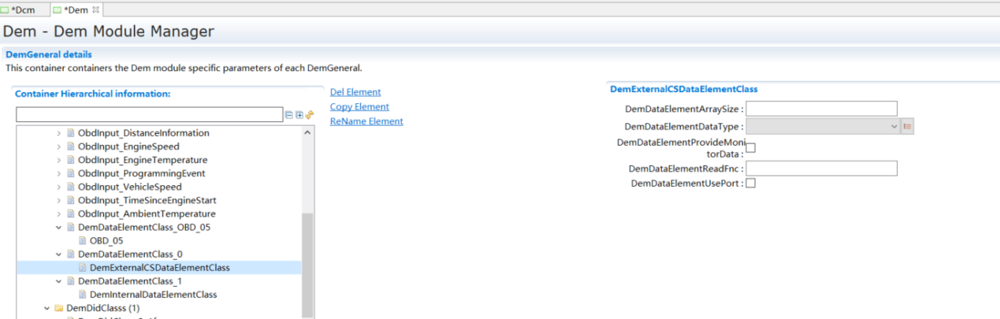
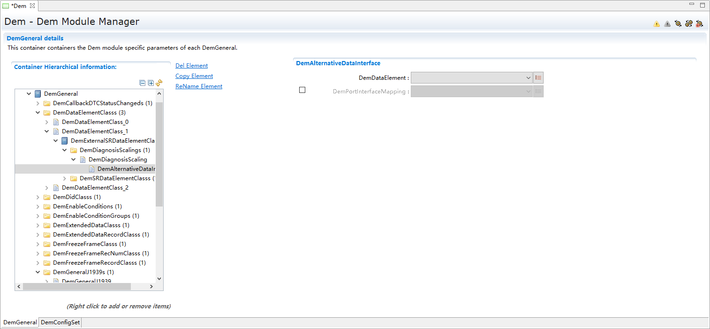
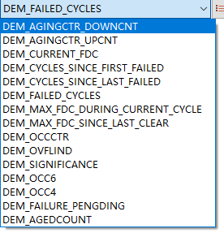
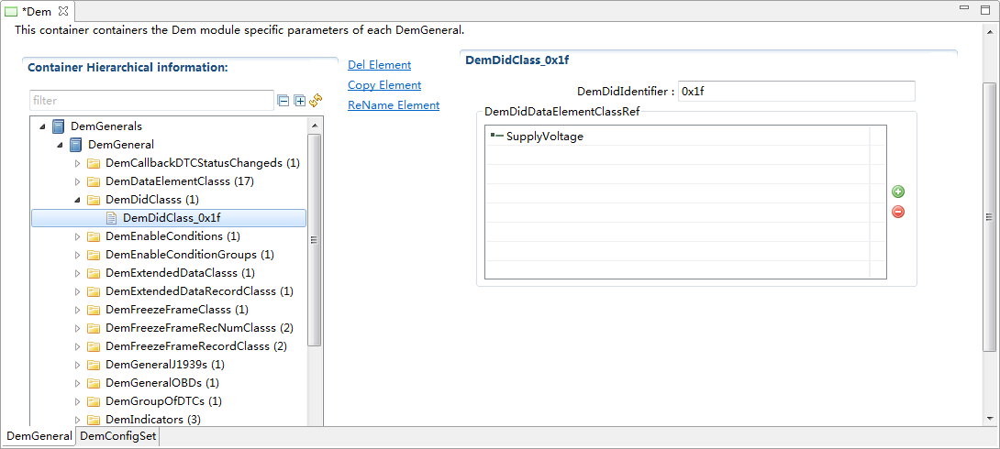
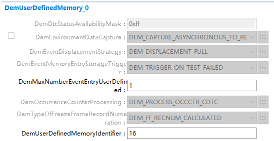
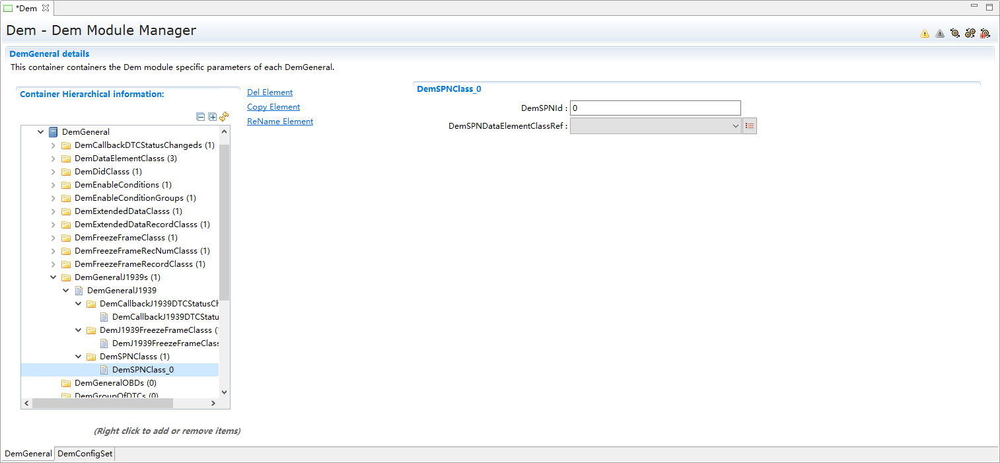
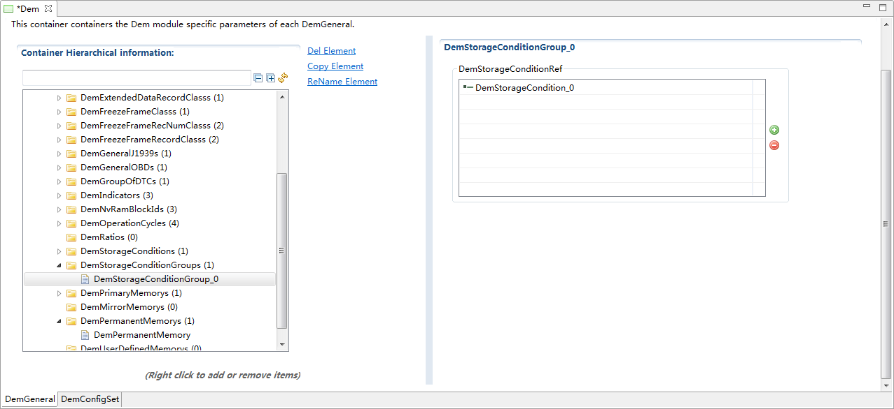
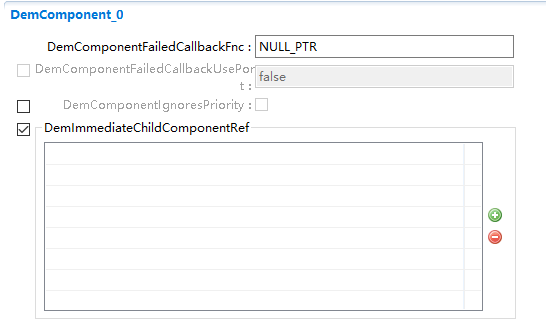

===================
Dem产品参考手册
===================

**缩写词注解**

+------------+------------------------------+-------------------------+
| **缩写词** | **英文全称**                 | **中文解释**            |
+------------+------------------------------+-------------------------+
| DID        | Data Identifier              | 数据标识符              |
+------------+------------------------------+-------------------------+
| DTC        | Diagnostic Trouble Code      | 诊断故障码              |
+------------+------------------------------+-------------------------+
| FDC        | Fault Detection Counter      | 故障检测计数器          |
+------------+------------------------------+-------------------------+
| NVRAM      | Non volatile RAM             | 非易失存储              |
+------------+------------------------------+-------------------------+
| OBD        | On-Board-Diagnostics         | OBD                     |
+------------+------------------------------+-------------------------+
| OC         | Occurrence Count             | 故障发生次数计数        |
+------------+------------------------------+-------------------------+
| UDS        | Unified Diagnostic Services  | 统一诊断服务            |
+------------+------------------------------+-------------------------+

简介
====

Dem模块按照ISO-14229-1、ISO-15031-5和SAE-J1939-73等规范实现UDS、OBD和J1939的诊断事件管理及存储功能。具体实现为：DTC状态管理、冻结帧与扩展数据存储、去抖、恢复与老化、替换等功能。

用户可以通过Dcm或J1939Dcm（J1939事件）中的服务读取或清除事件及其相关数据。此外，Dem中所有事件及其相关数据的非易失性存储都依赖于NvM。

|image1|

图1-1 Dem模块层次关系图

参考资料
--------

[1] AUTOSAR_SWS_DiagnosticEventMa无ger.pdf，4.2.2

[2] AUTOSAR_SWS_DiagnosticEventMa无ger.pdf，R19-11

[3] Road_vehicles_UDS_ISO14229-1_Part1-2013.pdf

[4] ISO_15031-5_2016.pdf

[5] SAE-J1939-73-2017.pdf

[6] ISO-27145-3-2012.pdf

功能描述
========

诊断事件报告功能
----------------

诊断事件报告功能介绍
~~~~~~~~~~~~~~~~~~~~

诊断监视器监控诊断事件时，通过Dem_SetOperationStatus来控制操作循环的开启与关闭，打开操作循环时使Dem进入事件处理状态，并且可以向Dem报告事件，而关闭操作循环后，不能向Dem报告事件，只能读取事件相关数据。

诊断事件报告功能实现
~~~~~~~~~~~~~~~~~~~~

SWC与BSW分别通过Dem_SetEventStatus和Dem_ReportErrorStatus向Dem报告事件及其状态并存入Dem内部队列中。在下一个Dem_MainFunction中处理队列中的事件，包括处理内部Memory
Entry空间分配以及事件DTC状态切换等，并且将事件及其相关状态和数据放入对应的Memory
Entry中。报告的事件状态类型定义如表2-1所示。

表2-1 事件状态类型

+-----------------------------------------------------------+----------+
| **状态**                                                  | **值**   |
+-----------------------------------------------------------+----------+
| DEM_EVENT_STATUS_PASSED                                   | 0x00     |
+-----------------------------------------------------------+----------+
| DEM_EVENT_STATUS_FAILED                                   | 0x01     |
+-----------------------------------------------------------+----------+
| DEM_EVENT_STATUS_PREPASSED                                | 0x02     |
+-----------------------------------------------------------+----------+
| DEM_EVENT_STATUS_PREFAILED                                | 0x03     |
+-----------------------------------------------------------+----------+
| DEM_EVENT_STATUS_FDC_THRESHOLD_REACHED                    | 0x04     |
+-----------------------------------------------------------+----------+

去抖功能
--------

去抖功能介绍
~~~~~~~~~~~~

诊断事件的去抖功能根据ISO-14229-1和AutoSAR规范实现。当报告事件状态为PREPASSED（或PREFAILED）时，需要进行去抖处理来确认事件的状态为PASSED或FAILED。去抖可分为基于计数去抖和基于时间去抖。

去抖功能实现
~~~~~~~~~~~~

基于计数去抖：事件配置为基于计数去抖，并且分别配置FAILED与PASSED的计数阈值。SWC或BSW报告事件时，由内部函数Dem_ProcessEventStatus根据事件状态分别进行处理。当报告的事件状态为PREFAILED或PREPASSED时，在Dem_MainFunction中的内部函数Dem_DebounceProcess里开始根据配置中的StepSize计数，当报告PREFAILED或PREPASSED状态的事件的计数值达到FAILED或PASSED阈值时，事件状态将被确认为FAILED或PASSED。图2-1为ISO-14229-1中基于计数去抖相关的原理。

基于时间去抖：事件配置为基于时间去抖，并且分别配置FAILED与PASSED的超时阈值。SWC或BSW报告事件时，由内部函数Dem_ProcessEventStatus根据事件状态分别进行处理。当报告的事件状态为PREFAILED或PREPASSED时，在Dem_MainFunction中的内部函数Dem_DebounceTimerMain里根据配置中的DemMainFunctionPeriodicTime进行超时计数，若计数时间超过配置的超时阈值前仍未报告其他状态，则事件状态将被确认为FAILED或PASSED。

|image2|

图2-1 基于计数去抖原理

DTC状态管理功能
---------------

DTC状态管理功能介绍
~~~~~~~~~~~~~~~~~~~

诊断事件的DTC状态管理根据ISO-14229-1和AutoSAR规范实现。DTC状态分为8个
Bit位，并且分别根据报告事件的状态或内部相关的处理进行转换。以下为DTC状态位介绍：

表2-2 DTC状态位

+-----------+-------------------------------------------+--------------+
| **位**    | **名称**                                  | **缩写**     |
+-----------+-------------------------------------------+--------------+
| Bit 0     | TesetFailed                               | TF           |
+-----------+-------------------------------------------+--------------+
| Bit 1     | TestFailedThisOperationCycle              | TFTOC        |
+-----------+-------------------------------------------+--------------+
| Bit 2     | PendingDTC                                | PDTC         |
+-----------+-------------------------------------------+--------------+
| Bit 3     | ComfirmedDTC                              | CDTC         |
+-----------+-------------------------------------------+--------------+
| Bit 4     | TestNotCompleteSinceLastClear             | TNCSLC       |
+-----------+-------------------------------------------+--------------+
| Bit 5     | TestFailedSinceLastClear                  | TFSLC        |
+-----------+-------------------------------------------+--------------+
| Bit 6     | TestNotCompleteThisOperationCycle         | TNCTOC       |
+-----------+-------------------------------------------+--------------+
| Bit 7     | WarnningIndicator                         | WIR          |
+-----------+-------------------------------------------+--------------+

DTC状态管理功能实现
~~~~~~~~~~~~~~~~~~~

Dem初始化时，会将每个配置的事件的DTC状态进行初始化，将Bit6置位为1，（Bit4在初始化时不进行置位，需要清除一次后置位）。SWC或BSW报告事件时，由内部函数Dem_ProcessEventStatus根据事件状态分别进行处理。

若报告的事件状态为FAILED时，同步置位DTC状态位的Bit0、Bit1、Bit2、Bit5，同步清除Bit4、Bit6。并且在函数Dem_MainFunction中，根据用户配置DemEventFailureCycleCounterThreshold的值决定何时置位Bit3，根据用户配置DemIndicatorAttribute
-> DemIndicatorFailureCycleCounterThreshold的值决定何时置位Bit7。

若报告的事件状态为PASSED时，将会同步清除Bit0、Bit4、Bit6，并且在函数Dem_MainFunction中的内部函数Dem_EventTestPassed里处理根据配置中DemIndicatorAttribute
-> DemIndicatorHealingCycleCounterThreshold的值决定何时清除Bit7。

若本次操作循环仅报告了PASSED，并且Bit2已经在之前的操作循环置位的情况下，在操作循环由Dem_OperationCycleEnd结束时中清除Bit2。

若当前操作循环已满足老化（老化处理功能在2.5章节介绍）条件，将清除Bit3、Bit5。

此外，新的操作循环由Dem_OperationCycleStart开启时，会同步清除Bit1，置位Bit6。对于是否在操作循环开启或关闭时清除Bit0状态，ISO
14229-1与AutoSAR并没有明确说明，而是开放给OEM指定。

冻结帧与扩展数据存储功能
------------------------

冻结帧与扩展数据存储功能介绍
~~~~~~~~~~~~~~~~~~~~~~~~~~~~

ISO-14229-1规定了两种类型的诊断事件相关数据：冻结帧与扩展数据。存储的数量和组合是由OEM指定的，因此是可配的。此数据可以由SWC或BSW提供。冻结帧由配置中DID关联的外部回调接口中获取，扩展数据一般为内部数据，在Dem内部产生并且计算。

冻结帧与扩展数据存储功能实现
~~~~~~~~~~~~~~~~~~~~~~~~~~~~

在配置中将事件关联对应的冻结帧与扩展数据，SWC与BSW报告事件时，Dem根据配置DemExtendedDataRecordTrigger与DemFreezeFrameRecordTrigger决定在哪种条件下获取实时扩展数据与冻结帧，并且与事件一同存入buffer中。接着在Dem_MainFunction中等待事件的Memory
Entry分配完成后，将数据存储到其中。

恢复与老化功能
--------------

恢复与老化功能介绍
~~~~~~~~~~~~~~~~~~

诊断事件的恢复是指某事件已经报告了故障，在经过后续操作循环监测下没有继续报告故障，满足恢复条件，则认为事件已经恢复。

诊断事件的老化是指在当前事件满足恢复条件并且在经过后续操作循环监测下没有继续报告故障，满足老化条件，则开始老化处理。

恢复与老化功能实现
~~~~~~~~~~~~~~~~~~

恢复：指事件在当前操作循环报告状态为FAILED并且置位了DTC状态位Bit7，后续的操作循环中此事件仅报告了PASSED状态，并在Dem_OperationCycleStart中开始执行恢复处理，若在某一个操作循环开启时满足恢复条件则将DTC状态位Bit7清除。恢复条件由配置中DemIndicatorHealingCycleCounterThreshold的值决定。

老化：指事件满足恢复条件并且后续的操作循环中事件继续仅报告PASSED状态，在内部函数Dem_OperationCycleEnd中进行老化处理，若在某一个操作循环关闭时满足老化条件则将清除DTC状态位Bit3、Bit5，并且删除此事件所有相关的数据，老化条件由配置中DemAgingCycleCounterThreshold的值决定。若配置DemStatusBitHandlingTestFailedSinceLastClear允许清除Bit5，清除时机由配置中DemAgingCycleCounterThresholdForTFSLC的值决定。

替换功能
--------

替换功能介绍
~~~~~~~~~~~~

   诊断事件的替换功能是指若在配置中配置的事件数量大于配置的存储数量，

则最不重要的、已经存在的事件的Memory Entry被需要存储的新事件的Memory
Entry取代。以下是事件替换的三种策略介绍。

表2-3 替换策略

+----------------------------------+-----------------------------------+
| **策略**                         | **解释**                          |
+----------------------------------+-----------------------------------+
| DEM_DISPLACEMENT_FULL            | 优                                |
|                                  | 先Active/Passive和Occurrence策略  |
+----------------------------------+-----------------------------------+
| DEM_DISPLACEMENT_NONE            | 不执行替换                        |
+----------------------------------+-----------------------------------+
| DEM_DISPLACEMENT_PRIO_OCC        | 优先Priority和Occurrence策略      |
+----------------------------------+-----------------------------------+

替换功能实现
~~~~~~~~~~~~

若SWC或BSW向Dem报告了尚未存储新的事件，且此时Dem内部分配的Memory
Entry已经达到了配置中DemMaxNumberEventEntryPrimary的值（排放相关事件的存储数量由配置DemMaxNumberEventEntryPermanent的值决定），则在内部函数Dem_EventDisplacementProcess中进行替换处理。事件的替换策略依据配置中Dem_General->
DemEventDisplacementStrategy的值进行处理：

1）替换策略配置为DEM_DISPLACEMENT_NONE：不执行事件替换。

2）替换策略配置为DEM_DISPLACEMENT_FULL：优先寻找Passive状态的事件，若所有已存储的事件状态都为Active，则按照Occurrence（故障产生的时间最长）来找到将被新事件替换的旧事件。（Active/Passive：事件的DTC状态是否为Failed/Passed）

3）替换策略配置为DEM_DISPLACEMENT_PRIO_OCC：优先寻找Priority最低的事件，若所有已存储的旧事件的Priority相同，则按照Occurrence（故障产生的时间最长）来找到将被新事件替换的旧事件。

执行替换处理后，Dem将把“最不重要”的事件相关的数据删除，更新此事件相关的DTC状态。此外，AutoSAR规定事件替换只能由高优先级事件替换低优先级事件。

同步功能
--------

 同步功能介绍
~~~~~~~~~~~~~

当Dem需要永久存储event状态信息、event相关数据以及内部状态时，需要与NvM进行交互。诊断事件的同步功能指的是Dem一键在DemNvRamBlockId下创建reference关系，同时在Nvm模块生成相应的NvMBlock。

为了确保存储Dem模块相关数据的正确性，建议在NvM模块中使能Crc机制以及ID动态检测等相关数据有效性检查功能。若未使能，则需要在每次更新NvM配置后，对存储空间进行一次擦除，以保护数据的有效性。

 同步功能实现
~~~~~~~~~~~~~

同步功能会根据Dem的配置自动计算Dem所需Block的长度与个数。如图2-2所示，右键配置项DemNvRamBlockId选择同步功能会自动在Nvm模块创建相应的NvMBlock。

若Dem支持UDS、OBD诊断，则同步功能创建的NvMBlock包括DemNvRamBlockId_UDS_InternalData、DemNvRamBlockId_OBD_InternalData，用来存储与UDS/OBD相关event的内部数据。

除此以外，当配置项DemNvRAMDivaded未使能时，Dem支持event整体存储，会创建一个DemNvRamBlockId_All_EventEntry，用来存储所有发生故障的event状态信息、扩展数据、冻结帧数据等。

当配置项DemNvRAMDivaded使能时，则Dem支持event分开存储，会创建
DemMaxNumberEventEntryPrimary +
DemMaxNumberEventEntryPermanent个NvMBlock，每个NvMBlock用来单独存放发生故障的event状态信息、扩展数据、冻结帧数据等。

|image3|

图2-2 Dem同步功能图

源文件描述
==========

表3-1 Dem组件文件描述

+--------------------+-------------------------------------------------+
| **文件**           | **说明**                                        |
+--------------------+-------------------------------------------------+
| Dem.c              | Dem模块源文件，包含了API实现。                  |
+--------------------+-------------------------------------------------+
| Dem.h              | Dem模块API声明与数据结构定义                    |
+--------------------+-------------------------------------------------+
| Dem_CfgEnum.h      | 定义Dem中配置参数enum数据结构类型               |
+--------------------+-------------------------------------------------+
| Dem_CfgTypes.h     | 定义Dem中配置参数通用数据结构类型               |
+--------------------+-------------------------------------------------+
| Dem_Dcm.c          | Dem模块源文件，包含了Dem关联Dcm的API实现。      |
+--------------------+-------------------------------------------------+
| Dem_Dcm.h          | 定义Dem模块关联Dcm的API声明与数据结构定义       |
+--------------------+-------------------------------------------------+
| D                  | Dem模块源文件，定义了事件Debounce功能内部函数   |
| em_EventDebounce.c |                                                 |
+--------------------+-------------------------------------------------+
| Dem_EventMemory.c  | Dem模块源文件，定义了事件存储相关功能内部函数   |
+--------------------+-------------------------------------------------+
| Dem_EventQueue.c   | Dem模块源文件，定义了Dem队列相关内部函数        |
+--------------------+-------------------------------------------------+
| Dem_ExtendedData.c | De                                              |
|                    | m模块源文件，定义了ExtendedData功能相关内部函数 |
+--------------------+-------------------------------------------------+
| Dem_FreezeFrame.c  | D                                               |
|                    | em模块源文件，定义了FreezeFrame功能相关内部函数 |
+--------------------+-------------------------------------------------+
| Dem_Inter无l.c     | Dem模块源文件，定义了Clear功能相关内部函数      |
+--------------------+-------------------------------------------------+
| Dem_Inter无l.h     | 定义了Dem模块Clear等模块内部API声明与数据结构   |
+--------------------+-------------------------------------------------+
| Dem_J1939.c        | Dem模块源文件，定义了J1939相关API实现           |
+--------------------+-------------------------------------------------+
| Dem_MemMap.h       | 定义Dem模块内存划分段                           |
+--------------------+-------------------------------------------------+
| Dem_OBD.c          | Dem模块源文件，定义了OBD相关API实现             |
+--------------------+-------------------------------------------------+
| Dem_Types.h        | 定义了Dem模块内部通用数据类型                   |
+--------------------+-------------------------------------------------+
| Rte_Dem_Type.h     | 开放给Rte添加的头文件                           |
+--------------------+-------------------------------------------------+
| Rte_Type.h         | 开放给Rte添加的头文件                           |
+--------------------+-------------------------------------------------+
| Dem_Cfg.c          | 定义Dem配置参数，声明配置参数                   |
+--------------------+-------------------------------------------------+
| Dem_Cfg.h          | 定义Dem配置宏                                   |
+--------------------+-------------------------------------------------+
| Rte_Dem.c          | 定义Dem冻结帧扩展数据外部接口                   |
+--------------------+-------------------------------------------------+
| Rte_Dem.h          | 声明Dem冻结帧扩展数据外部接口                   |
+--------------------+-------------------------------------------------+

|image4|

图3-1 Dem组件文件交互关系图

API接口
=======

类型定义
--------

Dem_ComponentIdType类型定义
~~~~~~~~~~~~~~~~~~~~~~~~~~~

+-----------+----------------------------------------------------------+
| 名称      | Dem_ComponentIdType                                      |
+-----------+----------------------------------------------------------+
| 类型      | typedef uint16 Dem_ComponentIdType                       |
+-----------+----------------------------------------------------------+
| 范围      | 1-65535                                                  |
+-----------+----------------------------------------------------------+
| 描述      | 通过制定的Compo                                          |
|           | nentId对DemComponentId进行标识。ComponentId由Dem自动分配 |
+-----------+----------------------------------------------------------+

Dem_EventIdType类型定义
~~~~~~~~~~~~~~~~~~~~~~~

+-----------+----------------------------------------------------------+
| 名称      | Dem_EventIdType                                          |
+-----------+----------------------------------------------------------+
| 类型      | typedef uint16 Dem_EventIdType                           |
+-----------+----------------------------------------------------------+
| 范围      | 1-65535                                                  |
+-----------+----------------------------------------------------------+
| 描述      | 通过指定的EventId来标识事件。EventId由Dem分配            |
+-----------+----------------------------------------------------------+

Dem_EventStatusType类型定义
~~~~~~~~~~~~~~~~~~~~~~~~~~~

+-----------+---------------------------------------------+-----------+
| 名称      | Dem_EventStatusType                         |           |
+-----------+---------------------------------------------+-----------+
| 类型      | typedef uint8 Dem_EventStatusType           |           |
+-----------+---------------------------------------------+-----------+
| 范围      | DEM_EVENT_STATUS_PASSED                     | 0x00      |
+-----------+---------------------------------------------+-----------+
|           | DEM_EVNET_STATUS_FAILED                     | 0x01      |
+-----------+---------------------------------------------+-----------+
|           | DEM_EVENT_STATUS_PREPASSED                  | 0x02      |
+-----------+---------------------------------------------+-----------+
|           | DEM_EVENT_STATUS_PREFAILED                  | 0x03      |
+-----------+---------------------------------------------+-----------+
|           | DEM_EVENT_STATUS_FDC_THRESHOLD_REACHED      | 0x05-0xFF |
+-----------+---------------------------------------------+-----------+
| 描述      | 该类型                                      |           |
|           | 包含所有监视器测试结果值，可以通过Dem_Repo  |           |
|           | rtErrorStatus()和Dem_SetEventStatus()报告。 |           |
+-----------+---------------------------------------------+-----------+

Dem_DebouncingStateType类型定义
~~~~~~~~~~~~~~~~~~~~~~~~~~~~~~~

+-----------+-----------------------------+----------------------------+
| 名称      | Dem_DebouncingStateType     |                            |
+-----------+-----------------------------+----------------------------+
| 类型      | typedef uint8               |                            |
|           | Dem_DebouncingStateType     |                            |
+-----------+-----------------------------+----------------------------+
| 范围      | DEM_TEMPORARILY_DEFECTIVE   | 0x01                       |
+-----------+-----------------------------+----------------------------+
|           | DEM_FI无LLY_DEFECTIVE       | 0x02                       |
+-----------+-----------------------------+----------------------------+
|           | DEM_TEMPORARILY_HEALED      | 0x05                       |
+-----------+-----------------------------+----------------------------+
|           | DEM_TEST_COMPLETE           | 0x08                       |
+-----------+-----------------------------+----------------------------+
|           | DEM_DTR_UPDATE              | 0x10                       |
+-----------+-----------------------------+----------------------------+
| 描述      | 去抖状态                    |                            |
+-----------+-----------------------------+----------------------------+

Dem_DebounceResetStatusType类型定义
~~~~~~~~~~~~~~~~~~~~~~~~~~~~~~~~~~~

+------------+------------------------------+--------------------------+
| 名称       | Dem_DebounceResetStatusType  |                          |
+------------+------------------------------+--------------------------+
| 类型       | typedef uint8                |                          |
|            | Dem_DebounceResetStatusType  |                          |
+------------+------------------------------+--------------------------+
| 范围       | DEM_DEBOUNCE_STATUS_FREEZE   | 0x00                     |
+------------+------------------------------+--------------------------+
|            | DEM_DEBOUNCE_STATUS_RESET    | 0x01                     |
+------------+------------------------------+--------------------------+
|            | reserved                     | 0x02-0xFF                |
+------------+------------------------------+--------------------------+
| 描述       | 该类                         |                          |
|            | 型包含通过函数Dem_ResetEvent |                          |
|            | DebounceStatus()来控制内部去 |                          |
|            | 抖计数器/计时器的所有定义。  |                          |
+------------+------------------------------+--------------------------+

Dem_UdsStatusByteType类型定义
~~~~~~~~~~~~~~~~~~~~~~~~~~~~~

+-----------+----------------------------+----------------------------+
| 名称      | Dem_UdsStatusByteType      |                            |
+-----------+----------------------------+----------------------------+
| 类型      | typedef uint8              |                            |
|           | Dem_UdsStatusByteType      |                            |
+-----------+----------------------------+----------------------------+
| 范围      | DEM_UDS_STATUS_TF          | 0x01                       |
+-----------+----------------------------+----------------------------+
|           | DEM_UDS_STATUS_TFTOC       | 0x02                       |
+-----------+----------------------------+----------------------------+
|           | DEM_UDS_STATUS_PDTC        | 0x04                       |
+-----------+----------------------------+----------------------------+
|           | DEM_UDS_STATUS_CDTC        | 0x08                       |
+-----------+----------------------------+----------------------------+
|           | DEM_UDS_STATUS_TNCSLC      | 0x10                       |
+-----------+----------------------------+----------------------------+
|           | DEM_UDS_STATUS_TFSLC       | 0x20                       |
+-----------+----------------------------+----------------------------+
|           | DEM_UDS_STATUS_TNCTOC      | 0x40                       |
+-----------+----------------------------+----------------------------+
|           | DEM_UDS_STATUS_WIR         | 0x80                       |
+-----------+----------------------------+----------------------------+
| 描述      | Uds状态位                  |                            |
+-----------+----------------------------+----------------------------+

Dem_OperationCycleStateType类型定义
~~~~~~~~~~~~~~~~~~~~~~~~~~~~~~~~~~~

+-----------+----------------------------+----------------------------+
| 名称      | D                          |                            |
|           | em_OperationCycleStateType |                            |
+-----------+----------------------------+----------------------------+
| 类型      | typedef uint8              |                            |
|           | D                          |                            |
|           | em_OperationCycleStateType |                            |
+-----------+----------------------------+----------------------------+
| 范围      | DEM_CYCLE_STATE_START      | 0x00                       |
+-----------+----------------------------+----------------------------+
|           | DEM_CYCLE_STATE_END        | 0x01                       |
+-----------+----------------------------+----------------------------+
| 描述      | 该类型包含操作循环         |                            |
|           | 的类型，可以通过Dem_SetOp  |                            |
|           | erationCycleState()/Dem_Ge |                            |
|           | tOperationCycleState()报告 |                            |
+-----------+----------------------------+----------------------------+

Dem_IndicatorStatusType类型定义
~~~~~~~~~~~~~~~~~~~~~~~~~~~~~~~

+-----------+----------------------------+----------------------------+
| 名称      | Dem_IndicatorStatusType    |                            |
+-----------+----------------------------+----------------------------+
| 类型      | typedef uint8              |                            |
|           | Dem_IndicatorStatusType    |                            |
+-----------+----------------------------+----------------------------+
| 范围      | DEM_INDICATOR_OFF          | 0x00                       |
+-----------+----------------------------+----------------------------+
|           | DEM_INDICATOR_CONTINUOUS   | 0x01                       |
+-----------+----------------------------+----------------------------+
|           | DEM_INDICATOR_BLINKING     | 0x02                       |
+-----------+----------------------------+----------------------------+
|           | DEM_INDICATOR_BLINK_CONT   | 0x03                       |
+-----------+----------------------------+----------------------------+
|           | DEM_INDICATOR_SLOW_FLASH   | 0x04                       |
+-----------+----------------------------+----------------------------+
|           | DEM_INDICATOR_FAST_FLASH   | 0x05                       |
+-----------+----------------------------+----------------------------+
|           | DEM_INDICATOR_ON_DEMAND    | 0x06                       |
+-----------+----------------------------+----------------------------+
|           | DEM_INDICATOR_SHORT        | 0x07                       |
+-----------+----------------------------+----------------------------+
| 描述      | Dem_GetIndicat             |                            |
|           | orStatus()使用的指示灯模式 |                            |
+-----------+----------------------------+----------------------------+

Dem_DTCKindType类型定义
~~~~~~~~~~~~~~~~~~~~~~~

+------------+----------------------------------+----------------------+
| 名称       | Dem_DTCKindType                  |                      |
+------------+----------------------------------+----------------------+
| 类型       | typedef uint8 Dem_DTCKindType    |                      |
+------------+----------------------------------+----------------------+
| 范围       | DEM_DTC_KIND_ALL_DTCS            | 0x01                 |
+------------+----------------------------------+----------------------+
|            | DEM_DTC_KIND_EMISSION_REL_DTCS   | 0x02                 |
+------------+----------------------------------+----------------------+
| 描述       | 该类型用于过滤DTCS的种类         |                      |
+------------+----------------------------------+----------------------+

Dem_DTCFormatType类型定义
~~~~~~~~~~~~~~~~~~~~~~~~~

+------------+---------------------------+----------------------------+
| 名称       | Dem_DTCFormatType         |                            |
+------------+---------------------------+----------------------------+
| 类型       | typedef uint8             |                            |
|            | Dem_DTCFormatType         |                            |
+------------+---------------------------+----------------------------+
| 范围       | DEM_DTC_FORMAT_OBD        | 0                          |
+------------+---------------------------+----------------------------+
|            | DEM_DTC_FORMAT_UDS        | 1                          |
+------------+---------------------------+----------------------------+
|            | DEM_DTC_FORMAT_J1939      | 2                          |
+------------+---------------------------+----------------------------+
| 描述       | 该类型用于选择DTC值的格式 |                            |
+------------+---------------------------+----------------------------+

Dem_DTCOriginType类型定义
~~~~~~~~~~~~~~~~~~~~~~~~~

+------------+-----------------------------------------+---------------+
| 名称       | Dem_DTCOriginType                       |               |
+------------+-----------------------------------------+---------------+
| 类型       | typedef uint8 Dem_DTCOriginType         |               |
+------------+-----------------------------------------+---------------+
| 范围       | DEM_DTC_ORIGIN_PRIMARY_MEMORY           | 0x01          |
+------------+-----------------------------------------+---------------+
|            | DEM_DTC_ORIGIN_MIRROR_MEMORY            | 0x02          |
+------------+-----------------------------------------+---------------+
|            | DEM_DTC_ORIGIN_PERMANET_MEMORY          | 0x03          |
+------------+-----------------------------------------+---------------+
|            | DEM_DTC_ORIGIN_USERDEFINED_MEMORY_XX    | 0xXX          |
+------------+-----------------------------------------+---------------+
| 描述       | 该枚举类型用来定义事件的位置            |               |
+------------+-----------------------------------------+---------------+

Dem_DTCRequestType类型定义
~~~~~~~~~~~~~~~~~~~~~~~~~~

+------------+----------------------------------------+----------------+
| 名称       | Dem_DTCRequestType                     |                |
+------------+----------------------------------------+----------------+
| 类型       | typedef uint8 Dem_DTCRequestType       |                |
+------------+----------------------------------------+----------------+
| 范围       | DEM_FIRST_FAILED_DTC                   | 0x01           |
+------------+----------------------------------------+----------------+
|            | DEM_MOST_RECENT_FAILED_DTC             | 0x02           |
+------------+----------------------------------------+----------------+
|            | DEM_FIRST_DET_CONFIRMED_DTC            | 0x03           |
+------------+----------------------------------------+----------------+
|            | DEM_MOST_REC_DET_CONFIRMED_DTC         | 0x04           |
+------------+----------------------------------------+----------------+
| 描述       | 该类型用来请求具有特定属性的DTC        |                |
+------------+----------------------------------------+----------------+

Dem_DTCTranslationFormatType类型定义
~~~~~~~~~~~~~~~~~~~~~~~~~~~~~~~~~~~~

+------------+----------------------------------------------+---------+
| 名称       | Dem_DTCTranslationFormatType                 |         |
+------------+----------------------------------------------+---------+
| 类型       | typedef uint8 Dem_DTCTranslationFormatType   |         |
+------------+----------------------------------------------+---------+
| 范围       | DEM_DTC_TRANSLATION_ISO15031_6               | 0x00    |
+------------+----------------------------------------------+---------+
|            | DEM_DTC_TRANSLATION_ISO14229_1               | 0x01    |
+------------+----------------------------------------------+---------+
|            | DEM_DTC_TRANSLATION_SAEJ1939_73              | 0x02    |
+------------+----------------------------------------------+---------+
|            | DEM_DTC_TRANSLATION_ISO11992_4               | 0x03    |
+------------+----------------------------------------------+---------+
|            | DEM_DTC_TRANSLATION_J2012DA_FORMAT_04        | 0x04    |
+------------+----------------------------------------------+---------+
| 描述       | 由Dem_DcmGetTranslationType()返              |         |
|            | 回的ISO14229-1服务0x19中定义的DTC翻译格式。  |         |
+------------+----------------------------------------------+---------+

Dem_DTCSeverityType类型定义
~~~~~~~~~~~~~~~~~~~~~~~~~~~

+------------+----------------------------------------------+---------+
| 名称       | Dem_DTCSeverityType                          |         |
+------------+----------------------------------------------+---------+
| 类型       | typedef uint8 Dem_DTCSeverityType            |         |
+------------+----------------------------------------------+---------+
| 范围       | DEM_SEVERITY_NO_SEVERITY                     | 0x00    |
+------------+----------------------------------------------+---------+
|            | DEM_SEVERITY_WWHOBD_CLASS_NO_CLASS           | 0x01    |
+------------+----------------------------------------------+---------+
|            | DEM_SEVERITY_WWHOBD_CLASS_A                  | 0x02    |
+------------+----------------------------------------------+---------+
|            | DEM_SEVERITY_WWHOBD_CLASS_B1                 | 0x04    |
+------------+----------------------------------------------+---------+
|            | DEM_SEVERITY_WWHOBD_CLASS_B2                 | 0x08    |
+------------+----------------------------------------------+---------+
|            | DEM_SEVERITY_WWHOBD_CLASS_C                  | 0x10    |
+------------+----------------------------------------------+---------+
|            | DTC_CLASS                                    | 0x1F    |
+------------+----------------------------------------------+---------+
|            | DEM_SEVERITY_MAINTE无NCE_ONLY                | 0x20    |
+------------+----------------------------------------------+---------+
|            | DEM_SEVERITY_CHECK_AT_NEXT_HALT              | 0x40    |
+------------+----------------------------------------------+---------+
|            | DEM_SEVERITY_CHECK_IMMEDIATELY               | 0x80    |
+------------+----------------------------------------------+---------+
| 描述       | DTCSeverityMask/DTCSeverity 定义             |         |
+------------+----------------------------------------------+---------+

Dem_RatioIdType类型定义
~~~~~~~~~~~~~~~~~~~~~~~

+------------+---------------------------------------------------------+
| 名称       | Dem_RatioIdType                                         |
+------------+---------------------------------------------------------+
| 描述       | OBD指定的ratio                                          |
|            | Id（与一个指定的事件，一个FID和IUMPR组相关）            |
+------------+---------------------------------------------------------+
| 范围       | 0-255,0-65535                                           |
+------------+---------------------------------------------------------+
| 类型       | typedef uint16 Dem_RatioIdType                          |
+------------+---------------------------------------------------------+

Dem_DTRControlType类型定义
~~~~~~~~~~~~~~~~~~~~~~~~~~

+------------+---------------------------+----------------------------+
| 名称       | Dem_DTRControlType        |                            |
+------------+---------------------------+----------------------------+
| 类型       | typedef uint8             |                            |
|            | Dem_DTRControlType        |                            |
+------------+---------------------------+----------------------------+
| 范围       | DEM_DTR_CTL_NORMAL        | 0x00                       |
+------------+---------------------------+----------------------------+
|            | DEM_DTR_CTL_NO_MAX        | 0x01                       |
+------------+---------------------------+----------------------------+
|            | DEM_DTR_CTL_NO_MIN        | 0x02                       |
+------------+---------------------------+----------------------------+
|            | DEM_DTR_CTL_RESET         | 0x03                       |
+------------+---------------------------+----------------------------+
|            | DEM_DTR_CTL_INVISIBLE     | 0x04                       |
+------------+---------------------------+----------------------------+
| 描述       | 控制参                    |                            |
|            | 数，以解释报告的测试结果  |                            |
+------------+---------------------------+----------------------------+

Dem_InitMonitorReasonType类型定义
~~~~~~~~~~~~~~~~~~~~~~~~~~~~~~~~~

+------------+-------------------------------------------+------------+
| 名称       | Dem_InitMonitorReasonType                 |            |
+------------+-------------------------------------------+------------+
| 类型       | typedef uint8 Dem_InitMonitorReasonType   |            |
+------------+-------------------------------------------+------------+
| 范围       | DEM_INIT_MONITOR_CLEAR                    | 0x01       |
+------------+-------------------------------------------+------------+
|            | DEM_INIT_MONITOR_RESTART                  | 0x02       |
+------------+-------------------------------------------+------------+
|            | DEM_INIT_MONITOR_REE无BLED                | 0x03       |
+------------+-------------------------------------------+------------+
|            | DEM_INIT_MONITOR_STORAGE_REE无BLED        | 0x04       |
+------------+-------------------------------------------+------------+
| 描述       | 由回调函数<Module>_DemInitMonito          |            |
|            | rFor<Event无me>()返回的（重新）初始化原因 |            |
+------------+-------------------------------------------+------------+

Dem_IumprDenomCondIdType类型定义
~~~~~~~~~~~~~~~~~~~~~~~~~~~~~~~~

+------------+-------------------------------------------+------------+
| 名称       | Dem_IumprDenomCondIdType                  |            |
+------------+-------------------------------------------+------------+
| 类型       | typedef uint8 Dem_IumprDenomCondIdType    |            |
+------------+-------------------------------------------+------------+
| 范围       | DEM_IUMPR_GENERAL_DENOMI无TOR             | 0x01       |
+------------+-------------------------------------------+------------+
|            | DEM_IUMPR_DEM_COND_COLDSTART              | 0x02       |
+------------+-------------------------------------------+------------+
|            | DEM_IUMPR_DEM_COND_EVAP                   | 0x03       |
+------------+-------------------------------------------+------------+
|            | DEM_IUMPR_DEM_COND_500MI                  | 0x04       |
+------------+-------------------------------------------+------------+
| 描述       | 该类型包含在OBD相关                       |            |
|            | ECU之间广播所有可能的附加IUMPR分母条件。  |            |
+------------+-------------------------------------------+------------+

Dem_IumprDenomCondStatusType类型定义
~~~~~~~~~~~~~~~~~~~~~~~~~~~~~~~~~~~~

+------------+-------------------------------------------+------------+
| 名称       | Dem_IumprDenomCondStatusType              |            |
+------------+-------------------------------------------+------------+
| 类型       | typedef uint8                             |            |
|            | Dem_IumprDenomCondStatusType              |            |
+------------+-------------------------------------------+------------+
| 范围       | DEM_IUMPR_DEN_STATUS_NOT_REACHED          | 0x00       |
+------------+-------------------------------------------+------------+
|            | DEM_IUMPR_DEN_STATUS_REACHED              | 0x01       |
+------------+-------------------------------------------+------------+
|            | DEM_IUMPR_DEN_STATUS_INHIBITED            | 0x03-0xFF  |
+------------+-------------------------------------------+------------+
| 描述       | 该类型包含在OBD相关ECU                    |            |
|            | 中广播的另一个IUMPR分母条件的所有可能状态 |            |
+------------+-------------------------------------------+------------+

Dem_J1939DcmDTCStatusFilterType类型定义
~~~~~~~~~~~~~~~~~~~~~~~~~~~~~~~~~~~~~~~

+------------+------------------------------+-------------------------+
| 名称       | Dem                          |                         |
|            | _J1939DcmDTCStatusFilterType |                         |
+------------+------------------------------+-------------------------+
| 类型       | typedef uint8                |                         |
|            | Dem                          |                         |
|            | _J1939DcmDTCStatusFilterType |                         |
+------------+------------------------------+-------------------------+
| 范围       | DEM_J1939DTC_ACTIVE          | 0                       |
+------------+------------------------------+-------------------------+
|            | DE                           | 1                       |
|            | M_J1939DTC_PREVIOUSLY_ACTIVE |                         |
+------------+------------------------------+-------------------------+
|            | DEM_J1939DTC_PENDING         | 2                       |
+------------+------------------------------+-------------------------+
|            | DEM_J1939DTC_PERMANET        | 3                       |
+------------+------------------------------+-------------------------+
|            | D                            | 4                       |
|            | EM_J1939DTC_CURRENTLY_ACTIVE |                         |
+------------+------------------------------+-------------------------+
| 描述       | 用来                         |                         |
|            | 区分应该过滤哪些DTCs的类型。 |                         |
+------------+------------------------------+-------------------------+

Dem_J1939DcmSetClearFilterType类型定义
~~~~~~~~~~~~~~~~~~~~~~~~~~~~~~~~~~~~~~

+------------+------------------------------------+-------------------+
| 名称       | Dem_J1939DcmSetClearFilterType     |                   |
+------------+------------------------------------+-------------------+
| 类型       | typedef uint8                      |                   |
|            | Dem_J1939DcmSetClearFilterType     |                   |
+------------+------------------------------------+-------------------+
| 范围       | DEM_J1939DTC_CLEAR_ALL             | 0                 |
+------------+------------------------------------+-------------------+
|            | DE                                 | 1                 |
|            | M_J1939DTC_CLEAR_PREVIOUSLY_ACTIVE |                   |
+------------+------------------------------------+-------------------+
| 描述       | 用来区分哪种DTC被清除的类型        |                   |
+------------+------------------------------------+-------------------+

Dem_J1939DcmLampStatusType类型定义
~~~~~~~~~~~~~~~~~~~~~~~~~~~~~~~~~~

+------------+---------------------------+----------------------------+
| 名称       | D                         |                            |
|            | em_J1939DcmLampStatusType |                            |
+------------+---------------------------+----------------------------+
| 类型       | typedef uint16            |                            |
|            | D                         |                            |
|            | em_J1939DcmLampStatusType |                            |
+------------+---------------------------+----------------------------+
| 范围       | bits 8-7                  | Malfunction Indicator Lamp |
|            |                           | status                     |
+------------+---------------------------+----------------------------+
|            | bits 6-5                  | Red Stop Lamp Status       |
+------------+---------------------------+----------------------------+
|            | bits 4-3                  | Amber Warning Lamp Status  |
+------------+---------------------------+----------------------------+
|            | bits 2-1                  | Protect Lamp Status        |
+------------+---------------------------+----------------------------+
|            | bits 8-7                  | Flash Malfunction          |
|            |                           | Indicator Lamp             |
+------------+---------------------------+----------------------------+
|            | bits 6-5                  | Flash Red Stop Lamp        |
+------------+---------------------------+----------------------------+
|            | bits 4-3                  | Flash Amber Warning Lamp   |
+------------+---------------------------+----------------------------+
|            | bits 2-1                  | Flash Protect Lamp         |
+------------+---------------------------+----------------------------+
| 描述       | J1939指示灯状态类型       |                            |
+------------+---------------------------+----------------------------+

Dem_J1939DcmDiagnosticReadiness1Type类型定义
~~~~~~~~~~~~~~~~~~~~~~~~~~~~~~~~~~~~~~~~~~~~

+------------+---------------------------------------------------------+
| 名称       | Dem_J1939DcmDiagnosticReadiness1Type                    |
+------------+---------------------------------------------------------+
| 类型       | typedef struct                                          |
|            |                                                         |
|            | {                                                       |
|            |                                                         |
|            | uint8 ActiveTroubleCodes;                               |
|            |                                                         |
|            | uint8 PreviouslyActiveDiagnosticTroubleCodes;           |
|            |                                                         |
|            | uint8 OBDCompliance;                                    |
|            |                                                         |
|            | uint8 ContinuouslyMonitoredSystemsSupport_Status;       |
|            |                                                         |
|            | uint16 NonContinuouslyMonitoredSystemsSupport;          |
|            |                                                         |
|            | uint16 NonContinuouslyMonitoredSystemsStatus;           |
|            |                                                         |
|            | }Dem_J1939DcmDiagnosticReadiness1Type;                  |
+------------+---------------------------------------------------------+
| 范围       | 无                                                      |
+------------+---------------------------------------------------------+
| 描述       | DM05消息的所有数据元素                                  |
+------------+---------------------------------------------------------+

Dem_J1939DcmDiagnosticReadiness2Type类型定义
~~~~~~~~~~~~~~~~~~~~~~~~~~~~~~~~~~~~~~~~~~~~

+------------+---------------------------------------------------------+
| 名称       | Dem_J1939DcmDiagnosticReadiness2Type                    |
+------------+---------------------------------------------------------+
| 类型       | typedef struct                                          |
|            |                                                         |
|            | {                                                       |
|            |                                                         |
|            | uint16 DistanceTraveledWhileMILisActivated;             |
|            |                                                         |
|            | uint16 DistanceSinceDTCsCleared;                        |
|            |                                                         |
|            | uint16 MinutesRunbyEngineWhileMILisActivated;           |
|            |                                                         |
|            | uint16 TimeSinceDiagnosticTroubleCodesCleared;          |
|            |                                                         |
|            | }Dem_J1939DcmDiagnosticReadiness2Type;                  |
+------------+---------------------------------------------------------+
| 范围       | 无                                                      |
+------------+---------------------------------------------------------+
| 描述       | DM21消息的所有数据元素                                  |
+------------+---------------------------------------------------------+

Dem_J1939DcmDiagnosticReadiness3Type类型定义
~~~~~~~~~~~~~~~~~~~~~~~~~~~~~~~~~~~~~~~~~~~~

+------------+---------------------------------------------------------+
| 名称       | Dem_J1939DcmDiagnosticReadiness3Type                    |
+------------+---------------------------------------------------------+
| 类型       | typedef struct                                          |
|            |                                                         |
|            | {                                                       |
|            |                                                         |
|            | uint16 TimeSinceEngineStart;                            |
|            |                                                         |
|            | uint8 NumberofWarmupsSinceDTCsCleared;                  |
|            |                                                         |
|            | uint8                                                   |
|            | ContinuouslyMonitoredSystemsE无bleCompletedStatus;      |
|            |                                                         |
|            | uint16 NonContinuouslyMonitoredSystemsE无bleStatus;     |
|            |                                                         |
|            | uint16 NonContinuouslyMonitoredSystems;                 |
|            |                                                         |
|            | }Dem_J1939DcmDiagnosticReadiness3Type;                  |
+------------+---------------------------------------------------------+
| 范围       | 无                                                      |
+------------+---------------------------------------------------------+
| 描述       | DM26消息的所有数据元素                                  |
+------------+---------------------------------------------------------+

输入函数描述
------------

+----------------------------------+-----------------------------------+
| **输入模块**                     | **API**                           |
+----------------------------------+-----------------------------------+
| Det                              | Det_ReportError                   |
+----------------------------------+-----------------------------------+
| NvM                              | NvM_ReadBlock                     |
+----------------------------------+-----------------------------------+
|                                  | NvM_WriteBlock                    |
+----------------------------------+-----------------------------------+
|                                  | NvM_GetErrorStatus                |
+----------------------------------+-----------------------------------+
| FiM                              | FiM_DemTriggerOnEventStatus       |
+----------------------------------+-----------------------------------+

静态接口函数定义
----------------

Dem_GetVersionInfo函数定义
~~~~~~~~~~~~~~~~~~~~~~~~~~

+-------------+-------------------+---------+-------------------------+
| 函数名称：  | Dem_GetVesionInfo |         |                         |
+-------------+-------------------+---------+-------------------------+
| 函数原型：  | void              |         |                         |
|             | D                 |         |                         |
|             | emGetVersionInfo( |         |                         |
|             | Std_              |         |                         |
|             | VersionInfoType\* |         |                         |
|             | versioninfo)      |         |                         |
+-------------+-------------------+---------+-------------------------+
| 服务编号：  | 0x00              |         |                         |
+-------------+-------------------+---------+-------------------------+
| 同步/异步： | 同步              |         |                         |
+-------------+-------------------+---------+-------------------------+
| 是          | 可重入            |         |                         |
| 否可重入：  |                   |         |                         |
+-------------+-------------------+---------+-------------------------+
| 输入参数：  | 无                |         |                         |
+-------------+-------------------+---------+-------------------------+
| 输入        | 无                |         |                         |
| 输出参数：  |                   |         |                         |
+-------------+-------------------+---------+-------------------------+
| 输出参数：  | versioninfo       | 值域：  | 指向在何处存储          |
|             |                   |         | 此模块的版本信息的指针  |
+-------------+-------------------+---------+-------------------------+
| 返回值：    | 无                |         |                         |
+-------------+-------------------+---------+-------------------------+
| 功能概述：  | 返回此            |         |                         |
|             | 模块的版本信息。  |         |                         |
|             |                   |         |                         |
|             | 此API仅在 ( {     |         |                         |
|             | ecu               |         |                         |
|             | c(Dem/DemGeneral. |         |                         |
|             | DemVersionInfoApi |         |                         |
|             | == True }         |         |                         |
|             | )时才有效。       |         |                         |
+-------------+-------------------+---------+-------------------------+

Dem_PreInit函数定义
~~~~~~~~~~~~~~~~~~~

+-------------+--------------------------------------------------------+
| 函数名称：  | Dem_PreInit                                            |
+-------------+--------------------------------------------------------+
| 函数原型：  | void Dem_PreInit(void)                                 |
+-------------+--------------------------------------------------------+
| 服务编号：  | 0x01                                                   |
+-------------+--------------------------------------------------------+
| 同步/异步： | 同步                                                   |
+-------------+--------------------------------------------------------+
| 是          | 可重入                                                 |
| 否可重入：  |                                                        |
+-------------+--------------------------------------------------------+
| 输入参数：  | 无                                                     |
+-------------+--------------------------------------------------------+
| 输入        | 无                                                     |
| 输出参数：  |                                                        |
+-------------+--------------------------------------------------------+
| 输出参数：  | 无                                                     |
+-------------+--------------------------------------------------------+
| 返回值：    | 无                                                     |
+-------------+--------------------------------------------------------+
| 功能概述：  | 初始化处理BSW模块报告事件所需的内部状态                |
+-------------+--------------------------------------------------------+

Dem_Init函数定义
~~~~~~~~~~~~~~~~

+-------------+------------------+--------------+---------------------+
| 函数名称：  | Dem_Init         |              |                     |
+-------------+------------------+--------------+---------------------+
| 函数原型：  | void             |              |                     |
|             | Dem_Init(const   |              |                     |
|             | Dem_ConfigType\* |              |                     |
|             | ConfigPtr)       |              |                     |
+-------------+------------------+--------------+---------------------+
| 服务编号：  | 0x02             |              |                     |
+-------------+------------------+--------------+---------------------+
| 同步/异步： | 同步             |              |                     |
+-------------+------------------+--------------+---------------------+
| 是          | 不可重入         |              |                     |
| 否可重入：  |                  |              |                     |
+-------------+------------------+--------------+---------------------+
| 输人参数：  | ConfigPtr        | 值域：       | 指向VARIANT-P       |
|             |                  |              | OST-BUILD配置的指针 |
+-------------+------------------+--------------+---------------------+
| 输入        | 无               |              |                     |
| 输出参数：  |                  |              |                     |
+-------------+------------------+--------------+---------------------+
| 输出参数：  | 无               |              |                     |
+-------------+------------------+--------------+---------------------+
| 返回值：    | 无               |              |                     |
+-------------+------------------+--------------+---------------------+
| 功能概述：  | 初始化或         |              |                     |
|             | 重新初始化此模块 |              |                     |
+-------------+------------------+--------------+---------------------+

Dem_Shutdown函数定义
~~~~~~~~~~~~~~~~~~~~

+-------------+------------------+--------------+---------------------+
| 函数名称：  | Dem_Shutdown     |              |                     |
+-------------+------------------+--------------+---------------------+
| 函数原型：  | FUNC(void,       |              |                     |
|             | DEM_CODE)        |              |                     |
|             | De               |              |                     |
|             | m_Shutdown(void) |              |                     |
+-------------+------------------+--------------+---------------------+
| 服务编号：  | 0x03             |              |                     |
+-------------+------------------+--------------+---------------------+
| 同步/异步： | 同步             |              |                     |
+-------------+------------------+--------------+---------------------+
| 是          | 不可重入         |              |                     |
| 否可重入：  |                  |              |                     |
+-------------+------------------+--------------+---------------------+
| 输人参数：  | 无               | 值域：       | 无                  |
+-------------+------------------+--------------+---------------------+
| 输入        | 无               |              |                     |
| 输出参数：  |                  |              |                     |
+-------------+------------------+--------------+---------------------+
| 输出参数：  | 无               |              |                     |
+-------------+------------------+--------------+---------------------+
| 返回值：    | 无               |              |                     |
+-------------+------------------+--------------+---------------------+
| 功能概述：  | 关闭Dem          |              |                     |
+-------------+------------------+--------------+---------------------+

Dem_ReportErrorStatus函数定义
~~~~~~~~~~~~~~~~~~~~~~~~~~~~~

+-------------+------------------+--------------+---------------------+
| 函数名称：  | Dem_R            |              |                     |
|             | eportErrorStatus |              |                     |
+-------------+------------------+--------------+---------------------+
| 函数原型：  | FUNC(void,       |              |                     |
|             | DEM_CODE)        |              |                     |
|             | Dem_Re           |              |                     |
|             | portErrorStatus( |              |                     |
|             |                  |              |                     |
|             | Dem_EventIdType  |              |                     |
|             | EventId,         |              |                     |
|             |                  |              |                     |
|             | Dem              |              |                     |
|             | _EventStatusType |              |                     |
|             | EventStatus      |              |                     |
|             |                  |              |                     |
|             | )                |              |                     |
+-------------+------------------+--------------+---------------------+
| 服务编号：  | 0x0f             |              |                     |
+-------------+------------------+--------------+---------------------+
| 同步/异步： | 异步             |              |                     |
+-------------+------------------+--------------+---------------------+
| 是          | 可重入           |              |                     |
| 否可重入：  |                  |              |                     |
+-------------+------------------+--------------+---------------------+
| 输人参数：  | EventId          | 值域：       | 无                  |
+-------------+------------------+--------------+---------------------+
|             | EventStatus      |              |                     |
+-------------+------------------+--------------+---------------------+
| 输入        | 无               |              |                     |
| 输出参数：  |                  |              |                     |
+-------------+------------------+--------------+---------------------+
| 输出参数：  | 无               |              |                     |
+-------------+------------------+--------------+---------------------+
| 返回值：    | 无               |              |                     |
+-------------+------------------+--------------+---------------------+
| 功能概述：  | 对BSW模块报      |              |                     |
|             | 告的事件进行队列 |              |                     |
+-------------+------------------+--------------+---------------------+

Dem_SetEventAvailable函数定义
~~~~~~~~~~~~~~~~~~~~~~~~~~~~~

+-------------+------------------+--------------+---------------------+
| 函数名称：  | Dem_S            |              |                     |
|             | etEventAvailable |              |                     |
+-------------+------------------+--------------+---------------------+
| 函数原型：  | FUNC             |              |                     |
|             | (Std_ReturnType, |              |                     |
|             | DEM_CODE)        |              |                     |
|             | Dem_Se           |              |                     |
|             | tEventAvailable( |              |                     |
|             |                  |              |                     |
|             | Dem_EventIdType  |              |                     |
|             | EventId,         |              |                     |
|             |                  |              |                     |
|             | boolean          |              |                     |
|             | AvailableStatus  |              |                     |
|             |                  |              |                     |
|             | )                |              |                     |
+-------------+------------------+--------------+---------------------+
| 服务编号：  | 0x37             |              |                     |
+-------------+------------------+--------------+---------------------+
| 同步/异步： | 同步             |              |                     |
+-------------+------------------+--------------+---------------------+
| 是          | 不可重入         |              |                     |
| 否可重入：  |                  |              |                     |
+-------------+------------------+--------------+---------------------+
| 输人参数：  | EventId          | 值域：       | 无                  |
+-------------+------------------+--------------+---------------------+
|             | AvailableStatus  |              |                     |
+-------------+------------------+--------------+---------------------+
| 输入        | 无               |              |                     |
| 输出参数：  |                  |              |                     |
+-------------+------------------+--------------+---------------------+
| 输出参数：  | 无               |              |                     |
+-------------+------------------+--------------+---------------------+
| 返回值：    | 无               |              |                     |
+-------------+------------------+--------------+---------------------+
| 功能概述：  | 设置特           |              |                     |
|             | 定事件的可用状态 |              |                     |
+-------------+------------------+--------------+---------------------+

Dem_SetEventStatus函数定义
~~~~~~~~~~~~~~~~~~~~~~~~~~

+-------------+------------------+--------------+---------------------+
| 函数名称：  | De               |              |                     |
|             | m_SetEventStatus |              |                     |
+-------------+------------------+--------------+---------------------+
| 函数原型：  | FUNC             |              |                     |
|             | (Std_ReturnType, |              |                     |
|             | DEM_CODE)        |              |                     |
|             | Dem              |              |                     |
|             | _SetEventStatus( |              |                     |
|             |                  |              |                     |
|             | Dem_EventIdType  |              |                     |
|             | EventId,         |              |                     |
|             |                  |              |                     |
|             | Dem              |              |                     |
|             | _EventStatusType |              |                     |
|             | EventStatus      |              |                     |
|             |                  |              |                     |
|             | )                |              |                     |
+-------------+------------------+--------------+---------------------+
| 服务编号：  | 0x04             |              |                     |
+-------------+------------------+--------------+---------------------+
| 同步/异步： | 同步/异步        |              |                     |
+-------------+------------------+--------------+---------------------+
| 是          | 可重入           |              |                     |
| 否可重入：  |                  |              |                     |
+-------------+------------------+--------------+---------------------+
| 输人参数：  | EventId          | 值域：       | 无                  |
+-------------+------------------+--------------+---------------------+
|             | EventStatus      |              |                     |
+-------------+------------------+--------------+---------------------+
| 输入        | 无               |              |                     |
| 输出参数：  |                  |              |                     |
+-------------+------------------+--------------+---------------------+
| 输出参数：  | 无               |              |                     |
+-------------+------------------+--------------+---------------------+
| 返回值：    | 无               |              |                     |
+-------------+------------------+--------------+---------------------+
| 功能概述：  | 通过RTE处理由    |              |                     |
|             | SW-Cs报告的事件  |              |                     |
+-------------+------------------+--------------+---------------------+

Dem\_ResetEventDebounceStatus函数定义
~~~~~~~~~~~~~~~~~~~~~~~~~~~~~~~~~~~~~

+-------------+------------------+--------------+---------------------+
| 函数名称：  | Dem_ResetEve     |              |                     |
|             | ntDebounceStatus |              |                     |
+-------------+------------------+--------------+---------------------+
| 函数原型：  | FUNC             |              |                     |
|             | (Std_ReturnType, |              |                     |
|             | DEM_CODE)        |              |                     |
|             | Dem_ResetEven    |              |                     |
|             | tDebounceStatus( |              |                     |
|             |                  |              |                     |
|             | Dem_EventIdType  |              |                     |
|             | EventId,         |              |                     |
|             |                  |              |                     |
|             | Dem_Debounc      |              |                     |
|             | eResetStatusType |              |                     |
|             | Deb              |              |                     |
|             | ounceResetStatus |              |                     |
|             |                  |              |                     |
|             | )                |              |                     |
+-------------+------------------+--------------+---------------------+
| 服务编号：  | 0x09             |              |                     |
+-------------+------------------+--------------+---------------------+
| 同步/异步： | 同步             |              |                     |
+-------------+------------------+--------------+---------------------+
| 是          | 可重入           |              |                     |
| 否可重入：  |                  |              |                     |
+-------------+------------------+--------------+---------------------+
| 输人参数：  | EventId          | 值域：       | 无                  |
+-------------+------------------+--------------+---------------------+
|             | Deb              |              |                     |
|             | ounceResetStatus |              |                     |
+-------------+------------------+--------------+---------------------+
| 输入        | 无               |              |                     |
| 输出参数：  |                  |              |                     |
+-------------+------------------+--------------+---------------------+
| 输出参数：  | 无               |              |                     |
+-------------+------------------+--------------+---------------------+
| 返回值：    | 无               |              |                     |
+-------------+------------------+--------------+---------------------+
| 功能概述：  | 通过BSW模块和    |              |                     |
|             | SW-Cs控制内部停  |              |                     |
|             | 机计数器/定时器  |              |                     |
+-------------+------------------+--------------+---------------------+

Dem_ResetEventStatus函数定义
~~~~~~~~~~~~~~~~~~~~~~~~~~~~

+-------------+------------------+--------------+---------------------+
| 函数名称：  | Dem_             |              |                     |
|             | ResetEventStatus |              |                     |
+-------------+------------------+--------------+---------------------+
| 函数原型：  | FUNC             |              |                     |
|             | (Std_ReturnType, |              |                     |
|             | DEM_CODE)        |              |                     |
|             | Dem_R            |              |                     |
|             | esetEventStatus( |              |                     |
|             |                  |              |                     |
|             | Dem_EventIdType  |              |                     |
|             | EventId          |              |                     |
|             |                  |              |                     |
|             | )                |              |                     |
+-------------+------------------+--------------+---------------------+
| 服务编号：  | 0x05             |              |                     |
+-------------+------------------+--------------+---------------------+
| 同步/异步： | 同步             |              |                     |
+-------------+------------------+--------------+---------------------+
| 是          | 可重入           |              |                     |
| 否可重入：  |                  |              |                     |
+-------------+------------------+--------------+---------------------+
| 输人参数：  | EventId          | 值域：       | 无                  |
+-------------+------------------+--------------+---------------------+
| 输入        | 无               |              |                     |
| 输出参数：  |                  |              |                     |
+-------------+------------------+--------------+---------------------+
| 输出参数：  | 无               |              |                     |
+-------------+------------------+--------------+---------------------+
| 返回值：    | 无               |              |                     |
+-------------+------------------+--------------+---------------------+
| 功能概述：  | 重置事件失败状态 |              |                     |
+-------------+------------------+--------------+---------------------+

Dem_PrestoreFreezeFrame函数定义
~~~~~~~~~~~~~~~~~~~~~~~~~~~~~~~

+-------------+------------------+--------------+---------------------+
| 函数名称：  | Dem_Pre          |              |                     |
|             | storeFreezeFrame |              |                     |
+-------------+------------------+--------------+---------------------+
| 函数原型：  | FUNC             |              |                     |
|             | (Std_ReturnType, |              |                     |
|             | DEM_CODE)        |              |                     |
|             | Dem_Pres         |              |                     |
|             | toreFreezeFrame( |              |                     |
|             |                  |              |                     |
|             | Dem_EventIdType  |              |                     |
|             | EventId          |              |                     |
|             |                  |              |                     |
|             | )                |              |                     |
+-------------+------------------+--------------+---------------------+
| 服务编号：  | 0x06             |              |                     |
+-------------+------------------+--------------+---------------------+
| 同步/异步： | 同步             |              |                     |
+-------------+------------------+--------------+---------------------+
| 是          | 可重入           |              |                     |
| 否可重入：  |                  |              |                     |
+-------------+------------------+--------------+---------------------+
| 输人参数：  | EventId          | 值域：       | 无                  |
+-------------+------------------+--------------+---------------------+
| 输入        | 无               |              |                     |
| 输出参数：  |                  |              |                     |
+-------------+------------------+--------------+---------------------+
| 输出参数：  | 无               |              |                     |
+-------------+------------------+--------------+---------------------+
| 返回值：    | 无               |              |                     |
+-------------+------------------+--------------+---------------------+
| 功能概述：  | 捕获特定事       |              |                     |
|             | 件的冻结帧数据。 |              |                     |
+-------------+------------------+--------------+---------------------+

Dem_ClearPrestoredFreezeFrame函数定义
~~~~~~~~~~~~~~~~~~~~~~~~~~~~~~~~~~~~~

+-------------+------------------+--------------+---------------------+
| 函数名称：  | Dem_ClearPres    |              |                     |
|             | toredFreezeFrame |              |                     |
+-------------+------------------+--------------+---------------------+
| 函数原型：  | FUNC             |              |                     |
|             | (Std_ReturnType, |              |                     |
|             | DEM_CODE)        |              |                     |
|             | Dem_ClearPrest   |              |                     |
|             | oredFreezeFrame( |              |                     |
|             |                  |              |                     |
|             | Dem_EventIdType  |              |                     |
|             | EventId          |              |                     |
|             |                  |              |                     |
|             | )                |              |                     |
+-------------+------------------+--------------+---------------------+
| 服务编号：  | 0x07             |              |                     |
+-------------+------------------+--------------+---------------------+
| 同步/异步： | 同步             |              |                     |
+-------------+------------------+--------------+---------------------+
| 是          | 可重入           |              |                     |
| 否可重入：  |                  |              |                     |
+-------------+------------------+--------------+---------------------+
| 输人参数：  | EventId          | 值域：       | 无                  |
+-------------+------------------+--------------+---------------------+
| 输入        | 无               |              |                     |
| 输出参数：  |                  |              |                     |
+-------------+------------------+--------------+---------------------+
| 输出参数：  | 无               |              |                     |
+-------------+------------------+--------------+---------------------+
| 返回值：    | 无               |              |                     |
+-------------+------------------+--------------+---------------------+
| 功能概述：  | 清除特定事       |              |                     |
|             | 件的预存储冻结帧 |              |                     |
+-------------+------------------+--------------+---------------------+

Dem_SetOperationCycleState函数定义
~~~~~~~~~~~~~~~~~~~~~~~~~~~~~~~~~~

+-------------+------------------+--------------+---------------------+
| 函数名称：  | Dem_SetOpe       |              |                     |
|             | rationCycleState |              |                     |
+-------------+------------------+--------------+---------------------+
| 函数原型：  | FUNC             |              |                     |
|             | (Std_ReturnType, |              |                     |
|             | DEM_CODE)        |              |                     |
|             | Dem_SetOper      |              |                     |
|             | ationCycleState( |              |                     |
|             |                  |              |                     |
|             | uint8            |              |                     |
|             | O                |              |                     |
|             | perationCycleId, |              |                     |
|             |                  |              |                     |
|             | Dem_Operati      |              |                     |
|             | onCycleStateType |              |                     |
|             | CycleState       |              |                     |
|             |                  |              |                     |
|             | )                |              |                     |
+-------------+------------------+--------------+---------------------+
| 服务编号：  | 0x08             |              |                     |
+-------------+------------------+--------------+---------------------+
| 同步/异步： | 异步             |              |                     |
+-------------+------------------+--------------+---------------------+
| 是          | 可重入           |              |                     |
| 否可重入：  |                  |              |                     |
+-------------+------------------+--------------+---------------------+
| 输人参数：  | OperationCycleId | 值域：       | 无                  |
+-------------+------------------+--------------+---------------------+
|             | CycleState       |              |                     |
+-------------+------------------+--------------+---------------------+
| 输入        | 无               |              |                     |
| 输出参数：  |                  |              |                     |
+-------------+------------------+--------------+---------------------+
| 输出参数：  | 无               |              |                     |
+-------------+------------------+--------------+---------------------+
| 返回值：    | 无               |              |                     |
+-------------+------------------+--------------+---------------------+
| 功能概述：  | 设置操作周期状态 |              |                     |
+-------------+------------------+--------------+---------------------+

Dem_GetOperationCycleState函数定义
~~~~~~~~~~~~~~~~~~~~~~~~~~~~~~~~~~

+-------------+------------------+--------------+---------------------+
| 函数名称：  | Dem_GetOpe       |              |                     |
|             | rationCycleState |              |                     |
+-------------+------------------+--------------+---------------------+
| 函数原型：  | FUNC             |              |                     |
|             | (Std_ReturnType, |              |                     |
|             | DEM_CODE)        |              |                     |
|             | Dem_GetOper      |              |                     |
|             | ationCycleState( |              |                     |
|             |                  |              |                     |
|             | uint8            |              |                     |
|             | O                |              |                     |
|             | perationCycleId, |              |                     |
|             |                  |              |                     |
|             | P2               |              |                     |
|             | VAR(Dem_Operatio |              |                     |
|             | nCycleStateType, |              |                     |
|             | AUTOMATIC,       |              |                     |
|             | DEM_APPL_DATA)   |              |                     |
|             | CycleState       |              |                     |
|             |                  |              |                     |
|             | )                |              |                     |
+-------------+------------------+--------------+---------------------+
| 服务编号：  | 0x9e             |              |                     |
+-------------+------------------+--------------+---------------------+
| 同步/异步： | 同步             |              |                     |
+-------------+------------------+--------------+---------------------+
| 是          | 可重入           |              |                     |
| 否可重入：  |                  |              |                     |
+-------------+------------------+--------------+---------------------+
| 输人参数：  | OperationCycleId | 值域：       | 无                  |
+-------------+------------------+--------------+---------------------+
|             | CycleState       |              |                     |
+-------------+------------------+--------------+---------------------+
| 输入        | 无               |              |                     |
| 输出参数：  |                  |              |                     |
+-------------+------------------+--------------+---------------------+
| 输出参数：  | 无               |              |                     |
+-------------+------------------+--------------+---------------------+
| 返回值：    | 无               |              |                     |
+-------------+------------------+--------------+---------------------+
| 功能概述：  | 获取有关特定操作 |              |                     |
|             | 周期的状态的信息 |              |                     |
+-------------+------------------+--------------+---------------------+

Dem_SetAgingCycleState函数定义
~~~~~~~~~~~~~~~~~~~~~~~~~~~~~~

+-------------+------------------+--------------+---------------------+
| 函数名称：  | Dem_Se           |              |                     |
|             | tAgingCycleState |              |                     |
+-------------+------------------+--------------+---------------------+
| 函数原型：  | FUNC             |              |                     |
|             | (Std_ReturnType, |              |                     |
|             | DEM_CODE)        |              |                     |
|             | Dem_Set          |              |                     |
|             | AgingCycleState( |              |                     |
|             |                  |              |                     |
|             | uint8            |              |                     |
|             | OperationCycleId |              |                     |
|             |                  |              |                     |
|             | )                |              |                     |
+-------------+------------------+--------------+---------------------+
| 服务编号：  | 0x11             |              |                     |
+-------------+------------------+--------------+---------------------+
| 同步/异步： | 同步             |              |                     |
+-------------+------------------+--------------+---------------------+
| 是          | 可重入           |              |                     |
| 否可重入：  |                  |              |                     |
+-------------+------------------+--------------+---------------------+
| 输人参数：  | OperationCycleId | 值域：       | 无                  |
+-------------+------------------+--------------+---------------------+
| 输入        | 无               |              |                     |
| 输出参数：  |                  |              |                     |
+-------------+------------------+--------------+---------------------+
| 输出参数：  | 无               |              |                     |
+-------------+------------------+--------------+---------------------+
| 返回值：    | 无               |              |                     |
+-------------+------------------+--------------+---------------------+
| 功能概述：  | 触发下           |              |                     |
|             | 一个老化周期状态 |              |                     |
+-------------+------------------+--------------+---------------------+

Dem_SetWIRStatus函数定义
~~~~~~~~~~~~~~~~~~~~~~~~

+-------------+------------------+--------------+---------------------+
| 函数名称：  | Dem_SetWIRStatus |              |                     |
+-------------+------------------+--------------+---------------------+
| 函数原型：  | FUNC             |              |                     |
|             | (Std_ReturnType, |              |                     |
|             | DEM_CODE)        |              |                     |
|             | D                |              |                     |
|             | em_SetWIRStatus( |              |                     |
|             |                  |              |                     |
|             | Dem_EventIdType  |              |                     |
|             | EventId,         |              |                     |
|             |                  |              |                     |
|             | boolean          |              |                     |
|             | WIRStatus        |              |                     |
|             |                  |              |                     |
|             | )                |              |                     |
+-------------+------------------+--------------+---------------------+
| 服务编号：  | 0x7a             |              |                     |
+-------------+------------------+--------------+---------------------+
| 同步/异步： | 同步             |              |                     |
+-------------+------------------+--------------+---------------------+
| 是          | 可重入           |              |                     |
| 否可重入：  |                  |              |                     |
+-------------+------------------+--------------+---------------------+
| 输人参数：  | EventId          | 值域：       | 无                  |
+-------------+------------------+--------------+---------------------+
|             | WIRStatus        |              |                     |
+-------------+------------------+--------------+---------------------+
| 输入        | 无               |              |                     |
| 输出参数：  |                  |              |                     |
+-------------+------------------+--------------+---------------------+
| 输出参数：  | 无               |              |                     |
+-------------+------------------+--------------+---------------------+
| 返回值：    | 无               |              |                     |
+-------------+------------------+--------------+---------------------+
| 功能概述：  | 通过故障安全的SW |              |                     |
|             | -Cs设置WIR状态位 |              |                     |
+-------------+------------------+--------------+---------------------+

Dem_GetComponentFailed函数定义
~~~~~~~~~~~~~~~~~~~~~~~~~~~~~~

+-------------+------------------+--------------+---------------------+
| 函数名称：  | Dem_Ge           |              |                     |
|             | tComponentFailed |              |                     |
+-------------+------------------+--------------+---------------------+
| 函数原型：  | FUNC             |              |                     |
|             | (Std_ReturnType, |              |                     |
|             | DEM_CODE)        |              |                     |
|             | Dem_Get          |              |                     |
|             | ComponentFailed( |              |                     |
|             |                  |              |                     |
|             | Dem              |              |                     |
|             | _ComponentIdType |              |                     |
|             | ComponentId,     |              |                     |
|             |                  |              |                     |
|             | P2VAR(boolean,   |              |                     |
|             | AUTOMATIC,       |              |                     |
|             | DEM_APPL_DATA)   |              |                     |
|             | ComponentFailed  |              |                     |
|             |                  |              |                     |
|             | )                |              |                     |
+-------------+------------------+--------------+---------------------+
| 服务编号：  | 0x2a             |              |                     |
+-------------+------------------+--------------+---------------------+
| 同步/异步： | 同步             |              |                     |
+-------------+------------------+--------------+---------------------+
| 是          | 可重入           |              |                     |
| 否可重入：  |                  |              |                     |
+-------------+------------------+--------------+---------------------+
| 输人参数：  | ComponentId      | 值域：       | 无                  |
+-------------+------------------+--------------+---------------------+
|             | ComponentFailed  |              |                     |
+-------------+------------------+--------------+---------------------+
| 输入        | 无               |              |                     |
| 输出参数：  |                  |              |                     |
+-------------+------------------+--------------+---------------------+
| 输出参数：  | 无               |              |                     |
+-------------+------------------+--------------+---------------------+
| 返回值：    | 无               |              |                     |
+-------------+------------------+--------------+---------------------+
| 功能概述：  | 获取DemCompo     |              |                     |
|             | nent的失败状态。 |              |                     |
+-------------+------------------+--------------+---------------------+

Dem_GetEventStatus函数定义
~~~~~~~~~~~~~~~~~~~~~~~~~~

+-------------+------------------+--------------+---------------------+
| 函数名称：  | De               |              |                     |
|             | m_GetEventStatus |              |                     |
+-------------+------------------+--------------+---------------------+
| 函数原型：  | FUNC             |              |                     |
|             | (Std_ReturnType, |              |                     |
|             | DEM_CODE)        |              |                     |
|             | Dem              |              |                     |
|             | _GetEventStatus( |              |                     |
|             |                  |              |                     |
|             | Dem_EventIdType  |              |                     |
|             | EventId,         |              |                     |
|             |                  |              |                     |
|             | P2VAR(Dem_Ud     |              |                     |
|             | sStatusByteType, |              |                     |
|             | AUTOMATIC,       |              |                     |
|             | DEM_APPL_DATA)   |              |                     |
|             | EventStatusByte  |              |                     |
|             |                  |              |                     |
|             | )                |              |                     |
+-------------+------------------+--------------+---------------------+
| 服务编号：  | 0x0a             |              |                     |
+-------------+------------------+--------------+---------------------+
| 同步/异步： | 同步             |              |                     |
+-------------+------------------+--------------+---------------------+
| 是          | 可重入           |              |                     |
| 否可重入：  |                  |              |                     |
+-------------+------------------+--------------+---------------------+
| 输人参数：  | EventId          | 值域：       | 无                  |
+-------------+------------------+--------------+---------------------+
|             | EventStatusByte  |              |                     |
+-------------+------------------+--------------+---------------------+
| 输入        | 无               |              |                     |
| 输出参数：  |                  |              |                     |
+-------------+------------------+--------------+---------------------+
| 输出参数：  | 无               |              |                     |
+-------------+------------------+--------------+---------------------+
| 返回值：    | 无               |              |                     |
+-------------+------------------+--------------+---------------------+
| 功能概述：  | 获取事件的       |              |                     |
|             | 当前扩展事件状态 |              |                     |
+-------------+------------------+--------------+---------------------+

Dem_GetEventFailed函数定义
~~~~~~~~~~~~~~~~~~~~~~~~~~

+-------------+------------------+--------------+---------------------+
| 函数名称：  | De               |              |                     |
|             | m_GetEventFailed |              |                     |
+-------------+------------------+--------------+---------------------+
| 函数原型：  | FUNC             |              |                     |
|             | (Std_ReturnType, |              |                     |
|             | DEM_CODE)        |              |                     |
|             | Dem              |              |                     |
|             | _GetEventFailed( |              |                     |
|             |                  |              |                     |
|             | Dem_EventIdType  |              |                     |
|             | EventId,         |              |                     |
|             |                  |              |                     |
|             | P2VAR(boolean,   |              |                     |
|             | AUTOMATIC,       |              |                     |
|             | DEM_APPL_DATA)   |              |                     |
|             | EventFailed      |              |                     |
|             |                  |              |                     |
|             | )                |              |                     |
+-------------+------------------+--------------+---------------------+
| 服务编号：  | 0x0b             |              |                     |
+-------------+------------------+--------------+---------------------+
| 同步/异步： | 同步             |              |                     |
+-------------+------------------+--------------+---------------------+
| 是          | 可重入           |              |                     |
| 否可重入：  |                  |              |                     |
+-------------+------------------+--------------+---------------------+
| 输人参数：  | EventId          | 值域：       | 无                  |
+-------------+------------------+--------------+---------------------+
|             | EventFailed      |              |                     |
+-------------+------------------+--------------+---------------------+
| 输入        | 无               |              |                     |
| 输出参数：  |                  |              |                     |
+-------------+------------------+--------------+---------------------+
| 输出参数：  | 无               |              |                     |
+-------------+------------------+--------------+---------------------+
| 返回值：    | 无               |              |                     |
+-------------+------------------+--------------+---------------------+
| 功能概述：  | 获取事           |              |                     |
|             | 件的事件失败状态 |              |                     |
+-------------+------------------+--------------+---------------------+

Dem_GetEventTested函数定义
~~~~~~~~~~~~~~~~~~~~~~~~~~

+-------------+------------------+--------------+---------------------+
| 函数名称：  | De               |              |                     |
|             | m_GetEventTested |              |                     |
+-------------+------------------+--------------+---------------------+
| 函数原型：  | FUNC             |              |                     |
|             | (Std_ReturnType, |              |                     |
|             | DEM_CODE)        |              |                     |
|             | Dem              |              |                     |
|             | _GetEventTested( |              |                     |
|             |                  |              |                     |
|             | Dem_EventIdType  |              |                     |
|             | EventId,         |              |                     |
|             |                  |              |                     |
|             | P2VAR(boolean,   |              |                     |
|             | AUTOMATIC,       |              |                     |
|             | DEM_APPL_DATA)   |              |                     |
|             | EventTested      |              |                     |
|             |                  |              |                     |
|             | )                |              |                     |
+-------------+------------------+--------------+---------------------+
| 服务编号：  | 0x0c             |              |                     |
+-------------+------------------+--------------+---------------------+
| 同步/异步： | 同步             |              |                     |
+-------------+------------------+--------------+---------------------+
| 是          | 可重入           |              |                     |
| 否可重入：  |                  |              |                     |
+-------------+------------------+--------------+---------------------+
| 输人参数：  | EventId          | 值域：       | 无                  |
+-------------+------------------+--------------+---------------------+
|             | EventTested      |              |                     |
+-------------+------------------+--------------+---------------------+
| 输入        | 无               |              |                     |
| 输出参数：  |                  |              |                     |
+-------------+------------------+--------------+---------------------+
| 输出参数：  | 无               |              |                     |
+-------------+------------------+--------------+---------------------+
| 返回值：    | 无               |              |                     |
+-------------+------------------+--------------+---------------------+
| 功能概述：  | 获取事件         |              |                     |
|             | 的事件测试状态。 |              |                     |
+-------------+------------------+--------------+---------------------+

Dem_GetDebouncingOfEvent函数定义
~~~~~~~~~~~~~~~~~~~~~~~~~~~~~~~~

+-------------+------------------+--------------+---------------------+
| 函数名称：  | Dem_GetD         |              |                     |
|             | ebouncingOfEvent |              |                     |
+-------------+------------------+--------------+---------------------+
| 函数原型：  | FUNC             |              |                     |
|             | (Std_ReturnType, |              |                     |
|             | DEM_CODE)        |              |                     |
|             | Dem_GetDe        |              |                     |
|             | bouncingOfEvent( |              |                     |
|             |                  |              |                     |
|             | Dem_EventIdType  |              |                     |
|             | EventId,         |              |                     |
|             |                  |              |                     |
|             | P2VAR(Dem_Debo   |              |                     |
|             | uncingStateType, |              |                     |
|             | AUTOMATIC,       |              |                     |
|             | DEM_APPL_DATA)   |              |                     |
|             | DebouncingState  |              |                     |
|             |                  |              |                     |
|             | )                |              |                     |
+-------------+------------------+--------------+---------------------+
| 服务编号：  | 0x9f             |              |                     |
+-------------+------------------+--------------+---------------------+
| 同步/异步： | 同步             |              |                     |
+-------------+------------------+--------------+---------------------+
| 是          | 可重入           |              |                     |
| 否可重入：  |                  |              |                     |
+-------------+------------------+--------------+---------------------+
| 输人参数：  | EventId          | 值域：       | 无                  |
+-------------+------------------+--------------+---------------------+
|             | DebouncingState  |              |                     |
+-------------+------------------+--------------+---------------------+
| 输入        | 无               |              |                     |
| 输出参数：  |                  |              |                     |
+-------------+------------------+--------------+---------------------+
| 输出参数：  | 无               |              |                     |
+-------------+------------------+--------------+---------------------+
| 返回值：    | Std_ReturnType   |              |                     |
+-------------+------------------+--------------+---------------------+
| 功能概述：  | 获取             |              |                     |
|             | 事件的公开状态。 |              |                     |
+-------------+------------------+--------------+---------------------+

Dem_GetDTCOfEvent函数定义
~~~~~~~~~~~~~~~~~~~~~~~~~

+-------------+------------------+--------------+---------------------+
| 函数名称：  | D                |              |                     |
|             | em_GetDTCOfEvent |              |                     |
+-------------+------------------+--------------+---------------------+
| 函数原型：  | FUNC             |              |                     |
|             | (Std_ReturnType, |              |                     |
|             | DEM_CODE)        |              |                     |
|             | De               |              |                     |
|             | m_GetDTCOfEvent( |              |                     |
|             |                  |              |                     |
|             | Dem_EventIdType  |              |                     |
|             | EventId,         |              |                     |
|             |                  |              |                     |
|             | D                |              |                     |
|             | em_DTCFormatType |              |                     |
|             | DTCFormat,       |              |                     |
|             |                  |              |                     |
|             | P2VAR(uint32,    |              |                     |
|             | AUTOMATIC,       |              |                     |
|             | DEM_APPL_DATA)   |              |                     |
|             | DTCOfEvent       |              |                     |
|             |                  |              |                     |
|             | )                |              |                     |
+-------------+------------------+--------------+---------------------+
| 服务编号：  | 0x0d             |              |                     |
+-------------+------------------+--------------+---------------------+
| 同步/异步： | 同步             |              |                     |
+-------------+------------------+--------------+---------------------+
| 是          | 可重入           |              |                     |
| 否可重入：  |                  |              |                     |
+-------------+------------------+--------------+---------------------+
| 输人参数：  | EventId          | 值域：       | 无                  |
+-------------+------------------+--------------+---------------------+
|             | DTCFormat        |              |                     |
+-------------+------------------+--------------+---------------------+
|             | DTCOfEvent       |              |                     |
+-------------+------------------+--------------+---------------------+
| 输入        | 无               |              |                     |
| 输出参数：  |                  |              |                     |
+-------------+------------------+--------------+---------------------+
| 输出参数：  | 无               |              |                     |
+-------------+------------------+--------------+---------------------+
| 返回值：    | Std_ReturnType   |              |                     |
+-------------+------------------+--------------+---------------------+
| 功能概述：  | 获取事件的DTC    |              |                     |
+-------------+------------------+--------------+---------------------+

Dem_SetEnableCondition函数定义
~~~~~~~~~~~~~~~~~~~~~~~~~~~~~~

+-------------+------------------+--------------+---------------------+
| 函数名称：  | Dem_Se           |              |                     |
|             | tEnableCondition |              |                     |
+-------------+------------------+--------------+---------------------+
| 函数原型：  | FUNC             |              |                     |
|             | (Std_ReturnType, |              |                     |
|             | DEM_CODE)        |              |                     |
|             | Dem_Set          |              |                     |
|             | EnableCondition( |              |                     |
|             |                  |              |                     |
|             | uint8            |              |                     |
|             | En               |              |                     |
|             | ableConditionID, |              |                     |
|             |                  |              |                     |
|             | boolean          |              |                     |
|             | Co               |              |                     |
|             | nditionFulfilled |              |                     |
|             |                  |              |                     |
|             | )                |              |                     |
+-------------+------------------+--------------+---------------------+
| 服务编号：  | 0x39             |              |                     |
+-------------+------------------+--------------+---------------------+
| 同步/异步： | 异步             |              |                     |
+-------------+------------------+--------------+---------------------+
| 是          | 可重入           |              |                     |
| 否可重入：  |                  |              |                     |
+-------------+------------------+--------------+---------------------+
| 输人参数：  | E                | 值域：       | 无                  |
|             | nableConditionID |              |                     |
+-------------+------------------+--------------+---------------------+
|             | Co               |              |                     |
|             | nditionFulfilled |              |                     |
+-------------+------------------+--------------+---------------------+
| 输入        | 无               |              |                     |
| 输出参数：  |                  |              |                     |
+-------------+------------------+--------------+---------------------+
| 输出参数：  | 无               |              |                     |
+-------------+------------------+--------------+---------------------+
| 返回值：    | Std_ReturnType   |              |                     |
+-------------+------------------+--------------+---------------------+
| 功能概述：  | 设置启用条件。   |              |                     |
+-------------+------------------+--------------+---------------------+

Dem_SetStorageCondition函数定义
~~~~~~~~~~~~~~~~~~~~~~~~~~~~~~~

+-------------+------------------+--------------+---------------------+
| 函数名称：  | Dem_Set          |              |                     |
|             | StorageCondition |              |                     |
+-------------+------------------+--------------+---------------------+
| 函数原型：  | FUNC             |              |                     |
|             | (Std_ReturnType, |              |                     |
|             | DEM_CODE)        |              |                     |
|             | Dem_SetS         |              |                     |
|             | torageCondition( |              |                     |
|             |                  |              |                     |
|             | uint8            |              |                     |
|             | Sto              |              |                     |
|             | rageConditionID, |              |                     |
|             |                  |              |                     |
|             | boolean          |              |                     |
|             | Co               |              |                     |
|             | nditionFulfilled |              |                     |
|             |                  |              |                     |
|             | )                |              |                     |
+-------------+------------------+--------------+---------------------+
| 服务编号：  | 0x38             |              |                     |
+-------------+------------------+--------------+---------------------+
| 同步/异步： | 同步             |              |                     |
+-------------+------------------+--------------+---------------------+
| 是          | 可重入           |              |                     |
| 否可重入：  |                  |              |                     |
+-------------+------------------+--------------+---------------------+
| 输人参数：  | St               | 值域：       | 无                  |
|             | orageConditionID |              |                     |
+-------------+------------------+--------------+---------------------+
|             | Co               |              |                     |
|             | nditionFulfilled |              |                     |
+-------------+------------------+--------------+---------------------+
| 输入        | 无               |              |                     |
| 输出参数：  |                  |              |                     |
+-------------+------------------+--------------+---------------------+
| 输出参数：  | 无               |              |                     |
+-------------+------------------+--------------+---------------------+
| 返回值：    | Std_ReturnType   |              |                     |
+-------------+------------------+--------------+---------------------+
| 功能概述：  | 设置存储条件     |              |                     |
+-------------+------------------+--------------+---------------------+

Dem_GetFaultDetectionCounter函数定义
~~~~~~~~~~~~~~~~~~~~~~~~~~~~~~~~~~~~

+-------------+------------------+--------------+---------------------+
| 函数名称：  | Dem_GetFault     |              |                     |
|             | DetectionCounter |              |                     |
+-------------+------------------+--------------+---------------------+
| 函数原型：  | FUNC             |              |                     |
|             | (Std_ReturnType, |              |                     |
|             | DEM_CODE)        |              |                     |
|             | Dem_GetFaultD    |              |                     |
|             | etectionCounter( |              |                     |
|             |                  |              |                     |
|             | Dem_EventIdType  |              |                     |
|             | EventId,         |              |                     |
|             |                  |              |                     |
|             | P2VAR(sint8,     |              |                     |
|             | AUTOMATIC,       |              |                     |
|             | DEM_APPL_DATA)   |              |                     |
|             | Fault            |              |                     |
|             | DetectionCounter |              |                     |
|             |                  |              |                     |
|             | )                |              |                     |
+-------------+------------------+--------------+---------------------+
| 服务编号：  | 0x3e             |              |                     |
+-------------+------------------+--------------+---------------------+
| 同步/异步： | 同步             |              |                     |
+-------------+------------------+--------------+---------------------+
| 是          | 不可重入         |              |                     |
| 否可重入：  |                  |              |                     |
+-------------+------------------+--------------+---------------------+
| 输人参数：  | EventId          | 值域：       | 无                  |
+-------------+------------------+--------------+---------------------+
|             | Fault            |              |                     |
|             | DetectionCounter |              |                     |
+-------------+------------------+--------------+---------------------+
| 输入        | 无               |              |                     |
| 输出参数：  |                  |              |                     |
+-------------+------------------+--------------+---------------------+
| 输出参数：  | 无               |              |                     |
+-------------+------------------+--------------+---------------------+
| 返回值：    | Std_ReturnType   |              |                     |
+-------------+------------------+--------------+---------------------+
| 功能概述：  | 获取事件         |              |                     |
|             | 的故障检测计数器 |              |                     |
+-------------+------------------+--------------+---------------------+

Dem_GetIndicatorStatus函数定义
~~~~~~~~~~~~~~~~~~~~~~~~~~~~~~

+-------------+------------------+--------------+---------------------+
| 函数名称：  | Dem_Ge           |              |                     |
|             | tIndicatorStatus |              |                     |
+-------------+------------------+--------------+---------------------+
| 函数原型：  | FUNC             |              |                     |
|             | (Std_ReturnType, |              |                     |
|             | DEM_CODE)        |              |                     |
|             | Dem_Get          |              |                     |
|             | IndicatorStatus( |              |                     |
|             |                  |              |                     |
|             | uint8            |              |                     |
|             | IndicatorId,     |              |                     |
|             |                  |              |                     |
|             | P2VAR(Dem_Indi   |              |                     |
|             | catorStatusType, |              |                     |
|             | AUTOMATIC,       |              |                     |
|             | DEM_APPL_DATA)   |              |                     |
|             | IndicatorStatus  |              |                     |
|             |                  |              |                     |
|             | )                |              |                     |
+-------------+------------------+--------------+---------------------+
| 服务编号：  | 0x29             |              |                     |
+-------------+------------------+--------------+---------------------+
| 同步/异步： | 同步             |              |                     |
+-------------+------------------+--------------+---------------------+
| 是          | 不可重入         |              |                     |
| 否可重入：  |                  |              |                     |
+-------------+------------------+--------------+---------------------+
| 输人参数：  | IndicatorId      | 值域：       | 无                  |
+-------------+------------------+--------------+---------------------+
|             | IndicatorStatus  |              |                     |
+-------------+------------------+--------------+---------------------+
| 输入        | 无               |              |                     |
| 输出参数：  |                  |              |                     |
+-------------+------------------+--------------+---------------------+
| 输出参数：  | 无               |              |                     |
+-------------+------------------+--------------+---------------------+
| 返回值：    | Std_ReturnType   |              |                     |
+-------------+------------------+--------------+---------------------+
| 功能概述：  | 获取从事件状态派 |              |                     |
|             | 生的指示器状态。 |              |                     |
+-------------+------------------+--------------+---------------------+

Dem_GetEventFreezeFrameDataEx函数定义
~~~~~~~~~~~~~~~~~~~~~~~~~~~~~~~~~~~~~

+-------------+------------------+--------------+---------------------+
| 函数名称：  | Dem_GetEventF    |              |                     |
|             | reezeFrameDataEx |              |                     |
+-------------+------------------+--------------+---------------------+
| 函数原型：  | FUNC             |              |                     |
|             | (Std_ReturnType, |              |                     |
|             | DEM_CODE)        |              |                     |
|             | Dem_GetEventFr   |              |                     |
|             | eezeFrameDataEx( |              |                     |
|             |                  |              |                     |
|             | Dem_EventIdType  |              |                     |
|             | EventId,         |              |                     |
|             |                  |              |                     |
|             | uint8            |              |                     |
|             | RecordNumber,    |              |                     |
|             |                  |              |                     |
|             | uint16 DataId,   |              |                     |
|             |                  |              |                     |
|             | P2VAR(uint8,     |              |                     |
|             | AUTOMATIC,       |              |                     |
|             | DEM_APPL_DATA)   |              |                     |
|             | DestBuffer,      |              |                     |
|             |                  |              |                     |
|             | uint16\* BufSize |              |                     |
|             |                  |              |                     |
|             | )                |              |                     |
+-------------+------------------+--------------+---------------------+
| 服务编号：  | 0x6e             |              |                     |
+-------------+------------------+--------------+---------------------+
| 同步/异步： | 同步             |              |                     |
+-------------+------------------+--------------+---------------------+
| 是          | 可重入           |              |                     |
| 否可重入：  |                  |              |                     |
+-------------+------------------+--------------+---------------------+
| 输人参数：  | EventId          | 值域：       | 无                  |
+-------------+------------------+--------------+---------------------+
|             | RecordNumber     |              |                     |
+-------------+------------------+--------------+---------------------+
|             | DataId           |              |                     |
+-------------+------------------+--------------+---------------------+
|             | BufSize          |              |                     |
+-------------+------------------+--------------+---------------------+
| 输入        | 无               |              |                     |
| 输出参数：  |                  |              |                     |
+-------------+------------------+--------------+---------------------+
| 输出参数：  | 无               |              |                     |
+-------------+------------------+--------------+---------------------+
| 返回值：    | Std_ReturnType   |              |                     |
+-------------+------------------+--------------+---------------------+
| 功能概述：  | 按事件           |              |                     |
|             | 获取冻结帧的数据 |              |                     |
+-------------+------------------+--------------+---------------------+

Dem_GetEventExtendedDataRecordEx函数定义
~~~~~~~~~~~~~~~~~~~~~~~~~~~~~~~~~~~~~~~~

+-------------+------------------+--------------+---------------------+
| 函数名称：  | Dem_GetEventExte |              |                     |
|             | ndedDataRecordEx |              |                     |
+-------------+------------------+--------------+---------------------+
| 函数原型：  | FUNC             |              |                     |
|             | (Std_ReturnType, |              |                     |
|             | DEM_CODE)        |              |                     |
|             | D                |              |                     |
|             | em_GetEventExten |              |                     |
|             | dedDataRecordEx( |              |                     |
|             |                  |              |                     |
|             | Dem_EventIdType  |              |                     |
|             | EventId,         |              |                     |
|             |                  |              |                     |
|             | uint8            |              |                     |
|             | RecordNumber,    |              |                     |
|             |                  |              |                     |
|             | P2VAR(uint8,     |              |                     |
|             | AUTOMATIC,       |              |                     |
|             | DEM_APPL_DATA)   |              |                     |
|             | DestBuffer,      |              |                     |
|             |                  |              |                     |
|             | uint16\* BufSize |              |                     |
|             |                  |              |                     |
|             | )                |              |                     |
+-------------+------------------+--------------+---------------------+
| 服务编号：  | 0x6d             |              |                     |
+-------------+------------------+--------------+---------------------+
| 同步/异步： | 同步             |              |                     |
+-------------+------------------+--------------+---------------------+
| 是          | 可重入           |              |                     |
| 否可重入：  |                  |              |                     |
+-------------+------------------+--------------+---------------------+
| 输人参数：  | EventId          | 值域：       | 无                  |
+-------------+------------------+--------------+---------------------+
|             | RecordNumber     |              |                     |
+-------------+------------------+--------------+---------------------+
|             | DestBuffer       |              |                     |
+-------------+------------------+--------------+---------------------+
|             | BufSize          |              |                     |
+-------------+------------------+--------------+---------------------+
| 输入        | 无               |              |                     |
| 输出参数：  |                  |              |                     |
+-------------+------------------+--------------+---------------------+
| 输出参数：  | 无               |              |                     |
+-------------+------------------+--------------+---------------------+
| 返回值：    | Std_ReturnType   |              |                     |
+-------------+------------------+--------------+---------------------+
| 功能概述：  | 按事件获取扩     |              |                     |
|             | 展数据记录的数据 |              |                     |
+-------------+------------------+--------------+---------------------+

Dem_GetEventMemoryOverflow函数定义
~~~~~~~~~~~~~~~~~~~~~~~~~~~~~~~~~~

+-------------+------------------+--------------+---------------------+
| 函数名称：  | Dem_GetEve       |              |                     |
|             | ntMemoryOverflow |              |                     |
+-------------+------------------+--------------+---------------------+
| 函数原型：  | FUNC             |              |                     |
|             | (Std_ReturnType, |              |                     |
|             | DEM_CODE)        |              |                     |
|             | Dem_GetEven      |              |                     |
|             | tMemoryOverflow( |              |                     |
|             |                  |              |                     |
|             | D                |              |                     |
|             | em_DTCOriginType |              |                     |
|             | DTCOrigin,       |              |                     |
|             |                  |              |                     |
|             | P2VAR(boolean,   |              |                     |
|             | AUTOMATIC,       |              |                     |
|             | DEM_APPL_DATA)   |              |                     |
|             | Ov               |              |                     |
|             | erflowIndication |              |                     |
|             |                  |              |                     |
|             | )                |              |                     |
+-------------+------------------+--------------+---------------------+
| 服务编号：  | 0x32             |              |                     |
+-------------+------------------+--------------+---------------------+
| 同步/异步： | 同步             |              |                     |
+-------------+------------------+--------------+---------------------+
| 是          | 可重入           |              |                     |
| 否可重入：  |                  |              |                     |
+-------------+------------------+--------------+---------------------+
| 输人参数：  | DTCOrigin        | 值域：       | 无                  |
+-------------+------------------+--------------+---------------------+
|             | Ov               |              |                     |
|             | erflowIndication |              |                     |
+-------------+------------------+--------------+---------------------+
| 输入        | 无               |              |                     |
| 输出参数：  |                  |              |                     |
+-------------+------------------+--------------+---------------------+
| 输出参数：  | 无               |              |                     |
+-------------+------------------+--------------+---------------------+
| 返回值：    | Std_ReturnType   |              |                     |
+-------------+------------------+--------------+---------------------+
| 功能概述：  | 获取事件         |              |                     |
|             | 内存溢出指示状态 |              |                     |
+-------------+------------------+--------------+---------------------+

Dem_GetNumberOfEventMemoryEntries函数定义
~~~~~~~~~~~~~~~~~~~~~~~~~~~~~~~~~~~~~~~~~

+-------------+------------------------+-----------+------------------+
| 函数名称：  | Dem_GetNumb            |           |                  |
|             | erOfEventMemoryEntries |           |                  |
+-------------+------------------------+-----------+------------------+
| 函数原型：  | FUNC(Std_ReturnType,   |           |                  |
|             | DEM_CODE)              |           |                  |
|             | Dem_GetNumbe           |           |                  |
|             | rOfEventMemoryEntries( |           |                  |
|             |                        |           |                  |
|             | Dem_DTCOriginType      |           |                  |
|             | DTCOrigin,             |           |                  |
|             |                        |           |                  |
|             | P2VAR(uint8,           |           |                  |
|             | AUTOMATIC,             |           |                  |
|             | DEM_APPL_DATA)         |           |                  |
|             | Numb                   |           |                  |
|             | erOfEventMemoryEntries |           |                  |
|             |                        |           |                  |
|             | )                      |           |                  |
+-------------+------------------------+-----------+------------------+
| 服务编号：  | 0x35                   |           |                  |
+-------------+------------------------+-----------+------------------+
| 同步/异步： | 同步                   |           |                  |
+-------------+------------------------+-----------+------------------+
| 是          | 可重入                 |           |                  |
| 否可重入：  |                        |           |                  |
+-------------+------------------------+-----------+------------------+
| 输人参数：  | DTCOrigin              | 值域：    | 无               |
+-------------+------------------------+-----------+------------------+
|             | Numb                   |           |                  |
|             | erOfEventMemoryEntries |           |                  |
+-------------+------------------------+-----------+------------------+
| 输入        | 无                     |           |                  |
| 输出参数：  |                        |           |                  |
+-------------+------------------------+-----------+------------------+
| 输出参数：  | 无                     |           |                  |
+-------------+------------------------+-----------+------------------+
| 返回值：    | Std_ReturnType         |           |                  |
+-------------+------------------------+-----------+------------------+
| 功能概述：  | 返回当前存储在请求     |           |                  |
|             | 的事件内存中的条目数。 |           |                  |
+-------------+------------------------+-----------+------------------+

Dem_SetComponentAvailable函数定义
~~~~~~~~~~~~~~~~~~~~~~~~~~~~~~~~~

+-------------+------------------+--------------+---------------------+
| 函数名称：  | Dem_SetCo        |              |                     |
|             | mponentAvailable |              |                     |
+-------------+------------------+--------------+---------------------+
| 函数原型：  | FUNC             |              |                     |
|             | (Std_ReturnType, |              |                     |
|             | DEM_CODE)        |              |                     |
|             | Dem_SetCom       |              |                     |
|             | ponentAvailable( |              |                     |
|             |                  |              |                     |
|             | Dem              |              |                     |
|             | _ComponentIdType |              |                     |
|             | ComponentId,     |              |                     |
|             |                  |              |                     |
|             | boolean          |              |                     |
|             | AvailableStatus  |              |                     |
|             |                  |              |                     |
|             | )                |              |                     |
+-------------+------------------+--------------+---------------------+
| 服务编号：  | 0x2b             |              |                     |
+-------------+------------------+--------------+---------------------+
| 同步/异步： | 同步             |              |                     |
+-------------+------------------+--------------+---------------------+
| 是          | 不可重入         |              |                     |
| 否可重入：  |                  |              |                     |
+-------------+------------------+--------------+---------------------+
| 输人参数：  | ComponentId      | 值域：       | 无                  |
+-------------+------------------+--------------+---------------------+
|             | AvailableStatus  |              |                     |
+-------------+------------------+--------------+---------------------+
| 输入        | 无               |              |                     |
| 输出参数：  |                  |              |                     |
+-------------+------------------+--------------+---------------------+
| 输出参数：  | 无               |              |                     |
+-------------+------------------+--------------+---------------------+
| 返回值：    | Std_ReturnType   |              |                     |
+-------------+------------------+--------------+---------------------+
| 功能概述：  | 设置特定的DemC   |              |                     |
|             | omponent的可用性 |              |                     |
+-------------+------------------+--------------+---------------------+

Dem_SetDTCSuppression函数定义
~~~~~~~~~~~~~~~~~~~~~~~~~~~~~

+-------------+------------------+--------------+---------------------+
| 函数名称：  | Dem_S            |              |                     |
|             | etDTCSuppression |              |                     |
+-------------+------------------+--------------+---------------------+
| 函数原型：  | FUNC             |              |                     |
|             | (Std_ReturnType, |              |                     |
|             | DEM_CODE)        |              |                     |
|             | Dem_Se           |              |                     |
|             | tDTCSuppression( |              |                     |
|             |                  |              |                     |
|             | uint32 DTC,      |              |                     |
|             |                  |              |                     |
|             | D                |              |                     |
|             | em_DTCFormatType |              |                     |
|             | DTCFormat,       |              |                     |
|             |                  |              |                     |
|             | boolean          |              |                     |
|             | S                |              |                     |
|             | uppressionStatus |              |                     |
|             |                  |              |                     |
|             | )                |              |                     |
+-------------+------------------+--------------+---------------------+
| 服务编号：  | 0x33             |              |                     |
+-------------+------------------+--------------+---------------------+
| 同步/异步： | 同步             |              |                     |
+-------------+------------------+--------------+---------------------+
| 是          | 不可重入         |              |                     |
| 否可重入：  |                  |              |                     |
+-------------+------------------+--------------+---------------------+
| 输人参数：  | DTC              | 值域：       | 无                  |
+-------------+------------------+--------------+---------------------+
|             | DTCFormat        |              |                     |
+-------------+------------------+--------------+---------------------+
|             | S                |              |                     |
|             | uppressionStatus |              |                     |
+-------------+------------------+--------------+---------------------+
| 输入        | 无               |              |                     |
| 输出参数：  |                  |              |                     |
+-------------+------------------+--------------+---------------------+
| 输出参数：  | 无               |              |                     |
+-------------+------------------+--------------+---------------------+
| 返回值：    | Std_ReturnType   |              |                     |
+-------------+------------------+--------------+---------------------+
| 功能概述：  | 设置特           |              |                     |
|             | 定DTC的抑制状态  |              |                     |
+-------------+------------------+--------------+---------------------+

Dem_ClearDTC函数定义
~~~~~~~~~~~~~~~~~~~~

+-------------+------------------+--------------+---------------------+
| 函数名称：  | Dem_ClearDTC     |              |                     |
+-------------+------------------+--------------+---------------------+
| 函数原型：  | FUNC(Dem_Ret     |              |                     |
|             | urnClearDTCType, |              |                     |
|             | DEM_CODE)        |              |                     |
|             |                  |              |                     |
|             | Dem_ClearDTC(    |              |                     |
|             |                  |              |                     |
|             | uint32 DTC,      |              |                     |
|             |                  |              |                     |
|             | D                |              |                     |
|             | em_DTCFormatType |              |                     |
|             | DTCFormat,       |              |                     |
|             |                  |              |                     |
|             | D                |              |                     |
|             | em_DTCOriginType |              |                     |
|             | DTCOrigin        |              |                     |
|             |                  |              |                     |
|             | )                |              |                     |
+-------------+------------------+--------------+---------------------+
| 服务编号：  | 0x23             |              |                     |
+-------------+------------------+--------------+---------------------+
| 同步/异步： | 异步             |              |                     |
+-------------+------------------+--------------+---------------------+
| 是          | 可重入           |              |                     |
| 否可重入：  |                  |              |                     |
+-------------+------------------+--------------+---------------------+
| 输人参数：  | DTC              | 值域：       | 无                  |
+-------------+------------------+--------------+---------------------+
|             | DTCFormat        |              |                     |
+-------------+------------------+--------------+---------------------+
|             | DTCOrigin        |              |                     |
+-------------+------------------+--------------+---------------------+
| 输入        | 无               |              |                     |
| 输出参数：  |                  |              |                     |
+-------------+------------------+--------------+---------------------+
| 输出参数：  | 无               |              |                     |
+-------------+------------------+--------------+---------------------+
| 返回值：    | Dem_Re           |              |                     |
|             | turnClearDTCType |              |                     |
+-------------+------------------+--------------+---------------------+
| 功能概述：  | 清除单个         |              |                     |
|             | DTCs，以及DTCs组 |              |                     |
+-------------+------------------+--------------+---------------------+

Dem_DcmGetTranslationType函数定义
~~~~~~~~~~~~~~~~~~~~~~~~~~~~~~~~~

+-------------+------------------+--------------+---------------------+
| 函数名称：  | Dem_DcmGe        |              |                     |
|             | tTranslationType |              |                     |
+-------------+------------------+--------------+---------------------+
| 函数原型：  | FU               |              |                     |
|             | NC(Dem_DTCTransl |              |                     |
|             | ationFormatType, |              |                     |
|             | DEM_CODE)        |              |                     |
|             |                  |              |                     |
|             | Dem_DcmGetTrans  |              |                     |
|             | lationType(void) |              |                     |
+-------------+------------------+--------------+---------------------+
| 服务编号：  | 0x3c             |              |                     |
+-------------+------------------+--------------+---------------------+
| 同步/异步： | 同步             |              |                     |
+-------------+------------------+--------------+---------------------+
| 是          | 不可重入         |              |                     |
| 否可重入：  |                  |              |                     |
+-------------+------------------+--------------+---------------------+
| 输人参数：  | 无               | 值域：       | 无                  |
+-------------+------------------+--------------+---------------------+
| 输入        | 无               |              |                     |
| 输出参数：  |                  |              |                     |
+-------------+------------------+--------------+---------------------+
| 输出参数：  | 无               |              |                     |
+-------------+------------------+--------------+---------------------+
| 返回值：    | Dem_DTCTrans     |              |                     |
|             | lationFormatType |              |                     |
+-------------+------------------+--------------+---------------------+
| 功能概述：  | 获取EC           |              |                     |
|             | U支持的DTC格式。 |              |                     |
+-------------+------------------+--------------+---------------------+

Dem_DcmGetDTCStatusAvailabilityMask函数定义
~~~~~~~~~~~~~~~~~~~~~~~~~~~~~~~~~~~~~~~~~~~

+-------------+------------------+--------------+---------------------+
| 函数名称：  | Dem              |              |                     |
|             | _DcmGetDTCStatus |              |                     |
|             | AvailabilityMask |              |                     |
+-------------+------------------+--------------+---------------------+
| 函数原型：  | FUNC             |              |                     |
|             | (Std_ReturnType, |              |                     |
|             | DEM_CODE)        |              |                     |
|             |                  |              |                     |
|             | Dem_             |              |                     |
|             | DcmGetDTCStatusA |              |                     |
|             | vailabilityMask( |              |                     |
|             |                  |              |                     |
|             | P2VAR(Dem_Ud     |              |                     |
|             | sStatusByteType, |              |                     |
|             | AUTOMATIC,       |              |                     |
|             | DEM_APPL_DATA)   |              |                     |
|             | DTCStatusMask    |              |                     |
|             |                  |              |                     |
|             | )                |              |                     |
+-------------+------------------+--------------+---------------------+
| 服务编号：  | 0x16             |              |                     |
+-------------+------------------+--------------+---------------------+
| 同步/异步： | 同步             |              |                     |
+-------------+------------------+--------------+---------------------+
| 是          | 不可重入         |              |                     |
| 否可重入：  |                  |              |                     |
+-------------+------------------+--------------+---------------------+
| 输人参数：  | DTCStatusMask    | 值域：       | 无                  |
+-------------+------------------+--------------+---------------------+
| 输入        | 无               |              |                     |
| 输出参数：  |                  |              |                     |
+-------------+------------------+--------------+---------------------+
| 输出参数：  | 无               |              |                     |
+-------------+------------------+--------------+---------------------+
| 返回值：    | Std_ReturnType   |              |                     |
+-------------+------------------+--------------+---------------------+
| 功能概述：  | 获取D            |              |                     |
|             | TC状态可用性掩码 |              |                     |
+-------------+------------------+--------------+---------------------+

Dem_DcmGetStatusOfDTC函数定义
~~~~~~~~~~~~~~~~~~~~~~~~~~~~~

+-------------+------------------+--------------+---------------------+
| 函数名称：  | Dem_D            |              |                     |
|             | cmGetStatusOfDTC |              |                     |
+-------------+------------------+--------------+---------------------+
| 函数原型：  | FU               |              |                     |
|             | NC(Dem_ReturnGet |              |                     |
|             | StatusOfDTCType, |              |                     |
|             | DEM_CODE)        |              |                     |
|             | Dem_Dc           |              |                     |
|             | mGetStatusOfDTC( |              |                     |
|             |                  |              |                     |
|             | uint32 DTC,      |              |                     |
|             |                  |              |                     |
|             | D                |              |                     |
|             | em_DTCOriginType |              |                     |
|             | DTCOrigin,       |              |                     |
|             |                  |              |                     |
|             | P2VAR(uint8,     |              |                     |
|             | AUTOMATIC,       |              |                     |
|             | DEM_APPL_DATA)   |              |                     |
|             | DTCStatus        |              |                     |
|             |                  |              |                     |
|             | )                |              |                     |
+-------------+------------------+--------------+---------------------+
| 服务编号：  | 0x15             |              |                     |
+-------------+------------------+--------------+---------------------+
| 同步/异步： | 同步             |              |                     |
+-------------+------------------+--------------+---------------------+
| 是          | 不可重入         |              |                     |
| 否可重入：  |                  |              |                     |
+-------------+------------------+--------------+---------------------+
| 输人参数：  | DTC              | 值域：       | 无                  |
+-------------+------------------+--------------+---------------------+
|             | DTCOrigin        |              |                     |
+-------------+------------------+--------------+---------------------+
|             | DTCStatus        |              |                     |
+-------------+------------------+--------------+---------------------+
| 输入        | 无               |              |                     |
| 输出参数：  |                  |              |                     |
+-------------+------------------+--------------+---------------------+
| 输出参数：  | 无               |              |                     |
+-------------+------------------+--------------+---------------------+
| 返回值：    | Dem_ReturnGe     |              |                     |
|             | tStatusOfDTCType |              |                     |
+-------------+------------------+--------------+---------------------+
| 功能概述：  | 获取DTC的状态    |              |                     |
+-------------+------------------+--------------+---------------------+

Dem_DcmGetSeverityOfDTC函数定义
~~~~~~~~~~~~~~~~~~~~~~~~~~~~~~~

+-------------+------------------+--------------+---------------------+
| 函数名称：  | Dem_Dcm          |              |                     |
|             | GetSeverityOfDTC |              |                     |
+-------------+------------------+--------------+---------------------+
| 函数原型：  | FUNC             |              |                     |
|             | (Dem_ReturnGetSe |              |                     |
|             | verityOfDTCType, |              |                     |
|             | DEM_CODE)        |              |                     |
|             | Dem_DcmG         |              |                     |
|             | etSeverityOfDTC( |              |                     |
|             |                  |              |                     |
|             | uint32 DTC,      |              |                     |
|             |                  |              |                     |
|             | P2VAR(Dem_       |              |                     |
|             | DTCSeverityType, |              |                     |
|             | AUTOMATIC,       |              |                     |
|             | DEM_APPL_DATA)   |              |                     |
|             | DTCSeverity      |              |                     |
|             |                  |              |                     |
|             | )                |              |                     |
+-------------+------------------+--------------+---------------------+
| 服务编号：  | 0x0e             |              |                     |
+-------------+------------------+--------------+---------------------+
| 同步/异步： | 同步或异步       |              |                     |
+-------------+------------------+--------------+---------------------+
| 是          | 不可重入         |              |                     |
| 否可重入：  |                  |              |                     |
+-------------+------------------+--------------+---------------------+
| 输人参数：  | DTC              | 值域：       | 无                  |
+-------------+------------------+--------------+---------------------+
|             | DTCSeverity      |              |                     |
+-------------+------------------+--------------+---------------------+
| 输入        | 无               |              |                     |
| 输出参数：  |                  |              |                     |
+-------------+------------------+--------------+---------------------+
| 输出参数：  | 无               |              |                     |
+-------------+------------------+--------------+---------------------+
| 返回值：    | Dem_ReturnGetS   |              |                     |
|             | everityOfDTCType |              |                     |
+-------------+------------------+--------------+---------------------+
| 功能概述：  | 获取所请         |              |                     |
|             | 求的DTC的严重性  |              |                     |
+-------------+------------------+--------------+---------------------+

Dem_DcmGetFunctionalUnitOfDTC函数定义
~~~~~~~~~~~~~~~~~~~~~~~~~~~~~~~~~~~~~

+-------------+------------------+--------------+---------------------+
| 函数名称：  | Dem_DcmGetFun    |              |                     |
|             | ctionalUnitOfDTC |              |                     |
+-------------+------------------+--------------+---------------------+
| 函数原型：  | FUNC(Dem_R       |              |                     |
|             | eturnGetFunction |              |                     |
|             | alUnitOfDTCType, |              |                     |
|             | DEM_CODE)        |              |                     |
|             | Dem_DcmGetFunc   |              |                     |
|             | tionalUnitOfDTC( |              |                     |
|             |                  |              |                     |
|             | uint32 DTC,      |              |                     |
|             |                  |              |                     |
|             | P2VAR(uint8,     |              |                     |
|             | AUTOMATIC,       |              |                     |
|             | DEM_APPL_DATA)   |              |                     |
|             | D                |              |                     |
|             | TCFunctionalUnit |              |                     |
|             |                  |              |                     |
|             | )                |              |                     |
+-------------+------------------+--------------+---------------------+
| 服务编号：  | 0x34             |              |                     |
+-------------+------------------+--------------+---------------------+
| 同步/异步： | 获取所请求       |              |                     |
|             | 的DTC的功能单元  |              |                     |
+-------------+------------------+--------------+---------------------+
| 是          | 同步             |              |                     |
| 否可重入：  |                  |              |                     |
+-------------+------------------+--------------+---------------------+
| 输人参数：  | 不可重入         | 值域：       | 无                  |
+-------------+------------------+--------------+---------------------+
| 输入        | 无               |              |                     |
| 输出参数：  |                  |              |                     |
+-------------+------------------+--------------+---------------------+
| 输出参数：  | 无               |              |                     |
+-------------+------------------+--------------+---------------------+
| 返回值：    | Dem_             |              |                     |
|             | ReturnGetFunctio |              |                     |
|             | 无lUnitOfDTCType |              |                     |
+-------------+------------------+--------------+---------------------+
| 功能概述：  | 获取所请求       |              |                     |
|             | 的DTC的功能单元  |              |                     |
+-------------+------------------+--------------+---------------------+

Dem_DcmSetDTCFilter函数定义
~~~~~~~~~~~~~~~~~~~~~~~~~~~

+---------------+------------------------------+----------+----------+
| 函数名称：    | Dem_DcmSetDTCFilter          |          |          |
+---------------+------------------------------+----------+----------+
| 函数原型：    | F                            |          |          |
|               | UNC(Dem_ReturnSetFilterType, |          |          |
|               | DEM_CODE)                    |          |          |
|               | Dem_DcmSetDTCFilter(         |          |          |
|               |                              |          |          |
|               | Dem_UdsStatusByteType        |          |          |
|               | DTCStatusMask,               |          |          |
|               |                              |          |          |
|               | Dem_DTCKindType DTCKind,     |          |          |
|               |                              |          |          |
|               | Dem_DTCFormatType DTCFormat, |          |          |
|               |                              |          |          |
|               | Dem_DTCOriginType DTCOrigin, |          |          |
|               |                              |          |          |
|               | boolean FilterWithSeverity,  |          |          |
|               |                              |          |          |
|               | Dem_DTCSeverityType          |          |          |
|               | DTCSeverityMask,             |          |          |
|               |                              |          |          |
|               | boolean                      |          |          |
|               | Fi                           |          |          |
|               | lterForFaultDetectionCounter |          |          |
|               |                              |          |          |
|               | )                            |          |          |
+---------------+------------------------------+----------+----------+
| 服务编号：    | 0x13                         |          |          |
+---------------+------------------------------+----------+----------+
| 同步/异步：   | 同步                         |          |          |
+---------------+------------------------------+----------+----------+
| 是否可重入：  | 不可重入                     |          |          |
+---------------+------------------------------+----------+----------+
| 输人参数：    | DTCStatusMask                | 值域：   | 无       |
+---------------+------------------------------+----------+----------+
|               | DTCKind                      |          |          |
+---------------+------------------------------+----------+----------+
|               | DTCFormat                    |          |          |
+---------------+------------------------------+----------+----------+
|               | DTCOrigin                    |          |          |
+---------------+------------------------------+----------+----------+
|               | FilterWithSeverity           |          |          |
+---------------+------------------------------+----------+----------+
|               | DTCSeverityMask              |          |          |
+---------------+------------------------------+----------+----------+
|               | Fi                           |          |          |
|               | lterForFaultDetectionCounter |          |          |
+---------------+------------------------------+----------+----------+
| 输            | 无                           |          |          |
| 入输出参数：  |                              |          |          |
+---------------+------------------------------+----------+----------+
| 输出参数：    | 无                           |          |          |
+---------------+------------------------------+----------+----------+
| 返回值：      | Dem_ReturnSetFilterType      |          |          |
+---------------+------------------------------+----------+----------+
| 功能概述：    | 设置DTC过滤器。              |          |          |
+---------------+------------------------------+----------+----------+

Dem_DcmGetNumberOfFilteredDTC函数定义
~~~~~~~~~~~~~~~~~~~~~~~~~~~~~~~~~~~~~

+-------------+------------------+--------------+---------------------+
| 函数名称：  | Dem_DcmGetNum    |              |                     |
|             | berOfFilteredDTC |              |                     |
+-------------+------------------+--------------+---------------------+
| 函数原型：  | FUNC(Dem_R       |              |                     |
|             | eturnGetNumberOf |              |                     |
|             | FilteredDTCType, |              |                     |
|             | DEM_CODE)        |              |                     |
|             |                  |              |                     |
|             | Dem_DcmGetNumb   |              |                     |
|             | erOfFilteredDTC( |              |                     |
|             |                  |              |                     |
|             | P2VAR(uint16,    |              |                     |
|             | AUTOMATIC,       |              |                     |
|             | DEM_APPL_DATA)   |              |                     |
|             | Num              |              |                     |
|             | berOfFilteredDTC |              |                     |
|             |                  |              |                     |
|             | )                |              |                     |
+-------------+------------------+--------------+---------------------+
| 服务编号：  | 0x17             |              |                     |
+-------------+------------------+--------------+---------------------+
| 同步/异步： | 异步             |              |                     |
+-------------+------------------+--------------+---------------------+
| 是          | 不可重入         |              |                     |
| 否可重入：  |                  |              |                     |
+-------------+------------------+--------------+---------------------+
| 输人参数：  | Num              | 值域：       | 无                  |
|             | berOfFilteredDTC |              |                     |
+-------------+------------------+--------------+---------------------+
| 输入        | 无               |              |                     |
| 输出参数：  |                  |              |                     |
+-------------+------------------+--------------+---------------------+
| 输出参数：  | 无               |              |                     |
+-------------+------------------+--------------+---------------------+
| 返回值：    | Dem_             |              |                     |
|             | ReturnGetNumberO |              |                     |
|             | fFilteredDTCType |              |                     |
+-------------+------------------+--------------+---------------------+
| 功能概述：  | 获取过滤         |              |                     |
|             | 后的DTC的数目。  |              |                     |
+-------------+------------------+--------------+---------------------+

Dem_DcmGetNextFilteredDTC函数定义
~~~~~~~~~~~~~~~~~~~~~~~~~~~~~~~~~

+-------------+------------------+--------------+---------------------+
| 函数名称：  | Dem_DcmGe        |              |                     |
|             | tNextFilteredDTC |              |                     |
+-------------+------------------+--------------+---------------------+
| 函数原型：  | FUNC(Dem_R       |              |                     |
|             | eturnGetNextFilt |              |                     |
|             | eredElementType, |              |                     |
|             | DEM_CODE)        |              |                     |
|             |                  |              |                     |
|             | Dem_DcmGet       |              |                     |
|             | NextFilteredDTC( |              |                     |
|             |                  |              |                     |
|             | P2VAR(uint32,    |              |                     |
|             | AUTOMATIC,       |              |                     |
|             | DEM_APPL_DATA)   |              |                     |
|             | DTC,             |              |                     |
|             |                  |              |                     |
|             | P2VAR(Dem_Ud     |              |                     |
|             | sStatusByteType, |              |                     |
|             | AUTOMATIC,       |              |                     |
|             | DEM_APPL_DATA)   |              |                     |
|             | DTCStatus        |              |                     |
|             |                  |              |                     |
|             | )                |              |                     |
+-------------+------------------+--------------+---------------------+
| 服务编号：  | 0x18             |              |                     |
+-------------+------------------+--------------+---------------------+
| 同步/异步： | 同步             |              |                     |
+-------------+------------------+--------------+---------------------+
| 是          | 不可重入         |              |                     |
| 否可重入：  |                  |              |                     |
+-------------+------------------+--------------+---------------------+
| 输人参数：  | DTC              | 值域：       | 无                  |
+-------------+------------------+--------------+---------------------+
|             | DTCStatus        |              |                     |
+-------------+------------------+--------------+---------------------+
| 输入        | 无               |              |                     |
| 输出参数：  |                  |              |                     |
+-------------+------------------+--------------+---------------------+
| 输出参数：  | 无               |              |                     |
+-------------+------------------+--------------+---------------------+
| 返回值：    | Dem_             |              |                     |
|             | ReturnGetNextFil |              |                     |
|             | teredElementType |              |                     |
+-------------+------------------+--------------+---------------------+
| 功能概述：  | 获               |              |                     |
|             | 取匹配筛选条件的 |              |                     |
|             | 下一个筛选的DTC  |              |                     |
+-------------+------------------+--------------+---------------------+

Dem_DcmGetNextFilteredDTCAndFDC函数定义
~~~~~~~~~~~~~~~~~~~~~~~~~~~~~~~~~~~~~~~

+--------------+---------------------+------------+-------------------+
| 函数名称：   | Dem_DcmGetNe        |            |                   |
|              | xtFilteredDTCAndFDC |            |                   |
+--------------+---------------------+------------+-------------------+
| 函数原型：   | FUNC                |            |                   |
|              | (Dem_ReturnGetNextF |            |                   |
|              | ilteredElementType, |            |                   |
|              | DEM_CODE)           |            |                   |
|              |                     |            |                   |
|              | Dem_DcmGetNex       |            |                   |
|              | tFilteredDTCAndFDC( |            |                   |
|              |                     |            |                   |
|              | P2VAR(uint32,       |            |                   |
|              | AUTOMATIC,          |            |                   |
|              | DEM_APPL_DATA) DTC, |            |                   |
|              |                     |            |                   |
|              | P2VAR(sint8,        |            |                   |
|              | AUTOMATIC,          |            |                   |
|              | DEM_APPL_DATA)      |            |                   |
|              | DTCFa               |            |                   |
|              | ultDetectionCounter |            |                   |
|              |                     |            |                   |
|              | )                   |            |                   |
+--------------+---------------------+------------+-------------------+
| 服务编号：   | 0x3b                |            |                   |
+--------------+---------------------+------------+-------------------+
| 同步/异步：  | 异步                |            |                   |
+--------------+---------------------+------------+-------------------+
| 是否可重入： | 不可重入            |            |                   |
+--------------+---------------------+------------+-------------------+
| 输人参数：   | DTC                 | 值域：     | 无                |
+--------------+---------------------+------------+-------------------+
|              | DTCFa               |            |                   |
|              | ultDetectionCounter |            |                   |
+--------------+---------------------+------------+-------------------+
| 输           | 无                  |            |                   |
| 入输出参数： |                     |            |                   |
+--------------+---------------------+------------+-------------------+
| 输出参数：   | 无                  |            |                   |
+--------------+---------------------+------------+-------------------+
| 返回值：     | Dem_ReturnGetNext   |            |                   |
|              | FilteredElementType |            |                   |
+--------------+---------------------+------------+-------------------+
| 功能概述：   | 获取                |            |                   |
|              | 匹配滤波条件的下一  |            |                   |
|              | 个滤波的DTC及其相关 |            |                   |
|              | 的故障检测计数器\*  |            |                   |
|              | (FDC)。             |            |                   |
+--------------+---------------------+------------+-------------------+

Dem_DcmGetNextFilteredDTCAndSeverity函数定义
~~~~~~~~~~~~~~~~~~~~~~~~~~~~~~~~~~~~~~~~~~~~

+-------------+------------------+--------------+---------------------+
| 函数名称：  | Dem_             |              |                     |
|             | DcmGetNextFilter |              |                     |
|             | edDTCAndSeverity |              |                     |
+-------------+------------------+--------------+---------------------+
| 函数原型：  | FUNC(Dem_R       |              |                     |
|             | eturnGetNextFilt |              |                     |
|             | eredElementType, |              |                     |
|             | DEM_CODE)        |              |                     |
|             |                  |              |                     |
|             | Dem_D            |              |                     |
|             | cmGetNextFiltere |              |                     |
|             | dDTCAndSeverity( |              |                     |
|             |                  |              |                     |
|             | P2VAR(uint32,    |              |                     |
|             | AUTOMATIC,       |              |                     |
|             | DEM_APPL_DATA)   |              |                     |
|             | DTC,             |              |                     |
|             |                  |              |                     |
|             | P2VAR(Dem_Ud     |              |                     |
|             | sStatusByteType, |              |                     |
|             | AUTOMATIC,       |              |                     |
|             | DEM_APPL_DATA)   |              |                     |
|             | DTCStatus,       |              |                     |
|             |                  |              |                     |
|             | P2VAR(Dem_       |              |                     |
|             | DTCSeverityType, |              |                     |
|             | AUTOMATIC,       |              |                     |
|             | DEM_APPL_DATA)   |              |                     |
|             | DTCSeverity,     |              |                     |
|             |                  |              |                     |
|             | P2VAR(uint8,     |              |                     |
|             | AUTOMATIC,       |              |                     |
|             | DEM_APPL_DATA)   |              |                     |
|             | D                |              |                     |
|             | TCFunctio无lUnit |              |                     |
|             |                  |              |                     |
|             | )                |              |                     |
+-------------+------------------+--------------+---------------------+
| 服务编号：  | 0x3d             |              |                     |
+-------------+------------------+--------------+---------------------+
| 同步/异步： | 异步             |              |                     |
+-------------+------------------+--------------+---------------------+
| 是          | 不可重入         |              |                     |
| 否可重入：  |                  |              |                     |
+-------------+------------------+--------------+---------------------+
| 输人参数：  | DTC              | 值域：       | 无                  |
+-------------+------------------+--------------+---------------------+
|             | DTCStatus        |              |                     |
+-------------+------------------+--------------+---------------------+
|             | DTCSeverity      |              |                     |
+-------------+------------------+--------------+---------------------+
|             | D                |              |                     |
|             | TCFunctio无lUnit |              |                     |
+-------------+------------------+--------------+---------------------+
| 输入        | 无               |              |                     |
| 输出参数：  |                  |              |                     |
+-------------+------------------+--------------+---------------------+
| 输出参数：  | 无               |              |                     |
+-------------+------------------+--------------+---------------------+
| 返回值：    | Dem_             |              |                     |
|             | ReturnGetNextFil |              |                     |
|             | teredElementType |              |                     |
+-------------+------------------+--------------+---------------------+
| 功能概述：  | 获取下           |              |                     |
|             | 一个被过滤的DTC  |              |                     |
|             | 及其匹配过滤器标 |              |                     |
|             | 准的相关严重性。 |              |                     |
+-------------+------------------+--------------+---------------------+

Dem_DcmSetFreezeFrameRecordFilter函数定义
~~~~~~~~~~~~~~~~~~~~~~~~~~~~~~~~~~~~~~~~~

+------------+--------------------+-------------+--------------------+
| 函数名称： | Dem_DcmSetFreez    |             |                    |
|            | eFrameRecordFilter |             |                    |
+------------+--------------------+-------------+--------------------+
| 函数原型： | FUNC(Dem_Re        |             |                    |
|            | turnSetFilterType, |             |                    |
|            | DEM_CODE)          |             |                    |
|            |                    |             |                    |
|            | Dem_DcmSetFreeze   |             |                    |
|            | FrameRecordFilter( |             |                    |
|            |                    |             |                    |
|            | Dem_DTCFormatType  |             |                    |
|            | DTCFormat,         |             |                    |
|            |                    |             |                    |
|            | P2VAR(uint16,      |             |                    |
|            | AUTOMATIC,         |             |                    |
|            | DEM_APPL_DATA)     |             |                    |
|            | Numbe              |             |                    |
|            | rOfFilteredRecords |             |                    |
|            |                    |             |                    |
|            | )                  |             |                    |
+------------+--------------------+-------------+--------------------+
| 服务编号： | 0x3f               |             |                    |
+------------+--------------------+-------------+--------------------+
| 同         | 同步               |             |                    |
| 步/异步：  |                    |             |                    |
+------------+--------------------+-------------+--------------------+
| 是         | 不可重入           |             |                    |
| 否可重入： |                    |             |                    |
+------------+--------------------+-------------+--------------------+
| 输人参数： | DTCFormat          | 值域：      | 无                 |
+------------+--------------------+-------------+--------------------+
|            | Numbe              |             |                    |
|            | rOfFilteredRecords |             |                    |
+------------+--------------------+-------------+--------------------+
| 输入       | 无                 |             |                    |
| 输出参数： |                    |             |                    |
+------------+--------------------+-------------+--------------------+
| 输出参数： | 无                 |             |                    |
+------------+--------------------+-------------+--------------------+
| 返回值：   | Dem_R              |             |                    |
|            | eturnSetFilterType |             |                    |
+------------+--------------------+-------------+--------------------+
| 功能概述： | 设置一             |             |                    |
|            | 个冻结帧记录过滤器 |             |                    |
+------------+--------------------+-------------+--------------------+

Dem_DcmGetNextFilteredRecord函数定义
~~~~~~~~~~~~~~~~~~~~~~~~~~~~~~~~~~~~

+-------------+------------------+--------------+---------------------+
| 函数名称：  | Dem_DcmGetNe     |              |                     |
|             | xtFilteredRecord |              |                     |
+-------------+------------------+--------------+---------------------+
| 函数原型：  | FUNC(Dem_R       |              |                     |
|             | eturnGetNextFilt |              |                     |
|             | eredElementType, |              |                     |
|             | DEM_CODE)        |              |                     |
|             |                  |              |                     |
|             | Dem_DcmGetNex    |              |                     |
|             | tFilteredRecord( |              |                     |
|             |                  |              |                     |
|             | P2VAR(uint32,    |              |                     |
|             | AUTOMATIC,       |              |                     |
|             | DEM_APPL_DATA)   |              |                     |
|             | DTC,             |              |                     |
|             |                  |              |                     |
|             | P2VAR(uint8,     |              |                     |
|             | AUTOMATIC,       |              |                     |
|             | DEM_APPL_DATA)   |              |                     |
|             | RecordNumber     |              |                     |
|             |                  |              |                     |
|             | )                |              |                     |
+-------------+------------------+--------------+---------------------+
| 服务编号：  | 0x3a             |              |                     |
+-------------+------------------+--------------+---------------------+
| 同步/异步： | 异步             |              |                     |
+-------------+------------------+--------------+---------------------+
| 是          | 不可重入         |              |                     |
| 否可重入：  |                  |              |                     |
+-------------+------------------+--------------+---------------------+
| 输人参数：  | DTC              | 值域：       | 无                  |
+-------------+------------------+--------------+---------------------+
|             | RecordNumber     |              |                     |
+-------------+------------------+--------------+---------------------+
| 输入        | 无               |              |                     |
| 输出参数：  |                  |              |                     |
+-------------+------------------+--------------+---------------------+
| 输出参数：  | 无               |              |                     |
+-------------+------------------+--------------+---------------------+
| 返回值：    | Dem_             |              |                     |
|             | ReturnGetNextFil |              |                     |
|             | teredElementType |              |                     |
+-------------+------------------+--------------+---------------------+
| 功能概述：  | 获取存           |              |                     |
|             | 储在事件内存中的 |              |                     |
|             | 下一个冻结帧记录 |              |                     |
|             | 号及其相关的DTC  |              |                     |
+-------------+------------------+--------------+---------------------+

Dem_DcmGetDTCByOccurrenceTime函数定义
~~~~~~~~~~~~~~~~~~~~~~~~~~~~~~~~~~~~~

+-------------+------------------+--------------+---------------------+
| 函数名称：  | Dem_DcmGetDTC    |              |                     |
|             | ByOccurrenceTime |              |                     |
+-------------+------------------+--------------+---------------------+
| 函数原型：  | Dem_DcmGetDTCB   |              |                     |
|             | yOccurrenceTime( |              |                     |
|             |                  |              |                     |
|             | De               |              |                     |
|             | m_DTCRequestType |              |                     |
|             | DTCRequest,      |              |                     |
|             |                  |              |                     |
|             | P2VAR(uint32,    |              |                     |
|             | AUTOMATIC,       |              |                     |
|             | DEM_APPL_DATA)   |              |                     |
|             | DTC              |              |                     |
|             |                  |              |                     |
|             | )                |              |                     |
+-------------+------------------+--------------+---------------------+
| 服务编号：  | 0x19             |              |                     |
+-------------+------------------+--------------+---------------------+
| 同步/异步： | 同步             |              |                     |
+-------------+------------------+--------------+---------------------+
| 是          | 不可重入         |              |                     |
| 否可重入：  |                  |              |                     |
+-------------+------------------+--------------+---------------------+
| 输人参数：  | DTCRequest       | 值域：       | 无                  |
+-------------+------------------+--------------+---------------------+
|             | DTC              |              |                     |
+-------------+------------------+--------------+---------------------+
| 输入        | 无               |              |                     |
| 输出参数：  |                  |              |                     |
+-------------+------------------+--------------+---------------------+
| 输出参数：  | 无               |              |                     |
+-------------+------------------+--------------+---------------------+
| 返回值：    | Dem_             |              |                     |
|             | ReturnGetDTCByOc |              |                     |
|             | currenceTimeType |              |                     |
+-------------+------------------+--------------+---------------------+
| 功能概述：  | 按               |              |                     |
|             | 发生时间获取DTC  |              |                     |
+-------------+------------------+--------------+---------------------+

Dem_DcmControlDTCStatusChangedNotification函数定义
~~~~~~~~~~~~~~~~~~~~~~~~~~~~~~~~~~~~~~~~~~~~~~~~~~

+-------------+------------------+--------------+---------------------+
| 函数名称：  | Dem_DcmCon       |              |                     |
|             | trolDTCStatusCha |              |                     |
|             | ngedNotification |              |                     |
+-------------+------------------+--------------+---------------------+
| 函数原型：  | FUNC(void,       |              |                     |
|             | DEM_CODE)        |              |                     |
|             | Dem_DcmCont      |              |                     |
|             | rolDTCStatusChan |              |                     |
|             | gedNotification( |              |                     |
|             |                  |              |                     |
|             | boolean          |              |                     |
|             | Tri              |              |                     |
|             | ggerNotification |              |                     |
|             |                  |              |                     |
|             | )                |              |                     |
+-------------+------------------+--------------+---------------------+
| 服务编号：  | 0xb0             |              |                     |
+-------------+------------------+--------------+---------------------+
| 同步/异步： | 同步             |              |                     |
+-------------+------------------+--------------+---------------------+
| 是          | 不可重入         |              |                     |
| 否可重入：  |                  |              |                     |
+-------------+------------------+--------------+---------------------+
| 输人参数：  | Tri              | 值域：       | 无                  |
|             | ggerNotification |              |                     |
+-------------+------------------+--------------+---------------------+
| 输入        | 无               |              |                     |
| 输出参数：  |                  |              |                     |
+-------------+------------------+--------------+---------------------+
| 输出参数：  | 无               |              |                     |
+-------------+------------------+--------------+---------------------+
| 返回值：    | 无               |              |                     |
+-------------+------------------+--------------+---------------------+
| 功能概述：  | 控制D            |              |                     |
|             | cm_DemTriggerOnD |              |                     |
|             | TCStatus的触发。 |              |                     |
+-------------+------------------+--------------+---------------------+

Dem_DcmDisableDTCRecordUpdate函数定义
~~~~~~~~~~~~~~~~~~~~~~~~~~~~~~~~~~~~~

+-------------+------------------+--------------+---------------------+
| 函数名称：  | Dem_DcmDisabl    |              |                     |
|             | eDTCRecordUpdate |              |                     |
+-------------+------------------+--------------+---------------------+
| 函数原型：  | FUNC(Dem_R       |              |                     |
|             | eturnDisableDTCR |              |                     |
|             | ecordUpdateType, |              |                     |
|             | DEM_CODE)        |              |                     |
|             |                  |              |                     |
|             | Dem_DcmDisable   |              |                     |
|             | DTCRecordUpdate( |              |                     |
|             |                  |              |                     |
|             | uint32 DTC,      |              |                     |
|             |                  |              |                     |
|             | D                |              |                     |
|             | em_DTCOriginType |              |                     |
|             | DTCOrigin        |              |                     |
|             |                  |              |                     |
|             | )                |              |                     |
+-------------+------------------+--------------+---------------------+
| 服务编号：  | 0x1a             |              |                     |
+-------------+------------------+--------------+---------------------+
| 同步/异步： | 同步             |              |                     |
+-------------+------------------+--------------+---------------------+
| 是          | 不可重入         |              |                     |
| 否可重入：  |                  |              |                     |
+-------------+------------------+--------------+---------------------+
| 输人参数：  | DTC              | 值域：       | 无                  |
+-------------+------------------+--------------+---------------------+
|             | DTCOrigin        |              |                     |
+-------------+------------------+--------------+---------------------+
| 输入        | 无               |              |                     |
| 输出参数：  |                  |              |                     |
+-------------+------------------+--------------+---------------------+
| 输出参数：  | 无               |              |                     |
+-------------+------------------+--------------+---------------------+
| 返回值：    | Dem_             |              |                     |
|             | ReturnDisableDTC |              |                     |
|             | RecordUpdateType |              |                     |
+-------------+------------------+--------------+---------------------+
| 功能概述：  | 禁用特定DTC的事  |              |                     |
|             | 件内存更新(一次  |              |                     |
|             | 只能更新一个)。  |              |                     |
+-------------+------------------+--------------+---------------------+

Dem_DcmEnableDTCRecordUpdate函数定义
~~~~~~~~~~~~~~~~~~~~~~~~~~~~~~~~~~~~

+-------------+------------------+--------------+---------------------+
| 函数名称：  | Dem_DcmEnabl     |              |                     |
|             | eDTCRecordUpdate |              |                     |
+-------------+------------------+--------------+---------------------+
| 函数原型：  | FUNC             |              |                     |
|             | (Std_ReturnType, |              |                     |
|             | DEM_CODE)        |              |                     |
|             | De               |              |                     |
|             | m_DcmEnableDTCRe |              |                     |
|             | cordUpdate(void) |              |                     |
+-------------+------------------+--------------+---------------------+
| 服务编号：  | 0x1b             |              |                     |
+-------------+------------------+--------------+---------------------+
| 同步/异步： | 同步             |              |                     |
+-------------+------------------+--------------+---------------------+
| 是          | 不可重入         |              |                     |
| 否可重入：  |                  |              |                     |
+-------------+------------------+--------------+---------------------+
| 输人参数：  | 无               | 值域：       | 无                  |
+-------------+------------------+--------------+---------------------+
| 输入        | 无               |              |                     |
| 输出参数：  |                  |              |                     |
+-------------+------------------+--------------+---------------------+
| 输出参数：  | 无               |              |                     |
+-------------+------------------+--------------+---------------------+
| 返回值：    | Std_ReturnType   |              |                     |
+-------------+------------------+--------------+---------------------+
| 功能概述：  | 启               |              |                     |
|             | 用之前被Dem_DcmD |              |                     |
|             | isableDTCRecordU |              |                     |
|             | pdate()禁用的DTC |              |                     |
|             | 的事件内存更新。 |              |                     |
+-------------+------------------+--------------+---------------------+

Dem_DcmGetFreezeFrameDataByDTC函数定义
~~~~~~~~~~~~~~~~~~~~~~~~~~~~~~~~~~~~~~

+-------------+------------------+--------------+---------------------+
| 函数名称：  | Dem_DcmGetFree   |              |                     |
|             | zeFrameDataByDTC |              |                     |
+-------------+------------------+--------------+---------------------+
| 函数原型：  | FUNC(Dem_Re      |              |                     |
|             | turnGetFreezeFra |              |                     |
|             | meDataByDTCType, |              |                     |
|             | DEM_CODE)        |              |                     |
|             |                  |              |                     |
|             | Dem_DcmGetFreez  |              |                     |
|             | eFrameDataByDTC( |              |                     |
|             |                  |              |                     |
|             | uint32 DTC,      |              |                     |
|             |                  |              |                     |
|             | D                |              |                     |
|             | em_DTCOriginType |              |                     |
|             | DTCOrigin,       |              |                     |
|             |                  |              |                     |
|             | uint8            |              |                     |
|             | RecordNumber,    |              |                     |
|             |                  |              |                     |
|             | P2VAR(uint8,     |              |                     |
|             | AUTOMATIC,       |              |                     |
|             | DEM_APPL_DATA)   |              |                     |
|             | DestBuffer,      |              |                     |
|             |                  |              |                     |
|             | P2VAR(uint16,    |              |                     |
|             | AUTOMATIC,       |              |                     |
|             | DEM_APPL_DATA)   |              |                     |
|             | BufSize          |              |                     |
|             |                  |              |                     |
|             | )                |              |                     |
+-------------+------------------+--------------+---------------------+
| 服务编号：  | 0x1d             |              |                     |
+-------------+------------------+--------------+---------------------+
| 同步/异步： | 异步             |              |                     |
+-------------+------------------+--------------+---------------------+
| 是          | 不可重入         |              |                     |
| 否可重入：  |                  |              |                     |
+-------------+------------------+--------------+---------------------+
| 输人参数：  | DTC              | 值域：       | 无                  |
+-------------+------------------+--------------+---------------------+
|             | DTCOrigin        |              |                     |
+-------------+------------------+--------------+---------------------+
|             | RecordNumber     |              |                     |
+-------------+------------------+--------------+---------------------+
|             | DestBuffer       |              |                     |
+-------------+------------------+--------------+---------------------+
|             | BufSize          |              |                     |
+-------------+------------------+--------------+---------------------+
| 输入        | 无               |              |                     |
| 输出参数：  |                  |              |                     |
+-------------+------------------+--------------+---------------------+
| 输出参数：  | 无               |              |                     |
+-------------+------------------+--------------+---------------------+
| 返回值：    | Dem_R            |              |                     |
|             | eturnGetFreezeFr |              |                     |
|             | ameDataByDTCType |              |                     |
+-------------+------------------+--------------+---------------------+
| 功能概述：  | 通过DTC获取      |              |                     |
|             | 冻结帧数据。函数 |              |                     |
|             | 将数据存储在提供 |              |                     |
|             | 的DestBuffer中。 |              |                     |
+-------------+------------------+--------------+---------------------+

Dem_DcmGetSizeOfFreezeFrameByDTC函数定义
~~~~~~~~~~~~~~~~~~~~~~~~~~~~~~~~~~~~~~~~

+-------------+------------------+--------------+---------------------+
| 函数名称：  | Dem_DcmGetSizeOf |              |                     |
|             | FreezeFrameByDTC |              |                     |
+-------------+------------------+--------------+---------------------+
| 函数原型：  | FUNC(D           |              |                     |
|             | em_ReturnGetSize |              |                     |
|             | OfDataByDTCType, |              |                     |
|             | DEM_CODE)        |              |                     |
|             |                  |              |                     |
|             | D                |              |                     |
|             | em_DcmGetSizeOfF |              |                     |
|             | reezeFrameByDTC( |              |                     |
|             |                  |              |                     |
|             | uint32 DTC,      |              |                     |
|             |                  |              |                     |
|             | D                |              |                     |
|             | em_DTCOriginType |              |                     |
|             | DTCOrigin,       |              |                     |
|             |                  |              |                     |
|             | uint8            |              |                     |
|             | RecordNumber,    |              |                     |
|             |                  |              |                     |
|             | P2VAR(uint16,    |              |                     |
|             | AUTOMATIC,       |              |                     |
|             | DEM_APPL_DATA)   |              |                     |
|             | S                |              |                     |
|             | izeOfFreezeFrame |              |                     |
|             |                  |              |                     |
|             | )                |              |                     |
+-------------+------------------+--------------+---------------------+
| 服务编号：  | 0x1f             |              |                     |
+-------------+------------------+--------------+---------------------+
| 同步/异步： | 异步             |              |                     |
+-------------+------------------+--------------+---------------------+
| 是          | 不可重入         |              |                     |
| 否可重入：  |                  |              |                     |
+-------------+------------------+--------------+---------------------+
| 输人参数：  | DTC              | 值域：       | 无                  |
+-------------+------------------+--------------+---------------------+
|             | DTCOrigin        |              |                     |
+-------------+------------------+--------------+---------------------+
|             | RecordNumber     |              |                     |
+-------------+------------------+--------------+---------------------+
|             | S                |              |                     |
|             | izeOfFreezeFrame |              |                     |
+-------------+------------------+--------------+---------------------+
| 输入        | 无               |              |                     |
| 输出参数：  |                  |              |                     |
+-------------+------------------+--------------+---------------------+
| 输出参数：  | 无               |              |                     |
+-------------+------------------+--------------+---------------------+
| 返回值：    | Dem_ReturnGetSiz |              |                     |
|             | eOfDataByDTCType |              |                     |
+-------------+------------------+--------------+---------------------+
| 功能概述：  | 通过DTC获取      |              |                     |
|             | 冻结帧数据的大小 |              |                     |
+-------------+------------------+--------------+---------------------+

Dem_DcmGetExtendedDataRecordByDTC函数定义
~~~~~~~~~~~~~~~~~~~~~~~~~~~~~~~~~~~~~~~~~

+-------------+------------------+--------------+---------------------+
| 函数名称：  | D                |              |                     |
|             | em_DcmGetExtende |              |                     |
|             | dDataRecordByDTC |              |                     |
+-------------+------------------+--------------+---------------------+
| 函数原型：  | FUNC(Dem_Retur   |              |                     |
|             | nGetExtendedData |              |                     |
|             | RecordByDTCType, |              |                     |
|             | DEM_CODE)        |              |                     |
|             |                  |              |                     |
|             | De               |              |                     |
|             | m_DcmGetExtended |              |                     |
|             | DataRecordByDTC( |              |                     |
|             |                  |              |                     |
|             | uint32 DTC,      |              |                     |
|             |                  |              |                     |
|             | D                |              |                     |
|             | em_DTCOriginType |              |                     |
|             | DTCOrigin,       |              |                     |
|             |                  |              |                     |
|             | uint8            |              |                     |
|             | Ext              |              |                     |
|             | endedDataNumber, |              |                     |
|             |                  |              |                     |
|             | P2VAR(uint8,     |              |                     |
|             | AUTOMATIC,       |              |                     |
|             | DEM_APPL_DATA)   |              |                     |
|             | DestBuffer,      |              |                     |
|             |                  |              |                     |
|             | P2VAR(uint16,    |              |                     |
|             | AUTOMATIC,       |              |                     |
|             | DEM_APPL_DATA)   |              |                     |
|             | BufSize          |              |                     |
|             |                  |              |                     |
|             | )                |              |                     |
+-------------+------------------+--------------+---------------------+
| 服务编号：  | 0x20             |              |                     |
+-------------+------------------+--------------+---------------------+
| 同步/异步： | 异步             |              |                     |
+-------------+------------------+--------------+---------------------+
| 是          | 不可重入         |              |                     |
| 否可重入：  |                  |              |                     |
+-------------+------------------+--------------+---------------------+
| 输人参数：  | DTC              | 值域：       | 无                  |
+-------------+------------------+--------------+---------------------+
|             | DTCOrigin        |              |                     |
+-------------+------------------+--------------+---------------------+
|             | Ex               |              |                     |
|             | tendedDataNumber |              |                     |
+-------------+------------------+--------------+---------------------+
|             | DestBuffer       |              |                     |
+-------------+------------------+--------------+---------------------+
|             | BufSize          |              |                     |
+-------------+------------------+--------------+---------------------+
| 输入        | 无               |              |                     |
| 输出参数：  |                  |              |                     |
+-------------+------------------+--------------+---------------------+
| 输出参数：  | 无               |              |                     |
+-------------+------------------+--------------+---------------------+
| 返回值：    | Dem_Retu         |              |                     |
|             | rnGetExtendedDat |              |                     |
|             | aRecordByDTCType |              |                     |
+-------------+------------------+--------------+---------------------+
| 功能概述：  | 通过DTC获        |              |                     |
|             | 取扩展数据。函数 |              |                     |
|             | 将数据存储在提供 |              |                     |
|             | 的DestBuffer中。 |              |                     |
+-------------+------------------+--------------+---------------------+

Dem_DcmGetSizeOfExtendedDataRecordByDTC函数定义
~~~~~~~~~~~~~~~~~~~~~~~~~~~~~~~~~~~~~~~~~~~~~~~

+--------------+---------------------+------------+-------------------+
| 函数名称：   | D                   |            |                   |
|              | em_DcmGetSizeOfExte |            |                   |
|              | ndedDataRecordByDTC |            |                   |
+--------------+---------------------+------------+-------------------+
| 函数原型：   | FUNC(Dem_ReturnGetS |            |                   |
|              | izeOfDataByDTCType, |            |                   |
|              | DEM_CODE)           |            |                   |
|              |                     |            |                   |
|              | De                  |            |                   |
|              | m_DcmGetSizeOfExten |            |                   |
|              | dedDataRecordByDTC( |            |                   |
|              |                     |            |                   |
|              | uint32 DTC,         |            |                   |
|              |                     |            |                   |
|              | Dem_DTCOriginType   |            |                   |
|              | DTCOrigin,          |            |                   |
|              |                     |            |                   |
|              | uint8               |            |                   |
|              | ExtendedDataNumber, |            |                   |
|              |                     |            |                   |
|              | P2VAR(uint16,       |            |                   |
|              | AUTOMATIC,          |            |                   |
|              | DEM_APPL_DATA)      |            |                   |
|              | SizeO               |            |                   |
|              | fExtendedDataRecord |            |                   |
|              |                     |            |                   |
|              | )                   |            |                   |
+--------------+---------------------+------------+-------------------+
| 服务编号：   | 0x21                |            |                   |
+--------------+---------------------+------------+-------------------+
| 同步/异步：  | 异步                |            |                   |
+--------------+---------------------+------------+-------------------+
| 是否可重入： | 不可重入            |            |                   |
+--------------+---------------------+------------+-------------------+
| 输人参数：   | DTC                 | 值域：     | 无                |
+--------------+---------------------+------------+-------------------+
|              | DTCOrigin           |            |                   |
+--------------+---------------------+------------+-------------------+
|              | ExtendedDataNumber  |            |                   |
+--------------+---------------------+------------+-------------------+
|              | SizeO               |            |                   |
|              | fExtendedDataRecord |            |                   |
+--------------+---------------------+------------+-------------------+
| 输           | 无                  |            |                   |
| 入输出参数： |                     |            |                   |
+--------------+---------------------+------------+-------------------+
| 输出参数：   | 无                  |            |                   |
+--------------+---------------------+------------+-------------------+
| 返回值：     | Dem_ReturnGet       |            |                   |
|              | SizeOfDataByDTCType |            |                   |
+--------------+---------------------+------------+-------------------+
| 功能概述：   | 通过DT              |            |                   |
|              | C获取扩展数据的大小 |            |                   |
+--------------+---------------------+------------+-------------------+

Dem_DcmCheckClearParameter函数定义
~~~~~~~~~~~~~~~~~~~~~~~~~~~~~~~~~~

+-------------+------------------+--------------+---------------------+
| 函数名称：  | Dem_DcmChe       |              |                     |
|             | ckClearParameter |              |                     |
+-------------+------------------+--------------+---------------------+
| 函数原型：  | FUNC(Dem_Ret     |              |                     |
|             | urnClearDTCType, |              |                     |
|             | DEM_CODE)        |              |                     |
|             |                  |              |                     |
|             | D                |              |                     |
|             | em_DcmCheckClear |              |                     |
|             | Parameter(uint32 |              |                     |
|             | DTC,             |              |                     |
|             |                  |              |                     |
|             | D                |              |                     |
|             | em_DTCFormatType |              |                     |
|             | DTCFormat,       |              |                     |
|             |                  |              |                     |
|             | D                |              |                     |
|             | em_DTCOriginType |              |                     |
|             | DTCOrigin)       |              |                     |
+-------------+------------------+--------------+---------------------+
| 服务编号：  | 0x7b             |              |                     |
+-------------+------------------+--------------+---------------------+
| 同步/异步： | 同步             |              |                     |
+-------------+------------------+--------------+---------------------+
| 是          | 可重入           |              |                     |
| 否可重入：  |                  |              |                     |
+-------------+------------------+--------------+---------------------+
| 输人参数：  | DTC              | 值域：       | 无                  |
+-------------+------------------+--------------+---------------------+
|             | DTCFormat        |              |                     |
+-------------+------------------+--------------+---------------------+
|             | DTCOrigin        |              |                     |
+-------------+------------------+--------------+---------------------+
| 输入        | 无               |              |                     |
| 输出参数：  |                  |              |                     |
+-------------+------------------+--------------+---------------------+
| 输出参数：  | 无               |              |                     |
+-------------+------------------+--------------+---------------------+
| 返回值：    | Dem_Re           |              |                     |
|             | turnClearDTCType |              |                     |
+-------------+------------------+--------------+---------------------+
| 功能概述：  | 执行参数检查并给 |              |                     |
|             | 出结果，该结果也 |              |                     |
|             | 将通过调用相同参 |              |                     |
|             | 数的clear返回。  |              |                     |
+-------------+------------------+--------------+---------------------+

Dem_DcmClearDTC函数定义
~~~~~~~~~~~~~~~~~~~~~~~

+-------------+------------------+--------------+---------------------+
| 函数名称：  | Dem_DcmClearDTC  |              |                     |
+-------------+------------------+--------------+---------------------+
| 函数原型：  | FUNC(Dem_Ret     |              |                     |
|             | urnClearDTCType, |              |                     |
|             | DEM_CODE)        |              |                     |
|             |                  |              |                     |
|             | Dem_DcmClearDTC( |              |                     |
|             |                  |              |                     |
|             | uint32 DTC,      |              |                     |
|             |                  |              |                     |
|             | D                |              |                     |
|             | em_DTCFormatType |              |                     |
|             | DTCFormat,       |              |                     |
|             |                  |              |                     |
|             | D                |              |                     |
|             | em_DTCOriginType |              |                     |
|             | DTCOrigin        |              |                     |
|             |                  |              |                     |
|             | )                |              |                     |
+-------------+------------------+--------------+---------------------+
| 服务编号：  | 0x22             |              |                     |
+-------------+------------------+--------------+---------------------+
| 同步/异步： | 异步             |              |                     |
+-------------+------------------+--------------+---------------------+
| 是          | 可重入           |              |                     |
| 否可重入：  |                  |              |                     |
+-------------+------------------+--------------+---------------------+
| 输人参数：  | DTC              | 值域：       | 无                  |
+-------------+------------------+--------------+---------------------+
|             | DTCFormat        |              |                     |
+-------------+------------------+--------------+---------------------+
|             | DTCOrigin        |              |                     |
+-------------+------------------+--------------+---------------------+
| 输入        | 无               |              |                     |
| 输出参数：  |                  |              |                     |
+-------------+------------------+--------------+---------------------+
| 输出参数：  | 无               |              |                     |
+-------------+------------------+--------------+---------------------+
| 返回值：    | Dem_Re           |              |                     |
|             | turnClearDTCType |              |                     |
+-------------+------------------+--------------+---------------------+
| 功能概述：  | 清除单个DT       |              |                     |
|             | Cs，以及DTCs组。 |              |                     |
+-------------+------------------+--------------+---------------------+

Dem_DcmDisableDTCSetting函数定义
~~~~~~~~~~~~~~~~~~~~~~~~~~~~~~~~

+-------------+------------------+--------------+---------------------+
| 函数名称：  | Dem_DcmD         |              |                     |
|             | isableDTCSetting |              |                     |
+-------------+------------------+--------------+---------------------+
| 函数原型：  | FUNC(            |              |                     |
|             | Dem_ReturnContro |              |                     |
|             | lDTCSettingType, |              |                     |
|             | DEM_CODE)        |              |                     |
|             |                  |              |                     |
|             | Dem_DcmDi        |              |                     |
|             | sableDTCSetting( |              |                     |
|             |                  |              |                     |
|             | uint32 DTCGroup, |              |                     |
|             |                  |              |                     |
|             | Dem_DTCKindType  |              |                     |
|             | DTCKind          |              |                     |
|             |                  |              |                     |
|             | )                |              |                     |
+-------------+------------------+--------------+---------------------+
| 服务编号：  | 0x24             |              |                     |
+-------------+------------------+--------------+---------------------+
| 同步/异步： | 同步             |              |                     |
+-------------+------------------+--------------+---------------------+
| 是          | 不可重入         |              |                     |
| 否可重入：  |                  |              |                     |
+-------------+------------------+--------------+---------------------+
| 输人参数：  | DTCGroup         | 值域：       | 无                  |
+-------------+------------------+--------------+---------------------+
|             | DTCKind          |              |                     |
+-------------+------------------+--------------+---------------------+
| 输入        | 无               |              |                     |
| 输出参数：  |                  |              |                     |
+-------------+------------------+--------------+---------------------+
| 输出参数：  | 无               |              |                     |
+-------------+------------------+--------------+---------------------+
| 返回值：    | Dem_ReturnContr  |              |                     |
|             | olDTCSettingType |              |                     |
+-------------+------------------+--------------+---------------------+
| 功能概述：  | 为               |              |                     |
|             | DTC组禁用DTC设置 |              |                     |
+-------------+------------------+--------------+---------------------+

Dem_DcmEnableDTCSetting函数定义
~~~~~~~~~~~~~~~~~~~~~~~~~~~~~~~

+-------------+------------------+--------------+---------------------+
| 函数名称：  | Dem_Dcm          |              |                     |
|             | EnableDTCSetting |              |                     |
+-------------+------------------+--------------+---------------------+
| 函数原型：  | FUNC(            |              |                     |
|             | Dem_ReturnContro |              |                     |
|             | lDTCSettingType, |              |                     |
|             | DEM_CODE)        |              |                     |
|             |                  |              |                     |
|             | Dem_DcmE         |              |                     |
|             | nableDTCSetting( |              |                     |
|             |                  |              |                     |
|             | uint32 DTCGroup, |              |                     |
|             |                  |              |                     |
|             | Dem_DTCKindType  |              |                     |
|             | DTCKind          |              |                     |
|             |                  |              |                     |
|             | )                |              |                     |
+-------------+------------------+--------------+---------------------+
| 服务编号：  | 0x25             |              |                     |
+-------------+------------------+--------------+---------------------+
| 同步/异步： | 同步             |              |                     |
+-------------+------------------+--------------+---------------------+
| 是          | 不可重入         |              |                     |
| 否可重入：  |                  |              |                     |
+-------------+------------------+--------------+---------------------+
| 输人参数：  | DTCGroup         | 值域：       | 无                  |
+-------------+------------------+--------------+---------------------+
|             | DTCKind          |              |                     |
+-------------+------------------+--------------+---------------------+
| 输入        | 无               |              |                     |
| 输出参数：  |                  |              |                     |
+-------------+------------------+--------------+---------------------+
| 输出参数：  | 无               |              |                     |
+-------------+------------------+--------------+---------------------+
| 返回值：    | Dem_ReturnContr  |              |                     |
|             | olDTCSettingType |              |                     |
+-------------+------------------+--------------+---------------------+
| 功能概述：  | 启               |              |                     |
|             | 用DTC组的DTC设置 |              |                     |
+-------------+------------------+--------------+---------------------+

Dem_DcmGetInfoTypeValue08函数定义
~~~~~~~~~~~~~~~~~~~~~~~~~~~~~~~~~

+-------------+------------------+--------------+---------------------+
| 函数名称：  | Dem_DcmGe        |              |                     |
|             | tInfoTypeValue08 |              |                     |
+-------------+------------------+--------------+---------------------+
| 函数原型：  | FUNC             |              |                     |
|             | (Std_ReturnType, |              |                     |
|             | DEM_CODE)        |              |                     |
|             | Dem_DcmGet       |              |                     |
|             | InfoTypeValue08( |              |                     |
|             |                  |              |                     |
|             | Dcm_OpStatusType |              |                     |
|             | OpStatus,        |              |                     |
|             |                  |              |                     |
|             | uint8\*          |              |                     |
|             | Iumprdata08,     |              |                     |
|             |                  |              |                     |
|             | uint8\*          |              |                     |
|             | Iumpr            |              |                     |
|             | data08BufferSize |              |                     |
|             |                  |              |                     |
|             | )                |              |                     |
+-------------+------------------+--------------+---------------------+
| 服务编号：  | 0x6b             |              |                     |
+-------------+------------------+--------------+---------------------+
| 同步/异步： | 同步             |              |                     |
+-------------+------------------+--------------+---------------------+
| 是          | 不可重入         |              |                     |
| 否可重入：  |                  |              |                     |
+-------------+------------------+--------------+---------------------+
| 输人参数：  | OpStatus         | 值域：       | 无                  |
+-------------+------------------+--------------+---------------------+
| 输入        | Iumpr            |              |                     |
| 输出参数：  | data08BufferSize |              |                     |
+-------------+------------------+--------------+---------------------+
| 输出参数：  | Iumprdata08      |              |                     |
+-------------+------------------+--------------+---------------------+
| 返回值：    | Std_ReturnType   |              |                     |
+-------------+------------------+--------------+---------------------+
| 功能概述：  | 服务             |              |                     |
|             | 用于根据InfoType |              |                     |
|             | 08请求IUMPR数据  |              |                     |
+-------------+------------------+--------------+---------------------+

Dem_DcmGetInfoTypeValue0B函数定义
~~~~~~~~~~~~~~~~~~~~~~~~~~~~~~~~~

+-------------+------------------+--------------+---------------------+
| 函数名称：  | Dem_DcmGe        |              |                     |
|             | tInfoTypeValue0B |              |                     |
+-------------+------------------+--------------+---------------------+
| 函数原型：  | FUNC             |              |                     |
|             | (Std_ReturnType, |              |                     |
|             | DEM_CODE)        |              |                     |
|             | Dem_DcmGet       |              |                     |
|             | InfoTypeValue0B( |              |                     |
|             |                  |              |                     |
|             | Dcm_OpStatusType |              |                     |
|             | OpStatus,        |              |                     |
|             |                  |              |                     |
|             | uint8\*          |              |                     |
|             | Iumprdata0B,     |              |                     |
|             |                  |              |                     |
|             | uint8\*          |              |                     |
|             | Iumpr            |              |                     |
|             | data0BBufferSize |              |                     |
|             |                  |              |                     |
|             | )                |              |                     |
+-------------+------------------+--------------+---------------------+
| 服务编号：  | 0x6c             |              |                     |
+-------------+------------------+--------------+---------------------+
| 同步/异步： | 同步             |              |                     |
+-------------+------------------+--------------+---------------------+
| 是          | 不可重入         |              |                     |
| 否可重入：  |                  |              |                     |
+-------------+------------------+--------------+---------------------+
| 输人参数：  | OpStatus         | 值域：       | 无                  |
+-------------+------------------+--------------+---------------------+
| 输入        | Iumpr            |              |                     |
| 输出参数：  | data0BBufferSize |              |                     |
+-------------+------------------+--------------+---------------------+
| 输出参数：  | Iumprdata0B      |              |                     |
+-------------+------------------+--------------+---------------------+
| 返回值：    | Std_ReturnType   |              |                     |
+-------------+------------------+--------------+---------------------+
| 功能概述：  | 服务             |              |                     |
|             | 用于根据InfoType |              |                     |
|             | 0                |              |                     |
|             | B请求IUMPR数据。 |              |                     |
+-------------+------------------+--------------+---------------------+

Dem_DcmReadDataOfPID01函数定义
~~~~~~~~~~~~~~~~~~~~~~~~~~~~~~

+-------------+------------------+--------------+---------------------+
| 函数名称：  | Dem_Dc           |              |                     |
|             | mReadDataOfPID01 |              |                     |
+-------------+------------------+--------------+---------------------+
| 函数原型：  | FUNC             |              |                     |
|             | (Std_ReturnType, |              |                     |
|             | DEM_CODE)        |              |                     |
|             | Dem_Dcm          |              |                     |
|             | ReadDataOfPID01( |              |                     |
|             |                  |              |                     |
|             | uint8\*          |              |                     |
|             | PID01value       |              |                     |
|             |                  |              |                     |
|             | )                |              |                     |
+-------------+------------------+--------------+---------------------+
| 服务编号：  | 0x61             |              |                     |
+-------------+------------------+--------------+---------------------+
| 同步/异步： | 同步             |              |                     |
+-------------+------------------+--------------+---------------------+
| 是          | 不可重入         |              |                     |
| 否可重入：  |                  |              |                     |
+-------------+------------------+--------------+---------------------+
| 输人参数：  | 无               | 值域：       | 无                  |
+-------------+------------------+--------------+---------------------+
| 输入        | 无               |              |                     |
| 输出参数：  |                  |              |                     |
+-------------+------------------+--------------+---------------------+
| 输出参数：  | PID01value       |              |                     |
+-------------+------------------+--------------+---------------------+
| 返回值：    | Std_ReturnType   |              |                     |
+-------------+------------------+--------------+---------------------+
| 功能概述：  | 服务             |              |                     |
|             | 报告Dem计算的PID |              |                     |
|             | 01的值。         |              |                     |
+-------------+------------------+--------------+---------------------+

Dem_DcmReadDataOfPID1C函数定义
~~~~~~~~~~~~~~~~~~~~~~~~~~~~~~

+-------------+------------------+--------------+---------------------+
| 函数名称：  | Dem_Dc           |              |                     |
|             | mReadDataOfPID1C |              |                     |
+-------------+------------------+--------------+---------------------+
| 函数原型：  | FUNC             |              |                     |
|             | (Std_ReturnType, |              |                     |
|             | DEM_CODE)        |              |                     |
|             | Dem_Dcm          |              |                     |
|             | ReadDataOfPID1C( |              |                     |
|             |                  |              |                     |
|             | uint8\*          |              |                     |
|             | PID1Cvalue       |              |                     |
|             |                  |              |                     |
|             | )                |              |                     |
+-------------+------------------+--------------+---------------------+
| 服务编号：  | 0x63             |              |                     |
+-------------+------------------+--------------+---------------------+
| 同步/异步： | 同步             |              |                     |
+-------------+------------------+--------------+---------------------+
| 是          | 不可重入         |              |                     |
| 否可重入：  |                  |              |                     |
+-------------+------------------+--------------+---------------------+
| 输人参数：  | 无               | 值域：       | 无                  |
+-------------+------------------+--------------+---------------------+
| 输入        | 无               |              |                     |
| 输出参数：  |                  |              |                     |
+-------------+------------------+--------------+---------------------+
| 输出参数：  | PID1Cvalue       |              |                     |
+-------------+------------------+--------------+---------------------+
| 返回值：    | Std_ReturnType   |              |                     |
+-------------+------------------+--------------+---------------------+
| 功能概述：  | 服务报           |              |                     |
|             | 告由Dem计算的PID |              |                     |
|             | 1C值             |              |                     |
+-------------+------------------+--------------+---------------------+

Dem_DcmReadDataOfPID21函数定义
~~~~~~~~~~~~~~~~~~~~~~~~~~~~~~

+-------------+------------------+--------------+---------------------+
| 函数名称：  | Dem_Dc           |              |                     |
|             | mReadDataOfPID21 |              |                     |
+-------------+------------------+--------------+---------------------+
| 函数原型：  | FUNC             |              |                     |
|             | (Std_ReturnType, |              |                     |
|             | DEM_CODE)        |              |                     |
|             | Dem_Dcm          |              |                     |
|             | ReadDataOfPID21( |              |                     |
|             |                  |              |                     |
|             | uint8\*          |              |                     |
|             | PID21value       |              |                     |
|             |                  |              |                     |
|             | )                |              |                     |
+-------------+------------------+--------------+---------------------+
| 服务编号：  | 0x64             |              |                     |
+-------------+------------------+--------------+---------------------+
| 同步/异步： | 同步             |              |                     |
+-------------+------------------+--------------+---------------------+
| 是          | 不可重入         |              |                     |
| 否可重入：  |                  |              |                     |
+-------------+------------------+--------------+---------------------+
| 输人参数：  | 无               | 值域：       | 无                  |
+-------------+------------------+--------------+---------------------+
| 输入        | 无               |              |                     |
| 输出参数：  |                  |              |                     |
+-------------+------------------+--------------+---------------------+
| 输出参数：  | PID21value       |              |                     |
+-------------+------------------+--------------+---------------------+
| 返回值：    | Std_ReturnType   |              |                     |
+-------------+------------------+--------------+---------------------+
| 功能概述：  | 用于             |              |                     |
|             | 报告Dem计算的PID |              |                     |
|             | 21的值           |              |                     |
+-------------+------------------+--------------+---------------------+

Dem_DcmReadDataOfPID30函数定义
~~~~~~~~~~~~~~~~~~~~~~~~~~~~~~

+-------------+------------------+--------------+---------------------+
| 函数名称：  | Dem_Dc           |              |                     |
|             | mReadDataOfPID30 |              |                     |
+-------------+------------------+--------------+---------------------+
| 函数原型：  | FUNC             |              |                     |
|             | (Std_ReturnType, |              |                     |
|             | DEM_CODE)        |              |                     |
|             | Dem_Dcm          |              |                     |
|             | ReadDataOfPID30( |              |                     |
|             |                  |              |                     |
|             | uint8\*          |              |                     |
|             | PID30value       |              |                     |
|             |                  |              |                     |
|             | )                |              |                     |
+-------------+------------------+--------------+---------------------+
| 服务编号：  | 0x65             |              |                     |
+-------------+------------------+--------------+---------------------+
| 同步/异步： | 同步             |              |                     |
+-------------+------------------+--------------+---------------------+
| 是          | 不可重入         |              |                     |
| 否可重入：  |                  |              |                     |
+-------------+------------------+--------------+---------------------+
| 输人参数：  | 无               | 值域：       | 无                  |
+-------------+------------------+--------------+---------------------+
| 输入        | 无               |              |                     |
| 输出参数：  |                  |              |                     |
+-------------+------------------+--------------+---------------------+
| 输出参数：  | PID30value       |              |                     |
+-------------+------------------+--------------+---------------------+
| 返回值：    | Std_ReturnType   |              |                     |
+-------------+------------------+--------------+---------------------+
| 功能概述：  | 服务报告         |              |                     |
|             | Dem计算的PID30值 |              |                     |
+-------------+------------------+--------------+---------------------+

Dem_DcmReadDataOfPID31函数定义
~~~~~~~~~~~~~~~~~~~~~~~~~~~~~~

+-------------+------------------+--------------+---------------------+
| 函数名称：  | Dem_Dc           |              |                     |
|             | mReadDataOfPID31 |              |                     |
+-------------+------------------+--------------+---------------------+
| 函数原型：  | FUNC             |              |                     |
|             | (Std_ReturnType, |              |                     |
|             | DEM_CODE)        |              |                     |
|             | Dem_Dcm          |              |                     |
|             | ReadDataOfPID31( |              |                     |
|             |                  |              |                     |
|             | uint8\*          |              |                     |
|             | PID31value       |              |                     |
|             |                  |              |                     |
|             | )                |              |                     |
+-------------+------------------+--------------+---------------------+
| 服务编号：  | 0x66             |              |                     |
+-------------+------------------+--------------+---------------------+
| 同步/异步： | 同步             |              |                     |
+-------------+------------------+--------------+---------------------+
| 是          | 不可重入         |              |                     |
| 否可重入：  |                  |              |                     |
+-------------+------------------+--------------+---------------------+
| 输人参数：  | 无               | 值域：       | 无                  |
+-------------+------------------+--------------+---------------------+
| 输入        | 无               |              |                     |
| 输出参数：  |                  |              |                     |
+-------------+------------------+--------------+---------------------+
| 输出参数：  | PID31value       |              |                     |
+-------------+------------------+--------------+---------------------+
| 返回值：    | Std_ReturnType   |              |                     |
+-------------+------------------+--------------+---------------------+
| 功能概述：  | 用于             |              |                     |
|             | 报告Dem计算的PID |              |                     |
|             | 31的值           |              |                     |
+-------------+------------------+--------------+---------------------+

Dem_DcmReadDataOfPID41函数定义
~~~~~~~~~~~~~~~~~~~~~~~~~~~~~~

+-------------+------------------+--------------+---------------------+
| 函数名称：  | Dem_Dc           |              |                     |
|             | mReadDataOfPID41 |              |                     |
+-------------+------------------+--------------+---------------------+
| 函数原型：  | FUNC             |              |                     |
|             | (Std_ReturnType, |              |                     |
|             | DEM_CODE)        |              |                     |
|             | Dem_Dcm          |              |                     |
|             | ReadDataOfPID41( |              |                     |
|             |                  |              |                     |
|             | uint8\*          |              |                     |
|             | PID41value       |              |                     |
|             |                  |              |                     |
|             | )                |              |                     |
+-------------+------------------+--------------+---------------------+
| 服务编号：  | 0x67             |              |                     |
+-------------+------------------+--------------+---------------------+
| 同步/异步： | 同步             |              |                     |
+-------------+------------------+--------------+---------------------+
| 是          | 不可重入         |              |                     |
| 否可重入：  |                  |              |                     |
+-------------+------------------+--------------+---------------------+
| 输人参数：  | 无               | 值域：       | 无                  |
+-------------+------------------+--------------+---------------------+
| 输入        | 无               |              |                     |
| 输出参数：  |                  |              |                     |
+-------------+------------------+--------------+---------------------+
| 输出参数：  | PID41value       |              |                     |
+-------------+------------------+--------------+---------------------+
| 返回值：    | Std_ReturnType   |              |                     |
+-------------+------------------+--------------+---------------------+
| 功能概述：  | 用于             |              |                     |
|             | 报告Dem计算的PID |              |                     |
|             | 41的值。         |              |                     |
+-------------+------------------+--------------+---------------------+

Dem_DcmReadDataOfPID4D函数定义
~~~~~~~~~~~~~~~~~~~~~~~~~~~~~~

+-------------+------------------+--------------+---------------------+
| 函数名称：  | Dem_Dc           |              |                     |
|             | mReadDataOfPID4D |              |                     |
+-------------+------------------+--------------+---------------------+
| 函数原型：  | FUNC             |              |                     |
|             | (Std_ReturnType, |              |                     |
|             | DEM_CODE)        |              |                     |
|             | Dem_Dcm          |              |                     |
|             | ReadDataOfPID4D( |              |                     |
|             |                  |              |                     |
|             | uint8\*          |              |                     |
|             | PID4Dvalue       |              |                     |
|             |                  |              |                     |
|             | )                |              |                     |
+-------------+------------------+--------------+---------------------+
| 服务编号：  | 0x68             |              |                     |
+-------------+------------------+--------------+---------------------+
| 同步/异步： | 同步             |              |                     |
+-------------+------------------+--------------+---------------------+
| 是          | 不可重入         |              |                     |
| 否可重入：  |                  |              |                     |
+-------------+------------------+--------------+---------------------+
| 输人参数：  | 无               | 值域：       | 无                  |
+-------------+------------------+--------------+---------------------+
| 输入        | 无               |              |                     |
| 输出参数：  |                  |              |                     |
+-------------+------------------+--------------+---------------------+
| 输出参数：  | PID4Dvalue       |              |                     |
+-------------+------------------+--------------+---------------------+
| 返回值：    | Std_ReturnType   |              |                     |
+-------------+------------------+--------------+---------------------+
| 功能概述：  | 服务报           |              |                     |
|             | 告由Dem计算的PID |              |                     |
|             | 4D值             |              |                     |
+-------------+------------------+--------------+---------------------+

Dem_DcmReadDataOfPID4E函数定义
~~~~~~~~~~~~~~~~~~~~~~~~~~~~~~

+-------------+------------------+--------------+---------------------+
| 函数名称：  | Dem_Dc           |              |                     |
|             | mReadDataOfPID4E |              |                     |
+-------------+------------------+--------------+---------------------+
| 函数原型：  | FUNC             |              |                     |
|             | (Std_ReturnType, |              |                     |
|             | DEM_CODE)        |              |                     |
|             | Dem_Dcm          |              |                     |
|             | ReadDataOfPID4E( |              |                     |
|             |                  |              |                     |
|             | uint8\*          |              |                     |
|             | PID4Evalue       |              |                     |
|             |                  |              |                     |
|             | )                |              |                     |
+-------------+------------------+--------------+---------------------+
| 服务编号：  | 0x69             |              |                     |
+-------------+------------------+--------------+---------------------+
| 同步/异步： | 同步             |              |                     |
+-------------+------------------+--------------+---------------------+
| 是          | 不可重入         |              |                     |
| 否可重入：  |                  |              |                     |
+-------------+------------------+--------------+---------------------+
| 输人参数：  | 无               | 值域：       | 无                  |
+-------------+------------------+--------------+---------------------+
| 输入        | 无               |              |                     |
| 输出参数：  |                  |              |                     |
+-------------+------------------+--------------+---------------------+
| 输出参数：  | PID4Evalue       |              |                     |
+-------------+------------------+--------------+---------------------+
| 返回值：    | Std_ReturnType   |              |                     |
+-------------+------------------+--------------+---------------------+
| 功能概述：  | 服务             |              |                     |
|             | 报告Dem计算的PID |              |                     |
|             | 4E的值。         |              |                     |
+-------------+------------------+--------------+---------------------+

Dem_DcmReadDataOfPID91函数定义
~~~~~~~~~~~~~~~~~~~~~~~~~~~~~~

+-------------+------------------+--------------+---------------------+
| 函数名称：  | Dem_Dc           |              |                     |
|             | mReadDataOfPID91 |              |                     |
+-------------+------------------+--------------+---------------------+
| 函数原型：  | FUNC             |              |                     |
|             | (Std_ReturnType, |              |                     |
|             | DEM_CODE)        |              |                     |
|             | Dem_Dcm          |              |                     |
|             | ReadDataOfPID91( |              |                     |
|             |                  |              |                     |
|             | uint8\*          |              |                     |
|             | PID91value       |              |                     |
|             |                  |              |                     |
|             | )                |              |                     |
+-------------+------------------+--------------+---------------------+
| 服务编号：  | 0x6a             |              |                     |
+-------------+------------------+--------------+---------------------+
| 同步/异步： | 同步             |              |                     |
+-------------+------------------+--------------+---------------------+
| 是          | 不可重入         |              |                     |
| 否可重入：  |                  |              |                     |
+-------------+------------------+--------------+---------------------+
| 输人参数：  | 无               | 值域：       | 无                  |
+-------------+------------------+--------------+---------------------+
| 输入        | 无               |              |                     |
| 输出参数：  |                  |              |                     |
+-------------+------------------+--------------+---------------------+
| 输出参数：  | PID91value       |              |                     |
+-------------+------------------+--------------+---------------------+
| 返回值：    | Std_ReturnType   |              |                     |
+-------------+------------------+--------------+---------------------+
| 功能概述：  | 用于             |              |                     |
|             | 报告Dem计算的PID |              |                     |
|             | 91的值           |              |                     |
+-------------+------------------+--------------+---------------------+

Dem_DcmGetDTCOfOBDFreezeFrame函数定义
~~~~~~~~~~~~~~~~~~~~~~~~~~~~~~~~~~~~~

+-------------+------------------+--------------+---------------------+
| 函数名称：  | Dem_DcmGetDTC    |              |                     |
|             | OfOBDFreezeFrame |              |                     |
+-------------+------------------+--------------+---------------------+
| 函数原型：  | FUNC             |              |                     |
|             | (Std_ReturnType, |              |                     |
|             | DEM_CODE)        |              |                     |
|             | Dem_DcmGetDTCO   |              |                     |
|             | fOBDFreezeFrame( |              |                     |
|             |                  |              |                     |
|             | uint8            |              |                     |
|             | FrameNumber,     |              |                     |
|             |                  |              |                     |
|             | uint32\* DTC,    |              |                     |
|             |                  |              |                     |
|             | D                |              |                     |
|             | em_DTCFormatType |              |                     |
|             | DTCFormat        |              |                     |
|             |                  |              |                     |
|             | )                |              |                     |
+-------------+------------------+--------------+---------------------+
| 服务编号：  | 0x53             |              |                     |
+-------------+------------------+--------------+---------------------+
| 同步/异步： | 同步             |              |                     |
+-------------+------------------+--------------+---------------------+
| 是          | 不可重入         |              |                     |
| 否可重入：  |                  |              |                     |
+-------------+------------------+--------------+---------------------+
| 输人参数：  | FrameNumber      | 值域：       | 无                  |
+-------------+------------------+--------------+---------------------+
|             | DTCFormat        |              |                     |
+-------------+------------------+--------------+---------------------+
| 输入        | 无               |              |                     |
| 输出参数：  |                  |              |                     |
+-------------+------------------+--------------+---------------------+
| 输出参数：  | DTC              |              |                     |
+-------------+------------------+--------------+---------------------+
| 返回值：    | Std_ReturnType   |              |                     |
+-------------+------------------+--------------+---------------------+
| 功能概述：  | 通过冻结帧       |              |                     |
|             | 记录号获得DTC。  |              |                     |
+-------------+------------------+--------------+---------------------+

Dem_DcmGetAvailableOBDMIDs函数定义
~~~~~~~~~~~~~~~~~~~~~~~~~~~~~~~~~~

+-------------+------------------+--------------+---------------------+
| 函数名称：  | Dem_DcmGet       |              |                     |
|             | AvailableOBDMIDs |              |                     |
+-------------+------------------+--------------+---------------------+
| 函数原型：  | FUNC             |              |                     |
|             | (Std_ReturnType, |              |                     |
|             | DEM_CODE)        |              |                     |
|             | Dem_DcmGetAvaila |              |                     |
|             | bleOBDMIDs(uint8 |              |                     |
|             | Obdmid,uint32\*  |              |                     |
|             | Obdmidvalue)     |              |                     |
+-------------+------------------+--------------+---------------------+
| 服务编号：  | 0xa3             |              |                     |
+-------------+------------------+--------------+---------------------+
| 同步/异步： | 同步             |              |                     |
+-------------+------------------+--------------+---------------------+
| 是          | 可重入           |              |                     |
| 否可重入：  |                  |              |                     |
+-------------+------------------+--------------+---------------------+
| 输人参数：  | Obdmid           | 值域：       | 无                  |
+-------------+------------------+--------------+---------------------+
| 输入        | 无               |              |                     |
| 输出参数：  |                  |              |                     |
+-------------+------------------+--------------+---------------------+
| 输出参数：  | Obdmidvalue      |              |                     |
+-------------+------------------+--------------+---------------------+
| 返回值：    | Std_ReturnType   |              |                     |
+-------------+------------------+--------------+---------------------+
| 功能概述：  | 在Service        |              |                     |
|             | 06请求时         |              |                     |
|             | ，向DCM报告请求  |              |                     |
|             | 的“availability- |              |                     |
|             | obdmid”的值      |              |                     |
+-------------+------------------+--------------+---------------------+

Dem_DcmGetNumTIDsOfOBDMID函数定义
~~~~~~~~~~~~~~~~~~~~~~~~~~~~~~~~~

+-------------+------------------+--------------+---------------------+
| 函数名称：  | Dem_DcmGe        |              |                     |
|             | tNumTIDsOfOBDMID |              |                     |
+-------------+------------------+--------------+---------------------+
| 函数原型：  | FUNC             |              |                     |
|             | (Std_ReturnType, |              |                     |
|             | DEM_CODE)        |              |                     |
|             | Dem_DcmGetNumTI  |              |                     |
|             | DsOfOBDMID(uint8 |              |                     |
|             | Obdmid,uint8\*   |              |                     |
|             | numberOfTIDs)    |              |                     |
+-------------+------------------+--------------+---------------------+
| 服务编号：  | 0xa4             |              |                     |
+-------------+------------------+--------------+---------------------+
| 同步/异步： | 同步             |              |                     |
+-------------+------------------+--------------+---------------------+
| 是          | 可重入           |              |                     |
| 否可重入：  |                  |              |                     |
+-------------+------------------+--------------+---------------------+
| 输人参数：  | Obdmid           | 值域：       | 无                  |
+-------------+------------------+--------------+---------------------+
| 输入        | 无               |              |                     |
| 输出参数：  |                  |              |                     |
+-------------+------------------+--------------+---------------------+
| 输出参数：  | numberOfTIDs     |              |                     |
+-------------+------------------+--------------+---------------------+
| 返回值：    | Std_ReturnType   |              |                     |
+-------------+------------------+--------------+---------------------+
| 功能概述：  | 获               |              |                     |
|             | 取每个(功能性)O  |              |                     |
|             | BDMID的tid数量。 |              |                     |
+-------------+------------------+--------------+---------------------+

Dem_DcmGetDTRData函数定义
~~~~~~~~~~~~~~~~~~~~~~~~~

+-------------+------------------+--------------+---------------------+
| 函数名称：  | D                |              |                     |
|             | em_DcmGetDTRData |              |                     |
+-------------+------------------+--------------+---------------------+
| 函数原型：  | FUNC             |              |                     |
|             | (Std_ReturnType, |              |                     |
|             | DEM_CODE)        |              |                     |
|             | De               |              |                     |
|             | m_DcmGetDTRData( |              |                     |
|             |                  |              |                     |
|             | uint8 Obdmid,    |              |                     |
|             |                  |              |                     |
|             | uint8 TIDindex,  |              |                     |
|             |                  |              |                     |
|             | uint8\*          |              |                     |
|             | TIDvalue,        |              |                     |
|             |                  |              |                     |
|             | uint8\* UaSID,   |              |                     |
|             |                  |              |                     |
|             | uint16\*         |              |                     |
|             | Testvalue,       |              |                     |
|             |                  |              |                     |
|             | uint16\*         |              |                     |
|             | Lowlimvalue,     |              |                     |
|             |                  |              |                     |
|             | uint16\*         |              |                     |
|             | Upplimvalue      |              |                     |
|             |                  |              |                     |
|             | )                |              |                     |
+-------------+------------------+--------------+---------------------+
| 服务编号：  | 0xa5             |              |                     |
+-------------+------------------+--------------+---------------------+
| 同步/异步： | 同步             |              |                     |
+-------------+------------------+--------------+---------------------+
| 是          | 可重入           |              |                     |
| 否可重入：  |                  |              |                     |
+-------------+------------------+--------------+---------------------+
| 输人参数：  | Obdmid           | 值域：       | 无                  |
+-------------+------------------+--------------+---------------------+
|             | TIDindex         |              |                     |
+-------------+------------------+--------------+---------------------+
| 输入        | 无               |              |                     |
| 输出参数：  |                  |              |                     |
+-------------+------------------+--------------+---------------------+
| 输出参数：  | TIDvalue         |              |                     |
+-------------+------------------+--------------+---------------------+
|             | UaSID            |              |                     |
+-------------+------------------+--------------+---------------------+
|             | Testvalue        |              |                     |
+-------------+------------------+--------------+---------------------+
|             | Lowlimvalue      |              |                     |
+-------------+------------------+--------------+---------------------+
|             | Upplimvalue      |              |                     |
+-------------+------------------+--------------+---------------------+
| 返回值：    | Std_ReturnType   |              |                     |
+-------------+------------------+--------------+---------------------+
| 功能概述：  | 报               |              |                     |
|             | 告DTR数据以及ti  |              |                     |
|             | d值、UaSID、测试 |              |                     |
|             | 结果的上限和下限 |              |                     |
+-------------+------------------+--------------+---------------------+

Dem_J1939DcmSetDTCFilter函数定义
~~~~~~~~~~~~~~~~~~~~~~~~~~~~~~~~

+-------------+-------------------+--------------+--------------------+
| 函数名称：  | Dem_J19           |              |                    |
|             | 39DcmSetDTCFilter |              |                    |
+-------------+-------------------+--------------+--------------------+
| 函数原型：  | FUNC(Dem_Re       |              |                    |
|             | turnSetFilterType |              |                    |
|             | , DEM_CODE)       |              |                    |
|             |                   |              |                    |
|             | Dem_J             |              |                    |
|             | 1939DcmSetDTCFilt |              |                    |
|             | er(Dem_J1939DcmDT |              |                    |
|             | CStatusFilterType |              |                    |
|             | DTCStatusFilter,  |              |                    |
|             |                   |              |                    |
|             | Dem_DTCKindType   |              |                    |
|             | DemJ1             |              |                    |
|             | 939DTCFilterInfo, |              |                    |
|             |                   |              |                    |
|             | uint8 node,       |              |                    |
|             |                   |              |                    |
|             | Dem_J1939Dc       |              |                    |
|             | mLampStatusType\* |              |                    |
|             | LampStatus)       |              |                    |
+-------------+-------------------+--------------+--------------------+
| 服务编号：  | 0x90              |              |                    |
+-------------+-------------------+--------------+--------------------+
| 同步/异步： | 同步              |              |                    |
+-------------+-------------------+--------------+--------------------+
| 是          | 不可重入          |              |                    |
| 否可重入：  |                   |              |                    |
+-------------+-------------------+--------------+--------------------+
| 输人参数：  | DemJ              | 值域：       | 无                 |
|             | 1939DTCFilterInfo |              |                    |
+-------------+-------------------+--------------+--------------------+
|             | node              |              |                    |
+-------------+-------------------+--------------+--------------------+
| 输入        | 无                |              |                    |
| 输出参数：  |                   |              |                    |
+-------------+-------------------+--------------+--------------------+
| 输出参数：  | LampStatus        |              |                    |
+-------------+-------------------+--------------+--------------------+
| 返回值：    | Dem_Re            |              |                    |
|             | turnSetFilterType |              |                    |
+-------------+-------------------+--------------+--------------------+
| 功能概述：  | 该函数为特定节    |              |                    |
|             | 点设置DTC过滤器， |              |                    |
|             | 并返回经过筛选的  |              |                    |
|             | DTCs的组合灯状态  |              |                    |
+-------------+-------------------+--------------+--------------------+

Dem_J1939DcmGetNumberOfFilteredDTC函数定义
~~~~~~~~~~~~~~~~~~~~~~~~~~~~~~~~~~~~~~~~~~

+-------------+------------------+--------------+---------------------+
| 函数名称：  | De               |              |                     |
|             | m_J1939DcmGetNum |              |                     |
|             | berOfFilteredDTC |              |                     |
+-------------+------------------+--------------+---------------------+
| 函数原型：  | FUNC(Dem_        |              |                     |
|             | ReturnGetNumberO |              |                     |
|             | fFilteredDTCType |              |                     |
|             | , DEM_CODE)      |              |                     |
|             |                  |              |                     |
|             | Dem_J1939Dc      |              |                     |
|             | mGetNumberOfFilt |              |                     |
|             | eredDTC(uint16\* |              |                     |
|             | Numb             |              |                     |
|             | erOfFilteredDTC) |              |                     |
+-------------+------------------+--------------+---------------------+
| 服务编号：  | 0x91             |              |                     |
+-------------+------------------+--------------+---------------------+
| 同步/异步： | 异步             |              |                     |
+-------------+------------------+--------------+---------------------+
| 是          | 不可重入         |              |                     |
| 否可重入：  |                  |              |                     |
+-------------+------------------+--------------+---------------------+
| 输人参数：  | 无               | 值域：       | 无                  |
+-------------+------------------+--------------+---------------------+
| 输入        | 无               |              |                     |
| 输出参数：  |                  |              |                     |
+-------------+------------------+--------------+---------------------+
| 输出参数：  | Num              |              |                     |
|             | berOfFilteredDTC |              |                     |
+-------------+------------------+--------------+---------------------+
| 返回值：    | Dem_             |              |                     |
|             | ReturnGetNumberO |              |                     |
|             | fFilteredDTCType |              |                     |
+-------------+------------------+--------------+---------------------+
| 功能概述：  | 获取函数         |              |                     |
|             | Dem_J1939DcmSetD |              |                     |
|             | TCFilter设置的当 |              |                     |
|             | 前过滤的DTCs数量 |              |                     |
+-------------+------------------+--------------+---------------------+

Dem_J1939DcmGetNextFilteredDTC函数定义
~~~~~~~~~~~~~~~~~~~~~~~~~~~~~~~~~~~~~~

+-------------+------------------+--------------+---------------------+
| 函数名称：  | Dem_J1939DcmGe   |              |                     |
|             | tNextFilteredDTC |              |                     |
+-------------+------------------+--------------+---------------------+
| 函数原型：  | FUNC(Dem_        |              |                     |
|             | ReturnGetNextFil |              |                     |
|             | teredElementType |              |                     |
|             | , DEM_CODE)      |              |                     |
|             |                  |              |                     |
|             | Dem_J19          |              |                     |
|             | 39DcmGetNextFilt |              |                     |
|             | eredDTC(uint32\* |              |                     |
|             | J1939DTC,uint8\* |              |                     |
|             | O                |              |                     |
|             | ccurenceCounter) |              |                     |
+-------------+------------------+--------------+---------------------+
| 服务编号：  | 0x92             |              |                     |
+-------------+------------------+--------------+---------------------+
| 同步/异步： | 异步             |              |                     |
+-------------+------------------+--------------+---------------------+
| 是          | 不可重入         |              |                     |
| 否可重入：  |                  |              |                     |
+-------------+------------------+--------------+---------------------+
| 输人参数：  | 无               | 值域：       | 无                  |
+-------------+------------------+--------------+---------------------+
| 输入        | 无               |              |                     |
| 输出参数：  |                  |              |                     |
+-------------+------------------+--------------+---------------------+
| 输出参数：  | J1939DTC         |              |                     |
+-------------+------------------+--------------+---------------------+
|             | OccurenceCounter |              |                     |
+-------------+------------------+--------------+---------------------+
| 返回值：    | Dem_             |              |                     |
|             | ReturnGetNextFil |              |                     |
|             | teredElementType |              |                     |
+-------------+------------------+--------------+---------------------+
| 功能概述：  | 得到下           |              |                     |
|             | 一个过滤的J1939  |              |                     |
|             | DTC              |              |                     |
+-------------+------------------+--------------+---------------------+

Dem_J1939DcmFirstDTCwithLampStatus函数定义
~~~~~~~~~~~~~~~~~~~~~~~~~~~~~~~~~~~~~~~~~~

+-------------+------------------+--------------+---------------------+
| 函数名称：  | De               |              |                     |
|             | m_J1939DcmFirstD |              |                     |
|             | TCwithLampStatus |              |                     |
+-------------+------------------+--------------+---------------------+
| 函数原型：  | FUNC(void ,      |              |                     |
|             | DEM_CODE)        |              |                     |
|             | Dem_J193         |              |                     |
|             | 9DcmFirstDTCwith |              |                     |
|             | LampStatus(uint8 |              |                     |
|             | node)            |              |                     |
+-------------+------------------+--------------+---------------------+
| 服务编号：  | 0x93             |              |                     |
+-------------+------------------+--------------+---------------------+
| 同步/异步： | 同步             |              |                     |
+-------------+------------------+--------------+---------------------+
| 是          | 不可重入         |              |                     |
| 否可重入：  |                  |              |                     |
+-------------+------------------+--------------+---------------------+
| 输人参数：  | node             | 值域：       | 无                  |
+-------------+------------------+--------------+---------------------+
| 输入        | 无               |              |                     |
| 输出参数：  |                  |              |                     |
+-------------+------------------+--------------+---------------------+
| 输出参数：  | 无               |              |                     |
+-------------+------------------+--------------+---------------------+
| 返回值：    | 无               |              |                     |
+-------------+------------------+--------------+---------------------+
| 功能概述：  | 该函数将筛       |              |                     |
|             | 选器设置为针对特 |              |                     |
|             | 定节点的DM31响应 |              |                     |
|             | 的第一个适用DTC  |              |                     |
+-------------+------------------+--------------+---------------------+

Dem_J1939DcmGetNextDTCwithLampStatus函数定义
~~~~~~~~~~~~~~~~~~~~~~~~~~~~~~~~~~~~~~~~~~~~

+-------------+-------------+----------------+------------------------+
| 函数名称：  | Dem         |                |                        |
|             | _J1939DcmGe |                |                        |
|             | tNextDTCwit |                |                        |
|             | hLampStatus |                |                        |
+-------------+-------------+----------------+------------------------+
| 函数原型：  | FUNC(Dem    |                |                        |
|             | _ReturnGetN |                |                        |
|             | extFiltered |                |                        |
|             | ElementType |                |                        |
|             | , DEM_CODE) |                |                        |
|             |             |                |                        |
|             | Dem_J1939D  |                |                        |
|             | cmGetNextDT |                |                        |
|             | CwithLampSt |                |                        |
|             | atus(Dem_J1 |                |                        |
|             | 939DcmLampS |                |                        |
|             | tatusType\* |                |                        |
|             | LampStatus, |                |                        |
|             |             |                |                        |
|             | uint32\*    |                |                        |
|             | J1939DTC,   |                |                        |
|             |             |                |                        |
|             | uint8\*     |                |                        |
|             | Occure      |                |                        |
|             | nceCounter) |                |                        |
+-------------+-------------+----------------+------------------------+
| 服务编号：  | 0x94        |                |                        |
+-------------+-------------+----------------+------------------------+
| 同步/异步： | 同步        |                |                        |
+-------------+-------------+----------------+------------------------+
| 是          | 不可重入    |                |                        |
| 否可重入：  |             |                |                        |
+-------------+-------------+----------------+------------------------+
| 输人参数：  | 无          | 值域：         | 无                     |
+-------------+-------------+----------------+------------------------+
| 输入        |             |                |                        |
| 输出参数：  |             |                |                        |
+-------------+-------------+----------------+------------------------+
| 输出参数：  | LampStatus  |                |                        |
+-------------+-------------+----------------+------------------------+
|             | J1939DTC    |                |                        |
+-------------+-------------+----------------+------------------------+
|             | Occur       |                |                        |
|             | enceCounter |                |                        |
+-------------+-------------+----------------+------------------------+
| 返回值：    | Dem         |                |                        |
|             | _ReturnGetN |                |                        |
|             | extFiltered |                |                        |
|             | ElementType |                |                        |
+-------------+-------------+----------------+------------------------+
| 功能概述：  | 得到下      |                |                        |
|             | 一个过滤的  |                |                        |
|             | DM31的J1939 |                |                        |
|             | DT          |                |                        |
|             | C，包括当前 |                |                        |
|             | 的灯罩状态  |                |                        |
+-------------+-------------+----------------+------------------------+

Dem_J1939DcmClearDTC函数定义
~~~~~~~~~~~~~~~~~~~~~~~~~~~~

+-------------+------------------+--------------+---------------------+
| 函数名称：  | Dem_             |              |                     |
|             | J1939DcmClearDTC |              |                     |
+-------------+------------------+--------------+---------------------+
| 函数原型：  | FUNC(Dem_Ret     |              |                     |
|             | urnClearDTCType, |              |                     |
|             | DEM_CODE)        |              |                     |
|             |                  |              |                     |
|             | Dem_J            |              |                     |
|             | 1939DcmClearDTC( |              |                     |
|             |                  |              |                     |
|             | Dem_J1939DcmSe   |              |                     |
|             | tClearFilterType |              |                     |
|             | DTCTypeFilter,   |              |                     |
|             |                  |              |                     |
|             | uint8 node       |              |                     |
|             |                  |              |                     |
|             | )                |              |                     |
+-------------+------------------+--------------+---------------------+
| 服务编号：  | 0x95             |              |                     |
+-------------+------------------+--------------+---------------------+
| 同步/异步： | 异步             |              |                     |
+-------------+------------------+--------------+---------------------+
| 是          | 不可重入         |              |                     |
| 否可重入：  |                  |              |                     |
+-------------+------------------+--------------+---------------------+
| 输人参数：  | DTCTypeFilter    | 值域：       | 无                  |
+-------------+------------------+--------------+---------------------+
|             | node             |              |                     |
+-------------+------------------+--------------+---------------------+
| 输入        | 无               |              |                     |
| 输出参数：  |                  |              |                     |
+-------------+------------------+--------------+---------------------+
| 输出参数：  | 无               |              |                     |
+-------------+------------------+--------------+---------------------+
| 返回值：    | Dem_J1939DcmSe   |              |                     |
|             | tClearFilterType |              |                     |
+-------------+------------------+--------------+---------------------+
| 功能概述：  | 清除活动的DTCs   |              |                     |
|             | 和以前活动的DTCs |              |                     |
+-------------+------------------+--------------+---------------------+

Dem_J1939DcmSetFreezeFrameFilter函数定义
~~~~~~~~~~~~~~~~~~~~~~~~~~~~~~~~~~~~~~~~

+-------------+--------------+----------------+-----------------------+
| 函数名称：  | Dem_J193     |                |                       |
|             | 9DcmSetFreez |                |                       |
|             | eFrameFilter |                |                       |
+-------------+--------------+----------------+-----------------------+
| 函数原型：  | FUNC         |                |                       |
|             | (Dem_ReturnS |                |                       |
|             | etFilterType |                |                       |
|             | , DEM_CODE)  |                |                       |
|             |              |                |                       |
|             | Dem_J1939    |                |                       |
|             | DcmSetFreeze |                |                       |
|             | FrameFilter( |                |                       |
|             | Dem_J1939Dcm |                |                       |
|             | SetFreezeFra |                |                       |
|             | meFilterType |                |                       |
|             | FreezeFra    |                |                       |
|             | meKind,uint8 |                |                       |
|             | node)        |                |                       |
+-------------+--------------+----------------+-----------------------+
| 服务编号：  | 0x96         |                |                       |
+-------------+--------------+----------------+-----------------------+
| 同步/异步： | 同步         |                |                       |
+-------------+--------------+----------------+-----------------------+
| 是          | 不可重入     |                |                       |
| 否可重入：  |              |                |                       |
+-------------+--------------+----------------+-----------------------+
| 输人参数：  | Fre          | 值域：         | 无                    |
|             | ezeFrameKind |                |                       |
+-------------+--------------+----------------+-----------------------+
|             | node         |                |                       |
+-------------+--------------+----------------+-----------------------+
| 输入        | 无           |                |                       |
| 输出参数：  |              |                |                       |
+-------------+--------------+----------------+-----------------------+
| 输出参数：  | 无           |                |                       |
+-------------+--------------+----------------+-----------------------+
| 返回值：    | Dem_ReturnS  |                |                       |
|             | etFilterType |                |                       |
+-------------+--------------+----------------+-----------------------+
| 功能概述：  | 该           |                |                       |
|             | 函数为特定节 |                |                       |
|             | 点设置Freez  |                |                       |
|             | eFrame过滤器 |                |                       |
+-------------+--------------+----------------+-----------------------+

Dem_J1939DcmGetNextFreezeFrame函数定义
~~~~~~~~~~~~~~~~~~~~~~~~~~~~~~~~~~~~~~

+-------------+------------------+--------------+---------------------+
| 函数名称：  | Dem_J1939DcmGe   |              |                     |
|             | tNextFreezeFrame |              |                     |
+-------------+------------------+--------------+---------------------+
| 函数原型：  | FUNC(Dem_        |              |                     |
|             | ReturnGetNextFil |              |                     |
|             | teredElementType |              |                     |
|             | , DEM_CODE)      |              |                     |
|             |                  |              |                     |
|             | Dem_J19          |              |                     |
|             | 39DcmGetNextFree |              |                     |
|             | zeFrame(uint32\* |              |                     |
|             | J1939DTC,        |              |                     |
|             |                  |              |                     |
|             | uint8\*          |              |                     |
|             | O                |              |                     |
|             | ccurenceCounter, |              |                     |
|             |                  |              |                     |
|             | uint8\*          |              |                     |
|             | DestBuffer,      |              |                     |
|             |                  |              |                     |
|             | uint16\*         |              |                     |
|             | BufSize)         |              |                     |
+-------------+------------------+--------------+---------------------+
| 服务编号：  | 0x97             |              |                     |
+-------------+------------------+--------------+---------------------+
| 同步/异步： | 异步             |              |                     |
+-------------+------------------+--------------+---------------------+
| 是          | 不可重入         |              |                     |
| 否可重入：  |                  |              |                     |
+-------------+------------------+--------------+---------------------+
| 输人参数：  | 无               | 值域：       | 无                  |
+-------------+------------------+--------------+---------------------+
| 输入        | J1939DTC         |              |                     |
| 输出参数：  |                  |              |                     |
+-------------+------------------+--------------+---------------------+
|             | OccurenceCounter |              |                     |
+-------------+------------------+--------------+---------------------+
| 输出参数：  | DestBuffer       |              |                     |
+-------------+------------------+--------------+---------------------+
|             | BufSize          |              |                     |
+-------------+------------------+--------------+---------------------+
| 返回值：    | Dem_             |              |                     |
|             | ReturnGetNextFil |              |                     |
|             | teredElementType |              |                     |
+-------------+------------------+--------------+---------------------+
| 功能概述：  | 获取下一         |              |                     |
|             | 个冻结帧数据。函 |              |                     |
|             | 数将数据存储在提 |              |                     |
|             | 供的DestBuffer中 |              |                     |
+-------------+------------------+--------------+---------------------+

Dem_J1939DcmGetNextSPNInFreezeFrame函数定义
~~~~~~~~~~~~~~~~~~~~~~~~~~~~~~~~~~~~~~~~~~~

+-------------+------------------+--------------+---------------------+
| 函数名称：  | Dem              |              |                     |
|             | _J1939DcmGetNext |              |                     |
|             | SPNInFreezeFrame |              |                     |
+-------------+------------------+--------------+---------------------+
| 函数原型：  | FUNC(Dem_        |              |                     |
|             | ReturnGetNextFil |              |                     |
|             | teredElementType |              |                     |
|             | , DEM_CODE)      |              |                     |
|             |                  |              |                     |
|             | Dem_J1939Dcm     |              |                     |
|             | GetNextSPNInFree |              |                     |
|             | zeFrame(uint32\* |              |                     |
|             | SPNSupported,    |              |                     |
|             | uint8\*          |              |                     |
|             | SPNDataLength)   |              |                     |
+-------------+------------------+--------------+---------------------+
| 服务编号：  | 0x98             |              |                     |
+-------------+------------------+--------------+---------------------+
| 同步/异步： | 异步             |              |                     |
+-------------+------------------+--------------+---------------------+
| 是          | 不可重入         |              |                     |
| 否可重入：  |                  |              |                     |
+-------------+------------------+--------------+---------------------+
| 输人参数：  | 无               | 值域：       | 无                  |
+-------------+------------------+--------------+---------------------+
| 输入        | 无               |              |                     |
| 输出参数：  |                  |              |                     |
+-------------+------------------+--------------+---------------------+
| 输出参数：  | SPNSupported     |              |                     |
+-------------+------------------+--------------+---------------------+
|             | SPNDataLength    |              |                     |
+-------------+------------------+--------------+---------------------+
| 返回值：    | Dem_             |              |                     |
|             | ReturnGetNextFil |              |                     |
|             | teredElementType |              |                     |
+-------------+------------------+--------------+---------------------+
| 功能概述：  | 得到下一个SPN。  |              |                     |
+-------------+------------------+--------------+---------------------+

Dem_J1939DcmSetRatioFilter函数定义
~~~~~~~~~~~~~~~~~~~~~~~~~~~~~~~~~~

+-------------+------------------+--------------+---------------------+
| 函数名称：  | Dem_J1939D       |              |                     |
|             | cmSetRatioFilter |              |                     |
+-------------+------------------+--------------+---------------------+
| 函数原型：  | FUNC(Dem_Ret     |              |                     |
|             | urnSetFilterType |              |                     |
|             | , DEM_CODE)      |              |                     |
|             |                  |              |                     |
|             | Dem              |              |                     |
|             | _J1939DcmSetRati |              |                     |
|             | oFilter(uint16\* |              |                     |
|             | Ignit            |              |                     |
|             | ionCycleCounter, |              |                     |
|             |                  |              |                     |
|             | uint16\*         |              |                     |
|             | OBD              |              |                     |
|             | MonitoringCondit |              |                     |
|             | ionsEncountered, |              |                     |
|             |                  |              |                     |
|             | uint8 node)      |              |                     |
+-------------+------------------+--------------+---------------------+
| 服务编号：  | 0x99             |              |                     |
+-------------+------------------+--------------+---------------------+
| 同步/异步： | 同步             |              |                     |
+-------------+------------------+--------------+---------------------+
| 是          | 不可重入         |              |                     |
| 否可重入：  |                  |              |                     |
+-------------+------------------+--------------+---------------------+
| 输人参数：  | node             | 值域：       | 无                  |
+-------------+------------------+--------------+---------------------+
| 输入        | 无               |              |                     |
| 输出参数：  |                  |              |                     |
+-------------+------------------+--------------+---------------------+
| 输出参数：  | Igni             |              |                     |
|             | tionCycleCounter |              |                     |
+-------------+------------------+--------------+---------------------+
|             | OB               |              |                     |
|             | DMonitoringCondi |              |                     |
|             | tionsEncountered |              |                     |
+-------------+------------------+--------------+---------------------+
| 返回值：    | Dem_Ret          |              |                     |
|             | urnSetFilterType |              |                     |
+-------------+------------------+--------------+---------------------+
| 功能概述：  | 该函数           |              |                     |
|             | 为特定节点设置比 |              |                     |
|             | 率过滤器，并返回 |              |                     |
|             | 相应的点火循环计 |              |                     |
|             | 数器和通用分母。 |              |                     |
+-------------+------------------+--------------+---------------------+

Dem_J1939DcmGetNextFilteredRatio函数定义
~~~~~~~~~~~~~~~~~~~~~~~~~~~~~~~~~~~~~~~~

+-------------+------------------+--------------+---------------------+
| 函数名称：  | Dem_J1939DcmGetN |              |                     |
|             | extFilteredRatio |              |                     |
+-------------+------------------+--------------+---------------------+
| 函数原型：  | FUNC(Dem_        |              |                     |
|             | ReturnGetNextFil |              |                     |
|             | teredElementType |              |                     |
|             | , DEM_CODE)      |              |                     |
|             |                  |              |                     |
|             | Dem_J1939        |              |                     |
|             | DcmGetNextFilter |              |                     |
|             | edRatio(uint16\* |              |                     |
|             | SPN,             |              |                     |
|             |                  |              |                     |
|             | uint16\*         |              |                     |
|             | Numerator,       |              |                     |
|             |                  |              |                     |
|             | uint16\*         |              |                     |
|             | Denomi无tor)     |              |                     |
+-------------+------------------+--------------+---------------------+
| 服务编号：  | 0x9a             |              |                     |
+-------------+------------------+--------------+---------------------+
| 同步/异步： | 同步             |              |                     |
+-------------+------------------+--------------+---------------------+
| 是          | 不可重入         |              |                     |
| 否可重入：  |                  |              |                     |
+-------------+------------------+--------------+---------------------+
| 输人参数：  | 无               | 值域：       | 无                  |
+-------------+------------------+--------------+---------------------+
| 输入        | 无               |              |                     |
| 输出参数：  |                  |              |                     |
+-------------+------------------+--------------+---------------------+
| 输出参数：  | SPN              |              |                     |
+-------------+------------------+--------------+---------------------+
|             | Numerator        |              |                     |
+-------------+------------------+--------------+---------------------+
|             | Denomi无tor      |              |                     |
+-------------+------------------+--------------+---------------------+
| 返回值：    | Dem_             |              |                     |
|             | ReturnGetNextFil |              |                     |
|             | teredElementType |              |                     |
+-------------+------------------+--------------+---------------------+
| 功能概述：  | 该函数           |              |                     |
|             | 为特定节点设置比 |              |                     |
|             | 率过滤器，并返回 |              |                     |
|             | 相应的点火循环计 |              |                     |
|             | 数器和通用分母。 |              |                     |
+-------------+------------------+--------------+---------------------+

Dem_J1939DcmReadDiagnosticReadiness1函数定义
~~~~~~~~~~~~~~~~~~~~~~~~~~~~~~~~~~~~~~~~~~~~

+-------------+------------+-----------------+-------------------------+
| 函数名称：  | Dem_J1     |                 |                         |
|             | 939DcmRead |                 |                         |
|             | Diagnostic |                 |                         |
|             | Readiness1 |                 |                         |
+-------------+------------+-----------------+-------------------------+
| 函数原型：  | FUNC(Std_  |                 |                         |
|             | ReturnType |                 |                         |
|             | ,          |                 |                         |
|             | DEM_CODE)  |                 |                         |
|             |            |                 |                         |
|             | Dem_J      |                 |                         |
|             | 1939DcmRea |                 |                         |
|             | dDiagnosti |                 |                         |
|             | cReadiness |                 |                         |
|             | 1(Dem_J193 |                 |                         |
|             | 9DcmDiagno |                 |                         |
|             | sticReadin |                 |                         |
|             | ess1Type\* |                 |                         |
|             | DataV      |                 |                         |
|             | alue,uint8 |                 |                         |
|             | node)      |                 |                         |
+-------------+------------+-----------------+-------------------------+
| 服务编号：  | 0x9b       |                 |                         |
+-------------+------------+-----------------+-------------------------+
| 同步/异步： | 同步       |                 |                         |
+-------------+------------+-----------------+-------------------------+
| 是          | 不可重入   |                 |                         |
| 否可重入：  |            |                 |                         |
+-------------+------------+-----------------+-------------------------+
| 输人参数：  | node       | 值域：          | 无                      |
+-------------+------------+-----------------+-------------------------+
| 输入        | 无         |                 |                         |
| 输出参数：  |            |                 |                         |
+-------------+------------+-----------------+-------------------------+
| 输出参数：  | DataValue  |                 |                         |
+-------------+------------+-----------------+-------------------------+
| 返回值：    | Std_       |                 |                         |
|             | ReturnType |                 |                         |
+-------------+------------+-----------------+-------------------------+
| 功能概述：  | 用         |                 |                         |
|             | 于报告由D  |                 |                         |
|             | em计算的诊 |                 |                         |
|             | 断准备度1  |                 |                         |
|             | (DM05)的值 |                 |                         |
+-------------+------------+-----------------+-------------------------+

Dem_J1939DcmReadDiagnosticReadiness2函数定义
~~~~~~~~~~~~~~~~~~~~~~~~~~~~~~~~~~~~~~~~~~~~

+-------------+------------+-----------------+-------------------------+
| 函数名称：  | Dem_J1     |                 |                         |
|             | 939DcmRead |                 |                         |
|             | Diagnostic |                 |                         |
|             | Readiness2 |                 |                         |
+-------------+------------+-----------------+-------------------------+
| 函数原型：  | FUNC(Std_  |                 |                         |
|             | ReturnType |                 |                         |
|             | ,          |                 |                         |
|             | DEM_CODE)  |                 |                         |
|             |            |                 |                         |
|             | Dem_J      |                 |                         |
|             | 1939DcmRea |                 |                         |
|             | dDiagnosti |                 |                         |
|             | cReadiness |                 |                         |
|             | 2(Dem_J193 |                 |                         |
|             | 9DcmDiagno |                 |                         |
|             | sticReadin |                 |                         |
|             | ess2Type\* |                 |                         |
|             | DataV      |                 |                         |
|             | alue,uint8 |                 |                         |
|             | node)      |                 |                         |
+-------------+------------+-----------------+-------------------------+
| 服务编号：  | 0x9c       |                 |                         |
+-------------+------------+-----------------+-------------------------+
| 同步/异步： | 同步       |                 |                         |
+-------------+------------+-----------------+-------------------------+
| 是          | 不可重入   |                 |                         |
| 否可重入：  |            |                 |                         |
+-------------+------------+-----------------+-------------------------+
| 输人参数：  | node       | 值域：          | 无                      |
+-------------+------------+-----------------+-------------------------+
| 输入        | 无         |                 |                         |
| 输出参数：  |            |                 |                         |
+-------------+------------+-----------------+-------------------------+
| 输出参数：  | DataValue  |                 |                         |
+-------------+------------+-----------------+-------------------------+
| 返回值：    | Std_       |                 |                         |
|             | ReturnType |                 |                         |
+-------------+------------+-----------------+-------------------------+
| 功能概述：  | 用         |                 |                         |
|             | 于报告由D  |                 |                         |
|             | em计算的诊 |                 |                         |
|             | 断准备度2  |                 |                         |
|             | (DM21)值   |                 |                         |
+-------------+------------+-----------------+-------------------------+

Dem_J1939DcmReadDiagnosticReadiness3函数定义
~~~~~~~~~~~~~~~~~~~~~~~~~~~~~~~~~~~~~~~~~~~~

+-------------+------------+-----------------+-------------------------+
| 函数名称：  | Dem_J1     |                 |                         |
|             | 939DcmRead |                 |                         |
|             | Diagnostic |                 |                         |
|             | Readiness3 |                 |                         |
+-------------+------------+-----------------+-------------------------+
| 函数原型：  | FUNC(Std_  |                 |                         |
|             | ReturnType |                 |                         |
|             | ,          |                 |                         |
|             | DEM_CODE)  |                 |                         |
|             |            |                 |                         |
|             | Dem_J      |                 |                         |
|             | 1939DcmRea |                 |                         |
|             | dDiagnosti |                 |                         |
|             | cReadiness |                 |                         |
|             | 3(Dem_J193 |                 |                         |
|             | 9DcmDiagno |                 |                         |
|             | sticReadin |                 |                         |
|             | ess3Type\* |                 |                         |
|             | DataV      |                 |                         |
|             | alue,uint8 |                 |                         |
|             | node)      |                 |                         |
+-------------+------------+-----------------+-------------------------+
| 服务编号：  | 0x9d       |                 |                         |
+-------------+------------+-----------------+-------------------------+
| 同步/异步： | 同步       |                 |                         |
+-------------+------------+-----------------+-------------------------+
| 是          | 不可重入   |                 |                         |
| 否可重入：  |            |                 |                         |
+-------------+------------+-----------------+-------------------------+
| 输人参数：  | node       | 值域：          | 无                      |
+-------------+------------+-----------------+-------------------------+
| 输入        | 无         |                 |                         |
| 输出参数：  |            |                 |                         |
+-------------+------------+-----------------+-------------------------+
| 输出参数：  | DataValue  |                 |                         |
+-------------+------------+-----------------+-------------------------+
| 返回值：    | Std_       |                 |                         |
|             | ReturnType |                 |                         |
+-------------+------------+-----------------+-------------------------+
| 功能概述：  | 用         |                 |                         |
|             | 于报告由D  |                 |                         |
|             | em计算的诊 |                 |                         |
|             | 断准备度3  |                 |                         |
|             | (DM26)值。 |                 |                         |
+-------------+------------+-----------------+-------------------------+

Dem_SetEventDisabled函数定义
~~~~~~~~~~~~~~~~~~~~~~~~~~~~

+-------------+------------------+--------------+---------------------+
| 函数名称：  | Dem_             |              |                     |
|             | SetEventDisabled |              |                     |
+-------------+------------------+--------------+---------------------+
| 函数原型：  | FUNC             |              |                     |
|             | (Std_ReturnType, |              |                     |
|             | DEM_CODE)        |              |                     |
|             | Dem_S            |              |                     |
|             | etEventDisabled( |              |                     |
|             |                  |              |                     |
|             | Dem_EventIdType  |              |                     |
|             | EventId          |              |                     |
|             |                  |              |                     |
|             | )                |              |                     |
+-------------+------------------+--------------+---------------------+
| 服务编号：  | 0x51             |              |                     |
+-------------+------------------+--------------+---------------------+
| 同步/异步： | 同步             |              |                     |
+-------------+------------------+--------------+---------------------+
| 是          | 不可重入         |              |                     |
| 否可重入：  |                  |              |                     |
+-------------+------------------+--------------+---------------------+
| 输人参数：  | EventId          | 值域：       | 无                  |
+-------------+------------------+--------------+---------------------+
| 输入        | 无               |              |                     |
| 输出参数：  |                  |              |                     |
+-------------+------------------+--------------+---------------------+
| 输出参数：  | 无               |              |                     |
+-------------+------------------+--------------+---------------------+
| 返回值：    | Std_ReturnType   |              |                     |
+-------------+------------------+--------------+---------------------+
| 功能概述：  | 为PID            |              |                     |
|             | 41计算向Dem报告  |              |                     |
|             | 禁用事件的服务。 |              |                     |
+-------------+------------------+--------------+---------------------+

Dem_RepIUMPRFaultDetect函数定义
~~~~~~~~~~~~~~~~~~~~~~~~~~~~~~~

+-------------+------------------+--------------+---------------------+
| 函数名称：  | Dem_Rep          |              |                     |
|             | IUMPRFaultDetect |              |                     |
+-------------+------------------+--------------+---------------------+
| 函数原型：  | FUNC             |              |                     |
|             | (Std_ReturnType, |              |                     |
|             | DEM_CODE)        |              |                     |
|             | Dem_Rep          |              |                     |
|             | IUMPRFaultDetect |              |                     |
|             | (Dem_RatioIdType |              |                     |
|             | RatioID)         |              |                     |
+-------------+------------------+--------------+---------------------+
| 服务编号：  | 0x73             |              |                     |
+-------------+------------------+--------------+---------------------+
| 同步/异步： | 同步             |              |                     |
+-------------+------------------+--------------+---------------------+
| 是          | 不可重入         |              |                     |
| 否可重入：  |                  |              |                     |
+-------------+------------------+--------------+---------------------+
| 输人参数：  | RatioID          | 值域：       | 无                  |
+-------------+------------------+--------------+---------------------+
| 输入        | 无               |              |                     |
| 输出参数：  |                  |              |                     |
+-------------+------------------+--------------+---------------------+
| 输出参数：  | 无               |              |                     |
+-------------+------------------+--------------+---------------------+
| 返回值：    | Std_ReturnType   |              |                     |
+-------------+------------------+--------------+---------------------+
| 功能概述：  | 用于报告可能发现 |              |                     |
|             | 错误的服务，因为 |              |                     |
|             | 所有条件都已满。 |              |                     |
+-------------+------------------+--------------+---------------------+

Dem_SetIUMPRDenCondition函数定义
~~~~~~~~~~~~~~~~~~~~~~~~~~~~~~~~

+-------------+------------------+--------------+---------------------+
| 函数名称：  | Dem_SetI         |              |                     |
|             | UMPRDenCondition |              |                     |
+-------------+------------------+--------------+---------------------+
| 函数原型：  | FUNC             |              |                     |
|             | (Std_ReturnType, |              |                     |
|             | DEM_CODE)        |              |                     |
|             | Dem_SetIU        |              |                     |
|             | MPRDenCondition( |              |                     |
|             |                  |              |                     |
|             | Dem_Iump         |              |                     |
|             | rDenomCondIdType |              |                     |
|             | ConditionId,     |              |                     |
|             |                  |              |                     |
|             | Dem_IumprDen     |              |                     |
|             | omCondStatusType |              |                     |
|             | ConditionStatus  |              |                     |
|             |                  |              |                     |
|             | )                |              |                     |
+-------------+------------------+--------------+---------------------+
| 服务编号：  | 0xae             |              |                     |
+-------------+------------------+--------------+---------------------+
| 同步/异步： | 同步或异步       |              |                     |
+-------------+------------------+--------------+---------------------+
| 是          | 不可重入         |              |                     |
| 否可重入：  |                  |              |                     |
+-------------+------------------+--------------+---------------------+
| 输人参数：  | ConditionId      | 值域：       | 无                  |
+-------------+------------------+--------------+---------------------+
|             | ConditionStatus  |              |                     |
+-------------+------------------+--------------+---------------------+
| 输入        | 无               |              |                     |
| 输出参数：  |                  |              |                     |
+-------------+------------------+--------------+---------------------+
| 输出参数：  | 无               |              |                     |
+-------------+------------------+--------------+---------------------+
| 返回值：    | Std_ReturnType   |              |                     |
+-------------+------------------+--------------+---------------------+
| 功能概述：  | 为了             |              |                     |
|             | 在OBD相关ECU之间 |              |                     |
|             | 传递(额外的)分母 |              |                     |
|             | 条件的状态，API  |              |                     |
|             | 用于将条件状态转 |              |                     |
|             | 发给特定ECU的Dem |              |                     |
+-------------+------------------+--------------+---------------------+

Dem_GetIUMPRDenCondition函数定义
~~~~~~~~~~~~~~~~~~~~~~~~~~~~~~~~

+-------------+------------------+--------------+---------------------+
| 函数名称：  | Dem_GetI         |              |                     |
|             | UMPRDenCondition |              |                     |
+-------------+------------------+--------------+---------------------+
| 函数原型：  | FUNC             |              |                     |
|             | (Std_ReturnType, |              |                     |
|             | DEM_CODE)        |              |                     |
|             | Dem_GetIU        |              |                     |
|             | MPRDenCondition( |              |                     |
|             |                  |              |                     |
|             | Dem_Iump         |              |                     |
|             | rDenomCondIdType |              |                     |
|             | ConditionId,     |              |                     |
|             |                  |              |                     |
|             | Dem_IumprDenom   |              |                     |
|             | CondStatusType\* |              |                     |
|             | ConditionStatus  |              |                     |
|             |                  |              |                     |
|             | )                |              |                     |
+-------------+------------------+--------------+---------------------+
| 服务编号：  | 0xaf             |              |                     |
+-------------+------------------+--------------+---------------------+
| 同步/异步： | 同步             |              |                     |
+-------------+------------------+--------------+---------------------+
| 是          | 可重入           |              |                     |
| 否可重入：  |                  |              |                     |
+-------------+------------------+--------------+---------------------+
| 输人参数：  | ConditionId      | 值域：       | 无                  |
+-------------+------------------+--------------+---------------------+
|             | ConditionStatus  |              |                     |
+-------------+------------------+--------------+---------------------+
| 输入        | 无               |              |                     |
| 输出参数：  |                  |              |                     |
+-------------+------------------+--------------+---------------------+
| 输出参数：  | 无               |              |                     |
+-------------+------------------+--------------+---------------------+
| 返回值：    | Std_ReturnType   |              |                     |
+-------------+------------------+--------------+---------------------+
| 功能概述：  | 为了在OBD相关    |              |                     |
|             | ECU之间传递(额外 |              |                     |
|             | 的)分母条件的状  |              |                     |
|             | 态，API用于从计  |              |                     |
|             | 算条件的ECU的Dem |              |                     |
|             | 中检索条件状态。 |              |                     |
+-------------+------------------+--------------+---------------------+

Dem_RepIUMPRDenLock函数定义
~~~~~~~~~~~~~~~~~~~~~~~~~~~

+-------------+------------------+--------------+---------------------+
| 函数名称：  | Dem              |              |                     |
|             | _RepIUMPRDenLock |              |                     |
+-------------+------------------+--------------+---------------------+
| 函数原型：  | FUNC             |              |                     |
|             | (Std_ReturnType, |              |                     |
|             | DEM_CODE)        |              |                     |
|             | Dem              |              |                     |
|             | _RepIUMPRDenLock |              |                     |
|             | (Dem_RatioIdType |              |                     |
|             | RatioID)         |              |                     |
+-------------+------------------+--------------+---------------------+
| 服务编号：  | 0x71             |              |                     |
+-------------+------------------+--------------+---------------------+
| 同步/异步： | 同步             |              |                     |
+-------------+------------------+--------------+---------------------+
| 是          | 可重入           |              |                     |
| 否可重入：  |                  |              |                     |
+-------------+------------------+--------------+---------------------+
| 输人参数：  | RatioID          | 值域：       | 无                  |
+-------------+------------------+--------------+---------------------+
| 输入        | 无               |              |                     |
| 输出参数：  |                  |              |                     |
+-------------+------------------+--------------+---------------------+
| 输出参数：  | 无               |              |                     |
+-------------+------------------+--------------+---------------------+
| 返回值：    | Std_ReturnType   |              |                     |
+-------------+------------------+--------------+---------------------+
| 功能概述：  | 服务用于锁定     |              |                     |
|             | 特定监视器的分母 |              |                     |
+-------------+------------------+--------------+---------------------+

Dem_RepIUMPRDenRelease函数定义
~~~~~~~~~~~~~~~~~~~~~~~~~~~~~~

+-------------+------------------+--------------+---------------------+
| 函数名称：  | Dem_Re           |              |                     |
|             | pIUMPRDenRelease |              |                     |
+-------------+------------------+--------------+---------------------+
| 函数原型：  | FUNC             |              |                     |
|             | (Std_ReturnType, |              |                     |
|             | DEM_CODE)        |              |                     |
|             | Dem_Re           |              |                     |
|             | pIUMPRDenRelease |              |                     |
|             | (Dem_RatioIdType |              |                     |
|             | RatioID)         |              |                     |
+-------------+------------------+--------------+---------------------+
| 服务编号：  | 0x72             |              |                     |
+-------------+------------------+--------------+---------------------+
| 同步/异步： | 同步             |              |                     |
+-------------+------------------+--------------+---------------------+
| 是          | 可重入           |              |                     |
| 否可重入：  |                  |              |                     |
+-------------+------------------+--------------+---------------------+
| 输人参数：  | RatioID          | 值域：       | 无                  |
+-------------+------------------+--------------+---------------------+
| 输入        | 无               |              |                     |
| 输出参数：  |                  |              |                     |
+-------------+------------------+--------------+---------------------+
| 输出参数：  | 无               |              |                     |
+-------------+------------------+--------------+---------------------+
| 返回值：    | Std_ReturnType   |              |                     |
+-------------+------------------+--------------+---------------------+
| 功能概述：  | 服务用于释放特   |              |                     |
|             | 定监视器的分母。 |              |                     |
+-------------+------------------+--------------+---------------------+

Dem_SetPtoStatus函数定义
~~~~~~~~~~~~~~~~~~~~~~~~

+-------------+------------------+--------------+---------------------+
| 函数名称：  | Dem_SetPtoStatus |              |                     |
+-------------+------------------+--------------+---------------------+
| 函数原型：  | FUNC             |              |                     |
|             | (Std_ReturnType, |              |                     |
|             | DEM_CODE)        |              |                     |
|             | Dem_SetP         |              |                     |
|             | toStatus(boolean |              |                     |
|             | PtoStatus)       |              |                     |
+-------------+------------------+--------------+---------------------+
| 服务编号：  | 0x79             |              |                     |
+-------------+------------------+--------------+---------------------+
| 同步/异步： | 同步             |              |                     |
+-------------+------------------+--------------+---------------------+
| 是          | 不可重入         |              |                     |
| 否可重入：  |                  |              |                     |
+-------------+------------------+--------------+---------------------+
| 输人参数：  | PtoStatus        | 值域：       | 无                  |
+-------------+------------------+--------------+---------------------+
| 输入        | 无               |              |                     |
| 输出参数：  |                  |              |                     |
+-------------+------------------+--------------+---------------------+
| 输出参数：  | 无               |              |                     |
+-------------+------------------+--------------+---------------------+
| 返回值：    | Std_ReturnType   |              |                     |
+-------------+------------------+--------------+---------------------+
| 功能概述：  | 设置PTO的状态。  |              |                     |
+-------------+------------------+--------------+---------------------+

Dem_ReadDataOfPID01函数定义
~~~~~~~~~~~~~~~~~~~~~~~~~~~

+-------------+------------------+--------------+---------------------+
| 函数名称：  | Dem              |              |                     |
|             | _ReadDataOfPID01 |              |                     |
+-------------+------------------+--------------+---------------------+
| 函数原型：  | FUNC             |              |                     |
|             | (Std_ReturnType, |              |                     |
|             | DEM_CODE)        |              |                     |
|             | Dem_ReadDat      |              |                     |
|             | aOfPID01(uint8\* |              |                     |
|             | PID01value)      |              |                     |
+-------------+------------------+--------------+---------------------+
| 服务编号：  | 0xb3             |              |                     |
+-------------+------------------+--------------+---------------------+
| 同步/异步： | 同步             |              |                     |
+-------------+------------------+--------------+---------------------+
| 是          | 不可重入         |              |                     |
| 否可重入：  |                  |              |                     |
+-------------+------------------+--------------+---------------------+
| 输人参数：  | 无               | 值域：       | 无                  |
+-------------+------------------+--------------+---------------------+
| 输入        | PID01value       |              |                     |
| 输出参数：  |                  |              |                     |
+-------------+------------------+--------------+---------------------+
| 输出参数：  | 无               |              |                     |
+-------------+------------------+--------------+---------------------+
| 返回值：    | Std_ReturnType   |              |                     |
+-------------+------------------+--------------+---------------------+
| 功能概述：  | 服务             |              |                     |
|             | 报告Dem计算的PID |              |                     |
|             | 01的值           |              |                     |
+-------------+------------------+--------------+---------------------+

Dem_SetDataOfPID21函数定义
~~~~~~~~~~~~~~~~~~~~~~~~~~

+-------------+------------------+--------------+---------------------+
| 函数名称：  | De               |              |                     |
|             | m_SetDataOfPID21 |              |                     |
+-------------+------------------+--------------+---------------------+
| 函数原型：  | FUNC             |              |                     |
|             | (Std_ReturnType, |              |                     |
|             | DEM_CODE)        |              |                     |
|             | Dem_SetDat       |              |                     |
|             | aOfPID21(uint8\* |              |                     |
|             | PID21value)      |              |                     |
+-------------+------------------+--------------+---------------------+
| 服务编号：  | 0xa6             |              |                     |
+-------------+------------------+--------------+---------------------+
| 同步/异步： | 同步             |              |                     |
+-------------+------------------+--------------+---------------------+
| 是          | 不可重入         |              |                     |
| 否可重入：  |                  |              |                     |
+-------------+------------------+--------------+---------------------+
| 输人参数：  | PID01value       | 值域：       | 无                  |
+-------------+------------------+--------------+---------------------+
| 输入        | 无               |              |                     |
| 输出参数：  |                  |              |                     |
+-------------+------------------+--------------+---------------------+
| 输出参数：  | 无               |              |                     |
+-------------+------------------+--------------+---------------------+
| 返回值：    | Std_ReturnType   |              |                     |
+-------------+------------------+--------------+---------------------+
| 功能概述：  | 服务通过软件组   |              |                     |
|             | 件在Dem中设置PID |              |                     |
|             | 21的值。         |              |                     |
+-------------+------------------+--------------+---------------------+

Dem_SetDataOfPID31函数定义
~~~~~~~~~~~~~~~~~~~~~~~~~~

+-------------+------------------+--------------+---------------------+
| 函数名称：  | De               |              |                     |
|             | m_SetDataOfPID31 |              |                     |
+-------------+------------------+--------------+---------------------+
| 函数原型：  | FUNC             |              |                     |
|             | (Std_ReturnType, |              |                     |
|             | DEM_CODE)        |              |                     |
|             | Dem_SetDat       |              |                     |
|             | aOfPID31(uint8\* |              |                     |
|             | PID31value)      |              |                     |
+-------------+------------------+--------------+---------------------+
| 服务编号：  | 0xa7             |              |                     |
+-------------+------------------+--------------+---------------------+
| 同步/异步： | 同步             |              |                     |
+-------------+------------------+--------------+---------------------+
| 是          | 不可重入         |              |                     |
| 否可重入：  |                  |              |                     |
+-------------+------------------+--------------+---------------------+
| 输人参数：  | 无               | 值域：       | 无                  |
+-------------+------------------+--------------+---------------------+
| 输入        | PID31value       |              |                     |
| 输出参数：  |                  |              |                     |
+-------------+------------------+--------------+---------------------+
| 输出参数：  | 无               |              |                     |
+-------------+------------------+--------------+---------------------+
| 返回值：    | Std_ReturnType   |              |                     |
+-------------+------------------+--------------+---------------------+
| 功能概述：  | 服务通过软件组   |              |                     |
|             | 件在Dem中设置PID |              |                     |
|             | 31的值           |              |                     |
+-------------+------------------+--------------+---------------------+

Dem_SetDataOfPID4D函数定义
~~~~~~~~~~~~~~~~~~~~~~~~~~

+-------------+------------------+--------------+---------------------+
| 函数名称：  | De               |              |                     |
|             | m_SetDataOfPID4D |              |                     |
+-------------+------------------+--------------+---------------------+
| 函数原型：  | FUNC             |              |                     |
|             | (Std_ReturnType, |              |                     |
|             | DEM_CODE)        |              |                     |
|             | Dem_SetDat       |              |                     |
|             | aOfPID4D(uint8\* |              |                     |
|             | PID4Dvalue)      |              |                     |
+-------------+------------------+--------------+---------------------+
| 服务编号：  | 0xa8             |              |                     |
+-------------+------------------+--------------+---------------------+
| 同步/异步： | 同步             |              |                     |
+-------------+------------------+--------------+---------------------+
| 是          | 不可重入         |              |                     |
| 否可重入：  |                  |              |                     |
+-------------+------------------+--------------+---------------------+
| 输人参数：  | 无               | 值域：       | 无                  |
+-------------+------------------+--------------+---------------------+
| 输入        | PID4Dvalue       |              |                     |
| 输出参数：  |                  |              |                     |
+-------------+------------------+--------------+---------------------+
| 输出参数：  | 无               |              |                     |
+-------------+------------------+--------------+---------------------+
| 返回值：    | Std_ReturnType   |              |                     |
+-------------+------------------+--------------+---------------------+
| 功能概述：  | 服务通过软件组   |              |                     |
|             | 件在Dem中设置PID |              |                     |
|             | 4D的值           |              |                     |
+-------------+------------------+--------------+---------------------+

Dem_SetDataOfPID4E函数定义
~~~~~~~~~~~~~~~~~~~~~~~~~~

+-------------+------------------+--------------+---------------------+
| 函数名称：  | De               |              |                     |
|             | m_SetDataOfPID4E |              |                     |
+-------------+------------------+--------------+---------------------+
| 函数原型：  | FUNC             |              |                     |
|             | (Std_ReturnType, |              |                     |
|             | DEM_CODE)        |              |                     |
|             | Dem_SetDat       |              |                     |
|             | aOfPID4E(uint8\* |              |                     |
|             | PID4Evalue)      |              |                     |
+-------------+------------------+--------------+---------------------+
| 服务编号：  | 0xa9             |              |                     |
+-------------+------------------+--------------+---------------------+
| 同步/异步： | 同步             |              |                     |
+-------------+------------------+--------------+---------------------+
| 是          | 不可重入         |              |                     |
| 否可重入：  |                  |              |                     |
+-------------+------------------+--------------+---------------------+
| 输人参数：  | 无               | 值域：       | 无                  |
+-------------+------------------+--------------+---------------------+
| 输入        | 无               |              |                     |
| 输出参数：  |                  |              |                     |
+-------------+------------------+--------------+---------------------+
| 输出参数：  | PID4Evalue       |              |                     |
+-------------+------------------+--------------+---------------------+
| 返回值：    | Std_ReturnType   |              |                     |
+-------------+------------------+--------------+---------------------+
| 功能概述：  | 服务通过软件组   |              |                     |
|             | 件在Dem中设置PID |              |                     |
|             | 4E的值。         |              |                     |
+-------------+------------------+--------------+---------------------+

Dem_SetPfcCycleQualified函数定义
~~~~~~~~~~~~~~~~~~~~~~~~~~~~~~~~

+-------------+------------------+--------------+---------------------+
| 函数名称：  | Dem_SetP         |              |                     |
|             | fcCycleQualified |              |                     |
+-------------+------------------+--------------+---------------------+
| 函数原型：  | FUNC             |              |                     |
|             | (Std_ReturnType, |              |                     |
|             | DEM_CODE)        |              |                     |
|             | Dem_SetPfcCycl   |              |                     |
|             | eQualified(void) |              |                     |
+-------------+------------------+--------------+---------------------+
| 服务编号：  | 0xaa             |              |                     |
+-------------+------------------+--------------+---------------------+
| 同步/异步： | 同步             |              |                     |
+-------------+------------------+--------------+---------------------+
| 是          | 不可重入         |              |                     |
| 否可重入：  |                  |              |                     |
+-------------+------------------+--------------+---------------------+
| 输人参数：  | 无               | 值域：       | 无                  |
+-------------+------------------+--------------+---------------------+
| 输入        | 无               |              |                     |
| 输出参数：  |                  |              |                     |
+-------------+------------------+--------------+---------------------+
| 输出参数：  | 无               |              |                     |
+-------------+------------------+--------------+---------------------+
| 返回值：    | Std_ReturnType   |              |                     |
+-------------+------------------+--------------+---------------------+
| 功能概述：  | 标志着目前的O    |              |                     |
|             | BD驾驶周期已经达 |              |                     |
|             | 到PFC周期的标准  |              |                     |
+-------------+------------------+--------------+---------------------+

Dem_GetPfcCycleQualified函数定义
~~~~~~~~~~~~~~~~~~~~~~~~~~~~~~~~

+-------------+------------------+--------------+---------------------+
| 函数名称：  | Dem_GetP         |              |                     |
|             | fcCycleQualified |              |                     |
+-------------+------------------+--------------+---------------------+
| 函数原型：  | FUNC             |              |                     |
|             | (Std_ReturnType, |              |                     |
|             | DEM_CODE)        |              |                     |
|             | De               |              |                     |
|             | m_GetPfcCycleQua |              |                     |
|             | lified(boolean\* |              |                     |
|             | isqualified)     |              |                     |
+-------------+------------------+--------------+---------------------+
| 服务编号：  | 0xab             |              |                     |
+-------------+------------------+--------------+---------------------+
| 同步/异步： | 同步             |              |                     |
+-------------+------------------+--------------+---------------------+
| 是          | 不可重入         |              |                     |
| 否可重入：  |                  |              |                     |
+-------------+------------------+--------------+---------------------+
| 输人参数：  | 无               | 值域：       | 无                  |
+-------------+------------------+--------------+---------------------+
| 输入        | 无               |              |                     |
| 输出参数：  |                  |              |                     |
+-------------+------------------+--------------+---------------------+
| 输出参数：  | isqualified      |              |                     |
+-------------+------------------+--------------+---------------------+
| 返回值：    | Std_ReturnType   |              |                     |
+-------------+------------------+--------------+---------------------+
| 功能概述：  | 如果             |              |                     |
|             | 当前OBD驱动周期  |              |                     |
|             | 满足PFC周期的条  |              |                     |
|             | 件，则返回TRUE。 |              |                     |
+-------------+------------------+--------------+---------------------+

Dem_SetClearDTC函数定义
~~~~~~~~~~~~~~~~~~~~~~~

+-------------+------------------+--------------+---------------------+
| 函数名称：  | Dem_SetClearDTC  |              |                     |
+-------------+------------------+--------------+---------------------+
| 函数原型：  | FUNC(Dem_Ret     |              |                     |
|             | urnClearDTCType, |              |                     |
|             | DEM_CODE)        |              |                     |
|             |                  |              |                     |
|             | Dem_SetClearDTC( |              |                     |
|             |                  |              |                     |
|             | uint32 DTC,      |              |                     |
|             |                  |              |                     |
|             | D                |              |                     |
|             | em_DTCFormatType |              |                     |
|             | DTCFormat,       |              |                     |
|             |                  |              |                     |
|             | D                |              |                     |
|             | em_DTCOriginType |              |                     |
|             | DTCOrigin        |              |                     |
|             |                  |              |                     |
|             | )                |              |                     |
+-------------+------------------+--------------+---------------------+
| 服务编号：  | 0xac             |              |                     |
+-------------+------------------+--------------+---------------------+
| 同步/异步： | 异步             |              |                     |
+-------------+------------------+--------------+---------------------+
| 是          | 不可重入         |              |                     |
| 否可重入：  |                  |              |                     |
+-------------+------------------+--------------+---------------------+
| 输人参数：  | DTC              | 值域：       | 无                  |
+-------------+------------------+--------------+---------------------+
|             | DTCFormat        |              |                     |
+-------------+------------------+--------------+---------------------+
|             | DTCOrigin        |              |                     |
+-------------+------------------+--------------+---------------------+
| 输入        | 无               |              |                     |
| 输出参数：  |                  |              |                     |
+-------------+------------------+--------------+---------------------+
| 输出参数：  | 无               |              |                     |
+-------------+------------------+--------------+---------------------+
| 返回值：    | Dem_Re           |              |                     |
|             | turnClearDTCType |              |                     |
+-------------+------------------+--------------+---------------------+
| 功能概述：  | 通知Dem(依赖ECU  |              |                     |
|             | /辅助ECU)有关    |              |                     |
|             | 软件组件接收到服 |              |                     |
|             | 务04执行的API。  |              |                     |
+-------------+------------------+--------------+---------------------+

Dem_DcmGetDTCSeverityAvailabilityMask函数定义
~~~~~~~~~~~~~~~~~~~~~~~~~~~~~~~~~~~~~~~~~~~~~

+-------------+------------------+--------------+---------------------+
| 函数名称：  | Dem_D            |              |                     |
|             | cmGetDTCSeverity |              |                     |
|             | AvailabilityMask |              |                     |
+-------------+------------------+--------------+---------------------+
| 函数原型：  | FUNC(Dem_Ret     |              |                     |
|             | urnClearDTCType, |              |                     |
|             | DEM_CODE)Dem_Dc  |              |                     |
|             | mGetDTCSeverityA |              |                     |
|             | vailabilityMask( |              |                     |
|             |                  |              |                     |
|             | Dem_D            |              |                     |
|             | TCSeverityType\* |              |                     |
|             | DTCSeverityMask) |              |                     |
+-------------+------------------+--------------+---------------------+
| 服务编号：  | 0xb2             |              |                     |
+-------------+------------------+--------------+---------------------+
| 同步/异步： | 同步             |              |                     |
+-------------+------------------+--------------+---------------------+
| 是          | 不可重入         |              |                     |
| 否可重入：  |                  |              |                     |
+-------------+------------------+--------------+---------------------+
| 输人参数：  | 无               | 值域：       | 无                  |
+-------------+------------------+--------------+---------------------+
| 输入        | 无               |              |                     |
| 输出参数：  |                  |              |                     |
+-------------+------------------+--------------+---------------------+
| 输出参数：  | DTCSeverityMask  |              |                     |
+-------------+------------------+--------------+---------------------+
| 返回值：    | Dem_Re           |              |                     |
|             | turnClearDTCType |              |                     |
+-------------+------------------+--------------+---------------------+
| 功能概述：  | 获取DTC          |              |                     |
|             | 严重性可用性掩码 |              |                     |
+-------------+------------------+--------------+---------------------+

Dem_GetB1Counter函数定义
~~~~~~~~~~~~~~~~~~~~~~~~

+-------------+------------------+--------------+---------------------+
| 函数名称：  | Dem_GetB1Counter |              |                     |
+-------------+------------------+--------------+---------------------+
| 函数原型：  | FUNC(Dem_Ret     |              |                     |
|             | urnClearDTCType, |              |                     |
|             | DEM_CODE)        |              |                     |
|             | Dem_GetB1        |              |                     |
|             | Counter(uint16\* |              |                     |
|             | B1Counter)       |              |                     |
+-------------+------------------+--------------+---------------------+
| 服务编号：  | 0xb4             |              |                     |
+-------------+------------------+--------------+---------------------+
| 同步/异步： | 异步             |              |                     |
+-------------+------------------+--------------+---------------------+
| 是          | 不可重入         |              |                     |
| 否可重入：  |                  |              |                     |
+-------------+------------------+--------------+---------------------+
| 输人参数：  | 无               | 值域：       | 无                  |
+-------------+------------------+--------------+---------------------+
| 输入        | 无               |              |                     |
| 输出参数：  |                  |              |                     |
+-------------+------------------+--------------+---------------------+
| 输出参数：  | B1Counter        |              |                     |
+-------------+------------------+--------------+---------------------+
| 返回值：    | Dem_Re           |              |                     |
|             | turnClearDTCType |              |                     |
+-------------+------------------+--------------+---------------------+
| 功能概述：  | 服务，           |              |                     |
|             | 用于报告Dem计算  |              |                     |
|             | 的B1计数器的值。 |              |                     |
+-------------+------------------+--------------+---------------------+

Dem_SetDTR函数定义
~~~~~~~~~~~~~~~~~~

+-------------+------------------+--------------+---------------------+
| 函数名称：  | Dem_SetDTR       |              |                     |
+-------------+------------------+--------------+---------------------+
| 函数原型：  | FUNC             |              |                     |
|             | (Std_ReturnType, |              |                     |
|             | DEM_CODE)        |              |                     |
|             | D                |              |                     |
|             | em_SetDTR(uint16 |              |                     |
|             | DTRId,           |              |                     |
|             |                  |              |                     |
|             | sint32           |              |                     |
|             | TestResult,      |              |                     |
|             |                  |              |                     |
|             | sint32           |              |                     |
|             | LowerLimit,      |              |                     |
|             |                  |              |                     |
|             | sint32           |              |                     |
|             | UpperLimit,      |              |                     |
|             |                  |              |                     |
|             | De               |              |                     |
|             | m_DTRControlType |              |                     |
|             | Ctrlval)         |              |                     |
+-------------+------------------+--------------+---------------------+
| 服务编号：  | 0xa2             |              |                     |
+-------------+------------------+--------------+---------------------+
| 同步/异步： | 同步             |              |                     |
+-------------+------------------+--------------+---------------------+
| 是          | 可重入           |              |                     |
| 否可重入：  |                  |              |                     |
+-------------+------------------+--------------+---------------------+
| 输人参数：  | DTRId            | 值域：       | 无                  |
+-------------+------------------+--------------+---------------------+
|             | TestResult       |              |                     |
+-------------+------------------+--------------+---------------------+
|             | LowerLimit       |              |                     |
+-------------+------------------+--------------+---------------------+
|             | UpperLimit       |              |                     |
+-------------+------------------+--------------+---------------------+
|             | Ctrlval          |              |                     |
+-------------+------------------+--------------+---------------------+
| 输入        | 无               |              |                     |
| 输出参数：  |                  |              |                     |
+-------------+------------------+--------------+---------------------+
| 输出参数：  | 无               |              |                     |
+-------------+------------------+--------------+---------------------+
| 返回值：    | Std_ReturnType   |              |                     |
+-------------+------------------+--------------+---------------------+
| 功能概述：  | 报告D            |              |                     |
|             | TR结果的下限和上 |              |                     |
|             | 限。内部的事件状 |              |                     |
|             | 态作为控制DTR值  |              |                     |
|             | 是被转发还是被忽 |              |                     |
|             | 略，同时也考虑到 |              |                     |
|             | DTRUpdateKind。  |              |                     |
+-------------+------------------+--------------+---------------------+

Dem_GetDataOfPID21函数定义
~~~~~~~~~~~~~~~~~~~~~~~~~~

+-------------+------------------+--------------+---------------------+
| 函数名称：  | De               |              |                     |
|             | m_GetDataOfPID21 |              |                     |
+-------------+------------------+--------------+---------------------+
| 函数原型：  | FUNC             |              |                     |
|             | (Std_ReturnType, |              |                     |
|             | DEM_CODE)        |              |                     |
|             | Dem_GetDat       |              |                     |
|             | aOfPID21(uint8\* |              |                     |
|             | PID21value)      |              |                     |
+-------------+------------------+--------------+---------------------+
| 服务编号：  | 0xb1             |              |                     |
+-------------+------------------+--------------+---------------------+
| 同步/异步： | 同步             |              |                     |
+-------------+------------------+--------------+---------------------+
| 是          | 不可重入         |              |                     |
| 否可重入：  |                  |              |                     |
+-------------+------------------+--------------+---------------------+
| 输人参数：  | 无               | 值域：       | 无                  |
+-------------+------------------+--------------+---------------------+
| 输入        | PID21value       |              |                     |
| 输出参数：  |                  |              |                     |
+-------------+------------------+--------------+---------------------+
| 输出参数：  | 无               |              |                     |
+-------------+------------------+--------------+---------------------+
| 返回值：    | Std_ReturnType   |              |                     |
+-------------+------------------+--------------+---------------------+
| 功能概述：  | 服务             |              |                     |
|             | 报告Dem计算的PID |              |                     |
|             | 21的值           |              |                     |
+-------------+------------------+--------------+---------------------+

可配置函数定义
--------------

<Module>_DemTriggerOnDTCStatus
~~~~~~~~~~~~~~~~~~~~~~~~~~~~~~

+-------------+------------------+--------------+---------------------+
| 函数名称：  | <Module>_DemTr   |              |                     |
|             | iggerOnDTCStatus |              |                     |
+-------------+------------------+--------------+---------------------+
| 函数原型：  | Std_ReturnType   |              |                     |
|             | <Module>_DemTri  |              |                     |
|             | ggerOnDTCStatus( |              |                     |
|             |                  |              |                     |
|             | uint32 DTC,      |              |                     |
|             |                  |              |                     |
|             | Dem_U            |              |                     |
|             | dsStatusByteType |              |                     |
|             | DTCStatusOld,    |              |                     |
|             |                  |              |                     |
|             | Dem_U            |              |                     |
|             | dsStatusByteType |              |                     |
|             | DTCStatusNew     |              |                     |
|             |                  |              |                     |
|             | )                |              |                     |
+-------------+------------------+--------------+---------------------+
| 服务编号：  | 无               |              |                     |
+-------------+------------------+--------------+---------------------+
| 同步/异步： | 同步             |              |                     |
+-------------+------------------+--------------+---------------------+
| 是          | 不可重入         |              |                     |
| 否可重入：  |                  |              |                     |
+-------------+------------------+--------------+---------------------+
| 输人参数：  | DTC              | 值域：       | 无                  |
+-------------+------------------+--------------+---------------------+
|             | DTCStatusOld     |              |                     |
+-------------+------------------+--------------+---------------------+
|             | DTCStatusNew     |              |                     |
+-------------+------------------+--------------+---------------------+
| 输入        | 无               |              |                     |
| 输出参数：  |                  |              |                     |
+-------------+------------------+--------------+---------------------+
| 输出参数：  | 无               |              |                     |
+-------------+------------------+--------------+---------------------+
| 返回值：    | Std_ReturnType   |              |                     |
+-------------+------------------+--------------+---------------------+
| 功能概述：  | UDS              |              |                     |
|             | DTC              |              |                     |
|             | 状态改变触发报告 |              |                     |
+-------------+------------------+--------------+---------------------+

<Module>_SetClearDTC
~~~~~~~~~~~~~~~~~~~~

+-------------+------------------+--------------+---------------------+
| 函数名称：  | <Modu            |              |                     |
|             | le>\_SetClearDTC |              |                     |
+-------------+------------------+--------------+---------------------+
| 函数原型：  | Std_ReturnType   |              |                     |
|             | <Module>\_       |              |                     |
|             | SetClearDTC (    |              |                     |
|             |                  |              |                     |
|             | uint32 DTC,      |              |                     |
|             |                  |              |                     |
|             | D                |              |                     |
|             | em_DTCFormatType |              |                     |
|             | DTCFormat,       |              |                     |
|             |                  |              |                     |
|             | D                |              |                     |
|             | em_DTCOriginType |              |                     |
|             | DTCOrigin        |              |                     |
|             |                  |              |                     |
|             | )                |              |                     |
+-------------+------------------+--------------+---------------------+
| 服务编号：  | 0xad             |              |                     |
+-------------+------------------+--------------+---------------------+
| 同步/异步： | 异步             |              |                     |
+-------------+------------------+--------------+---------------------+
| 是          | 不可重入         |              |                     |
| 否可重入：  |                  |              |                     |
+-------------+------------------+--------------+---------------------+
| 输人参数：  | DTC              | 值域：       | 无                  |
+-------------+------------------+--------------+---------------------+
|             | DTCFormat        |              |                     |
+-------------+------------------+--------------+---------------------+
|             | DTCOrigin        |              |                     |
+-------------+------------------+--------------+---------------------+
| 输入        | 无               |              |                     |
| 输出参数：  |                  |              |                     |
+-------------+------------------+--------------+---------------------+
| 输出参数：  | 无               |              |                     |
+-------------+------------------+--------------+---------------------+
| 返回值：    | Std_ReturnType   |              |                     |
+-------------+------------------+--------------+---------------------+
| 功能概述：  | 由               |              |                     |
|             | 软件组件执行OBD  |              |                     |
|             | 04服务           |              |                     |
+-------------+------------------+--------------+---------------------+

<Module>_EventDataChanged
~~~~~~~~~~~~~~~~~~~~~~~~~

+-------------+------------------+--------------+---------------------+
| 函数名称：  | <Module>\_       |              |                     |
|             | EventDataChanged |              |                     |
+-------------+------------------+--------------+---------------------+
| 函数原型：  | Std_ReturnType   |              |                     |
|             | <Module>\_       |              |                     |
|             | EventDataChanged |              |                     |
|             | (                |              |                     |
|             |                  |              |                     |
|             | Dem_EventIdType  |              |                     |
|             | EventId          |              |                     |
|             |                  |              |                     |
|             | )                |              |                     |
+-------------+------------------+--------------+---------------------+
| 服务编号：  | 无               |              |                     |
+-------------+------------------+--------------+---------------------+
| 同步/异步： | 同步             |              |                     |
+-------------+------------------+--------------+---------------------+
| 是          | 不可重入         |              |                     |
| 否可重入：  |                  |              |                     |
+-------------+------------------+--------------+---------------------+
| 输人参数：  | EventId          | 值域：       | 无                  |
+-------------+------------------+--------------+---------------------+
| 输入        | 无               |              |                     |
| 输出参数：  |                  |              |                     |
+-------------+------------------+--------------+---------------------+
| 输出参数：  | 无               |              |                     |
+-------------+------------------+--------------+---------------------+
| 返回值：    | Std_ReturnType   |              |                     |
+-------------+------------------+--------------+---------------------+
| 功能概述：  | Event            |              |                     |
|             | Da               |              |                     |
|             | ta改变时触发报告 |              |                     |
+-------------+------------------+--------------+---------------------+

<Module>\_DemClearEventAllowed<ForCondition>
~~~~~~~~~~~~~~~~~~~~~~~~~~~~~~~~~~~~~~~~~~~~

+-------------+------------------+--------------+---------------------+
| 函数名称：  | <Module>\_       |              |                     |
|             | De               |              |                     |
|             | mClearEventAllow |              |                     |
|             | ed<ForCondition> |              |                     |
+-------------+------------------+--------------+---------------------+
| 函数原型：  | Std_ReturnType   |              |                     |
|             | <Module>\_       |              |                     |
|             | De               |              |                     |
|             | mClearEventAllow |              |                     |
|             | ed<ForCondition> |              |                     |
|             | (                |              |                     |
|             |                  |              |                     |
|             | boolean\*        |              |                     |
|             | Allowed          |              |                     |
|             |                  |              |                     |
|             | )                |              |                     |
+-------------+------------------+--------------+---------------------+
| 服务编号：  | 无               |              |                     |
+-------------+------------------+--------------+---------------------+
| 同步/异步： | 同步             |              |                     |
+-------------+------------------+--------------+---------------------+
| 是          | 不可重入         |              |                     |
| 否可重入：  |                  |              |                     |
+-------------+------------------+--------------+---------------------+
| 输人参数：  | 无               | 值域：       | 无                  |
+-------------+------------------+--------------+---------------------+
| 输入        | 无               |              |                     |
| 输出参数：  |                  |              |                     |
+-------------+------------------+--------------+---------------------+
| 输出参数：  | Allowed          |              |                     |
+-------------+------------------+--------------+---------------------+
| 返回值：    | Std_ReturnType   |              |                     |
+-------------+------------------+--------------+---------------------+
| 功能概述：  | 获取事件         |              |                     |
|             | 是否允许清除条件 |              |                     |
+-------------+------------------+--------------+---------------------+

<Module>\_ReadDataElement
~~~~~~~~~~~~~~~~~~~~~~~~~

+-------------+------------------+--------------+---------------------+
| 函数名称：  | <Mod             |              |                     |
|             | ule>_SetClearDTC |              |                     |
+-------------+------------------+--------------+---------------------+
| 函数原型：  | Std_ReturnType   |              |                     |
|             | <Module>\_       |              |                     |
|             | ReadDataElement  |              |                     |
|             | (                |              |                     |
|             |                  |              |                     |
|             | uint8\* Buffer   |              |                     |
|             |                  |              |                     |
|             | )                |              |                     |
+-------------+------------------+--------------+---------------------+
| 服务编号：  | 无               |              |                     |
+-------------+------------------+--------------+---------------------+
| 同步/异步： | 同步             |              |                     |
+-------------+------------------+--------------+---------------------+
| 是          | 不可重入         |              |                     |
| 否可重入：  |                  |              |                     |
+-------------+------------------+--------------+---------------------+
| 输人参数：  | 无               | 值域：       | 无                  |
+-------------+------------------+--------------+---------------------+
| 输入        | 无               |              |                     |
| 输出参数：  |                  |              |                     |
+-------------+------------------+--------------+---------------------+
| 输出参数：  | Buffer           |              |                     |
+-------------+------------------+--------------+---------------------+
| 返回值：    | Std_ReturnType   |              |                     |
+-------------+------------------+--------------+---------------------+
| 功能概述：  | 请求             |              |                     |
|             | 数据元素的当前值 |              |                     |
+-------------+------------------+--------------+---------------------+

<Module>_DTCStatusChanged
~~~~~~~~~~~~~~~~~~~~~~~~~

+-------------+------------------+--------------+---------------------+
| 函数名称：  | <Module>_        |              |                     |
|             | DTCStatusChanged |              |                     |
+-------------+------------------+--------------+---------------------+
| 函数原型：  | Std_ReturnType   |              |                     |
|             | <Module>\_       |              |                     |
|             | DTCStatusChanged |              |                     |
|             | (                |              |                     |
|             |                  |              |                     |
|             | uint32 DTC,      |              |                     |
|             |                  |              |                     |
|             | Dem_U            |              |                     |
|             | dsStatusByteType |              |                     |
|             | DTCStatusOld,    |              |                     |
|             |                  |              |                     |
|             | Dem_U            |              |                     |
|             | dsStatusByteType |              |                     |
|             | DTCStatusNew)    |              |                     |
+-------------+------------------+--------------+---------------------+
| 服务编号：  | 无               |              |                     |
+-------------+------------------+--------------+---------------------+
| 同步/异步： | 同步             |              |                     |
+-------------+------------------+--------------+---------------------+
| 是          | 不可重入         |              |                     |
| 否可重入：  |                  |              |                     |
+-------------+------------------+--------------+---------------------+
| 输人参数：  | DTC              | 值域：       | 无                  |
+-------------+------------------+--------------+---------------------+
|             | DTCStatusOld     | 值域：       | 无                  |
+-------------+------------------+--------------+---------------------+
|             | DTCStatusNew     | 值域：       | 无                  |
+-------------+------------------+--------------+---------------------+
| 输入        | 无               |              |                     |
| 输出参数：  |                  |              |                     |
+-------------+------------------+--------------+---------------------+
| 输出参数：  | 无               |              |                     |
+-------------+------------------+--------------+---------------------+
| 返回值：    | Std_ReturnType   |              |                     |
+-------------+------------------+--------------+---------------------+
| 功能概述：  | DTC状态变化      |              |                     |
+-------------+------------------+--------------+---------------------+

<Module>_EventStatusChanged
~~~~~~~~~~~~~~~~~~~~~~~~~~~

+-------------+------------------+--------------+---------------------+
| 函数名称：  | <Module>_Ev      |              |                     |
|             | entStatusChanged |              |                     |
+-------------+------------------+--------------+---------------------+
| 函数原型：  | Std_ReturnType   |              |                     |
|             | <Module>\_       |              |                     |
|             | Ev               |              |                     |
|             | entStatusChanged |              |                     |
|             | (                |              |                     |
|             |                  |              |                     |
|             | const            |              |                     |
|             | Dem_EventIdType  |              |                     |
|             | EventId,         |              |                     |
|             |                  |              |                     |
|             | const            |              |                     |
|             | Dem_U            |              |                     |
|             | dsStatusByteType |              |                     |
|             | Eve              |              |                     |
|             | ntStatusByteOld, |              |                     |
|             |                  |              |                     |
|             | const            |              |                     |
|             | Dem_U            |              |                     |
|             | dsStatusByteType |              |                     |
|             | Eve              |              |                     |
|             | ntStatusByteNew) |              |                     |
+-------------+------------------+--------------+---------------------+
| 服务编号：  | 无               |              |                     |
+-------------+------------------+--------------+---------------------+
| 同步/异步： | 同步             |              |                     |
+-------------+------------------+--------------+---------------------+
| 是          | 不可重入         |              |                     |
| 否可重入：  |                  |              |                     |
+-------------+------------------+--------------+---------------------+
| 输人参数：  | EventId          | 值域：       | 无                  |
+-------------+------------------+--------------+---------------------+
|             | Ev               | 值域：       | 无                  |
|             | entStatusByteOld |              |                     |
+-------------+------------------+--------------+---------------------+
|             | Ev               | 值域：       | 无                  |
|             | entStatusByteNew |              |                     |
+-------------+------------------+--------------+---------------------+
| 输入        | 无               |              |                     |
| 输出参数：  |                  |              |                     |
+-------------+------------------+--------------+---------------------+
| 输出参数：  | 无               |              |                     |
+-------------+------------------+--------------+---------------------+
| 返回值：    | Std_ReturnType   |              |                     |
+-------------+------------------+--------------+---------------------+
| 功能概述：  | Event状态变化    |              |                     |
+-------------+------------------+--------------+---------------------+

<Module>_InitMonitorForEvent
~~~~~~~~~~~~~~~~~~~~~~~~~~~~

+-------------+------------------+--------------+---------------------+
| 函数名称：  | <Module>_Ini     |              |                     |
|             | tMonitorForEvent |              |                     |
+-------------+------------------+--------------+---------------------+
| 函数原型：  | Std_ReturnType   |              |                     |
|             | <Module>\_       |              |                     |
|             | Ini              |              |                     |
|             | tMonitorForEvent |              |                     |
|             | (                |              |                     |
|             |                  |              |                     |
|             | Dem_InitM        |              |                     |
|             | onitorReasonType |              |                     |
|             | I                |              |                     |
|             | nitMonitorReason |              |                     |
|             |                  |              |                     |
|             | )                |              |                     |
+-------------+------------------+--------------+---------------------+
| 服务编号：  | 无               |              |                     |
+-------------+------------------+--------------+---------------------+
| 同步/异步： | 同步             |              |                     |
+-------------+------------------+--------------+---------------------+
| 是          | 不可重入         |              |                     |
| 否可重入：  |                  |              |                     |
+-------------+------------------+--------------+---------------------+
| 输人参数：  | I                | 值域：       | 无                  |
|             | nitMonitorReason |              |                     |
+-------------+------------------+--------------+---------------------+
| 输入        | 无               |              |                     |
| 输出参数：  |                  |              |                     |
+-------------+------------------+--------------+---------------------+
| 输出参数：  | 无               |              |                     |
+-------------+------------------+--------------+---------------------+
| 返回值：    | Std_ReturnType   |              |                     |
+-------------+------------------+--------------+---------------------+
| 功能概述：  | 初始化监控事件   |              |                     |
+-------------+------------------+--------------+---------------------+

<Module>_ComponentStatusChanged
~~~~~~~~~~~~~~~~~~~~~~~~~~~~~~~

+-------------+------------------+--------------+---------------------+
| 函数名称：  | <Module>_Compon  |              |                     |
|             | entStatusChanged |              |                     |
+-------------+------------------+--------------+---------------------+
| 函数原型：  | Std_ReturnType   |              |                     |
|             | <Module>\_       |              |                     |
|             | Compone          |              |                     |
|             | ntStatusChanged( |              |                     |
|             |                  |              |                     |
|             | boolean          |              |                     |
|             | Compo            |              |                     |
|             | nentFailedStatus |              |                     |
|             |                  |              |                     |
|             | )                |              |                     |
+-------------+------------------+--------------+---------------------+
| 服务编号：  | 无               |              |                     |
+-------------+------------------+--------------+---------------------+
| 同步/异步： | 同步             |              |                     |
+-------------+------------------+--------------+---------------------+
| 是          | 不可重入         |              |                     |
| 否可重入：  |                  |              |                     |
+-------------+------------------+--------------+---------------------+
| 输人参数：  | Compo            | 值域：       | 无                  |
|             | nentFailedStatus |              |                     |
+-------------+------------------+--------------+---------------------+
| 输入        | 无               |              |                     |
| 输出参数：  |                  |              |                     |
+-------------+------------------+--------------+---------------------+
| 输出参数：  | 无               |              |                     |
+-------------+------------------+--------------+---------------------+
| 返回值：    | Std_ReturnType   |              |                     |
+-------------+------------------+--------------+---------------------+
| 功能概述：  | 组件状态变化     |              |                     |
+-------------+------------------+--------------+---------------------+

SWC服务组件封装
---------------

以下类型和接口可以封装至 SWC
生成完整的服务组件，可以与应用通过端口连接，没有列出的部分Dem底层暂时不支持。

CS接口封装
~~~~~~~~~~

注：下面提到的<UserModule>和<UserPortName>分别为用户SWC的名字和对应端口名，在与Dem服务组件端口连接后适用。

Rte_Call\_<UserModule>\_<UserPortName>_SetAgingCycleState
^^^^^^^^^^^^^^^^^^^^^^^^^^^^^^^^^^^^^^^^^^^^^^^^^^^^^^^^^

+-----------------+----------------------------------------------------+
| 函数名称：      | Rte_Cal                                            |
|                 | l\_<UserModule>\_<UserPortName>_SetAgingCycleState |
+-----------------+----------------------------------------------------+
| 运行            | 详见4.3.14                                         |
| 实体函数定义：  |                                                    |
+-----------------+----------------------------------------------------+
| 变体：          | Name=DemGeneral/DemOperationCycle.SHORT-NAME       |
+-----------------+----------------------------------------------------+
| 生成条件：      | 无                                                 |
+-----------------+----------------------------------------------------+
| 端口类型：      | Provided Port                                      |
+-----------------+----------------------------------------------------+
| 从属端口：      | AgingCycle\_{Name}                                 |
+-----------------+----------------------------------------------------+

Rte_Call_Dem_CBDataEvt\_{Name}_EventDataChanged
^^^^^^^^^^^^^^^^^^^^^^^^^^^^^^^^^^^^^^^^^^^^^^^

+-----------------+----------------------------------------------------+
| 函数名称：      | Rte_Call_Dem_CBDataEvt\_{Name}_EventDataChanged    |
+-----------------+----------------------------------------------------+
| 引用函数定义：  | 详见4.4.3                                          |
+-----------------+----------------------------------------------------+
| 变体：          | Name=DemConfigSet/DemEventParameter.SHORT-NAME     |
+-----------------+----------------------------------------------------+
| 生成条件：      | 1. DemConfi                                        |
|                 | gSet/DemEventParameter/DemCallbackEventDataChanged |
|                 |    != NULL                                         |
|                 |                                                    |
|                 | And                                                |
|                 |                                                    |
|                 | 2. DemConfigSet/DemEventParameter/DemCallb         |
|                 | ackEventDataChanged/DemCallbackEventDataChangedFnc |
|                 |    == NULL                                         |
+-----------------+----------------------------------------------------+
| 端口类型：      | Required Port                                      |
+-----------------+----------------------------------------------------+
| 从属端口：      | CBDataEvt\_{Name}                                  |
+-----------------+----------------------------------------------------+

Rte_Call_Dem_CBInitEvt\_{Name}_InitMonitorForEvent
^^^^^^^^^^^^^^^^^^^^^^^^^^^^^^^^^^^^^^^^^^^^^^^^^^

+-----------------+----------------------------------------------------+
| 函数名称：      | Rte_Call_Dem_CBInitEvt\_{Name}_InitMonitorForEvent |
+-----------------+----------------------------------------------------+
| 引用函数定义：  | 详见4.4.8                                          |
+-----------------+----------------------------------------------------+
| 变体：          | Name = DemConfigSet/DemEventParameter.SHORT-NAME   |
+-----------------+----------------------------------------------------+
| 生成条件：      | 1. D                                               |
|                 | emConfigSet/DemEventParameter/DemCallbackInitMForE |
|                 |    != NULL                                         |
|                 |                                                    |
|                 | And                                                |
|                 |                                                    |
|                 | 2. DemConfigSet/DemEventPara                       |
|                 | meter/DemCallbackInitMForE/DemCallbackInitMForEFnc |
|                 |    == NULL                                         |
+-----------------+----------------------------------------------------+
| 端口类型：      | Required Port                                      |
+-----------------+----------------------------------------------------+
| 从属端口：      | CBInitEvt\_{Name}                                  |
+-----------------+----------------------------------------------------+

Rte_Call_Dem_CBStatusDTC\_{Name}_DTCStatusChanged
^^^^^^^^^^^^^^^^^^^^^^^^^^^^^^^^^^^^^^^^^^^^^^^^^

+-----------------+----------------------------------------------------+
| 函数名称：      | Rte_Call_Dem_CBStatusDTC\_{Name}_DTCStatusChanged  |
+-----------------+----------------------------------------------------+
| 引用函数定义：  | 详见4.4.6                                          |
+-----------------+----------------------------------------------------+
| 变体：          | Name =                                             |
|                 |                                                    |
|                 | DemGeneral/DemCallbackDTCStatusChanged.SHORT-NAME  |
+-----------------+----------------------------------------------------+
| 生成条件：      | DemGeneral/DemCallbackDTCStatusChanged != NULL     |
+-----------------+----------------------------------------------------+
| 端口类型：      | Required Port                                      |
+-----------------+----------------------------------------------------+
| 从属端口：      | CBStatusDTC\_{Name}                                |
+-----------------+----------------------------------------------------+

Rte_Call_Dem_CBStatusEvt\_{EventName}\_{CallbackName}_EventStatusChanged
^^^^^^^^^^^^^^^^^^^^^^^^^^^^^^^^^^^^^^^^^^^^^^^^^^^^^^^^^^^^^^^^^^^^^^^^

+-----------------+----------------------------------------------------+
| 函数名称：      | Rte_Call_Dem_CBStatusE                             |
|                 | vt\_{EventName}\_{CallbackName}_EventStatusChanged |
+-----------------+----------------------------------------------------+
| 引用函数定义：  | 详见4.4.7                                          |
+-----------------+----------------------------------------------------+
| 变体：          | EventName =                                        |
|                 | DemConfigSet/DemEventParameter.SHORT-NAME          |
|                 |                                                    |
|                 | CallbackName =                                     |
|                 |                                                    |
|                 | DemConfigSet/DemEvent                              |
|                 | Parameter/DemCallbackEventStatusChanged.SHORT-NAME |
+-----------------+----------------------------------------------------+
| 生成条件：      | 1. DemConfigS                                      |
|                 | et/DemEventParameter/DemCallbackEventStatusChanged |
|                 |    != NULL                                         |
|                 |                                                    |
|                 | And                                                |
|                 |                                                    |
|                 | 2. DemConfigSet/DemEventParameter/DemCallback      |
|                 | EventStatusChanged/DemCallbackEvenStatusChangedFnc |
|                 |    == NULL                                         |
+-----------------+----------------------------------------------------+
| 端口类型：      | Required Port                                      |
+-----------------+----------------------------------------------------+
| 从属端口：      | CBStatusEvt\_{EventName}\_{CallbackName}           |
+-----------------+----------------------------------------------------+

Rte_Call_Dem_CBStatusComp\_{ComponentName}_ComponentStatusChanged
^^^^^^^^^^^^^^^^^^^^^^^^^^^^^^^^^^^^^^^^^^^^^^^^^^^^^^^^^^^^^^^^^

+-----------------+----------------------------------------------------+
| 函数名称：      | Rte_Call_Dem_CB                                    |
|                 | StatusComp\_{ComponentName}_ComponentStatusChanged |
+-----------------+----------------------------------------------------+
| 引用函数定义：  | 详见4.4.9                                          |
+-----------------+----------------------------------------------------+
| 变体：          | ComponentName=                                     |
|                 | DemConfigSet/DemComponent.SHORT-NAME               |
+-----------------+----------------------------------------------------+
| 生成条件：      | DemConfigSet/DemComponent != NULL                  |
+-----------------+----------------------------------------------------+
| 端口类型：      | Required Port                                      |
+-----------------+----------------------------------------------------+
| 从属端口：      | CBStatusComp\_{ComponentName}                      |
+-----------------+----------------------------------------------------+

Rte_Call\_<UserModule>\_<UserPortName>_ClearDTC
^^^^^^^^^^^^^^^^^^^^^^^^^^^^^^^^^^^^^^^^^^^^^^^

+-----------------+----------------------------------------------------+
| 函数名称：      | Rte_Call\_<UserModule>\_<UserPortName>_ClearDTC    |
+-----------------+----------------------------------------------------+
| 运行            | 详见4.3.32                                         |
| 实体函数定义：  |                                                    |
+-----------------+----------------------------------------------------+
| 变体：          | 无                                                 |
+-----------------+----------------------------------------------------+
| 生成条件：      | 无                                                 |
+-----------------+----------------------------------------------------+
| 端口类型：      | Provided Port                                      |
+-----------------+----------------------------------------------------+
| 从属端口：      | Cdd                                                |
+-----------------+----------------------------------------------------+

Rte_Call\_<UserModule>\_<UserPortName>_SetDTCSuppression
^^^^^^^^^^^^^^^^^^^^^^^^^^^^^^^^^^^^^^^^^^^^^^^^^^^^^^^^

+-----------------+----------------------------------------------------+
| 函数名称：      | Rte_Ca                                             |
|                 | ll\_<UserModule>\_<UserPortName>_SetDTCSuppression |
+-----------------+----------------------------------------------------+
| 运行            | 详见4.3.31                                         |
| 实体函数定义：  |                                                    |
+-----------------+----------------------------------------------------+
| 变体：          | 无                                                 |
+-----------------+----------------------------------------------------+
| 生成条件：      | DemGeneral/DemSuppressionSupport ==                |
|                 |                                                    |
|                 | DEM_DTC_SUPPRESSION                                |
+-----------------+----------------------------------------------------+
| 端口类型：      | Provided Port                                      |
+-----------------+----------------------------------------------------+
| 从属端口：      | ControlDTCSuppression                              |
+-----------------+----------------------------------------------------+

Rte_Call\_<UserModule>\_<UserPortName>_SetEventAvailable
^^^^^^^^^^^^^^^^^^^^^^^^^^^^^^^^^^^^^^^^^^^^^^^^^^^^^^^^

+-----------------+----------------------------------------------------+
| 函数名称：      | Rte_Ca                                             |
|                 | ll\_<UserModule>\_<UserPortName>_SetEventAvailable |
+-----------------+----------------------------------------------------+
| 运行            | 详见4.3.6                                          |
| 实体函数定义：  |                                                    |
+-----------------+----------------------------------------------------+
| 变体：          | 无                                                 |
+-----------------+----------------------------------------------------+
| 生成条件：      | DemGeneral/DemAvailabilitySupport ==               |
|                 |                                                    |
|                 | DEM_EVENT_AVAILABILITY                             |
+-----------------+----------------------------------------------------+
| 端口类型：      | Provided Port                                      |
+-----------------+----------------------------------------------------+
| 从属端口：      | ControlEventAvailable                              |
+-----------------+----------------------------------------------------+

Rte_Call_Dem_DataServices\_{Data}_ReadData
^^^^^^^^^^^^^^^^^^^^^^^^^^^^^^^^^^^^^^^^^^

+-----------------+----------------------------------------------------+
| 函数名称：      | Rte_Call_Dem_DataServices\_{Data}_ReadData         |
+-----------------+----------------------------------------------------+
| 引用函数定义：  | 详见4.4.5                                          |
+-----------------+----------------------------------------------------+
| 变体：          | Data = DemGeneral/DemDataElementClass.SHORT-NAME   |
+-----------------+----------------------------------------------------+
| 生成条件：      | 1. DemGeneral                                      |
|                 | /DemDataElementClass/DemExternalCSDataElementClass |
|                 |    != NULL                                         |
|                 |                                                    |
|                 | And                                                |
|                 |                                                    |
|                 | 2. DemGeneralDemDataElementClass/D                 |
|                 | emExternalCSDataElementClass/DemDataElementUsePort |
|                 |    == TRUE                                         |
+-----------------+----------------------------------------------------+
| 端口类型：      | Required Port                                      |
+-----------------+----------------------------------------------------+
| 从属端口：      | DataServices\_{Data}                               |
+-----------------+----------------------------------------------------+

Rte_Call\_<UserModule>\_<UserPortName>_DcmClearDTC
^^^^^^^^^^^^^^^^^^^^^^^^^^^^^^^^^^^^^^^^^^^^^^^^^^

+-----------------+----------------------------------------------------+
| 函数名称：      | Rte_Call\_<UserModule>\_<UserPortName>_DcmClearDTC |
+-----------------+----------------------------------------------------+
| 引用函数定义：  | 详见4.3.54                                         |
+-----------------+----------------------------------------------------+
| 变体：          | 无                                                 |
+-----------------+----------------------------------------------------+
| 生成条件：      | 无                                                 |
+-----------------+----------------------------------------------------+
| 端口类型：      | Provided Port                                      |
+-----------------+----------------------------------------------------+
| 从属端口：      | Dcm                                                |
+-----------------+----------------------------------------------------+

Rte_Call\_<UserModule>\_<UserPortName>_DcmEnableDTCSetting
^^^^^^^^^^^^^^^^^^^^^^^^^^^^^^^^^^^^^^^^^^^^^^^^^^^^^^^^^^

+-----------------+----------------------------------------------------+
| 函数名称：      | Rte_Call                                           |
|                 | \_<UserModule>\_<UserPortName>_DcmEnableDTCSetting |
+-----------------+----------------------------------------------------+
| 运行            | 详见4.3.56                                         |
| 实体函数定义：  |                                                    |
+-----------------+----------------------------------------------------+
| 变体：          | 无                                                 |
+-----------------+----------------------------------------------------+
| 生成条件：      | 无                                                 |
+-----------------+----------------------------------------------------+
| 端口类型：      | Provided Port                                      |
+-----------------+----------------------------------------------------+
| 从属端口：      | Dcm                                                |
+-----------------+----------------------------------------------------+

Rte_Call\_<UserModule>\_<UserPortName>_SetDTR
^^^^^^^^^^^^^^^^^^^^^^^^^^^^^^^^^^^^^^^^^^^^^

+-----------------+----------------------------------------------------+
| 函数名称：      | Rte_Call\_<UserModule>\_<UserPortName>_SetDTR      |
+-----------------+----------------------------------------------------+
| 运行            | 详见4.3.103                                        |
| 实体函数定义：  |                                                    |
+-----------------+----------------------------------------------------+
| 变体：          | Name=DemConfigSet/DemDtrs/DemDtr.SHORT-NAME        |
+-----------------+----------------------------------------------------+
| 生成条件：      | DemGeneral.DemOBDSupport != DEM_OBD_NO_OBD_SUPPORT |
+-----------------+----------------------------------------------------+
| 端口类型：      | Provided Port                                      |
+-----------------+----------------------------------------------------+
| 从属端口：      | DTR\_{Name}                                        |
+-----------------+----------------------------------------------------+

Rte_Call\_<UserModule>\_<UserPortName>_SetEnableCondition
^^^^^^^^^^^^^^^^^^^^^^^^^^^^^^^^^^^^^^^^^^^^^^^^^^^^^^^^^

+-----------------+----------------------------------------------------+
| 函数名称：      | Rte_Cal                                            |
|                 | l\_<UserModule>\_<UserPortName>_SetEnableCondition |
+-----------------+----------------------------------------------------+
| 运行            | 详见4.3.22                                         |
| 实体函数定义：  |                                                    |
+-----------------+----------------------------------------------------+
| 变体：          | Name = DemGeneral/DemEnableCondition.SHORT-NAME    |
+-----------------+----------------------------------------------------+
| 生成条件：      | DemGeneral/DemEnableCondition != NULL              |
+-----------------+----------------------------------------------------+
| 端口类型：      | Provided Port                                      |
+-----------------+----------------------------------------------------+
| 从属端口：      | EnableCond\_{Name}                                 |
+-----------------+----------------------------------------------------+

Rte_Call\_<UserModule>\_<UserPortName>_ClearPrestoredFreezeFrame
^^^^^^^^^^^^^^^^^^^^^^^^^^^^^^^^^^^^^^^^^^^^^^^^^^^^^^^^^^^^^^^^

+-----------------+----------------------------------------------------+
| 函数名称：      | Rte_Call\_<Use                                     |
|                 | rModule>\_<UserPortName>_ClearPrestoredFreezeFrame |
+-----------------+----------------------------------------------------+
| 运行            | 详见4.3.11                                         |
| 实体函数定义：  |                                                    |
+-----------------+----------------------------------------------------+
| 变体：          | Name = DemConfigSet/DemEventParameter.SHORT-NAME   |
+-----------------+----------------------------------------------------+
| 生成条件：      | 1. DemConfigSet/DemEventParameter != NULL          |
|                 |                                                    |
|                 | And                                                |
|                 |                                                    |
|                 | 2. DemGeneral/DemMaxNumberPrestoredFF > 0          |
+-----------------+----------------------------------------------------+
| 端口类型：      | Provided Port                                      |
+-----------------+----------------------------------------------------+
| 从属端口：      | Event\_{Name}                                      |
+-----------------+----------------------------------------------------+

Rte_Call\_<UserModule>\_<UserPortName>_PrestoreFreezeFrame
^^^^^^^^^^^^^^^^^^^^^^^^^^^^^^^^^^^^^^^^^^^^^^^^^^^^^^^^^^

+-----------------+----------------------------------------------------+
| 函数名称：      | Rte_Call                                           |
|                 | \_<UserModule>\_<UserPortName>_PrestoreFreezeFrame |
+-----------------+----------------------------------------------------+
| 运行            | 详见4.3.10                                         |
| 实体函数定义：  |                                                    |
+-----------------+----------------------------------------------------+
| 变体：          | Name = DemConfigSet/DemEventParameter.SHORT-NAME   |
+-----------------+----------------------------------------------------+
| 生成条件：      | 3. DemConfigSet/DemEventParameter != NULL          |
|                 |                                                    |
|                 | And                                                |
|                 |                                                    |
|                 | 4. DemGeneral/DemMaxNumberPrestoredFF > 0          |
+-----------------+----------------------------------------------------+
| 端口类型：      | Provided Port                                      |
+-----------------+----------------------------------------------------+
| 从属端口：      | Event\_{Name}                                      |
+-----------------+----------------------------------------------------+

Rte_Call\_<UserModule>\_<UserPortName>_ResetEventDebounceStatus
^^^^^^^^^^^^^^^^^^^^^^^^^^^^^^^^^^^^^^^^^^^^^^^^^^^^^^^^^^^^^^^

+-----------------+----------------------------------------------------+
| 函数名称：      | Rte_Call\_<Us                                      |
|                 | erModule>\_<UserPortName>_ResetEventDebounceStatus |
+-----------------+----------------------------------------------------+
| 运行            | 详见4.3.8                                          |
| 实体函数定义：  |                                                    |
+-----------------+----------------------------------------------------+
| 变体：          | Name = DemConfigSet/DemEventParameter.SHORT-NAME   |
+-----------------+----------------------------------------------------+
| 生成条件：      | 1. DemConfigSet/DemEventParameter != NULL          |
|                 |                                                    |
|                 | And                                                |
|                 |                                                    |
|                 | {                                                  |
|                 |                                                    |
|                 | 1. DemGeneral/DemDebounceCounterBasedSupport ==    |
|                 |    true                                            |
|                 |                                                    |
|                 | Or                                                 |
|                 |                                                    |
|                 | 2. DemGeneral/DemDebounceTimeBasedSupport == true  |
|                 |                                                    |
|                 | }                                                  |
+-----------------+----------------------------------------------------+
| 端口类型：      | Provided Port                                      |
+-----------------+----------------------------------------------------+
| 从属端口：      | Event\_{Name}                                      |
+-----------------+----------------------------------------------------+

Rte_Call\_<UserModule>\_<UserPortName>_ResetEventStatus
^^^^^^^^^^^^^^^^^^^^^^^^^^^^^^^^^^^^^^^^^^^^^^^^^^^^^^^

+-----------------+----------------------------------------------------+
| 函数名称：      | Rte_C                                              |
|                 | all\_<UserModule>\_<UserPortName>_ResetEventStatus |
+-----------------+----------------------------------------------------+
| 运行            | 详见4.3.9                                          |
| 实体函数定义：  |                                                    |
+-----------------+----------------------------------------------------+
| 变体：          | Name = DemConfigSet/DemEventParameter.SHORT-NAME   |
+-----------------+----------------------------------------------------+
| 生成条件：      | DemConfigSet/DemEventParameter != NULL             |
+-----------------+----------------------------------------------------+
| 端口类型：      | Provided Port                                      |
+-----------------+----------------------------------------------------+
| 从属端口：      | Event\_{Name}                                      |
+-----------------+----------------------------------------------------+

Rte_Call\_<UserModule>\_<UserPortName>_SetEventDisabled
^^^^^^^^^^^^^^^^^^^^^^^^^^^^^^^^^^^^^^^^^^^^^^^^^^^^^^^

+-----------------+----------------------------------------------------+
| 函数名称：      | Rte_C                                              |
|                 | all\_<UserModule>\_<UserPortName>_SetEventDisabled |
+-----------------+----------------------------------------------------+
| 运行            | 详见4.3.86                                         |
| 实体函数定义：  |                                                    |
+-----------------+----------------------------------------------------+
| 变体：          | Name = DemConfigSet/DemEventParameter.SHORT-NAME   |
+-----------------+----------------------------------------------------+
| 生成条件：      | 1. DemConfigSet/DemEventParameter != NULL          |
|                 |                                                    |
|                 | And                                                |
|                 |                                                    |
|                 | 2. DemGeneral.DemOBDSupport !=                     |
|                 |                                                    |
|                 | DEM_OBD_NO_OBD_SUPPORT                             |
+-----------------+----------------------------------------------------+
| 端口类型：      | Provided Port                                      |
+-----------------+----------------------------------------------------+
| 从属端口：      | Event\_{Name}                                      |
+-----------------+----------------------------------------------------+

Rte_Call\_<UserModule>\_<UserPortName>_SetEventStatus
^^^^^^^^^^^^^^^^^^^^^^^^^^^^^^^^^^^^^^^^^^^^^^^^^^^^^

+-----------------+----------------------------------------------------+
| 函数名称：      | Rte                                                |
|                 | _Call\_<UserModule>\_<UserPortName>_SetEventStatus |
+-----------------+----------------------------------------------------+
| 运行            | 详见4.3.7                                          |
| 实体函数定义：  |                                                    |
+-----------------+----------------------------------------------------+
| 变体：          | Name = DemConfigSet/DemEventParameter.SHORT-NAME   |
+-----------------+----------------------------------------------------+
| 生成条件：      | DemConfigSet/DemEventParameter != NULL             |
+-----------------+----------------------------------------------------+
| 端口类型：      | Provided Port                                      |
+-----------------+----------------------------------------------------+
| 从属端口：      | Event\_{Name}                                      |
+-----------------+----------------------------------------------------+

Rte_Call\_<UserModule>\_<UserPortName>_SetWIRStatus
^^^^^^^^^^^^^^^^^^^^^^^^^^^^^^^^^^^^^^^^^^^^^^^^^^^

+-----------------+----------------------------------------------------+
| 函数名称：      | R                                                  |
|                 | te_Call\_<UserModule>\_<UserPortName>_SetWIRStatus |
+-----------------+----------------------------------------------------+
| 运行            | 详见4.3.15                                         |
| 实体函数定义：  |                                                    |
+-----------------+----------------------------------------------------+
| 变体：          | Name = DemConfigSet/DemEventParameter.SHORT-NAME   |
+-----------------+----------------------------------------------------+
| 生成条件：      | DemConfigSet/DemEventParameter != NULL             |
+-----------------+----------------------------------------------------+
| 端口类型：      | Provided Port                                      |
+-----------------+----------------------------------------------------+
| 从属端口：      | EventStatus\_{Name}                                |
+-----------------+----------------------------------------------------+

Rte_Call\_<UserModule>\_<UserPortName>_GetDTCOfEvent
^^^^^^^^^^^^^^^^^^^^^^^^^^^^^^^^^^^^^^^^^^^^^^^^^^^^

+-----------------+----------------------------------------------------+
| 函数名称：      | Rt                                                 |
|                 | e_Call\_<UserModule>\_<UserPortName>_GetDTCOfEvent |
+-----------------+----------------------------------------------------+
| 运行            | 详见4.3.21                                         |
| 实体函数定义：  |                                                    |
+-----------------+----------------------------------------------------+
| 变体：          | Name = DemConfigSet/DemEventParameter.SHORT-NAME   |
+-----------------+----------------------------------------------------+
| 生成条件：      | DemConfigSet/DemEventParameter != NULL             |
+-----------------+----------------------------------------------------+
| 端口类型：      | Provided Port                                      |
+-----------------+----------------------------------------------------+
| 从属端口：      | EventInfo\_{Name}                                  |
+-----------------+----------------------------------------------------+

Rte_Call\_<UserModule>\_<UserPortName>_GetDebouncingOfEvent
^^^^^^^^^^^^^^^^^^^^^^^^^^^^^^^^^^^^^^^^^^^^^^^^^^^^^^^^^^^

+-----------------+----------------------------------------------------+
| 函数名称：      | Rte_Call\                                          |
|                 | _<UserModule>\_<UserPortName>_GetDebouncingOfEvent |
+-----------------+----------------------------------------------------+
| 运行            | 详见4.3.20                                         |
| 实体函数定义：  |                                                    |
+-----------------+----------------------------------------------------+
| 变体：          | Name = DemConfigSet/DemEventParameter.SHORT-NAME   |
+-----------------+----------------------------------------------------+
| 生成条件：      | 1. DemConfigSet/DemEventParameter != NULL          |
|                 |                                                    |
|                 | And                                                |
|                 |                                                    |
|                 | 2. DemConfigSet/DemEventParameter/DemEventClass/   |
|                 |                                                    |
|                 | DemDebounceAlgorithmClass != NULL                  |
+-----------------+----------------------------------------------------+
| 端口类型：      | Provided Port                                      |
+-----------------+----------------------------------------------------+
| 从属端口：      | EventInfo\_{Name}                                  |
+-----------------+----------------------------------------------------+

Rte_Call\_<UserModule>\_<UserPortName>_GetEventExtendedDataRecordEx
^^^^^^^^^^^^^^^^^^^^^^^^^^^^^^^^^^^^^^^^^^^^^^^^^^^^^^^^^^^^^^^^^^^

+-----------------+----------------------------------------------------+
| 函数名称：      | Rte_Call\_<UserMo                                  |
|                 | dule>\_<UserPortName>_GetEventExtendedDataRecordEx |
+-----------------+----------------------------------------------------+
| 运行            | 详见4.3.27                                         |
| 实体函数定义：  |                                                    |
+-----------------+----------------------------------------------------+
| 变体：          | Name = DemConfigSet/DemEventParameter.SHORT-NAME   |
+-----------------+----------------------------------------------------+
| 生成条件：      | DemConfigSet/DemEventParameter != NULL             |
+-----------------+----------------------------------------------------+
| 端口类型：      | Provided Port                                      |
+-----------------+----------------------------------------------------+
| 从属端口：      | EventInfo\_{Name}                                  |
+-----------------+----------------------------------------------------+

Rte_Call\_<UserModule>\_<UserPortName>_GetEventFailed
^^^^^^^^^^^^^^^^^^^^^^^^^^^^^^^^^^^^^^^^^^^^^^^^^^^^^

+-----------------+----------------------------------------------------+
| 函数名称：      | Rte                                                |
|                 | _Call\_<UserModule>\_<UserPortName>_GetEventFailed |
+-----------------+----------------------------------------------------+
| 运行            | 详见4.3.18                                         |
| 实体函数定义：  |                                                    |
+-----------------+----------------------------------------------------+
| 变体：          | Name = DemConfigSet/DemEventParameter.SHORT-NAME   |
+-----------------+----------------------------------------------------+
| 生成条件：      | DemConfigSet/DemEventParameter != NULL             |
+-----------------+----------------------------------------------------+
| 端口类型：      | Provided Port                                      |
+-----------------+----------------------------------------------------+
| 从属端口：      | EventInfo\_{Name}                                  |
+-----------------+----------------------------------------------------+

Rte_Call\_<UserModule>\_<UserPortName>_GetEventFreezeFrameDataEx
^^^^^^^^^^^^^^^^^^^^^^^^^^^^^^^^^^^^^^^^^^^^^^^^^^^^^^^^^^^^^^^^

+-----------------+----------------------------------------------------+
| 函数名称：      | Rte_Call\_<Use                                     |
|                 | rModule>\_<UserPortName>_GetEventFreezeFrameDataEx |
+-----------------+----------------------------------------------------+
| 运行            | 详见4.3.26                                         |
| 实体函数定义：  |                                                    |
+-----------------+----------------------------------------------------+
| 变体：          | Name = DemConfigSet/DemEventParameter.SHORT-NAME   |
+-----------------+----------------------------------------------------+
| 生成条件：      | DemConfigSet/DemEventParameter != NULL             |
+-----------------+----------------------------------------------------+
| 端口类型：      | Provided Port                                      |
+-----------------+----------------------------------------------------+
| 从属端口：      | EventInfo\_{Name}                                  |
+-----------------+----------------------------------------------------+

Rte_Call\_<UserModule>\_<UserPortName>_GetEventStatus
^^^^^^^^^^^^^^^^^^^^^^^^^^^^^^^^^^^^^^^^^^^^^^^^^^^^^

+-----------------+----------------------------------------------------+
| 函数名称：      | Rte                                                |
|                 | _Call\_<UserModule>\_<UserPortName>_GetEventStatus |
+-----------------+----------------------------------------------------+
| 运行            | 详见4.3.17                                         |
| 实体函数定义：  |                                                    |
+-----------------+----------------------------------------------------+
| 变体：          | Name = DemConfigSet/DemEventParameter.SHORT-NAME   |
+-----------------+----------------------------------------------------+
| 生成条件：      | DemConfigSet/DemEventParameter != NULL             |
+-----------------+----------------------------------------------------+
| 端口类型：      | Provided Port                                      |
+-----------------+----------------------------------------------------+
| 从属端口：      | EventInfo\_{Name}                                  |
+-----------------+----------------------------------------------------+

Rte_Call\_<UserModule>\_<UserPortName>_GetEventTested
^^^^^^^^^^^^^^^^^^^^^^^^^^^^^^^^^^^^^^^^^^^^^^^^^^^^^

+-----------------+----------------------------------------------------+
| 函数名称：      | Rte                                                |
|                 | _Call\_<UserModule>\_<UserPortName>_GetEventTested |
+-----------------+----------------------------------------------------+
| 运行            | 详见4.3.19                                         |
| 实体函数定义：  |                                                    |
+-----------------+----------------------------------------------------+
| 变体：          | Name = DemConfigSet/DemEventParameter.SHORT-NAME   |
+-----------------+----------------------------------------------------+
| 生成条件：      | DemConfigSet/DemEventParameter != NULL             |
+-----------------+----------------------------------------------------+
| 端口类型：      | Provided Port                                      |
+-----------------+----------------------------------------------------+
| 从属端口：      | EventInfo\_{Name}                                  |
+-----------------+----------------------------------------------------+

Rte_Call\_<UserModule>\_<UserPortName>_GetFaultDetectionCounter
^^^^^^^^^^^^^^^^^^^^^^^^^^^^^^^^^^^^^^^^^^^^^^^^^^^^^^^^^^^^^^^

+-----------------+----------------------------------------------------+
| 函数名称：      | Rte_Call\_<Us                                      |
|                 | erModule>\_<UserPortName>_GetFaultDetectionCounter |
+-----------------+----------------------------------------------------+
| 运行            | 详见4.3.24                                         |
| 实体函数定义：  |                                                    |
+-----------------+----------------------------------------------------+
| 变体：          | Name = DemConfigSet/DemEventParameter.SHORT-NAME   |
+-----------------+----------------------------------------------------+
| 生成条件：      | DemConfigSet/DemEventParameter != NULL             |
+-----------------+----------------------------------------------------+
| 端口类型：      | Provided Port                                      |
+-----------------+----------------------------------------------------+
| 从属端口：      | EventInfo\_{Name}                                  |
+-----------------+----------------------------------------------------+

Rte_Call_Dem_GeneralCBDataEvt_EventDataChanged
^^^^^^^^^^^^^^^^^^^^^^^^^^^^^^^^^^^^^^^^^^^^^^

+-----------------+----------------------------------------------------+
| 函数名称：      | Rte_Call_Dem_GeneralCBDataEvt_EventDataChanged     |
+-----------------+----------------------------------------------------+
| 引用函数定义：  | 详见4.4.3                                          |
+-----------------+----------------------------------------------------+
| 变体：          | 无                                                 |
+-----------------+----------------------------------------------------+
| 生成条件：      | DemGeneral/DemGeneralInterfaceSupport == true      |
+-----------------+----------------------------------------------------+
| 端口类型：      | Required Port                                      |
+-----------------+----------------------------------------------------+
| 从属端口：      | GeneralCBDataEvt                                   |
+-----------------+----------------------------------------------------+

Rte_Call_Dem_GeneralCBStatusEvt_EventStatusChanged
^^^^^^^^^^^^^^^^^^^^^^^^^^^^^^^^^^^^^^^^^^^^^^^^^^

+-----------------+----------------------------------------------------+
| 函数名称：      | Rte_Call_Dem_GeneralCBStatusEvt_EventStatusChanged |
+-----------------+----------------------------------------------------+
| 引用函数定义：  | 详见4.4.7                                          |
+-----------------+----------------------------------------------------+
| 变体：          | 无                                                 |
+-----------------+----------------------------------------------------+
| 生成条件：      | DemGeneral/DemGeneralInterfaceSupport == True      |
+-----------------+----------------------------------------------------+
| 端口类型：      | Required Port                                      |
+-----------------+----------------------------------------------------+
| 从属端口：      | GeneralCBStatusEvt                                 |
+-----------------+----------------------------------------------------+

.. _rte_call_usermodule_userportname_getdtcofevent-1:

Rte_Call\_<UserModule>\_<UserPortName>_GetDTCOfEvent
^^^^^^^^^^^^^^^^^^^^^^^^^^^^^^^^^^^^^^^^^^^^^^^^^^^^

+-----------------+----------------------------------------------------+
| 函数名称：      | Rt                                                 |
|                 | e_Call\_<UserModule>\_<UserPortName>_GetDTCOfEvent |
+-----------------+----------------------------------------------------+
| 运行            | 详见4.3.21                                         |
| 实体函数定义：  |                                                    |
+-----------------+----------------------------------------------------+
| 变体：          | 无                                                 |
+-----------------+----------------------------------------------------+
| 生成条件：      | DemGeneral/DemGeneralInterfaceSupport == True      |
+-----------------+----------------------------------------------------+
| 端口类型：      | Provided Port                                      |
+-----------------+----------------------------------------------------+
| 从属端口：      | GeneralEvtInfo                                     |
+-----------------+----------------------------------------------------+

.. _rte_call_usermodule_userportname_getdebouncingofevent-1:

Rte_Call\_<UserModule>\_<UserPortName>_GetDebouncingOfEvent
^^^^^^^^^^^^^^^^^^^^^^^^^^^^^^^^^^^^^^^^^^^^^^^^^^^^^^^^^^^

+-----------------+----------------------------------------------------+
| 函数名称：      | Rte_Call\                                          |
|                 | _<UserModule>\_<UserPortName>_GetDebouncingOfEvent |
+-----------------+----------------------------------------------------+
| 运行            | 详见4.3.20                                         |
| 实体函数定义：  |                                                    |
+-----------------+----------------------------------------------------+
| 变体：          | 无                                                 |
+-----------------+----------------------------------------------------+
| 生成条件：      | 1. DemGeneral/DemGeneralInterfaceSupport == True   |
|                 |                                                    |
|                 | And                                                |
|                 |                                                    |
|                 | 2. DemConfigSet/DemEventParameter/DemEventClass/   |
|                 |                                                    |
|                 | DemDebounceAlgorithmClass != NULL                  |
+-----------------+----------------------------------------------------+
| 端口类型：      | Provided Port                                      |
+-----------------+----------------------------------------------------+
| 从属端口：      | GeneralEvtInfo                                     |
+-----------------+----------------------------------------------------+

.. _rte_call_usermodule_userportname_geteventextendeddatarecordex-1:

Rte_Call\_<UserModule>\_<UserPortName>_GetEventExtendedDataRecordEx
^^^^^^^^^^^^^^^^^^^^^^^^^^^^^^^^^^^^^^^^^^^^^^^^^^^^^^^^^^^^^^^^^^^

+-----------------+----------------------------------------------------+
| 函数名称：      | Rte_Call\_<UserMo                                  |
|                 | dule>\_<UserPortName>_GetEventExtendedDataRecordEx |
+-----------------+----------------------------------------------------+
| 运行            | 详见4.3.27                                         |
| 实体函数定义：  |                                                    |
+-----------------+----------------------------------------------------+
| 变体：          | 无                                                 |
+-----------------+----------------------------------------------------+
| 生成条件：      | DemGeneral/DemGeneralInterfaceSupport == True      |
+-----------------+----------------------------------------------------+
| 端口类型：      | Provided Port                                      |
+-----------------+----------------------------------------------------+
| 从属端口：      | GeneralEvtInfo                                     |
+-----------------+----------------------------------------------------+

.. _rte_call_usermodule_userportname_geteventfailed-1:

Rte_Call\_<UserModule>\_<UserPortName>_GetEventFailed
^^^^^^^^^^^^^^^^^^^^^^^^^^^^^^^^^^^^^^^^^^^^^^^^^^^^^

+-----------------+----------------------------------------------------+
| 函数名称：      | Rte                                                |
|                 | _Call\_<UserModule>\_<UserPortName>_GetEventFailed |
+-----------------+----------------------------------------------------+
| 运行            | 详见4.3.18                                         |
| 实体函数定义：  |                                                    |
+-----------------+----------------------------------------------------+
| 变体：          | 无                                                 |
+-----------------+----------------------------------------------------+
| 生成条件：      | DemGeneral/DemGeneralInterfaceSupport == True      |
+-----------------+----------------------------------------------------+
| 端口类型：      | Provided Port                                      |
+-----------------+----------------------------------------------------+
| 从属端口：      | GeneralEvtInfo                                     |
+-----------------+----------------------------------------------------+

.. _rte_call_usermodule_userportname_geteventfreezeframedataex-1:

Rte_Call\_<UserModule>\_<UserPortName>_GetEventFreezeFrameDataEx
^^^^^^^^^^^^^^^^^^^^^^^^^^^^^^^^^^^^^^^^^^^^^^^^^^^^^^^^^^^^^^^^

+-----------------+----------------------------------------------------+
| 函数名称：      | Rte_Call\_<Use                                     |
|                 | rModule>\_<UserPortName>_GetEventFreezeFrameDataEx |
+-----------------+----------------------------------------------------+
| 运行            | 详见4.3.26                                         |
| 实体函数定义：  |                                                    |
+-----------------+----------------------------------------------------+
| 变体：          | 无                                                 |
+-----------------+----------------------------------------------------+
| 生成条件：      | DemGeneral/DemGeneralInterfaceSupport == True      |
+-----------------+----------------------------------------------------+
| 端口类型：      | Provided Port                                      |
+-----------------+----------------------------------------------------+
| 从属端口：      | GeneralEvtInfo                                     |
+-----------------+----------------------------------------------------+

.. _rte_call_usermodule_userportname_geteventstatus-1:

Rte_Call\_<UserModule>\_<UserPortName>_GetEventStatus
^^^^^^^^^^^^^^^^^^^^^^^^^^^^^^^^^^^^^^^^^^^^^^^^^^^^^

+-----------------+----------------------------------------------------+
| 函数名称：      | Rte                                                |
|                 | _Call\_<UserModule>\_<UserPortName>_GetEventStatus |
+-----------------+----------------------------------------------------+
| 运行            | 详见4.3.17                                         |
| 实体函数定义：  |                                                    |
+-----------------+----------------------------------------------------+
| 变体：          | 无                                                 |
+-----------------+----------------------------------------------------+
| 生成条件：      | DemGeneral/DemGeneralInterfaceSupport == True      |
+-----------------+----------------------------------------------------+
| 端口类型：      | Provided Port                                      |
+-----------------+----------------------------------------------------+
| 从属端口：      | GeneralEvtInfo                                     |
+-----------------+----------------------------------------------------+

.. _rte_call_usermodule_userportname_geteventtested-1:

Rte_Call\_<UserModule>\_<UserPortName>_GetEventTested
^^^^^^^^^^^^^^^^^^^^^^^^^^^^^^^^^^^^^^^^^^^^^^^^^^^^^

+-----------------+----------------------------------------------------+
| 函数名称：      | Rte                                                |
|                 | _Call\_<UserModule>\_<UserPortName>_GetEventTested |
+-----------------+----------------------------------------------------+
| 运行            | 详见4.3.19                                         |
| 实体函数定义：  |                                                    |
+-----------------+----------------------------------------------------+
| 变体：          | 无                                                 |
+-----------------+----------------------------------------------------+
| 生成条件：      | DemGeneral/DemGeneralInterfaceSupport == True      |
+-----------------+----------------------------------------------------+
| 端口类型：      | Provided Port                                      |
+-----------------+----------------------------------------------------+
| 从属端口：      | GeneralEvtInfo                                     |
+-----------------+----------------------------------------------------+

.. _rte_call_usermodule_userportname_getfaultdetectioncounter-1:

Rte_Call\_<UserModule>\_<UserPortName>_GetFaultDetectionCounter
^^^^^^^^^^^^^^^^^^^^^^^^^^^^^^^^^^^^^^^^^^^^^^^^^^^^^^^^^^^^^^^

+-----------------+----------------------------------------------------+
| 函数名称：      | Rte_Call\_<Us                                      |
|                 | erModule>\_<UserPortName>_GetFaultDetectionCounter |
+-----------------+----------------------------------------------------+
| 运行            | 详见4.3.24                                         |
| 实体函数定义：  |                                                    |
+-----------------+----------------------------------------------------+
| 变体：          | 无                                                 |
+-----------------+----------------------------------------------------+
| 生成条件：      | DemGeneral/DemGeneralInterfaceSupport == True      |
+-----------------+----------------------------------------------------+
| 端口类型：      | Provided Port                                      |
+-----------------+----------------------------------------------------+
| 从属端口：      | GeneralEvtInfo                                     |
+-----------------+----------------------------------------------------+

Rte_Call\_<UserModule>\_<UserPortName>_GetIndicatorStatus
^^^^^^^^^^^^^^^^^^^^^^^^^^^^^^^^^^^^^^^^^^^^^^^^^^^^^^^^^

+-----------------+----------------------------------------------------+
| 函数名称：      | Rte_Cal                                            |
|                 | l\_<UserModule>\_<UserPortName>_GetIndicatorStatus |
+-----------------+----------------------------------------------------+
| 运行            | 详见4.3.25                                         |
| 实体函数定义：  |                                                    |
+-----------------+----------------------------------------------------+
| 变体：          | Name = DemGeneral/DemIndicator.SHORT-NAME          |
+-----------------+----------------------------------------------------+
| 生成条件：      | DemGeneral/DemIndicator != NULL                    |
+-----------------+----------------------------------------------------+
| 端口类型：      | Provided Port                                      |
+-----------------+----------------------------------------------------+
| 从属端口：      | IndStatus\_{Name}                                  |
+-----------------+----------------------------------------------------+

Rte_Call\_<UserModule>\_<UserPortName>_RepIUMPRDenLock
^^^^^^^^^^^^^^^^^^^^^^^^^^^^^^^^^^^^^^^^^^^^^^^^^^^^^^

+-----------------+----------------------------------------------------+
| 函数名称：      | Rte_                                               |
|                 | Call\_<UserModule>\_<UserPortName>_RepIUMPRDenLock |
+-----------------+----------------------------------------------------+
| 运行            | 详见4.3.90                                         |
| 实体函数定义：  |                                                    |
+-----------------+----------------------------------------------------+
| 变体：          | Name = DemGeneral/DemRatioId.SHORT-NAME            |
+-----------------+----------------------------------------------------+
| 生成条件：      | DemGeneral/DemRatio != NULL                        |
+-----------------+----------------------------------------------------+
| 端口类型：      | Provided Port                                      |
+-----------------+----------------------------------------------------+
| 从属端口：      | IUMPRDenominator\_{Name}                           |
+-----------------+----------------------------------------------------+

Rte_Call\_<UserModule>\_<UserPortName>_GetIUMPRDenCondition
^^^^^^^^^^^^^^^^^^^^^^^^^^^^^^^^^^^^^^^^^^^^^^^^^^^^^^^^^^^

+-----------------+----------------------------------------------------+
| 函数名称：      | Rte_Call\                                          |
|                 | _<UserModule>\_<UserPortName>_GetIUMPRDenCondition |
+-----------------+----------------------------------------------------+
| 运行            | 详见4.3.89                                         |
| 实体函数定义：  |                                                    |
+-----------------+----------------------------------------------------+
| 变体：          | Name =                                             |
|                 |                                                    |
|                 | DemGeneral/DemRatio/DemIUMPRDenGroup.SHORT-NAME    |
+-----------------+----------------------------------------------------+
| 生成条件：      | 1. DemGeneral.DemOBDSupport !=                     |
|                 |                                                    |
|                 | DEM_OBD_NO_OBD_SUPPORT                             |
|                 |                                                    |
|                 | And                                                |
|                 |                                                    |
|                 | 2. DemGeneral/DemRatio != NULL                     |
+-----------------+----------------------------------------------------+
| 端口类型：      | Provided Port                                      |
+-----------------+----------------------------------------------------+
| 从属端口：      | IUMPRDenominatorCondition\_{Name}                  |
+-----------------+----------------------------------------------------+

Rte_Call\_<UserModule>\_<UserPortName>_RepIUMPRFaultDetect
^^^^^^^^^^^^^^^^^^^^^^^^^^^^^^^^^^^^^^^^^^^^^^^^^^^^^^^^^^

+-----------------+----------------------------------------------------+
| 函数名称：      | Rte_Call                                           |
|                 | \_<UserModule>\_<UserPortName>_RepIUMPRFaultDetect |
+-----------------+----------------------------------------------------+
| 运行            | 详见4.3.87                                         |
| 实体函数定义：  |                                                    |
+-----------------+----------------------------------------------------+
| 变体：          | Name = DemGeneral/DemRatioId.SHORT-NAME            |
+-----------------+----------------------------------------------------+
| 生成条件：      | 1. DemGeneral.DemOBDSupport !=                     |
|                 |                                                    |
|                 | DEM_OBD_NO_OBD_SUPPORT                             |
|                 |                                                    |
|                 | And                                                |
|                 |                                                    |
|                 | 2. DemGeneral/DemRatio != NULL                     |
+-----------------+----------------------------------------------------+
| 端口类型：      | Provided Port                                      |
+-----------------+----------------------------------------------------+
| 从属端口：      | IUMPRNumerator\_{Name}                             |
+-----------------+----------------------------------------------------+

Rte_Call\_<UserModule>\_<UserPortName>_GetOperationCycleState
^^^^^^^^^^^^^^^^^^^^^^^^^^^^^^^^^^^^^^^^^^^^^^^^^^^^^^^^^^^^^

+-----------------+----------------------------------------------------+
| 函数名称：      | Rte_Call\_<                                        |
|                 | UserModule>\_<UserPortName>_GetOperationCycleState |
+-----------------+----------------------------------------------------+
| 运行            | 详见4.3.13                                         |
| 实体函数定义：  |                                                    |
+-----------------+----------------------------------------------------+
| 变体：          | Name = DemGeneral/DemOperationCycle.SHORT-NAME     |
+-----------------+----------------------------------------------------+
| 生成条件：      | 无                                                 |
+-----------------+----------------------------------------------------+
| 端口类型：      | Provided Port                                      |
+-----------------+----------------------------------------------------+
| 从属端口：      | OpCycle\_{Name}                                    |
+-----------------+----------------------------------------------------+

Rte_Call\_<UserModule>\_<UserPortName>_SetOperationCycleState
^^^^^^^^^^^^^^^^^^^^^^^^^^^^^^^^^^^^^^^^^^^^^^^^^^^^^^^^^^^^^

+-----------------+----------------------------------------------------+
| 函数名称：      | Rte_Call\_<                                        |
|                 | UserModule>\_<UserPortName>_SetOperationCycleState |
+-----------------+----------------------------------------------------+
| 运行            | 详见4.3.12                                         |
| 实体函数定义：  |                                                    |
+-----------------+----------------------------------------------------+
| 变体：          | Name = DemGeneral/DemOperationCycle.SHORT-NAME     |
+-----------------+----------------------------------------------------+
| 生成条件：      | 无                                                 |
+-----------------+----------------------------------------------------+
| 端口类型：      | Provided Port                                      |
+-----------------+----------------------------------------------------+
| 从属端口：      | OpCycle\_{Name}                                    |
+-----------------+----------------------------------------------------+

Rte_Call\_<UserModule>\_<UserPortName>_GetEventMemoryOverflow
^^^^^^^^^^^^^^^^^^^^^^^^^^^^^^^^^^^^^^^^^^^^^^^^^^^^^^^^^^^^^

+-----------------+----------------------------------------------------+
| 函数名称：      | Rte_Call\_<                                        |
|                 | UserModule>\_<UserPortName>_GetEventMemoryOverflow |
+-----------------+----------------------------------------------------+
| 运行            | 详见4.3.28                                         |
| 实体函数定义：  |                                                    |
+-----------------+----------------------------------------------------+
| 变体：          | 无                                                 |
+-----------------+----------------------------------------------------+
| 生成条件：      | DemGeneral/DemMaxNumberEventEntryMirror > 0        |
+-----------------+----------------------------------------------------+
| 端口类型：      | Provided Port                                      |
+-----------------+----------------------------------------------------+
| 从属端口：      | OverflowIndMirrorMemory                            |
+-----------------+----------------------------------------------------+

Rte_Call\_<UserModule>\_<UserPortName>_GetNumberOfEventMemoryEntries
^^^^^^^^^^^^^^^^^^^^^^^^^^^^^^^^^^^^^^^^^^^^^^^^^^^^^^^^^^^^^^^^^^^^

+-----------------+----------------------------------------------------+
| 函数名称：      | Rte_Call\_<UserMod                                 |
|                 | ule>\_<UserPortName>_GetNumberOfEventMemoryEntries |
+-----------------+----------------------------------------------------+
| 运行            | 详见4.3.29                                         |
| 实体函数定义：  |                                                    |
+-----------------+----------------------------------------------------+
| 变体：          | 无                                                 |
+-----------------+----------------------------------------------------+
| 生成条件：      | DemGeneral/DemMaxNumberEventEntryMirror > 0        |
+-----------------+----------------------------------------------------+
| 端口类型：      | Provided Port                                      |
+-----------------+----------------------------------------------------+
| 从属端口：      | OverflowIndMirrorMemory                            |
+-----------------+----------------------------------------------------+

.. _rte_call_usermodule_userportname_geteventmemoryoverflow-1:

Rte_Call\_<UserModule>\_<UserPortName>_GetEventMemoryOverflow
^^^^^^^^^^^^^^^^^^^^^^^^^^^^^^^^^^^^^^^^^^^^^^^^^^^^^^^^^^^^^

+-----------------+----------------------------------------------------+
| 函数名称：      | Rte_Call\_<                                        |
|                 | UserModule>\_<UserPortName>_GetEventMemoryOverflow |
+-----------------+----------------------------------------------------+
| 运行            | 详见4.3.28                                         |
| 实体函数定义：  |                                                    |
+-----------------+----------------------------------------------------+
| 变体：          | 无                                                 |
+-----------------+----------------------------------------------------+
| 生成条件：      | DemGeneral/DemMaxNumberEventEntryPermanent > 0     |
+-----------------+----------------------------------------------------+
| 端口类型：      | Provided Port                                      |
+-----------------+----------------------------------------------------+
| 从属端口：      | OverflowIndPermanentMemory                         |
+-----------------+----------------------------------------------------+

.. _rte_call_usermodule_userportname_getnumberofeventmemoryentries-1:

Rte_Call\_<UserModule>\_<UserPortName>_GetNumberOfEventMemoryEntries
^^^^^^^^^^^^^^^^^^^^^^^^^^^^^^^^^^^^^^^^^^^^^^^^^^^^^^^^^^^^^^^^^^^^

+-----------------+----------------------------------------------------+
| 函数名称：      | Rte_Call\_<UserMod                                 |
|                 | ule>\_<UserPortName>_GetNumberOfEventMemoryEntries |
+-----------------+----------------------------------------------------+
| 运行            | 详见4.3.29                                         |
| 实体函数定义：  |                                                    |
+-----------------+----------------------------------------------------+
| 变体：          | 无                                                 |
+-----------------+----------------------------------------------------+
| 生成条件：      | DemGeneral/DemMaxNumberEventEntryPermanent > 0     |
+-----------------+----------------------------------------------------+
| 端口类型：      | Provided Port                                      |
+-----------------+----------------------------------------------------+
| 从属端口：      | OverflowIndPermanentMemory                         |
+-----------------+----------------------------------------------------+

.. _rte_call_usermodule_userportname_geteventmemoryoverflow-2:

Rte_Call\_<UserModule>\_<UserPortName>_GetEventMemoryOverflow
^^^^^^^^^^^^^^^^^^^^^^^^^^^^^^^^^^^^^^^^^^^^^^^^^^^^^^^^^^^^^

+-----------------+----------------------------------------------------+
| 函数名称：      | Rte_Call\_<                                        |
|                 | UserModule>\_<UserPortName>_GetEventMemoryOverflow |
+-----------------+----------------------------------------------------+
| 运行            | 详见4.3.28                                         |
| 实体函数定义：  |                                                    |
+-----------------+----------------------------------------------------+
| 变体：          | 无                                                 |
+-----------------+----------------------------------------------------+
| 生成条件：      | 无                                                 |
+-----------------+----------------------------------------------------+
| 端口类型：      | Provided Port                                      |
+-----------------+----------------------------------------------------+
| 从属端口：      | OverflowIndPrimaryMemory                           |
+-----------------+----------------------------------------------------+

.. _rte_call_usermodule_userportname_getnumberofeventmemoryentries-2:

Rte_Call\_<UserModule>\_<UserPortName>_GetNumberOfEventMemoryEntries
^^^^^^^^^^^^^^^^^^^^^^^^^^^^^^^^^^^^^^^^^^^^^^^^^^^^^^^^^^^^^^^^^^^^

+-----------------+----------------------------------------------------+
| 函数名称：      | Rte_Call\_<UserMod                                 |
|                 | ule>\_<UserPortName>_GetNumberOfEventMemoryEntries |
+-----------------+----------------------------------------------------+
| 运行            | 详见4.3.29                                         |
| 实体函数定义：  |                                                    |
+-----------------+----------------------------------------------------+
| 变体：          | 无                                                 |
+-----------------+----------------------------------------------------+
| 生成条件：      | 无                                                 |
+-----------------+----------------------------------------------------+
| 端口类型：      | Provided Port                                      |
+-----------------+----------------------------------------------------+
| 从属端口：      | OverflowIndPrimaryMemory                           |
+-----------------+----------------------------------------------------+

.. _rte_call_usermodule_userportname_geteventmemoryoverflow-3:

Rte_Call\_<UserModule>\_<UserPortName>_GetEventMemoryOverflow
^^^^^^^^^^^^^^^^^^^^^^^^^^^^^^^^^^^^^^^^^^^^^^^^^^^^^^^^^^^^^

+-----------------+----------------------------------------------------+
| 函数名称：      | Rte_Call\_<                                        |
|                 | UserModule>\_<UserPortName>_GetEventMemoryOverflow |
+-----------------+----------------------------------------------------+
| 运行            | 详见4.3.28                                         |
| 实体函数定义：  |                                                    |
+-----------------+----------------------------------------------------+
| 变体：          | Memory =                                           |
|                 | DemGeneral/DemUserDefinedMemory.SHORT-NAME         |
+-----------------+----------------------------------------------------+
| 生成条件：      | DemGeneral/DemUserDefinedMemory != NULL            |
+-----------------+----------------------------------------------------+
| 端口类型：      | Provided Port                                      |
+-----------------+----------------------------------------------------+
| 从属端口：      | OverflowIndUserDefinedMemory\_{Memory}             |
+-----------------+----------------------------------------------------+

.. _rte_call_usermodule_userportname_getnumberofeventmemoryentries-3:

Rte_Call\_<UserModule>\_<UserPortName>_GetNumberOfEventMemoryEntries
^^^^^^^^^^^^^^^^^^^^^^^^^^^^^^^^^^^^^^^^^^^^^^^^^^^^^^^^^^^^^^^^^^^^

+-----------------+----------------------------------------------------+
| 函数名称：      | Rte_Call\_<UserMod                                 |
|                 | ule>\_<UserPortName>_GetNumberOfEventMemoryEntries |
+-----------------+----------------------------------------------------+
| 运行            | 详见4.3.29                                         |
| 实体函数定义：  |                                                    |
+-----------------+----------------------------------------------------+
| 变体：          | Memory =                                           |
|                 | DemGeneral/DemUserDefinedMemory.SHORT-NAME         |
+-----------------+----------------------------------------------------+
| 生成条件：      | DemGeneral/DemUserDefinedMemory != NULL            |
+-----------------+----------------------------------------------------+
| 端口类型：      | Provided Port                                      |
+-----------------+----------------------------------------------------+
| 从属端口：      | OverflowIndUserDefinedMemory\_{Memory}             |
+-----------------+----------------------------------------------------+

Rte_Call\_<UserModule>\_<UserPortName>_GetPfcCycleQualified
^^^^^^^^^^^^^^^^^^^^^^^^^^^^^^^^^^^^^^^^^^^^^^^^^^^^^^^^^^^

+-----------------+----------------------------------------------------+
| 函数名称：      | Rte_Call\                                          |
|                 | _<UserModule>\_<UserPortName>_GetPfcCycleQualified |
+-----------------+----------------------------------------------------+
| 运行            | 详见4.3.99                                         |
| 实体函数定义：  |                                                    |
+-----------------+----------------------------------------------------+
| 变体：          | 无                                                 |
+-----------------+----------------------------------------------------+
| 生成条件：      | 1. DemGeneral.DemOBDSupport !=                     |
|                 |                                                    |
|                 | DEM_OBD_NO_OBD_SUPPORT                             |
|                 |                                                    |
|                 | And                                                |
|                 |                                                    |
|                 | 2. DemGeneral/DemMaxNumberEventEntryPermanent > 0  |
+-----------------+----------------------------------------------------+
| 端口类型：      | Provided Port                                      |
+-----------------+----------------------------------------------------+
| 从属端口：      | PfcCycleQualified                                  |
+-----------------+----------------------------------------------------+

Rte_Call\_<UserModule>\_<UserPortName>_SetPfcCycleQualified
^^^^^^^^^^^^^^^^^^^^^^^^^^^^^^^^^^^^^^^^^^^^^^^^^^^^^^^^^^^

+-----------------+----------------------------------------------------+
| 函数名称：      | Rte_Call\                                          |
|                 | _<UserModule>\_<UserPortName>_SetPfcCycleQualified |
+-----------------+----------------------------------------------------+
| 运行            | 详见4.3.98                                         |
| 实体函数定义：  |                                                    |
+-----------------+----------------------------------------------------+
| 变体：          | 无                                                 |
+-----------------+----------------------------------------------------+
| 生成条件：      | 1. DemGeneral.DemOBDSupport !=                     |
|                 |                                                    |
|                 | DEM_OBD_NO_OBD_SUPPORT                             |
|                 |                                                    |
|                 | And                                                |
|                 |                                                    |
|                 | 3. DemGeneral/DemMaxNumberEventEntryPermanent > 0  |
+-----------------+----------------------------------------------------+
| 端口类型：      | Provided Port                                      |
+-----------------+----------------------------------------------------+
| 从属端口：      | PfcCycleQualified                                  |
+-----------------+----------------------------------------------------+

Rte_Call\_<UserModule>\_<UserPortName>_SetPtoStatus
^^^^^^^^^^^^^^^^^^^^^^^^^^^^^^^^^^^^^^^^^^^^^^^^^^^

+-----------------+----------------------------------------------------+
| 函数名称：      | R                                                  |
|                 | te_Call\_<UserModule>\_<UserPortName>_SetPtoStatus |
+-----------------+----------------------------------------------------+
| 运行            | 详见4.3.92                                         |
| 实体函数定义：  |                                                    |
+-----------------+----------------------------------------------------+
| 变体：          | 无                                                 |
+-----------------+----------------------------------------------------+
| 生成条件：      | DemGeneral.DemOBDSupport != DEM_OBD_NO_OBD_SUPPORT |
+-----------------+----------------------------------------------------+
| 端口类型：      | Provided Port                                      |
+-----------------+----------------------------------------------------+
| 从属端口：      | PowerTakeOffStatus                                 |
+-----------------+----------------------------------------------------+

Rte_Call\_<UserModule>\_<UserPortName>_SetClearDTC
^^^^^^^^^^^^^^^^^^^^^^^^^^^^^^^^^^^^^^^^^^^^^^^^^^

+-----------------+----------------------------------------------------+
| 函数名称：      | Rte_Call\_<UserModule>\_<UserPortName>_SetClearDTC |
+-----------------+----------------------------------------------------+
| 运行            | 详见4.3.100                                        |
| 实体函数定义：  |                                                    |
+-----------------+----------------------------------------------------+
| 变体：          | 无                                                 |
+-----------------+----------------------------------------------------+
| 生成条件：      | DemGeneral.DemOBDSupport == DEM_OBD_DEP_SEC_ECU    |
+-----------------+----------------------------------------------------+
| 端口类型：      | Provided Port                                      |
+-----------------+----------------------------------------------------+
| 从属端口：      | SetClearDTC_dependend                              |
+-----------------+----------------------------------------------------+

.. _rte_call_usermodule_userportname_setcleardtc-1:

Rte_Call\_<UserModule>\_<UserPortName>_SetClearDTC
^^^^^^^^^^^^^^^^^^^^^^^^^^^^^^^^^^^^^^^^^^^^^^^^^^

+-----------------+----------------------------------------------------+
| 函数名称：      | Rte_Call\_<UserModule>\_<UserPortName>_SetClearDTC |
+-----------------+----------------------------------------------------+
| 运行            | 详见4.3.100                                        |
| 实体函数定义：  |                                                    |
+-----------------+----------------------------------------------------+
| 变体：          | 无                                                 |
+-----------------+----------------------------------------------------+
| 生成条件：      | DemGeneral.DemOBDSupport == DEM_OBD_MASTER_ECU     |
+-----------------+----------------------------------------------------+
| 端口类型：      | Provided Port                                      |
+-----------------+----------------------------------------------------+
| 从属端口：      | SetClearDTC_master                                 |
+-----------------+----------------------------------------------------+

Rte_Call_Dem_SetClearDTC_master_SetClearDTC
^^^^^^^^^^^^^^^^^^^^^^^^^^^^^^^^^^^^^^^^^^^

+-----------------+----------------------------------------------------+
| 函数名称：      | Rte_Call_Dem_SetClearDTC_master_SetClearDTC        |
+-----------------+----------------------------------------------------+
| 运行            | 详见4.4.2                                          |
| 实体函数定义：  |                                                    |
+-----------------+----------------------------------------------------+
| 变体：          | 无                                                 |
+-----------------+----------------------------------------------------+
| 生成条件：      | DemGeneral.DemOBDSupport == DEM_OBD_MASTER_ECU     |
+-----------------+----------------------------------------------------+
| 端口类型：      | Required Port                                      |
+-----------------+----------------------------------------------------+
| 从属端口：      | SetClearDTC_master                                 |
+-----------------+----------------------------------------------------+

Rte_Call\_<UserModule>\_<UserPortName>_GetDataOfPID21
^^^^^^^^^^^^^^^^^^^^^^^^^^^^^^^^^^^^^^^^^^^^^^^^^^^^^

+-----------------+----------------------------------------------------+
| 函数名称：      | Rte                                                |
|                 | _Call\_<UserModule>\_<UserPortName>_GetDataOfPID21 |
+-----------------+----------------------------------------------------+
| 运行            | 详见4.3.104                                        |
| 实体函数定义：  |                                                    |
+-----------------+----------------------------------------------------+
| 变体：          | 无                                                 |
+-----------------+----------------------------------------------------+
| 生成条件：      | 1. DemGe                                           |
|                 | neral/DemGeneralOBD.DemOBDCentralizedPID21Handling |
|                 |    == true                                         |
|                 |                                                    |
|                 | And                                                |
|                 |                                                    |
|                 | 2. DemGeneral.DemOBDSupport == DEM_OBD_MASTER_ECU  |
+-----------------+----------------------------------------------------+
| 端口类型：      | Provided Port                                      |
+-----------------+----------------------------------------------------+
| 从属端口：      | GetDataOfPID21                                     |
+-----------------+----------------------------------------------------+

Rte_Call\_<UserModule>\_<UserPortName>_SetDataOfPID21
^^^^^^^^^^^^^^^^^^^^^^^^^^^^^^^^^^^^^^^^^^^^^^^^^^^^^

+-----------------+----------------------------------------------------+
| 函数名称：      | Rte                                                |
|                 | _Call\_<UserModule>\_<UserPortName>_SetDataOfPID21 |
+-----------------+----------------------------------------------------+
| 运行            | 详见4.3.94                                         |
| 实体函数定义：  |                                                    |
+-----------------+----------------------------------------------------+
| 变体：          | 无                                                 |
+-----------------+----------------------------------------------------+
| 生成条件：      | 1. DemGe                                           |
|                 | neral/DemGeneralOBD.DemOBDCentralizedPID21Handling |
|                 |    == true                                         |
|                 |                                                    |
|                 | And                                                |
|                 |                                                    |
|                 | 2. DemGeneral.DemOBDSupport == DEM_OBD_PRIMARY_ECU |
+-----------------+----------------------------------------------------+
| 端口类型：      | Provided Port                                      |
+-----------------+----------------------------------------------------+
| 从属端口：      | SetDataOfPID21                                     |
+-----------------+----------------------------------------------------+

Rte_Call\_<UserModule>\_<UserPortName>_SetDataOfPID31
^^^^^^^^^^^^^^^^^^^^^^^^^^^^^^^^^^^^^^^^^^^^^^^^^^^^^

+-----------------+----------------------------------------------------+
| 函数名称：      | Rte                                                |
|                 | _Call\_<UserModule>\_<UserPortName>_SetDataOfPID31 |
+-----------------+----------------------------------------------------+
| 运行            | 详见4.3.95                                         |
| 实体函数定义：  |                                                    |
+-----------------+----------------------------------------------------+
| 变体：          | 无                                                 |
+-----------------+----------------------------------------------------+
| 生成条件：      | 1. DemGeneral.DemOBDSupport!=                      |
|                 |    DEM_OBD_NO_OBD_SUPPORT                          |
|                 |                                                    |
|                 | And                                                |
|                 |                                                    |
|                 | 2. DemGe                                           |
|                 | neral/DemGeneralOBD.DemOBDCentralizedPID31Handling |
|                 |    == true                                         |
+-----------------+----------------------------------------------------+
| 端口类型：      | Provided Port                                      |
+-----------------+----------------------------------------------------+
| 从属端口：      | SetDataOfPID31                                     |
+-----------------+----------------------------------------------------+

Rte_Call\_<UserModule>\_<UserPortName>_SetStorageCondition
^^^^^^^^^^^^^^^^^^^^^^^^^^^^^^^^^^^^^^^^^^^^^^^^^^^^^^^^^^

+-----------------+----------------------------------------------------+
| 函数名称：      | Rte_Call                                           |
|                 | \_<UserModule>\_<UserPortName>_SetStorageCondition |
+-----------------+----------------------------------------------------+
| 运行            | 详见4.3.23                                         |
| 实体函数定义：  |                                                    |
+-----------------+----------------------------------------------------+
| 变体：          | DemGeneral/DemStorageCondition.SHORT-NAME          |
+-----------------+----------------------------------------------------+
| 生成条件：      | DemGeneral/DemStorageCondition != NULL             |
+-----------------+----------------------------------------------------+
| 端口类型：      | Provided Port                                      |
+-----------------+----------------------------------------------------+
| 从属端口：      | StorageCond\_{Name}                                |
+-----------------+----------------------------------------------------+

配置
====

DemGeneral
----------

|image5|

|image6|

|image7|

图5-1 DemGeneral容器配置图

表5‑1 DemGeneral属性描述

+----------------+-------------+-------------+--------+--------------+
| **UI名称**     | **描述**    |             |        |              |
+----------------+-------------+-------------+--------+--------------+
| DemAgingRequie | 取值范围    | True/False  | 默     | 1            |
| resTestedCycle |             |             | 认取值 |              |
+----------------+-------------+-------------+--------+--------------+
|                | 参数描述    | 定义是      |        |              |
|                |             | 每个操作循  |        |              |
|                |             | 环都处理老  |        |              |
|                |             | 化周期计数  |        |              |
|                |             | 器，还是只  |        |              |
|                |             | 考虑已测试  |        |              |
|                |             | 的老化循环  |        |              |
+----------------+-------------+-------------+--------+--------------+
|                | 依赖关系    | 无          |        |              |
+----------------+-------------+-------------+--------+--------------+
| DemAvail       | 取值范围    | DEM_EVENT_A | 默     | DEM_EVENT_   |
| abilitySupport |             | VAILABILITY | 认取值 | AVAILABILITY |
|                |             |             |        |              |
|                |             | DEM_NO_A    |        |              |
|                |             | VAILABILITY |        |              |
+----------------+-------------+-------------+--------+--------------+
|                | 参数描述    | 此配置开    |        |              |
|                |             | 关定义是否  |        |              |
|                |             | 启用对可用  |        |              |
|                |             | 性的支持。  |        |              |
+----------------+-------------+-------------+--------+--------------+
|                | 依赖关系    | 无          |        |              |
+----------------+-------------+-------------+--------+--------------+
| DemBswE        | 取值范围    | 1,255       | 默     | 5            |
| rrorBufferSize |             |             | 认取值 |              |
+----------------+-------------+-------------+--------+--------------+
|                | 参数描述    | BSW错误最大 |        |              |
|                |             | buffer数量  |        |              |
+----------------+-------------+-------------+--------+--------------+
|                | 依赖关系    | 无          |        |              |
+----------------+-------------+-------------+--------+--------------+
| DemCl          | 取值范围    | DEM_CLRR    | 默     | DEM_CLRR     |
| earDTCBehavior |             | ESP_NONVOLA | 认取值 | ESP_VOLATILE |
|                |             | TILE_FINISH |        |              |
|                |             |             |        |              |
|                |             | DEM_CLRRE   |        |              |
|                |             | SP_NONVOLAT |        |              |
|                |             | ILE_TRIGGER |        |              |
|                |             |             |        |              |
|                |             | DEM_CLRRE   |        |              |
|                |             | SP_VOLATILE |        |              |
+----------------+-------------+-------------+--------+--------------+
|                | 参数描述    | 清          |        |              |
|                |             | 除存储方式  |        |              |
+----------------+-------------+-------------+--------+--------------+
|                | 依赖关系    | 无          |        |              |
+----------------+-------------+-------------+--------+--------------+
| DemClea        | 取值范围    | DEM_ALL_SUP | 默     | DEM_ALL_SU   |
| rDTCLimitation |             | PORTED_DTCS | 认取值 | PPORTED_DTCS |
|                |             |             |        |              |
|                |             | D           |        |              |
|                |             | EM_ONLY_CLE |        |              |
|                |             | AR_ALL_DTCS |        |              |
+----------------+-------------+-------------+--------+--------------+
|                | 参数描述    | 清除DTC方式 |        |              |
+----------------+-------------+-------------+--------+--------------+
|                | 依赖关系    | 无          |        |              |
+----------------+-------------+-------------+--------+--------------+
| De             | 取值范围    | True/False  | 默     | 1            |
| mDebounceCount |             |             | 认取值 |              |
| erBasedSupport |             |             |        |              |
+----------------+-------------+-------------+--------+--------------+
|                | 参数描述    | 基          |        |              |
|                |             | 于计数去抖  |        |              |
+----------------+-------------+-------------+--------+--------------+
|                | 依赖关系    | 如果DemDe   |        |              |
|                |             | bounceCount |        |              |
|                |             | erBasedSupp |        |              |
|                |             | ort没有配置 |        |              |
|                |             | 为使能，则  |        |              |
|                |             | DemDebounc  |        |              |
|                |             | eCounterBas |        |              |
|                |             | edClass不能 |        |              |
|                |             | 添加，使能  |        |              |
|                |             | 则需要添加  |        |              |
+----------------+-------------+-------------+--------+--------------+
| DemDebounceTi  | 取值范围    | True/False  | 默     | 1            |
| meBasedSupport |             |             | 认取值 |              |
+----------------+-------------+-------------+--------+--------------+
|                | 参数描述    | 基          |        |              |
|                |             | 于时间去抖  |        |              |
+----------------+-------------+-------------+--------+--------------+
|                | 依赖关系    | 如          |        |              |
|                |             | 果DemDeboun |        |              |
|                |             | ceTimeBased |        |              |
|                |             | Support没有 |        |              |
|                |             | 配置为使能  |        |              |
|                |             | ，则DemDeb  |        |              |
|                |             | ounceTimeBa |        |              |
|                |             | seClass不能 |        |              |
|                |             | 添加，使能  |        |              |
|                |             | 则需要添加  |        |              |
+----------------+-------------+-------------+--------+--------------+
| Dem            | 取值范围    | True/False  | 默     | 1            |
| DevErrorDetect |             |             | 认取值 |              |
+----------------+-------------+-------------+--------+--------------+
|                | 参数描述    | DET开关     |        |              |
+----------------+-------------+-------------+--------+--------------+
|                | 依赖关系    | 无          |        |              |
+----------------+-------------+-------------+--------+--------------+
| DemDtcStatusAv | 取值范围    | 0,255       | 默     | 0xff         |
| ailabilityMask |             |             | 认取值 |              |
+----------------+-------------+-------------+--------+--------------+
|                | 参数描述    | DTC的mask   |        |              |
+----------------+-------------+-------------+--------+--------------+
|                | 依赖关系    | 无          |        |              |
+----------------+-------------+-------------+--------+--------------+
| DemEnvironm    | 取值范围    | A           | 默     | SYNCHRONOUS  |
| entDataCapture |             | SYNCHRONOUS | 认取值 |              |
|                |             |             |        |              |
|                |             | SYNCHRONOUS |        |              |
+----------------+-------------+-------------+--------+--------------+
|                | 参数描述    | 同步/异步获 |        |              |
|                |             | 取环境数据  |        |              |
+----------------+-------------+-------------+--------+--------------+
|                | 依赖关系    | DemEnvir    |        |              |
|                |             | onmentDataC |        |              |
|                |             | apture为DEM |        |              |
|                |             | _CAPTURE_SY |        |              |
|                |             | NCHRONOUS_T |        |              |
|                |             | O_REPORTING |        |              |
|                |             |             |        |              |
|                |             | 情况下      |        |              |
|                |             | ，DemMaxNu  |        |              |
|                |             | mberEventEn |        |              |
|                |             | tryEventBuf |        |              |
|                |             | fer才能配置 |        |              |
|                |             | ，否则变灰  |        |              |
|                |             | ，不可配置  |        |              |
+----------------+-------------+-------------+--------+--------------+
| DemEventComb   | 取值范围    | DISABLE     | 默     | DISABLE      |
| inationSupport |             |             | 认取值 |              |
|                |             | ONRETRIEVAL |        |              |
|                |             |             |        |              |
|                |             | ONSTORAGE   |        |              |
+----------------+-------------+-------------+--------+--------------+
|                | 参数描述    | 组合        |        |              |
|                |             | 事件的方式  |        |              |
+----------------+-------------+-------------+--------+--------------+
|                | 依赖关系    | De          |        |              |
|                |             | mEventCombi |        |              |
|                |             | nationSuppo |        |              |
|                |             | rt为DEM_EVC |        |              |
|                |             | OMB_DISABLE |        |              |
|                |             | D的时候，不 |        |              |
|                |             | 能存在多个D |        |              |
|                |             | emEventPara |        |              |
|                |             | meter关联同 |        |              |
|                |             | 一个DemDTC  |        |              |
+----------------+-------------+-------------+--------+--------------+
| DemEventDispla | 取值范围    | FULL        | 默     | NONE         |
| cementStrategy |             |             | 认取值 |              |
|                |             | NONE        |        |              |
|                |             |             |        |              |
|                |             | PRIO_OCC    |        |              |
+----------------+-------------+-------------+--------+--------------+
|                | 参数描述    | 替换策略    |        |              |
+----------------+-------------+-------------+--------+--------------+
|                | 依赖关系    | 无          |        |              |
+----------------+-------------+-------------+--------+--------------+
| DemEv          | 取值范围    | ON_ONFIRMED | 默     | ON           |
| entMemoryEntry |             |             | 认取值 | _TEST_FAILED |
| StorageTrigger |             | ON_FD       |        |              |
|                |             | C_THRESHOLD |        |              |
|                |             |             |        |              |
|                |             | ON_PENDING  |        |              |
|                |             |             |        |              |
|                |             | ON_         |        |              |
|                |             | TEST_FAILED |        |              |
+----------------+-------------+-------------+--------+--------------+
|                | 参数描述    | 分          |        |              |
|                |             | 配内存方式  |        |              |
+----------------+-------------+-------------+--------+--------------+
|                | 依赖关系    | 无          |        |              |
+----------------+-------------+-------------+--------+--------------+
| DemGeneralIn   | 取值范围    | True/False  | 默     | 1            |
| terfaceSupport |             |             | 认取值 |              |
+----------------+-------------+-------------+--------+--------------+
|                | 参数描述    | 支          |        |              |
|                |             | 持通用接口  |        |              |
+----------------+-------------+-------------+--------+--------------+
|                | 依赖关系    | 无          |        |              |
+----------------+-------------+-------------+--------+--------------+
| DemHeade       | 取值范围    | 无          | 默     | 无           |
| rFileInclusion |             |             | 认取值 |              |
+----------------+-------------+-------------+--------+--------------+
|                | 参数描述    | 外部        |        |              |
|                |             | 头文件包含  |        |              |
+----------------+-------------+-------------+--------+--------------+
|                | 依赖关系    | 无          |        |              |
+----------------+-------------+-------------+--------+--------------+
| DemImmediate   | 取值范围    | True/False  | 默     | 1            |
| NvStorageLimit |             |             | 认取值 |              |
+----------------+-------------+-------------+--------+--------------+
|                | 参数描述    | 立即NvM存储 |        |              |
+----------------+-------------+-------------+--------+--------------+
|                | 依赖关系    | 无          |        |              |
+----------------+-------------+-------------+--------+--------------+
| DemMa          | 取值范围    | 1-250       | 默     | 无           |
| xNumberEventEn |             |             | 认取值 |              |
| tryEventBuffer |             |             |        |              |
+----------------+-------------+-------------+--------+--------------+
|                | 参数描述    | 最大Primary |        |              |
|                |             | En          |        |              |
|                |             | try的buffer |        |              |
+----------------+-------------+-------------+--------+--------------+
|                | 依赖关系    | 无          |        |              |
+----------------+-------------+-------------+--------+--------------+
| Dem            | 取值范围    | 0,255       | 默     | 无           |
| MaxNumberEvent |             |             | 认取值 |              |
| EntryPermanent |             |             |        |              |
+----------------+-------------+-------------+--------+--------------+
|                | 参数描述    | 最          |        |              |
|                |             | 大Permanent |        |              |
|                |             | Entry数量   |        |              |
+----------------+-------------+-------------+--------+--------------+
|                | 依赖关系    | 无          |        |              |
+----------------+-------------+-------------+--------+--------------+
| DemMaxNum      | 取值范围    | 0,255       | 默     | 无           |
| berPrestoredFF |             |             | 认取值 |              |
+----------------+-------------+-------------+--------+--------------+
|                | 参数描述    | 最          |        |              |
|                |             | 大PreFF数量 |        |              |
+----------------+-------------+-------------+--------+--------------+
|                | 依赖关系    | 无          |        |              |
+----------------+-------------+-------------+--------+--------------+
| DemOBDSupport  | 取值范围    | True/False  | 默     | 无           |
|                |             |             | 认取值 |              |
+----------------+-------------+-------------+--------+--------------+
|                | 参数描述    | 支持OBD     |        |              |
+----------------+-------------+-------------+--------+--------------+
|                | 依赖关系    | 无          |        |              |
+----------------+-------------+-------------+--------+--------------+
| De             | 取值范围    | OCCCTR_CDTC | 默     | OCCCTR_TF    |
| mOccurrenceCou |             |             | 认取值 |              |
| nterProcessing |             | OCCCTR_TF   |        |              |
+----------------+-------------+-------------+--------+--------------+
|                | 参数描述    | occurrence  |        |              |
|                |             | coun        |        |              |
|                |             | ter计算方式 |        |              |
+----------------+-------------+-------------+--------+--------------+
|                | 依赖关系    | 在DemGen    |        |              |
|                |             | eralJ1939、 |        |              |
|                |             | DemGeneral  |        |              |
|                |             | OBD配置的情 |        |              |
|                |             | 况下，DemO  |        |              |
|                |             | ccurrenceCo |        |              |
|                |             | unterProces |        |              |
|                |             | sing不能为D |        |              |
|                |             | EM_PROCESS_ |        |              |
|                |             | OCCCTR_CDTC |        |              |
+----------------+-------------+-------------+--------+--------------+
| De             | 取值范围    | True/False  | 默     | 0            |
| mOperationCycl |             |             | 认取值 |              |
| eStatusStorage |             |             |        |              |
+----------------+-------------+-------------+--------+--------------+
|                | 参数描述    | 操作循      |        |              |
|                |             | 环状态存储  |        |              |
+----------------+-------------+-------------+--------+--------------+
|                | 依赖关系    | DemOBDSu    |        |              |
|                |             | pport为DEM_ |        |              |
|                |             | OBD_MASTER_ |        |              |
|                |             | ECU或DEM_OB |        |              |
|                |             | D_PRIMARY_E |        |              |
|                |             | CU时，DemOp |        |              |
|                |             | erationCycl |        |              |
|                |             | eStatusStor |        |              |
|                |             | age可以配置 |        |              |
|                |             | ，否则变灰  |        |              |
|                |             | ，不可配置  |        |              |
+----------------+-------------+-------------+--------+--------------+
| DemPTOSupport  | 取值范围    | True/False  | 默     | 无           |
|                |             |             | 认取值 |              |
+----------------+-------------+-------------+--------+--------------+
|                | 参数描述    | 支持PTO     |        |              |
+----------------+-------------+-------------+--------+--------------+
|                | 依赖关系    | DemO        |        |              |
|                |             | BDSupport为 |        |              |
|                |             | DEM_OBD_MA  |        |              |
|                |             | STER_ECU或D |        |              |
|                |             | EM_OBD_PRIM |        |              |
|                |             | ARY_ECU时， |        |              |
|                |             | DemPTOSupp  |        |              |
|                |             | ort可以配置 |        |              |
|                |             | ，否则变灰  |        |              |
|                |             | ，不可配置  |        |              |
+----------------+-------------+-------------+--------+--------------+
| De             | 取值范围    | True/False  | 默     | 1            |
| mResetConfirme |             |             | 认取值 |              |
| dBitOnOverflow |             |             |        |              |
+----------------+-------------+-------------+--------+--------------+
|                | 参数描述    | 允许Bit     |        |              |
|                |             | 3老化和替换 |        |              |
+----------------+-------------+-------------+--------+--------------+
|                | 依赖关系    | 无          |        |              |
+----------------+-------------+-------------+--------+--------------+
| De             | 取值范围    | AGING_AND_D | 默     | AGING_AND_   |
| mStatusBitHand |             | ISPLACEMENT | 认取值 | DISPLACEMENT |
| lingTestFailed |             |             |        |              |
| SinceLastClear |             | NORMAL      |        |              |
+----------------+-------------+-------------+--------+--------------+
|                | 参数描述    | 允许Bit     |        |              |
|                |             | 5老化和替换 |        |              |
+----------------+-------------+-------------+--------+--------------+
|                | 依赖关系    | 无          |        |              |
+----------------+-------------+-------------+--------+--------------+
| D              | 取值范围    | True/False  | 默     | 0            |
| emStatusBitSto |             |             | 认取值 |              |
| rageTestFailed |             |             |        |              |
+----------------+-------------+-------------+--------+--------------+
|                | 参数描述    | 非易        |        |              |
|                |             | 失存储Bit0  |        |              |
+----------------+-------------+-------------+--------+--------------+
|                | 依赖关系    | 无          |        |              |
+----------------+-------------+-------------+--------+--------------+
| DemSupp        | 取值范围    | DTC_        | 默     | NO           |
| ressionSupport |             | SUPPRESSION | 认取值 | _SUPPRESSION |
|                |             |             |        |              |
|                |             | NO_         |        |              |
|                |             | SUPPRESSION |        |              |
+----------------+-------------+-------------+--------+--------------+
|                | 参数描述    | DTC抑制     |        |              |
+----------------+-------------+-------------+--------+--------------+
|                | 依赖关系    | 无          |        |              |
+----------------+-------------+-------------+--------+--------------+
| DemTaskTime    | 取值范围    | 0.001,0.1   | 默     | 0.001        |
|                |             |             | 认取值 |              |
+----------------+-------------+-------------+--------+--------------+
|                | 参数描述    | TaskTime    |        |              |
+----------------+-------------+-------------+--------+--------------+
|                | 依赖关系    | 无          |        |              |
+----------------+-------------+-------------+--------+--------------+
| DemTri         | 取值范围    | True/False  | 默     | 1            |
| ggerDcmReports |             |             | 认取值 |              |
+----------------+-------------+-------------+--------+--------------+
|                | 参数描述    | ROE支持     |        |              |
+----------------+-------------+-------------+--------+--------------+
|                | 依赖关系    | 无          |        |              |
+----------------+-------------+-------------+--------+--------------+
| DemTri         | 取值范围    | True/False  | 默     | 0            |
| ggerDltReports |             |             | 认取值 |              |
+----------------+-------------+-------------+--------+--------------+
|                | 参数描述    | 支持Dlt     |        |              |
+----------------+-------------+-------------+--------+--------------+
|                | 依赖关系    | 无          |        |              |
+----------------+-------------+-------------+--------+--------------+
| DemTri         | 取值范围    | True/False  | 默     | 0            |
| ggerFiMReports |             |             | 认取值 |              |
+----------------+-------------+-------------+--------+--------------+
|                | 参数描述    | 支持FiM     |        |              |
+----------------+-------------+-------------+--------+--------------+
|                | 依赖关系    | 无          |        |              |
+----------------+-------------+-------------+--------+--------------+
| DemTri         | 取值范围    | True/False  | 默     | 0            |
| ggerMonitorIni |             |             | 认取值 |              |
| tBeforeClearOk |             |             |        |              |
+----------------+-------------+-------------+--------+--------------+
|                | 参数描述    | 触          |        |              |
|                |             | 发FiM初始化 |        |              |
+----------------+-------------+-------------+--------+--------------+
|                | 依赖关系    | 无          |        |              |
+----------------+-------------+-------------+--------+--------------+
| DemType        | 取值范围    | 无          | 默     | 无           |
| OfDTCSupported |             |             | 认取值 |              |
+----------------+-------------+-------------+--------+--------------+
|                | 参数描述    | DTC类型     |        |              |
+----------------+-------------+-------------+--------+--------------+
|                | 依赖关系    | 无          |        |              |
+----------------+-------------+-------------+--------+--------------+
| DemTypeO       | 取值范围    | CALCULATED  | 默     | CONFIGURED   |
| fFreezeFrameRe |             |             | 认取值 |              |
| cordNumeration |             | CONFIGURED  |        |              |
+----------------+-------------+-------------+--------+--------------+
|                | 参数描述    | 快照        |        |              |
|                |             | 号计算方式  |        |              |
+----------------+-------------+-------------+--------+--------------+
|                | 依赖关系    | 无          |        |              |
+----------------+-------------+-------------+--------+--------------+
| Dem            | 取值范围    | 无          | 默     | 无           |
| VersionInfoApi |             |             | 认取值 |              |
+----------------+-------------+-------------+--------+--------------+
|                | 参数描述    | 软件版本号  |        |              |
+----------------+-------------+-------------+--------+--------------+
|                | 依赖关系    | 无          |        |              |
+----------------+-------------+-------------+--------+--------------+
| DemM           | 取值范围    | 无          | 默     | 无           |
| ILIndicatorRef |             |             | 认取值 |              |
+----------------+-------------+-------------+--------+--------------+
|                | 参数描述    | MIL指示灯   |        |              |
+----------------+-------------+-------------+--------+--------------+
|                | 依赖关系    | DemOBDS     |        |              |
|                |             | upport为DEM |        |              |
|                |             | _OBD_MASTER |        |              |
|                |             | _ECU或DEM_O |        |              |
|                |             | BD_PRIMARY_ |        |              |
|                |             | ECU时，DemM |        |              |
|                |             | ILIndicator |        |              |
|                |             | Ref可以配置 |        |              |
|                |             | ，否则变灰  |        |              |
|                |             | ，不可配置  |        |              |
+----------------+-------------+-------------+--------+--------------+

DemCallbackDTCStatusChanged
~~~~~~~~~~~~~~~~~~~~~~~~~~~

|image8|

图5-2 DemCallbackDTCStatusChanged容器配置图

表5‑2 DemCallbackDTCStatusChanged属性描述

+----------------+-------------+-------------+--------+--------------+
| **UI名称**     | **描述**    |             |        |              |
+----------------+-------------+-------------+--------+--------------+
| DemCallbackDT  | 取值范围    | 无          | 默     | 无           |
| CStatusChanged |             |             | 认取值 |              |
+----------------+-------------+-------------+--------+--------------+
|                | 参数描述    | DT          |        |              |
|                |             | C状态改变触 |        |              |
|                |             | 发向Rte报告 |        |              |
+----------------+-------------+-------------+--------+--------------+
|                | 依赖关系    | DemTri      |        |              |
|                |             | ggerDcmRepo |        |              |
|                |             | rts使能情况 |        |              |
|                |             | 下，DemCall |        |              |
|                |             | backDTCStat |        |              |
|                |             | usChanged/D |        |              |
|                |             | emCallbackD |        |              |
|                |             | TCStatusCha |        |              |
|                |             | ngedFnc不能 |        |              |
|                |             | 被配置为Dcm |        |              |
|                |             | _DemTrigger |        |              |
|                |             | OnDTCStatus |        |              |
+----------------+-------------+-------------+--------+--------------+

DemDataElementClass
~~~~~~~~~~~~~~~~~~~

|image9|

|image10|

图5-3 DemDataElementClass容器配置图

表5‑3 DemDataElementClass属性描述

+----------------+-------------+-------------+--------+--------------+
| **UI名称**     | **描述**    |             |        |              |
+----------------+-------------+-------------+--------+--------------+
| DemDataE       | 取值范围    | 1…255       | 默     | 无           |
| lementDataSize |             |             | 认取值 |              |
+----------------+-------------+-------------+--------+--------------+
|                | 参数描述    | 数          |        |              |
|                |             | 据元素长度  |        |              |
+----------------+-------------+-------------+--------+--------------+
|                | 依赖关系    | 无          |        |              |
+----------------+-------------+-------------+--------+--------------+
| DemInter       | 取值范围    | |image11|   | 默     | 无           |
| 无lDataElement |             |             | 认取值 |              |
+----------------+-------------+-------------+--------+--------------+
|                | 参数描述    | 内          |        |              |
|                |             | 部数据元素  |        |              |
+----------------+-------------+-------------+--------+--------------+
|                | 依赖关系    | 无          |        |              |
+----------------+-------------+-------------+--------+--------------+
| DemData        | 取值范围    | 1…255       | 默     | 无           |
| ElementReadFnc |             |             | 认取值 |              |
+----------------+-------------+-------------+--------+--------------+
|                | 参数描述    | 获取外部数  |        |              |
|                |             | 据元素接口  |        |              |
+----------------+-------------+-------------+--------+--------------+
|                | 依赖关系    | 无          |        |              |
+----------------+-------------+-------------+--------+--------------+
| DemData        | 取值范围    | True/False  | 默     | False        |
| ElementUsePort |             |             | 认取值 |              |
+----------------+-------------+-------------+--------+--------------+
|                | 参数描述    | 若设        |        |              |
|                |             | 置为TRUE，  |        |              |
|                |             | 则使用port  |        |              |
|                |             | DataSe      |        |              |
|                |             | rvices_Data |        |              |
|                |             |             |        |              |
|                |             | 若设置      |        |              |
|                |             | 为FALSE，则 |        |              |
|                |             | 使用ReadFnc |        |              |
+----------------+-------------+-------------+--------+--------------+
|                | 依赖关系    | 无          |        |              |
+----------------+-------------+-------------+--------+--------------+

DemDidClass
~~~~~~~~~~~

|image12|

图5-4 DemDid容器配置图

表5‑4 DemDid属性描述

+----------------+-------------+-------------+--------+--------------+
| **UI名称**     | **描述**    |             |        |              |
+----------------+-------------+-------------+--------+--------------+
| De             | 取值范围    | 0,65535     | 默     | 无           |
| mDidIdentifier |             |             | 认取值 |              |
+----------------+-------------+-------------+--------+--------------+
|                | 参数描述    | Did标识     |        |              |
+----------------+-------------+-------------+--------+--------------+
|                | 依赖关系    | 无          |        |              |
+----------------+-------------+-------------+--------+--------------+
| DemDidDataE    | 取值范围    | Ref         | 默     | 无           |
| lementClassRef |             |             | 认取值 |              |
+----------------+-------------+-------------+--------+--------------+
|                | 参数描述    | Data        |        |              |
|                |             | Element索引 |        |              |
+----------------+-------------+-------------+--------+--------------+
|                | 依赖关系    | 无          |        |              |
+----------------+-------------+-------------+--------+--------------+

DemEableCondition
~~~~~~~~~~~~~~~~~

|image13|

图5-5 DemE无bleCondition容器配置图

表5‑5 DemE无bleCondition属性描述

+-------------------+----------+-------------+--------+--------------+
| **UI名称**        | **描述** |             |        |              |
+-------------------+----------+-------------+--------+--------------+
| Dem               | 取值范围 | 0...255     | 默     | 无           |
| E无bleConditionId |          |             | 认取值 |              |
+-------------------+----------+-------------+--------+--------------+
|                   | 参数描述 | 使能条件Id  |        |              |
+-------------------+----------+-------------+--------+--------------+
|                   | 依赖关系 | 无          |        |              |
+-------------------+----------+-------------+--------+--------------+
| DemE无b           | 取值范围 | True/False  | 默     | True         |
| leConditionStatus |          |             | 认取值 |              |
+-------------------+----------+-------------+--------+--------------+
|                   | 参数描述 | 使          |        |              |
|                   |          | 能条件状态  |        |              |
+-------------------+----------+-------------+--------+--------------+
|                   | 依赖关系 | 无          |        |              |
+-------------------+----------+-------------+--------+--------------+

DemEableConditionGroup
~~~~~~~~~~~~~~~~~~~~~~

|image14|

图5-6 DemE无bleConditionRef容器配置图

表5‑6 DemE无bleConditionRef属性描述

+-------------------+----------+-------------+--------+--------------+
| **UI名称**        | **描述** |             |        |              |
+-------------------+----------+-------------+--------+--------------+
| DemE              | 取值范围 | Ref         | 默     | 无           |
| 无bleConditionRef |          |             | 认取值 |              |
+-------------------+----------+-------------+--------+--------------+
|                   | 参数描述 | 使          |        |              |
|                   |          | 能条件索引  |        |              |
+-------------------+----------+-------------+--------+--------------+
|                   | 依赖关系 | 无          |        |              |
+-------------------+----------+-------------+--------+--------------+

DemExtendedDataClass
~~~~~~~~~~~~~~~~~~~~

|image15|

图5-7 DemExtendedDataClass容器配置图

表5‑7 DemExtendedDataClass属性描述

+----------------+-------------+-------------+--------+--------------+
| **UI名称**     | **描述**    |             |        |              |
+----------------+-------------+-------------+--------+--------------+
| D              | 取值范围    | Ref         | 默     | 无           |
| emExtendedData |             |             | 认取值 |              |
| RecordClassRef |             |             |        |              |
+----------------+-------------+-------------+--------+--------------+
|                | 参数描述    | 扩          |        |              |
|                |             | 展数据索引  |        |              |
+----------------+-------------+-------------+--------+--------------+
|                | 依赖关系    | 无          |        |              |
+----------------+-------------+-------------+--------+--------------+

DemExtendedDataRecordClass
~~~~~~~~~~~~~~~~~~~~~~~~~~

|image16|

图5-8 DemExtendedDataRecordClass容器配置图

表5‑8 DemExtendedDataRecordClass属性描述

+----------------+-------------+-------------+--------+--------------+
| **UI名称**     | **描述**    |             |        |              |
+----------------+-------------+-------------+--------+--------------+
| DemExtendedDa  | 取值范围    | 1…239       | 默     | 无           |
| taRecordNumber |             |             | 认取值 |              |
+----------------+-------------+-------------+--------+--------------+
|                | 参数描述    | 扩展数据号  |        |              |
+----------------+-------------+-------------+--------+--------------+
|                | 依赖关系    | 无          |        |              |
+----------------+-------------+-------------+--------+--------------+
| DemExtendedDat | 取值范围    | O           | 默     | 无           |
| aRecordTrigger |             | N_COMFIRMED | 认取值 |              |
|                |             |             |        |              |
|                |             | ON_FD       |        |              |
|                |             | C_THRESHOLD |        |              |
|                |             |             |        |              |
|                |             | ON_MIRROR   |        |              |
|                |             |             |        |              |
|                |             | ON_PASSED   |        |              |
|                |             |             |        |              |
|                |             | ON_PENDING  |        |              |
|                |             |             |        |              |
|                |             | ON_         |        |              |
|                |             | TEST_FAILED |        |              |
+----------------+-------------+-------------+--------+--------------+
|                | 参数描述    | 触发扩      |        |              |
|                |             | 展数据存储  |        |              |
+----------------+-------------+-------------+--------+--------------+
|                | 依赖关系    | 无          |        |              |
+----------------+-------------+-------------+--------+--------------+
| DemExtendedDa  | 取值范围    | RECORD_NO   | 默     | 无           |
| taRecordUpdate |             |             | 认取值 |              |
|                |             | RECORD_YES  |        |              |
+----------------+-------------+-------------+--------+--------------+
|                | 参数描述    | 是否允许更  |        |              |
|                |             | 新扩展数据  |        |              |
+----------------+-------------+-------------+--------+--------------+
|                | 依赖关系    | 无          |        |              |
+----------------+-------------+-------------+--------+--------------+
| DemDataE       | 取值范围    | Ref         | 默     | 无           |
| lementClassRef |             |             | 认取值 |              |
+----------------+-------------+-------------+--------+--------------+
|                | 参数描述    | 扩          |        |              |
|                |             | 展数据索引  |        |              |
+----------------+-------------+-------------+--------+--------------+
|                | 依赖关系    | 无          |        |              |
+----------------+-------------+-------------+--------+--------------+

DemFreezeFrameClass
~~~~~~~~~~~~~~~~~~~

|image17|

图5-9 DemFreezeFrameClass容器配置图

表5‑9 DemFreezeFrameClass属性描述

+----------------+-------------+-------------+--------+--------------+
| **UI名称**     | **描述**    |             |        |              |
+----------------+-------------+-------------+--------+--------------+
| DemDidClassRef | 取值范围    | Ref         | 默     | 无           |
|                |             |             | 认取值 |              |
+----------------+-------------+-------------+--------+--------------+
|                | 参数描述    | Did索引     |        |              |
+----------------+-------------+-------------+--------+--------------+
|                | 依赖关系    | 无          |        |              |
+----------------+-------------+-------------+--------+--------------+

DemFreezeFrameRecNumClass
~~~~~~~~~~~~~~~~~~~~~~~~~

|image18|

图5-10 DemFreezeFrameRecNumClass容器配置图

表5‑10 DemFreezeFrameRecNumClass属性描述

+----------------+-------------+-------------+--------+--------------+
| **UI名称**     | **描述**    |             |        |              |
+----------------+-------------+-------------+--------+--------------+
| DemFreezeFrame | 取值范围    | Ref         | 默     | 无           |
| RecordClassRef |             |             | 认取值 |              |
+----------------+-------------+-------------+--------+--------------+
|                | 参数描述    | De          |        |              |
|                |             | mFreezeFram |        |              |
|                |             | eRecord索引 |        |              |
+----------------+-------------+-------------+--------+--------------+
|                | 依赖关系    | Dem         |        |              |
|                |             | TypeOfFreez |        |              |
|                |             | eFrameRecor |        |              |
|                |             | dNumeration |        |              |
|                |             | 为DEM_FF_RE |        |              |
|                |             | CNUM_CONFIG |        |              |
|                |             | URED时，Dem |        |              |
|                |             | FreezeFrame |        |              |
|                |             | RecordClass |        |              |
|                |             | Ref可以配置 |        |              |
|                |             | ，否则变灰  |        |              |
|                |             | ，不可配置  |        |              |
+----------------+-------------+-------------+--------+--------------+

DemFreezeFrameRecordClass
~~~~~~~~~~~~~~~~~~~~~~~~~

|image19|

图5-11 DemFreezeFrameRecordClass容器配置图

表5‑11 DemFreezeFrameRecordClass属性描述

+----------------+-------------+-------------+--------+--------------+
| **UI名称**     | **描述**    |             |        |              |
+----------------+-------------+-------------+--------+--------------+
| DemFreezeFra   | 取值范围    | 0…254       | 默     | 无           |
| meRecordNumber |             |             | 认取值 |              |
+----------------+-------------+-------------+--------+--------------+
|                | 参数描述    | 扩展数据号  |        |              |
+----------------+-------------+-------------+--------+--------------+
|                | 依赖关系    | 无          |        |              |
+----------------+-------------+-------------+--------+--------------+
| DemFreezeFram  | 取值范围    | O           | 默     | 无           |
| eRecordTrigger |             | N_CONFIRMED | 认取值 |              |
|                |             |             |        |              |
|                |             | ON_FD       |        |              |
|                |             | C_THRESHOLD |        |              |
|                |             |             |        |              |
|                |             | ON_PENDING  |        |              |
|                |             |             |        |              |
|                |             | ON_         |        |              |
|                |             | TEST_FAILED |        |              |
+----------------+-------------+-------------+--------+--------------+
|                | 参数描述    | 触发        |        |              |
|                |             | 冻结帧存储  |        |              |
+----------------+-------------+-------------+--------+--------------+
|                | 依赖关系    | De          |        |              |
|                |             | mTypeOfFree |        |              |
|                |             | zeFrameReco |        |              |
|                |             | rdNumeratio |        |              |
|                |             | n为DEM_FF_R |        |              |
|                |             | ECNUM_CONFI |        |              |
|                |             | GURED时，De |        |              |
|                |             | mFreezeFram |        |              |
|                |             | eRecordTrig |        |              |
|                |             | ger可以配置 |        |              |
|                |             | ，否则变灰  |        |              |
|                |             | ，不可配置  |        |              |
+----------------+-------------+-------------+--------+--------------+
| DemFreezeFra   | 取值范围    | RECORD_ON   | 默     | 无           |
| meRecordUpdate |             |             | 认取值 |              |
|                |             | RECORD_YES  |        |              |
+----------------+-------------+-------------+--------+--------------+
|                | 参数描述    | 允许        |        |              |
|                |             | 更新冻结帧  |        |              |
+----------------+-------------+-------------+--------+--------------+
|                | 依赖关系    | 无          |        |              |
+----------------+-------------+-------------+--------+--------------+

DemGeneralJ1939
~~~~~~~~~~~~~~~

|image20|

图5-12 DemGeneralJ1939容器配置图

表5‑12 DemGeneralJ1939属性描述

+---------------------------+--------+--------+------------+---------+
| **UI名称**                | **     |        |            |         |
|                           | 描述** |        |            |         |
+---------------------------+--------+--------+------------+---------+
| DemJ1939ClearDtcSupport   | 取     | True   | 默认取值   | True    |
|                           | 值范围 | /False |            |         |
+---------------------------+--------+--------+------------+---------+
|                           | 参     | 支持   |            |         |
|                           | 数描述 | 清除J1 |            |         |
|                           |        | 939DTC |            |         |
+---------------------------+--------+--------+------------+---------+
|                           | 依     | 无     |            |         |
|                           | 赖关系 |        |            |         |
+---------------------------+--------+--------+------------+---------+
| DemJ1939Dm31Support       | 取     | True   | 默认取值   | 无      |
|                           | 值范围 | /False |            |         |
+---------------------------+--------+--------+------------+---------+
|                           | 参     | 支持Dm |            |         |
|                           | 数描述 | 31服务 |            |         |
+---------------------------+--------+--------+------------+---------+
|                           | 依     | 无     |            |         |
|                           | 赖关系 |        |            |         |
+---------------------------+--------+--------+------------+---------+
| DemJ1939E                 | 取     | True   | 默认取值   | 无      |
| xpandedFreezeFrameSupport | 值范围 | /False |            |         |
+---------------------------+--------+--------+------------+---------+
|                           | 参     | 支持Dm |            |         |
|                           | 数描述 | 25服务 |            |         |
+---------------------------+--------+--------+------------+---------+
|                           | 依     | 无     |            |         |
|                           | 赖关系 |        |            |         |
+---------------------------+--------+--------+------------+---------+
| D                         | 取     | True   | 默认取值   | 无      |
| emJ1939FreezeFrameSupport | 值范围 | /False |            |         |
+---------------------------+--------+--------+------------+---------+
|                           | 参     | 支持   |            |         |
|                           | 数描述 | J1939  |            |         |
|                           |        | 冻结帧 |            |         |
+---------------------------+--------+--------+------------+---------+
|                           | 依     | 无     |            |         |
|                           | 赖关系 |        |            |         |
+---------------------------+--------+--------+------------+---------+
| DemJ1939RatioSupport      | 取     | True   | 默认取值   | 无      |
|                           | 值范围 | /False |            |         |
+---------------------------+--------+--------+------------+---------+
|                           | 参     | 支持   |            |         |
|                           | 数描述 | Ratio  |            |         |
+---------------------------+--------+--------+------------+---------+
|                           | 依     | 无     |            |         |
|                           | 赖关系 |        |            |         |
+---------------------------+--------+--------+------------+---------+
| DemJ1939Readiness1Support | 取     | True   | 默认取值   | 无      |
|                           | 值范围 | /False |            |         |
+---------------------------+--------+--------+------------+---------+
|                           | 参     | 支持Dm |            |         |
|                           | 数描述 | 05服务 |            |         |
+---------------------------+--------+--------+------------+---------+
|                           | 依     | 无     |            |         |
|                           | 赖关系 |        |            |         |
+---------------------------+--------+--------+------------+---------+
| DemJ1939Readiness2Support | 取     | True   | 默认取值   | 无      |
|                           | 值范围 | /False |            |         |
+---------------------------+--------+--------+------------+---------+
|                           | 参     | 支持Dm |            |         |
|                           | 数描述 | 21服务 |            |         |
+---------------------------+--------+--------+------------+---------+
|                           | 依     | 无     |            |         |
|                           | 赖关系 |        |            |         |
+---------------------------+--------+--------+------------+---------+
| DemJ1939Readiness3Support | 取     | True   | 默认取值   | 无      |
|                           | 值范围 | /False |            |         |
+---------------------------+--------+--------+------------+---------+
|                           | 参     | 支持Dm |            |         |
|                           | 数描述 | 26服务 |            |         |
+---------------------------+--------+--------+------------+---------+
|                           | 依     | 无     |            |         |
|                           | 赖关系 |        |            |         |
+---------------------------+--------+--------+------------+---------+
| DemJ1939ReadingDtcSupport | 取     | True   | 默认取值   | 无      |
|                           | 值范围 | /False |            |         |
+---------------------------+--------+--------+------------+---------+
|                           | 参     | 支持   |            |         |
|                           | 数描述 | J1939D |            |         |
|                           |        | tc读取 |            |         |
+---------------------------+--------+--------+------------+---------+
|                           | 依     | 无     |            |         |
|                           | 赖关系 |        |            |         |
+---------------------------+--------+--------+------------+---------+
| DemAmb                    | 取     | Ref    | 默认取值   | 无      |
| erWarningLampIndicatorRef | 值范围 |        |            |         |
+---------------------------+--------+--------+------------+---------+
|                           | 参     | 支持A  |            |         |
|                           | 数描述 | mber色 |            |         |
|                           |        | 指示灯 |            |         |
+---------------------------+--------+--------+------------+---------+
|                           | 依     | 无     |            |         |
|                           | 赖关系 |        |            |         |
+---------------------------+--------+--------+------------+---------+
| D                         | 取     | Ref    | 默认取值   | 无      |
| emProtectLampIndicatorRef | 值范围 |        |            |         |
+---------------------------+--------+--------+------------+---------+
|                           | 参     | 支持P  |            |         |
|                           | 数描述 | rotect |            |         |
|                           |        | 指示灯 |            |         |
+---------------------------+--------+--------+------------+---------+
|                           | 依     | 无     |            |         |
|                           | 赖关系 |        |            |         |
+---------------------------+--------+--------+------------+---------+
| D                         | 取     | Ref    | 默认取值   | 无      |
| emRedStopLampIndicatorRef | 值范围 |        |            |         |
+---------------------------+--------+--------+------------+---------+
|                           | 参     | 支持   |            |         |
|                           | 数描述 | Red色  |            |         |
|                           |        | 指示灯 |            |         |
+---------------------------+--------+--------+------------+---------+
|                           | 依     | 无     |            |         |
|                           | 赖关系 |        |            |         |
+---------------------------+--------+--------+------------+---------+
| DemCall                   | 取     | 无     | 默认取值   | 无      |
| backJ1939DTCStatusChanged | 值范围 |        |            |         |
+---------------------------+--------+--------+------------+---------+
|                           | 参     | J1939  |            |         |
|                           | 数描述 | D      |            |         |
|                           |        | tc状态 |            |         |
|                           |        | 改变触 |            |         |
|                           |        | 发报告 |            |         |
|                           |        | 到Rte  |            |         |
+---------------------------+--------+--------+------------+---------+
|                           | 依     | De     |            |         |
|                           | 赖关系 | mTrigg |            |         |
|                           |        | erDcmR |            |         |
|                           |        | eports |            |         |
|                           |        | 使能情 |            |         |
|                           |        | 况下， |            |         |
|                           |        | DemCa  |            |         |
|                           |        | llback |            |         |
|                           |        | J1939D |            |         |
|                           |        | TCStat |            |         |
|                           |        | usChan |            |         |
|                           |        | ged/De |            |         |
|                           |        | mCallb |            |         |
|                           |        | ackDTC |            |         |
|                           |        | Status |            |         |
|                           |        | Change |            |         |
|                           |        | dFnc不 |            |         |
|                           |        | 能被配 |            |         |
|                           |        | 置为D  |            |         |
|                           |        | cm_Dem |            |         |
|                           |        | Trigge |            |         |
|                           |        | rOnDTC |            |         |
|                           |        | Status |            |         |
+---------------------------+--------+--------+------------+---------+
| DemSPNClassRef            | 取     | Ref    | 默认取值   | 无      |
|                           | 值范围 |        |            |         |
+---------------------------+--------+--------+------------+---------+
|                           | 参     | SPN    |            |         |
|                           | 数描述 | 的索引 |            |         |
+---------------------------+--------+--------+------------+---------+
|                           | 依     | 无     |            |         |
|                           | 赖关系 |        |            |         |
+---------------------------+--------+--------+------------+---------+
| DemSPNId                  | 取     | 0      | 默认取值   | 无      |
|                           | 值范围 | …52487 |            |         |
+---------------------------+--------+--------+------------+---------+
|                           | 参     | SPN    |            |         |
|                           | 数描述 | 标识符 |            |         |
+---------------------------+--------+--------+------------+---------+
|                           | 依     | 无     |            |         |
|                           | 赖关系 |        |            |         |
+---------------------------+--------+--------+------------+---------+
| DemSPNDataElementClassRef | 取     | Ref    | 默认取值   | 无      |
|                           | 值范围 |        |            |         |
+---------------------------+--------+--------+------------+---------+
|                           | 参     | S      |            |         |
|                           | 数描述 | PN关联 |            |         |
|                           |        | 的冻结 |            |         |
|                           |        | 帧数据 |            |         |
+---------------------------+--------+--------+------------+---------+
|                           | 依     | 无     |            |         |
|                           | 赖关系 |        |            |         |
+---------------------------+--------+--------+------------+---------+

DemGeneralOBD
~~~~~~~~~~~~~

|image21|

图5-13 DemGeneralOBD容器配置图

表5‑13 DemGeneralOBD属性描述

+------------------------+----------+--------------+--------+--------+
| **UI名称**             | **描述** |              |        |        |
+------------------------+----------+--------------+--------+--------+
| DemOBDCe               | 取值范围 | True/False   | 默     | 无     |
| ntralizedPID21Handling |          |              | 认取值 |        |
+------------------------+----------+--------------+--------+--------+
|                        | 参数描述 | 支           |        |        |
|                        |          | 持PID21功能  |        |        |
+------------------------+----------+--------------+--------+--------+
|                        | 依赖关系 | OBD Support  |        |        |
+------------------------+----------+--------------+--------+--------+
| DemOBDCe               | 取值范围 | True/False   | 默     | 无     |
| ntralizedPID31Handling |          |              | 认取值 |        |
+------------------------+----------+--------------+--------+--------+
|                        | 参数描述 | 支           |        |        |
|                        |          | 持PID31功能  |        |        |
+------------------------+----------+--------------+--------+--------+
|                        | 依赖关系 | OBD Support  |        |        |
+------------------------+----------+--------------+--------+--------+
| DemOBDCompliancy       | 取值范围 | 0,255        | 默     | 无     |
|                        |          |              | 认取值 |        |
+------------------------+----------+--------------+--------+--------+
|                        | 参数描述 | 配置值       |        |        |
|                        |          | 来定义PID1C  |        |        |
+------------------------+----------+--------------+--------+--------+
|                        | 依赖关系 | OBD Support  |        |        |
+------------------------+----------+--------------+--------+--------+
| DemOBDEngineType       | 取值范围 | COMPRESSION  | 默     | 无     |
|                        |          |              | 认取值 |        |
|                        |          | SPARK        |        |        |
+------------------------+----------+--------------+--------+--------+
|                        | 参数描述 | OBD引擎类型  |        |        |
+------------------------+----------+--------------+--------+--------+
|                        | 依赖关系 | OBD Support  |        |        |
+------------------------+----------+--------------+--------+--------+
| D                      | 取值范围 | True/False   | 默     | 无     |
| emOBDEventDisplacement |          |              | 认取值 |        |
+------------------------+----------+--------------+--------+--------+
|                        | 参数描述 | OBD          |        |        |
|                        |          | 支持事件替换 |        |        |
+------------------------+----------+--------------+--------+--------+
|                        | 依赖关系 | OBD Support  |        |        |
+------------------------+----------+--------------+--------+--------+
| DemOBDInputAccel       | 取值范围 | Ref          | 默     | 无     |
| eratorPedalInformation |          |              | 认取值 |        |
+------------------------+----------+--------------+--------+--------+
|                        | 参数描述 | 加速器踏板信 |        |        |
|                        |          | 息的输入变量 |        |        |
+------------------------+----------+--------------+--------+--------+
|                        | 依赖关系 | OBD Support  |        |        |
+------------------------+----------+--------------+--------+--------+
| DemO                   | 取值范围 | Ref          | 默     | 无     |
| BDInputAmbientPressure |          |              | 认取值 |        |
+------------------------+----------+--------------+--------+--------+
|                        | 参数描述 | 环境压       |        |        |
|                        |          | 力的输入变量 |        |        |
+------------------------+----------+--------------+--------+--------+
|                        | 依赖关系 | OBD Support  |        |        |
+------------------------+----------+--------------+--------+--------+
| DemOBDI                | 取值范围 | Ref          | 默     | 无     |
| nputAmbientTemperature |          |              | 认取值 |        |
+------------------------+----------+--------------+--------+--------+
|                        | 参数描述 | 环境温       |        |        |
|                        |          | 度的输入变量 |        |        |
+------------------------+----------+--------------+--------+--------+
|                        | 依赖关系 | OBD Support  |        |        |
+------------------------+----------+--------------+--------+--------+
| DemOBDIn               | 取值范围 | Ref          | 默     | 无     |
| putDistanceInformation |          |              | 认取值 |        |
+------------------------+----------+--------------+--------+--------+
|                        | 参数描述 | 距离信       |        |        |
|                        |          | 息的输入变量 |        |        |
+------------------------+----------+--------------+--------+--------+
|                        | 依赖关系 | OBD Support  |        |        |
+------------------------+----------+--------------+--------+--------+
| DemOBDInputEngineSpeed | 取值范围 | Ref          | 默     | 无     |
|                        |          |              | 认取值 |        |
+------------------------+----------+--------------+--------+--------+
|                        | 参数描述 | 发动机转     |        |        |
|                        |          | 速的输入变量 |        |        |
+------------------------+----------+--------------+--------+--------+
|                        | 依赖关系 | OBD Support  |        |        |
+------------------------+----------+--------------+--------+--------+
| DemOBD                 | 取值范围 | Ref          | 默     | 无     |
| InputEngineTemperature |          |              | 认取值 |        |
+------------------------+----------+--------------+--------+--------+
|                        | 参数描述 | 发动机温     |        |        |
|                        |          | 度的输入变量 |        |        |
+------------------------+----------+--------------+--------+--------+
|                        | 依赖关系 | OBD Support  |        |        |
+------------------------+----------+--------------+--------+--------+
| DemOB                  | 取值范围 | Ref          | 默     | 无     |
| DInputProgrammingEvent |          |              | 认取值 |        |
+------------------------+----------+--------------+--------+--------+
|                        | 参数描述 | 编程事       |        |        |
|                        |          | 件的输入变量 |        |        |
+------------------------+----------+--------------+--------+--------+
|                        | 依赖关系 | OBD Support  |        |        |
+------------------------+----------+--------------+--------+--------+
| D                      | 取值范围 | Ref          | 默     | 无     |
| emOBDInputVehicleSpeed |          |              | 认取值 |        |
+------------------------+----------+--------------+--------+--------+
|                        | 参数描述 | 车           |        |        |
|                        |          | 速的输入变量 |        |        |
+------------------------+----------+--------------+--------+--------+
|                        | 依赖关系 | OBD Support  |        |        |
+------------------------+----------+--------------+--------+--------+
| DemO                   | 取值范围 | Ref          | 默     | 无     |
| BDTimeSinceEngineStart |          |              | 认取值 |        |
+------------------------+----------+--------------+--------+--------+
|                        | 参数描述 | 从启动引擎   |        |        |
|                        |          | 开始的时间信 |        |        |
|                        |          | 息的输入变量 |        |        |
+------------------------+----------+--------------+--------+--------+
|                        | 依赖关系 | OBD Support  |        |        |
+------------------------+----------+--------------+--------+--------+
| DemCallb               | 取值范围 | Ref          | 默     | 无     |
| ackOBDDTCStatusChanged |          |              | 认取值 |        |
+------------------------+----------+--------------+--------+--------+
|                        | 参数描述 | OBD          |        |        |
|                        |          | D            |        |        |
|                        |          | tc状态改变后 |        |        |
|                        |          | 触发Rte报告  |        |        |
+------------------------+----------+--------------+--------+--------+
|                        | 依赖关系 | OBD Support  |        |        |
|                        |          |              |        |        |
|                        |          | DemTriggerDc |        |        |
|                        |          | mReports使能 |        |        |
|                        |          | 情况下，Dem  |        |        |
|                        |          | CallbackOBDD |        |        |
|                        |          | TCStatusChan |        |        |
|                        |          | ged/DemCallb |        |        |
|                        |          | ackDTCStatus |        |        |
|                        |          | ChangedFnc不 |        |        |
|                        |          | 能被配置为D  |        |        |
|                        |          | cm_DemTrigge |        |        |
|                        |          | rOnDTCStatus |        |        |
+------------------------+----------+--------------+--------+--------+

DemGroupOfDTC
~~~~~~~~~~~~~

|image22|

图5-14 DemGroupOfDTC容器配置图

表5‑14 DemGroupOfDTC属性描述

+----------------+-------------+-------------+--------+--------------+
| **UI名称**     | **描述**    |             |        |              |
+----------------+-------------+-------------+--------+--------------+
| DemGroupOfDTC  | 取值范围    | 2           | 默     | 无           |
|                |             | 56…16776959 | 认取值 |              |
+----------------+-------------+-------------+--------+--------------+
|                | 参数描述    | DTC组       |        |              |
+----------------+-------------+-------------+--------+--------------+
|                | 依赖关系    | 无          |        |              |
+----------------+-------------+-------------+--------+--------------+

DemNvRamBlockId
~~~~~~~~~~~~~~~

|image23|

图5-15 DemNvRamBlockId容器配置图

表5‑15 DemNvRamBlockId属性描述

+----------------+-------------+-------------+--------+--------------+
| **UI名称**     | **描述**    |             |        |              |
+----------------+-------------+-------------+--------+--------------+
| D              | 取值范围    | Ref         | 默     | 无           |
| emNvRamBlockId |             |             | 认取值 |              |
+----------------+-------------+-------------+--------+--------------+
|                | 参数描述    | N           |        |              |
|                |             | vM的BlockId |        |              |
+----------------+-------------+-------------+--------+--------------+
|                | 依赖关系    | 第一        |        |              |
|                |             | 个DemNvRam  |        |              |
|                |             | BlockId引用 |        |              |
|                |             | 的NV块长度  |        |              |
|                |             | 如果小于(D  |        |              |
|                |             | EM_MAX_NUMB |        |              |
|                |             | ER_EVENT_EN |        |              |
|                |             | TRY_PRIMARY |        |              |
|                |             | +           |        |              |
|                |             | DEM_        |        |              |
|                |             | MAX_NUMBER_ |        |              |
|                |             | EVENT_ENTRY |        |              |
|                |             | _PERMANENT) |        |              |
|                |             | \* （8 + a  |        |              |
|                |             | +           |        |              |
|                |             | b），其     |        |              |
|                |             | 中#if((DEM_ |        |              |
|                |             | FREEZE_FRAM |        |              |
|                |             | E_CLASS_NUM |        |              |
|                |             | > 0) \|\|   |        |              |
|                |             | (DEM_J1939_ |        |              |
|                |             | FREEZE_FRAM |        |              |
|                |             | E_CLASS_NUM |        |              |
|                |             | > 0) \|\|   |        |              |
|                |             | (DEM_PI     |        |              |
|                |             | D_CLASS_NUM |        |              |
|                |             | >           |        |              |
|                |             | 0))成立     |        |              |
|                |             | 下，a为2+DE |        |              |
|                |             | M_MAX_NUMBE |        |              |
|                |             | R_FF_RECORD |        |              |
|                |             | S\*（1+DEM_ |        |              |
|                |             | FREEZE_FRAM |        |              |
|                |             | E_MAX_LEN） |        |              |
|                |             | ；#if(DEM_E |        |              |
|                |             | XTENDED_DAT |        |              |
|                |             | A_CLASS_NUM |        |              |
|                |             | >           |        |              |
|                |             | 0)成立下    |        |              |
|                |             | ，b为（（DE |        |              |
|                |             | M_EXTENDED_ |        |              |
|                |             | DATA_MAX_RE |        |              |
|                |             | F_NUM+7）>> |        |              |
|                |             | 3）+DEM_E   |        |              |
|                |             | XTENDED_DAT |        |              |
|                |             | A_MAX_LEN则 |        |              |
|                |             | 报错，报错  |        |              |
|                |             | 信息："Dem  |        |              |
|                |             | : Nv Block  |        |              |
|                |             | Length of   |        |              |
|                |             | DemNvRa     |        |              |
|                |             | mBlockIdRef |        |              |
|                |             | cannot be   |        |              |
|                |             | less than   |        |              |
|                |             | DemEv       |        |              |
|                |             | entMemoryEn |        |              |
|                |             | tryStorage( |        |              |
|                |             | "+demEventM |        |              |
|                |             | emoryEntryS |        |              |
|                |             | torage+")." |        |              |
|                |             |             |        |              |
|                |             | 第一        |        |              |
|                |             | 个DemNvRam  |        |              |
|                |             | BlockId引用 |        |              |
|                |             | 的NV块长度  |        |              |
|                |             | 如果小于(D  |        |              |
|                |             | EM_MAX_NUMB |        |              |
|                |             | ER_EVENT_EN |        |              |
|                |             | TRY_PRIMARY |        |              |
|                |             | +           |        |              |
|                |             | DEM_        |        |              |
|                |             | MAX_NUMBER_ |        |              |
|                |             | EVENT_ENTRY |        |              |
|                |             | _PERMANENT) |        |              |
|                |             | \* （8 + a  |        |              |
|                |             | +           |        |              |
|                |             | b），其     |        |              |
|                |             | 中#if((DEM_ |        |              |
|                |             | FREEZE_FRAM |        |              |
|                |             | E_CLASS_NUM |        |              |
|                |             | > 0) \|\|   |        |              |
|                |             | (DEM_J1939_ |        |              |
|                |             | FREEZE_FRAM |        |              |
|                |             | E_CLASS_NUM |        |              |
|                |             | > 0) \|\|   |        |              |
|                |             | (DEM_PI     |        |              |
|                |             | D_CLASS_NUM |        |              |
|                |             | >           |        |              |
|                |             | 0))成立     |        |              |
|                |             | 下，a为2+DE |        |              |
|                |             | M_MAX_NUMBE |        |              |
|                |             | R_FF_RECORD |        |              |
|                |             | S\*（1+DEM_ |        |              |
|                |             | FREEZE_FRAM |        |              |
|                |             | E_MAX_LEN） |        |              |
|                |             | ；#if(DEM_E |        |              |
|                |             | XTENDED_DAT |        |              |
|                |             | A_CLASS_NUM |        |              |
|                |             | >           |        |              |
|                |             | 0)成立下    |        |              |
|                |             | ，b为（（DE |        |              |
|                |             | M_EXTENDED_ |        |              |
|                |             | DATA_MAX_RE |        |              |
|                |             | F_NUM+7）>> |        |              |
|                |             | 3）+DEM_E   |        |              |
|                |             | XTENDED_DAT |        |              |
|                |             | A_MAX_LEN则 |        |              |
|                |             | 报错，报错  |        |              |
|                |             | 信息："Dem  |        |              |
|                |             | : Nv Block  |        |              |
|                |             | Length of   |        |              |
|                |             | DemNvRa     |        |              |
|                |             | mBlockIdRef |        |              |
|                |             | cannot be   |        |              |
|                |             | less than   |        |              |
|                |             | DemEv       |        |              |
|                |             | entMemoryEn |        |              |
|                |             | tryStorage( |        |              |
|                |             | "+demEventM |        |              |
|                |             | emoryEntryS |        |              |
|                |             | torage+")." |        |              |
|                |             |             |        |              |
|                |             | 第一        |        |              |
|                |             | 个DemNvRam  |        |              |
|                |             | BlockId引用 |        |              |
|                |             | 的NV块长度  |        |              |
|                |             | 如果小于(D  |        |              |
|                |             | EM_MAX_NUMB |        |              |
|                |             | ER_EVENT_EN |        |              |
|                |             | TRY_PRIMARY |        |              |
|                |             | +           |        |              |
|                |             | DEM_        |        |              |
|                |             | MAX_NUMBER_ |        |              |
|                |             | EVENT_ENTRY |        |              |
|                |             | _PERMANENT) |        |              |
|                |             | \* （8 + a  |        |              |
|                |             | +           |        |              |
|                |             | b），其     |        |              |
|                |             | 中#if((DEM_ |        |              |
|                |             | FREEZE_FRAM |        |              |
|                |             | E_CLASS_NUM |        |              |
|                |             | > 0) \|\|   |        |              |
|                |             | (DEM_J1939_ |        |              |
|                |             | FREEZE_FRAM |        |              |
|                |             | E_CLASS_NUM |        |              |
|                |             | > 0) \|\|   |        |              |
|                |             | (DEM_PI     |        |              |
|                |             | D_CLASS_NUM |        |              |
|                |             | >           |        |              |
|                |             | 0))成立     |        |              |
|                |             | 下，a为2+DE |        |              |
|                |             | M_MAX_NUMBE |        |              |
|                |             | R_FF_RECORD |        |              |
|                |             | S\*（1+DEM_ |        |              |
|                |             | FREEZE_FRAM |        |              |
|                |             | E_MAX_LEN） |        |              |
|                |             | ；#if(DEM_E |        |              |
|                |             | XTENDED_DAT |        |              |
|                |             | A_CLASS_NUM |        |              |
|                |             | >           |        |              |
|                |             | 0)成立下    |        |              |
|                |             | ，b为（（DE |        |              |
|                |             | M_EXTENDED_ |        |              |
|                |             | DATA_MAX_RE |        |              |
|                |             | F_NUM+7）>> |        |              |
|                |             | 3）+DEM_E   |        |              |
|                |             | XTENDED_DAT |        |              |
|                |             | A_MAX_LEN则 |        |              |
|                |             | 报错，报错  |        |              |
|                |             | 信息："Dem  |        |              |
|                |             | : Nv Block  |        |              |
|                |             | Length of   |        |              |
|                |             | DemNvRa     |        |              |
|                |             | mBlockIdRef |        |              |
|                |             | cannot be   |        |              |
|                |             | less than   |        |              |
|                |             | DemEv       |        |              |
|                |             | entMemoryEn |        |              |
|                |             | tryStorage( |        |              |
|                |             | "+demEventM |        |              |
|                |             | emoryEntryS |        |              |
|                |             | torage+")." |        |              |
|                |             |             |        |              |
|                |             | 配置了De    |        |              |
|                |             | mNvRamBlock |        |              |
|                |             | Id，且NVM模 |        |              |
|                |             | 块存在，如  |        |              |
|                |             | 果NVM模块的 |        |              |
|                |             | NvMApiConf  |        |              |
|                |             | igClass为NV |        |              |
|                |             | M_API_CONFI |        |              |
|                |             | G_CLASS_1， |        |              |
|                |             | 则报错"Dem  |        |              |
|                |             | : The       |        |              |
|                |             | interface   |        |              |
|                |             | of NVM that |        |              |
|                |             | DEM needs   |        |              |
|                |             | to use is   |        |              |
|                |             | not opened  |        |              |
|                |             | in          |        |              |
|                |             | NVM_API_CON |        |              |
|                |             | FIG_CLASS_1 |        |              |
|                |             | mode."      |        |              |
+----------------+-------------+-------------+--------+--------------+

DemOperationCycle
~~~~~~~~~~~~~~~~~

|image24|

图5-16 DemOperationCycle容器配置图

表5‑16 DemOperationCycle属性描述

+----------------+-------------+-------------+--------+--------------+
| **UI名称**     | **描述**    |             |        |              |
+----------------+-------------+-------------+--------+--------------+
| D              | 取值范围    | True/False  | 默     | 无           |
| emOperationCyc |             |             | 认取值 |              |
| leAutomaticEnd |             |             |        |              |
+----------------+-------------+-------------+--------+--------------+
|                | 参数描述    | 操作循      |        |              |
|                |             | 环Dem_Shut  |        |              |
|                |             | Down或Dem_I |        |              |
|                |             | nit自动关闭 |        |              |
+----------------+-------------+-------------+--------+--------------+
|                | 依赖关系    | DemOBDS     |        |              |
|                |             | upport为DEM |        |              |
|                |             | _OBD_MASTER |        |              |
|                |             | _ECU或DEM_O |        |              |
|                |             | BD_PRIMARY_ |        |              |
|                |             | ECU时，DemO |        |              |
|                |             | perationCyc |        |              |
|                |             | leAutomatic |        |              |
|                |             | End可以配置 |        |              |
|                |             | ，否则变灰  |        |              |
|                |             | ，不可配置  |        |              |
+----------------+-------------+-------------+--------+--------------+
| DemOperation   | 取值范围    | True/False  | 默     | 无           |
| CycleAutostart |             |             | 认取值 |              |
+----------------+-------------+-------------+--------+--------------+
|                | 参数描述    | 操作循      |        |              |
|                |             | 环Dem_PreI  |        |              |
|                |             | nit自动开启 |        |              |
+----------------+-------------+-------------+--------+--------------+
|                | 依赖关系    | 无          |        |              |
+----------------+-------------+-------------+--------+--------------+
| DemOper        | 取值范围    | 无          | 默     | 无           |
| ationCycleType |             |             | 认取值 |              |
+----------------+-------------+-------------+--------+--------------+
|                | 参数描述    | 操          |        |              |
|                |             | 作循环类型  |        |              |
+----------------+-------------+-------------+--------+--------------+
|                | 依赖关系    | 无          |        |              |
+----------------+-------------+-------------+--------+--------------+

DemRatio
~~~~~~~~

|image25|

图5-17 DemRatio容器配置图

表5‑17 DemRatio属性描述

+----------------+-------------+-------------+--------+--------------+
| **UI名称**     | **描述**    |             |        |              |
+----------------+-------------+-------------+--------+--------------+
| De             | 取值范围    | |image26|   | 默     | 无           |
| mIUMPRDenGroup |             |             | 认取值 |              |
+----------------+-------------+-------------+--------+--------------+
|                | 参数描述    | 此参数指定  |        |              |
|                |             | 分配的分母  |        |              |
|                |             | 类型，该类  |        |              |
|                |             | 型是在通用  |        |              |
|                |             | 分母条件之  |        |              |
|                |             | 外应用的。  |        |              |
+----------------+-------------+-------------+--------+--------------+
|                | 依赖关系    | DemOB       |        |              |
|                |             | DSupport为D |        |              |
|                |             | EM_OBD_MAST |        |              |
|                |             | ER_ECU或DEM |        |              |
|                |             | _OBD_PRIMAR |        |              |
|                |             | Y_ECU时，De |        |              |
|                |             | mIUMPRDenGr |        |              |
|                |             | oup可以配置 |        |              |
|                |             | ，否则变灰  |        |              |
|                |             | ，不可配置  |        |              |
+----------------+-------------+-------------+--------+--------------+
| DemIUMPRGroup  | 取值范围    | |image27|   | 默     | 无           |
|                |             |             | 认取值 |              |
+----------------+-------------+-------------+--------+--------------+
|                | 参数描述    | 该参数指定  |        |              |
|                |             | 分配的比率  |        |              |
|                |             | Id的IUMPR组 |        |              |
+----------------+-------------+-------------+--------+--------------+
|                | 依赖关系    | DemO        |        |              |
|                |             | BDSupport为 |        |              |
|                |             | DEM_OBD_MAS |        |              |
|                |             | TER_ECU时， |        |              |
|                |             | DemIUMPRGr  |        |              |
|                |             | oup可以配置 |        |              |
|                |             | ，否则变灰  |        |              |
|                |             | ，不可配置  |        |              |
+----------------+-------------+-------------+--------+--------------+
| DemRatioKind   | 取值范围    | |image28|   | 默     | 无           |
|                |             |             | 认取值 |              |
+----------------+-------------+-------------+--------+--------------+
|                | 参数描述    | 此参        |        |              |
|                |             | 数定义是基  |        |              |
|                |             | 于API还是基 |        |              |
|                |             | 于观察者计  |        |              |
|                |             | 算该比率。  |        |              |
+----------------+-------------+-------------+--------+--------------+
|                | 依赖关系    | 无          |        |              |
+----------------+-------------+-------------+--------+--------------+
| DemDiag        | 取值范围    | Ref         | 默     | 无           |
| nosticEventRef |             |             | 认取值 |              |
+----------------+-------------+-------------+--------+--------------+
|                | 参数描述    | 此引用包含  |        |              |
|                |             | 到诊断事件  |        |              |
+----------------+-------------+-------------+--------+--------------+
|                | 依赖关系    | DemOBD      |        |              |
|                |             | Support为DE |        |              |
|                |             | M_OBD_MASTE |        |              |
|                |             | R_ECU时，De |        |              |
|                |             | mFunctionId |        |              |
|                |             | Ref可以配置 |        |              |
|                |             | ，否则变灰  |        |              |
|                |             | ，不可配置  |        |              |
+----------------+-------------+-------------+--------+--------------+
| De             | 取值范围    | Ref         | 默     | 无           |
| mFunctionIdRef |             |             | 认取值 |              |
+----------------+-------------+-------------+--------+--------------+
|                | 参数描述    | 该引用包    |        |              |
|                |             | 含指向FiM内 |        |              |
|                |             | 用作主FID的 |        |              |
|                |             | 函数标识符  |        |              |
+----------------+-------------+-------------+--------+--------------+
|                | 依赖关系    | DemOBD      |        |              |
|                |             | Support为DE |        |              |
|                |             | M_OBD_MASTE |        |              |
|                |             | R_ECU时，De |        |              |
|                |             | mFunctionId |        |              |
|                |             | Ref可以配置 |        |              |
|                |             | ，否则变灰  |        |              |
|                |             | ，不可配置  |        |              |
+----------------+-------------+-------------+--------+--------------+
| DemSecondar    | 取值范围    | Ref         | 默     | 无           |
| yFunctionIdRef |             |             | 认取值 |              |
+----------------+-------------+-------------+--------+--------------+
|                | 参数描述    | 该引用包含  |        |              |
|                |             | 指向FiM内用 |        |              |
|                |             | 作辅助FID的 |        |              |
|                |             | 函数标识符  |        |              |
+----------------+-------------+-------------+--------+--------------+
|                | 依赖关系    | DemOBD      |        |              |
|                |             | Support为DE |        |              |
|                |             | M_OBD_MASTE |        |              |
|                |             | R_ECU时，De |        |              |
|                |             | mSecondaryF |        |              |
|                |             | unctionIdRe |        |              |
|                |             | f可以配置， |        |              |
|                |             | 否则变灰，  |        |              |
|                |             | 不可配置无  |        |              |
+----------------+-------------+-------------+--------+--------------+

DemStorageCondition
~~~~~~~~~~~~~~~~~~~

|image29|

图5-18 DemStorageCondition容器配置图

表5‑18 DemStorageCondition属性描述

+----------------+-------------+-------------+--------+--------------+
| **UI名称**     | **描述**    |             |        |              |
+----------------+-------------+-------------+--------+--------------+
| DemStor        | 取值范围    | 0…255       | 默     | 无           |
| ageConditionId |             |             | 认取值 |              |
+----------------+-------------+-------------+--------+--------------+
|                | 参数描述    | 存储条件Id  |        |              |
+----------------+-------------+-------------+--------+--------------+
|                | 依赖关系    | 无          |        |              |
+----------------+-------------+-------------+--------+--------------+
| DemStorageC    | 取值范围    | True/False  | 默     | 无           |
| onditionStatus |             |             | 认取值 |              |
+----------------+-------------+-------------+--------+--------------+
|                | 参数描述    | 存          |        |              |
|                |             | 储条件使能  |        |              |
+----------------+-------------+-------------+--------+--------------+
|                | 依赖关系    | 无          |        |              |
+----------------+-------------+-------------+--------+--------------+
| DemStorage     | 取值范围    | True/False  | 默     | 无           |
| ConditionRepla |             |             | 认取值 |              |
| cementEventRef |             |             |        |              |
+----------------+-------------+-------------+--------+--------------+
|                | 参数描述    | 指定对      |        |              |
|                |             | 存储到事件  |        |              |
|                |             | 内存并支持  |        |              |
|                |             | 故障分析的  |        |              |
|                |             | 事件的引用  |        |              |
+----------------+-------------+-------------+--------+--------------+
|                | 依赖关系    | 如          |        |              |
|                |             | 果DemStorag |        |              |
|                |             | eConditionR |        |              |
|                |             | eplacementE |        |              |
|                |             | ventRef被配 |        |              |
|                |             | 置，那么引  |        |              |
|                |             | 用这个条件  |        |              |
|                |             | 的事件，不  |        |              |
|                |             | 能关联DemE  |        |              |
|                |             | nableCondit |        |              |
|                |             | ionGroupRef |        |              |
|                |             |             |        |              |
|                |             | 如          |        |              |
|                |             | 果DemStorag |        |              |
|                |             | eConditionR |        |              |
|                |             | eplacementE |        |              |
|                |             | ventRef被配 |        |              |
|                |             | 置，那么引  |        |              |
|                |             | 用这个条件  |        |              |
|                |             | 的事件，不  |        |              |
|                |             | 能关联DemSt |        |              |
|                |             | orageCondit |        |              |
|                |             | ionGroupRef |        |              |
|                |             |             |        |              |
|                |             | 如果De      |        |              |
|                |             | mStorageCon |        |              |
|                |             | ditionRepla |        |              |
|                |             | cementEvent |        |              |
|                |             | Ref被配置， |        |              |
|                |             | 那么引用这  |        |              |
|                |             | 个条件的事  |        |              |
|                |             | 件，不能关  |        |              |
|                |             | 联DemDeboun |        |              |
|                |             | ceCounterBa |        |              |
|                |             | sed、DemDeb |        |              |
|                |             | ounceMonito |        |              |
|                |             | rInternal、 |        |              |
|                |             | DemDebounc  |        |              |
|                |             | eTimeBase中 |        |              |
|                |             | 的任意一个  |        |              |
|                |             |             |        |              |
|                |             | 如果        |        |              |
|                |             | DemStorageC |        |              |
|                |             | onditionRep |        |              |
|                |             | lacementEve |        |              |
|                |             | ntRef被配置 |        |              |
|                |             | ，那么引用  |        |              |
|                |             | 这个条件的  |        |              |
|                |             | 事件，不能  |        |              |
|                |             | 关联DemCal  |        |              |
|                |             | lbackClearE |        |              |
|                |             | ventAllowed |        |              |
|                |             |             |        |              |
|                |             | 如果De      |        |              |
|                |             | mStorageCon |        |              |
|                |             | ditionRepla |        |              |
|                |             | cementEvent |        |              |
|                |             | Ref被配置， |        |              |
|                |             | 那么引用这  |        |              |
|                |             | 个条件的事  |        |              |
|                |             | 件，不能关  |        |              |
|                |             | 联DemCallba |        |              |
|                |             | ckInitMForE |        |              |
+----------------+-------------+-------------+--------+--------------+

DemStorageConditionGroup
~~~~~~~~~~~~~~~~~~~~~~~~

|image30|

图5-19 DemStorageConditionGroup容器配置图

表5‑19 DemStorageConditionGroup属性描述

+----------------+-------------+-------------+--------+--------------+
| **UI名称**     | **描述**    |             |        |              |
+----------------+-------------+-------------+--------+--------------+
| DemStora       | 取值范围    | Ref         | 默     | 无           |
| geConditionRef |             |             | 认取值 |              |
+----------------+-------------+-------------+--------+--------------+
|                | 参数描述    | 存          |        |              |
|                |             | 储条件索引  |        |              |
+----------------+-------------+-------------+--------+--------------+
|                | 依赖关系    | 无          |        |              |
+----------------+-------------+-------------+--------+--------------+

DemPrimaryMemory
~~~~~~~~~~~~~~~~

|image31|

图5-20 DemPrimaryMemory容器配置图

表5‑20 DemPrimaryMemory属性描述

+----------------+-------------+-------------+--------+--------------+
| **UI名称**     | **描述**    |             |        |              |
+----------------+-------------+-------------+--------+--------------+
| De             | 取值范围    | 1…255       | 默     | 无           |
| mMaxNumberEven |             |             | 认取值 |              |
| tPrimaryMemory |             |             |        |              |
+----------------+-------------+-------------+--------+--------------+
|                | 参数描述    | 主要内      |        |              |
|                |             | 存存储数量  |        |              |
+----------------+-------------+-------------+--------+--------------+
|                | 依赖关系    | 无          |        |              |
+----------------+-------------+-------------+--------+--------------+

DemMirrorMemory
~~~~~~~~~~~~~~~

|image32|

图5-21 DemMirrorMemory容器配置图

表5‑21 DemMirrorMemory属性描述

+----------------+-------------+-------------+--------+--------------+
| **UI名称**     | **描述**    |             |        |              |
+----------------+-------------+-------------+--------+--------------+
| D              | 取值范围    | 0…255       | 默     | 无           |
| emMaxNumberEve |             |             | 认取值 |              |
| ntMirrorMemory |             |             |        |              |
+----------------+-------------+-------------+--------+--------------+
|                | 参数描述    | 镜像内      |        |              |
|                |             | 存存储数量  |        |              |
+----------------+-------------+-------------+--------+--------------+
|                | 依赖关系    | 无          |        |              |
+----------------+-------------+-------------+--------+--------------+

DemPermanentMemory
~~~~~~~~~~~~~~~~~~

|image33|

DemUserDefinedMemory
~~~~~~~~~~~~~~~~~~~~

|image34|

图5-22 DemUserDefinedMemory容器配置图

表5‑22 DemUserDefinedMemory属性描述

+----------------+-------------+-------------+--------+--------------+
| **UI名称**     | **描述**    |             |        |              |
+----------------+-------------+-------------+--------+--------------+
| DemMa          | 取值范围    | 0…255       | 默     | 无           |
| xNumberEventEn |             |             | 认取值 |              |
| tryUserDefined |             |             |        |              |
+----------------+-------------+-------------+--------+--------------+
|                | 参数描述    | 用          |        |              |
|                |             | 户自定义内  |        |              |
|                |             | 存存储数量  |        |              |
+----------------+-------------+-------------+--------+--------------+
|                | 依赖关系    | 无          |        |              |
+----------------+-------------+-------------+--------+--------------+
| De             | 取值范围    | 16…255      | 默     | 16           |
| mUserDefinedMe |             |             | 认取值 |              |
| moryIdentifier |             |             |        |              |
+----------------+-------------+-------------+--------+--------------+
|                | 参数描述    | 用户        |        |              |
|                |             | 自定义内存  |        |              |
|                |             | 存储标识符  |        |              |
+----------------+-------------+-------------+--------+--------------+
|                | 依赖关系    | 无          |        |              |
+----------------+-------------+-------------+--------+--------------+

DemConfigSets
-------------

|image35|

图5-23 DemConfigSets容器配置图

DemComponent
~~~~~~~~~~~~

|image36|

图5-24 DemComponent容器配置图

表5-24 DemComponent属性描述

+------------------+-----------+-------------+--------+--------------+
| **UI名称**       | **描述**  |             |        |              |
+------------------+-----------+-------------+--------+--------------+
| DemComponentF    | 取值范围  | 无          | 默     | 无           |
| ailedCallbackFnc |           |             | 认取值 |              |
+------------------+-----------+-------------+--------+--------------+
|                  | 参数描述  | 指          |        |              |
|                  |           | 定组件状态  |        |              |
|                  |           | Failed时要  |        |              |
|                  |           | 调用的函数  |        |              |
+------------------+-----------+-------------+--------+--------------+
|                  | 依赖关系  | 无          |        |              |
+------------------+-----------+-------------+--------+--------------+
| DemComponen      | 取值范围  | True/False  | 默     | 无           |
| tIgnoresPriority |           |             | 认取值 |              |
+------------------+-----------+-------------+--------+--------------+
|                  | 参数描述  | 此配置开    |        |              |
|                  |           | 关定义了该  |        |              |
|                  |           | 组件上事件  |        |              |
|                  |           | 的优先级是  |        |              |
|                  |           | 否应被忽略  |        |              |
+------------------+-----------+-------------+--------+--------------+
|                  | 依赖关系  | 无          |        |              |
+------------------+-----------+-------------+--------+--------------+
| DemImmediateC    | 取值范围  | Ref         | 默     | 无           |
| hildComponentRef |           |             | 认取值 |              |
+------------------+-----------+-------------+--------+--------------+
|                  | 参数描述  | 引用当前    |        |              |
|                  |           | 组件的所有  |        |              |
|                  |           | 直接子组件  |        |              |
+------------------+-----------+-------------+--------+--------------+
|                  | 依赖关系  | 如          |        |              |
|                  |           | 果一个DemI  |        |              |
|                  |           | mmediateChi |        |              |
|                  |           | ldComponent |        |              |
|                  |           | Ref有一个以 |        |              |
|                  |           | 上的parent  |        |              |
|                  |           | component， |        |              |
|                  |           | 则报错"Dem  |        |              |
|                  |           | : child     |        |              |
|                  |           | component(  |        |              |
|                  |           | "+name+" )  |        |              |
|                  |           | can have at |        |              |
|                  |           | most one    |        |              |
|                  |           | parent      |        |              |
|                  |           | component   |        |              |
|                  |           | ."          |        |              |
|                  |           |             |        |              |
|                  |           | 子          |        |              |
|                  |           | 组件直接的  |        |              |
|                  |           | 关联，不能  |        |              |
|                  |           | 成一个环形  |        |              |
|                  |           | ，否则报错  |        |              |
+------------------+-----------+-------------+--------+--------------+

DemDTCAttribute
~~~~~~~~~~~~~~~

|image37|

图5-25 DemDTCAttribute容器配置图

表5‑25 DemDTCAttribute属性描述

+----------------+-------------+-------------+--------+--------------+
| **UI名称**     | **描述**    |             |        |              |
+----------------+-------------+-------------+--------+--------------+
| D              | 取值范围    | True/False  | 默     | 1            |
| emAgingAllowed |             |             | 认取值 |              |
+----------------+-------------+-------------+--------+--------------+
|                | 参数描述    | 允许老化    |        |              |
+----------------+-------------+-------------+--------+--------------+
|                | 依赖关系    | 无          |        |              |
+----------------+-------------+-------------+--------+--------------+
| D              | 取值范围    | 1…256       | 默     | 无           |
| emAgingCycleCo |             |             | 认取值 |              |
| unterThreshold |             |             |        |              |
+----------------+-------------+-------------+--------+--------------+
|                | 参数描述    | 老化阈值    |        |              |
+----------------+-------------+-------------+--------+--------------+
|                | 依赖关系    | DemAgingAl  |        |              |
|                |             | lowed使能情 |        |              |
|                |             | 况下，DemA  |        |              |
|                |             | gingCycleCo |        |              |
|                |             | unterThresh |        |              |
|                |             | old可以配置 |        |              |
|                |             | ，否则变灰  |        |              |
|                |             | ，不可配置  |        |              |
+----------------+-------------+-------------+--------+--------------+
| DemAgingC      | 取值范围    | 1…256       | 默     | 无           |
| ycleCounterThr |             |             | 认取值 |              |
| esholdForTFSLC |             |             |        |              |
+----------------+-------------+-------------+--------+--------------+
|                | 参数描述    | B           |        |              |
|                |             | it5老化阈值 |        |              |
+----------------+-------------+-------------+--------+--------------+
|                | 依赖关系    | DemStatusBi |        |              |
|                |             | tHandlingTe |        |              |
|                |             | stFailedSin |        |              |
|                |             | ceLastClear |        |              |
|                |             | 为DEM_STATU |        |              |
|                |             | S_BIT_AGING |        |              |
|                |             | _AND_DISPLA |        |              |
|                |             | CEMENT时，D |        |              |
|                |             | emAgingCycl |        |              |
|                |             | eCounterThr |        |              |
|                |             | esholdForTF |        |              |
|                |             | SLC可以配置 |        |              |
|                |             | ，否则变灰  |        |              |
|                |             | ，不可配置  |        |              |
+----------------+-------------+-------------+--------+--------------+
| DemDTCPriority | 取值范围    | 1…256       | 默     | 无           |
|                |             |             | 认取值 |              |
+----------------+-------------+-------------+--------+--------------+
|                | 参数描述    | DTC优先级   |        |              |
+----------------+-------------+-------------+--------+--------------+
|                | 依赖关系    | 无          |        |              |
+----------------+-------------+-------------+--------+--------------+
| DemD           | 取值范围    | FAULT       | 默     | OCCURRENCE   |
| TCSignificance |             |             | 认取值 |              |
|                |             | OCCURRENCE  |        |              |
+----------------+-------------+-------------+--------+--------------+
|                | 参数描述    | 故障分类    |        |              |
+----------------+-------------+-------------+--------+--------------+
|                | 依赖关系    | 无          |        |              |
+----------------+-------------+-------------+--------+--------------+
| D              | 取值范围    | 1…126       | 默     | 无           |
| emEventMemoryE |             |             | 认取值 |              |
| ntryFdcThresho |             |             |        |              |
| ldStorageValue |             |             |        |              |
+----------------+-------------+-------------+--------+--------------+
|                | 参数描述    | 冻结帧数量  |        |              |
+----------------+-------------+-------------+--------+--------------+
|                | 依赖关系    | DemFreezeF  |        |              |
|                |             | rameRecordT |        |              |
|                |             | rigger,DemE |        |              |
|                |             | xtendedData |        |              |
|                |             | RecordTrigg |        |              |
|                |             | er,DemEvent |        |              |
|                |             | MemoryEntry |        |              |
|                |             | StorageTrig |        |              |
|                |             | ger中有任意 |        |              |
|                |             | 一个为DEM_  |        |              |
|                |             | TRIGGER_ON_ |        |              |
|                |             | FDC_THRESHO |        |              |
|                |             | LD，DemEven |        |              |
|                |             | tMemoryEntr |        |              |
|                |             | yFdcThresho |        |              |
|                |             | ldStorageVa |        |              |
|                |             | lue可以配置 |        |              |
|                |             | ，否则变灰  |        |              |
|                |             | ，不可配置  |        |              |
+----------------+-------------+-------------+--------+--------------+
| DemImme        | 取值范围    | True/False  | 默     | 1            |
| diateNvStorage |             |             | 认取值 |              |
+----------------+-------------+-------------+--------+--------------+
|                | 参数描述    | 立即存储NvM |        |              |
+----------------+-------------+-------------+--------+--------------+
|                | 依赖关系    | 无          |        |              |
+----------------+-------------+-------------+--------+--------------+
| DemMemory      | 取值范围    | Ref         | 默     | 无           |
| DestinationRef |             |             | 认取值 |              |
+----------------+-------------+-------------+--------+--------------+
|                | 参数描述    | 存储地址    |        |              |
+----------------+-------------+-------------+--------+--------------+
|                | 依赖关系    | De          |        |              |
|                |             | mDTCAttribu |        |              |
|                |             | tes/DemMemo |        |              |
|                |             | ryDestinati |        |              |
|                |             | onRef不能配 |        |              |
|                |             | 置超过两个  |        |              |
+----------------+-------------+-------------+--------+--------------+
| De             | 取值范围    | Ref         | 默     | 无           |
| mAgingCycleRef |             |             | 认取值 |              |
+----------------+-------------+-------------+--------+--------------+
|                | 参数描述    | 老          |        |              |
|                |             | 化操作循环  |        |              |
+----------------+-------------+-------------+--------+--------------+
|                | 依赖关系    | DemAging    |        |              |
|                |             | Allowed使能 |        |              |
|                |             | 情况下，De  |        |              |
|                |             | mAgingCycle |        |              |
|                |             | Ref可以配置 |        |              |
|                |             | ，否则变灰  |        |              |
|                |             | ，不可配置  |        |              |
+----------------+-------------+-------------+--------+--------------+
| DemExtend      | 取值范围    | Ref         | 默     | 无           |
| edDataClassRef |             |             | 认取值 |              |
+----------------+-------------+-------------+--------+--------------+
|                | 参数描述    | 扩展数据    |        |              |
+----------------+-------------+-------------+--------+--------------+
|                | 依赖关系    | 无          |        |              |
+----------------+-------------+-------------+--------+--------------+
| DemFreez       | 取值范围    | Ref         | 默     | 无           |
| eFrameClassRef |             |             | 认取值 |              |
+----------------+-------------+-------------+--------+--------------+
|                | 参数描述    | 冻结帧      |        |              |
+----------------+-------------+-------------+--------+--------------+
|                | 依赖关系    | 每个DemD    |        |              |
|                |             | TCAttribute |        |              |
|                |             | s下的DemFre |        |              |
|                |             | ezeFrameCla |        |              |
|                |             | ssRef、DemJ |        |              |
|                |             | 1939Expande |        |              |
|                |             | dFreezeFram |        |              |
|                |             | eClassRef、 |        |              |
|                |             | DemJ1939Fr  |        |              |
|                |             | eezeFrameCl |        |              |
|                |             | assRef、Dem |        |              |
|                |             | WWHOBDFreez |        |              |
|                |             | eFrameClass |        |              |
|                |             | Ref几个加在 |        |              |
|                |             | 一起最多只  |        |              |
|                |             | 能配置一个  |        |              |
|                |             | （可以都不  |        |              |
|                |             | 配，使用OBD |        |              |
|                |             | PID冻结帧） |        |              |
+----------------+-------------+-------------+--------+--------------+
| DemFreezeFrame | 取值范围    | Ref         | 默     | 无           |
| RecNumClassRef |             |             | 认取值 |              |
+----------------+-------------+-------------+--------+--------------+
|                | 参数描述    | 冻结帧号    |        |              |
+----------------+-------------+-------------+--------+--------------+
|                | 依赖关系    | Dem         |        |              |
|                |             | TypeOfFreez |        |              |
|                |             | eFrameRecor |        |              |
|                |             | dNumeration |        |              |
|                |             | 为DEM_FF_RE |        |              |
|                |             | CNUM_CONFIG |        |              |
|                |             | URED时，Dem |        |              |
|                |             | FreezeFrame |        |              |
|                |             | RecNumClass |        |              |
|                |             | Ref可以配置 |        |              |
|                |             | ，否则变灰  |        |              |
|                |             | ，不可配置  |        |              |
+----------------+-------------+-------------+--------+--------------+

DemObdDTC
~~~~~~~~~

|image38|

图5-26 DemObdDTC容器配置图

表5‑26 DemObdDTC属性描述

+------------------+-----------+-------------+--------+--------------+
| **UI名称**       | **描述**  |             |        |              |
+------------------+-----------+-------------+--------+--------------+
| DemC             | 取值范围  | True/False  | 默     | 无           |
| onsiderPtoStatus |           |             | 认取值 |              |
+------------------+-----------+-------------+--------+--------------+
|                  | 参数描述  | 当事件受Dem |        |              |
|                  |           | PTO处理影   |        |              |
|                  |           | 响时，此参  |        |              |
|                  |           | 数为TRUE。  |        |              |
+------------------+-----------+-------------+--------+--------------+
|                  | 依赖关系  | DemOBDSup   |        |              |
|                  |           | port为DEM_O |        |              |
|                  |           | BD_MASTER_E |        |              |
|                  |           | CU或DEM_OBD |        |              |
|                  |           | _PRIMARY_EC |        |              |
|                  |           | U时，DemCon |        |              |
|                  |           | siderPtoSta |        |              |
|                  |           | tus可以配置 |        |              |
|                  |           | ，否则变灰  |        |              |
|                  |           | ，不可配置  |        |              |
+------------------+-----------+-------------+--------+--------------+
| DemDtcValue      | 取值范围  | 1…65535     | 默     | 无           |
|                  |           |             | 认取值 |              |
+------------------+-----------+-------------+--------+--------------+
|                  | 参数描述  | OBD DTC值   |        |              |
+------------------+-----------+-------------+--------+--------------+
|                  | 依赖关系  | DemOBDSupp  |        |              |
|                  |           | ort为DEM_OB |        |              |
|                  |           | D_MASTER_EC |        |              |
|                  |           | U或DEM_OBD_ |        |              |
|                  |           | PRIMARY_ECU |        |              |
|                  |           | 时，DemObdD |        |              |
|                  |           | TC/DemDtcVa |        |              |
|                  |           | lue可以配置 |        |              |
|                  |           | ，否则变灰  |        |              |
|                  |           | ，不可配置  |        |              |
+------------------+-----------+-------------+--------+--------------+
| DemEventO        | 取值范围  | |image39|   | 默     | 无           |
| BDReadinessGroup |           |             | 认取值 |              |
+------------------+-----------+-------------+--------+--------------+
|                  | 参数描述  | 该          |        |              |
|                  |           | 参数指定PID |        |              |
|                  |           | $01和PID    |        |              |
|                  |           | $41计       |        |              |
|                  |           | 算的事件OBD |        |              |
|                  |           | Rea         |        |              |
|                  |           | dinessGroup |        |              |
+------------------+-----------+-------------+--------+--------------+
|                  | 依赖关系  | DemO        |        |              |
|                  |           | BDSupport为 |        |              |
|                  |           | DEM_OBD_MA  |        |              |
|                  |           | STER_ECU或D |        |              |
|                  |           | EM_OBD_PRIM |        |              |
|                  |           | ARY_ECU时， |        |              |
|                  |           | DemObdDTC/  |        |              |
|                  |           | DemEventOBD |        |              |
|                  |           | ReadinessGr |        |              |
|                  |           | oup可以配置 |        |              |
|                  |           | ，否则变灰  |        |              |
|                  |           | ，不可配置  |        |              |
+------------------+-----------+-------------+--------+--------------+
| DemJ1939DTCValue | 取值范围  | 1…16777214  | 默     | 无           |
|                  |           |             | 认取值 |              |
+------------------+-----------+-------------+--------+--------------+
|                  | 参数描述  | J1939       |        |              |
|                  |           | DTC的值     |        |              |
+------------------+-----------+-------------+--------+--------------+
|                  | 依赖关系  | 无          |        |              |
+------------------+-----------+-------------+--------+--------------+

DemDTC
~~~~~~

|image40|

图5-27 DemDTC容器配置图

表5‑27 DemDTC属性描述

+----------------+-------------+-------------+--------+--------------+
| **UI名称**     | **描述**    |             |        |              |
+----------------+-------------+-------------+--------+--------------+
| DemDTC         | 取值范围    | 0…255       | 默     | 无           |
| Functio无lUnit |             |             | 认取值 |              |
+----------------+-------------+-------------+--------+--------------+
|                | 参数描述    | 功能单元    |        |              |
+----------------+-------------+-------------+--------+--------------+
|                | 依赖关系    | 无          |        |              |
+----------------+-------------+-------------+--------+--------------+
| DemDTCSeverity | 取值范围    | 无          | 默     | 无           |
|                |             |             | 认取值 |              |
+----------------+-------------+-------------+--------+--------------+
|                | 参数描述    | DTC重要性   |        |              |
+----------------+-------------+-------------+--------+--------------+
|                | 依赖关系    | 无          |        |              |
+----------------+-------------+-------------+--------+--------------+
| DemDtcValue    | 取值范围    | 1…16777214  | 默     | 无           |
|                |             |             | 认取值 |              |
+----------------+-------------+-------------+--------+--------------+
|                | 参数描述    | DTC值       |        |              |
+----------------+-------------+-------------+--------+--------------+
|                | 依赖关系    | 无          |        |              |
+----------------+-------------+-------------+--------+--------------+
| DemDT          | 取值范围    | Ref         | 默     | 无           |
| CAttributesRef |             |             | 认取值 |              |
+----------------+-------------+-------------+--------+--------------+
|                | 参数描述    | DTC属性索引 |        |              |
+----------------+-------------+-------------+--------+--------------+
|                | 依赖关系    | 无          |        |              |
+----------------+-------------+-------------+--------+--------------+
| DemObdDTCRef   | 取值范围    | Ref         | 默     | 无           |
|                |             |             | 认取值 |              |
+----------------+-------------+-------------+--------+--------------+
|                | 参数描述    | OBD DTC索引 |        |              |
+----------------+-------------+-------------+--------+--------------+
|                | 依赖关系    | 无          |        |              |
+----------------+-------------+-------------+--------+--------------+

DemDebounceCounterBasedClass
~~~~~~~~~~~~~~~~~~~~~~~~~~~~

|image41|

图5-28 DemDounceCounterBasedClass容器配置图

表5‑28 DemDounceCounterBasedClass属性描述

+----------------+-------------+-------------+--------+--------------+
| **UI名称**     | **描述**    |             |        |              |
+----------------+-------------+-------------+--------+--------------+
| DemDe          | 取值范围    | 无          | 默     | 无           |
| bounceBehavior |             |             | 认取值 |              |
+----------------+-------------+-------------+--------+--------------+
|                | 参数描述    | 在DT        |        |              |
|                |             | C被禁用是Co |        |              |
|                |             | unter的行为 |        |              |
+----------------+-------------+-------------+--------+--------------+
|                | 依赖关系    | 无          |        |              |
+----------------+-------------+-------------+--------+--------------+
| DemDebo        | 取值范围    | 1…32768     | 默     | 无           |
| unceCounterDec |             |             | 认取值 |              |
| rementStepSize |             |             |        |              |
+----------------+-------------+-------------+--------+--------------+
|                | 参数描述    | 步长        |        |              |
+----------------+-------------+-------------+--------+--------------+
|                | 依赖关系    | 无          |        |              |
+----------------+-------------+-------------+--------+--------------+
| DemDe          | 取值范围    | 1…32767     | 默     | 无           |
| bounceCounterF |             |             | 认取值 |              |
| ailedThreshold |             |             |        |              |
+----------------+-------------+-------------+--------+--------------+
|                | 参数描述    | 去抖Coun    |        |              |
|                |             | ter计时阈值 |        |              |
+----------------+-------------+-------------+--------+--------------+
|                | 依赖关系    | 无          |        |              |
+----------------+-------------+-------------+--------+--------------+
| DemDebo        | 取值范围    | 1…32768     | 默     | 无           |
| unceCounterInc |             |             | 认取值 |              |
| rementStepSize |             |             |        |              |
+----------------+-------------+-------------+--------+--------------+
|                | 参数描述    | 步长        |        |              |
+----------------+-------------+-------------+--------+--------------+
|                | 依赖关系    | 无          |        |              |
+----------------+-------------+-------------+--------+--------------+
| DemDebounceC   | 取值范围    | 无          | 默     | 无           |
| ounterJumpDown |             |             | 认取值 |              |
+----------------+-------------+-------------+--------+--------------+
|                | 参数描述    | 执          |        |              |
|                |             | 行Jump-Down |        |              |
+----------------+-------------+-------------+--------+--------------+
|                | 依赖关系    | 无          |        |              |
+----------------+-------------+-------------+--------+--------------+
| Dem            | 取值范围    | -           | 默     | 无           |
| DebounceCounte |             | 32768…32767 | 认取值 |              |
| rJumpDownValue |             |             |        |              |
+----------------+-------------+-------------+--------+--------------+
|                | 参数描述    | Jump-Down值 |        |              |
+----------------+-------------+-------------+--------+--------------+
|                | 依赖关系    | D           |        |              |
|                |             | emDebounceC |        |              |
|                |             | ounterJumpD |        |              |
|                |             | own使能情况 |        |              |
|                |             | 下，DemDeb  |        |              |
|                |             | ounceCounte |        |              |
|                |             | rJumpDownVa |        |              |
|                |             | lue可以配置 |        |              |
|                |             | ，否则变灰  |        |              |
|                |             | ，不可配置  |        |              |
+----------------+-------------+-------------+--------+--------------+
| DemDebounc     | 取值范围    | 无          | 默     | 无           |
| eCounterJumpUp |             |             | 认取值 |              |
+----------------+-------------+-------------+--------+--------------+
|                | 参数描述    | 执行Jump-Up |        |              |
+----------------+-------------+-------------+--------+--------------+
|                | 依赖关系    | 无          |        |              |
+----------------+-------------+-------------+--------+--------------+
| D              | 取值范围    | 无          | 默     | 无           |
| emDebounceCoun |             |             | 认取值 |              |
| terJumpUpValue |             |             |        |              |
+----------------+-------------+-------------+--------+--------------+
|                | 参数描述    | Jump-Up值   |        |              |
+----------------+-------------+-------------+--------+--------------+
|                | 依赖关系    | DemDebou    |        |              |
|                |             | nceCounterJ |        |              |
|                |             | umpUp使能情 |        |              |
|                |             | 况下，DemD  |        |              |
|                |             | ebounceCoun |        |              |
|                |             | terJumpUpVa |        |              |
|                |             | lue可以配置 |        |              |
|                |             | ，否则变灰  |        |              |
|                |             | ，不可配置  |        |              |
+----------------+-------------+-------------+--------+--------------+
| DemDe          | 取值范围    | -32768…-1   | 默     | 无           |
| bounceCounterP |             |             | 认取值 |              |
| assedThreshold |             |             |        |              |
+----------------+-------------+-------------+--------+--------------+
|                | 参数描述    | 去抖Coun    |        |              |
|                |             | ter计时阈值 |        |              |
+----------------+-------------+-------------+--------+--------------+
|                | 依赖关系    | 无          |        |              |
+----------------+-------------+-------------+--------+--------------+

DemDebounceTimeBaseClass
~~~~~~~~~~~~~~~~~~~~~~~~

|image42|

图5-29 DemDounceTimeBasedClass容器配置图

表5‑29 DemDounceTimeBasedClass属性描述

+----------------+-------------+-------------+--------+--------------+
| **UI名称**     | **描述**    |             |        |              |
+----------------+-------------+-------------+--------+--------------+
| DemDe          | 取值范围    | 无          | 默     | 无           |
| bounceBehavior |             |             | 认取值 |              |
+----------------+-------------+-------------+--------+--------------+
|                | 参数描述    | 在DT        |        |              |
|                |             | C被禁用是Co |        |              |
|                |             | unter的行为 |        |              |
+----------------+-------------+-------------+--------+--------------+
|                | 依赖关系    | 无          |        |              |
+----------------+-------------+-------------+--------+--------------+
| De             | 取值范围    | 0.001…3600  | 默     | 无           |
| mDebounceTimeF |             |             | 认取值 |              |
| ailedThreshold |             |             |        |              |
+----------------+-------------+-------------+--------+--------------+
|                | 参数描述    | Failed阈值  |        |              |
+----------------+-------------+-------------+--------+--------------+
|                | 依赖关系    | 无          |        |              |
+----------------+-------------+-------------+--------+--------------+
| De             | 取值范围    | 0.001…3600  | 默     | 无           |
| mDebounceTimeP |             |             | 认取值 |              |
| assedThreshold |             |             |        |              |
+----------------+-------------+-------------+--------+--------------+
|                | 参数描述    | Passed阈值  |        |              |
+----------------+-------------+-------------+--------+--------------+
|                | 依赖关系    | 无          |        |              |
+----------------+-------------+-------------+--------+--------------+

DemDtr
~~~~~~

|image43|

图5-30 DemEventParameter容器配置图

表5‑30 DemEventParameter属性描述

+----------------+-------------+-------------+--------+--------------+
| **UI名称**     | **描述**    |             |        |              |
+----------------+-------------+-------------+--------+--------------+
| DemDtrCom      | 取值范围    | -INF…INF    | 默     | 无           |
| puDenominator0 |             |             | 认取值 |              |
+----------------+-------------+-------------+--------+--------------+
|                | 参数描述    | Dtr用于     |        |              |
|                |             | 计算的分母0 |        |              |
+----------------+-------------+-------------+--------+--------------+
|                | 依赖关系    | De          |        |              |
|                |             | mOBDSupport |        |              |
+----------------+-------------+-------------+--------+--------------+
| DemDtrC        | 取值范围    | -INF…INF    | 默     | 无           |
| ompuNumerator0 |             |             | 认取值 |              |
+----------------+-------------+-------------+--------+--------------+
|                | 参数描述    | Dtr用于     |        |              |
|                |             | 计算的分子0 |        |              |
+----------------+-------------+-------------+--------+--------------+
|                | 依赖关系    | De          |        |              |
|                |             | mOBDSupport |        |              |
+----------------+-------------+-------------+--------+--------------+
| DemDtrC        | 取值范围    | -INF…INF    | 默     | 无           |
| ompuNumerator1 |             |             | 认取值 |              |
+----------------+-------------+-------------+--------+--------------+
|                | 参数描述    | Dtr用于     |        |              |
|                |             | 计算的分母1 |        |              |
+----------------+-------------+-------------+--------+--------------+
|                | 依赖关系    | De          |        |              |
|                |             | mOBDSupport |        |              |
+----------------+-------------+-------------+--------+--------------+
| DemDtrId       | 取值范围    | 0…65535     | 默     | 无           |
|                |             |             | 认取值 |              |
+----------------+-------------+-------------+--------+--------------+
|                | 参数描述    | DTR标识符   |        |              |
+----------------+-------------+-------------+--------+--------------+
|                | 依赖关系    | De          |        |              |
|                |             | mOBDSupport |        |              |
+----------------+-------------+-------------+--------+--------------+
| DemDtrMid      | 取值范围    | 0…255       | 默     | 无           |
|                |             |             | 认取值 |              |
+----------------+-------------+-------------+--------+--------------+
|                | 参数描述    | DTR的Mid    |        |              |
+----------------+-------------+-------------+--------+--------------+
|                | 依赖关系    | De          |        |              |
|                |             | mOBDSupport |        |              |
+----------------+-------------+-------------+--------+--------------+
| DemDtrTid      | 取值范围    | 0…255       | 默     | 无           |
|                |             |             | 认取值 |              |
+----------------+-------------+-------------+--------+--------------+
|                | 参数描述    | DTR的Tid    |        |              |
+----------------+-------------+-------------+--------+--------------+
|                | 依赖关系    | De          |        |              |
|                |             | mOBDSupport |        |              |
+----------------+-------------+-------------+--------+--------------+
| DemDtrUasid    | 取值范围    | 0…255       | 默     | 无           |
|                |             |             | 认取值 |              |
+----------------+-------------+-------------+--------+--------------+
|                | 参数描述    | DTR的Uasid  |        |              |
+----------------+-------------+-------------+--------+--------------+
|                | 依赖关系    | De          |        |              |
|                |             | mOBDSupport |        |              |
+----------------+-------------+-------------+--------+--------------+
| De             | 取值范围    | DTR_UP      | 默     | 无           |
| mDtrUpdateKind |             | DATE_ALWAYS | 认取值 |              |
|                |             |             |        |              |
|                |             | DTR_UP      |        |              |
|                |             | DATE_STEADY |        |              |
+----------------+-------------+-------------+--------+--------------+
|                | 参数描述    | DTR更新方式 |        |              |
+----------------+-------------+-------------+--------+--------------+
|                | 依赖关系    | De          |        |              |
|                |             | mOBDSupport |        |              |
+----------------+-------------+-------------+--------+--------------+
| DemDtrEventRef | 取值范围    | Ref         | 默     | 无           |
|                |             |             | 认取值 |              |
+----------------+-------------+-------------+--------+--------------+
|                | 参数描述    | DTR关联     |        |              |
|                |             | 事件的索引  |        |              |
+----------------+-------------+-------------+--------+--------------+
|                | 依赖关系    | De          |        |              |
|                |             | mOBDSupport |        |              |
+----------------+-------------+-------------+--------+--------------+

DemEventParameter
~~~~~~~~~~~~~~~~~

|image44|

图5-31 DemEventParameter容器配置图

表5‑31 DemEventParameter属性描述

+----------------+-------------+-------------+--------+--------------+
| **UI名称**     | **描述**    |             |        |              |
+----------------+-------------+-------------+--------+--------------+
| Dem            | 取值范围    | True/False  | 默     | 1            |
| EventAvailable |             |             | 认取值 |              |
+----------------+-------------+-------------+--------+--------------+
|                | 参数描述    | 事件有效    |        |              |
+----------------+-------------+-------------+--------+--------------+
|                | 依赖关系    | 无          |        |              |
+----------------+-------------+-------------+--------+--------------+
| DemEvent       | 取值范围    | 0…255       | 默     | 无           |
| FailureCycleCo |             |             | 认取值 |              |
| unterThreshold |             |             |        |              |
+----------------+-------------+-------------+--------+--------------+
|                | 参数描述    | B           |        |              |
|                |             | it3置位阈值 |        |              |
+----------------+-------------+-------------+--------+--------------+
|                | 依赖关系    | 无          |        |              |
+----------------+-------------+-------------+--------+--------------+
| DemEventKind   | 取值范围    | SWC         | 默     | 无           |
|                |             |             | 认取值 |              |
|                |             | BSW         |        |              |
+----------------+-------------+-------------+--------+--------------+
|                | 参数描述    | 事件种类    |        |              |
+----------------+-------------+-------------+--------+--------------+
|                | 依赖关系    | 无          |        |              |
+----------------+-------------+-------------+--------+--------------+
| DemFFPrest     | 取值范围    | True/False  | 默     | 无           |
| orageSupported |             |             | 认取值 |              |
+----------------+-------------+-------------+--------+--------------+
|                | 参数描述    | 预          |        |              |
|                |             | 存储冻结帧  |        |              |
+----------------+-------------+-------------+--------+--------------+
|                | 依赖关系    | 无          |        |              |
+----------------+-------------+-------------+--------+--------------+
| DemDTCRef      | 取值范围    | Ref         | 默     | 无           |
|                |             |             | 认取值 |              |
+----------------+-------------+-------------+--------+--------------+
|                | 参数描述    | DTC索引     |        |              |
+----------------+-------------+-------------+--------+--------------+
|                | 依赖关系    | 无          |        |              |
+----------------+-------------+-------------+--------+--------------+
| DemOpe         | 取值范围    | Ref         | 默     | 无           |
| rationCycleRef |             |             | 认取值 |              |
+----------------+-------------+-------------+--------+--------------+
|                | 参数描述    | 操          |        |              |
|                |             | 作循环索引  |        |              |
+----------------+-------------+-------------+--------+--------------+
|                | 依赖关系    | 无          |        |              |
+----------------+-------------+-------------+--------+--------------+

DemJ1939Node
~~~~~~~~~~~~

|image45|

图5-32 DemJ1939Node容器配置图

表5‑32 DemJ1939Node属性描述

+----------------+-------------+-------------+--------+--------------+
| **UI名称**     | **描述**    |             |        |              |
+----------------+-------------+-------------+--------+--------------+
| Dem            | 取值范围    | Ref         | 默     | 无           |
| J1939NmNodeRef |             |             | 认取值 |              |
+----------------+-------------+-------------+--------+--------------+
|                | 参数描述    | J193        |        |              |
|                |             | 9NmNode索引 |        |              |
+----------------+-------------+-------------+--------+--------------+
|                | 依赖关系    | 无          |        |              |
+----------------+-------------+-------------+--------+--------------+

DemPidClass
~~~~~~~~~~~

|image46|

|image47|

图5-33 DemPidClass容器配置图

表5‑33 DemPidClass属性描述

+----------------+-------------+-------------+--------+--------------+
| **UI名称**     | **描述**    |             |        |              |
+----------------+-------------+-------------+--------+--------------+
| De             | 取值范围    | 0…255       | 默     | 无           |
| mPidIdentifier |             |             | 认取值 |              |
+----------------+-------------+-------------+--------+--------------+
|                | 参数描述    | Pid的标识   |        |              |
+----------------+-------------+-------------+--------+--------------+
|                | 依赖关系    | DemOBD      |        |              |
|                |             | Support为DE |        |              |
|                |             | M_OBD_MASTE |        |              |
|                |             | R_ECU或DEM_ |        |              |
|                |             | OBD_PRIMARY |        |              |
|                |             | _ECU时，Dem |        |              |
|                |             | PidClass/De |        |              |
|                |             | mPidIdentif |        |              |
|                |             | ier可以配置 |        |              |
|                |             | ，否则变灰  |        |              |
|                |             | ，不可配置  |        |              |
+----------------+-------------+-------------+--------+--------------+
| DemPidClassE   | 取值范围    | Ref         | 默     | 无           |
| lementClassRef |             |             | 认取值 |              |
+----------------+-------------+-------------+--------+--------------+
|                | 参数描述    | Pid的数     |        |              |
|                |             | 据元素索引  |        |              |
+----------------+-------------+-------------+--------+--------------+
|                | 依赖关系    | DemOBDSupp  |        |              |
|                |             | ort为DEM_OB |        |              |
|                |             | D_MASTER_EC |        |              |
|                |             | U或DEM_OBD_ |        |              |
|                |             | PRIMARY_ECU |        |              |
|                |             | 时，DemPidD |        |              |
|                |             | ataElement/ |        |              |
|                |             | DemPidDataE |        |              |
|                |             | lementClass |        |              |
|                |             | Ref可以配置 |        |              |
|                |             | ，否则变灰  |        |              |
|                |             | ，不可配置  |        |              |
+----------------+-------------+-------------+--------+--------------+

.. |image1| image:: ../../_static/参考手册/Dem/image1.png
.. |image2| image:: ../../_static/参考手册/Dem/image2.png
   :width: 5.76736in
   :height: 2.81319in
.. |image3| image:: ../../_static/参考手册/Dem/image3.png
   :width: 4.3598in
   :height: 5.17614in
.. |image4| image:: ../../_static/参考手册/Dem/image4.png
   :width: 5.76736in
   :height: 5.82778in
.. |image5| image:: ../../_static/参考手册/Dem/image5.png
   :width: 5.76736in
   :height: 3.07083in
.. |image6| image:: ../../_static/参考手册/Dem/image6.png
   :width: 5.76736in
   :height: 3.07083in
.. |image7| image:: ../../_static/参考手册/Dem/image7.png
   :width: 5.76736in
   :height: 3.07083in
.. |image8| image:: ../../_static/参考手册/Dem/image8.png
   :width: 5.76736in
   :height: 2.64653in

.. |image12| image:: ../../_static/参考手册/Dem/image12.png
   :width: 5.76736in
   :height: 2.59236in

.. |image15| image:: ../../_static/参考手册/Dem/image15.png
   :width: 5.76736in
   :height: 2.59236in
.. |image16| image:: ../../_static/参考手册/Dem/image16.png
   :width: 5.76736in
   :height: 2.59236in
.. |image17| image:: ../../_static/参考手册/Dem/image17.png
   :width: 5.76736in
   :height: 2.59236in
.. |image18| image:: ../../_static/参考手册/Dem/image18.png
   :width: 5.76736in
   :height: 2.59236in
.. |image19| image:: ../../_static/参考手册/Dem/image19.png
   :width: 5.76736in
   :height: 2.59236in
.. |image20| image:: ../../_static/参考手册/Dem/image20.png
   :width: 5.76736in
   :height: 2.64653in
.. |image21| image:: ../../_static/参考手册/Dem/image21.png
   :width: 5.76736in
   :height: 2.64653in

.. |image23| image:: ../../_static/参考手册/Dem/image23.png
   :width: 5.76736in
   :height: 2.59236in
.. |image24| image:: ../../_static/参考手册/Dem/image24.png
   :width: 5.76736in
   :height: 2.59236in

.. |image26| image:: ../../_static/参考手册/Dem/image26.png
   :width: 1.18811in
   :height: 0.50757in
.. |image27| image:: ../../_static/参考手册/Dem/image27.png
   :width: 1.02083in
   :height: 1.17778in

.. |image29| image:: ../../_static/参考手册/Dem/image29.png
   :width: 5.76736in
   :height: 2.59236in

.. |image31| image:: ../../_static/参考手册/Dem/image31.png
   :width: 5.76736in
   :height: 2.64653in

.. |image33| image:: ../../_static/参考手册/Dem/image33.png
   :width: 5.76736in
   :height: 2.64653in
.. |image34| image:: ../../_static/参考手册/Dem/image34.png
   :width: 5.76736in
   :height: 2.64653in

.. |image36| image:: ../../_static/参考手册/Dem/image36.png
   :width: 5.76736in
   :height: 2.64653in
.. |image37| image:: ../../_static/参考手册/Dem/image37.png
   :width: 5.76736in
   :height: 2.52014in
.. |image38| image:: ../../_static/参考手册/Dem/image38.png
   :width: 5.76736in
   :height: 2.64653in

.. |image40| image:: ../../_static/参考手册/Dem/image40.png
   :width: 5.76736in
   :height: 2.59236in
.. |image41| image:: ../../_static/参考手册/Dem/image41.png
   :width: 5.76736in
   :height: 2.59236in

.. |image43| image:: ../../_static/参考手册/Dem/image43.png
   :width: 5.76736in
   :height: 2.64653in

.. |image45| image:: ../../_static/参考手册/Dem/image45.png
   :width: 5.76736in
   :height: 2.64653in

.. |image47| image:: ../../_static/参考手册/Dem/image47.png
   :width: 5.76736in
   :height: 2.64653in
