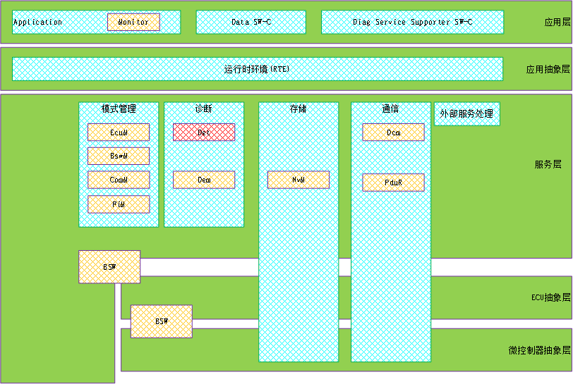
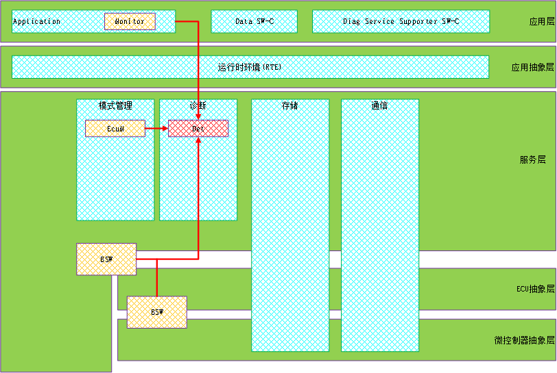
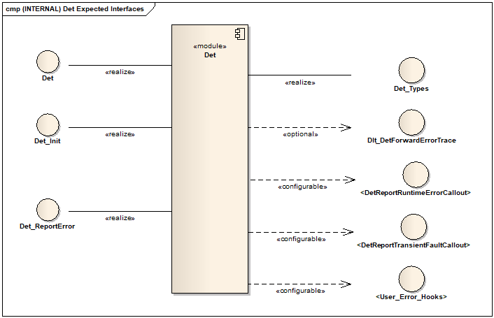
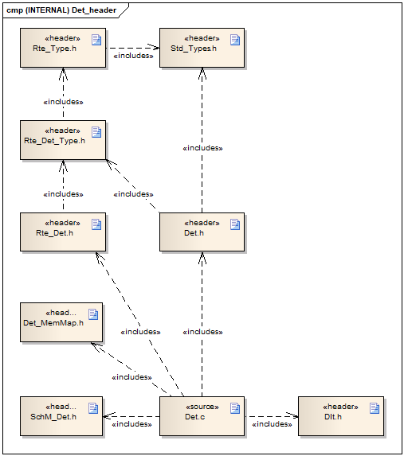
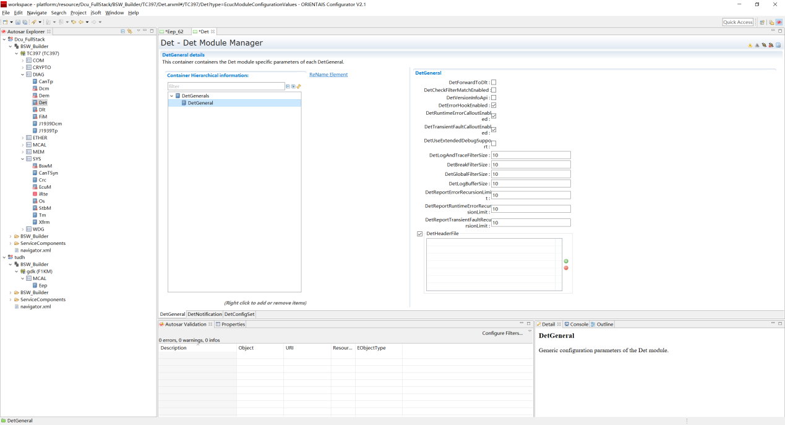
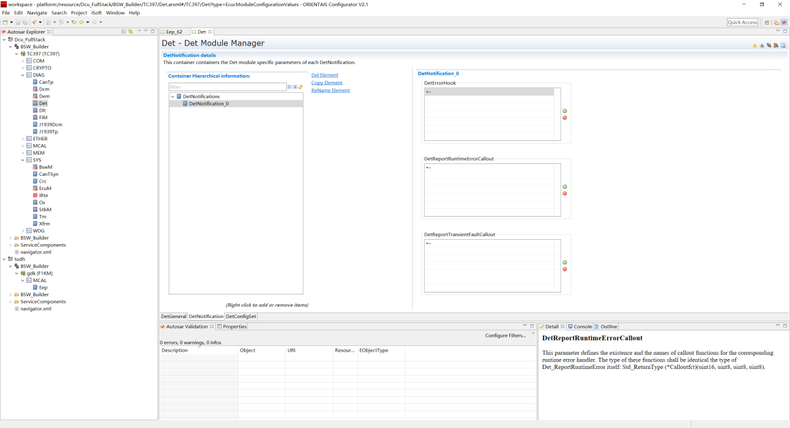
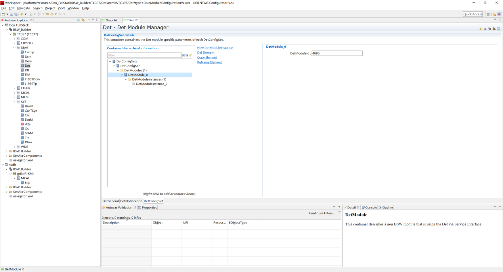
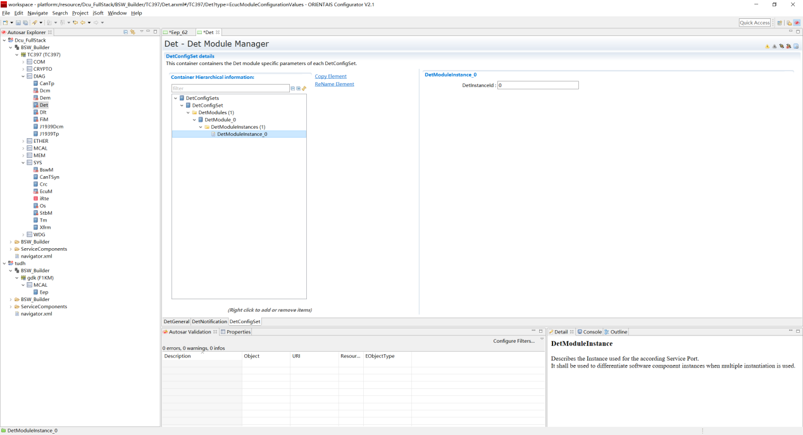

=================
DET
=================

**缩写词注解**

+------------+---------------------------+----------------------------+
| **缩写词** | **英文全称**              | **中文解释**               |
+------------+---------------------------+----------------------------+
| DET        | Default Error Tracer      | 默认错误跟踪               |
+------------+---------------------------+----------------------------+
| DLT        | Diagnostic Log And Trace  | 诊断日志与跟踪             |
+------------+---------------------------+----------------------------+
| BSW        | Basic Software Module     | 基础软件模块               |
+------------+---------------------------+----------------------------+

简介
====

Det模块虽然表面上看起来不复杂，但是有一点毋庸置疑，它的使用率非常的高，几乎所有模块都会使用它，不光包含基础软件模块（BSW），应用软件组件（SWC）依然会使用它。Det模块可以理解为一个错误检测/追踪/管理模块，或者理解为探测断言（Assert）。

在4.2版本以前，DET（Development Error
Tracer）开发错误追踪器。显然，其名字已经非常明确了它的定位，就是开发阶段的开发错误追踪器，再直白点，简单来说对应代码，一般就是对各个模块的函数参数进行检查或者上下文环境检测等，看看是否合法，比如，函数的输入参数是一个指针类型，看看是否为空指针；或者函数的输入参数的取值是否超过取值范围等。

但是从4.2版本开始，DET（Default Error
Tracer）的角色发生了变化。虽然DET模块的缩略语为DET，但是已然不是曾经的DET。因为这里的Default不但包含了以前的Development，还新增加了Runtime
Error，Transient Fault，Production Errors，Extended Production
Error等函数API接口。

按照我们通常的理解，以前的Development理论上其关注点就在开发阶段，那么测试完成发布Release以后，理论上是可以将其关闭的，本身AUTOSAR的效率一直饱受病垢，关闭DET功能会提升很多效率。但是现在改为Default后，它不再只关注开发阶段，运行时（Runtime）也要关注，所以我们就不能在发布时将其关闭。

由于每个功能函数/模块对错误检测/处理的需求不一样，所以这个模块和其他模块还有点区别，就是这个模块虽然提供了标准的API接口，但是并没有规定这些API里面具体需要干什么，完全有开发者/设计者来决定（比如，当错误发生时，在里面设置调式断点让代码停下，以便调试；对错误进行计数；发生运行时错误后，使用默认值去替换以便能继续运行；记录日志调试成功及参数存储到缓存RAM，类似于堆栈信息；通过通信接口发送错误信息到ECU外部客户端以便分析）。

虽然协议没有规定每个函数体具体需要实现什么，但是其规定了一些基本信息/规则/机制。对于某个发生的错误，你需要告诉DET模块这个错误是哪个模块发生的？哪个函数发生的？错误类型是什么？这几个信息是通过API参数规定好的。

参考资料
--------

[1] AUTOSAR_SWS_DefaultErrorTracer.pdf，R19-11

[2] AUTOSAR_SWS_DiagnosticLogAndTrace.pdf，R19-11

功能描述
========

DET功能
-------

DET功能介绍
~~~~~~~~~~~

|image1|

图 Det模块在AUTOSAR架构中的位置

如图所示展示了AUTOSAR默认错误追踪器DET模块的软件分层架构。可以看到DET模块处于BSW基础软件的系统服务层，与DLT模块处于并列关系，并且当DLT模块收集到错误信息时，会通过Det_ReportError函数API接口向DET模块进行错误报告；Det模块也可以收集SWC或BSW模块的错误信息，同样通过Det_ReportError函数API接口向DET模块进行错误报告；DET模块也可以报错运行时错误或硬件瞬态故障。

|image2|

图 DET模块分层架构

AUTOSAR错误探测诊断协议栈处于BSW基础软件层，主要由DET模块来实现。如图所示，粉红色区域标注的模块属于AUTOSAR软件架构中错误探测诊断协议栈的管理范畴，基础软件层还提供系统服务，网络通信服务，I/O
服务以及复杂设备驱动。

DET功能实现
~~~~~~~~~~~

|image3|

图 Det模块的功能拓扑图

默认错误跟踪程序提供了在软件组件和其他基础软件模块的开发和运行期间支持错误检测和错误跟踪的功能。为此，默认错误跟踪程序接收和评估来自以下这些组件和模块的错误消息。

1. 为报告探测开发错误提供接口。

2. AUTOSAR只是定义了API接口，但是实现和完整配置都不是由AUTOSAR定义的。

3. MCAL配置工具EB或者基础软件配置工具（ORIENTAIS）对应的解决方案中提供了高度可配置的功能。

4. BSW基础软件中的可选附加检查功能（检测错误的参数值、缓冲区溢出、错误的调用顺序等）。

5. 在BSW基础软件中的每一个模块都有相应的配置使能或禁止检测开发错误功能；也可以应用于顶层应用程序。

6. 所有的开发错误都会通过Det_ReportError汇报给Det。

模块之间的交互关系
------------------

|image4|

图 模块间交互关系

表 模块间交互关系

+---------+--------------------------+----------------+---------------+
| **交互  | **交互接口**             | **交互数据**   | **交互条件**  |
| 模块**  |                          |                |               |
+---------+--------------------------+----------------+---------------+
| BSW     | Det_ErrorReport          | 向DET报告开发  | 使能开发      |
|         |                          | 错误和诊断跟踪 | 错误检测功能  |
+---------+--------------------------+----------------+---------------+
| SWC     | Det_ErrorReport          | 向DET报告开发  | 使能开发      |
|         |                          | 错误和诊断跟踪 | 错误检测功能  |
+---------+--------------------------+----------------+---------------+
| Dlt     | Dlt_DetForwardErrorTrace | 向E            | ECU内部必须支 |
|         |                          | CU外部客户端发 | 持Dlt功能模块 |
|         |                          | 送错误跟踪信息 |               |
+---------+--------------------------+----------------+---------------+

源文件描述
==========

表 Det组件文件描述

+----------------+-----------------------------------------------------+
| **文件**       | **说明**                                            |
+----------------+-----------------------------------------------------+
| Det_Cfg.h      | 定义Det模块预编译时用到的配置参数。                 |
+----------------+-----------------------------------------------------+
| Det_Cfg.c      | 定义Det模块中连接时用到的配置参数。                 |
+----------------+-----------------------------------------------------+
| D              | 定义Det模块中外部连接时相关联的动态配置API函数实现  |
| et_Externals.c |                                                     |
+----------------+-----------------------------------------------------+
| D              | 定义Det模块中外部连接时相关联的动态配置API函数声明  |
| et_Externals.h |                                                     |
+----------------+-----------------------------------------------------+
| Det.h          | Det模块头文                                         |
|                | 件，包含了API函数的扩展声明并定义了端口的数据结构。 |
+----------------+-----------------------------------------------------+
| Det.c          | Det模块源文件，包含了API函数的实现。                |
+----------------+-----------------------------------------------------+
| Det_MemMap.h   | 包含Det模块的内存抽象                               |
+----------------+-----------------------------------------------------+
| Det_Types.h    | 包含Det模块定义的数据类型                           |
+----------------+-----------------------------------------------------+

|image5|

图 Det组件文件交互关系图

API接口
=======

类型定义
--------

Std_VersionInfoType类型定义
~~~~~~~~~~~~~~~~~~~~~~~~~~~

+-----------+----------------------------------------------------------+
| 名称      | Std_VersionInfoType                                      |
+-----------+----------------------------------------------------------+
| 类型      | Structure                                                |
+-----------+----------------------------------------------------------+
| 定义      | typedef struct                                           |
|           |                                                          |
|           | {                                                        |
|           |                                                          |
|           | uint16 vendorID;                                         |
|           |                                                          |
|           | uint16 moduleID;                                         |
|           |                                                          |
|           | uint8 instanceID;                                        |
|           |                                                          |
|           | uint8 sw_major_version;                                  |
|           |                                                          |
|           | uint8 sw_minor_version;                                  |
|           |                                                          |
|           | uint8 sw_patch_version;                                  |
|           |                                                          |
|           | } Std_VersionInfoType;                                   |
+-----------+----------------------------------------------------------+
| 范围      | 无                                                       |
+-----------+----------------------------------------------------------+
| 描述      | 用于描述软件版本信息的结构体类型                         |
+-----------+----------------------------------------------------------+

Det_CalloutFnctPtrType类型定义
~~~~~~~~~~~~~~~~~~~~~~~~~~~~~~

+-----------+----------------------------------------------------------+
| 名称      | Det_CalloutFnctPtrType                                   |
+-----------+----------------------------------------------------------+
| 类型      | 函数指针类型                                             |
+-----------+----------------------------------------------------------+
| 定义      | typedef Std_ReturnType (\*Det_CalloutFnctPtrType)        |
|           |                                                          |
|           | (                                                        |
|           |                                                          |
|           | uint16 ModuleId,                                         |
|           |                                                          |
|           | uint8 InstanceId,                                        |
|           |                                                          |
|           | uint8 ApiId,                                             |
|           |                                                          |
|           | uint8 ErrorId,                                           |
|           |                                                          |
|           | );                                                       |
+-----------+----------------------------------------------------------+
| 范围      | 无                                                       |
+-----------+----------------------------------------------------------+
| 描述      | 用于描述访问地址的类型                                   |
+-----------+----------------------------------------------------------+

Det_InfoType类型定义
~~~~~~~~~~~~~~~~~~~~

+-----------+----------------------------------------------------------+
| 名称      | Det_InfoType                                             |
+-----------+----------------------------------------------------------+
| 类型      | Structure                                                |
+-----------+----------------------------------------------------------+
| 定义      | typedef Struct                                           |
|           |                                                          |
|           | {                                                        |
|           |                                                          |
|           | uint16 mModuleId;                                        |
|           |                                                          |
|           | uint8 mInstanceId;                                       |
|           |                                                          |
|           | uint8 mApiId;                                            |
|           |                                                          |
|           | uint8 mErrorId;                                          |
|           |                                                          |
|           | } Det_InfoType;                                          |
+-----------+----------------------------------------------------------+
| 范围      | 无                                                       |
+-----------+----------------------------------------------------------+
| 描述      | 用于Det模块中配置过滤器和存储日志数据的数据类型          |
+-----------+----------------------------------------------------------+

Det_StatusType类型定义
~~~~~~~~~~~~~~~~~~~~~~

+-----------+----------------------------------------------------------+
| 名称      | Det_StatusType                                           |
+-----------+----------------------------------------------------------+
| 类型      | Structure                                                |
+-----------+----------------------------------------------------------+
| 定义      | typedef Struct                                           |
|           |                                                          |
|           | {                                                        |
|           |                                                          |
|           | boolean globalFilterActive;                              |
|           |                                                          |
|           | boolean logActive;                                       |
|           |                                                          |
|           | boolean breakOnLogOverrun;                               |
|           |                                                          |
|           | boolean breakFilterActive;                               |
|           |                                                          |
|           | boolean unlockBreak;                                     |
|           |                                                          |
|           | uint8 logIndex;                                          |
|           |                                                          |
|           | } Det_StatusType;                                        |
+-----------+----------------------------------------------------------+
| 范围      | 无                                                       |
+-----------+----------------------------------------------------------+
| 描述      | 结构体用于控制DET调试扩展操作的数据类型                  |
+-----------+----------------------------------------------------------+

Det_ConfigType类型定义
~~~~~~~~~~~~~~~~~~~~~~

+-----------+----------------------------------------------------------+
| 名称      | Det_ConfigType                                           |
+-----------+----------------------------------------------------------+
| 类型      | Structure                                                |
+-----------+----------------------------------------------------------+
| 范围      | 无                                                       |
+-----------+----------------------------------------------------------+
| 描述      | 用于描述 Det模块初始化时，加载配置信息的结构体类型       |
+-----------+----------------------------------------------------------+

Det_ModuleStateType类型定义
~~~~~~~~~~~~~~~~~~~~~~~~~~~

+-----------+----------------------------------------------------------+
| 名称      | Det_ModuleStateType                                      |
+-----------+----------------------------------------------------------+
| 类型      | Enumeration                                              |
+-----------+----------------------------------------------------------+
| 范围      | DET_STATE_OFF = 0                                        |
|           |                                                          |
|           | DET_STATE_ON = 1                                         |
+-----------+----------------------------------------------------------+
| 描述      | 用于描述Det模块的运行状态                                |
+-----------+----------------------------------------------------------+

Det_ReturnType类型定义
~~~~~~~~~~~~~~~~~~~~~~

+-----------+----------------------------------------------------------+
| 名称      | Det_ReturnType                                           |
+-----------+----------------------------------------------------------+
| 类型      | uint8                                                    |
+-----------+----------------------------------------------------------+
| 范围      | E_OK：API请求被接受                                      |
|           |                                                          |
|           | E_NOT_OK：API请求被拒绝                                  |
+-----------+----------------------------------------------------------+
| 描述      | 用于描述API接口函数的返回类型，以及Job作业请求的结果     |
+-----------+----------------------------------------------------------+

输入函数描述
------------

+----------------------------------+-----------------------------------+
| **输入模块**                     | **API**                           |
+----------------------------------+-----------------------------------+
| DLT                              | Dlt_DetForwardErrorTrace          |
+----------------------------------+-----------------------------------+

静态接口函数定义
----------------

Det_Init函数定义
~~~~~~~~~~~~~~~~

+-------------+-------------------------------+------+----------------+
| 函数名称：  | Det_Init                      |      |                |
+-------------+-------------------------------+------+----------------+
| 函数原型：  | void Det_Init(const           |      |                |
|             | Det_ConfigType \*ConfigPtr)   |      |                |
+-------------+-------------------------------+------+----------------+
| 服务编号：  | 0x00                          |      |                |
+-------------+-------------------------------+------+----------------+
| 同步/异步： | 同步                          |      |                |
+-------------+-------------------------------+------+----------------+
| 是          | 不可重入                      |      |                |
| 否可重入：  |                               |      |                |
+-------------+-------------------------------+------+----------------+
| 输入参数：  | Co                            | 值   | 无             |
|             | nfigPtr：指向所选配置集的指针 | 域： |                |
+-------------+-------------------------------+------+----------------+
| 输入        | 无                            |      |                |
| 输出参数：  |                               |      |                |
+-------------+-------------------------------+------+----------------+
| 输出参数：  | 无                            |      |                |
+-------------+-------------------------------+------+----------------+
| 返回值：    | 无                            |      |                |
+-------------+-------------------------------+------+----------------+
| 功能概述：  | 服务用于实                    |      |                |
|             | 现默认错误跟踪DET模块的初始化 |      |                |
+-------------+-------------------------------+------+----------------+

Det_ReportError函数定义
~~~~~~~~~~~~~~~~~~~~~~~

+-------------+---------------------------------------+------+--------+
| 函数名称：  | Det_ReportError                       |      |        |
+-------------+---------------------------------------+------+--------+
| 函数原型：  | Std_ReturnType Det_ReportError        |      |        |
|             |                                       |      |        |
|             | (                                     |      |        |
|             |                                       |      |        |
|             | uint16 ModuleId,                      |      |        |
|             |                                       |      |        |
|             | uint8 InstanceId,                     |      |        |
|             |                                       |      |        |
|             | uint8 ApiId,                          |      |        |
|             |                                       |      |        |
|             | uint8 ErrorId                         |      |        |
|             |                                       |      |        |
|             | )                                     |      |        |
+-------------+---------------------------------------+------+--------+
| 服务编号：  | 0x01                                  |      |        |
+-------------+---------------------------------------+------+--------+
| 同步/异步： | 无                                    |      |        |
+-------------+---------------------------------------+------+--------+
| 是          | 可重入                                |      |        |
| 否可重入：  |                                       |      |        |
+-------------+---------------------------------------+------+--------+
| 输入参数：  | ModuleId：调用模块对应的模块标识符    | 值   | 0      |
|             |                                       | 域： | -65535 |
+-------------+---------------------------------------+------+--------+
|             | Ins                                   | 值   | 0-255  |
|             | tanceId：调用模块基于索引实例的标识符 | 域： |        |
+-------------+---------------------------------------+------+--------+
|             | Api                                   | 值   | 0-255  |
|             | Id：调用模块检测到错误的API服务标识符 | 域： |        |
+-------------+---------------------------------------+------+--------+
|             | Er                                    | 值   | 0-255  |
|             | rorId：调用模块检测到的开发错误标识符 | 域： |        |
+-------------+---------------------------------------+------+--------+
| 输入        | 无                                    |      |        |
| 输出参数：  |                                       |      |        |
+-------------+---------------------------------------+------+--------+
| 输出参数：  | 无                                    |      |        |
+-------------+---------------------------------------+------+--------+
| 返回值：    | Std_ReturnType：永远不返回值，但      |      |        |
|             | 有一个返回类型，以便与服务和钩子兼容  |      |        |
+-------------+---------------------------------------+------+--------+
| 功能概述：  | 服务用于报告开发错误                  |      |        |
+-------------+---------------------------------------+------+--------+

Det_Start函数定义
~~~~~~~~~~~~~~~~~

+-------------+--------------------------------------------------------+
| 函数名称：  | Det_Start                                              |
+-------------+--------------------------------------------------------+
| 函数原型：  | void Det_Start(void)                                   |
+-------------+--------------------------------------------------------+
| 服务编号：  | 0x02                                                   |
+-------------+--------------------------------------------------------+
| 同步/异步： | 同步                                                   |
+-------------+--------------------------------------------------------+
| 是          | 不可重入                                               |
| 否可重入：  |                                                        |
+-------------+--------------------------------------------------------+
| 输入参数：  | 无                                                     |
+-------------+--------------------------------------------------------+
| 输入        | 无                                                     |
| 输出参数：  |                                                        |
+-------------+--------------------------------------------------------+
| 输出参数：  | 无                                                     |
+-------------+--------------------------------------------------------+
| 返回值：    | 无                                                     |
+-------------+--------------------------------------------------------+
| 功能概述：  | 服务用于启动默认错误跟踪DET                            |
+-------------+--------------------------------------------------------+

Det_ReportRuntimeError函数定义
~~~~~~~~~~~~~~~~~~~~~~~~~~~~~~

+-------------+---------------------------------------+------+--------+
| 函数名称：  | Det_ReportRuntimeError                |      |        |
+-------------+---------------------------------------+------+--------+
| 函数原型：  | Std_ReturnType Det_ReportRuntimeError |      |        |
|             |                                       |      |        |
|             | (                                     |      |        |
|             |                                       |      |        |
|             | uint16 ModuleId,                      |      |        |
|             |                                       |      |        |
|             | uint8 InstanceId,                     |      |        |
|             |                                       |      |        |
|             | uint8 ApiId,                          |      |        |
|             |                                       |      |        |
|             | uint8 ErrorId                         |      |        |
|             |                                       |      |        |
|             | )                                     |      |        |
+-------------+---------------------------------------+------+--------+
| 服务编号：  | 0x04                                  |      |        |
+-------------+---------------------------------------+------+--------+
| 同步/异步： | 同步                                  |      |        |
+-------------+---------------------------------------+------+--------+
| 是          | 可重入                                |      |        |
| 否可重入：  |                                       |      |        |
+-------------+---------------------------------------+------+--------+
| 输入参数：  | ModuleId：调用模块对应的模块标识符    | 值   | 0      |
|             |                                       | 域： | -65535 |
+-------------+---------------------------------------+------+--------+
|             | Ins                                   | 值   | 0-255  |
|             | tanceId：调用模块基于索引实例的标识符 | 域： |        |
+-------------+---------------------------------------+------+--------+
|             | Api                                   | 值   | 0-255  |
|             | Id：调用模块检测到错误的API服务标识符 | 域： |        |
+-------------+---------------------------------------+------+--------+
|             | Erro                                  | 值   | 0-255  |
|             | rId：调用模块检测到的运行时错误标识符 | 域： |        |
+-------------+---------------------------------------+------+--------+
| 输入        | 无                                    |      |        |
| 输出参数：  |                                       |      |        |
+-------------+---------------------------------------+------+--------+
| 输出参数：  | 无                                    |      |        |
+-------------+---------------------------------------+------+--------+
| 返回值：    | St                                    |      |        |
|             | d_ReturnTyp：总是返回E_OK(服务需要的) |      |        |
+-------------+---------------------------------------+------+--------+
| 功能概述：  | 服务用于报告运行时错误                |      |        |
|             |                                       |      |        |
|             | 如果已配置了一                        |      |        |
|             | 个Callout，则将调用该Callout回调函数  |      |        |
+-------------+---------------------------------------+------+--------+

Det_ReportTransientFault函数定义
~~~~~~~~~~~~~~~~~~~~~~~~~~~~~~~~

+-------------+---------------------------------------+------+--------+
| 函数名称：  | Det_ReportTransientFault              |      |        |
+-------------+---------------------------------------+------+--------+
| 函数原型：  | Std_ReturnType                        |      |        |
|             | Det_ReportTransientFault              |      |        |
|             |                                       |      |        |
|             | (                                     |      |        |
|             |                                       |      |        |
|             | uint16 ModuleId,                      |      |        |
|             |                                       |      |        |
|             | uint8 InstanceId,                     |      |        |
|             |                                       |      |        |
|             | uint8 ApiId,                          |      |        |
|             |                                       |      |        |
|             | uint8 FaultId                         |      |        |
|             |                                       |      |        |
|             | )                                     |      |        |
+-------------+---------------------------------------+------+--------+
| 服务编号：  | 0x05                                  |      |        |
+-------------+---------------------------------------+------+--------+
| 同步/异步： | 同步                                  |      |        |
+-------------+---------------------------------------+------+--------+
| 是          | 可重入                                |      |        |
| 否可重入：  |                                       |      |        |
+-------------+---------------------------------------+------+--------+
| 输入参数：  | ModuleId：调用模块对应的模块标识符    | 值   | 0      |
|             |                                       | 域： | -65535 |
+-------------+---------------------------------------+------+--------+
|             | Ins                                   | 值   | 0-255  |
|             | tanceId：调用模块基于索引实例的标识符 | 域： |        |
+-------------+---------------------------------------+------+--------+
|             | Api                                   | 值   | 0-255  |
|             | Id：调用模块检测到错误的API服务标识符 | 域： |        |
+-------------+---------------------------------------+------+--------+
|             | Fa                                    | 值   | 0-255  |
|             | ultId：调用模块检测到的瞬态故障标识符 | 域： |        |
+-------------+---------------------------------------+------+--------+
| 输入        | 无                                    |      |        |
| 输出参数：  |                                       |      |        |
+-------------+---------------------------------------+------+--------+
| 输出参数：  | 无                                    |      |        |
+-------------+---------------------------------------+------+--------+
| 返回值：    | Std_ReturnType：如果不存在callout，则 |      |        |
|             | 返回E_OK，否则返回所配置的callout的值 |      |        |
+-------------+---------------------------------------+------+--------+
| 功能概述：  | 服务用于报告运行时错误                |      |        |
|             |                                       |      |        |
|             | 如果已配置了一                        |      |        |
|             | 个Callout，则将调用该Callout回调函数  |      |        |
+-------------+---------------------------------------+------+--------+

Det_GetVersionInfo函数定义
~~~~~~~~~~~~~~~~~~~~~~~~~~

+-------------+---------------------------------+------+--------------+
| 函数名称：  | Det_GetVersionInfo              |      |              |
+-------------+---------------------------------+------+--------------+
| 函数原型：  | void                            |      |              |
|             | Det_Get                         |      |              |
|             | VersionInfo(Std_VersionInfoType |      |              |
|             | \*versioninfo)                  |      |              |
+-------------+---------------------------------+------+--------------+
| 服务编号：  | 0x03                            |      |              |
+-------------+---------------------------------+------+--------------+
| 同步/异步： | 同步                            |      |              |
+-------------+---------------------------------+------+--------------+
| 是          | 可重入                          |      |              |
| 否可重入：  |                                 |      |              |
+-------------+---------------------------------+------+--------------+
| 输入参数：  | 无                              |      |              |
+-------------+---------------------------------+------+--------------+
| 输入        | 无                              |      |              |
| 输出参数：  |                                 |      |              |
+-------------+---------------------------------+------+--------------+
| 输出参数：  | Versioninfo：指向在             | 值   | 无           |
|             | 何处存储此模块的版本信息的指针  | 域： |              |
+-------------+---------------------------------+------+--------------+
| 返回值：    | 无                              |      |              |
+-------------+---------------------------------+------+--------------+
| 功能概述：  | 返回DET模块的软件版本信息       |      |              |
+-------------+---------------------------------+------+--------------+

可配置函数定义
--------------

User_Error_Hooks函数定义
~~~~~~~~~~~~~~~~~~~~~~~~

+-------------+---------------------------------------+------+--------+
| 函数名称：  | User_Error_Hooks                      |      |        |
+-------------+---------------------------------------+------+--------+
| 函数原型：  | Std_ReturnType <User_Error_Hooks>     |      |        |
|             |                                       |      |        |
|             | (                                     |      |        |
|             |                                       |      |        |
|             | uint16 ModuleId,                      |      |        |
|             |                                       |      |        |
|             | uint8 InstanceId,                     |      |        |
|             |                                       |      |        |
|             | uint8 ApiId,                          |      |        |
|             |                                       |      |        |
|             | uint8 ErrorId                         |      |        |
|             |                                       |      |        |
|             | )                                     |      |        |
+-------------+---------------------------------------+------+--------+
| 服务编号：  | 0x10                                  |      |        |
+-------------+---------------------------------------+------+--------+
| 同步/异步： | 同步                                  |      |        |
+-------------+---------------------------------------+------+--------+
| 是          | 可重入                                |      |        |
| 否可重入：  |                                       |      |        |
+-------------+---------------------------------------+------+--------+
| 输入参数：  | ModuleId：调用模块对应的模块标识符    | 值   | 0      |
|             |                                       | 域： | -65535 |
+-------------+---------------------------------------+------+--------+
|             | Ins                                   | 值   | 0-255  |
|             | tanceId：调用模块基于索引实例的标识符 | 域： |        |
+-------------+---------------------------------------+------+--------+
|             | Api                                   | 值   | 0-255  |
|             | Id：调用模块检测到错误的API服务标识符 | 域： |        |
+-------------+---------------------------------------+------+--------+
|             | Er                                    | 值   | 0-255  |
|             | rorId：调用模块检测到的开发错误标识符 | 域： |        |
+-------------+---------------------------------------+------+--------+
| 输入        | 无                                    |      |        |
| 输出参数：  |                                       |      |        |
+-------------+---------------------------------------+------+--------+
| 输出参数：  | 无                                    |      |        |
+-------------+---------------------------------------+------+--------+
| 返回值：    | Std                                   |      |        |
|             | _ReturnType：总是返回E_OK(服务需要的) |      |        |
+-------------+---------------------------------------+------+--------+
| 功能概述：  | 检测到开                              |      |        |
|             | 发错误以后，执行可配置的Hook钩子函数  |      |        |
+-------------+---------------------------------------+------+--------+

DetReportRuntimeErrorCallout函数定义
~~~~~~~~~~~~~~~~~~~~~~~~~~~~~~~~~~~~

+-------------+---------------------------------------+------+--------+
| 函数名称：  | DetReportRuntimeErrorCallout          |      |        |
+-------------+---------------------------------------+------+--------+
| 函数原型：  | Std_ReturnType                        |      |        |
|             | <DetReportRuntimeErrorCallout>        |      |        |
|             |                                       |      |        |
|             | (                                     |      |        |
|             |                                       |      |        |
|             | uint16 ModuleId,                      |      |        |
|             |                                       |      |        |
|             | uint8 InstanceId,                     |      |        |
|             |                                       |      |        |
|             | uint8 ApiId,                          |      |        |
|             |                                       |      |        |
|             | uint8 ErrorId                         |      |        |
|             |                                       |      |        |
|             | )                                     |      |        |
+-------------+---------------------------------------+------+--------+
| 服务编号：  | 0x11                                  |      |        |
+-------------+---------------------------------------+------+--------+
| 同步/异步： | 同步                                  |      |        |
+-------------+---------------------------------------+------+--------+
| 是          | 可重入                                |      |        |
| 否可重入：  |                                       |      |        |
+-------------+---------------------------------------+------+--------+
| 输入参数：  | ModuleId：调用模块对应的模块标识符    | 值   | 0      |
|             |                                       | 域： | -65535 |
+-------------+---------------------------------------+------+--------+
|             | Ins                                   | 值   | 0-255  |
|             | tanceId：调用模块基于索引实例的标识符 | 域： |        |
+-------------+---------------------------------------+------+--------+
|             | Api                                   | 值   | 0-255  |
|             | Id：调用模块检测到错误的API服务标识符 | 域： |        |
+-------------+---------------------------------------+------+--------+
|             | Erro                                  | 值   | 0-255  |
|             | rId：调用模块检测到的运行时错误标识符 | 域： |        |
+-------------+---------------------------------------+------+--------+
| 输入        | 无                                    |      |        |
| 输出参数：  |                                       |      |        |
+-------------+---------------------------------------+------+--------+
| 输出参数：  | 无                                    |      |        |
+-------------+---------------------------------------+------+--------+
| 返回值：    | Std                                   |      |        |
|             | _ReturnType：总是返回E_OK(服务需要的) |      |        |
+-------------+---------------------------------------+------+--------+
| 功能概述：  | 检测到运                              |      |        |
|             | 行时错误以后，执行可配置的Callout函数 |      |        |
+-------------+---------------------------------------+------+--------+

DetReportTransientFaultCallout函数定义
~~~~~~~~~~~~~~~~~~~~~~~~~~~~~~~~~~~~~~

+-------------+---------------------------------------+------+--------+
| 函数名称：  | DetReportTransientFaultCallout        |      |        |
+-------------+---------------------------------------+------+--------+
| 函数原型：  | Std_ReturnType                        |      |        |
|             | <DetReportTransientFaultCallout>      |      |        |
|             |                                       |      |        |
|             | (                                     |      |        |
|             |                                       |      |        |
|             | uint16 ModuleId,                      |      |        |
|             |                                       |      |        |
|             | uint8 InstanceId,                     |      |        |
|             |                                       |      |        |
|             | uint8 ApiId,                          |      |        |
|             |                                       |      |        |
|             | uint8 FaultId                         |      |        |
|             |                                       |      |        |
|             | )                                     |      |        |
+-------------+---------------------------------------+------+--------+
| 服务编号：  | 0x12                                  |      |        |
+-------------+---------------------------------------+------+--------+
| 同步/异步： | 同步                                  |      |        |
+-------------+---------------------------------------+------+--------+
| 是          | 可重入                                |      |        |
| 否可重入：  |                                       |      |        |
+-------------+---------------------------------------+------+--------+
| 输入参数：  | ModuleId：调用模块对应的模块标识符    | 值   | 0      |
|             |                                       | 域： | -65535 |
+-------------+---------------------------------------+------+--------+
|             | Ins                                   | 值   | 0-255  |
|             | tanceId：调用模块基于索引实例的标识符 | 域： |        |
+-------------+---------------------------------------+------+--------+
|             | Api                                   | 值   | 0-255  |
|             | Id：调用模块检测到错误的API服务标识符 | 域： |        |
+-------------+---------------------------------------+------+--------+
|             | Fa                                    | 值   | 0-255  |
|             | ultId：调用模块检测到的瞬态故障标识符 | 域： |        |
+-------------+---------------------------------------+------+--------+
| 输入        | 无                                    |      |        |
| 输出参数：  |                                       |      |        |
+-------------+---------------------------------------+------+--------+
| 输出参数：  | 无                                    |      |        |
+-------------+---------------------------------------+------+--------+
| 返回值：    | Std_ReturnType：Value is propagated   |      |        |
|             | to caller of Det_ReportTransientFault |      |        |
+-------------+---------------------------------------+------+--------+
| 功能概述：  | 检测到                                |      |        |
|             | 瞬态故障以后，执行可配置的Callout函数 |      |        |
+-------------+---------------------------------------+------+--------+

配置
====

DetGeneral
----------

|image6|

图 DetGeneral配置

表 DetGeneral配置

+----------+-----------+-----------------------+------------+----------+
| DetForw  | 取值范围  | TRUE/FALSE            | 默认取值   | FALSE    |
| ardToDlt |           |                       |            |          |
+----------+-----------+-----------------------+------------+----------+
|          | 参数描述  | 只有当参数            |            |          |
|          |           | 存在并设置为TEUE时，D |            |          |
|          |           | et才需要可选Dlt接口并 |            |          |
|          |           | 将其调用转发给函数Dlt |            |          |
|          |           | _DetForwardErrorTrace |            |          |
+----------+-----------+-----------------------+------------+----------+
|          | 依赖关系  | 依                    |            |          |
|          |           | 赖于DLT模块的配置情况 |            |          |
+----------+-----------+-----------------------+------------+----------+
| De       | 取值范围  | TRUE/FALSE            | 默认取值   | FALSE    |
| tCheckFi |           |                       |            |          |
| lterMatc |           |                       |            |          |
| hEnabled |           |                       |            |          |
+----------+-----------+-----------------------+------------+----------+
|          | 参数描述  | 此配                  |            |          |
|          |           | 置参数用于打开或关闭  |            |          |
|          |           | API以检查过滤器匹配； |            |          |
|          |           |                       |            |          |
|          |           | 预处理器开关启用/禁用 |            |          |
|          |           | API以检查过滤器匹配； |            |          |
+----------+-----------+-----------------------+------------+----------+
|          | 依赖关系  | 无                    |            |          |
+----------+-----------+-----------------------+------------+----------+
| D        | 取值范围  | TRUE/FALSE            | 默认取值   | FALSE    |
| etVersio |           |                       |            |          |
| nInfoApi |           |                       |            |          |
+----------+-----------+-----------------------+------------+----------+
|          | 参数描述  | 此                    |            |          |
|          |           | 配置参数用于打开或关  |            |          |
|          |           | 闭API以获取版本信息； |            |          |
|          |           |                       |            |          |
|          |           | 预处理器开关启用/禁用 |            |          |
|          |           | API以读取模块版本信息 |            |          |
+----------+-----------+-----------------------+------------+----------+
|          | 依赖关系  | 无                    |            |          |
+----------+-----------+-----------------------+------------+----------+
| Det      | 取值范围  | TRUE/FALSE            | 默认取值   | FALSE    |
| ErrorHoo |           |                       |            |          |
| kEnabled |           |                       |            |          |
+----------+-----------+-----------------------+------------+----------+
|          | 参数描述  | 预处                  |            |          |
|          |           | 理器开关为启用/禁用， |            |          |
|          |           | 用于配置在报告错误时  |            |          |
|          |           | 是否调用错误钩子函数  |            |          |
+----------+-----------+-----------------------+------------+----------+
|          | 依赖关系  | 无                    |            |          |
+----------+-----------+-----------------------+------------+----------+
| DetRu    | 取值范围  | TRUE/FALSE            | 默认取值   | FALSE    |
| ntimeErr |           |                       |            |          |
| orCallou |           |                       |            |          |
| tEnabled |           |                       |            |          |
+----------+-----------+-----------------------+------------+----------+
|          | 参数描述  | 预处理器开关          |            |          |
|          |           | 为启用/禁用，用于配置 |            |          |
|          |           | 在报告运行时错误时是  |            |          |
|          |           | 否执行Callout回调函数 |            |          |
+----------+-----------+-----------------------+------------+----------+
|          | 依赖关系  | 无                    |            |          |
+----------+-----------+-----------------------+------------+----------+
| DetTran  | 取值范围  | TRUE/FALSE            | 默认取值   | FALSE    |
| sientFau |           |                       |            |          |
| ltCallou |           |                       |            |          |
| tEnabled |           |                       |            |          |
+----------+-----------+-----------------------+------------+----------+
|          | 参数描述  | 预处理器开            |            |          |
|          |           | 关为启用/禁用，用于配 |            |          |
|          |           | 置在瞬态故障报告时是  |            |          |
|          |           | 否执行Callout回调函数 |            |          |
+----------+-----------+-----------------------+------------+----------+
|          | 依赖关系  | 无                    |            |          |
+----------+-----------+-----------------------+------------+----------+
| De       | 取值范围  | True/false            | 默认取值   | false    |
| tUseExte |           |                       |            |          |
| ndedDebu |           |                       |            |          |
| gSupport |           |                       |            |          |
+----------+-----------+-----------------------+------------+----------+
|          | 参数描述  | 用于配置是否          |            |          |
|          |           | 开启扩展调试支持特性  |            |          |
+----------+-----------+-----------------------+------------+----------+
|          | 依赖关系  | 无                    |            |          |
+----------+-----------+-----------------------+------------+----------+
| DetLogAn | 取值范围  | 0 …4294967295         | 默认取值   | 0        |
| dTraceFi |           |                       |            |          |
| lterSize |           |                       |            |          |
+----------+-----------+-----------------------+------------+----------+
|          | 参数描述  | 用于配置Det模         |            |          |
|          |           | 块的Dlt过滤缓冲区大小 |            |          |
|          |           |                       |            |          |
|          |           | 实现                  |            |          |
|          |           | 类型：Eep_AddressType |            |          |
+----------+-----------+-----------------------+------------+----------+
|          | 依赖关系  | 无                    |            |          |
+----------+-----------+-----------------------+------------+----------+
| De       | 取值范围  | 0 …4294967295         | 默认取值   | 0        |
| tBreakFi |           |                       |            |          |
| lterSize |           |                       |            |          |
+----------+-----------+-----------------------+------------+----------+
|          | 参数描述  | 用于配置Det模块       |            |          |
|          |           | 的断点过滤缓冲区大小  |            |          |
|          |           |                       |            |          |
|          |           | 实现                  |            |          |
|          |           | 类型：Eep_AddressType |            |          |
+----------+-----------+-----------------------+------------+----------+
|          | 依赖关系  | 无                    |            |          |
+----------+-----------+-----------------------+------------+----------+
| Det      | 取值范围  | 0 …4294967295         | 默认取值   | 0        |
| GlobalFi |           |                       |            |          |
| lterSize |           |                       |            |          |
+----------+-----------+-----------------------+------------+----------+
|          | 参数描述  | 用于配置Det模块       |            |          |
|          |           | 的全局过滤缓冲区大小  |            |          |
|          |           |                       |            |          |
|          |           | 实现                  |            |          |
|          |           | 类型：Eep_AddressType |            |          |
+----------+-----------+-----------------------+------------+----------+
|          | 依赖关系  | 无                    |            |          |
+----------+-----------+-----------------------+------------+----------+
| DetLogBu | 取值范围  | 0 …4294967295         | 默认取值   | 0        |
| fferSize |           |                       |            |          |
+----------+-----------+-----------------------+------------+----------+
|          | 参数描述  | 用于配置De            |            |          |
|          |           | t模块的日志缓冲区大小 |            |          |
+----------+-----------+-----------------------+------------+----------+
|          | 依赖关系  | 无                    |            |          |
+----------+-----------+-----------------------+------------+----------+
| DetR     | 取值范围  | 0 …4294967295         | 默认取值   | 0        |
| eportErr |           |                       |            |          |
| orRecurs |           |                       |            |          |
| ionLimit |           |                       |            |          |
+----------+-----------+-----------------------+------------+----------+
|          | 参数描述  | 用于报告Det模         |            |          |
|          |           | 块的开发错误递归限制  |            |          |
+----------+-----------+-----------------------+------------+----------+
|          | 依赖关系  | 无                    |            |          |
+----------+-----------+-----------------------+------------+----------+
| Det      | 取值范围  | 0 …4294967295         | 默认取值   | 0        |
| ReportRu |           |                       |            |          |
| ntimeErr |           |                       |            |          |
| orRecurs |           |                       |            |          |
| ionLimit |           |                       |            |          |
+----------+-----------+-----------------------+------------+----------+
|          | 参数描述  | 用于报告Det模块       |            |          |
|          |           | 的运行时错误递归限制  |            |          |
+----------+-----------+-----------------------+------------+----------+
|          | 依赖关系  | 无                    |            |          |
+----------+-----------+-----------------------+------------+----------+
| DetRe    | 取值范围  | 0 …4294967295         | 默认取值   | 0        |
| portTran |           |                       |            |          |
| sientFau |           |                       |            |          |
| ltRecurs |           |                       |            |          |
| ionLimit |           |                       |            |          |
+----------+-----------+-----------------------+------------+----------+
|          | 参数描述  | 用于报告Det模         |            |          |
|          |           | 块的瞬时故障递归限制  |            |          |
+----------+-----------+-----------------------+------------+----------+
|          | 依赖关系  | 无                    |            |          |
+----------+-----------+-----------------------+------------+----------+
| DetHe    | 取值范围  | 无                    | 默认取值   | 无       |
| aderFile |           |                       |            |          |
+----------+-----------+-----------------------+------------+----------+
|          | 参数描述  | 用于描述              |            |          |
|          |           | DET模块中相关联组件的 |            |          |
|          |           | 头文件包含的动态配置  |            |          |
+----------+-----------+-----------------------+------------+----------+
|          | 依赖关系  | 无                    |            |          |
+----------+-----------+-----------------------+------------+----------+

5.2 DetNotification
-------------------

|image7|

图 DetNotification配置

表 DetNotification配置

+------------+----------+---------------------+----------+------------+
| De         | 取值范围 | 无                  | 默认取值 | 无         |
| tErrorHook |          |                     |          |            |
+------------+----------+---------------------+----------+------------+
|            | 参数描述 | Optional list of    |          |            |
|            |          | functions to be     |          |            |
|            |          | called by the       |          |            |
|            |          | Default Error       |          |            |
|            |          | Tracer in context   |          |            |
|            |          | of each call of     |          |            |
|            |          | Det_ReportError.    |          |            |
|            |          | The type of these   |          |            |
|            |          | functions shall be  |          |            |
|            |          | identical the type  |          |            |
|            |          | of Det_ReportError  |          |            |
|            |          | itself:             |          |            |
|            |          | Std_ReturnType      |          |            |
|            |          | (\*Er               |          |            |
|            |          | rorHookFct)(uint16, |          |            |
|            |          | uint8, uint8,       |          |            |
|            |          | uint8).             |          |            |
+------------+----------+---------------------+----------+------------+
|            | 依赖关系 | 无                  |          |            |
+------------+----------+---------------------+----------+------------+
| DetRepor   | 取值范围 | 无                  | 默认取值 | 无         |
| tRuntimeEr |          |                     |          |            |
| rorCallout |          |                     |          |            |
+------------+----------+---------------------+----------+------------+
|            | 参数描述 | This parameter      |          |            |
|            |          | defines the         |          |            |
|            |          | existence and the   |          |            |
|            |          | names of callout    |          |            |
|            |          | functions for the   |          |            |
|            |          | corresponding       |          |            |
|            |          | runtime error       |          |            |
|            |          | handler. The type   |          |            |
|            |          | of these functions  |          |            |
|            |          | shall be identical  |          |            |
|            |          | the type of         |          |            |
|            |          | Det                 |          |            |
|            |          | _ReportRuntimeError |          |            |
|            |          | itself:             |          |            |
|            |          | Std_ReturnType      |          |            |
|            |          | (\*                 |          |            |
|            |          | Calloutfct)(uint16, |          |            |
|            |          | uint8, uint8,       |          |            |
|            |          | uint8).             |          |            |
+------------+----------+---------------------+----------+------------+
|            | 依赖关系 | 无                  |          |            |
+------------+----------+---------------------+----------+------------+
| DetReportT | 取值范围 | 无                  | 默认取值 | 无         |
| ransientFa |          |                     |          |            |
| ultCallout |          |                     |          |            |
+------------+----------+---------------------+----------+------------+
|            | 参数描述 | This parameter      |          |            |
|            |          | defines the         |          |            |
|            |          | existence and the   |          |            |
|            |          | names of callout    |          |            |
|            |          | functions for the   |          |            |
|            |          | corresponding       |          |            |
|            |          | transient fault     |          |            |
|            |          | handler. The type   |          |            |
|            |          | of these functions  |          |            |
|            |          | shall be identical  |          |            |
|            |          | the type of         |          |            |
|            |          | Det_R               |          |            |
|            |          | eportTransientFault |          |            |
|            |          | itself:             |          |            |
|            |          | Std_ReturnType      |          |            |
|            |          | (\*                 |          |            |
|            |          | Calloutfct)(uint16, |          |            |
|            |          | uint8, uint8,       |          |            |
|            |          | uint8).             |          |            |
+------------+----------+---------------------+----------+------------+
|            | 依赖关系 | 无                  |          |            |
+------------+----------+---------------------+----------+------------+

5.3 DetModule
-------------

|image8|

图 DetModule配置

表 DetModule配置

+------------+----------+---------------------+----------+------------+
| D          | 取值范围 | 0…65535             | 默认取值 | 0          |
| etModuleId |          |                     |          |            |
+------------+----------+---------------------+----------+------------+
|            | 参数描述 | Unique identifier   |          |            |
|            |          | of the error        |          |            |
|            |          | reporting           |          |            |
|            |          | component. When     |          |            |
|            |          | reporting errors to |          |            |
|            |          | the DET, a symbolic |          |            |
|            |          | name derived from   |          |            |
|            |          | the moduleID has to |          |            |
|            |          | be used to identify |          |            |
|            |          | the reporter.       |          |            |
+------------+----------+---------------------+----------+------------+
|            | 依赖关系 | 无                  |          |            |
+------------+----------+---------------------+----------+------------+

.. _detmodule-1:

5.3.1DetModule
--------------

|image9|

图 DetInstanceId配置

表 DetInstanceId配置

+------------+----------+---------------------+----------+------------+
| Det        | 取值范围 | 0…65535             | 默认取值 | 0          |
| InstanceId |          |                     |          |            |
+------------+----------+---------------------+----------+------------+
|            | 参数描述 | Describes the       |          |            |
|            |          | InstanceId used for |          |            |
|            |          | the according       |          |            |
|            |          | Service Port.       |          |            |
+------------+----------+---------------------+----------+------------+
|            | 依赖关系 | 无                  |          |            |
+------------+----------+---------------------+----------+------------+

.. |image2| image:: ../../_static/参考手册/Det/image2.png
   :width: 5.675in
   :height: 7.875in

