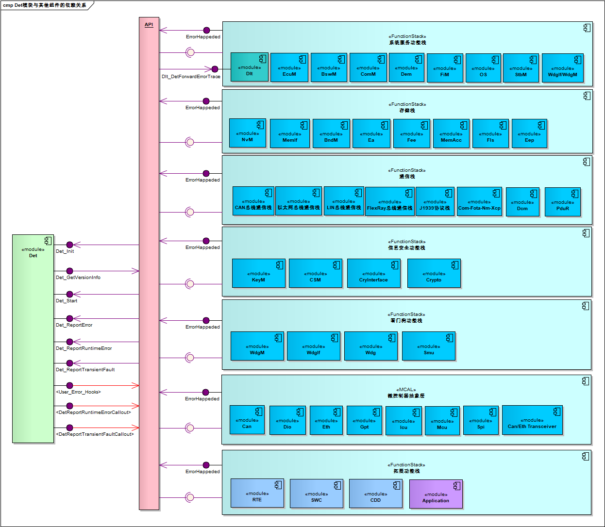

===================
Det
===================

文档信息（Document Information）
=======================================

版本历史（Version History）
-----------------------------------

.. list-table::
   :widths: 10 10 10 10 20
   :header-rows: 1

   * - 日期（Date）
     - 作者（Author）
     - 版本（Version）
     - 状态（Status）
     - 说明（Description）
   * - 2024/11/12
     - haibin.shao
     - V0.1
     - 发布（Release）
     - 首次发布（First release）
   * - 2025/04/04
     - haibin.shao
     - V1.0
     - 发布（Release）
     - 正式发布（Official release）

参考文档（Reference Document）
----------------------------------

.. list-table::
   :widths: 10 15 20 10
   :header-rows: 1

   * - 编号（Number）
     - 分类（Classification）
     - 标题（Title）
     - 版本（Version）
   * - 1
     - Autosar
     - AUTOSAR_CP_SRS_BSWGeneral.pdf
     - R23-11
   * - 2
     - Autosar
     - AUTOSAR_CP_SWS_DefaultErrorTracer.pdf
     - R23-11 

术语与简写（Terms and Abbreviations）
========================================

术语（Term）
----------------------
   .. :align: center   表格内容居中

.. list-table::
   :widths: 10 40
   :header-rows: 1

   * - 术语（Term）
     - 解释（Explanation）

   * - DevelopError
     - 开发过程中常见的错误类型包括语法错误、空指针异常、类型错误、除以零错误、内存溢出错误、文件未找到错误、无效参数错误、超时错误、并发修改异常和导入错误等‌‌。这些错误通常由编程语言的使用不当、代码逻辑错误或环境配置问题引起。
       
       Common error types during development include syntax errors, null pointer exceptions, type errors, division by zero errors, memory overflow errors, file not found errors, invalid parameter errors, timeout errors, concurrent modification exceptions, and import errors. These errors are usually caused by improper use of programming languages, code logic errors, or environment configuration issues.

   * - RuntimeError
     - 运行时错误‌是指在系统运行时发生的错误，这些错误可能由硬件故障、外部输入错误或内部逻辑问题引起；运行时错误通常比较严重，可能导致系统崩溃或关键功能失效。
       
       Runtime errors refer to errors that occur during system operation. These errors may be caused by hardware failures, external input errors, or internal logic problems; runtime errors are usually serious and may cause system crashes or failure of key functions.

   * - TransientFault
     - 瞬时故障‌是指由于硬件或环境条件的临时变化（如电磁干扰）导致的短暂错误。这些故障通常是短期的，但可能对系统的实时性能产生影响‌
       
       Transient faults refer to short-term errors caused by temporary changes in hardware or environmental conditions (such as electromagnetic interference). These faults are usually short-term but may affect the real-time performance of the system.

   * - ErrorHook
     - 开发过程中向Det报告开发错误后,向其他BSW或SWC-RTE模块通知处理措施的错误钩子函数
       
       An error hook function that notifies other BSW or SWC-RTE modules of handling measures after reporting development errors to Det during the development process.

   * - Callout
     - 开发过程中向Det报告运行时错误或瞬时故障后,向其他BSW或SWC-RTE模块通知处理措施的回调函数
       
       A callback function that notifies other BSW or SWC-RTE modules of handling measures after reporting runtime errors or transient faults to Det during the development process.

简写（Abbreviation）
--------------------------

.. list-table::
   :widths: 15 20 25
   :header-rows: 1

   * - 简写（Abbreviation）
     - 全称（Full name）
     - 解释（Explanation）

   * - DET
     - Default Error Tracer
     - 默认错误跟踪

   * - DLT
     - Diagnostic Log And Trace
     - 诊断日志与跟踪

   * - BSW
     - Basic Software Module
     - 基础软件模块

   * - EcuM
     - ECU State Management
     - ECU状态管理

   * - SWC
     - Software Component
     - 软件组件

   * - RTE
     - Run-Time Environment
     - 运行时环境

简介（Introduction）
==========================

#. Det模块虽然表面上看起来不复杂，但是有一点毋庸置疑，它的使用率非常的高，几乎所有模块都会使用它，不光包含基础软件模块（BSW），应用软件组件（SWC）依然会使用它。Det模块可以理解为一个错误检测/追踪/管理模块，或者理解为探测断言（Assert）。

   Although the Det module may seem uncomplicated on the surface, there is one thing that is beyond doubt: its usage rate is extremely high. Almost all modules use it, including not only Basic Software modules (BSW) but also Software Components (SWC). The Det module can be understood as an error detection/tracking/management module, or as a detection assertion (Assert).

#. 在4.2版本以前，DET模块被解释为开发错误追踪器。显然，其名字已经非常明确了它的定位，就是开发阶段的开发错误追踪器，再直白点，简单来说对应代码，一般就是对各个模块的函数参数进行检查或者上下文环境检测等，看看是否合法，比如，函数的输入参数是一个指针类型，看看是否为空指针；或者函数的输入参数的取值是否超过取值范围等。

   Before version 4.2, the DET module was interpreted as a Development Error Tracer. Obviously, its name has made its positioning very clear: it is a development error tracer for the development stage. To put it more straightforwardly, in terms of corresponding code, it generally involves checking the function parameters of various modules or detecting the context environment to see if they are valid. For example, if the input parameter of a function is a pointer type, check if it is a null pointer; or check if the value of the input parameter of a function exceeds the allowable range, etc.
 
#. 但是从4.2版本开始，DET模块的角色发生了变化。虽然DET模块的缩略语定义为DET，但是已然不是曾经的DET。因为这里的Default不但包含了以前的Development，还新增加了Runtime Error，Transient Fault，Production Errors，Extended Production Error等函数API接口。

   However, starting from version 4.2, the role of the DET module has changed. Although the acronym of the DET module is still defined as DET, it is no longer the same as the previous DET. Because the "Default" here not only includes the previous "Development" but also newly adds function API interfaces such as Runtime Error, Transient Fault, Production Errors, and Extended Production Error.

#. 按照我们通常的理解，以前的Development理论上其关注点就在开发阶段，那么测试完成发布Release以后，理论上是可以将其关闭的，本身AUTOSAR的效率一直饱受病垢，关闭DET功能会提升很多效率。但是现在改为Default后，它不再只关注开发阶段，运行时（Runtime）也要关注，所以我们就不能在发布时将其关闭。

   According to our usual understanding, the previous "Development" was theoretically focused on the development stage. Then, after the testing is completed and the release is made, it should theoretically be possible to turn it off. Since the efficiency of AUTOSAR has long been criticized, turning off the DET function will significantly improve efficiency. But now, after being changed to "Default", it no longer only focuses on the development stage but also on the runtime. Therefore, we cannot turn it off during release.

#. 由于每个功能函数/模块对错误检测/处理的需求不一样，所以这个模块和其他模块还有点区别，就是这个模块虽然提供了标准的API接口，但是并没有规定这些API里面具体需要干什么，完全由开发者/设计者来决定（比如，当错误发生时，在里面设置调式断点让代码停下，以便调试；对错误进行计数；发生运行时错误后，使用默认值去替换以便能继续运行；记录日志调试成功及参数存储到缓存RAM，类似于堆栈信息；通过通信接口发送错误信息到ECU外部客户端以便分析）。

   Since each functional function/module has different requirements for error detection/handling, this module is somewhat different from other modules. Although this module provides standard API interfaces, it does not specify what exactly needs to be done in these APIs. It is completely up to the developer/designer to decide (for example, when an error occurs, set a debugging breakpoint to stop the code for debugging; count errors; after a runtime error occurs, use a default value to replace the error to continue running; record logs of successful debugging and store parameters in cache RAM, similar to stack information; send error information to external ECU clients through a communication interface for analysis).

#. 虽然协议没有规定每个函数体具体需要实现什么，但是其规定了一些基本信息/规则/机制。对于某个发生的错误，你需要告诉DET模块这个错误是哪个模块发生的？哪个函数发生的?错误类型是什么？这几个信息是通过API参数规定好的。

   Although the protocol does not specify what each function body needs to implement, it does specify some basic information/rules/mechanisms. For a certain error that occurs, you need to tell the DET module which module the error occurred in, which function it occurred in, and what the error type is. These pieces of information are specified through API parameters.

模块架构（Module Architecture）
--------------------------------------

.. figure:: ../../../_static/参考手册/Det/Det_AUTOSAR_Architecture.png
   :alt: Det模块层次图
   :name: Det_AUTOSAR_Arch
   :align: center

   Det AUTOSAR Architecture

如图 :ref:`Det_AUTOSAR_Arch` 所示，Det模块处于AUTOSAR架构中的系统服务层，其下层模块为ECU抽象层，上层模块为Rte/Swc模块。

As shown in :ref:Det_AUTOSAR_Arch, the Det module is located in the system service layer of the AUTOSAR architecture. Its lower - layer module is the ECU abstraction layer, and its upper - layer module is the Rte/Swc module.

Det接口调用关系（Det Interface Calling Relationship）
-----------------------------------------------------------

.. figure:: ../../../_static/参考手册/Det/Det_Interface_Relationship.png
   :alt: Det模块接口关系图
   :name: Det_Interface
   :align: center

   Det interface relationship

如图 :ref:`Det_Interface` 展示了Det模块的接口关系，接口的详细内容请参考“接口描述”章节。

As shown in :ref:Det_Interface, it displays the interface relationship of the Det module. For detailed information about the interfaces, please refer to the "Interface Description" chapter.

Det与Bsw之间的交互关系（Interaction Relationship between Det and Bsw）
-----------------------------------------------------------------------

   Det Interaction relationship

如图 :ref:`Det_Interaction` 展示了Det模块与BSW组件之间的交互关系，交互的详细描述请参考“接口描述”章节。

As shown in :ref:`Det_Interaction`, it illustrates the interaction relationship between the Det module and BSW components. For a detailed description of the interaction, please refer to the "Interface Description" chapter.

功能描述（Functional Description）
==========================================

特性（Features）
-------------------------

模块初始化（Module Initialization）
~~~~~~~~~~~~~~~~~~~~~~~~~~~~~~~~~~~~~~~~~~~~~~~
Det模块必须在Det_Init调用后才能调用Det_Start接口，因为初始化接口内部会设置Det模块的状态为DET_INITIALIZED。

The Det_Start interface of the Det module can only be called after Det_Init is invoked, because the initialization interface will set the state of the Det module to DET_INITIALIZED internally.

#. 检查Det_RunState是否不等于DET_INITIALIZED并且configPtr不是空指针。

   Check whether Det_RunState is not equal to DET_INITIALIZED and configPtr is not a null pointer.

#. 如果条件满足，复制全局配置项并设置Det_Status.LogActive为FALSE，然后设置Det_RunState为DET_INITIALIZED。

   If the conditions are met, copy the global configuration items, set Det_Status.LogActive to FALSE, and then set Det_RunState to DET_INITIALIZED.

#. 如果configPtr是空指针或者Det_RunState已经是DET_INITIALIZED，则不执行任何操作。

   If configPtr is a null pointer or Det_RunState is already DET_INITIALIZED, no operation will be performed.

模块启动（Module Startup）
~~~~~~~~~~~~~~~~~~~~~~~~~~~~~~~~~~~~~~~~~~~~~
Det模块必须在Det_Start调用后才能执行错误报告功能，因为启动接口内部会设置Det模块的状态为DET_STARTED。

The error reporting function of the Det module can only be executed after Det_Start is called, because the startup interface will set the state of the Det module to DET_STARTED internally.

#. 如果Det_RunState等于DET_INITIALIZED，则会将Det_RunState设置为DET_STARTED，并将Det_Status.LogActive设置为TRUE；如果Det_RunState不等于DET_INITIALIZED，则不执行任何操作。

   If Det_RunState is equal to DET_INITIALIZED, Det_RunState will be set to DET_STARTED and Det_Status.LogActive will be set to TRUE; if Det_RunState is not equal to DET_INITIALIZED, no operation will be performed.

开发错误报告功能：Det_ReportError（Development Error Reporting Function: Det_ReportError）
~~~~~~~~~~~~~~~~~~~~~~~~~~~~~~~~~~~~~~~~~~~~~~~~~~~~~~~~~~~~~~~~~~~~~~~~~~~~~~~~~~~~~~~~~~~~~~~~~~~~~
当Bsw/Swc/Rte等组件检测到模块未初始化、空指针、ID越界，非法状态等错误，则需要向Det模块报告开发错误

When components such as Bsw/Swc/Rte detect errors like uninitialized modules, null pointers, out-of-bounds IDs, illegal states, etc., they need to report development errors to the Det module.

#. 检查Det_RunState是否为DET_STARTED，如果不是，则不执行任何操作。

   Check if Det_RunState is DET_STARTED; if not, no operation will be performed.

#. 检查Det_CheckFilterMatch(&detInfo)是否为TRUE，如果不是，则不执行任何操作。

   Check if Det_CheckFilterMatch(&detInfo) is TRUE; if not, no operation will be performed.

#. 如果配置项DET_FORWARD_TO_DLT设置为STD_ON，则需要调用Dlt_DetForwardErrorTrace接口，请求转发错误日志消息。

   If the configuration item DET_FORWARD_TO_DLT is set to STD_ON, the Dlt_DetForwardErrorTrace interface needs to be called to request forwarding of error log messages.

#. 如果配置项DET_SIZE_OF_ERROR_HOOK_TABLE大于0，则调用所有的错误钩子函数，直到返回值不为E_OK或循环结束。

   If the configuration item DET_SIZE_OF_ERROR_HOOK_TABLE is greater than 0, call all error hook functions until the return value is not E_OK or the loop ends.

#. 如果Det_Status.LogActive为TRUE，则调用Det_EndlessLoop进入无限循环；否则，继续执行。

   If Det_Status.LogActive is TRUE, call Det_EndlessLoop to enter an infinite loop; otherwise, continue execution.

运行时错误报告功能（Runtime Error Reporting Function）：Det_ReportRuntimeError
~~~~~~~~~~~~~~~~~~~~~~~~~~~~~~~~~~~~~~~~~~~~~~~~~~~~~~~~~~~~~~~~~~~~~~~~~~~~~~~~~~~~~~~~~~~~~~~~~~~~~~~~~~~~
当Bsw/Swc/Rte等组件检测到运行过程中发生错误（外部输入错误，逻辑错误，功能失效），则需要向Det模块报告运行时错误

When components such as Bsw/Swc/Rte detect errors occurring during operation (external input errors, logical errors, functional failures), they need to report runtime errors to the Det module.

#. 检查Det_RunState是否为DET_STARTED，如果不是，则不执行任何操作。

   Check if Det_RunState is DET_STARTED; if not, no operation will be performed.

#. 检查Det_CheckFilterMatch(&detInfo)是否为TRUE，如果不是，则不执行任何操作。

   Check if Det_CheckFilterMatch(&detInfo) is TRUE; if not, no operation will be performed.

#. 如果配置项DET_FORWARD_TO_DLT”设置为STD_ON，则需要调用Dlt_DetForwardErrorTrace接口，请求转发错误日志消息。

   If the configuration item "DET_FORWARD_TO_DLT" is set to STD_ON, the Dlt_DetForwardErrorTrace interface needs to be called to request forwarding of error log messages.

#. 如果配置项DET_SIZE_OF_RUNTIME_ERROR_CALLOUT_TABLE大于0，则调用所有的Callout回调函数，直到返回值不为E_OK或循环结束。

   If the configuration item DET_SIZE_OF_RUNTIME_ERROR_CALLOUT_TABLE is greater than 0, call all Callout callback functions until the return value is not E_OK or the loop ends.

瞬时故障报告功能：Det_ReportTransientFault（Transient Fault Reporting Function: Det_ReportTransientFault）
~~~~~~~~~~~~~~~~~~~~~~~~~~~~~~~~~~~~~~~~~~~~~~~~~~~~~~~~~~~~~~~~~~~~~~~~~~~~~~~~~~~~~~~~~~~~~~~~~~~~~~~~~~~~~~~~~
当Bsw/Swc/Rte等组件检测到硬件或环境条件的临时变化导致短暂错误，则需要向Det模块报告瞬时故障

When components such as Bsw/Swc/Rte detect short-term errors caused by temporary changes in hardware or environmental conditions, they need to report transient faults to the Det module.

#. 检查Det_RunState是否为DET_STARTED，如果不是，则不执行任何操作。

   Check if Det_RunState is DET_STARTED; if not, no operation will be performed.

#. 检查Det_CheckFilterMatch(&detInfo)是否为“TRUE，如果不是，则不执行任何操作。

   Check if Det_CheckFilterMatch(&detInfo) is "TRUE"; if not, no operation will be performed.

#. 如果配置项DET_FORWARD_TO_DLT设置为STD_ON，则需要调用Dlt_DetForwardErrorTrace接口，请求转发错误日志消息。

   If the configuration item DET_FORWARD_TO_DLT is set to STD_ON, the Dlt_DetForwardErrorTrace interface needs to be called to request forwarding of error log messages.

#. 如果配置项DET_SIZE_OF_TRANSIENT_FAULT_CALLOUT_TABLE大于0，则调用所有的Callout回调函数，直到返回值不为E_OK或循环结束。

   If the configuration item DET_SIZE_OF_TRANSIENT_FAULT_CALLOUT_TABLE is greater than 0, call all Callout callback functions until the return value is not E_OK or the loop ends.

开发错误的后端任务处理：Det_EndlessLoop（Backend Task Processing for Development Errors: Det_EndlessLoop）
~~~~~~~~~~~~~~~~~~~~~~~~~~~~~~~~~~~~~~~~~~~~~~~~~~~~~~~~~~~~~~~~~~~~~~~~~~~~~~~~~~~~~~~~~~~~~~~~~~~~~~~~~~~~~~~
当ECU系统检测到开发错误时，调用Det_ReportError接口以后的后端任务处理

Backend task processing after calling the Det_ReportError interface when the ECU system detects a development error.

#. 系统已经进入一个无限循环。

   The system has entered an infinite loop.

#. 在循环中，根据DET_FORWARD_TO_DLT的值执行不同的逻辑：

   In the loop, different logics are executed according to the value of DET_FORWARD_TO_DLT:

   #. 如果STD_ON == DET_FORWARD_TO_DLT：每隔1毫秒调用一次则执行CanTp_MainFunction和和Dlt_TxFunction；检查错误日志消息是否已经转发完成，如果检测到消息转发完成，则禁止1毫秒定时，并挂起所有中断。
    
      If STD_ON == DET_FORWARD_TO_DLT: Call CanTp_MainFunction and Dlt_TxFunction every 1 millisecond; check whether the error log message has been forwarded completely. If it is detected that the message forwarding is completed, disable the 1-millisecond timer and suspend all interrupts.

   #. 否则：直接接挂起所有中断。

      Otherwise: Suspend all interrupts directly.

#. 循环继续。

   The loop continues.

偏差（Deviation）
------------------------------------
.. 有序列表示例

#. 错误钩子函数（Error Hook Functions）

   由于错误钩子通知等需求目前没有明确实施方案，暂时忽略。所以错误钩子函数的配置暂时使用增量标签的形式实现，增量标签内部的内容由客户自己完成。

   Since there is currently no clear implementation plan for requirements such as error hook notifications, they will be temporarily ignored. Therefore, the configuration of error hook functions is temporarily implemented in the form of incremental tags, and the content within the incremental tags is to be completed by the customer themselves.

#. 进入死循环的处理任务（Processing tasks for entering an infinite loop）

   由于进入死循环的处理任务等需求目前受平台硬件限制，并且这个任务有且只有当DLT需要转发错误日志的时候才有这个要求。所以该任务处理的配置暂时使用增量标签的形式实现，增量标签内部的内容由客户自己完成。
  
   Due to platform hardware limitations, the requirements for processing tasks when entering an infinite loop, and this task is only required when DLT needs to forward error logs. Therefore, the configuration of this task processing is temporarily implemented in the form of incremental tags, and the content within the incremental tags is to be completed by the customer themselves.

扩展
--------------
None

集成（Integration）
================================

文件列表（File list）
-------------------------------

静态文件（Static files）
~~~~~~~~~~~~~~~~~~~~~~~~

.. list-table::
   :widths: 10 30
   :header-rows: 1

   * - 文件（File）
     - 描述（Description）
   
   * - Det.c
     - 作为Det模块的核心文件，实现Det模块全部对外接口，以及实现Det模块功能所必须的local函数，local宏定义，local变量定义
       
       As the core file of the Det module, it implements all the external interfaces of the Det module, as well as the local functions, local macro definitions, and local variable definitions necessary for realizing the functions of the Det module.

   * - Det.h
     - 实现Det模块全部外部接口的声明，以及配置文件中全局变量的声明
       
       Implements the declarations of all external interfaces of the Det module and the declarations of global variables in the configuration file.

   * - Det_Types.h
     - 实现Det模块全部外部宏定义，数据类型的定义与声明
       
       Implements all external macro definitions of the Det module, as well as the definitions and declarations of data types.

   * - Det_MemMap.h
     - 实现Det模块内存映射抽象的声明
       
       Implements the declaration of memory mapping abstraction for the Det module.

动态文件（Dynamic file）
~~~~~~~~~~~~~~~~~~~~~~~~~~~~

.. list-table::
   :widths: 10 30
   :header-rows: 1

   * - 文件（File）
     - 描述（Description）
   
   * - Det_Cfg.h
     - 定义Det模块PB配置的宏定
       
       Macro definitions for defining the PB configuration of the Det module

   * - Det_Cfg.c
     - 定义Det模块PC/PB配置的结构体参数
       
       Define the structure parameters for the PC/PB configuration of the Det module

   * - Det_Externals.h
     - 定义Det模块中外部链接时相关联的动态配置API函数声明
       
       Define the declarations of dynamic configuration API functions associated with external linking in the Det module

   * - Det_Externals.c
     - 定义Det模块中外部链接时相关联的动态配置API函数实现
       
       Define the implementations of dynamic configuration API functions associated with external linking in the Det module

错误处理（Error handling）
--------------------------------

开发错误（Development errors）
~~~~~~~~~~~~~~~~~~~~~~~~~~~~~~~~~~
.. list-table:: 
   :widths: 20 10 30
   :header-rows: 1

   * - Error code
     - Value[hex]
     - Description

   * - DET_E_PARAM_POINTER
     - 0x01u
     - API service called with null pointer

.. 引用接口描述。来自于code->doxygen->latex->rst
.. include:: Det_api.rst

配置（configuration）
===============================

DetGeneral配置（DetGeneral Configuration）
------------------------------------------------
用于描述Det模块的通用配置参数列表。

Used to describe the list of general configuration parameters of the Det module.

.. figure:: ../../../_static/参考手册/Det/Det_General.png
   :alt: Fee模块Bank配置图
   :name: Det_General
   :align: center

   Det General Configuration

常规参数配置列表（List of General Parameter Configurations）
~~~~~~~~~~~~~~~~~~~~~~~~~~~~~~~~~~~~~~~~~~~~~~~~~~~~~~~~~~~~~~~~~~~~
用于描述Det模块中预编译宏配置项参数的定义，范围，默认值和依赖关系。

Used to describe the definitions, ranges, default values, and dependencies of precompiled macro configuration parameters in the Det module.

.. list-table::
   :widths: 10 10 10 30 20
   :header-rows: 1

   * - 参数名称（Parameter Name）
     - 参数范围（Parameter Range）
     - 默认取值（Default Value）
     - 参数描述（Parameter Description）
     - 依赖关系（Dependencies）
   * - DetForwardToDlt
     - TRUE/FALSE
     - FALSE
     - 只有当参数存在并设置为TEUE时，Det才需要可选Dlt接口并将其调用转发给函数Dlt_DetForwardErrorTrace。
       
       Only when the parameter exists and is set to TRUE, Det needs the optional Dlt interface and forwards its calls to the function Dlt_DetForwardErrorTrace.

     - 依赖于DLT模块的配置情况
       
       Depends on the configuration of the DLT module

   * - DetVersionInfoApi
     - TRUE/FALSE
     - FALSE
     - 此配置参数用于打开或关闭API以获取版本信息；预编译宏开关启用/禁用API用以读取模块版本信息。
       
       This configuration parameter is used to turn on or off the API for obtaining version information; the precompiled macro switch enables/disables the API for reading module version information.

     - N/A
   * - DetHeaderFile
     - String
     - N/A
     - 用于描述DET模块中相关联组件的头文件包含的动态配置。
       
       Used to describe the dynamic configuration included in the header files of associated components in the DET module.

     - N/A

DetModule配置（DetModule Configuration）
-------------------------------------------------------------------
用于描述Det模块中PC/PB给定模块的配置参数列表。

Used to describe the list of configuration parameters for a given PC/PB module in the Det module.

.. figure:: ../../../_static/参考手册/Det/Det_ConfigSet_Module.png
   :alt: Fee模块Bank配置图
   :name: Det_ConfigSet_Module
   :align: center

   Det ConfigSet Module Configuration

配置集给定模块的参数配置列表（List of Parameter Configurations for a Given Module in the Configuration Set）
~~~~~~~~~~~~~~~~~~~~~~~~~~~~~~~~~~~~~~~~~~~~~~~~~~~~~~~~~~~~~~~~~~~~~~~~~~~~~~~~~~~~~~~~~~~~~~~~~~~~~~~~~~~~~~~
用于描述Det模块中PC/PB配置项参数的模块设置。

Used to describe the module settings of PC/PB configuration parameters in the Det module.

.. list-table::
   :widths: 10 10 10 30 20
   :header-rows: 1

   * - 参数名称（Parameter Name）
     - 参数范围（Parameter Range）
     - 默认取值（Default Value）
     - 参数描述（Parameter Description）
     - 依赖关系（Dependencies）
   * - DetModuleId
     - 4096 .. 65535
     - N/A
     - 错误报告组件的唯一标识符。当向DET报告错误时，必须使用从moduleID派生的符号名来标识报告者。
       
       The unique identifier of the error reporting component. When reporting an error to DET, a symbol name derived from moduleID must be used to identify the reporter.

     - 依赖于报告错误模块的配置情况
       
       Depends on the configuration of the error - reporting module

DetModuleInstance配置（DetModuleInstance Configuration）
------------------------------------------------------------------
用于描述Det模块中PC/PB给定模块的实例配置参数列表。

Used to describe the list of instance configuration parameters for a given PC/PB module in the Det module.

.. figure:: ../../../_static/参考手册/Det/Det_ConfigSet_Module_Instance.png
   :alt: Fee模块Bank配置图
   :name: Det_ConfigSet_Module_Instance
   :align: center

   Det ConfigSet Module Instance Configuration

配置集给定模块的实例参数配置列表（List of Instance Parameter Configurations for a Given Module in the Configuration Set）
~~~~~~~~~~~~~~~~~~~~~~~~~~~~~~~~~~~~~~~~~~~~~~~~~~~~~~~~~~~~~~~~~~~~~~~~~~~~~~~~~~~~~~~~~~~~~~~~~~~~~~~~~~~~~~~~~~~~~~~~~~~~~~
用于描述Det模块中PC/PB配置项参数的实例设置。

Used to describe the instance settings of PC/PB configuration parameters in the Det module.

.. list-table::
   :widths: 10 10 10 30 20
   :header-rows: 1

   * - 参数名称（Parameter Name）
     - 参数范围（Parameter Range）
     - 默认取值（Default Value）
     - 参数描述（Parameter Description）
     - 依赖关系（Dependencies）
   * - DetInstanceId
     - 0 .. 255
     - 0
     - 描述相应服务端口使用的实例Id;当使用多个实例化时，它可以区分软件组件实例。
       
       Describe the instance ID used by the corresponding service port; when multiple instantiations are used, it can distinguish software component instances.

     - N/A

DetNotification配置（DetNotification Configuration）
------------------------------------------------------------
用于描述Det模块中错误通知回调的API配置列表。

Used to describe the API configuration list of error notification callbacks in the Det module.

.. figure:: ../../../_static/参考手册/Det/Det_Notification.png
   :alt: Fee模块Bank配置图
   :name: Det_Notification
   :align: center

   Det Notification Configuration

错误通知回调的API配置列表（List of API Configurations for Error Notification Callbacks）
~~~~~~~~~~~~~~~~~~~~~~~~~~~~~~~~~~~~~~~~~~~~~~~~~~~~~~~~~~~~~~~~~~~~~~~~~~~~~~~~~~~~~~~~~~~~
用于描述Det模块中错误通知回调的API配置。

Used to describe the API configurations of error notification callbacks in the Det module.

.. list-table::
   :widths: 10 10 20 20 20
   :header-rows: 1

   * - 参数名称（Parameter Name）
     - 参数范围（Parameter Range）
     - 默认取值（Default Value）
     - 参数描述（Parameter Description）
     - 依赖关系（Dependencies）
   * - DetErrorHook
     - Function
     - N/A
     - 默认错误跟踪上下文在每次调用Det_Reportterror时要调用的可选错误钩子通知函数列表。
       
       The list of optional error hook notification functions to be called by the default error tracking context each time Det_ReportError is invoked.

     - N/A
   * - DetReportRuntimeErrorCallout
     - Function
     - N/A
     - 默认错误跟踪上下文在每次调用Det_ReportRuntimeError时要调用的可选Callout通知函数列表。
       
       The list of optional Callout notification functions to be called by the default error tracking context each time Det_ReportRuntimeError is invoked.

     - N/A
   * - DetReportTransientFaultCallout
     - Function
     - N/A
     - 默认错误跟踪上下文在每次调用Det_ReportTransientFault时要调用的可选Callout通知函数列表。
       
       The list of optional Callout notification functions to be called by the default error tracking context each time Det_ReportTransientFault is invoked.
       
     - N/A
