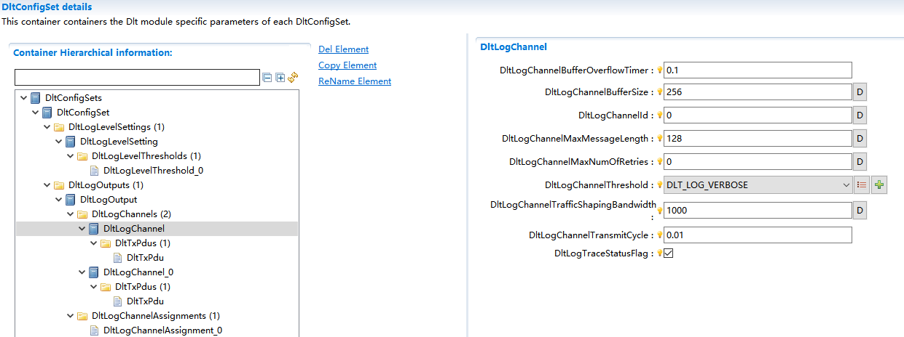
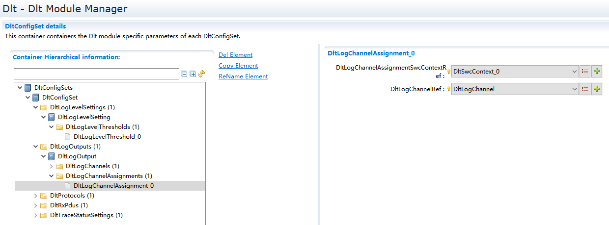
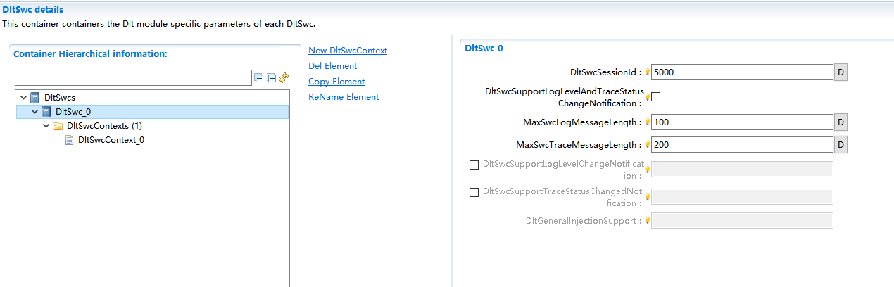

====================
Dlt
====================

文档信息 Document Information
=================================

版本历史 Version History
---------------------------------------------------------

.. list-table::
   :widths: 10 10 10 10 20
   :header-rows: 1

   * - 日期(Date)
     - 作者(Author)
     - 版本(Version)
     - 状态(Status)
     - 说明(Description)

   * - 2025/03/28
     - xue.han
     - V0.1
     - 发布(Release)
     - 首次发布(First release)

   * - 2025/04/04
     - xue.han
     - V1.0
     - 发布(Release)
     - 正式发布(Official release)

参考文档 References
------------------------------------------------------------------------------------------------------------------

.. list-table::
   :widths: 5 10 30 10
   :header-rows: 1

   * - 编号(Number)
     - 分类(Classification)
     - 标题(Title)
     - 版本(Version)

   * - 1
     - Autosar
     - PRS_DLTProtocol.pdf
     - R19-11
   * - 2
     - Autosar
     - AUTOSAR_EXP_LayeredSoftwareArchitecture.pdf
     - R23-11
   * - 3
     - Autosar
     - AUTOSAR_SRS_BSWGeneral.pdf
     - R23-11
   * - 4
     - Autosar
     - AUTOSAR_SWS_RTE.pdf
     - R23-11
   * - 5
     - Autosar
     - AUTOSAR_SWS_PDURouter.pdf
     - R23-11
   * - 6
     - Autosar
     - AUTOSAR_SWS_NVRAMManager.pdf
     - R23-11
   * - 7
     - Autosar
     - AUTOSAR_SWS_DefaultErrorTracer.pdf
     - R23-11
   * - 8
     - Autosar
     - AUTOSAR_SWS_DiagnosticEventManager.pdf
     - R23-11
   * - 9
     - Autosar
     - AUTOSAR_SWS_GPTDriver.pdf
     - R23-11

术语与简写 Terms and Abbreviations
==================================================================

术语 Terms
------------------------------------------------------------------------------------------------------------------
.. :align: center   表格内容居中(Table contents are centered)

.. list-table::
   :widths: 10 40
   :header-rows: 1

   * - 术语(Terms)
     - 解释(Explanation)

   * - Log and trace message
     - 日志和跟踪消息，包含描述软件中日志跟踪事件的所有数据和选项。由消息头和有效载荷组成。(Logs and trace messages, including all data and options describing log trace events in the software.) It consists of message header and payload.

   * - Dlt User
     - Dlt消息的生成源，可能的用户包括：SW-Cs、RTE、DEM或DET。(The generating source of Dlt messages, potential users include SW Cs, RTE, DEM or DET.)

   * - Log Message
     - 包含调试信息的日志消息，如状态变化或数值变化。(Log messages containing debugging information, such as changes of status or value.)

   * - Trace Message
     - 包含通过VFB传递信息的跟踪消息。(It contains trace messages transmitted via VFB.)

   * - ECU ID
     - ECU的名称标识，由4个8位ASCII字符组成（例如：ABS0或COMB）。(The name identifier of the ECU; it consists of four 8-bit ASCII characters (e.g. ABS0 or COMB).)

   * - Session
     - 日志/跟踪消息源的逻辑实体。当应用/SW-C被多次实例化时，每个实例会获得全局唯一的会话ID。一个应用/SW-C可同时拥有多个日志/跟踪会话（通过多个打开的Dlt端口）。由于AUTOSAR未规定SW-C的会话ID，应使用端口定义的参数值。(The logical entity of the log/trace message source.) When the application/SW-C is instantiated for many times, each instance will obtain a globally unique session ID. An application/SW-C can have several log/trace sessions simultaneously (via multiple opened Dlt ports). AUTOSAR does not specify the session ID for SW-C, so the parameter values defined by port should be used.

   * - Session ID
     - 日志/跟踪会话的唯一标识编号。(Unique identification number for the log/trace session.)

   * - Application ID
     - 应用/SW-C的缩写标识，用于标识日志跟踪消息的来源。由4个8位ASCII字符组成。(The abbreviation of application/SW-C, which is used to identify the source of log/trace messages.) It consists of four 8-bit ASCII characters.

   * - Context ID
     - 用户定义的标识符，用于分组应用/SW-C生成的日志跟踪消息。规则包括：(Identifier defined by user and used to group log/ trace messages generated by applications/SW-C.) The rules include:      
       - 每个ApplicationID可包含多个Context ID(Each Application ID can contain several Context IDs)
       - Context ID按Application ID分组(Context ID is grouped by Application ID)
       - Context ID在Application ID内必须唯一(Context ID must be unique within the Application ID)
       - 使用"ApplicationID + ContextId"元组标识消息源(Identify the message source via the tuple of 'Application ID+ContextId')
       - 由4个8位ASCII字符组成(It consists of four 8-bit ASCII characters)

   * - Message ID
     - 标识消息所携带信息的唯一标识符。用于：(The unique identifier containing the information carried by message.) Functions:
       - 识别消息在源代码中的来源(Identify the source of the messages in the source code)
       - 表征消息有效载荷的特征(Characterize the characteristics of message playload)
       - 在开发或配置时静态固定(Static fixation during development or configuration)

   * - Log level
     - 定义日志消息严重程度的分类等级。(Define the classification of log message severity.)

   * - Trace status
     - 指示是否应发送跟踪消息的状态信息。(Indicate if sending the status information of the trace message.)

   * - Log Channel
     - 用于传输Dlt消息的物理通信总线。(Physical communication bus used for transmitting Dlt messages.)

   * - External client
     - 外部工具，用于控制、监视和存储ECU通过Dlt模块提供的日志/跟踪消息。(External tools, which are used for controlling, monitoring and storing log/trace messages provided by ECU through Dlt module.)

简写 Abbreviations
------------------------------------------------------------------------------------------------------------------

.. list-table::
   :widths: 10 20 30
   :header-rows: 1

   * - 简写 (Abbreviation)
     - 全称(Full name)
     - 解释(Explanation)

   * - APID
     - Application ID
     - Application 标识符
   * - CTID
     - Context ID
     - 上下文标识符
   * - DLT
     - Diagnostic Log and Trace
     - 诊断日志与跟踪
   * - MCNT
     - Message Counter
     - 消息计数器
   * - MSBF
     - Most Significant Byte First
     - 最高有效字节优先
   * - MSBI
     - Message Bus Info
     - 消息总线信息
   * - MSCI
     - Message Control Info
     - 消息控制信息
   * - MSLI
     - Message Log Info
     - 消息日志信息
   * - MSTP
     - Message Type
     - 消息类型
   * - MSTI
     - Message Trace Info
     - 消息跟踪信息
   * - NOAR
     - Number of Arguments
     - 参数数量
   * - STMS
     - Timestamp
     - 时间戳
   * - UEH
     - Use Extended Header
     - 使用扩展头
   * - VERB
     - Verbose
     - 详细模式
   * - VERS
     - Version Number
     - 版本号
   * - WEID
     - With ECU ID
     - 包含ECU标识符
   * - WSID
     - With Session ID
     - 包含会话标识符
   * - WTMS
     - With Timestamp
     - 包含时间戳

简介 Introduction
==================================================================

DLT模块为使用者提供了通用的日志和跟踪记录消息功能。该模块可接收来自DET（默认错误跟踪器）、DEM（诊断事件管理器）、软件组件（SW-C）的日志信息，以及来自RTE的跟踪信息。DLT模块通过通信总线传输这些数据，使外部可观测ECU的运行信息。

The DLT module provides universal log and trace message recording functions for users. This module can receive log information from DET (default error tracker), DEM (diagnostic event manager), software components (SW-C), as well as trace information from RTE. The DLT module transmits the data via communication bus, making it possible to observe the operation information of the ECU externally.

此外，该模块可选择通过NvM（非易失性存储器）模块持久化存储更新后的DLT过滤器设置。此功能使得ECU在每次启动时，无需接收显式设置请求，即可直接按预设级别传输日志/跟踪信息。

In addition, the module can store the updated DLT filter settings permanently via the NvM (non-volatile memory) module. With this function, the ECU can transmit log/trace information directly at the preset level without receiving explicit setting requests during each startup.

.. figure:: ../../../_static/参考手册/Dlt/Dlt_AUTOSAR_Architecture.png
   :alt: Dlt_AUTOSAR_Architecture
   :name: Dlt_AUTOSAR_Architecture
   :align: center

   Figure caption goes here.

如图 :ref:`Dlt_AUTOSAR_Architecture` 所示，在软件架构层级中，DLT模块位于PduR之上，并处于RTE之下。该设计实现了通信协议与上层应用间的解耦，确保日志传输机制的高效性和可配置性。

As shown in the figure :ref: Dlt_AUTOSAR_Structure, in the software architecture level, the DLT module is above PduR and below RTE. Such design allows the decoupling between communication protocols and upper layer applications and ensures the efficiency and configurability of log transmission mechanism.

功能描述 Functional Description
==================================================================

.. 本章节仅描述模块支持的功能大致情况，不宜做细致描述；更加细致的描述在配置章节，结合配置，从集成角度描述

特性 Features
------------------------------------------------------------------------------------------------------------------

日志信息记录 Log information record
~~~~~~~~~~~~~~~~~~~~~~~~~~~~~~~~~~~~~~~~~~~~~~~~~~~~~~~~~~~~~~~~~~~~~~~~~~~~~~~~~~~~~~

记录来自AUTOSAR软架构中应用程序组件DLT用户的错误、警告和信息等消息，并提供一个标准化的AUTOSAR接口；在BSW的一个系统集中子服务组件(DLT)中收集来自所有AUTOSAR软件架构中DLT用户的所有日志和跟踪消息；来自DET模块的日志消息。

It records the messages from DLT users in the AUTOSAR software architecture, such as error, warning, and information; provides a standard AUTOSAR interface; collects all log and trace messages of DLT users in all AUTOSAR software architectures within the system central sub-service components (DLT) of BSW; log messages from DET module.

跟踪信息记录 Trace information record
~~~~~~~~~~~~~~~~~~~~~~~~~~~~~~~~~~~~~~~~~~~~~~~~~~~~~~~~~~~~~~~~~~~~~~~~~~~~~~~~~~~~~~

实现用于跟踪软件组件变量、函数调用，函数返回，状态机的状态等事件的实时更新情况。

It can update such events as tracking of software component variables, function call & return, status of state machine, etc. in real time.

控制命令请求与响应 Control command request and response
~~~~~~~~~~~~~~~~~~~~~~~~~~~~~~~~~~~~~~~~~~~~~~~~~~~~~~~~~~~~~~~~~~~~~~~~~~~~~~~~~~~~~~

使能/禁止每个通道的日志与跟踪消息，并通过反馈控制每一个通道的日志级别与跟踪状态。

It can enable/disable the log and trace messages for each channel, and control the log level and trace status of each channel through feedback.

日志与跟踪消息发送 Sending of log and trace information
~~~~~~~~~~~~~~~~~~~~~~~~~~~~~~~~~~~~~~~~~~~~~~~~~~~~~~~~~~~~~~~~~~~~~~~~~~~~~~~~~~~~~~

Dlt消息发送路径描述Dlt日志和跟踪消息从源到接收的流程。源可以是DLT用户，而PDU路由通信栈表示接收端。

The Dlt message sending path describes the process of Dlt logs and trace messages from source to receiving end. The source can be DLT user while PDU routing communication threshold indicates the receiving end.

Dlt控制命令集实现情况 Realization of Dlt Control Command Set
~~~~~~~~~~~~~~~~~~~~~~~~~~~~~~~~~~~~~~~~~~~~~~~~~~~~~~~~~~~~~~~~~~~~~~~~~~~~~~~~~~~~~~

.. list-table:: DLT命令功能列表(List of DLT command functions)
   :widths: 10 20 30 10
   :header-rows: 1

   * - 服务标识符 (Service identifier)
     - DLT命令名称 (Name of DLT command)
     - 命令详细描述 (Details of command)
     - 是否支持 (Support or not)

   * - 0x00
     - NotSupported
     - 不支持命令(Not supported)
     - 否(No)

   * - 0x01
     - SetLogLevel
     - 设置日志级别(Set log level)
     - 是(Yes)

   * - 0x02
     - SetTraceStatus
     - 设置跟踪状态(Set trace status)
     - 是(Yes)

   * - 0x03
     - GetLogInfo
     - 获取已注册的日志信息(Get registered log message)
     - 是(Yes)

   * - 0x04
     - GetDefautlogLevel
     - 获取默认日志级别(Get default log level)
     - 是(Yes)

   * - 0x05
     - StoreConfiguration
     - 存储当前配置信息到NvM(Store the current configuration information to NvM)
     - 是(Yes)

   * - 0x06
     - ResetToFactoryDefault
     - 将配置信息恢复到默认值(Reset the configuration information to default)
     - 是(Yes)

   * - 0x07
     - SetComInterfaceStatus
     - 设置通信接口的状态(Set communication interface status)
     - 否(No)

   * - 0x08
     - SetComIfMaxBandwidth
     - 设置通信接口的最大带宽(Set the max. bandwidth of communication interface)
     - 否(No)

   * - 0x09
     - SetVerboseMode
     - 设置冗余模式(Set verbose mode)
     - 否(No)

   * - 0x0A
     - SetMessageFiltering
     - 设置DLT消息过滤状态(Set DLT message filtering status)
     - 是(Yes)

   * - 0x0B
     - Reversed
     - 预留(Reserved)
     - 否(No)

   * - 0x0C
     - GetLocalTime
     - 获取本地时间(Get local time)
     - 否(No)

   * - 0x0D
     - SetUseECUID
     - 设置用户ECU标识符(Set user ECU identifier)
     - 否(No)

   * - 0x0E
     - SetUseSessionID
     - 设置用户会话标识符(Set user session identifier)
     - 否(No)

   * - 0x0F
     - SetUseTimestamp
     - 设置用户时间戳(Set user timestamp)
     - 否(No)

   * - 0x10
     - SetUseExtendedHeader
     - 设置用户扩展头(Set user extended header)
     - 否(No)

   * - 0x11
     - SetDefaultLogLevel
     - 设置默认日志级别(Set default log level)
     - 是(Yes)

   * - 0x12
     - SetDefaultTraceStatus
     - 使能/禁止默认跟踪状态(Enable/disable default trace status)
     - 是(Yes)

   * - 0x13
     - GetSoftwareVersion
     - 获取软件版本信息(Get software version information)
     - 否(No)

   * - 0x14
     - MessageBufferOverflow
     - 消息缓冲区溢出通知(Message buffer overflow notification)
     - 否(No)

   * - 0x15
     - GetDefaultTraceStatus
     - 获取默认跟踪状态(Get default trace status)
     - 是(Yes)

   * - 0x16
     - GetComInterfacelStatus
     - 获取通信接口状态(Get communication interface status)
     - 否(No)

   * - 0x17
     - GetLogChannelNames
     - 获取日志通道的名称(Get log channel names)
     - 是(Yes)

   * - 0x18
     - GetComIfMaxBandwidth
     - 获取通信接口的最大带宽(Get the max. bandwidth of communication interface)
     - 否(No)

   * - 0x19
     - GetVerboseModeStatus
     - 获取冗余模式状态(Get verbose mode status)
     - 否(No)

   * - 0x1A
     - GetMessageFilteringStatus
     - 获取DLT消息过滤状态(Get DLT message filtering status)
     - 否(No)

   * - 0x1B
     - GetUseECUID
     - 获取用户ECU标识符(Get user ECU identifier)
     - 否(No)

   * - 0x1C
     - GetUseSessionID
     - 获取用户会话标识符(Get user session identifier)
     - 否(No)

   * - 0x1D
     - GetUseTimestamp
     - 获取用户时间戳(Get user timestamp)
     - 否(No)

   * - 0x1E
     - GetUseExtendedHeader
     - 获取用户扩展头(Get user extended header)
     - 否(No)

   * - 0x1F
     - GetTraceStatus
     - 获取当前跟踪状态(Get present trace status)
     - 是(Yes)

   * - 0x20
     - SetLogChannelAssignment
     - 设置给定日志通道的映射路径(Set the mapping path of given log channel)
     - 是(Yes)

   * - 0x21
     - SetLogChannelThreshold
     - 设置给定日志通道的过滤阈值(Set the filtering threshold of give log channel)
     - 是(Yes)

   * - 0x22
     - GetLogChannelThreshold
     - 获取给定日志通道的过滤阈值(Get the filtering threshold of given log channel)
     - 是(Yes)

   * - 0x23
     - BufferOverflowNotification
     - DLT缓冲区溢出的指示通知(Indication notification of DLT buffer overflow)
     - 是(Yes)

   * - 0x24
     - SyncTimeStamp
     - 同步时间戳的指示(Indication of timestamp synchronization)
     - 是(Yes)

多核分布功能 Multi-core distribution function
~~~~~~~~~~~~~~~~~~~~~~~~~~~~~~~~~~~~~~~~~~~~~~~~~~~~~~~~~~~~~~~~~~~~~~~~~~~~~~~~~~~~~~

None

.. only:: doc_pbs

  支持变体功能 Support variant function
  ~~~~~~~~~~~~~~~~~~~~~~~~~~~~~~~~~~~~~~~~~~~~~~~~~~~~~~~~~~~~~~~~~~~~~~~~~~~~~~~~~~~~~~

  None

集成 Integration
==================================================================

文件列表 File List
------------------------------------------------------------------------------------------------------------------

静态文件 Static Files
~~~~~~~~~~~~~~~~~~~~~~~~~~~~~~~~~~~~~~~~~~~~~~~~~~~~~~~~~~~~~~~~~~~~~~~~~~~~~~~~~~~~~~

.. list-table::
   :widths: 10 30
   :header-rows: 1

   * - 文件(File)
     - 描述(Description)

   * - 文件(File)
     - 描述(Description)

   * - Dlt_Cbk.c
     - Dlt 模块回调函数源文件，定义了回调函数的实现(Dlt module callback function source file, which defines the realization of callback function)

   * - Dlt_Cbk.h
     - Dlt 模块回调函数头文件，包含了回调函数的声明(Dlt module callback function header file, which contains the declaration of callback function)

   * - Dlt_Internal.h
     - 包含 Dlt 模块需要使用的部分类型定义、宏定义及内联函数。(It contains some type definitions, macro definitions and inline functions required for Dlt modules.)

   * - Dlt_MemMap.h
     - 包含 Dlt 模块的内存抽象，由Memmap模块生成。(It contains the memory abstraction of Dlt module, and is generated by Memmap module.)

   * - Dlt_Types.h
     - 包含 Dlt 模块需要使用的类型定义。(It contains the type definitions required for Dlt modules.)

   * - Dlt.c
     - Dlt 模块源文件，包含了 API 函数的实现。(The Dlt module source file, which contains the realization of API functions.)

   * - Dlt.h
     - Dlt 模块头文件，包含了外部 API 函数的扩展声明。(The Dlt module header file, which contains extension declarations for external API functions.)

   * - Rte_Dlt_Type.h
     - Rte 与 Dlt 类型定义文件(Rte and Dlt type definition files)

动态文件 Dynamic Files
~~~~~~~~~~~~~~~~~~~~~~~~~~~~~~~~~~~~~~~~~~~~~~~~~~~~~~~~~~~~~~~~~~~~~~~~~~~~~~~~~~~~~~

.. list-table::
   :widths: 10 30
   :header-rows: 1

   * - 文件(File)
     - 描述(Description)

   * - Dlt_Cfg.c
     - 包含 Dlt 模块的配置信息。(It contains configuration information for Dlt modules.)

   * - Dlt_Cfg.h
     - 包含 Dlt 模块具体配置功能的使能情况。(It contains the enabling of the specific configuration functions of Dlt module.)

错误处理 Error Handling
------------------------------------------------------------------------------------------------------------------

开发错误 Development Errors
~~~~~~~~~~~~~~~~~~~~~~~~~~~~~~~~~~~~~~~~~~~~~~~~~~~~~~~~~~~~~~~~~~~~~~~~~~~~~~~~~~~~~~

.. list-table::
   :widths: 20 10 30
   :header-rows: 1

   * - Error code
     - Value[hex]
     - Description

   * - DLT_E_PARAM
     - 0x01
     - API service called with wrong parameter

   * - DLT_E_PARAM_POINTER
     - 0x02
     - Null pointer has been passed as an argument

   * - DLT_E_INIT_FAILED
     - 0x03
     - Initialization failed

   * - DLT_E_REGISTRATION
     - 0x04
     - Registration failed

产品错误 Product Errors
~~~~~~~~~~~~~~~~~~~~~~~~~~~~~~~~~~~~~~~~~~~~~~~~~~~~~~~~~~~~~~~~~~~~~~~~~~~~~~~~~~~~~~

None

运行时错误 Runtime Errors
~~~~~~~~~~~~~~~~~~~~~~~~~~~~~~~~~~~~~~~~~~~~~~~~~~~~~~~~~~~~~~~~~~~~~~~~~~~~~~~~~~~~~~

.. list-table::
   :widths: 20 10 30
   :header-rows: 1

   * - Error code
     - Value[hex]
     - Description

   * - DLT_E_SKIPPED_TRANSMISSION
     - 0x05
     - Message could not be sent

   * - DLT_E_DEPRECATED_PARAMETER
     - 0x06
     - A deprecated parameter with a value different to 0 for a Dlt command has been received

   * - DLT_E_MULTIPLE_REQUESTS
     - 0x07
     - Multiple Control Requests at the same time

接口描述 Interface Description
======================================================================
.. include:: Dlt_h_api.rst
.. include:: Dlt_Cbk_h_api.rst

配置函数 Configuration function
------------------------------------------------------------------------------------------------------------------
None

依赖的服务 Applicable Services
------------------------------------------------------------------------------------------------------------------

强制接口 Compulsory interface
~~~~~~~~~~~~~~~~~~~~~~~~~~~~~~~~~~~~~~~~~~~~~~~~~~~~~~~~~~~~~~~~~~~~~~~~~~~~~~~~~~~~~~
.. 可选的章节，根据模块实际情况确定

.. list-table::
   :widths: 10 5 30
   :header-rows: 1

   * - API Function
     - Header File
     - Description

   * - PduR_DltTransmit
     - PduR_Dlt.h
     - 请求发送日志与跟踪消息(Request for log sending and trace message)

可选接口 Optional Interface
~~~~~~~~~~~~~~~~~~~~~~~~~~~~~~~~~~~~~~~~~~~~~~~~~~~~~~~~~~~~~~~~~~~~~~~~~~~~~~~~~~~~~~
.. 可选的章节，根据模块实际情况确定
.. 格式同强制接口

.. list-table::
   :widths: 10 5 30
   :header-rows: 1

   * - API Function
     - Header File
     - Description

   * - Det_ReportError
     - Det.h
     - 报告开发错误的服务接口。(Report the service interfaces developed incorrectly.)

   * - Gpt_EnableNotification
     - Gpt.h
     - 启用指定定时器通道的中断通知功能（适用于正常模式）。(Enable the interruption notification function for the specified timer channel (applicable to normal mode).)

   * - Gpt_StartTimer
     - Gpt.h
     - 启动指定定时器通道。(Start the specified timer channel.)

   * - NvM_EraseNvBlock
     - NvM.h
     - 擦除非易失性存储块的服务接口。(Erase the service interface of non-volatile storage blocks.)

   * - NvM_ReadBlock
     - NvM.h
     - 将非易失性存储块数据复制到对应的RAM块。(Copy non-volatile storage block data to the corresponding RAM block.)

   * - NvM_WriteBlock
     - NvM.h
     - 将RAM块数据复制到对应的非易失性存储块。(Copy the RAM block data to the corresponding non-volatile storage block.)

   * - StbM_GetCurrentTime
     - StbM.h
     - 获取标准格式的时间值。注：调用此API时应锁定中断/在独占区域中执行，以避免时间戳在函数返回时过时。(Get the time values in standard format.) Note: When calling this API, the interrupt should be locked/executed in an exclusive area to avoid outdated timestamp upon function return.

   * - StbM_GetCurrentTimeExtended
     - StbM.h
     - 获取扩展格式的时间值。注：调用此API时应锁定中断/在独占区域中执行，以避免时间戳在函数返回时过时。(Get the time values in extended format.) Note: When calling this API, the interrupt should be locked/executed in an exclusive area to avoid outdated timestamp upon function return.

配置 Configuration
==================================================================

本章节以 **功能** 为导向，从 **集成** 的角度，挑重点，常用，典型配置举例讲解。未涉及的配置项可在工具界面找到详细说明。

On the basis of **function**, this chapter explains the key, common and representative configuration examples from the perspective of **integration**. Details about the configurations not involved here can be found on the tool interface.

DltGeneral配置 DltGeneral Configuration
------------------------------------------------------------------------------------------------------------------

.. figure:: ../../../_static/参考手册/Dlt/Dlt_General.png
   :alt: Dlt_General
   :name: Dlt_General
   :align: center

   Dlt_General

如图 :ref:`Dlt_General` 所示，主要介绍DLT模块的一些通用配置参数，如在预编译时可以启用或禁用的所有全局Dlt功能，以优化资源消耗。

The figure :ref: Dlt_General mainly describes some general configuration parameters of the DLT module, such as all global Dlt functions that can be enabled/disabled during pre-compilation, in order to optimize resource consumption.

.. list-table:: DltGeneral配置参数说明(Descriptions of DltGeneral configuration parameters)
   :widths: 15 10 10 40 25
   :header-rows: 1

   * - 参数名称(Parameter Name)
     - 参数范围(Parameter scope)
     - 默认取值(Default value)
     - 参数描述(Parameter descriptions)
     - 依赖关系(Dependence)

   * - DltGeneralDevErrorDetect
     - STD_ON,STD_OFF
     - STD_OFF
     - 是否开启配置出错检测。若开启，一旦检测到配置出错，则代码停留在故障出错位置。量产用代码，需关闭该配置。(Enable configuration error detection or not. If the function is enabled, the code will remain at the fault location once any configuration error is detected. The configuration needs closing for mass production code.
     - 依赖于DET模块的配置(Depend on the configuration of DET module)
   * - DltGeneralInjectionSupport
     - STD_ON,STD_OFF
     - STD_OFF
     - 使能或禁止Dlt模块应用程序注入功能(Enable or disable the function of Dlt module application injection)
     - 依赖于SWC模块的配置(Depend on the configuration of SWC module)
   * - DltGeneralNvRAMSupport
     - STD_ON,STD_OFF
     - STD_OFF
     - 使能或禁止Dlt模块对非易失性RAM数据的支持。如果Dlt模块在运行时能够持久地存储修改过的参数，则应该设置该引用并指向NvmBlock。(Enable or disable Dlt module support for non-volatile RAM data.) If the Dlt module can store modified parameters at runtime permanently, the reference should be set and point to NvmBlock.
     - 依赖于NvRAM模块的配置(Depend on the configuration of NvRAM module)
   * - DltGeneralRegisterContextNotification
     - STD_ON,STD_OFF
     - STD_OFF
     - 使能或禁止Dlt模块对注册上下文通知的支持。如果此参数设置为TRUE，则每次SWC注册和/在Dlt模块/从Dlt模块注销时发送Dlt控制消息。(Enable or disable the support of Dlt module for registration context notification.) If this parameter is set to TRUE, Dlt control messages will be sent every time when SWC registers and/or logs out from the Dlt module.
     - 依赖于SWC模块的配置(Depend on the configuration of SWC module)
   * - DltGeneralRxDataPathSupport
     - STD_ON,STD_OFF
     - STD_OFF
     - 启用或禁用Rx数据路径来控制Dlt模块。(Enable or disable the control over DIt module by Rx data path.)
     - 依赖于通信协议栈模块的配置(Depend on the configuration of communication protocol stack module)
   * - DltTaskTime
     - 0...4294967295
     - 0
     - 用于配置Dlt模块周期调度的时间基准(Time benchmark for configuring Dlt module cycle scheduling)
     - 依赖于OS或系统环境模块的配置(Depend on the configuration of OS or system environment module)
   * - DltGeneralStartUpDelayTimer
     - 1...10000
     - 0
     - Dlt模块初始化后启动日志和跟踪消息传输的秒中可配置延迟(Configurable delay in the seconds for enabling log and trace message transmission after Dlt module initialization)
     - 依赖于OS或系统环境模块的配置(Depend on the configuration of OS or system environment module)
   * - DltGeneralTimeStampSupport
     - STD_ON,STD_OFF
     - STD_OFF
     - 如果要在Dlt消息中添加时间戳，则此配置参数应设置为TRUE(To add a timestamp to a Dlt message, this configuration parameter should be set to TRUE)
     - 依赖于GPT或STBM模块的配置(Depend on the configuration of GPT or STBM module)
   * - DltGeneralTrafficShapingSupport
     - STD_ON,STD_OFF
     - STD_OFF
     - 启用或禁用流量成形特性以限制Dlt消息的最大带宽。如果启用，可以为每个日志通道配置最大带宽。(Enable or disable the traffic shaping feature to limit the max. bandwidth of Dlt messages.) If the function is enabled, the max. bandwidth can be configured for each log channel.
     - 依赖于通信协议栈模块的配置(Depend on the configuration of communication protocol stack module)
   * - DltGeneralGetLogInfoStatusSupport
     - STD_ON,STD_OFF
     - STD_OFF
     - 启用或禁用Dlt模块对获取日志信息状态的支持(Enable or disable the support of Dlt module for getting log information status)
     - 无(None)
   * - DltGeneralVersionInfoApiv
     - STD_ON,STD_OFF
     - STD_OFF
     - 用于使能或禁止版本信息API接口支持的预处理宏编译开关。(Preprocessing macro compilation switch for enabling or disabling version information API interface support.)
     - 无(None)
   * - DltGeneralGptChannelRef
     - 引用或下拉菜单(Reference or dropdown menu)
     - 无(None)
     - 如果使用TimeStampSupport，Dlt模块将通过调用Gpt_GetTimeElapsed和这里引用的GptChannel从Gpt模块获取时间。滴答持续时间可以从GptChannelConfiguration容器的GptChannelTickFrequency参数推导出来。(After using TimestamptampSupport, the Dlt module will get the time from the Gpt module by calling Gpt_GettimeElapped and the referenced GptChannel here.) The tick duration can be derived from the GptChannelTickFrequency parameter of the GptChannelConfiguration container.
     - 依赖于GPT模块的配置(Depend on the configuration of GPT module)
   * - DltBufferMaxLength
     - 0...65535
     - 0
     - 用于描述DLT模块缓冲区最大长度的配置(Used for describing the configuration of the max. buffer length for DLT modules)
     - 无(None)
   * - DltHeaderFileInclusion
     - 无(None)
     - 无(None)
     - 外部头文件包含(Composition of external header files)
     - 无(None)
   * - DltGeneralNvRAMRef
     - 引用或下拉菜单(Reference or dropdown menu)
     - 无(None)
     - 用于DLT模块对非易失性RAM引用的配置(Configuration for referencing non-volatile RAM for DLT modules)
     - 依赖于NvRAM模块的配置(Depend on the configuration of NvRAM module)
   * - DltGeneralStbMTimeBaseRef
     - 0...4294967295
     - 0
     - 如果使用TimeStampSupport，Dlt模块将通过调用StbM_GetCurrentTime从StbM模块获取时间，此处引用StbMSynchronizedTimeBase。(After using TimestamptampSupport, the Dlt module will get the time from the StbM module by calling StbM.CurrentTime and the StbMSynchronizedTimeBase referenced here.)
     - 依赖于STBM模块的配置(Depend on the configuration of STBM module)

DltConfigSet配置 DltConfigSet Configuration
---------------------------------------------------------------------------------------------------------------------------------------
DltConfigSet包含DltLogLevelSettings、DltLogOutputs、DltProtocols、DltRxPdus、DlttraceStatusSettings等容器,用于配置具体的日志报告信息。

DltConfigSet contains such containers as DltLogLevelSettings, DltLogOutputs, DltProtocols, DltRxPdus and DlttraceStatusSettings. It is used for configuring the specific log report information.

Dltlog级别阈值设置 Settings of Dltlog Level Threshold
~~~~~~~~~~~~~~~~~~~~~~~~~~~~~~~~~~~~~~~~~~~~~~~~~~~~~~~~~~~~~~~~~~~~~~~~~~~~~~~~~~~~~~

.. figure:: ../../../_static/参考手册/Dlt/DltLogLevelSetting.png
   :alt: DltLogLevelSetting
   :name: DltLogLevelSetting
   :align: center

   DltLogLevelSetting

如图 :ref:`DltLogLevelSetting` 所示,DltLogLevelSetting容器提供Dlt日志级别阈值的设置信息。

As shown in the figure :ref: DltLogLevelSetting, the DltLogLevelSetting container provides setting information of Dlt log level thresholds.

.. list-table:: DltLogLevelSetting容器配置参数(Configuration parameters of DltLogLevelSetting container)
   :widths: 20 15 15 40 20
   :header-rows: 1

   * - 参数名称(Parameter Name)
     - 参数范围(Parameter scope)
     - 默认取值(Default value)
     - 参数描述(Parameter descriptions)
     - 依赖关系(Dependence)
   * - DltDefaultLogLevel
     - 枚举值（DLT_LOG_DEBUG、DLT_LOG_ERROR、DLT_LOG_FATAL、DLT_LOG_INFO、DLT_LOG_OFF、DLT_LOG_VERBOSE、DLT_LOG_WARN）(Enumerator (DLT_LOG_DEBUG, DLT_LOG_ERROR, DLT_LOG_FATAL, DLT_LOG_INFO, DLT_LOG_OFF, DLT_LOG_VERBOSE, DLT_LOG_WARN))
     - 无(None)
     - 当没有过滤器匹配给定的AppicationId和Context时使用的默认日志级别。相当于一个带有AppicationId和Contexts通配符的全局过滤器，当无其他匹配规则时生效。(The default log level used for AppationId and Context without being matched with filter.) Equivalent to a global filter with AppationId and Contexts wildcard characters; it takes effect when other matching rules do not exist.
     - 无(None)
   * - Threshold
     - 枚举值（DLT_LOG_DEBUG、DLT_LOG_ERROR、DLT_LOG_FATAL、DLT_LOG_INFO、DLT_LOG_OFF、DLT_LOG_VERBOSE、DLT_LOG_WARN）(Enumerator (DLT_LOG_DEBUG, DLT_LOG_ERROR, DLT_LOG_FATAL, DLT_LOG_INFO, DLT_LOG_OFF, DLT_LOG_VERBOSE, DLT_LOG_WARN))
     - 无(None)
     - 为特定AppicationId和Context组合配置初始日志级别阈值(Configure initial log level threshold for a specific AppationId and Context combination)
     - 无(None)
   * - LogLevelThresholdSwcContextRef
     - reference
     - 无(None)
     - 为日志级别阈值关联对应的上下文配置信息(Link the corresponding context configuration information for the log level threshold)
     - 依赖于DltSwc的配置项(Depend on the configuration item of DltSwc)

日志与跟踪消息发送 Sending of log and trace information
~~~~~~~~~~~~~~~~~~~~~~~~~~~~~~~~~~~~~~~~~~~~~~~~~~~~~~~~~~~~~~~~~~~~~~~~~~~~~~~~~~~~~~

.. figure:: ../../../_static/参考手册/Dlt/DltLogOutput.png
   :alt: DltLogOutput
   :name: DltLogOutput
   :align: center

   DltLogOutput

如图 :ref:`DltLogOutput` 所示,DltLogOutputsg包含日志/跟踪消息输出的设置，需要配置默认日志通道DltDefaultLogChannelRef，用于日志/跟踪输出。其下包括两个容器：DltLogChannel 与DltLogChannelAssignment

As shown in the figure :ref: 'DltLogOutput', DltLogOutputsg contains settings for log/trace message output. The default log channel DltDDefault LogChannelRef needs configuring for log/trace output. It also contains the following two containers: DltLogChannel and DltLogChannelAssignment

   DltLogChannel

如图 :ref:`DltLogChannel` 所示，DltLogChannel需要为Dlt模块设置日志通道指定发生缓冲区溢出时重置缓冲区溢出标志的周期时间；为日志通道特定消息缓冲区设置缓冲区大小；TxPdu通信配置等。

As shown in the figure :ref: DltLogChannel, DltLogChannel should set the log channel for the Dlt module, in order to specify the cycle for resetting the buffer overflow flag upon the occurrence of buffer overflow. Set the buffer size for a specific message buffer in the log channel; TxPdu communication configuration, etc.

.. list-table:: DltLogChannel配置参数(Configuration Parameters of DltLogChannel)
   :widths: 20 15 15 40 20
   :header-rows: 1

   * - 参数名称(Parameter Name)
     - 参数范围(Parameter scope)
     - 默认取值(Default value)
     - 参数描述(Parameter descriptions)
     - 依赖关系(Dependence)
   * - DltLogChannelBufferOverflowTimer
     - 0.001...1
     - 0
     - 指定发生缓冲区溢出时重置缓冲区溢出标志的周期时间（单位：秒）(Specify the cycle for resetting the buffer overflow flag upon the occurrence of buffer overflow (in s))
     - 无(None)
   * - DltLogChannelBufferSize
     - 0...4294967295
     - 0
     - 日志通道特定消息缓冲区的缓冲区大小（单位：字节）(The buffer size of the specific message buffer of log channel (in byte))
     - 无(None)
   * - DltLogChannelId
     - 0...255
     - 0
     - 日志通道的4个ASCII字符长的名称，在Dlt控制消息中作为参数名Dlt_interface使用(Name in four ASCII character long of the log channel; it is used as the parameter name Dlt_interface in Dlt control messages)
     - 无(None)
   * - DltLogChannelMaxMessageLength
     - 0...65535
     - 0
     - Dlt日志通道支持的最大单条消息长度(Max. length of single message as supported by Dlt log channel)
     - 依赖于SWC或VFB发送消息的大小(Depend on the size of message sent by SWC or VFB)
   * - DltLogChannelMaxNumOfRetries
     - 0...255
     - 0
     - 日志通道消息发送的最大重试次数(Max. number of retries for sending log channel messages)
     - 依赖于SWC或VFB发送消息的大小(Depend on the size of message sent by SWC or VFB)
   * - DltLogChannelThreshold
     - DLT_LOG_OFF至DLT_LOG_VERBOSE (DLT_LOG_OFF to DLT_LOG_VERBOSE)
     - DLT_LOG_OFF
     - 为日志通道设置的日志级别阈值（包含7个标准级别）(The log level threshold set for the log channel (including 7 standard levels))
     - 无(None)
   * - DltLogChannelTrafficShapingBandwidth
     - 0...18446744073709551615
     - 0
     - 流量整形允许的最大带宽（单位：位/秒）(Max. bandwidth allowed for traffic shaping (in bits/second))
     - 依赖于通信总线的实际速率(Depend on the actual speed of communication bus)
   * - DltLogChannelTransmitCycle
     - 0.001...1
     - 0
     - 日志通道传输功能的周期时间（单位：秒）(Cycle of log channel transmission function (in second))
     - 无(None)
   * - DltLogTraceStatusFlag
     - STD_ON/STD_OFF
     - STD_OFF
     - 完全启用/禁用此日志通道的开关参数(Switch parameters for Fully enabling/disabling the log channel)
     - 无(None)
   * - DltTxPdu
     - 容器(Container)
     - 0..1
     - 包含AUTOSAR中Dlt模块的Tx发送PDU的配置参数(Configuration parameters of Tx transmission PDU containing Dlt module in AUTOSAR)
     - 无(None)
   * - DltITxPduHandleId
     - 0...65535
     - 0
     - 用作I-PDU ID的数值标识符。该HandleId用于以下API调用：(Used as a numerical identifier for I-PDU ID.) This HandleId is used for calling the following APIs:
       - Dlt_TxConfirmation
       - Dlt_TriggerTransmit
       - Dlt_TriggerIPDUSend
       - Dlt_TriggerIPDUSendWithMetaData
       - Dlt_CopyTxData
       - Dlt_TpTxConfirmation
     - 无(None)

同时用于配置了DltIPduCallout和/或DltIPduTriggerTransmitCallout的PduId传递

It is also used for the transmission of PduId configured with DltIPduCallout and/or DltIPduTriggerTransmitCallout

- Depend on the configuration of ECU and PDUR module
- DltITxPduUsesTp
- TRUE/FALSE
- FALSE
- 传输协议选择开关：(Transmission protocol selection switch:)

  - TRUE：使用TP API传输PDU(TRUE: Transmit PDU using TP API)
  - FALSE：使用IF API传输PDU(FALSE: Transmit PDU using IF API)
- 依赖于ECU和PDUR模块配置(Depend on the configuration of ECU and PDUR module)

   DltLogChannelAssignment

如图 :ref:`DltLogChannelAssignment` 所示，DltLogChannelAssignmen包含ApplicationId / ContextId对及其分配的日志通道的预配置，为Dlt模块的日志通道分配挂接相应的上下文配置ContextRef信息。

As shown in the figure :ref: DltLogChannelAssignment, DltLogChannelAssignments contains the pre-configuration of the Application Id/ContextId pairs and their assigned log channels. It is used for assigning and hanging the corresponding context configuration ContextRef information for the log channels of Dlt module.

.. list-table:: DltLogChannelAssignment配置参数 (Configuration parameters of DltLogChannelAssignment)
   :widths: 20 15 15 40 20
   :header-rows: 1

   * - 参数名称(Parameter Name)
     - 参数范围(Parameter scope)
     - 默认取值(Default value)
     - 参数描述(Parameter descriptions)
     - 依赖关系(Dependence)
   * - DltLogChannelAssignmentSwcContextRef
     - reference
     - 无(None)
     - 指向特定SW-C上下文的引用，用于关联ApplicationId/ContextId对与日志通道(Reference pointing to the specific SW-C context, which is used for linking the Application Id/ContextId pair with the log channel)
     - 依赖于DltSwc模块配置(Depend on the configuration of DltSwc module)
   * - DltLogChannelRef
     - reference
     - 无(None)
     - 指向已配置日志通道的引用，用于建立与ApplicationId/ContextId元组的关联关系(Reference pointing to the configured log channel, which is used for linking the Application Id/Context Id tuple)
     - 依赖于日志通道模块配置(Depend on the configuration of log channel module)

日志与跟踪消息协议信息 Information of Log and Trace Information Protocol
~~~~~~~~~~~~~~~~~~~~~~~~~~~~~~~~~~~~~~~~~~~~~~~~~~~~~~~~~~~~~~~~~~~~~~~~~~~~~~~~~~~~~~

.. figure:: ../../../_static/参考手册/Dlt/DltProtocol.png
   :alt: DltProtocol
   :name: DltProtocol
   :align: center

   DltProtocol

如图 :ref:`DltProtocol` 所示,DltProtocol用于处理特定协议变体的配置参数，如Dlt标准消息报文头中是否使用EcuId，SessionId、TimeStamp等参数的配置，在非Verbose模式中是否使用扩展消息报文头的参数配置，Verbose模式的参数配置，Dlt消息过滤的状态配置等。

As shown in figure :ref: DltProtocol, DltProtocol is used for processing configuration parameters for the specific protocol variants, such as deciding whether to use such parameters as EcuId, SessionId and Timestamp in the Dlt standard message header, whether to use extended message header parameters in non-Verbose mode, as well as configuration of Verbose mode parameters and Dlt message filtering status, etc.

EcuId的获取有两种方式，一种是通过配置callout，一种是通过配置的DltEcuIdValue，此处不再赘述。

There are two ways to get EcuId, of which, one is by configuring callout, and the other by configuring DltEcuIdValue. Details will not be elaborated here any longer.

.. list-table:: DltLogChannelAssignment配置参数(Configuration parameters of DltLogChannelAssignment)
   :widths: 20 15 15 40 20
   :header-rows: 1

   * - 参数名称(Parameter Name)
     - 参数范围(Parameter scope)
     - 默认取值(Default value)
     - 参数描述(Parameter descriptions)
     - 依赖关系(Dependence)
   * - DltHeaderUseEcuId
     - TRUE/FALSE
     - FALSE
     - 控制WEID字段(ECU标识符)的使用：(Control the use of WEID field (ECU identifier):)
       - TRUE：ECU ID包含在标准消息头中(TRUE: ECU ID is included in the standard message header)
       - FALSE：不包含ECU ID(FALSE: ECU ID not contained)
     - 无(None)
   * - DltHeaderUseSessionID
     - TRUE/FALSE
     - FALSE
     - 控制WSID字段(会话标识符)的使用：(Control the use of WSID field (session identifier):)
       - TRUE：会话ID包含在标准消息头中(TRUE: Session ID is included in the standard message header)
       - FALSE：不包含会话ID(FALSE: Session ID not contained)
     - 无(None)
   * - DltHeaderUseTimestamp
     - TRUE/FALSE
     - FALSE
     - 控制WTMS字段(时间戳)的使用：(Control the use of WTMS field (timestamp):)
       - TRUE：时间戳包含在标准消息头中(TRUE: Timestamp is included in the standard message header)
       - FALSE：不包含时间戳(FALSE: Timestamp not contained)
     - 无(None)
   * - DltUseExtHeaderInNonVerbMode
     - TRUE/FALSE
     - FALSE
     - 控制非冗长消息的扩展头使用：(Control the use of extended headers for non-verbose messages:)
       - TRUE：非冗长消息也使用扩展头(TRUE: Extended header is also used by non-verbose message)
       - FALSE：仅冗长消息使用扩展头(FALSE: Extended header is used by verbose message only)
     - 无(None)
   * - DltUseVerboseMode
     - TRUE/FALSE
     - FALSE
     - 控制有效负载传输模式：(Control the payload transmission mode:)
       - TRUE：使用详细(Verbose)模式传输(TRUE: Use Verbose mode for transmission)
       - FALSE：使用非详细模式传输(FALSE: Use non-verbose mode for transmission)
     - 无(None)
   * - DltEcuId
     - 容器(Container)
     - 无(None)
     - ECU ID选择配置容器：(ECU ID selection configuration container:)
       - 可选择固定ECU ID值(Fixed ECU ID value can be selected)
       - 或通过callout动态获取ECU ID(Or get ECU ID by callout dynamics)
     - 无(None)

接收控制命令请求 Request for Receiving Control Command
~~~~~~~~~~~~~~~~~~~~~~~~~~~~~~~~~~~~~~~~~~~~~~~~~~~~~~~~~~~~~~~~~~~~~~~~~~~~~~~~~~~~~~

.. figure:: ../../../_static/参考手册/Dlt/DltRxPdu.png
   :alt: DltRxPdu
   :name: DltRxPdu
   :align: center

   DltRxPdu

如图 :ref:`DltRxPdu` 所示,为Dlt模块通信机制的接收链路配置PDU参数。

As shown in the figure :ref: DltRxPdu, PDU parameters are configured for the receiving link of the Dlt module communication mechanism.

.. list-table:: Dlt接收PDU配置参数(Dlt receives PDU configuration parameters)
   :widths: 20 15 15 40 20
   :header-rows: 1

   * - 参数名称(Parameter Name)
     - 参数范围(Parameter scope)
     - 默认取值(Default value)
     - 参数描述(Parameter descriptions)
     - 依赖关系(Dependence)
   * - DltRxPdu
     - 容器(Container)
     - 0..INF
     - 包含用于DLT控制消息接收的PDU标识符配置(It contains PDU identifier configured for DLT message receiving control)
     - 依赖于ECUC和PDUR模块(Depend on ECUC and PDUR modules)
   * - DltIRxPduHandleId
     - 0...65535
     - 0
     - I-PDU接收处理标识符，用于以下API调用：(I-PDU receiving and processing identifier, used for the following API calls:)
       - Dlt_RxIndication
       - Dlt_TpRxIndication  
       - Dlt_StartOfReception
       - Dlt_CopyRxData
       同时用于配置方向为receive的DltIPduDirection参数(It is also used for configuring the DltIPduDirection parameter with the direction of receive)
     - 依赖于ECUC和PDUR模块(Depend on ECUC and PDUR modules)
   * - DltIRxPduUsesTp
     - TRUE/FALSE
     - FALSE
     - 接收协议选择开关：(Receiving protocol selection switch:)
       - TRUE：使用TP协议传输层API(TRUE: TP protocol transmission layer API used)
       - FALSE：使用IF接口层API(FALSE: IF interface layer API used)
     - 依赖于ECUC和PDUR模块(Depend on ECUC and PDUR modules)
   * - DltRxPduIdRef
     - reference
     - 无(None)
     - 引用全局PDU结构，用于通信堆栈中的标识符协调(Reference global PDU structure, for coordinating the identifiers in the communication stack)
     - 依赖于ECUC和PDUR模块(Depend on ECUC and PDUR modules)

Dlt默认跟踪状态 Dlt Default Trace Status
~~~~~~~~~~~~~~~~~~~~~~~~~~~~~~~~~~~~~~~~~~~~~~~~~~~~~~~~~~~~~~~~~~~~~~~~~~~~~~~~~~~~~~

.. figure:: ../../../_static/参考手册/Dlt/DltTraceStatusAssignment.png
   :alt: DltTraceStatusAssignment
   :name: DltTraceStatusAssignment
   :align: center

   DltTraceStatusAssignment

如图 :ref:`DltTraceStatusAssignment` 所示,为Dlt模块设置初始默认跟踪状态。

As shown in the figure :ref: DltTraceStatus Assignment, the initial default trace state is set for the Dlt module.

.. list-table:: Dlt接收PDU配置参数(Dlt receives PDU configuration parameters)
   :widths: 20 15 15 40 20
   :header-rows: 1

   * - 参数名称(Parameter Name)
     - 参数范围(Parameter scope)
     - 默认取值(Default value)
     - 参数描述(Parameter descriptions)
     - 依赖关系(Dependence)
   * - DltDefaultTraceStatus
     - TRUE/FALSE
     - FALSE
     - 默认跟踪状态配置：(Configuration of default trace status:)
       - 当没有过滤器匹配指定的ApplicationId/ContextId时生效(It takes effect when there is no Application Id/Context Id specified to match with the filter)
       - 作为通配符过滤器应用于所有未明确配置的上下文(As the context where wildcard filter is applied to all configurations not explicitly specified)
     - 无(None)
   * - DltTraceStatusAssignment
     - 容器(Container)
     - 无(None)
     - 跟踪状态预配置容器：(Pre-configured container for trace status:)
       - 包含ApplicationId/ContextId对与跟踪状态的映射关系(It contains the mapping relationship between Application Id/ContextId and trace status)
       - 支持批量配置多个上下文的跟踪状态(Support the trace status of several contexts configured in batch)
     - 无(None)
   * - DltTraceStatus
     - TRUE/FALSE
     - FALSE
     - 控制指定ApplicationId/ContextId元组的跟踪状态：(Control the trace status of the specified Application Id/ContextId tuple:)
       - TRUE：启用跟踪(TRUE: Enable trace)
       - FALSE：禁用跟踪(FALSE: Disable trace)
     - 无(None)
   * - DltTraceStatusAssignmentSwcContextRef
     - reference
     - 无(None)
     - 对已分配Dlt跟踪状态的ApplicationId/ContextId对应元组的引用(Reference to the tuple corresponding to the applied Id/ContextId assigned Dlt tracking status)
     - 无(None)

DltSWC用户配置 DltSWC User Configuration
~~~~~~~~~~~~~~~~~~~~~~~~~~~~~~~~~~~~~~~~~~~~~~~~~~~~~~~~~~~~~~~~~~~~~~~~~~~~~~~~~~~~~~

   DltSwc

如图 :ref:`DltSwc` 所示,包含Dlt模块与SWCs交互所需的配置参数。

As shown in the figure :ref: DltSwc, it contains the configuration parameters required for the interaction between Dlt module and SWCs.

.. list-table:: DLT SW-C相关配置参数(DLT SW-C related configuration parameters)
   :widths: 35 20 15 40 20
   :header-rows: 1

   * - 参数名称(Parameter Name)
     - 参数范围(Parameter scope)
     - 默认取值(Default value)
     - 参数描述(Parameter descriptions)
     - 依赖关系(Dependence)
   * - DltSwcSessionId
     - 0...4294967295
     - 0
     - SW-C实例端口使用的ECU范围唯一标识符(Unique identifier of ECU scope used by SW-C instance port)
     - 无(None)
   * - DltSwcSupportLogLevelAndTraceStatusChangeNotification
     - TRUE/FALSE
     - FALSE
     - R-Port通知功能开关：(R-Port notification function switch:)
       - TRUE：启用LogLevel/TraceStatus变更通知(TRUE: Enable LogLevel/TraceStatus change notification)
       - FALSE：禁用通知功能(FALSE: Disable notification function)
     - 无(None)
   * - MaxSwcLogMessageLength
     - 0...65535
     - 0
     - SW-C日志消息的最大允许长度（字节）(Max. allowed length of SW-C log messages (in byte))
     - 无(None)
   * - MaxSwcTraceMessageLength
     - 0...65535
     - 0
     - SW-C跟踪消息的最大允许长度（字节）(Max. allowed length of SW-C trace messages (in byte))
     - 无(None)
   * - DltSwcSupportLogLevelChangeNotification
     - TRUE/FALSE
     - FALSE
     - 专用LogLevel变更通知开关：(Dedicated LogLevel change notification switch:)
       - TRUE：启用LogLevel变更通知(TRUE: Enable LogLevel change notification)
       - FALSE：禁用通知功能(FALSE: Disable notification function)
     - 无(None)
   * - DltSwcSupportTraceStatusChangedNotification
     - TRUE/FALSE
     - FALSE
     - 专用TraceStatus变更通知开关：(Dedicated TraceStatus change notification switch:)
       - TRUE：启用TraceStatus变更通知(TRUE: Enable TraceStatus change notification)
       - FALSE：禁用通知功能(FALSE: Disable notification function)
     - 无(None)
   * - DltGeneralInjectionSupport
     - TRUE/FALSE
     - FALSE
     - DLT注入功能全局开关：(DLT injection function global switch:)
       - TRUE：启用SW-C消息注入功能(TRUE: Enable SW-C message injection function)
       - FALSE：禁用注入功能(FALSE: Disable injection function)
     - 无(None)
   * - DltSwcContext
     - 容器(Container)
     - 无(None)
     - SW-C上下文配置容器：(SW-C context configuration container:)
       - 包含支持的ApplicationId/ContextId映射(It contains the supported AppliceId/ContextId mappings)
       - 配置SW-C可用的日志/跟踪上下文(Configure log/trace contexts available for SW-C)
     - 无(None)
   * - DltSwcApplicationId
     - uint8[]
     - 无(None)
     - SW-C应用程序标识符：(SW-C application identifier:)
       - 4字节长度的字符串标识(String identifier with a length of 4 bytes)
       - 用于唯一标识SW-C应用(Used for the application of exclusive identifier SW-C)
     - 无(None)
   * - DltSwcContextId
     - uint8[]
     - 无(None)
     - SW-C上下文标识符：(SW-C context identifier;)
       - 4字节长度的字符串标识(String identifier with a length of 4 bytes)
       - 用于区分同一SW-C的不同上下文(It is used for distinguishing different contexts of the same SW-C)
     - 无(None)