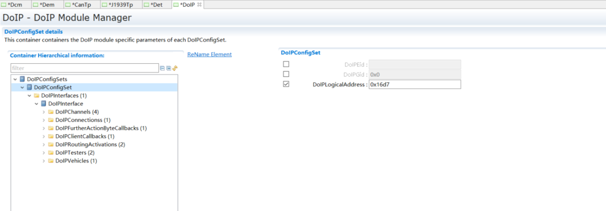
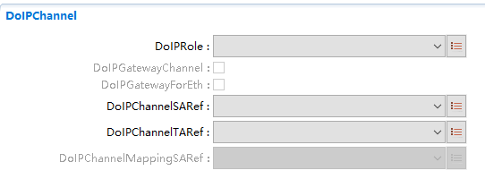
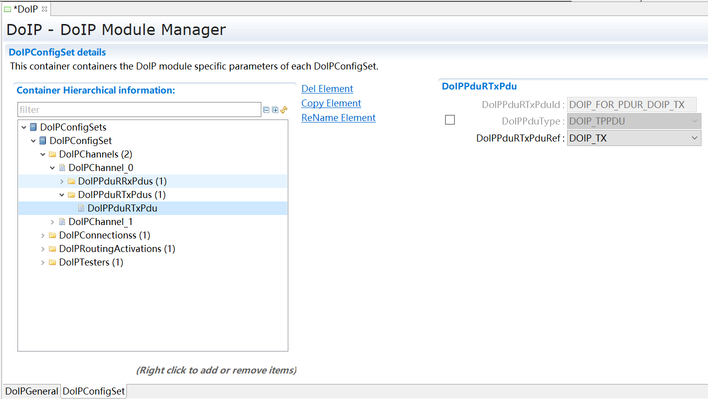
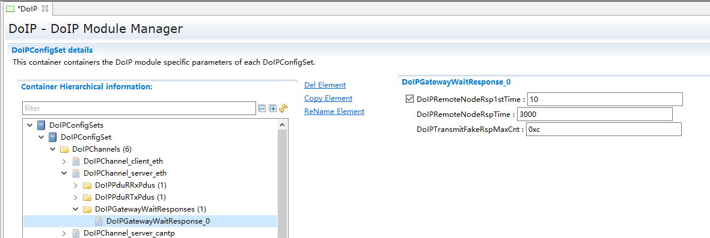
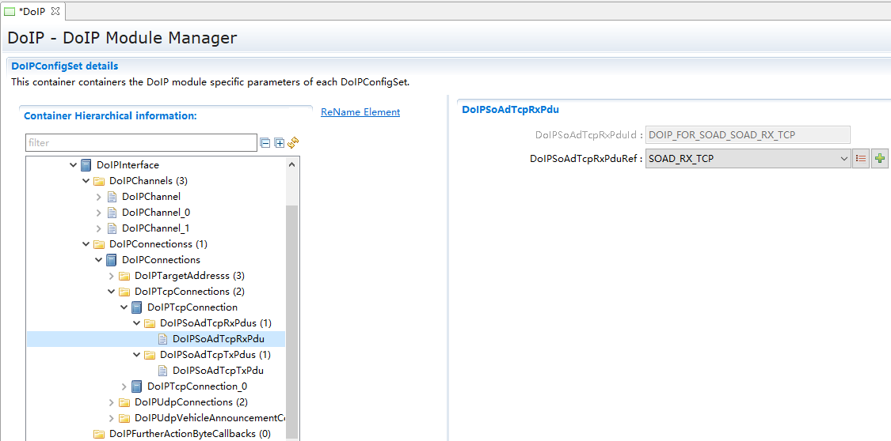
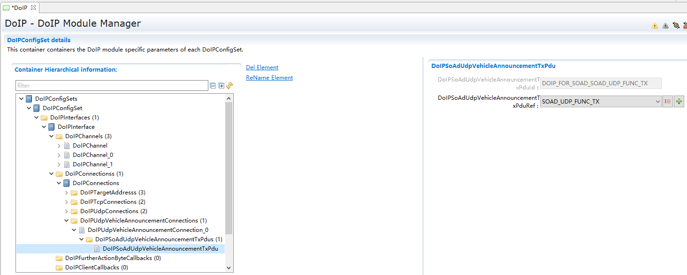
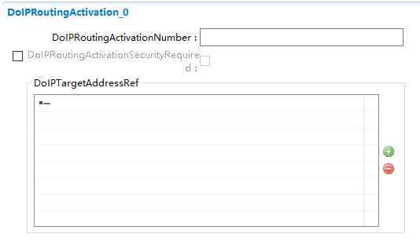

===================
DoIP产品参考手册
===================

**缩写词注解**

+------------+---------------------------+----------------------------+
| **缩写词** | **英文全称**              | **中文解释**               |
+------------+---------------------------+----------------------------+
| VIN        | Vehicle Identification    | 车辆识别号                 |
|            | Number                    |                            |
+------------+---------------------------+----------------------------+
| EID        | Entity Identifier         | 实体标识符                 |
+------------+---------------------------+----------------------------+
| GID        | Group Identifier          | 组标识符                   |
+------------+---------------------------+----------------------------+
| LA         | Logic Address             | DoIP 实体的逻辑地址        |
+------------+---------------------------+----------------------------+
| SA         | Source Address            | 用于标识 DoIP 消息是从哪个 |
|            |                           | DoIP 实体发出的            |
+------------+---------------------------+----------------------------+
| TA         | Target Address            | 用于标识将DoIP             |
|            |                           | 消息发送给哪个DoIP 实体    |
+------------+---------------------------+----------------------------+
| Tester     |                           | 运行有 DoIP 客户端的 DoIP  |
|            |                           | 实体                       |
+------------+---------------------------+----------------------------+
| PDU        | Protocol Data Unit        | 协议数据单元               |
+------------+---------------------------+----------------------------+
| PduR       | PDU Router                | PDU路由模块，Autosar       |
|            |                           | 中的一个功能模块           |
+------------+---------------------------+----------------------------+
| RTE        | Runtime Environment       | 运行时环境，Autosar        |
|            |                           | 中的一个功能模块           |
+------------+---------------------------+----------------------------+
| SoAd       | Socket Adapter            | 套接字适配器，Autosar      |
|            |                           | 中的一个功能模块           |
+------------+---------------------------+----------------------------+
| DCM        | Diagnostic Communication  | 诊断控制管理，Autosar      |
|            | Manager                   | 中的一个功能模块           |
+------------+---------------------------+----------------------------+
| CAN        | Controller Area Network   | 控制器局域网总线           |
+------------+---------------------------+----------------------------+
| ECU        | Electronic Control Unit   | 行车电脑                   |
+------------+---------------------------+----------------------------+

简介
====

|image1|

图1-1 DoIP模块层次图

DoIP模块用于外部诊断设备与内部ECU之间基于IP（TCP或UDP）的诊断通讯过程，主要实现了ISO13400-2规范规定的传输层的协议功能。DoIP在AUTOSAR架构里处于SoAd模块与PduR模块之间（图1-1）。SoAd向DoIP提供IP地址的获取与释放、SocketConnection的创建与通知功能，并提供下层接收与发送的API给SoAd用于数据的传输过程。而PduR模块用于提供和其他上层模块的路由功能，保证DoIP和上层模块（DCM或其他TP模块）的数据交互。

DoIP主要实现了以下功能：

1) 车辆通告和车辆发现

2) 车辆基本信息检索

3) 连接状态建立、维持以及车辆网关控制

4) 诊断数据路由

5) 网络错误状态处理

参考资料
--------

[1] ISO-13400，2012

[2] AUTOSAR_SWS_DiagnosticOverIP，R19-11

功能描述
========

车辆通告和车辆发现功能
----------------------

车辆通告和车辆发现功能介绍
~~~~~~~~~~~~~~~~~~~~~~~~~~

车辆通告和车辆发现功能用于Tester端发现已经建立IP连接的DoIP节点。通常DoIP节点的IP地址分配成功后会发出Vehicle
Announcement报文，用于通告自己的VIN、物理地址、EID、GID等信息，同样的，如果Tester端没有及时的收到DoIP节点的车辆通告报文，会通过主动发送vehicle
identification报文获取DoIP节点的上述信息。

车辆通告和车辆发现功能实现
~~~~~~~~~~~~~~~~~~~~~~~~~~

车辆通告和车辆发现功能基于 UDP 协议实现。

车辆通告。当网络可用时，SoAd会调用DoIP_SoConModeChg告知
DoIP，DoIP在DoIP_SoConModeChg设置应该发送车辆通告消息相关标志，在
DoIP_MainFunction调用SoAd_IfTransmit发送车辆通告消息。

车辆发现。SoAd会调用DoIP_SoAdIfRxIndication告知DoIP收到vehicle
identification消息，DoIP在DoIP_SoAdIfRxIndication处理收到的相关消息，并调用SoAd_IfTransmit发送响应报文。

车辆基本信息检索功能
--------------------

车辆基本信息检索功能介绍
~~~~~~~~~~~~~~~~~~~~~~~~

车辆检索用于外部诊断设备通过0x4001、0x4003指令向DoIP节点检索当前节点的节点类型、最大同时可连接TCP
socket数量、当前连接的TCP
socket数量、最大可支持的数据长度、当前诊断电源状态等信息。

车辆基本信息检索功能实现
~~~~~~~~~~~~~~~~~~~~~~~~

车辆检索功能基于UDP协议，接收到0x4001、0x4003报文后进入DoIP_SoAdIfRxIndication
进行处理，同步构造报文响应并通过SoAd_IfTransmit 进行响应报文的发送。

连接状态建立、维持功能
----------------------

连接状态建立、维持功能介绍
~~~~~~~~~~~~~~~~~~~~~~~~~~

连接状态建立、维持功能用于基于TCP_DATA的socket连接状态的建立与维持，DoIP通过Routine
Active请求来进行TCP连接的注册，通过Alive Check来维持连接状态。

连接状态建立、维持功能实现
~~~~~~~~~~~~~~~~~~~~~~~~~~

当DoIP_SoConModeChg指示当前SocketConnection状态切换为SOAD_SOCON_ONLINE时，将由DoIP维持一个SocketConnection资源池，并开始启动initial
inactivity timer，如果超时时间内未完成routine
active注册，将触发关闭SocketConnection资源池并通知SoAd模块关闭SocketConnection。如果在超时时间内接收到routine
active请求并满足注册的条件，则停止initial inactivity
timer计时并开始general inactivity
timer计时，此后就可以基于该SocketConnection进行诊断报文的传输了。每当基于该SocketConnection的数据传输发生时将会重置general
inactivity timer。

诊断数据路由功能
----------------

诊断数据路由功能介绍
~~~~~~~~~~~~~~~~~~~~

通过DoIP传输的诊断数据通常有两种形式，一种是通过DoIP传递给其他ECU节点的诊断报文，此时DoIP节点作为网关节点实现诊断报文的路由功能，另一种则是由诊断仪传输给DoIP节点本身的诊断请求。

诊断数据路由功能实现
~~~~~~~~~~~~~~~~~~~~

如果是通过DoIP传递给其他ECU的诊断报文，则首先通过SA、TA找到PDUR中配置好的目的节点，通过PDUR的报文路由功能转发给其他节点。

如果是通过DoIP诊断本ECU的报文，同样的是通过SA、TA找到PDUR中配置的上层目标，并由PDUR转发到DCM中进行处理，此时诊断报文接收和发送的buffer将由DCM模块提供。

诊断数据网关功能
----------------

DoIP网关支持将诊断报文转发到CAN网络或其他以太网网络。

以太网转CAN
~~~~~~~~~~~

DoIP网关到CAN诊断节点。Tester发出的诊断请求通过以太网传递到DoIPGateway，DoIPGateway通过TA得到目标诊断节点，将诊断请求通过PDUR转发到CAN总线，最终给到Dcm。

以太网转以太网
~~~~~~~~~~~~~~

DoIP网关到Eth诊断节点。Tester发出的诊断请求通过以太网传递到DoIPGateway，DoIPGateway通过TA得到目标诊断节点，将诊断请求通过PDUR和DoIPGateway，最终给到Dcm。

源文件描述
==========

表3-1 DoIP组件文件描述

+----------------+-----------------------------------------------------+
| **文件**       | **说明**                                            |
+----------------+-----------------------------------------------------+
| DoIP_Cfg.h     | 定义DoIP模块预编译时用到的配置参数                  |
+----------------+-----------------------------------------------------+
| DoIP_PCCfg.c   | 定义DoIP模块预编译时用到的配置参数                  |
+----------------+-----------------------------------------------------+
| DoIP_PCCfg.h   | 定义DoIP模块预编译时用到类型                        |
+----------------+-----------------------------------------------------+
| DoIP_PBCfg.c   | 定义DoIP模块中连接时用到的配置参数                  |
+----------------+-----------------------------------------------------+
| DoIP_PBCfg.h   | 定义DoIP模块中连接时用到的类型                      |
+----------------+-----------------------------------------------------+
| Rte_DoIP.c     | 定义RTE与DoIP的交互函数                             |
+----------------+-----------------------------------------------------+
| Rte_DoIP.h     | 定义RTE与DoIP的交互函数的声明                       |
+----------------+-----------------------------------------------------+
| R              | 定义RTE与DoIP的交互函数的类型                       |
| te_DoIP_Type.h |                                                     |
+----------------+-----------------------------------------------------+
| DoIP.h         | DoIP模块头                                          |
|                | 文件，包含了API函数的扩展声明并定义了端口的数据结构 |
+----------------+-----------------------------------------------------+
| DoIP.c         | DoIP模块源文件，包含了API函数的实现                 |
+----------------+-----------------------------------------------------+
| D              | DoIP模块内部函数源文件                              |
| oIP_Internal.c |                                                     |
+----------------+-----------------------------------------------------+
| DoIP_Cbk.h     | 包含DoIP供SoAd调用的API函数的声明                   |
+----------------+-----------------------------------------------------+
| D              | 包含DoIP内部的变量和数据结构的定义                  |
| OIP_Internal.h |                                                     |
+----------------+-----------------------------------------------------+
| DoIP_Types.h   | DoIP的类型定义文件                                  |
+----------------+-----------------------------------------------------+

|image2|

图3-1 DoIP模块文件结构图

API接口
=======

类型定义
--------

DoIP_ConfigType类型定义
~~~~~~~~~~~~~~~~~~~~~~~

+-----------+----------------------------------------------------------+
| 名称      | DoIP_ConfigType                                          |
+-----------+----------------------------------------------------------+
| 类型      | Structure                                                |
+-----------+----------------------------------------------------------+
| 范围      | Implementation specific                                  |
+-----------+----------------------------------------------------------+
| 描述      | DoIP的主配置结构体类型定义                               |
+-----------+----------------------------------------------------------+

DoIP_PowerStateType类型定义
~~~~~~~~~~~~~~~~~~~~~~~~~~~

+-----+----------------------------------------------------------------+
| 名  | DoIP_PowerStateType                                            |
| 称  |                                                                |
+-----+----------------------------------------------------------------+
| 类  | uint8                                                          |
| 型  |                                                                |
+-----+----------------------------------------------------------------+
| 范  | DOIP_NOT_READY，0x00，DoIP Power Mode "not ready"              |
| 围  |                                                                |
|     | DOIP_READY ，0x01，DoIP Power Mode "ready"                     |
|     |                                                                |
|     | DOIP_NOT_SUPPORTED ，0x02，DoIP Power Mode "not supported"     |
|     |                                                                |
|     | 0x03-0xFF ，0x03-0xFF ，Reserved                               |
+-----+----------------------------------------------------------------+
| 描  | DoIP节点的电源状态类型定义                                     |
| 述  |                                                                |
+-----+----------------------------------------------------------------+

DoIP_ActivationLineType类型定义
~~~~~~~~~~~~~~~~~~~~~~~~~~~~~~~

+---------+------------------------------------------------------------+
| 名称    | DoIP_ActivationLineType                                    |
+---------+------------------------------------------------------------+
| 类型    | enum                                                       |
+---------+------------------------------------------------------------+
| 范围    | DOIP_ACTIVATION_LINE_ACTIVE                                |
|         |                                                            |
|         | DOIP_ACTIVATION_LINE_INACTIVE                              |
+---------+------------------------------------------------------------+
| 描述    | 激活线状态                                                 |
+---------+------------------------------------------------------------+

DoIPNodeType类型定义
~~~~~~~~~~~~~~~~~~~~

+-----------------+----------------------------------------------------+
| 名称            | DoIPNodeType                                       |
+-----------------+----------------------------------------------------+
| 类型            | enum                                               |
+-----------------+----------------------------------------------------+
| 范围            | DOIP_GATEWAY                                       |
|                 |                                                    |
|                 | DOIP_NODE                                          |
+-----------------+----------------------------------------------------+
| 描述            | DoIP节点类型                                       |
+-----------------+----------------------------------------------------+

输入函数描述
------------

+-----------------+----------------------------------------------------+
| **输入模块**    | **API**                                            |
+-----------------+----------------------------------------------------+
| Dcm             | Dcm_GetVin                                         |
+-----------------+----------------------------------------------------+
| PduR            | PduR_DoIPTpCopyRxData                              |
+-----------------+----------------------------------------------------+
| PduR            | PduR_DoIPTpCopyTxData                              |
+-----------------+----------------------------------------------------+
| PduR            | PduR_DoIPTpRxIndication                            |
+-----------------+----------------------------------------------------+
| PduR            | PduR_DoIPTpStartOfReception                        |
+-----------------+----------------------------------------------------+
| PduR            | PduR_DoIPTpTxConfirmation                          |
+-----------------+----------------------------------------------------+
| SoAd            | SoAd_CloseSoCon                                    |
+-----------------+----------------------------------------------------+
| SoAd            | SoAd_GetLocalAddr                                  |
+-----------------+----------------------------------------------------+
| SoAd            | SoAd_GetPhysAddr                                   |
+-----------------+----------------------------------------------------+
| SoAd            | SoAd_GetRemoteAddr                                 |
+-----------------+----------------------------------------------------+
| SoAd            | SoAd_GetSoConId                                    |
+-----------------+----------------------------------------------------+
| SoAd            | SoAd_IfTransmit                                    |
+-----------------+----------------------------------------------------+
| SoAd            | SoAd_OpenSoCon                                     |
+-----------------+----------------------------------------------------+
| SoAd            | SoAd_ReleaseIpAddrAssignment                       |
+-----------------+----------------------------------------------------+
| SoAd            | SoAd_RequestIpAddrAssignment                       |
+-----------------+----------------------------------------------------+
| SoAd            | SoAd_TpCancelReceive                               |
+-----------------+----------------------------------------------------+
| SoAd            | SoAd_TpCancelTransmit                              |
+-----------------+----------------------------------------------------+
| SoAd            | SoAd_TpTransmit                                    |
+-----------------+----------------------------------------------------+

静态接口函数定义
----------------

 DoIP_Init函数定义
~~~~~~~~~~~~~~~~~~

+--------------+------------------+-----------+-----------------------+
| 函数名称：   | DoIP_Init        |           |                       |
+--------------+------------------+-----------+-----------------------+
| 函数原型：   | void DoIP_Init ( |           |                       |
|              | const            |           |                       |
|              | D                |           |                       |
|              | oIP_ConfigType\* |           |                       |
|              | DoIPConfigPtr )  |           |                       |
+--------------+------------------+-----------+-----------------------+
| 服务编号：   | 0x01             |           |                       |
+--------------+------------------+-----------+-----------------------+
| 同步/异步：  | 同步             |           |                       |
+--------------+------------------+-----------+-----------------------+
| 是否可重入： | 不可重入         |           |                       |
+--------------+------------------+-----------+-----------------------+
| 输入参数：   | DoIPConfigPtr    | 值域：    | 配置结构体指针        |
+--------------+------------------+-----------+-----------------------+
| 输           | 无               |           |                       |
| 入输出参数： |                  |           |                       |
+--------------+------------------+-----------+-----------------------+
| 输出参数：   | 无               |           |                       |
+--------------+------------------+-----------+-----------------------+
| 返回值：     | 无               |           |                       |
+--------------+------------------+-----------+-----------------------+
| 功能概述：   | 初始化Do         |           |                       |
|              | IP模块的所有全局 |           |                       |
|              | 变量，并切换初始 |           |                       |
|              | 化状态到已初始化 |           |                       |
+--------------+------------------+-----------+-----------------------+

DoIP_ActivationLineSwitch函数定义
~~~~~~~~~~~~~~~~~~~~~~~~~~~~~~~~~

+--------------+-------------------------------------------------------+
| 函数名称：   | DoIP_ActivationLineSwitch                             |
+--------------+-------------------------------------------------------+
| 函数原型：   | void DoIP_ActivationLineSwitch(void)                  |
+--------------+-------------------------------------------------------+
| 服务编号：   | 0x0e                                                  |
+--------------+-------------------------------------------------------+
| 同步/异步：  | 同步                                                  |
+--------------+-------------------------------------------------------+
| 是否可重入： | 不可重入                                              |
+--------------+-------------------------------------------------------+
| 输入参数：   | 无                                                    |
+--------------+-------------------------------------------------------+
| 输           | 无                                                    |
| 入输出参数： |                                                       |
+--------------+-------------------------------------------------------+
| 输出参数：   | 无                                                    |
+--------------+-------------------------------------------------------+
| 返回值：     | 无                                                    |
+--------------+-------------------------------------------------------+
| 功能概述：   | 使能/关闭 DoIP                                        |
+--------------+-------------------------------------------------------+

DoIP_SoConModeChg函数定义
~~~~~~~~~~~~~~~~~~~~~~~~~

+-------------+------------+------------+-----------------------------+
| 函数名称：  | DoIP_So    |            |                             |
|             | ConModeChg |            |                             |
+-------------+------------+------------+-----------------------------+
| 函数原型：  | void       |            |                             |
|             | DoIP_So    |            |                             |
|             | ConModeChg |            |                             |
|             | (          |            |                             |
|             | SoAd_S     |            |                             |
|             | oConIdType |            |                             |
|             | SoConId,   |            |                             |
|             | SoAd_SoC   |            |                             |
|             | onModeType |            |                             |
|             | Mode )     |            |                             |
+-------------+------------+------------+-----------------------------+
| 服务编号：  | 0x0b       |            |                             |
+-------------+------------+------------+-----------------------------+
| 同步/异步： | 同步       |            |                             |
+-------------+------------+------------+-----------------------------+
| 是          | 对         |            |                             |
| 否可重入：  | 不同的SoC  |            |                             |
|             | onId可重入 |            |                             |
+-------------+------------+------------+-----------------------------+
| 输入参数：  | SoConId    | 值域：     | Socket connection id        |
+-------------+------------+------------+-----------------------------+
|             | Mode       | 值域：     | 新的模式                    |
+-------------+------------+------------+-----------------------------+
| 输入        | 无         |            |                             |
| 输出参数：  |            |            |                             |
+-------------+------------+------------+-----------------------------+
| 输出参数：  | 无         |            |                             |
+-------------+------------+------------+-----------------------------+
| 返回值：    | 无         |            |                             |
+-------------+------------+------------+-----------------------------+
| 功能概述：  | 用于       |            |                             |
|             | 通知Socket |            |                             |
|             | connection |            |                             |
|             | 的状态变化 |            |                             |
+-------------+------------+------------+-----------------------------+

DoIP_LocalIpAddrAssignmentChg函数定义
~~~~~~~~~~~~~~~~~~~~~~~~~~~~~~~~~~~~~

+-------------+-------------------+---------+-------------------------+
| 函数名称：  | DoIP_LocalIp      |         |                         |
|             | AddrAssignmentChg |         |                         |
+-------------+-------------------+---------+-------------------------+
| 函数原型：  | void              |         |                         |
|             | DoIP_LocalIp      |         |                         |
|             | AddrAssignmentChg |         |                         |
|             | (                 |         |                         |
|             | SoAd_SoConIdType  |         |                         |
|             | SoConId,          |         |                         |
|             | TcpI              |         |                         |
|             | p_IpAddrStateType |         |                         |
|             | State )           |         |                         |
+-------------+-------------------+---------+-------------------------+
| 服务编号：  | 0x0c              |         |                         |
+-------------+-------------------+---------+-------------------------+
| 同步/异步： | 同步              |         |                         |
+-------------+-------------------+---------+-------------------------+
| 是          | 对不              |         |                         |
| 否可重入：  | 同的SoConId可重入 |         |                         |
+-------------+-------------------+---------+-------------------------+
| 输入参数：  | SoConId           | 值域：  | Socket connection id    |
+-------------+-------------------+---------+-------------------------+
|             | State             | 值域：  | 地址分配方式            |
+-------------+-------------------+---------+-------------------------+
| 输入        | 无                |         |                         |
| 输出参数：  |                   |         |                         |
+-------------+-------------------+---------+-------------------------+
| 输出参数：  | 无                |         |                         |
+-------------+-------------------+---------+-------------------------+
| 返回值：    | 无                |         |                         |
+-------------+-------------------+---------+-------------------------+
| 功能概述：  | 用于通知IP地      |         |                         |
|             | 址分配的状态变化  |         |                         |
+-------------+-------------------+---------+-------------------------+

DoIP_SoAdIfRxIndication函数定义
~~~~~~~~~~~~~~~~~~~~~~~~~~~~~~~

+-------------+---------+--------+------------------------------------+
| 函数名称：  | Do      |        |                                    |
|             | IP_SoAd |        |                                    |
|             | IfRxInd |        |                                    |
|             | ication |        |                                    |
+-------------+---------+--------+------------------------------------+
| 函数原型：  | void    |        |                                    |
|             | Do      |        |                                    |
|             | IP_SoAd |        |                                    |
|             | IfRxInd |        |                                    |
|             | ication |        |                                    |
|             | (       |        |                                    |
|             | Pd      |        |                                    |
|             | uIdType |        |                                    |
|             | R       |        |                                    |
|             | xPduId, |        |                                    |
|             | const   |        |                                    |
|             | PduInf  |        |                                    |
|             | oType\* |        |                                    |
|             | Pdu     |        |                                    |
|             | InfoPtr |        |                                    |
|             | )       |        |                                    |
+-------------+---------+--------+------------------------------------+
| 服务编号：  | 0x42    |        |                                    |
+-------------+---------+--------+------------------------------------+
| 同步/异步： | 同步    |        |                                    |
+-------------+---------+--------+------------------------------------+
| 是          | 对      |        |                                    |
| 否可重入：  | 不同的  |        |                                    |
|             | SoConI  |        |                                    |
|             | d可重入 |        |                                    |
+-------------+---------+--------+------------------------------------+
| 输入参数：  | RxPduId | 值域： | 接收的PDUID                        |
+-------------+---------+--------+------------------------------------+
|             | Pdu     | 值域： | 包含数据、数据长度、metadata的指针 |
|             | InfoPtr |        |                                    |
+-------------+---------+--------+------------------------------------+
| 输入        | 无      |        |                                    |
| 输出参数：  |         |        |                                    |
+-------------+---------+--------+------------------------------------+
| 输出参数：  | 无      |        |                                    |
+-------------+---------+--------+------------------------------------+
| 返回值：    | 无      |        |                                    |
+-------------+---------+--------+------------------------------------+
| 功能概述：  | 用于    |        |                                    |
|             | UDP报文 |        |                                    |
|             | 的接收  |        |                                    |
+-------------+---------+--------+------------------------------------+

DoIP_SoAdTpStartOfReception函数定义
~~~~~~~~~~~~~~~~~~~~~~~~~~~~~~~~~~~

+-------------+-------------------+---------+-------------------------+
| 函数名称：  | DoIP_SoAdT        |         |                         |
|             | pStartOfReception |         |                         |
+-------------+-------------------+---------+-------------------------+
| 函数原型：  | BufReq_ReturnType |         |                         |
|             | DoIP_SoAdT        |         |                         |
|             | pStartOfReception |         |                         |
|             | ( PduIdType id,   |         |                         |
|             | const             |         |                         |
|             | PduInfoType\*     |         |                         |
|             | info,             |         |                         |
|             | PduLengthType     |         |                         |
|             | TpSduLength,      |         |                         |
|             | PduLengthType\*   |         |                         |
|             | bufferSizePtr )   |         |                         |
+-------------+-------------------+---------+-------------------------+
| 服务编号：  | 0x46              |         |                         |
+-------------+-------------------+---------+-------------------------+
| 同步/异步： | 同步              |         |                         |
+-------------+-------------------+---------+-------------------------+
| 是          | 可重入            |         |                         |
| 否可重入：  |                   |         |                         |
+-------------+-------------------+---------+-------------------------+
| 输入参数：  | Id                | 值域：  | 接收的PDUID             |
+-------------+-------------------+---------+-------------------------+
|             | info              | 值域：  | 包含数据、数            |
|             |                   |         | 据长度、metadata的指针  |
+-------------+-------------------+---------+-------------------------+
|             | TpSduLength       | 值域：  | 要接收的SDU长度         |
+-------------+-------------------+---------+-------------------------+
| 输入        | 无                |         |                         |
| 输出参数：  |                   |         |                         |
+-------------+-------------------+---------+-------------------------+
| 输出参数：  | bufferSizePtr     | 值域：  | 用于接收的buffer大小    |
+-------------+-------------------+---------+-------------------------+
| 返回值：    | Bu                |         |                         |
|             | fReq_ReturnType： |         |                         |
|             |                   |         |                         |
|             | BUFREQ_OK         |         |                         |
|             |                   |         |                         |
|             | BUFREQ_E_NOT_OK   |         |                         |
|             |                   |         |                         |
|             | BUFREQ_E_OVFL     |         |                         |
+-------------+-------------------+---------+-------------------------+
| 功能概述：  | 在                |         |                         |
|             | 进行基于TCP的数据 |         |                         |
|             | 接收时，下层通过  |         |                         |
|             | 此函数获取DoIP的  |         |                         |
|             | 接收能力，此时的  |         |                         |
|             | TpSduLength应为0  |         |                         |
+-------------+-------------------+---------+-------------------------+

DoIP_SoAdTpCopyRxData函数定义
~~~~~~~~~~~~~~~~~~~~~~~~~~~~~

+-------------+-------------------+---------+-------------------------+
| 函数名称：  | DoIP              |         |                         |
|             | _SoAdTpCopyRxData |         |                         |
+-------------+-------------------+---------+-------------------------+
| 函数原型：  | BufReq_ReturnType |         |                         |
|             | DoIP              |         |                         |
|             | _SoAdTpCopyRxData |         |                         |
|             | ( PduIdType id,   |         |                         |
|             | const             |         |                         |
|             | PduInfoType\*     |         |                         |
|             | info,             |         |                         |
|             | PduLengthType\*   |         |                         |
|             | bufferSizePtr )   |         |                         |
+-------------+-------------------+---------+-------------------------+
| 服务编号：  | 0x44              |         |                         |
+-------------+-------------------+---------+-------------------------+
| 同步/异步： | 同步              |         |                         |
+-------------+-------------------+---------+-------------------------+
| 是          | 可重入            |         |                         |
| 否可重入：  |                   |         |                         |
+-------------+-------------------+---------+-------------------------+
| 输入参数：  | Id                | 值域：  | 接收的PDUID             |
+-------------+-------------------+---------+-------------------------+
|             | info              | 值域：  | 包含数据、数            |
|             |                   |         | 据长度、metadata的指针  |
+-------------+-------------------+---------+-------------------------+
| 输入        | 无                |         |                         |
| 输出参数：  |                   |         |                         |
+-------------+-------------------+---------+-------------------------+
| 输出参数：  | bufferSizePtr     | 值域：  | 用于接收的buffer大小    |
+-------------+-------------------+---------+-------------------------+
| 返回值：    | Bu                |         |                         |
|             | fReq_ReturnType： |         |                         |
|             |                   |         |                         |
|             | BUFREQ_OK         |         |                         |
|             |                   |         |                         |
|             | BUFREQ_E_NOT_OK   |         |                         |
+-------------+-------------------+---------+-------------------------+
| 功能概述：  | 在进行基于TC      |         |                         |
|             | P的数据接收时，用 |         |                         |
|             | 于向DoIP传输数据  |         |                         |
+-------------+-------------------+---------+-------------------------+

DoIP_TpCancelReceive函数定义
~~~~~~~~~~~~~~~~~~~~~~~~~~~~

+-------------+-------------------+---------+-------------------------+
| 函数名称：  | DoI               |         |                         |
|             | P_TpCancelReceive |         |                         |
+-------------+-------------------+---------+-------------------------+
| 函数原型：  | Std_ReturnType    |         |                         |
|             | DoI               |         |                         |
|             | P_TpCancelReceive |         |                         |
|             | ( PduIdType       |         |                         |
|             | RxPduId )         |         |                         |
+-------------+-------------------+---------+-------------------------+
| 服务编号：  | 0x4c              |         |                         |
+-------------+-------------------+---------+-------------------------+
| 同步/异步： | 同步              |         |                         |
+-------------+-------------------+---------+-------------------------+
| 是          | 不可重入          |         |                         |
| 否可重入：  |                   |         |                         |
+-------------+-------------------+---------+-------------------------+
| 输入参数：  | RxPduId           | 值域：  | Identification of the   |
|             |                   |         | PDU to be cancelled     |
+-------------+-------------------+---------+-------------------------+
| 输入        | 无                |         |                         |
| 输出参数：  |                   |         |                         |
+-------------+-------------------+---------+-------------------------+
| 输出参数：  | 无                |         |                         |
+-------------+-------------------+---------+-------------------------+
| 返回值：    | E                 |         |                         |
|             | _OK：取消接收成功 |         |                         |
|             | E_NOT             |         |                         |
|             | _OK：取消接收失败 |         |                         |
+-------------+-------------------+---------+-------------------------+
| 功能概述：  | 请求取消TP        |         |                         |
|             | PDU的接收         |         |                         |
+-------------+-------------------+---------+-------------------------+

DoIP_IfTransmit函数定义
~~~~~~~~~~~~~~~~~~~~~~~

+-------------+-------------------+---------+-------------------------+
| 函数名称：  | DoIP_IfTransmit   |         |                         |
+-------------+-------------------+---------+-------------------------+
| 函数原型：  | Std_ReturnType    |         |                         |
|             | DoIP_IfTransmit ( |         |                         |
|             | PduIdType         |         |                         |
|             | TxPduId, const    |         |                         |
|             | PduInfoType\*     |         |                         |
|             | PduInfoPtr )      |         |                         |
+-------------+-------------------+---------+-------------------------+
| 服务编号：  | 0x49              |         |                         |
+-------------+-------------------+---------+-------------------------+
| 同步/异步： | 同步              |         |                         |
+-------------+-------------------+---------+-------------------------+
| 是          | 对不              |         |                         |
| 否可重入：  | 同的pduid不可重入 |         |                         |
+-------------+-------------------+---------+-------------------------+
| 输入参数：  | TxPduId           | 值域：  | Identification of the   |
|             |                   |         | PDU to be transmited    |
+-------------+-------------------+---------+-------------------------+
|             | PduInfoPtr        | 值域：  | 包含PDU长度，           |
|             |                   |         | 数据指针及metadata指针  |
+-------------+-------------------+---------+-------------------------+
| 输入        | 无                |         |                         |
| 输出参数：  |                   |         |                         |
+-------------+-------------------+---------+-------------------------+
| 输出参数：  | 无                |         |                         |
+-------------+-------------------+---------+-------------------------+
| 返回值：    | E_OK：允许发送    |         |                         |
|             | E_N               |         |                         |
|             | OT_OK：不允许发送 |         |                         |
+-------------+-------------------+---------+-------------------------+
| 功能概述：  | 用于诊            |         |                         |
|             | 断IF类型的PDU发送 |         |                         |
+-------------+-------------------+---------+-------------------------+

DoIP_TpTransmit函数定义
~~~~~~~~~~~~~~~~~~~~~~~

+-------------+-------------------+---------+-------------------------+
| 函数名称：  | DoIP_TpTransmit   |         |                         |
+-------------+-------------------+---------+-------------------------+
| 函数原型：  | Std_ReturnType    |         |                         |
|             | DoIP_TpTransmit ( |         |                         |
|             | PduIdType         |         |                         |
|             | TxPduId, const    |         |                         |
|             | PduInfoType\*     |         |                         |
|             | PduInfoPtr )      |         |                         |
+-------------+-------------------+---------+-------------------------+
| 服务编号：  | 0x53              |         |                         |
+-------------+-------------------+---------+-------------------------+
| 同步/异步： | 同步              |         |                         |
+-------------+-------------------+---------+-------------------------+
| 是          | 对不              |         |                         |
| 否可重入：  | 同的pduid不可重入 |         |                         |
+-------------+-------------------+---------+-------------------------+
| 输入参数：  | TxPduId           | 值域：  | Identification of the   |
|             |                   |         | PDU to be transmited    |
+-------------+-------------------+---------+-------------------------+
|             | PduInfoPtr        | 值域：  | 包含PDU长度，           |
|             |                   |         | 数据指针及metadata指针  |
+-------------+-------------------+---------+-------------------------+
| 输入        | 无                |         |                         |
| 输出参数：  |                   |         |                         |
+-------------+-------------------+---------+-------------------------+
| 输出参数：  | 无                |         |                         |
+-------------+-------------------+---------+-------------------------+
| 返回值：    | E_OK：允许发送    |         |                         |
|             | E_N               |         |                         |
|             | OT_OK：不允许发送 |         |                         |
+-------------+-------------------+---------+-------------------------+
| 功能概述：  | 用于诊            |         |                         |
|             | 断TP类型的PDU发送 |         |                         |
+-------------+-------------------+---------+-------------------------+

DoIP_IfCancelTransmit函数定义
~~~~~~~~~~~~~~~~~~~~~~~~~~~~~

+-------------+-------------------+---------+-------------------------+
| 函数名称：  | DoIP              |         |                         |
|             | _IfCancelTransmit |         |                         |
+-------------+-------------------+---------+-------------------------+
| 函数原型：  | Std_ReturnType    |         |                         |
|             | DoIP              |         |                         |
|             | _IfCancelTransmit |         |                         |
|             | ( PduIdType       |         |                         |
|             | TxPduId )         |         |                         |
+-------------+-------------------+---------+-------------------------+
| 服务编号：  | 0x4a              |         |                         |
+-------------+-------------------+---------+-------------------------+
| 同步/异步： | 同步              |         |                         |
+-------------+-------------------+---------+-------------------------+
| 是          | 不可重入          |         |                         |
| 否可重入：  |                   |         |                         |
+-------------+-------------------+---------+-------------------------+
| 输入参数：  | TxPduId           | 值域：  | Identification of the   |
|             |                   |         | PDU to be canceled      |
+-------------+-------------------+---------+-------------------------+
| 输入        | 无                |         |                         |
| 输出参数：  |                   |         |                         |
+-------------+-------------------+---------+-------------------------+
| 输出参数：  | 无                |         |                         |
+-------------+-------------------+---------+-------------------------+
| 返回值：    | E                 |         |                         |
|             | _OK：允许发送取消 |         |                         |
|             | E_NOT_O           |         |                         |
|             | K：不允许发送取消 |         |                         |
+-------------+-------------------+---------+-------------------------+
| 功能概述：  | 用于诊断IF        |         |                         |
|             | 类型的PDU取消发送 |         |                         |
+-------------+-------------------+---------+-------------------------+

DoIP_TpCancelTransmit函数定义
~~~~~~~~~~~~~~~~~~~~~~~~~~~~~

+-------------+-------------------+---------+-------------------------+
| 函数名称：  | DoIP              |         |                         |
|             | _TpCancelTransmit |         |                         |
+-------------+-------------------+---------+-------------------------+
| 函数原型：  | Std_ReturnType    |         |                         |
|             | DoIP              |         |                         |
|             | _TpCancelTransmit |         |                         |
|             | ( PduIdType       |         |                         |
|             | TxPduId )         |         |                         |
+-------------+-------------------+---------+-------------------------+
| 服务编号：  | 0x54              |         |                         |
+-------------+-------------------+---------+-------------------------+
| 同步/异步： | 同步              |         |                         |
+-------------+-------------------+---------+-------------------------+
| 是          | 不可重入          |         |                         |
| 否可重入：  |                   |         |                         |
+-------------+-------------------+---------+-------------------------+
| 输入参数：  | TxPduId           | 值域：  | Identification of the   |
|             |                   |         | PDU to be canceled      |
+-------------+-------------------+---------+-------------------------+
| 输入        | 无                |         |                         |
| 输出参数：  |                   |         |                         |
+-------------+-------------------+---------+-------------------------+
| 输出参数：  | 无                |         |                         |
+-------------+-------------------+---------+-------------------------+
| 返回值：    | E                 |         |                         |
|             | _OK：允许发送取消 |         |                         |
|             | E_NOT_O           |         |                         |
|             | K：不允许发送取消 |         |                         |
+-------------+-------------------+---------+-------------------------+
| 功能概述：  | 用于诊断TP        |         |                         |
|             | 类型的PDU取消发送 |         |                         |
+-------------+-------------------+---------+-------------------------+

DoIP_SoAdTpCopyTxData函数定义
~~~~~~~~~~~~~~~~~~~~~~~~~~~~~

+-------------+-------------------+---------+-------------------------+
| 函数名称：  | DoIP              |         |                         |
|             | _SoAdTpCopyTxData |         |                         |
+-------------+-------------------+---------+-------------------------+
| 函数原型：  | BufReq_ReturnType |         |                         |
|             | DoIP              |         |                         |
|             | _SoAdTpCopyTxData |         |                         |
|             | ( PduIdType id,   |         |                         |
|             | const             |         |                         |
|             | PduInfoType\*     |         |                         |
|             | info, const       |         |                         |
|             | RetryInfoType\*   |         |                         |
|             | retry,            |         |                         |
|             | PduLengthType\*   |         |                         |
|             | availableDataPtr  |         |                         |
|             | )                 |         |                         |
+-------------+-------------------+---------+-------------------------+
| 服务编号：  | 0x43              |         |                         |
+-------------+-------------------+---------+-------------------------+
| 同步/异步： | 同步              |         |                         |
+-------------+-------------------+---------+-------------------------+
| 是          | 可重入            |         |                         |
| 否可重入：  |                   |         |                         |
+-------------+-------------------+---------+-------------------------+
| 输入参数：  | id                | 值域：  | 发送的pduid             |
+-------------+-------------------+---------+-------------------------+
|             | info              | 值域：  | 发送的数据指针和长度    |
+-------------+-------------------+---------+-------------------------+
|             | retry             | 值域：  | 用于发送重试            |
+-------------+-------------------+---------+-------------------------+
| 输入        | 无                |         |                         |
| 输出参数：  |                   |         |                         |
+-------------+-------------------+---------+-------------------------+
| 输出参数    | availableDataPtr  | 值域：  | 用于通                  |
|             |                   |         | 知下层剩余的buffer大小  |
+-------------+-------------------+---------+-------------------------+
| 返回值：    | BUFREQ_OK： Data  |         |                         |
|             | has been copied   |         |                         |
|             | to the transmit   |         |                         |
|             | buffer completely |         |                         |
|             | as requested.     |         |                         |
|             | BUFREQ_E_BUSY：   |         |                         |
|             | Request could not |         |                         |
|             | be fulfilled,     |         |                         |
|             | because the       |         |                         |
|             | required amount   |         |                         |
|             | of Tx data is not |         |                         |
|             | available. The    |         |                         |
|             | lower layer       |         |                         |
|             | module may retry  |         |                         |
|             | this call later   |         |                         |
|             | on. No data has   |         |                         |
|             | been copied.      |         |                         |
|             | BUFREQ_E_NOT_OK： |         |                         |
|             | Data has not been |         |                         |
|             | copied. Request   |         |                         |
|             | failed.           |         |                         |
+-------------+-------------------+---------+-------------------------+
| 功能概述：  | 用                |         |                         |
|             | 于SoAd向DoIP请求  |         |                         |
|             | 发送数据拷贝操作  |         |                         |
+-------------+-------------------+---------+-------------------------+

DoIP_SoAdTpTxConfirmation函数定义
~~~~~~~~~~~~~~~~~~~~~~~~~~~~~~~~~

+-------------+-------------------+---------+-------------------------+
| 函数名称：  | DoIP_SoA          |         |                         |
|             | dTpTxConfirmation |         |                         |
+-------------+-------------------+---------+-------------------------+
| 函数原型：  | void              |         |                         |
|             | DoIP_SoA          |         |                         |
|             | dTpTxConfirmation |         |                         |
|             | ( PduIdType id,   |         |                         |
|             | Std_ReturnType    |         |                         |
|             | result )          |         |                         |
+-------------+-------------------+---------+-------------------------+
| 服务编号：  | 0x48              |         |                         |
+-------------+-------------------+---------+-------------------------+
| 同步/异步： | 同步              |         |                         |
+-------------+-------------------+---------+-------------------------+
| 是          | 可重入            |         |                         |
| 否可重入：  |                   |         |                         |
+-------------+-------------------+---------+-------------------------+
| 输入参数：  | id                | 值域：  | 发送的pduid             |
+-------------+-------------------+---------+-------------------------+
|             | result            | 值域：  | 发送结果                |
+-------------+-------------------+---------+-------------------------+
| 输入        | 无                |         |                         |
| 输出参数：  |                   |         |                         |
+-------------+-------------------+---------+-------------------------+
| 输出参数    | 无                |         |                         |
+-------------+-------------------+---------+-------------------------+
| 返回值：    | 无                |         |                         |
+-------------+-------------------+---------+-------------------------+
| 功能概述：  | 用于SoAd向D       |         |                         |
|             | oIP的发送确认通知 |         |                         |
+-------------+-------------------+---------+-------------------------+

DoIP_SoAdIfTxConfirmation函数定义
~~~~~~~~~~~~~~~~~~~~~~~~~~~~~~~~~

+-------------+-------------------+---------+-------------------------+
| 函数名称：  | DoIP_SoA          |         |                         |
|             | dIfTxConfirmation |         |                         |
+-------------+-------------------+---------+-------------------------+
| 函数原型：  | void              |         |                         |
|             | DoIP_SoA          |         |                         |
|             | dIfTxConfirmation |         |                         |
|             | ( PduIdType       |         |                         |
|             | TxPduId,          |         |                         |
|             | Std_ReturnType    |         |                         |
|             | result )          |         |                         |
+-------------+-------------------+---------+-------------------------+
| 服务编号：  | 0x40              |         |                         |
+-------------+-------------------+---------+-------------------------+
| 同步/异步： | 同步              |         |                         |
+-------------+-------------------+---------+-------------------------+
| 是          | 相                |         |                         |
| 否可重入：  | 同的pduid不可重入 |         |                         |
+-------------+-------------------+---------+-------------------------+
| 输入参数：  | TxPduId           | 值域：  | 发送的pduid             |
+-------------+-------------------+---------+-------------------------+
|             | result            | 值域：  | 发送结果                |
+-------------+-------------------+---------+-------------------------+
| 输入        | 无                |         |                         |
| 输出参数：  |                   |         |                         |
+-------------+-------------------+---------+-------------------------+
| 输出参数    | 无                |         |                         |
+-------------+-------------------+---------+-------------------------+
| 返回值：    | 无                |         |                         |
+-------------+-------------------+---------+-------------------------+
| 功能概述：  | 用于SoAd向D       |         |                         |
|             | oIP的发送确认通知 |         |                         |
+-------------+-------------------+---------+-------------------------+

DoIP_SoAdTpRxIndication函数定义
~~~~~~~~~~~~~~~~~~~~~~~~~~~~~~~

+-------------+-------------------+---------+-------------------------+
| 函数名称：  | DoIP_S            |         |                         |
|             | oAdTpRxIndication |         |                         |
+-------------+-------------------+---------+-------------------------+
| 函数原型：  | void              |         |                         |
|             | DoIP_S            |         |                         |
|             | oAdTpRxIndication |         |                         |
|             | ( PduIdType id,   |         |                         |
|             | Std_ReturnType    |         |                         |
|             | result )          |         |                         |
+-------------+-------------------+---------+-------------------------+
| 服务编号：  | 0x45              |         |                         |
+-------------+-------------------+---------+-------------------------+
| 同步/异步： | 同步              |         |                         |
+-------------+-------------------+---------+-------------------------+
| 是          | 不可重入          |         |                         |
| 否可重入：  |                   |         |                         |
+-------------+-------------------+---------+-------------------------+
| 输入参数：  | id                | 值域：  | 接收的pduid             |
+-------------+-------------------+---------+-------------------------+
|             | result            | 值域：  | 接收结果                |
+-------------+-------------------+---------+-------------------------+
| 输入        | 无                |         |                         |
| 输出参数：  |                   |         |                         |
+-------------+-------------------+---------+-------------------------+
| 输出参数    | 无                |         |                         |
+-------------+-------------------+---------+-------------------------+
| 返回值：    | 无                |         |                         |
+-------------+-------------------+---------+-------------------------+
| 功能概述：  | 用                |         |                         |
|             | 于SoAd向DoIP基于  |         |                         |
|             | TP的接收确认通知  |         |                         |
+-------------+-------------------+---------+-------------------------+

DoIP_MainFunction函数定义
~~~~~~~~~~~~~~~~~~~~~~~~~

+-------------+--------------------------------------------------------+
| 函数名称：  | DoIP_MainFunction                                      |
+-------------+--------------------------------------------------------+
| 函数原型：  | void DoIP_MainFunction ( void )                        |
+-------------+--------------------------------------------------------+
| 服务编号：  | 0x02                                                   |
+-------------+--------------------------------------------------------+
| 功能概述：  | DoIP主任务函数                                         |
+-------------+--------------------------------------------------------+

DoIP_MainFunction_HighFrequency函数定义
~~~~~~~~~~~~~~~~~~~~~~~~~~~~~~~~~~~~~~~

+-------------+--------------------------------------------------------+
| 函数名称：  | DoIP_MainFunction_HighFrequency                        |
+-------------+--------------------------------------------------------+
| 函数原型：  | void DoIP_MainFunction_HighFrequency ( void )          |
+-------------+--------------------------------------------------------+
| 服务编号：  | 0x02                                                   |
+-------------+--------------------------------------------------------+
| 功能概述：  | 处理DoIP主任务中一些需要高频调用的任务                 |
+-------------+--------------------------------------------------------+

DoIP_ConnectToVehicle函数定义
~~~~~~~~~~~~~~~~~~~~~~~~~~~~~

+-------------+-------------------+---------+-------------------------+
| 函数名称:   | DoIP              |         |                         |
|             | _ConnectToVehicle |         |                         |
+-------------+-------------------+---------+-------------------------+
| 函数原型:   | DoIP_Conne        |         |                         |
|             | ctToVehicle(uint8 |         |                         |
|             | VehicleID)        |         |                         |
+-------------+-------------------+---------+-------------------------+
| 服务编号:   | 0xf0              |         |                         |
+-------------+-------------------+---------+-------------------------+
| 同步/异步： | 异步              |         |                         |
+-------------+-------------------+---------+-------------------------+
| 是          | 不可重入          |         |                         |
| 否可重入：  |                   |         |                         |
+-------------+-------------------+---------+-------------------------+
| 输入参数：  | VehicleID         | 值域：  | 汽车ID                  |
+-------------+-------------------+---------+-------------------------+
| 输入        | 无                |         |                         |
| 输出参数：  |                   |         |                         |
+-------------+-------------------+---------+-------------------------+
| 输出参数    | 无                |         |                         |
+-------------+-------------------+---------+-------------------------+
| 返回值：    | E_OK：连接成功    |         |                         |
|             | E_N               |         |                         |
|             | OT_OK：连接不成功 |         |                         |
+-------------+-------------------+---------+-------------------------+
| 功能概述：  | 用于c             |         |                         |
|             | lient端连接到doip |         |                         |
|             | server            |         |                         |
+-------------+-------------------+---------+-------------------------+

DoIP_DisconnectToVehicle函数定义
~~~~~~~~~~~~~~~~~~~~~~~~~~~~~~~~

+-------------+-------------------+---------+-------------------------+
| 函数名称:   | DoIP_Di           |         |                         |
|             | sconnectToVehicle |         |                         |
+-------------+-------------------+---------+-------------------------+
| 函数原型:   | DoIP_Disconne     |         |                         |
|             | ctToVehicle(uint8 |         |                         |
|             | VehicleID)        |         |                         |
+-------------+-------------------+---------+-------------------------+
| 服务编号:   | 0xf1              |         |                         |
+-------------+-------------------+---------+-------------------------+
| 同步/异步： | 异步              |         |                         |
+-------------+-------------------+---------+-------------------------+
| 是          | 不可重入          |         |                         |
| 否可重入：  |                   |         |                         |
+-------------+-------------------+---------+-------------------------+
| 输入参数：  | VehicleID         | 值域：  | 汽车ID                  |
+-------------+-------------------+---------+-------------------------+
| 输入        | 无                |         |                         |
| 输出参数：  |                   |         |                         |
+-------------+-------------------+---------+-------------------------+
| 输出参数    | 无                |         |                         |
+-------------+-------------------+---------+-------------------------+
| 返回值：    | E                 |         |                         |
|             | _OK：断开连接成功 |         |                         |
|             | E_NOT_O           |         |                         |
|             | K：断开连接不成功 |         |                         |
+-------------+-------------------+---------+-------------------------+
| 功能概述：  | 用于c             |         |                         |
|             | lient端断开到doip |         |                         |
|             | server的连接      |         |                         |
+-------------+-------------------+---------+-------------------------+

可配置函数定义
--------------

<User>_DoIPGetPowerModeCallback
~~~~~~~~~~~~~~~~~~~~~~~~~~~~~~~

+-------------+-------------------+---------+-------------------------+
| 函数名称：  | <User>_DoIPGet    |         |                         |
|             | PowerModeCallback |         |                         |
+-------------+-------------------+---------+-------------------------+
| 函数原型：  | Std_ReturnType    |         |                         |
|             | <User>_DoIPGet    |         |                         |
|             | PowerModeCallback |         |                         |
|             | (                 |         |                         |
|             | DoIP              |         |                         |
|             | _PowerStateType\* |         |                         |
|             | PowerStateReady ) |         |                         |
+-------------+-------------------+---------+-------------------------+
| 服务编号：  | 0x00              |         |                         |
+-------------+-------------------+---------+-------------------------+
| 同步/异步： | 同步              |         |                         |
+-------------+-------------------+---------+-------------------------+
| 是          | 无                |         |                         |
| 否可重入：  |                   |         |                         |
+-------------+-------------------+---------+-------------------------+
| 输入参数：  | 无                |         |                         |
+-------------+-------------------+---------+-------------------------+
| 输入        | 无                |         |                         |
| 输出参数：  |                   |         |                         |
+-------------+-------------------+---------+-------------------------+
| 输出参数：  | PowerStateReady   | 值域：  | Pointer containing the  |
|             |                   |         | information of the      |
|             |                   |         | PowerModeStatus. Only   |
|             |                   |         | valid if the return     |
|             |                   |         | value equals E_OK.      |
+-------------+-------------------+---------+-------------------------+
| 返回值：    | Std_Return-Type   | 值域：  | E_OK： PowerStateReady  |
|             |                   |         | contains valid          |
|             |                   |         | information E_NOT_OK：  |
|             |                   |         | PowerStateReady         |
|             |                   |         | contains no valid       |
|             |                   |         | information             |
+-------------+-------------------+---------+-------------------------+
| 功能概述：  | 获取PowerM        |         |                         |
|             | ode的Callback函数 |         |                         |
+-------------+-------------------+---------+-------------------------+

<User>_DoIPRoutingActivationConfirmation
~~~~~~~~~~~~~~~~~~~~~~~~~~~~~~~~~~~~~~~~

+---------+-----------------+----+------------------------------------+
| 函数    | <User>_DoI      |    |                                    |
| 名称：  | PRoutingActivat |    |                                    |
|         | ionConfirmation |    |                                    |
+---------+-----------------+----+------------------------------------+
| 函数    | Std_ReturnType  |    |                                    |
| 原型：  | <User>_DoI      |    |                                    |
|         | PRoutingActivat |    |                                    |
|         | ionConfirmation |    |                                    |
|         | ( boolean\*     |    |                                    |
|         | Confirmed,      |    |                                    |
|         | const uint8\*   |    |                                    |
|         | Confi           |    |                                    |
|         | rmationReqData, |    |                                    |
|         | uint8\*         |    |                                    |
|         | Conf            |    |                                    |
|         | irmationResData |    |                                    |
|         | )               |    |                                    |
+---------+-----------------+----+------------------------------------+
| 服务    | 0x00            |    |                                    |
| 编号：  |                 |    |                                    |
+---------+-----------------+----+------------------------------------+
| 同步    | 同步/异步       |    |                                    |
| /异步： |                 |    |                                    |
+---------+-----------------+----+------------------------------------+
| 是否可  | 无              |    |                                    |
| 重入：  |                 |    |                                    |
+---------+-----------------+----+------------------------------------+
| 输入    | Conf            | 值 | Pointer to OEM specific bytes for  |
| 参数：  | irmationReqData | 域 | Routing activation request. Only   |
|         |                 | ： | needed if                          |
|         |                 |    | DoIPRout                           |
|         |                 |    | ingActivationConfirmationReqLength |
|         |                 |    | is not 0.                          |
+---------+-----------------+----+------------------------------------+
| 输      | 无              |    |                                    |
| 入输出  |                 |    |                                    |
| 参数：  |                 |    |                                    |
+---------+-----------------+----+------------------------------------+
| 输出    | PowerStateReady | 值 | Pointer containing the information |
| 参数：  |                 | 域 | of the PowerModeStatus. Only valid |
|         |                 | ： | if the return value equals E_OK.   |
+---------+-----------------+----+------------------------------------+
|         | Conf            | 值 | Pointer to OEM specific bytes for  |
|         | irmationResData | 域 | Response on Routing activation.    |
|         |                 | ： | Only needed if                     |
|         |                 |    | DoIPRout                           |
|         |                 |    | ingActivationConfirmationResLength |
|         |                 |    | if not 0. Contains valid data if   |
|         |                 |    | function return with E_OK.         |
+---------+-----------------+----+------------------------------------+
| 返      | Std_Return-Type | 值 | E_OK： Confirmed and               |
| 回值：  |                 | 域 | ConfirmationResData contain valid  |
|         |                 | ： | Data. DOIP_E_PENDING：             |
|         |                 |    | Confirmation still running. Call   |
|         |                 |    | next DoIP_MainFunction cycle       |
|         |                 |    | again. E_NOT_OK： Confirmed and/or |
|         |                 |    | ConfirmationResData do not contain |
|         |                 |    | valid information.                 |
+---------+-----------------+----+------------------------------------+
| 功能    | 路由激          |    |                                    |
| 概述：  | 活Callback函数  |    |                                    |
+---------+-----------------+----+------------------------------------+

<User>_DoIPRoutingActivationAuthentication
~~~~~~~~~~~~~~~~~~~~~~~~~~~~~~~~~~~~~~~~~~

+-------+------------------+----+-------------------------------------+
| 函    | <User>_DoI       |    |                                     |
| 数名  | PRoutingActivati |    |                                     |
| 称：  | onAuthentication |    |                                     |
+-------+------------------+----+-------------------------------------+
| 函    | Std_ReturnType   |    |                                     |
| 数原  | <User>_DoI       |    |                                     |
| 型：  | PRoutingActivati |    |                                     |
|       | onAuthentication |    |                                     |
|       | ( boolean\*      |    |                                     |
|       | Authentified,    |    |                                     |
|       | const uint8\*    |    |                                     |
|       | Authen           |    |                                     |
|       | ticationReqData, |    |                                     |
|       | uint8\*          |    |                                     |
|       | Authe            |    |                                     |
|       | nticationResData |    |                                     |
|       | )                |    |                                     |
+-------+------------------+----+-------------------------------------+
| 服    | 0x00             |    |                                     |
| 务编  |                  |    |                                     |
| 号：  |                  |    |                                     |
+-------+------------------+----+-------------------------------------+
| 同    | 同步/异步        |    |                                     |
| 步/异 |                  |    |                                     |
| 步：  |                  |    |                                     |
+-------+------------------+----+-------------------------------------+
| 是否  | 无               |    |                                     |
| 可重  |                  |    |                                     |
| 入：  |                  |    |                                     |
+-------+------------------+----+-------------------------------------+
| 输    | Authe            | 值 | Pointer to OEM specific bytes for   |
| 入参  | nticationReqData | 域 | Routing activation request. Only    |
| 数：  |                  | ： | needed if                           |
|       |                  |    | DoIPRouti                           |
|       |                  |    | ngActivationAuthenticationReqLength |
|       |                  |    | is not 0.                           |
+-------+------------------+----+-------------------------------------+
| 输    | 无               |    |                                     |
| 入输  |                  |    |                                     |
| 出参  |                  |    |                                     |
| 数：  |                  |    |                                     |
+-------+------------------+----+-------------------------------------+
| 输    | Authentified     | 值 | Pointer containing the information  |
| 出参  |                  | 域 | if Confirmation was successful      |
| 数：  |                  | ： | (TRUE) or not (FALSE). Only valid   |
|       |                  |    | if the return value equals E_OK.    |
+-------+------------------+----+-------------------------------------+
|       | Authentication   | 值 | Pointer to OEM specific bytes for   |
|       |                  | 域 | Response on Routing                 |
|       |                  | ： |                                     |
+-------+------------------+----+-------------------------------------+
|       | ResData          | 值 | activation. Only needed if          |
|       |                  | 域 | DoIPRouti                           |
|       |                  | ： | ngActivationAuthenticationResLength |
|       |                  |    | if not 0. Contains valid data if    |
|       |                  |    | function return with E_OK.          |
+-------+------------------+----+-------------------------------------+
| 返回  | Std_Return-Type  | 值 | E_OK： Confirmed and                |
| 值：  |                  | 域 | ConfirmationResData contain valid   |
|       |                  | ： | Data. DOIP_E_PENDING： Confirmation |
|       |                  |    | still running. Call next            |
|       |                  |    | DoIP_MainFunction cycle again.      |
|       |                  |    | E_NOT_OK： Confirmed and/or         |
|       |                  |    | ConfirmationResData do not contain  |
|       |                  |    | valid information.                  |
+-------+------------------+----+-------------------------------------+
| 功    | 路由             |    |                                     |
| 能概  | 激活Callback函数 |    |                                     |
| 述：  |                  |    |                                     |
+-------+------------------+----+-------------------------------------+

<User>_DoIPTriggerGidSyncCallback
~~~~~~~~~~~~~~~~~~~~~~~~~~~~~~~~~

+-------+------------------+----+-------------------------------------+
| 函    | <                |    |                                     |
| 数名  | User>_DoIPTrigge |    |                                     |
| 称：  | rGidSyncCallback |    |                                     |
+-------+------------------+----+-------------------------------------+
| 函    | Std_ReturnType   |    |                                     |
| 数原  | <                |    |                                     |
| 型：  | User>_DoIPTrigge |    |                                     |
|       | rGidSyncCallback |    |                                     |
|       | ( void )         |    |                                     |
+-------+------------------+----+-------------------------------------+
| 服    | 0x00             |    |                                     |
| 务编  |                  |    |                                     |
| 号：  |                  |    |                                     |
+-------+------------------+----+-------------------------------------+
| 同    | 同步/异步        |    |                                     |
| 步/异 |                  |    |                                     |
| 步：  |                  |    |                                     |
+-------+------------------+----+-------------------------------------+
| 是否  | 无               |    |                                     |
| 可重  |                  |    |                                     |
| 入：  |                  |    |                                     |
+-------+------------------+----+-------------------------------------+
| 输    | 无               |    |                                     |
| 入参  |                  |    |                                     |
| 数：  |                  |    |                                     |
+-------+------------------+----+-------------------------------------+
| 输    | 无               |    |                                     |
| 入输  |                  |    |                                     |
| 出参  |                  |    |                                     |
| 数：  |                  |    |                                     |
+-------+------------------+----+-------------------------------------+
| 输    | 无               |    |                                     |
| 出参  |                  |    |                                     |
| 数：  |                  |    |                                     |
+-------+------------------+----+-------------------------------------+
| 返回  | Std_Return-Type  | 值 | E_OK： GroupIdentifier              |
| 值：  |                  | 域 | Synchronization was triggered       |
|       |                  | ： | E_NOT_OK： GroupIdentifier          |
|       |                  |    | Synchronization could not be        |
|       |                  |    | triggered so try again next         |
|       |                  |    | MainFunction                        |
+-------+------------------+----+-------------------------------------+
| 功    | 当DoIPVi         |    |                                     |
| 能概  | nGIDMaster设置为 |    |                                     |
| 述：  | true并且容器DoIP |    |                                     |
|       | TriggerGidSyncCa |    |                                     |
|       | llback配置为触发 |    |                                     |
|       | GroupIdentifier  |    |                                     |
|       | 的同步进程的情况 |    |                                     |
|       | 下的Callback函数 |    |                                     |
+-------+------------------+----+-------------------------------------+

<User>_DoIPGetGidCallback
~~~~~~~~~~~~~~~~~~~~~~~~~

+-------+------------------+----+-------------------------------------+
| 函    | <User>_Do        |    |                                     |
| 数名  | IPGetGidCallback |    |                                     |
| 称：  |                  |    |                                     |
+-------+------------------+----+-------------------------------------+
| 函    | Std_ReturnType   |    |                                     |
| 数原  | <User>_Do        |    |                                     |
| 型：  | IPGetGidCallback |    |                                     |
|       | ( uint8\*        |    |                                     |
|       | GroupId )        |    |                                     |
+-------+------------------+----+-------------------------------------+
| 服    | 0x00             |    |                                     |
| 务编  |                  |    |                                     |
| 号：  |                  |    |                                     |
+-------+------------------+----+-------------------------------------+
| 同    | 同步/异步        |    |                                     |
| 步/异 |                  |    |                                     |
| 步：  |                  |    |                                     |
+-------+------------------+----+-------------------------------------+
| 是否  | 无               |    |                                     |
| 可重  |                  |    |                                     |
| 入：  |                  |    |                                     |
+-------+------------------+----+-------------------------------------+
| 输    | 无               |    |                                     |
| 入参  |                  |    |                                     |
| 数：  |                  |    |                                     |
+-------+------------------+----+-------------------------------------+
| 输    | 无               |    |                                     |
| 入输  |                  |    |                                     |
| 出参  |                  |    |                                     |
| 数：  |                  |    |                                     |
+-------+------------------+----+-------------------------------------+
| 输    | GroupId          | 值 | Pointer to GroupIdentifier          |
| 出参  |                  | 域 |                                     |
| 数：  |                  | ： |                                     |
+-------+------------------+----+-------------------------------------+
| 返回  | Std_Return-Type  | 值 | E_OK： GroupId contains a valid     |
| 值：  |                  | 域 | value E_NOT_OK： GroupId does not   |
|       |                  | ： | contain a valid value               |
+-------+------------------+----+-------------------------------------+
| 功    | 本函             |    |                                     |
| 能概  | 数存在于当DoIPVi |    |                                     |
| 述：  | nGIDMaster设置为 |    |                                     |
|       | false并且配置Do  |    |                                     |
|       | IPGetGidCallback |    |                                     |
|       | 以获取车辆标识的 |    |                                     |
|       | GID的情况。如果  |    |                                     |
|       | 返回值不是E_OK,  |    |                                     |
|       | DoIP将           |    |                                     |
|       | 使用默认的GID。  |    |                                     |
+-------+------------------+----+-------------------------------------+

<User>_DoIPGetFurtherActionByteCallback
~~~~~~~~~~~~~~~~~~~~~~~~~~~~~~~~~~~~~~~

+-------+------------------+----+-------------------------------------+
| 函    | <User>_          |    |                                     |
| 数名  | DoIPGetFurtherAc |    |                                     |
| 称：  | tionByteCallback |    |                                     |
+-------+------------------+----+-------------------------------------+
| 函    | Std_ReturnType   |    |                                     |
| 数原  | <User>_          |    |                                     |
| 型：  | DoIPGetFurtherAc |    |                                     |
|       | tionByteCallback |    |                                     |
|       | (                |    |                                     |
|       | DoIP_Further     |    |                                     |
|       | ActionByteType\* |    |                                     |
|       | F                |    |                                     |
|       | urtherActionByte |    |                                     |
|       | )                |    |                                     |
+-------+------------------+----+-------------------------------------+
| 服    | 0x00             |    |                                     |
| 务编  |                  |    |                                     |
| 号：  |                  |    |                                     |
+-------+------------------+----+-------------------------------------+
| 同    | 同步             |    |                                     |
| 步/异 |                  |    |                                     |
| 步：  |                  |    |                                     |
+-------+------------------+----+-------------------------------------+
| 是否  | 无               |    |                                     |
| 可重  |                  |    |                                     |
| 入：  |                  |    |                                     |
+-------+------------------+----+-------------------------------------+
| 输    | 无               |    |                                     |
| 入参  |                  |    |                                     |
| 数：  |                  |    |                                     |
+-------+------------------+----+-------------------------------------+
| 输    | 无               |    |                                     |
| 入输  |                  |    |                                     |
| 出参  |                  |    |                                     |
| 数：  |                  |    |                                     |
+-------+------------------+----+-------------------------------------+
| 输    | F                | 值 | Pointer containing the information  |
| 出参  | urtherActionByte | 域 | of the FurtherActionByte. Only      |
| 数：  |                  | ： | valid if the return value equals    |
|       |                  |    | E_OK.                               |
+-------+------------------+----+-------------------------------------+
| 返回  | Std_Return-Type  | 值 | E_OK： FurtherActionByte contains   |
| 值：  |                  | 域 | valid information E_NOT_OK：        |
|       |                  | ： | FurtherActionByte contains no valid |
|       |                  |    | information                         |
+-------+------------------+----+-------------------------------------+
| 功    | 本回调函         |    |                                     |
| 能概  | 数用于获取OEM特  |    |                                     |
| 述：  | 定的DoIP车辆识别 |    |                                     |
|       | 响应/车辆公告的  |    |                                     |
|       | 进一步行动字节。 |    |                                     |
+-------+------------------+----+-------------------------------------+

<User>_DoIPClientEventCallbackFncType
~~~~~~~~~~~~~~~~~~~~~~~~~~~~~~~~~~~~~

+-------+------------------+----+-------------------------------------+
| 函    | <User            |    |                                     |
| 数名  | >_DoIPClientEven |    |                                     |
| 称：  | tCallbackFncType |    |                                     |
+-------+------------------+----+-------------------------------------+
| 函    | Std_ReturnType   |    |                                     |
| 数原  | <User>_DoI       |    |                                     |
| 型：  | PClientEventCall |    |                                     |
|       | backFncTypeuint8 |    |                                     |
|       | vehicleID,       |    |                                     |
|       | DoI              |    |                                     |
|       | PClientEventType |    |                                     |
|       | event, void \*   |    |                                     |
|       | eventPtr)        |    |                                     |
+-------+------------------+----+-------------------------------------+
| 服    | 0x00             |    |                                     |
| 务编  |                  |    |                                     |
| 号：  |                  |    |                                     |
+-------+------------------+----+-------------------------------------+
| 同    | 同步             |    |                                     |
| 步/异 |                  |    |                                     |
| 步：  |                  |    |                                     |
+-------+------------------+----+-------------------------------------+
| 是否  | 无               |    |                                     |
| 可重  |                  |    |                                     |
| 入：  |                  |    |                                     |
+-------+------------------+----+-------------------------------------+
| 输    | vehicleID:       | 值 | 无                                  |
| 入参  |                  | 域 |                                     |
| 数：  |                  |    |                                     |
+-------+------------------+----+-------------------------------------+
|       | event            | 值 | 无                                  |
|       |                  | 域 |                                     |
+-------+------------------+----+-------------------------------------+
|       | eventPtr         | 值 | 无                                  |
|       |                  | 域 |                                     |
+-------+------------------+----+-------------------------------------+
| 输    | 无               |    |                                     |
| 入输  |                  |    |                                     |
| 出参  |                  |    |                                     |
| 数：  |                  |    |                                     |
+-------+------------------+----+-------------------------------------+
| 输    | 无               | 值 | 无                                  |
| 出参  |                  | 域 |                                     |
| 数：  |                  | ： |                                     |
+-------+------------------+----+-------------------------------------+
| 返回  | Std_Return-Type  | 值 | E_OK：上报成功 E_NOT_OK：上报失败   |
| 值：  |                  | 域 |                                     |
|       |                  | ： |                                     |
+-------+------------------+----+-------------------------------------+
| 功    | 本回             |    |                                     |
| 能概  | 调函数用于向doip |    |                                     |
| 述：  | client           |    |                                     |
|       | user上           |    |                                     |
|       | 报一些事件信息。 |    |                                     |
+-------+------------------+----+-------------------------------------+

配置
====

DoIPGeneral
-----------

|image3|

|image4|

图5-1 DoIPGeneral配置

表5-1 DoIPGeneral配置

+------------+----------+---------------------+----------+------------+
| DoIPAlive  | 取值范围 | 0-65535             | 默认取值 | 0.5s       |
| CheckRespo |          |                     |          |            |
| nseTimeout |          |                     |          |            |
+------------+----------+---------------------+----------+------------+
|            | 参数描述 | Alive               |          |            |
|            |          | Chec                |          |            |
|            |          | k响应超时时间，对应 |          |            |
|            |          | 于T_TCP_AliveCheck  |          |            |
|            |          | of ISO              |          |            |
|            |          | 13400-2：2012.      |          |            |
+------------+----------+---------------------+----------+------------+
|            | 依赖关系 | 无                  |          |            |
+------------+----------+---------------------+----------+------------+
| DoIPDe     | 取值范围 | 0,1                 | 默认取值 | 0          |
| velopmentE |          |                     |          |            |
| rrorDetect |          |                     |          |            |
+------------+----------+---------------------+----------+------------+
|            | 参数描述 | Det开关             |          |            |
+------------+----------+---------------------+----------+------------+
|            | 依赖关系 | 无                  |          |            |
+------------+----------+---------------------+----------+------------+
| D          | 取值范围 | 0,1                 | 默认取值 | 0          |
| oIPEntityS |          |                     |          |            |
| tatusMaxBy |          |                     |          |            |
| teFieldUse |          |                     |          |            |
+------------+----------+---------------------+----------+------------+
|            | 参数描述 | This parameter is   |          |            |
|            |          | used to distinguish |          |            |
|            |          | the option support  |          |            |
|            |          | of the Max data     |          |            |
|            |          | size element of a   |          |            |
|            |          | diagnostic entity   |          |            |
|            |          | status response.    |          |            |
+------------+----------+---------------------+----------+------------+
|            | 依赖关系 | 无                  |          |            |
+------------+----------+---------------------+----------+------------+
| DoIPG      | 取值范围 | 0, 4294967.295      | 默认取值 | 300s       |
| eneralInac |          |                     |          |            |
| tivityTime |          |                     |          |            |
+------------+----------+---------------------+----------+------------+
|            | 参数描述 | Genral              |          |            |
|            |          | inactivity          |          |            |
|            |          | 超时时间，对应于ISO |          |            |
|            |          | 13400-2：2012       |          |            |
|            |          | 的T_TCP             |          |            |
|            |          | _General_Inactivity |          |            |
+------------+----------+---------------------+----------+------------+
|            | 依赖关系 | 无                  |          |            |
+------------+----------+---------------------+----------+------------+
| DoIPI      | 取值范围 | 0, 4294967.295      | 默认取值 | 2s         |
| nitialInac |          |                     |          |            |
| tivityTime |          |                     |          |            |
+------------+----------+---------------------+----------+------------+
|            | 参数描述 | initial             |          |            |
|            |          | inactivity          |          |            |
|            |          | 超时时间。对应于ISO |          |            |
|            |          | 1                   |          |            |
|            |          | 3400-2：2012的T_TCP |          |            |
|            |          | _Initial_Inactivity |          |            |
+------------+----------+---------------------+----------+------------+
|            | 依赖关系 | 无                  |          |            |
+------------+----------+---------------------+----------+------------+
| DoIP       | 取值范围 | 0, 4294967.295      | 默认取值 | 0.5s       |
| InitialVeh |          |                     |          |            |
| icleAnnoun |          |                     |          |            |
| cementTime |          |                     |          |            |
+------------+----------+---------------------+----------+------------+
|            | 参数描述 | Time to wait in [s] |          |            |
|            |          | for sending first   |          |            |
|            |          | vehicle anouncement |          |            |
|            |          | message after IP    |          |            |
|            |          | address assignment. |          |            |
|            |          | Represents          |          |            |
|            |          | parameter           |          |            |
|            |          | A                   |          |            |
|            |          | _DoIP_Announce_Wait |          |            |
|            |          | of ISO              |          |            |
|            |          | 13400-2：2012       |          |            |
+------------+----------+---------------------+----------+------------+
|            | 依赖关系 | 无                  |          |            |
+------------+----------+---------------------+----------+------------+
| Do         | 取值范围 | 0,                  | 默认取值 | 0.01s      |
| IPMainFunc |          | 4                   |          |            |
| tionPeriod |          | 294967.295(不能为0) |          |            |
+------------+----------+---------------------+----------+------------+
|            | 参数描述 | DoIP_Main           |          |            |
|            |          | Function()调度周期. |          |            |
+------------+----------+---------------------+----------+------------+
|            | 依赖关系 | 无                  |          |            |
+------------+----------+---------------------+----------+------------+
| DoIPMaxRe  | 取值范围 | 0, 4294967295       | 默认取值 | 100        |
| questBytes |          |                     |          |            |
+------------+----------+---------------------+----------+------------+
|            | 参数描述 | D                   |          |            |
|            |          | oIP除开DoIP头的数据 |          |            |
|            |          | 字段的最大允许长度  |          |            |
+------------+----------+---------------------+----------+------------+
|            | 依赖关系 | 无                  |          |            |
+------------+----------+---------------------+----------+------------+
| DoIP       | 取值范围 | 1,255               | 默认取值 | 1          |
| MaxTesterC |          |                     |          |            |
| onnections |          |                     |          |            |
+------------+----------+---------------------+----------+------------+
|            | 参数描述 | 最大允许            |          |            |
|            |          | 的同时连接的tester  |          |            |
|            |          | connections数量。   |          |            |
+------------+----------+---------------------+----------+------------+
|            | 依赖关系 | 无                  |          |            |
+------------+----------+---------------------+----------+------------+
| DoIPMax    | 取值范围 | 1                   | 默认取值 | 1          |
| UDPRequest |          |                     |          |            |
| PerMessage |          |                     |          |            |
+------------+----------+---------------------+----------+------------+
|            | 参数描述 | 最大                |          |            |
|            |          | 允许的一条UDP报文中 |          |            |
|            |          | 的不同的DoIP请求的  |          |            |
|            |          | 数量，目前限定为1。 |          |            |
+------------+----------+---------------------+----------+------------+
|            | 依赖关系 | 无                  |          |            |
+------------+----------+---------------------+----------+------------+
| Do         | 取值范围 | DOIP                | 默认取值 | DOIP_NODE  |
| IPNodeType |          | _GATEWAY，DOIP_NODE |          |            |
+------------+----------+---------------------+----------+------------+
|            | 参数描述 | Describes the Type  |          |            |
|            |          | of the DoIP node.   |          |            |
+------------+----------+---------------------+----------+------------+
|            | 依赖关系 | 无                  |          |            |
+------------+----------+---------------------+----------+------------+
| DoIPU      | 取值范围 | 0,1                 | 默认取值 | 1          |
| seEIDasGID |          |                     |          |            |
+------------+----------+---------------------+----------+------------+
|            | 参数描述 | Specifies if the    |          |            |
|            |          | DoIP entity shall   |          |            |
|            |          | use its EID if it   |          |            |
|            |          | is the Master for   |          |            |
|            |          | vehicle             |          |            |
|            |          | identification gid  |          |            |
|            |          | on the vehicle      |          |            |
|            |          | ide                 |          |            |
|            |          | ntification/vehicle |          |            |
|            |          | announcement.       |          |            |
+------------+----------+---------------------+----------+------------+
|            | 依赖关系 | 无                  |          |            |
+------------+----------+---------------------+----------+------------+
| DoIP       | 取值范围 | 0,1                 | 默认取值 | 0          |
| UseMacAddr |          |                     |          |            |
| essForIden |          |                     |          |            |
| tification |          |                     |          |            |
+------------+----------+---------------------+----------+------------+
|            | 参数描述 | Provided the        |          |            |
|            |          | information if a    |          |            |
|            |          | configured EID at   |          |            |
|            |          | vehicle             |          |            |
|            |          | identification      |          |            |
|            |          | response/vehicle    |          |            |
|            |          | announment is used  |          |            |
|            |          | or the MAC address. |          |            |
+------------+----------+---------------------+----------+------------+
|            | 依赖关系 | 无                  |          |            |
+------------+----------+---------------------+----------+------------+
| DoIPUseV   | 取值范围 | 0,1                 | 默认取值 | 0          |
| ehicleIden |          |                     |          |            |
| tification |          |                     |          |            |
| SyncStatus |          |                     |          |            |
+------------+----------+---------------------+----------+------------+
|            | 参数描述 | Defines if the      |          |            |
|            |          | VIN/GID             |          |            |
|            |          | synchronization     |          |            |
|            |          | status is used      |          |            |
|            |          | additionally in the |          |            |
|            |          | vehicle             |          |            |
|            |          | identific           |          |            |
|            |          | ation/announcement. |          |            |
+------------+----------+---------------------+----------+------------+
|            | 依赖关系 | 无                  |          |            |
+------------+----------+---------------------+----------+------------+
| D          | 取值范围 | 0,4294967.295       | 默认取值 | 0.5s       |
| oIPVehicle |          |                     |          |            |
| Announceme |          |                     |          |            |
| ntInterval |          |                     |          |            |
+------------+----------+---------------------+----------+------------+
|            | 参数描述 | 等待发送vehicle     |          |            |
|            |          | anounce             |          |            |
|            |          | ment报文的超时时间. |          |            |
|            |          | 对应于A_DoI         |          |            |
|            |          | P_Announce_Interval |          |            |
|            |          | of ISO              |          |            |
|            |          | 13400-2：2012       |          |            |
+------------+----------+---------------------+----------+------------+
|            | 依赖关系 | 无                  |          |            |
+------------+----------+---------------------+----------+------------+
| DoI        | 取值范围 | 1,255               | 默认取值 | 3          |
| PVehicleAn |          |                     |          |            |
| nouncement |          |                     |          |            |
| Repetition |          |                     |          |            |
+------------+----------+---------------------+----------+------------+
|            | 参数描述 | vehicle             |          |            |
|            |          | announc             |          |            |
|            |          | ement在IP地址获取成 |          |            |
|            |          | 功后的最大发送次数. |          |            |
|            |          | 对应于              |          |            |
|            |          | A_DoIP_Annunce_Num  |          |            |
|            |          | of ISO              |          |            |
|            |          | 13400-2：2012       |          |            |
+------------+----------+---------------------+----------+------------+
|            | 依赖关系 | 无                  |          |            |
+------------+----------+---------------------+----------+------------+
| DoIPVers   | 取值范围 | 0,1                 | 默认取值 | 0          |
| ionInfoApi |          |                     |          |            |
+------------+----------+---------------------+----------+------------+
|            | 参数描述 | 使能                |          |            |
|            |          | Do                  |          |            |
|            |          | IP_GetVersionInfo() |          |            |
|            |          | API.                |          |            |
+------------+----------+---------------------+----------+------------+
|            | 依赖关系 | 无                  |          |            |
+------------+----------+---------------------+----------+------------+
| DoIPVi     | 取值范围 | 0,1                 | 默认取值 | 0          |
| nGidMaster |          |                     |          |            |
+------------+----------+---------------------+----------+------------+
|            | 参数描述 | Specifies if the    |          |            |
|            |          | DoIP entity is the  |          |            |
|            |          | Vehicle             |          |            |
|            |          | identification      |          |            |
|            |          | Master for the GID  |          |            |
|            |          | (Group ID).         |          |            |
+------------+----------+---------------------+----------+------------+
|            | 依赖关系 | 无                  |          |            |
+------------+----------+---------------------+----------+------------+
| DoIP       | 取值范围 | 0,255               | 默认取值 | 255        |
| VinInvalid |          |                     |          |            |
| ityPattern |          |                     |          |            |
+------------+----------+---------------------+----------+------------+
|            | 参数描述 | Specifies the Byte  |          |            |
|            |          | pattern that is     |          |            |
|            |          | used for response   |          |            |
|            |          | messages if no      |          |            |
|            |          | valid VIN could be  |          |            |
|            |          | retrieved.          |          |            |
+------------+----------+---------------------+----------+------------+
|            | 依赖关系 | 无                  |          |            |
+------------+----------+---------------------+----------+------------+
| DoIP       | 取值范围 | 0,255               | 默认取值 | 255        |
| GIDInvalid |          |                     |          |            |
| ityPattern |          |                     |          |            |
+------------+----------+---------------------+----------+------------+
|            | 参数描述 | Specifies the Byte  |          |            |
|            |          | pattern that is     |          |            |
|            |          | used for response   |          |            |
|            |          | messages if no      |          |            |
|            |          | valid GID could be  |          |            |
|            |          | retrieved.          |          |            |
+------------+----------+---------------------+----------+------------+
|            | 依赖关系 | 无                  |          |            |
+------------+----------+---------------------+----------+------------+
| DoIPGetG   | 取值范围 | Function Name       | 默认取值 | NULL_PTR   |
| idCallback |          |                     |          |            |
+------------+----------+---------------------+----------+------------+
|            | 参数描述 | This container      |          |            |
|            |          | describes the usage |          |            |
|            |          | of a callback       |          |            |
|            |          | function to get the |          |            |
|            |          | GID.                |          |            |
+------------+----------+---------------------+----------+------------+
|            | 依赖关系 | 无                  |          |            |
+------------+----------+---------------------+----------+------------+
| D          | 取值范围 | Function Name       | 默认取值 | NULL_PTR   |
| oIPPowerMo |          |                     |          |            |
| deCallback |          |                     |          |            |
+------------+----------+---------------------+----------+------------+
|            | 参数描述 | This container      |          |            |
|            |          | describes the usage |          |            |
|            |          | of a callback       |          |            |
|            |          | function to         |          |            |
|            |          | retrieve the        |          |            |
|            |          | current power mode. |          |            |
|            |          | This container      |          |            |
|            |          | shall always be     |          |            |
|            |          | present.            |          |            |
+------------+----------+---------------------+----------+------------+
|            | 依赖关系 | 无                  |          |            |
+------------+----------+---------------------+----------+------------+
| DoIPTr     | 取值范围 | Function Name       | 默认取值 | NULL_PTR   |
| iggerGidSy |          |                     |          |            |
| ncCallback |          |                     |          |            |
+------------+----------+---------------------+----------+------------+
|            | 参数描述 | This container      |          |            |
|            |          | describes the usage |          |            |
|            |          | of a callback       |          |            |
|            |          | function to trigger |          |            |
|            |          | the GID             |          |            |
|            |          | synchronization     |          |            |
+------------+----------+---------------------+----------+------------+
|            | 依赖关系 | 无                  |          |            |
+------------+----------+---------------------+----------+------------+
| DoIPFurth  | 取值范围 | Function Name       | 默认取值 | NULL_PTR   |
| erActionBy |          |                     |          |            |
| teCallback |          |                     |          |            |
+------------+----------+---------------------+----------+------------+
|            | 参数描述 | DoIPFurthe          |          |            |
|            |          | rActionByteCallback |          |            |
|            |          | function            |          |            |
+------------+----------+---------------------+----------+------------+
|            | 依赖关系 | 无                  |          |            |
+------------+----------+---------------------+----------+------------+
| DoIPClie   | 取值范围 | Function Name       | 默认取值 | NULL_PTR   |
| ntCallback |          |                     |          |            |
+------------+----------+---------------------+----------+------------+
|            | 参数描述 | This container      |          |            |
|            |          | describes the       |          |            |
|            |          | Callbackfunction to |          |            |
|            |          | fota master, used   |          |            |
|            |          | to report event to  |          |            |
|            |          | Fota module;".      |          |            |
+------------+----------+---------------------+----------+------------+
|            | 依赖关系 | 无                  |          |            |
+------------+----------+---------------------+----------+------------+
| DoIPMaxRes | 取值范围 | 0, 4294967295       | 默认取值 | 21         |
| ponseBytes |          |                     |          |            |
+------------+----------+---------------------+----------+------------+
|            | 参数描述 | DoIP除              |          |            |
|            |          | 开DoIP头的数据字段  |          |            |
|            |          | 的最大允许接收长度  |          |            |
+------------+----------+---------------------+----------+------------+
|            | 依赖关系 | 无                  |          |            |
+------------+----------+---------------------+----------+------------+
| D          | 取值范围 | 0, 4095             | 默认取值 | 4          |
| oIPTpQueue |          |                     |          |            |
| BufferSize |          |                     |          |            |
+------------+----------+---------------------+----------+------------+
|            | 参数描述 | DoIP                |          |            |
|            |          | TP诊                |          |            |
|            |          | 断消息的buffer大小  |          |            |
+------------+----------+---------------------+----------+------------+
|            | 依赖关系 | 无                  |          |            |
+------------+----------+---------------------+----------+------------+
| D          | 取值范围 | 0, 255              | 默认取值 | 1          |
| oIPTpQueue |          |                     |          |            |
| BufferSize |          |                     |          |            |
+------------+----------+---------------------+----------+------------+
|            | 参数描述 | DoIP                |          |            |
|            |          | TP诊                |          |            |
|            |          | 断消息的buffer个数  |          |            |
+------------+----------+---------------------+----------+------------+
|            | 依赖关系 | 无                  |          |            |
+------------+----------+---------------------+----------+------------+
| D          | 取值范围 | 0, 4095             | 默认取值 | 8          |
| oIPIfQueue |          |                     |          |            |
| BufferSize |          |                     |          |            |
+------------+----------+---------------------+----------+------------+
|            | 参数描述 | DoIP                |          |            |
|            |          | if消息的buffer大小  |          |            |
+------------+----------+---------------------+----------+------------+
|            | 依赖关系 | 无                  |          |            |
+------------+----------+---------------------+----------+------------+
| DoIPIfQueu | 取值范围 | 0, 255              | 默认取值 | 1          |
| eBufferNum |          |                     |          |            |
+------------+----------+---------------------+----------+------------+
|            | 参数描述 | DoIP                |          |            |
|            |          | if消息的buffer个数  |          |            |
+------------+----------+---------------------+----------+------------+
|            | 依赖关系 | 无                  |          |            |
+------------+----------+---------------------+----------+------------+
| DoIPNo     | 取值范围 | 0, 4095             | 默认取值 | 8          |
| nDiagQueue |          |                     |          |            |
| BufferSize |          |                     |          |            |
+------------+----------+---------------------+----------+------------+
|            | 参数描述 | DoIP                |          |            |
|            |          | TP非诊              |          |            |
|            |          | 断消息的buffer大小  |          |            |
+------------+----------+---------------------+----------+------------+
|            | 依赖关系 | 无                  |          |            |
+------------+----------+---------------------+----------+------------+
| DoIPN      | 取值范围 | 0, 255              | 默认取值 | 23         |
| onDiagQueu |          |                     |          |            |
| eBufferNum |          |                     |          |            |
+------------+----------+---------------------+----------+------------+
|            | 参数描述 | DoIP                |          |            |
|            |          | TP非诊              |          |            |
|            |          | 断消息的buffer个数  |          |            |
+------------+----------+---------------------+----------+------------+
|            | 依赖关系 | 无                  |          |            |
+------------+----------+---------------------+----------+------------+
| DoI        | 取值范围 | 0, 65535            | 默认取值 | 2s         |
| PCtrlTimer |          |                     |          |            |
+------------+----------+---------------------+----------+------------+
|            | 参数描述 | This timeout        |          |            |
|            |          | specifies the       |          |            |
|            |          | maximum time that   |          |            |
|            |          | the external test   |          |            |
|            |          | equipment waits for |          |            |
|            |          | a response to a     |          |            |
|            |          | previously sent UDP |          |            |
|            |          | message.            |          |            |
+------------+----------+---------------------+----------+------------+
|            | 依赖关系 | 无                  |          |            |
+------------+----------+---------------------+----------+------------+
| DoIPD      | 取值范围 | 0, 65535            | 默认取值 | 2s         |
| iagnosticM |          |                     |          |            |
| essageTime |          |                     |          |            |
+------------+----------+---------------------+----------+------------+
|            | 参数描述 | This timeout        |          |            |
|            |          | specifies the       |          |            |
|            |          | maximum time that   |          |            |
|            |          | the external test   |          |            |
|            |          | equipment waits for |          |            |
|            |          | a response to a     |          |            |
|            |          | previously sent UDP |          |            |
|            |          | message.            |          |            |
+------------+----------+---------------------+----------+------------+
|            | 依赖关系 | 无                  |          |            |
+------------+----------+---------------------+----------+------------+
| DoIP       | 取值范围 | 0, 65535            | 默认取值 | 0.5s       |
| VehicleDis |          |                     |          |            |
| coveryTime |          |                     |          |            |
+------------+----------+---------------------+----------+------------+
|            | 参数描述 | This is the time    |          |            |
|            |          | between receipt of  |          |            |
|            |          | the last byte of a  |          |            |
|            |          | DoIP diagnostic     |          |            |
|            |          | message and the     |          |            |
|            |          | transmission of the |          |            |
|            |          | confirmation ACK or |          |            |
|            |          | NACK.               |          |            |
+------------+----------+---------------------+----------+------------+
|            | 依赖关系 | 无                  |          |            |
+------------+----------+---------------------+----------+------------+
| DoIPV      | 取值范围 | 0, 65535            | 默认取值 | 8s         |
| ehicleConn |          |                     |          |            |
| ectionTime |          |                     |          |            |
+------------+----------+---------------------+----------+------------+
|            | 参数描述 | This is the time    |          |            |
|            |          | between receipt of  |          |            |
|            |          | the last byte of a  |          |            |
|            |          | DoIP diagnostic     |          |            |
|            |          | message and the     |          |            |
|            |          | transmission of the |          |            |
|            |          | confirmation ACK or |          |            |
|            |          | NACK.               |          |            |
+------------+----------+---------------------+----------+------------+
|            | 依赖关系 | 无                  |          |            |
+------------+----------+---------------------+----------+------------+
| Do         | 取值范围 | 0, 65535            | 默认取值 | 2s         |
| IPAutoIden |          |                     |          |            |
| tification |          |                     |          |            |
| RequstTime |          |                     |          |            |
+------------+----------+---------------------+----------+------------+
|            | 参数描述 | This is the time    |          |            |
|            |          | between receipt of  |          |            |
|            |          | the last byte of a  |          |            |
|            |          | DoIP diagnostic     |          |            |
|            |          | message and the     |          |            |
|            |          | transmission of the |          |            |
|            |          | confirmation ACK or |          |            |
|            |          | NACK.               |          |            |
+------------+----------+---------------------+----------+------------+
|            | 依赖关系 | 无                  |          |            |
+------------+----------+---------------------+----------+------------+
| DoIPHigh   | 取值范围 | TRUE/FALSE          | 默认取值 | FALSE      |
| FrequencyT |          |                     |          |            |
| askSupport |          |                     |          |            |
+------------+----------+---------------------+----------+------------+
|            | 参数描述 | Check it if some    |          |            |
|            |          | messages need to be |          |            |
|            |          | processed in a more |          |            |
|            |          | frequent tasks.     |          |            |
+------------+----------+---------------------+----------+------------+
|            | 依赖关系 | 无                  |          |            |
+------------+----------+---------------------+----------+------------+
| DoIPOemS   | 取值范围 | TRUE/FALSE          | 默认取值 | FALSE      |
| pecSupport |          |                     |          |            |
+------------+----------+---------------------+----------+------------+
|            | 参数描述 | A switch that       |          |            |
|            |          | controls whether    |          |            |
|            |          | oemSpec is          |          |            |
|            |          | configurable.       |          |            |
+------------+----------+---------------------+----------+------------+
|            | 依赖关系 | 无                  |          |            |
+------------+----------+---------------------+----------+------------+

DoIPConfigSet
-------------

|image5|

图5-2 DoIPConfigSet配置

表5-2 DoIPConfigSet配置

+------------+----------+---------------------+----------+------------+
| DoIPEid    | 取值范围 | 0,281474976710655   | 默认取值 | 0          |
+------------+----------+---------------------+----------+------------+
|            | 参数描述 | Configured EID      |          |            |
|            |          | (Entity ID of) for  |          |            |
|            |          | vehicle             |          |            |
|            |          | ide                 |          |            |
|            |          | ntification/vehicle |          |            |
|            |          | announcement.       |          |            |
+------------+----------+---------------------+----------+------------+
|            | 依赖关系 | DoIPUseMacAdressFo  |          |            |
|            |          | rIdentification必须 |          |            |
|            |          | 设置为false才可配置 |          |            |
+------------+----------+---------------------+----------+------------+
| DoIPGid    | 取值范围 | 0,281474976710655   | 默认取值 | 0          |
+------------+----------+---------------------+----------+------------+
|            | 参数描述 | Configured GID      |          |            |
|            |          | (Group ID of) for   |          |            |
|            |          | vehicle             |          |            |
|            |          | ide                 |          |            |
|            |          | ntification/vehicle |          |            |
|            |          | announcement.       |          |            |
+------------+----------+---------------------+----------+------------+
|            | 依赖关系 | 无                  |          |            |
+------------+----------+---------------------+----------+------------+
| DoIPLogi   | 取值范围 | 0,65535             | 默认取值 | 65535      |
| calAddress |          |                     |          |            |
+------------+----------+---------------------+----------+------------+
|            | 参数描述 | D                   |          |            |
|            |          | oIP节点的逻辑地址。 |          |            |
+------------+----------+---------------------+----------+------------+
|            | 依赖关系 | 无                  |          |            |
+------------+----------+---------------------+----------+------------+
| D          | 取值范围 | Reference Array     | 默认取值 | 无         |
| oIPChannel |          |                     |          |            |
+------------+----------+---------------------+----------+------------+
|            | 参数描述 | Configuration of    |          |            |
|            |          | one DoIPChannel.    |          |            |
+------------+----------+---------------------+----------+------------+
|            | 依赖关系 | 至                  |          |            |
|            |          | 少应配置一个DoIPCh  |          |            |
|            |          | annel关联的数组元素 |          |            |
+------------+----------+---------------------+----------+------------+
| DoIP       | 取值范围 | 1,65535             | 默认取值 | 无         |
| ChannelNbr |          |                     |          |            |
+------------+----------+---------------------+----------+------------+
|            | 参数描述 | Do                  |          |            |
|            |          | IPChannel数组的个数 |          |            |
+------------+----------+---------------------+----------+------------+
|            | 依赖关系 | 和DoIPCh            |          |            |
|            |          | annel数组的大小相同 |          |            |
+------------+----------+---------------------+----------+------------+
| D          | 取值范围 | Reference Array     | 默认取值 | 无         |
| oIPRouting |          |                     |          |            |
| Activation |          |                     |          |            |
+------------+----------+---------------------+----------+------------+
|            | 参数描述 | 索引某个RoutingA    |          |            |
|            |          | ctivation配置结构体 |          |            |
+------------+----------+---------------------+----------+------------+
|            | 依赖关系 | 无                  |          |            |
+------------+----------+---------------------+----------+------------+
| DoIP       | 取值范围 | 0..255              | 默认取值 | 无         |
| RoutingAct |          |                     |          |            |
| ivationNbr |          |                     |          |            |
+------------+----------+---------------------+----------+------------+
|            | 参数描述 | DoIPRoutingA        |          |            |
|            |          | ctivation数组的个数 |          |            |
+------------+----------+---------------------+----------+------------+
|            | 依赖关系 | 和DoIPRoutingActiv  |          |            |
|            |          | ation数组的大小相同 |          |            |
+------------+----------+---------------------+----------+------------+
| DoIPTester | 取值范围 | Reference Array     | 默认取值 | 无         |
+------------+----------+---------------------+----------+------------+
|            | 参数描述 | 索引某个Tester for  |          |            |
|            |          | the DoIP entity.    |          |            |
+------------+----------+---------------------+----------+------------+
|            | 依赖关系 | 无                  |          |            |
+------------+----------+---------------------+----------+------------+
| DOI        | 取值范围 | Reference Array     | 默认取值 | 无         |
| PTesterNbr |          |                     |          |            |
+------------+----------+---------------------+----------+------------+
|            | 参数描述 | D                   |          |            |
|            |          | oIPTester数组的个数 |          |            |
+------------+----------+---------------------+----------+------------+
|            | 依赖关系 | 和DoIPT             |          |            |
|            |          | ester数组的大小相同 |          |            |
+------------+----------+---------------------+----------+------------+
| DoIPC      | 取值范围 | Reference           | 默认取值 | 无         |
| onnections |          |                     |          |            |
+------------+----------+---------------------+----------+------------+
|            | 参数描述 | Container contains  |          |            |
|            |          | all lower layer     |          |            |
|            |          | connection specific |          |            |
|            |          | information         |          |            |
+------------+----------+---------------------+----------+------------+
|            | 依赖关系 | 无                  |          |            |
+------------+----------+---------------------+----------+------------+

DoIPChannel
~~~~~~~~~~~

|image6|

图5-3 DoIPChannel配置

表5-3 DoIPChannel配置

+------------+----------+---------------------+----------+------------+
| DoIPCh     | 取值范围 | Reference           | 默认取值 | 无         |
| annelSARef |          |                     |          |            |
+------------+----------+---------------------+----------+------------+
|            | 参数描述 | Reference to the    |          |            |
|            |          | DoIPTester.         |          |            |
+------------+----------+---------------------+----------+------------+
|            | 依赖关系 | 无                  |          |            |
+------------+----------+---------------------+----------+------------+
| DoIPCh     | 取值范围 | Reference           | 默认取值 | 无         |
| annelTARef |          |                     |          |            |
+------------+----------+---------------------+----------+------------+
|            | 参数描述 | Reference to the    |          |            |
|            |          | target address.     |          |            |
+------------+----------+---------------------+----------+------------+
|            | 依赖关系 | 无                  |          |            |
+------------+----------+---------------------+----------+------------+
| DoI        | 取值范围 | Reference           | 默认取值 | 无         |
| PPduRRxPdu |          |                     |          |            |
+------------+----------+---------------------+----------+------------+
|            | 参数描述 | This container      |          |            |
|            |          | contains the Rx     |          |            |
|            |          | Pdus to connect     |          |            |
|            |          | with the Rx Pdus of |          |            |
|            |          | the PduR.           |          |            |
+------------+----------+---------------------+----------+------------+
|            | 依赖关系 | 无                  |          |            |
+------------+----------+---------------------+----------+------------+
| DoI        | 取值范围 | Reference           | 默认取值 | 无         |
| PPduRTxPdu |          |                     |          |            |
+------------+----------+---------------------+----------+------------+
|            | 参数描述 | This container      |          |            |
|            |          | contains the Tx     |          |            |
|            |          | Pdus to connect     |          |            |
|            |          | with the Tx Pdus of |          |            |
|            |          | the PduR.           |          |            |
+------------+----------+---------------------+----------+------------+
|            | 依赖关系 | 无                  |          |            |
+------------+----------+---------------------+----------+------------+
| DoIPGate   | 取值范围 | TRUE/FALSE          | 默认取值 | 无         |
| wayChannel |          |                     |          |            |
+------------+----------+---------------------+----------+------------+
|            | 参数描述 | Do                  |          |            |
|            |          | IP网关使用，表明该c |          |            |
|            |          | hannel为网关channel |          |            |
+------------+----------+---------------------+----------+------------+
|            | 依赖关系 | 无                  |          |            |
+------------+----------+---------------------+----------+------------+
| DoIPGat    | 取值范围 | TRUE/FALSE          | 默认取值 | 无         |
| ewayForEth |          |                     |          |            |
+------------+----------+---------------------+----------+------------+
|            | 参数描述 | DoIP网关使用，表明  |          |            |
|            |          | 该channel为网关chan |          |            |
|            |          | nel，且为以太网网关 |          |            |
+------------+----------+---------------------+----------+------------+
|            | 依赖关系 | DoIPGatewayCh       |          |            |
|            |          | annel勾选后才能配置 |          |            |
+------------+----------+---------------------+----------+------------+
| DoI        | 取值范围 | Reference           | 默认取值 | 无         |
| PChannelMa |          |                     |          |            |
| ppingSARef |          |                     |          |            |
+------------+----------+---------------------+----------+------------+
|            | 参数描述 | DoIP网关使用        |          |            |
|            |          | ，指示doip网关映射  |          |            |
|            |          | 到的SA，网关转发时  |          |            |
|            |          | ，会将原本的DoIPCha |          |            |
|            |          | nnelSARef替换为该值 |          |            |
+------------+----------+---------------------+----------+------------+
|            | 依赖关系 | 无                  |          |            |
+------------+----------+---------------------+----------+------------+

DoIPPduRRxPdu
^^^^^^^^^^^^^

|image7|

图5-4 DoIPPduRRxPdu配置

表5-4 DoIPPduRRxPdu配置

+------------+----------+---------------------+----------+------------+
| DoIPP      | 取值范围 | 0,65535             | 默认取值 | 65535      |
| duRRxPduId |          |                     |          |            |
+------------+----------+---------------------+----------+------------+
|            | 参数描述 | The DoIPPduRRxPduId |          |            |
|            |          | is required by the  |          |            |
|            |          | API call            |          |            |
|            |          | Do                  |          |            |
|            |          | IP_TpCancelReceive. |          |            |
+------------+----------+---------------------+----------+------------+
|            | 依赖关系 | 无                  |          |            |
+------------+----------+---------------------+----------+------------+
| D          | 取值范围 | Reference           | 默认取值 | 无         |
| oIPPduRRxP |          |                     |          |            |
| duRef（DoI |          |                     |          |            |
| PPduRUpper |          |                     |          |            |
| layerPduId |          |                     |          |            |
|            |          |                     |          |            |
| ）         |          |                     |          |            |
+------------+----------+---------------------+----------+------------+
|            | 参数描述 | Reference to the    |          |            |
|            |          | "global" Pdu        |          |            |
|            |          | structure to allow  |          |            |
|            |          | harmonization of    |          |            |
|            |          | handle IDs in the   |          |            |
|            |          | COM-Stack.          |          |            |
+------------+----------+---------------------+----------+------------+
|            | 依赖关系 | 需                  |          |            |
|            |          | 要关联到ECUC中的PD  |          |            |
|            |          | U，生成时按照PDUR中 |          |            |
|            |          | 关联到相同PDU的ID生 |          |            |
|            |          | 成。DoIPChannel->D  |          |            |
|            |          | oIPPduRRxPdu->DoIPP |          |            |
|            |          | duRRxPduRef，DoIPCh |          |            |
|            |          | annel->DoIPPduRTxPd |          |            |
|            |          | u->DoIPPduRTxPduRef |          |            |
|            |          | 不能引用到相同的pdu |          |            |
+------------+----------+---------------------+----------+------------+

DoIPPduRTxPdu
^^^^^^^^^^^^^

|image8|

图5-5 DoIPPduRTxPdu配置

表5-5 DoIPPduRTxPdu配置

+------------+----------+---------------------+----------+------------+
| DoIPP      | 取值范围 | 0,65535             | 默认取值 | 65535      |
| duRTxPduId |          |                     |          |            |
+------------+----------+---------------------+----------+------------+
|            | 参数描述 | The DoIPPduRTxPduId |          |            |
|            |          | is required by      |          |            |
|            |          | DoIP_TpTransmit or  |          |            |
|            |          | DoIP_IfTransmit and |          |            |
|            |          | DoI                 |          |            |
|            |          | P_TpCancelTransmit. |          |            |
+------------+----------+---------------------+----------+------------+
|            | 依赖关系 | 无                  |          |            |
+------------+----------+---------------------+----------+------------+
| D          | 取值范围 | DOI                 | 默认取值 | DOIP_TPPDU |
| oIPPduType |          | P_IFPDU，DOIP_TPPDU |          |            |
+------------+----------+---------------------+----------+------------+
|            | 参数描述 | API Type to use for |          |            |
|            |          | communication with  |          |            |
|            |          | PduR. DOIP_IFPDU    |          |            |
|            |          | for UUDT messages,  |          |            |
|            |          | DOIP_TPPDU for all  |          |            |
|            |          | other diagnostic    |          |            |
|            |          | messages.           |          |            |
+------------+----------+---------------------+----------+------------+
|            | 依赖关系 | 无                  |          |            |
+------------+----------+---------------------+----------+------------+
| DoIPPd     | 取值范围 | Reference           | 默认取值 | 无         |
| uRTxPduRef |          |                     |          |            |
+------------+----------+---------------------+----------+------------+
|            | 参数描述 | Reference to the    |          |            |
|            |          | "global" Pdu        |          |            |
|            |          | structure to allow  |          |            |
|            |          | harmonization of    |          |            |
|            |          | handle IDs in the   |          |            |
|            |          | COM-Stack.          |          |            |
+------------+----------+---------------------+----------+------------+
|            | 依赖关系 | 需要                |          |            |
|            |          | 关联到ECUC中的PDU， |          |            |
|            |          | 生成时按照PDUR中关  |          |            |
|            |          | 联到相同PDU的ID生成 |          |            |
+------------+----------+---------------------+----------+------------+

DoIPGatewayWaitResponse
^^^^^^^^^^^^^^^^^^^^^^^

|image9|

图5-6 DoIPGatewayWaitResponse配置

表5-6 DoIPGatewayWaitResponse配置

+------------+----------+---------------------+----------+------------+
| DoIP       | 取值范围 | 0..65535            | 默认取值 | 无         |
| RemoteNode |          |                     |          |            |
| Rsp1stTime |          |                     |          |            |
+------------+----------+---------------------+----------+------------+
|            | 参数描述 | doip网关收到        |          |            |
|            |          | 诊断请求后，发送第  |          |            |
|            |          | 一帧0x78的间隔时间  |          |            |
+------------+----------+---------------------+----------+------------+
|            | 依赖关系 | 无                  |          |            |
+------------+----------+---------------------+----------+------------+
| D          | 取值范围 | 0..65535            | 默认取值 | 无         |
| oIPRemoteN |          |                     |          |            |
| odeRspTime |          |                     |          |            |
+------------+----------+---------------------+----------+------------+
|            | 参数描述 | doip网关收          |          |            |
|            |          | 到诊断请求后，发送  |          |            |
|            |          | 后续0x78的间隔时间  |          |            |
+------------+----------+---------------------+----------+------------+
|            | 依赖关系 | 无                  |          |            |
+------------+----------+---------------------+----------+------------+
| DoIPT      | 取值范围 | 0..255              | 默认取值 | 无         |
| ransmitFak |          |                     |          |            |
| eRspMaxCnt |          |                     |          |            |
+------------+----------+---------------------+----------+------------+
|            | 参数描述 | doip网              |          |            |
|            |          | 关收到诊断请求后，  |          |            |
|            |          | 发送0x78的最大次数  |          |            |
+------------+----------+---------------------+----------+------------+
|            | 依赖关系 | 无                  |          |            |
+------------+----------+---------------------+----------+------------+

DoIPConnections
~~~~~~~~~~~~~~~

DoIPTargetAddress
^^^^^^^^^^^^^^^^^

|image10|

图5-7 DoIPTargetAddress配置

表5-7 DoIPTargetAddress配置

+------------+----------+---------------------+----------+------------+
| Do         | 取值范围 | 0..65535            | 默认取值 | 无         |
| IPTargetAd |          |                     |          |            |
| dressValue |          |                     |          |            |
+------------+----------+---------------------+----------+------------+
|            | 参数描述 | This container      |          |            |
|            |          | describes a         |          |            |
|            |          | possible            |          |            |
|            |          | TargetAddress that  |          |            |
|            |          | is supported by     |          |            |
|            |          | DoIP.               |          |            |
+------------+----------+---------------------+----------+------------+
|            | 依赖关系 | 无                  |          |            |
+------------+----------+---------------------+----------+------------+

DoIPTcpConnection
^^^^^^^^^^^^^^^^^

|image11|

图5-8 DoIPTcpConnection配置

表5-8 DoIPTcpConnection配置

+------------+----------+---------------------+----------+------------+
| DoIPRequ   | 取值范围 | 0,1                 | 默认取值 | 1          |
| estAddress |          |                     |          |            |
| Assignment |          |                     |          |            |
+------------+----------+---------------------+----------+------------+
|            | 参数描述 | The DoIP module     |          |            |
|            |          | shall request IP    |          |            |
|            |          | address assignment  |          |            |
|            |          | by calling          |          |            |
|            |          | SoAd_Reques         |          |            |
|            |          | tIpAddrAssignment() |          |            |
|            |          | for the             |          |            |
|            |          | TcpIpLocalAddr      |          |            |
|            |          | related to this     |          |            |
|            |          | DoIpConnection.     |          |            |
+------------+----------+---------------------+----------+------------+
|            | 依赖关系 | 无                  |          |            |
+------------+----------+---------------------+----------+------------+
| DoIPConn   | 取值范围 | Reference           | 默认取值 | FALSE      |
| VehicleRef |          |                     |          |            |
+------------+----------+---------------------+----------+------------+
|            | 参数描述 | 作为doipclie        |          |            |
|            |          | nt时，引用的vehicle |          |            |
+------------+----------+---------------------+----------+------------+
|            | 依赖关系 | 无                  |          |            |
+------------+----------+---------------------+----------+------------+

DoIPSoAdRxPdu
'''''''''''''

|image12|

图5-9 TCP - DoIPSoAdRxPdu配置

表5-9 TCP - DoIPSoAdRxPdu配置

+------------+----------+---------------------+----------+------------+
| DoIPS      | 取值范围 | 0..65535            | 默认取值 | 65535      |
| oAdRxPduId |          |                     |          |            |
+------------+----------+---------------------+----------+------------+
|            | 参数描述 | The DoIPSoAdRxPduId |          |            |
|            |          | is required by the  |          |            |
|            |          | API call            |          |            |
|            |          | DoIP                |          |            |
|            |          | _SoAdTpRxIndication |          |            |
|            |          | to receive I-PDUs   |          |            |
|            |          | from the SoAd.      |          |            |
+------------+----------+---------------------+----------+------------+
|            | 依赖关系 | 无                  |          |            |
+------------+----------+---------------------+----------+------------+
| DoIPSo     | 取值范围 | Reference           | 默认取值 | 无         |
| AdRxPduRef |          |                     |          |            |
+------------+----------+---------------------+----------+------------+
|            | 参数描述 | Reference to the    |          |            |
|            |          | "global" Pdu        |          |            |
|            |          | structure to allow  |          |            |
|            |          | harmonization of    |          |            |
|            |          | handle IDs in the   |          |            |
|            |          | COM-Stack.          |          |            |
+------------+----------+---------------------+----------+------------+
|            | 依赖关系 | 生成内容和So        |          |            |
|            |          | Ad生成的PduId相关联 |          |            |
|            |          | ，下拉框关联到ECUC  |          |            |
|            |          | 中配置的共有的PDU。 |          |            |
|            |          |                     |          |            |
|            |          | DoIPConnections-    |          |            |
|            |          | >DoIPTcpConnection- |          |            |
|            |          | >DoIPSoAdRxPduRef和 |          |            |
|            |          | DoIPSoAdTxPduRef，  |          |            |
|            |          |                     |          |            |
|            |          | DoIPConnections-    |          |            |
|            |          | >DoIPUdpConnection- |          |            |
|            |          | >DoIPSoAdRxPduRef和 |          |            |
|            |          | DoIPSoAdTxPduRef，  |          |            |
|            |          |                     |          |            |
|            |          | DoIPConnections->   |          |            |
|            |          | DoIPUdpVehicleAnnou |          |            |
|            |          | ncementConnection-> |          |            |
|            |          | DoIP                |          |            |
|            |          | SoAdUdpVehicleAnnou |          |            |
|            |          | ncementTxPduRef，不 |          |            |
|            |          | 能引用到相同的PDU。 |          |            |
+------------+----------+---------------------+----------+------------+

DoIPSoAdTxPdu
'''''''''''''

|image13|

图5-10 TCP - DoIPSoAdTxPdu配置

表5-10 TCP - DoIPSoAdTxPdu配置

+------------+----------+---------------------+----------+------------+
| DoIPS      | 取值范围 | 0..65535            | 默认取值 | 65535      |
| oAdTxPduId |          |                     |          |            |
+------------+----------+---------------------+----------+------------+
|            | 参数描述 | The DoIPSoAdTxPduId |          |            |
|            |          | is required by the  |          |            |
|            |          | API call            |          |            |
|            |          | DoIP_S              |          |            |
|            |          | oAdTpTxConfirmation |          |            |
|            |          | that is called by   |          |            |
|            |          | the SoAd to confirm |          |            |
|            |          | that the IPdu has   |          |            |
|            |          | been transmitted    |          |            |
|            |          | successfully.       |          |            |
+------------+----------+---------------------+----------+------------+
|            | 依赖关系 | 无                  |          |            |
+------------+----------+---------------------+----------+------------+
| DoIPSo     | 取值范围 | Reference           | 默认取值 | 无         |
| AdTxPduRef |          |                     |          |            |
+------------+----------+---------------------+----------+------------+
|            | 参数描述 | Reference to the    |          |            |
|            |          | "global" Pdu        |          |            |
|            |          | structure to allow  |          |            |
|            |          | harmonization of    |          |            |
|            |          | handle IDs in the   |          |            |
|            |          | COM-Stack.          |          |            |
+------------+----------+---------------------+----------+------------+
|            | 依赖关系 | 生成内容和So        |          |            |
|            |          | Ad生成的PduId相关联 |          |            |
|            |          | ，下拉框关联到ECUC  |          |            |
|            |          | 中配置的共有的PDU。 |          |            |
|            |          |                     |          |            |
|            |          | DoIPConn            |          |            |
|            |          | ections->DoIPTcpCon |          |            |
|            |          | nection->DoIPSoAdTx |          |            |
|            |          | PduRef，应该查询该D |          |            |
|            |          | oIPSoAdTxPduRef所在 |          |            |
|            |          | 的SoAdPduRoute中的S |          |            |
|            |          | oAdTxSocketConnOrSo |          |            |
|            |          | cketConnBundleRef， |          |            |
|            |          | 再查到引用SoAdTxSoc |          |            |
|            |          | ketConnOrSocketConn |          |            |
|            |          | BundleRef所在的SoAd |          |            |
|            |          | SocketConnectionGro |          |            |
|            |          | up，其SoAdSocketLoc |          |            |
|            |          | alPort必须为13400。 |          |            |
+------------+----------+---------------------+----------+------------+

DoIPUdpConnection
^^^^^^^^^^^^^^^^^

|image14|

图5-11 DoIPUdpConnection配置

表5-11 DoIPUdpConnection配置

+------------+----------+---------------------+----------+------------+
| DoIPRequ   | 取值范围 | 0,1                 | 默认取值 | 1          |
| estAddress |          |                     |          |            |
| Assignment |          |                     |          |            |
+------------+----------+---------------------+----------+------------+
|            | 参数描述 | The DoIP module     |          |            |
|            |          | shall request IP    |          |            |
|            |          | address assignment  |          |            |
|            |          | by calling          |          |            |
|            |          | SoAd_Reques         |          |            |
|            |          | tIpAddrAssignment() |          |            |
|            |          | for the             |          |            |
|            |          | TcpIpLocalAddr      |          |            |
|            |          | related to this     |          |            |
|            |          | DoIpConnection.     |          |            |
+------------+----------+---------------------+----------+------------+
|            | 依赖关系 | 无                  |          |            |
+------------+----------+---------------------+----------+------------+
| DoIPConn   | 取值范围 | Reference           | 默认取值 | FALSE      |
| VehicleRef |          |                     |          |            |
+------------+----------+---------------------+----------+------------+
|            | 参数描述 | 作为doipclie        |          |            |
|            |          | nt时，引用的vehicle |          |            |
+------------+----------+---------------------+----------+------------+
|            | 依赖关系 | 无                  |          |            |
+------------+----------+---------------------+----------+------------+

.. _doipsoadrxpdu-1:

DoIPSoAdRxPdu
'''''''''''''

| |image15|
| 图5-12 UDP - DoIPSoAdRxPdu配置

表5-12 UDP - DoIPSoAdRxPdu配置

+------------+----------+---------------------+----------+------------+
| DoIPS      | 取值范围 | 0..65535            | 默认取值 | 65535      |
| oAdRxPduId |          |                     |          |            |
+------------+----------+---------------------+----------+------------+
|            | 参数描述 | The DoIPSoAdRxPduId |          |            |
|            |          | is required by the  |          |            |
|            |          | API call            |          |            |
|            |          | DoIP                |          |            |
|            |          | _SoAdIfRxIndication |          |            |
|            |          | to receive I-PDUs   |          |            |
|            |          | from the SoAd.      |          |            |
+------------+----------+---------------------+----------+------------+
|            | 依赖关系 | 无                  |          |            |
+------------+----------+---------------------+----------+------------+
| DoIPSo     | 取值范围 | Reference           | 默认取值 | 无         |
| AdRxPduRef |          |                     |          |            |
+------------+----------+---------------------+----------+------------+
|            | 参数描述 | Reference to the    |          |            |
|            |          | "global" Pdu        |          |            |
|            |          | structure to allow  |          |            |
|            |          | harmonization of    |          |            |
|            |          | handle IDs in the   |          |            |
|            |          | COM-Stack.          |          |            |
+------------+----------+---------------------+----------+------------+
|            | 依赖关系 | 生成内容和So        |          |            |
|            |          | Ad生成的PduId相关联 |          |            |
|            |          | ，下拉框关联到ECUC  |          |            |
|            |          | 中配置的共有的PDU。 |          |            |
|            |          |                     |          |            |
|            |          | DoIPConnections-    |          |            |
|            |          | >DoIPTcpConnection- |          |            |
|            |          | >DoIPSoAdRxPduRef和 |          |            |
|            |          | DoIPSoAdTxPduRef，  |          |            |
|            |          |                     |          |            |
|            |          | DoIPConnections-    |          |            |
|            |          | >DoIPUdpConnection- |          |            |
|            |          | >DoIPSoAdRxPduRef和 |          |            |
|            |          | DoIPSoAdTxPduRef，  |          |            |
|            |          |                     |          |            |
|            |          | Do                  |          |            |
|            |          | IPConnections->DoIP |          |            |
|            |          | UdpVehicleAnnouncem |          |            |
|            |          | entConnection->DoIP |          |            |
|            |          | SoAdUdpVehicleAnnou |          |            |
|            |          | ncementTxPduRef，不 |          |            |
|            |          | 能引用到相同的PDU。 |          |            |
+------------+----------+---------------------+----------+------------+

.. _doipsoadtxpdu-1:

DoIPSoAdTxPdu
'''''''''''''

|image16|

图5-13 UDP - DoIPSoAdTxPdu配置

表5-13 UDP - DoIPSoAdTxPdu配置

+------------+----------+---------------------+----------+------------+
| DoIPS      | 取值范围 | 0..65535            | 默认取值 | 65535      |
| oAdTxPduId |          |                     |          |            |
+------------+----------+---------------------+----------+------------+
|            | 参数描述 | The DoIPSoAdTxPduId |          |            |
|            |          | is required by the  |          |            |
|            |          | API call            |          |            |
|            |          | DoIP_S              |          |            |
|            |          | oAdIfTxConfirmation |          |            |
|            |          | that is called by   |          |            |
|            |          | the SoAd to confirm |          |            |
|            |          | that the IPdu has   |          |            |
|            |          | been transmitted    |          |            |
|            |          | successfully.       |          |            |
+------------+----------+---------------------+----------+------------+
|            | 依赖关系 | 无                  |          |            |
+------------+----------+---------------------+----------+------------+
| DoIPSo     | 取值范围 | Reference           | 默认取值 | 无         |
| AdTxPduRef |          |                     |          |            |
+------------+----------+---------------------+----------+------------+
|            | 参数描述 | Reference to the    |          |            |
|            |          | "global" Pdu        |          |            |
|            |          | structure to allow  |          |            |
|            |          | harmonization of    |          |            |
|            |          | handle IDs in the   |          |            |
|            |          | COM-Stack.          |          |            |
+------------+----------+---------------------+----------+------------+
|            | 依赖关系 | 生成内容和So        |          |            |
|            |          | Ad生成的PduId相关联 |          |            |
|            |          | ，下拉框关联到ECUC  |          |            |
|            |          | 中配置的共有的PDU。 |          |            |
|            |          |                     |          |            |
|            |          | DoIPConn            |          |            |
|            |          | ections->DoIPUdpCon |          |            |
|            |          | nection->DoIPSoAdTx |          |            |
|            |          | PduRef，应该查询该D |          |            |
|            |          | oIPSoAdTxPduRef所在 |          |            |
|            |          | 的SoAdPduRoute中的S |          |            |
|            |          | oAdTxSocketConnOrSo |          |            |
|            |          | cketConnBundleRef， |          |            |
|            |          | 再查到引用SoAdTxSoc |          |            |
|            |          | ketConnOrSocketConn |          |            |
|            |          | BundleRef所在的SoAd |          |            |
|            |          | SocketConnectionGro |          |            |
|            |          | up，其SoAdSocketLoc |          |            |
|            |          | alPort必须为13400。 |          |            |
+------------+----------+---------------------+----------+------------+

DoIPUdpVehicleAnnouncementConnection
^^^^^^^^^^^^^^^^^^^^^^^^^^^^^^^^^^^^

|image17|

图5-14 DoIPUdpVehicleAnnouncementConnection配置

表5-14 DoIPUdpVehicleAnnouncementConnection配置

+------------+----------+---------------------+----------+------------+
| DoIPRequ   | 取值范围 | 0..1                | 默认取值 | 1          |
| estAddress |          |                     |          |            |
| Assignment |          |                     |          |            |
+------------+----------+---------------------+----------+------------+
|            | 参数描述 | The DoIP module     |          |            |
|            |          | shall request IP    |          |            |
|            |          | address assignment  |          |            |
|            |          | by calling          |          |            |
|            |          | SoAd_Reques         |          |            |
|            |          | tIpAddrAssignment() |          |            |
|            |          | for the             |          |            |
|            |          | TcpIpLocalAddr      |          |            |
|            |          | related to this     |          |            |
|            |          | DoIpConnection.     |          |            |
+------------+----------+---------------------+----------+------------+
|            | 依赖关系 | 无                  |          |            |
+------------+----------+---------------------+----------+------------+
| DoIPConn   | 取值范围 | Reference           | 默认取值 | FALSE      |
| VehicleRef |          |                     |          |            |
+------------+----------+---------------------+----------+------------+
|            | 参数描述 | 作为doipclie        |          |            |
|            |          | nt时，引用的vehicle |          |            |
+------------+----------+---------------------+----------+------------+
|            | 依赖关系 | 无                  |          |            |
+------------+----------+---------------------+----------+------------+
| DoIP       | 取值范围 | Reference           | 默认取值 | FALSE      |
| SoConIdRef |          |                     |          |            |
+------------+----------+---------------------+----------+------------+
|            | 参数描述 | 作为doipc           |          |            |
|            |          | lient时，引用的SoAd |          |            |
|            |          | connection ID       |          |            |
+------------+----------+---------------------+----------+------------+
|            | 依赖关系 | 无                  |          |            |
+------------+----------+---------------------+----------+------------+

.. _doipsoadrxpdu-2:

DoIPSoAdRxPdu
'''''''''''''

不可配置。

.. _doipsoadtxpdu-2:

DoIPSoAdTxPdu
'''''''''''''

|image18|

图5-15 An - DoIPSoAdTxPdu配置

表5-15 An - DoIPSoAdTxPdu配置

+------------+----------+---------------------+----------+------------+
| DoIPS      | 取值范围 | 0..65535            | 默认取值 | 65535      |
| oAdTxPduId |          |                     |          |            |
+------------+----------+---------------------+----------+------------+
|            | 参数描述 | The DoIPSoAdTxPduId |          |            |
|            |          | is required by the  |          |            |
|            |          | API call            |          |            |
|            |          | DoIP_S              |          |            |
|            |          | oAdTpTxConfirmation |          |            |
|            |          | that is called by   |          |            |
|            |          | the SoAd to confirm |          |            |
|            |          | that the IPdu has   |          |            |
|            |          | been transmitted    |          |            |
|            |          | successfully.       |          |            |
+------------+----------+---------------------+----------+------------+
|            | 依赖关系 | 无                  |          |            |
+------------+----------+---------------------+----------+------------+
| DoIPSo     | 取值范围 | 0..65535            | 默认取值 | 无         |
| AdTxPduRef |          |                     |          |            |
+------------+----------+---------------------+----------+------------+
|            | 参数描述 | Reference to the    |          |            |
|            |          | "global" Pdu        |          |            |
|            |          | structure to allow  |          |            |
|            |          | harmonization of    |          |            |
|            |          | handle IDs in the   |          |            |
|            |          | COM-Stack.          |          |            |
+------------+----------+---------------------+----------+------------+
|            | 依赖关系 | 生                  |          |            |
|            |          | 成内容和SoAd生成的  |          |            |
|            |          | PduId相关联，下拉框 |          |            |
|            |          | 关联到ECUC中配置的  |          |            |
|            |          | 共有的PDU。DoIPConn |          |            |
|            |          | ections->DoIPTcpCon |          |            |
|            |          | nection->DoIPSoAdTx |          |            |
|            |          | PduRef，应该查询该D |          |            |
|            |          | oIPSoAdTxPduRef所在 |          |            |
|            |          | 的SoAdPduRoute中的  |          |            |
|            |          | SoAdTxSocketConnOr  |          |            |
|            |          | SocketConnBundleRef |          |            |
|            |          | ，再查到引用SoAdTxS |          |            |
|            |          | ocketConnOrSocketCo |          |            |
|            |          | nnBundleRef所在的So |          |            |
|            |          | AdSocketConnectionG |          |            |
|            |          | roup，其SoAdSocketL |          |            |
|            |          | ocalPort必须为13400 |          |            |
+------------+----------+---------------------+----------+------------+

DoIPRoutingActivation
~~~~~~~~~~~~~~~~~~~~~

|image19|

图5-16 DoIPRoutingActication配置

表5-16 DoIPRoutingActication配置

+------------+----------+---------------------+----------+------------+
| DoIPRou    | 取值范围 | 0,255               | 默认取值 | 255        |
| tingActiva |          |                     |          |            |
| tionNumber |          |                     |          |            |
+------------+----------+---------------------+----------+------------+
|            | 参数描述 | Identifies the      |          |            |
|            |          | Routing activation  |          |            |
|            |          | Number which is     |          |            |
|            |          | received for a DoIP |          |            |
|            |          | routing activation  |          |            |
|            |          | request message.    |          |            |
+------------+----------+---------------------+----------+------------+
|            | 依赖关系 | 无                  |          |            |
+------------+----------+---------------------+----------+------------+
| DoIPTarget | 取值范围 | Reference Array     | 默认取值 | 无         |
| AddressRef |          |                     |          |            |
+------------+----------+---------------------+----------+------------+
|            | 参数描述 | Reference to all    |          |            |
|            |          | DoIPTargetAddress   |          |            |
|            |          | which are activated |          |            |
|            |          | on this Routing     |          |            |
|            |          | activation.         |          |            |
+------------+----------+---------------------+----------+------------+
|            | 依赖关系 | Reference to [      |          |            |
|            |          | DoIPTargetAddress ] |          |            |
+------------+----------+---------------------+----------+------------+
| DoI        | 取值范围 | Reference           | 默认取值 | 无         |
| PRoutingAc |          |                     |          |            |
| tivationAu |          |                     |          |            |
| thenticati |          |                     |          |            |
| onCallback |          |                     |          |            |
+------------+----------+---------------------+----------+------------+
|            | 参数描述 | Container describes |          |            |
|            |          | the                 |          |            |
|            |          | Callbackfunction to |          |            |
|            |          | call on a Routing   |          |            |
|            |          | Activation Request  |          |            |
|            |          | for Authentication. |          |            |
+------------+----------+---------------------+----------+------------+
|            | 依赖关系 | 无                  |          |            |
+------------+----------+---------------------+----------+------------+
| D          | 取值范围 | Reference           | 默认取值 | 无         |
| oIPRouting |          |                     |          |            |
| Activation |          |                     |          |            |
| Confirmati |          |                     |          |            |
| onCallback |          |                     |          |            |
+------------+----------+---------------------+----------+------------+
|            | 参数描述 | Container describes |          |            |
|            |          | the                 |          |            |
|            |          | Callbackfunction to |          |            |
|            |          | call on a Routing   |          |            |
|            |          | Activation Request  |          |            |
|            |          | for Confirmation.   |          |            |
+------------+----------+---------------------+----------+------------+
|            | 依赖关系 | 无                  |          |            |
+------------+----------+---------------------+----------+------------+

DoIPRoutingActivationAuthenticationCallback
^^^^^^^^^^^^^^^^^^^^^^^^^^^^^^^^^^^^^^^^^^^

|image20|

图5-17 DoIPRoutingActicatioAuthenticationCallback配置

表5-17 DoIPRoutingActicatioAuthenticationCallback配置

+------------+----------+---------------------+----------+------------+
| DoIPRouti  | 取值范围 | FunctionName        | 默认取值 | 无         |
| ngActivati |          |                     |          |            |
| onAuthenti |          |                     |          |            |
| cationFunc |          |                     |          |            |
+------------+----------+---------------------+----------+------------+
|            | 参数描述 | Direct C Callback   |          |            |
|            |          | function to trigger |          |            |
|            |          | the authentication  |          |            |
|            |          | function for        |          |            |
|            |          | routing activation. |          |            |
+------------+----------+---------------------+----------+------------+
|            | 依赖关系 | 无                  |          |            |
+------------+----------+---------------------+----------+------------+
| DoIP       | 取值范围 | 0,4                 | 默认取值 | 0          |
| RoutingAct |          |                     |          |            |
| ivationAut |          |                     |          |            |
| henticatio |          |                     |          |            |
| nReqLength |          |                     |          |            |
+------------+----------+---------------------+----------+------------+
|            | 参数描述 | Describes the       |          |            |
|            |          | amount of bytes     |          |            |
|            |          | used to handle to   |          |            |
|            |          | the authentication  |          |            |
|            |          | function on routing |          |            |
|            |          | activation.         |          |            |
+------------+----------+---------------------+----------+------------+
|            | 依赖关系 | 无                  |          |            |
+------------+----------+---------------------+----------+------------+
| DoIP       | 取值范围 | 0,4                 | 默认取值 | 0          |
| RoutingAct |          |                     |          |            |
| ivationAut |          |                     |          |            |
| henticatio |          |                     |          |            |
| nResLength |          |                     |          |            |
+------------+----------+---------------------+----------+------------+
|            | 参数描述 | Describes the       |          |            |
|            |          | amount of bytes     |          |            |
|            |          | used to read by the |          |            |
|            |          | authentication      |          |            |
|            |          | function on routing |          |            |
|            |          | activation.         |          |            |
+------------+----------+---------------------+----------+------------+
|            | 依赖关系 | 无                  |          |            |
+------------+----------+---------------------+----------+------------+

DoIPRoutingActicationConfirmationCallback
^^^^^^^^^^^^^^^^^^^^^^^^^^^^^^^^^^^^^^^^^

|image21|

图5-18 DoIPRoutingActicationConfirmationCallback配置

表5-18 DoIPRoutingActicationConfirmationCallback配置

+------------+----------+---------------------+----------+------------+
| DoIPRou    | 取值范围 | FunctionName        | 默认取值 | 无         |
| tingActiva |          |                     |          |            |
| tionConfir |          |                     |          |            |
| mationFunc |          |                     |          |            |
+------------+----------+---------------------+----------+------------+
|            | 参数描述 | Direct C Callback   |          |            |
|            |          | function to trigger |          |            |
|            |          | the confirmation    |          |            |
|            |          | function for        |          |            |
|            |          | routing activation. |          |            |
+------------+----------+---------------------+----------+------------+
|            | 依赖关系 | 无                  |          |            |
+------------+----------+---------------------+----------+------------+
| Do         | 取值范围 | 0,4                 | 默认取值 | 0          |
| IPRoutingA |          |                     |          |            |
| ctivationC |          |                     |          |            |
| onfirmatio |          |                     |          |            |
| nReqLength |          |                     |          |            |
+------------+----------+---------------------+----------+------------+
|            | 参数描述 | Describes the       |          |            |
|            |          | amount of bytes     |          |            |
|            |          | used to handle to   |          |            |
|            |          | the confirmation    |          |            |
|            |          | function on routing |          |            |
|            |          | activation.         |          |            |
+------------+----------+---------------------+----------+------------+
|            | 依赖关系 | 无                  |          |            |
+------------+----------+---------------------+----------+------------+
| Do         | 取值范围 | 0,4                 | 默认取值 | 0          |
| IPRoutingA |          |                     |          |            |
| ctivationC |          |                     |          |            |
| onfirmatio |          |                     |          |            |
| nResLength |          |                     |          |            |
+------------+----------+---------------------+----------+------------+
|            | 参数描述 | Describes the       |          |            |
|            |          | amount of bytes     |          |            |
|            |          | used to read by the |          |            |
|            |          | confirmation        |          |            |
|            |          | function on routing |          |            |
|            |          | activation.         |          |            |
+------------+----------+---------------------+----------+------------+
|            | 依赖关系 | 无                  |          |            |
+------------+----------+---------------------+----------+------------+

DoIPTester
~~~~~~~~~~

|image22|

图5-19 DoIPTester配置

表5-19 DoIPTester配置

+------------+----------+---------------------+----------+------------+
| Do         | 取值范围 | 0 .. 4294967295     | 默认取值 | 0          |
| IPNumByteD |          |                     |          |            |
| iagAckNack |          |                     |          |            |
+------------+----------+---------------------+----------+------------+
|            | 参数描述 | Specifies the       |          |            |
|            |          | number of original  |          |            |
|            |          | Diagnostic request  |          |            |
|            |          | bytes the DoIP      |          |            |
|            |          | entity responses on |          |            |
|            |          | a NACK of a         |          |            |
|            |          | diagnostic response |          |            |
|            |          | message to the      |          |            |
|            |          | Tester.             |          |            |
+------------+----------+---------------------+----------+------------+
|            | 依赖关系 | 无                  |          |            |
+------------+----------+---------------------+----------+------------+
| Do         | 取值范围 | 0 .. 65535          | 默认取值 | 65535      |
| IPTesterSA |          |                     |          |            |
+------------+----------+---------------------+----------+------------+
|            | 参数描述 | Source Address of   |          |            |
|            |          | the Tester sent via |          |            |
|            |          | routing activation  |          |            |
|            |          | or diagnostic       |          |            |
|            |          | message.            |          |            |
+------------+----------+---------------------+----------+------------+
|            | 依赖关系 | 无                  |          |            |
+------------+----------+---------------------+----------+------------+
| DoIP       | 取值范围 | Reference Array     | 默认取值 | 无         |
| RoutingAct |          |                     |          |            |
| ivationRef |          |                     |          |            |
+------------+----------+---------------------+----------+------------+
|            | 参数描述 | Reference to a      |          |            |
|            |          | Do                  |          |            |
|            |          | IPRoutingActivation |          |            |
|            |          | describing the      |          |            |
|            |          | possible routing    |          |            |
|            |          | activations of the  |          |            |
|            |          | DoIPTester          |          |            |
+------------+----------+---------------------+----------+------------+
|            | 依赖关系 | Reference to [      |          |            |
|            |          | Do                  |          |            |
|            |          | IPRoutingActivation |          |            |
|            |          | ]                   |          |            |
+------------+----------+---------------------+----------+------------+

DoIPVehicle
~~~~~~~~~~~

|image23|

图5-20 DoIPVehicle配置

表5-20 DoIPVehicle配置

+------------+----------+---------------------+----------+------------+
| DoI        | 取值范围 | 0..255              | 默认取值 | 无         |
| PVehicleId |          |                     |          |            |
+------------+----------+---------------------+----------+------------+
|            | 参数描述 | Id of a vehicle.    |          |            |
+------------+----------+---------------------+----------+------------+
|            | 依赖关系 | 无                  |          |            |
+------------+----------+---------------------+----------+------------+
| DoIPRou    | 取值范围 | 0..255              | 默认取值 | 无         |
| tingActiva |          |                     |          |            |
| tionNumber |          |                     |          |            |
+------------+----------+---------------------+----------+------------+
|            | 参数描述 | Identifies the      |          |            |
|            |          | Routing activation  |          |            |
|            |          | Number which is     |          |            |
|            |          | transmitted for a   |          |            |
|            |          | DoIP routing        |          |            |
|            |          | activation request  |          |            |
|            |          | message.            |          |            |
+------------+----------+---------------------+----------+------------+
|            | 依赖关系 | 无                  |          |            |
+------------+----------+---------------------+----------+------------+
| oemSpec    | 取值范围 | 0..4294967295       | 默认取值 | 0xffffffff |
+------------+----------+---------------------+----------+------------+
|            | 参数描述 | OEM specification.  |          |            |
+------------+----------+---------------------+----------+------------+
|            | 依赖关系 | 无                  |          |            |
+------------+----------+---------------------+----------+------------+
| DoIPVe     | 取值范围 | Reference Array     | 默认取值 | 无         |
| hicleTARef |          |                     |          |            |
+------------+----------+---------------------+----------+------------+
|            | 参数描述 | Reference to the    |          |            |
|            |          | Target address      |          |            |
+------------+----------+---------------------+----------+------------+
|            | 依赖关系 | 无                  |          |            |
+------------+----------+---------------------+----------+------------+

依赖模块(SoAd)
--------------

|image24|

图5-21 SoAd配置

表5-21 SoAd配置

+------------+----------+---------------------+---+----------+---+------------+
| SoAdSock   | 取值范围 | 无                  | 默 |         | 无 |           |
| etTcpImmed |          |                     | 认 |         |   |            |
| iateTpTxCo |          |                     | 取 |         |   |            |
| nfirmation |          |                     | 值 |         |   |            |
+------------+----------+---------------------+---+----------+---+------------+
|            | 参数描述 | 没勾选该参数        |   |          |   |            |
|            |          | ，SoAd需等待收到对  |   |          |   |            |
|            |          | 方的ACK之后，才会调 |   |          |   |            |
|            |          | 用TxConfirmation通  |   |          |   |            |
|            |          | 知DoIP已发送消息；  |   |          |   |            |
|            |          |                     |   |          |   |            |
|            |          | 勾选                |   |          |   |            |
|            |          | 该参数，SoAd收到DoI |   |          |   |            |
|            |          | P的数据后，就会调用 |   |          |   |            |
|            |          | TxConfirmation通    |   |          |   |            |
|            |          | 知DoIP已发送消息。  |   |          |   |            |
|            |          |                     |   |          |   |            |
|            |          | 注：在实际项目      |   |          |   |            |
|            |          | 中，网络环境很复杂  |   |          |   |            |
|            |          | ，会因为各种原因导  |   |          |   |            |
|            |          | 致发送数据超时，因  |   |          |   |            |
|            |          | 此建议勾选该参数。  |   |          |   |            |
+------------+----------+---------------------+---+----------+---+------------+
|            | 依赖关系 | 无                  |   |          |   |            |
+------------+----------+---------------------+---+----------+---+------------+
| SoAdSocket | 取值范围 | 无                  |   | 默认取值 |   | 无         |
| TcpNoDelay |          |                     |   |          |   |            |
+------------+----------+---------------------+---+----------+---+------------+
|            | 参数描述 | 勾选该参数关        |   |          |   |            |
|            |          | 闭nagle算法，SoAd会 |   |          |   |            |
|            |          | 第一时间发送消息。  |   |          |   |            |
|            |          |                     |   |          |   |            |
|            |          | 注                  |   |          |   |            |
|            |          | ：建议勾选该参数。  |   |          |   |            |
+------------+----------+---------------------+---+----------+---+------------+
|            | 依赖关系 | 无                  |   |          |   |            |
+------------+----------+---------------------+---+----------+---+------------+

工程相关
--------

表5-22工程相关配置

+----+---------------------------+-------------------------------------+
| 序 | 配置                      | 描述                                |
| 号 |                           |                                     |
+----+---------------------------+-------------------------------------+
| 1  | 需定义TCPIP_FASTTX_TCP宏  | 使能调用tcp_write()                 |
|    |                           | 后调用tcp_output()立即发送tcp数据。 |
+----+---------------------------+-------------------------------------+

.. |image1| image:: ../../_static/参考手册/DoIP/image1.png
   :width: 5.30486in
   :height: 2.52083in
.. |image2| image:: ../../_static/参考手册/DoIP/image2.png
   :width: 5.76736in
   :height: 2.51806in
.. |image3| image:: ../../_static/参考手册/DoIP/image3.png
   :width: 5.76736in
   :height: 2.04097in
.. |image4| image:: ../../_static/参考手册/DoIP/image4.png
   :width: 5.76736in
   :height: 3.33611in
.. |image5| image:: ../../_static/参考手册/DoIP/image5.png
   :width: 5.76736in
   :height: 3.29097in
.. |image6| image:: ../../_static/参考手册/DoIP/image6.png
   :width: 5.76736in
   :height: 1.42986in

.. |image8| image:: ../../_static/参考手册/DoIP/image8.png
   :width: 5.76736in
   :height: 3.24792in

.. |image13| image:: ../../_static/参考手册/DoIP/image13.png
   :width: 5.76736in
   :height: 2.68264in

.. |image16| image:: ../../_static/参考手册/DoIP/image16.png
   :width: 5.76736in
   :height: 2.67708in
.. |image17| image:: ../../_static/参考手册/DoIP/image17.png
   :width: 5.76736in
   :height: 2.65139in
.. |image18| image:: ../../_static/参考手册/DoIP/image18.png
   :width: 5.76736in
   :height: 2.675in

.. |image20| image:: ../../_static/参考手册/DoIP/image20.png
   :width: 5.76736in
   :height: 3.29653in
.. |image21| image:: ../../_static/参考手册/DoIP/image21.png
   :width: 5.76736in
   :height: 2.48333in

.. |image23| image:: ../../_static/参考手册/DoIP/image23.png
   :width: 5.76736in
   :height: 2.35694in
.. |image24| image:: ../../_static/参考手册/DoIP/image24.png
   :width: 5.76736in
   :height: 2.20417in
