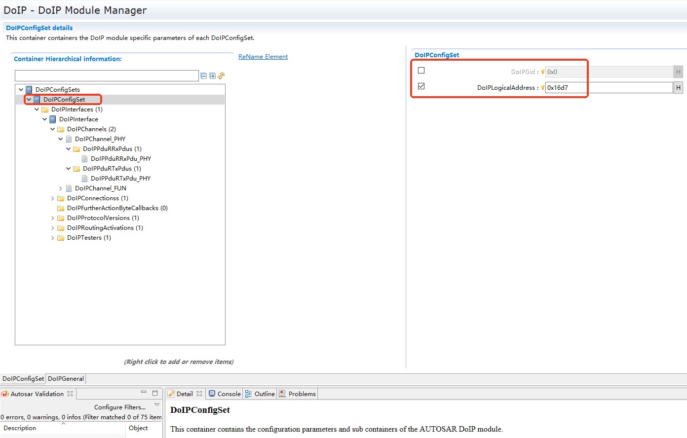
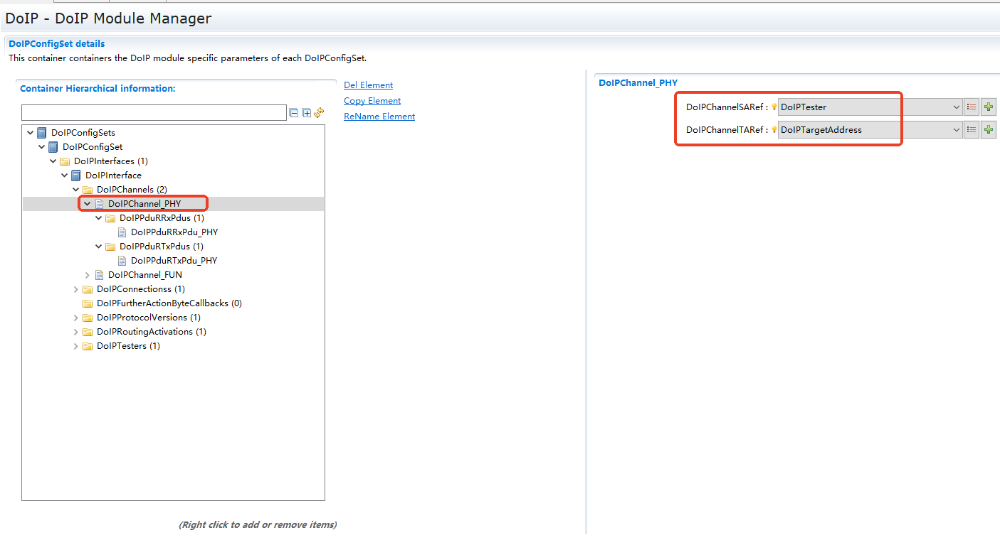
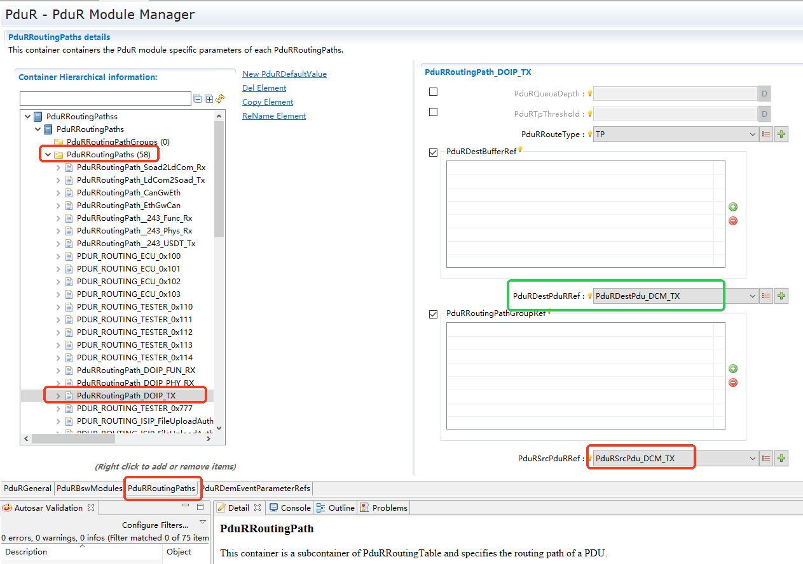
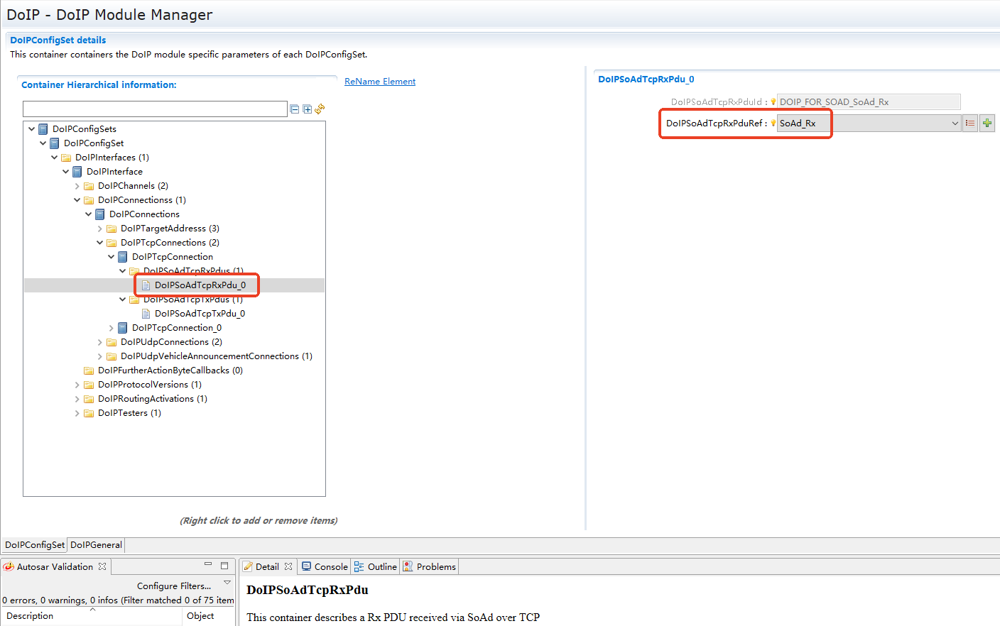
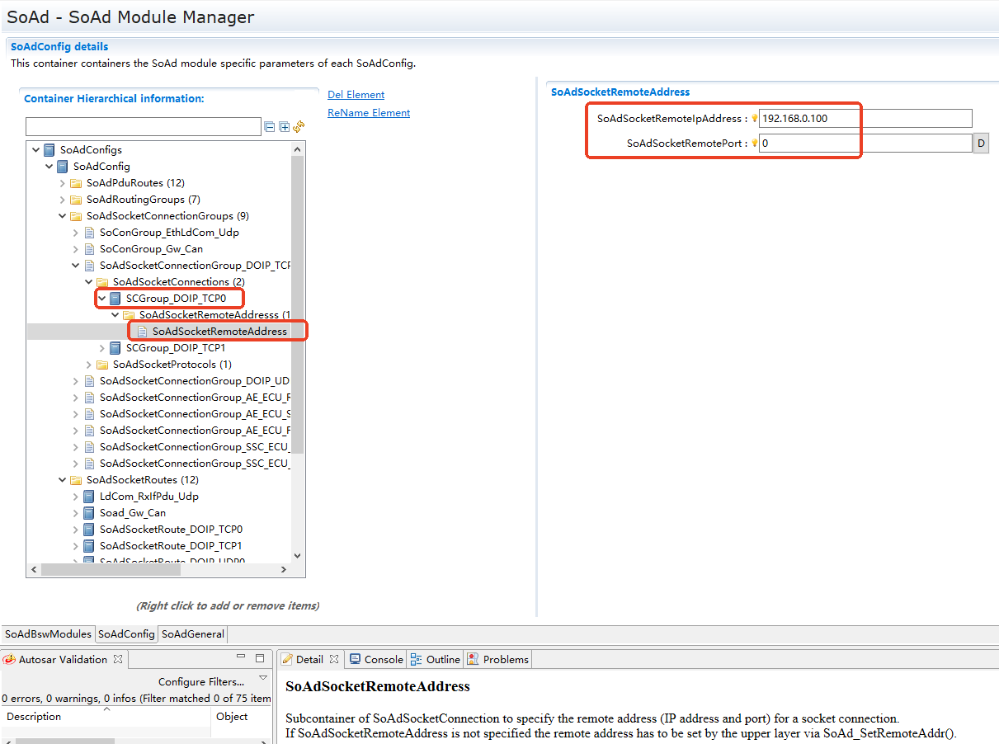
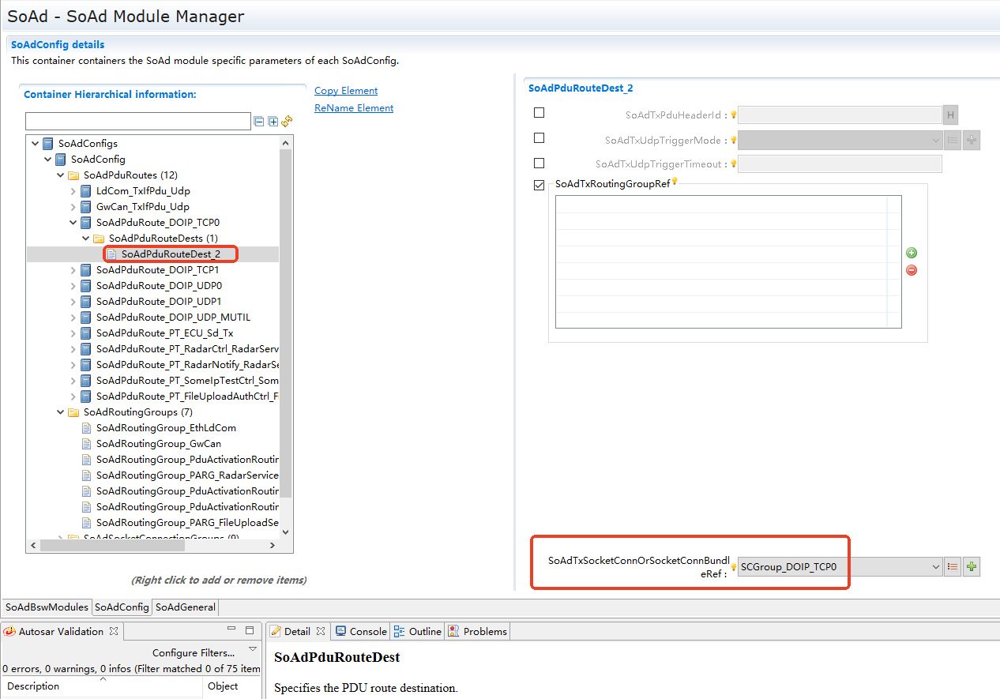
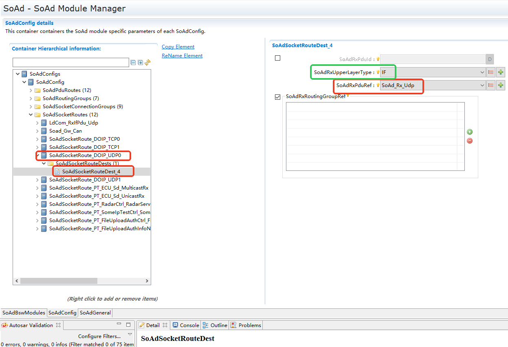
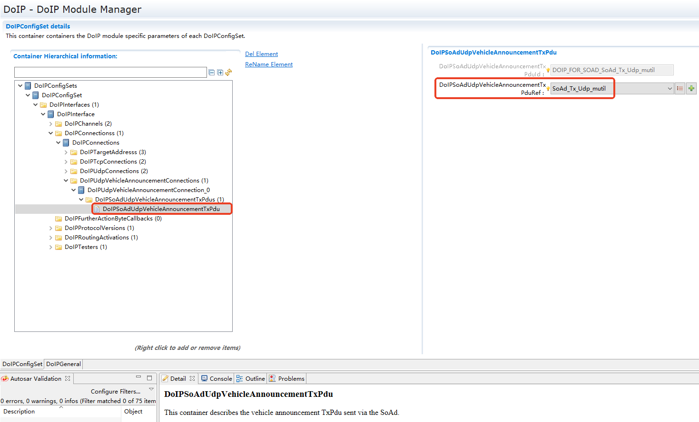
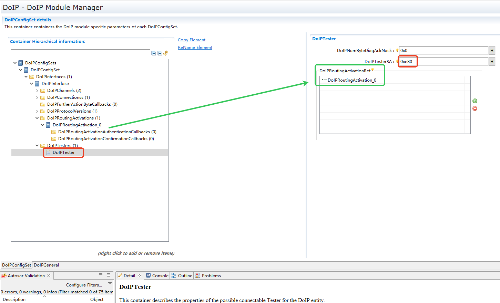

===================
DoIP
===================

文档信息 Document Information
============================================================

版本历史 Version History
--------------------------------------------------------------------------------------------------------
.. list-table::
   :widths: 10 10 10 10 20
   :header-rows: 1

   * - 日期(Date)
     - 作者(Author)
     - 版本(Version)
     - 状态(Status)
     - 说明(Description)

   * - 2025/03/20
     - hao.wen
     - V0.1
     - 发布(Release)
     - 首次发布(First release)

   * - 2025/04/04
     - hao.wen
     - V1.0
     - 发布(Release)
     - 正式发布(Official release)

参考文档 References
--------------------------------------------------------------------------------------------------------

.. list-table::
   :widths: 10 10 30 10
   :header-rows: 1

   * - 编号(Number)
     - 分类(Classification)
     - 标题(Title)
     - 版本(Version)
   * - 1
     - ISO
     - ISO 13400-2-2019(DoIP).pdf
     - 2019
   * - 2
     - Autosar
     - AUTOSAR_CP_SWS_DiagnosticOverIP.pdf
     - R23-11

术语与简写 Terms and Abbreviations
====================================================================

术语 Terms
--------------------------------------------------------------------------------------------------------
.. :align: center   表格内容居中(Table contents are centered)

.. list-table::
   :widths: 15 40
   :header-rows: 1

   * - 术语(Terms)
     - 解释(Explanation)

   * - EID
     - Entity identifier, DoIP 实体 ID(Entity Identifier, DoIP Entity ID)

   * - GID
     - Group identifier, DoIP 实体组 ID(Group Identifier, DoIP Entity Group ID)
	 
   * - VIN
     - Vehicle Identification Number, 车辆 ID 号(Vehicle Identification Number, Vehicle ID No.)

   * - LA
     - Logic address, 逻辑地址(Logic Address)  

   * - SA
     - Source address, 源地址(Source Address)

   * - TA
     - Target Address，目的地址(Target Address)  

   * - 路由激活(Routing Activation)
     - DoIP 协议 - routing activation(DoIP Protocol - Routing Activation)

   * - 存活检查(Alive Check)
     - DoIP 协议 - alive check(DoIP Protocol - Alive Check)

   * - 电源模式(Power Mode)
     - DoIP 协议 - power mode(DoIP Protocol - Power Mode)

   * - 实体信息(Entity Information)
     - DoIP 协议 - entity status(DoIP Protocol - Entity Status)

   * - 诊断消息(Diagnostic Message)
     - 一种按照特定格式( UDS )组成的 TCP 报文(A TCP message composed in a specific format (UDS))

   * - IF
     - interface，通过 IF API 传输接口收发的 PDU，通常指数据长度较小的 PDU(Interface, a PDU transmitted or received via the IF API transmission interface, usually referring to a PDU with a small data length)

   * - TP
     - transport，通过 TP API 传输接口收发的 PDU，通常指数据长度较大的 PDU(Transport, a PDU transmitted or received via the TP API transmission interface, usually referring to a PDU with a large data length)     
     
   * - 客户端、Tester(Client, Tester)
     - 用于刷写、诊断等目的的外部诊断设备(An external diagnostic device used for purposes such as flashing and diagnostics)

简写 Abbreviations
--------------------------------------------------------------------------------------------------------

.. list-table::
   :widths: 10 20 30
   :header-rows: 1

   * - 简写(Abbreviation)
     - 全称(Full name)
     - 解释(Explanation)

   * - SoAd
     - Socket Adaptor
     - autosar 模块 - 套接字适配器
   * - PduR
     - PDU Router
     - autosar 模块 - PDU 路由模块
   * - RTE
     - Runtime Environment
     - autosar 模块 - 运行时环境
   * - DCM
     - Diagnostic Communication Manager
     - autosar 模块 - 诊断通信模块
   * - PDU
     - Protocol Data Unit
     - 协议数据单元
   * - DoIP
     - Diagnostic communication over Internet Protocol
     - 基于 TCP/IP 的诊断通信
   * - MDS
     - MDS Max data size
     - DoIP 实体可以处理的一个逻辑请求的最大大小
   * - UDS
     - Unified Diagnostic Services
     - 统一诊断服务
   * - TCP
     - Transmission Control Protocol
     - 传输控制协议.
   * - UDP
     - User Datagram Protocol
     - 用户数据报协议.

简介 Introduction
===================================================

DoIP 协议用于传输以太网诊断消息( UDS )，为进行诊断通信的双方( 客户端、服务端 )提供一套高效且安全的连接机制。

The DoIP protocol is used for the transmission of Ethernet diagnostic messages (UDS), providing an efficient and secure connection mechanism for both parties (client and server) engaged in diagnostic communication. 

DoIP 模块根据 DoIP 协议实现，提供了一整套与客户端通信的机制：身份识别机制、路由激活机制、存活检测机制，并提供获取基础信息的服务。

The DoIP module, implemented according to the DoIP protocol, provides a complete set of mechanisms for communicating with a client: an identification mechanism, a routing activation mechanism, and an alive check mechanism, as well as a service for obtaining basic information.

.. figure:: ../../../_static/参考手册/DoIP/DoIP_Arch.png
   :alt: DoIP架构层次图 (DoIP Architecture Hierarchy Diagram)
   :name: DoIP_Arch
   :align: center

   DoIP架构层次图 (DoIP Architecture Hierarchy Diagram)

如图所示，DoIP 模块处于 AUTOSAR 架构中的通信服务层，其下层为 SoAd 模块，上层为 PduR、RTE 模块。

As shown in the figure, the DoIP module is located in the communication services layer of the AUTOSAR architecture. Its lower layer is the SoAd module, and its upper layers are the PduR and RTE modules.

功能描述 Functional Description
===============================================================

特性 Features
--------------------------------------------------------------------------------------------------

车辆发现 Vehicle Identification
~~~~~~~~~~~~~~~~~~~~~~~~~~~~~~~~~~~~~~~~~~~~~~~~~~~~~~~~~~

DoIP 模块被激活后，会主动以广播形式对外发送 n( 默认 3 ) 条车辆公告消息，告知客户端服务端已上线，并将通信必需信息( VIN、EID、GID、LA、IP、端口 )告知给客户端。

After the DoIP module is activated, it proactively broadcasts n (default 3) vehicle announcement messages to inform clients that the server is online. It also provides the necessary communication information (VIN, EID, GID, LA, IP, port) to the client. 

DoIP 模块也可处理客户端的车辆发现请求，将自己的通信必需信息以单播形式告知给客户端。

The DoIP module can also handle vehicle identification requests from clients, sending its necessary communication information to the client via unicast.

路由激活 Routing Activation
~~~~~~~~~~~~~~~~~~~~~~~~~~~~~~~~~~~~~~~~~~~~~~~~~~~~~~~~~~

客户端与 DoIP 节点建立 TCP 连接后，必须在一定时间内( 默认 2s )激活路由，之后才能与 DoIP 节点进行 UDS 通信，否则 DoIP 节点会断开 TCP 连接。

After a client establishes a TCP connection with a DoIP node, it must activate the route within a certain time (default 2s) before it can conduct UDS communication with the DoIP node; otherwise, the DoIP node will terminate the TCP connection.

存活检查 Alive Check
~~~~~~~~~~~~~~~~~~~~~~~~~~~~~~~~~~~~~~~~~~~~~~~~~~~~~~~~~~

当 TCP 连接超过配置的最大值时，DoIP 节点会发送存活检查请求消息给所有客户端，从而决定断开哪些客户端的连接( 未在规定时间[默认 500ms]内发送存活检查响应消息 )。

When the number of TCP connections exceeds the configured maximum, the DoIP node will send an alive check request message to all clients to determine which connections to terminate (those that do not send an alive check response message within the specified time [default 500ms]). 

当路由激活时，若客户端的 SA 已经用于激活了另一条 TCP 连接，那么也会触发存活检查机制，DoIP 从而决定是断开之前的连接,接受本次的路由激活请求，还是维持之前的 TCP 连接，拒绝本次的路由激活请求。

When routing is being activated, if the client's SA is already in use for another active TCP connection, the alive check mechanism is also triggered. This allows the DoIP node to decide whether to terminate the previous connection and accept the current routing activation request, or to maintain the previous TCP connection and reject the current routing activation request.

电源模式 Power Mode
~~~~~~~~~~~~~~~~~~~~~~~~~~~~~~~~~~~~~~~~~~~~~~~~~~~~~~~~~~

DoIP 可以利用电源模式响应消息，将电源模式告知给客户端。

DoIP can use a power mode response message to inform the client of its power mode.

实体信息 Entity Information
~~~~~~~~~~~~~~~~~~~~~~~~~~~~~~~~~~~~~~~~~~~~~~~~~~~~~~~~~~

DoIP 可以利用实体信息响应消息，将实体信息告知给客户端，包括允许最大 TCP 连接数、已建立 TCP 连接数、DoIP 节点类型、MDS。

DoIP can use an entity information response message to inform the client of its information, including the maximum number of allowed TCP connections, the number of established TCP connections, the DoIP node type, and MDS.

.. only:: doc_pbs

  变体 Variant
  ~~~~~~~~~~~~~~~~~~~~~~~~~~~~~~~~~~~~~~~~~~~~~~~~~~~~~~~~~~

  - 支持 DoIPGid 数量、值变体。
  - Supports variants in the number and values of DoIPGid.
  - 支持 DoIPLogicalAddress 值变体。
  - Supports variants in the value of DoIPLogicalAddress.
  - 支持 DoIPPduType 数量、值变体。
  - Supports variants in the number and values of DoIPPduType.
  - 支持 DoIPTargetAddressValue 值变体。
  - Supports variants in the value of DoIPTargetAddressValue.
  - 支持 DoIPRoutingActivationNumber 值变体。
  - Supports variants in the value of DoIPRoutingActivationNumber.
  - 支持 DoIPTargetAddressRef 数量、值变体。
  - Supports variants in the number and values of DoIPTargetAddressRef.
  - 支持 DoIPNumByteDiagAckNack 值变体。
  - Supports variants in the value of DoIPNumByteDiagAckNack.
  - 支持 DoIPTesterSA 值变体
  - Supports variants in the value of DoIPTesterSA.
  - 支持 DoIPRoutingActivationRef 数量、值变体。
  - Supports variants in the number and values of DoIPRoutingActivationRef.
  - 支持 Pdu 引用值变体：DoIPPduRRxPduRef、DoIPPduRTxPduRef、DoIPSoAdTcpRxPduRef、DoIPSoAdTcpTxPduRef、DoIPSoAdUdpRxPduRef、DoIPSoAdUdpTxPduRef、DoIPSoAdUdpVehicleAnnouncementTxPduRef。
  - Supports variants in PDU reference values: DoIPPduRRxPduRef, DoIPPduRTxPduRef, DoIPSoAdTcpRxPduRef, DoIPSoAdTcpTxPduRef, DoIPSoAdUdpRxPduRef, DoIPSoAdUdpTxPduRef, DoIPSoAdUdpVehicleAnnouncementTxPduRef.

多核 Multi-Core
~~~~~~~~~~~~~~~~~~~~~~~~~~~~~~~~~~~~~~~~~~~~~~~~~~~~~~~~

1.DoIP 支持分布在多分区，具体在哪个分区由 Pdu 配置项 EcucPduDefaultPartitionRef 决定。

1.DoIP supports distribution across multiple partitions. The specific partition is determined by the PDU configuration item EcucPduDefaultPartitionRef.

2.同一通道的 DoIPPduRRxPduRef、DoIPPduRTxPduRef 必须在同一分区。

2.DoIPPduRRxPduRef and DoIPPduRTxPduRef for the same channel must be in the same partition.

3.同一 TCP 连接的 DoIPSoAdTcpRxPduRef、DoIPSoAdTcpTxPduRef 必须在同一分区。

3.DoIPSoAdTcpRxPduRef and DoIPSoAdTcpTxPduRef for the same TCP connection must be in the same partition.

4.同一 UDP 连接的 DoIPSoAdUdpRxPduRef、DoIPSoAdUdpTxPduRef 必须在同一分区。

4.DoIPSoAdUdpRxPduRef and DoIPSoAdUdpTxPduRef for the same UDP connection must be in the same partition.

5.在多变体的情况下, 同一 Pdu 分区属性不可改变，需保持一致在同一分区。

5.In a multi-variant scenario, the partition attribute of a single PDU cannot be changed and must remain consistent within the same partition.

偏差 Deviation
------------------------------------

DoIPInterface
~~~~~~~~~~~~~~~~~~~~~~~~~~~

当前只允许配置一个接口

Currently, only one interface is allowed to be configured.

DoIPRoutingActivationAuthenticationCallback
~~~~~~~~~~~~~~~~~~~~~~~~~~~~~~~~~~~~~~~~~~~~~~~~~~~~~~

当前该配置未生效

This configuration is currently not in effect.

DoIPRoutingActivationConfirmationCallback
~~~~~~~~~~~~~~~~~~~~~~~~~~~~~~~~~~~~~~~~~~~~~~~~~~~~~~

当前该配置未生效

This configuration is currently not in effect.

扩展 Extension
------------------------------------------------------------------------

None

集成 Integration
========================================

文件列表 File List
--------------------------------------------------------------------

静态文件 Static Files
~~~~~~~~~~~~~~~~~~~~~~~~~~~~~~~~~~~~~~~~

.. list-table::
   :widths: 10 30
   :header-rows: 1

   * - 文件(File)
     - 描述(Description)
   
   * - DoIP.h
     - 对外头文件，DoIP 对外提供接口( PduR )(External header file, providing the external interface of DoIP (PduR))

   * - DoIP_Cbk.h
     - 对外头文件，DoIP 对外提供接口( SoAd )(External header file, providing the external interface of DoIP (SoAd))
   
   * - DoIP_Internal_UDP.h
     - 内部头文件，提供处理 UDP 消息的接口(Internal header file, providing the interface for processing UDP messages)

   * - DoIP_Internal_TCP.h
     - 内部头文件，提供处理 TCP 消息的接口(Internal header file, providing the interface for processing TCP messages)

   * - DoIP_Internal_TCP_Non_Diagnostic.h
     - 内部头文件，提供处理非诊断消息的接口(Internal header file, providing the interface for processing non-diagnostic messages)

   * - DoIP_Internal_TCP_Diagnostic.h
     - 内部头文件，提供处理诊断消息的接口(Internal header file, providing the interface for processing diagnostic messages)

   * - DoIP_Internal_Common.h
     - 内部头文件，提供公共功能接口(Internal header file, providing the common function interface)

   * - DoIP_Internal_TCP_Common.h
     - 内部头文件，提供处理 TCP 消息的公共接口(Internal header file, providing the common interface for processing TCP messages)

   * - DoIP_ConfigType.h
     - 内部头文件，定义配置类型(Internal header file, defining configuration types)
   
   * - DoIP.c
     - 实现对外接口(PduR、SoAd)(Implements the external interfaces (PduR, SoAd))

   * - DoIP_Internal_DET.h
     - 实现 DET 检查(Implements DET checks)

   * - DoIP_Internal_Common.c
     - 实现公共功能(Implements common functions)

   * - DoIP_Internal_TCP_Common.c
     - 实现处理 TCP 消息的公共接口(Implements the common interface for processing TCP messages)

   * - DoIP_Internal_TCP_Diagnostic.c
     - 实现处理诊断消息的接口(Implements the interface for processing diagnostic messages)

   * - DoIP_Internal_TCP_Non_Diagnostic.c
     - 实现处理非诊断消息的接口(Implements the interface for processing non-diagnostic messages)

   * - DoIP_Internal_UDP.c
     - 实现处理 UDP 消息的接口(Implements the interface for processing UDP messages)

动态文件 Dynamic Files
~~~~~~~~~~~~~~~~~~~~~~~~~~~~~~~~~~~~~~~~
.. list-table::
   :widths: 10 30
   :header-rows: 1

   * - 文件(File)
     - 描述(Description)

   * - DoIP_Cfg.h
     - 工具生成，PC 配置(Tool-generated, PC configuration)
   * - DoIP_Cfg.c
     - 工具生成，PC 配置(Tool-generated, PC configuration)
   * - DoIP_PBCfg.h
     - 工具生成，PB 配置类型(Tool-generated, PB configuration types)
   * - DoIP_PBCfg.c
     - 工具生成，PB 配置(Tool-generated, PB configuration)
   * - Rte_DoIP.h
     - 工具生成，声明回调函数接口(Tool-generated, declaring the callback function interfaces)
   * - Rte_DoIP_Type.h
     - 工具生成，回调函数接口参数类型(Tool-generated, callback function interface parameter types)
   * - Rte_DoIP.c
     - 工具生成，定义回调函数接口(Tool-generated, defining the callback function interfaces)

错误处理 Error Handling
------------------------------------------------------------------------

开发错误 Development Errors
~~~~~~~~~~~~~~~~~~~~~~~~~~~~~~~~~~~~~~~~~
.. list-table:: 
   :widths: 20 10 30
   :header-rows: 1

   * - Error code
     - Value[hex]
     - Description

   * - DOIP_E_UNINIT
     - 0x01
     - API service call without module initialization

   * - DOIP_E_PARAM_POINTER
     - 0x02
     - NULL-Pointer on any API call

   * - DOIP_E_INVALID_PDU_SDU_ID
     - 0x03
     - Wrong Lower Layer (SoAd) or Upper Layer (Pdu Router) Id received

   * - DOIP_E_INVALID_PARAMETER
     - 0x04
     - API call with invalid Parameter

   * - DOIP_E_INIT_FAILED
     - 0x05
     - DoIP Init service call failure

产品错误 Product Errors
~~~~~~~~~~~~~~~~~~~~~~~~~~~~~~~~~~~~~~~~~~
None

运行时错误 Runtime Errors
~~~~~~~~~~~~~~~~~~~~~~~~~~~~~~~~~~~~~~~~~~
None

接口描述 Interface Description
==============================================================

.. include:: DoIP_h_api.rst

依赖的服务 Applicable Services
----------------------------------------------------------------------------------------

强制接口 Compulsory interface
~~~~~~~~~~~~~~~~~~~~~~~~~~~~~~~~~~~~~~~~~~~~~~~~~~~~

.. list-table::
   :widths: 10 5 30
   :header-rows: 1

   * - API Function
     - Header File
     - Description

   * - Dcm_GetVin
     - Dcm.h
     - Function to get the VIN.

   * - PduR_DoIPTpCopyRxData
     - PduR_DoIPTp.h
     - This function is called to provide the received data of an I-PDU segment (N-PDU) to the upper layer.

   * - PduR_DoIPTpCopyTxData
     - PduR_DoIPTp.h
     - This function is called to acquire the transmit data of an I-PDU segment (N-PDU).

   * - PduR_DoIPTpRxIndication
     - PduR_DoIPTp.h
     - Called after an I-PDU has been received via the TP API，the result indicates whether the transmission was successful or not.

   * - PduR_DoIPTpStartOfReception
     - PduR_DoIPTp.h
     - This function is called at the start of receiving an N-SDU.

   * - PduR_DoIPTpTxConfirmation
     - PduR_DoIPIf.h
     - This function is called after the I-PDU has been transmitted on its network，the result indicates whether the transmission was successful or not. 

   * - PduR_DoIPIfTxConfirmation
     - PduR_DoIPTp.h
     - The lower layer communication interface module confirms the transmission of a PDU，or the failure to transmit a PDU.  

   * - SoAd_CloseSoCon
     - SoAd.h
     - This service closes the socket connection specified by SoConId.  

   * - SoAd_GetPhysAddr
     - SoAd.h
     - Retrieves the physical source address of the EthIf controller used by the SoAd socket connection specified by SoConId  

   * - SoAd_GetSoConId
     - SoAd.h
     - Returns socket connection index related to the specified TxPduId.

   * - SoAd_IfTransmit
     - SoAd.h
     - Requests transmission of a PDU.  

   * - SoAd_OpenSoCon
     - SoAd.h
     - This service opens the socket connection specified by SoConId. 

   * - SoAd_ReleaseIpAddrAssignment
     - SoAd.h
     - By this API service the local IP address assignment used for the socket connection specified by SoConId is released. 

   * - SoAd_RequestIpAddrAssignment
     - SoAd.h
     - By this API service the local IP address assignment which shall be used for the socket connection specified by SoConId is initiated.  

   * - SoAd_TpTransmit
     - SoAd.h
     - Requests transmission of a PDU.  

可选接口 Optional Interface
~~~~~~~~~~~~~~~~~~~~~~~~~~~~~~~~~~~~~~~~~~~~~~~~~~~~

.. list-table::
   :widths: 10 5 30
   :header-rows: 1

   * - API Function
     - Header File
     - Description

   * - Det_ReportError
     - Det.h
     - Service to report development errors

配置 Configuration
====================================

允许的 paylaod 字段长度 Allowed Payload Field Length
------------------------------------------------------------------------------------------------------------------------------------------------------------------

.. figure:: ../../../_static/参考手册/DoIP/DoIPMaxRequestBytes.png
   :alt: DoIP架构层次图 (DoIP Architecture Hierarchy Diagram)
   :name: payload 字段最大值(Maximum Payload Field Value)
   :align: center

   DoIPMaxRequestBytes 配置示意图 (DoIPMaxRequestBytes Configuration Diagram)

若 DoIP 消息的 payload 字段值超过该配置项( 这里是 1028 字节 )，DoIP 会发送 NACK。

If the value of the payload field in a DoIP message exceeds this configuration item (here, 1028 bytes), DoIP will send a NACK.

GID、LA、EID
--------------------------------------------

   GID、LA 配置示意图 (GID and LA Configuration Diagram)

.. figure:: ../../../_static/参考手册/DoIP/EID.png
   :alt: DoIP架构层次图 (DoIP Architecture Hierarchy Diagram)
   :name: EID
   :align: center

   EID 配置示意图 (EID Configuration Diagram)

DoIP 会在车辆公告消息、车辆身份识别响应消息中携带 GID、LA、EID。VIN 通过调用 Dcm_GetVin() 获取。

DoIP includes the GID, LA, and EID in vehicle announcement messages and vehicle identification response messages. The VIN is obtained by calling Dcm_GetVin().

允许连接的客户端数量 Allowed Number of Client Connections
--------------------------------------------------------------------------------------------------------------------------------------------------------------------------------

.. figure:: ../../../_static/参考手册/DoIP/DoIPMaxTesterConnections.png
   :alt: DoIP架构层次图 (DoIP Architecture Hierarchy Diagram)
   :name: DoIPMaxTesterConnections
   :align: center

   DoIPMaxTesterConnections 配置示意图 (DoIPMaxTesterConnections Configuration Diagram)

DoIP 只允许与 DoIPMaxTesterConnections 数量的客户端建立 TCP 连接( 此处只允许与 1 个客户端建立连接 )。

DoIP only allows TCP connections to be established with the number of clients specified by DoIPMaxTesterConnections (here, only 1 client connection is allowed).

通道 Channel
------------------------------------------------------------------

通道有 2 个功能：

The channel has two functions:

1.确定客户端( DoIPChannelSARef )与服务端( DoIPChannelTARef )通信双方；

1.To identify the communicating parties: the client (DoIPChannelSARef) and the server (DoIPChannelTARef);

2.确定将从客户端收到的消息传递给哪个模块( DoIPPduRRxPduRef )，将从 PduR 收到的消息发送给哪个客户端( DoIPPduRTxPduRef )。

2.To determine which module to pass messages received from the client to (DoIPPduRRxPduRef), and which client to send messages received from PduR to (DoIPPduRTxPduRef).

   通道 SA、TA 配置示意图 (Channel SA and TA Configuration Diagram)

.. figure:: ../../../_static/参考手册/DoIP/channel_srcpdu.png
   :alt: DoIP架构层次图 (DoIP Architecture Hierarchy Diagram)
   :name: DoIPPduRRxPduRef
   :align: center

   DoIPPduRRxPduRef 配置示意图 (DoIPPduRRxPduRef Configuration Diagram)

.. figure:: ../../../_static/参考手册/DoIP/channel_destpdu.png
   :alt: DoIP架构层次图 (DoIP Architecture Hierarchy Diagram)
   :name: DoIPPduRTxPduRef
   :align: center

   DoIPPduRTxPduRef 配置示意图 (DoIPPduRTxPduRef Configuration Diagram)

Pdu 默认是 TP 类型，若需使用 IF 类型，可勾选绿框处配置。

By default, the PDU is of type TP. To use the IF type, check the configuration option in the green box.

PduR 中的相关配置 Related Configurations in PduR
~~~~~~~~~~~~~~~~~~~~~~~~~~~~~~~~~~~~~~~~~~~~~~~~~~~~~~~~~

DoIPPduRRxPduRef、DoIPPduRTxPduRef 所引用的 Pdu，需要在 PduR 中建立通信路由。

For the PDUs referenced by DoIPPduRRxPduRef and DoIPPduRTxPduRef, a communication route must be established in PduR.

PduRSrcPdu 配置 PduRSrcPdu Configuration
+++++++++++++++++++++++++++++++++++++++++++++++++++++++++++++++++++++++++++++++

.. figure:: ../../../_static/参考手册/DoIP/PduR_srcpdu.png
   :alt: DoIP架构层次图 (DoIP Architecture Hierarchy Diagram)
   :name: PduRSrcPdu 配置(PduRSrcPdu Configuration)
   :align: center

   PduRSrcPdu 配置示意图 (PduRSrcPdu Configuration Diagram )

需要新增一个 PduRSrcPdu 容器( 此处是 PduRSrcPdu_DCM_PHY_RX )，来指定 Pdu 来源。

A new PduRSrcPdu container needs to be added (here, PduRSrcPdu_DCM_PHY_RX) to specify the PDU source.

需要将 DoIPPduRRxPduRef 所引用的 Pdu( 此处是 DoIP_Phy_Rx ) 配置到 PduRSrcPduRef 配置项中，表明 Pdu 来源于 DoIP。

The PDU referenced by DoIPPduRRxPduRef (here, DoIP_Phy_Rx) needs to be configured in the PduRSrcPduRef, indicating that the PDU originates from DoIP.

PduRDestPdu 配置 PduRDestPdu Configuration
+++++++++++++++++++++++++++++++++++++++++++++++++++++++++++++++++++++++++++++++

.. figure:: ../../../_static/参考手册/DoIP/PduR_destpdu.png
   :alt: DoIP架构层次图 (DoIP Architecture Hierarchy Diagram)
   :name: PduRDestPdu 配置(PduRDestPdu Configuration)
   :align: center

   PduRDestPdu 配置示意图 (PduRDestPdu Configuration Diagram)

需要新增一个 PduRDestPdu 容器( 此处是 PduRDestPdu_DCM_TX )，来指定将 Pdu 传递给哪个模块。

A new PduRDestPdu container needs to be added (here, PduRDestPdu_DCM_TX) to specify which module the PDU shall be passed to.

需要将 DoIPPduRTxPduRef 所引用的 Pdu( 此处是 DoIP_Tx ) 配置到 PduRDestPduRef 配置项中，表明将 Pdu 传递给 DoIP。

The PDU referenced by DoIPPduRTxPduRef (here, DoIP_Tx) needs to be configured in the PduRDestPduRef, indicating that the PDU is to be passed to DoIP.

PduRRoutingPath 配置 PduRRoutingPath Configuration
+++++++++++++++++++++++++++++++++++++++++++++++++++++++++++++++++++++++++++++++

接收链路 Receiving Link
^^^^^^^^^^^^^^^^^^^^^^^^^^^^^^^^^^^^^^^^^^^^^^^^^^^^^^^^^^^^^^^^^^^^^^^^

.. figure:: ../../../_static/参考手册/DoIP/PduR_srcpath.png
   :alt: DoIP架构层次图 (DoIP Architecture Hierarchy Diagram)
   :name: PduRRoutingPath_recv
   :align: center
  
   PduRRoutingPath 接收配置示意图 (PduRRoutingPath Receiving Configuration Diagram)

需要新增一个 PduRRoutingPath 容器(此处是 PduRRoutingPath_DOIP_PHY_RX )，来关联 PduRSrcPdu、PduRDestPdu 指定 Pdu 的来源、目的地( 此处是指定接收路径 )。

A new PduRRoutingPath container needs to be added (here, PduRRoutingPath_DOIP_PHY_RX) to associate PduRSrcPdu and PduRDestPdu, specifying the source and destination of the PDU (here, specifying the receiving path).

配置 PduRDestPduRRef( 此处是 PduRDestPdu_DCM_PHY_RX ) 指定将 Pdu 转发给指定模块( 这里是 DCM )。

Configure PduRDestPduRRef (here, PduRDestPdu_DCM_PHY_RX) to specify that the PDU shall be forwarded to a specific module (here, DCM).

配置 PduRSrcPduRRef( 此处是 PduRSrcPdu_DCM_PHY_RX ) 指定 Pdu 来源( 此处是 DoIP )。

Configure PduRSrcPduRRef (here, PduRSrcPdu_DCM_PHY_RX) to specify the PDU source (here, DoIP). 

( 所以该接收链路配置是指定将从 DoIP 收到的 Pdu 转发给 DCM。)

(Therefore, this receiving link configuration specifies that PDUs received from DoIP will be forwarded to DCM. )

发送链路 Sending Link
^^^^^^^^^^^^^^^^^^^^^^^^^^^^^^^^^^^^^^^^^^^^^^^^^^^^^^^^^^^^^^^^^^^^^^^^

   PduRRoutingPath 发送配置示意图 (PduRRoutingPath Sending Configuration Diagram)

需要新增一个 PduRRoutingPath 容器(此处是 PduRRoutingPath_DOIP_TX )，来关联 PduRSrcPdu、PduRDestPdu 指定 Pdu 的来源、目的地( 此处是指定发送路径 )。

A new PduRRoutingPath container needs to be added (here, PduRRoutingPath_DOIP_TX) to associate PduRSrcPdu and PduRDestPdu, specifying the source and destination of the PDU (here, specifying the sending path).

配置 PduRDestPduRRef( 此处是 PduRDestPdu_DCM_TX ) 指定将 Pdu 转发给指定模块( 此处是 DoIP )。

Configure PduRDestPduRRef (here, PduRDestPdu_DCM_TX) to specify that the PDU shall be forwarded to a specific module (here, DoIP).

配置 PduRSrcPduRRef( 此处是 PduRSrcPdu_DCM_TX ) 指定 Pdu 来源( 这里是 DCM )。

Configure PduRSrcPduRRef (here, PduRSrcPdu_DCM_TX) to specify the PDU source (here, DCM). 

( 所以该发送链路配置是指定将从 DCM 收到的 Pdu 转发给 DoIP。)

(Therefore, this sending link configuration specifies that PDUs received from DCM will be forwarded to DoIP.) 

物理寻址、功能寻址 Physical and Functional Addressing
~~~~~~~~~~~~~~~~~~~~~~~~~~~~~~~~~~~~~~~~~~~~~~~~~~~~~~~~~~~~~~~~~~~~~~~~~~~~

.. figure:: ../../../_static/参考手册/DoIP/pyh_func.png
   :alt: DoIP架构层次图 (DoIP Architecture Hierarchy Diagram)
   :name: pyh_func
   :align: center

   物理寻址、功能寻址配置示意图 (Physical and Functional Addressing Configuration Diagram)

通道有物理寻址与功能寻址的区分，若配置了 DoIPPduRTxPdu 则为物理寻址( 所以 DoIPChannel_PHY 为物理寻址通道，DoIPChannel_FUN 为功能寻址通道 - 绿框处未配置 DoIPPduRTxPdu )。

Channels are distinguished as either physical or functional addressing. If DoIPPduRTxPdu is configured, it is physical addressing (thus, DoIPChannel_PHY is a physical addressing channel, and DoIPChannel_FUN is a functional addressing channel - DoIPPduRTxPdu is not configured in the green box). 

若功能寻址通道需要发送 UDS 响应消息给客户端，需要使用物理寻址通道。

If a functional addressing channel needs to send a UDS response message to a client, it must use a physical addressing channel.

连接 Connection
------------------------------------------------------------------

TCP、UDP、announcement 连接有 2 个核心配置: DoIPSoAdRxPdu、DoIPSoAdTxPdu，前者告知 SoAd 将特定 IP、端口的以太网消息转发给 DoIP 模块，后者指定发送消息的远端 IP、端口。

TCP, UDP, and announcement connections have two core configurations: DoIPSoAdRxPdu and DoIPSoAdTxPdu. The former tells SoAd to forward Ethernet messages from a specific IP and port to the DoIP module, while the latter specifies the remote IP and port for sending messages.

TCP 连接 TCP Connection
~~~~~~~~~~~~~~~~~~~~~~~~~~~~~~~~~~~~~~~

最少配置 2 条 TCP 连接，此时只允许与一个客户端通信；若想与 n 个客户端通信，则需配置 n + 1 条 tcp 连接。

A minimum of two TCP connections must be configured, which allows communication with only one client. To communicate with n clients, n + 1 TCP connections must be configured.

DoIPSoAdTcpRxPdu
++++++++++++++++++++++++++++++++++++

   DoIPSoAdTcpRxPdu 配置示意图 (DoIPSoAdTcpRxPdu Configuration Diagram)

SoAd 中的相关配置 Related Configurations in SoAd
^^^^^^^^^^^^^^^^^^^^^^^^^^^^^^^^^^^^^^^^^^^^^^^^^^^^^^

.. figure:: ../../../_static/参考手册/DoIP/SoAdSocketRouteDest.png
   :alt: DoIP架构层次图 (DoIP Architecture Hierarchy Diagram)
   :name: SoAdSocketRouteDest
   :align: center

   SoAdSocketRouteDest 配置示意图 (SoAdSocketRouteDest Configuration Diagram)

需要新增一个 SoAdSocketRoute 容器( 此处是 SoAdSocketRoute_DOIP_TCP0 )，来指定消息是 TCP 还是 UDP 类型，指定消息来源，指定将消息传递给 DoIP 模块。

A new SoAdSocketRoute container needs to be added (here, SoAdSocketRoute_DOIP_TCP0) to specify whether the message is of TCP or UDP type, to specify the message source, and to specify that the message shall be passed to the DoIP module.

通过配置 SoAdSocketRouteDest 容器( 此处是 SoAdSocketRouteDest_2 )的 SoAdRxUpperLayerType 参数( 此处是 TP，为 TCP 类型 )来指定消息类型。

The message type is specified by configuring the SoAdRxUpperLayerType parameter of the SoAdSocketRouteDest container (here, SoAdSocketRouteDest_2) (here, TP, for TCP type).

通过配置 SoAdSocketRouteDest 容器( 此处是 SoAdSocketRouteDest_2 )的 SoAdRxPduRef 参数( 此处是 SoAd_Rx )来指定将收到的消息传递给 DoIP 模块。

Passing the received message to the DoIP module is specified by configuring the SoAdRxPduRef parameter of the SoAdSocketRouteDest container (here, SoAdSocketRouteDest_2) (here, SoAd_Rx).

.. figure:: ../../../_static/参考手册/DoIP/SoAdSocketRoute_tcp.png
   :alt: DoIP架构层次图 (DoIP Architecture Hierarchy Diagram)
   :name: SoAdSocketRoute_tcp
   :align: center

   SoAdSocketRoute 配置示意图 (SoAdSocketRoute Configuration Diagram)

通过配置 SoAdSocketRoute 容器( 此处是 SoAdSocketRoute_DOIP_TCP0 )的 SoAdRxSocketConnOrSocketConnBundleRef 参数( 此处是 SCGroup_DOIP_TCP0 )指定消息来源。

The message source is specified by configuring the SoAdRxSocketConnOrSocketConnBundleRef parameter of the SoAdSocketRoute container (here, SoAdSocketRoute_DOIP_TCP0) (here, SCGroup_DOIP_TCP0).

   SoAdSocketRemoteAddress 配置示意图 (SoAdSocketRemoteAddress Configuration Diagram)

需要新增一个 SoAdSocketConnectionGroup 容器( 此处是 SoAdSocketConnectionGroup_DOIP_TCP )，来指定传输层协议参数。

A new SoAdSocketConnectionGroup container needs to be added (here, SoAdSocketConnectionGroup_DOIP_TCP) to specify the transport layer protocol parameters.

需要新增一个 SoAdSocketConnection 容器( 此处是 SCGroup_DOIP_TCP0 )，来指定消息来源( 此处是 192.168.0.100 : 0 - 端口为 0，含义是将 从 192.168.0.100 收到的任意 TCP 消息都转发给 DoIP )。

A new SoAdSocketConnection container needs to be added (here, SCGroup_DOIP_TCP0) to specify the message source (here, 192.168.0.100:0 - a port of 0 means that any TCP message received from 192.168.0.100 will be forwarded to DoIP).

DoIPSoAdTcpTxPdu
++++++++++++++++++

.. figure:: ../../../_static/参考手册/DoIP/DoIPSoAdTcpTxPdu.png
   :alt: DoIP架构层次图 (DoIP Architecture Hierarchy Diagram)
   :name: DoIPSoAdTcpTxPdu
   :align: center

   DoIPSoAdTcpTxPdu 配置示意图 (DoIPSoAdTcpTxPdu Configuration Diagram)

SoAd 中的相关配置 Related Configurations in SoAd
^^^^^^^^^^^^^^^^^^^^^^^^^^^^^^^^^^^^^^^^^^^^^^^^^^^^^^^^^^^^^^^^^^^^^^^^^^^^^^^^^^^^^^^^^^^^^^^^^^^^^^^^^^^^

.. figure:: ../../../_static/参考手册/DoIP/SoAdPduRoute_tcp.png
   :alt: DoIP架构层次图 (DoIP Architecture Hierarchy Diagram)
   :name: SoAdPduRoute_tcp
   :align: center

   SoAdPduRoute 配置示意图 (SoAdPduRoute Configuration Diagram)

需要新增一个 SoAdPduRoute 容器( 此处是 SoAdPduRoute_DOIP_TCP0 )，来指定消息是 TCP 还是 UDP 类型，指定消息来源，指定将消息发送给哪个网络节点。

A new SoAdPduRoute container needs to be added (here, SoAdPduRoute_DOIP_TCP0) to specify whether the message is of TCP or UDP type, to specify the message source, and to specify which network node the message shall be sent to.

通过配置 SoAdTxPduRef( 此处是 SoAd_Tx ) 来指定消息来源于 DoIP。

The message source is specified as DoIP by configuring SoAdTxPduRef (here, SoAd_Tx).

通过配置 SoAdRxUpperLayerType( 此处配置为 TP，为 TCP 类型 ) 来指定消息类型。

The message type is specified by configuring SoAdRxUpperLayerType (here, configured as TP, for TCP type).

   SoAdPduRouteDest 配置示意图 (SoAdPduRouteDest Configuration Diagram)

通过配置 SoAdPduRouteDest 容器( 此处是 SoAdPduRouteDest_2 )的 SoAdTxSocketConnOrSocketConnBundleRef 参数( 此处是 SCGroup_DOIP_TCP0，所以此处配置的含义是将消息发送给 192.168.0.100 - 目的端口为接收消息时的源端口 )，来指定将消息发送给哪个网络节点。

The network node to which the message is sent is specified by configuring the SoAdTxSocketConnOrSocketConnBundleRef parameter of the SoAdPduRouteDest container (here, SoAdPduRouteDest_2) (here, SCGroup_DOIP_TCP0, so the configuration here means that the message will be sent to 192.168.0.100 - the destination port will be the source port of the received message).

UDP 连接 UDP Connection
~~~~~~~~~~~~~~~~~~~~~~~~~~~~~~~~~~~~~~~~~~~~~~~~~~~~

DoIPSoAdUdpRxPdu
++++++++++++++++++++++++++++++++++++

.. figure:: ../../../_static/参考手册/DoIP/DoIPSoAdUdpRxPdu.png
   :alt: DoIP架构层次图 (DoIP Architecture Hierarchy Diagram)
   :name: DoIPSoAdUdpRxPdu
   :align: center

   DoIPSoAdUdpRxPdu 配置示意图 (DoIPSoAdUdpRxPdu Configuration Diagram)

SoAd 中的相关配置 Related Configurations in SoAd
^^^^^^^^^^^^^^^^^^^^^^^^^^^^^^^^^^^^^^^^^^^^^^^^^^^^^^^^^^^^^^^^^^^^^

需要新增一个 SoAdSocketRoute 容器( 此处是 SoAdSocketRoute_DOIP_UDP0 )，来指定消息是 TCP 还是 UDP 类型，指定消息来源，指定将消息传递给 DoIP 模块。

A new SoAdSocketRoute container needs to be added (here, SoAdSocketRoute_DOIP_UDP0) to specify whether the message is of TCP or UDP type, to specify the message source, and to specify that the message shall be passed to the DoIP module.

通过配置 SoAdSocketRouteDest 容器( 此处是 SoAdSocketRouteDest_4 )的 SoAdRxUpperLayerType 参数( 此处是 IF，为 UDP 类型 )来指定消息类型。

The message type is specified by configuring the SoAdRxUpperLayerType parameter of the SoAdSocketRouteDest container (here, SoAdSocketRouteDest_4) (here, IF, for UDP type).

通过配置 SoAdSocketRouteDest 容器( 此处是 SoAdSocketRouteDest_4 )的 SoAdRxPduRef 参数( 此处是 SoAd_Rx_Udp )来指定将收到的消息传递给 DoIP 模块。

Passing the received message to the DoIP module is specified by configuring the SoAdRxPduRef parameter of the SoAdSocketRouteDest container (here, SoAdSocketRouteDest_4) (here, SoAd_Rx_Udp).

.. figure:: ../../../_static/参考手册/DoIP/SoAdSocketRoute_udp.png
   :alt: DoIP架构层次图 (DoIP Architecture Hierarchy Diagram)
   :name: SoAdSocketRoute_udp
   :align: center

   SoAdSocketRoute 配置示意图 (SoAdSocketRoute Configuration Diagram)

通过配置 SoAdSocketRoute 容器( 此处是 SoAdSocketRoute_DOIP_UDP0 )的 SoAdRxSocketConnOrSocketConnBundleRef 参数( 此处是 SCGroup_DOIP_UDP0 )指定消息来源。

The message source is specified by configuring the SoAdRxSocketConnOrSocketConnBundleRef parameter of the SoAdSocketRoute container (here, SoAdSocketRoute_DOIP_UDP0) (here, SCGroup_DOIP_UDP0).

.. figure:: ../../../_static/参考手册/DoIP/SoAdSocketRemoteAddress_udp.png
   :alt: DoIP架构层次图 (DoIP Architecture Hierarchy Diagram)
   :name: SoAdSocketRemoteAddress_udp
   :align: center

   SoAdSocketRemoteAddress 配置示意图 (SoAdSocketRemoteAddress Configuration Diagram)

需要新增一个 SoAdSocketConnectionGroup 容器( 此处是 SoAdSocketConnectionGroup_DOIP_UDP )，来指定传输层协议参数。

A new SoAdSocketConnectionGroup container needs to be added (here, SoAdSocketConnectionGroup_DOIP_UDP) to specify the transport layer protocol parameters.

需要新增一个 SoAdSocketConnection 容器( 此处是 SCGroup_DOIP_UDP0 )，来指定消息来源( 此处是 192.168.0.100 : 0 - 端口为 0，含义是将 从 192.168.0.100 收到的任意 UDP 消息都转发给 DoIP )。

A new SoAdSocketConnection container needs to be added (here, SCGroup_DOIP_UDP0) to specify the message source (here, 192.168.0.100:0 - a port of 0 means that any UDP message received from 192.168.0.100 will be forwarded to DoIP).

DoIPSoAdUdpTxPdu
++++++++++++++++++++++++++++++++++++

.. figure:: ../../../_static/参考手册/DoIP/DoIPSoAdUdpTxPdu.png
   :alt: DoIP架构层次图 (DoIP Architecture Hierarchy Diagram)
   :name: DoIPSoAdUdpTxPdu
   :align: center

   DoIPSoAdUdpTxPdu 配置示意图 (DoIPSoAdUdpTxPdu Configuration Diagram)

SoAd 中的相关配置 Related Configurations in SoAd
^^^^^^^^^^^^^^^^^^^^^^^^^^^^^^^^^^^^^^^^^^^^^^^^^^^^^^^^^^^^^^^^^^^^^^^^^^^^^^^^^^^^^^^^

.. figure:: ../../../_static/参考手册/DoIP/SoAdPduRoute_udp.png
   :alt: DoIP架构层次图 (DoIP Architecture Hierarchy Diagram)
   :name: SoAdPduRoute_udp
   :align: center

   SoAdPduRoute 配置示意图 (SoAdPduRoute Configuration Diagram)

需要新增一个 SoAdPduRoute 容器( 此处是 SoAdPduRoute_DOIP_UDP0 )，来指定消息是 TCP 还是 UDP 类型，指定消息来源，指定将消息发送给哪个网络节点。

A new SoAdPduRoute container needs to be added (here, SoAdPduRoute_DOIP_UDP0) to specify whether the message is of TCP or UDP type, to specify the message source, and to specify which network node the message shall be sent to.

通过配置 SoAdTxPduRef( 此处是 SoAd_Tx_Udp ) 来指定消息来源于 DoIP。

The message source is specified as DoIP by configuring SoAdTxPduRef (here, SoAd_Tx_Udp).

通过配置 SoAdRxUpperLayerType( 此处配置为 IF，为 UDP 类型 ) 来指定消息类型。

The message type is specified by configuring SoAdRxUpperLayerType (here, configured as IF, for UDP type).

.. figure:: ../../../_static/参考手册/DoIP/SoAdPduRouteDest_udp.png
   :alt: DoIP架构层次图 (DoIP Architecture Hierarchy Diagram)
   :name: SoAdPduRouteDest_udp
   :align: center

   SoAdPduRouteDest 配置示意图 (SoAdPduRouteDest Configuration Diagram)

通过配置 SoAdPduRouteDest 容器( 此处是 SoAdPduRouteDest_4 )的 SoAdTxSocketConnOrSocketConnBundleRef 参数( 此处是 SCGroup_DOIP_UDP0，所以此处配置的含义是将消息发送给 192.168.0.100 - 目的端口为接收消息时的源端口 )，来指定将消息发送给哪个网络节点。

The network node to which the message is sent is specified by configuring the SoAdTxSocketConnOrSocketConnBundleRef parameter of the SoAdPduRouteDest container (here, SoAdPduRouteDest_4) (here, SCGroup_DOIP_UDP0, so the configuration here means that the message will be sent to 192.168.0.100 - the destination port will be the source port of the received message).

announcement 连接 Announcement Connection
~~~~~~~~~~~~~~~~~~~~~~~~~~~~~~~~~~~~~~~~~~~~~~~~~~~~~~~~~~~~~~~~~~~~~~~~~~~~~~~~

DoIPSoAdUdpVehicleAnnouncementTxPdu
++++++++++++++++++++++++++++++++++++++++++++++++++++++++++++++++++++++++

   DoIPSoAdUdpVehicleAnnouncementTxPdu 配置示意图 (DoIPSoAdUdpVehicleAnnouncementTxPdu Configuration Diagram)

SoAd 中的相关配置 Related Configurations in SoAd
^^^^^^^^^^^^^^^^^^^^^^^^^^^^^^^^^^^^^^^^^^^^^^^^^^^^^^

.. figure:: ../../../_static/参考手册/DoIP/SoAdPduRoute_anc.png
   :alt: DoIP架构层次图 (DoIP Architecture Hierarchy Diagram)
   :name: SoAdPduRoute_anc
   :align: center

   SoAdPduRoute 配置示意图 (SoAdPduRoute Configuration Diagram)

需要新增一个 SoAdPduRoute 容器( 此处是 SoAdPduRoute_DOIP_UDP_MUTIL )，来指定消息是 TCP 还是 UDP 类型，指定消息来源，指定将消息发送给哪个网络节点。

A new SoAdPduRoute container needs to be added (here, SoAdPduRoute_DOIP_UDP_MUTIL) to specify whether the message is of TCP or UDP type, to specify the message source, and to specify which network node the message shall be sent to.

通过配置 SoAdTxPduRef( 此处是 SoAd_Tx_Udp_multi ) 来指定消息来源于 DoIP。

The message source is specified as DoIP by configuring SoAdTxPduRef (here, SoAd_Tx_Udp_multi).

通过配置 SoAdRxUpperLayerType( 此处配置为 IF，为 UDP 类型 ) 来指定消息类型。

The message type is specified by configuring SoAdRxUpperLayerType (here, configured as IF, for UDP type).

.. figure:: ../../../_static/参考手册/DoIP/SoAdPduRouteDest_anc.png
   :alt: DoIP架构层次图 (DoIP Architecture Hierarchy Diagram) 
   :name: SoAdPduRouteDest_anc
   :align: center

   SoAdPduRouteDest 配置示意图 (SoAdPduRouteDest Configuration Diagram)

通过配置 SoAdPduRouteDest 容器( 此处是 SoAdPduRouteDest_6 )的 SoAdTxSocketConnOrSocketConnBundleRef 参数( 此处是 SCGroup_DOIP_UDP_MUTIL )来指定将消息发送给哪个网络节点。

The network node to which the message is sent is specified by configuring the SoAdTxSocketConnOrSocketConnBundleRef parameter of the SoAdPduRouteDest container (here, SoAdPduRouteDest_6) (here, SCGroup_DOIP_UDP_MUTIL).

.. figure:: ../../../_static/参考手册/DoIP/SoAdSocketRemoteAddress_anc.png
   :alt: DoIP架构层次图 (DoIP Architecture Hierarchy Diagram)
   :name: SoAdSocketRemoteAddress_anc
   :align: center

   SoAdSocketRemoteAddress 配置示意图 (SoAdSocketRemoteAddress Configuration Diagram)

需要新增一个 SoAdSocketConnectionGroup 容器( 此处是 SoAdSocketConnectionGroup_DOIP_UDP )，来指定传输层协议参数。

A new SoAdSocketConnectionGroup container needs to be added (here, SoAdSocketConnectionGroup_DOIP_UDP) to specify the transport layer protocol parameters.

需要新增一个 SoAdSocketConnection 容器( 此处是 SCGroup_DOIP_UDP_MUTIL )，来指定目标网络节点( 此处是 255.255.255.255 : 13400，含义是将车辆公告消息以广播形式发送，目的端口是 13400 - 必须配置为 13400 )。

A new SoAdSocketConnection container needs to be added (here, SCGroup_DOIP_UDP_MUTIL) to specify the target network node (here, 255.255.255.255:13400, which means that the vehicle announcement message will be sent as a broadcast, and the destination port is 13400 - it must be configured to 13400).

SoAd 中的额外配置 Additional Configurations in SoAd
~~~~~~~~~~~~~~~~~~~~~~~~~~~~~~~~~~~~~~~~~~~~~~~~~~~~~~~~~~~~~~~~~~~~~~~~~~~~~~~~~~~~~~~~~~~~~~~~~~~~~~~~

TCP 连接 TCP Connection
++++++++++++++++++++++++++++++++++++++++++++++++++++++

.. figure:: ../../../_static/参考手册/DoIP/SoAdSocketConnectionGroup.png
   :alt: DoIP架构层次图 (DoIP Architecture Hierarchy Diagram)
   :name: SoAdSocketConnectionGroup
   :align: center

   SoAdSocketConnectionGroup 配置示意图 (SoAdSocketConnectionGroup Configuration Diagram)

必须将本地端口配置为 13400。

The local port must be configured to 13400.

.. figure:: ../../../_static/参考手册/DoIP/SoAdSocketTcp.png
   :alt: DoIP架构层次图 (DoIP Architecture Hierarchy Diagram)
   :name: SoAdSocketTcp
   :align: center

   SoAdSocketTcp 配置示意图 (SoAdSocketTcp Configuration Diagram)

需要勾选 SoAdSocketTcpNoDelay 选项，不使用 Nagle 算法。

The SoAdSocketTcpNoDelay option must be checked to disable the Nagle algorithm.

UDP、announcement 连接 UDP and Announcement Connection
+++++++++++++++++++++++++++++++++++++++++++++++++++++++++++++++++++++++++++++++++

.. figure:: ../../../_static/参考手册/DoIP/SoAdSocketConnectionGroup_udp.png
   :alt: DoIP架构层次图 (DoIP Architecture Hierarchy Diagram)
   :name: SoAdSocketConnectionGroup_udp
   :align: center

   SoAdSocketConnectionGroup 配置示意图 (SoAdSocketConnectionGroup Configuration Diagram)

必须将本地端口配置为 13400。

The local port must be configured to 13400.

路由激活 Routing Activation
--------------------------------------------

.. figure:: ../../../_static/参考手册/DoIP/DoIPRoutingActivation.png
   :alt: DoIP架构层次图 (DoIP Architecture Hierarchy Diagram)
   :name: DoIPRoutingActivation
   :align: center

   DoIPRoutingActivation 配置示意图 (DoIPRoutingActivation Configuration Diagram)

可让 DoIPTargetAddressRef 引用多个 TargetAddress( 在绿框处配置 )，来表示允许的路由激活范围。

DoIPTargetAddressRef can reference multiple TargetAddress (configured in the green box) to represent the allowed range for routing activation.

客户端 Client
----------------------------------------------------

指定允许与哪些客户端( 由 LA  标识 )通信。

Specifies which clients (identified by LA) are allowed to communicate.

   DoIPTester 配置示意图 (DoIPTester Configuration Diagram)
   
DoIPTesterSA 指定只允许与 LA 为 DoIPTesterSA 的客户端通信。可让 DoIPRoutingActivationRef 引用多个 DoIPRoutingActivation，来表示允许的路由激活范围。

DDoIPTesterSA specifies that communication is only allowed with the client whose LA is DoIPTesterSA. DoIPRoutingActivationRef can reference multiple DoIPRoutingActivation to represent the allowed range for routing activation.

