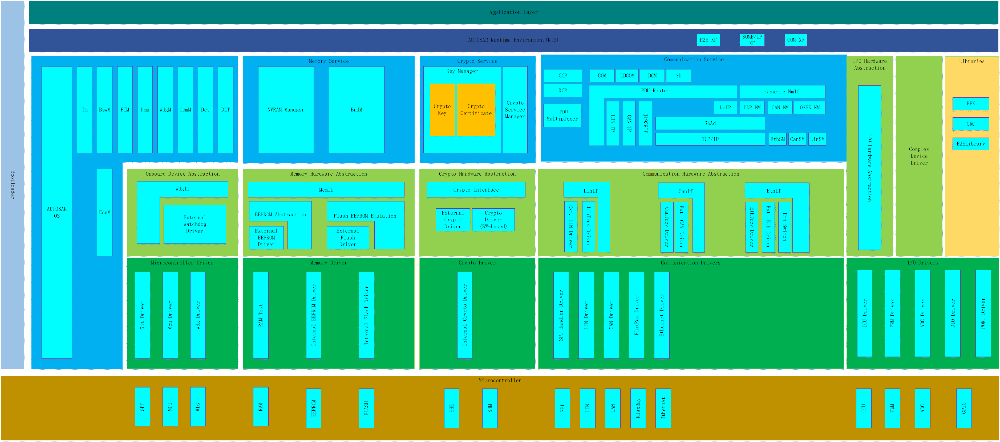
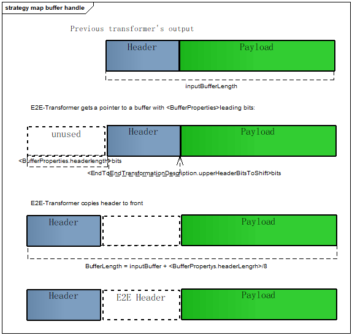
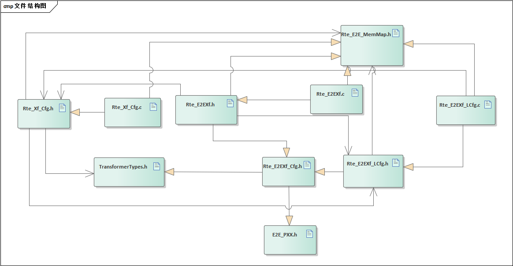
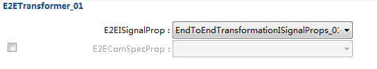
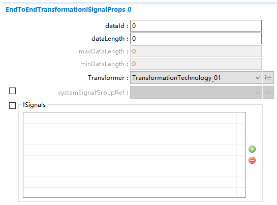
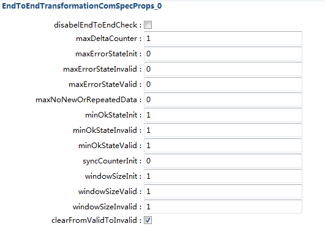
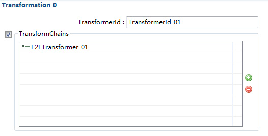
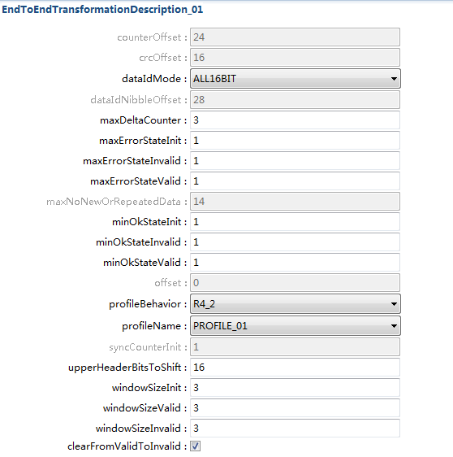

======================
E2EXf
======================

1 简介 

**缩写词注解**

+------------+---------------------------+----------------------------+
| **缩写词** | **英文全称**              | **中文解释**               |
+------------+---------------------------+----------------------------+
| E2EXf      | End to End Transformer    | 端到端转换器               |
+------------+---------------------------+----------------------------+
| E2EL       | End to End library        | 端到端通讯保护库           |
+------------+---------------------------+----------------------------+

简介
====

E2EXf模块的责任在于保护安全性相关的数据，在发送端，E2EXf保护数据，在接收端，E2EXf检查受保护的数据。所有的算法由E2EL提供，E2EXf调用E2EL相应的接口，传入配置和状态来实现保护的功能。

|image1|

图 E2EXf在AUTOSAR中的位置

参考资料
--------

[1]AUTOSAR_SWS_E2ETransformer.pdf，R19-11

[2] AUTOSAR_SWS_E2ELibrary.pdf，R19-11

[3] AUTOSAR_TPS_SystemTemplate.pdf，R19-11

功能描述
========

函数命名及数据结构生成
----------------------

E2EXf的函数及结构体会以<transformerId>后缀命名，针对每个transformer函数，都会有一个唯一的ID。这种命名方式用于E2EXf的C函数。

E2EXf应生成数据结构E2EXf_ConfigStruct\_<v>，存储E2EXf模块的配置。

E2EXf应获取所需独立状态数据资源的类型：E2E_PXXProtectStateType、E2E_PXXCheckStateType和E2E_SMCheckStateType，去保护需要E2E保护的有唯一transformerId标识的数据，通过各类型profile进行保护。

E2EXf会根据受E2E保护的数据的<transformerId>，各类型profile，去引用E2E_PXXConfigType和E2E_SMConfigType，在E2EXf模块内部执行E2E保护。

静态初始化配置和状态
--------------------

根据EndToEndTransformationDescription，EndToEndTransformationISignalProps和EndToEndTransformationComSpecProps三种元模型对配置进行静态初始化。其中，EndToEndTransformationDescription定义E2E变量，EndToEndTransformationISignalProps对给定的ISignal定义一个特殊的保护，EndToEndTransformationComSpecProps覆盖一些已定义的变量。

跟配置结构体相反，状态结构体不依赖于编译选项，生成的状态可以保持不进行初始化。

In-place和Out-of-place处理
--------------------------

E2EXf函数的处理会有In-place和Out-of-place两种方式，选择哪种buffer处理方式，可通过buffer属性配置项进行配置。

In-place是指Transformer用的buffer既作为输入又作为输出，所以，In-place的处理有性能上的优势，空间占用少，拷贝次数少。Out-of-place是指有独立的输入输出buffer。

E2EXf\_<transformerId>函数In-place方式buffer处理：

|image2|

图 E2EXf\_<transformerId>buffer处理方式--- In-place

E2EXf\_<transformerId>函数Out-of-place方式buffer处理：

|image3|

图 E2EXf\_<transformerId>buffer处理方式---Out-of-place

源文件描述
==========

表 E2EXf组件文件描述

+-----------------------+----------------------------------------------+
| **文件**              | **说明**                                     |
+-----------------------+----------------------------------------------+
| Rte_E2EXf_Cfg.h       | 定义E2EXf模块预编译时用到的配置参数。        |
+-----------------------+----------------------------------------------+
| Rte_E2EXf_LCfg.c      | 定义E2EXf模块链接时用到的配置参数。          |
+-----------------------+----------------------------------------------+
| Rte_E2EXf_LCfg.h      | 定义E2EXf模块链接时用到的配置参数。          |
+-----------------------+----------------------------------------------+
| Rte_Xf_Cfg.c          | 定义Xf模块预编译时用到的配置参数。           |
+-----------------------+----------------------------------------------+
| Rte_Xf_Cfg.h          | 定义Xf模块预编译时用到的配置参数。           |
+-----------------------+----------------------------------------------+
| Rte_E2EXf_MemMap.h    | E2EXf的内存映射定义                          |
+-----------------------+----------------------------------------------+
| Rte_E2EXf.h           | E2EXf模块头文件，包含                        |
|                       | 了API函数的扩展声明并定义了端口的数据结构。  |
+-----------------------+----------------------------------------------+
| TransformerTypes.h    | E2EXf的类型定义                              |
+-----------------------+----------------------------------------------+
| Rte_E2EXf.c           | E2EXf模块源文件，包含了API函数的实现。       |
+-----------------------+----------------------------------------------+

|image4|

图 E2EXf组件文件交互关系图

API接口
=======

类型定义
--------

E2EXf_ConfigType类型定义
~~~~~~~~~~~~~~~~~~~~~~~~

+-----------+----------------------------------------------------------+
| 名称      | E2EXf_ConfigType                                         |
+-----------+----------------------------------------------------------+
| 类型      | 结构体                                                   |
+-----------+----------------------------------------------------------+
| 范围      | 根据实现决定                                             |
+-----------+----------------------------------------------------------+
| 描述      | 用于传递配置数据                                         |
+-----------+----------------------------------------------------------+

输入函数描述
------------

+----------------------------------+-----------------------------------+
| **输入模块**                     | **API**                           |
+----------------------------------+-----------------------------------+
| E2EL                             | E2E_P01Check                      |
+----------------------------------+-----------------------------------+
|                                  | E2E_P01CheckInit                  |
+----------------------------------+-----------------------------------+
|                                  | E2E_P01MapStatusToSM              |
+----------------------------------+-----------------------------------+
|                                  | E2E_P01Protect                    |
+----------------------------------+-----------------------------------+
|                                  | E2E_P01ProtectInit                |
+----------------------------------+-----------------------------------+
|                                  | E2E_P02Check                      |
+----------------------------------+-----------------------------------+
|                                  | E2E_P02CheckInit                  |
+----------------------------------+-----------------------------------+
|                                  | E2E_P02MapStatusToSM              |
+----------------------------------+-----------------------------------+
|                                  | E2E_P02Protect                    |
+----------------------------------+-----------------------------------+
|                                  | E2E_P02ProtectInit                |
+----------------------------------+-----------------------------------+
|                                  | E2E_P04Check                      |
+----------------------------------+-----------------------------------+
|                                  | E2E_P04CheckInit                  |
+----------------------------------+-----------------------------------+
|                                  | E2E_P04MapStatusToSM              |
+----------------------------------+-----------------------------------+
|                                  | E2E_P04Protect                    |
+----------------------------------+-----------------------------------+
|                                  | E2E_P04ProtectInit                |
+----------------------------------+-----------------------------------+
|                                  | E2E_P05Check                      |
+----------------------------------+-----------------------------------+
|                                  | E2E_P05CheckInit                  |
+----------------------------------+-----------------------------------+
|                                  | E2E_P05MapStatusToSM              |
+----------------------------------+-----------------------------------+
|                                  | E2E_P05Protect                    |
+----------------------------------+-----------------------------------+
|                                  | E2E_P05ProtectInit                |
+----------------------------------+-----------------------------------+
|                                  | E2E_P06Check                      |
+----------------------------------+-----------------------------------+
|                                  | E2E_P06CheckInit                  |
+----------------------------------+-----------------------------------+
|                                  | E2E_P06MapStatusToSM              |
+----------------------------------+-----------------------------------+
|                                  | E2E_P06Protect                    |
+----------------------------------+-----------------------------------+
|                                  | E2E_P06ProtectInit                |
+----------------------------------+-----------------------------------+
|                                  | E2E_P07Check                      |
+----------------------------------+-----------------------------------+
|                                  | E2E_P07CheckInit                  |
+----------------------------------+-----------------------------------+
|                                  | E2E_P07MapStatusToSM              |
+----------------------------------+-----------------------------------+
|                                  | E2E_P07Protect                    |
+----------------------------------+-----------------------------------+
|                                  | E2E_P07ProtectInit                |
+----------------------------------+-----------------------------------+
|                                  | E2E_P11Check                      |
+----------------------------------+-----------------------------------+
|                                  | E2E_P11CheckInit                  |
+----------------------------------+-----------------------------------+
|                                  | E2E_P11MapStatusToSM              |
+----------------------------------+-----------------------------------+
|                                  | E2E_P11Protect                    |
+----------------------------------+-----------------------------------+
|                                  | E2E_P11ProtectInit                |
+----------------------------------+-----------------------------------+
|                                  | E2E_P22Check                      |
+----------------------------------+-----------------------------------+
|                                  | E2E_P22CheckInit                  |
+----------------------------------+-----------------------------------+
|                                  | E2E_P22MapStatusToSM              |
+----------------------------------+-----------------------------------+
|                                  | E2E_P22Protect                    |
+----------------------------------+-----------------------------------+
|                                  | E2E_P22ProtectInit                |
+----------------------------------+-----------------------------------+
|                                  | E2E_SMCheck                       |
+----------------------------------+-----------------------------------+
|                                  | E2E_SMCheckInit                   |
+----------------------------------+-----------------------------------+

静态接口函数定义
----------------

E2EXf_Init函数定义
~~~~~~~~~~~~~~~~~~

+-------------+-------------------+---------+-------------------------+
| 函数名称：  | E2EXf_Init        |         |                         |
+-------------+-------------------+---------+-------------------------+
| 函数原型：  | void E2EXf_Init ( |         |                         |
|             |                   |         |                         |
|             | const             |         |                         |
|             | E                 |         |                         |
|             | 2EXf_ConfigType\* |         |                         |
|             | config)           |         |                         |
+-------------+-------------------+---------+-------------------------+
| 服务编号：  | 0x01              |         |                         |
+-------------+-------------------+---------+-------------------------+
| 同步/异步： | 同步              |         |                         |
+-------------+-------------------+---------+-------------------------+
| 是          | 是                |         |                         |
| 否可重入：  |                   |         |                         |
+-------------+-------------------+---------+-------------------------+
| 输入参数：  | config            | 值域：  | 指向所选配置结构的指针  |
+-------------+-------------------+---------+-------------------------+
| 输          | 无                |         |                         |
| 入输出参数: |                   |         |                         |
+-------------+-------------------+---------+-------------------------+
| 输出参数：  | 无                |         |                         |
+-------------+-------------------+---------+-------------------------+
| 返回值：    | 无                |         |                         |
+-------------+-------------------+---------+-------------------------+
| 功能概述：  | 初始化E2EXf的状态 |         |                         |
|             | 。它的主要部分是  |         |                         |
|             | 初始化E2Elib状态  |         |                         |
|             | 结构，这是通过调  |         |                         |
|             | 用E2Elib中的所有  |         |                         |
|             | init函数来完成的  |         |                         |
+-------------+-------------------+---------+-------------------------+

E2EXf_DeInit函数定义
~~~~~~~~~~~~~~~~~~~~

+-------------+-------------------+---------+-------------------------+
| 函数名称：  | E2EXf_DeInit      |         |                         |
+-------------+-------------------+---------+-------------------------+
| 函数原型：  | void E2EXf_DeInit |         |                         |
|             | (                 |         |                         |
|             |                   |         |                         |
|             | void)             |         |                         |
+-------------+-------------------+---------+-------------------------+
| 服务编号：  | 0x02              |         |                         |
+-------------+-------------------+---------+-------------------------+
| 同步/异步： | 同步              |         |                         |
+-------------+-------------------+---------+-------------------------+
| 是          | 是                |         |                         |
| 否可重入：  |                   |         |                         |
+-------------+-------------------+---------+-------------------------+
| 输入参数：  | 无                | 值域：  | 无                      |
+-------------+-------------------+---------+-------------------------+
| 输          | 无                |         |                         |
| 入输出参数: |                   |         |                         |
+-------------+-------------------+---------+-------------------------+
| 输出参数：  | 无                |         |                         |
+-------------+-------------------+---------+-------------------------+
| 返回值：    | 无                |         |                         |
+-------------+-------------------+---------+-------------------------+
| 功能概述：  | 反初始化E2EXf     |         |                         |
+-------------+-------------------+---------+-------------------------+

E2EXf_GetVersionInfo函数定义
~~~~~~~~~~~~~~~~~~~~~~~~~~~~

+-------------+-------------------+---------+-------------------------+
| 函数名称：  | E2E               |         |                         |
|             | Xf_GetVersionInfo |         |                         |
+-------------+-------------------+---------+-------------------------+
| 函数原型：  | void              |         |                         |
|             | E2E               |         |                         |
|             | Xf_GetVersionInfo |         |                         |
|             | (                 |         |                         |
|             |                   |         |                         |
|             | \* versioninfo    |         |                         |
|             |                   |         |                         |
|             | )                 |         |                         |
+-------------+-------------------+---------+-------------------------+
| 服务编号：  | 0x00              |         |                         |
+-------------+-------------------+---------+-------------------------+
| 同步/异步： | 同步              |         |                         |
+-------------+-------------------+---------+-------------------------+
| 是          | 是                |         |                         |
| 否可重入：  |                   |         |                         |
+-------------+-------------------+---------+-------------------------+
| 输入参数：  | 无                |         |                         |
+-------------+-------------------+---------+-------------------------+
| 输          | 无                |         |                         |
| 入输出参数: |                   |         |                         |
+-------------+-------------------+---------+-------------------------+
| 输出参数：  | versioninfo       | 值域：  | 指向                    |
|             |                   |         | 保存软件版本信息的地址  |
+-------------+-------------------+---------+-------------------------+
| 返回值：    | 无                |         |                         |
+-------------+-------------------+---------+-------------------------+
| 功能概述：  | 获取软件版本信息  |         |                         |
+-------------+-------------------+---------+-------------------------+

E2EXf\_<transformerId>函数定义
~~~~~~~~~~~~~~~~~~~~~~~~~~~~~~

+-------------+-------------------+---------+-------------------------+
| 函数名称：  | E2EXf             |         |                         |
|             | \_<transformerId> |         |                         |
+-------------+-------------------+---------+-------------------------+
| 函数原型：  | uint8             |         |                         |
|             | E2EXf             |         |                         |
|             | \_<transformerId> |         |                         |
|             | (                 |         |                         |
|             |                   |         |                         |
|             | uint8\* buffer,   |         |                         |
|             |                   |         |                         |
|             | uint32\*          |         |                         |
|             | bufferLength,     |         |                         |
|             |                   |         |                         |
|             | [const uint8\*    |         |                         |
|             | inputBuffer],     |         |                         |
|             |                   |         |                         |
|             | uint32            |         |                         |
|             | inputBufferLength |         |                         |
|             |                   |         |                         |
|             | )                 |         |                         |
+-------------+-------------------+---------+-------------------------+
| 服务编号：  | 0x03              |         |                         |
+-------------+-------------------+---------+-------------------------+
| 同步/异步： | 同步              |         |                         |
+-------------+-------------------+---------+-------------------------+
| 是          | 否                |         |                         |
| 否可重入：  |                   |         |                         |
+-------------+-------------------+---------+-------------------------+
| 输入参数：  | inputBuffer       | 值域：  | 输入数据                |
+-------------+-------------------+---------+-------------------------+
|             | inputBufferLength | 值域：  | 输入数据长度            |
+-------------+-------------------+---------+-------------------------+
| 输          | buffer            | 值域：  | 输出数据                |
| 入输出参数: |                   |         |                         |
+-------------+-------------------+---------+-------------------------+
| 输出参数：  | bufferLength      | 值域：  | 输出数据长度            |
+-------------+-------------------+---------+-------------------------+
| 返回值：    | uint8：0x00       |         |                         |
|             | (E_OK) 0xFF       |         |                         |
|             | (E_SAFETY_H       |         |                         |
|             | ARD_RUNTIMEERROR) |         |                         |
+-------------+-------------------+---------+-------------------------+
| 功能概述：  | 对传入数          |         |                         |
|             | 据进行保护,<trans |         |                         |
|             | formerId>由配置决 |         |                         |
|             | 定，是动态生成的  |         |                         |
+-------------+-------------------+---------+-------------------------+

E2EXf_Inv\_<transformerId>函数定义
~~~~~~~~~~~~~~~~~~~~~~~~~~~~~~~~~~

+-------------+-------------------+---------+-------------------------+
| 函数名称：  | E2EXf_Inv         |         |                         |
|             | \_<transformerId> |         |                         |
+-------------+-------------------+---------+-------------------------+
| 函数原型：  | uint8             |         |                         |
|             | E2EXf_Inv         |         |                         |
|             | \_<transformerId> |         |                         |
|             | (                 |         |                         |
|             |                   |         |                         |
|             | uint8\* buffer,   |         |                         |
|             |                   |         |                         |
|             | uint32\*          |         |                         |
|             | bufferLength,     |         |                         |
|             |                   |         |                         |
|             | [const uint8\*    |         |                         |
|             | inputBuffer],     |         |                         |
|             |                   |         |                         |
|             | uint32            |         |                         |
|             | inputBufferLength |         |                         |
|             |                   |         |                         |
|             | )                 |         |                         |
+-------------+-------------------+---------+-------------------------+
| 服务编号：  | 0x04              |         |                         |
+-------------+-------------------+---------+-------------------------+
| 同步/异步： | 同步              |         |                         |
+-------------+-------------------+---------+-------------------------+
| 是          | 否                |         |                         |
| 否可重入：  |                   |         |                         |
+-------------+-------------------+---------+-------------------------+
| 输入参数：  | inputBuffer       | 值域：  | 输入数据                |
+-------------+-------------------+---------+-------------------------+
|             | inputBufferLength | 值域：  | 输入数据长度            |
+-------------+-------------------+---------+-------------------------+
| 输          | buffer            | 值域：  | 输出数据                |
| 入输出参数: |                   |         |                         |
+-------------+-------------------+---------+-------------------------+
| 输出参数：  | bufferLength      | 值域：  | 输出数据长度            |
+-------------+-------------------+---------+-------------------------+
| 返回值：    | 0x00 (E_OK) This  |         |                         |
|             | means VALID_OK    |         |                         |
|             |                   |         |                         |
|             | 0x01              |         |                         |
|             | (E\_              |         |                         |
|             | SAFETY_VALID_REP) |         |                         |
|             |                   |         |                         |
|             | 0x02              |         |                         |
|             | (E\_              |         |                         |
|             | SAFETY_VALID_SEQ) |         |                         |
|             |                   |         |                         |
|             | 0x03              |         |                         |
|             | (E\_              |         |                         |
|             | SAFETY_VALID_ERR) |         |                         |
|             |                   |         |                         |
|             | 0x05              |         |                         |
|             | (E\_              |         |                         |
|             | SAFETY_VALID_NND) |         |                         |
|             |                   |         |                         |
|             | 0x20              |         |                         |
|             | (E\_              |         |                         |
|             | SAFETY_NODATA_OK) |         |                         |
|             |                   |         |                         |
|             | 0x21              |         |                         |
|             | (E_S              |         |                         |
|             | AFETY_NODATA_REP) |         |                         |
|             |                   |         |                         |
|             | 0x22              |         |                         |
|             | (E_S              |         |                         |
|             | AFETY_NODATA_SEQ) |         |                         |
|             |                   |         |                         |
|             | 0x23              |         |                         |
|             | (E_S              |         |                         |
|             | AFETY_NODATA_ERR) |         |                         |
|             |                   |         |                         |
|             | 0x25              |         |                         |
|             | (E_S              |         |                         |
|             | AFETY_NODATA_NND) |         |                         |
|             |                   |         |                         |
|             | 0x30              |         |                         |
|             | (                 |         |                         |
|             | E_SAFETY_INIT_OK) |         |                         |
|             |                   |         |                         |
|             | 0x31              |         |                         |
|             | (E                |         |                         |
|             | _SAFETY_INIT_REP) |         |                         |
|             |                   |         |                         |
|             | 0x32              |         |                         |
|             | (E                |         |                         |
|             | _SAFETY_INIT_SEQ) |         |                         |
|             |                   |         |                         |
|             | 0x33              |         |                         |
|             | (E                |         |                         |
|             | _SAFETY_INIT_ERR) |         |                         |
|             |                   |         |                         |
|             | 0x35              |         |                         |
|             | (E                |         |                         |
|             | _SAFETY_INIT_NND) |         |                         |
|             |                   |         |                         |
|             | 0x40              |         |                         |
|             | (E_S              |         |                         |
|             | AFETY_INVALID_OK) |         |                         |
|             |                   |         |                         |
|             | 0x41              |         |                         |
|             | (E_SA             |         |                         |
|             | FETY_INVALID_REP) |         |                         |
|             |                   |         |                         |
|             | 0x42              |         |                         |
|             | (E_SA             |         |                         |
|             | FETY_INVALID_SEQ) |         |                         |
|             |                   |         |                         |
|             | 0x43              |         |                         |
|             | (E_SA             |         |                         |
|             | FETY_INVALID_ERR) |         |                         |
|             |                   |         |                         |
|             | 0x45              |         |                         |
|             | (E_SA             |         |                         |
|             | FETY_INVALID_NND) |         |                         |
|             |                   |         |                         |
|             | 0x77              |         |                         |
|             | (E_SAFETY_S       |         |                         |
|             | OFT_RUNTIMEERROR) |         |                         |
|             |                   |         |                         |
|             | 0xFF              |         |                         |
|             | (E_SAFETY_H       |         |                         |
|             | ARD_RUNTIMEERROR) |         |                         |
+-------------+-------------------+---------+-------------------------+
| 功能概述：  | 对传入数          |         |                         |
|             | 据进行检查,<trans |         |                         |
|             | formerId>由配置决 |         |                         |
|             | 定，是动态生成的  |         |                         |
+-------------+-------------------+---------+-------------------------+

可配置函数定义
--------------

无。

配置
====

E2EXfrmGeneral
--------------

|image5|

图 E2EXfrmGeneral容器配置图

表  E2EXfrmGeneral属性描述

+--------+-----------+-----------------------+-----------+------------+
| **UI   | **描述**  |                       |           |            |
| 名称** |           |                       |           |            |
+--------+-----------+-----------------------+-----------+------------+
| E      | 取值范围  | TRUE,FALSE            | 默认取值  | FALSE      |
| 2EXfVe |           |                       |           |            |
| rsionI |           |                       |           |            |
| nfoApi |           |                       |           |            |
+--------+-----------+-----------------------+-----------+------------+
|        | 参数描述  | 打开或关闭版本信息API |           |            |
+--------+-----------+-----------------------+-----------+------------+
|        | 依赖关系  | 无                    |           |            |
+--------+-----------+-----------------------+-----------+------------+
| E      | 取值范围  | TRUE,FALSE            | 默认取值  | FALSE      |
| 2EXfDe |           |                       |           |            |
| vError |           |                       |           |            |
| Detect |           |                       |           |            |
+--------+-----------+-----------------------+-----------+------------+
|        | 参数描述  | 启用或                |           |            |
|        |           | 禁用开发错误检测开关  |           |            |
+--------+-----------+-----------------------+-----------+------------+
|        | 依赖关系  | 无                    |           |            |
+--------+-----------+-----------------------+-----------+------------+

E2ETransformer
~~~~~~~~~~~~~~

|image6|

图 E2ETransformer容器配置图

表  E2ETransformer属性描述

+--------+-----------+-----------------------+-----------+------------+
| **UI   | **描述**  |                       |           |            |
| 名称** |           |                       |           |            |
+--------+-----------+-----------------------+-----------+------------+
| E2     | 取值范围  | Reference to          | 默认取值  | 无         |
| EISign |           | [EndToEndTransf       |           |            |
| alProp |           | ormationISignalProps] |           |            |
+--------+-----------+-----------------------+-----------+------------+
|        | 参数描述  | 被transform           |           |            |
|        |           | er引用的EndToEndTrans |           |            |
|        |           | formationISignalProps |           |            |
+--------+-----------+-----------------------+-----------+------------+
|        | 依赖关系  | 无                    |           |            |
+--------+-----------+-----------------------+-----------+------------+
| E2     | 取值范围  | Reference to          | 默认取值  | 无         |
| EComSp |           | [EndToEndTransf       |           |            |
| ecProp |           | ormationComSpecProps] |           |            |
+--------+-----------+-----------------------+-----------+------------+
|        | 参数描述  | 被transform           |           |            |
|        |           | er引用的EndToEndTrans |           |            |
|        |           | formationComSpecProps |           |            |
+--------+-----------+-----------------------+-----------+------------+
|        | 依赖关系  | 无                    |           |            |
+--------+-----------+-----------------------+-----------+------------+

EndToEndTransformationISignalProps
~~~~~~~~~~~~~~~~~~~~~~~~~~~~~~~~~~

|image7|

图 EndToEndTransformationISignalProps容器配置图

表  EndToEndTransformationISignalProps属性描述

+--------+-----------+---------------+------+-------+---+------------+
| **UI   | **描述**  |               |      |       |   |            |
| 名称** |           |               |      |       |   |            |
+--------+-----------+---------------+------+-------+---+------------+
| dataId | 取值范围  | 0~4294967295  |      | 默认  |   | 0          |
|        |           |               |      | 取值  |   |            |
+--------+-----------+---------------+------+-------+---+------------+
|        | 参数描述  | 表示一个唯一  |      |       |   |            |
|        |           | 的数字标识符  |      |       |   |            |
+--------+-----------+---------------+------+-------+---+------------+
|        | 依赖关系  | if(EndToE     |      |       |   |            |
|        |           | ndTransformat |      |       |   |            |
|        |           | ionDescriptio |      |       |   |            |
|        |           | n.profileName |      |       |   |            |
|        |           | ==            |      |       |   |            |
|        |           | profile_01|\| |      |       |   |            |
|        |           | profi         |      |       |   |            |
|        |           | le_11),dataId |      |       |   |            |
|        |           | multiplicity  |      |       |   |            |
|        |           | attribute     |      |       |   |            |
|        |           | shall be      |      |       |   |            |
|        |           | 1,and shall   |      |       |   |            |
|        |           | be in the     |      |       |   |            |
|        |           | range         |      |       |   |            |
|        |           | 0-65535;      |      |       |   |            |
|        |           |               |      |       |   |            |
|        |           | if(EndToE     |      |       |   |            |
|        |           | ndTransformat |      |       |   |            |
|        |           | ionDescriptio |      |       |   |            |
|        |           | n.profileName |      |       |   |            |
|        |           | ==            |      |       |   |            |
|        |           | profile_01|\| |      |       |   |            |
|        |           | profile_11)   |      |       |   |            |
|        |           | &&(dataIdMode |      |       |   |            |
|        |           | ==            |      |       |   |            |
|        |           | lower         |      |       |   |            |
|        |           | 12Bit),dataId |      |       |   |            |
|        |           | value range   |      |       |   |            |
|        |           | shall be in   |      |       |   |            |
|        |           | 256-65535;    |      |       |   |            |
|        |           |               |      |       |   |            |
|        |           | if(EndToE     |      |       |   |            |
|        |           | ndTransformat |      |       |   |            |
|        |           | ionDescriptio |      |       |   |            |
|        |           | n.profileName |      |       |   |            |
|        |           | ==            |      |       |   |            |
|        |           | profile_02|\| |      |       |   |            |
|        |           | profi         |      |       |   |            |
|        |           | le_22),dataId |      |       |   |            |
|        |           | multiplicity  |      |       |   |            |
|        |           | attribute     |      |       |   |            |
|        |           | shall be      |      |       |   |            |
|        |           | 16,and value  |      |       |   |            |
|        |           | shall be in   |      |       |   |            |
|        |           | the range     |      |       |   |            |
|        |           | 0-255;        |      |       |   |            |
|        |           |               |      |       |   |            |
|        |           | if            |      |       |   |            |
|        |           | (EndToE       |      |       |   |            |
|        |           | ndTransformat |      |       |   |            |
|        |           | ionDescriptio |      |       |   |            |
|        |           | n.profileName |      |       |   |            |
|        |           | ==            |      |       |   |            |
|        |           | profile_01)   |      |       |   |            |
|        |           | &&            |      |       |   |            |
|        |           | (dataIDMode   |      |       |   |            |
|        |           | ==            |      |       |   |            |
|        |           | LOWER8BIT),   |      |       |   |            |
|        |           | dataId high   |      |       |   |            |
|        |           | byte shall be |      |       |   |            |
|        |           | 0, low byte   |      |       |   |            |
|        |           | valid,and     |      |       |   |            |
|        |           | value shall   |      |       |   |            |
|        |           | be in the     |      |       |   |            |
|        |           | range 0-255;  |      |       |   |            |
|        |           |               |      |       |   |            |
|        |           | if            |      |       |   |            |
|        |           | (EndToE       |      |       |   |            |
|        |           | ndTransformat |      |       |   |            |
|        |           | ionDescriptio |      |       |   |            |
|        |           | n.profileName |      |       |   |            |
|        |           | ==            |      |       |   |            |
|        |           | profile_01|\| |      |       |   |            |
|        |           | profile_11)   |      |       |   |            |
|        |           | &&            |      |       |   |            |
|        |           | (dataIDMode   |      |       |   |            |
|        |           | ==            |      |       |   |            |
|        |           | LOWER12BIT),  |      |       |   |            |
|        |           | dataId high   |      |       |   |            |
|        |           | byte high     |      |       |   |            |
|        |           | nibble shall  |      |       |   |            |
|        |           | be 0, high    |      |       |   |            |
|        |           | byte low      |      |       |   |            |
|        |           | nibble and    |      |       |   |            |
|        |           | low byte      |      |       |   |            |
|        |           | valid;        |      |       |   |            |
|        |           |               |      |       |   |            |
|        |           | if            |      |       |   |            |
|        |           | profileName   |      |       |   |            |
|        |           | == profile_01 |      |       |   |            |
|        |           | \|\|          |      |       |   |            |
|        |           | profile_05    |      |       |   |            |
|        |           | \|\|          |      |       |   |            |
|        |           | profile_06|\| |      |       |   |            |
|        |           | profi         |      |       |   |            |
|        |           | le_11，dataId |      |       |   |            |
|        |           | type shall be |      |       |   |            |
|        |           | uint16;       |      |       |   |            |
|        |           |               |      |       |   |            |
|        |           | if            |      |       |   |            |
|        |           | profileName   |      |       |   |            |
|        |           | ==            |      |       |   |            |
|        |           | profile_02|\| |      |       |   |            |
|        |           | profi         |      |       |   |            |
|        |           | le_22，dataId |      |       |   |            |
|        |           | type shall be |      |       |   |            |
|        |           | uint8;        |      |       |   |            |
|        |           |               |      |       |   |            |
|        |           | if            |      |       |   |            |
|        |           | profileName   |      |       |   |            |
|        |           | ==            |      |       |   |            |
|        |           | profile_04|\| |      |       |   |            |
|        |           | profi         |      |       |   |            |
|        |           | le_07，dataId |      |       |   |            |
|        |           | type shall be |      |       |   |            |
|        |           | uint32.       |      |       |   |            |
+--------+-----------+---------------+------+-------+---+------------+
| data   | 取值范围  | 0~65535       |      | 默认  |   | 0          |
| Length |           |               |      | 取值  |   |            |
+--------+-----------+---------------+------+-------+---+------------+
|        | 参数描述  | 数据的长      |      |       |   |            |
|        |           | 度，单位为位  |      |       |   |            |
+--------+-----------+---------------+------+-------+---+------------+
|        | 依赖关系  | if(EndToE     |      |       |   |            |
|        |           | ndTransformat |      |       |   |            |
|        |           | ionDescriptio |      |       |   |            |
|        |           | n.profileName |      |       |   |            |
|        |           | == profile_01 |      |       |   |            |
|        |           | \|\|          |      |       |   |            |
|        |           | profile_02    |      |       |   |            |
|        |           | \|\|          |      |       |   |            |
|        |           | profile_05|\| |      |       |   |            |
|        |           | profile_11|\| |      |       |   |            |
|        |           | profile_2     |      |       |   |            |
|        |           | 2),dataLength |      |       |   |            |
|        |           | multiplicity  |      |       |   |            |
|        |           | attribute     |      |       |   |            |
|        |           | shall be 1;   |      |       |   |            |
|        |           |               |      |       |   |            |
|        |           | if(EndToE     |      |       |   |            |
|        |           | ndTransformat |      |       |   |            |
|        |           | ionDescriptio |      |       |   |            |
|        |           | n.profileName |      |       |   |            |
|        |           | == profile_04 |      |       |   |            |
|        |           | \|\|          |      |       |   |            |
|        |           | profile\_     |      |       |   |            |
|        |           | 06||profile_0 |      |       |   |            |
|        |           | 7),dataLength |      |       |   |            |
|        |           | multiplicity  |      |       |   |            |
|        |           | attribute     |      |       |   |            |
|        |           | shall be 0;   |      |       |   |            |
|        |           |               |      |       |   |            |
|        |           | if            |      |       |   |            |
|        |           | EndToE        |      |       |   |            |
|        |           | ndTransformat |      |       |   |            |
|        |           | ionDescriptio |      |       |   |            |
|        |           | n.profileName |      |       |   |            |
|        |           | ==            |      |       |   |            |
|        |           | profile\_     |      |       |   |            |
|        |           | 01,dataLength |      |       |   |            |
|        |           | shall be a    |      |       |   |            |
|        |           | multiple of 8 |      |       |   |            |
|        |           | and shall be  |      |       |   |            |
|        |           | 2*8bit        |      |       |   |            |
|        |           | s≤dataLength≤ |      |       |   |            |
|        |           | 240 bits;     |      |       |   |            |
|        |           |               |      |       |   |            |
|        |           | if            |      |       |   |            |
|        |           | EndToE        |      |       |   |            |
|        |           | ndTransformat |      |       |   |            |
|        |           | ionDescriptio |      |       |   |            |
|        |           | n.profileName |      |       |   |            |
|        |           | ==            |      |       |   |            |
|        |           | profile\_     |      |       |   |            |
|        |           | 02,dataLength |      |       |   |            |
|        |           | shall be a    |      |       |   |            |
|        |           | multiple of   |      |       |   |            |
|        |           | 8;and shall   |      |       |   |            |
|        |           | be            |      |       |   |            |
|        |           | 2*8bit        |      |       |   |            |
|        |           | s≤dataLength≤ |      |       |   |            |
|        |           | 8*256 bits;   |      |       |   |            |
|        |           |               |      |       |   |            |
|        |           | if            |      |       |   |            |
|        |           | EndToE        |      |       |   |            |
|        |           | ndTransformat |      |       |   |            |
|        |           | ionDescriptio |      |       |   |            |
|        |           | n.profileName |      |       |   |            |
|        |           | ==            |      |       |   |            |
|        |           | profile\_     |      |       |   |            |
|        |           | 05,dataLength |      |       |   |            |
|        |           | shall be a    |      |       |   |            |
|        |           | multiple of   |      |       |   |            |
|        |           | 8,and shall   |      |       |   |            |
|        |           | be 3*8bits =< |      |       |   |            |
|        |           | dataLength≤   |      |       |   |            |
|        |           | 4096*8 bits;  |      |       |   |            |
|        |           |               |      |       |   |            |
|        |           | if            |      |       |   |            |
|        |           | EndToE        |      |       |   |            |
|        |           | ndTransformat |      |       |   |            |
|        |           | ionDescriptio |      |       |   |            |
|        |           | n.profileName |      |       |   |            |
|        |           | ==            |      |       |   |            |
|        |           | profile\_     |      |       |   |            |
|        |           | 11,dataLength |      |       |   |            |
|        |           | shall be a    |      |       |   |            |
|        |           | multiple of 8 |      |       |   |            |
|        |           | and shall be  |      |       |   |            |
|        |           | 2*8bit        |      |       |   |            |
|        |           | s≤dataLength≤ |      |       |   |            |
|        |           | 240 bits;     |      |       |   |            |
|        |           |               |      |       |   |            |
|        |           | if            |      |       |   |            |
|        |           | EndToE        |      |       |   |            |
|        |           | ndTransformat |      |       |   |            |
|        |           | ionDescriptio |      |       |   |            |
|        |           | n.profileName |      |       |   |            |
|        |           | ==            |      |       |   |            |
|        |           | profile\_     |      |       |   |            |
|        |           | 22,dataLength |      |       |   |            |
|        |           | shall be a    |      |       |   |            |
|        |           | multiple of   |      |       |   |            |
|        |           | 8;and shall   |      |       |   |            |
|        |           | be            |      |       |   |            |
|        |           | 2*8bit        |      |       |   |            |
|        |           | s≤dataLength≤ |      |       |   |            |
|        |           | 8*256 bits.   |      |       |   |            |
+--------+-----------+---------------+------+-------+---+------------+
| m      | 取值范围  | 0~65535       |      | 默认  |   | 0          |
| axData |           |               |      | 取值  |   |            |
| Length |           |               |      |       |   |            |
+--------+-----------+---------------+------+-------+---+------------+
|        | 参数描述  | 数            |      |       |   |            |
|        |           | 据的最大长度  |      |       |   |            |
|        |           | ，以位为单位  |      |       |   |            |
+--------+-----------+---------------+------+-------+---+------------+
|        | 依赖关系  | if(EndToE     |      |       |   |            |
|        |           | ndTransformat |      |       |   |            |
|        |           | ionDescriptio |      |       |   |            |
|        |           | n.profileName |      |       |   |            |
|        |           | == profile_01 |      |       |   |            |
|        |           | \|\|          |      |       |   |            |
|        |           | profile_02    |      |       |   |            |
|        |           | \|\|          |      |       |   |            |
|        |           | profile_05|\| |      |       |   |            |
|        |           | profile_11    |      |       |   |            |
|        |           | \|\|          |      |       |   |            |
|        |           | profile_22),  |      |       |   |            |
|        |           | maxDataLength |      |       |   |            |
|        |           | multiplicity  |      |       |   |            |
|        |           | attribute     |      |       |   |            |
|        |           | shall be 0;   |      |       |   |            |
|        |           |               |      |       |   |            |
|        |           | if(EndToE     |      |       |   |            |
|        |           | ndTransformat |      |       |   |            |
|        |           | ionDescriptio |      |       |   |            |
|        |           | n.profileName |      |       |   |            |
|        |           | == profile_04 |      |       |   |            |
|        |           | \|\|          |      |       |   |            |
|        |           | profile_06|\| |      |       |   |            |
|        |           | profile_07),  |      |       |   |            |
|        |           | maxDataLength |      |       |   |            |
|        |           | multiplicity  |      |       |   |            |
|        |           | attribute     |      |       |   |            |
|        |           | shall be      |      |       |   |            |
|        |           | 1;the value   |      |       |   |            |
|        |           | shall be a    |      |       |   |            |
|        |           | multiple of   |      |       |   |            |
|        |           | 8;            |      |       |   |            |
|        |           |               |      |       |   |            |
|        |           | if            |      |       |   |            |
|        |           | profileName   |      |       |   |            |
|        |           | ==            |      |       |   |            |
|        |           | profile_04,   |      |       |   |            |
|        |           | minDataLength |      |       |   |            |
|        |           | ≤maxData      |      |       |   |            |
|        |           | Length≤4096*8 |      |       |   |            |
|        |           | bits;         |      |       |   |            |
|        |           |               |      |       |   |            |
|        |           | if            |      |       |   |            |
|        |           | profileName   |      |       |   |            |
|        |           | ==            |      |       |   |            |
|        |           | profile_06,   |      |       |   |            |
|        |           | minDataLength |      |       |   |            |
|        |           | ≤maxData      |      |       |   |            |
|        |           | Length≤4096*8 |      |       |   |            |
|        |           | bits;         |      |       |   |            |
|        |           |               |      |       |   |            |
|        |           | if            |      |       |   |            |
|        |           | profileName   |      |       |   |            |
|        |           | ==            |      |       |   |            |
|        |           | profile_07,   |      |       |   |            |
|        |           | minDataLength |      |       |   |            |
|        |           | ≤maxDataLeng  |      |       |   |            |
|        |           | th≤4294967295 |      |       |   |            |
|        |           | bits.         |      |       |   |            |
+--------+-----------+---------------+------+-------+---+------------+
| m      | 取值范围  | 0~65535       |      | 默认  |   | 0          |
| inData |           |               |      | 取值  |   |            |
| Length |           |               |      |       |   |            |
+--------+-----------+---------------+------+-------+---+------------+
|        | 参数描述  | 数            |      |       |   |            |
|        |           | 据的最小长度  |      |       |   |            |
|        |           | ，以位为单位  |      |       |   |            |
+--------+-----------+---------------+------+-------+---+------------+
|        | 依赖关系  | if(EndToE     |      |       |   |            |
|        |           | ndTransformat |      |       |   |            |
|        |           | ionDescriptio |      |       |   |            |
|        |           | n.profileName |      |       |   |            |
|        |           | == profile_01 |      |       |   |            |
|        |           | \|\|          |      |       |   |            |
|        |           | profile_02    |      |       |   |            |
|        |           | \|\|          |      |       |   |            |
|        |           | profile_05    |      |       |   |            |
|        |           | \|\|          |      |       |   |            |
|        |           | profile_11    |      |       |   |            |
|        |           | \|\|          |      |       |   |            |
|        |           | profile_22),  |      |       |   |            |
|        |           | minDataLength |      |       |   |            |
|        |           | multiplicity  |      |       |   |            |
|        |           | attribute     |      |       |   |            |
|        |           | shall be 0;   |      |       |   |            |
|        |           |               |      |       |   |            |
|        |           | if(EndToE     |      |       |   |            |
|        |           | ndTransformat |      |       |   |            |
|        |           | ionDescriptio |      |       |   |            |
|        |           | n.profileName |      |       |   |            |
|        |           | == profile_04 |      |       |   |            |
|        |           | \|\|          |      |       |   |            |
|        |           | profile_06|\| |      |       |   |            |
|        |           | profile_07),  |      |       |   |            |
|        |           | minDataLength |      |       |   |            |
|        |           | multiplicity  |      |       |   |            |
|        |           | attribute     |      |       |   |            |
|        |           | shall be      |      |       |   |            |
|        |           | 1;the value   |      |       |   |            |
|        |           | shall be a    |      |       |   |            |
|        |           | multiple of   |      |       |   |            |
|        |           | 8;            |      |       |   |            |
|        |           |               |      |       |   |            |
|        |           | if            |      |       |   |            |
|        |           | profileName   |      |       |   |            |
|        |           | ==            |      |       |   |            |
|        |           | profile_04,   |      |       |   |            |
|        |           | 12*8 bits     |      |       |   |            |
|        |           | ≤minData      |      |       |   |            |
|        |           | Length≤4096*8 |      |       |   |            |
|        |           | bits          |      |       |   |            |
|        |           |               |      |       |   |            |
|        |           | if            |      |       |   |            |
|        |           | profileName   |      |       |   |            |
|        |           | ==            |      |       |   |            |
|        |           | profile_06,   |      |       |   |            |
|        |           | 5*8 bits      |      |       |   |            |
|        |           | ≤minData      |      |       |   |            |
|        |           | Length≤4096*8 |      |       |   |            |
|        |           | bits          |      |       |   |            |
|        |           |               |      |       |   |            |
|        |           | if            |      |       |   |            |
|        |           | profileName   |      |       |   |            |
|        |           | ==            |      |       |   |            |
|        |           | profile_07,   |      |       |   |            |
|        |           | 20*8 bits     |      |       |   |            |
|        |           | ≤m            |      |       |   |            |
|        |           | inDataLength≤ |      |       |   |            |
|        |           | maxDataLength |      |       |   |            |
+--------+-----------+---------------+------+-------+---+------------+
| Trans  | 取值范围  | References to |      | 默认  |   | 无         |
| former |           | [Transformati |      | 取值  |   |            |
|        |           | onTechnology] |      |       |   |            |
+--------+-----------+---------------+------+-------+---+------------+
|        | 参数描述  | 引            |      |       |   |            |
|        |           | 用Transformat |      |       |   |            |
|        |           | ionTechnology |      |       |   |            |
+--------+-----------+---------------+------+-------+---+------------+
|        | 依赖关系  | 无            |      |       |   |            |
+--------+-----------+---------------+------+-------+---+------------+
| sy     | 取值范围  | References to | 默认 |       |   | 无         |
| stemSi |           | [Co           | 取值 |       |   |            |
| gnalGr |           | mSignalGroup] |      |       |   |            |
| oupRef |           |               |      |       |   |            |
+--------+-----------+---------------+------+-------+---+------------+
|        | 参数描述  | 对本 I-Pdu    |      |       |   |            |
|        |           | 中包含的所有  |      |       |   |            |
|        |           | 信号组的引用  |      |       |   |            |
+--------+-----------+---------------+------+-------+---+------------+
|        | 依赖关系  | 无            |      |       |   |            |
+--------+-----------+---------------+------+-------+---+------------+
| IS     | 取值范围  | References to | 默认 |       |   | 无         |
| ignals |           | [C            | 取值 |       |   |            |
|        |           | omGroupSignal |      |       |   |            |
|        |           | ]             |      |       |   |            |
+--------+-----------+---------------+------+-------+---+------------+
|        | 参数描述  | 引用此        |      |       |   |            |
|        |           | C             |      |       |   |            |
|        |           | omSignalGroup |      |       |   |            |
|        |           | 所需的        |      |       |   |            |
|        |           | C             |      |       |   |            |
|        |           | omGroupSignal |      |       |   |            |
+--------+-----------+---------------+------+-------+---+------------+
|        | 依赖关系  | 无            |      |       |   |            |
+--------+-----------+---------------+------+-------+---+------------+

EndToEndTransformationComSpecProps
~~~~~~~~~~~~~~~~~~~~~~~~~~~~~~~~~~

|image8|

图 EndToEndTransformationComSpecProps容器配置图

表  EndToEndTransformationComSpecProps属性描述

+--------+-----------+-----------------------+-----------+------------+
| **UI   | **描述**  |                       |           |            |
| 名称** |           |                       |           |            |
+--------+-----------+-----------------------+-----------+------------+
| di     | 取值范围  | TRUE,FALSE            | 默认取值  | FALSE      |
| sabelE |           |                       |           |            |
| ndToEn |           |                       |           |            |
| dCheck |           |                       |           |            |
+--------+-----------+-----------------------+-----------+------------+
|        | 参数描述  | 禁                    |           |            |
|        |           | 用/启用端到端加密检查 |           |            |
+--------+-----------+-----------------------+-----------+------------+
|        | 依赖关系  | 无                    |           |            |
+--------+-----------+-----------------------+-----------+------------+
| max    | 取值范围  | 0~65535               | 默认取值  | 1          |
| DeltaC |           |                       |           |            |
| ounter |           |                       |           |            |
+--------+-----------+-----------------------+-----------+------------+
|        | 参数描述  | Maximum allowed gap   |           |            |
|        |           | between two counter   |           |            |
|        |           | values of two         |           |            |
|        |           | consecutive checks.   |           |            |
+--------+-----------+-----------------------+-----------+------------+
|        | 依赖关系  | if(End                |           |            |
|        |           | ToEndTransformationDe |           |            |
|        |           | scription.profileName |           |            |
|        |           | == profile_01),       |           |            |
|        |           | maxdeltacounter shall |           |            |
|        |           | be in the range 1-14; |           |            |
|        |           |                       |           |            |
|        |           | if(End                |           |            |
|        |           | ToEndTransformationDe |           |            |
|        |           | scription.profileName |           |            |
|        |           | == profile_02),       |           |            |
|        |           | maxdeltacounter shall |           |            |
|        |           | be in the range 1-15; |           |            |
|        |           |                       |           |            |
|        |           | if(End                |           |            |
|        |           | ToEndTransformationDe |           |            |
|        |           | scription.profileName |           |            |
|        |           | == profile_04),       |           |            |
|        |           | maxdeltacounter shall |           |            |
|        |           | be in the range       |           |            |
|        |           | 1-65535;              |           |            |
|        |           |                       |           |            |
|        |           | if(End                |           |            |
|        |           | ToEndTransformationDe |           |            |
|        |           | scription.profileName |           |            |
|        |           | == profile_05),       |           |            |
|        |           | maxdeltacounter shall |           |            |
|        |           | be in the range       |           |            |
|        |           | 1-255;                |           |            |
|        |           |                       |           |            |
|        |           | if(End                |           |            |
|        |           | ToEndTransformationDe |           |            |
|        |           | scription.profileName |           |            |
|        |           | == profile_06),       |           |            |
|        |           | maxdeltacounter shall |           |            |
|        |           | be in the range       |           |            |
|        |           | 1-255;                |           |            |
|        |           |                       |           |            |
|        |           | if(End                |           |            |
|        |           | ToEndTransformationDe |           |            |
|        |           | scription.profileName |           |            |
|        |           | == profile_07),       |           |            |
|        |           | maxdeltacounter shall |           |            |
|        |           | be in the range       |           |            |
|        |           | 1-4294967295;         |           |            |
|        |           |                       |           |            |
|        |           | if(End                |           |            |
|        |           | ToEndTransformationDe |           |            |
|        |           | scription.profileName |           |            |
|        |           | == profile_11),       |           |            |
|        |           | maxdeltacounter shall |           |            |
|        |           | be in the range 1-14; |           |            |
|        |           |                       |           |            |
|        |           | if(End                |           |            |
|        |           | ToEndTransformationDe |           |            |
|        |           | scription.profileName |           |            |
|        |           | == profile_22),       |           |            |
|        |           | maxdeltacounter shall |           |            |
|        |           | be in the range 1-15. |           |            |
+--------+-----------+-----------------------+-----------+------------+
| maxEr  | 取值范围  | 0~255                 | 默认取值  | 0          |
| rorSta |           |                       |           |            |
| teInit |           |                       |           |            |
+--------+-----------+-----------------------+-----------+------------+
|        | 参数描述  | 在最近一次 WindowSize |           |            |
|        |           | 检查中，确定了状态    |           |            |
|        |           | E2E_SM_INIT 的        |           |            |
|        |           | ProfileStatus 等于    |           |            |
|        |           | E2E_P_ERROR           |           |            |
|        |           | 的最大检查次数        |           |            |
+--------+-----------+-----------------------+-----------+------------+
|        | 依赖关系  | maxErrorStateValid>=m |           |            |
|        |           | axErrorStateInit>=max |           |            |
|        |           | ErrorStateInvalid>=0; |           |            |
|        |           |                       |           |            |
|        |           | minOkStateInit +      |           |            |
|        |           | maxErrorStateInit <=  |           |            |
|        |           | windowSizeValid       |           |            |
+--------+-----------+-----------------------+-----------+------------+
| ma     | 取值范围  | 0~255                 | 默认取值  | 0          |
| xError |           |                       |           |            |
| StateI |           |                       |           |            |
| nvalid |           |                       |           |            |
+--------+-----------+-----------------------+-----------+------------+
|        | 参数描述  | 在最近一次 WindowSize |           |            |
|        |           | 检查中，确定了状态    |           |            |
|        |           | E2E_SM_INVALID的      |           |            |
|        |           | ProfileStatus 等于    |           |            |
|        |           | E2E_P_ERROR           |           |            |
|        |           | 的最大检查次数        |           |            |
+--------+-----------+-----------------------+-----------+------------+
|        | 依赖关系  | maxErrorStateValid>=m |           |            |
|        |           | axErrorStateInit>=max |           |            |
|        |           | ErrorStateInvalid>=0; |           |            |
|        |           |                       |           |            |
|        |           | minOkStateInvalid +   |           |            |
|        |           | maxErrorStateInvalid  |           |            |
|        |           | <= windowSizeValid    |           |            |
+--------+-----------+-----------------------+-----------+------------+
| maxErr | 取值范围  | 0~255                 | 默认取值  | 0          |
| orStat |           |                       |           |            |
| eValid |           |                       |           |            |
+--------+-----------+-----------------------+-----------+------------+
|        | 参数描述  | 在最近一次 WindowSize |           |            |
|        |           | 检查中，确定了状态    |           |            |
|        |           | E2E_SM_VALID的        |           |            |
|        |           | ProfileStatus 等于    |           |            |
|        |           | E2E_P_ERROR           |           |            |
|        |           | 的最大检查次数        |           |            |
+--------+-----------+-----------------------+-----------+------------+
|        | 依赖关系  | maxErrorStateValid>=m |           |            |
|        |           | axErrorStateInit>=max |           |            |
|        |           | ErrorStateInvalid>=0; |           |            |
|        |           |                       |           |            |
|        |           | minOkStateValid +     |           |            |
|        |           | maxErrorStateValid <= |           |            |
|        |           | windowSizeValid       |           |            |
+--------+-----------+-----------------------+-----------+------------+
| maxN   | 取值范围  | 0~255                 | 默认取值  | 0          |
| oNewOr |           |                       |           |            |
| Repeat |           |                       |           |            |
| edData |           |                       |           |            |
+--------+-----------+-----------------------+-----------+------------+
|        | 参数描述  | 连续失败的计数器      |           |            |
|        |           | 检查的最大允许数量。  |           |            |
+--------+-----------+-----------------------+-----------+------------+
|        | 依赖关系  | value of              |           |            |
|        |           | m                     |           |            |
|        |           | axNoNewOrRepeatedData |           |            |
|        |           | is 0~14;              |           |            |
+--------+-----------+-----------------------+-----------+------------+
| mi     | 取值范围  | 0~255                 | 默认取值  | 1          |
| nOkSta |           |                       |           |            |
| teInit |           |                       |           |            |
+--------+-----------+-----------------------+-----------+------------+
|        | 参数描述  | 在最近一次 WindowSize |           |            |
|        |           | 检查中，确定了状态    |           |            |
|        |           | E2E_SM_INIT 的        |           |            |
|        |           | ProfileStatus 等于    |           |            |
|        |           | E2E_P_OK              |           |            |
|        |           | 的最少检查次数。      |           |            |
+--------+-----------+-----------------------+-----------+------------+
|        | 依赖关系  | 1<=minOkStat          |           |            |
|        |           | eValid<=minOkStateIni |           |            |
|        |           | t<=minOkStateInvalid; |           |            |
|        |           |                       |           |            |
|        |           | minOkStateInit +      |           |            |
|        |           | maxErrorStateInit <=  |           |            |
|        |           | windowSizeValid       |           |            |
+--------+-----------+-----------------------+-----------+------------+
| minOk  | 取值范围  | 0~255                 | 默认取值  | 1          |
| StateI |           |                       |           |            |
| nvalid |           |                       |           |            |
+--------+-----------+-----------------------+-----------+------------+
|        | 参数描述  | 在最近一次 WindowSize |           |            |
|        |           | 检查中，确定了状态    |           |            |
|        |           | E2E_SM\_ INVALID的    |           |            |
|        |           | ProfileStatus 等于    |           |            |
|        |           | E2E_P_OK              |           |            |
|        |           | 的最少检查次数。      |           |            |
+--------+-----------+-----------------------+-----------+------------+
|        | 依赖关系  | 1<=minOkStat          |           |            |
|        |           | eValid<=minOkStateIni |           |            |
|        |           | t<=minOkStateInvalid; |           |            |
|        |           |                       |           |            |
|        |           | minOkStateInvalid +   |           |            |
|        |           | maxErrorStateInvalid  |           |            |
|        |           | <= windowSizeValid    |           |            |
+--------+-----------+-----------------------+-----------+------------+
| min    | 取值范围  | 0~255                 | 默认取值  | 1          |
| OkStat |           |                       |           |            |
| eValid |           |                       |           |            |
+--------+-----------+-----------------------+-----------+------------+
|        | 参数描述  | 在最近一次 WindowSize |           |            |
|        |           | 检查中，确定了状态    |           |            |
|        |           | E2E_SM\_ VALID的      |           |            |
|        |           | ProfileStatus 等于    |           |            |
|        |           | E2E_P_OK              |           |            |
|        |           | 的最少检查次数。      |           |            |
+--------+-----------+-----------------------+-----------+------------+
|        | 依赖关系  | 1<=minOkStat          |           |            |
|        |           | eValid<=minOkStateIni |           |            |
|        |           | t<=minOkStateInvalid; |           |            |
|        |           |                       |           |            |
|        |           | minOkStateValid +     |           |            |
|        |           | maxErrorStateValid <= |           |            |
|        |           | windowSizeValid.      |           |            |
+--------+-----------+-----------------------+-----------+------------+
| syn    | 取值范围  | 0~255                 | 默认取值  | 0          |
| cCount |           |                       |           |            |
| erInit |           |                       |           |            |
+--------+-----------+-----------------------+-----------+------------+
|        | 参数描述  | 验证必须用有          |           |            |
|        |           | 效计数器接收的计数器  |           |            |
|        |           | 的一致性所需的检查数  |           |            |
+--------+-----------+-----------------------+-----------+------------+
|        | 依赖关系  | 无                    |           |            |
+--------+-----------+-----------------------+-----------+------------+
| wi     | 取值范围  | 0~255                 | 默认取值  | 1          |
| ndowSi |           |                       |           |            |
| zeInit |           |                       |           |            |
+--------+-----------+-----------------------+-----------+------------+
|        | 参数描述  | E2E                   |           |            |
|        |           | Ini                   |           |            |
|        |           | t状态机监控窗口大小。 |           |            |
+--------+-----------+-----------------------+-----------+------------+
|        | 依赖关系  | windowSizeInit <=     |           |            |
|        |           | WindowSizeValid       |           |            |
+--------+-----------+-----------------------+-----------+------------+
| win    | 取值范围  | 0~255                 | 默认取值  | 1          |
| dowSiz |           |                       |           |            |
| eValid |           |                       |           |            |
+--------+-----------+-----------------------+-----------+------------+
|        | 参数描述  | E2E                   |           |            |
|        |           | Vali                  |           |            |
|        |           | d状态机监控窗口大小。 |           |            |
+--------+-----------+-----------------------+-----------+------------+
|        | 依赖关系  | The value of the      |           |            |
|        |           | windowSizeValid       |           |            |
|        |           | attribute shall be    |           |            |
|        |           | greater or equal to   |           |            |
|        |           | 1.                    |           |            |
+--------+-----------+-----------------------+-----------+------------+
| windo  | 取值范围  | 0~255                 | 默认取值  | 1          |
| wSizeI |           |                       |           |            |
| nvalid |           |                       |           |            |
+--------+-----------+-----------------------+-----------+------------+
|        | 参数描述  | E2E                   |           |            |
|        |           | Invali                |           |            |
|        |           | d状态机监控窗口大小。 |           |            |
+--------+-----------+-----------------------+-----------+------------+
|        | 依赖关系  | WindowSizeInvalid <=  |           |            |
|        |           | WindowSizeValid       |           |            |
+--------+-----------+-----------------------+-----------+------------+
| clear  | 取值范围  | TRUE,FALSE            | 默认取值  | TRUE       |
| FromVa |           |                       |           |            |
| lidToI |           |                       |           |            |
| nvalid |           |                       |           |            |
+--------+-----------+-----------------------+-----------+------------+
|        | 参数描述  | 从状态 Valid          |           |            |
|        |           | 转换到状态 Invalid    |           |            |
|        |           | 时清除监控窗口。      |           |            |
+--------+-----------+-----------------------+-----------+------------+
|        | 依赖关系  | 无                    |           |            |
+--------+-----------+-----------------------+-----------+------------+

TransformationSet
-----------------

Transformation
~~~~~~~~~~~~~~

|image9|

图 Transformation容器配置图

表  Transformation属性描述

+--------+-----------+-----------------------+-----------+------------+
| **UI   | **描述**  |                       |           |            |
| 名称** |           |                       |           |            |
+--------+-----------+-----------------------+-----------+------------+
| T      | 取值范围  | String                | 默认取值  | 无         |
| ransfo |           |                       |           |            |
| rmerId |           |                       |           |            |
+--------+-----------+-----------------------+-----------+------------+
|        | 参数描述  | 用于t                 |           |            |
|        |           | ransformer模块API命名 |           |            |
+--------+-----------+-----------------------+-----------+------------+
|        | 依赖关系  | 无                    |           |            |
+--------+-----------+-----------------------+-----------+------------+
| Tra    | 取值范围  | Enumeration           | 默认取值  | 无         |
| nsform |           |                       |           |            |
| Chains |           |                       |           |            |
+--------+-----------+-----------------------+-----------+------------+
|        | 参数描述  | 对所有                |           |            |
|        |           | transformer的引用（即 |           |            |
|        |           | ComXf_Tra             |           |            |
|        |           | nsformer、E2ETransfor |           |            |
|        |           | mer、SomeIpXfConfig） |           |            |
+--------+-----------+-----------------------+-----------+------------+
|        | 依赖关系  | References to         |           |            |
|        |           | ComXf                 |           |            |
|        |           | _Transformer,E2ETrans |           |            |
|        |           | former,SomeIpXfConfig |           |            |
+--------+-----------+-----------------------+-----------+------------+

TransformationTechnology
~~~~~~~~~~~~~~~~~~~~~~~~

|image10|

图 TransformationTechnology容器配置图

表  TransformationTechnology属性描述

+--------+-----------+-----------------------+-----------+------------+
| **UI   | **描述**  |                       |           |            |
| 名称** |           |                       |           |            |
+--------+-----------+-----------------------+-----------+------------+
| Needs  | 取值范围  | TRUE,FALSE            | 默认取值  | FALSE      |
| Origin |           |                       |           |            |
| alData |           |                       |           |            |
+--------+-----------+-----------------------+-----------+------------+
|        | 参数描述  | 指                    |           |            |
|        |           | 定此transformer是否能 |           |            |
|        |           | 够访问SWC的原始数据。 |           |            |
+--------+-----------+-----------------------+-----------+------------+
|        | 依赖关系  | 无                    |           |            |
+--------+-----------+-----------------------+-----------+------------+
| Pr     | 取值范围  | String                | 默认取值  | 无         |
| otocol |           |                       |           |            |
+--------+-----------+-----------------------+-----------+------------+
|        | 参数描述  | 指定此tr              |           |            |
|        |           | ansformer实现的协议。 |           |            |
+--------+-----------+-----------------------+-----------+------------+
|        | 依赖关系  | 无                    |           |            |
+--------+-----------+-----------------------+-----------+------------+
| Tran   | 取值范围  | Enumeration           | 默认取值  | 无         |
| sforme |           |                       |           |            |
| rClass |           |                       |           |            |
+--------+-----------+-----------------------+-----------+------------+
|        | 参数描述  | 指定此transformer属   |           |            |
|        |           | 于哪个transformer类。 |           |            |
+--------+-----------+-----------------------+-----------+------------+
|        | 依赖关系  | 无                    |           |            |
+--------+-----------+-----------------------+-----------+------------+
| V      | 取值范围  | String                | 默认取值  | 无         |
| ersion |           |                       |           |            |
+--------+-----------+-----------------------+-----------+------------+
|        | 参数描述  | 已实现的协议版本。    |           |            |
+--------+-----------+-----------------------+-----------+------------+
|        | 依赖关系  | 无                    |           |            |
+--------+-----------+-----------------------+-----------+------------+

EndToEndTransformationDescription
^^^^^^^^^^^^^^^^^^^^^^^^^^^^^^^^^

|image11|

图 EndToEndTransformationDescription容器配置图

表  EndToEndTransformationDescription属性描述

+-------------------------+----------+------------------------------------------------------------------+-------------------------------------------------------------+--------------------------------------------------------------+
|          UI名称         |   描述   |                                                                  |                                                             |                                                              |
+-------------------------+----------+------------------------------------------------------------------+-------------------------------------------------------------+--------------------------------------------------------------+
| counterOffset           | 取值范围 | 0~65535                                                          | 默认取值                                                    | 8                                                            |
|                         +----------+------------------------------------------------------------------+-------------------------------------------------------------+--------------------------------------------------------------+
|                         | 参数描述 | 数组中计数器的偏移量(以位为单位)                                                                                                                                                              |
|                         +----------+-----------------------------------------------------------------------------------------------------------------------------------------------------------------------------------------------+
|                         |          | if(EndToEndTransformationDescription.profileName   == profile_01||profile_11),counteroffset multiplicity attribute shall be   1,                                                              |
|                         |          | and the value of counterOffset shall be set to n * 8（n > 0）;the   value shall be set to the value of upperHeaderBitsToShift + 8.                                                            |
|                         | 依赖关系 +-----------------------------------------------------------------------------------------------------------------------------------------------------------------------------------------------+
|                         |          | if(EndToEndTransformationDescription.profileName   == profile_02||profile_04||profile_05||profile_06||profile_07||profile_22)                                                                 |
|                         |          | counteroffset multiplicity attribute shall be 0.                                                                                                                                              |
+-------------------------+----------+------------------------------------------------------------------+-------------------------------------------------------------+--------------------------------------------------------------+
| crcOffset               | 取值范围 | 0~65535                                                          | 默认取值                                                    | 0                                                            |
|                         +----------+------------------------------------------------------------------+-------------------------------------------------------------+--------------------------------------------------------------+
|                         | 参数描述 | 数组中CRC的偏移量，以位为单位。                                                                                                                                                               |
|                         +----------+-----------------------------------------------------------------------------------------------------------------------------------------------------------------------------------------------+
|                         |          | if(EndToEndTransformationDescription.profileName   == profile_01||profile_11),crcOffset multiplicity attribute shall be 1,                                                                    |
|                         |          | and   the value of crcOffset shall be the same as upperHeaderBitsToShift;                                                                                                                     |
|                         | 依赖关系 +-----------------------------------------------------------------------------------------------------------------------------------------------------------------------------------------------+
|                         |          | if(EndToEndTransformationDescription.profileName   == profile_02||profile_04||profile_05||profile_06||profile_07||profile_22)                                                                 |
|                         |          | crcoffset multiplicity attribute shall be 0.                                                                                                                                                  |
+-------------------------+----------+------------------------------------------------------------------+-------------------------------------------------------------+--------------------------------------------------------------+
| dataIdMode              | 取值范围 | Enumeration                                                      | 默认取值                                                    | ALL16BIT                                                     |
|                         +----------+------------------------------------------------------------------+-------------------------------------------------------------+--------------------------------------------------------------+
|                         | 参数描述 | 该属性描述了一种包含方式，用于将隐含的两字节数据 ID   包含在 1 字节 CRC 中                                                                                                                    |
|                         +----------+-----------------------------------------------------------------------------------------------------------------------------------------------------------------------------------------------+
|                         |          | if(EndToEndTransformationDescription.profileName   == profile_01||profile_11),dataIdmode multiplicity attribute shall be 1;                                                                   |
|                         |          +-----------------------------------------------------------------------------------------------------------------------------------------------------------------------------------------------+
|                         |          | if(EndToEndTransformationDescription.profileName   == profile_02||profile_04||profile_05||profile_06||profile_07||profile_22)                                                                 |
|                         | 依赖关系 | dataIdmode multiplicity attribute shall be 0;                                                                                                                                                 |
|                         |          +-----------------------------------------------------------------------------------------------------------------------------------------------------------------------------------------------+
|                         |          | If(EndToEndTransformationDescription. profileName == profile_11) then the value of the EndToEndTransformationDescription.                                                                     |
|                         |          | dataIdMode attribute shall be set to ALL16BIT or LOWER12BIT.                                                                                                                                  |
+-------------------------+----------+------------------------------------------------------------------+-------------------------------------------------------------+--------------------------------------------------------------+
| dataIdNibbleOffset      | 取值范围 | 0~65535                                                          | 默认取值                                                    | 12                                                           |
|                         +----------+------------------------------------------------------------------+-------------------------------------------------------------+--------------------------------------------------------------+
|                         | 参数描述 | Offset of the Data ID nibble   in the Data[] array in bits.                                                                                                                                   |
|                         +----------+-----------------------------------------------------------------------------------------------------------------------------------------------------------------------------------------------+
|                         |          | if(EndToEndTransformationDescription.profileName   == profile_01||profile_11)&&(EndToEndTransformationDescription.dataIdMode == lower12Bit   ),                                               |
|                         |          | dataIdNibbleOffset attribute multiplicity shall be 1;the value shall be set to upperHeaderBitsToShift + 12;                                                                                   |
|                         | 依赖关系 +-----------------------------------------------------------------------------------------------------------------------------------------------------------------------------------------------+
|                         |          | if(EndToEndTransformationDescription.profileName   == profile_02||profile_04||profile_05||profile_06||profile_07||profile_22)||(EndToEndTransformationDescription.dataIdMode != lower12Bit ), |
|                         |          | dataIdNibbleOffset attribute multiplicity shall be 0.                                                                                                                                         |
+-------------------------+----------+------------------------------------------------------------------+-------------------------------------------------------------+--------------------------------------------------------------+
| maxDeltaCounter         | 取值范围 | 0~65535                                                          | 默认取值                                                    | 1                                                            |
|                         +----------+------------------------------------------------------------------+-------------------------------------------------------------+--------------------------------------------------------------+
|                         | 参数描述 | 两次连续检查的两个计数器值之间的最大允许间隙。                                                                                                                                                |
|                         +----------+-----------------------------------------------------------------------------------------------------------------------------------------------------------------------------------------------+
|                         |          | if(EndToEndTransformationDescription.profileName   == profile_01), maxdeltacounter shall be in the range 1-14;                                                                                |
|                         |          +-----------------------------------------------------------------------------------------------------------------------------------------------------------------------------------------------+
|                         |          | if(EndToEndTransformationDescription.profileName   == profile_02), maxdeltacounter shall be in the range 1-15;                                                                                |
|                         |          +-----------------------------------------------------------------------------------------------------------------------------------------------------------------------------------------------+
|                         |          | if(EndToEndTransformationDescription.profileName   == profile_04), maxdeltacounter shall be in the range 1-65535;                                                                             |
|                         |          +-----------------------------------------------------------------------------------------------------------------------------------------------------------------------------------------------+
|                         |          | if(EndToEndTransformationDescription.profileName   == profile_05), maxdeltacounter shall be in the range 1-255;                                                                               |
|                         | 依赖关系 +-----------------------------------------------------------------------------------------------------------------------------------------------------------------------------------------------+
|                         |          | if(EndToEndTransformationDescription.profileName   == profile_06), maxdeltacounter shall be in the range 1-255;                                                                               |
|                         |          +-----------------------------------------------------------------------------------------------------------------------------------------------------------------------------------------------+
|                         |          | if(EndToEndTransformationDescription.profileName   == profile_07), maxdeltacounter shall be in the range 1-4294967295;                                                                        |
|                         |          +-----------------------------------------------------------------------------------------------------------------------------------------------------------------------------------------------+
|                         |          | if(EndToEndTransformationDescription.profileName   == profile_11), maxdeltacounter shall be in the range 1-14;                                                                                |
|                         |          +-----------------------------------------------------------------------------------------------------------------------------------------------------------------------------------------------+
|                         |          | if(EndToEndTransformationDescription.profileName   == profile_22), maxdeltacounter shall be in the range 1-15.                                                                                |
+-------------------------+----------+------------------------------------------------------------------+-------------------------------------------------------------+--------------------------------------------------------------+
| maxErrorStateInit       | 取值范围 | 0~255                                                            | 默认取值                                                    | 0                                                            |
|                         +----------+------------------------------------------------------------------+-------------------------------------------------------------+--------------------------------------------------------------+
|                         | 参数描述 | 在最近一次 WindowSize 检查中，确定了状态 E2E_SM_INIT 的 ProfileStatus 等于 E2E_P_ERROR 的最大检查次数                                                                                         |
|                         +----------+-----------------------------------------------------------------------------------------------------------------------------------------------------------------------------------------------+
|                         |          | maxErrorStateValid>=maxErrorStateInit>=maxErrorStateInvalid>=0;                                                                                                                               |
|                         | 依赖关系 +-----------------------------------------------------------------------------------------------------------------------------------------------------------------------------------------------+
|                         |          | minOkStateInit +   maxErrorStateInit <= windowSizeValid                                                                                                                                       |
+-------------------------+----------+------------------------------------------------------------------+-------------------------------------------------------------+--------------------------------------------------------------+
| maxErrorStateInvalid    | 取值范围 | 0~255                                                            | 默认取值                                                    | 0                                                            |
|                         +----------+------------------------------------------------------------------+-------------------------------------------------------------+--------------------------------------------------------------+
|                         | 参数描述 | 在最近一次 WindowSize 检查中，确定了状态 E2E_SM_INVALID的 ProfileStatus 等于 E2E_P_ERROR 的最大检查次数                                                                                       |
|                         +----------+-----------------------------------------------------------------------------------------------------------------------------------------------------------------------------------------------+
|                         |          | maxErrorStateValid>=maxErrorStateInit>=maxErrorStateInvalid>=0;                                                                                                                               |
|                         | 依赖关系 +-----------------------------------------------------------------------------------------------------------------------------------------------------------------------------------------------+
|                         |          | minOkStateInvalid   + maxErrorStateInvalid <= windowSizeValid                                                                                                                                 |
+-------------------------+----------+------------------------------------------------------------------+-------------------------------------------------------------+--------------------------------------------------------------+
| maxErrorStateValid      | 取值范围 | 0~255                                                            | 默认取值                                                    | 0                                                            |
|                         +----------+------------------------------------------------------------------+-------------------------------------------------------------+--------------------------------------------------------------+
|                         | 参数描述 | 在最近一次 WindowSize 检查中，确定了状态 E2E_SM_VALID的 ProfileStatus 等于 E2E_P_ERROR 的最大检查次数                                                                                         |
|                         +----------+-----------------------------------------------------------------------------------------------------------------------------------------------------------------------------------------------+
|                         |          | maxErrorStateValid>=maxErrorStateInit>=maxErrorStateInvalid>=0;                                                                                                                               |
|                         | 依赖关系 +-----------------------------------------------------------------------------------------------------------------------------------------------------------------------------------------------+
|                         |          | minOkStateValid   + maxErrorStateValid <= windowSizeValid                                                                                                                                     |
+-------------------------+----------+------------------------------------------------------------------+-------------------------------------------------------------+--------------------------------------------------------------+
| maxNoNewOrRepeatedData  | 取值范围 | 0~255                                                            | 默认取值                                                    | 0                                                            |
|                         +----------+------------------------------------------------------------------+-------------------------------------------------------------+--------------------------------------------------------------+
|                         | 参数描述 | 允许连续失败的计数器检查的最大数量。                                                                                                                                                          |
|                         +----------+-----------------------------------------------------------------------------------------------------------------------------------------------------------------------------------------------+
|                         |          | if(EndToEndTransformationDescription.profileName   == profile_01)，value range of   maxNoNewOrRepeatedData is 0~14;                                                                           |
|                         |          +-----------------------------------------------------------------------------------------------------------------------------------------------------------------------------------------------+
|                         |          | if(EndToEndTransformationDescription.profileName   == profile_02)，value value of   maxNoNewOrRepeatedData is 0~15;                                                                           |
|                         |          +-----------------------------------------------------------------------------------------------------------------------------------------------------------------------------------------------+
|                         |          | if the   EndToEndTransformationDescription.profileName attribute has a value of   PROFILE_04, PROFILE_05, PROFILE_06, PROFILE_07, PROFILE_11, or PROFILE_22                                   |
|                         | 依赖关系 | then  the multiplicity of the   EndToEndTransformationDescription.maxNoNewOrRepeatedData attribute shall be   0;                                                                              |
|                         |          +-----------------------------------------------------------------------------------------------------------------------------------------------------------------------------------------------+
|                         |          | if the   EndToEndTransformationDescription.profileName attribute has a value of   PROFILE_01 and the value of the profileBehavior attribute is R4_2 ,                                         |
|                         |          | the value of the EndToEndTransformationDescription.maxNoNewOrRepeatedData attribute   shall be 14;                                                                                            |
|                         |          +-----------------------------------------------------------------------------------------------------------------------------------------------------------------------------------------------+
|                         |          | if the EndToEndTransformationDescription.profileName attribute has a value of PROFILE_02 and the value of the profileBehavior attribute is R4_2,                                              |
|                         |          | the value of the EndToEndTransformationDescription.maxNoNewOrRepeatedData attribute shall be 15.                                                                                              |
+-------------------------+----------+------------------------------------------------------------------+-------------------------------------------------------------+--------------------------------------------------------------+
| minOkStateInit          | 取值范围 | 0~255                                                            | 默认取值                                                    | 1                                                            |
|                         +----------+------------------------------------------------------------------+-------------------------------------------------------------+--------------------------------------------------------------+
|                         | 参数描述 | 在最近一次 WindowSize 检查中，确定了状态 E2E_SM_INIT 的 ProfileStatus 等于 E2E_P_OK 的最少检查次数。                                                                                          |
|                         +----------+-----------------------------------------------------------------------------------------------------------------------------------------------------------------------------------------------+
|                         |          | 1<=minOkStateValid<=minOkStateInit<=minOkStateInvalid;                                                                                                                                        |
|                         | 依赖关系 +-----------------------------------------------------------------------------------------------------------------------------------------------------------------------------------------------+
|                         |          | minOkStateInit +   maxErrorStateInit <= windowSizeValid                                                                                                                                       |
+-------------------------+----------+------------------------------------------------------------------+-------------------------------------------------------------+--------------------------------------------------------------+
| minOkStateInvalid       | 取值范围 | 0~255                                                            | 默认取值                                                    | 1                                                            |
|                         +----------+------------------------------------------------------------------+-------------------------------------------------------------+--------------------------------------------------------------+
|                         | 参数描述 | 在最近一次 WindowSize 检查中，确定了状态 E2E_SM_INVALID的 ProfileStatus 等于 E2E_P_OK 的最少检查次数。                                                                                        |
|                         +----------+-----------------------------------------------------------------------------------------------------------------------------------------------------------------------------------------------+
|                         |          | 1<=minOkStateValid<=minOkStateInit<=minOkStateInvalid;                                                                                                                                        |
|                         | 依赖关系 +-----------------------------------------------------------------------------------------------------------------------------------------------------------------------------------------------+
|                         |          | minOkStateInvalid   + maxErrorStateInvalid <= windowSizeValid                                                                                                                                 |
+-------------------------+----------+------------------------------------------------------------------+-------------------------------------------------------------+--------------------------------------------------------------+
| minOkStateValid         | 取值范围 | 0~255                                                            | 默认取值                                                    | 1                                                            |
|                         +----------+------------------------------------------------------------------+-------------------------------------------------------------+--------------------------------------------------------------+
|                         | 参数描述 | 在最近一次 WindowSize 检查中，确定了状态 E2E\_SM\_VALID的 ProfileStatus 等于 E2E\_P\_OK 的最少检查次数。                                                                                      |
|                         +----------+-----------------------------------------------------------------------------------------------------------------------------------------------------------------------------------------------+
|                         |          | 1<=minOkStateValid<=minOkStateInit<=minOkStateInvalid;                                                                                                                                        |
|                         | 依赖关系 +-----------------------------------------------------------------------------------------------------------------------------------------------------------------------------------------------+
|                         |          | minOkStateValid   + maxErrorStateValid <= windowSizeValid.                                                                                                                                    |
+-------------------------+----------+------------------------------------------------------------------+-------------------------------------------------------------+--------------------------------------------------------------+
| offset                  | 取值范围 | 0~65535                                                          | 默认取值                                                    | 0                                                            |
|                         +----------+------------------------------------------------------------------+-------------------------------------------------------------+--------------------------------------------------------------+
|                         | 参数描述 | 数组中端到端报文头的偏移量，单位为位。                                                                                                                                                        |
|                         +----------+-----------------------------------------------------------------------------------------------------------------------------------------------------------------------------------------------+
|                         |          | if(EndToEndTransformationDescription.profileName   == profile_01||profile_11),offset multiplicity attribute shall be 0,                                                                       |
|                         |          | if(EndToEndTransformationDescription.profileName ==   profile_02||profile_04||profile_05||profile_06||profile_07||profile_22) offset multiplicity attribute shall be 1;                       |
|                         | 依赖关系 +-----------------------------------------------------------------------------------------------------------------------------------------------------------------------------------------------+
|                         |          | if(EndToEndTransformationDescription.profileName   == profile_02||profile_22),the value of offset shall be 0;                                                                                 |
|                         |          +-----------------------------------------------------------------------------------------------------------------------------------------------------------------------------------------------+
|                         |          | if(EndToEndTransformationDescription.profileName   == profile_04||profile_05||profile_06||profile_07),offset =   upperHeaderBitsToShift.                                                      |
+-------------------------+----------+------------------------------------------------------------------+-------------------------------------------------------------+--------------------------------------------------------------+
| profileBehavior         | 取值范围 | Enumeration                                                      | 默认取值                                                    | R4_2                                                         |
|                         +----------+------------------------------------------------------------------+-------------------------------------------------------------+--------------------------------------------------------------+
|                         | 参数描述 | 检查功能的行为。                                                                                                                                                                              |
|                         +----------+-----------------------------------------------------------------------------------------------------------------------------------------------------------------------------------------------+
|                         |          | if(EndToEndTransformationDescription.profileName   == profile_01)，value of   profileBehavior is R4_2;                                                                                        |
|                         |          +-----------------------------------------------------------------------------------------------------------------------------------------------------------------------------------------------+
|                         | 依赖关系 | if(EndToEndTransformationDescription.profileName   == profile_02)，value of   profileBehavior is R4_2;                                                                                        |
|                         |          +-----------------------------------------------------------------------------------------------------------------------------------------------------------------------------------------------+
|                         |          | if(EndToEndTransformationDescription.profileName   ==   profile_04||profile_05||profile_06||profile_07||profile_11||profile_22),                                                              |
|                         |          | multiplicity attribute of profileBehavior shall be 0.                                                                                                                                         |
+-------------------------+----------+------------------------------------------------------------------+-------------------------------------------------------------+--------------------------------------------------------------+
| profileName             | 取值范围 | String                                                           | 默认取值                                                    | PROFILE_01                                                   |
|                         +----------+------------------------------------------------------------------+-------------------------------------------------------------+--------------------------------------------------------------+
|                         | 参数描述 | 端到端配置文件的定义                                                                                                                                                                          |
|                         +----------+-----------------------------------------------------------------------------------------------------------------------------------------------------------------------------------------------+
|                         | 依赖关系 | 无                                                                                                                                                                                            |
+-------------------------+----------+------------------------------------------------------------------+-------------------------------------------------------------+--------------------------------------------------------------+
| syncCounterInit         | 取值范围 | 0~255                                                            | 默认取值                                                    | 0                                                            |
|                         +----------+------------------------------------------------------------------+-------------------------------------------------------------+--------------------------------------------------------------+
|                         | 参数描述 | 验证必须用有效计数器接收的计数器的一致性所需的检查数                                                                                                                                          |
|                         +----------+-----------------------------------------------------------------------------------------------------------------------------------------------------------------------------------------------+
|                         |          | if(EndToEndTransformationDescription.profileName   == profile_01)，multiplicity   attribute of syncCounterInit shall be 1;                                                                    |
|                         |          +-----------------------------------------------------------------------------------------------------------------------------------------------------------------------------------------------+
|                         |          | if(EndToEndTransformationDescription.profileName   == profile_02)，multiplicity   attribute of syncCounterInit shall be 1;                                                                    |
|                         |          +-----------------------------------------------------------------------------------------------------------------------------------------------------------------------------------------------+
|                         | 依赖关系 | if the   EndToEndTransformationDescription.profileName == PROFILE_01||PROFILE_02,and the value of the profileBehavior attribute                                                               |
|                         |          | is R4_2 then EndToEndTransformationDescription.syncCounterInit == 1;                                                                                                                          |
|                         |          +-----------------------------------------------------------------------------------------------------------------------------------------------------------------------------------------------+
|                         |          | if(EndToEndTransformationDescription.profileName   == profile_04||profile_05||profile_06||profile_07||profile_11||profile_22)，                                                               |
|                         |          | multiplicity attribute ofsyncCounter shall be 0.                                                                                                                                              |
+-------------------------+----------+------------------------------------------------------------------+-------------------------------------------------------------+--------------------------------------------------------------+
| upperHeaderBitsToShift  | 取值范围 | 0~65535                                                          | 默认取值                                                    | 0                                                            |
|                         +----------+------------------------------------------------------------------+-------------------------------------------------------------+--------------------------------------------------------------+
|                         | 参数描述 | 这个属性描述了要移动的上层头部的位数                                                                                                                                                          |
|                         +----------+-----------------------------------------------------------------------------------------------------------------------------------------------------------------------------------------------+
|                         | 依赖关系 | if(EndToEndTransformationDescription.profile   == profile_02), the value of upperHeaderBitsToShift is 0;other profile this   value shall be n*8(n>=0)                                         |
+-------------------------+----------+------------------------------------------------------------------+-------------------------------------------------------------+--------------------------------------------------------------+
| windowSizeInit          | 取值范围 | 0~255                                                            | 默认取值                                                    | 1                                                            |
|                         +----------+------------------------------------------------------------------+-------------------------------------------------------------+--------------------------------------------------------------+
|                         | 参数描述 | E2E Init状态机的监控窗口大小。                                                                                                                                                                |
|                         +----------+-----------------------------------------------------------------------------------------------------------------------------------------------------------------------------------------------+
|                         | 依赖关系 | windowSizeInit <=   WindowSizeValid                                                                                                                                                           |
+-------------------------+----------+------------------------------------------------------------------+-------------------------------------------------------------+--------------------------------------------------------------+
| 　                      | 取值范围 | 0~255                                                            | 默认取值                                                    | 1                                                            |
+-------------------------+----------+------------------------------------------------------------------+-------------------------------------------------------------+--------------------------------------------------------------+
| windowSizeValid         | 参数描述 | E2E Valid状态机的监控窗口大小。                                                                                                                                                               |
+-------------------------+----------+-----------------------------------------------------------------------------------------------------------------------------------------------------------------------------------------------+
| 　                      | 依赖关系 | The value of the   windowSizeValid attribute shall be greater or equal to 1.                                                                                                                  |
+-------------------------+----------+------------------------------------------------------------------+-------------------------------------------------------------+--------------------------------------------------------------+
| windowSizeInvalid       | 取值范围 | 0~255                                                            | 默认取值                                                    | 1                                                            |
|                         +----------+------------------------------------------------------------------+-------------------------------------------------------------+--------------------------------------------------------------+
|                         | 参数描述 | E2E Invalid状态机的监控窗口大小。                                                                                                                                                             |
|                         +----------+-----------------------------------------------------------------------------------------------------------------------------------------------------------------------------------------------+
|                         | 依赖关系 | WindowSizeInvalid <=   WindowSizeValid                                                                                                                                                        |
+-------------------------+----------+------------------------------------------------------------------+-------------------------------------------------------------+--------------------------------------------------------------+
| clearFromValidToInvalid | 取值范围 | TRUE,FALSE                                                       | 默认取值                                                    | TRUE                                                         |
|                         +----------+------------------------------------------------------------------+-------------------------------------------------------------+--------------------------------------------------------------+
|                         | 参数描述 | 从状态 Valid 转换到状态 Invalid 时清除监控窗口。                                                                                                                                              |
|                         +----------+-----------------------------------------------------------------------------------------------------------------------------------------------------------------------------------------------+
|                         | 依赖关系 | 无                                                                                                                                                                                            |
+-------------------------+----------+-----------------------------------------------------------------------------------------------------------------------------------------------------------------------------------------------+

BufferProperty
~~~~~~~~~~~~~~

|image12|

图 BufferProperty容器配置图

表  BufferProperty属性描述

+--------+-----------+-----------------------+-----------+------------+
| **UI   | 描述      |                       |           |            |
| 名称** |           |                       |           |            |
+--------+-----------+-----------------------+-----------+------------+
| Buff   | 取值范围  | String                | 默认取值  | 无         |
| erName |           |                       |           |            |
+--------+-----------+-----------------------+-----------+------------+
|        | 参数描述  | 定义trans             |           |            |
|        |           | formerchain缓冲区名称 |           |            |
+--------+-----------+-----------------------+-----------+------------+
|        | 依赖关系  | 无                    |           |            |
+--------+-----------+-----------------------+-----------+------------+
| Buffer | 取值范围  | 0~65535               | 默认取值  | 无         |
| Length |           |                       |           |            |
+--------+-----------+-----------------------+-----------+------------+
|        | 参数描述  | 定义trans             |           |            |
|        |           | formerchain缓冲区长度 |           |            |
+--------+-----------+-----------------------+-----------+------------+
|        | 依赖关系  | 无                    |           |            |
+--------+-----------+-----------------------+-----------+------------+
| header | 取值范围  | 0~65535               | 默认取值  | 无         |
| Length |           |                       |           |            |
+--------+-----------+-----------------------+-----------+------------+
|        | 参数描述  | 定义此transformer将   |           |            |
|        |           | 在数据前面添加的E2E头 |           |            |
|        |           | 长度（以位为单位）。  |           |            |
+--------+-----------+-----------------------+-----------+------------+
|        | 依赖关系  | if                    |           |            |
|        |           | End                   |           |            |
|        |           | ToEndTransformationDe |           |            |
|        |           | scription.profileName |           |            |
|        |           | ==                    |           |            |
|        |           | pr                    |           |            |
|        |           | ofile_01,headerLength |           |            |
|        |           | = 16 bits;            |           |            |
|        |           |                       |           |            |
|        |           | if                    |           |            |
|        |           | End                   |           |            |
|        |           | ToEndTransformationDe |           |            |
|        |           | scription.profileName |           |            |
|        |           | ==                    |           |            |
|        |           | pr                    |           |            |
|        |           | ofile_02,headerLength |           |            |
|        |           | = 16 bits;            |           |            |
|        |           |                       |           |            |
|        |           | if                    |           |            |
|        |           | End                   |           |            |
|        |           | ToEndTransformationDe |           |            |
|        |           | scription.profileName |           |            |
|        |           | ==                    |           |            |
|        |           | pr                    |           |            |
|        |           | ofile_04,headerLength |           |            |
|        |           | = 96 bits;            |           |            |
|        |           |                       |           |            |
|        |           | if                    |           |            |
|        |           | End                   |           |            |
|        |           | ToEndTransformationDe |           |            |
|        |           | scription.profileName |           |            |
|        |           | ==                    |           |            |
|        |           | pr                    |           |            |
|        |           | ofile_05,headerLength |           |            |
|        |           | = 24 bits;            |           |            |
|        |           |                       |           |            |
|        |           | if                    |           |            |
|        |           | End                   |           |            |
|        |           | ToEndTransformationDe |           |            |
|        |           | scription.profileName |           |            |
|        |           | ==                    |           |            |
|        |           | pr                    |           |            |
|        |           | ofile_06,headerLength |           |            |
|        |           | = 40 bits;            |           |            |
|        |           |                       |           |            |
|        |           | if                    |           |            |
|        |           | End                   |           |            |
|        |           | ToEndTransformationDe |           |            |
|        |           | scription.profileName |           |            |
|        |           | ==                    |           |            |
|        |           | pr                    |           |            |
|        |           | ofile_07,headerLength |           |            |
|        |           | = 160 bits;           |           |            |
|        |           |                       |           |            |
|        |           | if                    |           |            |
|        |           | End                   |           |            |
|        |           | ToEndTransformationDe |           |            |
|        |           | scription.profileName |           |            |
|        |           | ==                    |           |            |
|        |           | pr                    |           |            |
|        |           | ofile_11,headerLength |           |            |
|        |           | = 16 bits;            |           |            |
|        |           |                       |           |            |
|        |           | if                    |           |            |
|        |           | End                   |           |            |
|        |           | ToEndTransformationDe |           |            |
|        |           | scription.profileName |           |            |
|        |           | ==                    |           |            |
|        |           | pr                    |           |            |
|        |           | ofile_22,headerLength |           |            |
|        |           | = 16 bits.            |           |            |
+--------+-----------+-----------------------+-----------+------------+
| i      | 取值范围  | TRUE,FALSE            | 默认取值  | FALSE      |
| nPlace |           |                       |           |            |
+--------+-----------+-----------------------+-----------+------------+
|        | 参数描述  | 如果设置，            |           |            |
|        |           | transformer使用输入b  |           |            |
|        |           | uffer作为输出buffer。 |           |            |
+--------+-----------+-----------------------+-----------+------------+
|        | 依赖关系  | 无                    |           |            |
+--------+-----------+-----------------------+-----------+------------+

.. |image3| image:: ../../_static/参考手册/E2EXf/image3.png
   :width: 5.84236in
   :height: 5.39028in

