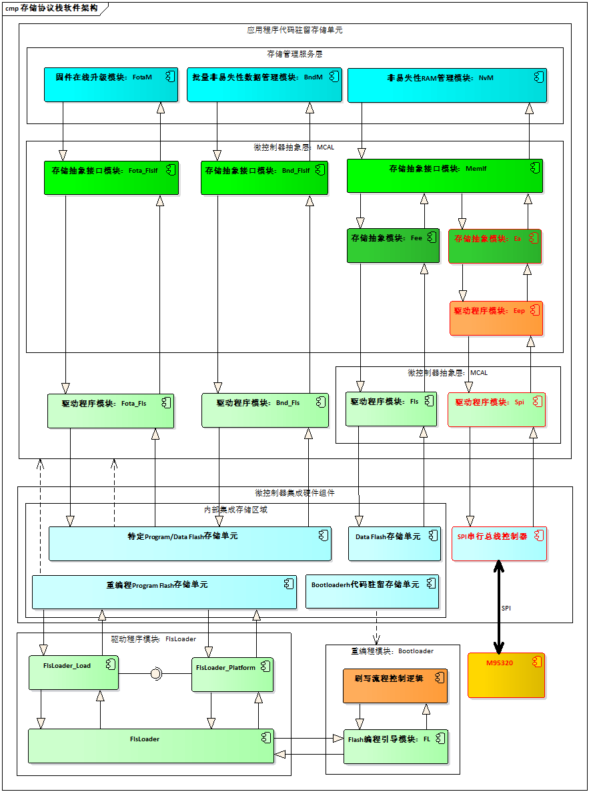
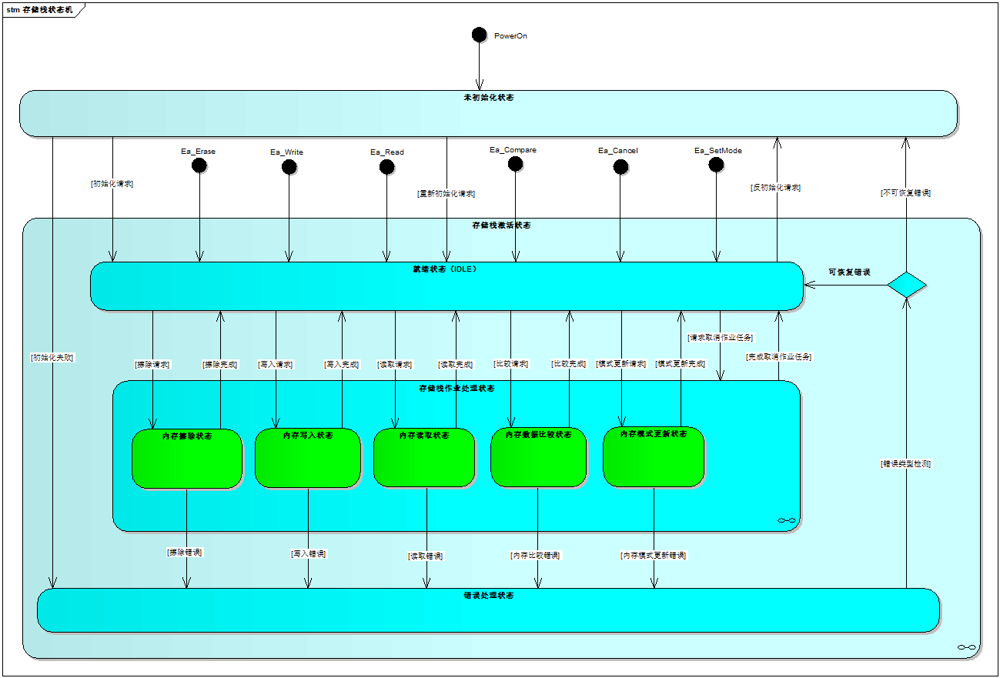
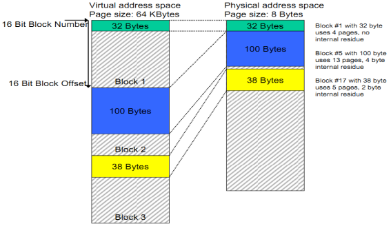
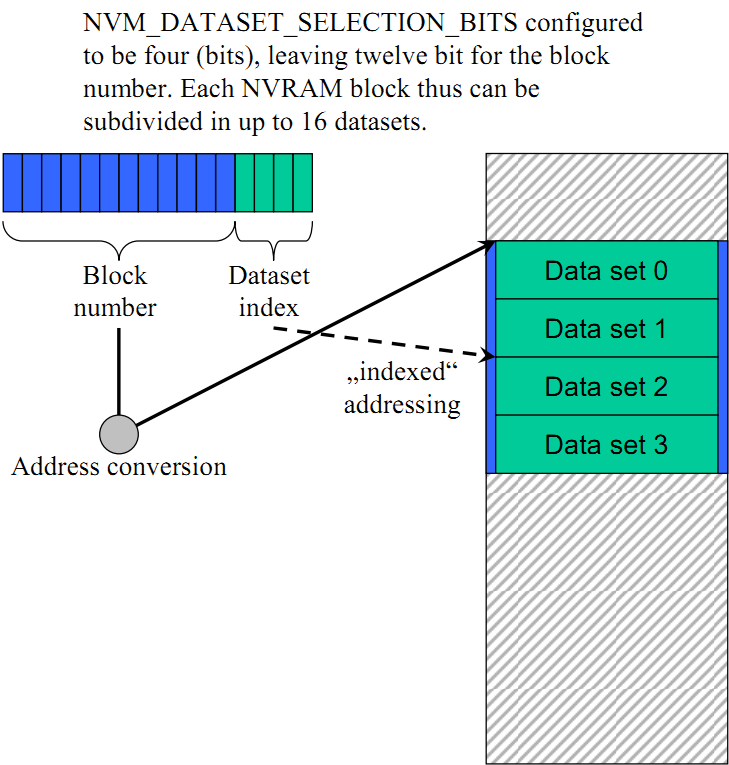
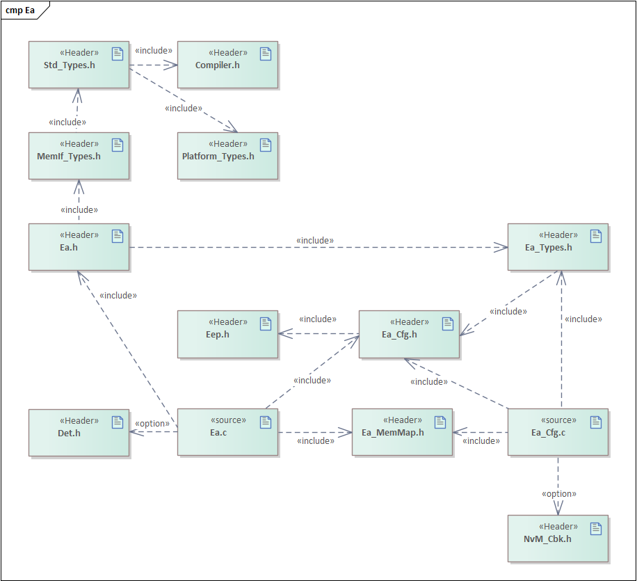
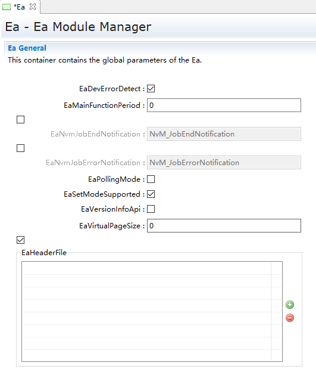
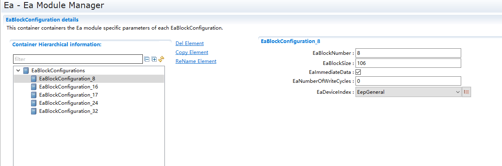
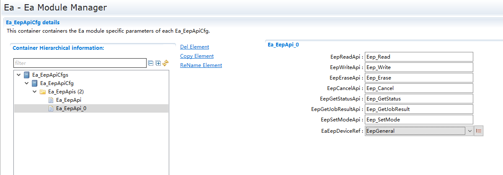
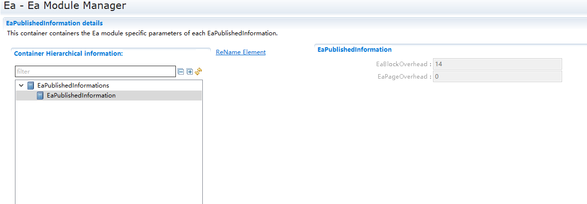

===================
EA产品参考手册
===================

**缩写词注解**

+------------+-------------------------------+------------------------+
| **缩写词** | **英文全称**                  | **中文解释**           |
+------------+-------------------------------+------------------------+
| NV         | Non-Volatile                  | 非易失性               |
+------------+-------------------------------+------------------------+
| NvM        | Non-Volatile Manager          | 非易失性管理           |
+------------+-------------------------------+------------------------+
| MemIf      | Memory Abstraction Interface  | 内存抽象接口           |
+------------+-------------------------------+------------------------+
| Fee        | Flash EEPROM Emulation        | Flash EEPROM仿真       |
+------------+-------------------------------+------------------------+
| Ea         | EEPROM Abstraction            | EEPROM抽象             |
+------------+-------------------------------+------------------------+
| Fls        | Flash                         | Flash驱动程序          |
+------------+-------------------------------+------------------------+
| Eep        | EEPROM                        | Eeprom驱动程序         |
+------------+-------------------------------+------------------------+
| Tm         | Task Manager                  | 任务管理器             |
+------------+-------------------------------+------------------------+
| Det        | Development Error Tracer      | 开发错误跟踪器         |
+------------+-------------------------------+------------------------+
| Dem        | Diagnostic Event Manager      | 诊断事件管理           |
+------------+-------------------------------+------------------------+
| BsW        | Basic Software                | 基础软件               |
+------------+-------------------------------+------------------------+
| MCAL       | Microcontroller Abstraction   | 微控制器抽象层         |
|            | Layer                         |                        |
+------------+-------------------------------+------------------------+

简介
====

|image1|

图1-1 软件组件简介

EEPROM抽象(EA)是对设备特定地址结构和分段的抽象，它为上层提供虚拟的地址结构和分段，并提供无限的擦除周期；ECU抽象层中的EA模块是对底层EEPROM设备的抽象。

|image2|

图1-2 Ea模块在AUTOSAR架构中的位置

AUTOSAR存储协议栈处于BSW基础软件层，包括存储器驱动层、存储器硬件抽象层、存储器服务层。存储协议栈软件是用来为整车电子模块（ECU）存储非易失性或者标定数据定义一套统一访问内存的服务软件。

参考资料
--------

[1] AUTOSAR_SRS_EEPROMDriver.pdf，R19-11

[2] AUTOSAR_SRS_MemoryHWAbstractionLayer.pdf，R19-11

[3] AUTOSAR_SRS_MemoryServices.pdf，R19-11

[4] AUTOSAR_SWS_EEPROMAbstraction.pdf，R19-11

[5] AUTOSAR_SWS_MemoryAbstractionInterface.pdf，R19-11

[6] AUTOSAR_SWS_NVRAMManager.pdf，R19-11

功能描述
========

Ea功能
------

Ea功能介绍
~~~~~~~~~~

|image3|

图2-1 存储协议栈软件架构图

存储协议栈软件架构图中的最底层灰色部分为存储栈的硬件控制器，这部分功能属于ECU的内部或外部FLASH（EEPROM）存储器设备，并实现存储栈FLASH或EEPROM数据存储单元的物理存储介质；存储栈软件架构图中的第二层粉红色部分为微控制器抽象层（MCAL），这部分功能属于ECU的内部或外部FLASH（EEPROM）存储器设备抽象层，并实现存储栈FLASH或EEPROM存储设备的硬件控制驱动程序，即直接操作硬件控制器寄存器，提供写入、读取、擦除、比较等API接口给上层FEE或EA模块使用；存储栈软件架构图中的第三层淡绿色部分为存储器抽象层（FEE和EA），这部分功能属于ECU的内部或外部FLASH（EEPROM）存储器设备抽象层，并实现存储栈的存储设备抽象和接口映射，即存储栈抽象层不涉及任何硬件的操作，只是申请对内存进行行为操作的请求与内存地址映射，由MemIf接口层提供统一FLASH或EEPROM内存写入、读取、擦除、比较等接口给存储栈服务层使用，存储栈中所有的状态控制类、操作结果等数据类型也是由MemIf接口层来实现；存储栈软件架构图中的最顶层淡蓝色部分为非易失性存储管理部分，这部分功能属于ECU存储栈非易失性数据管理与维护，并实现存储栈中单个Block或多个Block的数据写入、读取、擦除等API接口，便于存储栈用户使用和对非易失性数据的需求和管理。

Ea功能实现
~~~~~~~~~~

EEPROM抽象(EA)是对设备特定地址结构和分段的抽象，它为上层提供虚拟的地址结构和分段，并提供无限的擦除周期；ECU抽象层中的EA模块是对底层EEPROM设备的抽象。用户能访问到的存储器API都是针对EEPROM的；EA不直接操作硬件，所有硬件操作由EEPROM驱动模块完成。EA的主要工作是对EEPROM内存块进行逻辑块的划分（逻辑块的大小根据配置可能不同），以及地址映射。EA的读取、写入、擦除的最小单位为逻辑块。

EEPROM抽象(EA)一次只能接受一个作业任务，即模块不能为挂起的作业提供队列(这是NVRAM管理器的工作)；因为NvM是这个模块的唯一调用者，为了保持这个模块足够小，模块函数不应该检查模块当前是否繁忙；NvM的职责是序列化挂起的作业，并且只在前一个作业完成或取消后启动新作业。

|image4|

图2-2 EA模块状态机

地址分割和分段
^^^^^^^^^^^^^^

EEPROM抽象为上层提供了32位虚拟线性地址空间和均匀分割方案。这个虚拟32位地址由：

-  一个16位逻辑块编号：允许逻辑块的(理论上的)数目为65536；

-  16位逻辑块偏移量：允许每个逻辑块的(理论上的)块大小为64K字节；

|C:\\Users\\f\\AppData\\Local\\Temp\\ksohtml932\\wps3.png|
|C:\\Users\\f\\AppData\\Local\\Temp\\ksohtml7836\\wps1.png|
|C:\\Users\\f\\AppData\\Local\\Temp\\ksohtml932\\wps4.png|
|C:\\Users\\f\\AppData\\Local\\Temp\\ksohtml7836\\wps2.png|
|C:\\Users\\f\\AppData\\Local\\Temp\\ksohtml932\\wps5.png|

图2-3 虚拟地址构成

16位逻辑块编号表示一个可配置(虚拟)分页机制。此地址对齐的值可以从底层EEPROM驱动程序和设备的值派生。

备注：虚拟Page页可以通过参数EA_VIRTUAL_PAGE_SIZE进行配置。

|C:\\Users\\f\\Desktop\\1.png|

图2-4 虚拟地址与逻辑块编号的关联

地址计算
^^^^^^^^

根据EA模块的实现和所使用的确切地址格式，EA模块的功能将组合16位逻辑块编号和16位逻辑块偏移，以得到底层EEPROM驱动器所需的物理EEPROM存储单元地址；只有16位逻辑块编号中的那些位，它们不表示特定的数据集或用于地址计算的冗余拷贝应使用。

|image5|

图2-5 虚拟地址计算的控制算法

擦除周期限制
^^^^^^^^^^^^

EA模块的配置必须在配置参数EaNumberOfWriteCycles中定义每个逻辑块所期望的擦擦/写入操作周期；如果下层EEPROM设备或者设备驱动不提供配置每个物理存储单元的最小擦除/写入周期数。

立即数处理
^^^^^^^^^^

必须立即写入包含即时数据的块，即EA模块必须确保它可以写入这样的块，而不需要擦除对应的存储区（例如通过使用预先擦除的存储器），并且写入请求不是
由于目前正在运行的模块内部管理操作延迟。

管理逻辑块正确性信息
^^^^^^^^^^^^^^^^^^^^

Ea模块应该从EA模块的角度来管理每个块的信息，该块是否“正确”。
该一致性信息仅涉及块的内部处理，而不涉及块的内容；当块写入操作启动时，Ea模块将相应的块标记为不一致。
在块写入操作成功结束后，Ea模块应将块标记为一致（再次）。

.. _section-1:

源文件描述
==========

表3-1 EA组件文件描述

+-----------------------------+----------------------------------------+
| **文件**                    | **说明**                               |
+-----------------------------+----------------------------------------+
| Ea_cfg.h                    | 定义EA模块预编译时用到的配置参数。     |
|                             |                                        |
|                             | 定义数据结构，结构                     |
|                             | 体，可配置参数，设置在预编译阶段需要用 |
|                             | 到的配置参数；包含需要使用的配置宏定义 |
|                             | ；包含项目所需的常量宏定义、开关宏定义 |
+-----------------------------+----------------------------------------+
| Ea_cfg.c                    | 定义EA模块中连接时用到的配置参数。     |
+-----------------------------+----------------------------------------+
| Ea.h                        | EA模块头文件，包含了API                |
|                             | 函数的扩展声明并定义了端口的数据结构。 |
+-----------------------------+----------------------------------------+
| Ea.c                        | EA模块源文件，包含了API函数的实现。    |
+-----------------------------+----------------------------------------+
| Ea_Types.h                  | 包含EA模块的类型定义                   |
+-----------------------------+----------------------------------------+
| Ea_MemMap.h                 | 包含Ea模块的内存抽象                   |
+-----------------------------+----------------------------------------+

|image6|

图3-1 EA 组件文件交互关系图

API接口
=======

类型定义
--------

Ea_ConfigType类型定义
~~~~~~~~~~~~~~~~~~~~~

+-----------+----------------------------------------------------------+
| 名称      | Ea_ConfigType                                            |
+-----------+----------------------------------------------------------+
| 类型      | Structure                                                |
+-----------+----------------------------------------------------------+
| 范围      | 无                                                       |
+-----------+----------------------------------------------------------+
| 描述      | Ea模块的配置数据结构。                                   |
+-----------+----------------------------------------------------------+

输入函数描述
------------

+----------------------------------+-----------------------------------+
| **输入模块**                     | **API**                           |
+----------------------------------+-----------------------------------+
| Eep                              | Eep_Cancel                        |
+----------------------------------+-----------------------------------+
| Eep                              | Eep_Erase                         |
+----------------------------------+-----------------------------------+
| Eep                              | Eep_Write                         |
+----------------------------------+-----------------------------------+
| Eep                              | Eep_Read                          |
+----------------------------------+-----------------------------------+
| Eep                              | Eep_SetMode                       |
+----------------------------------+-----------------------------------+
| Eep                              | Eep_GetStatus                     |
+----------------------------------+-----------------------------------+
| Eep                              | Eep_GetJobResult                  |
+----------------------------------+-----------------------------------+
| Det                              | Det_ReportError                   |
+----------------------------------+-----------------------------------+
| Det                              | Det_ReportRuntimeError            |
+----------------------------------+-----------------------------------+

静态接口函数定义
----------------

Ea_Init函数定义
~~~~~~~~~~~~~~~

+-------------+-------------------------------------+------+----------+
| 函数名称：  | Ea_Init                             |      |          |
+-------------+-------------------------------------+------+----------+
| 函数原型：  | FUNC(void, EA_PUBLIC_CODE) Ea_Init  |      |          |
|             |                                     |      |          |
|             | (                                   |      |          |
|             |                                     |      |          |
|             | P2CONST(Ea_ConfigType, EA_CONST,    |      |          |
|             | EA_CONST_PBCFG) ConfigPtr           |      |          |
|             |                                     |      |          |
|             | );                                  |      |          |
+-------------+-------------------------------------+------+----------+
| 服务编号：  | 0x00                                |      |          |
+-------------+-------------------------------------+------+----------+
| 同步/异步： | 同步                                |      |          |
+-------------+-------------------------------------+------+----------+
| 是          | 不可重入                            |      |          |
| 否可重入：  |                                     |      |          |
+-------------+-------------------------------------+------+----------+
| 输入参数：  | ConfigPtr：指向EA模块配置结构的指针 | 值   | 无       |
|             |                                     | 域： |          |
+-------------+-------------------------------------+------+----------+
| 输入        | 无                                  |      |          |
| 输出参数：  |                                     |      |          |
+-------------+-------------------------------------+------+----------+
| 输出参数：  | 无                                  |      |          |
+-------------+-------------------------------------+------+----------+
| 返回值：    | 无                                  |      |          |
+-------------+-------------------------------------+------+----------+
| 功能概述：  | 初始化EA模块变量和配置              |      |          |
|             | 参数，并对EEPROM抽象模块进行初始化  |      |          |
+-------------+-------------------------------------+------+----------+

Ea_Read函数定义
~~~~~~~~~~~~~~~

+-------------+---------------------------------------+------+--------+
| 函数名称：  | Ea_Read                               |      |        |
+-------------+---------------------------------------+------+--------+
| 函数原型：  | FUNC(Std_ReturnType, EA_PUBLIC_CODE)  |      |        |
|             | Ea_Read                               |      |        |
|             |                                       |      |        |
|             | (                                     |      |        |
|             |                                       |      |        |
|             | uint16 BlockNumber,                   |      |        |
|             |                                       |      |        |
|             | uint16 BlockOffset,                   |      |        |
|             |                                       |      |        |
|             | Ea_DataBufferPtrType DataBufferPtr,   |      |        |
|             |                                       |      |        |
|             | uint16 Length                         |      |        |
|             |                                       |      |        |
|             | );                                    |      |        |
+-------------+---------------------------------------+------+--------+
| 服务编号：  | 0x02                                  |      |        |
+-------------+---------------------------------------+------+--------+
| 同步/异步： | 异步                                  |      |        |
+-------------+---------------------------------------+------+--------+
| 是          | 不可重入                              |      |        |
| 否可重入：  |                                       |      |        |
+-------------+---------------------------------------+------+--------+
| 输入参数：  | BlockNumber：逻辑块序列编号           | 值   | 0      |
|             |                                       | 域： | -65535 |
+-------------+---------------------------------------+------+--------+
|             | BlockOffset：逻辑块偏移地址           | 值   | 0      |
|             |                                       | 域： | -65535 |
+-------------+---------------------------------------+------+--------+
|             | Length：读取数据的字节数量            | 值   | 0      |
|             |                                       | 域： | -65535 |
+-------------+---------------------------------------+------+--------+
| 输入        | 无                                    |      |        |
| 输出参数：  |                                       |      |        |
+-------------+---------------------------------------+------+--------+
| 输出参数：  | Da                                    | 值   | 无     |
|             | taBufferPtr：指向读取数据缓冲区的指针 | 域： |        |
+-------------+---------------------------------------+------+--------+
| 返回值：    | E_OK：请求的作业任务已经被接受        |      |        |
|             |                                       |      |        |
|             | E_NOT_OK：请求的作业任务没有被接受    |      |        |
+-------------+---------------------------------------+------+--------+
| 功能概述：  | 从逻辑块编号和偏移地址的              |      |        |
|             | EEPROM存储单元中读取Length个字节的数  |      |        |
|             | 据到指定的DataBufferPtr数据缓冲区中。 |      |        |
+-------------+---------------------------------------+------+--------+

Ea_Write函数定义
~~~~~~~~~~~~~~~~

+-------------+---------------------------------------+------+--------+
| 函数名称：  | Ea_Write                              |      |        |
+-------------+---------------------------------------+------+--------+
| 函数原型：  | FUNC(Std_ReturnType, EA_PUBLIC_CODE)  |      |        |
|             | Ea_Write                              |      |        |
|             |                                       |      |        |
|             | (                                     |      |        |
|             |                                       |      |        |
|             | uint16 BlockNumber,                   |      |        |
|             |                                       |      |        |
|             | Ea_DataBufferPtrType DataBufferPtr    |      |        |
|             |                                       |      |        |
|             | );                                    |      |        |
+-------------+---------------------------------------+------+--------+
| 服务编号：  | 0x03                                  |      |        |
+-------------+---------------------------------------+------+--------+
| 同步/异步： | 异步                                  |      |        |
+-------------+---------------------------------------+------+--------+
| 是          | 不可重入                              |      |        |
| 否可重入：  |                                       |      |        |
+-------------+---------------------------------------+------+--------+
| 输入参数：  | BlockNumber：逻辑块序列编号           | 值   | 0      |
|             |                                       | 域： | -65535 |
+-------------+---------------------------------------+------+--------+
|             | Da                                    | 值   | 无     |
|             | taBufferPtr：指向写入数据缓冲区的指针 | 域： |        |
+-------------+---------------------------------------+------+--------+
| 输入        | 无                                    |      |        |
| 输出参数：  |                                       |      |        |
+-------------+---------------------------------------+------+--------+
| 输出参数：  | 无                                    |      |        |
+-------------+---------------------------------------+------+--------+
| 返回值：    | E_OK：请求的作业任务已经被接受        |      |        |
|             |                                       |      |        |
|             | E_NOT_OK：请求的作业任务没有被接受    |      |        |
+-------------+---------------------------------------+------+--------+
| 功能概述：  | 用于将DataBuffer                      |      |        |
|             | Ptr指定缓冲区的字节数据写入到BlockNum |      |        |
|             | ber逻辑块编号规定的EEPROM存储单元中。 |      |        |
+-------------+---------------------------------------+------+--------+

Ea_InvalidateBlock函数定义
~~~~~~~~~~~~~~~~~~~~~~~~~~

+-------------+---------------------------------------+------+--------+
| 函数名称：  | Ea_InvalidateBlock                    |      |        |
+-------------+---------------------------------------+------+--------+
| 函数原型：  | Std_ReturnType                        |      |        |
|             | Ea_InvalidateBlock(uint16             |      |        |
|             | BlockNumber);                         |      |        |
+-------------+---------------------------------------+------+--------+
| 服务编号：  | 0x07                                  |      |        |
+-------------+---------------------------------------+------+--------+
| 同步/异步： | 异步                                  |      |        |
+-------------+---------------------------------------+------+--------+
| 是          | 不可重入                              |      |        |
| 否可重入：  |                                       |      |        |
+-------------+---------------------------------------+------+--------+
| 输入参数：  | BlockNumber：逻辑块序列编号           | 值   | 0      |
|             |                                       | 域： | -65535 |
+-------------+---------------------------------------+------+--------+
| 输入        | 无                                    |      |        |
| 输出参数：  |                                       |      |        |
+-------------+---------------------------------------+------+--------+
| 输出参数：  | 无                                    |      |        |
+-------------+---------------------------------------+------+--------+
| 返回值：    | E_OK：请求的作业任务已经被接受        |      |        |
|             |                                       |      |        |
|             | E_NOT_OK：请求的作业任务没有被接受    |      |        |
+-------------+---------------------------------------+------+--------+
| 功能概述：  | 根据逻辑块编号设置对应的逻辑块为无效  |      |        |
+-------------+---------------------------------------+------+--------+

Ea_EraseImmediateBlock函数定义
~~~~~~~~~~~~~~~~~~~~~~~~~~~~~~

+-------------+---------------------------------------+------+--------+
| 函数名称：  | Ea_EraseImmediateBlock                |      |        |
+-------------+---------------------------------------+------+--------+
| 函数原型：  | Std_ReturnType                        |      |        |
|             | Ea_EraseImmediateBlock(uint16         |      |        |
|             | BlockNumber);                         |      |        |
+-------------+---------------------------------------+------+--------+
| 服务编号：  | 0x09                                  |      |        |
+-------------+---------------------------------------+------+--------+
| 同步/异步： | 异步                                  |      |        |
+-------------+---------------------------------------+------+--------+
| 是          | 不可重入                              |      |        |
| 否可重入：  |                                       |      |        |
+-------------+---------------------------------------+------+--------+
| 输入参数：  | BlockNumber：逻辑块序列编号           | 值   | 0      |
|             |                                       | 域： | -65535 |
+-------------+---------------------------------------+------+--------+
| 输入        | 无                                    |      |        |
| 输出参数：  |                                       |      |        |
+-------------+---------------------------------------+------+--------+
| 输出参数：  | 无                                    |      |        |
+-------------+---------------------------------------+------+--------+
| 返回值：    | E_OK：请求的作业任务已经被接受        |      |        |
|             |                                       |      |        |
|             | E_NOT_OK：请求的作业任务没有被接受    |      |        |
+-------------+---------------------------------------+------+--------+
| 功能概述：  | 根据逻辑块编号擦除对应的逻辑块        |      |        |
+-------------+---------------------------------------+------+--------+

Ea_Cancel函数定义
~~~~~~~~~~~~~~~~~

+-------------+--------------------------------------------------------+
| 函数名称：  | Ea_Cancel                                              |
+-------------+--------------------------------------------------------+
| 函数原型：  | void Ea_Cancel(void);                                  |
+-------------+--------------------------------------------------------+
| 服务编号：  | 0x04                                                   |
+-------------+--------------------------------------------------------+
| 同步/异步： | 同步                                                   |
+-------------+--------------------------------------------------------+
| 是          | 不可重入                                               |
| 否可重入：  |                                                        |
+-------------+--------------------------------------------------------+
| 输入参数：  | 无                                                     |
+-------------+--------------------------------------------------------+
| 输入        | 无                                                     |
| 输出参数：  |                                                        |
+-------------+--------------------------------------------------------+
| 输出参数：  | 无                                                     |
+-------------+--------------------------------------------------------+
| 返回值：    | 无                                                     |
+-------------+--------------------------------------------------------+
| 功能概述：  | 以同步的方式取消正在进行的作业任务                     |
+-------------+--------------------------------------------------------+

Ea_GetStatus函数定义
~~~~~~~~~~~~~~~~~~~~

+-------------+--------------------------------------------------------+
| 函数名称：  | Ea_GetStatus                                           |
+-------------+--------------------------------------------------------+
| 函数原型：  | MemIf_StatusType Ea_GetStatus(void);                   |
+-------------+--------------------------------------------------------+
| 服务编号：  | 0x05                                                   |
+-------------+--------------------------------------------------------+
| 同步/异步： | 同步                                                   |
+-------------+--------------------------------------------------------+
| 是          | 不可重入                                               |
| 否可重入：  |                                                        |
+-------------+--------------------------------------------------------+
| 输入参数：  | 无                                                     |
+-------------+--------------------------------------------------------+
| 输入        | 无                                                     |
| 输出参数：  |                                                        |
+-------------+--------------------------------------------------------+
| 输出参数：  | 无                                                     |
+-------------+--------------------------------------------------------+
| 返回值：    | MEMIF_UNINIT:                                          |
|             |                                                        |
|             | EA模块没有被初始化                                     |
|             |                                                        |
|             | MEMIF_IDLE：                                           |
|             |                                                        |
|             | EA模块当前处于空闲状态                                 |
|             |                                                        |
|             | MEMIF_BUSY:                                            |
|             |                                                        |
|             | EA模块当前处于忙状态                                   |
|             |                                                        |
|             | MEMIF_BUSY_INTERNAL:                                   |
|             |                                                        |
|             | EA模块当前处于内部管理操作的忙状态                     |
+-------------+--------------------------------------------------------+
| 功能概述：  | 服务用于获取EA模块的当前工作状态                       |
+-------------+--------------------------------------------------------+

Ea_GetJobResult函数定义
~~~~~~~~~~~~~~~~~~~~~~~

+-------------+--------------------------------------------------------+
| 函数名称：  | Ea_GetJobResult                                        |
+-------------+--------------------------------------------------------+
| 函数原型：  | MemIf_JobResultType Ea_GetJobResult(void);             |
+-------------+--------------------------------------------------------+
| 服务编号：  | 0x06                                                   |
+-------------+--------------------------------------------------------+
| 同步/异步： | 同步                                                   |
+-------------+--------------------------------------------------------+
| 是          | 不可重入                                               |
| 否可重入：  |                                                        |
+-------------+--------------------------------------------------------+
| 输入参数：  | 无                                                     |
+-------------+--------------------------------------------------------+
| 输入        | 无                                                     |
| 输出参数：  |                                                        |
+-------------+--------------------------------------------------------+
| 输出参数：  | 无                                                     |
+-------------+--------------------------------------------------------+
| 返回值：    | MEMIF_JOB_OK:                                          |
|             |                                                        |
|             | 最后一次的Job作业任务被成功地完成                      |
|             |                                                        |
|             | MEMIF_JOB_PENDING：                                    |
|             |                                                        |
|             | 最后一次的Job作业任务正在执行等待或当前正处于执行中    |
|             |                                                        |
|             | MEMIF_JOB_CANCELED:                                    |
|             |                                                        |
|             | 最后一次的Job作业任务被取消                            |
|             |                                                        |
|             | MEMIF_JOB_FAILED:                                      |
|             |                                                        |
|             | 最后一次的Job作业任务没有成功地完成，失败              |
|             |                                                        |
|             | MEMIF_BLOCK_INCONSISTENT:                              |
|             |                                                        |
|             | 被请求的逻辑块是前后矛盾的，也许数据损坏               |
|             |                                                        |
|             | MEMIF_BLOCK_INVALID:                                   |
|             |                                                        |
|             | 被请求的逻辑块是无效的，请求操作可能没有被执行         |
+-------------+--------------------------------------------------------+
| 功能概述：  | 服务用于返回最后一次Job作业任务的执行结果              |
+-------------+--------------------------------------------------------+

Ea_GetVersionInfo函数定义
~~~~~~~~~~~~~~~~~~~~~~~~~

+-------------+------------------------------------------+------+-----+
| 函数名称：  | Ea_GetVersionInfo                        |      |     |
+-------------+------------------------------------------+------+-----+
| 函数原型：  | void                                     |      |     |
|             | Ea_GetVersionInfo(Std_VersionInfoType    |      |     |
|             | \*VersionInfoPtr);                       |      |     |
+-------------+------------------------------------------+------+-----+
| 服务编号：  | 0x01                                     |      |     |
+-------------+------------------------------------------+------+-----+
| 同步/异步： | 同步                                     |      |     |
+-------------+------------------------------------------+------+-----+
| 是          | 不可重入                                 |      |     |
| 否可重入：  |                                          |      |     |
+-------------+------------------------------------------+------+-----+
| 输入参数：  | 无                                       |      |     |
+-------------+------------------------------------------+------+-----+
| 输入        | 无                                       |      |     |
| 输出参数：  |                                          |      |     |
+-------------+------------------------------------------+------+-----+
| 输出参数：  | Vers                                     | 值   | 无  |
|             | ionInfoPtr：指向EA模块软件版本信息的指针 | 域： |     |
+-------------+------------------------------------------+------+-----+
| 返回值：    | 无                                       |      |     |
+-------------+------------------------------------------+------+-----+
| 功能概述：  | 服务用于返回EA模块软件版本信息           |      |     |
+-------------+------------------------------------------+------+-----+

Ea_SetMode函数定义
~~~~~~~~~~~~~~~~~~

+---------------+---------------------------+------+-------------------+
| 函数名称：    | Ea_SetMode                |      |                   |
+---------------+---------------------------+------+-------------------+
| 函数原型：    | void                      |      |                   |
|               | Ea_SetMode(MemIf_ModeType |      |                   |
|               | Mode);                    |      |                   |
+---------------+---------------------------+------+-------------------+
| 服务编号：    | 0x0A                      |      |                   |
+---------------+---------------------------+------+-------------------+
| 同步/异步：   | 同步                      |      |                   |
+---------------+---------------------------+------+-------------------+
| 是否可重入：  | 不可重入                  |      |                   |
+---------------+---------------------------+------+-------------------+
| 输入参数：    | 无                        |      |                   |
+---------------+---------------------------+------+-------------------+
| 输            | 无                        |      |                   |
| 入输出参数：  |                           |      |                   |
+---------------+---------------------------+------+-------------------+
| 输出参数：    | Mode：底层                | 值   | MEMIF_MODE_SLOW   |
|               | EEPROM驱动程序所需的模式  | 域： |                   |
|               |                           |      | MEMIF_MODE_FAST   |
+---------------+---------------------------+------+-------------------+
| 返回值：      | 无                        |      |                   |
+---------------+---------------------------+------+-------------------+
| 功能概述：    | 服务用于设置              |      |                   |
|               | 底层EEPROM驱动程序的模式  |      |                   |
+---------------+---------------------------+------+-------------------+

Ea_JobEndNotification函数定义
~~~~~~~~~~~~~~~~~~~~~~~~~~~~~

+-------------+--------------------------------------------------------+
| 函数名称：  | Ea_JobEndNotification                                  |
+-------------+--------------------------------------------------------+
| 函数原型：  | void Ea_JobEndNotification(void);                      |
+-------------+--------------------------------------------------------+
| 服务编号：  | 0x10                                                   |
+-------------+--------------------------------------------------------+
| 同步/异步： | 同步                                                   |
+-------------+--------------------------------------------------------+
| 是          | 不可重入                                               |
| 否可重入：  |                                                        |
+-------------+--------------------------------------------------------+
| 输入参数：  | 无                                                     |
+-------------+--------------------------------------------------------+
| 输入        | 无                                                     |
| 输出参数：  |                                                        |
+-------------+--------------------------------------------------------+
| 输出参数：  | 无                                                     |
+-------------+--------------------------------------------------------+
| 返回值：    | 无                                                     |
+-------------+--------------------------------------------------------+
| 功能概述：  | 任务完                                                 |
|             | 成回调；服务用于报告一个异步操作的成功完成通知给该模块 |
+-------------+--------------------------------------------------------+

Ea_JobErrorNotification函数定义
~~~~~~~~~~~~~~~~~~~~~~~~~~~~~~~

+-------------+--------------------------------------------------------+
| 函数名称：  | Ea_JobErrorNotification                                |
+-------------+--------------------------------------------------------+
| 函数原型：  | void Ea_JobErrorNotification(void);                    |
+-------------+--------------------------------------------------------+
| 服务编号：  | 0x11                                                   |
+-------------+--------------------------------------------------------+
| 同步/异步： | 同步                                                   |
+-------------+--------------------------------------------------------+
| 是          | 不可重入                                               |
| 否可重入：  |                                                        |
+-------------+--------------------------------------------------------+
| 输入参数：  | 无                                                     |
+-------------+--------------------------------------------------------+
| 输入        | 无                                                     |
| 输出参数：  |                                                        |
+-------------+--------------------------------------------------------+
| 输出参数：  | 无                                                     |
+-------------+--------------------------------------------------------+
| 返回值：    | 无                                                     |
+-------------+--------------------------------------------------------+
| 功能概述：  | 任务错                                                 |
|             | 误回调；服务用于报告一个异步操作的成功结束通知给该模块 |
+-------------+--------------------------------------------------------+

Ea_MainFunction函数定义
~~~~~~~~~~~~~~~~~~~~~~~

+-------------+--------------------------------------------------------+
| 函数名称：  | Ea_MainFunction                                        |
+-------------+--------------------------------------------------------+
| 函数原型：  | void Ea_MainFunction(void);                            |
+-------------+--------------------------------------------------------+
| 服务编号：  | 0x12                                                   |
+-------------+--------------------------------------------------------+
| 同步/异步： | 无                                                     |
+-------------+--------------------------------------------------------+
| 是          | 不可重入                                               |
| 否可重入：  |                                                        |
+-------------+--------------------------------------------------------+
| 输入参数：  | 无                                                     |
+-------------+--------------------------------------------------------+
| 输入        | 无                                                     |
| 输出参数：  |                                                        |
+-------------+--------------------------------------------------------+
| 输出参数：  | 无                                                     |
+-------------+--------------------------------------------------------+
| 返回值：    | 无                                                     |
+-------------+--------------------------------------------------------+
| 功能概述：  | 服务用于处理被请求的所                                 |
|             | 有Job作业任务，并对内部的状态机的状态切换操作进行管理  |
+-------------+--------------------------------------------------------+

可配置函数定义
--------------

NvM_JobEndNotification函数定义
~~~~~~~~~~~~~~~~~~~~~~~~~~~~~~

+-------------+--------------------------------------------------------+
| 函数名称：  | NvM_JobEndNotification                                 |
+-------------+--------------------------------------------------------+
| 函数原型：  | void NvM_JobEndNotification(void);                     |
+-------------+--------------------------------------------------------+
| 服务编号：  | 无                                                     |
+-------------+--------------------------------------------------------+
| 同步/异步： | 同步                                                   |
+-------------+--------------------------------------------------------+
| 是          | 不可重入                                               |
| 否可重入：  |                                                        |
+-------------+--------------------------------------------------------+
| 输入参数：  | 无                                                     |
+-------------+--------------------------------------------------------+
| 输入        | 无                                                     |
| 输出参数：  |                                                        |
+-------------+--------------------------------------------------------+
| 输出参数：  | 无                                                     |
+-------------+--------------------------------------------------------+
| 返回值：    | 无                                                     |
+-------------+--------------------------------------------------------+
| 功能概述：  | 该功能用于底层内存抽                                   |
|             | 象EA模块，以发出作业结束，且没有错误的信号通知NVM模块  |
+-------------+--------------------------------------------------------+

NvM_JobErrorNotification函数定义
~~~~~~~~~~~~~~~~~~~~~~~~~~~~~~~~

+-------------+--------------------------------------------------------+
| 函数名称：  | NvM_JobErrorNotification                               |
+-------------+--------------------------------------------------------+
| 函数原型：  | void NvM_JobErrorNotification(void);                   |
+-------------+--------------------------------------------------------+
| 服务编号：  | 无                                                     |
+-------------+--------------------------------------------------------+
| 同步/异步： | 同步                                                   |
+-------------+--------------------------------------------------------+
| 是          | 不可重入                                               |
| 否可重入：  |                                                        |
+-------------+--------------------------------------------------------+
| 输入参数：  | 无                                                     |
+-------------+--------------------------------------------------------+
| 输入        | 无                                                     |
| 输出参数：  |                                                        |
+-------------+--------------------------------------------------------+
| 输出参数：  | 无                                                     |
+-------------+--------------------------------------------------------+
| 返回值：    | 无                                                     |
+-------------+--------------------------------------------------------+
| 功能概述：  | 该功能用于底层内存                                     |
|             | 抽象EA模块，以发出作业结束，且有错误的信号通知NvM模块  |
+-------------+--------------------------------------------------------+

.. _section-2:

配置
====

表5‑1 属性描述

+------------+---------------------------------------------------------+
| UI名称     | 该配置项在配置工具界面显示的名称                        |
+------------+---------------------------------------------------------+
| 取值范围   | 该配置项允许的取值区间                                  |
+------------+---------------------------------------------------------+
| 默认取值   | 该配置项默认的配置值                                    |
+------------+---------------------------------------------------------+
| 参数描述   | 该配置项在标准的AUTOSAR_EcucParamDef.arxml文件中的描述  |
+------------+---------------------------------------------------------+
| 依赖关系   | 该配置项与其他模块或配置项的关系                        |
+------------+---------------------------------------------------------+

EaGeneral配置
-------------

|image7|

图5-1 EA模块的General容器配置图

表5-2 Ea模块的General配置属性描述

+--------+-----------+-----------------------+---+-----------+---+-----------+
| **UI   | **描述**  |                       |   |           |   |           |
| 名称** |           |                       |   |           |   |           |
+--------+-----------+-----------------------+---+-----------+---+-----------+
| EaDe   | 取值范围  | STD_ON,STD_OFF        | 默 |          | S |           |
| vError |           |                       | 认 |          | T |           |
| Detect |           |                       | 取 |          | D |           |
|        |           |                       | 值 |          | _ |           |
|        |           |                       |   |           | O |           |
|        |           |                       |   |           | F |           |
|        |           |                       |   |           | F |           |
+--------+-----------+-----------------------+---+-----------+---+-----------+
|        | 参数描述  | 是否开启对开          |   |           |   |           |
|        |           | 发过程中错误的检查；  |   |           |   |           |
|        |           |                       |   |           |   |           |
|        |           | 打开或关闭            |   |           |   |           |
|        |           | 开发错误检测和通知。  |   |           |   |           |
+--------+-----------+-----------------------+---+-----------+---+-----------+
|        | 依赖关系  | 依赖于DET模块的存在性 |   |           |   |           |
+--------+-----------+-----------------------+---+-----------+---+-----------+
| Ea     | 取值范围  | 0…4294967295          |   | 默认取值  |   | 0         |
| MainFu |           |                       |   |           |   |           |
| nction |           |                       |   |           |   |           |
| Period |           |                       |   |           |   |           |
+--------+-----------+-----------------------+---+-----------+---+-----------+
|        | 参数描述  | 周                    |   |           |   |           |
|        |           | 期任务调度的时间基准  |   |           |   |           |
+--------+-----------+-----------------------+---+-----------+---+-----------+
|        | 依赖关系  | 依赖于BSWM和          |   |           |   |           |
|        |           | OS模块的任务调度管理  |   |           |   |           |
+--------+-----------+-----------------------+---+-----------+---+-----------+
| EaNvm  | 取值范围  | 回调函数名或空指针    |   | 默认取值  |   | NULL_PTR  |
| JobEnd |           |                       |   |           |   |           |
| Notifi |           |                       |   |           |   |           |
| cation |           |                       |   |           |   |           |
+--------+-----------+-----------------------+---+-----------+---+-----------+
|        | 参数描述  | 映射到上层模块提      |   |           |   |           |
|        |           | 供的作业结束通知例程  |   |           |   |           |
|        |           |                       |   |           |   |           |
|        |           | (Nv                   |   |           |   |           |
|        |           | M_JobEndNotification) |   |           |   |           |
+--------+-----------+-----------------------+---+-----------+---+-----------+
|        | 依赖关系  | 依赖于NVM和EA模块之   |   |           |   |           |
|        |           | 间作业任务的交互关系  |   |           |   |           |
|        |           |                       |   |           |   |           |
|        |           | 轮询模式：            |   |           |   |           |
|        |           | 此配置项没有任何作用  |   |           |   |           |
|        |           |                       |   |           |   |           |
|        |           | 中断                  |   |           |   |           |
|        |           | 通知模式：调用Read/W  |   |           |   |           |
|        |           | rite/Erase等Api接口之 |   |           |   |           |
|        |           | 后，执行的回调函数。  |   |           |   |           |
+--------+-----------+-----------------------+---+-----------+---+-----------+
| E      | 取值范围  | 回调函数名或空指针    |   | 默认取值  |   | NULL_PTR  |
| aNvmJo |           |                       |   |           |   |           |
| bError |           |                       |   |           |   |           |
| Notifi |           |                       |   |           |   |           |
| cation |           |                       |   |           |   |           |
+--------+-----------+-----------------------+---+-----------+---+-----------+
|        | 参数描述  | 映射到上层模块提      |   |           |   |           |
|        |           | 供的作业错误通知例程  |   |           |   |           |
|        |           |                       |   |           |   |           |
|        |           | (NvM_                 |   |           |   |           |
|        |           | JobErrorNotification) |   |           |   |           |
+--------+-----------+-----------------------+---+-----------+---+-----------+
|        | 依赖关系  | 依赖于NVM和EA模块之   |   |           |   |           |
|        |           | 间作业任务的交互关系  |   |           |   |           |
|        |           |                       |   |           |   |           |
|        |           | 轮询模式：            |   |           |   |           |
|        |           | 此配置项没有任何作用  |   |           |   |           |
|        |           |                       |   |           |   |           |
|        |           | 中断                  |   |           |   |           |
|        |           | 通知模式：调用Read/W  |   |           |   |           |
|        |           | rite/Erase等Api接口之 |   |           |   |           |
|        |           | 后，执行的回调函数。  |   |           |   |           |
+--------+-----------+-----------------------+---+-----------+---+-----------+
| E      | 取值范围  | STD_ON,STD_OFF        |   | 默认取值  |   | STD_OFF   |
| aPolli |           |                       |   |           |   |           |
| ngMode |           |                       |   |           |   |           |
+--------+-----------+-----------------------+---+-----------+---+-----------+
|        | 参数描述  | 预处                  |   |           |   |           |
|        |           | 理器开关，用于使能和  |   |           |   |           |
|        |           | 禁止该模块的轮询模式  |   |           |   |           |
|        |           |                       |   |           |   |           |
|        |           | 查看任务执行结果的方  |   |           |   |           |
|        |           | 式，该方式有Polling或 |   |           |   |           |
|        |           |                       |   |           |   |           |
|        |           | Callback              |   |           |   |           |
|        |           | Notication。若配置Po  |   |           |   |           |
|        |           | lling，则需要一直通过 |   |           |   |           |
|        |           |                       |   |           |   |           |
|        |           | Ea_GetJobR            |   |           |   |           |
|        |           | esult查看当前任务的结 |   |           |   |           |
|        |           | 果，确认任务是否执行  |   |           |   |           |
|        |           | 完毕。若选取其他方式  |   |           |   |           |
|        |           | ，则在任务执行完毕后  |   |           |   |           |
|        |           | ，自动调用回调函数。  |   |           |   |           |
+--------+-----------+-----------------------+---+-----------+---+-----------+
|        | 依赖关系  | 依赖于EEP和EA模块之   |   |           |   |           |
|        |           | 间作业任务的交互关系  |   |           |   |           |
+--------+-----------+-----------------------+---+-----------+---+-----------+
| EaSetM | 取值范围  | STD_ON,STD_OFF        |   | 默认取值  |   | STD_OFF   |
| odeSup |           |                       |   |           |   |           |
| ported |           |                       |   |           |   |           |
+--------+-----------+-----------------------+---+-----------+---+-----------+
|        | 参数描述  | 编                    |   |           |   |           |
|        |           | 译宏开关用于打开/关闭 |   |           |   |           |
|        |           | API接口Ea_SetMode功能 |   |           |   |           |
+--------+-----------+-----------------------+---+-----------+---+-----------+
|        | 依赖关系  | 无                    |   |           |   |           |
+--------+-----------+-----------------------+---+-----------+---+-----------+
| EaVe   | 取值范围  | STD_ON,STD_OFF        |   | 默认取值  |   | STD_OFF   |
| rsionI |           |                       |   |           |   |           |
| nfoApi |           |                       |   |           |   |           |
+--------+-----------+-----------------------+---+-----------+---+-----------+
|        | 参数描述  | 预处理器开关，使      |   |           |   |           |
|        |           | 能/禁止版本检测API接  |   |           |   |           |
|        |           | 口，以读出模块的版本  |   |           |   |           |
|        |           | 信息；是否在编译时，  |   |           |   |           |
|        |           | 查看配置文件，源文件  |   |           |   |           |
|        |           | 的版本信息是否一致。  |   |           |   |           |
+--------+-----------+-----------------------+---+-----------+---+-----------+
|        | 依赖关系  | 无                    |   |           |   |           |
+--------+-----------+-----------------------+---+-----------+---+-----------+
| EaVir  | 取值范围  | 0…255                 |   | 默认取值  |   | 0         |
| tualPa |           |                       |   |           |   |           |
| geSize |           |                       |   |           |   |           |
+--------+-----------+-----------------------+---+-----------+---+-----------+
|        | 参数描述  | 逻辑块需要对齐        |   |           |   |           |
|        |           | 的大小(以字节为单位)  |   |           |   |           |
+--------+-----------+-----------------------+---+-----------+---+-----------+
|        | 依赖关系  | 依赖于实际物理EEP     |   |           |   |           |
|        |           | ROM存储芯片的物理特性 |   |           |   |           |
+--------+-----------+-----------------------+---+-----------+---+-----------+

EaBlockConfigurations配置
-------------------------

|image8|

图5-2 Ea模块EaBlockConfigurations容器配置图

表5-3 Ea模块的EaBlockConfigurations配置属性描述

+--------+-----------+-----------------------+---+-----------+---+-----------+
| **UI   | **描述**  |                       |   |           |   |           |
| 名称** |           |                       |   |           |   |           |
+--------+-----------+-----------------------+---+-----------+---+-----------+
| E      | 取值范围  | 1 .. 65534            | 默 |          | 1 |           |
| aBlock |           |                       | 认 |          |   |           |
| Number |           |                       | 取 |          |   |           |
|        |           |                       | 值 |          |   |           |
+--------+-----------+-----------------------+---+-----------+---+-----------+
|        | 参数描述  | 块号。                |   |           |   |           |
|        |           |                       |   |           |   |           |
|        |           | 0x0000 and 0xFFFF     |   |           |   |           |
|        |           | shall not be used for |   |           |   |           |
|        |           | block numbers (see    |   |           |   |           |
|        |           |                       |   |           |   |           |
|        |           | SWS_Ea_00006).        |   |           |   |           |
+--------+-----------+-----------------------+---+-----------+---+-----------+
|        | 依赖关系  | 需要                  |   |           |   |           |
|        |           | 与NVM中配置的块号匹配 |   |           |   |           |
+--------+-----------+-----------------------+---+-----------+---+-----------+
| EaBlo  | 取值范围  | 1 .. 65535            |   | 默认取值  |   | 1         |
| ckSize |           |                       |   |           |   |           |
+--------+-----------+-----------------------+---+-----------+---+-----------+
|        | 参数描述  | 块数                  |   |           |   |           |
|        |           | 据大小，填写时未包含  |   |           |   |           |
|        |           | 块头，生成时包含块头  |   |           |   |           |
+--------+-----------+-----------------------+---+-----------+---+-----------+
|        | 依赖关系  | 需要与上层            |   |           |   |           |
|        |           | NVM模块的配置大小匹配 |   |           |   |           |
+--------+-----------+-----------------------+---+-----------+---+-----------+
| EaI    | 取值范围  | TRUE/FALSE            |   | 默认取值  |   | FALSE     |
| mmedia |           |                       |   |           |   |           |
| teData |           |                       |   |           |   |           |
+--------+-----------+-----------------------+---+-----------+---+-----------+
|        | 参数描述  | 立即数使能开关        |   |           |   |           |
+--------+-----------+-----------------------+---+-----------+---+-----------+
|        | 依赖关系  | 无                    |   |           |   |           |
+--------+-----------+-----------------------+---+-----------+---+-----------+
| EaN    | 取值范围  | 0 .. 4294967295       |   | 默认取值  |   | 0         |
| umberO |           |                       |   |           |   |           |
| fWrite |           |                       |   |           |   |           |
| Cycles |           |                       |   |           |   |           |
+--------+-----------+-----------------------+---+-----------+---+-----------+
|        | 参数描述  | 块最大写次数          |   |           |   |           |
+--------+-----------+-----------------------+---+-----------+---+-----------+
|        | 依赖关系  | 无                    |   |           |   |           |
+--------+-----------+-----------------------+---+-----------+---+-----------+
| E      | 取值范围  | Symbolic name         |   | 默认取值  |   | 无        |
| aDevic |           | reference to [        |   |           |   |           |
| eIndex |           | EepGeneral ]          |   |           |   |           |
+--------+-----------+-----------------------+---+-----------+---+-----------+
|        | 参数描述  | 底层驱动索引          |   |           |   |           |
+--------+-----------+-----------------------+---+-----------+---+-----------+
|        | 依赖关系  | 无                    |   |           |   |           |
+--------+-----------+-----------------------+---+-----------+---+-----------+

Ea_EepApi配置
-------------

|image9|

图5-3 Ea模块Ea_EepApi容器配置图

表5-4 Ea模块的Ea_EepApi配置属性描述

+--------+-----------+-----------------------+---+--------+--------------+
| **UI   | **描述**  |                       |   |        |              |
| 名称** |           |                       |   |        |              |
+--------+-----------+-----------------------+---+--------+--------------+
| Ea     | 取值范围  | Symbolic name         | 默 |       | 无           |
| EepDev |           | reference to [        | 认 |       |              |
| iceRef |           | EepGeneral ]          | 取 |       |              |
|        |           |                       | 值 |       |              |
+--------+-----------+-----------------------+---+--------+--------------+
|        | 参数描述  | 底层驱动索引          |   |        |              |
+--------+-----------+-----------------------+---+--------+--------------+
|        | 依赖关系  | 无                    |   |        |              |
+--------+-----------+-----------------------+---+--------+--------------+
| EepWr  | 取值范围  | String                |   | 默     | Eep_Write    |
| iteApi |           |                       |   | 认取值 |              |
+--------+-----------+-----------------------+---+--------+--------------+
|        | 参数描述  | EEP驱动写接口         |   |        |              |
+--------+-----------+-----------------------+---+--------+--------------+
|        | 依赖关系  | 依赖于底层Eep存       |   |        |              |
|        |           | 储设备驱动程序的实现  |   |        |              |
+--------+-----------+-----------------------+---+--------+--------------+
| EepEr  | 取值范围  | String                |   | 默     | Eep_Erase    |
| aseApi |           |                       |   | 认取值 |              |
+--------+-----------+-----------------------+---+--------+--------------+
|        | 参数描述  | EEP驱动擦除接口       |   |        |              |
+--------+-----------+-----------------------+---+--------+--------------+
|        | 依赖关系  | 依赖于底层Eep存       |   |        |              |
|        |           | 储设备驱动程序的实现  |   |        |              |
+--------+-----------+-----------------------+---+--------+--------------+
| EepCan | 取值范围  | String                |   | 默     | Eep_Cancel   |
| celApi |           |                       |   | 认取值 |              |
+--------+-----------+-----------------------+---+--------+--------------+
|        | 参数描述  | EEP驱动任务取消接口   |   |        |              |
+--------+-----------+-----------------------+---+--------+--------------+
|        | 依赖关系  | 依赖于底层Eep存       |   |        |              |
|        |           | 储设备驱动程序的实现  |   |        |              |
+--------+-----------+-----------------------+---+--------+--------------+
| Eep    | 取值范围  | String                |   | 默     | E            |
| GetSta |           |                       |   | 认取值 | ep_GetStatus |
| tusApi |           |                       |   |        |              |
+--------+-----------+-----------------------+---+--------+--------------+
|        | 参数描述  | EE                    |   |        |              |
|        |           | P驱动获取模块状态接口 |   |        |              |
+--------+-----------+-----------------------+---+--------+--------------+
|        | 依赖关系  | 依赖于底层Eep存       |   |        |              |
|        |           | 储设备驱动程序的实现  |   |        |              |
+--------+-----------+-----------------------+---+--------+--------------+
| EepGet | 取值范围  | String                |   | 默     | Eep_         |
| JobRes |           |                       |   | 认取值 | GetJobResult |
| ultApi |           |                       |   |        |              |
+--------+-----------+-----------------------+---+--------+--------------+
|        | 参数描述  | 该参数用              |   |        |              |
|        |           | 于定义EaEepApi模块的  |   |        |              |
|        |           | Up_GetJobResult函数名 |   |        |              |
+--------+-----------+-----------------------+---+--------+--------------+
|        | 依赖关系  | EE                    |   |        |              |
|        |           | P驱动获取任务结果接口 |   |        |              |
+--------+-----------+-----------------------+---+--------+--------------+
| E      | 取值范围  | String                |   | 默     | Eep_SetMode  |
| epSetM |           |                       |   | 认取值 |              |
| odeApi |           |                       |   |        |              |
+--------+-----------+-----------------------+---+--------+--------------+
|        | 参数描述  | EEP驱动设置模式接口   |   |        |              |
+--------+-----------+-----------------------+---+--------+--------------+
|        | 依赖关系  | 依赖于底层Eep存       |   |        |              |
|        |           | 储设备驱动程序的实现  |   |        |              |
+--------+-----------+-----------------------+---+--------+--------------+
| EepR   | 取值范围  | String                |   | 默     | Eep_Read     |
| eadApi |           |                       |   | 认取值 |              |
+--------+-----------+-----------------------+---+--------+--------------+
|        | 参数描述  | EEP驱动读取接口       |   |        |              |
+--------+-----------+-----------------------+---+--------+--------------+
|        | 依赖关系  | 依赖于底层Eep存       |   |        |              |
|        |           | 储设备驱动程序的实现  |   |        |              |
+--------+-----------+-----------------------+---+--------+--------------+

EaPublishedInformation配置
--------------------------

|image10|

图5-4 Ea模块PublishedInformation容器配置图

表5-5 Ea模块的PublishedInformation配置属性描述

+--------+-----------+-----------------------+---+-----------+---+-----------+
| **UI   | **描述**  |                       |   |           |   |           |
| 名称** |           |                       |   |           |   |           |
+--------+-----------+-----------------------+---+-----------+---+-----------+
| EaB    | 取值范围  | 0…65535               | 默 |          | 1 |           |
| lockOv |           |                       | 认 |          | 4 |           |
| erhead |           |                       | 取 |          |   |           |
|        |           |                       | 值 |          |   |           |
+--------+-----------+-----------------------+---+-----------+---+-----------+
|        | 参数描述  | 每个逻辑块的管        |   |           |   |           |
|        |           | 理开销(以字节为单位)  |   |           |   |           |
+--------+-----------+-----------------------+---+-----------+---+-----------+
|        | 依赖关系  | 不可配置，用于显示    |   |           |   |           |
+--------+-----------+-----------------------+---+-----------+---+-----------+
| Ea     | 取值范围  | 0…4294967295          |   | 默认取值  |   | 0         |
| PageOv |           |                       |   |           |   |           |
| erhead |           |                       |   |           |   |           |
+--------+-----------+-----------------------+---+-----------+---+-----------+
|        | 参数描述  | 每个Page页的管        |   |           |   |           |
|        |           | 理开销(以字节为单位)  |   |           |   |           |
+--------+-----------+-----------------------+---+-----------+---+-----------+
|        | 依赖关系  | 不可配置，用于显示    |   |           |   |           |
+--------+-----------+-----------------------+---+-----------+---+-----------+

附录：
======

集成注意事项：

在Ea模块使用过程中，需要使用到下层Eep驱动模块，需要包含第三方驱动程序，会涉及到文件名和类型名字不匹配的问题，所以在EA模块中，始终会包含头文件#include
"Eep.h"。

所以在集成时，需要新建一个Eep.h文件，并在这个文件中做底层驱动的适配，如下图所示：

|image11|

.. |image2| image:: ../../_static/参考手册/Ea/image2.png
   :width: 5.76528in
   :height: 4.59444in
.. |image3| image:: ../../_static/参考手册/Ea/image3.png
   :width: 5.76736in
   :height: 7.17431in

.. |C:\\Users\\f\\AppData\\Local\\Temp\\ksohtml932\\wps3.png| image:: ../../_static/参考手册/Ea/image5.png
   :width: 1.20833in
   :height: 1.20833in

.. |image11| image:: ../../_static/参考手册/Ea/image17.png
   :width: 5.67637in
   :height: 4.23905in
