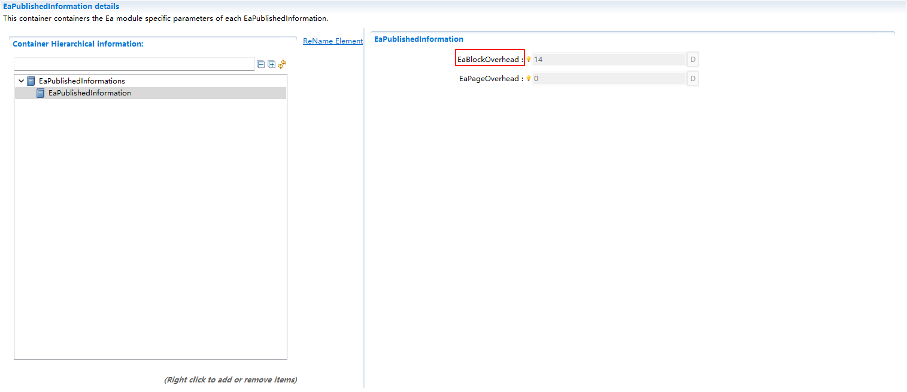

===================
Ea
===================

文档信息 Document Information
========================================================================

版本历史 Version History
----------------------------------------------------------------------------------------------------------------------------

.. list-table::
   :widths: 10 10 10 10 20
   :header-rows: 1

   * - 日期(Date)
     - 作者(Author)
     - 版本(Version)
     - 状态(Status)
     - 说明(Description)

   * - 2025/03/13
     - peng.wu
     - V0.1
     - 发布(Release)
     - 首次发布(First release)

   * - 2025/04/04
     - peng.wu
     - V1.0
     - 发布(Release)
     - 正式发布(Official release)

参考文档 References
----------------------------------------------------------------------------------------------------------------------------

.. list-table::
   :widths: 10 10 30 10
   :header-rows: 1

   * - 编号(Number)
     - 分类(Classification)
     - 标题(Title)
     - 版本(Version)
   * - 1
     - Autosar
     - AUTOSAR_CP_SRS_MemoryHWAbstractionLayer.pdf
     - R23-11
   * - 2
     - Autosar
     - AUTOSAR_CP_SWS_EEPROMAbstraction.pdf
     - R23-11

术语与简写 Terms and Abbreviations
========================================================================

术语 Terms
----------------------------------------------------------------------------------------------------------------------------
.. :align: center   表格内容居中(Table contents are centered)

.. list-table::
   :widths: 15 40
   :header-rows: 1

   * - 术语(Terms)
     - 解释(Explanation)

   * - (Logical) block
     - 模块用户可见的最小可写/可擦除单元。由一个或多个虚拟页(virtual pages)构成。(The minimum writable/erasable unit visible to the module user. It is composed of one or more virtual pages.)

   * - Virtual page
     - 可由一个或多个物理页构成，以简化逻辑块的处理与地址计算流程(It can be composed of one or more physical pages to simplify the processing of logical blocks and address calculation procedures.)

   * - Virtual address
     - 由16位块编号和逻辑块内的16位偏移量组成。(It is composed of a 16-bit block number and a 16-bit offset within the logical block.)

   * - Physical address
     - 设备特定格式的地址信息(取决于底层EEPROM驱动程序和设备)用于访问逻辑块。(Address information in a device-specific format (depending on the underlying EEPROM driver and device) used to access logical blocks.)

   * - Dataset
     - 非易失性内存管理器(NVRAM manager)中的概念：用户可寻址的、由相同大小块组成的数组。例如，对于应用软件(如车门模块)完全相同的ECU，该数组可用于为CAN驱动程序提供不同的配置设置(如CAN标识符、过滤器设置等)。(A concept in the NVRAM (Non-Volatile RAM) Manager: an array of blocks of the same size that can be addressed by the user. For example, for ECUs with identical application software (such as door modules), this array can be used to provide different configuration settings (such as CAN identifiers, filter settings, etc.) for the CAN driver.)

   * - Redundant copy
     - 非易失性内存管理器(NVRAM manager)中的概念：将相同信息存储两次，以提高数据存储的可靠性。(A concept in the NVRAM (Non-Volatile RAM) Manager: storing the same information twice to improve the reliability of data storage.)

简写 Abbreviations
--------------------------------------------------------------

.. list-table::
   :widths: 10 20 30
   :header-rows: 1

   * - 简写(Abbreviation)
     - 全称(Full name)
     - 解释(Explanation)

   * - EA
     - EEPROM Abstraction
     - EEPROM抽象.

   * - EEPROM
     - Electrically Erasable and Programmable ROM (Read Only Memory).
     - 电可擦可编程只读存储器(只读型存储器)

   * - MemIf
     - Memory Abstraction Interface
     - 内存抽象接口.

   * - NvM
     - NVRAM Manager
     - 非易失RAM管理.

   * - MemAcc
     - Module name of ECU State Manager
     - AUTOSAR基本软件模块存储器访问.

简介 Introduction
====================================

EA模块是对设备特定地址结构和分段的抽象，它为上层提供虚拟的地址结构和分段，并提供无限的擦除周期；ECU抽象层中的EA模块是对底层EEPROM设备的抽象。用户能访问到的存储器API都是针对EEPROM的；EA不直接操作硬件，所有硬件操作由EEPROM驱动模块完成。

The EA module is an abstraction of the device-specific address structure and segmentation. It provides a virtual address structure and segmentation for the upper layer, and offers unlimited erasure cycles; The EA module in the ECU Abstraction Layer is an abstraction of the underlying EEPROM device. All memory APIs accessible to users are for EEPROM; The EA module does not directly operate the hardware. All hardware operations are performed by the EEPROM driver module.

功能描述 Functional Description
========================================================================

特性 Features
--------------------------------------------------------------

模块初始化 Module initialization
~~~~~~~~~~~~~~~~~~~~~~~~~~~~~~~~~~~~

Ea模块必须在初始化接口调用后才能开始运行。在初始化阶段，Ea不需要读取数据，只需要初始化相关的变量即可，所以Ea初始化采用了同步方式。

The Ea module can only start running after the initialization interface is called. During the initialization phase, the Ea module does not need to read data, but only needs to initialize relevant variables. Therefore, the Ea module uses a synchronous method for initialization.

任务处理 Task Processing
~~~~~~~~~~~~~~~~~~~~~~~~~~~~~~~~~~~~~~~~~~~~~~~~~~~~~~~~~~~~~~~~~~~~~~~~
EA的主要工作是对EEPROM内存块进行逻辑块的划分(逻辑块的大小根据配置可能不同)，以及地址映射。EA的读取、写入、擦除的最小单位为逻辑块。

The main task of EA is to divide the EEPROM memory blocks into logical blocks (the size of logical blocks may vary according to configuration) and perform address mapping. The minimum unit for reading, writing, and erasing of the EA module is a logical block.

EA模块一次只能接受一个作业任务，即模块不能为挂起的作业提供队列。

The EA module can only accept one job task at a time, which means the module cannot provide a queue for pending jobs.

数据存储管理 Data Storage Management
~~~~~~~~~~~~~~~~~~~~~~~~~~~~~~~~~~~~~~~~~~~~~~~~~~~~~~~~~~~~~~~~~~~~~~~~
管理EEPROM中的逻辑块(Logical Blocks)，每个逻辑块可以存储一定量的数据。支持对逻辑块的读写、擦除操作。

Manages logical blocks in the EEPROM. Each logical block can store a certain amount of data. Supports read, write, and erase operations on logical blocks.

错误检测与处理 Error Detection and Handling
~~~~~~~~~~~~~~~~~~~~~~~~~~~~~~~~~~~~~~~~~~~~~~~~~~~~~~~~~~~~~~~~~~~~~~~~
检测EEPROM操作中的错误(如写入失败、读取失败等)。提供错误通知机制，将错误信息传递给上层模块。

Detects errors during EEPROM operations (such as write failure, read failure, etc.). Provides an error notification mechanism to pass error information to the upper layer modules.

擦除周期限制 Erasure Cycle Limitation
~~~~~~~~~~~~~~~~~~~~~~~~~~~~~~~~~~~~~~~~~~~~~~~~~~~~~~~~~~~~~~~~~~~~~~~~
如果下层EEPROM设备或者设备驱动不提供配置每个物理存储单元的最小擦除/写入周期数，EA模块的配置必须在配置参数EaNumberOfWriteCycles中定义每个逻辑块所期望的擦擦/写入操作周期。

If the underlying EEPROM device or device driver does not provide the configuration of the minimum number of erasure/write cycles for each physical storage unit, the configuration of the EA module must define the expected erasure/write operation cycles for each logical block in the configuration parameter EaNumberOfWriteCycles.

管理逻辑块信息 Managing Logical Block Information
~~~~~~~~~~~~~~~~~~~~~~~~~~~~~~~~~~~~~~~~~~~~~~~~~~~~~~~~~~~~~~~~~~~~~~~~
Ea模块应该从EA模块的角度来管理每个块的信息，即该块是否为“有效”。该一致性信息仅涉及块的内部处理，而不涉及块的内容；当块写入操作启动时，Ea模块将相应的块标记为不一致。在块写入操作成功结束后，Ea模块应将块标记为一致(再次)。

The Ea module shall manage the information of each block from the perspective of the EA module, i.e., whether the block is "valid". This consistency information is only related to the internal processing of the block, not the content of the block; when a block write operation starts, the Ea module marks the corresponding block as inconsistent. After the block write operation ends successfully, the Ea module shall mark the block as consistent (again).

偏差 Deviation
--------------------------------------------------------------

1. 初始化的同步方式

1. Synchronous Initialization Method

Ea的初始化可以分为异步和同步两种方式，但是由于Ea初始化暂不需要读取数据，所以当前实现采用了同步方式，异步方式暂未实现。

The initialization of Ea can be divided into asynchronous and synchronous methods. However, since the Ea initialization does not need to read data temporarily, the current implementation adopts the synchronous method, and the asynchronous method has not been implemented yet.

扩展 Extension
--------------------------------------------------------------
None

集成 Integration
====================================

文件列表 File List
--------------------------------------------------------------

静态文件 Static Files
~~~~~~~~~~~~~~~~~~~~~~~~~~~~~~~~~~~~

.. list-table::
   :widths: 10 30
   :header-rows: 1

   * - 文件(File)
     - 描述(Description)
   
   * - Ea.h
     - API declarations and macro definitions of Ea module; including macro definitions, and external function declarations that need to be used.
   
   * - Ea.c
     - API implementation of Ea module; contains internal functions, and global functions that need to be used.
   
   * - Ea_MemMap.h
     - Contains the memory abstraction of Ea module.
   
   * - Ea_Types.h	
     - API declaration and macro definition of Ea module; including macro definition, type definition, and configuration structure declaration that need to be used.

动态文件 Dynamic Files
~~~~~~~~~~~~~~~~~~~~~~~~~~~~~~~~~~~~

.. list-table::
   :widths: 10 30
   :header-rows: 1

   * - 文件(File)
     - 描述(Description)

   * - Ea_Cfg.h
     - Configuration parameters required for the implementation of Ea; Contains macro definitions, version information.

   * - Ea_Lfg.c
     - Link time definitions of Ea; Contains the block information that need to be used.

   * - Ea_Lfg.h
     - Link time declaration of Ea; Contains macro definitions, version information.

错误处理 Error Handling
--------------------------------------------------------------

开发错误 Development Errors
~~~~~~~~~~~~~~~~~~~~~~~~~~~~~~~~~~~~

.. list-table:: 
   :widths: 20 10 30
   :header-rows: 1

   * - Error code
     - Value[hex]
     - Description

   * - EA_E_NO_ERROR
     - 0x0u
     - API function called with no det error

   * - EA_E_UNINIT
     - 0x01u
     - API service called while module is not (yet) initialized

   * - EA_E_INVALID_BLOCK_NO
     - 0x02u
     - API service called with invalid block number

   * - EA_E_INVALID_BLOCK_OFS
     - 0x03u
     - API service called with invalid block offset

   * - EA_E_PARAM_POINTER
     - 0x04u
     - API service called with invalid pointer argument

   * - EA_E_INVALID_BLOCK_LEN
     - 0x05u
     - API service called with invalid block length information

运行时错误 Runtime Errors
~~~~~~~~~~~~~~~~~~~~~~~~~~~~~~~~~~~~

.. list-table:: 
   :widths: 20 10 30
   :header-rows: 1

   * - Error code
     - Value[hex]
     - Description

   * - EA_E_BUSY
     - 0x06u
     - API service called while module is busy

   * - EA_E_INVALID_CANCEL
     - 0x08u
     - Ea_Cancel called while no job was pending

产品错误 Product Errors
~~~~~~~~~~~~~~~~~~~~~~~~~~~~~~~~~~~~

无 None

接口描述 Interface Description
====================================

.. include:: Ea_api.rst

依赖的服务 Applicable Services
--------------------------------------------------------------

可选接口 Optional Interface
~~~~~~~~~~~~~~~~~~~~~~~~~~~~~~~~~~~~

.. list-table::
   :widths: 10 5 30
   :header-rows: 1

   * - API Function
     - Header File
     - Description

   * - Det_ReportError
     - Det.h
     - Service to report development errors

强制接口 Compulsory interface
~~~~~~~~~~~~~~~~~~~~~~~~~~~~~~~~~~~~
.. 可选的章节，根据模块实际情况确定

.. list-table::
   :widths: 10 5 30
   :header-rows: 1

   * - API Function
     - Header File
     - Description

   * - Det_ReportRuntimeError
     - Det.h
     - Service to report runtime errors.If a callout has been configured then this callout shall be called.

   * - Eep_Cancel
     - Eep.h
     - Cancels a running job

   * - Eep_Erase
     - Eep.h
     - Service for erasing EEPROM sections

   * - Eep_GetJobResult
     - Eep.h
     - This service returns the result of the last job

   * - Eep_GetStatus
     - Eep.h
     - Returns the EEPROM status

   * - Eep_Read
     - Eep.h
     - Reads from EEPROM

   * - Eep_SetMode
     - Eep.h
     - Sets the mode

   * - Eep_Write
     - Eep.h
     - Writes to EEPROM

配置接口 Configuration Interfaces
~~~~~~~~~~~~~~~~~~~~~~~~~~~~~~~~~~~~
.. 可选的章节，根据模块实际情况确定
.. 格式同强制接口

.. list-table::
   :widths: 10 5 30
   :header-rows: 1

   * - API Function
     - Header File
     - Description

   * - NvM_JobEndNotification
     - NvM_MemIf.h
     - Function to be used by the underlying memory abstraction to signal end of job without error

   * - NvM_JobErrorNotification
     - NvM_MemIf.h
     - Function to be used by the underlying memory abstraction to signal end of job with error

配置 Configuration
====================================

头文件包含 Header File Including
--------------------------------------------------------------
在Ea模块使用过程中，需要使用到下层EEPROM Driver模块，由于MCAL厂商的文件命名差异，可能会涉及文件名和类型名字不匹配的问题，所以在Ea模块中，需要在配置中包含EEPROM Driver的头文件xxx.h。

During the use of the Ea module, the underlying EEPROM Driver module needs to be used. Due to differences in file naming by MCAL vendors, problems such as mismatched file names and type names may occur.Therefore, in the Ea module, the header file xxx.h of the EEPROM Driver needs to be included in the configuration.

如图 :ref:`EaHeaderFile` 所示。

As shown in Figure :ref:`EaHeaderFile`.

.. figure:: ../../../_static/参考手册/Ea/EaHeaderFile.png
   :alt: EaHeaderFile配置图 (EaHeaderFile Configuration Diagram)
   :name: EaHeaderFile
   :align: center

   EaHeaderFile Including

EaVirtualPageSize
--------------------------------------------------------------
如图 :ref:`EaVirtualPageSize` 所示，

As shown in Figure :ref:`EaVirtualPageSize`,

.. figure:: ../../../_static/参考手册/Ea/EaVirtualPageSize.png
   :alt: EaVirtualPageSize配置图 (EaVirtualPageSize Configuration Diagram)
   :name: EaVirtualPageSize
   :align: center

   EaVirtualPageSize Including

在Ea模块中，配置的虚拟页EaVirtualPageSize的大小，必须为(EaBlockConfiguration/EaBlockSize + EaPublishedInformation/EaBlockOverhead)的倍数。

In the Ea module, the size of the configured virtual page EaVirtualPageSize must be a multiple of (EaBlockConfiguration/EaBlockSize + EaPublishedInformation/EaBlockOverhead).

即(EaBlockSize + EaBlockOverhead) % EaVirtualPageSize != 0

That is, (EaBlockSize + EaBlockOverhead) % EaVirtualPageSize != 0 

.. figure:: ../../../_static/参考手册/Ea/EaBlockSize.png
   :alt: EaBlockSize配置图 (EaBlockSize Configuration Diagram)
   :name: EaBlockSize
   :align: center

   EaBlockSize Including

   EaBlockOverhead Including

EepApi
--------------------------------------------------------------

如图 :ref:`EepApi` 所示，可以关联底层Eep模块，并设置底层Eep模块对应的接口。

As shown in Figure :ref:`EepApi`, the underlying Eep module can be associated, and the corresponding interface of the underlying Eep module can be set.

.. figure:: ../../../_static/参考手册/Ea/EepApi.png
   :alt: EepApi配置图 (EepApi Configuration Diagram)
   :name: EepApi
   :align: center

   EepApi Including

