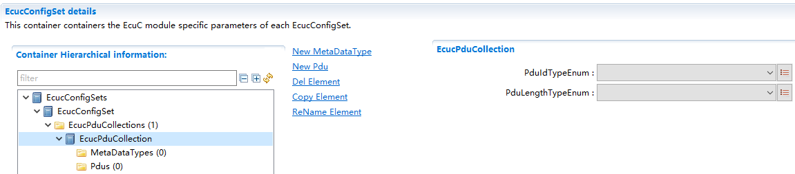

===================
EcuC
===================

**缩写词注解**

+------------+-------------------------+------------------------------+
| **缩写词** | **英文全称**            | **中文解释**                 |
+------------+-------------------------+------------------------------+
| ECUC       | ECUConfiguration        | ECU配置                      |
+------------+-------------------------+------------------------------+
| PDU        | Protocol Data Unit      | 协议数据单元                 |
+------------+-------------------------+------------------------------+
| BSW        | Basic Software          | 基础软件                     |
+------------+-------------------------+------------------------------+
| SW-C       | Software Component      | 软件组件                     |
+------------+-------------------------+------------------------------+

简介
====

EcuC模块用于对Ecu属性进行配置。

当前EcuC模块只实现Pdu的配置，除配置Pdu的基本属性（Pdu长度，MetaDataType）外，主要用于确定通信栈、诊断栈、网络管理功能栈等通过PduRef来实现Pdu在各个模块间的传递关系，实现ComStack_Cfg.h文件生成。

参考资料
--------

[1] AUTOSAR_TPS_ECUConfiguration.pdf，R19-11

[2] AUTOSAR_SWS_CommunicationStackTypes.pdf，R19_11

功能描述
========

Pdu基本属性配置功能
-------------------

Pdu基本属性配置功能介绍
~~~~~~~~~~~~~~~~~~~~~~~

在EcuC中对工程所需的所有Pdu进行配置，每个Pdu的配置属性为：MetaDataTypeRef、PduLength。

MetaDataType中涉及1-N个MetaDataItem的配置，每个MetaDataItem中配置参数为MetaDataItemLength和MetaDataItemType。

以及Pdu关联数据类型的配置：PduIdTypeEnum和PduLengthTypeEnum，这两个配置项决定ComStack_Cfg.h文件的生成。

Pdu基本属性配置功能实现
~~~~~~~~~~~~~~~~~~~~~~~

配置说明详见第5章节。

Pdu传递路径确定功能
-------------------

Pdu传递路径确定功能介绍
~~~~~~~~~~~~~~~~~~~~~~~

两个模块间通过Pdu配置项PduRef关联到EcuC中配置的同一个Pdu，从而确定Pdu在这两个模块间的传递关系。

这里以Com中TxPdu经过PduR路由到CanIf模块进行发送为例，参照下图 所示：

|image1|

图 Pdu传递关系

Pdu传递路径确定功能实现
~~~~~~~~~~~~~~~~~~~~~~~

配置时在Com中添加ComIPdu，其PduIdRef关联到EcuC中Pdu0；在PduR中添加一个路由路径，其PduRSrcPdu本地PduId为23，其SrcPduRef关联到EcuC中Pdu0，其PduRDestPdu通过配置项DestPduRef关联到EcuC中Pdu1；在CanIf中添加CanIfTxPdu，其本地PduId为6，其PduIdRef关联到EcuC中Pdu1。

当Com模块调用PduR_ComTransmit进行Pdu发送时，PduId参数为23，PduR经过路由调用CanIf_Transmit进行Pdu发送，PduId为6。

源文件描述
==========

无。

API接口
=======

类型定义
--------

无。

输入函数描述
------------

无。

静态接口函数定义
----------------

无。

可配置函数定义
--------------

无。

配置
====

EcucPduCollection
-----------------

|image2|

图 EcucPduCollection

表 EcucPduCollection

+----------------+----------+----------------------+----------+--------+
| **UI名称**     | **描述** |                      |          |        |
+----------------+----------+----------------------+----------+--------+
| PduIdTypeEnum  | 取值范围 | UINT8/UINT16         | 默认取值 | 无     |
+----------------+----------+----------------------+----------+--------+
|                | 参数描述 | Pdu的Index数据类型   |          |        |
+----------------+----------+----------------------+----------+--------+
|                | 依赖关系 | 依赖于               |          |        |
|                |          | EcuC中配置Pdu的总数; |          |        |
|                |          | P                    |          |        |
|                |          | duIdTypeEnum需要与配 |          |        |
|                |          | 置的Pdu数目进行校验  |          |        |
+----------------+----------+----------------------+----------+--------+
| Pdu            | 取值范围 | UINT8/UINT16/UINT32  | 默认取值 | 无     |
| LengthTypeEnum |          |                      |          |        |
+----------------+----------+----------------------+----------+--------+
|                | 参数描述 | Pdu的长度类型        |          |        |
+----------------+----------+----------------------+----------+--------+
|                | 依赖关系 | 依赖于EcuC           |          |        |
|                |          | 中配置Pdu的最大长度; |          |        |
|                |          | PduLength            |          |        |
|                |          | TypeEnum需要与配置的 |          |        |
|                |          | Pdu最大长度进行校验  |          |        |
+----------------+----------+----------------------+----------+--------+

Pdu
---

|image3|

图 Pdu

表 Pdu

+----------------+----------+----------------------+----------+--------+
| **UI名称**     | **描述** |                      |          |        |
+----------------+----------+----------------------+----------+--------+
| PduLength      | 取值范围 | 0 .. 4294967295      | 默认取值 | 8      |
+----------------+----------+----------------------+----------+--------+
|                | 参数描述 | Pdu的长度/最大       |          |        |
|                |          | 长度（动态长度Pdu）  |          |        |
+----------------+----------+----------------------+----------+--------+
|                | 依赖关系 | 无                   |          |        |
+----------------+----------+----------------------+----------+--------+
| M              | 取值范围 | [索引MetaDataType]   | 默认取值 | 无     |
| etaDataTypeRef |          |                      |          |        |
+----------------+----------+----------------------+----------+--------+
|                | 参数描述 | 关联Pdu的MetaDataTy  |          |        |
|                |          | pe，选择MetaData类型 |          |        |
+----------------+----------+----------------------+----------+--------+
|                | 依赖关系 | 无                   |          |        |
+----------------+----------+----------------------+----------+--------+

MetaDataItem
------------

|image4|

图 MetaDataItem

表 MetaDataItem

+-----------------+--------+---------------------------+--------+----+
| **UI名称**      | **     |                           |        |    |
|                 | 描述** |                           |        |    |
+-----------------+--------+---------------------------+--------+----+
| Met             | 取     | 1..8                      | 默     | 1  |
| aDataItemLength | 值范围 |                           | 认取值 |    |
+-----------------+--------+---------------------------+--------+----+
|                 | 参     | 表示MetaData长度          |        |    |
|                 | 数描述 |                           |        |    |
+-----------------+--------+---------------------------+--------+----+
|                 | 依     | 根据M                     |        |    |
|                 | 赖关系 | etaData类型选择，自动生成 |        |    |
+-----------------+--------+---------------------------+--------+----+
| M               | 取     | ADDRESS_EXTENSION_8/      | 默     | 无 |
| etaDataItemType | 值范围 |                           | 认取值 |    |
|                 |        | CAN_ID_32/                |        |    |
|                 |        |                           |        |    |
|                 |        | ETHERNET_MAC_64/          |        |    |
|                 |        |                           |        |    |
|                 |        | LIN_NAD_8/                |        |    |
|                 |        |                           |        |    |
|                 |        | PRIORITY_8/               |        |    |
|                 |        |                           |        |    |
|                 |        | SOCKET_CONNECTION_ID_16/  |        |    |
|                 |        |                           |        |    |
|                 |        | SOURCE_ADDRESS_16/        |        |    |
|                 |        |                           |        |    |
|                 |        | TARGET_ADDRESS_16         |        |    |
+-----------------+--------+---------------------------+--------+----+
|                 | 参     | 表示MetaData类型          |        |    |
|                 | 数描述 |                           |        |    |
+-----------------+--------+---------------------------+--------+----+
|                 | 依     | 无                        |        |    |
|                 | 赖关系 |                           |        |    |
+-----------------+--------+---------------------------+--------+----+

.. |image1| image:: ../../_static/参考手册/EcuC/image1.png
   :width: 4.49318in
   :height: 3.66326in

.. |image3| image:: ../../_static/参考手册/EcuC/image3.png
   :width: 5.76736in
   :height: 1.35139in
.. |image4| image:: ../../_static/参考手册/EcuC/image4.png
   :width: 5.76736in
   :height: 1.50972in
