===========================
EEP
===========================

**缩写词注解**

+------------+---------------------------+----------------------------+
| **缩写词** | **英文全称**              | **中文解释**               |
+------------+---------------------------+----------------------------+
| EEPROM     | Electrically Erasable and | 电可擦和可编程只读存储器   |
|            |                           |                            |
|            | Programmable Read Only    |                            |
|            |                           |                            |
|            | Memory                    |                            |
+------------+---------------------------+----------------------------+
| NVRAM      | Non Volatile Random       | 非易失性随机存取存储器     |
|            | Access                    |                            |
|            |                           |                            |
|            | Memory                    |                            |
+------------+---------------------------+----------------------------+
| NvM        | Module name of NVRAM      | NVRAM管理器的模块名称      |
|            |                           |                            |
|            | Manage                    |                            |
+------------+---------------------------+----------------------------+
| EcuM       | Module name of ECU State  | ECU状态管理器的模块名称    |
|            |                           |                            |
|            | Manager                   |                            |
+------------+---------------------------+----------------------------+
| DEM        | Module name of Diagnostic | 诊断事件管理器的模块名称   |
|            |                           |                            |
|            | Event Manager             |                            |
+------------+---------------------------+----------------------------+
| DET        | Module name of Default    | 默认错误跟踪器的模块名称   |
|            | Error                     |                            |
|            |                           |                            |
|            | Tracer                    |                            |
+------------+---------------------------+----------------------------+
| FEE        | Flash EEPROM Emulation    | Flash EEPROM仿真抽象       |
|            |                           |                            |
|            | Abstraction               |                            |
+------------+---------------------------+----------------------------+
| EA         | EEPROM Abstraction        | EEPROM抽象                 |
+------------+---------------------------+----------------------------+
| MemIf      | Memory Abstraction        | 内存抽象接口               |
|            | Interface                 |                            |
+------------+---------------------------+----------------------------+

简介
====

EEPROM驱动程序提供对EEPROM存储单元的读取、写入和擦除等操作服务。它还提供将EEPROM中的数据块与内存中的数据块进行比较的服务。这些服务的行为是异步的。内部EEPROM的驱动程序直接访问微控制器硬件，位于微控制器抽象层。外部EEPROM的驱动程序使用SPI/IIC/UART等常见外围串行总线的驱动处理程序来访问外部EEPROM设备，位于ECU抽象层。两种类型的驱动程序的功能要求和功能范围相同，因此API在语义上是相同的。

EEPROM（Electrically Erasable Programmable Read-Only
Memory）是一种带电可擦可编程只读存储器，其特点是掉电后数据不丢失。EEPROM可以在电脑上或专用设备上擦除已有信息并重新编程，通常用于即插即用设备中。EEPROM驱动程序的开发涉及到对EEPROM设备的有效管理和操作，包括但不限于读取、写入和擦除数据，这对于许多应用来说是至关重要的，尤其是在需要频繁更新或配置信息的场景中。

此外，EEPROM驱动程序还需要考虑与不同硬件平台的兼容性，确保能够在不同的微控制器或系统中正确运行。这涉及到驱动程序的移植性和兼容性测试，‌以确保其能够在各种环境中稳定、可靠地工作。

参考资料
--------

[1] AUTOSAR_SRS_EEPROMDriver.pdf，R19-11

[1] AUTOSAR_SWS_EEPROMDriver.pdf，R19-11

功能描述
========

Eep功能
-------

Eep功能介绍
~~~~~~~~~~~

|image1|

图 Eep模块在AUTOSAR架构中的位置

如图所示展示了AUTOSAR存储栈的EEPROM驱动程序Eep模块的软件分层架构。可以看到Det模块处于BSW基础软件的ECU抽象层，Eep模块的上层与Ea模块进行交互，并提供API函数接口给Ea模块使用，完成EEPROM驱动程序的读取/写入/擦除/比较等作业任务，待作业任务完成以后，提供API查询接口向Ea模块报告作业结果/运行状态或者提供中断回调通知接口报告作业结果和运行状态；当ECU采用片内Eep驱动程序时，Eep模块的下层与Mcal-Int.Eep模块进行交互，直接提供API接口给Ea模块进行调用，完成所有的作业任务；当ECU采用片外Eep驱动程序时，Eep模块的下层与外围串行总线驱动程序SPI/IIC模块进行交互，比如采用SPI总线挂接Ext.Eep外设，调用SPI驱动程序的Spi_SetupEB/Spi_SyncTransmit函数接口，完成EEPROM存储单元的写入/读取/擦除/比较等作业任务。

|image2|

图 Eep模块分层架构

存储栈处于BSW基础软件层，主要由NVRAM，MemIf，Fee、Fls、Ea和Eep等组件来实现。大多数情况下，EEPROM存储单元处于MCU的外部，并通过串行外设总线挂接，严格来讲不属于AUTOSAR软件架构中的标准模块，因此针对于Eep模块的软件架构需要设计成EEPROM存储标准框架和设备驱动组合形式，EEPROM存储标准框架可以做成AUTOSAR标准模块，而设备驱动组件则需要以CDD复杂设备驱动的形式来完成。

Eep功能实现
~~~~~~~~~~~

|image3|

图 Eep模块的功能组件拓扑图

Eep驱动程序提供了为存储栈实现EEPROM存储单元的读取/写入/擦除/比较等基本作业任务。EEPROM存储的标准框架用于实现AUTOSAR的标准API函数，可以直接被EA模块无缝隙进行挂接，脱离硬件设备的束缚，属于EEPROM驱动程序的硬件抽象部分；EEPROM存储的设备驱动程序用于实现硬件设备的驱动控制，完全依赖于所使用EEPROM存储介质的硬件特性。针对于EEPROM存储的设备驱动程序都是根据ECU所集成的芯片定制化的功能模块，并且根据硬件特性需要涉及更多的组件引入；如果采用SPI串行总线进行挂接，则可以直接使用MCAL自带的SPI组件，并追加EEPROM驱动程序相关的SPI组件的Channel/Job/Sequence/External等参数的配置项，然后通过CDD的方式实现驱动程序的基本操作API接口，并通过配置指针的方式挂接到EEPROM存储的标准框架上，最终以AUTOSAR标准API函数供EA存储抽象组件调用；如果采用IIC串行总线进行挂接，因为IIC也不属于AUTOSAR标准API函数，首先需要通过CDD的方式实现IIC总线的驱动程序，然后引用IIC驱动程序的API实现EEPROM存储设备驱动的基本操作API函数，并通过配置指针的方式挂接到EEPROM存储的标准框架上，最终以AUTOSAR标准API函数供EA存储抽象组件调用；如果MCAL自带Eep驱动程序模块，则直接使用其实现的API函数供EA存储抽象组件调用。

模块之间的交互关系
------------------

|image4|

图 模块间交互关系

表 模块间交互关系

+---------+-------------------+-----------------------+---------------+
| **交互  | **交互接口**      | **交互数据**          | **交互条件**  |
| 模块**  |                   |                       |               |
+---------+-------------------+-----------------------+---------------+
| SPI     | Spi_WriteIB       | 请求向SPI驱动程序     | I             |
|         |                   | 的指定缓冲区写入数据  | B模式的缓冲区 |
+---------+-------------------+-----------------------+---------------+
|         | Spi_ReadIB        | 请求从SPI驱动程序     | I             |
|         |                   | 的指定缓冲区读取数据  | B模式的缓冲区 |
+---------+-------------------+-----------------------+---------------+
|         | Spi_SetupEB       | 请求向SPI驱动程       | E             |
|         |                   | 序的指定缓冲区写入数  | B模式的缓冲区 |
|         |                   | 据，并绑定结果缓冲区  |               |
+---------+-------------------+-----------------------+---------------+
|         | Spi_AsyncTransmit | 请求发起传输任务      | 异步方式      |
+---------+-------------------+-----------------------+---------------+
|         | Spi_SyncTransmit  | 请求发起传输任务      | 同步方式      |
+---------+-------------------+-----------------------+---------------+
|         | Spi_GetStatus     | 获取                  | 无            |
|         |                   | SPI驱动程序的运行状态 |               |
+---------+-------------------+-----------------------+---------------+
|         | Spi_GetJobResult  | 获取                  | 无            |
|         |                   | SPI驱动程序的作业结果 |               |
+---------+-------------------+-----------------------+---------------+
|         | Spi\_             | 获取                  | 无            |
|         | GetSequenceResult | SPI驱动程序的序列结果 |               |
+---------+-------------------+-----------------------+---------------+
| Det     | Det_ReportError   | 向Det模块报告开发错误 | 依赖于配置    |
+---------+-------------------+-----------------------+---------------+
|         | Det_R             | 向                    | 依赖于配置    |
|         | eportRuntimeError | Det模块报告运行时错误 |               |
+---------+-------------------+-----------------------+---------------+
| Dem     | Dem\_             | 向Dem模块报告硬件故障 | 依赖于配置    |
|         | ReportErrorStatus |                       |               |
+---------+-------------------+-----------------------+---------------+
| EA      | Eep_62_SetMode    | 请求设置EEP           | 无            |
|         |                   | ROM驱动程序的工作模式 |               |
+---------+-------------------+-----------------------+---------------+
|         | Eep_62_Read       | 请求对EEPROM的        | 无            |
|         |                   | 存储单元执行读取操作  |               |
+---------+-------------------+-----------------------+---------------+
|         | Eep_62_Write      | 请求对EEPROM的        | 无            |
|         |                   | 存储单元执行写入操作  |               |
+---------+-------------------+-----------------------+---------------+
|         | Eep_62_Erase      | 请求对EEPROM的        | 无            |
|         |                   | 存储单元执行擦除操作  |               |
+---------+-------------------+-----------------------+---------------+
|         | Eep_62_Compare    | 请求对EEPROM的        | 无            |
|         |                   | 存储单元执行比较操作  |               |
+---------+-------------------+-----------------------+---------------+
|         | Eep_62_Cancel     | 请                    | 依赖于配置    |
|         |                   | 求取消EEPROM驱动程序  |               |
|         |                   | 中正在执行的作业任务  |               |
+---------+-------------------+-----------------------+---------------+
|         | Eep_62_GetStatus  | 请求获取EEP           | 无            |
|         |                   | ROM驱动程序的运行状态 |               |
+---------+-------------------+-----------------------+---------------+
|         | Ee                | 请求获取EEPROM驱      |               |
|         | p_62_GetJobResult | 动程序的当前作业结果  |               |
+---------+-------------------+-----------------------+---------------+

源文件描述
==========

表 Eep组件文件描述

+------------------+---------------------------------------------------+
| **文件**         | **说明**                                          |
+------------------+---------------------------------------------------+
| Eep.h            | EEPROM驱动程序的派生数据类型定义                  |
+------------------+---------------------------------------------------+
| Eep_62.c         | EEPROM驱动程序API函数实现和变量定义               |
+------------------+---------------------------------------------------+
| Eep_62.h         | EEPROM驱动程序API函数声明和宏定义                 |
+------------------+---------------------------------------------------+
| Eep_62_Cbk.c     | E                                                 |
|                  | EPROM驱动程序提供给上层组件引用的通知回调函数实现 |
+------------------+---------------------------------------------------+
| Eep_62_Cbk.h     | E                                                 |
|                  | EPROM驱动程序提供给上层组件引用的通知回调函数声明 |
+------------------+---------------------------------------------------+
| Eep_62_Types.h   | EEPROM驱动程序的派生数据类型定义                  |
+------------------+---------------------------------------------------+
| Eep_62_MemMap.h  | EEPROM驱动程序的内存映射抽象声明                  |
+------------------+---------------------------------------------------+
| SchM_62_Eep.h    | EEPROM驱动程序的调用上下文保护接口声明            |
+------------------+---------------------------------------------------+
| CDD_M95320.c     | EEPROM驱动程序的设备操作控制接口函数实现          |
+------------------+---------------------------------------------------+
| CDD_M95320.h     | EEPROM驱动程序的设备操作控制接口函数声明          |
+------------------+---------------------------------------------------+
| Eep_62_Api.c     | EEPROM驱动程序的API函数重映射实现的配置           |
+------------------+---------------------------------------------------+
| Eep_62_Api.h     | EEPROM驱动程序的API函数重映射声明的配置           |
+------------------+---------------------------------------------------+
| Eep_62_Cfg.c     | EEP                                               |
|                  | ROM驱动程序的运行时加载需要用到的可配置参数的实现 |
+------------------+---------------------------------------------------+
| Eep_62_Cfg.h     | EEPROM驱动程序的可配置参数数据结构的类型定义      |
|                  | ，以及预编译阶段需要用到的配置参数的宏定义的实现  |
+------------------+---------------------------------------------------+
| Eep              | EEPROM驱动程序的                                  |
| _M95320_62_Cfg.c | 运行时加载需要用到的可配置特定设备属性参数的实现  |
+------------------+---------------------------------------------------+
| Eep              | EEPROM驱动程序的预编译阶                          |
| _M95320_62_Cfg.h | 段需要用到的可配置特定设备属性参数的宏定义的实现  |
+------------------+---------------------------------------------------+

|image5|

图 Eep组件文件交互关系图

API接口
=======

类型定义
--------

Eep_62_AddressType类型定义
~~~~~~~~~~~~~~~~~~~~~~~~~~

+-----------+----------------------------------------------------------+
| 名称      | Eep_62_AddressType                                       |
+-----------+----------------------------------------------------------+
| 类型      | uint32                                                   |
+-----------+----------------------------------------------------------+
| 定义      | #define Eep_AddressType Eep_62_AddressType               |
|           |                                                          |
|           | typedef uint32 Eep_62_AddressType;                       |
+-----------+----------------------------------------------------------+
| 范围      | 0 … 4294967295                                           |
+-----------+----------------------------------------------------------+
| 描述      | 用于描述EEPROM驱动程序中地址类型的派生数据类型           |
+-----------+----------------------------------------------------------+

Eep_62_LengthType类型定义
~~~~~~~~~~~~~~~~~~~~~~~~~

+-----------+----------------------------------------------------------+
| 名称      | Eep_62_LengthType                                        |
+-----------+----------------------------------------------------------+
| 类型      | uint16                                                   |
+-----------+----------------------------------------------------------+
| 定义      | #define Eep_LengthType Eep_62_LengthType                 |
|           |                                                          |
|           | typedef uint16 Eep_62_LengthType;                        |
+-----------+----------------------------------------------------------+
| 范围      | 0 … 65535                                                |
+-----------+----------------------------------------------------------+
| 描述      | 用于描述EEPROM驱动程序中长度类型的派生数据类型           |
+-----------+----------------------------------------------------------+

Eep_62_RequestJobType类型定义
~~~~~~~~~~~~~~~~~~~~~~~~~~~~~

+-----------+----------------------------------------------------------+
| 名称      | Eep_62_RequestJobType                                    |
+-----------+----------------------------------------------------------+
| 类型      | Enumeration                                              |
+-----------+----------------------------------------------------------+
| 定义      | typedef enum                                             |
|           |                                                          |
|           | {                                                        |
|           |                                                          |
|           | EEP_62_JOB_NONE = 0,                                     |
|           |                                                          |
|           | EEP_62_JOB_ERASE = 1,                                    |
|           |                                                          |
|           | EEP_62_JOB_WRITE = 2,                                    |
|           |                                                          |
|           | EEP_62_JOB_READ = 3,                                     |
|           |                                                          |
|           | EEP_62_JOB_CANCEL = 4,                                   |
|           |                                                          |
|           | EEP_62_JOB_COMPARE = 5                                   |
|           |                                                          |
|           | } Eep_62_RequestJobType;                                 |
+-----------+----------------------------------------------------------+
| 范围      | 0 … 5                                                    |
+-----------+----------------------------------------------------------+
| 描述      | 用于描述EEPROM驱动程序中请求作业状况的枚举数据类型       |
+-----------+----------------------------------------------------------+

Eep_62_RuntimeType类型定义
~~~~~~~~~~~~~~~~~~~~~~~~~~

+-----------+----------------------------------------------------------+
| 名称      | Eep_62_RuntimeType                                       |
+-----------+----------------------------------------------------------+
| 类型      | Structure                                                |
+-----------+----------------------------------------------------------+
| 定义      | typedef struct                                           |
|           |                                                          |
|           | {                                                        |
|           |                                                          |
|           | Eep_62_AddressType operateAddr;                          |
|           |                                                          |
|           | uint8\* dataBufferPtr;                                   |
|           |                                                          |
|           | const uint8\* WriteBuffer;                               |
|           |                                                          |
|           | Eep_62_LengthType length;                                |
|           |                                                          |
|           | Eep_62_LengthType CompareLength;                         |
|           |                                                          |
|           | Eep_62_RequestJobType currentJob;                        |
|           |                                                          |
|           | Eep_62_LengthType maxReadSize;                           |
|           |                                                          |
|           | Eep_62_LengthType maxWriteSize;                          |
|           |                                                          |
|           | MemIf_ModeType currentMode;                              |
|           |                                                          |
|           | boolean StateForRunMainFunction;                         |
|           |                                                          |
|           | } Eep_62_RuntimeType;                                    |
+-----------+----------------------------------------------------------+
| 范围      | 无                                                       |
+-----------+----------------------------------------------------------+
| 描述      | 用于描述EEPROM驱动程序中运行时状况的数据结构类型         |
+-----------+----------------------------------------------------------+

Eep_62_DevApiType类型定义
~~~~~~~~~~~~~~~~~~~~~~~~~

+-----------+----------------------------------------------------------+
| 名称      | Eep_62_DevApiType                                        |
+-----------+----------------------------------------------------------+
| 类型      | Structure                                                |
+-----------+----------------------------------------------------------+
| 定义      | typedef struct                                           |
|           |                                                          |
|           | {                                                        |
|           |                                                          |
|           | void (\*DevInitApi)(void);                               |
|           |                                                          |
|           | Std_ReturnType (\*DevReadApi)                            |
|           |                                                          |
|           | (Eep_62_AddressType readAddress, uint8\* readBufferPtr,  |
|           |                                                          |
|           | Eep_62_LengthType readLength);                           |
|           |                                                          |
|           | Std_ReturnType (\*DevWriteApi)                           |
|           |                                                          |
|           | (Eep_62_AddressType writeAddress, const uint8\*          |
|           | writeBufferPtr,                                          |
|           |                                                          |
|           | Eep_62_LengthType writeLength);                          |
|           |                                                          |
|           | Std_ReturnType (\*DevEraseApi)                           |
|           |                                                          |
|           | (Eep_62_AddressType eraseAddress, const uint8            |
|           | ErasedValue,                                             |
|           |                                                          |
|           | Eep_62_LengthType eraseLength);                          |
|           |                                                          |
|           | } Eep_62_DevApiType;                                     |
+-----------+----------------------------------------------------------+
| 范围      | 无                                                       |
+-----------+----------------------------------------------------------+
| 描述      | 用于描述EEPROM驱动程序中设备操作API列表的数据结构类型    |
+-----------+----------------------------------------------------------+

Eep_62_DeviceConfigType类型定义
~~~~~~~~~~~~~~~~~~~~~~~~~~~~~~~

+-----------+----------------------------------------------------------+
| 名称      | Eep_62_DeviceConfigType                                  |
+-----------+----------------------------------------------------------+
| 类型      | Structure                                                |
+-----------+----------------------------------------------------------+
| 定义      | typedef struct                                           |
|           |                                                          |
|           | {                                                        |
|           |                                                          |
|           | uint8 DeviceId;                                          |
|           |                                                          |
|           | Eep_62_AddressType baseAddress;                          |
|           |                                                          |
|           | Eep_62_LengthType usedSize;                              |
|           |                                                          |
|           | Eep_62_LengthType fastReadBlockSize;                     |
|           |                                                          |
|           | Eep_62_LengthType fastWriteBlockSize;                    |
|           |                                                          |
|           | Eep_62_LengthType normalReadBlockSize;                   |
|           |                                                          |
|           | Eep_62_LengthType normalWriteBlockSize;                  |
|           |                                                          |
|           | } Eep_62_DeviceConfigType;                               |
+-----------+----------------------------------------------------------+
| 范围      | 无                                                       |
+-----------+----------------------------------------------------------+
| 描述      | 用于描述EEPROM驱动程序中设备配置信息的数据结构类型       |
+-----------+----------------------------------------------------------+

Eep_62_ConfigType类型定义
~~~~~~~~~~~~~~~~~~~~~~~~~

+-----------+----------------------------------------------------------+
| 名称      | Eep_62_ConfigType                                        |
+-----------+----------------------------------------------------------+
| 类型      | Structure                                                |
+-----------+----------------------------------------------------------+
| 定义      | typedef struct                                           |
|           |                                                          |
|           | {                                                        |
|           |                                                          |
|           | MemIf_ModeType defaultMode;                              |
|           |                                                          |
|           | uint32 jobCallCycle;                                     |
|           |                                                          |
|           | const Eep_62_JobNotificationFct jobEndNotification;      |
|           |                                                          |
|           | const Eep_62_JobNotificationFct jobErrorNotification;    |
|           |                                                          |
|           | uint8 DeviceConfigNbr;                                   |
|           |                                                          |
|           | const Eep_62_DeviceConfigType \*DeviceConfigPtr;         |
|           |                                                          |
|           | } Eep_62_ConfigType;                                     |
+-----------+----------------------------------------------------------+
| 范围      | 无                                                       |
+-----------+----------------------------------------------------------+
| 描述      | 用于描述 Eep模块初始化时，加载配置信息的结构体类型       |
+-----------+----------------------------------------------------------+

输入函数描述
------------

+----------------------------------+-----------------------------------+
| **输入模块**                     | **API**                           |
+----------------------------------+-----------------------------------+
| DET                              | Det_ReportError                   |
+----------------------------------+-----------------------------------+
|                                  | Det_ReportRuntimeError            |
+----------------------------------+-----------------------------------+
| Dem                              | Dem_ReportErrorStatus             |
+----------------------------------+-----------------------------------+
| SPI                              | Spi_SetupEB                       |
+----------------------------------+-----------------------------------+
|                                  | Spi_WriteIB                       |
+----------------------------------+-----------------------------------+
|                                  | Spi_ReadIB                        |
+----------------------------------+-----------------------------------+
|                                  | Spi_SyncTransmit                  |
+----------------------------------+-----------------------------------+
|                                  | Spi_AsyncTransmit                 |
+----------------------------------+-----------------------------------+
|                                  | Spi_GetStatus                     |
+----------------------------------+-----------------------------------+
|                                  | Spi_GetJobResult                  |
+----------------------------------+-----------------------------------+
|                                  | Spi_GetSequenceResult             |
+----------------------------------+-----------------------------------+

静态接口函数定义
----------------

Eep_62_Init函数定义
~~~~~~~~~~~~~~~~~~~

+-------------+-------------------------------+------+----------------+
| 函数名称：  | Eep_62_Init                   |      |                |
+-------------+-------------------------------+------+----------------+
| 函数原型：  | void Eep_62_Init (const       |      |                |
|             | Eep_62_ConfigType             |      |                |
|             | \*ConfigPtr);                 |      |                |
+-------------+-------------------------------+------+----------------+
| 服务编号：  | 0x00                          |      |                |
+-------------+-------------------------------+------+----------------+
| 同步/异步： | 同步                          |      |                |
+-------------+-------------------------------+------+----------------+
| 是          | 不可重入                      |      |                |
| 否可重入：  |                               |      |                |
+-------------+-------------------------------+------+----------------+
| 输入参数：  | Co                            | 值   | 无             |
|             | nfigPtr：指向所选配置集的指针 | 域： |                |
+-------------+-------------------------------+------+----------------+
| 输入        | 无                            |      |                |
| 输出参数：  |                               |      |                |
+-------------+-------------------------------+------+----------------+
| 输出参数：  | 无                            |      |                |
+-------------+-------------------------------+------+----------------+
| 返回值：    | 无                            |      |                |
+-------------+-------------------------------+------+----------------+
| 功能概述：  | 服务用于实现E                 |      |                |
|             | EPROM驱动程序模块的初始化函数 |      |                |
+-------------+-------------------------------+------+----------------+

Eep_62_GetVersionInfo函数定义
~~~~~~~~~~~~~~~~~~~~~~~~~~~~~

+-------------+----------------+-------+------------------------------+
| 函数名称：  | Eep\_62\_      |       |                              |
|             | GetVersionInfo |       |                              |
+-------------+----------------+-------+------------------------------+
| 函数原型：  | void           |       |                              |
|             | Eep_62_GetVer  |       |                              |
|             | sionInfo(Std_V |       |                              |
|             | ersionInfoType |       |                              |
|             | \*ver          |       |                              |
|             | sioninfo);     |       |                              |
+-------------+----------------+-------+------------------------------+
| 服务编号：  | 0x0A           |       |                              |
+-------------+----------------+-------+------------------------------+
| 同步/异步： | 同步           |       |                              |
+-------------+----------------+-------+------------------------------+
| 是          | 可重入         |       |                              |
| 否可重入：  |                |       |                              |
+-------------+----------------+-------+------------------------------+
| 输入参数：  | 无             |       |                              |
+-------------+----------------+-------+------------------------------+
| 输入        | 无             |       |                              |
| 输出参数：  |                |       |                              |
+-------------+----------------+-------+------------------------------+
| 输出参数：  | versioninfo    | 值    | 指                           |
|             |                | 域：  | 向存储此模块的版本信息的指针 |
+-------------+----------------+-------+------------------------------+
| 返回值：    | 无             |       |                              |
+-------------+----------------+-------+------------------------------+
| 功能概述：  | 获取           |       |                              |
|             | EEPROM驱动程序 |       |                              |
|             | 模块的版本信息 |       |                              |
+-------------+----------------+-------+------------------------------+

Eep_62_SetMode\_<deviceIndex>函数定义
~~~~~~~~~~~~~~~~~~~~~~~~~~~~~~~~~~~~~

+-------------+--------+------+--------------------------------------+
| 函数名称：  | Eep_6  |      |                                      |
|             | 2_SetM |      |                                      |
|             | ode\_< |      |                                      |
|             | device |      |                                      |
|             | Index> |      |                                      |
+-------------+--------+------+--------------------------------------+
| 函数原型：  | void   |      |                                      |
|             | Ee     |      |                                      |
|             | p_62_S |      |                                      |
|             | etMode |      |                                      |
|             | \_<dev |      |                                      |
|             | iceInd |      |                                      |
|             | ex>(Me |      |                                      |
|             | mIf_Mo |      |                                      |
|             | deType |      |                                      |
|             | Mode); |      |                                      |
+-------------+--------+------+--------------------------------------+
| 服务编号：  | 0x01   |      |                                      |
+-------------+--------+------+--------------------------------------+
| 同步/异步： | 同步   |      |                                      |
+-------------+--------+------+--------------------------------------+
| 是          | 不     |      |                                      |
| 否可重入：  | 可重入 |      |                                      |
+-------------+--------+------+--------------------------------------+
| 输入参数：  | Mode   | 值   | M                                    |
|             |        | 域： | EMIF_MODE_SLOW：慢读访问/SPI正常访问 |
|             |        |      |                                      |
|             |        |      | M                                    |
|             |        |      | EMIF_MODE_FAST：快读访问/SPI突发访问 |
+-------------+--------+------+--------------------------------------+
| 输入        | 无     |      |                                      |
| 输出参数：  |        |      |                                      |
+-------------+--------+------+--------------------------------------+
| 输出参数：  | 无     |      |                                      |
+-------------+--------+------+--------------------------------------+
| 返回值：    | 无     |      |                                      |
+-------------+--------+------+--------------------------------------+
| 功能概述：  | 服务用 |      |                                      |
|             | 于EEPR |      |                                      |
|             | OM驱动 |      |                                      |
|             | 程序中 |      |                                      |
|             | 设置工 |      |                                      |
|             | 作模式 |      |                                      |
+-------------+--------+------+--------------------------------------+

Eep_62_Read\_<deviceIndex>函数定义
~~~~~~~~~~~~~~~~~~~~~~~~~~~~~~~~~~

+------------+--------------+-----------------+------+---------------+
| 函数名称： | Ee           |                 |      |               |
|            | p_62_Read\_< |                 |      |               |
|            | deviceIndex> |                 |      |               |
+------------+--------------+-----------------+------+---------------+
| 函数原型： | St           |                 |      |               |
|            | d_ReturnType |                 |      |               |
|            | Ee           |                 |      |               |
|            | p_62_Read\_< |                 |      |               |
|            | deviceIndex> |                 |      |               |
|            |              |                 |      |               |
|            | (            |                 |      |               |
|            |              |                 |      |               |
|            | Eep_62       |                 |      |               |
|            | _AddressType |                 |      |               |
|            | Ee           |                 |      |               |
|            | promAddress, |                 |      |               |
|            |              |                 |      |               |
|            | uint8        |                 |      |               |
|            | \*Da         |                 |      |               |
|            | taBufferPtr, |                 |      |               |
|            |              |                 |      |               |
|            | Eep_6        |                 |      |               |
|            | 2_LengthType |                 |      |               |
|            | Length       |                 |      |               |
|            |              |                 |      |               |
|            | );           |                 |      |               |
+------------+--------------+-----------------+------+---------------+
| 服务编号： | 0x02         |                 |      |               |
+------------+--------------+-----------------+------+---------------+
| 同         | 异步         |                 |      |               |
| 步/异步：  |              |                 |      |               |
+------------+--------------+-----------------+------+---------------+
| 是         | 不可重入     |                 |      |               |
| 否可重入： |              |                 |      |               |
+------------+--------------+-----------------+------+---------------+
| 输入参数： | EepromAddre  |                 | 值   | Min:0         |
|            | ss：EEPROM中 |                 | 域： |               |
|            | 的地址偏移量 |                 |      | M             |
|            |              |                 |      | ax:EEP_SIZE-1 |
+------------+--------------+-----------------+------+---------------+
|            | Length：要   |                 | 值   | Min:1         |
|            | 读取的字节数 |                 | 域： |               |
|            |              |                 |      | Max:EEP_SIZE  |
|            |              |                 |      | –             |
|            |              |                 |      |               |
|            |              |                 |      | EepromAddress |
+------------+--------------+-----------------+------+---------------+
| 输入       | 无           |                 |      |               |
| 输出参数： |              |                 |      |               |
+------------+--------------+-----------------+------+---------------+
| 输出参数： | DataBuff     |                 | 值   | 无            |
|            | erPtr：指向R |                 | 域： |               |
|            | AM中目标数据 |                 |      |               |
|            | 缓冲区的指针 |                 |      |               |
+------------+--------------+-----------------+------+---------------+
| 返回值：   | S            | E_OK：读        |      |               |
|            | td_ReturnTyp | 取命令已被接受  |      |               |
|            |              |                 |      |               |
|            |              | E_NOT_OK：读    |      |               |
|            |              | 取命令未被接受  |      |               |
+------------+--------------+-----------------+------+---------------+
| 功能概述： | 服务用于从   |                 |      |               |
|            | EEPROM存储单 |                 |      |               |
|            | 元中读取给定 |                 |      |               |
|            | 字大小的数据 |                 |      |               |
+------------+--------------+-----------------+------+---------------+

Eep_62_Write\_<deviceIndex>函数定义
~~~~~~~~~~~~~~~~~~~~~~~~~~~~~~~~~~~

+-------------+-------------+-------------------+------+--------------+
| 函数名称：  | Eep_6       |                   |      |              |
|             | 2_Write\_<d |                   |      |              |
|             | eviceIndex> |                   |      |              |
+-------------+-------------+-------------------+------+--------------+
| 函数原型：  | Std         |                   |      |              |
|             | _ReturnType |                   |      |              |
|             | Eep_6       |                   |      |              |
|             | 2_Write\_<d |                   |      |              |
|             | eviceIndex> |                   |      |              |
|             |             |                   |      |              |
|             | (           |                   |      |              |
|             |             |                   |      |              |
|             | Eep\_62\_   |                   |      |              |
|             | AddressType |                   |      |              |
|             | Eep         |                   |      |              |
|             | romAddress, |                   |      |              |
|             |             |                   |      |              |
|             | const uint8 |                   |      |              |
|             | \*Dat       |                   |      |              |
|             | aBufferPtr, |                   |      |              |
|             |             |                   |      |              |
|             | Eep_62      |                   |      |              |
|             | _LengthType |                   |      |              |
|             | Length      |                   |      |              |
|             |             |                   |      |              |
|             | );          |                   |      |              |
+-------------+-------------+-------------------+------+--------------+
| 服务编号：  | 0x03        |                   |      |              |
+-------------+-------------+-------------------+------+--------------+
| 同步/异步： | 异步        |                   |      |              |
+-------------+-------------+-------------------+------+--------------+
| 是          | 不可重入    |                   |      |              |
| 否可重入：  |             |                   |      |              |
+-------------+-------------+-------------------+------+--------------+
| 输入参数：  | Eepr        |                   | 值   | Min:0        |
|             | omAddress： |                   | 域： |              |
|             | EEPROM中的  |                   |      | Ma           |
|             | 地址偏移量  |                   |      | x:EEP_SIZE-1 |
+-------------+-------------+-------------------+------+--------------+
|             | Data        |                   | 值   | 无           |
|             | BufferPtr： |                   | 域： |              |
|             | 源数据指针  |                   |      |              |
+-------------+-------------+-------------------+------+--------------+
|             | L           |                   | 值   | Min:1        |
|             | ength：要写 |                   | 域： |              |
|             | 入的字节数  |                   |      | Max:EEP_SIZE |
|             |             |                   |      | –            |
|             |             |                   |      |              |
|             |             |                   |      | E            |
|             |             |                   |      | epromAddress |
+-------------+-------------+-------------------+------+--------------+
| 输入        | 无          |                   |      |              |
| 输出参数：  |             |                   |      |              |
+-------------+-------------+-------------------+------+--------------+
| 输出参数：  | 无          |                   |      |              |
+-------------+-------------+-------------------+------+--------------+
| 返回值：    | Std         | E_OK：            |      |              |
|             | _ReturnType | 写入命令已被接受  |      |              |
|             |             |                   |      |              |
|             |             | E_NOT_OK：        |      |              |
|             |             | 写入命令未被接受  |      |              |
+-------------+-------------+-------------------+------+--------------+
| 功能概述：  | 服务        |                   |      |              |
|             | 用于向EEPRO |                   |      |              |
|             | M存储单元写 |                   |      |              |
|             | 入给定字节  |                   |      |              |
|             | 大小的数据  |                   |      |              |
+-------------+-------------+-------------------+------+--------------+

Eep_62_Erase\_<deviceIndex>函数定义
~~~~~~~~~~~~~~~~~~~~~~~~~~~~~~~~~~~

+-------------+-------------+------------------+------+--------------+
| 函数名称：  | Eep_6       |                  |      |              |
|             | 2_Erase\_<d |                  |      |              |
|             | eviceIndex> |                  |      |              |
+-------------+-------------+------------------+------+--------------+
| 函数原型：  | Std         |                  |      |              |
|             | _ReturnType |                  |      |              |
|             | Eep_6       |                  |      |              |
|             | 2_Erase\_<d |                  |      |              |
|             | eviceIndex> |                  |      |              |
|             |             |                  |      |              |
|             | (           |                  |      |              |
|             |             |                  |      |              |
|             | Eep\_62\_   |                  |      |              |
|             | AddressType |                  |      |              |
|             | Eep         |                  |      |              |
|             | romAddress, |                  |      |              |
|             |             |                  |      |              |
|             | Eep_62      |                  |      |              |
|             | _LengthType |                  |      |              |
|             | Length      |                  |      |              |
|             |             |                  |      |              |
|             | );          |                  |      |              |
+-------------+-------------+------------------+------+--------------+
| 服务编号：  | 0x04        |                  |      |              |
+-------------+-------------+------------------+------+--------------+
| 同步/异步： | 异步        |                  |      |              |
+-------------+-------------+------------------+------+--------------+
| 是          | 不可重入    |                  |      |              |
| 否可重入：  |             |                  |      |              |
+-------------+-------------+------------------+------+--------------+
| 输入参数：  | E           |                  | 值   | Min:0        |
|             | epromAddres |                  | 域： |              |
|             | s：EEPROM中 |                  |      | Ma           |
|             | 的起始地址  |                  |      | x:EEP_SIZE-1 |
+-------------+-------------+------------------+------+--------------+
|             | L           |                  | 值   | Min:1        |
|             | ength：要擦 |                  | 域： |              |
|             | 除的字节数  |                  |      | Max:EEP_SIZE |
|             |             |                  |      | –            |
|             |             |                  |      |              |
|             |             |                  |      | E            |
|             |             |                  |      | epromAddress |
+-------------+-------------+------------------+------+--------------+
| 输入        | 无          |                  |      |              |
| 输出参数：  |             |                  |      |              |
+-------------+-------------+------------------+------+--------------+
| 输出参数：  | 无          |                  |      |              |
+-------------+-------------+------------------+------+--------------+
| 返回值：    | Std         | E_OK：           |      |              |
|             | _ReturnType | 擦除命令已被接受 |      |              |
|             |             |                  |      |              |
|             |             | E_NOT_OK：       |      |              |
|             |             | 擦除命令未被接受 |      |              |
+-------------+-------------+------------------+------+--------------+
| 功能概述：  | 服          |                  |      |              |
|             | 务用于对EEP |                  |      |              |
|             | ROM存储单元 |                  |      |              |
|             | 指定扇区执  |                  |      |              |
|             | 行擦除操作  |                  |      |              |
+-------------+-------------+------------------+------+--------------+

Eep_62_Campare\_<deviceIndex>函数定义
~~~~~~~~~~~~~~~~~~~~~~~~~~~~~~~~~~~~~

+-------------+-------------+-------------------+------+--------------+
| 函数名称：  | Eep\_62\_   |                   |      |              |
|             | Compare\_<d |                   |      |              |
|             | eviceIndex> |                   |      |              |
+-------------+-------------+-------------------+------+--------------+
| 函数原型：  | Std         |                   |      |              |
|             | _ReturnType |                   |      |              |
|             | Eep\_62\_   |                   |      |              |
|             | Compare\_<d |                   |      |              |
|             | eviceIndex> |                   |      |              |
|             |             |                   |      |              |
|             | (           |                   |      |              |
|             |             |                   |      |              |
|             | Eep\_62\_   |                   |      |              |
|             | AddressType |                   |      |              |
|             | Eep         |                   |      |              |
|             | romAddress, |                   |      |              |
|             |             |                   |      |              |
|             | const uint8 |                   |      |              |
|             | \*Dat       |                   |      |              |
|             | aBufferPtr, |                   |      |              |
|             |             |                   |      |              |
|             | Eep_62      |                   |      |              |
|             | _LengthType |                   |      |              |
|             | Length      |                   |      |              |
|             |             |                   |      |              |
|             | );          |                   |      |              |
+-------------+-------------+-------------------+------+--------------+
| 服务编号：  | 0x05        |                   |      |              |
+-------------+-------------+-------------------+------+--------------+
| 同步/异步： | 异步        |                   |      |              |
+-------------+-------------+-------------------+------+--------------+
| 是          | 不可重入    |                   |      |              |
| 否可重入：  |             |                   |      |              |
+-------------+-------------+-------------------+------+--------------+
| 输入参数：  | Eepr        |                   | 值   | Min:0        |
|             | omAddress： |                   | 域： |              |
|             | EEPROM中的  |                   |      | Ma           |
|             | 地址偏移量  |                   |      | x:EEP_SIZE-1 |
+-------------+-------------+-------------------+------+--------------+
|             | Data        |                   | 值   | 无           |
|             | BufferPtr： |                   | 域： |              |
|             | 指向数据缓  |                   |      |              |
|             | 冲区的指针  |                   |      |              |
+-------------+-------------+-------------------+------+--------------+
|             | L           |                   | 值   | Min:1        |
|             | ength：要比 |                   | 域： |              |
|             | 较的字节数  |                   |      | Max:EEP_SIZE |
|             |             |                   |      | –            |
|             |             |                   |      |              |
|             |             |                   |      | E            |
|             |             |                   |      | epromAddress |
+-------------+-------------+-------------------+------+--------------+
| 输入        | 无          |                   |      |              |
| 输出参数：  |             |                   |      |              |
+-------------+-------------+-------------------+------+--------------+
| 输出参数：  | 无          |                   |      |              |
+-------------+-------------+-------------------+------+--------------+
| 返回值：    | Std         | E_OK：            |      |              |
|             | _ReturnType | 比较命令已被接受  |      |              |
|             |             |                   |      |              |
|             |             | E_NOT_OK：        |      |              |
|             |             | 比较命令未被接受  |      |              |
+-------------+-------------+-------------------+------+--------------+
| 功能概述：  | 服务用于    |                   |      |              |
|             | 将EEPROM驱  |                   |      |              |
|             | 动程序中的  |                   |      |              |
|             | 数据块与内  |                   |      |              |
|             | 存中的EEPRO |                   |      |              |
|             | M块进行比较 |                   |      |              |
+-------------+-------------+-------------------+------+--------------+

Eep_62_Cancel\_<deviceIndex>函数定义
~~~~~~~~~~~~~~~~~~~~~~~~~~~~~~~~~~~~

+-------------+--------------------------------------------------------+
| 函数名称：  | Eep_62_Cancel\_<deviceIndex>                           |
+-------------+--------------------------------------------------------+
| 函数原型：  | void Eep_62_Cancel\_<deviceIndex>(void);               |
+-------------+--------------------------------------------------------+
| 服务编号：  | 0x06                                                   |
+-------------+--------------------------------------------------------+
| 同步/异步： | 同步                                                   |
+-------------+--------------------------------------------------------+
| 是          | 不可重入                                               |
| 否可重入：  |                                                        |
+-------------+--------------------------------------------------------+
| 输入参数：  | 无                                                     |
+-------------+--------------------------------------------------------+
| 输入        | 无                                                     |
| 输出参数：  |                                                        |
+-------------+--------------------------------------------------------+
| 输出参数：  | 无                                                     |
+-------------+--------------------------------------------------------+
| 返回值：    | 无                                                     |
+-------------+--------------------------------------------------------+
| 功能概述：  | 服务用于取消EEPROM驱动程序中正在执行的作业任务         |
+-------------+--------------------------------------------------------+

Eep_62_GetStatus\_<deviceIndex>函数定义
~~~~~~~~~~~~~~~~~~~~~~~~~~~~~~~~~~~~~~~

+-------------+-----------------+-------------------------------------+
| 函数名称：  | E               |                                     |
|             | ep_62_GetStatus |                                     |
|             | \_<deviceIndex> |                                     |
+-------------+-----------------+-------------------------------------+
| 函数原型：  | M               |                                     |
|             | emIf_StatusType |                                     |
|             | Eep_62_G        |                                     |
|             | etStatus\_<devi |                                     |
|             | ceIndex>(void); |                                     |
+-------------+-----------------+-------------------------------------+
| 服务编号：  | 0x07            |                                     |
+-------------+-----------------+-------------------------------------+
| 同步/异步： | 同步            |                                     |
+-------------+-----------------+-------------------------------------+
| 是          | 可重入          |                                     |
| 否可重入：  |                 |                                     |
+-------------+-----------------+-------------------------------------+
| 输入参数：  | 无              |                                     |
+-------------+-----------------+-------------------------------------+
| 输入        | 无              |                                     |
| 输出参数：  |                 |                                     |
+-------------+-----------------+-------------------------------------+
| 输出参数：  | 无              |                                     |
+-------------+-----------------+-------------------------------------+
| 返回值：    | M               | MEMIF_UNINIT                        |
|             | emIf_StatusType |                                     |
|             |                 | MEMIF_IDLE                          |
|             |                 |                                     |
|             |                 | MEMIF_BUSY                          |
|             |                 |                                     |
|             |                 | MEMIF_BUSY_INTERNAL                 |
+-------------+-----------------+-------------------------------------+
| 功能概述：  | 服务用于获取    |                                     |
|             | EEPROM驱动程序  |                                     |
|             | 的当前工作状态  |                                     |
+-------------+-----------------+-------------------------------------+

Eep_62_GetJobResult\_<deviceIndex>函数定义
~~~~~~~~~~~~~~~~~~~~~~~~~~~~~~~~~~~~~~~~~~

+-------------+-------------------+-----------------------------------+
| 函数名称：  | Eep_62_GetJobResu |                                   |
|             | lt\_<deviceIndex> |                                   |
+-------------+-------------------+-----------------------------------+
| 函数原型：  | Me                |                                   |
|             | mIf_JobResultType |                                   |
|             | Eep\_62\_         |                                   |
|             | GetJobResult\_<de |                                   |
|             | viceIndex>(void); |                                   |
+-------------+-------------------+-----------------------------------+
| 服务编号：  | 0x08              |                                   |
+-------------+-------------------+-----------------------------------+
| 同步/异步： | 同步              |                                   |
+-------------+-------------------+-----------------------------------+
| 是          | 可重入            |                                   |
| 否可重入：  |                   |                                   |
+-------------+-------------------+-----------------------------------+
| 输入参数：  | 无                |                                   |
+-------------+-------------------+-----------------------------------+
| 输入        | 无                |                                   |
| 输出参数：  |                   |                                   |
+-------------+-------------------+-----------------------------------+
| 输出参数：  | 无                |                                   |
+-------------+-------------------+-----------------------------------+
| 返回值：    | Me                | MEMIF_JOB_OK                      |
|             | mIf_JobResultType |                                   |
|             |                   | MEMIF_JOB_FAILED                  |
|             |                   |                                   |
|             |                   | MEMIF_JOB_PENDING                 |
|             |                   |                                   |
|             |                   | MEMIF_JOB_CANCELED                |
|             |                   |                                   |
|             |                   | MEMIF_BLOCK_INCONSISTENT          |
|             |                   |                                   |
|             |                   | MEMIF_BLOCK_INVALID               |
+-------------+-------------------+-----------------------------------+
| 功能概述：  | 服务用于          |                                   |
|             | 获取EEPROM驱动程  |                                   |
|             | 序的当前作业结果  |                                   |
+-------------+-------------------+-----------------------------------+

Eep_62_MainFunction函数定义
~~~~~~~~~~~~~~~~~~~~~~~~~~~

+-------------+--------------------------------------------------------+
| 函数名称：  | Eep_62_MainFunction                                    |
+-------------+--------------------------------------------------------+
| 函数原型：  | void Eep_62_MainFunction(void);                        |
+-------------+--------------------------------------------------------+
| 服务编号：  | 0x09                                                   |
+-------------+--------------------------------------------------------+
| 功能概述：  | 执行                                                   |
|             | EEPROM驱动程序作业处理（读取/写入/擦除/比较）的主函数  |
+-------------+--------------------------------------------------------+

可配置函数定义
--------------

Eep_JobEndNotification函数定义
~~~~~~~~~~~~~~~~~~~~~~~~~~~~~~

+-------------+--------------------------------------------------------+
| 函数名称：  | Eep_JobEndNotification                                 |
+-------------+--------------------------------------------------------+
| 函数原型：  | void Eep_JobEndNotification(void);                     |
+-------------+--------------------------------------------------------+
| 同步/异步： | 同步                                                   |
+-------------+--------------------------------------------------------+
| 是          | 不关心                                                 |
| 否可重入：  |                                                        |
+-------------+--------------------------------------------------------+
| 输入参数：  | 无                                                     |
+-------------+--------------------------------------------------------+
| 输入        | 无                                                     |
| 输出参数：  |                                                        |
+-------------+--------------------------------------------------------+
| 输出参数：  | 无                                                     |
+-------------+--------------------------------------------------------+
| 返回值：    | 无                                                     |
+-------------+--------------------------------------------------------+
| 功能概述：  | 当作业                                                 |
|             | 完成并产生积极结果时，将调用模块用户提供的这个回调函数 |
+-------------+--------------------------------------------------------+

Eep_JobErrorNotification函数定义
~~~~~~~~~~~~~~~~~~~~~~~~~~~~~~~~

+-------------+--------------------------------------------------------+
| 函数名称：  | Eep_JobErrorNotification                               |
+-------------+--------------------------------------------------------+
| 函数原型：  | void Eep_JobErrorNotification(void);                   |
+-------------+--------------------------------------------------------+
| 同步/异步： | 同步                                                   |
+-------------+--------------------------------------------------------+
| 是          | 不关心                                                 |
| 否可重入：  |                                                        |
+-------------+--------------------------------------------------------+
| 输入参数：  | 无                                                     |
+-------------+--------------------------------------------------------+
| 输入        | 无                                                     |
| 输出参数：  |                                                        |
+-------------+--------------------------------------------------------+
| 输出参数：  | 无                                                     |
+-------------+--------------------------------------------------------+
| 返回值：    | 无                                                     |
+-------------+--------------------------------------------------------+
| 功能概述：  | 该回调函数                                             |
|             | 由模块用户提供，当作业被取消或完成时出现负面结果时调用 |
+-------------+--------------------------------------------------------+

配置
====

内部EEPROM的配置描述
--------------------

导入Eep组件的arxml文件
~~~~~~~~~~~~~~~~~~~~~~

|image6|

图 导入Eep模块的arxml配置

表 Eep配置

+-------------------------+----------+--------------------+------------------+------------+
|          UI名称         |   描述   |                    |                  |            |
+-------------------------+----------+--------------------+------------------+------------+
| EepGeneral              | 取值范围 | 配置容器           | 默认取值         | 无         |
+-------------------------+----------+--------------------+------------------+------------+
|                         |          | EEPROM驱动程序的一般配置参数的容器                 |
|                         | 参数描述 +----------------------------------------------------+
|                         |          | 备注这些参数总是预编译的                           |
+-------------------------+----------+----------------------------------------------------+
|                         | 依赖关系 | 无                                                 |
+-------------------------+----------+----------------------------------------------------+
| EepInitConfiguration    | 取值范围 | 配置容器                                           |
+-------------------------+----------+----------------------------------------------------+
|                         |          | EEPROM驱动程序运行时配置参数的容器                 |
|                         | 参数描述 +----------------------------------------------------+
|                         |          | 实现类型：Eep_ConfigType                           |
+-------------------------+----------+----------------------------------------------------+
|                         | 依赖关系 | 无                                                 |
+-------------------------+----------+--------------------+------------------+------------+
| EepPublishedInformation | 取值范围 | 配置容器           | 默认取值         | 无         |
+-------------------------+----------+--------------------+------------------+------------+
|                         |          | 公共发布信息容器未涵盖的其他已发布参数             |
|                         | 参数描述 +----------------------------------------------------+
|                         |          | 注意：参数没有任何配置类设置，因为它们是发布的信息 |
+-------------------------+----------+----------------------------------------------------+
|                         | 依赖关系 | 无                                                 |
+-------------------------+----------+----------------------------------------------------+

EepGeneral
~~~~~~~~~~

|image7|

图 EepGeneral配置

表 EepGeneral配置

+-------------------------+-----------+------------------------------------------+----------+-------+
| UI名称                  | 描述      |                                          |          |       |
+-------------------------+-----------+------------------------------------------+----------+-------+
|                         | 取值范围  | TRUE/FALSE                               | 默认取值 | FALSE |
+-------------------------+-----------+------------------------------------------+----------+-------+
| EepDemvErrorDetect      | 参数描述  | 打开或关闭开发错误检测和通知             |          |       |
|                         |           | TRUE：开启检测和通知功能                 |          |       |
|                         |           | FALSE：关闭检测和通知功能                |          |       |
+-------------------------+-----------+------------------------------------------+----------+-------+
|                         | 依赖关系  | 依赖于系统是否集成DET模块                |          |       |
+-------------------------+-----------+------------------------------------------+----------+-------+
|                         | 取值范围  | TRUE/FALSE                               | 默认取值 | FALSE |
+-------------------------+-----------+------------------------------------------+----------+-------+
| EepUseInterrupts        | 参数描述  | 启用或停用中断控制的作业处理的开关       |          |       |
|                         |           | TRUE：启用中断控制的作业处理             |          |       |
|                         |           | FALSE：中断控制的作业处理被禁用          |          |       |
+-------------------------+-----------+------------------------------------------+----------+-------+
|                         | 依赖关系  | 依赖于EEPROM硬件设备的特定，是否支持中断 |          |       |
+-------------------------+-----------+------------------------------------------+----------+-------+
|                         | 取值范围  | TRUE/FALSE                               | 默认取值 | FALSE |
+-------------------------+-----------+------------------------------------------+----------+-------+
| EepVersionInfoApi       | 参数描述  | 开启或关闭读取软件版本信息API开关        |          |       |
|                         |           | TRUE：启用读取软件版本信息API开关        |          |       |
|                         |           | FALSE：关闭读取软件版本信息API开关       |          |       |
+-------------------------+-----------+------------------------------------------+----------+-------+
|                         | 依赖关系  | 无                                       |          |       |
+-------------------------+-----------+------------------------------------------+----------+-------+
|                         | 取值范围  | TRUE/FALSE                               | 默认取值 | FALSE |
+-------------------------+-----------+------------------------------------------+----------+-------+
| EepWriteCycleReduction  | 参数描述  | 开关激活或不激活写周期减少               |          |       |
|                         |           | 备注：EEPROM值在被覆盖之前被读取和比较   |          |       |
|                         |           | TRUE：开启写周期减重功能                 |          |       |
|                         |           | FALSE：不开启写周期减重功能              |          |       |
+-------------------------+-----------+------------------------------------------+----------+-------+
|                         | 依赖关系  | 无                                       |          |       |
+-------------------------+-----------+------------------------------------------+----------+-------+

EepInitConfiguration
~~~~~~~~~~~~~~~~~~~~

|image8|

图 EepInitConfiguration配置

表 EepInitConfiguration配置

+-------------------------+-----------+--------------------------------------------------+----------+----+
|          UI名称         |    描述   |                                                  |          |    |
+-------------------------+-----------+--------------------------------------------------+----------+----+
|                         |  取值范围 |                  引用或下拉选项                  | 默认取值 | 无 |
+-------------------------+-----------+--------------------------------------------------+----------+----+
|      EepDefaultMode     | 参数描述  |        参数为初始化后EEPROM的默认设备模式        |          |    |
|                         |           |                实现类型：MemIf_ModeType          |          |    |
+-------------------------+-----------+--------------------------------------------------+----------+----+
|                         | 依赖关系  |                        无                        |          |    |
+-------------------------+-----------+--------------------------------------------------+----------+----+
|                         |  取值范围 |                   0…4294967295                   | 默认取值 |  0 |
+-------------------------+-----------+--------------------------------------------------+----------+----+
|     EepJobCallCycle     |  参数描述 | EEPROM驱动程序主函数的调   用周期时间（单位：s） |          |    |
+-------------------------+-----------+--------------------------------------------------+----------+----+
|                         | 依赖关系  |                        无                        |          |    |
+-------------------------+-----------+--------------------------------------------------+----------+----+
|                         |  取值范围 |                  函数指针字符串                  | 默认取值 | 无 |
+-------------------------+-----------+--------------------------------------------------+----------+----+
|  EepJobEndNotification  |  参数描述 |     此参数是对作业结果为肯定的回调函数的引用     |          |    |
+-------------------------+-----------+--------------------------------------------------+----------+----+
|                         | 依赖关系  |                        无                        |          |    |
+-------------------------+-----------+--------------------------------------------------+----------+----+
|                         |  取值范围 |                  函数指针字符串                  | 默认取值 |    |
+-------------------------+-----------+--------------------------------------------------+----------+----+
| EepJobErrorNotification |  参数描述 |     此参数是对作业结果为否定的回调函数的引用     |          |    |
+-------------------------+-----------+--------------------------------------------------+----------+----+
|                         | 依赖关系  |                        无                        |          |    |
+-------------------------+-----------+--------------------------------------------------+----------+----+

表 EepInitConfiguration容器配置

+--------+-----------+-----------------------+-----------+-----------+
| EepD   | 取值范围  | 容器创建              | 默认取值  | 无        |
| eviceC |           |                       |           |           |
| onfigu |           |                       |           |           |
| ration |           |                       |           |           |
+--------+-----------+-----------------------+-----------+-----------+
|        | 参数描述  | EEPROM驱动程序        |           |           |
|        |           | 运行时配置参数的容器  |           |           |
+--------+-----------+-----------------------+-----------+-----------+
|        | 依赖关系  | 无                    |           |           |
+--------+-----------+-----------------------+-----------+-----------+

EepDeviceConfiguration
^^^^^^^^^^^^^^^^^^^^^^

|image9|

图 EepDeviceConfiguration配置

表 EepDeviceConfiguration配置

+--------+-----------+-----------------------+-----------+-----------+
| EepDe  | 取值范围  | 0…255                 | 默认取值  | 0         |
| viceId |           |                       |           |           |
+--------+-----------+-----------------------+-----------+-----------+
|        | 参数描述  | 用于描述指定E         |           |           |
|        |           | EPROM设备的索引标识符 |           |           |
+--------+-----------+-----------------------+-----------+-----------+
|        | 依赖关系  | 无                    |           |           |
+--------+-----------+-----------------------+-----------+-----------+
| Ee     | 取值范围  | 0…4294967295          | 默认取值  | 0         |
| pBaseA |           |                       |           |           |
| ddress |           |                       |           |           |
+--------+-----------+-----------------------+-----------+-----------+
|        | 参数描述  | 参数用于描述E         |           |           |
|        |           | EPROM存储设备的基地址 |           |           |
|        |           |                       |           |           |
|        |           | 实现                  |           |           |
|        |           | 类型：Eep_AddressType |           |           |
+--------+-----------+-----------------------+-----------+-----------+
|        | 依赖关系  | 无                    |           |           |
+--------+-----------+-----------------------+-----------+-----------+
| EepUs  | 取值范围  | 0…65535               | 默认取值  | 0         |
| edSize |           |                       |           |           |
+--------+-----------+-----------------------+-----------+-----------+
|        | 参数描述  | 该                    |           |           |
|        |           | 参数以字节为单位表示E |           |           |
|        |           | EPROM设备已使用的大小 |           |           |
|        |           |                       |           |           |
|        |           | 实现                  |           |           |
|        |           | 类型：Eep_LengthType  |           |           |
|        |           |                       |           |           |
|        |           | 单位：字节            |           |           |
+--------+-----------+-----------------------+-----------+-----------+
|        | 依赖关系  | 依赖于                |           |           |
|        |           | EEPROM硬件设备的特定  |           |           |
+--------+-----------+-----------------------+-----------+-----------+
| Ee     | 取值范围  | 0…65535               | 默认取值  | 0         |
| pFastR |           |                       |           |           |
| eadBlo |           |                       |           |           |
| ckSize |           |                       |           |           |
+--------+-----------+-----------------------+-----------+-----------+
|        | 参数描述  | 在快速                |           |           |
|        |           | 模式下，一个作业处理  |           |           |
|        |           | 周期内读取的字节数；  |           |           |
|        |           |                       |           |           |
|        |           | 如果硬件不支持突发模  |           |           |
|        |           | 式，该参数应设置为与  |           |           |
|        |           |                       |           |           |
|        |           | EepNormalRe           |           |           |
|        |           | adBlockSize相同的值。 |           |           |
|        |           |                       |           |           |
|        |           | 实现                  |           |           |
|        |           | 类型：Eep_LengthType  |           |           |
+--------+-----------+-----------------------+-----------+-----------+
|        | 依赖关系  | 依赖于                |           |           |
|        |           | EEPROM硬件设备的特定  |           |           |
+--------+-----------+-----------------------+-----------+-----------+
| Eep    | 取值范围  | 0…65535               | 默认取值  | 0         |
| FastWr |           |                       |           |           |
| iteBlo |           |                       |           |           |
| ckSize |           |                       |           |           |
+--------+-----------+-----------------------+-----------+-----------+
|        | 参数描述  | 在快速                |           |           |
|        |           | 模式下，一个作业处理  |           |           |
|        |           | 周期内写入的字节数；  |           |           |
|        |           |                       |           |           |
|        |           | 如果硬件不支持突发模  |           |           |
|        |           | 式，该参数应设置为与  |           |           |
|        |           |                       |           |           |
|        |           | EepNormalWri          |           |           |
|        |           | teBlockSize相同的值。 |           |           |
|        |           |                       |           |           |
|        |           | 实现                  |           |           |
|        |           | 类型：Eep_LengthType  |           |           |
+--------+-----------+-----------------------+-----------+-----------+
|        | 依赖关系  | 依赖于                |           |           |
|        |           | EEPROM硬件设备的特定  |           |           |
+--------+-----------+-----------------------+-----------+-----------+
| EepN   | 取值范围  | 0…65535               | 默认取值  | 0         |
| ormalR |           |                       |           |           |
| eadBlo |           |                       |           |           |
| ckSize |           |                       |           |           |
+--------+-----------+-----------------------+-----------+-----------+
|        | 参数描述  | 在正                  |           |           |
|        |           | 常模式下，一个作业处  |           |           |
|        |           | 理周期内读取的字节数  |           |           |
|        |           |                       |           |           |
|        |           | 实现                  |           |           |
|        |           | 类型：Eep_LengthType  |           |           |
+--------+-----------+-----------------------+-----------+-----------+
|        | 依赖关系  | 依赖于                |           |           |
|        |           | EEPROM硬件设备的特定  |           |           |
+--------+-----------+-----------------------+-----------+-----------+
| EepNo  | 取值范围  | 0…65535               | 默认取值  | 0         |
| rmalWr |           |                       |           |           |
| iteBlo |           |                       |           |           |
| ckSize |           |                       |           |           |
+--------+-----------+-----------------------+-----------+-----------+
|        | 参数描述  | 在正                  |           |           |
|        |           | 常模式下，一个作业处  |           |           |
|        |           | 理周期内写入的字节数  |           |           |
|        |           |                       |           |           |
|        |           | 实现                  |           |           |
|        |           | 类型：Eep_LengthType  |           |           |
+--------+-----------+-----------------------+-----------+-----------+
|        | 依赖关系  | 依赖于                |           |           |
|        |           | EEPROM硬件设备的特定  |           |           |
+--------+-----------+-----------------------+-----------+-----------+

EepPublishedInformation
~~~~~~~~~~~~~~~~~~~~~~~

|image10|

图 EepPublishedInformation配置

表 EepPublishedInformation配置

+--------+-----------+-----------------------+-----------+-----------+
| Eep    | 取值范围  | 0…4294967295          | 默认取值  | 0         |
| Allowe |           |                       |           |           |
| dWrite |           |                       |           |           |
| Cycles |           |                       |           |           |
+--------+-----------+-----------------------+-----------+-----------+
|        | 参数描述  | 特定EEPROM硬件在最坏  |           |           |
|        |           | 情况下的最大写周期数  |           |           |
+--------+-----------+-----------------------+-----------+-----------+
|        | 依赖关系  | 依赖于                |           |           |
|        |           | EEPROM硬件设备的特定  |           |           |
+--------+-----------+-----------------------+-----------+-----------+
| EepE   | 取值范围  | 0…4294967295          | 默认取值  | 0         |
| raseUn |           |                       |           |           |
| itSize |           |                       |           |           |
+--------+-----------+-----------------------+-----------+-----------+
|        | 参数描述  | 以                    |           |           |
|        |           | 字节为单位的最小可擦  |           |           |
|        |           | EEPROM数据单位的大小  |           |           |
+--------+-----------+-----------------------+-----------+-----------+
|        | 依赖关系  | 依赖于                |           |           |
|        |           | EEPROM硬件设备的特定  |           |           |
+--------+-----------+-----------------------+-----------+-----------+
| E      | 取值范围  | 0…255                 | 默认取值  | 0         |
| epEras |           |                       |           |           |
| eValue |           |                       |           |           |
+--------+-----------+-----------------------+-----------+-----------+
|        | 参数描述  | 被                    |           |           |
|        |           | 擦除的EEPROM单元的值  |           |           |
+--------+-----------+-----------------------+-----------+-----------+
|        | 依赖关系  | 依赖于                |           |           |
|        |           | EEPROM硬件设备的特定  |           |           |
+--------+-----------+-----------------------+-----------+-----------+
| Eep    | 取值范围  | 0…4294967295          | 默认取值  | 0         |
| ReadUn |           |                       |           |           |
| itSize |           |                       |           |           |
+--------+-----------+-----------------------+-----------+-----------+
|        | 参数描述  | 以                    |           |           |
|        |           | 字节为单位的最小可读  |           |           |
|        |           | EEPROM数据单位的大小  |           |           |
+--------+-----------+-----------------------+-----------+-----------+
|        | 依赖关系  | 依赖于                |           |           |
|        |           | EEPROM硬件设备的特定  |           |           |
+--------+-----------+-----------------------+-----------+-----------+
| EepSp  | 取值范围  | 0…4294967295          | 默认取值  | 0         |
| ecifie |           |                       |           |           |
| dErase |           |                       |           |           |
| Cycles |           |                       |           |           |
+--------+-----------+-----------------------+-----------+-----------+
|        | 参数描述  | 为EE                  |           |           |
|        |           | P设备指定的擦除周期数 |           |           |
|        |           |                       |           |           |
|        |           | 备注：通              |           |           |
|        |           | 常在设备数据表中给出  |           |           |
+--------+-----------+-----------------------+-----------+-----------+
|        | 依赖关系  | 依赖于                |           |           |
|        |           | EEPROM硬件设备的特定  |           |           |
+--------+-----------+-----------------------+-----------+-----------+
| EepTot | 取值范围  | 0…4294967295          | 默认取值  | 0         |
| alSize |           |                       |           |           |
+--------+-----------+-----------------------+-----------+-----------+
|        | 参数描述  | EEPROM存储单元的总    |           |           |
|        |           | 大小（以字节为单位）  |           |           |
|        |           |                       |           |           |
|        |           | 实现                  |           |           |
|        |           | 类型：Eep_LengthType  |           |           |
+--------+-----------+-----------------------+-----------+-----------+
|        | 依赖关系  | 依赖于                |           |           |
|        |           | EEPROM硬件设备的特定  |           |           |
+--------+-----------+-----------------------+-----------+-----------+
| EepW   | 取值范围  | 0…4294967295          | 默认取值  | 0         |
| riteUn |           |                       |           |           |
| itSize |           |                       |           |           |
+--------+-----------+-----------------------+-----------+-----------+
|        | 参数描述  | 以                    |           |           |
|        |           | 字节为单位的最小可写  |           |           |
|        |           | EEPROM数据单位的大小  |           |           |
+--------+-----------+-----------------------+-----------+-----------+
|        | 依赖关系  | 依赖于                |           |           |
|        |           | EEPROM硬件设备的特定  |           |           |
+--------+-----------+-----------------------+-----------+-----------+

外部EEPROM的配置描述
--------------------

表 Eep配置

+-------------------------+----------+--------------------+------------------+------------+
|          UI名称         |   描述   |                    |                  |            |
+-------------------------+----------+--------------------+------------------+------------+
| EepGeneral              | 取值范围 | 配置容器           | 默认取值         | 无         |
+-------------------------+----------+--------------------+------------------+------------+
|                         |          | EEPROM驱动程序的一般配置参数的容器                 |
|                         | 参数描述 +----------------------------------------------------+
|                         |          | 备注这些参数总是预编译的                           |
+-------------------------+----------+----------------------------------------------------+
|                         | 依赖关系 | 无                                                 |
+-------------------------+----------+----------------------------------------------------+
| EepInitConfiguration    | 取值范围 | 配置容器                                           |
+-------------------------+----------+----------------------------------------------------+
|                         |          | EEPROM驱动程序运行时配置参数的容器                 |
|                         | 参数描述 +----------------------------------------------------+
|                         |          | 实现类型：Eep_ConfigType                           |
+-------------------------+----------+----------------------------------------------------+
|                         | 依赖关系 | 无                                                 |
+-------------------------+----------+--------------------+------------------+------------+
| EepPublishedInformation | 取值范围 | 配置容器           | 默认取值         | 无         |
+-------------------------+----------+--------------------+------------------+------------+
|                         |          | 公共发布信息容器未涵盖的其他已发布参数             |
|                         | 参数描述 +----------------------------------------------------+
|                         |          | 注意：参数没有任何配置类设置，因为它们是发布的信息 |
+-------------------------+----------+----------------------------------------------------+
|                         | 依赖关系 | 无                                                 |
+-------------------------+----------+----------------------------------------------------+

.. _eepgeneral-1:

EepGeneral
~~~~~~~~~~

|image11|

图 EepGeneral配置

表 EepGeneral配置

+--------+-----------+-----------------------+-----------+-----------+
| EepDe  | 取值范围  | TRUE/FALSE            | 默认取值  | FALSE     |
| vError |           |                       |           |           |
| Detect |           |                       |           |           |
+--------+-----------+-----------------------+-----------+-----------+
|        | 参数描述  | 打开或关              |           |           |
|        |           | 闭开发错误检测和通知  |           |           |
|        |           |                       |           |           |
|        |           | TRU                   |           |           |
|        |           | E：开启检测和通知功能 |           |           |
|        |           |                       |           |           |
|        |           | FALS                  |           |           |
|        |           | E：关闭检测和通知功能 |           |           |
+--------+-----------+-----------------------+-----------+-----------+
|        | 依赖关系  | 依赖                  |           |           |
|        |           | 于系统是否集成DET模块 |           |           |
+--------+-----------+-----------------------+-----------+-----------+
| EepD   | 取值范围  | 0…255                 | 默认取值  | 0         |
| eviceN |           |                       |           |           |
| umbers |           |                       |           |           |
+--------+-----------+-----------------------+-----------+-----------+
|        | 参数描述  | 用于指示ECU挂接EEP    |           |           |
|        |           | ROM存储设备的实际数量 |           |           |
+--------+-----------+-----------------------+-----------+-----------+
|        | 依赖关系  | 依赖于EEP             |           |           |
|        |           | ROM硬件设备的挂接数量 |           |           |
+--------+-----------+-----------------------+-----------+-----------+
| EepUs  | 取值范围  | TRUE / FALSE          | 默认取值  | FALSE     |
| eFunci |           |                       |           |           |
| ontApi |           |                       |           |           |
+--------+-----------+-----------------------+-----------+-----------+
|        | 参数描述  | 预                    |           |           |
|        |           | 处理器开关启用/禁用AP |           |           |
|        |           | I使用通用函数或宏函数 |           |           |
+--------+-----------+-----------------------+-----------+-----------+
|        | 依赖关系  | 无                    |           |           |
+--------+-----------+-----------------------+-----------+-----------+
| EepU   | 取值范围  | TRUE / FALSE          | 默认取值  | FALSE     |
| seInte |           |                       |           |           |
| rrupts |           |                       |           |           |
+--------+-----------+-----------------------+-----------+-----------+
|        | 参数描述  | 启用或停用中断        |           |           |
|        |           | 控制的作业处理的开关  |           |           |
|        |           |                       |           |           |
|        |           | TRUE：启              |           |           |
|        |           | 用中断控制的作业处理  |           |           |
|        |           |                       |           |           |
|        |           | FALSE：中断           |           |           |
|        |           | 控制的作业处理被禁用  |           |           |
+--------+-----------+-----------------------+-----------+-----------+
|        | 依赖关系  | 依赖于EEPROM硬件设备  |           |           |
|        |           | 的特定，是否支持中断  |           |           |
+--------+-----------+-----------------------+-----------+-----------+
| EepVe  | 取值范围  | TRUE / FALSE          | 默认取值  | FALSE     |
| rsionI |           |                       |           |           |
| nfoApi |           |                       |           |           |
+--------+-----------+-----------------------+-----------+-----------+
|        | 参数描述  | 开启或关闭读          |           |           |
|        |           | 取软件版本信息API开关 |           |           |
|        |           |                       |           |           |
|        |           | TRUE：启用读          |           |           |
|        |           | 取软件版本信息API开关 |           |           |
|        |           |                       |           |           |
|        |           | FALSE：关闭读         |           |           |
|        |           | 取软件版本信息API开关 |           |           |
+--------+-----------+-----------------------+-----------+-----------+
|        | 依赖关系  | 无                    |           |           |
+--------+-----------+-----------------------+-----------+-----------+
| EepW   | 取值范围  | TRUE / FALSE          | 默认取值  | FALSE     |
| riteCy |           |                       |           |           |
| cleRed |           |                       |           |           |
| uction |           |                       |           |           |
+--------+-----------+-----------------------+-----------+-----------+
|        | 参数描述  | 开关激                |           |           |
|        |           | 活或不激活写周期减少  |           |           |
|        |           |                       |           |           |
|        |           | 备注：EEPROM值在被    |           |           |
|        |           | 覆盖之前被读取和比较  |           |           |
|        |           |                       |           |           |
|        |           | TRU                   |           |           |
|        |           | E：开启写周期减重功能 |           |           |
|        |           |                       |           |           |
|        |           | FALSE：               |           |           |
|        |           | 不开启写周期减重功能  |           |           |
+--------+-----------+-----------------------+-----------+-----------+
|        | 依赖关系  | 无                    |           |           |
+--------+-----------+-----------------------+-----------+-----------+
| E      | 取值范围  | 字符串                | 默认取值  | 无        |
| epDevi |           |                       |           |           |
| ceName |           |                       |           |           |
+--------+-----------+-----------------------+-----------+-----------+
|        | 参数描述  | 指定                  |           |           |
|        |           | Eep模块实例的设备名称 |           |           |
+--------+-----------+-----------------------+-----------+-----------+
|        | 依赖关系  | 用                    |           |           |
|        |           | 于指示ECU挂接EEPROM存 |           |           |
|        |           | 储设备的实际芯片类型  |           |           |
+--------+-----------+-----------------------+-----------+-----------+
| E      | 取值范围  | TRUE / FALSE          | 默认取值  | FALSE     |
| epUsed |           |                       |           |           |
| SpiBus |           |                       |           |           |
+--------+-----------+-----------------------+-----------+-----------+
|        | 参数描述  | 参数用于指定是否使用  |           |           |
|        |           | SPI总线访问EEPROM设备 |           |           |
|        |           |                       |           |           |
|        |           | TRUE                  |           |           |
|        |           | ：允许使用SPI总线访问 |           |           |
|        |           |                       |           |           |
|        |           | FALSE                 |           |           |
|        |           | ：禁止使用SPI总线访问 |           |           |
+--------+-----------+-----------------------+-----------+-----------+
|        | 依赖关系  | 用                    |           |           |
|        |           | 于指示ECU挂接EEPROM存 |           |           |
|        |           | 储设备的实际芯片类型  |           |           |
+--------+-----------+-----------------------+-----------+-----------+
| E      | 取值范围  | TRUE / FALSE          | 默认取值  | FALSE     |
| epUsed |           |                       |           |           |
| I2cBus |           |                       |           |           |
+--------+-----------+-----------------------+-----------+-----------+
|        | 参数描述  | 参数用于指定是否使用  |           |           |
|        |           | IIC总线访问EEPROM设备 |           |           |
|        |           |                       |           |           |
|        |           | TRUE                  |           |           |
|        |           | ：允许使用IIC总线访问 |           |           |
|        |           |                       |           |           |
|        |           | FALSE                 |           |           |
|        |           | ：禁止使用IIC总线访问 |           |           |
+--------+-----------+-----------------------+-----------+-----------+
|        | 依赖关系  | 用                    |           |           |
|        |           | 于指示ECU挂接EEPROM存 |           |           |
|        |           | 储设备的实际芯片类型  |           |           |
+--------+-----------+-----------------------+-----------+-----------+
| Eep    | 取值范围  | 0…255                 | 默认取值  | 0         |
| I2cCha |           |                       |           |           |
| nnelId |           |                       |           |           |
+--------+-----------+-----------------------+-----------+-----------+
|        | 参数描述  | 使用IIC总线访问EEPRO  |           |           |
|        |           | M设备的通道命令标识符 |           |           |
+--------+-----------+-----------------------+-----------+-----------+
|        | 依赖关系  | 用                    |           |           |
|        |           | 于指示ECU挂接EEPROM存 |           |           |
|        |           | 储设备的实际芯片类型  |           |           |
+--------+-----------+-----------------------+-----------+-----------+
| E      | 取值范围  | 无                    | 默认取值  | 无        |
| epHead |           |                       |           |           |
| erFile |           |                       |           |           |
+--------+-----------+-----------------------+-----------+-----------+
|        | 参数描述  | 用于                  |           |           |
|        |           | 描述为Eep模块加载设备 |           |           |
|        |           | 驱动依赖的头文件包含  |           |           |
+--------+-----------+-----------------------+-----------+-----------+
|        | 依赖关系  | 用                    |           |           |
|        |           | 于指示ECU挂接EEPROM存 |           |           |
|        |           | 储设备的实际芯片类型  |           |           |
+--------+-----------+-----------------------+-----------+-----------+
| EepSpi | 取值范围  | 0…255                 | 默认取值  | 0         |
| CmdCha |           |                       |           |           |
| nnelId |           |                       |           |           |
+--------+-----------+-----------------------+-----------+-----------+
|        | 参数描述  | 使用SP                |           |           |
|        |           | I总线访问EEPROM设备的 |           |           |
|        |           | 命令相关的通道标识符  |           |           |
+--------+-----------+-----------------------+-----------+-----------+
|        | 依赖关系  | 用                    |           |           |
|        |           | 于指示ECU挂接EEPROM存 |           |           |
|        |           | 储设备的实际芯片类型  |           |           |
+--------+-----------+-----------------------+-----------+-----------+
| E      | 取值范围  | 0…255                 | 默认取值  | 0         |
| epSpiC |           |                       |           |           |
| mdSequ |           |                       |           |           |
| enceId |           |                       |           |           |
+--------+-----------+-----------------------+-----------+-----------+
|        | 参数描述  | 使用SP                |           |           |
|        |           | I总线访问EEPROM设备的 |           |           |
|        |           | 命令相关的序列标识符  |           |           |
+--------+-----------+-----------------------+-----------+-----------+
|        | 依赖关系  | 用                    |           |           |
|        |           | 于指示ECU挂接EEPROM存 |           |           |
|        |           | 储设备的实际芯片类型  |           |           |
+--------+-----------+-----------------------+-----------+-----------+
| E      | 取值范围  | 0…255                 | 默认取值  | 0         |
| epSpiD |           |                       |           |           |
| ataCha |           |                       |           |           |
| nnelId |           |                       |           |           |
+--------+-----------+-----------------------+-----------+-----------+
|        | 参数描述  | 使用SP                |           |           |
|        |           | I总线访问EEPROM设备的 |           |           |
|        |           | 数据相关的通道标识符  |           |           |
+--------+-----------+-----------------------+-----------+-----------+
|        | 依赖关系  | 用                    |           |           |
|        |           | 于指示ECU挂接EEPROM存 |           |           |
|        |           | 储设备的实际芯片类型  |           |           |
+--------+-----------+-----------------------+-----------+-----------+
| Ee     | 取值范围  | 0…255                 | 默认取值  | 0         |
| pSpiDa |           |                       |           |           |
| taSequ |           |                       |           |           |
| enceId |           |                       |           |           |
+--------+-----------+-----------------------+-----------+-----------+
|        | 参数描述  | 使用SP                |           |           |
|        |           | I总线访问EEPROM设备的 |           |           |
|        |           | 数据相关的序列标识符  |           |           |
+--------+-----------+-----------------------+-----------+-----------+
|        | 依赖关系  | 用                    |           |           |
|        |           | 于指示ECU挂接EEPROM存 |           |           |
|        |           | 储设备的实际芯片类型  |           |           |
+--------+-----------+-----------------------+-----------+-----------+

.. _eepinitconfiguration-1:

EepInitConfiguration
~~~~~~~~~~~~~~~~~~~~

|image12|

图 EepInitConfiguration配置

表 EepInitConfiguration配置

+-------------------------+-----------+-------------------------------------------------------+----------+----+
| UI名称                  | 描述      |                                                       |          |    |
+-------------------------+-----------+-------------------------------------------------------+----------+----+
|                         | 取值范围  | 引用或下拉选项                                        | 默认取值 | 无 |
+-------------------------+-----------+-------------------------------------------------------+----------+----+
| EepDefaultMode          | 参数描述  | 参数为初始化后EEPROM的默认设备模式                    |          |    |
|                         |           | 实现类型：MemIf_ModeType                              |          |    |
+-------------------------+-----------+-------------------------------------------------------+----------+----+
|                         | 依赖关系  | 无                                                    |          |    |
+-------------------------+-----------+-------------------------------------------------------+----------+----+
|                         | 取值范围  | 配置容器                                              | 默认取值 | 无 |
+-------------------------+-----------+-------------------------------------------------------+----------+----+
| EepJobCallCycle         | 参数描述  | EEPROM驱动程序主函数的用周期时间（单位：s）           |          |    |
+-------------------------+-----------+-------------------------------------------------------+----------+----+
|                         | 依赖关系  | 无                                                    |          |    |
+-------------------------+-----------+-------------------------------------------------------+----------+----+
|                         | 取值范围  | 配置容器                                              | 默认取值 | 无 |
+-------------------------+-----------+-------------------------------------------------------+----------+----+
| EepPublishedInformation | 参数描述  | 公共发布信息容器未涵盖的其他已发布参数                |          |    |
|                         |           | 注意：参数没有任何配置类设置因为它们是发布的信息      |          |    |
+-------------------------+-----------+-------------------------------------------------------+----------+----+
|                         | 依赖关系  | 无                                                    |          |    |
+-------------------------+-----------+-------------------------------------------------------+----------+----+
|                         | 取值范围  | 函数指针字符串                                        | 默认取值 | 无 |
+-------------------------+-----------+-------------------------------------------------------+----------+----+
| EepJobEndNotifiNotific  | 参数描述  | 此参数是对作业结果为肯定的回调函数的引用              |          |    |
+-------------------------+-----------+-------------------------------------------------------+----------+----+
|                         | 依赖关系  | 无                                                    |          |    |
+-------------------------+-----------+-------------------------------------------------------+----------+----+
|                         | 取值范围  | 函数指针字符串                                        | 默认取值 | 无 |
+-------------------------+-----------+-------------------------------------------------------+----------+----+
| EepJobErrorNotification | 参数描述  | 此参数是对作业结果为否定的回调函数的引用              |          |    |
+-------------------------+-----------+-------------------------------------------------------+----------+----+
|                         | 依赖关系  | 无                                                    |          |    |
+-------------------------+-----------+-------------------------------------------------------+----------+----+

表 EepInitConfiguration容器配置

+---------------------------+-----------+--------------------------------------------------------------------------------------------------------------------------------------------------------------------------------------------------------------------------------------------+----------+----+
|           UI名称          |    描述   |                                                                                                                                                                                                                                            |          |    |
+---------------------------+-----------+--------------------------------------------------------------------------------------------------------------------------------------------------------------------------------------------------------------------------------------------+----------+----+
|                           |  取值范围 |                                                                                                                  容器创建                                                                                                                  | 默认取值 | 无 |
|                           +-----------+--------------------------------------------------------------------------------------------------------------------------------------------------------------------------------------------------------------------------------------------+----------+----+
| EepDemEventParameterRefs  | 参数描述  | 容器   ，用于引用DemEventParameter元素，在发生相应错误时，应使用Dem_SetEventStatus调用DemEventParameter元素。EventId取自引用的DemEventParameter的DemEventId符号值。标准化错误在此容器中提供，并且可以通过特定于供应商的错误引用进行扩展    |          |    |
|                           +-----------+--------------------------------------------------------------------------------------------------------------------------------------------------------------------------------------------------------------------------------------------+----------+----+
|                           | 依赖关系  |                                                                                                                     无                                                                                                                     |          |    |
+---------------------------+-----------+--------------------------------------------------------------------------------------------------------------------------------------------------------------------------------------------------------------------------------------------+----------+----+
|                           |  取值范围 |                                                                                                                  容器创建                                                                                                                  | 默认取值 | 无 |
|                           +-----------+--------------------------------------------------------------------------------------------------------------------------------------------------------------------------------------------------------------------------------------------+----------+----+
|   EepDeviceConfiguration  |  参数描述 |                                                                                                     EEPROM驱动程序运行时配置参数的容器                                                                                                     |          |    |
|                           +-----------+--------------------------------------------------------------------------------------------------------------------------------------------------------------------------------------------------------------------------------------------+----------+----+
|                           | 依赖关系  |                                                                                                                     无                                                                                                                     |          |    |
+---------------------------+-----------+--------------------------------------------------------------------------------------------------------------------------------------------------------------------------------------------------------------------------------------------+----------+----+
|                           |  取值范围 |                                                                                                                  容器创建                                                                                                                  | 默认取值 | 无 |
|                           +-----------+--------------------------------------------------------------------------------------------------------------------------------------------------------------------------------------------------------------------------------------------+----------+----+
|      EepDeviceHwApis      |  参数描述 |                                                                                                  EEPROM驱动程序运行时设备操作API列表的容器                                                                                                 |          |    |
|                           +-----------+--------------------------------------------------------------------------------------------------------------------------------------------------------------------------------------------------------------------------------------------+----------+----+
|                           | 依赖关系  |                                                                                                                     无                                                                                                                     |          |    |
+---------------------------+-----------+--------------------------------------------------------------------------------------------------------------------------------------------------------------------------------------------------------------------------------------------+----------+----+

EepDemEventParameterRefs
^^^^^^^^^^^^^^^^^^^^^^^^

|image13|

图 EepDemEventParameterRefs配置

表 EepDemEventParameterRefs配置

+--------+-----------+-----------------------+-----------+-----------+
| EE     | 取值范围  | 引用或下拉选项        | 默认取值  | 无        |
| P_E_CO |           |                       |           |           |
| MPARE\_|           |                       |           |           |
| FAILED |           |                       |           |           |
+--------+-----------+-----------------------+-----------+-----------+
|        | 参数描述  | 引用DemEventParamet   |           |           |
|        |           | er，当错误“EEPROM比较 |           |           |
|        |           | 失败”发生时，使用参数 |           |           |
|        |           | 向Demand组件报告故障  |           |           |
+--------+-----------+-----------------------+-----------+-----------+
|        | 依赖关系  | 依赖于Dem组件的配置   |           |           |
+--------+-----------+-----------------------+-----------+-----------+
| EEP_E\_| 取值范围  | 引用或下拉选项        | 默认取值  | 无        |
| ERASE\_|           |                       |           |           |
| FAILED |           |                       |           |           |
+--------+-----------+-----------------------+-----------+-----------+
|        | 参数描述  | 引用DemEventParamet   |           |           |
|        |           | er，当错误“EEPROM擦除 |           |           |
|        |           | 失败”发生时，使用参数 |           |           |
|        |           | 向Demand组件报告故障  |           |           |
+--------+-----------+-----------------------+-----------+-----------+
|        | 依赖关系  | 依赖于Dem组件的配置   |           |           |
+--------+-----------+-----------------------+-----------+-----------+
| EEP_E  | 取值范围  | 引用或下拉选项        | 默认取值  | 无        |
| _READ\_|           |                       |           |           |
| FAILED |           |                       |           |           |
+--------+-----------+-----------------------+-----------+-----------+
|        | 参数描述  | 引用DemEventParamet   |           |           |
|        |           | er，当错误“EEPROM读取 |           |           |
|        |           | 失败”发生时，使用参数 |           |           |
|        |           | 向Demand组件报告故障  |           |           |
+--------+-----------+-----------------------+-----------+-----------+
|        | 依赖关系  | 依赖于Dem组件的配置   |           |           |
+--------+-----------+-----------------------+-----------+-----------+
| EEP_E\_| 取值范围  | 引用或下拉选项        | 默认取值  | 无        |
| WRITE\_|           |                       |           |           |
| FAILED |           |                       |           |           |
+--------+-----------+-----------------------+-----------+-----------+
|        | 参数描述  | 引用DemEventParamet   |           |           |
|        |           | er，当错误“EEPROM写入 |           |           |
|        |           | 失败”发生时，使用参数 |           |           |
|        |           | 向Demand组件报告故障  |           |           |
+--------+-----------+-----------------------+-----------+-----------+
|        | 依赖关系  | 依赖于Dem组件的配置   |           |           |
+--------+-----------+-----------------------+-----------+-----------+

.. _eepdeviceconfiguration-1:

EepDeviceConfiguration
^^^^^^^^^^^^^^^^^^^^^^

|image14|

图 EepDeviceConfiguration配置

表 EepDeviceConfiguration配置

+--------+-----------+-----------------------+-----------+-----------+
| EepDe  | 取值范围  | 0…255                 | 默认取值  | 0         |
| viceId |           |                       |           |           |
+--------+-----------+-----------------------+-----------+-----------+
|        | 参数描述  | 用于描述指定E         |           |           |
|        |           | EPROM设备的索引标识符 |           |           |
+--------+-----------+-----------------------+-----------+-----------+
|        | 依赖关系  | 无                    |           |           |
+--------+-----------+-----------------------+-----------+-----------+
| Ee     | 取值范围  | 0…4294967295          | 默认取值  | 0         |
| pBaseA |           |                       |           |           |
| ddress |           |                       |           |           |
+--------+-----------+-----------------------+-----------+-----------+
|        | 参数描述  | 参数用于描述E         |           |           |
|        |           | EPROM存储设备的基地址 |           |           |
|        |           |                       |           |           |
|        |           | 实现                  |           |           |
|        |           | 类型：Eep_AddressType |           |           |
+--------+-----------+-----------------------+-----------+-----------+
|        | 依赖关系  | 无                    |           |           |
+--------+-----------+-----------------------+-----------+-----------+
| EepUs  | 取值范围  | 0…65535               | 默认取值  | 0         |
| edSize |           |                       |           |           |
+--------+-----------+-----------------------+-----------+-----------+
|        | 参数描述  | 该                    |           |           |
|        |           | 参数以字节为单位表示E |           |           |
|        |           | EPROM设备已使用的大小 |           |           |
|        |           |                       |           |           |
|        |           | 实现                  |           |           |
|        |           | 类型：Eep_LengthType  |           |           |
|        |           |                       |           |           |
|        |           | 单位：字节            |           |           |
+--------+-----------+-----------------------+-----------+-----------+
|        | 依赖关系  | 依赖于                |           |           |
|        |           | EEPROM硬件设备的特定  |           |           |
+--------+-----------+-----------------------+-----------+-----------+
| Ee     | 取值范围  | 0…65535               | 默认取值  | 0         |
| pFastR |           |                       |           |           |
| eadBlo |           |                       |           |           |
| ckSize |           |                       |           |           |
+--------+-----------+-----------------------+-----------+-----------+
|        | 参数描述  | 在快速                |           |           |
|        |           | 模式下，一个作业处理  |           |           |
|        |           | 周期内读取的字节数；  |           |           |
|        |           |                       |           |           |
|        |           | 如果硬件不支持突发模  |           |           |
|        |           | 式，该参数应设置为与  |           |           |
|        |           |                       |           |           |
|        |           | EepNormalRe           |           |           |
|        |           | adBlockSize相同的值。 |           |           |
|        |           |                       |           |           |
|        |           | 实现                  |           |           |
|        |           | 类型：Eep_LengthType  |           |           |
+--------+-----------+-----------------------+-----------+-----------+
|        | 依赖关系  | 依赖于                |           |           |
|        |           | EEPROM硬件设备的特定  |           |           |
+--------+-----------+-----------------------+-----------+-----------+
| Eep    | 取值范围  | 0…65535               | 默认取值  | 0         |
| FastWr |           |                       |           |           |
| iteBlo |           |                       |           |           |
| ckSize |           |                       |           |           |
+--------+-----------+-----------------------+-----------+-----------+
|        | 参数描述  | 在快速                |           |           |
|        |           | 模式下，一个作业处理  |           |           |
|        |           | 周期内写入的字节数；  |           |           |
|        |           |                       |           |           |
|        |           | 如果硬件不支持突发模  |           |           |
|        |           | 式，该参数应设置为与  |           |           |
|        |           |                       |           |           |
|        |           | EepNormalWri          |           |           |
|        |           | teBlockSize相同的值。 |           |           |
|        |           |                       |           |           |
|        |           | 实现                  |           |           |
|        |           | 类型：Eep_LengthType  |           |           |
+--------+-----------+-----------------------+-----------+-----------+
|        | 依赖关系  | 依赖于                |           |           |
|        |           | EEPROM硬件设备的特定  |           |           |
+--------+-----------+-----------------------+-----------+-----------+
| EepN   | 取值范围  | 0…65535               | 默认取值  | 0         |
| ormalR |           |                       |           |           |
| eadBlo |           |                       |           |           |
| ckSize |           |                       |           |           |
+--------+-----------+-----------------------+-----------+-----------+
|        | 参数描述  | 在正                  |           |           |
|        |           | 常模式下，一个作业处  |           |           |
|        |           | 理周期内读取的字节数  |           |           |
|        |           |                       |           |           |
|        |           | 实现                  |           |           |
|        |           | 类型：Eep_LengthType  |           |           |
+--------+-----------+-----------------------+-----------+-----------+
|        | 依赖关系  | 依赖于                |           |           |
|        |           | EEPROM硬件设备的特定  |           |           |
+--------+-----------+-----------------------+-----------+-----------+
| EepNo  | 取值范围  | 0…65535               | 默认取值  | 0         |
| rmalWr |           |                       |           |           |
| iteBlo |           |                       |           |           |
| ckSize |           |                       |           |           |
+--------+-----------+-----------------------+-----------+-----------+
|        | 参数描述  | 在正                  |           |           |
|        |           | 常模式下，一个作业处  |           |           |
|        |           | 理周期内写入的字节数  |           |           |
|        |           |                       |           |           |
|        |           | 实现                  |           |           |
|        |           | 类型：Eep_LengthType  |           |           |
+--------+-----------+-----------------------+-----------+-----------+
|        | 依赖关系  | 依赖于                |           |           |
|        |           | EEPROM硬件设备的特定  |           |           |
+--------+-----------+-----------------------+-----------+-----------+

EepDeviceHwApis
^^^^^^^^^^^^^^^

|image15|

图 EepDeviceHwApis配置

表 EepDeviceHwApis配置

+--------+-----------+-----------------------+-----------+-----------+
| E      | 取值范围  | 函数指针字符串        | 默认取值  | 无        |
| epDevI |           |                       |           |           |
| nitApi |           |                       |           |           |
+--------+-----------+-----------------------+-----------+-----------+
|        | 参数描述  | 描述指定EEPROM设备的  |           |           |
|        |           | 访问初始化操作API函数 |           |           |
+--------+-----------+-----------------------+-----------+-----------+
|        | 依赖关系  | 用                    |           |           |
|        |           | 于指示ECU挂接EEPROM存 |           |           |
|        |           | 储设备的实际芯片类型  |           |           |
+--------+-----------+-----------------------+-----------+-----------+
| E      | 取值范围  | 函数指针字符串        | 默认取值  | 无        |
| epDevR |           |                       |           |           |
| eadApi |           |                       |           |           |
+--------+-----------+-----------------------+-----------+-----------+
|        | 参数描述  | 描述指定EEPROM设备    |           |           |
|        |           | 的访问读取操作API函数 |           |           |
+--------+-----------+-----------------------+-----------+-----------+
|        | 依赖关系  | 用                    |           |           |
|        |           | 于指示ECU挂接EEPROM存 |           |           |
|        |           | 储设备的实际芯片类型  |           |           |
+--------+-----------+-----------------------+-----------+-----------+
| Ee     | 取值范围  | 函数指针字符串        | 默认取值  | 无        |
| pDevWr |           |                       |           |           |
| iteApi |           |                       |           |           |
+--------+-----------+-----------------------+-----------+-----------+
|        | 参数描述  | 描述指定EEPROM设备    |           |           |
|        |           | 的访问写入操作API函数 |           |           |
+--------+-----------+-----------------------+-----------+-----------+
|        | 依赖关系  | 用                    |           |           |
|        |           | 于指示ECU挂接EEPROM存 |           |           |
|        |           | 储设备的实际芯片类型  |           |           |
+--------+-----------+-----------------------+-----------+-----------+
| Ee     | 取值范围  | 函数指针字符串        | 默认取值  | 无        |
| pDevEr |           |                       |           |           |
| aseApi |           |                       |           |           |
+--------+-----------+-----------------------+-----------+-----------+
|        | 参数描述  | 描述指定EEPROM设备    |           |           |
|        |           | 的访问擦除操作API函数 |           |           |
+--------+-----------+-----------------------+-----------+-----------+
|        | 依赖关系  | 用                    |           |           |
|        |           | 于指示ECU挂接EEPROM存 |           |           |
|        |           | 储设备的实际芯片类型  |           |           |
+--------+-----------+-----------------------+-----------+-----------+

.. _eeppublishedinformation-1:

EepPublishedInformation
~~~~~~~~~~~~~~~~~~~~~~~

|image16|

图 EepPublishedInformation配置

表 EepPublishedInformation配置

+--------+-----------+-----------------------+-----------+-----------+
| Eep    | 取值范围  | 0…4294967295          | 默认取值  | 0         |
| Allowe |           |                       |           |           |
| dWrite |           |                       |           |           |
| Cycles |           |                       |           |           |
+--------+-----------+-----------------------+-----------+-----------+
|        | 参数描述  | 特定EEPROM硬件在最坏  |           |           |
|        |           | 情况下的最大写周期数  |           |           |
+--------+-----------+-----------------------+-----------+-----------+
|        | 依赖关系  | 依赖于                |           |           |
|        |           | EEPROM硬件设备的特定  |           |           |
+--------+-----------+-----------------------+-----------+-----------+
| EepE   | 取值范围  | 0…4294967295          | 默认取值  | 8         |
| raseUn |           |                       |           |           |
| itSize |           |                       |           |           |
+--------+-----------+-----------------------+-----------+-----------+
|        | 参数描述  | 以                    |           |           |
|        |           | 字节为单位的最小可擦  |           |           |
|        |           | EEPROM数据单位的大小  |           |           |
+--------+-----------+-----------------------+-----------+-----------+
|        | 依赖关系  | 依赖于                |           |           |
|        |           | EEPROM硬件设备的特定  |           |           |
+--------+-----------+-----------------------+-----------+-----------+
| E      | 取值范围  | 0…255                 | 默认取值  | 255       |
| epEras |           |                       |           |           |
| eValue |           |                       |           |           |
+--------+-----------+-----------------------+-----------+-----------+
|        | 参数描述  | 被                    |           |           |
|        |           | 擦除的EEPROM单元的值  |           |           |
+--------+-----------+-----------------------+-----------+-----------+
|        | 依赖关系  | 依赖于                |           |           |
|        |           | EEPROM硬件设备的特定  |           |           |
+--------+-----------+-----------------------+-----------+-----------+
| Eep    | 取值范围  | 0…4294967295          | 默认取值  | 16        |
| Minimu |           |                       |           |           |
| mAddre |           |                       |           |           |
| ssType |           |                       |           |           |
+--------+-----------+-----------------------+-----------+-----------+
|        | 参数描述  | Eep_Addr              |           |           |
|        |           | essType的最小期望大小 |           |           |
+--------+-----------+-----------------------+-----------+-----------+
|        | 依赖关系  | 依赖于                |           |           |
|        |           | EEPROM硬件设备的特定  |           |           |
+--------+-----------+-----------------------+-----------+-----------+
| Ee     | 取值范围  | 0…4294967295          | 默认取值  | 16        |
| pMinim |           |                       |           |           |
| umLeng |           |                       |           |           |
| thType |           |                       |           |           |
+--------+-----------+-----------------------+-----------+-----------+
|        | 参数描述  | Eep_Len               |           |           |
|        |           | gthType的最小期望大小 |           |           |
+--------+-----------+-----------------------+-----------+-----------+
|        | 依赖关系  | 依赖于                |           |           |
|        |           | EEPROM硬件设备的特定  |           |           |
+--------+-----------+-----------------------+-----------+-----------+
| Eep    | 取值范围  | 0…4294967295          | 默认取值  | 4         |
| ReadUn |           |                       |           |           |
| itSize |           |                       |           |           |
+--------+-----------+-----------------------+-----------+-----------+
|        | 参数描述  | 以                    |           |           |
|        |           | 字节为单位的最小可读  |           |           |
|        |           | EEPROM数据单位的大小  |           |           |
+--------+-----------+-----------------------+-----------+-----------+
|        | 依赖关系  | 依赖于                |           |           |
|        |           | EEPROM硬件设备的特定  |           |           |
+--------+-----------+-----------------------+-----------+-----------+
| EepSp  | 取值范围  | 0…4294967295          | 默认取值  | 10        |
| ecifie |           |                       |           |           |
| dErase |           |                       |           |           |
| Cycles |           |                       |           |           |
+--------+-----------+-----------------------+-----------+-----------+
|        | 参数描述  | 为EE                  |           |           |
|        |           | P设备指定的擦除周期数 |           |           |
|        |           |                       |           |           |
|        |           | 备注：通              |           |           |
|        |           | 常在设备数据表中给出  |           |           |
+--------+-----------+-----------------------+-----------+-----------+
|        | 依赖关系  | 依赖于                |           |           |
|        |           | EEPROM硬件设备的特定  |           |           |
+--------+-----------+-----------------------+-----------+-----------+
| EepTot | 取值范围  | 0…4294967295          | 默认取值  | 16384     |
| alSize |           |                       |           |           |
+--------+-----------+-----------------------+-----------+-----------+
|        | 参数描述  | EEPROM存储单元的总    |           |           |
|        |           | 大小（以字节为单位）  |           |           |
|        |           |                       |           |           |
|        |           | 实现                  |           |           |
|        |           | 类型：Eep_LengthType  |           |           |
+--------+-----------+-----------------------+-----------+-----------+
|        | 依赖关系  | 依赖于                |           |           |
|        |           | EEPROM硬件设备的特定  |           |           |
+--------+-----------+-----------------------+-----------+-----------+
| EepW   | 取值范围  | 0…4294967295          | 默认取值  | 8         |
| riteUn |           |                       |           |           |
| itSize |           |                       |           |           |
+--------+-----------+-----------------------+-----------+-----------+
|        | 参数描述  | 以                    |           |           |
|        |           | 字节为单位的最小可写  |           |           |
|        |           | EEPROM数据单位的大小  |           |           |
+--------+-----------+-----------------------+-----------+-----------+
|        | 依赖关系  | 依赖于                |           |           |
|        |           | EEPROM硬件设备的特定  |           |           |
+--------+-----------+-----------------------+-----------+-----------+
| EepEra | 取值范围  | 0…4294967295          | 默认取值  | 10        |
| seTime |           |                       |           |           |
+--------+-----------+-----------------------+-----------+-----------+
|        | 参数描述  | 擦除一个EEP           |           |           |
|        |           | ROM数据单元的最大时间 |           |           |
+--------+-----------+-----------------------+-----------+-----------+
|        | 依赖关系  | 依赖于                |           |           |
|        |           | EEPROM硬件设备的特定  |           |           |
+--------+-----------+-----------------------+-----------+-----------+

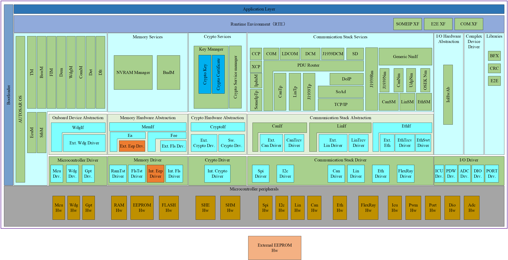
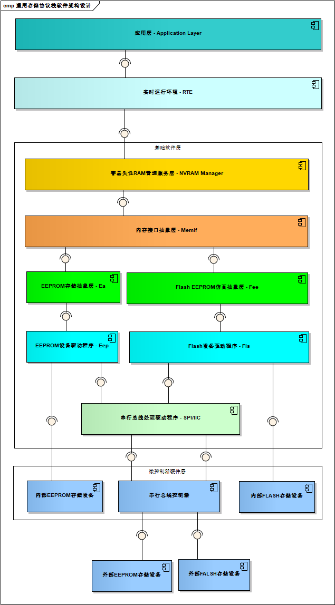
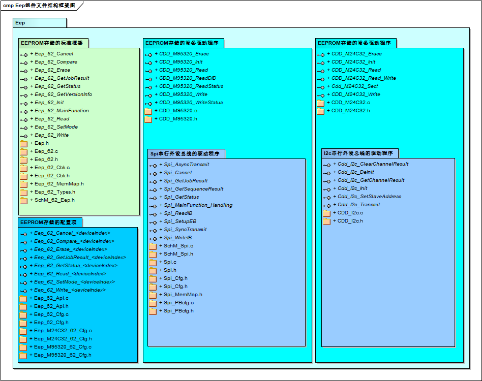
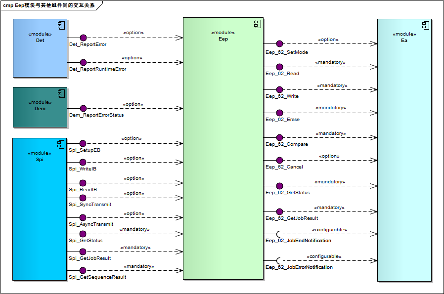
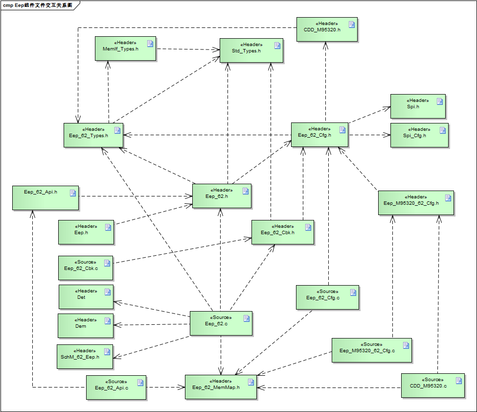
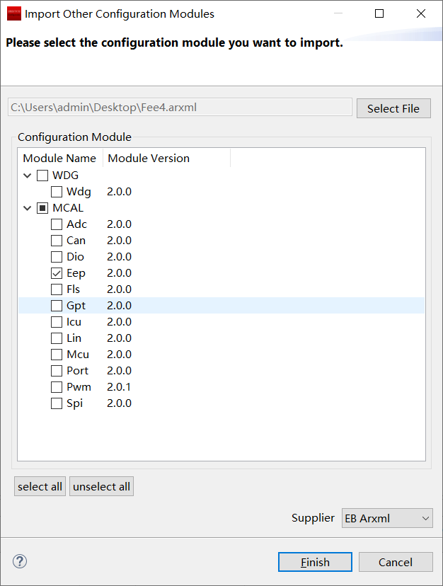
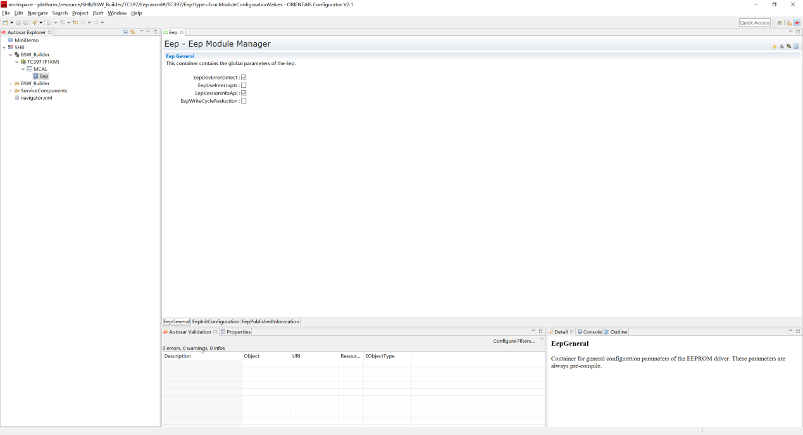
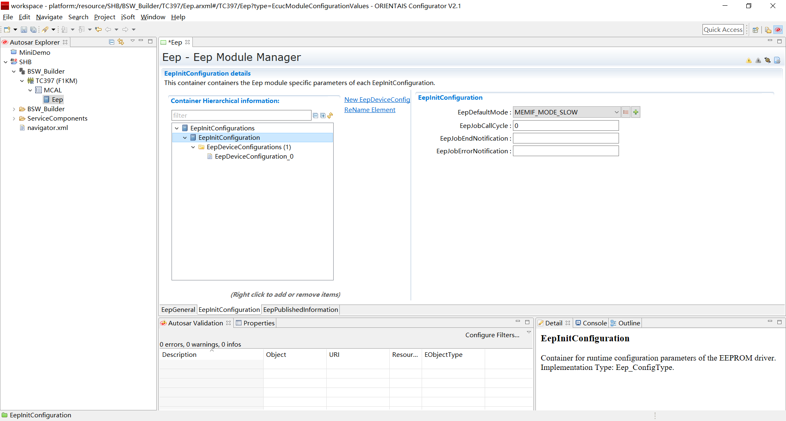
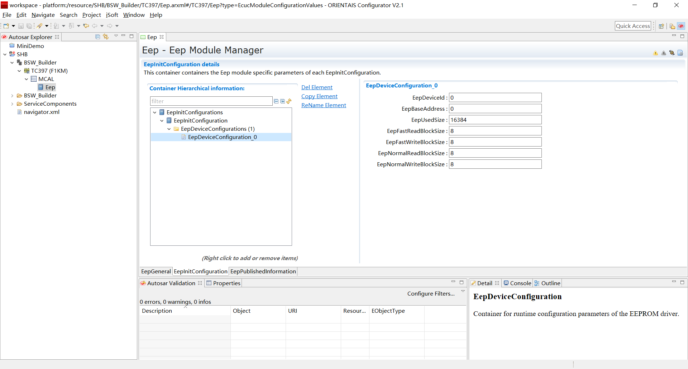
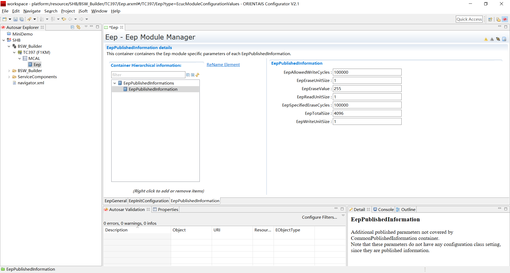
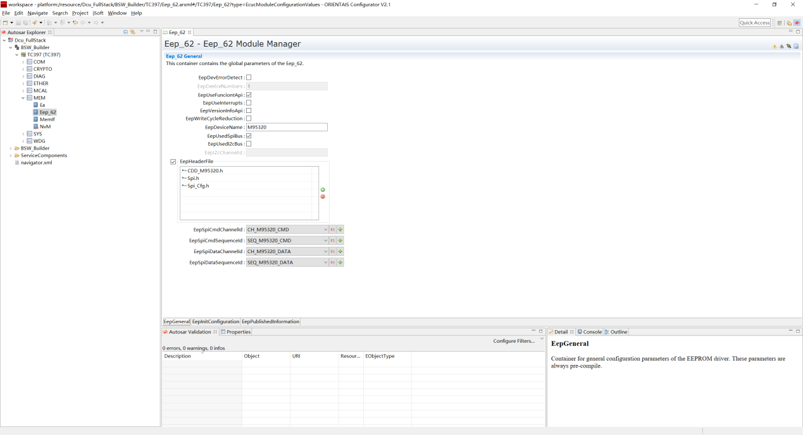
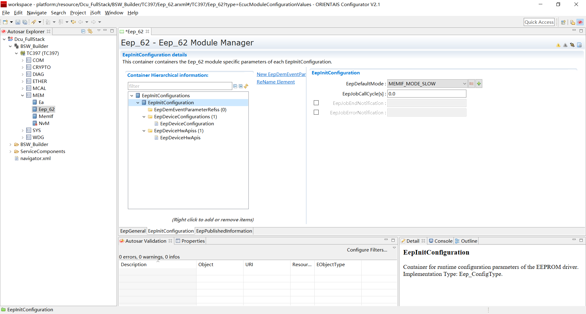
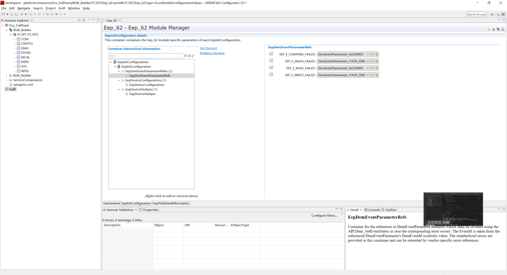
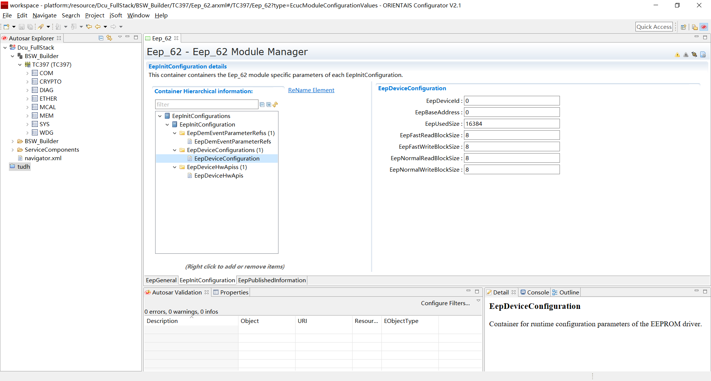
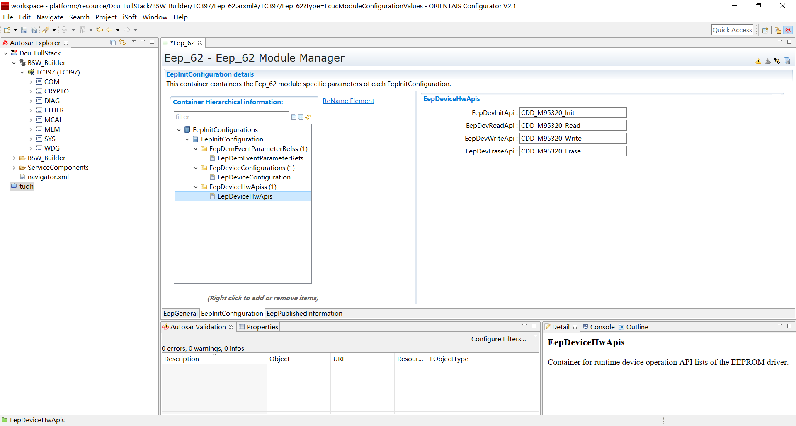
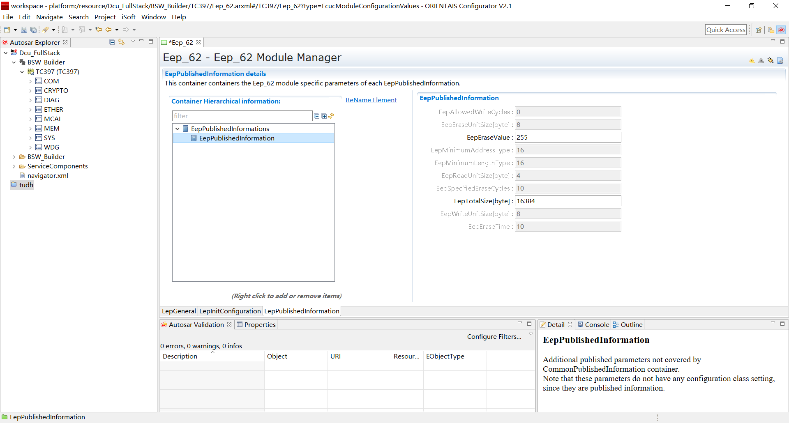
