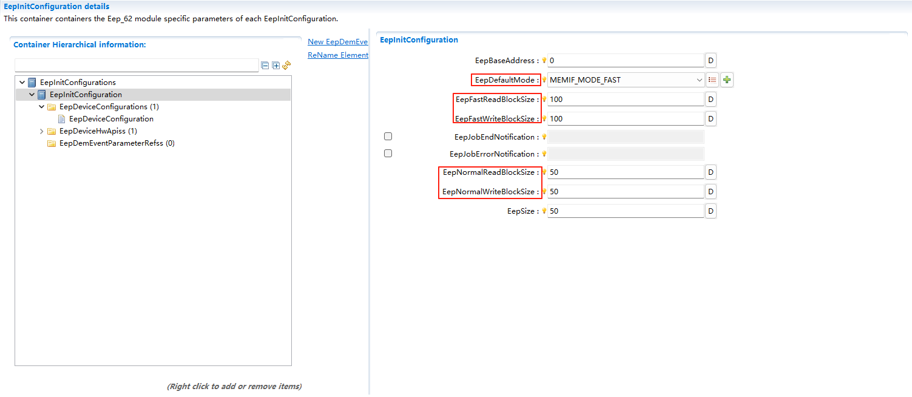
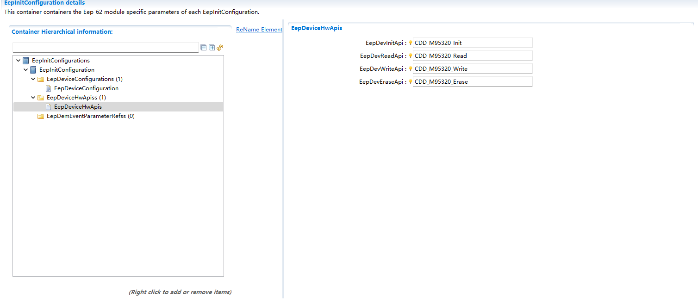

===================
Eep_62
===================

文档信息 Document Information
==================================================================

版本历史 Version History
------------------------------------------------------------------------------------------------------------------

.. list-table::
   :widths: 10 10 10 10 20
   :header-rows: 1

   * - 日期(Date)
     - 作者(Author)
     - 版本(Version)
     - 状态(Status)
     - 说明(Description)

   * - 2025/03/13
     - peng.wu
     - V0.1
     - 发布(Release)
     - 首次发布(First release)

   * - 2025/04/04
     - peng.wu
     - V1.0
     - 发布(Release)
     - 正式发布(Official release)

参考文档 References
------------------------------------------------------------------------------------------------------------------

.. list-table::
   :widths: 10 10 30 10
   :header-rows: 1

   * - 编号(Number)
     - 分类(Classification)
     - 标题(Title)
     - 版本(Version)
   * - 1
     - Autosar
     - AUTOSAR_CP_SRS_EEPROMDriver.pdf
     - R23-11
   * - 2
     - Autosar
     - AUTOSAR_CP_SWS_EEPROMDriver.pdf
     - R23-11

术语与简写 Terms and Abbreviations
==================================================================

术语 Terms
---------------------------------------------------------
.. :align: center   表格内容居中(Table contents are centered)

.. list-table::
   :widths: 15 40
   :header-rows: 1

   * - 术语(Terms)
     - 解释(Explanation)

   * - Data block
     - 数据块可包含1到n个字节，用于EEPROM驱动程序的API中。(A data block can contain 1 to n bytes and is used in the API of the EEPROM driver.)

   * - Data unit
     - EEPROM中的最小数据实体。该实体在读取、写入、擦除操作中可能存在差异。(The minimum data entity in the EEPROM. This entity may vary in read, write, and erase operations.)

   * - Normal mode
     - 通过串行外设接口（SPI）与EEPROM设备进行的数据交互以块为单位执行。(Data interaction with the EEPROM device through the Serial Peripheral Interface (SPI) is performed in blocks.)

   * - Burst mode
     - 通过串行外设接口（SPI）与EEPROM设备进行的数据交互以块为单位执行。(Data interaction with the EEPROM device through the Serial Peripheral Interface (SPI) is performed in blocks.)

   * - EEPROM cell
     - EEPROM设备中存储数据的最小物理单元。通常为1字节。(The minimum physical unit for storing data in an EEPROM device. Usually 1 byte.)

简写 Abbreviations
---------------------------------------------------------

.. list-table::
   :widths: 10 20 30
   :header-rows: 1

   * - 简写(Abbreviation)
     - 全称(Full name)
     - 解释(Explanation)

   * - CS
     - Chip select
     - 片选
   * - DIO
     - Digital Input Output
     - 数字输入输出.
   * - ECU
     - Electric Control Unit.
     - 电子控制单元
   * - EOL
     - End Of Line
     - 行结束.
   * - ICU
     - Interrupt Capture Unit
     - 中断捕获单元.
   * - MCAL
     - Microcontroller Abstraction Layer
     - 微控制器抽象层.
   * - MCU
     - Microcontroller Unit
     - 微控制器单元.
   * - MMU
     - Memory Management Unit
     - 内存管理单元.
   * - Master
     - A device controlling other devices
     - 控制其他设备的设备.
   * - Slave
     - A device beeing completely controlled by a master device
     - 完全由主设备控制的设备.
   * - NMI
     - Non maskable interrupt
     - 不可屏蔽中断.
   * - OS
     - Operating System
     - 操作系统.
   * - PLL
     - Phase Locked Loop
     - 锁相环.
   * - PWM
     - Pulse Width Modulation
     - 脉冲宽度调制.
   * - RX
     - Reception (in the context of bus communication)
     - 接收.
   * - SPAL
     - The name of this working group
     - 工作组的名称.
   * - SFR
     - Special Function Register
     - 特殊功能寄存器.
   * - RTE
     - Runtime environment
     - 运行时环境.
   * - WP
     - Work Package
     - 工作包.
   * - EEPROM
     - Electrically Erasable and Programmable Read Only Memory
     - 电可擦和可编程只读存储器.
   * - NVRAM
     - Non Volatile Random Access Memory
     - 非易失性随机存取存储器.
   * - NvM
     - Module name of NVRAM Manager
     - NVRAM管理器的模块名称.
   * - EcuM
     - Module name of ECU State Manager
     - ECU状态管理器的模块名称.
   * - DEM
     - Module name of Diagnostic Event Manager
     - 诊断事件管理器的模块名称.
   * - DET
     - Module name of Default Error Tracer
     - 默认错误跟踪器的模块名称.

简介 Introduction
=================================

Eep_62模块的上层与Ea模块进行交互，并提供API函数接口给Ea模块使用，完成EEPROM驱动程序的读取/写入/擦除/比较等作业任务，
待作业任务完成以后，提供API查询接口向Ea模块报告作业结果/运行状态或者提供中断回调通知接口报告作业结果和运行状态。

The upper layer of the Eep_62 module interacts with the Ea module and provides API function interfaces for the Ea module to use, so as to complete EEPROM driver operation tasks such as reading/writing/erasing/comparing. After the operation tasks are completed, an API query interface is provided to report the operation result/operation status to the Ea module, or an interrupt callback notification interface is provided to report the operation result and operation status.

功能描述 Functional Description
=================================

特性 Features
---------------------------------------------------------

.. only:: doc_pbs

  变体  Variant
  ~~~~~~~~~~~~~~~
  .. 支持PBS的模块，必须具有本章节，以功能为导向描述模块级别的变体支持情况
  .. 主要功能必须描述，比较偏尽量描述（不强制）

  - 支持配置不同EepInitConfiguration容器中的地址大小和模式以及回调通知等
  - Supports configuring the address size, mode, callback notification, etc. in different EepInitConfiguration containers.

内外部Eep驱动 Internal and External Eep Drivers
~~~~~~~~~~~~~~~~~~~~~~~~~~~~~~~~~~~~~~~~~~~~~~~~~~~~~~~~~~~~~~~~~~~~~~~~~~~~~~~~~~~~~~~~~~~~~~~~~~~~~~~~~~~~~~~~~~~~~~~~
当ECU采用片内Eep驱动程序时，Eep模块的下层与Mcal-Int.Eep模块进行交互，直接提供API接口给Ea模块进行调用，完成所有的作业任务；

When the ECU uses the on-chip Eep driver, the lower layer of the Eep module interacts with the Mcal-Int.Eep module and directly provides API interfaces for the Ea module to call, so as to complete all operation tasks;

当ECU采用片外Eep驱动程序时，Eep模块的下层与外围串行总线驱动程序SPI/IIC模块进行交互，比如采用SPI总线挂接Ext.Eep外设，调用SPI驱动程序的Spi_SetupEB/Spi_SyncTransmit函数接口，完成EEPROM存储单元的写入/读取/擦除/比较等作业任务。

When the ECU uses the off-chip Eep driver, the lower layer of the Eep module interacts with the peripheral serial bus driver SPI/IIC module. For example, an Ext.Eep peripheral is connected via the SPI bus, and the Spi_SetupEB/Spi_SyncTransmit function interfaces of the SPI driver are called to complete EEPROM memory cell operation tasks such as writing/reading/erasing/comparing.

数据存储管理 Data Storage Management
~~~~~~~~~~~~~~~~~~~~~~~~~~~~~~~~~~~~~~~~~~~~~~~~~~~~~~~~~~~~~~~~~~~~~~~~~~~~~~~~~~~~~~~~~~~~~~~~~~~~~~~~~~~~~~~~~~~~~~~~
EEP模块将非易失性存储空间划分为多个逻辑块，每个逻辑块可以存储一定量的数据。用户可以通过配置工具定义这些逻辑块的大小和数量。

The EEP module divides the non-volatile storage space into multiple logical blocks, and each logical block can store a certain amount of data. Users can define the size and quantity of these logical blocks through configuration tools.

数据读取管理 Data Reading Management
~~~~~~~~~~~~~~~~~~~~~~~~~~~~~~~~~~~~~~~~~~~~~~~~~~~~~~~~~~~~~~~~~~~~~~~~~~~~~~~~~~~~~~~~~~~~~~~~~~~~~~~~~~~~~~~~~~~~~~~~
EEP模块提供了读取接口，应用层可以通过这些接口读取存储在EEPROM中的数据。读取操作是同步的，即应用层在调用读取接口后会立即得到数据。

The EEP module provides read interfaces, through which the application layer can read the data stored in the EEPROM. The read operation is synchronous, that is, the application layer will obtain the data immediately after calling the read interface.

数据校验和错误处理 Data Verification and Error Handling
~~~~~~~~~~~~~~~~~~~~~~~~~~~~~~~~~~~~~~~~~~~~~~~~~~~~~~~~~~~~~~~~~~~~~~~~~~~~~~~~~~~~~~~~~~~~~~~~~~~~~~~~~~~~~~~~~~~~~~~~
EEP模块在读取和写入数据时会进行校验，以确保数据的完整性和正确性。如果检测到错误，EEP模块会触发相应的错误处理机制，如重试操作或通知应用层。

The EEP module performs verification during data reading and writing to ensure data integrity and correctness. If an error is detected, the EEP module will trigger the corresponding error handling mechanism, such as retry operation or notifying the application layer.

数据写入和擦除操作 Data Writing and Erasing Operations
~~~~~~~~~~~~~~~~~~~~~~~~~~~~~~~~~~~~~~~~~~~~~~~~~~~~~~~~~~~~~~~~~~~~~~~~~~~~~~~~~~~~~~~~~~~~~~~~~~~~~~~~~~~~~~~~~~~~~~~~
EEP模块提供了写入和擦除接口，应用层可以通过这些接口将数据写入EEPROM或擦除EEPROM中的数据。写入和擦除操作是异步的，即应用层在调用接口后可以继续执行其他任务，EEP模块会在后台完成这些操作。

The EEP module provides write and erase interfaces, through which the application layer can write data to the EEPROM or erase data in the EEPROM. The write and erase operations are asynchronous, that is, the application layer can continue to execute other tasks after calling the interfaces, and the EEP module will complete these operations in the background.

偏差 Deviation
---------------------------------------------------------
None

扩展 Extension
---------------------------------------------------------
None

集成 Integration
=================================

多分区 Multi-Partition
---------------------------------------------------------

Eep_62多分区场景下，需要配置EepEcucPartitionRef关联对应的分区。Eep_62只能在关联的分区下执行，不能在未关联的分区执行，若需要切换分区，只能重新配置关联相关的EepEcucPartitionRef。

In the multi-partition scenario of Eep_62, it is necessary to configure EepEcucPartitionRef to associate the corresponding partition. Eep_62 can only execute under the associated partition and cannot execute under unassociated partitions. If partition switching is required, only the EepEcucPartitionRef related to the association can be reconfigured.

文件列表 File List
---------------------------------------------------------

静态文件 Static Files
~~~~~~~~~~~~~~~~~~~~~~~~~~~~~~~~~~

.. list-table::
   :widths: 10 30
   :header-rows: 1

   * - 文件(File)
     - 描述(Description)
   
   * - Eep_62.h
     - API declarations and macro definitions of Eep module; including macro definitions, and external function declarations that need to be used.
   * - Eep_62.c
     - API implementation of Eep module; contains macro definitions, internal functions, and global functions that need to be used.
   * - Eep_62_Types.h
     - Type definition of Eep module; including type definition, and configuration structure declaration that need to be used.
   * - Eep_62_Cbk.h
     - API declarations of callback function in EEP module.
   * - Eep_62_Cbk.c
     - API implementation of callback function in EEP module.
   * - Eep_62_MemMap.h
     - Memory abstraction including Eep module.

动态文件 Dynamic Files
~~~~~~~~~~~~~~~~~~~~~~~~~~~~~~~~~~
.. list-table::
   :widths: 10 30
   :header-rows: 1

   * - 文件(File)
     - 描述(Description)

   * - Eep_62_Cfg.h
     - Configuration declaration of Eep_62; Contains macro definitions, version information.
   * - Eep_62_Lcfg.c
     - Link time definitions of Eep_62; Contains the API information that need to be used.
   * - Eep_62_Lcfg.h
     - Link time declaration of Eep_62; Contains macro definitions, version information, and API declarations that need to be used.
   * - Eep_62_PBcfg.h
     - Post-build time declaration of Eep_62; Contains macro definitions, version information.
   * - Eep_62_PBcfg.c
     - Post-build time definitions of Eep_62; Contains the API information that need to be used.
   * - Eep_62_Api.c
     - Remapping declarations of external API functions in Eep_62 module
   * - Eep_62_Api.h
     - Remapping implementation of external API functions in Eep_62 module
   * - Eep_62_<deviceName>_Cfg.h
     - Configuration parameters required for the implementation specific hardware devices of Eep_62; Contains the API information that need to be used.
   * - Eep_62_<deviceName>_Cfg.c
     - Configuration parameters required for the implementation specific hardware devices of Eep_62; Contains macro definitions.
   * - CDD_62_<deviceName>.c
     - API implementation drivers for specific hardware devices in the Eep_62 module
   * - CDD_62_<deviceName>.h
     - API declarations drivers for specific hardware devices in the Eep_62 module.

错误处理 Error Handling
---------------------------------------------------------

开发错误 Development Errors
~~~~~~~~~~~~~~~~~~~~~~~~~~~~~~~~~
.. list-table:: 
   :widths: 20 10 30
   :header-rows: 1

   * - Error code
     - Value[hex]
     - Description

   * - EEP_62_E_NO_ERROR
     - 0x0u
     - API function called with no det error

   * - EEP_62_E_INIT_FAILED
     - 0x10u
     - Invalid configuration set selection

   * - EEP_62_E_PARAM_ADDRESS
     - 0x11u
     - Invalid configuration set selection

   * - EEP_62_E_PARAM_DATA
     - 0x12u
     - Invalid configuration set selection

   * - EEP_62_E_PARAM_LENGTH
     - 0x13u
     - Invalid configuration set selection

   * - EEP_62_E_UNINT
     - 0x20u
     - API service called without module initialization

   * - EEP_62_E_PARAM_POINTER
     - 0x23u
     - API service called with a NULL pointer

   * - EEP_62_E_IN_MAINF
     - 0x25u
     - RUN IN MAINFCTION when Call EEP_Cancel

   * - EEP_62_E_WRONG_CONDITION
     - 0x26u
     - Partition info error

产品错误 Product Errors
~~~~~~~~~~~~~~~~~~~~~~~~~~~~~~~~~~
None

运行时错误 Runtime Errors
~~~~~~~~~~~~~~~~~~~~~~~~~~~~~~~~~~

.. list-table:: 
   :widths: 20 10 30
   :header-rows: 1

   * - Error code
     - Value[hex]
     - Description

   * - EEP_62_E_BUSY
     - 0x21u
     - API service called while driver still busy

   * - EEP_62_E_TIMEOUT
     - 0x22U
     - Timeout exceeded

扩展产品错误 Extended Product Errors
~~~~~~~~~~~~~~~~~~~~~~~~~~~~~~~~~~~~~~~~~~~~~
.. list-table:: 
   :widths: 20 10 30
   :header-rows: 1

   * - Error code
     - Value[hex]
     - Description

   * - EEP_62_E_ERASE_FAILED
     - Value[hex]
     - The Eeprom module reports this error when EEPROM erase job fails due to a hardware error

   * - EEP_62_E_WRITE_FAILED
     - Value[hex]
     - The Eeprom module reports this error when EEPROM write job fails due to a hardware error

   * - EEP_62_E_READ_FAILED
     - Value[hex]
     - The Eeprom module reports this error when EEPROM read job fails due to a hardware error

   * - EEP_62_E_COMPARE_FAILED
     - Value[hex]
     - The Eeprom module reports this error when EEPROM compare job fails due to a hardware error

接口描述 Interface Description
==================================================================

.. include:: Eep_62_api.rst

依赖的服务 Applicable Services
---------------------------------------------------------

可选接口 Optional Interface
~~~~~~~~~~~~~~~~~~~~~~~~~~~~~~~~~~

.. list-table::
   :widths: 10 5 30
   :header-rows: 1

   * - API Function
     - Header File
     - Description

   * - Det_ReportError
     - Det.h
     - Service to report development errors

强制接口 Compulsory interface
~~~~~~~~~~~~~~~~~~~~~~~~~~~~~~~~~~~~~~~~~~~~~~~~~~~~~~~~~~~~~~~~~~~~
.. 可选的章节，根据模块实际情况确定

.. list-table::
   :widths: 10 5 30
   :header-rows: 1

   * - API Function
     - Header File
     - Description
   * - Dem_SetEventStatus
     - Dem.h
     - Called by SW-Cs or BSW modules to report monitor status information to the Dem
   * - Det_ReportRuntimeError
     - Det.h
     - Service to report runtime errors.If a callout has been configured then this callout shall be called. Service to report runtime errors. If a callout has been configured then this callout shall be called

配置接口 Configuration Interfaces
~~~~~~~~~~~~~~~~~~~~~~~~~~~~~~~~~~~~~~~~~~~~~~~~~~~~~~~~~~~~~~~~~~~~
.. 可选的章节，根据模块实际情况确定
.. 格式同强制接口

.. list-table::
   :widths: 10 5 30
   :header-rows: 1

   * - API Function
     - Header File
     - Description
   * - Eep_62_JobEndNotification
     - Eep_62_Cbk.h
     - This callback function provided by the module user is called when a job has been completed with a positive result
   * - Eep_62_JobErrorNotification
     - Eep_62_Cbk.h
     - This callback function provided by the module user is called when a job has been canceled or finished with negative result

配置 Configuration
=================================

EepInitConfiguration
---------------------------------------------------------
Eep_62的模式选择，可设置默认模式，以及快慢模式下的读写Size。

Mode selection of Eep_62, which can set the default mode and the read/write Size in fast and slow modes.

如图 :ref:`InitConfiguration` 展示了的配置EepInitConfiguration界面。

As shown in Figure :ref:`InitConfiguration`, the configuration interface of EepInitConfiguration is displayed.

   Eep_62 InitConfiguration Configuration

EepDeviceConfiguration
---------------------------------------------------------
如果采用SPI串行总线进行挂接，则可以直接使用MCAL自带的SPI组件，在工具中配置相关的SPI组件的Channel/Job/Sequence/External等参数的配置项；如果采用IIC串行总线进行挂接，则可以在工具中配置相关的IIC组件的参数。

If the SPI serial bus is used for connection, the SPI component that comes with MCAL can be used directly, and the configuration items of parameters such as Channel/Job/Sequence/External of the relevant SPI component can be configured in the tool; If the IIC serial bus is used for connection, the parameters of the relevant IIC component can be configured in the tool.

如图 :ref:`DeviceConfiguration` 展示了的配置EepDeviceConfiguration界面。

As shown in Figure :ref:`DeviceConfiguration`, the configuration interface of EepDeviceConfiguration is displayed.

.. figure:: ../../../_static/参考手册/Eep_62/EepDeviceConfiguration.png
   :alt: 模块配置图 (Module Configuration Diagram)
   :name: DeviceConfiguration
   :align: center

   Eep_62 DeviceConfiguration Configuration

EepDeviceHwApis
---------------------------------------------------------
对于EEPROM硬件的操作，通过引用驱动程序的API实现EEPROM存储设备驱动的基本操作API函数，并通过配置指针的方式挂接到EEPROM存储的标准框架上，最终以AUTOSAR标准API函数供EA存储抽象组件调用。

For the operation of EEPROM hardware, the basic operation API functions of the EEPROM storage device driver are implemented by referencing the API of the driver, and are connected to the standard framework of EEPROM storage by means of configuring pointers. Finally, the AUTOSAR standard API functions are provided for the EA storage abstraction component to call.

如图 :ref:`DeviceHwApis` 展示了的配置EepDeviceHwApis界面。

As shown in Figure :ref:`DeviceHwApis`, the configuration interface of EepDeviceHwApis is displayed.

   Eep_62 DeviceHwApis Configuration

