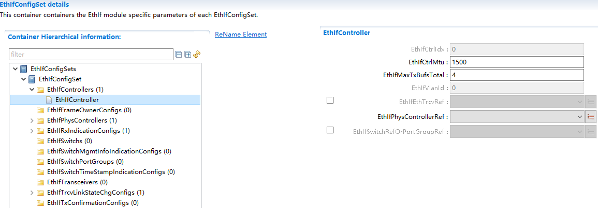
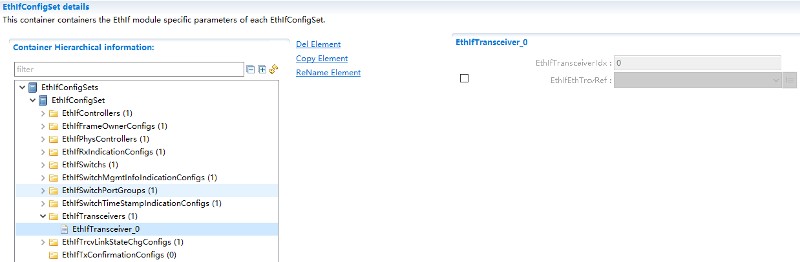
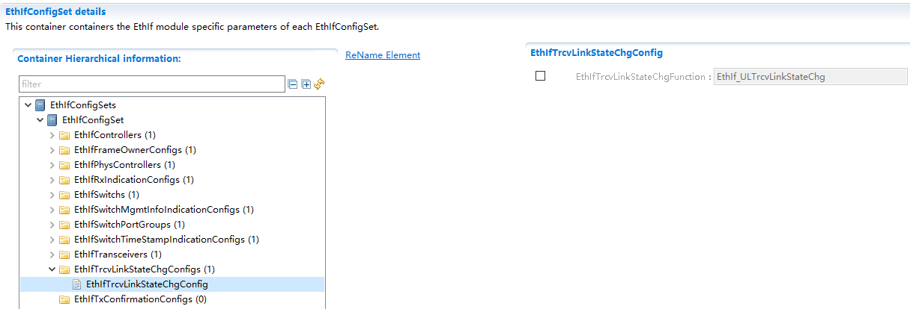

========================
EthIf
========================

**缩写词注解**

+------------+---------------------------+----------------------------+
| **缩写词** | **英文全称**              | **中文解释**               |
+------------+---------------------------+----------------------------+
| Eth        | Ethernet Driver (AUTOSAR  | AUTOSAR标准以太网驱动模块  |
|            | BSW module)               |                            |
+------------+---------------------------+----------------------------+
| EthIf      | Ethernet Interface        | AUTOSAR标准以太网接口模块  |
|            | (AUTOSAR BSW module)      |                            |
+------------+---------------------------+----------------------------+
| EthTrcv    | Ethernet Transceiver      | A                          |
|            | Driver (AUTOSAR BSW       | UTOSAR标准以太网收发器模块 |
|            | module)                   |                            |
+------------+---------------------------+----------------------------+
| TCP        | Transmission Control      | 传输控制协议               |
|            | Protocol                  |                            |
+------------+---------------------------+----------------------------+
| UDP        | User Datagram Protocol    | 用户数据报协议             |
+------------+---------------------------+----------------------------+
| IP         | Internet Protocol         | 以太网协议                 |
+------------+---------------------------+----------------------------+

简介
====

EthIf向上层提供与以太网硬件无关的独立接口，该接口可以支持多个不同的有线或无线以太网控制器和收发器。这些接口按功能可以大体分为模式控制相关的接口、时间同步相关的接口、数据接收发送相关的接口、EthIf本身的初始化或周期任务接口等。

|image1|

图 EthIf层次图

参考资料
--------

[1] AUTOSAR_SWS_EthernetInterface.pdf，R19-11

功能描述
========

接口传递功能功能
----------------

接口传递功能介绍
~~~~~~~~~~~~~~~~

EthIf负责对底层驱动提供给上层模块的接口进行抽象，通过EthDriver提供的接收发送接口实现对以太网数据的收发。

Vlan收发功能介绍
~~~~~~~~~~~~~~~~

EthIf负责对VLAN报文的解/加Tag操作，当接收时，通过EthIf传递给上层的以太网报文将在EthIf中提取出VLAN头，并把剩余的数据传递给上层模块。当上层模块需要向下传输报文时，在EthIf中添加VLAN头，并通过合适的Eth通道发送出去。

状态通知功能介绍
~~~~~~~~~~~~~~~~

EthIf负责向EthSM通知下层EthController和EthTrcv的状态变化。

源文件描述
==========

表 EthIf组件文件描述

+----------------+-----------------------------------------------------+
| **文件**       | **说明**                                            |
+----------------+-----------------------------------------------------+
| EthIf_cfg.h    | 定义EthIf模块预编译时用到的配置参数。               |
+----------------+-----------------------------------------------------+
| EthIf \_cfg.c  | 定义EthIf模块中链接时用到的配置参数。               |
+----------------+-----------------------------------------------------+
| EthIf.h        | EthIf模块头文                                       |
|                | 件，包含了API函数的扩展声明并定义了端口的数据结构。 |
+----------------+-----------------------------------------------------+
| EthIf.c        | DoIP模块源文件，包含了API函数的实现。               |
+----------------+-----------------------------------------------------+
| EthIf \_Cbk.h  | 包含EthIf供底层调用的API函数的声明。                |
+----------------+-----------------------------------------------------+
| EthIf_MemMap.h | EthIf的内存映射定义。                               |
+----------------+-----------------------------------------------------+
| EthIf_Types.h  | EthIf模块宏定义及数据类型定义。                     |
+----------------+-----------------------------------------------------+

|image2|

图 EthIf组件文件交互关系图

API接口
=======

类型定义
--------

EthIf_ConfigType类型定义
~~~~~~~~~~~~~~~~~~~~~~~~

+-----------+----------------------------------------------------------+
| 名称      | EthIf_ConfigType                                         |
+-----------+----------------------------------------------------------+
| 类型      | struct                                                   |
+-----------+----------------------------------------------------------+
| 范围      | 无                                                       |
+-----------+----------------------------------------------------------+
| 描述      | EthIf配置结构体定义                                      |
+-----------+----------------------------------------------------------+

EthIf_EthDriverApiType类型定义
~~~~~~~~~~~~~~~~~~~~~~~~~~~~~~

+-----------+----------------------------------------------------------+
| 名称      | EthIf_EthDriverApiType                                   |
+-----------+----------------------------------------------------------+
| 类型      | struct                                                   |
+-----------+----------------------------------------------------------+
| 范围      | 无                                                       |
+-----------+----------------------------------------------------------+
| 描述      | EthIf通道对应的Eth驱动的API列表                          |
+-----------+----------------------------------------------------------+

EthIf_EthTrcvDriverApiType类型定义
~~~~~~~~~~~~~~~~~~~~~~~~~~~~~~~~~~

+-----------+----------------------------------------------------------+
| 名称      | EthIf_EthTrcvDriverApiType                               |
+-----------+----------------------------------------------------------+
| 类型      | struct                                                   |
+-----------+----------------------------------------------------------+
| 范围      | 无                                                       |
+-----------+----------------------------------------------------------+
| 描述      | EthIf通道对应的EthTrcv驱动的API列表                      |
+-----------+----------------------------------------------------------+

输入函数描述
------------

+----------------------------------+-----------------------------------+
| **输入模块**                     | **API**                           |
+----------------------------------+-----------------------------------+
| Eth                              | Eth_GetControllerMode             |
+----------------------------------+-----------------------------------+
|                                  | Eth_GetPhysAddr                   |
+----------------------------------+-----------------------------------+
|                                  | Eth_ProvideTxBuffer               |
+----------------------------------+-----------------------------------+
|                                  | Eth_SetControllerMode             |
+----------------------------------+-----------------------------------+
|                                  | Eth_Transmit                      |
+----------------------------------+-----------------------------------+
|                                  | Eth_TxConfirmation                |
+----------------------------------+-----------------------------------+
| EthSM                            | EthSM_CtrlModeIndication          |
+----------------------------------+-----------------------------------+
|                                  | EthSM_TrcvLinkStateChg            |
+----------------------------------+-----------------------------------+
| EthTrcv                          | EthTrcv_GetLinkState              |
+----------------------------------+-----------------------------------+
|                                  | EthTrcv_GetTransceiverMode        |
+----------------------------------+-----------------------------------+
|                                  | EthTrcv_SetTransceiverMode        |
+----------------------------------+-----------------------------------+

静态接口函数定义
----------------

EthIf_Init函数定义
~~~~~~~~~~~~~~~~~~

+-------------+-------------------+---------+-------------------------+
| 函数名称：  | EthIf_Init        |         |                         |
+-------------+-------------------+---------+-------------------------+
| 函数原型：  | void EthIf_Init ( |         |                         |
|             | const             |         |                         |
|             | E                 |         |                         |
|             | thIf_ConfigType\* |         |                         |
|             | CfgPtr )          |         |                         |
+-------------+-------------------+---------+-------------------------+
| 服务编号：  | 0x01              |         |                         |
+-------------+-------------------+---------+-------------------------+
| 同步/异步： | 同步              |         |                         |
+-------------+-------------------+---------+-------------------------+
| 是          | 不可重入          |         |                         |
| 否可重入：  |                   |         |                         |
+-------------+-------------------+---------+-------------------------+
| 输入参数：  | CfgPtr            | 值域：  | Points to the           |
|             |                   |         | implementation specific |
|             |                   |         | structure               |
+-------------+-------------------+---------+-------------------------+
| 输入        | 无                |         |                         |
| 输出参数：  |                   |         |                         |
+-------------+-------------------+---------+-------------------------+
| 输出参数：  | 无                |         |                         |
+-------------+-------------------+---------+-------------------------+
| 返回值：    | 无                |         |                         |
+-------------+-------------------+---------+-------------------------+
| 功能概述：  | EthIf初始化       |         |                         |
+-------------+-------------------+---------+-------------------------+

EthIf_SetControllerMode函数定义
~~~~~~~~~~~~~~~~~~~~~~~~~~~~~~~

+-------------+-------------------+---------+-------------------------+
| 函数名称：  | EthIf_            |         |                         |
|             | SetControllerMode |         |                         |
+-------------+-------------------+---------+-------------------------+
| 函数原型：  | Std_ReturnType    |         |                         |
|             | EthIf_            |         |                         |
|             | SetControllerMode |         |                         |
|             | (                 |         |                         |
|             |                   |         |                         |
|             | uint8 CtrlIdx,    |         |                         |
|             |                   |         |                         |
|             | Eth_ModeType      |         |                         |
|             | CtrlMode )        |         |                         |
+-------------+-------------------+---------+-------------------------+
| 服务编号：  | 0x03              |         |                         |
+-------------+-------------------+---------+-------------------------+
| 同步/异步： | 异步              |         |                         |
+-------------+-------------------+---------+-------------------------+
| 是          | 不可重入          |         |                         |
| 否可重入：  |                   |         |                         |
+-------------+-------------------+---------+-------------------------+
| 输入参数：  | CtrlIdx           | 值域：  | Index of the Ethernet   |
|             |                   |         | controller within the   |
|             |                   |         | context of the Ethernet |
|             |                   |         | Interface               |
+-------------+-------------------+---------+-------------------------+
|             | CtrlMode          | 值域：  | ETH_MODE_DOWN： disable |
|             |                   |         | the controller          |
|             |                   |         | ETH_MODE_ACTIVE：       |
|             |                   |         | enable the controller   |
+-------------+-------------------+---------+-------------------------+
| 输入        | 无                |         |                         |
| 输出参数：  |                   |         |                         |
+-------------+-------------------+---------+-------------------------+
| 输出参数：  | 无                |         |                         |
+-------------+-------------------+---------+-------------------------+
| 返回值：    | Std_ReturnType    |         |                         |
|             |                   |         |                         |
|             | E_OK： success    |         |                         |
|             | E_NOT_OK：        |         |                         |
|             | controller mode   |         |                         |
|             | could not be      |         |                         |
|             | changed           |         |                         |
+-------------+-------------------+---------+-------------------------+
| 功能概述：  | 设                |         |                         |
|             | 置controller模式  |         |                         |
+-------------+-------------------+---------+-------------------------+

EthIf_GetControllerMode函数定义
~~~~~~~~~~~~~~~~~~~~~~~~~~~~~~~

+-------------+-------------------+---------+-------------------------+
| 函数名称：  | EthIf_            |         |                         |
|             | GetControllerMode |         |                         |
+-------------+-------------------+---------+-------------------------+
| 函数原型：  | Std_ReturnType    |         |                         |
|             | EthIf_G           |         |                         |
|             | etControllerMode( |         |                         |
|             |                   |         |                         |
|             | uint8 CtrlIdx,    |         |                         |
|             |                   |         |                         |
|             | Eth_ModeType\*    |         |                         |
|             | CtrlModePtr )     |         |                         |
+-------------+-------------------+---------+-------------------------+
| 服务编号：  | 0x04              |         |                         |
+-------------+-------------------+---------+-------------------------+
| 同步/异步： | 同步              |         |                         |
+-------------+-------------------+---------+-------------------------+
| 是          | 不可重入          |         |                         |
| 否可重入：  |                   |         |                         |
+-------------+-------------------+---------+-------------------------+
| 输入参数：  | CtrlIdx           | 值域：  | Index of the Ethernet   |
|             |                   |         | controller within the   |
|             |                   |         | context of the Ethernet |
|             |                   |         | Interface               |
+-------------+-------------------+---------+-------------------------+
| 输入        | 无                |         |                         |
| 输出参数：  |                   |         |                         |
+-------------+-------------------+---------+-------------------------+
| 输出参数：  | CtrlModePtr       | 值域：  | ETH_MODE_DOWN： the     |
|             |                   |         | controller is disabled  |
|             |                   |         | ETH_MODE_ACTIVE： the   |
|             |                   |         | controller is enabled   |
+-------------+-------------------+---------+-------------------------+
| 返回值：    | Std_ReturnType    |         |                         |
|             |                   |         |                         |
|             | E_OK： success    |         |                         |
|             | E_NOT_OK：        |         |                         |
|             | controller could  |         |                         |
|             | not be            |         |                         |
|             | initialized       |         |                         |
+-------------+-------------------+---------+-------------------------+
| 功能概述：  | 获                |         |                         |
|             | 取controller模式  |         |                         |
+-------------+-------------------+---------+-------------------------+

EthIf_SetTransceiverWakeupMode函数定义
~~~~~~~~~~~~~~~~~~~~~~~~~~~~~~~~~~~~~~

+-------------+-------------------+---------+-------------------------+
| 函数名称：  | EthIf_SetTran     |         |                         |
|             | sceiverWakeupMode |         |                         |
+-------------+-------------------+---------+-------------------------+
| 函数原型：  | Std_ReturnType    |         |                         |
|             | EthIf_SetTran     |         |                         |
|             | sceiverWakeupMode |         |                         |
|             | (                 |         |                         |
|             |                   |         |                         |
|             | uint8 TrcvIdx,    |         |                         |
|             |                   |         |                         |
|             | EthTr             |         |                         |
|             | cv_WakeupModeType |         |                         |
|             | TrcvWakeupMode )  |         |                         |
+-------------+-------------------+---------+-------------------------+
| 服务编号：  | 0x2e              |         |                         |
+-------------+-------------------+---------+-------------------------+
| 同步/异步： | 同步              |         |                         |
+-------------+-------------------+---------+-------------------------+
| 是          | 不可重入          |         |                         |
| 否可重入：  |                   |         |                         |
+-------------+-------------------+---------+-------------------------+
| 输入参数：  | TrcvIdx           | 值域：  | Index of the            |
|             |                   |         | transceiver within the  |
|             |                   |         | context of the Ethernet |
|             |                   |         | Interface               |
+-------------+-------------------+---------+-------------------------+
|             | TrcvWakeupMode    | 值域：  | ETHTRCV_WUM_DISABLE：   |
|             |                   |         | disable transceiver     |
|             |                   |         | wake up                 |
|             |                   |         | ETHTRCV_WUM_ENABLE：    |
|             |                   |         | enable transceiver wake |
|             |                   |         | up ETHTRCV_WUM_CLEAR：  |
|             |                   |         | clears transceiver wake |
|             |                   |         | up reason               |
+-------------+-------------------+---------+-------------------------+
| 输入        | 无                |         |                         |
| 输出参数：  |                   |         |                         |
+-------------+-------------------+---------+-------------------------+
| 输出参数：  | 无                |         |                         |
+-------------+-------------------+---------+-------------------------+
| 返回值：    | Std_ReturnType    |         |                         |
|             |                   |         |                         |
|             | E_OK： success    |         |                         |
|             | E_NOT_OK：        |         |                         |
|             | transceiver wake  |         |                         |
|             | up could not be   |         |                         |
|             | changed or        |         |                         |
|             | wake-up reason    |         |                         |
|             | could not be      |         |                         |
|             | cleared           |         |                         |
+-------------+-------------------+---------+-------------------------+
| 功能概述：  | 设置Tr            |         |                         |
|             | ansceiver唤醒模式 |         |                         |
+-------------+-------------------+---------+-------------------------+

EthIf_GetTransceiverWakeupMode函数定义
~~~~~~~~~~~~~~~~~~~~~~~~~~~~~~~~~~~~~~

+-------------+-------------------+---------+-------------------------+
| 函数名称：  | EthIf_GetTran     |         |                         |
|             | sceiverWakeupMode |         |                         |
+-------------+-------------------+---------+-------------------------+
| 函数原型：  | Std_ReturnType    |         |                         |
|             | EthIf_GetTran     |         |                         |
|             | sceiverWakeupMode |         |                         |
|             | (                 |         |                         |
|             |                   |         |                         |
|             | uint8 TrcvIdx,    |         |                         |
|             |                   |         |                         |
|             | EthTrcv           |         |                         |
|             | _WakeupModeType\* |         |                         |
|             | TrcvWakeupModePtr |         |                         |
|             | )                 |         |                         |
+-------------+-------------------+---------+-------------------------+
| 服务编号：  | 0x2f              |         |                         |
+-------------+-------------------+---------+-------------------------+
| 同步/异步： | 同步              |         |                         |
+-------------+-------------------+---------+-------------------------+
| 是          | 不可重入          |         |                         |
| 否可重入：  |                   |         |                         |
+-------------+-------------------+---------+-------------------------+
| 输入参数：  | TrcvIdx           | 值域：  | Index of the            |
|             |                   |         | transceiver within the  |
|             |                   |         | context of the Ethernet |
|             |                   |         | Interface               |
+-------------+-------------------+---------+-------------------------+
| 输入        | 无                |         |                         |
| 输出参数：  |                   |         |                         |
+-------------+-------------------+---------+-------------------------+
| 输出参数：  | TrcvWakeupMode    | 值域：  | ETHTRCV_WUM_DISABLE：   |
|             |                   |         | transceiver wake up is  |
|             |                   |         | disable                 |
|             |                   |         | TRCV_WUM_ENABLE：       |
|             |                   |         | transceiver wake up is  |
|             |                   |         | enable                  |
+-------------+-------------------+---------+-------------------------+
| 返回值：    | Std_ReturnType    |         |                         |
|             |                   |         |                         |
|             | E_OK： success    |         |                         |
|             | E_NOT_OK：        |         |                         |
|             | transceiver wake  |         |                         |
|             | up mode could not |         |                         |
|             | be obtained       |         |                         |
+-------------+-------------------+---------+-------------------------+
| 功能概述：  | 获取Tr            |         |                         |
|             | ansceiver唤醒模式 |         |                         |
+-------------+-------------------+---------+-------------------------+

EthIf_CheckWakeup函数定义
~~~~~~~~~~~~~~~~~~~~~~~~~

+-------------+-------------------+---------+-------------------------+
| 函数名称：  | EthIf_CheckWakeup |         |                         |
+-------------+-------------------+---------+-------------------------+
| 函数原型：  | Std_ReturnType    |         |                         |
|             | EthIf_CheckWakeup |         |                         |
|             | (                 |         |                         |
|             |                   |         |                         |
|             | EcuM              |         |                         |
|             | _WakeupSourceType |         |                         |
|             | WakeupSource)     |         |                         |
+-------------+-------------------+---------+-------------------------+
| 服务编号：  | 0x30              |         |                         |
+-------------+-------------------+---------+-------------------------+
| 同步/异步： | 异步              |         |                         |
+-------------+-------------------+---------+-------------------------+
| 是          | 可重入            |         |                         |
| 否可重入：  |                   |         |                         |
+-------------+-------------------+---------+-------------------------+
| 输入参数：  | WakeupSource      | 值域：  | source (transceiver)    |
|             |                   |         | which initiated the     |
|             |                   |         | wake up event           |
+-------------+-------------------+---------+-------------------------+
| 输入        | 无                |         |                         |
| 输出参数：  |                   |         |                         |
+-------------+-------------------+---------+-------------------------+
| 输出参数：  | 无                |         |                         |
+-------------+-------------------+---------+-------------------------+
| 返回值：    | Std_Return-Type   |         |                         |
|             |                   |         |                         |
|             | E_OK when         |         |                         |
|             | function has been |         |                         |
|             | successfully      |         |                         |
|             | executed E_NOT_OK |         |                         |
|             | when function     |         |                         |
|             | could not be      |         |                         |
|             | successfully      |         |                         |
|             | executed          |         |                         |
+-------------+-------------------+---------+-------------------------+
| 功能概述：  | 判断Wakeup状态    |         |                         |
+-------------+-------------------+---------+-------------------------+

EthIf_GetTransceiverMode函数定义
~~~~~~~~~~~~~~~~~~~~~~~~~~~~~~~~

+-------------+-------------------+---------+-------------------------+
| 函数名称：  | EthIf_G           |         |                         |
|             | etTransceiverMode |         |                         |
+-------------+-------------------+---------+-------------------------+
| 函数原型：  | Std_ReturnType    |         |                         |
|             | EthIf_Ge          |         |                         |
|             | tTransceiverMode( |         |                         |
|             |                   |         |                         |
|             | uint8 CtrlIdx,    |         |                         |
|             |                   |         |                         |
|             | E                 |         |                         |
|             | thTrcv_ModeType\* |         |                         |
|             | TrcvModePtr )     |         |                         |
+-------------+-------------------+---------+-------------------------+
| 服务编号：  | 0x07              |         |                         |
+-------------+-------------------+---------+-------------------------+
| 同步/异步： | 同步              |         |                         |
+-------------+-------------------+---------+-------------------------+
| 是          | 不可重入          |         |                         |
| 否可重入：  |                   |         |                         |
+-------------+-------------------+---------+-------------------------+
| 输入参数：  | CtrlIdx           | 值域：  | Index of the Ethernet   |
|             |                   |         | controller within the   |
|             |                   |         | context of the Ethernet |
|             |                   |         | Interface               |
+-------------+-------------------+---------+-------------------------+
| 输入        | 无                |         |                         |
| 输出参数：  |                   |         |                         |
+-------------+-------------------+---------+-------------------------+
| 输出参数：  | TrcvModePtr       | 值域：  | ETHTRCV_MODE_DOWN： the |
|             |                   |         | transceiver is disabled |
|             |                   |         | ETHTRCV_MODE_ACTIVE：   |
|             |                   |         | the transceiver is      |
|             |                   |         | enabled                 |
+-------------+-------------------+---------+-------------------------+
| 返回值：    | Std_ReturnType    |         |                         |
|             |                   |         |                         |
|             | E_OK： success    |         |                         |
|             | E_NOT_OK：        |         |                         |
|             | transceiver mode  |         |                         |
|             | could not be      |         |                         |
|             | obtained          |         |                         |
+-------------+-------------------+---------+-------------------------+
| 功能概述：  | 获                |         |                         |
|             | 取transceiver状态 |         |                         |
+-------------+-------------------+---------+-------------------------+

EthIf_ProvideTxBuffer函数定义
~~~~~~~~~~~~~~~~~~~~~~~~~~~~~

+-------------+-------------------+---------+-------------------------+
| 函数名称：  | EthI              |         |                         |
|             | f_ProvideTxBuffer |         |                         |
+-------------+-------------------+---------+-------------------------+
| 函数原型：  | BufReq_ReturnType |         |                         |
|             | EthI              |         |                         |
|             | f_ProvideTxBuffer |         |                         |
|             | (                 |         |                         |
|             |                   |         |                         |
|             | uint8 CtrlIdx,    |         |                         |
|             |                   |         |                         |
|             | Eth_FrameType     |         |                         |
|             | FrameType,        |         |                         |
|             |                   |         |                         |
|             | uint8 Priority,   |         |                         |
|             |                   |         |                         |
|             | Eth_BufIdxType\*  |         |                         |
|             | BufIdxPtr,        |         |                         |
|             |                   |         |                         |
|             | uint8*\* BufPtr,  |         |                         |
|             |                   |         |                         |
|             | uint16\*          |         |                         |
|             | LenBytePtr )      |         |                         |
+-------------+-------------------+---------+-------------------------+
| 服务编号：  | 0x09              |         |                         |
+-------------+-------------------+---------+-------------------------+
| 同步/异步： | 同步              |         |                         |
+-------------+-------------------+---------+-------------------------+
| 是          | 可重入            |         |                         |
| 否可重入：  |                   |         |                         |
+-------------+-------------------+---------+-------------------------+
| 输入参数：  | CtrlIdx           | 值域：  | Index of the Ethernet   |
|             |                   |         | controller within the   |
|             |                   |         | context of the Ethernet |
|             |                   |         | Interface               |
+-------------+-------------------+---------+-------------------------+
|             | FrameType         | 值域：  | Ethernet Frame Type     |
|             |                   |         | (EtherType)             |
+-------------+-------------------+---------+-------------------------+
|             | Priority          | 值域：  | Priority value which    |
|             |                   |         | shall be used for the   |
|             |                   |         | 3-bit PCP field of the  |
|             |                   |         | VLAN tag                |
+-------------+-------------------+---------+-------------------------+
| 输入        | LenBytePtr        | 值域：  | in： desired length in  |
| 输出参数：  |                   |         | bytes, out： granted    |
|             |                   |         | length in bytes         |
+-------------+-------------------+---------+-------------------------+
| 输出参数：  | BufIdxPtr         | 值域：  | Index to the granted    |
|             |                   |         | buffer resource. To be  |
|             |                   |         | used for subsequent     |
|             |                   |         | requests                |
+-------------+-------------------+---------+-------------------------+
|             | BufPtr            | 值域：  | Pointer to the granted  |
|             |                   |         | buffer                  |
+-------------+-------------------+---------+-------------------------+
| 返回值：    | Std_ReturnType    |         |                         |
|             |                   |         |                         |
|             | BUFREQ_OK：       |         |                         |
|             | success           |         |                         |
|             | BUFREQ_E_NOT_OK： |         |                         |
|             | development error |         |                         |
|             | detected          |         |                         |
|             | BUFREQ_E_BUSY：   |         |                         |
|             | all buffers in    |         |                         |
|             | use               |         |                         |
|             | BUFREQ_E_OVFL：   |         |                         |
|             | requested buffer  |         |                         |
|             | too large         |         |                         |
+-------------+-------------------+---------+-------------------------+
| 功能概述：  | 提供发送buffer    |         |                         |
+-------------+-------------------+---------+-------------------------+

EthIf_Transmit函数定义
~~~~~~~~~~~~~~~~~~~~~~

+-------------+-------------------+---------+-------------------------+
| 函数名称：  | EthIf_Transmit    |         |                         |
+-------------+-------------------+---------+-------------------------+
| 函数原型：  | Std_ReturnType    |         |                         |
|             | EthIf_Transmit (  |         |                         |
|             |                   |         |                         |
|             | uint8 CtrlIdx,    |         |                         |
|             |                   |         |                         |
|             | Eth_BufIdxType    |         |                         |
|             | BufIdx,           |         |                         |
|             |                   |         |                         |
|             | Eth_FrameType     |         |                         |
|             | FrameType,        |         |                         |
|             |                   |         |                         |
|             | boolean           |         |                         |
|             | TxConfirmation,   |         |                         |
|             |                   |         |                         |
|             | uint16 LenByte,   |         |                         |
|             |                   |         |                         |
|             | const uint8\*     |         |                         |
|             | PhysAddrPtr )     |         |                         |
+-------------+-------------------+---------+-------------------------+
| 服务编号：  | 0x0a              |         |                         |
+-------------+-------------------+---------+-------------------------+
| 同步/异步： | 同步              |         |                         |
+-------------+-------------------+---------+-------------------------+
| 是          | 不同的Ctrl        |         |                         |
| 否可重入：  | Idx和BufIdx可重入 |         |                         |
+-------------+-------------------+---------+-------------------------+
| 输入参数：  | CtrlIdx           | 值域：  | Index of the Ethernet   |
|             |                   |         | controller within the   |
|             |                   |         | context of the Ethernet |
|             |                   |         | Interface               |
+-------------+-------------------+---------+-------------------------+
|             | BufIdx            | 值域：  | Index of the buffer     |
|             |                   |         | resource                |
+-------------+-------------------+---------+-------------------------+
|             | FrameType         | 值域：  | Ethernet frame type     |
+-------------+-------------------+---------+-------------------------+
|             | TxConfirmation    | 值域：  | Activates transmission  |
|             |                   |         | confirmation            |
+-------------+-------------------+---------+-------------------------+
|             | LenByte           | 值域：  | Data length in byte     |
+-------------+-------------------+---------+-------------------------+
|             | PhysAddrPtr       | 值域：  | Physical target address |
|             |                   |         | (MAC address) in        |
|             |                   |         | network byte order      |
+-------------+-------------------+---------+-------------------------+
| 输入        | 无                |         |                         |
| 输出参数：  |                   |         |                         |
+-------------+-------------------+---------+-------------------------+
| 输出参数：  | 无                |         |                         |
+-------------+-------------------+---------+-------------------------+
| 返回值：    | Std_ReturnType    |         |                         |
|             |                   |         |                         |
|             | E_OK： success    |         |                         |
|             | E_NOT_OK：        |         |                         |
|             | transmission      |         |                         |
|             | failed            |         |                         |
+-------------+-------------------+---------+-------------------------+
| 功能概述：  | 发送函数          |         |                         |
+-------------+-------------------+---------+-------------------------+

EthIf_TxConfirmation函数定义
~~~~~~~~~~~~~~~~~~~~~~~~~~~~

+-------------+-------------------+---------+-------------------------+
| 函数名称：  | Eth               |         |                         |
|             | If_TxConfirmation |         |                         |
+-------------+-------------------+---------+-------------------------+
| 函数原型：  | void              |         |                         |
|             | Eth               |         |                         |
|             | If_TxConfirmation |         |                         |
|             | (                 |         |                         |
|             |                   |         |                         |
|             | uint8 CtrlIdx,    |         |                         |
|             |                   |         |                         |
|             | Eth_BufIdxType    |         |                         |
|             | BufIdx,           |         |                         |
|             |                   |         |                         |
|             | Std_ReturnType    |         |                         |
|             | Result)           |         |                         |
+-------------+-------------------+---------+-------------------------+
| 服务编号：  | 0x11              |         |                         |
+-------------+-------------------+---------+-------------------------+
| 同步/异步： | 同步              |         |                         |
+-------------+-------------------+---------+-------------------------+
| 是          | 不可重入          |         |                         |
| 否可重入：  |                   |         |                         |
+-------------+-------------------+---------+-------------------------+
| 输入参数：  | CtrlIdx           | 值域：  | Index of the Ethernet   |
|             |                   |         | controller within the   |
|             |                   |         | context of the Ethernet |
|             |                   |         | Interface               |
+-------------+-------------------+---------+-------------------------+
|             | BufIdx            | 值域：  | Index of the            |
|             |                   |         | transmitted buffer      |
+-------------+-------------------+---------+-------------------------+
|             | Result            | 值域：  | E_OK： The transmission |
|             |                   |         | was successful,         |
|             |                   |         | E_NOT_OK： The          |
|             |                   |         | transmission failed.    |
+-------------+-------------------+---------+-------------------------+
| 输入        | 无                |         |                         |
| 输出参数：  |                   |         |                         |
+-------------+-------------------+---------+-------------------------+
| 输出参数：  | 无                |         |                         |
+-------------+-------------------+---------+-------------------------+
| 返回值：    | 无                |         |                         |
+-------------+-------------------+---------+-------------------------+
| 功能概述：  | 发送确认函数      |         |                         |
+-------------+-------------------+---------+-------------------------+

EthIf_RxIndication函数定义
~~~~~~~~~~~~~~~~~~~~~~~~~~

+-------------+-------------------+---------+-------------------------+
| 函数名称：  | E                 |         |                         |
|             | thIf_RxIndication |         |                         |
+-------------+-------------------+---------+-------------------------+
| 函数原型：  | void              |         |                         |
|             | E                 |         |                         |
|             | thIf_RxIndication |         |                         |
|             | (                 |         |                         |
|             |                   |         |                         |
|             | uint8 CtrlIdx,    |         |                         |
|             |                   |         |                         |
|             | Eth_FrameType     |         |                         |
|             | FrameType,        |         |                         |
|             |                   |         |                         |
|             | boolean           |         |                         |
|             | IsBroadcast,      |         |                         |
|             |                   |         |                         |
|             | const uint8\*     |         |                         |
|             | PhysAddrPtr,      |         |                         |
|             |                   |         |                         |
|             | const             |         |                         |
|             | Eth_DataType\*    |         |                         |
|             | DataPtr,          |         |                         |
|             |                   |         |                         |
|             | uint16 LenByte )  |         |                         |
+-------------+-------------------+---------+-------------------------+
| 服务编号：  | 0x10              |         |                         |
+-------------+-------------------+---------+-------------------------+
| 同步/异步： | 同步              |         |                         |
+-------------+-------------------+---------+-------------------------+
| 是          | 不可重入          |         |                         |
| 否可重入：  |                   |         |                         |
+-------------+-------------------+---------+-------------------------+
| 输入参数：  | CtrlIdx           | 值域：  | Index of the Ethernet   |
|             |                   |         | controller within the   |
|             |                   |         | context of the Ethernet |
|             |                   |         | Interface               |
+-------------+-------------------+---------+-------------------------+
|             | FrameType         | 值域：  | Frame type of received  |
|             |                   |         | Ethernet frame          |
+-------------+-------------------+---------+-------------------------+
|             | IsBroadcast       | 值域：  | parameter to indicate a |
|             |                   |         | broadcast frame         |
+-------------+-------------------+---------+-------------------------+
|             | PhysAddrPtr       | 值域：  | Pointer to Physical     |
|             |                   |         | source address (MAC     |
|             |                   |         | address in network byte |
|             |                   |         | order) of received      |
|             |                   |         | Ethernet frame          |
+-------------+-------------------+---------+-------------------------+
|             | DataPtr           | 值域：  | Pointer to payload of   |
|             |                   |         | received Ethernet       |
|             |                   |         | frame.                  |
+-------------+-------------------+---------+-------------------------+
|             | LenByte           | 值域：  | Length (bytes) of the   |
|             |                   |         | payload in received     |
|             |                   |         | frame.                  |
+-------------+-------------------+---------+-------------------------+
| 输入        | 无                |         |                         |
| 输出参数：  |                   |         |                         |
+-------------+-------------------+---------+-------------------------+
| 输出参数：  | 无                |         |                         |
+-------------+-------------------+---------+-------------------------+
| 返回值：    | 无                |         |                         |
+-------------+-------------------+---------+-------------------------+
| 功能概述：  | 接收通知函数      |         |                         |
+-------------+-------------------+---------+-------------------------+

EthIf_SetPhysAddr函数定义
~~~~~~~~~~~~~~~~~~~~~~~~~

+-------------+-------------------+---------+-------------------------+
| 函数名称：  | EthIf_SetPhysAddr |         |                         |
+-------------+-------------------+---------+-------------------------+
| 函数原型：  | void              |         |                         |
|             | EthIf_SetPhysAddr |         |                         |
|             | (                 |         |                         |
|             |                   |         |                         |
|             | uint8 CtrlIdx,    |         |                         |
|             |                   |         |                         |
|             | const uint8\*     |         |                         |
|             | PhysAddrPtr)      |         |                         |
+-------------+-------------------+---------+-------------------------+
| 服务编号：  | 0x0d              |         |                         |
+-------------+-------------------+---------+-------------------------+
| 同步/异步： | 同步              |         |                         |
+-------------+-------------------+---------+-------------------------+
| 是          | 相同              |         |                         |
| 否可重入：  | 的CtrlIdx不可重入 |         |                         |
+-------------+-------------------+---------+-------------------------+
| 输入参数：  | CtrlIdx           | 值域：  | Index of the Ethernet   |
|             |                   |         | controller within the   |
|             |                   |         | context of the Ethernet |
|             |                   |         | Interface               |
+-------------+-------------------+---------+-------------------------+
|             | PhysAddrPtr       | 值域：  | Pointer to memory       |
|             |                   |         | containing the physical |
|             |                   |         | source address (MAC     |
|             |                   |         | address) in network     |
|             |                   |         | byte order.             |
+-------------+-------------------+---------+-------------------------+
| 输入        | 无                |         |                         |
| 输出参数：  |                   |         |                         |
+-------------+-------------------+---------+-------------------------+
| 输出参数：  | 无                |         |                         |
+-------------+-------------------+---------+-------------------------+
| 返回值：    | 无                |         |                         |
+-------------+-------------------+---------+-------------------------+
| 功能概述：  | 设置phy地址       |         |                         |
+-------------+-------------------+---------+-------------------------+

EthIf_GetPhysAddr函数定义
~~~~~~~~~~~~~~~~~~~~~~~~~

+-------------+-------------------+---------+-------------------------+
| 函数名称：  | EthIf_GetPhysAddr |         |                         |
+-------------+-------------------+---------+-------------------------+
| 函数原型：  | void              |         |                         |
|             | EthIf_GetPhysAddr |         |                         |
|             | (                 |         |                         |
|             |                   |         |                         |
|             | uint8 CtrlIdx,    |         |                         |
|             |                   |         |                         |
|             | uint8\*           |         |                         |
|             | PhysAddrPtr)      |         |                         |
+-------------+-------------------+---------+-------------------------+
| 服务编号：  | 0x08              |         |                         |
+-------------+-------------------+---------+-------------------------+
| 同步/异步： | 同步              |         |                         |
+-------------+-------------------+---------+-------------------------+
| 是          | 不可重入          |         |                         |
| 否可重入：  |                   |         |                         |
+-------------+-------------------+---------+-------------------------+
| 输入参数：  | CtrlIdx           | 值域：  | Index of the Ethernet   |
|             |                   |         | controller within the   |
|             |                   |         | context of the Ethernet |
|             |                   |         | Interface               |
+-------------+-------------------+---------+-------------------------+
| 输入        | 无                |         |                         |
| 输出参数：  |                   |         |                         |
+-------------+-------------------+---------+-------------------------+
| 输出参数：  | PhysAddrPtr       | 值域：  | Pointer to memory       |
|             |                   |         | containing the physical |
|             |                   |         | source address (MAC     |
|             |                   |         | address) in network     |
|             |                   |         | byte order.             |
+-------------+-------------------+---------+-------------------------+
| 返回值：    | 无                |         |                         |
+-------------+-------------------+---------+-------------------------+
| 功能概述：  | 获取phy地址       |         |                         |
+-------------+-------------------+---------+-------------------------+

EthIf_UpdatePhysAddrFilter函数定义
~~~~~~~~~~~~~~~~~~~~~~~~~~~~~~~~~~

+-------------+-------------------+---------+-------------------------+
| 函数名称：  | EthIf_Upd         |         |                         |
|             | atePhysAddrFilter |         |                         |
+-------------+-------------------+---------+-------------------------+
| 函数原型：  | Std_ReturnType    |         |                         |
|             | EthIf_Upd         |         |                         |
|             | atePhysAddrFilter |         |                         |
|             | (                 |         |                         |
|             |                   |         |                         |
|             | uint8 CtrlIdx,    |         |                         |
|             |                   |         |                         |
|             | const uint8\*     |         |                         |
|             | PhysAddrPtr,      |         |                         |
|             |                   |         |                         |
|             | Eth               |         |                         |
|             | _FilterActionType |         |                         |
|             | Action)           |         |                         |
+-------------+-------------------+---------+-------------------------+
| 服务编号：  | 0x0C              |         |                         |
+-------------+-------------------+---------+-------------------------+
| 同步/异步： | 同步              |         |                         |
+-------------+-------------------+---------+-------------------------+
| 是          | 不可重入          |         |                         |
| 否可重入：  |                   |         |                         |
+-------------+-------------------+---------+-------------------------+
| 输入参数：  | CtrlIdx           | 值域：  | Index of the Ethernet   |
|             |                   |         | controller within the   |
|             |                   |         | context of the Ethernet |
|             |                   |         | Interface               |
+-------------+-------------------+---------+-------------------------+
|             | PhysAddrPtr       | 值域：  | Pointer to memory       |
|             |                   |         | containing the physical |
|             |                   |         | source address (MAC     |
|             |                   |         | address) in network     |
|             |                   |         | byte order.             |
+-------------+-------------------+---------+-------------------------+
|             | Action            | 值域：  | Add or remove the       |
|             |                   |         | address from the        |
|             |                   |         | Ethernet controllers    |
|             |                   |         | filter.                 |
+-------------+-------------------+---------+-------------------------+
| 输入        | 无                |         |                         |
| 输出参数：  |                   |         |                         |
+-------------+-------------------+---------+-------------------------+
| 输出参数：  | 无                |         |                         |
+-------------+-------------------+---------+-------------------------+
| 返回值：    | Std_ReturnType    |         |                         |
|             |                   |         |                         |
|             | E_OK： filter was |         |                         |
|             | successfully      |         |                         |
|             | changed           |         |                         |
|             | E_NOT_OK： filter |         |                         |
|             | could not be      |         |                         |
|             | changed           |         |                         |
+-------------+-------------------+---------+-------------------------+
| 功能概述：  | 更                |         |                         |
|             | 新phy地址到过滤器 |         |                         |
+-------------+-------------------+---------+-------------------------+

EthIf_GetCurrentTime函数定义
~~~~~~~~~~~~~~~~~~~~~~~~~~~~

+-------------+-------------------+---------+-------------------------+
| 函数名称：  | Eth               |         |                         |
|             | If_GetCurrentTime |         |                         |
+-------------+-------------------+---------+-------------------------+
| 函数原型：  | Std_ReturnType    |         |                         |
|             | Eth               |         |                         |
|             | If_GetCurrentTime |         |                         |
|             | (                 |         |                         |
|             |                   |         |                         |
|             | uint8 CtrlIdx,    |         |                         |
|             |                   |         |                         |
|             | Eth_Ti            |         |                         |
|             | meStampQualType\* |         |                         |
|             | timeQualPtr,      |         |                         |
|             |                   |         |                         |
|             | Et                |         |                         |
|             | h_TimeStampType\* |         |                         |
|             | timeStampPtr )    |         |                         |
+-------------+-------------------+---------+-------------------------+
| 服务编号：  | 0x22              |         |                         |
+-------------+-------------------+---------+-------------------------+
| 同步/异步： | 同步              |         |                         |
+-------------+-------------------+---------+-------------------------+
| 是          | 不可重入          |         |                         |
| 否可重入：  |                   |         |                         |
+-------------+-------------------+---------+-------------------------+
| 输入参数：  | CtrlIdx           | 值域：  | Index of the Ethernet   |
|             |                   |         | controller within the   |
|             |                   |         | context of the Ethernet |
|             |                   |         | Interface               |
+-------------+-------------------+---------+-------------------------+
| 输入        | 无                |         |                         |
| 输出参数：  |                   |         |                         |
+-------------+-------------------+---------+-------------------------+
| 输出参数：  | timeQualPtr       | 值域：  | quality of HW time      |
|             |                   |         | stamp, e.g. based on    |
|             |                   |         | current drift           |
+-------------+-------------------+---------+-------------------------+
|             | timeStampPtr      | 值域：  | current time stamp      |
+-------------+-------------------+---------+-------------------------+
| 输入        | 无                |         |                         |
| 输出参数：  |                   |         |                         |
+-------------+-------------------+---------+-------------------------+
| 输出参数：  | 无                |         |                         |
+-------------+-------------------+---------+-------------------------+
| 返回值：    | Std_ReturnType    |         |                         |
|             |                   |         |                         |
|             | E_OK： successful |         |                         |
|             | E_NOT_OK： failed |         |                         |
+-------------+-------------------+---------+-------------------------+
| 功能概述：  | 获取当前时间戳    |         |                         |
+-------------+-------------------+---------+-------------------------+

EthIf_EnableEgressTimeStamp函数定义
~~~~~~~~~~~~~~~~~~~~~~~~~~~~~~~~~~~

+-------------+-------------------+---------+-------------------------+
| 函数名称：  | EthIf_Enab        |         |                         |
|             | leEgressTimeStamp |         |                         |
+-------------+-------------------+---------+-------------------------+
| 函数原型：  | void              |         |                         |
|             | EthIf_Enab        |         |                         |
|             | leEgressTimeStamp |         |                         |
|             | (                 |         |                         |
|             |                   |         |                         |
|             | uint8 CtrlIdx,    |         |                         |
|             |                   |         |                         |
|             | Eth_BufIdxType    |         |                         |
|             | BufIdx)           |         |                         |
+-------------+-------------------+---------+-------------------------+
| 服务编号：  | 0x23              |         |                         |
+-------------+-------------------+---------+-------------------------+
| 同步/异步： | 同步              |         |                         |
+-------------+-------------------+---------+-------------------------+
| 是          | 不可重入          |         |                         |
| 否可重入：  |                   |         |                         |
+-------------+-------------------+---------+-------------------------+
| 输入参数：  | CtrlIdx           | 值域：  | Index of the Ethernet   |
|             |                   |         | controller within the   |
|             |                   |         | context of the Ethernet |
|             |                   |         | Interface               |
+-------------+-------------------+---------+-------------------------+
|             | BufIdx            | 值域：  | Index of the message    |
|             |                   |         | buffer, where           |
|             |                   |         | Application expects     |
|             |                   |         | egress time stamping    |
+-------------+-------------------+---------+-------------------------+
| 返回值：    | 无                |         |                         |
+-------------+-------------------+---------+-------------------------+
| 功能概述：  | 启用出口时间戳    |         |                         |
+-------------+-------------------+---------+-------------------------+

EthIf_GetEgressTimeStamp函数定义
~~~~~~~~~~~~~~~~~~~~~~~~~~~~~~~~

+-------------+-------------------+---------+-------------------------+
| 函数名称：  | EthIf_G           |         |                         |
|             | etEgressTimeStamp |         |                         |
+-------------+-------------------+---------+-------------------------+
| 函数原型：  | Std_ReturnType    |         |                         |
|             | EthIf_G           |         |                         |
|             | etEgressTimeStamp |         |                         |
|             | (                 |         |                         |
|             |                   |         |                         |
|             | uint8 CtrlIdx,    |         |                         |
|             |                   |         |                         |
|             | Eth_BufIdxType    |         |                         |
|             | BufIdx,           |         |                         |
|             |                   |         |                         |
|             | Eth_Ti            |         |                         |
|             | meStampQualType\* |         |                         |
|             | timeQualPtr,      |         |                         |
|             |                   |         |                         |
|             | Et                |         |                         |
|             | h_TimeStampType\* |         |                         |
|             | timeStampPtr)     |         |                         |
+-------------+-------------------+---------+-------------------------+
| 服务编号：  | 0x24              |         |                         |
+-------------+-------------------+---------+-------------------------+
| 同步/异步： | 同步              |         |                         |
+-------------+-------------------+---------+-------------------------+
| 是          | 不可重入          |         |                         |
| 否可重入：  |                   |         |                         |
+-------------+-------------------+---------+-------------------------+
| 输入参数：  | CtrlIdx           | 值域：  | Index of the Ethernet   |
|             |                   |         | controller within the   |
|             |                   |         | context of the Ethernet |
|             |                   |         | Interface               |
+-------------+-------------------+---------+-------------------------+
|             | DataPtr           | 值域：  | Pointer to the message  |
|             |                   |         | buffer, where           |
|             |                   |         | Application expects     |
|             |                   |         | ingress time stamping   |
+-------------+-------------------+---------+-------------------------+
| 输入        | 无                |         |                         |
| 输出参数：  |                   |         |                         |
+-------------+-------------------+---------+-------------------------+
| 输出参数：  | timeQualPtr       | 值域：  | quality of HW time      |
|             |                   |         | stamp, e.g. based on    |
|             |                   |         | current drift           |
+-------------+-------------------+---------+-------------------------+
|             | timeStampPtr      | 值域：  | current time stamp      |
+-------------+-------------------+---------+-------------------------+
| 返回值：    | Std_Return-Type   |         |                         |
|             |                   |         |                         |
|             | E_OK： success    |         |                         |
|             | E_NOT_OK： failed |         |                         |
|             | to read time      |         |                         |
|             | stamp.            |         |                         |
+-------------+-------------------+---------+-------------------------+
| 功能概述：  | 获取出口时间戳    |         |                         |
+-------------+-------------------+---------+-------------------------+

EthIf_GetIngressTimeStamp函数定义
~~~~~~~~~~~~~~~~~~~~~~~~~~~~~~~~~

+-------------+-------------------+---------+-------------------------+
| 函数名称：  | EthIf_Ge          |         |                         |
|             | tIngressTimeStamp |         |                         |
+-------------+-------------------+---------+-------------------------+
| 函数原型：  | Std_ReturnType    |         |                         |
|             | EthIf_Ge          |         |                         |
|             | tIngressTimeStamp |         |                         |
|             | (                 |         |                         |
|             |                   |         |                         |
|             | uint8 CtrlIdx,    |         |                         |
|             |                   |         |                         |
|             | const             |         |                         |
|             | Eth_DataType\*    |         |                         |
|             | DataPtr,          |         |                         |
|             |                   |         |                         |
|             | Eth_Ti            |         |                         |
|             | meStampQualType\* |         |                         |
|             | timeQualPtr,      |         |                         |
|             |                   |         |                         |
|             | Et                |         |                         |
|             | h_TimeStampType\* |         |                         |
|             | timeStampPtr)     |         |                         |
+-------------+-------------------+---------+-------------------------+
| 服务编号：  | 0x25              |         |                         |
+-------------+-------------------+---------+-------------------------+
| 同步/异步： | 同步              |         |                         |
+-------------+-------------------+---------+-------------------------+
| 是          | 不可重入          |         |                         |
| 否可重入：  |                   |         |                         |
+-------------+-------------------+---------+-------------------------+
| 输入参数：  | CtrlIdx           | 值域：  | Index of the Ethernet   |
|             |                   |         | controller within the   |
|             |                   |         | context of the Ethernet |
|             |                   |         | Interface               |
+-------------+-------------------+---------+-------------------------+
|             | DataPtr           | 值域：  | Pointer to the message  |
|             |                   |         | buffer, where           |
|             |                   |         | Application expects     |
|             |                   |         | ingress time stamping   |
+-------------+-------------------+---------+-------------------------+
| 输入        | 无                |         |                         |
| 输出参数：  |                   |         |                         |
+-------------+-------------------+---------+-------------------------+
| 输出参数：  | timeQualPtr       | 值域：  | quality of HW time      |
|             |                   |         | stamp, e.g. based on    |
|             |                   |         | current drift           |
+-------------+-------------------+---------+-------------------------+
|             | timeStampPtr      | 值域：  | current time stamp      |
+-------------+-------------------+---------+-------------------------+
| 返回值：    | Std_Return-Type   |         |                         |
|             |                   |         |                         |
|             | E_OK： success    |         |                         |
|             | E_NOT_OK： failed |         |                         |
|             | to read time      |         |                         |
|             | stamp.            |         |                         |
+-------------+-------------------+---------+-------------------------+
| 功能概述：  | 获取入口时间戳    |         |                         |
+-------------+-------------------+---------+-------------------------+

EthIf_MainFunctionRx函数定义
~~~~~~~~~~~~~~~~~~~~~~~~~~~~

+-------------+--------------------------------------------------------+
| 函数名称：  | EthIf_MainFunctionRx                                   |
+-------------+--------------------------------------------------------+
| 函数原型：  | void EthIf_MainFunctionRx ( void )                     |
+-------------+--------------------------------------------------------+
| 服务编号：  | 0x20                                                   |
+-------------+--------------------------------------------------------+
| 同步/异步： | 无                                                     |
+-------------+--------------------------------------------------------+
| 是          | 无                                                     |
| 否可重入：  |                                                        |
+-------------+--------------------------------------------------------+
| 输入参数：  | 无                                                     |
+-------------+--------------------------------------------------------+
| 输入        | 无                                                     |
| 输出参数：  |                                                        |
+-------------+--------------------------------------------------------+
| 输出参数：  | 无                                                     |
+-------------+--------------------------------------------------------+
| 返回值：    | 无                                                     |
+-------------+--------------------------------------------------------+
| 功能概述：  | EthIf模块                                              |
|             | 接收处理函数，轮询模式下检查新接收到数据并发出接收通知 |
+-------------+--------------------------------------------------------+

EthIf_MainFunctionTx函数定义
~~~~~~~~~~~~~~~~~~~~~~~~~~~~

+-------------+--------------------------------------------------------+
| 函数名称：  | EthIf_MainFunctionTx                                   |
+-------------+--------------------------------------------------------+
| 函数原型：  | void EthIf_MainFunctionTx ( void )                     |
+-------------+--------------------------------------------------------+
| 服务编号：  | 0x21                                                   |
+-------------+--------------------------------------------------------+
| 同步/异步： | 无                                                     |
+-------------+--------------------------------------------------------+
| 是          | 无                                                     |
| 否可重入：  |                                                        |
+-------------+--------------------------------------------------------+
| 输入参数：  | 无                                                     |
+-------------+--------------------------------------------------------+
| 输入        | 无                                                     |
| 输出参数：  |                                                        |
+-------------+--------------------------------------------------------+
| 输出参数：  | 无                                                     |
+-------------+--------------------------------------------------------+
| 返回值：    | 无                                                     |
+-------------+--------------------------------------------------------+
| 功能概述：  | EthIf模块发送确认处理函数，在轮询模式下发出传输确认    |
+-------------+--------------------------------------------------------+

EthIf_MainFunctionState函数定义
~~~~~~~~~~~~~~~~~~~~~~~~~~~~~~~

+-------------+--------------------------------------------------------+
| 函数名称：  | EthIf_MainFunctionState                                |
+-------------+--------------------------------------------------------+
| 函数原型：  | void EthIf_MainFunctionState ( void )                  |
+-------------+--------------------------------------------------------+
| 服务编号：  | 0x05                                                   |
+-------------+--------------------------------------------------------+
| 同步/异步： | 无                                                     |
+-------------+--------------------------------------------------------+
| 是          | 无                                                     |
| 否可重入：  |                                                        |
+-------------+--------------------------------------------------------+
| 输入参数：  | 无                                                     |
+-------------+--------------------------------------------------------+
| 输入        | 无                                                     |
| 输出参数：  |                                                        |
+-------------+--------------------------------------------------------+
| 输出参数：  | 无                                                     |
+-------------+--------------------------------------------------------+
| 返回值：    | 无                                                     |
+-------------+--------------------------------------------------------+
| 功能概述：  | EthIf模块状态处理函数，轮询不同的通信硬件（以太网收    |
|             | 发器，以太网交换机端口）相关信息，如链路状态、信号质量 |
+-------------+--------------------------------------------------------+

EthIf_GetVlanId函数定义
~~~~~~~~~~~~~~~~~~~~~~~

+-------------+-------------------+---------+-------------------------+
| 函数名称:   | EthIf_GetVlanId   |         |                         |
+-------------+-------------------+---------+-------------------------+
| 函数原型:   | Std_ReturnType    |         |                         |
|             | EthIf_GetVlanId ( |         |                         |
|             |                   |         |                         |
|             | uint8 CtrlIdx,    |         |                         |
|             |                   |         |                         |
|             | uint16\*          |         |                         |
|             | VlanIdPtr)        |         |                         |
+-------------+-------------------+---------+-------------------------+
| 服务编号:   | 0x43              |         |                         |
+-------------+-------------------+---------+-------------------------+
| 同步/异步： | 同步              |         |                         |
+-------------+-------------------+---------+-------------------------+
| 是          | 不可重入          |         |                         |
| 否可重入：  |                   |         |                         |
+-------------+-------------------+---------+-------------------------+
| 输入参数：  | CtrlIdx           | 值域：  | Index of the Ethernet   |
|             |                   |         | controller within the   |
|             |                   |         | context of the Ethernet |
|             |                   |         | Interface               |
+-------------+-------------------+---------+-------------------------+
| 输          | 无                |         |                         |
| 入输出参数: |                   |         |                         |
+-------------+-------------------+---------+-------------------------+
| 输出参数：  | VlanIdPtr         | 值域：  | Pointer to store the    |
|             |                   |         | VLAN identifier (VID)   |
|             |                   |         | of the Ethernet         |
|             |                   |         | controller              |
+-------------+-------------------+---------+-------------------------+
| 返回值：    | Std_ReturnType    |         |                         |
|             |                   |         |                         |
|             | E_OK: success     |         |                         |
|             | E_NOT_OK: failure |         |                         |
+-------------+-------------------+---------+-------------------------+
| 功能概述：  | 获取Vlan Id       |         |                         |
+-------------+-------------------+---------+-------------------------+

EthIf\_ GetPortMacAddr函数定义
~~~~~~~~~~~~~~~~~~~~~~~~~~~~~~

+-------------+-------------------+---------+-------------------------+
| 函数名称:   | Eth               |         |                         |
|             | If_GetPortMacAddr |         |                         |
+-------------+-------------------+---------+-------------------------+
| 函数原型:   | Std_ReturnType    |         |                         |
|             | Eth               |         |                         |
|             | If_GetPortMacAddr |         |                         |
|             | (                 |         |                         |
|             |                   |         |                         |
|             | const uint8\*     |         |                         |
|             | MacAddrPtr,       |         |                         |
|             |                   |         |                         |
|             | uint8\*           |         |                         |
|             | SwitchIdxPtr,     |         |                         |
|             |                   |         |                         |
|             | uint8\*           |         |                         |
|             | PortIdxPtr)       |         |                         |
+-------------+-------------------+---------+-------------------------+
| 服务编号:   | 0x28              |         |                         |
+-------------+-------------------+---------+-------------------------+
| 同步/异步： | 同步              |         |                         |
+-------------+-------------------+---------+-------------------------+
| 是          | 不可重入          |         |                         |
| 否可重入：  |                   |         |                         |
+-------------+-------------------+---------+-------------------------+
| 输入参数：  | MacAddrPtr        | 值域：  | Index of the Ethernet   |
|             |                   |         | controller within the   |
|             |                   |         | context of the Ethernet |
|             |                   |         | Interface               |
+-------------+-------------------+---------+-------------------------+
| 输          | 无                |         |                         |
| 入输出参数: |                   |         |                         |
+-------------+-------------------+---------+-------------------------+
| 输出参数：  | SwitchIdxPtr      | 值域：  |                         |
+-------------+-------------------+---------+-------------------------+
|             | PortIdxPtr        | 值域：  |                         |
+-------------+-------------------+---------+-------------------------+
| 返回值：    | Std_ReturnType    |         |                         |
|             |                   |         |                         |
|             | E_OK: success     |         |                         |
|             | E_NOT_OK: an      |         |                         |
|             | error occurred,   |         |                         |
|             | e.g. multiple     |         |                         |
|             | ports were found  |         |                         |
+-------------+-------------------+---------+-------------------------+
| 功能概述：  | 获取给定MCA地址的 |         |                         |
|             | PortId和SwitchId  |         |                         |
+-------------+-------------------+---------+-------------------------+

EthIf_GetArlTable函数定义
~~~~~~~~~~~~~~~~~~~~~~~~~

+-------------+-------------------+---------+-------------------------+
| 函数名称:   | EthIf_GetArlTable |         |                         |
+-------------+-------------------+---------+-------------------------+
| 函数原型:   | Std_ReturnType    |         |                         |
|             | EthIf_GetArlTable |         |                         |
|             | (                 |         |                         |
|             |                   |         |                         |
|             | uint8 switchIdx,  |         |                         |
|             |                   |         |                         |
|             | uint16            |         |                         |
|             | n                 |         |                         |
|             | umberOfElements， |         |                         |
|             |                   |         |                         |
|             | Eth_MacVlanType   |         |                         |
|             | \*                |         |                         |
|             | arl               |         |                         |
|             | TableListPointer) |         |                         |
+-------------+-------------------+---------+-------------------------+
| 服务编号:   | 0x43              |         |                         |
+-------------+-------------------+---------+-------------------------+
| 同步/异步： | 同步              |         |                         |
+-------------+-------------------+---------+-------------------------+
| 是          | 不可重入          |         |                         |
| 否可重入：  |                   |         |                         |
+-------------+-------------------+---------+-------------------------+
| 输入参数：  | switchIdx         | 值域：  | Index of the switch     |
|             |                   |         | within the context of   |
|             |                   |         | the Ethernet Switch     |
|             |                   |         | Driver                  |
+-------------+-------------------+---------+-------------------------+
| 输          | numberOfElements  | 值域：  | In: Maximum number of   |
| 入输出参数: |                   |         | elements which can be   |
|             |                   |         | written into the        |
|             |                   |         | arlTable Out: Number of |
|             |                   |         | elements which are      |
|             |                   |         | currently available in  |
|             |                   |         | the EthSwitch module.   |
+-------------+-------------------+---------+-------------------------+
| 输出参数：  | ar                | 值域：  | Returns a pointer to    |
|             | lTableListPointer |         | the memory where the    |
|             |                   |         | ARL table of the switch |
|             |                   |         | consisting              |
|             |                   |         |                         |
|             |                   |         | of a list of structs    |
|             |                   |         | with MAC-address,       |
|             |                   |         | VLAN-ID and port shall  |
|             |                   |         | be stored               |
+-------------+-------------------+---------+-------------------------+
| 返回值：    | Std_ReturnType    |         |                         |
|             |                   |         |                         |
|             | E_OK: success     |         |                         |
|             | E_NOT_OK:         |         |                         |
|             | requested         |         |                         |
|             | switchIdx is not  |         |                         |
|             | valid or inactive |         |                         |
+-------------+-------------------+---------+-------------------------+
| 功能概述：  | 获取交换          |         |                         |
|             | 机的地址解析表，  |         |                         |
|             | 并将列表复制到用  |         |                         |
|             | 户提供的缓冲区中  |         |                         |
+-------------+-------------------+---------+-------------------------+

EthIf_StoreConfiguration函数定义
~~~~~~~~~~~~~~~~~~~~~~~~~~~~~~~~

+-------------+-------------------+---------+-------------------------+
| 函数名称:   | EthIf\_           |         |                         |
|             | S                 |         |                         |
|             | toreConfiguration |         |                         |
+-------------+-------------------+---------+-------------------------+
| 函数原型:   | Std_ReturnType    |         |                         |
|             | EthIf\_           |         |                         |
|             | S                 |         |                         |
|             | toreConfiguration |         |                         |
|             | (uint8 SwitchIdx) |         |                         |
+-------------+-------------------+---------+-------------------------+
| 服务编号:   | 0x2C              |         |                         |
+-------------+-------------------+---------+-------------------------+
| 同步/异步： | 同步              |         |                         |
+-------------+-------------------+---------+-------------------------+
| 是          | 不可重入          |         |                         |
| 否可重入：  |                   |         |                         |
+-------------+-------------------+---------+-------------------------+
| 输入参数：  | SwitchIdx         | 值域：  | Index of the switch     |
|             |                   |         | within the context of   |
|             |                   |         | the Ethernet Switch     |
|             |                   |         | Driver                  |
+-------------+-------------------+---------+-------------------------+
| 输          | 无                |         |                         |
| 入输出参数: |                   |         |                         |
+-------------+-------------------+---------+-------------------------+
| 输出参数：  | 无                |         |                         |
+-------------+-------------------+---------+-------------------------+
| 返回值：    | Std_ReturnType    |         |                         |
|             |                   |         |                         |
|             | E_OK: success     |         |                         |
|             | E_NOT_OK:         |         |                         |
|             | Configuration     |         |                         |
|             | could not be      |         |                         |
|             | persistently      |         |                         |
|             | stored            |         |                         |
+-------------+-------------------+---------+-------------------------+
| 功能概述：  | 持续的            |         |                         |
|             | 存储交换机的学习  |         |                         |
|             | MAC/端口表的配置  |         |                         |
+-------------+-------------------+---------+-------------------------+

EthIf_ResetConfiguration函数定义
~~~~~~~~~~~~~~~~~~~~~~~~~~~~~~~~

+-------------+-------------------+---------+-------------------------+
| 函数名称:   | EthIf_R           |         |                         |
|             | esetConfiguration |         |                         |
+-------------+-------------------+---------+-------------------------+
| 函数原型:   | Std_ReturnType    |         |                         |
|             | EthIf\_           |         |                         |
|             | R                 |         |                         |
|             | esetConfiguration |         |                         |
|             | (uint8 SwitchIdx) |         |                         |
+-------------+-------------------+---------+-------------------------+
| 服务编号:   | 0x2d              |         |                         |
+-------------+-------------------+---------+-------------------------+
| 同步/异步： | 同步              |         |                         |
+-------------+-------------------+---------+-------------------------+
| 是          | 不可重入          |         |                         |
| 否可重入：  |                   |         |                         |
+-------------+-------------------+---------+-------------------------+
| 输入参数：  | SwitchIdx         | 值域：  | Index of the switch     |
|             |                   |         | within the context of   |
|             |                   |         | the Ethernet Switch     |
|             |                   |         | Driver                  |
+-------------+-------------------+---------+-------------------------+
| 输          | 无                |         |                         |
| 入输出参数: |                   |         |                         |
+-------------+-------------------+---------+-------------------------+
| 输出参数：  | 无                |         |                         |
+-------------+-------------------+---------+-------------------------+
| 返回值：    | Std_ReturnType    |         |                         |
|             |                   |         |                         |
|             | E_OK: success     |         |                         |
|             | E_NOT_OK:         |         |                         |
|             | configuration     |         |                         |
|             | could not be      |         |                         |
|             | persistently      |         |                         |
|             | resetted          |         |                         |
+-------------+-------------------+---------+-------------------------+
| 功能概述：  | 重                |         |                         |
|             | 置交换机的已学习  |         |                         |
|             | MAC/端口表的配置, |         |                         |
|             | 静态配            |         |                         |
|             | 置的条目仍应保留  |         |                         |
+-------------+-------------------+---------+-------------------------+

EthIf_SwitchPortGroupRequestMode函数定义
~~~~~~~~~~~~~~~~~~~~~~~~~~~~~~~~~~~~~~~~

+-------------+-------------------+---------+-------------------------+
| 函数名称:   | EthIf_SwitchPor   |         |                         |
|             | tGroupRequestMode |         |                         |
+-------------+-------------------+---------+-------------------------+
| 函数原型:   | Std_ReturnType    |         |                         |
|             | EthIf_SwitchPor   |         |                         |
|             | tGroupRequestMode |         |                         |
|             | (                 |         |                         |
|             |                   |         |                         |
|             | EthIf_Switc       |         |                         |
|             | hPortGroupIdxType |         |                         |
|             | PortGroupIdx,     |         |                         |
|             |                   |         |                         |
|             | Eth_ModeType      |         |                         |
|             | PortMode)         |         |                         |
+-------------+-------------------+---------+-------------------------+
| 服务编号:   | 0x06              |         |                         |
+-------------+-------------------+---------+-------------------------+
| 同步/异步： | 同步              |         |                         |
+-------------+-------------------+---------+-------------------------+
| 是          | 不可重入          |         |                         |
| 否可重入：  |                   |         |                         |
+-------------+-------------------+---------+-------------------------+
| 输入参数：  | PortGroupIdx      | 值域：  | Index of the port group |
|             |                   |         | within the context of   |
|             |                   |         | the Ethernet Interface  |
+-------------+-------------------+---------+-------------------------+
|             | PortMode          | 值域：  | ETH_MODE_DOWN: disable  |
|             |                   |         | the Ethernet switch     |
|             |                   |         | port                    |
|             |                   |         | group;ETH_MODE_ACTIVE:  |
|             |                   |         | enable the Ethernet     |
|             |                   |         | switch port group       |
+-------------+-------------------+---------+-------------------------+
| 输          | 无                |         |                         |
| 入输出参数: |                   |         |                         |
+-------------+-------------------+---------+-------------------------+
| 输出参数：  | 无                |         |                         |
+-------------+-------------------+---------+-------------------------+
| 返回值：    | Std_ReturnType    |         |                         |
|             |                   |         |                         |
|             | E_OK: success     |         |                         |
|             | E_NOT_OK: port    |         |                         |
|             | group mode could  |         |                         |
|             | not be changed    |         |                         |
+-------------+-------------------+---------+-------------------------+
| 功能概述：  | 请求设置Et        |         |                         |
|             | hIfSwtPortGroup的 |         |                         |
|             | 模式，由BswM调用  |         |                         |
+-------------+-------------------+---------+-------------------------+

EthIf_StartAllPorts函数定义
~~~~~~~~~~~~~~~~~~~~~~~~~~~

+-------------+--------------------------------------------------------+
| 函数名称:   | EthIf_StartAllPorts                                    |
+-------------+--------------------------------------------------------+
| 函数原型:   | Std_ReturnType EthIf_StartAllPorts (void)              |
+-------------+--------------------------------------------------------+
| 服务编号:   | 0x07                                                   |
+-------------+--------------------------------------------------------+
| 同步/异步： | 同步                                                   |
+-------------+--------------------------------------------------------+
| 是          | 不可重入                                               |
| 否可重入：  |                                                        |
+-------------+--------------------------------------------------------+
| 输入参数：  | 无                                                     |
+-------------+--------------------------------------------------------+
| 输          | 无                                                     |
| 入输出参数: |                                                        |
+-------------+--------------------------------------------------------+
| 输出参数：  | 无                                                     |
+-------------+--------------------------------------------------------+
| 返回值：    | Std_ReturnType                                         |
|             |                                                        |
|             | E_OK: Request was accepted E_NOT_OK: Request was       |
|             | rejected                                               |
+-------------+--------------------------------------------------------+
| 功能概述：  | 请求启用所有配置的Port, 由BswM调用                     |
+-------------+--------------------------------------------------------+

EthIf_SetSwitchMgmtInfo函数定义
~~~~~~~~~~~~~~~~~~~~~~~~~~~~~~~

+-------------+-------------------+---------+-------------------------+
| 函数名称:   | EthIf_            |         |                         |
|             | SetSwitchMgmtInfo |         |                         |
+-------------+-------------------+---------+-------------------------+
| 函数原型:   | Std_ReturnType    |         |                         |
|             | EthIf_            |         |                         |
|             | SetSwitchMgmtInfo |         |                         |
|             | (                 |         |                         |
|             |                   |         |                         |
|             | uint8 CtrlIdx,    |         |                         |
|             |                   |         |                         |
|             | Eth_BufIdxType    |         |                         |
|             | BufIdx,           |         |                         |
|             |                   |         |                         |
|             | Et                |         |                         |
|             | hSwt_MgmtInfoType |         |                         |
|             | \* MgmtInfoPtr)   |         |                         |
+-------------+-------------------+---------+-------------------------+
| 服务编号:   | 0x38              |         |                         |
+-------------+-------------------+---------+-------------------------+
| 同步/异步： | 同步              |         |                         |
+-------------+-------------------+---------+-------------------------+
| 是          | 不可重入          |         |                         |
| 否可重入：  |                   |         |                         |
+-------------+-------------------+---------+-------------------------+
| 输入参数：  | CtrlIdx           | 值域：  | Index of an Ethernet    |
|             |                   |         | Interface controller    |
+-------------+-------------------+---------+-------------------------+
|             | BufIdx            | 值域：  | Ethernet Tx Buffer      |
|             |                   |         | index                   |
+-------------+-------------------+---------+-------------------------+
|             | MgmtInfoPtr       | 值域：  | Pointer to the          |
|             |                   |         | management information  |
+-------------+-------------------+---------+-------------------------+
| 输          | 无                |         |                         |
| 入输出参数: |                   |         |                         |
+-------------+-------------------+---------+-------------------------+
| 输出参数：  | 无                |         |                         |
+-------------+-------------------+---------+-------------------------+
| 返回值：    | Std_ReturnType    |         |                         |
|             |                   |         |                         |
|             | E_OK: Management  |         |                         |
|             | infos             |         |                         |
|             | successfully      |         |                         |
|             | set;E_NOT_OK:     |         |                         |
|             | Setting of        |         |                         |
|             | management infos  |         |                         |
|             | failed            |         |                         |
+-------------+-------------------+---------+-------------------------+
| 功能概述：  | 设置switch的管    |         |                         |
|             | 理信息。为需要在  |         |                         |
|             | 交换机内进行特殊  |         |                         |
|             | 处理的以太网帧提  |         |                         |
|             | 供额外得管理信息  |         |                         |
+-------------+-------------------+---------+-------------------------+

EthIf_GetRxMgmtObject函数定义
~~~~~~~~~~~~~~~~~~~~~~~~~~~~~

+-------------+-------------------+---------+-------------------------+
| 函数名称:   | EthI              |         |                         |
|             | f_GetRxMgmtObject |         |                         |
+-------------+-------------------+---------+-------------------------+
| 函数原型:   | Std_ReturnType    |         |                         |
|             | EthI              |         |                         |
|             | f_GetRxMgmtObject |         |                         |
|             | (                 |         |                         |
|             |                   |         |                         |
|             | uint8 CtrlIdx,    |         |                         |
|             |                   |         |                         |
|             | Eth_DataType\*    |         |                         |
|             | DataPtr,          |         |                         |
|             |                   |         |                         |
|             | EthSwt\_          |         |                         |
|             | MgmtObjectType*\* |         |                         |
|             | MgmtObjectPtr)    |         |                         |
+-------------+-------------------+---------+-------------------------+
| 服务编号:   | 0x47              |         |                         |
+-------------+-------------------+---------+-------------------------+
| 同步/异步： | 同步              |         |                         |
+-------------+-------------------+---------+-------------------------+
| 是          | 可重入            |         |                         |
| 否可重入：  |                   |         |                         |
+-------------+-------------------+---------+-------------------------+
| 输入参数：  | CtrlIdx           | 值域：  | Index of an Ethernet    |
|             |                   |         | Interface controller    |
+-------------+-------------------+---------+-------------------------+
|             | DataPtr           | 值域：  | Ethernet data pointer   |
+-------------+-------------------+---------+-------------------------+
| 输          | 无                |         |                         |
| 入输出参数: |                   |         |                         |
+-------------+-------------------+---------+-------------------------+
| 输出参数：  | MgmtObjectPtr     | 值域：  | MgmtObjectPtr Pointer   |
|             |                   |         | to the management       |
|             |                   |         | object                  |
+-------------+-------------------+---------+-------------------------+
| 返回值：    | Std_ReturnType    |         |                         |
|             |                   |         |                         |
|             | E_OK: success     |         |                         |
|             | E\_               |         |                         |
|             | NOT_OK:management |         |                         |
|             | object could not  |         |                         |
|             | be obtained       |         |                         |
+-------------+-------------------+---------+-------------------------+
| 功能概述：  | 请求Da            |         |                         |
|             | taPtr的MgmtObject |         |                         |
+-------------+-------------------+---------+-------------------------+

EthIf_GetTxMgmtObject函数定义
~~~~~~~~~~~~~~~~~~~~~~~~~~~~~

+-------------+-------------------+---------+-------------------------+
| 函数名称:   | EthI              |         |                         |
|             | f_GetTxMgmtObject |         |                         |
+-------------+-------------------+---------+-------------------------+
| 函数原型:   | Std_ReturnType    |         |                         |
|             | EthI              |         |                         |
|             | f_GetTxMgmtObject |         |                         |
|             | (                 |         |                         |
|             |                   |         |                         |
|             | uint8 CtrlIdx,    |         |                         |
|             |                   |         |                         |
|             | Eth_BufIdxType    |         |                         |
|             | BufIdx,           |         |                         |
|             |                   |         |                         |
|             | EthS              |         |                         |
|             | wt_MgmtObjectType |         |                         |
|             | \*\*              |         |                         |
|             | MgmtObjectPtr)    |         |                         |
+-------------+-------------------+---------+-------------------------+
| 服务编号:   | 0x48              |         |                         |
+-------------+-------------------+---------+-------------------------+
| 同步/异步： | 同步              |         |                         |
+-------------+-------------------+---------+-------------------------+
| 是          | 可重入            |         |                         |
| 否可重入：  |                   |         |                         |
+-------------+-------------------+---------+-------------------------+
| 输入参数：  | CtrlIdx           | 值域：  | Index of an Ethernet    |
|             |                   |         | Interface controller    |
+-------------+-------------------+---------+-------------------------+
|             | BufIdx            | 值域：  | Ethernet Rx Buffer      |
|             |                   |         | index                   |
+-------------+-------------------+---------+-------------------------+
| 输          | 无                |         |                         |
| 入输出参数: |                   |         |                         |
+-------------+-------------------+---------+-------------------------+
| 输出参数：  | MgmtObjectPtr     | 值域：  | Pointer to the          |
|             |                   |         | management object       |
+-------------+-------------------+---------+-------------------------+
| 返回值：    | Std_ReturnType    |         |                         |
|             |                   |         |                         |
|             | E_OK: success     |         |                         |
|             | E\_               |         |                         |
|             | NOT_OK:management |         |                         |
|             | object could not  |         |                         |
|             | be obtained       |         |                         |
+-------------+-------------------+---------+-------------------------+
| 功能概述：  | 请求B             |         |                         |
|             | ufIdx的MgmtObject |         |                         |
+-------------+-------------------+---------+-------------------------+

EthIf_SwitchEnableTimeStamping函数定义
~~~~~~~~~~~~~~~~~~~~~~~~~~~~~~~~~~~~~~

+-------------+-------------------+---------+-------------------------+
| 函数名称:   | EthIf_SwitchE     |         |                         |
|             | nableTimeStamping |         |                         |
+-------------+-------------------+---------+-------------------------+
| 函数原型:   | Std_ReturnType    |         |                         |
|             | EthIf_SwitchE     |         |                         |
|             | nableTimeStamping |         |                         |
|             | (                 |         |                         |
|             |                   |         |                         |
|             | uint8 CtrlIdx,    |         |                         |
|             |                   |         |                         |
|             | Eth_BufIdxType    |         |                         |
|             | BufIdx,           |         |                         |
|             |                   |         |                         |
|             | Et                |         |                         |
|             | hSwt_MgmtInfoType |         |                         |
|             | \* MgmtInfo)      |         |                         |
+-------------+-------------------+---------+-------------------------+
| 服务编号:   | 0x39              |         |                         |
+-------------+-------------------+---------+-------------------------+
| 同步/异步： | 同步              |         |                         |
+-------------+-------------------+---------+-------------------------+
| 是          | 不可重入          |         |                         |
| 否可重入：  |                   |         |                         |
+-------------+-------------------+---------+-------------------------+
| 输入参数：  | CtrlIdx           | 值域：  | Index of the Ethernet   |
|             |                   |         | controller within the   |
|             |                   |         | context of the Ethernet |
|             |                   |         | Interface               |
+-------------+-------------------+---------+-------------------------+
|             | BufIdx            | 值域：  | Index of the message    |
|             |                   |         | buffer, where           |
|             |                   |         | Application expects     |
|             |                   |         | egress time stamping    |
+-------------+-------------------+---------+-------------------------+
| 输          | 无                |         |                         |
| 入输出参数: |                   |         |                         |
+-------------+-------------------+---------+-------------------------+
| 输出参数：  | MgmtInfo          | 值域：  | Management information  |
+-------------+-------------------+---------+-------------------------+
| 返回值：    | Std_ReturnType    |         |                         |
|             |                   |         |                         |
|             | E_OK: Time        |         |                         |
|             | stamping on       |         |                         |
|             | egress            |         |                         |
|             | successfully      |         |                         |
|             | enabled;E_NOT_OK: |         |                         |
|             | Enabling of time  |         |                         |
|             | stamping on       |         |                         |
|             | egress has been   |         |                         |
|             | failed            |         |                         |
+-------------+-------------------+---------+-------------------------+
| 功能概述：  | 激活由 CtrlIdx 和 |         |                         |
|             | BufIdx            |         |                         |
|             | 寻址的专用消息对  |         |                         |
|             | 象上的出口时间戳  |         |                         |
+-------------+-------------------+---------+-------------------------+

EthIf_VerifyConfig函数定义
~~~~~~~~~~~~~~~~~~~~~~~~~~

+-------------+-------------------+---------+-------------------------+
| 函数名称:   | E                 |         |                         |
|             | thIf_VerifyConfig |         |                         |
+-------------+-------------------+---------+-------------------------+
| 函数原型:   | Std_ReturnType    |         |                         |
|             | E                 |         |                         |
|             | thIf_VerifyConfig |         |                         |
|             | (                 |         |                         |
|             |                   |         |                         |
|             | uint8 SwitchIdx,  |         |                         |
|             |                   |         |                         |
|             | boolean \*        |         |                         |
|             | Result)           |         |                         |
+-------------+-------------------+---------+-------------------------+
| 服务编号:   | 0x40              |         |                         |
+-------------+-------------------+---------+-------------------------+
| 同步/异步： | 同步              |         |                         |
+-------------+-------------------+---------+-------------------------+
| 是          | 不可重入          |         |                         |
| 否可重入：  |                   |         |                         |
+-------------+-------------------+---------+-------------------------+
| 输入参数：  | SwitchIdx         | 值域：  | Index of the switch     |
|             |                   |         | within the context of   |
|             |                   |         | the Ethernet Switch     |
|             |                   |         | Driver                  |
+-------------+-------------------+---------+-------------------------+
|             | CtrlMode          |         | ETH_MODE_DOWN: disable  |
|             |                   |         | the controller          |
|             |                   |         | ETH_MODE_ACTIVE: enable |
|             |                   |         | the controller          |
+-------------+-------------------+---------+-------------------------+
| 输          | 无                |         |                         |
| 入输出参数: |                   |         |                         |
+-------------+-------------------+---------+-------------------------+
| 输出参数：  | Result            | 值域：  | Result of verification, |
|             |                   |         | TRUE: configureation    |
|             |                   |         | verified ok,            |
|             |                   |         | F                       |
|             |                   |         | ALSE:configuratonvalues |
|             |                   |         | found corrupted         |
+-------------+-------------------+---------+-------------------------+
| 返回值：    | Std_ReturnType    |         |                         |
|             |                   |         |                         |
|             | E_OK:             |         |                         |
|             | Configuration     |         |                         |
|             | verificaton       |         |                         |
|             | su                |         |                         |
|             | cceeded;E_NOT_OK: |         |                         |
|             | Configuration     |         |                         |
|             | verification not  |         |                         |
|             | succeeded         |         |                         |
+-------------+-------------------+---------+-------------------------+
| 功能概述：  | 验证交换机配置    |         |                         |
+-------------+-------------------+---------+-------------------------+

EthIf_SetForwardingMode函数定义
~~~~~~~~~~~~~~~~~~~~~~~~~~~~~~~

+-------------+-------------------+---------+-------------------------+
| 函数名称:   | EthIf_            |         |                         |
|             | SetForwardingMode |         |                         |
+-------------+-------------------+---------+-------------------------+
| 函数原型:   | Std_ReturnType    |         |                         |
|             | EthIf_            |         |                         |
|             | SetForwardingMode |         |                         |
|             | (                 |         |                         |
|             |                   |         |                         |
|             | uint8 SwitchIdx,  |         |                         |
|             |                   |         |                         |
|             | boolean mode)     |         |                         |
+-------------+-------------------+---------+-------------------------+
| 服务编号:   | 0x41              |         |                         |
+-------------+-------------------+---------+-------------------------+
| 同步/异步： | 同步              |         |                         |
+-------------+-------------------+---------+-------------------------+
| 是          | 不可重入          |         |                         |
| 否可重入：  |                   |         |                         |
+-------------+-------------------+---------+-------------------------+
| 输入参数：  | SwitchIdx         | 值域：  | Index of the switch     |
|             |                   |         | within the context of   |
|             |                   |         | the Ethernet Switch     |
|             |                   |         | Driver                  |
+-------------+-------------------+---------+-------------------------+
|             | mode              | 值域：  | True Forwarding         |
|             |                   |         | enabled, False          |
|             |                   |         | Forwarding disabled     |
+-------------+-------------------+---------+-------------------------+
| 输          | 无                |         |                         |
| 入输出参数: |                   |         |                         |
+-------------+-------------------+---------+-------------------------+
| 输出参数：  | 无                |         |                         |
+-------------+-------------------+---------+-------------------------+
| 返回值：    | Std_ReturnType    |         |                         |
|             |                   |         |                         |
|             | E_OK: stopping of |         |                         |
|             | frame forwarding  |         |                         |
|             | succeeded:        |         |                         |
|             | E_NOT_OK:stopping |         |                         |
|             | of frame          |         |                         |
|             | forwarding not    |         |                         |
|             | succeeded         |         |                         |
+-------------+-------------------+---------+-------------------------+
| 功能概述：  | 开始或停止swit    |         |                         |
|             | ch所有端口的转发, |         |                         |
|             | 验证交换机配置    |         |                         |
|             | 。如果配置无效，  |         |                         |
|             | 则重新配置交换机  |         |                         |
+-------------+-------------------+---------+-------------------------+

EthIf_GetSwitchPortSignalQuality函数定义
~~~~~~~~~~~~~~~~~~~~~~~~~~~~~~~~~~~~~~~~

+-------------+-------------------+---------+-------------------------+
| 函数名称:   | EthIf_GetSwitch   |         |                         |
|             | PortSignalQuality |         |                         |
+-------------+-------------------+---------+-------------------------+
| 函数原型:   | Std_ReturnType    |         |                         |
|             | EthIf_GetSwitch   |         |                         |
|             | PortSignalQuality |         |                         |
|             | (                 |         |                         |
|             |                   |         |                         |
|             | uint8 SwitchIdx,  |         |                         |
|             |                   |         |                         |
|             | uint8             |         |                         |
|             | SwitchPortIdx,    |         |                         |
|             |                   |         |                         |
|             | EthIf_SignalQu    |         |                         |
|             | alityResultType\* |         |                         |
|             | ResultPtr)        |         |                         |
+-------------+-------------------+---------+-------------------------+
| 服务编号:   | 0x1A              |         |                         |
+-------------+-------------------+---------+-------------------------+
| 同步/异步： | 同步              |         |                         |
+-------------+-------------------+---------+-------------------------+
| 是          | 不可重入          |         |                         |
| 否可重入：  |                   |         |                         |
+-------------+-------------------+---------+-------------------------+
| 输入参数：  | SwitchIdx         | 值域：  | Index of the Ethernet   |
|             |                   |         | switch within the       |
|             |                   |         | context of the Ethernet |
|             |                   |         | Interface               |
+-------------+-------------------+---------+-------------------------+
|             | SwitchPortIdx     | 值域：  | Index of the Ethernet   |
|             |                   |         | switch port within the  |
|             |                   |         | context of the Ethernet |
|             |                   |         | Interface               |
+-------------+-------------------+---------+-------------------------+
| 输          | 无                |         |                         |
| 入输出参数: |                   |         |                         |
+-------------+-------------------+---------+-------------------------+
| 输出参数：  | ResultPtr         | 值域：  | Pointer to the memory   |
|             |                   |         | where the signal        |
|             |                   |         | quality in percent      |
|             |                   |         | shall be stored         |
+-------------+-------------------+---------+-------------------------+
| 返回值：    | Std_ReturnType    |         |                         |
|             |                   |         |                         |
|             | E_OK: The signal  |         |                         |
|             | quality retrieved |         |                         |
|             | successf          |         |                         |
|             | ully;E_NOT_OK:The |         |                         |
|             | signal quality    |         |                         |
|             | not retrieved     |         |                         |
|             | successfully      |         |                         |
+-------------+-------------------+---------+-------------------------+
| 功能概述：  | 检索给定Swtich    |         |                         |
|             | por               |         |                         |
|             | t的链路的信号质量 |         |                         |
+-------------+-------------------+---------+-------------------------+

EthIf_ClearSwitchPortSignalQuality函数定义
~~~~~~~~~~~~~~~~~~~~~~~~~~~~~~~~~~~~~~~~~~

+-------------+-------------------+---------+-------------------------+
| 函数名称:   | EthIf_ClearSwitch |         |                         |
|             | PortSignalQuality |         |                         |
+-------------+-------------------+---------+-------------------------+
| 函数原型:   | Std_ReturnType    |         |                         |
|             | EthIf_ClearSwitch |         |                         |
|             | PortSignalQuality |         |                         |
|             | (                 |         |                         |
|             |                   |         |                         |
|             | uint8 SwitchIdx,  |         |                         |
|             |                   |         |                         |
|             | uint8             |         |                         |
|             | SwitchPortIdx)    |         |                         |
+-------------+-------------------+---------+-------------------------+
| 服务编号:   | 0x1B              |         |                         |
+-------------+-------------------+---------+-------------------------+
| 同步/异步： | 同步              |         |                         |
+-------------+-------------------+---------+-------------------------+
| 是          | 不同              |         |                         |
| 否可重入：  | 的SwitchIdx和Port |         |                         |
|             | Idx可重入，同一个 |         |                         |
|             | SwitchIdx不可重入 |         |                         |
+-------------+-------------------+---------+-------------------------+
| 输入参数：  | SwitchIdx         | 值域：  | Index of the Ethernet   |
|             |                   |         | switch within the       |
|             |                   |         | context of the Ethernet |
|             |                   |         | Interface               |
+-------------+-------------------+---------+-------------------------+
|             | SwitchPortIdx     | 值域：  | Index of the Ethernet   |
|             |                   |         | switch port within the  |
|             |                   |         | context of the Ethernet |
|             |                   |         | Interface               |
+-------------+-------------------+---------+-------------------------+
| 输          | 无                |         |                         |
| 入输出参数: |                   |         |                         |
+-------------+-------------------+---------+-------------------------+
| 输出参数：  | 无                |         |                         |
+-------------+-------------------+---------+-------------------------+
| 返回值：    | Std_ReturnType    |         |                         |
|             |                   |         |                         |
|             | E_OK: The signal  |         |                         |
|             | quality cleared   |         |                         |
|             | successfu         |         |                         |
|             | lly；E_NOT_OK:The |         |                         |
|             | signal quality    |         |                         |
|             | cleared not       |         |                         |
|             | successfully      |         |                         |
+-------------+-------------------+---------+-------------------------+
| 功能概述：  | 清除给定Switch    |         |                         |
|             | Port存            |         |                         |
|             | 储链路的信号质量  |         |                         |
+-------------+-------------------+---------+-------------------------+

EthIf_GetSwitchPortMode函数定义
~~~~~~~~~~~~~~~~~~~~~~~~~~~~~~~

+-------------+-------------------+---------+-------------------------+
| 函数名称:   | EthIf_            |         |                         |
|             | GetSwitchPortMode |         |                         |
+-------------+-------------------+---------+-------------------------+
| 函数原型:   | Std_ReturnType    |         |                         |
|             | EthIf_            |         |                         |
|             | GetSwitchPortMode |         |                         |
|             | (                 |         |                         |
|             |                   |         |                         |
|             | uint8 SwitchIdx,  |         |                         |
|             |                   |         |                         |
|             | uint8             |         |                         |
|             | SwitchPortIdx,    |         |                         |
|             |                   |         |                         |
|             | Eth_ModeType\*    |         |                         |
|             | PortModePtr)      |         |                         |
+-------------+-------------------+---------+-------------------------+
| 服务编号:   | 0x49              |         |                         |
+-------------+-------------------+---------+-------------------------+
| 同步/异步： | 同步              |         |                         |
+-------------+-------------------+---------+-------------------------+
| 是          | 不可重入          |         |                         |
| 否可重入：  |                   |         |                         |
+-------------+-------------------+---------+-------------------------+
| 输入参数：  | SwitchIdx         | 值域：  | Index of the Ethernet   |
|             |                   |         | switch within the       |
|             |                   |         | context of the Ethernet |
|             |                   |         | Interface               |
+-------------+-------------------+---------+-------------------------+
|             | SwitchPortIdx     | 值域：  | Index of the Ethernet   |
|             |                   |         | switch port within the  |
|             |                   |         | context of the Ethernet |
|             |                   |         | Interface               |
+-------------+-------------------+---------+-------------------------+
| 输          | 无                |         |                         |
| 入输出参数: |                   |         |                         |
+-------------+-------------------+---------+-------------------------+
| 输出参数：  | PortModePtr       | 值域：  | ETH_MODE_DOWN: The      |
|             |                   |         | Ethernet switch port of |
|             |                   |         | the given Ethernet      |
|             |                   |         | switch is disabled      |
|             |                   |         |                         |
|             |                   |         | ETH_MODE_ACTIVE: The    |
|             |                   |         | Ethernet switch port of |
|             |                   |         | the given Ethernet      |
|             |                   |         | switch is enabled       |
+-------------+-------------------+---------+-------------------------+
| 返回值：    | Std_ReturnType    |         |                         |
|             |                   |         |                         |
|             | E_OK:success；    |         |                         |
|             | E_NOT_OK:The mode |         |                         |
|             | of the indexed    |         |                         |
|             | switch port could |         |                         |
|             | not be obtained,  |         |                         |
|             | or the function   |         |                         |
|             | is called in      |         |                         |
|             | state             |         |                         |
|             | ET                |         |                         |
|             | HSWT_STATE_UNINIT |         |                         |
|             | or                |         |                         |
|             | ETHSWT_STATE_INIT |         |                         |
+-------------+-------------------+---------+-------------------------+
| 功能概述：  | 获取switch port   |         |                         |
|             | 的模式            |         |                         |
+-------------+-------------------+---------+-------------------------+

EthIf_SwitchPortGetLinkState函数定义
~~~~~~~~~~~~~~~~~~~~~~~~~~~~~~~~~~~~

+------------+-----------------+--------+----------------------------+
| 函数名称:  | EthIf_SwitchP   |        |                            |
|            | ortGetLinkState |        |                            |
+------------+-----------------+--------+----------------------------+
| 函数原型:  | Std_ReturnType  |        |                            |
|            | EthIf_SwitchP   |        |                            |
|            | ortGetLinkState |        |                            |
|            | (               |        |                            |
|            |                 |        |                            |
|            | uint8           |        |                            |
|            | SwitchIdx,      |        |                            |
|            |                 |        |                            |
|            | uint8           |        |                            |
|            | SwitchPortIdx,  |        |                            |
|            |                 |        |                            |
|            | EthTrcv\_       |        |                            |
|            | LinkStateType\* |        |                            |
|            | LinkStatePtr)   |        |                            |
+------------+-----------------+--------+----------------------------+
| 服务编号:  | 0x4B            |        |                            |
+------------+-----------------+--------+----------------------------+
| 同         | 同步            |        |                            |
| 步/异步：  |                 |        |                            |
+------------+-----------------+--------+----------------------------+
| 是         | 不可重入        |        |                            |
| 否可重入： |                 |        |                            |
+------------+-----------------+--------+----------------------------+
| 输入参数： | SwitchIdx       | 值域： | Index of the Ethernet      |
|            |                 |        | switch within the context  |
|            |                 |        | of the Ethernet Interface  |
+------------+-----------------+--------+----------------------------+
|            | SwitchPortIdx   | 值域： | Index of the Ethernet      |
|            |                 |        | switch port within the     |
|            |                 |        | context of the Ethernet    |
|            |                 |        | Interface                  |
+------------+-----------------+--------+----------------------------+
| 输入       | 无              |        |                            |
| 输出参数:  |                 |        |                            |
+------------+-----------------+--------+----------------------------+
| 输出参数： | LinkStatePtr    | 值域： | ETHTRCV_LINK_STATE_DOWN:   |
|            |                 |        | Switch port is             |
|            |                 |        | disconnected;              |
|            |                 |        | ETHTRCV_LINK_STATE_ACTIVE: |
|            |                 |        | Switch port is connected   |
+------------+-----------------+--------+----------------------------+
| 返回值：   | Std_ReturnType  |        |                            |
|            |                 |        |                            |
|            | E_OK:success    |        |                            |
|            | E_NOT_OK:Link   |        |                            |
|            | state of the    |        |                            |
|            | indexed switch  |        |                            |
|            | port could not  |        |                            |
|            | be obtained, or |        |                            |
|            | the function is |        |                            |
|            | called in state |        |                            |
|            | ET              |        |                            |
|            | HSWT_STATE_INIT |        |                            |
+------------+-----------------+--------+----------------------------+
| 功能概述： | 获取switch port |        |                            |
|            | 的链接状态      |        |                            |
+------------+-----------------+--------+----------------------------+

EthIf_SwitchPortGetBaudRate函数定义
~~~~~~~~~~~~~~~~~~~~~~~~~~~~~~~~~~~

+------------+-----------------+--------+------------------------------+
| 函数名称:  | EthIf_Switch    |        |                              |
|            | PortGetBaudRate |        |                              |
+------------+-----------------+--------+------------------------------+
| 函数原型:  | Std_ReturnType  |        |                              |
|            | EthIf_Switch    |        |                              |
|            | PortGetBaudRate |        |                              |
|            | (               |        |                              |
|            |                 |        |                              |
|            | uint8           |        |                              |
|            | SwitchIdx,      |        |                              |
|            |                 |        |                              |
|            | uint8           |        |                              |
|            | SwitchPortIdx,  |        |                              |
|            |                 |        |                              |
|            | EthTrcv         |        |                              |
|            | _BaudRateType\* |        |                              |
|            | BaudRatePtr)    |        |                              |
+------------+-----------------+--------+------------------------------+
| 服务编号:  | 0x4D            |        |                              |
+------------+-----------------+--------+------------------------------+
| 同         | 同步            |        |                              |
| 步/异步：  |                 |        |                              |
+------------+-----------------+--------+------------------------------+
| 是         | 不可重入        |        |                              |
| 否可重入： |                 |        |                              |
+------------+-----------------+--------+------------------------------+
| 输入参数： | SwitchIdx       | 值域： | Index of the switch within   |
|            |                 |        | the context of the Ethernet  |
|            |                 |        | Switch Driver                |
+------------+-----------------+--------+------------------------------+
|            | SwitchPortIdx   | 值域： | Index of the port at the     |
|            |                 |        | addressed switch             |
+------------+-----------------+--------+------------------------------+
| 输入       | 无              |        |                              |
| 输出参数:  |                 |        |                              |
+------------+-----------------+--------+------------------------------+
| 输出参数： | BaudRatePtr     | 值域： | ETHTRCV_BAUD_RATE_10MBIT:    |
|            |                 |        | 10MBit connection            |
|            |                 |        | ETHTRCV_BAUD_RATE_100MBIT:   |
|            |                 |        | 100MBit connection           |
|            |                 |        | ETHTRCV_BAUD_RATE_1000MBIT:  |
|            |                 |        | 1000MBit connection          |
|            |                 |        | ETHTRCV_BAUD_RATE_2500MBIT:  |
|            |                 |        | 2500MBit connection          |
+------------+-----------------+--------+------------------------------+
| 返回值：   | Std_ReturnType  |        |                              |
|            |                 |        |                              |
|            | E_OK:success    |        |                              |
|            | E_NOT_OK:Baud   |        |                              |
|            | rate of the     |        |                              |
|            | indexed switch  |        |                              |
|            | port could not  |        |                              |
|            | be obtained, or |        |                              |
|            | the function is |        |                              |
|            | called in state |        |                              |
|            | ETHS            |        |                              |
|            | WT_STATE_UNINIT |        |                              |
|            | or              |        |                              |
|            | ET              |        |                              |
|            | HSWT_STATE_INIT |        |                              |
+------------+-----------------+--------+------------------------------+
| 功能概述： | 获取switch port |        |                              |
|            | 的波特率        |        |                              |
+------------+-----------------+--------+------------------------------+

EthIf_SwitchPortGetDuplexMode函数定义
~~~~~~~~~~~~~~~~~~~~~~~~~~~~~~~~~~~~~

+------------+-----------------+--------+-----------------------------+
| 函数名称:  | EthIf_SwitchPo  |        |                             |
|            | rtGetDuplexMode |        |                             |
+------------+-----------------+--------+-----------------------------+
| 函数原型:  | Std_ReturnType  |        |                             |
|            | EthIf_SwitchPo  |        |                             |
|            | rtGetDuplexMode |        |                             |
|            | (               |        |                             |
|            |                 |        |                             |
|            | uint8           |        |                             |
|            | SwitchIdx,      |        |                             |
|            |                 |        |                             |
|            | uint8           |        |                             |
|            | SwitchPortIdx,  |        |                             |
|            |                 |        |                             |
|            | EthTrcv_D       |        |                             |
|            | uplexModeType\* |        |                             |
|            | DuplexModePtr)  |        |                             |
+------------+-----------------+--------+-----------------------------+
| 服务编号:  | 0x4F            |        |                             |
+------------+-----------------+--------+-----------------------------+
| 同         | 同步            |        |                             |
| 步/异步：  |                 |        |                             |
+------------+-----------------+--------+-----------------------------+
| 是         | 不可重入        |        |                             |
| 否可重入： |                 |        |                             |
+------------+-----------------+--------+-----------------------------+
| 输入参数： | SwitchIdx       | 值域： | Index of the switch within  |
|            |                 |        | the context of the Ethernet |
|            |                 |        | Switch Driver               |
+------------+-----------------+--------+-----------------------------+
|            | SwitchPortIdx   | 值域： | Index of the port at the    |
|            |                 |        | addressed switch            |
+------------+-----------------+--------+-----------------------------+
| 输入       | 无              |        |                             |
| 输出参数:  |                 |        |                             |
+------------+-----------------+--------+-----------------------------+
| 输出参数： | DuplexModePtr   | 值域： | ETHTRCV_DUPLEX_MODE_HALF:   |
|            |                 |        | half duplex connections     |
|            |                 |        | ETHTRCV_DUPLEX_MODE_FULL:   |
|            |                 |        | full duplex connection      |
+------------+-----------------+--------+-----------------------------+
| 返回值：   | Std_ReturnType  |        |                             |
|            |                 |        |                             |
|            | E_OK:success    |        |                             |
|            | E_NOT_OK:duplex |        |                             |
|            | mode of the     |        |                             |
|            | indexed switch  |        |                             |
|            | port could not  |        |                             |
|            | be obtained, or |        |                             |
|            | the function is |        |                             |
|            | called in state |        |                             |
|            | ETHS            |        |                             |
|            | WT_STATE_UNINIT |        |                             |
|            | or              |        |                             |
|            | ET              |        |                             |
|            | HSWT_STATE_INIT |        |                             |
+------------+-----------------+--------+-----------------------------+
| 功能概述： | 获取switch port |        |                             |
|            | 的双工模式      |        |                             |
+------------+-----------------+--------+-----------------------------+

EthIf_SwitchPortGetCounterValue函数定义
~~~~~~~~~~~~~~~~~~~~~~~~~~~~~~~~~~~~~~~

+-------------+-------------------+---------+-------------------------+
| 函数名称:   | EthIf_SwitchPo    |         |                         |
|             | rtGetCounterValue |         |                         |
+-------------+-------------------+---------+-------------------------+
| 函数原型:   | Std_ReturnType    |         |                         |
|             | EthIf_SwitchPo    |         |                         |
|             | rtGetCounterValue |         |                         |
|             | (                 |         |                         |
|             |                   |         |                         |
|             | uint8 SwitchIdx,  |         |                         |
|             |                   |         |                         |
|             | uint8             |         |                         |
|             | SwitchPortIdx,    |         |                         |
|             |                   |         |                         |
|             | Eth_CounterType   |         |                         |
|             | \* CounterPtr)    |         |                         |
+-------------+-------------------+---------+-------------------------+
| 服务编号:   | 0x51              |         |                         |
+-------------+-------------------+---------+-------------------------+
| 同步/异步： | 同步              |         |                         |
+-------------+-------------------+---------+-------------------------+
| 是          | 不可重入          |         |                         |
| 否可重入：  |                   |         |                         |
+-------------+-------------------+---------+-------------------------+
| 输入参数：  | SwitchIdx         | 值域：  | Index of the switch     |
|             |                   |         | within the context of   |
|             |                   |         | the Ethernet Switch     |
|             |                   |         | Driver                  |
+-------------+-------------------+---------+-------------------------+
|             | SwitchPortIdx     | 值域：  | Index of the port at    |
|             |                   |         | the addressed switch    |
+-------------+-------------------+---------+-------------------------+
| 输          | 无                |         |                         |
| 入输出参数: |                   |         |                         |
+-------------+-------------------+---------+-------------------------+
| 输出参数：  | CounterPtr        | 值域：  | counter values          |
+-------------+-------------------+---------+-------------------------+
| 返回值：    | Std_ReturnType    |         |                         |
|             |                   |         |                         |
|             | E_OK:success      |         |                         |
|             | E_NOT_OK:counter  |         |                         |
|             | values read       |         |                         |
|             | failure           |         |                         |
+-------------+-------------------+---------+-------------------------+
| 功能概述：  | 获取switch        |         |                         |
|             | port的丢          |         |                         |
|             | 弃报文的计数器值  |         |                         |
+-------------+-------------------+---------+-------------------------+

EthIf_SwitchPortGetRxStats函数定义
~~~~~~~~~~~~~~~~~~~~~~~~~~~~~~~~~~

+-------------+-------------------+---------+-------------------------+
| 函数名称:   | EthIf_Swi         |         |                         |
|             | tchPortGetRxStats |         |                         |
+-------------+-------------------+---------+-------------------------+
| 函数原型:   | Std_ReturnType    |         |                         |
|             | EthIf_Swi         |         |                         |
|             | tchPortGetRxStats |         |                         |
|             | (                 |         |                         |
|             |                   |         |                         |
|             | uint8 SwitchIdx,  |         |                         |
|             |                   |         |                         |
|             | uint8             |         |                         |
|             | SwitchPortIdx,    |         |                         |
|             |                   |         |                         |
|             | Eth_RxStatsType   |         |                         |
|             | \* RxStatsPtr)    |         |                         |
+-------------+-------------------+---------+-------------------------+
| 服务编号:   | 0x52              |         |                         |
+-------------+-------------------+---------+-------------------------+
| 同步/异步： | 同步              |         |                         |
+-------------+-------------------+---------+-------------------------+
| 是          | 不可重入          |         |                         |
| 否可重入：  |                   |         |                         |
+-------------+-------------------+---------+-------------------------+
| 输入参数：  | SwitchIdx         | 值域：  | Index of the switch     |
|             |                   |         | within the context of   |
|             |                   |         | the Ethernet Switch     |
|             |                   |         | Driver                  |
+-------------+-------------------+---------+-------------------------+
|             | SwitchPortIdx     | 值域：  | Index of the port at    |
|             |                   |         | the addressed switch    |
+-------------+-------------------+---------+-------------------------+
| 输          | 无                |         |                         |
| 入输出参数: |                   |         |                         |
+-------------+-------------------+---------+-------------------------+
| 输出参数：  | RxStatsPtr        | 值域：  | List of values          |
|             |                   |         | according to IETF RFC   |
|             |                   |         | 2819 (Remote Network    |
|             |                   |         | Monitoring Management   |
+-------------+-------------------+---------+-------------------------+
| 返回值：    | Std_ReturnType    |         |                         |
|             |                   |         |                         |
|             | E_OK:success      |         |                         |
|             | E_NOT_OK:drop     |         |                         |
|             | counter could not |         |                         |
|             | be obtained       |         |                         |
+-------------+-------------------+---------+-------------------------+
| 功能概述：  | 获取switch        |         |                         |
|             | port接收统计列表  |         |                         |
+-------------+-------------------+---------+-------------------------+

EthIf_SwitchPortGetTxStats函数定义
~~~~~~~~~~~~~~~~~~~~~~~~~~~~~~~~~~

+-------------+-------------------+---------+-------------------------+
| 函数名称:   | EthIf_Swi         |         |                         |
|             | tchPortGetTxStats |         |                         |
+-------------+-------------------+---------+-------------------------+
| 函数原型:   | Std_ReturnType    |         |                         |
|             | EthIf_Swi         |         |                         |
|             | tchPortGetTxStats |         |                         |
|             | (                 |         |                         |
|             |                   |         |                         |
|             | uint8 SwitchIdx,  |         |                         |
|             |                   |         |                         |
|             | uint8             |         |                         |
|             | SwitchPortIdx,    |         |                         |
|             |                   |         |                         |
|             | Eth_TxStatsType   |         |                         |
|             | \* TxStatsPtr)    |         |                         |
+-------------+-------------------+---------+-------------------------+
| 服务编号:   | 0x53              |         |                         |
+-------------+-------------------+---------+-------------------------+
| 同步/异步： | 同步              |         |                         |
+-------------+-------------------+---------+-------------------------+
| 是          | 不可重入          |         |                         |
| 否可重入：  |                   |         |                         |
+-------------+-------------------+---------+-------------------------+
| 输入参数：  | SwitchIdx         | 值域：  | Index of the switch     |
|             |                   |         | within the context of   |
|             |                   |         | the Ethernet Switch     |
|             |                   |         | Driver                  |
+-------------+-------------------+---------+-------------------------+
|             | SwitchPortIdx     | 值域：  | Index of the port at    |
|             |                   |         | the addressed switch    |
+-------------+-------------------+---------+-------------------------+
| 输          | 无                |         |                         |
| 入输出参数: |                   |         |                         |
+-------------+-------------------+---------+-------------------------+
| 输出参数：  | TxStatsPtr        | 值域：  | List of values to read  |
|             |                   |         | statistic values for    |
|             |                   |         | transmission            |
+-------------+-------------------+---------+-------------------------+
| 返回值：    | Std_ReturnType    |         |                         |
|             |                   |         |                         |
|             | E_OK:success      |         |                         |
|             | E_NOT             |         |                         |
|             | _OK:Tx-statistics |         |                         |
|             | could not be      |         |                         |
|             | obtained          |         |                         |
+-------------+-------------------+---------+-------------------------+
| 功能概述：  | 获取switch        |         |                         |
|             | port发送统计列表  |         |                         |
+-------------+-------------------+---------+-------------------------+

EthIf_SwitchPortGetTxErrorCounterValues函数定义
~~~~~~~~~~~~~~~~~~~~~~~~~~~~~~~~~~~~~~~~~~~~~~~

+-------------+-------------------+---------+-------------------------+
| 函数名称:   | EthIf             |         |                         |
|             | _SwitchPortGetTxE |         |                         |
|             | rrorCounterValues |         |                         |
+-------------+-------------------+---------+-------------------------+
| 函数原型:   | Std_ReturnType    |         |                         |
|             | EthIf             |         |                         |
|             | _SwitchPortGetTxE |         |                         |
|             | rrorCounterValues |         |                         |
|             | (                 |         |                         |
|             |                   |         |                         |
|             | uint8 SwitchIdx,  |         |                         |
|             |                   |         |                         |
|             | uint8             |         |                         |
|             | SwitchPortIdx,    |         |                         |
|             |                   |         |                         |
|             | Eth_TxError       |         |                         |
|             | CounterValuesType |         |                         |
|             | \* TxStatsPtr)    |         |                         |
+-------------+-------------------+---------+-------------------------+
| 服务编号:   | 0x54              |         |                         |
+-------------+-------------------+---------+-------------------------+
| 同步/异步： | 同步              |         |                         |
+-------------+-------------------+---------+-------------------------+
| 是          | 不可重入          |         |                         |
| 否可重入：  |                   |         |                         |
+-------------+-------------------+---------+-------------------------+
| 输入参数：  | SwitchIdx         | 值域：  | Index of the switch     |
|             |                   |         | within the context of   |
|             |                   |         | the Ethernet Switch     |
|             |                   |         | Driver                  |
+-------------+-------------------+---------+-------------------------+
|             | SwitchPortIdx     | 值域：  | Index of the port at    |
|             |                   |         | the addressed switch    |
+-------------+-------------------+---------+-------------------------+
| 输          | 无                |         |                         |
| 入输出参数: |                   |         |                         |
+-------------+-------------------+---------+-------------------------+
| 输出参数：  | TxStatsPtr        | 值域：  | List of values to read  |
|             |                   |         | statistic error values  |
|             |                   |         | for transmission        |
+-------------+-------------------+---------+-------------------------+
| 返回值：    | Std_ReturnType    |         |                         |
|             |                   |         |                         |
|             | E_OK:success      |         |                         |
|             | E_NOT             |         |                         |
|             | _OK:Tx-statistics |         |                         |
|             | could not be      |         |                         |
|             | obtained          |         |                         |
+-------------+-------------------+---------+-------------------------+
| 功能概述：  | 获取switch        |         |                         |
|             | p                 |         |                         |
|             | ort发送错误的计数 |         |                         |
+-------------+-------------------+---------+-------------------------+

EthIf_SwitchPortGetMacLearningMode函数定义
~~~~~~~~~~~~~~~~~~~~~~~~~~~~~~~~~~~~~~~~~~

+-------------+-------------------+---------+-------------------------+
| 函数名称:   | EthIf_SwitchPortG |         |                         |
|             | etMacLearningMode |         |                         |
+-------------+-------------------+---------+-------------------------+
| 函数原型:   | Std_ReturnType    |         |                         |
|             | EthIf_SwitchPortG |         |                         |
|             | etMacLearningMode |         |                         |
|             | (                 |         |                         |
|             |                   |         |                         |
|             | uint8 SwitchIdx,  |         |                         |
|             |                   |         |                         |
|             | uint8             |         |                         |
|             | SwitchPortIdx,    |         |                         |
|             |                   |         |                         |
|             | EthSw             |         |                         |
|             | t_MacLearningType |         |                         |
|             | \*                |         |                         |
|             | Ma                |         |                         |
|             | cLearningModePtr) |         |                         |
+-------------+-------------------+---------+-------------------------+
| 服务编号:   | 0x55              |         |                         |
+-------------+-------------------+---------+-------------------------+
| 同步/异步： | 同步              |         |                         |
+-------------+-------------------+---------+-------------------------+
| 是          | 不可重入          |         |                         |
| 否可重入：  |                   |         |                         |
+-------------+-------------------+---------+-------------------------+
| 输入参数：  | SwitchIdx         | 值域：  | Index of the switch     |
|             |                   |         | within the context of   |
|             |                   |         | the Ethernet Switch     |
|             |                   |         | Driver                  |
+-------------+-------------------+---------+-------------------------+
|             | SwitchPortIdx     | 值域：  | Index of the port at    |
|             |                   |         | the addressed switch    |
+-------------+-------------------+---------+-------------------------+
| 输          |                   | 值域：  |                         |
| 入输出参数: |                   |         |                         |
+-------------+-------------------+---------+-------------------------+
| 输出参数：  | M                 | 值域：  | Defines whether MAC     |
|             | acLearningModePtr |         | addresses shall be      |
|             |                   |         | learned and if they     |
|             |                   |         | shall be larned in      |
|             |                   |         | software or hardware    |
+-------------+-------------------+---------+-------------------------+
| 返回值：    | Std_ReturnType    |         |                         |
|             |                   |         |                         |
|             | E_OK:success      |         |                         |
|             | E_NOT             |         |                         |
|             | _OK:configuration |         |                         |
|             | could be          |         |                         |
|             | persistently      |         |                         |
|             | reset             |         |                         |
+-------------+-------------------+---------+-------------------------+
| 功能概述：  | 获取MAC学习模式   |         |                         |
+-------------+-------------------+---------+-------------------------+

EthIf_GetSwitchPortIdentifier函数定义
~~~~~~~~~~~~~~~~~~~~~~~~~~~~~~~~~~~~~

+-------------+-------------------+---------+-------------------------+
| 函数名称:   | EthIf_GetSwi      |         |                         |
|             | tchPortIdentifier |         |                         |
+-------------+-------------------+---------+-------------------------+
| 函数原型:   | Std_ReturnType    |         |                         |
|             | EthIf_GetSwi      |         |                         |
|             | tchPortIdentifier |         |                         |
|             | (                 |         |                         |
|             |                   |         |                         |
|             | uint8 SwitchIdx,  |         |                         |
|             |                   |         |                         |
|             | uint8             |         |                         |
|             | SwitchPortIdx,    |         |                         |
|             |                   |         |                         |
|             | uint32 \*         |         |                         |
|             | OrgUniqueIdPtr,   |         |                         |
|             |                   |         |                         |
|             | uint8 \*          |         |                         |
|             | ModelNrPtr,       |         |                         |
|             |                   |         |                         |
|             | uint8 \*          |         |                         |
|             | RevisionNrPtr)    |         |                         |
+-------------+-------------------+---------+-------------------------+
| 服务编号:   | 0x56              |         |                         |
+-------------+-------------------+---------+-------------------------+
| 同步/异步： | 同步              |         |                         |
+-------------+-------------------+---------+-------------------------+
| 是          | 不可重入          |         |                         |
| 否可重入：  |                   |         |                         |
+-------------+-------------------+---------+-------------------------+
| 输入参数：  | SwitchIdx         | 值域：  | Index of the switch     |
|             |                   |         | within the context of   |
|             |                   |         | the Ethernet Switch     |
|             |                   |         | Driver                  |
+-------------+-------------------+---------+-------------------------+
|             | SwitchPortIdx     | 值域：  | Index of the port at    |
|             |                   |         | the addressed switch    |
+-------------+-------------------+---------+-------------------------+
| 输          | 无                |         |                         |
| 入输出参数: |                   |         |                         |
+-------------+-------------------+---------+-------------------------+
| 输出参数：  | OrgUniqueIdPtr    | 值域：  | Pointer to the memory   |
|             |                   |         | where the               |
|             |                   |         | Organizationally Unique |
|             |                   |         | Identifier (OUI) shall  |
|             |                   |         | be stored               |
+-------------+-------------------+---------+-------------------------+
|             | ModelNrPtr        | 值域：  | Pointer to the memory   |
|             |                   |         | where the               |
|             |                   |         | Manufacturer’s Model    |
|             |                   |         | Number shall be stored  |
+-------------+-------------------+---------+-------------------------+
|             | RevisionNrPtr     | 值域：  | Pointer to the memory   |
|             |                   |         | where the Revision      |
|             |                   |         | Number shall be stored  |
+-------------+-------------------+---------+-------------------------+
| 返回值：    | Std_ReturnType    |         |                         |
|             |                   |         |                         |
|             | E_OK              |         |                         |
|             | :organizationally |         |                         |
|             | unique identifier |         |                         |
|             | of the Ethernet   |         |                         |
|             | transceiver could |         |                         |
|             | be read.          |         |                         |
|             | E_NOT_OK          |         |                         |
|             | :organizationally |         |                         |
|             | unique identifier |         |                         |
|             | of the Ethernet   |         |                         |
+-------------+-------------------+---------+-------------------------+
| 功能概述：  | 获取Switch port   |         |                         |
|             | 的OUI（           |         |                         |
|             | organizationally  |         |                         |
|             | unique            |         |                         |
|             | identifier，OUI   |         |                         |
|             | 24 bit）          |         |                         |
+-------------+-------------------+---------+-------------------------+

EthIf_GetSwitchIdentifier函数定义
~~~~~~~~~~~~~~~~~~~~~~~~~~~~~~~~~

+-------------+-------------------+---------+-------------------------+
| 函数名称:   | EthIf_Ge          |         |                         |
|             | tSwitchIdentifier |         |                         |
+-------------+-------------------+---------+-------------------------+
| 函数原型:   | Std_ReturnType    |         |                         |
|             | EthIf_Ge          |         |                         |
|             | tSwitchIdentifier |         |                         |
|             | (                 |         |                         |
|             |                   |         |                         |
|             | uint8 SwitchIdx,  |         |                         |
|             |                   |         |                         |
|             | uint32 \*         |         |                         |
|             | OrgUniqueIdPtr)   |         |                         |
+-------------+-------------------+---------+-------------------------+
| 服务编号:   | 0x57              |         |                         |
+-------------+-------------------+---------+-------------------------+
| 同步/异步： | 同步              |         |                         |
+-------------+-------------------+---------+-------------------------+
| 是          | 不可重入          |         |                         |
| 否可重入：  |                   |         |                         |
+-------------+-------------------+---------+-------------------------+
| 输入参数：  | SwitchIdx         | 值域：  | Index of the switch     |
|             |                   |         | within the context of   |
|             |                   |         | the Ethernet Switch     |
|             |                   |         | Driver                  |
+-------------+-------------------+---------+-------------------------+
| 输          | 无                |         |                         |
| 入输出参数: |                   |         |                         |
+-------------+-------------------+---------+-------------------------+
| 输出参数：  | OrgUniqueIdPtr    | 值域：  | Pointer to the memory   |
|             |                   |         | where the               |
|             |                   |         | Organizationally Unique |
|             |                   |         | Identifier shall be     |
|             |                   |         | stored                  |
+-------------+-------------------+---------+-------------------------+
| 返回值：    | Std_ReturnType    |         |                         |
|             |                   |         |                         |
|             | E_OK              |         |                         |
|             | :organizationally |         |                         |
|             | unique identifier |         |                         |
|             | of the Ethernet   |         |                         |
|             | switch could be   |         |                         |
|             | read              |         |                         |
|             | E_NOT_OK          |         |                         |
|             | :organizationally |         |                         |
|             | unique identifier |         |                         |
|             | of the Ethernet   |         |                         |
|             | switch could not  |         |                         |
|             | be read           |         |                         |
+-------------+-------------------+---------+-------------------------+
| 功能概述：  | 获取Switch的OUI（ |         |                         |
|             | organizationally  |         |                         |
|             | unique            |         |                         |
|             | identifier，OUI   |         |                         |
|             | 24 bit）          |         |                         |
+-------------+-------------------+---------+-------------------------+

EthIf_WritePortMirrorConfiguration函数定义
~~~~~~~~~~~~~~~~~~~~~~~~~~~~~~~~~~~~~~~~~~

+----------+---------------------+---------+-------------------------+
| 函       | EthIf_WritePort     |         |                         |
| 数名称:  | MirrorConfiguration |         |                         |
+----------+---------------------+---------+-------------------------+
| 函       | Std_ReturnType      |         |                         |
| 数原型:  | EthIf_WritePort     |         |                         |
|          | MirrorConfiguration |         |                         |
|          | (                   |         |                         |
|          |                     |         |                         |
|          | uint8               |         |                         |
|          | MirroredSwitchIdx,  |         |                         |
|          |                     |         |                         |
|          | EthSw               |         |                         |
|          | t_PortMirrorCfgType |         |                         |
|          | \*                  |         |                         |
|          | PortMirr            |         |                         |
|          | orConfigurationPtr) |         |                         |
+----------+---------------------+---------+-------------------------+
| 服       | 0x58                |         |                         |
| 务编号:  |                     |         |                         |
+----------+---------------------+---------+-------------------------+
| 同步     | 同步                |         |                         |
| /异步：  |                     |         |                         |
+----------+---------------------+---------+-------------------------+
| 是否     | 不可重入            |         |                         |
| 可重入： |                     |         |                         |
+----------+---------------------+---------+-------------------------+
| 输       | MirroredSwitchIdx   | 值域：  | Index of the switch     |
| 入参数： |                     |         | within the context of   |
|          |                     |         | the Ethernet Switch     |
|          |                     |         | Driver, where the       |
|          |                     |         | Ethernet switch port is |
|          |                     |         | located, that has to be |
|          |                     |         | mirrored                |
+----------+---------------------+---------+-------------------------+
|          | PortMir             | 值域：  |                         |
|          | rorConfigurationPtr |         |                         |
+----------+---------------------+---------+-------------------------+
| 输入输   | 无                  |         |                         |
| 出参数:  |                     |         |                         |
+----------+---------------------+---------+-------------------------+
| 输       | 无                  |         |                         |
| 出参数： |                     |         |                         |
+----------+---------------------+---------+-------------------------+
| 返回值： | Std_ReturnType      |         |                         |
|          |                     |         |                         |
|          | E\_                 |         |                         |
|          | OK:organizationally |         |                         |
|          | unique identifier   |         |                         |
|          | of the Ethernet     |         |                         |
|          | switch could be     |         |                         |
|          | read                |         |                         |
|          |                     |         |                         |
|          | E\_NOT\_            |         |                         |
|          | OK:organizationally |         |                         |
|          | unique identifier   |         |                         |
|          | of the Ethernet     |         |                         |
|          | switch could not be |         |                         |
|          | read                |         |                         |
|          |                     |         |                         |
|          | ETHSWT\_PORT\_      |         |                         |
|          | MIRRORING_CONFIGURA |         |                         |
|          | TION_NOT_SUPPORTED: |         |                         |
|          | port mirroring      |         |                         |
|          | configuration is    |         |                         |
|          | not supported by    |         |                         |
|          | Ethernet switch     |         |                         |
|          | driver or by the    |         |                         |
|          | Ethernet switch     |         |                         |
|          | hardware            |         |                         |
+----------+---------------------+---------+-------------------------+
| 功       | 存储镜像配          |         |                         |
| 能概述： | 置到switch的缓存中  |         |                         |
+----------+---------------------+---------+-------------------------+

EthIf_ReadPortMirrorConfiguration函数定义
~~~~~~~~~~~~~~~~~~~~~~~~~~~~~~~~~~~~~~~~~

+-------------+---------------------+--------+------------------------+
| 函数名称:   | EthIf_ReadPort      |        |                        |
|             | MirrorConfiguration |        |                        |
+-------------+---------------------+--------+------------------------+
| 函数原型:   | Std_ReturnType      |        |                        |
|             | EthIf_ReadPort      |        |                        |
|             | MirrorConfiguration |        |                        |
|             | (                   |        |                        |
|             |                     |        |                        |
|             | uint8               |        |                        |
|             | MirroredSwitchIdx,  |        |                        |
|             |                     |        |                        |
|             | EthSw               |        |                        |
|             | t_PortMirrorCfgType |        |                        |
|             | \*                  |        |                        |
|             | PortMirr            |        |                        |
|             | orConfigurationPtr) |        |                        |
+-------------+---------------------+--------+------------------------+
| 服务编号:   | 0x59                |        |                        |
+-------------+---------------------+--------+------------------------+
| 同步/异步： | 同步                |        |                        |
+-------------+---------------------+--------+------------------------+
| 是          | 不可重入            |        |                        |
| 否可重入：  |                     |        |                        |
+-------------+---------------------+--------+------------------------+
| 输入参数：  | MirroredSwitchIdx   | 值域： | Index of the switch    |
|             |                     |        | within the context of  |
|             |                     |        | the Ethernet Switch    |
|             |                     |        | Driver, where the      |
|             |                     |        | Ethernet switch ports  |
|             |                     |        | are located, that have |
|             |                     |        | to be mirrored         |
+-------------+---------------------+--------+------------------------+
| 输          | 无                  |        |                        |
| 入输出参数: |                     |        |                        |
+-------------+---------------------+--------+------------------------+
| 输出参数：  | PortMir             | 值域： | Pointer to the memory  |
|             | rorConfigurationPtr |        | where the port         |
|             |                     |        | configuration shall be |
|             |                     |        | stored                 |
+-------------+---------------------+--------+------------------------+
| 返回值：    | Std_ReturnType      |        |                        |
|             |                     |        |                        |
|             | E_OK: the port      |        |                        |
|             | mirror              |        |                        |
|             | configuration for   |        |                        |
|             | the indexed         |        |                        |
|             | Ethernet switch     |        |                        |
|             | port was red        |        |                        |
|             | successfully        |        |                        |
|             | E_NOT_OK:the port   |        |                        |
|             | mirror              |        |                        |
|             | configuration for   |        |                        |
|             | the indexed         |        |                        |
|             | Ethernet switch was |        |                        |
|             | not red             |        |                        |
|             | successfully.       |        |                        |
+-------------+---------------------+--------+------------------------+
| 功能概述：  | 读                  |        |                        |
|             | 取switch的镜像配置  |        |                        |
+-------------+---------------------+--------+------------------------+

EthIf_DeletePortMirrorConfiguration函数定义
~~~~~~~~~~~~~~~~~~~~~~~~~~~~~~~~~~~~~~~~~~~

+-------------+-------------------+---------+-------------------------+
| 函数名称:   | E                 |         |                         |
|             | thIf_DeletePortMi |         |                         |
|             | rrorConfiguration |         |                         |
+-------------+-------------------+---------+-------------------------+
| 函数原型:   | Std_ReturnType    |         |                         |
|             | E                 |         |                         |
|             | thIf_DeletePortMi |         |                         |
|             | rrorConfiguration |         |                         |
|             | (                 |         |                         |
|             |                   |         |                         |
|             | uint8             |         |                         |
|             | M                 |         |                         |
|             | irroredSwitchIdx) |         |                         |
+-------------+-------------------+---------+-------------------------+
| 服务编号:   | 0x5A              |         |                         |
+-------------+-------------------+---------+-------------------------+
| 同步/异步： | 同步              |         |                         |
+-------------+-------------------+---------+-------------------------+
| 是          | 不可重入          |         |                         |
| 否可重入：  |                   |         |                         |
+-------------+-------------------+---------+-------------------------+
| 输入参数：  | MirroredSwitchIdx | 值域：  | Index of the switch     |
|             |                   |         | within the context of   |
|             |                   |         | the Ethernet Switch     |
|             |                   |         | Driver                  |
+-------------+-------------------+---------+-------------------------+
| 输          | 无                |         |                         |
| 入输出参数: |                   |         |                         |
+-------------+-------------------+---------+-------------------------+
| 输出参数：  | 无                |         |                         |
+-------------+-------------------+---------+-------------------------+
| 返回值：    | Std_ReturnType    |         |                         |
|             |                   |         |                         |
|             | E_OK: Port mirror |         |                         |
|             | configuration was |         |                         |
|             | deleted           |         |                         |
|             | successful        |         |                         |
|             | ly；E_NOT_OK:Port |         |                         |
|             | mirror            |         |                         |
|             | configuration was |         |                         |
|             | not deleted       |         |                         |
|             | successfully.     |         |                         |
+-------------+-------------------+---------+-------------------------+
| 功能概述：  | 删                |         |                         |
|             | 除switch镜像配置  |         |                         |
+-------------+-------------------+---------+-------------------------+

EthIf_GetPortMirrorState函数定义
~~~~~~~~~~~~~~~~~~~~~~~~~~~~~~~~

+------------+-----------------+--------+----------------------------+
| 函数名称:  | EthIf_Get       |        |                            |
|            | PortMirrorState |        |                            |
+------------+-----------------+--------+----------------------------+
| 函数原型:  | Std_ReturnType  |        |                            |
|            | EthIf_Get       |        |                            |
|            | PortMirrorState |        |                            |
|            | (               |        |                            |
|            |                 |        |                            |
|            | uint8           |        |                            |
|            | SwitchIdx,      |        |                            |
|            |                 |        |                            |
|            | uint8 PortIdx,  |        |                            |
|            |                 |        |                            |
|            | EthSwt_Port     |        |                            |
|            | MirrorStateType |        |                            |
|            | \*              |        |                            |
|            | Port            |        |                            |
|            | MirrorStatePtr) |        |                            |
+------------+-----------------+--------+----------------------------+
| 服务编号:  | 0x5B            |        |                            |
+------------+-----------------+--------+----------------------------+
| 同         | 同步            |        |                            |
| 步/异步：  |                 |        |                            |
+------------+-----------------+--------+----------------------------+
| 是         | 不可重入        |        |                            |
| 否可重入： |                 |        |                            |
+------------+-----------------+--------+----------------------------+
| 输入参数： | SwitchIdx       | 值域： | Index of the switch within |
|            |                 |        | the context of the         |
|            |                 |        | Ethernet Switch Driver     |
+------------+-----------------+--------+----------------------------+
|            | PortIdx         | 值域： | Index of the port at the   |
|            |                 |        | addressed switch           |
+------------+-----------------+--------+----------------------------+
| 输入       | 无              |        |                            |
| 输出参数:  |                 |        |                            |
+------------+-----------------+--------+----------------------------+
| 输出参数： | Por             | 值域： | Pointer to the memory      |
|            | tMirrorStatePtr |        | where the port mirroring   |
|            |                 |        | state (either              |
|            |                 |        | PORT_MIRRORING_ENABLED or  |
|            |                 |        | PORT_MIRRORING_DISABLED)of |
|            |                 |        | the given Ethernet switch  |
|            |                 |        | port shall be stored       |
+------------+-----------------+--------+----------------------------+
| 返回值：   | Std_ReturnType  |        |                            |
|            |                 |        |                            |
|            | E_OK:the port   |        |                            |
|            | mirroring state |        |                            |
|            | for the indexed |        |                            |
|            | Ethernet switch |        |                            |
|            | port returned   |        |                            |
|            | successfully    |        |                            |
|            | E_NOT_OK:the    |        |                            |
|            | port mirror     |        |                            |
|            | configuration   |        |                            |
|            | for the indexed |        |                            |
|            | Ethernet switch |        |                            |
|            | returned not    |        |                            |
|            | successfully.   |        |                            |
+------------+-----------------+--------+----------------------------+
| 功能概述： | 获取switch      |        |                            |
|            | port的          |        |                            |
|            | 镜像的当前状态  |        |                            |
+------------+-----------------+--------+----------------------------+

EthIf_SetPortMirrorState函数定义
~~~~~~~~~~~~~~~~~~~~~~~~~~~~~~~~

+-------------+------------------+---------+--------------------------+
| 函数名称:   | EthIf_Se         |         |                          |
|             | tPortMirrorState |         |                          |
+-------------+------------------+---------+--------------------------+
| 函数原型:   | Std_ReturnType   |         |                          |
|             | EthIf_Se         |         |                          |
|             | tPortMirrorState |         |                          |
|             | (                |         |                          |
|             |                  |         |                          |
|             | uint8            |         |                          |
|             | Mi               |         |                          |
|             | rroredSwitchIdx, |         |                          |
|             |                  |         |                          |
|             | uint8 PortIdx,   |         |                          |
|             |                  |         |                          |
|             | EthSwt_Por       |         |                          |
|             | tMirrorStateType |         |                          |
|             | \*               |         |                          |
|             | Por              |         |                          |
|             | tMirrorStatePtr) |         |                          |
+-------------+------------------+---------+--------------------------+
| 服务编号:   | 0x5C             |         |                          |
+-------------+------------------+---------+--------------------------+
| 同步/异步： | 同步             |         |                          |
+-------------+------------------+---------+--------------------------+
| 是          | 不可重入         |         |                          |
| 否可重入：  |                  |         |                          |
+-------------+------------------+---------+--------------------------+
| 输入参数：  | M                | 值域：  | Index of the switch      |
|             | irroredSwitchIdx |         | within the context of    |
|             |                  |         | the Ethernet Switch      |
|             |                  |         | Driver,where the portm   |
|             |                  |         | irroring configuration   |
|             |                  |         | is located that has to   |
|             |                  |         | be enabled and disabled, |
|             |                  |         | repectively              |
+-------------+------------------+---------+--------------------------+
|             | PortIdx          | 值域：  | Index of the port at the |
|             |                  |         | addressed switch         |
+-------------+------------------+---------+--------------------------+
|             | Po               | 值域：  | Contain the requested    |
|             | rtMirrorStatePtr |         | port mirroring state     |
|             |                  |         | either                   |
|             |                  |         | PORT_MIRRORING_ENABLED   |
|             |                  |         | or                       |
|             |                  |         | PORT_MIRRORING_DISABLED  |
+-------------+------------------+---------+--------------------------+
| 输          | 无               |         |                          |
| 入输出参数: |                  |         |                          |
+-------------+------------------+---------+--------------------------+
| 输出参数：  | 无               |         |                          |
+-------------+------------------+---------+--------------------------+
| 返回值：    | Std_ReturnType   |         |                          |
|             |                  |         |                          |
|             | E_OK:the         |         |                          |
|             | requested port   |         |                          |
|             | mirroring state  |         |                          |
|             | for the indexed  |         |                          |
|             | Ethernet switch  |         |                          |
|             | port was set     |         |                          |
|             | successfully     |         |                          |
|             | E_NOT_OK:the     |         |                          |
|             | requested port   |         |                          |
|             | mirroring state  |         |                          |
|             | for the indexed  |         |                          |
|             | Ethernet switch  |         |                          |
|             | was not set      |         |                          |
|             | successfully.    |         |                          |
+-------------+------------------+---------+--------------------------+
| 功能概述：  | 设置switch       |         |                          |
|             | port的镜像的状态 |         |                          |
+-------------+------------------+---------+--------------------------+

EthIf_SetPortTestMode函数定义
~~~~~~~~~~~~~~~~~~~~~~~~~~~~~

+-------------+-------------------+---------+-------------------------+
| 函数名称:   | EthI              |         |                         |
|             | f_SetPortTestMode |         |                         |
+-------------+-------------------+---------+-------------------------+
| 函数原型:   | Std_ReturnType    |         |                         |
|             | EthI              |         |                         |
|             | f_SetPortTestMode |         |                         |
|             | (                 |         |                         |
|             |                   |         |                         |
|             | uint8 SwitchIdx,  |         |                         |
|             |                   |         |                         |
|             | uint8 PortIdx,    |         |                         |
|             |                   |         |                         |
|             | EthTrc            |         |                         |
|             | v_PhyTestModeType |         |                         |
|             | \* Mode)          |         |                         |
+-------------+-------------------+---------+-------------------------+
| 服务编号:   | 0x5D              |         |                         |
+-------------+-------------------+---------+-------------------------+
| 同步/异步： | 同步              |         |                         |
+-------------+-------------------+---------+-------------------------+
| 是          | 不可重入          |         |                         |
| 否可重入：  |                   |         |                         |
+-------------+-------------------+---------+-------------------------+
| 输入参数：  | SwitchIdx         | 值域：  | Index of the switch     |
|             |                   |         | within the context of   |
|             |                   |         | the Ethernet Switch     |
|             |                   |         | Driver                  |
+-------------+-------------------+---------+-------------------------+
|             | PortIdx           | 值域：  | Index of the port at    |
|             |                   |         | the addressed switch    |
+-------------+-------------------+---------+-------------------------+
|             | Mode              | 值域：  | Test mode to be         |
|             |                   |         | activated               |
+-------------+-------------------+---------+-------------------------+
| 输          | 无                |         |                         |
| 入输出参数: |                   |         |                         |
+-------------+-------------------+---------+-------------------------+
| 输出参数：  | 无                |         |                         |
+-------------+-------------------+---------+-------------------------+
| 返回值：    | Std_ReturnType    |         |                         |
|             |                   |         |                         |
|             | E_OK:the port     |         |                         |
|             | test mode for the |         |                         |
|             | indexed Ethernet  |         |                         |
|             | switch port was   |         |                         |
|             | set               |         |                         |
|             | successf          |         |                         |
|             | ully;E_NOT_OK:the |         |                         |
|             | port test mode    |         |                         |
|             | for the indexed   |         |                         |
|             | Ethernet switch   |         |                         |
|             | was not set       |         |                         |
|             | successfully.     |         |                         |
+-------------+-------------------+---------+-------------------------+
| 功能概述：  | 设置switch        |         |                         |
|             | port测试模式      |         |                         |
+-------------+-------------------+---------+-------------------------+

EthIf_SetPortLoopbackMode函数定义
~~~~~~~~~~~~~~~~~~~~~~~~~~~~~~~~~

+-------------+-------------------+---------+-------------------------+
| 函数名称:   | EthIf_Se          |         |                         |
|             | tPortLoopbackMode |         |                         |
+-------------+-------------------+---------+-------------------------+
| 函数原型:   | Std_ReturnType    |         |                         |
|             | EthIf_Se          |         |                         |
|             | tPortLoopbackMode |         |                         |
|             | (                 |         |                         |
|             |                   |         |                         |
|             | uint8 SwitchIdx,  |         |                         |
|             |                   |         |                         |
|             | uint8 PortIdx,    |         |                         |
|             |                   |         |                         |
|             | EthTrcv_Ph        |         |                         |
|             | yLoopbackModeType |         |                         |
|             | \* Mode)          |         |                         |
+-------------+-------------------+---------+-------------------------+
| 服务编号:   | 0x5E              |         |                         |
+-------------+-------------------+---------+-------------------------+
| 同步/异步： | 同步              |         |                         |
+-------------+-------------------+---------+-------------------------+
| 是          | 不可重入          |         |                         |
| 否可重入：  |                   |         |                         |
+-------------+-------------------+---------+-------------------------+
| 输入参数：  | SwitchIdx         | 值域：  | Index of the switch     |
|             |                   |         | within the context of   |
|             |                   |         | the Ethernet Switch     |
|             |                   |         | Driver                  |
+-------------+-------------------+---------+-------------------------+
|             | PortIdx           | 值域：  | Index of the port at    |
|             |                   |         | the addressed switch    |
+-------------+-------------------+---------+-------------------------+
|             | Mode              | 值域：  | Loop-back mode to be    |
|             |                   |         | activated               |
+-------------+-------------------+---------+-------------------------+
| 输          | 无                |         |                         |
| 入输出参数: |                   |         |                         |
+-------------+-------------------+---------+-------------------------+
| 输出参数：  | 无                |         |                         |
+-------------+-------------------+---------+-------------------------+
| 返回值：    | Std_ReturnType    |         |                         |
|             |                   |         |                         |
|             | E_OK:the port     |         |                         |
|             | mirroring         |         |                         |
|             | loop-back back    |         |                         |
|             | mode for the      |         |                         |
|             | indexed Ethernet  |         |                         |
|             | switch port was   |         |                         |
|             | activated         |         |                         |
|             | successfully      |         |                         |
|             | E_NOT_OK:the port |         |                         |
|             | mirroring         |         |                         |
|             | loop-back back    |         |                         |
|             | mode for the      |         |                         |
|             | indexed Ethernet  |         |                         |
|             | switch port was   |         |                         |
|             | not activated     |         |                         |
|             | successfully.     |         |                         |
+-------------+-------------------+---------+-------------------------+
| 功能概述：  | 设置switch        |         |                         |
|             | port的回环模式    |         |                         |
+-------------+-------------------+---------+-------------------------+

EthIf_SetPortTxMode函数定义
~~~~~~~~~~~~~~~~~~~~~~~~~~~

+-------------+-------------------+---------+-------------------------+
| 函数名称:   | Et                |         |                         |
|             | hIf_SetPortTxMode |         |                         |
+-------------+-------------------+---------+-------------------------+
| 函数原型:   | Std_ReturnType    |         |                         |
|             | Et                |         |                         |
|             | hIf_SetPortTxMode |         |                         |
|             | (                 |         |                         |
|             |                   |         |                         |
|             | uint8 SwitchIdx,  |         |                         |
|             |                   |         |                         |
|             | uint8 PortIdx,    |         |                         |
|             |                   |         |                         |
|             | EthT              |         |                         |
|             | rcv_PhyTxModeType |         |                         |
|             | \* Mode)          |         |                         |
+-------------+-------------------+---------+-------------------------+
| 服务编号:   | 0x5F              |         |                         |
+-------------+-------------------+---------+-------------------------+
| 同步/异步： | 同步              |         |                         |
+-------------+-------------------+---------+-------------------------+
| 是          | 不可重入          |         |                         |
| 否可重入：  |                   |         |                         |
+-------------+-------------------+---------+-------------------------+
| 输入参数：  | SwitchIdx         | 值域：  | Index of the switch     |
|             |                   |         | within the context of   |
|             |                   |         | the Ethernet Switch     |
|             |                   |         | Driver                  |
+-------------+-------------------+---------+-------------------------+
|             | PortIdx           | 值域：  | Index of the port at    |
|             |                   |         | the addressed switch    |
+-------------+-------------------+---------+-------------------------+
|             | Mode              | 值域：  | Transmission mode to be |
|             |                   |         | activated               |
+-------------+-------------------+---------+-------------------------+
| 输          | 无                |         |                         |
| 入输出参数: |                   |         |                         |
+-------------+-------------------+---------+-------------------------+
| 输出参数：  | 无                |         |                         |
+-------------+-------------------+---------+-------------------------+
| 返回值：    | Std_ReturnType    |         |                         |
|             |                   |         |                         |
|             | E_OK:the port Tx  |         |                         |
|             | mode for the      |         |                         |
|             | indexed Ethernet  |         |                         |
|             | switch port was   |         |                         |
|             | activated         |         |                         |
|             | successfully      |         |                         |
|             | E_NOT_OK: the     |         |                         |
|             | port Tx mode for  |         |                         |
|             | the indexed       |         |                         |
|             | Ethernet switch   |         |                         |
|             | port was not      |         |                         |
|             | activated         |         |                         |
|             | successfully.     |         |                         |
+-------------+-------------------+---------+-------------------------+
| 功能概述：  | 设置switch        |         |                         |
|             | port的发送模式    |         |                         |
+-------------+-------------------+---------+-------------------------+

EthIf_GetPortCableDiagnosticsResult函数定义
~~~~~~~~~~~~~~~~~~~~~~~~~~~~~~~~~~~~~~~~~~~

+-------------+------------------+---------+--------------------------+
| 函数名称:   | Eth              |         |                          |
|             | If_GetPortCableD |         |                          |
|             | iagnosticsResult |         |                          |
+-------------+------------------+---------+--------------------------+
| 函数原型:   | Std_ReturnType   |         |                          |
|             | Eth              |         |                          |
|             | If_GetPortCableD |         |                          |
|             | iagnosticsResult |         |                          |
|             | (                |         |                          |
|             |                  |         |                          |
|             | uint8 SwitchIdx, |         |                          |
|             |                  |         |                          |
|             | uint8 PortIdx,   |         |                          |
|             |                  |         |                          |
|             | EthTrcv_Cab      |         |                          |
|             | leDiagResultType |         |                          |
|             | \* ResultPtr)    |         |                          |
+-------------+------------------+---------+--------------------------+
| 服务编号:   | 0x60             |         |                          |
+-------------+------------------+---------+--------------------------+
| 同步/异步： | 同步             |         |                          |
+-------------+------------------+---------+--------------------------+
| 是          | 不可重入         |         |                          |
| 否可重入：  |                  |         |                          |
+-------------+------------------+---------+--------------------------+
| 输入参数：  | SwitchIdx        | 值域：  | Index of the switch      |
|             |                  |         | within the context of    |
|             |                  |         | the Ethernet Switch      |
|             |                  |         | Driver                   |
+-------------+------------------+---------+--------------------------+
|             | PortIdx          | 值域：  | Index of the port at the |
|             |                  |         | addressed switch         |
+-------------+------------------+---------+--------------------------+
|             | Po               | 值域：  | Contain the requested    |
|             | rtMirrorStatePtr |         | port mirroring state     |
|             |                  |         | either                   |
|             |                  |         | PORT_MIRRORING_ENABLED   |
|             |                  |         | or                       |
|             |                  |         | PORT_MIRRORING_DISABLED  |
+-------------+------------------+---------+--------------------------+
| 输          | 无               |         |                          |
| 入输出参数: |                  |         |                          |
+-------------+------------------+---------+--------------------------+
| 输出参数：  | ResultPtr        | 值域：  | Pointer to the location  |
|             |                  |         | where the cable          |
|             |                  |         | diagnostics result shall |
|             |                  |         | be stored                |
+-------------+------------------+---------+--------------------------+
| 返回值：    | Std_ReturnType   |         |                          |
|             |                  |         |                          |
|             | E_OK:the port    |         |                          |
|             | cable diagnostic |         |                          |
|             | result for the   |         |                          |
|             | indexed Ethernet |         |                          |
|             | switch port was  |         |                          |
|             | obtained         |         |                          |
|             | successfully     |         |                          |
|             | E_NOT_OK: the    |         |                          |
|             | port cable       |         |                          |
|             | diagnostic       |         |                          |
|             | result for the   |         |                          |
|             | indexed Ethernet |         |                          |
|             | switch port was  |         |                          |
|             | not obtained     |         |                          |
|             | successfully.    |         |                          |
+-------------+------------------+---------+--------------------------+
| 功能概述：  | 获取switch       |         |                          |
|             | port线缆诊断结果 |         |                          |
+-------------+------------------+---------+--------------------------+

EthIf_RunPortCableDiagnostic函数定义
~~~~~~~~~~~~~~~~~~~~~~~~~~~~~~~~~~~~

+-------------+-------------------+---------+-------------------------+
| 函数名称:   | EthIf_RunPo       |         |                         |
|             | rtCableDiagnostic |         |                         |
+-------------+-------------------+---------+-------------------------+
| 函数原型:   | Std_ReturnType    |         |                         |
|             | EthIf_RunPo       |         |                         |
|             | rtCableDiagnostic |         |                         |
|             | (                 |         |                         |
|             |                   |         |                         |
|             | uint8 SwitchIdx,  |         |                         |
|             |                   |         |                         |
|             | uint8 PortIdx)    |         |                         |
+-------------+-------------------+---------+-------------------------+
| 服务编号:   | 0x61              |         |                         |
+-------------+-------------------+---------+-------------------------+
| 同步/异步： | 同步              |         |                         |
+-------------+-------------------+---------+-------------------------+
| 是          | 不可重入          |         |                         |
| 否可重入：  |                   |         |                         |
+-------------+-------------------+---------+-------------------------+
| 输入参数：  | SwitchIdx         | 值域：  | Index of the switch     |
|             |                   |         | within the context of   |
|             |                   |         | the Ethernet Switch     |
|             |                   |         | Driver                  |
+-------------+-------------------+---------+-------------------------+
|             | PortIdx           | 值域：  | Index of the port at    |
|             |                   |         | the addressed switch    |
+-------------+-------------------+---------+-------------------------+
| 输          | 无                |         |                         |
| 入输出参数: |                   |         |                         |
+-------------+-------------------+---------+-------------------------+
| 输出参数：  | 无                |         |                         |
+-------------+-------------------+---------+-------------------------+
| 返回值：    | Std_ReturnType    |         |                         |
|             |                   |         |                         |
|             | E_OK:The trigger  |         |                         |
|             | to run the cable  |         |                         |
|             | diagnostic has    |         |                         |
|             | been              |         |                         |
|             | ac                |         |                         |
|             | cepted；E_NOT_OK: |         |                         |
|             | The trigger to    |         |                         |
|             | run the cable     |         |                         |
|             | diagnostic has    |         |                         |
|             | not been accepted |         |                         |
+-------------+-------------------+---------+-------------------------+
| 功能概述：  | 触发switch        |         |                         |
|             | port的线缆诊断    |         |                         |
+-------------+-------------------+---------+-------------------------+

EthIf_SwitchGetCfgDataRaw函数定义
~~~~~~~~~~~~~~~~~~~~~~~~~~~~~~~~~

+-------------+-------------------+---------+-------------------------+
| 函数名称:   | EthIf_Sw          |         |                         |
|             | itchGetCfgDataRaw |         |                         |
+-------------+-------------------+---------+-------------------------+
| 函数原型:   | Std_ReturnType    |         |                         |
|             | EthIf_Sw          |         |                         |
|             | itchGetCfgDataRaw |         |                         |
|             | (                 |         |                         |
|             |                   |         |                         |
|             | uint8 SwitchIdx,  |         |                         |
|             |                   |         |                         |
|             | uint32 Offset,    |         |                         |
|             |                   |         |                         |
|             | uint16 Length,    |         |                         |
|             |                   |         |                         |
|             | uint8 \*          |         |                         |
|             | BufferPtr)        |         |                         |
+-------------+-------------------+---------+-------------------------+
| 服务编号:   | 0x63              |         |                         |
+-------------+-------------------+---------+-------------------------+
| 同步/异步： | 同步              |         |                         |
+-------------+-------------------+---------+-------------------------+
| 是          | 不可重入          |         |                         |
| 否可重入：  |                   |         |                         |
+-------------+-------------------+---------+-------------------------+
| 输入参数：  | SwitchIdx         | 值域：  | Index of the switch     |
|             |                   |         | within the context of   |
|             |                   |         | the Ethernet Switch     |
|             |                   |         | Driver                  |
+-------------+-------------------+---------+-------------------------+
|             | Offset            | 值域：  | Offset of the Ethernet  |
|             |                   |         | switch memory from      |
|             |                   |         | where the reading       |
|             |                   |         | starts                  |
+-------------+-------------------+---------+-------------------------+
|             | Length            | 值域：  | Length of data in bytes |
|             |                   |         | that shall be copied    |
+-------------+-------------------+---------+-------------------------+
| 输          | 无                |         |                         |
| 入输出参数: |                   |         |                         |
+-------------+-------------------+---------+-------------------------+
| 输出参数：  | BufferPtr         | 值域：  | Pointer to the location |
|             |                   |         | where the data shall be |
|             |                   |         | copied                  |
+-------------+-------------------+---------+-------------------------+
| 返回值：    | Std_ReturnType    |         |                         |
|             |                   |         |                         |
|             | E_OK:the data     |         |                         |
|             | read was          |         |                         |
|             | triggered         |         |                         |
|             | successfully      |         |                         |
|             | E_NOT_OK: the     |         |                         |
|             | data read was not |         |                         |
|             | triggered         |         |                         |
|             | successfully      |         |                         |
+-------------+-------------------+---------+-------------------------+
| 功能概述：  | 获取s             |         |                         |
|             | witch内存中的数据 |         |                         |
+-------------+-------------------+---------+-------------------------+

EthIf_SwitchGetCfgDataInfo函数定义
~~~~~~~~~~~~~~~~~~~~~~~~~~~~~~~~~~

+-------------+-------------------+---------+-------------------------+
| 函数名称:   | EthIf_Swi         |         |                         |
|             | tchGetCfgDataInfo |         |                         |
+-------------+-------------------+---------+-------------------------+
| 函数原型:   | Std_ReturnType    |         |                         |
|             | EthIf_Swi         |         |                         |
|             | tchGetCfgDataInfo |         |                         |
|             | (                 |         |                         |
|             |                   |         |                         |
|             | uint8 SwitchIdx,  |         |                         |
|             |                   |         |                         |
|             | uint32\*          |         |                         |
|             | DataSizePtr,      |         |                         |
|             |                   |         |                         |
|             | uint32\*          |         |                         |
|             | DataAdressPtr)    |         |                         |
+-------------+-------------------+---------+-------------------------+
| 服务编号:   | 0x64              |         |                         |
+-------------+-------------------+---------+-------------------------+
| 同步/异步： | 异步              |         |                         |
+-------------+-------------------+---------+-------------------------+
| 是          | 不可重入          |         |                         |
| 否可重入：  |                   |         |                         |
+-------------+-------------------+---------+-------------------------+
| 输入参数：  | SwitchIdx         | 值域：  | Index of the Ethernet   |
|             |                   |         | switch within the       |
|             |                   |         | context of the Ethernet |
|             |                   |         | Switch Driver           |
+-------------+-------------------+---------+-------------------------+
| 输          | 无                |         |                         |
| 入输出参数: |                   |         |                         |
+-------------+-------------------+---------+-------------------------+
| 输出参数：  | DataSizePtr       | 值域：  | Pointer to the location |
|             |                   |         | where the total size of |
|             |                   |         | the configuration data  |
|             |                   |         | shall be copied         |
+-------------+-------------------+---------+-------------------------+
|             | DataAdressPtr     | 值域：  | Pointer to the location |
|             |                   |         | where the start address |
|             |                   |         | of the configuration    |
|             |                   |         | registers shall be      |
|             |                   |         | copied                  |
+-------------+-------------------+---------+-------------------------+
| 返回值：    | Std_ReturnType    |         |                         |
|             |                   |         |                         |
|             | E_OK:the data was |         |                         |
|             | obtained          |         |                         |
|             | successfully      |         |                         |
|             | E_NOT_OK: the     |         |                         |
|             | data was not      |         |                         |
|             | obtained          |         |                         |
|             | uccessfully.      |         |                         |
+-------------+-------------------+---------+-------------------------+
| 功能概述：  | 获                |         |                         |
|             | 取switch数据总大  |         |                         |
|             | 小和内存起始地址  |         |                         |
+-------------+-------------------+---------+-------------------------+

EthIf_SwitchPortGetMaxFIFOBufferFillLevel函数定义
~~~~~~~~~~~~~~~~~~~~~~~~~~~~~~~~~~~~~~~~~~~~~~~~~

+----------+---------------------------+------+----------------------+
| 函       | EthIf_SwitchPort          |      |                      |
| 数名称:  | GetMaxFIFOBufferFillLevel |      |                      |
+----------+---------------------------+------+----------------------+
| 函       | Std_ReturnType            |      |                      |
| 数原型:  | EthIf_SwitchPort          |      |                      |
|          | GetMaxFIFOBufferFillLevel |      |                      |
|          | (                         |      |                      |
|          |                           |      |                      |
|          | uint8 SwitchPortIdx,      |      |                      |
|          |                           |      |                      |
|          | uint8 PortIdx,            |      |                      |
|          |                           |      |                      |
|          | uint8                     |      |                      |
|          | SwitchPortEgressFifoIdx,  |      |                      |
|          |                           |      |                      |
|          | uint32 \*                 |      |                      |
|          | SwitchPort                |      |                      |
|          | EgressFifoBufferLevelPtr) |      |                      |
+----------+---------------------------+------+----------------------+
| 服       | 0x65                      |      |                      |
| 务编号:  |                           |      |                      |
+----------+---------------------------+------+----------------------+
| 同步     | 同步                      |      |                      |
| /异步：  |                           |      |                      |
+----------+---------------------------+------+----------------------+
| 是否     | 不同的SwitchId            |      |                      |
| 可重入： | x和PortIdx可重入，同样的S |      |                      |
|          | witchIdx和PortIdx不可重入 |      |                      |
+----------+---------------------------+------+----------------------+
| 输       | SwitchPortIdx             | 值   | Index of the         |
| 入参数： |                           | 域： | Ethernet switch      |
|          |                           |      | within the context   |
|          |                           |      | of the Ethernet      |
|          |                           |      | Switch Driver        |
+----------+---------------------------+------+----------------------+
|          | PortIdx                   | 值   | Index of the         |
|          |                           | 域： | Ethernet switch      |
|          |                           |      | egress port at the   |
|          |                           |      | addressed Ethernet   |
|          |                           |      | switch               |
+----------+---------------------------+------+----------------------+
|          | SwitchPortEgressFifoIdx   | 值   | Index of the egress  |
|          |                           | 域： | FIFO of the          |
|          |                           |      | addressed Ethernet   |
|          |                           |      | switch port          |
+----------+---------------------------+------+----------------------+
| 输入输   | 无                        |      |                      |
| 出参数:  |                           |      |                      |
+----------+---------------------------+------+----------------------+
| 输       | SwitchPor                 | 值   | Pointer to a memory  |
| 出参数： | tEgressFifoBufferLevelPtr | 域： | location, where the  |
|          |                           |      | maximum amount of    |
|          |                           |      | allocated FIFO       |
|          |                           |      | buffer (in bytes)    |
|          |                           |      | since the last read  |
|          |                           |      | out shall be stored  |
+----------+---------------------------+------+----------------------+
| 返回值： | Std_ReturnType            |      |                      |
|          |                           |      |                      |
|          | E_OK:success E_NOT_OK:    |      |                      |
|          | The maximal FIFO buffer   |      |                      |
|          | level could not be        |      |                      |
|          | obtained                  |      |                      |
+----------+---------------------------+------+----------------------+
| 功       | 获取switch                |      |                      |
| 能概述： | port出口                  |      |                      |
|          | 分配的FIFO缓存的最大数量  |      |                      |
+----------+---------------------------+------+----------------------+

配置
====

EthIfGeneral
------------

|image3|

图 EthIfGeneral

表 EthIfGeneral

+--------+-----------+-----------------------+-----------+------------+
| **UI   | **描述**  |                       |           |            |
| 名称** |           |                       |           |            |
+--------+-----------+-----------------------+-----------+------------+
| EthDr  | 取值范围  | AUTOSAR422            | 默认取值  | AUTOSAR422 |
| iverAu |           |                       |           |            |
| tosarV |           | AUTOSAR431            |           |            |
| ersion |           |                       |           |            |
|        |           | AUTOSAR440            |           |            |
|        |           |                       |           |            |
|        |           | AUTOSAR450            |           |            |
+--------+-----------+-----------------------+-----------+------------+
|        | 参数描述  | Eth Driver Autosar    |           |            |
|        |           | Version.              |           |            |
+--------+-----------+-----------------------+-----------+------------+
|        | 依赖关系  | 无                    |           |            |
+--------+-----------+-----------------------+-----------+------------+
| Eth    | 取值范围  | AUTOSAR422            | 默认取值  | AUTOSAR422 |
| TrcvDr |           |                       |           |            |
| iverAu |           | AUTOSAR431            |           |            |
| tosarV |           |                       |           |            |
| ersion |           | AUTOSAR440            |           |            |
|        |           |                       |           |            |
|        |           | AUTOSAR450            |           |            |
+--------+-----------+-----------------------+-----------+------------+
|        | 参数描述  | Eth Transceiver       |           |            |
|        |           | Driver Autosar        |           |            |
|        |           | Version.              |           |            |
+--------+-----------+-----------------------+-----------+------------+
|        | 依赖关系  | Et                    |           |            |
|        |           | hIfTransceivers有配置 |           |            |
+--------+-----------+-----------------------+-----------+------------+
| E      | 取值范围  | STD_ON / STD_OFF      | 默认取值  | STD_OFF    |
| thIfVl |           |                       |           |            |
| anUsed |           |                       |           |            |
+--------+-----------+-----------------------+-----------+------------+
|        | 参数描述  | Switches the EthIf    |           |            |
|        |           | Vlan used ON or OFF.  |           |            |
|        |           |                       |           |            |
|        |           |  true： enabled      |           |            |
|        |           | (ON).                 |           |            |
|        |           |                       |           |            |
|        |           |  false： disabled    |           |            |
|        |           | (OFF).                |           |            |
+--------+-----------+-----------------------+-----------+------------+
|        | 依赖关系  | 无                    |           |            |
+--------+-----------+-----------------------+-----------+------------+
| E      | 取值范围  | STD_ON / STD_OFF      | 默认取值  | STD_OFF    |
| thIfDe |           |                       |           |            |
| vError |           |                       |           |            |
| Detect |           |                       |           |            |
+--------+-----------+-----------------------+-----------+------------+
|        | 参数描述  | Switches the Default  |           |            |
|        |           | Error Tracer (Det)    |           |            |
|        |           | detection and         |           |            |
|        |           | notification ON or    |           |            |
|        |           | OFF.                  |           |            |
|        |           |                       |           |            |
|        |           |  true： enabled      |           |            |
|        |           | (ON).                 |           |            |
|        |           |                       |           |            |
|        |           |  false： disabled    |           |            |
|        |           | (OFF).                |           |            |
+--------+-----------+-----------------------+-----------+------------+
|        | 依赖关系  | 无                    |           |            |
+--------+-----------+-----------------------+-----------+------------+
| EthI   | 取值范围  | STD_ON / STD_OFF      | 默认取值  | STD_OFF    |
| fEnabl |           |                       |           |            |
| eRxInt |           |                       |           |            |
| errupt |           |                       |           |            |
+--------+-----------+-----------------------+-----------+------------+
|        | 参数描述  | Enables / Disables    |           |            |
|        |           | receive interrupt.    |           |            |
+--------+-----------+-----------------------+-----------+------------+
|        | 依赖关系  | 无                    |           |            |
+--------+-----------+-----------------------+-----------+------------+
| Eth    | 取值范围  | STD_ON / STD_OFF      | 默认取值  | STD_OFF    |
| IfEnab |           |                       |           |            |
| leSign |           |                       |           |            |
| alQual |           |                       |           |            |
| ityApi |           |                       |           |            |
+--------+-----------+-----------------------+-----------+------------+
|        | 参数描述  | Enables / Disables    |           |            |
|        |           |                       |           |            |
|        |           | GetTrc                |           |            |
|        |           | vSignalQuality/GetSwi |           |            |
|        |           | tchPortSignalQuality/ |           |            |
|        |           |                       |           |            |
|        |           | ClearTrcv             |           |            |
|        |           | SignalQuality/ClearSw |           |            |
|        |           | itchPortSignalQuality |           |            |
|        |           |                       |           |            |
|        |           | Api.                  |           |            |
+--------+-----------+-----------------------+-----------+------------+
|        | 依赖关系  | 当前不支持            |           |            |
+--------+-----------+-----------------------+-----------+------------+
| EthI   | 取值范围  | STD_ON / STD_OFF      | 默认取值  | STD_OFF    |
| fEnabl |           |                       |           |            |
| eTxInt |           |                       |           |            |
| errupt |           |                       |           |            |
+--------+-----------+-----------------------+-----------+------------+
|        | 参数描述  | Enables / Disables    |           |            |
|        |           | the transmit          |           |            |
|        |           | interrupt.            |           |            |
+--------+-----------+-----------------------+-----------+------------+
|        | 依赖关系  | 无                    |           |            |
+--------+-----------+-----------------------+-----------+------------+
| EthIfE | 取值范围  | STD_ON / STD_OFF      | 默认取值  | STD_OFF    |
| nableW |           |                       |           |            |
| EthApi |           |                       |           |            |
+--------+-----------+-----------------------+-----------+------------+
|        | 参数描述  | Enables / Disables    |           |            |
|        |           | WEth / WEthTrcv Api.  |           |            |
+--------+-----------+-----------------------+-----------+------------+
|        | 依赖关系  | 当前不支持            |           |            |
+--------+-----------+-----------------------+-----------+------------+
| EthI   | 取值范围  | STD_ON / STD_OFF      | 默认取值  | STD_OFF    |
| fGetAn |           |                       |           |            |
| dReset |           |                       |           |            |
| Measur |           |                       |           |            |
| ementD |           |                       |           |            |
| ataApi |           |                       |           |            |
+--------+-----------+-----------------------+-----------+------------+
|        | 参数描述  | Enables / Disables    |           |            |
|        |           | Getan                 |           |            |
|        |           | dResetMeasurementData |           |            |
|        |           | Api.                  |           |            |
+--------+-----------+-----------------------+-----------+------------+
|        | 依赖关系  | 当前不支持            |           |            |
+--------+-----------+-----------------------+-----------+------------+
| EthI   | 取值范围  | STD_ON / STD_OFF      | 默认取值  | STD_OFF    |
| fGetBa |           |                       |           |            |
| udRate |           |                       |           |            |
+--------+-----------+-----------------------+-----------+------------+
|        | 参数描述  | Enables / Disables    |           |            |
|        |           | GetBaudRate API.      |           |            |
+--------+-----------+-----------------------+-----------+------------+
|        | 依赖关系  | 无                    |           |            |
+--------+-----------+-----------------------+-----------+------------+
| Et     | 取值范围  | STD_ON / STD_OFF      | 默认取值  | STD_OFF    |
| hIfGet |           |                       |           |            |
| Counte |           |                       |           |            |
| rState |           |                       |           |            |
+--------+-----------+-----------------------+-----------+------------+
|        | 参数描述  | Enables / Disables    |           |            |
|        |           | GetCounterState API.  |           |            |
+--------+-----------+-----------------------+-----------+------------+
|        | 依赖关系  | 无                    |           |            |
+--------+-----------+-----------------------+-----------+------------+
| E      | 取值范围  | STD_ON / STD_OFF      | 默认取值  | STD_OFF    |
| thIfGe |           |                       |           |            |
| tCtrlI |           |                       |           |            |
| dxList |           |                       |           |            |
+--------+-----------+-----------------------+-----------+------------+
|        | 参数描述  | Enables / Disables    |           |            |
|        |           | GetCtrlIdxList API.   |           |            |
+--------+-----------+-----------------------+-----------+------------+
|        | 依赖关系  |                       |           |            |
+--------+-----------+-----------------------+-----------+------------+
| Et     | 取值范围  | STD_ON / STD_OFF      | 默认取值  | STD_OFF    |
| hIfGet |           |                       |           |            |
| Transc |           |                       |           |            |
| eiverW |           |                       |           |            |
| akeupM |           |                       |           |            |
| odeApi |           |                       |           |            |
+--------+-----------+-----------------------+-----------+------------+
|        | 参数描述  | Enables / Disables    |           |            |
|        |           | Get                   |           |            |
|        |           | TransceiverWakeupMode |           |            |
|        |           | API                   |           |            |
+--------+-----------+-----------------------+-----------+------------+
|        | 依赖关系  | 无                    |           |            |
+--------+-----------+-----------------------+-----------+------------+
| Eth    | 取值范围  | STD_ON / STD_OFF      | 默认取值  | STD_OFF    |
| IfGetV |           |                       |           |            |
| lanIdS |           |                       |           |            |
| upport |           |                       |           |            |
+--------+-----------+-----------------------+-----------+------------+
|        | 参数描述  | Enables / Disables    |           |            |
|        |           | GetVlanId API         |           |            |
+--------+-----------+-----------------------+-----------+------------+
|        | 依赖关系  | 当前不支持            |           |            |
+--------+-----------+-----------------------+-----------+------------+
| EthI   | 取值范围  | STD_ON / STD_OFF      | 默认取值  | STD_OFF    |
| fGloba |           |                       |           |            |
| lTimeS |           |                       |           |            |
| upport |           |                       |           |            |
+--------+-----------+-----------------------+-----------+------------+
|        | 参数描述  | Enables/Disables the  |           |            |
|        |           | Global Time APIs used |           |            |
|        |           | amongst others by     |           |            |
|        |           | Global                |           |            |
|        |           |                       |           |            |
|        |           | Time Synchronization  |           |            |
|        |           | over Ethernet.        |           |            |
+--------+-----------+-----------------------+-----------+------------+
|        | 依赖关系  | 无                    |           |            |
+--------+-----------+-----------------------+-----------+------------+
| EthIf  | 取值范围  | 0..INF                | 默认取值  | 0.01       |
| MainFu |           |                       |           |            |
| nction |           |                       |           |            |
| Period |           |                       |           |            |
+--------+-----------+-----------------------+-----------+------------+
|        | 参数描述  | Specifies the period  |           |            |
|        |           | of main function      |           |            |
|        |           | EthIf_MainFunctionRx  |           |            |
|        |           | and                   |           |            |
|        |           | EthIf_MainFunctionTx  |           |            |
|        |           | in seconds. Ethernet  |           |            |
|        |           | Interface does not    |           |            |
|        |           | require this          |           |            |
|        |           | information but the   |           |            |
|        |           | BSW scheduler.        |           |            |
+--------+-----------+-----------------------+-----------+------------+
|        | 依赖关系  | 不能为0               |           |            |
+--------+-----------+-----------------------+-----------+------------+
| Et     | 取值范围  | 0..INF                | 默认取值  | 0          |
| hIfMai |           |                       |           |            |
| nFunct |           |                       |           |            |
| ionRxT |           |                       |           |            |
| imeout |           |                       |           |            |
+--------+-----------+-----------------------+-----------+------------+
|        | 参数描述  | This parameter is     |           |            |
|        |           | deprecated and will   |           |            |
|        |           | be removed in future. |           |            |
|        |           |                       |           |            |
|        |           | Old description：     |           |            |
|        |           | Timeout in seconds    |           |            |
|        |           | after which the EthIf |           |            |
|        |           | stops to receive      |           |            |
|        |           |                       |           |            |
|        |           | frames in an          |           |            |
|        |           | EthIfMainFunctionRx   |           |            |
|        |           | period.               |           |            |
|        |           |                       |           |            |
|        |           | Tags：                |           |            |
|        |           |                       |           |            |
|        |           | atp.Status=obsolete   |           |            |
|        |           |                       |           |            |
|        |           | atp.Stat              |           |            |
|        |           | usRevisionBegin=4.2.2 |           |            |
+--------+-----------+-----------------------+-----------+------------+
|        | 依赖关系  | 无                    |           |            |
+--------+-----------+-----------------------+-----------+------------+
| EthI   | 取值范围  | 0..INF                | 默认取值  | 0.01       |
| fMainF |           |                       |           |            |
| unctio |           |                       |           |            |
| nState |           |                       |           |            |
| Period |           |                       |           |            |
+--------+-----------+-----------------------+-----------+------------+
|        | 参数描述  | Specifies the period  |           |            |
|        |           | of main function      |           |            |
|        |           | Et                    |           |            |
|        |           | hIf_MainFunctionState |           |            |
|        |           | in seconds. Ethernet  |           |            |
|        |           | Interface does not    |           |            |
|        |           | require this          |           |            |
|        |           | information but the   |           |            |
|        |           | BSW scheduler.        |           |            |
+--------+-----------+-----------------------+-----------+------------+
|        | 依赖关系  | 无                    |           |            |
+--------+-----------+-----------------------+-----------+------------+
| EthIfM | 取值范围  | 1..255                | 默认取值  | 1          |
| axTrcv |           |                       |           |            |
| sTotal |           |                       |           |            |
+--------+-----------+-----------------------+-----------+------------+
|        | 参数描述  | Limits the total      |           |            |
|        |           | number of             |           |            |
|        |           | transceivers.         |           |            |
+--------+-----------+-----------------------+-----------+------------+
|        | 依赖关系  | 无                    |           |            |
+--------+-----------+-----------------------+-----------+------------+
| Et     | 取值范围  | 0.001 .. 65.535       | 默认取值  | 无         |
| hIfPor |           |                       |           |            |
| tStart |           |                       |           |            |
| upActi |           |                       |           |            |
| veTime |           |                       |           |            |
+--------+-----------+-----------------------+-----------+------------+
|        | 参数描述  | Denote the time delay |           |            |
|        |           | after the mode        |           |            |
|        |           | "ETH_MODE_ACTIVE" of  |           |            |
|        |           | all EthIfSwitchPorts  |           |            |
|        |           | are requested via     |           |            |
|        |           | EthIf_StartAllPorts   |           |            |
+--------+-----------+-----------------------+-----------+------------+
|        | 依赖关系  | 无                    |           |            |
+--------+-----------+-----------------------+-----------+------------+
| EthIfP | 取值范围  | 1..32 characters      | 默认取值  | #includ    |
| ublicC |           |                       |           | e"TCPIP.h" |
| ddHead |           |                       |           |            |
| erFile |           |                       |           |            |
+--------+-----------+-----------------------+-----------+------------+
|        | 参数描述  | Defines header files  |           |            |
|        |           | for callback          |           |            |
|        |           | functions which shall |           |            |
|        |           | be included in case   |           |            |
|        |           |                       |           |            |
|        |           | of CDDs. Range of     |           |            |
|        |           | characters is 1.. 32. |           |            |
+--------+-----------+-----------------------+-----------+------------+
|        | 依赖关系  | 无                    |           |            |
+--------+-----------+-----------------------+-----------+------------+
| Eth    | 取值范围  | 0 .. 65535            | 默认取值  | 10         |
| IfRxIn |           |                       |           |            |
| dicati |           |                       |           |            |
| onIter |           |                       |           |            |
| ations |           |                       |           |            |
+--------+-----------+-----------------------+-----------+------------+
|        | 参数描述  | Maximum number of     |           |            |
|        |           | Ethernet frames per   |           |            |
|        |           | Ethernet controller   |           |            |
|        |           | polled from           |           |            |
|        |           |                       |           |            |
|        |           | the Ethernet driver   |           |            |
|        |           | within                |           |            |
|        |           | EthIf_MainFunctionRx. |           |            |
+--------+-----------+-----------------------+-----------+------------+
|        | 依赖关系  | 无                    |           |            |
+--------+-----------+-----------------------+-----------+------------+
| E      | 取值范围  | STD_ON / STD_OFF      | 默认取值  | STD_OFF    |
| thIfSe |           |                       |           |            |
| tForwa |           |                       |           |            |
| rdingM |           |                       |           |            |
| odeApi |           |                       |           |            |
+--------+-----------+-----------------------+-----------+------------+
|        | 参数描述  | Enables /disables     |           |            |
|        |           | SetForwardingMode     |           |            |
|        |           | API.                  |           |            |
+--------+-----------+-----------------------+-----------+------------+
|        | 依赖关系  | 当前不支持            |           |            |
+--------+-----------+-----------------------+-----------+------------+
| EthIf  | 取值范围  | 0..INF                | 默认取值  | 无         |
| Signal |           |                       |           |            |
| Qualit |           |                       |           |            |
| yCheck |           |                       |           |            |
| Period |           |                       |           |            |
+--------+-----------+-----------------------+-----------+------------+
|        | 参数描述  | Specifies the period  |           |            |
|        |           | in units of seconds   |           |            |
|        |           | in which the signal   |           |            |
|        |           | quality it polled in  |           |            |
|        |           | the context of        |           |            |
|        |           | Eth                   |           |            |
|        |           | If_MainfunctionState. |           |            |
|        |           | The value shall be an |           |            |
|        |           | integral multiple of  |           |            |
|        |           | EthIfMai              |           |            |
|        |           | nFunctionStatePeriod. |           |            |
+--------+-----------+-----------------------+-----------+------------+
|        | 依赖关系  | 当前不支持            |           |            |
+--------+-----------+-----------------------+-----------+------------+
| E      | 取值范围  | STD_ON / STD_OFF      | 默认取值  | STD_OFF    |
| thIfSt |           |                       |           |            |
| artAut |           |                       |           |            |
| oNegot |           |                       |           |            |
| iation |           |                       |           |            |
+--------+-----------+-----------------------+-----------+------------+
|        | 参数描述  | Enables / Disables    |           |            |
|        |           | StartAutoNegotiation  |           |            |
|        |           | API                   |           |            |
+--------+-----------+-----------------------+-----------+------------+
|        | 依赖关系  | 无                    |           |            |
+--------+-----------+-----------------------+-----------+------------+
| EthI   | 取值范围  | STD_ON / STD_OFF      | 默认取值  | STD_OFF    |
| fSwitc |           |                       |           |            |
| hManag |           |                       |           |            |
| ementS |           |                       |           |            |
| upport |           |                       |           |            |
+--------+-----------+-----------------------+-----------+------------+
|        | 参数描述  | Enables/Disables the  |           |            |
|        |           | Switch management     |           |            |
|        |           | APIs to support a     |           |            |
|        |           | Switch-port specific  |           |            |
|        |           | communication         |           |            |
|        |           | attribute access.     |           |            |
+--------+-----------+-----------------------+-----------+------------+
|        | 依赖关系  | 无                    |           |            |
+--------+-----------+-----------------------+-----------+------------+
| Eth    | 取值范围  | 0.001 .. 65.535       | 默认取值  | STD_OFF    |
| IfSwit |           |                       |           |            |
| chOffP |           |                       |           |            |
| ortTim |           |                       |           |            |
| eDelay |           |                       |           |            |
+--------+-----------+-----------------------+-----------+------------+
|        | 参数描述  | Denote the time delay |           |            |
|        |           | after the mode        |           |            |
|        |           | "ETH_MODE_DOWN" of a  |           |            |
|        |           | EthIfSwitchPortGroup  |           |            |
|        |           | will be executed      |           |            |
+--------+-----------+-----------------------+-----------+------------+
|        | 依赖关系  | 无                    |           |            |
+--------+-----------+-----------------------+-----------+------------+
| E      | 取值范围  | 1..255                | 默认取值  | 1          |
| thIfTr |           |                       |           |            |
| cvLink |           |                       |           |            |
| StateC |           |                       |           |            |
| hgMain |           |                       |           |            |
| Reload |           |                       |           |            |
+--------+-----------+-----------------------+-----------+------------+
|        | 参数描述  | Specifies the         |           |            |
|        |           | frequency of          |           |            |
|        |           | transceiver link      |           |            |
|        |           | state change checks   |           |            |
|        |           | in each               |           |            |
|        |           |                       |           |            |
|        |           | period of main        |           |            |
|        |           | function              |           |            |
|        |           | EthIf_MainFunctionTx. |           |            |
+--------+-----------+-----------------------+-----------+------------+
|        | 依赖关系  | 无                    |           |            |
+--------+-----------+-----------------------+-----------+------------+
| E      | 取值范围  | STD_ON / STD_OFF      | 默认取值  | STD_OFF    |
| thIfVe |           |                       |           |            |
| rsionI |           |                       |           |            |
| nfoApi |           |                       |           |            |
+--------+-----------+-----------------------+-----------+------------+
|        | 参数描述  | Enables / Disables    |           |            |
|        |           | version info API      |           |            |
+--------+-----------+-----------------------+-----------+------------+
|        | 依赖关系  | 无                    |           |            |
+--------+-----------+-----------------------+-----------+------------+
| EthIfV | 取值范围  | STD_ON / STD_OFF      | 默认取值  | STD_OFF    |
| ersion |           |                       |           |            |
| InfoAp |           |                       |           |            |
| iMacro |           |                       |           |            |
+--------+-----------+-----------------------+-----------+------------+
|        | 参数描述  | Enables / Disables    |           |            |
|        |           | version info API      |           |            |
|        |           | macro implementation. |           |            |
+--------+-----------+-----------------------+-----------+------------+
|        | 依赖关系  | 无                    |           |            |
+--------+-----------+-----------------------+-----------+------------+
| EthIfW | 取值范围  | STD_ON / STD_OFF      | 默认取值  | STD_OFF    |
| akeUpS |           |                       |           |            |
| upport |           |                       |           |            |
+--------+-----------+-----------------------+-----------+------------+
|        | 参数描述  | Configures if wakeup  |           |            |
|        |           | is supported or not   |           |            |
+--------+-----------+-----------------------+-----------+------------+
|        | 依赖关系  | 无                    |           |            |
+--------+-----------+-----------------------+-----------+------------+
| EthI   | 取值范围  | STD_ON / STD_OFF      | 默认取值  | STD_OFF    |
| fGetPo |           |                       |           |            |
| rtMacA |           |                       |           |            |
| ddrApi |           |                       |           |            |
+--------+-----------+-----------------------+-----------+------------+
|        | 参数描述  | Enables / Disables    |           |            |
|        |           | EthIf_GetPortMacAddr  |           |            |
|        |           | API                   |           |            |
+--------+-----------+-----------------------+-----------+------------+
|        | 依赖关系  | 无                    |           |            |
+--------+-----------+-----------------------+-----------+------------+
| EthI   | 取值范围  | STD_ON / STD_OFF      | 默认取值  | STD_OFF    |
| fGetAr |           |                       |           |            |
| lTable |           |                       |           |            |
+--------+-----------+-----------------------+-----------+------------+
|        | 参数描述  | Enables / Disables    |           |            |
|        |           | EthIf_GetArlTable API |           |            |
+--------+-----------+-----------------------+-----------+------------+
|        | 依赖关系  | 无                    |           |            |
+--------+-----------+-----------------------+-----------+------------+
| Et     | 取值范围  | STD_ON / STD_OFF      | 默认取值  | STD_OFF    |
| hIfSto |           |                       |           |            |
| reConf |           |                       |           |            |
| igurat |           |                       |           |            |
| ionApi |           |                       |           |            |
+--------+-----------+-----------------------+-----------+------------+
|        | 参数描述  | Enables / Disables    |           |            |
|        |           | Eth                   |           |            |
|        |           | If_StoreConfiguration |           |            |
|        |           | API                   |           |            |
+--------+-----------+-----------------------+-----------+------------+
|        | 依赖关系  | 无                    |           |            |
+--------+-----------+-----------------------+-----------+------------+
| Et     | 取值范围  | STD_ON / STD_OFF      | 默认取值  | STD_OFF    |
| hIfRes |           |                       |           |            |
| etConf |           |                       |           |            |
| igurat |           |                       |           |            |
| ionApi |           |                       |           |            |
+--------+-----------+-----------------------+-----------+------------+
|        | 参数描述  | Enables / Disables    |           |            |
|        |           | Eth                   |           |            |
|        |           | If_ResetConfiguration |           |            |
|        |           | API                   |           |            |
+--------+-----------+-----------------------+-----------+------------+
|        | 依赖关系  | 无                    |           |            |
+--------+-----------+-----------------------+-----------+------------+

EthIfConfigSet
--------------

|image4|

图 EthIfConfigSet

表 EthIfConfigSet

+--------+-----------+-----------------------+-----------+------------+
| **UI   | **描述**  |                       |           |            |
| 名称** |           |                       |           |            |
+--------+-----------+-----------------------+-----------+------------+
| Eth    | 取值范围  | Container             | 默认取值  | 无         |
| IfCont |           |                       |           |            |
| roller |           |                       |           |            |
+--------+-----------+-----------------------+-----------+------------+
|        | 参数描述  | This container        |           |            |
|        |           | contains the          |           |            |
|        |           | configuration of      |           |            |
|        |           | EthIfController.      |           |            |
+--------+-----------+-----------------------+-----------+------------+
|        | 依赖关系  | 配置中最少有一个      |           |            |
|        |           | EthIfController，     |           |            |
|        |           | 定义的配置数组名为    |           |            |
|        |           | Et                    |           |            |
|        |           | hIf_ControllerCfgData |           |            |
+--------+-----------+-----------------------+-----------+------------+
| Eth    | 取值范围  | Container             | 默认取值  | 无         |
| IfFram |           |                       |           |            |
| eOwner |           |                       |           |            |
| Config |           |                       |           |            |
+--------+-----------+-----------------------+-----------+------------+
|        | 参数描述  | Configuration of      |           |            |
|        |           | Ethernet frame owner  |           |            |
+--------+-----------+-----------------------+-----------+------------+
|        | 依赖关系  | 配置中最少有两        |           |            |
|        |           | 个EtherIfFrameOwnerCo |           |            |
|        |           | nfig，分别对应ARP和IP |           |            |
+--------+-----------+-----------------------+-----------+------------+
| E      | 取值范围  | Container             | 默认取值  | 无         |
| thIfPh |           |                       |           |            |
| ysCont |           |                       |           |            |
| roller |           |                       |           |            |
+--------+-----------+-----------------------+-----------+------------+
|        | 参数描述  | This container        |           |            |
|        |           | contains the          |           |            |
|        |           | configuration of      |           |            |
|        |           | EthIfPhysController   |           |            |
+--------+-----------+-----------------------+-----------+------------+
|        | 依赖关系  | 无                    |           |            |
+--------+-----------+-----------------------+-----------+------------+
| EthIf  | 取值范围  | Container             | 默认取值  | 无         |
| RxIndi |           |                       |           |            |
| cation |           |                       |           |            |
| Config |           |                       |           |            |
+--------+-----------+-----------------------+-----------+------------+
|        | 参数描述  | Configuration of      |           |            |
|        |           | receive callback      |           |            |
|        |           | functions.            |           |            |
+--------+-----------+-----------------------+-----------+------------+
|        | 依赖关系  | 无                    |           |            |
+--------+-----------+-----------------------+-----------+------------+
| EthIf  | 取值范围  | Container             | 默认取值  | 无         |
| Switch |           |                       |           |            |
+--------+-----------+-----------------------+-----------+------------+
|        | 参数描述  | This container        |           |            |
|        |           | contains the          |           |            |
|        |           | configuration of      |           |            |
|        |           | EthIfSwitches.        |           |            |
+--------+-----------+-----------------------+-----------+------------+
|        | 依赖关系  | 无                    |           |            |
+--------+-----------+-----------------------+-----------+------------+
| EthIf  | 取值范围  | Container             | 默认取值  | 无         |
| Switch |           |                       |           |            |
| MgmtIn |           |                       |           |            |
| foIndi |           |                       |           |            |
| cation |           |                       |           |            |
| Config |           |                       |           |            |
+--------+-----------+-----------------------+-----------+------------+
|        | 参数描述  | Configuration of      |           |            |
|        |           | Switch Management     |           |            |
|        |           | callback function     |           |            |
+--------+-----------+-----------------------+-----------+------------+
|        | 依赖关系  | 当前不支持            |           |            |
+--------+-----------+-----------------------+-----------+------------+
| Et     | 取值范围  | Container             | 默认取值  | 无         |
| hIfSwi |           |                       |           |            |
| tchPor |           |                       |           |            |
| tGroup |           |                       |           |            |
+--------+-----------+-----------------------+-----------+------------+
|        | 参数描述  | This container        |           |            |
|        |           | contains the          |           |            |
|        |           | configuration of      |           |            |
|        |           | E                     |           |            |
|        |           | thIfSwitchPortGroups. |           |            |
+--------+-----------+-----------------------+-----------+------------+
|        | 依赖关系  | 当前不支持            |           |            |
+--------+-----------+-----------------------+-----------+------------+
| EthIfS | 取值范围  | Container             | 默认取值  | 无         |
| witchT |           |                       |           |            |
| imeSta |           |                       |           |            |
| mpIndi |           |                       |           |            |
| cation |           |                       |           |            |
| Config |           |                       |           |            |
+--------+-----------+-----------------------+-----------+------------+
|        | 参数描述  | Configuration of      |           |            |
|        |           | Switch timestamp      |           |            |
|        |           | indications.          |           |            |
+--------+-----------+-----------------------+-----------+------------+
|        | 依赖关系  | 当前不支持            |           |            |
+--------+-----------+-----------------------+-----------+------------+
| EthI   | 取值范围  | Container             | 默认取值  | 无         |
| fTrans |           |                       |           |            |
| ceiver |           |                       |           |            |
+--------+-----------+-----------------------+-----------+------------+
|        | 参数描述  | This container        |           |            |
|        |           | contains the          |           |            |
|        |           | configuration of      |           |            |
|        |           | EthIfTransceiver. The |           |            |
|        |           | usage of              |           |            |
|        |           | EthIfEthTrcvRef and   |           |            |
|        |           | EthIfWEthTrcvRefis    |           |            |
|        |           | exclusive OR.         |           |            |
+--------+-----------+-----------------------+-----------+------------+
|        | 依赖关系  | 无                    |           |            |
+--------+-----------+-----------------------+-----------+------------+
| Eth    | 取值范围  | Container             | 默认取值  | 无         |
| IfTrcv |           |                       |           |            |
| LinkSt |           |                       |           |            |
| ateChg |           |                       |           |            |
| Config |           |                       |           |            |
+--------+-----------+-----------------------+-----------+------------+
|        | 参数描述  | Specifies link state  |           |            |
|        |           | change callback       |           |            |
|        |           | function              |           |            |
+--------+-----------+-----------------------+-----------+------------+
|        | 依赖关系  | 无                    |           |            |
+--------+-----------+-----------------------+-----------+------------+
| E      | 取值范围  | Container             | 默认取值  | 无         |
| thIfTx |           |                       |           |            |
| Confir |           |                       |           |            |
| mation |           |                       |           |            |
| Config |           |                       |           |            |
+--------+-----------+-----------------------+-----------+------------+
|        | 参数描述  | Configuration of      |           |            |
|        |           | transmit indication   |           |            |
|        |           | callback functions.   |           |            |
+--------+-----------+-----------------------+-----------+------------+
|        | 依赖关系  | 无                    |           |            |
+--------+-----------+-----------------------+-----------+------------+

EthIfController
~~~~~~~~~~~~~~~

|image5|

图 EthIfController

表 EthIfController

+--------+-----------+-----------------------+-----------+------------+
| **UI   | **描述**  |                       |           |            |
| 名称** |           |                       |           |            |
+--------+-----------+-----------------------+-----------+------------+
| EthIfC | 取值范围  | 0..255                | 默认取值  | 无         |
| trlIdx |           |                       |           |            |
+--------+-----------+-----------------------+-----------+------------+
|        | 参数描述  | This parameter        |           |            |
|        |           | provides a zero-based |           |            |
|        |           | consecutive index of  |           |            |
|        |           | the Ethernet          |           |            |
|        |           |                       |           |            |
|        |           | Communication         |           |            |
|        |           | Controllers. Upper    |           |            |
|        |           | layer BSW modules and |           |            |
|        |           | the EthIf itself      |           |            |
|        |           |                       |           |            |
|        |           | use this index to     |           |            |
|        |           | identify a Ethernet   |           |            |
|        |           | CC.                   |           |            |
+--------+-----------+-----------------------+-----------+------------+
|        | 依赖关系  | 新增时自动            |           |            |
|        |           | 递增，删除时自动递减  |           |            |
+--------+-----------+-----------------------+-----------+------------+
| EthIfC | 取值范围  | 64..9000              | 默认取值  | 1500       |
| trlMtu |           |                       |           |            |
+--------+-----------+-----------------------+-----------+------------+
|        | 参数描述  | Specifies the maximum |           |            |
|        |           | transmission unit     |           |            |
|        |           | (MTU) of the          |           |            |
|        |           | EthIfCtrl in [bytes]. |           |            |
|        |           |                       |           |            |
|        |           | Note： in case a VLAN |           |            |
|        |           | tag is used for the   |           |            |
|        |           | EthIfCtrl, the MTU is |           |            |
|        |           | 4 bytes smaller han   |           |            |
|        |           | the maximum payload   |           |            |
|        |           | size of an Ethernet   |           |            |
|        |           | frame which can be    |           |            |
|        |           | transmitted on the    |           |            |
|        |           | network.              |           |            |
+--------+-----------+-----------------------+-----------+------------+
|        | 依赖关系  | 新增时自动            |           |            |
|        |           | 递增，删除时自动递减  |           |            |
+--------+-----------+-----------------------+-----------+------------+
| E      | 取值范围  | 1..255                | 默认取值  | 4          |
| thIfMa |           |                       |           |            |
| xTxBuf |           |                       |           |            |
| sTotal |           |                       |           |            |
+--------+-----------+-----------------------+-----------+------------+
|        | 参数描述  | Limits the total      |           |            |
|        |           | number of transmit    |           |            |
|        |           | buffers.              |           |            |
+--------+-----------+-----------------------+-----------+------------+
|        | 依赖关系  | 无                    |           |            |
+--------+-----------+-----------------------+-----------+------------+
| EthIf  | 取值范围  | 0..4095               | 默认取值  | 0          |
| VlanId |           |                       |           |            |
+--------+-----------+-----------------------+-----------+------------+
|        | 参数描述  | A virtual-LAN is      |           |            |
|        |           | identified by this    |           |            |
|        |           | attribute according   |           |            |
|        |           | to IEEE 802.1Q        |           |            |
+--------+-----------+-----------------------+-----------+------------+
|        | 依赖关系  | 如果EthIf             |           |            |
|        |           | VlanUsed配置成STD_OFF |           |            |
|        |           | 的情况下，VLANID生成0 |           |            |
|        |           | xff，并且这时候不可配 |           |            |
+--------+-----------+-----------------------+-----------+------------+
| EthIfT | 取值范围  | Ref                   | 默认取值  | 无         |
| rcvRef |           |                       |           |            |
+--------+-----------+-----------------------+-----------+------------+
|        | 参数描述  | Reference to a        |           |            |
|        |           | Ethernet Transceiver. |           |            |
+--------+-----------+-----------------------+-----------+------------+
|        | 依赖关系  | 引用到EthIf           |           |            |
|        |           | TrcvCfg的具体实例，关 |           |            |
|        |           | 联到EthIfTransceiver  |           |            |
+--------+-----------+-----------------------+-----------+------------+
| E      | 取值范围  | Ref                   | 默认取值  | 无         |
| thIfPh |           |                       |           |            |
| ysCont |           |                       |           |            |
| roller |           |                       |           |            |
+--------+-----------+-----------------------+-----------+------------+
|        | 参数描述  | This container        |           |            |
|        |           | contains the          |           |            |
|        |           | configuration of      |           |            |
|        |           | EthIfPhysController.  |           |            |
|        |           | The usage of          |           |            |
|        |           | EthIfEthCtrlRef and   |           |            |
|        |           | EthIfWEthCtrlRef is   |           |            |
|        |           | exclusive OR.         |           |            |
+--------+-----------+-----------------------+-----------+------------+
|        | 依赖关系  | 指向                  |           |            |
|        |           | EthIf_PhysCont        |           |            |
|        |           | rollerCfg结构体的实例 |           |            |
+--------+-----------+-----------------------+-----------+------------+
| EthI   | 取值范围  | Ref                   | 默认取值  | 无         |
| fSwitc |           |                       |           |            |
| hRefOr |           |                       |           |            |
| PortGr |           |                       |           |            |
| oupRef |           |                       |           |            |
+--------+-----------+-----------------------+-----------+------------+
|        | 参数描述  | The choice reference  |           |            |
|        |           | allows to configure   |           |            |
|        |           | either the            |           |            |
|        |           | EthIfController       |           |            |
|        |           | references an         |           |            |
|        |           | EthIfSwitch or an     |           |            |
|        |           | EthIfSwitchPortGroup. |           |            |
+--------+-----------+-----------------------+-----------+------------+
|        | 依赖关系  | 指向                  |           |            |
|        |           | EthIfSw               |           |            |
|        |           | itch或EthIfSwitchPort |           |            |
|        |           | Group实例，当前不支持 |           |            |
+--------+-----------+-----------------------+-----------+------------+

EthIfFrameOwnerConfig
~~~~~~~~~~~~~~~~~~~~~

|image6|

图 EthIfFrameOwerConfig

表 EthIfFrameOwerConfig

+--------+-----------+-----------------------+-----------+------------+
| **UI   | **描述**  |                       |           |            |
| 名称** |           |                       |           |            |
+--------+-----------+-----------------------+-----------+------------+
| Et     | 取值范围  | 0 .. 65535            | 默认取值  | 无         |
| hIfFra |           |                       |           |            |
| meType |           |                       |           |            |
+--------+-----------+-----------------------+-----------+------------+
|        | 参数描述  | Selects the Ethernet  |           |            |
|        |           | frame type.           |           |            |
+--------+-----------+-----------------------+-----------+------------+
|        | 依赖关系  | 无                    |           |            |
+--------+-----------+-----------------------+-----------+------------+
| EthI   | 取值范围  | 0 .. 255              | 默认取值  | 0          |
| fOwner |           |                       |           |            |
+--------+-----------+-----------------------+-----------+------------+
|        | 参数描述  | Selects the owner of  |           |            |
|        |           | an Ethernet frame     |           |            |
|        |           | type. The owner is a  |           |            |
|        |           | zero based index into |           |            |
|        |           | the callback function |           |            |
|        |           | configuration         |           |            |
|        |           | 'EthI                 |           |            |
|        |           | fRxIndicationConfig'. |           |            |
|        |           | I.e. an Ethernet      |           |            |
|        |           | frame of type IPv4    |           |            |
|        |           | (0x800) at index 0    |           |            |
|        |           | will call the first   |           |            |
|        |           | callback function     |           |            |
|        |           | configured in         |           |            |
|        |           | 'EthI                 |           |            |
|        |           | fRxIndicationConfig'. |           |            |
+--------+-----------+-----------------------+-----------+------------+
|        | 依赖关系  | 配置的值              |           |            |
|        |           | 不能超过EthIfRxIndic  |           |            |
|        |           | ationConfig的配置个数 |           |            |
+--------+-----------+-----------------------+-----------+------------+

EthIfPhysController
~~~~~~~~~~~~~~~~~~~

|image7|

图 EthIfPhysController

表 EthIfPhysController

+--------+-----------+-----------------------+-----------+------------+
| **UI   | **描述**  |                       |           |            |
| 名称** |           |                       |           |            |
+--------+-----------+-----------------------+-----------+------------+
| EthI   | 取值范围  | 0 .. 255              | 默认取值  | 无         |
| fPhysC |           |                       |           |            |
| ontrol |           |                       |           |            |
| lerIdx |           |                       |           |            |
+--------+-----------+-----------------------+-----------+------------+
|        | 参数描述  | This parameter        |           |            |
|        |           | provides a zero-based |           |            |
|        |           | consecutive index of  |           |            |
|        |           | the physical Ethernet |           |            |
|        |           | controllers. Upper    |           |            |
|        |           | layer BSW modules and |           |            |
|        |           | the Ethernet          |           |            |
|        |           | Interface itself use  |           |            |
|        |           | this index to         |           |            |
|        |           | identify a physical   |           |            |
|        |           | Ethernet controller.  |           |            |
+--------+-----------+-----------------------+-----------+------------+
|        | 依赖关系  | 新增时自动            |           |            |
|        |           | 递增，删除时自动递减  |           |            |
+--------+-----------+-----------------------+-----------+------------+
| Eth    | 取值范围  | Ref                   | 默认取值  | 无         |
| IfEthC |           |                       |           |            |
| trlRef |           |                       |           |            |
+--------+-----------+-----------------------+-----------+------------+
|        | 参数描述  | 关联到EthI            |           |            |
|        |           | fEthCtrlRef的具体实现 |           |            |
+--------+-----------+-----------------------+-----------+------------+
|        | 依赖关系  | 无                    |           |            |
+--------+-----------+-----------------------+-----------+------------+

EthIfPhysCtrlRxMainFunctionPriorityProcessing
^^^^^^^^^^^^^^^^^^^^^^^^^^^^^^^^^^^^^^^^^^^^^

|image8|

图 EthIfPhysCtrlRxMainFunctionPriorityProcessing容器配置图

表 EthIfPhysCtrlRxMainFunctionPriorityProcessing属性描述

+-------------------------------------+----------+-------------------------------------+------------------+------------+
|                UI名称               |   描述   |                                     |                  |            |
+-------------------------------------+----------+-------------------------------------+------------------+------------+
| EthIfPhysCtrlRxIndicationIterations | 取值范围 | 0   ..18446744073709551615          | 默认取值         | 无         |
|                                     +----------+-------------------------------------+------------------+------------+
|                                     | 参数描述 | Max number of Ethernet frames   polled per main function invocation |
|                                     +----------+---------------------------------------------------------------------+
|                                     | 依赖关系 | 当前不支持                                                          |
+-------------------------------------+----------+-------------------------------------+------------------+------------+
| EthIfPhysCtrlRxMainFunctionPeriod   | 取值范围 | 0.. INF                             | 默认取值         | 无         |
|                                     +----------+-------------------------------------+------------------+------------+
|                                     | 参数描述 | Specifies the period of main   function in seconds.                 |
|                                     +----------+---------------------------------------------------------------------+
|                                     | 依赖关系 | 当前不支持                                                          |
+-------------------------------------+----------+-------------------------------------+------------------+------------+
| EthIfPhysCtrlRxIngressFifoRef       | 取值范围 | Ref                                 | 默认取值         | 无         |
|                                     +----------+-------------------------------------+------------------+------------+
|                                     | 参数描述 | Reference to the reception   FIFO                                   |
|                                     +----------+---------------------------------------------------------------------+
|                                     | 依赖关系 | 当前不支持                                                          |
+-------------------------------------+----------+---------------------------------------------------------------------+

EthIfRxIndicationConfig
~~~~~~~~~~~~~~~~~~~~~~~

|image9|

图 EthIfRxIdicationConfig

表  EthIfRxIdicationConfig

+--------+-----------+-----------------------+-----------+------------+
| **UI   | **描述**  |                       |           |            |
| 名称** |           |                       |           |            |
+--------+-----------+-----------------------+-----------+------------+
| E      | 取值范围  | FunctionName          | 默认取值  | 无         |
| thIfRx |           |                       |           |            |
| Indica |           |                       |           |            |
| tionFu |           |                       |           |            |
| nction |           |                       |           |            |
+--------+-----------+-----------------------+-----------+------------+
|        | 参数描述  | Specifies receive     |           |            |
|        |           | indication callback   |           |            |
|        |           | function.             |           |            |
+--------+-----------+-----------------------+-----------+------------+
|        | 依赖关系  | 无                    |           |            |
+--------+-----------+-----------------------+-----------+------------+

EthIfSwitch
~~~~~~~~~~~

|image10|

图 EthIfSwitch

表  EthIfSwitch

+--------+-----------+-----------------------+-----------+------------+
| **UI   | **描述**  |                       |           |            |
| 名称** |           |                       |           |            |
+--------+-----------+-----------------------+-----------+------------+
| Et     | 取值范围  | 0 .. 255              | 默认取值  | 无         |
| hIfSwi |           |                       |           |            |
| tchIdx |           |                       |           |            |
+--------+-----------+-----------------------+-----------+------------+
|        | 参数描述  | This parameter        |           |            |
|        |           | provides a zero-based |           |            |
|        |           | consecutive index of  |           |            |
|        |           | the Ethernet          |           |            |
|        |           | Interface Switches.   |           |            |
|        |           | Upper layer BSW       |           |            |
|        |           | modules and the EthIf |           |            |
|        |           | itself use this index |           |            |
|        |           | to identify a         |           |            |
|        |           | Ethernet Switch.      |           |            |
+--------+-----------+-----------------------+-----------+------------+
|        | 依赖关系  | 新增时自动            |           |            |
|        |           | 递增，删除时自动递减  |           |            |
+--------+-----------+-----------------------+-----------+------------+
| Et     | 取值范围  | Ref                   | 默认取值  | 无         |
| hIfSwi |           |                       |           |            |
| tchRef |           |                       |           |            |
+--------+-----------+-----------------------+-----------+------------+
|        | 参数描述  | Reference to a        |           |            |
|        |           | Ethernet Switch,      |           |            |
|        |           | which is handled by a |           |            |
|        |           | specific Ethernet     |           |            |
|        |           | Switch driver.        |           |            |
+--------+-----------+-----------------------+-----------+------------+
|        | 依赖关系  | 无                    |           |            |
+--------+-----------+-----------------------+-----------+------------+

EthIfSwitchMgmtInfoIndicationConfig
~~~~~~~~~~~~~~~~~~~~~~~~~~~~~~~~~~~

|image11|

图 EthIfSwitchMgmtInfoIndicationConfig

表  EthIfSwitchMgmtInfoIndicationConfig

+--------+-----------+-----------------------+-----------+------------+
| **UI   | **描述**  |                       |           |            |
| 名称** |           |                       |           |            |
+--------+-----------+-----------------------+-----------+------------+
| E      | 取值范围  | FunctionName          | 默认取值  | 无         |
| thIfSw |           |                       |           |            |
| itchMg |           |                       |           |            |
| mtInfo |           |                       |           |            |
| Indica |           |                       |           |            |
| tionFu |           |                       |           |            |
| nction |           |                       |           |            |
+--------+-----------+-----------------------+-----------+------------+
|        | 参数描述  | Enables/Disables the  |           |            |
|        |           | ingress Switch        |           |            |
|        |           | management info       |           |            |
|        |           | indication redirected |           |            |
|        |           | call to upper layers  |           |            |
|        |           | who registered for    |           |            |
|        |           | the call.             |           |            |
+--------+-----------+-----------------------+-----------+------------+
|        | 依赖关系  | 当前不支持            |           |            |
+--------+-----------+-----------------------+-----------+------------+

EthIfSwitchPortGroup
~~~~~~~~~~~~~~~~~~~~

|image12|

图 EthIfSwitchPortGroup

表 0 EthIfSwitchPortGroup

+--------+-----------+-----------------------+-----------+------------+
| **UI   | **描述**  |                       |           |            |
| 名称** |           |                       |           |            |
+--------+-----------+-----------------------+-----------+------------+
| EthIf  | 取值范围  | 0 .. 255              | 默认取值  | 无         |
| Switch |           |                       |           |            |
| PortGr |           |                       |           |            |
| oupIdx |           |                       |           |            |
+--------+-----------+-----------------------+-----------+------------+
|        | 参数描述  | This parameter        |           |            |
|        |           | provides a zero-based |           |            |
|        |           | consecutive index of  |           |            |
|        |           | the Ethernet Switch   |           |            |
|        |           | Port Groups. Upper    |           |            |
|        |           | layer BSW modules and |           |            |
|        |           | the EthIf itself use  |           |            |
|        |           | this index to         |           |            |
|        |           | identify an Ethernet  |           |            |
|        |           | Switch Port Group     |           |            |
+--------+-----------+-----------------------+-----------+------------+
|        | 依赖关系  | 当前不支持            |           |            |
+--------+-----------+-----------------------+-----------+------------+
| Et     | 取值范围  | ETHIF_SWITC           | 默认取值  | 无         |
| hIfSwi |           | H_PORT_GROUP_CONTROL/ |           |            |
| tchPor |           |                       |           |            |
| tGroup |           | ETHIF_SWITCH          |           |            |
| RefSem |           | _PORT_GROUP_LINK_INFO |           |            |
| antics |           |                       |           |            |
+--------+-----------+-----------------------+-----------+------------+
|        | 参数描述  | Defines how the       |           |            |
|        |           | EthIfSw               |           |            |
|        |           | itchRefOrPortGroupRef |           |            |
|        |           | refering to a         |           |            |
|        |           | EthIfSwitchPortGroup  |           |            |
|        |           | shall be interpreted. |           |            |
+--------+-----------+-----------------------+-----------+------------+
|        | 依赖关系  | 如果EthIfSwit         |           |            |
|        |           | chRefOrPortGroupRef关 |           |            |
|        |           | 联了EthIfSwitchPortGr |           |            |
|        |           | oup才有效，当前不支持 |           |            |
+--------+-----------+-----------------------+-----------+------------+
| EthIfP | 取值范围  | Ref                   | 默认取值  | 无         |
| ortRef |           |                       |           |            |
+--------+-----------+-----------------------+-----------+------------+
|        | 参数描述  | Reference to an       |           |            |
|        |           | Ethernet Switch Port  |           |            |
+--------+-----------+-----------------------+-----------+------------+
|        | 依赖关系  | 当前不支持            |           |            |
+--------+-----------+-----------------------+-----------+------------+

EthIfSwitchTimeStampIndicationConfig
~~~~~~~~~~~~~~~~~~~~~~~~~~~~~~~~~~~~

|image13|

图 EthIfSwitchTimeStampIndicationConfig

表 1 EthIfSwitchTimeStampIndicationConfig

+--------+-----------+-----------------------+-----------+------------+
| **UI   | **描述**  |                       |           |            |
| 名称** |           |                       |           |            |
+--------+-----------+-----------------------+-----------+------------+
| Et     | 取值范围  | FunctionName          | 默认取值  | 无         |
| hIfSwi |           |                       |           |            |
| tchEgr |           |                       |           |            |
| essTim |           |                       |           |            |
| eStamp |           |                       |           |            |
| Indica |           |                       |           |            |
| tionFu |           |                       |           |            |
| nction |           |                       |           |            |
+--------+-----------+-----------------------+-----------+------------+
|        | 参数描述  | Enables/Disables to   |           |            |
|        |           | upper layers an       |           |            |
|        |           | egress timestamp      |           |            |
|        |           | indication function.  |           |            |
+--------+-----------+-----------------------+-----------+------------+
|        | 依赖关系  | 当前不支持            |           |            |
+--------+-----------+-----------------------+-----------+------------+
| Eth    | 取值范围  | FunctionName          | 默认取值  | 无         |
| IfSwit |           |                       |           |            |
| chIngr |           |                       |           |            |
| essTim |           |                       |           |            |
| eStamp |           |                       |           |            |
| Indica |           |                       |           |            |
| tionFu |           |                       |           |            |
| nction |           |                       |           |            |
+--------+-----------+-----------------------+-----------+------------+
|        | 参数描述  | Enables/Disables to   |           |            |
|        |           | upper layers an       |           |            |
|        |           | ingress timestamp     |           |            |
|        |           | indication function.  |           |            |
+--------+-----------+-----------------------+-----------+------------+
|        | 依赖关系  | 当前不支持            |           |            |
+--------+-----------+-----------------------+-----------+------------+

EthIfTransceiver
~~~~~~~~~~~~~~~~

|image14|

图 EthIfTransceiver

表 2 EthIfTransceiver

+--------+-----------+-----------------------+-----------+------------+
| **UI   | **描述**  |                       |           |            |
| 名称** |           |                       |           |            |
+--------+-----------+-----------------------+-----------+------------+
| E      | 取值范围  | 0 .. 255              | 默认取值  | 无         |
| thIfTr |           |                       |           |            |
| anscei |           |                       |           |            |
| verIdx |           |                       |           |            |
+--------+-----------+-----------------------+-----------+------------+
|        | 参数描述  | This parameter        |           |            |
|        |           | provides a zero-based |           |            |
|        |           | consecutive index of  |           |            |
|        |           | the Ethernet          |           |            |
|        |           | transceivers. Upper   |           |            |
|        |           | layer BSW modules and |           |            |
|        |           | the Ethernet          |           |            |
|        |           | Interface itself use  |           |            |
|        |           | this index to         |           |            |
|        |           | identify an Ethernet  |           |            |
|        |           | tranceiver.           |           |            |
+--------+-----------+-----------------------+-----------+------------+
|        | 依赖关系  | 新增时自动            |           |            |
|        |           | 递增，删除时自动递减  |           |            |
+--------+-----------+-----------------------+-----------+------------+
| Eth    | 取值范围  | Ref                   | 默认取值  | 无         |
| IfEthT |           |                       |           |            |
| rcvRef |           |                       |           |            |
+--------+-----------+-----------------------+-----------+------------+
|        | 参数描述  | 关联到EthI            |           |            |
|        |           | fEthTrcvRef的具体实现 |           |            |
+--------+-----------+-----------------------+-----------+------------+
|        | 依赖关系  | 无                    |           |            |
+--------+-----------+-----------------------+-----------+------------+

EthIfTrcvLinkStateChgConfig
~~~~~~~~~~~~~~~~~~~~~~~~~~~

|image15|

图 EthIfTrcvLinkStateChgConfig

表 3 EthIfTrcvLinkStateChgConfig

+--------+-----------+-----------------------+-----------+------------+
| **UI   | **描述**  |                       |           |            |
| 名称** |           |                       |           |            |
+--------+-----------+-----------------------+-----------+------------+
| EthIf  | 取值范围  | FunctionName          | 默认取值  | 无         |
| TrcvLi |           |                       |           |            |
| nkStat |           |                       |           |            |
| eChgFu |           |                       |           |            |
| nction |           |                       |           |            |
+--------+-----------+-----------------------+-----------+------------+
|        | 参数描述  | Specifies link state  |           |            |
|        |           | change callback       |           |            |
|        |           | function              |           |            |
+--------+-----------+-----------------------+-----------+------------+
|        | 依赖关系  | 无                    |           |            |
+--------+-----------+-----------------------+-----------+------------+

EthIfTxConfirmationConfig
~~~~~~~~~~~~~~~~~~~~~~~~~

|image16|

图 EthIfTxConfirmationConfig

表 4 EthIfTxConfirmationConfig

+--------+-----------+-----------------------+-----------+------------+
| **UI   | **描述**  |                       |           |            |
| 名称** |           |                       |           |            |
+--------+-----------+-----------------------+-----------+------------+
| Eth    | 取值范围  | FunctionName          | 默认取值  | 无         |
| IfTxCo |           |                       |           |            |
| nfirma |           |                       |           |            |
| tionFu |           |                       |           |            |
| nction |           |                       |           |            |
+--------+-----------+-----------------------+-----------+------------+
|        | 参数描述  | Specifies transmit    |           |            |
|        |           | indication callback   |           |            |
|        |           | function              |           |            |
+--------+-----------+-----------------------+-----------+------------+
|        | 依赖关系  | 无                    |           |            |
+--------+-----------+-----------------------+-----------+------------+

EthTrcv_DriverApiConfigSet
--------------------------

|image17|

图 EthTrcv_DriverApiConfigSet

表 5 EthTrcv_DriverApiConfigSet

+----------------------------------------+----------+--------------+----------+----+
|                 UI名称                 |   描述   |              |          |    |
+----------------------------------------+----------+--------------+----------+----+
|   EthTrcv_SetTransceiverWakeupModeApi  | 取值范围 | FunctionName | 默认取值 | 无 |
|                                        +----------+--------------+----------+----+
|                                        | 参数描述 | API名                        |
|                                        +----------+------------------------------+
|                                        | 依赖关系 | 可根据EthTrcvNameRef自动变更 |
+----------------------------------------+----------+--------------+----------+----+
|   EthTrcv_GetTransceiverWakeupModeApi  | 取值范围 | FunctionName | 默认取值 | 无 |
|                                        +----------+--------------+----------+----+
|                                        | 参数描述 | API名                        |
|                                        +----------+------------------------------+
|                                        | 依赖关系 | 可根据EthTrcvNameRef自动变更 |
+----------------------------------------+----------+--------------+----------+----+
| EthTrcv_TransceiverLinkStateRequestApi | 取值范围 | FunctionName | 默认取值 | 无 |
|                                        +----------+--------------+----------+----+
|                                        | 参数描述 | API名                        |
|                                        +----------+------------------------------+
|                                        | 依赖关系 | 可根据EthTrcvNameRef自动变更 |
+----------------------------------------+----------+--------------+----------+----+
|      EthTrcv_GetTransceiverModeApi     | 取值范围 | FunctionName | 默认取值 | 无 |
|                                        +----------+--------------+----------+----+
|                                        | 参数描述 | API名                        |
|                                        +----------+------------------------------+
|                                        | 依赖关系 | 可根据EthTrcvNameRef自动变更 |
+----------------------------------------+----------+--------------+----------+----+
|         EthTrcv_GetLinkStateApi        | 取值范围 | FunctionName | 默认取值 | 无 |
|                                        +----------+--------------+----------+----+
|                                        | 参数描述 | API名                        |
|                                        +----------+------------------------------+
|                                        | 依赖关系 | 可根据EthTrcvNameRef自动变更 |
+----------------------------------------+----------+--------------+----------+----+
|      EthTrcv_SetTransceiverModeApi     | 取值范围 | FunctionName | 默认取值 | 无 |
|                                        +----------+--------------+----------+----+
|                                        | 参数描述 | API名                        |
|                                        +----------+------------------------------+
|                                        | 依赖关系 | 可根据EthTrcvNameRef自动变更 |
+----------------------------------------+----------+--------------+----------+----+
|         EthTrcv_CheckWakeupApi         | 取值范围 | FunctionName | 默认取值 | 无 |
|                                        +----------+--------------+----------+----+
|                                        | 参数描述 | API名                        |
|                                        +----------+------------------------------+
|                                        | 依赖关系 | 可根据EthTrcvNameRef自动变更 |
+----------------------------------------+----------+--------------+----------+----+
|             EthTrcvNameRef             | 取值范围 | Ref          | 默认取值 | 无 |
|                                        +----------+--------------+----------+----+
|                                        | 参数描述 | Ref到EthTrcv驱动的名称       |
|                                        +----------+------------------------------+
|                                        | 依赖关系 | 引用的EthTrcvName不能相同    |
+----------------------------------------+----------+------------------------------+

Eth_DriverApiConfigeSet
-----------------------

|image18|

图 Eth_DriverApiConfigeSet

表 6 Eth_DriverApiConfigeSet

+------------------------------+----------+--------------+----------+----+
|            UI名称            |   描述   |      　      |    　    | 　 |
+------------------------------+----------+--------------+----------+----+
|   Eth_SetControllerModeApi   | 取值范围 | FunctionName | 默认取值 | 无 |
|                              +----------+--------------+----------+----+
|                              | 参数描述 | API名                        |
|                              +----------+------------------------------+
|                              | 依赖关系 | 可根据EthNameRef自动变更     |
+------------------------------+----------+--------------+----------+----+
|   Eth_GetControllerModeApi   | 取值范围 | FunctionName | 默认取值 | 无 |
|                              +----------+--------------+----------+----+
|                              | 参数描述 | API名                        |
|                              +----------+------------------------------+
|                              | 依赖关系 | 可根据EthNameRef自动变更     |
+------------------------------+----------+--------------+----------+----+
|    Eth_ProvideTxBufferApi    | 取值范围 | FunctionName | 默认取值 | 无 |
|                              +----------+--------------+----------+----+
|                              | 参数描述 | API名                        |
|                              +----------+------------------------------+
|                              | 依赖关系 | 可根据EthNameRef自动变更     |
+------------------------------+----------+--------------+----------+----+
|        Eth_TransmitApi       | 取值范围 | FunctionName | 默认取值 | 无 |
|                              +----------+--------------+----------+----+
|                              | 参数描述 | API名                        |
|                              +----------+------------------------------+
|                              | 依赖关系 | 可根据EthNameRef自动变更     |
+------------------------------+----------+--------------+----------+----+
|      Eth_SetPhysAddrApi      | 取值范围 | FunctionName | 默认取值 | 无 |
|                              +----------+--------------+----------+----+
|                              | 参数描述 | API名                        |
|                              +----------+------------------------------+
|                              | 依赖关系 | 可根据EthNameRef自动变更     |
+------------------------------+----------+--------------+----------+----+
|      Eth_GetPhysAddrApi      | 取值范围 | FunctionName | 默认取值 | 无 |
|                              +----------+--------------+----------+----+
|                              | 参数描述 | API名                        |
|                              +----------+------------------------------+
|                              | 依赖关系 | 可根据EthNameRef自动变更     |
+------------------------------+----------+--------------+----------+----+
|  Eth_UpdatePhysAddrFilterApi | 取值范围 | FunctionName | 默认取值 | 无 |
|                              +----------+--------------+----------+----+
|                              | 参数描述 | API名                        |
|                              +----------+------------------------------+
|                              | 依赖关系 | 可根据EthNameRef自动变更     |
+------------------------------+----------+--------------+----------+----+
|     Eth_GetCurrentTimeApi    | 取值范围 | FunctionName | 默认取值 | 无 |
|                              +----------+--------------+----------+----+
|                              | 参数描述 | API名                        |
|                              +----------+------------------------------+
|                              | 依赖关系 | 可根据EthNameRef自动变更     |
+------------------------------+----------+--------------+----------+----+
| Eth_EnableEgressTimeStampApi | 取值范围 | FunctionName | 默认取值 | 无 |
|                              +----------+--------------+----------+----+
|                              | 参数描述 | API名                        |
|                              +----------+------------------------------+
|                              | 依赖关系 | 可根据EthNameRef自动变更     |
+------------------------------+----------+--------------+----------+----+
|   Eth_GetEgressTimeStampApi  | 取值范围 | FunctionName | 默认取值 | 无 |
|                              +----------+--------------+----------+----+
|                              | 参数描述 | API名                        |
|                              +----------+------------------------------+
|                              | 依赖关系 | 可根据EthNameRef自动变更     |
+------------------------------+----------+--------------+----------+----+
|  Eth_GetIngressTimeStampApi  | 取值范围 | FunctionName | 默认取值 | 无 |
|                              +----------+--------------+----------+----+
|                              | 参数描述 | API名                        |
|                              +----------+------------------------------+
|                              | 依赖关系 | 可根据EthNameRef自动变更     |
+------------------------------+----------+--------------+----------+----+
|        Eth_ReceiveApi        | 取值范围 | FunctionName | 默认取值 | 无 |
|                              +----------+--------------+----------+----+
|                              | 参数描述 | API名                        |
|                              +----------+------------------------------+
|                              | 依赖关系 | 可根据EthNameRef自动变更     |
+------------------------------+----------+--------------+----------+----+
|     Eth_TxConfirmationApi    | 取值范围 | FunctionName | 默认取值 | 无 |
|                              +----------+--------------+----------+----+
|                              | 参数描述 | API名                        |
|                              +----------+------------------------------+
|                              | 依赖关系 | 可根据EthNameRef自动变更     |
+------------------------------+----------+--------------+----------+----+
|          EthNameRef          | 取值范围 | Ref          | 默认取值 | 无 |
|                              +----------+--------------+----------+----+
|                              | 参数描述 | Ref到EthDriver驱动的名称     |
|                              +----------+------------------------------+
|                              | 依赖关系 | 引用的EthName不能相同        |
+------------------------------+----------+------------------------------+

EthSwt_DriverApiConfigeSet
--------------------------

|image19|

图 EthSwt_DriverApiConfigSet

表 7 EthSwt_DriverApiConfigeSet

+-----------------------------------------+----------+------------------------------+
|                  UI名称                 |   描述   |              　              |
+-----------------------------------------+----------+--------------+----------+----+
|       EthSwt_SetSwitchPortModeApi       | 取值范围 | FunctionName | 默认取值 | 无 |
|                                         +----------+--------------+----------+----+
|                                         | 参数描述 | API名                        |
|                                         +----------+------------------------------+
|                                         | 依赖关系 | 可根据EthSwtNameRef自动变更  |
+-----------------------------------------+----------+--------------+----------+----+
|       EthSwt_GetSwitchPortModeApi       | 取值范围 | FunctionName | 默认取值 | 无 |
|                                         +----------+--------------+----------+----+
|                                         | 参数描述 | API名                        |
|                                         +----------+------------------------------+
|                                         | 依赖关系 | 可根据EthSwtNameRef自动变更  |
+-----------------------------------------+----------+--------------+----------+----+
|          EthSwt_GetLinkStateApi         | 取值范围 | FunctionName | 默认取值 | 无 |
|                                         +----------+--------------+----------+----+
|                                         | 参数描述 | API名                        |
|                                         +----------+------------------------------+
|                                         | 依赖关系 | 可根据EthSwtNameRef自动变更  |
+-----------------------------------------+----------+--------------+----------+----+
|          EthSwt_GetBaudRateApi          | 取值范围 | FunctionName | 默认取值 | 无 |
|                                         +----------+--------------+----------+----+
|                                         | 参数描述 | API名                        |
|                                         +----------+------------------------------+
|                                         | 依赖关系 | 可根据EthSwtNameRef自动变更  |
+-----------------------------------------+----------+--------------+----------+----+
|         EthSwt_GetDuplexModeApi         | 取值范围 | FunctionName | 默认取值 | 无 |
|                                         +----------+--------------+----------+----+
|                                         | 参数描述 | API名                        |
|                                         +----------+------------------------------+
|                                         | 依赖关系 | 可根据EthSwtNameRef自动变更  |
+-----------------------------------------+----------+--------------+----------+----+
|         EthSwt_GetPortMacAddrApi        | 取值范围 | FunctionName | 默认取值 | 无 |
|                                         +----------+--------------+----------+----+
|                                         | 参数描述 | API名                        |
|                                         +----------+------------------------------+
|                                         | 依赖关系 | 可根据EthSwtNameRef自动变更  |
+-----------------------------------------+----------+--------------+----------+----+
|          EthSwt_GetArlTableApi          | 取值范围 | FunctionName | 默认取值 | 无 |
|                                         +----------+--------------+----------+----+
|                                         | 参数描述 | API名                        |
|                                         +----------+------------------------------+
|                                         | 依赖关系 | 可根据EthSwtNameRef自动变更  |
+-----------------------------------------+----------+--------------+----------+----+
|        EthSwt_GetCounterValuesApi       | 取值范围 | FunctionName | 默认取值 | 无 |
|                                         +----------+--------------+----------+----+
|                                         | 参数描述 | API名                        |
|                                         +----------+------------------------------+
|                                         | 依赖关系 | 可根据EthSwtNameRef自动变更  |
+-----------------------------------------+----------+--------------+----------+----+
|           EthSwt_GetRxStatsApi          | 取值范围 | FunctionName | 默认取值 | 无 |
|                                         +----------+--------------+----------+----+
|                                         | 参数描述 | API名                        |
|                                         +----------+------------------------------+
|                                         | 依赖关系 | 可根据EthSwtNameRef自动变更  |
+-----------------------------------------+----------+--------------+----------+----+
|           EthSwt_GetTxStatsApi          | 取值范围 | FunctionName | 默认取值 | 无 |
|                                         +----------+--------------+----------+----+
|                                         | 参数描述 | API名                        |
|                                         +----------+------------------------------+
|                                         | 依赖关系 | 可根据EthSwtNameRef自动变更  |
+-----------------------------------------+----------+--------------+----------+----+
|    EthSwt_GetTxErrorCounterValuesApi    | 取值范围 | FunctionName | 默认取值 | 无 |
|                                         +----------+--------------+----------+----+
|                                         | 参数描述 | API名                        |
|                                         +----------+------------------------------+
|                                         | 依赖关系 | 可根据EthSwtNameRef自动变更  |
+-----------------------------------------+----------+--------------+----------+----+
|       EthSwt_StoreConfigurationApi      | 取值范围 | FunctionName | 默认取值 | 无 |
|                                         +----------+--------------+----------+----+
|                                         | 参数描述 | API名                        |
|                                         +----------+------------------------------+
|                                         | 依赖关系 | 可根据EthNameRef自动变更     |
+-----------------------------------------+----------+--------------+----------+----+
|       EthSwt_ResetConfigurationApi      | 取值范围 | FunctionName | 默认取值 | 无 |
|                                         +----------+--------------+----------+----+
|                                         | 参数描述 | API名                        |
|                                         +----------+------------------------------+
|                                         | 依赖关系 | 可根据EthSwtNameRef自动变更  |
+-----------------------------------------+----------+--------------+----------+----+
|       EthSwt_SetMacLearningModeApi      | 取值范围 | FunctionName | 默认取值 | 无 |
|                                         +----------+--------------+----------+----+
|                                         | 参数描述 | API名                        |
|                                         +----------+------------------------------+
|                                         | 依赖关系 | 可根据EthSwtNameRef自动变更  |
+-----------------------------------------+----------+--------------+----------+----+
|       EthSwt_GetMacLearningModeApi      | 取值范围 | FunctionName | 默认取值 | 无 |
|                                         +----------+--------------+----------+----+
|                                         | 参数描述 | API名                        |
|                                         +----------+------------------------------+
|                                         | 依赖关系 | 可根据EthSwtNameRef自动变更  |
+-----------------------------------------+----------+--------------+----------+----+
|          EthSwt_SetMgmtInfoApi          | 取值范围 | FunctionName | 默认取值 | 无 |
|                                         +----------+--------------+----------+----+
|                                         | 参数描述 | API名                        |
|                                         +----------+------------------------------+
|                                         | 依赖关系 | 可根据EthSwtNameRef自动变更  |
+-----------------------------------------+----------+--------------+----------+----+
|      EthSwt_PortEnableTimeStampApi      | 取值范围 | FunctionName | 默认取值 | 无 |
|                                         +----------+--------------+----------+----+
|                                         | 参数描述 | API名                        |
|                                         +----------+------------------------------+
|                                         | 依赖关系 | 可根据EthSwtNameRef自动变更  |
+-----------------------------------------+----------+--------------+----------+----+
|          EthSwt_VerifyConfigApi         | 取值范围 | FunctionName | 默认取值 | 无 |
|                                         +----------+--------------+----------+----+
|                                         | 参数描述 | API名                        |
|                                         +----------+------------------------------+
|                                         | 依赖关系 | 可根据EthSwtNameRef自动变更  |
+-----------------------------------------+----------+--------------+----------+----+
|       EthSwt_SetForwardingModeApi       | 取值范围 | FunctionName | 默认取值 | 无 |
|                                         +----------+--------------+----------+----+
|                                         | 参数描述 | API名                        |
|                                         +----------+------------------------------+
|                                         | 依赖关系 | 可根据EthSwtNameRef自动变更  |
+-----------------------------------------+----------+--------------+----------+----+
|      EthSwt_GetPortSignalQualityApi     | 取值范围 | FunctionName | 默认取值 | 无 |
|                                         +----------+--------------+----------+----+
|                                         | 参数描述 | API名                        |
|                                         +----------+------------------------------+
|                                         | 依赖关系 | 可根据EthSwtNameRef自动变更  |
+-----------------------------------------+----------+--------------+----------+----+
|       EthSwt_GetPortIdentifierApi       | 取值范围 | FunctionName | 默认取值 | 无 |
|                                         +----------+--------------+----------+----+
|                                         | 参数描述 | API名                        |
|                                         +----------+------------------------------+
|                                         | 依赖关系 | 可根据EthSwtNameRef自动变更  |
+-----------------------------------------+----------+--------------+----------+----+
|      EthSwt_GetSwitchIdentifierApi      | 取值范围 | FunctionName | 默认取值 | 无 |
|                                         +----------+--------------+----------+----+
|                                         | 参数描述 | API名                        |
|                                         +----------+------------------------------+
|                                         | 依赖关系 | 可根据EthSwtNameRef自动变更  |
+-----------------------------------------+----------+--------------+----------+----+
|  EthSwt_WritePortMirrorConfigurationApi | 取值范围 | FunctionName | 默认取值 | 无 |
|                                         +----------+--------------+----------+----+
|                                         | 参数描述 | API名                        |
|                                         +----------+------------------------------+
|                                         | 依赖关系 | 可根据EthSwtNameRef自动变更  |
+-----------------------------------------+----------+--------------+----------+----+
|  EthSwt_ReadPortMirrorConfigurationApi  | 取值范围 | FunctionName | 默认取值 | 无 |
|                                         +----------+--------------+----------+----+
|                                         | 参数描述 | API名                        |
|                                         +----------+------------------------------+
|                                         | 依赖关系 | 可根据EthSwtNameRef自动变更  |
+-----------------------------------------+----------+--------------+----------+----+
| EthSwt_DeletePortMirrorConfigurationApi | 取值范围 | FunctionName | 默认取值 | 无 |
|                                         +----------+--------------+----------+----+
|                                         | 参数描述 | API名                        |
|                                         +----------+------------------------------+
|                                         | 依赖关系 | 可根据EthSwtNameRef自动变更  |
+-----------------------------------------+----------+--------------+----------+----+
|       EthSwt_GetPortMirrorStateApi      | 取值范围 | FunctionName | 默认取值 | 无 |
|                                         +----------+--------------+----------+----+
|                                         | 参数描述 | API名                        |
|                                         +----------+------------------------------+
|                                         | 依赖关系 | 可根据EthSwtNameRef自动变更  |
+-----------------------------------------+----------+--------------+----------+----+
|       EthSwt_SetPortMirrorStateApi      | 取值范围 | FunctionName | 默认取值 | 无 |
|                                         +----------+--------------+----------+----+
|                                         | 参数描述 | API名                        |
|                                         +----------+------------------------------+
|                                         | 依赖关系 | 可根据EthSwtNameRef自动变更  |
+-----------------------------------------+----------+--------------+----------+----+
|        EthSwt_SetPortTestModeApi        | 取值范围 | FunctionName | 默认取值 | 无 |
|                                         +----------+--------------+----------+----+
|                                         | 参数描述 | API名                        |
|                                         +----------+------------------------------+
|                                         | 依赖关系 | 可根据EthSwtNameRef自动变更  |
+-----------------------------------------+----------+--------------+----------+----+
|      EthSwt_SetPortLoopbackModeApi      | 取值范围 | FunctionName | 默认取值 | 无 |
|                                         +----------+--------------+----------+----+
|                                         | 参数描述 | API名                        |
|                                         +----------+------------------------------+
|                                         | 依赖关系 | 可根据EthSwtNameRef自动变更  |
+-----------------------------------------+----------+--------------+----------+----+
|           EthSwt_SetPortTxMode          | 取值范围 | FunctionName | 默认取值 | 无 |
|                                         +----------+--------------+----------+----+
|                                         | 参数描述 | API名                        |
|                                         +----------+------------------------------+
|                                         | 依赖关系 | 可根据EthSwtNameRef自动变更  |
+-----------------------------------------+----------+--------------+----------+----+
|     EthSwt_RunPortCableDiagnosticApi    | 取值范围 | FunctionName | 默认取值 | 无 |
|                                         +----------+--------------+----------+----+
|                                         | 参数描述 | API名                        |
|                                         +----------+------------------------------+
|                                         | 依赖关系 | 可根据EthSwtNameRef自动变更  |
+-----------------------------------------+----------+--------------+----------+----+
| EthSwt_GetPortCableDiagnosticsResultApi | 取值范围 | FunctionName | 默认取值 | 无 |
|                                         +----------+--------------+----------+----+
|                                         | 参数描述 | API名                        |
|                                         +----------+------------------------------+
|                                         | 依赖关系 | 可根据EthSwtNameRef自动变更  |
+-----------------------------------------+----------+--------------+----------+----+
|         EthSwt_GetCfgDataRawApi         | 取值范围 | FunctionName | 默认取值 | 无 |
|                                         +----------+--------------+----------+----+
|                                         | 参数描述 | API名                        |
|                                         +----------+------------------------------+
|                                         | 依赖关系 | 可根据EthSwtNameRef自动变更  |
+-----------------------------------------+----------+--------------+----------+----+
|         EthSwt_GetCfgDataInfoApi        | 取值范围 | FunctionName | 默认取值 | 无 |
|                                         +----------+--------------+----------+----+
|                                         | 参数描述 | API名                        |
|                                         +----------+------------------------------+
|                                         | 依赖关系 | 可根据EthSwtNameRef自动变更  |
+-----------------------------------------+----------+--------------+----------+----+
|      EthSwt_PortLinkStateRequestApi     | 取值范围 | FunctionName | 默认取值 | 无 |
|                                         +----------+--------------+----------+----+
|                                         | 参数描述 | API名                        |
|                                         +----------+------------------------------+
|                                         | 依赖关系 | 可根据EthSwtNameRef自动变更  |
+-----------------------------------------+----------+--------------+----------+----+
|   EthSwt_GetMaxFIFOBufferFillLevelApi   | 取值范围 | FunctionName | 默认取值 | 无 |
|                                         +----------+--------------+----------+----+
|                                         | 参数描述 | API名                        |
|                                         +----------+------------------------------+
|                                         | 依赖关系 | 可根据EthSwtNameRef自动变更  |
+-----------------------------------------+----------+--------------+----------+----+
|        EthSwt_GetRxMgmtObjectApi        | 取值范围 | FunctionName | 默认取值 | 无 |
|                                         +----------+--------------+----------+----+
|                                         | 参数描述 | API名                        |
|                                         +----------+------------------------------+
|                                         | 依赖关系 | 可根据EthSwtNameRef自动变更  |
+-----------------------------------------+----------+--------------+----------+----+
|        EthSwt_GetTxMgmtObjectApi        | 取值范围 | FunctionName | 默认取值 | 无 |
|                                         +----------+--------------+----------+----+
|                                         | 参数描述 | API名                        |
|                                         +----------+------------------------------+
|                                         | 依赖关系 | 可根据EthSwtNameRef自动变更  |
+-----------------------------------------+----------+--------------+----------+----+
|              EthSwtNameRef              | 取值范围 | Ref          | 默认取值 | 无 |
|                                         +----------+--------------+----------+----+
|                                         | 参数描述 | Ref到EthDriver驱动的名称     |
|                                         +----------+------------------------------+
|                                         | 依赖关系 | 引用的EthSwtNameRef不能相同  |
+-----------------------------------------+----------+------------------------------+

.. |image1| image:: ../../_static/参考手册/EthIf/image1.png
   :width: 5.76736in
   :height: 2.45943in
.. |image2| image:: ../../_static/参考手册/EthIf/image2.png
   :width: 5.76736in
   :height: 4.86875in
.. |image3| image:: ../../_static/参考手册/EthIf/image3.png
   :width: 5.76736in
   :height: 3.73611in
.. |image4| image:: ../../_static/参考手册/EthIf/image4.png
   :width: 5.76736in
   :height: 1.95556in

.. |image6| image:: ../../_static/参考手册/EthIf/image6.png
   :width: 5.76736in
   :height: 2.10556in
.. |image7| image:: ../../_static/参考手册/EthIf/image7.png
   :width: 5.76736in
   :height: 2.03194in
.. |image8| image:: ../../_static/参考手册/EthIf/image8.png
   :width: 5.76736in
   :height: 2.13403in
.. |image9| image:: ../../_static/参考手册/EthIf/image9.png
   :width: 5.76736in
   :height: 1.92917in
.. |image10| image:: ../../_static/参考手册/EthIf/image10.png
   :width: 5.76736in
   :height: 1.90833in
.. |image11| image:: ../../_static/参考手册/EthIf/image11.png
   :width: 5.76736in
   :height: 1.94514in
.. |image12| image:: ../../_static/参考手册/EthIf/image12.png
   :width: 5.76736in
   :height: 1.91181in
.. |image13| image:: ../../_static/参考手册/EthIf/image13.png
   :width: 5.77086in
   :height: 1.89676in

.. |image17| image:: ../../_static/参考手册/EthIf/image17.png
   :width: 5.76736in
   :height: 1.65486in

