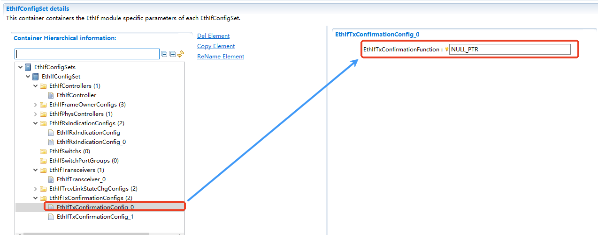

====================
EthIf
====================

文档信息 Document Information
==================================================================

版本历史 Version History
------------------------------------------------------------------------------------------------------------------

.. list-table::
   :widths: 10 10 5 5 30
   :header-rows: 1

   * - 日期(Date)
     - 作者(Author)
     - 版本(Version)
     - 状态(Status)
     - 说明(Description)

   * - 2025/04/03
     - jianyu.yang
     - V0.1
     - 发布(Release)
     - 首次发布(First release)

   * - 2025/04/04
     - jianyu.yang
     - V1.0
     - 发布(Release)
     - 正式发布(Official release)

参考文档 References
------------------------------------------------------------------------------------------------------------------

.. list-table::
   :widths: 5 10 35 10
   :header-rows: 1

   * - 编号(Number)
     - 分类(Classification)
     - 标题(Title)
     - 版本(Version)
   * - 1
     - Autosar
     - AUTOSAR_CP_SWS_EthernetInterface.pdf
     - R23-11
   * - 2
     - Autosar
     - AUTOSAR_CP_SWS_EthernetDriver.pdf
     - R23-11
   * - 3
     - Autosar
     - AUTOSAR_CP_SWS_EthernetTransceiverDriver.pdf
     - R23-11
   * - 4
     - Autosar
     - AUTOSAR_CP_SWS_EthernetSwitchDriver.pdf
     - R23-11

术语与简写 Terms and Abbreviations
==================================================================

术语 Terms
------------------------------------------------------------------------------------------------------------------
.. :align: center   表格内容居中(Table contents are centered)

.. list-table::
   :widths: 10 40
   :header-rows: 1

   * - 术语(Terms)
     - 解释(Explanation)

   * - Eth
     - 以太网控制器驱动程序（AUTOSAR BSW 模块）(Ethernet Controller Driver (AUTOSAR BSW Module))

   * - EthIf
     - 以太网接口（AUTOSAR BSW 模块）(Ethernet Interface (AUTOSAR BSW Module))

   * - EthSM
     - 以太网状态管理器（AUTOSAR BSW 模块）(Ethernet State Manager (AUTOSAR BSW Module))

   * - EthTrcv
     - 以太网收发器驱动程序（AUTOSAR BSW 模块）(Ethernet Transceiver Driver (AUTOSAR BSW Module))

   * - CBR
     - 信道繁忙率(Channel Busy Ratio)

   * - CIT
     - 信道空闲时间(Channel Idle Time)

   * - CV2x
     - 蜂窝车联网直连通信驱动程序（AUTOSAR BSW 模块）(Cellular Vehicle-to-Everything Driver (AUTOSAR BSW Module))

   * - CIT
     - 信道空闲时间(Channel Idle Time)

   * - OA TC10
     - OPEN Alliance TC10 规范(OPEN Alliance TC10 Specification)

简写 Abbreviations
------------------------------------------------------------------------------------------------------------------

.. list-table::
   :widths: 10 20 30
   :header-rows: 1

   * - 简写(Abbreviation)
     - 全称(Full name)
     - 解释(Explanation)

   * - IP
     - Internet Protocol
     - 网际互连协议

   * - MCG
     - Module Configuration Generator
     - 模块配置与生成器

   * - MII
     - Media Independent Interface (standardized Interface provided by Ethernet controllers to access Ethernet transceivers)
     - 媒介独立接口

   * - RSSI
     - Received Signal Strength Indicator
     - 接收信号强度指示

   * - TCP
     - Transmission Control Protocol
     - 传输控制协议

   * - TCP/IP Stack
     - Ethernet communication stack
     - 传输控制与网际互联协议栈

   * - VLAN
     - Virtual Local Area Network
     - 虚拟局域网

   * - WEth
     - Wireless Ethernet Driver
     - 无线以太网驱动

   * - WEthTrcv
     - Wireless Ethernet Transceiver Driver
     - 无线以太网收发器驱动

简介 Introduction
==================================================================

EthIf通过与遵守AUTOSAR规范的以太网Transceiver，以太网Controller以及以太网switch的驱动所提供的接口密切配合，可为EthIf的上层提供独立于这些以太网硬件的独立接口，从而可以支持多种不同以太网控制器和收发器。

By closely cooperating with the interfaces provided by the Ethernet Transceiver, Ethernet Controller, and Ethernet Switch drivers that comply with the AUTOSAR specification, EthIf can provide interfaces independent of these Ethernet hardware for the upper layer of EthIf, thus supporting a variety of different Ethernet controllers and transceivers.

EthIf提供的这些接口，按功能可以大体分为模式控制相关的接口、时间同步相关的接口、数据接收发送相关的接口。另外，EthIf还存在的初始化或周期任务接口。

These interfaces provided by EthIf can be roughly divided into mode control-related interfaces, time synchronization-related interfaces, and data transmission/reception-related interfaces by function. In addition, EthIf also has initialization or periodic task interfaces.

.. figure:: ../../../_static/参考手册/EthIf/EthIf_layer.png
   :alt: EthIf模块层次图 (EthIf Module Layer Diagram)
   :name: EthIf_fig_arch
   :align: center

   EthIf模块层次图 (EthIf Module Layer Diagram)

如图 :ref:`EthIf_fig_arch`  所示，EthIf向下通过统一的交互接口与以太网控制器，以太网收发器以及以太网交互机等这些以太网硬件间进行交互，向上它将这些交互得到的信息再传递以太网通讯栈或者其他相关模块，以及将这些上层模块的请求传递到对应的以太网硬件上，使得这些上层模块可以独立于以太网硬件而访问以太网通讯资源。

As shown in Figure :ref:`EthIf_fig_arch`, EthIf interacts downward with Ethernet hardware such as Ethernet Controllers, Ethernet Transceivers, and Ethernet Switches through a unified interaction interface. Upward, it transmits the information obtained from these interactions to the Ethernet communication stack or other related modules, and also transmits the requests from these upper-layer modules to the corresponding Ethernet hardware, enabling these upper-layer modules to access Ethernet communication resources independently of the Ethernet hardware.

功能描述 Functional Description
==================================================================

特性 Features
------------------------------------------------------------------------------------------------------------------
.. _my_anchor_ethIfFeature:

.. only:: doc_pbs

  变体 Variant
  ~~~~~~~~~~~~~~~~~~~~~~
  - EthIfConfig中的子容器支持属性变体
  - The sub-containers in EthIfConfig support attribute variants
  - EthIf模块不支持数量变体
  - The EthIf module does not support quantity variants
  - 不同变体EthIf使用的EcuC的Partitions需要一致
  - The EcuC Partitions used by EthIf in different variants must be consistent

接口传递功能 Interface Transmission Function
~~~~~~~~~~~~~~~~~~~~~~~~~~~~~~~~~~~~~~~~~~~~~~~~~~~~~~~~~~~~~~~~~~~~~~~~~~~~~~~~

EthIf将下层以太网硬件（例如Ethernet Controller,Ethernet transceiver以及Ethernet switch等）提供的接口抽象到EthIf中，由EthIf在上层模块与以太网硬件间扮演接口传递的角色。

EthIf abstracts the interfaces provided by the underlying Ethernet hardware (such as Ethernet Controller, Ethernet Transceiver, and Ethernet Switch) into itself, and EthIf acts as an interface transmission role between the upper-layer modules and the Ethernet hardware.

Vlan的支持 VLAN Support
~~~~~~~~~~~~~~~~~~~~~~~~~~~~~~~~~~~~~~~~~~~~~~~~~~~~~~~~~~~~~~~~~~~~~~~~~~~~~~~~~~~~

EthIf负责对VLAN报文的解/加Tag操作，当接收时，通过EthIf传递给上层的以太网报文将在EthIf中提取出VLAN头，并把剩余的数据传递给上层模块。当上层模块需要向下传输报文时，在EthIf中添加VLAN头，并通过合适的Eth通道发送出去。

EthIf is responsible for the VLAN tag removal/insertion operations for VLAN frames. When receiving a frame, the Ethernet frame passed by EthIf to the upper layer will have its VLAN header extracted in EthIf, and the remaining data will be transmitted to the upper-layer module. When the upper-layer module needs to transmit a frame downward, a VLAN header will be added to the frame in EthIf, and the frame will be sent out through the appropriate Eth channel.

通讯与控制 Communication and Control
~~~~~~~~~~~~~~~~~~~~~~~~~~~~~~~~~~~~~~~~~~~~~~~~~~~~~~~~~~~~~~~~~~~~~~~~~~~~~~~~~~~~

EthIf提供了许多对以太网硬件进行通讯模式与状态控制的接口，例如涉及Ethernet Controller,Ethernet transceiver以及Ethernet switch等硬件的API。同时也提供通过以太网硬件发送与接收以太网数据的接口，以及它们数据的获取方式（这里指中断方式与轮询方式）等。

EthIf provides a number of interfaces for controlling the communication mode and state of Ethernet hardware, such as APIs related to Ethernet Controllers, Ethernet Transceivers, and Ethernet Switches. It also provides interfaces for sending and receiving Ethernet data through Ethernet hardware, as well as methods for obtaining such data (referring to interrupt mode and polling mode here).

偏差 Deviation
------------------------------------------------------------------------------------------------------------------
.. 有序列表示例

**配置**

**Configuration**

1.EthIfClkUnit: 位于EthIfPhysController下的EthIfClkUnit配置项因为没有相应版本的Eth驱动进行验证，所以本配置项目前不支持。

1.EthIfClkUnit: The EthIfClkUnit configuration item under EthIfPhysController is not currently supported because there is no corresponding version of the Eth driver for verification.

2.EthIfPhysCtrlRxMainFunctionIngressQueueProcessing: 位于EthIfPhysController下的EthIfPhysCtrlRxMainFunctionIngressQueueProcessing配置项因为没有相应版本的Eth驱动进行验证，所以本配置项目前不支持。

2.EthIfPhysCtrlRxMainFunctionIngressQueueProcessing: The EthIfPhysCtrlRxMainFunctionIngressQueueProcessing configuration item under EthIfPhysController is not currently supported because there is no corresponding version of the Eth driver for verification.

3.EthIfFrameOwnerPdu: 位于EthIfFrameOwnerConfig下的EthIfFrameOwnerPdu配置项因为它相关功能的实现需要依赖L-SDU（该模块本阶段未实现），所以该配置及其子配置项目前不支持。

3.EthIfFrameOwnerPdu: The EthIfFrameOwnerPdu configuration item under EthIfFrameOwnerConfig is not currently supported, along with its sub-configuration items, because the implementation of its related functions depends on L-SDU (this module is not implemented in this phase).

**接口**

**Interfaces**

1.EthIf_MainFunctionRx_<IngressQueueProcessing ShortName>：本接口不支持因为需求为Draft状态，且未有对应版本的Eth驱动进行验证。

1.EthIf_MainFunctionRx_<IngressQueueProcessing ShortName>: This interface is not supported because the requirement is in Draft status and there is no corresponding version of the Eth driver for verification.

2.EthIf_ReleaseRxBuffer：本接口不支持因为配置中不支持EthIfFrameOwnerPdu，即以PDU形式的通讯方式不支持。

2.EthIf_ReleaseRxBuffer: This interface is not supported because EthIfFrameOwnerPdu is not supported in the configuration, i.e., the communication mode in the form of PDU is not supported.

3.无线以太网相关的接口现阶段尚未开发。

3.Interfaces related to Wireless Ethernet have not been developed at this stage.

4.蜂窝网络的V2X相关接口现阶段尚未开发，且需求为Draft状态。

4.Interfaces related to Cellular V2X have not been developed at this stage, and the requirement is in Draft status.

5.MACsec相关的接口现阶段尚未开发，且需求为Draft状态。

5.Interfaces related to MACsec have not been developed at this stage, and the requirement is in Draft status.

6.Firewall相关的接口现阶段尚未开发，且需求为Draft状态。

6.Interfaces related to Firewall have not been developed at this stage, and the requirement is in Draft status.

扩展 Extension
------------------------------------------------------------------------------------------------------------------
None

集成 Integration
==================================================================

文件列表 File List
------------------------------------------------------------------------------------------------------------------

静态文件 Static Files
~~~~~~~~~~~~~~~~~~~~~~~~~~~~~~~~~~~~~~~~~~~~~~~~~~~~~~~~~~~~~~~~~~

.. list-table::
   :widths: 10 30
   :header-rows: 1

   * - 文件(File)
     - 描述(Description)

   * - EthIf.h
     - 实现EthIf模块对外的函数接口的声明，以及配置文件中全局变量类型的声明(Implements the declaration of the EthIf module's external function interfaces and the declaration of global variable types in the configuration file)

   * - EthIf_Cbk.h
     - 实现EthIf模块回调函数接口的声明(Implements the declaration of the EthIf module's callback function interfaces)

   * - EthIf_Type.h
     - EthIf模块宏定义及数据类型定义(Defines macros and data types for the EthIf module)

   * - EthIf.c
     - EthIf模块源文件，包含了API函数的实现(Source file of the EthIf module, containing the implementation of API functions)

动态文件 Dynamic Files
~~~~~~~~~~~~~~~~~~~~~~~~~~~~~~~~~~~~~~~~~~~~~~~~~~~~~~~~~~~~~~~~~~

.. list-table::
   :widths: 10 30
   :header-rows: 1

   * - 文件(File)
     - 描述(Description)

   * - EthIf_Cfg.h
     - 定义EthIf模块内部结构体以及相应宏常量(Defines the internal structures and corresponding macro constants of the EthIf module)

   * - EthIf_Cfg.c
     - 定义EthIf模块内部描述各个以太网硬件资源（例如controller,transceiver以及siwtch与相关的switch port等）状态的变量(Defines variables in the EthIf module that describe the status of various Ethernet hardware resources (such as controllers, transceivers, switches, and related switch ports))

   * - EthIf_PBcfg.c
     - 定义EthIf模块PB配置的结构体参数(Defines the structure parameters for the PB configuration of the EthIf module)

   * - EthIf_MemMap.h
     - 实现EthIf模块内存布局(Implements the memory mapping of the EthIf module)

错误处理 Error Handling
------------------------------------------------------------------------------------------------------------------

开发错误 Development Errors
~~~~~~~~~~~~~~~~~~~~~~~~~~~~~~~~~~~~~~~~~~~~~~~~~~~~~~~~~~~~~~~~~~
.. list-table::
   :widths: 20 10 30
   :header-rows: 1

   * - Error code
     - Value[hex]
     - Description

   * - ETHIF_E_INV_CTRL_IDX
     - 0x01
     - API service called with invalid controller index

   * - ETHIF_E_INV_TRCV_IDX
     - 0x02
     - API service called with invalid transceiver index

   * - ETHIF_E_INV_SWT_IDX
     - 0x03
     - API service called with invalid switch index

   * - ETHIF_E_INV_PORT_GROUP_IDX
     - 0x04
     - API service called with invalid port group index

   * - ETHIF_E_UNINIT
     - 0x05
     - API service called when EthIf module was not initialized

   * - ETHIF_E_PARAM_POINTER
     - 0x06
     - API service called with invalid pointer in parameter list

   * - ETHIF_E_INV_PARAM
     - 0x07
     - API service called with invalid parameter

   * - ETHIF_E_INIT_FAILED
     - 0x08
     - EthIf_Init called with an invalid configuration pointer

   * - ETHIF_E_INV_PORT_IDX
     - 0x09
     - Invalid port index

产品错误 Product Errors
~~~~~~~~~~~~~~~~~~~~~~~~~~~~~~~~~~~~~~~~~~~~~~~~~~~~~~~~~~~~~~~~~~
None

运行时错误 Runtime Errors
~~~~~~~~~~~~~~~~~~~~~~~~~~~~~~~~~~~~~~~~~~~~~~~~~~~~~~~~~~~~~~~~~~
.. list-table::
   :widths: 20 10 30
   :header-rows: 1

   * - Error code
     - Value[hex]
     - Description

   * - ETHIF_E_PDU_STATE_TRANSITION_FAILED
     - 0x01
     - A PDU is requested to be used while it is already in use or requested to be available while it is already availalbe

接口描述 Interface Description
==================================================================

.. include:: EthIf_h_api.rst
.. include:: EthIf_Types_h_api.rst

配置 Configuration
==================================================================

OverView
--------------------------------------------
如下图所示EthIfConfigSet与EthIfGeneral页面上的内容是按照AUTOSAR的规范进行开发设置的，另外的EthTrcv_DriverApiConfigSet，Eth_DriverApiConfigSet与EthSwt_DriverApiConfigSet分别用于配置Ethernet Transceiver，Ethernet Driver与Ethnernet Switch相关的驱动的API（后续称这三个页面为驱动具体名称配置页面）。

As shown in the figure below, the contents on the EthIfConfigSet and EthIfGeneral pages are developed and set in accordance with AUTOSAR specifications. In addition, EthTrcv_DriverApiConfigSet, Eth_DriverApiConfigSet, and EthSwt_DriverApiConfigSet are used to configure the APIs of drivers related to Ethernet Transceiver, Ethernet Driver, and Ethernet Switch respectively (these three pages are referred to as "Driver-Specific Name Configuration Pages" hereinafter).

.. figure:: ../../../_static/参考手册/EthIf/EthIf_ConfigOverview.png
   :alt: EthIf模块配置界面概览 (EthIf Module Configuration Interface Overview)
   :name: EthIf_overview_arch
   :align: center

   EthIf模块配置界面概览 (EthIf Module Configuration Interface Overview)

驱动具体名称的配置页面与EthIfGeneral页面的内容基本可以按照字面意思进行配置，下面将着重说一下EthIfConfigSet中的容器的配置。

The contents of the Driver-Specific Name Configuration Pages and the EthIfGeneral page can basically be configured according to their literal meanings. The following will focus on the configuration of the containers in EthIfConfigSet.

EthIfConfigSet中的容器 Containers in EthIfConfigSet
--------------------------------------------------------------------------------------------------------------------------------------------------------------------

容器EthIfPhysController Container EthIfPhysController
~~~~~~~~~~~~~~~~~~~~~~~~~~~~~~~~~~~~~~~~~~~~~~~~~~~~~~~~~~~~~~~~~~~~~~~~~~~~~~~~~~~~~~~~~~~~~~~~

这个容器主要是用于EthIf层抽象的EthIfPhysController关联Ethernet Driver（后续也可以是WEthernet与CanXL）的物理以太网控制器。在多分区的工程中这里还需要配置EthIfCtrlPartitionRef。

This container is mainly used for the EthIfPhysController abstracted by the EthIf layer to associate the physical Ethernet Controller of the Ethernet Driver (which can also be WEthernet and CanXL hereinafter). In a multi-partition project, EthIfCtrlPartitionRef also needs to be configured here.

.. figure:: ../../../_static/参考手册/EthIf/EthIf_PhyController.png
   :alt: EthIfPhysController配置界面 (EthIfPhysController Configuration Interface)
   :name: EthIfPhysController配置界面(EthIfPhysController Configuration Interface)
   :align: center

   EthIfPhysController配置界面 (EthIfPhysController Configuration Interface)

此外在配置上，EthIfPhysController几乎只被EthIf模块内部使用，而EthIf外的模块访问以太网硬件几乎都是通过关联EthIfController来实现的。

In addition, in terms of configuration, EthIfPhysController is almost only used internally by the EthIf module, while modules outside EthIf access Ethernet hardware almost all through associating EthIfController.

容器EthIfController Container EthIfController
~~~~~~~~~~~~~~~~~~~~~~~~~~~~~~~~~~~~~~~~~~~~~~~~~~~~~~~~~~~~~~~~~~~~~~~~~~~~~~~~~~~~~~~~~~~~~~~~
这里主要用于配置EthIf模块向上层抽象出来的EthIfController，EthIf外的模块访问以太网硬件几乎都是通过EthIfController来实现的。配置界面上提供了不少的属性，其中EthIfVlanId比较重要。

This is mainly used to configure the EthIfController abstracted by the EthIf module for the upper layer. Modules outside EthIf access Ethernet hardware almost all through EthIfController. The configuration interface provides many attributes, among which EthIfVlanId is relatively important.

.. figure:: ../../../_static/参考手册/EthIf/EthIf_Controller.png
   :alt: EthIfController配置界面 (EthIfController Configuration Interface)
   :name: EthIfController配置界面(EthIfController Configuration Interface)
   :align: center

   EthIfController配置界面 (EthIfController Configuration Interface)

容器EthIfTransceiver，EthIfSwitch与EthIfSwitchPortGroup Containers EthIfTransceiver, EthIfSwitch, and EthIfSwitchPortGroup
~~~~~~~~~~~~~~~~~~~~~~~~~~~~~~~~~~~~~~~~~~~~~~~~~~~~~~~~~~~~~~~~~~~~~~~~~~~~~~~~~~~~~~~~~~~~~~~~~~~~~~~~~~~~~~~~~~~~~~~~~~~~~~~~~~~~~~~~~~~~~~~~~~~~~~~~~~~~
这三类容器主要都是引用外部模块的配置，可依据需要与配置属性的介绍进行配置。

These three types of containers are mainly used to reference the configurations of external modules, and can be configured according to needs and the description of configuration attributes.

容器EthIfTrcvLinkStateChgConfig Container EthIfTrcvLinkStateChgConfig
~~~~~~~~~~~~~~~~~~~~~~~~~~~~~~~~~~~~~~~~~~~~~~~~~~~~~~~~~~~~~~~~~~~~~~~~~~~~~~~~~~~~~~~~~~~~~~~~~~~~~~~~~~~~~~~~~~~~~~~~~~~~~~~~~~~
这个容器用于配置EthIf模块检测到Transceiver的link状态发生变化时将新的link状态报告给对应的模块，EthIf模块会调用容器配置的目标模块的回调函数。

This container is used to configure that when the EthIf module detects a change in the link state of the Transceiver, it will report the new link state to the corresponding module, and the EthIf module will call the callback function of the target module configured in the container.

具体实现时EthIf会根据发送link状态变化的Transceiver所关联的EthIfController作为参数，遍历所有的EthIfTrcvLinkStateChgConfig配置并调用其配置的目标模块的回调函数。

In specific implementation, EthIf will use the EthIfController associated with the Transceiver that sends the link state change as a parameter, traverse all EthIfTrcvLinkStateChgConfig configurations, and call the callback function of the target module configured therein.

.. figure:: ../../../_static/参考手册/EthIf/EthIf_TransceiverLinkChg.png
   :alt: EthIfTrcvLinkStateChgConfig配置界面 (EthIfTrcvLinkStateChgConfig Configuration Interface)
   :name: EthIfTrcvLinkStateChgConfig配置界面(EthIfTrcvLinkStateChgConfig Configuration Interface)
   :align: center

EthIfTrcvLinkStateChgConfig配置界面 (EthIfTrcvLinkStateChgConfig Configuration Interface)

容器EthIfRxIndicationConfig,EthIfTxConfirmationConfig与EthIfFrameOwnerConfig Containers EthIfRxIndicationConfig, EthIfTxConfirmationConfig, and EthIfFrameOwnerConfig
~~~~~~~~~~~~~~~~~~~~~~~~~~~~~~~~~~~~~~~~~~~~~~~~~~~~~~~~~~~~~~~~~~~~~~~~~~~~~~~~~~~~~~~~~~~~~~~~~~~~~~~~~~~~~~~~~~~~~~~~~~~~~~~~~~~~~~~~~~~~~~~~~~~~~~~~~~~~~~~~~~~~~~~~~~~~~~~~~~~~~~~~
容器EthIfRxIndicationConfig用于配置EthIf接收到以太网报文时将会调用的目标模块用于接收EthIf传递的以太网数据的回调函数，这个容器中可以配置多个EthIfRxIndicationConfig，但是EthIf会依据EthIfFrameOwnerConfig的配置选择调用哪一个配置的回调函数。

The container EthIfRxIndicationConfig is used to configure the callback function of the target module that the EthIf module will call to receive the Ethernet data transmitted by EthIf when it receives an Ethernet frame. Multiple EthIfRxIndicationConfig configurations can be set in this container, but EthIf will select which configured callback function to call based on the configuration of EthIfFrameOwnerConfig.

容器EthIfTxConfirmationConfig用于配置EthIf接收到以太网报文发送完成确认时向上层模块报告以太网报文的发送完成确认，即调用配置在这个容器中的上层模块的发送完成确认的回调函数，EthIf会依据EthIfFrameOwnerConfig的配置选择调用哪一个配置的回调函数。

The container EthIfTxConfirmationConfig is used to configure that when the EthIf module receives the confirmation of the completion of Ethernet frame transmission, it will report the transmission completion confirmation of the Ethernet frame to the upper-layer module, i.e., call the transmission completion confirmation callback function of the upper-layer module configured in this container. EthIf will select which configured callback function to call based on the configuration of EthIfFrameOwnerConfig.

   EthIf_TxConfirmation回调函数可以配置成NULL_PTR (The EthIf_TxConfirmation callback function can be configured as NULL_PTR)

.. important::
   在EthIf模块内部会维护EthIfFrameOwnerConfig中配置的报文类型相关的数据，在收到以太网报文时将遍历EthIfFrameOwnerConfig中的配置，当EthIfFramType与收到的报文匹配时将根据当前EthIfFrameOwnerConfig中配置的EthIfOwner（它是从0开始计数的）调用EthIfRxIndicationConfig中对应条目中的回调函数。

   The EthIf module will maintain data related to the frame type configured in EthIfFrameOwnerConfig internally. When an Ethernet frame is received, it will traverse the configurations in EthIfFrameOwnerConfig. When the EthIfFramType matches the received frame, it will call the callback function in the corresponding entry of EthIfRxIndicationConfig according to the EthIfOwner (counted from 0) configured in the current EthIfFrameOwnerConfig.

   在EthIf模块发送数据时，EthIf模块会依据发送的报文的类型与EthIfFrameOwnerConfig中配置的报文类型进行匹配，当完成匹配时EthIf模块会在EthIfFrameOwnerConfig对应的条目中记录下对应的EthIfPhyController与BufIndex；当EthIf_TxConfirmation函数被调用时，通过EthIfPhyController与BufIndex的匹配找到对应的EthIfFrameOwnerConfig中配置，进而确定出EthIfOwner然后再调用EthIfTxConfirmationConfig对应的回调函数。

   When the EthIf module sends data, it will match the type of the frame to be sent with the frame type configured in EthIfFrameOwnerConfig. When the matching is completed, the EthIf module will record the corresponding EthIfPhyController and BufIndex in the corresponding entry of EthIfFrameOwnerConfig; when the EthIf_TxConfirmation function is called, it will find the corresponding configuration in EthIfFrameOwnerConfig through the matching of EthIfPhyController and BufIndex, then determine the EthIfOwner, and further call the corresponding callback function in EthIfTxConfirmationConfig.

   所以简单来说配置时需要确保同一个上层模块的TxConfirmation与RxIndication函数，在EthIfTxConfirmationConfig与EthIfRxIndicationConfig中处在相同的序号位置上，若这个上层模块没有对应的回调函数，可以配置“NULL_PTR”来替代从而保证在这两个容器中的顺序的一致。

   Therefore, simply put, during configuration, it is necessary to ensure that the TxConfirmation and RxIndication functions of the same upper-layer module are in the same sequence position in EthIfTxConfirmationConfig and EthIfRxIndicationConfig. If the upper-layer module does not have a corresponding callback function, it can be replaced by configuring "NULL_PTR" to ensure the consistency of the sequence in these two containers.
