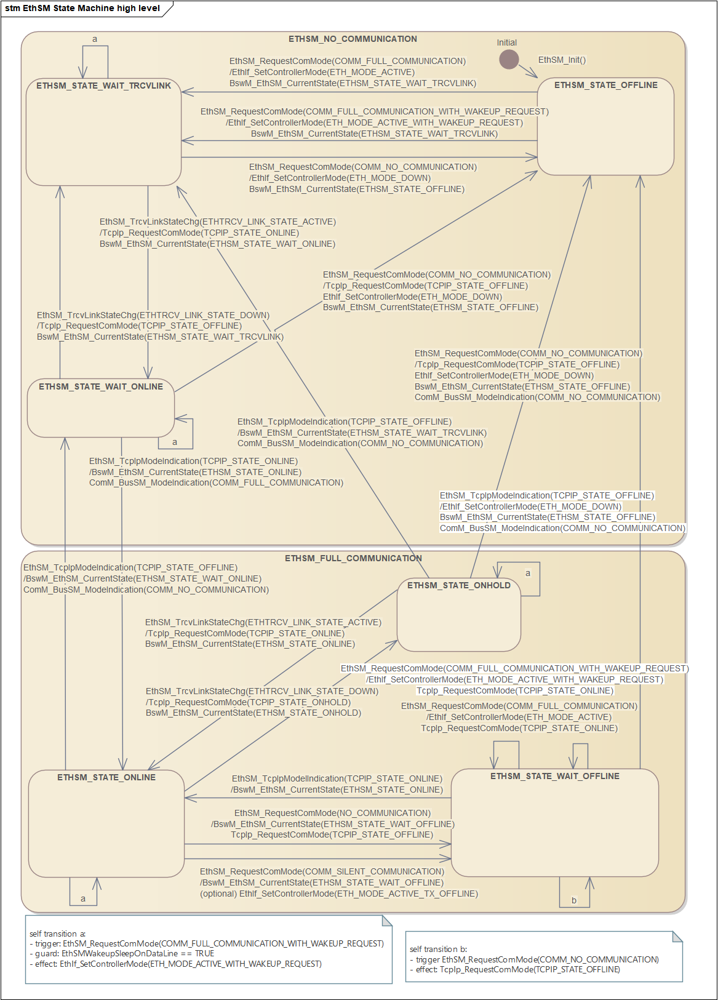

====================
EthSM
====================

文档信息 Document Information
====================================================================

版本历史 Version History
--------------------------------------------------------------------------------------------------------------------

.. list-table::
   :widths: 10 10 10 10 20
   :header-rows: 1

   * - 日期(Date)
     - 作者(Author)
     - 版本(Version)
     - 状态(Status)
     - 说明(Description)

   * - 2025/02/27
     - xiaojian.liang
     - V0.1
     - 发布(Release)
     - 首次发布(First release)

   * - 2025/04/04
     - xiaojian.liang
     - V1.0
     - 发布(Release)
     - 正式发布(Official release)

参考文档 References
--------------------------------------------------------------------------------------------------------------------

.. 如果没有就不存在该章节，或为None

.. list-table::
   :widths: 10 10 30 10
   :header-rows: 1

   * - 编号(Number)
     - 分类(Classification)
     - 标题(Title)
     - 版本(Version)
   * - 1
     - Autosar
     - AUTOSAR_CP_SWS_EthernetStateManager.pdf
     - R23-11

术语与简写 Terms and Abbreviations
====================================================================

术语 Terms
----------------------------------------------------------
.. :align: center   表格内容居中(Table contents are centered)

 None

简写 Abbreviations
----------------------------------------------------------

.. list-table::
   :widths: 10 20
   :header-rows: 1

   * - 简写(Abbreviation)
     - 全称(Full name)

   * - API
     - Application Programming Interface
   * - BswM
     - Basic Software Manager
   * - DET
     - Default Error Tracer
   * - ComM
     - Communication Manager
   * - DEM
     - Diagnostic Event Manager
   * - EcuM
     - ECU State Manager
   * - Eth
     - Ethernet Controller
   * - EthTrcv
     - Ethernet Transceiver
   * - EthSM
     - Ethernet State Manager
   * - EthIf
     - Ethernet Interface
   * - SchM
     - BSW Scheduler
   * - SoAd
     - Socket Adapter
   * - OA TC10
     - Open Alliance TC10 specification
.. 缩写词英文全称中文解释

简介 Introduction
==================================

EthSM 模块提供一套抽象的接口给ComM用于打开和关闭以太网通信。

The EthSM module provides a set of abstract interfaces to ComM for enabling and disabling Ethernet communication.

.. figure:: ../../../_static/参考手册/EthSM/EthSM在AUTOSAR中的位置.png
   :alt: EthSM 在 AUTOSAR 中的位置 (Position of EthSM in AUTOSAR)
   :align: center

   EthSM 在 AUTOSAR 中的位置 (Position of EthSM in AUTOSAR)

功能描述 Functional Description
====================================================================
.. 本章节仅描述模块支持的功能大致情况，不宜做细致描述；更加细致的描述在配置章节，结合配置，从集成角度描述

特性 Features
----------------------------------------------------------

以太网通信状态管理功能 Ethernet Communication State Management Function
~~~~~~~~~~~~~~~~~~~~~~~~~~~~~~~~~~~~~~~~~~~~~~~~~~~~~~~~~~~~~~~~~~~~~~~~~~~~~~~~~~~~~~~~~~~~~~~~~~~~~~~~~~~~~~~~~~~~~~~~

EthSM 提供接口给 ComM，用于接受来自 ComM 的通信模式请求。EthSM 根据 ComM 提供的参数，处理内部的网络模式状态机。根据状态机的迁移条件，调用 EthIf 和 TcpIp 的接口控制以太网控制器，收发器以及 TcpIp 协议栈来控制以太网通信的状态。并将当前的通信模式通过 ComM 和 BswM 的接口通知给ComM和BswM。

The EthSM provides interfaces to ComM for receiving communication mode requests from ComM. Based on the parameters provided by ComM, the EthSM processes the internal network mode state machine. According to the transition conditions of the state machine, it calls the interfaces of EthIf and TcpIp to control the Ethernet controller, transceiver, and TcpIp protocol stack, thereby controlling the state of Ethernet communication. It also notifies ComM and BswM of the current communication mode through the interfaces of ComM and BswM.

   EthSM 网络状态转换状态机 (EthSM Network State Transition State Machine)

状态机包括以下几个状态：

The state machine includes the following states:

1.ETHSM_STATE_OFFLINE

2.ETHSM_STATE_WAIT_TRCVLINK

3.ETHSM_STATE_WAIT_ONLINE

4.ETHSM_STATE_ONLINE

5.ETHSM_STATE_ONHOLD

6.ETHSM_STATE_WAIT_OFFLINE

状态迁移过程 State Transition Process
**************************************************************************************************************************************

初始化后 EthSM 处于 ETHSM_STATE_OFFLINE 状态。

After initialization, the EthSM is in the ETHSM_STATE_OFFLINE state.

当 EthSM_RequestComMode(COMM_FULL_COMMUNICATION) 被调用，EthSM 调用 EthIf_SetControllerMode(ETH_MODE_ACTIVE) 请求 EthIf 将以太网控制器设置为 ACTIVE模式，并调用 BswM_EthSM_CurrentState(ETHSM_STATE_WAIT_TRCVLINK) 通知 BswM 模块。之后 EthSM 从ETHSM_STATE_OFFLINE 迁移到 ETHSM_STATE_WAIT_TRCVLINK状态。

When EthSM_RequestComMode(COMM_FULL_COMMUNICATION) is called, the EthSM calls EthIf_SetControllerMode(ETH_MODE_ACTIVE) to request EthIf to set the Ethernet controller to the ACTIVE mode, and calls BswM_EthSM_CurrentState(ETHSM_STATE_WAIT_TRCVLINK) to notify the BswM module. Afterwards, the EthSM transitions from ETHSM_STATE_OFFLINE to the ETHSM_STATE_WAIT_TRCVLINK state.

当 EthSM_TrcvLinkStateChg(ETHTRCV_LINK_STATE_ACTIVE) 被调用，EthSM 从 ETHSM_STATE_WAIT_TRCVLINK 迁移到ETHSM_STATE_WAIT_ONLINE 状态。同时调用 TcpIp_RequestComMode(TCPIP_STATE_ONLINE) 请求将 TCPIP 模块将 TCPIP 协议栈设置到 ONLINE模式，并调用 BswM_EthSM_CurrentState(ETHSM_STATE_WAIT_ONLINE) 接口通知 BswM 模块。

When EthSM_TrcvLinkStateChg(ETHTRCV_LINK_STATE_ACTIVE) is called, the EthSM transitions from ETHSM_STATE_WAIT_TRCVLINK to the ETHSM_STATE_WAIT_ONLINE state. At the same time, it calls TcpIp_RequestComMode(TCPIP_STATE_ONLINE) to request the TCPIP module to set the TCPIP protocol stack to the ONLINE mode, and calls the BswM_EthSM_CurrentState(ETHSM_STATE_WAIT_ONLINE) interface to notify the BswM module.

当 EthSM_TcpIpModeIndication(TCPIP_STATE_ONLINE) 被调用，EthSM 从 ETHSM_STATE_WAIT_ONLINE 迁移到 ETHSM_STATE_ONLINE 模式，并调用 BswM_EthSM_CurrentState(ETHSM_STATE_ONLINE) 通知 BswM 模块，调用 ComM_BusSM_ModeIndication(COMM_FULL_COMMUNICATION) 通知 ComM 模块。

When EthSM_TcpIpModeIndication(TCPIP_STATE_ONLINE) is called, the EthSM transitions from ETHSM_STATE_WAIT_ONLINE to the ETHSM_STATE_ONLINE mode. It then calls BswM_EthSM_CurrentState(ETHSM_STATE_ONLINE) to notify the BswM module, and calls ComM_BusSM_ModeIndication(COMM_FULL_COMMUNICATION) to notify the ComM module.

当 EthSM_RequestComMode(COMM_NO_COMMUNICATION) 被调用，EthSM 调用TcpIp_RequestComMode(TCPIP_STATE_OFFLINE) 请求 TcpIp 模块将TCPIP 协议栈设置为 OFFLINE 模式，并调用 BswM_EthSM_CurrentState(ETHSM_STATE_WAIT_OFFLINE) 通知 BswM 模块。之后 EthSM 从ETHSM_STATE_ONLINE 迁移到 ETHSM_STATE_WAIT_OFFLINE 状态。

When EthSM_RequestComMode(COMM_NO_COMMUNICATION) is called, the EthSM calls TcpIp_RequestComMode(TCPIP_STATE_OFFLINE) to request the TcpIp module to set the TCPIP protocol stack to the OFFLINE mode, and calls BswM_EthSM_CurrentState(ETHSM_STATE_WAIT_OFFLINE) to notify the BswM module. Afterwards, the EthSM transitions from ETHSM_STATE_ONLINE to the ETHSM_STATE_WAIT_OFFLINE state.

当 EthSM_TcpIpModeIndication(TCPIP_STATE_OFFLINE) 被调用，EthSM 从 ETHSM_STATE_WAIT_OFFLINE 迁移到 ETHSM_STATE_OFFLINE 状态。。并调用 EthIf_SetControllerMode(ETH_MODE_DOWN) 请求EthIf将以太网控制器设置为 DOWN 模式，并调用 BswM_EthSM_CurrentState(ETHSM_STATE_OFFLINE) 通知 BswM 模块，调用 ComM_BusSM_ModeIndication(COMM_NO_COMMUNICATION) 通知 ComM 模块。

When EthSM_TcpIpModeIndication(TCPIP_STATE_OFFLINE) is called, the EthSM transitions from ETHSM_STATE_WAIT_OFFLINE to the ETHSM_STATE_OFFLINE state . It then calls EthIf_SetControllerMode(ETH_MODE_DOWN) to request EthIf to set the Ethernet controller to the DOWN mode, calls BswM_EthSM_CurrentState(ETHSM_STATE_OFFLINE) to notify the BswM module, and calls ComM_BusSM_ModeIndication(COMM_NO_COMMUNICATION) to notify the ComM module.

状态对照表 State Comparison Table
***********************************************************************************************************************************

+---------------------+---------------------------+-----------------------------+-------------------+------------------------+-----------------+
| Requested ComM Mode | EthSM sub state           | Controller state            | Transceiver state | Transceiver link state | TcpIpCtrl state |
+=====================+===========================+=============================+===================+========================+=================+
| No Com              | ETHSM_STATE_OFFLINE       | DOWN                        | DOWN              | DOWN                   | OFFLINE         |
+---------------------+---------------------------+-----------------------------+-------------------+------------------------+-----------------+
| No Com              | ETHSM_STATE_WAIT_TRCVLINK | ACTIVE                      | ACTIVE            | DOWN                   | OFFLINE         |
+---------------------+---------------------------+-----------------------------+-------------------+------------------------+-----------------+
| No Com              | ETHSM_STATE_WAIT_ONLINE   | ACTIVE                      | ACTIVE            | ACTIVE                 | OFFLINE         |
+---------------------+---------------------------+-----------------------------+-------------------+------------------------+-----------------+
| Full Com            | ETHSM_STATE_ONLINE        | ACTIVE                      | ACTIVE            | ACTIVE                 | ONLINE          |
+---------------------+---------------------------+-----------------------------+-------------------+------------------------+-----------------+
| Full Com            | ETHSM_STATE_ONHOLD        | ACTIVE                      | ACTIVE            | DOWN                   | ONLINE          |
+---------------------+---------------------------+-----------------------------+-------------------+------------------------+-----------------+
| Silent Com          | ETHSM_STATE_WAIT_OFFLINE  | ACTIVE or ACTIVE_TX_OFFLINE | ACTIVE            | ACTIVE                 | ONLINE          |
+---------------------+---------------------------+-----------------------------+-------------------+------------------------+-----------------+
| No Com              | ETHSM_STATE_WAIT_OFFLINE  | ACTIVE or ACTIVE_TX_OFFLINE | ACTIVE            | ACTIVE                 | ONLINE          |
+---------------------+---------------------------+-----------------------------+-------------------+------------------------+-----------------+

偏差 Deviation
----------------------------------------------------------
.. 有序列表示例

None

扩展 Extension
----------------------------------------------------------

None

集成 Integration
==================================

文件列表 File List
----------------------------------------------------------

静态文件 Static Files
~~~~~~~~~~~~~~~~~~~~~~~~~~~~~~~~~~

.. list-table::
   :widths: 10 30
   :header-rows: 1

   * - 文件(File)
     - 描述(Description)

   * - EthSM.h
     - EthSM 外部接口实现头文件(Header file for EthSM external interface implementation)

   * - EthSM_Internal.h
     - EthSM 内部实现头文件(Header file for EthSM internal implementation)

   * - EthSM_TcpIp.h
     - EthSM 为 TcpIp 提供的回调函数实现头文件(Header file for callback function implementation provided by EthSM for TcpIp)

   * - EthSM.c
     - EthSM 实现源文件(Implementation source file of EthSM)

动态文件 Dynamic Files
~~~~~~~~~~~~~~~~~~~~~~~~~~~~~~~~~~

.. list-table::
   :widths: 10 30
   :header-rows: 1

   * - 文件(File)
     - 描述(Description)

   * - EthSM_Cfg.c
     - EthSM Pre-Compile 配置源文件(Pre-Compile configuration source file of EthSM)

   * - EthSM_Cfg.h
     - EthSM Pre-Compile 配置头文件(Pre-Compile configuration header file of EthSM)

   * - EthSM_MemMap.h
     - EthSM 内存分布头文件(Memory mapping header file of EthSM)

   * - SchM_EthSM.h
     - EthSM 周期主函数头文件(Header file for cyclic main function of EthSM)

错误处理 Error Handling
----------------------------------------------------------

开发错误 Development Errors
~~~~~~~~~~~~~~~~~~~~~~~~~~~~~~~~~~~~~~~~~~~~~~~~
.. list-table::
   :widths: 20 10 30
   :header-rows: 1

   * - Error code
     - Value[hex]
     - Description

   * - ETHSM_E_INVALID_NETWORK_MODE
     - 0x01
     - Invalid communication mode requested.

   * - ETHSM_E_UNINIT
     - 0x02
     - EthSM module was not initialized.

   * - ETHSM_E_PARAM_POINTER
     - 0x03
     - Invalid pointer in parameter list.

   * - ETHSM_E_INVALID_NETWORK_HANDLE
     - 0x04
     - Invalid parameter in parameter list.

   * - ETHSM_E_INVALID_TCP_IP_MODE
     - 0x05
     - Invalid TcpIp state.

   * - ETHSM_E_PARAM_CONTROLLER
     - 0x07
     - Invalid parameter in parameter list.

   * - ETHSM_E_INVALID_ETH_MODE
     - 0x08
     - Invalid parameter in parameter list.

   * - ETHSM_E_INVALID_ETH_TRCV_LINK_STATE
     - 0x09
     - Invalid parameter in parameter list.

   * - ETHSM_E_INVALID_PARTITION_CONTEXT
     - 0x0A
     - API service used on wrong partitions.

产品错误 Product Errors
~~~~~~~~~~~~~~~~~~~~~~~~~~~~~~~~~~
.. list-table::
   :widths: 20 10
   :header-rows: 1

   * - Error code
     - Description

   * - ETHSM_E_LINK_DOWN
     - It shall be reported when the transceiver switches to "down" while communication has already been established and is requested because of communication request.

运行时错误 Runtime Errors
~~~~~~~~~~~~~~~~~~~~~~~~~~~~~~~~~~
None

接口描述 Interface Description
====================================================================

.. 目前能够自动生成的有类型定义，普通函数，回调函数。
.. 有些模块的API来自多个头文件，需要自行裁剪合并
.. 引用接口描述。来自于code->doxygen->xml->rst
.. 引用接口描述。 From code->doxygen->xml->rst
.. include:: EthSM_h_api.rst

配置函数 Configuration function
--------------------------------------------------------------------------------------------------------------------
.. 可选的章节，根据模块实际情况确定
.. 格式同提供的服务

EthSM_MainFunction
~~~~~~~~~~~~~~~~~~~~~~~~~~~~~~~~~~~~~~~~~~~~~~~~~~~~~~~~~~~~~~~~~~~~~~~~~~~~~~~~~~~~

.. code::

   void EthSM_MainFunction<EthSMNetwork.ShortName>(void)

Cyclic Main Function which is called from the Scheduler.

**Sync/Async**
   Synchronous

**Reentrancy**
   Non Reentrant

**Return type**
   void

依赖的服务 Applicable Services
--------------------------------------------------------------------------------------------------------------------

强制接口 Compulsory interface
~~~~~~~~~~~~~~~~~~~~~~~~~~~~~~~~~~~~~~~~~~~~~~~~~~~~~~~~~~~~~~~~~~~~
.. 可选的章节，根据模块实际情况确定

.. list-table::
   :widths: 10 5 30
   :header-rows: 1

   * - API Function
     - Header File
     - Description

   * - BswM_EthSM_CurrentState
     - BswM_EthSM.h
     - Function called by EthSM to indicate its current state.

   * - ComM_BusSM_ModeIndication
     - ComM.h
     - Indication of the actual bus mode by the corresponding Bus State Manager.ComM shall propagate the indicated state to the users with means of the RTE and BswM.

   * - EthIf_SetControllerMode
     - EthIf.h
     - Enables / disables the indexed controller.

   * - TcpIp_RequestComMode
     - TcpIp.h
     - By this API service the TCP/IP stack is requested to change the TcpIp state of the communication network identified by EthIf controller index.

可选接口 Optional Interface
~~~~~~~~~~~~~~~~~~~~~~~~~~~~~~~~~~~~~~~~~~~~~~~~~~~~~~~~~~~~~~~~~~~~
.. 可选的章节，根据模块实际情况确定
.. 格式同强制接口

.. list-table::
   :widths: 10 5 30
   :header-rows: 1

   * - API Function
     - Header File
     - Description

   * - Det_ReportError
     - Det.h
     - Service to report development errors.

   * - Dem_SetEventStatus
     - Dem.h
     - Called by SW-Cs or BSW modules to report monitor status information to the Dem.BSW modules calling Dem_SetEventStatus can safely ignore the return value.This API will be available only if ({Dem/DemConfigSet/DemEventParameter/DemEventReportingType} == STANDARD_REPORTING)

配置接口 Configuration Interfaces
~~~~~~~~~~~~~~~~~~~~~~~~~~~~~~~~~~~~~~~~~~~~~~~~~~~~~~~~~~~~~~~~~~~~

None

配置 Configuration
==================================
1.配置建议以 **功能** 为导向，从 **集成** 的角度，挑重点，常用，典型配置举例讲解。示例中若需要依赖其他模块的配置，也可以截图描述，配置截图不局限于本模块。重点是功能导向，把一件事讲清楚

1.Configuration recommendations should be **function-oriented**, focusing on key, commonly used, and typical configurations from the **integration** perspective for explanation. If the example requires configuration of other modules, screenshots can also be used for description. Configuration screenshots are not limited to this module. The key is to be function-oriented and clarify a specific task clearly.

2.不必呈现所有容器，配置细节的属性，可能用户不太关心

2.It is not necessary to present all containers and attributes of configuration details, as users may not care about them.

3.配置项描述等信息，在工具界面上都能看到

3.Information such as configuration item descriptions can be seen on the tool interface.

EthSMTcpIpUsed
----------------------------------

如果一个 **EthSMNetwork** 不使用 TcpIp 协议栈，则应将 **EthSMTcpIpUsed** 配置为 **FALSE**。

If an **EthSMNetwork** does not use the TcpIp protocol stack, **EthSMTcpIpUsed** shall be configured as **FALSE**.

.. figure:: ../../../_static/参考手册/EthSM/EthSMTcpIpUsed.png
   :name: EthSMTcpIpUsed
   :align: center

   EthSMTcpIpUsed

EthSMForwardSilentCommunicationEnabled
----------------------------------------------------------------------------------------------------------------------------------------

如果一个 **EthSMNetwork** 的 **EthSMForwardSilentCommunicationEnabled** 配置为 **TRUE**，当 **EthSM_RequestComMode(COMM_SILENT_COMMUNICATION)** 被 ComM 调用，EthSM 将控制 EthIf 控制器进入 **ETH_MODE_ACTIVE_TX_OFFLINE** 模式，这将禁用此以太网通道上的发送功能。此功能通常在使用 **UdpNm** 的以太网通道上使能。

If **EthSMForwardSilentCommunicationEnabled** of an **EthSMNetwork** is configured as **TRUE**, when **EthSM_RequestComMode(COMM_SILENT_COMMUNICATION)** is called by ComM, the EthSM will control the EthIf controller to enter the **ETH_MODE_ACTIVE_TX_OFFLINE** mode, which will disable the transmission function on this Ethernet channel. This function is usually enabled on Ethernet channels using **UdpNm**.

.. figure:: ../../../_static/参考手册/EthSM/EthSMForwardSilentCommunicationEnabled.png
   :name: EthSMForwardSilentCommunicationEnabled
   :align: center

   EthSMForwardSilentCommunicationEnabled

临界区 Critical Sections
------------------------------------------------------------------------------------------------------------------------------

None
