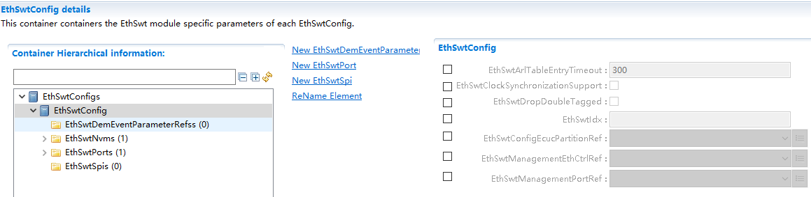

===================
EthSwt产品参考手册
===================

**缩写词注解**

+------------+---------------------------+----------------------------+
| **缩写词** | **英文全称**              | **中文解释**               |
+------------+---------------------------+----------------------------+
| Eth        | Ethernet Driver (AUTOSAR  | AUTOSAR标准以太网驱动模块  |
|            | BSW module)               |                            |
+------------+---------------------------+----------------------------+
| EthSwt     | Ethernet Interface        | AUTOSAR标准以太网接口模块  |
|            | (AUTOSAR BSW module)      |                            |
+------------+---------------------------+----------------------------+
| EthTrcv    | Ethernet Transceiver      | A                          |
|            | Driver (AUTOSAR BSW       | UTOSAR标准以太网收发器模块 |
|            | module)                   |                            |
+------------+---------------------------+----------------------------+

简介
====

EthSwt向上层提供与以太网硬件无关的独立接口，该接口可以支持多个不同的有线或无线以太网控制器和收发器。这些接口按功能可以大体分为模式控制相关的接口、时间同步相关的接口、数据接收发送相关的接口、EthSwt本身的初始化或周期任务接口等。

|image1|

图1-1 EthSwt层次图

参考资料
--------

[1] AUTOSAR_SWS_EthernetInterface.pdf，R20-11

功能描述
========

以太网交换机在端口上接受另一个端口发送过来的数据帧，根据帧头的目的MAC地址查找MAC地址表然后将该数据帧从对应端口上转发出去。交换机驱动程序模块主要提供以下功能：

1. MAC地址学习。

2. VLAN收发。

3. VLAN隔离。

4. 接口传递。

MAC地址学习功能介绍
-------------------

以太网交换机能自主学习每一端口相连设备的MAC地址，并将地址同相应的端口映射起来存放在交换机缓存中的MAC地址表中。

VLAN收发功能介绍
----------------

EthSwt负责对VLAN报文的解/加Tag操作，当接收时，通过EthSwt传递给上层的以太网报文将在EthSwt中提取出VLAN头，并把剩余的数据传递给上层模块。当上层模块需要向下传输报文时，在EthSwt中添加VLAN头，并通过对应的Eth通道发送出去。

VLAN隔离功能介绍
----------------

通过配置，属于同一VLAN的port间可以相互通信，不属于同一VLAN的port间不能相互通信。

接口传递功能介绍
----------------

EthSwt负责对底层switch驱动进行设置和封装，并提供相应接口传递给EthSwt。

源文件描述
==========

表3-1 EthSwt组件文件描述

+----------------+-----------------------------------------------------+
| **文件**       | **说明**                                            |
+----------------+-----------------------------------------------------+
| EthSwt_Cfg.h   | 定义EthSwt模块预编译时用到的配置参数。              |
+----------------+-----------------------------------------------------+
| EthSwt         | 定义EthSwt模块中链接时用到的配置变量。              |
| \_PBCfg.c      |                                                     |
+----------------+-----------------------------------------------------+
| EthSwt         | 定义EthSwt模块中配置变量结构体                      |
| \_PBCfg.h      |                                                     |
+----------------+-----------------------------------------------------+
| EthSwt.h       | EthSwt模块头文                                      |
|                | 件，包含了API函数的扩展声明并定义了端口的数据结构。 |
+----------------+-----------------------------------------------------+
| EthSwt.c       | EthSwt模块源文件，包含了API函数的实现。             |
+----------------+-----------------------------------------------------+
| Et             | 定义EthSwt模块中依赖88Q5050的函数实现               |
| hSwt_88Q5050.c |                                                     |
+----------------+-----------------------------------------------------+
| Et             | 定义EthSwt模块中依赖88Q5050宏定义和结构体           |
| hSwt_88Q5050.h |                                                     |
+----------------+-----------------------------------------------------+
| Eth            | 义EthSwt模块中不依赖于芯片的内部函数                |
| Swt_Internal.h |                                                     |
+----------------+-----------------------------------------------------+
| E              | EthSwt的内存映射定义                                |
| thSwt_MemMap.h |                                                     |
+----------------+-----------------------------------------------------+
| SchM_EthSwt.h  | EthSwt的SchM头文件                                  |
+----------------+-----------------------------------------------------+

|image2|

图3-1 EthSwt组件文件交互关系图

API接口
=======

类型定义
--------

EthSwt_ConfigType类型定义
~~~~~~~~~~~~~~~~~~~~~~~~~

+-----------+----------------------------------------------------------+
| 名称      | EthSwt_ConfigType                                        |
+-----------+----------------------------------------------------------+
| 类型      | struct                                                   |
+-----------+----------------------------------------------------------+
| 范围      | 无                                                       |
+-----------+----------------------------------------------------------+
| 描述      | EthSwt配置结构体定义                                     |
+-----------+----------------------------------------------------------+

输入函数描述
------------

+----------------------------------+-----------------------------------+
| **输入模块**                     | **API**                           |
+----------------------------------+-----------------------------------+
| Eth.h                            | Eth_Get-ControllerMode            |
+----------------------------------+-----------------------------------+
|                                  | Eth_GetPhys-Addr                  |
+----------------------------------+-----------------------------------+
|                                  | Eth_ProvideTx-Buffer              |
+----------------------------------+-----------------------------------+
|                                  | Eth_Set-ControllerMode            |
+----------------------------------+-----------------------------------+
|                                  | Eth_Transmit                      |
+----------------------------------+-----------------------------------+
|                                  | Eth_Tx-Confirmation               |
+----------------------------------+-----------------------------------+
| EthSM.h                          | EthSM_Ctrl-ModeIndication         |
+----------------------------------+-----------------------------------+
|                                  | EthSM_Trcv-LinkStateChg           |
+----------------------------------+-----------------------------------+
| EthTrcv.h                        | EthTrcv_Get-LinkState             |
+----------------------------------+-----------------------------------+
|                                  | EthTrcv_Get-Transceiver-Mode      |
+----------------------------------+-----------------------------------+
|                                  | EthTrcv_Set-Transceiver-Mode      |
+----------------------------------+-----------------------------------+

静态接口函数定义
----------------

EthSwt_Init
~~~~~~~~~~~

+-------------+-------------------+---------+-------------------------+
| 函数名称:   | EthSwt_Init       |         |                         |
+-------------+-------------------+---------+-------------------------+
| 函数原型:   | void EthSwt_Init  |         |                         |
|             | ( const           |         |                         |
|             | Et                |         |                         |
|             | hSwt_ConfigType\* |         |                         |
|             | CfgPtr )          |         |                         |
+-------------+-------------------+---------+-------------------------+
| 服务编号:   | 0x01              |         |                         |
+-------------+-------------------+---------+-------------------------+
| 同步/异步： | 同步              |         |                         |
+-------------+-------------------+---------+-------------------------+
| 是          | 不可重入          |         |                         |
| 否可重入：  |                   |         |                         |
+-------------+-------------------+---------+-------------------------+
| 输入参数：  | CfgPtr            | 值域：  | 无                      |
+-------------+-------------------+---------+-------------------------+
| 输          | 无                |         |                         |
| 入输出参数: |                   |         |                         |
+-------------+-------------------+---------+-------------------------+
| 输出参数：  | 无                |         |                         |
+-------------+-------------------+---------+-------------------------+
| 返回值：    | 无                |         |                         |
+-------------+-------------------+---------+-------------------------+
| 功能概述：  | EthSwt初始化      |         |                         |
+-------------+-------------------+---------+-------------------------+

EthSwt_GetVersionInfo
~~~~~~~~~~~~~~~~~~~~~

+-----------+---------------------------+------------+----------------+
| 函数名称: | EthSwt_GetVersionInfo     |            |                |
+-----------+---------------------------+------------+----------------+
| 函数原型: | void                      |            |                |
|           | EthSwt_GetVersionInfo(    |            |                |
|           | Std_VersionInfoType\*     |            |                |
|           | VersionInfoPtr)           |            |                |
+-----------+---------------------------+------------+----------------+
| 服务编号: | 0x18                      |            |                |
+-----------+---------------------------+------------+----------------+
| 同        | 同步                      |            |                |
| 步/异步： |                           |            |                |
+-----------+---------------------------+------------+----------------+
| 是否      | 不可重入                  |            |                |
| 可重入：  |                           |            |                |
+-----------+---------------------------+------------+----------------+
| 输入参数: | 无                        |            |                |
+-----------+---------------------------+------------+----------------+
| 输入      | 无                        |            |                |
| 输出参数: |                           |            |                |
+-----------+---------------------------+------------+----------------+
| 输        | VersionInfoPtr            | 值域：     | 无             |
| 出参数：  |                           |            |                |
+-----------+---------------------------+------------+----------------+
| 返回值：  | 无                        |            |                |
+-----------+---------------------------+------------+----------------+
| 功        | 返回该模块的版本信息      |            |                |
| 能概述：  |                           |            |                |
+-----------+---------------------------+------------+----------------+

EthSwt_SetSwitchPortMode
~~~~~~~~~~~~~~~~~~~~~~~~

+--------+-----------+----+-------------------------------------------+
| 函数   | EthSwt    |    |                                           |
| 名称:  | _SetSwitc |    |                                           |
|        | hPortMode |    |                                           |
+--------+-----------+----+-------------------------------------------+
| 函数   | Std_R     |    |                                           |
| 原型:  | eturnType |    |                                           |
|        | EthSwt    |    |                                           |
|        | _SetSwitc |    |                                           |
|        | hPortMode |    |                                           |
|        | (uint8    |    |                                           |
|        | Switch    |    |                                           |
|        | Idx,uint8 |    |                                           |
|        | SwitchPo  |    |                                           |
|        | rtIdx,Eth |    |                                           |
|        | _ModeType |    |                                           |
|        | PortMode) |    |                                           |
+--------+-----------+----+-------------------------------------------+
| 服务   | 0x03      |    |                                           |
| 编号:  |           |    |                                           |
+--------+-----------+----+-------------------------------------------+
| 同步/  | 异步/同步 |    |                                           |
| 异步： |           |    |                                           |
+--------+-----------+----+-------------------------------------------+
| 是否可 | 不可重入  |    |                                           |
| 重入： |           |    |                                           |
+--------+-----------+----+-------------------------------------------+
| 输入   | SwitchIdx | 值 | 无                                        |
| 参数： |           | 域 |                                           |
|        |           | ： |                                           |
+--------+-----------+----+-------------------------------------------+
|        | PortMode  | 值 | ETH_MODE_DOWN：在给定的                   |
|        |           | 域 | 以太网交换机上禁用寻址的以太网交换机端口  |
|        |           | ： |                                           |
|        |           |    | ETH_MODE_ACTIVE：在给定的                 |
|        |           |    | 以太网交换机上启用寻址的以太网交换机端口  |
|        |           |    |                                           |
|        |           |    | ETH_MODE_ACTIVE_WITH_W                    |
|        |           |    | AKEUP_REQUEST：在给定的以太网交换机上启用 |
|        |           |    | 寻址的以太网交换机端口并请求触发网络唤醒  |
+--------+-----------+----+-------------------------------------------+
|        | Swit      | 值 | 无                                        |
|        | chPortIdx | 域 |                                           |
|        |           | ： |                                           |
+--------+-----------+----+-------------------------------------------+
| 输     | 无        |    |                                           |
| 入输出 |           |    |                                           |
| 参数:  |           |    |                                           |
+--------+-----------+----+-------------------------------------------+
| 输出   | 无        |    |                                           |
| 参数： |           |    |                                           |
+--------+-----------+----+-------------------------------------------+
| 返     | E_OK：AP  |    |                                           |
| 回值： | I执行成功 |    |                                           |
|        |           |    |                                           |
|        | E_N       |    |                                           |
|        | OT_OK：AP |    |                                           |
|        | I执行失败 |    |                                           |
+--------+-----------+----+-------------------------------------------+
| 功能   | 启        |    |                                           |
| 概述： | 用/禁用指 |    |                                           |
|        | 定的交换  |    |                                           |
|        | 机端口。  |    |                                           |
+--------+-----------+----+-------------------------------------------+

EthSwt_GetSwitchPortMode
~~~~~~~~~~~~~~~~~~~~~~~~

+-------------+-------------------+---------+-------------------------+
| 函数名称:   | EthSwt_           |         |                         |
|             | GetSwitchPortMode |         |                         |
+-------------+-------------------+---------+-------------------------+
| 函数原型:   | Std_ReturnType    |         |                         |
|             | EthSwt_           |         |                         |
|             | GetSwitchPortMode |         |                         |
|             | (uint8            |         |                         |
|             | SwitchIdx,uint8   |         |                         |
|             | SwitchPortI       |         |                         |
|             | dx,Eth_ModeType\* |         |                         |
|             | SwitchModePtr)    |         |                         |
+-------------+-------------------+---------+-------------------------+
| 服务编号:   | 0x04              |         |                         |
+-------------+-------------------+---------+-------------------------+
| 同步/异步： | 同步/异步         |         |                         |
+-------------+-------------------+---------+-------------------------+
| 是          | 不可重入          |         |                         |
| 否可重入：  |                   |         |                         |
+-------------+-------------------+---------+-------------------------+
| 输入参数：  | SwitchIdx         | 值域：  | 无                      |
+-------------+-------------------+---------+-------------------------+
|             | SwitchPortIdx     | 值域：  | 无                      |
+-------------+-------------------+---------+-------------------------+
| 输          | 无                |         |                         |
| 入输出参数: |                   |         |                         |
+-------------+-------------------+---------+-------------------------+
| 输出参数：  | SwitchModePtr     | 值域：  | ETH_MODE_DOW            |
|             |                   |         | N：给定以太网交换机的以 |
|             |                   |         | 太网交换机端口被禁用。  |
|             |                   |         |                         |
|             |                   |         | ETH_MODE_ACT            |
|             |                   |         | IVE：给定以太网交换机的 |
|             |                   |         | 以太网交换机端口已启用  |
+-------------+-------------------+---------+-------------------------+
| 返回值：    | E_OK：API执行成功 |         |                         |
|             |                   |         |                         |
|             | E_NO              |         |                         |
|             | T_OK：API执行失败 |         |                         |
+-------------+-------------------+---------+-------------------------+
| 功能概述：  | 获取指定的交      |         |                         |
|             | 换机端口的模式。  |         |                         |
+-------------+-------------------+---------+-------------------------+

EthSwt_StartSwitchPortAutoNegotiation
~~~~~~~~~~~~~~~~~~~~~~~~~~~~~~~~~~~~~

+-------------+-------------------+---------+-------------------------+
| 函数名称:   | Eth               |         |                         |
|             | Swt_StartSwitchPo |         |                         |
|             | rtAutoNegotiation |         |                         |
+-------------+-------------------+---------+-------------------------+
| 函数原型:   | Std_ReturnType    |         |                         |
|             | Eth               |         |                         |
|             | Swt_StartSwitchPo |         |                         |
|             | rtAutoNegotiation |         |                         |
|             | (uint8            |         |                         |
|             | SwitchIdx,uint8   |         |                         |
|             | SwitchPortIdx)    |         |                         |
+-------------+-------------------+---------+-------------------------+
| 服务编号:   | 0x05              |         |                         |
+-------------+-------------------+---------+-------------------------+
| 同步/异步： | 同步/异步         |         |                         |
+-------------+-------------------+---------+-------------------------+
| 是          | 不可重入          |         |                         |
| 否可重入：  |                   |         |                         |
+-------------+-------------------+---------+-------------------------+
| 输入参数：  | SwitchIdx         | 值域：  | Index of the switch     |
|             |                   |         | within the context of   |
|             |                   |         | the Ethernet Switch     |
|             |                   |         | Driver                  |
+-------------+-------------------+---------+-------------------------+
|             | SwitchPortIdx     | 值域：  | Index of the port at    |
|             |                   |         | the addressed switch    |
+-------------+-------------------+---------+-------------------------+
| 输          | 无                |         |                         |
| 入输出参数: |                   |         |                         |
+-------------+-------------------+---------+-------------------------+
| 输出参数：  | 无                |         |                         |
+-------------+-------------------+---------+-------------------------+
| 返回值：    | E_OK：API执行成功 |         |                         |
|             |                   |         |                         |
|             | E_NO              |         |                         |
|             | T_OK：API执行失败 |         |                         |
+-------------+-------------------+---------+-------------------------+
| 功能概述：  | 启动指定的交换机  |         |                         |
|             | 端口的自动协商。  |         |                         |
+-------------+-------------------+---------+-------------------------+

EthSwt_CheckWakeup
~~~~~~~~~~~~~~~~~~

+-------------+-------------------+---------+-------------------------+
| 函数名称:   | E                 |         |                         |
|             | thSwt_CheckWakeup |         |                         |
+-------------+-------------------+---------+-------------------------+
| 函数原型:   | Std_ReturnType    |         |                         |
|             | E                 |         |                         |
|             | thSwt_CheckWakeup |         |                         |
|             | (uint8 SwitchIdx) |         |                         |
+-------------+-------------------+---------+-------------------------+
| 服务编号:   | 0x4c              |         |                         |
+-------------+-------------------+---------+-------------------------+
| 同步/异步： | 同步              |         |                         |
+-------------+-------------------+---------+-------------------------+
| 是          | 可重入            |         |                         |
| 否可重入：  |                   |         |                         |
+-------------+-------------------+---------+-------------------------+
| 输入参数：  | SwitchIdx         | 值域：  | 无                      |
+-------------+-------------------+---------+-------------------------+
| 输          | 无                |         |                         |
| 入输出参数: |                   |         |                         |
+-------------+-------------------+---------+-------------------------+
| 输出参数：  | 无                |         |                         |
+-------------+-------------------+---------+-------------------------+
| 返回值：    | E_OK：API执行成功 |         |                         |
|             |                   |         |                         |
|             | E_NO              |         |                         |
|             | T_OK：API执行失败 |         |                         |
+-------------+-------------------+---------+-------------------------+
| 功能概述：  | API由EthIf调用。  |         |                         |
|             | 以太              |         |                         |
|             | 网交换机驱动程序  |         |                         |
|             | 请求检查所有引用  |         |                         |
|             | EthTrcv           |         |                         |
|             | 的以太网交换机    |         |                         |
|             | 端口的唤醒情况。  |         |                         |
|             | 对于那些以太      |         |                         |
|             | 网交换机端口，呼  |         |                         |
|             | 叫被转发到引用的  |         |                         |
|             | EthTrcv。         |         |                         |
|             | 该                |         |                         |
|             | 函数可以在中断服  |         |                         |
|             | 务例程的上下文中  |         |                         |
|             | 或在任务级别调用  |         |                         |
+-------------+-------------------+---------+-------------------------+

EthSwt_GetSwitchPortWakeupReason
~~~~~~~~~~~~~~~~~~~~~~~~~~~~~~~~

+-------------+-------------------+---------+-------------------------+
| 函数名称:   | EthSwt_GetSwitc   |         |                         |
|             | hPortWakeupReason |         |                         |
+-------------+-------------------+---------+-------------------------+
| 函数原型:   | Std_ReturnType    |         |                         |
|             | EthSwt_GetSwitc   |         |                         |
|             | hPortWakeupReason |         |                         |
|             | (uint8            |         |                         |
|             | SwitchIdx,uint8   |         |                         |
|             | Swit              |         |                         |
|             | chPortIdx,EthTrcv |         |                         |
|             | _WakeupReasonType |         |                         |
|             | Reason            |         |                         |
|             | )                 |         |                         |
+-------------+-------------------+---------+-------------------------+
| 服务编号:   | 0x4b              |         |                         |
+-------------+-------------------+---------+-------------------------+
| 同步/异步： | 同步              |         |                         |
+-------------+-------------------+---------+-------------------------+
| 是          | 可重入            |         |                         |
| 否可重入：  |                   |         |                         |
+-------------+-------------------+---------+-------------------------+
| 输入参数：  | SwitchIdx         | 值域：  | 无                      |
+-------------+-------------------+---------+-------------------------+
|             | SwitchPortIdx     | 值域：  | 无                      |
+-------------+-------------------+---------+-------------------------+
| 输          | 无                |         |                         |
| 入输出参数: |                   |         |                         |
+-------------+-------------------+---------+-------------------------+
| 输出参数：  | Reason            | 值域：  | 无                      |
+-------------+-------------------+---------+-------------------------+
| 返回值：    | E_OK：API执行成功 |         |                         |
|             |                   |         |                         |
|             | E_NO              |         |                         |
|             | T_OK：API执行失败 |         |                         |
+-------------+-------------------+---------+-------------------------+
| 功能概述：  | 该                |         |                         |
|             | 函数通过调用被引  |         |                         |
|             | 用的EthTrcv的Eth  |         |                         |
|             | Tr                |         |                         |
|             | cv_GetBusWuReason |         |                         |
|             | (...)来获取被指定 |         |                         |
|             | 的的以太网交换机  |         |                         |
|             | 端口的唤醒原因。  |         |                         |
+-------------+-------------------+---------+-------------------------+

EthSwt_GetLinkState
~~~~~~~~~~~~~~~~~~~

+------------+-----------------+--------+------------------------------+
| 函数名称:  | EthS            |        |                              |
|            | wt_GetLinkState |        |                              |
+------------+-----------------+--------+------------------------------+
| 函数原型:  | Std_ReturnType  |        |                              |
|            | EthS            |        |                              |
|            | wt_GetLinkState |        |                              |
|            | (uint8          |        |                              |
|            | SwitchIdx,uint8 |        |                              |
|            | SwitchP         |        |                              |
|            | ortIdx,EthTrcv_ |        |                              |
|            | LinkStateType\* |        |                              |
|            | LinkStatePtr)   |        |                              |
+------------+-----------------+--------+------------------------------+
| 服务编号:  | 0x06            |        |                              |
+------------+-----------------+--------+------------------------------+
| 同         | 同步/异步       |        |                              |
| 步/异步：  |                 |        |                              |
+------------+-----------------+--------+------------------------------+
| 是         | 不可重入        |        |                              |
| 否可重入： |                 |        |                              |
+------------+-----------------+--------+------------------------------+
| 输入参数： | SwitchIdx       | 值域： | 无                           |
+------------+-----------------+--------+------------------------------+
|            | SwitchPortIdx   | 值域： | 无                           |
+------------+-----------------+--------+------------------------------+
| 输入       | 无              |        |                              |
| 输出参数:  |                 |        |                              |
+------------+-----------------+--------+------------------------------+
| 输出参数： | LinkStatePtr    | 值域： | ETHTRCV_LIN                  |
|            |                 |        | K_STATE_DOWN：交换机端口断开 |
|            |                 |        |                              |
|            |                 |        | ETHTRCV_LINK_ST              |
|            |                 |        | ATE_ACTIVE：交换机端口已连接 |
+------------+-----------------+--------+------------------------------+
| 返回值：   | E_              |        |                              |
|            | OK：API执行成功 |        |                              |
|            |                 |        |                              |
|            | E_NOT_          |        |                              |
|            | OK：API执行失败 |        |                              |
+------------+-----------------+--------+------------------------------+
| 功能概述： | 获取            |        |                              |
|            | 指定的交换机端  |        |                              |
|            | 口的链路状态。  |        |                              |
+------------+-----------------+--------+------------------------------+

EthSwt_GetBaudRate
~~~~~~~~~~~~~~~~~~

+-----------+----------------+-------+-------------------------------+
| 函数名称: | EthS           |       |                               |
|           | wt_GetBaudRate |       |                               |
+-----------+----------------+-------+-------------------------------+
| 函数原型: | Std_ReturnType |       |                               |
|           | EthS           |       |                               |
|           | wt_GetBaudRate |       |                               |
|           | (uint8         |       |                               |
|           | S              |       |                               |
|           | witchIdx,uint8 |       |                               |
|           | SwitchPo       |       |                               |
|           | rtIdx,EthTrcv_ |       |                               |
|           | BaudRateType\* |       |                               |
|           | BaudRatePtr)   |       |                               |
+-----------+----------------+-------+-------------------------------+
| 服务编号: | 0x07           |       |                               |
+-----------+----------------+-------+-------------------------------+
| 同        | 同步/异步      |       |                               |
| 步/异步： |                |       |                               |
+-----------+----------------+-------+-------------------------------+
| 是否      | 不可重入       |       |                               |
| 可重入：  |                |       |                               |
+-----------+----------------+-------+-------------------------------+
| 输        | SwitchIdx      | 值    | 无                            |
| 入参数：  |                | 域：  |                               |
+-----------+----------------+-------+-------------------------------+
|           | SwitchPortIdx  | 值    | 无                            |
|           |                | 域：  |                               |
+-----------+----------------+-------+-------------------------------+
| 输        | 无             |       |                               |
| 出参数：  |                |       |                               |
+-----------+----------------+-------+-------------------------------+
| 输        | BaudRatePtr    | 值    | ETH                           |
| 出参数：  |                | 域：  | TRCV_BAUD_RATE_10MBIT：10MBit |
|           |                |       | 连接                          |
|           |                |       |                               |
|           |                |       | ETHTR                         |
|           |                |       | CV_BAUD_RATE_100MBIT：100MBIT |
|           |                |       | 连接                          |
|           |                |       |                               |
|           |                |       | ETHTRCV                       |
|           |                |       | _BAUD_RATE_1000MBIT：1000MBIT |
|           |                |       | 连接                          |
|           |                |       |                               |
|           |                |       | ETHTRCV                       |
|           |                |       | _BAUD_RATE_2500MBIT：2500MBit |
|           |                |       | 连接                          |
+-----------+----------------+-------+-------------------------------+
| 返回值：  | E_O            |       |                               |
|           | K：API执行成功 |       |                               |
|           |                |       |                               |
|           | E_NOT_O        |       |                               |
|           | K：API执行失败 |       |                               |
+-----------+----------------+-------+-------------------------------+
| 功        | 获取指定的交换 |       |                               |
| 能概述：  | 机端口的波特率 |       |                               |
+-----------+----------------+-------+-------------------------------+

EthSwt_GetDuplexMode
~~~~~~~~~~~~~~~~~~~~

+-----------+-----------------+-------+-------------------------------+
| 函数名称: | EthSw           |       |                               |
|           | t_GetDuplexMode |       |                               |
+-----------+-----------------+-------+-------------------------------+
| 函数原型: | Std_ReturnType  |       |                               |
|           | EthSw           |       |                               |
|           | t_GetDuplexMode |       |                               |
|           | (uint8          |       |                               |
|           | SwitchIdx,uint8 |       |                               |
|           | SwitchPo        |       |                               |
|           | rtIdx,EthTrcv_D |       |                               |
|           | uplexModeType\* |       |                               |
|           | DuplexModePtr)  |       |                               |
+-----------+-----------------+-------+-------------------------------+
| 服务编号: | 0x08            |       |                               |
+-----------+-----------------+-------+-------------------------------+
| 同        | 同步/异步       |       |                               |
| 步/异步： |                 |       |                               |
+-----------+-----------------+-------+-------------------------------+
| 是否      | 不可重入        |       |                               |
| 可重入：  |                 |       |                               |
+-----------+-----------------+-------+-------------------------------+
| 输        | SwitchIdx       | 值    | 无                            |
| 入参数：  |                 | 域：  |                               |
+-----------+-----------------+-------+-------------------------------+
|           | SwitchPortIdx   | 值    | 无                            |
|           |                 | 域：  |                               |
+-----------+-----------------+-------+-------------------------------+
| 输入      | 无              |       |                               |
| 输出参数: |                 |       |                               |
+-----------+-----------------+-------+-------------------------------+
| 输        | DuplexModePtr   | 值    | ETHTRCV                       |
| 出参数：  |                 | 域：  | _DUPLEX_MODE_HALF：半双工连接 |
|           |                 |       |                               |
|           |                 |       | ETHTRC                        |
|           |                 |       | V_DUPLEXMODE_FULL：全双工连接 |
+-----------+-----------------+-------+-------------------------------+
| 返回值：  | E_              |       |                               |
|           | OK：API执行成功 |       |                               |
|           |                 |       |                               |
|           | E_NOT_          |       |                               |
|           | OK：API执行失败 |       |                               |
+-----------+-----------------+-------+-------------------------------+
| 功        | 获              |       |                               |
| 能概述：  | 取指定的交换机  |       |                               |
|           | 端口的双工模式  |       |                               |
+-----------+-----------------+-------+-------------------------------+

EthSwt_GetPortMacAddr
~~~~~~~~~~~~~~~~~~~~~

+-------------+-------------------+---------+-------------------------+
| 函数名称:   | EthS              |         |                         |
|             | wt_GetPortMacAddr |         |                         |
+-------------+-------------------+---------+-------------------------+
| 函数原型:   | Std_ReturnType    |         |                         |
|             | EthS              |         |                         |
|             | wt_GetPortMacAddr |         |                         |
|             | (uint8            |         |                         |
|             | SwitchIdx,const   |         |                         |
|             | uint8\*           |         |                         |
|             | M                 |         |                         |
|             | acAddrPtr,uint8\* |         |                         |
|             | PortIdxPtr)       |         |                         |
+-------------+-------------------+---------+-------------------------+
| 服务编号:   | 0x09              |         |                         |
+-------------+-------------------+---------+-------------------------+
| 同步/异步： | 同步/异步         |         |                         |
+-------------+-------------------+---------+-------------------------+
| 是          | 不可重入          |         |                         |
| 否可重入：  |                   |         |                         |
+-------------+-------------------+---------+-------------------------+
| 输入参数：  | SwitchIdx         | 值域：  | 无                      |
+-------------+-------------------+---------+-------------------------+
|             | MacAddrPtr        | 值域：  | 无                      |
+-------------+-------------------+---------+-------------------------+
| 输          | 无                |         |                         |
| 入输出参数: |                   |         |                         |
+-------------+-------------------+---------+-------------------------+
| 输出参数：  | PortIdxPtr        | 值域：  | 无                      |
+-------------+-------------------+---------+-------------------------+
| 返回值：    | E_OK：API执行成功 |         |                         |
|             |                   |         |                         |
|             | E_NO              |         |                         |
|             | T_OK：API执行失败 |         |                         |
+-------------+-------------------+---------+-------------------------+
| 功能概述：  | 获取可以到达指    |         |                         |
|             | 定的交换机上的此  |         |                         |
|             | MAC 地址的端口。  |         |                         |
|             | 结果可能          |         |                         |
|             | 用于需要端口/MAC  |         |                         |
|             | 解析的 DHCP       |         |                         |
|             | 服务器。 如果返回 |         |                         |
|             | PortIdxPtr        |         |                         |
|             | 的最大可能值      |         |                         |
|             | (255)，则         |         |                         |
|             | 无法通过此交换机  |         |                         |
|             | 的端口访问给定的  |         |                         |
|             | MAC 地址。        |         |                         |
|             | 如果              |         |                         |
|             | 找到多个端口，API |         |                         |
|             | 将返回 E_NOT_OK。 |         |                         |
+-------------+-------------------+---------+-------------------------+

EthSwt_EnableVlan
~~~~~~~~~~~~~~~~~

+-------------+-------------------+---------+-------------------------+
| 函数名称:   | EthSwt_EnableVlan |         |                         |
+-------------+-------------------+---------+-------------------------+
| 函数原型:   | Std_ReturnType    |         |                         |
|             | EthSwt_EnableVlan |         |                         |
|             | (uint8            |         |                         |
|             | SwitchIdx,uint8   |         |                         |
|             | Swi               |         |                         |
|             | tchPortIdx,uint16 |         |                         |
|             | VlanId,boolean    |         |                         |
|             | Enable)           |         |                         |
+-------------+-------------------+---------+-------------------------+
| 服务编号:   | 0x12              |         |                         |
+-------------+-------------------+---------+-------------------------+
| 同步/异步： | 同步/异步         |         |                         |
+-------------+-------------------+---------+-------------------------+
| 是          | 不可重入          |         |                         |
| 否可重入：  |                   |         |                         |
+-------------+-------------------+---------+-------------------------+
| 输入参数：  | SwitchIdx         | 值域：  | 无                      |
+-------------+-------------------+---------+-------------------------+
|             | SwitchPortIdx     | 值域：  | 无                      |
+-------------+-------------------+---------+-------------------------+
|             | VlanId            | 值域：  | 无                      |
+-------------+-------------------+---------+-------------------------+
|             | Enable            | 值域：  | 1 = 启用 VLAN 配置      |
|             |                   |         |                         |
|             |                   |         | 0 = 禁用 VLAN           |
|             |                   |         | 配置（具有给定 VLAN-ID  |
|             |                   |         | 的帧将被丢弃）          |
+-------------+-------------------+---------+-------------------------+
| 输          | 无                |         |                         |
| 入输出参数: |                   |         |                         |
+-------------+-------------------+---------+-------------------------+
| 输出参数：  | 无                |         |                         |
+-------------+-------------------+---------+-------------------------+
| 返回值：    | E_OK：API执行成功 |         |                         |
|             |                   |         |                         |
|             | E_NO              |         |                         |
|             | T_OK：API执行失败 |         |                         |
+-------------+-------------------+---------+-------------------------+
| 功能概述：  | 在交              |         |                         |
|             | 换机的某个端口启  |         |                         |
|             | 用或禁用预配置的  |         |                         |
|             | VLAN。            |         |                         |
+-------------+-------------------+---------+-------------------------+

EthSwt_SetMacLearningMode
~~~~~~~~~~~~~~~~~~~~~~~~~

+-------------+-------------------+---------+-------------------------+
| 函数名称:   | EthSwt_S          |         |                         |
|             | etMacLearningMode |         |                         |
+-------------+-------------------+---------+-------------------------+
| 函数原型:   | Std_ReturnType    |         |                         |
|             | EthSwt_S          |         |                         |
|             | etMacLearningMode |         |                         |
|             | (uint8            |         |                         |
|             | SwitchIdx,uint8   |         |                         |
|             | Sw                |         |                         |
|             | itchPortIdx,EthSw |         |                         |
|             | t_MacLearningType |         |                         |
|             | MacLearningMode)  |         |                         |
+-------------+-------------------+---------+-------------------------+
| 服务编号:   | 0x15              |         |                         |
+-------------+-------------------+---------+-------------------------+
| 同步/异步： | 同步/异步         |         |                         |
+-------------+-------------------+---------+-------------------------+
| 是          | 不可重入          |         |                         |
| 否可重入：  |                   |         |                         |
+-------------+-------------------+---------+-------------------------+
| 输入参数：  | SwitchIdx         | 值域：  | 无                      |
+-------------+-------------------+---------+-------------------------+
|             | SwitchPortIdx     | 值域：  | 无                      |
+-------------+-------------------+---------+-------------------------+
|             | MacLearningMode   | 值域：  | 无                      |
+-------------+-------------------+---------+-------------------------+
| 输          | 无                |         |                         |
| 入输出参数: |                   |         |                         |
+-------------+-------------------+---------+-------------------------+
| 输出参数：  | 无                |         |                         |
+-------------+-------------------+---------+-------------------------+
| 返回值：    | E_OK：API执行成功 |         |                         |
|             |                   |         |                         |
|             | E_NO              |         |                         |
|             | T_OK：API执行失败 |         |                         |
+-------------+-------------------+---------+-------------------------+
| 功能概述：  | 在                |         |                         |
|             | 3个模式之一中设置 |         |                         |
|             | MAC 学习模式：1.) |         |                         |
|             | 启用硬件学习，2.) |         |                         |
|             | 禁用硬件学习，3.) |         |                         |
|             | 启用软件学习。    |         |                         |
|             | 注意：此功能      |         |                         |
|             | 取决于硬件，即交  |         |                         |
|             | 换机硬件需要支持  |         |                         |
|             | 不同的学习模式。  |         |                         |
+-------------+-------------------+---------+-------------------------+

EthSwt_GetMacLearningMode
~~~~~~~~~~~~~~~~~~~~~~~~~

+-------------+-------------------+---------+-------------------------+
| 函数名称:   | EthSwt_G          |         |                         |
|             | etMacLearningMode |         |                         |
+-------------+-------------------+---------+-------------------------+
| 函数原型:   | Std_ReturnType    |         |                         |
|             | EthSwt_G          |         |                         |
|             | etMacLearningMode |         |                         |
|             | (uint8            |         |                         |
|             | SwitchIdx,uint8   |         |                         |
|             | Swit              |         |                         |
|             | chPortIdx,EthSwt_ |         |                         |
|             | MacLearningType\* |         |                         |
|             | MacLearningMode)  |         |                         |
+-------------+-------------------+---------+-------------------------+
| 服务编号:   | 0x16              |         |                         |
+-------------+-------------------+---------+-------------------------+
| 同步/异步： | 同步/异步         |         |                         |
+-------------+-------------------+---------+-------------------------+
| 是          | 不可重入          |         |                         |
| 否可重入：  |                   |         |                         |
+-------------+-------------------+---------+-------------------------+
| 输入参数：  | SwitchIdx         | 值域：  | 无                      |
+-------------+-------------------+---------+-------------------------+
|             | SwitchPortIdx     | 值域：  | 无                      |
+-------------+-------------------+---------+-------------------------+
| 输          | 无                |         |                         |
| 入输出参数: |                   |         |                         |
+-------------+-------------------+---------+-------------------------+
| 输出参数：  | MacLearningMode   | 值域：  | 无                      |
+-------------+-------------------+---------+-------------------------+
| 返回值：    | E_OK：API执行成功 |         |                         |
|             |                   |         |                         |
|             | E_NO              |         |                         |
|             | T_OK：API执行失败 |         |                         |
+-------------+-------------------+---------+-------------------------+
| 功能概述：  | 返回 MAC          |         |                         |
|             | 学习模式，即 1.)  |         |                         |
|             | 启用硬件学习，2.) |         |                         |
|             | 禁用硬件学习，3.) |         |                         |
|             | 启用软件学习。    |         |                         |
|             | 注意：此功        |         |                         |
|             | 能取决于硬件，即  |         |                         |
|             | 交换机硬件需要支  |         |                         |
|             | 持不同的学习模式  |         |                         |
+-------------+-------------------+---------+-------------------------+

EthSwt_WritePortMirrorConfiguration
~~~~~~~~~~~~~~~~~~~~~~~~~~~~~~~~~~~

+-------------+-------------------+---------+-------------------------+
| 函数名称:   | E                 |         |                         |
|             | thSwt_WritePortMi |         |                         |
|             | rrorConfiguration |         |                         |
+-------------+-------------------+---------+-------------------------+
| 函数原型:   | Std_ReturnType    |         |                         |
|             | E                 |         |                         |
|             | thSwt_WritePortMi |         |                         |
|             | rrorConfiguration |         |                         |
|             | (uint8            |         |                         |
|             | Mirror            |         |                         |
|             | edSwitchIdx,const |         |                         |
|             | EthSwt_Po         |         |                         |
|             | rtMirrorCfgType\* |         |                         |
|             | PortMirror        |         |                         |
|             | ConfigurationPtr) |         |                         |
+-------------+-------------------+---------+-------------------------+
| 服务编号:   | 0x36              |         |                         |
+-------------+-------------------+---------+-------------------------+
| 同步/异步： | 同步              |         |                         |
+-------------+-------------------+---------+-------------------------+
| 是          | 不可重入          |         |                         |
| 否可重入：  |                   |         |                         |
+-------------+-------------------+---------+-------------------------+
| 输入参数：  | MirroredSwitchIdx | 值域：  | 无                      |
+-------------+-------------------+---------+-------------------------+
|             | PortMi            | 值域：  | 无                      |
|             | rrorConfiguration |         |                         |
+-------------+-------------------+---------+-------------------------+
| 输          | 无                |         |                         |
| 入输出参数: |                   |         |                         |
+-------------+-------------------+---------+-------------------------+
| 输出参数：  | 无                |         |                         |
+-------------+-------------------+---------+-------------------------+
| 返回值：    | E_OK：API执行成功 |         |                         |
|             |                   |         |                         |
|             | E_NO              |         |                         |
|             | T_OK：API执行失败 |         |                         |
+-------------+-------------------+---------+-------------------------+
| 功能概述：  | 将给              |         |                         |
|             | 定的端口镜像配置  |         |                         |
|             | 存储在以太网交换  |         |                         |
|             | 机驱动程序中给定  |         |                         |
|             | MirroredSwitchIdx |         |                         |
|             | 的影子缓冲区中。  |         |                         |
+-------------+-------------------+---------+-------------------------+

EthSwt_ReadPortMirrorConfiguration 
~~~~~~~~~~~~~~~~~~~~~~~~~~~~~~~~~~~

+-------------+---------------------+--------+------------------------+
| 函数名称:   | EthSwt_ReadPort     |        |                        |
|             | MirrorConfiguration |        |                        |
+-------------+---------------------+--------+------------------------+
| 函数原型:   | Std_ReturnType      |        |                        |
|             | EthSwt_ReadPort     |        |                        |
|             | MirrorConfiguration |        |                        |
|             | (                   |        |                        |
|             |                     |        |                        |
|             | uint8               |        |                        |
|             | MirroredSwitchIdx,  |        |                        |
|             |                     |        |                        |
|             | EthSwt_             |        |                        |
|             | PortMirrorCfgType\* |        |                        |
|             | PortMir             |        |                        |
|             | rorConfigurationPtr |        |                        |
|             |                     |        |                        |
|             | )                   |        |                        |
+-------------+---------------------+--------+------------------------+
| 服务编号:   | 0x37                |        |                        |
+-------------+---------------------+--------+------------------------+
| 同步/异步： | 异步                |        |                        |
+-------------+---------------------+--------+------------------------+
| 是          | 不可重入            |        |                        |
| 否可重入：  |                     |        |                        |
+-------------+---------------------+--------+------------------------+
| 输入参数：  | MirroredSwitchIdx   | 值域： | 无                     |
+-------------+---------------------+--------+------------------------+
| 输          | 无                  |        |                        |
| 入输出参数: |                     |        |                        |
+-------------+---------------------+--------+------------------------+
| 输出参数：  | PortMir             | 值域： | 无                     |
|             | rorConfigurationPtr |        |                        |
+-------------+---------------------+--------+------------------------+
| 返回值：    | E_OK：API执行成功   |        |                        |
|             |                     |        |                        |
|             | E_                  |        |                        |
|             | NOT_OK：API执行失败 |        |                        |
+-------------+---------------------+--------+------------------------+
| 功能概述：  | 获取给定以太网交换  |        |                        |
|             | 机的端口镜像配置。  |        |                        |
+-------------+---------------------+--------+------------------------+

EthSwt_DeletePortMirrorConfiguration
~~~~~~~~~~~~~~~~~~~~~~~~~~~~~~~~~~~~

+-------------+-------------------+---------+-------------------------+
| 函数名称:   | Et                |         |                         |
|             | hSwt_DeletePortMi |         |                         |
|             | rrorConfiguration |         |                         |
+-------------+-------------------+---------+-------------------------+
| 函数原型:   | Std_ReturnType    |         |                         |
|             | Et                |         |                         |
|             | hSwt_DeletePortMi |         |                         |
|             | rrorConfiguration |         |                         |
|             | (uint8            |         |                         |
|             | M                 |         |                         |
|             | irroredSwitchIdx) |         |                         |
+-------------+-------------------+---------+-------------------------+
| 服务编号:   | 0x4A              |         |                         |
+-------------+-------------------+---------+-------------------------+
| 同步/异步： | 同步              |         |                         |
+-------------+-------------------+---------+-------------------------+
| 是          | 可重入不同的      |         |                         |
| 否可重入：  | Mi                |         |                         |
|             | rroredSwitchIdx。 |         |                         |
|             | 对于相同的        |         |                         |
|             | Swit              |         |                         |
|             | chIdx，不可重入。 |         |                         |
+-------------+-------------------+---------+-------------------------+
| 输入参数：  | MirroredSwitchIdx | 值域：  | 无                      |
+-------------+-------------------+---------+-------------------------+
| 输          | 无                |         |                         |
| 入输出参数: |                   |         |                         |
+-------------+-------------------+---------+-------------------------+
| 输出参数：  | 无                |         |                         |
+-------------+-------------------+---------+-------------------------+
| 返回值：    | E_OK：API执行成功 |         |                         |
|             |                   |         |                         |
|             | E_NO              |         |                         |
|             | T_OK：API执行失败 |         |                         |
+-------------+-------------------+---------+-------------------------+
| 功能概述：  | 删除给定          |         |                         |
|             | MirroredSwitchIdx |         |                         |
|             | 的存              |         |                         |
|             | 储端口镜像配置。  |         |                         |
|             | 如果没有找到给定  |         |                         |
|             | MirroredSwitchIdx |         |                         |
|             | 的端口镜像配      |         |                         |
|             | 置，则返回值应为  |         |                         |
|             | E_OK。            |         |                         |
+-------------+-------------------+---------+-------------------------+

EthSwt_GetPortMirrorState
~~~~~~~~~~~~~~~~~~~~~~~~~

+-------------+------------------+---------+--------------------------+
| 函数名称:   | EthSwt_Ge        |         |                          |
|             | tPortMirrorState |         |                          |
+-------------+------------------+---------+--------------------------+
| 函数原型:   | Std_ReturnType   |         |                          |
|             | EthSwt_Ge        |         |                          |
|             | tPortMirrorState |         |                          |
|             | (uint8           |         |                          |
|             | SwitchIdx,uint8  |         |                          |
|             | Port             |         |                          |
|             | Idx,EthSwt_PortM |         |                          |
|             | irrorStateType\* |         |                          |
|             | Por              |         |                          |
|             | tMirrorStatePtr) |         |                          |
+-------------+------------------+---------+--------------------------+
| 服务编号:   | 0x38             |         |                          |
+-------------+------------------+---------+--------------------------+
| 同步/异步： | 同步             |         |                          |
+-------------+------------------+---------+--------------------------+
| 是          | 不可重入         |         |                          |
| 否可重入：  |                  |         |                          |
+-------------+------------------+---------+--------------------------+
| 输入参数：  | SwitchIdx        | 值域：  | 无                       |
+-------------+------------------+---------+--------------------------+
|             | PortIdx          | 值域：  | 无                       |
+-------------+------------------+---------+--------------------------+
| 输入        | 无               |         |                          |
| 输出参数：  |                  |         |                          |
+-------------+------------------+---------+--------------------------+
| 输出参数：  | Po               | 值域：  | PORT_MIRRORING_ENABLED   |
|             | rtMirrorStatePtr |         |                          |
|             |                  |         | PORT_MIRRORING_DISABLED  |
+-------------+------------------+---------+--------------------------+
| 返回值：    | E                |         |                          |
|             | _OK：API执行成功 |         |                          |
|             |                  |         |                          |
|             | E_NOT            |         |                          |
|             | _OK：API执行失败 |         |                          |
+-------------+------------------+---------+--------------------------+
| 功能概述：  | 获取指定的以太网 |         |                          |
|             | 交换机端口的端口 |         |                          |
|             | 镜像的当前状态。 |         |                          |
+-------------+------------------+---------+--------------------------+

EthSwt_SetPortMirrorState
~~~~~~~~~~~~~~~~~~~~~~~~~

+-------------+------------------+---------+--------------------------+
| 函数名称:   | EthSwt_Se        |         |                          |
|             | tPortMirrorState |         |                          |
+-------------+------------------+---------+--------------------------+
| 函数原型:   | Std_ReturnType   |         |                          |
|             | EthSwt_Se        |         |                          |
|             | tPortMirrorState |         |                          |
|             | (uint8           |         |                          |
|             | MirroredSwit     |         |                          |
|             | chIdx,EthSwt_Por |         |                          |
|             | tMirrorStateType |         |                          |
|             | PortMirrorState) |         |                          |
+-------------+------------------+---------+--------------------------+
| 服务编号:   | 0x39             |         |                          |
+-------------+------------------+---------+--------------------------+
| 同步/异步： | 同步             |         |                          |
+-------------+------------------+---------+--------------------------+
| 是          | 不可重入         |         |                          |
| 否可重入：  |                  |         |                          |
+-------------+------------------+---------+--------------------------+
| 输入参数：  | M                | 值域：  | 无                       |
|             | irroredSwitchIdx |         |                          |
+-------------+------------------+---------+--------------------------+
|             | PortMirrorState  | 值域：  | PORT_MIRRORING_ENABLED   |
|             |                  |         |                          |
|             |                  |         | PORT_MIRRORING_DISABLED  |
+-------------+------------------+---------+--------------------------+
| 输          | 无               |         |                          |
| 入输出参数: |                  |         |                          |
+-------------+------------------+---------+--------------------------+
| 输出参数    | 无               |         |                          |
+-------------+------------------+---------+--------------------------+
| 返回值：    | E                |         |                          |
|             | _OK：API执行成功 |         |                          |
|             |                  |         |                          |
|             | E_NOT            |         |                          |
|             | _OK：API执行失败 |         |                          |
+-------------+------------------+---------+--------------------------+
| 功能概述：  | 请求为给         |         |                          |
|             | 定以太网交换机设 |         |                          |
|             | 置端口镜像配置的 |         |                          |
|             | 给定端口镜像状态 |         |                          |
+-------------+------------------+---------+--------------------------+

配置
====

EthSwtGeneral
-------------

|image3|

|image4|

|image5|

图5-1 EthSwtGeneral容器配置图

表5‑1 EthSwtGeneral属性描述

+--------+-----------+-----------------------+-----------+------------+
| **UI   | **描述**  |                       |           |            |
| 名称** |           |                       |           |            |
+--------+-----------+-----------------------+-----------+------------+
| EthSw  | 取值范围  | 0..255                | 默认取值  | 0          |
| tIndex |           |                       |           |            |
+--------+-----------+-----------------------+-----------+------------+
|        | 参数描述  | Specifies the         |           |            |
|        |           | InstanceId of this    |           |            |
|        |           | module instance. If   |           |            |
|        |           | only one instance is  |           |            |
|        |           | present it shall have |           |            |
|        |           | the Id 0.             |           |            |
+--------+-----------+-----------------------+-----------+------------+
|        | 依赖关系  | 无                    |           |            |
+--------+-----------+-----------------------+-----------+------------+
| Et     | 取值范围  | true/false            | 默认取值  | false      |
| hSwtCh |           |                       |           |            |
| eckWak |           |                       |           |            |
| eupApi |           |                       |           |            |
+--------+-----------+-----------------------+-----------+------------+
|        | 参数描述  | Enables / Disables    |           |            |
|        |           | EthSwt_CheckWakeup    |           |            |
|        |           | API.                  |           |            |
+--------+-----------+-----------------------+-----------+------------+
|        | 依赖关系  | 无                    |           |            |
+--------+-----------+-----------------------+-----------+------------+
| Et     | 取值范围  | true/false            | 默认取值  | false      |
| hSwtDe |           |                       |           |            |
| letePo |           |                       |           |            |
| rtMirr |           |                       |           |            |
| orConf |           |                       |           |            |
| igurat |           |                       |           |            |
| ionApi |           |                       |           |            |
+--------+-----------+-----------------------+-----------+------------+
|        | 参数描述  | Enables / Disables    |           |            |
|        |           | EthSwt_DeletePo       |           |            |
|        |           | rtMirrorConfiguration |           |            |
|        |           | API                   |           |            |
+--------+-----------+-----------------------+-----------+------------+
|        | 依赖关系  | 无                    |           |            |
+--------+-----------+-----------------------+-----------+------------+
| Et     | 取值范围  | true/false            | 默认取值  | false      |
| hSwtDe |           |                       |           |            |
| vError |           |                       |           |            |
| Detect |           |                       |           |            |
+--------+-----------+-----------------------+-----------+------------+
|        | 参数描述  | Switches the          |           |            |
|        |           | development error     |           |            |
|        |           | detection and         |           |            |
|        |           | notification on or    |           |            |
|        |           | off.                  |           |            |
+--------+-----------+-----------------------+-----------+------------+
|        | 依赖关系  | 无                    |           |            |
+--------+-----------+-----------------------+-----------+------------+
| EthSwt | 取值范围  | true/false            | 默认取值  | false      |
| Enable |           |                       |           |            |
| CableD |           |                       |           |            |
| iagnos |           |                       |           |            |
| ticApi |           |                       |           |            |
+--------+-----------+-----------------------+-----------+------------+
|        | 参数描述  | Enable/disable the    |           |            |
|        |           | APIs for cable        |           |            |
|        |           | diagnostic:           |           |            |
|        |           | EthSwt_Ru             |           |            |
|        |           | nPortCableDiagnostic, |           |            |
|        |           | EthSwt_GetPortC       |           |            |
|        |           | ableDiagnosticsResult |           |            |
+--------+-----------+-----------------------+-----------+------------+
|        | 依赖关系  | 无                    |           |            |
+--------+-----------+-----------------------+-----------+------------+
| E      | 取值范围  | true/false            | 默认取值  | false      |
| thSwtE |           |                       |           |            |
| nableV |           |                       |           |            |
| lanApi |           |                       |           |            |
+--------+-----------+-----------------------+-----------+------------+
|        | 参数描述  | Enables / Disables    |           |            |
|        |           | EthSwt_EnableVLAN     |           |            |
|        |           | API.                  |           |            |
+--------+-----------+-----------------------+-----------+------------+
|        | 依赖关系  | 无                    |           |            |
+--------+-----------+-----------------------+-----------+------------+
| Et     | 取值范围  | true/false            | 默认取值  | false      |
| hSwtGe |           |                       |           |            |
| tArlTa |           |                       |           |            |
| bleApi |           |                       |           |            |
+--------+-----------+-----------------------+-----------+------------+
|        | 参数描述  | Enables / Disables    |           |            |
|        |           | EthSwt_GetArlTable    |           |            |
|        |           | API.                  |           |            |
+--------+-----------+-----------------------+-----------+------------+
|        | 依赖关系  | 无                    |           |            |
+--------+-----------+-----------------------+-----------+------------+
| Et     | 取值范围  | true/false            | 默认取值  | false      |
| hSwtGe |           |                       |           |            |
| tBaudR |           |                       |           |            |
| ateApi |           |                       |           |            |
+--------+-----------+-----------------------+-----------+------------+
|        | 参数描述  | Enables / Disables    |           |            |
|        |           | EthSwt_GetBaudRate    |           |            |
|        |           | API                   |           |            |
+--------+-----------+-----------------------+-----------+------------+
|        | 依赖关系  | 无                    |           |            |
+--------+-----------+-----------------------+-----------+------------+
| EthSw  | 取值范围  | string                | 默认取值  | 无         |
| tGetCf |           |                       |           |            |
| gDataR |           |                       |           |            |
| awDone |           |                       |           |            |
+--------+-----------+-----------------------+-----------+------------+
|        | 参数描述  | Defines the function  |           |            |
|        |           | name for              |           |            |
|        |           | <GetCfgDataRawDone>   |           |            |
+--------+-----------+-----------------------+-----------+------------+
|        | 依赖关系  | 无                    |           |            |
+--------+-----------+-----------------------+-----------+------------+
| Eth    | 取值范围  | true/false            | 默认取值  | false      |
| SwtGet |           |                       |           |            |
| CfgRaw |           |                       |           |            |
+--------+-----------+-----------------------+-----------+------------+
|        | 参数描述  | Disable /Enable       |           |            |
|        |           | support of reading    |           |            |
|        |           | raw data from switch  |           |            |
|        |           | memory                |           |            |
+--------+-----------+-----------------------+-----------+------------+
|        | 依赖关系  | 无                    |           |            |
+--------+-----------+-----------------------+-----------+------------+
| E      | 取值范围  | true/false            | 默认取值  | false      |
| thSwtG |           |                       |           |            |
| etCoun |           |                       |           |            |
| terVal |           |                       |           |            |
| uesApi |           |                       |           |            |
+--------+-----------+-----------------------+-----------+------------+
|        | 参数描述  | Enables / Disables    |           |            |
|        |           | Et                    |           |            |
|        |           | hSwt_GetCounterValues |           |            |
|        |           | API                   |           |            |
+--------+-----------+-----------------------+-----------+------------+
|        | 依赖关系  | 无                    |           |            |
+--------+-----------+-----------------------+-----------+------------+
| EthS   | 取值范围  | true/false            | 默认取值  | false      |
| wtGetD |           |                       |           |            |
| uplexM |           |                       |           |            |
| odeApi |           |                       |           |            |
+--------+-----------+-----------------------+-----------+------------+
|        | 参数描述  | Enables / Disables    |           |            |
|        |           | EthSwt_GetDuplexMode  |           |            |
|        |           | API                   |           |            |
+--------+-----------+-----------------------+-----------+------------+
|        | 依赖关系  | 无                    |           |            |
+--------+-----------+-----------------------+-----------+------------+
| Eth    | 取值范围  | true/false            | 默认取值  | false      |
| SwtGet |           |                       |           |            |
| LinkSt |           |                       |           |            |
| ateApi |           |                       |           |            |
+--------+-----------+-----------------------+-----------+------------+
|        | 参数描述  | Enables / Disables    |           |            |
|        |           | EthSwt_GetLinkState   |           |            |
|        |           | API                   |           |            |
+--------+-----------+-----------------------+-----------+------------+
|        | 依赖关系  | 无                    |           |            |
+--------+-----------+-----------------------+-----------+------------+
| Eth    | 取值范围  | true/false            | 默认取值  | false      |
| SwtGet |           |                       |           |            |
| MacLea |           |                       |           |            |
| rningM |           |                       |           |            |
| odeApi |           |                       |           |            |
+--------+-----------+-----------------------+-----------+------------+
|        | 参数描述  | Enables / Disables    |           |            |
|        |           | EthS                  |           |            |
|        |           | wt_GetMacLearningMode |           |            |
|        |           | API.                  |           |            |
+--------+-----------+-----------------------+-----------+------------+
|        | 依赖关系  | 无                    |           |            |
+--------+-----------+-----------------------+-----------+------------+
| EthS   | 取值范围  | true/false            | 默认取值  | false      |
| wtGetM |           |                       |           |            |
| axFIFO |           |                       |           |            |
| Buffer |           |                       |           |            |
| FillLe |           |                       |           |            |
| velApi |           |                       |           |            |
+--------+-----------+-----------------------+-----------+------------+
|        | 参数描述  | Enables / Disables    |           |            |
|        |           | EthSwt_GetM           |           |            |
|        |           | axFIFOBufferFillLevel |           |            |
|        |           | API.                  |           |            |
+--------+-----------+-----------------------+-----------+------------+
|        | 依赖关系  | 无                    |           |            |
+--------+-----------+-----------------------+-----------+------------+
| Et     | 取值范围  | true/false            | 默认取值  | false      |
| hSwtGe |           |                       |           |            |
| tPortC |           |                       |           |            |
| ableDi |           |                       |           |            |
| agnost |           |                       |           |            |
| icsRes |           |                       |           |            |
| ultApi |           |                       |           |            |
+--------+-----------+-----------------------+-----------+------------+
|        | 参数描述  | Enables / Disables    |           |            |
|        |           | EthSwt_GetPortC       |           |            |
|        |           | ableDiagnosticsResult |           |            |
|        |           | API                   |           |            |
+--------+-----------+-----------------------+-----------+------------+
|        | 依赖关系  | 无                    |           |            |
+--------+-----------+-----------------------+-----------+------------+
| Et     | 取值范围  | true/false            | 默认取值  | false      |
| hSwtGe |           |                       |           |            |
| tPortI |           |                       |           |            |
| dentif |           |                       |           |            |
| ierApi |           |                       |           |            |
+--------+-----------+-----------------------+-----------+------------+
|        | 参数描述  | Enables / Disables    |           |            |
|        |           | Eth                   |           |            |
|        |           | Swt_GetPortIdentifier |           |            |
|        |           | API                   |           |            |
+--------+-----------+-----------------------+-----------+------------+
|        | 依赖关系  | 无                    |           |            |
+--------+-----------+-----------------------+-----------+------------+
| EthSw  | 取值范围  | true/false            | 默认取值  | false      |
| tGetPo |           |                       |           |            |
| rtMacA |           |                       |           |            |
| ddrApi |           |                       |           |            |
+--------+-----------+-----------------------+-----------+------------+
|        | 参数描述  | Enables / Disables    |           |            |
|        |           | EthSwt_GetPortMacAddr |           |            |
|        |           | API.                  |           |            |
+--------+-----------+-----------------------+-----------+------------+
|        | 依赖关系  | 无                    |           |            |
+--------+-----------+-----------------------+-----------+------------+
| Eth    | 取值范围  | true/false            | 默认取值  | false      |
| SwtGet |           |                       |           |            |
| PortMi |           |                       |           |            |
| rrorSt |           |                       |           |            |
| ateApi |           |                       |           |            |
+--------+-----------+-----------------------+-----------+------------+
|        | 参数描述  | Enables / Disables    |           |            |
|        |           | EthS                  |           |            |
|        |           | wt_GetPortMirrorState |           |            |
|        |           | API                   |           |            |
+--------+-----------+-----------------------+-----------+------------+
|        | 依赖关系  | 无                    |           |            |
+--------+-----------+-----------------------+-----------+------------+
| Eth    | 取值范围  | true/false            | 默认取值  | false      |
| SwtGet |           |                       |           |            |
| PortMi |           |                       |           |            |
| rrorSt |           |                       |           |            |
| ateApi |           |                       |           |            |
+--------+-----------+-----------------------+-----------+------------+
|        | 参数描述  | Enables / Disables    |           |            |
|        |           | EthS                  |           |            |
|        |           | wt_GetPortMirrorState |           |            |
|        |           | API                   |           |            |
+--------+-----------+-----------------------+-----------+------------+
|        | 依赖关系  | 无                    |           |            |
+--------+-----------+-----------------------+-----------+------------+
| EthSw  | 取值范围  | true/false            | 默认取值  | false      |
| tGetPo |           |                       |           |            |
| rtSign |           |                       |           |            |
| alQual |           |                       |           |            |
| ityApi |           |                       |           |            |
+--------+-----------+-----------------------+-----------+------------+
|        | 参数描述  | Enables / Disables    |           |            |
|        |           | EthSwt                |           |            |
|        |           | _GetPortSignalQuality |           |            |
|        |           | API                   |           |            |
+--------+-----------+-----------------------+-----------+------------+
|        | 依赖关系  | 无                    |           |            |
+--------+-----------+-----------------------+-----------+------------+
| E      | 取值范围  | true/false            | 默认取值  | false      |
| thSwtG |           |                       |           |            |
| etRxSt |           |                       |           |            |
| atsApi |           |                       |           |            |
+--------+-----------+-----------------------+-----------+------------+
|        | 参数描述  | Enables / Disables    |           |            |
|        |           | EthSwt_GetRxStats     |           |            |
|        |           | API.                  |           |            |
+--------+-----------+-----------------------+-----------+------------+
|        | 依赖关系  | 无                    |           |            |
+--------+-----------+-----------------------+-----------+------------+
| EthS   | 取值范围  | true/false            | 默认取值  | false      |
| wtGetS |           |                       |           |            |
| witchI |           |                       |           |            |
| dentif |           |                       |           |            |
| ierApi |           |                       |           |            |
+--------+-----------+-----------------------+-----------+------------+
|        | 参数描述  | Enables / Disables    |           |            |
|        |           | EthSw                 |           |            |
|        |           | t_GetSwitchIdentifier |           |            |
|        |           | API                   |           |            |
+--------+-----------+-----------------------+-----------+------------+
|        | 依赖关系  | 无                    |           |            |
+--------+-----------+-----------------------+-----------+------------+
| Et     | 取值范围  | true/false            | 默认取值  | false      |
| hSwtGe |           |                       |           |            |
| tSwitc |           |                       |           |            |
| hPortM |           |                       |           |            |
| odeApi |           |                       |           |            |
+--------+-----------+-----------------------+-----------+------------+
|        | 参数描述  | Enables / Disables    |           |            |
|        |           | Eth                   |           |            |
|        |           | Swt_GetSwitchPortMode |           |            |
|        |           | API                   |           |            |
+--------+-----------+-----------------------+-----------+------------+
|        | 依赖关系  | 无                    |           |            |
+--------+-----------+-----------------------+-----------+------------+
| EthS   | 取值范围  | true/false            | 默认取值  | false      |
| wtGetS |           |                       |           |            |
| witchP |           |                       |           |            |
| ortWak |           |                       |           |            |
| eupRea |           |                       |           |            |
| sonApi |           |                       |           |            |
+--------+-----------+-----------------------+-----------+------------+
|        | 参数描述  | Enables / Disables    |           |            |
|        |           | EthSwt_GetS           |           |            |
|        |           | witchPortWakeupReason |           |            |
|        |           | API.                  |           |            |
+--------+-----------+-----------------------+-----------+------------+
|        | 依赖关系  | 无                    |           |            |
+--------+-----------+-----------------------+-----------+------------+
| Eth    | 取值范围  | true/false            | 默认取值  | false      |
| SwtGet |           |                       |           |            |
| Switch |           |                       |           |            |
| RegApi |           |                       |           |            |
+--------+-----------+-----------------------+-----------+------------+
|        | 参数描述  | Enables / Disables    |           |            |
|        |           | EthSwt_GetSwitchReg   |           |            |
|        |           | API.                  |           |            |
+--------+-----------+-----------------------+-----------+------------+
|        | 依赖关系  | 无                    |           |            |
+--------+-----------+-----------------------+-----------+------------+
| Et     | 取值范围  | true/false            | 默认取值  | false      |
| hSwtGe |           |                       |           |            |
| tTxErr |           |                       |           |            |
| orCoun |           |                       |           |            |
| terVal |           |                       |           |            |
| uesApi |           |                       |           |            |
+--------+-----------+-----------------------+-----------+------------+
|        | 参数描述  | Enables/Disables      |           |            |
|        |           | Eth_Ge                |           |            |
|        |           | tTxErrorCounterValues |           |            |
|        |           | API.                  |           |            |
+--------+-----------+-----------------------+-----------+------------+
|        | 依赖关系  | 无                    |           |            |
+--------+-----------+-----------------------+-----------+------------+
| E      | 取值范围  | true/false            | 默认取值  | false      |
| thSwtG |           |                       |           |            |
| etTxSt |           |                       |           |            |
| atsApi |           |                       |           |            |
+--------+-----------+-----------------------+-----------+------------+
|        | 参数描述  | Enables/Disables      |           |            |
|        |           | Eth_GetTxStats API.   |           |            |
+--------+-----------+-----------------------+-----------+------------+
|        | 依赖关系  | 无                    |           |            |
+--------+-----------+-----------------------+-----------+------------+
| Et     | 取值范围  | true/false            | 默认取值  | false      |
| hSwtGl |           |                       |           |            |
| obalTi |           |                       |           |            |
| meSupp |           |                       |           |            |
| ortApi |           |                       |           |            |
+--------+-----------+-----------------------+-----------+------------+
|        | 参数描述  | Enables/Disables the  |           |            |
|        |           | Global Time APIs used |           |            |
|        |           | amongst others by     |           |            |
|        |           | Global Time           |           |            |
|        |           | Synchronization over  |           |            |
|        |           | Ethernet.             |           |            |
+--------+-----------+-----------------------+-----------+------------+
|        | 依赖关系  | 无                    |           |            |
+--------+-----------+-----------------------+-----------+------------+
| Eth    | 取值范围  | string                | 默认取值  | 无         |
| SwtLin |           |                       |           |            |
| kDownC |           |                       |           |            |
| allout |           |                       |           |            |
+--------+-----------+-----------------------+-----------+------------+
|        | 参数描述  | Defines the function  |           |            |
|        |           | name for the callout. |           |            |
+--------+-----------+-----------------------+-----------+------------+
|        | 依赖关系  | 无                    |           |            |
+--------+-----------+-----------------------+-----------+------------+
| E      | 取值范围  | string                | 默认取值  | 无         |
| thSwtL |           |                       |           |            |
| inkUpC |           |                       |           |            |
| allout |           |                       |           |            |
+--------+-----------+-----------------------+-----------+------------+
|        | 参数描述  | Defines the function  |           |            |
|        |           | name for the callout. |           |            |
+--------+-----------+-----------------------+-----------+------------+
|        | 依赖关系  | 无                    |           |            |
+--------+-----------+-----------------------+-----------+------------+
| E      | 取值范围  | true/false            | 默认取值  | false      |
| thSwtL |           |                       |           |            |
| owPowe |           |                       |           |            |
| rModeS |           |                       |           |            |
| upport |           |                       |           |            |
+--------+-----------+-----------------------+-----------+------------+
|        | 参数描述  | Disable / Enable      |           |            |
|        |           | support of low power  |           |            |
|        |           | mode.                 |           |            |
+--------+-----------+-----------------------+-----------+------------+
|        | 依赖关系  | 无                    |           |            |
+--------+-----------+-----------------------+-----------+------------+
| EthSwt | 取值范围  | 0.001..INF            | 默认取值  | 无         |
| MainFu |           |                       |           |            |
| nction |           |                       |           |            |
| Period |           |                       |           |            |
+--------+-----------+-----------------------+-----------+------------+
|        | 参数描述  | The cycle time of the |           |            |
|        |           | periodic main         |           |            |
|        |           | function of EthSwt.   |           |            |
|        |           | Defined in seconds .  |           |            |
+--------+-----------+-----------------------+-----------+------------+
|        | 依赖关系  | 无                    |           |            |
+--------+-----------+-----------------------+-----------+------------+
| Et     | 取值范围  | true/false            | 默认取值  | false      |
| hSwtMa |           |                       |           |            |
| nageme |           |                       |           |            |
| ntSupp |           |                       |           |            |
| ortApi |           |                       |           |            |
+--------+-----------+-----------------------+-----------+------------+
|        | 参数描述  | Enables/Disables the  |           |            |
|        |           | Switch management     |           |            |
|        |           | APIs to support a     |           |            |
|        |           | Switch-port specific  |           |            |
|        |           | communication         |           |            |
|        |           | attribute access.     |           |            |
+--------+-----------+-----------------------+-----------+------------+
|        | 依赖关系  | 无                    |           |            |
+--------+-----------+-----------------------+-----------+------------+
| E      | 取值范围  | 0..65535              | 默认取值  | 无         |
| thSwtM |           |                       |           |            |
| gmtInf |           |                       |           |            |
| oIndic |           |                       |           |            |
| ationT |           |                       |           |            |
| imeout |           |                       |           |            |
+--------+-----------+-----------------------+-----------+------------+
|        | 参数描述  | This parameter        |           |            |
|        |           | specifies the timeout |           |            |
|        |           | while the Switch      |           |            |
|        |           | driver is waiting for |           |            |
|        |           | management            |           |            |
|        |           | information out of    |           |            |
|        |           | the Switch for        |           |            |
|        |           | reception.            |           |            |
+--------+-----------+-----------------------+-----------+------------+
|        | 依赖关系  | 无                    |           |            |
+--------+-----------+-----------------------+-----------+------------+
| EthSw  | 取值范围  | true/false            | 默认取值  | false      |
| tPersi |           |                       |           |            |
| stentC |           |                       |           |            |
| onfigu |           |                       |           |            |
| ration |           |                       |           |            |
| Result |           |                       |           |            |
+--------+-----------+-----------------------+-----------+------------+
|        | 参数描述  | Enables / Disables    |           |            |
|        |           | the callback API      |           |            |
|        |           | \_Persisten           |           |            |
|        |           | tConfigurationResult. |           |            |
+--------+-----------+-----------------------+-----------+------------+
|        | 依赖关系  | 无                    |           |            |
+--------+-----------+-----------------------+-----------+------------+
| E      | 取值范围  | string                | 默认取值  | 无         |
| thSwtP |           |                       |           |            |
| ersist |           |                       |           |            |
| entCon |           |                       |           |            |
| figura |           |                       |           |            |
| tionRe |           |                       |           |            |
| sultCa |           |                       |           |            |
| llback |           |                       |           |            |
+--------+-----------+-----------------------+-----------+------------+
|        | 参数描述  | Defines the function  |           |            |
|        |           | name for              |           |            |
|        |           | <Et                   |           |            |
|        |           | hSwtPersistentConfigu |           |            |
|        |           | rationResultCallback> |           |            |
+--------+-----------+-----------------------+-----------+------------+
|        | 依赖关系  | 无                    |           |            |
+--------+-----------+-----------------------+-----------+------------+
| E      | 取值范围  | string                | 默认取值  | 无         |
| thSwtP |           |                       |           |            |
| ublicC |           |                       |           |            |
| ddHead |           |                       |           |            |
| erFile |           |                       |           |            |
+--------+-----------+-----------------------+-----------+------------+
|        | 参数描述  | Defines header files  |           |            |
|        |           | for callback          |           |            |
|        |           | functions which shall |           |            |
|        |           | be included in case   |           |            |
|        |           | of CDDs.              |           |            |
+--------+-----------+-----------------------+-----------+------------+
|        | 依赖关系  | 无                    |           |            |
+--------+-----------+-----------------------+-----------+------------+
| EthSwt | 取值范围  | true/false            | 默认取值  | false      |
| ReadPo |           |                       |           |            |
| rtMirr |           |                       |           |            |
| orConf |           |                       |           |            |
| igurat |           |                       |           |            |
| ionApi |           |                       |           |            |
+--------+-----------+-----------------------+-----------+------------+
|        | 参数描述  | Enables / Disables    |           |            |
|        |           | EthSwt_ReadPo         |           |            |
|        |           | rtMirrorConfiguration |           |            |
|        |           | API                   |           |            |
+--------+-----------+-----------------------+-----------+------------+
|        | 依赖关系  | 无                    |           |            |
+--------+-----------+-----------------------+-----------+------------+
| E      | 取值范围  | true/false            | 默认取值  | false      |
| thSwtR |           |                       |           |            |
| eadTrc |           |                       |           |            |
| vRegis |           |                       |           |            |
| terApi |           |                       |           |            |
+--------+-----------+-----------------------+-----------+------------+
|        | 参数描述  | Enables / Disables    |           |            |
|        |           | Et                    |           |            |
|        |           | hSwt_ReadTrcvRegister |           |            |
|        |           | API.                  |           |            |
+--------+-----------+-----------------------+-----------+------------+
|        | 依赖关系  | 无                    |           |            |
+--------+-----------+-----------------------+-----------+------------+
| E      | 取值范围  | true/false            | 默认取值  | false      |
| thSwtR |           |                       |           |            |
| eadTrc |           |                       |           |            |
| vRegis |           |                       |           |            |
| terApi |           |                       |           |            |
+--------+-----------+-----------------------+-----------+------------+
|        | 参数描述  | Enables / Disables    |           |            |
|        |           | Et                    |           |            |
|        |           | hSwt_ReadTrcvRegister |           |            |
|        |           | API.                  |           |            |
+--------+-----------+-----------------------+-----------+------------+
|        | 依赖关系  | 无                    |           |            |
+--------+-----------+-----------------------+-----------+------------+
| Eth    | 取值范围  | true/false            | 默认取值  | false      |
| SwtRes |           |                       |           |            |
| etConf |           |                       |           |            |
| igurat |           |                       |           |            |
| ionApi |           |                       |           |            |
+--------+-----------+-----------------------+-----------+------------+
|        | 参数描述  | Enables / Disables    |           |            |
|        |           | EthS                  |           |            |
|        |           | wt_ResetConfiguration |           |            |
|        |           | API.                  |           |            |
+--------+-----------+-----------------------+-----------+------------+
|        | 依赖关系  | 无                    |           |            |
+--------+-----------+-----------------------+-----------+------------+
| Et     | 取值范围  | true/false            | 默认取值  | false      |
| hSwtSe |           |                       |           |            |
| tForwa |           |                       |           |            |
| rdingM |           |                       |           |            |
| odeApi |           |                       |           |            |
+--------+-----------+-----------------------+-----------+------------+
|        | 参数描述  | Enables /disables     |           |            |
|        |           | Eth                   |           |            |
|        |           | Swt_SetForwardingMode |           |            |
|        |           | API.                  |           |            |
+--------+-----------+-----------------------+-----------+------------+
|        | 依赖关系  | 无                    |           |            |
+--------+-----------+-----------------------+-----------+------------+
| Eth    | 取值范围  | true/false            | 默认取值  | false      |
| SwtSet |           |                       |           |            |
| MacLea |           |                       |           |            |
| rningM |           |                       |           |            |
| odeApi |           |                       |           |            |
+--------+-----------+-----------------------+-----------+------------+
|        | 参数描述  | Enables / Disables    |           |            |
|        |           | EthS                  |           |            |
|        |           | wt_SetMacLearningMode |           |            |
|        |           | API.                  |           |            |
+--------+-----------+-----------------------+-----------+------------+
|        | 依赖关系  | 无                    |           |            |
+--------+-----------+-----------------------+-----------+------------+
| EthS   | 取值范围  | true/false            | 默认取值  | false      |
| wtSetP |           |                       |           |            |
| ortLoo |           |                       |           |            |
| pbackM |           |                       |           |            |
| odeApi |           |                       |           |            |
+--------+-----------+-----------------------+-----------+------------+
|        | 参数描述  | Enables / Disables    |           |            |
|        |           | EthSwt_S              |           |            |
|        |           | etPortLoopbackModeApi |           |            |
|        |           | API                   |           |            |
+--------+-----------+-----------------------+-----------+------------+
|        | 依赖关系  | 无                    |           |            |
+--------+-----------+-----------------------+-----------+------------+
| Eth    | 取值范围  | true/false            | 默认取值  | false      |
| SwtSet |           |                       |           |            |
| PortMi |           |                       |           |            |
| rrorSt |           |                       |           |            |
| ateApi |           |                       |           |            |
+--------+-----------+-----------------------+-----------+------------+
|        | 参数描述  | Enables / Disables    |           |            |
|        |           | EthS                  |           |            |
|        |           | wt_SetPortMirrorState |           |            |
|        |           | API                   |           |            |
+--------+-----------+-----------------------+-----------+------------+
|        | 依赖关系  | 无                    |           |            |
+--------+-----------+-----------------------+-----------+------------+
| EthSwt | 取值范围  | true/false            | 默认取值  | false      |
| SetPor |           |                       |           |            |
| tTestM |           |                       |           |            |
| odeApi |           |                       |           |            |
+--------+-----------+-----------------------+-----------+------------+
|        | 参数描述  | Enables / Disables    |           |            |
|        |           | E                     |           |            |
|        |           | thSwt_SetPortTestMode |           |            |
|        |           | API                   |           |            |
+--------+-----------+-----------------------+-----------+------------+
|        | 依赖关系  | 无                    |           |            |
+--------+-----------+-----------------------+-----------+------------+
| EthS   | 取值范围  | true/false            | 默认取值  | false      |
| wtSetP |           |                       |           |            |
| ortTxM |           |                       |           |            |
| odeApi |           |                       |           |            |
+--------+-----------+-----------------------+-----------+------------+
|        | 参数描述  | Enables / Disables    |           |            |
|        |           | Et                    |           |            |
|        |           | hSwt_SetPortTxModeApi |           |            |
|        |           | API                   |           |            |
+--------+-----------+-----------------------+-----------+------------+
|        | 依赖关系  | 无                    |           |            |
+--------+-----------+-----------------------+-----------+------------+
| Et     | 取值范围  | true/false            | 默认取值  | false      |
| hSwtSe |           |                       |           |            |
| tSwitc |           |                       |           |            |
| hPortM |           |                       |           |            |
| odeApi |           |                       |           |            |
+--------+-----------+-----------------------+-----------+------------+
|        | 参数描述  | Enables / Disables    |           |            |
|        |           | Eth                   |           |            |
|        |           | Swt_SetSwitchPortMode |           |            |
|        |           | API                   |           |            |
+--------+-----------+-----------------------+-----------+------------+
|        | 依赖关系  | 无                    |           |            |
+--------+-----------+-----------------------+-----------+------------+
| Eth    | 取值范围  | true/false            | 默认取值  | false      |
| SwtSet |           |                       |           |            |
| Switch |           |                       |           |            |
| RegApi |           |                       |           |            |
+--------+-----------+-----------------------+-----------+------------+
|        | 参数描述  | Enables / Disables    |           |            |
|        |           | EthSwt_SetSwitchReg   |           |            |
|        |           | API.                  |           |            |
+--------+-----------+-----------------------+-----------+------------+
|        | 依赖关系  | 无                    |           |            |
+--------+-----------+-----------------------+-----------+------------+
| Eth    | 取值范围  | true/false            | 默认取值  | false      |
| SwtSta |           |                       |           |            |
| rtSwit |           |                       |           |            |
| chPort |           |                       |           |            |
| AutoNe |           |                       |           |            |
| gotiat |           |                       |           |            |
| ionApi |           |                       |           |            |
+--------+-----------+-----------------------+-----------+------------+
|        | 参数描述  | Enables / Disables    |           |            |
|        |           | EthSwt_StartSwit      |           |            |
|        |           | chPortAutoNegotiation |           |            |
|        |           | API                   |           |            |
+--------+-----------+-----------------------+-----------+------------+
|        | 依赖关系  | 无                    |           |            |
+--------+-----------+-----------------------+-----------+------------+
| Eth    | 取值范围  | true/false            | 默认取值  | false      |
| SwtSto |           |                       |           |            |
| reConf |           |                       |           |            |
| igurat |           |                       |           |            |
| ionApi |           |                       |           |            |
+--------+-----------+-----------------------+-----------+------------+
|        | 参数描述  | Enables / Disables    |           |            |
|        |           | EthS                  |           |            |
|        |           | wt_StoreConfiguration |           |            |
|        |           | API.                  |           |            |
+--------+-----------+-----------------------+-----------+------------+
|        | 依赖关系  | 无                    |           |            |
+--------+-----------+-----------------------+-----------+------------+
| Eth    | 取值范围  | true/false            | 默认取值  | false      |
| SwtVer |           |                       |           |            |
| ifyCon |           |                       |           |            |
| figApi |           |                       |           |            |
+--------+-----------+-----------------------+-----------+------------+
|        | 参数描述  | Enables /disables     |           |            |
|        |           | EthSwt_VerifyConfig   |           |            |
|        |           | API.                  |           |            |
+--------+-----------+-----------------------+-----------+------------+
|        | 依赖关系  | 无                    |           |            |
+--------+-----------+-----------------------+-----------+------------+
| Et     | 取值范围  | true/false            | 默认取值  | false      |
| hSwtVe |           |                       |           |            |
| rsionI |           |                       |           |            |
| nfoApi |           |                       |           |            |
+--------+-----------+-----------------------+-----------+------------+
|        | 参数描述  | Enables / Disables    |           |            |
|        |           | version info API.     |           |            |
+--------+-----------+-----------------------+-----------+------------+
|        | 依赖关系  | 无                    |           |            |
+--------+-----------+-----------------------+-----------+------------+
| E      | 取值范围  | true/false            | 默认取值  | false      |
| thSwtW |           |                       |           |            |
| ritePo |           |                       |           |            |
| rtMirr |           |                       |           |            |
| orConf |           |                       |           |            |
| igurat |           |                       |           |            |
| ionApi |           |                       |           |            |
+--------+-----------+-----------------------+-----------+------------+
|        | 参数描述  | Enables / Disables    |           |            |
|        |           | EthSwt_WritePo        |           |            |
|        |           | rtMirrorConfiguration |           |            |
|        |           | API                   |           |            |
+--------+-----------+-----------------------+-----------+------------+
|        | 依赖关系  | 无                    |           |            |
+--------+-----------+-----------------------+-----------+------------+
| Et     | 取值范围  | true/false            | 默认取值  | false      |
| hSwtWr |           |                       |           |            |
| iteTrc |           |                       |           |            |
| vRegis |           |                       |           |            |
| terApi |           |                       |           |            |
+--------+-----------+-----------------------+-----------+------------+
|        | 参数描述  | Enables / Disables    |           |            |
|        |           | Eth                   |           |            |
|        |           | Swt_WriteTrcvRegister |           |            |
|        |           | API.                  |           |            |
+--------+-----------+-----------------------+-----------+------------+
|        | 依赖关系  | 无                    |           |            |
+--------+-----------+-----------------------+-----------+------------+
| EthS   | 取值范围  | reference             | 默认取值  | 无         |
| wtEcuc |           |                       |           |            |
| Partit |           |                       |           |            |
| ionRef |           |                       |           |            |
+--------+-----------+-----------------------+-----------+------------+
|        | 参数描述  | Maps the Ethernet     |           |            |
|        |           | switch driver to zero |           |            |
|        |           | or multiple ECUC      |           |            |
|        |           | partitions to make    |           |            |
|        |           | the modules API       |           |            |
|        |           | available in this     |           |            |
|        |           | partition. The        |           |            |
|        |           | Ethernet switch       |           |            |
|        |           | driver will operate   |           |            |
|        |           | as an independent     |           |            |
|        |           | instance in each of   |           |            |
|        |           | the partitions.       |           |            |
+--------+-----------+-----------------------+-----------+------------+
|        | 依赖关系  | 无                    |           |            |
+--------+-----------+-----------------------+-----------+------------+

EthSwtNvm
---------

|image6|

图5-2 EthSwtNvm容器配置图

表5‑2 EthSwtNvm属性描述

+--------+-----------+-----------------------+-----------+------------+
| **UI   | **描述**  |                       |           |            |
| 名称** |           |                       |           |            |
+--------+-----------+-----------------------+-----------+------------+
| EthS   | 取值范围  | reference             | 默认取值  | 无         |
| wtConf |           |                       |           |            |
| igurat |           |                       |           |            |
| ionNvm |           |                       |           |            |
| BlockD |           |                       |           |            |
| escrip |           |                       |           |            |
| torRef |           |                       |           |            |
+--------+-----------+-----------------------+-----------+------------+
|        | 参数描述  | Reference to the Nvm  |           |            |
|        |           | block description in  |           |            |
|        |           | the Nvm module        |           |            |
|        |           | configuration to      |           |            |
|        |           | store e.g. the port   |           |            |
|        |           | mirror configurations |           |            |
+--------+-----------+-----------------------+-----------+------------+
|        | 依赖关系  | 需要配置NVM模块       |           |            |
+--------+-----------+-----------------------+-----------+------------+
| Et     | 取值范围  | reference             | 默认取值  | 无         |
| hSwtTa |           |                       |           |            |
| bleNvm |           |                       |           |            |
| BlockD |           |                       |           |            |
| escrip |           |                       |           |            |
| torRef |           |                       |           |            |
+--------+-----------+-----------------------+-----------+------------+
|        | 参数描述  | Reference to the Nvm  |           |            |
|        |           | block description in  |           |            |
|        |           | the Nvm module        |           |            |
|        |           | configuration to      |           |            |
|        |           | store e.g. the        |           |            |
|        |           | learned ARL table     |           |            |
+--------+-----------+-----------------------+-----------+------------+
|        | 依赖关系  | 需要配置NVM模块       |           |            |
+--------+-----------+-----------------------+-----------+------------+

EthSwtPort
----------

|image7|

图5-3 EthSwtPort容器配置图

表5-3 EthSwtPort属性描述

+--------+-----------+-----------------------+-----------+------------+
| **UI   | **描述**  |                       |           |            |
| 名称** |           |                       |           |            |
+--------+-----------+-----------------------+-----------+------------+
| E      | 取值范围  | 0..8                  | 默认取值  |            |
| thSwtP |           |                       |           |            |
| ortIdx |           |                       |           |            |
+--------+-----------+-----------------------+-----------+------------+
|        | 参数描述  | Specifies the         |           |            |
|        |           | instance ID of the    |           |            |
|        |           | configured Ethernet   |           |            |
|        |           | Switch Port.          |           |            |
+--------+-----------+-----------------------+-----------+------------+
|        | 依赖关系  | 无                    |           |            |
+--------+-----------+-----------------------+-----------+------------+
| Et     | 取值范围  | uint8*6               | 默认取值  | 无         |
| hSwtPo |           |                       |           |            |
| rtPred |           |                       |           |            |
| efined |           |                       |           |            |
| MacAdd |           |                       |           |            |
| resses |           |                       |           |            |
+--------+-----------+-----------------------+-----------+------------+
|        | 参数描述  | Specifies a list of   |           |            |
|        |           | 48-bit physical       |           |            |
|        |           | addresses (MAC        |           |            |
|        |           | addresses) which can  |           |            |
|        |           | be reached via this   |           |            |
|        |           | port in network byte  |           |            |
|        |           | order.                |           |            |
+--------+-----------+-----------------------+-----------+------------+
|        | 依赖关系  | 无                    |           |            |
+--------+-----------+-----------------------+-----------+------------+
| EthSw  | 取值范围  | reference             | 默认取值  | 无         |
| tPortT |           |                       |           |            |
| rcvRef |           |                       |           |            |
+--------+-----------+-----------------------+-----------+------------+
|        | 参数描述  | Reference to the      |           |            |
|        |           | Ethernet transceiver  |           |            |
|        |           | driver this           |           |            |
|        |           | EthSwtPort is         |           |            |
|        |           | connected with.       |           |            |
+--------+-----------+-----------------------+-----------+------------+
|        | 依赖关系  | 无                    |           |            |
+--------+-----------+-----------------------+-----------+------------+

EthSwtPortIngress
-----------------

|image8|

图5-4 EthSwtPortIngress容器配置图

表5-4 EthSwtPortIngress属性描述

+--------+-----------+-----------------------+-----------+------------+
| **UI   | **描述**  |                       |           |            |
| 名称** |           |                       |           |            |
+--------+-----------+-----------------------+-----------+------------+
| Et     | 取值范围  | 0..7                  | 默认取值  | 0          |
| hSwtPo |           |                       |           |            |
| rtIngr |           |                       |           |            |
| essDef |           |                       |           |            |
| aultPr |           |                       |           |            |
| iority |           |                       |           |            |
+--------+-----------+-----------------------+-----------+------------+
|        | 参数描述  | Default priority for  |           |            |
|        |           | ingress.              |           |            |
+--------+-----------+-----------------------+-----------+------------+
|        | 依赖关系  | 如果配置了Et          |           |            |
|        |           | hSwtPortIngressDefaul |           |            |
|        |           | tVlan，该项必须配置； |           |            |
|        |           |                       |           |            |
|        |           | 如果配置了Eth         |           |            |
|        |           | SwtPortIngressDropUnt |           |            |
|        |           | agged，则该项不能配置 |           |            |
+--------+-----------+-----------------------+-----------+------------+
| EthS   | 取值范围  | 0..4094               | 默认取值  | 1          |
| wtPort |           |                       |           |            |
| Ingres |           |                       |           |            |
| sDefau |           |                       |           |            |
| ltVlan |           |                       |           |            |
+--------+-----------+-----------------------+-----------+------------+
|        | 参数描述  | Default VLAN for      |           |            |
|        |           | ingress.              |           |            |
+--------+-----------+-----------------------+-----------+------------+
|        | 依赖关系  | 如果配置了EthSwt      |           |            |
|        |           | PortIngressDefaultPri |           |            |
|        |           | ority，该项必须配置； |           |            |
|        |           |                       |           |            |
|        |           | 如果配置了Eth         |           |            |
|        |           | SwtPortIngressDropUnt |           |            |
|        |           | agged，则该项不能配置 |           |            |
+--------+-----------+-----------------------+-----------+------------+
| EthSw  | 取值范围  | true/false            | 默认取值  | false      |
| tPortI |           |                       |           |            |
| ngress |           |                       |           |            |
| DropUn |           |                       |           |            |
| tagged |           |                       |           |            |
+--------+-----------+-----------------------+-----------+------------+
|        | 参数描述  | Defines the ingress   |           |            |
|        |           | behavior for untagged |           |            |
|        |           | frames.               |           |            |
+--------+-----------+-----------------------+-----------+------------+
|        | 依赖关系  | 如果配置              |           |            |
|        |           | 了EthSwtPortIngressDe |           |            |
|        |           | faultPriority或EthSwt |           |            |
|        |           | PortIngressDefaultVla |           |            |
|        |           | n，则EthSwtPortIngres |           |            |
|        |           | sDropUntagged不能配置 |           |            |
+--------+-----------+-----------------------+-----------+------------+
| Eth    | 取值范围  | 0..4094               | 默认取值  | 1          |
| SwtPor |           |                       |           |            |
| tIngre |           |                       |           |            |
| ssVlan |           |                       |           |            |
| Modifi |           |                       |           |            |
| cation |           |                       |           |            |
+--------+-----------+-----------------------+-----------+------------+
|        | 参数描述  | If this parameter is  |           |            |
|        |           | defined all messages  |           |            |
|        |           | which arrive at this  |           |            |
|        |           | ingress port will be  |           |            |
|        |           | tagged with this VLAN |           |            |
|        |           | Id. This tagging      |           |            |
|        |           | happen also if the    |           |            |
|        |           | arriving message      |           |            |
|        |           | already has a VLAN    |           |            |
|        |           | Id, it will be        |           |            |
|        |           | overwritten by the    |           |            |
|        |           | defined one.          |           |            |
+--------+-----------+-----------------------+-----------+------------+
|        | 依赖关系  | 无                    |           |            |
+--------+-----------+-----------------------+-----------+------------+

EthSwtPortVlanMembership
------------------------

|image9|

图5-5 EthSwtPortIngress容器配置图

表5-5 EthSwtPortIngress属性描述

+--------+-----------+------------------------+---------+------------+
| **UI   | **描述**  |                        |         |            |
| 名称** |           |                        |         |            |
+--------+-----------+------------------------+---------+------------+
| EthSw  | 取值范围  | 0..7                   | 默      | 无         |
| tPortV |           |                        | 认取值  |            |
| lanDef |           |                        |         |            |
| aultPr |           |                        |         |            |
| iority |           |                        |         |            |
+--------+-----------+------------------------+---------+------------+
|        | 参数描述  | Determines the         |         |            |
|        |           | standard               |         |            |
|        |           | output-priority        |         |            |
|        |           | outgoing messages will |         |            |
|        |           | be tagged with.        |         |            |
+--------+-----------+------------------------+---------+------------+
|        | 依赖关系  | 无                     |         |            |
+--------+-----------+------------------------+---------+------------+
| EthS   | 取值范围  | ETHSWT_NOT_SENT        | 默      | 无         |
| wtPort |           |                        | 认取值  |            |
| VlanFo |           | ETHSWT_SENT_TAGGED     |         |            |
| rwardi |           |                        |         |            |
| ngType |           | ETHSWT_SENT_UNTAGGED   |         |            |
+--------+-----------+------------------------+---------+------------+
|        | 参数描述  | Defines how the        |         |            |
|        |           | message with a         |         |            |
|        |           | specific VLAN Id shall |         |            |
|        |           | be handled.            |         |            |
+--------+-----------+------------------------+---------+------------+
|        | 依赖关系  | 无                     |         |            |
+--------+-----------+------------------------+---------+------------+
| Et     | 取值范围  | 0..4094                | 默      | 无         |
| hSwtPo |           |                        | 认取值  |            |
| rtVlan |           |                        |         |            |
| Member |           |                        |         |            |
| shipId |           |                        |         |            |
+--------+-----------+------------------------+---------+------------+
|        | 参数描述  | Determines the VID of  |         |            |
|        |           | the virtual network    |         |            |
|        |           | this port belongs to.  |         |            |
+--------+-----------+------------------------+---------+------------+
|        | 依赖关系  | 无                     |         |            |
+--------+-----------+------------------------+---------+------------+

.. |image1| image:: ../../_static/参考手册/EthSwt/image1.png
   :width: 5.76736in
   :height: 2.45943in
.. |image2| image:: ../../_static/参考手册/EthSwt/image2.png
   :width: 5.76736in
   :height: 4.33958in
.. |image3| image:: ../../_static/参考手册/EthSwt/image3.png
   :width: 3.94818in
   :height: 4.09053in
.. |image4| image:: ../../_static/参考手册/EthSwt/image4.png
   :width: 4.22408in
   :height: 4.28678in
.. |image5| image:: ../../_static/参考手册/EthSwt/image5.png
   :width: 4.327in
   :height: 5.25024in

.. |image7| image:: ../../_static/参考手册/EthSwt/image7.png
   :width: 4.53204in
   :height: 4.56512in
.. |image8| image:: ../../_static/参考手册/EthSwt/image8.png
   :width: 4.83295in
   :height: 1.62321in
.. |image9| image:: ../../_static/参考手册/EthSwt/image9.png
   :width: 5.11666in
   :height: 1.06915in
