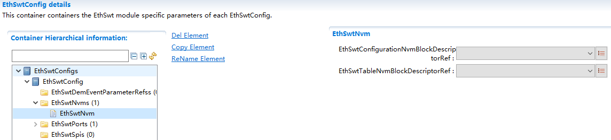

==================
EthSwt
==================

**缩写词注解**

+------------+---------------------------+----------------------------+
| **缩写词** | **英文全称**              | **中文解释**               |
+------------+---------------------------+----------------------------+
| Eth        | Ethernet Driver (AUTOSAR  | AUTOSAR标准以太网驱动模块  |
|            | BSW module)               |                            |
+------------+---------------------------+----------------------------+
| EthSwt     | Ethernet Interface        | AUTOSAR标准以太网接口模块  |
|            | (AUTOSAR BSW module)      |                            |
+------------+---------------------------+----------------------------+
| EthTrcv    | Ethernet Transceiver      | A                          |
|            | Driver (AUTOSAR BSW       | UTOSAR标准以太网收发器模块 |
|            | module)                   |                            |
+------------+---------------------------+----------------------------+

简介
====

EthSwt向上层提供与以太网硬件无关的独立接口，该接口可以支持多个不同的有线或无线以太网控制器和收发器。这些接口按功能可以大体分为模式控制相关的接口、时间同步相关的接口、数据接收发送相关的接口、EthSwt本身的初始化或周期任务接口等。

|image1|

图 EthSwt层次图

参考资料
--------

[1] AUTOSAR_SWS_EthernetInterface.pdf，R20-11

功能描述
========

以太网交换机在端口上接受另一个端口发送过来的数据帧，根据帧头的目的MAC地址查找MAC地址表然后将该数据帧从对应端口上转发出去。交换机驱动程序模块主要提供以下功能：

1. MAC地址学习。

2. VLAN收发。

3. VLAN隔离。

4. 接口传递。

MAC地址学习功能介绍
-------------------

以太网交换机能自主学习每一端口相连设备的MAC地址，并将地址同相应的端口映射起来存放在交换机缓存中的MAC地址表中。

VLAN收发功能介绍
----------------

EthSwt负责对VLAN报文的解/加Tag操作，当接收时，通过EthSwt传递给上层的以太网报文将在EthSwt中提取出VLAN头，并把剩余的数据传递给上层模块。当上层模块需要向下传输报文时，在EthSwt中添加VLAN头，并通过对应的Eth通道发送出去。

VLAN隔离功能介绍
----------------

通过配置，属于同一VLAN的port间可以相互通信，不属于同一VLAN的port间不能相互通信。

接口传递功能介绍
----------------

EthSwt负责对底层switch驱动进行设置和封装，并提供相应接口传递给EthSwt。

源文件描述
==========

表 EthSwt组件文件描述

+----------------+-----------------------------------------------------+
| **文件**       | **说明**                                            |
+----------------+-----------------------------------------------------+
| EthSwt_Cfg.h   | 定义EthSwt模块预编译时用到的配置参数。              |
+----------------+-----------------------------------------------------+
| EthSwt         | 定义EthSwt模块中链接时用到的配置变量。              |
| \_PBCfg.c      |                                                     |
+----------------+-----------------------------------------------------+
| EthSwt         | 定义EthSwt模块中配置变量结构体                      |
| \_PBCfg.h      |                                                     |
+----------------+-----------------------------------------------------+
| EthSwt.h       | EthSwt模块头文                                      |
|                | 件，包含了API函数的扩展声明并定义了端口的数据结构。 |
+----------------+-----------------------------------------------------+
| EthSwt.c       | EthSwt模块源文件，包含了API函数的实现。             |
+----------------+-----------------------------------------------------+
| Et             | 定义EthSwt模块中依赖88Q5050的函数实现               |
| hSwt_88Q5050.c |                                                     |
+----------------+-----------------------------------------------------+
| Et             | 定义EthSwt模块中依赖88Q5050宏定义和结构体           |
| hSwt_88Q5050.h |                                                     |
+----------------+-----------------------------------------------------+
| Eth            | 义EthSwt模块中不依赖于芯片的内部函数                |
| Swt_Internal.h |                                                     |
+----------------+-----------------------------------------------------+
| E              | EthSwt的内存映射定义                                |
| thSwt_MemMap.h |                                                     |
+----------------+-----------------------------------------------------+
| SchM_EthSwt.h  | EthSwt的SchM头文件                                  |
+----------------+-----------------------------------------------------+

|image2|

图 EthSwt组件文件交互关系图

API接口
=======

类型定义
--------

EthSwt_ConfigType类型定义
~~~~~~~~~~~~~~~~~~~~~~~~~

+-----------+----------------------------------------------------------+
| 名称      | EthSwt_ConfigType                                        |
+-----------+----------------------------------------------------------+
| 类型      | struct                                                   |
+-----------+----------------------------------------------------------+
| 范围      | 无                                                       |
+-----------+----------------------------------------------------------+
| 描述      | EthSwt配置结构体定义                                     |
+-----------+----------------------------------------------------------+

输入函数描述
------------

+----------------------------------+-----------------------------------+
| **输入模块**                     | **API**                           |
+----------------------------------+-----------------------------------+
| Eth                              | Eth_GetControllerMode             |
+----------------------------------+-----------------------------------+
|                                  | Eth_GetPhysAddr                   |
+----------------------------------+-----------------------------------+
|                                  | Eth_ProvideTxBuffer               |
+----------------------------------+-----------------------------------+
|                                  | Eth_SetControllerMode             |
+----------------------------------+-----------------------------------+
|                                  | Eth_Transmit                      |
+----------------------------------+-----------------------------------+
|                                  | Eth_TxConfirmation                |
+----------------------------------+-----------------------------------+
| EthSM                            | EthSM_CtrlModeIndication          |
+----------------------------------+-----------------------------------+
|                                  | EthSM_TrcvLinkStateChg            |
+----------------------------------+-----------------------------------+
| EthTrcv                          | EthTrcv_GetLinkState              |
+----------------------------------+-----------------------------------+
|                                  | EthTrcv_GetTransceiverMode        |
+----------------------------------+-----------------------------------+
|                                  | EthTrcv_SetTransceiverMode        |
+----------------------------------+-----------------------------------+

静态接口函数定义
----------------

EthSwt_Init
~~~~~~~~~~~

+-------------+-------------------+---------+-------------------------+
| 函数名称:   | EthSwt_Init       |         |                         |
+-------------+-------------------+---------+-------------------------+
| 函数原型:   | void EthSwt_Init  |         |                         |
|             | ( const           |         |                         |
|             | Et                |         |                         |
|             | hSwt_ConfigType\* |         |                         |
|             | CfgPtr )          |         |                         |
+-------------+-------------------+---------+-------------------------+
| 服务编号:   | 0x01              |         |                         |
+-------------+-------------------+---------+-------------------------+
| 同步/异步： | 同步              |         |                         |
+-------------+-------------------+---------+-------------------------+
| 是          | 不可重入          |         |                         |
| 否可重入：  |                   |         |                         |
+-------------+-------------------+---------+-------------------------+
| 输入参数：  | CfgPtr            | 值域：  | 无                      |
+-------------+-------------------+---------+-------------------------+
| 输          | 无                |         |                         |
| 入输出参数: |                   |         |                         |
+-------------+-------------------+---------+-------------------------+
| 输出参数：  | 无                |         |                         |
+-------------+-------------------+---------+-------------------------+
| 返回值：    | 无                |         |                         |
+-------------+-------------------+---------+-------------------------+
| 功能概述：  | EthSwt初始化      |         |                         |
+-------------+-------------------+---------+-------------------------+

EthSwt_GetVersionInfo
~~~~~~~~~~~~~~~~~~~~~

+-------------+------------------+----------+-------------------------+
| 函数名称:   | EthSw            |          |                         |
|             | t_GetVersionInfo |          |                         |
+-------------+------------------+----------+-------------------------+
| 函数原型:   | void             |          |                         |
|             | EthSwt           |          |                         |
|             | _GetVersionInfo( |          |                         |
|             | Std_V            |          |                         |
|             | ersionInfoType\* |          |                         |
|             | VersionInfoPtr)  |          |                         |
+-------------+------------------+----------+-------------------------+
| 服务编号:   | 0x18             |          |                         |
+-------------+------------------+----------+-------------------------+
| 同步/异步： | 同步             |          |                         |
+-------------+------------------+----------+-------------------------+
| 是          | 不可重入         |          |                         |
| 否可重入：  |                  |          |                         |
+-------------+------------------+----------+-------------------------+
| 输入参数:   | 无               |          |                         |
+-------------+------------------+----------+-------------------------+
| 输          | 无               |          |                         |
| 入输出参数: |                  |          |                         |
+-------------+------------------+----------+-------------------------+
| 输出参数：  | VersionInfoPtr   | 值域：   | 无                      |
+-------------+------------------+----------+-------------------------+
| 返回值：    | 无               |          |                         |
+-------------+------------------+----------+-------------------------+
| 功能概述：  | 返回             |          |                         |
|             | 该模块的版本信息 |          |                         |
+-------------+------------------+----------+-------------------------+

EthSwt_SetSwitchPortMode
~~~~~~~~~~~~~~~~~~~~~~~~

+-------------+------------------+----------+-------------------------+
| 函数名称:   | EthSwt_S         |          |                         |
|             | etSwitchPortMode |          |                         |
+-------------+------------------+----------+-------------------------+
| 函数原型:   | Std_ReturnType   |          |                         |
|             | EthSwt_S         |          |                         |
|             | etSwitchPortMode |          |                         |
|             | (                |          |                         |
|             |                  |          |                         |
|             | uint8            |          |                         |
|             | SwitchIdx,uint8  |          |                         |
|             | SwitchPortIdx,   |          |                         |
|             |                  |          |                         |
|             | Eth_ModeType     |          |                         |
|             | PortMode)        |          |                         |
+-------------+------------------+----------+-------------------------+
| 服务编号:   | 0x03             |          |                         |
+-------------+------------------+----------+-------------------------+
| 同步/异步： | 异步/同步        |          |                         |
+-------------+------------------+----------+-------------------------+
| 是          | 不可重入         |          |                         |
| 否可重入：  |                  |          |                         |
+-------------+------------------+----------+-------------------------+
| 输入参数：  | SwitchIdx        | 值域：   | 无                      |
+-------------+------------------+----------+-------------------------+
|             | PortMode         | 值域：   | ETH_MODE_DOWN：在给     |
|             |                  |          | 定的以太网交换机上禁用  |
|             |                  |          | 寻址的以太网交换机端口  |
|             |                  |          |                         |
|             |                  |          | ETH_MODE_ACTIVE：在给   |
|             |                  |          | 定的以太网交换机上启用  |
|             |                  |          | 寻址的以太网交换机端口  |
|             |                  |          |                         |
|             |                  |          | ETH_MODE_ACTIV          |
|             |                  |          | E_WITH_WAKEUP_REQUEST： |
|             |                  |          | 在给定的以太网交换机上  |
|             |                  |          | 启用寻址的以太网交换机  |
|             |                  |          | 端口并请求触发网络唤醒  |
+-------------+------------------+----------+-------------------------+
|             | SwitchPortIdx    | 值域：   | 无                      |
+-------------+------------------+----------+-------------------------+
| 输          | 无               |          |                         |
| 入输出参数: |                  |          |                         |
+-------------+------------------+----------+-------------------------+
| 输出参数：  | 无               |          |                         |
+-------------+------------------+----------+-------------------------+
| 返回值：    | E                |          |                         |
|             | _OK：API执行成功 |          |                         |
|             |                  |          |                         |
|             | E_NOT            |          |                         |
|             | _OK：API执行失败 |          |                         |
+-------------+------------------+----------+-------------------------+
| 功能概述：  | 启用/禁用指      |          |                         |
|             | 定的交换机端口。 |          |                         |
+-------------+------------------+----------+-------------------------+

EthSwt_GetSwitchPortMode
~~~~~~~~~~~~~~~~~~~~~~~~

+-------------+-------------------+---------+-------------------------+
| 函数名称:   | EthSwt_           |         |                         |
|             | GetSwitchPortMode |         |                         |
+-------------+-------------------+---------+-------------------------+
| 函数原型:   | Std_ReturnType    |         |                         |
|             | EthSwt_           |         |                         |
|             | GetSwitchPortMode |         |                         |
|             | (uint8            |         |                         |
|             | SwitchIdx,uint8   |         |                         |
|             | SwitchPortI       |         |                         |
|             | dx,Eth_ModeType\* |         |                         |
|             | SwitchModePtr)    |         |                         |
+-------------+-------------------+---------+-------------------------+
| 服务编号:   | 0x04              |         |                         |
+-------------+-------------------+---------+-------------------------+
| 同步/异步： | 同步/异步         |         |                         |
+-------------+-------------------+---------+-------------------------+
| 是          | 不可重入          |         |                         |
| 否可重入：  |                   |         |                         |
+-------------+-------------------+---------+-------------------------+
| 输入参数：  | SwitchIdx         | 值域：  | 无                      |
+-------------+-------------------+---------+-------------------------+
|             | SwitchPortIdx     | 值域：  | 无                      |
+-------------+-------------------+---------+-------------------------+
| 输          | 无                |         |                         |
| 入输出参数: |                   |         |                         |
+-------------+-------------------+---------+-------------------------+
| 输出参数：  | SwitchModePtr     | 值域：  | ETH_MODE_DOW            |
|             |                   |         | N：给定以太网交换机的以 |
|             |                   |         | 太网交换机端口被禁用。  |
|             |                   |         |                         |
|             |                   |         | ETH_MODE_ACT            |
|             |                   |         | IVE：给定以太网交换机的 |
|             |                   |         | 以太网交换机端口已启用  |
+-------------+-------------------+---------+-------------------------+
| 返回值：    | E_OK：API执行成功 |         |                         |
|             |                   |         |                         |
|             | E_NO              |         |                         |
|             | T_OK：API执行失败 |         |                         |
+-------------+-------------------+---------+-------------------------+
| 功能概述：  | 获取指定的交      |         |                         |
|             | 换机端口的模式。  |         |                         |
+-------------+-------------------+---------+-------------------------+

EthSwt_StartSwitchPortAutoNegotiation
~~~~~~~~~~~~~~~~~~~~~~~~~~~~~~~~~~~~~

+-------------+-------------------+---------+-------------------------+
| 函数名称:   | Eth               |         |                         |
|             | Swt_StartSwitchPo |         |                         |
|             | rtAutoNegotiation |         |                         |
+-------------+-------------------+---------+-------------------------+
| 函数原型:   | Std_ReturnType    |         |                         |
|             | Eth               |         |                         |
|             | Swt_StartSwitchPo |         |                         |
|             | rtAutoNegotiation |         |                         |
|             | (uint8            |         |                         |
|             | SwitchIdx,uint8   |         |                         |
|             | SwitchPortIdx)    |         |                         |
+-------------+-------------------+---------+-------------------------+
| 服务编号:   | 0x05              |         |                         |
+-------------+-------------------+---------+-------------------------+
| 同步/异步： | 同步/异步         |         |                         |
+-------------+-------------------+---------+-------------------------+
| 是          | 不可重入          |         |                         |
| 否可重入：  |                   |         |                         |
+-------------+-------------------+---------+-------------------------+
| 输入参数：  | SwitchIdx         | 值域：  | 无                      |
+-------------+-------------------+---------+-------------------------+
|             | SwitchPortIdx     | 值域：  | 无                      |
+-------------+-------------------+---------+-------------------------+
| 输          | 无                |         |                         |
| 入输出参数: |                   |         |                         |
+-------------+-------------------+---------+-------------------------+
| 输出参数：  | 无                |         |                         |
+-------------+-------------------+---------+-------------------------+
| 返回值：    | E_OK：API执行成功 |         |                         |
|             |                   |         |                         |
|             | E_NO              |         |                         |
|             | T_OK：API执行失败 |         |                         |
+-------------+-------------------+---------+-------------------------+
| 功能概述：  | 启动指定的交换机  |         |                         |
|             | 端口的自动协商。  |         |                         |
+-------------+-------------------+---------+-------------------------+

EthSwt_CheckWakeup
~~~~~~~~~~~~~~~~~~

+-------------+-------------------+---------+-------------------------+
| 函数名称:   | E                 |         |                         |
|             | thSwt_CheckWakeup |         |                         |
+-------------+-------------------+---------+-------------------------+
| 函数原型:   | Std_ReturnType    |         |                         |
|             | E                 |         |                         |
|             | thSwt_CheckWakeup |         |                         |
|             | (uint8 SwitchIdx) |         |                         |
+-------------+-------------------+---------+-------------------------+
| 服务编号:   | 0x4c              |         |                         |
+-------------+-------------------+---------+-------------------------+
| 同步/异步： | 同步              |         |                         |
+-------------+-------------------+---------+-------------------------+
| 是          | 可重入            |         |                         |
| 否可重入：  |                   |         |                         |
+-------------+-------------------+---------+-------------------------+
| 输入参数：  | SwitchIdx         | 值域：  | 无                      |
+-------------+-------------------+---------+-------------------------+
| 输          | 无                |         |                         |
| 入输出参数: |                   |         |                         |
+-------------+-------------------+---------+-------------------------+
| 输出参数：  | 无                |         |                         |
+-------------+-------------------+---------+-------------------------+
| 返回值：    | E_OK：API执行成功 |         |                         |
|             |                   |         |                         |
|             | E_NO              |         |                         |
|             | T_OK：API执行失败 |         |                         |
+-------------+-------------------+---------+-------------------------+
| 功能概述：  | API由EthIf调用。  |         |                         |
|             | 以太              |         |                         |
|             | 网交换机驱动程序  |         |                         |
|             | 请求检查所有引用  |         |                         |
|             | EthTrcv           |         |                         |
|             | 的以太网交换机    |         |                         |
|             | 端口的唤醒情况。  |         |                         |
|             | 对于那些以太      |         |                         |
|             | 网交换机端口，呼  |         |                         |
|             | 叫被转发到引用的  |         |                         |
|             | EthTrcv。         |         |                         |
|             | 该                |         |                         |
|             | 函数可以在中断服  |         |                         |
|             | 务例程的上下文中  |         |                         |
|             | 或在任务级别调用  |         |                         |
+-------------+-------------------+---------+-------------------------+

EthSwt_GetSwitchPortWakeupReason
~~~~~~~~~~~~~~~~~~~~~~~~~~~~~~~~

+-------------+-------------------+---------+-------------------------+
| 函数名称:   | EthSwt_GetSwitc   |         |                         |
|             | hPortWakeupReason |         |                         |
+-------------+-------------------+---------+-------------------------+
| 函数原型:   | Std_ReturnType    |         |                         |
|             | EthSwt_GetSwitc   |         |                         |
|             | hPortWakeupReason |         |                         |
|             | (uint8            |         |                         |
|             | SwitchIdx,uint8   |         |                         |
|             | Swit              |         |                         |
|             | chPortIdx,EthTrcv |         |                         |
|             | _WakeupReasonType |         |                         |
|             | Reason            |         |                         |
|             | )                 |         |                         |
+-------------+-------------------+---------+-------------------------+
| 服务编号:   | 0x4b              |         |                         |
+-------------+-------------------+---------+-------------------------+
| 同步/异步： | 同步              |         |                         |
+-------------+-------------------+---------+-------------------------+
| 是          | 可重入            |         |                         |
| 否可重入：  |                   |         |                         |
+-------------+-------------------+---------+-------------------------+
| 输入参数：  | SwitchIdx         | 值域：  | 无                      |
+-------------+-------------------+---------+-------------------------+
|             | SwitchPortIdx     | 值域：  | 无                      |
+-------------+-------------------+---------+-------------------------+
| 输          | 无                |         |                         |
| 入输出参数: |                   |         |                         |
+-------------+-------------------+---------+-------------------------+
| 输出参数：  | Reason            | 值域：  | 无                      |
+-------------+-------------------+---------+-------------------------+
| 返回值：    | E_OK：API执行成功 |         |                         |
|             |                   |         |                         |
|             | E_NO              |         |                         |
|             | T_OK：API执行失败 |         |                         |
+-------------+-------------------+---------+-------------------------+
| 功能概述：  | 该                |         |                         |
|             | 函数通过调用被引  |         |                         |
|             | 用的EthTrcv的Eth  |         |                         |
|             | Tr                |         |                         |
|             | cv_GetBusWuReason |         |                         |
|             | (...)来获取被指定 |         |                         |
|             | 的的以太网交换机  |         |                         |
|             | 端口的唤醒原因。  |         |                         |
+-------------+-------------------+---------+-------------------------+

EthSwt_GetLinkState
~~~~~~~~~~~~~~~~~~~

+-------------+---------------+--------+------------------------------+
| 函数名称:   | EthSwt        |        |                              |
|             | _GetLinkState |        |                              |
+-------------+---------------+--------+------------------------------+
| 函数原型:   | S             |        |                              |
|             | td_ReturnType |        |                              |
|             | EthSwt        |        |                              |
|             | _GetLinkState |        |                              |
|             | (uint8        |        |                              |
|             | Sw            |        |                              |
|             | itchIdx,uint8 |        |                              |
|             | SwitchPortI   |        |                              |
|             | dx,EthTrcv_Li |        |                              |
|             | nkStateType\* |        |                              |
|             | LinkStatePtr) |        |                              |
+-------------+---------------+--------+------------------------------+
| 服务编号:   | 0x06          |        |                              |
+-------------+---------------+--------+------------------------------+
| 同步/异步： | 同步/异步     |        |                              |
+-------------+---------------+--------+------------------------------+
| 是          | 不可重入      |        |                              |
| 否可重入：  |               |        |                              |
+-------------+---------------+--------+------------------------------+
| 输入参数：  | SwitchIdx     | 值域： | 无                           |
+-------------+---------------+--------+------------------------------+
|             | SwitchPortIdx | 值域： | 无                           |
+-------------+---------------+--------+------------------------------+
| 输          | 无            |        |                              |
| 入输出参数: |               |        |                              |
+-------------+---------------+--------+------------------------------+
| 输出参数：  | LinkStatePtr  | 值域： | ETHTRCV_LIN                  |
|             |               |        | K_STATE_DOWN：交换机端口断开 |
|             |               |        |                              |
|             |               |        | ETHTRCV_LINK_ST              |
|             |               |        | ATE_ACTIVE：交换机端口已连接 |
+-------------+---------------+--------+------------------------------+
| 返回值：    | E_OK          |        |                              |
|             | ：API执行成功 |        |                              |
|             |               |        |                              |
|             | E_NOT_OK      |        |                              |
|             | ：API执行失败 |        |                              |
+-------------+---------------+--------+------------------------------+
| 功能概述：  | 获取指定      |        |                              |
|             | 的交换机端口  |        |                              |
|             | 的链路状态。  |        |                              |
+-------------+---------------+--------+------------------------------+

EthSwt_GetBaudRate
~~~~~~~~~~~~~~~~~~

+-------------+--------------+-------+-------------------------------+
| 函数名称:   | EthSwt       |       |                               |
|             | _GetBaudRate |       |                               |
+-------------+--------------+-------+-------------------------------+
| 函数原型:   | St           |       |                               |
|             | d_ReturnType |       |                               |
|             | EthSwt       |       |                               |
|             | _GetBaudRate |       |                               |
|             | (uint8       |       |                               |
|             | Swi          |       |                               |
|             | tchIdx,uint8 |       |                               |
|             | SwitchPortId |       |                               |
|             | x,EthTrcv_Ba |       |                               |
|             | udRateType\* |       |                               |
|             | BaudRatePtr) |       |                               |
+-------------+--------------+-------+-------------------------------+
| 服务编号:   | 0x07         |       |                               |
+-------------+--------------+-------+-------------------------------+
| 同步/异步： | 同步/异步    |       |                               |
+-------------+--------------+-------+-------------------------------+
| 是          | 不可重入     |       |                               |
| 否可重入：  |              |       |                               |
+-------------+--------------+-------+-------------------------------+
| 输入参数：  | SwitchIdx    | 值    | 无                            |
|             |              | 域：  |                               |
+-------------+--------------+-------+-------------------------------+
|             | S            | 值    | 无                            |
|             | witchPortIdx | 域：  |                               |
+-------------+--------------+-------+-------------------------------+
| 输出参数：  | 无           |       |                               |
+-------------+--------------+-------+-------------------------------+
| 输出参数：  | BaudRatePtr  | 值    | ETH                           |
|             |              | 域：  | TRCV_BAUD_RATE_10MBIT：10MBit |
|             |              |       | 连接                          |
|             |              |       |                               |
|             |              |       | ETHTR                         |
|             |              |       | CV_BAUD_RATE_100MBIT：100MBIT |
|             |              |       | 连接                          |
|             |              |       |                               |
|             |              |       | ETHTRCV                       |
|             |              |       | _BAUD_RATE_1000MBIT：1000MBIT |
|             |              |       | 连接                          |
|             |              |       |                               |
|             |              |       | ETHTRCV                       |
|             |              |       | _BAUD_RATE_2500MBIT：2500MBit |
|             |              |       | 连接                          |
+-------------+--------------+-------+-------------------------------+
| 返回值：    | E_OK：       |       |                               |
|             | API执行成功  |       |                               |
|             |              |       |                               |
|             | E_NOT_OK：   |       |                               |
|             | API执行失败  |       |                               |
+-------------+--------------+-------+-------------------------------+
| 功能概述：  | 获取         |       |                               |
|             | 指定的交换机 |       |                               |
|             | 端口的波特率 |       |                               |
+-------------+--------------+-------+-------------------------------+

EthSwt_GetDuplexMode
~~~~~~~~~~~~~~~~~~~~

+-------------+---------------+-------+-------------------------------+
| 函数名称:   | EthSwt_       |       |                               |
|             | GetDuplexMode |       |                               |
+-------------+---------------+-------+-------------------------------+
| 函数原型:   | S             |       |                               |
|             | td_ReturnType |       |                               |
|             | EthSwt_       |       |                               |
|             | GetDuplexMode |       |                               |
|             | (uint8        |       |                               |
|             | Sw            |       |                               |
|             | itchIdx,uint8 |       |                               |
|             | SwitchPortId  |       |                               |
|             | x,EthTrcv_Dup |       |                               |
|             | lexModeType\* |       |                               |
|             | D             |       |                               |
|             | uplexModePtr) |       |                               |
+-------------+---------------+-------+-------------------------------+
| 服务编号:   | 0x08          |       |                               |
+-------------+---------------+-------+-------------------------------+
| 同步/异步： | 同步/异步     |       |                               |
+-------------+---------------+-------+-------------------------------+
| 是          | 不可重入      |       |                               |
| 否可重入：  |               |       |                               |
+-------------+---------------+-------+-------------------------------+
| 输入参数：  | SwitchIdx     | 值    | 无                            |
|             |               | 域：  |                               |
+-------------+---------------+-------+-------------------------------+
|             | SwitchPortIdx | 值    | 无                            |
|             |               | 域：  |                               |
+-------------+---------------+-------+-------------------------------+
| 输          | 无            |       |                               |
| 入输出参数: |               |       |                               |
+-------------+---------------+-------+-------------------------------+
| 输出参数：  | DuplexModePtr | 值    | ETHTRCV                       |
|             |               | 域：  | _DUPLEX_MODE_HALF：半双工连接 |
|             |               |       |                               |
|             |               |       | ETHTRC                        |
|             |               |       | V_DUPLEXMODE_FULL：全双工连接 |
+-------------+---------------+-------+-------------------------------+
| 返回值：    | E_OK          |       |                               |
|             | ：API执行成功 |       |                               |
|             |               |       |                               |
|             | E_NOT_OK      |       |                               |
|             | ：API执行失败 |       |                               |
+-------------+---------------+-------+-------------------------------+
| 功能概述：  | 获取指        |       |                               |
|             | 定的交换机端  |       |                               |
|             | 口的双工模式  |       |                               |
+-------------+---------------+-------+-------------------------------+

EthSwt_GetPortMacAddr
~~~~~~~~~~~~~~~~~~~~~

+-------------+-------------------+---------+-------------------------+
| 函数名称:   | EthS              |         |                         |
|             | wt_GetPortMacAddr |         |                         |
+-------------+-------------------+---------+-------------------------+
| 函数原型:   | Std_ReturnType    |         |                         |
|             | EthS              |         |                         |
|             | wt_GetPortMacAddr |         |                         |
|             | (uint8            |         |                         |
|             | SwitchIdx,const   |         |                         |
|             | uint8\*           |         |                         |
|             | M                 |         |                         |
|             | acAddrPtr,uint8\* |         |                         |
|             | PortIdxPtr)       |         |                         |
+-------------+-------------------+---------+-------------------------+
| 服务编号:   | 0x09              |         |                         |
+-------------+-------------------+---------+-------------------------+
| 同步/异步： | 同步/异步         |         |                         |
+-------------+-------------------+---------+-------------------------+
| 是          | 不可重入          |         |                         |
| 否可重入：  |                   |         |                         |
+-------------+-------------------+---------+-------------------------+
| 输入参数：  | SwitchIdx         | 值域：  | 无                      |
+-------------+-------------------+---------+-------------------------+
|             | MacAddrPtr        | 值域：  | 无                      |
+-------------+-------------------+---------+-------------------------+
| 输          | 无                |         |                         |
| 入输出参数: |                   |         |                         |
+-------------+-------------------+---------+-------------------------+
| 输出参数：  | PortIdxPtr        | 值域：  | 无                      |
+-------------+-------------------+---------+-------------------------+
| 返回值：    | E_OK：API执行成功 |         |                         |
|             |                   |         |                         |
|             | E_NO              |         |                         |
|             | T_OK：API执行失败 |         |                         |
+-------------+-------------------+---------+-------------------------+
| 功能概述：  | 获取可以到达指    |         |                         |
|             | 定的交换机上的此  |         |                         |
|             | MAC 地址的端口。  |         |                         |
|             | 结果可能          |         |                         |
|             | 用于需要端口/MAC  |         |                         |
|             | 解析的 DHCP       |         |                         |
|             | 服务器。 如果返回 |         |                         |
|             | PortIdxPtr        |         |                         |
|             | 的最大可能值      |         |                         |
|             | (255)，则         |         |                         |
|             | 无法通过此交换机  |         |                         |
|             | 的端口访问给定的  |         |                         |
|             | MAC 地址。        |         |                         |
|             | 如果              |         |                         |
|             | 找到多个端口，API |         |                         |
|             | 将返回 E_NOT_OK。 |         |                         |
+-------------+-------------------+---------+-------------------------+

EthSwt_EnableVlan
~~~~~~~~~~~~~~~~~

+-------------+-------------------+---------+-------------------------+
| 函数名称:   | EthSwt_EnableVlan |         |                         |
+-------------+-------------------+---------+-------------------------+
| 函数原型:   | Std_ReturnType    |         |                         |
|             | EthSwt_EnableVlan |         |                         |
|             | (uint8            |         |                         |
|             | SwitchIdx,uint8   |         |                         |
|             | Swi               |         |                         |
|             | tchPortIdx,uint16 |         |                         |
|             | VlanId,boolean    |         |                         |
|             | Enable)           |         |                         |
+-------------+-------------------+---------+-------------------------+
| 服务编号:   | 0x12              |         |                         |
+-------------+-------------------+---------+-------------------------+
| 同步/异步： | 同步/异步         |         |                         |
+-------------+-------------------+---------+-------------------------+
| 是          | 不可重入          |         |                         |
| 否可重入：  |                   |         |                         |
+-------------+-------------------+---------+-------------------------+
| 输入参数：  | SwitchIdx         | 值域：  | 无                      |
+-------------+-------------------+---------+-------------------------+
|             | SwitchPortIdx     | 值域：  | 无                      |
+-------------+-------------------+---------+-------------------------+
|             | VlanId            | 值域：  | 无                      |
+-------------+-------------------+---------+-------------------------+
|             | Enable            | 值域：  | 1 = 启用 VLAN 配置      |
|             |                   |         |                         |
|             |                   |         | 0 = 禁用 VLAN           |
|             |                   |         | 配置（具有给定 VLAN-ID  |
|             |                   |         | 的帧将被丢弃）          |
+-------------+-------------------+---------+-------------------------+
| 输          | 无                |         |                         |
| 入输出参数: |                   |         |                         |
+-------------+-------------------+---------+-------------------------+
| 输出参数：  | 无                |         |                         |
+-------------+-------------------+---------+-------------------------+
| 返回值：    | E_OK：API执行成功 |         |                         |
|             |                   |         |                         |
|             | E_NO              |         |                         |
|             | T_OK：API执行失败 |         |                         |
+-------------+-------------------+---------+-------------------------+
| 功能概述：  | 在交              |         |                         |
|             | 换机的某个端口启  |         |                         |
|             | 用或禁用预配置的  |         |                         |
|             | VLAN。            |         |                         |
+-------------+-------------------+---------+-------------------------+

EthSwt_SetMacLearningMode
~~~~~~~~~~~~~~~~~~~~~~~~~

+-------------+-------------------+---------+-------------------------+
| 函数名称:   | EthSwt_S          |         |                         |
|             | etMacLearningMode |         |                         |
+-------------+-------------------+---------+-------------------------+
| 函数原型:   | Std_ReturnType    |         |                         |
|             | EthSwt_S          |         |                         |
|             | etMacLearningMode |         |                         |
|             | (uint8            |         |                         |
|             | SwitchIdx,uint8   |         |                         |
|             | Sw                |         |                         |
|             | itchPortIdx,EthSw |         |                         |
|             | t_MacLearningType |         |                         |
|             | MacLearningMode)  |         |                         |
+-------------+-------------------+---------+-------------------------+
| 服务编号:   | 0x15              |         |                         |
+-------------+-------------------+---------+-------------------------+
| 同步/异步： | 同步/异步         |         |                         |
+-------------+-------------------+---------+-------------------------+
| 是          | 不可重入          |         |                         |
| 否可重入：  |                   |         |                         |
+-------------+-------------------+---------+-------------------------+
| 输入参数：  | SwitchIdx         | 值域：  | 无                      |
+-------------+-------------------+---------+-------------------------+
|             | SwitchPortIdx     | 值域：  | 无                      |
+-------------+-------------------+---------+-------------------------+
|             | MacLearningMode   | 值域：  | 无                      |
+-------------+-------------------+---------+-------------------------+
| 输          | 无                |         |                         |
| 入输出参数: |                   |         |                         |
+-------------+-------------------+---------+-------------------------+
| 输出参数：  | 无                |         |                         |
+-------------+-------------------+---------+-------------------------+
| 返回值：    | E_OK：API执行成功 |         |                         |
|             |                   |         |                         |
|             | E_NO              |         |                         |
|             | T_OK：API执行失败 |         |                         |
+-------------+-------------------+---------+-------------------------+
| 功能概述：  | 在                |         |                         |
|             | 3个模式之一中设置 |         |                         |
|             | MAC 学习模式：1.) |         |                         |
|             | 启用硬件学习，2.) |         |                         |
|             | 禁用硬件学习，3.) |         |                         |
|             | 启用软件学习。    |         |                         |
|             | 注意：此功能      |         |                         |
|             | 取决于硬件，即交  |         |                         |
|             | 换机硬件需要支持  |         |                         |
|             | 不同的学习模式。  |         |                         |
+-------------+-------------------+---------+-------------------------+

EthSwt_GetMacLearningMode
~~~~~~~~~~~~~~~~~~~~~~~~~

+-------------+-------------------+---------+-------------------------+
| 函数名称:   | EthSwt_G          |         |                         |
|             | etMacLearningMode |         |                         |
+-------------+-------------------+---------+-------------------------+
| 函数原型:   | Std_ReturnType    |         |                         |
|             | EthSwt_G          |         |                         |
|             | etMacLearningMode |         |                         |
|             | (uint8            |         |                         |
|             | SwitchIdx,uint8   |         |                         |
|             | Swit              |         |                         |
|             | chPortIdx,EthSwt_ |         |                         |
|             | MacLearningType\* |         |                         |
|             | MacLearningMode)  |         |                         |
+-------------+-------------------+---------+-------------------------+
| 服务编号:   | 0x16              |         |                         |
+-------------+-------------------+---------+-------------------------+
| 同步/异步： | 同步/异步         |         |                         |
+-------------+-------------------+---------+-------------------------+
| 是          | 不可重入          |         |                         |
| 否可重入：  |                   |         |                         |
+-------------+-------------------+---------+-------------------------+
| 输入参数：  | SwitchIdx         | 值域：  | 无                      |
+-------------+-------------------+---------+-------------------------+
|             | SwitchPortIdx     | 值域：  | 无                      |
+-------------+-------------------+---------+-------------------------+
| 输          | 无                |         |                         |
| 入输出参数: |                   |         |                         |
+-------------+-------------------+---------+-------------------------+
| 输出参数：  | MacLearningMode   | 值域：  | 无                      |
+-------------+-------------------+---------+-------------------------+
| 返回值：    | E_OK：API执行成功 |         |                         |
|             |                   |         |                         |
|             | E_NO              |         |                         |
|             | T_OK：API执行失败 |         |                         |
+-------------+-------------------+---------+-------------------------+
| 功能概述：  | 返回 MAC          |         |                         |
|             | 学习模式，即 1.)  |         |                         |
|             | 启用硬件学习，2.) |         |                         |
|             | 禁用硬件学习，3.) |         |                         |
|             | 启用软件学习。    |         |                         |
|             | 注意：此功        |         |                         |
|             | 能取决于硬件，即  |         |                         |
|             | 交换机硬件需要支  |         |                         |
|             | 持不同的学习模式  |         |                         |
+-------------+-------------------+---------+-------------------------+

EthSwt_WritePortMirrorConfiguration
~~~~~~~~~~~~~~~~~~~~~~~~~~~~~~~~~~~

+-------------+-------------------+---------+-------------------------+
| 函数名称:   | E                 |         |                         |
|             | thSwt_WritePortMi |         |                         |
|             | rrorConfiguration |         |                         |
+-------------+-------------------+---------+-------------------------+
| 函数原型:   | Std_ReturnType    |         |                         |
|             | E                 |         |                         |
|             | thSwt_WritePortMi |         |                         |
|             | rrorConfiguration |         |                         |
|             | (uint8            |         |                         |
|             | Mirror            |         |                         |
|             | edSwitchIdx,const |         |                         |
|             | EthSwt_Po         |         |                         |
|             | rtMirrorCfgType\* |         |                         |
|             | PortMirror        |         |                         |
|             | ConfigurationPtr) |         |                         |
+-------------+-------------------+---------+-------------------------+
| 服务编号:   | 0x36              |         |                         |
+-------------+-------------------+---------+-------------------------+
| 同步/异步： | 同步              |         |                         |
+-------------+-------------------+---------+-------------------------+
| 是          | 不可重入          |         |                         |
| 否可重入：  |                   |         |                         |
+-------------+-------------------+---------+-------------------------+
| 输入参数：  | MirroredSwitchIdx | 值域：  | 无                      |
+-------------+-------------------+---------+-------------------------+
|             | PortMi            | 值域：  | 无                      |
|             | rrorConfiguration |         |                         |
+-------------+-------------------+---------+-------------------------+
| 输          | 无                |         |                         |
| 入输出参数: |                   |         |                         |
+-------------+-------------------+---------+-------------------------+
| 输出参数：  | 无                |         |                         |
+-------------+-------------------+---------+-------------------------+
| 返回值：    | E_OK：API执行成功 |         |                         |
|             |                   |         |                         |
|             | E_NO              |         |                         |
|             | T_OK：API执行失败 |         |                         |
+-------------+-------------------+---------+-------------------------+
| 功能概述：  | 将给              |         |                         |
|             | 定的端口镜像配置  |         |                         |
|             | 存储在以太网交换  |         |                         |
|             | 机驱动程序中给定  |         |                         |
|             | MirroredSwitchIdx |         |                         |
|             | 的影子缓冲区中。  |         |                         |
+-------------+-------------------+---------+-------------------------+

EthSwt_ReadPortMirrorConfiguration 
~~~~~~~~~~~~~~~~~~~~~~~~~~~~~~~~~~~

+-------------+---------------------+--------+------------------------+
| 函数名称:   | EthSwt_ReadPort     |        |                        |
|             | MirrorConfiguration |        |                        |
+-------------+---------------------+--------+------------------------+
| 函数原型:   | Std_ReturnType      |        |                        |
|             | EthSwt_ReadPort     |        |                        |
|             | MirrorConfiguration |        |                        |
|             | (                   |        |                        |
|             |                     |        |                        |
|             | uint8               |        |                        |
|             | MirroredSwitchIdx,  |        |                        |
|             |                     |        |                        |
|             | EthSwt_             |        |                        |
|             | PortMirrorCfgType\* |        |                        |
|             | PortMir             |        |                        |
|             | rorConfigurationPtr |        |                        |
|             |                     |        |                        |
|             | )                   |        |                        |
+-------------+---------------------+--------+------------------------+
| 服务编号:   | 0x37                |        |                        |
+-------------+---------------------+--------+------------------------+
| 同步/异步： | 异步                |        |                        |
+-------------+---------------------+--------+------------------------+
| 是          | 不可重入            |        |                        |
| 否可重入：  |                     |        |                        |
+-------------+---------------------+--------+------------------------+
| 输入参数：  | MirroredSwitchIdx   | 值域： | 无                     |
+-------------+---------------------+--------+------------------------+
| 输          | 无                  |        |                        |
| 入输出参数: |                     |        |                        |
+-------------+---------------------+--------+------------------------+
| 输出参数：  | PortMir             | 值域： | 无                     |
|             | rorConfigurationPtr |        |                        |
+-------------+---------------------+--------+------------------------+
| 返回值：    | E_OK：API执行成功   |        |                        |
|             |                     |        |                        |
|             | E\_                 |        |                        |
|             | NOT_OK：API执行失败 |        |                        |
+-------------+---------------------+--------+------------------------+
| 功能概述：  | 获取给定以太网交换  |        |                        |
|             | 机的端口镜像配置。  |        |                        |
+-------------+---------------------+--------+------------------------+

EthSwt_DeletePortMirrorConfiguration
~~~~~~~~~~~~~~~~~~~~~~~~~~~~~~~~~~~~

+-------------+-------------------+---------+-------------------------+
| 函数名称:   | Et                |         |                         |
|             | hSwt_DeletePortMi |         |                         |
|             | rrorConfiguration |         |                         |
+-------------+-------------------+---------+-------------------------+
| 函数原型:   | Std_ReturnType    |         |                         |
|             | Et                |         |                         |
|             | hSwt_DeletePortMi |         |                         |
|             | rrorConfiguration |         |                         |
|             | (uint8            |         |                         |
|             | M                 |         |                         |
|             | irroredSwitchIdx) |         |                         |
+-------------+-------------------+---------+-------------------------+
| 服务编号:   | 0x4A              |         |                         |
+-------------+-------------------+---------+-------------------------+
| 同步/异步： | 同步              |         |                         |
+-------------+-------------------+---------+-------------------------+
| 是          | 可重入不同的      |         |                         |
| 否可重入：  | Mi                |         |                         |
|             | rroredSwitchIdx。 |         |                         |
|             | 对于相同的        |         |                         |
|             | Swit              |         |                         |
|             | chIdx，不可重入。 |         |                         |
+-------------+-------------------+---------+-------------------------+
| 输入参数：  | MirroredSwitchIdx | 值域：  | 无                      |
+-------------+-------------------+---------+-------------------------+
| 输          | 无                |         |                         |
| 入输出参数: |                   |         |                         |
+-------------+-------------------+---------+-------------------------+
| 输出参数：  | 无                |         |                         |
+-------------+-------------------+---------+-------------------------+
| 返回值：    | E_OK：API执行成功 |         |                         |
|             |                   |         |                         |
|             | E_NO              |         |                         |
|             | T_OK：API执行失败 |         |                         |
+-------------+-------------------+---------+-------------------------+
| 功能概述：  | 删除给定          |         |                         |
|             | MirroredSwitchIdx |         |                         |
|             | 的存              |         |                         |
|             | 储端口镜像配置。  |         |                         |
|             | 如果没有找到给定  |         |                         |
|             | MirroredSwitchIdx |         |                         |
|             | 的端口镜像配      |         |                         |
|             | 置，则返回值应为  |         |                         |
|             | E_OK。            |         |                         |
+-------------+-------------------+---------+-------------------------+

EthSwt_GetPortMirrorState
~~~~~~~~~~~~~~~~~~~~~~~~~

+-------------+------------------+---------+--------------------------+
| 函数名称:   | EthSwt_Ge        |         |                          |
|             | tPortMirrorState |         |                          |
+-------------+------------------+---------+--------------------------+
| 函数原型:   | Std_ReturnType   |         |                          |
|             | EthSwt_Ge        |         |                          |
|             | tPortMirrorState |         |                          |
|             | (uint8           |         |                          |
|             | SwitchIdx,uint8  |         |                          |
|             | Port             |         |                          |
|             | Idx,EthSwt_PortM |         |                          |
|             | irrorStateType\* |         |                          |
|             | Por              |         |                          |
|             | tMirrorStatePtr) |         |                          |
+-------------+------------------+---------+--------------------------+
| 服务编号:   | 0x38             |         |                          |
+-------------+------------------+---------+--------------------------+
| 同步/异步： | 同步             |         |                          |
+-------------+------------------+---------+--------------------------+
| 是          | 不可重入         |         |                          |
| 否可重入：  |                  |         |                          |
+-------------+------------------+---------+--------------------------+
| 输入参数：  | SwitchIdx        | 值域：  | 无                       |
+-------------+------------------+---------+--------------------------+
|             | PortIdx          | 值域：  | 无                       |
+-------------+------------------+---------+--------------------------+
| 输入        | 无               |         |                          |
| 输出参数：  |                  |         |                          |
+-------------+------------------+---------+--------------------------+
| 输出参数：  | Po               | 值域：  | PORT_MIRRORING_ENABLED   |
|             | rtMirrorStatePtr |         |                          |
|             |                  |         | PORT_MIRRORING_DISABLED  |
+-------------+------------------+---------+--------------------------+
| 返回值：    | E                |         |                          |
|             | _OK：API执行成功 |         |                          |
|             |                  |         |                          |
|             | E_NOT            |         |                          |
|             | _OK：API执行失败 |         |                          |
+-------------+------------------+---------+--------------------------+
| 功能概述：  | 获取指定的以太网 |         |                          |
|             | 交换机端口的端口 |         |                          |
|             | 镜像的当前状态。 |         |                          |
+-------------+------------------+---------+--------------------------+

EthSwt_SetPortMirrorState
~~~~~~~~~~~~~~~~~~~~~~~~~

+-------------+------------------+---------+--------------------------+
| 函数名称:   | EthSwt_Se        |         |                          |
|             | tPortMirrorState |         |                          |
+-------------+------------------+---------+--------------------------+
| 函数原型:   | Std_ReturnType   |         |                          |
|             | EthSwt_Se        |         |                          |
|             | tPortMirrorState |         |                          |
|             | (uint8           |         |                          |
|             | MirroredSwit     |         |                          |
|             | chIdx,EthSwt_Por |         |                          |
|             | tMirrorStateType |         |                          |
|             | PortMirrorState) |         |                          |
+-------------+------------------+---------+--------------------------+
| 服务编号:   | 0x39             |         |                          |
+-------------+------------------+---------+--------------------------+
| 同步/异步： | 同步             |         |                          |
+-------------+------------------+---------+--------------------------+
| 是          | 不可重入         |         |                          |
| 否可重入：  |                  |         |                          |
+-------------+------------------+---------+--------------------------+
| 输入参数：  | M                | 值域：  | 无                       |
|             | irroredSwitchIdx |         |                          |
+-------------+------------------+---------+--------------------------+
|             | PortMirrorState  | 值域：  | PORT_MIRRORING_ENABLED   |
|             |                  |         |                          |
|             |                  |         | PORT_MIRRORING_DISABLED  |
+-------------+------------------+---------+--------------------------+
| 输          | 无               |         |                          |
| 入输出参数: |                  |         |                          |
+-------------+------------------+---------+--------------------------+
| 输出参数    | 无               |         |                          |
+-------------+------------------+---------+--------------------------+
| 返回值：    | E                |         |                          |
|             | _OK：API执行成功 |         |                          |
|             |                  |         |                          |
|             | E_NOT            |         |                          |
|             | _OK：API执行失败 |         |                          |
+-------------+------------------+---------+--------------------------+
| 功能概述：  | 请求为给         |         |                          |
|             | 定以太网交换机设 |         |                          |
|             | 置端口镜像配置的 |         |                          |
|             | 给定端口镜像状态 |         |                          |
+-------------+------------------+---------+--------------------------+

配置
====

EthSwtGeneral
-------------

|image3|

|image4|

|image5|

图 EthSwtGeneral

表 EthSwtGeneral

+-----------+--------+-----------------------+-----------+------------+
|           |        |                       |           |            |
|  UI名称   | 描述   |                       |           |            |
+-----------+--------+-----------------------+-----------+------------+
| Et        | 取     | 0..255                | 默认取值  | 0          |
| hSwtIndex | 值范围 |                       |           |            |
+-----------+--------+-----------------------+-----------+------------+
|           | 参     | Specifies the         |           |            |
|           | 数描述 | InstanceId of this    |           |            |
|           |        | module instance. If   |           |            |
|           |        | only one instance is  |           |            |
|           |        | present it shall have |           |            |
|           |        | the Id 0.             |           |            |
+-----------+--------+-----------------------+-----------+------------+
|           | 依     | 无                    |           |            |
|           | 赖关系 |                       |           |            |
+-----------+--------+-----------------------+-----------+------------+
| Et        | 取     | true/false            | 默认取值  | false      |
| hSwtCheck | 值范围 |                       |           |            |
| WakeupApi |        |                       |           |            |
+-----------+--------+-----------------------+-----------+------------+
|           | 参     | Enables / Disables    |           |            |
|           | 数描述 | EthSwt_CheckWakeup    |           |            |
|           |        | API.                  |           |            |
+-----------+--------+-----------------------+-----------+------------+
|           | 依     | 无                    |           |            |
|           | 赖关系 |                       |           |            |
+-----------+--------+-----------------------+-----------+------------+
| Et        | 取     | true/false            | 默认取值  | false      |
| hSwtDelet | 值范围 |                       |           |            |
| ePortMirr |        |                       |           |            |
| orConfigu |        |                       |           |            |
| rationApi |        |                       |           |            |
+-----------+--------+-----------------------+-----------+------------+
|           | 参     | Enables / Disables    |           |            |
|           | 数描述 | EthSwt_DeletePo       |           |            |
|           |        | rtMirrorConfiguration |           |            |
|           |        | API                   |           |            |
+-----------+--------+-----------------------+-----------+------------+
|           | 依     | 无                    |           |            |
|           | 赖关系 |                       |           |            |
+-----------+--------+-----------------------+-----------+------------+
| Et        | 取     | true/false            | 默认取值  | false      |
| hSwtDevEr | 值范围 |                       |           |            |
| rorDetect |        |                       |           |            |
+-----------+--------+-----------------------+-----------+------------+
|           | 参     | Switches the          |           |            |
|           | 数描述 | development error     |           |            |
|           |        | detection and         |           |            |
|           |        | notification on or    |           |            |
|           |        | off.                  |           |            |
+-----------+--------+-----------------------+-----------+------------+
|           | 依     | 无                    |           |            |
|           | 赖关系 |                       |           |            |
+-----------+--------+-----------------------+-----------+------------+
| Eth       | 取     | true/false            | 默认取值  | false      |
| SwtEnable | 值范围 |                       |           |            |
| CableDiag |        |                       |           |            |
| nosticApi |        |                       |           |            |
+-----------+--------+-----------------------+-----------+------------+
|           | 参     | Enable/disable the    |           |            |
|           | 数描述 | APIs for cable        |           |            |
|           |        | diagnostic:           |           |            |
|           |        | EthSwt_Ru             |           |            |
|           |        | nPortCableDiagnostic, |           |            |
|           |        | EthSwt_GetPortC       |           |            |
|           |        | ableDiagnosticsResult |           |            |
+-----------+--------+-----------------------+-----------+------------+
|           | 依     | 无                    |           |            |
|           | 赖关系 |                       |           |            |
+-----------+--------+-----------------------+-----------+------------+
| E         | 取     | true/false            | 默认取值  | false      |
| thSwtEnab | 值范围 |                       |           |            |
| leVlanApi |        |                       |           |            |
+-----------+--------+-----------------------+-----------+------------+
|           | 参     | Enables / Disables    |           |            |
|           | 数描述 | EthSwt_EnableVLAN     |           |            |
|           |        | API.                  |           |            |
+-----------+--------+-----------------------+-----------+------------+
|           | 依     | 无                    |           |            |
|           | 赖关系 |                       |           |            |
+-----------+--------+-----------------------+-----------+------------+
| Et        | 取     | true/false            | 默认取值  | false      |
| hSwtGetAr | 值范围 |                       |           |            |
| lTableApi |        |                       |           |            |
+-----------+--------+-----------------------+-----------+------------+
|           | 参     | Enables / Disables    |           |            |
|           | 数描述 | EthSwt_GetArlTable    |           |            |
|           |        | API.                  |           |            |
+-----------+--------+-----------------------+-----------+------------+
|           | 依     | 无                    |           |            |
|           | 赖关系 |                       |           |            |
+-----------+--------+-----------------------+-----------+------------+
| Et        | 取     | true/false            | 默认取值  | false      |
| hSwtGetBa | 值范围 |                       |           |            |
| udRateApi |        |                       |           |            |
+-----------+--------+-----------------------+-----------+------------+
|           | 参     | Enables / Disables    |           |            |
|           | 数描述 | EthSwt_GetBaudRate    |           |            |
|           |        | API                   |           |            |
+-----------+--------+-----------------------+-----------+------------+
|           | 依     | 无                    |           |            |
|           | 赖关系 |                       |           |            |
+-----------+--------+-----------------------+-----------+------------+
| EthSw     | 取     | string                | 默认取值  | 无         |
| tGetCfgDa | 值范围 |                       |           |            |
| taRawDone |        |                       |           |            |
+-----------+--------+-----------------------+-----------+------------+
|           | 参     | Defines the function  |           |            |
|           | 数描述 | name for              |           |            |
|           |        | <GetCfgDataRawDone>   |           |            |
+-----------+--------+-----------------------+-----------+------------+
|           | 依     | 无                    |           |            |
|           | 赖关系 |                       |           |            |
+-----------+--------+-----------------------+-----------+------------+
| EthSwt    | 取     | true/false            | 默认取值  | false      |
| GetCfgRaw | 值范围 |                       |           |            |
+-----------+--------+-----------------------+-----------+------------+
|           | 参     | Disable /Enable       |           |            |
|           | 数描述 | support of reading    |           |            |
|           |        | raw data from switch  |           |            |
|           |        | memory                |           |            |
+-----------+--------+-----------------------+-----------+------------+
|           | 依     | 无                    |           |            |
|           | 赖关系 |                       |           |            |
+-----------+--------+-----------------------+-----------+------------+
| EthSwtG   | 取     | true/false            | 默认取值  | false      |
| etCounter | 值范围 |                       |           |            |
| ValuesApi |        |                       |           |            |
+-----------+--------+-----------------------+-----------+------------+
|           | 参     | Enables / Disables    |           |            |
|           | 数描述 | Et                    |           |            |
|           |        | hSwt_GetCounterValues |           |            |
|           |        | API                   |           |            |
+-----------+--------+-----------------------+-----------+------------+
|           | 依     | 无                    |           |            |
|           | 赖关系 |                       |           |            |
+-----------+--------+-----------------------+-----------+------------+
| EthS      | 取     | true/false            | 默认取值  | false      |
| wtGetDupl | 值范围 |                       |           |            |
| exModeApi |        |                       |           |            |
+-----------+--------+-----------------------+-----------+------------+
|           | 参     | Enables / Disables    |           |            |
|           | 数描述 | EthSwt_GetDuplexMode  |           |            |
|           |        | API                   |           |            |
+-----------+--------+-----------------------+-----------+------------+
|           | 依     | 无                    |           |            |
|           | 赖关系 |                       |           |            |
+-----------+--------+-----------------------+-----------+------------+
| Eth       | 取     | true/false            | 默认取值  | false      |
| SwtGetLin | 值范围 |                       |           |            |
| kStateApi |        |                       |           |            |
+-----------+--------+-----------------------+-----------+------------+
|           | 参     | Enables / Disables    |           |            |
|           | 数描述 | EthSwt_GetLinkState   |           |            |
|           |        | API                   |           |            |
+-----------+--------+-----------------------+-----------+------------+
|           | 依     | 无                    |           |            |
|           | 赖关系 |                       |           |            |
+-----------+--------+-----------------------+-----------+------------+
| EthSwtGet | 取     | true/false            | 默认取值  | false      |
| MacLearni | 值范围 |                       |           |            |
| ngModeApi |        |                       |           |            |
+-----------+--------+-----------------------+-----------+------------+
|           | 参     | Enables / Disables    |           |            |
|           | 数描述 | EthS                  |           |            |
|           |        | wt_GetMacLearningMode |           |            |
|           |        | API.                  |           |            |
+-----------+--------+-----------------------+-----------+------------+
|           | 依     | 无                    |           |            |
|           | 赖关系 |                       |           |            |
+-----------+--------+-----------------------+-----------+------------+
| EthSwtG   | 取     | true/false            | 默认取值  | false      |
| etMaxFIFO | 值范围 |                       |           |            |
| BufferFil |        |                       |           |            |
| lLevelApi |        |                       |           |            |
+-----------+--------+-----------------------+-----------+------------+
|           | 参     | Enables / Disables    |           |            |
|           | 数描述 | EthSwt_GetM           |           |            |
|           |        | axFIFOBufferFillLevel |           |            |
|           |        | API.                  |           |            |
+-----------+--------+-----------------------+-----------+------------+
|           | 依     | 无                    |           |            |
|           | 赖关系 |                       |           |            |
+-----------+--------+-----------------------+-----------+------------+
| Et        | 取     | true/false            | 默认取值  | false      |
| hSwtGetPo | 值范围 |                       |           |            |
| rtCableDi |        |                       |           |            |
| agnostics |        |                       |           |            |
| ResultApi |        |                       |           |            |
+-----------+--------+-----------------------+-----------+------------+
|           | 参     | Enables / Disables    |           |            |
|           | 数描述 | EthSwt_GetPortC       |           |            |
|           |        | ableDiagnosticsResult |           |            |
|           |        | API                   |           |            |
+-----------+--------+-----------------------+-----------+------------+
|           | 依     | 无                    |           |            |
|           | 赖关系 |                       |           |            |
+-----------+--------+-----------------------+-----------+------------+
| EthSwtGe  | 取     | true/false            | 默认取值  | false      |
| tPortIden | 值范围 |                       |           |            |
| tifierApi |        |                       |           |            |
+-----------+--------+-----------------------+-----------+------------+
|           | 参     | Enables / Disables    |           |            |
|           | 数描述 | Eth                   |           |            |
|           |        | Swt_GetPortIdentifier |           |            |
|           |        | API                   |           |            |
+-----------+--------+-----------------------+-----------+------------+
|           | 依     | 无                    |           |            |
|           | 赖关系 |                       |           |            |
+-----------+--------+-----------------------+-----------+------------+
| EthSw     | 取     | true/false            | 默认取值  | false      |
| tGetPortM | 值范围 |                       |           |            |
| acAddrApi |        |                       |           |            |
+-----------+--------+-----------------------+-----------+------------+
|           | 参     | Enables / Disables    |           |            |
|           | 数描述 | EthSwt_GetPortMacAddr |           |            |
|           |        | API.                  |           |            |
+-----------+--------+-----------------------+-----------+------------+
|           | 依     | 无                    |           |            |
|           | 赖关系 |                       |           |            |
+-----------+--------+-----------------------+-----------+------------+
| EthSwtGet | 取     | true/false            | 默认取值  | false      |
| PortMirro | 值范围 |                       |           |            |
| rStateApi |        |                       |           |            |
+-----------+--------+-----------------------+-----------+------------+
|           | 参     | Enables / Disables    |           |            |
|           | 数描述 | EthS                  |           |            |
|           |        | wt_GetPortMirrorState |           |            |
|           |        | API                   |           |            |
+-----------+--------+-----------------------+-----------+------------+
|           | 依     | 无                    |           |            |
|           | 赖关系 |                       |           |            |
+-----------+--------+-----------------------+-----------+------------+
| EthSwtGet | 取     | true/false            | 默认取值  | false      |
| PortMirro | 值范围 |                       |           |            |
| rStateApi |        |                       |           |            |
+-----------+--------+-----------------------+-----------+------------+
|           | 参     | Enables / Disables    |           |            |
|           | 数描述 | EthS                  |           |            |
|           |        | wt_GetPortMirrorState |           |            |
|           |        | API                   |           |            |
+-----------+--------+-----------------------+-----------+------------+
|           | 依     | 无                    |           |            |
|           | 赖关系 |                       |           |            |
+-----------+--------+-----------------------+-----------+------------+
| Et        | 取     | true/false            | 默认取值  | false      |
| hSwtGetPo | 值范围 |                       |           |            |
| rtSignalQ |        |                       |           |            |
| ualityApi |        |                       |           |            |
+-----------+--------+-----------------------+-----------+------------+
|           | 参     | Enables / Disables    |           |            |
|           | 数描述 | EthSwt                |           |            |
|           |        | _GetPortSignalQuality |           |            |
|           |        | API                   |           |            |
+-----------+--------+-----------------------+-----------+------------+
|           | 依     | 无                    |           |            |
|           | 赖关系 |                       |           |            |
+-----------+--------+-----------------------+-----------+------------+
| E         | 取     | true/false            | 默认取值  | false      |
| thSwtGetR | 值范围 |                       |           |            |
| xStatsApi |        |                       |           |            |
+-----------+--------+-----------------------+-----------+------------+
|           | 参     | Enables / Disables    |           |            |
|           | 数描述 | EthSwt_GetRxStats     |           |            |
|           |        | API.                  |           |            |
+-----------+--------+-----------------------+-----------+------------+
|           | 依     | 无                    |           |            |
|           | 赖关系 |                       |           |            |
+-----------+--------+-----------------------+-----------+------------+
| E         | 取     | true/false            | 默认取值  | false      |
| thSwtGetS | 值范围 |                       |           |            |
| witchIden |        |                       |           |            |
| tifierApi |        |                       |           |            |
+-----------+--------+-----------------------+-----------+------------+
|           | 参     | Enables / Disables    |           |            |
|           | 数描述 | EthSw                 |           |            |
|           |        | t_GetSwitchIdentifier |           |            |
|           |        | API                   |           |            |
+-----------+--------+-----------------------+-----------+------------+
|           | 依     | 无                    |           |            |
|           | 赖关系 |                       |           |            |
+-----------+--------+-----------------------+-----------+------------+
| EthSwtGe  | 取     | true/false            | 默认取值  | false      |
| tSwitchPo | 值范围 |                       |           |            |
| rtModeApi |        |                       |           |            |
+-----------+--------+-----------------------+-----------+------------+
|           | 参     | Enables / Disables    |           |            |
|           | 数描述 | Eth                   |           |            |
|           |        | Swt_GetSwitchPortMode |           |            |
|           |        | API                   |           |            |
+-----------+--------+-----------------------+-----------+------------+
|           | 依     | 无                    |           |            |
|           | 赖关系 |                       |           |            |
+-----------+--------+-----------------------+-----------+------------+
| EthSwtG   | 取     | true/false            | 默认取值  | false      |
| etSwitchP | 值范围 |                       |           |            |
| ortWakeup |        |                       |           |            |
| ReasonApi |        |                       |           |            |
+-----------+--------+-----------------------+-----------+------------+
|           | 参     | Enables / Disables    |           |            |
|           | 数描述 | EthSwt_GetS           |           |            |
|           |        | witchPortWakeupReason |           |            |
|           |        | API.                  |           |            |
+-----------+--------+-----------------------+-----------+------------+
|           | 依     | 无                    |           |            |
|           | 赖关系 |                       |           |            |
+-----------+--------+-----------------------+-----------+------------+
| Eth       | 取     | true/false            | 默认取值  | false      |
| SwtGetSwi | 值范围 |                       |           |            |
| tchRegApi |        |                       |           |            |
+-----------+--------+-----------------------+-----------+------------+
|           | 参     | Enables / Disables    |           |            |
|           | 数描述 | EthSwt_GetSwitchReg   |           |            |
|           |        | API.                  |           |            |
+-----------+--------+-----------------------+-----------+------------+
|           | 依     | 无                    |           |            |
|           | 赖关系 |                       |           |            |
+-----------+--------+-----------------------+-----------+------------+
| EthSw     | 取     | true/false            | 默认取值  | false      |
| tGetTxErr | 值范围 |                       |           |            |
| orCounter |        |                       |           |            |
| ValuesApi |        |                       |           |            |
+-----------+--------+-----------------------+-----------+------------+
|           | 参     | Enables/Disables      |           |            |
|           | 数描述 | Eth_Ge                |           |            |
|           |        | tTxErrorCounterValues |           |            |
|           |        | API.                  |           |            |
+-----------+--------+-----------------------+-----------+------------+
|           | 依     | 无                    |           |            |
|           | 赖关系 |                       |           |            |
+-----------+--------+-----------------------+-----------+------------+
| E         | 取     | true/false            | 默认取值  | false      |
| thSwtGetT | 值范围 |                       |           |            |
| xStatsApi |        |                       |           |            |
+-----------+--------+-----------------------+-----------+------------+
|           | 参     | Enables/Disables      |           |            |
|           | 数描述 | Eth_GetTxStats API.   |           |            |
+-----------+--------+-----------------------+-----------+------------+
|           | 依     | 无                    |           |            |
|           | 赖关系 |                       |           |            |
+-----------+--------+-----------------------+-----------+------------+
| EthSwtGl  | 取     | true/false            | 默认取值  | false      |
| obalTimeS | 值范围 |                       |           |            |
| upportApi |        |                       |           |            |
+-----------+--------+-----------------------+-----------+------------+
|           | 参     | Enables/Disables the  |           |            |
|           | 数描述 | Global Time APIs used |           |            |
|           |        | amongst others by     |           |            |
|           |        | Global Time           |           |            |
|           |        | Synchronization over  |           |            |
|           |        | Ethernet.             |           |            |
+-----------+--------+-----------------------+-----------+------------+
|           | 依     | 无                    |           |            |
|           | 赖关系 |                       |           |            |
+-----------+--------+-----------------------+-----------+------------+
| Eth       | 取     | string                | 默认取值  | 无         |
| SwtLinkDo | 值范围 |                       |           |            |
| wnCallout |        |                       |           |            |
+-----------+--------+-----------------------+-----------+------------+
|           | 参     | Defines the function  |           |            |
|           | 数描述 | name for the callout. |           |            |
+-----------+--------+-----------------------+-----------+------------+
|           | 依     | 无                    |           |            |
|           | 赖关系 |                       |           |            |
+-----------+--------+-----------------------+-----------+------------+
| E         | 取     | string                | 默认取值  | 无         |
| thSwtLink | 值范围 |                       |           |            |
| UpCallout |        |                       |           |            |
+-----------+--------+-----------------------+-----------+------------+
|           | 参     | Defines the function  |           |            |
|           | 数描述 | name for the callout. |           |            |
+-----------+--------+-----------------------+-----------+------------+
|           | 依     | 无                    |           |            |
|           | 赖关系 |                       |           |            |
+-----------+--------+-----------------------+-----------+------------+
| EthSwtL   | 取     | true/false            | 默认取值  | false      |
| owPowerMo | 值范围 |                       |           |            |
| deSupport |        |                       |           |            |
+-----------+--------+-----------------------+-----------+------------+
|           | 参     | Disable / Enable      |           |            |
|           | 数描述 | support of low power  |           |            |
|           |        | mode.                 |           |            |
+-----------+--------+-----------------------+-----------+------------+
|           | 依     | 无                    |           |            |
|           | 赖关系 |                       |           |            |
+-----------+--------+-----------------------+-----------+------------+
| EthSwt    | 取     | 0.001..INF            | 默认取值  | 无         |
| MainFunct | 值范围 |                       |           |            |
| ionPeriod |        |                       |           |            |
+-----------+--------+-----------------------+-----------+------------+
|           | 参     | The cycle time of the |           |            |
|           | 数描述 | periodic main         |           |            |
|           |        | function of EthSwt.   |           |            |
|           |        | Defined in seconds .  |           |            |
+-----------+--------+-----------------------+-----------+------------+
|           | 依     | 无                    |           |            |
|           | 赖关系 |                       |           |            |
+-----------+--------+-----------------------+-----------+------------+
| EthSwtMa  | 取     | true/false            | 默认取值  | false      |
| nagementS | 值范围 |                       |           |            |
| upportApi |        |                       |           |            |
+-----------+--------+-----------------------+-----------+------------+
|           | 参     | Enables/Disables the  |           |            |
|           | 数描述 | Switch management     |           |            |
|           |        | APIs to support a     |           |            |
|           |        | Switch-port specific  |           |            |
|           |        | communication         |           |            |
|           |        | attribute access.     |           |            |
+-----------+--------+-----------------------+-----------+------------+
|           | 依     | 无                    |           |            |
|           | 赖关系 |                       |           |            |
+-----------+--------+-----------------------+-----------+------------+
| EthS      | 取     | 0..65535              | 默认取值  | 无         |
| wtMgmtInf | 值范围 |                       |           |            |
| oIndicati |        |                       |           |            |
| onTimeout |        |                       |           |            |
+-----------+--------+-----------------------+-----------+------------+
|           | 参     | This parameter        |           |            |
|           | 数描述 | specifies the timeout |           |            |
|           |        | while the Switch      |           |            |
|           |        | driver is waiting for |           |            |
|           |        | management            |           |            |
|           |        | information out of    |           |            |
|           |        | the Switch for        |           |            |
|           |        | reception.            |           |            |
+-----------+--------+-----------------------+-----------+------------+
|           | 依     | 无                    |           |            |
|           | 赖关系 |                       |           |            |
+-----------+--------+-----------------------+-----------+------------+
| EthSwtPe  | 取     | true/false            | 默认取值  | false      |
| rsistentC | 值范围 |                       |           |            |
| onfigurat |        |                       |           |            |
| ionResult |        |                       |           |            |
+-----------+--------+-----------------------+-----------+------------+
|           | 参     | Enables / Disables    |           |            |
|           | 数描述 | the callback API      |           |            |
|           |        | \_Persisten           |           |            |
|           |        | tConfigurationResult. |           |            |
+-----------+--------+-----------------------+-----------+------------+
|           | 依     | 无                    |           |            |
|           | 赖关系 |                       |           |            |
+-----------+--------+-----------------------+-----------+------------+
| EthSwtP   | 取     | string                | 默认取值  | 无         |
| ersistent | 值范围 |                       |           |            |
| Configura |        |                       |           |            |
| tionResul |        |                       |           |            |
| tCallback |        |                       |           |            |
+-----------+--------+-----------------------+-----------+------------+
|           | 参     | Defines the function  |           |            |
|           | 数描述 | name for              |           |            |
|           |        | <Et                   |           |            |
|           |        | hSwtPersistentConfigu |           |            |
|           |        | rationResultCallback> |           |            |
+-----------+--------+-----------------------+-----------+------------+
|           | 依     | 无                    |           |            |
|           | 赖关系 |                       |           |            |
+-----------+--------+-----------------------+-----------+------------+
| EthSwtP   | 取     | string                | 默认取值  | 无         |
| ublicCddH | 值范围 |                       |           |            |
| eaderFile |        |                       |           |            |
+-----------+--------+-----------------------+-----------+------------+
|           | 参     | Defines header files  |           |            |
|           | 数描述 | for callback          |           |            |
|           |        | functions which shall |           |            |
|           |        | be included in case   |           |            |
|           |        | of CDDs.              |           |            |
+-----------+--------+-----------------------+-----------+------------+
|           | 依     | 无                    |           |            |
|           | 赖关系 |                       |           |            |
+-----------+--------+-----------------------+-----------+------------+
| EthSwtRea | 取     | true/false            | 默认取值  | false      |
| dPortMirr | 值范围 |                       |           |            |
| orConfigu |        |                       |           |            |
| rationApi |        |                       |           |            |
+-----------+--------+-----------------------+-----------+------------+
|           | 参     | Enables / Disables    |           |            |
|           | 数描述 | EthSwt_ReadPo         |           |            |
|           |        | rtMirrorConfiguration |           |            |
|           |        | API                   |           |            |
+-----------+--------+-----------------------+-----------+------------+
|           | 依     | 无                    |           |            |
|           | 赖关系 |                       |           |            |
+-----------+--------+-----------------------+-----------+------------+
| EthSwtR   | 取     | true/false            | 默认取值  | false      |
| eadTrcvRe | 值范围 |                       |           |            |
| gisterApi |        |                       |           |            |
+-----------+--------+-----------------------+-----------+------------+
|           | 参     | Enables / Disables    |           |            |
|           | 数描述 | Et                    |           |            |
|           |        | hSwt_ReadTrcvRegister |           |            |
|           |        | API.                  |           |            |
+-----------+--------+-----------------------+-----------+------------+
|           | 依     | 无                    |           |            |
|           | 赖关系 |                       |           |            |
+-----------+--------+-----------------------+-----------+------------+
| EthSwtR   | 取     | true/false            | 默认取值  | false      |
| eadTrcvRe | 值范围 |                       |           |            |
| gisterApi |        |                       |           |            |
+-----------+--------+-----------------------+-----------+------------+
|           | 参     | Enables / Disables    |           |            |
|           | 数描述 | Et                    |           |            |
|           |        | hSwt_ReadTrcvRegister |           |            |
|           |        | API.                  |           |            |
+-----------+--------+-----------------------+-----------+------------+
|           | 依     | 无                    |           |            |
|           | 赖关系 |                       |           |            |
+-----------+--------+-----------------------+-----------+------------+
| EthSwtRes | 取     | true/false            | 默认取值  | false      |
| etConfigu | 值范围 |                       |           |            |
| rationApi |        |                       |           |            |
+-----------+--------+-----------------------+-----------+------------+
|           | 参     | Enables / Disables    |           |            |
|           | 数描述 | EthS                  |           |            |
|           |        | wt_ResetConfiguration |           |            |
|           |        | API.                  |           |            |
+-----------+--------+-----------------------+-----------+------------+
|           | 依     | 无                    |           |            |
|           | 赖关系 |                       |           |            |
+-----------+--------+-----------------------+-----------+------------+
| EthSwtSe  | 取     | true/false            | 默认取值  | false      |
| tForwardi | 值范围 |                       |           |            |
| ngModeApi |        |                       |           |            |
+-----------+--------+-----------------------+-----------+------------+
|           | 参     | Enables /disables     |           |            |
|           | 数描述 | Eth                   |           |            |
|           |        | Swt_SetForwardingMode |           |            |
|           |        | API.                  |           |            |
+-----------+--------+-----------------------+-----------+------------+
|           | 依     | 无                    |           |            |
|           | 赖关系 |                       |           |            |
+-----------+--------+-----------------------+-----------+------------+
| EthSwtSet | 取     | true/false            | 默认取值  | false      |
| MacLearni | 值范围 |                       |           |            |
| ngModeApi |        |                       |           |            |
+-----------+--------+-----------------------+-----------+------------+
|           | 参     | Enables / Disables    |           |            |
|           | 数描述 | EthS                  |           |            |
|           |        | wt_SetMacLearningMode |           |            |
|           |        | API.                  |           |            |
+-----------+--------+-----------------------+-----------+------------+
|           | 依     | 无                    |           |            |
|           | 赖关系 |                       |           |            |
+-----------+--------+-----------------------+-----------+------------+
| E         | 取     | true/false            | 默认取值  | false      |
| thSwtSetP | 值范围 |                       |           |            |
| ortLoopba |        |                       |           |            |
| ckModeApi |        |                       |           |            |
+-----------+--------+-----------------------+-----------+------------+
|           | 参     | Enables / Disables    |           |            |
|           | 数描述 | EthSwt_S              |           |            |
|           |        | etPortLoopbackModeApi |           |            |
|           |        | API                   |           |            |
+-----------+--------+-----------------------+-----------+------------+
|           | 依     | 无                    |           |            |
|           | 赖关系 |                       |           |            |
+-----------+--------+-----------------------+-----------+------------+
| EthSwtSet | 取     | true/false            | 默认取值  | false      |
| PortMirro | 值范围 |                       |           |            |
| rStateApi |        |                       |           |            |
+-----------+--------+-----------------------+-----------+------------+
|           | 参     | Enables / Disables    |           |            |
|           | 数描述 | EthS                  |           |            |
|           |        | wt_SetPortMirrorState |           |            |
|           |        | API                   |           |            |
+-----------+--------+-----------------------+-----------+------------+
|           | 依     | 无                    |           |            |
|           | 赖关系 |                       |           |            |
+-----------+--------+-----------------------+-----------+------------+
| EthSwt    | 取     | true/false            | 默认取值  | false      |
| SetPortTe | 值范围 |                       |           |            |
| stModeApi |        |                       |           |            |
+-----------+--------+-----------------------+-----------+------------+
|           | 参     | Enables / Disables    |           |            |
|           | 数描述 | E                     |           |            |
|           |        | thSwt_SetPortTestMode |           |            |
|           |        | API                   |           |            |
+-----------+--------+-----------------------+-----------+------------+
|           | 依     | 无                    |           |            |
|           | 赖关系 |                       |           |            |
+-----------+--------+-----------------------+-----------+------------+
| EthS      | 取     | true/false            | 默认取值  | false      |
| wtSetPort | 值范围 |                       |           |            |
| TxModeApi |        |                       |           |            |
+-----------+--------+-----------------------+-----------+------------+
|           | 参     | Enables / Disables    |           |            |
|           | 数描述 | Et                    |           |            |
|           |        | hSwt_SetPortTxModeApi |           |            |
|           |        | API                   |           |            |
+-----------+--------+-----------------------+-----------+------------+
|           | 依     | 无                    |           |            |
|           | 赖关系 |                       |           |            |
+-----------+--------+-----------------------+-----------+------------+
| EthSwtSe  | 取     | true/false            | 默认取值  | false      |
| tSwitchPo | 值范围 |                       |           |            |
| rtModeApi |        |                       |           |            |
+-----------+--------+-----------------------+-----------+------------+
|           | 参     | Enables / Disables    |           |            |
|           | 数描述 | Eth                   |           |            |
|           |        | Swt_SetSwitchPortMode |           |            |
|           |        | API                   |           |            |
+-----------+--------+-----------------------+-----------+------------+
|           | 依     | 无                    |           |            |
|           | 赖关系 |                       |           |            |
+-----------+--------+-----------------------+-----------+------------+
| Eth       | 取     | true/false            | 默认取值  | false      |
| SwtSetSwi | 值范围 |                       |           |            |
| tchRegApi |        |                       |           |            |
+-----------+--------+-----------------------+-----------+------------+
|           | 参     | Enables / Disables    |           |            |
|           | 数描述 | EthSwt_SetSwitchReg   |           |            |
|           |        | API.                  |           |            |
+-----------+--------+-----------------------+-----------+------------+
|           | 依     | 无                    |           |            |
|           | 赖关系 |                       |           |            |
+-----------+--------+-----------------------+-----------+------------+
| Eth       | 取     | true/false            | 默认取值  | false      |
| SwtStartS | 值范围 |                       |           |            |
| witchPort |        |                       |           |            |
| AutoNegot |        |                       |           |            |
| iationApi |        |                       |           |            |
+-----------+--------+-----------------------+-----------+------------+
|           | 参     | Enables / Disables    |           |            |
|           | 数描述 | EthSwt_StartSwit      |           |            |
|           |        | chPortAutoNegotiation |           |            |
|           |        | API                   |           |            |
+-----------+--------+-----------------------+-----------+------------+
|           | 依     | 无                    |           |            |
|           | 赖关系 |                       |           |            |
+-----------+--------+-----------------------+-----------+------------+
| EthSwtSto | 取     | true/false            | 默认取值  | false      |
| reConfigu | 值范围 |                       |           |            |
| rationApi |        |                       |           |            |
+-----------+--------+-----------------------+-----------+------------+
|           | 参     | Enables / Disables    |           |            |
|           | 数描述 | EthS                  |           |            |
|           |        | wt_StoreConfiguration |           |            |
|           |        | API.                  |           |            |
+-----------+--------+-----------------------+-----------+------------+
|           | 依     | 无                    |           |            |
|           | 赖关系 |                       |           |            |
+-----------+--------+-----------------------+-----------+------------+
| Eth       | 取     | true/false            | 默认取值  | false      |
| SwtVerify | 值范围 |                       |           |            |
| ConfigApi |        |                       |           |            |
+-----------+--------+-----------------------+-----------+------------+
|           | 参     | Enables /disables     |           |            |
|           | 数描述 | EthSwt_VerifyConfig   |           |            |
|           |        | API.                  |           |            |
+-----------+--------+-----------------------+-----------+------------+
|           | 依     | 无                    |           |            |
|           | 赖关系 |                       |           |            |
+-----------+--------+-----------------------+-----------+------------+
| Et        | 取     | true/false            | 默认取值  | false      |
| hSwtVersi | 值范围 |                       |           |            |
| onInfoApi |        |                       |           |            |
+-----------+--------+-----------------------+-----------+------------+
|           | 参     | Enables / Disables    |           |            |
|           | 数描述 | version info API.     |           |            |
+-----------+--------+-----------------------+-----------+------------+
|           | 依     | 无                    |           |            |
|           | 赖关系 |                       |           |            |
+-----------+--------+-----------------------+-----------+------------+
| E         | 取     | true/false            | 默认取值  | false      |
| thSwtWrit | 值范围 |                       |           |            |
| ePortMirr |        |                       |           |            |
| orConfigu |        |                       |           |            |
| rationApi |        |                       |           |            |
+-----------+--------+-----------------------+-----------+------------+
|           | 参     | Enables / Disables    |           |            |
|           | 数描述 | EthSwt_WritePo        |           |            |
|           |        | rtMirrorConfiguration |           |            |
|           |        | API                   |           |            |
+-----------+--------+-----------------------+-----------+------------+
|           | 依     | 无                    |           |            |
|           | 赖关系 |                       |           |            |
+-----------+--------+-----------------------+-----------+------------+
| EthSwtWr  | 取     | true/false            | 默认取值  | false      |
| iteTrcvRe | 值范围 |                       |           |            |
| gisterApi |        |                       |           |            |
+-----------+--------+-----------------------+-----------+------------+
|           | 参     | Enables / Disables    |           |            |
|           | 数描述 | Eth                   |           |            |
|           |        | Swt_WriteTrcvRegister |           |            |
|           |        | API.                  |           |            |
+-----------+--------+-----------------------+-----------+------------+
|           | 依     | 无                    |           |            |
|           | 赖关系 |                       |           |            |
+-----------+--------+-----------------------+-----------+------------+
| EthS      | 取     | reference             | 默认取值  | 无         |
| wtEcucPar | 值范围 |                       |           |            |
| titionRef |        |                       |           |            |
+-----------+--------+-----------------------+-----------+------------+
|           | 参     | Maps the Ethernet     |           |            |
|           | 数描述 | switch driver to zero |           |            |
|           |        | or multiple ECUC      |           |            |
|           |        | partitions to make    |           |            |
|           |        | the modules API       |           |            |
|           |        | available in this     |           |            |
|           |        | partition. The        |           |            |
|           |        | Ethernet switch       |           |            |
|           |        | driver will operate   |           |            |
|           |        | as an independent     |           |            |
|           |        | instance in each of   |           |            |
|           |        | the partitions.       |           |            |
+-----------+--------+-----------------------+-----------+------------+
|           | 依     | 无                    |           |            |
|           | 赖关系 |                       |           |            |
+-----------+--------+-----------------------+-----------+------------+

EthSwtConfig
------------

|image6|

图 EthSwtConfig

表  EthSwtConfig

+-----------------------------------+----------+-----------------------------------------------------------------------+-------------------------------------------------------------------+----------------------------------------------------------------+
|               UI名称              |   描述   |                                   　                                  |                                 　                                |                               　                               |
+-----------------------------------+----------+-----------------------------------------------------------------------+-------------------------------------------------------------------+----------------------------------------------------------------+
| EthSwtArlTableEntryTimeout        |          | 1 .. 65535                                                            | 默认取值                                                          | 300                                                            |
|                                   | 取值范围 +-----------------------------------------------------------------------+-------------------------------------------------------------------+----------------------------------------------------------------+
|                                   |          | If present, this parameter   specifies the timeout in seconds for removing unused entries from the ARL   table of the Ethernet switch. Otherwise, entries are not removed   automatically.                 |
|                                   +----------+------------------------------------------------------------------------------------------------------------------------------------------------------------------------------------------------------------+
|                                   | 依赖关系 | 无                                                                                                                                                                                                         |
+-----------------------------------+----------+------------------------------------------------------------------------------------------------------------------------------------------------------------------------------------------------------------+
| EthSwtClockSynchronizationSupport | 取值范围 | true/false                                                                                                                                                                                                 |
|                                   +----------+------------------------------------------------------------------------------------------------------------------------------------------------------------------------------------------------------------+
|                                   | 参数描述 | This parameter defines, if a   Ethernet switch shall enable clock synchronization with another Ethernet   switch to which it is connected via uplink port.                                                 |
|                                   +----------+------------------------------------------------------------------------------------------------------------------------------------------------------------------------------------------------------------+
|                                   | 依赖关系 | 无                                                                                                                                                                                                         |
+-----------------------------------+----------+-----------------------------------------------------------------------+-------------------------------------------------------------------+----------------------------------------------------------------+
| EthSwtDropDoubleTagged            | 取值范围 | true/false                                                            | 默认取值                                                          | FALSE                                                          |
|                                   +----------+-----------------------------------------------------------------------+-------------------------------------------------------------------+----------------------------------------------------------------+
|                                   | 参数描述 | This parameter defines if a   switch shall drop double tagged (Q in Q) frames.                                                                                                                             |
|                                   +----------+------------------------------------------------------------------------------------------------------------------------------------------------------------------------------------------------------------+
|                                   | 依赖关系 | 无                                                                                                                                                                                                         |
+-----------------------------------+----------+-----------------------------------------------------------------------+-------------------------------------------------------------------+----------------------------------------------------------------+
| EthSwtIdx                         | 取值范围 | 0..255                                                                | 默认取值                                                          | 无                                                             |
|                                   +----------+-----------------------------------------------------------------------+-------------------------------------------------------------------+----------------------------------------------------------------+
|                                   | 参数描述 | Specifies the instance ID of   the configured Ethernet Switch.                                                                                                                                             |
|                                   +----------+------------------------------------------------------------------------------------------------------------------------------------------------------------------------------------------------------------+
|                                   | 依赖关系 | 无                                                                                                                                                                                                         |
+-----------------------------------+----------+-----------------------------------------------------------------------+-------------------------------------------------------------------+----------------------------------------------------------------+
| EthSwtConfigEcucPartitionRef      | 取值范围 | String                                                                | 默认取值                                                          | 无                                                             |
|                                   +----------+-----------------------------------------------------------------------+-------------------------------------------------------------------+----------------------------------------------------------------+
|                                   | 参数描述 | Maps the configuration of one   single Ethernet switch to zero or one ECUC partitions. The ECUC partition   referenced is a subset of the ECUC partitions where the Ethernet switch   driver is mapped to. |
+-----------------------------------+----------+-----------------------------------------------------------------------+-------------------------------------------------------------------+----------------------------------------------------------------+
| EthSwtManagementEthCtrlRef        | 取值范围 | String                                                                | 默认取值                                                          | 无                                                             |
|                                   +----------+-----------------------------------------------------------------------+-------------------------------------------------------------------+----------------------------------------------------------------+
|                                   | 参数描述 | Reference to the Ethernet   controller connected to the management port where the management frames will   be transmitted/received.                                                                        |
|                                   +----------+------------------------------------------------------------------------------------------------------------------------------------------------------------------------------------------------------------+
|                                   | 依赖关系 | 无                                                                                                                                                                                                         |
+-----------------------------------+----------+-----------------------------------------------------------------------+-------------------------------------------------------------------+----------------------------------------------------------------+
| EthSwtManagementPortRef           | 取值范围 | String                                                                | 默认取值                                                          | 无                                                             |
|                                   +----------+-----------------------------------------------------------------------+-------------------------------------------------------------------+----------------------------------------------------------------+
|                                   | 参数描述 | Reference to the port where   the management CPU is connected to.                                                                                                                                          |
|                                   +----------+------------------------------------------------------------------------------------------------------------------------------------------------------------------------------------------------------------+
|                                   | 依赖关系 | 无                                                                                                                                                                                                         |
+-----------------------------------+----------+------------------------------------------------------------------------------------------------------------------------------------------------------------------------------------------------------------+

EthSwtNvm
---------

|image7|

图 EthSwtNvm

表 EthSwtNvm

+-----------+--------+-----------------------+-----------+------------+
|           |        |                       |           |            |
|  UI名称   | 描述   |                       |           |            |
+-----------+--------+-----------------------+-----------+------------+
| EthS      | 取     | reference             | 默认取值  | 无         |
| wtConfigu | 值范围 |                       |           |            |
| rationNvm |        |                       |           |            |
| BlockDesc |        |                       |           |            |
| riptorRef |        |                       |           |            |
+-----------+--------+-----------------------+-----------+------------+
|           | 参     | Reference to the Nvm  |           |            |
|           | 数描述 | block description in  |           |            |
|           |        | the Nvm module        |           |            |
|           |        | configuration to      |           |            |
|           |        | store e.g. the port   |           |            |
|           |        | mirror configurations |           |            |
+-----------+--------+-----------------------+-----------+------------+
|           | 依     | 需要配置NVM模块       |           |            |
|           | 赖关系 |                       |           |            |
+-----------+--------+-----------------------+-----------+------------+
| EthSw     | 取     | reference             | 默认取值  | 无         |
| tTableNvm | 值范围 |                       |           |            |
| BlockDesc |        |                       |           |            |
| riptorRef |        |                       |           |            |
+-----------+--------+-----------------------+-----------+------------+
|           | 参     | Reference to the Nvm  |           |            |
|           | 数描述 | block description in  |           |            |
|           |        | the Nvm module        |           |            |
|           |        | configuration to      |           |            |
|           |        | store e.g. the        |           |            |
|           |        | learned ARL table     |           |            |
+-----------+--------+-----------------------+-----------+------------+
|           | 依     | 需要配置NVM模块       |           |            |
|           | 赖关系 |                       |           |            |
+-----------+--------+-----------------------+-----------+------------+

EthSwtPort
----------

|image8|

图 EthSwtPort

表 EthSwtPort

+----------------------------------+----------+------------------------------------------------------------------------------------------------------------------------------------------+
|              UI名称              |   描述   |                                                                    　                                                                    |
+----------------------------------+----------+------------------------------------------------------------------------------------------------------------------------------------------+
| EthSwtPortIdx                    | 取值范围 | 0..8                                                                                                                                     |
|                                  +----------+------------------------------------------------------------------------------------------------------------------------------------------+
|                                  | 参数描述 | Specifies the instance ID of   the configured Ethernet Switch Port.                                                                      |
|                                  +----------+------------------------------------------------------------------------------------------------------------------------------------------+
|                                  | 依赖关系 | 无                                                                                                                                       |
+----------------------------------+----------+--------------------------------------------------------------------------------------------------------------------------+----------+----+
| EthSwtPortMacLayerSpeed          | 取值范围 | ETH_MAC_LAYER_SPEED_100M/ETH_MAC_LAYER_SPEED_10G/ETH_MAC_LAYER_SPEED_10M/TH_MAC_LAYER_SPEED_1G/ETH_MAC_LAYER_SPEED_2500M | 默认取值 | 无 |
|                                  +----------+--------------------------------------------------------------------------------------------------------------------------+----------+----+
|                                  | 参数描述 | Defines the baud rate of the MAC layer.                                                                                                  |
|                                  +----------+------------------------------------------------------------------------------------------------------------------------------------------+
|                                  | 依赖关系 | 无                                                                                                                                       |
+----------------------------------+----------+--------------------------------------------------------------------------------------------------------------------------+----------+----+
| EthSwtPortMacLayerSubType        | 取值范围 | REDUCED/REVERSED/SERIAL/STANDARD/UNIVERSAL_SERIAL                                                                        | 默认取值 | 无 |
|                                  +----------+--------------------------------------------------------------------------------------------------------------------------+----------+----+
|                                  | 参数描述 | Defines the MAC layer subtype of this EthSwtPort.                                                                                        |
|                                  +----------+------------------------------------------------------------------------------------------------------------------------------------------+
|                                  | 依赖关系 | 无                                                                                                                                       |
+----------------------------------+----------+--------------------------------------------------------------------------------------------------------------------------+----------+----+
| EthSwtPortMacLayerType           | 取值范围 | ETHSWT_PORT_MAC_LAYER_TYPE_XGMII/ETHSWT_PORT_MAC_LAYER_TYPE_XMII/ETHSWT_PORT_MAC_LAYER_TYPE_XXGMII                       | 默认取值 | 无 |
|                                  +----------+--------------------------------------------------------------------------------------------------------------------------+----------+----+
|                                  | 参数描述 | Defines the MAC layer type of this EthSwtPort.                                                                                           |
|                                  +----------+------------------------------------------------------------------------------------------------------------------------------------------+
|                                  | 依赖关系 | 无                                                                                                                                       |
+----------------------------------+----------+--------------------------------------------------------------------------------------------------------------------------+----------+----+
| EthSwtPortPhysicalLayerType      | 取值范围 | ETHSWT_PORT_1000BASE_T/ETHSWT_PORT_1000BASE_T1/ETHSWT_PORT_100BASE_TX                                                    | 默认取值 | 无 |
|                                  +----------+--------------------------------------------------------------------------------------------------------------------------+----------+----+
|                                  | 参数描述 | Defines the physical layer type of this EthSwtPort.                                                                                      |
|                                  +----------+------------------------------------------------------------------------------------------------------------------------------------------+
|                                  | 依赖关系 | 无                                                                                                                                       |
+----------------------------------+----------+--------------------------------------------------------------------------------------------------------------------------+----------+----+
| EthSwtPortPredefinedMacAddresses | 取值范围 | uint8*6                                                                                                                  | 默认取值 | 无 |
|                                  +----------+--------------------------------------------------------------------------------------------------------------------------+----------+----+
|                                  | 参数描述 | Specifies a list of 48-bit                                                                                                               |
|                                  |          | physical addresses (MAC addresses) which can be reached via this port in network byte order.                                             |
|                                  +----------+------------------------------------------------------------------------------------------------------------------------------------------+
|                                  | 依赖关系 | 无                                                                                                                                       |
+----------------------------------+----------+--------------------------------------------------------------------------------------------------------------------------+----------+----+
| EthSwtPortRole                   | 取值范围 | ETHSWT_HOST_PORT/ETHSWT_UP_LINK_PORT                                                                                     | 默认取值 | 无 |
|                                  +----------+--------------------------------------------------------------------------------------------------------------------------+----------+----+
|                                  |          | Set a special role of the Ethernet switch port.                                                                                          |
|                                  | 参数描述 | It is either a host port or a up link port.                                                                                              |
|                                  |          | If not configured it is a standard port.                                                                                                 |
|                                  +----------+------------------------------------------------------------------------------------------------------------------------------------------+
|                                  | 依赖关系 | 无                                                                                                                                       |
+----------------------------------+----------+--------------------------------------------------------------------------------------------------------------------------+----------+----+
| EthSwtPortTimeStampSupport       | 取值范围 | 无                                                                                                                       | 默认取值 | 　 |
|                                  +----------+--------------------------------------------------------------------------------------------------------------------------+----------+----+
|                                  | 参数描述 | Enables/Disables the Switch-port specific timestamping.                                                                                  |
|                                  +----------+------------------------------------------------------------------------------------------------------------------------------------------+
|                                  | 依赖关系 | 无                                                                                                                                       |
+----------------------------------+----------+--------------------------------------------------------------------------------------------------------------------------+----------+----+
| EthSwtPortTrcvRef                | 取值范围 | reference                                                                                                                | 默认取值 | 无 |
|                                  +----------+--------------------------------------------------------------------------------------------------------------------------+----------+----+
|                                  | 参数描述 | Reference to the Ethernet transceiver driver this EthSwtPort is connected with.                                                          |
|                                  +----------+------------------------------------------------------------------------------------------------------------------------------------------+
|                                  | 依赖关系 | 无                                                                                                                                       |
+----------------------------------+----------+------------------------------------------------------------------------------------------------------------------------------------------+

EthSwtPortEgress
~~~~~~~~~~~~~~~~

|image9|

图 EthSwtPortEgress

表 EthSwtPortEgress

+-----------+--------+-----------------------+-----------+------------+
|           |        |                       |           |            |
|  UI名称   | 描述   |                       |           |            |
+-----------+--------+-----------------------+-----------+------------+
| EthSw     | 取     | reference             | 默认取值  | 无         |
| tPortEgre | 值范围 |                       |           |            |
| ssLastSch |        |                       |           |            |
| edulerRef |        |                       |           |            |
+-----------+--------+-----------------------+-----------+------------+
|           | 参     | Reference to the port |           |            |
|           | 数描述 | scheduler which is    |           |            |
|           |        | the last in the       |           |            |
|           |        | egress port           |           |            |
|           |        | structure.            |           |            |
+-----------+--------+-----------------------+-----------+------------+
|           | 依     | 无                    |           |            |
|           | 赖关系 |                       |           |            |
+-----------+--------+-----------------------+-----------+------------+

EthSwtPortFifo
^^^^^^^^^^^^^^

|image10|

图 EthSwtPortFifo

表 EthSwtPortFifo

+-----------+--------+------------------------+---------+------------+
|           |        |                        |         |            |
|  UI名称   | 描述   |                        |         |            |
+-----------+--------+------------------------+---------+------------+
| EthSw     | 取     | 0                      | 默      | 无         |
| tPortEgre | 值范围 | ..18446744073709551615 | 认取值  |            |
| ssFifoIdx |        |                        |         |            |
+-----------+--------+------------------------+---------+------------+
|           | 参     | Specifies the instance |         |            |
|           | 数描述 | ID of the fifo of the  |         |            |
|           |        | configured Ethernet    |         |            |
|           |        | switch egress port     |         |            |
+-----------+--------+------------------------+---------+------------+
|           | 依     | 无                     |         |            |
|           | 赖关系 |                        |         |            |
+-----------+--------+------------------------+---------+------------+
| EthSwtPor | 取     | 0                      | 默      | 无         |
| tFifoMini | 值范围 | ..18446744073709551615 | 认取值  |            |
| mumLength |        |                        |         |            |
+-----------+--------+------------------------+---------+------------+
|           | 参     | FIFO minimum length in |         |            |
|           | 数描述 | Byte. This assignment  |         |            |
|           |        | is used to configure a |         |            |
|           |        | guaranteed size of a   |         |            |
|           |        | configured FIFO.       |         |            |
+-----------+--------+------------------------+---------+------------+
|           | 依     | 无                     |         |            |
|           | 赖关系 |                        |         |            |
+-----------+--------+------------------------+---------+------------+
| EthSwtPor | 取     | 0..7                   | 默      | 无         |
| tFifoTraf | 值范围 |                        | 认取值  |            |
| ficClassA |        |                        |         |            |
| ssignment |        |                        |         |            |
+-----------+--------+------------------------+---------+------------+
|           | 参     | Defines which traffic  |         |            |
|           | 数描述 | classes are assigned   |         |            |
|           |        | to this Fifo.          |         |            |
+-----------+--------+------------------------+---------+------------+
|           | 依     | 无                     |         |            |
|           | 赖关系 |                        |         |            |
+-----------+--------+------------------------+---------+------------+

EthSwtPortScheduler
^^^^^^^^^^^^^^^^^^^

|image11|

图 EthSwtPortScheduler

表 EthSwtPortScheduler

+-----------+--------+------------------------+---------+------------+
|           |        |                        |         |            |
|  UI名称   | 描述   |                        |         |            |
+-----------+--------+------------------------+---------+------------+
| E         | 取     | ETHSWT_SCHEDULER_DE    | 默      | 无         |
| thSwtPort | 值范围 | FICIT_ROUND_ROBIN/ETHS | 认取值  |            |
| Scheduler |        | WT_SCHEDULER_STRICT_PR |         |            |
| Algorithm |        | IORITY/ETHSWT_SCHEDULE |         |            |
|           |        | R_WEIGHTED_ROUND_ROBIN |         |            |
+-----------+--------+------------------------+---------+------------+
|           | 参     | Defines the scheduler  |         |            |
|           | 数描述 | algorithm              |         |            |
+-----------+--------+------------------------+---------+------------+
|           | 依     | 无                     |         |            |
|           | 赖关系 |                        |         |            |
+-----------+--------+------------------------+---------+------------+

EthSwtPortSchedulerPredecessor
''''''''''''''''''''''''''''''

|image12|

图 EthSwtPortSchedulerPredecessor

表 EthSwtPortSchedulerPredecessor

+-----------+--------+------------------------+---------+------------+
|           |        |                        |         |            |
|  UI名称   | 描述   |                        |         |            |
+-----------+--------+------------------------+---------+------------+
| EthSwtPo  | 取     | 0                      | 默      | 无         |
| rtSchedul | 值范围 | ..18446744073709551615 | 认取值  |            |
| erPredece |        |                        |         |            |
| ssorOrder |        |                        |         |            |
+-----------+--------+------------------------+---------+------------+
|           | 参     | Defines the order of   |         |            |
|           | 数描述 | the scheduler          |         |            |
|           |        | predecessors.          |         |            |
+-----------+--------+------------------------+---------+------------+
|           | 依     | 无                     |         |            |
|           | 赖关系 |                        |         |            |
+-----------+--------+------------------------+---------+------------+
| Eth       | 取     | Ref                    | 默      | 无         |
| SwtPortEg | 值范围 |                        | 认取值  |            |
| ressPrede |        |                        |         |            |
| cessorRef |        |                        |         |            |
+-----------+--------+------------------------+---------+------------+
|           | 参     | Choice reference to    |         |            |
|           | 数描述 | the scheduler          |         |            |
|           |        | predecessor.           |         |            |
+-----------+--------+------------------------+---------+------------+
|           | 依     | 无                     |         |            |
|           | 赖关系 |                        |         |            |
+-----------+--------+------------------------+---------+------------+

EthSwtPortShaper
^^^^^^^^^^^^^^^^

|image13|

图 EthSwtPortShaper

表 EthSwtPortShaper

+-----------+--------+------------------------+---------+------------+
|           |        |                        |         |            |
|  UI名称   | 描述   |                        |         |            |
+-----------+--------+------------------------+---------+------------+
| EthSwtP   | 取     | 0                      | 默      | 无         |
| ortShaper | 值范围 | ..18446744073709551615 | 认取值  |            |
| IdleSlope |        |                        |         |            |
+-----------+--------+------------------------+---------+------------+
|           | 参     | Defines the increase   |         |            |
|           | 数描述 | of credit in bits per  |         |            |
|           |        | second for the AVB     |         |            |
|           |        | shaper.                |         |            |
+-----------+--------+------------------------+---------+------------+
|           | 依     | 无                     |         |            |
|           | 赖关系 |                        |         |            |
+-----------+--------+------------------------+---------+------------+
| EthSwtP   | 取     | Ref                    | 默      | 无         |
| ortEgress | 值范围 |                        | 认取值  |            |
| Predecess |        |                        |         |            |
| orFifoRef |        |                        |         |            |
+-----------+--------+------------------------+---------+------------+
|           | 参     | Reference to the fifo  |         |            |
|           | 数描述 | which is the           |         |            |
|           |        | predecessor for this   |         |            |
|           |        | shaper.                |         |            |
+-----------+--------+------------------------+---------+------------+
|           | 依     | 无                     |         |            |
|           | 赖关系 |                        |         |            |
+-----------+--------+------------------------+---------+------------+

EthSwtPortIngress
~~~~~~~~~~~~~~~~~

|image14|

图 EthSwtPortIngress

表 EthSwtPortIngress

+-----------+--------+-----------------------+-----------+------------+
|           |        |                       |           |            |
|  UI名称   | 描述   |                       |           |            |
+-----------+--------+-----------------------+-----------+------------+
| EthSw     | 取     | 0..7                  | 默认取值  | 0          |
| tPortIngr | 值范围 |                       |           |            |
| essDefaul |        |                       |           |            |
| tPriority |        |                       |           |            |
+-----------+--------+-----------------------+-----------+------------+
|           | 参     | Default priority for  |           |            |
|           | 数描述 | ingress.              |           |            |
+-----------+--------+-----------------------+-----------+------------+
|           | 依     | 如果配置了Et          |           |            |
|           | 赖关系 | hSwtPortIngressDefaul |           |            |
|           |        | tVlan，该项必须配置； |           |            |
|           |        |                       |           |            |
|           |        | 如果配置了Eth         |           |            |
|           |        | SwtPortIngressDropUnt |           |            |
|           |        | agged，则该项不能配置 |           |            |
+-----------+--------+-----------------------+-----------+------------+
| E         | 取     | 0..4094               | 默认取值  | 1          |
| thSwtPort | 值范围 |                       |           |            |
| IngressDe |        |                       |           |            |
| faultVlan |        |                       |           |            |
+-----------+--------+-----------------------+-----------+------------+
|           | 参     | Default VLAN for      |           |            |
|           | 数描述 | ingress.              |           |            |
+-----------+--------+-----------------------+-----------+------------+
|           | 依     | 如果配置了EthSwt      |           |            |
|           | 赖关系 | PortIngressDefaultPri |           |            |
|           |        | ority，该项必须配置； |           |            |
|           |        |                       |           |            |
|           |        | 如果配置了Eth         |           |            |
|           |        | SwtPortIngressDropUnt |           |            |
|           |        | agged，则该项不能配置 |           |            |
+-----------+--------+-----------------------+-----------+------------+
| Et        | 取     | true/false            | 默认取值  | false      |
| hSwtPortI | 值范围 |                       |           |            |
| ngressDro |        |                       |           |            |
| pUntagged |        |                       |           |            |
+-----------+--------+-----------------------+-----------+------------+
|           | 参     | Defines the ingress   |           |            |
|           | 数描述 | behavior for untagged |           |            |
|           |        | frames.               |           |            |
+-----------+--------+-----------------------+-----------+------------+
|           | 依     | 如果配置              |           |            |
|           | 赖关系 | 了EthSwtPortIngressDe |           |            |
|           |        | faultPriority或EthSwt |           |            |
|           |        | PortIngressDefaultVla |           |            |
|           |        | n，则EthSwtPortIngres |           |            |
|           |        | sDropUntagged不能配置 |           |            |
+-----------+--------+-----------------------+-----------+------------+
| EthSwt    | 取     | 0..4094               | 默认取值  | 1          |
| PortIngre | 值范围 |                       |           |            |
| ssVlanMod |        |                       |           |            |
| ification |        |                       |           |            |
+-----------+--------+-----------------------+-----------+------------+
|           | 参     | If this parameter is  |           |            |
|           | 数描述 | defined all messages  |           |            |
|           |        | which arrive at this  |           |            |
|           |        | ingress port will be  |           |            |
|           |        | tagged with this VLAN |           |            |
|           |        | Id. This tagging      |           |            |
|           |        | happen also if the    |           |            |
|           |        | arriving message      |           |            |
|           |        | already has a VLAN    |           |            |
|           |        | Id, it will be        |           |            |
|           |        | overwritten by the    |           |            |
|           |        | defined one.          |           |            |
+-----------+--------+-----------------------+-----------+------------+
|           | 依     | 无                    |           |            |
|           | 赖关系 |                       |           |            |
+-----------+--------+-----------------------+-----------+------------+
| EthSw     | 取     | 0..7                  | 默认取值  | 无         |
| tPortTraf | 值范围 |                       |           |            |
| ficClassA |        |                       |           |            |
| ssignment |        |                       |           |            |
+-----------+--------+-----------------------+-----------+------------+
|           | 参     | If this parameter is  |           |            |
|           | 数描述 | defined all arriving  |           |            |
|           |        | messages at this      |           |            |
|           |        | ingress port shall be |           |            |
|           |        | assigned this traffic |           |            |
|           |        | class                 |           |            |
+-----------+--------+-----------------------+-----------+------------+
|           | 依     | 无                    |           |            |
|           | 赖关系 |                       |           |            |
+-----------+--------+-----------------------+-----------+------------+

EthSwtPortPolicer
^^^^^^^^^^^^^^^^^

|image15|

图 EthSwtPortPolicer

表 EthSwtPortPolicer

+-----------+--------+-----------------------+-----------+------------+
|           |        |                       |           |            |
|  UI名称   | 描述   |                       |           |            |
+-----------+--------+-----------------------+-----------+------------+
| Eth       | 取     | 0.                    | 默认取值  | 无         |
| SwtPortRa | 值范围 | .18446744073709551615 |           |            |
| tePoliced |        |                       |           |            |
| ByteCount |        |                       |           |            |
+-----------+--------+-----------------------+-----------+------------+
|           | 参     | Amount of Byte Counts |           |            |
|           | 数描述 | (excluding Header     |           |            |
|           |        | information) which    |           |            |
|           |        | can be received in a  |           |            |
|           |        | configured            |           |            |
|           |        | EthSwtPortRat         |           |            |
|           |        | ePolicedTimeInterval. |           |            |
+-----------+--------+-----------------------+-----------+------------+
|           | 依     | 无                    |           |            |
|           | 赖关系 |                       |           |            |
+-----------+--------+-----------------------+-----------+------------+
| Et        | 取     | 0..7                  | 默认取值  | 无         |
| hSwtPortR | 值范围 |                       |           |            |
| atePolice |        |                       |           |            |
| dPriority |        |                       |           |            |
+-----------+--------+-----------------------+-----------+------------+
|           | 参     | Defines the priority  |           |            |
|           | 数描述 | which this rate       |           |            |
|           |        | policy shall be       |           |            |
|           |        | limited on. If no     |           |            |
|           |        | priority is given     |           |            |
|           |        | this rate policy is   |           |            |
|           |        | not considering       |           |            |
|           |        | priority.             |           |            |
+-----------+--------+-----------------------+-----------+------------+
|           | 依     | 无                    |           |            |
|           | 赖关系 |                       |           |            |
+-----------+--------+-----------------------+-----------+------------+
| EthSwt    | 取     | 0 .. INF              | 默认取值  | 无         |
| PortRateP | 值范围 |                       |           |            |
| olicedTim |        |                       |           |            |
| eInterval |        |                       |           |            |
+-----------+--------+-----------------------+-----------+------------+
|           | 参     | Time interval in      |           |            |
|           | 数描述 | seconds where a       |           |            |
|           |        | configured            |           |            |
|           |        | EthSwtPor             |           |            |
|           |        | tRatePolicedByteCount |           |            |
|           |        | can be received       |           |            |
|           |        | without a rate        |           |            |
|           |        | limitation.           |           |            |
+-----------+--------+-----------------------+-----------+------------+
|           | 依     | 无                    |           |            |
|           | 赖关系 |                       |           |            |
+-----------+--------+-----------------------+-----------+------------+
| Et        | 取     | BL                    | 默认取值  | 无         |
| hSwtPortR | 值范围 | OCK_SOURCE/DROP_FRAME |           |            |
| ateViolat |        |                       |           |            |
| ionAction |        |                       |           |            |
+-----------+--------+-----------------------+-----------+------------+
|           | 参     | Action to be taken    |           |            |
|           | 数描述 | when the rate policy  |           |            |
|           |        | criteria defined for  |           |            |
|           |        | this                  |           |            |
|           |        | EthSwtPortPolicer are |           |            |
|           |        | met.                  |           |            |
+-----------+--------+-----------------------+-----------+------------+
|           | 依     | 无                    |           |            |
|           | 赖关系 |                       |           |            |
+-----------+--------+-----------------------+-----------+------------+
| EthS      | 取     | 0..4095               | 默认取值  | 无         |
| wtPortRat | 值范围 |                       |           |            |
| eVlanMemb |        |                       |           |            |
| ershipRef |        |                       |           |            |
+-----------+--------+-----------------------+-----------+------------+
|           | 参     | References the Vlans  |           |            |
|           | 数描述 | this rate policy      |           |            |
|           |        | shall apply to.       |           |            |
+-----------+--------+-----------------------+-----------+------------+
|           | 依     | 无                    |           |            |
|           | 赖关系 |                       |           |            |
+-----------+--------+-----------------------+-----------+------------+

EthSwtPriorityRegeneration
^^^^^^^^^^^^^^^^^^^^^^^^^^

|image16|

图 EthSwtPriorityRegeneration

表 EthSwtPriorityRegeneration

+-----------+--------+------------------------+---------+------------+
|           |        |                        |         |            |
|  UI名称   | 描述   |                        |         |            |
+-----------+--------+------------------------+---------+------------+
| EthSw     | 取     | 0 ..7                  | 默      | 无         |
| tPriority | 值范围 |                        | 认取值  |            |
| Regenerat |        |                        |         |            |
| ionIngres |        |                        |         |            |
| sPriority |        |                        |         |            |
+-----------+--------+------------------------+---------+------------+
|           | 参     | Message priority of    |         |            |
|           | 数描述 | the incoming message.  |         |            |
+-----------+--------+------------------------+---------+------------+
|           | 依     | 无                     |         |            |
|           | 赖关系 |                        |         |            |
+-----------+--------+------------------------+---------+------------+
| EthSwtPri | 取     | 0 ..7                  | 默      | 无         |
| orityRege | 值范围 |                        | 认取值  |            |
| nerationR |        |                        |         |            |
| egenerate |        |                        |         |            |
| dPriority |        |                        |         |            |
+-----------+--------+------------------------+---------+------------+
|           | 参     | Message priority the   |         |            |
|           | 数描述 | incoming message will  |         |            |
|           |        | be tagged with.        |         |            |
+-----------+--------+------------------------+---------+------------+
|           | 依     | 无                     |         |            |
|           | 赖关系 |                        |         |            |
+-----------+--------+------------------------+---------+------------+

EthSwtPriorityTrafficClassAssignment
^^^^^^^^^^^^^^^^^^^^^^^^^^^^^^^^^^^^

|image17|

图 EthSwtPriorityTrafficClassAssignment

表 EthSwtPriorityTrafficClassAssignment

+-----------+--------+------------------------+---------+------------+
|           |        |                        |         |            |
|  UI名称   | 描述   |                        |         |            |
+-----------+--------+------------------------+---------+------------+
| EthSwtPr  | 取     | 0 ..7                  | 默      | 无         |
| iorityTra | 值范围 |                        | 认取值  |            |
| fficClass |        |                        |         |            |
| Assignmen |        |                        |         |            |
| tPriority |        |                        |         |            |
+-----------+--------+------------------------+---------+------------+
|           | 参     | Message priority.      |         |            |
|           | 数描述 |                        |         |            |
+-----------+--------+------------------------+---------+------------+
|           | 依     | 无                     |         |            |
|           | 赖关系 |                        |         |            |
+-----------+--------+------------------------+---------+------------+
| Eth       | 取     | 0 ..7                  | 默      | 无         |
| SwtPriori | 值范围 |                        | 认取值  |            |
| tyTraffic |        |                        |         |            |
| ClassAssi |        |                        |         |            |
| gnmentTra |        |                        |         |            |
| fficClass |        |                        |         |            |
+-----------+--------+------------------------+---------+------------+
|           | 参     | Traffic Class value.   |         |            |
|           | 数描述 |                        |         |            |
+-----------+--------+------------------------+---------+------------+
|           | 依     | 无                     |         |            |
|           | 赖关系 |                        |         |            |
+-----------+--------+------------------------+---------+------------+

EthSwtPortVlanMembership
~~~~~~~~~~~~~~~~~~~~~~~~

|image18|

图 EthSwtVlanMembership

表 EthSwtVlanMembership

+-----------+--------+------------------------+---------+------------+
|           |        |                        |         |            |
|  UI名称   | 描述   |                        |         |            |
+-----------+--------+------------------------+---------+------------+
| Et        | 取     | 0..7                   | 默      | 无         |
| hSwtPortV | 值范围 |                        | 认取值  |            |
| lanDefaul |        |                        |         |            |
| tPriority |        |                        |         |            |
+-----------+--------+------------------------+---------+------------+
|           | 参     | Determines the         |         |            |
|           | 数描述 | standard               |         |            |
|           |        | output-priority        |         |            |
|           |        | outgoing messages will |         |            |
|           |        | be tagged with.        |         |            |
+-----------+--------+------------------------+---------+------------+
|           | 依     | 无                     |         |            |
|           | 赖关系 |                        |         |            |
+-----------+--------+------------------------+---------+------------+
| E         | 取     | ETHSWT_NOT_SENT        | 默      | 无         |
| thSwtPort | 值范围 |                        | 认取值  |            |
| VlanForwa |        | ETHSWT_SENT_TAGGED     |         |            |
| rdingType |        |                        |         |            |
|           |        | ETHSWT_SENT_UNTAGGED   |         |            |
+-----------+--------+------------------------+---------+------------+
|           | 参     | Defines how the        |         |            |
|           | 数描述 | message with a         |         |            |
|           |        | specific VLAN Id shall |         |            |
|           |        | be handled.            |         |            |
+-----------+--------+------------------------+---------+------------+
|           | 依     | 无                     |         |            |
|           | 赖关系 |                        |         |            |
+-----------+--------+------------------------+---------+------------+
| EthSwtPo  | 取     | 0..4094                | 默      | 无         |
| rtVlanMem | 值范围 |                        | 认取值  |            |
| bershipId |        |                        |         |            |
+-----------+--------+------------------------+---------+------------+
|           | 参     | Determines the VID of  |         |            |
|           | 数描述 | the virtual network    |         |            |
|           |        | this port belongs to.  |         |            |
+-----------+--------+------------------------+---------+------------+
|           | 依     | 无                     |         |            |
|           | 赖关系 |                        |         |            |
+-----------+--------+------------------------+---------+------------+

EthSwtSpi
---------

|image19|

图 EthSwtVlanMembership

表 EthSwtVlanMembership

+-----------+--------+------------------------+---------+------------+
|           |        |                        |         |            |
|  UI名称   | 描述   |                        |         |            |
+-----------+--------+------------------------+---------+------------+
| EthSwtSp  | 取     | true/false             | 默      | 无         |
| iAccessSy | 值范围 |                        | 认取值  |            |
| nchronous |        |                        |         |            |
+-----------+--------+------------------------+---------+------------+
|           | 参     | This parameter is used |         |            |
|           | 数描述 | to define whether the  |         |            |
|           |        | access to the Spi      |         |            |
|           |        | sequence is            |         |            |
|           |        | synchronous or         |         |            |
|           |        | asynchronous.          |         |            |
+-----------+--------+------------------------+---------+------------+
|           | 依     | 无                     |         |            |
|           | 赖关系 |                        |         |            |
+-----------+--------+------------------------+---------+------------+
| Eth       | 取     | Ref                    | 默      | 无         |
| SwtSpiSeq | 值范围 |                        | 认取值  |            |
| uenceName |        |                        |         |            |
+-----------+--------+------------------------+---------+------------+
|           | 参     | Reference to a Spi     |         |            |
|           | 数描述 | sequence configuration |         |            |
|           |        | container.             |         |            |
+-----------+--------+------------------------+---------+------------+
|           | 依     | 无                     |         |            |
|           | 赖关系 |                        |         |            |
+-----------+--------+------------------------+---------+------------+

.. |image1| image:: ../../_static/参考手册/EthSwt/image1.png
   :width: 5.76736in
   :height: 2.45943in

.. |image3| image:: ../../_static/参考手册/EthSwt/image3.png
   :width: 3.94818in
   :height: 4.09053in
.. |image4| image:: ../../_static/参考手册/EthSwt/image4.png
   :width: 4.22408in
   :height: 4.28678in
.. |image5| image:: ../../_static/参考手册/EthSwt/image5.png
   :width: 4.327in
   :height: 5.25024in
.. |image6| image:: ../../_static/参考手册/EthSwt/image6.png
   :width: 5.76736in
   :height: 1.40833in

.. |image8| image:: ../../_static/参考手册/EthSwt/image8.png
   :width: 5.76736in
   :height: 2.28542in
.. |image9| image:: ../../_static/参考手册/EthSwt/image9.png
   :width: 5.76736in
   :height: 2.12569in

