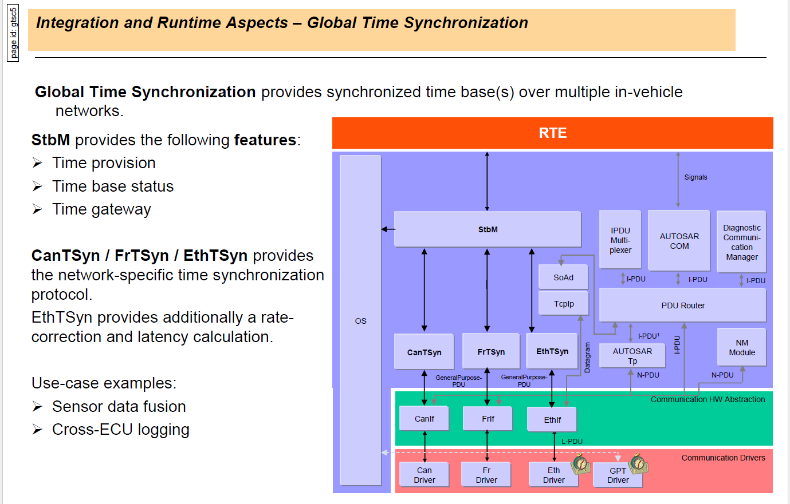
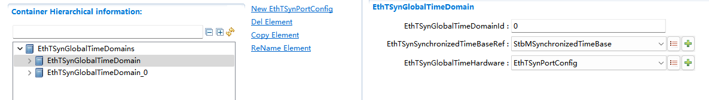
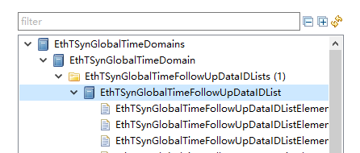
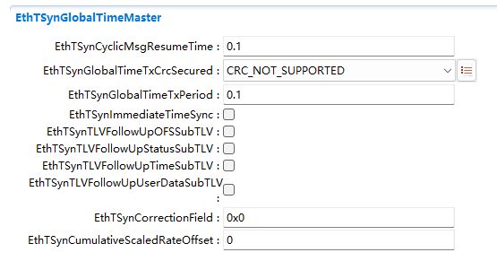

===================
EthTSyn产品参考手册
===================

**缩写词注解**

+-----------+------------------------------+--------------------------+
| *         | **英文全称**                 | **中文解释**             |
| *缩写词** |                              |                          |
+===========+==============================+==========================+
| StbM      | SynchronizedTimeBaseManager  | 同步时基管理             |
+-----------+------------------------------+--------------------------+
| <Bus>TSyn | A bus specific Time          | 总线特                   |
|           | Synchronization Provider     | 定的时间同步提供程序模块 |
|           | module                       |                          |
+-----------+------------------------------+--------------------------+
| CAN       | Controller Area Network      | 控制器区域网络           |
+-----------+------------------------------+--------------------------+
| ETH       | Ethernet                     | 以太网                   |
+-----------+------------------------------+--------------------------+
| CanTSyn   | Time Synchronization         | C                        |
|           | Provider module for CAN      | AN提供的时间同步程序模块 |
+-----------+------------------------------+--------------------------+
| EthTSyn   | Time Synchronization         | E                        |
|           | Provider module for Ethernet | th提供的时间同步程序模块 |
+-----------+------------------------------+--------------------------+

简介
====

EthTSyn在AutoSAR中软件层级架构如下图，其属于时间同步栈。

|image1|

图1-1 EthTSyn在AutoSar中软件架构图

本文中描述EthTSyn，StbM负责管理时间域，给CanTSyn,
EthTSyn提供接口用来更新同步时间，给其他用户提供接口用来获取/通知同步时间。

EthTSyn负责以太网总线的时间同步相关报文发送/算法。

参考资料
--------

[1] AUTOSAR_SWS_SynchronizedTimeBaseManager.pdf，R19-11

[2] AUTOSAR_EXP_LayeredSoftwareArchitecture.pdf，R19-11

[3] AUTOSAR_SWS_TimeSyncOverEthernet.pdf，R19-11

[4] AUTOSAR_PRS_TimeSyncProtocol.pdf, R19-11

功能描述
========

EthTSyn功能
-----------

EthTSyn功能介绍
~~~~~~~~~~~~~~~

EthTSyn模块负责确保以太网同步时间信息的采集和分发。它与StbM交互，并为StbM提供所有特定于以太网的功能。

EthTSyn主要功能包括测量以太网消息之间的延迟和不同时基之前的时间同步。

EthTSyn功能实现
~~~~~~~~~~~~~~~

关于延迟的测量，EthTSyn使用的是GPTP的延迟测量方法，即

|C:\\Users\\ADMINI~1\\AppData\\Local\\Temp\\1594716454(1).png|

图2-1 GPTP延迟测量

最终延迟值为(t4-t1-(t3-t2))/2。

|image2|

图2-2 时间同步报文时序

而时间同步功能则是EthTSyn应该以配置的频率发送SYNC消息，再根据配置的时间间隔发送带有sync发送时间的Follow_Up消息，最后再根据时间值和延迟测量计算出的结果得出正确的时间传给StbM。其中SYNC和Follow_Up的消息有IEEE
802.1和AUTOSAR专用的两种格式，需要根据配置来决定消息的格式。

EthTSyn功能限制
~~~~~~~~~~~~~~~

根据[3]以及结合自身实现情况，EthTSyn以下功能存在限制：

1. 不支持BMCA协议

2. 不支持Announce和Signaling报文。

3. Pdelay_Req报文的接收不作为开始发送Sync报文的前提条件。

4. Rate
   Correction在IEEE中原先由Pdleay机制负责计算，Autosar中规定该值的计算发生在StbM中（当从节点接收到时间同步报文并向StbM设置多次时间后），因此EthTSyn自身没有获取该值的能力。当填写cumulativeScaledRateOffset字段时，EthTSyn提供了EthTSynCumulativeScaledRateOffset配置项，从而其作为主节点发送时能够使用配置值进行发送，作为主节点接收时则不予处理。

5. Rate Correction在StbM中属于纯软件算法，不涉及修正硬件。

6. 不支持Time Validation或Time Measurement相关功能

7. 不支持Switch相关功能

8. EthTSyn自身不维护硬件时钟，均由StbM进行维护。

源文件描述
==========

表3-1 EthTSyn组件文件描述

+---------------------+------------------------------------------------+
| **文件**            | **说明**                                       |
+---------------------+------------------------------------------------+
| EthTSyn.c           | EthTSyn模块源文件，包含了API函数的实现。       |
+---------------------+------------------------------------------------+
| EthTSyn.h           | EthTSyn模块头文件，包含了API函数的声明。       |
+---------------------+------------------------------------------------+
| EthTSyn_Cfg.h       | 定义EthTSyn模块预编译时用到的配置参数。        |
+---------------------+------------------------------------------------+
| EthTSyn_Cfg.c       | EthTSyn模块配置生成文件。                      |
+---------------------+------------------------------------------------+
| EthTSyn_Types.h     | 用                                             |
|                     | 于定义配置类型、内部类型和外部类型的数据结构。 |
+---------------------+------------------------------------------------+
| EthTSyn_MemMap.h    | EthTSyn                                        |
|                     | 模块头文件，包含了存储器地址映射关系的实现。   |
+---------------------+------------------------------------------------+

|image3|

图3-1 EthTSyn组件文件交互关系图

API接口
=======

类型定义
--------

EthTSyn_ConfigType类型定义
~~~~~~~~~~~~~~~~~~~~~~~~~~

+-----------+----------------------------------------------------------+
| 名称      | EthTSyn_ConfigType                                       |
+-----------+----------------------------------------------------------+
| 类型      | Structure                                                |
+-----------+----------------------------------------------------------+
| 范围      | --                                                       |
+-----------+----------------------------------------------------------+
| 描述      | 模块的配置类型                                           |
+-----------+----------------------------------------------------------+

EthTSyn_TransmissionModeType类型定义
~~~~~~~~~~~~~~~~~~~~~~~~~~~~~~~~~~~~

+-----------+----------------------------------------------------------+
| 名称      | EthTSyn_TransmissionModeType                             |
+-----------+----------------------------------------------------------+
| 类型      | Enumeration                                              |
+-----------+----------------------------------------------------------+
| 范围      | ETHTSYN_TX_OFF                                           |
|           |                                                          |
|           | ETHTSYN_TX_ON                                            |
+-----------+----------------------------------------------------------+
| 描述      | 传输类型                                                 |
+-----------+----------------------------------------------------------+

输入函数描述
------------

+----------------------------------+-----------------------------------+
| **输入模块**                     | **API**                           |
+----------------------------------+-----------------------------------+
| EthIf                            | EthIf_EnableEgressTimeStamp       |
+----------------------------------+-----------------------------------+
|                                  | EthIf_GetCurrentTime              |
+----------------------------------+-----------------------------------+
|                                  | EthIf_GetEgressTimeStamp          |
+----------------------------------+-----------------------------------+
|                                  | EthIf_GetIngressTimeStamp         |
+----------------------------------+-----------------------------------+
|                                  | EthIf_ProvideTxBuffer             |
+----------------------------------+-----------------------------------+
|                                  | EthIf_Transmit                    |
+----------------------------------+-----------------------------------+
| StbM                             | StbM_BusGetCurrentTime            |
+----------------------------------+-----------------------------------+
|                                  | StbM_BusSetGlobalTime             |
+----------------------------------+-----------------------------------+
|                                  | StbM_GetCurrentVirtualLocalTime   |
+----------------------------------+-----------------------------------+
|                                  | StbM_GetTimeBaseUpdateCounter     |
+----------------------------------+-----------------------------------+
|                                  | StbM_GetTimeBaseStatus            |
+----------------------------------+-----------------------------------+
|                                  | StbM_GetOffset                    |
+----------------------------------+-----------------------------------+
| Det                              | Det_ReportError                   |
+----------------------------------+-----------------------------------+
|                                  | Det_ReportRuntimeError            |
+----------------------------------+-----------------------------------+
| Crc                              | Crc_CalculateCRC8H2F              |
+----------------------------------+-----------------------------------+

静态接口函数定义
----------------

EthTSyn_Init函数定义
~~~~~~~~~~~~~~~~~~~~

+-------------+-------------------+---------+-------------------------+
| 函数名称：  | EthTSyn_Init      |         |                         |
+-------------+-------------------+---------+-------------------------+
| 函数原型：  | void              |         |                         |
|             | EthTSyn_Init(     |         |                         |
|             |                   |         |                         |
|             | const             |         |                         |
|             | Eth               |         |                         |
|             | TSyn_ConfigType\* |         |                         |
|             | configPtr         |         |                         |
|             |                   |         |                         |
|             | )                 |         |                         |
+-------------+-------------------+---------+-------------------------+
| 服务编号：  | 0x01              |         |                         |
+-------------+-------------------+---------+-------------------------+
| 同步/异步： | 同步              |         |                         |
+-------------+-------------------+---------+-------------------------+
| 是          | 否                |         |                         |
| 否可重入：  |                   |         |                         |
+-------------+-------------------+---------+-------------------------+
| 输入参数：  | configPtr         | 值域：  | 配置结构体指针          |
+-------------+-------------------+---------+-------------------------+
| 输入        | 无                |         |                         |
| 输出参数：  |                   |         |                         |
+-------------+-------------------+---------+-------------------------+
| 输出参数：  | 无                |         |                         |
+-------------+-------------------+---------+-------------------------+
| 返回值：    | void              |         |                         |
+-------------+-------------------+---------+-------------------------+
| 功能概述：  | 初始化EthTSyn模块 |         |                         |
+-------------+-------------------+---------+-------------------------+

EthTSyn_GetVersionInfo函数定义
~~~~~~~~~~~~~~~~~~~~~~~~~~~~~~

+-------------+-------------------+---------+-------------------------+
| 函数名称：  | EthTS             |         |                         |
|             | yn_GetVersionInfo |         |                         |
+-------------+-------------------+---------+-------------------------+
| 函数原型：  | void              |         |                         |
|             | EthTSy            |         |                         |
|             | n_GetVersionInfo( |         |                         |
|             |                   |         |                         |
|             | Std_              |         |                         |
|             | VersionInfoType\* |         |                         |
|             | versioninfo       |         |                         |
|             |                   |         |                         |
|             | )                 |         |                         |
+-------------+-------------------+---------+-------------------------+
| 服务编号：  | 0x02              |         |                         |
+-------------+-------------------+---------+-------------------------+
| 同步/异步： | 同步              |         |                         |
+-------------+-------------------+---------+-------------------------+
| 是          | 否                |         |                         |
| 否可重入：  |                   |         |                         |
+-------------+-------------------+---------+-------------------------+
| 输入参数：  | 无                |         |                         |
+-------------+-------------------+---------+-------------------------+
| 输入        |                   |         |                         |
| 输出参数：  |                   |         |                         |
+-------------+-------------------+---------+-------------------------+
| 输出参数：  | versioninfo       | 值域：  | 接收版本信息的指针      |
+-------------+-------------------+---------+-------------------------+
| 返回值：    | void              |         |                         |
+-------------+-------------------+---------+-------------------------+
| 功能概述：  | 返回              |         |                         |
|             | 该模块的版本信息  |         |                         |
+-------------+-------------------+---------+-------------------------+

EthTSyn_SetTransmissionMode函数定义
~~~~~~~~~~~~~~~~~~~~~~~~~~~~~~~~~~~

+-------------+-------------------+---------+-------------------------+
| 函数名称：  | EthTSyn_Se        |         |                         |
|             | tTransmissionMode |         |                         |
+-------------+-------------------+---------+-------------------------+
| 函数原型：  | void              |         |                         |
|             | EthTSyn_Se        |         |                         |
|             | tTransmissionMode |         |                         |
|             | (                 |         |                         |
|             |                   |         |                         |
|             | uint8 CtrlIdx,    |         |                         |
|             |                   |         |                         |
|             | EthTSyn_Tra       |         |                         |
|             | nsmissionModeType |         |                         |
|             | Mode              |         |                         |
|             |                   |         |                         |
|             | )                 |         |                         |
+-------------+-------------------+---------+-------------------------+
| 服务编号：  | 0x05              |         |                         |
+-------------+-------------------+---------+-------------------------+
| 同步/异步： | 同步              |         |                         |
+-------------+-------------------+---------+-------------------------+
| 是          | 否                |         |                         |
| 否可重入：  |                   |         |                         |
+-------------+-------------------+---------+-------------------------+
| 输入参数：  | CtrlIdx           | 值域：  | 以太网控制器索引        |
+-------------+-------------------+---------+-------------------------+
|             | Mode              |         | ETHTSYN_TX_OFF          |
|             |                   |         | ETHTSYN_TX_ON           |
+-------------+-------------------+---------+-------------------------+
| 输入        | 无                |         |                         |
| 输出参数：  |                   |         |                         |
+-------------+-------------------+---------+-------------------------+
| 输出参数：  | 无                |         |                         |
+-------------+-------------------+---------+-------------------------+
| 返回值：    | void              |         |                         |
+-------------+-------------------+---------+-------------------------+
| 功能概述：  | 打开和关          |         |                         |
|             | 闭EthTSyn的TX功能 |         |                         |
+-------------+-------------------+---------+-------------------------+

EthTSyn_RxIndication函数定义
~~~~~~~~~~~~~~~~~~~~~~~~~~~~

+-------------+-------------------+-------+---------------------------+
| 函数名称：  | Eth               |       |                           |
|             | TSyn_RxIndication |       |                           |
+-------------+-------------------+-------+---------------------------+
| 函数原型：  | void              |       |                           |
|             | EthT              |       |                           |
|             | Syn_RxIndication( |       |                           |
|             |                   |       |                           |
|             | uint8 CtrlIdx,    |       |                           |
|             |                   |       |                           |
|             | Eth_FrameType     |       |                           |
|             | FrameType,        |       |                           |
|             |                   |       |                           |
|             | boolean           |       |                           |
|             | IsBroadcast,      |       |                           |
|             |                   |       |                           |
|             | const uint8\*     |       |                           |
|             | PhysAddrPtr,      |       |                           |
|             |                   |       |                           |
|             | const uint8\*     |       |                           |
|             | DataPtr,          |       |                           |
|             |                   |       |                           |
|             | uint16 LenByte    |       |                           |
|             |                   |       |                           |
|             | )                 |       |                           |
+-------------+-------------------+-------+---------------------------+
| 服务编号：  | 0x06              |       |                           |
+-------------+-------------------+-------+---------------------------+
| 同步/异步： | 同步              |       |                           |
+-------------+-------------------+-------+---------------------------+
| 是          | 否                |       |                           |
| 否可重入：  |                   |       |                           |
+-------------+-------------------+-------+---------------------------+
| 输入参数：  | CtrlIdx           | 值    | 以太网控制器索引          |
|             |                   | 域：  |                           |
+-------------+-------------------+-------+---------------------------+
|             | FrameType         |       | 接收到的以太网帧类型      |
+-------------+-------------------+-------+---------------------------+
|             | IsBroadcast       |       | 是否是广播帧              |
+-------------+-------------------+-------+---------------------------+
|             | PhysAddrPtr       |       | 以太网帧的源MAC地址的指针 |
+-------------+-------------------+-------+---------------------------+
|             | DataPtr           |       | 数据域的指针              |
+-------------+-------------------+-------+---------------------------+
|             | LenByte           |       | 数据域的长度              |
+-------------+-------------------+-------+---------------------------+
| 输入        | 无                |       |                           |
| 输出参数：  |                   |       |                           |
+-------------+-------------------+-------+---------------------------+
| 输出参数：  | 无                |       |                           |
+-------------+-------------------+-------+---------------------------+
| 返回值：    | void              |       |                           |
+-------------+-------------------+-------+---------------------------+
| 功能概述：  | 接收消息          |       |                           |
+-------------+-------------------+-------+---------------------------+

EthTSyn_TxConfirmation函数定义
~~~~~~~~~~~~~~~~~~~~~~~~~~~~~~

+-------------+-------------------+---------+-------------------------+
| 函数名称：  | EthTS             |         |                         |
|             | yn_TxConfirmation |         |                         |
+-------------+-------------------+---------+-------------------------+
| 函数原型：  | void              |         |                         |
|             | EthTSy            |         |                         |
|             | n_TxConfirmation( |         |                         |
|             |                   |         |                         |
|             | uint8 CtrlIdx,    |         |                         |
|             |                   |         |                         |
|             | Eth_BufIdxType    |         |                         |
|             | BufIdx            |         |                         |
|             |                   |         |                         |
|             | )                 |         |                         |
+-------------+-------------------+---------+-------------------------+
| 服务编号：  | 0x07              |         |                         |
+-------------+-------------------+---------+-------------------------+
| 同步/异步： | 同步              |         |                         |
+-------------+-------------------+---------+-------------------------+
| 是          | 否                |         |                         |
| 否可重入：  |                   |         |                         |
+-------------+-------------------+---------+-------------------------+
| 输入参数：  | CtrlIdx           | 值域：  | 以太网控制器索引        |
+-------------+-------------------+---------+-------------------------+
|             | BufIdx            |         | 以太网缓冲区的索引      |
+-------------+-------------------+---------+-------------------------+
| 输入        | 无                |         |                         |
| 输出参数：  |                   |         |                         |
+-------------+-------------------+---------+-------------------------+
| 输出参数：  | 无                |         |                         |
+-------------+-------------------+---------+-------------------------+
| 返回值：    | void              |         |                         |
+-------------+-------------------+---------+-------------------------+
| 功能概述：  | 确认消息传输      |         |                         |
+-------------+-------------------+---------+-------------------------+

EthTSyn_TrcvLinkStateChg函数定义
~~~~~~~~~~~~~~~~~~~~~~~~~~~~~~~~

+--------------+-----------+-------+----------------------------------+
| 函数名称：   | EthTSy    |       |                                  |
|              | n_TrcvLin |       |                                  |
|              | kStateChg |       |                                  |
+--------------+-----------+-------+----------------------------------+
| 函数原型：   | Std_R     |       |                                  |
|              | eturnType |       |                                  |
|              | EthTSyn   |       |                                  |
|              | _TrcvLink |       |                                  |
|              | StateChg( |       |                                  |
|              |           |       |                                  |
|              | uint8     |       |                                  |
|              | CtrlIdx,  |       |                                  |
|              |           |       |                                  |
|              | Eth       |       |                                  |
|              | Trcv_Link |       |                                  |
|              | StateType |       |                                  |
|              | Trcv      |       |                                  |
|              | LinkState |       |                                  |
|              |           |       |                                  |
|              | )         |       |                                  |
+--------------+-----------+-------+----------------------------------+
| 服务编号：   | 0x08      |       |                                  |
+--------------+-----------+-------+----------------------------------+
| 同步/异步：  | 同步      |       |                                  |
+--------------+-----------+-------+----------------------------------+
| 是否可重入： | 否        |       |                                  |
+--------------+-----------+-------+----------------------------------+
| 输入参数：   | CtrlIdx   | 值    | 以太网控制器索引                 |
|              |           | 域：  |                                  |
+--------------+-----------+-------+----------------------------------+
|              | Trcv      |       | ETHTRCV_LINK_STATE_DOWN          |
|              | LinkState |       | ETHTRCV_LINK_STATE_ACTIVE        |
+--------------+-----------+-------+----------------------------------+
| 输           | 无        |       |                                  |
| 入输出参数： |           |       |                                  |
+--------------+-----------+-------+----------------------------------+
| 输出参数：   | 无        |       |                                  |
+--------------+-----------+-------+----------------------------------+
| 返回值：     | E_OK 成功 |       |                                  |
|              |           |       |                                  |
|              | E_NOT_OK  |       |                                  |
|              | 失败      |       |                                  |
+--------------+-----------+-------+----------------------------------+
| 功能概述：   | 重新设    |       |                                  |
|              | 置状态机  |       |                                  |
+--------------+-----------+-------+----------------------------------+

EthTSyn_MainFunction函数定义
~~~~~~~~~~~~~~~~~~~~~~~~~~~~

+-------------+--------------------------------------------------------+
| 函数名称：  | EthTSyn_MainFunction                                   |
+-------------+--------------------------------------------------------+
| 函数原型：  | void EthTSyn_MainFunction(                             |
|             |                                                        |
|             | void                                                   |
|             |                                                        |
|             | )                                                      |
+-------------+--------------------------------------------------------+
| 服务编号：  | 0x09                                                   |
+-------------+--------------------------------------------------------+
| 功能概述：  | 循环调用函数                                           |
+-------------+--------------------------------------------------------+

可配置函数定义
--------------

无。

配置
====

配置列表
--------

表5-1属性描述

+------------+---------------------------------------------------------+
| UI名称     | 该配置项在配置工具界面显示的名称                        |
+------------+---------------------------------------------------------+
| 取值范围   | 该配置项允许的取值区间                                  |
+------------+---------------------------------------------------------+
| 默认取值   | 该配置项默认的配置值                                    |
+------------+---------------------------------------------------------+
| 参数描述   | 该配置项在标准的AUTOSAR_EcucParamDef.arxml文件中的描述  |
+------------+---------------------------------------------------------+
| 依赖关系   | 该配置项与其他模块或配置项的关系                        |
+------------+---------------------------------------------------------+

EthTSynGeneral
--------------

|image4|

图5-1 EthTSynGeneral工具配置

表5-2 EthTSynGeneral配置描述

+--------------------+-----------+------------------+---------+------+
| **UI名称**         | **描述**  |                  |         |      |
+--------------------+-----------+------------------+---------+------+
| EthTSynDestPhyAddr | 取值范围  | 无               | 默      | 0    |
|                    |           |                  | 认取值  | 1:80 |
|                    |           |                  |         | :C2: |
|                    |           |                  |         | 00:0 |
|                    |           |                  |         | 0:0E |
+--------------------+-----------+------------------+---------+------+
|                    | 参数描述  | EthTSyn          |         |      |
|                    |           | GPTP帧的         |         |      |
|                    |           | 目标物理硬件地址 |         |      |
|                    |           | (MAC地址).       |         |      |
|                    |           | 输入格式必须     |         |      |
|                    |           | 匹配十六进制xx:  |         |      |
|                    |           | xx:xx:xx:xx:xx。 |         |      |
+--------------------+-----------+------------------+---------+------+
|                    | 依赖关系  | 无               |         |      |
+--------------------+-----------+------------------+---------+------+
| Eth                | 取值范围  | True、False      | 默      | F    |
| TSynDevErrorDetect |           |                  | 认取值  | alse |
+--------------------+-----------+------------------+---------+------+
|                    | 参数描述  | 开关开发错       |         |      |
|                    |           | 误的检测和通知。 |         |      |
+--------------------+-----------+------------------+---------+------+
|                    | 依赖关系  | 无               |         |      |
+--------------------+-----------+------------------+---------+------+
| EthTSynHardwa      | 取值范围  | True、False      | 默      | 无   |
| reTimestampSupport |           |                  | 认取值  |      |
+--------------------+-----------+------------------+---------+------+
|                    | 参数描述  | 开关以太网硬件的 |         |      |
|                    |           | 硬件时间戳功能。 |         |      |
+--------------------+-----------+------------------+---------+------+
|                    | 依赖关系  | 无               |         |      |
+--------------------+-----------+------------------+---------+------+
| EthTSyn            | 取值范围  | 0 .. INF         | 默      | 无   |
| MainFunctionPeriod |           |                  | 认取值  |      |
+--------------------+-----------+------------------+---------+------+
|                    | 参数描述  | EthTSyn_MainFu   |         |      |
|                    |           | nction主函数调用 |         |      |
|                    |           | 周期。单位：秒。 |         |      |
+--------------------+-----------+------------------+---------+------+
|                    | 依赖关系  | 无               |         |      |
+--------------------+-----------+------------------+---------+------+
| EthTSynMasterSlav  | 取值范围  | True、False      | 默      | f    |
| eConflictDetection |           |                  | 认取值  | alse |
+--------------------+-----------+------------------+---------+------+
|                    | 参数描述  | 开关主从冲       |         |      |
|                    |           | 突的检测和通知。 |         |      |
+--------------------+-----------+------------------+---------+------+
|                    | 依赖关系  | 无               |         |      |
+--------------------+-----------+------------------+---------+------+
| EthTSy             | 取值范围  | True、False      | 默      | 无   |
| nMessageCompliance |           |                  | 认取值  |      |
+--------------------+-----------+------------------+---------+------+
|                    | 参数描述  | True: 使用IEEE   |         |      |
|                    |           | 802              |         |      |
|                    |           | .1AS的信息格式。 |         |      |
|                    |           |                  |         |      |
|                    |           | False: 使用IEEE  |         |      |
|                    |           | 802.1AS          |         |      |
|                    |           | 的信息           |         |      |
|                    |           | 格式加上AUTOSAR  |         |      |
|                    |           | 的扩展。         |         |      |
+--------------------+-----------+------------------+---------+------+
|                    | 依赖关系  | 无               |         |      |
+--------------------+-----------+------------------+---------+------+
| Eth                | 取值范围  | True、False      | 默      | f    |
| TSynVersionInfoApi |           |                  | 认取值  | alse |
+--------------------+-----------+------------------+---------+------+
|                    | 参数描述  | 开关获取         |         |      |
|                    |           | 版本信息的接口。 |         |      |
+--------------------+-----------+------------------+---------+------+
|                    | 依赖关系  | 无               |         |      |
+--------------------+-----------+------------------+---------+------+
| Eth                | 取值范围  | 0..INF           | 默      | 0    |
| TSynTxConfirmation |           |                  | 认取值  |      |
+--------------------+-----------+------------------+---------+------+
|                    | 参数描述  | 等               |         |      |
|                    |           | 待发送确认的超时 |         |      |
|                    |           | 时间。单位：秒。 |         |      |
+--------------------+-----------+------------------+---------+------+
|                    | 依赖关系  | 无               |         |      |
+--------------------+-----------+------------------+---------+------+

EthTSynGlobalTimeDomain
-----------------------

|image5|

图5-2 EthTSynGlobalTimeDomain工具配置

表5-3 EthTSynGlobalTimeDomain配置描述

+-------------------+-----------+------------------+---------+--------+
| **UI名称**        | **描述**  |                  |         |        |
+-------------------+-----------+------------------+---------+--------+
| EthTSynG          | 取值范围  | 0 .. 31          | 默      | 无     |
| lobalTimeDomainId |           |                  | 认取值  |        |
+-------------------+-----------+------------------+---------+--------+
|                   | 参数描述  | 全局时间域ID。   |         |        |
+-------------------+-----------+------------------+---------+--------+
|                   | 依赖关系  | 无               |         |        |
+-------------------+-----------+------------------+---------+--------+
| EthTSynSynchr     | 取值范围  | reference        | 默      | 无     |
| onizedTimeBaseRef |           |                  | 认取值  |        |
+-------------------+-----------+------------------+---------+--------+
|                   | 参数描述  | 必要的           |         |        |
|                   |           | 对时间基的引用。 |         |        |
+-------------------+-----------+------------------+---------+--------+
|                   | 依赖关系  | StbMSync         |         |        |
|                   |           | hronizedTimeBase |         |        |
+-------------------+-----------+------------------+---------+--------+

 EthTSynGlobalTimeFollowUpDataIDList
~~~~~~~~~~~~~~~~~~~~~~~~~~~~~~~~~~~~

|image6|

图5-3 EthTSynGlobalTimeFollowUpDataIDList工具配置

EthTSynGlobalTimeFollowUpDataIDListElement
^^^^^^^^^^^^^^^^^^^^^^^^^^^^^^^^^^^^^^^^^^

|image7|

图5-4 EthTSynGlobalTimeFollowUpDataIDListElement工具配置

表5-4 EthTSynGlobalTimeFollowUpDataIDListElement配置描述

+------------------+-----------+------------------+---------+--------+
| **UI名称**       | **描述**  |                  |         |        |
+------------------+-----------+------------------+---------+--------+
| EthTSynG         | 取值范围  | 0 .. 15          | 默      | 无     |
| lobalTimeFollowU |           |                  | 认取值  |        |
| pDataIDListIndex |           |                  |         |        |
+------------------+-----------+------------------+---------+--------+
|                  | 参数描述  | 用于CRC          |         |        |
|                  |           | 计算和信息校验Fo |         |        |
|                  |           | llow_Up报文的Dat |         |        |
|                  |           | aIDList的Index。 |         |        |
+------------------+-----------+------------------+---------+--------+
|                  | 依赖关系  | 不可配，自       |         |        |
|                  |           | 动根据顺序生成。 |         |        |
+------------------+-----------+------------------+---------+--------+
| EthTSynG         | 取值范围  | 0 .. 255         | 默      | 无     |
| lobalTimeFollowU |           |                  | 认取值  |        |
| pDataIDListValue |           |                  |         |        |
+------------------+-----------+------------------+---------+--------+
|                  | 参数描述  | 用于C            |         |        |
|                  |           | RC计算和信息校验 |         |        |
|                  |           | Follow_Up报文的  |         |        |
|                  |           | DataIDList的值。 |         |        |
+------------------+-----------+------------------+---------+--------+
|                  | 依赖关系  | 无               |         |        |
+------------------+-----------+------------------+---------+--------+

 EthTSynPortConfig
~~~~~~~~~~~~~~~~~~

|image8|

图5-5 EthTSynPortConfig工具配置

表5-5 EthTSynPortConfig配置描述

+------------------+-----------+------------------+---------+--------+
| **UI名称**       | **描述**  |                  |         |        |
+------------------+-----------+------------------+---------+--------+
| EthTSynFramePrio | 取值范围  | 0 .. 7           | 默      | 无     |
|                  |           |                  | 认取值  |        |
+------------------+-----------+------------------+---------+--------+
|                  | 参数描述  | 该可选项若       |         |        |
|                  |           | 存在，则代表通过 |         |        |
|                  |           | VLAN（用作3-bit  |         |        |
|                  |           | PCP              |         |        |
|                  |           | field）发出的    |         |        |
|                  |           | EthTSyn报文的优  |         |        |
|                  |           | 先级。如该可选项 |         |        |
|                  |           | 不存在，则帧不存 |         |        |
|                  |           | 在优先级以及VLAN |         |        |
|                  |           | Field。          |         |        |
+------------------+-----------+------------------+---------+--------+
|                  | 依赖关系  | 无               |         |        |
+------------------+-----------+------------------+---------+--------+
| EthTSynGlobal    | 取值范围  | 0 .. 4           | 默      | 无     |
| TimeDebounceTime |           |                  | 认取值  |        |
+------------------+-----------+------------------+---------+--------+
|                  | 参数描述  | 同一组S          |         |        |
|                  |           | ync报文和Follow_ |         |        |
|                  |           | Up报文的发送间隔 |         |        |
|                  |           | 时间。单位：秒。 |         |        |
+------------------+-----------+------------------+---------+--------+
|                  | 依赖关系  | 无               |         |        |
+------------------+-----------+------------------+---------+--------+
| EthTSynGl        | 取值范围  | reference        | 默      | 无     |
| obalTimeEthIfRef |           |                  | 认取值  |        |
+------------------+-----------+------------------+---------+--------+
|                  | 参数描述  | 对Eth            |         |        |
|                  |           | If的引用，用于获 |         |        |
|                  |           | 取全局时间信息。 |         |        |
+------------------+-----------+------------------+---------+--------+
|                  | 依赖关系  | EthIfController  |         |        |
+------------------+-----------+------------------+---------+--------+

EthTSynPdelayConfig
^^^^^^^^^^^^^^^^^^^

|image9|

图5-6 EthTSynPdelayConfig工具配置

表5-6 EthTSynPdelayConfig配置描述

+------------------+-----------+------------------+---------+---------+
| **UI名称**       | **描述**  |                  |         |         |
+------------------+-----------+------------------+---------+---------+
| E                | 取值范围  | True、False      | 默      | true    |
| thTSynGlobalTime |           |                  | 认取值  |         |
| PdelayRespEnable |           |                  |         |         |
+------------------+-----------+------------------+---------+---------+
|                  | 参数描述  | 开关 Pdelay_Resp |         |         |
|                  |           | /                |         |         |
|                  |           | Pdela            |         |         |
|                  |           | y_Resp_Follow_Up |         |         |
|                  |           | 报文的发送。     |         |         |
+------------------+-----------+------------------+---------+---------+
|                  | 依赖关系  | 无               |         |         |
+------------------+-----------+------------------+---------+---------+
| E                | 取值范围  | 0 .. 4           | 默      | 0       |
| thTSynGlobalTime |           |                  | 认取值  |         |
| PropagationDelay |           |                  |         |         |
+------------------+-----------+------------------+---------+---------+
|                  | 参数描述  | 如果开启cyclic   |         |         |
|                  |           | propagation      |         |         |
|                  |           | delay            |         |         |
|                  |           | mea              |         |         |
|                  |           | surement，该参数 |         |         |
|                  |           | 代表propagation  |         |         |
|                  |           | delay的默认值    |         |         |
|                  |           | 直到第一个实际测 |         |         |
|                  |           | 量的propagation  |         |         |
|                  |           | delay可用。      |         |         |
|                  |           |                  |         |         |
|                  |           | 如果关闭cyclic   |         |         |
|                  |           | propagation      |         |         |
|                  |           | delay            |         |         |
|                  |           | m                |         |         |
|                  |           | easurement，这个 |         |         |
|                  |           | 值将代替实际测量 |         |         |
|                  |           | 的值，变成一个固 |         |         |
|                  |           | 定值。单位：秒。 |         |         |
+------------------+-----------+------------------+---------+---------+
|                  | 依赖关系  | 无               |         |         |
+------------------+-----------+------------------+---------+---------+
| Et               | 取值范围  | 0 .. INF         | 默      | 无      |
| hTSynGlobalTimeT |           |                  | 认取值  |         |
| xPdelayReqPeriod |           |                  |         |         |
+------------------+-----------+------------------+---------+---------+
|                  | 参数描述  | 发送Pdelay       |         |         |
|                  |           | _Req报文的周期时 |         |         |
|                  |           | 间，取值0代表不  |         |         |
|                  |           | 发送。单位：秒。 |         |         |
+------------------+-----------+------------------+---------+---------+
|                  | 依赖关系  | 无               |         |         |
+------------------+-----------+------------------+---------+---------+
| EthTSynPdelay    | 取值范围  | 0 .. INF         | 默      | 1E-5    |
| LatencyThreshold |           |                  | 认取值  |         |
+------------------+-----------+------------------+---------+---------+
|                  | 参数描述  | 计算出的         |         |         |
|                  |           | Pdelay的界限。如 |         |         |
|                  |           | 果超出该配置值， |         |         |
|                  |           | 则该Pdelay应该被 |         |         |
|                  |           | 舍弃。单位：秒。 |         |         |
+------------------+-----------+------------------+---------+---------+
|                  | 依赖关系  | 无               |         |         |
+------------------+-----------+------------------+---------+---------+
| EthTSyn          | 取值范围  | 0 .. 4           | 默      | 无      |
| PdelayRespAndRes |           |                  | 认取值  |         |
| pFollowUpTimeout |           |                  |         |         |
+------------------+-----------+------------------+---------+---------+
|                  | 参数描述  | 发出Pde          |         |         |
|                  |           | lay_Req后等待Pde |         |         |
|                  |           | lay_Resp的超时时 |         |         |
|                  |           | 间，或者收到Pdel |         |         |
|                  |           | ay_Resp之后等待P |         |         |
|                  |           | delay_Resp_Follo |         |         |
|                  |           | w_Up的超时时间。 |         |         |
|                  |           | 取值0代表不检测  |         |         |
|                  |           | 超时。单位：秒。 |         |         |
+------------------+-----------+------------------+---------+---------+
|                  | 依赖关系  | 无               |         |         |
+------------------+-----------+------------------+---------+---------+

EthTSynPortRole
^^^^^^^^^^^^^^^

|image10|

图5-7 EthTSynPortRole工具配置

EthTSynGlobalTimeMaster
'''''''''''''''''''''''

|image11|

图5-8 EthTSynGlobalTimeMaster工具配置

表5-7 EthTSynGlobalTimeMaster配置描述

+------------+-----------+------------------+---------+---+--------------+
| **UI名称** | **描述**  |                  |         |   |              |
+------------+-----------+------------------+---------+---+--------------+
| EthTSy     | 取值范围  | 0 .. INF         | 默      | 0 |              |
| nCyclicMsg |           |                  | 认取值  |   |              |
| ResumeTime |           |                  |         |   |              |
+------------+-----------+------------------+---------+---+--------------+
|            | 参数描述  | 在立即传         |         |   |              |
|            |           | 输之后，间隔多久 |         |   |              |
|            |           | 发送第一帧常规循 |         |   |              |
|            |           | 环时间同步报文。 |         |   |              |
|            |           | 单位：秒。       |         |   |              |
+------------+-----------+------------------+---------+---+--------------+
|            | 依赖关系  | 无               |         |   |              |
+------------+-----------+------------------+---------+---+--------------+
| EthTSynGl  | 取值范围  | CRC_SUPPORTED/   | 默      | 无 |             |
| obalTimeTx |           |                  | 认取值  |   |              |
| CrcSecured |           | C                |         |   |              |
|            |           | RC_NOT_SUPPORTED |         |   |              |
+------------+-----------+------------------+---------+---+--------------+
|            | 参数描述  | 发送报文的CRC    |         |   |              |
|            |           | 校验的支持形式。 |         |   |              |
+------------+-----------+------------------+---------+---+--------------+
|            | 依赖关系  | 当               |         |   |              |
|            |           | 其为CRC_SUPPORTE |         |   |              |
|            |           | D时，则需配置Eth |         |   |              |
|            |           | TSynGlobalTimeFo |         |   |              |
|            |           | llowUpDataIDList |         |   |              |
|            |           | 和EthTSynCrcTime |         |   |              |
|            |           | FlagsTxSecured。 |         |   |              |
+------------+-----------+------------------+---------+---+--------------+
| EthTS      | 取值范围  | 0 .. INF         | 默      | 无 |             |
| ynGlobalTi |           |                  | 认取值  |   |              |
| meTxPeriod |           |                  |         |   |              |
+------------+-----------+------------------+---------+---+--------------+
|            | 参数描述  | 时间             |         |   |              |
|            |           | 同步报文循环发送 |         |   |              |
|            |           | 周期。单位：秒。 |         |   |              |
+------------+-----------+------------------+---------+---+--------------+
|            | 依赖关系  | 无               |         |   |              |
+------------+-----------+------------------+---------+---+--------------+
| EthT       | 取值范围  | True、False      | 默      | 无 |             |
| SynImmedia |           |                  | 认取值  |   |              |
| teTimeSync |           |                  |         |   |              |
+------------+-----------+------------------+---------+---+--------------+
|            | 参数描述  | 开               |         |   |              |
|            |           | 关在EthTSyn_Main |         |   |              |
|            |           | Function()主函数 |         |   |              |
|            |           | 中对StbM_GetTim  |         |   |              |
|            |           | eBaseUpdateCount |         |   |              |
|            |           | er()的周期调用。 |         |   |              |
+------------+-----------+------------------+---------+---+--------------+
|            | 依赖关系  | 无               |         |   |              |
+------------+-----------+------------------+---------+---+--------------+
| EthTSyn    | 取值范围  | True、False      | 默      | 无 |             |
| TLVFollowU |           |                  | 认取值  |   |              |
| pOFSSubTLV |           |                  |         |   |              |
+------------+-----------+------------------+---------+---+--------------+
|            | 参数描述  | 是否使用AUTOSAR  |         |   |              |
|            |           | Follow_Up TLV    |         |   |              |
|            |           | OFS Sub-TLV。    |         |   |              |
+------------+-----------+------------------+---------+---+--------------+
|            | 依赖关系  | 无               |         |   |              |
+------------+-----------+------------------+---------+---+--------------+
| EthTSynTLV | 取值范围  | True、False      | 默      | 无 |             |
| FollowUpSt |           |                  | 认取值  |   |              |
| atusSubTLV |           |                  |         |   |              |
+------------+-----------+------------------+---------+---+--------------+
|            | 参数描述  | 是否使用AUTOSAR  |         |   |              |
|            |           | Follow_Up TLV    |         |   |              |
|            |           | Status Sub-TLV。 |         |   |              |
+------------+-----------+------------------+---------+---+--------------+
|            | 依赖关系  | 无               |         |   |              |
+------------+-----------+------------------+---------+---+--------------+
| EthTSynT   | 取值范围  | True、False      | 默      | 无 |             |
| LVFollowUp |           |                  | 认取值  |   |              |
| TimeSubTLV |           |                  |         |   |              |
+------------+-----------+------------------+---------+---+--------------+
|            | 参数描述  | 是否使用AUTOSAR  |         |   |              |
|            |           | Follow_Up TLV    |         |   |              |
|            |           | Time Sub-TLV。   |         |   |              |
+------------+-----------+------------------+---------+---+--------------+
|            | 依赖关系  | 无               |         |   |              |
+------------+-----------+------------------+---------+---+--------------+
| Et         | 取值范围  | True、False      | 默      | 无 |             |
| hTSynTLVFo |           |                  | 认取值  |   |              |
| llowUpUser |           |                  |         |   |              |
| DataSubTLV |           |                  |         |   |              |
+------------+-----------+------------------+---------+---+--------------+
|            | 参数描述  | 是否使用AUTOSAR  |         |   |              |
|            |           | Follow_Up TLV    |         |   |              |
|            |           | UserData         |         |   |              |
|            |           | Sub-TLV。        |         |   |              |
+------------+-----------+------------------+---------+---+--------------+
|            | 依赖关系  | 无               |         |   |              |
+------------+-----------+------------------+---------+---+--------------+
| Et         | 取值范围  | 0.               | 默      |   | 0x0          |
| hTSynCorre |           | .281474976710655 | 认取值  |   |              |
| ctionField |           |                  |         |   |              |
+------------+-----------+------------------+---------+---+--------------+
|            | 参数描述  | This represents  |         |   |              |
|            |           | the              |         |   |              |
|            |           | correctionField  |         |   |              |
|            |           | that is used     |         |   |              |
|            |           | when             |         |   |              |
|            |           | transmitting     |         |   |              |
|            |           | Messages by      |         |   |              |
|            |           | Master. Unit:    |         |   |              |
|            |           | nanoseconds.     |         |   |              |
+------------+-----------+------------------+---------+---+--------------+
|            | 依赖关系  | 无               |         |   |              |
+------------+-----------+------------------+---------+---+--------------+
| Eth        | 取值范围  | 0..0xFFFFFFFF    | 默      |   | 0            |
| TSynCumula |           |                  | 认取值  |   |              |
| tiveScaled |           |                  |         |   |              |
| RateOffset |           |                  |         |   |              |
+------------+-----------+------------------+---------+---+--------------+
|            | 参数描述  | This represents  |         |   |              |
|            |           | the              |         |   |              |
|            |           | Cumulative       |         |   |              |
|            |           | ScaledRateOffset |         |   |              |
|            |           | that is used     |         |   |              |
|            |           | when             |         |   |              |
|            |           | transmitting     |         |   |              |
|            |           | Messages by      |         |   |              |
|            |           | Master           |         |   |              |
+------------+-----------+------------------+---------+---+--------------+
|            | 依赖关系  | 无               |         |   |              |
+------------+-----------+------------------+---------+---+--------------+

**EthTSynCrcTimeFlagsTxSecured**
                                

|image12|

图5-9 EthTSynCrcTimeFlagsTxSecured工具配置

表5-8 EthTSynCrcTimeFlagsTxSecured配置描述

+----------------+-----------+------------------+---------+-----------+
| **UI名称**     | **描述**  |                  |         |           |
+----------------+-----------+------------------+---------+-----------+
| EthTSynCrcC    | 取值范围  | True、False      | 默      | False     |
| orrectionField |           |                  | 认取值  |           |
+----------------+-----------+------------------+---------+-----------+
|                | 参数描述  | 是否在           |         |           |
|                |           | CRC计算中包括Fo  |         |           |
|                |           | llow_Up报文中的C |         |           |
|                |           | orrectionField。 |         |           |
+----------------+-----------+------------------+---------+-----------+
|                | 依赖关系  | 无               |         |           |
+----------------+-----------+------------------+---------+-----------+
| EthTSynC       | 取值范围  | True、False      | 默      | False     |
| rcDomainNumber |           |                  | 认取值  |           |
+----------------+-----------+------------------+---------+-----------+
|                | 参数描述  | 是否             |         |           |
|                |           | 在CRC计算中包括  |         |           |
|                |           | Follow_Up报文中  |         |           |
|                |           | 的domainNumber。 |         |           |
+----------------+-----------+------------------+---------+-----------+
|                | 依赖关系  | 无               |         |           |
+----------------+-----------+------------------+---------+-----------+
| EthTSynCr      | 取值范围  | True、False      | 默      | False     |
| cMessageLength |           |                  | 认取值  |           |
+----------------+-----------+------------------+---------+-----------+
|                | 参数描述  | 是否             |         |           |
|                |           | 在CRC计算中包括F |         |           |
|                |           | ollow_Up报文中的 |         |           |
|                |           | messageLength。  |         |           |
+----------------+-----------+------------------+---------+-----------+
|                | 依赖关系  | 无               |         |           |
+----------------+-----------+------------------+---------+-----------+
| EthT           | 取值范围  | True、False      | 默      | True      |
| SynCrcPreciseO |           |                  | 认取值  |           |
| riginTimestamp |           |                  |         |           |
+----------------+-----------+------------------+---------+-----------+
|                | 参数描述  | 是否在CRC计算    |         |           |
|                |           | 中包括Follow_Up  |         |           |
|                |           | 报文中的preciseO |         |           |
|                |           | riginTimestamp。 |         |           |
+----------------+-----------+------------------+---------+-----------+
|                | 依赖关系  | 无               |         |           |
+----------------+-----------+------------------+---------+-----------+
| EthTSy         | 取值范围  | True、False      | 默      | False     |
| nCrcSequenceId |           |                  | 认取值  |           |
+----------------+-----------+------------------+---------+-----------+
|                | 参数描述  | 是               |         |           |
|                |           | 否在CRC计算中包  |         |           |
|                |           | 括Follow_Up报文  |         |           |
|                |           | 中的sequenceId。 |         |           |
+----------------+-----------+------------------+---------+-----------+
|                | 依赖关系  | 无               |         |           |
+----------------+-----------+------------------+---------+-----------+
| EthTSynCrcSour | 取值范围  | True、False      | 默      | False     |
| cePortIdentity |           |                  | 认取值  |           |
+----------------+-----------+------------------+---------+-----------+
|                | 参数描述  | 是否在CR         |         |           |
|                |           | C计算中包括Follo |         |           |
|                |           | w_Up报文中的sour |         |           |
|                |           | cePortIdentity。 |         |           |
+----------------+-----------+------------------+---------+-----------+
|                | 依赖关系  | 无               |         |           |
+----------------+-----------+------------------+---------+-----------+

EthTSynGlobalTimeSlave
''''''''''''''''''''''

|image13|

图5-10 EthTSynGlobalTimeSlave工具配置

表5-9 EthTSynGlobalTimeSlave配置描述

+------------+-----------+------------------+---------+---+--------------+
| **UI名称** | **描述**  |                  |         |   |              |
+------------+-----------+------------------+---------+---+--------------+
| Et         | 取值范围  | 0 .. INF         | 默      | 0 |              |
| hTSynGloba |           |                  | 认取值  |   |              |
| lTimeFollo |           |                  |         |   |              |
| wUpTimeout |           |                  |         |   |              |
+------------+-----------+------------------+---------+---+--------------+
|            | 参数描述  | Follow_Up报      |         |   |              |
|            |           | 文的超时时间（收 |         |   |              |
|            |           | 到对应Sync报文之 |         |   |              |
|            |           | 后）。单位：秒。 |         |   |              |
+------------+-----------+------------------+---------+---+--------------+
|            | 依赖关系  | 无               |         |   |              |
+------------+-----------+------------------+---------+---+--------------+
| E          | 取值范围  | CRC_IGNORED/     | 默      | 无 |             |
| thTSynRxCr |           |                  | 认取值  |   |              |
| cValidated |           | CR               |         |   |              |
|            |           | C_NOT_VALIDATED/ |         |   |              |
|            |           |                  |         |   |              |
|            |           | CRC_OPTIONAL/    |         |   |              |
|            |           |                  |         |   |              |
|            |           | CRC_VALIDATED    |         |   |              |
+------------+-----------+------------------+---------+---+--------------+
|            | 参数描述  | 接收报文         |         |   |              |
|            |           | 的CRC校验形式。  |         |   |              |
+------------+-----------+------------------+---------+---+--------------+
|            | 依赖关系  | 当其为CRC_OPTI   |         |   |              |
|            |           | ONAL或CRC_VALIDA |         |   |              |
|            |           | TED时，则需配置E |         |   |              |
|            |           | thTSynGlobalTime |         |   |              |
|            |           | FollowUpDataIDLi |         |   |              |
|            |           | st和EthTSynCrcFl |         |   |              |
|            |           | agsRxValidated。 |         |   |              |
+------------+-----------+------------------+---------+---+--------------+
| E          | 取值范围  | 1 .. 65535       | 默      |   | 65535        |
| thTSynGlob |           |                  | 认取值  |   |              |
| alTimeSequ |           |                  |         |   |              |
| enceCounte |           |                  |         |   |              |
| rJumpWidth |           |                  |         |   |              |
+------------+-----------+------------------+---------+---+--------------+
|            | 参数描述  | 指定             |         |   |              |
|            |           | 序列计数器在两个 |         |   |              |
|            |           | 连续同步消息之间 |         |   |              |
|            |           | 允许的最大跳转。 |         |   |              |
+------------+-----------+------------------+---------+---+--------------+
|            | 依赖关系  | 无               |         |   |              |
+------------+-----------+------------------+---------+---+--------------+

**EthTSynCrcFlagsRxValidated**
                              

|image14|

图5-11 EthTSynCrcFlagsRxValidated工具配置

表5-10 EthTSynCrcFlagsRxValidated配置描述

+------------------+-----------+------------------+---------+---------+
| **UI名称**       | **描述**  |                  |         |         |
+------------------+-----------+------------------+---------+---------+
| EthTSynCr        | 取值范围  | True、False      | 默      | False   |
| cCorrectionField |           |                  | 认取值  |         |
+------------------+-----------+------------------+---------+---------+
|                  | 参数描述  | 是否在           |         |         |
|                  |           | CRC计算中包括Fo  |         |         |
|                  |           | llow_Up报文中的C |         |         |
|                  |           | orrectionField。 |         |         |
+------------------+-----------+------------------+---------+---------+
|                  | 依赖关系  | 无               |         |         |
+------------------+-----------+------------------+---------+---------+
| EthTSy           | 取值范围  | True、False      | 默      | False   |
| nCrcDomainNumber |           |                  | 认取值  |         |
+------------------+-----------+------------------+---------+---------+
|                  | 参数描述  | 是否             |         |         |
|                  |           | 在CRC计算中包括  |         |         |
|                  |           | Follow_Up报文中  |         |         |
|                  |           | 的domainNumber。 |         |         |
+------------------+-----------+------------------+---------+---------+
|                  | 依赖关系  | 无               |         |         |
+------------------+-----------+------------------+---------+---------+
| EthTSyn          | 取值范围  | True、False      | 默      | False   |
| CrcMessageLength |           |                  | 认取值  |         |
+------------------+-----------+------------------+---------+---------+
|                  | 参数描述  | 是否             |         |         |
|                  |           | 在CRC计算中包括F |         |         |
|                  |           | ollow_Up报文中的 |         |         |
|                  |           | messageLength。  |         |         |
+------------------+-----------+------------------+---------+---------+
|                  | 依赖关系  | 无               |         |         |
+------------------+-----------+------------------+---------+---------+
| EthTSynCrcPrecis | 取值范围  | True、False      | 默      | True    |
| eOriginTimestamp |           |                  | 认取值  |         |
+------------------+-----------+------------------+---------+---------+
|                  | 参数描述  | 是否在CRC计算    |         |         |
|                  |           | 中包括Follow_Up  |         |         |
|                  |           | 报文中的preciseO |         |         |
|                  |           | riginTimestamp。 |         |         |
+------------------+-----------+------------------+---------+---------+
|                  | 依赖关系  | 无               |         |         |
+------------------+-----------+------------------+---------+---------+
| EthT             | 取值范围  | True、False      | 默      | False   |
| SynCrcSequenceId |           |                  | 认取值  |         |
+------------------+-----------+------------------+---------+---------+
|                  | 参数描述  | 是               |         |         |
|                  |           | 否在CRC计算中包  |         |         |
|                  |           | 括Follow_Up报文  |         |         |
|                  |           | 中的sequenceId。 |         |         |
+------------------+-----------+------------------+---------+---------+
|                  | 依赖关系  | 无               |         |         |
+------------------+-----------+------------------+---------+---------+
| EthTSynCrcSo     | 取值范围  | True、False      | 默      | False   |
| urcePortIdentity |           |                  | 认取值  |         |
+------------------+-----------+------------------+---------+---------+
|                  | 参数描述  | 是否在CR         |         |         |
|                  |           | C计算中包括Follo |         |         |
|                  |           | w_Up报文中的sour |         |         |
|                  |           | cePortIdentity。 |         |         |
+------------------+-----------+------------------+---------+---------+
|                  | 依赖关系  | 无               |         |         |
+------------------+-----------+------------------+---------+---------+

.. |C:\\Users\\ADMINI~1\\AppData\\Local\\Temp\\1594716454(1).png| image:: ../../_static/参考手册/EthTSyn/image2.png
   :width: 5.76736in
   :height: 2.47917in

.. |image3| image:: ../../_static/参考手册/EthTSyn/image4.png
   :width: 5.76736in
   :height: 2.13472in

.. |image8| image:: ../../_static/参考手册/EthTSyn/image9.png
   :width: 5.76736in
   :height: 1.59375in
.. |image9| image:: ../../_static/参考手册/EthTSyn/image10.png
   :width: 5.76736in
   :height: 2.38611in
.. |image10| image:: ../../_static/参考手册/EthTSyn/image11.png
   :width: 4.14583in
   :height: 2.27083in

.. |image13| image:: ../../_static/参考手册/EthTSyn/image14.png
   :width: 5.52014in
   :height: 1.42691in

