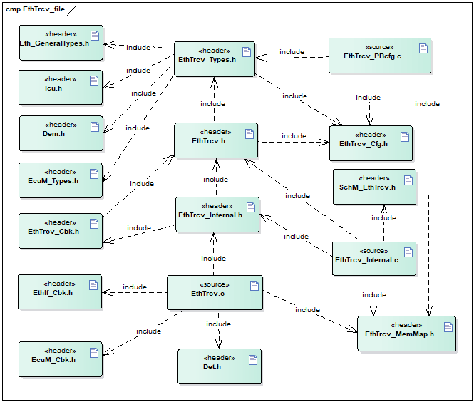
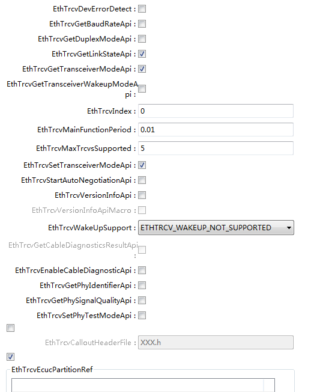
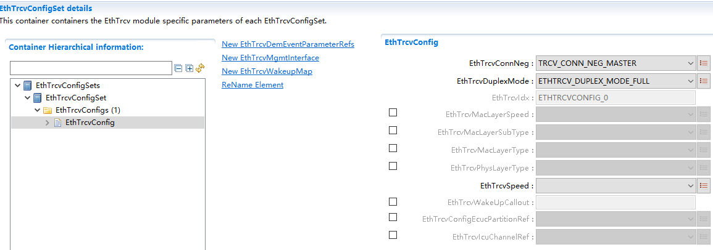
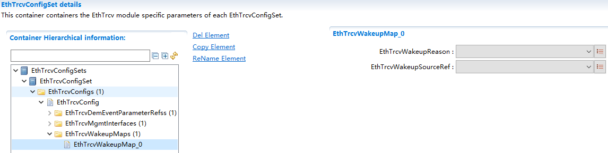

===================
EthTrcv产品参考手册
===================

**缩写词注解**

+------------+---------------------------+----------------------------+
| **缩写词** | **英文全称**              | **中文解释**               |
+------------+---------------------------+----------------------------+
| EthTrcv    | Ethernet Transceiver      | 以太网收发器驱动模式       |
|            | Driver                    |                            |
+------------+---------------------------+----------------------------+
| DEM        | Diagnostic Event Manager  | 诊断事件处理               |
+------------+---------------------------+----------------------------+
| DET        | Default Error Tracer      | 默认错误检测               |
+------------+---------------------------+----------------------------+
| EcuM       | ECU State Manager         | ECU状态管理模块            |
+------------+---------------------------+----------------------------+
| Icu        | input capture unit        | 输入捕获单元               |
+------------+---------------------------+----------------------------+
| Eth        | Ethernet Driver           | 以太网驱动模块             |
+------------+---------------------------+----------------------------+
| EthSwt     | EthernetSwitchDriver      | 以太网交换机驱动模块       |
+------------+---------------------------+----------------------------+

简介
====

在AUTOSAR分层软件体系结构中，EthTrcv属于微控制器抽象层，
它是一个以太网收发器的驱动模块。EthTrcv模块的主要任务是向上层（以太网接口）提供独立于硬件的接口，因为包括多个相同的收发器，所以对于所有的收发器来说，接口应该统一，这样上层（以太网接口）可以以统一的方式访问底层总线系统。\ |image1|

图1-1 EthTrcv在AUTOSAR中的位置

参考资料
--------

[1] AUTOSAR_SWS_EthernetTransceiverDriver.pdf，R19-11

[2] AUTOSAR_SWS_ECUStateManager.pdf，R19-11

[3] AUTOSAR_SWS_EthernetInterface.pdf，R19-11

功能描述
========

模式设置功能
------------

以设置收发器的状态为例，上层EthIf调用设置收发器状态的API，EthTrcv通过对芯片的寄存器的值进行修改，从而到达修改收发器状态的目的。

唤醒检测功能
------------

以太网收发器驱动程序应支持唤醒取决于配置参数 EthTrcvWakeUpSupport
要么根本不支持(ETHTRCV_WAKEUP_NOT_SUPPORTED)
或通过中断(ETHTRCV_WAKEUP_BY_INTERRUPT)
或通过轮询(ETHTRCV_WAKEUP_BY_POLLING)。

如果以太网收发器驱动程序检测到唤醒，它会将收发器硬件提供的唤醒原因映射到
EcuM 定义的唤醒事件。以太网收发器驱动程序将支持以下场景：

- 休眠的ECU 和休眠的总线 -> 通过 EthTrcv_Init 唤醒检测（在开机期间调用）

- 唤醒的ECU 和休眠的总线 -> 通过 EthTrcv_MainFunction
或唤醒中断处理程序唤醒检测（由 EcuM 中的CheckWakeup检查）

源文件描述
==========

表3-1 EthTrcv组件文件描述

+-----------------------+----------------------------------------------+
| **文件**              | **说明**                                     |
+-----------------------+----------------------------------------------+
| EthTrcv_Cfg.h         | 用于定义EthTrcv模块预编译时用到的宏。        |
+-----------------------+----------------------------------------------+
| EthTrcv_PBcfg.c       | post-bui                                     |
|                       | ld阶段配置参数源文件，包含各个配置项的定义。 |
+-----------------------+----------------------------------------------+
| SchM\_ EthTrcv.h      | 提供给SchM的头文件，用于公开周期调度函数     |
+-----------------------+----------------------------------------------+
| EthTrcv_MemMap.h      | EthTrcv模块函数和变量存储位置定义文件。      |
+-----------------------+----------------------------------------------+
| EthTrcv.h             | EthTrcv模块头                                |
|                       | 文件，通过加载该头文件访问EthTrcv公开的函数  |
+-----------------------+----------------------------------------------+
| EthTrcv.c             | EthTrcv模块实现源文件，各API实现在该文件中   |
+-----------------------+----------------------------------------------+
| EthTrcv_Internal.h    | EthTrcv模块与芯片相关的                      |
|                       | 函数声明及运行时类型定义，内部宏定义头文件。 |
+-----------------------+----------------------------------------------+
| EthTrcv_Internal.c    | EthTr                                        |
|                       | cv模块与芯片相关的函数定义及运行时变量定义。 |
+-----------------------+----------------------------------------------+
| EthTrcv_Types.h       | EthTrcv模块宏定义及数据类型定义。            |
+-----------------------+----------------------------------------------+
| EthTrcv_Cbk.h         | EthTrcv模块提供给底层(MCAL)调用的函数        |
+-----------------------+----------------------------------------------+

|image2|

图3-2 EthTrcv组件文件交互关系图

API接口
=======

类型定义
--------

EthTrcv_ConfigType类型定义
~~~~~~~~~~~~~~~~~~~~~~~~~~

+-----------+----------------------------------------------------------+
| 名称      | EthTrcv_ConfigType                                       |
+-----------+----------------------------------------------------------+
| 类型      | 结构体                                                   |
+-----------+----------------------------------------------------------+
| 范围      | 根据实现决定                                             |
+-----------+----------------------------------------------------------+
| 描述      | 用于传递配置数据                                         |
+-----------+----------------------------------------------------------+

EthTrcv_LinkStateType类型定义
~~~~~~~~~~~~~~~~~~~~~~~~~~~~~

+-----------+----------------------------------------------------------+
| 名称      | EthTrcv_LinkStateType                                    |
+-----------+----------------------------------------------------------+
| 类型      | Enumeration                                              |
+-----------+----------------------------------------------------------+
| 范围      | ETHTRCV_LINK_STATE_DOWN = 0x00, 物理连接未建立           |
|           |                                                          |
|           | ETHTRCV_LINK_STATE_ACTIVE = 0x01 物理连接已建立          |
+-----------+----------------------------------------------------------+
| 描述      | 此类型定义以太网链路状态。                               |
+-----------+----------------------------------------------------------+

EthTrcv_StateType类型定义
~~~~~~~~~~~~~~~~~~~~~~~~~

+-----------+----------------------------------------------------------+
| 名称      | EthTrcv_StateType                                        |
+-----------+----------------------------------------------------------+
| 类型      | Enumeration                                              |
+-----------+----------------------------------------------------------+
| 范围      | ETHTRCV_STATE_UNINIT = 0x00, 驱动未配置                  |
|           |                                                          |
|           | ETHTRCV_STATE_INIT = 0x01 驱动已配置                     |
+-----------+----------------------------------------------------------+
| 描述      | 用于开发错误检测的状态监督。                             |
+-----------+----------------------------------------------------------+

EthTrcv_BaudRateType类型定义
~~~~~~~~~~~~~~~~~~~~~~~~~~~~

+-----------+----------------------------------------------------------+
| 名称      | EthTrcv_BaudRateType                                     |
+-----------+----------------------------------------------------------+
| 类型      | Enumeration                                              |
+-----------+----------------------------------------------------------+
| 范围      | ETHTRCV_BAUD_RATE_10MBIT = 0x00, 10mbit以太网连接        |
|           |                                                          |
|           | ETHTRCV_BAUD_RATE_100MBIT = 0x01, 100mbit以太网连接      |
|           |                                                          |
|           | ETHTRCV_BAUD_RATE_1000MBIT = 0x02, 1000mbit以太网连接    |
|           |                                                          |
|           | ETHTRCV_BAUD_RATE_2500MBIT = 0x03 2500 mbit以太网连接    |
+-----------+----------------------------------------------------------+
| 描述      | 此类型定义以太网波特率                                   |
+-----------+----------------------------------------------------------+

EthTrcv_DuplexModeType类型定义
~~~~~~~~~~~~~~~~~~~~~~~~~~~~~~

+-----------+----------------------------------------------------------+
| 名称      | EthTrcv_DuplexModeType                                   |
+-----------+----------------------------------------------------------+
| 类型      | Enumeration                                              |
+-----------+----------------------------------------------------------+
| 范围      | ETHTRCV_DUPLEX_MODE_HALF = 0x00, 半双工                  |
|           |                                                          |
|           | ETHTRCV_DUPLEX_MODE_FULL = 0x01 全双工                   |
+-----------+----------------------------------------------------------+
| 描述      | 此类型定义以太网双工模式。                               |
+-----------+----------------------------------------------------------+

EthTrcv_WakeupModeType类型定义
~~~~~~~~~~~~~~~~~~~~~~~~~~~~~~

+-----------+----------------------------------------------------------+
| 名称      | EthTrcv\_WakeupModeType                                  |
+-----------+----------------------------------------------------------+
| 类型      | Enumeration                                              |
+-----------+----------------------------------------------------------+
| 范围      | ETHTRCV_WUM_DISABLE = 0x00, 禁用收发器唤醒               |
|           |                                                          |
|           | ETHTRCV_WUM_ENABLE = 0x01, 启用收发器唤醒                |
|           |                                                          |
|           | ETHTRCV_WUM_CLEAR = 0x02 清除收发器唤醒原因              |
+-----------+----------------------------------------------------------+
| 描述      | 此类型控制收发器唤醒模式和/或清除唤醒原因。              |
+-----------+----------------------------------------------------------+

EthTrcv_WakeupReasonType类型定义
~~~~~~~~~~~~~~~~~~~~~~~~~~~~~~~~

+-----------+----------------------------------------------------------+
| 名称      | EthTrcv_WakeupReasonType                                 |
+-----------+----------------------------------------------------------+
| 类型      | Enumeration                                              |
+-----------+----------------------------------------------------------+
| 范围      | ETHTRCV_WUR_NONE = 0x00, 未检测到唤醒原因                |
|           |                                                          |
|           | ETHTRCV_WUR_GENERAL = 0x01, 检测到一般唤醒               |
|           |                                                          |
|           | ETHTRCV_WUR_BUS = 0x02, 检测到总线唤醒                   |
|           |                                                          |
|           | ETHTRCV_WUR_INTERNAL = 0x03, 检测到内部唤醒              |
|           |                                                          |
|           | ETHTRCV_WUR_RESET = 0x04, 检测到重置唤醒                 |
|           |                                                          |
|           | ETHTRCV_WUR_POWER_ON = 0x05, 检测到上电唤醒              |
|           |                                                          |
|           | ETHTRCV_WUR_PIN = 0x06, 检测到Pin唤醒                    |
|           |                                                          |
|           | ETHTRCV_WUR_SYSERR = 0x07 检测到系统错误唤醒             |
+-----------+----------------------------------------------------------+
| 描述      | 此类型定义收发器被唤醒的原因。                           |
+-----------+----------------------------------------------------------+

EthTrcv_PhyTestModeType类型定义
~~~~~~~~~~~~~~~~~~~~~~~~~~~~~~~

+-----------+----------------------------------------------------------+
| 名称      | EthTrcv_PhyTestModeType                                  |
+-----------+----------------------------------------------------------+
| 类型      | Enumeration                                              |
+-----------+----------------------------------------------------------+
| 范围      | ETHTRCV_PHYTESTMODE_NONE = 0x00, 正常操作                |
|           |                                                          |
|           | ETHTRCV_PHYTESTMODE_1 = 0x01, 测试发射器下垂             |
|           |                                                          |
|           | ETHTRCV_PHYTESTMODE_2 = 0x02, 测试主机定时抖动           |
|           |                                                          |
|           | ETHTRCV_PHYTESTMODE_3 = 0x03, 测试从机定时抖动           |
|           |                                                          |
|           | ETHTRCV_PHYTESTMODE_4 = 0x04, 测试发射机失真             |
|           |                                                          |
|           | ETHTRCV_PHYTESTMODE_5 = 0x05 测试功率谱密度(PSD)掩码     |
+-----------+----------------------------------------------------------+
| 描述      | 描述了可能的PHY测试模式。                                |
+-----------+----------------------------------------------------------+

EthTrcv_PhyLoopbackModeType类型定义
~~~~~~~~~~~~~~~~~~~~~~~~~~~~~~~~~~~

+-----------+----------------------------------------------------------+
| 名称      | EthTrcv\_PhyLoopbackModeType                             |
+-----------+----------------------------------------------------------+
| 类型      | Enumeration                                              |
+-----------+----------------------------------------------------------+
| 范围      | ETHTRCV_PHYLOOPBACK_NONE = 0x00, 正常操作                |
|           |                                                          |
|           | ETHTRCV_PHYLOOPBACK_INTERNAL = 0x01, 内部环回            |
|           |                                                          |
|           | ETHTRCV_PHYLOOPBACK_EXTERNAL = 0x02, 外部环回            |
|           |                                                          |
|           | ETHTRCV_PHYLOOPBACK_REMOTE = 0x03 远程环回               |
+-----------+----------------------------------------------------------+
| 描述      | 描述了可能的PHY环回模式。                                |
+-----------+----------------------------------------------------------+

EthTrcv_PhyTxModeType类型定义
~~~~~~~~~~~~~~~~~~~~~~~~~~~~~

+-----------+----------------------------------------------------------+
| 名称      | EthTrcv\_PhyTxModeType                                   |
+-----------+----------------------------------------------------------+
| 类型      | Enumeration                                              |
+-----------+----------------------------------------------------------+
| 范围      | ETHTRCV_PHYTXMODE_NORMAL = 0x00, 正常操作                |
|           |                                                          |
|           | ETHTRCV_PHYTXMODE_TX_OFF = 0x01, 发射器禁用              |
|           |                                                          |
|           | ETHTRCV_PHYTXMODE_SCRAMBLER_OFF = 0x02 扰码器已禁用      |
+-----------+----------------------------------------------------------+
| 描述      | 描述可能的PHY传输模式                                    |
+-----------+----------------------------------------------------------+

EthTrcv_CableDiagResultType类型定义
~~~~~~~~~~~~~~~~~~~~~~~~~~~~~~~~~~~

+-----------+----------------------------------------------------------+
| 名称      | EthTrcv_CableDiagResultType                              |
+-----------+----------------------------------------------------------+
| 类型      | Enumeration                                              |
+-----------+----------------------------------------------------------+
| 范围      | ETHTRCV_CABLEDIAG_OK = 0x00, 电缆诊断成功                |
|           |                                                          |
|           | ETHTRCV_CABLEDIAG_ERROR = 0x01, 电缆诊断失败             |
|           |                                                          |
|           | ETHTRCV_CABLEDIAG_SHORT = 0x02, 短路检测                 |
|           |                                                          |
|           | ETHTRCV_CABLEDIAG_OPEN = 0x03, 开路检测                  |
|           |                                                          |
|           | ETHTRCV_CABLEDIAG_PENDING = 0x04, 电缆诊断仍在运行       |
|           |                                                          |
|           | ETHTRCV_CABLEDIAG_WRONG_POLARITY = 0x05                  |
|           | 电缆诊断程序检测到“ Ethernet physical +”或“ Ethernet     |
|           | physical-”线的极性错误                                   |
+-----------+----------------------------------------------------------+
| 描述      | 描述电缆诊断的结果。                                     |
+-----------+----------------------------------------------------------+

输入函数描述
------------

+----------------------------------+-----------------------------------+
| **输入模块**                     | **API**                           |
+----------------------------------+-----------------------------------+
| Dem                              | Dem_SetEventStatus                |
+----------------------------------+-----------------------------------+
| EthIf                            | EthIf_TrcvModeIndication          |
+----------------------------------+-----------------------------------+
| Det                              | Det_ReportRuntimeError            |
+----------------------------------+-----------------------------------+
| EcuM                             | EcuM_SetWakeupEvent               |
+----------------------------------+-----------------------------------+
| Eth                              | Eth_ReadMii                       |
+----------------------------------+-----------------------------------+
|                                  | Eth_WriteMii                      |
+----------------------------------+-----------------------------------+
| EthSwt                           | EthSwt_ReadTrcvRegister           |
+----------------------------------+-----------------------------------+
|                                  | EthSwt_WriteTrcvRegister          |
+----------------------------------+-----------------------------------+
| Icu                              | Icu_DisableNotification           |
+----------------------------------+-----------------------------------+
|                                  | Icu_EnableNotification            |
+----------------------------------+-----------------------------------+

静态接口函数定义
----------------

EthTrcv_Init函数定义
~~~~~~~~~~~~~~~~~~~~

+-------------+-------------------+---------+-------------------------+
| 函数名称：  | EthTrcv_Init      |         |                         |
+-------------+-------------------+---------+-------------------------+
| 函数原型：  | void EthTrcv_Init |         |                         |
|             | (                 |         |                         |
|             | const             |         |                         |
|             | Eth               |         |                         |
|             | Trcv_ConfigType\* |         |                         |
|             | CfgPtr            |         |                         |
|             | )                 |         |                         |
+-------------+-------------------+---------+-------------------------+
| 服务编号：  | 0x01              |         |                         |
+-------------+-------------------+---------+-------------------------+
| 同步/异步： | 同步              |         |                         |
+-------------+-------------------+---------+-------------------------+
| 是          | 不可重入          |         |                         |
| 否可重入：  |                   |         |                         |
+-------------+-------------------+---------+-------------------------+
| 输入参数：  | CfgPtr            | 值域：  | 指向特定于实现的结构    |
+-------------+-------------------+---------+-------------------------+
| 输          | 无                |         |                         |
| 入输出参数: |                   |         |                         |
+-------------+-------------------+---------+-------------------------+
| 输出参数：  | 无                |         |                         |
+-------------+-------------------+---------+-------------------------+
| 返回值：    | 无                |         |                         |
+-------------+-------------------+---------+-------------------------+
| 功能概述：  | EthTrcv模块初始化 |         |                         |
+-------------+-------------------+---------+-------------------------+

EthTrcv_SetTransceiverMode函数定义
~~~~~~~~~~~~~~~~~~~~~~~~~~~~~~~~~~

+-------------+-------------------+---------+-------------------------+
| 函数名称：  | EthTrcv_S         |         |                         |
|             | etTransceiverMode |         |                         |
+-------------+-------------------+---------+-------------------------+
| 函数原型：  | Std_ReturnType    |         |                         |
|             | EthTrcv_S         |         |                         |
|             | etTransceiverMode |         |                         |
|             | (                 |         |                         |
|             | uint8 TrcvIdx,    |         |                         |
|             | Eth_ModeType      |         |                         |
|             | TrcvMode          |         |                         |
|             | )                 |         |                         |
+-------------+-------------------+---------+-------------------------+
| 服务编号：  | 0x03              |         |                         |
+-------------+-------------------+---------+-------------------------+
| 同步/异步： | 异步              |         |                         |
+-------------+-------------------+---------+-------------------------+
| 是          | 不可重入          |         |                         |
| 否可重入：  |                   |         |                         |
+-------------+-------------------+---------+-------------------------+
| 输入参数：  | TrcvIdx           | 值域：  | EthTrcv驱动的索引       |
+-------------+-------------------+---------+-------------------------+
|             | TrcvMode          | 值域：  | ETH_MOD                 |
|             |                   |         | E_DOWN或ETH_MODE_ACTIVE |
+-------------+-------------------+---------+-------------------------+
| 输          | 无                |         |                         |
| 入输出参数: |                   |         |                         |
+-------------+-------------------+---------+-------------------------+
| 输出参数：  | 无                |         |                         |
+-------------+-------------------+---------+-------------------------+
| 返回值：    | E_OK: 服务接收    |         |                         |
|             |                   |         |                         |
|             | E_NOT_OK:         |         |                         |
|             | 服务未接收        |         |                         |
+-------------+-------------------+---------+-------------------------+
| 功能概述：  | 启                |         |                         |
|             | 用/禁用索引收发器 |         |                         |
+-------------+-------------------+---------+-------------------------+

EthTrcv_GetTransceiverMode函数定义
~~~~~~~~~~~~~~~~~~~~~~~~~~~~~~~~~~

+-------------+-------------------+---------+-------------------------+
| 函数名称：  | EthTrcv_G         |         |                         |
|             | etTransceiverMode |         |                         |
+-------------+-------------------+---------+-------------------------+
| 函数原型：  | Std_ReturnType    |         |                         |
|             | EthTrcv_G         |         |                         |
|             | etTransceiverMode |         |                         |
|             | (                 |         |                         |
|             | uint8 TrcvIdx,    |         |                         |
|             | Eth_ModeType\*    |         |                         |
|             | TrcvModePtr       |         |                         |
|             | )                 |         |                         |
+-------------+-------------------+---------+-------------------------+
| 服务编号：  | 0x04              |         |                         |
+-------------+-------------------+---------+-------------------------+
| 同步/异步： | 同步              |         |                         |
+-------------+-------------------+---------+-------------------------+
| 是          | 不可重入          |         |                         |
| 否可重入：  |                   |         |                         |
+-------------+-------------------+---------+-------------------------+
| 输入参数：  | TrcvIdx           | 值域：  | EthTrcv驱动的索引       |
+-------------+-------------------+---------+-------------------------+
| 输          | 无                |         |                         |
| 入输出参数: |                   |         |                         |
+-------------+-------------------+---------+-------------------------+
| 输出参数：  | TrcvModePtr       | 值域：  | ETH_MOD                 |
|             |                   |         | E_DOWN或ETH_MODE_ACTIVE |
+-------------+-------------------+---------+-------------------------+
| 返回值：    | E_OK: 成功        |         |                         |
|             |                   |         |                         |
|             | E_NOT_OK:         |         |                         |
|             | Trc               |         |                         |
|             | v无法初始化收发器 |         |                         |
+-------------+-------------------+---------+-------------------------+
| 功能概述：  | 获取              |         |                         |
|             | 索引收发器的状态  |         |                         |
+-------------+-------------------+---------+-------------------------+

EthTrcv_SetTransceiverWakeupMode函数定义
~~~~~~~~~~~~~~~~~~~~~~~~~~~~~~~~~~~~~~~~

+-------------+-------------------+---------+-------------------------+
| 函数名称：  | EthTrcv\_         |         |                         |
|             | SetTran           |         |                         |
|             | sceiverWakeupMode |         |                         |
+-------------+-------------------+---------+-------------------------+
| 函数原型：  | Std_ReturnType    |         |                         |
|             | EthTrcv_SetTran   |         |                         |
|             | sceiverWakeupMode |         |                         |
|             | (                 |         |                         |
|             | uint8 TrcvIdx,    |         |                         |
|             | EthTr             |         |                         |
|             | cv_WakeupModeType |         |                         |
|             | TrcvWakeupMode    |         |                         |
|             | )                 |         |                         |
+-------------+-------------------+---------+-------------------------+
| 服务编号：  | 0x0d              |         |                         |
+-------------+-------------------+---------+-------------------------+
| 同步/异步： | 同步              |         |                         |
+-------------+-------------------+---------+-------------------------+
| 是          | 不可重入          |         |                         |
| 否可重入：  |                   |         |                         |
+-------------+-------------------+---------+-------------------------+
| 输入参数：  | TrcvIdx           | 值域：  | EthTrcv驱动的索引       |
+-------------+-------------------+---------+-------------------------+
|             | TrcvWakeupMode    | 值域：  | ETHT                    |
|             |                   |         | RCV_WUM_DISABLE或ETHTRC |
|             |                   |         | V_WUM_ENABLE或WUM_CLEAR |
+-------------+-------------------+---------+-------------------------+
| 输          | 无                |         |                         |
| 入输出参数: |                   |         |                         |
+-------------+-------------------+---------+-------------------------+
| 输出参数：  | 无                |         |                         |
+-------------+-------------------+---------+-------------------------+
| 返回值：    | E_OK:             |         |                         |
|             | 收发器            |         |                         |
|             | 唤醒模式已经改变  |         |                         |
|             |                   |         |                         |
|             | E_NOT_OK:         |         |                         |
|             | 无法更改          |         |                         |
|             | 收发器唤醒模式或  |         |                         |
|             | 无法清除唤醒原因  |         |                         |
+-------------+-------------------+---------+-------------------------+
| 功能概述：  | 启用/禁用唤       |         |                         |
|             | 醒模式或清除索引  |         |                         |
|             | 收发器的唤醒原因  |         |                         |
+-------------+-------------------+---------+-------------------------+

EthTrcv_GetTransceiverWakeupMode函数定义
~~~~~~~~~~~~~~~~~~~~~~~~~~~~~~~~~~~~~~~~

+-------------+-------------------+---------+-------------------------+
| 函数名称：  | EthTrcv_GetTran   |         |                         |
|             | sceiverWakeupMode |         |                         |
+-------------+-------------------+---------+-------------------------+
| 函数原型：  | Std_ReturnType    |         |                         |
|             | EthTrcv_GetTran   |         |                         |
|             | sceiverWakeupMode |         |                         |
|             | (                 |         |                         |
|             |                   |         |                         |
|             | | uint8 TrcvIdx,  |         |                         |
|             | | EthTrcv         |         |                         |
|             | _WakeupModeType\* |         |                         |
|             |                   |         |                         |
|             | TrcvWakeupModePtr |         |                         |
|             | | )               |         |                         |
+-------------+-------------------+---------+-------------------------+
| 服务编号：  | 0x0e              |         |                         |
+-------------+-------------------+---------+-------------------------+
| 同步/异步： | 同步              |         |                         |
+-------------+-------------------+---------+-------------------------+
| 是          | 不可重入          |         |                         |
| 否可重入：  |                   |         |                         |
+-------------+-------------------+---------+-------------------------+
| 输入参数：  | TrcvIdx           | 值域：  | EthTrcv驱动的索引       |
+-------------+-------------------+---------+-------------------------+
| 输          | 无                |         |                         |
| 入输出参数: |                   |         |                         |
+-------------+-------------------+---------+-------------------------+
| 输出参数：  | TrcvWakeupModePtr | 值域：  | ETHTRCV_WUM_DISA        |
|             |                   |         | BLE或ETHTRCV_WUM_ENABLE |
+-------------+-------------------+---------+-------------------------+
| 返回值：    | E_OK: 成功        |         |                         |
|             |                   |         |                         |
|             | E_NOT_OK:         |         |                         |
|             | 无法获            |         |                         |
|             | 得收发器唤醒模式  |         |                         |
+-------------+-------------------+---------+-------------------------+

EthTrcv_CheckWakeup函数定义
~~~~~~~~~~~~~~~~~~~~~~~~~~~

+------------+--------------------+---------+-------------------------+
| 函数名称： | E                  |         |                         |
|            | thTrcv_CheckWakeup |         |                         |
+------------+--------------------+---------+-------------------------+
| 函数原型： | Std_ReturnType     |         |                         |
|            | E                  |         |                         |
|            | thTrcv_CheckWakeup |         |                         |
|            | (                  |         |                         |
|            | uint8 TrcvIdx      |         |                         |
|            | )                  |         |                         |
+------------+--------------------+---------+-------------------------+
| 服务编号： | 0x0f               |         |                         |
+------------+--------------------+---------+-------------------------+
| 同         | 同步               |         |                         |
| 步/异步：  |                    |         |                         |
+------------+--------------------+---------+-------------------------+
| 是         | 可重入             |         |                         |
| 否可重入： |                    |         |                         |
+------------+--------------------+---------+-------------------------+
| 输入参数： | TrcvIdx            | 值域：  | EthTrcv驱动的索引       |
+------------+--------------------+---------+-------------------------+
| 输入       | 无                 |         |                         |
| 输出参数:  |                    |         |                         |
+------------+--------------------+---------+-------------------------+
| 输出参数： | 无                 |         |                         |
+------------+--------------------+---------+-------------------------+
| 返回值：   | E_OK:              |         |                         |
|            | 该功能已成功执行   |         |                         |
|            |                    |         |                         |
|            | E_NOT_OK:          |         |                         |
|            | 该功能无法成功执行 |         |                         |
+------------+--------------------+---------+-------------------------+
| 功能概述： | 服务被EthIf在检    |         |                         |
|            | 测到唤醒中断时调用 |         |                         |
+------------+--------------------+---------+-------------------------+

EthTrcv_StartAutoNegotiation函数定义
~~~~~~~~~~~~~~~~~~~~~~~~~~~~~~~~~~~~

+------------+-------------------+---------+-------------------------+
| 函数名称： | EthTrcv_Sta       |         |                         |
|            | rtAutoNegotiation |         |                         |
+------------+-------------------+---------+-------------------------+
| 函数原型： | Std_ReturnType    |         |                         |
|            | EthTrcv_Sta       |         |                         |
|            | rtAutoNegotiation |         |                         |
|            | (                 |         |                         |
|            | uint8 TrcvIdx     |         |                         |
|            | )                 |         |                         |
+------------+-------------------+---------+-------------------------+
| 服务编号： | 0x05              |         |                         |
+------------+-------------------+---------+-------------------------+
| 同         | 同步              |         |                         |
| 步/异步：  |                   |         |                         |
+------------+-------------------+---------+-------------------------+
| 是         | 不可重入          |         |                         |
| 否可重入： |                   |         |                         |
+------------+-------------------+---------+-------------------------+
| 输入参数： | TrcvIdx           | 值域：  | EthTrcv驱动的索引       |
+------------+-------------------+---------+-------------------------+
| 输入       | 无                |         |                         |
| 输出参数:  |                   |         |                         |
+------------+-------------------+---------+-------------------------+
| 输出参数： | 无                |         |                         |
+------------+-------------------+---------+-------------------------+
| 返回值：   | E_OK:成功         |         |                         |
|            |                   |         |                         |
|            | E_NOT_OK：        |         |                         |
|            | 无法初始化收发器  |         |                         |
+------------+-------------------+---------+-------------------------+
| 功能概述： | 重新启动          |         |                         |
|            | 索引收发器所使用  |         |                         |
|            | 的传输参数的协商  |         |                         |
+------------+-------------------+---------+-------------------------+

EthTrcv_TransceiverLinkStateRequest函数定义
~~~~~~~~~~~~~~~~~~~~~~~~~~~~~~~~~~~~~~~~~~~

+-------------+-------------------+---------+-------------------------+
| 函数名称：  | E                 |         |                         |
|             | thTrcv_Transceive |         |                         |
|             | rLinkStateRequest |         |                         |
+-------------+-------------------+---------+-------------------------+
| 函数原型：  | Std_ReturnType    |         |                         |
|             | E                 |         |                         |
|             | thTrcv_Transceive |         |                         |
|             | rLinkStateRequest |         |                         |
|             | (                 |         |                         |
|             | uint8 TrcvIdx,    |         |                         |
|             | EthT              |         |                         |
|             | rcv_LinkStateType |         |                         |
|             | LinkState         |         |                         |
|             | )                 |         |                         |
+-------------+-------------------+---------+-------------------------+
| 服务编号：  | --                |         |                         |
+-------------+-------------------+---------+-------------------------+
| 同步/异步： | 异步              |         |                         |
+-------------+-------------------+---------+-------------------------+
| 是          | 不同的Tr          |         |                         |
| 否可重入：  | cvIdx可重入，同一 |         |                         |
|             | TrcvIdx不可重入。 |         |                         |
+-------------+-------------------+---------+-------------------------+
| 输入参数：  | TrcvIdx           | 值域：  | EthTrcv驱动的索引       |
+-------------+-------------------+---------+-------------------------+
|             | LinkState         | 值域：  | 物理以太                |
|             |                   |         | 网连接的以太网连接状态  |
+-------------+-------------------+---------+-------------------------+
| 输          | 无                |         |                         |
| 入输出参数: |                   |         |                         |
+-------------+-------------------+---------+-------------------------+
| 输出参数：  | 无                |         |                         |
+-------------+-------------------+---------+-------------------------+
| 返回值：    | E_OK:             |         |                         |
|             | 请求已被接受      |         |                         |
|             |                   |         |                         |
|             | E_NOT_OK:         |         |                         |
|             | 该请求未被接受    |         |                         |
+-------------+-------------------+---------+-------------------------+
| 功能概述：  | 请求              |         |                         |
|             | 设置以太网收发器  |         |                         |
|             | 的给定的链路状态  |         |                         |
+-------------+-------------------+---------+-------------------------+

EthTrcv_GetLinkState函数定义
~~~~~~~~~~~~~~~~~~~~~~~~~~~~

+------------+------------------+--------+----------------------------+
| 函数名称： | EthT             |        |                            |
|            | rcv_GetLinkState |        |                            |
+------------+------------------+--------+----------------------------+
| 函数原型： | Std_ReturnType   |        |                            |
|            | EthT             |        |                            |
|            | rcv_GetLinkState |        |                            |
|            | (                |        |                            |
|            | uint8 TrcvIdx,   |        |                            |
|            | EthTrcv          |        |                            |
|            | _LinkStateType\* |        |                            |
|            | LinkStatePtr     |        |                            |
|            | )                |        |                            |
+------------+------------------+--------+----------------------------+
| 服务编号： | 0x06             |        |                            |
+------------+------------------+--------+----------------------------+
| 同         | 同步             |        |                            |
| 步/异步：  |                  |        |                            |
+------------+------------------+--------+----------------------------+
| 是         | 不可重入         |        |                            |
| 否可重入： |                  |        |                            |
+------------+------------------+--------+----------------------------+
| 输入参数： | TrcvIdx          | 值域： | EthTrcv驱动的索引          |
+------------+------------------+--------+----------------------------+
| 输入       | 无               |        |                            |
| 输出参数:  |                  |        |                            |
+------------+------------------+--------+----------------------------+
| 输出参数： | LinkStatePtr     | 值域： | ETHTRCV_LINK_STATE_DOWN或  |
|            |                  |        |                            |
|            |                  |        | ETHTRCV_LINK_STATE_ACTIVE  |
+------------+------------------+--------+----------------------------+
| 返回值：   | E_OK: 成功       |        |                            |
|            |                  |        |                            |
|            | E_NOT_OK:        |        |                            |
|            | 无法初始化收发器 |        |                            |
+------------+------------------+--------+----------------------------+
| 功能概述： | 获取索引         |        |                            |
|            | 收发器的链路状态 |        |                            |
+------------+------------------+--------+----------------------------+

EthTrcv_GetBaudRate函数定义
~~~~~~~~~~~~~~~~~~~~~~~~~~~

+------------+-----------------+--------+------------------------------+
| 函数名称： | EthT            |        |                              |
|            | rcv_GetBaudRate |        |                              |
+------------+-----------------+--------+------------------------------+
| 函数原型： | Std_ReturnType  |        |                              |
|            | EthT            |        |                              |
|            | rcv_GetBaudRate |        |                              |
|            | (               |        |                              |
|            | uint8 TrcvIdx,  |        |                              |
|            | EthTrcv         |        |                              |
|            | _BaudRateType\* |        |                              |
|            | BaudRatePtr     |        |                              |
|            | )               |        |                              |
+------------+-----------------+--------+------------------------------+
| 服务编号： | 0x07            |        |                              |
+------------+-----------------+--------+------------------------------+
| 同         | 同步            |        |                              |
| 步/异步：  |                 |        |                              |
+------------+-----------------+--------+------------------------------+
| 是         | 不可重入        |        |                              |
| 否可重入： |                 |        |                              |
+------------+-----------------+--------+------------------------------+
| 输入参数： | TrcvIdx         | 值域： | EthTrcv驱动的索引            |
+------------+-----------------+--------+------------------------------+
| 输入       | 无              |        |                              |
| 输出参数:  |                 |        |                              |
+------------+-----------------+--------+------------------------------+
| 输出参数： | BaudRatePtr     | 值域： | ETHTRCV_BAUD_RATE_10MBIT     |
|            |                 |        |                              |
|            |                 |        | ETHTRCV_BAUD_RATE_100MBIT    |
|            |                 |        |                              |
|            |                 |        | ETHTRCV_BAUD_RATE_1000MBIT   |
|            |                 |        |                              |
|            |                 |        | ETHTRCV_BAUD_RATE_2500MBIT   |
+------------+-----------------+--------+------------------------------+
| 返回值：   | E_OK: 成功      |        |                              |
|            |                 |        |                              |
|            | E_NOT_OK:       |        |                              |
|            | 无              |        |                              |
|            | 法初始化收发器  |        |                              |
+------------+-----------------+--------+------------------------------+
| 功能概述： | 获取索引        |        |                              |
|            | 收发器的波特率  |        |                              |
+------------+-----------------+--------+------------------------------+

EthTrcv_GetDuplexMode函数定义
~~~~~~~~~~~~~~~~~~~~~~~~~~~~~

+------------+-----------------+--------+-----------------------------+
| 函数名称： | EthTrc          |        |                             |
|            | v_GetDuplexMode |        |                             |
+------------+-----------------+--------+-----------------------------+
| 函数原型： | Std_ReturnType  |        |                             |
|            | EthTrc          |        |                             |
|            | v_GetDuplexMode |        |                             |
|            | (               |        |                             |
|            | uint8 TrcvIdx,  |        |                             |
|            | EthTrcv_D       |        |                             |
|            | uplexModeType\* |        |                             |
|            | DuplexModePtr   |        |                             |
|            | )               |        |                             |
+------------+-----------------+--------+-----------------------------+
| 服务编号： | 0x08            |        |                             |
+------------+-----------------+--------+-----------------------------+
| 同         | 同步            |        |                             |
| 步/异步：  |                 |        |                             |
+------------+-----------------+--------+-----------------------------+
| 是         | 不可重入        |        |                             |
| 否可重入： |                 |        |                             |
+------------+-----------------+--------+-----------------------------+
| 输入参数： | TrcvIdx         | 值域： | EthTrcv驱动的索引           |
+------------+-----------------+--------+-----------------------------+
| 输入       | 无              |        |                             |
| 输出参数:  |                 |        |                             |
+------------+-----------------+--------+-----------------------------+
| 输出参数： | DuplexModePtr   | 值域： | ETHTRCV_DUPLEX_MODE_HALF    |
|            |                 |        |                             |
|            |                 |        | ETHTRCV_DUPLEX_MODE_FULL    |
+------------+-----------------+--------+-----------------------------+
| 返回值：   | E_OK: 成功      |        |                             |
|            |                 |        |                             |
|            | E_NOT_OK:       |        |                             |
|            | 无              |        |                             |
|            | 法初始化收发器  |        |                             |
+------------+-----------------+--------+-----------------------------+
| 功能概述： | 获取索引收      |        |                             |
|            | 发器的双工模式  |        |                             |
+------------+-----------------+--------+-----------------------------+

EthTrcv_SetPhyTestMode函数定义
~~~~~~~~~~~~~~~~~~~~~~~~~~~~~~

+-------------+-------------------+---------+-------------------------+
| 函数名称：  | EthTr             |         |                         |
|             | cv_SetPhyTestMode |         |                         |
+-------------+-------------------+---------+-------------------------+
| 函数原型：  | Std_ReturnType    |         |                         |
|             | EthTr             |         |                         |
|             | cv_SetPhyTestMode |         |                         |
|             | (                 |         |                         |
|             | uint8 TrcvIdx,    |         |                         |
|             | EthTrc            |         |                         |
|             | v_PhyTestModeType |         |                         |
|             | Mode              |         |                         |
|             | )                 |         |                         |
+-------------+-------------------+---------+-------------------------+
| 服务编号：  | 0x11              |         |                         |
+-------------+-------------------+---------+-------------------------+
| 同步/异步： | 同步              |         |                         |
+-------------+-------------------+---------+-------------------------+
| 是          | 不同的Tr          |         |                         |
| 否可重入：  | cvIdx可重入。同一 |         |                         |
|             | TrcvIdx不可重入。 |         |                         |
+-------------+-------------------+---------+-------------------------+
| 输入参数：  | TrcvIdx           | 值域：  | EthTrcv驱动的索引       |
+-------------+-------------------+---------+-------------------------+
|             | Mode              | 值域：  | 测试模式被激活          |
+-------------+-------------------+---------+-------------------------+
| 输          | 无                |         |                         |
| 入输出参数: |                   |         |                         |
+-------------+-------------------+---------+-------------------------+
| 输出参数：  | 无                |         |                         |
+-------------+-------------------+---------+-------------------------+
| 返回值：    | E_OK:             |         |                         |
|             | 请求已被接受      |         |                         |
|             |                   |         |                         |
|             | E_NOT_OK:         |         |                         |
|             | 该请求未被接受    |         |                         |
+-------------+-------------------+---------+-------------------------+
| 功能概述：  | 激活一            |         |                         |
|             | 个给定的测试模式  |         |                         |
+-------------+-------------------+---------+-------------------------+

EthTrcv_SetPhyLoopbackMode函数定义
~~~~~~~~~~~~~~~~~~~~~~~~~~~~~~~~~~

+-------------+-------------------+---------+-------------------------+
| 函数名称：  | EthTrcv_S         |         |                         |
|             | etPhyLoopbackMode |         |                         |
+-------------+-------------------+---------+-------------------------+
| 函数原型：  | Std_ReturnType    |         |                         |
|             | EthTrcv_S         |         |                         |
|             | etPhyLoopbackMode |         |                         |
|             | (                 |         |                         |
|             | uint8 TrcvIdx,    |         |                         |
|             | EthTrcv_Ph        |         |                         |
|             | yLoopbackModeType |         |                         |
|             | Mode              |         |                         |
|             | )                 |         |                         |
+-------------+-------------------+---------+-------------------------+
| 服务编号：  | 0x12              |         |                         |
+-------------+-------------------+---------+-------------------------+
| 同步/异步： | 同步              |         |                         |
+-------------+-------------------+---------+-------------------------+
| 是          | 不同的Tr          |         |                         |
| 否可重入：  | cvIdx可重入。同一 |         |                         |
|             | TrcvIdx不可重入。 |         |                         |
+-------------+-------------------+---------+-------------------------+
| 输入参数：  | TrcvIdx           | 值域：  | EthTrcv驱动的索引       |
+-------------+-------------------+---------+-------------------------+
|             | Mode              | 值域：  | 环回模式被激活          |
+-------------+-------------------+---------+-------------------------+
| 输          | 无                |         |                         |
| 入输出参数: |                   |         |                         |
+-------------+-------------------+---------+-------------------------+
| 输出参数：  | 无                |         |                         |
+-------------+-------------------+---------+-------------------------+
| 返回值：    | E_OK:             |         |                         |
|             | 请求已被接受      |         |                         |
|             |                   |         |                         |
|             | E_NOT_OK:         |         |                         |
|             | 该请求未被接受    |         |                         |
+-------------+-------------------+---------+-------------------------+
| 功能概述：  | 激活一            |         |                         |
|             | 个给定的环回模式  |         |                         |
+-------------+-------------------+---------+-------------------------+

EthTrcv_GetPhySignalQuality函数定义
~~~~~~~~~~~~~~~~~~~~~~~~~~~~~~~~~~~

+-------------+-------------------+---------+-------------------------+
| 函数名称：  | EthTrcv_Ge        |         |                         |
|             | tPhySignalQuality |         |                         |
+-------------+-------------------+---------+-------------------------+
| 函数原型：  | Std_ReturnType    |         |                         |
|             | EthTrcv_Ge        |         |                         |
|             | tPhySignalQuality |         |                         |
|             | (                 |         |                         |
|             | uint8 TrcvIdx,    |         |                         |
|             | uint32\*          |         |                         |
|             | SignalQualityPtr  |         |                         |
|             | )                 |         |                         |
+-------------+-------------------+---------+-------------------------+
| 服务编号：  | 0x10              |         |                         |
+-------------+-------------------+---------+-------------------------+
| 同步/异步： | 同步              |         |                         |
+-------------+-------------------+---------+-------------------------+
| 是          | 不同的Tr          |         |                         |
| 否可重入：  | cvIdx可重入。同一 |         |                         |
|             | TrcvIdx不可重入。 |         |                         |
+-------------+-------------------+---------+-------------------------+
| 输入参数：  | TrcvIdx           | 值域：  | EthTrcv驱动的索引       |
+-------------+-------------------+---------+-------------------------+
| 输          | 无                |         |                         |
| 入输出参数: |                   |         |                         |
+-------------+-------------------+---------+-------------------------+
| 输出参数：  | SignalQualityPtr  | 值域：  | 指向存储                |
|             |                   |         | 信号质量的存储器的指针  |
+-------------+-------------------+---------+-------------------------+
| 返回值：    | E_OK:             |         |                         |
|             | 请求已被接受      |         |                         |
|             |                   |         |                         |
|             | E_NOT_OK:         |         |                         |
|             | 该请求未被接受    |         |                         |
+-------------+-------------------+---------+-------------------------+
| 功能概述：  | 获取索引收发器链  |         |                         |
|             | 路的当前信号质量  |         |                         |
+-------------+-------------------+---------+-------------------------+

EthTrcv_SetPhyTxMode函数定义
~~~~~~~~~~~~~~~~~~~~~~~~~~~~

+-------------+-------------------+---------+-------------------------+
| 函数名称：  | Eth               |         |                         |
|             | Trcv_SetPhyTxMode |         |                         |
+-------------+-------------------+---------+-------------------------+
| 函数原型：  | Std_ReturnType    |         |                         |
|             | Eth               |         |                         |
|             | Trcv_SetPhyTxMode |         |                         |
|             | (                 |         |                         |
|             | uint8 TrcvIdx,    |         |                         |
|             | EthT              |         |                         |
|             | rcv_PhyTxModeType |         |                         |
|             | Mode              |         |                         |
|             | )                 |         |                         |
+-------------+-------------------+---------+-------------------------+
| 服务编号：  | 0x13              |         |                         |
+-------------+-------------------+---------+-------------------------+
| 同步/异步： | 同步              |         |                         |
+-------------+-------------------+---------+-------------------------+
| 是          | 不同的Tr          |         |                         |
| 否可重入：  | cvIdx可重入。同一 |         |                         |
|             | TrcvIdx不可重入。 |         |                         |
+-------------+-------------------+---------+-------------------------+
| 输入参数：  | TrcvIdx           | 值域：  | EthTrcv驱动的索引       |
+-------------+-------------------+---------+-------------------------+
|             | Mode              | 值域：  | 传输模式被激活          |
+-------------+-------------------+---------+-------------------------+
| 输          | 无                |         |                         |
| 入输出参数: |                   |         |                         |
+-------------+-------------------+---------+-------------------------+
| 输出参数：  | 无                |         |                         |
+-------------+-------------------+---------+-------------------------+
| 返回值：    | E_OK:             |         |                         |
|             | 请求已被接受      |         |                         |
|             |                   |         |                         |
|             | E_NOT_OK:         |         |                         |
|             | 该请求未被接受    |         |                         |
+-------------+-------------------+---------+-------------------------+
| 功能概述：  | 激                |         |                         |
|             | 活给定的传输模式  |         |                         |
+-------------+-------------------+---------+-------------------------+

EthTrcv_RunCableDiagnostic函数定义
~~~~~~~~~~~~~~~~~~~~~~~~~~~~~~~~~~

+------------+-------------------+---------+-------------------------+
| 函数名称： | EthTrcv_R         |         |                         |
|            | unCableDiagnostic |         |                         |
+------------+-------------------+---------+-------------------------+
| 函数原型： | Std_ReturnType    |         |                         |
|            | EthTrcv_R         |         |                         |
|            | unCableDiagnostic |         |                         |
|            | (                 |         |                         |
|            | uint8 TrcvIdx     |         |                         |
|            | )                 |         |                         |
+------------+-------------------+---------+-------------------------+
| 服务编号： | 0x16              |         |                         |
+------------+-------------------+---------+-------------------------+
| 同         | 异步              |         |                         |
| 步/异步：  |                   |         |                         |
+------------+-------------------+---------+-------------------------+
| 是         | 不同的Tr          |         |                         |
| 否可重入： | cvIdx可重入。同一 |         |                         |
|            | TrcvIdx不可重入。 |         |                         |
+------------+-------------------+---------+-------------------------+
| 输入参数： | TrcvIdx           | 值域：  | EthTrcv驱动的索引       |
+------------+-------------------+---------+-------------------------+
| 输入       | 无                |         |                         |
| 输出参数:  |                   |         |                         |
+------------+-------------------+---------+-------------------------+
| 输出参数： | 无                |         |                         |
+------------+-------------------+---------+-------------------------+
| 返回值：   | E_OK:触发已被接受 |         |                         |
|            |                   |         |                         |
|            | E_NOT             |         |                         |
|            | _OK：触发未被接受 |         |                         |
+------------+-------------------+---------+-------------------------+
| 功能概述： | 为给定的以太网收  |         |                         |
|            | 发器触发电缆诊断  |         |                         |
+------------+-------------------+---------+-------------------------+

EthTrcv_GetCableDiagnosticsResult函数定义
~~~~~~~~~~~~~~~~~~~~~~~~~~~~~~~~~~~~~~~~~

+-------------+-------------------+---------+-------------------------+
| 函数名称：  | EthTrcv_GetCable  |         |                         |
|             | DiagnosticsResult |         |                         |
+-------------+-------------------+---------+-------------------------+
| 函数原型：  | Std_ReturnType    |         |                         |
|             | EthTrcv_GetCable  |         |                         |
|             | DiagnosticsResult |         |                         |
|             | (                 |         |                         |
|             | uint8 TrcvIdx,    |         |                         |
|             | EthTrcv_Cabl      |         |                         |
|             | eDiagResultType\* |         |                         |
|             | ResultPtr         |         |                         |
|             | )                 |         |                         |
+-------------+-------------------+---------+-------------------------+
| 服务编号：  | 0x14              |         |                         |
+-------------+-------------------+---------+-------------------------+
| 同步/异步： | 同步              |         |                         |
+-------------+-------------------+---------+-------------------------+
| 是          | 不同的Tr          |         |                         |
| 否可重入：  | cvIdx可重入。同一 |         |                         |
|             | TrcvIdx不可重入。 |         |                         |
+-------------+-------------------+---------+-------------------------+
| 输入参数：  | TrcvIdx           | 值域：  | EthTrcv驱动的索引       |
+-------------+-------------------+---------+-------------------------+
| 输          | 无                |         |                         |
| 入输出参数: |                   |         |                         |
+-------------+-------------------+---------+-------------------------+
| 输出参数：  | ResultPtr         | 值域：  | 指向电缆                |
|             |                   |         | 诊断结果存储位置的指针  |
+-------------+-------------------+---------+-------------------------+
| 返回值：    | E_OK:             |         |                         |
|             | 请求已被接受      |         |                         |
|             |                   |         |                         |
|             | E_NOT_OK:         |         |                         |
|             | 该请求未被接受    |         |                         |
+-------------+-------------------+---------+-------------------------+
| 功能概述：  | 检索给定收发器    |         |                         |
|             | 的电缆诊断结果。  |         |                         |
+-------------+-------------------+---------+-------------------------+

EthTrcv_GetPhyIdentifier函数定义
~~~~~~~~~~~~~~~~~~~~~~~~~~~~~~~~

+-------------+-------------------+---------+-------------------------+
| 函数名称：  | EthTrcv           |         |                         |
|             | _GetPhyIdentifier |         |                         |
+-------------+-------------------+---------+-------------------------+
| 函数原型：  | Std_ReturnType    |         |                         |
|             | EthTrcv           |         |                         |
|             | _GetPhyIdentifier |         |                         |
|             | (                 |         |                         |
|             | uint8 TrcvIdx,    |         |                         |
|             | uint32\*          |         |                         |
|             | OrgUniqueIdPtr,   |         |                         |
|             | uint8\*           |         |                         |
|             | ModelNrPtr,       |         |                         |
|             | uint8\*           |         |                         |
|             | RevisionNrPtr     |         |                         |
|             | )                 |         |                         |
+-------------+-------------------+---------+-------------------------+
| 服务编号：  | 0x15              |         |                         |
+-------------+-------------------+---------+-------------------------+
| 同步/异步： | 同步              |         |                         |
+-------------+-------------------+---------+-------------------------+
| 是          | 不同的Tr          |         |                         |
| 否可重入：  | cvIdx可重入。同一 |         |                         |
|             | TrcvIdx不可重入。 |         |                         |
+-------------+-------------------+---------+-------------------------+
| 输入参数：  | TrcvIdx           | 值域：  | EthTrcv驱动的索引       |
+-------------+-------------------+---------+-------------------------+
| 输          | 无                |         |                         |
| 入输出参数: |                   |         |                         |
+-------------+-------------------+---------+-------------------------+
| 输出参数：  | OrgUniqueIdPtr    | 值域：  | 指向存储组织唯          |
|             |                   |         | 一标识符的存储器的指针  |
+-------------+-------------------+---------+-------------------------+
|             | ModelNrPtr        | 值域：  | 指向存储制              |
|             |                   |         | 造商型号的存储器的指针  |
+-------------+-------------------+---------+-------------------------+
|             | RevisionNrPtr     | 值域：  | 指向存                  |
|             |                   |         | 储修订号的存储器的指针  |
+-------------+-------------------+---------+-------------------------+
| 返回值：    | E_OK:             |         |                         |
|             | 请求已被接受      |         |                         |
|             |                   |         |                         |
|             | E_NOT_OK:         |         |                         |
|             | 该请求未被接受    |         |                         |
+-------------+-------------------+---------+-------------------------+
| 功能概述：  | 根据IEEE          |         |                         |
|             | 802.3-2015第22    |         |                         |
|             | .2.4.3.1章PHY标识 |         |                         |
|             | 符，获取以太网收  |         |                         |
|             | 发器的PHY标识符。 |         |                         |
+-------------+-------------------+---------+-------------------------+

EthTrcv_GetVersionInfo函数定义
~~~~~~~~~~~~~~~~~~~~~~~~~~~~~~

+-------------+-------------------+---------+-------------------------+
| 函数名称：  | EthTr             |         |                         |
|             | cv_GetVersionInfo |         |                         |
+-------------+-------------------+---------+-------------------------+
| 函数原型：  | void              |         |                         |
|             | EthTr             |         |                         |
|             | cv_GetVersionInfo |         |                         |
|             | (                 |         |                         |
|             | Std_              |         |                         |
|             | VersionInfoType\* |         |                         |
|             | VersionInfoPtr    |         |                         |
|             | )                 |         |                         |
+-------------+-------------------+---------+-------------------------+
| 服务编号：  | 0x0b              |         |                         |
+-------------+-------------------+---------+-------------------------+
| 同步/异步： | 同步              |         |                         |
+-------------+-------------------+---------+-------------------------+
| 是          | 可重入            |         |                         |
| 否可重入：  |                   |         |                         |
+-------------+-------------------+---------+-------------------------+
| 输入参数：  | 无                |         |                         |
+-------------+-------------------+---------+-------------------------+
| 输          | 无                |         |                         |
| 入输出参数: |                   |         |                         |
+-------------+-------------------+---------+-------------------------+
| 输出参数：  | VersionInfoPtr    | 值域：  | 此模块的版本信息        |
+-------------+-------------------+---------+-------------------------+
| 返回值：    | 无                |         |                         |
+-------------+-------------------+---------+-------------------------+
| 功能概述：  | 返回              |         |                         |
|             | 此模块的版本信息  |         |                         |
+-------------+-------------------+---------+-------------------------+

EthTrcv_ReadMiiIndication函数定义
~~~~~~~~~~~~~~~~~~~~~~~~~~~~~~~~~

+-------------+-------------------+---------+-------------------------+
| 函数名称：  | EthTrcv_          |         |                         |
|             | ReadMiiIndication |         |                         |
+-------------+-------------------+---------+-------------------------+
| 函数原型：  | void              |         |                         |
|             | EthTrcv_          |         |                         |
|             | ReadMiiIndication |         |                         |
|             | (                 |         |                         |
|             | uint8 CtrlIdx,    |         |                         |
|             | uint8 TrcvIdx,    |         |                         |
|             | uint8 RegIdx,     |         |                         |
|             | uint8 RegVal      |         |                         |
|             | )                 |         |                         |
+-------------+-------------------+---------+-------------------------+
| 服务编号：  | 0x09              |         |                         |
+-------------+-------------------+---------+-------------------------+
| 同步/异步： | 同步              |         |                         |
+-------------+-------------------+---------+-------------------------+
| 是          | 不同的Tr          |         |                         |
| 否可重入：  | cvIdx可重入。同一 |         |                         |
|             | TrcvIdx不可重入。 |         |                         |
+-------------+-------------------+---------+-------------------------+
| 输入参数：  | CtrlIdx           | 值域：  | 以太网控制器的索引      |
+-------------+-------------------+---------+-------------------------+
|             | TrcvIdx           | 值域：  | MII上的收发器索引       |
+-------------+-------------------+---------+-------------------------+
|             | RegIdx            | 值域：  | MII上的收发器寄存器索引 |
+-------------+-------------------+---------+-------------------------+
|             | RegVal            | 值域：  | 包含在索引寄存器中的值  |
+-------------+-------------------+---------+-------------------------+
| 输          | 无                |         |                         |
| 入输出参数: |                   |         |                         |
+-------------+-------------------+---------+-------------------------+
| 输出参数：  | 无                |         |                         |
+-------------+-------------------+---------+-------------------------+
| 返回值：    | 无                |         |                         |
+-------------+-------------------+---------+-------------------------+
| 功能概述：  | 通过MII接口       |         |                         |
|             | 读取信息时调用。  |         |                         |
|             | 由先前的Eth_      |         |                         |
|             | ReadMii调用触发。 |         |                         |
|             | 可以在Eth_Re      |         |                         |
|             | adMii中直接调用。 |         |                         |
+-------------+-------------------+---------+-------------------------+

EthTrcv_WriteMiiIndication函数定义
~~~~~~~~~~~~~~~~~~~~~~~~~~~~~~~~~~

+-------------+-------------------+---------+-------------------------+
| 函数名称：  | EthTrcv_W         |         |                         |
|             | riteMiiIndication |         |                         |
+-------------+-------------------+---------+-------------------------+
| 函数原型：  | void              |         |                         |
|             | EthTrcv_W         |         |                         |
|             | riteMiiIndication |         |                         |
|             | (                 |         |                         |
|             | uint8 CtrlIdx,    |         |                         |
|             | uint8 TrcvIdx,    |         |                         |
|             | uint8 RegIdx      |         |                         |
|             | )                 |         |                         |
+-------------+-------------------+---------+-------------------------+
| 服务编号：  | 0x0a              |         |                         |
+-------------+-------------------+---------+-------------------------+
| 同步/异步： | 同步              |         |                         |
+-------------+-------------------+---------+-------------------------+
| 是          | 不同的Tr          |         |                         |
| 否可重入：  | cvIdx可重入。同一 |         |                         |
|             | TrcvIdx不可重入。 |         |                         |
+-------------+-------------------+---------+-------------------------+
| 输入参数：  | CtrlIdx           | 值域：  | 以太网控制器的索引      |
+-------------+-------------------+---------+-------------------------+
|             | TrcvIdx           | 值域：  | MII上的收发器索引       |
+-------------+-------------------+---------+-------------------------+
|             | RegIdx            | 值域：  | MII上的收发器寄存器索引 |
+-------------+-------------------+---------+-------------------------+
| 输          | 无                |         |                         |
| 入输出参数: |                   |         |                         |
+-------------+-------------------+---------+-------------------------+
| 输出参数：  | 无                |         |                         |
+-------------+-------------------+---------+-------------------------+
| 返回值：    | 无                |         |                         |
+-------------+-------------------+---------+-------------------------+
| 功能概述：  | 通过MII接口       |         |                         |
|             | 写入信息时调用。  |         |                         |
|             | 由先前的Eth_W     |         |                         |
|             | riteMii调用触发。 |         |                         |
|             | 可以在Eth_Wri     |         |                         |
|             | teMii中直接调用。 |         |                         |
+-------------+-------------------+---------+-------------------------+

EthTrcv_MainFunction函数定义
~~~~~~~~~~~~~~~~~~~~~~~~~~~~

+-------------+--------------------------------------------------------+
| 函数名称：  | EthTrcv_MainFunction                                   |
+-------------+--------------------------------------------------------+
| 函数原型：  | void EthTrcv_MainFunction (                            |
|             | void                                                   |
|             | )                                                      |
+-------------+--------------------------------------------------------+
| 服务编号：  | 0x0c                                                   |
+-------------+--------------------------------------------------------+
| 同步/异步： | 无                                                     |
+-------------+--------------------------------------------------------+
| 是          | 无                                                     |
| 否可重入：  |                                                        |
+-------------+--------------------------------------------------------+
| 输入参数：  | 无                                                     |
+-------------+--------------------------------------------------------+
| 输          | 无                                                     |
| 入输出参数: |                                                        |
+-------------+--------------------------------------------------------+
| 输出参数：  | 无                                                     |
+-------------+--------------------------------------------------------+
| 返回值：    | 无                                                     |
+-------------+--------------------------------------------------------+
| 功能概述：  | 用于轮询状态更改和唤醒原因。                           |
|             | 收发器模式更改时，调用EthIf_TrcvModeIndication。       |
|             | 如果EthTrcvWakeUpSu                                    |
|             | pport设置为ETHTRCV_WAKEUP_BY_POLLING，则存储唤醒事件。 |
+-------------+--------------------------------------------------------+

可配置函数定义
--------------

< EthTrcvWakeUpCallout >函数定义
~~~~~~~~~~~~~~~~~~~~~~~~~~~~~~~~

+-------------+-------------------+---------+-------------------------+
| 函数名称：  | <                 |         |                         |
|             | EthT              |         |                         |
|             | rcvWakeUpCallout> |         |                         |
+-------------+-------------------+---------+-------------------------+
| 函数原型：  | void              |         |                         |
|             | <EthT             |         |                         |
|             | rcvWakeUpCallout> |         |                         |
|             | (                 |         |                         |
|             | uint8 TrcvIdx     |         |                         |
|             | )                 |         |                         |
+-------------+-------------------+---------+-------------------------+
| 服务编号：  | 0x11              |         |                         |
+-------------+-------------------+---------+-------------------------+
| 同步/异步： | 同步              |         |                         |
+-------------+-------------------+---------+-------------------------+
| 是          | 不可重入不用关心  |         |                         |
| 否可重入：  |                   |         |                         |
+-------------+-------------------+---------+-------------------------+
| 输入参数：  | TrcvIdx           | 值域：  | 以太网收发器索引        |
+-------------+-------------------+---------+-------------------------+
| 输入        | 无                |         |                         |
| 输出参数：  |                   |         |                         |
+-------------+-------------------+---------+-------------------------+
| 输出参数：  | 无                |         |                         |
+-------------+-------------------+---------+-------------------------+
| 返回值：    | 无                |         |                         |
+-------------+-------------------+---------+-------------------------+
| 功能概述：  | 表                |         |                         |
|             | 示对指定以太网收  |         |                         |
|             | 发器的唤醒请求。  |         |                         |
|             | 可用              |         |                         |
|             | 于触发启动远程唤  |         |                         |
|             | 醒的集成商代码。  |         |                         |
+-------------+-------------------+---------+-------------------------+

配置
====

EthTrcvGeneral
--------------

|image3|

图5-1 EthTrcvGeneral容器配置图

表5‑1 EthTrcvGeneral属性描述

+--------+-----------+-----------------------+-----------+------------+
| **UI   | **描述**  |                       |           |            |
| 名称** |           |                       |           |            |
+--------+-----------+-----------------------+-----------+------------+
| Eth    | 取值范围  | TRUE,FALSE            | 默认取值  | FALSE      |
| TrcvDe |           |                       |           |            |
| vError |           |                       |           |            |
| Detect |           |                       |           |            |
+--------+-----------+-----------------------+-----------+------------+
|        | 参数描述  | 打开                  |           |            |
|        |           | 或关闭默认错误跟踪器  |           |            |
|        |           | (Det) 检测和通知。    |           |            |
+--------+-----------+-----------------------+-----------+------------+
|        | 依赖关系  | 无                    |           |            |
+--------+-----------+-----------------------+-----------+------------+
| Eth    | 取值范围  | TRUE,FALSE            | 默认取值  | 无         |
| TrcvGe |           |                       |           |            |
| tBaudR |           |                       |           |            |
| ateApi |           |                       |           |            |
+--------+-----------+-----------------------+-----------+------------+
|        | 参数描述  | 启用/禁用             |           |            |
|        |           | EthTrcv_GetBaudRate   |           |            |
|        |           | API                   |           |            |
+--------+-----------+-----------------------+-----------+------------+
|        | 依赖关系  | 无                    |           |            |
+--------+-----------+-----------------------+-----------+------------+
| EthTr  | 取值范围  | TRUE,FALSE            | 默认取值  | 无         |
| cvGetD |           |                       |           |            |
| uplexM |           |                       |           |            |
| odeApi |           |                       |           |            |
+--------+-----------+-----------------------+-----------+------------+
|        | 参数描述  | 启用/禁用             |           |            |
|        |           | EthTrcv_GetDuplexMode |           |            |
|        |           | API                   |           |            |
+--------+-----------+-----------------------+-----------+------------+
|        | 依赖关系  | 无                    |           |            |
+--------+-----------+-----------------------+-----------+------------+
| EthT   | 取值范围  | TRUE,FALSE            | 默认取值  | 无         |
| rcvGet |           |                       |           |            |
| LinkSt |           |                       |           |            |
| ateApi |           |                       |           |            |
+--------+-----------+-----------------------+-----------+------------+
|        | 参数描述  | 启用/禁用             |           |            |
|        |           | EthTrcv_GetLinkState  |           |            |
|        |           | API                   |           |            |
+--------+-----------+-----------------------+-----------+------------+
|        | 依赖关系  | 无                    |           |            |
+--------+-----------+-----------------------+-----------+------------+
| EthT   | 取值范围  | TRUE,FALSE            | 默认取值  | 无         |
| rcvGet |           |                       |           |            |
| Transc |           |                       |           |            |
| eiverM |           |                       |           |            |
| odeApi |           |                       |           |            |
+--------+-----------+-----------------------+-----------+------------+
|        | 参数描述  | 启用/禁用EthTr        |           |            |
|        |           | cv_GetTransceiverMode |           |            |
|        |           | API                   |           |            |
+--------+-----------+-----------------------+-----------+------------+
|        | 依赖关系  | 无                    |           |            |
+--------+-----------+-----------------------+-----------+------------+
| EthT   | 取值范围  | TRUE,FALSE            | 默认取值  | 无         |
| rcvGet |           |                       |           |            |
| Transc |           |                       |           |            |
| eiverW |           |                       |           |            |
| akeupM |           |                       |           |            |
| odeApi |           |                       |           |            |
+--------+-----------+-----------------------+-----------+------------+
|        | 参数描述  | 启用/禁用EthTrcv_Get  |           |            |
|        |           | TransceiverWakeupMode |           |            |
|        |           | API                   |           |            |
+--------+-----------+-----------------------+-----------+------------+
|        | 依赖关系  | 仅当                  |           |            |
|        |           | EthTrcvWakeUpSupport  |           |            |
|        |           | 不是                  |           |            |
|        |           | ETHTRCV               |           |            |
|        |           | _WAKEUP_NOT_SUPPORTED |           |            |
|        |           | 时才有效              |           |            |
+--------+-----------+-----------------------+-----------+------------+
| EthTrc | 取值范围  | 0 .. 255              | 默认取值  | 无         |
| vIndex |           |                       |           |            |
+--------+-----------+-----------------------+-----------+------------+
|        | 参数描述  | 指定该模块实例的Ins   |           |            |
|        |           | tanceId。如果只有一个 |           |            |
|        |           | 实例，它的Id应该是0。 |           |            |
+--------+-----------+-----------------------+-----------+------------+
|        | 依赖关系  | 无                    |           |            |
+--------+-----------+-----------------------+-----------+------------+
| E      | 取值范围  | 0 .. INF              | 默认取值  | 无         |
| thTrcv |           |                       |           |            |
| MainFu |           |                       |           |            |
| nction |           |                       |           |            |
| Period |           |                       |           |            |
+--------+-----------+-----------------------+-----------+------------+
|        | 参数描述  | 主                    |           |            |
|        |           | 函数EthTrcv_MainFunct |           |            |
|        |           | ion的周期，单位为秒。 |           |            |
+--------+-----------+-----------------------+-----------+------------+
|        | 依赖关系  | 无                    |           |            |
+--------+-----------+-----------------------+-----------+------------+
| EthTrc | 取值范围  | 0 .. 255              | 默认取值  | 1          |
| vMaxTr |           |                       |           |            |
| cvsSup |           |                       |           |            |
| ported |           |                       |           |            |
+--------+-----------+-----------------------+-----------+------------+
|        | 参数描述  | 支持收发器的最大数量  |           |            |
+--------+-----------+-----------------------+-----------+------------+
|        | 依赖关系  | 无                    |           |            |
+--------+-----------+-----------------------+-----------+------------+
| EthT   | 取值范围  | TRUE,FALSE            | 默认取值  | 无         |
| rcvSet |           |                       |           |            |
| Transc |           |                       |           |            |
| eiverM |           |                       |           |            |
| odeApi |           |                       |           |            |
+--------+-----------+-----------------------+-----------+------------+
|        | 参数描述  | 启用/禁用EthTr        |           |            |
|        |           | cv_SetTransceiverMode |           |            |
|        |           | API                   |           |            |
+--------+-----------+-----------------------+-----------+------------+
|        | 依赖关系  | 无                    |           |            |
+--------+-----------+-----------------------+-----------+------------+
| EthTrc | 取值范围  | TRUE,FALSE            | 默认取值  | 无         |
| vStart |           |                       |           |            |
| AutoNe |           |                       |           |            |
| gotiat |           |                       |           |            |
| ionApi |           |                       |           |            |
+--------+-----------+-----------------------+-----------+------------+
|        | 参数描述  | 启用/禁用             |           |            |
|        |           | EthTrcv               |           |            |
|        |           | _StartAutoNegotiation |           |            |
|        |           | API                   |           |            |
+--------+-----------+-----------------------+-----------+------------+
|        | 依赖关系  | 无                    |           |            |
+--------+-----------+-----------------------+-----------+------------+
| Eth    | 取值范围  | TRUE,FALSE            | 默认取值  | FALSE      |
| TrcvVe |           |                       |           |            |
| rsionI |           |                       |           |            |
| nfoApi |           |                       |           |            |
+--------+-----------+-----------------------+-----------+------------+
|        | 参数描述  | 启用/禁用版本信息API  |           |            |
+--------+-----------+-----------------------+-----------+------------+
|        | 依赖关系  | 无                    |           |            |
+--------+-----------+-----------------------+-----------+------------+
| Et     | 取值范围  | TRUE,FALSE            | 默认取值  | FALSE      |
| hTrcvV |           |                       |           |            |
| ersion |           |                       |           |            |
| InfoAp |           |                       |           |            |
| iMacro |           |                       |           |            |
+--------+-----------+-----------------------+-----------+------------+
|        | 参数描述  | 启用/                 |           |            |
|        |           | 禁用版本信息API宏实现 |           |            |
+--------+-----------+-----------------------+-----------+------------+
|        | 依赖关系  | 无                    |           |            |
+--------+-----------+-----------------------+-----------+------------+
| Et     | 取值范围  | TRUE,FALSE            | 默认取值  | 无         |
| hTrcvW |           |                       |           |            |
| akeUpS |           |                       |           |            |
| upport |           |                       |           |            |
+--------+-----------+-----------------------+-----------+------------+
|        | 参数描述  | 将唤醒配置为轮询或    |           |            |
|        |           | 中断或不使用/不支持。 |           |            |
|        |           | 如果硬件不支持        |           |            |
|        |           | 唤醒，预配置应设置为  |           |            |
|        |           | ETHTRCV_W             |           |            |
|        |           | AKEUP_NOT_SUPPORTED。 |           |            |
+--------+-----------+-----------------------+-----------+------------+
|        | 依赖关系  | 无                    |           |            |
+--------+-----------+-----------------------+-----------+------------+
| EthTr  | 取值范围  | TRUE,FALSE            | 默认取值  | 无         |
| cvGetC |           |                       |           |            |
| ableDi |           |                       |           |            |
| agnost |           |                       |           |            |
| icsRes |           |                       |           |            |
| ultApi |           |                       |           |            |
+--------+-----------+-----------------------+-----------+------------+
|        | 参数描述  | 启用/禁用EthTrcv_GetC |           |            |
|        |           | ableDiagnosticsResult |           |            |
|        |           | API。                 |           |            |
+--------+-----------+-----------------------+-----------+------------+
|        | 依赖关系  | 无                    |           |            |
+--------+-----------+-----------------------+-----------+------------+
| E      | 取值范围  | TRUE,FALSE            | 默认取值  | 无         |
| thTrcv |           |                       |           |            |
| Enable |           |                       |           |            |
| CableD |           |                       |           |            |
| iagnos |           |                       |           |            |
| ticApi |           |                       |           |            |
+--------+-----------+-----------------------+-----------+------------+
|        | 参数描述  | 开                    |           |            |
|        |           | 启/关闭线缆诊断接口:  |           |            |
|        |           |                       |           |            |
|        |           | EthTrc                |           |            |
|        |           | v_RunCableDiagnostic, |           |            |
|        |           | EthTrcv_GetC          |           |            |
|        |           | ableDiagnosticsResult |           |            |
+--------+-----------+-----------------------+-----------+------------+
|        | 依赖关系  | 无                    |           |            |
+--------+-----------+-----------------------+-----------+------------+
| Et     | 取值范围  | TRUE,FALSE            | 默认取值  | 无         |
| hTrcvG |           |                       |           |            |
| etPhyI |           |                       |           |            |
| dentif |           |                       |           |            |
| ierApi |           |                       |           |            |
+--------+-----------+-----------------------+-----------+------------+
|        | 参数描述  | 启用/禁用Eth          |           |            |
|        |           | Trcv_GetPhyIdentifier |           |            |
|        |           | API。                 |           |            |
+--------+-----------+-----------------------+-----------+------------+
|        | 依赖关系  | 无                    |           |            |
+--------+-----------+-----------------------+-----------+------------+
| EthTr  | 取值范围  | TRUE,FALSE            | 默认取值  | 无         |
| cvGetP |           |                       |           |            |
| hySign |           |                       |           |            |
| alQual |           |                       |           |            |
| ityApi |           |                       |           |            |
+--------+-----------+-----------------------+-----------+------------+
|        | 参数描述  | 启用/禁用EthTrc       |           |            |
|        |           | v_GetPhySignalQuality |           |            |
|        |           | API。                 |           |            |
+--------+-----------+-----------------------+-----------+------------+
|        | 依赖关系  | 无                    |           |            |
+--------+-----------+-----------------------+-----------+------------+
| EthTrc | 取值范围  | TRUE,FALSE            | 默认取值  | 无         |
| vSetPh |           |                       |           |            |
| yTestM |           |                       |           |            |
| odeApi |           |                       |           |            |
+--------+-----------+-----------------------+-----------+------------+
|        | 参数描述  | 启用/禁用E            |           |            |
|        |           | thTrcv_SetPhyTestMode |           |            |
|        |           | API。                 |           |            |
+--------+-----------+-----------------------+-----------+------------+
|        | 依赖关系  | 无                    |           |            |
+--------+-----------+-----------------------+-----------+------------+
| EthT   | 取值范围  | TRUE,FALSE            | 默认取值  | FALSE      |
| rcvSet |           |                       |           |            |
| PhyTxM |           |                       |           |            |
| odeApi |           |                       |           |            |
+--------+-----------+-----------------------+-----------+------------+
|        | 参数描述  | 启用/禁用             |           |            |
|        |           | EthTrcv_SetPhyTxMode  |           |            |
|        |           | API。                 |           |            |
+--------+-----------+-----------------------+-----------+------------+
|        | 依赖关系  | 无                    |           |            |
+--------+-----------+-----------------------+-----------+------------+
| EthTrc | 取值范围  | TRUE,FALSE            | 默认取值  | FALSE      |
| vCallo |           |                       |           |            |
| utHead |           |                       |           |            |
| erFile |           |                       |           |            |
+--------+-----------+-----------------------+-----------+------------+
|        | 参数描述  | EthTrcv模             |           |            |
|        |           | 块callout函数的头文件 |           |            |
+--------+-----------+-----------------------+-----------+------------+
|        | 依赖关系  | 无                    |           |            |
+--------+-----------+-----------------------+-----------+------------+
| EthTr  | 取值范围  | Reference to [        | 默认取值  | 无         |
| cvEcuc |           | EcucPartition ]       |           |            |
| Partit |           |                       |           |            |
| ionRef |           |                       |           |            |
+--------+-----------+-----------------------+-----------+------------+
|        | 参数描述  | 将                    |           |            |
|        |           | 以太网收发器驱动程序  |           |            |
|        |           | 映射到零个或多个ECUC  |           |            |
|        |           | 分区，以使模块API     |           |            |
|        |           | 在该分区中可用。      |           |            |
|        |           | 以太网收发器          |           |            |
|        |           | 驱动程序将作为每个分  |           |            |
|        |           | 区中的独立实例运行。  |           |            |
+--------+-----------+-----------------------+-----------+------------+
|        | 依赖关系  | 无                    |           |            |
+--------+-----------+-----------------------+-----------+------------+

EthTrcvConfigSet
----------------

EthTrcvConfig
~~~~~~~~~~~~~

|image4|

图5-2 EthTrcvConfig容器配置图

表5‑2 EthTrcvConfig属性描述

+--------+-----------+-----------------------+-----------+------------+
| **UI   | **描述**  |                       |           |            |
| 名称** |           |                       |           |            |
+--------+-----------+-----------------------+-----------+------------+
| Et     | 取值范围  | Enumeration           | 默认取值  | 无         |
| hTrcvC |           |                       |           |            |
| onnNeg |           |                       |           |            |
+--------+-----------+-----------------------+-----------+------------+
|        | 参数描述  | 指定以太网收          |           |            |
|        |           | 发器链路的连接协商。  |           |            |
+--------+-----------+-----------------------+-----------+------------+
|        | 依赖关系  | 无                    |           |            |
+--------+-----------+-----------------------+-----------+------------+
| EthTr  | 取值范围  | Enumeration           | 默认取值  | 无         |
| cvDupl |           |                       |           |            |
| exMode |           |                       |           |            |
+--------+-----------+-----------------------+-----------+------------+
|        | 参数描述  | 如果禁用自动          |           |            |
|        |           | 协商，则指定以太网收  |           |            |
|        |           | 发器链路的双工模式。  |           |            |
|        |           | 如果启用自动协商      |           |            |
|        |           | (EthTrcvC             |           |            |
|        |           | onnNeg=TRCV_CONN_NEG_ |           |            |
|        |           | AUTO)，则忽略此参数。 |           |            |
+--------+-----------+-----------------------+-----------+------------+
|        | 依赖关系  | 依赖项：EthTrcvConnN  |           |            |
|        |           | eg=TRCV_CONN_NEG_AUTO |           |            |
+--------+-----------+-----------------------+-----------+------------+
| EthT   | 取值范围  | 0 .. 255              | 默认取值  | 无         |
| rcvIdx |           |                       |           |            |
+--------+-----------+-----------------------+-----------+------------+
|        | 参数描述  | 指定配                |           |            |
|        |           | 置的收发器的实例ID。  |           |            |
+--------+-----------+-----------------------+-----------+------------+
|        | 依赖关系  | 无                    |           |            |
+--------+-----------+-----------------------+-----------+------------+
| Et     | 取值范围  | Enumeration           | 默认取值  | 无         |
| hTrcvP |           |                       |           |            |
| hysLay |           |                       |           |            |
| erType |           |                       |           |            |
+--------+-----------+-----------------------+-----------+------------+
|        | 参数描述  | 指定以太网收发        |           |            |
|        |           | 器链路的物理层类型。  |           |            |
+--------+-----------+-----------------------+-----------+------------+
|        | 依赖关系  | 无                    |           |            |
+--------+-----------+-----------------------+-----------+------------+
| EthTrc | 取值范围  | Enumeration           | 默认取值  | 无         |
| vSpeed |           |                       |           |            |
+--------+-----------+-----------------------+-----------+------------+
|        | 参数描述  | 以 [MBit/s]           |           |            |
|        |           | 为单位指定以太        |           |            |
|        |           | 网收发器链路的速度。  |           |            |
|        |           | 如果启用自动协商      |           |            |
|        |           | (EthT                 |           |            |
|        |           | rcvConnNeg=TRCV_CONN_ |           |            |
|        |           | NEG_AUTO)，这是为自动 |           |            |
|        |           | 协商通告的最大速度。  |           |            |
+--------+-----------+-----------------------+-----------+------------+
|        | 依赖关系  | EthTrcvConnN          |           |            |
|        |           | eg=TRCV_CONN_NEG_AUTO |           |            |
+--------+-----------+-----------------------+-----------+------------+
| Et     | 取值范围  | FunctionName          | 默认取值  | 无         |
| hTrcvW |           |                       |           |            |
| akeUpC |           |                       |           |            |
| allout |           |                       |           |            |
+--------+-----------+-----------------------+-----------+------------+
|        | 参数描述  | 配置callout函数的名字 |           |            |
+--------+-----------+-----------------------+-----------+------------+
|        | 依赖关系  | 仅当                  |           |            |
|        |           | EthTrcvWakeUpSupport  |           |            |
|        |           | 不是                  |           |            |
|        |           | ETHTRCV               |           |            |
|        |           | _WAKEUP_NOT_SUPPORTED |           |            |
|        |           | 时才有效。            |           |            |
+--------+-----------+-----------------------+-----------+------------+
| Et     | 取值范围  | Enumeration           | 默认取值  | 无         |
| hTrcvM |           |                       |           |            |
| acLaye |           |                       |           |            |
| rSpeed |           |                       |           |            |
+--------+-----------+-----------------------+-----------+------------+
|        | 参数描述  | 定义MAC层的波特率。   |           |            |
+--------+-----------+-----------------------+-----------+------------+
|        | 依赖关系  | 无                    |           |            |
+--------+-----------+-----------------------+-----------+------------+
| EthT   | 取值范围  | Enumeration           | 默认取值  | 无         |
| rcvMac |           |                       |           |            |
| LayerS |           |                       |           |            |
| ubType |           |                       |           |            |
+--------+-----------+-----------------------+-----------+------------+
|        | 参数描述  | 定义交                |           |            |
|        |           | 换机端口的MAC层子类型 |           |            |
+--------+-----------+-----------------------+-----------+------------+
|        | 依赖关系  | 无                    |           |            |
+--------+-----------+-----------------------+-----------+------------+
| E      | 取值范围  | Enumeration           | 默认取值  | 无         |
| thTrcv |           |                       |           |            |
| MacLay |           |                       |           |            |
| erType |           |                       |           |            |
+--------+-----------+-----------------------+-----------+------------+
|        | 参数描述  | 定义以太              |           |            |
|        |           | 网收发器的MAC层类型。 |           |            |
+--------+-----------+-----------------------+-----------+------------+
|        | 依赖关系  | 无                    |           |            |
+--------+-----------+-----------------------+-----------+------------+
| Et     | 取值范围  | Reference to [        | 默认取值  | 无         |
| hTrcvI |           | IcuChannel ]          |           |            |
| cuChan |           |                       |           |            |
| nelRef |           |                       |           |            |
+--------+-----------+-----------------------+-----------+------------+
|        | 参数描述  | IcuChannel用于启用    |           |            |
|        |           | /禁用唤醒中断的引用。 |           |            |
+--------+-----------+-----------------------+-----------+------------+
|        | 依赖关系  | 无                    |           |            |
+--------+-----------+-----------------------+-----------+------------+
| EthTr  | 取值范围  | Reference to [        | 默认取值  | 无         |
| cvConf |           | EcucPartition ]       |           |            |
| igEcuc |           |                       |           |            |
| Partit |           |                       |           |            |
| ionRef |           |                       |           |            |
+--------+-----------+-----------------------+-----------+------------+
|        | 参数描述  | 将以太网收发器        |           |            |
|        |           | 配置映射到零个或一个  |           |            |
|        |           | ECUC 分区。           |           |            |
|        |           | 引用的ECUC            |           |            |
|        |           | 分区是以太网收发器    |           |            |
|        |           | 驱动程序映射到的ECUC  |           |            |
|        |           | 分区的子集。          |           |            |
+--------+-----------+-----------------------+-----------+------------+
|        | 依赖关系  | 无                    |           |            |
+--------+-----------+-----------------------+-----------+------------+

EthTrcvDemEventParameterRefs
^^^^^^^^^^^^^^^^^^^^^^^^^^^^

|image5|

图5-3 EthTrcvDemEventParameterRefs容器配置图

表5‑3 EthTrcvDemEventParameterRefs属性描述

+--------+-----------+-----------------------+-----------+------------+
| **UI   | **描述**  |                       |           |            |
| 名称** |           |                       |           |            |
+--------+-----------+-----------------------+-----------+------------+
| ETHT   | 取值范围  | Reference to [        | 默认取值  | 无         |
| RCV_E_ |           | DemEventParameter ]   |           |            |
| ACCESS |           |                       |           |            |
+--------+-----------+-----------------------+-----------+------------+
|        | 参数描述  | 对发生错误“收发       |           |            |
|        |           | 器访问失败”时应发布的 |           |            |
|        |           | DemEventParameter     |           |            |
|        |           | 的引用。              |           |            |
+--------+-----------+-----------------------+-----------+------------+
|        | 依赖关系  | 无                    |           |            |
+--------+-----------+-----------------------+-----------+------------+

EthTrcvWakeupMap
^^^^^^^^^^^^^^^^

|image6|

图5-4 EthTrcvWakeupMap容器配置图

表5‑4 EthTrcvWakeupMap属性描述

+--------+-----------+-----------------------+-----------+------------+
| **UI   | **描述**  |                       |           |            |
| 名称** |           |                       |           |            |
+--------+-----------+-----------------------+-----------+------------+
| E      | 取值范围  | Enumeration           | 默认取值  | 无         |
| thTrcv |           |                       |           |            |
| Wakeup |           |                       |           |            |
| Reason |           |                       |           |            |
+--------+-----------+-----------------------+-----------+------------+
|        | 参数描述  | 该参数                |           |            |
|        |           | 定义了收发器唤醒源。  |           |            |
+--------+-----------+-----------------------+-----------+------------+
|        | 依赖关系  | 无                    |           |            |
+--------+-----------+-----------------------+-----------+------------+
| EthT   | 取值范围  | Reference to          | 默认取值  | 无         |
| rcvWak |           | [EcuMWakeupSource]    |           |            |
| eupSou |           |                       |           |            |
| rceRef |           |                       |           |            |
+--------+-----------+-----------------------+-----------+------------+
|        | 参数描述  | 引用EcuM              |           |            |
|        |           | 中定义的唤醒源。      |           |            |
+--------+-----------+-----------------------+-----------+------------+
|        | 依赖关系  | 无                    |           |            |
+--------+-----------+-----------------------+-----------+------------+

EthTrcvMgmtInterface
^^^^^^^^^^^^^^^^^^^^

EthTrcvMiiInterface
'''''''''''''''''''

|image7|

图5-5 EthTrcvMiiInterface容器配置图

表5‑5 EthTrcvMiiInterface属性描述

+--------+-----------+-----------------------+-----------+------------+
| **UI   | **描述**  |                       |           |            |
| 名称** |           |                       |           |            |
+--------+-----------+-----------------------+-----------+------------+
| Et     | 取值范围  | 0 .. 255              | 默认取值  | 无         |
| hTrcvC |           |                       |           |            |
| trlIdx |           |                       |           |            |
+--------+-----------+-----------------------+-----------+------------+
|        | 参数描述  | 指定用于              |           |            |
|        |           | MII访问收发器的控制器 |           |            |
+--------+-----------+-----------------------+-----------+------------+
|        | 依赖关系  | 无                    |           |            |
+--------+-----------+-----------------------+-----------+------------+
| E      | 取值范围  | 0 .. 255              | 默认取值  | 无         |
| thTrcv |           |                       |           |            |
| MiiIdx |           |                       |           |            |
+--------+-----------+-----------------------+-----------+------------+
|        | 参数描述  | 指定收发器索引        |           |            |
|        |           | ，用于MII访问收发器。 |           |            |
+--------+-----------+-----------------------+-----------+------------+
|        | 依赖关系  | 无                    |           |            |
+--------+-----------+-----------------------+-----------+------------+

EthTrcvSwitchInterface
''''''''''''''''''''''

|image8|

图5-6 EthTrcvSwitchInterface容器配置图

表5‑6 EthTrcvSwitchInterface属性描述

+--------+-----------+-----------------------+-----------+------------+
| **UI   | **描述**  |                       |           |            |
| 名称** |           |                       |           |            |
+--------+-----------+-----------------------+-----------+------------+
| Et     | 取值范围  | Reference to [        | 默认取值  | 无         |
| hTrcvS |           | EthSwtPort ]          |           |            |
| witchP |           |                       |           |            |
| ortRef |           |                       |           |            |
+--------+-----------+-----------------------+-----------+------------+
|        | 参数描述  | 对交换机端口的引用。  |           |            |
+--------+-----------+-----------------------+-----------+------------+
|        | 依赖关系  | 无                    |           |            |
+--------+-----------+-----------------------+-----------+------------+
| EthT   | 取值范围  | Reference to [        | 默认取值  | 无         |
| rcvSwi |           | EthSwtConfig ]        |           |            |
| tchRef |           |                       |           |            |
+--------+-----------+-----------------------+-----------+------------+
|        | 参数描述  | 对交                  |           |            |
|        |           | 换机配置容器的引用。  |           |            |
+--------+-----------+-----------------------+-----------+------------+
|        | 依赖关系  | 无                    |           |            |
+--------+-----------+-----------------------+-----------+------------+

.. |image1| image:: ../../_static/参考手册/EthTrcv/image1.png
   :width: 5.76736in
   :height: 3.43056in

