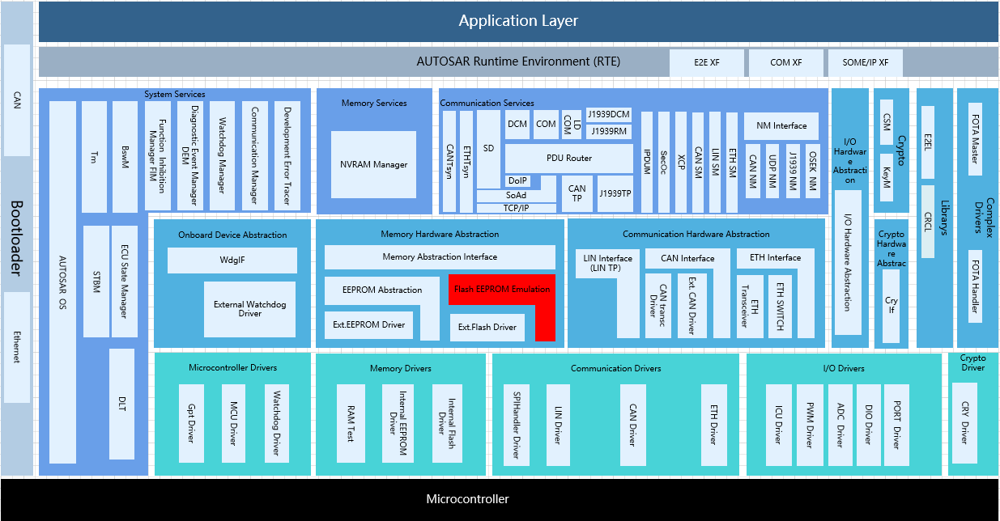
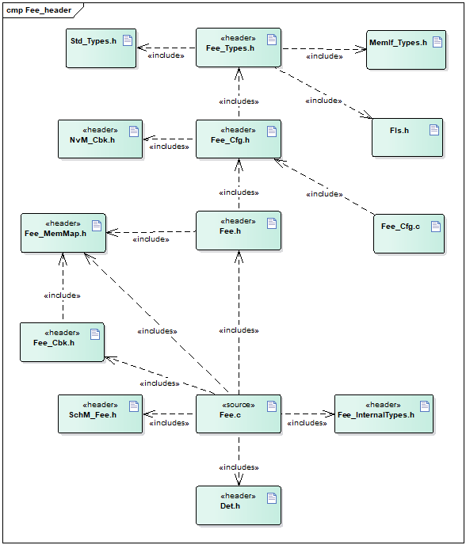
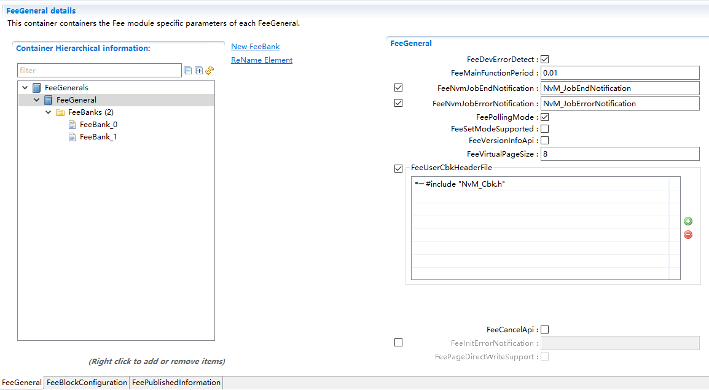
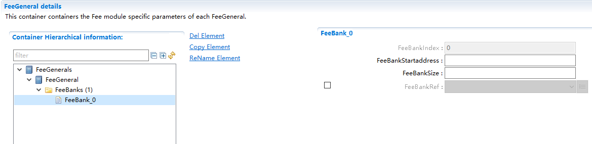
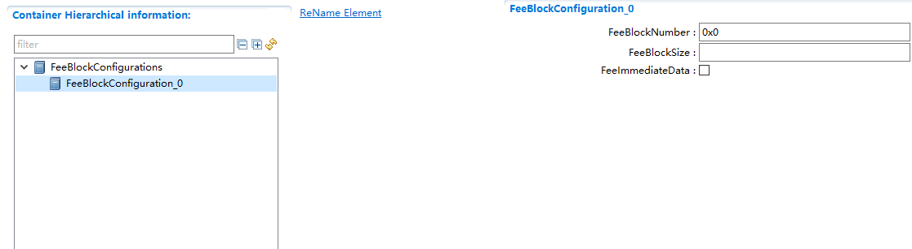
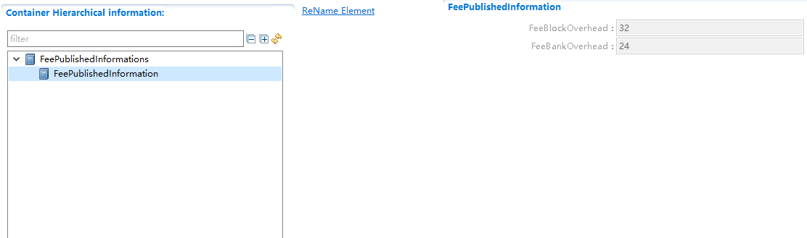
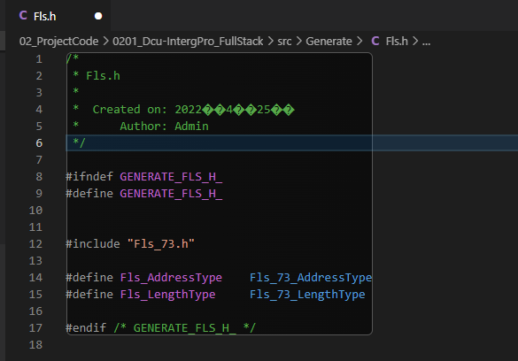

============
Fee
============

**缩写词注解**

+-----------+--------------------------+------------------------------+
| **缩写词**| **英文全称**             | **中文解释**                 |
+-----------+--------------------------+------------------------------+
| EA        | EEPROM Abstraction       | Eeprom抽象模块               |
+-----------+--------------------------+------------------------------+
| FEE       | Flash EEPROM Emulation   | Flash模拟Eeprom抽象模块      |
+-----------+--------------------------+------------------------------+
| MemIf     | Memory Abstraction       | 存储抽象接口模块             |
|           | Interface                |                              |
+-----------+--------------------------+------------------------------+
| NvM       | NVRAM Manager            | 非易失性存储管理模块         |
+-----------+--------------------------+------------------------------+
| (Logical) | Smallest writable /      | 上层模块                     |
| block     | erasable unit as seen by | 可操作单元（虚拟页的整数倍） |
|           | the modules user.        |                              |
|           | Consists of one or       |                              |
|           |                          |                              |
|           | more virtual pages.      |                              |
+-----------+--------------------------+------------------------------+
| Virtual   | May consist of one or    | 虚拟页（物理页的整数倍）     |
| page      | several physical pages   |                              |
+-----------+--------------------------+------------------------------+
| Bank      | May consist of one or    | Fee实现模拟Eeprom的擦除块    |
|           | several physical sectors |                              |
+-----------+--------------------------+------------------------------+

简介
====

Fee模块通过模拟Eeprom（不用先擦除再写入）主要实现基于Block的非易失性数据读、写功能，同时支持Immediate
Block的擦除，支持Block的无效操作，支持存储快慢模式的切换，支持任务的取消机制，支持模块状态及任务结果的获取。

|image1|\ 图 Fee模块层次图

Fee模块处于AUTOSAR架构中的存储硬件抽象层，其下层模块为Flash驱动模块，上层模块为MemIf、NvM。

Fee模块实现上层模块基于Block在Flash上的读写、无效、擦除（Immediate）操作。

参考资料
--------

[1] AUTOSAR_SWS_FlashEEPROMEmulation.pdf，R19-11

[2] AUTOSAR_SWS_FlashDriver.pdf，R19-11

[3] AUTOSAR_SWS_MemoryAbstractionInterface.pdf，R19-11

[4] AUTOSAR_SWS_NVRAMManager.pdf，R19-11

功能描述
========

模块初始化
----------

模块初始化功能介绍
~~~~~~~~~~~~~~~~~~

Fee模块的初始化会加载Flash中存储的所有Block的状态及其存储地址等信息，以及计算存储新Block数据及管理信息的地址。

模块初始化功能实现
~~~~~~~~~~~~~~~~~~

因为Fee初始化可能涉及大量的Flash读操作，以及可能发生的Flash擦除、写入操作，通常耗时较长。所以Fee的初始化通过异步实现，Fee_Init加载初始化任务，由Fee_MainFunction来实际执行。

Block操作功能
-------------

Block操作功能介绍
~~~~~~~~~~~~~~~~~

Fee提供基于Block的读、写、无效、擦除（Immediate）操作，实现Block数据在Flash上的非易失性存储功能。

Block操作功能实现
~~~~~~~~~~~~~~~~~

1. Fee模块对Block的操作是单任务的，同一时间只能处理一个任务，任务

处理过程中不能加载新的任务。

2. Fee模块对Block的操作都是通过异步机制实现，通过调用Fee_Read，

Fee_Write，Fee_InvalidateBlock，Fee_EraseImmediateBlock加载任务，在Fee_MainFunction中实际执行。

3. Block的区分通过参数BlockNumber决定，各个Block的BlockNumber

唯一，存储栈集成时BlockNumber的配置需要与NvMDatasetSelectionBits及关联NvM模块中Block的NvMBlockManagementType适配。

4. 任务的结果支持两种机制反馈给上层模块：

- Polling：实现接口Fee_GetJobResult供上层随时获取Job结果；

- Notification：任务成功/失败通过调用上层回调函数通知，如NvM_JobEndNotification/NvM_JobErrorNotification；

5. 配置为Immediate的Block才支持Fee_EraseImmediateBlock操作，且在

调用Fee_Write前需要先执行完Fee_EraseImmediateBlock任务。

Flash访问功能
-------------

Flash访问功能介绍
~~~~~~~~~~~~~~~~~

Fee功能的实现依赖于通过Flash驱动实现Flash的擦除、读、写功能，以及任务取消，任务结果获取，快慢模式设置等机制。

Flash访问功能实现
~~~~~~~~~~~~~~~~~

Flash驱动中Flash数据的擦除、读、写同样通过异步机制实现，Fee模块与Flash驱动之间任务结果的交互同样分两种机制：

- Polling：Fee_MainFunction中调用Fls_GetJobResult获取Job结果；

- Notification：任务成功/失败Flash驱动通过调用Fee回调函数通知（Fee_JobEndNotification/Fee_JobErrorNotification）；

错误检测功能
------------

错误检测功能介绍
~~~~~~~~~~~~~~~~

Fee模块实现DET开发错误和DET运行时错误检测及报错。

错误检测功能实现
~~~~~~~~~~~~~~~~

+-----------------+-----------+----------------------------+---------+
| Type or error   | Relevance | Related error code         | Val     |
|                 |           |                            | ue[hex] |
+-----------------+-----------+----------------------------+---------+
| 未初始化        | De        | FEE_E_UNINIT               | 0x01    |
|                 | velopment |                            |         |
+-----------------+-----------+----------------------------+---------+
| BlockNumber错误 | De        | FEE_E_INVALID_BLOCK_NO     | 0x02    |
|                 | velopment |                            |         |
+-----------------+-----------+----------------------------+---------+
| Block           | De        | FEE_E_INVALID_BLOCK_OFS    | 0x03    |
| offset错误      | velopment |                            |         |
+-----------------+-----------+----------------------------+---------+
| 数据指针错误    | De        | FEE_E_PARAM_POINTER        | 0x04    |
|                 | velopment |                            |         |
+-----------------+-----------+----------------------------+---------+
| Block           | De        | FEE_E_INVALID_BLOCK_LEN    | 0x05    |
| length错误      | velopment |                            |         |
+-----------------+-----------+----------------------------+---------+
| Fee初始化失败   | De        | FEE_E_I                    | 0x09    |
|                 | velopment | NIT_FAILED（R20_11已删除） |         |
+-----------------+-----------+----------------------------+---------+
| Bus             | Runtime   | FEE_E_BUSY                 | 0x06    |
| y状态请求新任务 |           |                            |         |
+-----------------+-----------+----------------------------+---------+
| 无任务正在执行  | Runtime   | FEE_E_INVALID_CANCEL       | 0x08    |
| 时请求任务取消  |           |                            |         |
+-----------------+-----------+----------------------------+---------+

源文件描述
==========

表 Fee组件文件描述

+-----------------+----------------------------------------------------+
| **文件**        | **说明**                                           |
+-----------------+----------------------------------------------------+
| Fee_Cfg.h       | 定义Fee模块PC配置的宏定义。                        |
+-----------------+----------------------------------------------------+
| Fee_Cfg.c       | 定义Fee模块PC/PB配置的结构体参数。                 |
+-----------------+----------------------------------------------------+
| Fee.h           | 实现Fee模块全部外                                  |
|                 | 部接口（除了回调函数）的声明，以及模块内部宏定义。 |
+-----------------+----------------------------------------------------+
| Fee.c           | 作为Fee模块的核                                    |
|                 | 心文件，实现Fee模块全部对外接口，以及实现Fee模块功 |
|                 | 能所必须的local函数，local宏定义，local变量定义。  |
+-----------------+----------------------------------------------------+
| Fee_Cbk.h       | 实现Fee模块全部回调函数的声明。                    |
+-----------------+----------------------------------------------------+
| Fee_Types.h     | 实现PB/PC配置参数结构体类型的定义。                |
+-----------------+----------------------------------------------------+
| Fee_MemMap.h    | 实现Fee模块内存布局。                              |
+-----------------+----------------------------------------------------+
| Fee_            | 实现Fee内部管理数据类型的定义。                    |
| InternalTypes.h |                                                    |
+-----------------+----------------------------------------------------+

|image2|

图 Fee组件文件交互关系图

API接口
=======

类型定义
--------

Fee_ConfigType类型定义
~~~~~~~~~~~~~~~~~~~~~~

+-----------+----------------------------------------------------------+
| 名称      | Fee_ConfigType                                           |
+-----------+----------------------------------------------------------+
| 类型      | struct                                                   |
+-----------+----------------------------------------------------------+
| 范围      | 无                                                       |
+-----------+----------------------------------------------------------+
| 描述      | Fee模块配置数据结构体类型                                |
+-----------+----------------------------------------------------------+

输入函数描述
------------

+----------------------------+-----------------------------------------+
| **输入模块**               | **API**                                 |
+----------------------------+-----------------------------------------+
| Fls                        | Fls_Cancel                              |
+----------------------------+-----------------------------------------+
|                            | Fls_Erase                               |
+----------------------------+-----------------------------------------+
|                            | Fls_GetJobResult                        |
+----------------------------+-----------------------------------------+
|                            | Fls_Read                                |
+----------------------------+-----------------------------------------+
|                            | Fls_SetMode                             |
+----------------------------+-----------------------------------------+
|                            | Fls_Write                               |
+----------------------------+-----------------------------------------+
| SchM                       | SchM_Enter_Fee                          |
+----------------------------+-----------------------------------------+
|                            | SchM_Exit_Fee                           |
+----------------------------+-----------------------------------------+
| Det                        | Det_ReportRuntimeError                  |
+----------------------------+-----------------------------------------+
|                            | Det_ReportError                         |
+----------------------------+-----------------------------------------+
| NvM                        | NvM_JobEndNotification                  |
+----------------------------+-----------------------------------------+
|                            | NvM_JobErrorNotification                |
+----------------------------+-----------------------------------------+

静态接口函数定义
----------------

Fee_Init函数定义
~~~~~~~~~~~~~~~~

+------------+----------------------+-------+-------------------------+
| 函数名称： | Fee_Init             |       |                         |
+------------+----------------------+-------+-------------------------+
| 函数原型： | FUNC(void, FEE_CODE) |       |                         |
|            |                      |       |                         |
|            | Fee_Init(P2C         |       |                         |
|            | ONST(Fee_ConfigType, |       |                         |
|            | AUTOMATIC,           |       |                         |
|            | FEE_APPL_CONST)      |       |                         |
|            | ConfigPtr)           |       |                         |
+------------+----------------------+-------+-------------------------+
| 服务编号： | 0x00                 |       |                         |
+------------+----------------------+-------+-------------------------+
| 同         | 异步                 |       |                         |
| 步/异步：  |                      |       |                         |
+------------+----------------------+-------+-------------------------+
| 是         | 否                   |       |                         |
| 否可重入： |                      |       |                         |
+------------+----------------------+-------+-------------------------+
| 输入参数： | Confi                | 值    | 无                      |
|            | gPtr：配置设置的指针 | 域：  |                         |
+------------+----------------------+-------+-------------------------+
| 输入       | 无                   |       |                         |
| 输出参数： |                      |       |                         |
+------------+----------------------+-------+-------------------------+
| 输出参数： | 无                   |       |                         |
+------------+----------------------+-------+-------------------------+
| 返回值：   | 无                   |       |                         |
+------------+----------------------+-------+-------------------------+
| 功能概述： | F                    |       |                         |
|            | ee模块初始化任务加载 |       |                         |
+------------+----------------------+-------+-------------------------+

Fee_SetMode函数定义
~~~~~~~~~~~~~~~~~~~

+-------------+-------------------+------+----------------------------+
| 函数名称：  | Fee_SetMode       |      |                            |
+-------------+-------------------+------+----------------------------+
| 函数原型：  | FUNC(void,        |      |                            |
|             | FEE_CODE)         |      |                            |
|             |                   |      |                            |
|             | Fee_SetMode(VA    |      |                            |
|             | R(MemIf_ModeType, |      |                            |
|             | AUTOMATIC) Mode)  |      |                            |
+-------------+-------------------+------+----------------------------+
| 服务编号：  | 0x01              |      |                            |
+-------------+-------------------+------+----------------------------+
| 同步/异步： | 异步              |      |                            |
+-------------+-------------------+------+----------------------------+
| 是          | 否                |      |                            |
| 否可重入：  |                   |      |                            |
+-------------+-------------------+------+----------------------------+
| 输入参数：  | Mode              | 值   | MEMIF_MODE_SLOW            |
|             |                   | 域： |                            |
|             |                   |      | MEMIF_MODE_FAST            |
+-------------+-------------------+------+----------------------------+
| 输入        | 无                |      |                            |
| 输出参数：  |                   |      |                            |
+-------------+-------------------+------+----------------------------+
| 输出参数：  | 无                |      |                            |
+-------------+-------------------+------+----------------------------+
| 返回值：    | 无                |      |                            |
+-------------+-------------------+------+----------------------------+
| 功能概述：  | 请求设置存储      |      |                            |
|             | 模式（SLOW/FAST） |      |                            |
+-------------+-------------------+------+----------------------------+

Fee_Read函数定义
~~~~~~~~~~~~~~~~

+-------------+-------------------+---------+-------------------------+
| 函数名称：  | Fee_Read          |         |                         |
+-------------+-------------------+---------+-------------------------+
| 函数原型：  | FUN               |         |                         |
|             | C(Std_ReturnType, |         |                         |
|             | FEE_CODE)         |         |                         |
|             |                   |         |                         |
|             | Fee_Read(         |         |                         |
|             |                   |         |                         |
|             | VAR(uint16,       |         |                         |
|             | AUTOMATIC)        |         |                         |
|             | BlockNumber,      |         |                         |
|             |                   |         |                         |
|             | VAR(uint16,       |         |                         |
|             | AUTOMATIC)        |         |                         |
|             | BlockOffset,      |         |                         |
|             |                   |         |                         |
|             | P2VAR(uint8,      |         |                         |
|             | AUTOMATIC,        |         |                         |
|             | FEE_APPL_DATA)    |         |                         |
|             | DataBufferPtr,    |         |                         |
|             |                   |         |                         |
|             | VAR(uint16,       |         |                         |
|             | AUTOMATIC)        |         |                         |
|             | Length)           |         |                         |
+-------------+-------------------+---------+-------------------------+
| 服务编号：  | 0x02              |         |                         |
+-------------+-------------------+---------+-------------------------+
| 同步/异步： | 异步              |         |                         |
+-------------+-------------------+---------+-------------------------+
| 是          | 否                |         |                         |
| 否可重入：  |                   |         |                         |
+-------------+-------------------+---------+-------------------------+
| 输入参数：  | BlockNumber       | 值域：  | 0…65535                 |
|             | BlockOffset       |         |                         |
|             |                   |         |                         |
|             | Length            |         |                         |
+-------------+-------------------+---------+-------------------------+
|             |                   |         | 0…65535                 |
+-------------+-------------------+---------+-------------------------+
|             |                   |         | 0…65535                 |
+-------------+-------------------+---------+-------------------------+
| 输入        | 无                |         |                         |
| 输出参数：  |                   |         |                         |
+-------------+-------------------+---------+-------------------------+
| 输出参数：  | DataB             |         |                         |
|             | ufferPtr：Pointer |         |                         |
|             | to data buffer    |         |                         |
+-------------+-------------------+---------+-------------------------+
| 返回值：    | Std_ReturnType：  |         |                         |
|             |                   |         |                         |
|             | E_OK: The         |         |                         |
|             | requested job has |         |                         |
|             | been accepted by  |         |                         |
|             | the module.       |         |                         |
|             |                   |         |                         |
|             | E_NOT_OK: The     |         |                         |
|             | requested job has |         |                         |
|             | not been accepted |         |                         |
|             | by the module.    |         |                         |
+-------------+-------------------+---------+-------------------------+
| 功能概述：  | 请求Block的读任务 |         |                         |
+-------------+-------------------+---------+-------------------------+

Fee_Write函数定义
~~~~~~~~~~~~~~~~~

+-------------+-------------------+---------+-------------------------+
| 函数名称：  | Fee_Write         |         |                         |
+-------------+-------------------+---------+-------------------------+
| 函数原型：  | FUN               |         |                         |
|             | C(Std_ReturnType, |         |                         |
|             | FEE_CODE)         |         |                         |
|             |                   |         |                         |
|             | Fee_              |         |                         |
|             | Write(VAR(uint16, |         |                         |
|             | AUTOMATIC)        |         |                         |
|             | BlockNumber,      |         |                         |
|             | P2CONST(uint8,    |         |                         |
|             | AUTOMATIC,        |         |                         |
|             | FEE_APPL_CONST)   |         |                         |
|             | DataBufferPtr)    |         |                         |
+-------------+-------------------+---------+-------------------------+
| 服务编号：  | 0x03              |         |                         |
+-------------+-------------------+---------+-------------------------+
| 同步/异步： | 异步              |         |                         |
+-------------+-------------------+---------+-------------------------+
| 是          | 否                |         |                         |
| 否可重入：  |                   |         |                         |
+-------------+-------------------+---------+-------------------------+
| 输入参数：  | BlockNu           | 值域：  | 0…65535                 |
|             | mber：block的序号 |         |                         |
+-------------+-------------------+---------+-------------------------+
|             | Da                | 值域：  | 无                      |
|             | taBufferPtr：指向 |         |                         |
|             | DataBuffer的指针  |         |                         |
+-------------+-------------------+---------+-------------------------+
| 输入        | 无                |         |                         |
| 输出参数：  |                   |         |                         |
+-------------+-------------------+---------+-------------------------+
| 输出参数：  | 无                |         |                         |
+-------------+-------------------+---------+-------------------------+
| 返回值：    | Std_ReturnType    |         |                         |
+-------------+-------------------+---------+-------------------------+
| 功能概述：  | 请求Block的写任务 |         |                         |
+-------------+-------------------+---------+-------------------------+

Fee_Cancel函数定义
~~~~~~~~~~~~~~~~~~

+-------------+-------------------+---------+-------------------------+
| 函数名称：  | Fee_Cancel        |         |                         |
+-------------+-------------------+---------+-------------------------+
| 函数原型：  | FUNC(void,        |         |                         |
|             | FEE_CODE)         |         |                         |
|             | Fee_Cancel(void)  |         |                         |
+-------------+-------------------+---------+-------------------------+
| 服务编号：  | 0x04              |         |                         |
+-------------+-------------------+---------+-------------------------+
| 同步/异步： | 同步              |         |                         |
+-------------+-------------------+---------+-------------------------+
| 是          | 否                |         |                         |
| 否可重入：  |                   |         |                         |
+-------------+-------------------+---------+-------------------------+
| 输入参数：  | 无                | 值域：  | 无                      |
+-------------+-------------------+---------+-------------------------+
| 输入        | 无                |         |                         |
| 输出参数：  |                   |         |                         |
+-------------+-------------------+---------+-------------------------+
| 输出参数：  | 无                |         |                         |
+-------------+-------------------+---------+-------------------------+
| 返回值：    | 无                |         |                         |
+-------------+-------------------+---------+-------------------------+
| 功能概述：  | 请求正            |         |                         |
|             | 在执行的任务取消  |         |                         |
+-------------+-------------------+---------+-------------------------+

Fee_GetStatus函数定义
~~~~~~~~~~~~~~~~~~~~~

+-------------+-------------------+---------+-------------------------+
| 函数名称：  | Fee_GetStatus     |         |                         |
+-------------+-------------------+---------+-------------------------+
| 函数原型：  | FUNC(             |         |                         |
|             | MemIf_StatusType, |         |                         |
|             | FEE_CODE)         |         |                         |
|             | Fe                |         |                         |
|             | e_GetStatus(void) |         |                         |
+-------------+-------------------+---------+-------------------------+
| 服务编号：  | 0x05              |         |                         |
+-------------+-------------------+---------+-------------------------+
| 同步/异步： | 同步              |         |                         |
+-------------+-------------------+---------+-------------------------+
| 是          | 否                |         |                         |
| 否可重入：  |                   |         |                         |
+-------------+-------------------+---------+-------------------------+
| 输入参数：  | 无                | 值域：  | 无                      |
+-------------+-------------------+---------+-------------------------+
| 输入        | 无                |         |                         |
| 输出参数：  |                   |         |                         |
+-------------+-------------------+---------+-------------------------+
| 输出参数：  | 无                |         |                         |
+-------------+-------------------+---------+-------------------------+
| 返回值：    | MemIf_StatusType  |         |                         |
+-------------+-------------------+---------+-------------------------+
| 功能概述：  | 获                |         |                         |
|             | 取Fee模块当前状态 |         |                         |
+-------------+-------------------+---------+-------------------------+

Fee_GetJobResult函数定义
~~~~~~~~~~~~~~~~~~~~~~~~

+-------------+-------------------+---------+-------------------------+
| 函数名称：  | Fee_GetJobResult  |         |                         |
+-------------+-------------------+---------+-------------------------+
| 函数原型：  | FUNC(Mem          |         |                         |
|             | If_JobResultType, |         |                         |
|             | FEE_CODE)         |         |                         |
|             | Fee_G             |         |                         |
|             | etJobResult(void) |         |                         |
+-------------+-------------------+---------+-------------------------+
| 服务编号：  | 0x06              |         |                         |
+-------------+-------------------+---------+-------------------------+
| 同步/异步： | 同步              |         |                         |
+-------------+-------------------+---------+-------------------------+
| 是          | 否                |         |                         |
| 否可重入：  |                   |         |                         |
+-------------+-------------------+---------+-------------------------+
| 输入参数：  | 无                | 值域：  | 无                      |
+-------------+-------------------+---------+-------------------------+
| 输入        | 无                |         |                         |
| 输出参数：  |                   |         |                         |
+-------------+-------------------+---------+-------------------------+
| 输出参数：  | 无                |         |                         |
+-------------+-------------------+---------+-------------------------+
| 返回值：    | MemI              |         |                         |
|             | f_JobResultType： |         |                         |
|             |                   |         |                         |
|             | MEMIF_UNINIT:     |         |                         |
|             | FEE模块没有初始化 |         |                         |
|             |                   |         |                         |
|             | MEMIF_IDLE:       |         |                         |
|             | FEE模块           |         |                         |
|             | 当前处于空闲状态  |         |                         |
|             |                   |         |                         |
|             | MEMIF_BUSY:       |         |                         |
|             | FEE模块当前正忙   |         |                         |
|             |                   |         |                         |
|             | MEM               |         |                         |
|             | IF_BUSY_INTERNAL: |         |                         |
|             | FEE模块           |         |                         |
|             | 忙于内部管理操作  |         |                         |
+-------------+-------------------+---------+-------------------------+
| 功能概述：  | 获取当前任务结果  |         |                         |
+-------------+-------------------+---------+-------------------------+

Fee_InvalidateBlock函数定义
~~~~~~~~~~~~~~~~~~~~~~~~~~~

+-------------+-------------------+---------+-------------------------+
| 函数名称：  | Fe                |         |                         |
|             | e_InvalidateBlock |         |                         |
+-------------+-------------------+---------+-------------------------+
| 函数原型：  | FUN               |         |                         |
|             | C(Std_ReturnType, |         |                         |
|             | FEE_CODE)         |         |                         |
|             | Fee_Invalidate    |         |                         |
|             | Block(VAR(uint16, |         |                         |
|             | AUTOMATIC)        |         |                         |
|             | BlockNumber)      |         |                         |
+-------------+-------------------+---------+-------------------------+
| 服务编号：  | 0x07              |         |                         |
+-------------+-------------------+---------+-------------------------+
| 同步/异步： | 异步              |         |                         |
+-------------+-------------------+---------+-------------------------+
| 是          | 否                |         |                         |
| 否可重入：  |                   |         |                         |
+-------------+-------------------+---------+-------------------------+
| 输入参数：  | Block             | 值域：  | 0…65535                 |
|             | Number：block序号 |         |                         |
+-------------+-------------------+---------+-------------------------+
| 输入        | 无                |         |                         |
| 输出参数：  |                   |         |                         |
+-------------+-------------------+---------+-------------------------+
| 输出参数：  | 无                |         |                         |
+-------------+-------------------+---------+-------------------------+
| 返回值：    | Std_ReturnType：  |         |                         |
|             |                   |         |                         |
|             | E_OK:请求的       |         |                         |
|             | 任务已被模块接受  |         |                         |
|             |                   |         |                         |
|             | E_N               |         |                         |
|             | OT_OK：仅当启用了 |         |                         |
|             | DET时:所请求的任  |         |                         |
|             | 务尚未被模块接受  |         |                         |
+-------------+-------------------+---------+-------------------------+
| 功能概述：  | 请求Block无效任务 |         |                         |
+-------------+-------------------+---------+-------------------------+

Fee_GetVersionInfo函数定义
~~~~~~~~~~~~~~~~~~~~~~~~~~

+-------------+-------------------+---------+-------------------------+
| 函数名称：  | F                 |         |                         |
|             | ee_GetVersionInfo |         |                         |
+-------------+-------------------+---------+-------------------------+
| 函数原型：  | FUNC(void,        |         |                         |
|             | FEE_CODE)         |         |                         |
|             |                   |         |                         |
|             | Fee_GetVers       |         |                         |
|             | ionInfo(P2VAR(Std |         |                         |
|             | _VersionInfoType, |         |                         |
|             | AUTOMATIC,        |         |                         |
|             | FEE_APPL_DATA)    |         |                         |
|             | VersionInfoPtr)   |         |                         |
+-------------+-------------------+---------+-------------------------+
| 服务编号：  | 0x08              |         |                         |
+-------------+-------------------+---------+-------------------------+
| 同步/异步： | 同步              |         |                         |
+-------------+-------------------+---------+-------------------------+
| 是          | 是                |         |                         |
| 否可重入：  |                   |         |                         |
+-------------+-------------------+---------+-------------------------+
| 输入参数：  | 无                | 值域：  | 无                      |
+-------------+-------------------+---------+-------------------------+
| 输入        | 无                |         |                         |
| 输出参数：  |                   |         |                         |
+-------------+-------------------+---------+-------------------------+
| 输出参数：  | VersionInfoPtr    |         |                         |
+-------------+-------------------+---------+-------------------------+
| 返回值：    | 无                |         |                         |
+-------------+-------------------+---------+-------------------------+
| 功能概述：  | 获取Fe            |         |                         |
|             | e模块软件版本信息 |         |                         |
+-------------+-------------------+---------+-------------------------+

Fee_EraseImmediateBlock函数定义
~~~~~~~~~~~~~~~~~~~~~~~~~~~~~~~

+-------------+-------------------+---------+-------------------------+
| 函数名称：  | Fee_Er            |         |                         |
|             | aseImmediateBlock |         |                         |
+-------------+-------------------+---------+-------------------------+
| 函数原型：  | FUN               |         |                         |
|             | C(Std_ReturnType, |         |                         |
|             | FEE_CODE)         |         |                         |
|             | F                 |         |                         |
|             | ee_EraseImmediate |         |                         |
|             | Block(VAR(uint16, |         |                         |
|             | AUTOMATIC)        |         |                         |
|             | BlockNumber)      |         |                         |
+-------------+-------------------+---------+-------------------------+
| 服务编号：  | 0x09              |         |                         |
+-------------+-------------------+---------+-------------------------+
| 同步/异步： | 异步              |         |                         |
+-------------+-------------------+---------+-------------------------+
| 是          | 否                |         |                         |
| 否可重入：  |                   |         |                         |
+-------------+-------------------+---------+-------------------------+
| 输入参数：  | Block             | 值域：  | 0…65535                 |
|             | Number：block序号 |         |                         |
+-------------+-------------------+---------+-------------------------+
| 输入        | 无                |         |                         |
| 输出参数：  |                   |         |                         |
+-------------+-------------------+---------+-------------------------+
| 输出参数：  | 无                |         |                         |
+-------------+-------------------+---------+-------------------------+
| 返回值：    | Std_ReturnType：  |         |                         |
|             |                   |         |                         |
|             | E_OK:请求的       |         |                         |
|             | 任务已被模块接受  |         |                         |
|             |                   |         |                         |
|             | E_N               |         |                         |
|             | OT_OK：仅当启用了 |         |                         |
|             | DET时:所请求的任  |         |                         |
|             | 务尚未被模块接受  |         |                         |
+-------------+-------------------+---------+-------------------------+
| 功能概述：  | 请求立            |         |                         |
|             | 即Block的擦除任务 |         |                         |
+-------------+-------------------+---------+-------------------------+

Fee_JobEndNotification函数定义
~~~~~~~~~~~~~~~~~~~~~~~~~~~~~~

+-------------+-------------------+---------+-------------------------+
| 函数名称：  | Fee_J             |         |                         |
|             | obEndNotification |         |                         |
+-------------+-------------------+---------+-------------------------+
| 函数原型：  | FUNC(void,        |         |                         |
|             | FEE_CODE)         |         |                         |
|             | Fee_JobEndN       |         |                         |
|             | otification(void) |         |                         |
+-------------+-------------------+---------+-------------------------+
| 服务编号：  | 0x10              |         |                         |
+-------------+-------------------+---------+-------------------------+
| 同步/异步： | 同步              |         |                         |
+-------------+-------------------+---------+-------------------------+
| 是          | 否                |         |                         |
| 否可重入：  |                   |         |                         |
+-------------+-------------------+---------+-------------------------+
| 输入参数：  | 无                | 值域：  | 无                      |
+-------------+-------------------+---------+-------------------------+
| 输入        | 无                |         |                         |
| 输出参数：  |                   |         |                         |
+-------------+-------------------+---------+-------------------------+
| 输出参数：  | 无                |         |                         |
+-------------+-------------------+---------+-------------------------+
| 返回值：    | 无                |         |                         |
+-------------+-------------------+---------+-------------------------+
| 功能概述：  | Flash访问（异     |         |                         |
|             | 步操作）成功通知  |         |                         |
+-------------+-------------------+---------+-------------------------+

Fee_JobErrorNotification函数定义
~~~~~~~~~~~~~~~~~~~~~~~~~~~~~~~~

+-------------+-------------------+---------+-------------------------+
| 函数名称：  | Fee_Job           |         |                         |
|             | ErrorNotification |         |                         |
+-------------+-------------------+---------+-------------------------+
| 函数原型：  | FUNC(void,        |         |                         |
|             | FEE_CODE)         |         |                         |
|             | Fee_JobErrorN     |         |                         |
|             | otification(void) |         |                         |
+-------------+-------------------+---------+-------------------------+
| 服务编号：  | 0x11              |         |                         |
+-------------+-------------------+---------+-------------------------+
| 同步/异步： | 同步              |         |                         |
+-------------+-------------------+---------+-------------------------+
| 是          | 否                |         |                         |
| 否可重入：  |                   |         |                         |
+-------------+-------------------+---------+-------------------------+
| 输入参数：  | 无                | 值域：  | 无                      |
+-------------+-------------------+---------+-------------------------+
| 输入        | 无                |         |                         |
| 输出参数：  |                   |         |                         |
+-------------+-------------------+---------+-------------------------+
| 输出参数：  | 无                |         |                         |
+-------------+-------------------+---------+-------------------------+
| 返回值：    | 无                |         |                         |
+-------------+-------------------+---------+-------------------------+
| 功能概述：  | Flash访问（异     |         |                         |
|             | 步操作）失败通知  |         |                         |
+-------------+-------------------+---------+-------------------------+

Fee_MainFunction函数定义
~~~~~~~~~~~~~~~~~~~~~~~~

+-------------+-------------------+---------+-------------------------+
| 函数名称：  | Fee_MainFunction  |         |                         |
+-------------+-------------------+---------+-------------------------+
| 函数原型：  | FUNC(void,        |         |                         |
|             | FEE_CODE)         |         |                         |
|             | Fee_M             |         |                         |
|             | ainFunction(void) |         |                         |
+-------------+-------------------+---------+-------------------------+
| 服务编号：  | 0x12              |         |                         |
+-------------+-------------------+---------+-------------------------+
| 同步/异步： | 同步              |         |                         |
+-------------+-------------------+---------+-------------------------+
| 是          | 否                |         |                         |
| 否可重入：  |                   |         |                         |
+-------------+-------------------+---------+-------------------------+
| 输入参数：  | 无                | 值域：  | 无                      |
+-------------+-------------------+---------+-------------------------+
| 输入        | 无                |         |                         |
| 输出参数：  |                   |         |                         |
+-------------+-------------------+---------+-------------------------+
| 输出参数：  | 无                |         |                         |
+-------------+-------------------+---------+-------------------------+
| 返回值：    | 无                |         |                         |
+-------------+-------------------+---------+-------------------------+
| 功能概述：  | Fee模块           |         |                         |
|             | 的周期调度主函数  |         |                         |
+-------------+-------------------+---------+-------------------------+

可配置函数定义
--------------

无。

配置
====

FeeGeneral
----------

|image3|

图 FeeGeneral

表 FeeGeneral

+----------------+----------+----------------------+--------+---------+
| **UI名称**     | **描述** |                      |        |         |
+----------------+----------+----------------------+--------+---------+
| Fee            | 取值范围 | True/False           | 默认   | True    |
| DevErrorDetect |          |                      | 取值   |         |
+----------------+----------+----------------------+--------+---------+
|                | 参数描述 | 是否使能             |        |         |
|                |          | DET开发错误检测机制  |        |         |
+----------------+----------+----------------------+--------+---------+
|                | 依赖关系 | 依赖于Det模块开      |        |         |
|                |          | 发错误报错接口的支持 |        |         |
+----------------+----------+----------------------+--------+---------+
| FeeMain        | 取值范围 | 0 … INF              | 默认   | 0.01    |
| FunctionPeriod |          |                      | 取值   |         |
+----------------+----------+----------------------+--------+---------+
|                | 参数描述 | Fee_Ma               |        |         |
|                |          | inFunction的调度周期 |        |         |
+----------------+----------+----------------------+--------+---------+
|                | 依赖关系 | 无                   |        |         |
+----------------+----------+----------------------+--------+---------+
| FeeNvmJobE     | 取值范围 | 配置项0-1            | 默认   | 无      |
| ndNotification |          | 属性，配置类型string | 取值   |         |
+----------------+----------+----------------------+--------+---------+
|                | 参数描述 | 任务执行成功通知     |        |         |
+----------------+----------+----------------------+--------+---------+
|                | 依赖关系 | 依赖于上             |        |         |
|                |          | 层模块相应回调函数名 |        |         |
+----------------+----------+----------------------+--------+---------+
| FeeNvmJobErr   | 取值范围 | 配置项0-1            | 默认   | 无      |
| orNotification |          | 属性，配置类型string | 取值   |         |
+----------------+----------+----------------------+--------+---------+
|                | 参数描述 | 任务执行失败通知     |        |         |
+----------------+----------+----------------------+--------+---------+
|                | 依赖关系 | 依赖于上             |        |         |
|                |          | 层模块相应回调函数名 |        |         |
+----------------+----------+----------------------+--------+---------+
| FeePollingMode | 取值范围 | true/false           | 默认   | false   |
|                |          |                      | 取值   |         |
+----------------+----------+----------------------+--------+---------+
|                | 参数描述 | Fla                  |        |         |
|                |          | sh访问是否使能轮询模 |        |         |
|                |          | 式，反之则为通知模式 |        |         |
+----------------+----------+----------------------+--------+---------+
|                | 依赖关系 | 通知模式需要F        |        |         |
|                |          | lash驱动相应功能支持 |        |         |
+----------------+----------+----------------------+--------+---------+
| FeeSe          | 取值范围 | true/false           | 默认   | false   |
| tModeSupported |          |                      | 取值   |         |
+----------------+----------+----------------------+--------+---------+
|                | 参数描述 | 是否使能Fee_SetMode  |        |         |
+----------------+----------+----------------------+--------+---------+
|                | 依赖关系 | 依赖于Fla            |        |         |
|                |          | sh驱动相应功能的使能 |        |         |
+----------------+----------+----------------------+--------+---------+
| Fee            | 取值范围 | true/false           | 默认   | false   |
| VersionInfoApi |          |                      | 取值   |         |
+----------------+----------+----------------------+--------+---------+
|                | 参数描述 | 是否支               |        |         |
|                |          | 持Fee_GetVersionInfo |        |         |
+----------------+----------+----------------------+--------+---------+
|                | 依赖关系 | 无                   |        |         |
+----------------+----------+----------------------+--------+---------+
| FeeV           | 取值范围 | 0 ... 65535          | 默认   | 8       |
| irtualPageSize |          |                      | 取值   |         |
+----------------+----------+----------------------+--------+---------+
|                | 参数描述 | 虚拟页大小           |        |         |
+----------------+----------+----------------------+--------+---------+
|                | 依赖关系 | 关联Flash            |        |         |
|                |          | 驱动的物理页的整数倍 |        |         |
+----------------+----------+----------------------+--------+---------+
| FeeUse         | 取值范围 | 配置属性             | 默认   | 无      |
| rCbkHeaderFile |          | 0-N，配置类型string  | 取值   |         |
+----------------+----------+----------------------+--------+---------+
|                | 参数描述 | Fee调用上层模块      |        |         |
|                |          | 回调函数声明的头文件 |        |         |
+----------------+----------+----------------------+--------+---------+
|                | 依赖关系 | 回                   |        |         |
|                |          | 调函数声明的头文件名 |        |         |
+----------------+----------+----------------------+--------+---------+
| FeeCancelApi   | 取值范围 | true/false           | 默认   | false   |
|                |          |                      | 取值   |         |
+----------------+----------+----------------------+--------+---------+
|                | 参数描述 | 是否使能Fee_Cancel   |        |         |
+----------------+----------+----------------------+--------+---------+
|                | 依赖关系 | 依赖于Fla            |        |         |
|                |          | sh驱动相应功能的使能 |        |         |
+----------------+----------+----------------------+--------+---------+
| FeeInitErr     | 取值范围 | 配置项0-1            | 默认   | 无      |
| orNotification |          | 属性，配置类型string | 取值   |         |
+----------------+----------+----------------------+--------+---------+
|                | 参数描述 | Fee初始化失败通知    |        |         |
+----------------+----------+----------------------+--------+---------+
|                | 依赖关系 | 依赖于上             |        |         |
|                |          | 层模块相应回调函数名 |        |         |
+----------------+----------+----------------------+--------+---------+
| FeePageDire    | 取值范围 | true/false           | 默认   | false   |
| ctWriteSupport |          |                      | 取值   |         |
+----------------+----------+----------------------+--------+---------+
|                | 参数描述 | 是否使               |        |         |
|                |          | 能Flash数据多次写入  |        |         |
|                |          | （未擦除），以节约B  |        |         |
|                |          | lock管理数据占用资源 |        |         |
+----------------+----------+----------------------+--------+---------+
|                | 依赖关系 | 依赖于FeeVir         |        |         |
|                |          | tualPageSize的大小以 |        |         |
|                |          | 及Flash硬件特性支持  |        |         |
+----------------+----------+----------------------+--------+---------+

FeeBank
-------

|image4|

图 FeeBank

表 FeeBank

+-----------------+----------+-------------------+----------+---------+
| **UI名称**      | **描述** |                   |          |         |
+-----------------+----------+-------------------+----------+---------+
| FeeBankIndex    | 取值范围 | 0…N               | 默认取值 | 无      |
+-----------------+----------+-------------------+----------+---------+
|                 | 参数描述 | Fee Bank的Index   |          |         |
+-----------------+----------+-------------------+----------+---------+
|                 | 依赖关系 | 从                |          |         |
|                 |          | 0开始工具自动排序 |          |         |
+-----------------+----------+-------------------+----------+---------+
| FeeB            | 取值范围 | 0...N             | 默认取值 | 0       |
| ankStartaddress |          |                   |          |         |
+-----------------+----------+-------------------+----------+---------+
|                 | 参数描述 | Bank的起始地址    |          |         |
+-----------------+----------+-------------------+----------+---------+
|                 | 依赖关系 | 当FeeBankRef配置  |          |         |
|                 |          | 时，工具从Flash驱 |          |         |
|                 |          | 动自动获取填充（  |          |         |
|                 |          | 不能手动配置）；  |          |         |
|                 |          |                   |          |         |
|                 |          | 当FeeBa           |          |         |
|                 |          | nkRef未配置时，需 |          |         |
|                 |          | 手动配置（手动配  |          |         |
|                 |          | 置时由配置人员来  |          |         |
|                 |          | 保证配置正确性）  |          |         |
+-----------------+----------+-------------------+----------+---------+
| FeeBankSize     | 取值范围 | 0...N             | 默认取值 | 0       |
+-----------------+----------+-------------------+----------+---------+
|                 | 参数描述 | Bank的大小        |          |         |
+-----------------+----------+-------------------+----------+---------+
|                 | 依赖关系 | 当FeeBankRef配置  |          |         |
|                 |          | 时，工具从Flash驱 |          |         |
|                 |          | 动自动获取填充（  |          |         |
|                 |          | 不能手动配置）；  |          |         |
|                 |          |                   |          |         |
|                 |          | 当FeeBa           |          |         |
|                 |          | nkRef未配置时，需 |          |         |
|                 |          | 手动配置（手动配  |          |         |
|                 |          | 置时由配置人员来  |          |         |
|                 |          | 保证配置正确性）  |          |         |
+-----------------+----------+-------------------+----------+---------+
| FeeBankRef      | 取值范围 | 配置              | 默认取值 | 无      |
|                 |          | 属性0-1，关联配置 |          |         |
+-----------------+----------+-------------------+----------+---------+
|                 | 参数描述 | 关                |          |         |
|                 |          | 联Flash驱动Secto  |          |         |
|                 |          | rList中某一Sector |          |         |
+-----------------+----------+-------------------+----------+---------+
|                 | 依赖关系 | 依赖于Flas        |          |         |
|                 |          | h驱动的Sector配置 |          |         |
+-----------------+----------+-------------------+----------+---------+

FeeBlockConfiguration
---------------------

|image5|

图 FeeBlockConfiguration

表 FeeBlockConfiguration

+------------------+----------+-----------+----------+----------------+
| **UI名称**       | **描述** |           |          |                |
+------------------+----------+-----------+----------+----------------+
| FeeBlockNumber   | 取值范围 | 1...65534 | 默认取值 | 1              |
+------------------+----------+-----------+----------+----------------+
|                  | 参数描述 | Bl        |          |                |
|                  |          | ock的Bloc |          |                |
|                  |          | kNumber号 |          |                |
+------------------+----------+-----------+----------+----------------+
|                  | 依赖关系 | 各        |          |                |
|                  |          | 个Block的 |          |                |
|                  |          | BlockNum  |          |                |
|                  |          | ber号唯一 |          |                |
+------------------+----------+-----------+----------+----------------+
| FeeBlockSize     | 取值范围 | 1…65535   | 默认取值 | 无             |
+------------------+----------+-----------+----------+----------------+
|                  | 参数描述 | Bl        |          |                |
|                  |          | ock的大小 |          |                |
+------------------+----------+-----------+----------+----------------+
|                  | 依赖关系 | Block的   |          |                |
|                  |          | 大小需为  |          |                |
|                  |          | FeeVirtu  |          |                |
|                  |          | alPageSiz |          |                |
|                  |          | e的整数倍 |          |                |
+------------------+----------+-----------+----------+----------------+
| FeeImmediateData | 取值范围 | t         | 默认取值 | false          |
|                  |          | rue/false |          |                |
+------------------+----------+-----------+----------+----------------+
|                  | 参数描述 | 表示该Bl  |          |                |
|                  |          | ock是否为 |          |                |
|                  |          | 立即Block |          |                |
+------------------+----------+-----------+----------+----------------+
|                  | 依赖关系 | 无        |          |                |
+------------------+----------+-----------+----------+----------------+
| FeeNum           | 取值范围 | 0…4       | 默认取值 | 无             |
| berOfWriteCycles |          | 294967295 |          |                |
+------------------+----------+-----------+----------+----------------+
|                  | 参数描述 | 该bl      |          |                |
|                  |          | ock所需的 |          |                |
|                  |          | 写周期数  |          |                |
+------------------+----------+-----------+----------+----------------+
|                  | 依赖关系 | 无        |          |                |
+------------------+----------+-----------+----------+----------------+
| FeeDeviceIndex   | 取值范围 | t         | 默认取值 | false          |
|                  |          | rue/false |          |                |
+------------------+----------+-----------+----------+----------------+
|                  | 参数描述 | 对存储该  |          |                |
|                  |          | block的设 |          |                |
|                  |          | 备的引用  |          |                |
+------------------+----------+-----------+----------+----------------+
|                  | 依赖关系 | 无        |          |                |
+------------------+----------+-----------+----------+----------------+

FeePublishedInformation
-----------------------

|image6|

图 FeePublishedInformation

表 FeePublishedInformation

+------------------+----------+---------------------+--------+--------+
| **UI名称**       | **描述** |                     |        |        |
+------------------+----------+---------------------+--------+--------+
| FeeBlockOverhead | 取值范围 | 0…65535             | 默认   | 无     |
|                  |          |                     | 取值   |        |
+------------------+----------+---------------------+--------+--------+
|                  | 参数描述 | 每个Block的管       |        |        |
|                  |          | 理数据长度（byte）  |        |        |
+------------------+----------+---------------------+--------+--------+
|                  | 依赖关系 | 工具自动计算生成（F |        |        |
|                  |          | eeVirtualPageSize和 |        |        |
|                  |          |                     |        |        |
|                  |          | FeePageD            |        |        |
|                  |          | irectWriteSupport） |        |        |
+------------------+----------+---------------------+--------+--------+
| FeeBankOverhead  | 取值范围 | 0…65535             | 默认   | 无     |
|                  |          |                     | 取值   |        |
+------------------+----------+---------------------+--------+--------+
|                  | 参数描述 | 每个Bank的管        |        |        |
|                  |          | 理数据长度（byte）  |        |        |
+------------------+----------+---------------------+--------+--------+
|                  | 依赖关系 | 工具自动计算生成（F |        |        |
|                  |          | eeVirtualPageSize和 |        |        |
|                  |          |                     |        |        |
|                  |          | FeePageD            |        |        |
|                  |          | irectWriteSupport） |        |        |
+------------------+----------+---------------------+--------+--------+

附录：
======

集成注意事项：

在Fee模块使用过程中，需要使用到下层Fls驱动模块，需要包含第三方驱动程序，会涉及到文件名和类型名字不匹配的问题，所以在Fee模块中，始终会包含头文件#include
"Fls.h"。

所以在集成时，需要新建一个Fls.h文件，并在这个文件中做底层驱动的适配，如下图所示：

|image7|

