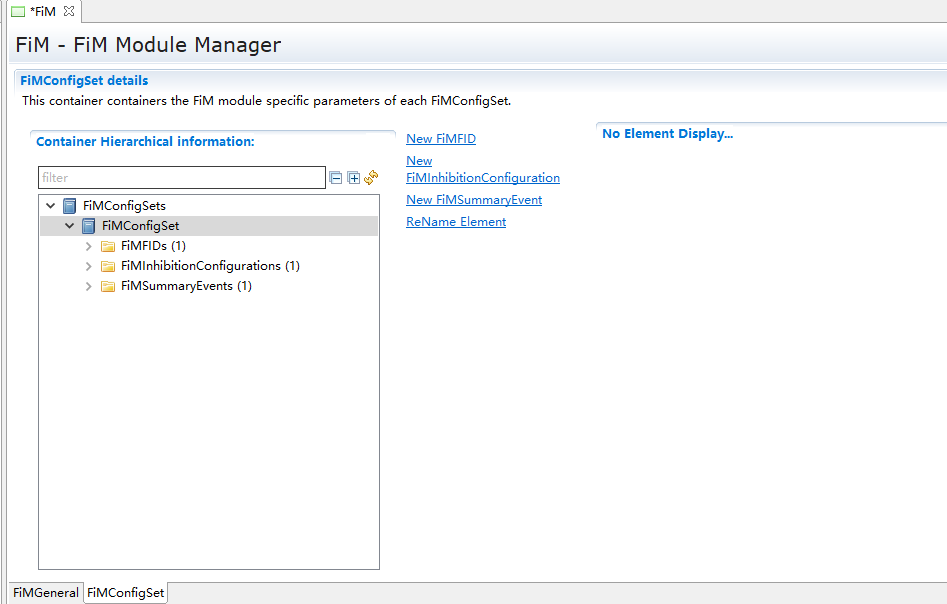

============
FiM
============

**缩写词注解**

+--------------------+-----------------------------+-------------------+
| **缩写词**         | **英文全名**                | **解释/描述**     |
+--------------------+-----------------------------+-------------------+
| FID                | Function Identifier         | 功能标识符        |
+--------------------+-----------------------------+-------------------+
| FiM                | Function Inhibition Manager | 功能禁止管理模块  |
+--------------------+-----------------------------+-------------------+
| DEM                | Diagnostic Event Manager    | 诊断事件管理模块  |
+--------------------+-----------------------------+-------------------+

简介
====

|image1|

图 FiM模块层次图

功能抑制管理器为别的软件组件及其功能提供控制机制。在本文档中，一个功能可以由一个、几个或部分具有相同权限/禁止条件的可运行实体的内容构成。

功能性和可运行实体是不同且独立的分类类型。可运行实体的主要特征是它们的调度要求。与此相反，功能是根据它们的抑制条件来分类的。FiM的服务主要关注SW-Cs中的功能，然而，它们并不局限于这些功能。BSW的功能也可以使用FiM服务。

|QQ图片20170122100614.png|

图 FiM与其他模块交互图

参考资料
--------

[1] AUTOSAR_SWS_FunctionInhibitionManager.PDF，4.2.2

[2] AUTOSAR_SWS_FunctionInhibitionManager.PDF，R19-11

功能描述
========

功能禁止管理功能
----------------

功能禁止管理功能介绍
~~~~~~~~~~~~~~~~~~~~

FiM模块允许查询软件组件的许可/抑制状态及其功能。功能在执行之前轮询其FID的许可状态。如果禁止条件适用于特定的标识符，则不再允许执行相应的功能。通过FiM，这些功能的抑制可以通过校准来配置甚至修改。支持Dem事件及其状态信息作为抑制条件。在FiM的配置过程中，建立了数据结构(即禁止矩阵)来处理标识符对某些事件的敏感性。

FiM与Dem密切相关，因为诊断事件及其状态信息是抑制条件的基础。因此，在发生故障时需要停止的功能，例如某个传感器，可以用一个特定的标识符来表示。如果检测到故障并将事件报告给Dem，那么FiM就会阻止FID，从而阻止相应的功能。

功能禁止管理器（FiM）的主要功能是为SW-C和BSW功能提供控制机制。功能禁止管理器允许查询软件构件及其中的功能性的准许/禁止状态。主要功能包括：管理功能禁止状态、主动获取诊断事件状态更新禁止状态、根据诊断事件管理器的触发更新禁止状态、提供接口供应用查询功能禁止状态。

FiM支持功能禁止管理：根据故障状态状态位，与故障关联的FID的MASK进行计算，如果计算结果满足抑制，则FID的抑制计数器加1，如果计算结果不满足抑制，则FID的抑制计数器减1，当FID的抑制计数器等于
0 ，FID为允许状态，当抑制计数器不等于0，FID为抑制状态，原理如图2-1所示。

|image2|

图 功能禁止管理原理

功能禁止管理功能实现
~~~~~~~~~~~~~~~~~~~~

根据配置，如果是轮询方式获取信息，则在FiM_MainFunction中轮询调用Dem_GetComponentFailed和Dem_GetEventStatus来获取诊断事件状态信息，然后根据状态信息以及相关功能的配置关系表来进行计算，得出功能抑制计数，SWC通过调用FiM_GetFunctionPermission来获取功能的允许使用状态。

如果不是轮询方式获取信息，则DEM模块调用FiM_DemTriggerOnEventStatus和FiM_DemTriggerOnComponentStatus来通知诊断事件状态信息，然后根据状态信息以及相关功能的配置关系表来进行计算，得出功能抑制计数，SWC通过调用FiM_GetFunctionPermission来获取功能的允许使用状态。

源文件描述
==========

表 FiM组件文件描述

+----------------+-----------------------------------------------------+
| **文件**       | **说明**                                            |
+----------------+-----------------------------------------------------+
| FiM \_cfg.h    | 定义FiM模块预编译时用到的配置参数。                 |
+----------------+-----------------------------------------------------+
| FiM_Cfg.c      | 定义FiM模块配置相关的配置参数。                     |
+----------------+-----------------------------------------------------+
| FiM.h          | FiM模块头文                                         |
|                | 件，包含了API函数的扩展声明并定义了端口的数据结构。 |
+----------------+-----------------------------------------------------+
| FiM .c         | FiM模块源文件，包含了API函数的实现。                |
+----------------+-----------------------------------------------------+
| FiM_Internal.h | 包含FiM模块需要使用的部分类型定义和宏定义。         |
+----------------+-----------------------------------------------------+
| FiM_MemMap.h   | 包含FiM模块的内存抽象。                             |
+----------------+-----------------------------------------------------+
| FiM_Types.h    | 包含FiM模块需要使用的类型定义。                     |
+----------------+-----------------------------------------------------+
| Rte_FiM_Type.h | 空文件（autosar要求的文件）                         |
+----------------+-----------------------------------------------------+

|image3|

图 FiM组件文件交互关系图

API接口
=======

类型定义
--------

FiM_FunctionIdType类型定义
~~~~~~~~~~~~~~~~~~~~~~~~~~

+-----------+----------------------------------------------------------+
| 名称      | FiM_FunctionIdType                                       |
+-----------+----------------------------------------------------------+
| 类型      | uint16                                                   |
+-----------+----------------------------------------------------------+
| 范围      | 0-65535 功能ID                                           |
+-----------+----------------------------------------------------------+
| 描述      | 功能ID的类型定义                                         |
+-----------+----------------------------------------------------------+

FiM_ConfigType类型定义
~~~~~~~~~~~~~~~~~~~~~~

+-----------+----------------------------------------------------------+
| 名称      | FiM_ConfigType                                           |
+-----------+----------------------------------------------------------+
| 类型      | Structure                                                |
+-----------+----------------------------------------------------------+
| 范围      | 无                                                       |
+-----------+----------------------------------------------------------+
| 描述      | 配置参数结构体类型定义                                   |
+-----------+----------------------------------------------------------+

输入函数描述
------------

+----------------------------------+-----------------------------------+
| **输入模块**                     | **API**                           |
+----------------------------------+-----------------------------------+
| DEM                              | Dem_GetEventStatus                |
+----------------------------------+-----------------------------------+
|                                  | Dem_GetComponentFailed            |
+----------------------------------+-----------------------------------+
| DET                              | Det_ReportError                   |
+----------------------------------+-----------------------------------+

静态接口函数定义
----------------

FiM_Init函数定义
~~~~~~~~~~~~~~~~

+-------------+---------------------------------+------+--------------+
| 函数名称：  | FiM_Init                        |      |              |
+-------------+---------------------------------+------+--------------+
| 函数原型：  | void FiM_Init(const             |      |              |
|             | FiM_ConfigType\* FiMConfigPtr)  |      |              |
+-------------+---------------------------------+------+--------------+
| 服务编号：  | 0x00                            |      |              |
+-------------+---------------------------------+------+--------------+
| 同步/异步： | 同步                            |      |              |
+-------------+---------------------------------+------+--------------+
| 是          | 否                              |      |              |
| 否可重入：  |                                 |      |              |
+-------------+---------------------------------+------+--------------+
| 输入参数：  | FiMConfigPtr：配置参数的指针    | 值   | 无           |
|             |                                 | 域： |              |
+-------------+---------------------------------+------+--------------+
| 输入        | 无                              |      |              |
| 输出参数：  |                                 |      |              |
+-------------+---------------------------------+------+--------------+
| 输出参数：  | 无                              |      |              |
+-------------+---------------------------------+------+--------------+
| 返回值：    | 无                              |      |              |
+-------------+---------------------------------+------+--------------+
| 功能概述：  | FiM初始化                       |      |              |
|             | 函数，初始化相关变量与模块状态  |      |              |
+-------------+---------------------------------+------+--------------+

FiM_GetFunctionPermission函数定义
~~~~~~~~~~~~~~~~~~~~~~~~~~~~~~~~~

+-------------+-------------------+---------+-------------------------+
| 函数名称：  | FiM_GetF          |         |                         |
|             | unctionPermission |         |                         |
+-------------+-------------------+---------+-------------------------+
| 函数原型：  | Std_ReturnType    |         |                         |
|             | FiM_GetFun        |         |                         |
|             | ctionPermission(F |         |                         |
|             | iM_FunctionIdType |         |                         |
|             | FID,boolean\*     |         |                         |
|             | Permission)       |         |                         |
+-------------+-------------------+---------+-------------------------+
| 服务编号：  | 0x01              |         |                         |
+-------------+-------------------+---------+-------------------------+
| 同步/异步： | 同步              |         |                         |
+-------------+-------------------+---------+-------------------------+
| 是          | 是                |         |                         |
| 否可重入：  |                   |         |                         |
+-------------+-------------------+---------+-------------------------+
| 输入参数：  | FID 功能ID        | 值域：  | 0..65535                |
+-------------+-------------------+---------+-------------------------+
| 输入        | 无                |         |                         |
| 输出参数：  |                   |         |                         |
+-------------+-------------------+---------+-------------------------+
| 输出参数：  | Permiss           |         |                         |
|             | ion：功能允许状态 |         |                         |
+-------------+-------------------+---------+-------------------------+
| 返回值：    | E_OK： 请求成功   |         |                         |
|             | E_NOT_OK：        |         |                         |
|             | 请求失败          |         |                         |
+-------------+-------------------+---------+-------------------------+
| 功能概述：  | 获取功能是否运行  |         |                         |
+-------------+-------------------+---------+-------------------------+

FiM_SetFunctionAvailable函数定义
~~~~~~~~~~~~~~~~~~~~~~~~~~~~~~~~

+-------------+-------------------+---------+-------------------------+
| 函数名称：  | FiM_Set           |         |                         |
|             | FunctionAvailable |         |                         |
+-------------+-------------------+---------+-------------------------+
| 函数原型：  | Std_ReturnType    |         |                         |
|             | FiM_Set           |         |                         |
|             | FunctionAvailable |         |                         |
|             | (F                |         |                         |
|             | iM_FunctionIdType |         |                         |
|             | FID,boolean       |         |                         |
|             | Availability)     |         |                         |
+-------------+-------------------+---------+-------------------------+
| 服务编号：  | 0x07              |         |                         |
+-------------+-------------------+---------+-------------------------+
| 同步/异步： | 同步              |         |                         |
+-------------+-------------------+---------+-------------------------+
| 是          | 是                |         |                         |
| 否可重入：  |                   |         |                         |
+-------------+-------------------+---------+-------------------------+
| 输入参数：  | FID：功能ID       | 值域：  | 0..65535                |
+-------------+-------------------+---------+-------------------------+
|             | Avail             | 值域：  | TRUE/FALSE              |
|             | ability：使能状态 |         |                         |
+-------------+-------------------+---------+-------------------------+
| 输入        | 无                |         |                         |
| 输出参数：  |                   |         |                         |
+-------------+-------------------+---------+-------------------------+
| 输出参数：  | 无                |         |                         |
+-------------+-------------------+---------+-------------------------+
| 返回值：    | E_OK： 请求成功   |         |                         |
|             | E_NOT_OK：        |         |                         |
|             | 请求失败          |         |                         |
+-------------+-------------------+---------+-------------------------+
| 功能概述：  | 通过              |         |                         |
|             | 函数设置相应的功  |         |                         |
|             | 能使能还是不使能  |         |                         |
+-------------+-------------------+---------+-------------------------+

FiM_DemTriggerOnEventStatus函数定义
~~~~~~~~~~~~~~~~~~~~~~~~~~~~~~~~~~~

+-------------+--------------------------------+-----------+----------+
| 函数名称：  | FiM_DemTriggerOnEventStatus    |           |          |
+-------------+--------------------------------+-----------+----------+
| 函数原型：  | void                           |           |          |
|             | FiM_DemTrigge                  |           |          |
|             | rOnEventStatus(Dem_EventIdType |           |          |
|             | EventId,Dem_UdsStatusByteType  |           |          |
|             | EventStatu                     |           |          |
|             | sByteOld,Dem_UdsStatusByteType |           |          |
|             | EventStatusByteNew)            |           |          |
+-------------+--------------------------------+-----------+----------+
| 服务编号：  | 0x02                           |           |          |
+-------------+--------------------------------+-----------+----------+
| 同步/异步： | 同步                           |           |          |
+-------------+--------------------------------+-----------+----------+
| 是          | 是                             |           |          |
| 否可重入：  |                                |           |          |
+-------------+--------------------------------+-----------+----------+
| 输入参数：  | EventId：事件ID                | 值域：    | 0..65535 |
+-------------+--------------------------------+-----------+----------+
|             | EventStatusByteOld：事件老状态 | 值域：    | 0..255   |
+-------------+--------------------------------+-----------+----------+
|             | EventStatusByteNew：事件新状态 | 值域：    | 0..255   |
+-------------+--------------------------------+-----------+----------+
| 输入        | 无                             |           |          |
| 输出参数：  |                                |           |          |
+-------------+--------------------------------+-----------+----------+
| 输出参数：  | 无                             |           |          |
+-------------+--------------------------------+-----------+----------+
| 返回值：    | 无                             |           |          |
+-------------+--------------------------------+-----------+----------+
| 功能概述：  | DEM调用该接口通知FiM事件的状态 |           |          |
|             | 改变，以便FiM计算功能允许状态  |           |          |
+-------------+--------------------------------+-----------+----------+

FiM_DemTriggerOnComponentStatus函数定义
~~~~~~~~~~~~~~~~~~~~~~~~~~~~~~~~~~~~~~~

+-------------+---------------------------------+--------+-----------+
| 函数名称：  | FiM_DemTriggerOnComponentStatus |        |           |
+-------------+---------------------------------+--------+-----------+
| 函数原型：  | void                            |        |           |
|             | FiM_DemTriggerOnComponentStatus |        |           |
|             | (Dem_ComponentIdType            |        |           |
|             | ComponentId,boolean             |        |           |
|             | ComponentFailedStatus)          |        |           |
+-------------+---------------------------------+--------+-----------+
| 服务编号：  | 0x06                            |        |           |
+-------------+---------------------------------+--------+-----------+
| 同步/异步： | 同步                            |        |           |
+-------------+---------------------------------+--------+-----------+
| 是          | 否                              |        |           |
| 否可重入：  |                                 |        |           |
+-------------+---------------------------------+--------+-----------+
| 输入参数：  | ComponentId：组件ID             | 值域： | 0..65535  |
+-------------+---------------------------------+--------+-----------+
|             | ComponentFailedStatus：组件状态 | 值域： | TURE      |
|             |                                 |        | /FALSE    |
+-------------+---------------------------------+--------+-----------+
| 输入        | 无                              |        |           |
| 输出参数：  |                                 |        |           |
+-------------+---------------------------------+--------+-----------+
| 输出参数：  | 无                              |        |           |
+-------------+---------------------------------+--------+-----------+
| 返回值：    | 无                              |        |           |
+-------------+---------------------------------+--------+-----------+
| 功能概述：  | DEM通过调用函数通知FiM组件      |        |           |
|             | 的状态，以便FiM计算功能允许状态 |        |           |
+-------------+---------------------------------+--------+-----------+

FiM_DemInit函数定义
~~~~~~~~~~~~~~~~~~~

+-------------+-------------------+---------+-------------------------+
| 函数名称：  | FiM_DemInit       |         |                         |
+-------------+-------------------+---------+-------------------------+
| 函数原型：  | void              |         |                         |
|             | FiM_DemInit(void) |         |                         |
+-------------+-------------------+---------+-------------------------+
| 服务编号：  | 0x03              |         |                         |
+-------------+-------------------+---------+-------------------------+
| 同步/异步： | 同步              |         |                         |
+-------------+-------------------+---------+-------------------------+
| 是          | 是                |         |                         |
| 否可重入：  |                   |         |                         |
+-------------+-------------------+---------+-------------------------+
| 输入参数：  | 无                | 值域：  | 无                      |
+-------------+-------------------+---------+-------------------------+
| 输入        | 无                |         |                         |
| 输出参数：  |                   |         |                         |
+-------------+-------------------+---------+-------------------------+
| 输出参数：  | 无                |         |                         |
+-------------+-------------------+---------+-------------------------+
| 返回值：    | 无                |         |                         |
+-------------+-------------------+---------+-------------------------+
| 功能概述：  | DEM               |         |                         |
|             | 调用该接口对FiM模 |         |                         |
|             | 块进行完整初始化  |         |                         |
+-------------+-------------------+---------+-------------------------+

FiM_GetVersionInfo函数定义
~~~~~~~~~~~~~~~~~~~~~~~~~~

+-------------+-------------------+---------+-------------------------+
| 函数名称：  | F                 |         |                         |
|             | iM_GetVersionInfo |         |                         |
+-------------+-------------------+---------+-------------------------+
| 函数原型：  | void              |         |                         |
|             | FiM_Ge            |         |                         |
|             | tVersionInfo(Std  |         |                         |
|             | _VersionInfoType\*|         |                         |
|             | versioninfo)      |         |                         |
+-------------+-------------------+---------+-------------------------+
| 服务编号：  | 0x04              |         |                         |
+-------------+-------------------+---------+-------------------------+
| 同步/异步： | 同步              |         |                         |
+-------------+-------------------+---------+-------------------------+
| 是          | 是                |         |                         |
| 否可重入：  |                   |         |                         |
+-------------+-------------------+---------+-------------------------+
| 输入参数：  | 无                | 值域：  | 无                      |
+-------------+-------------------+---------+-------------------------+
| 输入        | Vers              |         |                         |
| 输出参数：  | ioninfo：版本信息 |         |                         |
+-------------+-------------------+---------+-------------------------+
| 输出参数：  | 无                |         |                         |
+-------------+-------------------+---------+-------------------------+
| 返回值：    | 无                |         |                         |
+-------------+-------------------+---------+-------------------------+
| 功能概述：  | 获                |         |                         |
|             | 取FiM模块版本信息 |         |                         |
+-------------+-------------------+---------+-------------------------+

FiM_MainFunction函数定义
~~~~~~~~~~~~~~~~~~~~~~~~

+-------------+-------------------+---------+-------------------------+
| 函数名称：  | FiM_MainFunction  |         |                         |
+-------------+-------------------+---------+-------------------------+
| 函数原型：  | void              |         |                         |
|             | FiM_M             |         |                         |
|             | ainFunction(void) |         |                         |
+-------------+-------------------+---------+-------------------------+
| 服务编号：  | 0x05              |         |                         |
+-------------+-------------------+---------+-------------------------+
| 同步/异步： | 同步              |         |                         |
+-------------+-------------------+---------+-------------------------+
| 是          | 否                |         |                         |
| 否可重入：  |                   |         |                         |
+-------------+-------------------+---------+-------------------------+
| 输入参数：  | 无                | 值域：  | 无                      |
+-------------+-------------------+---------+-------------------------+
| 输入        | 无                |         |                         |
| 输出参数：  |                   |         |                         |
+-------------+-------------------+---------+-------------------------+
| 输出参数：  | 无                |         |                         |
+-------------+-------------------+---------+-------------------------+
| 返回值：    | 无                |         |                         |
+-------------+-------------------+---------+-------------------------+
| 功能概述：  | FiM模             |         |                         |
|             | 块主处理函数，在  |         |                         |
|             | 配置为轮询时使用  |         |                         |
+-------------+-------------------+---------+-------------------------+

可配置函数定义
--------------

无。

SWC服务组件封装
---------------

以下类型和接口可以封装至SWC生成完整的服务组件，可以与应用通过端口连接。

CS接口封装
~~~~~~~~~~

注：下面提到的<UserModule>和<UserPort>分别为用户SWC的名字和对应端口名，在与FiM服务组件端口连接后适用。

Rte_Call\_<UserModule>\_<UserPort>_GetFunctionPermission
^^^^^^^^^^^^^^^^^^^^^^^^^^^^^^^^^^^^^^^^^^^^^^^^^^^^^^^^

+----------------+-----------------------------------------------------+
| 函数名称：     | Rte_Call\                                           |
|                | _<UserModule>\_<UserPortName>_GetFunctionPermission |
+----------------+-----------------------------------------------------+
| 运行           | 详见4.3.2                                           |
| 实体函数定义： |                                                     |
+----------------+-----------------------------------------------------+
| 变体：         | Name=FiMConfigSet/FiMFID.SHORT-NAME                 |
+----------------+-----------------------------------------------------+
| 生成条件：     | 无                                                  |
+----------------+-----------------------------------------------------+
| 端口类型：     | Provided Port                                       |
+----------------+-----------------------------------------------------+
| 从属端口：     | Func\_{Name}                                        |
+----------------+-----------------------------------------------------+

Rte_Call\_<UserModule>\_<UserPort>_SetFunctionAvailable
^^^^^^^^^^^^^^^^^^^^^^^^^^^^^^^^^^^^^^^^^^^^^^^^^^^^^^^

+----------------+-----------------------------------------------------+
| 函数名称：     | Rte_Call                                            |
|                | \_<UserModule>\_<UserPortName>_SetFunctionAvailable |
+----------------+-----------------------------------------------------+
| 运行           | 详见4.3.3                                           |
| 实体函数定义： |                                                     |
+----------------+-----------------------------------------------------+
| 变体：         | Name=FiMConfigSet/FiMFID.SHORT-NAME                 |
+----------------+-----------------------------------------------------+
| 生成条件：     | FiMGeneral/FiMAvailabilitySupport == True           |
+----------------+-----------------------------------------------------+
| 端口类型：     | Provided Port                                       |
+----------------+-----------------------------------------------------+
| 从属端口：     | Control\_{Name}                                     |
+----------------+-----------------------------------------------------+

配置
====

FiMGeneral
----------

|image4|

图 FiMGeneral容器配置图

表 FiMGeneral属性描述

+--------------+---------+------------------+--------+----------+
| **UI名称**   | **描述**|                  |        |          |
+==============+=========+==================+========+==========+
| FiMAvailab   | 取值范围| True/False       |默认取值| False    | 
| ilitySupport |         |                  |        |          |
+--------------+---------+------------------+--------+----------+
|              | 参数描述| 指定FiM是否      |        |          |
|              |         | 支持服务来设置某 |        |          |
|              |         | 个功能的可用性。 |        |          |
|              |         |                  |        |          |
|              |         | 当为False时，    |        |          |
|              |         | FiM_SetFunctionA |        |          |
|              |         | vailable不可用。 |        |          |
|              |         |                  |        |          |
|              |         | True：支持；     |        |          |
|              |         | False：不支持。  |        |          |
+--------------+---------+------------------+--------+----------+
|              | 依赖关系| 无               |        |          |
+--------------+---------+------------------+--------+----------+
| FiMDataFixed | 取值范围| True/False       |默认取值| False    |
+--------------+---------+------------------+--------+----------+
|              | 参数描述| 在代             |        |          |
|              |         | 码中未使用，在版 |        |          |
|              |         | 本后期也会被移除 |        |          |
|              |         | ，可以不用关心。 |        |          |
+--------------+---------+------------------+--------+----------+
|              | 依赖关系| 无               |        |          |
+--------------+---------+------------------+--------+----------+
| FiMDe        | 取值范围| True/False       |默认取值| True     | 
| vErrorDetect |         |                  |        |          |
+--------------+---------+------------------+--------+----------+
|              | 参数描述| D                |        |          |
|              |         | ET检查使能开关。 |        |          |
+--------------+---------+------------------+--------+----------+
|              | 依赖关系| 无               |        |          |
+--------------+---------+------------------+--------+----------+
| FiME         | 取值范围| True/False       |默认取值| False    |
| ventUpdateTr |         |                  |        |          |
| iggeredByDem |         |                  |        |          |
+--------------+---------+------------------+--------+----------+
|              | 参数描述| 指定FiM获取Even  |        |          |
|              |         | tIds状态的方式。 |        |          |
|              |         |                  |        |          |
|              |         | True：           |        |          |
|              |         | DEM通知FiM       |        |          |
|              |         | 事件状态的变化。 |        |          |
|              |         |                  |        |          |
|              |         | False：          |        |          |
|              |         | FiM从D           |        |          |
|              |         | EM模块周期性或按 |        |          |
|              |         | 需投票事件状态。 |        |          |
+--------------+---------+------------------+--------+----------+
|              | 依赖关系| 根据DemTrigg     |        |          |
|              |         | erFiMReports自动 |        |          |
|              |         | 生成，不可配置。 |        |          |
+--------------+---------+------------------+--------+----------+
| FiMMainFu    | 取值范围| 0..INF           |默认取值|  无      | 
| nctionPeriod |         |                  |        |          |
+--------------+---------+------------------+--------+----------+
|              | 参数描述| 指定周期性       |        |          |
|              |         | 循环任务的时间。 |        |          |
+--------------+---------+------------------+--------+----------+
|              | 依赖关系| 应等             |        |          |
|              |         | 于RTE模块的Basic |        |          |
|              |         | Software         |        |          |
|              |         | Sched            |        |          |
|              |         | uler配置中的值。 |        |          |
+--------------+---------+------------------+--------+----------+
| FiMMa        | 取值范围| 1..65535         |默认取值| 1        | 
| xEventsPerFi |         |                  |        |          |
| dInhibitionC |         |                  |        |          |
| onfiguration |         |                  |        |          |
+--------------+---------+------------------+--------+----------+
|              | 参数描述| 指定Fi           |        |          |
|              |         | Minhibitationcon |        |          |
|              |         | figuration中抑制 |        |          |
|              |         | 事件的最大总数。 |        |          |
+--------------+---------+------------------+--------+----------+
|              | 依赖关系| 无               |        |          |
+--------------+---------+------------------+--------+----------+
| FiMMaxFiM    | 取值范围| 1..65535         |默认取值| 1        | 
| InhibitionCo |         |                  |        |          |
| nfigurations |         |                  |        |          |
|              |         |                  |        |          |
+--------------+---------+------------------+--------+----------+
|              | 参数描述| 指定FiMinhib     |        |          |
|              |         | itationconfigura |        |          |
|              |         | tion的最大总数。 |        |          |
+--------------+---------+------------------+--------+----------+
|              | 依赖关系| 无               |        |          |
+--------------+---------+------------------+--------+----------+
| FiMMaxInp    | 取值范围| 1..65535         |默认取值| 1        | 
| utEventsPerS |         |                  |        |          |
| ummaryEvents |         |                  |        |          |
|              |         |                  |        |          |
+--------------+---------+------------------+--------+----------+
|              | 参数描述| 指定             |        |          |
|              |         | 每个汇总事件的最 |        |          |
|              |         | 大输入事件总数。 |        |          |
+--------------+---------+------------------+--------+----------+
|              | 依赖关系| 无               |        |          |
+--------------+---------+------------------+--------+----------+
| FiMMaxSu     | 取值范围| 1..65535         |默认取值| 1        | 
| mEventsPerFi |         |                  |        |          |
| dInhibitionC |         |                  |        |          |
| onfiguration |         |                  |        |          |
+--------------+---------+------------------+--------+----------+
|              | 参数描述| 指定FiMinh       |        |          |
|              |         | ibitationconfigu |        |          |
|              |         | ration中抑制摘要 |        |          |
|              |         | 事件的最大总数。 |        |          |
+--------------+---------+------------------+--------+----------+
|              | 依赖关系| 无               |        |          |
+--------------+---------+------------------+--------+----------+
| FiMMaxS      | 取值范围| 0..65535         |默认取值| 0        | 
| ummaryEvents |         |                  |        |          |
|              |         |                  |        |          |
|              |         |                  |        |          |
+--------------+---------+------------------+--------+----------+
|              | 参数描述| 指               |        |          |
|              |         | 定可以配置的汇总 |        |          |
|              |         | 事件的最大数量。 |        |          |
+--------------+---------+------------------+--------+----------+
|              | 依赖关系| 无               |        |          |
+--------------+---------+------------------+--------+----------+
| FiMVe        | 取值范围| True/False       |默认取值| False    |
| rsionInfoApi |         |                  |        |          |
|              |         |                  |        |          |
|              |         |                  |        |          |
|              |         |                  |        |          |
+--------------+---------+------------------+--------+----------+
|              | 参数描述| 获取版本         |        |          |
|              |         | 信息的使能开关。 |        |          |
+--------------+---------+------------------+--------+----------+
|              | 依赖关系| 无               |        |          |
+--------------+---------+------------------+--------+----------+

FiMConfigSet
------------

|image5|

图 FiMConfigSet容器配置图

表 FiMConfigSet属性描述

+--------------+----------+------------------+-----------+------------+
| **UI名称**   | **描述** |                  |           |            |
+--------------+----------+------------------+-----------+------------+
| FiMFID       | 取值范围 | 无               | 默认取值  | 无         |
+--------------+----------+------------------+-----------+------------+
|              | 参数描述 | 用于             |           |            |
|              |          | 添加FID的容器，  |           |            |
|              |          | 多重性：1..\*。  |           |            |
+--------------+----------+------------------+-----------+------------+
|              | 依赖关系 | 无               |           |            |
+--------------+----------+------------------+-----------+------------+
| Fi           | 取值范围 | 无               | 默认取值  | 无         |
| MInhibitionC |          |                  |           |            |
| onfiguration |          |                  |           |            |
+--------------+----------+------------------+-----------+------------+
|              | 参数描述 | 用于添加配       |           |            |
|              |          | 置关系表的容器， |           |            |
|              |          | 多重性：1..\*。  |           |            |
+--------------+----------+------------------+-----------+------------+
|              | 依赖关系 | Fi               |           |            |
|              |          | MMaxFiMInhibitio |           |            |
|              |          | nConfigurations. |           |            |
+--------------+----------+------------------+-----------+------------+
| FiM          | 取值范围 | 无               | 默认取值  | 无         |
| SummaryEvent |          |                  |           |            |
+--------------+----------+------------------+-----------+------------+
|              | 参数描述 | 用于添加汇       |           |            |
|              |          | 总事件的的容器， |           |            |
|              |          | 多重性：0..\*。  |           |            |
+--------------+----------+------------------+-----------+------------+
|              | 依赖关系 | FiMSummaryEvent. |           |            |
+--------------+----------+------------------+-----------+------------+

FiMFID
~~~~~~

|image6|

图 FiMFID容器配置图

表 FiMFID属性描述

+--------------+----------+------------------+-----------+------------+
| **UI名称**   | **描述** |                  |           |            |
+--------------+----------+------------------+-----------+------------+
| F            | 取值范围 | 0..65535         | 默认取值  | 从 1 累加  |
| iMFunctionId |          |                  |           |            |
+--------------+----------+------------------+-----------+------------+
|              | 参数描述 | FID值，不可配置  |           |            |
|              |          | ，自动填充生成。 |           |            |
+--------------+----------+------------------+-----------+------------+
|              | 依赖关系 | 无               |           |            |
+--------------+----------+------------------+-----------+------------+

FiMInhibitionConfiguration
~~~~~~~~~~~~~~~~~~~~~~~~~~

|image7|

图 FiMInhibitionConfiguration容器配置图

表 FiMInhibitionConfiguration属性描述

+--------------+----------+------------------+-----------+------------+
| **UI名称**   | **描述** |                  |           |            |
+--------------+----------+------------------+-----------+------------+
| FiMInhIn     | 取值范围 | FIM_LAST_FAIL    | 默认取值  | FIM_L      |
| hibitionMask |          | ED，FIM_NOT_TEST |           | AST_FAILED |
|              |          | ED，FIM_TESTED， |           |            |
|              |          |                  |           |            |
|              |          | FIM_T            |           |            |
|              |          | ESTED_AND_FAILED |           |            |
+--------------+----------+------------------+-----------+------------+
|              | 参数描述 | 事件和FID关      |           |            |
|              |          | 系指定抑制掩码。 |           |            |
+--------------+----------+------------------+-----------+------------+
|              | 依赖关系 | 无               |           |            |
+--------------+----------+------------------+-----------+------------+
| FiMInh       | 取值范围 | 无               | 默认取值  | 无         |
| ComponentRef |          |                  |           |            |
+--------------+----------+------------------+-----------+------------+
|              | 参数描述 | 对DemC           |           |            |
|              |          | omponent的引用。 |           |            |
+--------------+----------+------------------+-----------+------------+
|              | 依赖关系 | Fi               |           |            |
|              |          | MInhSumRef、FiMI |           |            |
|              |          | nhEventRef、FiMI |           |            |
|              |          | nhComponentRef三 |           |            |
|              |          | 者至少配置一个。 |           |            |
+--------------+----------+------------------+-----------+------------+
| Fi           | 取值范围 | 无               | 默认取值  | 无         |
| MInhEventRef |          |                  |           |            |
+--------------+----------+------------------+-----------+------------+
|              | 参数描述 | 对               |           |            |
|              |          | DEM事件的引用。  |           |            |
+--------------+----------+------------------+-----------+------------+
|              | 依赖关系 | Fi               |           |            |
|              |          | MInhSumRef、FiMI |           |            |
|              |          | nhEventRef、FiMI |           |            |
|              |          | nhComponentRef三 |           |            |
|              |          | 者至少配置一个。 |           |            |
|              |          |                  |           |            |
|              |          | FiMMaxEven       |           |            |
|              |          | tsPerFidInhibiti |           |            |
|              |          | onConfiguration. |           |            |
+--------------+----------+------------------+-----------+------------+
| FiMInhF      | 取值范围 | 无               | 默认取值  | 无         |
| unctionIdRef |          |                  |           |            |
+--------------+----------+------------------+-----------+------------+
|              | 参数描述 | 对功能ID的引用。 |           |            |
+--------------+----------+------------------+-----------+------------+
|              | 依赖关系 | 无               |           |            |
+--------------+----------+------------------+-----------+------------+
| FiMInhSumRef | 取值范围 | 无               | 默认取值  | 无         |
+--------------+----------+------------------+-----------+------------+
|              | 参数描述 | 对               |           |            |
|              |          | 汇总事件的引用。 |           |            |
+--------------+----------+------------------+-----------+------------+
|              | 依赖关系 | FiMInhSumRef、Fi |           |            |
|              |          | MInhEventRef、Fi |           |            |
|              |          | MInhComponentRef |           |            |
|              |          |                  |           |            |
|              |          | 三               |           |            |
|              |          | 者至少配置一个。 |           |            |
|              |          |                  |           |            |
|              |          | FiMMaxSumEven    |           |            |
|              |          | tsPerFidInhibiti |           |            |
|              |          | onConfiguration. |           |            |
+--------------+----------+------------------+-----------+------------+

FiMSummaryEvent
~~~~~~~~~~~~~~~

|image8|

图 FiMSummaryEvent容器配置图

表 FiMSummaryEvent属性描述

+--------------+----------+------------------+-----------+------------+
| **UI名称**   | **描述** |                  |           |            |
+--------------+----------+------------------+-----------+------------+
| FiMI         | 取值范围 | 无               | 默认取值  | 无         |
| nputEventRef |          |                  |           |            |
+--------------+----------+------------------+-----------+------------+
|              | 参数描述 | 引用DEM事件。    |           |            |
+--------------+----------+------------------+-----------+------------+
|              | 依赖关系 | Fi               |           |            |
|              |          | MMaxInputEventsP |           |            |
|              |          | erSummaryEvents. |           |            |
+--------------+----------+------------------+-----------+------------+

.. |QQ图片20170122100614.png| image:: ../../_static/参考手册/FiM/image2.png
   :width: 5.8306in
   :height: 4.54958in

.. |image3| image:: ../../_static/参考手册/FiM/image4.png
   :width: 5.54375in
   :height: 7.20833in

.. |image6| image:: ../../_static/参考手册/FiM/image7.png
   :width: 5.76736in
   :height: 3.05in
.. |image7| image:: ../../_static/参考手册/FiM/image8.png
   :width: 5.76736in
   :height: 3.40208in

