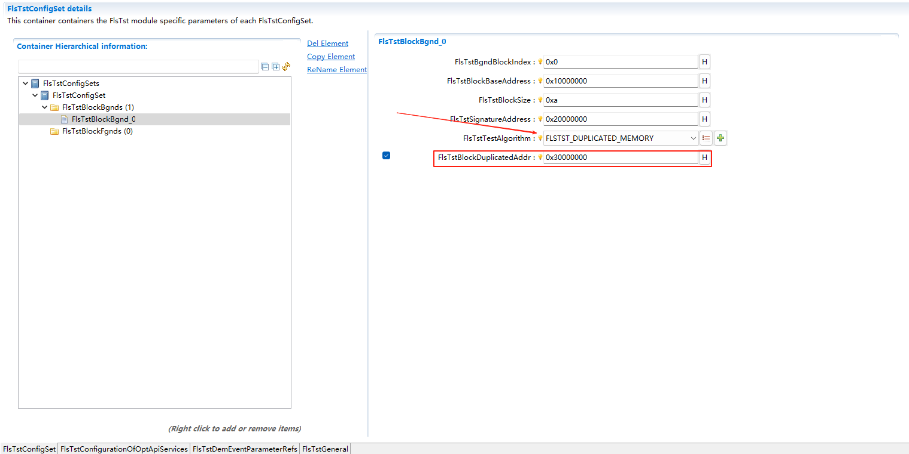
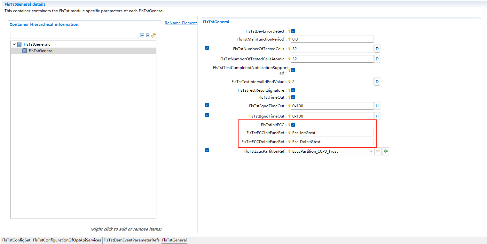

===================
FlsTst
===================

文档信息 Document Information
==============================================================

版本历史 Version History
------------------------------------------------------------------------------------------------------------

.. list-table::
   :widths: 10 10 10 10 20
   :header-rows: 1

   * - 日期(Date)
     - 作者(Author)
     - 版本(Version)
     - 状态(Status)
     - 说明(Description)

   * - 2025/03/13
     - peng.wu
     - V0.1
     - 发布(Release)
     - 首次发布(First release)

   * - 2025/04/04
     - peng.wu
     - V1.0
     - 发布(Release)
     - 正式发布(Official release)

参考文档 References
------------------------------------------------------------------------------------------------------------

.. list-table::
   :widths: 10 10 30 10
   :header-rows: 1

   * - 编号(Number)
     - 分类(Classification)
     - 标题(Title)
     - 版本(Version)
   * - 1
     - Autosar
     -  AUTOSAR_CP_SRS_FlashTest.pdf
     - R23-11
   * - 2
     - Autosar
     -  AUTOSAR_CP_SWS_FlashTest.pdf
     - R23-11

术语与简写 Terms and Abbreviations
==============================================================

术语 Terms
------------------------------------------------------------------------------------------------------------
.. :align: center   表格内容居中(Table contents are centered)

.. list-table::
   :widths: 15 40
   :header-rows: 1

   * - 术语(Terms)
     - 解释(Explanation)

   * - Background test
     - Background test is called periodically by a scheduler, and is interruptible. The test is split up over many scheduled tasks

   * - Foreground test
     - Foreground test is called via users call.

   * - Invariable memory
     - Invariable memory can be program flash, program SRAM, locked cache and ROM.

   * - Test block
     - Defined memory area to be tested in foreground and background mode.

   * - Test interval
     - Interval of a complete FlsTst in background mode.

   * - Signature
     - Unique calculation result of the content of a specific memory block.

   * - Memory block
     - Defined memory area.

   * - Test Interval Id
     - Identifier of a test interval, which shall be incremented by each start of a new test interval.

简写 Abbreviations
------------------------------------------------------------------------------------------------------------

.. list-table::
   :widths: 10 20 30
   :header-rows: 1

   * - 简写(Abbreviation)
     - 全称(Full name)
     - 解释(Explanation)

   * - DEM
     - Diagnostic Event Manager
     - 诊断事件管理器
   * - DET
     - Default Error Tracer
     - 默认错误跟踪器.
   * - ECC
     - Error Correction Code.
     - 错误纠错码
   * - CRC
     - Cyclic Redundancy Check
     - 循环冗余校验.
   * - OS
     - Operating System
     - 操作系统.
   * - EcuM
     - ECU Manager
     - Ecu管理器.
   * - BswM
     - Bsw Manager
     - 基础软件管理器.

简介 Introduction
==============================================================

FlsTst是独立于硬件环境和编译环境的，提供检测特定Flash区域数据一致性的算法。

FlsTst is independent of the hardware environment and compilation environment, and provides algorithms for detecting data consistency in specific Flash areas.

FlsTst支持多种测试算法，如CRC8、CRC16、CRC32、块比较、校验和计算、ECC校验等。

FlsTst supports a variety of test algorithms, such as CRC8, CRC16, CRC32, block comparison, checksum calculation, ECC verification, etc.

功能描述 Functional Description
==============================================================

特性 Features
------------------------------------------------------------------------------------------------------------

.. only:: doc_pbs

  变体 Variant
  ~~~~~~~~~~~~~~~~~~~~~~~~~~~~~~~~~~~~~~~~~~~~~

  1.支持配置不同的前/后台blockNum

  1.Support configuration of different foreground/background blockNum

  2.支持配置不同的Completed回调通知

  2.Support configuration of different Completed callback notifications

  3.支持配置不同的前台测试block属性（index除外）

  3.Support configuration of different foreground test block attributes (except index)

  4.支持配置不同的后台测试block属性（index除外）

  4.Support configuration of different background test block attributes (except index)

前台测试 Foreground Test
~~~~~~~~~~~~~~~~~~~~~~~~~~~~~~~~~~~~~~~~~~~~~~~~~~~~~~~~~~~~~~~~~~~~~~

前台测试表示为不可打断的同步测试方式，用户通过调用FlsTst_StartFgnd()开始执行前台测试，直到测试任务执行完成后才退出。

The foreground test is represented as an uninterruptible synchronous test method. The user starts executing the foreground test by calling FlsTst_StartFgnd(), and exits only after the test task is completed.

该API具有返回值，如果API返回E_OK，则表示前台测试执行成功，如果返回E_NOT_OK,则表示前台测试执行失败。

This API has a return value. If the API returns E_OK, it indicates that the foreground test is executed successfully; if it returns E_NOT_OK, it indicates that the foreground test fails to execute.

后台测试 Background Test
~~~~~~~~~~~~~~~~~~~~~~~~~~~~~~~~~~~~~~~~~~~~~~~~~~~~~~~~~~~~~~~~~~~~~~

后台测试表示异步的分片测试。后台测试通过周期调用FlsTst_MainFunction()来实现，按照配置的memory block的先后顺序执行。

The background test represents an asynchronous fragmented test. The background test is implemented by periodically calling FlsTst_MainFunction(), and executed in the sequence of the configured memory blocks.

当测试完后台模式下配置的所有memory block时，表示一个测试间隔完成。

When all memory blocks configured in the background mode are tested, it indicates that a test interval is completed.

分片测试可以在任何时候被高优先级任务中断。

Fragmented tests can be interrupted by high-priority tasks at any time.

如图 :ref:`ScheduleInterval` 展示了FlsTst的Interval调度，调度周期任务在后台测试中执行的分片测试的长度由测试单元的数量决定。

As shown in Figure :ref:`ScheduleInterval`, the Interval scheduling of FlsTst is displayed. The length of the fragmented test executed by the scheduled periodic task in the background test is determined by the number of test units.

例如，Flash Cell大小为128Bytes，分片测试单元个数为8，则单个测试的长度为1024Bytes。

For example, if the Flash Cell size is 128 Bytes and the number of fragmented test units is 8, the length of a single test is 1024 Bytes.

.. figure:: ../../../_static/参考手册/FlsTst/FlsTstInterval.jpg
   :alt: FlsTst模块ScheduleInterval图 (ScheduleInterval Diagram of FlsTst Module)
   :name: ScheduleInterval
   :align: center

   FlsTst Interval

在后台测试期间，FlsTst可以通过调用FlsTst_Abort或FlsTst_Suspended服务挂起和恢复。挂起的服务不会立即处理，只有在执行最小测试单元测试后，测试才会挂起。

During the background test, FlsTst can be suspended and resumed by calling the FlsTst_Abort or FlsTst_Suspended service. The suspended service will not be processed immediately. The test will be suspended only after the execution of the minimum test unit is completed.

后台测试的测试间隔使用一个标识符，该标识符在每个新测试间隔开始时自行添加。

The test interval of the background test uses an identifier, which is automatically incremented at the start of each new test interval.

ECC测试算法 ECC Test Algorithm
~~~~~~~~~~~~~~~~~~~~~~~~~~~~~~~~~~~~~~~~~~~~~~~~~~~~~~~~~~~~~~~~~~~~~~~~~~~~~~~~
提供一种算法来检查Flash中的数据和冗余位的正确性。（若需要使用ECC测试，则用户需要考虑硬件是否具备ECC功能的情况下才能进行ECC测试）

Provide an algorithm to check the correctness of data and redundant bits in Flash. (If ECC test needs to be used, the user needs to consider whether the hardware has ECC function before performing ECC test)

Checksum测试算法 Checksum Test Algorithm
~~~~~~~~~~~~~~~~~~~~~~~~~~~~~~~~~~~~~~~~~~~~~~~~~~~~~~~~~~~~~~~~~~~~~~~~~~~~~~~~~~~~~~~~~~
提供一种算法来重新计算内存块的校验和，并将其与存储在固定地址上的签名值进行比较。

Provide an algorithm to recalculate the checksum of a memory block and compare it with the signature value stored at a fixed address.

Crc8测试算法 Crc8 Test Algorithm
~~~~~~~~~~~~~~~~~~~~~~~~~~~~~~~~~~~~~~~~~~~~~~~~~~~~~~~~~~~~~~~~~~~~~~~~~~~~~~~~
CRC校验和的长度应为8位字，计算出来的CRC值将与存储到固定地址上的签名值进行比较。

The length of the CRC checksum shall be an 8-bit word, and the calculated CRC value will be compared with the signature value stored at a fixed address.

Crc16测试算法 Crc16 Test Algorithm
~~~~~~~~~~~~~~~~~~~~~~~~~~~~~~~~~~~~~~~~~~~~~~~~~~~~~~~~~~~~~~~~~~~~~~~~~~~~~~~~
CRC校验和的长度应为16位字，计算出来的CRC值将与存储到固定地址上的签名值进行比较。

The length of the CRC checksum shall be a 16-bit word, and the calculated CRC value will be compared with the signature value stored at a fixed address.

Crc32测试算法 Crc32 Test Algorithm
~~~~~~~~~~~~~~~~~~~~~~~~~~~~~~~~~~~~~~~~~~~~~~~~~~~~~~~~~~~~~~~~~~~~~~~~~~~~~~~~
CRC校验和的长度应为32位字，计算出来的CRC值将与存储到固定地址上的签名值进行比较。

The length of the CRC checksum shall be an 32-bit word, and the calculated CRC value will be compared with the signature value stored at a fixed address.

Compare测试算法 Compare Test Algorithm
~~~~~~~~~~~~~~~~~~~~~~~~~~~~~~~~~~~~~~~~~~~~~~~~~~~~~~~~~~~~~~~~~~~~~~~~~~~~~~~~
将block中的数据复制到另一个相同大小的block，然后比较两个区域中的数据是否一致。

Copy the data in a block to another block of the same size, and then compare whether the data in the two areas are consistent.

此算法需要有一个没有被使用的，相同大小的内存块。

This algorithm requires an unused memory block of the same size.

集成 Integration
==============================================================

CRC库 CRC Library
----------------------------------------------------------------------------------------------------------

FlsTst使用CRC算法时需要调用CRC的相关接口，所以工程中必须要集成CRC库，才能保证算法的正常执行。

When FlsTst uses the CRC algorithm, it needs to call the relevant interfaces of CRC. Therefore, the CRC library must be integrated into the project to ensure the normal execution of the algorithm.

写入签名值 Writing Signature Value
----------------------------------------------------------------------------------------------------------

FlsTst需要借助外部工具，计算出一个CRC或者Checksum的签名结果，存储到指定的flash地址，此阶段可在用户APP代码生成Hex文件后，对Hex文件进行计算，并将计算结果添加到APP的Hex文件中，再通过Bootlaoder将memory block的签名记录到芯片内部的flash中的固定位置，FlsTst模块初始化完成后，可通过前台测试或后台测试，将测试计算的结果与存储在固定地址的数据进行比较，如果签名一致，就表示测试成功，如果不一致，则测试失败，FlsTst将通过DEM模块报告故障。

FlsTst needs to use an external tool to calculate a CRC or Checksum signature result and store it in the specified flash address. At this stage, after the user APP code generates the Hex file, the Hex file can be calculated, and the calculation result can be added to the Hex file of the APP. Then, through the Bootloader, the signature of the memory block is recorded in a fixed position in the internal flash of the chip. After the FlsTst module is initialized,the result calculated by the foreground test or background test can be compared with the data stored at the fixed address. If the signatures are consistent, it means the test is successful; if they are inconsistent, the test fails, and FlsTst will report the fault through the DEM module. 

多分区 Multi-Partition
----------------------------------------------------------------------------------------------------------

FlsTst多分区场景下，需要配置FlsTstEcucPartitionRef关联对应的分区。FlsTst只能在关联的分区下执行，不能在未关联的分区执行，若需要切换分区，只能重新配置关联相关的FlsTstEcucPartitionRef。

In the multi-partition scenario of FlsTst, it is necessary to configure FlsTstEcucPartitionRef to associate the corresponding partition. FlsTst can only be executed in the associated partition and cannot be executed in the unassociated partition. If partition switching is required, only the FlsTstEcucPartitionRef related to the association can be reconfigured.

前台测试 Foreground Test
----------------------------------------------------------------------------------------------------------

FlsTst的前台测试为不可打断的同步操作，所以对于前台测试的Block，一般是在ECU上电启动os前，或者下电结束前执行，避免因为前台测试的Block数量过多或者Size太大，导致的测试时间过长。

The foreground test of FlsTst is an uninterruptible synchronous operation. Therefore, the Block for the foreground test is generally executed before the ECU powers on and starts the OS, or before the power-off ends. This avoids excessive test time caused by too many Blocks or too large Size of the foreground test.

文件列表 File List
----------------------------------------------------------------------------------------------------------

静态文件 Static Files
~~~~~~~~~~~~~~~~~~~~~~~~~~~~~~~~~~~~~~~~~~~~~~~~~~~~~~~~~~~~~~

.. list-table::
   :widths: 10 30
   :header-rows: 1

   * - 文件(File)
     - 描述(Description)
   
   * - FlsTst.c
     - FlsTst的API实现；包含宏定义、内部变量、内部函数以及需调用的全局函数。(API implementation of FlsTst; contains macro definitions, internal variables, internal functions, and global functions that need to be called.)
   * - FlsTst.h
     - FlsTst的API声明和宏定义；包括宏定义、配置结构声明以及需调用的外部函数声明。(API declarations and macro definitions of FlsTst; contains macro definitions, configuration structure declarations, and external function declarations that need to be called.)
   * - FlsTst_Types.h
     - 包含FlsTst的类型定义。(Contains the type definitions of FlsTst.)
   * - FlsTst_MemMap.h
     - 包含FlsTst的内存抽象。(Contains the memory abstraction of FlsTst.)

动态文件 Dynamic Files
~~~~~~~~~~~~~~~~~~~~~~~~~~~~~~~~~~~~~~~~~~~~~~~~~~~~~~~~~~~~~~
.. list-table::
   :widths: 10 30
   :header-rows: 1

   * - 文件(File)
     - 描述(Description)

   * - FlsTst_cfg.h
     - FlsTst的配置声明；包含宏定义、版本信息以及需调用的API声明。(Configuration declaration of FlsTst; contains macro definitions, version information, and API declarations that need to be called.)

   * - FlsTst_Lcfg.c
     - FlsTst的链接时定义；包含需调用的ECC参数地址。(Link-time definition of FlsTst; contains the ECC parameter addresses that need to be called.)

   * - FlsTst_Lcfg.h
     - FlsTst的链接时声明；包含宏定义、版本信息以及需调用的API声明。(Link-time declaration of FlsTst; contains macro definitions, version information, and API declarations that need to be called.)

   * - FlsTst_PBcfg.h
     - FlsTst的构建后配置声明；包含宏定义、版本信息以及需调用的API声明。(Post-build configuration declaration of FlsTst; contains macro definitions, version information, and API declarations that need to be called.)

   * - FlsTst_PBcfg.c
     - FlsTst的构建后定义；包含需使用的块地址、大小和算法。(Post-build definition of FlsTst; contains the block addresses, sizes, and algorithms that need to be used.)

错误处理 Error Handling
----------------------------------------------------------------------------------------------------------

开发错误 Development Errors
~~~~~~~~~~~~~~~~~~~~~~~~~~~~~~~~~~~~~~~~~~~~~~~~~~~~~~~~~~~~~~
.. list-table:: 
   :widths: 20 10 30
   :header-rows: 1

   * - Error code
     - Value[hex]
     - Description

   * - FLSTST_E_NO_ERROR
     - 0x0u
     - API function called with no det error

   * - FLSTST_E_STATE_FAILURE
     - 0x01
     - Failure within Flash Test execution state

   * - FLSTST_E_PARAM_INVALID
     - 0x2u
     - API parameter out of specified range

   * - FLSTST_E_UNINIT
     - 0x3u
     - API service used without module initialization

   * - FLSTST_E_ALREADY_INITIALIZED
     - 0x4u
     - Flash Test module is already initialized

   * - FLSTST_E_INIT_FAILED
     - 0x5u
     - For Variant PB: Configuration pointer is a NULL pointer. For Variant PC: Configuration pointer is NOT a NULL pointer

   * - FLSTST_E_PARAM_POINTER
     - 0x6u
     - Pointer is a NULL pointer

   * - FLSTST_E_TIMEOUT
     - 0x07u
     - The process is timeout

   * - FLSTST_E_WRONG_CONDITION
     - 0x08u
     - partition info error

产品错误 Product Errors
~~~~~~~~~~~~~~~~~~~~~~~~~~~~~~~~~~~~~~~~~~~~~~~~~~~~~~~~~~~~~~
None

扩展产品错误 Extended Product Errors
~~~~~~~~~~~~~~~~~~~~~~~~~~~~~~~~~~~~~~~~~~~~~~~~~~~~~~~~~~~~~~
.. list-table:: 
   :widths: 20 10 30
   :header-rows: 1

   * - Error code
     - Value[hex]
     - Description

   * - FLSTST_E_FLSTST_FAILURE
     - Value[hex]
     - This Extended Production Error shall be issued in case a failure is detected in background mode within a test interval

接口描述 Interface Description
==============================================================

.. include:: FlsTst_api.rst

依赖的服务 Applicable Services
----------------------------------------------------------------------------------------------------------

可选接口 Optional Interface
~~~~~~~~~~~~~~~~~~~~~~~~~~~~~~~~~~~~~~~~~~~~~~~~~~~~~~~~~~~~~~

.. list-table::
   :widths: 10 5 30
   :header-rows: 1

   * - API Function
     - Header File
     - Description

   * - Det_ReportError
     - Det.h
     - Service to report development errors

   * - Det_ReportError
     - Det.h
     - Service to report development errors

强制接口 Compulsory interface
~~~~~~~~~~~~~~~~~~~~~~~~~~~~~~~~~~~~~~~~~~~~~~~~~~~~~~~~~~~~~~
.. 可选的章节，根据模块实际情况确定

.. list-table::
   :widths: 10 5 30
   :header-rows: 1

   * - API Function
     - Header File
     - Description
   * - Dem_SetEventStatus
     - Dem.h
     - Called by SW-Cs or BSW modules to report monitor status information to the Dem

配置接口 Configuration Interfaces
~~~~~~~~~~~~~~~~~~~~~~~~~~~~~~~~~~~~~~~~~~~~~~~~~~~~~~~~~~~~~~
.. 可选的章节，根据模块实际情况确定
.. 格式同强制接口

.. list-table::
   :widths: 10 5 30
   :header-rows: 1

   * - API Function
     - Header File
     - Description
   * - FlsTst_TestCompletedNotification
     - FlsTst.h
     - The function FlsTst_TestCompleted shall be called every time when a complete test cycle had been tested

配置 Configuration
==============================================================

FlsTstSignatureAddress
----------------------------------------------------------------------------------------------------------
FlsTst所选测试算法的签名需要存储在芯片内部Flash上的固定地址空间内，这个固定地址是在工具中配置的，指定这个Block的签名存储的位置。

The signature of the test algorithm selected by FlsTst needs to be stored in a fixed address space on the internal Flash of the chip. This fixed address is configured in the tool to specify the storage location of the signature of this Block.

如图 :ref:`SignatureAddress` 展示了FlsTstSignatureAddress的配置界面，可配置签名值写入的固定地址。

As shown in Figure :ref:`SignatureAddress`, the configuration interface of FlsTstSignatureAddress is displayed, and the fixed address for writing the signature value can be configured.

.. figure:: ../../../_static/参考手册/FlsTst/FlsTstSignatureAddress.png
   :alt: FlsTst模块SignatureAddress配置图 (SignatureAddress Configuration Diagram of FlsTst Module)
   :name: SignatureAddress
   :align: center

   FlsTst SignatureAddress Configuration

FlsTstBlockDuplicatedAddr
----------------------------------------------------------------------------------------------------------
FlsTst的Block需要选择算法为FLSTST_DUPLICATED_MEMORY，然后才能配置对应的地址，这个地址会在执行Compare算法时，用作复制和存储数据。

The Block of FlsTst needs to select the algorithm as FLSTST_DUPLICATED_MEMORY, and then the corresponding address can be configured. This address will be used to copy and store data when executing the Compare algorithm.

如图 :ref:`BlockDuplicatedAddr` 展示了FlsTstBlockDuplicatedAddr的配置界面，可配置Duplicate地址。

As shown in Figure :ref:`BlockDuplicatedAddr`, the configuration interface of FlsTstBlockDuplicatedAddr is displayed, and the Duplicate address can be configured.

   FlsTst BlockDuplicatedAddr Configuration

ECCApi
--------------------------------------------------------------------------------
FlsTst若需要使用算法FLSTST_ECC，则必须勾选FlsTstTestEccApi之后，关联用户对应的ECC接口，如图 :ref:`TestEccApi` 展示了FlsTstTestEccApi的配置界面，可配置关联用户对应的ECC接口。

If FlsTst needs to use the algorithm FLSTST_ECC, you must check FlsTstTestEccApi and then associate the user's corresponding ECC interface. As shown in Figure :ref:`TestEccApi`, the configuration interface of FlsTstTestEccApi is displayed, and the user's corresponding ECC interface can be configured and associated.

.. figure:: ../../../_static/参考手册/FlsTst/FlsTstTestEccApi.png
   :alt: FlsTst模块TestEccApi配置图 (TestEccApi Configuration Diagram of FlsTst Module)
   :name: TestEccApi
   :align: center

   FlsTst TestEccApi Configuration

若用户的Ecc接口需要进行初始化等操作，则可勾选FlsTstInitECC之后，关联用户对应的ECC初始化和反初始化接口，如图 :ref:`InitECC` 展示了FlsTstInitECC的配置界面，可配置关联用户对应的ECC接口。

If the user's Ecc interface needs to perform operations such as initialization, you can check FlsTstInitECC and then associate the user's corresponding ECC initialization and de-initialization interfaces. As shown in Figure :ref:`InitECC`, the configuration interface of FlsTstInitECC is displayed, and the user's corresponding ECC interface can be configured and associated.

   FlsTst InitECC Configuration

