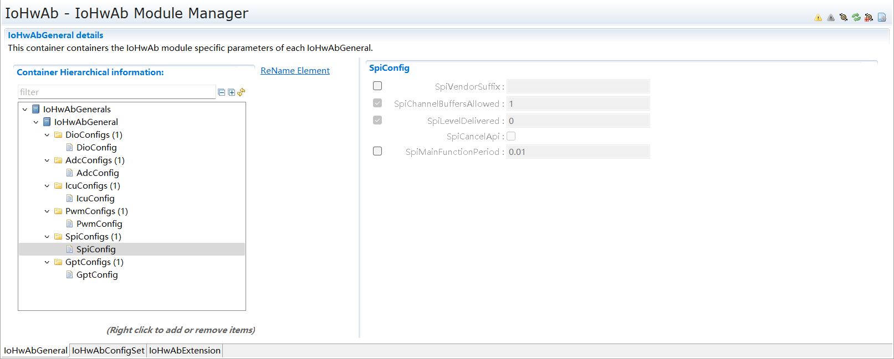
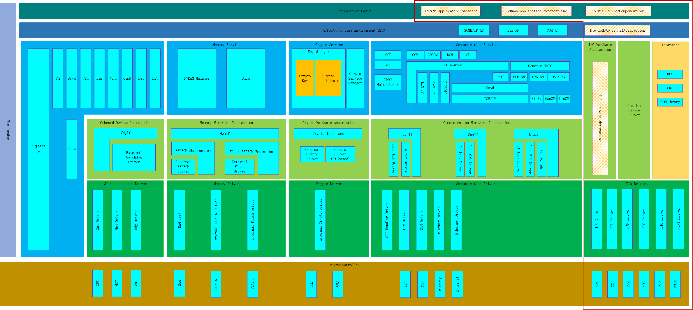
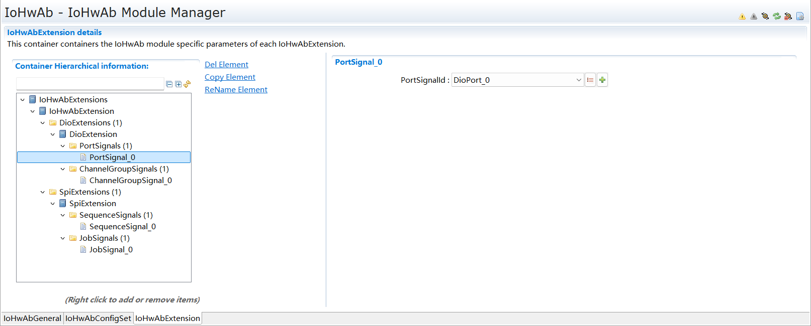
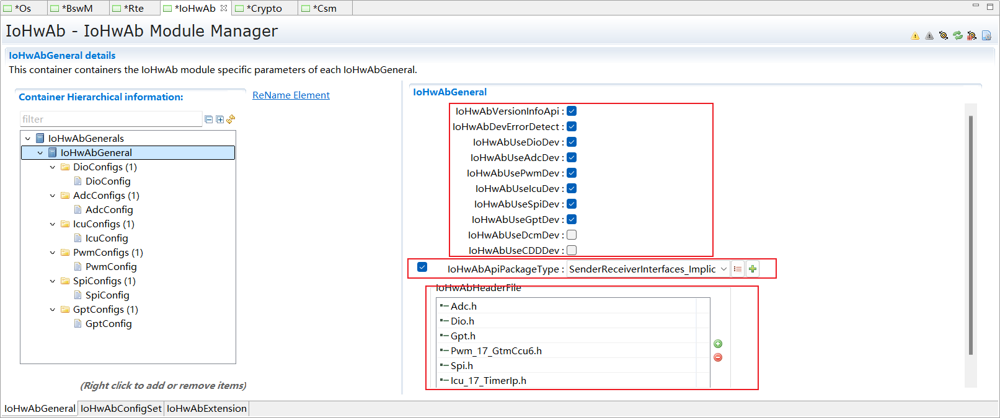
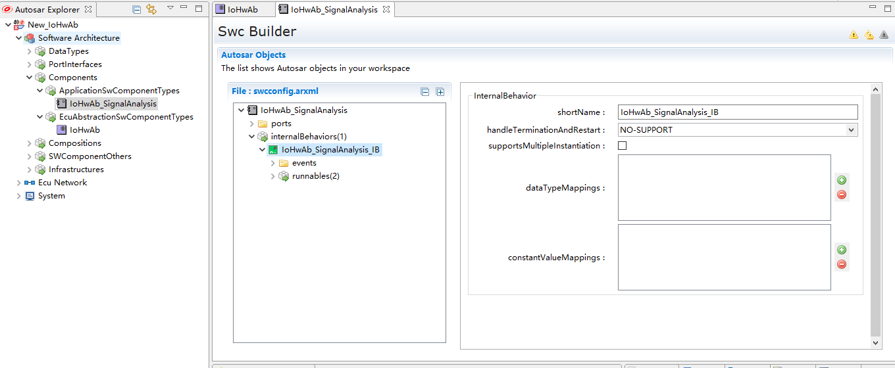
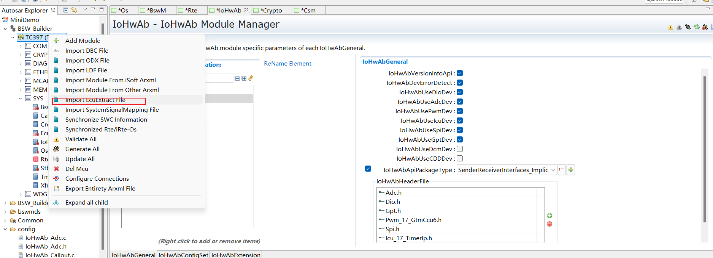

==============
IoHwAb
==============

**缩写词注解**

+------------+----------------------------------+----------------------+
| **缩写词** | **英文全称**                     | **中文解释**         |
+------------+----------------------------------+----------------------+
| IoHwAb     | Input Output Hardware            | 输入输出硬件抽象     |
|            | Abstraction                      |                      |
+------------+----------------------------------+----------------------+
| SWC        | Software Component               | 软件组件             |
+------------+----------------------------------+----------------------+
| RTE        | Real-Time Running Environment    | 实时运行环境         |
+------------+----------------------------------+----------------------+
| BSW        | Basic Software                   | 基础软件             |
+------------+----------------------------------+----------------------+
| BSWMD      | Basic SoftWare Module            | 基础软件模块描述     |
|            | Description                      |                      |
+------------+----------------------------------+----------------------+
| OS         | Operating System                 | 操作系统             |
+------------+----------------------------------+----------------------+
| MCAL       | Microconroller Abstraction Layer | 微控制器抽象层       |
+------------+----------------------------------+----------------------+
| MMU        | Memory Management Unit           | 内存管理单元         |
+------------+----------------------------------+----------------------+
| ADC        | Analog-to-Digital Converter      | 模拟-数字转换器      |
+------------+----------------------------------+----------------------+
| ICU        | Input Capture Unit               | 输入捕获单元         |
+------------+----------------------------------+----------------------+
| DIO        | Digital Input Output             | 数字输入输出         |
+------------+----------------------------------+----------------------+
| PWM        | Pulse Width Modulation           | 脉冲宽度调制         |
+------------+----------------------------------+----------------------+
| OCU        | Output Comparison Unit           | 输出比较单元         |
+------------+----------------------------------+----------------------+
| SPI        | Serial Peripheral Interface      | 串行外设总线         |
+------------+----------------------------------+----------------------+
| GPT        | General Purpose Timer            | 通用定时器           |
+------------+----------------------------------+----------------------+
| C/S        | Client - Server                  | 客户端-服务端组件    |
+------------+----------------------------------+----------------------+
| S/R        | Sender/Receiver                  | 发送端/接收端        |
+------------+----------------------------------+----------------------+
| CDD        | Complex device driver            | 复杂设备驱动         |
+------------+----------------------------------+----------------------+
| DET        | Default Error Tracer             | 默认错误跟踪器       |
+------------+----------------------------------+----------------------+
| ECU        | Electronic Control Unit          | 电子控制单元         |
+------------+----------------------------------+----------------------+
| MCU        | Micro Controller Unit            | 微控制器单元         |
+------------+----------------------------------+----------------------+
| AUTOSAR    | AUTomotive Open System           | 汽车开放系统架构     |
|            | ARchitecture                     |                      |
+------------+----------------------------------+----------------------+
| API        | Application Programming          | 应用编程接口         |
|            | Interface                        |                      |
+------------+----------------------------------+----------------------+
| HW         | Hardware                         | 硬件                 |
+------------+----------------------------------+----------------------+
| SW         | Software                         | 软件                 |
+------------+----------------------------------+----------------------+
| ISR        | Interrupt Service Routine        | 中断服务例程         |
+------------+----------------------------------+----------------------+
| XML        | Extensible Markup Language       | 可扩展标记语言       |
+------------+----------------------------------+----------------------+

简介
====

本文档作为IoHwAb模块软件产品的使用手册，详细介绍了IoHwAb模块的功能、使用约束以及定制开发方法，使用户可以尽快熟悉并使用IoHwAb模块。

AUTOSAR规范中明确指出IoHwAb模块是ECU抽象层的一部分。IoHwAb模块不应该被认为是一个单一的模块，因为它可以被实现为多个模块。IoHwAb模块不对外设组件进行标准化，它是一份与其他模块一起实现其功能接口的指南。IoHwAb模块的目的是通过将IoHwAb模块端口映射到ECU信号来提供对MCAL驱动程序的访问。提供给SWC的数据完全是从物理层抽象出来的。因此，SWC设计人员不再需要详细了解MCAL驱动程序的API和物理层的单元。

IoHwAb模块是对ECU的特定实现，因为SWC对BSW的需求必须匹配特定的MCAL所实现的特性。IoHwAb模块应该为初始化整个IoHwAb模块提供服务。

参考资料
--------

[1] AUTOSAR_SRS_ADCDriver.pdf R22-11

[2] AUTOSAR_SWS_ADCDriver.pdf R22-11

[3] AUTOSAR_SRS_DIODriver.pdf R22-11

[4] AUTOSAR_SWS_DIODriver.pdf R22-11

[5] AUTOSAR_SRS_ICUDriver.pdf R22-11

[6] AUTOSAR_SWS_ICUDriver.pdf R22-11

[7] AUTOSAR_SRS_PWMDriver.pdf R22-11

[8] AUTOSAR_SWS_PWMDriver.pdf R22-11

[9] AUTOSAR_SRS_GPTDriver.pdf R22-11

[10] AUTOSAR_SWS_GPTDriver.pdf R22-11

[11] AUTOSAR_SRS_PortDriver.pdf R22-11

[12] AUTOSAR_SWS_PortDriver.pdf R22-11

[13] AUTOSAR_SRS_OCUDriver.pdf R22-11

[14] AUTOSAR_SWS_OCUDriver.pdf R22-11

[15] AUTOSAR_SRS_SPIHandlerDriver.pdf R22-11

[16] AUTOSAR_SWS_SPIHandlerDriver.pdf R22-11

[17] AUTOSAR_SRS_MCUDriver.pdf R22-11

[18] AUTOSAR_SWS_MCUDriver.pdf R22-11

[19] AUTOSAR_SRS_IOHWAbstraction.pdf R22-11

[20] AUTOSAR_SWS_IOHardwareAbstraction.pdf R22-11

[21] AUTOSAR_SRS_RTE.pdf R19-11

[22] AUTOSAR_SWS_RTE.pdf R19-11

功能描述
========

IoHwAb功能
----------

IoHwAb功能介绍
~~~~~~~~~~~~~~

如图所示IoHwAb位于MCAL驱动程序之上，也就意味着IoHwAb将调用驱动程序的API来管理芯片设备。MCAL驱动程序的配置取决于SWC所需的ECU信号的质量。例如，当PIN引脚电平发生相关变化(上升沿，下降沿)时，可能需要通知用户。系统设计者必须配置MCAL驱动程序以允许给定信号的通知。通知由MCAL驱动程序生成，并在IoHwAb模块中处理。

|image1|

图 Interfaces with MCAL drivers

IoHwAb功能实现
~~~~~~~~~~~~~~

IoHwAb模块为SWC提供对所有MCAL驱动程序的抽象API访问。

表 IoHwAb组件抽象状况

+-----------+----+-----+-----+------+------+-----+-------+----+----+
| **组件**  | **M|     |     |      |      |     |       |    |    |
|           | C  |     |     |      |      |     |       |    |    |
| **功能**  | AL |     |     |      |      |     |       |    |    |
|           | d  |     |     |      |      |     |       |    |    |
|           | ri |     |     |      |      |     |       |    |    |
|           | ve |     |     |      |      |     |       |    |    |
|           | r  |     |     |      |      |     |       |    |    |
|           | s**|     |     |      |      |     |       |    |    |
+-----------+----+-----+-----+------+------+-----+-------+----+----+
|           | D  | P   | PWM | ICU  | ADC  | SPI | OCU   | G  | C  |
|           | IO | ORT |     |      |      |     |       | PT | DD |
+-----------+----+-----+-----+------+------+-----+-------+----+----+
| I         | √  | ×   | √   | √    | √    | √   | ×     | √  | √  |
| O抽象服务 |    |     |     |      |      |     |       |    |    |
+-----------+----+-----+-----+------+------+-----+-------+----+----+
| 中断      | ×  | ×   | √   | √    | √    | √   | ×     | √  | ×  |
| 通知机制  |    |     |     |      |      |     |       |    |    |
+-----------+----+-----+-----+------+------+-----+-------+----+----+

说明：√表示实现了抽象功能并关联MCAL对应驱动程序；×表示暂时没有实现抽象功能并关联MCAL对应驱动程序。

IoHwAb模块提供SWC访问ADC的接口。主要用于启动和停止ADC驱动程序对模拟信号的数字量转化功能；使能和禁止ADC驱动程序中断通知；使能和禁止ADC驱动程序硬件触发功能；设置ADC驱动程序采样结果目标缓冲区；提取ADC驱动程序的采样结果。

IoHwAb模块实现和提供SWC访问DIO的接口。主要用于设置和获取DIO驱动程序对数字信号的通道电平；对数字信号的端口电平；对数字信号的端口组电平,提取DIO驱动程序的通道电平翻转状态。

IoHwAb模块实现和提供SWC访问PWM的接口。主要用于使能和禁止PWM驱动程序中断通知；设置PWM驱动程序输出为IDLE状态；提取PWM驱动程序的输出状态；设置PWM驱动程序输出占空比；设置PWM驱动程序输出周期和占空比。

IoHwAb模块实现和提供SWC访问ICU的接口。主要用于使能和禁止ICU驱动程序的中断通知；使能和禁止ICU驱动程序的边沿检测功能；使能和禁止ICU驱动程序的边沿计数功能；设置ICU驱动程序复位边沿计数器；获取ICU驱动程序的边沿计数器；启动和停止ICU驱动程序的时间戳功能；获取ICU驱动程序的时间戳索引；获取ICU驱动程序的消逝时间值；启动和停止ICU驱动程序的信号测量功能；获取ICU驱动程序的输入状态；获取ICU驱动程序对信号测量的占空比结果。

软件编码主要采用C语言，还有少量的汇编语言。另外，充分考虑车载软件的特殊应用环境，编码规则严格按照汽车制造业嵌入式C编码标准-MISRA-C:2012
执行，以保证IoHwAb模块安全可靠。

ECU信号的抽象
^^^^^^^^^^^^^

IoHwAb模块无法为SWC提供标准化的AUTOSAR接口，因为它与上层的接口强烈依赖于信号采集链。相反，IoHwAb模块提供了AUTOSAR服务接口。而这些AUTOSAR接口都是来自于ECU输入或寻址到ECU输出的实际电信号的抽象。另外，有些电信号也可能来自其他ECU或被发送到其他ECU。

端口PORT是AUTOSAR组件的入口点。它们由AUTOSAR接口表示，并映射到对应ECU信号。ECU信号的来源针对于硬件平台互换性的必要性。

|image2|

图 ECU signal description

IoHwAb模块处理所有直接连接到ECU的输入和输出。它包括所有的输入和输出，直接映射到微控制器端口或板载外围设备。在考虑所提供的接口时，微控制器和外设之间的所有通信都被IoHwAb模块所隐藏。

ECU信号表示一个电信号，意味着至少有一个输入或输出ECU引脚被IO硬件抽象所映射。通过软件抽象ECU引脚，可以把输入和输出识别为电信号。本文档中所定义的一切都与电信号概念有关，统一由IoHwAb模块进行服务。具有相似行为的电信号可以归为一个类，并通过IO硬件抽象以ECU信号的形式来进行关联，然后提供给SWC用户使用。

ECU信号的属性
^^^^^^^^^^^^^

每个ECU信号的特征描述都是由SWC定义的，但必须为每个信号添加一些属性，以提供SWC所期望的信号质量。

所有通过IoHwAb模块处理的ECU信号都依赖于ECU硬件设计。意味着设置ECU输出信号的时间和获得ECU输入信号的时间不可能在同一时间进行控制。因此，为了保证各种ECU信号的控制行为，定义了一个通用的年龄属性，并对每个ECU信号进行配置。

所有ECU信号都应该有一个\ **年龄**\ 属性，根据ECU信号的方向(输入/输出)，\ **年龄**\ 属性有两个具体的名称。对于ECU输入信号，\ **年龄**\ 属性的具体功能是限制信号的生存期，其值定义了该信号数据的最大允许年龄，如果生存期为0，则必须立即从物理寄存器中检索该信号，如果生存期大于0，则信号在指定的时间内有效；对于ECU输出信号，\ **年龄**\ 属性的具体功能是限制信号输出到最大延迟，其值定义了该信号实际设置之前允许的最大时间，如果延迟为0，则必须立即将信号设置到物理寄存器，如果延迟大于0，信号可以设置到配置的时间已经过去。

和其他软件组件SWC一样，IoHwAb模块可以是子结构的，取决于ECU的复杂程度。IoHwAb模块是一个经典的组件原型，可以是原子的，也可以是组合的，它提供需求接口。此外，IoHwAb模块只能通过它们的PortPrototypes与RTE之上的其他软件组件进行交互。不允许使用PortPrototypes表示的隐藏依赖项。

IoHwAb模块一方面通过标准化的AUTOSAR接口连接于MCAL驱动程序，另一方面通过RTE连接SWC服务组件和应用组件。IoHwAb模块的服务组件在SWC配置工具中通过EcuAbstractionSwComponentType组件实现为一个或多个IO硬件抽象服务实例，一个EcuAbstractionSwComponentType的实例化提供了一组端口，在生成RTE时，只考虑那些与软件组件建立连接的IO信号；IoHwAb模块的应用组件在SWC配置工具中通过ApplicationSwComponentType组件实现为一个或多个IO硬件抽象服务实例，一个ApplicationSwComponentType的实例化提供了一组端口，在生成RTE时，只考虑那些与软件组件建立连接的IO信号。

软件组件具备实现策略和内部行为的功能，其功能是通过Runnable来描述的，前者包含在Runnable中，后者取决于Runnable的设计，Runnable由原子软件组件提供，是底层操作系统调度的对象。每个原子软件组件的实现必须在其\ **内部行为**\ 中为每个可运行的Runnable提供一个入口点。

Runnable实体是最小的代码片段，可以独立激活。它们由原子软件组件提供并由RTE激活，Runnable被设置为响应服务器上的数据交换或操作调用。

Runnable实体有三种可能的状态：Suspended、Enabled和Running。在运行时，原子软件组件的每个Runnable都处于这些状态之一。

每个BSW模块都可以提供BSW可运行的实体，在RTE规范中也称为BswModuleEntity。BswModuleEntity相当于SWC运行的实体，Runnable实体是一个原子软件组件可以执行和计划独立于原子软件组件的其他运行的实体。意味着IoHwAb模块可以同时使用Runnable调度和BSW调度。Runnable调度处理可运行实体，是强制性的。与可运行调度不同，BSW调度是可选的，与BSW调度程序的接口必须手动完成。对于SWC可运行实体，可以在AUTOSAR
OS任务体中被调用，SWC可运行项的激活强烈依赖于RTE事件。与SWC通常被RTEEvents激活的方式一样，可调度的BswModuleEntities也可以被BswEvents激活。还有一种BswModuleEntity可以在中断上下文中激活。

从接口的角度描述IoHwAb模块，实现由SWC定义的PortInterfaces的对等物提供Runnable实体，并实现SWC所需的端口映射提供(Server-Client端口，或者Sender/Receiver端口)。

IoHwAb模块提供端口服务的实现是ECU特定的，对应的\ **PortInterface**\ 的映射应在软件组件描述中归档化。对于与\ **PortInterface**\ 相关联的ECU信号配置为输入信号，IoHwAb模块应提供一个\ **GET**\ 操作，其操作的API简短名称可以由用户来决定；对于ECU信号与\ **PortInterface**\ 相关联的配置为一个输出信号，IoHwAb模块应该提供一个\ **SET**\ 操作，其操作的API短名称可以由用户来决定；IoHwAb模块通过定义\ **BswInterruptEntities**\ 来实现\ **通知**\ 或\ **回调**\ 机制，在中断上下文中与RTE下面的其他模块进行交换数据，实现时需要必须考虑回调函数将在中断上下文中执行；回调函数还可以提供在IoHwAb模块之外触发软件组件的能力，其通知需要通过RTE进行处理；可用回调函数的数量和执行顺序将取决于实现，并且必须在IoHwAb模块BSWMD中记录。

通过RTE路由的IoHwAb模块的回调函数函数的函数原型应按照以下规则实现：Std_ReturnType
Rte_Call\_ < p > \_ < o >(<parameters>)

回调函数必须与RTE的Rte_Call\_
\_<o>的API兼容，以使AUTOSAR服务和IO硬件抽象的类型安全配置和实现。

IoHwAb模块可以包含一个或几个作业任务处理主函数，由BSW调度程序定时触发，也可以同步到其他可运行实体的执行。BswSchedulableEntities的数量和它们的执行顺序将依赖于实现，并且必须在IoHwAb模块描述中记录。

IoHwAb模块定义BswModuleEntries与外部中断上下文RTE以下的其他软件进行交换数据，如BSW初始化/反初始化；这些BswModuleEntries被链接到一个专用的BswModuleEntity，它将被调用来执行服务/交换数据。IoHwAb模块可以包含一个或几个初始化和反初始化函数。与MCAL驱动类似，初始化函数应该包含一个参数，以便能够将不同的配置传递给设备驱动程序。这个函数将IoHwAb模块驱动程序使用的所有局部和全局变量初始化到初始状态；初始化/反初始化功能应由ECU状态管理器进行处理。可用函数的数量和执行顺序是依赖于实现的，必须在IoHwAb模块描述中记录下来。

软件组件架构
^^^^^^^^^^^^

|image3|

图 IoHwAb模块的软件架构

IoHwAb软件功能的基本组成部分包括：微控制抽象层MCAL、IoHwAb硬件抽象组件实现层、IoHwAb硬件抽象信号映射层、IoHwAb硬件抽象服务组件、ECU抽象服务端软件组件SWC、输入输出抽象客户端软件组件SWC等。

|image4|

图 IoHwAb模块的在AUTOSAR软件架构中的位置

信号映射机制和数据流
^^^^^^^^^^^^^^^^^^^^

|image5|

图 AUTOSAR ECU Software Architecture

|image6|

图 Example of IoHwAb runnables

|image7|

图 Interfaces between hardware and software

当ECU外部挂接设备和IO硬件抽象进行连接时，并通过IO服务组件的形式与用户层SWC进行交互，而这种情况下都是先实现CDD复杂设备驱动并支持SPI组件的通信抽象，然后CDD与IoHwAb进行交互，IO硬件抽象实现标准的服务组件API接口给应用组件SWC使用。

|image8|

图 Sensor and Actuator Signal Flow

|image9|

图 Sequence diagram - ADC conversion

当上层应用组件需要对MCAL进行模拟信号-数字量转换时，可以通过以上时序进行时序控制；首先，EcuM_Init接口的驱动初始化流程需要调用Adc_Init函数执行ADC组件的初始化，调用Adc_EnableNotification函数执行ADC组件的中断通知使能；然后，上层如果需要使用ADC组建的资源，可以调用相应的服务简介调用ADC组件的Adc_StartGroupConversion函数来启动AD转换；最后，当中断服务函数或轮询接收到AD转换完成，可以通过调用Adc_ReadGroup函数获取转换结果，并拷贝到指定缓冲区。

AUTOSAR方法论
^^^^^^^^^^^^^

|image10|

图 AUTOSAR工具链方法论

内存分配
========

在IO硬件抽象模块中，内存使用上大概分为配置代码部分的代码段，占用一定内存的Code
Flash存储空间；配置代码部分的数据段，占用一定内存的RAM存储空间。

源文件描述
==========

|image11|

图 IoHwAb组件文件组织结构描述

表 IoHwAb组件文件描述

+----------------------------+-----------------------------------------+
| **文件**                   | **说明**                                |
+----------------------------+-----------------------------------------+
| IoHwAb_Types.h             | IoHwAb模块头文件，包含了IoHwAb模块      |
|                            | 和ECU信号映射描述相关的数据类型和宏定义 |
+----------------------------+-----------------------------------------+
| IoHwAb.c                   | IoHwAb模块配置                          |
|                            | 源文件，包含了API函数的实现和变量的定义 |
+----------------------------+-----------------------------------------+
| IoHwAb.h                   | IoHwAb模                                |
|                            | 块配置头文件，包含了API函数和变量的声明 |
+----------------------------+-----------------------------------------+
| IoHwAb_Cfg.h               | 定义Io                                  |
|                            | HwAb模块预编译时用到的配置参数，用于MCA |
|                            | L组件信号通道的重映射定义和IO信号统计。 |
+----------------------------+-----------------------------------------+
| IoHwAb_Dio.c               | Io                                      |
|                            | HwAb模块与Dio组件交互相关的源文件，包含 |
|                            | 了API函数的实现和变量的定义，用于处理数 |
|                            | 字量电平输入输出信号映射的IO硬件抽象。  |
+----------------------------+-----------------------------------------+
| IoHwAb_Dio.h               | IoHwAb模块与Dio组件交互相关的头文件     |
|                            | ，包含了API函数和变量的声明，用于处理数 |
|                            | 字量电平输入输出信号映射的IO硬件抽象。  |
+----------------------------+-----------------------------------------+
| IoHwAb_Adc.c               | Io                                      |
|                            | HwAb模块与Adc组件交互相关的配置源文件， |
|                            | 包含了API函数的实现和变量的定义，用于处 |
|                            | 理模拟量输入采集信号映射的IO硬件抽象。  |
+----------------------------+-----------------------------------------+
| IoHwAb_Adc.h               | IoHwAb模块与Adc组件交互相关的配置头     |
|                            | 文件，包含了API函数和变量的声明，用于处 |
|                            | 理模拟量输入采集信号映射的IO硬件抽象。  |
+----------------------------+-----------------------------------------+
| IoHwAb_Icu.c               | IoHwAb模块与Icu组件交互相关的源         |
|                            | 文件，包含了API函数的实现和变量的定义， |
|                            | 用于处理输入捕获信号映射的IO硬件抽象。  |
+----------------------------+-----------------------------------------+
| IoHwAb_Icu.h               | IoHwAb模块与Icu组件交互相               |
|                            | 关的头文件，包含了API函数和变量的声明， |
|                            | 用于处理输入捕获信号映射的IO硬件抽象。  |
+----------------------------+-----------------------------------------+
| IoHwAb_Pwm.c               | IoHwAb模块与Pwm组件交互相关的           |
|                            | 源文件，包含了API函数的实现和变量的定义 |
|                            | ，用于处理PWM输出信号映射的IO硬件抽象。 |
+----------------------------+-----------------------------------------+
| IoHwAb_Pwm.h               | IoHwAb模块与Pwm组件交互                 |
|                            | 相关的头文件，包含了API函数和变量的声明 |
|                            | ，用于处理PWM输出信号映射的IO硬件抽象。 |
+----------------------------+-----------------------------------------+
| IoHwAb_Spi.c               | IoHwAb模块与Spi组件交互                 |
|                            | 相关的源文件，包含了API函数和变量的声明 |
|                            | ，用于处理Spi输出信号映射的IO硬件抽象。 |
+----------------------------+-----------------------------------------+
| IoHwAb_Spi.h               | IoHwAb模块与Spi组件交互                 |
|                            | 相关的头文件，包含了API函数和变量的声明 |
|                            | ，用于处理Spi输出信号映射的IO硬件抽象。 |
+----------------------------+-----------------------------------------+
| IoHwAb_Gpt.c               | IoHwAb模块与Gpt组件交互                 |
|                            | 相关的源文件，包含了API函数和变量的声明 |
|                            | ，用于处理Gpt输出信号映射的IO硬件抽象。 |
+----------------------------+-----------------------------------------+
| IoHwAb_Gpt.h               | IoHwAb模块与Gpt组件交互                 |
|                            | 相关的头文件，包含了API函数和变量的声明 |
|                            | ，用于处理Gpt输出信号映射的IO硬件抽象。 |
+----------------------------+-----------------------------------------+
| IoHwAb_Cdd.c               | IoHwAb模块配置源文件，包含              |
|                            | 了IoHwAb与复杂驱动关联时API函数的实现。 |
+----------------------------+-----------------------------------------+
| IoHwAb_Cdd.h               | IoHwAb模块配置头文件，包含              |
|                            | 了IoHwAb与复杂驱动关联时API函数的声明。 |
+----------------------------+-----------------------------------------+
| IoHwAb_Cbk.c               | IoHwAb模块配置源文件，包含了IoHwAb与MC  |
|                            | AL关联时用于中断通知挂接API函数的实现。 |
+----------------------------+-----------------------------------------+
| IoHwAb_Cbk.h               | IoHwAb模块配置头文件，包含了IoHwAb与MC  |
|                            | AL关联时用于中断通知挂接API函数的声明。 |
+----------------------------+-----------------------------------------+
| IoHwAb_MemMap.h            | IoHwAb模块配                            |
|                            | 置头文件，用于处理内存段分布的映射机制  |
+----------------------------+-----------------------------------------+
| IoHwAb_Dcm.c               | IoHwAb模块配置源文件，                  |
|                            | 包含了IoHwAb与Dcm关联时API函数的实现。  |
+----------------------------+-----------------------------------------+
| IoHwAb_Dcm.h               | IoHwAb模块配置头文件，                  |
|                            | 包含了IoHwAb与Dcm关联时API函数的声明。  |
+----------------------------+-----------------------------------------+
| IoHwAb_Callout.c           | IoHwAb模块配置源文件，                  |
|                            | 包含了IoHwAb中自定义回调API函数的实现。 |
+----------------------------+-----------------------------------------+
| IoHwAb_Callout.h           | IoHwAb模块配置头文件，                  |
|                            | 包含了IoHwAb中自定义回调API函数的声明。 |
+----------------------------+-----------------------------------------+

外围可编程接口
==============

由于用户需求的差异性，IoHwAb提供部分可定制开发的回调接口，用户可自行实现其具体厂家平台所具有的特殊功能。

类型定义
--------

UInt8类型定义
~~~~~~~~~~~~~

+-----------+----------------------------------------------------------+
| 名称      | UInt8                                                    |
+-----------+----------------------------------------------------------+
| 类型      | unsigned char                                            |
+-----------+----------------------------------------------------------+
| 范围      | 0~255                                                    |
+-----------+----------------------------------------------------------+
| 描述      | 无                                                       |
+-----------+----------------------------------------------------------+

UInt16类型定义
~~~~~~~~~~~~~~

+-----------+----------------------------------------------------------+
| 名称      | UInt16                                                   |
+-----------+----------------------------------------------------------+
| 类型      | unsigned short                                           |
+-----------+----------------------------------------------------------+
| 范围      | 0~65535                                                  |
+-----------+----------------------------------------------------------+
| 描述      | 无                                                       |
+-----------+----------------------------------------------------------+

UInt32类型定义
~~~~~~~~~~~~~~

+-----------+----------------------------------------------------------+
| 名称      | UInt32                                                   |
+-----------+----------------------------------------------------------+
| 类型      | unsigned long                                            |
+-----------+----------------------------------------------------------+
| 范围      | 0~4294967295                                             |
+-----------+----------------------------------------------------------+
| 描述      | 无                                                       |
+-----------+----------------------------------------------------------+

IoHwAb_Adc_ValueGroupType类型定义
~~~~~~~~~~~~~~~~~~~~~~~~~~~~~~~~~

+-----------+----------------------------------------------------------+
| 名称      | IoHwAb_Adc_ValueGroupType                                |
+-----------+----------------------------------------------------------+
| 类型      | Adc_ValueGroupType                                       |
+-----------+----------------------------------------------------------+
| 范围      | 根据MCAL范围决定                                         |
+-----------+----------------------------------------------------------+
| 描述      | 用于描述模拟信号转化为数字量的数据类型                   |
+-----------+----------------------------------------------------------+

IoHwAb_Adc_StreamNumSampleType类型定义
~~~~~~~~~~~~~~~~~~~~~~~~~~~~~~~~~~~~~~

+-----------+----------------------------------------------------------+
| 名称      | IoHwAb_Adc_StreamNumSampleType                           |
+-----------+----------------------------------------------------------+
| 类型      | Adc_StreamNumSampleType                                  |
+-----------+----------------------------------------------------------+
| 范围      | 根据MCAL范围决定                                         |
+-----------+----------------------------------------------------------+
| 描述      | 用于描述Adc流模式采样的次数                              |
+-----------+----------------------------------------------------------+

IoHwAb_Adc_ValuePtrType类型定义
~~~~~~~~~~~~~~~~~~~~~~~~~~~~~~~

+-----------+----------------------------------------------------------+
| 名称      | IoHwAb_ChannelType                                       |
+-----------+----------------------------------------------------------+
| 类型      | Adc_ValueGroupType\*                                     |
+-----------+----------------------------------------------------------+
| 范围      | 根据MCAL范围决定                                         |
+-----------+----------------------------------------------------------+
| 描述      | 用于描述Adc采样值的数据类型                              |
+-----------+----------------------------------------------------------+

IoHwAb_Pwm_DutycycleType类型定义
~~~~~~~~~~~~~~~~~~~~~~~~~~~~~~~~

+-----------+----------------------------------------------------------+
| 名称      | IoHwAb_Pwm_DutycycleType                                 |
+-----------+----------------------------------------------------------+
| 类型      | Uint16                                                   |
+-----------+----------------------------------------------------------+
| 范围      | 0~65525                                                  |
+-----------+----------------------------------------------------------+
| 描述      | 用于描述IoHwAb模块pwm组件信号占空比的数据类型            |
+-----------+----------------------------------------------------------+

IoHwAb_Pwm_OutputStateType类型定义
~~~~~~~~~~~~~~~~~~~~~~~~~~~~~~~~~~

+-----------+----------------------------------------------------------+
| 名称      | IoHwAb_Pwm_OutputStateType                               |
+-----------+----------------------------------------------------------+
| 类型      | Pwm_OutputStateType                                      |
+-----------+----------------------------------------------------------+
| 范围      | 根据MCAL范围决定                                         |
+-----------+----------------------------------------------------------+
| 描述      | 用于描述IoHwAb模块pwm组件信号输出状态的数据类型          |
+-----------+----------------------------------------------------------+

IoHwAb_Pwm_PeriodType类型定义
~~~~~~~~~~~~~~~~~~~~~~~~~~~~~

+-----------+----------------------------------------------------------+
| 名称      | IoHwAb_Pwm_PeriodType                                    |
+-----------+----------------------------------------------------------+
| 类型      | Pwm_PeriodType                                           |
+-----------+----------------------------------------------------------+
| 范围      | 根据MCAL范围决定                                         |
+-----------+----------------------------------------------------------+
| 描述      | 用于描述IoHwAb模块pwm组件信号周期的数据类型              |
+-----------+----------------------------------------------------------+

IoHwAb_Pwm_EdgeNotificationType类型定义
~~~~~~~~~~~~~~~~~~~~~~~~~~~~~~~~~~~~~~~

+-----------+----------------------------------------------------------+
| 名称      | IoHwAb_Pwm_EdgeNotificationType                          |
+-----------+----------------------------------------------------------+
| 类型      | Pwm_EdgeNotificationType                                 |
+-----------+----------------------------------------------------------+
| 范围      | 根据MCAL范围决定                                         |
+-----------+----------------------------------------------------------+
| 描述      | 用于描述IoHwAb模块pwm组件电平通知的类型                  |
+-----------+----------------------------------------------------------+

IoHwAb_Dio_LevelType类型定义
~~~~~~~~~~~~~~~~~~~~~~~~~~~~

+-----------+----------------------------------------------------------+
| 名称      | IoHwAb_Dio_LevelType                                     |
+-----------+----------------------------------------------------------+
| 类型      | Dio_LevelType                                            |
+-----------+----------------------------------------------------------+
| 范围      | 根据MCAL范围决定                                         |
+-----------+----------------------------------------------------------+
| 描述      | 用于描述IoHwAb模块Dio组件电平高低的数据类型              |
+-----------+----------------------------------------------------------+

IoHwAb_Dio_PortLevelType类型定义
~~~~~~~~~~~~~~~~~~~~~~~~~~~~~~~~

+-----------+----------------------------------------------------------+
| 名称      | IoHwAb_Dio_PortLevelType                                 |
+-----------+----------------------------------------------------------+
| 类型      | Dio_PortLevelType                                        |
+-----------+----------------------------------------------------------+
| 范围      | 根据MCAL范围决定                                         |
+-----------+----------------------------------------------------------+
| 描述      | 用于描述IoHwAb模块Dio组件port电平的数据类型              |
+-----------+----------------------------------------------------------+

IoHwAb_Icu_MeasurementModeType类型定义
~~~~~~~~~~~~~~~~~~~~~~~~~~~~~~~~~~~~~~

+-----------+----------------------------------------------------------+
| 名称      | IoHwAb_Icu_MeasurementModeType                           |
+-----------+----------------------------------------------------------+
| 类型      | Icu_MeasurementModeType                                  |
+-----------+----------------------------------------------------------+
| 范围      | ICU_MODE_SIGNAL_EDGE_DETECT                              |
|           |                                                          |
|           | ICU_MODE_SIGNAL_MEASUREMENT                              |
|           |                                                          |
|           | ICU_MODE_TIMESTAMP                                       |
|           |                                                          |
|           | ICU_MODE_EDGE_COUNTER                                    |
+-----------+----------------------------------------------------------+
| 描述      | 用于描述IoHwAb模块Icu组件测量模式的数据类型              |
+-----------+----------------------------------------------------------+

IoHwAb_Icu_InputStateType类型定义
~~~~~~~~~~~~~~~~~~~~~~~~~~~~~~~~~

+-----------+----------------------------------------------------------+
| 名称      | IoHwAb_Icu_InputStateType                                |
+-----------+----------------------------------------------------------+
| 类型      | Icu_InputStateType                                       |
+-----------+----------------------------------------------------------+
| 范围      | ICU_IDLE                                                 |
|           |                                                          |
|           | ICU_ACTIVE                                               |
+-----------+----------------------------------------------------------+
| 描述      | 用于描述IoHwAb模块Icu组件输入状态的数据类型              |
+-----------+----------------------------------------------------------+

IoHwAb_Icu_ActivationType类型定义
~~~~~~~~~~~~~~~~~~~~~~~~~~~~~~~~~

+-----------+----------------------------------------------------------+
| 名称      | IoHwAb_Icu_ActivationType                                |
+-----------+----------------------------------------------------------+
| 类型      | Icu_ActivationType                                       |
+-----------+----------------------------------------------------------+
| 范围      | ICU_RISING_EDGE                                          |
|           |                                                          |
|           | ICU_FALLING_EDGE                                         |
|           |                                                          |
|           | ICU_BOTH_EDGES                                           |
|           |                                                          |
|           | ICU_NO_EDGE                                              |
+-----------+----------------------------------------------------------+
| 描述      | 用于描述IoHwAb模块Icu组件激活状态的数据类型              |
+-----------+----------------------------------------------------------+

IoHwAb_Icu_DutyCycleType类型定义
~~~~~~~~~~~~~~~~~~~~~~~~~~~~~~~~

+-----------+----------------------------------------------------------+
| 名称      | IoHwAb_Icu_DutyCycleType                                 |
+-----------+----------------------------------------------------------+
| 类型      | Icu_DutyCycleType                                        |
+-----------+----------------------------------------------------------+
| 范围      | 根据MCAL范围决定                                         |
+-----------+----------------------------------------------------------+
| 描述      | 用于描述IoHwAb模块Icu组件占空比的数据类型                |
+-----------+----------------------------------------------------------+
| 定义      | typedef struct                                           |
|           |                                                          |
|           | {                                                        |
|           |                                                          |
|           | Icu_ValueType ActiveTime;                                |
|           |                                                          |
|           | Icu_ValueType PeriodTime;                                |
|           |                                                          |
|           | } Icu_DutyCycleType;                                     |
+-----------+----------------------------------------------------------+

IoHwAb_Icu_ChannelType类型定义
~~~~~~~~~~~~~~~~~~~~~~~~~~~~~~

+-----------+----------------------------------------------------------+
| 名称      | IoHwAb_Icu_ChannelType                                   |
+-----------+----------------------------------------------------------+
| 类型      | Icu_ChannelType                                          |
+-----------+----------------------------------------------------------+
| 范围      | 根据MCAL范围决定                                         |
+-----------+----------------------------------------------------------+
| 描述      | 用于描述IoHwAb模块Icu组件信号通道的数据类型              |
+-----------+----------------------------------------------------------+

IoHwAb_Icu_ValueType类型定义
~~~~~~~~~~~~~~~~~~~~~~~~~~~~

+-----------+----------------------------------------------------------+
| 名称      | IoHwAb_Icu_ValueType                                     |
+-----------+----------------------------------------------------------+
| 类型      | Icu_ValueType                                            |
+-----------+----------------------------------------------------------+
| 范围      | 根据MCAL范围决定                                         |
+-----------+----------------------------------------------------------+
| 描述      | 用于描述IoHwAb模块Icu组件的数据类型                      |
+-----------+----------------------------------------------------------+

IoHwAb_Icu_IndexType类型定义
~~~~~~~~~~~~~~~~~~~~~~~~~~~~

+-----------+----------------------------------------------------------+
| 名称      | IoHwAb_Icu_IndexType                                     |
+-----------+----------------------------------------------------------+
| 类型      | Icu_IndexType                                            |
+-----------+----------------------------------------------------------+
| 范围      | 根据MCAL范围决定                                         |
+-----------+----------------------------------------------------------+
| 描述      | 用于描述IoHwAb模块Icu组件通道属性的数据类型              |
+-----------+----------------------------------------------------------+

IoHwAb_Icu_EdgeNumberType类型定义
~~~~~~~~~~~~~~~~~~~~~~~~~~~~~~~~~

+-----------+----------------------------------------------------------+
| 名称      | IoHwAb_Icu_EdgeNumberType                                |
+-----------+----------------------------------------------------------+
| 类型      | Icu_EdgeNumberType                                       |
+-----------+----------------------------------------------------------+
| 范围      | 根据MCAL范围决定                                         |
+-----------+----------------------------------------------------------+
| 描述      | 用于描述IoHwAb模块Icu组件电平数量的数据类型              |
+-----------+----------------------------------------------------------+

IoHwAb_Spi_DataBufferType类型定义
~~~~~~~~~~~~~~~~~~~~~~~~~~~~~~~~~

+-----------+----------------------------------------------------------+
| 名称      | IoHwAb_Spi_DataBufferType                                |
+-----------+----------------------------------------------------------+
| 类型      | Spi_DataBufferType                                       |
+-----------+----------------------------------------------------------+
| 范围      | 根据MCAL范围决定                                         |
+-----------+----------------------------------------------------------+
| 描述      | 用于描述IoHwAb模块spi组件缓存数据的数据类型              |
+-----------+----------------------------------------------------------+

IoHwAb_Spi_NumberOfDataType类型定义
~~~~~~~~~~~~~~~~~~~~~~~~~~~~~~~~~~~

+-----------+----------------------------------------------------------+
| 名称      | IoHwAb_Spi_NumberOfDataType                              |
+-----------+----------------------------------------------------------+
| 类型      | Spi_NumberOfDataType                                     |
+-----------+----------------------------------------------------------+
| 范围      | 根据MCAL范围决定                                         |
+-----------+----------------------------------------------------------+
| 描述      | 用于描述IoHwAb模块Spi组件数据元素数量的数据类型          |
+-----------+----------------------------------------------------------+

IoHwAb_Spi_ChannelType类型定义
~~~~~~~~~~~~~~~~~~~~~~~~~~~~~~

+-----------+----------------------------------------------------------+
| 名称      | IoHwAb_Spi_ChannelType                                   |
+-----------+----------------------------------------------------------+
| 类型      | Spi_ChannelType                                          |
+-----------+----------------------------------------------------------+
| 范围      | 根据MCAL范围决定                                         |
+-----------+----------------------------------------------------------+
| 描述      | 用于描述IoHwAb模块Spi组件信号通道的数据类型              |
+-----------+----------------------------------------------------------+

IoHwAb_Spi_JobType类型定义
~~~~~~~~~~~~~~~~~~~~~~~~~~

+-----------+----------------------------------------------------------+
| 名称      | IoHwAb_Spi_JobType                                       |
+-----------+----------------------------------------------------------+
| 类型      | Spi_JobType                                              |
+-----------+----------------------------------------------------------+
| 范围      | 根据MCAL范围决定                                         |
+-----------+----------------------------------------------------------+
| 描述      | 用于描述IoHwAb模块Spi组件任务的数据类型                  |
+-----------+----------------------------------------------------------+

IoHwAb_Spi_SequenceType类型定义
~~~~~~~~~~~~~~~~~~~~~~~~~~~~~~~

+-----------+----------------------------------------------------------+
| 名称      | IoHwAb_Spi_SequenceType                                  |
+-----------+----------------------------------------------------------+
| 类型      | Spi_SequenceType                                         |
+-----------+----------------------------------------------------------+
| 范围      | 根据MCAL范围决定                                         |
+-----------+----------------------------------------------------------+
| 描述      | 用于描述IoHwAb模块Spi组件时序的数据类型                  |
+-----------+----------------------------------------------------------+

IoHwAb_Spi_StatusType类型定义
~~~~~~~~~~~~~~~~~~~~~~~~~~~~~

+-----------+----------------------------------------------------------+
| 名称      | IoHwAb_Spi_StatusType                                    |
+-----------+----------------------------------------------------------+
| 类型      | Spi_StatusType                                           |
+-----------+----------------------------------------------------------+
| 范围      | 根据MCAL范围决定                                         |
+-----------+----------------------------------------------------------+
| 描述      | 用于描述IoHwAb模块Spi组件运行状态的数据类型              |
+-----------+----------------------------------------------------------+

IoHwAb_Spi_JobResultType类型定义
~~~~~~~~~~~~~~~~~~~~~~~~~~~~~~~~

+-----------+----------------------------------------------------------+
| 名称      | IoHwAb_Spi_JobResultType                                 |
+-----------+----------------------------------------------------------+
| 类型      | Spi_JobResultType                                        |
+-----------+----------------------------------------------------------+
| 范围      | 根据MCAL范围决定                                         |
+-----------+----------------------------------------------------------+
| 描述      | 用于描述IoHwAb模块Spi组件任务结果的数据类型              |
+-----------+----------------------------------------------------------+

IoHwAb_Spi_SeqResultType类型定义
~~~~~~~~~~~~~~~~~~~~~~~~~~~~~~~~

+-----------+----------------------------------------------------------+
| 名称      | IoHwAb_Spi_SeqResultType                                 |
+-----------+----------------------------------------------------------+
| 类型      | Spi_SeqResultType                                        |
+-----------+----------------------------------------------------------+
| 范围      | 根据MCAL范围决定                                         |
+-----------+----------------------------------------------------------+
| 描述      | 用于描述IoHwAb模块Spi组件时序结果的数据类型              |
+-----------+----------------------------------------------------------+

IoHwAb_Spi_AsyncModeType类型定义
~~~~~~~~~~~~~~~~~~~~~~~~~~~~~~~~

+-----------+----------------------------------------------------------+
| 名称      | IoHwAb_Spi_AsyncModeType                                 |
+-----------+----------------------------------------------------------+
| 类型      | Spi_AsyncModeType                                        |
+-----------+----------------------------------------------------------+
| 范围      | 根据MCAL范围决定                                         |
+-----------+----------------------------------------------------------+
| 描述      | 用于描述IoHwAb模块Spi组件运行模式的数据类型              |
+-----------+----------------------------------------------------------+

IoHwAb_Gpt_ValueType类型定义
~~~~~~~~~~~~~~~~~~~~~~~~~~~~

+-----------+----------------------------------------------------------+
| 名称      | IoHwAb_Gpt_ValueType                                     |
+-----------+----------------------------------------------------------+
| 类型      | Gpt_ValueType                                            |
+-----------+----------------------------------------------------------+
| 范围      | 根据MCAL范围决定                                         |
+-----------+----------------------------------------------------------+
| 描述      | 用于描述IoHwAb模块Gpt组件计数器值的数据类型              |
+-----------+----------------------------------------------------------+

IoHwAb_Gpt_PredefTimerType类型定义
~~~~~~~~~~~~~~~~~~~~~~~~~~~~~~~~~~

+-----------+----------------------------------------------------------+
| 名称      | IoHwAb_Gpt_PredefTimerType                               |
+-----------+----------------------------------------------------------+
| 类型      | Gpt_PredefTimerType                                      |
+-----------+----------------------------------------------------------+
| 范围      | 根据MCAL范围决定                                         |
+-----------+----------------------------------------------------------+
| 描述      | 用于描述IoHwAb模块Gpt组件转预定义定时器的数据类型        |
+-----------+----------------------------------------------------------+

输入函数描述
------------

+----------------------------+-----------------------------------------+
| **输入模块**               | **API**                                 |
+----------------------------+-----------------------------------------+
| Det                        | Det_ReportRuntimeError                  |
+----------------------------+-----------------------------------------+
|                            | Det_ReportError                         |
+----------------------------+-----------------------------------------+
| Adc                        | Adc_SetupResultBuffer                   |
+----------------------------+-----------------------------------------+
|                            | Adc_StartGroupConversion                |
+----------------------------+-----------------------------------------+
|                            | Adc_StopGroupConversion                 |
+----------------------------+-----------------------------------------+
|                            | Adc_ReadGroup                           |
+----------------------------+-----------------------------------------+
|                            | Adc_EnableHardwareTrigger               |
+----------------------------+-----------------------------------------+
|                            | Adc_DisableHardwareTrigger              |
+----------------------------+-----------------------------------------+
|                            | Adc_EnableGroupNotification             |
+----------------------------+-----------------------------------------+
|                            | Adc_DisableGroupNotification            |
+----------------------------+-----------------------------------------+
|                            | Adc_GetGroupStatus                      |
+----------------------------+-----------------------------------------+
|                            | Adc_RS0EventInterruptHandler            |
+----------------------------+-----------------------------------------+
|                            | Adc_RS1EventInterruptHandler            |
+----------------------------+-----------------------------------------+
|                            | Adc_RS2EventInterruptHandler            |
+----------------------------+-----------------------------------------+
|                            | Adc_ChEventInterruptHandler             |
+----------------------------+-----------------------------------------+
| Dio                        | Dio_ReadChannel                         |
+----------------------------+-----------------------------------------+
|                            | Dio_WriteChannel                        |
+----------------------------+-----------------------------------------+
|                            | Dio_ReadPort                            |
+----------------------------+-----------------------------------------+
|                            | Dio_WritePort                           |
+----------------------------+-----------------------------------------+
|                            | Dio_ReadChannelGroup                    |
+----------------------------+-----------------------------------------+
|                            | Dio_WriteChannelGroup                   |
+----------------------------+-----------------------------------------+
|                            | Dio_FlipChannel                         |
+----------------------------+-----------------------------------------+
| Icu                        | Icu_SetActivationCondition              |
+----------------------------+-----------------------------------------+
|                            | Icu_DisableEdgeDetection                |
+----------------------------+-----------------------------------------+
|                            | Icu_EnableEdgeDetection                 |
+----------------------------+-----------------------------------------+
|                            | Icu_EnableNotification                  |
+----------------------------+-----------------------------------------+
|                            | Icu_DisableNotification                 |
+----------------------------+-----------------------------------------+
|                            | Icu_StartTimestamp                      |
+----------------------------+-----------------------------------------+
|                            | Icu_StopTimestamp                       |
+----------------------------+-----------------------------------------+
|                            | Icu_GetTimestampIndex                   |
+----------------------------+-----------------------------------------+
|                            | Icu_GetTimeElapsed                      |
+----------------------------+-----------------------------------------+
|                            | Icu_ResetEdgeCount                      |
+----------------------------+-----------------------------------------+
|                            | Icu_EnableEdgeCount                     |
+----------------------------+-----------------------------------------+
|                            | Icu_DisableEdgeCount                    |
+----------------------------+-----------------------------------------+
|                            | Icu_GetEdgeNumbers                      |
+----------------------------+-----------------------------------------+
|                            | Icu_StartSignalMeasurement              |
+----------------------------+-----------------------------------------+
|                            | Icu_StopSignalMeasurement               |
+----------------------------+-----------------------------------------+
|                            | Icu_GetInputState                       |
+----------------------------+-----------------------------------------+
|                            | Icu_GetDutyCycleValues                  |
+----------------------------+-----------------------------------------+
|                            | Icu_Timer_Isr                           |
+----------------------------+-----------------------------------------+
| Pwm                        | Pwm_SetDutyCycle                        |
+----------------------------+-----------------------------------------+
|                            | Pwm_SetPeriodAndDuty                    |
+----------------------------+-----------------------------------------+
|                            | Pwm_SetOutputToIdle                     |
+----------------------------+-----------------------------------------+
|                            | Pwm_OutputStateType                     |
+----------------------------+-----------------------------------------+
|                            | Pwm_GetOutputState                      |
+----------------------------+-----------------------------------------+
|                            | Pwm_EnableNotification                  |
+----------------------------+-----------------------------------------+
|                            | Pwm_DisableNotification                 |
+----------------------------+-----------------------------------------+
|                            | Pwm_Isr                                 |
+----------------------------+-----------------------------------------+
| Spi                        | Spi_SetupEB                             |
+----------------------------+-----------------------------------------+
|                            | Spi_WriteIB                             |
+----------------------------+-----------------------------------------+
|                            | Spi_ReadIB                              |
+----------------------------+-----------------------------------------+
|                            | Spi_SyncTransmit                        |
+----------------------------+-----------------------------------------+
|                            | Spi_AsyncTransmit                       |
+----------------------------+-----------------------------------------+
|                            | Spi_GetJobResult                        |
+----------------------------+-----------------------------------------+
|                            | Spi_GetSequenceResult                   |
+----------------------------+-----------------------------------------+
|                            | Spi_Cancel                              |
+----------------------------+-----------------------------------------+
|                            | Spi_SetAsyncMode                        |
+----------------------------+-----------------------------------------+
|                            | Spi_MainFunction_Handling               |
+----------------------------+-----------------------------------------+
| Gpt                        | Gpt_GetTimeElapsed                      |
+----------------------------+-----------------------------------------+
|                            | Gpt_GetTimeRemaining                    |
+----------------------------+-----------------------------------------+
|                            | Gpt_StartTimer                          |
+----------------------------+-----------------------------------------+
|                            | Gpt_StopTimer                           |
+----------------------------+-----------------------------------------+
|                            | Gpt_EnableNotification                  |
+----------------------------+-----------------------------------------+
|                            | Gpt_DisableNotification                 |
+----------------------------+-----------------------------------------+

静态函数接口定义
----------------

IoHwAb_MainFunction函数定义
~~~~~~~~~~~~~~~~~~~~~~~~~~~

+-------------+--------------------------------------------------------+
| 函数名称：  | IoHwAb_MainFunction                                    |
+-------------+--------------------------------------------------------+
| 函数原型：  | FUNC(void, IOHWAB_CODE) IoHwAb_Mainfunction(void)      |
+-------------+--------------------------------------------------------+
| 服务编号：  | 无                                                     |
+-------------+--------------------------------------------------------+
| 同步/异步： | 同步                                                   |
+-------------+--------------------------------------------------------+
| 是          | 不可重入                                               |
| 否可重入：  |                                                        |
+-------------+--------------------------------------------------------+
| 输入参数：  | 无                                                     |
+-------------+--------------------------------------------------------+
| 输入        | 无                                                     |
| 输出参数：  |                                                        |
+-------------+--------------------------------------------------------+
| 输出参数：  | 无                                                     |
+-------------+--------------------------------------------------------+
| 返回值：    | 无                                                     |
+-------------+--------------------------------------------------------+
| 功能概述：  | IoHwAb硬件抽象层的调度主函数（周期性被调用）           |
+-------------+--------------------------------------------------------+

IoHwAb_Init函数定义
~~~~~~~~~~~~~~~~~~~

+-------------+--------------------------------------------------------+
| 函数名称：  | IoHwAb_Init<Init_Id>                                   |
+-------------+--------------------------------------------------------+
| 函数原型：  | FUNC(void, IOHWAB_CODE) IoHwAb_Init<Init_Id> (void)    |
+-------------+--------------------------------------------------------+
| 服务编号：  | 0x01                                                   |
+-------------+--------------------------------------------------------+
| 同步/异步： | 同步                                                   |
+-------------+--------------------------------------------------------+
| 是          | 不可重入                                               |
| 否可重入：  |                                                        |
+-------------+--------------------------------------------------------+
| 输入参数：  | 无                                                     |
+-------------+--------------------------------------------------------+
| 输入        | 无                                                     |
| 输出参数：  |                                                        |
+-------------+--------------------------------------------------------+
| 输出参数：  | 无                                                     |
+-------------+--------------------------------------------------------+
| 返回值：    | 无                                                     |
+-------------+--------------------------------------------------------+
| 功能概述：  | 用于IoHwAb模块中设置Dio组件对应通道的电平状态          |
+-------------+--------------------------------------------------------+

IoHwAb_GetVersionInfo函数定义
~~~~~~~~~~~~~~~~~~~~~~~~~~~~~

+-------------+----------------+--------------------------------------+
| 函数名称：  | IoHwAb_        |                                      |
|             | GetVersionInfo |                                      |
+-------------+----------------+--------------------------------------+
| 函数原型：  | FUNC(void,     |                                      |
|             | IOHWAB_CODE)   |                                      |
|             |                |                                      |
|             | I              |                                      |
|             | oHwAb_GetVersi |                                      |
|             | onInfo(Std_Ver |                                      |
|             | sionInfoType\* |                                      |
|             | versioninfo)   |                                      |
+-------------+----------------+--------------------------------------+
| 服务编号：  | 0x10           |                                      |
+-------------+----------------+--------------------------------------+
| 同步/异步： | 同步           |                                      |
+-------------+----------------+--------------------------------------+
| 是          | 可重入         |                                      |
| 否可重入：  |                |                                      |
+-------------+----------------+--------------------------------------+
| 输入参数：  | 无             |                                      |
+-------------+----------------+--------------------------------------+
| 输入        | 无             |                                      |
| 输出参数：  |                |                                      |
+-------------+----------------+--------------------------------------+
| 输出参数：  | versioninfo    | Pointer to where to store the        |
|             |                | version information of this          |
|             |                | implementation of IO Hardware        |
|             |                | Abstraction.                         |
+-------------+----------------+--------------------------------------+
| 返回值：    | 无             |                                      |
+-------------+----------------+--------------------------------------+
| 功能概述：  | 用于IoHwAb模   |                                      |
|             | 块中获取版本号 |                                      |
+-------------+----------------+--------------------------------------+

IoHwAb_Dio_SetChannelLevel函数定义
~~~~~~~~~~~~~~~~~~~~~~~~~~~~~~~~~~

+-------------+----------------+-----------------+-------------------+
| 函数名称：  | IoHwAb_Dio_S   |                 |                   |
|             | etChannelLevel |                 |                   |
+-------------+----------------+-----------------+-------------------+
| 函数原型：  | FUNC(voi       |                 |                   |
|             | d,IOHWAB_CODE) |                 |                   |
|             | IoHwAb_Dio_Set |                 |                   |
|             | ChannelLevel\_ |                 |                   |
|             | <Signal[Signal |                 |                   |
|             | id].shortname> |                 |                   |
|             |                |                 |                   |
|             | (              |                 |                   |
|             |                |                 |                   |
|             | VAR(           |                 |                   |
|             | Dio_LevelType, |                 |                   |
|             | IOHWAB_VAR)    |                 |                   |
|             | output_Level   |                 |                   |
|             |                |                 |                   |
|             | )              |                 |                   |
+-------------+----------------+-----------------+-------------------+
| 服务编号：  | 无             |                 |                   |
+-------------+----------------+-----------------+-------------------+
| 同步/异步： | 同步           |                 |                   |
+-------------+----------------+-----------------+-------------------+
| 是          | 可重入         |                 |                   |
| 否可重入：  |                |                 |                   |
+-------------+----------------+-----------------+-------------------+
| 输入参数    | output_Level   | 值域：enum      | 引脚电平状态      |
|             |                |                 |                   |
|             |                | STD_LOW = 0     |                   |
|             |                |                 |                   |
|             |                | STD_HIGH = 1    |                   |
+-------------+----------------+-----------------+-------------------+
| 输入        | 无             |                 |                   |
| 输出参数：  |                |                 |                   |
+-------------+----------------+-----------------+-------------------+
| 输出参数：  | 无             |                 |                   |
+-------------+----------------+-----------------+-------------------+
| 返回值：    | 无             |                 |                   |
+-------------+----------------+-----------------+-------------------+
| 功能概述：  | 用于           |                 |                   |
|             | IoHwAb模块中设 |                 |                   |
|             | 置Dio组件对应  |                 |                   |
|             | 通道的电平状态 |                 |                   |
+-------------+----------------+-----------------+-------------------+

IoHwAb_Dio_GetChannelLevel函数定义
~~~~~~~~~~~~~~~~~~~~~~~~~~~~~~~~~~

+-------------+--------------+-------------------+--------------------+
| 函数名称：  | Io           |                   |                    |
|             | HwAb_Dio_Get |                   |                    |
|             | ChannelLevel |                   |                    |
+-------------+--------------+-------------------+--------------------+
| 函数原型：  | FUNC(void,   |                   |                    |
|             | IOHWAB_CODE) |                   |                    |
|             | IoHwAb_D     |                   |                    |
|             | io_GetChanne |                   |                    |
|             | lLevel\_<Sig |                   |                    |
|             | nal[Signalid |                   |                    |
|             | ].shortname> |                   |                    |
|             |              |                   |                    |
|             | (            |                   |                    |
|             |              |                   |                    |
|             | P2VAR(Dio_L  |                   |                    |
|             | evelType,AUT |                   |                    |
|             | OMATIC,IOHWA |                   |                    |
|             | B_APPL_DATA) |                   |                    |
|             | input_Level  |                   |                    |
|             |              |                   |                    |
|             | )            |                   |                    |
+-------------+--------------+-------------------+--------------------+
| 服务编号：  | 无           |                   |                    |
+-------------+--------------+-------------------+--------------------+
| 同步/异步： | 同步         |                   |                    |
+-------------+--------------+-------------------+--------------------+
| 是          | 可重入       |                   |                    |
| 否可重入：  |              |                   |                    |
+-------------+--------------+-------------------+--------------------+
| 输入参数：  | 无           |                   |                    |
+-------------+--------------+-------------------+--------------------+
| 输入        | 无           |                   |                    |
| 输出参数：  |              |                   |                    |
+-------------+--------------+-------------------+--------------------+
| 输出参数：  | input_Level  | 值域：enum        | 引脚电平状态       |
|             |              |                   |                    |
|             |              | STD_LOW = 0       |                    |
|             |              |                   |                    |
|             |              | STD_HIGH = 1      |                    |
+-------------+--------------+-------------------+--------------------+
| 返回值：    | 无           |                   |                    |
+-------------+--------------+-------------------+--------------------+
| 功能概述：  | 用于IoHwA    |                   |                    |
|             | b模块中获取D |                   |                    |
|             | io组件对应通 |                   |                    |
|             | 道的电平状态 |                   |                    |
+-------------+--------------+-------------------+--------------------+

IoHwAb_Dio_FlipChannelLevel函数定义
~~~~~~~~~~~~~~~~~~~~~~~~~~~~~~~~~~~

+-------------+--------------+-------------------+--------------------+
| 函数名称：  | IoH          |                   |                    |
|             | wAb_Dio_Flip |                   |                    |
|             | ChannelLevel |                   |                    |
+-------------+--------------+-------------------+--------------------+
| 函数原型：  | FUNC(void,   |                   |                    |
|             | IOHWAB_CODE) |                   |                    |
|             | IoHwAb_Di    |                   |                    |
|             | o_FlipChanne |                   |                    |
|             | lLevel\_<Sig |                   |                    |
|             | nal[Signalid |                   |                    |
|             | ].shortname> |                   |                    |
|             |              |                   |                    |
|             | (            |                   |                    |
|             |              |                   |                    |
|             | P2VAR(Di     |                   |                    |
|             | o_LevelType, |                   |                    |
|             | AUTOMATIC,   |                   |                    |
|             | IOHWA        |                   |                    |
|             | B_APPL_DATA) |                   |                    |
|             | flip_Level   |                   |                    |
|             |              |                   |                    |
|             | )            |                   |                    |
+-------------+--------------+-------------------+--------------------+
| 服务编号：  | 无           |                   |                    |
+-------------+--------------+-------------------+--------------------+
| 同步/异步： | 同步         |                   |                    |
+-------------+--------------+-------------------+--------------------+
| 是          | 可重入       |                   |                    |
| 否可重入：  |              |                   |                    |
+-------------+--------------+-------------------+--------------------+
| 输入参数：  | 无           |                   |                    |
+-------------+--------------+-------------------+--------------------+
| 输入        | 无           |                   |                    |
| 输出参数：  |              |                   |                    |
+-------------+--------------+-------------------+--------------------+
| 输出参数：  | flip_Level   | 值域：enum        | 引脚电平状态       |
|             |              |                   |                    |
|             |              | STD_LOW = 0       |                    |
|             |              |                   |                    |
|             |              | STD_HIGH = 1      |                    |
+-------------+--------------+-------------------+--------------------+
| 返回值：    | 无           |                   |                    |
+-------------+--------------+-------------------+--------------------+
| 功能概述：  | 用于IoHwA    |                   |                    |
|             | b模块中翻转D |                   |                    |
|             | io组件对应通 |                   |                    |
|             | 道的电平状态 |                   |                    |
+-------------+--------------+-------------------+--------------------+

IoHwAb_Dio_SetPortLevel函数定义
~~~~~~~~~~~~~~~~~~~~~~~~~~~~~~~

+-------------+--------------+-------------------+--------------------+
| 函数名称：  | IoHwAb_Dio   |                   |                    |
|             | _SetPortLevel|                   |                    |
+-------------+--------------+-------------------+--------------------+
| 函数原型：  | FUNC(void,   |                   |                    |
|             | IOHWAB_CODE) |                   |                    |
|             | I            |                   |                    |
|             | oHwAb_Dio_Se |                   |                    |
|             | tPortLevel\_ |                   |                    |
|             | <PortSignal[ |                   |                    |
|             | PortSignalid |                   |                    |
|             | ].shortname> |                   |                    |
|             |              |                   |                    |
|             | (            |                   |                    |
|             |              |                   |                    |
|             | VAR(Dio_Po   |                   |                    |
|             | rtLevelType, |                   |                    |
|             | IOHWAB_VAR)  |                   |                    |
|             | outp         |                   |                    |
|             | ut_portLevel |                   |                    |
|             |              |                   |                    |
|             | )            |                   |                    |
+-------------+--------------+-------------------+--------------------+
| 服务编号：  | 无           |                   |                    |
+-------------+--------------+-------------------+--------------------+
| 同步/异步： | 同步         |                   |                    |
+-------------+--------------+-------------------+--------------------+
| 是          | 可重入       |                   |                    |
| 否可重入：  |              |                   |                    |
+-------------+--------------+-------------------+--------------------+
| 输入参数    | outp         | 值域：enum        | 端口电平状态       |
|             | ut_portLevel |                   |                    |
|             |              | STD_LOW = 0       |                    |
|             |              |                   |                    |
|             |              | STD_HIGH = 1      |                    |
+-------------+--------------+-------------------+--------------------+
| 输入        | 无           |                   |                    |
| 输出参数：  |              |                   |                    |
+-------------+--------------+-------------------+--------------------+
| 输出参数：  | 无           |                   |                    |
+-------------+--------------+-------------------+--------------------+
| 返回值：    | Void         |                   |                    |
+-------------+--------------+-------------------+--------------------+
| 功能概述：  | 用于IoHwA    |                   |                    |
|             | b模块中设置D |                   |                    |
|             | io组件对应端 |                   |                    |
|             | 口的电平状态 |                   |                    |
+-------------+--------------+-------------------+--------------------+

IoHwAb_Dio_GetPortLevel函数定义
~~~~~~~~~~~~~~~~~~~~~~~~~~~~~~~

+-------------+--------------+-------------------+--------------------+
| 函数名称：  | IoHwAb_Dio   |                   |                    |
|             | _GetPortLevel|                   |                    |
+-------------+--------------+-------------------+--------------------+
| 函数原型：  | FUNC(void,   |                   |                    |
|             | IOHWAB_CODE) |                   |                    |
|             | I            |                   |                    |
|             | oHwAb_Dio_Ge |                   |                    |
|             | tPortLevel\_ |                   |                    |
|             | <PortSignal[ |                   |                    |
|             | PortSignalid |                   |                    |
|             | ].shortname> |                   |                    |
|             |              |                   |                    |
|             | (            |                   |                    |
|             |              |                   |                    |
|             | P2VAR(Dio    |                   |                    |
|             | _PortLevelTyp|                   |                    |
|             | e,AUTOMATIC, |                   |                    |
|             | IOHWA        |                   |                    |
|             | B_APPL_DATA) |                   |                    |
|             | inp          |                   |                    |
|             | ut_portLevel |                   |                    |
|             |              |                   |                    |
|             | )            |                   |                    |
+-------------+--------------+-------------------+--------------------+
| 服务编号：  | 无           |                   |                    |
+-------------+--------------+-------------------+--------------------+
| 同步/异步： | 同步         |                   |                    |
+-------------+--------------+-------------------+--------------------+
| 是          | 可重入       |                   |                    |
| 否可重入：  |              |                   |                    |
+-------------+--------------+-------------------+--------------------+
| 输入参数：  | 无           |                   |                    |
+-------------+--------------+-------------------+--------------------+
| 输入        | 无           |                   |                    |
| 输出参数：  |              |                   |                    |
+-------------+--------------+-------------------+--------------------+
| 输出参数：  | inp          | 值域：enum        | 端口电平状态       |
|             | ut_portLevel |                   |                    |
|             |              | STD_LOW = 0       |                    |
|             |              |                   |                    |
|             |              | STD_HIGH = 1      |                    |
+-------------+--------------+-------------------+--------------------+
| 返回值：    | 无           |                   |                    |
+-------------+--------------+-------------------+--------------------+
| 功能概述：  | 用于IoHwA    |                   |                    |
|             | b模块中获取D |                   |                    |
|             | io组件对应端 |                   |                    |
|             | 口的电平状态 |                   |                    |
+-------------+--------------+-------------------+--------------------+

IoHwAb_Dio_SetChannelGroupLevel函数定义
~~~~~~~~~~~~~~~~~~~~~~~~~~~~~~~~~~~~~~~

+-------------+--------------+-------------------+--------------------+
| 函数名称：  | IoHwAb       |                   |                    |
|             | _Dio_SetChann|                   |                    |
|             | elGroupLevel |                   |                    |
+-------------+--------------+-------------------+--------------------+
| 函数原型：  | FUNC(void,   |                   |                    |
|             | IOHWAB_CODE) |                   |                    |
|             | IoHwAb_Di    |                   |                    |
|             | o_SetChannel |                   |                    |
|             | GroupLevel\_ |                   |                    |
|             |              |                   |                    |
|             | <Cha         |                   |                    |
|             | nnelGroupSig |                   |                    |
|             | nal[ChannelG |                   |                    |
|             | roupSignalid |                   |                    |
|             | ].shortname> |                   |                    |
|             |              |                   |                    |
|             | (            |                   |                    |
|             |              |                   |                    |
|             | VAR(Dio_Po   |                   |                    |
|             | rtLevelType, |                   |                    |
|             | IOHWAB_VAR)  |                   |                    |
|             | outp         |                   |                    |
|             | ut_portLevel |                   |                    |
|             |              |                   |                    |
|             | )            |                   |                    |
+-------------+--------------+-------------------+--------------------+
| 服务编号：  | 无           |                   |                    |
+-------------+--------------+-------------------+--------------------+
| 同步/异步： | 同步         |                   |                    |
+-------------+--------------+-------------------+--------------------+
| 是          | 可重入       |                   |                    |
| 否可重入：  |              |                   |                    |
+-------------+--------------+-------------------+--------------------+
| 输入参数    | outp         | 值域：enum        | 端口电平状态       |
|             | ut_portLevel |                   |                    |
|             |              | STD_LOW = 0       |                    |
|             |              |                   |                    |
|             |              | STD_HIGH = 1      |                    |
+-------------+--------------+-------------------+--------------------+
| 输入        | 无           |                   |                    |
| 输出参数：  |              |                   |                    |
+-------------+--------------+-------------------+--------------------+
| 输出参数：  | 无           |                   |                    |
+-------------+--------------+-------------------+--------------------+
| 返回值：    | 无           |                   |                    |
+-------------+--------------+-------------------+--------------------+
| 功能概述：  | 用于IoHwAb模 |                   |                    |
|             | 块中设置Dio  |                   |                    |
|             | 组件对应通道 |                   |                    |
|             | 组的电平状态 |                   |                    |
+-------------+--------------+-------------------+--------------------+

IoHwAb_Dio_GetChannelGroupLevel函数定义
~~~~~~~~~~~~~~~~~~~~~~~~~~~~~~~~~~~~~~~

+-------------+--------------+-------------------+--------------------+
| 函数名称：  | IoHwAb       |                   |                    |
|             | _Dio_GetChann|                   |                    |
|             | elGroupLevel |                   |                    |
+-------------+--------------+-------------------+--------------------+
| 函数原型：  | FUNC(void,   |                   |                    |
|             | IOHWAB_CODE) |                   |                    |
|             | IoHwAb_Di    |                   |                    |
|             | o_GetChannel |                   |                    |
|             | GroupLevel\_ |                   |                    |
|             |              |                   |                    |
|             | <Ch          |                   |                    |
|             | anelGroupSig |                   |                    |
|             | nal[ChannelG |                   |                    |
|             | roupSignalid |                   |                    |
|             | ].shortname> |                   |                    |
|             |              |                   |                    |
|             | (            |                   |                    |
|             |              |                   |                    |
|             | P2VAR(Dio_Po |                   |                    |
|             | rtLevelType, |                   |                    |
|             | AUTOMATIC,   |                   |                    |
|             | IOHWA        |                   |                    |
|             | B_APPL_DATA) |                   |                    |
|             | inp          |                   |                    |
|             | ut_portLevel |                   |                    |
|             |              |                   |                    |
|             | )            |                   |                    |
+-------------+--------------+-------------------+--------------------+
| 服务编号：  | 无           |                   |                    |
+-------------+--------------+-------------------+--------------------+
| 同步/异步： | 同步         |                   |                    |
+-------------+--------------+-------------------+--------------------+
| 是          | 可重入       |                   |                    |
| 否可重入：  |              |                   |                    |
+-------------+--------------+-------------------+--------------------+
| 输入参数：  | 无           |                   |                    |
+-------------+--------------+-------------------+--------------------+
| 输入        | 无           |                   |                    |
| 输出参数：  |              |                   |                    |
+-------------+--------------+-------------------+--------------------+
| 输出参数：  | inp          | 值域：enum        | 端口电平状态       |
|             | ut_portLevel |                   |                    |
|             |              | STD_LOW = 0       |                    |
|             |              |                   |                    |
|             |              | STD_HIGH = 1      |                    |
+-------------+--------------+-------------------+--------------------+
| 返回值：    | 无           |                   |                    |
+-------------+--------------+-------------------+--------------------+
| 功能概述：  | 用于IoHwAb模 |                   |                    |
|             | 块中获取Dio  |                   |                    |
|             | 组件对应通道 |                   |                    |
|             | 组的电平状态 |                   |                    |
+-------------+--------------+-------------------+--------------------+

IoHwAb_Adc_SetupConvResultBuffer函数定义
~~~~~~~~~~~~~~~~~~~~~~~~~~~~~~~~~~~~~~~~

+---------+------------------------------------------------------------+
| 函数    | IoHwAb_Adc_SetupConvResultBuffer                           |
| 名称：  |                                                            |
+---------+------------------------------------------------------------+
| 函数    | FUNC(Std_ReturnType,IOHWAB_CODE)                           |
| 原型：  | IoHwAb_Adc_S                                               |
|         | etupConvResultBuffer\_<Signal[AdcGroupsignalid].shortname> |
|         |                                                            |
|         | (                                                          |
|         |                                                            |
|         | P2VAR(Adc_ValueGroupType,AUTOMATIC,IOHWAB_APPL_DATA )      |
|         |                                                            |
|         | DataBufferPtr                                              |
|         |                                                            |
|         | )                                                          |
+---------+------------------------------------------------------------+
| 服务    | 无                                                         |
| 编号：  |                                                            |
+---------+------------------------------------------------------------+
| 同步    | 同步                                                       |
| /异步： |                                                            |
+---------+------------------------------------------------------------+
| 是否可  | 可重入                                                     |
| 重入：  |                                                            |
+---------+------------------------------------------------------------+
| 输入    | 无                                                         |
| 参数：  |                                                            |
+---------+------------------------------------------------------------+
| 输      | 无                                                         |
| 入输出  |                                                            |
| 参数：  |                                                            |
+---------+------------------------------------------------------------+
| 输出    | 无                                                         |
| 参数：  |                                                            |
+---------+------------------------------------------------------------+
| 返      | 无                                                         |
| 回值：  |                                                            |
+---------+------------------------------------------------------------+
| 功能    | 用于IoHwAb模块中设置Adc组件对应扫描组的转换结果缓冲区      |
| 概述：  |                                                            |
+---------+------------------------------------------------------------+

IoHwAb_Adc_StartGroupConversion函数定义
~~~~~~~~~~~~~~~~~~~~~~~~~~~~~~~~~~~~~~~

+----------+-----------------------------------------------------------+
| 函       | IoHwAb_Adc_StartGroupConversion                           |
| 数名称： |                                                           |
+----------+-----------------------------------------------------------+
| 函       | FUNC(void,IOHWAB_CODE)                                    |
| 数原型： |                                                           |
|          | IoHwAb_Adc_S                                              |
|          | tartGroupConversion\_<Signal[AdcGroupsignalid].shortname> |
|          |                                                           |
|          | (                                                         |
|          |                                                           |
|          | Void                                                      |
|          |                                                           |
|          | )                                                         |
+----------+-----------------------------------------------------------+
| 服       | 无                                                        |
| 务编号： |                                                           |
+----------+-----------------------------------------------------------+
| 同步     | 同步                                                      |
| /异步：  |                                                           |
+----------+-----------------------------------------------------------+
| 是否     | 可重入                                                    |
| 可重入： |                                                           |
+----------+-----------------------------------------------------------+
| 输       | 无                                                        |
| 入参数： |                                                           |
+----------+-----------------------------------------------------------+
| 输入输   | 无                                                        |
| 出参数： |                                                           |
+----------+-----------------------------------------------------------+
| 输       | 无                                                        |
| 出参数： |                                                           |
+----------+-----------------------------------------------------------+
| 返回值： | 无                                                        |
+----------+-----------------------------------------------------------+
| 功       | 用于IoHwAb模块中启动Adc组件对应扫描组的AD转换             |
| 能概述： |                                                           |
+----------+-----------------------------------------------------------+

IoHwAb_Adc_StopGroupConversion函数定义
~~~~~~~~~~~~~~~~~~~~~~~~~~~~~~~~~~~~~~

+----------+-----------------------------------------------------------+
| 函       | IoHwAb_Adc_StopGroupConversion                            |
| 数名称： |                                                           |
+----------+-----------------------------------------------------------+
| 函       | FUNC(void,IOHWAB_CODE)                                    |
| 数原型： | IoHwAb_Adc                                                |
|          | _StopGroupConversion\_<Signal[AdcGroupsignalid].shortname>|
|          |                                                           |
|          | (                                                         |
|          |                                                           |
|          | Void                                                      |
|          |                                                           |
|          | )                                                         |
+----------+-----------------------------------------------------------+
| 服       | 无                                                        |
| 务编号： |                                                           |
+----------+-----------------------------------------------------------+
| 同步     | 同步                                                      |
| /异步：  |                                                           |
+----------+-----------------------------------------------------------+
| 是否     | 可重入                                                    |
| 可重入： |                                                           |
+----------+-----------------------------------------------------------+
| 输       | 无                                                        |
| 入参数： |                                                           |
+----------+-----------------------------------------------------------+
| 输入输   | 无                                                        |
| 出参数： |                                                           |
+----------+-----------------------------------------------------------+
| 输       | 无                                                        |
| 出参数： |                                                           |
+----------+-----------------------------------------------------------+
| 返回值： | 无                                                        |
+----------+-----------------------------------------------------------+
| 功       | 用于IoHwAb模块中停止Adc组件对应扫描组的AD转换             |
| 能概述： |                                                           |
+----------+-----------------------------------------------------------+

IoHwAb_Adc_ReadGroup函数定义
~~~~~~~~~~~~~~~~~~~~~~~~~~~~

+-----------+--------------+-------------------+---------------------+
| 函        | IoHwAb_A     |                   |                     |
| 数名称：  | dc_ReadGroup |                   |                     |
+-----------+--------------+-------------------+---------------------+
| 函        | FUNC(Std     |                   |                     |
| 数原型：  | _ReturnType, |                   |                     |
|           | IOHWAB_CODE) |                   |                     |
|           |              |                   |                     |
|           | IoHwAb_Adc   |                   |                     |
|           | _ReadGroup\_ |                   |                     |
|           | <Signal[AdcG |                   |                     |
|           | roupsignalid |                   |                     |
|           | ].shortname> |                   |                     |
|           |              |                   |                     |
|           | (            |                   |                     |
|           | P2V          |                   |                     |
|           | AR(Adc_Value |                   |                     |
|           | GroupType,AU |                   |                     |
|           | TOMATIC,IOHW |                   |                     |
|           | AB_APPL_DATA |                   |                     |
|           | )            |                   |                     |
|           | D            |                   |                     |
|           | ataBufferPtr |                   |                     |
|           | )            |                   |                     |
+-----------+--------------+-------------------+---------------------+
| 服        | 无           |                   |                     |
| 务编号：  |              |                   |                     |
+-----------+--------------+-------------------+---------------------+
| 同        | 同步         |                   |                     |
| 步/异步： |              |                   |                     |
+-----------+--------------+-------------------+---------------------+
| 是否      | 可重入       |                   |                     |
| 可重入：  |              |                   |                     |
+-----------+--------------+-------------------+---------------------+
| 输        | 无           |                   |                     |
| 入参数：  |              |                   |                     |
+-----------+--------------+-------------------+---------------------+
| 输入输    | 无           |                   |                     |
| 出参数：  |              |                   |                     |
+-----------+--------------+-------------------+---------------------+
| 输        | D            | 值                | 原始AD转换结果      |
| 出参数：  | ataBufferPtr | 域：0~4294967295  |                     |
+-----------+--------------+-------------------+---------------------+
| 返回值：  | Std_R        |                   |                     |
|           | eturnType：E |                   |                     |
|           | _OK/E_NOT_OK |                   |                     |
+-----------+--------------+-------------------+---------------------+
| 功        | 用于Io       |                   |                     |
| 能概述：  | HwAb模块中从 |                   |                     |
|           | Adc组件对应  |                   |                     |
|           | 目标缓冲区中 |                   |                     |
|           | 读取转换结果 |                   |                     |
+-----------+--------------+-------------------+---------------------+

IoHwAb_Adc_EnableGroupNotification函数定义
~~~~~~~~~~~~~~~~~~~~~~~~~~~~~~~~~~~~~~~~~~

+-----------+----------------------------------------------------------+
| 函        | IoHwAb_Adc_EnableGroupNotification                       |
| 数名称：  |                                                          |
+-----------+----------------------------------------------------------+
| 函        | FUNC(void,IOHWAB_CODE)                                   |
| 数原型：  | IoHwAb_Adc_EnableGroupNotification\_                     |
|           |                                                          |
|           | <Signal[AdcGroupsignalid].shortname>                     |
|           |                                                          |
|           | (                                                        |
|           |                                                          |
|           | Void                                                     |
|           |                                                          |
|           | )                                                        |
+-----------+----------------------------------------------------------+
| 服        | 无                                                       |
| 务编号：  |                                                          |
+-----------+----------------------------------------------------------+
| 同        | 同步                                                     |
| 步/异步： |                                                          |
+-----------+----------------------------------------------------------+
| 是否      | 可重入                                                   |
| 可重入：  |                                                          |
+-----------+----------------------------------------------------------+
| 输        | 无                                                       |
| 入参数：  |                                                          |
+-----------+----------------------------------------------------------+
| 输入输    | 无                                                       |
| 出参数：  |                                                          |
+-----------+----------------------------------------------------------+
| 输        | 无                                                       |
| 出参数：  |                                                          |
+-----------+----------------------------------------------------------+
| 返回值：  | 无                                                       |
+-----------+----------------------------------------------------------+
| 功        | 用于IoHwAb模块中使能Adc组件对应扫描组的转换完成中断通知  |
| 能概述：  |                                                          |
+-----------+----------------------------------------------------------+

IoHwAb_Adc_DisableGroupNotification函数定义
~~~~~~~~~~~~~~~~~~~~~~~~~~~~~~~~~~~~~~~~~~~

+-------------+--------------------------------------------------------+
| 函数名称：  | IoHwAb_Adc_DisableGroupNotification                    |
+-------------+--------------------------------------------------------+
| 函数原型：  | FUNC(void,IOHWAB_CODE)                                 |
|             | IoHwAb_Adc_DisableGroupNotification\_                  |
|             |                                                        |
|             | <Signal[AdcGroupsignalid].shortname>                   |
|             |                                                        |
|             | (                                                      |
|             |                                                        |
|             | Void                                                   |
|             |                                                        |
|             | )                                                      |
+-------------+--------------------------------------------------------+
| 服务编号：  | 无                                                     |
+-------------+--------------------------------------------------------+
| 同步/异步： | 同步                                                   |
+-------------+--------------------------------------------------------+
| 是          | 可重入                                                 |
| 否可重入：  |                                                        |
+-------------+--------------------------------------------------------+
| 输入参数：  | 无                                                     |
+-------------+--------------------------------------------------------+
| 输入        | 无                                                     |
| 输出参数：  |                                                        |
+-------------+--------------------------------------------------------+
| 输出参数：  | 无                                                     |
+-------------+--------------------------------------------------------+
| 返回值：    | 无                                                     |
+-------------+--------------------------------------------------------+
| 功能概述：  | 用                                                     |
|             | 于IoHwAb模块中禁止Adc组件对应扫描组的转换完成中断通知  |
+-------------+--------------------------------------------------------+

IoHwAb_Adc_EnableHardwareTrigger函数定义
~~~~~~~~~~~~~~~~~~~~~~~~~~~~~~~~~~~~~~~~

+-------------+--------------------------------------------------------+
| 函数名称：  | IoHwAb_Adc_EnableHardwareTrigger                       |
+-------------+--------------------------------------------------------+
| 函数原型：  | FUNC(void,IOHWAB_CODE)                                 |
|             | IoHwAb_Adc_EnableHardwareTrigger\_                     |
|             |                                                        |
|             | <Signal[AdcGroupsignalid].shortname>                   |
|             |                                                        |
|             | (                                                      |
|             |                                                        |
|             | Void                                                   |
|             |                                                        |
|             | )                                                      |
+-------------+--------------------------------------------------------+
| 服务编号：  | 无                                                     |
+-------------+--------------------------------------------------------+
| 同步/异步： | 同步                                                   |
+-------------+--------------------------------------------------------+
| 是          | 可重入                                                 |
| 否可重入：  |                                                        |
+-------------+--------------------------------------------------------+
| 输入参数：  | 无                                                     |
+-------------+--------------------------------------------------------+
| 输入        | 无                                                     |
| 输出参数：  |                                                        |
+-------------+--------------------------------------------------------+
| 输出参数：  | 无                                                     |
+-------------+--------------------------------------------------------+
| 返回值：    | 无                                                     |
+-------------+--------------------------------------------------------+
| 功能概述：  | 用于IoHwAb模块中使能Adc组件对应扫描组的硬件触发        |
+-------------+--------------------------------------------------------+

IoHwAb_Adc_DisableHardwareTrigger函数定义
~~~~~~~~~~~~~~~~~~~~~~~~~~~~~~~~~~~~~~~~~

+-------------+--------------+-------------------+--------------------+
| 函数名称：  | IoHwAb_Ad    |                   |                    |
|             | c_DisableHar |                   |                    |
|             | dwareTrigger |                   |                    |
+-------------+--------------+-------------------+--------------------+
| 函数原型：  | FUNC(void,   |                   |                    |
|             | IOHWAB_CODE) |                   |                    |
|             | IoHwAb_Adc   |                   |                    |
|             | _DisableHardw|                   |                    |
|             | areTrigger\_ |                   |                    |
|             |              |                   |                    |
|             | <Signal[AdcG |                   |                    |
|             | roupsignalid |                   |                    |
|             | ].shortname> |                   |                    |
|             |              |                   |                    |
|             | (            |                   |                    |
|             |              |                   |                    |
|             | Void         |                   |                    |
|             |              |                   |                    |
|             | )            |                   |                    |
+-------------+--------------+-------------------+--------------------+
| 服务编号：  | 无           |                   |                    |
+-------------+--------------+-------------------+--------------------+
| 同步/异步： | 同步         |                   |                    |
+-------------+--------------+-------------------+--------------------+
| 是          | 可重入       |                   |                    |
| 否可重入：  |              |                   |                    |
+-------------+--------------+-------------------+--------------------+
| 输入参数：  | signalId     | 值                | 信号描述标识符     |
|             |              | 域：0~4294967295  |                    |
+-------------+--------------+-------------------+--------------------+
| 输入        | 无           |                   |                    |
| 输出参数：  |              |                   |                    |
+-------------+--------------+-------------------+--------------------+
| 输出参数：  | 无           |                   |                    |
+-------------+--------------+-------------------+--------------------+
| 返回值：    | 无           |                   |                    |
+-------------+--------------+-------------------+--------------------+
| 功能概述：  | 用于IoHwAb模 |                   |                    |
|             | 块中禁止Adc  |                   |                    |
|             | 组件对应扫描 |                   |                    |
|             | 组的硬件触发 |                   |                    |
+-------------+--------------+-------------------+--------------------+

IoHwAb_Adc_GetGroupStatus函数定义
~~~~~~~~~~~~~~~~~~~~~~~~~~~~~~~~~

+-------------+--------------------------------------------------------+
| 函数名称：  | IoHwAb_Adc_GetGroupStatus                              |
+-------------+--------------------------------------------------------+
| 函数原型：  | FUNC(                                                  |
|             | Std_ReturnType,IOHWAB_CODE)IoHwAb_Adc_GetGroupStatus\_ |
|             |                                                        |
|             | <Signal[AdcGroupsignalid].shortname>                   |
|             |                                                        |
|             | (                                                      |
|             |                                                        |
|             | Void                                                   |
|             |                                                        |
|             | )                                                      |
+-------------+--------------------------------------------------------+
| 服务编号：  | 无                                                     |
+-------------+--------------------------------------------------------+
| 同步/异步： | 同步                                                   |
+-------------+--------------------------------------------------------+
| 是          | 可重入                                                 |
| 否可重入：  |                                                        |
+-------------+--------------------------------------------------------+
| 输入参数：  | 无                                                     |
+-------------+--------------------------------------------------------+
| 输入        | 无                                                     |
| 输出参数：  |                                                        |
+-------------+--------------------------------------------------------+
| 输出参数：  | 无                                                     |
+-------------+--------------------------------------------------------+
| 返回值：    | Std_ReturnType：E_OK/E_NOT_OK                          |
+-------------+--------------------------------------------------------+
| 功能概述：  | 用于IoHwAb模块中将Adc组件状态传递出来                  |
+-------------+--------------------------------------------------------+

IoHwAb_Adc_GetStreamLastPointer函数定义
~~~~~~~~~~~~~~~~~~~~~~~~~~~~~~~~~~~~~~~

+-----------+----------------------------------------------------------+
| 函        | IoHwAb_Adc_GetStreamLastPointer                          |
| 数名称：  |                                                          |
+-----------+----------------------------------------------------------+
| 函        | FUNC(void,IOHWAB_CODE)                                   |
| 数原型：  | IoHwAb_Adc_Ge                                            |
|           | tStreamLastPointer\_<Signal[AdcGroupsignalid].shortname> |
|           |                                                          |
|           | (                                                        |
|           |                                                          |
|           | P2VAR(Adc_StreamNumSampleType,AUTOMATIC,IOHWAB_CODE)     |
|           | StreamSampleNum,                                         |
|           |                                                          |
|           | P2VAR(IoHwAb_Adc_ValuePtrType,AUTOMATIC,IOHWAB_CODE)     |
|           | PtrToSamplePtr                                           |
|           |                                                          |
|           | )                                                        |
+-----------+----------------------------------------------------------+
| 服        | 无                                                       |
| 务编号：  |                                                          |
+-----------+----------------------------------------------------------+
| 同        | 同步                                                     |
| 步/异步： |                                                          |
+-----------+----------------------------------------------------------+
| 是否      | 可重入                                                   |
| 可重入：  |                                                          |
+-----------+----------------------------------------------------------+
| 输        | 无                                                       |
| 入参数：  |                                                          |
+-----------+----------------------------------------------------------+
| 输入输    | 无                                                       |
| 出参数：  |                                                          |
+-----------+----------------------------------------------------------+
| 输        | 无                                                       |
| 出参数：  |                                                          |
+-----------+----------------------------------------------------------+
| 返回值：  | 无                                                       |
+-----------+----------------------------------------------------------+
| 功        | 用于IoHwAb模块中Adc组件的当前流模式采样的总数和点位      |
| 能概述：  |                                                          |
+-----------+----------------------------------------------------------+

IoHwAb_Adc_Notification函数定义
~~~~~~~~~~~~~~~~~~~~~~~~~~~~~~~

+-------------+--------------------------------------------------------+
| 函数名称：  | IoHwAb_Adc_Notification                                |
+-------------+--------------------------------------------------------+
| 函数原型：  | FUNC(void, IOHWAB_CODE)                                |
|             |                                                        |
|             | IoHwAb_                                                |
|             | Adc_Notification\_<Signal[AdcGroupsignalid].shortname> |
|             |                                                        |
|             | (                                                      |
|             |                                                        |
|             | Void                                                   |
|             |                                                        |
|             | )                                                      |
+-------------+--------------------------------------------------------+
| 服务编号：  | 无                                                     |
+-------------+--------------------------------------------------------+
| 同步/异步： | 同步                                                   |
+-------------+--------------------------------------------------------+
| 是          | 可重入                                                 |
| 否可重入：  |                                                        |
+-------------+--------------------------------------------------------+
| 输入参数：  | 无                                                     |
+-------------+--------------------------------------------------------+
| 输入        | 无                                                     |
| 输出参数：  |                                                        |
+-------------+--------------------------------------------------------+
| 输出参数：  | 无                                                     |
+-------------+--------------------------------------------------------+
| 返回值：    | 无                                                     |
+-------------+--------------------------------------------------------+
| 功能概述：  | 用于IoHwAb模块中Adc组件的转换完成中断通知服务处理      |
+-------------+--------------------------------------------------------+

IoHwAb_Adc_GetNotification函数定义
~~~~~~~~~~~~~~~~~~~~~~~~~~~~~~~~~~

+-------------+--------------+-------------------+--------------------+
| 函数名称：  | Io           |                   |                    |
|             | HwAb_Adc_Get |                   |                    |
|             | Notification |                   |                    |
+-------------+--------------+-------------------+--------------------+
| 函数原型：  | FUNC(void,   |                   |                    |
|             | IOHWAB_CODE) |                   |                    |
|             | IoHw         |                   |                    |
|             | Ab_Adc_GetNo |                   |                    |
|             | tification\_ |                   |                    |
|             | <Signal[AdcG |                   |                    |
|             | roupsignalid |                   |                    |
|             | ].shortname> |                   |                    |
|             |              |                   |                    |
|             | (            |                   |                    |
|             |              |                   |                    |
|             | P2           |                   |                    |
|             | VAR(boolean, |                   |                    |
|             | AUTOMATIC,   |                   |                    |
|             | IOHWA        |                   |                    |
|             | B_APPL_DATA) |                   |                    |
|             |              |                   |                    |
|             | Notification |                   |                    |
|             |              |                   |                    |
|             | )            |                   |                    |
+-------------+--------------+-------------------+--------------------+
| 服务编号：  | 无           |                   |                    |
+-------------+--------------+-------------------+--------------------+
| 同步/异步： | 同步         |                   |                    |
+-------------+--------------+-------------------+--------------------+
| 是          | 可重入       |                   |                    |
| 否可重入：  |              |                   |                    |
+-------------+--------------+-------------------+--------------------+
| 输入参数：  | 无           |                   |                    |
+-------------+--------------+-------------------+--------------------+
| 输入        | 无           |                   |                    |
| 输出参数：  |              |                   |                    |
+-------------+--------------+-------------------+--------------------+
| 输出参数：  | Notification | 值域：FALSE~TRUE  | AD转换的通知状态   |
+-------------+--------------+-------------------+--------------------+
| 返回值：    | 无           |                   |                    |
+-------------+--------------+-------------------+--------------------+
| 功能概述：  | 用           |                   |                    |
|             | 于IoHwAb模块 |                   |                    |
|             | 中从Adc组件  |                   |                    |
|             | 状态机中读取 |                   |                    |
|             | 转换通知状态 |                   |                    |
+-------------+--------------+-------------------+--------------------+

IoHwAb_Icu_SetActivationCondition函数定义
~~~~~~~~~~~~~~~~~~~~~~~~~~~~~~~~~~~~~~~~~

+-------------+----------+-----------------------+--------------------+
| 函数名称：  | I        |                       |                    |
|             | oHwAb_Ic |                       |                    |
|             | u_SetAct |                       |                    |
|             | ivationC |                       |                    |
|             | ondition |                       |                    |
+-------------+----------+-----------------------+--------------------+
| 函数原型：  | FUNC(v   |                       |                    |
|             | oid,IOHW |                       |                    |
|             | AB_CODE) |                       |                    |
|             | Io       |                       |                    |
|             | HwAb_Icu |                       |                    |
|             | _SetActi |                       |                    |
|             | vationCo |                       |                    |
|             | ndition\ |                       |                    |
|             | _<Signal |                       |                    |
|             | [Icusign |                       |                    |
|             | alid].sh |                       |                    |
|             | ortname> |                       |                    |
|             |          |                       |                    |
|             | (        |                       |                    |
|             |          |                       |                    |
|             | VAR(Icu  |                       |                    |
|             | _Activat |                       |                    |
|             | ionType, |                       |                    |
|             | AU       |                       |                    |
|             | TOMATIC) |                       |                    |
|             | Ac       |                       |                    |
|             | tivation |                       |                    |
|             |          |                       |                    |
|             | )        |                       |                    |
+-------------+----------+-----------------------+--------------------+
| 服务编号：  | 无       |                       |                    |
+-------------+----------+-----------------------+--------------------+
| 同步/异步： | 同步     |                       |                    |
+-------------+----------+-----------------------+--------------------+
| 是          | 可重入   |                       |                    |
| 否可重入：  |          |                       |                    |
+-------------+----------+-----------------------+--------------------+
| 输入参数    | Ac       | 值域：enum            | ICU通道激活状态    |
|             | tivation |                       |                    |
|             |          | ICU_RISING_EDGE = 0   |                    |
|             |          |                       |                    |
|             |          | ICU_FALLING_EDGE = 1  |                    |
|             |          |                       |                    |
|             |          | ICU_BOTH_EDGES = 2    |                    |
+-------------+----------+-----------------------+--------------------+
| 输入        | 无       |                       |                    |
| 输出参数：  |          |                       |                    |
+-------------+----------+-----------------------+--------------------+
| 输出参数：  | 无       |                       |                    |
+-------------+----------+-----------------------+--------------------+
| 返回值：    | 无       |                       |                    |
+-------------+----------+-----------------------+--------------------+
| 功能概述：  | 用于Io   |                       |                    |
|             | HwAb模块 |                       |                    |
|             | 中设置I  |                       |                    |
|             | cu组件对 |                       |                    |
|             | 应通道的 |                       |                    |
|             | 激活条件 |                       |                    |
+-------------+----------+-----------------------+--------------------+

IoHwAb_Icu_GetInputState函数定义
~~~~~~~~~~~~~~~~~~~~~~~~~~~~~~~~

+-------------+--------------+-------------------+--------------------+
| 函数名称：  | IoHwAb_Icu_G |                   |                    |
|             | etInputState |                   |                    |
+-------------+--------------+-------------------+--------------------+
| 函数原型：  | FUNC(void,   |                   |                    |
|             | IOHWAB_CODE) |                   |                    |
|             | IoHwAb_Ic    |                   |                    |
|             | u_GetInputSt |                   |                    |
|             | ate\_<Signal |                   |                    |
|             | [Icusignalid |                   |                    |
|             | ].shortname> |                   |                    |
|             |              |                   |                    |
|             | (            |                   |                    |
|             |              |                   |                    |
|             | P2VAR(Icu_I  |                   |                    |
|             | nputStateTyp |                   |                    |
|             | e,AUTOMATIC, |                   |                    |
|             | IOHWA        |                   |                    |
|             | B_APPL_DATA) |                   |                    |
|             |              |                   |                    |
|             | InputState   |                   |                    |
|             |              |                   |                    |
|             | )            |                   |                    |
+-------------+--------------+-------------------+--------------------+
| 服务编号：  | 无           |                   |                    |
+-------------+--------------+-------------------+--------------------+
| 同步/异步： | 同步         |                   |                    |
+-------------+--------------+-------------------+--------------------+
| 是          | 可重入       |                   |                    |
| 否可重入：  |              |                   |                    |
+-------------+--------------+-------------------+--------------------+
| 输入参数：  | 无           |                   |                    |
+-------------+--------------+-------------------+--------------------+
| 输入        | 无           |                   |                    |
| 输出参数：  |              |                   |                    |
+-------------+--------------+-------------------+--------------------+
| 输出参数：  | InputState   | 值域：enum        | 对应通道的输入状态 |
|             |              |                   |                    |
|             |              | ICU_ACTIVE = 0    |                    |
|             |              |                   |                    |
|             |              | ICU_IDLE = 1      |                    |
+-------------+--------------+-------------------+--------------------+
| 返回值：    | Void         |                   |                    |
+-------------+--------------+-------------------+--------------------+
| 功能概述：  | 用于IoHwA    |                   |                    |
|             | b模块中设置I |                   |                    |
|             | cu组件对应通 |                   |                    |
|             | 道的激活条件 |                   |                    |
+-------------+--------------+-------------------+--------------------+

IoHwAb_Icu_GetTimeElapsed函数定义
~~~~~~~~~~~~~~~~~~~~~~~~~~~~~~~~~

+-------------+--------------+-------------------+--------------------+
| 函数名称：  | I            |                   |                    |
|             | oHwAb_Icu_Ge |                   |                    |
|             | tTimeElapsed |                   |                    |
+-------------+--------------+-------------------+--------------------+
| 函数原型：  | FUNC(void,   |                   |                    |
|             | IOHWAB_CODE) |                   |                    |
|             | IoHwAb_Icu   |                   |                    |
|             | _GetTimeElap |                   |                    |
|             | sed\_<Signal |                   |                    |
|             | [Icusignalid |                   |                    |
|             | ].shortname> |                   |                    |
|             |              |                   |                    |
|             | (            |                   |                    |
|             |              |                   |                    |
|             | P2VAR(Ic     |                   |                    |
|             | u_ValueType, |                   |                    |
|             |              |                   |                    |
|             | AUTOMATIC,   |                   |                    |
|             | IOHWA        |                   |                    |
|             | B_APPL_DATA) |                   |                    |
|             |              |                   |                    |
|             | ElapsedTime  |                   |                    |
|             |              |                   |                    |
|             | )            |                   |                    |
+-------------+--------------+-------------------+--------------------+
| 服务编号：  | 无           |                   |                    |
+-------------+--------------+-------------------+--------------------+
| 同步/异步： | 同步         |                   |                    |
+-------------+--------------+-------------------+--------------------+
| 是          | 可重入       |                   |                    |
| 否可重入：  |              |                   |                    |
+-------------+--------------+-------------------+--------------------+
| 输入参数：  | 无           |                   |                    |
+-------------+--------------+-------------------+--------------------+
| 输入        | 无           |                   |                    |
| 输出参数：  |              |                   |                    |
+-------------+--------------+-------------------+--------------------+
| 输出参数：  | ElapsedTime  | 值                | 对应通道的消逝时间 |
|             |              | 域：0~4294967295  |                    |
+-------------+--------------+-------------------+--------------------+
| 返回值：    | 无           |                   |                    |
+-------------+--------------+-------------------+--------------------+
| 功能概述：  | 用于IoHwA    |                   |                    |
|             | b模块中获取I |                   |                    |
|             | cu组件对应通 |                   |                    |
|             | 道的消逝时间 |                   |                    |
+-------------+--------------+-------------------+--------------------+

IoHwAb_Icu_EnableNotification函数定义
~~~~~~~~~~~~~~~~~~~~~~~~~~~~~~~~~~~~~

+-------------+--------------------------------------------------------+
| 函数名称：  | IoHwAb_Icu_EnableNotification                          |
+-------------+--------------------------------------------------------+
| 函数原型：  | FUNC(void,IOHWAB_CODE)                                 |
|             | IoHwAb_I                                               |
|             | cu_EnableNotification\_<Signal[Icusignalid].shortname> |
|             |                                                        |
|             | (                                                      |
|             |                                                        |
|             | Void                                                   |
|             |                                                        |
|             | )                                                      |
+-------------+--------------------------------------------------------+
| 服务编号：  | 无                                                     |
+-------------+--------------------------------------------------------+
| 同步/异步： | 同步                                                   |
+-------------+--------------------------------------------------------+
| 是          | 可重入                                                 |
| 否可重入：  |                                                        |
+-------------+--------------------------------------------------------+
| 输入参数：  | 无                                                     |
+-------------+--------------------------------------------------------+
| 输入        | 无                                                     |
| 输出参数：  |                                                        |
+-------------+--------------------------------------------------------+
| 输出参数：  | 无                                                     |
+-------------+--------------------------------------------------------+
| 返回值：    | Void                                                   |
+-------------+--------------------------------------------------------+
| 功能概述：  | 用于IoHwAb模块中使能Icu组件对应通道的捕获中断通知      |
+-------------+--------------------------------------------------------+

IoHwAb_Icu_DisableNotification函数定义
~~~~~~~~~~~~~~~~~~~~~~~~~~~~~~~~~~~~~~

+-------------+--------------------------------------------------------+
| 函数名称：  | IoHwAb_Icu_DisableNotification                         |
+-------------+--------------------------------------------------------+
| 函数原型：  | FUNC(void,IOHWAB_CODE)                                 |
|             | IoHwAb_Ic                                              |
|             | u_DisableNotification\_<Signal[Icusignalid].shortname> |
|             |                                                        |
|             | (                                                      |
|             |                                                        |
|             | Void                                                   |
|             |                                                        |
|             | )                                                      |
+-------------+--------------------------------------------------------+
| 服务编号：  | 无                                                     |
+-------------+--------------------------------------------------------+
| 同步/异步： | 同步                                                   |
+-------------+--------------------------------------------------------+
| 是          | 可重入                                                 |
| 否可重入：  |                                                        |
+-------------+--------------------------------------------------------+
| 输入参数：  | Void                                                   |
+-------------+--------------------------------------------------------+
| 输入        | 无                                                     |
| 输出参数：  |                                                        |
+-------------+--------------------------------------------------------+
| 输出参数：  | 无                                                     |
+-------------+--------------------------------------------------------+
| 返回值：    | Void                                                   |
+-------------+--------------------------------------------------------+
| 功能概述：  | 用于IoHwAb模块中禁止Icu组件对应通道的捕获中断通知      |
+-------------+--------------------------------------------------------+

IoHwAb_Icu_StartTimestamp函数定义
~~~~~~~~~~~~~~~~~~~~~~~~~~~~~~~~~

+--------+---------------+--------------------+-----------------------+
| 函数   | IoHwAb_Icu_S  |                    |                       |
| 名称： | tartTimestamp |                    |                       |
+--------+---------------+--------------------+-----------------------+
| 函数   | FUNC(void,    |                    |                       |
| 原型： | IOHWA         |                    |                       |
|        | B_CODE)IoHwAb |                    |                       |
|        | _Icu_StartTim |                    |                       |
|        | estamp\_<Sign |                    |                       |
|        | al[Icusignali |                    |                       |
|        | d].shortname> |                    |                       |
|        |               |                    |                       |
|        | (             |                    |                       |
|        |               |                    |                       |
|        | P2VAR(I       |                    |                       |
|        | cu_ValueType, |                    |                       |
|        | AUTOMATIC,    |                    |                       |
|        | IOHW          |                    |                       |
|        | AB_APPL_DATA) |                    |                       |
|        | BufferPtr,    |                    |                       |
|        |               |                    |                       |
|        | VAR(uint16,   |                    |                       |
|        | IOHWAB_VAR)   |                    |                       |
|        | BufferSize,   |                    |                       |
|        |               |                    |                       |
|        | VAR(uint16,   |                    |                       |
|        | IOHWAB_VAR)   |                    |                       |
|        | N             |                    |                       |
|        | otifyInterval |                    |                       |
|        |               |                    |                       |
|        | )             |                    |                       |
+--------+---------------+--------------------+-----------------------+
| 服务   | 无            |                    |                       |
| 编号： |               |                    |                       |
+--------+---------------+--------------------+-----------------------+
| 同步/  | 同步          |                    |                       |
| 异步： |               |                    |                       |
+--------+---------------+--------------------+-----------------------+
| 是否可 | 可重入        |                    |                       |
| 重入： |               |                    |                       |
+--------+---------------+--------------------+-----------------------+
| 输     | BufferPtr     | 值域：0~255        | 时间戳记录缓冲区      |
| 入参数 |               |                    |                       |
+--------+---------------+--------------------+-----------------------+
|        | BufferSize    | 值域：0~65535      | 缓冲区大小            |
+--------+---------------+--------------------+-----------------------+
|        | N             | 值域：0~65535      | 通知属性              |
|        | otifyInterval |                    |                       |
+--------+---------------+--------------------+-----------------------+
| 输     | 无            |                    |                       |
| 入输出 |               |                    |                       |
| 参数： |               |                    |                       |
+--------+---------------+--------------------+-----------------------+
| 输出   | 无            |                    |                       |
| 参数： |               |                    |                       |
+--------+---------------+--------------------+-----------------------+
| 返     | 无            |                    |                       |
| 回值： |               |                    |                       |
+--------+---------------+--------------------+-----------------------+
| 功能   | 用于IoHwA     |                    |                       |
| 概述： | b模块中启动Ic |                    |                       |
|        | u组件对应通道 |                    |                       |
|        | 的时间戳记录  |                    |                       |
+--------+---------------+--------------------+-----------------------+

IoHwAb_Icu_StopTimestamp函数定义
~~~~~~~~~~~~~~~~~~~~~~~~~~~~~~~~

+-------------+--------------------------------------------------------+
| 函数名称：  | IoHwAb_Icu_StopTimestamp                               |
+-------------+--------------------------------------------------------+
| 函数原型：  | FUNC(void,IOHWAB_CODE)                                 |
|             | IoH                                                    |
|             | wAb_Icu_StopTimestamp\_<Signal[Icusignalid].shortname> |
|             |                                                        |
|             | (                                                      |
|             |                                                        |
|             | Void                                                   |
|             |                                                        |
|             | )                                                      |
+-------------+--------------------------------------------------------+
| 服务编号：  | 无                                                     |
+-------------+--------------------------------------------------------+
| 同步/异步： | 同步                                                   |
+-------------+--------------------------------------------------------+
| 是          | 可重入                                                 |
| 否可重入：  |                                                        |
+-------------+--------------------------------------------------------+
| 输入参数：  | 无                                                     |
+-------------+--------------------------------------------------------+
| 输入        | 无                                                     |
| 输出参数：  |                                                        |
+-------------+--------------------------------------------------------+
| 输出参数：  | 无                                                     |
+-------------+--------------------------------------------------------+
| 返回值：    | 无                                                     |
+-------------+--------------------------------------------------------+
| 功能概述：  | 用于IoHwAb模块中停止Icu组件对应通道的时间戳记录        |
+-------------+--------------------------------------------------------+

IoHwAb_Icu_GetTimestampIndex函数定义
~~~~~~~~~~~~~~~~~~~~~~~~~~~~~~~~~~~~

+-------------+--------------+-------------------+---------------------+
| 函数名称：  | IoHw         |                   |                     |
|             | Ab_Icu_GetTi |                   |                     |
|             | mestampIndex |                   |                     |
+-------------+--------------+-------------------+---------------------+
| 函数原型：  | FUNC(void,   |                   |                     |
|             | IOHWAB_CODE) |                   |                     |
|             | I            |                   |                     |
|             | oHwAb_Icu_Ge |                   |                     |
|             | tTimestampIn |                   |                     |
|             | dex\_<Signal |                   |                     |
|             | [Icusignalid |                   |                     |
|             | ].shortname> |                   |                     |
|             |              |                   |                     |
|             | (            |                   |                     |
|             |              |                   |                     |
|             | P2VAR(Ic     |                   |                     |
|             | u_IndexType, |                   |                     |
|             |              |                   |                     |
|             | AUTOMATIC,   |                   |                     |
|             | IOHWA        |                   |                     |
|             | B_APPL_DATA) |                   |                     |
|             | Index        |                   |                     |
|             |              |                   |                     |
|             | )            |                   |                     |
+-------------+--------------+-------------------+---------------------+
| 服务编号：  | 无           |                   |                     |
+-------------+--------------+-------------------+---------------------+
| 同步/异步： | 同步         |                   |                     |
+-------------+--------------+-------------------+---------------------+
| 是          | 可重入       |                   |                     |
| 否可重入：  |              |                   |                     |
+-------------+--------------+-------------------+---------------------+
| 输入参数：  | 无           |                   |                     |
+-------------+--------------+-------------------+---------------------+
| 输入        | 无           |                   |                     |
| 输出参数：  |              |                   |                     |
+-------------+--------------+-------------------+---------------------+
| 输出参数：  | Index        | 值域：0~65535     | 时间戳索引          |
+-------------+--------------+-------------------+---------------------+
| 返回值：    | Void         |                   |                     |
+-------------+--------------+-------------------+---------------------+
| 功能概述：  | 用于IoHwAb模 |                   |                     |
|             | 块中获取Icu  |                   |                     |
|             | 组件对应通道 |                   |                     |
|             | 的时间戳索引 |                   |                     |
+-------------+--------------+-------------------+---------------------+

IoHwAb_Icu_ResetEdgeCount函数定义
~~~~~~~~~~~~~~~~~~~~~~~~~~~~~~~~~

+-------------+--------------------------------------------------------+
| 函数名称：  | IoHwAb_Icu_ResetEdgeCount                              |
+-------------+--------------------------------------------------------+
| 函数原型：  | FUNC(void,IOHWAB_CODE)                                 |
|             | IoHw                                                   |
|             | Ab_Icu_ResetEdgeCount\_<Signal[Icusignalid].shortname> |
|             |                                                        |
|             | (                                                      |
|             |                                                        |
|             | Void                                                   |
|             |                                                        |
|             | )                                                      |
+-------------+--------------------------------------------------------+
| 服务编号：  | 无                                                     |
+-------------+--------------------------------------------------------+
| 同步/异步： | 同步                                                   |
+-------------+--------------------------------------------------------+
| 是          | 可重入                                                 |
| 否可重入：  |                                                        |
+-------------+--------------------------------------------------------+
| 输入参数：  | Void                                                   |
+-------------+--------------------------------------------------------+
| 输入        | 无                                                     |
| 输出参数：  |                                                        |
+-------------+--------------------------------------------------------+
| 输出参数：  | 无                                                     |
+-------------+--------------------------------------------------------+
| 返回值：    | 无                                                     |
+-------------+--------------------------------------------------------+
| 功能概述：  | 用于IoHwAb模块中复位Icu组件对应通道的边沿计数功能      |
+-------------+--------------------------------------------------------+

IoHwAb_Icu_EnableEdgeCount函数定义
~~~~~~~~~~~~~~~~~~~~~~~~~~~~~~~~~~

+-------------+--------------------------------------------------------+
| 函数名称：  | IoHwAb_Icu_EnableEdgeCount                             |
+-------------+--------------------------------------------------------+
| 函数原型：  | FUNC(void,IOHWAB_CODE)                                 |
|             | IoHwA                                                  |
|             | b_Icu_EnableEdgeCount\_<Signal[Icusignalid].shortname> |
|             |                                                        |
|             | (                                                      |
|             |                                                        |
|             | Void                                                   |
|             |                                                        |
|             | )                                                      |
+-------------+--------------------------------------------------------+
| 服务编号：  | 无                                                     |
+-------------+--------------------------------------------------------+
| 同步/异步： | 同步                                                   |
+-------------+--------------------------------------------------------+
| 是          | 可重入                                                 |
| 否可重入：  |                                                        |
+-------------+--------------------------------------------------------+
| 输入参数：  | 无                                                     |
+-------------+--------------------------------------------------------+
| 输入        | 无                                                     |
| 输出参数：  |                                                        |
+-------------+--------------------------------------------------------+
| 输出参数：  | 无                                                     |
+-------------+--------------------------------------------------------+
| 返回值：    | Void                                                   |
+-------------+--------------------------------------------------------+
| 功能概述：  | 用于IoHwAb模块中使能Icu组件对应通道的边沿检测功能      |
+-------------+--------------------------------------------------------+

IoHwAb_Icu_DisableEdgeCount函数定义
~~~~~~~~~~~~~~~~~~~~~~~~~~~~~~~~~~~

+-------------+--------------------------------------------------------+
| 函数名称：  | IoHwAb_Icu_DisableEdgeCount                            |
+-------------+--------------------------------------------------------+
| 函数原型：  | FUNC(void,IOHWAB_CODE)                                 |
|             | IoHwAb                                                 |
|             | _Icu_DisableEdgeCount\_<Signal[Icusignalid].shortname> |
|             |                                                        |
|             | (                                                      |
|             |                                                        |
|             | Void                                                   |
|             |                                                        |
|             | )                                                      |
+-------------+--------------------------------------------------------+
| 服务编号：  | 无                                                     |
+-------------+--------------------------------------------------------+
| 同步/异步： | 同步                                                   |
+-------------+--------------------------------------------------------+
| 是          | 可重入                                                 |
| 否可重入：  |                                                        |
+-------------+--------------------------------------------------------+
| 输入参数：  | Void                                                   |
+-------------+--------------------------------------------------------+
| 输入        | 无                                                     |
| 输出参数：  |                                                        |
+-------------+--------------------------------------------------------+
| 输出参数：  | 无                                                     |
+-------------+--------------------------------------------------------+
| 返回值：    | 无                                                     |
+-------------+--------------------------------------------------------+
| 功能概述：  | 用于IoHwAb模块中禁止Icu组件对应通道的边沿检测功能      |
+-------------+--------------------------------------------------------+

IoHwAb_Icu_GetEdgeNumbers函数定义
~~~~~~~~~~~~~~~~~~~~~~~~~~~~~~~~~

+-------------+--------------+-------------------+---------------------+
| 函数名称：  | I            |                   |                     |
|             | oHwAb_Icu_Ge |                   |                     |
|             | tEdgeNumbers |                   |                     |
+-------------+--------------+-------------------+---------------------+
| 函数原型：  | FUNC(void,   |                   |                     |
|             | IOHWAB_CODE) |                   |                     |
|             | IoHwAb_Icu   |                   |                     |
|             | _GetEdgeNumb |                   |                     |
|             | ers\_<Signal |                   |                     |
|             | [Icusignalid |                   |                     |
|             | ].shortname> |                   |                     |
|             |              |                   |                     |
|             | (            |                   |                     |
|             |              |                   |                     |
|             | P2VA         |                   |                     |
|             | R(Icu_EdgeNu |                   |                     |
|             | mberType,AUT |                   |                     |
|             | OMATIC,IOHWA |                   |                     |
|             | B_APPL_DATA) |                   |                     |
|             | EdgeCount    |                   |                     |
|             |              |                   |                     |
|             | )            |                   |                     |
+-------------+--------------+-------------------+---------------------+
| 服务编号：  | 无           |                   |                     |
+-------------+--------------+-------------------+---------------------+
| 同步/异步： | 同步         |                   |                     |
+-------------+--------------+-------------------+---------------------+
| 是          | 可重入       |                   |                     |
| 否可重入：  |              |                   |                     |
+-------------+--------------+-------------------+---------------------+
| 输入参数：  | Void         |                   |                     |
+-------------+--------------+-------------------+---------------------+
| 输入        | 无           |                   |                     |
| 输出参数：  |              |                   |                     |
+-------------+--------------+-------------------+---------------------+
| 输出参数：  | EdgeCount    | 值                | 边沿计数值          |
|             |              | 域：0~4294967295  |                     |
+-------------+--------------+-------------------+---------------------+
| 返回值：    | Void         |                   |                     |
+-------------+--------------+-------------------+---------------------+
| 功能概述：  | 用于IoHwAb模 |                   |                     |
|             | 块中获取Icu  |                   |                     |
|             | 组件对应通道 |                   |                     |
|             | 的边沿计数值 |                   |                     |
+-------------+--------------+-------------------+---------------------+

IoHwAb_Icu_EnableEdgeDetection函数定义
~~~~~~~~~~~~~~~~~~~~~~~~~~~~~~~~~~~~~~

+-------------+--------------------------------------------------------+
| 函数名称：  | IoHwAb_Icu_EnableEdgeDetection                         |
+-------------+--------------------------------------------------------+
| 函数原型：  | FUNC(void,IOHWAB_CODE)                                 |
|             | IoHwAb_Ic                                              |
|             | u_EnableEdgeDetection\_<Signal[Icusignalid].shortname> |
|             |                                                        |
|             | (                                                      |
|             |                                                        |
|             | Void                                                   |
|             |                                                        |
|             | )                                                      |
+-------------+--------------------------------------------------------+
| 服务编号：  | 无                                                     |
+-------------+--------------------------------------------------------+
| 同步/异步： | 同步                                                   |
+-------------+--------------------------------------------------------+
| 是          | 可重入                                                 |
| 否可重入：  |                                                        |
+-------------+--------------------------------------------------------+
| 输入参数：  | Void                                                   |
+-------------+--------------------------------------------------------+
| 输入        | 无                                                     |
| 输出参数：  |                                                        |
+-------------+--------------------------------------------------------+
| 输出参数：  | 无                                                     |
+-------------+--------------------------------------------------------+
| 返回值：    | 无                                                     |
+-------------+--------------------------------------------------------+
| 功能概述：  | 用于IoHwAb模块中使能Icu组件对应通道的边沿计数功能      |
+-------------+--------------------------------------------------------+

IoHwAb_Icu_DisableEdgeDetection函数定义
~~~~~~~~~~~~~~~~~~~~~~~~~~~~~~~~~~~~~~~

+-------------+--------------------------------------------------------+
| 函数名称：  | IoHwAb_Icu_DisableEdgeDetection                        |
+-------------+--------------------------------------------------------+
| 函数原型：  | FUNC(void,IOHWAB_CODE)                                 |
|             | IoHwAb_Icu                                             |
|             | _DisableEdgeDetection\_<Signal[Icusignalid].shortname> |
|             |                                                        |
|             | (                                                      |
|             |                                                        |
|             | Void                                                   |
|             |                                                        |
|             | )                                                      |
+-------------+--------------------------------------------------------+
| 服务编号：  | 无                                                     |
+-------------+--------------------------------------------------------+
| 同步/异步： | 同步                                                   |
+-------------+--------------------------------------------------------+
| 是          | 可重入                                                 |
| 否可重入：  |                                                        |
+-------------+--------------------------------------------------------+
| 输入参数：  | 无                                                     |
+-------------+--------------------------------------------------------+
| 输入        | 无                                                     |
| 输出参数：  |                                                        |
+-------------+--------------------------------------------------------+
| 输出参数：  | 无                                                     |
+-------------+--------------------------------------------------------+
| 返回值：    | Void                                                   |
+-------------+--------------------------------------------------------+
| 功能概述：  | 用于IoHwAb模块中禁止Icu组件对应通道的边沿计数功能      |
+-------------+--------------------------------------------------------+

IoHwAb_Icu_StartSignalMeasure函数定义
~~~~~~~~~~~~~~~~~~~~~~~~~~~~~~~~~~~~~

+-------------+--------------------------------------------------------+
| 函数名称：  | IoHwAb_Icu_StartSignalMeasure                          |
+-------------+--------------------------------------------------------+
| 函数原型：  | FUNC(void,IOHWAB_CODE)                                 |
|             | IoHwAb_I                                               |
|             | cu_StartSignalMeasure\_<Signal[Icusignalid].shortname> |
|             |                                                        |
|             | (                                                      |
|             |                                                        |
|             | Void                                                   |
|             |                                                        |
|             | )                                                      |
+-------------+--------------------------------------------------------+
| 服务编号：  | 无                                                     |
+-------------+--------------------------------------------------------+
| 同步/异步： | 同步                                                   |
+-------------+--------------------------------------------------------+
| 是          | 可重入                                                 |
| 否可重入：  |                                                        |
+-------------+--------------------------------------------------------+
| 输入参数：  | Void                                                   |
+-------------+--------------------------------------------------------+
| 输入        | 无                                                     |
| 输出参数：  |                                                        |
+-------------+--------------------------------------------------------+
| 输出参数：  | 无                                                     |
+-------------+--------------------------------------------------------+
| 返回值：    | 无                                                     |
+-------------+--------------------------------------------------------+
| 功能概述：  | 用于IoHwAb模块中启动Icu组件对应通道的信号测量功能      |
+-------------+--------------------------------------------------------+

IoHwAb_Icu_StopSignalMeasure函数定义
~~~~~~~~~~~~~~~~~~~~~~~~~~~~~~~~~~~~

+-------------+--------------------------------------------------------+
| 函数名称：  | IoHwAb_Icu_StopSignalMeasure                           |
+-------------+--------------------------------------------------------+
| 函数原型：  | FUNC(void,IOHWAB_CODE)                                 |
|             | IoHwAb_                                                |
|             | Icu_StopSignalMeasure\_<Signal[Icusignalid].shortname> |
|             |                                                        |
|             | (                                                      |
|             |                                                        |
|             | Void                                                   |
|             |                                                        |
|             | )                                                      |
+-------------+--------------------------------------------------------+
| 服务编号：  | 无                                                     |
+-------------+--------------------------------------------------------+
| 同步/异步： | 同步                                                   |
+-------------+--------------------------------------------------------+
| 是          | 可重入                                                 |
| 否可重入：  |                                                        |
+-------------+--------------------------------------------------------+
| 输入参数：  | Void                                                   |
+-------------+--------------------------------------------------------+
| 输入        | 无                                                     |
| 输出参数：  |                                                        |
+-------------+--------------------------------------------------------+
| 输出参数：  | 无                                                     |
+-------------+--------------------------------------------------------+
| 返回值：    | 无                                                     |
+-------------+--------------------------------------------------------+
| 功能概述：  | 用于IoHwAb模块中停止Icu组件对应通道的信号测量功能      |
+-------------+--------------------------------------------------------+

IoHwAb_Icu_GetDutyCycleValues函数定义
~~~~~~~~~~~~~~~~~~~~~~~~~~~~~~~~~~~~~

+-------------+----------+----------------------+---------------------+
| 函数名称：  | IoHwA    |                      |                     |
|             | b_Icu_Ge |                      |                     |
|             | tDutyCyc |                      |                     |
|             | leValues |                      |                     |
+-------------+----------+----------------------+---------------------+
| 函数原型：  | FUNC(v   |                      |                     |
|             | oid,IOHW |                      |                     |
|             | AB_CODE) |                      |                     |
|             | IoHwAb   |                      |                     |
|             | _Icu_Get |                      |                     |
|             | DutyCycl |                      |                     |
|             | eValues\ |                      |                     |
|             | _<Signal |                      |                     |
|             | [Icusign |                      |                     |
|             | alid].sh |                      |                     |
|             | ortname> |                      |                     |
|             |          |                      |                     |
|             | (        |                      |                     |
|             |          |                      |                     |
|             | P2V      |                      |                     |
|             | AR(Icu_D |                      |                     |
|             | utyCycle |                      |                     |
|             | Type,AUT |                      |                     |
|             | OMATIC,I |                      |                     |
|             | OHWAB_AP |                      |                     |
|             | PL_DATA) |                      |                     |
|             | D        |                      |                     |
|             | utyCycle |                      |                     |
|             |          |                      |                     |
|             | )        |                      |                     |
+-------------+----------+----------------------+---------------------+
| 服务编号：  | 无       |                      |                     |
+-------------+----------+----------------------+---------------------+
| 同步/异步： | 同步     |                      |                     |
+-------------+----------+----------------------+---------------------+
| 是          | 可重入   |                      |                     |
| 否可重入：  |          |                      |                     |
+-------------+----------+----------------------+---------------------+
| 输入参数：  | Void     |                      |                     |
+-------------+----------+----------------------+---------------------+
| 输入        | 无       |                      |                     |
| 输出参数：  |          |                      |                     |
+-------------+----------+----------------------+---------------------+
| 输出参数：  | d        | 值域：               | 占空比测量结果      |
|             | utycycle |                      |                     |
|             |          | typedef struct       |                     |
|             |          |                      |                     |
|             |          | {                    |                     |
|             |          |                      |                     |
|             |          | Icu_ValueType        |                     |
|             |          | ActiveTime;          |                     |
|             |          |                      |                     |
|             |          | Icu_ValueType        |                     |
|             |          | PeriodTime;          |                     |
|             |          |                      |                     |
|             |          | } Icu_DutyCycleType; |                     |
+-------------+----------+----------------------+---------------------+
| 返回值：    | 无       |                      |                     |
+-------------+----------+----------------------+---------------------+
| 功能概述：  | 用于     |                      |                     |
|             | IoHwAb模 |                      |                     |
|             | 块中获取 |                      |                     |
|             | Icu组件  |                      |                     |
|             | 对应通道 |                      |                     |
|             | 的占空比 |                      |                     |
|             | 测量结果 |                      |                     |
+-------------+----------+----------------------+---------------------+

IoHwAb_Icu_Notification函数定义
~~~~~~~~~~~~~~~~~~~~~~~~~~~~~~~

+-------------+--------------------------------------------------------+
| 函数名称：  | IoHwAb_IcuNotification                                 |
+-------------+--------------------------------------------------------+
| 函数原型：  | FUNC(void,IOHWAB_CODE)                                 |
|             | Io                                                     |
|             | HwAb_Icu_Notification\_<Signal[Icusignalid].shortname> |
|             |                                                        |
|             | (                                                      |
|             |                                                        |
|             | Void                                                   |
|             |                                                        |
|             | )                                                      |
+-------------+--------------------------------------------------------+
| 服务编号：  | 无                                                     |
+-------------+--------------------------------------------------------+
| 同步/异步： | 同步                                                   |
+-------------+--------------------------------------------------------+
| 是          | 可重入                                                 |
| 否可重入：  |                                                        |
+-------------+--------------------------------------------------------+
| 输入参数：  | void                                                   |
+-------------+--------------------------------------------------------+
| 输入        | 无                                                     |
| 输出参数：  |                                                        |
+-------------+--------------------------------------------------------+
| 输出参数：  | 无                                                     |
+-------------+--------------------------------------------------------+
| 返回值：    | 无                                                     |
+-------------+--------------------------------------------------------+
| 功能概述：  | 用于IoHwAb模块中Icu组件对应通道的中断通知服务处理      |
+-------------+--------------------------------------------------------+

IoHwAb_Icu_GetNotification函数定义
~~~~~~~~~~~~~~~~~~~~~~~~~~~~~~~~~~

+------------+------------------+-----------------+-------------------+
| 函数名称： | IoHwAb_Icu       |                 |                   |
|            | _GetNotification |                 |                   |
+------------+------------------+-----------------+-------------------+
| 函数原型： | FUNC(v           |                 |                   |
|            | oid,IOHWAB_CODE) |                 |                   |
|            | IoHwAb_Icu       |                 |                   |
|            | _GetNotification\|                 |                   |
|            | _<Signal[Icusign |                 |                   |
|            | alid].shortname> |                 |                   |
|            |                  |                 |                   |
|            | (                |                 |                   |
|            |                  |                 |                   |
|            | P2VAR(boolean,   |                 |                   |
|            | AUTOMATIC,       |                 |                   |
|            | I                |                 |                   |
|            | OHWAB_APPL_DATA) |                 |                   |
|            |                  |                 |                   |
|            | Notification     |                 |                   |
|            |                  |                 |                   |
|            | )                |                 |                   |
+------------+------------------+-----------------+-------------------+
| 服务编号： | 无               |                 |                   |
+------------+------------------+-----------------+-------------------+
| 同         | 同步             |                 |                   |
| 步/异步：  |                  |                 |                   |
+------------+------------------+-----------------+-------------------+
| 是         | 可重入           |                 |                   |
| 否可重入： |                  |                 |                   |
+------------+------------------+-----------------+-------------------+
| 输入参数： | Void             |                 |                   |
+------------+------------------+-----------------+-------------------+
| 输入       | 无               |                 |                   |
| 输出参数： |                  |                 |                   |
+------------+------------------+-----------------+-------------------+
| 输出参数： | Notification     | 值              | 边沿检测通知状态  |
|            |                  | 域：FALSE~TRUE  |                   |
+------------+------------------+-----------------+-------------------+
| 返回值：   | 无               |                 |                   |
+------------+------------------+-----------------+-------------------+
| 功能概述： | 用于I            |                 |                   |
|            | oHwAb模块中获取I |                 |                   |
|            | cu组件对应通道的 |                 |                   |
|            | 边沿检测通知状态 |                 |                   |
+------------+------------------+-----------------+-------------------+

IoHwAb_Pwm_EnableNotification函数定义
~~~~~~~~~~~~~~~~~~~~~~~~~~~~~~~~~~~~~

+-------------+--------------+-------------------+--------------------+
| 函数名称：  | IoHwA        |                   |                    |
|             | b_Pwm_Enable |                   |                    |
|             | Notification |                   |                    |
+-------------+--------------+-------------------+--------------------+
| 函数原型：  | FUNC(void,   |                   |                    |
|             | IOHWAB_CODE) |                   |                    |
|             | Io           |                   |                    |
|             | HwAb_Pwm_Ena |                   |                    |
|             | bleNotificat |                   |                    |
|             | ion\_<Signal |                   |                    |
|             | [Pwmsignalid |                   |                    |
|             | ].shortname> |                   |                    |
|             |              |                   |                    |
|             | (            |                   |                    |
|             |              |                   |                    |
|             | Pwm_EdgeNoti |                   |                    |
|             | ficationType |                   |                    |
|             | EdgeNotify   |                   |                    |
|             |              |                   |                    |
|             | )            |                   |                    |
+-------------+--------------+-------------------+--------------------+
| 服务编号：  | 无           |                   |                    |
+-------------+--------------+-------------------+--------------------+
| 同步/异步： | 同步         |                   |                    |
+-------------+--------------+-------------------+--------------------+
| 是          | 可重入       |                   |                    |
| 否可重入：  |              |                   |                    |
+-------------+--------------+-------------------+--------------------+
| 输入参数：  | EdgeNotify   | PWM_FALLING_EDGE  | 信号描述标识符     |
+-------------+--------------+-------------------+--------------------+
|             |              | PWM_BOTH_EDGES    |                    |
+-------------+--------------+-------------------+--------------------+
|             |              | PWM_RISING_EDGE   |                    |
+-------------+--------------+-------------------+--------------------+
| 输入        | 无           |                   |                    |
| 输出参数：  |              |                   |                    |
+-------------+--------------+-------------------+--------------------+
| 输出参数：  | 无           |                   |                    |
+-------------+--------------+-------------------+--------------------+
| 返回值：    | 无           |                   |                    |
+-------------+--------------+-------------------+--------------------+
| 功能概述：  | 用于IoHwA    |                   |                    |
|             | b模块中使能P |                   |                    |
|             | wm组件对应通 |                   |                    |
|             | 道的输出成功 |                   |                    |
|             | 中断通知功能 |                   |                    |
+-------------+--------------+-------------------+--------------------+

IoHwAb_Pwm_DisableNotification函数定义
~~~~~~~~~~~~~~~~~~~~~~~~~~~~~~~~~~~~~~

+-------------+--------------------------------------------------------+
| 函数名称：  | IoHwAb_Pwm_DisableNotification                         |
+-------------+--------------------------------------------------------+
| 函数原型：  | FUNC(void,IOHWAB_CODE)                                 |
|             | IoHwAb_Pw                                              |
|             | m_DisableNotification\_<Signal[Pwmsignalid].shortname> |
|             |                                                        |
|             | (                                                      |
|             |                                                        |
|             | Void                                                   |
|             |                                                        |
|             | )                                                      |
+-------------+--------------------------------------------------------+
| 服务编号：  | 无                                                     |
+-------------+--------------------------------------------------------+
| 同步/异步： | 同步                                                   |
+-------------+--------------------------------------------------------+
| 是          | 可重入                                                 |
| 否可重入：  |                                                        |
+-------------+--------------------------------------------------------+
| 输入参数：  | Void                                                   |
+-------------+--------------------------------------------------------+
| 输入        | 无                                                     |
| 输出参数：  |                                                        |
+-------------+--------------------------------------------------------+
| 输出参数：  | 无                                                     |
+-------------+--------------------------------------------------------+
| 返回值：    | 无                                                     |
+-------------+--------------------------------------------------------+
| 功能概述：  | 用于                                                   |
|             | IoHwAb模块中禁止Pwm组件对应通道的输出成功中断通知功能  |
+-------------+--------------------------------------------------------+

IoHwAb_Pwm_SetOutputToIdle函数定义
~~~~~~~~~~~~~~~~~~~~~~~~~~~~~~~~~~

+-------------+--------------------------------------------------------+
| 函数名称：  | IoHwAb_Pwm_SetOutputToIdle                             |
+-------------+--------------------------------------------------------+
| 函数原型：  | FUNC(void,IOHWAB_CODE)                                 |
|             | IoHwA                                                  |
|             | b_Pwm_SetOutputToIdle\_<Signal[Pwmsignalid].shortname> |
|             |                                                        |
|             | (                                                      |
|             |                                                        |
|             | Void                                                   |
|             |                                                        |
|             | )                                                      |
+-------------+--------------------------------------------------------+
| 服务编号：  | 无                                                     |
+-------------+--------------------------------------------------------+
| 同步/异步： | 同步                                                   |
+-------------+--------------------------------------------------------+
| 是          | 可重入                                                 |
| 否可重入：  |                                                        |
+-------------+--------------------------------------------------------+
| 输入参数：  | Void                                                   |
+-------------+--------------------------------------------------------+
| 输入        | 无                                                     |
| 输出参数：  |                                                        |
+-------------+--------------------------------------------------------+
| 输出参数：  | 无                                                     |
+-------------+--------------------------------------------------------+
| 返回值：    | 无                                                     |
+-------------+--------------------------------------------------------+
| 功能概述：  | 用于IoHwAb模块中设置Pwm组件对应通道输出到IDLE状态      |
+-------------+--------------------------------------------------------+

IoHwAb_Pwm_GetOutputState函数定义
~~~~~~~~~~~~~~~~~~~~~~~~~~~~~~~~~

+-----------+-----------+----------------------+---------------------+
| 函        | IoHwAb_   |                      |                     |
| 数名称：  | Pwm_GetOu |                      |                     |
|           | tputState |                      |                     |
+-----------+-----------+----------------------+---------------------+
| 函        | FUNC      |                      |                     |
| 数原型：  | (void,IOH |                      |                     |
|           | WAB_CODE) |                      |                     |
|           | IoHw      |                      |                     |
|           | Ab_Pwm_Ge |                      |                     |
|           | tOutputSt |                      |                     |
|           | ate\_<Sig |                      |                     |
|           | nal[Pwmsi |                      |                     |
|           | gnalid].s |                      |                     |
|           | hortname> |                      |                     |
|           |           |                      |                     |
|           | (         |                      |                     |
|           |           |                      |                     |
|           | P2VAR(Pw  |                      |                     |
|           | m_OutputS |                      |                     |
|           | tateType, |                      |                     |
|           | AUTOMATIC |                      |                     |
|           | ,IOHWAB_A |                      |                     |
|           | PPL_DATA) |                      |                     |
|           |           |                      |                     |
|           | Ou        |                      |                     |
|           | tputState |                      |                     |
|           |           |                      |                     |
|           | )         |                      |                     |
+-----------+-----------+----------------------+---------------------+
| 服        | 无        |                      |                     |
| 务编号：  |           |                      |                     |
+-----------+-----------+----------------------+---------------------+
| 同        | 同步      |                      |                     |
| 步/异步： |           |                      |                     |
+-----------+-----------+----------------------+---------------------+
| 是否      | 可重入    |                      |                     |
| 可重入：  |           |                      |                     |
+-----------+-----------+----------------------+---------------------+
| 输        | Void      |                      |                     |
| 入参数：  |           |                      |                     |
+-----------+-----------+----------------------+---------------------+
| 输入输    | 无        |                      |                     |
| 出参数：  |           |                      |                     |
+-----------+-----------+----------------------+---------------------+
| 输        | Ou        | 值域：               | 输出状态            |
| 出参数：  | tputState |                      |                     |
|           |           | typedef enum         |                     |
|           |           |                      |                     |
|           |           | {                    |                     |
|           |           |                      |                     |
|           |           | PWM_LOW = 0,         |                     |
|           |           |                      |                     |
|           |           | PWM_HIGH = 1         |                     |
|           |           |                      |                     |
|           |           | }                    |                     |
|           |           | Pwm_OutputStateType; |                     |
+-----------+-----------+----------------------+---------------------+
| 返回值：  | 无        |                      |                     |
+-----------+-----------+----------------------+---------------------+
| 功        | 用于      |                      |                     |
| 能概述：  | IoHwAb模  |                      |                     |
|           | 块中获取  |                      |                     |
|           | Pwm组件对 |                      |                     |
|           | 应通道的  |                      |                     |
|           | 输出状态  |                      |                     |
+-----------+-----------+----------------------+---------------------+

IoHwAb_Pwm_SetDutycycle函数定义
~~~~~~~~~~~~~~~~~~~~~~~~~~~~~~~

+-------------+--------------+-------------------+---------------------+
| 函数名称：  | IoHwAb_Pwm   |                   |                     |
|             | _SetDutycycle|                   |                     |
+-------------+--------------+-------------------+---------------------+
| 函数原型：  | FUNC(void,   |                   |                     |
|             | IOHWAB_CODE) |                   |                     |
|             | IoHwAb_P     |                   |                     |
|             | wm_SetDutycy |                   |                     |
|             | cle\_<Signal |                   |                     |
|             | [Pwmsignalid |                   |                     |
|             | ].shortname> |                   |                     |
|             |              |                   |                     |
|             | (            |                   |                     |
|             |              |                   |                     |
|             | VAR(uint16,  |                   |                     |
|             | IOHWAB_VAR)  |                   |                     |
|             | Outp         |                   |                     |
|             | ut_Dutycycle |                   |                     |
|             |              |                   |                     |
|             | )            |                   |                     |
+-------------+--------------+-------------------+---------------------+
| 服务编号：  | 无           |                   |                     |
+-------------+--------------+-------------------+---------------------+
| 同步/异步： | 同步         |                   |                     |
+-------------+--------------+-------------------+---------------------+
| 是          | 可重入       |                   |                     |
| 否可重入：  |              |                   |                     |
+-------------+--------------+-------------------+---------------------+
| 输入参数：  |              |                   |                     |
+-------------+--------------+-------------------+---------------------+
|             | Outp         | 值                | PWM的占空比         |
|             | ut_Dutycycle | 域：0~4294967295  |                     |
+-------------+--------------+-------------------+---------------------+
| 输入        | 无           |                   |                     |
| 输出参数：  |              |                   |                     |
+-------------+--------------+-------------------+---------------------+
| 输出参数：  | 无           |                   |                     |
+-------------+--------------+-------------------+---------------------+
| 返回值：    | 无           |                   |                     |
+-------------+--------------+-------------------+---------------------+
| 功能概述：  | 用于IoHwAb模 |                   |                     |
|             | 块中设置Pwm  |                   |                     |
|             | 组件对应通道 |                   |                     |
|             | 的输出占空比 |                   |                     |
+-------------+--------------+-------------------+---------------------+

IoHwAb_Pwm_SetPeriodAndDutycycle函数定义
~~~~~~~~~~~~~~~~~~~~~~~~~~~~~~~~~~~~~~~~

+------------+--------------+-------------------+---------------------+
| 函数名称： | IoHwAb_P     |                   |                     |
|            | wm_SetPeriod |                   |                     |
|            | AndDutycycle |                   |                     |
+------------+--------------+-------------------+---------------------+
| 函数原型： | FUNC(void,   |                   |                     |
|            | IOHWAB_CODE) |                   |                     |
|            | IoHwA        |                   |                     |
|            | b_Pwm_SetPer |                   |                     |
|            | iodAndDutycy |                   |                     |
|            | cle\_<Signal |                   |                     |
|            | [Pwmsignalid |                   |                     |
|            | ].shortname> |                   |                     |
|            |              |                   |                     |
|            | (            |                   |                     |
|            |              |                   |                     |
|            | VAR(Pwm      |                   |                     |
|            | _PeriodType, |                   |                     |
|            | IOHWAB_VAR)  |                   |                     |
|            | Ou           |                   |                     |
|            | tput_Period, |                   |                     |
|            |              |                   |                     |
|            | VAR(uint16,  |                   |                     |
|            | IOHWAB_VAR)  |                   |                     |
|            | Outp         |                   |                     |
|            | ut_Dutycycle |                   |                     |
|            |              |                   |                     |
|            | )            |                   |                     |
+------------+--------------+-------------------+---------------------+
| 服务编号： | 无           |                   |                     |
+------------+--------------+-------------------+---------------------+
| 同         | 同步         |                   |                     |
| 步/异步：  |              |                   |                     |
+------------+--------------+-------------------+---------------------+
| 是         | 可重入       |                   |                     |
| 否可重入： |              |                   |                     |
+------------+--------------+-------------------+---------------------+
| 输入参数   | O            | 值                | PWM的周期           |
|            | utput_Period | 域：0~4294967295  |                     |
+------------+--------------+-------------------+---------------------+
|            | Outp         | 值                | PWM的占空比         |
|            | ut_Dutycycle | 域：0~4294967295  |                     |
+------------+--------------+-------------------+---------------------+
| 输入       | 无           |                   |                     |
| 输出参数： |              |                   |                     |
+------------+--------------+-------------------+---------------------+
| 输出参数： | 无           |                   |                     |
+------------+--------------+-------------------+---------------------+
| 返回值：   | 无           |                   |                     |
+------------+--------------+-------------------+---------------------+
| 功能概述： | 用于Io       |                   |                     |
|            | HwAb模块中设 |                   |                     |
|            | 置Pwm组件对  |                   |                     |
|            | 应通道的输出 |                   |                     |
|            | 周期和占空比 |                   |                     |
+------------+--------------+-------------------+---------------------+

IoHwAb_Pwm_GetPwmOutputNotification函数定义
~~~~~~~~~~~~~~~~~~~~~~~~~~~~~~~~~~~~~~~~~~~

+-------------+-------------------+-----------------+-----------------+
| 函数名称：  | I                 |                 |                 |
|             | oHwAb_Pwm_GetPwmO |                 |                 |
|             | utputNotification |                 |                 |
+-------------+-------------------+-----------------+-----------------+
| 函数原型：  | FUNC(             |                 |                 |
|             | void,IOHWAB_CODE) |                 |                 |
|             | IoH               |                 |                 |
|             | wAb_Pwm_GetPwmOut |                 |                 |
|             | putNotification\_ |                 |                 |
|             |                   |                 |                 |
|             | <Signal[Pwmsig    |                 |                 |
|             | nalid].shortname> |                 |                 |
|             |                   |                 |                 |
|             | (                 |                 |                 |
|             |                   |                 |                 |
|             | P2VAR(b           |                 |                 |
|             | oolean,AUTOMATIC, |                 |                 |
|             | IOHWAB_APPL_DATA) |                 |                 |
|             | PwmO              |                 |                 |
|             | utputNotification |                 |                 |
|             |                   |                 |                 |
|             | )                 |                 |                 |
+-------------+-------------------+-----------------+-----------------+
| 服务编号：  | 无                |                 |                 |
+-------------+-------------------+-----------------+-----------------+
| 同步/异步： | 同步              |                 |                 |
+-------------+-------------------+-----------------+-----------------+
| 是          | 可重入            |                 |                 |
| 否可重入：  |                   |                 |                 |
+-------------+-------------------+-----------------+-----------------+
| 输入参数：  | 无                |                 |                 |
+-------------+-------------------+-----------------+-----------------+
| 输入        | 无                |                 |                 |
| 输出参数：  |                   |                 |                 |
+-------------+-------------------+-----------------+-----------------+
| 输出参数：  | PwmO              | 值              | PWM输出通知状态 |
|             | utputNotification | 域：FALSE~TRUE  |                 |
+-------------+-------------------+-----------------+-----------------+
| 返回值：    | 无                |                 |                 |
+-------------+-------------------+-----------------+-----------------+
| 功能概述：  | 用于              |                 |                 |
|             | IoHwAb模块中获取  |                 |                 |
|             | PWM组件对应通道的 |                 |                 |
|             | 信号输出通知状态  |                 |                 |
+-------------+-------------------+-----------------+-----------------+

IoHwAb_Pwm_Notification函数定义
~~~~~~~~~~~~~~~~~~~~~~~~~~~~~~~

+-------------+--------------------------------------------------------+
| 函数名称：  | IoHwAb_Pwm_Notification                                |
+-------------+--------------------------------------------------------+
| 函数原型：  | FUNC(void,IOHWAB_CODE)                                 |
|             | Io                                                     |
|             | HwAb_Pwm_Notification\_<Signal[Pwmsignalid].shortname> |
|             |                                                        |
|             | (                                                      |
|             |                                                        |
|             | Void                                                   |
|             |                                                        |
|             | )                                                      |
+-------------+--------------------------------------------------------+
| 服务编号：  | 无                                                     |
+-------------+--------------------------------------------------------+
| 同步/异步： | 同步                                                   |
+-------------+--------------------------------------------------------+
| 是          | 可重入                                                 |
| 否可重入：  |                                                        |
+-------------+--------------------------------------------------------+
| 输入参数：  | 无                                                     |
+-------------+--------------------------------------------------------+
| 输入        | 无                                                     |
| 输出参数：  |                                                        |
+-------------+--------------------------------------------------------+
| 输出参数：  | 无                                                     |
+-------------+--------------------------------------------------------+
| 返回值：    | 无                                                     |
+-------------+--------------------------------------------------------+
| 功能概述：  | 用于IoHwAb模块中PWM组件对应通道的中断通知服务处理      |
+-------------+--------------------------------------------------------+

IoHwAb_Spi_SetupExternalBuffer函数定义
~~~~~~~~~~~~~~~~~~~~~~~~~~~~~~~~~~~~~~

+---------+---------------+--------------------+----------------------+
| 函数    | IoHw          |                    |                      |
| 名称：  | Ab_Spi_SetupE |                    |                      |
|         | xternalBuffer |                    |                      |
+---------+---------------+--------------------+----------------------+
| 函数    | FUNC(S        |                    |                      |
| 原型：  | td_ReturnType |                    |                      |
|         | ,IOHWAB_CODE) |                    |                      |
|         | IoHwAb_Spi    |                    |                      |
|         | _SetupExternal|                    |                      |
|         | Buffer\_<Sign |                    |                      |
|         | al[Spisignali |                    |                      |
|         | d].shortname> |                    |                      |
|         |               |                    |                      |
|         | (             |                    |                      |
|         |               |                    |                      |
|         | P2C           |                    |                      |
|         | ONST(Spi_Data |                    |                      |
|         | BufferType,AU |                    |                      |
|         | TOMATIC,IOHWA |                    |                      |
|         | B_APPL_CONST) |                    |                      |
|         | WriteD        |                    |                      |
|         | ataBufferPtr, |                    |                      |
|         |               |                    |                      |
|         | P2VAR(Spi_Dat |                    |                      |
|         | aBufferType,A |                    |                      |
|         | UTOMATIC,IOHW |                    |                      |
|         | AB_APPL_DATA) |                    |                      |
|         | ReadD         |                    |                      |
|         | ataBufferPtr, |                    |                      |
|         |               |                    |                      |
|         | VAR(Spi_Numb  |                    |                      |
|         | erOfDataType, |                    |                      |
|         | IOHWAB_VAR)   |                    |                      |
|         | Length        |                    |                      |
|         |               |                    |                      |
|         | )             |                    |                      |
+---------+---------------+--------------------+----------------------+
| 服务    | 无            |                    |                      |
| 编号：  |               |                    |                      |
+---------+---------------+--------------------+----------------------+
| 同步    | 同步          |                    |                      |
| /异步： |               |                    |                      |
+---------+---------------+--------------------+----------------------+
| 是否可  | 可重入        |                    |                      |
| 重入：  |               |                    |                      |
+---------+---------------+--------------------+----------------------+
| 输入    | Write         | Uint8\*            | 写入数据的buffer     |
| 参数：  | DataBufferPtr |                    |                      |
+---------+---------------+--------------------+----------------------+
|         | Read          | Uint8\*            | 读取数据的buffer     |
|         | DataBufferPtr |                    |                      |
+---------+---------------+--------------------+----------------------+
|         | Length        | 根据MCAL范围确定   | 输入长度             |
+---------+---------------+--------------------+----------------------+
| 输      | 无            |                    |                      |
| 入输出  |               |                    |                      |
| 参数：  |               |                    |                      |
+---------+---------------+--------------------+----------------------+
| 输出    | 无            |                    |                      |
| 参数：  |               |                    |                      |
+---------+---------------+--------------------+----------------------+
| 返      | Std           |                    |                      |
| 回值：  | _ReturnType： |                    |                      |
|         | E_OK/E_NOT_OK |                    |                      |
+---------+---------------+--------------------+----------------------+
| 功能    | 用于IoHwAb模  |                    |                      |
| 概述：  | 块中为Spi组件 |                    |                      |
|         | 设置数据缓存  |                    |                      |
+---------+---------------+--------------------+----------------------+

IoHwAb_Spi_WriteInternalBuffer函数定义
~~~~~~~~~~~~~~~~~~~~~~~~~~~~~~~~~~~~~~

+---------+---------------+--------------------+----------------------+
| 函数    | IoHw          |                    |                      |
| 名称：  | Ab_Spi_WriteI |                    |                      |
|         | nternalBuffer |                    |                      |
+---------+---------------+--------------------+----------------------+
| 函数    | FUNC(S        |                    |                      |
| 原型：  | td_ReturnType |                    |                      |
|         | ,IOHWAB_CODE) |                    |                      |
|         | IoHwAb_Spi    |                    |                      |
|         | _WriteInternal|                    |                      |
|         | Buffer\_<Sign |                    |                      |
|         | al[Spisignali |                    |                      |
|         | d].shortname> |                    |                      |
|         |               |                    |                      |
|         | (             |                    |                      |
|         |               |                    |                      |
|         | P2C           |                    |                      |
|         | ONST(Spi_Data |                    |                      |
|         | BufferType,AU |                    |                      |
|         | TOMATIC,IOHWA |                    |                      |
|         | B_APPL_CONST) |                    |                      |
|         | Write         |                    |                      |
|         | DataBufferPtr |                    |                      |
|         |               |                    |                      |
|         | )             |                    |                      |
+---------+---------------+--------------------+----------------------+
| 服务    | 无            |                    |                      |
| 编号：  |               |                    |                      |
+---------+---------------+--------------------+----------------------+
| 同步    | 同步          |                    |                      |
| /异步： |               |                    |                      |
+---------+---------------+--------------------+----------------------+
| 是否可  | 可重入        |                    |                      |
| 重入：  |               |                    |                      |
+---------+---------------+--------------------+----------------------+
| 输入    | Write         | Uint8\*            | 写入数据的buffer     |
| 参数：  | DataBufferPtr |                    |                      |
+---------+---------------+--------------------+----------------------+
| 输      | 无            |                    |                      |
| 入输出  |               |                    |                      |
| 参数：  |               |                    |                      |
+---------+---------------+--------------------+----------------------+
| 输出    | 无            |                    |                      |
| 参数：  |               |                    |                      |
+---------+---------------+--------------------+----------------------+
| 返      | Std           |                    |                      |
| 回值：  | _ReturnType： |                    |                      |
|         | E_OK/E_NOT_OK |                    |                      |
+---------+---------------+--------------------+----------------------+
| 功能    | 用于IoHwAb模  |                    |                      |
| 概述：  | 块中为Spi组件 |                    |                      |
|         | 写入数据缓存  |                    |                      |
+---------+---------------+--------------------+----------------------+

IoHwAb_Spi_ReadInternalBuffer函数定义
~~~~~~~~~~~~~~~~~~~~~~~~~~~~~~~~~~~~~

+---------+-------------------+-------------------+-------------------+
| 函数    | IoHwAb_Spi_R      |                   |                   |
| 名称：  | eadInternalBuffer |                   |                   |
+---------+-------------------+-------------------+-------------------+
| 函数    | FUNC(Std_Return   |                   |                   |
| 原型：  | Type,IOHWAB_CODE) |                   |                   |
|         | IoHwAb_Spi        |                   |                   |
|         | _ReadInternalBuffe|                   |                   |
|         | r\_<Signal[Spisig |                   |                   |
|         | nalid].shortname> |                   |                   |
|         |                   |                   |                   |
|         | (                 |                   |                   |
|         |                   |                   |                   |
|         | P2VAR(Sp          |                   |                   |
|         | i_DataBufferType, |                   |                   |
|         | AUTOMATIC,        |                   |                   |
|         |                   |                   |                   |
|         | IOHWAB_APPL_DATA) |                   |                   |
|         |                   |                   |                   |
|         | ReadDataBufferPtr |                   |                   |
|         |                   |                   |                   |
|         | )                 |                   |                   |
+---------+-------------------+-------------------+-------------------+
| 服务    | 无                |                   |                   |
| 编号：  |                   |                   |                   |
+---------+-------------------+-------------------+-------------------+
| 同步    | 同步              |                   |                   |
| /异步： |                   |                   |                   |
+---------+-------------------+-------------------+-------------------+
| 是否可  | 可重入            |                   |                   |
| 重入：  |                   |                   |                   |
+---------+-------------------+-------------------+-------------------+
| 输入    | 无                |                   |                   |
| 参数：  |                   |                   |                   |
+---------+-------------------+-------------------+-------------------+
| 输      | 无                |                   |                   |
| 入输出  |                   |                   |                   |
| 参数：  |                   |                   |                   |
+---------+-------------------+-------------------+-------------------+
| 输出    | ReadDataBufferPtr | Uint8\*           | 读取数据的buffer  |
| 参数：  |                   |                   |                   |
+---------+-------------------+-------------------+-------------------+
| 返      | Std_ReturnTy      |                   |                   |
| 回值：  | pe：E_OK/E_NOT_OK |                   |                   |
+---------+-------------------+-------------------+-------------------+
| 功能    | 用于              |                   |                   |
| 概述：  | IoHwAb模块中为Sp  |                   |                   |
|         | i组件读取数据缓存 |                   |                   |
+---------+-------------------+-------------------+-------------------+

IoHwAb_Spi_SyncTransmit函数定义
~~~~~~~~~~~~~~~~~~~~~~~~~~~~~~~

+---------+------------------------------------------------------------+
| 函数    | IoHwAb_Spi_SyncTransmit                                    |
| 名称：  |                                                            |
+---------+------------------------------------------------------------+
| 函数    | FUNC(Std_ReturnType,IOHWAB_CODE)                           |
| 原型：  | IoHwAb                                                     |
|         | _Spi_SyncTransmit\_<Signal[SpiSequencesignalid].shortname> |
|         |                                                            |
|         | (                                                          |
|         |                                                            |
|         | Void                                                       |
|         |                                                            |
|         | )                                                          |
+---------+------------------------------------------------------------+
| 服务    | 无                                                         |
| 编号：  |                                                            |
+---------+------------------------------------------------------------+
| 同步    | 同步                                                       |
| /异步： |                                                            |
+---------+------------------------------------------------------------+
| 是否可  | 可重入                                                     |
| 重入：  |                                                            |
+---------+------------------------------------------------------------+
| 输入    | 无                                                         |
| 参数：  |                                                            |
+---------+------------------------------------------------------------+
| 输      | 无                                                         |
| 入输出  |                                                            |
| 参数：  |                                                            |
+---------+------------------------------------------------------------+
| 输出    | 无                                                         |
| 参数：  |                                                            |
+---------+------------------------------------------------------------+
| 返      | Std_ReturnType：E_OK/E_NOT_OK                              |
| 回值：  |                                                            |
+---------+------------------------------------------------------------+
| 功能    | 用于IoHwAb模块中为Spi组件同步发送数据                      |
| 概述：  |                                                            |
+---------+------------------------------------------------------------+

IoHwAb_Spi_AsyncTransmit函数定义
~~~~~~~~~~~~~~~~~~~~~~~~~~~~~~~~

+---------+------------------------------------------------------------+
| 函数    | IoHwAb_Spi_AsyncTransmit                                   |
| 名称：  |                                                            |
+---------+------------------------------------------------------------+
| 函数    | FUNC(Std_ReturnType,IOHWAB_CODE)                           |
| 原型：  | IoHwAb_                                                    |
|         | Spi_AsyncTransmit\_<Signal[SpiSequencesignalid].shortname> |
|         |                                                            |
|         | (                                                          |
|         |                                                            |
|         | Void                                                       |
|         |                                                            |
|         | )                                                          |
+---------+------------------------------------------------------------+
| 服务    | 无                                                         |
| 编号：  |                                                            |
+---------+------------------------------------------------------------+
| 同步    | 同步                                                       |
| /异步： |                                                            |
+---------+------------------------------------------------------------+
| 是否可  | 可重入                                                     |
| 重入：  |                                                            |
+---------+------------------------------------------------------------+
| 输入    | 无                                                         |
| 参数：  |                                                            |
+---------+------------------------------------------------------------+
| 输      | 无                                                         |
| 入输出  |                                                            |
| 参数：  |                                                            |
+---------+------------------------------------------------------------+
| 输出    | 无                                                         |
| 参数：  |                                                            |
+---------+------------------------------------------------------------+
| 返      | Std_ReturnType：E_OK/E_NOT_OK                              |
| 回值：  |                                                            |
+---------+------------------------------------------------------------+
| 功能    | 用于IoHwAb模块中为Spi组件异步发送数据                      |
| 概述：  |                                                            |
+---------+------------------------------------------------------------+

IoHwAb_Spi_GetJobResult函数定义
~~~~~~~~~~~~~~~~~~~~~~~~~~~~~~~

+---------+-----------------------------+-----------------------------+
| 函数    | IoHwAb_Spi_GetJobResult     |                             |
| 名称：  |                             |                             |
+---------+-----------------------------+-----------------------------+
| 函数    | FUNC(void,IOHWAB_CODE)      |                             |
| 原型：  | IoHwA                       |                             |
|         | b_Spi_GetJobResult\_<Signal |                             |
|         | [SpiJobsignalid].shortname> |                             |
|         |                             |                             |
|         | (                           |                             |
|         |                             |                             |
|         |    P2VAR(Spi_JobResultType, |                             |
|         |    AUTOMATIC,               |                             |
|         |    IOHWAB_APPL_DATA)        |                             |
|         |    JobResult                |                             |
|         |                             |                             |
|         | )                           |                             |
+---------+-----------------------------+-----------------------------+
| 服务    | 无                          |                             |
| 编号：  |                             |                             |
+---------+-----------------------------+-----------------------------+
| 同步    | 同步                        |                             |
| /异步： |                             |                             |
+---------+-----------------------------+-----------------------------+
| 是否可  | 可重入                      |                             |
| 重入：  |                             |                             |
+---------+-----------------------------+-----------------------------+
| 输入    | 无                          |                             |
| 参数：  |                             |                             |
+---------+-----------------------------+-----------------------------+
| 输      | 无                          |                             |
| 入输出  |                             |                             |
| 参数：  |                             |                             |
+---------+-----------------------------+-----------------------------+
| 输出    | JobResult                   | 获取任务的结果              |
| 参数：  |                             |                             |
+---------+-----------------------------+-----------------------------+
| 返      | 无                          |                             |
| 回值：  |                             |                             |
+---------+-----------------------------+-----------------------------+
| 功能    | 用于IoHwAb                  |                             |
| 概述：  | 模块中为Spi组件获取任务结果 |                             |
+---------+-----------------------------+-----------------------------+

IoHwAb_Spi_GetSequenceResult函数定义
~~~~~~~~~~~~~~~~~~~~~~~~~~~~~~~~~~~~

+---------+-----------------------------+-----------------------------+
| 函数    | I                           |                             |
| 名称：  | oHwAb_Spi_GetSequenceResult |                             |
+---------+-----------------------------+-----------------------------+
| 函数    | FUNC(void,IOHWAB_CODE)      |                             |
| 原型：  | IoHwAb_Spi_GetS             |                             |
|         | equenceResult\_<Signal[SpiS |                             |
|         | equencesignalid].shortname> |                             |
|         |                             |                             |
|         | (                           |                             |
|         |                             |                             |
|         |    P2VAR(Spi_SeqResultType, |                             |
|         |    AUTOMATIC,               |                             |
|         |    IOHWAB_APPL_DATA)        |                             |
|         |    SeqResult                |                             |
|         |                             |                             |
|         | )                           |                             |
+---------+-----------------------------+-----------------------------+
| 服务    | 无                          |                             |
| 编号：  |                             |                             |
+---------+-----------------------------+-----------------------------+
| 同步    | 同步                        |                             |
| /异步： |                             |                             |
+---------+-----------------------------+-----------------------------+
| 是否可  | 可重入                      |                             |
| 重入：  |                             |                             |
+---------+-----------------------------+-----------------------------+
| 输入    | 无                          |                             |
| 参数：  |                             |                             |
+---------+-----------------------------+-----------------------------+
| 输      | 无                          |                             |
| 入输出  |                             |                             |
| 参数：  |                             |                             |
+---------+-----------------------------+-----------------------------+
| 输出    | SeqResult                   | 获取序列的结果              |
| 参数：  |                             |                             |
+---------+-----------------------------+-----------------------------+
| 返      | 无                          |                             |
| 回值：  |                             |                             |
+---------+-----------------------------+-----------------------------+
| 功能    | 用于IoHwAb                  |                             |
| 概述：  | 模块中为Spi组件获取序列结果 |                             |
+---------+-----------------------------+-----------------------------+

IoHwAb_Spi_CancelSequence函数定义
~~~~~~~~~~~~~~~~~~~~~~~~~~~~~~~~~

+---------+------------------------------------------------------------+
| 函数    | IoHwAb_Spi_CancelSequence                                  |
| 名称：  |                                                            |
+---------+------------------------------------------------------------+
| 函数    | FUNC(void,IOHWAB_CODE)                                     |
| 原型：  | IoHwAb_S                                                   |
|         | pi_CancelSequence\_<Signal[SpiSequencesignalid].shortname> |
|         |                                                            |
|         | (                                                          |
|         |                                                            |
|         | Void                                                       |
|         |                                                            |
|         | )                                                          |
+---------+------------------------------------------------------------+
| 服务    | 无                                                         |
| 编号：  |                                                            |
+---------+------------------------------------------------------------+
| 同步    | 同步                                                       |
| /异步： |                                                            |
+---------+------------------------------------------------------------+
| 是否可  | 可重入                                                     |
| 重入：  |                                                            |
+---------+------------------------------------------------------------+
| 输入    | 无                                                         |
| 参数：  |                                                            |
+---------+------------------------------------------------------------+
| 输      | 无                                                         |
| 入输出  |                                                            |
| 参数：  |                                                            |
+---------+------------------------------------------------------------+
| 输出    | 无                                                         |
| 参数：  |                                                            |
+---------+------------------------------------------------------------+
| 返      | 无                                                         |
| 回值：  |                                                            |
+---------+------------------------------------------------------------+
| 功能    | 用于IoHwAb模块中为Spi组件取消序列结果                      |
| 概述：  |                                                            |
+---------+------------------------------------------------------------+

IoHwAb_Spi_SetAsyncMode_Polling函数定义
~~~~~~~~~~~~~~~~~~~~~~~~~~~~~~~~~~~~~~~

+---------+------------------------------------------------------------+
| 函数    | IoHwAb_Spi_SetAsyncMode_Polling                            |
| 名称：  |                                                            |
+---------+------------------------------------------------------------+
| 函数    | FUNC(Std_ReturnType,IOHWAB_CODE)                           |
| 原型：  | IoHwAb_Spi_SetAsyncMode_Polling(void)                      |
+---------+------------------------------------------------------------+
| 服务    | 无                                                         |
| 编号：  |                                                            |
+---------+------------------------------------------------------------+
| 同步    | 同步                                                       |
| /异步： |                                                            |
+---------+------------------------------------------------------------+
| 是否可  | 可重入                                                     |
| 重入：  |                                                            |
+---------+------------------------------------------------------------+
| 输入    | 无                                                         |
| 参数：  |                                                            |
+---------+------------------------------------------------------------+
| 输      | 无                                                         |
| 入输出  |                                                            |
| 参数：  |                                                            |
+---------+------------------------------------------------------------+
| 输出    | 无                                                         |
| 参数：  |                                                            |
+---------+------------------------------------------------------------+
| 返      | Std_ReturnType：E_OK/E_NOT_OK                              |
| 回值：  |                                                            |
+---------+------------------------------------------------------------+
| 功能    | 用于IoHwAb模块中为Spi组件设置异步周期处理                  |
| 概述：  |                                                            |
+---------+------------------------------------------------------------+

IoHwAb_Spi_SetAsyncMode_Interrupt函数定义
~~~~~~~~~~~~~~~~~~~~~~~~~~~~~~~~~~~~~~~~~

+---------+------------------------------------------------------------+
| 函数    | IoHwAb_Spi_SetAsyncMode_Interrupt                          |
| 名称：  |                                                            |
+---------+------------------------------------------------------------+
| 函数    | FUNC(Std_ReturnType,IOHWAB_CODE)                           |
| 原型：  | IoHwAb_Spi_SetAsyncMode_Interrupt (void)                   |
+---------+------------------------------------------------------------+
| 服务    | 无                                                         |
| 编号：  |                                                            |
+---------+------------------------------------------------------------+
| 同步    | 同步                                                       |
| /异步： |                                                            |
+---------+------------------------------------------------------------+
| 是否可  | 可重入                                                     |
| 重入：  |                                                            |
+---------+------------------------------------------------------------+
| 输入    | 无                                                         |
| 参数：  |                                                            |
+---------+------------------------------------------------------------+
| 输      | 无                                                         |
| 入输出  |                                                            |
| 参数：  |                                                            |
+---------+------------------------------------------------------------+
| 输出    | 无                                                         |
| 参数：  |                                                            |
+---------+------------------------------------------------------------+
| 返      | Std_ReturnType：E_OK/E_NOT_OK                              |
| 回值：  |                                                            |
+---------+------------------------------------------------------------+
| 功能    | 用于IoHwAb模块中为Spi组件设置异步中断处理                  |
| 概述：  |                                                            |
+---------+------------------------------------------------------------+

IoHwAb_Spi_SeqEndNotification函数定义
~~~~~~~~~~~~~~~~~~~~~~~~~~~~~~~~~~~~~

+-------+--------------------------------------------------------------+
| 函    | IoHwAb_Spi_SeqEndNotification                                |
| 数名  |                                                              |
| 称：  |                                                              |
+-------+--------------------------------------------------------------+
| 函    | FUNC(void,IOHWAB_CODE)                                       |
| 数原  | IoHwAb_Spi_SeqEn                                             |
| 型：  | dNotification\_<Signal[SpiSequencesignalid].shortname>(void) |
+-------+--------------------------------------------------------------+
| 服    | 无                                                           |
| 务编  |                                                              |
| 号：  |                                                              |
+-------+--------------------------------------------------------------+
| 同    | 同步                                                         |
| 步/异 |                                                              |
| 步：  |                                                              |
+-------+--------------------------------------------------------------+
| 是否  | 可重入                                                       |
| 可重  |                                                              |
| 入：  |                                                              |
+-------+--------------------------------------------------------------+
| 输    | 无                                                           |
| 入参  |                                                              |
| 数：  |                                                              |
+-------+--------------------------------------------------------------+
| 输    | 无                                                           |
| 入输  |                                                              |
| 出参  |                                                              |
| 数：  |                                                              |
+-------+--------------------------------------------------------------+
| 输    | 无                                                           |
| 出参  |                                                              |
| 数：  |                                                              |
+-------+--------------------------------------------------------------+
| 返回  | 无                                                           |
| 值：  |                                                              |
+-------+--------------------------------------------------------------+
| 功    | 用于IoHwAb模块中为Spi组件设置序列结束通知                    |
| 能概  |                                                              |
| 述：  |                                                              |
+-------+--------------------------------------------------------------+

IoHwAb_Spi_JobEndNotification函数定义
~~~~~~~~~~~~~~~~~~~~~~~~~~~~~~~~~~~~~

+---------+------------------------------------------------------------+
| 函数    | IoHwAb_Spi_JobEndNotification                              |
| 名称：  |                                                            |
+---------+------------------------------------------------------------+
| 函数    | FUNC(void,IOHWAB_CODE)                                     |
| 原型：  | IoHwAb_Spi_Jo                                              |
|         | bEndNotification\_<Signal[SpiJobsignalid].shortname>(void) |
+---------+------------------------------------------------------------+
| 服务    | 无                                                         |
| 编号：  |                                                            |
+---------+------------------------------------------------------------+
| 同步    | 同步                                                       |
| /异步： |                                                            |
+---------+------------------------------------------------------------+
| 是否可  | 可重入                                                     |
| 重入：  |                                                            |
+---------+------------------------------------------------------------+
| 输入    | 无                                                         |
| 参数：  |                                                            |
+---------+------------------------------------------------------------+
| 输      | 无                                                         |
| 入输出  |                                                            |
| 参数：  |                                                            |
+---------+------------------------------------------------------------+
| 输出    | 无                                                         |
| 参数：  |                                                            |
+---------+------------------------------------------------------------+
| 返      | 无                                                         |
| 回值：  |                                                            |
+---------+------------------------------------------------------------+
| 功能    | 用于IoHwAb模块中为Spi组件设置任务结束通知                  |
| 概述：  |                                                            |
+---------+------------------------------------------------------------+

IoHwAb_Spi_GetSeqEndNotification函数定义
~~~~~~~~~~~~~~~~~~~~~~~~~~~~~~~~~~~~~~~~

+---------+-----------------------------+-----------------------------+
| 函数    | IoHwA                       |                             |
| 名称：  | b_Spi_GetSeqEndNotification |                             |
+---------+-----------------------------+-----------------------------+
| 函数    | FUNC(void,IOHWAB_CODE)      |                             |
| 原型：  | IoHwAb_Spi_GetSeqEn         |                             |
|         | dNotification\_<Signal[SpiS |                             |
|         | equencesignalid].shortname> |                             |
|         |                             |                             |
|         | (                           |                             |
|         |                             |                             |
|         | P2VAR(boolean,              |                             |
|         | AUTOMATIC,IOHWAB_APPL_DATA) |                             |
|         | SpiSeqEndNotification       |                             |
|         |                             |                             |
|         | )                           |                             |
+---------+-----------------------------+-----------------------------+
| 服务    | 无                          |                             |
| 编号：  |                             |                             |
+---------+-----------------------------+-----------------------------+
| 同步    | 同步                        |                             |
| /异步： |                             |                             |
+---------+-----------------------------+-----------------------------+
| 是否可  | 可重入                      |                             |
| 重入：  |                             |                             |
+---------+-----------------------------+-----------------------------+
| 输入    | 无                          |                             |
| 参数：  |                             |                             |
+---------+-----------------------------+-----------------------------+
| 输      | 无                          |                             |
| 入输出  |                             |                             |
| 参数：  |                             |                             |
+---------+-----------------------------+-----------------------------+
| 输出    | SpiSeqEndNotification       | 序列结束通知                |
| 参数：  |                             |                             |
+---------+-----------------------------+-----------------------------+
| 返      | 无                          |                             |
| 回值：  |                             |                             |
+---------+-----------------------------+-----------------------------+
| 功能    | 用于IoHwAb模块              |                             |
| 概述：  | 中为Spi组件获取序列结束通知 |                             |
+---------+-----------------------------+-----------------------------+

IoHwAb_Spi_GetJobEndNotification函数定义
~~~~~~~~~~~~~~~~~~~~~~~~~~~~~~~~~~~~~~~~

+---------+-----------------------------+-----------------------------+
| 函数    | IoHwA                       |                             |
| 名称：  | b_Spi_GetJobEndNotification |                             |
+---------+-----------------------------+-----------------------------+
| 函数    | FUNC(void,IOHWAB_CODE)      |                             |
| 原型：  | IoHwAb_Spi_Get              |                             |
|         | JobEndNotification\_<Signal |                             |
|         | [SpiJobsignalid].shortname> |                             |
|         |                             |                             |
|         | (                           |                             |
|         |                             |                             |
|         | P2VAR(boolean,              |                             |
|         | AUTOMATIC,IOHWAB_APPL_DATA) |                             |
|         | SpiJobEndNotification       |                             |
|         |                             |                             |
|         | )                           |                             |
+---------+-----------------------------+-----------------------------+
| 服务    | 无                          |                             |
| 编号：  |                             |                             |
+---------+-----------------------------+-----------------------------+
| 同步    | 同步                        |                             |
| /异步： |                             |                             |
+---------+-----------------------------+-----------------------------+
| 是否可  | 可重入                      |                             |
| 重入：  |                             |                             |
+---------+-----------------------------+-----------------------------+
| 输入    | 无                          |                             |
| 参数：  |                             |                             |
+---------+-----------------------------+-----------------------------+
| 输      | 无                          |                             |
| 入输出  |                             |                             |
| 参数：  |                             |                             |
+---------+-----------------------------+-----------------------------+
| 输出    | SpiJobEndNotification       | 任务结束通知                |
| 参数：  |                             |                             |
+---------+-----------------------------+-----------------------------+
| 返      | 无                          |                             |
| 回值：  |                             |                             |
+---------+-----------------------------+-----------------------------+
| 功能    | 用于IoHwAb模块              |                             |
| 概述：  | 中为Spi组件获取任务结束通知 |                             |
+---------+-----------------------------+-----------------------------+

IoHwAb_Spi_MainFunction函数定义
~~~~~~~~~~~~~~~~~~~~~~~~~~~~~~~

+---------+------------------------------------------------------------+
| 函数    | IoHwAb_Spi_MainFunction                                    |
| 名称：  |                                                            |
+---------+------------------------------------------------------------+
| 函数    | FUNC(void, IOHWAB_CODE) IoHwAb_Spi_MainFunction(void)      |
| 原型：  |                                                            |
+---------+------------------------------------------------------------+
| 服务    | 无                                                         |
| 编号：  |                                                            |
+---------+------------------------------------------------------------+
| 同步    | 同步                                                       |
| /异步： |                                                            |
+---------+------------------------------------------------------------+
| 是否可  | 可重入                                                     |
| 重入：  |                                                            |
+---------+------------------------------------------------------------+
| 输入    | 无                                                         |
| 参数：  |                                                            |
+---------+------------------------------------------------------------+
| 输      | 无                                                         |
| 入输出  |                                                            |
| 参数：  |                                                            |
+---------+------------------------------------------------------------+
| 输出    | 无                                                         |
| 参数：  |                                                            |
+---------+------------------------------------------------------------+
| 返      | 无                                                         |
| 回值：  |                                                            |
+---------+------------------------------------------------------------+
| 功能    | 用于IoHwAb模块中为Spi组件周期性处理任务                    |
| 概述：  |                                                            |
+---------+------------------------------------------------------------+

IoHwAb_Gpt_GetTimeElapsed函数定义
~~~~~~~~~~~~~~~~~~~~~~~~~~~~~~~~~

+---------+-----------------------------+-----------------------------+
| 函数    | IoHwAb_Gpt_GetTimeElapsed   |                             |
| 名称：  |                             |                             |
+---------+-----------------------------+-----------------------------+
| 函数    | FUNC(void,IOHWAB_CODE)      |                             |
| 原型：  | IoHw                        |                             |
|         | Ab_Gpt_GetTimeElapsed\_<Sig |                             |
|         | nal[Gptsignalid].shortname> |                             |
|         |                             |                             |
|         | (                           |                             |
|         |                             |                             |
|         | P2VAR(Gpt_ValueType,        |                             |
|         | AUTOMATIC,                  |                             |
|         | IOHWAB_APPL_DATA) Value     |                             |
|         |                             |                             |
|         | )                           |                             |
+---------+-----------------------------+-----------------------------+
| 服务    | 无                          |                             |
| 编号：  |                             |                             |
+---------+-----------------------------+-----------------------------+
| 同步    | 同步                        |                             |
| /异步： |                             |                             |
+---------+-----------------------------+-----------------------------+
| 是否可  | 可重入                      |                             |
| 重入：  |                             |                             |
+---------+-----------------------------+-----------------------------+
| 输入    | 无                          |                             |
| 参数：  |                             |                             |
+---------+-----------------------------+-----------------------------+
| 输      | 无                          |                             |
| 入输出  |                             |                             |
| 参数：  |                             |                             |
+---------+-----------------------------+-----------------------------+
| 输出    | Value                       | 计数值                      |
| 参数：  |                             |                             |
+---------+-----------------------------+-----------------------------+
| 返      | 无                          |                             |
| 回值：  |                             |                             |
+---------+-----------------------------+-----------------------------+
| 功能    | 用于IoHwAb模块中            |                             |
| 概述：  | 为Gpt组件获取已经过去的时间 |                             |
+---------+-----------------------------+-----------------------------+

IoHwAb_Gpt_GetTimeRemaining函数定义
~~~~~~~~~~~~~~~~~~~~~~~~~~~~~~~~~~~

+---------+-----------------------------+-----------------------------+
| 函数    | IoHwAb_Gpt_GetTimeRemaining |                             |
| 名称：  |                             |                             |
+---------+-----------------------------+-----------------------------+
| 函数    | FUNC(void,IOHWAB_CODE)      |                             |
| 原型：  | IoHwAb                      |                             |
|         | _Gpt_GetTimeRemaining\_<Sig |                             |
|         | nal[Gptsignalid].shortname> |                             |
|         |                             |                             |
|         | (                           |                             |
|         |                             |                             |
|         | P2VAR(Gpt_ValueType,        |                             |
|         | AUTOMATIC,                  |                             |
|         | IOHWAB_APPL_DATA) Value     |                             |
|         |                             |                             |
|         | )                           |                             |
+---------+-----------------------------+-----------------------------+
| 服务    | 无                          |                             |
| 编号：  |                             |                             |
+---------+-----------------------------+-----------------------------+
| 同步    | 同步                        |                             |
| /异步： |                             |                             |
+---------+-----------------------------+-----------------------------+
| 是否可  | 可重入                      |                             |
| 重入：  |                             |                             |
+---------+-----------------------------+-----------------------------+
| 输入    | 无                          |                             |
| 参数：  |                             |                             |
+---------+-----------------------------+-----------------------------+
| 输      | 无                          |                             |
| 入输出  |                             |                             |
| 参数：  |                             |                             |
+---------+-----------------------------+-----------------------------+
| 输出    | Value                       | 计数值                      |
| 参数：  |                             |                             |
+---------+-----------------------------+-----------------------------+
| 返      | 无                          |                             |
| 回值：  |                             |                             |
+---------+-----------------------------+-----------------------------+
| 功能    | 用于IoHwAb模                |                             |
| 概述：  | 块中为Gpt组件获取剩余的时间 |                             |
+---------+-----------------------------+-----------------------------+

IoHwAb_Gpt_StartTimer函数定义
~~~~~~~~~~~~~~~~~~~~~~~~~~~~~

+---------+-----------------------------+-----------------------------+
| 函数    | IoHwAb_Gpt_StartTimer       |                             |
| 名称：  |                             |                             |
+---------+-----------------------------+-----------------------------+
| 函数    | FUNC(void,IOHWAB_CODE)      |                             |
| 原型：  | IoHwAb_Gpt_StartTimer\_<Sig |                             |
|         | nal[Gptsignalid].shortname> |                             |
|         |                             |                             |
|         | (                           |                             |
|         |                             |                             |
|         | VAR(Gpt_ValueType,          |                             |
|         | IOHWAB_VAR) Value           |                             |
|         |                             |                             |
|         | )                           |                             |
+---------+-----------------------------+-----------------------------+
| 服务    | 无                          |                             |
| 编号：  |                             |                             |
+---------+-----------------------------+-----------------------------+
| 同步    | 同步                        |                             |
| /异步： |                             |                             |
+---------+-----------------------------+-----------------------------+
| 是否可  | 可重入                      |                             |
| 重入：  |                             |                             |
+---------+-----------------------------+-----------------------------+
| 输入    | 无                          |                             |
| 参数：  |                             |                             |
+---------+-----------------------------+-----------------------------+
| 输      | 无                          |                             |
| 入输出  |                             |                             |
| 参数：  |                             |                             |
+---------+-----------------------------+-----------------------------+
| 输出    | Value                       | 计数值                      |
| 参数：  |                             |                             |
+---------+-----------------------------+-----------------------------+
| 返      | 无                          |                             |
| 回值：  |                             |                             |
+---------+-----------------------------+-----------------------------+
| 功能    | 用于IoHw                    |                             |
| 概述：  | Ab模块中为Gpt组件开启计数器 |                             |
+---------+-----------------------------+-----------------------------+

IoHwAb_Gpt_StopTimer函数定义
~~~~~~~~~~~~~~~~~~~~~~~~~~~~

+---------+------------------------------------------------------------+
| 函数    | IoHwAb_Gpt_StopTimer                                       |
| 名称：  |                                                            |
+---------+------------------------------------------------------------+
| 函数    | FUNC(void,IOHWAB_CODE)                                     |
| 原型：  | I                                                          |
|         | oHwAb_Gpt_StopTimer\_<Signal[Gptsignalid].shortname>(void) |
+---------+------------------------------------------------------------+
| 服务    | 无                                                         |
| 编号：  |                                                            |
+---------+------------------------------------------------------------+
| 同步    | 同步                                                       |
| /异步： |                                                            |
+---------+------------------------------------------------------------+
| 是否可  | 可重入                                                     |
| 重入：  |                                                            |
+---------+------------------------------------------------------------+
| 输入    | 无                                                         |
| 参数：  |                                                            |
+---------+------------------------------------------------------------+
| 输      | 无                                                         |
| 入输出  |                                                            |
| 参数：  |                                                            |
+---------+------------------------------------------------------------+
| 输出    | 无                                                         |
| 参数：  |                                                            |
+---------+------------------------------------------------------------+
| 返      | 无                                                         |
| 回值：  |                                                            |
+---------+------------------------------------------------------------+
| 功能    | 用于IoHwAb模块中为Gpt组件关闭计数器                        |
| 概述：  |                                                            |
+---------+------------------------------------------------------------+

IoHwAb_Gpt_EnableNotification函数定义
~~~~~~~~~~~~~~~~~~~~~~~~~~~~~~~~~~~~~

+---------+------------------------------------------------------------+
| 函数    | IoHwAb_Gpt_EnableNotification                              |
| 名称：  |                                                            |
+---------+------------------------------------------------------------+
| 函数    | FUNC(void,IOHWAB_CODE)                                     |
| 原型：  | IoHwAb_Gpt                                                 |
|         | _EnableNotification\_<Signal[Gptsignalid].shortname>(void) |
+---------+------------------------------------------------------------+
| 服务    | 无                                                         |
| 编号：  |                                                            |
+---------+------------------------------------------------------------+
| 同步    | 同步                                                       |
| /异步： |                                                            |
+---------+------------------------------------------------------------+
| 是否可  | 可重入                                                     |
| 重入：  |                                                            |
+---------+------------------------------------------------------------+
| 输入    | 无                                                         |
| 参数：  |                                                            |
+---------+------------------------------------------------------------+
| 输      | 无                                                         |
| 入输出  |                                                            |
| 参数：  |                                                            |
+---------+------------------------------------------------------------+
| 输出    | 无                                                         |
| 参数：  |                                                            |
+---------+------------------------------------------------------------+
| 返      | 无                                                         |
| 回值：  |                                                            |
+---------+------------------------------------------------------------+
| 功能    | 用于IoHwAb模块中为Gpt组件使能通知功能                      |
| 概述：  |                                                            |
+---------+------------------------------------------------------------+

IoHwAb_Gpt_DisableNotification函数定义
~~~~~~~~~~~~~~~~~~~~~~~~~~~~~~~~~~~~~~

+---------+------------------------------------------------------------+
| 函数    | IoHwAb_Gpt_DisableNotification                             |
| 名称：  |                                                            |
+---------+------------------------------------------------------------+
| 函数    | FUNC(void,IOHWAB_CODE)                                     |
| 原型：  | IoHwAb_Gpt                                                 |
|         | _DisableNotification\_<Signal[Gptsignalid].shortname>(void)|
+---------+------------------------------------------------------------+
| 服务    | 无                                                         |
| 编号：  |                                                            |
+---------+------------------------------------------------------------+
| 同步    | 同步                                                       |
| /异步： |                                                            |
+---------+------------------------------------------------------------+
| 是否可  | 可重入                                                     |
| 重入：  |                                                            |
+---------+------------------------------------------------------------+
| 输入    | 无                                                         |
| 参数：  |                                                            |
+---------+------------------------------------------------------------+
| 输      | 无                                                         |
| 入输出  |                                                            |
| 参数：  |                                                            |
+---------+------------------------------------------------------------+
| 输出    | 无                                                         |
| 参数：  |                                                            |
+---------+------------------------------------------------------------+
| 返      | 无                                                         |
| 回值：  |                                                            |
+---------+------------------------------------------------------------+
| 功能    | 用于IoHwAb模块中为Gpt组件关闭通知功能                      |
| 概述：  |                                                            |
+---------+------------------------------------------------------------+

IoHwAb_Gpt_EndNotification函数定义
~~~~~~~~~~~~~~~~~~~~~~~~~~~~~~~~~~

+---------+------------------------------------------------------------+
| 函数    | IoHwAb_Gpt_EndNotification                                 |
| 名称：  |                                                            |
+---------+------------------------------------------------------------+
| 函数    | FUNC(void,IOHWAB_CODE)                                     |
| 原型：  | IoHwAb_                                                    |
|         | Gpt_EndNotification\_<Signal[Gptsignalid].shortname>(void) |
+---------+------------------------------------------------------------+
| 服务    | 无                                                         |
| 编号：  |                                                            |
+---------+------------------------------------------------------------+
| 同步    | 同步                                                       |
| /异步： |                                                            |
+---------+------------------------------------------------------------+
| 是否可  | 可重入                                                     |
| 重入：  |                                                            |
+---------+------------------------------------------------------------+
| 输入    | 无                                                         |
| 参数：  |                                                            |
+---------+------------------------------------------------------------+
| 输      | 无                                                         |
| 入输出  |                                                            |
| 参数：  |                                                            |
+---------+------------------------------------------------------------+
| 输出    | 无                                                         |
| 参数：  |                                                            |
+---------+------------------------------------------------------------+
| 返      | 无                                                         |
| 回值：  |                                                            |
+---------+------------------------------------------------------------+
| 功能    | 用于IoHwAb模块中为Gpt组件设置通知                          |
| 概述：  |                                                            |
+---------+------------------------------------------------------------+

IoHwAb_Gpt_GetGptEndNotification函数定义
~~~~~~~~~~~~~~~~~~~~~~~~~~~~~~~~~~~~~~~~

+---------+-----------------------------+-----------------------------+
| 函数    | IoHwA                       |                             |
| 名称：  | b_Gpt_GetGptEndNotification |                             |
+---------+-----------------------------+-----------------------------+
| 函数    | FUNC(void,IOHWAB_CODE)      |                             |
| 原型：  | IoHwAb_Gpt                  |                             |
|         | _GetGptEndNotification\_<Sig|                             |
|         | nal[Gptsignalid].shortname> |                             |
|         |                             |                             |
|         | (                           |                             |
|         |                             |                             |
|         |    P2VAR(boolean,           |                             |
|         |    AUTOMATIC,               |                             |
|         |    IOHWAB_APPL_DATA)        |                             |
|         |    GptEndNotification       |                             |
|         |                             |                             |
|         | )                           |                             |
+---------+-----------------------------+-----------------------------+
| 服务    | 无                          |                             |
| 编号：  |                             |                             |
+---------+-----------------------------+-----------------------------+
| 同步    | 同步                        |                             |
| /异步： |                             |                             |
+---------+-----------------------------+-----------------------------+
| 是否可  | 可重入                      |                             |
| 重入：  |                             |                             |
+---------+-----------------------------+-----------------------------+
| 输入    | 无                          |                             |
| 参数：  |                             |                             |
+---------+-----------------------------+-----------------------------+
| 输      | 无                          |                             |
| 入输出  |                             |                             |
| 参数：  |                             |                             |
+---------+-----------------------------+-----------------------------+
| 输出    | GptEndNotification          | 通知结果                    |
| 参数：  |                             |                             |
+---------+-----------------------------+-----------------------------+
| 返      | 无                          |                             |
| 回值：  |                             |                             |
+---------+-----------------------------+-----------------------------+
| 功能    | 用于IoHwAb                  |                             |
| 概述：  | 模块中为Gpt组件获取通知结果 |                             |
+---------+-----------------------------+-----------------------------+

IoHwAb_Dcm\_<EcuSignalName>函数定义
~~~~~~~~~~~~~~~~~~~~~~~~~~~~~~~~~~~

+---------+-----------------------------+-----------------------------+
| 函数    | IoHwAb_Dcm\_<EcuSignalName> |                             |
| 名称：  |                             |                             |
+---------+-----------------------------+-----------------------------+
| 函数    | FUNC(void, IOHWAB_CODE)     |                             |
| 原型：  | IoHwAb_Dcm\_<EcuSignalName> |                             |
|         |                             |                             |
|         | (                           |                             |
|         |                             |                             |
|         | VAR(uint8, IOHWAB_VAR)      |                             |
|         | action,                     |                             |
|         |                             |                             |
|         | VAR(<EcuSignalDataType>,    |                             |
|         | IOHWAB_VAR) Signal          |                             |
|         |                             |                             |
|         | )                           |                             |
+---------+-----------------------------+-----------------------------+
| 服务    | 0xB0                        |                             |
| 编号：  |                             |                             |
+---------+-----------------------------+-----------------------------+
| 同步    | 同步                        |                             |
| /异步： |                             |                             |
+---------+-----------------------------+-----------------------------+
| 是否可  | -                           |                             |
| 重入：  |                             |                             |
+---------+-----------------------------+-----------------------------+
| 输入    | action                      | 执行的动作                  |
| 参数：  |                             |                             |
+---------+-----------------------------+-----------------------------+
|         | Signal                      | 被执行的信号                |
+---------+-----------------------------+-----------------------------+
| 输      | 无                          |                             |
| 入输出  |                             |                             |
| 参数：  |                             |                             |
+---------+-----------------------------+-----------------------------+
| 输出    | 无                          |                             |
| 参数：  |                             |                             |
+---------+-----------------------------+-----------------------------+
| 返      | 无                          |                             |
| 回值：  |                             |                             |
+---------+-----------------------------+-----------------------------+
| 功能    | 用于IoH                     |                             |
| 概述：  | wAb模块中为Dcm组件提供对ECU |                             |
|         | signal的操作                |                             |
+---------+-----------------------------+-----------------------------+

IoHwAb_Dcm_Read\_<EcuSignalName>函数定义
~~~~~~~~~~~~~~~~~~~~~~~~~~~~~~~~~~~~~~~~

+---------+-----------------------------+-----------------------------+
| 函数    | IoHwAb_Dcm\_<EcuSignalName> |                             |
| 名称：  |                             |                             |
+---------+-----------------------------+-----------------------------+
| 函数    | FUNC(void,IOHWAB_CODE)      |                             |
| 原型：  | IoHwA                       |                             |
|         | b_Dcm_Read\_<EcuSignalName> |                             |
|         |                             |                             |
|         | (                           |                             |
|         |                             |                             |
|         |                             |                             |
|         |  P2VAR(<EcuSignalDataType>, |                             |
|         |    AUTOMATIC,               |                             |
|         |    IOHWAB_APPL_DATA) Signal |                             |
|         |                             |                             |
|         | )                           |                             |
+---------+-----------------------------+-----------------------------+
| 服务    | 0xC0                        |                             |
| 编号：  |                             |                             |
+---------+-----------------------------+-----------------------------+
| 同步    | 同步                        |                             |
| /异步： |                             |                             |
+---------+-----------------------------+-----------------------------+
| 是否可  | -                           |                             |
| 重入：  |                             |                             |
+---------+-----------------------------+-----------------------------+
| 输      | Signal                      | 被执行的信号                |
| 入参数  |                             |                             |
+---------+-----------------------------+-----------------------------+
| 输      | 无                          |                             |
| 入输出  |                             |                             |
| 参数：  |                             |                             |
+---------+-----------------------------+-----------------------------+
| 输出    | 无                          |                             |
| 参数：  |                             |                             |
+---------+-----------------------------+-----------------------------+
| 返      | 无                          |                             |
| 回值：  |                             |                             |
+---------+-----------------------------+-----------------------------+
| 功能    | 用于IoH                     |                             |
| 概述：  | wAb模块中为Dcm组件提供对ECU |                             |
|         | signal的读取                |                             |
+---------+-----------------------------+-----------------------------+

服务封装Client/Server接口定义
-----------------------------

IoHwAb_DioWrite定义
~~~~~~~~~~~~~~~~~~~

+---------+------------------------------------------------------------+
| Name：  | IoHwAb_DioWrite                                            |
+---------+------------------------------------------------------------+
| Co      | Used to write value of a given channel in the IO hardware  |
| mment： | abstraction.                                               |
+---------+------------------------------------------------------------+
| IsSe    | true                                                       |
| rvice： |                                                            |
+---------+------------------------------------------------------------+
| Vari    | ({ecuc(IoHwAb/IoHwAbGeneral/IoHwAbUseDioDev)} == true)     |
| ation： |                                                            |
+---------+------------------------------------------------------------+
| P       | N/A                                                        |
| ossible |                                                            |
| E       |                                                            |
| rrors： |                                                            |
+---------+------------------------------------------------------------+
|         |                                                            |
+---------+------------------------------------------------------------+
| Op      | SetChannelLevel                                            |
| eration |                                                            |
+---------+------------------------------------------------------------+
| Comment | Service is used to set the level of a given channel in the |
|         | IO hardware abstraction.                                   |
+---------+------------------------------------------------------------+
| Va      | ({ecuc(IoHwAb/IoHwAbGeneral/IoHwAbUseDioDev)} == true)     |
| riation |                                                            |
+---------+------------------------------------------------------------+
| Par     | Name: output_Level                                         |
| ameters |                                                            |
|         | Type：IoHwAb_Dio_LevelType                                 |
|         |                                                            |
|         | Direction：IN                                              |
|         |                                                            |
|         | Comment：The output level of the pin                       |
|         |                                                            |
|         | Variation：N/A                                             |
+---------+------------------------------------------------------------+
| P       | N/A                                                        |
| ossible |                                                            |
| Errors  |                                                            |
+---------+------------------------------------------------------------+
|         |                                                            |
+---------+------------------------------------------------------------+
| Op      | SetPortLevel                                               |
| eration |                                                            |
+---------+------------------------------------------------------------+
| Comment | Service is used to set the level of a given port in the IO |
|         | hardware abstraction.                                      |
+---------+------------------------------------------------------------+
| Va      | ({ecuc(IoHwAb/IoHwAbGeneral/IoHwAbUseDioDev)} == true)     |
| riation | ({ecuc(IoH                                                 |
|         | wAb/IoHwAbExtension/DioExtension/Portsignals.signalnum)}>0 |
+---------+------------------------------------------------------------+
| Par     | Name: output_portLevel                                     |
| ameters |                                                            |
|         | Type：IoHwAb_Dio_PortLevelType                             |
|         |                                                            |
|         | Direction：IN                                              |
|         |                                                            |
|         | Comment：The output level of the port                      |
|         |                                                            |
|         | Variation：N/A                                             |
+---------+------------------------------------------------------------+
| P       | N/A                                                        |
| ossible |                                                            |
| Errors  |                                                            |
+---------+------------------------------------------------------------+
|         |                                                            |
+---------+------------------------------------------------------------+
| Op      | SetChannelGroupLevel                                       |
| eration |                                                            |
+---------+------------------------------------------------------------+
| Comment | Service is used to set the level of a given channel group  |
|         | in the IO hardware abstraction.                            |
+---------+------------------------------------------------------------+
| Va      | ({ecuc(IoHwAb/IoHwAbGeneral/IoHwAbUseDioDev)} == true)     |
| riation | ({ecuc(IoHwAb/IoHw                                         |
|         | AbExtension/DioExtension/ChannelGroupsignals.signalnum)}>0 |
+---------+------------------------------------------------------------+
| Par     | Name: output_portLevel                                     |
| ameters |                                                            |
|         | Type：IoHwAb_Dio_PortLevelType                             |
|         |                                                            |
|         | Direction：IN                                              |
|         |                                                            |
|         | Comment：The output level of the channel group             |
|         |                                                            |
|         | Variation：N/A                                             |
+---------+------------------------------------------------------------+
| P       | N/A                                                        |
| ossible |                                                            |
| Errors  |                                                            |
+---------+------------------------------------------------------------+

IoHwAb_DioRead定义
~~~~~~~~~~~~~~~~~~

+---------+------------------------------------------------------------+
| Name：  | IoHwAb_DioRead                                             |
+---------+------------------------------------------------------------+
| Co      | Used to read status of a given channel in the IO hardware  |
| mment： | abstraction                                                |
+---------+------------------------------------------------------------+
| IsSe    | true                                                       |
| rvice： |                                                            |
+---------+------------------------------------------------------------+
| Vari    | ({ecuc(IoHwAb/IoHwAbGeneral/IoHwAbUseDioDev)} == true)     |
| ation： |                                                            |
+---------+------------------------------------------------------------+
| P       | N/A                                                        |
| ossible |                                                            |
| E       |                                                            |
| rrors： |                                                            |
+---------+------------------------------------------------------------+
|         |                                                            |
+---------+------------------------------------------------------------+
| Op      | GetChannelLevel                                            |
| eration |                                                            |
+---------+------------------------------------------------------------+
| Comment | Service is used to Get the level of a given channel in the |
|         | IO hardware abstraction.                                   |
+---------+------------------------------------------------------------+
| Va      | ({ecuc(IoHwAb/IoHwAbGeneral/IoHwAbUseDioDev)} == true)     |
| riation |                                                            |
+---------+------------------------------------------------------------+
| Par     | Name: input_Level                                          |
| ameters |                                                            |
|         | Type：IoHwAb_Dio_LevelType                                 |
|         |                                                            |
|         | Direction：OUT                                             |
|         |                                                            |
|         | Comment：The input level of the pin                        |
|         |                                                            |
|         | Variation：N/A                                             |
+---------+------------------------------------------------------------+
| P       | N/A                                                        |
| ossible |                                                            |
| Errors  |                                                            |
+---------+------------------------------------------------------------+
|         |                                                            |
+---------+------------------------------------------------------------+
| Op      | FlipChannelLevel                                           |
| eration |                                                            |
+---------+------------------------------------------------------------+
| Comment | Service is used to Flip the level of a given channel in    |
|         | the IO hardware abstraction.                               |
+---------+------------------------------------------------------------+
| Va      | ({ecuc(IoHwAb/IoHwAbGeneral/IoHwAbUseDioDev)}==true)       |
| riation | ({ecuc(DIO/DioGeneral/DioFlipChannelApi)} == true)         |
+---------+------------------------------------------------------------+
| Par     | Name: flip_Level                                           |
| ameters |                                                            |
|         | Type：IoHwAb_Dio_LevelType                                 |
|         |                                                            |
|         | Direction：OUT                                             |
|         |                                                            |
|         | Comment：The flip level of the pin                         |
|         |                                                            |
|         | Variation：N/A                                             |
+---------+------------------------------------------------------------+
| P       | N/A                                                        |
| ossible |                                                            |
| Errors  |                                                            |
+---------+------------------------------------------------------------+
|         |                                                            |
+---------+------------------------------------------------------------+
| Op      | GetPortLevel                                               |
| eration |                                                            |
+---------+------------------------------------------------------------+
| Comment | Service is used to get the level of a given port in the IO |
|         | hardware abstraction.                                      |
+---------+------------------------------------------------------------+
| Va      | ({ecuc(IoHwAb/IoHwAbGeneral/IoHwAbUseDioDev)}==true)       |
| riation | ({ecuc(IoH                                                 |
|         | wAb/IoHwAbExtension/DioExtension/Portsignals.signalnum)}>0 |
+---------+------------------------------------------------------------+
| Par     | Name: input_portLevel                                      |
| ameters |                                                            |
|         | Type：IoHwAb_Dio_PortLevelType                             |
|         |                                                            |
|         | Direction：OUT                                             |
|         |                                                            |
|         | Comment：The input level of the port                       |
|         |                                                            |
|         | Variation：N/A                                             |
+---------+------------------------------------------------------------+
| P       | N/A                                                        |
| ossible |                                                            |
| Errors  |                                                            |
+---------+------------------------------------------------------------+
|         |                                                            |
+---------+------------------------------------------------------------+
| Op      | GetChannelGroupLevel                                       |
| eration |                                                            |
+---------+------------------------------------------------------------+
| Comment | Service is used to get the level of a given channel group  |
|         | in the IO hardware abstraction.                            |
+---------+------------------------------------------------------------+
| Va      | ({ecuc(IoHwAb/IoHwAbGeneral/IoHwAbUseDioDev)} == true)     |
| riation | ({ecuc(IoHwAb/IoHw                                         |
|         | AbExtension/DioExtension/ChannelGroupsignals.signalnum)}>0 |
+---------+------------------------------------------------------------+
| Par     | Name: input_portLevel                                      |
| ameters |                                                            |
|         | Type：IoHwAb_Dio_PortLevelType                             |
|         |                                                            |
|         | Direction：OUT                                             |
|         |                                                            |
|         | Comment：The input level of the channel group              |
|         |                                                            |
|         | Variation：N/A                                             |
+---------+------------------------------------------------------------+
| P       | N/A                                                        |
| ossible |                                                            |
| Errors  |                                                            |
+---------+------------------------------------------------------------+

IoHwAb_AdcInterface定义
~~~~~~~~~~~~~~~~~~~~~~~

+---------+--------------------------------------------------------+
| Name：  | IoHwAb_AdcInterface                                    |
+---------+--------------------------------------------------------+
| Co      | Used to read A/D conversion result of a given group in |
| mment： | the IO hardware abstraction.                           |
+---------+--------------------------------------------------------+
| IsSe    | true                                                   |
| rvice： |                                                        |
+---------+--------------------------------------------------------+
| Vari    | ({ecuc(IoHwAb/IoHwAbGeneral/IoHwAbUseAdcDev)} == true) |
| ation： |                                                        |
+---------+--------------------------------------------------------+
| P       | 0（E_OK）：Operation successful                        |
| ossible |                                                        |
| E       | 1（E_NOT_OK）：Operation failed                        |
| rrors： |                                                        |
+---------+--------------------------------------------------------+
|         |                                                        |
+---------+--------------------------------------------------------+
| Op      | StartGroupConversion                                   |
| eration |                                                        |
+---------+--------------------------------------------------------+
| Comment | Service is used to start A/D conversion of a given     |
|         | group in the IO hardware abstraction.                  |
+---------+--------------------------------------------------------+
| Va      | ({ecuc(IoHwAb/IoHwAbGeneral/IoHwAbUseAdcDev)} == true) |
| riation | ({ecuc(ADC/AdcGeneral/AdcEnableStartStopGroupApi)} ==  |
|         | true)                                                  |
+---------+--------------------------------------------------------+
| Par     | N/A                                                    |
| ameters |                                                        |
+---------+--------------------------------------------------------+
| P       | N/A                                                    |
| ossible |                                                        |
| Errors  |                                                        |
+---------+--------------------------------------------------------+
|         |                                                        |
+---------+--------------------------------------------------------+
| Op      | StopGroupConversion                                    |
| eration |                                                        |
+---------+--------------------------------------------------------+
| Comment | Service is used to stop A/D conversion of a given      |
|         | group in the IO hardware abstraction.                  |
+---------+--------------------------------------------------------+
| Va      | ({ecuc(IoHwAb/IoHwAbGeneral/IoHwAbUseAdcDev)} == true) |
| riation | ({ecuc(ADC/AdcGeneral/AdcEnableStartStopGroupApi)} ==  |
|         | true)                                                  |
+---------+--------------------------------------------------------+
| Par     | N/A                                                    |
| ameters |                                                        |
+---------+--------------------------------------------------------+
| P       | N/A                                                    |
| ossible |                                                        |
| Errors  |                                                        |
+---------+--------------------------------------------------------+
|         |                                                        |
+---------+--------------------------------------------------------+
| Op      | SetupConvResultBuffer                                  |
| eration |                                                        |
+---------+--------------------------------------------------------+
| Comment | Service is used to stetup conversion result buffer of  |
|         | a given group in the IO hardware abstraction.          |
+---------+--------------------------------------------------------+
| Va      | ({ecuc(IoHwAb/IoHwAbGeneral/IoHwAbUseAdcDev)} == true) |
| riation |                                                        |
+---------+--------------------------------------------------------+
| Par     | name: DataBufferPtr                                    |
| ameters |                                                        |
|         | Direction : OUT                                        |
|         |                                                        |
|         | type : IoHwAb_Adc_ValueGroupType                       |
+---------+--------------------------------------------------------+
| P       | E_OK                                                   |
| ossible |                                                        |
| Errors  | E_NOT_OK                                               |
+---------+--------------------------------------------------------+
|         |                                                        |
+---------+--------------------------------------------------------+
| Op      | EnableGroupNotification                                |
| eration |                                                        |
+---------+--------------------------------------------------------+
| Comment | Service is used to enable notification of a given      |
|         | group in the IO hardware abstraction.                  |
+---------+--------------------------------------------------------+
| Va      | ({ecuc(IoHwAb/IoHwAbGeneral/IoHwAbUseAdcDev)} == true) |
| riation | ({ecuc(ADC/AdcGeneral/AdcGrpNotifCapability)} == true) |
+---------+--------------------------------------------------------+
| Par     | N/A                                                    |
| ameters |                                                        |
+---------+--------------------------------------------------------+
| P       | N/A                                                    |
| ossible |                                                        |
| Errors  |                                                        |
+---------+--------------------------------------------------------+
|         |                                                        |
+---------+--------------------------------------------------------+
| Op      | DisableGroupNotification                               |
| eration |                                                        |
+---------+--------------------------------------------------------+
| Comment | Service is used to disable notification of a given     |
|         | group in the IO hardware abstraction.                  |
+---------+--------------------------------------------------------+
| Va      | ({ecuc(IoHwAb/IoHwAbGeneral/IoHwAbUseAdcDev)} == true) |
| riation | ({ecuc(ADC/AdcGeneral/AdcGrpNotifCapability)} == true) |
+---------+--------------------------------------------------------+
| Par     | N/A                                                    |
| ameters |                                                        |
+---------+--------------------------------------------------------+
| P       | N/A                                                    |
| ossible |                                                        |
| Errors  |                                                        |
+---------+--------------------------------------------------------+
|         |                                                        |
+---------+--------------------------------------------------------+
| Op      | EnableHardwareTrigger                                  |
| eration |                                                        |
+---------+--------------------------------------------------------+
| Comment | Service is used to enable hardware trigger of a given  |
|         | group in the IO hardware abstraction.                  |
+---------+--------------------------------------------------------+
| Va      | ({ecuc(IoHwAb/IoHwAbGeneral/IoHwAbUseAdcDev)} == true) |
| riation |  ({ecuc(ADC/AdcGeneral/AdcHwTriggerApi)} == true) |
+---------+--------------------------------------------------------+
| Par     | N/A                                                    |
| ameters |                                                        |
+---------+--------------------------------------------------------+
| P       | N/A                                                    |
| ossible |                                                        |
| Errors  |                                                        |
+---------+--------------------------------------------------------+
|         |                                                        |
+---------+--------------------------------------------------------+
| Op      | DisableHardwareTrigger                                 |
| eration |                                                        |
+---------+--------------------------------------------------------+
| Comment | Service is used to disable hardware trigger of a given |
|         | group in the IO hardware abstraction.                  |
+---------+--------------------------------------------------------+
| Va      | ({ecuc(IoHwAb/IoHwAbGeneral/IoHwAbUseAdcDev)} == true) |
| riation |                                                        |
|         | ({ecuc(ADC/AdcGeneral/AdcHwTriggerApi)} == true)       |
+---------+--------------------------------------------------------+
| Par     | N/A                                                    |
| ameters |                                                        |
+---------+--------------------------------------------------------+
| P       | N/A                                                    |
| ossible |                                                        |
| Errors  |                                                        |
+---------+--------------------------------------------------------+
|         |                                                        |
+---------+--------------------------------------------------------+
| Op      | ReadGroup                                              |
| eration |                                                        |
+---------+--------------------------------------------------------+
| Comment | Service is used to get raw AD value of a given group   |
|         | in the IO hardware abstraction.                        |
+---------+--------------------------------------------------------+
| Va      | ({ecuc(IoHwAb/IoHwAbGeneral/IoHwAbUseAdcDev)} == true) |
| riation |                                                        |
|         | ({ecuc(ADC/AdcGeneral/AdcReadGroupApi)} == true)       |
+---------+--------------------------------------------------------+
| Par     | Name: DataBufferPtr                                    |
| ameters |                                                        |
|         | Type：IoHwAb_Adc_ValueGroupType                        |
|         |                                                        |
|         | Direction：OUT                                         |
+---------+--------------------------------------------------------+
| P       | E_OK                                                   |
| ossible |                                                        |
| Errors  | E_NOT_OK                                               |
+---------+--------------------------------------------------------+
|         |                                                        |
+---------+--------------------------------------------------------+
| Op      | GetNotification                                        |
| eration |                                                        |
+---------+--------------------------------------------------------+
| Comment | Service is used to get conversion notification status  |
|         | of a given group in the IO hardware abstraction.       |
+---------+--------------------------------------------------------+
| Va      | ({ecuc(IoHwAb/IoHwAbGeneral/IoHwAbUseAdcDev)} == true) |
| riation |                                                        |
+---------+--------------------------------------------------------+
| Par     | Name: Notification                                     |
| ameters |                                                        |
|         | Type：Boolean                                          |
|         |                                                        |
|         | Direction：OUT                                         |
+---------+--------------------------------------------------------+
| P       | E_OK                                                   |
| ossible |                                                        |
| Errors  | E_NOT_OK                                               |
+---------+--------------------------------------------------------+
|         |                                                        |
+---------+--------------------------------------------------------+
| Op      | GetGroupStatus                                         |
| eration |                                                        |
+---------+--------------------------------------------------------+
| Comment | Service is used to get status of a given group in the  |
|         | IO hardware abstraction.                               |
+---------+--------------------------------------------------------+
| Va      | ({ecuc(IoHwAb/IoHwAbGeneral/IoHwAbUseAdcDev)} == true) |
| riation |                                                        |
+---------+--------------------------------------------------------+
| Par     | N/A                                                    |
| ameters |                                                        |
+---------+--------------------------------------------------------+
| P       | E_OK                                                   |
| ossible |                                                        |
| Errors  | E_NOT_OK                                               |
+---------+--------------------------------------------------------+
|         |                                                        |
+---------+--------------------------------------------------------+
| Op      | GetStreamLastPointer                                   |
| eration |                                                        |
+---------+--------------------------------------------------------+
| Comment | Service is used to get last pointer of a given group   |
|         | in the IO hardware abstraction.                        |
+---------+--------------------------------------------------------+
| Va      | ({ecuc(IoHwAb/IoHwAbGeneral/IoHwAbUseAdcDev)} == true) |
| riation |                                                        |
|         | ({ecuc(ADC/AdcGeneral/AdcGetStreamLastPointerApi)} ==  |
|         | true or not exist)                                     |
+---------+--------------------------------------------------------+
| Par     | Name: StreamSampleNum                                  |
| ameters |                                                        |
|         | Type：IoHwAb_Adc_StreamNumSampleType                   |
|         |                                                        |
|         | Direction：OUT                                         |
|         |                                                        |
|         | Name : PtrToSamplePtr                                  |
|         |                                                        |
|         | Type: IoHwAb_Adc_ValuePtrType                          |
|         |                                                        |
|         | Direction : OUT                                        |
+---------+--------------------------------------------------------+
| P       | N/A                                                    |
| ossible |                                                        |
| Errors  |                                                        |
+---------+--------------------------------------------------------+

IoHwAb_IcuPublic定义
~~~~~~~~~~~~~~~~~~~~

+---------+------------------------------------------------------------+
| Name：  | IoHwAb_IcuPublic                                           |
+---------+------------------------------------------------------------+
| Co      | Used to detect capture result of a given channel in the IO |
| mment： | hardware abstraction.                                      |
+---------+------------------------------------------------------------+
| IsSe    | true                                                       |
| rvice： |                                                            |
+---------+------------------------------------------------------------+
| Vari    | ({ecuc(IoHwAb/IoHwAbGeneral/IoHwAbUseIcuDev)} == true)     |
| ation： |                                                            |
+---------+------------------------------------------------------------+
| P       | 0（E_OK）：Operation successful                            |
| ossible |                                                            |
| E       | 1（E_NOT_OK）：Operation failed                            |
| rrors： |                                                            |
+---------+------------------------------------------------------------+
|         |                                                            |
+---------+------------------------------------------------------------+
| Op      | SetActivationCondition                                     |
| eration |                                                            |
+---------+------------------------------------------------------------+
| Comment | Service is used to set activation condition of a given     |
|         | channel in the IO hardware abstraction.                    |
+---------+------------------------------------------------------------+
| Va      | ({ecuc(IoHwAb/IoHwAbGeneral/IoHwAbUseIcuDev)} == true)     |
| riation |                                                            |
+---------+------------------------------------------------------------+
| Par     | Name: Activation                                           |
| ameters |                                                            |
|         | Type：IoHwAb_Icu_ActivationType                            |
|         |                                                            |
|         | Direction：IN                                              |
|         |                                                            |
|         | Comment：The activation condition of the channel           |
|         |                                                            |
|         | Variation：N/A                                             |
+---------+------------------------------------------------------------+
| P       | N/A                                                        |
| ossible |                                                            |
| Errors  |                                                            |
+---------+------------------------------------------------------------+
|         |                                                            |
+---------+------------------------------------------------------------+
| Op      | EnableNotification                                         |
| eration |                                                            |
+---------+------------------------------------------------------------+
| Comment | Service is used to enable notification of a given channel  |
|         | in the IO hardware abstraction.                            |
+---------+------------------------------------------------------------+
| Va      | ({ecuc(IoHwAb/IoHwAbGeneral/IoHwAbUseIcuDev)} == true)     |
| riation |                                                            |
+---------+------------------------------------------------------------+
| Par     | N/A                                                        |
| ameters |                                                            |
+---------+------------------------------------------------------------+
| P       | N/A                                                        |
| ossible |                                                            |
| Errors  |                                                            |
+---------+------------------------------------------------------------+
|         |                                                            |
+---------+------------------------------------------------------------+
| Op      | DisableNotification                                        |
| eration |                                                            |
+---------+------------------------------------------------------------+
| Comment | Service is used to Disable notification of a given channel |
|         | in the IO hardware abstraction.                            |
+---------+------------------------------------------------------------+
| Va      | ({ecuc(IoHwAb/IoHwAbGeneral/IoHwAbUseIcuDev)} == true)     |
| riation |                                                            |
+---------+------------------------------------------------------------+
| Par     | N/A                                                        |
| ameters |                                                            |
+---------+------------------------------------------------------------+
| P       | N/A                                                        |
| ossible |                                                            |
| Errors  |                                                            |
+---------+------------------------------------------------------------+
|         |                                                            |
+---------+------------------------------------------------------------+
| Op      | GetInputState                                              |
| eration |                                                            |
+---------+------------------------------------------------------------+
| Comment | Service is used to get input state of a given channel in   |
|         | the IO hardware abstraction.                               |
+---------+------------------------------------------------------------+
| Va      | ({ecuc(IoHwAb/IoHwAbGeneral/IoHwAbUseIcuDev)} == true)     |
| riation |                                                            |
|         | ({ecuc(ICU/IcuOptionalApis/IcuGetInputStateApi)} == true)  |
+---------+------------------------------------------------------------+
| Par     | Name: InputState                                           |
| ameters |                                                            |
|         | Type：IoHwAb_Icu_InputStateType                            |
|         |                                                            |
|         | Direction：OUT                                             |
|         |                                                            |
|         | Comment：The input state of the channel                    |
|         |                                                            |
|         | Variation：N/A                                             |
+---------+------------------------------------------------------------+
| P       | N/A                                                        |
| ossible |                                                            |
| Errors  |                                                            |
+---------+------------------------------------------------------------+

IoHwAb_IcuSignalEdgeDetect定义
~~~~~~~~~~~~~~~~~~~~~~~~~~~~~~

+--------+-------------------------------------------------------------+
| Name： | IoHwAb_IcuSignalEdgeDetect                                  |
+--------+-------------------------------------------------------------+
| Com    | Used to capture edge detection of a given channel in the IO |
| ment： | hardware abstraction.                                       |
+--------+-------------------------------------------------------------+
| IsSer  | true                                                        |
| vice： |                                                             |
+--------+-------------------------------------------------------------+
| Varia  | ({ecuc(IoHwAb/IoHwAbGeneral/IoHwAbUseIcuDev)} == true)      |
| tion： |                                                             |
|        | ({ecuc(IoHwAb/IoHwAbCon                                     |
|        | figSet/IoHwAb_IcuChannelDescriptor/IoHwAb_MessurementMode)} |
|        | == ICU_MODE_SIGNAL_EDGE_DETECT)                             |
|        |                                                             |
|        | ({ecuc(ICU/IcuOptionalApis/IcuEdgeDetectApi)} == true)      |
+--------+-------------------------------------------------------------+
| Po     | N/A                                                         |
| ssible |                                                             |
| Er     |                                                             |
| rors： |                                                             |
+--------+-------------------------------------------------------------+
|        |                                                             |
+--------+-------------------------------------------------------------+
| Ope    | EnableEdgeDetection                                         |
| ration |                                                             |
+--------+-------------------------------------------------------------+
| C      | Service is used to enable edge detection of a given channel |
| omment | in the IO hardware abstraction.                             |
+--------+-------------------------------------------------------------+
| Var    | ({ecuc(IoHwAb/IoHwAbGeneral/IoHwAbUseIcuDev)} == true)      |
| iation |                                                             |
|        | ({ecuc(IoHwAb/IoHwAbCon                                     |
|        | figSet/IoHwAb_IcuChannelDescriptor/IoHwAb_MessurementMode)} |
|        | == ICU_MODE_SIGNAL_EDGE_DETECT)                             |
+--------+-------------------------------------------------------------+
| Para   | N/A                                                         |
| meters |                                                             |
+--------+-------------------------------------------------------------+
| Po     | N/A                                                         |
| ssible |                                                             |
| Errors |                                                             |
+--------+-------------------------------------------------------------+
|        |                                                             |
+--------+-------------------------------------------------------------+
| Ope    | DisableEdgeDetection                                        |
| ration |                                                             |
+--------+-------------------------------------------------------------+
| C      | Service is used to Disable edge detection of a given        |
| omment | channel in the IO hardware abstraction.                     |
+--------+-------------------------------------------------------------+
| Var    | ({ecuc(IoHwAb/IoHwAbGeneral/IoHwAbUseIcuDev)} == true)      |
| iation |                                                             |
|        | ({ecuc(IoHwAb/IoHwAbCon                                     |
|        | figSet/IoHwAb_IcuChannelDescriptor/IoHwAb_MessurementMode)} |
|        | == ICU_MODE_SIGNAL_EDGE_DETECT)                             |
+--------+-------------------------------------------------------------+
| Para   | N/A                                                         |
| meters |                                                             |
+--------+-------------------------------------------------------------+
| Po     | N/A                                                         |
| ssible |                                                             |
| Errors |                                                             |
+--------+-------------------------------------------------------------+

IoHwAb_IcuEdgeCounter定义
~~~~~~~~~~~~~~~~~~~~~~~~~

+--------+-------------------------------------------------------------+
| Name： | IoHwAb_IcuEdgeCounter                                       |
+--------+-------------------------------------------------------------+
| Com    | Used to capture edge count of a given channel in the IO     |
| ment： | hardware abstraction.                                       |
+--------+-------------------------------------------------------------+
| IsSer  | true                                                        |
| vice： |                                                             |
+--------+-------------------------------------------------------------+
| Varia  | ({ecuc(IoHwAb/IoHwAbGeneral/IoHwAbUseIcuDev)} == true)      |
| tion： |                                                             |
|        | ({ecuc(IoHwAb/IoHwAbCon                                     |
|        | figSet/IoHwAb_IcuChannelDescriptor/IoHwAb_MessurementMode)} |
|        | == ICU_MODE_EDGE_COUNTER)                                   |
|        |                                                             |
|        | ({ecuc(ICU/IcuOptionalApis/IcuEdgeCountApi)} == true)       |
+--------+-------------------------------------------------------------+
| Po     | N/A                                                         |
| ssible |                                                             |
| Er     |                                                             |
| rors： |                                                             |
+--------+-------------------------------------------------------------+
|        |                                                             |
+--------+-------------------------------------------------------------+
| Ope    | ResetEdgeCount                                              |
| ration |                                                             |
+--------+-------------------------------------------------------------+
| C      | Service is used to reset edge count of a given channel in   |
| omment | the IO hardware abstraction.                                |
+--------+-------------------------------------------------------------+
| Var    | ({ecuc(IoHwAb/IoHwAbGeneral/IoHwAbUseIcuDev)} == true)      |
| iation |                                                             |
|        | ({ecuc(IoHwAb/IoHwAbCon                                     |
|        | figSet/IoHwAb_IcuChannelDescriptor/IoHwAb_MessurementMode)} |
|        | == ICU_MODE_EDGE_COUNTER)                                   |
+--------+-------------------------------------------------------------+
| Para   | N/A                                                         |
| meters |                                                             |
+--------+-------------------------------------------------------------+
| Po     | N/A                                                         |
| ssible |                                                             |
| Errors |                                                             |
+--------+-------------------------------------------------------------+
|        |                                                             |
+--------+-------------------------------------------------------------+
| Ope    | EnableEdgeCount                                             |
| ration |                                                             |
+--------+-------------------------------------------------------------+
| C      | Service is used to enable edge count of a given channel in  |
| omment | the IO hardware abstraction.                                |
+--------+-------------------------------------------------------------+
| Var    | ({ecuc(IoHwAb/IoHwAbGeneral/IoHwAbUseIcuDev)} == true)      |
| iation |                                                             |
|        | ({ecuc(IoHwAb/IoHwAbCon                                     |
|        | figSet/IoHwAb_IcuChannelDescriptor/IoHwAb_MessurementMode)} |
|        | == ICU_MODE_EDGE_COUNTER)                                   |
+--------+-------------------------------------------------------------+
| Para   | N/A                                                         |
| meters |                                                             |
+--------+-------------------------------------------------------------+
| Po     | N/A                                                         |
| ssible |                                                             |
| Errors |                                                             |
+--------+-------------------------------------------------------------+
|        |                                                             |
+--------+-------------------------------------------------------------+
| Ope    | DisableEdgeCount                                            |
| ration |                                                             |
+--------+-------------------------------------------------------------+
| C      | Service is used to disable edge count of a given channel in |
| omment | the IO hardware abstraction.                                |
+--------+-------------------------------------------------------------+
| Var    | ({ecuc(IoHwAb/IoHwAbGeneral/IoHwAbUseIcuDev)} == true)      |
| iation |                                                             |
|        | ({ecuc(IoHwAb/IoHwAbCon                                     |
|        | figSet/IoHwAb_IcuChannelDescriptor/IoHwAb_MessurementMode)} |
|        | == ICU_MODE_EDGE_COUNTER)                                   |
+--------+-------------------------------------------------------------+
| Para   | N/A                                                         |
| meters |                                                             |
+--------+-------------------------------------------------------------+
| Po     | N/A                                                         |
| ssible |                                                             |
| Errors |                                                             |
+--------+-------------------------------------------------------------+
|        |                                                             |
+--------+-------------------------------------------------------------+
| Ope    | GetEdgeNumbers                                              |
| ration |                                                             |
+--------+-------------------------------------------------------------+
| C      | Service is used to get edge numbers of a given channel in   |
| omment | the IO hardware abstraction.                                |
+--------+-------------------------------------------------------------+
| Var    | ({ecuc(IoHwAb/IoHwAbGeneral/IoHwAbUseIcuDev)} == true)      |
| iation |                                                             |
|        | ({ecuc(IoHwAb/IoHwAbCon                                     |
|        | figSet/IoHwAb_IcuChannelDescriptor/IoHwAb_MessurementMode)} |
|        | == ICU_MODE_EDGE_COUNTER)                                   |
+--------+-------------------------------------------------------------+
| Para   | Name: EdgeCount                                             |
| meters |                                                             |
|        | Type：IoHwAb_Icu_EdgeNumberType                             |
|        |                                                             |
|        | Direction：OUT                                              |
|        |                                                             |
|        | Comment：The edge numbers of the channel                    |
|        |                                                             |
|        | Variation：N/A                                              |
+--------+-------------------------------------------------------------+
| Po     | N/A                                                         |
| ssible |                                                             |
| Errors |                                                             |
+--------+-------------------------------------------------------------+

IoHwAb_IcuTimestamp定义
~~~~~~~~~~~~~~~~~~~~~~~

+--------+-------------------------------------------------------------+
| Name： | IoHwAb_IcuTimestamp                                         |
+--------+-------------------------------------------------------------+
| Com    | Used to capture timestamp of a given channel in the IO      |
| ment： | hardware abstraction.                                       |
+--------+-------------------------------------------------------------+
| IsSer  | true                                                        |
| vice： |                                                             |
+--------+-------------------------------------------------------------+
| Varia  | ({ecuc(IoHwAb/IoHwAbGeneral/IoHwAbUseIcuDev)} == true)      |
| tion： |                                                             |
|        | ({ecuc(IoHwAb/IoHwAbCon                                     |
|        | figSet/IoHwAb_IcuChannelDescriptor/IoHwAb_MessurementMode)} |
|        | == ICU_MODE_TIMESTAMP)                                      |
|        |                                                             |
|        | ({ecuc(ICU/IcuOptionalApis/IcuTimestampApi)} == true)       |
+--------+-------------------------------------------------------------+
| Po     | N/A                                                         |
| ssible |                                                             |
| Er     |                                                             |
| rors： |                                                             |
+--------+-------------------------------------------------------------+
|        |                                                             |
+--------+-------------------------------------------------------------+
| Ope    | StartTimestamp                                              |
| ration |                                                             |
+--------+-------------------------------------------------------------+
| C      | Service is used to start timestamp of a given channel in    |
| omment | the IO hardware abstraction.                                |
+--------+-------------------------------------------------------------+
| Var    | ({ecuc(IoHwAb/IoHwAbGeneral/IoHwAbUseIcuDev)} == true)      |
| iation |                                                             |
|        | ({ecuc(IoHwAb/IoHwAbCon                                     |
|        | figSet/IoHwAb_IcuChannelDescriptor/IoHwAb_MessurementMode)} |
|        | == ICU_MODE_TIMESTAMP)                                      |
+--------+-------------------------------------------------------------+
| Para   | Name: BufferPtr                                             |
| meters |                                                             |
|        | Type：IoHwAb_Icu_ValueType                                  |
|        |                                                             |
|        | Direction：OUT                                              |
|        |                                                             |
|        | Comment：The buffer point of the channel                    |
|        |                                                             |
|        | Variation：N/A                                              |
|        |                                                             |
|        | Name: BufferSize                                            |
|        |                                                             |
|        | Type：UInt16                                                |
|        |                                                             |
|        | Direction：IN                                               |
|        |                                                             |
|        | Comment：The buffer size of the channel                     |
|        |                                                             |
|        | Variation：N/A                                              |
|        |                                                             |
|        | Name: NotifyInterval                                        |
|        |                                                             |
|        | Type：UInt16                                                |
|        |                                                             |
|        | Direction：IN                                               |
|        |                                                             |
|        | Comment：The notify interval of the channel                 |
|        |                                                             |
|        | Variation：N/A                                              |
+--------+-------------------------------------------------------------+
| Po     | N/A                                                         |
| ssible |                                                             |
| Errors |                                                             |
+--------+-------------------------------------------------------------+
|        |                                                             |
+--------+-------------------------------------------------------------+
| Ope    | StopTimestamp                                               |
| ration |                                                             |
+--------+-------------------------------------------------------------+
| C      | Service is used to stop timestamp of a given channel in the |
| omment | IO hardware abstraction.                                    |
+--------+-------------------------------------------------------------+
| Var    | ({ecuc(IoHwAb/IoHwAbGeneral/IoHwAbUseIcuDev)} == true)      |
| iation |                                                             |
|        | ({ecuc(IoHwAb/IoHwAbCon                                     |
|        | figSet/IoHwAb_IcuChannelDescriptor/IoHwAb_MessurementMode)} |
|        | == ICU_MODE_TIMESTAMP)                                      |
+--------+-------------------------------------------------------------+
| Para   | N/A                                                         |
| meters |                                                             |
+--------+-------------------------------------------------------------+
| Po     | N/A                                                         |
| ssible |                                                             |
| Errors |                                                             |
+--------+-------------------------------------------------------------+
|        |                                                             |
+--------+-------------------------------------------------------------+
| Ope    | GetTimestampIndex                                           |
| ration |                                                             |
+--------+-------------------------------------------------------------+
| C      | Service is used to get timestamp index of a given channel   |
| omment | in the IO hardware abstraction.                             |
+--------+-------------------------------------------------------------+
| Var    | ({ecuc(IoHwAb/IoHwAbGeneral/IoHwAbUseIcuDev)} == true)      |
| iation |                                                             |
|        | ({ecuc(IoHwAb/IoHwAbCon                                     |
|        | figSet/IoHwAb_IcuChannelDescriptor/IoHwAb_MessurementMode)} |
|        | == ICU_MODE_TIMESTAMP)                                      |
+--------+-------------------------------------------------------------+
| Para   | Name: Index                                                 |
| meters |                                                             |
|        | Type：Icu_IndexType                                         |
|        |                                                             |
|        | Direction：OUT                                              |
|        |                                                             |
|        | Comment：The timestamp index of the channel                 |
|        |                                                             |
|        | Variation：N/A                                              |
+--------+-------------------------------------------------------------+
| Po     | N/A                                                         |
| ssible |                                                             |
| Errors |                                                             |
+--------+-------------------------------------------------------------+

IoHwAb_IcuSignalMeasure定义
~~~~~~~~~~~~~~~~~~~~~~~~~~~

+--------+-------------------------------------------------------------+
| Name： | IoHwAb_IcuSignalMeasure                                     |
+--------+-------------------------------------------------------------+
| Com    | Used to capture signal measure of a given channel in the IO |
| ment： | hardware abstraction.                                       |
+--------+-------------------------------------------------------------+
| IsSer  | true                                                        |
| vice： |                                                             |
+--------+-------------------------------------------------------------+
| Varia  | ({ecuc(IoHwAb/IoHwAbGeneral/IoHwAbUseIcuDev)} == true)      |
| tion： |                                                             |
|        | ({ecuc(IoHwAb/IoHwAbCon                                     |
|        | figSet/IoHwAb_IcuChannelDescriptor/IoHwAb_MessurementMode)} |
|        | == ICU_MODE_SIGNAL_MEASUREMENT)                             |
|        |                                                             |
|        | ({ecuc(ICU/IcuOptionalApis/IcuSignalMeasurementApi)} ==     |
|        | true)                                                       |
|        |                                                             |
|        | ({ecuc(ICU/IcuOptionalApis/IcuTimestampApi)} == true)       |
+--------+-------------------------------------------------------------+
| Po     | N/A                                                         |
| ssible |                                                             |
| Er     |                                                             |
| rors： |                                                             |
+--------+-------------------------------------------------------------+
|        |                                                             |
+--------+-------------------------------------------------------------+
| Ope    | StartSignalMeasure                                          |
| ration |                                                             |
+--------+-------------------------------------------------------------+
| C      | Service is used to start signal measure of a given channel  |
| omment | in the IO hardware abstraction.                             |
+--------+-------------------------------------------------------------+
| Var    | ({ecuc(IoHwAb/IoHwAbGeneral/IoHwAbUseIcuDev)} == true)      |
| iation |                                                             |
|        | ({ecuc(IoHwAb/IoHwAbCon                                     |
|        | figSet/IoHwAb_IcuChannelDescriptor/IoHwAb_MessurementMode)} |
|        | == ICU_MODE_SIGNAL_MEASUREMENT)                             |
+--------+-------------------------------------------------------------+
| Para   | N/A                                                         |
| meters |                                                             |
+--------+-------------------------------------------------------------+
| Po     | N/A                                                         |
| ssible |                                                             |
| Errors |                                                             |
+--------+-------------------------------------------------------------+
|        |                                                             |
+--------+-------------------------------------------------------------+
| Ope    | StopSignalMeasure                                           |
| ration |                                                             |
+--------+-------------------------------------------------------------+
| C      | Service is used to stop signal measure of a given channel   |
| omment | in the IO hardware abstraction.                             |
+--------+-------------------------------------------------------------+
| Var    | ({ecuc(IoHwAb/IoHwAbGeneral/IoHwAbUseIcuDev)} == true)      |
| iation |                                                             |
|        | ({ecuc(IoHwAb/IoHwAbCon                                     |
|        | figSet/IoHwAb_IcuChannelDescriptor/IoHwAb_MessurementMode)} |
|        | == ICU_MODE_SIGNAL_MEASUREMENT)                             |
+--------+-------------------------------------------------------------+
| Para   | N/A                                                         |
| meters |                                                             |
+--------+-------------------------------------------------------------+
| Po     | N/A                                                         |
| ssible |                                                             |
| Errors |                                                             |
+--------+-------------------------------------------------------------+
|        |                                                             |
+--------+-------------------------------------------------------------+
| Ope    | GetDutyCycleValues                                          |
| ration |                                                             |
+--------+-------------------------------------------------------------+
| C      | Service is used to get dutyCycle values of a given channel  |
| omment | in the IO hardware abstraction.                             |
+--------+-------------------------------------------------------------+
| Var    | ({ecuc(IoHwAb/IoHwAbGeneral/IoHwAbUseIcuDev)} == true)      |
| iation |                                                             |
|        | ({ecuc(IoHwAb/IoHwAbCon                                     |
|        | figSet/IoHwAb_IcuChannelDescriptor/IoHwAb_MessurementMode)} |
|        | == ICU_MODE_SIGNAL_MEASUREMENT)                             |
+--------+-------------------------------------------------------------+
| Para   | Name: Dutycycle                                             |
| meters |                                                             |
|        | Type：IoHwAb_Icu_DutyCycleType                              |
|        |                                                             |
|        | Direction：OUT                                              |
|        |                                                             |
|        | Comment：The dutyCycle values of the channel                |
|        |                                                             |
|        | Variation：N/A                                              |
+--------+-------------------------------------------------------------+
| Po     | N/A                                                         |
| ssible |                                                             |
| Errors |                                                             |
+--------+-------------------------------------------------------------+
|        |                                                             |
+--------+-------------------------------------------------------------+
| Ope    | GetTimeElapsed                                              |
| ration |                                                             |
+--------+-------------------------------------------------------------+
| C      | Service is used to get time elapsed of a given channel in   |
| omment | the IO hardware abstraction.                                |
+--------+-------------------------------------------------------------+
| Var    | ({ecuc(IoHwAb/IoHwAbGeneral/IoHwAbUseIcuDev)} == true)      |
| iation |                                                             |
|        | ({ecuc(IoHwAb/IoHwAbCon                                     |
|        | figSet/IoHwAb_IcuChannelDescriptor/IoHwAb_MessurementMode)} |
|        | == ICU_MODE_SIGNAL_MEASUREMENT)                             |
+--------+-------------------------------------------------------------+
| Para   | Name: ElapsedTime                                           |
| meters |                                                             |
|        | Type：IoHwAb_Icu_ValueType                                  |
|        |                                                             |
|        | Direction：OUT                                              |
|        |                                                             |
|        | Comment：The time elapsed of the channel                    |
|        |                                                             |
|        | Variation：N/A                                              |
+--------+-------------------------------------------------------------+
| Po     | N/A                                                         |
| ssible |                                                             |
| Errors |                                                             |
+--------+-------------------------------------------------------------+

IoHwAb_PwmInterface定义
~~~~~~~~~~~~~~~~~~~~~~~

+--------+-------------------------------------------------------------+
| Name： | IoHwAb_PwmInterface                                         |
+--------+-------------------------------------------------------------+
| Com    | Used to pwm output of a given channel in the IO hardware    |
| ment： | abstraction.                                                |
+--------+-------------------------------------------------------------+
| IsSer  | true                                                        |
| vice： |                                                             |
+--------+-------------------------------------------------------------+
| Varia  | ({ecuc(IoHwAb/IoHwAbGeneral/IoHwAbUsePwmDev)} == true)      |
| tion： |                                                             |
+--------+-------------------------------------------------------------+
| Po     | N/A                                                         |
| ssible |                                                             |
| Er     |                                                             |
| rors： |                                                             |
+--------+-------------------------------------------------------------+
|        |                                                             |
+--------+-------------------------------------------------------------+
| Ope    | EnableNotification                                          |
| ration |                                                             |
+--------+-------------------------------------------------------------+
| C      | Service is used to enable notification of a given channel   |
| omment | in the IO hardware abstraction.                             |
+--------+-------------------------------------------------------------+
| Var    | ({ecuc(IoHwAb/IoHwAbGeneral/IoHwAbUsePwmDev)} == true)      |
| iation |                                                             |
|        | ({ecuc(PWM/PwmGeneral/PwmNotificationSupported)} == true)   |
+--------+-------------------------------------------------------------+
| Para   | Name: EdgeNotify                                            |
| meters |                                                             |
|        | Type：IoHwAb_Pwm_EdgeNotificationType                       |
|        |                                                             |
|        | Direction：IN                                               |
+--------+-------------------------------------------------------------+
| Po     | N/A                                                         |
| ssible |                                                             |
| Errors |                                                             |
+--------+-------------------------------------------------------------+
|        |                                                             |
+--------+-------------------------------------------------------------+
| Ope    | DisableNotification                                         |
| ration |                                                             |
+--------+-------------------------------------------------------------+
| C      | Service is used to disable notification of a given channel  |
| omment | in the IO hardware abstraction.                             |
+--------+-------------------------------------------------------------+
| Var    | ({ecuc(IoHwAb/IoHwAbGeneral/IoHwAbUsePwmDev)} == true)      |
| iation |                                                             |
|        | ({ecuc(PWM/PwmGeneral/PwmNotificationSupported)} == true)   |
+--------+-------------------------------------------------------------+
| Para   | N/A                                                         |
| meters |                                                             |
+--------+-------------------------------------------------------------+
| Po     | N/A                                                         |
| ssible |                                                             |
| Errors |                                                             |
+--------+-------------------------------------------------------------+
|        |                                                             |
+--------+-------------------------------------------------------------+
| Ope    | SetOutputToIdle                                             |
| ration |                                                             |
+--------+-------------------------------------------------------------+
| C      | Service is used to set output to idle of a given channel in |
| omment | the IO hardware abstraction.                                |
+--------+-------------------------------------------------------------+
| Var    | ({ecuc(IoHwAb/IoHwAbGeneral/IoHwAbUsePwmDev)} == true)      |
| iation |                                                             |
|        | ({ecu                                                       |
|        | c(PWM/PwmConfigurationOfOptApiServices/PwmSetOutputToIdle)} |
|        | == true)                                                    |
+--------+-------------------------------------------------------------+
| Para   | N/A                                                         |
| meters |                                                             |
+--------+-------------------------------------------------------------+
| Po     | N/A                                                         |
| ssible |                                                             |
| Errors |                                                             |
+--------+-------------------------------------------------------------+
|        |                                                             |
+--------+-------------------------------------------------------------+
| Ope    | GetOutputState                                              |
| ration |                                                             |
+--------+-------------------------------------------------------------+
| C      | Service is used to get output state of a given channel in   |
| omment | the IO hardware abstraction.                                |
+--------+-------------------------------------------------------------+
| Var    | ({ecuc(IoHwAb/IoHwAbGeneral/IoHwAbUsePwmDev)} == true)      |
| iation |                                                             |
|        | ({ec                                                        |
|        | uc(PWM/PwmConfigurationOfOptApiServices/PwmGetOutputState)} |
|        | == true)                                                    |
+--------+-------------------------------------------------------------+
| Para   | Name: OutputState                                           |
| meters |                                                             |
|        | Type：IoHwAb_Pwm_OutputStateType                            |
|        |                                                             |
|        | Direction：OUT                                              |
+--------+-------------------------------------------------------------+
| Po     | N/A                                                         |
| ssible |                                                             |
| Errors |                                                             |
+--------+-------------------------------------------------------------+
|        |                                                             |
+--------+-------------------------------------------------------------+
| Ope    | SetDutycycle                                                |
| ration |                                                             |
+--------+-------------------------------------------------------------+
| C      | Service is used to write dutycycle of a given channel in    |
| omment | the IO hardware abstraction.                                |
+--------+-------------------------------------------------------------+
| Var    | ({ecuc(IoHwAb/IoHwAbGeneral/IoHwAbUsePwmDev)} == true)      |
| iation |                                                             |
|        | ({                                                          |
|        | ecuc(PWM/PwmConfigurationOfOptApiServices/PwmSetDutyCycle)} |
|        | == true)                                                    |
+--------+-------------------------------------------------------------+
| Para   | Name: Output_Dutycycle                                      |
| meters |                                                             |
|        | Type：IoHwAb_Pwm_DutycycleType                              |
|        |                                                             |
|        | Direction：IN                                               |
+--------+-------------------------------------------------------------+
| Po     | N/A                                                         |
| ssible |                                                             |
| Errors |                                                             |
+--------+-------------------------------------------------------------+
|        |                                                             |
+--------+-------------------------------------------------------------+
| Ope    | SetPeriodAndDutycycle                                       |
| ration |                                                             |
+--------+-------------------------------------------------------------+
| C      | Service is used to write period and dutycycle of a given    |
| omment | channel in the IO hardware abstraction.                     |
+--------+-------------------------------------------------------------+
| Var    | ({ecuc(IoHwAb/IoHwAbGeneral/IoHwAbUsePwmDev)} == true)      |
| iation |                                                             |
|        | ({ecuc                                                      |
|        | (PWM/PwmConfigurationOfOptApiServices/PwmSetPeriodAndDuty)} |
|        | == true)                                                    |
+--------+-------------------------------------------------------------+
| Para   | Name: Output_Period                                         |
| meters |                                                             |
|        | Type：IoHwAb_Pwm_PeriodType                                 |
|        |                                                             |
|        | Direction：IN                                               |
|        |                                                             |
|        | Name: Output_Dutycycle                                      |
|        |                                                             |
|        | Type：IoHwAb_Pwm_DutycycleType                              |
|        |                                                             |
|        | Direction：IN                                               |
+--------+-------------------------------------------------------------+
| Po     | N/A                                                         |
| ssible |                                                             |
| Errors |                                                             |
+--------+-------------------------------------------------------------+
|        |                                                             |
+--------+-------------------------------------------------------------+
| Ope    | GetPwmOutputNotification                                    |
| ration |                                                             |
+--------+-------------------------------------------------------------+
| C      | Service is used to get pwm output notification of a given   |
| omment | channel in the IO hardware abstraction.                     |
+--------+-------------------------------------------------------------+
| Var    | ({ecuc(IoHwAb/IoHwAbGeneral/IoHwAbUsePwmDev)} == true)      |
| iation |                                                             |
|        | ({ecuc(PWM/PwmGeneral/PwmNotificationSupported)} == true)   |
+--------+-------------------------------------------------------------+
| Para   | Name: PwmOutputNotification                                 |
| meters |                                                             |
|        | Type：Boolean                                               |
|        |                                                             |
|        | Direction：OUT                                              |
+--------+-------------------------------------------------------------+
| Po     | N/A                                                         |
| ssible |                                                             |
| Errors |                                                             |
+--------+-------------------------------------------------------------+

IoHwAb_SpiInterface定义
~~~~~~~~~~~~~~~~~~~~~~~

+--------+-------------------------------------------------------------+
| Name： | IoHwAb_SpiInterface                                         |
+--------+-------------------------------------------------------------+
| Com    | Used to SPI bus communication of a given channel in the IO  |
| ment： | hardware abstraction.                                       |
+--------+-------------------------------------------------------------+
| IsSer  | true                                                        |
| vice： |                                                             |
+--------+-------------------------------------------------------------+
| Varia  | ({ecuc(IoHwAb/IoHwAbGeneral/IoHwAbUseSpiDev)} == true)      |
| tion： |                                                             |
+--------+-------------------------------------------------------------+
| Po     | 0（E_OK）：Operation successful                             |
| ssible |                                                             |
| Er     | 1（E_NOT_OK）：Operation failed                             |
| rors： |                                                             |
+--------+-------------------------------------------------------------+
|        |                                                             |
+--------+-------------------------------------------------------------+
| Ope    | SetupExternalBuffer                                         |
| ration |                                                             |
+--------+-------------------------------------------------------------+
| C      | Service is used to setup external buffer of a given channel |
| omment | in the IO hardware abstraction.                             |
+--------+-------------------------------------------------------------+
| Var    | ({ecuc(IoHwAb/IoHwAbGeneral/IoHwAbUseSpiDev)} == true)      |
| iation |                                                             |
|        | ({ecuc(SPi/SpiGeneral/SpiChannelBuffersAllowed)} == 1 or 2) |
+--------+-------------------------------------------------------------+
| Para   | Name: WriteDataBufferPtr                                    |
| meters |                                                             |
|        | Type：IoHwAb_Spi_DataBufferType (STRUCT)                    |
|        |                                                             |
|        | Direction：IN                                               |
|        |                                                             |
|        | Name: ReadDataBufferPtr                                     |
|        |                                                             |
|        | Type：IoHwAb_Spi_DataBufferType                             |
|        |                                                             |
|        | Direction：INOUT                                            |
|        |                                                             |
|        | Name: Length                                                |
|        |                                                             |
|        | Type：IoHwAb_Spi_NumberOfDataType                           |
|        |                                                             |
|        | Direction：IN                                               |
+--------+-------------------------------------------------------------+
| Po     | E_OK                                                        |
| ssible |                                                             |
| Errors | E_NOT_OK                                                    |
+--------+-------------------------------------------------------------+
|        |                                                             |
+--------+-------------------------------------------------------------+
| Ope    | WriteInternalBuffer                                         |
| ration |                                                             |
+--------+-------------------------------------------------------------+
| C      | Service is used to write internal buffer of a given channel |
| omment | in the IO hardware abstraction.                             |
+--------+-------------------------------------------------------------+
| Var    | ({ecuc(IoHwAb/IoHwAbGeneral/IoHwAbUseSpiDev)} == true)      |
| iation |                                                             |
|        | ({ecuc(SPi/SpiGeneral/SpiChannelBuffersAllowed)} == 0 or 2) |
+--------+-------------------------------------------------------------+
| Para   | Name: WriteDataBufferPtr                                    |
| meters |                                                             |
|        | Type：IoHwAb_Spi_DataBufferType                             |
|        |                                                             |
|        | Direction：IN                                               |
|        |                                                             |
|        | Comment：The write data buffer point of the channel         |
|        |                                                             |
|        | Variation：N/A                                              |
+--------+-------------------------------------------------------------+
| Po     | E_OK                                                        |
| ssible |                                                             |
| Errors | E_NOT_OK                                                    |
+--------+-------------------------------------------------------------+
|        |                                                             |
+--------+-------------------------------------------------------------+
| Ope    | ReadInternalBuffer                                          |
| ration |                                                             |
+--------+-------------------------------------------------------------+
| C      | Service is used to read internal buffer of a given channel  |
| omment | in the IO hardware abstraction.                             |
+--------+-------------------------------------------------------------+
| Var    | ({ecuc(IoHwAb/IoHwAbGeneral/IoHwAbUseSpiDev)} == true)      |
| iation |                                                             |
|        | ({ecuc(SPi/SpiGeneral/SpiChannelBuffersAllowed)} == 0 or 2) |
+--------+-------------------------------------------------------------+
| Para   | Name: ReadDataBufferPtr                                     |
| meters |                                                             |
|        | Type：IoHwAb_Spi_DataBufferType                             |
|        |                                                             |
|        | Direction：OUT                                              |
|        |                                                             |
|        | Comment：The read data buffer point of the channel          |
|        |                                                             |
|        | Variation：N/A                                              |
+--------+-------------------------------------------------------------+
| Po     | E_OK                                                        |
| ssible |                                                             |
| Errors | E_NOT_OK                                                    |
+--------+-------------------------------------------------------------+
|        |                                                             |
+--------+-------------------------------------------------------------+
| Ope    | SyncTransmit                                                |
| ration |                                                             |
+--------+-------------------------------------------------------------+
| C      | Service is used to synchronous transmission of a given      |
| omment | sequence in the IO hardware abstraction.                    |
+--------+-------------------------------------------------------------+
| Var    | ({ecuc(IoHwAb/IoHwAbGeneral/IoHwAbUseSpiDev)} == true)      |
| iation |                                                             |
|        | ({ecuc(SPi/SpiGeneral/SpiLevelDelivered)} == 0 or 2)        |
|        |                                                             |
|        | ({ecuc(IoHwAb                                               |
|        | /IoHwAbExtension/SpiExtension/SequenceSignals.signalnum)}>0 |
+--------+-------------------------------------------------------------+
| Para   | N/A                                                         |
| meters |                                                             |
+--------+-------------------------------------------------------------+
| Po     | E_OK                                                        |
| ssible |                                                             |
| Errors | E_NOT_OK                                                    |
+--------+-------------------------------------------------------------+
|        |                                                             |
+--------+-------------------------------------------------------------+
| Ope    | AsyncTransmit                                               |
| ration |                                                             |
+--------+-------------------------------------------------------------+
| C      | Service is used to asynchronous transmission of a given     |
| omment | sequence in the IO hardware abstraction.                    |
+--------+-------------------------------------------------------------+
| Var    | ({ecuc(IoHwAb/IoHwAbGeneral/IoHwAbUseSpiDev)} == true)      |
| iation |                                                             |
|        | ({ecuc(SPi/SpiGeneral/SpiLevelDelivered)} == 1 or 2)        |
|        |                                                             |
|        | ({ecuc(IoHwAb                                               |
|        | /IoHwAbExtension/SpiExtension/SequenceSignals.signalnum)}>0 |
+--------+-------------------------------------------------------------+
| Para   | N/A                                                         |
| meters |                                                             |
+--------+-------------------------------------------------------------+
| Po     | E_OK                                                        |
| ssible |                                                             |
| Errors | E_NOT_OK                                                    |
+--------+-------------------------------------------------------------+
|        |                                                             |
+--------+-------------------------------------------------------------+
| Ope    | GetJobResult                                                |
| ration |                                                             |
+--------+-------------------------------------------------------------+
| C      | Service is used to get job result of a given channel in the |
| omment | IO hardware abstraction.                                    |
+--------+-------------------------------------------------------------+
| Var    | ({ecuc(IoHwAb/IoHwAbGeneral/IoHwAbUseSpiDev)} == true)      |
| iation |                                                             |
|        | ({ecuc(I                                                    |
|        | oHwAb/IoHwAbExtension/SpiExtension/JobSignals.signalnum)}>0 |
+--------+-------------------------------------------------------------+
| Para   | Name: JobResult                                             |
| meters |                                                             |
|        | Type：IoHwAb_Spi_JobResultType                              |
|        |                                                             |
|        | Direction：OUT                                              |
|        |                                                             |
|        | Comment：The get job result of the channel                  |
|        |                                                             |
|        | Variation：N/A                                              |
+--------+-------------------------------------------------------------+
| Po     | E_OK                                                        |
| ssible |                                                             |
| Errors | E_NOT_OK                                                    |
+--------+-------------------------------------------------------------+
|        |                                                             |
+--------+-------------------------------------------------------------+
| Ope    | GetSequenceResult                                           |
| ration |                                                             |
+--------+-------------------------------------------------------------+
| C      | Service is used to get sequence result of a given channel   |
| omment | in the IO hardware abstraction.                             |
+--------+-------------------------------------------------------------+
| Var    | ({ecuc(IoHwAb/IoHwAbGeneral/IoHwAbUseSpiDev)} == true)      |
| iation |                                                             |
|        | ({ecuc(IoHwAb                                               |
|        | /IoHwAbExtension/SpiExtension/SequenceSignals.signalnum)}>0 |
+--------+-------------------------------------------------------------+
| Para   | Name: SeqResult                                             |
| meters |                                                             |
|        | Type：IoHwAb_Spi_SeqResultType                              |
|        |                                                             |
|        | Direction：OUT                                              |
|        |                                                             |
|        | Comment：The get sequence result of the channel             |
|        |                                                             |
|        | Variation：N/A                                              |
+--------+-------------------------------------------------------------+
| Po     | E_OK                                                        |
| ssible |                                                             |
| Errors | E_NOT_OK                                                    |
+--------+-------------------------------------------------------------+
|        |                                                             |
+--------+-------------------------------------------------------------+
| Ope    | CancelSequence                                              |
| ration |                                                             |
+--------+-------------------------------------------------------------+
| C      | Service is used to cancel sequence of a given channel in    |
| omment | the IO hardware abstraction.                                |
+--------+-------------------------------------------------------------+
| Var    | ({ecuc(IoHwAb/IoHwAbGeneral/IoHwAbUseSpiDev)} == true)      |
| iation |                                                             |
|        | ({ecuc(SPi/SpiGeneral/SpiCancelApi)} ==true）               |
|        |                                                             |
|        | ({ecuc(IoHwAb                                               |
|        | /IoHwAbExtension/SpiExtension/SequenceSignals.signalnum)}>0 |
+--------+-------------------------------------------------------------+
| Para   | N/A                                                         |
| meters |                                                             |
+--------+-------------------------------------------------------------+
| Po     | E_OK                                                        |
| ssible |                                                             |
| Errors | E_NOT_OK                                                    |
+--------+-------------------------------------------------------------+
|        |                                                             |
+--------+-------------------------------------------------------------+
| Ope    | GetSeqEndNotification                                       |
| ration |                                                             |
+--------+-------------------------------------------------------------+
| C      | Service is used to get sequence end notification of a given |
| omment | channel in the IO hardware abstraction.                     |
+--------+-------------------------------------------------------------+
| Var    | ({ecuc(IoHwAb/IoHwAbGeneral/IoHwAbUseSpiDev)} == true)      |
| iation |                                                             |
|        | ({ecuc(IoHwAb                                               |
|        | /IoHwAbExtension/SpiExtension/SequenceSignals.signalnum)}>0 |
+--------+-------------------------------------------------------------+
| Para   | Name: SpiSeqEndNotification                                 |
| meters |                                                             |
|        | Type：Boolean                                               |
|        |                                                             |
|        | Direction：OUT                                              |
|        |                                                             |
|        | Comment：The get sequence end notification of the channel   |
|        |                                                             |
|        | Variation：N/A                                              |
+--------+-------------------------------------------------------------+
| Po     | E_OK                                                        |
| ssible |                                                             |
| Errors | E_NOT_OK                                                    |
+--------+-------------------------------------------------------------+
|        |                                                             |
+--------+-------------------------------------------------------------+
| Ope    | GetJobEndNotification                                       |
| ration |                                                             |
+--------+-------------------------------------------------------------+
| C      | Service is used to get job end notification of a given      |
| omment | channel in the IO hardware abstraction.                     |
+--------+-------------------------------------------------------------+
| Var    | ({ecuc(IoHwAb/IoHwAbGeneral/IoHwAbUseSpiDev)} == true)      |
| iation |                                                             |
|        | ({ecuc(I                                                    |
|        | oHwAb/IoHwAbExtension/SpiExtension/JobSignals.signalnum)}>0 |
+--------+-------------------------------------------------------------+
| Para   | Name: SpiJobEndNotification                                 |
| meters |                                                             |
|        | Type：Boolean                                               |
|        |                                                             |
|        | Direction：OUT                                              |
|        |                                                             |
|        | Comment：The get job end notification of the channel        |
|        |                                                             |
|        | Variation：N/A                                              |
+--------+-------------------------------------------------------------+
| Po     | E_OK                                                        |
| ssible |                                                             |
| Errors | E_NOT_OK                                                    |
+--------+-------------------------------------------------------------+

IoHwAb_GptInterface定义
~~~~~~~~~~~~~~~~~~~~~~~

+--------+-------------------------------------------------------------+
| Name： | IoHwAb_GptInterface                                         |
+--------+-------------------------------------------------------------+
| Com    | Used to timer trigger of a given channel in the IO hardware |
| ment： | abstraction.                                                |
+--------+-------------------------------------------------------------+
| IsSer  | true                                                        |
| vice： |                                                             |
+--------+-------------------------------------------------------------+
| Varia  | ({ecuc(IoHwAb/IoHwAbGeneral/IoHwAbUseGptDev)} == true)      |
| tion： |                                                             |
+--------+-------------------------------------------------------------+
| Po     | N/A                                                         |
| ssible |                                                             |
| Er     |                                                             |
| rors： |                                                             |
+--------+-------------------------------------------------------------+
|        |                                                             |
+--------+-------------------------------------------------------------+
| Ope    | GetTimeElapsed                                              |
| ration |                                                             |
+--------+-------------------------------------------------------------+
| C      | Service is used to get time elapsed of a given channel in   |
| omment | the IO hardware abstraction.                                |
+--------+-------------------------------------------------------------+
| Var    | ({ecuc(IoHwAb/IoHwAbGeneral/IoHwAbUseGptDev)} == true)      |
| iation |                                                             |
|        | ({ec                                                        |
|        | uc(GPT/GptConfigurationOfOptApiServices/GptTimeElapsedApi)} |
|        | == true)                                                    |
+--------+-------------------------------------------------------------+
| Para   | Name: Value                                                 |
| meters |                                                             |
|        | Type：IoHwAb_Gpt_ValueType                                  |
|        |                                                             |
|        | Direction：OUT                                              |
|        |                                                             |
|        | Comment：The get time elapsed of the channel                |
|        |                                                             |
|        | Variation：N/A                                              |
+--------+-------------------------------------------------------------+
| Po     | N/A                                                         |
| ssible |                                                             |
| Errors |                                                             |
+--------+-------------------------------------------------------------+
|        |                                                             |
+--------+-------------------------------------------------------------+
| Ope    | GetTimeRemaining                                            |
| ration |                                                             |
+--------+-------------------------------------------------------------+
| C      | Service is used to get time remaining of a given channel in |
| omment | the IO hardware abstraction.                                |
+--------+-------------------------------------------------------------+
| Var    | ({ecuc(IoHwAb/IoHwAbGeneral/IoHwAbUseGptDev)} == true)      |
| iation |                                                             |
|        | ({ecuc                                                      |
|        | (GPT/GptConfigurationOfOptApiServices/GptTimeRemainingApi)} |
|        | == true)                                                    |
+--------+-------------------------------------------------------------+
| Para   | Name: Value                                                 |
| meters |                                                             |
|        | Type：IoHwAb_Gpt_ValueType                                  |
|        |                                                             |
|        | Direction：OUT                                              |
|        |                                                             |
|        | Comment：The get time remaining of the channel              |
|        |                                                             |
|        | Variation：N/A                                              |
+--------+-------------------------------------------------------------+
| Po     | N/A                                                         |
| ssible |                                                             |
| Errors |                                                             |
+--------+-------------------------------------------------------------+
|        |                                                             |
+--------+-------------------------------------------------------------+
| Ope    | StartTimer                                                  |
| ration |                                                             |
+--------+-------------------------------------------------------------+
| C      | Service is used to start timer of a given channel in the IO |
| omment | hardware abstraction.                                       |
+--------+-------------------------------------------------------------+
| Var    | ({ecuc(IoHwAb/IoHwAbGeneral/IoHwAbUseGptDev)} == true)      |
| iation |                                                             |
+--------+-------------------------------------------------------------+
| Para   | Name: Value                                                 |
| meters |                                                             |
|        | Type：IoHwAb_Gpt_ValueType                                  |
|        |                                                             |
|        | Direction：IN                                               |
|        |                                                             |
|        | Comment：The start timer of the channel                     |
|        |                                                             |
|        | Variation：N/A                                              |
+--------+-------------------------------------------------------------+
| Po     | N/A                                                         |
| ssible |                                                             |
| Errors |                                                             |
+--------+-------------------------------------------------------------+
|        |                                                             |
+--------+-------------------------------------------------------------+
| Ope    | StopTimer                                                   |
| ration |                                                             |
+--------+-------------------------------------------------------------+
| C      | Service is used to stop timer of a given channel in the IO  |
| omment | hardware abstraction.                                       |
+--------+-------------------------------------------------------------+
| Var    | ({ecuc(IoHwAb/IoHwAbGeneral/IoHwAbUseGptDev)} == true)      |
| iation |                                                             |
+--------+-------------------------------------------------------------+
| Para   | N/A                                                         |
| meters |                                                             |
+--------+-------------------------------------------------------------+
| Po     | N/A                                                         |
| ssible |                                                             |
| Errors |                                                             |
+--------+-------------------------------------------------------------+
|        |                                                             |
+--------+-------------------------------------------------------------+
| Ope    | EnableNotification                                          |
| ration |                                                             |
+--------+-------------------------------------------------------------+
| C      | Service is used to enable notification of a given channel   |
| omment | in the IO hardware abstraction.                             |
+--------+-------------------------------------------------------------+
| Var    | ({ecuc(IoHwAb/IoHwAbGeneral/IoHwAbUseGptDev)} == true)      |
| iation |                                                             |
|        | ({ecuc(GPT/GptConf                                          |
|        | igurationOfOptApiServices/GptEnableDisableNotificationApi)} |
|        | == true)                                                    |
+--------+-------------------------------------------------------------+
| Para   | N/A                                                         |
| meters |                                                             |
+--------+-------------------------------------------------------------+
| Po     | N/A                                                         |
| ssible |                                                             |
| Errors |                                                             |
+--------+-------------------------------------------------------------+
|        |                                                             |
+--------+-------------------------------------------------------------+
| Ope    | DisableNotification                                         |
| ration |                                                             |
+--------+-------------------------------------------------------------+
| C      | Service is used to Disable notification of a given channel  |
| omment | in the IO hardware abstraction.                             |
+--------+-------------------------------------------------------------+
| Var    | ({ecuc(IoHwAb/IoHwAbGeneral/IoHwAbUseGptDev)} == true)      |
| iation |                                                             |
|        | ({ecuc(GPT/GptConf                                          |
|        | igurationOfOptApiServices/GptEnableDisableNotificationApi)} |
|        | == true)                                                    |
+--------+-------------------------------------------------------------+
| Para   | N/A                                                         |
| meters |                                                             |
+--------+-------------------------------------------------------------+
| Po     | N/A                                                         |
| ssible |                                                             |
| Errors |                                                             |
+--------+-------------------------------------------------------------+
|        |                                                             |
+--------+-------------------------------------------------------------+
| Ope    | GetGptEndNotification                                       |
| ration |                                                             |
+--------+-------------------------------------------------------------+
| C      | Service is used to get gpt end notification of a given      |
| omment | channel in the IO hardware abstraction.                     |
+--------+-------------------------------------------------------------+
| Var    | ({ecuc(IoHwAb/IoHwAbGeneral/IoHwAbUseGptDev)} == true)      |
| iation |                                                             |
+--------+-------------------------------------------------------------+
| Para   | Name: GptEndNotification                                    |
| meters |                                                             |
|        | Type：Boolean                                               |
|        |                                                             |
|        | Direction：IN                                               |
|        |                                                             |
|        | Comment：The get gpt end notification of the channel        |
|        |                                                             |
|        | Variation：N/A                                              |
+--------+-------------------------------------------------------------+
| Po     | N/A                                                         |
| ssible |                                                             |
| Errors |                                                             |
+--------+-------------------------------------------------------------+

服务封装Sender/Receiver接口定义
-------------------------------

DIO_ReadWrite_SR定义
~~~~~~~~~~~~~~~~~~~~

+---------+------------------------------------------------------------+
| Name    | DIO_ReadWrite_SR                                           |
+---------+------------------------------------------------------------+
| Comment | Used to transfer data for DIO                              |
+---------+------------------------------------------------------------+
| Is      | true                                                       |
| Service |                                                            |
+---------+------------------------------------------------------------+
| Va      | ({ecuc(IoHwAb/IoHwAbGeneral/IoHwAbUseDioDev)} == true)     |
| riation |                                                            |
+---------+------------------------------------------------------------+
|         |                                                            |
+---------+------------------------------------------------------------+
| dataE   | DIO_Channellevel                                           |
| lements |                                                            |
+---------+------------------------------------------------------------+
| C       | Service is used to Read/write the value of specified DIO   |
| omments | channel                                                    |
+---------+------------------------------------------------------------+
| Va      | ({ecuc(IoHwAb/IoHwAbGeneral/IoHwAbUseDioDev)} == true)     |
| riation |                                                            |
+---------+------------------------------------------------------------+
| type    | IoHwAb_Dio_LevelType                                       |
+---------+------------------------------------------------------------+
|         |                                                            |
+---------+------------------------------------------------------------+
| dataE   | DIO_Portlevel                                              |
| lements |                                                            |
+---------+------------------------------------------------------------+
| C       | Service is used to Read/write the value of specified DIO   |
| omments | channel                                                    |
+---------+------------------------------------------------------------+
| Va      | ({ecuc(IoHwAb/IoHwAbGeneral/IoHwAbUseDioDev)} == true)     |
| riation |                                                            |
|         | ({ecuc(IoH                                                 |
|         | wAb/IoHwAbExtension/DioExtension/Portsignals.signalnum)}>0 |
+---------+------------------------------------------------------------+
| type    | IoHwAb_Dio_PortLevelType                                   |
+---------+------------------------------------------------------------+
|         |                                                            |
+---------+------------------------------------------------------------+
| dataE   | DIO_ChannelGrouplevel                                      |
| lements |                                                            |
+---------+------------------------------------------------------------+
| C       | Service is used to Read/write the value of specified DIO   |
| omments | channel                                                    |
+---------+------------------------------------------------------------+
| Va      | ({ecuc(IoHwAb/IoHwAbGeneral/IoHwAbUseDioDev)} == true)     |
| riation |                                                            |
|         | ({ecuc(IoHwAb/IoHw                                         |
|         | AbExtension/DioExtension/ChannelGroupsignals.signalnum)}>0 |
+---------+------------------------------------------------------------+
| type    | IoHwAb_Dio_PortLevelType                                   |
+---------+------------------------------------------------------------+

ADC_ReadWrite_SR定义
~~~~~~~~~~~~~~~~~~~~

+----------+-----------------------------------------------------------+
| Name     | ADC_ReadWrite_SR                                          |
+----------+-----------------------------------------------------------+
| Comment  | Used to transfer data for ADC                             |
+----------+-----------------------------------------------------------+
| I        | true                                                      |
| sService |                                                           |
+----------+-----------------------------------------------------------+
| V        | ({ecuc(IoHwAb/IoHwAbGeneral/IoHwAbUseAdcDev)} == true)    |
| ariation |                                                           |
|          | ({ecuc(ADC/AdcGeneral/AdcReadGroupApi)} == true)          |
+----------+-----------------------------------------------------------+
|          |                                                           |
+----------+-----------------------------------------------------------+
| data     | RawAdvalue                                                |
| Elements |                                                           |
+----------+-----------------------------------------------------------+
| Comments | Service is used to Read/write the value of ADC group      |
+----------+-----------------------------------------------------------+
| V        | ({ecuc(IoHwAb/IoHwAbGeneral/IoHwAbUseAdcDev)} == true)    |
| ariation |                                                           |
|          | ({ecuc(ADC/AdcGeneral/AdcReadGroupApi)} == true)          |
+----------+-----------------------------------------------------------+
| type     | IoHwAb_Adc_ValueGroupType                                 |
+----------+-----------------------------------------------------------+

ICU_ReadWrite_SR定义
~~~~~~~~~~~~~~~~~~~~

+--------+-------------------------------------------------------------+
| Name   | ICU_ReadWrite_SR                                            |
+--------+-------------------------------------------------------------+
| C      | Used to transfer data for ICU                               |
| omment |                                                             |
+--------+-------------------------------------------------------------+
| IsS    | true                                                        |
| ervice |                                                             |
+--------+-------------------------------------------------------------+
| Var    | ({ecuc(IoHwAb/IoHwAbGeneral/IoHwAbUseIcuDev)} == true)      |
| iation |                                                             |
+--------+-------------------------------------------------------------+
|        |                                                             |
+--------+-------------------------------------------------------------+
| dataEl | DutyCycle                                                   |
| ements |                                                             |
+--------+-------------------------------------------------------------+
| Co     | Service is used to Read/write the value of DutyCycle        |
| mments |                                                             |
+--------+-------------------------------------------------------------+
| Var    | ({ecuc(IoHwAb/IoHwAbGeneral/IoHwAbUseIcuDev)} == true)      |
| iation |                                                             |
|        | ({ecuc(IoHwAb/IoHwAbCon                                     |
|        | figSet/IoHwAb_IcuChannelDescriptor/IoHwAb_MessurementMode)} |
|        | == ICU_MODE_SIGNAL_MEASUREMENT)                             |
+--------+-------------------------------------------------------------+
| type   | IoHwAb_Icu_DutyCycleType                                    |
+--------+-------------------------------------------------------------+
|        |                                                             |
+--------+-------------------------------------------------------------+
| dataEl | TimestampIndex                                              |
| ements |                                                             |
+--------+-------------------------------------------------------------+
| Co     | Service is used to Read/write the value of TimestampIndex   |
| mments |                                                             |
+--------+-------------------------------------------------------------+
| Var    | ({ecuc(IoHwAb/IoHwAbGeneral/IoHwAbUseIcuDev)} == true)      |
| iation |                                                             |
|        | ({ecuc(IoHwAb/IoHwAbCon                                     |
|        | figSet/IoHwAb_IcuChannelDescriptor/IoHwAb_MessurementMode)} |
|        | == ICU_MODE_TIMESTAMP)                                      |
+--------+-------------------------------------------------------------+
| type   | IoHwAb_Icu_IndexType                                        |
+--------+-------------------------------------------------------------+
|        |                                                             |
+--------+-------------------------------------------------------------+
| dataEl | EdgeNumber                                                  |
| ements |                                                             |
+--------+-------------------------------------------------------------+
| Co     | Service is used to Read/write the value of EdgeNumber       |
| mments |                                                             |
+--------+-------------------------------------------------------------+
| Var    | ({ecuc(IoHwAb/IoHwAbGeneral/IoHwAbUseIcuDev)} == true)      |
| iation |                                                             |
|        | ({ecuc(IoHwAb/IoHwAbCon                                     |
|        | figSet/IoHwAb_IcuChannelDescriptor/IoHwAb_MessurementMode)} |
|        | == ICU_MODE_EDGE_COUNTER)                                   |
+--------+-------------------------------------------------------------+
| type   | IoHwAb_Icu_EdgeNumberType                                   |
+--------+-------------------------------------------------------------+
|        |                                                             |
+--------+-------------------------------------------------------------+
| dataEl | TimeElapsed                                                 |
| ements |                                                             |
+--------+-------------------------------------------------------------+
| Co     | Service is used to Read/write the value of TimeElapsed      |
| mments |                                                             |
+--------+-------------------------------------------------------------+
| Var    | ({ecuc(IoHwAb/IoHwAbGeneral/IoHwAbUseIcuDev)} == true)      |
| iation |                                                             |
|        | ({ecuc(IoHwAb/IoHwAbCon                                     |
|        | figSet/IoHwAb_IcuChannelDescriptor/IoHwAb_MessurementMode)} |
|        | == ICU_MODE_SIGNAL_MEASUREMENT)                             |
+--------+-------------------------------------------------------------+
| type   | IoHwAb_Icu_ValueType                                        |
+--------+-------------------------------------------------------------+
|        |                                                             |
+--------+-------------------------------------------------------------+
| dataEl | InputState                                                  |
| ements |                                                             |
+--------+-------------------------------------------------------------+
| Co     | Service is used to Read/write the value of Inputstate       |
| mments |                                                             |
+--------+-------------------------------------------------------------+
| Var    | ({ecuc(IoHwAb/IoHwAbGeneral/IoHwAbUseIcuDev)} == true)      |
| iation |                                                             |
|        | ({ecuc(IoHwAb/IoHwAbCon                                     |
|        | figSet/IoHwAb_IcuChannelDescriptor/IoHwAb_MessurementMode)} |
|        | == ICU_MODE_SIGNAL_EDGE_DETECT or                           |
|        | ICU_MODE_SIGNAL_MEASUREMENT)                                |
+--------+-------------------------------------------------------------+
| type   | IoHwAb_Icu_InputStateType                                   |
+--------+-------------------------------------------------------------+

PWM_ReadWrite_SR定义
~~~~~~~~~~~~~~~~~~~~

+----------+-----------------------------------------------------------+
| Name     | PWM_ReadWrite_SR                                          |
+----------+-----------------------------------------------------------+
| Comment  | Used to transfer data for PWM                             |
+----------+-----------------------------------------------------------+
| I        | true                                                      |
| sService |                                                           |
+----------+-----------------------------------------------------------+
| V        | ({ecuc(IoHwAb/IoHwAbGeneral/IoHwAbUsePwmDev)} == true)    |
| ariation |                                                           |
+----------+-----------------------------------------------------------+
|          |                                                           |
+----------+-----------------------------------------------------------+
| data     | OutputState                                               |
| Elements |                                                           |
+----------+-----------------------------------------------------------+
| Comments | Service is used to Read/write the OutputState value of    |
|          | PWM                                                       |
+----------+-----------------------------------------------------------+
| V        | ({ecuc(IoHwAb/IoHwAbGeneral/IoHwAbUsePwmDev)} == true)    |
| ariation |                                                           |
|          | ({ec                                                      |
|          | uc(PWM/PwmConfigurationOfOptApiServices/PwmGetOutputState |
|          | )} ==true)                                                |
+----------+-----------------------------------------------------------+
| type     | IoHwAb_Pwm_OutputStateType                                |
+----------+-----------------------------------------------------------+

GPT_ReadWrite_SR定义
~~~~~~~~~~~~~~~~~~~~

+----------+-----------------------------------------------------------+
| Name     | GPT_ReadWrite_SR                                          |
+----------+-----------------------------------------------------------+
| Comment  | Used to transfer data for GPT                             |
+----------+-----------------------------------------------------------+
| I        | true                                                      |
| sService |                                                           |
+----------+-----------------------------------------------------------+
| V        | ({ecuc(IoHwAb/IoHwAbGeneral/IoHwAbUseGptDev)} == true)    |
| ariation |                                                           |
+----------+-----------------------------------------------------------+
|          |                                                           |
+----------+-----------------------------------------------------------+
| data     | TimeElapsed                                               |
| Elements |                                                           |
+----------+-----------------------------------------------------------+
| Comments | Service is used to Read/write the TimeElapsed value of    |
|          | Gpt                                                       |
+----------+-----------------------------------------------------------+
| V        | ({ecuc(IoHwAb/IoHwAbGeneral/IoHwAbUseGptDev)} == true)    |
| ariation |                                                           |
|          | ({ecuc                                                    |
|          | (GPT/GptConfigurationOfOptApiServices/GptTimeElapsedApi)} |
|          | == true)                                                  |
+----------+-----------------------------------------------------------+
| type     | IoHwAb_Gpt_ValueType                                      |
+----------+-----------------------------------------------------------+
|          |                                                           |
+----------+-----------------------------------------------------------+
| data     | TimeRemain                                                |
| Elements |                                                           |
+----------+-----------------------------------------------------------+
| Comments | Service is used to Read/write the TimeRemain value of Gpt |
+----------+-----------------------------------------------------------+
| V        | ({ecuc(IoHwAb/IoHwAbGeneral/IoHwAbUseGptDev)} == true)    |
| ariation |                                                           |
|          | ({ecuc(G                                                  |
|          | PT/GptConfigurationOfOptApiServices/GptTimeRemainingApi)} |
|          | == true)                                                  |
+----------+-----------------------------------------------------------+
| type     | IoHwAb_Gpt_ValueType                                      |
+----------+-----------------------------------------------------------+

可配置函数定义
--------------

在MCAL中存在一些可配置的通知函数，这些函数在EB中往往不会生成实际函数的定义，需要用户自定义实现，否则将编译失败。iohwab支持生成配置的通知函数的定义生成，函数实现内容由用户自定义。

IO硬件抽象组件配置
==================

IoHwAb软件产品具备灵活可配置的优点，允许用户根据实际的自身需要，修改配置相关信息，满足复杂多变的自身需求。

IoHwAbGeneral通用配置
---------------------

|image12|

图 IoHwAbGeneral通用配置图

表 IoHwAbGeneral通用配置属性

+----------------+----------+---------------------+----------------+----------+
| **UI名称**     | **描述** |                     |                |          |
+----------------+----------+---------------------+----------------+----------+
| I              | 取值范围 | STD_OFF/STD_ON      |     默认       | STD_OFF  |
| oHwAbUseDioDev |          |                     |     取值       |          |
+----------------+----------+---------------------+----------------+----------+
|                | 参数描述 | 是                  |                |          |
|                |          | 否使能对DIO组件的信 |                |          |
|                |          | 号映射和I/O硬件抽象 |                |          |
+----------------+----------+---------------------+----------------+----------+
|                | 依赖关系 | 依赖于DIO模块的支持 |                |          |
+----------------+----------+---------------------+----------------+----------+
| I              | 取值范围 | STD_OFF/STD_ON      |     默认       | STD_OFF  |
| oHwAbUseAdcDev |          |                     |     取值       |          |
+----------------+----------+---------------------+----------------+----------+
|                | 参数描述 | 是                  |                |          |
|                |          | 否使能对Adc组件的信 |                |          |
|                |          | 号映射和I/O硬件抽象 |                |          |
+----------------+----------+---------------------+----------------+----------+
|                | 依赖关系 | 依赖于ADC模块的支持 |                |          |
+----------------+----------+---------------------+----------------+----------+
| I              | 取值范围 | STD_OFF/STD_ON      |     默认       | STD_OFF  |
| oHwAbUsePwmDev |          |                     |     取值       |          |
+----------------+----------+---------------------+----------------+----------+
|                | 参数描述 | 是                  |                |          |
|                |          | 否使能对Pwm组件的信 |                |          |
|                |          | 号映射和I/O硬件抽象 |                |          |
+----------------+----------+---------------------+----------------+----------+
|                | 依赖关系 | 依赖于PWM模块的支持 |                |          |
+----------------+----------+---------------------+----------------+----------+
| I              | 取值范围 | STD_OFF/STD_ON      |     默认       | STD_OFF  |
| oHwAbUseIcuDev |          |                     |     取值       |          |
+----------------+----------+---------------------+----------------+----------+
|                | 参数描述 | 是                  |                |          |
|                |          | 否使能对Icu组件的信 |                |          |
|                |          | 号映射和I/O硬件抽象 |                |          |
+----------------+----------+---------------------+----------------+----------+
|                | 依赖关系 | 依赖于Icu模块的支持 |                |          |
+----------------+----------+---------------------+----------------+----------+
| I              | 取值范围 | STD_OFF/STD_ON      |     默认       | STD_OFF  |
| oHwAbUseSpiDev |          |                     |     取值       |          |
+----------------+----------+---------------------+----------------+----------+
|                | 参数描述 | 是                  |                |          |
|                |          | 否使能对Spi组件的信 |                |          |
|                |          | 号映射和I/O硬件抽象 |                |          |
+----------------+----------+---------------------+----------------+----------+
|                | 依赖关系 | 依赖于Spi模块的支持 |                |          |
+----------------+----------+---------------------+----------------+----------+
| I              | 取值范围 | STD_OFF/STD_ON      |     默认       | STD_OFF  |
| oHwAbUseGptDev |          |                     |     取值       |          |
+----------------+----------+---------------------+----------------+----------+
|                | 参数描述 | 是                  |                |          |
|                |          | 否使能对Gpt组件的信 |                |          |
|                |          | 号映射和I/O硬件抽象 |                |          |
+----------------+----------+---------------------+----------------+----------+
|                | 依赖关系 | 依赖于Gpt模块的支持 |                |          |
+----------------+----------+---------------------+----------------+----------+
| I              | 取值范围 | STD_OFF/STD_ON      |     默认       | STD_OFF  |
| oHwAbUseDcmDev |          |                     |     取值       |          |
|                |          |                     |                |          |
|                |          |                     |                |          |
+----------------+----------+---------------------+----------------+----------+
|                | 参数描述 | 是                  |                |          |
|                |          | 否使能对DCM组件的信 |                |          |
|                |          | 号映射和I/O硬件抽象 |                |          |
+----------------+----------+---------------------+----------------+----------+
|                | 依赖关系 | 依赖于DCM模块的支持 |                |          |
+----------------+----------+---------------------+----------------+----------+
| I              | 取值范围 | STD_OFF/STD_ON      |     默认       | STD_OFF  |
| oHwAbUseCDDDev |          |                     |     取值       |          |
+----------------+----------+---------------------+----------------+----------+
|                | 参数描述 | 是                  |                |          |
|                |          | 否使能对Cdd组件的信 |                |          |
|                |          | 号映射和I/O硬件抽象 |                |          |
+----------------+----------+---------------------+----------------+----------+
|                | 依赖关系 | 依赖于复杂设        |                |          |
|                |          | 备驱动CDD模块的支持 |                |          |
+----------------+----------+---------------------+----------------+----------+
| IoHwAb         | 取值范围 | STD_OFF/STD_ON      |     默认       | STD_OFF  |
| VersionInfoApi |          |                     |     取值       |          |
+----------------+----------+---------------------+----------------+----------+
|                | 参数描述 | 是否支持模          |                |          |
|                |          | 块软件版本获取接口  |                |          |
+----------------+----------+---------------------+----------------+----------+
|                | 依赖关系 | 无                  |                |          |
+----------------+----------+---------------------+----------------+----------+
| IoHwAb         | 取值范围 | STD_OFF/STD_ON      |     默认       | STD_OFF  |
| DevErrorDetect |          |                     |     取值       |          |
+----------------+----------+---------------------+----------------+----------+
|                | 参数描述 | 是否                |                |          |
|                |          | 使能DET开发错误检测 |                |          |
+----------------+----------+---------------------+----------------+----------+
|                | 依赖关系 | 依赖于Det模块的支持 |                |          |
+----------------+----------+---------------------+----------------+----------+
| IoHwAb         | 取值范围 | SenderReceiverInt   |     默认       | STD_OFF  |
| ApiPackageType |          | erfaces_Explicit/Se |     取值       |          |
|                |          | nderReceiverInterfa |                |          |
|                |          | ces_Implict/STD_OFF |                |          |
+----------------+----------+---------------------+----------------+----------+
|                | 参数描述 | 用                  |                |          |
|                |          | 于从下拉菜单中选用  |                |          |
|                |          | 需要封装的接口类型  |                |          |
+----------------+----------+---------------------+----------------+----------+
|                | 依赖关系 | 无                  |                |          |
+----------------+----------+---------------------+----------------+----------+
| Io             | 参数描述 | 用于配置需          |                |          |
| HwAbHeaderFile |          | 要引用的头文件名称  |                |          |
+----------------+----------+---------------------+----------------+----------+

DioConfig配置
~~~~~~~~~~~~~

   图 DioConfig通用配置图

.. table:: 表 DioConfig通用配置属性

   +----------------+----------+---------------------+--------+----------+
   | **UI名称**     | **描述** |                     |        |          |
   +----------------+----------+---------------------+--------+----------+
   | D              | 取值范围 | String              | 默认   | STD_OFF  |
   | ioVendorSuffix |          |                     | 取值   |          |
   +----------------+----------+---------------------+--------+----------+
   |                | 参数描述 | 用                  |        |          |
   |                |          | 于适配不同供应商对  |        |          |
   |                |          | MCAL接口名称的定制  |        |          |
   +----------------+----------+---------------------+--------+----------+
   |                | 依赖关系 | 无                  |        |          |
   +----------------+----------+---------------------+--------+----------+

AdcConfig配置
~~~~~~~~~~~~~

.. figure:: ../../_static/参考手册/IoHwAb/image14.png
   :width: 5.76736in
   :height: 2.06319in

   图 AdcConfig通用配置图

.. table:: 表 AdcConfig通用配置属性

   +----------------+----------+---------------------+--------+----------+
   | **UI名称**     | **描述** |                     |        |          |
   +----------------+----------+---------------------+--------+----------+
   | A              | 取值范围 | String              | 默认   | STD_OFF  |
   | dcVendorSuffix |          |                     | 取值   |          |
   +----------------+----------+---------------------+--------+----------+
   |                | 参数描述 | 用                  |        |          |
   |                |          | 于适配不同供应商对  |        |          |
   |                |          | MCAL接口名称的定制  |        |          |
   +----------------+----------+---------------------+--------+----------+
   |                | 依赖关系 | 无                  |        |          |
   +----------------+----------+---------------------+--------+----------+

IcuConfig配置
~~~~~~~~~~~~~

|image13|

图 IcuConfig通用配置图

.. table:: 表 IcuConfig通用配置属性

   +----------------+----------+---------------------+--------+----------+
   | **UI名称**     | **描述** |                     |        |          |
   +----------------+----------+---------------------+--------+----------+
   | I              | 取值范围 | String              | 默认   | STD_OFF  |
   | cuVendorSuffix |          |                     | 取值   |          |
   +----------------+----------+---------------------+--------+----------+
   |                | 参数描述 | 用                  |        |          |
   |                |          | 于适配不同供应商对  |        |          |
   |                |          | MCAL接口名称的定制  |        |          |
   +----------------+----------+---------------------+--------+----------+
   |                | 依赖关系 | 无                  |        |          |
   +----------------+----------+---------------------+--------+----------+

PwmConfig配置
~~~~~~~~~~~~~

.. figure:: ../../_static/参考手册/IoHwAb/image16.png
   :width: 5.76736in
   :height: 2.31667in

   图 PwmConfig通用配置图

.. table:: 表 PwmConfig通用配置属性

   +----------------+----------+---------------------+--------+----------+
   | **UI名称**     | **描述** |                     |        |          |
   +----------------+----------+---------------------+--------+----------+
   | P              | 取值范围 | String              | 默认   | STD_OFF  |
   | wmVendorSuffix |          |                     | 取值   |          |
   +----------------+----------+---------------------+--------+----------+
   |                | 参数描述 | 用                  |        |          |
   |                |          | 于适配不同供应商对  |        |          |
   |                |          | MCAL接口名称的定制  |        |          |
   +----------------+----------+---------------------+--------+----------+
   |                | 依赖关系 | 无                  |        |          |
   +----------------+----------+---------------------+--------+----------+

SpiConfig配置
~~~~~~~~~~~~~

   图 SpiConfig通用配置图

.. table:: 表 SpiConfig通用配置属性

   +----------------+----------+---------------------+--------+----------+
   | **UI名称**     | **描述** |                     |        |          |
   +----------------+----------+---------------------+--------+----------+
   | S              | 取值范围 | String              | 默认   | STD_OFF  |
   | piVendorSuffix |          |                     | 取值   |          |
   +----------------+----------+---------------------+--------+----------+
   |                | 参数描述 | 用                  |        |          |
   |                |          | 于适配不同供应商对  |        |          |
   |                |          | MCAL接口名称的定制  |        |          |
   +----------------+----------+---------------------+--------+----------+
   |                | 依赖关系 | 无                  |        |          |
   +----------------+----------+---------------------+--------+----------+
   | SpiMain        | 参数描述 | Spi_M               |        |          |
   | FunctionPeriod |          | ainFunction_Handlin |        |          |
   |                |          | g的周期，以秒为单位 |        |          |
   +----------------+----------+---------------------+--------+----------+

GptConfig配置
~~~~~~~~~~~~~

.. figure:: ../../_static/参考手册/IoHwAb/image18.png
   :width: 5.76736in
   :height: 2.31458in

   图 GptConfig通用配置图

.. table:: 表 GptConfig通用配置属性

   +----------------+----------+---------------------+--------+----------+
   | **UI名称**     | **描述** |                     |        |          |
   +----------------+----------+---------------------+--------+----------+
   | G              | 取值范围 | String              | 默认   | STD_OFF  |
   | ptVendorSuffix |          |                     | 取值   |          |
   +----------------+----------+---------------------+--------+----------+
   |                | 参数描述 | 用                  |        |          |
   |                |          | 于适配不同供应商对  |        |          |
   |                |          | MCAL接口名称的定制  |        |          |
   +----------------+----------+---------------------+--------+----------+
   |                | 依赖关系 | 无                  |        |          |
   +----------------+----------+---------------------+--------+----------+

IoHwAbConfigSet配置
-------------------

|image14|

图 IoHwAbConfigSet配置图

IoHwAb_DioChannelDescriptor配置
~~~~~~~~~~~~~~~~~~~~~~~~~~~~~~~

|image15|

图 IoHwAb_DioChannelDescriptor配置图

表 IoHwAb_DioChannelDescriptor配置属性

+-----------------+----------------------------------------------------+
| **UI名称**      | **描述**                                           |
+-----------------+----------------------------------------------------+
| I               | 从MCAL中配置的port获取id                           |
| oHwAb_DioPortId |                                                    |
+-----------------+----------------------------------------------------+
| IoHw            | 从MCAL中配置的Channel获取id                        |
| Ab_DioChannelid |                                                    |
+-----------------+----------------------------------------------------+

IoHwAb_AdcGroupDescriptor配置
~~~~~~~~~~~~~~~~~~~~~~~~~~~~~

|image16|

图 IoHwAb_AdcGroupDescriptor配置图

表 IoHwAb_AdcGroupDescripto配置属性

+-----------------+----------------------------------------------------+
| **UI名称**      | **描述**                                           |
+-----------------+----------------------------------------------------+
| Io              | 从MCAL中配置的Group获取id                          |
| HwAb_AdcGroupId |                                                    |
+-----------------+----------------------------------------------------+

IoHwAb_IcuChannelDescriptor配置
~~~~~~~~~~~~~~~~~~~~~~~~~~~~~~~

|image17|

图 IoHwAb_IcuChannelDescriptor配置图

表 IoHwAb_IcuChannelDescriptor配置属性

+-----------------+----------------------------------------------------+
| **UI名称**      | **描述**                                           |
+-----------------+----------------------------------------------------+
| IoHwAb_Icu      | 从MCAL中配置的模式中获取                           |
| MeasurementMode |                                                    |
+-----------------+----------------------------------------------------+
| IoHw            | 从MCAL中配置的Channel中获取id                      |
| Ab_IcuChannelId |                                                    |
+-----------------+----------------------------------------------------+

IoHwAb_PwmChannelDescriptor配置
~~~~~~~~~~~~~~~~~~~~~~~~~~~~~~~

|image18|

图 IoHwAb_PwmChannelDescriptor配置图

表 IoHwAb_PwmChannelDescriptor配置属性

+-----------------+----------------------------------------------------+
| **UI名称**      | **描述**                                           |
+-----------------+----------------------------------------------------+
| Io              | 从MCAL中配置的Channel获取id                        |
| HwAb_PwmChannel |                                                    |
+-----------------+----------------------------------------------------+

IoHwAb_SpiChannelDescriptor配置
~~~~~~~~~~~~~~~~~~~~~~~~~~~~~~~

|image19|

图 IoHwAb_SpiChannelDescriptor配置图

表 IoHwAb_SpiChannelDescriptor配置属性

+-----------------+----------------------------------------------------+
| **UI名称**      | **描述**                                           |
+-----------------+----------------------------------------------------+
| IoHw            | 从MCAL中配置的spichannel获取id                     |
| Ab_SpiChannelId |                                                    |
+-----------------+----------------------------------------------------+
| IoHwAb_Spijobid | 从MCAL中配置的spi job获取id                        |
+-----------------+----------------------------------------------------+
| IoHwA           | 从MCAL中配置的spi sequence获取id                   |
| b_SpiSequenceid |                                                    |
+-----------------+----------------------------------------------------+

IoHwAb_GptChannelDescriptor配置
~~~~~~~~~~~~~~~~~~~~~~~~~~~~~~~

|image20|

图 IoHwAb_GptChannelDescriptor配置图

表 IoHwAb_GptChannelDescriptor配置属性

+-----------------+----------------------------------------------------+
| **UI名称**      | **描述**                                           |
+-----------------+----------------------------------------------------+
| IoHw            | 从MCAL中配置的gpt channel获取id                    |
| Ab_GptChannelId |                                                    |
+-----------------+----------------------------------------------------+

IoHwAbExtension配置
-------------------

|image21|

图 IoHwAbExtension配置图

PortSignal配置
~~~~~~~~~~~~~~

|image22|

图 DioPortSignal配置图

ChannelGroupSignal配置
~~~~~~~~~~~~~~~~~~~~~~

|image23|

图 DioChannelGroupSignal配置图

SequenceSignal配置
~~~~~~~~~~~~~~~~~~

|image24|

图 SpiSequenceSignal配置图

JobSignal配置
~~~~~~~~~~~~~

|image25|

图 SpiJobSignal配置图

应用程序集成
============

IoHwAbConfigSet底层设备驱动程序MCAL集成
---------------------------------------

首先，通过第三方开发工具EB或Vector
Config软件，对IoHwAb模块信号映射所需的设备资源驱动程序进行配置，生成相应的代码文件和arxml配置文件；然后，从EB安装目录下拷贝MCAL静态代码到应用工程，同时将生成的配置文件也拷贝进工程；最后导出arxml配置文件并导入到BSW配置工具。

导入EB生成的arxml文件到BSW配置工具
----------------------------------

|image26|

图 从EB/arxml文件中导入I/O相关的模块信息

|image27|

图 从EB/arxml文件中导入I/O相关的模块信息

.. _iohwabgeneral通用配置-1:

IoHwAbGeneral通用配置
---------------------

|image28|

图 根据实际应用选择需要做硬件抽象的模块和平台适配

在当前界面选择需要进行抽象的模块，进行打勾，然后选择服务封装接口类型，如果不需要sender/receiver接口则保持默认置灰状态，最后是填写需要引用的头文件名称，大部分为MCAL模块的头文件。

|image29|

图 根据MCAL的实现情况配置定制化接口

由于有些MCAL的供应商会将标准的MCAL接口加上自己的特殊标志，所以需要在对应的模块下面加上特殊字符，实现拼接，具体字符可以参考MCAL的函数接口与标准接口的差异。

7.4 自动化配置步骤
------------------

|image30|

图 自动化配置图

在IoHwAbGeneral界面完成配置之后，就可以选择需要更新配置的模块进行一键自动配置，将MCAL支持的信号全部抽象出来。

7.5 IO服务组件封装配置
----------------------

|image31|

图 根据IoHwAb的实现配置情况生成硬件抽象服务API接口

当完成所有的硬件抽象I/O属性配置时，点击\ **Generate System model for
this
module**\ 这个按钮，执行I/O硬件抽象模块的API接口封装，用于提供给上层SWC使用，点击以后生成相应的serviceComponent.arxml文件。

|image32|

图 根据IoHwAb的实现配置情况生成配置文件和归档文件

7.7 IO硬件抽象应用组件配置
--------------------------

根据加载的IO硬件抽象服务组件的配置情况来实现面向用户层的SWC组件，并且以Server-Client的方式搭建应用组件IoHwAb_SignalAnalysis。并于服务组件建立连接，完成一整套流程，最终实现IO硬件抽象的完整工具链。

|image33|

图 应用组件的ApplicationSwc-IoHwAb_SignalAnalysis配置

|image34|

图 应用组件的ApplicationSwc-IoHwAb_SignalAnalysis-RPort配置

|image35|

图 应用组件的ApplicationSwc-IoHwAb_SignalAnalysis-Behavior配置

|image36|

图7-11
应用组件的ApplicationSwc-IoHwAb_SignalAnalysis-Behavior-InitEvent配置

|image37|

图7-12
应用组件的ApplicationSwc-IoHwAb_SignalAnalysis-Behavior-TimingEvent配置

|image38|

图7-13
应用组件的ApplicationSwc-IoHwAb_SignalAnalysis-Behavior-Runnable配置

7.8 其他关联组件配置
--------------------

|image39|

图 其他组件的BottomSwc配置

|image40|

图 其他组件的BottomSwc-配置

|image41|

图 其他组件的BottomSwc-配置

|image42|

图 其他组件的BottomSwc-配置

|image43|

图 其他组件的BottomSwc-配置

|image44|

图 其他组件的TopSwc-配置

|image45|

图 其他组件的TopSwc-配置

7.9 Structures配置
------------------

|image46|

图 Infrastructures-配置

7.10 Ecu Network关联配置
------------------------

|image47|

图 Ecu Network配置

7.11 硬件抽象IoHwAb与RTE关联配置
--------------------------------

|image48|

图 打开系统应映射编辑框

|image49|

图 创建ECU萃取生成SWC到ECU实例的arxml文件

|image50|

图 将SWC萃取arxml文件导入到BSW配置工具

|image51|

图 打开BSW配置工具的RTE编辑界面

|image52|

图 BSW配置工具的RTE编辑界面中选择ECU萃取的目标系统

当IoHwAb与RTE全部关联好以后，点击同步ECU萃取\ **Synchronize ECU
Extract**\ 按钮，然后点击保存按钮，后续增加了RTE-OS同步功能，同步之后生成RTE代码。

|image53|

图 在BSW配置工具的RTE编辑界面中生成RTE的配置项

|image54|

图 在BSW配置工具的RTE编辑界面中生成RTE的配置项

7.12 硬件抽象IoHwAb代码集成
---------------------------

当所有的配置项都完成以后，将所有工具链生成的代码全部拷贝到指定的工程中，包括MCAL底层设备驱动程序的静态代码和配置文件，IoHwAb硬件抽象模块的静态代码和配置文件，IoHwAb和RTE关联生成的配置文件等操作。

7.13 集成注意事项（必看）
-------------------------

1，当前实现了根据MCAL的api勾选框情况来进行对应的接口封装，如果涉及到非标准的api选项，必须打勾，否则会编译报错

2，Client/Server需要与Sender/Receiver接口搭配使用，否则无法将数据写入到驱动中

3，不建议用户手动配置iohwab模块的抽象信号，自动化配置不容易出错，如果有不需要的信号可以一键配置后进行删减

.. |image1| image:: ../../_static/参考手册/IoHwAb/image1.png
   :width: 4.19097in
   :height: 5.73611in
.. |image2| image:: ../../_static/参考手册/IoHwAb/image2.png
   :width: 5.76597in
   :height: 6.55764in
.. |image3| image:: ../../_static/参考手册/IoHwAb/image3.png
   :width: 5.75903in
   :height: 2.55764in

.. |image5| image:: ../../_static/参考手册/IoHwAb/image5.png
   :width: 5.76389in
   :height: 3.92083in
.. |image6| image:: ../../_static/参考手册/IoHwAb/image6.png
   :width: 5.76389in
   :height: 5.73611in
.. |image7| image:: ../../_static/参考手册/IoHwAb/image7.png
   :width: 5.76389in
   :height: 1.92708in
.. |image8| image:: ../../_static/参考手册/IoHwAb/image8.png
   :width: 5.75903in
   :height: 2.73681in
.. |image9| image:: ../../_static/参考手册/IoHwAb/image9.png
   :width: 5.75903in
   :height: 5.60347in
.. |image10| image:: ../../_static/参考手册/IoHwAb/image10.png
   :width: 5.7625in
   :height: 7.50764in
.. |image11| image:: ../../_static/参考手册/IoHwAb/image11.png
   :width: 6.38333in
   :height: 3.81111in
.. |image12| image:: ../../_static/参考手册/IoHwAb/image12.png
   :width: 5.76736in
   :height: 2.31458in

.. |image14| image:: ../../_static/参考手册/IoHwAb/image19.png
   :width: 5.76736in
   :height: 2.31458in
.. |image15| image:: ../../_static/参考手册/IoHwAb/image20.png
   :width: 5.76736in
   :height: 2.21806in
.. |image16| image:: ../../_static/参考手册/IoHwAb/image21.png
   :width: 5.76736in
   :height: 2.33819in
.. |image17| image:: ../../_static/参考手册/IoHwAb/image22.png
   :width: 5.76736in
   :height: 2.31458in

.. |image19| image:: ../../_static/参考手册/IoHwAb/image24.png
   :width: 5.76736in
   :height: 2.31458in
.. |image20| image:: ../../_static/参考手册/IoHwAb/image25.png
   :width: 5.76736in
   :height: 2.20625in
.. |image21| image:: ../../_static/参考手册/IoHwAb/image26.png
   :width: 5.76736in
   :height: 2.29236in

.. |image23| image:: ../../_static/参考手册/IoHwAb/image28.png
   :width: 5.76736in
   :height: 2.31458in
.. |image24| image:: ../../_static/参考手册/IoHwAb/image29.png
   :width: 5.76736in
   :height: 2.41319in
.. |image25| image:: ../../_static/参考手册/IoHwAb/image30.png
   :width: 5.76736in
   :height: 2.31458in
.. |image26| image:: ../../_static/参考手册/IoHwAb/image31.png
   :width: 5.7625in
   :height: 3.24028in
.. |image27| image:: ../../_static/参考手册/IoHwAb/image32.png
   :width: 5.76667in
   :height: 4.92222in

.. |image30| image:: ../../_static/参考手册/IoHwAb/image35.png
   :width: 5.76736in
   :height: 2.31458in
.. |image31| image:: ../../_static/参考手册/IoHwAb/image36.png
   :width: 5.76736in
   :height: 2.31458in
.. |image32| image:: ../../_static/参考手册/IoHwAb/image37.png
   :width: 5.76736in
   :height: 2.9375in
.. |image33| image:: ../../_static/参考手册/IoHwAb/image38.png
   :width: 5.75556in
   :height: 2.37222in

.. |image36| image:: ../../_static/参考手册/IoHwAb/image41.png
   :width: 5.75556in
   :height: 2.26667in
.. |image37| image:: ../../_static/参考手册/IoHwAb/image42.png
   :width: 5.7625in
   :height: 2.30764in
.. |image38| image:: ../../_static/参考手册/IoHwAb/image43.png
   :width: 5.76319in
   :height: 2.29514in
.. |image39| image:: ../../_static/参考手册/IoHwAb/image44.png
   :width: 5.75694in
   :height: 2.45139in
.. |image40| image:: ../../_static/参考手册/IoHwAb/image45.png
   :width: 5.7625in
   :height: 3.24028in
.. |image41| image:: ../../_static/参考手册/IoHwAb/image46.png
   :width: 5.7625in
   :height: 2.375in
.. |image42| image:: ../../_static/参考手册/IoHwAb/image47.png
   :width: 5.7625in
   :height: 3.24028in
.. |image43| image:: ../../_static/参考手册/IoHwAb/image48.png
   :width: 5.76042in
   :height: 2.33056in
.. |image44| image:: ../../_static/参考手册/IoHwAb/image49.png
   :width: 5.7625in
   :height: 3.24028in
.. |image45| image:: ../../_static/参考手册/IoHwAb/image50.png
   :width: 5.76597in
   :height: 2.38264in
.. |image46| image:: ../../_static/参考手册/IoHwAb/image51.png
   :width: 5.76736in
   :height: 2.32847in
.. |image47| image:: ../../_static/参考手册/IoHwAb/image52.png
   :width: 5.75833in
   :height: 2.73403in
.. |image48| image:: ../../_static/参考手册/IoHwAb/image53.png
   :width: 5.7625in
   :height: 3.24028in
.. |image49| image:: ../../_static/参考手册/IoHwAb/image54.png
   :width: 5.7625in
   :height: 3.24028in

.. |image51| image:: ../../_static/参考手册/IoHwAb/image56.png
   :width: 5.7625in
   :height: 3.24028in
.. |image52| image:: ../../_static/参考手册/IoHwAb/image57.png
   :width: 5.76736in
   :height: 2.42222in
.. |image53| image:: ../../_static/参考手册/IoHwAb/image58.png
   :width: 5.7625in
   :height: 3.24028in
.. |image54| image:: ../../_static/参考手册/IoHwAb/image59.png
   :width: 5.7625in
   :height: 3.24028in
