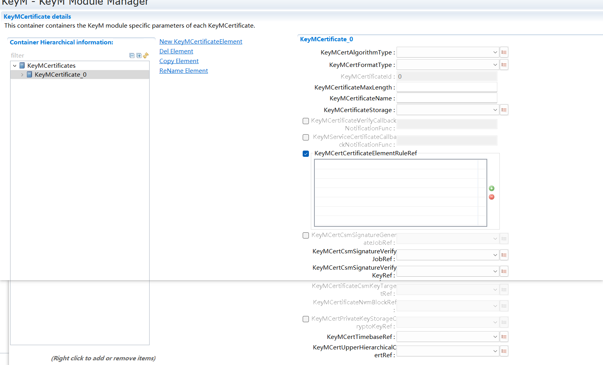

==============
KeyM
==============

**缩写词注解**

+----------+-----------------------------+-----------------------------+
| **缩     | **解释/描述**               | **中文解释**                |
| 写词**   |                             |                             |
+----------+-----------------------------+-----------------------------+
| CSM      | Crypto Service Manager      | 加密服务管理                |
+----------+-----------------------------+-----------------------------+
| CRYIF    | Crypto Interface            | 加密接口层                  |
+----------+-----------------------------+-----------------------------+
| CRYPTO   | Crypto Driver               | 加密驱                      |
|          |                             | 动（硬件驱动或者软件驱动）  |
+----------+-----------------------------+-----------------------------+
| DET      | Default Error Tracer        | 开发错误检测模块            |
+----------+-----------------------------+-----------------------------+
| HSM      | Hardware Security Module    | 硬件中用于计算加密算法      |
|          |                             | 的模块（相当于另外一块CPU） |
+----------+-----------------------------+-----------------------------+
| Job      | CsmJob                      | CSM模块中的                 |
|          |                             | 一个加密处理任务，一般每个J |
|          |                             | ob会引用到一个cryptographic |
|          |                             | primitive                   |
+----------+-----------------------------+-----------------------------+

简介
====

在一个加密功能中，密钥和证书的功能占比重很大。首先，密钥是一种参数，它是在明文转换为密文或将密文转换为明文的算法中输入的参数。许多加密算法需要使用到密钥，因此，就需要keyM模块来管理密钥，而keyM对于密钥的管理主要体现在对密钥的更新和生成密钥方面。

而证书对网络用户在网络交流中的信息和数据等以加密或解密的形式保证了信息和数据的完整性和安全性。KeyM模块可以实现证书的链的配置保存与验证，这使得网络中的信息和数据的安全性更高。

参考资料
--------

[1] AUTOSAR_SWS_KeyManager.pdf，R19-11

功能描述
========

Key Management分为两部分：key子模块和证书子模块。

key子模块通过会话模式更新key及key元素，当会话开启后，可以对key进行更新，结束会话后，更新的key将被置成可用状态。

key子模块可以根据配置的需求，利用HSM的功能派生出新的key。

证书子模块允许配置证书链，在配置中将证书的属性和关系设置好，上层应用通过API将证书数据传给keyM后，证书子模块将根据配置内容及HSM按照标准结构解析的证书存储进配置的位置（NVM、CSM或RAM）。

在存储之前将对证书进行解析与验证操作，以确定该证书的可靠性。

源文件描述
==========

表 KeyM组件文件描述

+-------------------+--------------------------------------------------+
| **文件**          | **说明**                                         |
+-------------------+--------------------------------------------------+
| KeyM.c            | KeyM模块源文件，包含了API函数的实现。            |
+-------------------+--------------------------------------------------+
| KeyM.h            | KeyM模块头文件，                                 |
|                   | 包含了API函数的扩展声明并定义了配置的数据结构。  |
+-------------------+--------------------------------------------------+
| KeyM \_Cfg.h      | 定义KeyM模块预编译时用到的配置参数。             |
+-------------------+--------------------------------------------------+
| KeyM \_Cfg.c      | KeyM模块配置生成文件。                           |
+-------------------+--------------------------------------------------+
| SchM_KeyM.h       | 声明KeyM模块需要循环调用的API。                  |
+-------------------+--------------------------------------------------+
| Rte_KeyM_Type.h   | 定义其它模块可能使用的KeyM模块的数据结构。       |
+-------------------+--------------------------------------------------+
| KeyM_Externals.c  | KeyM模块源文件，包含KeyM模块外部实现的接口。     |
+-------------------+--------------------------------------------------+
| KeyM_Externals.h  | KeyM模块头文件，定义KeyM模块外部实现的接口。     |
+-------------------+--------------------------------------------------+
| KeyM_Internal.h   | KeyM内部变量                                     |
+-------------------+--------------------------------------------------+
| KeyM_MemMap.h     | KeyM模块的内存映射                               |
+-------------------+--------------------------------------------------+
| KeyM_Type.h       | KeyM的配置类型结构                               |
+-------------------+--------------------------------------------------+

|image1|

图 KeyM组件文件交互图

API接口
=======

类型定义
--------

KeyM_Certificate类型定义
~~~~~~~~~~~~~~~~~~~~~~~~

+-----------+----------------------------------------------------------+
| 名称      | KeyM_Certificate                                         |
+-----------+----------------------------------------------------------+
| 类型      | structure                                                |
+-----------+----------------------------------------------------------+
| 范围      | 无                                                       |
+-----------+----------------------------------------------------------+
| 描述      | 证书基本配置结构                                         |
+-----------+----------------------------------------------------------+

KeyM_CertificateElement类型定义
~~~~~~~~~~~~~~~~~~~~~~~~~~~~~~~

+-----------+----------------------------------------------------------+
| 名称      | KeyM_CertificateElement                                  |
+-----------+----------------------------------------------------------+
| 类型      | structure                                                |
+-----------+----------------------------------------------------------+
| 范围      | 无                                                       |
+-----------+----------------------------------------------------------+
| 描述      | 证书元素基本配置结构                                     |
+-----------+----------------------------------------------------------+

KeyM_CertificateElementVerification类型定义
~~~~~~~~~~~~~~~~~~~~~~~~~~~~~~~~~~~~~~~~~~~

+-----------+----------------------------------------------------------+
| 名称      | KeyM_CertificateElementVerification                      |
+-----------+----------------------------------------------------------+
| 类型      | structure                                                |
+-----------+----------------------------------------------------------+
| 范围      | 无                                                       |
+-----------+----------------------------------------------------------+
| 描述      | 证书元素验证基本配置结构                                 |
+-----------+----------------------------------------------------------+

KeyM_CertificateElementRule类型定义
~~~~~~~~~~~~~~~~~~~~~~~~~~~~~~~~~~~

+-----------+----------------------------------------------------------+
| 名称      | KeyM_CertificateElementRule                              |
+-----------+----------------------------------------------------------+
| 类型      | structure                                                |
+-----------+----------------------------------------------------------+
| 范围      | 无                                                       |
+-----------+----------------------------------------------------------+
| 描述      | 证书元素验证规则                                         |
+-----------+----------------------------------------------------------+

KeyM_CertificateElementCondition类型定义
~~~~~~~~~~~~~~~~~~~~~~~~~~~~~~~~~~~~~~~~

+-----------+----------------------------------------------------------+
| 名称      | KeyM_CertificateElementCondition                         |
+-----------+----------------------------------------------------------+
| 类型      | structure                                                |
+-----------+----------------------------------------------------------+
| 范围      | 无                                                       |
+-----------+----------------------------------------------------------+
| 描述      | 证书元素验证条件                                         |
+-----------+----------------------------------------------------------+

KeyM_CertificateElementConditionValue类型定义
~~~~~~~~~~~~~~~~~~~~~~~~~~~~~~~~~~~~~~~~~~~~~

+-----------+----------------------------------------------------------+
| 名称      | KeyM_CertificateElementConditionValue                    |
+-----------+----------------------------------------------------------+
| 类型      | structure                                                |
+-----------+----------------------------------------------------------+
| 范围      | 无                                                       |
+-----------+----------------------------------------------------------+
| 描述      | 证书元素验证条件值                                       |
+-----------+----------------------------------------------------------+

KeyM_CertificateElementConditionArrayElement类型定义
~~~~~~~~~~~~~~~~~~~~~~~~~~~~~~~~~~~~~~~~~~~~~~~~~~~~

+-----------+----------------------------------------------------------+
| 名称      | KeyM_CertificateElementConditionArrayElement             |
+-----------+----------------------------------------------------------+
| 类型      | structure                                                |
+-----------+----------------------------------------------------------+
| 范围      | 无                                                       |
+-----------+----------------------------------------------------------+
| 描述      | 证书元素验证数组比较值                                   |
+-----------+----------------------------------------------------------+

KeyM_CryptoKey类型定义
~~~~~~~~~~~~~~~~~~~~~~

+-----------+----------------------------------------------------------+
| 名称      | KeyM_CryptoKey                                           |
+-----------+----------------------------------------------------------+
| 类型      | structure                                                |
+-----------+----------------------------------------------------------+
| 范围      | 无                                                       |
+-----------+----------------------------------------------------------+
| 描述      | 密钥基本配置结构                                         |
+-----------+----------------------------------------------------------+

输入函数描述
------------

+----------------------------+-----------------------------------------+
| **输入模块**               | **API**                                 |
+----------------------------+-----------------------------------------+
| Det                        | Det_ReportError                         |
+----------------------------+-----------------------------------------+
| CSM                        | Csm_KeyElementGet                       |
|                            |                                         |
|                            | Csm_KeyElementSet                       |
|                            |                                         |
|                            | Csm_KeySetValid                         |
|                            |                                         |
|                            | Csm_KeyDerive                           |
|                            |                                         |
|                            | Csm_SignatureVerify                     |
+----------------------------+-----------------------------------------+
| NVM                        | NvM_ReadBlock                           |
|                            |                                         |
|                            | NvM_WriteBlock                          |
+----------------------------+-----------------------------------------+
| StbM                       | StbM_GetCurrentTime                     |
+----------------------------+-----------------------------------------+

静态接口函数定义
----------------

KeyM_Init函数定义
~~~~~~~~~~~~~~~~~

+-------------+-------------------+---------+-------------------------+
| 函数名称：  | KeyM_Init         |         |                         |
+-------------+-------------------+---------+-------------------------+
| 函数原型：  | void KeyM_Init (  |         |                         |
|             | const             |         |                         |
|             | KeyM_ConfigType\* |         |                         |
|             | ConfigPtr         |         |                         |
|             | )                 |         |                         |
+-------------+-------------------+---------+-------------------------+
| 服务编号：  | 0x01              |         |                         |
+-------------+-------------------+---------+-------------------------+
| 同步/异步： | 同步              |         |                         |
+-------------+-------------------+---------+-------------------------+
| 是          | 否                |         |                         |
| 否可重入：  |                   |         |                         |
+-------------+-------------------+---------+-------------------------+
| 输入参数：  | ConfigPtr         | 值域：  | NULL_PTR                |
+-------------+-------------------+---------+-------------------------+
| 输入        | 无                |         |                         |
| 输出参数：  |                   |         |                         |
+-------------+-------------------+---------+-------------------------+
| 输出参数：  | 无                |         |                         |
+-------------+-------------------+---------+-------------------------+
| 返回值：    | 无                |         |                         |
+-------------+-------------------+---------+-------------------------+
| 功能概述：  | 初始化KeyM模块    |         |                         |
+-------------+-------------------+---------+-------------------------+

KeyM_Deinit函数定义
~~~~~~~~~~~~~~~~~~~

+-------------+-------------------+---------+-------------------------+
| 函数名称：  | KeyM_Deinit       |         |                         |
+-------------+-------------------+---------+-------------------------+
| 函数原型：  | static FUNC(void, |         |                         |
|             | KEYM_CODE)        |         |                         |
|             | KeyM_Deinit(void) |         |                         |
+-------------+-------------------+---------+-------------------------+
| 服务编号：  | 0x02              |         |                         |
+-------------+-------------------+---------+-------------------------+
| 同步/异步： | 同步              |         |                         |
+-------------+-------------------+---------+-------------------------+
| 是          | 否                |         |                         |
| 否可重入：  |                   |         |                         |
+-------------+-------------------+---------+-------------------------+
| 输入参数：  | 无                | 值域：  | 无                      |
+-------------+-------------------+---------+-------------------------+
| 输入        | 无                |         |                         |
| 输出参数：  |                   |         |                         |
+-------------+-------------------+---------+-------------------------+
| 输出参数：  | 无                |         |                         |
+-------------+-------------------+---------+-------------------------+
| 返回值：    | 无                |         |                         |
+-------------+-------------------+---------+-------------------------+
| 功能概述：  | 将密钥管理模块重  |         |                         |
|             | 置为未初始化状态  |         |                         |
+-------------+-------------------+---------+-------------------------+

KeyM_GetVersionInfo函数定义
~~~~~~~~~~~~~~~~~~~~~~~~~~~

+-------------+-------------------+---------+-------------------------+
| 函数名称：  | Ke                |         |                         |
|             | yM_GetVersionInfo |         |                         |
+-------------+-------------------+---------+-------------------------+
| 函数原型：  | void              |         |                         |
|             | Ke                |         |                         |
|             | yM_GetVersionInfo |         |                         |
|             | (                 |         |                         |
|             | Std               |         |                         |
|             | _VersionInfoType\*|         |                         |
|             | VersionInfo       |         |                         |
|             | )                 |         |                         |
+-------------+-------------------+---------+-------------------------+
| 服务编号：  | 0x03              |         |                         |
+-------------+-------------------+---------+-------------------------+
| 同步/异步： | 同步              |         |                         |
+-------------+-------------------+---------+-------------------------+
| 是          | 否                |         |                         |
| 否可重入：  |                   |         |                         |
+-------------+-------------------+---------+-------------------------+
| 输入参数：  | 无                | 值域：  | 无                      |
+-------------+-------------------+---------+-------------------------+
| 输入        | 无                |         |                         |
| 输出参数：  |                   |         |                         |
+-------------+-------------------+---------+-------------------------+
| 输出参数：  | VersionInfo       |         |                         |
+-------------+-------------------+---------+-------------------------+
| 返回值：    | 无                |         |                         |
+-------------+-------------------+---------+-------------------------+
| 功能概述：  | 提供版本信息      |         |                         |
+-------------+-------------------+---------+-------------------------+

KeyM_Start函数定义
~~~~~~~~~~~~~~~~~~

+-------------+-------------------+---------+-------------------------+
| 函数名称：  | KeyM_Start        |         |                         |
+-------------+-------------------+---------+-------------------------+
| 函数原型：  | static            |         |                         |
|             | FUN               |         |                         |
|             | C(Std_ReturnType, |         |                         |
|             | KEYM_CODE)        |         |                         |
|             |                   |         |                         |
|             | KeyM_Start        |         |                         |
|             |                   |         |                         |
|             | (                 |         |                         |
|             |                   |         |                         |
|             | VA                |         |                         |
|             | R(KeyM_StartType, |         |                         |
|             | KEYM_VAR)         |         |                         |
|             | StartType,        |         |                         |
|             |                   |         |                         |
|             | P2CONST(uint8,    |         |                         |
|             | AUTOMATIC,        |         |                         |
|             | KEYM_APPL_CONST)  |         |                         |
|             | RequestData,      |         |                         |
|             |                   |         |                         |
|             | VAR(uint16,       |         |                         |
|             | KEYM_VAR)         |         |                         |
|             | R                 |         |                         |
|             | equestDataLength, |         |                         |
|             |                   |         |                         |
|             | P2VAR(uint8,      |         |                         |
|             | AUTOMATIC,        |         |                         |
|             | KEYM_APPL_DATA)   |         |                         |
|             | ResponseData,     |         |                         |
|             |                   |         |                         |
|             | P2VAR(uint16,     |         |                         |
|             | AUTOMATIC,        |         |                         |
|             | KEYM_APPL_DATA)   |         |                         |
|             | R                 |         |                         |
|             | esponseDataLength |         |                         |
|             |                   |         |                         |
|             | )                 |         |                         |
+-------------+-------------------+---------+-------------------------+
| 服务编号：  | 0x04              |         |                         |
+-------------+-------------------+---------+-------------------------+
| 同步/异步： | 同步              |         |                         |
+-------------+-------------------+---------+-------------------------+
| 是          | 否                |         |                         |
| 否可重入：  |                   |         |                         |
+-------------+-------------------+---------+-------------------------+
| 输入参数：  | StartType         | 值域：  | 无                      |
+-------------+-------------------+---------+-------------------------+
|             | RequestData       |         | 无                      |
+-------------+-------------------+---------+-------------------------+
|             | RequestDataLength |         | 无                      |
+-------------+-------------------+---------+-------------------------+
| 输入        | R                 |         |                         |
| 输出参数：  | esponseDataLength |         |                         |
+-------------+-------------------+---------+-------------------------+
| 输出参数：  | ResponseData      |         |                         |
+-------------+-------------------+---------+-------------------------+
| 返回值：    | Std_ReturnType    |         |                         |
+-------------+-------------------+---------+-------------------------+
| 功能概述：  | 允许秘钥更新      |         |                         |
+-------------+-------------------+---------+-------------------------+

KeyM_Prepare函数定义
~~~~~~~~~~~~~~~~~~~~

+-------------+-------------------+---------+-------------------------+
| 函数名称：  | KeyM_Prepare      |         |                         |
+-------------+-------------------+---------+-------------------------+
| 函数原型：  | static            |         |                         |
|             | FUN               |         |                         |
|             | C(Std_ReturnType, |         |                         |
|             | KEYM_CODE)        |         |                         |
|             |                   |         |                         |
|             | KeyM_Prepare(     |         |                         |
|             |                   |         |                         |
|             | P2CONST(uint8,    |         |                         |
|             | AUTOMATIC,        |         |                         |
|             | KEYM_APPL_CONST)  |         |                         |
|             | RequestData,      |         |                         |
|             |                   |         |                         |
|             | VAR               |         |                         |
|             | (uint16,KEYM_VAR) |         |                         |
|             | R                 |         |                         |
|             | equestDataLength, |         |                         |
|             |                   |         |                         |
|             | P2VAR(uint8,      |         |                         |
|             | AUTOMATIC,        |         |                         |
|             | KEYM_APPL_DATA)   |         |                         |
|             | ResponseData,     |         |                         |
|             |                   |         |                         |
|             | P2VAR(uint16,     |         |                         |
|             | AUTOMATIC,        |         |                         |
|             | KEYM_APPL_DATA)   |         |                         |
|             | R                 |         |                         |
|             | esponseDataLength |         |                         |
|             |                   |         |                         |
|             | )                 |         |                         |
+-------------+-------------------+---------+-------------------------+
| 服务编号：  | 0x05              |         |                         |
+-------------+-------------------+---------+-------------------------+
| 同步/异步： | 同步              |         |                         |
+-------------+-------------------+---------+-------------------------+
| 是          | 否                |         |                         |
| 否可重入：  |                   |         |                         |
+-------------+-------------------+---------+-------------------------+
| 输入参数：  | RequestData       | 值域：  | 无                      |
+-------------+-------------------+---------+-------------------------+
|             | RequestDataLength |         | 无                      |
+-------------+-------------------+---------+-------------------------+
| 输入        | R                 |         |                         |
| 输出参数：  | esponseDataLength |         |                         |
+-------------+-------------------+---------+-------------------------+
| 输出参数：  | ResponseData      |         |                         |
+-------------+-------------------+---------+-------------------------+
| 返回值：    | Std_ReturnType    |         |                         |
+-------------+-------------------+---------+-------------------------+
| 功能概述：  | 准备密            |         |                         |
|             | 钥更新，主要目的  |         |                         |
|             | 是为密钥服务器的  |         |                         |
|             | 密钥操作提供信息  |         |                         |
+-------------+-------------------+---------+-------------------------+

KeyM_Update函数定义
~~~~~~~~~~~~~~~~~~~

+-------------+-------------------+---------+-------------------------+
| 函数名称：  | KeyM_Update       |         |                         |
+-------------+-------------------+---------+-------------------------+
| 函数原型：  | static            |         |                         |
|             | FUN               |         |                         |
|             | C(Std_ReturnType, |         |                         |
|             | KEYM_CODE)        |         |                         |
|             |                   |         |                         |
|             | KeyM_Update(      |         |                         |
|             |                   |         |                         |
|             | P2CONST(uint8,    |         |                         |
|             | AUTOMATIC,        |         |                         |
|             | KEYM_APPL_CONST)  |         |                         |
|             | KeyNamePtr,       |         |                         |
|             |                   |         |                         |
|             | VAR               |         |                         |
|             | (uint16,KEYM_VAR) |         |                         |
|             | KeyNameLength,    |         |                         |
|             |                   |         |                         |
|             | P2CONST(uint8,    |         |                         |
|             | AUTOMATIC,        |         |                         |
|             | KEYM_APPL_CONST)  |         |                         |
|             | RequestDataPtr,   |         |                         |
|             |                   |         |                         |
|             | VAR               |         |                         |
|             | (uint16,KEYM_VAR) |         |                         |
|             | R                 |         |                         |
|             | equestDataLength, |         |                         |
|             |                   |         |                         |
|             | P2VAR(uint8,      |         |                         |
|             | AUTOMATIC,        |         |                         |
|             | KEYM_APPL_DATA)   |         |                         |
|             | ResultDataPtr,    |         |                         |
|             |                   |         |                         |
|             | VAR               |         |                         |
|             | (uint16,KEYM_VAR) |         |                         |
|             | Re                |         |                         |
|             | sultDataMaxLength |         |                         |
|             |                   |         |                         |
|             | )                 |         |                         |
+-------------+-------------------+---------+-------------------------+
| 服务编号：  | 0x06              |         |                         |
+-------------+-------------------+---------+-------------------------+
| 同步/异步： | 异步              |         |                         |
+-------------+-------------------+---------+-------------------------+
| 是          | 否                |         |                         |
| 否可重入：  |                   |         |                         |
+-------------+-------------------+---------+-------------------------+
| 输入参数：  | KeyNamePtr        | 值域：  | 无                      |
+-------------+-------------------+---------+-------------------------+
|             | KeyNameLength     |         | 无                      |
+-------------+-------------------+---------+-------------------------+
|             | RequestDataPtr    |         | 无                      |
+-------------+-------------------+---------+-------------------------+
|             | RequestDataLength |         | 无                      |
+-------------+-------------------+---------+-------------------------+
|             | Re                |         | 无                      |
|             | sultDataMaxLength |         |                         |
+-------------+-------------------+---------+-------------------------+
| 输入        | 无                |         |                         |
| 输出参数：  |                   |         |                         |
+-------------+-------------------+---------+-------------------------+
| 输出参数：  | ResultDataPtr     |         |                         |
+-------------+-------------------+---------+-------------------------+
| 返回值：    | Std_ReturnType    |         |                         |
+-------------+-------------------+---------+-------------------------+
| 功能概述：  | 启                |         |                         |
|             | 动生成或更新密钥  |         |                         |
+-------------+-------------------+---------+-------------------------+

KeyM_Finalize函数定义
~~~~~~~~~~~~~~~~~~~~~

+-------------+-------------------+---------+-------------------------+
| 函数名称：  | KeyM_Finalize     |         |                         |
+-------------+-------------------+---------+-------------------------+
| 函数原型：  | Std_ReturnType    |         |                         |
|             | KeyM_Finalize (   |         |                         |
|             | const uint8\*     |         |                         |
|             | RequestDataPtr,   |         |                         |
|             | uint16            |         |                         |
|             | R                 |         |                         |
|             | equestDataLength, |         |                         |
|             | uint8\*           |         |                         |
|             | ResponseDataPtr,  |         |                         |
|             | uint16            |         |                         |
|             | Resp              |         |                         |
|             | onseMaxDataLength |         |                         |
|             | )                 |         |                         |
+-------------+-------------------+---------+-------------------------+
| 服务编号：  | 0x07              |         |                         |
+-------------+-------------------+---------+-------------------------+
| 同步/异步： | 异步              |         |                         |
+-------------+-------------------+---------+-------------------------+
| 是          | 否                |         |                         |
| 否可重入：  |                   |         |                         |
+-------------+-------------------+---------+-------------------------+
| 输入参数：  | RequestDataPtr    | 值域：  | 无                      |
+-------------+-------------------+---------+-------------------------+
|             | RequestDataLength |         | 无                      |
+-------------+-------------------+---------+-------------------------+
| 输入        | Resp              |         |                         |
| 输出参数：  | onseMaxDataLength |         |                         |
+-------------+-------------------+---------+-------------------------+
| 输出参数：  | ResponseDataPtr   |         |                         |
+-------------+-------------------+---------+-------------------------+
| 返回值：    | Std_ReturnType    |         |                         |
+-------------+-------------------+---------+-------------------------+
| 功能概述：  | 完成密钥          |         |                         |
|             | 更新，并将密钥操  |         |                         |
|             | 作返回到空闲模式  |         |                         |
+-------------+-------------------+---------+-------------------------+

KeyM_Verify函数定义
~~~~~~~~~~~~~~~~~~~

+-------------+-------------------+---------+-------------------------+
| 函数名称：  | KeyM_Verify       |         |                         |
+-------------+-------------------+---------+-------------------------+
| 函数原型：  | static            |         |                         |
|             | FUN               |         |                         |
|             | C(Std_ReturnType, |         |                         |
|             | KEYM_CODE)        |         |                         |
|             |                   |         |                         |
|             | KeyM_Verify       |         |                         |
|             |                   |         |                         |
|             | (                 |         |                         |
|             |                   |         |                         |
|             | P2CONST(uint8,    |         |                         |
|             | AUTOMATIC,        |         |                         |
|             | KEYM_APPL_DATA)   |         |                         |
|             | KeyNamePtr,       |         |                         |
|             |                   |         |                         |
|             | uint16            |         |                         |
|             | KeyNameLength,    |         |                         |
|             |                   |         |                         |
|             | P2CONST(uint8,    |         |                         |
|             | AUTOMATIC,        |         |                         |
|             | KEYM_APPL_DATA)   |         |                         |
|             | RequestData,      |         |                         |
|             |                   |         |                         |
|             | uint16            |         |                         |
|             | R                 |         |                         |
|             | equestDataLength, |         |                         |
|             |                   |         |                         |
|             | P2VAR(uint8,      |         |                         |
|             | AUTOMATIC,        |         |                         |
|             | KEYM_APPL_DATA)   |         |                         |
|             | ResponseData,     |         |                         |
|             |                   |         |                         |
|             | P2VAR(uint16,     |         |                         |
|             | AUTOMATIC,        |         |                         |
|             | KEYM_APPL_DATA)   |         |                         |
|             | R                 |         |                         |
|             | esponseDataLength |         |                         |
|             |                   |         |                         |
|             | )                 |         |                         |
+-------------+-------------------+---------+-------------------------+
| 服务编号：  | 0x08              |         |                         |
+-------------+-------------------+---------+-------------------------+
| 同步/异步： | 取决于配置        |         |                         |
+-------------+-------------------+---------+-------------------------+
| 是          | 否                |         |                         |
| 否可重入：  |                   |         |                         |
+-------------+-------------------+---------+-------------------------+
| 输入参数：  | KeyNamePtr        | 值域：  | 无                      |
+-------------+-------------------+---------+-------------------------+
|             | KeyNameLength     |         | 无                      |
+-------------+-------------------+---------+-------------------------+
|             | RequestData       |         | 无                      |
+-------------+-------------------+---------+-------------------------+
|             | RequestDataLength |         | 无                      |
+-------------+-------------------+---------+-------------------------+
| 输入        | R                 |         |                         |
| 输出参数：  | esponseDataLength |         |                         |
+-------------+-------------------+---------+-------------------------+
| 输出参数：  | ResponseData      |         |                         |
+-------------+-------------------+---------+-------------------------+
| 返回值：    | Std_ReturnType    |         |                         |
+-------------+-------------------+---------+-------------------------+
| 功能概述：  | 验证密钥          |         |                         |
+-------------+-------------------+---------+-------------------------+

KeyM_ServiceCertificate函数定义
~~~~~~~~~~~~~~~~~~~~~~~~~~~~~~~

+-------------+-------------------+---------+-------------------------+
| 函数名称：  | KeyM_S            |         |                         |
|             | erviceCertificate |         |                         |
+-------------+-------------------+---------+-------------------------+
| 函数原型：  | static            |         |                         |
|             | FUN               |         |                         |
|             | C(Std_ReturnType, |         |                         |
|             | KEYM_CODE)        |         |                         |
|             |                   |         |                         |
|             | KeyM_Se           |         |                         |
|             | rviceCertificate( |         |                         |
|             |                   |         |                         |
|             | KeyM_Servi        |         |                         |
|             | ceCertificateType |         |                         |
|             | Service,          |         |                         |
|             |                   |         |                         |
|             | P2CONST(uint8,    |         |                         |
|             | AUTOMATIC,        |         |                         |
|             | KEYM_APPL_DATA)   |         |                         |
|             | CertNamePtr,      |         |                         |
|             |                   |         |                         |
|             | uint16            |         |                         |
|             | CertNameLength,   |         |                         |
|             |                   |         |                         |
|             | P2CONST(uint8,    |         |                         |
|             | AUTOMATIC,        |         |                         |
|             | KEYM_APPL_DATA)   |         |                         |
|             | RequestData,      |         |                         |
|             |                   |         |                         |
|             | uint16            |         |                         |
|             | R                 |         |                         |
|             | equestDataLength, |         |                         |
|             |                   |         |                         |
|             | P2VAR(uint8,      |         |                         |
|             | AUTOMATIC,        |         |                         |
|             | KEYM_APPL_DATA)   |         |                         |
|             | ResponseData,     |         |                         |
|             |                   |         |                         |
|             | uint16            |         |                         |
|             | R                 |         |                         |
|             | esponseDataLength |         |                         |
|             |                   |         |                         |
|             | )                 |         |                         |
+-------------+-------------------+---------+-------------------------+
| 服务编号：  | 0x09              |         |                         |
+-------------+-------------------+---------+-------------------------+
| 同步/异步： | 异步              |         |                         |
+-------------+-------------------+---------+-------------------------+
| 是          | 否                |         |                         |
| 否可重入：  |                   |         |                         |
+-------------+-------------------+---------+-------------------------+
| 输入参数：  | Service           | 值域：  | 无                      |
+-------------+-------------------+---------+-------------------------+
|             | CertNamePtr       |         | 无                      |
+-------------+-------------------+---------+-------------------------+
|             | CertNameLength    |         | 无                      |
+-------------+-------------------+---------+-------------------------+
|             | RequestData       |         | 无                      |
+-------------+-------------------+---------+-------------------------+
|             | RequestDataLength |         | 无                      |
+-------------+-------------------+---------+-------------------------+
|             | R                 |         | 无                      |
|             | esponseDataLength |         |                         |
+-------------+-------------------+---------+-------------------------+
| 输入        | 无                |         |                         |
| 输出参数：  |                   |         |                         |
+-------------+-------------------+---------+-------------------------+
| 输出参数：  | ResponseData      |         |                         |
+-------------+-------------------+---------+-------------------------+
| 返回值：    | Std_ReturnType    |         |                         |
+-------------+-------------------+---------+-------------------------+
| 功能概述：  | 根据参            |         |                         |
|             | 数对秘钥进行操作  |         |                         |
+-------------+-------------------+---------+-------------------------+

KeyM_SetCertificate函数定义
~~~~~~~~~~~~~~~~~~~~~~~~~~~

+-------------+-------------------+---------+-------------------------+
| 函数名称：  | Ke                |         |                         |
|             | yM_SetCertificate |         |                         |
+-------------+-------------------+---------+-------------------------+
| 函数原型：  | static            |         |                         |
|             | FUN               |         |                         |
|             | C(Std_ReturnType, |         |                         |
|             | KEYM_CODE)        |         |                         |
|             |                   |         |                         |
|             | Ke                |         |                         |
|             | yM_SetCertificate |         |                         |
|             |                   |         |                         |
|             | (                 |         |                         |
|             |                   |         |                         |
|             | KeyM              |         |                         |
|             | _CertificateIdType|         |                         |
|             | CertId,           |         |                         |
|             |                   |         |                         |
|             | P2CONST(K         |         |                         |
|             | eyM_CertDataType, |         |                         |
|             | AUTOMATIC,        |         |                         |
|             | KEYM_APPL_DATA)   |         |                         |
|             | C                 |         |                         |
|             | ertificateDataPtr |         |                         |
|             |                   |         |                         |
|             | )                 |         |                         |
+-------------+-------------------+---------+-------------------------+
| 服务编号：  | 0x0a              |         |                         |
+-------------+-------------------+---------+-------------------------+
| 同步/异步： | 同步              |         |                         |
+-------------+-------------------+---------+-------------------------+
| 是          | 否                |         |                         |
| 否可重入：  |                   |         |                         |
+-------------+-------------------+---------+-------------------------+
| 输入参数：  | CertId            | 值域：  | 无                      |
+-------------+-------------------+---------+-------------------------+
|             | C                 |         | 无                      |
|             | ertificateDataPtr |         |                         |
+-------------+-------------------+---------+-------------------------+
| 输入        | 无                |         |                         |
| 输出参数：  |                   |         |                         |
+-------------+-------------------+---------+-------------------------+
| 输出参数：  | 无                |         |                         |
+-------------+-------------------+---------+-------------------------+
| 返回值：    | Std_ReturnType    |         |                         |
+-------------+-------------------+---------+-------------------------+
| 功能概述：  | 将证书数据提供给K |         |                         |
|             | eyM以临时存储证书 |         |                         |
+-------------+-------------------+---------+-------------------------+

KeyM_GetCertificate函数定义
~~~~~~~~~~~~~~~~~~~~~~~~~~~

+-------------+-------------------+---------+-------------------------+
| 函数名称：  | Ke                |         |                         |
|             | yM_GetCertificate |         |                         |
+-------------+-------------------+---------+-------------------------+
| 函数原型：  | static            |         |                         |
|             | FUN               |         |                         |
|             | C(Std_ReturnType, |         |                         |
|             | KEYM_CODE)        |         |                         |
|             |                   |         |                         |
|             | Ke                |         |                         |
|             | yM_GetCertificate |         |                         |
|             |                   |         |                         |
|             | (                 |         |                         |
|             |                   |         |                         |
|             | KeyM              |         |                         |
|             | _CertificateIdType|         |                         |
|             | CertId,           |         |                         |
|             |                   |         |                         |
|             | P2VAR(K           |         |                         |
|             | eyM_CertDataType, |         |                         |
|             | AUTOMATIC,        |         |                         |
|             | KEYM_APPL_DATA)   |         |                         |
|             | C                 |         |                         |
|             | ertificateDataPtr |         |                         |
|             |                   |         |                         |
|             | )                 |         |                         |
+-------------+-------------------+---------+-------------------------+
| 服务编号：  | 0x0b              |         |                         |
+-------------+-------------------+---------+-------------------------+
| 同步/异步： | 同步              |         |                         |
+-------------+-------------------+---------+-------------------------+
| 是          | 否                |         |                         |
| 否可重入：  |                   |         |                         |
+-------------+-------------------+---------+-------------------------+
| 输入参数：  | CertId            | 值域：  | 无                      |
+-------------+-------------------+---------+-------------------------+
| 输入        | C                 |         |                         |
| 输出参数：  | ertificateDataPtr |         |                         |
+-------------+-------------------+---------+-------------------------+
| 输出参数：  | 无                |         |                         |
+-------------+-------------------+---------+-------------------------+
| 返回值：    | Std_ReturnType    |         |                         |
+-------------+-------------------+---------+-------------------------+
| 功能概述：  | 提供证书内容      |         |                         |
+-------------+-------------------+---------+-------------------------+

KeyM_VerifyCertificates函数定义
~~~~~~~~~~~~~~~~~~~~~~~~~~~~~~~

+-------------+-------------------+---------+-------------------------+
| 函数名称：  | KeyM_V            |         |                         |
|             | erifyCertificates |         |                         |
+-------------+-------------------+---------+-------------------------+
| 函数原型：  | static            |         |                         |
|             | FUN               |         |                         |
|             | C(Std_ReturnType, |         |                         |
|             | KEYM_CODE)        |         |                         |
|             |                   |         |                         |
|             | KeyM_V            |         |                         |
|             | erifyCertificates |         |                         |
|             |                   |         |                         |
|             | (                 |         |                         |
|             |                   |         |                         |
|             | KeyM              |         |                         |
|             | _CertificateIdType|         |                         |
|             | CertId,           |         |                         |
|             |                   |         |                         |
|             | KeyM              |         |                         |
|             | _CertificateIdType|         |                         |
|             | CertUpperId       |         |                         |
|             |                   |         |                         |
|             | )                 |         |                         |
+-------------+-------------------+---------+-------------------------+
| 服务编号：  | 0x0c              |         |                         |
+-------------+-------------------+---------+-------------------------+
| 同步/异步： | 同步              |         |                         |
+-------------+-------------------+---------+-------------------------+
| 是          | 否                |         |                         |
| 否可重入：  |                   |         |                         |
+-------------+-------------------+---------+-------------------------+
| 输入参数：  | CertId            | 值域：  | 无                      |
+-------------+-------------------+---------+-------------------------+
|             | CertUpperId       |         | 无                      |
+-------------+-------------------+---------+-------------------------+
| 输入        | 无                |         |                         |
| 输出参数：  |                   |         |                         |
+-------------+-------------------+---------+-------------------------+
| 输出参数：  | 无                |         |                         |
+-------------+-------------------+---------+-------------------------+
| 返回值：    | Std_ReturnType    |         |                         |
+-------------+-------------------+---------+-------------------------+
| 功能概述：  | 相互验证两个证书  |         |                         |
+-------------+-------------------+---------+-------------------------+

KeyM_VerifyCertificate函数定义
~~~~~~~~~~~~~~~~~~~~~~~~~~~~~~

+-------------+-------------------+---------+-------------------------+
| 函数名称：  | KeyM              |         |                         |
|             | _VerifyCertificate|         |                         |
+-------------+-------------------+---------+-------------------------+
| 函数原型：  | static            |         |                         |
|             | FUN               |         |                         |
|             | C(Std_ReturnType, |         |                         |
|             | KEYM_CODE)        |         |                         |
|             |                   |         |                         |
|             | KeyM              |         |                         |
|             | _VerifyCertificate|         |                         |
|             |                   |         |                         |
|             | (                 |         |                         |
|             |                   |         |                         |
|             | KeyM              |         |                         |
|             | _CertificateIdType|         |                         |
|             | CertId            |         |                         |
|             |                   |         |                         |
|             | )                 |         |                         |
+-------------+-------------------+---------+-------------------------+
| 服务编号：  | 0x0d              |         |                         |
+-------------+-------------------+---------+-------------------------+
| 同步/异步： | 同步              |         |                         |
+-------------+-------------------+---------+-------------------------+
| 是          | 否                |         |                         |
| 否可重入：  |                   |         |                         |
+-------------+-------------------+---------+-------------------------+
| 输入参数：  | CertId            | 值域：  | 无                      |
+-------------+-------------------+---------+-------------------------+
| 输入        | 无                |         |                         |
| 输出参数：  |                   |         |                         |
+-------------+-------------------+---------+-------------------------+
| 输出参数：  | 无                |         |                         |
+-------------+-------------------+---------+-------------------------+
| 返回值：    | Std_ReturnType    |         |                         |
+-------------+-------------------+---------+-------------------------+
| 功能概述：  | 验证KeyM_Set      |         |                         |
|             | certif            |         |                         |
|             | icate()存储的证书 |         |                         |
+-------------+-------------------+---------+-------------------------+

KeyM_VerifyCertificateChain函数定义
~~~~~~~~~~~~~~~~~~~~~~~~~~~~~~~~~~~

+-------------+-------------------+---------+-------------------------+
| 函数名称：  | KeyM_Verif        |         |                         |
|             | yCertificateChain |         |                         |
+-------------+-------------------+---------+-------------------------+
| 函数原型：  | static            |         |                         |
|             | FUN               |         |                         |
|             | C(Std_ReturnType, |         |                         |
|             | KEYM_CODE)        |         |                         |
|             |                   |         |                         |
|             | KeyM_Verif        |         |                         |
|             | yCertificateChain |         |                         |
|             |                   |         |                         |
|             | (                 |         |                         |
|             |                   |         |                         |
|             | KeyM              |         |                         |
|             | _CertificateIdType|         |                         |
|             | CertId,           |         |                         |
|             |                   |         |                         |
|             | P2CONST(K         |         |                         |
|             | eyM_CertDataType, |         |                         |
|             | AUTOMATIC,        |         |                         |
|             | KEYM_APPL_DATA)   |         |                         |
|             | certChainData,    |         |                         |
|             |                   |         |                         |
|             | uint8             |         |                         |
|             | Num               |         |                         |
|             | berOfCertificates |         |                         |
|             |                   |         |                         |
|             | )                 |         |                         |
+-------------+-------------------+---------+-------------------------+
| 服务编号：  | 0x0e              |         |                         |
+-------------+-------------------+---------+-------------------------+
| 同步/异步： | 同步              |         |                         |
+-------------+-------------------+---------+-------------------------+
| 是          | 否                |         |                         |
| 否可重入：  |                   |         |                         |
+-------------+-------------------+---------+-------------------------+
| 输入参数：  | CertId            | 值域：  | 无                      |
+-------------+-------------------+---------+-------------------------+
|             | certChainData     |         | 无                      |
+-------------+-------------------+---------+-------------------------+
|             | Num               |         | 无                      |
|             | berOfCertificates |         |                         |
+-------------+-------------------+---------+-------------------------+
| 输入        | 无                |         |                         |
| 输出参数：  |                   |         |                         |
+-------------+-------------------+---------+-------------------------+
| 输出参数：  | 无                |         |                         |
+-------------+-------------------+---------+-------------------------+
| 返回值：    | Std_ReturnType    |         |                         |
+-------------+-------------------+---------+-------------------------+
| 功能概述：  | 根据证书列表执    |         |                         |
|             | 行证书验证。并且  |         |                         |
|             | 根证书要么在列表  |         |                         |
|             | 中，要么已经分配  |         |                         |
|             | 给其他证书之一，  |         |                         |
|             | 这是一个先决条件  |         |                         |
+-------------+-------------------+---------+-------------------------+

KeyM_CertElementGet函数定义
~~~~~~~~~~~~~~~~~~~~~~~~~~~

+-------------+-------------------+---------+-------------------------+
| 函数名称：  | Ke                |         |                         |
|             | yM_CertElementGet |         |                         |
+-------------+-------------------+---------+-------------------------+
| 函数原型：  | static            |         |                         |
|             | FUN               |         |                         |
|             | C(Std_ReturnType, |         |                         |
|             | KEYM_CODE)        |         |                         |
|             |                   |         |                         |
|             | Ke                |         |                         |
|             | yM_CertElementGet |         |                         |
|             |                   |         |                         |
|             | (                 |         |                         |
|             |                   |         |                         |
|             | KeyM              |         |                         |
|             | _CertificateIdType|         |                         |
|             | CertId,           |         |                         |
|             |                   |         |                         |
|             | KeyM              |         |                         |
|             | _CertElementIdType|         |                         |
|             | CertElementId,    |         |                         |
|             |                   |         |                         |
|             | P2VAR(uint8,      |         |                         |
|             | AUTOMATIC,        |         |                         |
|             | KEYM_APPL_DATA)   |         |                         |
|             | CertElementData,  |         |                         |
|             |                   |         |                         |
|             | P2VAR(uint32,     |         |                         |
|             | AUTOMATIC,        |         |                         |
|             | KEYM_APPL_DATA)   |         |                         |
|             | Cert              |         |                         |
|             | ElementDataLength |         |                         |
|             |                   |         |                         |
|             | )                 |         |                         |
+-------------+-------------------+---------+-------------------------+
| 服务编号：  | 0x0f              |         |                         |
+-------------+-------------------+---------+-------------------------+
| 同步/异步： | 同步              |         |                         |
+-------------+-------------------+---------+-------------------------+
| 是          | 否                |         |                         |
| 否可重入：  |                   |         |                         |
+-------------+-------------------+---------+-------------------------+
| 输入参数：  | CertId            | 值域：  | 无                      |
+-------------+-------------------+---------+-------------------------+
|             | CertElementId     |         | 无                      |
+-------------+-------------------+---------+-------------------------+
| 输入        | Cert              |         |                         |
| 输出参数：  | ElementDataLength |         |                         |
+-------------+-------------------+---------+-------------------------+
| 输出参数：  | CertElementData   |         |                         |
+-------------+-------------------+---------+-------------------------+
| 返回值：    | Std_ReturnType    |         |                         |
+-------------+-------------------+---------+-------------------------+
| 功能概述：  | 提供特            |         |                         |
|             | 定证书元素的内容  |         |                         |
+-------------+-------------------+---------+-------------------------+

KeyM_CertElementGetFirst函数定义
~~~~~~~~~~~~~~~~~~~~~~~~~~~~~~~~

+-------------+-------------------+---------+-------------------------+
| 函数名称：  | KeyM_Ce           |         |                         |
|             | rtElementGetFirst |         |                         |
+-------------+-------------------+---------+-------------------------+
| 函数原型：  | static            |         |                         |
|             | FUN               |         |                         |
|             | C(Std_ReturnType, |         |                         |
|             | KEYM_CODE)        |         |                         |
|             |                   |         |                         |
|             | KeyM_Ce           |         |                         |
|             | rtElementGetFirst |         |                         |
|             |                   |         |                         |
|             | (                 |         |                         |
|             |                   |         |                         |
|             | KeyM              |         |                         |
|             | _CertificateIdType|         |                         |
|             | CertId,           |         |                         |
|             |                   |         |                         |
|             | KeyM              |         |                         |
|             | _CertElementIdType|         |                         |
|             | CertElementId,    |         |                         |
|             |                   |         |                         |
|             | P                 |         |                         |
|             | 2VAR(KeyM_CertEle |         |                         |
|             | mentIteratorType, |         |                         |
|             | AUTOMATIC,        |         |                         |
|             | KEYM_APPL_DATA)   |         |                         |
|             | Cer               |         |                         |
|             | tElementIterator, |         |                         |
|             |                   |         |                         |
|             | P2VAR(uint8,      |         |                         |
|             | AUTOMATIC,        |         |                         |
|             | KEYM_APPL_DATA)   |         |                         |
|             | CertElementData,  |         |                         |
|             |                   |         |                         |
|             | P2VAR(uint32,     |         |                         |
|             | AUTOMATIC,        |         |                         |
|             | KEYM_APPL_DATA)   |         |                         |
|             | Cert              |         |                         |
|             | ElementDataLength |         |                         |
|             |                   |         |                         |
|             | )                 |         |                         |
+-------------+-------------------+---------+-------------------------+
| 服务编号：  | 0x10              |         |                         |
+-------------+-------------------+---------+-------------------------+
| 同步/异步： | 同步              |         |                         |
+-------------+-------------------+---------+-------------------------+
| 是          | 否                |         |                         |
| 否可重入：  |                   |         |                         |
+-------------+-------------------+---------+-------------------------+
| 输入参数：  | CertId            | 值域：  | 无                      |
+-------------+-------------------+---------+-------------------------+
|             | CertElementId     |         | 无                      |
+-------------+-------------------+---------+-------------------------+
| 输入        | Ce                |         |                         |
| 输出参数：  | rtElementIterator |         |                         |
+-------------+-------------------+---------+-------------------------+
|             | Cert              |         |                         |
|             | ElementDataLength |         |                         |
+-------------+-------------------+---------+-------------------------+
| 输出参数：  | CertElementData   |         |                         |
+-------------+-------------------+---------+-------------------------+
| 返回值：    | Std_ReturnType    |         |                         |
+-------------+-------------------+---------+-------------------------+
| 功能概述：  | 用于初始          |         |                         |
|             | 化证书数据元素的  |         |                         |
|             | 交互提取。它总是  |         |                         |
|             | 从配置的证书元素  |         |                         |
|             | 中检索顶部元素，  |         |                         |
|             | 并初始化结构KeyM  |         |                         |
|             | _CertElementItera |         |                         |
|             | tor，以便可以使用 |         |                         |
|             | KeyM_CertElement  |         |                         |
|             | GetNext()读取来自 |         |                         |
|             | 该元素的连续数据  |         |                         |
+-------------+-------------------+---------+-------------------------+

KeyM_CertElementGetNext函数定义
~~~~~~~~~~~~~~~~~~~~~~~~~~~~~~~

+-------------+-------------------+---------+-------------------------+
| 函数名称：  | KeyM_C            |         |                         |
|             | ertElementGetNext |         |                         |
+-------------+-------------------+---------+-------------------------+
| 函数原型：  | static            |         |                         |
|             | FUN               |         |                         |
|             | C(Std_ReturnType, |         |                         |
|             | KEYM_CODE)        |         |                         |
|             |                   |         |                         |
|             | KeyM_C            |         |                         |
|             | ertElementGetNext |         |                         |
|             |                   |         |                         |
|             | (                 |         |                         |
|             |                   |         |                         |
|             | P                 |         |                         |
|             | 2VAR(KeyM_CertEle |         |                         |
|             | mentIteratorType, |         |                         |
|             | AUTOMATIC,        |         |                         |
|             | KEYM_APPL_DATA)   |         |                         |
|             | Cer               |         |                         |
|             | tElementIterator, |         |                         |
|             |                   |         |                         |
|             | P2VAR(uint8,      |         |                         |
|             | AUTOMATIC,        |         |                         |
|             | KEYM_APPL_DATA)   |         |                         |
|             | CertElementData,  |         |                         |
|             |                   |         |                         |
|             | P2VAR(uint32,     |         |                         |
|             | AUTOMATIC,        |         |                         |
|             | KEYM_APPL_DATA)   |         |                         |
|             | Cert              |         |                         |
|             | ElementDataLength |         |                         |
|             |                   |         |                         |
|             | )                 |         |                         |
+-------------+-------------------+---------+-------------------------+
| 服务编号：  | 0x11              |         |                         |
+-------------+-------------------+---------+-------------------------+
| 同步/异步： | 同步              |         |                         |
+-------------+-------------------+---------+-------------------------+
| 是          | 否                |         |                         |
| 否可重入：  |                   |         |                         |
+-------------+-------------------+---------+-------------------------+
| 输入参数：  | 无                | 值域：  | 无                      |
+-------------+-------------------+---------+-------------------------+
| 输入        | Ce                |         |                         |
| 输出参数：  | rtElementIterator |         |                         |
+-------------+-------------------+---------+-------------------------+
|             | Cert              |         |                         |
|             | ElementDataLength |         |                         |
+-------------+-------------------+---------+-------------------------+
| 输出参数：  | CertElementData   |         |                         |
+-------------+-------------------+---------+-------------------------+
| 返回值：    | Std_ReturnType    |         |                         |
+-------------+-------------------+---------+-------------------------+
| 功能概述：  | 在KeyM_CertEl     |         |                         |
|             | ementGetFirst被调 |         |                         |
|             | 用后进一步提供来  |         |                         |
|             | 自证书元素的数据  |         |                         |
+-------------+-------------------+---------+-------------------------+

KeyM_CertGetStatus函数定义
~~~~~~~~~~~~~~~~~~~~~~~~~~

+-------------+-------------------+---------+-------------------------+
| 函数名称：  | K                 |         |                         |
|             | eyM_CertGetStatus |         |                         |
+-------------+-------------------+---------+-------------------------+
| 函数原型：  | static            |         |                         |
|             | FUN               |         |                         |
|             | C(Std_ReturnType, |         |                         |
|             | KEYM_CODE)        |         |                         |
|             |                   |         |                         |
|             | K                 |         |                         |
|             | eyM_CertGetStatus |         |                         |
|             |                   |         |                         |
|             | (                 |         |                         |
|             |                   |         |                         |
|             | KeyM              |         |                         |
|             | _CertificateIdType|         |                         |
|             | CertId,           |         |                         |
|             |                   |         |                         |
|             | P2VAR(KeyM_Certi  |         |                         |
|             | ficateStatusType, |         |                         |
|             | AUTOMATIC,        |         |                         |
|             | KEYM_APPL_DATA)   |         |                         |
|             | Status            |         |                         |
|             |                   |         |                         |
|             | )                 |         |                         |
+-------------+-------------------+---------+-------------------------+
| 服务编号：  | 0x12              |         |                         |
+-------------+-------------------+---------+-------------------------+
| 同步/异步： | 同步              |         |                         |
+-------------+-------------------+---------+-------------------------+
| 是          | 否                |         |                         |
| 否可重入：  |                   |         |                         |
+-------------+-------------------+---------+-------------------------+
| 输入参数：  | CertId            | 值域：  | 无                      |
+-------------+-------------------+---------+-------------------------+
| 输入        | 无                |         |                         |
| 输出参数：  |                   |         |                         |
+-------------+-------------------+---------+-------------------------+
| 输出参数：  | Status            |         |                         |
+-------------+-------------------+---------+-------------------------+
| 返回值：    | Std_ReturnType    |         |                         |
+-------------+-------------------+---------+-------------------------+
| 功能概述：  | 提供证书的状态    |         |                         |
+-------------+-------------------+---------+-------------------------+

KeyM_MainFunction函数定义
~~~~~~~~~~~~~~~~~~~~~~~~~

+-------------+-------------------+---------+-------------------------+
| 函数名称：  | KeyM_MainFunction |         |                         |
+-------------+-------------------+---------+-------------------------+
| 函数原型：  | void              |         |                         |
|             | KeyM_MainFunction |         |                         |
|             | (void)            |         |                         |
+-------------+-------------------+---------+-------------------------+
| 服务编号：  | 0x19              |         |                         |
+-------------+-------------------+---------+-------------------------+
| 同步/异步： | 同步              |         |                         |
+-------------+-------------------+---------+-------------------------+
| 是          | 否                |         |                         |
| 否可重入：  |                   |         |                         |
+-------------+-------------------+---------+-------------------------+
| 输入参数：  | 无                | 值域：  | 无                      |
+-------------+-------------------+---------+-------------------------+
| 输入        | 无                |         |                         |
| 输出参数：  |                   |         |                         |
+-------------+-------------------+---------+-------------------------+
| 输出参数：  | 无                |         |                         |
+-------------+-------------------+---------+-------------------------+
| 返回值：    | 无                |         |                         |
+-------------+-------------------+---------+-------------------------+
| 功能概述：  | 根据指定的        |         |                         |
|             | 时间间隔定期调用  |         |                         |
+-------------+-------------------+---------+-------------------------+

KeyM_MainBackgroudFunction函数定义
~~~~~~~~~~~~~~~~~~~~~~~~~~~~~~~~~~

+-------------+-------------------+---------+-------------------------+
| 函数名称：  | KeyM_Main         |         |                         |
|             | BackgroudFunction |         |                         |
+-------------+-------------------+---------+-------------------------+
| 函数原型：  | void              |         |                         |
|             | KeyM_MainB        |         |                         |
|             | ackgroundFunction |         |                         |
|             | (void)            |         |                         |
+-------------+-------------------+---------+-------------------------+
| 服务编号：  | 0x1a              |         |                         |
+-------------+-------------------+---------+-------------------------+
| 同步/异步： | 同步              |         |                         |
+-------------+-------------------+---------+-------------------------+
| 是          | 否                |         |                         |
| 否可重入：  |                   |         |                         |
+-------------+-------------------+---------+-------------------------+
| 输入参数：  | 无                | 值域：  | 无                      |
+-------------+-------------------+---------+-------------------------+
| 输入        | 无                |         |                         |
| 输出参数：  |                   |         |                         |
+-------------+-------------------+---------+-------------------------+
| 输出参数：  | 无                |         |                         |
+-------------+-------------------+---------+-------------------------+
| 返回值：    | 无                |         |                         |
+-------------+-------------------+---------+-------------------------+
| 功能概述：  | 在不需要其他任务  |         |                         |
|             | 操作时，从抢占式  |         |                         |
|             | 操作系统调用函数  |         |                         |
+-------------+-------------------+---------+-------------------------+

配置
====

KeyMGeneral
-----------

|image2|

图 KeyMGeneral容器配置图

表 KeyMGeneral属性描述

+--------------------+----------+----------------+--------------+---------+
| **UI名称**         | **描述** |                |              |         |
+--------------------+----------+----------------+--------------+---------+
| KeyMCertif         | 取值范围 | 1 .. 255       |    默认      | 无      |
| icateChainMaxDepth |          |                |    取值      |         |
+--------------------+----------+----------------+--------------+---------+
|                    | 参数描述 | 证书链中定     |              |         |
|                    |          | 义的最大证书数 |              |         |
+--------------------+----------+----------------+--------------+---------+
|                    | 依赖关系 | KeyMCer        |              |         |
|                    |          | tificateManage |              |         |
|                    |          | rEnabled为TRUE |              |         |
+--------------------+----------+----------------+--------------+---------+
| KeyMCertifi        | 取值范围 | True、False    |    默认      | False   |
| cateManagerEnabled |          |                |    取值      |         |
+--------------------+----------+----------------+--------------+---------+
|                    | 参数描述 | 启用 (TRUE)    |              |         |
|                    |          | 或禁用 (FALSE) |              |         |
|                    |          | 管理证书的部分 |              |         |
+--------------------+----------+----------------+--------------+---------+
|                    | 依赖关系 | KeyMC          |              |         |
|                    |          | ryptoKeyManage |              |         |
|                    |          | rEnabled为TRUE |              |         |
+--------------------+----------+----------------+--------------+---------+
| KeyMCryptoKeyHan   | 取值范围 | True、False    |    默认      | False   |
| dlerPrepareEnabled |          |                |    取值      |         |
+--------------------+----------+----------------+--------------+---------+
|                    | 参数描述 | 启用 (TRUE)    |              |         |
|                    |          | 或禁用 (FALSE) |              |         |
|                    |          | 键处理         |              |         |
|                    |          | 程序准备函数调 |              |         |
|                    |          | 用。如果设置为 |              |         |
|                    |          | TRUE           |              |         |
|                    |          | ，则应提供相应 |              |         |
|                    |          | 的处理程序函数 |              |         |
+--------------------+----------+----------------+--------------+---------+
|                    | 依赖关系 | 无             |              |         |
+--------------------+----------+----------------+--------------+---------+
| KeyMCrypt          | 取值范围 | True、False    |    默认      | False   |
| oKeyHandlerService |          |                |    取值      |         |
| CertificateEnabled |          |                |              |         |
+--------------------+----------+----------------+--------------+---------+
|                    | 参数描述 | 启用 (TRUE)    |              |         |
|                    |          | 或禁用 (FALSE) |              |         |
|                    |          | 密钥处理       |              |         |
|                    |          | 程序服务函数调 |              |         |
|                    |          | 用。如果设置为 |              |         |
|                    |          | TRUE，则应提供 |              |         |
|                    |          | 证书子模块函数 |              |         |
|                    |          | KeyM_KH_Serv   |              |         |
|                    |          | iceCertificate |              |         |
+--------------------+----------+----------------+--------------+---------+
|                    | 依赖关系 | 无             |              |         |
+--------------------+----------+----------------+--------------+---------+
| KeyM               | 取值范围 | True、False    |    默认      | False   |
| CryptoKeyHandlerSt |          |                |    取值      |         |
| artFinalizeEnabled |          |                |              |         |
+--------------------+----------+----------------+--------------+---------+
|                    | 参数描述 | 启用 (TRUE)    |              |         |
|                    |          | 或禁用 (FALSE) |              |         |
|                    |          | 键             |              |         |
|                    |          | 处理程序启动和 |              |         |
|                    |          | 完成函数调用。 |              |         |
|                    |          | 如果设置为     |              |         |
|                    |          | TRUR，则应提   |              |         |
|                    |          | 供密钥处理函数 |              |         |
|                    |          | K              |              |         |
|                    |          | eyM_KH_Start() |              |         |
|                    |          | 和             |              |         |
|                    |          | KeyM           |              |         |
|                    |          | _KH_Finalize() |              |         |
+--------------------+----------+----------------+--------------+---------+
|                    | 依赖关系 | 无             |              |         |
+--------------------+----------+----------------+--------------+---------+
| KeyMCryptoKeyHa    | 取值范围 | True、False    |    默认      | False   |
| ndlerUpdateEnabled |          |                |    取值      |         |
+--------------------+----------+----------------+--------------+---------+
|                    | 参数描述 | 启用 (TRUE)    |              |         |
|                    |          | 或禁用 (FALSE) |              |         |
|                    |          | 对密钥处       |              |         |
|                    |          | 理程序更新函数 |              |         |
|                    |          | Ke             |              |         |
|                    |          | yM_KH_Update() |              |         |
|                    |          | 的调用。       |              |         |
|                    |          | 如果设置为     |              |         |
|                    |          | TRUE，则应提供 |              |         |
|                    |          | 相应的处理函数 |              |         |
+--------------------+----------+----------------+--------------+---------+
|                    | 依赖关系 | 无             |              |         |
+--------------------+----------+----------------+--------------+---------+
| KeyMCryptoKeyHa    | 取值范围 | True、False    |    默认      | False   |
| ndlerVerifyEnabled |          |                |    取值      |         |
+--------------------+----------+----------------+--------------+---------+
|                    | 参数描述 | 启用 (TRUE)    |              |         |
|                    |          | 或禁用 (FALSE) |              |         |
|                    |          | 对密钥处       |              |         |
|                    |          | 理程序验证函数 |              |         |
|                    |          | Ke             |              |         |
|                    |          | yM_KH_Verify() |              |         |
|                    |          | 的调用。       |              |         |
|                    |          | 如果设置为     |              |         |
|                    |          | TRUE，则应提供 |              |         |
|                    |          | 相应的处理函数 |              |         |
+--------------------+----------+----------------+--------------+---------+
|                    | 依赖关系 | 无             |              |         |
+--------------------+----------+----------------+--------------+---------+
| KeyMCrypt          | 取值范围 | True、False    |    默认      | False   |
| oKeyManagerEnabled |          |                |    取值      |         |
+--------------------+----------+----------------+--------------+---------+
|                    | 参数描述 | 启用 (TRUE)    |              |         |
|                    |          | 或禁用 (FALSE) |              |         |
|                    |          | 管理加密       |              |         |
|                    |          | 密钥操作的部分 |              |         |
+--------------------+----------+----------------+--------------+---------+
|                    | 依赖关系 | KeyMC          |              |         |
|                    |          | ryptoKeyManage |              |         |
|                    |          | rEnabled为TRUE |              |         |
+--------------------+----------+----------------+--------------+---------+
| KeyMCryptoKeyPrep  | 取值范围 | True、False    |    默认      | False   |
| areFunctionEnabled |          |                |    取值      |         |
+--------------------+----------+----------------+--------------+---------+
|                    | 参数描述 | 启用 (TRUE)    |              |         |
|                    |          | 或禁用 (FALSE) |              |         |
|                    |          | 密钥管理       |              |         |
|                    |          | 器的准备功能。 |              |         |
|                    |          | 如果设置为     |              |         |
|                    |          | TRUE，则       |              |         |
|                    |          | 必须相应地调用 |              |         |
|                    |          | KeyM_Prepare() |              |         |
|                    |          | 函数           |              |         |
+--------------------+----------+----------------+--------------+---------+
|                    | 依赖关系 | KeyMC          |              |         |
|                    |          | ryptoKeyManage |              |         |
|                    |          | rEnabled为TRUE |              |         |
+--------------------+----------+----------------+--------------+---------+
| KeyMC              | 取值范围 | True、False    |    默认      | False   |
| ryptoKeyStartFinal |          |                |    取值      |         |
| izeFunctionEnabled |          |                |              |         |
+--------------------+----------+----------------+--------------+---------+
|                    | 参数描述 | 启用 (TRUE)    |              |         |
|                    |          | 或禁用 (FALSE) |              |         |
|                    |          | 密钥管理器的启 |              |         |
|                    |          | 动和完成功能。 |              |         |
|                    |          | 如果设置为     |              |         |
|                    |          | TR             |              |         |
|                    |          | UE，则必须调用 |              |         |
|                    |          | KeyM_Start()   |              |         |
|                    |          | 和             |              |         |
|                    |          | K              |              |         |
|                    |          | eyM_Finalize() |              |         |
|                    |          | 函数           |              |         |
+--------------------+----------+----------------+--------------+---------+
|                    | 依赖关系 | KeyMC          |              |         |
|                    |          | ryptoKeyManage |              |         |
|                    |          | rEnabled为TRUE |              |         |
+--------------------+----------+----------------+--------------+---------+
| KeyMCrypto         | 取值范围 | True、False    |    默认      | False   |
| KeyVerifyAsyncMode |          |                |    取值      |         |
+--------------------+----------+----------------+--------------+---------+
|                    | 参数描述 | 此参数定义函数 |              |         |
|                    |          | KeyM_Verify()  |              |         |
|                    |          | 是             |              |         |
|                    |          | 在同步模式还是 |              |         |
|                    |          | 异步模式下运行 |              |         |
+--------------------+----------+----------------+--------------+---------+
|                    | 依赖关系 | KeyMC          |              |         |
|                    |          | ryptoKeyManage |              |         |
|                    |          | rEnabled为TRUE |              |         |
+--------------------+----------+----------------+--------------+---------+
| KeyMCryptoKeyVer   | 取值范围 | True、False    |    默认      | False   |
| ifyFunctionEnabled |          |                |    取值      |         |
+--------------------+----------+----------------+--------------+---------+
|                    | 参数描述 | 启用 (TRUE)    |              |         |
|                    |          | 或禁用 (FALSE) |              |         |
|                    |          | 密钥管理       |              |         |
|                    |          | 器的验证功能。 |              |         |
|                    |          | 如果设置为     |              |         |
|                    |          | TR             |              |         |
|                    |          | UE，则可以调用 |              |         |
|                    |          | KeyM_Verify()  |              |         |
|                    |          | 函数           |              |         |
+--------------------+----------+----------------+--------------+---------+
|                    | 依赖关系 | KeyMC          |              |         |
|                    |          | ryptoKeyManage |              |         |
|                    |          | rEnabled为TRUE |              |         |
+--------------------+----------+----------------+--------------+---------+
| KeyMDevErrorDetect | 取值范围 | True、False    |    默认      | False   |
|                    |          |                |    取值      |         |
+--------------------+----------+----------------+--------------+---------+
|                    | 参数描述 | 开             |              |         |
|                    |          | 发错误检测使能 |              |         |
+--------------------+----------+----------------+--------------+---------+
|                    | 依赖关系 | 无             |              |         |
+--------------------+----------+----------------+--------------+---------+
| KeyMKe             | 取值范围 | 1 .. 255       |    默认      | 无      |
| yCertNameMaxLength |          |                |    取值      |         |
+--------------------+----------+----------------+--------------+---------+
|                    | 参数描述 | 用于服务接口   |              |         |
|                    |          | 的证书或密钥名 |              |         |
|                    |          | 称的最大长度（ |              |         |
|                    |          | 以字节为单位） |              |         |
+--------------------+----------+----------------+--------------+---------+
|                    | 依赖关系 | KeyMCer        |              |         |
|                    |          | tificateManage |              |         |
|                    |          | rEnabled为TRUE |              |         |
+--------------------+----------+----------------+--------------+---------+
| KeyM               | 取值范围 | 0 .. INF       |    默认      | 无      |
| MainFunctionPeriod |          |                |    取值      |         |
+--------------------+----------+----------------+--------------+---------+
|                    | 参数描述 | 调度函数的周期 |              |         |
+--------------------+----------+----------------+--------------+---------+
|                    | 依赖关系 | 无             |              |         |
+--------------------+----------+----------------+--------------+---------+
| K                  | 取值范围 | True、False    |    默认      | False   |
| eyMServiceCertific |          |                |    取值      |         |
| ateFunctionEnabled |          |                |              |         |
+--------------------+----------+----------------+--------------+---------+
|                    | 参数描述 | 启用 (TRUE)    |              |         |
|                    |          | 或禁用 (FALSE) |              |         |
|                    |          | 密钥管理器的   |              |         |
|                    |          | 证书服务功能。 |              |         |
|                    |          | 如果设置为     |              |         |
|                    |          | TRUE，则       |              |         |
|                    |          | 必须相应地调用 |              |         |
|                    |          | KeyM_Servic    |              |         |
|                    |          | eCertificate() |              |         |
|                    |          | 函数           |              |         |
+--------------------+----------+----------------+--------------+---------+
|                    | 依赖关系 | KeyMCer        |              |         |
|                    |          | tificateManage |              |         |
|                    |          | rEnabled为TRUE |              |         |
+--------------------+----------+----------------+--------------+---------+
| KeyMEnableSecu     | 取值范围 | True、False    |    默认      | False   |
| rityEventReporting |          |                |    取值      |         |
+--------------------+----------+----------------+--------------+---------+
|                    | 参数描述 | 启用或禁用安全 |              |         |
|                    |          | 事件报告到IdsM |              |         |
+--------------------+----------+----------------+--------------+---------+
|                    | 依赖关系 | 无             |              |         |
+--------------------+----------+----------------+--------------+---------+

KeyMCertificate
---------------

|image3|

图 KeyMCertificate容器配置图

表 KeyMCertificate属性描述

+--------------------+----------+-----------------+--------+----+
| **UI名称**         | **描述** |                 |        |    |
+--------------------+----------+-----------------+--------+----+
| Key                | 取值范围 | Enumeration     | 默认   | 无 |
| MCertAlgorithmType |          |                 | 取值   |    |
+--------------------+----------+-----------------+--------+----+
|                    | 参数描述 | 指定            |        |    |
|                    |          | 提供证书的格式  |        |    |
+--------------------+----------+-----------------+--------+----+
|                    | 依赖关系 | 无              |        |    |
+--------------------+----------+-----------------+--------+----+
| KeyMCertFormatType | 取值范围 | Enumeration     | 默认   | 无 |
|                    |          |                 | 取值   |    |
+--------------------+----------+-----------------+--------+----+
|                    | 参数描述 | 指定            |        |    |
|                    |          | 提供证书的格式  |        |    |
+--------------------+----------+-----------------+--------+----+
|                    | 依赖关系 | 无              |        |    |
+--------------------+----------+-----------------+--------+----+
| KeyMCertificateId  | 取值范围 | 0 .. 65535      | 默认   | 无 |
|                    |          |                 | 取值   |    |
+--------------------+----------+-----------------+--------+----+
|                    | 参数描述 | 证书的标识符。  |        |    |
|                    |          | 配置的标        |        |    |
|                    |          | 识符集应该是连  |        |    |
|                    |          | 续的和无间隙的  |        |    |
+--------------------+----------+-----------------+--------+----+
|                    | 依赖关系 | 无              |        |    |
+--------------------+----------+-----------------+--------+----+
| KeyMCe             | 取值范围 | 1 .. 65535      | 默认   | 无 |
| rtificateMaxLength |          |                 | 取值   |    |
+--------------------+----------+-----------------+--------+----+
|                    | 参数描述 | 指定证          |        |    |
|                    |          | 书的最大长度（  |        |    |
|                    |          | 以字节为单位）  |        |    |
+--------------------+----------+-----------------+--------+----+
|                    | 依赖关系 | 无              |        |    |
+--------------------+----------+-----------------+--------+----+
| K                  | 取值范围 | 无              | 默认   | 无 |
| eyMCertificateName |          |                 | 取值   |    |
+--------------------+----------+-----------------+--------+----+
|                    | 参数描述 | 提供证书的唯一  |        |    |
|                    |          | 名称以供识别。  |        |    |
|                    |          | 临              |        |    |
|                    |          | 时证书将以此唯  |        |    |
|                    |          | 一名称引用证书  |        |    |
+--------------------+----------+-----------------+--------+----+
|                    | 依赖关系 | 无              |        |    |
+--------------------+----------+-----------------+--------+----+
| KeyM               | 取值范围 | Enumeration     | 默认   | 无 |
| CertificateStorage |          |                 | 取值   |    |
+--------------------+----------+-----------------+--------+----+
|                    | 参数描述 | 指定            |        |    |
|                    |          | 证书的存储位置  |        |    |
+--------------------+----------+-----------------+--------+----+
|                    | 依赖关系 | 无              |        |    |
+--------------------+----------+-----------------+--------+----+
| KeyMCerti          | 取值范围 | Function        | 默认   | 无 |
| ficateVerifyCallba |          |                 | 取值   |    |
| ckNotificationFunc |          |                 |        |    |
+--------------------+----------+-----------------+--------+----+
|                    | 参数描述 | 此参数提供回调  |        |    |
|                    |          | <KeyM_Certific  |        |    |
|                    |          | ateVerifyCallba |        |    |
|                    |          | ckNotification> |        |    |
|                    |          | 的函数名称。    |        |    |
|                    |          | 它指示证书验    |        |    |
|                    |          | 证操作是否已完  |        |    |
|                    |          | 成并提供其状态  |        |    |
+--------------------+----------+-----------------+--------+----+
|                    | 依赖关系 | 无              |        |    |
+--------------------+----------+-----------------+--------+----+
| KeyMServic         | 取值范围 | Function        | 默认   | 无 |
| eCertificateCallba |          |                 | 取值   |    |
| ckNotificationFunc |          |                 |        |    |
+--------------------+----------+-----------------+--------+----+
|                    | 参数描述 | 此参数          |        |    |
|                    |          | 为服务证书回调  |        |    |
|                    |          | <KeyM_ServiceCe |        |    |
|                    |          | rtificateCallba |        |    |
|                    |          | ckNotification> |        |    |
|                    |          | 提供函数名称。  |        |    |
|                    |          | 它指示证书服    |        |    |
|                    |          | 务操作是否已完  |        |    |
|                    |          | 成并提供其状态  |        |    |
+--------------------+----------+-----------------+--------+----+
|                    | 依赖关系 | 无              |        |    |
+--------------------+----------+-----------------+--------+----+
| KeyMCertCertifi    | 取值范围 | Reference       | 默认   | 无 |
| cateElementRuleRef |          |                 | 取值   |    |
+--------------------+----------+-----------------+--------+----+
|                    | 参数描述 | 参考应在认证    |        |    |
|                    |          | 验证步骤中验证  |        |    |
|                    |          | 的证书元素规则  |        |    |
+--------------------+----------+-----------------+--------+----+
|                    | 依赖关系 | KeyMCertifi     |        |    |
|                    |          | cateElementRule |        |    |
+--------------------+----------+-----------------+--------+----+
| KeyMCertCsmSigna   | 取值范围 | Reference       | 默认   | 无 |
| tureGenerateJobRef |          |                 | 取值   |    |
+--------------------+----------+-----------------+--------+----+
|                    | 参数描述 | 引用            |        |    |
|                    |          | 用于生成签名的  |        |    |
|                    |          | CSM Job         |        |    |
+--------------------+----------+-----------------+--------+----+
|                    | 依赖关系 | CsmJob          |        |    |
+--------------------+----------+-----------------+--------+----+
| KeyMCertCsmSig     | 取值范围 | reference       | 默认   | 无 |
| natureVerifyJobRef |          |                 | 取值   |    |
+--------------------+----------+-----------------+--------+----+
|                    | 参数描述 | 引用            |        |    |
|                    |          | 用于验证签名的  |        |    |
|                    |          | CSM Job         |        |    |
+--------------------+----------+-----------------+--------+----+
|                    | 依赖关系 | CsmJob          |        |    |
+--------------------+----------+-----------------+--------+----+
| KeyMCertCsmSig     | 取值范围 | reference       | 默认   | 无 |
| natureVerifyKeyRef |          |                 | 取值   |    |
+--------------------+----------+-----------------+--------+----+
|                    | 参数描述 | 对与 CSM        |        |    |
|                    |          | 签              |        |    |
|                    |          | 名验证Job关联的 |        |    |
|                    |          | CSM             |        |    |
|                    |          | 密钥的引用。    |        |    |
|                    |          | 如果证书存储在  |        |    |
|                    |          | CSM             |        |    |
|                    |          | 中并且公钥      |        |    |
|                    |          | 自动引用签名验  |        |    |
|                    |          | 证Job，则可以省 |        |    |
|                    |          | 略此参数，例如  |        |    |
|                    |          | 带虚拟钥匙。    |        |    |
|                    |          | 如果存在        |        |    |
|                    |          | 此配置选项，则  |        |    |
|                    |          | 证书的公钥将被  |        |    |
|                    |          | 放入此密钥及其  |        |    |
|                    |          | 元素（编号#1）  |        |    |
|                    |          | 中以存储密钥。  |        |    |
+--------------------+----------+-----------------+--------+----+
|                    | 依赖关系 | 无              |        |    |
+--------------------+----------+-----------------+--------+----+
| KeyMCertific       | 取值范围 | reference       | 默认   | 无 |
| ateCsmKeyTargetRef |          |                 | 取值   |    |
+--------------------+----------+-----------------+--------+----+
|                    | 参数描述 | 定义            |        |    |
|                    |          | 对应生成的关联  |        |    |
|                    |          | CSM 密钥的引用  |        |    |
+--------------------+----------+-----------------+--------+----+
|                    | 依赖关系 | CsmKey          |        |    |
+--------------------+----------+-----------------+--------+----+
| KeyMCert           | 取值范围 | Reference       | 默认   | 无 |
| ificateNvmBlockRef |          |                 | 取值   |    |
+--------------------+----------+-----------------+--------+----+
|                    | 参数描述 | 定义            |        |    |
|                    |          | 对将存储证书的  |        |    |
|                    |          | NvMblock        |        |    |
|                    |          | 的引用。        |        |    |
+--------------------+----------+-----------------+--------+----+
|                    | 依赖关系 | 无              |        |    |
+--------------------+----------+-----------------+--------+----+
| K                  | 取值范围 | Reference       | 默认   | 无 |
| eyMCertPrivateKeyS |          |                 | 取值   |    |
| torageCryptoKeyRef |          |                 |        |    |
+--------------------+----------+-----------------+--------+----+
|                    | 参数描述 | 定义证书        |        |    |
|                    |          | 私钥的存储位置  |        |    |
+--------------------+----------+-----------------+--------+----+
|                    | 依赖关系 | KeyMCryptoKey   |        |    |
+--------------------+----------+-----------------+--------+----+
| K                  | 取值范围 | Reference       | 默认   | 无 |
| eyMCertTimebaseRef |          |                 | 取值   |    |
+--------------------+----------+-----------------+--------+----+
|                    | 参数描述 | 用              |        |    |
|                    |          | 于验证有效期的  |        |    |
|                    |          | StbM 时基的引用 |        |    |
+--------------------+----------+-----------------+--------+----+
|                    | 依赖关系 | StbMSynch       |        |    |
|                    |          | ronizedTimeBase |        |    |
+--------------------+----------+-----------------+--------+----+
| KeyMCertUpperH     | 取值范围 | Reference       | 默认   | 无 |
| ierarchicalCertRef |          |                 | 取值   |    |
+--------------------+----------+-----------------+--------+----+
|                    | 参数描述 | PKI             |        |    |
|                    |          | 层次结构        |        |    |
|                    |          | 中下一个更高的  |        |    |
|                    |          | 证书的标识符。  |        |    |
|                    |          | 根证书          |        |    |
|                    |          | 的引用指向自身  |        |    |
+--------------------+----------+-----------------+--------+----+
|                    | 依赖关系 | KeyMCertificate |        |    |
+--------------------+----------+-----------------+--------+----+

KeyMCertificateElement 
------------------------

|image4|

图 KeyMCertificateElement容器配置图

表 KeyMCertificateElement属性描述

+--------------------+----------+-----------------+--------+----------+
| **UI名称**         | **描述** |                 |        |          |
+--------------------+----------+-----------------+--------+----------+
| KeyMCertificateE   | 取值范围 | True、False     | 默认   | False    | 
| lementHasIteration |          |                 | 取值   |          |
+--------------------+----------+-----------------+--------+----------+
|                    | 参数描述 | 定              |        |          |
|                    |          | 义证书元素是否  |        |          |
|                    |          | 可以出现多次。  |        |          |
|                    |          | 如果是这样      |        |          |
|                    |          | ，迭代器可用于  |        |          |
|                    |          | 检索此证书元素  |        |          |
|                    |          | 的各个数据值。  |        |          |
+--------------------+----------+-----------------+--------+----------+
|                    | 依赖关系 | 无              |        |          |
+--------------------+----------+-----------------+--------+----------+
| KeyMCe             | 取值范围 | 0 .. 65535      | 默认   | 无       |
| rtificateElementId |          |                 | 取值   |          |
+--------------------+----------+-----------------+--------+----------+
|                    | 参数描述 | 证              |        |          |
|                    |          | 书元素的标识符  |        |          |
+--------------------+----------+-----------------+--------+----------+
|                    | 依赖关系 | 无              |        |          |
+--------------------+----------+-----------------+--------+----------+
| KeyMCertifica      | 取值范围 | 1 .. 65535      | 默认   | 无       |
| teElementMaxLength |          |                 | 取值   |          |
+--------------------+----------+-----------------+--------+----------+
|                    | 参数描述 | 证书的标识符。  |        |          |
|                    |          | 配置的标        |        |          |
|                    |          | 识符集应该是连  |        |          |
|                    |          | 续的和无间隙的  |        |          |
+--------------------+----------+-----------------+--------+----------+
|                    | 依赖关系 | 无              |        |          |
+--------------------+----------+-----------------+--------+----------+
| KeyMCertificateEle | 取值范围 | 1 .. 65535      | 默认   | 无       |
| mentIterationDepth |          |                 | 取值   |          |
+--------------------+----------+-----------------+--------+----------+
|                    | 参数描述 | 证书            |        |          |
|                    |          | 元素迭代的个数  |        |          |
+--------------------+----------+-----------------+--------+----------+
|                    | 依赖关系 | K               |        |          |
|                    |          | eyMCertificateE |        |          |
|                    |          | lementHasIterat |        |          |
|                    |          | ion被勾选后可用 |        |          |
+--------------------+----------+-----------------+--------+----------+
| KeyMCertific       | 取值范围 | 无              | 默认   | 无       |
| ateElementObjectId |          |                 | 取值   |          |
+--------------------+----------+-----------------+--------+----------+
|                    | 参数描述 | 这是            |        |          |
|                    |          | 用于标识其元素  |        |          |
|                    |          | 结构中的证书元  |        |          |
|                    |          | 素的对象标识符  |        |          |
|                    |          | (OID)           |        |          |
+--------------------+----------+-----------------+--------+----------+
|                    | 依赖关系 | 无              |        |          |
+--------------------+----------+-----------------+--------+----------+
| KeyMCertificat     | 取值范围 | 无              | 默认   | 无       |
| eElementObjectType |          |                 | 取值   |          |
+--------------------+----------+-----------------+--------+----------+
|                    | 参数描述 | 证书元素以      |        |          |
|                    |          | ASN.1           |        |          |
|                    |          | 格式存储。      |        |          |
|                    |          | 在此            |        |          |
|                    |          | 项中，可以指定  |        |          |
|                    |          | ASN.1 TLV       |        |          |
|                    |          | 的类型。        |        |          |
|                    |          | 这可用于仅标识  |        |          |
|                    |          | 此类证书元素。  |        |          |
|                    |          | 如果类型        |        |          |
|                    |          | 不同，则搜索中  |        |          |
|                    |          | 不包括该元素。  |        |          |
|                    |          | 如果未指定      |        |          |
|                    |          | KeyMCertificat  |        |          |
|                    |          | eElementObjectT |        |          |
|                    |          | ype，则使用任何 |        |          |
|                    |          | ASN.1           |        |          |
|                    |          | 编码数据        |        |          |
|                    |          | 类型来读取值。  |        |          |
+--------------------+----------+-----------------+--------+----------+
|                    | 依赖关系 | 无              |        |          |
+--------------------+----------+-----------------+--------+----------+
| KeyMCertificate    | 取值范围 | Enumeration     | 默认   | 无       |
| ElementOfStructure |          |                 | 取值   |          |
+--------------------+----------+-----------------+--------+----------+
|                    | 参数描述 | 这              |        |          |
|                    |          | 定义了证书元素  |        |          |
|                    |          | 位于哪个结构中  |        |          |
+--------------------+----------+-----------------+--------+----------+
|                    | 依赖关系 | 无              |        |          |
+--------------------+----------+-----------------+--------+----------+

KeyMCertificateElementRule
--------------------------

|image5|

图 KeyMCertificateElementRule容器配置图

表 KeyMCertificateElementRule属性描述

+--------------------+----------+-----------------+--------+----------+
| **UI名称**         | **描述** |                 |        |          |
+--------------------+----------+-----------------+--------+----------+
| K                  | 取值范围 | Enumeration     | 默认   | 无       |
| eyMLogicalOperator |          |                 | 取值   |          |
+--------------------+----------+-----------------+--------+----------+
|                    | 参数描述 | 此              |        |          |
|                    |          | 参数指定要在逻  |        |          |
|                    |          | 辑表达式中使用  |        |          |
|                    |          | 的逻辑运算符。  |        |          |
|                    |          | 如              |        |          |
|                    |          | 果表达式仅由单  |        |          |
|                    |          | 个条件组成，则  |        |          |
|                    |          | 不应使用此参数  |        |          |
+--------------------+----------+-----------------+--------+----------+
|                    | 依赖关系 | 无              |        |          |
+--------------------+----------+-----------------+--------+----------+
| KeyMArgumentRef    | 取值范围 | reference       | 默认   | 无       |
|                    |          |                 | 取值   |          |
+--------------------+----------+-----------------+--------+----------+
|                    | 参数描述 | 这是            |        |          |
|                    |          | 对条件或另一个  |        |          |
|                    |          | 用作子表达式的  |        |          |
|                    |          | 规则的选择引用  |        |          |
+--------------------+----------+-----------------+--------+----------+
|                    | 依赖关系 | K               |        |          |
|                    |          | eyMCertificateE |        |          |
|                    |          | lementCondition |        |          |
|                    |          | ,               |        |          |
|                    |          |                 |        |          |
|                    |          | KeyMCertifi     |        |          |
|                    |          | cateElementRule |        |          |
+--------------------+----------+-----------------+--------+----------+

KeyMCertificateElementCondition
-------------------------------

|image6|

图 KeyMCertificateElementCondition容器配置图

表 KeyMCertificateElementCondition属性描述

+--------------------+----------+-----------------+--------+----------+
| **UI名称**         | **描述** |                 |        |          |
+--------------------+----------+-----------------+--------+----------+
| KeyMCertEl         | 取值范围 | Enumeration     | 默认   | 无       |
| ementConditionType |          |                 | 取值   |          |
+--------------------+----------+-----------------+--------+----------+
|                    | 参数描述 | 此参数指定为    |        |          |
|                    |          | 评估模式条件而  |        |          |
|                    |          | 进行的比较类型  |        |          |
+--------------------+----------+-----------------+--------+----------+
|                    | 依赖关系 | 无              |        |          |
+--------------------+----------+-----------------+--------+----------+
| KeyMCer            | 取值范围 | reference       | 默认   | 无       |
| tificateElementRef |          |                 | 取值   |          |
+--------------------+----------+-----------------+--------+----------+
|                    | 参数描述 | 对用于条件的    |        |          |
|                    |          | 证书元素的引用  |        |          |
+--------------------+----------+-----------------+--------+----------+
|                    | 依赖关系 | KeyMCer         |        |          |
|                    |          | tificateElement |        |          |
+--------------------+----------+-----------------+--------+----------+

KeyMCertificateElementConditionArrayElement
-------------------------------------------

|image7|\ 图5-6 KeyMCertificateElementConditionArrayElement容器配置图

表 KeyMCertificateElementConditionArrayElement属性描述

+--------------------+----------+-----------------+--------+----------+
| **UI名称**         | **描述** |                 |        |          |
+--------------------+----------+-----------------+--------+----------+
| KeyMCertific       | 取值范围 | 0 .. 65535      | 默认   | 无       |
| ateElementConditio |          |                 | 取值   |          |
| nArrayElementIndex |          |                 |        |          |
+--------------------+----------+-----------------+--------+----------+
|                    | 参数描述 | 比较值          |        |          |
|                    |          | 数组元素的索引  |        |          |
+--------------------+----------+-----------------+--------+----------+
|                    | 依赖关系 | 无              |        |          |
+--------------------+----------+-----------------+--------+----------+
| KeyMCertific       | 取值范围 | 0 ..            | 默认   | 无       |
| ateElementConditio |          |                 | 取值   |          |
| nArrayElementValue |          | 18446           |        |          |
|                    |          | 744073709551615 |        |          |
+--------------------+----------+-----------------+--------+----------+
|                    | 参数描述 | 数组            |        |          |
|                    |          | 元素比较值的值  |        |          |
+--------------------+----------+-----------------+--------+----------+
|                    | 依赖关系 | 无              |        |          |
+--------------------+----------+-----------------+--------+----------+

KeyMCertificateElementConditionArray
------------------------------------

|image8|

图 KeyMCertificateElementConditionArray容器配置图

表 KeyMCertificateElementConditionArray属性描述

+--------------------+----------+-----------------+--------+----------+
| **UI名称**         | **描述** |                 |        |          |
+--------------------+----------+-----------------+--------+----------+
| KeyMCer            | 取值范围 | Reference       | 默认   | 无       |
| tificateElementRef |          |                 | 取值   |          |
+--------------------+----------+-----------------+--------+----------+
|                    | 参数描述 | 对另一个        |        |          |
|                    |          | 证书元素的引用  |        |          |
+--------------------+----------+-----------------+--------+----------+
|                    | 依赖关系 | KeyMCer         |        |          |
|                    |          | tificateElement |        |          |
+--------------------+----------+-----------------+--------+----------+

KeyMCertificateElementConditionPrimitive
----------------------------------------

|image9|

图 KeyMCertificateElementConditionPrimitive容器配置图

表 KeyMCertificateElementConditionPrimitive属性描述

+--------------------+----------+-----------------+--------+----------+
| **UI名称**         | **描述** |                 |        |          |
+--------------------+----------+-----------------+--------+----------+
| KeyMCerti          | 取值范围 | 0 ..            | 默认   | 无       |
| ficateElementCondi |          |                 | 取值   |          |
| tionPrimitiveValue |          | 18446           |        |          |
|                    |          | 744073709551615 |        |          |
+--------------------+----------+-----------------+--------+----------+
|                    | 参数描述 | 原始比较值      |        |          |
+--------------------+----------+-----------------+--------+----------+
|                    | 依赖关系 | 无              |        |          |
+--------------------+----------+-----------------+--------+----------+

KeyMCertificateElementConditionSenderReceiver
---------------------------------------------

.. figure:: ../../_static/参考手册/KeyM/image10.png
   :width: 5.76736in
   :height: 1.94931in

   图 KeyMCertificateElementConditionSenderReceiver容器配置图

.. table:: 表 KeyMCertificateElementConditionSenderReceiver属性描述

   +--------------------+----------+-----------------+--------+----------+
   | **UI名称**         | **描述** |                 |        |          |
   +--------------------+----------+-----------------+--------+----------+
   | KeyMCerti          | 取值范围 | 无              | 默认   | 无       |
   | ficateElementCondi |          |                 | 取值   |          |
   | tionSenderReceiver |          |                 |        |          |
   +--------------------+----------+-----------------+--------+----------+
   |                    | 参数描述 | 该参数用于S/    |        |          |
   |                    |          | R端口的动态比较 |        |          |
   +--------------------+----------+-----------------+--------+----------+
   |                    | 依赖关系 | 无              |        |          |
   +--------------------+----------+-----------------+--------+----------+

KeyMCryptoKey
-------------

|image10|

图 KeyMCryptoKey容器配置图

表 KeyMCryptoKey属性描述

+--------------------+----------+-----------------+--------+----------+
| **UI名称**         | **描述** |                 |        |          |
+--------------------+----------+-----------------+--------+----------+
| KeyMCryp           | 取值范围 | Enumeration     | 默认   | 无       |
| toCsmVerifyJobType |          |                 | 取值   |          |
+--------------------+----------+-----------------+--------+----------+
|                    | 参数描述 | 指定使          |        |          |
|                    |          | 用哪种类型的密  |        |          |
|                    |          | 钥验证操作函数  |        |          |
+--------------------+----------+-----------------+--------+----------+
|                    | 依赖关系 | 无              |        |          |
+--------------------+----------+-----------------+--------+----------+
| KeyMCr             | 取值范围 | String          | 默认   | 无       |
| yptoKeyCryptoProps |          |                 | 取值   |          |
+--------------------+----------+-----------------+--------+----------+
|                    | 参数描述 | 如              |        |          |
|                    |          | 果设置，它将为  |        |          |
|                    |          | KeyM            |        |          |
|                    |          | 用来识别密      |        |          |
|                    |          | 钥的加密密钥提  |        |          |
|                    |          | 供额外的提示。  |        |          |
|                    |          | 典型            |        |          |
|                    |          | 的方法是将值设  |        |          |
|                    |          | 置为放置密钥的  |        |          |
|                    |          | SHE-Slot ID。   |        |          |
|                    |          | 如果存在，KeyM  |        |          |
|                    |          | 将获取信        |        |          |
|                    |          | 息并通过其插槽  |        |          |
|                    |          | ID 识别密钥。   |        |          |
|                    |          | 时隙信息将从    |        |          |
|                    |          | M1M2M3          |        |          |
|                    |          | 数据的          |        |          |
|                    |          | 相应字段中提取  |        |          |
+--------------------+----------+-----------------+--------+----------+
|                    | 依赖关系 | 无              |        |          |
+--------------------+----------+-----------------+--------+----------+
| KeyMCrypt          | 取值范围 | String          | 默认   | 无       |
| oKeyGenerationInfo |          |                 | 取值   |          |
+--------------------+----------+-----------------+--------+----------+
|                    | 参数描述 | 该数据可能      |        |          |
|                    |          | 包含用于密钥派  |        |          |
|                    |          | 生的静态数据。  |        |          |
|                    |          | 如果一个ke      |        |          |
|                    |          | y被配置为从另一 |        |          |
|                    |          | 个key派生，并且 |        |          |
|                    |          | 设置了这个配置  |        |          |
|                    |          | 项，那么数据将  |        |          |
|                    |          | 被添加为salt。  |        |          |
+--------------------+----------+-----------------+--------+----------+
|                    | 依赖关系 | 无              |        |          |
+--------------------+----------+-----------------+--------+----------+
| KeyMCrypt          | 取值范围 | Enumeration     | 默认   | 无       |
| oKeyGenerationType |          |                 | 取值   |          |
+--------------------+----------+-----------------+--------+----------+
|                    | 参数描述 | 指定如何生成    |        |          |
|                    |          | CryptoKey。     |        |          |
|                    |          | 如果它是从      |        |          |
|                    |          | 另一个密钥派生  |        |          |
|                    |          | 的，或者只是与  |        |          |
|                    |          | KeyElementSet   |        |          |
|                    |          | 一起存储。      |        |          |
+--------------------+----------+-----------------+--------+----------+
|                    | 依赖关系 | 无              |        |          |
+--------------------+----------+-----------------+--------+----------+
| KeyMCryptoKeyId    | 取值范围 | 0 .. 65535      | 默认   | 无       |
|                    |          |                 | 取值   |          |
+--------------------+----------+-----------------+--------+----------+
|                    | 参数描述 | 加密            |        |          |
|                    |          | 密钥的标识符。  |        |          |
|                    |          | 配置的标识符集  |        |          |
|                    |          | 应连续且无间隙  |        |          |
+--------------------+----------+-----------------+--------+----------+
|                    | 依赖关系 | 无              |        |          |
+--------------------+----------+-----------------+--------+----------+
| KeyM               | 取值范围 | 1 .. 4294967295 | 默认   | 无       |
| CryptoKeyMaxLength |          |                 | 取值   |          |
+--------------------+----------+-----------------+--------+----------+
|                    | 参数描述 | CryptoKey       |        |          |
|                    |          | 的最大字节数    |        |          |
+--------------------+----------+-----------------+--------+----------+
|                    | 依赖关系 | 无              |        |          |
+--------------------+----------+-----------------+--------+----------+
| KeyMCryptoKeyName  | 取值范围 | String          | 默认   | 无       |
|                    |          |                 | 取值   |          |
+--------------------+----------+-----------------+--------+----------+
|                    | 参数描述 | 提供密钥的唯一  |        |          |
|                    |          | 名称以供识别。  |        |          |
|                    |          | 密钥主将通过    |        |          |
|                    |          | 这个唯一的密钥  |        |          |
|                    |          | 名称来引用密钥  |        |          |
+--------------------+----------+-----------------+--------+----------+
|                    | 依赖关系 | 无              |        |          |
+--------------------+----------+-----------------+--------+----------+
| Ke                 | 取值范围 | Enumeration     | 默认   | 无       |
| yMCryptoKeyStorage |          |                 | 取值   |          |
+--------------------+----------+-----------------+--------+----------+
|                    | 参数描述 | 指定            |        |          |
|                    |          | 证书的存储位置  |        |          |
+--------------------+----------+-----------------+--------+----------+
|                    | 依赖关系 | 无              |        |          |
+--------------------+----------+-----------------+--------+----------+
| KeyMCryptoKeyCsm   | 取值范围 | reference       | 默认   | 无       |
| KeySourceDeriveRef |          |                 | 取值   |          |
+--------------------+----------+-----------------+--------+----------+
|                    | 参数描述 | 定义对          |        |          |
|                    |          | 用作此密钥的密  |        |          |
|                    |          | 钥派生源的关联  |        |          |
|                    |          | CSM 密钥的引用  |        |          |
+--------------------+----------+-----------------+--------+----------+
|                    | 依赖关系 | CsmKey          |        |          |
+--------------------+----------+-----------------+--------+----------+
| KeyMCrypto         | 取值范围 | reference       | 默认   | 无       |
| KeyCsmKeyTargetRef |          |                 | 取值   |          |
+--------------------+----------+-----------------+--------+----------+
|                    | 参数描述 | 定义            |        |          |
|                    |          | 对应生成的关联  |        |          |
|                    |          | CSM 密钥的引用  |        |          |
+--------------------+----------+-----------------+--------+----------+
|                    | 依赖关系 | CsmKey          |        |          |
+--------------------+----------+-----------------+--------+----------+
| KeyMCrypto         | 取值范围 | reference       | 默认   | 无       |
| KeyCsmVerifyJobRef |          |                 | 取值   |          |
+--------------------+----------+-----------------+--------+----------+
|                    | 参数描述 | 定              |        |          |
|                    |          | 义密钥验证功能  |        |          |
|                    |          | 可用于验证某个  |        |          |
|                    |          | 密钥的加密作业  |        |          |
+--------------------+----------+-----------------+--------+----------+
|                    | 依赖关系 | CsmJob          |        |          |
+--------------------+----------+-----------------+--------+----------+
| KeyMCr             | 取值范围 | Reference       | 默认   | 无       |
| yptoKeyNvmBlockRef |          |                 | 取值   |          |
+--------------------+----------+-----------------+--------+----------+
|                    | 参数描述 | 定义            |        |          |
|                    |          | 对将存储密钥的  |        |          |
|                    |          | NvM 块的引用    |        |          |
+--------------------+----------+-----------------+--------+----------+
|                    | 依赖关系 | KeyMNvmBlock    |        |          |
+--------------------+----------+-----------------+--------+----------+

KeyMNvmBlock
------------

|image11|

图 KeyMNvmBlock容器配置图

表 KeyMNvmBlock属性描述

+--------------------+----------+-----------------+--------+----------+
| **UI名称**         | **描述** |                 |        |          |
+--------------------+----------+-----------------+--------+----------+
| KeyMNv             | 取值范围 | 0 .. 65535      | 默认   | 无       |
| mBlockWriteDelayed |          |                 | 取值   |          |
+--------------------+----------+-----------------+--------+----------+
|                    | 参数描述 | 这是更          |        |          |
|                    |          | 新后将密钥写入  |        |          |
|                    |          | NVM             |        |          |
|                    |          | 的延迟时间（以  |        |          |
|                    |          | 毫秒为单位）。  |        |          |
|                    |          | 值 0            |        |          |
|                    |          | 表示密钥在更    |        |          |
|                    |          | 新后立即写入。  |        |          |
|                    |          | 如果多个        |        |          |
|                    |          | 密钥被更新分配  |        |          |
|                    |          | 给同一个容器，  |        |          |
|                    |          | 则应使用第一个  |        |          |
|                    |          | 延迟时间到期。  |        |          |
|                    |          | 在此期间        |        |          |
|                    |          | 已更新的所有密  |        |          |
|                    |          | 钥都应更新并停  |        |          |
|                    |          | 止其延迟计时器  |        |          |
+--------------------+----------+-----------------+--------+----------+
|                    | 依赖关系 | 无              |        |          |
+--------------------+----------+-----------------+--------+----------+
| KeyMNvm            | 取值范围 | reference       | 默认   | 无       |
| BlockDescriptorRef |          |                 | 取值   |          |
+--------------------+----------+-----------------+--------+----------+
|                    | 参数描述 | 引              |        |          |
|                    |          | 用到Nvm的Block  |        |          |
+--------------------+----------+-----------------+--------+----------+
|                    | 依赖关系 | NvM             |        |          |
|                    |          | BlockDescriptor |        |          |
+--------------------+----------+-----------------+--------+----------+

.. |image1| image:: ../../_static/参考手册/KeyM/image1.png
   :width: 5.76736in
   :height: 3.51597in
.. |image2| image:: ../../_static/参考手册/KeyM/image2.png
   :width: 5.76736in
   :height: 2.41667in

.. |image5| image:: ../../_static/参考手册/KeyM/image5.png
   :width: 5.76736in
   :height: 3.00208in
.. |image6| image:: ../../_static/参考手册/KeyM/image6.png
   :width: 5.76736in
   :height: 1.24931in
.. |image7| image:: ../../_static/参考手册/KeyM/image7.png
   :width: 5.6875in
   :height: 1.58333in
.. |image8| image:: ../../_static/参考手册/KeyM/image8.png
   :width: 5.76736in
   :height: 1.72222in

.. |image10| image:: ../../_static/参考手册/KeyM/image11.png
   :width: 5.76736in
   :height: 4.10833in

