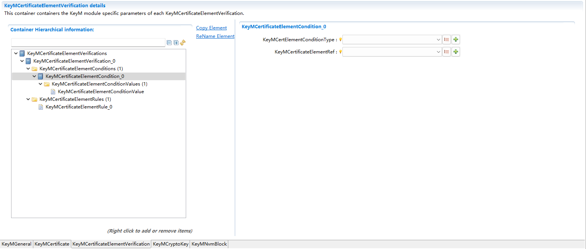
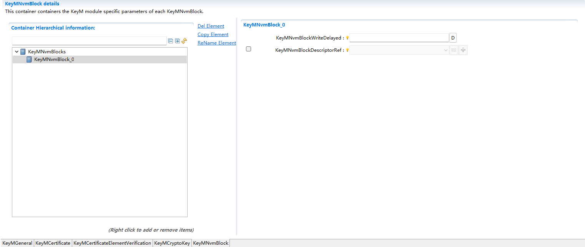

====================
KeyM
====================

文档信息 Document Information
====================================================

版本历史 Version History
------------------------------------------------------------------------------------------

.. list-table::
   :widths: 10 10 10 10 20
   :header-rows: 1

   * - 日期(Date)
     - 作者(Author)
     - 版本(Version)
     - 状态(Status)
     - 说明(Description)

   * - 2025/02/22
     - jie.gu
     - V0.1
     - 发布(Release)
     - 首次发布(First release)

   * - 2025/04/04
     - jie.gu
     - V1.0
     - 发布(Release)
     - 正式发布(Official release)

参考文档 References
------------------------------------------------------------------------------------------

.. list-table::
   :widths: 10 10 30 10
   :header-rows: 1

   * - 编号(Number)
     - 分类(Classification)
     - 标题(Title)
     - 版本(Version)

   * - 1
     - Autosar
     - AUTOSAR_CP_SRS_CryptoStack.pdf
     - R23-11
   * - 2
     - Autosar
     - AUTOSAR_CP_SWS_KeyManager.pdf
     - R23-11 

术语与简写 Terms and Abbreviations
====================================================

术语 Terms
------------------------------------------------------------------------------------------
.. :align: center   表格内容居中(Table contents are centered)

.. list-table::
   :widths: 10 40
   :header-rows: 2

   * - 术语(Terms)
     - 解释(Explanation)

   * - Callback
     - 在本文档中，术语 “callback” 用于API services，其旨在向其他BSW modules发送通知。(For the purpose of this file, the term "callback" is used for API services, which are intended for sending notifications to other BSW modules.)
   * - Callout
     - Callouts是函数存根（function stubs），可在配置阶段填充内容，其用途是为提供callout的模块增加功能。(Callouts are function stubs that can be filled in during configuration phase, in order to add functions to modules that provide callouts.)
   * - Class
     - Class代表一组具有相似电气特性的信号。(Class represents a group of signals with similar electrical characteristics.)
   * - Client / Server communication
     - 本定义摘录自[9]：客户端 - 服务器（Client-server）通信涉及两个实体，即作为service 请求方（或使用者）的client，以及提供service的server。client发起通信，请求server执行某项service，必要时会传输一个参数集（parameter set）。以RTE形式存在的server，会等待来自client的传入通信请求，执行所请求的service，并将响应（response）发送至client的请求。因此，通过通信的发起方向，可对AUTOSAR软件组件（AUTOSAR Software Component）是client还是server进行分类。(This definition is excerpted from [9]: Client-server communication involves two entities, i.e., the client as the service requester (or user), and the server providing services.) The client initiates communication to request the server to execute some service, and also, where necessary, transmits a parameter set. The server in the form of RTE waits for the inward transmission communication requests from client, executes the requested service, and sends response to the client's request. Therefore, classify whether the AUTOSAR Software Component is a client or a server by the initiation direction of communication.

简写 Abbreviations
------------------------------------------------------------------------------------------

.. list-table::
   :widths: 10 20 30
   :header-rows: 1

   * - 简写(Abbreviation)
     - 全称(Full name)
     - 解释(Explanation)

   * - KeyM
     - Key Manager
     - 密钥管理器
   * - PKI
     - Public Key Infrastructure
     - 公钥基础设施
   * - CSR
     - Certificate Signing Request
     - 证书签名请求
   * - CSM
     - Crypto Service Manager
     - 加密服务管理器
   * - CRL
     - Certificate Revocation List
     - 证书吊销列表
   * - CA
     - Certificate Authority
     - 证书认证
   * - OID
     - Object Identifier
     - 一个字节长度的数组用于识别一个或者一组证书元素.(An array of byte length is used for identifying one or a set of certificate elements)
      

简介 Introduction
====================================================

在一个加密功能中，密钥和证书的功能占比重很大。首先，密钥是一种参数，它是在明文转换为密文或将密文转换为明文的算法中输入的参数。许多加密算法需要使用到密钥，因此，就需要 keyM 模块来管理密钥，而 keyM 对于密钥的管理主要体现在对密钥的更新和生成密钥方面。而证书对网络用户在网络交流中的信息和数据等以加密或解密的形式保证了信息和数据的完整性和安全性。KeyM 模块可以实现证书的链的配置保存与验证，这使得网络中的信息和数据的安全性更高。

The functions of keys and certificates account for a large proportion in encryption function. Firstly, key is a kind of parameter that is input into algorithm converting plaintext to ciphertext or vice versa. Key is required in many encryption algorithms; therefore, a keyM module is required to manage keys. The management of keyM for key is mainly reflected in key updating and generating. Certificate can ensure the integrity and security of information and data exchanged by network users by either encryption or decryption. The KeyM module can save and verify the configuration of certificate chains, which enhances the security of information and data in the network. 

功能描述 Functional Description
====================================================

特性 Features
------------------------------------------------------------------------------------------

1.KeyM功能介绍

1.Introduction to KeyM function

Key Management 分为两部分：秘钥子模块和证书子模块

Key Management includes two parts: Key submodule and certificate submodule

2.Key子模块

2.Key submodule
   
秘钥子模块可以根据配置的需求，利用 HSM 的功能派生出新的秘钥，可以通过会话模式更新秘钥及秘钥元素，当会话开启后，可以对秘钥进行更新，结束会话后，更新的秘钥将被置成可用状态。

By leveraging the functions of HSM, the key submodule can derive new keys according to the configuration requirements. The keys and key elements can be updated through session mode. When a session is opened, the keys can be updated. The updated keys will be available upon the ending of session.

3.证书子模块

3.Certificate submodule

证书子模块允许配置证书链，在配置中将证书的属性和关系设置好，上层应用通过 API 将证书数据传给 keyM 后，证书子模块将根据配置内容及 HSM 按照标准结构解析的证书存储进配置的位置（NVM、CSM 或 RAM）。在存储之前将对证书进行解析与验证操作，以确定该证书的可靠性

The certificate submodule supports the configuration of certificate chains by setting the attributes and relationships of certificates in the configuration. After the upper layer application transfers the certificate data to keyM via API, the certificate submodule will be stored in the position configured (NVM, CSM, or RAM) based on the configuration content and the certificate parsed by HSM according to the standard structure. Before storage, the certificate will be parsed and validated to confirm its reliability

偏差 Deviation
------------------------------------------------------------------------------------------
1.证书链

1.Certificate chain

目前未实现证书链的验证功能

The verification function of certificate chain has not been implemented yet

扩展 Extension
------------------------------------------------------------------------------------------

None

集成 Integration
====================================================

文件列表 File List
------------------------------------------------------------------------------------------

.. figure:: ../../../_static/参考手册/KeyM/Filelist.png
   :alt: KeyM组件文件组织结构描述(Description of KeyM component file organization structure)
   :name: fig_KeyMFilelist
   :align: center

   KeyM组件文件组织结构描述. (Descriptions of KeyM component file organization structure)

如图  :ref:`fig_KeyMFilelist` 所示，KeyM模块的文件引用关系如下：

As shown in the figure  :ref:`fig_KeyMFilelist` , the file reference relationship of the KeyM module is shown as follows:

静态文件 Static Files
~~~~~~~~~~~~~~~~~~~~~~~~~~~~~~~~~~~~~~~~~~~~

   None

动态文件 Dynamic Files
~~~~~~~~~~~~~~~~~~~~~~~~~~~~~~~~~~~~~~~~~~~~

.. list-table::
   :widths: 10 30
   :header-rows: 1

   * - 文件(File)
     - 描述(Description)
   
   * - KeyM.c 
     - KeyM 模块源文件，包含了 API 函数的实现。(The KeyM module source file, which contains the realization of API functions.) 

   * - KeyM.h 
     - KeyM 模块头文件，包含了 API 函数的扩展声明并定义了配置的数据结构。(The KeyM module header file contains extension declarations for API functions and defines the structure of configured data.)

   * - KeyM_Cfg.h 
     - 定义 KeyM 模块预编译时用到的配置参数。(Defines the configuration parameters for pre-compiling KeyM modules.)

   * - KeyM_Cfg.c 
     - KeyM 模块配置生成文件。(Files generated by KeyM module configuration.)

   * - SchM_KeyM.h 
     - 声明 KeyM 模块需要循环调用的 API。(Declares the API that the KeyM module needs to call in a loop.)

   * - Rte_KeyM_Type.h 
     - 定义其它模块可能使用的 KeyM 模块的数据结构。(Defines the data structure of KeyM modules that other modules may use.) 

   * - KeyM_Externals.c 
     - KeyM 模块源文件，包含 KeyM 模块外部实现的接口。(The KeyM module source file, which contains the interfaces realized externally for the KeyM module.) 

   * - KeyM_Externals.h 
     - KeyM 模块头文件，定义 KeyM 模块外部实现的接口。(-The KeyM module header file, which defines the interfaces realized externally for the KeyM module.)

   * - KeyM_Internal.h 
     - KeyM 内部变量 (KeyM internal variables) 

   * - KeyM_MemMap.h 
     - KeyM 模块的内存映射 (Memory mapping of KeyM module) 

   * - KeyM_Type.h 
     - KeyM 的配置类型结构 (Configuration type structure of KeyM) 
  

错误处理 Error Handling
----------------------------------------------------------------------------

开发错误 Development Errors
~~~~~~~~~~~~~~~~~~~~~~~~~~~~~~~~~~~~~~~~~~~~
.. list-table:: 
  :widths: 20 10 30
  :header-rows: 1

  * - Error code
    - Value[hex]
    - Description

  * - KEYM_E_PARAM_POINTER
    - 0x01
    - API service called with invalid parameter (Null Pointer)

  * - KEYM_E_SMALL_BUFFER 
    - 0x02
    - Buffer is too small for operation 

  * - KEYM_E_UNINIT 
    - 0x03
    - API called before module has been initialized

  * - KEYM_E_INIT_FAILED
    - 0x04
    - KeyM module initialization failed 

  * - KEYM_E_CONFIG_FAILURE
    - 0x05
    - KeyM configuration failure 

产品错误 Product Errors
~~~~~~~~~~~~~~~~~~~~~~~~~~~~~~~~~~~~~~~~~~~~
None

运行时错误 Runtime Errors
~~~~~~~~~~~~~~~~~~~~~~~~~~~~~~~~~~~~~~~~~~~~
None

应用程序集成 Application Integration
------------------------------------------------------------------------------------------------------------------------
1.依赖模块

1.Dependency module

配置KeyM模块需要保证工程中存在STBM提供时间基准，CSM模块即下层模块提供加密服务

The configuration of KeyM module requires time reference provided by STBM in the project as well as encryption services provided by the CSM module, which is the lower level module
   
.. include:: KeyM_h_api.rst
.. include:: KeyM_Internal_h_api.rst

配置 Configuration
==========================

KeyMGeneral通用配置 General Configuration of KeyMGeneral
------------------------------------------------------------------------------------------------------------------------------------------------------

提供一些基本功能的开关，如证书功能，秘钥功能，和handler函数功能，第一步应该按项目需要配置这里。

Provide some basic functions, such as certificate function, key function and handler function. In the first step, make configuration based on project needs.

.. figure:: ../../../_static/参考手册/KeyM/KeyMGeneral.png
   :alt:  KeyMGeneral通用配置图 (KeyMGeneralGeneral Configuration Diagram)
   :name: fig_KeyM_General
   :align: center

   fig_KeyM_General

KeyMCertificate配置 Configuration of KeyMCertificate
~~~~~~~~~~~~~~~~~~~~~~~~~~~~~~~~~~~~~~~~~~~~~~~~~~~~~~~~~~~~~~~~~~~~~~~~~~~~~~~~~~~~~~~~~~~~~~~~~~~~~~~~~~

提供对证书的基本配置，可以配置证书的长度和字段，以及对证书的一些验证操作所使用的算法和秘钥类型。

Provide some basic configuration for certificates, including certificate length and fields, as well as the algorithms and key types used for some verification operations on the certificate.

.. figure:: ../../../_static/参考手册/KeyM/KeyMCertificate.png
   :alt: KeyMCertificate通用配置图 (KeyMCertificate General Configuration Diagram)
   :name: fig_KeyMCertificate
   :align: center

   fig_KeyMCertificate

KeyMCertificateElement配置 Configuration of KeyMCertificateElement
~~~~~~~~~~~~~~~~~~~~~~~~~~~~~~~~~~~~~~~~~~~~~~~~~~~~~~~~~~~~~~~~~~~~~~~~~~~~~~~~~~~~~~~~~~~~~~~~~~~~~~~~~~~

对证书中的每个字段进行详细配置，确保是符合证书规范的。

Configure each field in the certificate in detail to ensure its compliance with the certificate specification.

.. figure:: ../../../_static/参考手册/KeyM/KeyMCertificateElement.png
   :alt: KeyMCertificateElement通用配置图 (KeyMCertificateElement General Configuration Diagram)
   :name: fig_KeyMCertificateElement
   :align: center

   fig_KeyMCertificateElement

KeyMCertificateElementRule配置 Configuration of KeyMCertificateElementRule
~~~~~~~~~~~~~~~~~~~~~~~~~~~~~~~~~~~~~~~~~~~~~~~~~~~~~~~~~~~~~~~~~~~~~~~~~~~~~~~~~~~~~~~~~~~~~~~~~~~~~~~~~~~~~~~~~~~~~~~~~~~~~~~~~~~~~~~~~~~~~~~~~~~~~~~~~~~~~~~~~~~~~~~~~~~~~~~~~~~~~~~~~~~~~~~~~~~

对于证书里面的元素可以配置一些规则，通常这些规则是用不上的可以不配置，可以根据实际需要进行设计。

Configure some rules for the elements in the certificate. In general, these rules are not necessary and can be designed based on actual needs.

.. figure:: ../../../_static/参考手册/KeyM/KeyMCertificateElementRule.png
   :alt: KeyMCertificateElementRule通用配置图 (KeyMCertificateElementRule General Configuration Diagram)
   :name: fig_KeyMCertificateElementRule
   :align: center

   fig_KeyMCertificateElementRule
   
KeyMCertificateElementCondition配置 Configuration of KeyMCertificateElementCondition
~~~~~~~~~~~~~~~~~~~~~~~~~~~~~~~~~~~~~~~~~~~~~~~~~~~~~~~~~~~~~~~~~~~~~~~~~~~~~~~~~~~~~~~~~~~~~~~~~~~~~~~~~~~~~~~~~~~~~~~~~~~~~~~~~~~~~~~~~~~~~~~~~~~~~~~~~~~~~~~~~~~~~~~~~~~~~~~~~~~~~~~~~~~~~~~~~~~~

对于证书里面的元素可以配置一些规则，通常这些规则是用不上的可以不配置，可以根据实际需要进行设计。

Configure some rules for the elements in the certificate. In general, these rules are not necessary and can be designed based on actual needs.

   fig_KeyMCertificateElementCondition

   

KeyMCertificateElementConditionArrayElement配置 Configuration of KeyMCertificateElementConditionArrayElement
~~~~~~~~~~~~~~~~~~~~~~~~~~~~~~~~~~~~~~~~~~~~~~~~~~~~~~~~~~~~~~~~~~~~~~~~~~~~~~~~~~~~~~~~~~~~~~~~~~~~~~~~~~~~~~~~~~~~~~~~~~~~~~~~~~~~~~~~~~~~~~~~~~~~~~~~~~~~~~

对于证书里面的元素可以配置一些规则，通常这些规则是用不上的可以不配置，可以根据实际需要进行设计。

Configure some rules for the elements in the certificate. In general, these rules are not necessary and can be designed based on actual needs.

.. figure:: ../../../_static/参考手册/KeyM/KeyMCertificateElementConditionArrayElement.png
   :alt: KeyMCertificateElementConditionArrayElement通用配置图 (KeyMCertificateElementConditionArrayElement General Configuration Diagram)
   :name: fig_KeyMCertificateElementConditionArrayElement
   :align: center

   fig_KeyMCertificateElementConditionArrayElement

KeyMCertificateElementConditionArray配置 Configuration of KeyMCertificateElementConditionArray
~~~~~~~~~~~~~~~~~~~~~~~~~~~~~~~~~~~~~~~~~~~~~~~~~~~~~~~~~~~~~~~~~~~~~~~~~~~~~~~~~~~~~~~~~~~~~~~~~~~~~~~~~~~~~~~~~~~~~~~~~~~~~~~~~~~~~~~~~~~~~~~~~~~~~~~~~~~~~~~~~~~~~~~~~~~

对于证书里面的元素可以配置一些规则，通常这些规则是用不上的可以不配置，可以根据实际需要进行设计。

Configure some rules for the elements in the certificate. In general, these rules are not necessary and can be designed based on actual needs.

.. figure:: ../../../_static/参考手册/KeyM/KeyMCertificateElementConditionArray.png
   :alt: KeyMCertificateElementConditionArray通用配置图 (KeyMCertificateElementConditionArray General Configuration Diagram)
   :name: fig_KeyMCertificateElementConditionArray
   :align: center

   fig_KeyMCertificateElementConditionArray

KeyMCertificateElementConditionPrimitive配置 Configuration of KeyMCertificateElementConditionPrimitive
----------------------------------------------------------------------------------------------------------------------------------------------------------------------------------------------------------------------------------------------------------------------------------------------------

对于证书里面的元素可以配置一些规则，通常这些规则是用不上的可以不配置，可以根据实际需要进行设计。

Configure some rules for the elements in the certificate. In general, these rules are not necessary and can be designed based on actual needs.

.. figure:: ../../../_static/参考手册/KeyM/KeyMCertificateElementConditionPrimitive.png
   :alt: KeyMCertificateElementConditionPrimitive通用配置图 (KeyMCertificateElementConditionPrimitive General Configuration Diagram)
   :name: fig_KeyMCertificateElementConditionPrimitive
   :align: center

   fig_KeyMCertificateElementConditionPrimitive

KeyMCertificateElementConditionSenderReceiver配置 Configuration of KeyMCertificateElementConditionSenderReceiver
~~~~~~~~~~~~~~~~~~~~~~~~~~~~~~~~~~~~~~~~~~~~~~~~~~~~~~~~~~~~~~~~~~~~~~~~~~~~~~~~~~~~~~~~~~~~~~~~~~~~~~~~~~~~~~~~~~~~~~~~~~~~~~~~~~~~~~~~~~~~~~~~~~~~~~~~~~~~~~~~~~~~~~~~~~~~~~~~~~~~~~~~~~~~~~~~~~~~~~

对于证书里面的元素可以配置一些规则，通常这些规则是用不上的可以不配置，可以根据实际需要进行设计。

Configure some rules for the elements in the certificate. In general, these rules are not necessary and can be designed based on actual needs.

.. figure:: ../../../_static/参考手册/KeyM/KeyMCertificateElementConditionSenderReceiver.png
   :alt: KeyMCertificateElementConditionSenderReceiver通用配置图 (KeyMCertificateElementConditionSenderReceiver General Configuration Diagram)
   :name: fig_KeyMCertificateElementConditionSenderReceiver
   :align: center

   fig_KeyMCertificateElementConditionSenderReceiver

KeyMCryptoKey配置 Configuration of KeyMCryptoKey
~~~~~~~~~~~~~~~~~~~~~~~~~~~~~~~~~~~~~~~~~~~~~~~~~~~~~~~~~~~~~~~~~~~~~~~~~~~~~~~~~~~~~~~~~~~~~~~~~~~~~~~~~~~~~~~~~~~~~~~~~~~~~~~~~~~~~~~~~~~~~~~~~~~~~~~~~~~~~~~~~~~~~~~~

配置需要使用的秘钥的配置，配置存储类型或者关联下层的配置等。

Configuration requiring key, type of configuration storage or configuration of linked lower level, etc.

.. figure:: ../../../_static/参考手册/KeyM/KeyMCryptoKey.png
   :alt: KeyMCryptoKey通用配置图 (KeyMCryptoKey General Configuration Diagram)
   :name: fig_KeyMCryptoKey
   :align: center

   fig_KeyMCryptoKey

KeyMNvmBlock配置 Configuration of KeyMNvmBlock
~~~~~~~~~~~~~~~~~~~~~~~~~~~~~~~~~~~~~~~~~~~~~~~~~~~~~~~~~~~~~~~~~~~~~~~~~~~~~~~~~~~~~~~~~~~~~~~~~~~~~~~~~~~~~~~~~~~~~~~~~~~~~~~~~~~~~

证书可以保存在NVM中，也可以保存在RAM中。但是下次上电前会丢失，可以根据配置决定是否需要NVM支持。

The certificate can be saved in NVM or RAM. However, it will be lost before the next power-on. Decide whether NVM support is needed based on the configuration.

   fig_KeyMNvmBlock

