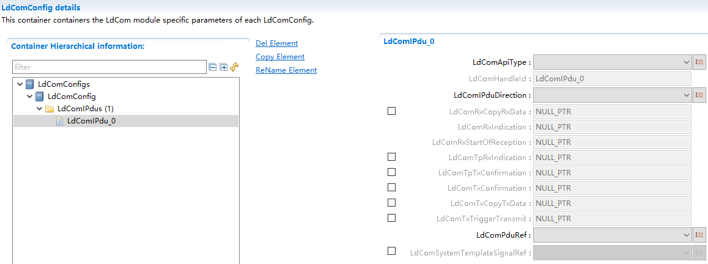

==============
LdCom
==============

**缩写词注解**

+------------+-------------------------+------------------------------+
| **缩写词** | **英文全称**            | **中文解释**                 |
+------------+-------------------------+------------------------------+
| I-PDU      | Interaction Layer       | 交互层协议数据单元           |
|            | Protocol Data Unit      |                              |
+------------+-------------------------+------------------------------+
| DET        | Default Error Tracer    | 开发错误检测                 |
+------------+-------------------------+------------------------------+
| LdCom      | LargeDataCOM            | “大数据信号”通信模块         |
+------------+-------------------------+------------------------------+

简介
====

LdCom模块主要实现RTE（或者应用层）与PduR之间I-PDU的传递作用，实现IF
PDU与TP PDU的发送与接收传递。所谓的“Large
Data”指的是每个Pdu即为一个信号，而非大数据的PDU，LdCom只执行简单的Pdu收发，不涉及信号解析。

|image1|\ 图 LdCom模块层次图

LdCom模块处于AUTOSAR架构中的通信服务层，其下层模块为PduR模块，上层模块为RTE。

LdCom实现了与上下层模块间基于I-PDU传输的接口传递，包括IF
Pdu的发送（Direct发送/TriggerTransmit发送），IF Pdu的接收，TP
Pdu的发送，TP Pdu的接收，以及DET检测报错。

参考资料
--------

[1] AUTOSAR_SRS_COM.pdf，R19-11和4.2.2

[2] AUTOSAR_SWS_LargeDataCOM.pdf，R19-11和4.2.2

[3] AUTOSAR_SWS_PDURouter.pdf，R19-11和4.2.2

功能描述
========

IF PDU发送功能
--------------

IF PDU发送功能介绍
~~~~~~~~~~~~~~~~~~

LdCom支持Pdu以IF方式进行发送，IF方式发送存在两种形式：1、直接调用LdCom_Transmit进行发送；2、下层调用LdCom_TriggerTransmit获取发送Pdu数据进行发送。

IF PDU发送功能实现
~~~~~~~~~~~~~~~~~~

若Pdu以IF方式进行发送，需配置LdComIPdu的LdComApiType为LDCOM_IF，LdComIPduDirection为LDCOM_SEND，若该Pdu上层模块支持发送确认需配置LdComTxConfirmation，若支持TriggerTransmit方式发送，还需配置LdComTxTriggerTransmit。

需要直接发送该Pdu时，直接调用LdCom_Transmit进行发送，LdCom通过调用下层发送接口进行发送；若下层调用LdCom_TriggerTransmit获取发送数据时，LdCom调用配置的Rte_LdComCbkTriggerTransmit进行接口传递。

发送完成之后，下层调用LdCom_TxConfirmation，LdCom调用配置的Rte_LdComCbkTxConfirmation进行传递。

IF PDU接收功能
--------------

IF PDU接收功能介绍
~~~~~~~~~~~~~~~~~~

LdCom支持Pdu以IF方式进行接收，下层接收到Pdu数据时直接调用LdCom_RxIndication传递给LdCom。

IF PDU接收功能实现
~~~~~~~~~~~~~~~~~~

若Pdu以IF方式进行接收，需配置LdComIPdu的LdComApiType为LDCOM_IF，LdComIPduDirection为LDCOM_RECEIVE，配置LdComRxIndication。

当下层调用LdCom_RxIndication时，LdCom调用配置的Rte_LdComCbkRxIndication进行传递。

TP PDU发送功能
--------------

TP PDU发送功能介绍
~~~~~~~~~~~~~~~~~~

LdCom支持Pdu以TP方式进行发送，按TP发送流程Transmit→N次CopyTxData→TpTxConfirmation进行Pdu的发送。

TP PDU发送功能实现
~~~~~~~~~~~~~~~~~~

若Pdu以TP方式进行发送，需配置LdComIPdu的LdComApiType为LDCOM_TP，LdComIPduDirection为LDCOM_SEND，配置LdComTpTxConfirmation和LdComTxCopyTxData。

上层模块调用LdCom_Transmit请求TxPdu的发送，下层模块回调LdCom_CopyTxData请求TxPdu数据段的拷贝，LdCom通过配置的Rte_LdComCbkCopyTxData进行传递，当整个TxPdu发送结束，下层调用LdCom_TpTxConfirmation，LdCom通过配置的Rte_LdComCbkTpTxConfirmation进行传递。

TP PDU接收功能
--------------

TP PDU接收功能介绍
~~~~~~~~~~~~~~~~~~

LdCom支持Pdu以TP方式进行接收，按TP接收流程StartOfReception→N次CopyRxData→TpRxIndication进行Pdu的接收。

TP PDU接收功能实现
~~~~~~~~~~~~~~~~~~

若Pdu以TP方式进行接收，需配置LdComIPdu的LdComApiType为LDCOM_TP，LdComIPduDirection为LDCOM_RECEIVE，配置LdComRxStartOfReception、LdComRxCopyRxData和LdComTpRxIndication。

下层模块调用LdCom_StartOfReception，LdCom_CopyRxData，LdCom_TpRxIndication时，LdCom依次调用配置的Rte_LdComCbkStartOfReception，Rte_LdComCbkCopyRxData，Rte_LdComCbkTpRxIndication进行传递。

源文件描述
==========

表 LdCom组件文件描述

+-------------------+--------------------------------------------------+
| **文件**          | **说明**                                         |
+-------------------+--------------------------------------------------+
| LdCom_Cfg.h       | 定义LdCom模块PC配置的宏定义。                    |
+-------------------+--------------------------------------------------+
| LdCom_Cfg.c       | 定义LdCom模块PC/PB配置的结构体参数。             |
+-------------------+--------------------------------------------------+
| LdCom.h           | 实现LdCom模块外部接口（除了                      |
|                   | 回调函数）的声明，以及配置文件中全局变量的声明。 |
+-------------------+--------------------------------------------------+
| LdCom.c           | 作为LdCom模块的核心文件，                        |
|                   | 实现LdCom模块全部对外接口，以及实现LdCom模块功能 |
|                   | 所必须的local函数，local宏定义，local变量定义。  |
+-------------------+--------------------------------------------------+
| LdCom_MemMap.h    | 实现LdCom模块内存布局。                          |
+-------------------+--------------------------------------------------+
| LdCom_Types.h     | 实现外部/内                                      |
|                   | 部类型的定义，包括AUTOSAR标准定义的类型，以及PB/ |
|                   | PC配置参数结构体类型，以及内部运行时结构体类型。 |
+-------------------+--------------------------------------------------+
| LdCom \_Cbk.h     | 实现LdCom模块全部回调函数的声明。                |
+-------------------+--------------------------------------------------+

|image2|

图 LdCom组件文件交互关系图

API接口
=======

类型定义
--------

LdCom_ConfigType类型定义
~~~~~~~~~~~~~~~~~~~~~~~~

+-----------+----------------------------------------------------------+
| 名称      | LdCom_ConfigType                                         |
+-----------+----------------------------------------------------------+
| 类型      | struct                                                   |
+-----------+----------------------------------------------------------+
| 范围      | 无                                                       |
+-----------+----------------------------------------------------------+
| 描述      | LdCom模块PB配置结构体类型                                |
+-----------+----------------------------------------------------------+

输入函数描述
------------

+----------------------------+-----------------------------------------+
| **输入模块**               | **API**                                 |
+----------------------------+-----------------------------------------+
| Det                        | Det_ReportError                         |
+----------------------------+-----------------------------------------+
| PduR                       | PduR_LdComTransmit                      |
+----------------------------+-----------------------------------------+
| Rte/Upper                  | Rte_LdComCbkCopyTxData\_<sn>            |
+----------------------------+-----------------------------------------+
|                            | Rte_LdComCbkTpTxConfirmation\_<sn>      |
+----------------------------+-----------------------------------------+
|                            | Rte_LdComCbkStartOfReception\_<sn>      |
+----------------------------+-----------------------------------------+
|                            | Rte_LdComCbkCopyRxData\_<sn>            |
+----------------------------+-----------------------------------------+
|                            | Rte_LdComCbkTpRxIndication\_<sn>        |
+----------------------------+-----------------------------------------+
|                            | Rte_LdComCbkRxIndication\_<sn>          |
+----------------------------+-----------------------------------------+
|                            | Rte_LdComCbkTriggerTransmit\_<sn>       |
+----------------------------+-----------------------------------------+
|                            | Rte_LdComCbkTxConfirmation\_<sn>        |
+----------------------------+-----------------------------------------+

静态接口函数定义
----------------

LdCom_Init函数定义
~~~~~~~~~~~~~~~~~~

+-------------+---------------------+-------+-------------------------+
| 函数名称：  | LdCom_Init          |       |                         |
+-------------+---------------------+-------+-------------------------+
| 函数原型：  | void LdCom_Init(    |       |                         |
|             |                     |       |                         |
|             | const               |       |                         |
|             | LdCom_ConfigType\*  |       |                         |
|             | config)             |       |                         |
+-------------+---------------------+-------+-------------------------+
| 服务编号：  | 0x01                |       |                         |
+-------------+---------------------+-------+-------------------------+
| 同步/异步： | 同步                |       |                         |
+-------------+---------------------+-------+-------------------------+
| 是          | 否                  |       |                         |
| 否可重入：  |                     |       |                         |
+-------------+---------------------+-------+-------------------------+
| 输入参数：  | config              | 值    | 无                      |
|             |                     | 域：  |                         |
+-------------+---------------------+-------+-------------------------+
| 输入        | 无                  |       |                         |
| 输出参数：  |                     |       |                         |
+-------------+---------------------+-------+-------------------------+
| 输出参数：  | 无                  |       |                         |
+-------------+---------------------+-------+-------------------------+
| 返回值：    | 无                  |       |                         |
+-------------+---------------------+-------+-------------------------+
| 功能概述：  | LdCom模块初始化     |       |                         |
+-------------+---------------------+-------+-------------------------+

LdCom_DeInit函数定义
~~~~~~~~~~~~~~~~~~~~

+-------------+--------------------------------------------------------+
| 函数名称：  | LdCom_DeInit                                           |
+-------------+--------------------------------------------------------+
| 函数原型：  | void LdCom_DeInit(void)                                |
+-------------+--------------------------------------------------------+
| 服务编号：  | 0x02                                                   |
+-------------+--------------------------------------------------------+
| 同步/异步： | 同步                                                   |
+-------------+--------------------------------------------------------+
| 是          | 否                                                     |
| 否可重入：  |                                                        |
+-------------+--------------------------------------------------------+
| 输入参数：  | 无                                                     |
+-------------+--------------------------------------------------------+
| 输入        | 无                                                     |
| 输出参数：  |                                                        |
+-------------+--------------------------------------------------------+
| 输出参数：  | 无                                                     |
+-------------+--------------------------------------------------------+
| 返回值：    | 无                                                     |
+-------------+--------------------------------------------------------+
| 功能概述：  | LdCom模块反初始化                                      |
+-------------+--------------------------------------------------------+

LdCom_GetVersionInfo函数定义
~~~~~~~~~~~~~~~~~~~~~~~~~~~~

+-------------+-------------------+---------+-------------------------+
| 函数名称：  | LdC               |         |                         |
|             | om_GetVersionInfo |         |                         |
+-------------+-------------------+---------+-------------------------+
| 函数原型：  | void              |         |                         |
|             | LdCo              |         |                         |
|             | m_GetVersionInfo( |         |                         |
|             |                   |         |                         |
|             | Std               |         |                         |
|             | _VersionInfoType\*|         |                         |
|             | versioninfo)      |         |                         |
+-------------+-------------------+---------+-------------------------+
| 服务编号：  | 0x03              |         |                         |
+-------------+-------------------+---------+-------------------------+
| 同步/异步： | 同步              |         |                         |
+-------------+-------------------+---------+-------------------------+
| 是          | 否                |         |                         |
| 否可重入：  |                   |         |                         |
+-------------+-------------------+---------+-------------------------+
| 输入参数：  | 无                |         |                         |
+-------------+-------------------+---------+-------------------------+
| 输入        | 无                |         |                         |
| 输出参数：  |                   |         |                         |
+-------------+-------------------+---------+-------------------------+
| 输出参数：  | versioninfo       | 值域：  | 无                      |
+-------------+-------------------+---------+-------------------------+
| 返回值：    | 无                |         |                         |
+-------------+-------------------+---------+-------------------------+
| 功能概述：  | 获取              |         |                         |
|             | 模块软件版本信息  |         |                         |
+-------------+-------------------+---------+-------------------------+

LdCom_Transmit函数定义
~~~~~~~~~~~~~~~~~~~~~~

+-------------+-------------------+---------+-------------------------+
| 函数名称：  | LdCom_Transmit    |         |                         |
+-------------+-------------------+---------+-------------------------+
| 函数原型：  | Std_ReturnType    |         |                         |
|             | LdCom_Transmit(   |         |                         |
|             |                   |         |                         |
|             | PduIdType Id,     |         |                         |
|             |                   |         |                         |
|             | const             |         |                         |
|             | PduInfoType\*     |         |                         |
|             | PduInfoPtr)       |         |                         |
+-------------+-------------------+---------+-------------------------+
| 服务编号：  | 0x05              |         |                         |
+-------------+-------------------+---------+-------------------------+
| 同步/异步： | 同步              |         |                         |
+-------------+-------------------+---------+-------------------------+
| 是          | 相同Pdu不可重     |         |                         |
| 否可重入：  | 入，不同Pdu可重入 |         |                         |
+-------------+-------------------+---------+-------------------------+
| 输入参数：  | Id                | 值域：  | 无                      |
+-------------+-------------------+---------+-------------------------+
|             | PduInfoPtr        | 值域：  | 无                      |
+-------------+-------------------+---------+-------------------------+
| 输入        | 无                |         |                         |
| 输出参数：  |                   |         |                         |
+-------------+-------------------+---------+-------------------------+
| 输出参数：  | 无                |         |                         |
+-------------+-------------------+---------+-------------------------+
| 返回值：    | Std_ReturnType    |         |                         |
+-------------+-------------------+---------+-------------------------+
| 功能概述：  | IF/TP Pdu发送请求 |         |                         |
+-------------+-------------------+---------+-------------------------+

LdCom_CopyTxData函数定义
~~~~~~~~~~~~~~~~~~~~~~~~

+-------------+-------------------+---------+-------------------------+
| 函数名称：  | LdCom_CopyTxData  |         |                         |
+-------------+-------------------+---------+-------------------------+
| 函数原型：  | BufReq_ReturnType |         |                         |
|             | LdCom_CopyTxData( |         |                         |
|             |                   |         |                         |
|             | PduIdType id,     |         |                         |
|             |                   |         |                         |
|             | const             |         |                         |
|             | PduInfoType\*     |         |                         |
|             | info,             |         |                         |
|             |                   |         |                         |
|             | RetryInfoType\*   |         |                         |
|             | retry,            |         |                         |
|             |                   |         |                         |
|             | PduLengthType\*   |         |                         |
|             | availableDataPtr  |         |                         |
|             |                   |         |                         |
|             | )                 |         |                         |
+-------------+-------------------+---------+-------------------------+
| 服务编号：  | 0x43              |         |                         |
+-------------+-------------------+---------+-------------------------+
| 同步/异步： | 同步              |         |                         |
+-------------+-------------------+---------+-------------------------+
| 是          | 是                |         |                         |
| 否可重入：  |                   |         |                         |
+-------------+-------------------+---------+-------------------------+
| 输入参数：  | id                | 值域：  | 无                      |
+-------------+-------------------+---------+-------------------------+
|             | info              | 值域：  | 无                      |
+-------------+-------------------+---------+-------------------------+
|             | retry             | 值域：  | 无                      |
+-------------+-------------------+---------+-------------------------+
| 输入        | 无                |         |                         |
| 输出参数：  |                   |         |                         |
+-------------+-------------------+---------+-------------------------+
| 输出参数：  | availableDataPtr  | 值域：  | 无                      |
+-------------+-------------------+---------+-------------------------+
| 返回值：    | BufReq_ReturnType |         |                         |
+-------------+-------------------+---------+-------------------------+
| 功能概述：  | TP                |         |                         |
|             | Pdu发送数据段拷贝 |         |                         |
+-------------+-------------------+---------+-------------------------+

LdCom_TpTxConfirmation函数定义
~~~~~~~~~~~~~~~~~~~~~~~~~~~~~~

+-------------+-------------------+---------+-------------------------+
| 函数名称：  | LdCom             |         |                         |
|             | _TpTxConfirmation |         |                         |
+-------------+-------------------+---------+-------------------------+
| 函数原型：  | void              |         |                         |
|             | LdCom             |         |                         |
|             | _TpTxConfirmation(|         |                         |
|             |                   |         |                         |
|             | PduIdType id,     |         |                         |
|             |                   |         |                         |
|             | Std_ReturnType    |         |                         |
|             | result            |         |                         |
|             |                   |         |                         |
|             | )                 |         |                         |
+-------------+-------------------+---------+-------------------------+
| 服务编号：  | 0x48              |         |                         |
+-------------+-------------------+---------+-------------------------+
| 同步/异步： | 同步              |         |                         |
+-------------+-------------------+---------+-------------------------+
| 是          | 是                |         |                         |
| 否可重入：  |                   |         |                         |
+-------------+-------------------+---------+-------------------------+
| 输入参数：  | id                | 值域：  | 无                      |
+-------------+-------------------+---------+-------------------------+
|             | result            | 值域：  | 无                      |
+-------------+-------------------+---------+-------------------------+
| 输入        | 无                |         |                         |
| 输出参数：  |                   |         |                         |
+-------------+-------------------+---------+-------------------------+
| 输出参数：  | 无                |         |                         |
+-------------+-------------------+---------+-------------------------+
| 返回值：    | 无                |         |                         |
+-------------+-------------------+---------+-------------------------+
| 功能概述：  | TP                |         |                         |
|             | Pdu发送结束确认   |         |                         |
+-------------+-------------------+---------+-------------------------+

LdCom_StartOfReception函数定义
~~~~~~~~~~~~~~~~~~~~~~~~~~~~~~

+-------------+-------------------+---------+-------------------------+
| 函数名称：  | LdCom             |         |                         |
|             | _StartOfReception |         |                         |
+-------------+-------------------+---------+-------------------------+
| 函数原型：  | BufReq_ReturnType |         |                         |
|             | LdCom             |         |                         |
|             | _StartOfReception(|         |                         |
|             |                   |         |                         |
|             | PduIdType id,     |         |                         |
|             |                   |         |                         |
|             | const             |         |                         |
|             | PduInfoType\*     |         |                         |
|             | info,             |         |                         |
|             |                   |         |                         |
|             | PduLengthType     |         |                         |
|             | TpSduLength,      |         |                         |
|             |                   |         |                         |
|             | PduLengthType\*   |         |                         |
|             | bufferSizePtr     |         |                         |
|             |                   |         |                         |
|             | )                 |         |                         |
+-------------+-------------------+---------+-------------------------+
| 服务编号：  | 0x46              |         |                         |
+-------------+-------------------+---------+-------------------------+
| 同步/异步： | 同步              |         |                         |
+-------------+-------------------+---------+-------------------------+
| 是          | 是                |         |                         |
| 否可重入：  |                   |         |                         |
+-------------+-------------------+---------+-------------------------+
| 输入参数：  | id                | 值域：  | 无                      |
+-------------+-------------------+---------+-------------------------+
|             | info              | 值域：  | 无                      |
+-------------+-------------------+---------+-------------------------+
|             | TpSduLength       | 值域：  | 无                      |
+-------------+-------------------+---------+-------------------------+
| 输入        | 无                |         |                         |
| 输出参数：  |                   |         |                         |
+-------------+-------------------+---------+-------------------------+
| 输出参数：  | bufferSizePtr     |         |                         |
+-------------+-------------------+---------+-------------------------+
| 返回值：    | BufReq_ReturnType |         |                         |
+-------------+-------------------+---------+-------------------------+
| 功能概述：  | TP Pdu开始接收    |         |                         |
+-------------+-------------------+---------+-------------------------+

LdCom_CopyRxData函数定义
~~~~~~~~~~~~~~~~~~~~~~~~

+-------------+-------------------+---------+-------------------------+
| 函数名称：  | LdCom_CopyRxData  |         |                         |
+-------------+-------------------+---------+-------------------------+
| 函数原型：  | BufReq_ReturnType |         |                         |
|             | LdCom_CopyRxData( |         |                         |
|             |                   |         |                         |
|             | PduIdType id,     |         |                         |
|             |                   |         |                         |
|             | const             |         |                         |
|             | PduInfoType\*     |         |                         |
|             | info,             |         |                         |
|             |                   |         |                         |
|             | PduLengthType\*   |         |                         |
|             | bufferSizePtr     |         |                         |
|             |                   |         |                         |
|             | )                 |         |                         |
+-------------+-------------------+---------+-------------------------+
| 服务编号：  | 0x44              |         |                         |
+-------------+-------------------+---------+-------------------------+
| 同步/异步： | 同步              |         |                         |
+-------------+-------------------+---------+-------------------------+
| 是          | 是                |         |                         |
| 否可重入：  |                   |         |                         |
+-------------+-------------------+---------+-------------------------+
| 输入参数：  | id                | 值域：  | 无                      |
+-------------+-------------------+---------+-------------------------+
|             | info              | 值域：  | 无                      |
+-------------+-------------------+---------+-------------------------+
| 输入        | 无                |         |                         |
| 输出参数：  |                   |         |                         |
+-------------+-------------------+---------+-------------------------+
| 输出参数：  | bufferSizePtr     | 值域：  | 无                      |
+-------------+-------------------+---------+-------------------------+
| 返回值：    | BufReq_ReturnType |         |                         |
+-------------+-------------------+---------+-------------------------+
| 功能概述：  | TP                |         |                         |
|             | Pdu接收数据段拷贝 |         |                         |
+-------------+-------------------+---------+-------------------------+

LdCom_TpRxIndication函数定义
~~~~~~~~~~~~~~~~~~~~~~~~~~~~

+-------------+-------------------+---------+-------------------------+
| 函数名称：  | LdC               |         |                         |
|             | om_TpRxIndication |         |                         |
+-------------+-------------------+---------+-------------------------+
| 函数原型：  | void              |         |                         |
|             | LdCo              |         |                         |
|             | m_TpRxIndication( |         |                         |
|             |                   |         |                         |
|             | PduIdType id,     |         |                         |
|             |                   |         |                         |
|             | Std_ReturnType    |         |                         |
|             | result            |         |                         |
|             |                   |         |                         |
|             | )                 |         |                         |
+-------------+-------------------+---------+-------------------------+
| 服务编号：  | 0x45              |         |                         |
+-------------+-------------------+---------+-------------------------+
| 同步/异步： | 同步              |         |                         |
+-------------+-------------------+---------+-------------------------+
| 是          | 是                |         |                         |
| 否可重入：  |                   |         |                         |
+-------------+-------------------+---------+-------------------------+
| 输入参数：  | id                | 值域：  | 无                      |
+-------------+-------------------+---------+-------------------------+
|             | result            | 值域：  | 无                      |
+-------------+-------------------+---------+-------------------------+
| 输入        | 无                |         |                         |
| 输出参数：  |                   |         |                         |
+-------------+-------------------+---------+-------------------------+
| 输出参数：  | 无                |         |                         |
+-------------+-------------------+---------+-------------------------+
| 返回值：    | 无                |         |                         |
+-------------+-------------------+---------+-------------------------+
| 功能概述：  | TP Pdu接收结束    |         |                         |
+-------------+-------------------+---------+-------------------------+

LdCom_RxIndication函数定义
~~~~~~~~~~~~~~~~~~~~~~~~~~

+-------------+-------------------+---------+-------------------------+
| 函数名称：  | L                 |         |                         |
|             | dCom_RxIndication |         |                         |
+-------------+-------------------+---------+-------------------------+
| 函数原型：  | void              |         |                         |
|             | Ld                |         |                         |
|             | Com_RxIndication( |         |                         |
|             |                   |         |                         |
|             | PduIdType         |         |                         |
|             | RxPduId,          |         |                         |
|             |                   |         |                         |
|             | const             |         |                         |
|             | PduInfoType\*     |         |                         |
|             | PduInfoPtr        |         |                         |
|             |                   |         |                         |
|             | )                 |         |                         |
+-------------+-------------------+---------+-------------------------+
| 服务编号：  | 0x42              |         |                         |
+-------------+-------------------+---------+-------------------------+
| 同步/异步： | 同步              |         |                         |
+-------------+-------------------+---------+-------------------------+
| 是          | 不同Pdu可重入     |         |                         |
| 否可重入：  | ，相同Pdu不可重入 |         |                         |
+-------------+-------------------+---------+-------------------------+
| 输入参数：  | RxPduId           | 值域：  | 无                      |
+-------------+-------------------+---------+-------------------------+
|             | PduInfoPtr        | 值域：  | 无                      |
+-------------+-------------------+---------+-------------------------+
| 输入        | 无                |         |                         |
| 输出参数：  |                   |         |                         |
+-------------+-------------------+---------+-------------------------+
| 输出参数：  | 无                |         |                         |
+-------------+-------------------+---------+-------------------------+
| 返回值：    | 无                |         |                         |
+-------------+-------------------+---------+-------------------------+
| 功能概述：  | IF Pdu接收指示    |         |                         |
+-------------+-------------------+---------+-------------------------+

LdCom_TxConfirmation函数定义
~~~~~~~~~~~~~~~~~~~~~~~~~~~~

+-------------+-------------------+---------+-------------------------+
| 函数名称：  | LdC               |         |                         |
|             | om_TxConfirmation |         |                         |
+-------------+-------------------+---------+-------------------------+
| 函数原型：  | void              |         |                         |
|             | LdCo              |         |                         |
|             | m_TxConfirmation( |         |                         |
|             |                   |         |                         |
|             | PduIdType TxPduId |         |                         |
|             |                   |         |                         |
|             | )                 |         |                         |
+-------------+-------------------+---------+-------------------------+
| 服务编号：  | 0x40              |         |                         |
+-------------+-------------------+---------+-------------------------+
| 同步/异步： | 同步              |         |                         |
+-------------+-------------------+---------+-------------------------+
| 是          | 不同Pdu可重入     |         |                         |
| 否可重入：  | ，相同Pdu不可重入 |         |                         |
+-------------+-------------------+---------+-------------------------+
| 输入参数：  | TxPduId           | 值域：  | 无                      |
+-------------+-------------------+---------+-------------------------+
| 输入        | 无                |         |                         |
| 输出参数：  |                   |         |                         |
+-------------+-------------------+---------+-------------------------+
| 输出参数：  | 无                |         |                         |
+-------------+-------------------+---------+-------------------------+
| 返回值：    | 无                |         |                         |
+-------------+-------------------+---------+-------------------------+
| 功能概述：  | IF Pdu发送确认    |         |                         |
+-------------+-------------------+---------+-------------------------+

LdCom_TriggerTransmit函数定义
~~~~~~~~~~~~~~~~~~~~~~~~~~~~~

+-------------+-------------------+---------+-------------------------+
| 函数名称：  | LdCo              |         |                         |
|             | m_TriggerTransmit |         |                         |
+-------------+-------------------+---------+-------------------------+
| 函数原型：  | Std_ReturnType    |         |                         |
|             | LdCom             |         |                         |
|             | _TriggerTransmit( |         |                         |
|             |                   |         |                         |
|             | PduIdType         |         |                         |
|             | TxPduId,          |         |                         |
|             |                   |         |                         |
|             | PduInfoType\*     |         |                         |
|             | PduInfoPtr        |         |                         |
|             |                   |         |                         |
|             | )                 |         |                         |
+-------------+-------------------+---------+-------------------------+
| 服务编号：  | 0x41              |         |                         |
+-------------+-------------------+---------+-------------------------+
| 同步/异步： | 同步              |         |                         |
+-------------+-------------------+---------+-------------------------+
| 是          | 不同Pdu可重入     |         |                         |
| 否可重入：  | ，相同Pdu不可重入 |         |                         |
+-------------+-------------------+---------+-------------------------+
| 输入参数：  | TxPduId           | 值域：  | 无                      |
+-------------+-------------------+---------+-------------------------+
| 输入        | PduInfoPtr        | 值域：  | 无                      |
| 输出参数：  |                   |         |                         |
+-------------+-------------------+---------+-------------------------+
| 输出参数：  | 无                |         |                         |
+-------------+-------------------+---------+-------------------------+
| 返回值：    | Std_ReturnType    |         |                         |
+-------------+-------------------+---------+-------------------------+
| 功能概述：  | IF                |         |                         |
|             | Pdu               |         |                         |
|             | 通过TriggerTransm |         |                         |
|             | it方式获取Pdu数据 |         |                         |
+-------------+-------------------+---------+-------------------------+

可配置函数定义
--------------

无。

配置
====

LdComGeneral
------------

|image3|

图 LdComGeneral

表 LdComGeneral

+----------------+----------+----------------------+----------+--------+
| **UI名称**     | **描述** |                      |          |        |
+----------------+----------+----------------------+----------+--------+
| LdCom          | 取值范围 | true/false           | 默认取值 | true   |
| DevErrorDetect |          |                      |          |        |
+----------------+----------+----------------------+----------+--------+
|                | 参数描述 | 是否                 |          |        |
|                |          | 使能DET开发错误检测  |          |        |
+----------------+----------+----------------------+----------+--------+
|                | 依赖关系 | 依赖于Det模块的支持  |          |        |
+----------------+----------+----------------------+----------+--------+
| LdCom          | 取值范围 | true/false           | 默认取值 | false  |
| VersionInfoApi |          |                      |          |        |
+----------------+----------+----------------------+----------+--------+
|                | 参数描述 | 是否                 |          |        |
|                |          | 使能获取模块软件版本 |          |        |
+----------------+----------+----------------------+----------+--------+
|                | 依赖关系 | 无                   |          |        |
+----------------+----------+----------------------+----------+--------+
| LdComUse       | 取值范围 | string               | 默认取值 | 无     |
| rCbkHeaderFile |          |                      |          |        |
+----------------+----------+----------------------+----------+--------+
|                | 参数描述 | LdCom调用上层回调    |          |        |
|                |          | 函数需要包含的头文件 |          |        |
+----------------+----------+----------------------+----------+--------+
|                | 依赖关系 | 上层回调函           |          |        |
|                |          | 数声明头文件名；LdCo |          |        |
|                |          | mUserCbkHeaderFile必 |          |        |
|                |          | 须填写为“xxx.h”格式  |          |        |
+----------------+----------+----------------------+----------+--------+

LdComIPdu
---------

|image4|

图 LdComIPdu

表 LdComIPdu

+----------------+----------+----------------------+--------+---------+
| **UI名称**     | **描述** |                      |        |         |
+----------------+----------+----------------------+--------+---------+
| LdComApiType   | 取值范围 | LDCOM_IF/            | 默     | 无      |
|                |          |                      | 认取值 |         |
|                |          | LDCOM_TP             |        |         |
+----------------+----------+----------------------+--------+---------+
|                | 参数描述 | 表示Pdu的传输类型    |        |         |
+----------------+----------+----------------------+--------+---------+
|                | 依赖关系 | 无                   |        |         |
+----------------+----------+----------------------+--------+---------+
| LdComHandleId  | 取值范围 | string               | 默     | 无      |
|                |          |                      | 认取值 |         |
+----------------+----------+----------------------+--------+---------+
|                | 参数描述 | 表示LdCom层Pdu的Id值 |        |         |
+----------------+----------+----------------------+--------+---------+
|                | 依赖关系 | 根                   |        |         |
|                |          | 据LdComIPdu自动生成  |        |         |
+----------------+----------+----------------------+--------+---------+
| LdCo           | 取值范围 | LDCOM_RECEIVE/       | 默     | 无      |
| mIPduDirection |          |                      | 认取值 |         |
|                |          | LDCOM_SEND           |        |         |
+----------------+----------+----------------------+--------+---------+
|                | 参数描述 | 表示该Pdu的收发类型  |        |         |
+----------------+----------+----------------------+--------+---------+
|                | 依赖关系 | 配置为SEND的LdComP   |        |         |
|                |          | duRef关联的ECUC中Pdu |        |         |
|                |          | 必须要被别的模块关联 |        |         |
+----------------+----------+----------------------+--------+---------+
| LdC            | 取值范围 | string               | 默     | N       |
| omRxCopyRxData |          |                      | 认取值 | ULL_PTR |
+----------------+----------+----------------------+--------+---------+
|                | 参数描述 | Rte_LdComCbkCopy     |        |         |
|                |          | RxData回调函数接口名 |        |         |
+----------------+----------+----------------------+--------+---------+
|                | 依赖关系 | TP RxPdu才需配置该项 |        |         |
+----------------+----------+----------------------+--------+---------+
| LdC            | 取值范围 | string               | 默     | N       |
| omRxIndication |          |                      | 认取值 | ULL_PTR |
+----------------+----------+----------------------+--------+---------+
|                | 参数描述 | Rte_LdComCbkRxIndi   |        |         |
|                |          | cation回调函数接口名 |        |         |
+----------------+----------+----------------------+--------+---------+
|                | 依赖关系 | IF RxPdu才需配置该项 |        |         |
+----------------+----------+----------------------+--------+---------+
| LdComRxSt      | 取值范围 | string               | 默     | N       |
| artOfReception |          |                      | 认取值 | ULL_PTR |
+----------------+----------+----------------------+--------+---------+
|                | 参数描述 | Rt                   |        |         |
|                |          | e_LdComCbkStartOfRec |        |         |
|                |          | eption回调函数接口名 |        |         |
+----------------+----------+----------------------+--------+---------+
|                | 依赖关系 | TP RxPdu才需配置该项 |        |         |
+----------------+----------+----------------------+--------+---------+
| LdCom          | 取值范围 | string               | 默     | N       |
| TpRxIndication |          |                      | 认取值 | ULL_PTR |
+----------------+----------+----------------------+--------+---------+
|                | 参数描述 | Rte_LdComCbkTpRxIndi |        |         |
|                |          | cation回调函数接口名 |        |         |
+----------------+----------+----------------------+--------+---------+
|                | 依赖关系 | TP RxPdu才需配置该项 |        |         |
+----------------+----------+----------------------+--------+---------+
| LdComTp        | 取值范围 | string               | 默     | N       |
| TxConfirmation |          |                      | 认取值 | ULL_PTR |
+----------------+----------+----------------------+--------+---------+
|                | 参数描述 | Rt                   |        |         |
|                |          | e_LdComCbkTpTxConfir |        |         |
|                |          | mation回调函数接口名 |        |         |
+----------------+----------+----------------------+--------+---------+
|                | 依赖关系 | TP TxPdu才需配置该项 |        |         |
+----------------+----------+----------------------+--------+---------+
| LdCom          | 取值范围 | string               | 默     | N       |
| TxConfirmation |          |                      | 认取值 | ULL_PTR |
+----------------+----------+----------------------+--------+---------+
|                | 参数描述 | Rte_LdComCbkTxConfir |        |         |
|                |          | mation回调函数接口名 |        |         |
+----------------+----------+----------------------+--------+---------+
|                | 依赖关系 | IF TxPdu才需配置该项 |        |         |
+----------------+----------+----------------------+--------+---------+
| LdC            | 取值范围 | string               | 默     | N       |
| omTxCopyTxData |          |                      | 认取值 | ULL_PTR |
+----------------+----------+----------------------+--------+---------+
|                | 参数描述 | Rte_LdComCbkCopy     |        |         |
|                |          | TxData回调函数接口名 |        |         |
+----------------+----------+----------------------+--------+---------+
|                | 依赖关系 | TP TxPdu才需配置该项 |        |         |
+----------------+----------+----------------------+--------+---------+
| LdComTxT       | 取值范围 | string               | 默     | N       |
| riggerTransmit |          |                      | 认取值 | ULL_PTR |
+----------------+----------+----------------------+--------+---------+
|                | 参数描述 | R                    |        |         |
|                |          | te_LdComCbkTriggerTr |        |         |
|                |          | ansmit回调函数接口名 |        |         |
+----------------+----------+----------------------+--------+---------+
|                | 依赖关系 | IF TxPdu才需配置该项 |        |         |
+----------------+----------+----------------------+--------+---------+
| LdComPduRef    | 取值范围 | 索引[Pdu]            | 默     | 无      |
|                |          |                      | 认取值 |         |
+----------------+----------+----------------------+--------+---------+
|                | 参数描述 | 关联到EcuC中Pdu      |        |         |
+----------------+----------+----------------------+--------+---------+
|                | 依赖关系 | 依                   |        |         |
|                |          | 赖于EcuC中Pdu的配置  |        |         |
+----------------+----------+----------------------+--------+---------+
| LdComSystemTem | 取值范围 | 索引                 | 默     | 无      |
| plateSignalRef |          |                      | 认取值 |         |
|                |          | [I                   |        |         |
|                |          | SignalToIPduMapping] |        |         |
+----------------+----------+----------------------+--------+---------+
|                | 参数描述 | 该Pdu关联            |        |         |
|                |          | ISignalToIPduMapping |        |         |
+----------------+----------+----------------------+--------+---------+
|                | 依赖关系 | 该                   |        |         |
|                |          | 配置项当前固定不可配 |        |         |
+----------------+----------+----------------------+--------+---------+

.. |image1| image:: ../../_static/参考手册/LdCom/image1.png

.. |image3| image:: ../../_static/参考手册/LdCom/image3.png
   :width: 4.25448in
   :height: 3.22884in

