==============
LinIf
==============

**缩写词注解**

+------------+---------------------------+----------------------------+
| **缩写词** | **英文全称**              | **中文解释**               |
+------------+---------------------------+----------------------------+
| LIN        | Local Interconnect        | 局域互联网络               |
|            | Network                   |                            |
+------------+---------------------------+----------------------------+
| LinIf      | LIN Interface             | LIN 接口层                 |
+------------+---------------------------+----------------------------+
| LinSM      | LIN State Manager         | LIN状态管理器              |
+------------+---------------------------+----------------------------+
| PDU        | Protocol Data Unit        | 协议数据单元               |
+------------+---------------------------+----------------------------+
| PID        | Protected ID              | 受保护的ID                 |
+------------+---------------------------+----------------------------+
| LIN TP     | LIN Transport Protocol    | LIN传输层协议              |
+------------+---------------------------+----------------------------+
| NAD        | Node Address. Each slave  | 节点地址。每               |
|            | in LIN must have a unique | 个从节点必须有唯一的地址。 |
|            | NAD.                      |                            |
+------------+---------------------------+----------------------------+
| SF         | Single Frame in LIN TP    | LIN传输层协议中的单帧      |
+------------+---------------------------+----------------------------+
| FF         | First Frame in LIN TP     | LIN传输层协议中的首帧      |
+------------+---------------------------+----------------------------+
| CF         | Continuous Frame in LIN   | LIN传输层协议中的后续帧    |
|            | TP                        |                            |
+------------+---------------------------+----------------------------+
| MRF        | Master Request Frame      | 主节点请求帧               |
+------------+---------------------------+----------------------------+
| SRF        | Slave Response Frame      | 从节点应答帧               |
+------------+---------------------------+----------------------------+

简介
====

本文档是AUTOSAR R19-11的LIN
Interface（以下简称LinIf）模块参考手册。旨在指导使用LinIf模块的用户能够清晰地了解如何去使用LinIf模块。

LinIf模块包括两大功能：用于通常通信的接口服务（LinIf）以及用于诊断通信的数据传输服务（LinTp）。LinIf的下层是Lin
Driver、Lin
Transceiver，上层是LinSM、PduR等。其主要功能是与通信硬件抽象层和系统服务层产生交互，为相应的通信提供服务接口。

本文档主要介绍了LinIf模块的接口函数、类型定义，以及LinIf模块配置工具的使用方法。

|image1|

图 Lin相关模块结构图

图 LinIf模块构成

注：本文后面的描述为了区分LinIf模块和LinIf功能，在描述时如果使用LinIf模块，则指LinIf模块整体，包含LinIf和LinTp功能。如果使用LinIf功能则单指LinIf模块下的LinIf功能部分。

参考资料
--------

[1] AUTOSAR_SWS_LINInterface.pdf, R19-11

[2] AUTOSAR_SWS_LINStateManager.pdf, R19-11

[3] AUTOSAR_SWS_LINTransceiverDriver.pdf, R19-11

[4] AUTOSAR_SWS_LINDriver.pdf, R19-11

[5] LIN Specification Package, Revision 2.1

[6] AUTOSAR_SWS_PDURouter.pdf, R19-11

功能描述
========

报文传输
--------

功能介绍
~~~~~~~~

LinIf模块支持以下几种类型报文的接收和发送：

- 无条件帧（Unconditional frame）

- 事件触发帧（Event-triggered frame）

- 零星帧（Sporadic frame）

- 诊断帧（Diagnostic frames）

功能实现
~~~~~~~~

- **无条件帧（**\ Unconditional frame\ **）：**

1. **主节点**

根据调度表的配置，当前帧为发送的无条件帧时，LinIf调用<User_TriggerTransmit>从上层模块获取数据，然后调用Lin_SendFrame(),将第二个参数中的（Lin_PduType类型）Pid，Cs，Dl设置为配置数据中的值，将Drc设置为发送，将SduPtr设置为存放从上层获取到的数据的地址。然后在下个调度表Entry到来时，调用Lin_GetStatus确认当前发送的结果。

根据调度表的调度，当前帧为接收的无条件帧时，LinIf调用Lin_SendFrame(),将第二个参数中的（Lin_PduType类型）Pid，Cs，Dl设置为配置数据中的值，将Drc设置为接收，将SduPtr设置为NULL_PTR。然后在下个调度表Entry到来时，调用Lin_GetStatus确认接收状态，并获取接收到的收据。然后调用<User_RxIndication>将接收到的数据发送给上层模块。

2. **从节点**

当LinIf_HeaderIndication(Channel,
PduPtr)被Lin模块调用时，LinIf根据配置，判断该PID是否为本节点需要处理的报文：

如果本节点需要发送数据，则调用<User_TriggerTransmit>从上层模块获取数据，然后将PduPtr
的Cs，Dl设置为配置的值，将Drc设置为发送，将从上层获取的数据复制到SduPtr指向的buffer中。

如果本节点需要接收数据，则将PduPtr
的Cs，Dl设置为配置的值，将Drc设置为接收。Lin模块在接收数据后会调用LinIf_RxIndication()将数据传递给LinIf模块。LinIf再调用<User_RxIndication>将接收到的数据发送给上层模块。

如果本节点不需要响应该PID，则将Drc设置为忽略。

- **事件触发帧（Event-triggered frame）：**

1. **主节点**

根据调度表的配置，当前帧为事件触发帧时，LinIf调用Lin_SendFrame(),将第二个参数中的（Lin_PduType类型）Pid，Cs，Dl设置为配置数据中的值，将Drc设置为接收，将SduPtr设置为NULL_PTR。然后在下个调度表Entry到来时，调用Lin_GetStatus确认接收状态。如果正确接收则继续按照调度表处理后续报文，如果总线发生碰撞，则切换到冲突解决调度表，将该事件触发帧关联的无条件帧都轮询一遍。

2. **从节点**

当LinIf_HeaderIndication(Channel,
PduPtr)被Lin模块调用时，LinIf判断是否有发送标志位（LinIf_Transmit被调用时，LinIf设置发送标志位），如果有发送标志位，和发送正常的无条件帧处理过程一致，在收到LinIf_TxConfirmation(E_OK)时，清除发送标志，否则保留发送标志。如果没有发送标志，则忽略（将Drc设置为忽略）该通知。

- **零星帧（Sporadic frame）：**

1. **主节点**

零星帧只有主节点可以发送。

根据调度表的配置，当前帧为零星帧时，LinIf判断是否有发送标志位（LinIf_Transmit被调用时，LinIf设置发送标志位），如果有发送标志位，和发送正常的无条件帧处理过程一致，在收到LinIf_TxConfirmation(E_OK)时，清除发送标志，否则保留发送标志。如果没有发送标志，则不需要发送报文。

2. **从节点**

从节点对于零星帧的处理和无条件帧一致。

- **诊断帧（Diagnostic frames）：**

节点配置（Node configuration）和诊断使用相同的MRF和SRF。

1. **主节点**

如果是发送节点配置相关的报文，LinIf从配置中获取报文数据信息，然后发送一帧MRF报文，将命令发送出去。在下个Entry到来时，发送一帧SRF获取命令执行结果。

如果是诊断报文，当LinTp_Transmit()被调用时，LinIf需要通知BswM进行调度表的切换，当调度表切换到发送MRF的调度表后，LinIf发送MRF报文直到将所有的请求数据发送完成。然后LinIf通知BswM切换到SRF发送调度表，LinIf发送SRF直到所有的应答数据接收完成。

2. **从节点**

当接收到MRF报文时，从节点根据报文内容是节点配置报文还是诊断诊断报文：

如果是节点配置报文，LinIf根据报文内容进行处理，并在接收到SRF报文时，根据处理结果进行应答。

如果是诊断报文，LinIf则将接收到的MRF数据进行TP处理之后，传递给上层模块。在接收到SRF时，从上层模块获取数据后进行TP处理之后进行应答。

调度表管理
----------

.. _功能介绍-1:

功能介绍
~~~~~~~~

LIN通信需要根据提前配置好的调度表进行通信，一个节点可以有多个调度表，以便在不同的情况下使用。

LinIf需要根据调度表管理报文的发送（按照次序发送Header），并且能够根据上层模块的要求进行调度表的切换。

只有主节点具有调度表管理功能。

.. _功能实现-1:

功能实现
~~~~~~~~

上电后LinIf默认使用NULL_SCHEDULE调度表，该调度表为空调度表，不发送和接收任何报文。当LinIf_ScheduleRequest
()被调用时，LinIf记录该请求。在MainFunction中，判断是否可以切换调度表（RUN_ONCE调度表不能被中断），并进行调度表切换。在发生调度表切换时调用<User>_ScheduleRequestConfirmation将当前切换的调度表通知上层模块。

睡眠
----

.. _功能介绍-2:

功能介绍
~~~~~~~~

当主节点需要睡眠时，需要在总线上发送go-to-sleep命令，使整个网络进入睡眠状态。

当从节点接收到go-to-sleep命令或者检测到总线空闲时，从节点需要进入睡眠状态。

.. _功能实现-2:

功能实现
~~~~~~~~

1. **主节点**

当LinIf_GotoSleep()被调用时，LinIf判断当前通道是否为睡眠状态，如果为非睡眠状态则调用Lin_GoToSleep()发送睡眠命令，如果当前通道为睡眠状态，则调用Lin_GoToSleepInternal()接口，进行内部的状态转换。在经过睡眠处理的延时之后（4s-10s，由配置决定），调用Lin_GetStatus()查看当前总线是否进入睡眠状态，如果总线进入睡眠状态，LinIf切换到睡眠状态，并且调用<User>_GotoSleepConfirmation()通知上层模块。

2. **从节点**

当接收到睡眠命令或者总线空闲定时器超时，LinIf调用<User>_GotoSleepIndication()通知上层模块。当LinIf_GotoSleep()被调用时，LinIf调用Lin_GoToSleepInternal()接口，然后切换到睡眠状态，并且调用<User>_GotoSleepConfirmation()通知上层模块。

唤醒
----

.. _功能介绍-3:

功能介绍
~~~~~~~~

当节点需要唤醒网络，或者检测到总线唤醒信号，需要执行唤醒处理。

.. _功能实现-3:

功能实现
~~~~~~~~

当LinIf_Wakeup()被调用时，LinIf判断当前是否处于睡眠状态，如果处于睡眠状态调用Lin_Wakeup()唤醒总线，否则不做操作。然后在MainFunction中调用<User>_WakeupConfirmation()通知上层模块。

节点配置
--------

.. _功能介绍-4:

功能介绍
~~~~~~~~

节点配置功能用来配置总线上的从节点，比如配置节点NAD和报文ID等。使从节点能够被寻址，避免总线冲突的发生。

.. _功能实现-4:

功能实现
~~~~~~~~

1. **主节点**

主节点通过在调度表中，配置的节点配置命令，实现节点配置。当需要使用节点配置功能时，切换到对应的调度表。LinIf会根据调度表中的报文类型，从配置中获取配置命令数据，然后发送报文。

2. **从节点**

从节点在接收到节点配置命令后，根据配置命令执行相关操作，在收到SRF时，应答执行结果。

诊断传输协议（TP）
------------------

.. _功能介绍-5:

功能介绍
~~~~~~~~

传输协议实现了ISO 17987规范中对诊断传输协议的要求。

.. _功能实现-5:

功能实现
~~~~~~~~

对于需要使用传输协议发送的报文，LinTp根据报文的长度决定使用单帧还是多帧发送，并在发送时追加协议控制信息。

1. **主节点**

用户调用LinTp_Transmit()发起报文发送请求，LinIf通知BswM切换到MRF调度表，随后LinIf模块重复调用PduR_LinTpCopyTxData()从上层获取数据，在发送完最后一帧数据后调用PduR_LinTpTxConfirmation()通知上层模块，并通知BswM切换到SRF调度表。

LinIf重复发送SRF获取应答信息。在收到SF或者FF时，调用PduR_LinTpStartOfReception()准备接收，然后调用PduR_LinTpCopyRxData()将数据传送到上层模块。后续在接收到CF时，反复调用PduR_LinTpCopyRxData()向上层传送数据，直到接收完成，调用PduR_LinTpRxIndication()通知上层模块，并通知BswM切换到应用调度表。

2. **从节点**

LinIf在接收到MRF报文时，调用PduR_LinTpStartOfReception()准备接收（FF或者SF），然后调用PduR_LinTpCopyRxData()将数据传送到上层模块。后续在接收到CF时，反复调用PduR_LinTpCopyRxData()向上层传送数据，直到接收完成，调用PduR_LinTpRxIndication()通知上层模块。

用户调用LinTp_Transmit()发起报文发送请求，当收到SRF时，LinIf模块重复调用PduR_LinTpCopyTxData()从上层获取数据，在发送完最后一帧数据后调用PduR_LinTpTxConfirmation()通知上层模块。

源文件描述
==========

表 LinIf源文件

+-----------------+----------------------------------------------------+
| **文件**        | **说明**                                           |
+-----------------+----------------------------------------------------+
| Linif_Cfg.h     | 用于定义LinIf模块预编译时用到的宏。                |
+-----------------+----------------------------------------------------+
| LinIf_Cfg.c     | 配置参数源文件，包含各个配置项的定义。             |
+-----------------+----------------------------------------------------+
| LinIf_Cbk.h     | 实现LinIf模块全部回调函数的声明。                  |
+-----------------+----------------------------------------------------+
| LinIf_Types.h   | LinIf模块类型定义头文件。(不含LinTp子模块)         |
+-----------------+----------------------------------------------------+
| L               | LinIf模块内部使用的宏，运行时变量类型定义头文件。  |
| inif_Internal.h |                                                    |
+-----------------+----------------------------------------------------+
| LinIf_MemMap.h  | LinIf模块函数和变量存储位置定义文件。              |
+-----------------+----------------------------------------------------+
| LinIf.h         | LinIf模块头文件，通过加载该头文件访问LinIf（       |
|                 | 包括LinTp）公开的函数和数据类型。\ **（外部模块使  |
|                 | 用时只需要加载LinIf.h，LinTp.h包含在LinIf.h中）**  |
+-----------------+----------------------------------------------------+
| LinIf.c         | LinIf模块实现源文件，各API实现在该文件中           |
+-----------------+----------------------------------------------------+
| LinIf_Master.c  | Lin                                                |
|                 | if主节点实现源文件，主节点相关功能实现在该文件中。 |
+-----------------+----------------------------------------------------+
| LinIf_Master.h  | Lin                                                |
|                 | If主节点头文件。通过该文件公开主节点实现对外接口。 |
+-----------------+----------------------------------------------------+
| LinIf_Slave.c   | Lin                                                |
|                 | if从节点实现源文件，主节点相关功能实现在该文件中。 |
+-----------------+----------------------------------------------------+
| LinIf_Slave.h   | Lin                                                |
|                 | If从节点头文件。通过该文件公开主节点实现对外接口。 |
+-----------------+----------------------------------------------------+
| LinTp.c         | LinTp子模块实现源文件，LinTp各API实现在该文件中。  |
+-----------------+----------------------------------------------------+
| LinTp.h         | LinTp子模块头文件                                  |
|                 | ，通过加载该头文件访问LinTp公开的函数和数据类型。  |
+-----------------+----------------------------------------------------+
| LinTp_Master.c  | Lin                                                |
|                 | Tp主节点实现源文件，主节点相关功能实现在该文件中。 |
+-----------------+----------------------------------------------------+
| LinTp_Master.h  | Lin                                                |
|                 | Tp主节点头文件。通过该文件公开主节点实现对外接口。 |
+-----------------+----------------------------------------------------+
| LinTp_Slave.c   | Lin                                                |
|                 | Tp从节点实现源文件，主节点相关功能实现在该文件中。 |
+-----------------+----------------------------------------------------+
| LinTp_Slave.h   | L                                                  |
|                 | inTp从节点头文件。通过该文件公开主节点实现对外接。 |
+-----------------+----------------------------------------------------+
| L               | LinTp子模块内部公用的函数实现源文件。              |
| inTp_Internal.c |                                                    |
+-----------------+----------------------------------------------------+
| L               | LinTp子模块内部使用的宏，变量类型定义头文件。      |
| inTp_Internal.h |                                                    |
+-----------------+----------------------------------------------------+
| LinTp_Types.h   | LinTp模块类型定义头文件。                          |
+-----------------+----------------------------------------------------+

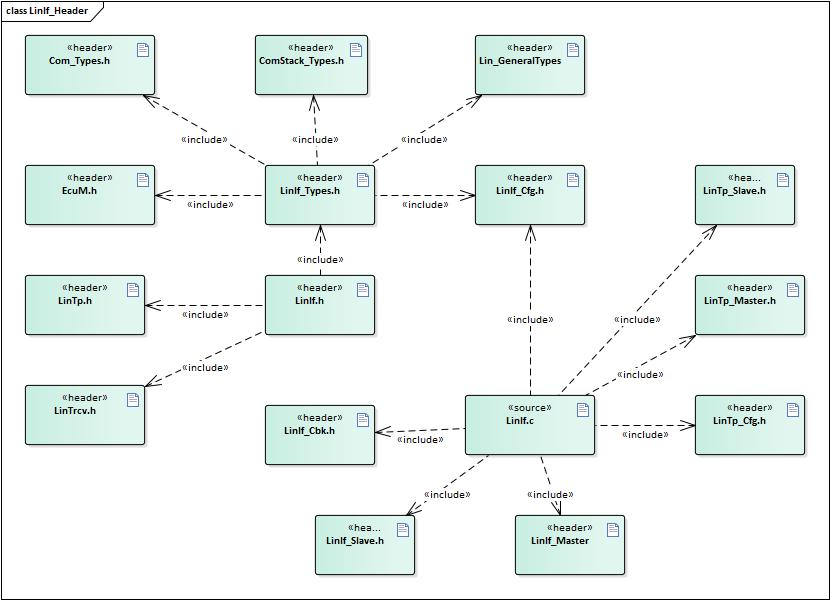

   图 LinIf文件结构图

API接口
=======

类型定义
--------

LinIf_SchHandleType类型定义
~~~~~~~~~~~~~~~~~~~~~~~~~~~

+-----------+----------------------------------------------------------+
| 名称      | LinIf_SchHandleType                                      |
+-----------+----------------------------------------------------------+
| 类型      | uint8                                                    |
+-----------+----------------------------------------------------------+
| 范围      | 0 表示NULL_SCHECULE                                      |
+-----------+----------------------------------------------------------+
|           | 1-255 用户定义的调度表ID                                 |
+-----------+----------------------------------------------------------+
| 描述      | 调度表ID的数据类型                                       |
+-----------+----------------------------------------------------------+

LinIf_ConfigType类型定义
~~~~~~~~~~~~~~~~~~~~~~~~

+-----------+----------------------------------------------------------+
| 名称      | LinIf_ConfigType                                         |
+-----------+----------------------------------------------------------+
| 类型      | struct                                                   |
+-----------+----------------------------------------------------------+
| 范围      | 无                                                       |
+-----------+----------------------------------------------------------+
| 描述      | 用于存放LinIf功能配置信息                                |
+-----------+----------------------------------------------------------+

LinTp_ConfigType类型定义
~~~~~~~~~~~~~~~~~~~~~~~~

+-----------+----------------------------------------------------------+
| 名称      | LinTp_ConfigType                                         |
+-----------+----------------------------------------------------------+
| 类型      | struct                                                   |
+-----------+----------------------------------------------------------+
| 范围      | 无                                                       |
+-----------+----------------------------------------------------------+
| 描述      | 用于存放LinTp功能配置信息                                |
+-----------+----------------------------------------------------------+

LinTp_Mode类型定义
~~~~~~~~~~~~~~~~~~

+-----------+----------------------------------------------------------+
| 名称      | LinTp_Mode                                               |
+-----------+----------------------------------------------------------+
| 类型      | enum                                                     |
+-----------+----------------------------------------------------------+
| 范围      | LINTP_APPLICATIVE_SCHEDULE 切换到应用调度表              |
+-----------+----------------------------------------------------------+
|           | LINTP_DIAG_REQUEST 切换到Master Request调度表            |
+-----------+----------------------------------------------------------+
|           | LINTP_DIAG_RESPONSE 切换到Slaver Response调度表          |
+-----------+----------------------------------------------------------+
| 描述      | 指示在诊断模式下LinTp请求切换到哪种类型调度表            |
+-----------+----------------------------------------------------------+

输入函数描述
------------

+----------------------------+-----------------------------------------+
| **输入模块**               | **API**                                 |
+----------------------------+-----------------------------------------+
| BswM                       | BswM_LinTp_RequestMode                  |
+----------------------------+-----------------------------------------+
| Det.h                      | Det_ReportRuntimeError                  |
+----------------------------+-----------------------------------------+
|                            | Det_ReportError                         |
+----------------------------+-----------------------------------------+
| Com.h                      | Com_SendSignal                          |
+----------------------------+-----------------------------------------+
| LinSM.h                    | LinSM_GotoSleepConfirmation             |
+----------------------------+-----------------------------------------+
|                            | LinSM_GotoSleepIndication               |
+----------------------------+-----------------------------------------+
|                            | LinSM_ScheduleRequestConfirmation       |
+----------------------------+-----------------------------------------+
|                            | LinSM_WakeupConfirmation                |
+----------------------------+-----------------------------------------+
| LinTrcv.h                  | LinTrcv_CheckWakeup                     |
+----------------------------+-----------------------------------------+
|                            | LinTrcv_GetBusWuReason                  |
+----------------------------+-----------------------------------------+
|                            | LinTrcv_GetOpMode                       |
+----------------------------+-----------------------------------------+
|                            | LinTrcv_SetOpMode                       |
+----------------------------+-----------------------------------------+
|                            | LinTrcv_SetWakeupMode                   |
+----------------------------+-----------------------------------------+
| PduR_LinIf.h               | PduR_LinIfRxIndication                  |
+----------------------------+-----------------------------------------+
|                            | PduR_LinIfTriggerTransmit               |
+----------------------------+-----------------------------------------+
|                            | PduR_LinIfTxConfirmation                |
+----------------------------+-----------------------------------------+
| PduR_LinTp.h               | PduR_LinTpCopyRxData                    |
+----------------------------+-----------------------------------------+
|                            | PduR_LinTpCopyTxData                    |
+----------------------------+-----------------------------------------+
|                            | PduR_LinTpRxIndication                  |
+----------------------------+-----------------------------------------+
|                            | PduR_LinTpStartOfReception              |
+----------------------------+-----------------------------------------+
|                            | PduR_LinTpTxConfirmation                |
+----------------------------+-----------------------------------------+
| Lin Driver                 | Lin_GetStatus                           |
+----------------------------+-----------------------------------------+
|                            | Lin_GoToSleep                           |
+----------------------------+-----------------------------------------+
|                            | Lin_GoToSleepInternal                   |
+----------------------------+-----------------------------------------+
|                            | Lin_SendFrame                           |
+----------------------------+-----------------------------------------+
|                            | Lin_Wakeup                              |
+----------------------------+-----------------------------------------+
|                            | Lin_WakeupInternal                      |
+----------------------------+-----------------------------------------+

静态接口函数定义
----------------

LinIf_Init函数定义
~~~~~~~~~~~~~~~~~~

+-------------+-------------------------------+------+----------------+
| 函数名称：  | LinIf_Init                    |      |                |
+-------------+-------------------------------+------+----------------+
| 函数原型：  | void LinIf_Init(const         |      |                |
|             | LinIf_ConfigType\* ConfigPtr  |      |                |
|             | )                             |      |                |
+-------------+-------------------------------+------+----------------+
| 服务编号：  | 0x01                          |      |                |
+-------------+-------------------------------+------+----------------+
| 同步/异步： | Synchronous                   |      |                |
+-------------+-------------------------------+------+----------------+
| 是          | Non Reentrant                 |      |                |
| 否可重入：  |                               |      |                |
+-------------+-------------------------------+------+----------------+
| 输入参数：  | ConfigPtr                     | 值域 | 无             |
+-------------+-------------------------------+------+----------------+
| 输入        | 无                            |      |                |
| 输出参数：  |                               |      |                |
+-------------+-------------------------------+------+----------------+
| 输出参数：  | 无                            |      |                |
+-------------+-------------------------------+------+----------------+
| 返回值：    | 无                            |      |                |
+-------------+-------------------------------+------+----------------+
| 功能概述：  | 初始化LinIf功能               |      |                |
+-------------+-------------------------------+------+----------------+

LinIf_GetVersionInfo函数定义
~~~~~~~~~~~~~~~~~~~~~~~~~~~~

+-------------+-------------------------------+------+----------------+
| 函数名称：  | LinIf_GetVersionInfo          |      |                |
+-------------+-------------------------------+------+----------------+
| 函数原型：  | void                          |      |                |
|             | LinIf_GetVers                 |      |                |
|             | ionInfo(Std_VersionInfoType\* |      |                |
|             | versioninfo)                  |      |                |
+-------------+-------------------------------+------+----------------+
| 服务编号：  | 0x03                          |      |                |
+-------------+-------------------------------+------+----------------+
| 同步/异步： | Synchronous                   |      |                |
+-------------+-------------------------------+------+----------------+
| 是          | Reentrant                     |      |                |
| 否可重入：  |                               |      |                |
+-------------+-------------------------------+------+----------------+
| 输入参数：  | 无                            | 值域 | 无             |
+-------------+-------------------------------+------+----------------+
| 输入        | 无                            |      |                |
| 输出参数：  |                               |      |                |
+-------------+-------------------------------+------+----------------+
| 输出参数：  | Versioninfo:                  |      |                |
|             | 版本信息将被存放              |      |                |
|             | 在Versioninfo所指示的结构体中 |      |                |
+-------------+-------------------------------+------+----------------+
| 返回值：    | 无                            |      |                |
+-------------+-------------------------------+------+----------------+
| 功能概述：  | 获取LinIf功能的版本号         |      |                |
+-------------+-------------------------------+------+----------------+

LinIf_Transmit函数定义
~~~~~~~~~~~~~~~~~~~~~~

+-------------+------------------------------------+------+-----------+
| 函数名称：  | LinIf_Transmit                     |      |           |
+-------------+------------------------------------+------+-----------+
| 函数原型：  | Std_ReturnType LinIf_Transmit(     |      |           |
|             |                                    |      |           |
|             | PduIdType LinTxPduId,              |      |           |
|             |                                    |      |           |
|             | const PduInfoType\* PduInfoPtr     |      |           |
|             |                                    |      |           |
|             | )                                  |      |           |
+-------------+------------------------------------+------+-----------+
| 服务编号：  | 0x49                               |      |           |
+-------------+------------------------------------+------+-----------+
| 同步/异步： | Synchronous                        |      |           |
+-------------+------------------------------------+------+-----------+
| 是          | Reentrant for different PduIds.    |      |           |
| 否可重入：  | Non reentrant for the same PduId.  |      |           |
+-------------+------------------------------------+------+-----------+
| 输入参数：  | LinTxPduId:                        | 值域 | 无        |
|             | 用                                 |      |           |
|             | 户希望发送的PDU对应的ID。（不是LIN |      |           |
|             | protected ID）                     |      |           |
+-------------+------------------------------------+------+-----------+
|             | PduInfoPtr:                        |      | 无        |
|             | 指向一个结构体，包含发             |      |           |
|             | 送数据长度（DLC）和数据存放buffer  |      |           |
|             | （这个buffer对本函数没有用，数据在 |      |           |
|             | 发送时通过相关服务去上层获取数据） |      |           |
+-------------+------------------------------------+------+-----------+
| 输入        | 无                                 |      |           |
| 输出参数：  |                                    |      |           |
+-------------+------------------------------------+------+-----------+
| 输出参数：  | 无                                 |      |           |
+-------------+------------------------------------+------+-----------+
| 返回值：    | Std_ReturnType:                    |      |           |
|             |                                    |      |           |
|             | E_OK: 发送要求被成功接收           |      |           |
|             |                                    |      |           |
|             | E_NOT_OK:                          |      |           |
|             |                                    |      |           |
|             | 发送                               |      |           |
|             | 要求没有被接收，可能由于以下原因： |      |           |
|             |                                    |      |           |
|             | LinIf功能没有初始化                |      |           |
|             |                                    |      |           |
|             | LinTxPduId指向的PDU不存在          |      |           |
|             |                                    |      |           |
|             | 当前系                             |      |           |
|             | 统被设置为NULL_SCHECULE(空调度表)  |      |           |
+-------------+------------------------------------+------+-----------+
| 功能概述：  | 用于请求发送零星帧或               |      |           |
|             | 事件触发帧（置位对应的发送标志位） |      |           |
+-------------+------------------------------------+------+-----------+

LinIf_ScheduleRequest函数定义
~~~~~~~~~~~~~~~~~~~~~~~~~~~~~

+-------------+-------------------------------+------+----------------+
| 函数名称：  | LinIf_ScheduleRequest         |      |                |
+-------------+-------------------------------+------+----------------+
| 函数原型：  | Std_ReturnType                |      |                |
|             | LinIf_ScheduleRequest(        |      |                |
|             |                               |      |                |
|             | NetworkHandleType Channel,    |      |                |
|             |                               |      |                |
|             | LinIf_SchHandleType Schedule  |      |                |
|             |                               |      |                |
|             | )                             |      |                |
+-------------+-------------------------------+------+----------------+
| 服务编号：  | 0x05                          |      |                |
+-------------+-------------------------------+------+----------------+
| 同步/异步： | Asynchronous                  |      |                |
+-------------+-------------------------------+------+----------------+
| 是          | Reentrant                     |      |                |
| 否可重入：  |                               |      |                |
+-------------+-------------------------------+------+----------------+
| 输入参数：  | Channel: 通道ID（Channel      | 值域 | 无             |
|             | index）                       |      |                |
+-------------+-------------------------------+------+----------------+
|             | Schedule: 新调度表的调度表ID  |      | 无             |
+-------------+-------------------------------+------+----------------+
| 输入        | 无                            |      |                |
| 输出参数：  |                               |      |                |
+-------------+-------------------------------+------+----------------+
| 输出参数：  | 无                            |      |                |
+-------------+-------------------------------+------+----------------+
| 返回值：    | Std_ReturnType:               |      |                |
|             |                               |      |                |
|             | E_OK:                         |      |                |
|             | 调度表切换请求被成功接收      |      |                |
|             |                               |      |                |
|             | E_NOT_OK:                     |      |                |
|             |                               |      |                |
|             | 调度表切换请                  |      |                |
|             | 求失败，可能由于以下的原因：  |      |                |
|             |                               |      |                |
|             | LinIf模块没有初始化           |      |                |
|             |                               |      |                |
|             | Channel参数指示的通道不存在   |      |                |
|             |                               |      |                |
|             | Schedule                      |      |                |
|             | 参数指示的调度表不存在        |      |                |
|             |                               |      |                |
|             | 系统当前处于睡眠(sleep)模式   |      |                |
+-------------+-------------------------------+------+----------------+
| 功能概述：  | 请求执行新的调度表            |      |                |
+-------------+-------------------------------+------+----------------+

LinIf_GotoSleep函数定义
~~~~~~~~~~~~~~~~~~~~~~~

+-------------+-------------------------------+------+----------------+
| 函数名称：  | LinIf_GotoSleep               |      |                |
+-------------+-------------------------------+------+----------------+
| 函数原型：  | Std_ReturnType                |      |                |
|             | LinIf_GotoSleep(              |      |                |
|             |                               |      |                |
|             | NetworkHandleType Channel     |      |                |
|             |                               |      |                |
|             | )                             |      |                |
+-------------+-------------------------------+------+----------------+
| 服务编号：  | 0x06                          |      |                |
+-------------+-------------------------------+------+----------------+
| 同步/异步： | Asynchronous                  |      |                |
+-------------+-------------------------------+------+----------------+
| 是          | Non Reentrant                 |      |                |
| 否可重入：  |                               |      |                |
+-------------+-------------------------------+------+----------------+
| 输入参数：  | Channel: 通道ID（Channel      | 值域 | 无             |
|             | index）                       |      |                |
+-------------+-------------------------------+------+----------------+
| 输入        | 无                            |      |                |
| 输出参数：  |                               |      |                |
+-------------+-------------------------------+------+----------------+
| 输出参数：  | 无                            |      |                |
+-------------+-------------------------------+------+----------------+
| 返回值：    | Std_ReturnType:               |      |                |
|             |                               |      |                |
|             | E_OK:                         |      |                |
|             | 睡眠请                        |      |                |
|             | 求被成功接受或系统正在执行睡  |      |                |
|             | 眠请求或系统已经处于睡眠状态  |      |                |
|             |                               |      |                |
|             | E_NOT_OK:睡眠请               |      |                |
|             | 求失败，可能由于以下的原因：  |      |                |
|             |                               |      |                |
|             | - LinIf功能没有初始化         |      |                |
|             |                               |      |                |
|             | - Channel参数指示的通道不存在 |      |                |
+-------------+-------------------------------+------+----------------+
| 功能概述：  | 要求系统切换到睡眠状态        |      |                |
+-------------+-------------------------------+------+----------------+

LinIf_Wakeup函数定义
~~~~~~~~~~~~~~~~~~~~

+-------------+-------------------------------+------+----------------+
| 函数名称：  | LinIf_Wakeup                  |      |                |
+-------------+-------------------------------+------+----------------+
| 函数原型：  | Std_ReturnType LinIf_Wakeup ( |      |                |
|             |                               |      |                |
|             | NetworkHandleType Channel     |      |                |
|             |                               |      |                |
|             | )                             |      |                |
+-------------+-------------------------------+------+----------------+
| 服务编号：  | 0x07                          |      |                |
+-------------+-------------------------------+------+----------------+
| 同步/异步： | Asynchronous                  |      |                |
+-------------+-------------------------------+------+----------------+
| 是          | Reentrant                     |      |                |
| 否可重入：  |                               |      |                |
+-------------+-------------------------------+------+----------------+
| 输入参数：  | Channel: 通道ID（Channel      | 值域 | 无             |
|             | index）                       |      |                |
+-------------+-------------------------------+------+----------------+
| 输入        | 无                            |      |                |
| 输出参数：  |                               |      |                |
+-------------+-------------------------------+------+----------------+
| 输出参数：  | 无                            |      |                |
+-------------+-------------------------------+------+----------------+
| 返回值：    | Std_ReturnType:               |      |                |
|             |                               |      |                |
|             | E_OK:                         |      |                |
|             | 唤醒请求被成功接              |      |                |
|             | 受或系统当前没有处于睡眠状态  |      |                |
|             |                               |      |                |
|             | E_NOT_OK:                     |      |                |
|             |                               |      |                |
|             | 唤醒                          |      |                |
|             | 请求失败，可能由于以下原因：  |      |                |
|             |                               |      |                |
|             | LinIf功能没有初始化           |      |                |
|             |                               |      |                |
|             | Channel参数指示的通道不存在   |      |                |
|             |                               |      |                |
|             | Lin驱动用                     |      |                |
|             | 于唤醒的函数Lin_Wakeu/Lin_Wak |      |                |
|             | eupInternal函数返回了E_NOT_OK |      |                |
+-------------+-------------------------------+------+----------------+
| 功能概述：  | 发起唤醒处理                  |      |                |
+-------------+-------------------------------+------+----------------+

LinIf_SetTrcvMode函数定义
~~~~~~~~~~~~~~~~~~~~~~~~~

+-------------+-------------------------------+------+----------------+
| 函数名称：  | LinIf_SetTrcvMode             |      |                |
+-------------+-------------------------------+------+----------------+
| 函数原型：  | Std_ReturnType                |      |                |
|             | LinIf_SetTrcvMode(            |      |                |
|             |                               |      |                |
|             | NetworkHandleType Channel,    |      |                |
|             |                               |      |                |
|             | LinTrcv_TrcvModeType          |      |                |
|             | TransceiverMode               |      |                |
|             |                               |      |                |
|             | )                             |      |                |
+-------------+-------------------------------+------+----------------+
| 服务编号：  | 0x08                          |      |                |
+-------------+-------------------------------+------+----------------+
| 同步/异步： | Synchronous                   |      |                |
+-------------+-------------------------------+------+----------------+
| 是          | Reentrant                     |      |                |
| 否可重入：  |                               |      |                |
+-------------+-------------------------------+------+----------------+
| 输入参数：  | Channel: 通道ID（Channel      | 值域 | 无             |
|             | index）                       |      |                |
+-------------+-------------------------------+------+----------------+
|             | Tr                            |      | 无             |
|             | ansceiverMode：需要设置的模式 |      |                |
+-------------+-------------------------------+------+----------------+
| 输入        | 无                            |      |                |
| 输出参数：  |                               |      |                |
+-------------+-------------------------------+------+----------------+
| 输出参数：  | 无                            |      |                |
+-------------+-------------------------------+------+----------------+
| 返回值：    | Std_ReturnType:               |      |                |
|             |                               |      |                |
|             | E_OK:                         |      |                |
|             | 收发                          |      |                |
|             | 器的模式被成功设置到指定模式  |      |                |
|             |                               |      |                |
|             | E_NOT_OK:                     |      |                |
|             |                               |      |                |
|             | 收发器驱动接口函数返回失败，  |      |                |
|             | 或者要求的模式超出允许的范围  |      |                |
+-------------+-------------------------------+------+----------------+
| 功能概述：  | 将对应                        |      |                |
|             | 通道的Lin收发器设置到指定模式 |      |                |
+-------------+-------------------------------+------+----------------+

LinIf_GetTrcvMode函数定义
~~~~~~~~~~~~~~~~~~~~~~~~~

+-------------+-------------------------------+------+----------------+
| 函数名称：  | LinIf_GetTrcvMode             |      |                |
+-------------+-------------------------------+------+----------------+
| 函数原型：  | Std_ReturnType                |      |                |
|             | LinIf_GetTrcvMode(            |      |                |
|             |                               |      |                |
|             | NetworkHandleType Channel,    |      |                |
|             |                               |      |                |
|             | LinTrcv_TrcvModeType\*        |      |                |
|             | TransceiverModePtr            |      |                |
|             |                               |      |                |
|             | )                             |      |                |
+-------------+-------------------------------+------+----------------+
| 服务编号：  | 0x09                          |      |                |
+-------------+-------------------------------+------+----------------+
| 同步/异步： | Synchronous                   |      |                |
+-------------+-------------------------------+------+----------------+
| 是          | Reentrant                     |      |                |
| 否可重入：  |                               |      |                |
+-------------+-------------------------------+------+----------------+
| 输入参数：  | Channel: 通道ID（Channel      | 值域 | 无             |
|             | index）                       |      |                |
+-------------+-------------------------------+------+----------------+
| 输入        | 无                            |      |                |
| 输出参数：  |                               |      |                |
+-------------+-------------------------------+------+----------------+
| 输出参数：  | Tra                           |      |                |
|             | nsceiverModePtr：指向一块内存 |      |                |
|             | ，用于存放获取到的收发器模式  |      |                |
+-------------+-------------------------------+------+----------------+
| 返回值：    | Std_ReturnType:               |      |                |
|             |                               |      |                |
|             | E_OK:                         |      |                |
|             | 从Lin收发器驱动获取模式成功   |      |                |
|             |                               |      |                |
|             | E_NOT_OK:                     |      |                |
|             |                               |      |                |
|             | 从Lin收发器驱动获取           |      |                |
|             | 模式失败，可能由于以下原因：  |      |                |
|             |                               |      |                |
|             | Lin收发器驱动返回了E_NOT_OK   |      |                |
|             |                               |      |                |
|             | Channel参数指示的通道不存在   |      |                |
|             |                               |      |                |
|             | TransceiverModePtr            |      |                |
|             | 参数为NULL                    |      |                |
+-------------+-------------------------------+------+----------------+
| 功能概述：  | 获取LIN收发器当前所处的状态   |      |                |
+-------------+-------------------------------+------+----------------+

LinIf_GetTrcvWakeupReason函数定义
~~~~~~~~~~~~~~~~~~~~~~~~~~~~~~~~~

+-------------+-------------------------------+------+----------------+
| 函数名称：  | LinIf_GetTrcvWakeupReason     |      |                |
+-------------+-------------------------------+------+----------------+
| 函数原型：  | Std_ReturnType                |      |                |
|             | LinIf_GetTrcvWakeupReason(    |      |                |
|             |                               |      |                |
|             | NetworkHandleType Channel,    |      |                |
|             |                               |      |                |
|             | L                             |      |                |
|             | inTrcv_TrcvWakeupReasonType\* |      |                |
|             | TrcvWuReasonPtr               |      |                |
|             |                               |      |                |
|             | )                             |      |                |
+-------------+-------------------------------+------+----------------+
| 服务编号：  | 0x0A                          |      |                |
+-------------+-------------------------------+------+----------------+
| 同步/异步： | Synchronous                   |      |                |
+-------------+-------------------------------+------+----------------+
| 是          | Reentrant                     |      |                |
| 否可重入：  |                               |      |                |
+-------------+-------------------------------+------+----------------+
| 输入参数：  | Channel: 通道ID（Channel      | 值域 | 无             |
|             | index）                       |      |                |
+-------------+-------------------------------+------+----------------+
| 输入        | 无                            |      |                |
| 输出参数：  |                               |      |                |
+-------------+-------------------------------+------+----------------+
| 输出参数：  | Trcv                          |      |                |
|             | WuReasonPtr：指向一块内存，用 |      |                |
|             | 于存放获取到的收发器唤醒原因  |      |                |
+-------------+-------------------------------+------+----------------+
| 返回值：    | Std_ReturnType:               |      |                |
|             |                               |      |                |
|             | E_OK: 请求执行成功            |      |                |
|             |                               |      |                |
|             | E_NOT_OK:                     |      |                |
|             |                               |      |                |
|             | 请求                          |      |                |
|             | 执行失败，可能由于以下原因：  |      |                |
|             |                               |      |                |
|             | - Lin收发器驱动返回了E_NOT_OK |      |                |
|             |                               |      |                |
|             | - Channel参数指示的通道不存在 |      |                |
|             |                               |      |                |
|             | - TrcvWuReasonPtr 参数为NULL  |      |                |
+-------------+-------------------------------+------+----------------+
| 功能概述：  | 返回Lin收发器获取到的唤醒原因 |      |                |
+-------------+-------------------------------+------+----------------+

LinIf_SetTrcvWakeupMode函数定义
~~~~~~~~~~~~~~~~~~~~~~~~~~~~~~~

+-------------+-------------------------------+------+----------------+
| 函数名称：  | LinIf_SetTrcvWakeupMode       |      |                |
+-------------+-------------------------------+------+----------------+
| 函数原型：  | Std_ReturnType                |      |                |
|             | LinIf_SetTrcvWakeupMode(      |      |                |
|             |                               |      |                |
|             | NetworkHandleType Channel,    |      |                |
|             |                               |      |                |
|             | LinTrcv_TrcvWakeupModeType    |      |                |
|             | LinTrcvWakeupMode             |      |                |
|             |                               |      |                |
|             | )                             |      |                |
+-------------+-------------------------------+------+----------------+
| 服务编号：  | 0x0B                          |      |                |
+-------------+-------------------------------+------+----------------+
| 同步/异步： | Synchronous                   |      |                |
+-------------+-------------------------------+------+----------------+
| 是          | Reentrant                     |      |                |
| 否可重入：  |                               |      |                |
+-------------+-------------------------------+------+----------------+
| 输入参数：  | Channel: 通道ID（Channel      | 值域 | 无             |
|             | index）                       |      |                |
+-------------+-------------------------------+------+----------------+
|             | LinTrcvWakeupMode:            |      | 无             |
|             | 期望设置的收发器唤醒原因      |      |                |
+-------------+-------------------------------+------+----------------+
| 输入        | 无                            |      |                |
| 输出参数：  |                               |      |                |
+-------------+-------------------------------+------+----------------+
| 输出参数：  | 无                            |      |                |
+-------------+-------------------------------+------+----------------+
| 返回值：    | Std_ReturnType:               |      |                |
|             |                               |      |                |
|             | E_OK: 设置成功                |      |                |
|             |                               |      |                |
|             | E_NOT_OK:                     |      |                |
|             |                               |      |                |
|             | 请求失败，可能由于以下原因：  |      |                |
|             |                               |      |                |
|             | Lin收发器驱动返回了E_NOT_OK   |      |                |
|             |                               |      |                |
|             | Channel参数指示的通道不存在   |      |                |
|             |                               |      |                |
|             | LinTrcvW                      |      |                |
|             | akeupMode参数要求的模式不合法 |      |                |
+-------------+-------------------------------+------+----------------+
| 功能概述：  | 用于使能、失能或              |      |                |
|             | 清除对应通道上的唤醒事件通知  |      |                |
+-------------+-------------------------------+------+----------------+

LinIf_GetPIDTable函数定义
~~~~~~~~~~~~~~~~~~~~~~~~~

+-------------+-------------------------------+------+----------------+
| 函数名称：  | LinIf_GetPIDTable             |      |                |
+-------------+-------------------------------+------+----------------+
| 函数原型：  | Std_ReturnType                |      |                |
|             | LinIf_GetPIDTable (           |      |                |
|             |                               |      |                |
|             | NetworkHandleType Channel,    |      |                |
|             |                               |      |                |
|             | Lin_FramePidType\* PidBuffer, |      |                |
|             |                               |      |                |
|             | uint8\* PidBufferLength       |      |                |
|             |                               |      |                |
|             | )                             |      |                |
+-------------+-------------------------------+------+----------------+
| 服务编号：  | 0x72                          |      |                |
+-------------+-------------------------------+------+----------------+
| 同步/异步： | Synchronous                   |      |                |
+-------------+-------------------------------+------+----------------+
| 是          | Reentrant                     |      |                |
| 否可重入：  |                               |      |                |
+-------------+-------------------------------+------+----------------+
| 输入参数：  | Channel: 通道ID（Channel      | 值域 | 无             |
|             | index）                       |      |                |
+-------------+-------------------------------+------+----------------+
| 输入        | PidBuff                       |      |                |
| 输出参数：  | er：获取的PID存放的空间地址。 |      |                |
+-------------+-------------------------------+------+----------------+
|             | PidB                          |      |                |
|             | ufferLength：提供的buffer长度 |      |                |
|             | 。返回时，指示复制的PID个数。 |      |                |
+-------------+-------------------------------+------+----------------+
| 输出参数：  | 无                            |      |                |
+-------------+-------------------------------+------+----------------+
| 返回值：    | E_OK: 请求被接受。            |      |                |
|             |                               |      |                |
|             | E_NOT_OK:                     |      |                |
|             | 出现错误，请求不成功。        |      |                |
+-------------+-------------------------------+------+----------------+
| 功能概述：  | 获取                          |      |                |
|             | 所有分配的PID值。顺序和Frame  |      |                |
|             | Index一致。仅对于从节点有效。 |      |                |
+-------------+-------------------------------+------+----------------+

LinIf_SetPIDTable函数定义
~~~~~~~~~~~~~~~~~~~~~~~~~

+-------------+-------------------------------+------+----------------+
| 函数名称：  | LinIf_SetPIDTable             |      |                |
+-------------+-------------------------------+------+----------------+
| 函数原型：  | Std_ReturnType                |      |                |
|             | LinIf_SetPIDTable (           |      |                |
|             |                               |      |                |
|             | NetworkHandleType Channel,    |      |                |
|             |                               |      |                |
|             | Lin_FramePidType\* PidBuffer, |      |                |
|             |                               |      |                |
|             | uint8 PidBufferLength         |      |                |
|             |                               |      |                |
|             | )                             |      |                |
+-------------+-------------------------------+------+----------------+
| 服务编号：  | 0x73                          |      |                |
+-------------+-------------------------------+------+----------------+
| 同步/异步： | Synchronous                   |      |                |
+-------------+-------------------------------+------+----------------+
| 是          | Reentrant                     |      |                |
| 否可重入：  |                               |      |                |
+-------------+-------------------------------+------+----------------+
| 输入参数：  | Channel: Lin通道号            | 值域 | 无             |
+-------------+-------------------------------+------+----------------+
|             | P                             |      | 无             |
|             | idBuffer：指向要这是的PID值。 |      |                |
+-------------+-------------------------------+------+----------------+
|             | PidBuffer                     |      | 无             |
|             | Length：提供的PidBuffer长度。 |      |                |
+-------------+-------------------------------+------+----------------+
| 输入        | 无                            |      |                |
| 输出参数：  |                               |      |                |
+-------------+-------------------------------+------+----------------+
| 输出参数：  | 无                            |      |                |
+-------------+-------------------------------+------+----------------+
| 返回值：    | E_OK: 请求被接受。            |      |                |
|             |                               |      |                |
|             | E_NOT_OK:                     |      |                |
|             | 出现错误，请求不成功。        |      |                |
+-------------+-------------------------------+------+----------------+
| 功能概述：  | 根据Frame                     |      |                |
|             | Index设置PID。仅用于从节点。  |      |                |
+-------------+-------------------------------+------+----------------+

LinIf_GetConfiguredNAD函数定义
~~~~~~~~~~~~~~~~~~~~~~~~~~~~~~

+-------------+-------------------------------+------+----------------+
| 函数名称：  | LinIf_GetConfiguredNAD        |      |                |
+-------------+-------------------------------+------+----------------+
| 函数原型：  | Std_ReturnType                |      |                |
|             | LinIf_GetConfiguredNAD (      |      |                |
|             |                               |      |                |
|             | NetworkHandleType Channel,    |      |                |
|             |                               |      |                |
|             | uint8\* Nad                   |      |                |
|             |                               |      |                |
|             | )                             |      |                |
+-------------+-------------------------------+------+----------------+
| 服务编号：  | 0x70                          |      |                |
+-------------+-------------------------------+------+----------------+
| 同步/异步： | Synchronous                   |      |                |
+-------------+-------------------------------+------+----------------+
| 是          | Reentrant                     |      |                |
| 否可重入：  |                               |      |                |
+-------------+-------------------------------+------+----------------+
| 输入参数：  | Channel: Lin通道号            | 值域 | 无             |
+-------------+-------------------------------+------+----------------+
| 输入        | 无                            |      |                |
| 输出参数：  |                               |      |                |
+-------------+-------------------------------+------+----------------+
| 输出参数：  | Nad：从节点配置的NAD          |      |                |
+-------------+-------------------------------+------+----------------+
| 返回值：    | E_OK: 请求被接受。            |      |                |
|             |                               |      |                |
|             | E_NOT_OK:                     |      |                |
|             | 出现错误，请求不成功。        |      |                |
+-------------+-------------------------------+------+----------------+
| 功能概述：  | 获取当                        |      |                |
|             | 前被配置的NAD。仅用于从节点。 |      |                |
+-------------+-------------------------------+------+----------------+

LinIf_SetConfiguredNAD函数定义
~~~~~~~~~~~~~~~~~~~~~~~~~~~~~~

+-------------+-------------------------------+------+----------------+
| 函数名称：  | LinIf_SetConfiguredNAD        |      |                |
+-------------+-------------------------------+------+----------------+
| 函数原型：  | Std_ReturnType                |      |                |
|             | LinIf_SetConfiguredNAD (      |      |                |
|             |                               |      |                |
|             | NetworkHandleType Channel,    |      |                |
|             |                               |      |                |
|             | uint8 Nad                     |      |                |
|             |                               |      |                |
|             | )                             |      |                |
+-------------+-------------------------------+------+----------------+
| 服务编号：  | 0x71                          |      |                |
+-------------+-------------------------------+------+----------------+
| 同步/异步： | Synchronous                   |      |                |
+-------------+-------------------------------+------+----------------+
| 是          | Reentrant                     |      |                |
| 否可重入：  |                               |      |                |
+-------------+-------------------------------+------+----------------+
| 输入参数：  | Channel: Lin通道号            | 值域 | 无             |
+-------------+-------------------------------+------+----------------+
|             | Nad：新Nad                    |      | 无             |
+-------------+-------------------------------+------+----------------+
| 输入        | 无                            |      |                |
| 输出参数：  |                               |      |                |
+-------------+-------------------------------+------+----------------+
| 输出参数：  | 无                            |      |                |
+-------------+-------------------------------+------+----------------+
| 返回值：    | E_OK: 请求被接受。            |      |                |
|             |                               |      |                |
|             | E_NOT_OK:                     |      |                |
|             | 出现错误，请求不成功。        |      |                |
+-------------+-------------------------------+------+----------------+
| 功能概述：  | 设置                          |      |                |
|             | 当前节点的NAD。仅用于从节点。 |      |                |
+-------------+-------------------------------+------+----------------+

LinIf_CheckWakeup函数定义
~~~~~~~~~~~~~~~~~~~~~~~~~

+-------------+-------------------------------+------+----------------+
| 函数名称：  | LinIf_CheckWakeup             |      |                |
+-------------+-------------------------------+------+----------------+
| 函数原型：  | Std_ReturnType                |      |                |
|             | LinIf_CheckWakeup(            |      |                |
|             |                               |      |                |
|             | EcuM_WakeupSourceType         |      |                |
|             | WakeupSource                  |      |                |
|             |                               |      |                |
|             | )                             |      |                |
+-------------+-------------------------------+------+----------------+
| 服务编号：  | 0x60                          |      |                |
+-------------+-------------------------------+------+----------------+
| 同步/异步： | Synchronous                   |      |                |
+-------------+-------------------------------+------+----------------+
| 是          | Reentrant                     |      |                |
| 否可重入：  |                               |      |                |
+-------------+-------------------------------+------+----------------+
| 输入参数：  | WakeupSource: 唤醒源类型      | 值域 | 无             |
+-------------+-------------------------------+------+----------------+
| 输入        | 无                            |      |                |
| 输出参数：  |                               |      |                |
+-------------+-------------------------------+------+----------------+
| 输出参数：  | 无                            |      |                |
+-------------+-------------------------------+------+----------------+
| 返回值：    | Std_ReturnType:               |      |                |
|             |                               |      |                |
|             | E_OK: 函数成功执行            |      |                |
|             |                               |      |                |
|             | E_NOT_OK:                     |      |                |
|             | 传入了定义范围外的WakeupSourc |      |                |
|             | e，或函数在执行过中遇到了问题 |      |                |
+-------------+-------------------------------+------+----------------+
| 功能概述：  | 当EcuM                        |      |                |
|             | 收到一个Lin通道的唤醒通知后， |      |                |
|             | 会调用本函数用来确认唤醒事件  |      |                |
+-------------+-------------------------------+------+----------------+

LinIf_WakeupConfirmation函数定义
~~~~~~~~~~~~~~~~~~~~~~~~~~~~~~~~

+-------------+-------------------------------+------+----------------+
| 函数名称：  | LinIf_WakeupConfirmation      |      |                |
+-------------+-------------------------------+------+----------------+
| 函数原型：  | void                          |      |                |
|             | LinIf_WakeupConfirmation(     |      |                |
|             |                               |      |                |
|             | EcuM_WakeupSourceType         |      |                |
|             | WakeupSource                  |      |                |
|             |                               |      |                |
|             | )                             |      |                |
+-------------+-------------------------------+------+----------------+
| 服务编号：  | 0x61                          |      |                |
+-------------+-------------------------------+------+----------------+
| 同步/异步： | Synchronous                   |      |                |
+-------------+-------------------------------+------+----------------+
| 是          | Reentrant                     |      |                |
| 否可重入：  |                               |      |                |
+-------------+-------------------------------+------+----------------+
| 输入参数：  | WakeupSource: 唤醒源类型      | 值域 | 无             |
+-------------+-------------------------------+------+----------------+
| 输入        | 无                            |      |                |
| 输出参数：  |                               |      |                |
+-------------+-------------------------------+------+----------------+
| 输出参数：  | 无                            |      |                |
+-------------+-------------------------------+------+----------------+
| 返回值：    | 无                            |      |                |
+-------------+-------------------------------+------+----------------+
| 功能概述：  | 在确认                        |      |                |
|             | 唤醒（CheckWakeup）或上电后， |      |                |
|             | Lin驱动或Lin收发器检测到成功  |      |                |
|             | 唤醒后会调用该函数报告唤醒源  |      |                |
+-------------+-------------------------------+------+----------------+

LinIf_HeaderIndication函数定义
~~~~~~~~~~~~~~~~~~~~~~~~~~~~~~

+-------------+-------------------------------+------+----------------+
| 函数名称：  | LinIf_HeaderIndication        |      |                |
+-------------+-------------------------------+------+----------------+
| 函数原型：  | Std_ReturnType                |      |                |
|             | LinIf_HeaderIndication (      |      |                |
|             |                               |      |                |
|             | NetworkHandleType Channel,    |      |                |
|             |                               |      |                |
|             | Lin_PduType\* PduPtr          |      |                |
|             |                               |      |                |
|             | )                             |      |                |
+-------------+-------------------------------+------+----------------+
| 服务编号：  | 0x78                          |      |                |
+-------------+-------------------------------+------+----------------+
| 同步/异步： | Synchronous                   |      |                |
+-------------+-------------------------------+------+----------------+
| 是          | Reentrant                     |      |                |
| 否可重入：  |                               |      |                |
+-------------+-------------------------------+------+----------------+
| 输入参数：  | Channel: Lin通道号            | 值域 | 无             |
+-------------+-------------------------------+------+----------------+
| 输入        | PduP                          |      |                |
| 输出参数：  | tr：指向PDU的指针，提供接收到 |      |                |
|             | 的PID以及指向SDU数据缓冲区的  |      |                |
|             | 指针作为输入参数。返回时，长  |      |                |
|             | 度、校验和类型以及帧响应类型  |      |                |
|             | 作为输出参数接收。如果帧响应  |      |                |
|             | 类型为LIN_FRAMERESPONSE_TX，  |      |                |
|             | 则SDU数据缓冲区包含传输数据。 |      |                |
+-------------+-------------------------------+------+----------------+
| 输出参数：  | 无                            |      |                |
+-------------+-------------------------------+------+----------------+
| 返回值：    | E_OK: 请求被接受              |      |                |
|             |                               |      |                |
|             | E_NOT_OK: 出现错误，请求失败  |      |                |
+-------------+-------------------------------+------+----------------+
| 功能概述：  | Li                            |      |                |
|             | n驱动在接收到Header时，调用该 |      |                |
|             | 函数通知LinIf。仅用于从节点。 |      |                |
+-------------+-------------------------------+------+----------------+

LinIf_RxIndication函数定义
~~~~~~~~~~~~~~~~~~~~~~~~~~

+-------------+-------------------------------+------+----------------+
| 函数名称：  | LinIf_RxIndication            |      |                |
+-------------+-------------------------------+------+----------------+
| 函数原型：  | void LinIf_RxIndication (     |      |                |
|             |                               |      |                |
|             | NetworkHandleType Channel,    |      |                |
|             |                               |      |                |
|             | uint8\* Lin_SduPtr            |      |                |
|             |                               |      |                |
|             | )                             |      |                |
+-------------+-------------------------------+------+----------------+
| 服务编号：  | 0x79                          |      |                |
+-------------+-------------------------------+------+----------------+
| 同步/异步： | Synchronous                   |      |                |
+-------------+-------------------------------+------+----------------+
| 是          | Reentrant                     |      |                |
| 否可重入：  |                               |      |                |
+-------------+-------------------------------+------+----------------+
| 输入参数：  | Channel: Lin通道号            | 值域 | 无             |
+-------------+-------------------------------+------+----------------+
|             | Lin                           |      | 无             |
|             | _SduPtr：指向接收到的Response |      |                |
+-------------+-------------------------------+------+----------------+
| 输入        | 无                            |      |                |
| 输出参数：  |                               |      |                |
+-------------+-------------------------------+------+----------------+
| 输出参数：  | 无                            |      |                |
+-------------+-------------------------------+------+----------------+
| 返回值：    | 无                            |      |                |
+-------------+-------------------------------+------+----------------+
| 功能概述：  | Lin驱动在接收到Response时，调 |      |                |
|             | 用该函数通知LinIf，并将Respon |      |                |
|             | se传递给LinIf。仅用于从节点。 |      |                |
+-------------+-------------------------------+------+----------------+

LinIf_TxConfirmation函数定义
~~~~~~~~~~~~~~~~~~~~~~~~~~~~

+-------------+-------------------------------+------+----------------+
| 函数名称：  | LinIf_TxConfirmation          |      |                |
+-------------+-------------------------------+------+----------------+
| 函数原型：  | void LinIf_TxConfirmation (   |      |                |
|             |                               |      |                |
|             | NetworkHandleType Channel     |      |                |
|             |                               |      |                |
|             | )                             |      |                |
+-------------+-------------------------------+------+----------------+
| 服务编号：  | 0x7A                          |      |                |
+-------------+-------------------------------+------+----------------+
| 同步/异步： | Synchronous                   |      |                |
+-------------+-------------------------------+------+----------------+
| 是          | Reentrant for different       |      |                |
| 否可重入：  | Channels. Non reentrant for   |      |                |
|             | the same Channel.             |      |                |
+-------------+-------------------------------+------+----------------+
| 输入参数：  | Channel: Lin通道号            | 值域 | 无             |
+-------------+-------------------------------+------+----------------+
| 输入        | 无                            |      |                |
| 输出参数：  |                               |      |                |
+-------------+-------------------------------+------+----------------+
| 输出参数：  | 无                            |      |                |
+-------------+-------------------------------+------+----------------+
| 返回值：    | 无                            |      |                |
+-------------+-------------------------------+------+----------------+
| 功能概述：  | Lin驱动在成功发送Resp         |      |                |
|             | onse时，调用该函数通知LinIf。 |      |                |
+-------------+-------------------------------+------+----------------+

LinIf_LinErrorIndication函数定义
~~~~~~~~~~~~~~~~~~~~~~~~~~~~~~~~

+-------------+-------------------------------+------+----------------+
| 函数名称：  | LinIf_LinErrorIndication      |      |                |
+-------------+-------------------------------+------+----------------+
| 函数原型：  | void LinIf_LinErrorIndication |      |                |
|             | (                             |      |                |
|             |                               |      |                |
|             | NetworkHandleType Channel,    |      |                |
|             |                               |      |                |
|             | Lin_SlaveErrorType            |      |                |
|             | ErrorStatus                   |      |                |
|             |                               |      |                |
|             | )                             |      |                |
+-------------+-------------------------------+------+----------------+
| 服务编号：  | 0x7B                          |      |                |
+-------------+-------------------------------+------+----------------+
| 同步/异步： | Synchronous                   |      |                |
+-------------+-------------------------------+------+----------------+
| 是          | Reentrant for different       |      |                |
| 否可重入：  | Channels. Non reentrant for   |      |                |
|             | the same Channel.             |      |                |
+-------------+-------------------------------+------+----------------+
| 输入参数：  | Channel: Lin通道号            | 值域 | 无             |
+-------------+-------------------------------+------+----------------+
|             | ErrorStatus: 检测到的错误     |      | 无             |
+-------------+-------------------------------+------+----------------+
| 输入        | 无                            |      |                |
| 输出参数：  |                               |      |                |
+-------------+-------------------------------+------+----------------+
| 输出参数：  | 无                            |      |                |
+-------------+-------------------------------+------+----------------+
| 返回值：    | 无                            |      |                |
+-------------+-------------------------------+------+----------------+
| 功能概述：  | Lin驱动在处理Header和R        |      |                |
|             | esponse时，检测到错误会调用该 |      |                |
|             | 接口通知LinIf。仅用于从节点。 |      |                |
+-------------+-------------------------------+------+----------------+

LinIf_MainFunction\_<LinIfChannel.ShortName>函数定义
~~~~~~~~~~~~~~~~~~~~~~~~~~~~~~~~~~~~~~~~~~~~~~~~~~~~

+-------------+-------------------------------+------+----------------+
| 函数名称：  | LinIf_MainFunct               |      |                |
|             | ion\_<LinIfChannel.ShortName> |      |                |
+-------------+-------------------------------+------+----------------+
| 函数原型：  | void                          |      |                |
|             | LinIf_MainFunction\_<         |      |                |
|             | LinIfChannel.ShortName>(void) |      |                |
+-------------+-------------------------------+------+----------------+
| 服务编号：  | 0x80                          |      |                |
+-------------+-------------------------------+------+----------------+
| 同步/异步： | Synchronous                   |      |                |
+-------------+-------------------------------+------+----------------+
| 是          | Non Reentrant                 |      |                |
| 否可重入：  |                               |      |                |
+-------------+-------------------------------+------+----------------+
| 输入参数：  | 无                            | 值域 | 无             |
+-------------+-------------------------------+------+----------------+
| 输入        | 无                            |      |                |
| 输出参数：  |                               |      |                |
+-------------+-------------------------------+------+----------------+
| 输出参数：  | 无                            |      |                |
+-------------+-------------------------------+------+----------------+
| 返回值：    | 无                            |      |                |
+-------------+-------------------------------+------+----------------+
| 功能概述：  | Li                            |      |                |
|             | nIf模块的每个通道存在一个主处 |      |                |
|             | 理函数，命名为LinIf_MainFunct |      |                |
|             | ion\_<LinIfChannel.ShortName> |      |                |
+-------------+-------------------------------+------+----------------+

LinTp_Init函数定义
~~~~~~~~~~~~~~~~~~

+-------------+-------------------------------+------+----------------+
| 函数名称：  | LinTp_Init                    |      |                |
+-------------+-------------------------------+------+----------------+
| 函数原型：  | void LinTp_Init(const         |      |                |
|             | LinTp_ConfigType\* ConfigPtr  |      |                |
|             | )                             |      |                |
+-------------+-------------------------------+------+----------------+
| 服务编号：  | 0x40                          |      |                |
+-------------+-------------------------------+------+----------------+
| 同步/异步： | Synchronous                   |      |                |
+-------------+-------------------------------+------+----------------+
| 是          | Non Reentrant                 |      |                |
| 否可重入：  |                               |      |                |
+-------------+-------------------------------+------+----------------+
| 输入参数：  | Confi                         | 值域 | 无             |
|             | gPtr：指向LinTp功能配置结构体 |      |                |
+-------------+-------------------------------+------+----------------+
| 输入        | 无                            |      |                |
| 输出参数：  |                               |      |                |
+-------------+-------------------------------+------+----------------+
| 输出参数：  | 无                            |      |                |
+-------------+-------------------------------+------+----------------+
| 返回值：    | 无                            |      |                |
+-------------+-------------------------------+------+----------------+
| 功能概述：  | LinTp功能初始化函数           |      |                |
+-------------+-------------------------------+------+----------------+

LinTp_Transmit函数定义
~~~~~~~~~~~~~~~~~~~~~~

+-------------+-------------------------------+------+----------------+
| 函数名称：  | LinTp_Transmit                |      |                |
+-------------+-------------------------------+------+----------------+
| 函数原型：  | Std_ReturnType                |      |                |
|             | LinTp_Transmit(               |      |                |
|             |                               |      |                |
|             | PduIdType LinTpTxSduId,       |      |                |
|             |                               |      |                |
|             | const PduInfoType\*           |      |                |
|             | LinTpTxInfoPtr                |      |                |
|             |                               |      |                |
|             | )                             |      |                |
+-------------+-------------------------------+------+----------------+
| 服务编号：  | 0x53                          |      |                |
+-------------+-------------------------------+------+----------------+
| 同步/异步： | Synchronous                   |      |                |
+-------------+-------------------------------+------+----------------+
| 是          | Reentrant for different       |      |                |
| 否可重入：  | PduIds. Non reentrant for the |      |                |
|             | same PduId.                   |      |                |
+-------------+-------------------------------+------+----------------+
| 输入参数：  | LinT                          | 值域 | 无             |
|             | pTxSduId：需要发送数据的N-SDU |      |                |
|             | ID                            |      |                |
+-------------+-------------------------------+------+----------------+
|             | L                             |      | 无             |
|             | inTpTxInfoPtr：一个结构体指针 |      |                |
|             | ，指向的对象包含：①指向N-SDU  |      |                |
|             | Buffer的指针 ②buffer的长度    |      |                |
+-------------+-------------------------------+------+----------------+
| 输入        | 无                            |      |                |
| 输出参数：  |                               |      |                |
+-------------+-------------------------------+------+----------------+
| 输出参数：  | 无                            |      |                |
+-------------+-------------------------------+------+----------------+
| 返回值：    | E_OK: TP发送请求被成功接收    |      |                |
|             |                               |      |                |
|             | E_NOT_OK: TP发送请求被拒绝    |      |                |
+-------------+-------------------------------+------+----------------+
| 功能概述：  | 请求发送LinTp数据             |      |                |
+-------------+-------------------------------+------+----------------+

LinTp_GetVersionInfo函数定义
~~~~~~~~~~~~~~~~~~~~~~~~~~~~

+-------------+-------------------------------+------+----------------+
| 函数名称：  | LinTp_GetVersionInfo          |      |                |
+-------------+-------------------------------+------+----------------+
| 函数原型：  | void LinTp_GetVersionInfo(    |      |                |
|             |                               |      |                |
|             | Std_VersionInfoType\*         |      |                |
|             | versioninfo                   |      |                |
|             |                               |      |                |
|             | )                             |      |                |
+-------------+-------------------------------+------+----------------+
| 服务编号：  | 0x42                          |      |                |
+-------------+-------------------------------+------+----------------+
| 同步/异步： | Synchronous                   |      |                |
+-------------+-------------------------------+------+----------------+
| 是          | Non Reentrant                 |      |                |
| 否可重入：  |                               |      |                |
+-------------+-------------------------------+------+----------------+
| 输入参数：  | 无                            | 值域 | 无             |
+-------------+-------------------------------+------+----------------+
| 输入        | 无                            |      |                |
| 输出参数：  |                               |      |                |
+-------------+-------------------------------+------+----------------+
| 输出参数：  | Versioni                      |      |                |
|             | nfo：存放版本信息的结构体地址 |      |                |
+-------------+-------------------------------+------+----------------+
| 返回值：    | 无                            |      |                |
+-------------+-------------------------------+------+----------------+
| 功能概述：  | 获取LinTp功能版本信息         |      |                |
+-------------+-------------------------------+------+----------------+

LinTp_Shutdown函数定义
~~~~~~~~~~~~~~~~~~~~~~

+-------------+-------------------------------+------+----------------+
| 函数名称：  | LinTp_Shutdown                |      |                |
+-------------+-------------------------------+------+----------------+
| 函数原型：  | void LinTp_Shutdown(void)     |      |                |
+-------------+-------------------------------+------+----------------+
| 服务编号：  | 0x43                          |      |                |
+-------------+-------------------------------+------+----------------+
| 同步/异步： | Synchronous                   |      |                |
+-------------+-------------------------------+------+----------------+
| 是          | Non Reentrant                 |      |                |
| 否可重入：  |                               |      |                |
+-------------+-------------------------------+------+----------------+
| 输入参数：  | 无                            | 值域 | 无             |
+-------------+-------------------------------+------+----------------+
| 输入        | 无                            |      |                |
| 输出参数：  |                               |      |                |
+-------------+-------------------------------+------+----------------+
| 输出参数：  | 无                            |      |                |
+-------------+-------------------------------+------+----------------+
| 返回值：    | 无                            |      |                |
+-------------+-------------------------------+------+----------------+
| 功能概述：  | 关闭LinTp功能                 |      |                |
+-------------+-------------------------------+------+----------------+

LinTp_ChangeParameter函数定义
~~~~~~~~~~~~~~~~~~~~~~~~~~~~~

+-------------+-------------------------------+------+----------------+
| 函数名称：  | LinTp_ChangeParameter         |      |                |
+-------------+-------------------------------+------+----------------+
| 函数原型：  | Std_ReturnType                |      |                |
|             | LinTp_ChangeParameter(        |      |                |
|             |                               |      |                |
|             | PduIdType id,                 |      |                |
|             |                               |      |                |
|             | TPParameterType parameter,    |      |                |
|             |                               |      |                |
|             | uint16 value                  |      |                |
|             |                               |      |                |
|             | )                             |      |                |
+-------------+-------------------------------+------+----------------+
| 服务编号：  | 0x44                          |      |                |
+-------------+-------------------------------+------+----------------+
| 同步/异步： | Synchronous                   |      |                |
+-------------+-------------------------------+------+----------------+
| 是          | Non Reentrant                 |      |                |
| 否可重入：  |                               |      |                |
+-------------+-------------------------------+------+----------------+
| 输入参数：  | Id： 想要修改的参数的N-SDU ID | 值域 | 无             |
+-------------+-------------------------------+------+----------------+
|             | Parameter：想要修改的参数     |      | 无             |
+-------------+-------------------------------+------+----------------+
|             | Value: 参数的新值             |      | 无             |
+-------------+-------------------------------+------+----------------+
| 输入        | 无                            |      |                |
| 输出参数：  |                               |      |                |
+-------------+-------------------------------+------+----------------+
| 输出参数：  | 无                            |      |                |
+-------------+-------------------------------+------+----------------+
| 返回值：    | E_NOT_OK                      |      |                |
+-------------+-------------------------------+------+----------------+
| 功能概述：  | 该函数是                      |      |                |
|             | 为了接口的兼容性提供的假函数  |      |                |
+-------------+-------------------------------+------+----------------+

可配置函数定义
--------------

< User >_ScheduleRequestConfirmation函数定义
~~~~~~~~~~~~~~~~~~~~~~~~~~~~~~~~~~~~~~~~~~~~

+-------------+-------------------------------+------+----------------+
| 函数名称：  | < User                        |      |                |
|             | >_ScheduleRequestConfirmation |      |                |
+-------------+-------------------------------+------+----------------+
| 函数原型：  | void < User                   |      |                |
|             | >                             |      |                |
|             | _ScheduleRequestConfirmation( |      |                |
|             |                               |      |                |
|             | NetworkHandleType channel,    |      |                |
|             |                               |      |                |
|             | LinIf_SchHandleType schedule  |      |                |
|             |                               |      |                |
|             | )                             |      |                |
+-------------+-------------------------------+------+----------------+
| 服务编号：  | 无                            |      |                |
+-------------+-------------------------------+------+----------------+
| 同步/异步： | Synchronous                   |      |                |
+-------------+-------------------------------+------+----------------+
| 是          | Reentrant                     |      |                |
| 否可重入：  |                               |      |                |
+-------------+-------------------------------+------+----------------+
| 输入参数：  | channel 通道ID                | 值域 | 无             |
+-------------+-------------------------------+------+----------------+
|             | schedule 新调度表ID           |      | 无             |
+-------------+-------------------------------+------+----------------+
| 输入        | 无                            |      |                |
| 输出参数：  |                               |      |                |
+-------------+-------------------------------+------+----------------+
| 输出参数：  | 无                            |      |                |
+-------------+-------------------------------+------+----------------+
| 返回值：    | 无                            |      |                |
+-------------+-------------------------------+------+----------------+
| 功能概述：  | 当进度表变更请求              |      |                |
|             | 被执行时，LinIf将调用这个函数 |      |                |
+-------------+-------------------------------+------+----------------+

< User >_GotoSleepConfirmation函数定义
~~~~~~~~~~~~~~~~~~~~~~~~~~~~~~~~~~~~~~

+-------------+-------------------------------+------+----------------+
| 函数名称：  | < User                        |      |                |
|             | >_GotoSleepConfirmation       |      |                |
+-------------+-------------------------------+------+----------------+
| 函数原型：  | void < User                   |      |                |
|             | >_GotoSleepConfirmation(      |      |                |
|             |                               |      |                |
|             | NetworkHandleType channel,    |      |                |
|             |                               |      |                |
|             | boolean success               |      |                |
|             |                               |      |                |
|             | )                             |      |                |
+-------------+-------------------------------+------+----------------+
| 服务编号：  | 无                            |      |                |
+-------------+-------------------------------+------+----------------+
| 同步/异步： | Synchronous                   |      |                |
+-------------+-------------------------------+------+----------------+
| 是          | Reentrant                     |      |                |
| 否可重入：  |                               |      |                |
+-------------+-------------------------------+------+----------------+
| 输入参数：  | channel 通道ID                | 值域 | 无             |
+-------------+-------------------------------+------+----------------+
|             | success 如果成功发送goto      |      | true/false     |
|             | sleep，则为True，否则为false  |      |                |
+-------------+-------------------------------+------+----------------+
| 输入        | 无                            |      |                |
| 输出参数：  |                               |      |                |
+-------------+-------------------------------+------+----------------+
| 输出参数：  | 无                            |      |                |
+-------------+-------------------------------+------+----------------+
| 返回值：    | 无                            |      |                |
+-------------+-------------------------------+------+----------------+
| 功能概述：  | 当go to                       |      |                |
|             | sleep命令在总线上发送成功/    |      |                |
|             | 失败时，LinIf将调用这个函数。 |      |                |
+-------------+-------------------------------+------+----------------+

< User >_WakeupConfirmation函数定义
~~~~~~~~~~~~~~~~~~~~~~~~~~~~~~~~~~~

+-------------+-------------------------------+------+----------------+
| 函数名称：  | void < User                   |      |                |
|             | >_WakeupConfirmation          |      |                |
+-------------+-------------------------------+------+----------------+
| 函数原型：  | void < User                   |      |                |
|             | >_WakeupConfirmation(         |      |                |
|             |                               |      |                |
|             | NetworkHandleType channel,    |      |                |
|             |                               |      |                |
|             | boolean success               |      |                |
|             |                               |      |                |
|             | )                             |      |                |
+-------------+-------------------------------+------+----------------+
| 服务编号：  | 无                            |      |                |
+-------------+-------------------------------+------+----------------+
| 同步/异步： | Synchronous                   |      |                |
+-------------+-------------------------------+------+----------------+
| 是          | Reentrant                     |      |                |
| 否可重入：  |                               |      |                |
+-------------+-------------------------------+------+----------------+
| 输入参数：  | channel 通道ID                | 值域 | 无             |
+-------------+-------------------------------+------+----------------+
|             | success                       |      | true/false     |
|             | 如果成功发送                  |      |                |
|             | wakeup，则为True，否则为false |      |                |
+-------------+-------------------------------+------+----------------+
| 输入        | 无                            |      |                |
| 输出参数：  |                               |      |                |
+-------------+-------------------------------+------+----------------+
| 输出参数：  | 无                            |      |                |
+-------------+-------------------------------+------+----------------+
| 返回值：    | 无                            |      |                |
+-------------+-------------------------------+------+----------------+
| 功能概述：  | 当wakeup命令在总线上发送成功  |      |                |
|             | /失败时，LinIf将调用这个函数  |      |                |
+-------------+-------------------------------+------+----------------+

<User>_TriggerTransmit函数定义
~~~~~~~~~~~~~~~~~~~~~~~~~~~~~~

+-------------+-------------------------------+------+----------------+
| 函数名称：  | <User>_TriggerTransmit        |      |                |
+-------------+-------------------------------+------+----------------+
| 函数原型：  | Std_ReturnType                |      |                |
|             | <User>_TriggerTransmit(       |      |                |
|             |                               |      |                |
|             | PduIdType TxPduId,            |      |                |
|             |                               |      |                |
|             | PduInfoType\* PduInfoPtr      |      |                |
|             |                               |      |                |
|             | )                             |      |                |
+-------------+-------------------------------+------+----------------+
| 服务编号：  | 无                            |      |                |
+-------------+-------------------------------+------+----------------+
| 同步/异步： | Synchronous                   |      |                |
+-------------+-------------------------------+------+----------------+
| 是          | Reentrant for different       |      |                |
| 否可重入：  | PduIds. Non reentrant for the |      |                |
|             | same PduId.                   |      |                |
+-------------+-------------------------------+------+----------------+
| 输入参数：  | TxPduId 请求被传输的SDU的ID   | 值域 | 无             |
+-------------+-------------------------------+------+----------------+
| 输入        | PduInfoPtr SDU的buffer        |      |                |
| 输出参数：  |                               |      |                |
+-------------+-------------------------------+------+----------------+
| 输出参数：  | 无                            |      |                |
+-------------+-------------------------------+------+----------------+
| 返回值：    | Std_ReturnType                |      |                |
+-------------+-------------------------------+------+----------------+
| 功能概述：  | LinIf调用                     |      |                |
|             | 该接口从上层获取要发送的数据  |      |                |
+-------------+-------------------------------+------+----------------+

<User>_TxConfirmation函数定义
~~~~~~~~~~~~~~~~~~~~~~~~~~~~~

+-------------+-------------------------------+------+----------------+
| 函数名称：  | <User>_TxConfirmation         |      |                |
+-------------+-------------------------------+------+----------------+
| 函数原型：  | void <User>_TxConfirmation(   |      |                |
|             |                               |      |                |
|             | PduIdType TxPduId             |      |                |
|             |                               |      |                |
|             | )                             |      |                |
+-------------+-------------------------------+------+----------------+
| 服务编号：  | 无                            |      |                |
+-------------+-------------------------------+------+----------------+
| 同步/异步： | Synchronous                   |      |                |
+-------------+-------------------------------+------+----------------+
| 是          | Reentrant for different       |      |                |
| 否可重入：  | PduIds. Non reentrant for the |      |                |
|             | same PduId.                   |      |                |
+-------------+-------------------------------+------+----------------+
| 输入参数：  | TxPduId 请求被传输的SDU的ID   | 值域 | 无             |
+-------------+-------------------------------+------+----------------+
| 输入        | 无                            |      |                |
| 输出参数：  |                               |      |                |
+-------------+-------------------------------+------+----------------+
| 输出参数：  | 无                            |      |                |
+-------------+-------------------------------+------+----------------+
| 返回值：    | 无                            |      |                |
+-------------+-------------------------------+------+----------------+
| 功能概述：  | L                             |      |                |
|             | inIf调用该函数通知PDU发送成功 |      |                |
+-------------+-------------------------------+------+----------------+

<User>_RxIndication函数定义
~~~~~~~~~~~~~~~~~~~~~~~~~~~

+-------------+-------------------------------+------+----------------+
| 函数名称：  | <User>_RxIndication           |      |                |
+-------------+-------------------------------+------+----------------+
| 函数原型：  | void <User>_RxIndication(     |      |                |
|             |                               |      |                |
|             | PduIdType RxPduId,            |      |                |
|             |                               |      |                |
|             | const PduInfoType\*           |      |                |
|             | PduInfoPtr                    |      |                |
|             |                               |      |                |
|             | )                             |      |                |
+-------------+-------------------------------+------+----------------+
| 服务编号：  | 无                            |      |                |
+-------------+-------------------------------+------+----------------+
| 同步/异步： | Synchronous                   |      |                |
+-------------+-------------------------------+------+----------------+
| 是          | Reentrant for different       |      |                |
| 否可重入：  | PduIds. Non reentrant for the |      |                |
|             | same PduId.                   |      |                |
+-------------+-------------------------------+------+----------------+
| 输入参数：  | RxPduId 接收Pdu Id            | 值域 | 无             |
+-------------+-------------------------------+------+----------------+
|             | PduInfoPtr Pdu信息            |      | 无             |
+-------------+-------------------------------+------+----------------+
| 输入        | 无                            |      |                |
| 输出参数：  |                               |      |                |
+-------------+-------------------------------+------+----------------+
| 输出参数：  | 无                            |      |                |
+-------------+-------------------------------+------+----------------+
| 返回值：    | 无                            |      |                |
+-------------+-------------------------------+------+----------------+
| 功能概述：  | LinIf调用该函数               |      |                |
|             | 通知将接收到PDU传递给上层模块 |      |                |
+-------------+-------------------------------+------+----------------+

配置
====

LinIfGenerael
-------------

|image2|

图 LinIfGeneral容器配置图

表 LinIfGeneral属性描述

+--------------+--------+---------------------+-----------+----------+
| **UI名称**   | **描   |                     |           |          |
|              | 述**   |                     |           |          |
+--------------+--------+---------------------+-----------+----------+
| LinDriverAu  | 取     | AUTOSAR422/AU       | 默认取值  | AU       |
| tosarVersion | 值范围 | TOSAR431/AUTOSAR440 |           | TOSAR422 |
+--------------+--------+---------------------+-----------+----------+
|              | 参     | Lin driver          |           |          |
|              | 数描述 | AUTOSAR版本号选择   |           |          |
+--------------+--------+---------------------+-----------+----------+
|              | 依     | 无                  |           |          |
|              | 赖关系 |                     |           |          |
+--------------+--------+---------------------+-----------+----------+
| Li           | 取     | STD_ON/STD_OFF      | 默认取值  | 无       |
| nIfBusMirror | 值范围 |                     |           |          |
| ingSupported |        |                     |           |          |
+--------------+--------+---------------------+-----------+----------+
|              | 参     | 是否使能Bus Mirror  |           |          |
|              | 数描述 |                     |           |          |
+--------------+--------+---------------------+-----------+----------+
|              | 依     | 无                  |           |          |
|              | 赖关系 |                     |           |          |
+--------------+--------+---------------------+-----------+----------+
| LinIfDe      | 取     | true/false          | 默认取值  | true     |
| vErrorDetect | 值范围 |                     |           |          |
+--------------+--------+---------------------+-----------+----------+
|              | 参     | 打开                |           |          |
|              | 数描述 | 或关闭默认错误跟踪  |           |          |
|              |        | 器（Det）检测和通知 |           |          |
+--------------+--------+---------------------+-----------+----------+
|              | 依     | 无                  |           |          |
|              | 赖关系 |                     |           |          |
+--------------+--------+---------------------+-----------+----------+
| LinIf        | 取     | true/false          | 默认取值  | false    |
| MultipleDriv | 值范围 |                     |           |          |
| ersSupported |        |                     |           |          |
+--------------+--------+---------------------+-----------+----------+
|              | 参     | 指                  |           |          |
|              | 数描述 | 示是否支持复数驱动  |           |          |
+--------------+--------+---------------------+-----------+----------+
|              | 依     | 无                  |           |          |
|              | 赖关系 |                     |           |          |
+--------------+--------+---------------------+-----------+----------+
| LinIfMul     | 取     | true/false          | 默认取值  | false    |
| tipleTrcvDri | 值范围 |                     |           |          |
| verSupported |        |                     |           |          |
+--------------+--------+---------------------+-----------+----------+
|              | 参     | 指示是否            |           |          |
|              | 数描述 | 支持复数收发器驱动  |           |          |
+--------------+--------+---------------------+-----------+----------+
|              | 依     | 无                  |           |          |
|              | 赖关系 |                     |           |          |
+--------------+--------+---------------------+-----------+----------+
| LinIfNc      | 取     | true/false          | 默认取值  | false    |
| OptionalRequ | 值范围 |                     |           |          |
| estSupported |        |                     |           |          |
+--------------+--------+---------------------+-----------+----------+
|              | 参     | 指示是否支持Assign  |           |          |
|              | 数描述 | NAD和Conditional    |           |          |
|              |        | Change NAD命令      |           |          |
+--------------+--------+---------------------+-----------+----------+
|              | 依     | LinIf               |           |          |
|              | 赖关系 | Channel->LinIfNodeT |           |          |
|              |        | ype中至少有一个节点 |           |          |
|              |        | 为主节点时，该参数  |           |          |
|              |        | 才可以被设置为True  |           |          |
+--------------+--------+---------------------+-----------+----------+
| LinIfPublicC | 取     | 字符串              | 默认取值  | 无       |
| ddHeaderFile | 值范围 |                     |           |          |
+--------------+--------+---------------------+-----------+----------+
|              | 参     | 用于                |           |          |
|              | 数描述 | 输入CDD驱动的头文件 |           |          |
+--------------+--------+---------------------+-----------+----------+
|              | 依     | 无                  |           |          |
|              | 赖关系 |                     |           |          |
+--------------+--------+---------------------+-----------+----------+
| Li           | 取     | 合法的C语言函数名   | 默认取值  | 无       |
| nIfResponseE | 值范围 |                     |           |          |
| rrorSignalCh |        |                     |           |          |
| angedCallout |        |                     |           |          |
+--------------+--------+---------------------+-----------+----------+
|              | 参     | 当response error    |           |          |
|              | 数描述 | signal发            |           |          |
|              |        | 生改变时，调用该函  |           |          |
|              |        | 数。仅用于从节点。  |           |          |
+--------------+--------+---------------------+-----------+----------+
|              | 依     | LinIfChannel->LinI  |           |          |
|              | 赖关系 | fNodeType中至少有一 |           |          |
|              |        | 个节点为从节点时，  |           |          |
|              |        | 该参数才可以被配置  |           |          |
+--------------+--------+---------------------+-----------+----------+
| LinIf        | 取     | 合法的C语言函数名   | 默认取值  | 无       |
| SaveConfigur | 值范围 |                     |           |          |
| ationCallout |        |                     |           |          |
+--------------+--------+---------------------+-----------+----------+
|              | 参     | 当save              |           |          |
|              | 数描述 | configuration命     |           |          |
|              |        | 令执行时，调用该函  |           |          |
|              |        | 数。仅用于从节点。  |           |          |
+--------------+--------+---------------------+-----------+----------+
|              | 依     | LinIfChannel->LinI  |           |          |
|              | 赖关系 | fNodeType中至少有一 |           |          |
|              |        | 个节点为从节点时，  |           |          |
|              |        | 该参数才可以被配置  |           |          |
+--------------+--------+---------------------+-----------+----------+
| LinI         | 取     | true/false          | 默认取值  | false    |
| fTpSupported | 值范围 |                     |           |          |
+--------------+--------+---------------------+-----------+----------+
|              | 参     | 指示是否支持TP      |           |          |
|              | 数描述 |                     |           |          |
+--------------+--------+---------------------+-----------+----------+
|              | 依     | 无                  |           |          |
|              | 赖关系 |                     |           |          |
+--------------+--------+---------------------+-----------+----------+
| LinIfWak     | 取     | true/false          | 默认取值  | false    |
| eupSupported | 值范围 |                     |           |          |
+--------------+--------+---------------------+-----------+----------+
|              | 参     | 表示                |           |          |
|              | 数描述 | LinIf是否支持Wakeup |           |          |
+--------------+--------+---------------------+-----------+----------+
|              | 依     | 无                  |           |          |
|              | 赖关系 |                     |           |          |
+--------------+--------+---------------------+-----------+----------+
| LinIfTrcvDri | 取     | true/false          | 默认取值  | false    |
| verSupported | 值范围 |                     |           |          |
+--------------+--------+---------------------+-----------+----------+
|              | 参     | 指                  |           |          |
|              | 数描述 | 示是否支持Lin收发器 |           |          |
+--------------+--------+---------------------+-----------+----------+
|              | 依     | 无                  |           |          |
|              | 赖关系 |                     |           |          |
+--------------+--------+---------------------+-----------+----------+
| LinIfVe      | 取     | true/false          | 默认取值  | false    |
| rsionInfoApi | 值范围 |                     |           |          |
+--------------+--------+---------------------+-----------+----------+
|              | 参     | 指示LinIf_GetVers   |           |          |
|              | 数描述 | ionInfo函数是否可用 |           |          |
+--------------+--------+---------------------+-----------+----------+
|              | 依     | 无                  |           |          |
|              | 赖关系 |                     |           |          |
+--------------+--------+---------------------+-----------+----------+
| LinIf        | 取     | true/false          |           |          |
| MultiplePart | 值范围 |                     |           |          |
| itionEnabled |        |                     |           |          |
+--------------+--------+---------------------+-----------+----------+
|              | 参     | 指示LinIf模块       |           |          |
|              | 数描述 | 是否支持多分区功能  |           |          |
+--------------+--------+---------------------+-----------+----------+
|              | 依     | 无                  |           |          |
|              | 赖关系 |                     |           |          |
+--------------+--------+---------------------+-----------+----------+

LinIfGlobalConfig
-----------------

|image3|

图 LinIfGlobalConfig容器配置图

表 LinIfGlobalConfig属性描述

+---------------+--------+-------------------+-----------+------------+
| **UI名称**    | **描   |                   |           |            |
|               | 述**   |                   |           |            |
+---------------+--------+-------------------+-----------+------------+
| LinIfChannel  | 取     | 无                | 默认取值  | false      |
|               | 值范围 |                   |           |            |
+---------------+--------+-------------------+-----------+------------+
|               | 参     | 用于添            |           |            |
|               | 数描述 | 加Channel对象，详 |           |            |
|               |        | 细参照5.3章节介绍 |           |            |
+---------------+--------+-------------------+-----------+------------+
|               | 依     | 无                |           |            |
|               | 赖关系 |                   |           |            |
+---------------+--------+-------------------+-----------+------------+

LinIfChannel
------------

|image4|

图 LinIfChannel容器配置图

表 LinIfChannel属性描述

+--------------+--------+------------------+----------+-------------+
| **UI名称**   | **     |                  |          |             |
|              | 描述** |                  |          |             |
+--------------+--------+------------------+----------+-------------+
| LinIfMainFu  | 取     | 0.0-INF          | 默认取值 | 0.005       |
| nctionPeriod | 值范围 |                  |          |             |
+--------------+--------+------------------+----------+-------------+
|              | 参     | 当前channel      |          |             |
|              | 数描述 | 主处理函数的调用 |          |             |
|              |        | 周期（单位：秒） |          |             |
+--------------+--------+------------------+----------+-------------+
|              | 依     | 无               |          |             |
|              | 赖关系 |                  |          |             |
+--------------+--------+------------------+----------+-------------+
| LinIfSleepMo | 取     | 0.001 - 10.0     | 默认取值 | 4.0         |
| deFrameDelay | 值范围 |                  |          |             |
+--------------+--------+------------------+----------+-------------+
|              | 参     | 发送睡眠指令后， |          |             |
|              | 数描述 | 经过该时间过后， |          |             |
|              |        | 确认总线是否睡眠 |          |             |
+--------------+--------+------------------+----------+-------------+
|              | 依     | 无               |          |             |
|              | 赖关系 |                  |          |             |
+--------------+--------+------------------+----------+-------------+
| L            | 取     | 4.0-10.0         | 默认取值 | 4.0         |
| inIfBusIdleT | 值范围 |                  |          |             |
| imeoutPeriod |        |                  |          |             |
+--------------+--------+------------------+----------+-------------+
|              | 参     | 总线空闲时间     |          |             |
|              | 数描述 |                  |          |             |
+--------------+--------+------------------+----------+-------------+
|              | 依     | 无               |          |             |
|              | 赖关系 |                  |          |             |
+--------------+--------+------------------+----------+-------------+
| LinI         | 取     | LINSM / CDD      | 默认取值 | 无          |
| fGotoSleepCo | 值范围 |                  |          |             |
| nfirmationUL |        |                  |          |             |
+--------------+--------+------------------+----------+-------------+
|              | 参     | Go-to-sle        |          |             |
|              | 数描述 | ep命令的确认通知 |          |             |
|              |        | ，通知的上层模块 |          |             |
+--------------+--------+------------------+----------+-------------+
|              | 依     | 无               |          |             |
|              | 赖关系 |                  |          |             |
+--------------+--------+------------------+----------+-------------+
| GotoSleep    | 取     | 合法的函数名     | 默认取值 | LinSM       |
| Confirmation | 值范围 |                  |          | _GotoSleepC |
|              |        |                  |          | onfirmation |
+--------------+--------+------------------+----------+-------------+
|              | 参     | Go-to-sleep命    |          |             |
|              | 数描述 | 令的确认通知函数 |          |             |
+--------------+--------+------------------+----------+-------------+
|              | 依     | 无               |          |             |
|              | 赖关系 |                  |          |             |
+--------------+--------+------------------+----------+-------------+
| Li           | 取     | LINSM / CDD      | 默认取值 | 无          |
| nIfGotoSleep | 值范围 |                  |          |             |
| IndicationUL |        |                  |          |             |
+--------------+--------+------------------+----------+-------------+
|              | 参     | Go-to-sleep      |          |             |
|              | 数描述 | 命令通知的上层模 |          |             |
|              |        | 块,仅用于从节点  |          |             |
+--------------+--------+------------------+----------+-------------+
|              | 依     | 从节             |          |             |
|              | 赖关系 | 点必须配置该参数 |          |             |
+--------------+--------+------------------+----------+-------------+
| GotoSle      | 取     | 合法的函数名     | 默认取值 | 无          |
| epIndication | 值范围 |                  |          |             |
+--------------+--------+------------------+----------+-------------+
|              | 参     | Go-              |          |             |
|              | 数描述 | to-sleep命令通知 |          |             |
|              |        | 上层模块调用的函 |          |             |
|              |        | 数，仅用于从节点 |          |             |
+--------------+--------+------------------+----------+-------------+
|              | 依     | 无               |          |             |
|              | 赖关系 |                  |          |             |
+--------------+--------+------------------+----------+-------------+
| LinI         | 取     | 0 .. 65535       | 默认取值 | 无          |
| fMaxFrameCnt | 值范围 |                  |          |             |
+--------------+--------+------------------+----------+-------------+
|              | 参     | LinIf支持        |          |             |
|              | 数描述 | 的最大的Frame数  |          |             |
+--------------+--------+------------------+----------+-------------+
|              | 依     | 无               |          |             |
|              | 赖关系 |                  |          |             |
+--------------+--------+------------------+----------+-------------+
| LinIfSc      | 取     | TRUE / FALSE     | 默认取值 | FALSE       |
| heduleChange | 值范围 |                  |          |             |
| NextTimeBase |        |                  |          |             |
+--------------+--------+------------------+----------+-------------+
|              | 参     | 指示是否在下个   |          |             |
|              | 数描述 | Entry到来时切换  |          |             |
|              |        | 调度表。如果设置 |          |             |
|              |        | 为FALSE则在该调  |          |             |
|              |        | 度表执行完后切换 |          |             |
|              |        | 调度表。设置为TR |          |             |
|              |        | UE，在发送或者接 |          |             |
|              |        | 收报文进行状态检 |          |             |
|              |        | 查后切换调度表。 |          |             |
+--------------+--------+------------------+----------+-------------+
|              | 依     | 设置为TRUE时，该 |          |             |
|              | 赖关系 | 通道必须为主节点 |          |             |
+--------------+--------+------------------+----------+-------------+
| LinIfSched   | 取     | LINSM / CDD      | 默认取值 | 无          |
| uleRequestCo | 值范围 |                  |          |             |
| nfirmationUL |        |                  |          |             |
+--------------+--------+------------------+----------+-------------+
|              | 参     | 调度表切换成功   |          |             |
|              | 数描述 | 执行后的通知函数 |          |             |
|              |        | ，通知的上层模块 |          |             |
+--------------+--------+------------------+----------+-------------+
|              | 依     | 只有主节         |          |             |
|              | 赖关系 | 点可以配置该参数 |          |             |
+--------------+--------+------------------+----------+-------------+
| Sch          | 取     | 合法的函数名     | 默认取值 | LinSM_Sched |
| eduleRequest | 值范围 |                  |          | uleRequestC |
| Confirmation |        |                  |          | onfirmation |
+--------------+--------+------------------+----------+-------------+
|              | 参     | 调               |          |             |
|              | 数描述 | 度表切换通知函数 |          |             |
+--------------+--------+------------------+----------+-------------+
|              | 依     | 无               |          |             |
|              | 赖关系 |                  |          |             |
+--------------+--------+------------------+----------+-------------+
| LinIf        | 取     | NORMAL / SLEEP   | 默认取值 | NORMAL      |
| StartupState | 值范围 |                  |          |             |
+--------------+--------+------------------+----------+-------------+
|              | 参     | Lin通道在        |          |             |
|              | 数描述 | 启动后所处的状态 |          |             |
+--------------+--------+------------------+----------+-------------+
|              | 依     | 无               |          |             |
|              | 赖关系 |                  |          |             |
+--------------+--------+------------------+----------+-------------+
| L            | 取     | LINSM / CDD      | 默认取值 | 无          |
| inIfWakeupCo | 值范围 |                  |          |             |
| nfirmationUL |        |                  |          |             |
+--------------+--------+------------------+----------+-------------+
|              | 参     | Wakeup通知函数   |          |             |
|              | 数描述 | ，通知的上层模块 |          |             |
+--------------+--------+------------------+----------+-------------+
|              | 依     | 无               |          |             |
|              | 赖关系 |                  |          |             |
+--------------+--------+------------------+----------+-------------+
| Wakeup       | 取     | 合法的函数名     | 默认取值 | Li          |
| Confirmation | 值范围 |                  |          | nSM_WakeupC |
|              |        |                  |          | onfirmation |
+--------------+--------+------------------+----------+-------------+
|              | 参     | Wakeup通知函数   |          |             |
|              | 数描述 |                  |          |             |
+--------------+--------+------------------+----------+-------------+
|              | 依     | 无               |          |             |
|              | 赖关系 |                  |          |             |
+--------------+--------+------------------+----------+-------------+
| LinIfCh      | 取     | 关联到Ecu        | 默认取值 | 无          |
| PartitionRef | 值范围 | C中EcucPartition |          |             |
+--------------+--------+------------------+----------+-------------+
|              | 参     | 该参数引         |          |             |
|              | 数描述 | 用EcuC模块中Ecu  |          |             |
|              |        | cPartition信息（ |          |             |
|              |        | 只做同步显示，不 |          |             |
|              |        | 可手动配置修改） |          |             |
+--------------+--------+------------------+----------+-------------+
|              | 依     | 只在LinIfMult    |          |             |
|              | 赖关系 | iplePartitionEna |          |             |
|              |        | bled使能时显示。 |          |             |
|              |        |                  |          |             |
|              |        | 依赖于Co         |          |             |
|              |        | mM模块中ComMChan |          |             |
|              |        | nel的ComMChannel |          |             |
|              |        | PartitionRef信息 |          |             |
|              |        | 。若ComM中对于该 |          |             |
|              |        | LinIfChannel未配 |          |             |
|              |        | 置分区信息，则显 |          |             |
|              |        | 示为空；若ComM中 |          |             |
|              |        | 对于该LinIfChann |          |             |
|              |        | el存在配置分区信 |          |             |
|              |        | 息，则显示为ComM |          |             |
|              |        | 中配置的分区信息 |          |             |
+--------------+--------+------------------+----------+-------------+
| Lin          | 取     | 无               | 默认取值 | 无          |
| IfChannelRef | 值范围 |                  |          |             |
+--------------+--------+------------------+----------+-------------+
|              | 参     | 参照的           |          |             |
|              | 数描述 | Lin驱动的通道（L |          |             |
|              |        | inIf的通道对应的 |          |             |
|              |        | Lin驱动的通道）  |          |             |
+--------------+--------+------------------+----------+-------------+
|              | 依     | 无               |          |             |
|              | 赖关系 |                  |          |             |
+--------------+--------+------------------+----------+-------------+
| L            | 取     | 无               | 默认取值 | 无          |
| inIfComMNetw | 值范围 |                  |          |             |
| orkHandleRef |        |                  |          |             |
+--------------+--------+------------------+----------+-------------+
|              | 参     | 参照             |          |             |
|              | 数描述 | 的ComM中的通道号 |          |             |
|              |        | （LinIf的通道对  |          |             |
|              |        | 应的ComM的通道） |          |             |
+--------------+--------+------------------+----------+-------------+
|              | 依     | 无               |          |             |
|              | 赖关系 |                  |          |             |
+--------------+--------+------------------+----------+-------------+

LinIfFrame
~~~~~~~~~~

|image5|

图 LinIfFrame容器配置图

表 LinIfFrame属性描述

+---------------+--------+--------------------+-----------+-----------+
| **UI名称**    | **描   |                    |           |           |
|               | 述**   |                    |           |           |
+---------------+--------+--------------------+-----------+-----------+
| LinI          | 取     | CLASSIC / ENHANCED | 默认取值  | 无        |
| fChecksumType | 值范围 |                    |           |           |
+---------------+--------+--------------------+-----------+-----------+
|               | 参     | 报文               |           |           |
|               | 数描述 | 使用的checksum类型 |           |           |
+---------------+--------+--------------------+-----------+-----------+
|               | 依     | LinIfFrameT        |           |           |
|               | 赖关系 | ype为MRF/SRF时，该 |           |           |
|               |        | 参数必须为CLASSIC  |           |           |
+---------------+--------+--------------------+-----------+-----------+
| LinIfFrameId  | 取     | 0x00-0x3F          | 默认取值  | 无        |
|               | 值范围 |                    |           |           |
+---------------+--------+--------------------+-----------+-----------+
|               | 参     | 报文ID（不         |           |           |
|               | 数描述 | 包含校验的原始ID） |           |           |
+---------------+--------+--------------------+-----------+-----------+
|               | 依     | LinIfFrameType为M  |           |           |
|               | 赖关系 | RF，该值必须为0x3C |           |           |
|               |        |                    |           |           |
|               |        | LinIfFrameType为S  |           |           |
|               |        | RF，该值必须为0x3D |           |           |
+---------------+--------+--------------------+-----------+-----------+
| Lin           | 取     | 无                 | 默认取值  | 无        |
| IfProtectedId | 值范围 |                    |           |           |
+---------------+--------+--------------------+-----------+-----------+
|               | 参     | 报文PID（该参数    |           |           |
|               | 数描述 | 不可配置，自动根据 |           |           |
|               |        | LinIfFrameId计算） |           |           |
+---------------+--------+--------------------+-----------+-----------+
|               | 依     | 无                 |           |           |
|               | 赖关系 |                    |           |           |
+---------------+--------+--------------------+-----------+-----------+
| Li            | 取     | 0-63               | 默认取值  | 无        |
| nIfFrameIndex | 值范围 |                    |           |           |
+---------------+--------+--------------------+-----------+-----------+
|               | 参     | 该报文             |           |           |
|               | 数描述 | 的PID序号，该序号  |           |           |
|               |        | 用于节点配置命令A  |           |           |
|               |        | ssignFrameIdentifi |           |           |
|               |        | erRange时，定位Fra |           |           |
|               |        | me。仅用于从节点。 |           |           |
+---------------+--------+--------------------+-----------+-----------+
|               | 依     | 无                 |           |           |
|               | 赖关系 |                    |           |           |
+---------------+--------+--------------------+-----------+-----------+
| L             | 取     | ASSIGN             | 默认取值  | 无        |
| inIfFrameType | 值范围 |                    |           |           |
|               |        | ASS                |           |           |
|               |        | IGN_FRAME_ID_RANGE |           |           |
|               |        |                    |           |           |
|               |        | ASSIGN_NAD         |           |           |
|               |        |                    |           |           |
|               |        | CONDITIONAL        |           |           |
|               |        |                    |           |           |
|               |        | EVENT_TRIGGERED    |           |           |
|               |        |                    |           |           |
|               |        | FREE               |           |           |
|               |        |                    |           |           |
|               |        | MRF                |           |           |
|               |        |                    |           |           |
|               |        | SAVE_CONFIGURATION |           |           |
|               |        |                    |           |           |
|               |        | SPORADIC           |           |           |
|               |        |                    |           |           |
|               |        | SRF                |           |           |
|               |        |                    |           |           |
|               |        | UNASSIGN           |           |           |
|               |        |                    |           |           |
|               |        | UNCONDITIONAL      |           |           |
+---------------+--------+--------------------+-----------+-----------+
|               | 参     | 报文类型           |           |           |
|               | 数描述 |                    |           |           |
+---------------+--------+--------------------+-----------+-----------+
|               | 依     | 1. LinIfFrameType  |           |           |
|               | 赖关系 | 为SPORADIC时，该Fr |           |           |
|               |        | ame下的LinIfSubsti |           |           |
|               |        | tutionFrames容器中 |           |           |
|               |        | 至少要配置一个对象 |           |           |
|               |        |                    |           |           |
|               |        | 2.                 |           |           |
|               |        | LinIfFrameType为E  |           |           |
|               |        | VENT-TRIGGERED时， |           |           |
|               |        | 对于主节点，LinIf  |           |           |
|               |        | SubstitutionFrames |           |           |
|               |        | 容器必须为空，对于 |           |           |
|               |        | 从节点LinIfSubsti  |           |           |
|               |        | tutionFrames容器中 |           |           |
|               |        | 至少要配置一个对象 |           |           |
|               |        |                    |           |           |
|               |        | 3. 对于从节点，Li  |           |           |
|               |        | nIfFrameType只能配 |           |           |
|               |        | 置为以下几种：UNC  |           |           |
|               |        | ONDITIONAL,MRF,SRF |           |           |
|               |        | or EVENT-TRIGGERED |           |           |
+---------------+--------+--------------------+-----------+-----------+

LinIfTxPdu/LinIfRxPdu
^^^^^^^^^^^^^^^^^^^^^

根据被配置的报文是发送报文还是接收报文，选择配置LinIfTxPdu还是LinIfRxPdu。

当报文为发送报文时，需要配置LinIfTxPdu。当报文为接收报文时，需要配置LinIfRxPdu。

1. **LinIfTxPdu**

|image6|

图 LinIfTxPdu容器配置图

表 LinIfTxPdu属性描述

+---------------+--------+--------------------+----------+-----------+
| **UI名称**    | **描   |                    |          |           |
|               | 述**   |                    |          |           |
+---------------+--------+--------------------+----------+-----------+
| LinIfTxC      | 取     | 无                 | 默认取值 | P         |
| onfirmationUL | 值范围 |                    |          | DUR_TxCon |
|               |        |                    |          | firmation |
+---------------+--------+--------------------+----------+-----------+
|               | 参     | 用于表             |          |           |
|               | 数描述 | 示<User_TxConfirm  |          |           |
|               |        | ation>接口的名字。 |          |           |
|               |        |                    |          |           |
|               |        | 当LinIf            |          |           |
|               |        | UserTxUL为PDUR时， |          |           |
|               |        | 该接口的名字为PDU  |          |           |
|               |        | R_TxConfirmation。 |          |           |
|               |        |                    |          |           |
|               |        | 当LinIfUserTxUL为C |          |           |
|               |        | DD时，该接口的名字 |          |           |
|               |        | 是不确定的，用户根 |          |           |
|               |        | 据自己的定义填入。 |          |           |
+---------------+--------+--------------------+----------+-----------+
|               | 依     | 无                 |          |           |
|               | 赖关系 |                    |          |           |
+---------------+--------+--------------------+----------+-----------+
| LinIfTxPduId  | 取     | 0 .. 65535         | 默认取值 | 无        |
|               | 值范围 |                    |          |           |
+---------------+--------+--------------------+----------+-----------+
|               | 参     | PduId，            |          |           |
|               | 数描述 | 上层模块用来识别P  |          |           |
|               |        | du的标识符（自动生 |          |           |
|               |        | 成，用户无需关心） |          |           |
+---------------+--------+--------------------+----------+-----------+
|               | 依     | 无                 |          |           |
|               | 赖关系 |                    |          |           |
+---------------+--------+--------------------+----------+-----------+
| LinIfTxTrig   | 取     | 无                 | 默认取值 | PD        |
| gerTransmitUL | 值范围 |                    |          | UR_Trigge |
|               |        |                    |          | rTransmit |
+---------------+--------+--------------------+----------+-----------+
|               | 参     | 用于表             |          |           |
|               | 数描述 | 示<User_TriggerTra |          |           |
|               |        | nsmit>接口的名字。 |          |           |
|               |        |                    |          |           |
|               |        | 当LinIf            |          |           |
|               |        | UserTxUL为PDUR时， |          |           |
|               |        | 该接口的名字为PDUR |          |           |
|               |        | _TriggerTransmit。 |          |           |
|               |        |                    |          |           |
|               |        | 当LinIfUserTxUL为  |          |           |
|               |        | CDD时，该接口的名  |          |           |
|               |        | 字是不确定的，用户 |          |           |
|               |        | 根据自己的定义填入 |          |           |
+---------------+--------+--------------------+----------+-----------+
|               | 依     | 无                 |          |           |
|               | 赖关系 |                    |          |           |
+---------------+--------+--------------------+----------+-----------+
| LinIfUserTxUL | 取     | CDD / PDUR         | 默认取值 | PDUR      |
|               | 值范围 |                    |          |           |
+---------------+--------+--------------------+----------+-----------+
|               | 参     | 用于确             |          |           |
|               | 数描述 | 定哪个上层模块会触 |          |           |
|               |        | 发LinTxPdu的发送（ |          |           |
|               |        | 通过调用<User_Trig |          |           |
|               |        | gerTransmit>接口） |          |           |
|               |        | 和当LinTxPdu发送成 |          |           |
|               |        | 功后通知哪个模块（ |          |           |
|               |        | 通过调用<User_TxC  |          |           |
|               |        | onfirmation>接口） |          |           |
+---------------+--------+--------------------+----------+-----------+
|               | 依     | 无                 |          |           |
|               | 赖关系 |                    |          |           |
+---------------+--------+--------------------+----------+-----------+
| LinIfTxPduRef | 取     | 无                 | 默认取值 | 无        |
|               | 值范围 |                    |          |           |
+---------------+--------+--------------------+----------+-----------+
|               | 参     | 指向一个ECUC中     |          |           |
|               | 数描述 | 定义的PDU，将LinIf |          |           |
|               |        | TxPdu和Pdu关联起来 |          |           |
+---------------+--------+--------------------+----------+-----------+
|               | 依     | 无                 |          |           |
|               | 赖关系 |                    |          |           |
+---------------+--------+--------------------+----------+-----------+

2. **LinIfRxPdu**

|image7|

图 LinIfRxPdu容器配置图

表 LinIfRxPdu属性描述

+---------------+--------+-------------------+----------+------------+
| **UI名称**    | **描   |                   |          |            |
|               | 述**   |                   |          |            |
+---------------+--------+-------------------+----------+------------+
| LinIfUserR    | 取     | PDUR / CDD        | 默认取值 | PDUR       |
| xIndicationUL | 值范围 |                   |          |            |
+---------------+--------+-------------------+----------+------------+
|               | 参     | 用于指示当成功接  |          |            |
|               | 数描述 | 收到LinIfRxPdu时  |          |            |
|               |        | ，通知哪个上层模  |          |            |
|               |        | 块（通过<User_Rx  |          |            |
|               |        | Indication>接口） |          |            |
+---------------+--------+-------------------+----------+------------+
|               | 依     | 无                |          |            |
|               | 赖关系 |                   |          |            |
+---------------+--------+-------------------+----------+------------+
| LinIfR        | 取     | 无                | 默认取值 | Pd         |
| xIndicationUL | 值范围 |                   |          | uR_LinIfRx |
|               |        |                   |          | Indication |
+---------------+--------+-------------------+----------+------------+
|               | 参     | 用于定            |          |            |
|               | 数描述 | 义<User_RxIndica  |          |            |
|               |        | tion>接口的名字。 |          |            |
|               |        |                   |          |            |
|               |        | 当Lin             |          |            |
|               |        | IfUserRxIndicatio |          |            |
|               |        | nUL为PDUR时，该接 |          |            |
|               |        | 口的名字为PDUR_Li |          |            |
|               |        | nIfRxIndication。 |          |            |
|               |        |                   |          |            |
|               |        | 当LinIfUserR      |          |            |
|               |        | xIndicationUL为CD |          |            |
|               |        | D时，该接口的名字 |          |            |
|               |        | 不确定，用户根据  |          |            |
|               |        | 自己的定义填入。  |          |            |
+---------------+--------+-------------------+----------+------------+
|               | 依     | 无                |          |            |
|               | 赖关系 |                   |          |            |
+---------------+--------+-------------------+----------+------------+
| LinIfRxPduRef | 取     | 无                | 默认取值 | 无         |
|               | 值范围 |                   |          |            |
+---------------+--------+-------------------+----------+------------+
|               | 参     | 指向一个ECUC中定  |          |            |
|               | 数描述 | 义的PDU，将LinIfR |          |            |
|               |        | xPdu和Pdu关联起来 |          |            |
+---------------+--------+-------------------+----------+------------+
|               | 依     | 无                |          |            |
|               | 赖关系 |                   |          |            |
+---------------+--------+-------------------+----------+------------+

LinIfFixedFrameSdu
^^^^^^^^^^^^^^^^^^

该容器仅在LinIfFrameType设置为以下类型时LINIF_ASSIGN /
LINIF_ASSIGN_FRAME_ID_RANGE / LINIF_ASSIGN_NAD / LINIF_CONDITIONAL
/LINIF_FREE / LINIF_SAVE_CONFIGURATION / LINIF_UNASSIGN才需要配置。

容器内固定含有8个子容器，用于输入8个字节数据。

|image8|

图 LinIfFixedFrameSdu容器配置图

表 LinIfFixedFrameSdu属性描述

+---------------+--------+--------------------+----------+-----------+
| **UI名称**    | **描   |                    |          |           |
|               | 述**   |                    |          |           |
+---------------+--------+--------------------+----------+-----------+
| LinIfFixedFr  | 取     | 0-7                | 默认取值 | 无        |
| ameSduBytePos | 值范围 |                    |          |           |
+---------------+--------+--------------------+----------+-----------+
|               | 参     | 表示8个字          |          |           |
|               | 数描述 | 节中的位置（自动生 |          |           |
|               |        | 成，用户无需配置） |          |           |
+---------------+--------+--------------------+----------+-----------+
|               | 依     | 无                 |          |           |
|               | 赖关系 |                    |          |           |
+---------------+--------+--------------------+----------+-----------+
| LinIfFixedFr  | 取     | 0 .. 255           | 默认取值 | 无        |
| ameSduByteVal | 值范围 |                    |          |           |
+---------------+--------+--------------------+----------+-----------+
|               | 参     | 0                  |          |           |
|               | 数描述 | -7字节对应位置的值 |          |           |
+---------------+--------+--------------------+----------+-----------+
|               | 依     | 无                 |          |           |
|               | 赖关系 |                    |          |           |
+---------------+--------+--------------------+----------+-----------+

LinIfSubstitutionFrames
^^^^^^^^^^^^^^^^^^^^^^^

该容器用于指定零星帧关联的无条件帧。仅在LinIfFrameType设置为LINIF_SPORADIC时才需要本容器。

|image9|

图 LinIfSubstitutionFrames容器配置图

表 LinIfSubstitutionFrames属性描述

+---------------+--------+--------------------+----------+-----------+
| **UI名称**    | **描   |                    |          |           |
|               | 述**   |                    |          |           |
+---------------+--------+--------------------+----------+-----------+
| LinIf         | 取     | 0 .. 255           | 默认取值 | 无        |
| FramePriority | 值范围 |                    |          |           |
+---------------+--------+--------------------+----------+-----------+
|               | 参     | 表示Substit        |          |           |
|               | 数描述 | uteFrame的优先级。 |          |           |
|               |        | 0表示最高优先级。  |          |           |
+---------------+--------+--------------------+----------+-----------+
|               | 依     | 无                 |          |           |
|               | 赖关系 |                    |          |           |
+---------------+--------+--------------------+----------+-----------+
| LinIfSubst    | 取     | 无                 | 默认取值 | 无        |
| ituteFrameRef | 值范围 |                    |          |           |
+---------------+--------+--------------------+----------+-----------+
|               | 参     | 指                 |          |           |
|               | 数描述 | 向一个无条件帧，使 |          |           |
|               |        | 之与零星帧关联起来 |          |           |
+---------------+--------+--------------------+----------+-----------+
|               | 依     | 该参数引           |          |           |
|               | 赖关系 | 用的Frame帧类型只  |          |           |
|               |        | 能是UNCONDITIONAL  |          |           |
+---------------+--------+--------------------+----------+-----------+

LinIfNodeType
~~~~~~~~~~~~~

注意：LinIfNodeTypes容器不能为空，必选选择配置为LinIfMaster或者LinIfSlave。

LinIfMaster
^^^^^^^^^^^

|image10|

图 LinIfMaster容器配置图

表 LinIfMaster属性描述

+---------------+--------+--------------------+----------+-----------+
| UI名称        | 描述   |                    |          |           |
+---------------+--------+--------------------+----------+-----------+
| LinIfJitter   | 取     | 0 .. 0.255         | 默认取值 | 无        |
|               | 值范围 |                    |          |           |
+---------------+--------+--------------------+----------+-----------+
|               | 参     | 该参数定义了time   |          |           |
|               | 数描述 | base tick到header  |          |           |
|               |        | sending start      |          |           |
|               |        | point (falling     |          |           |
|               |        | edge of break      |          |           |
|               |        | field)之间最大到最 |          |           |
|               |        | 小值之间的延时时间 |          |           |
+---------------+--------+--------------------+----------+-----------+
|               | 依     | 无                 |          |           |
|               | 赖关系 |                    |          |           |
+---------------+--------+--------------------+----------+-----------+

LinIfSlave
^^^^^^^^^^

|image11|

图 LinIfSlave容器配置图

表 LinIfSlave属性描述

+---------------+--------+--------------------+----------+-----------+
| **UI名称**    | **描   |                    |          |           |
|               | 述**   |                    |          |           |
+---------------+--------+--------------------+----------+-----------+
| LinIfLinPr    | 取     | ISO17987/LIN13     | 默认取值 | 无        |
| otocolVersion | 值范围 | /LIN20/LIN21/LIN22 |          |           |
+---------------+--------+--------------------+----------+-----------+
|               | 参     | 定义从节点版本号   |          |           |
|               | 数描述 |                    |          |           |
+---------------+--------+--------------------+----------+-----------+
|               | 依     | 无                 |          |           |
|               | 赖关系 |                    |          |           |
+---------------+--------+--------------------+----------+-----------+
| LinIfRespon   | 取     | 引用               | 默认取值 | 无        |
| seErrorSignal | 值范围 | 到Com中定义的信号  |          |           |
+---------------+--------+--------------------+----------+-----------+
|               | 参     | 关联               |          |           |
|               | 数描述 | response_error信号 |          |           |
+---------------+--------+--------------------+----------+-----------+
|               | 依     | 无                 |          |           |
|               | 赖关系 |                    |          |           |
+---------------+--------+--------------------+----------+-----------+
| LinIfNode     | 取     | 容器               | 默认取值 | 无        |
| Configuration | 值范围 |                    |          |           |
| Identificatio |        |                    |          |           |
|               |        |                    |          |           |
| n             |        |                    |          |           |
+---------------+--------+--------------------+----------+-----------+
|               | 参     | 用于定             |          |           |
|               | 数描述 | 义节点配置相关参数 |          |           |
+---------------+--------+--------------------+----------+-----------+
|               | 依     | 无                 |          |           |
|               | 赖关系 |                    |          |           |
+---------------+--------+--------------------+----------+-----------+

LinIfNodeConfigurationIdentification
^^^^^^^^^^^^^^^^^^^^^^^^^^^^^^^^^^^^

|image12|

图 LinIfNodeConfigurationIdentification容器配置图

表 LinIfNodeConfigurationIdentification属性描述

+---------------+--------+--------------------+----------+-----------+
| **UI名称**    | **描   |                    |          |           |
|               | 述**   |                    |          |           |
+---------------+--------+--------------------+----------+-----------+
| LinIf         | 取     | 1..125             | 默认取值 | 无        |
| ConfiguredNAD | 值范围 |                    |          |           |
+---------------+--------+--------------------+----------+-----------+
|               | 参     | 从节点配置的NAD    |          |           |
|               | 数描述 |                    |          |           |
+---------------+--------+--------------------+----------+-----------+
|               | 依     | 无                 |          |           |
|               | 赖关系 |                    |          |           |
+---------------+--------+--------------------+----------+-----------+
| Li            | 取     | 0 .. 65535         | 默认取值 | 无        |
| nIfFunctionId | 值范围 |                    |          |           |
+---------------+--------+--------------------+----------+-----------+
|               | 参     | Function Id        |          |           |
|               | 数描述 |                    |          |           |
+---------------+--------+--------------------+----------+-----------+
|               | 依     | 无                 |          |           |
|               | 赖关系 |                    |          |           |
+---------------+--------+--------------------+----------+-----------+
| Li            | 取     | 1..125             | 默认取值 | 无        |
| nIfInitialNAD | 值范围 |                    |          |           |
+---------------+--------+--------------------+----------+-----------+
|               | 参     | 从节点初始NAD      |          |           |
|               | 数描述 |                    |          |           |
+---------------+--------+--------------------+----------+-----------+
|               | 依     | 无                 |          |           |
|               | 赖关系 |                    |          |           |
+---------------+--------+--------------------+----------+-----------+
| Li            | 取     | 0..1               | 默认取值 | 无        |
| nIfNasTimeout | 值范围 |                    |          |           |
+---------------+--------+--------------------+----------+-----------+
|               | 参     | N_As超时时间       |          |           |
|               | 数描述 |                    |          |           |
+---------------+--------+--------------------+----------+-----------+
|               | 依     | 无                 |          |           |
|               | 赖关系 |                    |          |           |
+---------------+--------+--------------------+----------+-----------+
| Li            | 取     | 0 .. 32767         | 默认取值 | 无        |
| nIfSupplierId | 值范围 |                    |          |           |
+---------------+--------+--------------------+----------+-----------+
|               | 参     | Supplier Id        |          |           |
|               | 数描述 |                    |          |           |
+---------------+--------+--------------------+----------+-----------+
|               | 依     | 无                 |          |           |
|               | 赖关系 |                    |          |           |
+---------------+--------+--------------------+----------+-----------+
| L             | 取     | 0 .. 255           | 默认取值 | 无        |
| inIfVariantId | 值范围 |                    |          |           |
+---------------+--------+--------------------+----------+-----------+
|               | 参     | Variant Id         |          |           |
|               | 数描述 |                    |          |           |
+---------------+--------+--------------------+----------+-----------+
|               | 依     | 无                 |          |           |
|               | 赖关系 |                    |          |           |
+---------------+--------+--------------------+----------+-----------+

LinIfScheduleTable
~~~~~~~~~~~~~~~~~~

注意：对于从节点，LinIfScheduleTables容器必须为空，对于主节点，LinIfScheduleTables容器中不能为空，至少要有一个LinIfScheduleTable对象

|image13|

图 LinIfScheduleTable容器配置图

表 LinIfScheduleTable属性描述

+---------------+--------+--------------------+----------+-----------+
| **UI名称**    | **描   |                    |          |           |
|               | 述**   |                    |          |           |
+---------------+--------+--------------------+----------+-----------+
| LinIfR        | 取     | CO                 | 默认取值 | 无        |
| esumePosition | 值范围 | NTINUE_AT_IT_POINT |          |           |
|               |        | /                  |          |           |
|               |        | ST                 |          |           |
|               |        | ART_FROM_BEGINNING |          |           |
+---------------+--------+--------------------+----------+-----------+
|               | 参     | 定义本调度表       |          |           |
|               | 数描述 | 被RUN_ONCE类型的调 |          |           |
|               |        | 度表中断后，恢复后 |          |           |
|               |        | 从什么地方开始运行 |          |           |
+---------------+--------+--------------------+----------+-----------+
|               | 依     | 无                 |          |           |
|               | 赖关系 |                    |          |           |
+---------------+--------+--------------------+----------+-----------+
| LinIfRunMode  | 取     | RUN_CONTINUOUS /   | 默认取值 | 无        |
|               | 值范围 | RUN_ONCE           |          |           |
+---------------+--------+--------------------+----------+-----------+
|               | 参     | 定                 |          |           |
|               | 数描述 | 义调度表执行的次数 |          |           |
+---------------+--------+--------------------+----------+-----------+
|               | 依     | 无                 |          |           |
|               | 赖关系 |                    |          |           |
+---------------+--------+--------------------+----------+-----------+
| LinIfSched    | 取     | 无                 | 默认取值 | 无        |
| uleTableIndex | 值范围 |                    |          |           |
+---------------+--------+--------------------+----------+-----------+
|               | 参     | 调度表的ID号       |          |           |
|               | 数描述 | ，上层通过该ID唯一 |          |           |
|               |        | 的确定一个调度表。 |          |           |
|               |        |                    |          |           |
|               |        | ID号               |          |           |
|               |        | 0在每个通道中都表  |          |           |
|               |        | 示NULL_SCHEDULE（  |          |           |
|               |        | 本参数不可配，工具 |          |           |
|               |        | 自动从0开始分配）  |          |           |
+---------------+--------+--------------------+----------+-----------+
|               | 依     | 无                 |          |           |
|               | 赖关系 |                    |          |           |
+---------------+--------+--------------------+----------+-----------+

1. **LinIfEntry**

|image14|

图 LinIfEntry容器配置图

表 LinIfEntry属性描述

+---------------+--------+--------------------+----------+-----------+
| **UI名称**    | **描   |                    |          |           |
|               | 述**   |                    |          |           |
+---------------+--------+--------------------+----------+-----------+
| LinIfDelay    | 取     | 0 .. 0.255         | 默认取值 | 无        |
|               | 值范围 |                    |          |           |
+---------------+--------+--------------------+----------+-----------+
|               | 参     | 到调度表的下       |          |           |
|               | 数描述 | 一个Entry之间的延  |          |           |
|               |        | 时时间（单位：秒） |          |           |
+---------------+--------+--------------------+----------+-----------+
|               | 依     | 无                 |          |           |
|               | 赖关系 |                    |          |           |
+---------------+--------+--------------------+----------+-----------+
| Li            | 取     | 0 .. 255           | 默认取值 | 无        |
| nIfEntryIndex | 值范围 |                    |          |           |
+---------------+--------+--------------------+----------+-----------+
|               | 参     | Entry的编号（      |          |           |
|               | 数描述 | 本参数工具会自动分 |          |           |
|               |        | 配，用户无需关心） |          |           |
+---------------+--------+--------------------+----------+-----------+
|               | 依     | 无                 |          |           |
|               | 赖关系 |                    |          |           |
+---------------+--------+--------------------+----------+-----------+
| LinIfCollisio | 取     | 无                 | 默认取值 | 无        |
| nResolvingRef | 值范围 |                    |          |           |
+---------------+--------+--------------------+----------+-----------+
|               | 参     | 参照到一           |          |           |
|               | 数描述 | 个冲突解决调度表， |          |           |
|               |        | 本参数只有在LinIf  |          |           |
|               |        | FrameRef参数对应的 |          |           |
|               |        | Fame类型为EventTri |          |           |
|               |        | gger类型时需要设置 |          |           |
+---------------+--------+--------------------+----------+-----------+
|               | 依     | 无                 |          |           |
|               | 赖关系 |                    |          |           |
+---------------+--------+--------------------+----------+-----------+
| LinIfFrameRef | 取     | 无                 | 默认取值 | 无        |
|               | 值范围 |                    |          |           |
+---------------+--------+--------------------+----------+-----------+
|               | 参     | 指向               |          |           |
|               | 数描述 | 本Entry对应的Frame |          |           |
+---------------+--------+--------------------+----------+-----------+
|               | 依     | 无                 |          |           |
|               | 赖关系 |                    |          |           |
+---------------+--------+--------------------+----------+-----------+

LinIfTransceiverDrvConfig
~~~~~~~~~~~~~~~~~~~~~~~~~

|image15|

图 LinIfTransceiverDrvConfig容器配置图

表 LinIfTransceiverDrvConfig属性描述

+---------------+--------+--------------------+----------+-----------+
| **UI名称**    | **描   |                    |          |           |
|               | 述**   |                    |          |           |
+---------------+--------+--------------------+----------+-----------+
| L             | 取     | 无                 | 默认取值 | 无        |
| inIfTrcvIdRef | 值范围 |                    |          |           |
+---------------+--------+--------------------+----------+-----------+
|               | 参     | 指向               |          |           |
|               | 数描述 | LinIf通道对应的Trc |          |           |
|               |        | v通道，仅在LinTrcv |          |           |
|               |        | 模块启用时需要配置 |          |           |
+---------------+--------+--------------------+----------+-----------+
|               | 依     | 无                 |          |           |
|               | 赖关系 |                    |          |           |
+---------------+--------+--------------------+----------+-----------+

LinIfLinDriverApi
~~~~~~~~~~~~~~~~~

|image16|

图 LinIfLinDriverApi容器配置图

表 LinIfLinDriverApi属性描述

+----------------+--------+-------------------+----------+------------+
| **UI名称**     | **描   |                   |          |            |
|                | 述**   |                   |          |            |
+----------------+--------+-------------------+----------+------------+
| LinGetStatus   | 取     | 合法的C语言函数名 | 默认取值 | Lin        |
|                | 值范围 |                   |          | _GetStatus |
+----------------+--------+-------------------+----------+------------+
|                | 参     | LinDrive          |          |            |
|                | 数描述 | r中定义的Lin_GetS |          |            |
|                |        | tatus函数的函数名 |          |            |
|                |        |                   |          |            |
|                |        | 注：LinIf文档中   |          |            |
|                |        | 描述和LinDriver层 |          |            |
|                |        | 的交互时使用的都  |          |            |
|                |        | 是类似Lin_GetSta  |          |            |
|                |        | tus这样的函数名， |          |            |
|                |        | 但是由于可能存在  |          |            |
|                |        | 多个Driver的情况  |          |            |
|                |        | ，LinDriver层在实 |          |            |
|                |        | 现这些函数的时候  |          |            |
|                |        | ，使用的是添加了  |          |            |
|                |        | Vendor_Id和Type   |          |            |
|                |        | _Id的名字，例如Lin|          |            |
|                |        | _17_AscLin_GetSta |          |            |
|                |        | tus，所以需要在工 |          |            |
|                |        | 具中输入驱动中使  |          |            |
|                |        | 用的函数名，下同  |          |            |
+----------------+--------+-------------------+----------+------------+
|                | 依     | 从节点时          |          |            |
|                | 赖关系 | 不需要使用该函数  |          |            |
|                |        | ，该参数不可配置  |          |            |
+----------------+--------+-------------------+----------+------------+
| LinGoToSleep   | 取     | 合法的C语言函数名 | 默认取值 | Lin        |
|                | 值范围 |                   |          | _GoToSleep |
+----------------+--------+-------------------+----------+------------+
|                | 参     | LinDrive          |          |            |
|                | 数描述 | r中定义的Lin_GoTo |          |            |
|                |        | Sleep函数的函数名 |          |            |
+----------------+--------+-------------------+----------+------------+
|                | 依     | 从节点时          |          |            |
|                | 赖关系 | 不需要使用该函数  |          |            |
|                |        | ，该参数不可配置  |          |            |
+----------------+--------+-------------------+----------+------------+
| LinGoT         | 取     | 合法的C语言函数名 | 默认取值 | L          |
| oSleepInternal | 值范围 |                   |          | in_GoToSle |
|                |        |                   |          | epInternal |
+----------------+--------+-------------------+----------+------------+
|                | 参     | LinDriver中定义的 |          |            |
|                | 数描述 | Lin_GoToSleepInt  |          |            |
|                |        | ernal函数的函数名 |          |            |
+----------------+--------+-------------------+----------+------------+
|                | 依     | 无                |          |            |
|                | 赖关系 |                   |          |            |
+----------------+--------+-------------------+----------+------------+
| LinSendFrame   | 取     | 合法的C语言函数名 | 默认取值 | Lin        |
|                | 值范围 |                   |          | _SendFrame |
+----------------+--------+-------------------+----------+------------+
|                | 参     | LinDrive          |          |            |
|                | 数描述 | r中定义的Lin_Send |          |            |
|                |        | Frame函数的函数名 |          |            |
+----------------+--------+-------------------+----------+------------+
|                | 依     | 从节点时          |          |            |
|                | 赖关系 | 不需要使用该函数  |          |            |
|                |        | ，该参数不可配置  |          |            |
+----------------+--------+-------------------+----------+------------+
| LinWakeup      | 取     | 合法的C语言函数名 | 默认取值 | Lin_Wakeup |
|                | 值范围 |                   |          |            |
+----------------+--------+-------------------+----------+------------+
|                | 参     | LinDr             |          |            |
|                | 数描述 | iver中定义的Lin_W |          |            |
|                |        | akeup函数的函数名 |          |            |
+----------------+--------+-------------------+----------+------------+
|                | 依     | 无                |          |            |
|                | 赖关系 |                   |          |            |
+----------------+--------+-------------------+----------+------------+
| Lin            | 取     | 合法的C语言函数名 | 默认取值 | Lin_Wake   |
| WakeupInternal | 值范围 |                   |          | upInternal |
+----------------+--------+-------------------+----------+------------+
|                | 参     | LinDriver中定     |          |            |
|                | 数描述 | 义的Lin_WakeupInt |          |            |
|                |        | ernal函数的函数名 |          |            |
+----------------+--------+-------------------+----------+------------+
|                | 依     | 无                |          |            |
|                | 赖关系 |                   |          |            |
+----------------+--------+-------------------+----------+------------+
| LinCheckWakeup | 取     | 合法的C语言函数名 | 默认取值 | Lin_C      |
|                | 值范围 |                   |          | heckWakeup |
+----------------+--------+-------------------+----------+------------+
|                | 参     | LinDriver中       |          |            |
|                | 数描述 | 定义的Lin_CheckW  |          |            |
|                |        | akeup函数的函数名 |          |            |
+----------------+--------+-------------------+----------+------------+
|                | 依     | 无                |          |            |
|                | 赖关系 |                   |          |            |
+----------------+--------+-------------------+----------+------------+

LinTpGeneral
------------

|image17|

图 LinTpGeneral容器配置图

表 LinTpGeneral属性描述

+----------------+--------+-------------------+----------+------------+
| **UI名称**     | **描   |                   |          |            |
|                | 述**   |                   |          |            |
+----------------+--------+-------------------+----------+------------+
| LinTpChan      | 取     | STD_ON / STD_OFF  | 默认取值 | 无         |
| geParameterApi | 值范围 |                   |          |            |
+----------------+--------+-------------------+----------+------------+
|                | 参     | 表示LinTp         |          |            |
|                | 数描述 | _ChangeParameterRe|          |            |
|                |        | quest接口是否可用 |          |            |
+----------------+--------+-------------------+----------+------------+
|                | 依     | 无                |          |            |
|                | 赖关系 |                   |          |            |
+----------------+--------+-------------------+----------+------------+
| LinTp          | 取     | STD_ON / STD_OFF  | 默认取值 | 无         |
| VersionInfoApi | 值范围 |                   |          |            |
+----------------+--------+-------------------+----------+------------+
|                | 参     | 表                |          |            |
|                | 数描述 | 示LinTp_GetVersio |          |            |
|                |        | nInfo函数是否可用 |          |            |
+----------------+--------+-------------------+----------+------------+
|                | 依     | 无                |          |            |
|                | 赖关系 |                   |          |            |
+----------------+--------+-------------------+----------+------------+

LinTpGlobalConfig
-----------------

|image18|

图 LinTpGlobalConfig容器配置图

表 LinTpGlobalConfig属性描述

+----------------+--------+-------------------+----------+------------+
| **UI名称**     | **描   |                   |          |            |
|                | 述**   |                   |          |            |
+----------------+--------+-------------------+----------+------------+
| Lin            | 取     | 0 .. 65535        | 默认取值 | 无         |
| TpMaxRxNSduCnt | 值范围 |                   |          |            |
+----------------+--------+-------------------+----------+------------+
|                | 参     | 对大允许配        |          |            |
|                | 数描述 | 置的RxNSdu的个数  |          |            |
+----------------+--------+-------------------+----------+------------+
|                | 依     | 无                |          |            |
|                | 赖关系 |                   |          |            |
+----------------+--------+-------------------+----------+------------+
| Lin            | 取     | 0 .. 65535        | 默认取值 | 无         |
| TpMaxTxNSduCnt | 值范围 |                   |          |            |
+----------------+--------+-------------------+----------+------------+
|                | 参     | 对大允许配        |          |            |
|                | 数描述 | 置的TxNSdu的个数  |          |            |
+----------------+--------+-------------------+----------+------------+
|                | 依     | 无                |          |            |
|                | 赖关系 |                   |          |            |
+----------------+--------+-------------------+----------+------------+

LinTpChannelConfig
~~~~~~~~~~~~~~~~~~

|image19|

图 LinTpChannelConfig容器配置图

表 LinTpChannelConfig属性描述

+----------------+--------+-------------------+----------+------------+
| **UI名称**     | **描   |                   |          |            |
|                | 述**   |                   |          |            |
+----------------+--------+-------------------+----------+------------+
| LinTpDropN     | 取     | STD_ON / STD_OFF  | 默认取值 | STD_ON     |
| otRequestedNad | 值范围 |                   |          |            |
+----------------+--------+-------------------+----------+------------+
|                | 参     | 表示是            |          |            |
|                | 数描述 | 否丢弃不为请求节  |          |            |
|                |        | 点发送的诊断报文  |          |            |
+----------------+--------+-------------------+----------+------------+
|                | 依     | 无                |          |            |
|                | 赖关系 |                   |          |            |
+----------------+--------+-------------------+----------+------------+
| LinTp          | 取     | 0 .. 65535        | 默认取值 | 5          |
| MaxNumberOfRes | 值范围 |                   |          |            |
| pPendingFrames |        |                   |          |            |
+----------------+--------+-------------------+----------+------------+
|                | 参     | 表                |          |            |
|                | 数描述 | 示允许的response  |          |            |
|                |        | pending           |          |            |
|                |        | frames的次数      |          |            |
+----------------+--------+-------------------+----------+------------+
|                | 依     | 无                |          |            |
|                | 赖关系 |                   |          |            |
+----------------+--------+-------------------+----------+------------+
| LinTpP2Max     | 取     | 0.05 .. 2         | 默认取值 | 2          |
|                | 值范围 |                   |          |            |
+----------------+--------+-------------------+----------+------------+
|                | 参     | P2*时间参数       |          |            |
|                | 数描述 |                   |          |            |
+----------------+--------+-------------------+----------+------------+
|                | 依     | 无                |          |            |
|                | 赖关系 |                   |          |            |
+----------------+--------+-------------------+----------+------------+
| LinTpP2Timing  | 取     | 0.05 .. 0.5       | 默认取值 | 0.5        |
|                | 值范围 |                   |          |            |
+----------------+--------+-------------------+----------+------------+
|                | 参     | P2时间参数        |          |            |
|                | 数描述 |                   |          |            |
+----------------+--------+-------------------+----------+------------+
|                | 依     | 无                |          |            |
|                | 赖关系 |                   |          |            |
+----------------+--------+-------------------+----------+------------+
| LinTpSche      | 取     | STD_ON / STD_OFF  | 默认取值 | STD_ON     |
| duleChangeDiag | 值范围 |                   |          |            |
+----------------+--------+-------------------+----------+------------+
|                | 参     | 表示是否调        |          |            |
|                | 数描述 | 用BswM_LinTp_Requ |          |            |
|                |        | estMode()接口请求 |          |            |
|                |        | 切换到诊断调度表  |          |            |
+----------------+--------+-------------------+----------+------------+
|                | 依     | 无                |          |            |
|                | 赖关系 |                   |          |            |
+----------------+--------+-------------------+----------+------------+
| L              | 取     | ComM通道          | 默认取值 | 无         |
| inTpChannelRef | 值范围 |                   |          |            |
+----------------+--------+-------------------+----------+------------+
|                | 参     | TP通              |          |            |
|                | 数描述 | 道对应的ComM通道  |          |            |
+----------------+--------+-------------------+----------+------------+
|                | 依     | 无                |          |            |
|                | 赖关系 |                   |          |            |
+----------------+--------+-------------------+----------+------------+

LinTpRxNSdu
^^^^^^^^^^^

|image20|

图 LinTpRxNSdu容器配置图

表 LinTpRxNSdu属性描述

+----------------+--------+-------------------+----------+------------+
| **UI名称**     | **描   |                   |          |            |
|                | 述**   |                   |          |            |
+----------------+--------+-------------------+----------+------------+
| LinTpNcr       | 取     | 0 .. 1            | 默认取值 | 无         |
|                | 值范围 |                   |          |            |
+----------------+--------+-------------------+----------+------------+
|                | 参     | N_Cr参数时间。    |          |            |
|                | 数描述 |                   |          |            |
+----------------+--------+-------------------+----------+------------+
|                | 依     | 无                |          |            |
|                | 赖关系 |                   |          |            |
+----------------+--------+-------------------+----------+------------+
| LinTpRxNSduId  | 取     | 0 .. 65535        | 默认取值 | 无         |
|                | 值范围 |                   |          |            |
+----------------+--------+-------------------+----------+------------+
|                | 参     | LinTpRxNSduPduRef |          |            |
|                | 数描述 | 引用的RxNSdu      |          |            |
|                |        | 在LinTp在分配的ID |          |            |
+----------------+--------+-------------------+----------+------------+
|                | 依     | 无                |          |            |
|                | 赖关系 |                   |          |            |
+----------------+--------+-------------------+----------+------------+
| LinTpRxNSduNad | 取     | 0 .. 255          | 默认取值 | 0x0        |
|                | 值范围 |                   |          |            |
+----------------+--------+-------------------+----------+------------+
|                | 参     | NAD定义           |          |            |
|                | 数描述 |                   |          |            |
+----------------+--------+-------------------+----------+------------+
|                | 依     | 无                |          |            |
|                | 赖关系 |                   |          |            |
+----------------+--------+-------------------+----------+------------+
| Lin            | 取     | ECUC中定义的PDU   | 默认取值 | 无         |
| TpRxNSduPduRef | 值范围 |                   |          |            |
+----------------+--------+-------------------+----------+------------+
|                | 参     | 引用到一个PDU     |          |            |
|                | 数描述 |                   |          |            |
+----------------+--------+-------------------+----------+------------+
|                | 依     | 无                |          |            |
|                | 赖关系 |                   |          |            |
+----------------+--------+-------------------+----------+------------+
| LinTpRx        | 取     | ComM通道          | 默认取值 | 无         |
| NSduChannelRef | 值范围 |                   |          |            |
+----------------+--------+-------------------+----------+------------+
|                | 参     | 该RxN             |          |            |
|                | 数描述 | Sdu所属的ComM通道 |          |            |
+----------------+--------+-------------------+----------+------------+
|                | 依     | 无                |          |            |
|                | 赖关系 |                   |          |            |
+----------------+--------+-------------------+----------+------------+

LinTpTxNSdu
^^^^^^^^^^^

|image21|

图 LinTpTxNSdu容器配置图

表 LinTpTxNSdu属性描述

+----------------+--------+-------------------+----------+------------+
| **UI名称**     | **描   |                   |          |            |
|                | 述**   |                   |          |            |
+----------------+--------+-------------------+----------+------------+
| LinTpMaxBufReq | 取     | 0 .. 255          | 默认取值 | 10         |
|                | 值范围 |                   |          |            |
+----------------+--------+-------------------+----------+------------+
|                | 参     | 表示              |          |            |
|                | 数描述 | LinTp从上层获取数 |          |            |
|                |        | 据时，当上层没有  |          |            |
|                |        | 可用数据时，LinTp |          |            |
|                |        | 最多retry的次数。 |          |            |
+----------------+--------+-------------------+----------+------------+
|                | 依     | 无                |          |            |
|                | 赖关系 |                   |          |            |
+----------------+--------+-------------------+----------+------------+
| LinTpNas       | 取     | 0 .. 1            | 默认取值 | 0.5        |
|                | 值范围 |                   |          |            |
+----------------+--------+-------------------+----------+------------+
|                | 参     | N_As参数时间。    |          |            |
|                | 数描述 |                   |          |            |
+----------------+--------+-------------------+----------+------------+
|                | 依     | 无                |          |            |
|                | 赖关系 |                   |          |            |
+----------------+--------+-------------------+----------+------------+
| LinTpNcs       | 取     | 0 .. 1            | 默认取值 | 无         |
|                | 值范围 |                   |          |            |
+----------------+--------+-------------------+----------+------------+
|                | 参     | N_Cs参数时间。    |          |            |
|                | 数描述 |                   |          |            |
+----------------+--------+-------------------+----------+------------+
|                | 依     | 无                |          |            |
|                | 赖关系 |                   |          |            |
+----------------+--------+-------------------+----------+------------+
| LinTpTxNSduId  | 取     | 0 .. 65535        | 默认取值 | 无         |
|                | 值范围 |                   |          |            |
+----------------+--------+-------------------+----------+------------+
|                | 参     | LinTpTxNSduPduRef |          |            |
|                | 数描述 | 引用的RxNSdu      |          |            |
|                |        | 在LinTp在分配的ID |          |            |
+----------------+--------+-------------------+----------+------------+
|                | 依     | 无                |          |            |
|                | 赖关系 |                   |          |            |
+----------------+--------+-------------------+----------+------------+
| LinTpTxNSduNad | 取     | 0 .. 255          | 默认取值 | 0x0        |
|                | 值范围 |                   |          |            |
+----------------+--------+-------------------+----------+------------+
|                | 参     | NAD定义           |          |            |
|                | 数描述 |                   |          |            |
+----------------+--------+-------------------+----------+------------+
|                | 依     | 无                |          |            |
|                | 赖关系 |                   |          |            |
+----------------+--------+-------------------+----------+------------+
| Lin            | 取     | ECUC中定义的PDU   | 默认取值 | 无         |
| TpTxNSduPduRef | 值范围 |                   |          |            |
+----------------+--------+-------------------+----------+------------+
|                | 参     | 引用到一个PDU     |          |            |
|                | 数描述 |                   |          |            |
+----------------+--------+-------------------+----------+------------+
|                | 依     | 无                |          |            |
|                | 赖关系 |                   |          |            |
+----------------+--------+-------------------+----------+------------+
| LinTpTx        | 取     | ComM通道          | 默认取值 | 无         |
| NSduChannelRef | 值范围 |                   |          |            |
+----------------+--------+-------------------+----------+------------+
|                | 参     | 该TxN             |          |            |
|                | 数描述 | Sdu所属的ComM通道 |          |            |
+----------------+--------+-------------------+----------+------------+
|                | 依     | 无                |          |            |
|                | 赖关系 |                   |          |            |
+----------------+--------+-------------------+----------+------------+

.. |image1| image:: ../../_static/参考手册/LinIf/image1.png
   :width: 4.79047in
   :height: 5.23001in
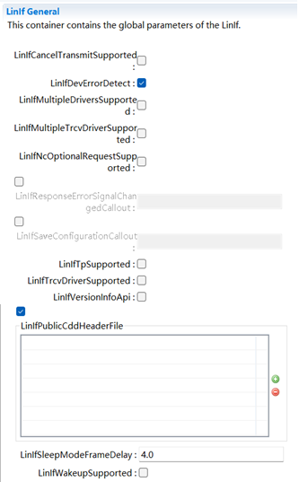
.. |image3| image:: ../../_static/参考手册/LinIf/image4.png
   :width: 4.175in
   :height: 2.07847in
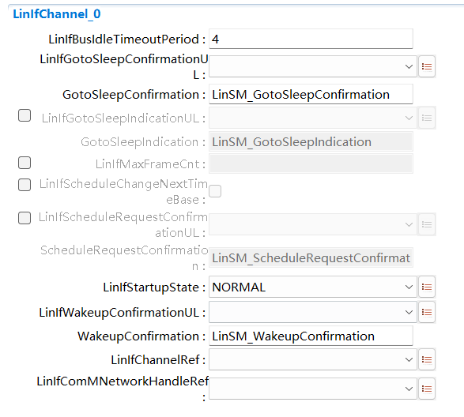
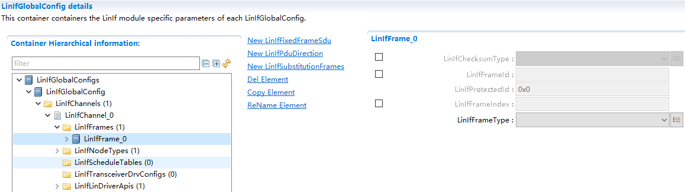

.. |image7| image:: ../../_static/参考手册/LinIf/image9.png
   :width: 5.76736in
   :height: 2.1625in
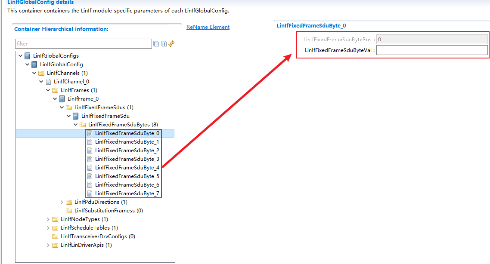

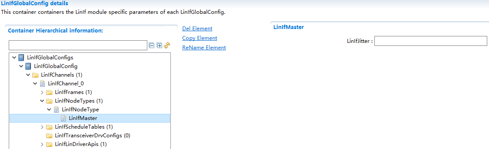
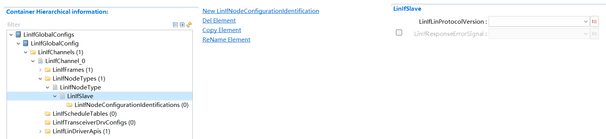
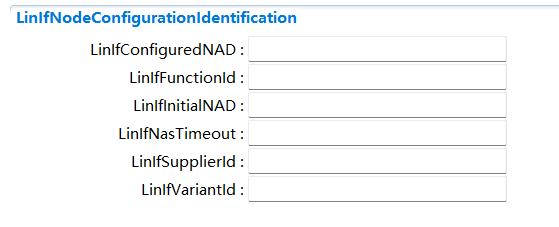

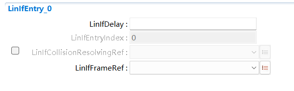

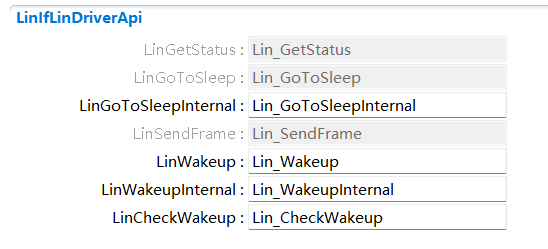
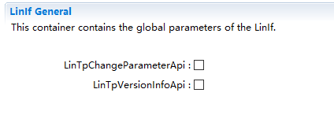
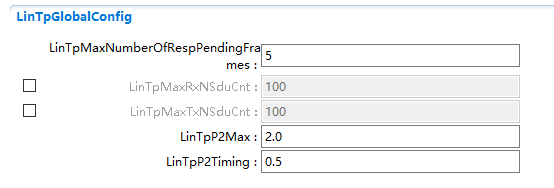
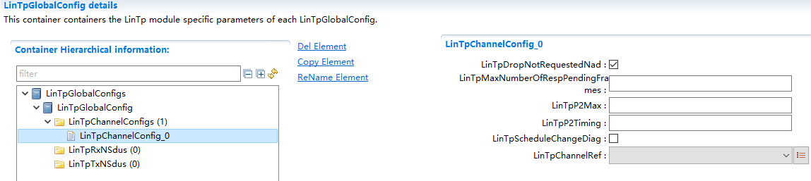
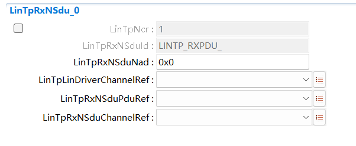
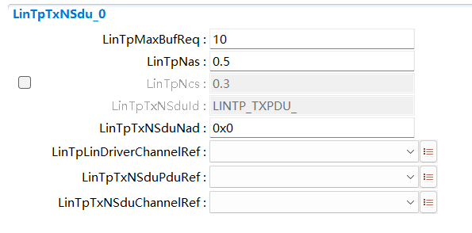
