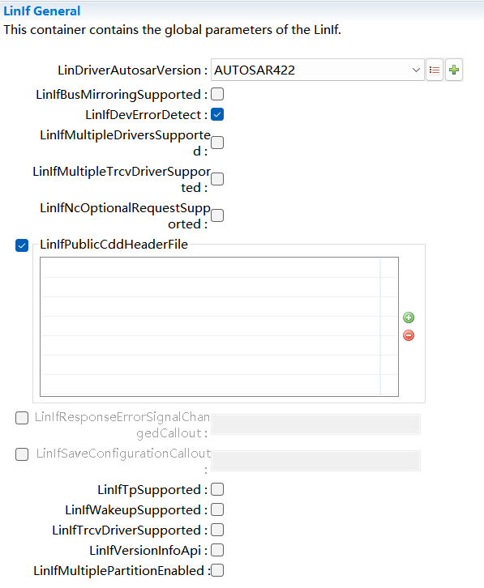
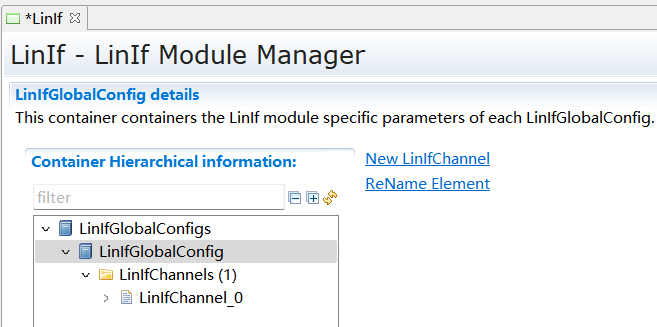
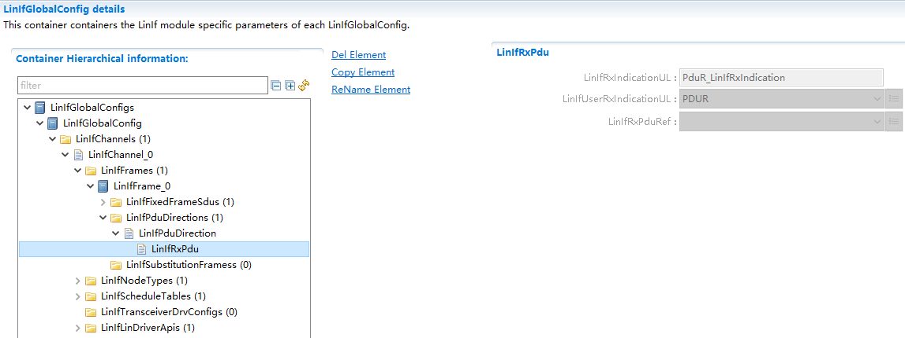
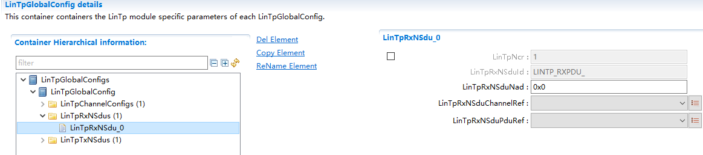
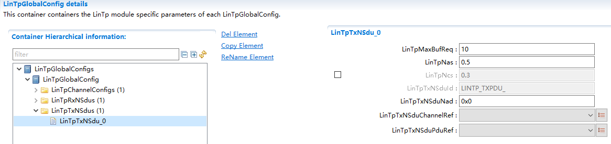

===================
LinIf产品参考手册
===================

**缩写词注解**

+------------+---------------------------+----------------------------+
| **缩写词** | **英文全称**              | **中文解释**               |
+------------+---------------------------+----------------------------+
| LIN        | Local Interconnect        | 局域互联网络               |
|            | Network                   |                            |
+------------+---------------------------+----------------------------+
| LinIf      | LIN Interface             | LIN 接口层                 |
+------------+---------------------------+----------------------------+
| LinSM      | LIN State Manager         | LIN状态管理器              |
+------------+---------------------------+----------------------------+
| PDU        | Protocol Data Unit        | 协议数据单元               |
+------------+---------------------------+----------------------------+
| PID        | Protected ID              | 受保护的ID                 |
+------------+---------------------------+----------------------------+
| LIN TP     | LIN Transport Protocol    | LIN传输层协议              |
+------------+---------------------------+----------------------------+
| NAD        | Node Address. Each slave  | 节点地址。每               |
|            | in LIN must have a unique | 个从节点必须有唯一的地址。 |
|            | NAD.                      |                            |
+------------+---------------------------+----------------------------+
| SF         | Single Frame in LIN TP    | LIN传输层协议中的单帧      |
+------------+---------------------------+----------------------------+
| FF         | First Frame in LIN TP     | LIN传输层协议中的首帧      |
+------------+---------------------------+----------------------------+
| CF         | Continuous Frame in LIN   | LIN传输层协议中的后续帧    |
|            | TP                        |                            |
+------------+---------------------------+----------------------------+
| MRF        | Master Request Frame      | 主节点请求帧               |
+------------+---------------------------+----------------------------+
| SRF        | Slave Response Frame      | 从节点应答帧               |
+------------+---------------------------+----------------------------+

简介
====

本文档是AUTOSAR R19-11的LIN
Interface（以下简称LinIf）模块参考手册。旨在指导使用LinIf模块的用户能够清晰地了解如何去使用LinIf模块。

LinIf模块包括两大功能：用于通常通信的接口服务（LinIf）以及用于诊断通信的数据传输服务（LinTp）。LinIf的下层是Lin
Driver、Lin
Transceiver，上层是LinSM、PduR等。其主要功能是与通信硬件抽象层和系统服务层产生交互，为相应的通信提供服务接口。

本文档主要介绍了LinIf模块的接口函数、类型定义，以及LinIf模块配置工具的使用方法。

|image1|

图1-1 Lin相关模块结构图

图1-2 LinIf模块构成

:mark:`注：本文后面的描述为了区分LinIf模块和LinIf功能，在描述时如果使用LinIf模块，则指LinIf模块整体，包含LinIf和LinTp功能。如果使用LinIf功能则单指LinIf模块下的LinIf功能部分。`

参考资料
--------

[1] AUTOSAR_SWS_LINInterface.pdf, R19-11

[2] AUTOSAR_SWS_LINStateManager.pdf, R19-11

[3] AUTOSAR_SWS_LINTransceiverDriver.pdf, R19-11

[4] AUTOSAR_SWS_LINDriver.pdf, R19-11

[5] LIN Specification Package, Revision 2.1

[6] AUTOSAR_SWS_PDURouter.pdf, R19-11

功能描述
========

报文传输
--------

功能介绍
~~~~~~~~

LinIf模块支持以下几种类型报文的接收和发送：

-  无条件帧（Unconditional frame）

-  事件触发帧（Event-triggered frame）

-  零星帧（Sporadic frame）

-  诊断帧（Diagnostic frames）

功能实现
~~~~~~~~

-  **无条件帧（**\ Unconditional frame\ **）：**

1. **主节点**

根据调度表的配置，当前帧为发送的无条件帧时，LinIf调用<User_TriggerTransmit>从上层模块获取数据，然后调用Lin_SendFrame(),将第二个参数中的（Lin_PduType类型）Pid，Cs，Dl设置为配置数据中的值，将Drc设置为发送，将SduPtr设置为存放从上层获取到的数据的地址。然后在下个调度表Entry到来时，调用Lin_GetStatus确认当前发送的结果。

根据调度表的调度，当前帧为接收的无条件帧时，LinIf调用Lin_SendFrame(),将第二个参数中的（Lin_PduType类型）Pid，Cs，Dl设置为配置数据中的值，将Drc设置为接收，将SduPtr设置为NULL_PTR。然后在下个调度表Entry到来时，调用Lin_GetStatus确认接收状态，并获取接收到的收据。然后调用<User_RxIndication>将接收到的数据发送给上层模块。

2. **从节点**

当LinIf_HeaderIndication(Channel,
PduPtr)被Lin模块调用时，LinIf根据配置，判断该PID是否为本节点需要处理的报文：

如果本节点需要发送数据，则调用<User_TriggerTransmit>从上层模块获取数据，然后将PduPtr
的Cs，Dl设置为配置的值，将Drc设置为发送，将从上层获取的数据复制到SduPtr指向的buffer中。

如果本节点需要接收数据，则将PduPtr
的Cs，Dl设置为配置的值，将Drc设置为接收。Lin模块在接收数据后会调用LinIf_RxIndication()将数据传递给LinIf模块。LinIf再调用<User_RxIndication>将接收到的数据发送给上层模块。

如果本节点不需要响应该PID，则将Drc设置为忽略。

-  **事件触发帧（Event-triggered frame）：**

1. **主节点**

根据调度表的配置，当前帧为事件触发帧时，LinIf调用Lin_SendFrame(),将第二个参数中的（Lin_PduType类型）Pid，Cs，Dl设置为配置数据中的值，将Drc设置为接收，将SduPtr设置为NULL_PTR。然后在下个调度表Entry到来时，调用Lin_GetStatus确认接收状态。如果正确接收则继续按照调度表处理后续报文，如果总线发生碰撞，则切换到冲突解决调度表，将该事件触发帧关联的无条件帧都轮询一遍。

2. **从节点**

当LinIf_HeaderIndication(Channel,
PduPtr)被Lin模块调用时，LinIf判断是否有发送标志位（LinIf_Transmit被调用时，LinIf设置发送标志位），如果有发送标志位，和发送正常的无条件帧处理过程一致，在收到LinIf_TxConfirmation(E_OK)时，清除发送标志，否则保留发送标志。如果没有发送标志，则忽略（将Drc设置为忽略）该通知。

-  **零星帧（Sporadic frame）：**

1. **主节点**

零星帧只有主节点可以发送。

根据调度表的配置，当前帧为零星帧时，LinIf判断是否有发送标志位（LinIf_Transmit被调用时，LinIf设置发送标志位），如果有发送标志位，和发送正常的无条件帧处理过程一致，在收到LinIf_TxConfirmation(E_OK)时，清除发送标志，否则保留发送标志。如果没有发送标志，则不需要发送报文。

2. **从节点**

从节点对于零星帧的处理和无条件帧一致。

-  **诊断帧（Diagnostic frames）：**

节点配置（Node configuration）和诊断使用相同的MRF和SRF。

1. **主节点**

如果是发送节点配置相关的报文，LinIf从配置中获取报文数据信息，然后发送一帧MRF报文，将命令发送出去。在下个Entry到来时，发送一帧SRF获取命令执行结果。

如果是诊断报文，当LinTp_Transmit()被调用时，LinIf需要通知BswM进行调度表的切换，当调度表切换到发送MRF的调度表后，LinIf发送MRF报文直到将所有的请求数据发送完成。然后LinIf通知BswM切换到SRF发送调度表，LinIf发送SRF直到所有的应答数据接收完成。

2. **从节点**

当接收到MRF报文时，从节点根据报文内容是节点配置报文还是诊断诊断报文：

如果是节点配置报文，LinIf根据报文内容进行处理，并在接收到SRF报文时，根据处理结果进行应答。

如果是诊断报文，LinIf则将接收到的MRF数据进行TP处理之后，传递给上层模块。在接收到SRF时，从上层模块获取数据后进行TP处理之后进行应答。

调度表管理
----------

.. _功能介绍-1:

功能介绍
~~~~~~~~

LIN通信需要根据提前配置好的调度表进行通信，一个节点可以有多个调度表，以便在不同的情况下使用。

LinIf需要根据调度表管理报文的发送（按照次序发送Header），并且能够根据上层模块的要求进行调度表的切换。

只有主节点具有调度表管理功能。

.. _功能实现-1:

功能实现
~~~~~~~~

上电后LinIf默认使用NULL_SCHEDULE调度表，该调度表为空调度表，不发送和接收任何报文。当LinIf_ScheduleRequest
()被调用时，LinIf记录该请求。在MainFunction中，判断是否可以切换调度表（RUN_ONCE调度表不能被中断），并进行调度表切换。在发生调度表切换时调用<User>_ScheduleRequestConfirmation将当前切换的调度表通知上层模块。

睡眠
----

.. _功能介绍-2:

功能介绍
~~~~~~~~

当主节点需要睡眠时，需要在总线上发送go-to-sleep命令，使整个网络进入睡眠状态。

当从节点接收到go-to-sleep命令或者检测到总线空闲时，从节点需要进入睡眠状态。

.. _功能实现-2:

功能实现
~~~~~~~~

1. **主节点**

当LinIf_GotoSleep()被调用时，LinIf判断当前通道是否为睡眠状态，如果为非睡眠状态则调用Lin_GoToSleep()发送睡眠命令，如果当前通道为睡眠状态，则调用Lin_GoToSleepInternal()接口，进行内部的状态转换。在经过睡眠处理的延时之后（4s-10s，由配置决定），调用Lin_GetStatus()查看当前总线是否进入睡眠状态，如果总线进入睡眠状态，LinIf切换到睡眠状态，并且调用<User>_GotoSleepConfirmation()通知上层模块。

2. **从节点**

当接收到睡眠命令或者总线空闲定时器超时，LinIf调用<User>_GotoSleepIndication()通知上层模块。当LinIf_GotoSleep()被调用时，LinIf调用Lin_GoToSleepInternal()接口，然后切换到睡眠状态，并且调用<User>_GotoSleepConfirmation()通知上层模块。

唤醒
----

.. _功能介绍-3:

功能介绍
~~~~~~~~

当节点需要唤醒网络，或者检测到总线唤醒信号，需要执行唤醒处理。

.. _功能实现-3:

功能实现
~~~~~~~~

当LinIf_Wakeup()被调用时，LinIf判断当前是否处于睡眠状态，如果处于睡眠状态调用Lin_Wakeup()唤醒总线，否则不做操作。然后在MainFunction中调用<User>_WakeupConfirmation()通知上层模块。

节点配置
--------

.. _功能介绍-4:

功能介绍
~~~~~~~~

节点配置功能用来配置总线上的从节点，比如配置节点NAD和报文ID等。使从节点能够被寻址，避免总线冲突的发生。

.. _功能实现-4:

功能实现
~~~~~~~~

1. **主节点**

主节点通过在调度表中，配置的节点配置命令，实现节点配置。当需要使用节点配置功能时，切换到对应的调度表。LinIf会根据调度表中的报文类型，从配置中获取配置命令数据，然后发送报文。

2. **从节点**

从节点在接收到节点配置命令后，根据配置命令执行相关操作，在收到SRF时，应答执行结果。

诊断传输协议（TP）
------------------

.. _功能介绍-5:

功能介绍
~~~~~~~~

传输协议实现了ISO 17987规范中对诊断传输协议的要求。

.. _功能实现-5:

功能实现
~~~~~~~~

对于需要使用传输协议发送的报文，LinTp根据报文的长度决定使用单帧还是多帧发送，并在发送时追加协议控制信息。

1. **主节点**

用户调用LinTp_Transmit()发起报文发送请求，LinIf通知BswM切换到MRF调度表，随后LinIf模块重复调用PduR_LinTpCopyTxData()从上层获取数据，在发送完最后一帧数据后调用PduR_LinTpTxConfirmation()通知上层模块，并通知BswM切换到SRF调度表。

LinIf重复发送SRF获取应答信息。在收到SF或者FF时，调用PduR_LinTpStartOfReception()准备接收，然后调用PduR_LinTpCopyRxData()将数据传送到上层模块。后续在接收到CF时，反复调用PduR_LinTpCopyRxData()向上层传送数据，直到接收完成，调用PduR_LinTpRxIndication()通知上层模块，并通知BswM切换到应用调度表。

2. **从节点**

LinIf在接收到MRF报文时，调用PduR_LinTpStartOfReception()准备接收（FF或者SF），然后调用PduR_LinTpCopyRxData()将数据传送到上层模块。后续在接收到CF时，反复调用PduR_LinTpCopyRxData()向上层传送数据，直到接收完成，调用PduR_LinTpRxIndication()通知上层模块。

用户调用LinTp_Transmit()发起报文发送请求，当收到SRF时，LinIf模块重复调用PduR_LinTpCopyTxData()从上层获取数据，在发送完最后一帧数据后调用PduR_LinTpTxConfirmation()通知上层模块。

源文件描述
==========

表3-1 LinIf源文件

+-----------------+----------------------------------------------------+
| **文件**        | **说明**                                           |
+-----------------+----------------------------------------------------+
| Linif_Cfg.h     | 用于定义LinIf模块预编译时用到的宏。                |
+-----------------+----------------------------------------------------+
| LinIf_Cfg.c     | 配置参数源文件，包含各个配置项的定义。             |
+-----------------+----------------------------------------------------+
| LinIf_Cbk.h     | 实现LinIf模块全部回调函数的声明。                  |
+-----------------+----------------------------------------------------+
| LinIf_Types.h   | LinIf模块类型定义头文件。(不含LinTp子模块)         |
+-----------------+----------------------------------------------------+
| L               | LinIf模块内部使用的宏，运行时变量类型定义头文件。  |
| inif_Internal.h |                                                    |
+-----------------+----------------------------------------------------+
| LinIf_MemMap.h  | LinIf模块函数和变量存储位置定义文件。              |
+-----------------+----------------------------------------------------+
| LinIf.h         | LinIf模块头文件，通过加载该头文件访问LinIf（       |
|                 | 包括LinTp）公开的函数和数据类型。\ **（外部模块使  |
|                 | 用时只需要加载LinIf.h，LinTp.h包含在LinIf.h中）**  |
+-----------------+----------------------------------------------------+
| LinIf.c         | LinIf模块实现源文件，各API实现在该文件中           |
+-----------------+----------------------------------------------------+
| LinIf_Master.c  | Lin                                                |
|                 | if主节点实现源文件，主节点相关功能实现在该文件中。 |
+-----------------+----------------------------------------------------+
| LinIf_Master.h  | Lin                                                |
|                 | If主节点头文件。通过该文件公开主节点实现对外接口。 |
+-----------------+----------------------------------------------------+
| LinIf_Slave.c   | Lin                                                |
|                 | if从节点实现源文件，主节点相关功能实现在该文件中。 |
+-----------------+----------------------------------------------------+
| LinIf_Slave.h   | Lin                                                |
|                 | If从节点头文件。通过该文件公开主节点实现对外接口。 |
+-----------------+----------------------------------------------------+
| LinTp.c         | LinTp子模块实现源文件，LinTp各API实现在该文件中。  |
+-----------------+----------------------------------------------------+
| LinTp.h         | LinTp子模块头文件                                  |
|                 | ，通过加载该头文件访问LinTp公开的函数和数据类型。  |
+-----------------+----------------------------------------------------+
| LinTp_Master.c  | Lin                                                |
|                 | Tp主节点实现源文件，主节点相关功能实现在该文件中。 |
+-----------------+----------------------------------------------------+
| LinTp_Master.h  | Lin                                                |
|                 | Tp主节点头文件。通过该文件公开主节点实现对外接口。 |
+-----------------+----------------------------------------------------+
| LinTp_Slave.c   | Lin                                                |
|                 | Tp从节点实现源文件，主节点相关功能实现在该文件中。 |
+-----------------+----------------------------------------------------+
| LinTp_Slave.h   | L                                                  |
|                 | inTp从节点头文件。通过该文件公开主节点实现对外接。 |
+-----------------+----------------------------------------------------+
| L               | LinTp子模块内部公用的函数实现源文件。              |
| inTp_Internal.c |                                                    |
+-----------------+----------------------------------------------------+
| L               | LinTp子模块内部使用的宏，变量类型定义头文件。      |
| inTp_Internal.h |                                                    |
+-----------------+----------------------------------------------------+
| LinTp_Types.h   | LinTp模块类型定义头文件。                          |
+-----------------+----------------------------------------------------+

|image2|

API接口
=======

类型定义
--------

LinIf_SchHandleType类型定义
~~~~~~~~~~~~~~~~~~~~~~~~~~~

+-----------+----------------------------------------------------------+
| 名称      | LinIf_SchHandleType                                      |
+-----------+----------------------------------------------------------+
| 类型      | uint8                                                    |
+-----------+----------------------------------------------------------+
| 范围      | 0 表示NULL_SCHECULE                                      |
+-----------+----------------------------------------------------------+
|           | 1-255 用户定义的调度表ID                                 |
+-----------+----------------------------------------------------------+
| 描述      | 调度表ID的数据类型                                       |
+-----------+----------------------------------------------------------+

LinIf_ConfigType类型定义
~~~~~~~~~~~~~~~~~~~~~~~~

+-----------+----------------------------------------------------------+
| 名称      | LinIf_ConfigType                                         |
+-----------+----------------------------------------------------------+
| 类型      | struct                                                   |
+-----------+----------------------------------------------------------+
| 范围      | 无                                                       |
+-----------+----------------------------------------------------------+
| 描述      | 用于存放LinIf功能配置信息                                |
+-----------+----------------------------------------------------------+

LinTp_ConfigType类型定义
~~~~~~~~~~~~~~~~~~~~~~~~

+-----------+----------------------------------------------------------+
| 名称      | LinTp_ConfigType                                         |
+-----------+----------------------------------------------------------+
| 类型      | struct                                                   |
+-----------+----------------------------------------------------------+
| 范围      | 无                                                       |
+-----------+----------------------------------------------------------+
| 描述      | 用于存放LinTp功能配置信息                                |
+-----------+----------------------------------------------------------+

LinTp_Mode类型定义
~~~~~~~~~~~~~~~~~~

+-----------+----------------------------------------------------------+
| 名称      | LinTp_Mode                                               |
+-----------+----------------------------------------------------------+
| 类型      | enum                                                     |
+-----------+----------------------------------------------------------+
| 范围      | LINTP_APPLICATIVE_SCHEDULE 切换到应用调度表              |
+-----------+----------------------------------------------------------+
|           | LINTP_DIAG_REQUEST 切换到Master Request调度表            |
+-----------+----------------------------------------------------------+
|           | LINTP_DIAG_RESPONSE 切换到Slaver Response调度表          |
+-----------+----------------------------------------------------------+
| 描述      | 指示在诊断模式下LinTp请求切换到哪种类型调度表            |
+-----------+----------------------------------------------------------+

输入函数描述
------------

+----------------------------+-----------------------------------------+
| **输入模块**               | **API**                                 |
+----------------------------+-----------------------------------------+
| BswM                       | BswM_LinTp_RequestMode                  |
+----------------------------+-----------------------------------------+
| Det.h                      | Det_ReportRuntimeError                  |
+----------------------------+-----------------------------------------+
|                            | Det_ReportError                         |
+----------------------------+-----------------------------------------+
| Com.h                      | Com_SendSignal                          |
+----------------------------+-----------------------------------------+
| LinSM.h                    | LinSM_GotoSleepConfirmation             |
+----------------------------+-----------------------------------------+
|                            | LinSM_GotoSleepIndication               |
+----------------------------+-----------------------------------------+
|                            | LinSM_ScheduleRequestConfirmation       |
+----------------------------+-----------------------------------------+
|                            | LinSM_WakeupConfirmation                |
+----------------------------+-----------------------------------------+
| LinTrcv.h                  | LinTrcv_CheckWakeup                     |
+----------------------------+-----------------------------------------+
|                            | LinTrcv_GetBusWuReason                  |
+----------------------------+-----------------------------------------+
|                            | LinTrcv_GetOpMode                       |
+----------------------------+-----------------------------------------+
|                            | LinTrcv_SetOpMode                       |
+----------------------------+-----------------------------------------+
|                            | LinTrcv_SetWakeupMode                   |
+----------------------------+-----------------------------------------+
| PduR_LinIf.h               | PduR_LinIfRxIndication                  |
+----------------------------+-----------------------------------------+
|                            | PduR_LinIfTriggerTransmit               |
+----------------------------+-----------------------------------------+
|                            | PduR_LinIfTxConfirmation                |
+----------------------------+-----------------------------------------+
| PduR_LinTp.h               | PduR_LinTpCopyRxData                    |
+----------------------------+-----------------------------------------+
|                            | PduR_LinTpCopyTxData                    |
+----------------------------+-----------------------------------------+
|                            | PduR_LinTpRxIndication                  |
+----------------------------+-----------------------------------------+
|                            | PduR_LinTpStartOfReception              |
+----------------------------+-----------------------------------------+
|                            | PduR_LinTpTxConfirmation                |
+----------------------------+-----------------------------------------+
| Lin Driver                 | Lin_GetStatus                           |
+----------------------------+-----------------------------------------+
|                            | Lin_GoToSleep                           |
+----------------------------+-----------------------------------------+
|                            | Lin_GoToSleepInternal                   |
+----------------------------+-----------------------------------------+
|                            | Lin_SendFrame                           |
+----------------------------+-----------------------------------------+
|                            | Lin_Wakeup                              |
+----------------------------+-----------------------------------------+
|                            | Lin_WakeupInternal                      |
+----------------------------+-----------------------------------------+

静态接口函数定义
----------------

LinIf_Init函数定义
~~~~~~~~~~~~~~~~~~

+-------------+-------------------------------+------+----------------+
| 函数名称：  | LinIf_Init                    |      |                |
+-------------+-------------------------------+------+----------------+
| 函数原型：  | void LinIf_Init(const         |      |                |
|             | LinIf_ConfigType\* ConfigPtr  |      |                |
|             | )                             |      |                |
+-------------+-------------------------------+------+----------------+
| 服务编号：  | 0x01                          |      |                |
+-------------+-------------------------------+------+----------------+
| 同步/异步： | Synchronous                   |      |                |
+-------------+-------------------------------+------+----------------+
| 是          | Non Reentrant                 |      |                |
| 否可重入：  |                               |      |                |
+-------------+-------------------------------+------+----------------+
| 输入参数：  | ConfigPtr                     | 值域 | 无             |
+-------------+-------------------------------+------+----------------+
| 输入        | 无                            |      |                |
| 输出参数：  |                               |      |                |
+-------------+-------------------------------+------+----------------+
| 输出参数：  | 无                            |      |                |
+-------------+-------------------------------+------+----------------+
| 返回值：    | 无                            |      |                |
+-------------+-------------------------------+------+----------------+
| 功能概述：  | 初始化LinIf功能               |      |                |
+-------------+-------------------------------+------+----------------+

LinIf_GetVersionInfo函数定义
~~~~~~~~~~~~~~~~~~~~~~~~~~~~

+-------------+-------------------------------+------+----------------+
| 函数名称：  | LinIf_GetVersionInfo          |      |                |
+-------------+-------------------------------+------+----------------+
| 函数原型：  | void                          |      |                |
|             | LinIf_GetVers                 |      |                |
|             | ionInfo(Std_VersionInfoType\* |      |                |
|             | versioninfo)                  |      |                |
+-------------+-------------------------------+------+----------------+
| 服务编号：  | 0x03                          |      |                |
+-------------+-------------------------------+------+----------------+
| 同步/异步： | Synchronous                   |      |                |
+-------------+-------------------------------+------+----------------+
| 是          | Reentrant                     |      |                |
| 否可重入：  |                               |      |                |
+-------------+-------------------------------+------+----------------+
| 输入参数：  | 无                            | 值域 | 无             |
+-------------+-------------------------------+------+----------------+
| 输入        | 无                            |      |                |
| 输出参数：  |                               |      |                |
+-------------+-------------------------------+------+----------------+
| 输出参数：  | Versioninfo:                  |      |                |
|             | 版本信息将被存放              |      |                |
|             | 在Versioninfo所指示的结构体中 |      |                |
+-------------+-------------------------------+------+----------------+
| 返回值：    | 无                            |      |                |
+-------------+-------------------------------+------+----------------+
| 功能概述：  | 获取LinIf功能的版本号         |      |                |
+-------------+-------------------------------+------+----------------+

LinIf_Transmit函数定义
~~~~~~~~~~~~~~~~~~~~~~

+-------------+------------------------------------+------+-----------+
| 函数名称：  | LinIf_Transmit                     |      |           |
+-------------+------------------------------------+------+-----------+
| 函数原型：  | Std_ReturnType LinIf_Transmit(     |      |           |
|             |                                    |      |           |
|             | PduIdType LinTxPduId,              |      |           |
|             |                                    |      |           |
|             | const PduInfoType\* PduInfoPtr     |      |           |
|             |                                    |      |           |
|             | )                                  |      |           |
+-------------+------------------------------------+------+-----------+
| 服务编号：  | 0x49                               |      |           |
+-------------+------------------------------------+------+-----------+
| 同步/异步： | Synchronous                        |      |           |
+-------------+------------------------------------+------+-----------+
| 是          | Reentrant for different PduIds.    |      |           |
| 否可重入：  | Non reentrant for the same PduId.  |      |           |
+-------------+------------------------------------+------+-----------+
| 输入参数：  | LinTxPduId:                        | 值域 | 无        |
|             | 用                                 |      |           |
|             | 户希望发送的PDU对应的ID。（不是LIN |      |           |
|             | protected ID）                     |      |           |
+-------------+------------------------------------+------+-----------+
|             | PduInfoPtr:                        |      | 无        |
|             | 指向一个结构体，包含发             |      |           |
|             | 送数据长度（DLC）和数据存放buffer  |      |           |
|             | （这个buffer对本函数没有用，数据在 |      |           |
|             | 发送时通过相关服务去上层获取数据） |      |           |
+-------------+------------------------------------+------+-----------+
| 输入        | 无                                 |      |           |
| 输出参数：  |                                    |      |           |
+-------------+------------------------------------+------+-----------+
| 输出参数：  | 无                                 |      |           |
+-------------+------------------------------------+------+-----------+
| 返回值：    | Std_ReturnType:                    |      |           |
|             |                                    |      |           |
|             | E_OK: 发送要求被成功接收           |      |           |
|             |                                    |      |           |
|             | E_NOT_OK:                          |      |           |
|             |                                    |      |           |
|             | 发送                               |      |           |
|             | 要求没有被接收，可能由于以下原因： |      |           |
|             |                                    |      |           |
|             | - LinIf功能没有初始化              |      |           |
|             |                                    |      |           |
|             | - LinTxPduId指向的PDU不存在        |      |           |
|             |                                    |      |           |
|             | -                                  |      |           |
|             | 当前系                             |      |           |
|             | 统被设置为NULL_SCHECULE(空调度表)  |      |           |
+-------------+------------------------------------+------+-----------+
| 功能概述：  | 用于请求发送零星帧或               |      |           |
|             | 事件触发帧（置位对应的发送标志位） |      |           |
+-------------+------------------------------------+------+-----------+

LinIf_ScheduleRequest函数定义
~~~~~~~~~~~~~~~~~~~~~~~~~~~~~

+-------------+-------------------------------+------+----------------+
| 函数名称：  | LinIf_ScheduleRequest         |      |                |
+-------------+-------------------------------+------+----------------+
| 函数原型：  | Std_ReturnType                |      |                |
|             | LinIf_ScheduleRequest(        |      |                |
|             |                               |      |                |
|             | NetworkHandleType Channel,    |      |                |
|             |                               |      |                |
|             | LinIf_SchHandleType Schedule  |      |                |
|             |                               |      |                |
|             | )                             |      |                |
+-------------+-------------------------------+------+----------------+
| 服务编号：  | 0x05                          |      |                |
+-------------+-------------------------------+------+----------------+
| 同步/异步： | Asynchronous                  |      |                |
+-------------+-------------------------------+------+----------------+
| 是          | Reentrant                     |      |                |
| 否可重入：  |                               |      |                |
+-------------+-------------------------------+------+----------------+
| 输入参数：  | Channel: 通道ID（Channel      | 值域 | 无             |
|             | index）                       |      |                |
+-------------+-------------------------------+------+----------------+
|             | Schedule: 新调度表的调度表ID  |      | 无             |
+-------------+-------------------------------+------+----------------+
| 输入        | 无                            |      |                |
| 输出参数：  |                               |      |                |
+-------------+-------------------------------+------+----------------+
| 输出参数：  | 无                            |      |                |
+-------------+-------------------------------+------+----------------+
| 返回值：    | Std_ReturnType:               |      |                |
|             |                               |      |                |
|             | E_OK:                         |      |                |
|             | 调度表切换请求被成功接收      |      |                |
|             |                               |      |                |
|             | E_NOT_OK:                     |      |                |
|             |                               |      |                |
|             | 调度表切换请                  |      |                |
|             | 求失败，可能由于以下的原因：  |      |                |
|             |                               |      |                |
|             | - LinIf模块没有初始化         |      |                |
|             |                               |      |                |
|             | - Channel参数指示的通道不存在 |      |                |
|             |                               |      |                |
|             | - Schedule                    |      |                |
|             | 参数指示的调度表不存在        |      |                |
|             |                               |      |                |
|             | - 系统当前处于睡眠(sleep)模式 |      |                |
+-------------+-------------------------------+------+----------------+
| 功能概述：  | 请求执行新的调度表            |      |                |
+-------------+-------------------------------+------+----------------+

LinIf_GotoSleep函数定义
~~~~~~~~~~~~~~~~~~~~~~~

+-------------+-------------------------------+------+----------------+
| 函数名称：  | LinIf_GotoSleep               |      |                |
+-------------+-------------------------------+------+----------------+
| 函数原型：  | Std_ReturnType                |      |                |
|             | LinIf_GotoSleep(              |      |                |
|             |                               |      |                |
|             | NetworkHandleType Channel     |      |                |
|             |                               |      |                |
|             | )                             |      |                |
+-------------+-------------------------------+------+----------------+
| 服务编号：  | 0x06                          |      |                |
+-------------+-------------------------------+------+----------------+
| 同步/异步： | Asynchronous                  |      |                |
+-------------+-------------------------------+------+----------------+
| 是          | Non Reentrant                 |      |                |
| 否可重入：  |                               |      |                |
+-------------+-------------------------------+------+----------------+
| 输入参数：  | Channel: 通道ID（Channel      | 值域 | 无             |
|             | index）                       |      |                |
+-------------+-------------------------------+------+----------------+
| 输入        | 无                            |      |                |
| 输出参数：  |                               |      |                |
+-------------+-------------------------------+------+----------------+
| 输出参数：  | 无                            |      |                |
+-------------+-------------------------------+------+----------------+
| 返回值：    | Std_ReturnType:               |      |                |
|             |                               |      |                |
|             | E_OK:                         |      |                |
|             | 睡眠请                        |      |                |
|             | 求被成功接受或系统正在执行睡  |      |                |
|             | 眠请求或系统已经处于睡眠状态  |      |                |
|             |                               |      |                |
|             | E_NOT_OK:睡眠请               |      |                |
|             | 求失败，可能由于以下的原因：  |      |                |
|             |                               |      |                |
|             | - LinIf功能没有初始化         |      |                |
|             |                               |      |                |
|             | - Channel参数指示的通道不存在 |      |                |
+-------------+-------------------------------+------+----------------+
| 功能概述：  | 要求系统切换到睡眠状态        |      |                |
+-------------+-------------------------------+------+----------------+

LinIf_WakeUp函数定义
~~~~~~~~~~~~~~~~~~~~

+-------------+-------------------------------+------+----------------+
| 函数名称：  | LinIf_WakeUp                  |      |                |
+-------------+-------------------------------+------+----------------+
| 函数原型：  | Std_ReturnType LinIf_WakeUp ( |      |                |
|             |                               |      |                |
|             | NetworkHandleType Channel     |      |                |
|             |                               |      |                |
|             | )                             |      |                |
+-------------+-------------------------------+------+----------------+
| 服务编号：  | 0x07                          |      |                |
+-------------+-------------------------------+------+----------------+
| 同步/异步： | Asynchronous                  |      |                |
+-------------+-------------------------------+------+----------------+
| 是          | Reentrant                     |      |                |
| 否可重入：  |                               |      |                |
+-------------+-------------------------------+------+----------------+
| 输入参数：  | Channel: 通道ID（Channel      | 值域 | 无             |
|             | index）                       |      |                |
+-------------+-------------------------------+------+----------------+
| 输入        | 无                            |      |                |
| 输出参数：  |                               |      |                |
+-------------+-------------------------------+------+----------------+
| 输出参数：  | 无                            |      |                |
+-------------+-------------------------------+------+----------------+
| 返回值：    | Std_ReturnType:               |      |                |
|             |                               |      |                |
|             | E_OK:                         |      |                |
|             | 唤醒请求被成功接              |      |                |
|             | 受或系统当前没有处于睡眠状态  |      |                |
|             |                               |      |                |
|             | E_NOT_OK:                     |      |                |
|             |                               |      |                |
|             | 唤醒                          |      |                |
|             | 请求失败，可能由于以下原因：  |      |                |
|             |                               |      |                |
|             | - LinIf功能没有初始化         |      |                |
|             |                               |      |                |
|             | - Channel参数指示的通道不存在 |      |                |
|             |                               |      |                |
|             | -                             |      |                |
|             | Lin驱动用                     |      |                |
|             | 于唤醒的函数Lin_Wakeu/Lin_Wak |      |                |
|             | eupInternal函数返回了E_NOT_OK |      |                |
+-------------+-------------------------------+------+----------------+
| 功能概述：  | 发起唤醒处理                  |      |                |
+-------------+-------------------------------+------+----------------+

LinIf_SetTrcvMode函数定义
~~~~~~~~~~~~~~~~~~~~~~~~~

+-------------+-------------------------------+------+----------------+
| 函数名称：  | LinIf_SetTrcvMode             |      |                |
+-------------+-------------------------------+------+----------------+
| 函数原型：  | Std_ReturnType                |      |                |
|             | LinIf_SetTrcvMode(            |      |                |
|             |                               |      |                |
|             | NetworkHandleType Channel,    |      |                |
|             |                               |      |                |
|             | LinTrcv_TrcvModeType          |      |                |
|             | TransceiverMode               |      |                |
|             |                               |      |                |
|             | )                             |      |                |
+-------------+-------------------------------+------+----------------+
| 服务编号：  | 0x08                          |      |                |
+-------------+-------------------------------+------+----------------+
| 同步/异步： | Synchronous                   |      |                |
+-------------+-------------------------------+------+----------------+
| 是          | Reentrant                     |      |                |
| 否可重入：  |                               |      |                |
+-------------+-------------------------------+------+----------------+
| 输入参数：  | Channel: 通道ID（Channel      | 值域 | 无             |
|             | index）                       |      |                |
+-------------+-------------------------------+------+----------------+
|             | Tr                            |      | 无             |
|             | ansceiverMode：需要设置的模式 |      |                |
+-------------+-------------------------------+------+----------------+
| 输入        | 无                            |      |                |
| 输出参数：  |                               |      |                |
+-------------+-------------------------------+------+----------------+
| 输出参数：  | 无                            |      |                |
+-------------+-------------------------------+------+----------------+
| 返回值：    | Std_ReturnType:               |      |                |
|             |                               |      |                |
|             | E_OK:                         |      |                |
|             | 收发                          |      |                |
|             | 器的模式被成功设置到指定模式  |      |                |
|             |                               |      |                |
|             | E_NOT_OK:                     |      |                |
|             |                               |      |                |
|             | 收发器驱动接口函数返回失败，  |      |                |
|             | 或者要求的模式超出允许的范围  |      |                |
+-------------+-------------------------------+------+----------------+
| 功能概述：  | 将对应                        |      |                |
|             | 通道的Lin收发器设置到指定模式 |      |                |
+-------------+-------------------------------+------+----------------+

LinIf_GetTrcvMode函数定义
~~~~~~~~~~~~~~~~~~~~~~~~~

+-------------+-------------------------------+------+----------------+
| 函数名称：  | LinIf_GetTrcvMode             |      |                |
+-------------+-------------------------------+------+----------------+
| 函数原型：  | Std_ReturnType                |      |                |
|             | LinIf_GetTrcvMode(            |      |                |
|             |                               |      |                |
|             | NetworkHandleType Channel,    |      |                |
|             |                               |      |                |
|             | LinTrcv_TrcvModeType\*        |      |                |
|             | TransceiverModePtr            |      |                |
|             |                               |      |                |
|             | )                             |      |                |
+-------------+-------------------------------+------+----------------+
| 服务编号：  | 0x09                          |      |                |
+-------------+-------------------------------+------+----------------+
| 同步/异步： | Synchronous                   |      |                |
+-------------+-------------------------------+------+----------------+
| 是          | Reentrant                     |      |                |
| 否可重入：  |                               |      |                |
+-------------+-------------------------------+------+----------------+
| 输入参数：  | Channel: 通道ID（Channel      | 值域 | 无             |
|             | index）                       |      |                |
+-------------+-------------------------------+------+----------------+
| 输入        | 无                            |      |                |
| 输出参数：  |                               |      |                |
+-------------+-------------------------------+------+----------------+
| 输出参数：  | Tra                           |      |                |
|             | nsceiverModePtr：指向一块内存 |      |                |
|             | ，用于存放获取到的收发器模式  |      |                |
+-------------+-------------------------------+------+----------------+
| 返回值：    | Std_ReturnType:               |      |                |
|             |                               |      |                |
|             | E_OK:                         |      |                |
|             | 从Lin收发器驱动获取模式成功   |      |                |
|             |                               |      |                |
|             | E_NOT_OK:                     |      |                |
|             |                               |      |                |
|             | 从Lin收发器驱动获取           |      |                |
|             | 模式失败，可能由于以下原因：  |      |                |
|             |                               |      |                |
|             | - Lin收发器驱动返回了E_NOT_OK |      |                |
|             |                               |      |                |
|             | - Channel参数指示的通道不存在 |      |                |
|             |                               |      |                |
|             | - TransceiverModePtr          |      |                |
|             | 参数为NULL                    |      |                |
+-------------+-------------------------------+------+----------------+
| 功能概述：  | 获取LIN收发器当前所处的状态   |      |                |
+-------------+-------------------------------+------+----------------+

LinIf_GetTrcvWakeupReason函数定义
~~~~~~~~~~~~~~~~~~~~~~~~~~~~~~~~~

+-------------+-------------------------------+------+----------------+
| 函数名称：  | LinIf_GetTrcvWakeupReason     |      |                |
+-------------+-------------------------------+------+----------------+
| 函数原型：  | Std_ReturnType                |      |                |
|             | LinIf_GetTrcvWakeupReason(    |      |                |
|             |                               |      |                |
|             | NetworkHandleType Channel,    |      |                |
|             |                               |      |                |
|             | L                             |      |                |
|             | inTrcv_TrcvWakeupReasonType\* |      |                |
|             | TrcvWuReasonPtr               |      |                |
|             |                               |      |                |
|             | )                             |      |                |
+-------------+-------------------------------+------+----------------+
| 服务编号：  | 0x0A                          |      |                |
+-------------+-------------------------------+------+----------------+
| 同步/异步： | Synchronous                   |      |                |
+-------------+-------------------------------+------+----------------+
| 是          | Reentrant                     |      |                |
| 否可重入：  |                               |      |                |
+-------------+-------------------------------+------+----------------+
| 输入参数：  | Channel: 通道ID（Channel      | 值域 | 无             |
|             | index）                       |      |                |
+-------------+-------------------------------+------+----------------+
| 输入        | 无                            |      |                |
| 输出参数：  |                               |      |                |
+-------------+-------------------------------+------+----------------+
| 输出参数：  | Trcv                          |      |                |
|             | WuReasonPtr：指向一块内存，用 |      |                |
|             | 于存放获取到的收发器唤醒原因  |      |                |
+-------------+-------------------------------+------+----------------+
| 返回值：    | Std_ReturnType:               |      |                |
|             |                               |      |                |
|             | E_OK: 请求执行成功            |      |                |
|             |                               |      |                |
|             | E_NOT_OK:                     |      |                |
|             |                               |      |                |
|             | 请求                          |      |                |
|             | 执行失败，可能由于以下原因：  |      |                |
|             |                               |      |                |
|             | - Lin收发器驱动返回了E_NOT_OK |      |                |
|             |                               |      |                |
|             | - Channel参数指示的通道不存在 |      |                |
|             |                               |      |                |
|             | - TrcvWuReasonPtr 参数为NULL  |      |                |
+-------------+-------------------------------+------+----------------+
| 功能概述：  | 返回Lin收发器获取到的唤醒原因 |      |                |
+-------------+-------------------------------+------+----------------+

LinIf_SetTrcvWakeupMode函数定义
~~~~~~~~~~~~~~~~~~~~~~~~~~~~~~~

+-------------+-------------------------------+------+----------------+
| 函数名称：  | LinIf_SetTrcvWakeupMode       |      |                |
+-------------+-------------------------------+------+----------------+
| 函数原型：  | Std_ReturnType                |      |                |
|             | LinIf_SetTrcvWakeupMode(      |      |                |
|             |                               |      |                |
|             | NetworkHandleType Channel,    |      |                |
|             |                               |      |                |
|             | LinTrcv_TrcvWakeupModeType    |      |                |
|             | LinTrcvWakeupMode             |      |                |
|             |                               |      |                |
|             | )                             |      |                |
+-------------+-------------------------------+------+----------------+
| 服务编号：  | 0x0B                          |      |                |
+-------------+-------------------------------+------+----------------+
| 同步/异步： | Synchronous                   |      |                |
+-------------+-------------------------------+------+----------------+
| 是          | Reentrant                     |      |                |
| 否可重入：  |                               |      |                |
+-------------+-------------------------------+------+----------------+
| 输入参数：  | Channel: 通道ID（Channel      | 值域 | 无             |
|             | index）                       |      |                |
+-------------+-------------------------------+------+----------------+
|             | LinTrcvWakeupMode:            |      | 无             |
|             | 期望设置的收发器唤醒原因      |      |                |
+-------------+-------------------------------+------+----------------+
| 输入        | 无                            |      |                |
| 输出参数：  |                               |      |                |
+-------------+-------------------------------+------+----------------+
| 输出参数：  | 无                            |      |                |
+-------------+-------------------------------+------+----------------+
| 返回值：    | Std_ReturnType:               |      |                |
|             |                               |      |                |
|             | E_OK: 设置成功                |      |                |
|             |                               |      |                |
|             | E_NOT_OK:                     |      |                |
|             |                               |      |                |
|             | 请求失败，可能由于以下原因：  |      |                |
|             |                               |      |                |
|             | - Lin收发器驱动返回了E_NOT_OK |      |                |
|             |                               |      |                |
|             | - Channel参数指示的通道不存在 |      |                |
|             |                               |      |                |
|             | -                             |      |                |
|             | LinTrcvW                      |      |                |
|             | akeupMode参数要求的模式不合法 |      |                |
+-------------+-------------------------------+------+----------------+
| 功能概述：  | 用于使能、失能或              |      |                |
|             | 清除对应通道上的唤醒事件通知  |      |                |
+-------------+-------------------------------+------+----------------+

LinIf_GetPIDTable函数定义
~~~~~~~~~~~~~~~~~~~~~~~~~

+-------------+-------------------------------+------+----------------+
| 函数名称：  | LinIf_GetPIDTable             |      |                |
+-------------+-------------------------------+------+----------------+
| 函数原型：  | Std_ReturnType                |      |                |
|             | LinIf_GetPIDTable (           |      |                |
|             |                               |      |                |
|             | NetworkHandleType Channel,    |      |                |
|             |                               |      |                |
|             | Lin_FramePidType\* PidBuffer, |      |                |
|             |                               |      |                |
|             | uint8\* PidBufferLength       |      |                |
|             |                               |      |                |
|             | )                             |      |                |
+-------------+-------------------------------+------+----------------+
| 服务编号：  | 0x72                          |      |                |
+-------------+-------------------------------+------+----------------+
| 同步/异步： | Synchronous                   |      |                |
+-------------+-------------------------------+------+----------------+
| 是          | Reentrant                     |      |                |
| 否可重入：  |                               |      |                |
+-------------+-------------------------------+------+----------------+
| 输入参数：  | Channel: 通道ID（Channel      | 值域 | 无             |
|             | index）                       |      |                |
+-------------+-------------------------------+------+----------------+
| 输入        | PidBuff                       |      |                |
| 输出参数：  | er：获取的PID存放的空间地址。 |      |                |
+-------------+-------------------------------+------+----------------+
|             | PidB                          |      |                |
|             | ufferLength：提供的buffer长度 |      |                |
|             | 。返回时，指示复制的PID个数。 |      |                |
+-------------+-------------------------------+------+----------------+
| 输出参数：  | 无                            |      |                |
+-------------+-------------------------------+------+----------------+
| 返回值：    | E_OK: 请求被接受。            |      |                |
|             |                               |      |                |
|             | E_NOT_OK:                     |      |                |
|             | 出现错误，请求不成功。        |      |                |
+-------------+-------------------------------+------+----------------+
| 功能概述：  | 获取                          |      |                |
|             | 所有分配的PID值。顺序和Frame  |      |                |
|             | Index一致。仅对于从节点有效。 |      |                |
+-------------+-------------------------------+------+----------------+

LinIf_SetPIDTable函数定义
~~~~~~~~~~~~~~~~~~~~~~~~~

+-------------+-------------------------------+------+----------------+
| 函数名称：  | LinIf_SetPIDTable             |      |                |
+-------------+-------------------------------+------+----------------+
| 函数原型：  | Std_ReturnType                |      |                |
|             | LinIf_SetPIDTable (           |      |                |
|             |                               |      |                |
|             | NetworkHandleType Channel,    |      |                |
|             |                               |      |                |
|             | Lin_FramePidType\* PidBuffer, |      |                |
|             |                               |      |                |
|             | uint8 PidBufferLength         |      |                |
|             |                               |      |                |
|             | )                             |      |                |
+-------------+-------------------------------+------+----------------+
| 服务编号：  | 0x73                          |      |                |
+-------------+-------------------------------+------+----------------+
| 同步/异步： | Synchronous                   |      |                |
+-------------+-------------------------------+------+----------------+
| 是          | Reentrant                     |      |                |
| 否可重入：  |                               |      |                |
+-------------+-------------------------------+------+----------------+
| 输入参数：  | Channel: Lin通道号            | 值域 | 无             |
+-------------+-------------------------------+------+----------------+
|             | P                             |      | 无             |
|             | idBuffer：指向要这是的PID值。 |      |                |
+-------------+-------------------------------+------+----------------+
|             | PidBuffer                     |      | 无             |
|             | Length：提供的PidBuffer长度。 |      |                |
+-------------+-------------------------------+------+----------------+
| 输入        | 无                            |      |                |
| 输出参数：  |                               |      |                |
+-------------+-------------------------------+------+----------------+
| 输出参数：  | 无                            |      |                |
+-------------+-------------------------------+------+----------------+
| 返回值：    | E_OK: 请求被接受。            |      |                |
|             |                               |      |                |
|             | E_NOT_OK:                     |      |                |
|             | 出现错误，请求不成功。        |      |                |
+-------------+-------------------------------+------+----------------+
| 功能概述：  | 根据Frame                     |      |                |
|             | Index设置PID。仅用于从节点。  |      |                |
+-------------+-------------------------------+------+----------------+

LinIf_GetConfiguredNAD函数定义
~~~~~~~~~~~~~~~~~~~~~~~~~~~~~~

+-------------+-------------------------------+------+----------------+
| 函数名称：  | LinIf_GetConfiguredNAD        |      |                |
+-------------+-------------------------------+------+----------------+
| 函数原型：  | Std_ReturnType                |      |                |
|             | LinIf_GetConfiguredNAD (      |      |                |
|             |                               |      |                |
|             | NetworkHandleType Channel,    |      |                |
|             |                               |      |                |
|             | uint8\* Nad                   |      |                |
|             |                               |      |                |
|             | )                             |      |                |
+-------------+-------------------------------+------+----------------+
| 服务编号：  | 0x70                          |      |                |
+-------------+-------------------------------+------+----------------+
| 同步/异步： | Synchronous                   |      |                |
+-------------+-------------------------------+------+----------------+
| 是          | Reentrant                     |      |                |
| 否可重入：  |                               |      |                |
+-------------+-------------------------------+------+----------------+
| 输入参数：  | Channel: Lin通道号            | 值域 | 无             |
+-------------+-------------------------------+------+----------------+
| 输入        | 无                            |      |                |
| 输出参数：  |                               |      |                |
+-------------+-------------------------------+------+----------------+
| 输出参数：  | Nad：从节点配置的NAD          |      |                |
+-------------+-------------------------------+------+----------------+
| 返回值：    | E_OK: 请求被接受。            |      |                |
|             |                               |      |                |
|             | E_NOT_OK:                     |      |                |
|             | 出现错误，请求不成功。        |      |                |
+-------------+-------------------------------+------+----------------+
| 功能概述：  | 获取当                        |      |                |
|             | 前被配置的NAD。仅用于从节点。 |      |                |
+-------------+-------------------------------+------+----------------+

LinIf_SetConfiguredNAD函数定义
~~~~~~~~~~~~~~~~~~~~~~~~~~~~~~

+-------------+-------------------------------+------+----------------+
| 函数名称：  | LinIf_SetConfiguredNAD        |      |                |
+-------------+-------------------------------+------+----------------+
| 函数原型：  | Std_ReturnType                |      |                |
|             | LinIf_SetConfiguredNAD (      |      |                |
|             |                               |      |                |
|             | NetworkHandleType Channel,    |      |                |
|             |                               |      |                |
|             | uint8 Nad                     |      |                |
|             |                               |      |                |
|             | )                             |      |                |
+-------------+-------------------------------+------+----------------+
| 服务编号：  | 0x71                          |      |                |
+-------------+-------------------------------+------+----------------+
| 同步/异步： | Synchronous                   |      |                |
+-------------+-------------------------------+------+----------------+
| 是          | Reentrant                     |      |                |
| 否可重入：  |                               |      |                |
+-------------+-------------------------------+------+----------------+
| 输入参数：  | Channel: Lin通道号            | 值域 | 无             |
+-------------+-------------------------------+------+----------------+
|             | Nad：新Nad                    |      | 无             |
+-------------+-------------------------------+------+----------------+
| 输入        | 无                            |      |                |
| 输出参数：  |                               |      |                |
+-------------+-------------------------------+------+----------------+
| 输出参数：  | 无                            |      |                |
+-------------+-------------------------------+------+----------------+
| 返回值：    | E_OK: 请求被接受。            |      |                |
|             |                               |      |                |
|             | E_NOT_OK:                     |      |                |
|             | 出现错误，请求不成功。        |      |                |
+-------------+-------------------------------+------+----------------+
| 功能概述：  | 设置                          |      |                |
|             | 当前节点的NAD。仅用于从节点。 |      |                |
+-------------+-------------------------------+------+----------------+

LinIf_CancelTransmit函数定义
~~~~~~~~~~~~~~~~~~~~~~~~~~~~

+-------------+-------------------------------+------+----------------+
| 函数名称：  | LinIf_CancelTransmit          |      |                |
+-------------+-------------------------------+------+----------------+
| 函数原型：  | Std_ReturnType                |      |                |
|             | LinIf_CancelTransmit(         |      |                |
|             |                               |      |                |
|             | PduIdType LinTxPduId          |      |                |
|             |                               |      |                |
|             | )                             |      |                |
+-------------+-------------------------------+------+----------------+
| 服务编号：  | 0x0C                          |      |                |
+-------------+-------------------------------+------+----------------+
| 同步/异步： | Synchronous                   |      |                |
+-------------+-------------------------------+------+----------------+
| 是          | Non Reentrant                 |      |                |
| 否可重入：  |                               |      |                |
+-------------+-------------------------------+------+----------------+
| 输入参数：  | LinTxPduId: 想要取消发送的PDU | 值域 | 无             |
|             | ID                            |      |                |
+-------------+-------------------------------+------+----------------+
| 输入        | 无                            |      |                |
| 输出参数：  |                               |      |                |
+-------------+-------------------------------+------+----------------+
| 输出参数：  | 无                            |      |                |
+-------------+-------------------------------+------+----------------+
| 返回值：    | Std_ReturnType:               |      |                |
|             |                               |      |                |
|             | E_NOT_OK:                     |      |                |
|             | 该函数永远返回E_NOT_OK        |      |                |
+-------------+-------------------------------+------+----------------+
| 功能概述：  | 该函数为dummy函               |      |                |
|             | 数，为了兼容接口（存在于4.2.  |      |                |
|             | 2版本，R19-11版本删除该函数） |      |                |
+-------------+-------------------------------+------+----------------+

LinIf_CheckWakeup函数定义
~~~~~~~~~~~~~~~~~~~~~~~~~

+-------------+-------------------------------+------+----------------+
| 函数名称：  | LinIf_CheckWakeup             |      |                |
+-------------+-------------------------------+------+----------------+
| 函数原型：  | Std_ReturnType                |      |                |
|             | LinIf_CheckWakeup(            |      |                |
|             |                               |      |                |
|             | EcuM_WakeupSourceType         |      |                |
|             | WakeupSource                  |      |                |
|             |                               |      |                |
|             | )                             |      |                |
+-------------+-------------------------------+------+----------------+
| 服务编号：  | 0x60                          |      |                |
+-------------+-------------------------------+------+----------------+
| 同步/异步： | Synchronous                   |      |                |
+-------------+-------------------------------+------+----------------+
| 是          | Reentrant                     |      |                |
| 否可重入：  |                               |      |                |
+-------------+-------------------------------+------+----------------+
| 输入参数：  | WakeupSource: 唤醒源类型      | 值域 | 无             |
+-------------+-------------------------------+------+----------------+
| 输入        | 无                            |      |                |
| 输出参数：  |                               |      |                |
+-------------+-------------------------------+------+----------------+
| 输出参数：  | 无                            |      |                |
+-------------+-------------------------------+------+----------------+
| 返回值：    | Std_ReturnType:               |      |                |
|             |                               |      |                |
|             | E_OK: 函数成功执行            |      |                |
|             |                               |      |                |
|             | E_NOT_OK:                     |      |                |
|             | 传入                          |      |                |
|             | 了定义范围外的WakeupSource，  |      |                |
|             | 或函数在实行工程中遇到了问题  |      |                |
+-------------+-------------------------------+------+----------------+
| 功能概述：  | 当EcuM                        |      |                |
|             | 收到一个Lin通道的唤醒通知后， |      |                |
|             | 会调用本函数用来确认唤醒事件  |      |                |
+-------------+-------------------------------+------+----------------+

LinIf_WakeupConfirmation函数定义
~~~~~~~~~~~~~~~~~~~~~~~~~~~~~~~~

+-------------+-------------------------------+------+----------------+
| 函数名称：  | LinIf_WakeupConfirmation      |      |                |
+-------------+-------------------------------+------+----------------+
| 函数原型：  | void                          |      |                |
|             | LinIf_WakeupConfirmation(     |      |                |
|             |                               |      |                |
|             | EcuM_WakeupSourceType         |      |                |
|             | WakeupSource                  |      |                |
|             |                               |      |                |
|             | )                             |      |                |
+-------------+-------------------------------+------+----------------+
| 服务编号：  | 0x61                          |      |                |
+-------------+-------------------------------+------+----------------+
| 同步/异步： | Synchronous                   |      |                |
+-------------+-------------------------------+------+----------------+
| 是          | Reentrant                     |      |                |
| 否可重入：  |                               |      |                |
+-------------+-------------------------------+------+----------------+
| 输入参数：  | WakeupSource: 唤醒源类型      | 值域 | 无             |
+-------------+-------------------------------+------+----------------+
| 输入        | 无                            |      |                |
| 输出参数：  |                               |      |                |
+-------------+-------------------------------+------+----------------+
| 输出参数：  | 无                            |      |                |
+-------------+-------------------------------+------+----------------+
| 返回值：    | 无                            |      |                |
+-------------+-------------------------------+------+----------------+
| 功能概述：  | 在确认                        |      |                |
|             | 唤醒（CheckWakeup）或上电后， |      |                |
|             | Lin驱动或Lin收发器检测到成功  |      |                |
|             | 唤醒后会调用该函数报告唤醒源  |      |                |
+-------------+-------------------------------+------+----------------+

LinIf_HeaderIndication函数定义
~~~~~~~~~~~~~~~~~~~~~~~~~~~~~~

+-------------+-------------------------------+------+----------------+
| 函数名称：  | LinIf_HeaderIndication        |      |                |
+-------------+-------------------------------+------+----------------+
| 函数原型：  | Std_ReturnType                |      |                |
|             | LinIf_HeaderIndication (      |      |                |
|             |                               |      |                |
|             | NetworkHandleType Channel,    |      |                |
|             |                               |      |                |
|             | Lin_PduType\* PduPtr          |      |                |
|             |                               |      |                |
|             | )                             |      |                |
+-------------+-------------------------------+------+----------------+
| 服务编号：  | 0x78                          |      |                |
+-------------+-------------------------------+------+----------------+
| 同步/异步： | Synchronous                   |      |                |
+-------------+-------------------------------+------+----------------+
| 是          | Reentrant                     |      |                |
| 否可重入：  |                               |      |                |
+-------------+-------------------------------+------+----------------+
| 输入参数：  | Channel: Lin通道号            | 值域 | 无             |
+-------------+-------------------------------+------+----------------+
| 输入        | PduPtr：提供接收到的PID，以   |      |                |
| 输出参数：  | 及一个用于存放数据的buffer。  |      |                |
|             |                               |      |                |
|             | 返回时长度，Checksum，报文类  |      |                |
|             | 型作为输出返回。如果报文类型  |      |                |
|             | 为LIN_FRAMERESPONSE_TX，SDU数 |      |                |
|             | 据buffer中存放要发送的数据。  |      |                |
+-------------+-------------------------------+------+----------------+
| 输出参数：  | 无                            |      |                |
+-------------+-------------------------------+------+----------------+
| 返回值：    | E_OK: 请求被接受              |      |                |
|             |                               |      |                |
|             | E_NOT_OK: 出现错误，请求失败  |      |                |
+-------------+-------------------------------+------+----------------+
| 功能概述：  | Li                            |      |                |
|             | n驱动在接收到Header时，调用该 |      |                |
|             | 函数通知LinIf。仅用于从节点。 |      |                |
+-------------+-------------------------------+------+----------------+

LinIf_RxIndication函数定义
~~~~~~~~~~~~~~~~~~~~~~~~~~

+-------------+-------------------------------+------+----------------+
| 函数名称：  | LinIf_RxIndication            |      |                |
+-------------+-------------------------------+------+----------------+
| 函数原型：  | void LinIf_RxIndication (     |      |                |
|             |                               |      |                |
|             | NetworkHandleType Channel,    |      |                |
|             |                               |      |                |
|             | uint8\* Lin_SduPtr            |      |                |
|             |                               |      |                |
|             | )                             |      |                |
+-------------+-------------------------------+------+----------------+
| 服务编号：  | 0x79                          |      |                |
+-------------+-------------------------------+------+----------------+
| 同步/异步： | Synchronous                   |      |                |
+-------------+-------------------------------+------+----------------+
| 是          | Reentrant                     |      |                |
| 否可重入：  |                               |      |                |
+-------------+-------------------------------+------+----------------+
| 输入参数：  | Channel: Lin通道号            | 值域 | 无             |
+-------------+-------------------------------+------+----------------+
|             | Lin                           |      | 无             |
|             | _SduPtr：指向接收到的Response |      |                |
+-------------+-------------------------------+------+----------------+
| 输入        | 无                            |      |                |
| 输出参数：  |                               |      |                |
+-------------+-------------------------------+------+----------------+
| 输出参数：  | 无                            |      |                |
+-------------+-------------------------------+------+----------------+
| 返回值：    | 无                            |      |                |
+-------------+-------------------------------+------+----------------+
| 功能概述：  | Lin驱动在接收到Response时，调 |      |                |
|             | 用该函数通知LinIf，并将Respon |      |                |
|             | se传递给LinIf。仅用于从节点。 |      |                |
+-------------+-------------------------------+------+----------------+

LinIf_TxConfirmation函数定义
~~~~~~~~~~~~~~~~~~~~~~~~~~~~

+-------------+-------------------------------+------+----------------+
| 函数名称：  | LinIf_TxConfirmation          |      |                |
+-------------+-------------------------------+------+----------------+
| 函数原型：  | void LinIf_TxConfirmation (   |      |                |
|             |                               |      |                |
|             | NetworkHandleType Channel     |      |                |
|             |                               |      |                |
|             | )                             |      |                |
+-------------+-------------------------------+------+----------------+
| 服务编号：  | 0x7A                          |      |                |
+-------------+-------------------------------+------+----------------+
| 同步/异步： | Synchronous                   |      |                |
+-------------+-------------------------------+------+----------------+
| 是          | Reentrant for different       |      |                |
| 否可重入：  | Channels. Non reentrant for   |      |                |
|             | the same Channel.             |      |                |
+-------------+-------------------------------+------+----------------+
| 输入参数：  | Channel: Lin通道号            | 值域 | 无             |
+-------------+-------------------------------+------+----------------+
| 输入        | 无                            |      |                |
| 输出参数：  |                               |      |                |
+-------------+-------------------------------+------+----------------+
| 输出参数：  | 无                            |      |                |
+-------------+-------------------------------+------+----------------+
| 返回值：    | 无                            |      |                |
+-------------+-------------------------------+------+----------------+
| 功能概述：  | Lin驱动在成功发送Resp         |      |                |
|             | onse时，调用该函数通知LinIf。 |      |                |
+-------------+-------------------------------+------+----------------+

LinIf_LinErrorIndication函数定义
~~~~~~~~~~~~~~~~~~~~~~~~~~~~~~~~

+-------------+-------------------------------+------+----------------+
| 函数名称：  | LinIf_LinErrorIndication      |      |                |
+-------------+-------------------------------+------+----------------+
| 函数原型：  | void LinIf_LinErrorIndication |      |                |
|             | (                             |      |                |
|             |                               |      |                |
|             | NetworkHandleType Channel,    |      |                |
|             |                               |      |                |
|             | Lin_SlaveErrorType            |      |                |
|             | ErrorStatus                   |      |                |
|             |                               |      |                |
|             | )                             |      |                |
+-------------+-------------------------------+------+----------------+
| 服务编号：  | 0x7B                          |      |                |
+-------------+-------------------------------+------+----------------+
| 同步/异步： | Synchronous                   |      |                |
+-------------+-------------------------------+------+----------------+
| 是          | Reentrant for different       |      |                |
| 否可重入：  | Channels. Non reentrant for   |      |                |
|             | the same Channel.             |      |                |
+-------------+-------------------------------+------+----------------+
| 输入参数：  | Channel: Lin通道号            | 值域 | 无             |
+-------------+-------------------------------+------+----------------+
|             | ErrorStatus: 检测到的错误     |      | 无             |
+-------------+-------------------------------+------+----------------+
| 输入        | 无                            |      |                |
| 输出参数：  |                               |      |                |
+-------------+-------------------------------+------+----------------+
| 输出参数：  | 无                            |      |                |
+-------------+-------------------------------+------+----------------+
| 返回值：    | 无                            |      |                |
+-------------+-------------------------------+------+----------------+
| 功能概述：  | Lin驱动在处理Header和R        |      |                |
|             | esponse时，检测到错误会调用该 |      |                |
|             | 接口通知LinIf。仅用于从节点。 |      |                |
+-------------+-------------------------------+------+----------------+

LinIf_MainFunction函数定义
~~~~~~~~~~~~~~~~~~~~~~~~~~

+-------------+-------------------------------+------+----------------+
| 函数名称：  | LinIf_MainFunction            |      |                |
+-------------+-------------------------------+------+----------------+
| 函数原型：  | void LinIf_MainFunction(void) |      |                |
+-------------+-------------------------------+------+----------------+
| 服务编号：  | 0x80                          |      |                |
+-------------+-------------------------------+------+----------------+
| 同步/异步： | Synchronous                   |      |                |
+-------------+-------------------------------+------+----------------+
| 是          | Non Reentrant                 |      |                |
| 否可重入：  |                               |      |                |
+-------------+-------------------------------+------+----------------+
| 输入参数：  | 无                            | 值域 | 无             |
+-------------+-------------------------------+------+----------------+
| 输入        | 无                            |      |                |
| 输出参数：  |                               |      |                |
+-------------+-------------------------------+------+----------------+
| 输出参数：  | 无                            |      |                |
+-------------+-------------------------------+------+----------------+
| 返回值：    | 无                            |      |                |
+-------------+-------------------------------+------+----------------+
| 功能概述：  | LinIf模块的主处理函           |      |                |
|             | 数。所有channel均使用该主函数 |      |                |
|             | 进行周期调度，使用同一个周期  |      |                |
|             | （周期设定配置项为LinIfTimeBa |      |                |
|             | se）（该接口按照422规范设计） |      |                |
+-------------+-------------------------------+------+----------------+

LinTp_Init函数定义
~~~~~~~~~~~~~~~~~~

+-------------+-------------------------------+------+----------------+
| 函数名称：  | LinTp_Init                    |      |                |
+-------------+-------------------------------+------+----------------+
| 函数原型：  | void LinTp_Init(const         |      |                |
|             | LinTp_ConfigType\* ConfigPtr  |      |                |
|             | )                             |      |                |
+-------------+-------------------------------+------+----------------+
| 服务编号：  | 0x40                          |      |                |
+-------------+-------------------------------+------+----------------+
| 同步/异步： | Synchronous                   |      |                |
+-------------+-------------------------------+------+----------------+
| 是          | Non Reentrant                 |      |                |
| 否可重入：  |                               |      |                |
+-------------+-------------------------------+------+----------------+
| 输入参数：  | Confi                         | 值域 | 无             |
|             | gPtr：指向LinTp功能配置结构体 |      |                |
+-------------+-------------------------------+------+----------------+
| 输入        | 无                            |      |                |
| 输出参数：  |                               |      |                |
+-------------+-------------------------------+------+----------------+
| 输出参数：  | 无                            |      |                |
+-------------+-------------------------------+------+----------------+
| 返回值：    | 无                            |      |                |
+-------------+-------------------------------+------+----------------+
| 功能概述：  | LinTp功能初始化函数           |      |                |
+-------------+-------------------------------+------+----------------+

LinTp_Transmit函数定义
~~~~~~~~~~~~~~~~~~~~~~

+-------------+-------------------------------+------+----------------+
| 函数名称：  | LinTp_Transmit                |      |                |
+-------------+-------------------------------+------+----------------+
| 函数原型：  | Std_ReturnType                |      |                |
|             | LinTp_Transmit(               |      |                |
|             |                               |      |                |
|             | PduIdType LinTpTxSduId,       |      |                |
|             |                               |      |                |
|             | const PduInfoType\*           |      |                |
|             | LinTpTxInfoPtr                |      |                |
|             |                               |      |                |
|             | )                             |      |                |
+-------------+-------------------------------+------+----------------+
| 服务编号：  | 0x53                          |      |                |
+-------------+-------------------------------+------+----------------+
| 同步/异步： | Synchronous                   |      |                |
+-------------+-------------------------------+------+----------------+
| 是          | Reentrant for different       |      |                |
| 否可重入：  | PduIds. Non reentrant for the |      |                |
|             | same PduId.                   |      |                |
+-------------+-------------------------------+------+----------------+
| 输入参数：  | LinT                          | 值域 | 无             |
|             | pTxSduId：需要发送数据的N-SDU |      |                |
|             | ID                            |      |                |
+-------------+-------------------------------+------+----------------+
|             | L                             |      | 无             |
|             | inTpTxInfoPtr：一个结构体指针 |      |                |
|             | ，指向的对象包含：①指向N-SDU  |      |                |
|             | Buffer的指针 ②buffer的长度    |      |                |
+-------------+-------------------------------+------+----------------+
| 输入        | 无                            |      |                |
| 输出参数：  |                               |      |                |
+-------------+-------------------------------+------+----------------+
| 输出参数：  | 无                            |      |                |
+-------------+-------------------------------+------+----------------+
| 返回值：    | E_OK: TP发送请求被成功接收    |      |                |
|             |                               |      |                |
|             | E_NOT_OK: TP发送请求被拒绝    |      |                |
+-------------+-------------------------------+------+----------------+
| 功能概述：  | 请求发送LinTp数据             |      |                |
+-------------+-------------------------------+------+----------------+

LinTp_GetVersionInfo函数定义
~~~~~~~~~~~~~~~~~~~~~~~~~~~~

+-------------+-------------------------------+------+----------------+
| 函数名称：  | LinTp_GetVersionInfo          |      |                |
+-------------+-------------------------------+------+----------------+
| 函数原型：  | void LinTp_GetVersionInfo(    |      |                |
|             |                               |      |                |
|             | Std_VersionInfoType\*         |      |                |
|             | versioninfo                   |      |                |
|             |                               |      |                |
|             | )                             |      |                |
+-------------+-------------------------------+------+----------------+
| 服务编号：  | 0x42                          |      |                |
+-------------+-------------------------------+------+----------------+
| 同步/异步： | Synchronous                   |      |                |
+-------------+-------------------------------+------+----------------+
| 是          | Non Reentrant                 |      |                |
| 否可重入：  |                               |      |                |
+-------------+-------------------------------+------+----------------+
| 输入参数：  | 无                            | 值域 | 无             |
+-------------+-------------------------------+------+----------------+
| 输入        | 无                            |      |                |
| 输出参数：  |                               |      |                |
+-------------+-------------------------------+------+----------------+
| 输出参数：  | Versioni                      |      |                |
|             | nfo：存放版本信息的结构体地址 |      |                |
+-------------+-------------------------------+------+----------------+
| 返回值：    | 无                            |      |                |
+-------------+-------------------------------+------+----------------+
| 功能概述：  | 获取LinTp功能版本信息         |      |                |
+-------------+-------------------------------+------+----------------+

LinTp_Shutdown函数定义
~~~~~~~~~~~~~~~~~~~~~~

+-------------+-------------------------------+------+----------------+
| 函数名称：  | LinTp_Shutdown                |      |                |
+-------------+-------------------------------+------+----------------+
| 函数原型：  | void LinTp_Shutdown(void)     |      |                |
+-------------+-------------------------------+------+----------------+
| 服务编号：  | 0x43                          |      |                |
+-------------+-------------------------------+------+----------------+
| 同步/异步： | Synchronous                   |      |                |
+-------------+-------------------------------+------+----------------+
| 是          | Non Reentrant                 |      |                |
| 否可重入：  |                               |      |                |
+-------------+-------------------------------+------+----------------+
| 输入参数：  | 无                            | 值域 | 无             |
+-------------+-------------------------------+------+----------------+
| 输入        | 无                            |      |                |
| 输出参数：  |                               |      |                |
+-------------+-------------------------------+------+----------------+
| 输出参数：  | 无                            |      |                |
+-------------+-------------------------------+------+----------------+
| 返回值：    | 无                            |      |                |
+-------------+-------------------------------+------+----------------+
| 功能概述：  | 关闭LinTp功能                 |      |                |
+-------------+-------------------------------+------+----------------+

LinTp_CancelTransmit函数定义
~~~~~~~~~~~~~~~~~~~~~~~~~~~~

+-------------+-------------------------------+------+----------------+
| 函数名称：  | LinTp_CancelTransmit          |      |                |
+-------------+-------------------------------+------+----------------+
| 函数原型：  | Std_ReturnType                |      |                |
|             | LinTp_CancelTransmit(         |      |                |
|             |                               |      |                |
|             | PduIdType LinTpTxSduId        |      |                |
|             |                               |      |                |
|             | )                             |      |                |
+-------------+-------------------------------+------+----------------+
| 服务编号：  | 0x46                          |      |                |
+-------------+-------------------------------+------+----------------+
| 同步/异步： | Synchronous                   |      |                |
+-------------+-------------------------------+------+----------------+
| 是          | Non Reentrant                 |      |                |
| 否可重入：  |                               |      |                |
+-------------+-------------------------------+------+----------------+
| 输入参数：  | LinTpT                        | 值域 | 无             |
|             | xSduId：指示想要取消发送的Sdu |      |                |
|             | ID                            |      |                |
+-------------+-------------------------------+------+----------------+
| 输入        | 无                            |      |                |
| 输出参数：  |                               |      |                |
+-------------+-------------------------------+------+----------------+
| 输出参数：  | 无                            |      |                |
+-------------+-------------------------------+------+----------------+
| 返回值：    | E_NOT_OK                      |      |                |
+-------------+-------------------------------+------+----------------+
| 功能概述：  | 该函数是为了接口的兼          |      |                |
|             | 容性提供的假函数（存在于4.2.  |      |                |
|             | 2版本，R19-11版本删除该函数） |      |                |
+-------------+-------------------------------+------+----------------+

LinTp_ChangeParameter函数定义
~~~~~~~~~~~~~~~~~~~~~~~~~~~~~

+-------------+-------------------------------+------+----------------+
| 函数名称：  | LinTp_ChangeParameter         |      |                |
+-------------+-------------------------------+------+----------------+
| 函数原型：  | Std_ReturnType                |      |                |
|             | LinTp_ChangeParameter(        |      |                |
|             |                               |      |                |
|             | PduIdType id,                 |      |                |
|             |                               |      |                |
|             | TPParameterType parameter,    |      |                |
|             |                               |      |                |
|             | uint16 value                  |      |                |
|             |                               |      |                |
|             | )                             |      |                |
+-------------+-------------------------------+------+----------------+
| 服务编号：  | 0x44                          |      |                |
+-------------+-------------------------------+------+----------------+
| 同步/异步： | Synchronous                   |      |                |
+-------------+-------------------------------+------+----------------+
| 是          | Non Reentrant                 |      |                |
| 否可重入：  |                               |      |                |
+-------------+-------------------------------+------+----------------+
| 输入参数：  | Id： 想要修改的参数的N-SDU ID | 值域 | 无             |
+-------------+-------------------------------+------+----------------+
|             | Parameter：想要修改的参数     |      | 无             |
+-------------+-------------------------------+------+----------------+
|             | Value: 参数的新值             |      | 无             |
+-------------+-------------------------------+------+----------------+
| 输入        | 无                            |      |                |
| 输出参数：  |                               |      |                |
+-------------+-------------------------------+------+----------------+
| 输出参数：  | 无                            |      |                |
+-------------+-------------------------------+------+----------------+
| 返回值：    | E_NOT_OK                      |      |                |
+-------------+-------------------------------+------+----------------+
| 功能概述：  | 该函数是                      |      |                |
|             | 为了接口的兼容性提供的假函数  |      |                |
+-------------+-------------------------------+------+----------------+

LinTp_CancelReceive函数定义
~~~~~~~~~~~~~~~~~~~~~~~~~~~

+-------------+-------------------------------+------+----------------+
| 函数名称：  | LinTp_CancelReceive           |      |                |
+-------------+-------------------------------+------+----------------+
| 函数原型：  | Std_ReturnType                |      |                |
|             | LinTp_CancelReceive(          |      |                |
|             |                               |      |                |
|             | PduIdType LinTpRxSduId        |      |                |
|             |                               |      |                |
|             | )                             |      |                |
+-------------+-------------------------------+------+----------------+
| 服务编号：  | 0x47                          |      |                |
+-------------+-------------------------------+------+----------------+
| 同步/异步： | Synchronous                   |      |                |
+-------------+-------------------------------+------+----------------+
| 是          | Non Reentrant                 |      |                |
| 否可重入：  |                               |      |                |
+-------------+-------------------------------+------+----------------+
| 输入参数：  | LinTpRxSduId：                | 值域 | 无             |
|             | 想要取消接收的N-SDU ID        |      |                |
+-------------+-------------------------------+------+----------------+
| 输入        | 无                            |      |                |
| 输出参数：  |                               |      |                |
+-------------+-------------------------------+------+----------------+
| 输出参数：  | 无                            |      |                |
+-------------+-------------------------------+------+----------------+
| 返回值：    | E_NOT_OK                      |      |                |
+-------------+-------------------------------+------+----------------+
| 功能概述：  | 该函数是为了接口的兼          |      |                |
|             | 容性提供的假函数（存在于4.2.  |      |                |
|             | 2版本，R19-11版本删除该函数） |      |                |
+-------------+-------------------------------+------+----------------+

可配置函数定义
--------------

< User >_ScheduleRequestConfirmation函数定义
~~~~~~~~~~~~~~~~~~~~~~~~~~~~~~~~~~~~~~~~~~~~

+-------------+-------------------------------+------+----------------+
| 函数名称：  | < User                        |      |                |
|             | >_ScheduleRequestConfirmation |      |                |
+-------------+-------------------------------+------+----------------+
| 函数原型：  | void < User                   |      |                |
|             | >                             |      |                |
|             | _ScheduleRequestConfirmation( |      |                |
|             |                               |      |                |
|             | NetworkHandleType channel,    |      |                |
|             |                               |      |                |
|             | LinIf_SchHandleType schedule  |      |                |
|             |                               |      |                |
|             | )                             |      |                |
+-------------+-------------------------------+------+----------------+
| 服务编号：  | 无                            |      |                |
+-------------+-------------------------------+------+----------------+
| 同步/异步： | Synchronous                   |      |                |
+-------------+-------------------------------+------+----------------+
| 是          | Reentrant                     |      |                |
| 否可重入：  |                               |      |                |
+-------------+-------------------------------+------+----------------+
| 输入参数：  | channel 通道ID                | 值域 | 无             |
+-------------+-------------------------------+------+----------------+
|             | schedule 新调度表ID           |      | 无             |
+-------------+-------------------------------+------+----------------+
| 输入        | 无                            |      |                |
| 输出参数：  |                               |      |                |
+-------------+-------------------------------+------+----------------+
| 输出参数：  | 无                            |      |                |
+-------------+-------------------------------+------+----------------+
| 返回值：    | 无                            |      |                |
+-------------+-------------------------------+------+----------------+
| 功能概述：  | 当进度表变更请求              |      |                |
|             | 被执行时，LinIf将调用这个函数 |      |                |
+-------------+-------------------------------+------+----------------+

< User >_GotoSleepConfirmation函数定义
~~~~~~~~~~~~~~~~~~~~~~~~~~~~~~~~~~~~~~

+-------------+-------------------------------+------+----------------+
| 函数名称：  | < User                        |      |                |
|             | >_GotoSleepConfirmation       |      |                |
+-------------+-------------------------------+------+----------------+
| 函数原型：  | void < User                   |      |                |
|             | >_GotoSleepConfirmation(      |      |                |
|             |                               |      |                |
|             | NetworkHandleType channel,    |      |                |
|             |                               |      |                |
|             | boolean success               |      |                |
|             |                               |      |                |
|             | )                             |      |                |
+-------------+-------------------------------+------+----------------+
| 服务编号：  | 无                            |      |                |
+-------------+-------------------------------+------+----------------+
| 同步/异步： | Synchronous                   |      |                |
+-------------+-------------------------------+------+----------------+
| 是          | Reentrant                     |      |                |
| 否可重入：  |                               |      |                |
+-------------+-------------------------------+------+----------------+
| 输入参数：  | channel 通道ID                | 值域 | 无             |
+-------------+-------------------------------+------+----------------+
|             | success 如果成功发送goto      |      | true/false     |
|             | sleep，则为True，否则为false  |      |                |
+-------------+-------------------------------+------+----------------+
| 输入        | 无                            |      |                |
| 输出参数：  |                               |      |                |
+-------------+-------------------------------+------+----------------+
| 输出参数：  | 无                            |      |                |
+-------------+-------------------------------+------+----------------+
| 返回值：    | 无                            |      |                |
+-------------+-------------------------------+------+----------------+
| 功能概述：  | 当go to                       |      |                |
|             | sleep命令在总线上发送成功/    |      |                |
|             | 失败时，LinIf将调用这个函数。 |      |                |
+-------------+-------------------------------+------+----------------+

< User >_WakeupConfirmation函数定义
~~~~~~~~~~~~~~~~~~~~~~~~~~~~~~~~~~~

+-------------+-------------------------------+------+----------------+
| 函数名称：  | void < User                   |      |                |
|             | >_WakeupConfirmation          |      |                |
+-------------+-------------------------------+------+----------------+
| 函数原型：  | void < User                   |      |                |
|             | >_WakeupConfirmation(         |      |                |
|             |                               |      |                |
|             | NetworkHandleType channel,    |      |                |
|             |                               |      |                |
|             | boolean success               |      |                |
|             |                               |      |                |
|             | )                             |      |                |
+-------------+-------------------------------+------+----------------+
| 服务编号：  | 无                            |      |                |
+-------------+-------------------------------+------+----------------+
| 同步/异步： | Synchronous                   |      |                |
+-------------+-------------------------------+------+----------------+
| 是          | Reentrant                     |      |                |
| 否可重入：  |                               |      |                |
+-------------+-------------------------------+------+----------------+
| 输入参数：  | channel 通道ID                | 值域 | 无             |
+-------------+-------------------------------+------+----------------+
|             | success                       |      | true/false     |
|             | 如果成功发送                  |      |                |
|             | wakeup，则为True，否则为false |      |                |
+-------------+-------------------------------+------+----------------+
| 输入        | 无                            |      |                |
| 输出参数：  |                               |      |                |
+-------------+-------------------------------+------+----------------+
| 输出参数：  | 无                            |      |                |
+-------------+-------------------------------+------+----------------+
| 返回值：    | 无                            |      |                |
+-------------+-------------------------------+------+----------------+
| 功能概述：  | 当wakeup命令在总线上发送成功  |      |                |
|             | /失败时，LinIf将调用这个函数  |      |                |
+-------------+-------------------------------+------+----------------+

<User_TriggerTransmit>函数定义
~~~~~~~~~~~~~~~~~~~~~~~~~~~~~~

+-------------+-------------------------------+------+----------------+
| 函数名称：  | <User_TriggerTransmit>        |      |                |
+-------------+-------------------------------+------+----------------+
| 函数原型：  | Std_ReturnType                |      |                |
|             | <User_TriggerTransmit>(       |      |                |
|             |                               |      |                |
|             | PduIdType TxPduId,            |      |                |
|             |                               |      |                |
|             | PduInfoType\* PduInfoPtr      |      |                |
|             |                               |      |                |
|             | )                             |      |                |
+-------------+-------------------------------+------+----------------+
| 服务编号：  | 无                            |      |                |
+-------------+-------------------------------+------+----------------+
| 同步/异步： | Synchronous                   |      |                |
+-------------+-------------------------------+------+----------------+
| 是          | Reentrant for different       |      |                |
| 否可重入：  | PduIds. Non reentrant for the |      |                |
|             | same PduId.                   |      |                |
+-------------+-------------------------------+------+----------------+
| 输入参数：  | TxPduId 请求被传输的SDU的ID   | 值域 | 无             |
+-------------+-------------------------------+------+----------------+
| 输入        | PduInfoPtr SDU的buffer        |      |                |
| 输出参数：  |                               |      |                |
+-------------+-------------------------------+------+----------------+
| 输出参数：  | 无                            |      |                |
+-------------+-------------------------------+------+----------------+
| 返回值：    | Std_ReturnType                |      |                |
+-------------+-------------------------------+------+----------------+
| 功能概述：  | LinIf调用                     |      |                |
|             | 该接口从上层获取要发送的数据  |      |                |
+-------------+-------------------------------+------+----------------+

<User_TxConfirmation>函数定义
~~~~~~~~~~~~~~~~~~~~~~~~~~~~~

+-------------+-------------------------------+------+----------------+
| 函数名称：  | <User_TxConfirmation>         |      |                |
+-------------+-------------------------------+------+----------------+
| 函数原型：  | void <User_TxConfirmation>(   |      |                |
|             |                               |      |                |
|             | PduIdType TxPduId             |      |                |
|             |                               |      |                |
|             | )                             |      |                |
+-------------+-------------------------------+------+----------------+
| 服务编号：  | 无                            |      |                |
+-------------+-------------------------------+------+----------------+
| 同步/异步： | Synchronous                   |      |                |
+-------------+-------------------------------+------+----------------+
| 是          | Reentrant for different       |      |                |
| 否可重入：  | PduIds. Non reentrant for the |      |                |
|             | same PduId.                   |      |                |
+-------------+-------------------------------+------+----------------+
| 输入参数：  | TxPduId 请求被传输的SDU的ID   | 值域 | 无             |
+-------------+-------------------------------+------+----------------+
| 输入        | 无                            |      |                |
| 输出参数：  |                               |      |                |
+-------------+-------------------------------+------+----------------+
| 输出参数：  | 无                            |      |                |
+-------------+-------------------------------+------+----------------+
| 返回值：    | 无                            |      |                |
+-------------+-------------------------------+------+----------------+
| 功能概述：  | LinIf调用该函数通知PDU发      |      |                |
|             | 送成功（当前代码版本为4.2.2） |      |                |
+-------------+-------------------------------+------+----------------+

<User_RxIndication>函数定义
~~~~~~~~~~~~~~~~~~~~~~~~~~~

+-------------+-------------------------------+------+----------------+
| 函数名称：  | <User_RxIndication>           |      |                |
+-------------+-------------------------------+------+----------------+
| 函数原型：  | void <User_RxIndication>(     |      |                |
|             |                               |      |                |
|             | PduIdType RxPduId,            |      |                |
|             |                               |      |                |
|             | const PduInfoType\*           |      |                |
|             | PduInfoPtr                    |      |                |
|             |                               |      |                |
|             | )                             |      |                |
+-------------+-------------------------------+------+----------------+
| 服务编号：  | 无                            |      |                |
+-------------+-------------------------------+------+----------------+
| 同步/异步： | Synchronous                   |      |                |
+-------------+-------------------------------+------+----------------+
| 是          | Reentrant for different       |      |                |
| 否可重入：  | PduIds. Non reentrant for the |      |                |
|             | same PduId.                   |      |                |
+-------------+-------------------------------+------+----------------+
| 输入参数：  | RxPduId 接收Pdu Id            | 值域 | 无             |
+-------------+-------------------------------+------+----------------+
|             | PduInfoPtr Pdu信息            |      | 无             |
+-------------+-------------------------------+------+----------------+
| 输入        | 无                            |      |                |
| 输出参数：  |                               |      |                |
+-------------+-------------------------------+------+----------------+
| 输出参数：  | 无                            |      |                |
+-------------+-------------------------------+------+----------------+
| 返回值：    | 无                            |      |                |
+-------------+-------------------------------+------+----------------+
| 功能概述：  | LinIf调用该函数               |      |                |
|             | 通知将接收到PDU传递给上层模块 |      |                |
+-------------+-------------------------------+------+----------------+

配置
====

LinIf Generael
--------------

|image3|

图5-1 LinIf General容器配置图

表5‑1 LinIf General属性描述

+----------+-----------+-----------------------+-----------+----------+
| **       | **描述**  |                       |           |          |
| UI名称** |           |                       |           |          |
+----------+-----------+-----------------------+-----------+----------+
| LinI     | 取值范围  | true/false            | 默认取值  | false    |
| fCancelT |           |                       |           |          |
| ransmitS |           |                       |           |          |
| upported |           |                       |           |          |
+----------+-----------+-----------------------+-----------+----------+
|          | 参数描述  | 当设置为false 时API： |           |          |
|          |           | LinI                  |           |          |
|          |           | f_CancelTransmit/LinT |           |          |
|          |           | p_CancelReceive不可用 |           |          |
+----------+-----------+-----------------------+-----------+----------+
|          | 依赖关系  | 无                    |           |          |
+----------+-----------+-----------------------+-----------+----------+
| Lin      | 取值范围  | true/false            | 默认取值  | true     |
| IfDevErr |           |                       |           |          |
| orDetect |           |                       |           |          |
+----------+-----------+-----------------------+-----------+----------+
|          | 参数描述  | 打开或关闭默认错误跟  |           |          |
|          |           | 踪器（Det）检测和通知 |           |          |
+----------+-----------+-----------------------+-----------+----------+
|          | 依赖关系  | 无                    |           |          |
+----------+-----------+-----------------------+-----------+----------+
| LinIf    | 取值范围  | true/false            | 默认取值  | false    |
| Multiple |           |                       |           |          |
| DriversS |           |                       |           |          |
| upported |           |                       |           |          |
+----------+-----------+-----------------------+-----------+----------+
|          | 参数描述  | 指示是否支持复数驱动  |           |          |
+----------+-----------+-----------------------+-----------+----------+
|          | 依赖关系  | 无                    |           |          |
+----------+-----------+-----------------------+-----------+----------+
| LinIfMul | 取值范围  | true/false            | 默认取值  | false    |
| tipleTrc |           |                       |           |          |
| vDriverS |           |                       |           |          |
| upported |           |                       |           |          |
+----------+-----------+-----------------------+-----------+----------+
|          | 参数描述  | 指示是                |           |          |
|          |           | 否支持复数收发器驱动  |           |          |
+----------+-----------+-----------------------+-----------+----------+
|          | 依赖关系  | 无                    |           |          |
+----------+-----------+-----------------------+-----------+----------+
| LinIfNc  | 取值范围  | true/false            | 默认取值  | false    |
| Optional |           |                       |           |          |
| RequestS |           |                       |           |          |
| upported |           |                       |           |          |
+----------+-----------+-----------------------+-----------+----------+
|          | 参数描述  | 指示是否支持Assign    |           |          |
|          |           | NAD和Conditional      |           |          |
|          |           | Change NAD命令        |           |          |
+----------+-----------+-----------------------+-----------+----------+
|          | 依赖关系  | LinIfChannel->LinI    |           |          |
|          |           | fNodeType中至少有一个 |           |          |
|          |           | 节点为主节点时，该参  |           |          |
|          |           | 数才可以被设置为True  |           |          |
+----------+-----------+-----------------------+-----------+----------+
| LinIfR   | 取值范围  | 合法的C语言函数名     | 默认取值  | 无       |
| esponseE |           |                       |           |          |
| rrorSign |           |                       |           |          |
| alChange |           |                       |           |          |
| dCallout |           |                       |           |          |
+----------+-----------+-----------------------+-----------+----------+
|          | 参数描述  | 当response error      |           |          |
|          |           | sig                   |           |          |
|          |           | nal发生改变时，调用该 |           |          |
|          |           | 函数。仅用于从节点。  |           |          |
+----------+-----------+-----------------------+-----------+----------+
|          | 依赖关系  | LinIfChannel          |           |          |
|          |           | ->LinIfNodeType中至少 |           |          |
|          |           | 有一个节点为从节点时  |           |          |
|          |           | ，该参数才可以被配置  |           |          |
+----------+-----------+-----------------------+-----------+----------+
| LinIf    | 取值范围  | 合法的C语言函数名     | 默认取值  | 无       |
| SaveConf |           |                       |           |          |
| iguratio |           |                       |           |          |
| nCallout |           |                       |           |          |
+----------+-----------+-----------------------+-----------+----------+
|          | 参数描述  | 当save                |           |          |
|          |           | configurat            |           |          |
|          |           | ion命令执行时，调用该 |           |          |
|          |           | 函数。仅用于从节点。  |           |          |
+----------+-----------+-----------------------+-----------+----------+
|          | 依赖关系  | LinIfChannel          |           |          |
|          |           | ->LinIfNodeType中至少 |           |          |
|          |           | 有一个节点为从节点时  |           |          |
|          |           | ，该参数才可以被配置  |           |          |
+----------+-----------+-----------------------+-----------+----------+
| LinIfTpS | 取值范围  | true/false            | 默认取值  | false    |
| upported |           |                       |           |          |
+----------+-----------+-----------------------+-----------+----------+
|          | 参数描述  | 指                    |           |          |
|          |           | 示是否支持TP，当前不  |           |          |
|          |           | 可选择，不支持TP功能  |           |          |
+----------+-----------+-----------------------+-----------+----------+
|          | 依赖关系  | 无                    |           |          |
+----------+-----------+-----------------------+-----------+----------+
| LinIfTrc | 取值范围  | true/false            | 默认取值  | false    |
| vDriverS |           |                       |           |          |
| upported |           |                       |           |          |
+----------+-----------+-----------------------+-----------+----------+
|          | 参数描述  | 指示是否支持Lin收发器 |           |          |
+----------+-----------+-----------------------+-----------+----------+
|          | 依赖关系  | 无                    |           |          |
+----------+-----------+-----------------------+-----------+----------+
| Lin      | 取值范围  | true/false            | 默认取值  | false    |
| IfVersio |           |                       |           |          |
| nInfoApi |           |                       |           |          |
+----------+-----------+-----------------------+-----------+----------+
|          | 参数描述  | 指示LinIf_GetVe       |           |          |
|          |           | rsionInfo函数是否可用 |           |          |
+----------+-----------+-----------------------+-----------+----------+
|          | 依赖关系  | 无                    |           |          |
+----------+-----------+-----------------------+-----------+----------+
| LinIfPub | 取值范围  | 字符串                | 默认取值  | 无       |
| licCddHe |           |                       |           |          |
| aderFile |           |                       |           |          |
+----------+-----------+-----------------------+-----------+----------+
|          | 参数描述  | 用                    |           |          |
|          |           | 于输入CDD驱动的头文件 |           |          |
+----------+-----------+-----------------------+-----------+----------+
|          | 依赖关系  | 无                    |           |          |
+----------+-----------+-----------------------+-----------+----------+
| LinIfSle | 取值范围  | 0.001 - 10.0          | 默认取值  | 4.0      |
| epModeFr |           |                       |           |          |
| ameDelay |           |                       |           |          |
+----------+-----------+-----------------------+-----------+----------+
|          | 参数描述  | 发送睡眠              |           |          |
|          |           | 指令后，经过该时间过  |           |          |
|          |           | 后，确认总线是否睡眠  |           |          |
+----------+-----------+-----------------------+-----------+----------+
|          | 依赖关系  | 无                    |           |          |
+----------+-----------+-----------------------+-----------+----------+
| LinI     | 取值范围  | true/false            | 默认取值  | false    |
| fWakeupS |           |                       |           |          |
| upported |           |                       |           |          |
+----------+-----------+-----------------------+-----------+----------+
|          | 参数描述  | 表                    |           |          |
|          |           | 示LinIf是否支持Wakeup |           |          |
+----------+-----------+-----------------------+-----------+----------+
|          | 依赖关系  | 无                    |           |          |
+----------+-----------+-----------------------+-----------+----------+

LinIfGlobalConfig
-----------------

|image4|

图5-2 LinIfGlobalConfig容器配置图

表5‑2 LinIfGlobalConfig属性描述

+---------+---------+-----------------------+-----------+------------+
| **U     | *       |                       |           |            |
| I名称** | *描述** |                       |           |            |
+---------+---------+-----------------------+-----------+------------+
| LinIfT  | 取      | 0.001-65.535          | 默认取值  | 0.005      |
| imeBase | 值范围  |                       |           |            |
+---------+---------+-----------------------+-----------+------------+
|         | 参      | 主处理函数的          |           |            |
|         | 数描述  | 调用周期（单位：秒）  |           |            |
+---------+---------+-----------------------+-----------+------------+
|         | 依      | 无                    |           |            |
|         | 赖关系  |                       |           |            |
+---------+---------+-----------------------+-----------+------------+
| LinIf   | 取      | 无                    | 默认取值  | false      |
| Channel | 值范围  |                       |           |            |
+---------+---------+-----------------------+-----------+------------+
|         | 参      | 用于添加Channel对象， |           |            |
|         | 数描述  | 详细参照5.2.1章节介绍 |           |            |
+---------+---------+-----------------------+-----------+------------+
|         | 依      | 无                    |           |            |
|         | 赖关系  |                       |           |            |
+---------+---------+-----------------------+-----------+------------+

LinIf Channel
-------------

|image5|

图5-3 LinIf Channel容器配置图

表5‑3 LinIf Channel属性描述

+--------+-----------+----------------------+----------+-------------+
| **UI   | **描述**  |                      |          |             |
| 名称** |           |                      |          |             |
+--------+-----------+----------------------+----------+-------------+
| L      | 取值范围  | 4.0-10.0             | 默认取值 | 4           |
| inIfBu |           |                      |          |             |
| sIdleT |           |                      |          |             |
| imeout |           |                      |          |             |
| Period |           |                      |          |             |
+--------+-----------+----------------------+----------+-------------+
|        | 参数描述  | 总线空闲时间         |          |             |
+--------+-----------+----------------------+----------+-------------+
|        | 依赖关系  | 无                   |          |             |
+--------+-----------+----------------------+----------+-------------+
| LinI   | 取值范围  | LINSM / CDD          | 默认取值 | 无          |
| fGotoS |           |                      |          |             |
| leepCo |           |                      |          |             |
| nfirma |           |                      |          |             |
| tionUL |           |                      |          |             |
+--------+-----------+----------------------+----------+-------------+
|        | 参数描述  | G                    |          |             |
|        |           | o-to-sleep命令的确认 |          |             |
|        |           | 通知，通知的上层模块 |          |             |
+--------+-----------+----------------------+----------+-------------+
|        | 依赖关系  | 无                   |          |             |
+--------+-----------+----------------------+----------+-------------+
| Got    | 取值范围  | 合法的函数名         | 默认取值 | LinSM       |
| oSleep |           |                      |          | _GotoSleepC |
| Confir |           |                      |          | onfirmation |
| mation |           |                      |          |             |
+--------+-----------+----------------------+----------+-------------+
|        | 参数描述  | Go-to-sle            |          |             |
|        |           | ep命令的确认通知函数 |          |             |
+--------+-----------+----------------------+----------+-------------+
|        | 依赖关系  | 无                   |          |             |
+--------+-----------+----------------------+----------+-------------+
| Li     | 取值范围  | LINSM / CDD          | 默认取值 | 无          |
| nIfGot |           |                      |          |             |
| oSleep |           |                      |          |             |
| Indica |           |                      |          |             |
| tionUL |           |                      |          |             |
+--------+-----------+----------------------+----------+-------------+
|        | 参数描述  | Go-                  |          |             |
|        |           | to-sleep命令通知的上 |          |             |
|        |           | 层模块,仅用于从节点  |          |             |
+--------+-----------+----------------------+----------+-------------+
|        | 依赖关系  | 从节点必须配置该参数 |          |             |
+--------+-----------+----------------------+----------+-------------+
| G      | 取值范围  | 合法的函数名         | 默认取值 | 无          |
| otoSle |           |                      |          |             |
| epIndi |           |                      |          |             |
| cation |           |                      |          |             |
+--------+-----------+----------------------+----------+-------------+
|        | 参数描述  | Go-to-sleep          |          |             |
|        |           | 命令通知上层模块调用 |          |             |
|        |           | 的函数，仅用于从节点 |          |             |
+--------+-----------+----------------------+----------+-------------+
|        | 依赖关系  | 无                   |          |             |
+--------+-----------+----------------------+----------+-------------+
| LinI   | 取值范围  | 0 .. 65535           | 默认取值 | 无          |
| fMaxFr |           |                      |          |             |
| ameCnt |           |                      |          |             |
+--------+-----------+----------------------+----------+-------------+
|        | 参数描述  | LinI                 |          |             |
|        |           | f支持的最大的Frame数 |          |             |
+--------+-----------+----------------------+----------+-------------+
|        | 依赖关系  | 无                   |          |             |
+--------+-----------+----------------------+----------+-------------+
| L      | 取值范围  | TRUE / FALSE         | 默认取值 | FALSE       |
| inIfSc |           |                      |          |             |
| hedule |           |                      |          |             |
| Change |           |                      |          |             |
| NextTi |           |                      |          |             |
| meBase |           |                      |          |             |
+--------+-----------+----------------------+----------+-------------+
|        | 参数描述  | 指                   |          |             |
|        |           | 示是否在下个Entry到  |          |             |
|        |           | 来时切换调度表。如果 |          |             |
|        |           | 设置为FALSE则在该调  |          |             |
|        |           | 度表执行完后切换调度 |          |             |
|        |           | 表。设置为TRUE，在发 |          |             |
|        |           | 送或者接收报文进行状 |          |             |
|        |           | 态检查后切换调度表。 |          |             |
+--------+-----------+----------------------+----------+-------------+
|        | 依赖关系  | 设置为TRUE时         |          |             |
|        |           | ，该通道必须为主节点 |          |             |
+--------+-----------+----------------------+----------+-------------+
| LinI   | 取值范围  | LINSM / CDD          | 默认取值 | 无          |
| fSched |           |                      |          |             |
| uleReq |           |                      |          |             |
| uestCo |           |                      |          |             |
| nfirma |           |                      |          |             |
| tionUL |           |                      |          |             |
+--------+-----------+----------------------+----------+-------------+
|        | 参数描述  | 调度表               |          |             |
|        |           | 切换成功执行后的通知 |          |             |
|        |           | 函数，通知的上层模块 |          |             |
+--------+-----------+----------------------+----------+-------------+
|        | 依赖关系  | 只有                 |          |             |
|        |           | 主节点可以配置该参数 |          |             |
+--------+-----------+----------------------+----------+-------------+
| Sch    | 取值范围  | 合法的函数名         | 默认取值 | LinSM_Sched |
| eduleR |           |                      |          | uleRequestC |
| equest |           |                      |          | onfirmation |
| Confir |           |                      |          |             |
| mation |           |                      |          |             |
+--------+-----------+----------------------+----------+-------------+
|        | 参数描述  | 调度表切换通知函数   |          |             |
+--------+-----------+----------------------+----------+-------------+
|        | 依赖关系  | 无                   |          |             |
+--------+-----------+----------------------+----------+-------------+
| LinIf  | 取值范围  | NORMAL / SLEEP       | 默认取值 | NORMAL      |
| Startu |           |                      |          |             |
| pState |           |                      |          |             |
+--------+-----------+----------------------+----------+-------------+
|        | 参数描述  | Lin通                |          |             |
|        |           | 道在启动后所处的状态 |          |             |
+--------+-----------+----------------------+----------+-------------+
|        | 依赖关系  | 无                   |          |             |
+--------+-----------+----------------------+----------+-------------+
| L      | 取值范围  | LINSM / CDD          | 默认取值 | 无          |
| inIfWa |           |                      |          |             |
| keupCo |           |                      |          |             |
| nfirma |           |                      |          |             |
| tionUL |           |                      |          |             |
+--------+-----------+----------------------+----------+-------------+
|        | 参数描述  | Wakeup通知           |          |             |
|        |           | 函数，通知的上层模块 |          |             |
+--------+-----------+----------------------+----------+-------------+
|        | 依赖关系  | 无                   |          |             |
+--------+-----------+----------------------+----------+-------------+
| Wakeup | 取值范围  | 合法的函数名         | 默认取值 | Li          |
| Confir |           |                      |          | nSM_WakeupC |
| mation |           |                      |          | onfirmation |
+--------+-----------+----------------------+----------+-------------+
|        | 参数描述  | Wakeup通知函数       |          |             |
+--------+-----------+----------------------+----------+-------------+
|        | 依赖关系  | 无                   |          |             |
+--------+-----------+----------------------+----------+-------------+
| Lin    | 取值范围  | 无                   | 默认取值 | 无          |
| IfChan |           |                      |          |             |
| nelRef |           |                      |          |             |
+--------+-----------+----------------------+----------+-------------+
|        | 参数描述  | 参照的Lin驱动的      |          |             |
|        |           | 通道（LinIf的通道对  |          |             |
|        |           | 应的Lin驱动的通道）  |          |             |
+--------+-----------+----------------------+----------+-------------+
|        | 依赖关系  | 无                   |          |             |
+--------+-----------+----------------------+----------+-------------+
| L      | 取值范围  | 无                   | 默认取值 | 无          |
| inIfCo |           |                      |          |             |
| mMNetw |           |                      |          |             |
| orkHan |           |                      |          |             |
| dleRef |           |                      |          |             |
+--------+-----------+----------------------+----------+-------------+
|        | 参数描述  | 参照的ComM中         |          |             |
|        |           | 的通道号（LinIf的通  |          |             |
|        |           | 道对应的ComM的通道） |          |             |
+--------+-----------+----------------------+----------+-------------+
|        | 依赖关系  | 无                   |          |             |
+--------+-----------+----------------------+----------+-------------+

LinIfFrame
~~~~~~~~~~

|image6|

图5-4 LinIfFrame容器配置图

表5‑4 LinIfFrame属性描述

+----------+----------+-----------------------+-----------+-----------+
| **       | **描述** |                       |           |           |
| UI名称** |          |                       |           |           |
+----------+----------+-----------------------+-----------+-----------+
| L        | 取值范围 | CLASSIC / ENHANCED    | 默认取值  | 无        |
| inIfChec |          |                       |           |           |
| ksumType |          |                       |           |           |
+----------+----------+-----------------------+-----------+-----------+
|          | 参数描述 | 报                    |           |           |
|          |          | 文使用的checksum类型  |           |           |
+----------+----------+-----------------------+-----------+-----------+
|          | 依赖关系 | LinI                  |           |           |
|          |          | fFrameType为MRF/SRF时 |           |           |
|          |          | ，该参数必须为CLASSIC |           |           |
+----------+----------+-----------------------+-----------+-----------+
| LinI     | 取值范围 | 0x00-0x3F             | 默认取值  | 无        |
| fFrameId |          |                       |           |           |
+----------+----------+-----------------------+-----------+-----------+
|          | 参数描述 | 报文ID（              |           |           |
|          |          | 不包含校验的原始ID）  |           |           |
+----------+----------+-----------------------+-----------+-----------+
|          | 依赖关系 | LinIfFrameType        |           |           |
|          |          | 为MRF，该值必须为0x3C |           |           |
|          |          |                       |           |           |
|          |          | LinIfFrameType        |           |           |
|          |          | 为SRF，该值必须为0x3D |           |           |
+----------+----------+-----------------------+-----------+-----------+
| LinIfPro | 取值范围 | 无                    | 默认取值  | 无        |
| tectedId |          |                       |           |           |
+----------+----------+-----------------------+-----------+-----------+
|          | 参数描述 | 报文PID（该           |           |           |
|          |          | 参数不可配置，自动根  |           |           |
|          |          | 据LinIfFrameId计算）  |           |           |
+----------+----------+-----------------------+-----------+-----------+
|          | 依赖关系 | 无                    |           |           |
+----------+----------+-----------------------+-----------+-----------+
| LinIfFr  | 取值范围 | 0-63                  | 默认取值  | 无        |
| ameIndex |          |                       |           |           |
+----------+----------+-----------------------+-----------+-----------+
|          | 参数描述 | 该报文的PI            |           |           |
|          |          | D序号，该序号用于节点 |           |           |
|          |          | 配置命令AssignFrameId |           |           |
|          |          | entifierRange时，定位 |           |           |
|          |          | Frame。仅用于从节点。 |           |           |
+----------+----------+-----------------------+-----------+-----------+
|          | 依赖关系 | 无                    |           |           |
+----------+----------+-----------------------+-----------+-----------+
| LinIfF   | 取值范围 | ASSIGN                | 默认取值  | 无        |
| rameType |          |                       |           |           |
|          |          | ASSIGN_FRAME_ID_RANGE |           |           |
|          |          |                       |           |           |
|          |          | ASSIGN_NAD            |           |           |
|          |          |                       |           |           |
|          |          | CONDITIONAL           |           |           |
|          |          |                       |           |           |
|          |          | EVENT_TRIGGERED       |           |           |
|          |          |                       |           |           |
|          |          | FREE                  |           |           |
|          |          |                       |           |           |
|          |          | MRF                   |           |           |
|          |          |                       |           |           |
|          |          | SAVE_CONFIGURATION    |           |           |
|          |          |                       |           |           |
|          |          | SPORADIC              |           |           |
|          |          |                       |           |           |
|          |          | SRF                   |           |           |
|          |          |                       |           |           |
|          |          | UNASSIGN              |           |           |
|          |          |                       |           |           |
|          |          | UNCONDITIONAL         |           |           |
+----------+----------+-----------------------+-----------+-----------+
|          | 参数描述 | 报文类型              |           |           |
+----------+----------+-----------------------+-----------+-----------+
|          | 依赖关系 | 1. Lin                |           |           |
|          |          | IfFrameType为SPORADIC |           |           |
|          |          | 时，该Frame下的LinIfS |           |           |
|          |          | ubstitutionFrames容器 |           |           |
|          |          | 中至少要配置一个对象  |           |           |
|          |          |                       |           |           |
|          |          | 2. LinIfFrameType为EV |           |           |
|          |          | ENT-TRIGGERED时，对于 |           |           |
|          |          | 主节点，LinIfSubstit  |           |           |
|          |          | utionFrames容器必须为 |           |           |
|          |          | 空，对于从节点LinIfS  |           |           |
|          |          | ubstitutionFrames容器 |           |           |
|          |          | 中至少要配置一个对象  |           |           |
|          |          |                       |           |           |
|          |          | 3. 对于               |           |           |
|          |          | 从节点，LinIfFrameTyp |           |           |
|          |          | e只能配置为以下几种： |           |           |
|          |          | UNCONDITIONAL,MRF,SRF |           |           |
|          |          |    or EVENT-TRIGGERED |           |           |
+----------+----------+-----------------------+-----------+-----------+

LinIfTxPdu/LinIfRxPdu
^^^^^^^^^^^^^^^^^^^^^

根据被配置的报文是发送报文还是接收报文，选择配置LinIfTxPdu还是LinIfRxPdu。

当报文为发送报文时，需要配置LinIfTxPdu。当报文为接收报文时，需要配置LinIfRxPdu。

1. **LinIfTxPdu**

|image7|

图5-5 LinIfTxPdu容器配置图

表5‑5 LinIfTxPdu属性描述

+-----------+----------+----------------------+----------+-----------+
| *         | **描述** |                      |          |           |
| *UI名称** |          |                      |          |           |
+-----------+----------+----------------------+----------+-----------+
| Lin       | 取值范围 | 无                   | 默认取值 | P         |
| IfTxConfi |          |                      |          | DUR_TxCon |
| rmationUL |          |                      |          | firmation |
+-----------+----------+----------------------+----------+-----------+
|           | 参数描述 | 用                   |          |           |
|           |          | 于表示<User_TxConfi  |          |           |
|           |          | rmation>接口的名字。 |          |           |
|           |          |                      |          |           |
|           |          | 当LinIfUserTxUL为PDU |          |           |
|           |          | R时，该接口的名字为P |          |           |
|           |          | DUR_TxConfirmation。 |          |           |
|           |          |                      |          |           |
|           |          | 当LinIfUserT         |          |           |
|           |          | xUL为CDD时，该接口的 |          |           |
|           |          | 名字是不确定的，用户 |          |           |
|           |          | 根据自己的定义填入。 |          |           |
+-----------+----------+----------------------+----------+-----------+
|           | 依赖关系 | 无                   |          |           |
+-----------+----------+----------------------+----------+-----------+
| Lin       | 取值范围 | 0 .. 65535           | 默认取值 | 无        |
| IfTxPduId |          |                      |          |           |
+-----------+----------+----------------------+----------+-----------+
|           | 参数描述 | P                    |          |           |
|           |          | duId，上层模块用来识 |          |           |
|           |          | 别Pdu的标识符（自动  |          |           |
|           |          | 生成，用户无需关心） |          |           |
+-----------+----------+----------------------+----------+-----------+
|           | 依赖关系 | 无                   |          |           |
+-----------+----------+----------------------+----------+-----------+
| LinIfT    | 取值范围 | 无                   | 默认取值 | PD        |
| xTriggerT |          |                      |          | UR_Trigge |
| ransmitUL |          |                      |          | rTransmit |
+-----------+----------+----------------------+----------+-----------+
|           | 参数描述 | 用                   |          |           |
|           |          | 于表示<User_TriggerT |          |           |
|           |          | ransmit>接口的名字。 |          |           |
|           |          |                      |          |           |
|           |          | 当                   |          |           |
|           |          | LinIfUserTxUL为PDUR  |          |           |
|           |          | 时，该接口的名字为PD |          |           |
|           |          | UR_TriggerTransmit。 |          |           |
|           |          |                      |          |           |
|           |          | 当LinIfUse           |          |           |
|           |          | rTxUL为CDD时，该接口 |          |           |
|           |          | 的名字是不确定的，用 |          |           |
|           |          | 户根据自己的定义填入 |          |           |
+-----------+----------+----------------------+----------+-----------+
|           | 依赖关系 | 无                   |          |           |
+-----------+----------+----------------------+----------+-----------+
| LinI      | 取值范围 | CDD / PDUR           | 默认取值 | PDUR      |
| fUserTxUL |          |                      |          |           |
+-----------+----------+----------------------+----------+-----------+
|           | 参数描述 | 用于确定哪           |          |           |
|           |          | 个上层模块会触发LinT |          |           |
|           |          | xPdu的发送（通过调用 |          |           |
|           |          | <User_TriggerTransmi |          |           |
|           |          | t>接口）和当LinTxPdu |          |           |
|           |          | 发送成功后通知哪个模 |          |           |
|           |          | 块（通过调用<User_T  |          |           |
|           |          | xConfirmation>接口） |          |           |
+-----------+----------+----------------------+----------+-----------+
|           | 依赖关系 | 无                   |          |           |
+-----------+----------+----------------------+----------+-----------+
| LinI      | 取值范围 | 无                   | 默认取值 | 无        |
| fTxPduRef |          |                      |          |           |
+-----------+----------+----------------------+----------+-----------+
|           | 参数描述 | 指向一个EC           |          |           |
|           |          | UC中定义的PDU，将Lin |          |           |
|           |          | IfTxPdu和Pdu关联起来 |          |           |
+-----------+----------+----------------------+----------+-----------+
|           | 依赖关系 | 无                   |          |           |
+-----------+----------+----------------------+----------+-----------+

2. **LinIfRxPdu**

|image8|

图5-6 LinIfRxPdu容器配置图

表5‑6 LinIfRxPdu属性描述

+-----------+----------+----------------------+----------+------------+
| *         | **描述** |                      |          |            |
| *UI名称** |          |                      |          |            |
+-----------+----------+----------------------+----------+------------+
| LinIf     | 取值范围 | PDUR / CDD           | 默认取值 | PDUR       |
| UserRxInd |          |                      |          |            |
| icationUL |          |                      |          |            |
+-----------+----------+----------------------+----------+------------+
|           | 参数描述 | 用                   |          |            |
|           |          | 于指示当成功接收到Li |          |            |
|           |          | nIfRxPdu时，通知哪个 |          |            |
|           |          | 上层模块（通过<User  |          |            |
|           |          | _RxIndication>接口） |          |            |
+-----------+----------+----------------------+----------+------------+
|           | 依赖关系 | 无                   |          |            |
+-----------+----------+----------------------+----------+------------+
| L         | 取值范围 | 无                   | 默认取值 | Pd         |
| inIfRxInd |          |                      |          | uR_LinIfRx |
| icationUL |          |                      |          | Indication |
+-----------+----------+----------------------+----------+------------+
|           | 参数描述 | 用于定义<User_RxInd  |          |            |
|           |          | ication>接口的名字。 |          |            |
|           |          |                      |          |            |
|           |          | 当LinIfUserRx        |          |            |
|           |          | IndicationUL为PDUR时 |          |            |
|           |          | ，该接口的名字为PDUR |          |            |
|           |          | _LinIfRxIndication。 |          |            |
|           |          |                      |          |            |
|           |          | 当LinIfUserRxIndic   |          |            |
|           |          | ationUL为CDD时，该接 |          |            |
|           |          | 口的名字不确定，用户 |          |            |
|           |          | 根据自己的定义填入。 |          |            |
+-----------+----------+----------------------+----------+------------+
|           | 依赖关系 | 无                   |          |            |
+-----------+----------+----------------------+----------+------------+
| LinI      | 取值范围 | 无                   | 默认取值 | 无         |
| fRxPduRef |          |                      |          |            |
+-----------+----------+----------------------+----------+------------+
|           | 参数描述 | 指向一个EC           |          |            |
|           |          | UC中定义的PDU，将Lin |          |            |
|           |          | IfRxPdu和Pdu关联起来 |          |            |
+-----------+----------+----------------------+----------+------------+
|           | 依赖关系 | 无                   |          |            |
+-----------+----------+----------------------+----------+------------+

LinIfFixedFrameSdu
^^^^^^^^^^^^^^^^^^

该容器仅在LinIfFrameType设置为以下类型时LINIF_ASSIGN /
LINIF_ASSIGN_FRAME_ID_RANGE / LINIF_ASSIGN_NAD / LINIF_CONDITIONAL
/LINIF_FREE / LINIF_SAVE_CONFIGURATION / LINIF_UNASSIGN才需要配置。

容器内固定含有8个子容器，用于输入8个字节数据。

|image9|\ |image10|

图5-7 LinIfRxPdu容器配置图

表5‑7 LinIfRxPdu属性描述

+----------+----------+----------------------+----------+-----------+
| **       | **描述** |                      |          |           |
| UI名称** |          |                      |          |           |
+----------+----------+----------------------+----------+-----------+
| L        | 取值范围 | 0-7                  | 默认取值 | 无        |
| inIfFixe |          |                      |          |           |
| dFrameSd |          |                      |          |           |
| uBytePos |          |                      |          |           |
+----------+----------+----------------------+----------+-----------+
|          | 参数描述 | 表示8                |          |           |
|          |          | 个字节中的位置（自动 |          |           |
|          |          | 生成，用户无需配置） |          |           |
+----------+----------+----------------------+----------+-----------+
|          | 依赖关系 | 无                   |          |           |
+----------+----------+----------------------+----------+-----------+
| L        | 取值范围 | 0 .. 255             | 默认取值 | 无        |
| inIfFixe |          |                      |          |           |
| dFrameSd |          |                      |          |           |
| uByteVal |          |                      |          |           |
+----------+----------+----------------------+----------+-----------+
|          | 参数描述 | 0-7字节对应位置的值  |          |           |
+----------+----------+----------------------+----------+-----------+
|          | 依赖关系 | 无                   |          |           |
+----------+----------+----------------------+----------+-----------+

LinIfSubstitutionFrames
^^^^^^^^^^^^^^^^^^^^^^^

该容器用于指定零星帧关联的无条件帧。仅在LinIfFrameType设置为LINIF_SPORADIC时才需要本容器。

|image11|

图5-8 LinIfSubstitutionFrames容器配置图

表5‑8 LinIfSubstitutionFrames属性描述

+-----------+----------+----------------------+----------+-----------+
| *         | **描述** |                      |          |           |
| *UI名称** |          |                      |          |           |
+-----------+----------+----------------------+----------+-----------+
| LinIfFram | 取值范围 | 0 .. 255             | 默认取值 | 无        |
| ePriority |          |                      |          |           |
+-----------+----------+----------------------+----------+-----------+
|           | 参数描述 | 表示Sub              |          |           |
|           |          | stituteFrame的优先级 |          |           |
|           |          | 。0表示最高优先级。  |          |           |
+-----------+----------+----------------------+----------+-----------+
|           | 依赖关系 | 无                   |          |           |
+-----------+----------+----------------------+----------+-----------+
| LinIf     | 取值范围 | 无                   | 默认取值 | 无        |
| Substitut |          |                      |          |           |
| eFrameRef |          |                      |          |           |
+-----------+----------+----------------------+----------+-----------+
|           | 参数描述 | 指向一个无条件帧，   |          |           |
|           |          | 使之与零星帧关联起来 |          |           |
+-----------+----------+----------------------+----------+-----------+
|           | 依赖关系 | 该参                 |          |           |
|           |          | 数引用的Frame帧类型  |          |           |
|           |          | 只能是UNCONDITIONAL  |          |           |
+-----------+----------+----------------------+----------+-----------+

LinIfNodeType
~~~~~~~~~~~~~

注意：LinIfNodeTypes容器不能为空，必选选择配置为LinIfMaster或者LinIfSlave。

LinIfMaster
^^^^^^^^^^^

|image12|

图5-9 LinIfJitter容器配置图

表5‑9 LinIfJitte属性描述

+----------+----------+----------------------+----------+-----------+
| UI名称   | 描述     |                      |          |           |
+----------+----------+----------------------+----------+-----------+
| **LinIf  | 取值范围 | 0 .. 0.255           | 默认取值 | 无        |
| Jitter** |          |                      |          |           |
+----------+----------+----------------------+----------+-----------+
|          | 参数描述 | 该参数定义了time     |          |           |
|          |          | base tick到header    |          |           |
|          |          | sending start point  |          |           |
|          |          | (falling edge of     |          |           |
|          |          | break                |          |           |
|          |          | field)之间最大到     |          |           |
|          |          | 最小值之间的延时时间 |          |           |
+----------+----------+----------------------+----------+-----------+
|          | 依赖关系 | 无                   |          |           |
+----------+----------+----------------------+----------+-----------+

LinIfSlave
^^^^^^^^^^

|image13|

图5-10 LinIfSlave容器配置图

表5‑10 LinIfSlave属性描述

+----------+----------+----------------------+----------+-----------+
| **       | **描述** |                      |          |           |
| UI名称** |          |                      |          |           |
+----------+----------+----------------------+----------+-----------+
| LinIfLi  | 取值范围 | ISO17987/LIN         | 默认取值 | 无        |
| nProtoco |          | 13/LIN20/LIN21/LIN22 |          |           |
| lVersion |          |                      |          |           |
+----------+----------+----------------------+----------+-----------+
|          | 参数描述 | 定义从节点版本号     |          |           |
+----------+----------+----------------------+----------+-----------+
|          | 依赖关系 | 无                   |          |           |
+----------+----------+----------------------+----------+-----------+
| LinIfRes | 取值范围 | 引                   | 默认取值 | 无        |
| ponseErr |          | 用到Com中定义的信号  |          |           |
| orSignal |          |                      |          |           |
+----------+----------+----------------------+----------+-----------+
|          | 参数描述 | 关                   |          |           |
|          |          | 联response_error信号 |          |           |
+----------+----------+----------------------+----------+-----------+
|          | 依赖关系 | 无                   |          |           |
+----------+----------+----------------------+----------+-----------+
| Lin      | 取值范围 | 容器                 | 默认取值 | 无        |
| IfNodeCo |          |                      |          |           |
| nfigurat |          |                      |          |           |
| ionIdent |          |                      |          |           |
| ificatio |          |                      |          |           |
|          |          |                      |          |           |
| n        |          |                      |          |           |
+----------+----------+----------------------+----------+-----------+
|          | 参数描述 | 用于                 |          |           |
|          |          | 定义节点配置相关参数 |          |           |
+----------+----------+----------------------+----------+-----------+
|          | 依赖关系 | 无                   |          |           |
+----------+----------+----------------------+----------+-----------+

LinIfNodeConfigurationIdentification
^^^^^^^^^^^^^^^^^^^^^^^^^^^^^^^^^^^^

|image14|

图5-11 LinIfNodeConfigurationIdentification容器配置图

表5‑11 LinIfNodeConfigurationIdentification属性描述

+-----------+----------+----------------------+----------+-----------+
| *         | **描述** |                      |          |           |
| *UI名称** |          |                      |          |           |
+-----------+----------+----------------------+----------+-----------+
| LinIfConf | 取值范围 | 1..125               | 默认取值 | 无        |
| iguredNAD |          |                      |          |           |
+-----------+----------+----------------------+----------+-----------+
|           | 参数描述 | 从节点配置的NAD      |          |           |
+-----------+----------+----------------------+----------+-----------+
|           | 依赖关系 | 无                   |          |           |
+-----------+----------+----------------------+----------+-----------+
| LinIfF    | 取值范围 | 0 .. 65535           | 默认取值 | 无        |
| unctionId |          |                      |          |           |
+-----------+----------+----------------------+----------+-----------+
|           | 参数描述 | Function Id          |          |           |
+-----------+----------+----------------------+----------+-----------+
|           | 依赖关系 | 无                   |          |           |
+-----------+----------+----------------------+----------+-----------+
| LinIfI    | 取值范围 | 1..125               | 默认取值 | 无        |
| nitialNAD |          |                      |          |           |
+-----------+----------+----------------------+----------+-----------+
|           | 参数描述 | 从节点初始NAD        |          |           |
+-----------+----------+----------------------+----------+-----------+
|           | 依赖关系 | 无                   |          |           |
+-----------+----------+----------------------+----------+-----------+
| LinIfN    | 取值范围 | 0..1                 | 默认取值 | 无        |
| asTimeout |          |                      |          |           |
+-----------+----------+----------------------+----------+-----------+
|           | 参数描述 | N_As超时时间         |          |           |
+-----------+----------+----------------------+----------+-----------+
|           | 依赖关系 | 无                   |          |           |
+-----------+----------+----------------------+----------+-----------+
| LinIfS    | 取值范围 | 0 .. 32767           | 默认取值 | 无        |
| upplierId |          |                      |          |           |
+-----------+----------+----------------------+----------+-----------+
|           | 参数描述 | Supplier Id          |          |           |
+-----------+----------+----------------------+----------+-----------+
|           | 依赖关系 | 无                   |          |           |
+-----------+----------+----------------------+----------+-----------+
| LinIf     | 取值范围 | 0 .. 255             | 默认取值 | 无        |
| VariantId |          |                      |          |           |
+-----------+----------+----------------------+----------+-----------+
|           | 参数描述 | Variant Id           |          |           |
+-----------+----------+----------------------+----------+-----------+
|           | 依赖关系 | 无                   |          |           |
+-----------+----------+----------------------+----------+-----------+

LinIfScheduleTable
~~~~~~~~~~~~~~~~~~

注意：对于从节点，LinIfScheduleTables容器必须为空，对于主节点，LinIfScheduleTables容器中不能为空，至少要有一个LinIfScheduleTable对象

|image15|

图5-12 LinIfScheduleTable容器配置图

表5‑12 LinIfScheduleTable属性描述

+-----------+----------+----------------------+----------+-----------+
| *         | **描述** |                      |          |           |
| *UI名称** |          |                      |          |           |
+-----------+----------+----------------------+----------+-----------+
| L         | 取值范围 | CONTINUE_AT_IT_POINT | 默认取值 | 无        |
| inIfResum |          | /                    |          |           |
| ePosition |          | START_FROM_BEGINNING |          |           |
+-----------+----------+----------------------+----------+-----------+
|           | 参数描述 | 定义本               |          |           |
|           |          | 调度表被RUN_ONCE类型 |          |           |
|           |          | 的调度表中断后，恢复 |          |           |
|           |          | 后从什么地方开始运行 |          |           |
+-----------+----------+----------------------+----------+-----------+
|           | 依赖关系 | 无                   |          |           |
+-----------+----------+----------------------+----------+-----------+
| Lin       | 取值范围 | RUN_CONTINUOUS /     | 默认取值 | 无        |
| IfRunMode |          | RUN_ONCE             |          |           |
+-----------+----------+----------------------+----------+-----------+
|           | 参数描述 | 定义调度表执行的次数 |          |           |
+-----------+----------+----------------------+----------+-----------+
|           | 依赖关系 | 无                   |          |           |
+-----------+----------+----------------------+----------+-----------+
| LinIf     | 取值范围 | 无                   | 默认取值 | 无        |
| ScheduleT |          |                      |          |           |
| ableIndex |          |                      |          |           |
+-----------+----------+----------------------+----------+-----------+
|           | 参数描述 | 调度表的             |          |           |
|           |          | ID号，上层通过该ID唯 |          |           |
|           |          | 一的确定一个调度表。 |          |           |
|           |          |                      |          |           |
|           |          | ID号0在每个通道      |          |           |
|           |          | 中都表示NULL_SCHEDU  |          |           |
|           |          | LE（本参数不可配，工 |          |           |
|           |          | 具自动从0开始分配）  |          |           |
+-----------+----------+----------------------+----------+-----------+
|           | 依赖关系 | 无                   |          |           |
+-----------+----------+----------------------+----------+-----------+

1. **LinIfEntry**

|image16|

图5-13 LinIfEntry容器配置图

表5‑13 LinIfEntry属性描述

+-----------+----------+----------------------+----------+-----------+
| *         | **描述** |                      |          |           |
| *UI名称** |          |                      |          |           |
+-----------+----------+----------------------+----------+-----------+
| L         | 取值范围 | 0 .. 0.255           | 默认取值 | 无        |
| inIfDelay |          |                      |          |           |
+-----------+----------+----------------------+----------+-----------+
|           | 参数描述 | 到调度表             |          |           |
|           |          | 的下一个Entry之间的  |          |           |
|           |          | 延时时间（单位：秒） |          |           |
+-----------+----------+----------------------+----------+-----------+
|           | 依赖关系 | 无                   |          |           |
+-----------+----------+----------------------+----------+-----------+
| LinIfE    | 取值范围 | 0 .. 255             | 默认取值 | 无        |
| ntryIndex |          |                      |          |           |
+-----------+----------+----------------------+----------+-----------+
|           | 参数描述 | Entry的编            |          |           |
|           |          | 号（本参数工具会自动 |          |           |
|           |          | 分配，用户无需关心） |          |           |
+-----------+----------+----------------------+----------+-----------+
|           | 依赖关系 | 无                   |          |           |
+-----------+----------+----------------------+----------+-----------+
| LinIfCol  | 取值范围 | 无                   | 默认取值 | 无        |
| lisionRes |          |                      |          |           |
| olvingRef |          |                      |          |           |
+-----------+----------+----------------------+----------+-----------+
|           | 参数描述 | 参照到一个冲突解决   |          |           |
|           |          | 调度表，本参数只有在 |          |           |
|           |          | LinIfFrameRef参数对  |          |           |
|           |          | 应的Fame类型为EventT |          |           |
|           |          | rigger类型时需要设置 |          |           |
+-----------+----------+----------------------+----------+-----------+
|           | 依赖关系 | 无                   |          |           |
+-----------+----------+----------------------+----------+-----------+
| LinI      | 取值范围 | 无                   | 默认取值 | 无        |
| fFrameRef |          |                      |          |           |
+-----------+----------+----------------------+----------+-----------+
|           | 参数描述 | 指                   |          |           |
|           |          | 向本Entry对应的Frame |          |           |
+-----------+----------+----------------------+----------+-----------+
|           | 依赖关系 | 无                   |          |           |
+-----------+----------+----------------------+----------+-----------+

LinIfTrcvIdRef
~~~~~~~~~~~~~~

|image17|

图5-14 LinIfTrcvIdRef容器配置图

表5‑14 LinIfTrcvIdRef属性描述

+-----------+----------+----------------------+----------+-----------+
| *         | **描述** |                      |          |           |
| *UI名称** |          |                      |          |           |
+-----------+----------+----------------------+----------+-----------+
| LinIf     | 取值范围 | 无                   | 默认取值 | 无        |
| TrcvIdRef |          |                      |          |           |
+-----------+----------+----------------------+----------+-----------+
|           | 参数描述 | 指向LinIf通道对应的  |          |           |
|           |          | Trcv通道，仅在LinTr  |          |           |
|           |          | cv模块启用时需要配置 |          |           |
+-----------+----------+----------------------+----------+-----------+
|           | 依赖关系 | 无                   |          |           |
+-----------+----------+----------------------+----------+-----------+

LinIfLinDriverApi
~~~~~~~~~~~~~~~~~

|image18|

图5-15 LinIfLinDriverApi容器配置图

表5‑15 LinIfLinDriverApi属性描述

+------------+----------+---------------------+----------+------------+
| **UI名称** | **描述** |                     |          |            |
+------------+----------+---------------------+----------+------------+
| Li         | 取值范围 | 合法的C语言函数名   | 默认取值 | Lin        |
| nGetStatus |          |                     |          | _GetStatus |
+------------+----------+---------------------+----------+------------+
|            | 参数描述 | LinD                |          |            |
|            |          | river中定义的Lin_Ge |          |            |
|            |          | tStatus函数的函数名 |          |            |
|            |          |                     |          |            |
|            |          | 注                  |          |            |
|            |          | ：LinIf文档中描述和 |          |            |
|            |          | LinDriver层的交互时 |          |            |
|            |          | 使用的都是类似Lin_  |          |            |
|            |          | GetStatus这样的函数 |          |            |
|            |          | 名，但是由于可能存  |          |            |
|            |          | 在多个Driver的情况  |          |            |
|            |          | ，LinDriver层在实现 |          |            |
|            |          | 这些函数的时候，使  |          |            |
|            |          | 用的是添加了Vendor_ |          |            |
|            |          | Id和Type_Id的名字， |          |            |
|            |          | 例如Lin_17_AscLin_  |          |            |
|            |          | GetStatus，所以需要 |          |            |
|            |          | 在工具中输入驱动中  |          |            |
|            |          | 使用的函数名，下同  |          |            |
+------------+----------+---------------------+----------+------------+
|            | 依赖关系 | 从节                |          |            |
|            |          | 点时不需要使用该函  |          |            |
|            |          | 数，该参数不可配置  |          |            |
+------------+----------+---------------------+----------+------------+
| Li         | 取值范围 | 合法的C语言函数名   | 默认取值 | Lin        |
| nGoToSleep |          |                     |          | _GoToSleep |
+------------+----------+---------------------+----------+------------+
|            | 参数描述 | LinD                |          |            |
|            |          | river中定义的Lin_Go |          |            |
|            |          | ToSleep函数的函数名 |          |            |
+------------+----------+---------------------+----------+------------+
|            | 依赖关系 | 从节                |          |            |
|            |          | 点时不需要使用该函  |          |            |
|            |          | 数，该参数不可配置  |          |            |
+------------+----------+---------------------+----------+------------+
| LinGoToSle | 取值范围 | 合法的C语言函数名   | 默认取值 | L          |
| epInternal |          |                     |          | in_GoToSle |
|            |          |                     |          | epInternal |
+------------+----------+---------------------+----------+------------+
|            | 参数描述 | LinDriver中定       |          |            |
|            |          | 义的Lin_GoToSleepI  |          |            |
|            |          | nternal函数的函数名 |          |            |
+------------+----------+---------------------+----------+------------+
|            | 依赖关系 | 无                  |          |            |
+------------+----------+---------------------+----------+------------+
| Li         | 取值范围 | 合法的C语言函数名   | 默认取值 | Lin        |
| nSendFrame |          |                     |          | _SendFrame |
+------------+----------+---------------------+----------+------------+
|            | 参数描述 | LinD                |          |            |
|            |          | river中定义的Lin_Se |          |            |
|            |          | ndFrame函数的函数名 |          |            |
+------------+----------+---------------------+----------+------------+
|            | 依赖关系 | 从节                |          |            |
|            |          | 点时不需要使用该函  |          |            |
|            |          | 数，该参数不可配置  |          |            |
+------------+----------+---------------------+----------+------------+
| LinWakeup  | 取值范围 | 合法的C语言函数名   | 默认取值 | Lin_Wakeup |
+------------+----------+---------------------+----------+------------+
|            | 参数描述 | L                   |          |            |
|            |          | inDriver中定义的Lin |          |            |
|            |          | _Wakeup函数的函数名 |          |            |
+------------+----------+---------------------+----------+------------+
|            | 依赖关系 | 无                  |          |            |
+------------+----------+---------------------+----------+------------+
| LinWake    | 取值范围 | 合法的C语言函数名   | 默认取值 | Lin_Wake   |
| upInternal |          |                     |          | upInternal |
+------------+----------+---------------------+----------+------------+
|            | 参数描述 | LinDriver           |          |            |
|            |          | 中定义的Lin_WakeupI |          |            |
|            |          | nternal函数的函数名 |          |            |
+------------+----------+---------------------+----------+------------+
|            | 依赖关系 | 无                  |          |            |
+------------+----------+---------------------+----------+------------+
| LinC       | 取值范围 | 合法的C语言函数名   | 默认取值 | Lin_C      |
| heckWakeup |          |                     |          | heckWakeup |
+------------+----------+---------------------+----------+------------+
|            | 参数描述 | LinDri              |          |            |
|            |          | ver中定义的Lin_Chec |          |            |
|            |          | kWakeup函数的函数名 |          |            |
+------------+----------+---------------------+----------+------------+
|            | 依赖关系 | 无                  |          |            |
+------------+----------+---------------------+----------+------------+

LinTpGeneral
------------

|image19|

图5-16 LinTpGeneral容器配置图

表5‑16 LinTpGeneral属性描述

+------------+----------+---------------------+----------+------------+
| **UI名称** | **描述** |                     |          |            |
+------------+----------+---------------------+----------+------------+
| Lin        | 取值范围 | STD_ON / STD_OFF    | 默认取值 | 无         |
| TpChangePa |          |                     |          |            |
| rameterApi |          |                     |          |            |
+------------+----------+---------------------+----------+------------+
|            | 参数描述 | 表示Li              |          |            |
|            |          | nTp_ChangeParameter |          |            |
|            |          | Request接口是否可用 |          |            |
+------------+----------+---------------------+----------+------------+
|            | 依赖关系 | 无                  |          |            |
+------------+----------+---------------------+----------+------------+
| LinTpVers  | 取值范围 | STD_ON / STD_OFF    | 默认取值 | 无         |
| ionInfoApi |          |                     |          |            |
+------------+----------+---------------------+----------+------------+
|            | 参数描述 | 表示LinTp_GetVers   |          |            |
|            |          | ionInfo函数是否可用 |          |            |
+------------+----------+---------------------+----------+------------+
|            | 依赖关系 | 无                  |          |            |
+------------+----------+---------------------+----------+------------+

LinTpGlobalConfig
-----------------

|image20|

图5-17 LinTpGlobalConfig容器配置图

表5‑17 LinTpGlobalConfig属性描述

+------------+----------+---------------------+----------+------------+
| **UI名称** | **描述** |                     |          |            |
+------------+----------+---------------------+----------+------------+
| Lin        | 取值范围 | 0 .. 65535          | 默认取值 | 5          |
| TpMaxNumbe |          |                     |          |            |
| rOfRespPen |          |                     |          |            |
| dingFrames |          |                     |          |            |
+------------+----------+---------------------+----------+------------+
|            | 参数描述 | 表示允许的response  |          |            |
|            |          | pending             |          |            |
|            |          | frames的次数        |          |            |
+------------+----------+---------------------+----------+------------+
|            | 依赖关系 | 无                  |          |            |
+------------+----------+---------------------+----------+------------+
| LinTpMa    | 取值范围 | 0 .. 65535          | 默认取值 | 无         |
| xRxNSduCnt |          |                     |          |            |
+------------+----------+---------------------+----------+------------+
|            | 参数描述 | 对大允许            |          |            |
|            |          | 配置的RxNSdu的个数  |          |            |
+------------+----------+---------------------+----------+------------+
|            | 依赖关系 | 无                  |          |            |
+------------+----------+---------------------+----------+------------+
| LinTpMa    | 取值范围 | 0 .. 65535          | 默认取值 | 无         |
| xTxNSduCnt |          |                     |          |            |
+------------+----------+---------------------+----------+------------+
|            | 参数描述 | 对大允许            |          |            |
|            |          | 配置的TxNSdu的个数  |          |            |
+------------+----------+---------------------+----------+------------+
|            | 依赖关系 | 无                  |          |            |
+------------+----------+---------------------+----------+------------+
| LinTpP2Max | 取值范围 | 0.05 .. 2           | 默认取值 | 2          |
+------------+----------+---------------------+----------+------------+
|            | 参数描述 | P2*时间参数         |          |            |
+------------+----------+---------------------+----------+------------+
|            | 依赖关系 | 无                  |          |            |
+------------+----------+---------------------+----------+------------+
| Lin        | 取值范围 | 0.05 .. 0.5         | 默认取值 | 0.5        |
| TpP2Timing |          |                     |          |            |
+------------+----------+---------------------+----------+------------+
|            | 参数描述 | P2时间参数          |          |            |
+------------+----------+---------------------+----------+------------+
|            | 依赖关系 | 无                  |          |            |
+------------+----------+---------------------+----------+------------+

LinTpChannelConfig
~~~~~~~~~~~~~~~~~~

|image21|

图5-18 LinTpChannelConfig容器配置图

表5‑18 LinTpChannelConfig属性描述

+------------+----------+---------------------+----------+------------+
| **UI名称** | **描述** |                     |          |            |
+------------+----------+---------------------+----------+------------+
| LinT       | 取值范围 | STD_ON / STD_OFF    | 默认取值 | STD_ON     |
| pDropNotRe |          |                     |          |            |
| questedNad |          |                     |          |            |
+------------+----------+---------------------+----------+------------+
|            | 参数描述 | 表示是否丢弃为请求  |          |            |
|            |          | 节点发送的诊断报文  |          |            |
+------------+----------+---------------------+----------+------------+
|            | 依赖关系 | 无                  |          |            |
+------------+----------+---------------------+----------+------------+
| Lin        | 取值范围 | STD_ON / STD_OFF    | 默认取值 | STD_ON     |
| TpSchedule |          |                     |          |            |
| ChangeDiag |          |                     |          |            |
+------------+----------+---------------------+----------+------------+
|            | 参数描述 | 表示                |          |            |
|            |          | 是否调用BswM_LinTp_ |          |            |
|            |          | RequestMode()接口请 |          |            |
|            |          | 求切换到诊断调度表  |          |            |
+------------+----------+---------------------+----------+------------+
|            | 依赖关系 | 无                  |          |            |
+------------+----------+---------------------+----------+------------+
| LinT       | 取值范围 | LIN驱动通道         | 默认取值 | 无         |
| pLinDriver |          |                     |          |            |
| ChannelRef |          |                     |          |            |
+------------+----------+---------------------+----------+------------+
|            | 参数描述 | TP通                |          |            |
|            |          | 道对应的LIN驱动通道 |          |            |
+------------+----------+---------------------+----------+------------+
|            | 依赖关系 | 无                  |          |            |
+------------+----------+---------------------+----------+------------+
| LinTp      | 取值范围 | ComM通道            | 默认取值 | 无         |
| ChannelRef |          |                     |          |            |
+------------+----------+---------------------+----------+------------+
|            | 参数描述 | T                   |          |            |
|            |          | P通道对应的ComM通道 |          |            |
+------------+----------+---------------------+----------+------------+
|            | 依赖关系 | 无                  |          |            |
+------------+----------+---------------------+----------+------------+

LinTpRxNSdu
^^^^^^^^^^^

|image22|

图5-19 LinTpRxNSdu容器配置图

表5‑19 LinTpRxNSdu属性描述

+------------+----------+---------------------+----------+------------+
| **UI名称** | **描述** |                     |          |            |
+------------+----------+---------------------+----------+------------+
| LinTpNcr   | 取值范围 | 0 .. 1              | 默认取值 | 无         |
+------------+----------+---------------------+----------+------------+
|            | 参数描述 | N_Cr参数时间。      |          |            |
+------------+----------+---------------------+----------+------------+
|            | 依赖关系 | 无                  |          |            |
+------------+----------+---------------------+----------+------------+
| Lin        | 取值范围 | 0 .. 65535          | 默认取值 | 无         |
| TpRxNSduId |          |                     |          |            |
+------------+----------+---------------------+----------+------------+
|            | 参数描述 | LinTpRxNSduPduRef   |          |            |
|            |          | 引用的RxNS          |          |            |
|            |          | du在LinTp在分配的ID |          |            |
+------------+----------+---------------------+----------+------------+
|            | 依赖关系 | 无                  |          |            |
+------------+----------+---------------------+----------+------------+
| LinT       | 取值范围 | 0 .. 255            | 默认取值 | 0x0        |
| pRxNSduNad |          |                     |          |            |
+------------+----------+---------------------+----------+------------+
|            | 参数描述 | NAD定义             |          |            |
+------------+----------+---------------------+----------+------------+
|            | 依赖关系 | 无                  |          |            |
+------------+----------+---------------------+----------+------------+
| LinT       | 取值范围 | LIN通道             | 默认取值 | 无         |
| pLinDriver |          |                     |          |            |
| ChannelRef |          |                     |          |            |
+------------+----------+---------------------+----------+------------+
|            | 参数描述 | 该R                 |          |            |
|            |          | xNSdu所属的驱动通道 |          |            |
+------------+----------+---------------------+----------+------------+
|            | 依赖关系 | 无                  |          |            |
+------------+----------+---------------------+----------+------------+
| LinTpRx    | 取值范围 | ECUC中定义的PDU     | 默认取值 | 无         |
| NSduPduRef |          |                     |          |            |
+------------+----------+---------------------+----------+------------+
|            | 参数描述 | 引用到一个PDU       |          |            |
+------------+----------+---------------------+----------+------------+
|            | 依赖关系 | 无                  |          |            |
+------------+----------+---------------------+----------+------------+
| L          | 取值范围 | ComM通道            | 默认取值 | 无         |
| inTpRxNSdu |          |                     |          |            |
| ChannelRef |          |                     |          |            |
+------------+----------+---------------------+----------+------------+
|            | 参数描述 | 该R                 |          |            |
|            |          | xNSdu所属的ComM通道 |          |            |
+------------+----------+---------------------+----------+------------+
|            | 依赖关系 | 无                  |          |            |
+------------+----------+---------------------+----------+------------+

LinTpTxNSdu
^^^^^^^^^^^

|image23|

图5-20 LinTpTxNSdu容器配置图

表5‑20 LinTpTxNSdu属性描述

+------------+----------+---------------------+----------+------------+
| **UI名称** | **描述** |                     |          |            |
+------------+----------+---------------------+----------+------------+
| LinT       | 取值范围 | 0 .. 255            | 默认取值 | 10         |
| pMaxBufReq |          |                     |          |            |
+------------+----------+---------------------+----------+------------+
|            | 参数描述 | 表示LinTp从上层     |          |            |
|            |          | 获取数据时，当上层  |          |            |
|            |          | 没有可用数据时，Lin |          |            |
|            |          | Tp最多retry的次数。 |          |            |
+------------+----------+---------------------+----------+------------+
|            | 依赖关系 | 无                  |          |            |
+------------+----------+---------------------+----------+------------+
| LinTpNas   | 取值范围 | 0 .. 1              | 默认取值 | 0.5        |
+------------+----------+---------------------+----------+------------+
|            | 参数描述 | N_As参数时间。      |          |            |
+------------+----------+---------------------+----------+------------+
|            | 依赖关系 | 无                  |          |            |
+------------+----------+---------------------+----------+------------+
| LinTpNcs   | 取值范围 | 0 .. 1              | 默认取值 | 无         |
+------------+----------+---------------------+----------+------------+
|            | 参数描述 | N_Cs参数时间。      |          |            |
+------------+----------+---------------------+----------+------------+
|            | 依赖关系 | 无                  |          |            |
+------------+----------+---------------------+----------+------------+
| Lin        | 取值范围 | 0 .. 65535          | 默认取值 | 无         |
| TpTxNSduId |          |                     |          |            |
+------------+----------+---------------------+----------+------------+
|            | 参数描述 | LinTpTxNSduPduRef   |          |            |
|            |          | 引用的RxNS          |          |            |
|            |          | du在LinTp在分配的ID |          |            |
+------------+----------+---------------------+----------+------------+
|            | 依赖关系 | 无                  |          |            |
+------------+----------+---------------------+----------+------------+
| LinT       | 取值范围 | 0 .. 255            | 默认取值 | 0x0        |
| pTxNSduNad |          |                     |          |            |
+------------+----------+---------------------+----------+------------+
|            | 参数描述 | NAD定义             |          |            |
+------------+----------+---------------------+----------+------------+
|            | 依赖关系 | 无                  |          |            |
+------------+----------+---------------------+----------+------------+
| LinT       | 取值范围 | LIN通道             | 默认取值 | 无         |
| pLinDriver |          |                     |          |            |
| ChannelRef |          |                     |          |            |
+------------+----------+---------------------+----------+------------+
|            | 参数描述 | 该T                 |          |            |
|            |          | xNSdu所属的驱动通道 |          |            |
+------------+----------+---------------------+----------+------------+
|            | 依赖关系 | 无                  |          |            |
+------------+----------+---------------------+----------+------------+
| LinTpTx    | 取值范围 | ECUC中定义的PDU     | 默认取值 | 无         |
| NSduPduRef |          |                     |          |            |
+------------+----------+---------------------+----------+------------+
|            | 参数描述 | 引用到一个PDU       |          |            |
+------------+----------+---------------------+----------+------------+
|            | 依赖关系 | 无                  |          |            |
+------------+----------+---------------------+----------+------------+
| L          | 取值范围 | ComM通道            | 默认取值 | 无         |
| inTpTxNSdu |          |                     |          |            |
| ChannelRef |          |                     |          |            |
+------------+----------+---------------------+----------+------------+
|            | 参数描述 | 该T                 |          |            |
|            |          | xNSdu所属的ComM通道 |          |            |
+------------+----------+---------------------+----------+------------+
|            | 依赖关系 | 无                  |          |            |
+------------+----------+---------------------+----------+------------+

.. |image1| image:: ../../_static/参考手册/LinIf/image1.png
   :width: 4.79047in
   :height: 5.23001in
.. |image2| image:: ../../_static/参考手册/LinIf/image2.png
   :width: 5.76736in
   :height: 4.55208in

.. |image5| image:: ../../_static/参考手册/LinIf/image5.png
   :width: 3.58993in
   :height: 3.2291in

.. |image7| image:: ../../_static/参考手册/LinIf/image7.png
   :width: 3.93934in
   :height: 1.43436in
.. |image8| image:: ../../_static/参考手册/LinIf/image8.png
   :width: 3.56311in
   :height: 0.97517in

.. |image10| image:: ../../_static/参考手册/LinIf/image10.png
   :width: 4.53309in
   :height: 0.93618in
.. |image11| image:: ../../_static/参考手册/LinIf/image11.png
   :width: 4.03849in
   :height: 0.82933in
.. |image12| image:: ../../_static/参考手册/LinIf/image12.png
   :width: 4.00331in
   :height: 0.68458in
.. |image13| image:: ../../_static/参考手册/LinIf/image13.png
   :width: 5.76736in
   :height: 1.33056in
.. |image14| image:: ../../_static/参考手册/LinIf/image14.png
   :width: 3.73723in
   :height: 1.51762in
.. |image15| image:: ../../_static/参考手册/LinIf/image15.png
   :width: 4.79208in
   :height: 1.35845in
.. |image16| image:: ../../_static/参考手册/LinIf/image16.png
   :width: 4.9921in
   :height: 1.55847in
.. |image17| image:: ../../_static/参考手册/LinIf/image17.png
   :width: 5.03927in
   :height: 0.87915in
.. |image18| image:: ../../_static/参考手册/LinIf/image18.png
   :width: 4.56706in
   :height: 2.07518in

.. |image20| image:: ../../_static/参考手册/LinIf/image20.png
   :width: 5.76736in
   :height: 1.95694in
.. |image21| image:: ../../_static/参考手册/LinIf/image21.png
   :width: 4.73374in
   :height: 1.50846in

