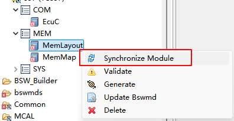
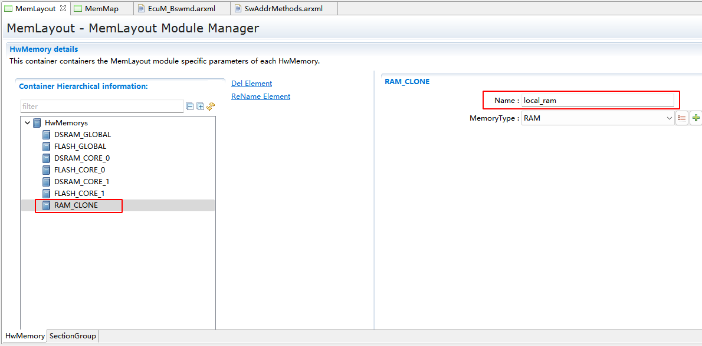

===================
MemLayout
===================

文档信息（Document Information）
=======================================

版本历史（Version History）
-----------------------------------

.. list-table::
   :widths: 10 10 10 10 20
   :header-rows: 1

   * - 日期（Date）
     - 作者（Author）
     - 版本（Version）
     - 状态（Status）
     - 说明（Description）
   * - 2025/02/10
     - lizhi.huang
     - V0.1
     - 发布（Release）
     - 首次发布（First release）
   * - 2025/04/04
     - lizhi.huang
     - V1.0
     - 发布（Release）
     - 正式发布（Official release）

参考文档（Reference Document）
----------------------------------

.. list-table::
   :widths: 10 15 25 10
   :header-rows: 1

   * - 编号（Number）
     - 分类（Classification）
     - 标题（Title）
     - 版本（Version）
   * - [1]
     - Autosar
     - AUTOSAR_CP_SWS_MemoryMapping.pdf
     - R23-11

术语与简写（Terms and Abbreviations）
========================================

术语（Term）
----------------
   .. :align: center   表格内容居中

.. list-table::
   :widths: 20 40
   :header-rows: 1

   * - **术语（Term）**
     - **解释（Explanation）**

   * - 内存映射（Memory Mapping）
     - 代码和数据映射到特定内存段的机制
       
       A mechanism for mapping code and data to specific memory segments

简写（Abbreviation）
---------------------------

None

简介（Introduction）
=============================

MemLayout模块允许通过定义HwMemory，SectionGroup及Section对芯片的内存区域进行管理和划分

The MemLayout module allows for the management and division of a chip's memory regions by defining HwMemory, SectionGroup, and Section.

同时Section可以被MemMap模块引用，向其提供对于Section的链接语法

Meanwhile, Section can be referenced by the MemMap module to provide it with the linking syntax for Section.

MemLayout模块包含以下生成物：

The MemLayout module includes the following generated items:

- 链接文件：需要拷贝到工程的主链接文件，或者被其包含

  Link file: It needs to be copied to the main link file of the project or included

- RAM初始化代码：RAM初始化代码需要手动集成到main函数中

  RAM initialization code: The RAM initialization code needs to be manually integrated into the main function.

功能描述（Function Description）
==================================

MemLayout为非标准的AUTOSAR模块，其设计目的是为了构建MemMap模块与编译器器的桥梁。对芯片的RAM和ROM进行管理，并生成对应的链接文件。

MemLayout is a non-standard AUTOSAR module designed to bridge the MemMap module and compiler. Manage the RAM and ROM of the chip and generate corresponding link files.

特性（Features）
---------------------------------

同步模块（Synchronize Modules）
~~~~~~~~~~~~~~~~~~~~~~~~~~~~~~~~~~~~~~~~~~~~~~~

MemLayout模块可以与EcuC模块进行同步，自动创建芯片的内存区域。

MemLayout can be synchronized with the EcuC module to automatically create chip memory areas.

补充MemoryType信息（Supplementary MemoryType Information）
~~~~~~~~~~~~~~~~~~~~~~~~~~~~~~~~~~~~~~~~~~~~~~~~~~~~~~~~~~~~~~

MemLayout仅创建常用类型的HwMemory，用户需要手动为每一个HwMemory补充其Name属性。

MemLayout only creates commonly used types of HwMemory. Users need to manually supplement the Name property of each HwMemory.

MemoryType信息（MemoryType Information）
~~~~~~~~~~~~~~~~~~~~~~~~~~~~~~~~~~~~~~~~~~~~~~

系统中特殊的内存区域，需要手动创建MemoryType，再将对应SectionGroup进行关联。

Special memory areas in the system need to manually create MemoryType and associate them with SectionGroup.

创建MemoryType（Create MemoryType）
~~~~~~~~~~~~~~~~~~~~~~~~~~~~~~~~~~~~~~~~~~~~~~
系统中特殊的内存区域，需要手动创建MemoryType，再将对应SectionGroup进行关联。

Special memory areas in the system need to manually create MemoryType and associate them with SectionGroup.

偏差（deviation）
---------------------
None

扩展（expansion）
--------------------
None

集成（Integration）
==================================
操作步骤如下:

The operation steps are as follows:

选择ORIENTAIS配置工具MemLayout模块，选择MemLayout模块中的Synchronize Module选项并生成配置文件；

Select the ORIENTIS configuration tool MemLayout module, choose the Synchronize Module option in the MemLayout module, and generate a configuration file;

打开生成的配置文件，补充每个HwMemory的Name属性，创建特殊的MemoryType并关联SectionGroup；

Open the generated configuration file, supplement the Name property of each HwMemory, create special MemoryType and associate SectionGroup;

在IDE中创建新项目；

Create a new project in the IDE;

集成工程对应的链接文件，配置文件和其他源文件；

Integrate the link files, configuration files, and other source files corresponding to the project;

构建项目以生成可执行文件。

Build the project to generate an executable file.

文件列表（File List）
-------------------------

静态文件(static files)
~~~~~~~~~~~~~~~~~~~~~~~~~~~~~~
None

动态文件（Dynamic files）
~~~~~~~~~~~~~~~~~~~~~~~~~~~~~~
各平台的链接文件，需要手动拷贝到工程中。

The link files of each platform need to be manually copied into the project.

错误处理
---------------
None

接口描述（Interface Description）
===================================
None

配置（Configuration）
=========================================

同步模块（Synchronize Modules）
----------------------------------------------------

同步之前需要完成EcuC中关于EcucCoreDefinition的配置

Before synchronization, the configuration of EcucCoreDefinition in EcuC needs to be completed.

   Synchronize MemLayout

.. figure:: ../../../_static/参考手册/MemLayout/HwMemory.png
   :name: HwMemory
   :align: center

   自动创建的HwMemory

   Automatically created HwMemory

.. figure:: ../../../_static/参考手册/MemLayout/SectionGroup.png
   :name: SectionGroup
   :align: center

   自动创建的SectionGroup

   Automatically created SectionGroup

.. note::
      如果同步时，EcuC未配置核信息,则不会创建与核相关的对象
      （If the EcuC is not configured with core information during synchronization, core-related objects will not be created.）

补充MemoryType信息（Supplementary MemoryType Information）
-----------------------------------------------------------------------
需要手动为每一个HwMemory的Name属性命名，其名曾来自主链接文件中的memory名称，例如flash0,dsram0等

It is necessary to manually name the Name property of each HwMemory, and the name comes from the memory names in the main link file, such as flash0, dsram0, etc.

MemLayout仅创建以下几种常用类型的HwMemory：

MemLayout only creates HwMemory of the following common types:

.. list-table::
   :widths: 5 10
   :header-rows: 1

   * - 描述（Description）
     - 名称（Name）

   * - DSRAM_GLOBAL
     - 全局的RAM区域，允许所有核读写，该区域禁止开启DCACHE
       
       A global RAM area that allows reading and writing by all cores; enabling DCACHE is prohibited in this area.

   * - FLASH_GLOBAL
     - 全局的ROM区域
       
       A global ROM area.

   * - DSRAM_CORE_x
     - 所属核的RAM区域，至少保证目标核可直接读写
       
       The RAM area belonging to a core, ensuring that at least the target core can directly read and write to it.

   * - FLASH_CORE_x
     - 所属核的ROM区域
       
       The ROM area belonging to a core.

如果主链接文件中不存在与之对应的memory，可以把多个HwMemory设定为相同名称。例如某个芯片只存在全局sram，而没有每个核的sram，则可以考虑把每个核的HwMemory设定为全局sram的名称

If there is no corresponding memory in the main link file, multiple HwMemory can be set to the same name. For example, if a chip only has global SRAM and no SRAM for each core, you can consider setting the HwMemory of each core to the name of the global SRAM.

创建MemoryType（Create MemoryType）
----------------------------------------------------

系统中特殊的内存区域，需要手动创建MemoryType，再将对应SectionGroup进行关联

Special memory regions in the system require manual creation of MemoryType, and then associating the corresponding SectionGroup with it.

下面以多核场景下的CLONE区域为例

The following takes the CLONE region in a multi-core scenario as an example.

首先创建一个MemoryType，属性Name和主链接文件的对应Memory名称一致

First, create a MemoryType whose Name attribute is consistent with the corresponding Memory name in the main link file.

   创建HwMemory

   Creating HwMemory

将系统中Clone类型的SectionGroup关联到该HwMemory

Associate the Clone-type SectionGroup in the system with this HwMemory.

.. figure:: ../../../_static/参考手册/MemLayout/SectionGroupClone.png
   :name: SectionGroupClone
   :align: center

   SectionGroupClone关联HwMemory

   SectionGroupClone is associated with HwMemory

