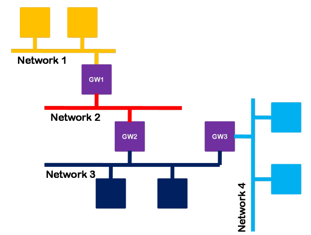
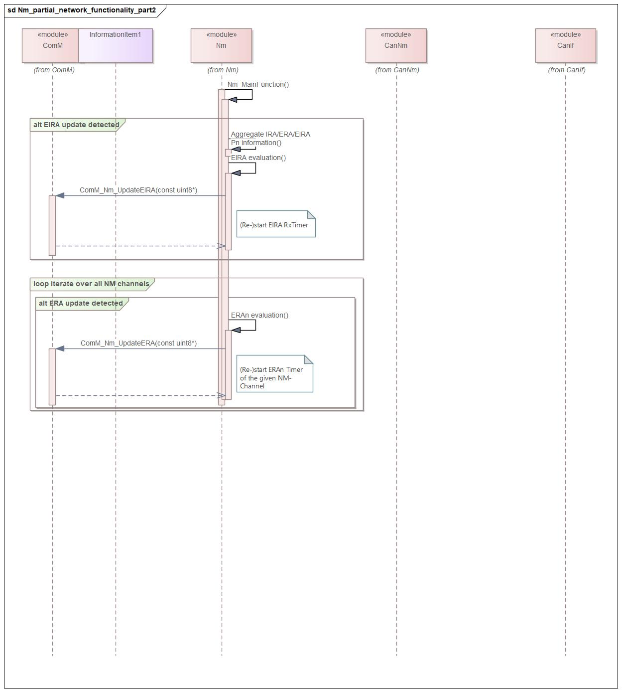
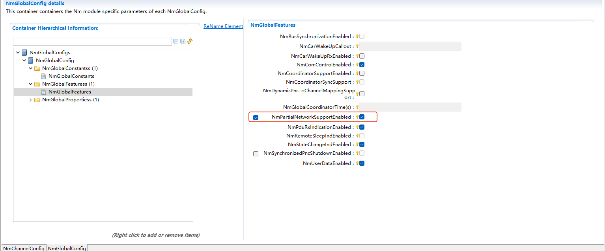

===================
Nm
===================
.. 标题标识符“===”的长度必须要大于其内容的长度，否则会报错，其他标题亦是如此

文档信息（Document Information）
=======================================

版本历史（Version History）
-----------------------------------

.. list-table::
   :widths: 10 10 10 10 20
   :header-rows: 1

   * - 日期（Date）
     - 作者（Author）
     - 版本（Version）
     - 状态（Status）
     - 说明（Description）
   * - 2024/12/05
     - shuangyang.fu
     - V0.1
     - 发布（Release）
     - 首次发布（First release）
   * - 2025/04/04
     - shuangyang.fu
     - V1.0
     - 发布（Release）
     - 正式发布（Official release）

参考文档（Reference Document）
----------------------------------

.. list-table::
   :widths: 10 10 30 10
   :header-rows: 1

   * - 编号（Number）
     - 分类（Classification）
     - 标题（Title）
     - 版本（Version）
   * - 1
     - Autosar
     - AUTOSAR_SWS_NetworkManagementInterface.pdf
     - R23-11
   * - 2
     - Autosar
     - AUTOSAR_SWS_CANNetworkManagement.pdf
     - R23-11 
   * - 3
     - Autosar
     - AUTOSAR_SWS_UDPNetworkManagement.pdf
     - R23-11
   * - 4
     - Autosar
     - AUTOSAR_SWS_PDURouter.pdf
     - R23-11 
   * - 5
     - Autosar
     - AUTOSAR_SWS_COMManager.pdf
     - R23-11  

术语与简写（Terms and Abbreviations）
========================================

术语（Term）
-------------------------------
   .. :align: center   表格内容居中

.. list-table::
   :widths: 10 40
   :header-rows: 1

   * - 术语（Term）
     - 解释（Explanation）

   * - NmCoordCluster
     - 协同睡眠管理的集群，可以关联多个NmChannels。
       
       A cluster for coordinated sleep management can be associated with multiple NmChannels.

   * - NmActiveCoordinator
     - 指示某个channel在协同睡眠集群中是主动协同还是被动协同。
       
       Indicates whether a certain channel is an active coordinator or a passive coordinator in the coordinated sleep cluster.

   * - topmost
     - 如果一个集群内的所有channel的NmActiveCoordinator都配置为TRUE，那么这个集群就被称为topmost，用于嵌套网络。
       
       If the NmActiveCoordinator of all channels in a cluster is configured as TRUE, then this cluster is called topmost, which is used for nested networks.

简写（Abbreviation）
-----------------------------

.. list-table::
   :widths: 10 20 30
   :header-rows: 1

   * - 简写（Abbreviation）
     - 全称（Full name）
     - 解释（Explanation）

   * - ComM
     - Communication management
     - 通讯管理模块

   * - BswM 
     - BSW Mode Manager 
     - 基础软件管理模块

   * - DET 
     - Default Error Tracer 
     - 默认错误检测模块 
  
   * - NM 
     - Network Management  
     - 网络管理  
  
   * - CWU 
     - CWU 
     - 车辆唤醒 

   * - CBV 
     - Control Bit Vector 
     - 控制位向量 

   * - PDU 
     - Protocol Data Unit 
     - 协议数据单元  
  
   * - BusNm
     - Bus Network Management
     - 与总线相关的网络管理模块

   * - PN
     - Partial Network
     - 部分网络

   * - PNC
     - Partial Network Cluster
     - 部分网络集群

   * - ERA
     - External Request Array
     - 外部请求集合

   * - EIRA
     - External and Internal Request Array
     - 外部和内部请求集合

简介（Introduction）
============================

NmIf 的基本功能是作为AUTOSAR ComM 模块和 AUTOSAR 总线特定的
网络管理模块（例如CAN网络管理和以太网网络管理）之间的适配层。 
NmIf 的另一个功能是协调功能，网关ECUs使用的NM协调器功能可以同
步关闭一个或多个总线。当协调集群的所有网络都准备好进入睡眠状态或已经处
于总线睡眠模式时，NM协调器应在所有唤醒的网络上启动协调关机。协调关机
的目的是使集群中唤醒的网络同步关闭。NmIf协调功能的支持是可选的。NmIf
可以仅支持基本功能，也可以同时支持基本功能和NM 协调功能。

The basic function of NmIf is to serve as an adaptation layer between the AUTOSAR ComM module and AUTOSAR bus-specific network management modules (such as CAN network management and Ethernet network management). Another function of NmIf is the coordination function. The NM coordinator function used by gateway ECUs can synchronously shut down one or more buses. When all networks in the coordination cluster are ready to enter the sleep state or are already in the bus sleep mode, the NM coordinator shall initiate a coordinated shutdown on all awakened networks. The purpose of the coordinated shutdown is to synchronously shut down the awakened networks in the cluster. Support for the NmIf coordination function is optional. NmIf can support only the basic function, or both the basic function and the NM coordination function.

.. figure:: ../../../_static/参考手册/Nm/模块层次图.png
   :alt: NmIf 在 AUTOSAR中 的位置
   :align: center

   NmIf 在 AUTOSAR中 的位置

   Position of NmIf in AUTOSAR

功能描述（Functional Description）
==========================================
.. 本章节仅描述模块支持的功能大致情况，不宜做细致描述；更加细致的描述在配置章节，结合配置，从集成角度描述

特性（Features）
------------------------------------------

基本功能（Basic Functions）
~~~~~~~~~~~~~~~~~~~~~~~~~~~~~~~~~~~~~~~~~~~~~~~~~~
Nm 模块完成基本功能的原理是通过调用BusNm模块的接口和ComM模块
的接口来实现的，以网络请求功能为例，ComM需要请求网络时，调用Nm模块
的网络请求API，由Nm模块调用相应总线的网络请求API，从而简化上层对不
同总线类型的网络请求。 

The principle by which the Nm module accomplishes its basic functions is through calling the interfaces of the BusNm module and the ComM module. Taking the network request function as an example, when the ComM needs to request a network, it calls the network request API of the Nm module, and the Nm module then calls the corresponding bus-specific network request API, thereby simplifying network requests from the upper layer for different bus types.

协调关闭算法（Coordinated Shutdown Algorithm）
~~~~~~~~~~~~~~~~~~~~~~~~~~~~~~~~~~~~~~~~~~~~~~~~~~~~
当NmCoordinatorSupportEnabled 使能时，Nm 启用网络协调功能。NM 协调器
功能是一种使用协调算法，来协调所有或ECU所连接的总线的一个或多个独
集群上的NM，使其协调关闭的功能。协调关闭的目的是为了使当前集群中所有
channel 对应的网络尽可能在同一时间关闭网络，如果集群中有的channel还未释
放网络，那么需要保证集群中的所有channel都请求着网络。

When NmCoordinatorSupportEnabled is activated, the Nm enables the network coordination function. The NM coordinator function is a function that uses a coordination algorithm to coordinate the NM on all or one or more independent clusters of buses connected to the ECU, enabling their coordinated shutdown. The purpose of coordinated shutdown is to ensure that all networks corresponding to channels in the current cluster shut down as simultaneously as possible. If some channels in the cluster have not yet released the network, it is necessary to ensure that all channels in the cluster are requesting the network.

协调关闭只能在协调集群的当前唤醒网络中进行协调。已经处于“总线睡眠模式”的网络仍应受到监
控，但不能进行协调。特定于总线的Nm 将通过调用回调函数
Nm_RemoteSleepIndication 和 Nm_RemoteSleepCancellation 指示总线是否准备好
进入睡眠状态。本地ECU 将使用 API 函数 Nm_NetworkRelease 和
Nm_NetworkRequest 指示底层是否准备好进入Readysleep 状态。如果channel被
配置为 SleepMaster，Nm 协调器认为该总线可以随时进入睡眠，而不需要等待
Nm_RemoteSleepIndication 的调用。 

Coordinated shutdown can only be performed on the currently awakened networks in the coordination cluster. Networks already in "bus sleep mode" should still be monitored but cannot be coordinated. The bus-specific Nm will indicate whether the bus is ready to enter sleep mode by calling the callback functions Nm_RemoteSleepIndication and Nm_RemoteSleepCancellation. The local ECU will use the API functions Nm_NetworkRelease and Nm_NetworkRequest to indicate whether the underlying layer is ready to enter the ReadySleep state. If a channel is configured as SleepMaster, the Nm coordinator considers that the bus can enter sleep mode at any time without waiting for the call of Nm_RemoteSleepIndication.

非嵌套子网的协调关闭过程如下：当ComM调用Nm_NetworkRelease函数，
请求释放网络时，这个时候Nm 协调功能并不会调用 BusNm 的
BusNm_NetworkRelease 函数释放网络，而是需要在接收到
Nm_RemoteSleepIndication 的函数通知后，启动协调关闭定时器计时。协调关闭
定时器的作用是，如果各总线配置的从Readysleep状态进入到BusSleep状态的
时间不一样，协调关闭定时器可以做为一个补充定时器，以达到使各总线同步进
入休眠状态。定时器应设置为NmGlobalCoordinatorTime。 如果 NmBusType 未设
置为NM_BUSNM_LOCALNM，则应减去特定通道TSHUTDOWN_CHANNEL
的关闭时间。如果NmGlobalCoordinatorTime 为零，则所有通道的关闭延迟计时
器也应为零。当定时器超时后，Nm会调用BusNm_RequestBusSynchronization函
数，然后调用BusNm_NetworkRelease 函数释放底层网络。 
TSHUTDOWN_CHANNEL时间计算： 
CanNm: Ready Sleep Time + Prepare BusSleep Time 
UdpNm: Ready Sleep Time + Prepare BusSleep Time 

The coordinated shutdown process for non-nested subnets is as follows: When the ComM calls the Nm_NetworkRelease function to request network release, the Nm coordination function does not immediately call the BusNm_NetworkRelease function of BusNm to release the network. Instead, it starts the coordinated shutdown timer after receiving the notification from the Nm_RemoteSleepIndication function. The role of the coordinated shutdown timer is to serve as a supplementary timer if the time taken by each bus to transition from the ReadySleep state to the BusSleep state is different, ensuring that all buses enter the sleep state synchronously. The timer should be set to NmGlobalCoordinatorTime. If NmBusType is not set to NM_BUSNM_LOCALNM, the shutdown time of the specific channel TSHUTDOWN_CHANNEL should be subtracted. If NmGlobalCoordinatorTime is zero, the shutdown delay timers for all channels should also be zero. When the timer expires, the Nm will call the BusNm_RequestBusSynchronization function, followed by the BusNm_NetworkRelease function to release the underlying network.
TSHUTDOWN_CHANNEL time calculation:
CanNm: Ready Sleep Time + Prepare BusSleep Time
UdpNm: Ready Sleep Time + Prepare BusSleep Time

.. figure:: ../../../_static/参考手册/Nm/协调算法.png
   :alt: 协调算法
   :align: center

   协调算法

   Coordination Algorithm

NmCoordinatorSyncSupport使能时，打开嵌套子网功能。

When NmCoordinatorSyncSupport is enabled, the nested subnet function is activated.

   嵌套子网示例图

   Example Diagram of Nested Subnets

嵌套子网的协调关闭过程如下：嵌套子网会有一个topmost协调器负责启动其他协调器协调关闭，topmost在配置上的表现为集群中的所有channel的NmActiveCoordinator都配置为TRUE。（NmActiveCoordinator=TRUE，表示ActiveCoordinator通道, NmActiveCoordinator= FALSE，表示PassiveCoordinator通道。）而其他非topmost的协调器只有一个ActiveCoordinator通道，其余均为PassiveCoordinator通道，当topmost满足协调关闭的条件时，会在它的所有channel上调用BusNm_SetSleepReadyBit函数设置协调睡眠就绪位的值为1（CBV中Bit3=1），当其他协调器在PassiveCoordinator通道上接收到协调关闭的指令时，将在它的所有ActiveCoordinator通道上将指令转发出去。
总结，对于非topmost的节点，嵌套子网的协调集群的所有网络都准备好进入睡眠状态的条件是：

The coordinated shutdown process for nested subnets is as follows: A nested subnet will have a topmost coordinator responsible for initiating coordinated shutdowns by other coordinators. In terms of configuration, a topmost coordinator is characterized by all channels in the cluster having NmActiveCoordinator configured as TRUE. (NmActiveCoordinator = TRUE indicates an ActiveCoordinator channel; NmActiveCoordinator = FALSE indicates a PassiveCoordinator channel.) Other non-topmost coordinators have only one ActiveCoordinator channel, with the rest being PassiveCoordinator channels. When the topmost coordinator meets the conditions for coordinated shutdown, it will call the BusNm_SetSleepReadyBit function on all its channels to set the coordinated sleep ready bit to 1 (Bit3 = 1 in CBV). When other coordinators receive the coordinated shutdown instruction on their PassiveCoordinator channels, they will forward the instruction on all their ActiveCoordinator channels.
In summary, for non-topmost nodes, the conditions for all networks in the coordinated cluster of a nested subnet to be ready to enter the sleep state are:

#. ComM请求释放所有网络。
   
   ComM requests the release of all networks.

#. NmActiveCoordinator =TRUE的channel接收到底层BusNm的RemoteSleepIndication通知指令和CBV中Bit3=1（Bit3为协调睡眠就绪位）的网络管理报文的通知指令。

   The channel with NmActiveCoordinator = TRUE receives the RemoteSleepIndication notification instruction from the underlying BusNm and the notification instruction of the network management message with Bit3 = 1 in CBV (Bit3 is the coordinated sleep ready bit).

#. NmActiveCoordinator =FALSE的channel接收到CBV中Bit3=1（Bit3为协调睡眠就绪位）的网络管理报文的通知指令。

   The channel with NmActiveCoordinator = FALSE receives the notification instruction of the network management message with Bit3 = 1 in CBV (Bit3 is the coordinated sleep ready bit).

#. 如果使能了NmSynchronizingNetwork，要等待底层调用Nm_SynchronizationPoint接口(FrNm网络)。

   If NmSynchronizingNetwork is enabled, wait for the underlying layer to call the Nm_SynchronizationPoint interface (FrNm network).

对于topmost，嵌套子网的协调集群的所有网络都准备好进入睡眠状态的条件是：

For the topmost node, the conditions for all networks in the coordinated cluster of a nested subnet to be ready to enter the sleep state are:

#. ComM请求释放所有网络。

   ComM requests the release of all networks.

#. 接收到底层BusNm的RemoteSleepIndication通知指令。

   Receives the RemoteSleepIndication notification instruction from the underlying BusNm.

#. 如果使能了NmSynchronizingNetwork，要等待底层调用Nm_SynchronizationPoint接口(FrNm网络)。

   If NmSynchronizingNetwork is enabled, wait for the underlying layer to call the Nm_SynchronizationPoint interface (FrNm network).

协调关闭中止（Abort of Coordinated Shutdown）
***************************************************
对于嵌套子网和非嵌套子网，如果该NM协调群集中的任何网络有如下行为则应终止协调关闭：

For both nested and non-nested subnets, the coordinated shutdown shall be aborted if any network in the NM coordination cluster exhibits the following behaviors:

#. BusNm模块调用Nm_RemoteSleepCancellation（），场景为：在BusNm的Normal Operation State或Ready Sleep State又收到报文了。

   The BusNm module calls Nm_RemoteSleepCancellation(), which occurs when a message is received again while BusNm is in the Normal Operation State or Ready Sleep State.

#. 指示Nm_NetworkMode（），场景为：BusNm在Prepare Bus-Sleep Mode下又收到报文了。

   Indicates Nm_NetworkMode(), which occurs when BusNm receives a message again while in the Prepare Bus-Sleep Mode.

#. BusNm模块调用Nm_CoordReadyToSleepCancellation（），场景为：BusNm收到了CBV中Bit3=0的报文。

   The BusNm module calls Nm_CoordReadyToSleepCancellation(), which occurs when BusNm receives a message with Bit3 = 0 in CBV.

#. ComM使用Nm_NetworkRequest（）或Nm_PassiveStartUp（）请求网络，场景为：ComM重新请求通信。

   ComM requests the network using Nm_NetworkRequest() or Nm_PassiveStartUp(), which occurs when ComM re-requests communication.

另外：

In addition:

#. 如果由于任何原因中止了协调关机，则NM Coordinator应调用对所有活动协调通道上的<BusNm>_SetSleepReadyBit的API将NMCoordinatorSleepReady位设置为UNSET（0）。

   If the coordinated shutdown is aborted for any reason, the NM Coordinator shall call the <BusNm>_SetSleepReadyBit API on all active coordination channels to set the NMCoordinatorSleepReady bit to UNSET (0).

#. 如果在被动协调的信道上收到Nm_CoordReadyToSleepCancellation（），则NmCoordinator应通过在所有主动协调的信道上通过调用<BusNm> _SetSleepReadyBit的API将NMCoordinatorSleepReady位设置为UNSET（0）。

   If Nm_CoordReadyToSleepCancellation() is received on a passively coordinated channel, the NmCoordinator shall set the NMCoordinatorSleepReady bit to UNSET (0) by calling the <BusNm>_SetSleepReadyBit API on all actively coordinated channels.

#. 如果协调关机被中止，则NM协调器应针对已经指示“总线睡眠”的所有网络调用ComM_Nm_RestartIndication（）。

   If the coordinated shutdown is aborted, the NM coordinator shall call ComM_Nm_RestartIndication() for all networks that have indicated "bus sleep".

#. 如果协调关机被中止，则在BusNmType未设置为NM_BUSNM_LOCALNM的情况下，NM Coordinator将应向未指示“总线睡眠”的网络请求网络。

   If the coordinated shutdown is aborted, and BusNmType is not set to NM_BUSNM_LOCALNM, the NM Coordinator shall request the network for networks that have not indicated "bus sleep".

#. 如果BusNmType设置为NM_BUSNM_LOCALNM，则Nm应通过调用ComM_Nm_NetworkMode（）来通知ComM网络启动。

   If BusNmType is set to NM_BUSNM_LOCALNM, Nm shall notify ComM of network startup by calling ComM_Nm_NetworkMode().

#. 如果协调算法已中止，则应重新评估保护协调关闭启动的所有条件。

   If the coordination algorithm is aborted, all conditions that protect the initiation of coordinated shutdown shall be re-evaluated.

部分网络管理功能（Partial Network Management Functions）
~~~~~~~~~~~~~~~~~~~~~~~~~~~~~~~~~~~~~~~~~~~~~~~~~~~~~~~~~~~~~~

PN过滤（PN Filtering）
***************************
PNC是Partial Network Cluster的缩写，它是指为了在车辆网络中支持一个或多个车辆功能而由多个ECU构成的集群。PNC 对应的bit数值为1，则表示当前PN网络被请求，为0则表示网络释放。
通过配置参数NmPnFilterMaskByte，Nm可以检测到哪个PN与ECU相关，而哪个与PN不相关。
NmPnFilterMaskByte的每个位具有以下含义：

PNC is the abbreviation of Partial Network Cluster, which refers to a cluster composed of multiple ECUs to support one or more vehicle functions in the vehicle network. A PNC corresponding to a bit value of 1 indicates that the current PN network is requested; a value of 0 indicates that the network is released.
By configuring the parameter NmPnFilterMaskByte, Nm can detect which PN is related to the ECU and which is not.
Each bit of NmPnFilterMaskByte has the following meanings:

0 PN请求与本ECU无关。如果接收的NM PDU中将该位置设置为1，也无法使ECU的通讯栈处于唤醒状态，因为该位的请求与本ECU是无关的。
1 PN请求与本ECU有关。如果已在接收的NM-PDU中将该位置设置为1，则ECU的通信堆栈将保持唤醒状态。
如果至少有一位与本ECU相关的PN请求，那么这条Nm PDU对于Nm来说就是有用的，需要进行处理，如果没有一位与本ECU相关的PN请求，那么这条NM PDU将被忽略。

0: The PN request is irrelevant to the ECU. If this bit is set to 1 in the received NM PDU, it cannot wake up the ECU's communication stack because the request of this bit is irrelevant to the ECU.
1: The PN request is relevant to the ECU. If this bit is set to 1 in the received NM-PDU, the ECU's communication stack will remain in the wake-up state.
If there is at least one PN request related to the ECU, this Nm PDU is useful for Nm and needs to be processed; if there is no PN request related to the ECU, this NM PDU will be ignored.

ERA与EIRA
***************
ERA是指ECU外部的PN请求的聚合，当NmPnEraCalcEnabled使能(配置参数)，表示支持ERA功能。而EIRA是指ECU内部和外部Pn请求的聚合，当NmPnEiraCalcEnabled使能(配置参数)，表示支持EIRA功能。
ERA是在网关节点才使用，此时没有内部的请求，只有不同的Channel对Pn的外部请求，ERA会为每个channel的每个PN位都设置一个监测的定时器，当NmPnResetTime(配置参数)时间内未请求PN，则将该PN的请求状态设置为未请求，
每次请求状态有变化的时候都会通知上层ComM。

ERA refers to the aggregation of PN requests external to the ECU. When NmPnEraCalcEnabled is enabled (a configuration parameter), it indicates support for the ERA function. EIRA refers to the aggregation of internal and external Pn requests of the ECU. When NmPnEiraCalcEnabled is enabled (a configuration parameter), it indicates support for the EIRA function.
ERA is only used in gateway nodes, where there are no internal requests, only external PN requests from different Channels. ERA will set a monitoring timer for each PN bit of each channel. If no PN is requested within the NmPnResetTime (a configuration parameter), the request status of that PN will be set to unrequested, and the upper layer ComM will be notified whenever the request status changes.
EIRA reflects the request and release status of a certain PNC by the current node and other nodes on the network; EIRA does not distinguish between physical Channels, only targeting different PNs. EIRA will set a monitoring timer for each PN bit. If no PN is requested within the NmPnResetTime (a configuration parameter), the request status of that PN will be set to unrequested, and the upper layer ComM will be notified whenever the request status changes.

EIRA体现了当前节点与网络上其他节点对某一个PNC的请求与释放情况；EIRA不区分物理Channel，只针对不同的PN。EIRA会为每个PN位都设置一个监测的定时器，当NmPnResetTime(配置参数)时间内未请求PN，
则将该PN的请求状态设置为未请求，每次请求状态有变化的时候都会通知上层ComM。

EIRA reflects the status of requests for and releases of a specific PNC by the current node and other nodes on the network; EIRA does not distinguish between physical channels and only targets different PNs. EIRA will set a monitoring timer for each PN bit. If no PN is requested within the duration of NmPnResetTime (a configuration parameter), the request status of that PN will be set to "unrequested". The upper-layer ComM will be notified whenever there is a change in the request status.

具体流程可参考下图：

Please refer to the following figure for the specific process:

.. figure:: ../../../_static/参考手册/Nm/Nm_partial_network_functionality_part1.png
   :alt: Nm_partial_network_functionality_part1
   :align: center

   Nm_partial_network_functionality_part1

   Nm_partial_network_functionality_part2

偏差（Deviations）
-----------------------------------------
.. 有序列表示例

#. 不支持NmSynchronizedPncShutdown

   因为该功能还未开发，将在后续版本中进行开发。

   Does not support NmSynchronizedPncShutdown

   This function has not yet been developed and will be developed in subsequent versions.

扩展（Expansion）
-------------------------

None

集成（Integration）
=========================

文件列表（File List）
----------------------------------

静态文件（Static Files）
~~~~~~~~~~~~~~~~~~~~~~~~~~~~~~~~~~~~~~

.. list-table::
   :widths: 10 30
   :header-rows: 1

   * - 文件（File）
     - 描述（Description）
   
   * - Nm.h
     - Nm模块头文件，通过加载该头文件访问Nm公开的函数和数据类型
       
       Nm module header files, through which the public functions and data types of Nm can be accessed by including the header files.

   * - NmStack_Types.h
     - Nm外部数据类型
       
       Nm external data types

   * - Nm_Internal.h
     - Nm模块运行时类型定义，内部宏定义头文件
       
       Header file for Nm module runtime type definitions and internal macro definitions

   * - Nm.c
     - Nm模块实现源文件，各API实现在该文件中
       
       Nm module implementation source file, where all API implementations are located

动态文件（Dynamic Files）
~~~~~~~~~~~~~~~~~~~~~~~~~~~~~~~~~~~~~

.. list-table::
   :widths: 10 30
   :header-rows: 1

   * - 文件（File）
     - 描述（Description）
   
   * - Nm_Cfg.h
     - 用于定义Nm模块预编译时用到的宏。
       
       Used to define macros used by the Nm module during pre-compilation.

   * - Nm_Lcfg.c
     - Link time配置参数
       
       Link time configuration parameters

   * - Nm_PBcfg.c
     - Post build配置参数
       
       Post build configuration parameters

错误处理（Error handling）
--------------------------------

开发错误（Development errors）
~~~~~~~~~~~~~~~~~~~~~~~~~~~~~~~~~~
.. list-table:: 
   :widths: 20 10 30
   :header-rows: 1

   * - Error code
     - Value[hex]
     - Description

   * - NM_E_UNINIT
     - 0x00
     - API service used without Nm interface initialization. 

   * - NM_E_INVALID_CHANNEL
     - 0x01
     - API Service called with wrong parameter but not with NULL-pointer.

   * - NM_E_PARAM_POINTER
     - 0x02
     - API service called with a NULL pointer.

   * - NM_E_ALREADY_INITIALIZED
     - 0x03
     - Nm_Init was called multiple times.

   * - NM_E_INVALID_PARTITION_CONTEXT
     - 0x0F
     - API service used on wrong partitions.

   * - NM_E_NO_ERROR
     - 0xFF
     - API service called with no errors.

产品错误（Product Errors）
~~~~~~~~~~~~~~~~~~~~~~~~~~~~~~~~~~~

None

运行时错误（Runtime error）
~~~~~~~~~~~~~~~~~~~~~~~~~~~~~~~~~~

None

接口描述（Interface Description）
=====================================

.. 目前能够自动生成的有类型定义，普通函数，回调函数。
.. 有些模块的API来自多个头文件，需要自行裁剪合并
.. 引用接口描述。来自于code->doxygen->xml->rst

.. include:: Nm_h_api.rst
.. include:: Nm_Cbk_h_api.rst
  
  
配置函数（Configuration Functions）
------------------------------------------

Nm_MainFunction
~~~~~~~~~~~~~~~~~~~~~~~~~~~~~~~~~~~~~~~~~~~~~~~~~~~~~~~~~~~~~~~~~~~~~~~~~~~~~~~~~~~~

.. code::

   void Nm_MainFunction_<NmChannel.ShortName>(void)

This function shall perform the processing of the AUTOSAR ComM activities that are not directly initiated by
the calls. e.g. from the RTE. There shall be one dedicated Main Function for each channel of ComM.

**Sync/Async**
   Synchronous

**Reentrancy**
   Reentrant

**Return type**
   void

依赖的服务（Dependent Services）
----------------------------------------

强制接口（Mandatory Interfaces）
~~~~~~~~~~~~~~~~~~~~~~~~~~~~~~~~~~~~~~~~~~~~~~~~
.. 可选的章节，根据模块实际情况确定

.. list-table::
   :widths: 10 5 30
   :header-rows: 1

   * - API Function
     - Header File
     - Description

   * - ComM_Nm_BusSleepMode  
     - ComM_Nm.h
     - Notification that the network management has entered Bus-Sleep Mode. This callback function should perform a transition of the hardware and
       transceiver to bus-sleep mode.

   * - ComM_Nm_NetworkMode 
     - ComM_Nm.h
     - Notification that the network management has entered Network Mode.

   * - ComM_Nm_NetworkStartIndication 
     - ComM_Nm.h
     - Indication that a NM-message has been received in the Bus Sleep Mode, what indicates that some nodes in the network have already entered the Network Mode.

   * - ComM_Nm_PrepareBusSleepMode 
     - ComM_Nm.h
     - Notification that the network management has entered Prepare Bus-Sleep Mode. Reentrancy: Reentrant (but not for the same NM-Channel).

   * - ComM_Nm_RestartIndication
     - ComM_Nm.h
     - If NmIf has started to shut down the coordinated busses, AND not all coordinated busses have indicated bus sleep state, AND on at least on one of the coordinated busses NM is restarted, THEN the
       NM Interface shall call the callback function ComM_Nm_RestartIndication with the nmNetworkHandle of the channels which have already indicated bus sleep state.

可选接口（Optional Interfaces）
~~~~~~~~~~~~~~~~~~~~~~~~~~~~~~~~~~~~
.. 可选的章节，根据模块实际情况确定
.. 格式同强制接口

.. list-table::
   :widths: 10 5 30
   :header-rows: 1

   * - API Function
     - Header File
     - Description

   * - BswM_Nm_CarWakeUpIndication
     - BswM_ComM.h
     - Function called by Nm to indicate a CarWakeup.

   * - CanNm_PassiveStartUp
     - CanNm.h 
     - Passive startup of the AUTOSAR CAN NM. It triggers the transition from Bus-Sleep Mode or Prepare Bus Sleep Mode to the Network Mode in Repeat Message State.
       Caveats: CanNm is initialized correctly.

   * - Com_SendSignal 
     - Com.h
     - The service Com_SendSignal updates the signal object identified by SignalId with the signal referenced by the SignalDataPtr parameter.

   * - Det_ReportError 
     - Det.h
     - Service to report development errors.

   * - FrNm_PassiveStartUp  
     - FrNm.h 
     - Initiates the Passive Startup of the FlexRay NM.

   * - J1939Nm_PassiveStartUp   
     - J1939Nm.h 
     - Passive startup of the NM. It triggers the transition from Bus-Sleep Mode to the Network Mode without requesting the network.

   * - UdpNm_PassiveStartUp   
     - UdpNm.h 
     - Passive startup of the AUTOSAR UdpNm. It triggers the transition from Bus-Sleep Mode or Prepare Bus Sleep Mode to the Network Mode in Repeat Message State.
       Caveats: UdpNm is initialized correctly.

配置接口（Configuration Interfaces）
~~~~~~~~~~~~~~~~~~~~~~~~~~~~~~~~~~~~~~~
.. list-table::
   :widths: 10 5 30
   :header-rows: 1

   * - API Function
     - Header File
     - Description

   * - SchM_Enter_Nm_Coordinator
     - SchM_Nm.h
     - Enter exclusive area.

配置（configuration）
===================================

协同睡眠配置（Coordinated Sleep Configuration）
-------------------------------------------------
 .. attention::

   虽然可以配置多个协同睡眠集群CoordinateCluster，但是同一个Nm通道只能被协同睡眠集群Cluster关联一次。 

   Although multiple coordinated sleep clusters (CoordinateCluster) can be configured, the same Nm channel can only be associated with a coordinated sleep cluster (Cluster) once.

 .. important::

   一个协同睡眠集群CoordinateCluster至少有一个NmActiveCoordinator为TRUE的通道。 如果一个协同睡眠集群全部都是active协调的通道，则该集群称为topMost。如果一个协同睡眠集群存在有非active协调（即passive）的通道，则该集群为非topMost。

   A coordinated sleep cluster (CoordinateCluster) must have at least one channel with NmActiveCoordinator set to TRUE. If all channels in a coordinated sleep cluster are active coordinator channels, the cluster is called topMost.
   If a coordinated sleep cluster contains non-active coordinator (i.e., passive) channels, the cluster is non-topMost.

在配置通道之前，需要进行Nm的全局配置：

Before configuring channels, global configuration of Nm is required:

 .. figure:: ../../../_static/参考手册/Nm/Nm全局配置coordinate.png
   :alt: Nm全局配置支持协同睡眠
   :align: center

   Nm全局配置支持协同睡眠

   Nm global configuration supports coordinated sleep

 .. attention::

   NmCoordinatorSupportEnabled 为使能协同睡眠的开关， NmCoordinatorSyncSupport 为是否开启协同睡眠嵌套。 协同睡眠嵌套指多个ECU的协同睡眠网络拓扑，开启之后，协同便不仅是在基于通道，而是基于ECU， 简而言之就是保证多个ECU上的通道同时睡眠。

   NmCoordinatorSupportEnabled is the switch to enable coordinated sleep, and NmCoordinatorSyncSupport is whether to enable coordinated sleep nesting. Coordinated sleep nesting refers to the coordinated sleep network topology of multiple ECUs. When enabled, coordination is no longer based only on channels but on ECUs. In short, it ensures that channels on multiple ECUs sleep simultaneously.

协同睡眠意味着需要配置多路Nm通道，将其关联到相应的ComM通道上，并且需要明确通道的协调模式是否为NmActiveCoordinator，明确所属的NmCoordClusterIndex，
以及是否是NmChannelSleepMaster。

Coordinated sleep requires configuring multiple Nm channels, associating them with corresponding ComM channels, and clearly defining whether the channel's coordination mode is NmActiveCoordinator, specifying the associated NmCoordClusterIndex, and whether it is a NmChannelSleepMaster.

 .. figure:: ../../../_static/参考手册/Nm/通道配置1.png
   :alt: 通道配置1
   :align: center

   通道配置1

   Channel configuration 1

 .. figure:: ../../../_static/参考手册/Nm/通道配置3.png
   :alt: 通道配置2
   :align: center

   通道配置2

   Channel configuration 2

 .. figure:: ../../../_static/参考手册/Nm/通道配置2.png
   :alt: 通道配置3
   :align: center

   通道配置3

   Channel configuration 3

 .. attention::

   通道3配置了NmChannelSleepMaster。这个参数应该被设置来指明这个网络的睡眠是否可以仅由本地节点自己决定，并且没有其他节点可以干预它。
   如果这个参数被设置为TRUE，Nm应该假定该信道总是准备好进入睡眠状态，并且这个信道的Nm不会发出
   Nm_RemoteSleepIndication或Nm_RemoteSleepCancellation的调用。如果这个参数被设置为FALSE，Nm假定该网络没有准备好睡眠，
   直到已经发出了Nm_RemoteSleepIndication的调用。

   Channel 3 is configured with NmChannelSleepMaster. This parameter should be set to indicate whether the sleep of this network can be determined solely by the local node itself, with no other nodes able to intervene.
   If this parameter is set to TRUE, Nm shall assume that the channel is always ready to enter sleep mode, and the Nm of this channel will not issue calls to Nm_RemoteSleepIndication or Nm_RemoteSleepCancellation. If this parameter is set to FALSE, Nm assumes that the network is not ready to sleep until the Nm_RemoteSleepIndication call has been issued.

部分网络管理配置（Partial Network Management Configuration）
----------------------------------------------------------------

首先需要使能部分网络管理功能：

First, it is necessary to enable the partial network management function:

Nm的全局配置：

Global configuration of Nm:

   Nm全局配置支持部分网络管理

   Nm global configuration supports partial network management

针对每个通道，也需要进行一下配置：

For each channel, the following configurations are also required:

通道配置：

Channel configuration:

.. figure:: ../../../_static/参考手册/Nm/NmPartialNetworkSupportEnabled1.png
   :alt: 通道配置pn
   :align: center

   通道配置pn

   Channel configuration pn

同时需要配置需要过滤的Pnc Bit：

It is also necessary to configure the Pnc Bit that needs to be filtered:

.. figure:: ../../../_static/参考手册/Nm/NmPnFilterMaskByte.png
   :alt: 通道配置NmPnFilterMaskByte
   :align: center

   通道配置NmPnFilterMaskByte

   Channel configuration NmPnFilterMaskByte