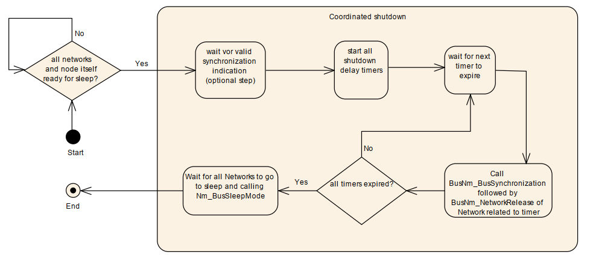
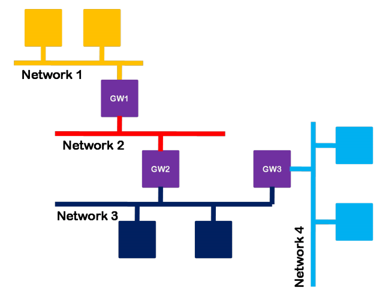
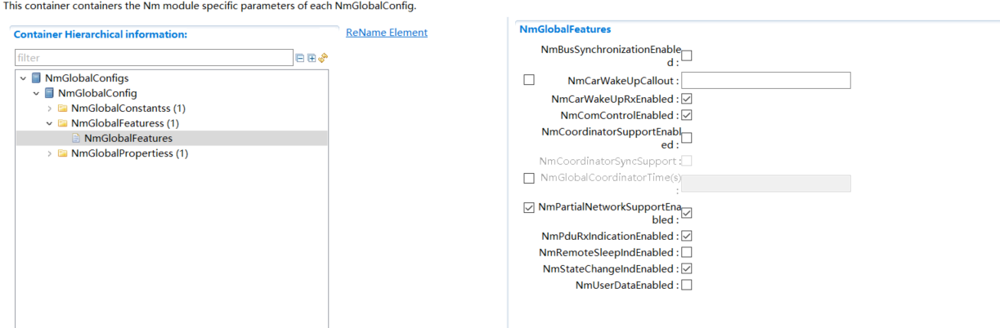

==============
NmIf
==============

**缩写词注解**

+------------+---------------------------+----------------------------+
| **缩写词** | **英文全称**              | **中文解释**               |
+------------+---------------------------+----------------------------+
| API        | Application Programming   | 应用程序接口               |
|            | Interface                 |                            |
+------------+---------------------------+----------------------------+
| ComM       | Communication management  | 通讯管理模块               |
+------------+---------------------------+----------------------------+
| BswM       | BSW Mode Manager          | 基础软件管理模块           |
+------------+---------------------------+----------------------------+
| DET        | Default Error Tracer      | 默认错误检测模块           |
+------------+---------------------------+----------------------------+
| NM         | Network Management        | 网络管理                   |
+------------+---------------------------+----------------------------+
| NmIf       | Network Management        | 网络管理接口模块           |
|            | Interface                 |                            |
+------------+---------------------------+----------------------------+
| PDU        | Protocol Data Unit        | 协议数据单元               |
+------------+---------------------------+----------------------------+
| CanNm      | Can Network Management    | Can网络管理模块            |
+------------+---------------------------+----------------------------+
| UdpNm      | UDP Network Management    | UdpNm网络管理模块          |
+------------+---------------------------+----------------------------+
| FrNm       | FlexRay Network           | FlexRay网络管理模块        |
|            | Management                |                            |
+------------+---------------------------+----------------------------+
| BusNm      | Bus Network Management    | 总线网络管理模块           |
+------------+---------------------------+----------------------------+
| CBV        | Control Bit Vector        | 控制位向量                 |
+------------+---------------------------+----------------------------+
| CWU        | Car Wakeup                | 车辆唤醒                   |
+------------+---------------------------+----------------------------+

简介
====

NmIf的基本功能是作为AUTOSAR
ComM模块和AUTOSAR总线特定的网络管理模块（例如CAN网络管理和以太网网络管理）之间的适配层。

NmIf的另一个功能是协调功能，网关ECUs使用的NM协调器功能可以同步关闭一个或多个总线。当协调集群的所有网络都准备好进入睡眠状态或已经处于总线睡眠模式时，NM协调器应在所有唤醒的网络上启动协调关机。协调关机的目的是使集群中唤醒的网络同步关闭。NmIf协调功能的支持是可选的。NmIf可以仅支持基本功能，也可以同时支持基本功能和NM
协调功能。

|image1|

图 NmIf在AUTOSAR中的位置

参考资料
--------

[1] AUTOSAR_SWS_NetworkManagementInterface.pdf，R19-11

[2] AUTOSAR_SWS_CANNetworkManagement.pdf，R19-11

[3] AUTOSAR_SWS_UDPNetworkManagement.pdf，R19-11

[4] AUTOSAR_SWS_PDURouter.pdf，R19-11

[5] AUTOSAR_SWS_COMManager.pdf，R19-11

功能描述
========

基本功能
--------

Nm模块完成基本功能的原理是通过调用BusNm模块的接口和ComM模块的接口来实现的，以网络请求功能为例，ComM需要请求网络时，调用Nm模块的网络请求API，由Nm模块调用相应总线的网络请求API，从而简化上层对不同总线类型的网络请求。

协调关闭算法
------------

当NmCoordinatorSupportEnabled使能时，Nm启用网络协调功能。NM协调器功能是一种使用协调算法，来协调所有或ECU所连接的总线的一个或多个独集群上的NM，使其协调关闭的功能。协调关闭的目的是为了使当前集群中所有channel对应的网络尽可能在同一时间关闭网络，如果集群中有的channel还未释放网络，那么需要保证集群中的所有channel都请求着网络。协调关闭只能在协调集群的当前唤醒网络中进行协调。已经处于“总线睡眠模式”的网络仍应受到监控，但不能进行协调。特定于总线的Nm将通过调用回调函数Nm_RemoteSleepIndication和Nm_RemoteSleepCancellation指示总线是否准备好进入睡眠状态。本地ECU将使用API函数Nm_NetworkRelease和Nm_NetworkRequest指示底层是否准备好进入Readysleep状态。如果channel被配置为SleepMaster，Nm协调器认为该总线可以随时进入睡眠，而不需要等待Nm_RemoteSleepIndication的调用。

非嵌套子网的协调关闭过程如下：当ComM调用Nm_NetworkRelease函数，请求释放网络时，这个时候Nm协调功能并不会调用BusNm的BusNm_NetworkRelease函数释放网络，而是需要在接收到Nm_RemoteSleepIndication的函数通知后，启动协调关闭定时器计时。协调关闭定时器的作用是，如果各总线配置的从Readysleep状态进入到BusSleep状态的时间不一样，协调关闭定时器可以做为一个补充定时器，以达到使各总线同步进入休眠状态。定时器应设置为NmGlobalCoordinatorTime。
如果NmBusType未设置为NM_BUSNM_LOCALNM，则应减去特定通道TSHUTDOWN_CHANNEL的关闭时间。如果NmGlobalCoordinatorTime为零，则所有通道的关闭延迟计时器也应为零。当定时器超时后，Nm会调用BusNm_RequestBusSynchronization函数，然后调用BusNm_NetworkRelease函数释放底层网络。

TSHUTDOWN_CHANNEL时间计算：

CanNm: Ready Sleep Time + Prepare BusSleep Time

UdpNm: Ready Sleep Time + Prepare BusSleep Time

|image2|

图2-1协调算法

NmCoordinatorSyncSupport使能时，打开嵌套子网功能。

|image3|

图2-2嵌套子网示例图

嵌套子网的协调关闭过程如下：嵌套子网会有一个topmost协调器负责启动其他协调器协调关闭，topmost在配置上的表现为集群中的所有channel的NmActiveCoordinator都配置为TRUE。（NmActiveCoordinator=TRUE，表示ActiveCoordinator通道,
NmActiveCoordinator=
FALSE，表示PassiveCoordinator通道。）而其他非topmost的协调器只有一个ActiveCoordinator通道，其余均为PassiveCoordinator通道，当topmost满足协调关闭的条件时，会在它的所有channel上调用BusNm_SetSleepReadyBit函数设置协调睡眠就绪位的值为1（CBV中Bit3=1），当其他协调器在PassiveCoordinator通道上接收到协调关闭的指令时，将在它的所有ActiveCoordinator通道上将指令转发出去。

总结，对于非topmost的节点，嵌套子网的协调集群的所有网络都准备好进入睡眠状态的条件是：

1.ComM请求释放所有网络。

2.NmActiveCoordinator
=TRUE的channel接收到底层BusNm的RemoteSleepIndication通知指令和CBV中Bit3=1（Bit3为协调睡眠就绪位）的网络管理报文的通知指令。

3. NmActiveCoordinator
=FALSE的channel接收到CBV中Bit3=1（Bit3为协调睡眠就绪位）的网络管理报文的通知指令。

4.如果使能了NmSynchronizingNetwork，要等待底层调用Nm_SynchronizationPoint接口(FrNm网络)。

对于topmost，嵌套子网的协调集群的所有网络都准备好进入睡眠状态的条件是：

1.ComM请求释放所有网络。

2.接收到底层BusNm的RemoteSleepIndication通知指令。

3.如果使能了NmSynchronizingNetwork，要等待底层调用Nm_SynchronizationPoint接口(FrNm网络)。

协调关闭中止
~~~~~~~~~~~~

对于嵌套子网和非嵌套子网，如果该NM协调群集中的任何网络有如下行为则应终止协调关闭：

1.BusNm模块调用Nm_RemoteSleepCancellation（），场景为：在BusNm的Normal
Operation State或Ready Sleep State又收到报文了。

2.指示Nm_NetworkMode（），场景为：BusNm在Prepare Bus-Sleep
Mode下又收到报文了。

3.BusNm模块调用Nm_CoordReadyToSleepCancellation（），场景为：BusNm收到了CBV中Bit3=0的报文。

4.ComM使用Nm_NetworkRequest（）或Nm_PassiveStartUp（）请求网络，场景为：ComM重新请求通信。

如果由于任何原因中止了协调关机，则NM
Coordinator应调用对所有活动协调通道上的<BusNm>_SetSleepReadyBit的API将NMCoordinatorSleepReady位设置为UNSET（0）。

如果在被动协调的信道上收到Nm_CoordReadyToSleepCancellation（），则NmCoordinator应通过在所有主动协调的信道上通过调用<BusNm>
\_SetSleepReadyBit的API将NMCoordinatorSleepReady位设置为UNSET（0）。

如果协调关机被中止，则NM协调器应针对已经指示“总线睡眠”的所有网络调用ComM_Nm_RestartIndication（）。

如果协调关机被中止，则在BusNmType未设置为NM_BUSNM_LOCALNM的情况下，NM
Coordinator将应向未指示“总线睡眠”的网络请求网络。

如果BusNmType设置为NM_BUSNM_LOCALNM，则Nm应通过调用ComM_Nm_NetworkMode（）来通知ComM网络启动。

如果协调算法已中止，则应重新评估保护协调关闭启动的所有条件。

源文件描述
==========

表 NmIf组件文件描述

+-------------------+--------------------------------------------------+
| **文件**          | **说明**                                         |
+-------------------+--------------------------------------------------+
| Nm_Cfg.h          | 用于定义Nm模块预编译时用到的宏。                 |
+-------------------+--------------------------------------------------+
| Nm_Lcfg.c         | Link time配置参数                                |
+-------------------+--------------------------------------------------+
| Nm_PBcfg.c        | Post build配置参数                               |
+-------------------+--------------------------------------------------+
| Nm_Internal.h     | Nm模块运行时类型定义，内部宏定义头文件           |
+-------------------+--------------------------------------------------+
| Nm_MemMap.h       | Nm模块函数和变量存储位置定义文件。               |
+-------------------+--------------------------------------------------+
| NmStack_Types.h   | Nm外部数据类型                                   |
+-------------------+--------------------------------------------------+
| Nm_Cbk.h          | Nm回调函数声明文件                               |
+-------------------+--------------------------------------------------+
| Nm.h              | Nm模块头                                         |
|                   | 文件，通过加载该头文件访问Nm公开的函数和数据类型 |
+-------------------+--------------------------------------------------+
| Nm.c              | Nm模块实现源文件，各API实现在该文件中            |
+-------------------+--------------------------------------------------+

|image4|

图 NmIf组件文件交互关系图

API接口
=======

类型定义
--------

Nm_ModeType函数定义
~~~~~~~~~~~~~~~~~~~

+-----------+----------------------------------------------------------+
| 名称      | Nm_ModeType                                              |
+-----------+----------------------------------------------------------+
| 类型      | Enumeration                                              |
+-----------+----------------------------------------------------------+
| 范围      | NM_MODE_BUS_SLEEP 休眠模式                               |
|           |                                                          |
|           | NM_MODE_PREPARE_BUS_SLEEP 准备休眠模式                   |
|           |                                                          |
|           | NM_MODE_SYNCHRONIZE 同步模式                             |
|           |                                                          |
|           | NM_MODE_NETWORK 网络模式                                 |
+-----------+----------------------------------------------------------+
| 描述      | 网络管理的运行模式。                                     |
+-----------+----------------------------------------------------------+

Nm_StateType类型定义
~~~~~~~~~~~~~~~~~~~~

+-----------+----------------------------------------------------------+
| 名称      | Nm_StateType                                             |
+-----------+----------------------------------------------------------+
| 类型      | Enumeration                                              |
+-----------+----------------------------------------------------------+
| 范围      | NM_STATE_UNINIT 未初始化                                 |
|           |                                                          |
|           | NM_STATE_BUS_SLEEP 总线休眠状态                          |
|           |                                                          |
|           | NM_STATE_PREPARE_BUS_SLEEP 准备总线休眠状态              |
|           |                                                          |
|           | NM_STATE_READY_SLEEP 准备睡眠状态                        |
|           |                                                          |
|           | NM_STATE_NORMAL_OPERATION 正常操作状态                   |
|           |                                                          |
|           | NM_STATE_REPEAT_MESSAGE 重复消息状态                     |
|           |                                                          |
|           | NM_STATE_SYNCHRONIZE 同步状态                            |
|           |                                                          |
|           | NM_STATE_OFFLINE 下线状态                                |
+-----------+----------------------------------------------------------+
| 描述      | 网络管理状态机的状态。                                   |
+-----------+----------------------------------------------------------+

Nm_BusNmType类型定义
~~~~~~~~~~~~~~~~~~~~

+-----------+----------------------------------------------------------+
| 名称      | Nm_BusNmType                                             |
+-----------+----------------------------------------------------------+
| 类型      | Enumeration                                              |
+-----------+----------------------------------------------------------+
| 范围      | NM_BUSNM_CANNM Can网络管理类型                           |
|           |                                                          |
|           | NM_BUSNM_FRNM FR网络管理类型                             |
|           |                                                          |
|           | NM_BUSNM_UDPNM Udp网络网络类型                           |
|           |                                                          |
|           | NM_BUSNM_GENERICNM 通用网络管理类型                      |
|           |                                                          |
|           | NM_BUSNM_UNDEF 未定义的网络管理类型                      |
|           |                                                          |
|           | NM_BUSNM_J1939NM J1939网络管理类型                       |
|           |                                                          |
|           | NM_BUSNM_LOCALNM 本地网络管理类型                        |
+-----------+----------------------------------------------------------+
| 描述      | BusNm类型                                                |
+-----------+----------------------------------------------------------+

Nm_ConfigType类型定义
~~~~~~~~~~~~~~~~~~~~~

+-----------+----------------------------------------------------------+
| 名称      | Nm_ConfigType                                            |
+-----------+----------------------------------------------------------+
| 类型      | Structure                                                |
+-----------+----------------------------------------------------------+
| 范围      | --                                                       |
+-----------+----------------------------------------------------------+
| 描述      | Nm 模块的配置数据结构。                                  |
+-----------+----------------------------------------------------------+

输入函数描述
------------

+----------------------------------+-----------------------------------+
| **输入模块**                     | **API**                           |
+----------------------------------+-----------------------------------+
| Det                              | Det_ReportError                   |
+----------------------------------+-----------------------------------+
| ComM                             | ComM_Nm_BusSleepMode              |
+----------------------------------+-----------------------------------+
|                                  | ComM_Nm_NetworkMode               |
+----------------------------------+-----------------------------------+
|                                  | ComM_Nm_NetworkStartIndication    |
+----------------------------------+-----------------------------------+
|                                  | ComM_Nm_PrepareBusSleepMode       |
+----------------------------------+-----------------------------------+
|                                  | ComM_Nm_RestartIndication         |
+----------------------------------+-----------------------------------+
| BswM                             | BswM_Nm_CarWakeUpIndication       |
+----------------------------------+-----------------------------------+
| CanNm                            | CanNm_PassiveStartUp              |
+----------------------------------+-----------------------------------+
| Com                              | Com_SendSignal                    |
+----------------------------------+-----------------------------------+
| FrNm                             | FrNm_PassiveStartUp               |
+----------------------------------+-----------------------------------+
| J1939Nm                          | J1939Nm_PassiveStartUp            |
+----------------------------------+-----------------------------------+
| UdpNm                            | UdpNm_PassiveStartUp              |
+----------------------------------+-----------------------------------+

静态接口函数定义
----------------

Nm_Init函数定义
~~~~~~~~~~~~~~~

+-------------+-------------------+---------+-------------------------+
| 函数名称：  | Nm_Init           |         |                         |
+-------------+-------------------+---------+-------------------------+
| 函数原型：  | | void Nm_Init (  |         |                         |
|             | | const           |         |                         |
|             |   Nm_ConfigType\* |         |                         |
|             |   ConfigPtr       |         |                         |
|             |                   |         |                         |
|             | )                 |         |                         |
+-------------+-------------------+---------+-------------------------+
| 服务编号：  | 0x00              |         |                         |
+-------------+-------------------+---------+-------------------------+
| 同步/异步： | 同步              |         |                         |
+-------------+-------------------+---------+-------------------------+
| 是          | 不可重入          |         |                         |
| 否可重入：  |                   |         |                         |
+-------------+-------------------+---------+-------------------------+
| 输入参数：  | ConfigPtr         | 值域：  | 指向所选配置集的指针    |
+-------------+-------------------+---------+-------------------------+
| 输          | 无                |         |                         |
| 入输出参数: |                   |         |                         |
+-------------+-------------------+---------+-------------------------+
| 输出参数：  | 无                |         |                         |
+-------------+-------------------+---------+-------------------------+
| 返回值：    | 无                |         |                         |
+-------------+-------------------+---------+-------------------------+
| 功能概述：  | 完成对N           |         |                         |
|             | m模块的初始化处理 |         |                         |
+-------------+-------------------+---------+-------------------------+

Nm_PassiveStartUp函数定义
~~~~~~~~~~~~~~~~~~~~~~~~~

+-------------+-------------------+---------+-------------------------+
| 函数名称：  | Nm_PassiveStartUp |         |                         |
+-------------+-------------------+---------+-------------------------+
| 函数原型：  | Std_ReturnType    |         |                         |
|             | Nm_PassiveStartUp |         |                         |
|             | (                 |         |                         |
|             | NetworkHandleType |         |                         |
|             | NetworkHandle     |         |                         |
|             | )                 |         |                         |
+-------------+-------------------+---------+-------------------------+
| 服务编号：  | 0x01              |         |                         |
+-------------+-------------------+---------+-------------------------+
| 同步/异步： | 非同步            |         |                         |
+-------------+-------------------+---------+-------------------------+
| 是          | 可重入（同        |         |                         |
| 否可重入：  | 一网络不可重入）  |         |                         |
+-------------+-------------------+---------+-------------------------+
| 输入参数：  | NetworkHandle     | 值域：  | Nm通道的标识            |
+-------------+-------------------+---------+-------------------------+
| 输          | 无                |         |                         |
| 入输出参数: |                   |         |                         |
+-------------+-------------------+---------+-------------------------+
| 输出参数：  | 无                |         |                         |
+-------------+-------------------+---------+-------------------------+
| 返回值：    | E_OK：没有错误    |         |                         |
|             |                   |         |                         |
|             | E_NOT_OK：网络管  |         |                         |
|             | 理的被动启动失败  |         |                         |
+-------------+-------------------+---------+-------------------------+
| 功能概述：  | 调用<BusN         |         |                         |
|             | m>_PassiveStartUp |         |                         |
+-------------+-------------------+---------+-------------------------+

Nm_NetworkRequest函数定义
~~~~~~~~~~~~~~~~~~~~~~~~~

+-------------+-------------------+---------+-------------------------+
| 函数名称：  | Nm_NetworkRequest |         |                         |
+-------------+-------------------+---------+-------------------------+
| 函数原型：  | Std_ReturnType    |         |                         |
|             | Nm_NetworkRequest |         |                         |
|             | (                 |         |                         |
|             | NetworkHandleType |         |                         |
|             | NetworkHandle     |         |                         |
|             | )                 |         |                         |
+-------------+-------------------+---------+-------------------------+
| 服务编号：  | 0x02              |         |                         |
+-------------+-------------------+---------+-------------------------+
| 同步/异步： | 非同步            |         |                         |
+-------------+-------------------+---------+-------------------------+
| 是          | 可重入（同        |         |                         |
| 否可重入：  | 一网络不可重入）  |         |                         |
+-------------+-------------------+---------+-------------------------+
| 输入参数：  | NetworkHandle     | 值域：  | Nm通道的标识            |
+-------------+-------------------+---------+-------------------------+
| 输          | 无                |         |                         |
| 入输出参数: |                   |         |                         |
+-------------+-------------------+---------+-------------------------+
| 输出参数：  | 无                |         |                         |
+-------------+-------------------+---------+-------------------------+
| 返回值：    | E_OK：没有错误    |         |                         |
|             |                   |         |                         |
|             | E_NOT             |         |                         |
|             | _OK：总线请求失败 |         |                         |
+-------------+-------------------+---------+-------------------------+
| 功能概述：  | 调用<BusN         |         |                         |
|             | m>_NetworkRequest |         |                         |
+-------------+-------------------+---------+-------------------------+

Nm_NetworkRelease函数定义
~~~~~~~~~~~~~~~~~~~~~~~~~

+-------------+-------------------+---------+-------------------------+
| 函数名称：  | Nm_NetworkRelease |         |                         |
+-------------+-------------------+---------+-------------------------+
| 函数原型：  | Std_ReturnType    |         |                         |
|             | Nm_NetworkRelease |         |                         |
|             | (                 |         |                         |
|             | NetworkHandleType |         |                         |
|             | NetworkHandle     |         |                         |
|             | )                 |         |                         |
+-------------+-------------------+---------+-------------------------+
| 服务编号：  | 0x03              |         |                         |
+-------------+-------------------+---------+-------------------------+
| 同步/异步： | 非同步            |         |                         |
+-------------+-------------------+---------+-------------------------+
| 是          | 可重入（同        |         |                         |
| 否可重入：  | 一通道不可重入）  |         |                         |
+-------------+-------------------+---------+-------------------------+
| 输入参数：  | NetworkHandle     | 值域：  | Nm通道的标识            |
+-------------+-------------------+---------+-------------------------+
| 输          | 无                |         |                         |
| 入输出参数: |                   |         |                         |
+-------------+-------------------+---------+-------------------------+
| 输出参数：  | 无                |         |                         |
+-------------+-------------------+---------+-------------------------+
| 返回值：    | E_OK：没有错误    |         |                         |
|             |                   |         |                         |
|             | E_NOT             |         |                         |
|             | _OK：总线释放失败 |         |                         |
+-------------+-------------------+---------+-------------------------+
| 功能概述：  | 调用<BusN         |         |                         |
|             | m>_NetworkRelease |         |                         |
+-------------+-------------------+---------+-------------------------+

Nm_DisableCommunication函数定义
~~~~~~~~~~~~~~~~~~~~~~~~~~~~~~~

+-------------+-------------------+---------+-------------------------+
| 函数名称：  | Nm_Dis            |         |                         |
|             | ableCommunication |         |                         |
+-------------+-------------------+---------+-------------------------+
| 函数原型：  | Std_ReturnType    |         |                         |
|             | Nm_Dis            |         |                         |
|             | ableCommunication |         |                         |
|             | (                 |         |                         |
|             | NetworkHandleType |         |                         |
|             | NetworkHandle     |         |                         |
|             | )                 |         |                         |
+-------------+-------------------+---------+-------------------------+
| 服务编号：  | 0x04              |         |                         |
+-------------+-------------------+---------+-------------------------+
| 同步/异步： | 非同步            |         |                         |
+-------------+-------------------+---------+-------------------------+
| 是          | 可重              |         |                         |
| 否可重入：  | 入(仅限不同网络)  |         |                         |
+-------------+-------------------+---------+-------------------------+
| 输入参数：  | NetworkHandle     | 值域：  | Nm通道的标识            |
+-------------+-------------------+---------+-------------------------+
| 输          | 无                |         |                         |
| 入输出参数: |                   |         |                         |
+-------------+-------------------+---------+-------------------------+
| 输出参数：  | 无                |         |                         |
+-------------+-------------------+---------+-------------------------+
| 返回值：    | E_OK：没有错误    |         |                         |
|             |                   |         |                         |
|             | E_NOT_OK：禁用NM  |         |                         |
|             | PDU传输能力失败   |         |                         |
+-------------+-------------------+---------+-------------------------+
| 功能概述：  | 禁用PDU传输功能   |         |                         |
|             | ，调用<BusNm>_Dis |         |                         |
|             | ableCommunication |         |                         |
+-------------+-------------------+---------+-------------------------+

Nm_EnableCommunication函数定义
~~~~~~~~~~~~~~~~~~~~~~~~~~~~~~

+-------------+-------------------+---------+-------------------------+
| 函数名称：  | Nm_En             |         |                         |
|             | ableCommunication |         |                         |
+-------------+-------------------+---------+-------------------------+
| 函数原型：  | Std_ReturnType    |         |                         |
|             | Nm_En             |         |                         |
|             | ableCommunication |         |                         |
|             | (                 |         |                         |
|             | NetworkHandleType |         |                         |
|             | NetworkHandle     |         |                         |
|             | )                 |         |                         |
+-------------+-------------------+---------+-------------------------+
| 服务编号：  | 0x05              |         |                         |
+-------------+-------------------+---------+-------------------------+
| 同步/异步： | 非同步            |         |                         |
+-------------+-------------------+---------+-------------------------+
| 是          | 可重              |         |                         |
| 否可重入：  | 入(仅限不同网络)  |         |                         |
+-------------+-------------------+---------+-------------------------+
| 输入参数：  | NetworkHandle     | 值域：  | Nm通道的标识            |
+-------------+-------------------+---------+-------------------------+
| 输          | 无                |         |                         |
| 入输出参数: |                   |         |                         |
+-------------+-------------------+---------+-------------------------+
| 输出参数：  | 无                |         |                         |
+-------------+-------------------+---------+-------------------------+
| 返回值：    | E_OK：没有错误    |         |                         |
|             |                   |         |                         |
|             | E_NOT_OK：使能NM  |         |                         |
|             | PDU传输能力失败   |         |                         |
+-------------+-------------------+---------+-------------------------+
| 功能概述：  | 使能PDU传输功能   |         |                         |
|             | ，调用<BusNm>_En  |         |                         |
|             | ableCommunication |         |                         |
+-------------+-------------------+---------+-------------------------+

Nm_SetUserData函数定义
~~~~~~~~~~~~~~~~~~~~~~

+-------------+-------------------+---------+-------------------------+
| 函数名称：  | Nm_SetUserData    |         |                         |
+-------------+-------------------+---------+-------------------------+
| 函数原型：  | Std_ReturnType    |         |                         |
|             | Nm_SetUserData (  |         |                         |
|             | NetworkHandleType |         |                         |
|             | NetworkHandle,    |         |                         |
|             | const uint8\*     |         |                         |
|             | nmUserDataPtr     |         |                         |
|             | )                 |         |                         |
+-------------+-------------------+---------+-------------------------+
| 服务编号：  | 0x06              |         |                         |
+-------------+-------------------+---------+-------------------------+
| 同步/异步： | 同步              |         |                         |
+-------------+-------------------+---------+-------------------------+
| 是          | 仅不同通道可重入  |         |                         |
| 否可重入：  |                   |         |                         |
+-------------+-------------------+---------+-------------------------+
| 输入参数：  | NetworkHandle     | 值域：  | Nm通道的标识            |
+-------------+-------------------+---------+-------------------------+
|             | nmUserDataPtr     | 值域：  | 要发送的消息地址        |
+-------------+-------------------+---------+-------------------------+
| 输          | 无                |         |                         |
| 入输出参数: |                   |         |                         |
+-------------+-------------------+---------+-------------------------+
| 输出参数：  | 无                |         |                         |
+-------------+-------------------+---------+-------------------------+
| 返回值：    | E_OK：没有错误    |         |                         |
|             |                   |         |                         |
|             | E_NOT             |         |                         |
|             | _OK：设置数据失败 |         |                         |
+-------------+-------------------+---------+-------------------------+
| 功能概述：  | 为接下            |         |                         |
|             | 来在总线上传输的  |         |                         |
|             | NM                |         |                         |
|             | 消息设置          |         |                         |
|             | 用户数据，调用<B  |         |                         |
|             | usNm>_SetUserData |         |                         |
+-------------+-------------------+---------+-------------------------+

Nm_GetUserData函数定义
~~~~~~~~~~~~~~~~~~~~~~

+-------------+-------------------+---------+-------------------------+
| 函数名称：  | Nm\_ GetUserData  |         |                         |
+-------------+-------------------+---------+-------------------------+
| 函数原型：  | Std_ReturnType    |         |                         |
|             | Nm_GetUserData    |         |                         |
|             | (                 |         |                         |
|             |                   |         |                         |
|             | NetworkHandleType |         |                         |
|             | networkHandle,    |         |                         |
|             | uint8\*           |         |                         |
|             | nmUserDataPtr     |         |                         |
|             |                   |         |                         |
|             | )                 |         |                         |
+-------------+-------------------+---------+-------------------------+
| 服务编号：  | 0x07              |         |                         |
+-------------+-------------------+---------+-------------------------+
| 同步/异步： | 同步              |         |                         |
+-------------+-------------------+---------+-------------------------+
| 是          | 可重入            |         |                         |
| 否可重入：  |                   |         |                         |
+-------------+-------------------+---------+-------------------------+
| 输入参数：  | networkHandle     | 值域：  | Nm通道的标识            |
+-------------+-------------------+---------+-------------------------+
| 输          | 无                |         |                         |
| 入输出参数: |                   |         |                         |
+-------------+-------------------+---------+-------------------------+
| 输出参数：  | nmUserDataPtr     | 值域：  | 接收用户数据的内存地址  |
+-------------+-------------------+---------+-------------------------+
| 返回值：    | E_OK：没有错误    |         |                         |
|             |                   |         |                         |
|             | E_NOT             |         |                         |
|             | _OK：获取数据失败 |         |                         |
+-------------+-------------------+---------+-------------------------+
| 功能概述：  | 从上次成功接收的  |         |                         |
|             | NM                |         |                         |
|             | 消息中获取        |         |                         |
|             | 用户数据，调用<B  |         |                         |
|             | usNm>_GetUserData |         |                         |
+-------------+-------------------+---------+-------------------------+

Nm_GetPduData函数定义
~~~~~~~~~~~~~~~~~~~~~

+-------------+-------------------+---------+-------------------------+
| 函数名称：  | Nm\_ GetPduData   |         |                         |
+-------------+-------------------+---------+-------------------------+
| 函数原型：  | Std_ReturnType    |         |                         |
|             | Nm_GetPduData (   |         |                         |
|             | NetworkHandleType |         |                         |
|             | NetworkHandle,    |         |                         |
|             | uint8\* nmPduData |         |                         |
|             | )                 |         |                         |
+-------------+-------------------+---------+-------------------------+
| 服务编号：  | 0x08              |         |                         |
+-------------+-------------------+---------+-------------------------+
| 同步/异步： | 同步              |         |                         |
+-------------+-------------------+---------+-------------------------+
| 是          | 可重入            |         |                         |
| 否可重入：  |                   |         |                         |
+-------------+-------------------+---------+-------------------------+
| 输入参数：  | NetworkHandle     | 值域：  | Nm通道的标识            |
+-------------+-------------------+---------+-------------------------+
| 输          | 无                |         |                         |
| 入输出参数: |                   |         |                         |
+-------------+-------------------+---------+-------------------------+
| 输出参数：  | nmPduData         | 值域：  | 接收 nmPdu 的缓冲区地址 |
+-------------+-------------------+---------+-------------------------+
| 返回值：    | E_OK：没有错误    |         |                         |
|             |                   |         |                         |
|             | E_NOT_OK          |         |                         |
|             | ：获取PDU数据失败 |         |                         |
+-------------+-------------------+---------+-------------------------+
| 功能概述：  | 从最近收到的 NM   |         |                         |
|             | 消息中获取整个    |         |                         |
|             | PDU               |         |                         |
|             | 数据，调用<       |         |                         |
|             | BusNm>_GetPduData |         |                         |
+-------------+-------------------+---------+-------------------------+

Nm_RepeatMessageRequest函数定义
~~~~~~~~~~~~~~~~~~~~~~~~~~~~~~~

+-------------+-------------------+---------+-------------------------+
| 函数名称：  | Nm_Rep            |         |                         |
|             | eatMessageRequest |         |                         |
+-------------+-------------------+---------+-------------------------+
| 函数原型：  | Std_ReturnType    |         |                         |
|             | Nm_Rep            |         |                         |
|             | eatMessageRequest |         |                         |
|             | (                 |         |                         |
|             | NetworkHandleType |         |                         |
|             | networkHandle     |         |                         |
|             | )                 |         |                         |
+-------------+-------------------+---------+-------------------------+
| 服务编号：  | 0x09              |         |                         |
+-------------+-------------------+---------+-------------------------+
| 同步/异步： | 非同步            |         |                         |
+-------------+-------------------+---------+-------------------------+
| 是          | 可重              |         |                         |
| 否可重入：  | 入(仅限不同网络)  |         |                         |
+-------------+-------------------+---------+-------------------------+
| 输入参数：  | networkHandle     | 值域：  | Nm通道的标识            |
+-------------+-------------------+---------+-------------------------+
| 输          | 无                |         |                         |
| 入输出参数: |                   |         |                         |
+-------------+-------------------+---------+-------------------------+
| 输出参数：  | 无                |         |                         |
+-------------+-------------------+---------+-------------------------+
| 返回值：    | E_OK：没有错误    |         |                         |
|             |                   |         |                         |
|             | E                 |         |                         |
|             | _NOT_OK：设置失败 |         |                         |
+-------------+-------------------+---------+-------------------------+
| 功能概述：  | 为下一个在总线    |         |                         |
|             | 上传输的NM消息设  |         |                         |
|             | 置重复消息请求位  |         |                         |
|             | ，调用<BusNm>_Rep |         |                         |
|             | eatMessageRequest |         |                         |
+-------------+-------------------+---------+-------------------------+

Nm_GetNodeIdentifier函数定义
~~~~~~~~~~~~~~~~~~~~~~~~~~~~

+-------------+-------------------+---------+-------------------------+
| 函数名称：  | Nm                |         |                         |
|             | _GetNodeIdentifier|         |                         |
+-------------+-------------------+---------+-------------------------+
| 函数原型：  | Std_ReturnType    |         |                         |
|             | Nm                |         |                         |
|             | _GetNodeIdentifier|         |                         |
|             | (                 |         |                         |
|             | NetworkHandleType |         |                         |
|             | networkHandle,    |         |                         |
|             | uint8\*           |         |                         |
|             | nmNodeIdPtr       |         |                         |
|             | )                 |         |                         |
+-------------+-------------------+---------+-------------------------+
| 服务编号：  | 0x0a              |         |                         |
+-------------+-------------------+---------+-------------------------+
| 同步/异步： | 同步              |         |                         |
+-------------+-------------------+---------+-------------------------+
| 是          | 可重入            |         |                         |
| 否可重入：  |                   |         |                         |
+-------------+-------------------+---------+-------------------------+
| 输入参数：  | networkHandle     | 值域：  | NM-channel的ID          |
+-------------+-------------------+---------+-------------------------+
| 输          | 无                |         |                         |
| 入输出参数: |                   |         |                         |
+-------------+-------------------+---------+-------------------------+
| 输出参数：  | nmNodeIdPtr       | 值域：  | 用于获取标志符的缓冲区  |
+-------------+-------------------+---------+-------------------------+
| 返回值：    | E_OK: 获取成功    |         |                         |
|             |                   |         |                         |
|             | E_NOT_OK:         |         |                         |
|             | 获取失败          |         |                         |
+-------------+-------------------+---------+-------------------------+
| 功能概述：  | 从                |         |                         |
|             | 最后一个成功接收  |         |                         |
|             | 到的NM消息中获取  |         |                         |
|             | 节点标识符，调用  |         |                         |
|             |                   |         |                         |
|             | <BusNm>_          |         |                         |
|             | GetNodeIdentifier |         |                         |
+-------------+-------------------+---------+-------------------------+

Nm_GetLocalNodeIdentifier函数定义
~~~~~~~~~~~~~~~~~~~~~~~~~~~~~~~~~

+-------------+-------------------+---------+-------------------------+
| 函数名称：  | Nm_GetLo          |         |                         |
|             | calNodeIdentifier |         |                         |
+-------------+-------------------+---------+-------------------------+
| 函数原型：  | Std_ReturnType    |         |                         |
|             | Nm_GetLo          |         |                         |
|             | calNodeIdentifier |         |                         |
|             | (                 |         |                         |
|             | NetworkHandleType |         |                         |
|             | networkHandle,    |         |                         |
|             | uint8\*           |         |                         |
|             | nmNodeIdPtr       |         |                         |
|             | )                 |         |                         |
+-------------+-------------------+---------+-------------------------+
| 服务编号：  | 0x0b              |         |                         |
+-------------+-------------------+---------+-------------------------+
| 同步/异步： | 同步              |         |                         |
+-------------+-------------------+---------+-------------------------+
| 是          | 可重入            |         |                         |
| 否可重入：  |                   |         |                         |
+-------------+-------------------+---------+-------------------------+
| 输入参数：  | networkHandle     | 值域：  | NM-channel的ID          |
+-------------+-------------------+---------+-------------------------+
| 输          | 无                |         |                         |
| 入输出参数: |                   |         |                         |
+-------------+-------------------+---------+-------------------------+
| 输出参数：  | nmNodeIdPtr       | 值域：  | 用于获取标志符的缓冲区  |
+-------------+-------------------+---------+-------------------------+
| 返回值：    | E_OK: 获取成功    |         |                         |
|             |                   |         |                         |
|             | E_NOT_OK:         |         |                         |
|             | 获取失败          |         |                         |
+-------------+-------------------+---------+-------------------------+
| 功能概述：  | 获取为本地节点配  |         |                         |
|             | 置的节点标识符，  |         |                         |
|             | 调用<BusNm>_GetLo |         |                         |
|             | calNodeIdentifier |         |                         |
+-------------+-------------------+---------+-------------------------+

Nm_CheckRemoteSleepIndication函数定义
~~~~~~~~~~~~~~~~~~~~~~~~~~~~~~~~~~~~~

+-------------+-------------------+---------+-------------------------+
| 函数名称：  | Nm_CheckRemo      |         |                         |
|             | teSleepIndication |         |                         |
+-------------+-------------------+---------+-------------------------+
| 函数原型：  | Std_ReturnType    |         |                         |
|             | Nm_CheckRemo      |         |                         |
|             | teSleepIndication |         |                         |
|             | (                 |         |                         |
|             | NetworkHandleType |         |                         |
|             | NetworkHandle,    |         |                         |
|             | boolean\*         |         |                         |
|             | RemoteSleepIndPtr |         |                         |
|             | )                 |         |                         |
+-------------+-------------------+---------+-------------------------+
| 服务编号：  | 0x0d              |         |                         |
+-------------+-------------------+---------+-------------------------+
| 同步/异步： | 同步              |         |                         |
+-------------+-------------------+---------+-------------------------+
| 是          | 可重入            |         |                         |
| 否可重入：  |                   |         |                         |
+-------------+-------------------+---------+-------------------------+
| 输入参数：  | NetworkHandle     | 值域：  | NM-channel的ID          |
+-------------+-------------------+---------+-------------------------+
| 输          | 无                |         |                         |
| 入输出参数: |                   |         |                         |
+-------------+-------------------+---------+-------------------------+
| 输出参数：  | RemoteSleepIndPtr | 值域：  | 用于获取指示结果        |
+-------------+-------------------+---------+-------------------------+
| 返回值：    | E_OK：没有错误    |         |                         |
|             |                   |         |                         |
|             | E_NOT             |         |                         |
|             | _OK：获取指示失败 |         |                         |
+-------------+-------------------+---------+-------------------------+
| 功能概述：  | 检查是否有远      |         |                         |
|             | 程睡眠指示，调用  |         |                         |
|             | <BusNm>_CheckRemo |         |                         |
|             | teSleepIndication |         |                         |
+-------------+-------------------+---------+-------------------------+

Nm_GetState函数定义
~~~~~~~~~~~~~~~~~~~

+-------------+-------------------+---------+-------------------------+
| 函数名称：  | Nm_GetState       |         |                         |
+-------------+-------------------+---------+-------------------------+
| 函数原型：  | Std_ReturnType    |         |                         |
|             | Nm_GetState (     |         |                         |
|             | NetworkHandleType |         |                         |
|             | nmNetworkHandle,  |         |                         |
|             | Nm_StateType\*    |         |                         |
|             | nmStatePtr,       |         |                         |
|             | Nm_ModeType\*     |         |                         |
|             | nmModePtr         |         |                         |
|             | )                 |         |                         |
+-------------+-------------------+---------+-------------------------+
| 服务编号：  | 0x0e              |         |                         |
+-------------+-------------------+---------+-------------------------+
| 同步/异步： | 同步              |         |                         |
+-------------+-------------------+---------+-------------------------+
| 是          | 可重入            |         |                         |
| 否可重入：  |                   |         |                         |
+-------------+-------------------+---------+-------------------------+
| 输入参数：  | nmNetworkHandle   | 值域：  | NM-channel的ID          |
+-------------+-------------------+---------+-------------------------+
| 输          | 无                |         |                         |
| 入输出参数: |                   |         |                         |
+-------------+-------------------+---------+-------------------------+
| 输出参数：  | nmStatePtr        | 值域：  | 指向网络管理状态        |
|             |                   |         | 将被复制到的位置的指针  |
+-------------+-------------------+---------+-------------------------+
|             | nmModePtr         | 值域：  | 指向网络管理模式        |
|             |                   |         | 将被复制到的位置的指针  |
+-------------+-------------------+---------+-------------------------+
| 返回值：    | E_OK：请求成功    |         |                         |
|             |                   |         |                         |
|             | E                 |         |                         |
|             | _NOT_OK：请求失败 |         |                         |
+-------------+-------------------+---------+-------------------------+
| 功能概述：  | 返回网络管理的    |         |                         |
|             | 状态和模式，调用  |         |                         |
|             | <BusNm>_GetState  |         |                         |
+-------------+-------------------+---------+-------------------------+

Nm_GetVersionInfo函数定义
~~~~~~~~~~~~~~~~~~~~~~~~~

+-------------+-------------------+---------+-------------------------+
| 函数名称：  | Nm_GetVersionInfo |         |                         |
+-------------+-------------------+---------+-------------------------+
| 函数原型：  | void              |         |                         |
|             | N                 |         |                         |
|             | m_GetVersionInfo( |         |                         |
|             |                   |         |                         |
|             | Std               |         |                         |
|             | _VersionInfoType\*|         |                         |
|             | nmVersioninfo     |         |                         |
|             |                   |         |                         |
|             | )                 |         |                         |
+-------------+-------------------+---------+-------------------------+
| 服务编号：  | 0x0f              |         |                         |
+-------------+-------------------+---------+-------------------------+
| 同步/异步： | 同步              |         |                         |
+-------------+-------------------+---------+-------------------------+
| 是          | 可重入            |         |                         |
| 否可重入：  |                   |         |                         |
+-------------+-------------------+---------+-------------------------+
| 输入参数：  | 无                |         |                         |
+-------------+-------------------+---------+-------------------------+
| 输          | 无                |         |                         |
| 入输出参数: |                   |         |                         |
+-------------+-------------------+---------+-------------------------+
| 输出参数：  | nmVersioninfo     | 值域：  | 保                      |
|             |                   |         | 存版本信息的结构体地址  |
+-------------+-------------------+---------+-------------------------+
| 返回值：    | 无                |         |                         |
+-------------+-------------------+---------+-------------------------+
| 功能概述：  | 获取版本信息      |         |                         |
+-------------+-------------------+---------+-------------------------+

Nm_NetworkStartIndication函数定义
~~~~~~~~~~~~~~~~~~~~~~~~~~~~~~~~~

+-------------+-------------------+---------+-------------------------+
| 函数名称：  | Nm_Netwo          |         |                         |
|             | rkStartIndication |         |                         |
+-------------+-------------------+---------+-------------------------+
| 函数原型：  | void              |         |                         |
|             | Nm_Netwo          |         |                         |
|             | rkStartIndication |         |                         |
|             | (                 |         |                         |
|             | NetworkHandleType |         |                         |
|             | nmNetworkHandle   |         |                         |
|             | )                 |         |                         |
+-------------+-------------------+---------+-------------------------+
| 服务编号：  | 0x11              |         |                         |
+-------------+-------------------+---------+-------------------------+
| 同步/异步： | 非同步            |         |                         |
+-------------+-------------------+---------+-------------------------+
| 是          | 可重入            |         |                         |
| 否可重入：  |                   |         |                         |
+-------------+-------------------+---------+-------------------------+
| 输入参数：  | nmNetworkHandle   | 值域：  | NM-channel的ID          |
+-------------+-------------------+---------+-------------------------+
| 输          | 无                |         |                         |
| 入输出参数: |                   |         |                         |
+-------------+-------------------+---------+-------------------------+
| 输出参数：  | 无                |         |                         |
+-------------+-------------------+---------+-------------------------+
| 返回值：    | E_OK: 请求成功    |         |                         |
|             |                   |         |                         |
|             | E_NOT_OK:         |         |                         |
|             | 请求失败          |         |                         |
+-------------+-------------------+---------+-------------------------+
| 功能概述：  | 通知在            |         |                         |
|             | 总线睡眠模式下收  |         |                         |
|             | 到NM消息，这表明  |         |                         |
|             | 网络中的某些节点  |         |                         |
|             | 已进入网络模式。  |         |                         |
+-------------+-------------------+---------+-------------------------+

Nm_NetworkMode函数定义
~~~~~~~~~~~~~~~~~~~~~~

+-------------+-------------------+---------+-------------------------+
| 函数名称：  | Nm_NetworkMode    |         |                         |
+-------------+-------------------+---------+-------------------------+
| 函数原型：  | void              |         |                         |
|             | Nm_Netwo          |         |                         |
|             | rkStartIndication |         |                         |
|             | (                 |         |                         |
|             | NetworkHandleType |         |                         |
|             | nmNetworkHandle   |         |                         |
|             | )                 |         |                         |
+-------------+-------------------+---------+-------------------------+
| 服务编号：  | 0x12              |         |                         |
+-------------+-------------------+---------+-------------------------+
| 同步/异步： | 异步              |         |                         |
+-------------+-------------------+---------+-------------------------+
| 是          | 可重入            |         |                         |
| 否可重入：  |                   |         |                         |
+-------------+-------------------+---------+-------------------------+
| 输入参数：  | nmNetworkHandle   | 值域：  | NM-channel的ID          |
+-------------+-------------------+---------+-------------------------+
| 输          | 无                |         |                         |
| 入输出参数: |                   |         |                         |
+-------------+-------------------+---------+-------------------------+
| 输出参数：  | 无                |         |                         |
+-------------+-------------------+---------+-------------------------+
| 返回值：    | 无                |         |                         |
+-------------+-------------------+---------+-------------------------+
| 功能概述：  | 通知网络管        |         |                         |
|             | 理已进入网络模式  |         |                         |
+-------------+-------------------+---------+-------------------------+

Nm_BusSleepMode函数定义
~~~~~~~~~~~~~~~~~~~~~~~

+-------------+-------------------+---------+-------------------------+
| 函数名称：  | Nm_BusSleepMode   |         |                         |
+-------------+-------------------+---------+-------------------------+
| 函数原型：  | void              |         |                         |
|             | Nm_BusSleepMode ( |         |                         |
|             | NetworkHandleType |         |                         |
|             | nmNetworkHandle   |         |                         |
|             | )                 |         |                         |
+-------------+-------------------+---------+-------------------------+
| 服务编号：  | 0x14              |         |                         |
+-------------+-------------------+---------+-------------------------+
| 同步/异步： | 异步              |         |                         |
+-------------+-------------------+---------+-------------------------+
| 是          | 可重入            |         |                         |
| 否可重入：  |                   |         |                         |
+-------------+-------------------+---------+-------------------------+
| 输入参数：  | nmNetworkHandle   | 值域：  | NM-channel的ID          |
+-------------+-------------------+---------+-------------------------+
| 输          | 无                |         |                         |
| 入输出参数: |                   |         |                         |
+-------------+-------------------+---------+-------------------------+
| 输出参数：  | 无                |         |                         |
+-------------+-------------------+---------+-------------------------+
| 返回值：    | 无                |         |                         |
+-------------+-------------------+---------+-------------------------+
| 功能概述：  | 通知网络管理已    |         |                         |
|             | 进入总线睡眠模式  |         |                         |
+-------------+-------------------+---------+-------------------------+

Nm_PrepareBusSleepMode函数定义
~~~~~~~~~~~~~~~~~~~~~~~~~~~~~~

+-------------+-------------------+---------+-------------------------+
| 函数名称：  | Nm_Pr             |         |                         |
|             | epareBusSleepMode |         |                         |
+-------------+-------------------+---------+-------------------------+
| 函数原型：  | void              |         |                         |
|             | Nm_Pr             |         |                         |
|             | epareBusSleepMode |         |                         |
|             | (                 |         |                         |
|             | NetworkHandleType |         |                         |
|             | nmNetworkHandle   |         |                         |
|             | )                 |         |                         |
+-------------+-------------------+---------+-------------------------+
| 服务编号：  | 0x13              |         |                         |
+-------------+-------------------+---------+-------------------------+
| 同步/异步： | 异步              |         |                         |
+-------------+-------------------+---------+-------------------------+
| 是          | 可重入            |         |                         |
| 否可重入：  |                   |         |                         |
+-------------+-------------------+---------+-------------------------+
| 输入参数：  | nmNetworkHandle   | 值域：  | NM-channel的ID          |
+-------------+-------------------+---------+-------------------------+
| 输          | 无                |         |                         |
| 入输出参数: |                   |         |                         |
+-------------+-------------------+---------+-------------------------+
| 输出参数：  | 无                |         |                         |
+-------------+-------------------+---------+-------------------------+
| 返回值：    | 无                |         |                         |
+-------------+-------------------+---------+-------------------------+
| 功能概述：  | 通                |         |                         |
|             | 知网络管理已进入  |         |                         |
|             | 准备总线睡眠模式  |         |                         |
+-------------+-------------------+---------+-------------------------+

Nm_RemoteSleepIndication函数定义
~~~~~~~~~~~~~~~~~~~~~~~~~~~~~~~~

+-------------+-------------------+---------+-------------------------+
| 函数名称：  | Nm_Remo           |         |                         |
|             | teSleepIndication |         |                         |
+-------------+-------------------+---------+-------------------------+
| 函数原型：  | void              |         |                         |
|             | Nm_Remo           |         |                         |
|             | teSleepIndication |         |                         |
|             | (                 |         |                         |
|             | NetworkHandleType |         |                         |
|             | nmNetworkHandle   |         |                         |
|             | )                 |         |                         |
+-------------+-------------------+---------+-------------------------+
| 服务编号：  | 0x17              |         |                         |
+-------------+-------------------+---------+-------------------------+
| 同步/异步： | 异步              |         |                         |
+-------------+-------------------+---------+-------------------------+
| 是          | 可重入            |         |                         |
| 否可重入：  |                   |         |                         |
+-------------+-------------------+---------+-------------------------+
| 输入参数：  | nmNetworkHandle   | 值域：  | NM-channel的ID          |
+-------------+-------------------+---------+-------------------------+
| 输          | 无                |         |                         |
| 入输出参数: |                   |         |                         |
+-------------+-------------------+---------+-------------------------+
| 输出参数：  | 无                |         |                         |
+-------------+-------------------+---------+-------------------------+
| 返回值：    | 无                |         |                         |
+-------------+-------------------+---------+-------------------------+
| 功能概述：  | 通                |         |                         |
|             | 知网络管理已检测  |         |                         |
|             | 到网络上的所有其  |         |                         |
|             | 他节点已准备好进  |         |                         |
|             | 入总线睡眠模式。  |         |                         |
+-------------+-------------------+---------+-------------------------+

Nm_RemoteSleepCancellation函数定义
~~~~~~~~~~~~~~~~~~~~~~~~~~~~~~~~~~

+-------------+-------------------+---------+-------------------------+
| 函数名称：  | Nm_Remote         |         |                         |
|             | SleepCancellation |         |                         |
+-------------+-------------------+---------+-------------------------+
| 函数原型：  | void              |         |                         |
|             | Nm_Remote         |         |                         |
|             | SleepCancellation |         |                         |
|             | (                 |         |                         |
|             | NetworkHandleType |         |                         |
|             | nmNetworkHandle   |         |                         |
|             | )                 |         |                         |
+-------------+-------------------+---------+-------------------------+
| 服务编号：  | 0x18              |         |                         |
+-------------+-------------------+---------+-------------------------+
| 同步/异步： | 异步              |         |                         |
+-------------+-------------------+---------+-------------------------+
| 是          | 可重入            |         |                         |
| 否可重入：  |                   |         |                         |
+-------------+-------------------+---------+-------------------------+
| 输入参数：  | nmNetworkHandle   | 值域：  | NM-channel的ID          |
+-------------+-------------------+---------+-------------------------+
| 输          | 无                |         |                         |
| 入输出参数: |                   |         |                         |
+-------------+-------------------+---------+-------------------------+
| 输出参数：  | 无                |         |                         |
+-------------+-------------------+---------+-------------------------+
| 返回值：    | 无                |         |                         |
+-------------+-------------------+---------+-------------------------+
| 功能概述：  | 通知网            |         |                         |
|             | 络管理已检测到网  |         |                         |
|             | 络上并非所有其他  |         |                         |
|             | 节点都已准备好进  |         |                         |
|             | 入总线睡眠模式。  |         |                         |
+-------------+-------------------+---------+-------------------------+

Nm_SynchronizationPoint函数定义
~~~~~~~~~~~~~~~~~~~~~~~~~~~~~~~

+-------------+-------------------+---------+-------------------------+
| 函数名称：  | Nm_Syn            |         |                         |
|             | chronizationPoint |         |                         |
+-------------+-------------------+---------+-------------------------+
| 函数原型：  | void              |         |                         |
|             | Nm_Syn            |         |                         |
|             | chronizationPoint |         |                         |
|             | (                 |         |                         |
|             | NetworkHandleType |         |                         |
|             | nmNetworkHandle   |         |                         |
|             | )                 |         |                         |
+-------------+-------------------+---------+-------------------------+
| 服务编号：  | 0x19              |         |                         |
+-------------+-------------------+---------+-------------------------+
| 同步/异步： | 异步              |         |                         |
+-------------+-------------------+---------+-------------------------+
| 是          | 可重入            |         |                         |
| 否可重入：  |                   |         |                         |
+-------------+-------------------+---------+-------------------------+
| 输入参数：  | nmNetworkHandle   | 值域：  | NM-channel的ID          |
+-------------+-------------------+---------+-------------------------+
| 输          | 无                |         |                         |
| 入输出参数: |                   |         |                         |
+-------------+-------------------+---------+-------------------------+
| 输出参数：  | 无                |         |                         |
+-------------+-------------------+---------+-------------------------+
| 返回值：    | 无                |         |                         |
+-------------+-------------------+---------+-------------------------+
| 功能概述：  | 通知NM协调功能    |         |                         |
|             | ，这是启动协调关  |         |                         |
|             | 机的合适时间点。  |         |                         |
+-------------+-------------------+---------+-------------------------+

Nm_CoordReadyToSleepIndication函数定义
~~~~~~~~~~~~~~~~~~~~~~~~~~~~~~~~~~~~~~

+-------------+-------------------+---------+-------------------------+
| 函数名称：  | Nm_CoordReady     |         |                         |
|             | ToSleepIndication |         |                         |
+-------------+-------------------+---------+-------------------------+
| 函数原型：  | void              |         |                         |
|             | Nm_CoordReady     |         |                         |
|             | ToSleepIndication |         |                         |
|             | (                 |         |                         |
|             | NetworkHandleType |         |                         |
|             | nmChannelHandle   |         |                         |
|             | )                 |         |                         |
+-------------+-------------------+---------+-------------------------+
| 服务编号：  | 0x1e              |         |                         |
+-------------+-------------------+---------+-------------------------+
| 同步/异步： | 异步              |         |                         |
+-------------+-------------------+---------+-------------------------+
| 是          | 可重入            |         |                         |
| 否可重入：  |                   |         |                         |
+-------------+-------------------+---------+-------------------------+
| 输入参数：  | nmNetworkHandle   | 值域：  | NM-channel的ID          |
+-------------+-------------------+---------+-------------------------+
| 输          | 无                |         |                         |
| 入输出参数: |                   |         |                         |
+-------------+-------------------+---------+-------------------------+
| 输出参数：  | 无                |         |                         |
+-------------+-------------------+---------+-------------------------+
| 返回值：    | 无                |         |                         |
+-------------+-------------------+---------+-------------------------+
| 功能概述：  | 当控              |         |                         |
|             | 制位向量中的NM协  |         |                         |
|             | 调器睡眠就绪位被  |         |                         |
|             | 置位时，设置指示  |         |                         |
+-------------+-------------------+---------+-------------------------+

Nm_CoordReadyToSleepCancellation函数定义
~~~~~~~~~~~~~~~~~~~~~~~~~~~~~~~~~~~~~~~~

+-------------+-------------------+---------+-------------------------+
| 函数名称：  | Nm_CoordReadyTo   |         |                         |
|             | SleepCancellation |         |                         |
+-------------+-------------------+---------+-------------------------+
| 函数原型：  | void              |         |                         |
|             | Nm_CoordReadyTo   |         |                         |
|             | SleepCancellation |         |                         |
|             | (                 |         |                         |
|             | NetworkHandleType |         |                         |
|             | nmChannelHandle   |         |                         |
|             | )                 |         |                         |
+-------------+-------------------+---------+-------------------------+
| 服务编号：  | 0x1f              |         |                         |
+-------------+-------------------+---------+-------------------------+
| 同步/异步： | 异步              |         |                         |
+-------------+-------------------+---------+-------------------------+
| 是          | 可重入            |         |                         |
| 否可重入：  |                   |         |                         |
+-------------+-------------------+---------+-------------------------+
| 输入参数：  | nmNetworkHandle   | 值域：  | NM-channel的ID          |
+-------------+-------------------+---------+-------------------------+
| 输          | 无                |         |                         |
| 入输出参数: |                   |         |                         |
+-------------+-------------------+---------+-------------------------+
| 输出参数：  | 无                |         |                         |
+-------------+-------------------+---------+-------------------------+
| 返回值：    | 无                |         |                         |
+-------------+-------------------+---------+-------------------------+
| 功能概述：  | 当控制            |         |                         |
|             | 位向量中的NM协调  |         |                         |
|             | 器睡眠就绪位设置  |         |                         |
|             | 回0时，取消指示。 |         |                         |
+-------------+-------------------+---------+-------------------------+

Nm_PduRxIndication函数定义
~~~~~~~~~~~~~~~~~~~~~~~~~~

+-------------+-------------------+---------+-------------------------+
| 函数名称：  | N                 |         |                         |
|             | m_PduRxIndication |         |                         |
+-------------+-------------------+---------+-------------------------+
| 函数原型：  | void              |         |                         |
|             | N                 |         |                         |
|             | m_PduRxIndication |         |                         |
|             | (                 |         |                         |
|             | NetworkHandleType |         |                         |
|             | nmNetworkHandle   |         |                         |
|             | )                 |         |                         |
+-------------+-------------------+---------+-------------------------+
| 服务编号：  | 0x15              |         |                         |
+-------------+-------------------+---------+-------------------------+
| 同步/异步： | 异步              |         |                         |
+-------------+-------------------+---------+-------------------------+
| 是          | 可重入            |         |                         |
| 否可重入：  |                   |         |                         |
+-------------+-------------------+---------+-------------------------+
| 输入参数：  | nmNetworkHandle   | 值域：  | NM-channel的ID          |
+-------------+-------------------+---------+-------------------------+
| 输          | 无                |         |                         |
| 入输出参数: |                   |         |                         |
+-------------+-------------------+---------+-------------------------+
| 输出参数：  | 无                |         |                         |
+-------------+-------------------+---------+-------------------------+
| 返回值：    | 无                |         |                         |
+-------------+-------------------+---------+-------------------------+
| 功能概述：  | 收到NM消息的通知  |         |                         |
+-------------+-------------------+---------+-------------------------+

Nm_StateChangeNotification函数定义
~~~~~~~~~~~~~~~~~~~~~~~~~~~~~~~~~~

+-------------+-------------------+---------+-------------------------+
| 函数名称：  | Nm_StateC         |         |                         |
|             | hangeNotification |         |                         |
+-------------+-------------------+---------+-------------------------+
| 函数原型：  | void              |         |                         |
|             | Nm_StateC         |         |                         |
|             | hangeNotification |         |                         |
|             | (                 |         |                         |
|             | NetworkHandleType |         |                         |
|             | nmNetworkHandle,  |         |                         |
|             | Nm_StateType      |         |                         |
|             | nmPreviousState,  |         |                         |
|             | Nm_StateType      |         |                         |
|             | nmCurrentState    |         |                         |
|             | )                 |         |                         |
+-------------+-------------------+---------+-------------------------+
| 服务编号：  | 0x16              |         |                         |
+-------------+-------------------+---------+-------------------------+
| 同步/异步： | 异步              |         |                         |
+-------------+-------------------+---------+-------------------------+
| 是          | 可重入            |         |                         |
| 否可重入：  |                   |         |                         |
+-------------+-------------------+---------+-------------------------+
| 输入参数：  | nmNetworkHandle   | 值域：  | NM-channel的ID          |
+-------------+-------------------+---------+-------------------------+
|             | nmPreviousState   | 值域：  | NM-channel的先前的状态  |
+-------------+-------------------+---------+-------------------------+
|             | nmCurrentState    | 值域：  | NM-channel的当前的状态  |
+-------------+-------------------+---------+-------------------------+
| 输          | 无                |         |                         |
| 入输出参数: |                   |         |                         |
+-------------+-------------------+---------+-------------------------+
| 输出参数：  | 无                |         |                         |
+-------------+-------------------+---------+-------------------------+
| 返回值：    | 无                |         |                         |
+-------------+-------------------+---------+-------------------------+
| 功能概述：  | 通知，下层<BusNm  |         |                         |
|             | >的状态已经改变。 |         |                         |
+-------------+-------------------+---------+-------------------------+

Nm_RepeatMessageIndication函数定义
~~~~~~~~~~~~~~~~~~~~~~~~~~~~~~~~~~

+-------------+-------------------+---------+-------------------------+
| 函数名称：  | Nm_Repeat         |         |                         |
|             | MessageIndication |         |                         |
+-------------+-------------------+---------+-------------------------+
| 函数原型：  | void              |         |                         |
|             | Nm_Repeat         |         |                         |
|             | MessageIndication |         |                         |
|             | (                 |         |                         |
|             | NetworkHandleType |         |                         |
|             | nmNetworkHandle   |         |                         |
|             | )                 |         |                         |
+-------------+-------------------+---------+-------------------------+
| 服务编号：  | 0x1a              |         |                         |
+-------------+-------------------+---------+-------------------------+
| 同步/异步： | 异步              |         |                         |
+-------------+-------------------+---------+-------------------------+
| 是          | 可重入            |         |                         |
| 否可重入：  |                   |         |                         |
+-------------+-------------------+---------+-------------------------+
| 输入参数：  | nmNetworkHandle   | 值域：  | NM-channel的ID          |
+-------------+-------------------+---------+-------------------------+
| 输          | 无                |         |                         |
| 入输出参数: |                   |         |                         |
+-------------+-------------------+---------+-------------------------+
| 输出参数：  | 无                |         |                         |
+-------------+-------------------+---------+-------------------------+
| 返回值：    | 无                |         |                         |
+-------------+-------------------+---------+-------------------------+
| 功能概述：  | 指示已接收到      |         |                         |
|             | 具有设置重复消息  |         |                         |
|             | 请求位的NM消息。  |         |                         |
+-------------+-------------------+---------+-------------------------+

Nm_TxTimeoutException函数定义
~~~~~~~~~~~~~~~~~~~~~~~~~~~~~

+-------------+-------------------+---------+-------------------------+
| 函数名称：  | Nm_T              |         |                         |
|             | xTimeoutException |         |                         |
+-------------+-------------------+---------+-------------------------+
| 函数原型：  | void              |         |                         |
|             | Nm_T              |         |                         |
|             | xTimeoutException |         |                         |
|             | (                 |         |                         |
|             | NetworkHandleType |         |                         |
|             | nmNetworkHandle   |         |                         |
|             | )                 |         |                         |
+-------------+-------------------+---------+-------------------------+
| 服务编号：  | 0x1b              |         |                         |
+-------------+-------------------+---------+-------------------------+
| 同步/异步： | 异步              |         |                         |
+-------------+-------------------+---------+-------------------------+
| 是          | 可重入            |         |                         |
| 否可重入：  |                   |         |                         |
+-------------+-------------------+---------+-------------------------+
| 输入参数：  | nmNetworkHandle   | 值域：  | NM-channel的ID          |
+-------------+-------------------+---------+-------------------------+
| 输          | 无                |         |                         |
| 入输出参数: |                   |         |                         |
+-------------+-------------------+---------+-------------------------+
| 输出参数：  | 无                |         |                         |
+-------------+-------------------+---------+-------------------------+
| 返回值：    | 无                |         |                         |
+-------------+-------------------+---------+-------------------------+
| 功能概述：  | 指示发送N         |         |                         |
|             | M消息的尝试失败。 |         |                         |
+-------------+-------------------+---------+-------------------------+

Nm_CarWakeUpIndication函数定义
~~~~~~~~~~~~~~~~~~~~~~~~~~~~~~

+-------------+-------------------+---------+-------------------------+
| 函数名称：  | Nm_Ca             |         |                         |
|             | rWakeUpIndication |         |                         |
+-------------+-------------------+---------+-------------------------+
| 函数原型：  | void              |         |                         |
|             | Nm_Ca             |         |                         |
|             | rWakeUpIndication |         |                         |
|             | (                 |         |                         |
|             | NetworkHandleType |         |                         |
|             | nmChannelHandle   |         |                         |
|             | )                 |         |                         |
+-------------+-------------------+---------+-------------------------+
| 服务编号：  | 0x1d              |         |                         |
+-------------+-------------------+---------+-------------------------+
| 同步/异步： | 同步              |         |                         |
+-------------+-------------------+---------+-------------------------+
| 是          | 可重入            |         |                         |
| 否可重入：  |                   |         |                         |
+-------------+-------------------+---------+-------------------------+
| 输入参数：  | nmNetworkHandle   | 值域：  | NM-channel的ID          |
+-------------+-------------------+---------+-------------------------+
| 输          | 无                |         |                         |
| 入输出参数: |                   |         |                         |
+-------------+-------------------+---------+-------------------------+
| 输出参数：  | 无                |         |                         |
+-------------+-------------------+---------+-------------------------+
| 返回值：    | 无                |         |                         |
+-------------+-------------------+---------+-------------------------+
| 功能概述：  | 这                |         |                         |
|             | 个函数由<Bus>Nm调 |         |                         |
|             | 用，表示接收到一  |         |                         |
|             | 个CarWakeup请求。 |         |                         |
+-------------+-------------------+---------+-------------------------+

Nm_MainFunction函数定义
~~~~~~~~~~~~~~~~~~~~~~~

+-------------+--------------------------------------------------------+
| 函数名称：  | Nm_MainFunction                                        |
+-------------+--------------------------------------------------------+
| 函数原型：  | void Nm_MainFunction (                                 |
|             | void                                                   |
|             | )                                                      |
+-------------+--------------------------------------------------------+
| 服务编号：  | 0x10                                                   |
+-------------+--------------------------------------------------------+
| 同步/异步： | 异步                                                   |
+-------------+--------------------------------------------------------+
| 是          | 可重入                                                 |
| 否可重入：  |                                                        |
+-------------+--------------------------------------------------------+
| 输入参数：  | 无                                                     |
+-------------+--------------------------------------------------------+
| 输          | 无                                                     |
| 入输出参数: |                                                        |
+-------------+--------------------------------------------------------+
| 输出参数：  | 无                                                     |
+-------------+--------------------------------------------------------+
| 返回值：    | 无                                                     |
+-------------+--------------------------------------------------------+
| 功能概述：  | 该函数实现了NmIf，需要一个固定的循环调度。             |
+-------------+--------------------------------------------------------+

Nm_PncBitVectorTxIndication函数定义
~~~~~~~~~~~~~~~~~~~~~~~~~~~~~~~~~~~

+-------------+-------------------+---------+-------------------------+
| 函数名称：  | Nm_PncBitV        |         |                         |
|             | ectorTxIndication |         |                         |
+-------------+-------------------+---------+-------------------------+
| 函数原型：  | void              |         |                         |
|             | Nm_PncBitV        |         |                         |
|             | ectorTxIndication |         |                         |
|             | (                 |         |                         |
|             |                   |         |                         |
|             | NetworkHandleType |         |                         |
|             | NetworkHandle,    |         |                         |
|             |                   |         |                         |
|             | uint8\*           |         |                         |
|             | PncBitVectorPtr   |         |                         |
|             |                   |         |                         |
|             | )                 |         |                         |
+-------------+-------------------+---------+-------------------------+
| 服务编号：  | 0x27              |         |                         |
+-------------+-------------------+---------+-------------------------+
| 同步/异步： | 同步              |         |                         |
+-------------+-------------------+---------+-------------------------+
| 是          | 可重入            |         |                         |
| 否可重入：  |                   |         |                         |
+-------------+-------------------+---------+-------------------------+
| 输入参数：  | NetworkHandle     | 值域：  | Nm通道的标识            |
+-------------+-------------------+---------+-------------------------+
| 输          | 无                |         |                         |
| 入输出参数: |                   |         |                         |
+-------------+-------------------+---------+-------------------------+
| 输出参数：  | PncBitVectorPtr   | 值域：  | 获取所                  |
|             |                   |         | 有内部请求的PNC字节信息 |
+-------------+-------------------+---------+-------------------------+
| 返回值：    | 无                |         |                         |
+-------------+-------------------+---------+-------------------------+
| 功能概述：  | 函数              |         |                         |
|             | 由<Bus>Nms调用，  |         |                         |
|             | 以请求的内部PNC请 |         |                         |
|             | 求在Nm消息中传输  |         |                         |
+-------------+-------------------+---------+-------------------------+

Nm_UpdateIRA函数定义
~~~~~~~~~~~~~~~~~~~~

+-------------+-------------------+---------+-------------------------+
| 函数名称：  | Nm_UpdateIRA      |         |                         |
+-------------+-------------------+---------+-------------------------+
| 函数原型：  | void Nm_UpdateIRA |         |                         |
|             | (                 |         |                         |
|             | NetworkHandleType |         |                         |
|             | NetworkHandle,    |         |                         |
|             | const uint8\*     |         |                         |
|             | PncBitVectorPtr   |         |                         |
|             | )                 |         |                         |
+-------------+-------------------+---------+-------------------------+
| 服务编号：  | 0x26              |         |                         |
+-------------+-------------------+---------+-------------------------+
| 同步/异步： | 同步              |         |                         |
+-------------+-------------------+---------+-------------------------+
| 是          | 仅不同通道可重入  |         |                         |
| 否可重入：  |                   |         |                         |
+-------------+-------------------+---------+-------------------------+
| 输入参数：  | NetworkHandle     | 值域：  | Nm通道的标识            |
+-------------+-------------------+---------+-------------------------+
|             | PncBitVectorPtr   | 值域：  | 该                      |
|             |                   |         | 通道内部PN请求数据地址  |
+-------------+-------------------+---------+-------------------------+
| 输          | 无                |         |                         |
| 入输出参数: |                   |         |                         |
+-------------+-------------------+---------+-------------------------+
| 输出参数：  | 无                |         |                         |
+-------------+-------------------+---------+-------------------------+
| 返回值：    | 无                |         |                         |
+-------------+-------------------+---------+-------------------------+
| 功能概述：  | 由ComM调用，设    |         |                         |
|             | 置通道Nm报文中PNC |         |                         |
|             | Bit               |         |                         |
|             | V                 |         |                         |
|             | ector字段数据，以 |         |                         |
|             | 表示PN的内部请求  |         |                         |
+-------------+-------------------+---------+-------------------------+

Nm_SynchronizeMode函数定义
~~~~~~~~~~~~~~~~~~~~~~~~~~

+-------------+-------------------+---------+-------------------------+
| 函数名称：  | N                 |         |                         |
|             | m_SynchronizeMode |         |                         |
+-------------+-------------------+---------+-------------------------+
| 函数原型：  | void              |         |                         |
|             | N                 |         |                         |
|             | m_SynchronizeMode |         |                         |
|             | (                 |         |                         |
|             | NetworkHandleType |         |                         |
|             | nmChannelHandle   |         |                         |
|             | )                 |         |                         |
+-------------+-------------------+---------+-------------------------+
| 服务编号：  | 0x21              |         |                         |
+-------------+-------------------+---------+-------------------------+
| 同步/异步： | 异步              |         |                         |
+-------------+-------------------+---------+-------------------------+
| 是          | 非相同通道可重入  |         |                         |
| 否可重入：  |                   |         |                         |
+-------------+-------------------+---------+-------------------------+
| 输入参数：  | nmNetworkHandle   | 值域：  | NM-channel的ID          |
+-------------+-------------------+---------+-------------------------+
| 输          | 无                |         |                         |
| 入输出参数: |                   |         |                         |
+-------------+-------------------+---------+-------------------------+
| 输出参数：  | 无                |         |                         |
+-------------+-------------------+---------+-------------------------+
| 返回值：    | 无                |         |                         |
+-------------+-------------------+---------+-------------------------+
| 功能概述：  | 通知网络管理      |         |                         |
|             | 已进入同步模式。  |         |                         |
+-------------+-------------------+---------+-------------------------+

可配置函数定义
--------------

无。

配置
====

NmGlobalConfig
--------------

|image5|

图 NmGlobalConfig容器配置图

表 NmGlobalConfig属性描述

+--------+-----------+-----------------------+-----------+------------+
| **UI   | **描述**  |                       |           |            |
| 名称** |           |                       |           |            |
+--------+-----------+-----------------------+-----------+------------+
| NmEcuc | 取值范围  | Reference to          | 默认取值  | 无         |
| Partit |           | EcucPartition         |           |            |
| ionRef |           |                       |           |            |
+--------+-----------+-----------------------+-----------+------------+
|        | 参数描述  | 引用Nm                |           |            |
|        |           | 模块被分              |           |            |
|        |           | 配到的EcucPartition。 |           |            |
+--------+-----------+-----------------------+-----------+------------+
|        | 依赖关系  | 无                    |           |            |
+--------+-----------+-----------------------+-----------+------------+

NmGlobalConstants
~~~~~~~~~~~~~~~~~

|image6|

图 NmGlobalConstants容器配置图

表 NmGlobalConstants属性描述

+--------+-----------+-----------------------+-----------+------------+
| **UI   | **描述**  |                       |           |            |
| 名称** |           |                       |           |            |
+--------+-----------+-----------------------+-----------+------------+
| NmNumb | 取值范围  | 1 .. 255              | 默认取值  | 无         |
| erOfCh |           |                       |           |            |
| annels |           |                       |           |            |
+--------+-----------+-----------------------+-----------+------------+
|        | 参数描述  | 一个                  |           |            |
|        |           | ECU内允许的NM通道数。 |           |            |
+--------+-----------+-----------------------+-----------+------------+
|        | 依赖关系  | 无                    |           |            |
+--------+-----------+-----------------------+-----------+------------+

NmGlobalProperties
~~~~~~~~~~~~~~~~~~

| |image7|
| 图 NmGlobalProperties容器配置图

表 NmGlobalProperties属性描述

+--------+-----------+-----------------------+-----------+------------+
| **UI   | **描述**  |                       |           |            |
| 名称** |           |                       |           |            |
+--------+-----------+-----------------------+-----------+------------+
| NmCyc  | 取值范围  | 0 .. 65535            | 默认取值  | 无         |
| letime |           |                       |           |            |
| MainFu |           |                       |           |            |
| nction |           |                       |           |            |
+--------+-----------+-----------------------+-----------+------------+
|        | 参数描述  | NmIf的MainF           |           |            |
|        |           | unction连续调用的时间 |           |            |
|        |           | 间隔（以秒为单位）。  |           |            |
+--------+-----------+-----------------------+-----------+------------+
|        | 依赖关系  | 如果NmCoordinato      |           |            |
|        |           | rSupportEnabled设置为 |           |            |
|        |           | TRUE，则需要配置NmCy  |           |            |
|        |           | cletimeMainFunction。 |           |            |
+--------+-----------+-----------------------+-----------+------------+
| NmDe   | 取值范围  | true, false           | 默认取值  | false      |
| vError |           |                       |           |            |
| Detect |           |                       |           |            |
+--------+-----------+-----------------------+-----------+------------+
|        | 参数描述  | 打开或关闭            |           |            |
|        |           | 开发错误检测和通知。  |           |            |
+--------+-----------+-----------------------+-----------+------------+
|        | 依赖关系  | 无                    |           |            |
+--------+-----------+-----------------------+-----------+------------+
| NmVe   | 取值范围  | STD_ON,STD_OFF        | 默认取值  | 无         |
| rsionI |           |                       |           |            |
| nfoApi |           |                       |           |            |
+--------+-----------+-----------------------+-----------+------------+
|        | 参数描述  | 用于启用版本信息AP    |           |            |
|        |           | I支持的预处理器开关。 |           |            |
+--------+-----------+-----------------------+-----------+------------+
|        | 依赖关系  | 无                    |           |            |
+--------+-----------+-----------------------+-----------+------------+

NmGlobalFeatures 
~~~~~~~~~~~~~~~~~

|image8|

图 NmGlobalFeatures容器配置图

表 NmGlobalFeatures属性描述

+----------+----------+----------------------+----------+-----------+
| **       | **描述** |                      |          |           |
| UI名称** |          |                      |          |           |
+----------+----------+----------------------+----------+-----------+
| NmB      | 取值范围 | STD_ON,STD_OFF       | 默认取值 | 无        |
| usSynchr |          |                      |          |           |
| onizatio |          |                      |          |           |
| nEnabled |          |                      |          |           |
+----------+----------+----------------------+----------+-----------+
|          | 参数描述 | 用于启用 <BusNm>     |          |           |
|          |          | 的总线同步支         |          |           |
|          |          | 持的预处理器开关。仅 |          |           |
|          |          | NM Coordinator       |          |           |
|          |          | 节点需要此功能。     |          |           |
+----------+----------+----------------------+----------+-----------+
|          | 依赖关系 | 如果启用             |          |           |
|          |          | NmCoord              |          |           |
|          |          | inatorSupportEnabled |          |           |
|          |          | ，则必须启用此参数。 |          |           |
+----------+----------+----------------------+----------+-----------+
| Nm       | 取值范围 | String               | 默认取值 | 无        |
| CarWakeU |          |                      |          |           |
| pCallout |          |                      |          |           |
+----------+----------+----------------------+----------+-----------+
|          | 参数描述 | 如果                 |          |           |
|          |          | Nm_C                 |          |           |
|          |          | arWakeUpIndication() |          |           |
|          |          | 被调用，             |          |           |
|          |          | callout函数的名称。  |          |           |
|          |          | 如果未配置此参数，Nm |          |           |
|          |          | 将调用               |          |           |
|          |          | BswM_Nm_C            |          |           |
|          |          | arWakeUpIndication。 |          |           |
+----------+----------+----------------------+----------+-----------+
|          | 依赖关系 | 仅当                 |          |           |
|          |          | NmCarWakeUpRxEnabled |          |           |
|          |          | == TRUE时可用        |          |           |
+----------+----------+----------------------+----------+-----------+
| NmCa     | 取值范围 | STD_ON,STD_OFF       | 默认取值 | 无        |
| rWakeUpR |          |                      |          |           |
| xEnabled |          |                      |          |           |
+----------+----------+----------------------+----------+-----------+
|          | 参数描述 | 启用                 |          |           |
|          |          | 或禁用CWU检测。FALSE |          |           |
|          |          | -不支持CarWakeUp     |          |           |
|          |          | TRUE -支持CarWakeUp  |          |           |
+----------+----------+----------------------+----------+-----------+
|          | 依赖关系 | 无                   |          |           |
+----------+----------+----------------------+----------+-----------+
| NmC      | 取值范围 | STD_ON,STD_OFF       | 默认取值 | 无        |
| omContro |          |                      |          |           |
| lEnabled |          |                      |          |           |
+----------+----------+----------------------+----------+-----------+
|          | 参数描述 | 用于启用通信控制     |          |           |
|          |          | 支持的预处理器开关。 |          |           |
+----------+----------+----------------------+----------+-----------+
|          | 依赖关系 | 无                   |          |           |
+----------+----------+----------------------+----------+-----------+
| NmCo     | 取值范围 | STD_ON,STD_OFF       | 默认取值 | 无        |
| mUserDat |          |                      |          |           |
| aSupport |          |                      |          |           |
+----------+----------+----------------------+----------+-----------+
|          | 参数描述 | 此参数指示是通       |          |           |
|          |          | 过NM通道访问Com信号  |          |           |
|          |          | 还是通过SetUserData  |          |           |
|          |          | API访问用户数据。    |          |           |
+----------+----------+----------------------+----------+-----------+
|          | 依赖关系 | 无                   |          |           |
+----------+----------+----------------------+----------+-----------+
| NmC      | 取值范围 | STD_ON,STD_OFF       | 默认取值 | 无        |
| oordinat |          |                      |          |           |
| orSuppor |          |                      |          |           |
| tEnabled |          |                      |          |           |
+----------+----------+----------------------+----------+-----------+
|          | 参数描述 | 用于使能NM协调       |          |           |
|          |          | 支持的预处理器开关。 |          |           |
+----------+----------+----------------------+----------+-----------+
|          | 依赖关系 | 仅当至少存在一个 NM  |          |           |
|          |          | 通道且具有           |          |           |
|          |          |                      |          |           |
|          |          | NmPassiveModeEnabled |          |           |
|          |          | 设置为 FALSE。       |          |           |
+----------+----------+----------------------+----------+-----------+
| NmCoordi | 取值范围 | STD_ON,STD_OFF       | 默认取值 | 无        |
| natorSyn |          |                      |          |           |
| cSupport |          |                      |          |           |
+----------+----------+----------------------+----------+-----------+
|          | 参数描述 | 启用/禁用协调同步支  |          |           |
|          |          | 持（用于嵌套子网）。 |          |           |
+----------+----------+----------------------+----------+-----------+
|          | 依赖关系 | NmCo                 |          |           |
|          |          | ordinatorSyncSupport |          |           |
|          |          | 仅在以下情况下有效:  |          |           |
|          |          |                      |          |           |
|          |          | NmCoord              |          |           |
|          |          | inatorSupportEnabled |          |           |
|          |          | 为真。               |          |           |
+----------+----------+----------------------+----------+-----------+
| NmGloba  | 取值范围 | 0 .. 65535           | 默认取值 | 无        |
| lCoordin |          |                      |          |           |
| atorTime |          |                      |          |           |
+----------+----------+----------------------+----------+-----------+
|          | 参数描述 | 该参数               |          |           |
|          |          | 定义了已连接并协调的 |          |           |
|          |          | NM-Cluster           |          |           |
|          |          | 的最大关闭时间。注   |          |           |
|          |          | 意：这包括嵌套连接。 |          |           |
+----------+----------+----------------------+----------+-----------+
|          | 依赖关系 | 仅在以               |          |           |
|          |          | 下情况下有效:NmCoord |          |           |
|          |          | inatorSupportEnabled |          |           |
|          |          | 为真。               |          |           |
+----------+----------+----------------------+----------+-----------+
| NmPart   | 取值范围 | STD_ON,STD_OFF       | 默认取值 | 无        |
| ialNetwo |          |                      |          |           |
| rkSuppor |          |                      |          |           |
| tEnabled |          |                      |          |           |
+----------+----------+----------------------+----------+-----------+
|          | 参数描述 | 用于启               |          |           |
|          |          | 动PN功能的预处理开关 |          |           |
+----------+----------+----------------------+----------+-----------+
|          | 依赖关系 | 该参                 |          |           |
|          |          | 数仅在NmCoordinatorS |          |           |
|          |          | upportEnabled设置为F |          |           |
|          |          | ALSE时才可配置为TRUE |          |           |
+----------+----------+----------------------+----------+-----------+
| NmPduRxI | 取值范围 | STD_ON,STD_OFF       | 默认取值 | 无        |
| ndicatio |          |                      |          |           |
| nEnabled |          |                      |          |           |
+----------+----------+----------------------+----------+-----------+
|          | 参数描述 | 用于启用 PDU Rx      |          |           |
|          |          | 指示的预处理器开关。 |          |           |
+----------+----------+----------------------+----------+-----------+
|          | 依赖关系 | 无                   |          |           |
+----------+----------+----------------------+----------+-----------+
| NmRemot  | 取值范围 | STD_ON,STD_OFF       | 默认取值 | 无        |
| eSleepIn |          |                      |          |           |
| dEnabled |          |                      |          |           |
+----------+----------+----------------------+----------+-----------+
|          | 参数描述 | 用于启用远程睡眠指示 |          |           |
|          |          | 支持的预处理器开关。 |          |           |
|          |          |                      |          |           |
|          |          | 网关或 Nm            |          |           |
|          |          | 协                   |          |           |
|          |          | 调器功能需要此功能。 |          |           |
|          |          |                      |          |           |
|          |          | 请注意，如果所有 NM  |          |           |
|          |          | 通道都启用了被动模式 |          |           |
|          |          | ，则不应使用此功能。 |          |           |
+----------+----------+----------------------+----------+-----------+
|          | 依赖关系 | 如果                 |          |           |
|          |          | NmCoord              |          |           |
|          |          | inatorSupportEnabled |          |           |
|          |          | == TRUE 那么         |          |           |
|          |          |                      |          |           |
|          |          | NmR                  |          |           |
|          |          | emoteSleepIndEnabled |          |           |
|          |          | = TRUE               |          |           |
+----------+----------+----------------------+----------+-----------+
| NmState  | 取值范围 | STD_ON,STD_OFF       | 默认取值 | 无        |
| ChangeIn |          |                      |          |           |
| dEnabled |          |                      |          |           |
+----------+----------+----------------------+----------+-----------+
|          | 参数描述 | 用于                 |          |           |
|          |          | 启用网络管理状态改变 |          |           |
|          |          | 通知的预处理器开关。 |          |           |
+----------+----------+----------------------+----------+-----------+
|          | 依赖关系 | 无                   |          |           |
+----------+----------+----------------------+----------+-----------+
| N        | 取值范围 | STD_ON,STD_OFF       | 默认取值 | 无        |
| mUserDat |          |                      |          |           |
| aEnabled |          |                      |          |           |
+----------+----------+----------------------+----------+-----------+
|          | 参数描述 | 用于启用用户数       |          |           |
|          |          | 据支持的预处理开关。 |          |           |
+----------+----------+----------------------+----------+-----------+
|          | 依赖关系 | 无                   |          |           |
+----------+----------+----------------------+----------+-----------+

NmChannelConfig
---------------

|image9|

图 NmChannelConfig容器配置图

表 NmChannelConfig属性描述

+--------+-----------+-----------------------+-----------+------------+
| **UI   | **描述**  |                       |           |            |
| 名称** |           |                       |           |            |
+--------+-----------+-----------------------+-----------+------------+
| N      | 取值范围  | STD_ON,STD_OFF        | 默认取值  | 无         |
| mActiv |           |                       |           |            |
| eCoord |           |                       |           |            |
| inator |           |                       |           |            |
+--------+-----------+-----------------------+-----------+------------+
|        | 参数描述  | 此参数指示 NM         |           |            |
|        |           | 通道（Nm              |           |            |
|        |           | 协调集群              |           |            |
|        |           | 的一部分）是主动协调  |           |            |
|        |           | (NmActiveCoordinator  |           |            |
|        |           | = TRUE) 还是被动协调  |           |            |
|        |           | (NmActiveCoordinator  |           |            |
|        |           | = FALSE)。            |           |            |
+--------+-----------+-----------------------+-----------+------------+
|        | 依赖关系  | 如果                  |           |            |
|        |           | NmC                   |           |            |
|        |           | oordinatorSyncSupport |           |            |
|        |           | 设置为                |           |            |
|        |           | true，则此功能可用。  |           |            |
|        |           | 每个协调集            |           |            |
|        |           | 群只有一个通道可以有  |           |            |
|        |           | NmActiveCoordinator = |           |            |
|        |           | FALSE。               |           |            |
|        |           | 如                    |           |            |
|        |           | 果此通道属于协调集群  |           |            |
|        |           | ，则此参数是必需的。  |           |            |
|        |           | 如果 BusNmType 设置为 |           |            |
|        |           | NM_BUSNM_LOCALN       |           |            |
|        |           | M（即此类型没有被动协 |           |            |
|        |           | 调），则值不能设置为  |           |            |
|        |           | FALSE。               |           |            |
+--------+-----------+-----------------------+-----------+------------+
| Nm     | 取值范围  | STD_ON,STD_OFF        | 默认取值  | 无         |
| Channe |           |                       |           |            |
| lSleep |           |                       |           |            |
| Master |           |                       |           |            |
+--------+-----------+-----------------------+-----------+------------+
|        | 参数描述  | 该参数应设            |           |            |
|        |           | 置为指示该网络的睡眠  |           |            |
|        |           | 是否只能由本地节点绝  |           |            |
|        |           | 对决定，并且没有其他  |           |            |
|        |           | 节点可以反对该决定。  |           |            |
|        |           |                       |           |            |
|        |           | 如果此参数设置为      |           |            |
|        |           | TRUE，Nm              |           |            |
|        |           | 应假定该通道始终准    |           |            |
|        |           | 备好进入睡眠状态，并  |           |            |
|        |           | 且不会从代表该通道的  |           |            |
|        |           | <BusNm>               |           |            |
|        |           | 调用Nm                |           |            |
|        |           | _RemoteSleepIndication|           |            |
|        |           | 或                    |           |            |
|        |           | Nm_Remo               |           |            |
|        |           | teSleepCancellation。 |           |            |
|        |           |                       |           |            |
|        |           | 如果此参数设置为      |           |            |
|        |           | FALSE，则 Nm          |           |            |
|        |           | 不得假定网络已        |           |            |
|        |           | 准备好休眠，直到调用  |           |            |
|        |           | Nm_Remo               |           |            |
|        |           | teSleepCancellation。 |           |            |
+--------+-----------+-----------------------+-----------+------------+
|        | 依赖关系  | 如果未定义参数        |           |            |
|        |           | NmCoordCluster        |           |            |
|        |           | Index，则该参数无效。 |           |            |
+--------+-----------+-----------------------+-----------+------------+
| N      | 取值范围  | 0 .. 255              | 默认取值  | 无         |
| mCoord |           |                       |           |            |
| Cluste |           |                       |           |            |
| rIndex |           |                       |           |            |
+--------+-----------+-----------------------+-----------+------------+
|        | 参数描述  | 如果通道未定          |           |            |
|        |           | 义该参数，则对应的总  |           |            |
|        |           | 线不属于NM协调集群。  |           |            |
+--------+-----------+-----------------------+-----------+------------+
|        | 依赖关系  | 无                    |           |            |
+--------+-----------+-----------------------+-----------+------------+
| Nm     | 取值范围  | STD_ON,STD_OFF        | 默认取值  | 无         |
| ComUse |           |                       |           |            |
| rDataS |           |                       |           |            |
| upport |           |                       |           |            |
+--------+-----------+-----------------------+-----------+------------+
|        | 参数描述  | 此参数表示            |           |            |
|        |           | 在NM通道上是通过Com信 |           |            |
|        |           | 号还是通过SetUserData |           |            |
|        |           | API访问用户数据。     |           |            |
+--------+-----------+-----------------------+-----------+------------+
|        | 依赖关系  | NmComU                |           |            |
|        |           | serDataSuppor等于<Bus |           |            |
|        |           | >NmComUserDataSupport |           |            |
+--------+-----------+-----------------------+-----------+------------+
| NmSy   | 取值范围  | STD_ON,STD_OFF        | 默认取值  | 无         |
| nchron |           |                       |           |            |
| izingN |           |                       |           |            |
| etwork |           |                       |           |            |
+--------+-----------+-----------------------+-----------+------------+
|        | 参数描述  | 如果该参数为          |           |            |
|        |           | 真，则该网络是其所属  |           |            |
|        |           | Nm协调集群的同步网络  |           |            |
|        |           | 。预计网络会定期调用  |           |            |
|        |           | Nm_Syn                |           |            |
|        |           | chronizationPoint()。 |           |            |
+--------+-----------+-----------------------+-----------+------------+
|        | 依赖关系  | 如果未定义参数        |           |            |
|        |           | NmCoordCluster        |           |            |
|        |           | Index，则该参数无效。 |           |            |
|        |           | 每个协调集群只能将一  |           |            |
|        |           | 个网络配置为同步网络  |           |            |
|        |           | (N                    |           |            |
|        |           | mSynchronizingNetwork |           |            |
|        |           | = TRUE)（每个通道的   |           |            |
|        |           | NmCoordClusterIndex   |           |            |
|        |           | 值相同）。            |           |            |
|        |           |                       |           |            |
|        |           | 只有当                |           |            |
|        |           | NmActiveCoordinator   |           |            |
|        |           | 对于所有具有相同      |           |            |
|        |           | NmCoordClusterIndex   |           |            |
|        |           | 的网络都为真时，N     |           |            |
|        |           | mSynchronizingNetwork |           |            |
|        |           | 才能设置为真。        |           |            |
|        |           |                       |           |            |
|        |           | 用于FrNm              |           |            |
+--------+-----------+-----------------------+-----------+------------+
| NmCo   | 取值范围  | Reference to          | 默认取值  | 无         |
| mMChan |           |                       |           |            |
| nelRef |           | ComMChannel           |           |            |
+--------+-----------+-----------------------+-----------+------------+
|        | 参数描述  | 引用相应的ComM通道。  |           |            |
+--------+-----------+-----------------------+-----------+------------+
|        | 依赖关系  | 仅当N                 |           |            |
|        |           | mStatChangeIndEnabled |           |            |
|        |           | 和                    |           |            |
|        |           | NmComUserDataSupport  |           |            |
|        |           | 配置为 TRUE           |           |            |
|        |           | 时才可用。            |           |            |
+--------+-----------+-----------------------+-----------+------------+
| NmSt   | 取值范围  | Reference to          | 默认取值  | 无         |
| ateRep |           | ComSignal             |           |            |
| ortSig |           |                       |           |            |
| nalRef |           |                       |           |            |
+--------+-----------+-----------------------+-----------+------------+
|        | 参数描述  | 通过为相应通道调用    |           |            |
|        |           | Com_SendSignal        |           |            |
|        |           | 来引用用于设置        |           |            |
|        |           | NM状态的信号。        |           |            |
+--------+-----------+-----------------------+-----------+------------+
|        | 依赖关系  | 信号必须在 COM        |           |            |
|        |           | 中配置。仅当          |           |            |
|        |           | NmStateReportEnabled  |           |            |
|        |           | == true 时可用        |           |            |
+--------+-----------+-----------------------+-----------+------------+
| NmPnE  | 取值范围  | true, false           | 默认取值  | true       |
| nabled |           |                       |           |            |
+--------+-----------+-----------------------+-----------+------------+
|        | 参数描述  | 配置该NM              |           |            |
|        |           | channel是否支持PN功能 |           |            |
+--------+-----------+-----------------------+-----------+------------+
|        | 依赖关系  | 仅当NmPartialNetwor   |           |            |
|        |           | kSupportEnabled设置为 |           |            |
|        |           | TRUE时，此参数才有效  |           |            |
+--------+-----------+-----------------------+-----------+------------+
| Nm     | 取值范围  | true, false           | 默认取值  | true       |
| Passiv |           |                       |           |            |
| eModeE |           |                       |           |            |
| nabled |           |                       |           |            |
+--------+-----------+-----------------------+-----------+------------+
|        | 参数描述  | 配置该NM              |           |            |
|        |           | channel是否为被动模式 |           |            |
+--------+-----------+-----------------------+-----------+------------+
|        | 依赖关系  | 如果                  |           |            |
|        |           | ComMNmVariant==FULL， |           |            |
|        |           |                       |           |            |
|        |           | 则NmPassiveModeEna    |           |            |
|        |           | bled=FALSE；NmPassive |           |            |
|        |           | ModeEnabled应等于<Bus |           |            |
|        |           | >NmPassiveModeEnabled |           |            |
+--------+-----------+-----------------------+-----------+------------+

NmBusType
~~~~~~~~~

NmGenericBusNmConfig
^^^^^^^^^^^^^^^^^^^^

|image10|

图 NmGenericBusNmConfig容器配置图

表 NmGenericBusNmConfig属性描述

+--------+-----------+-----------------------+-----------+------------+
| **UI   | **描述**  |                       |           |            |
| 名称** |           |                       |           |            |
+--------+-----------+-----------------------+-----------+------------+
| Nm     | 取值范围  | String                | 默认取值  | 无         |
| Generi |           |                       |           |            |
| cBusNm |           |                       |           |            |
| Prefix |           |                       |           |            |
+--------+-----------+-----------------------+-----------+------------+
|        | 参数描述  | 标识通用 <BusNm>      |           |            |
|        |           | 的前缀。 这将用于确定 |           |            |
|        |           | Nm 为 <BusNm>         |           |            |
|        |           | 提供的接口调用的 API  |           |            |
|        |           | 名称。 此字符串将用于 |           |            |
|        |           | API                   |           |            |
|        |           | 调用名称中“\_         |           |            |
|        |           | ”字符之前的模块前缀。 |           |            |
+--------+-----------+-----------------------+-----------+------------+
|        | 依赖关系  | 无                    |           |            |
+--------+-----------+-----------------------+-----------+------------+
| Nm     | 取值范围  | 0 .. 65535            | 默认取值  | 无         |
| Generi |           |                       |           |            |
| cBusNm |           |                       |           |            |
| Shutdo |           |                       |           |            |
| wnTime |           |                       |           |            |
+--------+-----------+-----------------------+-----------+------------+
|        | 参数描述  | 该参数用              |           |            |
|        |           | 于计算关机延迟时间。  |           |            |
+--------+-----------+-----------------------+-----------+------------+
|        | 依赖关系  | 无                    |           |            |
+--------+-----------+-----------------------+-----------+------------+

NmStandardBusNmConfig
^^^^^^^^^^^^^^^^^^^^^

|image11|

图 NmStandardBusNmConfig容器配置图

表 NmStandardBusNmConfig属性描述

+--------+-----------+-----------------------+-----------+------------+
| **UI   | **描述**  |                       |           |            |
| 名称** |           |                       |           |            |
+--------+-----------+-----------------------+-----------+------------+
| NmSta  | 取值范围  | NM_BUSNM_CANNM        | 默认取值  | 无         |
| ndardB |           |                       |           |            |
| usType |           | NM_BUSNM_FRNM         |           |            |
|        |           |                       |           |            |
|        |           | NM_BUSNM_J1939NM      |           |            |
|        |           |                       |           |            |
|        |           | NM_BUSNM_LOCALNM      |           |            |
|        |           |                       |           |            |
|        |           | NM_BUSNM_UDPNM        |           |            |
|        |           |                       |           |            |
|        |           | NM_BUSNM_OSEKNM       |           |            |
+--------+-----------+-----------------------+-----------+------------+
|        | 参数描述  | 为标准 AUTOSAR        |           |            |
|        |           | <BusNm>               |           |            |
|        |           | 标识通道的            |           |            |
|        |           | 总线类型，并用于确定  |           |            |
|        |           | Nm 为 <BusNm>         |           |            |
|        |           | 调用哪组              |           |            |
|        |           | AP                    |           |            |
|        |           | I。注意：以太网总线的 |           |            |
|        |           | NM 是 UdpNm           |           |            |
+--------+-----------+-----------------------+-----------+------------+
|        | 依赖关系  | 仅当定义了相应通道的  |           |            |
|        |           | NmCoordClust          |           |            |
|        |           | erIndex（即协调通道） |           |            |
|        |           | 时，才允许将值配置为  |           |            |
|        |           | NM_BUS                |           |            |
|        |           | NM_LOCALNM。通过NmCom |           |            |
|        |           | MChannelRef关联的ComM |           |            |
|        |           | Cha                   |           |            |
|        |           | nnel需要与BusNm对应。 |           |            |
+--------+-----------+-----------------------+-----------+------------+

.. |image1| image:: ../../_static/参考手册/NmIf/image1.png
   :width: 5.76736in
   :height: 3.43056in

.. |image5| image:: ../../_static/参考手册/NmIf/image5.png
   :width: 5.76736in
   :height: 1.05625in
.. |image6| image:: ../../_static/参考手册/NmIf/image6.png
   :width: 5.76736in
   :height: 1.325in
.. |image7| image:: ../../_static/参考手册/NmIf/image7.png
   :width: 5.76736in
   :height: 1.30972in

.. |image9| image:: ../../_static/参考手册/NmIf/image9.png
   :width: 5.65153in
   :height: 1.56514in
.. |image10| image:: ../../_static/参考手册/NmIf/image10.png
   :width: 5.76736in
   :height: 1.17569in
.. |image11| image:: ../../_static/参考手册/NmIf/image11.png
   :width: 5.76736in
   :height: 1.16944in
