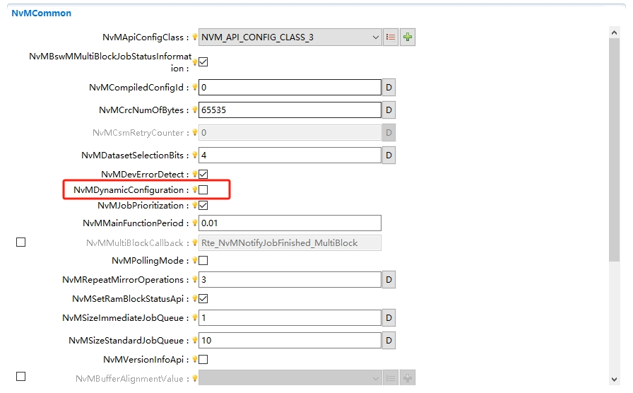
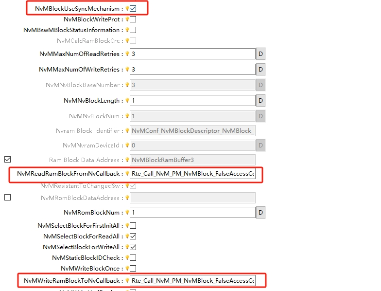

====================
NvM
====================

文档信息（Document Information）
=======================================

版本历史（Version History）
-----------------------------------

.. list-table::
   :widths: 10 10 10 10 20
   :header-rows: 1

   * - 日期（Date）
     - 作者（Author）
     - 版本（Version）
     - 状态（Status）
     - 说明（Description）
   * - 2025/03/13
     - peng.wu
     - V0.1
     - 发布（Release）
     - 首次发布（First release）
   * - 2025/04/04
     - peng.wu
     - V1.0
     - 发布（Release）
     - 正式发布（Official release）

参考文档（Reference Document）
----------------------------------

.. list-table::
   :widths: 10 15 25 10
   :header-rows: 1

   * - 编号（Number）
     - 分类（Classification）
     - 标题（Title）
     - 版本（Version）
   * - 1
     - Autosar
     -   AUTOSAR_CP_SRS_MemoryServices.pdf
     - R23-11
   * - 2
     - Autosar
     -  AUTOSAR_CP_SWS_NVRAMManager.pdf
     - R23-11
   * - 3
     - Autosar
     -  AUTOSAR_CP_EXP_NVDataHandling.pdf
     - R23-11

术语与简写（Terms and Abbreviations）
========================================

术语（Term）
---------------------------
   .. :align: center   表格内容居中

.. list-table::
   :widths: 15 40
   :header-rows: 1

   * - 术语（Term）
     - 解释（Explanation）

   * - Basic Storage Object
     - 基础存储对象(Basic Storage Object)是NVRAM块(NVRAM block)的最小实体。多个Basic Storage Object可用于构建一个NVRAM块。一个Basic Storage Object可存在于不同的内存位置(RAM/ROM/非易失性内存)。

   * - NVRAM Block
     - “NVRAM Block”是用于管理和存储一块非易失性数据所需的完整结构。

   * - NV data
     - 待存储于非易失性内存(Non-Volatile memory)中的数据（简称 “NV data”）。

   * - Block Management Typ
     - NVRAM块类型，取决于NVRAM块的(可配置)独立构成——即由不同的必选/可选基础存储对象分块组成，同时也取决于该NVRAM块后续的处理方式。

   * - RAM Block
     - RAM块是一种基础存储对象，代表NVRAM块中驻留在RAM内的部分。

   * - ROM Block
     - “只读存储块(ROM Block)” 是一种“基础存储对象(Basic Storage Object)”，代表“非易失性内存块(NVRAM Block)”中驻留在ROM内的部分。“ROM Block”是“NVRAM Block”的可选部分。

   * - NV Block
     - “非易失性存储块(NV Block)”是一种“基础存储对象(Basic Storage Object)”，代表“非易失性内存块(NVRAM Block)”中驻留在非易失性内存内的部分。“NV Block” 是“NVRAM Block”的必选部分。

   * - NV Block Header
     - 若“Static Block ID”（静态块标识）机制已启用，则“NV Block”中会包含额外信息。

   * - Administrative Block
     - “管理块(Administrative Block)” 是一种 “基础存储对象(Basic Storage Object)”，驻留在RAM中。“Administrative Block”是“NVRAM Block”的必选部分。

简写（Abbreviation）
-------------------------

.. list-table::
   :widths: 15 20 25
   :header-rows: 1

   * - 简写（Abbreviation）
     - 全称（Full name）
     - 解释（Explanation）

   * - DET
     - Development Error Tracer - module to which development errors are reported.
     - 开发错误跟踪器-报告开发错误的模块。
   * - DEM
     - Diagnostic Event Manager - module to which production relevant errors are reported
     - 诊断事件管理器-报告生产相关错误的模块.
   * - NV
     - Non volatile.
     - 非易失
   * - FEE
     - Flash EEPROM Emulation
     - Flash EEPROM仿真.
   * - EA
     - EEPROM Abstraction
     - EEPROM抽象
   * - FCFS
     - First come first served.
     - 先到先得.
   * - EEPROM
     - Electrically Erasable and Programmable ROM (Read Only Memory)
     - 电可擦可编程只读存储器(只读型存储器)
   * - MemIf
     - Memory Abstraction Interface
     - 内存抽象接口.
   * - NvM
     - NVRAM Manager
     - 非易失RAM管理.
   * - NVRAM
     - Non-volatile RAM (Random Access Memory)
     - 非易失性RAM(随机存取存储器).
   * - CRC
     - Cyclic Redundancy Check
     - 循环冗余检查.
   * - EcuM
     - Module name of ECU State Manager
     - ECU状态管理模块.

简介（Introduction）
============================
NvM（NVRAM Manager）模块负责管理非易失性数据（Non-Volatile Data）的存储、读取和维护,为应用层提供了一个统一的接口，
用于访问和管理存储在非易失性存储器（如EEPROM或Flash）中的数据。通过NvM模块，应用层可以方便地实现数据的持久化存储和恢复。

The NvM (NVRAM Manager) module is responsible for managing the storage, reading, and maintenance of non-volatile data. It provides a unified interface for the application layer to access and manage data stored in non-volatile memories (such as EEPROM or Flash). Through the NvM module, the application layer can easily implement persistent storage and recovery of data.

功能描述（Functional Description）
==========================================

特性（Features）
------------------------

数据存储管理（Data Storage Management）
~~~~~~~~~~~~~~~~~~~~~~~~~~~~~~~~~~~~~~~~~~~~~~~~~~~~~~~~
NvM模块将非易失性存储空间划分为多个逻辑块（NVRAM Blocks），每个逻辑块可以存储一定量的数据。
支持多种数据类型，包括应用数据、校准数据、诊断数据等。提供数据的持久化存储功能，确保在ECU断电后数据不会丢失。

The NvM module divides the non-volatile storage space into multiple logical blocks (NVRAM Blocks), each of which can store a certain amount of data.
It supports various data types, including application data, calibration data, diagnostic data, etc. It provides persistent data storage functionality to ensure that data is not lost when the ECU is powered off.

NVRAM Block管理（NVRAM Block Management）
~~~~~~~~~~~~~~~~~~~~~~~~~~~~~~~~~~~~~~~~~~~~~~~~~~~~~~~~~~
NvM模块将非易失性存储空间划分为多个逻辑块（NVRAM Blocks），每个块可以独立配置。
每个NVRAM Block可以配置为以下类型：Native Block：存储应用数据。Redundant Block：存储冗余数据，提高可靠性。Dataset Block：存储多个数据集，支持动态选择。

The NvM module divides the non-volatile storage space into multiple logical blocks (NVRAM Blocks), and each block can be independently configured.
Each NVRAM Block can be configured into the following types: Native Block: stores application data. Redundant Block: stores redundant data to improve reliability. Dataset Block: stores multiple datasets and supports dynamic selection.

数据读取与写入等功能（Functions such as Data Reading and Writing）
~~~~~~~~~~~~~~~~~~~~~~~~~~~~~~~~~~~~~~~~~~~~~~~~~~~~~~~~~~~~~~~~~~
提供统一的接口，供应用层读取和写入非易失性数据。支持同步和异步操作模式，满足不同应用场景的需求。

It provides a unified interface for the application layer to read and write non-volatile data. It supports synchronous and asynchronous operation modes to meet the requirements of different use cases.

数据校验与完整性检查（Data Verification and Integrity Check）
~~~~~~~~~~~~~~~~~~~~~~~~~~~~~~~~~~~~~~~~~~~~~~~~~~~~~~~~~~~~~~~~~~
支持CRC校验，确保数据的完整性和正确性。在读取数据时，校验机制可以检测数据是否被损坏或篡改。在写入数据时，校验机制可以确保数据正确写入，避免因写入失败导致的数据丢失。

It supports CRC verification to ensure data integrity and correctness. When reading data, the verification mechanism can detect whether the data is damaged or tampered with. When writing data, the verification mechanism can ensure that data is written correctly, avoiding data loss caused by write failures.

数据冗余与备份（Data Redundancy and Backup）
~~~~~~~~~~~~~~~~~~~~~~~~~~~~~~~~~~~~~~~~~~~~~~~~~~~~~~~~~~~~~~~~~~
支持数据冗余存储，通过多副本机制提高数据的可靠性。当检测到数据损坏时，NvM模块可以触发错误恢复机制（如从冗余数据中恢复）。

It supports redundant data storage and improves data reliability through a multi-copy mechanism. When data corruption is detected, the NvM module can trigger an error recovery mechanism (such as recovery from redundant data).

错误处理与恢复（Error Handling and Recovery）
~~~~~~~~~~~~~~~~~~~~~~~~~~~~~~~~~~~~~~~~~~~~~~~~~~~~~~~~~~~~~~~~~~
提供错误检测和恢复机制，如写入失败、读取失败、数据损坏等。支持错误通知功能，通过Dem（Diagnostic Event Manager）模块记录和报告错误。

It provides error detection and recovery mechanisms, such as write failures, read failures, data corruption, etc. It supports error notification functions, and records and reports errors through the Dem (Diagnostic Event Manager) module.

初始化与启动管理（Initialization and Startup Management）
~~~~~~~~~~~~~~~~~~~~~~~~~~~~~~~~~~~~~~~~~~~~~~~~~~~~~~~~~~~~~~~~~~~~~~~~~~~
在ECU启动时，NvM模块负责初始化非易失性存储器和内部数据结构。支持从非易失性存储器中恢复数据到RAM中，供应用层使用。

When the ECU starts, the NvM module is responsible for initializing the non-volatile memory and internal data structures. It supports restoring data from non-volatile memory to RAM for use by the application software.

多块请求管理（Multi-Block Request Management）
~~~~~~~~~~~~~~~~~~~~~~~~~~~~~~~~~~~~~~~~~~~~~~~~~~~~~~~~~~~~~~~~~~~~~~~~~~~
多块处理是NvM模块中的特殊任务，用于批量处理和操作所有NVRAM Block。在处理过程中，遍历所有NVRAM Block，对满足当前处理条件的block进行操作。

Multi-block processing is a special task in the NvM module, used for batch processing and operation of all NVRAM Blocks. During processing, it traverses all NVRAM Blocks and operate on those Blocks that meet.

优先级处理（Priority Processing）
~~~~~~~~~~~~~~~~~~~~~~~~~~~~~~~~~~~~~~~~~~~~~~~~~~~~~~~~~~~~~~~~~~~~~~~~~~~
支持多个并发的读写请求，NvM模块通过队列机制管理多个并发请求。每个请求会被放入队列中，按照优先级和顺序依次执行。
当应用层发起一个请求时，NvM模块会将请求放入队列中。当NvM模块完成当前请求后，会从队列中取出下一个请求执行。

It supports multiple concurrent read and write requests, and the NvM module manages multiple concurrent requests through a queue mechanism. Each request is put into a queue and executed in sequence according to priority and order.
When the application layer initiates a request, the NvM module puts the request into the queue. When the NvM module completes the current request, it takes the next request from the queue for execution.

与底层驱动的交互（Interaction with Underlying Drivers）
~~~~~~~~~~~~~~~~~~~~~~~~~~~~~~~~~~~~~~~~~~~~~~~~~~~~~~~~~~~~~~~~~~~~~~~~~~~
NvM模块通过MemIf（Memory Abstraction Interface）模块与底层存储驱动（如EEPROM或Flash驱动）交互，实现数据的物理存储和读取。

The NvM module interacts with underlying storage drivers (such as EEPROM or Flash drivers) through the MemIf (Memory Abstraction Interface) module to handle the physical storage and reading of data.

支持Dem同步功能（Support for Dem Synchronization Function）
~~~~~~~~~~~~~~~~~~~~~~~~~~~~~~~~~~~~~~~~~~~~~~~~~~~~~~~~~~~~~~~~~~~~~~~~~~~~~~~~~
当Dem有存储需要的时候，Dem模块会执行同步功能，使NvM会自动创建对应长度与个数的NvMBlock，实现快速同步Dem信息的作用。

When the Dem needs storage, the Dem module will perform a synchronization function, so that the NvM will automatically create NvMBlocks with corresponding lengths and quantities to achieve rapid synchronization of Dem information.

加解密和解压缩（Encryption/Decryption and Compression/Decompression）
~~~~~~~~~~~~~~~~~~~~~~~~~~~~~~~~~~~~~~~~~~~~~~~~~~~~~~~~~~~~~~~~~~~~~~~~~~~~~~~~~
为了进一步增强数据的安全性和存储效率，NvM还提供加解密和解压缩功能。
NvM模块的加解密功能通常依赖于底层的加密服务（Crypto），在写入数据时，NvM模块调用加密服务对数据进行加密，将加密后的数据存储到非易失性存储器中，
读取数据时，首先从非易失性存储器中读取加密数据，然后在NvM模块调用加密服务对数据进行解密，最后将解密后的数据返回给应用层。
解压缩功能是通过对数据进行解压缩，减少非易失性存储器的占用空间，当前只提供了Callout接口，详细的实现内容，有客户自定义。

To further enhance data security and storage efficiency, NvM also provides encryption/decryption and compression/decompression functions.
The encryption and decryption functions of the NvM module rely on the underlying Crypto Service Manager (Csm). When writing data, the NvM module calls the encryption service to encrypt the data and stores the encrypted data in non-volatile memory.
When reading data, first read the encrypted data from the non-volatile memory, then the NvM module calls the encryption service to decrypt the data, and finally returns the decrypted data to the application layer.
The decompression function reduces the occupied space of non-volatile memory by decompressing data. Currently, only the Callout interface is provided, and the detailed implementation content is customized by the customer.

FirstInitAll的功能（Function of FirstInitAll）
~~~~~~~~~~~~~~~~~~~~~~~~~~~~~~~~~~~~~~~~~~~~~~~~~~~~~~~~~~~~~~~~~~~~~~~~~~~~~~~~~
FirstInitAll用于在系统首次启动时初始化所有NVRAM Block的数据。该功能通常在ECU首次运行或非易失性存储器被清空后使用，以确保NVRAM Block中的数据处于正确的初始状态通常。

FirstInitAll is used to initialize the data of all NVRAM Blocks when the system starts for the first time. This function is usually used when the ECU runs for the first time or after the non-volatile memory is cleared to ensure that the data in the NVRAM Blocks is in a correct initial state.

多分区功能（Multi-Partition Support）
~~~~~~~~~~~~~~~~~~~~~~~~~~~~~~~~~~~~~~~~~~~~~~~~~~~~~~~~~~~~~~~~~~~~~~~~~~~~~~~~~
在多分区场景下，对于单个block的请求，只能在对应的分区下执行，否则判定为请求失败。在对应分区下请求成功后，将由主函数在主分区执行请求的任务。若使能了BswM的通知功能，
对于单个Block的通知，将在执行到卫星分区时，对该分区上支持的Block调用BswM通知接口。对于多块的BswM通知，全部在主分区调用。

In a multi-partition scenario, a request for a single block can only be executed in the corresponding partition; otherwise, the request is deemed to have failed. After a successful request in the corresponding partition, the main function will execute the requested task in the main partition. If the BswM notification function is enabled,
For notifications of a single Block, when executing to the satellite partition, the BswM notification interface will be called for the Blocks supported on that partition. For multi-block BswM notifications, all are called in the main partition.

偏差（Deviations）
--------------------------
.. 有序列表示例

#. NvMBufferAlignmentValue

   内部缓存区的对齐功能，暂未实现。

   The alignment function of the internal buffer has not been implemented yet.

#. SetRamBlockStatus修改请求结果

   NvM_SetRamBlockStatus不应更改接收到的Block ID的请求结果。当前是异步执行，会入队列修改为pending，暂未实现。

   NvM_SetRamBlockStatus modifies the request result.

   NvM_SetRamBlockStatus shall not change the request result of the received Block ID. Currently, it is executed asynchronously and will be enqueued and its status will be set to PENDING, which has not been implemented yet.

#. FirstInitAll处理显示同步以及修改Ram块状态

   NvM_FirstInitAll处理的NATIVE类型块既没有永久RAM也没有显式同步，则该块将使用内部NvM缓冲区作为其RAM进行处理，处理后，其RAM块状态将保持不变，暂未实现。

   FirstInitAll handles explicit synchronization and modifies the RAM block status

   For the NATIVE type block processed by NvM_FirstInitAll that has neither permanent RAM nor explicit synchronization, the block will be processed using the internal NvM buffer as its RAM, and after processing, its RAM block status will remain unchanged, which has not been implemented yet.

#. 提供内存使用信息

   通过配置，每个应用都能够在配置时声明内存需求。在配置时应检测到错误的内存分配和需求冲突（例如：没有足够的内存可用）。暂不实现。

   Provide memory usage information

   Via configuration, each application can declare its memory requirements at configuration time. Errors in memory allocation and requirement conflicts (for example: insufficient memory available) should be detected during configuration. Not implemented in this release.

扩展
--------
None

集成（Integration）
==================================

文件列表（File List）
----------------------------------

静态文件（Static Files）
~~~~~~~~~~~~~~~~~~~~~~~~~~~~~~~~~~~~~~

.. list-table::
   :widths: 10 30
   :header-rows: 1

   * - 文件（File）
     - 描述（Description）
   
   * - NvM.h
     - NvM模块的API声明与宏定义，包括所需使用的宏定义及外部函数声明。
       API declarations and macro definitions of NvM module; including macro definitions, and external function declarations that need to be used.
   * - NvM.c
     - NvM模块的API实现，包含内部函数以及所需使用的全局函数。
       API implementation of NvM module; contains internal functions, and global functions that need to be used.
   * - NvM_MemMap.h
     - 包含NvM模块的内存抽象。
       Contains the memory abstraction of NvM module.
   * - NvM_Types.h
     - NvM模块的API声明与宏定义，包括所需使用的宏定义、类型定义及配置结构声明。
       API declaration and macro definition of NvM module; including macro definition, type definition, and configuration structure declaration that need to be used.
   * - NvM_Inter.c
     - NvM模块的API实现，包含所需使用的宏定义、内部变量及内部函数。
       API implementation of NvM module; contains macro definitions, internal variables, and internal functions that need to be used.
   * - NvM_Act.c
     - NvM模块的API实现，包含内部函数以及所需使用的全局函数。
       API implementation of NvM module; contains internal functions, and global functions that need to be used.
   * - NvM_Inter.h
     - NvM模块的API声明与宏定义，包括所需使用的宏定义及内部函数声明。
       API declaration and macro definition of NvM module; including macro definition, and internal function declaration that need to be used.
   * - NvM_MemIf.h
     - NvM模块的回调API声明。
       Callback API declaration of NvM module.

动态文件（Dynamic Files）
~~~~~~~~~~~~~~~~~~~~~~~~~~~~~~~~~~~~~
.. list-table::
   :widths: 10 30
   :header-rows: 1

   * - 文件（File）
     - 描述（Description）

   * - NvM_Cfg.h
     - NvM模块实现所需的配置参数，包含宏定义及版本信息。
       Configuration parameters required for the implementation of NvM; Contains macro definitions, version information.
   * - NvM_Lfg.c
     - NvM的链接时定义，包含所需使用的块信息。
       Link time definitions of NvM; Contains the block information that need to be used.
   * - NvM_Lfg.h
     - NvM的链接时声明，包含宏定义及版本信息。     
       Link time declaration of NvM; Contains macro definitions, version information.

错误处理（Error handling）
--------------------------------

开发错误（Development errors）
~~~~~~~~~~~~~~~~~~~~~~~~~~~~~~~~~~
.. list-table:: 
   :widths: 20 10 30
   :header-rows: 1

   * - Error code
     - Value[hex]
     - Description

   * - NVM_E_NO_ERROR
     - 0x0u
     - API function called with no det error

   * - NVM_E_PARAM_BLOCK_ID
     - 0x0Au
     - API is called with wrong parameter block ID

   * - NVM_E_PARAM_BLOCK_DATA_IDX
     - 0x0Cu
     - API is called with wrong parameter block data

   * - NVM_E_PARAM_ADDRESS
     - 0x0Du
     - API is called with wrong parameter address

   * - NVM_E_PARAM_DATA
     - 0x0Eu
     - API is called with wrong parameter data

   * - NVM_E_PARAM_POINTER
     - 0x0Fu
     - API is called with wrong parameter pointer

   * - NVM_E_BLOCK_WITHOUT_DEFAULTS
     - 0x11u
     - API is called for a block without defaults when either the NvM_RestoreBlockDeafults or NvM_RestorePRAMBlockDefaults is called 
       for a valid block ID that has no default data and no NvMInit BlockCallback configured for the block

   * - NVM_E_UNINIT
     - 0x14u
     - API is called when NVRAM manager is not initialized yet

   * - NVM_E_BLOCK_PENDING
     - 0x15u
     - read/write/control API is called for a block which is already listed or in progress

   * - NVM_E_BLOCK_CONFIG
     - 0x18u
     - Service is not possible with this block configuration

   * - NVM_E_BLOCK_LOCKED
     - 0x19u
     - The block is locked

   * - NVM_E_WRITE_ONCE_STATUS_UNKNOWN
     - 0x1Au
     - write/erase/invalidate API is called for a block with MVM_WRITE_BLOCK_ONCE (TRUE) prior to the first read request for that block 

   * - NVM_E_BLOCK_CHIPHER_LENGTH_MISSMATCH
     - 0x1Bu
     - The length resulting from encryption or decription do not match with the given length in the configuration

   * - NVM_E_WRITE_PROTECTED_DET
     - 0x1Cu
     - NVM_E_BLOCK_CHIPHER_LENGTH_MISSMATCH and NVM_E_WRITE_PROTECTED(_DET) value is conflict in AUTOSAR R22-11, so change 
       NVM_E_WRITE_PROTECTED(_DET) to 0x1C

   * - NVM_E_WRONG_CONDITION
     - 0x1Du
     - partition info error

运行时错误（Runtime error）
~~~~~~~~~~~~~~~~~~~~~~~~~~~~~~~~~~

.. list-table:: 
   :widths: 20 10 30
   :header-rows: 1

   * - Error code
     - Value[hex]
     - Description

   * - NVM_E_QUEUE_FULL
     - 0xA0u
     - NvM queue is full so the request cannot bequeued, be the request either standard or immediate

产品错误（Product Errors）
~~~~~~~~~~~~~~~~~~~~~~~~~~~~~~~~~~~

.. list-table:: 
   :widths: 20 10 30
   :header-rows: 1

   * - Error code
     - Value[hex]
     - Description

   * - NVM_E_HARDWARE
     - Value[hex]
     - Reading from or writing to non volatile memory failed

   * - NVM_E_HARDWARE
     - Value[hex]
     - Reading from or writing to non volatile memory failed

扩展产品错误（Extended Product Errors）
~~~~~~~~~~~~~~~~~~~~~~~~~~~~~~~~~~~~~~~~~~~~~
.. list-table:: 
   :widths: 20 10 30
   :header-rows: 1

   * - Error code
     - Value[hex]
     - Description

   * - NVM_E_INTEGRITY_FAILED
     - Value[hex]
     - Processin of the read service detects an inconsistency

   * - NVM_E_REQ_FAILED
     - Value[hex]
     - Processin of the read service failed at a lower layer in the MemStack architecture, including all retries

   * - NVM_E_WRONG_BLOCK_ID
     - Value[hex]
     - Static block ID check, during read, indicates failure

   * - NVM_E_VERIFY_FAILED
     - Value[hex]
     - The write verification failed

   * - NVM_E_LOSS_OF_REDUNDANCY
     - Value[hex]
     - A redundant block has lost the redundancy

接口描述（Interface Description）
=====================================

.. include:: NvM_api.rst

依赖的服务（Dependent Services）
----------------------------------------

可选接口（Optional Interfaces）
~~~~~~~~~~~~~~~~~~~~~~~~~~~~~~~~~~~~

.. list-table::
   :widths: 10 5 30
   :header-rows: 1

   * - API Function
     - Header File
     - Description

   * - Crc_CalculateCRC16
     - Crc.h
     - This service makes a CRC16 calculation on Crc_Length data bytes

   * - Crc_CalculateCRC32
     - Crc.h
     - This service makes a CRC32 calculation on Crc_Length data bytes

   * - Crc_CalculateCRC8
     - Crc.h
     - This service makes a CRC8 calculation on Crc_Length data bytes

   * - Dem_SetEventStatus
     - Dem.h
     - Called by SW-Cs or BSW modules to report monitor status information to the Dem

   * - Det_ReportError
     - Det.h
     - Service to report development errors

强制接口（Mandatory Interfaces）
~~~~~~~~~~~~~~~~~~~~~~~~~~~~~~~~~~~~~~
.. 可选的章节，根据模块实际情况确定

.. list-table::
   :widths: 10 5 30
   :header-rows: 1

   * - API Function
     - Header File
     - Description
   * - MemIf_Cancel
     - MemIf.h
     - Invokes the "Cancel" function of the underlying memory abstraction module selected by the parameter DeviceIndex
   * - MemIf_EraseImmediateBlock
     - MemIf.h
     - Invokes the "EraseImmediateBlock" function of the underlying memory abstraction module selected by the parameter DeviceIndex
   * - MemIf_GetJobResult
     - MemIf.h
     - Invokes the "GetJobResult" function of the underlying memory abstraction module selected by the parameter DeviceIndex
   * - MemIf_GetStatus
     - MemIf.h
     - Invokes the "GetStatus" function of the underlying memory abstraction module selected by the parameter DeviceIndex
   * - MemIf_InvalidateBlock
     - MemIf.h
     - Invokes the "InvalidateBlock" function of the underlying memory abstraction module selected by the parameter DeviceIndex
   * - MemIf_Read
     - MemIf.h
     - Invokes the "Read" function of the underlying memory abstraction module selected by the parameter DeviceIndex
   * - MemIf_Write
     - MemIf.h
     - Invokes the "Write" function of the underlying memory abstraction module selected by the parameter DeviceIndex

配置接口（Configuration Interfaces）
~~~~~~~~~~~~~~~~~~~~~~~~~~~~~~~~~~~~~~~
.. 可选的章节，根据模块实际情况确定
.. 格式同强制接口

.. list-table::
   :widths: 10 5 30
   :header-rows: 1

   * - API Function
     - Header File
     - Description
   * - NvM_SingleBlockCallbackFunction
     - Rte_NvM.h
     - Per block callback routine to notify the upper layer that an asynchronous single block request has been finished
   * - NvM_MultiBlockCallbackFunction
     - Rte_NvM.h
     - Common callback routine to notify the upper layer that an asynchronous multi block request has been finished
   * - NvM_InitBlockCallbackFunction
     - Rte_NvM.h
     - Per block callback routine which shall be called by the NvM module when default data needs to be restored in RAM, 
       and a ROM block is not configured
   * - NvM_WriteRamBlockToNvm
     - Rte_NvM.h
     - Block specific callback routine which shall be called in order to let the application copy data from RAM block to NvM module’s mirror
   * - NvM_ReadRamBlockFromNvm
     - Rte_NvM.h
     - Block specific callback routine which shall be called in order to let the application copy data from NvM module’s mirror to RAM block

配置（configuration）
============================

动态配置检查（Dynamic Configuration Check）
------------------------------------------------
如图 :ref:`NvMDynamicConfiguration` 所示，在勾选NvMDynamicConfiguration后，NvMBlockDescriptor/NvMResistantToChangedSw才能被配置，

As shown in Figure :ref:NvMDynamicConfiguration, after checking NvMDynamicConfiguration, NvMBlockDescriptor/NvMResistantToChangedSw can be configured.

   NvMDynamicConfiguration Config

如图 :ref:`NvMResistantToChangedSw` 所示，若NvMDynamicConfiguration勾选后，上电ReadAll期间，会判断ConfigId的正确性，

As shown in Figure :ref:NvMResistantToChangedSw, if NvMDynamicConfiguration is checked, during the power-on ReadAll period, the correctness of ConfigId will be judged.

.. figure:: ../../../_static/参考手册/NvM/NvMResistantToChangedSw.png
   :alt: NvMResistantToChangedSw配置图
   :name: NvMResistantToChangedSw
   :align: center

   NvMResistantToChangedSw Config

当ConfigId不正确，则进入扩展模式，若NvMResistantToChangedSw勾选，则需要恢复默认数据。

If the ConfigId is incorrect, it will enter the extended mode. If NvMResistantToChangedSw is checked, the default data needs to be restored.

CRC校验功能（CRC Verification Function）
--------------------------------------------------
如图 :ref:`NvMCrc` 所示，在勾选NvMBlockDescriptor/NvMBlockUseCrc后，相关的Crc功能才能被使能。

As shown in Figure :ref:NvMCrc, the relevant CRC functions can only be enabled after checking NvMBlockDescriptor/NvMBlockUseCrc.

.. figure:: ../../../_static/参考手册/NvM/NvMCrc.png
   :alt: NvMCrc配置图
   :name: NvMCrc
   :align: center

   NvMCrc Config

写保护功能（Write Protection Function）
----------------------------------------------------
如图 :ref:`NvMBlockWriteProt` 所示，NvMBlockDescriptor/NvMBlockWriteProt和NvMBlockDescriptor/NvMBlockWriteOnce只能二选一。

As shown in Figure :ref:NvMBlockWriteProt, only one of NvMBlockDescriptor/NvMBlockWriteProt and NvMBlockDescriptor/NvMBlockWriteOnce can be selected.

.. figure:: ../../../_static/参考手册/NvM/NvMBlockWriteProt.png
   :alt: NvMBlockWriteProt配置图
   :name: NvMBlockWriteProt
   :align: center

   NvMBlockWriteProt Config

读写重试功能（Read/Write Retry Mechanism）
----------------------------------------------------------
如图 :ref:`NvMMaxRetries` 所示，在NvMBlockDescriptor/NvMBlockWriteProt中设置读写重试的次数。

As shown in Figure :ref:NvMMaxRetries, set the number of read/write retries in NvMBlockDescriptor/NvMBlockWriteProt.

   NvMMaxRetries Config

显示同步功能（Explicit Synchronization Function）
------------------------------------------------------
如图 :ref:`NvMSyncMechanism` 所示，NvMBlockDescriptor/NvMBlockUseSyncMechanism勾选后，可配置显示同步的回调接口。

As shown in Figure :ref:NvMSyncMechanism, after checking NvMBlockDescriptor/NvMBlockUseSyncMechanism, the callback interface for explicit synchronization can be configured.

   NvMSyncMechanism Config

写校验功能（Write Verification Function）
--------------------------------------------
如图 :ref:`NvMWriteVerify` 所示，NvMBlockDescriptor/NvMWriteVerification勾选后，可配置写校验的size。
注意：NvMWriteVerificationDataSize自动填充为NvMBlockDescriptor/NvMNvBlockLength的大小，可修改，但不能大于配置的NvMNvBlockLength。

As shown in Figure :ref:NvMWriteVerify, after checking NvMBlockDescriptor/NvMWriteVerification, the data size for write verification can be configured.
Note: NvMWriteVerificationDataSize is automatically filled with the size of NvMBlockDescriptor/NvMNvBlockLength. It can be modified but cannot be larger than the configured NvMNvBlockLength.

.. figure:: ../../../_static/参考手册/NvM/NvMWriteVerify.png
   :alt: NvMWriteVerify配置图
   :name: NvMWriteVerify
   :align: center

   NvMWriteVerify Config

RamBuffer
----------------------
如图 :ref:`NvMRamBlockDataAddress` 所示，NvMBlockDescriptor/NvMRamBlockDataBufferAutoFill勾选后，勾选
NvMBlockDescriptor/NvMRamBlockDataAddress，工具可自动填充buffer值，然后根据配置的长度生成对应的buffer。

As shown in Figure :ref:NvMRamBlockDataAddress, after checking NvMBlockDescriptor/NvMRamBlockDataBufferAutoFill, check NvMBlockDescriptor/NvMRamBlockDataAddress. The tool can automatically fill in the buffer value and then generate the corresponding buffer according to the configured length.

.. figure:: ../../../_static/参考手册/NvM/NvMRamBlockDataAddress.png
   :alt: NvMRamBlockDataAddress配置图
   :name: NvMRamBlockDataAddress
   :align: center

   NvMRamBlockDataAddress Config

关联底层模块（Associating with Underlying Modules）
-------------------------------------------------------
如图 :ref:`NvMTargetBlockReference` 所示，在NvMBlockDescriptor/NvMTargetBlockReference中可以选择关联底层Fee/Ea模块。

As shown in Figure :ref:NvMTargetBlockReference, the underlying Fee/Ea modules can be selected for association in NvMBlockDescriptor/NvMTargetBlockReference.

.. figure:: ../../../_static/参考手册/NvM/NvMTargetBlockReference.png
   :alt: NvMTargetBlockReference配置图
   :name: NvMTargetBlockReference
   :align: center

   NvMTargetBlockReference Config

加解密和解压缩功能（Encryption/Decryption and Compression/Decompression Functions）
-------------------------------------------------------------------------------------------
如图 :ref:`NvMBlockCiphering` 所示，在NvMBlockCiphering中可以配置加解密的长度，以及对应的加解密算法。
注意：目前NvM只支持AES算法。

As shown in Figure :ref:NvMBlockCiphering, the length of encryption/decryption and the corresponding encryption/decryption algorithm can be configured in NvMBlockCiphering.
Note: Currently, NvM only supports the AES algorithm.

.. figure:: ../../../_static/参考手册/NvM/NvMBlockCiphering.png
   :alt: NvMBlockCiphering配置图
   :name: NvMBlockCiphering
   :align: center

   NvMBlockCiphering Config

如图 :ref:`NvMBlockCipheringRef` 所示，在NvMBlockCipheringRef中关联对应的容器。
注意：需要加解密的block，配置的NvMNvBlockLength最小长度应为16，因为Crypto的AES算法最小长度为16，若低于16，Crypto中暂未执行数据填充。

As shown in Figure :ref:NvMBlockCipheringRef, the corresponding container is associated in NvMBlockCipheringRef.
Note: For blocks that need encryption/decryption, the configured minimum length of NvMNvBlockLength should be 16, because the minimum length of the AES algorithm in Crypto is 16. If it is less than 16, data padding has not been implemented in Crypto yet.

.. figure:: ../../../_static/参考手册/NvM/NvMBlockCipheringRef.png
   :alt: NvMBlockCipheringRef配置图
   :name: NvMBlockCipheringRef
   :align: center

   NvMBlockCipheringRef Config

如图 :ref:`NvM_PollingMode` 所示，若NvM配置为非轮询模式，

As shown in Figure :ref:NvM_PollingMode, if NvM is configured in non-polling mode,

.. figure:: ../../../_static/参考手册/NvM/NvM_PollingMode.png
   :alt: NvM_PollingMode配置图
   :name: NvM_PollingMode
   :align: center

   NvM_PollingMode Config

则底层的存储抽象模块（Fee/Ea）必须配置回调接口，否则底层处理结束后，无法通知到上层NvM模块，

Then the underlying storage abstraction modules (Fee/Ea) must be configured with callback interfaces; otherwise, after the underlying processing is completed, it will be impossible to notify the upper-layer NvM module.

Fee的回调接口配置项如图 :ref:`NvM_FeeNotificationCfg` 所示，

The callback interface configuration items for Fee are shown in Figure :ref:NvM_FeeNotificationCfg.

.. figure:: ../../../_static/参考手册/NvM/NvM_FeeNotificationCfg.jpg
   :alt: NvM_FeeNotificationCfg配置图
   :name: NvM_FeeNotificationCfg
   :align: center

   NvM_FeeNotificationCfg Config

Ea的回调接口配置项如图 :ref:`NvM_EaNotificationCfg` 所示，

The callback interface configuration items for Ea are shown in Figure :ref:`NvM_EaNotificationCfg`.

.. figure:: ../../../_static/参考手册/NvM/NvM_EaNotificationCfg.jpg
   :alt: NvM_EaNotificationCfg配置图
   :name: NvM_EaNotificationCfg
   :align: center

   NvM_EaNotificationCfg Config
