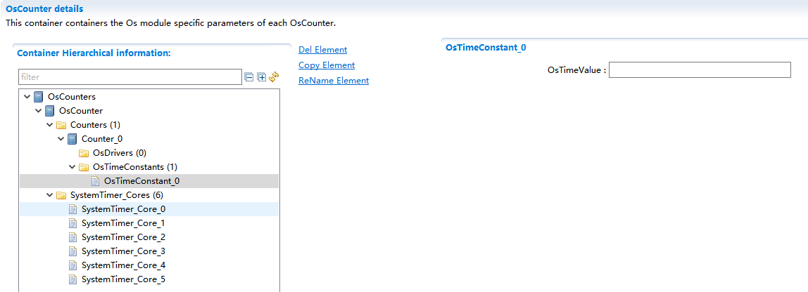
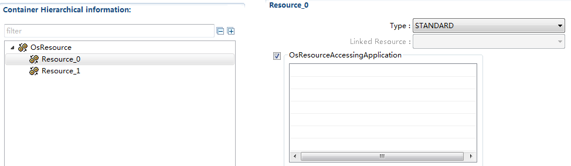
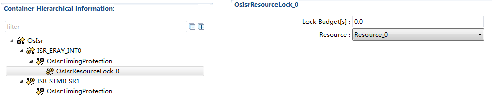
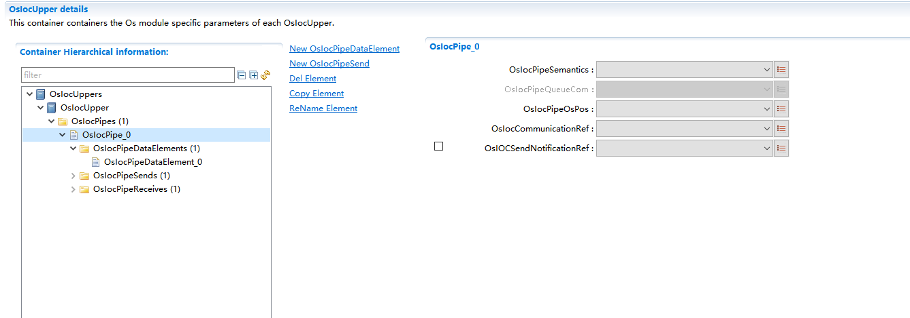

===================
OS模块参考手册
===================

   +------------+------------------+-------------------------------------+
   |            | Os_Mp_MemMap.h   | 内存保护区域划分头文件              |
   +------------+------------------+-------------------------------------+
   |            | Os_Linker.ld     | 链接脚本文件                        |
   +------------+------------------+-------------------------------------+
   |            | Vrte_Os_Ioc.c    | IOC生成接口文件                     |
   +------------+------------------+-------------------------------------+
   |            | Vrte_Os_Ioc.h    | IOC生成接口文件                     |
   +------------+------------------+-------------------------------------+
   | **相       | Std_Types.h      | 标准头文件                          |
   | 关头文件** |                  |                                     |
   +------------+------------------+-------------------------------------+
   |            | Platform_Types.h | 平台头文件                          |
   +------------+------------------+-------------------------------------+
   |            | Compiler.h       | 编译头文件                          |
   +------------+------------------+-------------------------------------+
   |            | Compiler_Cfg.h   | 编译配置头文件                      |
   +------------+------------------+-------------------------------------+
   |            | Os_MemMap.h      | OS模块的内存映射头文件              |
   +------------+------------------+-------------------------------------+
   |            | MemMap.h         | 内存映射头文件                      |
   +------------+------------------+-------------------------------------+

API接口
=======

类型定义
--------

TaskType
~~~~~~~~

+-----------------+----------------------------------------------------+
| 类型名          | TaskType                                           |
+-----------------+----------------------------------------------------+
| 类型定义        | typedef uint16 TaskType；                          |
+-----------------+----------------------------------------------------+
| 类型描述        | 任务ID的数据类型                                   |
+-----------------+----------------------------------------------------+
| 取值说明        | 0-65535                                            |
+-----------------+----------------------------------------------------+
| 备注            | 无                                                 |
+-----------------+----------------------------------------------------+

TaskRefType
~~~~~~~~~~~

+-----------------+----------------------------------------------------+
| 类型名          | TaskRefType                                        |
+-----------------+----------------------------------------------------+
| 类型定义        | typedef TaskType\* TaskRefType；                   |
+-----------------+----------------------------------------------------+
| 类型描述        | 指向TaskType类型变量的一个指针                     |
+-----------------+----------------------------------------------------+
| 取值说明        | 无                                                 |
+-----------------+----------------------------------------------------+
| 备注            | 无                                                 |
+-----------------+----------------------------------------------------+

TaskStateType
~~~~~~~~~~~~~

+-----------------+----------------------------------------------------+
| 类型名          | TaskStateType                                      |
+-----------------+----------------------------------------------------+
| 类型定义        | typedef enum                                       |
|                 |                                                    |
|                 | {                                                  |
|                 |                                                    |
|                 | TASK_STATE_WAITING,                                |
|                 |                                                    |
|                 | TASK_STATE_READY,                                  |
|                 |                                                    |
|                 | TASK_STATE_SUSPENDED,                              |
|                 |                                                    |
|                 | TASK_STATE_RUNNING                                 |
|                 |                                                    |
|                 | }TaskStateType;                                    |
+-----------------+----------------------------------------------------+
| 类型描述        | 定义任务的4种运行状态                              |
+-----------------+----------------------------------------------------+
| 取值说明        | 枚举型                                             |
+-----------------+----------------------------------------------------+
| 备注            | 也可以通过宏的方式来定义                           |
+-----------------+----------------------------------------------------+

TaskStateRefType
~~~~~~~~~~~~~~~~

+-----------------+----------------------------------------------------+
| 类型名          | TaskStateRefType                                   |
+-----------------+----------------------------------------------------+
| 类型定义        | typedef TaskStateType\* TaskStateRefType；         |
+-----------------+----------------------------------------------------+
| 类型描述        | 指向TaskStateRefType类型变量的一个指针             |
+-----------------+----------------------------------------------------+
| 取值说明        | 无                                                 |
+-----------------+----------------------------------------------------+
| 备注            | 无                                                 |
+-----------------+----------------------------------------------------+

ResourceType
~~~~~~~~~~~~

+-----------------+----------------------------------------------------+
| 类型名          | ResourceType                                       |
+-----------------+----------------------------------------------------+
| 类型定义        | typedef uint8 ResourceType;                        |
+-----------------+----------------------------------------------------+
| 类型描述        | 资源ID的数据类型                                   |
+-----------------+----------------------------------------------------+
| 取值说明        | 0~255                                              |
+-----------------+----------------------------------------------------+
| 备注            | 用于描述资源类型如标准、内部或链接型               |
+-----------------+----------------------------------------------------+

EventMaskType
~~~~~~~~~~~~~

+-----------------+----------------------------------------------------+
| 类型名          | EventMaskType                                      |
+-----------------+----------------------------------------------------+
| 类型定义        | typedef uint32 EventMaskType;                      |
+-----------------+----------------------------------------------------+
| 类型描述        | 事件的掩码类型                                     |
+-----------------+----------------------------------------------------+
| 取值说明        | 按位置1                                            |
+-----------------+----------------------------------------------------+
| 备注            | 应该与所属的扩展任务的ID结合起来                   |
+-----------------+----------------------------------------------------+

EventMaskRefType
~~~~~~~~~~~~~~~~

+-----------------+----------------------------------------------------+
| 类型名          | EventMaskRefType                                   |
+-----------------+----------------------------------------------------+
| 类型定义        | typedef EventMaskType\* EventMaskRefType;          |
+-----------------+----------------------------------------------------+
| 类型描述        | 指向EventMaskType类型数据的指针                    |
+-----------------+----------------------------------------------------+
| 取值说明        | 无                                                 |
+-----------------+----------------------------------------------------+
| 备注            | 无                                                 |
+-----------------+----------------------------------------------------+

CounterType
~~~~~~~~~~~

+-----------------+----------------------------------------------------+
| 类型名          | CounterType                                        |
+-----------------+----------------------------------------------------+
| 类型定义        | Typedef uint16 CounterType；                       |
+-----------------+----------------------------------------------------+
| 类型描述        | Counter类型                                        |
+-----------------+----------------------------------------------------+
| 取值说明        | 0~65535                                            |
+-----------------+----------------------------------------------------+
| 备注            | 用于描述Counter的ID                                |
+-----------------+----------------------------------------------------+

TickType
~~~~~~~~

+-----------------+----------------------------------------------------+
| 类型名          | TickType                                           |
+-----------------+----------------------------------------------------+
| 类型定义        | typedef uint32 TickType;                           |
+-----------------+----------------------------------------------------+
| 类型描述        | 定时器值域类型                                     |
+-----------------+----------------------------------------------------+
| 取值说明        | 无                                                 |
+-----------------+----------------------------------------------------+
| 备注            | 用于描述定时器ID                                   |
+-----------------+----------------------------------------------------+

TickRefType
~~~~~~~~~~~

+-----------------+----------------------------------------------------+
| 类型名          | TickRefType                                        |
+-----------------+----------------------------------------------------+
| 类型定义        | typedef TickType\* TickRefType;                    |
+-----------------+----------------------------------------------------+
| 类型描述        | 指向TickType类型数据的指针                         |
+-----------------+----------------------------------------------------+
| 取值说明        | 无                                                 |
+-----------------+----------------------------------------------------+
| 备注            | 无                                                 |
+-----------------+----------------------------------------------------+

AlarmType
~~~~~~~~~

+-----------------+----------------------------------------------------+
| 类型名          | AlarmType                                          |
+-----------------+----------------------------------------------------+
| 类型定义        | typedef uint16 AlarmType;                          |
+-----------------+----------------------------------------------------+
| 类型描述        | Alarm类型                                          |
+-----------------+----------------------------------------------------+
| 取值说明        | 0-65535                                            |
+-----------------+----------------------------------------------------+
| 备注            | 描述Alarm 的ID                                     |
+-----------------+----------------------------------------------------+

AlarmRefType
~~~~~~~~~~~~

+-----------------+----------------------------------------------------+
| 类型名          | AlarmRefType                                       |
+-----------------+----------------------------------------------------+
| 类型定义        | typedef AlarmType\* AlarmRefType;                  |
+-----------------+----------------------------------------------------+
| 类型描述        | 指向AlarmType类型变量的指针                        |
+-----------------+----------------------------------------------------+
| 取值说明        | 无                                                 |
+-----------------+----------------------------------------------------+
| 备注            | 无                                                 |
+-----------------+----------------------------------------------------+

AlarmBaseType
~~~~~~~~~~~~~

+-----------------+----------------------------------------------------+
| 类型名          | AlarmBaseType                                      |
+-----------------+----------------------------------------------------+
| 类型定义        | typedef struct                                     |
|                 |                                                    |
|                 | {                                                  |
|                 |                                                    |
|                 | TickType maxallowedvalue;                          |
|                 |                                                    |
|                 | TickType ticksperbase;                             |
|                 |                                                    |
|                 | TickType mincycle;                                 |
|                 |                                                    |
|                 | } AlarmBaseType;                                   |
+-----------------+----------------------------------------------------+
| 类型描述        | Alarm相关信息的结构体                              |
+-----------------+----------------------------------------------------+
| 取值说明        | 无                                                 |
+-----------------+----------------------------------------------------+
| 备注            | 描述Alarm 的相关信息                               |
+-----------------+----------------------------------------------------+

AlarmBaseRefType
~~~~~~~~~~~~~~~~

+-----------------+----------------------------------------------------+
| 类型名          | AlarmBaseRefType                                   |
+-----------------+----------------------------------------------------+
| 类型定义        | typedef AlarmBaseType\* AlarmBaseRefType；         |
+-----------------+----------------------------------------------------+
| 类型描述        | 指向AlarmBaseType类型数据的指针                    |
+-----------------+----------------------------------------------------+
| 取值说明        | 无                                                 |
+-----------------+----------------------------------------------------+
| 备注            | 无                                                 |
+-----------------+----------------------------------------------------+

AppModeType
~~~~~~~~~~~

+-----------------+----------------------------------------------------+
| 类型名          | AppModeType                                        |
+-----------------+----------------------------------------------------+
| 类型定义        | typedef uint16 AppModeType;                        |
+-----------------+----------------------------------------------------+
| 类型描述        | Application Mode类型                               |
+-----------------+----------------------------------------------------+
| 取值说明        | 无                                                 |
+-----------------+----------------------------------------------------+
| 备注            | 无                                                 |
+-----------------+----------------------------------------------------+

OSServiceIdType
~~~~~~~~~~~~~~~

+-----------------+----------------------------------------------------+
| 类型名          | OSServiceIdType                                    |
+-----------------+----------------------------------------------------+
| 类型定义        | typedef uint8 OSServiceIdType;                     |
+-----------------+----------------------------------------------------+
| 类型描述        | 服务类型                                           |
+-----------------+----------------------------------------------------+
| 取值说明        | 无                                                 |
+-----------------+----------------------------------------------------+
| 备注            | 描述系统服务的ID                                   |
+-----------------+----------------------------------------------------+

ISRType
~~~~~~~

+-----------------+----------------------------------------------------+
| 类型名          | ISRType                                            |
+-----------------+----------------------------------------------------+
| 类型定义        | typedef uint16 ISRType;                            |
+-----------------+----------------------------------------------------+
| 类型描述        | 中断类型                                           |
+-----------------+----------------------------------------------------+
| 取值说明        | 无                                                 |
+-----------------+----------------------------------------------------+
| 备注            | 描述中断的ID                                       |
+-----------------+----------------------------------------------------+

ScheduleTableType
~~~~~~~~~~~~~~~~~

+-----------------+----------------------------------------------------+
| 类型名          | ScheduleTableType                                  |
+-----------------+----------------------------------------------------+
| 类型定义        | typedef uint16 ScheduleTableType；                 |
+-----------------+----------------------------------------------------+
| 类型描述        | 调度表类型                                         |
+-----------------+----------------------------------------------------+
| 取值说明        | 无                                                 |
+-----------------+----------------------------------------------------+
| 备注            | 无                                                 |
+-----------------+----------------------------------------------------+

ScheduleTableStatusType
~~~~~~~~~~~~~~~~~~~~~~~

+-----------------+----------------------------------------------------+
| 类型名          | ScheduleTableStatusType                            |
+-----------------+----------------------------------------------------+
| 类型定义        | typedef enum                                       |
|                 |                                                    |
|                 | {                                                  |
|                 |                                                    |
|                 | SCHEDULETABLE_STOPPED = 0U,                        |
|                 |                                                    |
|                 | SCHEDULETABLE_NEXT = 1U,                           |
|                 |                                                    |
|                 | SCHEDULETABLE_WAITING = 2U,                        |
|                 |                                                    |
|                 | SCHEDULETABLE_RUNNING = 3U,                        |
|                 |                                                    |
|                 | SCHEDULETABLE_RUNNING_AND_SYNCHRONOUS = 4U         |
|                 |                                                    |
|                 | }ScheduleTableStatusType;                          |
+-----------------+----------------------------------------------------+
| 类型描述        | 调度表状态类型                                     |
+-----------------+----------------------------------------------------+
| 取值说明        | 无                                                 |
+-----------------+----------------------------------------------------+
| 备注            | 无                                                 |
+-----------------+----------------------------------------------------+

ScheduleTableStatusRefType
~~~~~~~~~~~~~~~~~~~~~~~~~~

+-----------------+----------------------------------------------------+
| 类型名          | ScheduleTableStatusRefType                         |
+-----------------+----------------------------------------------------+
| 类型定义        | typedef ScheduleTableStatusType\*                  |
|                 | ScheduleTableStatusRefType;                        |
+-----------------+----------------------------------------------------+
| 类型描述        | 指向ScheduleTableStatusType类型数据的指针          |
+-----------------+----------------------------------------------------+
| 取值说明        | 无                                                 |
+-----------------+----------------------------------------------------+
| 备注            | 无                                                 |
+-----------------+----------------------------------------------------+

ProtectionReturnType
~~~~~~~~~~~~~~~~~~~~

+-----------------+----------------------------------------------------+
| 类型名          | ProtectionReturnType                               |
+-----------------+----------------------------------------------------+
| 类型定义        | typedef enum                                       |
|                 |                                                    |
|                 | {                                                  |
|                 |                                                    |
|                 | PRO_IGNORE = 0U,                                   |
|                 |                                                    |
|                 | PRO_TERMINATETASKISR = 1U,                         |
|                 |                                                    |
|                 | PRO_TERMINATEAPPL = 2U,                            |
|                 |                                                    |
|                 | PRO_TERMINATEAPPL_RESTART = 3U,                    |
|                 |                                                    |
|                 | PRO_SHUTDOWN = 4U                                  |
|                 |                                                    |
|                 | } ProtectionReturnType;                            |
+-----------------+----------------------------------------------------+
| 类型描述        | 保护Hook函数的返回值类型                           |
+-----------------+----------------------------------------------------+
| 取值说明        | 无                                                 |
+-----------------+----------------------------------------------------+
| 备注            | 无                                                 |
+-----------------+----------------------------------------------------+

RestartType
~~~~~~~~~~~

+-----------------+----------------------------------------------------+
| 类型名          | RestartType                                        |
+-----------------+----------------------------------------------------+
| 类型定义        | typedef enum                                       |
|                 |                                                    |
|                 | {                                                  |
|                 |                                                    |
|                 | RESTART = 0U,                                      |
|                 |                                                    |
|                 | NO_RESTART = 1U                                    |
|                 |                                                    |
|                 | }Os_RestartType;                                   |
|                 |                                                    |
|                 | typedef Os_RestartType RestartType;                |
+-----------------+----------------------------------------------------+
| 类型描述        | Os_Application的重启动类型                         |
+-----------------+----------------------------------------------------+
| 取值说明        | 无                                                 |
+-----------------+----------------------------------------------------+
| 备注            | 无                                                 |
+-----------------+----------------------------------------------------+

ObjectTypeType
~~~~~~~~~~~~~~

+-----------------+----------------------------------------------------+
| 类型名          | ObjectTypeType                                     |
+-----------------+----------------------------------------------------+
| 类型定义        | typedef enum                                       |
|                 |                                                    |
|                 | {                                                  |
|                 |                                                    |
|                 | OBJECT_TASK = 0U,                                  |
|                 |                                                    |
|                 | OBJECT_ISR = 1U,                                   |
|                 |                                                    |
|                 | OBJECT_ALARM = 2U,                                 |
|                 |                                                    |
|                 | OBJECT_RESOURCE = 3U,                              |
|                 |                                                    |
|                 | OBJECT_COUNTER = 4U,                               |
|                 |                                                    |
|                 | OBJECT_SCHEDULETABLE = 5U,                         |
|                 |                                                    |
|                 | OBJECT_MAX = 6U                                    |
|                 |                                                    |
|                 | /\*The Max Value is invalid, just used in coding*/ |
|                 |                                                    |
|                 | }ObjectTypeType;                                   |
+-----------------+----------------------------------------------------+
| 类型描述        | Os_Application包含的所有对象类型枚举               |
+-----------------+----------------------------------------------------+
| 取值说明        | 无                                                 |
+-----------------+----------------------------------------------------+
| 备注            | 无                                                 |
+-----------------+----------------------------------------------------+

ObjectAccessType
~~~~~~~~~~~~~~~~

+-----------------+----------------------------------------------------+
| 类型名          | ObjectAccessType                                   |
+-----------------+----------------------------------------------------+
| 类型定义        | typedef enum                                       |
|                 |                                                    |
|                 | {                                                  |
|                 |                                                    |
|                 | ACCESS = 1U,                                       |
|                 |                                                    |
|                 | NO_ACCESS = 0U                                     |
|                 |                                                    |
|                 | }ObjectAccessType;                                 |
+-----------------+----------------------------------------------------+
| 类型描述        | Os_Application对象访问权限类型定义                 |
+-----------------+----------------------------------------------------+
| 取值说明        | 无                                                 |
+-----------------+----------------------------------------------------+
| 备注            | 无                                                 |
+-----------------+----------------------------------------------------+

AccessType
~~~~~~~~~~

+-----------------+----------------------------------------------------+
| 类型名          | AccessType                                         |
+-----------------+----------------------------------------------------+
| 类型定义        | typedef uint16 Os_AccessType;                      |
|                 |                                                    |
|                 | typedef Os_AccessType AccessType;                  |
+-----------------+----------------------------------------------------+
| 类型描述        | 用于存储给定内存区域的访问权限信息                 |
+-----------------+----------------------------------------------------+
| 取值说明        | AccessType类型的返回值，是否                       |
|                 | 拥有相应权限（可读/可写/可执行/堆栈空间）需要判断: |
|                 |                                                    |
|                 | -  0--没有任何权限                                 |
|                 |                                                    |
|                 | -  OSMEMORY_IS_READABLE（Access）                  |
|                 |    不为0表示有可读权限                             |
|                 |                                                    |
|                 | -  OSMEMORY_IS_WRITEABLE（Access）                 |
|                 |    不为0表示有可写权限                             |
|                 |                                                    |
|                 | -  OSMEMORY_IS_EXECUTABLE（Access）                |
|                 |    不为0表示有可执行权限                           |
|                 |                                                    |
|                 | -  OSMEMORY_IS_STACKSPACE（Access）                |
|                 |    不为0表示是堆栈空间                             |
+-----------------+----------------------------------------------------+
| 备注            | 无                                                 |
+-----------------+----------------------------------------------------+

MemoryStartAddressType
~~~~~~~~~~~~~~~~~~~~~~

+-----------------+----------------------------------------------------+
| 类型名          | MemoryStartAddressType                             |
+-----------------+----------------------------------------------------+
| 类型定义        | typedef uint8\* Os_MemoryStartAddressType;         |
|                 |                                                    |
|                 | typedef Os_MemoryStartAddressType                  |
|                 | MemoryStartAddressType;                            |
+-----------------+----------------------------------------------------+
| 类型描述        | 指向给定内存区域起始地址的指针                     |
+-----------------+----------------------------------------------------+
| 取值说明        | 无                                                 |
+-----------------+----------------------------------------------------+
| 备注            | 无                                                 |
+-----------------+----------------------------------------------------+

MemorySizeType
~~~~~~~~~~~~~~

+-----------------+----------------------------------------------------+
| 类型名          | MemorySizeType                                     |
+-----------------+----------------------------------------------------+
| 类型定义        | typedef uint32 Os_MemorySizeType;                  |
|                 |                                                    |
|                 | typedef Os_MemorySizeType MemorySizeType;          |
+-----------------+----------------------------------------------------+
| 类型描述        | 给定内存区域的大小                                 |
+-----------------+----------------------------------------------------+
| 取值说明        | 无                                                 |
+-----------------+----------------------------------------------------+
| 备注            | 无                                                 |
+-----------------+----------------------------------------------------+

StatusType
~~~~~~~~~~

+-----------------+----------------------------------------------------+
| 类型名          | StatusType                                         |
+-----------------+----------------------------------------------------+
| 类型定义        | Typedef unsigned char StatusType;                  |
+-----------------+----------------------------------------------------+
| 类型描述        | 内核运行结果类型                                   |
+-----------------+----------------------------------------------------+
| 取值说明        | E_OS_ACCESS                                        |
|                 |                                                    |
|                 | E_OS_CALLEVEL                                      |
|                 |                                                    |
|                 | E_OS_ID                                            |
|                 |                                                    |
|                 | E_OS_LIMIT                                         |
|                 |                                                    |
|                 | E_OS_NOFUNC                                        |
|                 |                                                    |
|                 | E_OS_RESOURCE                                      |
|                 |                                                    |
|                 | E_OS_STATE                                         |
|                 |                                                    |
|                 | E_OS_VALUE                                         |
|                 |                                                    |
|                 | E_OS_SERVICEID                                     |
|                 |                                                    |
|                 | E_OS_RATE                                          |
|                 |                                                    |
|                 | E_OS_ILLEGAL_ADDRESS                               |
|                 |                                                    |
|                 | E_OS_MISSINGEND                                    |
|                 |                                                    |
|                 | E_OS_DISABLEDINT                                   |
|                 |                                                    |
|                 | E_OS_STACKFAULT                                    |
|                 |                                                    |
|                 | E_OS_PROTECTION_MEMORY                             |
|                 |                                                    |
|                 | E_OS_PROTECTION_TIME                               |
|                 |                                                    |
|                 | E_OS_PROTECTION_LOCKED                             |
|                 |                                                    |
|                 | E_OS_PROTECTION_EXCEPTION                          |
|                 |                                                    |
|                 | E_OS_PROTECTION_RATE                               |
|                 |                                                    |
|                 | E_OS_PROTECTION_ARRIVAL                            |
+-----------------+----------------------------------------------------+
| 备注            | 无                                                 |
+-----------------+----------------------------------------------------+

ApplicationType
~~~~~~~~~~~~~~~

+-----------------+----------------------------------------------------+
| 类型名          | ApplicationType                                    |
+-----------------+----------------------------------------------------+
| 类型定义        | typedef uint16 Os_ApplicationType;                 |
|                 |                                                    |
|                 | typedef Os_ApplicationType ApplicationType;        |
+-----------------+----------------------------------------------------+
| 类型描述        | Application标识符(ID)                              |
+-----------------+----------------------------------------------------+
| 取值说明        | 无                                                 |
+-----------------+----------------------------------------------------+
| 备注            | 无                                                 |
+-----------------+----------------------------------------------------+

ApplicationStateType
~~~~~~~~~~~~~~~~~~~~

+-----------------+----------------------------------------------------+
| 类型名          | ApplicationStateType                               |
+-----------------+----------------------------------------------------+
| 类型定义        | typedef enum                                       |
|                 |                                                    |
|                 | {                                                  |
|                 |                                                    |
|                 | APPLICATION_ACCESSIBLE = 0U,                       |
|                 |                                                    |
|                 | APPLICATION_RESTARTING = 1U,                       |
|                 |                                                    |
|                 | APPLICATION_TERMINATED = 2U                        |
|                 |                                                    |
|                 | }Os_ApplicationStateType;                          |
|                 |                                                    |
|                 | typedef Os_ApplicationStateType                    |
|                 | ApplicationStateType;                              |
+-----------------+----------------------------------------------------+
| 类型描述        | Application状态                                    |
+-----------------+----------------------------------------------------+
| 取值说明        | 无                                                 |
+-----------------+----------------------------------------------------+
| 备注            | 无                                                 |
+-----------------+----------------------------------------------------+

.. _applicationstatetype-1:

ApplicationStateType
~~~~~~~~~~~~~~~~~~~~

+-----------------+----------------------------------------------------+
| 类型名          | ApplicationStateRefType                            |
+-----------------+----------------------------------------------------+
| 类型定义        | typedef Os_ApplicationStateType                    |
|                 | ApplicationStateType;                              |
|                 |                                                    |
|                 | typedef                                            |
|                 | Os_ApplicationStateType*ApplicationStateRefType;   |
+-----------------+----------------------------------------------------+
| 类型描述        | 指向Application状态的指针                          |
+-----------------+----------------------------------------------------+
| 取值说明        | 无                                                 |
+-----------------+----------------------------------------------------+
| 备注            | 无                                                 |
+-----------------+----------------------------------------------------+

TrustedFunctionIndexType
~~~~~~~~~~~~~~~~~~~~~~~~

+-----------------+----------------------------------------------------+
| 类型名          | TrustedFunctionIndexType                           |
+-----------------+----------------------------------------------------+
| 类型定义        | typedef uint16 Os_TrustedFunctionIndexType;        |
|                 | typedef Os_TrustedFunctionIndexType                |
|                 | TrustedFunctionIndexType;                          |
+-----------------+----------------------------------------------------+
| 类型描述        | 可信函数数据类型                                   |
+-----------------+----------------------------------------------------+
| 取值说明        | 无                                                 |
+-----------------+----------------------------------------------------+
| 备注            | 无                                                 |
+-----------------+----------------------------------------------------+

.. _trustedfunctionindextype-1:

TrustedFunctionIndexType
~~~~~~~~~~~~~~~~~~~~~~~~

+-----------------+----------------------------------------------------+
| 类型名          | TrustedFunctionParameterRefType                    |
+-----------------+----------------------------------------------------+
| 类型定义        | typedef void\* TrustedFunctionParameterRefType;    |
+-----------------+----------------------------------------------------+
| 类型描述        | 指向符合可信函数参数规则的结构体指针               |
+-----------------+----------------------------------------------------+
| 取值说明        | 无                                                 |
+-----------------+----------------------------------------------------+
| 备注            | 无                                                 |
+-----------------+----------------------------------------------------+

CoreIdType
~~~~~~~~~~

+-----------------+----------------------------------------------------+
| 类型名          | CoreIdType                                         |
+-----------------+----------------------------------------------------+
| 类型定义        | typedef uint16 Os_CoreIdType;                      |
|                 |                                                    |
|                 | typedef Os_CoreIdType CoreIdType;                  |
+-----------------+----------------------------------------------------+
| 类型描述        | 核标识符(ID)                                       |
+-----------------+----------------------------------------------------+
| 取值说明        | OS_CORE_ID_MASTER                                  |
|                 |                                                    |
|                 | OS_CORE_ID_0 …                                     |
|                 |                                                    |
|                 | OS_CORE_ID_65533                                   |
+-----------------+----------------------------------------------------+
| 备注            | 无                                                 |
+-----------------+----------------------------------------------------+

SpinlockIdType
~~~~~~~~~~~~~~

+-----------------+----------------------------------------------------+
| 类型名          | SpinlockIdType                                     |
+-----------------+----------------------------------------------------+
| 类型定义        | typedef uint16 SpinlockIdType;                     |
+-----------------+----------------------------------------------------+
| 类型描述        | 自旋锁标识符(ID)                                   |
+-----------------+----------------------------------------------------+
| 取值说明        | 1-65535                                            |
+-----------------+----------------------------------------------------+
| 备注            | 无                                                 |
+-----------------+----------------------------------------------------+

TryToGetSpinlockType
~~~~~~~~~~~~~~~~~~~~

+-----------------+----------------------------------------------------+
| 类型名          | TryToGetSpinlockType                               |
+-----------------+----------------------------------------------------+
| 类型定义        | typedef enum                                       |
|                 |                                                    |
|                 | {                                                  |
|                 |                                                    |
|                 | TRYTOGETSPINLOCK_NOSUCCESS = 0U,                   |
|                 |                                                    |
|                 | TRYTOGETSPINLOCK_SUCCESS = 1U,                     |
|                 |                                                    |
|                 | }TryToGetSpinlockType;                             |
+-----------------+----------------------------------------------------+
| 类型描述        | 获取自旋锁状态类型                                 |
+-----------------+----------------------------------------------------+
| 取值说明        |                                                    |
+-----------------+----------------------------------------------------+
| 备注            | 无                                                 |
+-----------------+----------------------------------------------------+

函数定义
--------

 任务接口
~~~~~~~~~

ActivateTask
^^^^^^^^^^^^

+-----------+----------------------------------------------------------+
| 函数原型  | StatusType ActivateTask( TaskType TaskID)                |
+-----------+----------------------------------------------------------+
| 功能概述  | -  将任务从                                              |
|           | 挂起状态转变为就绪状态，并重调度执行就绪表最高优先级任务 |
|           |                                                          |
|           | -  可以在任务和ISR2中使用                                |
|           |                                                          |
|           | -                                                        |
|           |                                                          |
|           | -  属于SC1, SC2, SC3, SC4                                |
+-----------+----------------------------------------------------------+
| 同步/异步 | 同步                                                     |
+-----------+----------------------------------------------------------+
| 输入参数  | TaskID： 任务编号，即任务名                              |
+-----------+----------------------------------------------------------+
| 输出参数  | 无                                                       |
+-----------+----------------------------------------------------------+
| 返回值    | -  OK：无错误                                            |
|           |                                                          |
|           | -  E_OS_LIMIT：激活的次数已经超过限制的次数              |
|           |                                                          |
|           | -  E_OS_ID：无效的TaskID                                 |
+-----------+----------------------------------------------------------+

TerminateTask
^^^^^^^^^^^^^

+-----------+----------------------------------------------------------+
| 函数原型  | StatusType TerminateTask( void )                         |
+-----------+----------------------------------------------------------+
| 功能概述  | -  将任务从运行状态转变为挂起状态                        |
|           |                                                          |
|           | -  只能在任务中使用                                      |
|           |                                                          |
|           | -  使用前任务必需释放所占用的资源                        |
|           |                                                          |
|           | -                                                        |
|           |                                                          |
|           | -  属于SC1, SC2, SC3, SC4                                |
+-----------+----------------------------------------------------------+
| 同步/异步 | 同步                                                     |
+-----------+----------------------------------------------------------+
| 输入参数  | 无                                                       |
+-----------+----------------------------------------------------------+
| 输出参数  | 无                                                       |
+-----------+----------------------------------------------------------+
| 返回值    | -  正确情况此函数不返回                                  |
|           |                                                          |
|           | -  E_OS_RESOURCE：任务仍然占用着资源                     |
|           |                                                          |
|           | -  E_OS_CALLLEVEL：在中断中调用此服务                    |
+-----------+----------------------------------------------------------+

ChainTask
^^^^^^^^^

+-----------+----------------------------------------------------------+
| 函数原型  | StatusType ChainTask( TaskType TaskID)                   |
+-----------+----------------------------------------------------------+
| 功能概述  | -  把当前任务从                                          |
|           | 运行态转变为挂起态，然后把指定的任务从挂起态转变为就绪态 |
|           |                                                          |
|           | -  只能在任务中使用                                      |
|           |                                                          |
|           | -  使用前任务必需释放所占用的资源                        |
|           |                                                          |
|           | -  允许需要激活的任务是当前任务                          |
|           |                                                          |
|           | -                                                        |
|           |                                                          |
|           | -  属于SC1, SC2, SC3, SC4                                |
+-----------+----------------------------------------------------------+
| 同步/异步 | 同步                                                     |
+-----------+----------------------------------------------------------+
| 输入参数  | TaskID： 任务编号，即任务名                              |
+-----------+----------------------------------------------------------+
| 输出参数  | 无                                                       |
+-----------+----------------------------------------------------------+
| 返回值    | -  正确情况此函数不返回                                  |
|           |                                                          |
|           | -  E_OS_LIMIT：激活的次数已经超过限制的次数              |
|           |                                                          |
|           | -  E_OS_ID：无效的TaskID                                 |
|           |                                                          |
|           | -  E_OS_RESOURCE：任务仍然占用着资源                     |
|           |                                                          |
|           | -  E_OS_CALLLEVEL：在中断中调用此服务                    |
+-----------+----------------------------------------------------------+

Schedule
^^^^^^^^

+-----------+----------------------------------------------------------+
| 函数原型  | StatusType Schedule( void )                              |
+-----------+----------------------------------------------------------+
| 功能概述  | -  若当                                                  |
|           | 前运行任务占用内部资源，则释放内部资源并执行一次调度，当 |
|           | 返回时再次获取内部资源。此服务对没有内部资源的任务无效。 |
|           |                                                          |
|           | -  只能在任务中使用                                      |
|           |                                                          |
|           | -  使用前任务必需释放所占用的资源                        |
|           |                                                          |
|           | -  属于SC1, SC2, SC3, SC4                                |
+-----------+----------------------------------------------------------+
| 同步/异步 | 同步                                                     |
+-----------+----------------------------------------------------------+
| 输入参数  | 无                                                       |
+-----------+----------------------------------------------------------+
| 输出参数  | 无                                                       |
+-----------+----------------------------------------------------------+
| 返回值    | -  E_OK：没有错误                                        |
|           |                                                          |
|           | -  E_OS_CALLLEVEL：在中断中调用此服务                    |
|           |                                                          |
|           | -  E_OS_RESOURCE：任务仍然占用着资源                     |
+-----------+----------------------------------------------------------+

GetTaskID
^^^^^^^^^

+-----------+----------------------------------------------------------+
| 函数原型  | StatusType GetTaskID( TaskRefType TaskID)                |
+-----------+----------------------------------------------------------+
| 功能概述  | -  获取当前运行任务的ID                                  |
|           |                                                          |
|           | -  可以                                                  |
|           | 在任务、ISR2、ErrorHook、PreTaskHook、PostTaskHook中使用 |
|           |                                                          |
|           | -  没有任务运行时引用变量中的值为INVALID_TASK            |
|           |                                                          |
|           | -  属于SC1, SC2, SC3, SC4                                |
+-----------+----------------------------------------------------------+
| 同步/异步 | 同步                                                     |
+-----------+----------------------------------------------------------+
| 输入参数  | 无                                                       |
+-----------+----------------------------------------------------------+
| 输出参数  | TaskID： 指向当前正在运行的任务                          |
+-----------+----------------------------------------------------------+
| 返回值    | -  E_OK：没有错误                                        |
+-----------+----------------------------------------------------------+

GetTaskState
^^^^^^^^^^^^

+-----------+----------------------------------------------------------+
| 函数原型  | StatusType GetTaskState(TaskType TaskID,                 |
|           | TaskStateRefType State)                                  |
+-----------+----------------------------------------------------------+
| 功能概述  | -  获取指定任务的状态                                    |
|           |                                                          |
|           | -  可以                                                  |
|           | 在任务、ISR2、ErrorHook、PreTaskHook、PostTaskHook中使用 |
|           |                                                          |
|           | -  状态可能为running、ready、waiting、suspended之一      |
|           |                                                          |
|           | -  得到的状态                                            |
|           | 只是在获取时的状态，在可抢占时，有可能获取的状态已经无效 |
|           |                                                          |
|           | -  属于SC1, SC2, SC3, SC4                                |
+-----------+----------------------------------------------------------+
| 同步/异步 | 同步                                                     |
+-----------+----------------------------------------------------------+
| 输入参数  | TaskID： task 编号                                       |
+-----------+----------------------------------------------------------+
| 输出参数  | State：指向TaskID任务的状态                              |
+-----------+----------------------------------------------------------+
| 返回值    | -  E_OK：没有错误                                        |
|           |                                                          |
|           | -  E_OS_ID：无效的TaskID                                 |
+-----------+----------------------------------------------------------+

 中断接口
~~~~~~~~~

EnableAllInterrupts 
^^^^^^^^^^^^^^^^^^^^

+-----------+----------------------------------------------------------+
| 函数原型  | void EnableAllInterrupts(void)                           |
+-----------+----------------------------------------------------------+
| 功能概述  | -  恢复DisableAllInterrupts 保存的中断状态               |
|           |                                                          |
|           | -  可以在任务和ISR2 中使用，但不能在HOOK中使用           |
|           |                                                          |
|           | -  属于SC1, SC2, SC3, SC4                                |
+-----------+----------------------------------------------------------+
| 同步/异步 | 同步                                                     |
+-----------+----------------------------------------------------------+
| 输入参数  | 无                                                       |
+-----------+----------------------------------------------------------+
| 输出参数  | 无                                                       |
+-----------+----------------------------------------------------------+
| 返回值    | 无                                                       |
+-----------+----------------------------------------------------------+

DisableAllInterrupts 
^^^^^^^^^^^^^^^^^^^^^

+-----------+----------------------------------------------------------+
| 函数原型  | void DisableAllInterrupts(void)                          |
+-----------+----------------------------------------------------------+
| 功能概述  | 保存当前中断状                                           |
|           | 态，并关闭所有硬件中断；与EnableAllInterrupts配对使用。  |
|           |                                                          |
|           | 可以在任务和ISR2 中使用，但不能在HOOK中使用              |
|           |                                                          |
|           | 主要                                                     |
|           | 用于一些临界区使用，但这些临界区中不能使用操作系统的API  |
|           |                                                          |
|           | 属于SC1, SC2, SC3, SC4                                   |
+-----------+----------------------------------------------------------+
| 同步/异步 | 同步                                                     |
+-----------+----------------------------------------------------------+
| 输入参数  | 无                                                       |
+-----------+----------------------------------------------------------+
| 输出参数  | 无                                                       |
+-----------+----------------------------------------------------------+
| 返回值    | 无                                                       |
+-----------+----------------------------------------------------------+

ResumeAllInterrupts
^^^^^^^^^^^^^^^^^^^

+-----------+----------------------------------------------------------+
| 函数原型  | void ResumeAllInterrupts (void)                          |
+-----------+----------------------------------------------------------+
| 功能概述  | -  此函数恢复被函数SuspendAllInterrupts存储的中断状态    |
|           |                                                          |
|           | -  可                                                    |
|           | 以在一类ISR、二类ISR和任务级中被调用，但不能在HOOK中使用 |
|           |                                                          |
|           | -  主要                                                  |
|           | 用于一些临界区使用，但这些临界区中不能使用操作系统的API  |
|           |                                                          |
|           | -  属于SC1, SC2, SC3, SC4                                |
+-----------+----------------------------------------------------------+
| 同步/异步 | 同步                                                     |
+-----------+----------------------------------------------------------+
| 输入参数  | 无                                                       |
+-----------+----------------------------------------------------------+
| 输出参数  | 无                                                       |
+-----------+----------------------------------------------------------+
| 返回值    | 无                                                       |
+-----------+----------------------------------------------------------+

SuspendAllInterrupts
^^^^^^^^^^^^^^^^^^^^

+-----------+----------------------------------------------------------+
| 函数原型  | void SuspendAllInterrupts (void)                         |
+-----------+----------------------------------------------------------+
| 功能概述  | -  调用此函数禁止硬件允许禁止                            |
|           | 的所有中断并保存所有中断的状态位；与ResumeAllInterrupts  |
|           |    配对使用。                                            |
|           |                                                          |
|           | -  可                                                    |
|           | 以在一类ISR、二类ISR和任务级中被调用，但不能在HOOK中使用 |
|           |                                                          |
|           | -  主要                                                  |
|           | 用于一些临界区使用，但这些临界区中不能使用操作系统的API  |
|           |                                                          |
|           | -  属于SC1, SC2, SC3, SC4                                |
+-----------+----------------------------------------------------------+
| 同步/异步 | 同步                                                     |
+-----------+----------------------------------------------------------+
| 输入参数  | 无                                                       |
+-----------+----------------------------------------------------------+
| 输出参数  | 无                                                       |
+-----------+----------------------------------------------------------+
| 返回值    | 无                                                       |
+-----------+----------------------------------------------------------+

ResumeOSInterrupts
^^^^^^^^^^^^^^^^^^

+-----------+----------------------------------------------------------+
| 函数原型  | void ResumeOSInterrupts (void)                           |
+-----------+----------------------------------------------------------+
| 功能概述  | -  此函数恢复被函数SuspendOSInterrupts存储的中断状态     |
|           |                                                          |
|           | -  可                                                    |
|           | 以在一类ISR、二类ISR和任务级中被调用，但不能在HOOK中使用 |
|           |                                                          |
|           | -  主要                                                  |
|           | 用于一些临界区使用，但这些临界区中不能使用操作系统的API  |
|           |                                                          |
|           | -  属于SC1, SC2, SC3, SC4                                |
+-----------+----------------------------------------------------------+
| 同步/异步 | 同步                                                     |
+-----------+----------------------------------------------------------+
| 输入参数  | 无                                                       |
+-----------+----------------------------------------------------------+
| 输出参数  | 无                                                       |
+-----------+----------------------------------------------------------+
| 返回值    | 无                                                       |
+-----------+----------------------------------------------------------+

SuspendOSInterrupts
^^^^^^^^^^^^^^^^^^^

+-----------+----------------------------------------------------------+
| 函数原型  | void SuspendOSInterrupts (void)                          |
+-----------+----------------------------------------------------------+
| 功能概述  | 此函数用来禁止二类                                       |
|           | 中断并保留二类中断的中断控制位信息；与ResumeOSInterrupts |
|           | 配对使用。                                               |
|           |                                                          |
|           | 可                                                       |
|           | 以在一类ISR、二类ISR和任务级中被调用，但不能在HOOK中使用 |
|           |                                                          |
|           | 主要                                                     |
|           | 用于一些临界区使用，但这些临界区中不能使用操作系统的API  |
|           |                                                          |
|           | 属于SC1, SC2, SC3, SC4                                   |
+-----------+----------------------------------------------------------+
| 同步/异步 | 同步                                                     |
+-----------+----------------------------------------------------------+
| 输入参数  | 无                                                       |
+-----------+----------------------------------------------------------+
| 输出参数  | 无                                                       |
+-----------+----------------------------------------------------------+
| 返回值    | 无                                                       |
+-----------+----------------------------------------------------------+

 计数器接口
~~~~~~~~~~~

IncrementCounter
^^^^^^^^^^^^^^^^

+-----------+----------------------------------------------------------+
| 函数原型  | StatusType IncrementCounter(                             |
|           |                                                          |
|           | CounterType CounterID                                    |
|           |                                                          |
|           | )                                                        |
+-----------+----------------------------------------------------------+
| 功能概述  | -  Increment软件计数器                                   |
|           |                                                          |
|           | -  属于SC1, SC2, SC3, SC4                                |
+-----------+----------------------------------------------------------+
| 同步/异步 | 同步, 可能引起重调度                                     |
+-----------+----------------------------------------------------------+
| 输入参数  | CounterID ：计数器编号（计数器名字）                     |
+-----------+----------------------------------------------------------+
| 输出参数  | 无                                                       |
+-----------+----------------------------------------------------------+
| 返回值    | E_OK：没有错误                                           |
|           |                                                          |
|           | E_OS_ID（只在扩展状态）：                                |
|           | CounterID无效或计数器是由硬件实现的不能由软件来控制增量  |
+-----------+----------------------------------------------------------+

GetCounterValue
^^^^^^^^^^^^^^^

+-----------+----------------------------------------------------------+
| 函数原型  | StatusType GetCounterValue                               |
|           |                                                          |
|           | (                                                        |
|           |                                                          |
|           | CounterType CounterID                                    |
|           |                                                          |
|           | TickRefType Value                                        |
|           |                                                          |
|           | )                                                        |
+-----------+----------------------------------------------------------+
| 功能概述  | -  获取指定计数器的当前计数值                            |
|           |                                                          |
|           | -  属于SC1, SC2, SC3, SC4                                |
+-----------+----------------------------------------------------------+
| 同步/异步 | 同步, 可能引起重调度                                     |
+-----------+----------------------------------------------------------+
| 输入参数  | CounterID ：计数器编号                                   |
+-----------+----------------------------------------------------------+
| 输出参数  | Value： 指向计数器现在的时钟数值                         |
+-----------+----------------------------------------------------------+
| 返回值    | E_OK：没有错误                                           |
|           |                                                          |
|           | E_OS_ID（只在扩展状态）： CounterID无效                  |
+-----------+----------------------------------------------------------+

GetElapsedCounterValue
^^^^^^^^^^^^^^^^^^^^^^

+-----------+----------------------------------------------------------+
| 函数原型  | StatusType GetElapsedCounterValue                        |
|           |                                                          |
|           | (                                                        |
|           |                                                          |
|           | CounterType CounterID,                                   |
|           |                                                          |
|           | TickRefType Value,                                       |
|           |                                                          |
|           | TickRefType ElapsedValue                                 |
|           |                                                          |
|           | )                                                        |
+-----------+----------------------------------------------------------+
| 功能概述  | -  获取计数器两点之间的时间                              |
|           |                                                          |
|           | -  属于SC1, SC2, SC3, SC4                                |
+-----------+----------------------------------------------------------+
| 同步/异步 | 同步, 可能引起重调度                                     |
+-----------+----------------------------------------------------------+
| 输入参数  | CounterID[in]：计数器编号                                |
|           |                                                          |
|           | Value[in]：传入用于计算的起始值(上一次保存的计数器值)    |
+-----------+----------------------------------------------------------+
| 输出参数  | Value[out]：计数器现在的数值(可用作下次传入计算起始值)   |
|           |                                                          |
|           | ElapsedValue[out]：当前时钟数值与起始值的间隔时间        |
+-----------+----------------------------------------------------------+
| 返回值    | E_OK：没有错误                                           |
|           |                                                          |
|           | E_OS_ID（只在扩展状态）： CounterID无效                  |
+-----------+----------------------------------------------------------+

 资源接口
~~~~~~~~~

GetResource 
^^^^^^^^^^^^

+-----------+----------------------------------------------------------+
| 函数原型  | StatusType GetResource ( ResourceType ResID )            |
+-----------+----------------------------------------------------------+
| 功能概述  | -  获得资源号为ResID的资源                               |
|           |                                                          |
|           | -  可以在任务和ISR2中使用，但不能在HOOK中使用            |
|           |                                                          |
|           | -  同一资                                                |
|           | 源不能够嵌套，但可以多次获取不同的资源，但要LIFO方式匹配 |
|           |                                                          |
|           | -  属于SC1, SC2, SC3, SC4                                |
+-----------+----------------------------------------------------------+
| 同步/异步 | 同步                                                     |
+-----------+----------------------------------------------------------+
| 输入参数  | ResID：资源编号，即资源名                                |
+-----------+----------------------------------------------------------+
| 输出参数  | 无                                                       |
+-----------+----------------------------------------------------------+
| 返回值    | -  E_OK：成功                                            |
|           |                                                          |
|           | -  E_OS_ID：无效的ResID                                  |
|           |                                                          |
|           | -  E_OS_ACCE                                             |
|           | SS：尝试去获得一个已经被任务级或者中断级或者静态分配给天 |
|           | 花板优先级任务或比天花板优先级更高的中断函数所占用的资源 |
+-----------+----------------------------------------------------------+

ReleaseResource 
^^^^^^^^^^^^^^^^

+-----------+----------------------------------------------------------+
| 函数原型  | StatusType ReleaseResource ( ResourceType ResID )        |
+-----------+----------------------------------------------------------+
| 功能概述  | -  释放资源ResID                                         |
|           |                                                          |
|           | -  可以在任务和ISR2 中使用，但不能在HOOK中使用           |
|           |                                                          |
|           | -  资源释放者可以与资源获取者不相同                      |
|           |                                                          |
|           | -  属于SC1, SC2, SC3, SC4                                |
+-----------+----------------------------------------------------------+
| 同步/异步 | 同步                                                     |
+-----------+----------------------------------------------------------+
| 输入参数  | ResID：资源编号，即资源名                                |
+-----------+----------------------------------------------------------+
| 输出参数  | 无                                                       |
+-----------+----------------------------------------------------------+
| 返回值    | -  E_OK：成功                                            |
|           |                                                          |
|           | -  E_OS_ID：无效的ResID                                  |
|           |                                                          |
|           | -  E_OS_NOFUNC：尝试去释放没有被占用的资源               |
|           |                                                          |
|           | -  E_OS_ACCESS：试图                                     |
|           | 释放天花板优先级比调用任务或中断静态配置的优先级低的资源 |
+-----------+----------------------------------------------------------+

 警报接口
~~~~~~~~~

GetAlarmBase
^^^^^^^^^^^^

+-----------+----------------------------------------------------------+
| 函数原型  | StatusType GetAlarmBase( AlarmType AlarmID,              |
|           | AlarmBaseRefType Info)                                   |
+-----------+----------------------------------------------------------+
| 功能概述  | -                                                        |
|           |   获取指定Alarm的信息，信息内容参见AlarmBaseType类型定义 |
|           |                                                          |
|           | -  可以在任务、ISR2、Hook中使用                          |
|           |                                                          |
|           | -  属于SC1, SC2, SC3, SC4                                |
+-----------+----------------------------------------------------------+
| 同步/异步 | 同步                                                     |
+-----------+----------------------------------------------------------+
| 输入参数  | AlarmID：警报器编号，即警报名字                          |
+-----------+----------------------------------------------------------+
| 输出参数  | Info：指向AlarmID警报的信息                              |
+-----------+----------------------------------------------------------+
| 返回值    | -  E_OK：成功                                            |
|           |                                                          |
|           | -  E_OS_ID：无效的AlarmID                                |
+-----------+----------------------------------------------------------+

GetAlarm
^^^^^^^^

+-----------+----------------------------------------------------------+
| 函数原型  | StatusType GetAlarm(AlarmType AlarmID, TickRefType Tick) |
+-----------+----------------------------------------------------------+
| 功能概述  | -  获取指定Alarm到触发前的相对Tick数                     |
|           |                                                          |
|           | -  可以在任务、ISR2、Hook中使用                          |
|           |                                                          |
|           | -  属于SC1, SC2, SC3, SC4                                |
+-----------+----------------------------------------------------------+
| 同步/异步 | 同步                                                     |
+-----------+----------------------------------------------------------+
| 输入参数  | AlarmID：警报器编号，即警报名字                          |
+-----------+----------------------------------------------------------+
| 输出参数  | Tick：指向AlarmID对应的alarm触发之前相对的Tick数         |
+-----------+----------------------------------------------------------+
| 返回值    | -  E_OK：成功                                            |
|           |                                                          |
|           | -  E_OS_NOFUNC：对应AlarmID的Alarm没有被使用             |
|           |                                                          |
|           | -  E_OS_ID：无效的AlarmID                                |
+-----------+----------------------------------------------------------+

SetRelAlarm
^^^^^^^^^^^

+-----------+----------------------------------------------------------+
| 函数原型  | StatusType SetRelAlarm(                                  |
|           |                                                          |
|           | AlarmType AlarmID,                                       |
|           |                                                          |
|           | TickType increment,                                      |
|           |                                                          |
|           | TickType cycle)                                          |
+-----------+----------------------------------------------------------+
| 功能概述  | -  设置Alarm的相对触发时间                               |
|           | ，在设置后的increment时间数到达后触发第一次，如果周期时  |
|           | 间cycle不为零，则在第一次触发后按指定周期cycle反复触发。 |
|           |                                                          |
|           | -  可以在任务、ISR2、但不能够在hook中使用                |
|           |                                                          |
|           | -  时间到达时会根                                        |
|           | 据配置要求触发相关的服务，如：激活任务、设置事件、回调等 |
|           |                                                          |
|           | -  如果相对时间数为零则会立即触发相关服务                |
|           |                                                          |
|           | -                                                        |
|           |  如果周期时间不为零，则第一次触发后会按周期反复触发Alarm |
|           |                                                          |
|           | -  属于BCC1, BCC2, ECC1,                                 |
|           |    ECC2，事件方式只适用于ECC1、ECC2                      |
|           |                                                          |
|           | -  属于SC1, SC2, SC3, SC4                                |
+-----------+----------------------------------------------------------+
| 同步/异步 | 同步                                                     |
+-----------+----------------------------------------------------------+
| 输入参数  | AlarmID：警报器编号，即警报名字                          |
|           |                                                          |
|           | increment：相对当前时钟数，第一次触发的时钟数            |
|           |                                                          |
|           | cycle：alarm的周期（Tick数），单次alarm的cycle值为0      |
+-----------+----------------------------------------------------------+
| 输出参数  | 无                                                       |
+-----------+----------------------------------------------------------+
| 返回值    | -  E_OK：成功                                            |
|           |                                                          |
|           | -  E_OS_STATE：对应AlarmID的Alarm正在使用                |
|           |                                                          |
|           | -  E_OS_ID：无效的AlarmID                                |
|           |                                                          |
|           | -  E_OS_VALUE：I                                         |
|           | ncrement值不在正常范围内（小于0或大于maxallowedvalue）或 |
|           |    Cycle值不等于0并且不                                  |
|           | 在允许的计数范围内（小于mincycle或大于maxallowedvalue）  |
+-----------+----------------------------------------------------------+

SetAbsAlarm
^^^^^^^^^^^

+-----------+----------------------------------------------------------+
| 函数原型  | StatusType SetAbsAlarm(AlarmType AlarmID, TickType       |
|           | start, TickType cycle )                                  |
+-----------+----------------------------------------------------------+
| 功能概述  | -  设置Alarm的绝对触发时                                 |
|           | 间，在设置后的指定时间点start到达后触发第一次，如果周期  |
|           | 时间不为零cycle，则在第一次触发后按指定周期cycle反复触发 |
|           |                                                          |
|           | -  可以在任务、ISR2中使用，但不能够在hook中使用          |
|           |                                                          |
|           | -  时间到达时会根                                        |
|           | 据配置要求触发相关的服务，如：激活任务、设置事件、回调等 |
|           |                                                          |
|           | -  如果绝对时间与当前时间相等或者接近则立即触发相关服务  |
|           |                                                          |
|           | -  如                                                    |
|           | 果绝对时间已经过了，则会在下一次到达该时间时触发相关服务 |
|           |                                                          |
|           | -                                                        |
|           |  如果周期时间不为零，则第一次触发后会按周期反复触发Alarm |
|           |                                                          |
|           | -  属于BCC1, BCC2, ECC1,                                 |
|           |    ECC2，事件方式只适用于ECC1、ECC2                      |
|           |                                                          |
|           | -  属于SC1, SC2, SC3, SC4                                |
+-----------+----------------------------------------------------------+
| 同步/异步 | 同步                                                     |
+-----------+----------------------------------------------------------+
| 输入参数  | AlarmID：警报器编号，即警报名字                          |
|           |                                                          |
|           | start：第一次触发的绝对时钟数                            |
|           |                                                          |
|           | cycle：alarm的周期（Tick数），单次alarm的cycle值为0      |
+-----------+----------------------------------------------------------+
| 输出参数  | 无                                                       |
+-----------+----------------------------------------------------------+
| 返回值    | -  E_OK：成功                                            |
|           |                                                          |
|           | -  E_OS_STATE：对应AlarmID的Alarm正在使用                |
|           |                                                          |
|           | -  E_OS_ID：无效的AlarmID                                |
|           |                                                          |
|           | -  E_OS_VALUE：I                                         |
|           | ncrement值不在正常范围内（小于0或大于maxallowedvalue）或 |
|           |    Cycle值不等于0并且不                                  |
|           | 在允许的计数范围内（小于mincycle或大于maxallowedvalue）  |
+-----------+----------------------------------------------------------+

CancelAlarm
^^^^^^^^^^^

+-----------+----------------------------------------------------------+
| 函数原型  | StatusType CancelAlarm(AlarmType AlarmID )               |
+-----------+----------------------------------------------------------+
| 功能概述  | -  取消指定的警报                                        |
|           |                                                          |
|           | -  可以在任务、ISR2、但不能够在hook中使用                |
|           |                                                          |
|           | -  属于SC1, SC2, SC3, SC4                                |
+-----------+----------------------------------------------------------+
| 同步/异步 | 同步                                                     |
+-----------+----------------------------------------------------------+
| 输入参数  | AlarmID：警报器编号，即警报名字                          |
+-----------+----------------------------------------------------------+
| 输出参数  | 无                                                       |
+-----------+----------------------------------------------------------+
| 返回值    | -  E_OK：成功                                            |
|           |                                                          |
|           | -  E_OS_NOFUNC：对应AlarmID的Alarm没有被使用             |
|           |                                                          |
|           | -  E_OS_ID：无效的AlarmID                                |
+-----------+----------------------------------------------------------+

 事件接口
~~~~~~~~~

SetEvent 
^^^^^^^^^

+-----------+----------------------------------------------------------+
| 函数原型  | StatusType SetEvent(TaskType TaskID, EventMaskType Mask) |
+-----------+----------------------------------------------------------+
| 功能概述  | -  设                                                    |
|           | 置指定任务的事件，如果任务在等待事件则将指定任务变为就绪 |
|           |                                                          |
|           | -  可以在任务、ISR2、但不能够在hook中使用                |
|           |                                                          |
|           | -  事件中没有设置的位保持不变                            |
|           |                                                          |
|           | -  任务可以给自己设置事件                                |
|           |                                                          |
|           | -  属于ECC1、ECC2                                        |
|           |                                                          |
|           | -  属于SC1, SC2, SC3, SC4                                |
+-----------+----------------------------------------------------------+
| 同步/异步 | 同步                                                     |
+-----------+----------------------------------------------------------+
| 输入参数  | TaskID： 任务编号                                        |
|           |                                                          |
|           | Mask： 事件掩码，即配置的事件名                          |
+-----------+----------------------------------------------------------+
| 输出参数  | 无                                                       |
+-----------+----------------------------------------------------------+
| 返回值    | -  E_OK：成功                                            |
|           |                                                          |
|           | -  E_OS_ID：无效的TaskID                                 |
|           |                                                          |
|           | -  E_OS_ACCESS：相应的任务不是扩展任务                   |
|           |                                                          |
|           | -  E_OS_STATE：相应的任务在suspended状态时事件不能被设置 |
+-----------+----------------------------------------------------------+

ClearEvent 
^^^^^^^^^^^

+-----------+----------------------------------------------------------+
| 函数原型  | StatusType ClearEvent( EventMaskType mask )              |
+-----------+----------------------------------------------------------+
| 功能概述  | -  清除指定的事件                                        |
|           |                                                          |
|           | -  只能在扩展任务中使用                                  |
|           |                                                          |
|           | -  属于ECC1、ECC2                                        |
|           |                                                          |
|           | -  属于SC1, SC2, SC3, SC4                                |
+-----------+----------------------------------------------------------+
| 同步/异步 | 同步                                                     |
+-----------+----------------------------------------------------------+
| 输入参数  | Mask：事件掩码，即配置的事件名                           |
+-----------+----------------------------------------------------------+
| 输出参数  | 无                                                       |
+-----------+----------------------------------------------------------+
| 返回值    | -  E_OK：成功                                            |
|           |                                                          |
|           | -  E_OS_ID：无效的TaskID                                 |
|           |                                                          |
|           | -  E_OS_ACCESS：相应的任务不是扩展任务                   |
|           |                                                          |
|           | -  E_OS_CALLLEVEL：在中断级中调用此任务                  |
+-----------+----------------------------------------------------------+

GetEvent 
^^^^^^^^^

+-----------+----------------------------------------------------------+
| 函数原型  | StatusType GetEvent(TaskType TaskID, EventMaskRefType    |
|           | Event)                                                   |
+-----------+----------------------------------------------------------+
| 功能概述  | -  获取指定任务当前设置了的事件                          |
|           |                                                          |
|           | -  可以                                                  |
|           | 在任务、ISR2、ErrorHook、PreTaskHook、PostTaskHook中使用 |
|           |                                                          |
|           | -  可以获取当前运行任务的事件                            |
|           |                                                          |
|           | -  属于ECC1、ECC2                                        |
|           |                                                          |
|           | -  属于SC1, SC2, SC3, SC4                                |
+-----------+----------------------------------------------------------+
| 同步/异步 | 同步                                                     |
+-----------+----------------------------------------------------------+
| 输入参数  | TaskID： 任务编号                                        |
+-----------+----------------------------------------------------------+
| 输出参数  | Event： 指向任务设置了的事件掩码值                       |
+-----------+----------------------------------------------------------+
| 返回值    | -  E_OK：成功                                            |
|           |                                                          |
|           | -  E_OS_ID：无效的TaskID                                 |
|           |                                                          |
|           | -  E_OS_ACCESS：相应的任务不是扩展任务                   |
|           |                                                          |
|           | -  E_OS\_ STATE：TaskID指向的任务处于挂起状态            |
+-----------+----------------------------------------------------------+

WaitEvent 
^^^^^^^^^^

+-----------+----------------------------------------------------------+
| 函数原型  | StatusType WaitEvent(EventMaskType Mask)                 |
+-----------+----------------------------------------------------------+
| 功能概述  | -  等待指定的事件                                        |
|           |                                                          |
|           | -  只能在扩展任务中使用                                  |
|           |                                                          |
|           | -  调用时                                                |
|           | 没有指定的任何事件发生则将当前任务置为等待状态并发生切换 |
|           |                                                          |
|           | -  调用时如果有指定的任何事件发生则不会发生调度          |
|           |                                                          |
|           | -  调用前必需释放所有占用的资源                          |
|           |                                                          |
|           | -  事件不会主动被清除，必需调用ClearEvent才会清除事件    |
|           |                                                          |
|           | -  属于ECC1、ECC2                                        |
|           |                                                          |
|           | -  属于SC1, SC2, SC3, SC4                                |
+-----------+----------------------------------------------------------+
| 同步/异步 | 同步                                                     |
+-----------+----------------------------------------------------------+
| 输入参数  | Mask：事件掩码，即配置的事件名                           |
+-----------+----------------------------------------------------------+
| 输出参数  | 无                                                       |
+-----------+----------------------------------------------------------+
| 返回值    | -  E_OK：成功                                            |
|           |                                                          |
|           | -  E_OS_ACCESS：调用的任务不是扩展任务                   |
|           |                                                          |
|           | -  E_OS_RESOURCE：任务有资源未释放                       |
|           |                                                          |
|           | -  E_OS_CALLLEVEL：在中断级中调用此任务                  |
+-----------+----------------------------------------------------------+

 调度表接口
~~~~~~~~~~~

StartScheduleTableRel
^^^^^^^^^^^^^^^^^^^^^

+-----------+----------------------------------------------------------+
| 函数原型  | StatusType StartScheduleTableRel(                        |
|           |                                                          |
|           | ScheduleTableType ScheduleTableID,                       |
|           |                                                          |
|           | TickType Offset                                          |
|           |                                                          |
|           | )                                                        |
+-----------+----------------------------------------------------------+
| 功能概述  | -  在相对当前时间的offset偏移时，启动调度表              |
|           |                                                          |
|           | -  属于SC1, SC2, SC3, SC4                                |
+-----------+----------------------------------------------------------+
| 同步/异步 | 同步                                                     |
+-----------+----------------------------------------------------------+
| 输入参数  | ScheduleTableID： 调度表编号                             |
|           |                                                          |
|           | Offset：                                                 |
|           | 从当前时间开始，                                         |
|           | 到调度表开始处理的时钟数值（调度表对应Counter的tick值）  |
+-----------+----------------------------------------------------------+
| 输出参数  | 无                                                       |
+-----------+----------------------------------------------------------+
| 返回值    | E_OK：没有错误                                           |
|           |                                                          |
|           | E_OS_ID（只在扩展状态）： ScheduleTableID无效            |
|           |                                                          |
|           | E_OS_VALUE（只在扩展状态）：Offset比                     |
|           | （OsCounterMaxAllowedValue-InitialOffset）大或者是等于0  |
|           |                                                          |
|           | E_OS_STATE（只在扩展状态）： 调度表已经开始              |
+-----------+----------------------------------------------------------+

StartScheduleTableAbs
^^^^^^^^^^^^^^^^^^^^^

+-----------+----------------------------------------------------------+
| 函数原型  | StatusType StartScheduleTableAbs(                        |
|           |                                                          |
|           | ScheduleTableType ScheduleTableID,                       |
|           |                                                          |
|           | TickType Start                                           |
|           |                                                          |
|           | )                                                        |
+-----------+----------------------------------------------------------+
| 功能概述  | -  在绝对时间Start时，启动调度表                         |
|           |                                                          |
|           | -  属于SC1, SC2, SC3, SC4                                |
+-----------+----------------------------------------------------------+
| 同步/异步 | 同步                                                     |
+-----------+----------------------------------------------------------+
| 输入参数  | ScheduleTableID： 调度表编号                             |
|           |                                                          |
|           | Start：                                                  |
|           | 调                                                       |
|           | 度表开始处理的时钟数值（调度表对应Counter的绝对tick值）  |
+-----------+----------------------------------------------------------+
| 输出参数  | 无                                                       |
+-----------+----------------------------------------------------------+
| 返回值    | E_OK：没有错误                                           |
|           |                                                          |
|           | E_OS_ID（只在扩展状态）： ScheduleTableID无效            |
|           |                                                          |
|           | E_OS_                                                    |
|           | VALUE（只在扩展状态）：Start比OsCounterMaxAllowedValue大 |
|           |                                                          |
|           | E_OS_STATE（只在扩展状态）： 调度表已经开始              |
+-----------+----------------------------------------------------------+

StopScheduleTable
^^^^^^^^^^^^^^^^^

+-----------+----------------------------------------------------------+
| 函数原型  | StatusType StopScheduleTable(                            |
|           |                                                          |
|           | ScheduleTableType ScheduleTableID,                       |
|           |                                                          |
|           | )                                                        |
+-----------+----------------------------------------------------------+
| 功能概述  | -  停止调度表                                            |
|           |                                                          |
|           | -  属于SC1, SC2, SC3, SC4                                |
+-----------+----------------------------------------------------------+
| 同步/异步 | 同步                                                     |
+-----------+----------------------------------------------------------+
| 输入参数  | ScheduleTableID： 调度表编号                             |
+-----------+----------------------------------------------------------+
| 输出参数  | 无                                                       |
+-----------+----------------------------------------------------------+
| 返回值    | E_OK：没有错误                                           |
|           |                                                          |
|           | E_OS_ID（只在扩展状态）： ScheduleTableID无效            |
|           |                                                          |
|           | E_OS_NOFUNC：调度表已经停止                              |
+-----------+----------------------------------------------------------+

NextScheduleTable
^^^^^^^^^^^^^^^^^

+-----------+----------------------------------------------------------+
| 函数原型  | StatusType NextScheduleTable(                            |
|           |                                                          |
|           | ScheduleTableType ScheduleTableID_From,                  |
|           |                                                          |
|           | ScheduleTableType ScheduleTableID_To                     |
|           |                                                          |
|           | )                                                        |
+-----------+----------------------------------------------------------+
| 功能概述  | -  停止调度表                                            |
|           |                                                          |
|           | -  属于SC1, SC2, SC3, SC4                                |
+-----------+----------------------------------------------------------+
| 同步/异步 | 同步                                                     |
+-----------+----------------------------------------------------------+
| 输入参数  | ScheduleTableID_From：当前正在处理的调度表               |
|           |                                                          |
|           | ScheduleTableID_To：提供一系列触发点的下一个处理调度表   |
+-----------+----------------------------------------------------------+
| 输出参数  | 无                                                       |
+-----------+----------------------------------------------------------+
| 返回值    | E_OK：没有错误                                           |
|           |                                                          |
|           | E_OS_ID（只在扩展状态）：                                |
|           | ScheduleTableID_From或ScheduleTableID_To无效             |
|           |                                                          |
|           | E_OS_NOFUNC：ScheduleTableID_From没有开始                |
|           |                                                          |
|           | E_OS_STA                                                 |
|           | TE（只在扩展状态）：ScheduleTableID_To已经开始或处于Next |
+-----------+----------------------------------------------------------+

StartScheduleTableSynchron
^^^^^^^^^^^^^^^^^^^^^^^^^^

+-----------+----------------------------------------------------------+
| 函数原型  | StatusType StartScheduleTableSynchron(                   |
|           |                                                          |
|           | ScheduleTableType ScheduleTableID                        |
|           |                                                          |
|           | )                                                        |
+-----------+----------------------------------------------------------+
| 功能概述  | -  启动一个显式同步的调度表                              |
|           |                                                          |
|           | -  属于SC2, SC4                                          |
+-----------+----------------------------------------------------------+
| 同步/异步 | 同步                                                     |
+-----------+----------------------------------------------------------+
| 输入参数  | ScheduleTableID：调度表编号                              |
+-----------+----------------------------------------------------------+
| 输出参数  | 无                                                       |
+-----------+----------------------------------------------------------+
| 返回值    | E_OK：没有错误                                           |
|           |                                                          |
|           | E_OS_ID（只在扩展状态）： ScheduleTableID无效            |
|           |                                                          |
|           | E_OS_STATE（只在扩展状态）：ScheduleTableID已经启动      |
+-----------+----------------------------------------------------------+

SyncScheduleTable
^^^^^^^^^^^^^^^^^

+-----------+----------------------------------------------------------+
| 函数原型  | StatusType SyncScheduleTable(                            |
|           |                                                          |
|           | ScheduleTableType ScheduleTableID,                       |
|           |                                                          |
|           | TickType Value                                           |
|           |                                                          |
|           | )                                                        |
+-----------+----------------------------------------------------------+
| 功能概述  | -  提供同步计数器当前值并开始同步                        |
|           |                                                          |
|           | -  属于SC2, SC4                                          |
+-----------+----------------------------------------------------------+
| 同步/异步 | 同步                                                     |
+-----------+----------------------------------------------------------+
| 输入参数  | ScheduleTableID：调度表                                  |
|           |                                                          |
|           | Value：同步计数器当前值                                  |
+-----------+----------------------------------------------------------+
| 输出参数  | 无                                                       |
+-----------+----------------------------------------------------------+
| 返回值    | E_OK：没有错误                                           |
|           |                                                          |
|           | E_OS_ID（只在扩展状态）：                                |
|           | ScheduleTableID无效或调度表不能被同步（OsScheduleTblS    |
|           | yncStrategy没有设置或OsScheduleTblSynStrategy=IMPLICIT） |
|           |                                                          |
|           | E_OS_VALUE（只在扩展状态）：Value不在范围之内            |
|           |                                                          |
|           | E_OS_STATE（只在扩展状                                   |
|           | 态）：调度表ScheduleTableID的状态是SCHEDULETABLE_STOPPED |
+-----------+----------------------------------------------------------+

SetScheduleTableAsync
^^^^^^^^^^^^^^^^^^^^^

+-----------+----------------------------------------------------------+
| 函数原型  | StatusType SetScheduletableAsync(                        |
|           |                                                          |
|           | ScheduleTableType ScheduleTableID                        |
|           |                                                          |
|           | )                                                        |
+-----------+----------------------------------------------------------+
| 功能概述  | -  停止调度表同步                                        |
|           |                                                          |
|           | -  属于SC2, SC4                                          |
+-----------+----------------------------------------------------------+
| 同步/异步 | 同步                                                     |
+-----------+----------------------------------------------------------+
| 输入参数  | ScheduleTableID：调度表编号                              |
+-----------+----------------------------------------------------------+
| 输出参数  | 无                                                       |
+-----------+----------------------------------------------------------+
| 返回值    | E_OK：没有错误                                           |
|           |                                                          |
|           | E_OS_ID（只在扩展状态）： ScheduleTableID无效            |
+-----------+----------------------------------------------------------+

GetScheduleTableStatus
^^^^^^^^^^^^^^^^^^^^^^

+-----------+----------------------------------------------------------+
| 函数原型  | StatusType GetScheduleTableStatus(                       |
|           |                                                          |
|           | ScheduleTableType ScheduleTableID,                       |
|           |                                                          |
|           | ScheduleTableStatusRefType ScheduleStatus                |
|           |                                                          |
|           | )                                                        |
+-----------+----------------------------------------------------------+
| 功能概述  | -  获取指定调度表的状态                                  |
|           |                                                          |
|           | -  属于SC1, SC2, SC3, SC4                                |
+-----------+----------------------------------------------------------+
| 同步/异步 | 同步                                                     |
+-----------+----------------------------------------------------------+
| 输入参数  | ScheduleTableID： 调度表                                 |
+-----------+----------------------------------------------------------+
| 输出参数  | ScheduleStatus： 指向获取的调度表的状态值                |
+-----------+----------------------------------------------------------+
| 返回值    | E_OK：没有错误                                           |
|           |                                                          |
|           | E_OS_ID（只在扩展状态）： ScheduleTableID无效            |
+-----------+----------------------------------------------------------+

 HOOK接口
~~~~~~~~~

ErrorHook
^^^^^^^^^

+-----------+----------------------------------------------------------+
| 函数原型  | void ErrorHook(StatusType Error)                         |
+-----------+----------------------------------------------------------+
| 功能概述  | -  执行应用的错误处理，该接口由用户实现，操作系统来调用  |
|           |                                                          |
|           | -  系统调用的时机                                        |
|           | 包括：系统调用出错、Alarm在激活任务或者设置事件时出错等  |
|           |                                                          |
|           | -  ErrorHook中调用系统调用出错时不再调用ErrorHook        |
|           |                                                          |
|           | -  属于SC1, SC2, SC3, SC4                                |
+-----------+----------------------------------------------------------+
| 同步/异步 | 同步                                                     |
+-----------+----------------------------------------------------------+
| 输入参数  | Error：发生的错误，具体数值参见StatusType类型            |
+-----------+----------------------------------------------------------+
| 输出参数  | 无                                                       |
+-----------+----------------------------------------------------------+
| 返回值    | 无                                                       |
+-----------+----------------------------------------------------------+

PostTaskHook
^^^^^^^^^^^^

+-----------+----------------------------------------------------------+
| 函数原型  | void PostTaskHook(void)                                  |
+-----------+----------------------------------------------------------+
| 功能概述  | -  在切换任务时且当前运行任务变为就绪态时调用该HOOK      |
|           |                                                          |
|           | -  该接口由用户实现，操作系统来调用                      |
|           |                                                          |
|           | -  属于SC1, SC2, SC3, SC4                                |
+-----------+----------------------------------------------------------+
| 同步/异步 | 同步                                                     |
+-----------+----------------------------------------------------------+
| 输入参数  | 无                                                       |
+-----------+----------------------------------------------------------+
| 输出参数  | 无                                                       |
+-----------+----------------------------------------------------------+
| 返回值    | 无                                                       |
+-----------+----------------------------------------------------------+

PreTaskHook
^^^^^^^^^^^

+-----------+----------------------------------------------------------+
| 函数原型  | void PreTaskHook(void)                                   |
+-----------+----------------------------------------------------------+
| 功能概述  | -  在开始执行新任务前且新任务变为运行态后调用该HOOK      |
|           |                                                          |
|           | -  该接口由用户实现，操作系统来调用                      |
|           |                                                          |
|           | -  属于SC1, SC2, SC3, SC4                                |
+-----------+----------------------------------------------------------+
| 同步/异步 | 同步                                                     |
+-----------+----------------------------------------------------------+
| 输入参数  | 无                                                       |
+-----------+----------------------------------------------------------+
| 输出参数  | 无                                                       |
+-----------+----------------------------------------------------------+
| 返回值    | 无                                                       |
+-----------+----------------------------------------------------------+

StartupHook
^^^^^^^^^^^

+-----------+----------------------------------------------------------+
| 函数原型  | void StartupHook(void)                                   |
+-----------+----------------------------------------------------------+
| 功能概述  | -  在操作系统完成初始化后，在进入调度前调用该HOOK        |
|           |                                                          |
|           | -  该接口由用户实现，操作系统来调用                      |
|           |                                                          |
|           | -  属于SC1, SC2, SC3, SC4                                |
+-----------+----------------------------------------------------------+
| 同步/异步 | 同步                                                     |
+-----------+----------------------------------------------------------+
| 输入参数  | 无                                                       |
+-----------+----------------------------------------------------------+
| 输出参数  | 无                                                       |
+-----------+----------------------------------------------------------+
| 返回值    | 无                                                       |
+-----------+----------------------------------------------------------+

ShutdownHook 
^^^^^^^^^^^^^

+-----------+----------------------------------------------------------+
| 函数原型  | void ShutdownHook(StatusType Error)                      |
+-----------+----------------------------------------------------------+
| 功能概述  | -  在ShutdownOS调用时调用该HOOK                          |
|           |                                                          |
|           | -  该接口由用户实现，操作系统来调用                      |
|           |                                                          |
|           | -  属于SC1, SC2, SC3, SC4                                |
+-----------+----------------------------------------------------------+
| 同步/异步 | 同步                                                     |
+-----------+----------------------------------------------------------+
| 输入参数  | Error：发生的错误                                        |
+-----------+----------------------------------------------------------+
| 输出参数  | 无                                                       |
+-----------+----------------------------------------------------------+
| 返回值    | 无                                                       |
+-----------+----------------------------------------------------------+

ProtectionHook 
^^^^^^^^^^^^^^^

+-----------+----------------------------------------------------------+
| 函数原型  | ProtectionReturnType ProtectionHook(StatusType           |
|           | Fatalerror)                                              |
+-----------+----------------------------------------------------------+
| 功能概述  | -  当严重的错误发生时调用该HOOK                          |
|           |                                                          |
|           | -  该接口由用户实现，操作系统来调用                      |
|           |                                                          |
|           | -  属于SC1, SC2, SC3, SC4                                |
+-----------+----------------------------------------------------------+
| 同步/异步 | 同步                                                     |
+-----------+----------------------------------------------------------+
| 输入参数  | Error：发生的错误                                        |
+-----------+----------------------------------------------------------+
| 输出参数  | 无                                                       |
+-----------+----------------------------------------------------------+
| 返回值    | PRO_IGNORE                                               |
|           |                                                          |
|           | PRO_TERMINATETASKISR                                     |
|           |                                                          |
|           | PRO_TERMINATEAPPL                                        |
|           |                                                          |
|           | PRO_TERMINATEAPPL_RESTART                                |
|           |                                                          |
|           | PRO_SHUTDOWN                                             |
+-----------+----------------------------------------------------------+

ReadyTaskHook
^^^^^^^^^^^^^

+-----------+----------------------------------------------------------+
| 函数原型  | void ReadyTaskHook(TaskType TaskID)                      |
+-----------+----------------------------------------------------------+
| 功能概述  | -  当任务进入启动状态且插入到就绪列表时调用该HOOK        |
|           |                                                          |
|           | -  注意任务只是插入就绪表，不一定是即将执行的任务        |
|           |                                                          |
|           | -  该接口由用户实现，操作系统来调用                      |
|           |                                                          |
|           | -  属于SC1, SC2, SC3, SC4                                |
+-----------+----------------------------------------------------------+
| 同步/异步 | 同步                                                     |
+-----------+----------------------------------------------------------+
| 输入参数  | 无                                                       |
+-----------+----------------------------------------------------------+
| 输出参数  | 无                                                       |
+-----------+----------------------------------------------------------+
| 返回值    | 无                                                       |
+-----------+----------------------------------------------------------+

IdleHook 
^^^^^^^^^

+-----------+----------------------------------------------------------+
| 函数原型  | void IdleHook(void)                                      |
+-----------+----------------------------------------------------------+
| 功能概述  | -  当操作系统进入空闲任务时调用该HOOK                    |
|           |                                                          |
|           | -  该接口由用户实现，操作系统来调用                      |
|           |                                                          |
|           | -  属于SC1, SC2, SC3, SC4                                |
+-----------+----------------------------------------------------------+
| 同步/异步 | 同步                                                     |
+-----------+----------------------------------------------------------+
| 输入参数  | 无                                                       |
+-----------+----------------------------------------------------------+
| 输出参数  | 无                                                       |
+-----------+----------------------------------------------------------+
| 返回值    | 无                                                       |
+-----------+----------------------------------------------------------+

 OS-APP接口
~~~~~~~~~~~

GetApplicationID
^^^^^^^^^^^^^^^^

+-----------+----------------------------------------------------------+
| 函数原型  | ApplicationType GetApplicationID(void)                   |
+-----------+----------------------------------------------------------+
| 功能概述  | -  获取调用该API的对象所属的Os-Application ID。          |
+-----------+----------------------------------------------------------+
| 同步/异步 | 同步                                                     |
+-----------+----------------------------------------------------------+
| 输入参数  | 无                                                       |
+-----------+----------------------------------------------------------+
| 输出参数  | 无                                                       |
+-----------+----------------------------------------------------------+
| 返回值    | 获取的Application编号或OS_APPLICATION_INVALID            |
+-----------+----------------------------------------------------------+

GetCurrentApplicationID
^^^^^^^^^^^^^^^^^^^^^^^

+-----------+----------------------------------------------------------+
| 函数原型  | ApplicationType GetCurrentApplicationID(void)            |
+-----------+----------------------------------------------------------+
| 功能概述  | -  获取当前运行的Task/Isr/Hook所属的Os-Application ID。  |
+-----------+----------------------------------------------------------+
| 同步/异步 | 同步                                                     |
+-----------+----------------------------------------------------------+
| 输入参数  | 无                                                       |
+-----------+----------------------------------------------------------+
| 输出参数  | 无                                                       |
+-----------+----------------------------------------------------------+
| 返回值    | 获取的Application编号或OS_APPLICATION_INVALID            |
+-----------+----------------------------------------------------------+

CheckObjectAccess
^^^^^^^^^^^^^^^^^

+-----------+----------------------------------------------------------+
| 函数原型  | ObjectAccessType CheckObjectAccess(                      |
|           |                                                          |
|           | ApplicationType ApplID,                                  |
|           |                                                          |
|           | ObjectTypeType ObjectType,                               |
|           |                                                          |
|           | AppObjectId ObjectID                                     |
|           |                                                          |
|           | )                                                        |
+-----------+----------------------------------------------------------+
| 功能概述  | -  检查指定Application对于某个给定实体的访问权限         |
+-----------+----------------------------------------------------------+
| 同步/异步 | 同步                                                     |
+-----------+----------------------------------------------------------+
| 输入参数  | ApplID：Os Application编号                               |
|           |                                                          |
|           | ObjectType：传入实体的实体类型，参见ObjectTypeType类型   |
|           |                                                          |
|           | ObjectID：传入实体编号                                   |
+-----------+----------------------------------------------------------+
| 输出参数  | 无                                                       |
+-----------+----------------------------------------------------------+
| 返回值    | 参见ObjectAccessType类型                                 |
+-----------+----------------------------------------------------------+

CheckObjectOwnership
^^^^^^^^^^^^^^^^^^^^

+-----------+----------------------------------------------------------+
| 函数原型  | ApplicationType CheckObjectOwnership(                    |
|           |                                                          |
|           | ObjectTypeType ObjectType,                               |
|           |                                                          |
|           | AppObjectId ObjectID                                     |
|           |                                                          |
|           | )                                                        |
+-----------+----------------------------------------------------------+
| 功能概述  | -  返回传入实体所属的Os-Application编号                  |
+-----------+----------------------------------------------------------+
| 同步/异步 | 同步                                                     |
+-----------+----------------------------------------------------------+
| 输入参数  | ObjectType：传入实体的实体类型，参见ObjectTypeType类型   |
|           |                                                          |
|           | ObjectID：传入实体编号                                   |
+-----------+----------------------------------------------------------+
| 输出参数  | 无                                                       |
+-----------+----------------------------------------------------------+
| 返回值    | 实体所属的Application编号                                |
+-----------+----------------------------------------------------------+

TerminateApplication
^^^^^^^^^^^^^^^^^^^^

+-----------+----------------------------------------------------------+
| 函数原型  | StatusType TerminateApplication(                         |
|           |                                                          |
|           | ApplicationType Application,                             |
|           |                                                          |
|           | RestartType RestartOption                                |
|           |                                                          |
|           | )                                                        |
+-----------+----------------------------------------------------------+
| 功能概述  | -  结                                                    |
|           | 束Application，并根据RestartOption确定是否执行重启动操作 |
+-----------+----------------------------------------------------------+
| 同步/异步 | 同步                                                     |
+-----------+----------------------------------------------------------+
| 输入参数  | Application：想要结束的Application ID                    |
|           |                                                          |
|           | RestartOption：RESTART,执行重启;NO_RESTART不重启App      |
+-----------+----------------------------------------------------------+
| 输出参数  | 无                                                       |
+-----------+----------------------------------------------------------+
| 返回值    | -  OK：无错误                                            |
|           |                                                          |
|           | -  E_OS_CALLEVEL：调用层级错误                           |
|           |                                                          |
|           | -  E_OS_DISABLEDINT：中断未打开                          |
|           |                                                          |
|           | -  E_OS_VALUE：传入参数错误                              |
+-----------+----------------------------------------------------------+

AllowAccess
^^^^^^^^^^^

+-----------+----------------------------------------------------------+
| 函数原型  | StatusType AllowAccess(void)                             |
+-----------+----------------------------------------------------------+
| 功能概述  | -  将Application自己的状态设为可访问                     |
+-----------+----------------------------------------------------------+
| 同步/异步 | 同步                                                     |
+-----------+----------------------------------------------------------+
| 输入参数  | 无                                                       |
+-----------+----------------------------------------------------------+
| 输出参数  | 无                                                       |
+-----------+----------------------------------------------------------+
| 返回值    | -  OK：无错误                                            |
|           |                                                          |
|           | -  E_OS_CALLEVEL：调用层级错误                           |
|           |                                                          |
|           | -  E_OS_DISABLEDINT：中断未打开                          |
|           |                                                          |
|           | -  E_OS_STATE：Application的状态已经是可访问             |
+-----------+----------------------------------------------------------+

GetApplicationState
^^^^^^^^^^^^^^^^^^^

+-----------+----------------------------------------------------------+
| 函数原型  | StatusType GetApplicationState(                          |
|           |                                                          |
|           | ApplicationType Application,                             |
|           |                                                          |
|           | ApplicationStateRefType Value                            |
|           |                                                          |
|           | )                                                        |
+-----------+----------------------------------------------------------+
| 功能概述  | -  返回Application当前的状态                             |
+-----------+----------------------------------------------------------+
| 同步/异步 | 同步                                                     |
+-----------+----------------------------------------------------------+
| 输入参数  | Application：想要获取的Application编号                   |
+-----------+----------------------------------------------------------+
| 输出参数  | Value                                                    |
|           | ：ACCESSIBLE可访问，RESTARTING正在重启，TERMINATED已结束 |
+-----------+----------------------------------------------------------+
| 返回值    | -  OK：无错误                                            |
|           |                                                          |
|           | -  E_OS_CALLEVEL：调用层级错误                           |
|           |                                                          |
|           | -  E_OS_DISABLEDINT：中断未打开                          |
|           |                                                          |
|           | -  E_OS_VALUE：传入参数错误                              |
+-----------+----------------------------------------------------------+

 内存保护接口
~~~~~~~~~~~~~

CheckISRMemoryAccess
^^^^^^^^^^^^^^^^^^^^

+-----------+----------------------------------------------------------+
| 函数原型  | AccessType CheckISRMemoryAccess(                         |
|           |                                                          |
|           | ISRType ISRID,                                           |
|           |                                                          |
|           | MemoryStartAddressType Address,                          |
|           |                                                          |
|           | MemorySizeType Size                                      |
|           |                                                          |
|           | )                                                        |
+-----------+----------------------------------------------------------+
| 功能概述  | -  获取中断对指定内存区域的访问权限                      |
|           |                                                          |
|           | -  属于SC3, SC4                                          |
+-----------+----------------------------------------------------------+
| 同步/异步 | 同步                                                     |
+-----------+----------------------------------------------------------+
| 输入参数  | ISRType ISRID：中断ID                                    |
|           |                                                          |
|           | MemoryStartAddressType Address：指定内存区域起始地址     |
|           |                                                          |
|           | MemorySizeType Size：指定内存区域大小                    |
+-----------+----------------------------------------------------------+
| 输出参数  | 无                                                       |
+-----------+----------------------------------------------------------+
| 返回值    | 参见AccessType类型                                       |
+-----------+----------------------------------------------------------+

CheckTaskMemoryAccess
^^^^^^^^^^^^^^^^^^^^^

+-----------+----------------------------------------------------------+
| 函数原型  | AccessType CheckTaskMemoryAccess(                        |
|           |                                                          |
|           | TaskType TaskID,                                         |
|           |                                                          |
|           | MemoryStartAddressType Address,                          |
|           |                                                          |
|           | MemorySizeType Size                                      |
|           |                                                          |
|           | )                                                        |
+-----------+----------------------------------------------------------+
| 功能概述  | -  获取任务对指定内存区域的访问权限                      |
|           |                                                          |
|           | -  属于SC3, SC4                                          |
+-----------+----------------------------------------------------------+
| 同步/异步 | 同步                                                     |
+-----------+----------------------------------------------------------+
| 输入参数  | TaskType TaskID：任务ID                                  |
|           |                                                          |
|           | MemoryStartAddressType Address：指定内存区域起始地址     |
|           |                                                          |
|           | MemorySizeType Size：指定内存区域大小                    |
+-----------+----------------------------------------------------------+
| 输出参数  | 无                                                       |
+-----------+----------------------------------------------------------+
| 返回值    | 参见AccessType类型                                       |
+-----------+----------------------------------------------------------+

CallTrustedFunction
^^^^^^^^^^^^^^^^^^^

+-----------+----------------------------------------------------------+
| 函数原型  | StatusType CallTrustedFunction(                          |
|           |                                                          |
|           | TrustedFunctionIndexType ix,                             |
|           |                                                          |
|           | TrustedFunctionParameterRefType ref                      |
|           |                                                          |
|           | )                                                        |
+-----------+----------------------------------------------------------+
| 功能概述  | -  可信函数提供给外                                      |
|           | 部调用的接口，不可信App可通过该接口访问可信App的内部资源 |
|           |                                                          |
|           | -  属于SC3, SC4                                          |
+-----------+----------------------------------------------------------+
| 同步/异步 | 同步                                                     |
+-----------+----------------------------------------------------------+
| 输入参数  | TrustedFunctionIndexType ix 可信函数的索引号             |
|           |                                                          |
|           | TrustedFunctionParameterRefType                          |
|           | ref：指向可信函数参数的指针                              |
+-----------+----------------------------------------------------------+
| 输出参数  | 无                                                       |
+-----------+----------------------------------------------------------+
| 返回值    | -  OK：无错误                                            |
|           |                                                          |
|           | -  E_OS_CALLEVEL：调用层级错误                           |
|           |                                                          |
|           | -  E_OS_DISABLEDINT：中断未打开                          |
|           |                                                          |
|           | -  E_OS_SERVICEID：传入可信函数索引错误                  |
|           |                                                          |
|           | -  E_OS_ILLEGAL_ADDRESS：参数地址访问非法                |
+-----------+----------------------------------------------------------+

 系统控制接口
~~~~~~~~~~~~~

StartOS
^^^^^^^

+-----------+----------------------------------------------------------+
| 函数原型  | void StartOS(AppModeType Mode)                           |
+-----------+----------------------------------------------------------+
| 功能概述  | -  启动操作系统                                          |
|           |                                                          |
|           | -  该接口必需在系统初始化时使用                          |
|           |                                                          |
|           | -  属于SC1, SC2, SC3, SC4                                |
+-----------+----------------------------------------------------------+
| 同步/异步 | 同步                                                     |
+-----------+----------------------------------------------------------+
| 输入参数  | Mode：应用模式（启动模式），用户在工具上定义             |
+-----------+----------------------------------------------------------+
| 输出参数  | 无                                                       |
+-----------+----------------------------------------------------------+
| 返回值    | 无                                                       |
+-----------+----------------------------------------------------------+

ShutdownOS
^^^^^^^^^^

+-----------+----------------------------------------------------------+
| 函数原型  | void ShutdownOS(StatusType Error)                        |
+-----------+----------------------------------------------------------+
| 功能概述  | -  关闭操作系统                                          |
|           |                                                          |
|           | -  可以                                                  |
|           | 在任务、中断、ErrorHook、StartupHOOK以及操作系统内部使用 |
|           |                                                          |
|           | -  属于SC1, SC2, SC3, SC4                                |
+-----------+----------------------------------------------------------+
| 同步/异步 | 同步                                                     |
+-----------+----------------------------------------------------------+
| 输入参数  | Error：发生的错误，具体数值参见StatusType类型            |
+-----------+----------------------------------------------------------+
| 输出参数  | 无                                                       |
+-----------+----------------------------------------------------------+
| 返回值    | 无                                                       |
+-----------+----------------------------------------------------------+

GetActiveApplicationMode
^^^^^^^^^^^^^^^^^^^^^^^^

+-----------+----------------------------------------------------------+
| 函数原型  | AppModeType GetActiveApplicationMode(void)               |
+-----------+----------------------------------------------------------+
| 功能概述  | -  获取当前的应用模式                                    |
|           |                                                          |
|           | -  允                                                    |
|           | 许在任务、中断、所有HOOK中使用可以获取当前运行任务的事件 |
|           |                                                          |
|           | -  属于SC1, SC2, SC3, SC4                                |
+-----------+----------------------------------------------------------+
| 同步/异步 | 同步                                                     |
+-----------+----------------------------------------------------------+
| 输入参数  | 无                                                       |
+-----------+----------------------------------------------------------+
| 输出参数  | 无                                                       |
+-----------+----------------------------------------------------------+
| 返回值    | 返回应用模式                                             |
+-----------+----------------------------------------------------------+

GetISRID
^^^^^^^^

+-----------+----------------------------------------------------------+
| 函数原型  | ISRType GetISRID(void)                                   |
+-----------+----------------------------------------------------------+
| 功能概述  | -  获取当前执行的2类中断的ID                             |
|           |                                                          |
|           | -  属于SC1, SC2, SC3, SC4                                |
+-----------+----------------------------------------------------------+
| 同步/异步 | 同步                                                     |
+-----------+----------------------------------------------------------+
| 输入参数  | 无                                                       |
+-----------+----------------------------------------------------------+
| 输出参数  | 无                                                       |
+-----------+----------------------------------------------------------+
| 返回值    | 返回2类中断的ID或INVALID_ISR                             |
+-----------+----------------------------------------------------------+

多核接口
~~~~~~~~

GetCoreID
^^^^^^^^^

+-----------+----------------------------------------------------------+
| 函数原型  | void GetCoreID(void)                                     |
+-----------+----------------------------------------------------------+
| 功能概述  | -  获取当前执行的核的逻辑ID                              |
|           |                                                          |
|           | -  可在StartOs之前调用                                   |
+-----------+----------------------------------------------------------+
| 同步/异步 | 同步                                                     |
+-----------+----------------------------------------------------------+
| 输入参数  | 无                                                       |
+-----------+----------------------------------------------------------+
| 输出参数  | 无                                                       |
+-----------+----------------------------------------------------------+
| 返回值    | 逻辑ID或OS_CORE_INVALID                                  |
+-----------+----------------------------------------------------------+

GetNumberOfActivatedCores
^^^^^^^^^^^^^^^^^^^^^^^^^

+-----------+----------------------------------------------------------+
| 函数原型  | uint32 GetNumberOfActivatedCores(void)                   |
+-----------+----------------------------------------------------------+
| 功能概述  | -  获取当前被激活的核的个数（AUTOSAR OS管理的核）        |
+-----------+----------------------------------------------------------+
| 同步/异步 | 同步                                                     |
+-----------+----------------------------------------------------------+
| 输入参数  | 无                                                       |
+-----------+----------------------------------------------------------+
| 输出参数  | 无                                                       |
+-----------+----------------------------------------------------------+
| 返回值    | 激活的核个数                                             |
+-----------+----------------------------------------------------------+

StartCore
^^^^^^^^^

+-----------+----------------------------------------------------------+
| 函数原型  | void StartCore(                                          |
|           |                                                          |
|           |    | CoreIdType CoreID,                                  |
|           |    | StatusType\* Status                                 |
|           |                                                          |
|           | )                                                        |
+-----------+----------------------------------------------------------+
| 功能概述  | -  启动CoreID指定的Autosar核                             |
+-----------+----------------------------------------------------------+
| 同步/异步 | 同步                                                     |
+-----------+----------------------------------------------------------+
| 输入参数  | CoreID：Autosar核的编号                                  |
+-----------+----------------------------------------------------------+
| 输出参数  | Status                                                   |
|           |                                                          |
|           | | E_OK: 没有错                                           |
|           | | E_OS_ID: Core ID 无效                                  |
|           |                                                          |
|           | E_OS_ACCESS: 在StartOS之后调用这个API                    |
|           |                                                          |
|           | E_OS_STATE: 指定核已经激活                               |
+-----------+----------------------------------------------------------+
| 返回值    | 无                                                       |
+-----------+----------------------------------------------------------+

StartNonAutosarCore
^^^^^^^^^^^^^^^^^^^

+-----------+----------------------------------------------------------+
| 函数原型  | void StartNonAutosarCore(                                |
|           |                                                          |
|           |    | CoreIdType CoreID,                                  |
|           |    | StatusType\* Status                                 |
|           |                                                          |
|           | )                                                        |
+-----------+----------------------------------------------------------+
| 功能概述  | -  启动CoreID指定的非Autosar核                           |
+-----------+----------------------------------------------------------+
| 同步/异步 | 同步                                                     |
+-----------+----------------------------------------------------------+
| 输入参数  | CoreID：Autosar核的编号                                  |
+-----------+----------------------------------------------------------+
| 输出参数  | Status                                                   |
|           |                                                          |
|           | | E_OK: 没有错                                           |
|           | | E_OS_ID: Core ID 无效                                  |
|           |                                                          |
|           | E_OS_ACCESS: 在StartOS之后调用这个API                    |
|           |                                                          |
|           | E_OS_STATE: 指定核已经激活                               |
+-----------+----------------------------------------------------------+
| 返回值    | 无                                                       |
+-----------+----------------------------------------------------------+

ShutdownAllCores
^^^^^^^^^^^^^^^^

+-----------+----------------------------------------------------------+
| 函数原型  | void ShutdownAllCores(                                   |
|           |                                                          |
|           | StatusType Error                                         |
|           |                                                          |
|           | )                                                        |
+-----------+----------------------------------------------------------+
| 功能概述  | -  关闭所有Autosar核                                     |
+-----------+----------------------------------------------------------+
| 同步/异步 | 同步                                                     |
+-----------+----------------------------------------------------------+
| 输入参数  | Error：提供给用户观察的参数                              |
+-----------+----------------------------------------------------------+
| 输出参数  | 无                                                       |
+-----------+----------------------------------------------------------+
| 返回值    | 无                                                       |
+-----------+----------------------------------------------------------+

ControlIdle
^^^^^^^^^^^

+-----------+----------------------------------------------------------+
| 函数原型  | StatusType Controlldle(                                  |
|           |                                                          |
|           |    | CoreIdType CoreID,                                  |
|           |    | IdleModeType IdleMode                               |
|           |                                                          |
|           | )                                                        |
+-----------+----------------------------------------------------------+
| 功能概述  | -  将CoreID指定的核设置为IdleMode表示的空闲模式          |
+-----------+----------------------------------------------------------+
| 同步/异步 | 同步                                                     |
+-----------+----------------------------------------------------------+
| 输入参数  | CoreID：想设置的核编号                                   |
|           |                                                          |
|           | IdleMode：选择的空闲模式                                 |
+-----------+----------------------------------------------------------+
| 输出参数  | 无                                                       |
+-----------+----------------------------------------------------------+
| 返回值    | E_OK: 没有错                                             |
|           | E_OS_ID: Core ID 无效或者IdleMode无效                    |
+-----------+----------------------------------------------------------+

自旋锁接口
~~~~~~~~~~

GetSpinlock
^^^^^^^^^^^

+-----------+----------------------------------------------------------+
| 函数原型  | StatusType GetSpinlock(                                  |
|           |                                                          |
|           | SpinlockIdType SpinlockId                                |
|           |                                                          |
|           | )                                                        |
+-----------+----------------------------------------------------------+
| 功能概述  | -  获取一个自旋锁变量                                    |
+-----------+----------------------------------------------------------+
| 同步/异步 | 同步                                                     |
+-----------+----------------------------------------------------------+
| 输入参数  | SpinlockId：想获取的自旋锁编号                           |
+-----------+----------------------------------------------------------+
| 输出参数  | 无                                                       |
+-----------+----------------------------------------------------------+
| 返回值    | | E_OK: 没有错                                           |
|           | | E_OS_ID：ID无效                                        |
|           |                                                          |
|           | | E_OS_INTERFERENCE_DEADLOCK:冲突死锁，锁已被任务占用    |
|           | | E_OS_NESTING_DEA                                       |
|           | DLOCK:嵌套死锁，相同核上的另一个任务正在占用另一个自旋锁 |
|           | | E_OS_ACCESS: 对该自旋锁没有访问权限                    |
+-----------+----------------------------------------------------------+

ReleaseSpinlock
^^^^^^^^^^^^^^^

+-----------+----------------------------------------------------------+
| 函数原型  | StatusType ReleaseSpinlock(                              |
|           |                                                          |
|           | SpinlockIdType SpinlockId                                |
|           |                                                          |
|           | )                                                        |
+-----------+----------------------------------------------------------+
| 功能概述  | -  释放一个自旋锁                                        |
+-----------+----------------------------------------------------------+
| 同步/异步 | 同步                                                     |
+-----------+----------------------------------------------------------+
| 输入参数  | SpinlockId：想获取的自旋锁编号                           |
+-----------+----------------------------------------------------------+
| 输出参数  | 无                                                       |
+-----------+----------------------------------------------------------+
| 返回值    | | E_OK: 没有错                                           |
|           | | E_OS_ID: ID无效                                        |
|           |                                                          |
|           | E_OS_STATE: ID指向的自旋锁没有被任务占用                 |
|           |                                                          |
|           | E_OS_ACCESS:对该自旋锁没有访问权限                       |
|           |                                                          |
|           | E_OS_NOFUNC:释放自旋锁顺序不对                           |
+-----------+----------------------------------------------------------+

TryToGetSpinlock
^^^^^^^^^^^^^^^^

+-----------+----------------------------------------------------------+
| 函数原型  | StatusType TryToGetSpinlock(                             |
|           |                                                          |
|           |    | SpinlockIdType SpinlockId,                          |
|           |    | TryToGetSpinlockType\* Success                      |
|           |                                                          |
|           | )                                                        |
+-----------+----------------------------------------------------------+
| 功能概述  | -  尝试获取一个自旋锁，同GetSpinlock的区别，如果自旋     |
|           | 锁被另一个核的任务占用，函数返回E_OK并设置参数Success。  |
+-----------+----------------------------------------------------------+
| 同步/异步 | 同步                                                     |
+-----------+----------------------------------------------------------+
| 输入参数  | SpinlockId：想获取的自旋锁编号                           |
+-----------+----------------------------------------------------------+
| 输出参数  | Success：返回指定自旋锁是否被占用                        |
+-----------+----------------------------------------------------------+
| 返回值    | | E_OK: 没有错                                           |
|           | | E_OS_ID：ID无效                                        |
|           |                                                          |
|           | | E_OS_INTERFERENCE_DEADLOCK:冲突死锁，锁已被任务占用    |
|           | | E_OS_NESTING_DEADLOCK:                                 |
|           |   嵌套死锁，相同核上的另一个任务正在占用另一个自旋锁     |
|           | | E_OS_ACCESS: 对该自旋锁没有访问权限                    |
+-----------+----------------------------------------------------------+

IOC接口
~~~~~~~

IocSend
^^^^^^^

+-----------+----------------------------------------------------------+
| 函数原型  | Std_ReturnType IocSend\_<IocId>[\_<SenderId>](           |
|           |                                                          |
|           | <Typde> UI_Value,                                        |
|           |                                                          |
|           | uint16 NumberByteOfIN                                    |
|           |                                                          |
|           | )                                                        |
+-----------+----------------------------------------------------------+
| 功能概述  | -  为IOC                                                 |
|           |    队列通信的发送接口，IOC队列                           |
|           | 通信支持LIFO与FIFO两种规则，能运用于缓存通信的运用场景。 |
|           |                                                          |
|           | 注：<IocId> 与[\_<SenderId>]均为配置工具生成。           |
+-----------+----------------------------------------------------------+
| 同步/异步 | 同步                                                     |
+-----------+----------------------------------------------------------+
| 输入参数  | Typde: ORIENTAIS                                         |
|           | St                                                       |
|           | udio配置生成，现支持uint8\*，uint16\*，uint32*三种类型。 |
+-----------+----------------------------------------------------------+
| 输出参数  | 无                                                       |
+-----------+----------------------------------------------------------+
| 返回值    | | IOC_E_OK: 发送数据成功                                 |
|           | | IOC_E_NOK：通信失败                                    |
|           |                                                          |
|           | | IOC_E_LIMIT：发送数据超过BUFF限制                      |
|           | | IOC_E_LOST_D                                           |
|           | ATA：IOC的BUFF将要溢出，在发送数据有可能导致发送数据丢失 |
+-----------+----------------------------------------------------------+

IocWrite
^^^^^^^^

+-----------+----------------------------------------------------------+
| 函数原型  | Std_ReturnType IocWrite\_<IocId>[\_<SenderId>](          |
|           |                                                          |
|           | <Typde> UI_Value,                                        |
|           |                                                          |
|           | uint16 NumberByteOfIN                                    |
|           |                                                          |
|           | )                                                        |
+-----------+----------------------------------------------------------+
| 功能概述  | -  为IOC                                                 |
|           |    非                                                    |
|           | 队列通信的发送接口，IOC可支持非队列通信方式，一般运用于  |
|           | 实时性要求较高的发送数据，能运用于非缓存通信的运用场景。 |
|           |                                                          |
|           | 注：<IocId> 与[\_<SenderId>]均为配置工具生成。           |
+-----------+----------------------------------------------------------+
| 同步/异步 | 同步                                                     |
+-----------+----------------------------------------------------------+
| 输入参数  | Typde: ORIENTAIS                                         |
|           | St                                                       |
|           | udio配置生成，现支持uint8\*，uint16\*，uint32*三种类型。 |
+-----------+----------------------------------------------------------+
| 输出参数  | 无                                                       |
+-----------+----------------------------------------------------------+
| 返回值    | | IOC_E_OK: 发送数据成功                                 |
|           | | IOC_E_NOK：通信失败                                    |
|           |                                                          |
|           | | IOC_E_LIMIT：发送数据超过BUFF限制                      |
|           | | IOC_E_LOST_D                                           |
|           | ATA：IOC的BUFF将要溢出，在发送数据有可能导致发送数据丢失 |
+-----------+----------------------------------------------------------+

IocSendGroup
^^^^^^^^^^^^

+-----------+----------------------------------------------------------+
| 函数原型  | IocSendGroup\_<IocId>                                    |
+-----------+----------------------------------------------------------+
| 功能概述  | Std_ReturnType IocSendGroup\_<IocId> (                   |
|           |                                                          |
|           | <Typde> UI_Value0,                                       |
|           |                                                          |
|           | uint16 NumberByteOfIN0，                                 |
|           |                                                          |
|           | <Typde> UI_Value1,                                       |
|           |                                                          |
|           | uint16 NumberByteOfIN1，                                 |
|           |                                                          |
|           | …                                                        |
|           |                                                          |
|           | )                                                        |
+-----------+----------------------------------------------------------+
| 同步/异步 | 同步                                                     |
+-----------+----------------------------------------------------------+
| 输入参数  | Typde: ORIENTAIS                                         |
|           | St                                                       |
|           | udio配置生成，现支持uint8\*，uint16\*，uint32*三种类型。 |
|           |                                                          |
|           | 注：组通信方式与配置数据包相关，故生成的输入参数项不定。 |
+-----------+----------------------------------------------------------+
| 输出参数  | 无                                                       |
+-----------+----------------------------------------------------------+
| 返回值    | | IOC_E_OK: 发送数据成功                                 |
|           | | IOC_E_NOK：通信失败                                    |
|           |                                                          |
|           | | IOC_E_LIMIT：发送数据超过BUFF限制                      |
|           | | IOC_E_LOST_D                                           |
|           | ATA：IOC的BUFF将要溢出，在发送数据有可能导致发送数据丢失 |
+-----------+----------------------------------------------------------+

IocWriteGroup
^^^^^^^^^^^^^

+-----------+----------------------------------------------------------+
| 函数原型  | Std_ReturnType IocWriteGroup\_<IocId> (                  |
|           |                                                          |
|           | <Typde> UI_Value0,                                       |
|           |                                                          |
|           | uint16 NumberByteOfIN0，                                 |
|           |                                                          |
|           | <Typde> UI_Value1,                                       |
|           |                                                          |
|           | uint16 NumberByteOfIN1，                                 |
|           |                                                          |
|           | …                                                        |
|           |                                                          |
|           | )                                                        |
+-----------+----------------------------------------------------------+
| 功能概述  | -  为IOC                                                 |
|           |    组                                                    |
|           | 非队列通信的发送接口，IOC可支持组非队列通信方式，一般运  |
|           | 用于将关联性较强的数据进行组包传送，能运用于关联性较强的 |
|           | 数据进行非缓存通信的运用场景，更多运用于实时性相关数据。 |
|           |                                                          |
|           | 注：<IocId>为配置工具生成。                              |
+-----------+----------------------------------------------------------+
| 同步/异步 | 同步                                                     |
+-----------+----------------------------------------------------------+
| 输入参数  | Typde: ORIENTAIS                                         |
|           | St                                                       |
|           | udio配置生成，现支持uint8\*，uint16\*，uint32*三种类型。 |
|           |                                                          |
|           | 注：组通信方式与配置数据包相关，故生成的输入参数项不定。 |
+-----------+----------------------------------------------------------+
| 输出参数  | 无                                                       |
+-----------+----------------------------------------------------------+
| 返回值    | | IOC_E_OK: 发送数据成功                                 |
|           | | IOC_E_NOK：通信失败                                    |
|           |                                                          |
|           | | IOC_E_LIMIT：发送数据超过BUFF限制                      |
|           | | IOC_E_LOST_D                                           |
|           | ATA：IOC的BUFF将要溢出，在发送数据有可能导致发送数据丢失 |
+-----------+----------------------------------------------------------+

IocReceive\_<IocId>
^^^^^^^^^^^^^^^^^^^

+-----------+----------------------------------------------------------+
| 函数原型  | Std_ReturnType IocReceive\_<IocId>(                      |
|           |                                                          |
|           | <Typde> UO_Value,                                        |
|           |                                                          |
|           | uint16 NumberByteOfOUT                                   |
|           |                                                          |
|           | )                                                        |
+-----------+----------------------------------------------------------+
| 功能概述  | -  为IOC                                                 |
|           |    队列通信的接收接口，IOC队列                           |
|           | 通信支持LIFO与FIFO两种规则，能运用于缓存通信的运用场景。 |
|           |                                                          |
|           | 注：<IocId> 为配置工具生成。                             |
+-----------+----------------------------------------------------------+
| 同步/异步 | 同步                                                     |
+-----------+----------------------------------------------------------+
| 输入参数  | Typde: ORIENTAIS                                         |
|           | St                                                       |
|           | udio配置生成，现支持uint8\*，uint16\*，uint32*三种类型。 |
+-----------+----------------------------------------------------------+
| 输出参数  | 无                                                       |
+-----------+----------------------------------------------------------+
| 返回值    | IOC_E_OK: 发送数据成功                                   |
|           | IOC_E_NOK：通信失败                                      |
+-----------+----------------------------------------------------------+

IocRead
^^^^^^^

+-----------+----------------------------------------------------------+
| 函数原型  | Std_ReturnType IocRead\_<IocId>(                         |
|           |                                                          |
|           | <Typde> UO_Value,                                        |
|           |                                                          |
|           | uint16 NumberByteOfOUT                                   |
|           |                                                          |
|           | )                                                        |
+-----------+----------------------------------------------------------+
| 功能概述  | -  为IOC                                                 |
|           |    非队列通信的接收接口，IOC                             |
|           | 通信能支持非队列通信方式，能运用于非缓存通信的运用场景。 |
|           |                                                          |
|           | 注：<IocId> 为配置工具生成。                             |
+-----------+----------------------------------------------------------+
| 同步/异步 | 同步                                                     |
+-----------+----------------------------------------------------------+
| 输入参数  | Typde: ORIENTAIS                                         |
|           | St                                                       |
|           | udio配置生成，现支持uint8\*，uint16\*，uint32*三种类型。 |
+-----------+----------------------------------------------------------+
| 输出参数  | 无                                                       |
+-----------+----------------------------------------------------------+
| 返回值    | IOC_E_OK: 发送数据成功                                   |
|           | IOC_E_NOK：通信失败                                      |
+-----------+----------------------------------------------------------+

IocReceiveGroup
^^^^^^^^^^^^^^^

+-----------+----------------------------------------------------------+
| 函数原型  | Std_ReturnType IocReceiveGroup\_<IocId>(                 |
|           |                                                          |
|           | <Typde> UO_Value0,                                       |
|           |                                                          |
|           | uint16 NumberByteOfOUT0,                                 |
|           |                                                          |
|           | <Typde> UO_Value1,                                       |
|           |                                                          |
|           | uint16 NumberByteOfOUT1,                                 |
|           |                                                          |
|           | …                                                        |
|           |                                                          |
|           | )                                                        |
+-----------+----------------------------------------------------------+
| 功能概述  | -  为IOC                                                 |
|           |    组队列通信的接收接口，IOC组队列                       |
|           | 通信支持LIFO与FIFO两种规则，能运用于缓存通信的运用场景。 |
|           |                                                          |
|           | 注：<IocId> 为配置工具生成。                             |
+-----------+----------------------------------------------------------+
| 同步/异步 | 同步                                                     |
+-----------+----------------------------------------------------------+
| 输入参数  | Typde: ORIENTAIS                                         |
|           | St                                                       |
|           | udio配置生成，现支持uint8\*，uint16\*，uint32*三种类型。 |
|           |                                                          |
|           | 注：组通信方式与配置数据包相关，故生成的输入参数项不定。 |
+-----------+----------------------------------------------------------+
| 输出参数  | 无                                                       |
+-----------+----------------------------------------------------------+
| 返回值    | IOC_E_OK: 发送数据成功                                   |
|           | IOC_E_NOK：通信失败                                      |
+-----------+----------------------------------------------------------+

IocReadGroup
^^^^^^^^^^^^

+-----------+----------------------------------------------------------+
| 函数原型  | Std_ReturnType IocReadGroup\_<IocId>(                    |
|           |                                                          |
|           | <Typde> UO_Value0,                                       |
|           |                                                          |
|           | uint16 NumberByteOfOUT0,                                 |
|           |                                                          |
|           | <Typde> UO_Value1,                                       |
|           |                                                          |
|           | uint16 NumberByteOfOUT1,                                 |
|           |                                                          |
|           | …                                                        |
|           |                                                          |
|           | )                                                        |
+-----------+----------------------------------------------------------+
| 功能概述  | -  为IOC                                                 |
|           |    非队列组通信的接收接口，IOC通                         |
|           | 信能支持非队列组通信方式，能运用于非缓存通信的运用场景。 |
|           |                                                          |
|           | 注：<IocId> 为配置工具生成。                             |
+-----------+----------------------------------------------------------+
| 同步/异步 | 同步                                                     |
+-----------+----------------------------------------------------------+
| 输入参数  | Typde: ORIENTAIS                                         |
|           | St                                                       |
|           | udio配置生成，现支持uint8\*，uint16\*，uint32*三种类型。 |
|           |                                                          |
|           | 注：组通信方式与配置数据包相关，故生成的输入参数项不定。 |
+-----------+----------------------------------------------------------+
| 输出参数  | 无                                                       |
+-----------+----------------------------------------------------------+
| 返回值    | IOC_E_OK: 发送数据成功                                   |
|           | IOC_E_NOK：通信失败                                      |
+-----------+----------------------------------------------------------+

IocEmptyQueue
^^^^^^^^^^^^^

+-----------+----------------------------------------------------------+
| 函数原型  | Std_ReturnType IocEmptyQueue\_<IocId> (void)             |
+-----------+----------------------------------------------------------+
| 功能概述  | -  清空指定管道的BUFF，以回收消息邮箱块。                |
|           |                                                          |
|           | 注：<IocId>为配置工具生成。                              |
+-----------+----------------------------------------------------------+
| 同步/异步 | 同步                                                     |
+-----------+----------------------------------------------------------+
| 输入参数  | 无                                                       |
+-----------+----------------------------------------------------------+
| 输出参数  | 无                                                       |
+-----------+----------------------------------------------------------+
| 返回值    | IOC_E_OK: 发送数据成功                                   |
|           | IOC_E_NOK：通信失败                                      |
+-----------+----------------------------------------------------------+

配置
====

该章节主要介绍OS模块的配置参数，列举配置项在配置界面显示的名称，对应的标准、可能的取值、默认的取值、参数描述及依赖关系，旨在指导用户如何使用配置工具进行OS模块参数的配置。

.. table:: 表5‑1属性描述

   +-----------+----------------------------------------------------------+
   | 参数名称  | 该配置项在配置工具界面显示的名称                         |
   +-----------+----------------------------------------------------------+
   | 参数描述  | 该配置项对应于配置工具生成的代码中的参数                 |
   +-----------+----------------------------------------------------------+
   | 参数类型  | 该配置项在标准的AUTOSAR_EcucParamDef.arxml文件中的名称   |
   +-----------+----------------------------------------------------------+
   | 取值范围  | 该配置项允许的取值区间                                   |
   +-----------+----------------------------------------------------------+

OsOs
----

System Settings
~~~~~~~~~~~~~~~

.. figure:: ../../_static/参考手册/OS/image2.png
   :width: 5.77302in
   :height: 0.85139in

   图 5‑1 System Settings配置界面

.. table:: 表 5‑1 System Settings配置界面

   +--------------+---------+--------------------+---+----------+---+------------+
   | **UI名称**   | *       |                    |   |          |   |            |
   |              | *描述** |                    |   |          |   |            |
   +--------------+---------+--------------------+---+----------+---+------------+
   | **Cores      | 取      | 1~65535            |   | 默认取值 |   | 1          |
   | Number**     | 值范围  |                    |   |          |   |            |
   +--------------+---------+--------------------+---+----------+---+------------+
   |              | 参      | 用于配置           |   |          |   |            |
   |              | 数描述  | 使用core数量，实际 |   |          |   |            |
   |              |         | 使用中配置个数小于 |   |          |   |            |
   |              |         | 或等于硬件core数量 |   |          |   |            |
   +--------------+---------+--------------------+---+----------+---+------------+
   |              | 依      | 无                 |   |          |   |            |
   |              | 赖关系  |                    |   |          |   |            |
   +--------------+---------+--------------------+---+----------+---+------------+
   | **Map CPU**  | 取      | 0/1/2              |   | 默认取值 |   | 无         |
   |              | 值范围  |                    |   |          |   |            |
   +--------------+---------+--------------------+---+----------+---+------------+
   |              | 参      | 在SC1和SC2且Cores  |   |          |   |            |
   |              | 数描述  | Number =           |   |          |   |            |
   |              |         | 1时，需要将配置    |   |          |   |            |
   |              |         | 的objects映射至具  |   |          |   |            |
   |              |         | 体某个逻辑核上运行 |   |          |   |            |
   +--------------+---------+--------------------+---+----------+---+------------+
   |              | 依      | SC和Cores Number   |   |          |   |            |
   |              | 赖关系  |                    |   |          |   |            |
   +--------------+---------+--------------------+---+----------+---+------------+
   | *            | 取      | SC1, SC2, SC3,     |   | 默认取值 |   | SC1        |
   | *Scalability | 值范围  | SC4，NOSC          |   |          |   |            |
   | Class**      |         |                    |   |          |   |            |
   +--------------+---------+--------------------+---+----------+---+------------+
   |              | 参      | 用于配置AUTOSAR    |   |          |   |            |
   |              | 数描述  | OS的类型           |   |          |   |            |
   |              |         |                    |   |          |   |            |
   |              |         | NOSC代表不使用A    |   |          |   |            |
   |              |         | UTOSAROS的功能，只 |   |          |   |            |
   |              |         | 使用OSEKOS的功能。 |   |          |   |            |
   +--------------+---------+--------------------+---+----------+---+------------+
   |              | 依      | 无                 |   |          |   |            |
   |              | 赖关系  |                    |   |          |   |            |
   +--------------+---------+--------------------+---+----------+---+------------+
   | **OS         | 取      | STANDARD           |   | 默认取值 |   | EXTENDED   |
   | Status**     | 值范围  |                    |   |          |   |            |
   |              |         | EXTENDED           |   |          |   |            |
   +--------------+---------+--------------------+---+----------+---+------------+
   |              | 参      | 指明操作系统的     |   |          |   |            |
   |              | 数描述  | 各个功能接口运行时 |   |          |   |            |
   |              |         | 的返回状态类型。取 |   |          |   |            |
   |              |         | 值有两种：STANDARD |   |          |   |            |
   |              |         | 和EXTENDED。       |   |          |   |            |
   |              |         |                    |   |          |   |            |
   |              |         | STANDARD：         |   |          |   |            |
   |              |         | 返回状态表         |   |          |   |            |
   |              |         | 明各个功能接口执行 |   |          |   |            |
   |              |         | 的结果，EXTENDED： |   |          |   |            |
   |              |         | 返回状态一般用来表 |   |          |   |            |
   |              |         | 明对调用参数检查的 |   |          |   |            |
   |              |         | 结果，如果调用参数 |   |          |   |            |
   |              |         | 不符合要求，则会返 |   |          |   |            |
   |              |         | 回相应的错误信息。 |   |          |   |            |
   +--------------+---------+--------------------+---+----------+---+------------+
   |              | 依      | 无                 |   |          |   |            |
   |              | 赖关系  |                    |   |          |   |            |
   +--------------+---------+--------------------+---+----------+---+------------+
   | **System     | 取      | 1~16384            |   | 默认取值 |   | 1024       |
   | Stack**      | 值范围  |                    |   |          |   |            |
   |              |         |                    |   |          |   |            |
   | **           |         |                    |   |          |   |            |
   | Size[byte]** |         |                    |   |          |   |            |
   +--------------+---------+--------------------+---+----------+---+------------+
   |              | 参      | OS系统堆栈大小     |   |          |   |            |
   |              | 数描述  |                    |   |          |   |            |
   +--------------+---------+--------------------+---+----------+---+------------+
   |              | 依      | 无                 |   |          |   |            |
   |              | 赖关系  |                    |   |          |   |            |
   +--------------+---------+--------------------+---+----------+---+------------+
   | **Stack      | 取      | ON/OFF             |   | 默认取值 |   | ON         |
   | Monitoring** | 值范围  |                    |   |          |   |            |
   +--------------+---------+--------------------+---+----------+---+------------+
   |              | 参      | 是否检查堆栈溢出   |   |          |   |            |
   |              | 数描述  |                    |   |          |   |            |
   +--------------+---------+--------------------+---+----------+---+------------+
   |              | 依      | 无                 |   |          |   |            |
   |              | 赖关系  |                    |   |          |   |            |
   +--------------+---------+--------------------+---+----------+---+------------+
   | **Use Get    | 取      | ON/OFF             |   | 默认取值 |   | OFF        |
   | Sevice Id**  | 值范围  |                    |   |          |   |            |
   +--------------+---------+--------------------+---+----------+---+------------+
   |              | 参      | 是否在ErrorHo      |   |          |   |            |
   |              | 数描述  | ok函数中获取产生错 |   |          |   |            |
   |              |         | 误函数编号,即OSErr |   |          |   |            |
   |              |         | orGetServiceId函数 |   |          |   |            |
   +--------------+---------+--------------------+---+----------+---+------------+
   |              | 依      | Use Error          |   |          |   |            |
   |              | 赖关系  | hook勾             |   |          |   |            |
   |              |         | 选时，此项才可配置 |   |          |   |            |
   +--------------+---------+--------------------+---+----------+---+------------+
   | **Use        | 取      | ON/OFF             |   | 默认取值 |   | ON         |
   | Re           | 值范围  |                    |   |          |   |            |
   | sScheduler** |         |                    |   |          |   |            |
   +--------------+---------+--------------------+---+----------+---+------------+
   |              | 参      | 是否使用调度器资源 |   |          |   |            |
   |              | 数描述  |                    |   |          |   |            |
   +--------------+---------+--------------------+---+----------+---+------------+
   |              | 依      | 无                 |   |          |   |            |
   |              | 赖关系  |                    |   |          |   |            |
   +--------------+---------+--------------------+---+----------+---+------------+
   | **Use        | 取      | ON/OFF             | 默 |         | O |            |
   | Parmeter     | 值范围  |                    | 认 |         | F |            |
   | Access**     |         |                    | 取 |         | F |            |
   |              |         |                    | 值 |         |   |            |
   +--------------+---------+--------------------+---+----------+---+------------+
   |              | 参      | 是否在E            |   |          |   |            |
   |              | 数描述  | rrorHook函数中获取 |   |          |   |            |
   |              |         | 产生错误函数的参数 |   |          |   |            |
   +--------------+---------+--------------------+---+----------+---+------------+
   |              | 依      | Use Error          |   |          |   |            |
   |              | 赖关系  | hook勾             |   |          |   |            |
   |              |         | 选时，此项才可配置 |   |          |   |            |
   +--------------+---------+--------------------+---+----------+---+------------+

OsHooks
~~~~~~~

.. figure:: ../../_static/参考手册/OS/image3.png
   :width: 2.9163in
   :height: 1.68729in

   图 5‑2 Hooks配置界面

.. table:: 表 5‑2 Hooks参数配置

   +--------------+---------+--------------------+---+----------+---+------------+
   | **UI名称**   | *       |                    |   |          |   |            |
   |              | *描述** |                    |   |          |   |            |
   +--------------+---------+--------------------+---+----------+---+------------+
   | **Protection | 取      | ON/OFF             |   | 默认取值 |   | OFF        |
   | Hook**       | 值范围  |                    |   |          |   |            |
   +--------------+---------+--------------------+---+----------+---+------------+
   |              | 参      | 是否使用ErrorHook  |   |          |   |            |
   |              | 数描述  |                    |   |          |   |            |
   +--------------+---------+--------------------+---+----------+---+------------+
   |              | 依      | 无                 |   |          |   |            |
   |              | 赖关系  |                    |   |          |   |            |
   +--------------+---------+--------------------+---+----------+---+------------+
   | **Error      | 取      | ON/OFF             |   | 默认取值 |   | OFF        |
   | Hook**       | 值范围  |                    |   |          |   |            |
   +--------------+---------+--------------------+---+----------+---+------------+
   |              | 参      | 是否使用ErrorHook  |   |          |   |            |
   |              | 数描述  |                    |   |          |   |            |
   +--------------+---------+--------------------+---+----------+---+------------+
   |              | 依      | 无                 |   |          |   |            |
   |              | 赖关系  |                    |   |          |   |            |
   +--------------+---------+--------------------+---+----------+---+------------+
   |              | 依      | Use Error          |   |          |   |            |
   |              | 赖关系  | hook勾             |   |          |   |            |
   |              |         | 选时，此项才可配置 |   |          |   |            |
   +--------------+---------+--------------------+---+----------+---+------------+
   | **Post Task  | 取      | ON/OFF             |   | 默认取值 |   | OFF        |
   | Hook**       | 值范围  |                    |   |          |   |            |
   +--------------+---------+--------------------+---+----------+---+------------+
   |              | 参      | 是                 |   |          |   |            |
   |              | 数描述  | 否使用PostTaskHook |   |          |   |            |
   +--------------+---------+--------------------+---+----------+---+------------+
   |              | 依      | 无                 |   |          |   |            |
   |              | 赖关系  |                    |   |          |   |            |
   +--------------+---------+--------------------+---+----------+---+------------+
   | **Pre Task   | 取      | ON/OFF             | 默 |         | O |            |
   | Hook**       | 值范围  |                    | 认 |         | F |            |
   |              |         |                    | 取 |         | F |            |
   |              |         |                    | 值 |         |   |            |
   +--------------+---------+--------------------+---+----------+---+------------+
   |              | 参      | 是                 |   |          |   |            |
   |              | 数描述  | 否使用PreTaskHook  |   |          |   |            |
   +--------------+---------+--------------------+---+----------+---+------------+
   |              | 依      | 无                 |   |          |   |            |
   |              | 赖关系  |                    |   |          |   |            |
   +--------------+---------+--------------------+---+----------+---+------------+
   | **Shutdown   | 取      | ON/OFF             | 默 |         | O |            |
   | Hook**       | 值范围  |                    | 认 |         | F |            |
   |              |         |                    | 取 |         | F |            |
   |              |         |                    | 值 |         |   |            |
   +--------------+---------+--------------------+---+----------+---+------------+
   |              | 参      | 是                 |   |          |   |            |
   |              | 数描述  | 否使用ShutdownHook |   |          |   |            |
   +--------------+---------+--------------------+---+----------+---+------------+
   |              | 依      | 无                 |   |          |   |            |
   |              | 赖关系  |                    |   |          |   |            |
   +--------------+---------+--------------------+---+----------+---+------------+
   | **Startup    | 取      | ON/OFF             | 默 |         | O |            |
   | Hook**       | 值范围  |                    | 认 |         | F |            |
   |              |         |                    | 取 |         | F |            |
   |              |         |                    | 值 |         |   |            |
   +--------------+---------+--------------------+---+----------+---+------------+
   |              | 参      | 是                 |   |          |   |            |
   |              | 数描述  | 否使用StartupHook  |   |          |   |            |
   +--------------+---------+--------------------+---+----------+---+------------+
   |              | 依      | 无                 |   |          |   |            |
   |              | 赖关系  |                    |   |          |   |            |
   +--------------+---------+--------------------+---+----------+---+------------+

保护开关配置
~~~~~~~~~~~~

   图5-3 保护开关配置界面

:mark:`注：图5-3为AUTOSAR
3.1.5配置工具界面，现版本已取消该界面，仅供参考`

.. table:: 表5-3 保护开关配置

   +--------------+---------+--------------------+----------+------------+
   | **UI名称**   | *       |                    |          |            |
   |              | *描述** |                    |          |            |
   +--------------+---------+--------------------+----------+------------+
   | **Memory     | 取      | ON/OFF             | 默认取值 | OFF        |
   | Protection** | 值范围  |                    |          |            |
   +--------------+---------+--------------------+----------+------------+
   |              | 参      | 是否使用内存保护   |          |            |
   |              | 数描述  |                    |          |            |
   +--------------+---------+--------------------+----------+------------+
   |              | 依      | SC3/SC4默          |          |            |
   |              | 赖关系  | 认ON，其他默认OFF  |          |            |
   +--------------+---------+--------------------+----------+------------+
   | **Service    | 取      | ON/OFF             | 默认取值 | OFF        |
   | Protection** | 值范围  |                    |          |            |
   +--------------+---------+--------------------+----------+------------+
   |              | 参      | 是否使用服务保护   |          |            |
   |              | 数描述  |                    |          |            |
   +--------------+---------+--------------------+----------+------------+
   |              | 依      | SC3/SC4默          |          |            |
   |              | 赖关系  | 认ON，其他默认OFF  |          |            |
   +--------------+---------+--------------------+----------+------------+

OsCounter
---------

.. figure:: ../../_static/参考手册/OS/image5.png
   :width: 6in
   :height: 2.68472in

   图 5‑4 Counter_x配置界面

.. table:: 表 5-4 Counter_x参数配置

   +--------------+---------+-------------------+---+---+--------+---+---+------------+
   | **UI名称**   | *       |                   |   |   |        |   |   |            |
   |              | *描述** |                   |   |   |        |   |   |            |
   +--------------+---------+-------------------+---+---+--------+---+---+------------+
   | *            | 取      | 无                |   |   | 默     |   |   | 无         |
   | *OsCounter** | 值范围  |                   |   |   | 认取值 |   |   |            |
   +--------------+---------+-------------------+---+---+--------+---+---+------------+
   |              | 参      | Counter集合，     |   |   |        |   |   |            |
   |              | 数描述  | 包含用户自定义Co  |   |   |        |   |   |            |
   |              |         | unter以及系统时钟 |   |   |        |   |   |            |
   +--------------+---------+-------------------+---+---+--------+---+---+------------+
   |              | 依      | 无                |   |   |        |   |   |            |
   |              | 赖关系  |                   |   |   |        |   |   |            |
   +--------------+---------+-------------------+---+---+--------+---+---+------------+
   | *            | 取      | 无                |   |   | 默     |   |   | Counter_0  |
   | *Counter_x** | 值范围  |                   |   |   | 认取值 |   |   |            |
   +--------------+---------+-------------------+---+---+--------+---+---+------------+
   |              | 参      | 用户Counter列表   |   |   |        |   |   |            |
   |              | 数描述  |                   |   |   |        |   |   |            |
   +--------------+---------+-------------------+---+---+--------+---+---+------------+
   |              | 依      | 无                |   |   |        |   |   |            |
   |              | 赖关系  |                   |   |   |        |   |   |            |
   +--------------+---------+-------------------+---+---+--------+---+---+------------+
   | **Max Tick** | 取      | 1~0x7FFFFFFF      |   |   | 默     |   |   | 65535      |
   |              | 值范围  |                   |   |   | 认取值 |   |   |            |
   +--------------+---------+-------------------+---+---+--------+---+---+------------+
   |              | 参      | OS计数器          |   |   |        |   |   |            |
   |              | 数描述  | 允许的最高tick值  |   |   |        |   |   |            |
   +--------------+---------+-------------------+---+---+--------+---+---+------------+
   |              | 依      | 无                |   |   |        |   |   |            |
   |              | 赖关系  |                   |   |   |        |   |   |            |
   +--------------+---------+-------------------+---+---+--------+---+---+------------+
   | **Min        | 取      | 1~Max Allowed     |   |   | 默     |   |   | 1          |
   | Cycle**      | 值范围  | Ticks             |   |   | 认取值 |   |   |            |
   +--------------+---------+-------------------+---+---+--------+---+---+------------+
   |              | 参      | 与此计数          |   |   |        |   |   |            |
   |              | 数描述  | 器相连的周期Alar  |   |   |        |   |   |            |
   |              |         | m允许的最小tick值 |   |   |        |   |   |            |
   +--------------+---------+-------------------+---+---+--------+---+---+------------+
   |              | 依      | 小于Max Allowed   |   |   |        |   |   |            |
   |              | 赖关系  | Ticks（使         |   |   |        |   |   |            |
   |              |         | 用默认配置即可）  |   |   |        |   |   |            |
   +--------------+---------+-------------------+---+---+--------+---+---+------------+
   | **Ticks Per  | 取      | 1~Max Allowed     |   |   | 默     |   |   | 1          |
   | Base Unit**  | 值范围  | Ticks             |   |   | 认取值 |   |   |            |
   +--------------+---------+-------------------+---+---+--------+---+---+------------+
   |              | 参      | 描述              |   |   |        |   |   |            |
   |              | 数描述  | Counter和Tick对应 |   |   |        |   |   |            |
   |              |         | 关系，默认1个Tic  |   |   |        |   |   |            |
   |              |         | k为1个Counter单元 |   |   |        |   |   |            |
   +--------------+---------+-------------------+---+---+--------+---+---+------------+
   |              | 依      | 无，不可配置      |   |   |        |   |   |            |
   |              | 赖关系  |                   |   |   |        |   |   |            |
   +--------------+---------+-------------------+---+---+--------+---+---+------------+
   | **Counter    | 取      | SOFTWARE/HARDWARE |   | 默 |       |   | H |            |
   | Type**       | 值范围  |                   |   | 认 |       |   | A |            |
   |              |         |                   |   | 取 |       |   | R |            |
   |              |         |                   |   | 值 |       |   | D |            |
   |              |         |                   |   |   |        |   | W |            |
   |              |         |                   |   |   |        |   | A |            |
   |              |         |                   |   |   |        |   | R |            |
   |              |         |                   |   |   |        |   | E |            |
   +--------------+---------+-------------------+---+---+--------+---+---+------------+
   |              | 参      | OS计数器的类型。  |   |   |        |   |   |            |
   |              | 数描述  | SOFTWARE类型的Co  |   |   |        |   |   |            |
   |              |         | unter，由用户通过 |   |   |        |   |   |            |
   |              |         | IncrementCounter( |   |   |        |   |   |            |
   |              |         | )接口，自行驱动计 |   |   |        |   |   |            |
   |              |         | 数；HARDWARE类型  |   |   |        |   |   |            |
   |              |         | 的Counter，由OS或 |   |   |        |   |   |            |
   |              |         | 者用户提供的硬件  |   |   |        |   |   |            |
   |              |         | 周期定时器驱动。  |   |   |        |   |   |            |
   +--------------+---------+-------------------+---+---+--------+---+---+------------+
   |              | 依      | 无                |   |   |        |   |   |            |
   |              | 赖关系  |                   |   |   |        |   |   |            |
   +--------------+---------+-------------------+---+---+--------+---+---+------------+
   | **Seconds    | 取      | 无                |   | 默 |       |   | 0 |            |
   | Per tick**   | 值范围  |                   |   | 认 |       |   | . |            |
   |              |         |                   |   | 取 |       |   | 0 |            |
   |              |         |                   |   | 值 |       |   |   |            |
   +--------------+---------+-------------------+---+---+--------+---+---+------------+
   |              | 参      | 一个              |   |   |        |   |   |            |
   |              | 数描述  | Tick的时间，单位s |   |   |        |   |   |            |
   +--------------+---------+-------------------+---+---+--------+---+---+------------+
   |              | 依      | Tick是O           |   |   |        |   |   |            |
   |              | 赖关系  | S的时间单位，OS与 |   |   |        |   |   |            |
   |              |         | 时间相关的API都以 |   |   |        |   |   |            |
   |              |         | Tick为单位计算值  |   |   |        |   |   |            |
   +--------------+---------+-------------------+---+---+--------+---+---+------------+
   | **Accessing  | 取      | ON/OFF            | 默 |  |        | O |   |            |
   | Ap           | 值范围  |                   | 认 |  |        | F |   |            |
   | plications** |         |                   | 取 |  |        | F |   |            |
   |              |         |                   | 值 |  |        |   |   |            |
   +--------------+---------+-------------------+---+---+--------+---+---+------------+
   |              | 参      | 标                |   |   |        |   |   |            |
   |              | 数描述  | 识哪些Application |   |   |        |   |   |            |
   |              |         | 可以访问此Counter |   |   |        |   |   |            |
   +--------------+---------+-------------------+---+---+--------+---+---+------------+
   |              | 依      | 无                |   |   |        |   |   |            |
   |              | 赖关系  |                   |   |   |        |   |   |            |
   +--------------+---------+-------------------+---+---+--------+---+---+------------+

图 5‑5 SystermTimer_Core_x配置界面

.. table:: 表 5-5 SystermTimer_Core_x参数配置

   +--------------+---------+--------------------+----------+------------+
   | **UI名称**   | *       |                    |          |            |
   |              | *描述** |                    |          |            |
   +--------------+---------+--------------------+----------+------------+
   | **SystemTi   | 取      | 无                 | 默认取值 | 无         |
   | mer_Core_x** | 值范围  |                    |          |            |
   +--------------+---------+--------------------+----------+------------+
   |              | 参      | 系统时钟列表       |          |            |
   |              | 数描述  |                    |          |            |
   +--------------+---------+--------------------+----------+------------+
   |              | 依      | 与所配置Cores      |          |            |
   |              | 赖关系  | Number数量对应     |          |            |
   +--------------+---------+--------------------+----------+------------+
   | **Max Tick** | 取      | 1 ~ 0x7FFFFFFF     | 默认取值 | 1          |
   |              | 值范围  |                    |          |            |
   +--------------+---------+--------------------+----------+------------+
   |              | 参      | OS系统计数         |          |            |
   |              | 数描述  | 器允许的最高tick值 |          |            |
   +--------------+---------+--------------------+----------+------------+
   |              | 依      | 无                 |          |            |
   |              | 赖关系  |                    |          |            |
   +--------------+---------+--------------------+----------+------------+
   | **Min        | 取      | 1 ~ Max Allowed    | 默认取值 | 1          |
   | Cycle**      | 值范围  | Ticks              |          |            |
   +--------------+---------+--------------------+----------+------------+
   |              | 参      | 与此系统计         |          |            |
   |              | 数描述  | 数器相连的周期Ala  |          |            |
   |              |         | rm允许的最小tick值 |          |            |
   +--------------+---------+--------------------+----------+------------+
   |              | 依      | 小于Max Allowed    |          |            |
   |              | 赖关系  | Ticks（            |          |            |
   |              |         | 使用默认配置即可） |          |            |
   +--------------+---------+--------------------+----------+------------+

OsAlarm
-------

   图5‑6 Alarm_x配置界面

.. table:: 表5‑6 Alarm_x参数配置

   +--------------+---------+--------------------+---+----------+---+------------+
   | **UI名称**   | *       |                    |   |          |   |            |
   |              | *描述** |                    |   |          |   |            |
   +--------------+---------+--------------------+---+----------+---+------------+
   | **Alarm_x**  | 取      | 无                 |   | 默认取值 |   | OsAlarm_0  |
   |              | 值范围  |                    |   |          |   |            |
   +--------------+---------+--------------------+---+----------+---+------------+
   |              | 参      | Alarm列表          |   |          |   |            |
   |              | 数描述  |                    |   |          |   |            |
   +--------------+---------+--------------------+---+----------+---+------------+
   |              | 依      | 无                 |   |          |   |            |
   |              | 赖关系  |                    |   |          |   |            |
   +--------------+---------+--------------------+---+----------+---+------------+
   | **OsAla      | 取      | ON/OFF             |   | 默认取值 |   | OFF        |
   | rmAccessingA | 值范围  |                    |   |          |   |            |
   | pplication** |         |                    |   |          |   |            |
   +--------------+---------+--------------------+---+----------+---+------------+
   |              | 参      | 标识哪些Applicat   |   |          |   |            |
   |              | 数描述  | ion可以访问此Alarm |   |          |   |            |
   +--------------+---------+--------------------+---+----------+---+------------+
   |              | 依      | 无                 |   |          |   |            |
   |              | 赖关系  |                    |   |          |   |            |
   +--------------+---------+--------------------+---+----------+---+------------+
   | **Counter    | 取      | Counter列表        |   | 默认取值 |   | 无         |
   | Ref**        | 值范围  |                    |   |          |   |            |
   +--------------+---------+--------------------+---+----------+---+------------+
   |              | 参      | Alarm需            |   |          |   |            |
   |              | 数描述  | 关联的Counter（Al  |   |          |   |            |
   |              |         | arm由Counter驱动） |   |          |   |            |
   +--------------+---------+--------------------+---+----------+---+------------+
   |              | 依      | 无                 |   |          |   |            |
   |              | 赖关系  |                    |   |          |   |            |
   +--------------+---------+--------------------+---+----------+---+------------+
   | **OsA        | 取      | Activate Task      |   | 默认取值 |   | 无         |
   | larmAction** | 值范围  |                    |   |          |   |            |
   |              |         | Callback           |   |          |   |            |
   |              |         |                    |   |          |   |            |
   |              |         | Set Event          |   |          |   |            |
   |              |         |                    |   |          |   |            |
   |              |         | Increment Counter  |   |          |   |            |
   +--------------+---------+--------------------+---+----------+---+------------+
   |              | 参      | A                  |   |          |   |            |
   |              | 数描述  | larm的动作类型（警 |   |          |   |            |
   |              |         | 报被触发后的动作： |   |          |   |            |
   |              |         | 激活任务，回调函数 |   |          |   |            |
   |              |         | ，设置事件，计数） |   |          |   |            |
   +--------------+---------+--------------------+---+----------+---+------------+
   |              | 依      | 无                 |   |          |   |            |
   |              | 赖关系  |                    |   |          |   |            |
   +--------------+---------+--------------------+---+----------+---+------------+
   | **OsAlarmAc  | 取      | Task列表           |   | 默认取值 |   | 无         |
   | tivateTask** | 值范围  |                    |   |          |   |            |
   +--------------+---------+--------------------+---+----------+---+------------+
   |              | 参      | A                  |   |          |   |            |
   |              | 数描述  | larm需要激活的任务 |   |          |   |            |
   +--------------+---------+--------------------+---+----------+---+------------+
   |              | 依      | 无                 |   |          |   |            |
   |              | 赖关系  |                    |   |          |   |            |
   +--------------+---------+--------------------+---+----------+---+------------+
   | **OsAla      | 取      | 无                 | 默 |         | 无 |           |
   | rmCallback** | 值范围  |                    | 认 |         |   |            |
   |              |         |                    | 取 |         |   |            |
   |              |         |                    | 值 |         |   |            |
   +--------------+---------+--------------------+---+----------+---+------------+
   |              | 参      | Alarm需要          |   |          |   |            |
   |              | 数描述  | 调用的回调函数名称 |   |          |   |            |
   +--------------+---------+--------------------+---+----------+---+------------+
   |              | 依      | 无                 |   |          |   |            |
   |              | 赖关系  |                    |   |          |   |            |
   +--------------+---------+--------------------+---+----------+---+------------+
   | **O          | 取      | Counter列表        | 默 |         | 无 |           |
   | sAlarmIncrem | 值范围  |                    | 认 |         |   |            |
   | entCounter** |         |                    | 取 |         |   |            |
   |              |         |                    | 值 |         |   |            |
   +--------------+---------+--------------------+---+----------+---+------------+
   |              | 参      | 设置               |   |          |   |            |
   |              | 数描述  | 需要计数的Counter  |   |          |   |            |
   +--------------+---------+--------------------+---+----------+---+------------+
   |              | 依      | 无                 |   |          |   |            |
   |              | 赖关系  |                    |   |          |   |            |
   +--------------+---------+--------------------+---+----------+---+------------+
   | **OsAla      | 取      | Event列表          | 默 |         | 无 |           |
   | rmSetEvent** | 值范围  |                    | 认 |         |   |            |
   |              |         |                    | 取 |         |   |            |
   |              |         |                    | 值 |         |   |            |
   +--------------+---------+--------------------+---+----------+---+------------+
   |              | 参      | A                  |   |          |   |            |
   |              | 数描述  | larm需要设置的事件 |   |          |   |            |
   +--------------+---------+--------------------+---+----------+---+------------+
   |              | 依      | 无                 |   |          |   |            |
   |              | 赖关系  |                    |   |          |   |            |
   +--------------+---------+--------------------+---+----------+---+------------+
   | **OsAlar     | 取      | ON/OFF             | 默 |         | O |            |
   | mAutostart** | 值范围  |                    | 认 |         | F |            |
   |              |         |                    | 取 |         | F |            |
   |              |         |                    | 值 |         |   |            |
   +--------------+---------+--------------------+---+----------+---+------------+
   |              | 参      | 是否设置告警自启动 |   |          |   |            |
   |              | 数描述  |                    |   |          |   |            |
   +--------------+---------+--------------------+---+----------+---+------------+
   |              | 依      | 无                 |   |          |   |            |
   |              | 赖关系  |                    |   |          |   |            |
   +--------------+---------+--------------------+---+----------+---+------------+
   | **Start      | 取      | 0~对应Counter的Max | 默 |         | 1 |            |
   | Time**       | 值范围  | Allowed Ticks      | 认 |         | 0 |            |
   |              |         |                    | 取 |         | 0 |            |
   | **[Tick]**   |         |                    | 值 |         |   |            |
   +--------------+---------+--------------------+---+----------+---+------------+
   |              | 参      | Alarm启动时间      |   |          |   |            |
   |              | 数描述  |                    |   |          |   |            |
   +--------------+---------+--------------------+---+----------+---+------------+
   |              | 依      | 对应Counter的Max   |   |          |   |            |
   |              | 赖关系  | Allowed Ticks项    |   |          |   |            |
   +--------------+---------+--------------------+---+----------+---+------------+
   | **Cycle      | 取      | 对应Counter的Max   | 默 |         | 1 |            |
   | Time**       | 值范围  | Allowed Ticks ~    | 认 |         | 0 |            |
   |              |         |                    | 取 |         | 0 |            |
   | **[Tick]**   |         | Min Allowed Ticks  | 值 |         |   |            |
   |              |         | For Cyclie Alarm   |   |          |   |            |
   +--------------+---------+--------------------+---+----------+---+------------+
   |              | 参      | Alarm在启动后      |   |          |   |            |
   |              | 数描述  | 的周期触发警报时间 |   |          |   |            |
   +--------------+---------+--------------------+---+----------+---+------------+
   |              | 依      | 对应Counter的Max   |   |          |   |            |
   |              | 赖关系  | Allowed Ticks、Min |   |          |   |            |
   |              |         | Allowed Ticks For  |   |          |   |            |
   |              |         | Cyclie Alarm项     |   |          |   |            |
   +--------------+---------+--------------------+---+----------+---+------------+
   | **Autostart  | 取      | ABSOLUTE           | 默 |         | A |            |
   | Type**       | 值范围  |                    | 认 |         | B |            |
   |              |         | RELATIVE           | 取 |         | S |            |
   |              |         |                    | 值 |         | O |            |
   |              |         |                    |   |          | L |            |
   |              |         |                    |   |          | U |            |
   |              |         |                    |   |          | T |            |
   |              |         |                    |   |          | E |            |
   +--------------+---------+--------------------+---+----------+---+------------+
   |              | 参      | 自                 |   |          |   |            |
   |              | 数描述  | 启动的类型。ABSOLU |   |          |   |            |
   |              |         | TE绝对自启动时间； |   |          |   |            |
   |              |         | RELATIVE相对的自启 |   |          |   |            |
   |              |         | 动时间（建议使用） |   |          |   |            |
   +--------------+---------+--------------------+---+----------+---+------------+
   |              | 依      | 无                 |   |          |   |            |
   |              | 赖关系  |                    |   |          |   |            |
   +--------------+---------+--------------------+---+----------+---+------------+
   | **AppModes** | 取      | AppMode列表        | 默 |         | 列 |           |
   |              | 值范围  |                    | 认 |         | 表 |           |
   |              |         |                    | 取 |         | 第 |           |
   |              |         |                    | 值 |         | 一 |           |
   |              |         |                    |   |          | 个 |           |
   +--------------+---------+--------------------+---+----------+---+------------+
   |              | 参      | Alarm在哪          |   |          |   |            |
   |              | 数描述  | 种工作模式下自启动 |   |          |   |            |
   +--------------+---------+--------------------+---+----------+---+------------+
   |              | 依      | 无                 |   |          |   |            |
   |              | 赖关系  |                    |   |          |   |            |
   +--------------+---------+--------------------+---+----------+---+------------+

OsTask
------

   图5‑7 Task_x配置界面

.. table:: 表5‑7 Task_x参数配置

   +--------------+---------+--------------------+---+----------+---+------------+
   | **UI名称**   | *       |                    |   |          |   |            |
   |              | *描述** |                    |   |          |   |            |
   +--------------+---------+--------------------+---+----------+---+------------+
   | **Task_x**   | 取      | 无                 |   | 默认取值 |   | OsTask_0   |
   |              | 值范围  |                    |   |          |   |            |
   +--------------+---------+--------------------+---+----------+---+------------+
   |              | 参      | Task列表           |   |          |   |            |
   |              | 数描述  |                    |   |          |   |            |
   +--------------+---------+--------------------+---+----------+---+------------+
   |              | 依      | 无                 |   |          |   |            |
   |              | 赖关系  |                    |   |          |   |            |
   +--------------+---------+--------------------+---+----------+---+------------+
   | **           | 取      | 1~255              |   | 默认取值 |   | 1          |
   | Activation** | 值范围  |                    |   |          |   |            |
   |              |         |                    |   |          |   |            |
   | **Limit**    |         |                    |   |          |   |            |
   +--------------+---------+--------------------+---+----------+---+------------+
   |              | 参      | 任务的激活次数     |   |          |   |            |
   |              | 数描述  |                    |   |          |   |            |
   +--------------+---------+--------------------+---+----------+---+------------+
   |              | 依      | 与Task Type和OS    |   |          |   |            |
   |              | 赖关系  | CC的配置相关       |   |          |   |            |
   |              |         | 联，由工具自动校验 |   |          |   |            |
   +--------------+---------+--------------------+---+----------+---+------------+
   | **Priority** | 取      | 1~65535            |   | 默认取值 |   | 1          |
   |              | 值范围  |                    |   |          |   |            |
   +--------------+---------+--------------------+---+----------+---+------------+
   |              | 参      | 该属性指定         |   |          |   |            |
   |              | 数描述  | 任务的优先级。此属 |   |          |   |            |
   |              |         | 性值是一个相对值， |   |          |   |            |
   |              |         | 这意味着它只与任务 |   |          |   |            |
   |              |         | 的执行顺序有关。属 |   |          |   |            |
   |              |         | 性值越大，优先级越 |   |          |   |            |
   |              |         | 高，其取值范围为0  |   |          |   |            |
   |              |         | 到31               |   |          |   |            |
   +--------------+---------+--------------------+---+----------+---+------------+
   |              | 依      | 无                 |   |          |   |            |
   |              | 赖关系  |                    |   |          |   |            |
   +--------------+---------+--------------------+---+----------+---+------------+
   | **           | 取      | FULL/NON           |   | 默认取值 |   | FULL       |
   | Preemptive** | 值范围  |                    |   |          |   |            |
   |              |         |                    |   |          |   |            |
   | **Policy**   |         |                    |   |          |   |            |
   +--------------+---------+--------------------+---+----------+---+------------+
   |              | 参      | 任务运行时的       |   |          |   |            |
   |              | 数描述  | 调度行为。如果任务 |   |          |   |            |
   |              |         | 在执行的任何一点（ |   |          |   |            |
   |              |         | 任务关闭中断和使用 |   |          |   |            |
   |              |         | 调度器资源的情况除 |   |          |   |            |
   |              |         | 外）都能够被其他任 |   |          |   |            |
   |              |         | 务抢占，那么该属性 |   |          |   |            |
   |              |         | 值为FULL。如果任务 |   |          |   |            |
   |              |         | 只能在运行时的特殊 |   |          |   |            |
   |              |         | 点（比如激活了另一 |   |          |   |            |
   |              |         | 个优先级更高的任务 |   |          |   |            |
   |              |         | ）被其他任务抢占， |   |          |   |            |
   |              |         | 那么该属性值为NONE |   |          |   |            |
   +--------------+---------+--------------------+---+----------+---+------------+
   |              | 依      | 无                 |   |          |   |            |
   |              | 赖关系  |                    |   |          |   |            |
   +--------------+---------+--------------------+---+----------+---+------------+
   | **Stack      | 取      | 1~16384            | 默 |         | 1 |            |
   | Size**       | 值范围  |                    | 认 |         | 0 |            |
   |              |         |                    | 取 |         | 0 |            |
   |              |         |                    | 值 |         |   |            |
   +--------------+---------+--------------------+---+----------+---+------------+
   |              | 参      | 任务的堆栈空间大小 |   |          |   |            |
   |              | 数描述  |                    |   |          |   |            |
   +--------------+---------+--------------------+---+----------+---+------------+
   |              | 依      | 无                 |   |          |   |            |
   |              | 赖关系  |                    |   |          |   |            |
   +--------------+---------+--------------------+---+----------+---+------------+
   | **OsTa       | 取      | ON/OFF             | 默 |         | O |            |
   | skAccessingA | 值范围  |                    | 认 |         | F |            |
   | pplication** |         |                    | 取 |         | F |            |
   |              |         |                    | 值 |         |   |            |
   +--------------+---------+--------------------+---+----------+---+------------+
   |              | 参      | 标识哪些Applica    |   |          |   |            |
   |              | 数描述  | tion可以访问此Task |   |          |   |            |
   +--------------+---------+--------------------+---+----------+---+------------+
   |              | 依      | 无                 |   |          |   |            |
   |              | 赖关系  |                    |   |          |   |            |
   +--------------+---------+--------------------+---+----------+---+------------+
   | **OsTa       | 取      | Event列表          | 默 |         | 无 |           |
   | skEventRef** | 值范围  |                    | 认 |         |   |            |
   |              |         |                    | 取 |         |   |            |
   |              |         |                    | 值 |         |   |            |
   +--------------+---------+--------------------+---+----------+---+------------+
   |              | 参      | 访问的事件列表     |   |          |   |            |
   |              | 数描述  |                    |   |          |   |            |
   +--------------+---------+--------------------+---+----------+---+------------+
   |              | 依      | 无                 |   |          |   |            |
   |              | 赖关系  |                    |   |          |   |            |
   +--------------+---------+--------------------+---+----------+---+------------+
   | **OsTaskR    | 取      | Resource列表       | 默 |         | 无 |           |
   | esourceRef** | 值范围  |                    | 认 |         |   |            |
   |              |         |                    | 取 |         |   |            |
   |              |         |                    | 值 |         |   |            |
   +--------------+---------+--------------------+---+----------+---+------------+
   |              | 参      | 访问的资源列表     |   |          |   |            |
   |              | 数描述  |                    |   |          |   |            |
   +--------------+---------+--------------------+---+----------+---+------------+
   |              | 依      | 无                 |   |          |   |            |
   |              | 赖关系  |                    |   |          |   |            |
   +--------------+---------+--------------------+---+----------+---+------------+
   | **OsTas      | 取      | ON/OFF             | 默 |         | O |            |
   | kAutostart** | 值范围  |                    | 认 |         | F |            |
   |              |         |                    | 取 |         | F |            |
   |              |         |                    | 值 |         |   |            |
   +--------------+---------+--------------------+---+----------+---+------------+
   |              | 参      | 是否自启动         |   |          |   |            |
   |              | 数描述  |                    |   |          |   |            |
   +--------------+---------+--------------------+---+----------+---+------------+
   |              | 依      | 无                 |   |          |   |            |
   |              | 赖关系  |                    |   |          |   |            |
   +--------------+---------+--------------------+---+----------+---+------------+
   | **OsTask     | 取      | AppMode列表        | 默 |         | O |            |
   | AppModeRef** | 值范围  |                    | 认 |         | S |            |
   |              |         |                    | 取 |         | D |            |
   |              |         |                    | 值 |         | E |            |
   |              |         |                    |   |          | F |            |
   |              |         |                    |   |          | A |            |
   |              |         |                    |   |          | U |            |
   |              |         |                    |   |          | L |            |
   |              |         |                    |   |          | T |            |
   |              |         |                    |   |          | A |            |
   |              |         |                    |   |          | P |            |
   |              |         |                    |   |          | P |            |
   |              |         |                    |   |          | M |            |
   |              |         |                    |   |          | O |            |
   |              |         |                    |   |          | D |            |
   |              |         |                    |   |          | E |            |
   +--------------+---------+--------------------+---+----------+---+------------+
   |              | 参      | 任务在哪           |   |          |   |            |
   |              | 数描述  | 种工作模式下自启动 |   |          |   |            |
   +--------------+---------+--------------------+---+----------+---+------------+
   |              | 依      | 无                 |   |          |   |            |
   |              | 赖关系  |                    |   |          |   |            |
   +--------------+---------+--------------------+---+----------+---+------------+

Timing Protection Settings
~~~~~~~~~~~~~~~~~~~~~~~~~~

.. figure:: ../../_static/参考手册/OS/image9.png
   :width: 5.76736in
   :height: 0.94788in

   图5‑8 OsTaskTimingProtection配置界面

.. table:: 表5‑8 OsTaskTimingProtection参数配置

   +--------------+---------+--------------------+---+----------+---+------------+
   | **UI名称**   | *       |                    |   |          |   |            |
   |              | *描述** |                    |   |          |   |            |
   +--------------+---------+--------------------+---+----------+---+------------+
   | **All        | 取      | 等于0或TimingProt  |   | 默认取值 |   | 0.0        |
   | Interrupt    | 值范围  | Tick Time的整数倍  |   |          |   |            |
   | Lock         |         |                    |   |          |   |            |
   | Budget[s]**  |         |                    |   |          |   |            |
   +--------------+---------+--------------------+---+----------+---+------------+
   |              | 参      | 任务锁             |   |          |   |            |
   |              | 数描述  | 所有中断的最大时间 |   |          |   |            |
   +--------------+---------+--------------------+---+----------+---+------------+
   |              | 依      | 当S                |   |          |   |            |
   |              | 赖关系  | C2/SC4时，此项才有 |   |          |   |            |
   +--------------+---------+--------------------+---+----------+---+------------+
   | **Execution  | 取      | 等于0或TimingProt  |   | 默认取值 |   | 0.0        |
   | Budget[s]**  | 值范围  | Tick Time的整数倍  |   |          |   |            |
   +--------------+---------+--------------------+---+----------+---+------------+
   |              | 参      | 任务               |   |          |   |            |
   |              | 数描述  | 执行的最大时间时间 |   |          |   |            |
   +--------------+---------+--------------------+---+----------+---+------------+
   |              | 依      | 当SC2              |   |          |   |            |
   |              | 赖关系  | /SC4时，此项才有效 |   |          |   |            |
   +--------------+---------+--------------------+---+----------+---+------------+
   | **Cat2       | 取      | 等于0或TimingProt  |   | 默认取值 |   | 0.0        |
   | Interrupt    | 值范围  | Tick Time的整数倍  |   |          |   |            |
   | Lock         |         |                    |   |          |   |            |
   | Budget[s]**  |         |                    |   |          |   |            |
   +--------------+---------+--------------------+---+----------+---+------------+
   |              | 参      | 任务锁             |   |          |   |            |
   |              | 数描述  | 二类中断的最大时间 |   |          |   |            |
   +--------------+---------+--------------------+---+----------+---+------------+
   |              | 依      | 当SC               |   |          |   |            |
   |              | 赖关系  | 2，SC4时，此项才有 |   |          |   |            |
   +--------------+---------+--------------------+---+----------+---+------------+
   | **Time       | 取      | 等于0或TimingProt  | 默 |         | 0 |            |
   | Frame[s]**   | 值范围  | Tick Time的整数倍  | 认 |         | . |            |
   |              |         |                    | 取 |         | 0 |            |
   |              |         |                    | 值 |         |   |            |
   +--------------+---------+--------------------+---+----------+---+------------+
   |              | 参      | 任务的触           |   |          |   |            |
   |              | 数描述  | 发时间最小执行间隔 |   |          |   |            |
   +--------------+---------+--------------------+---+----------+---+------------+
   |              | 依      | 当S                |   |          |   |            |
   |              | 赖关系  | C2/SC4时，此项才有 |   |          |   |            |
   +--------------+---------+--------------------+---+----------+---+------------+

Resource Lock Settings
~~~~~~~~~~~~~~~~~~~~~~

   图5‑9 OsTaskResourceLock_x配置界面

.. table:: 表5‑9 OsTaskResourceLock_x参数配置

   +--------------+---------+--------------------+----------+------------+
   | **UI名称**   | *       |                    |          |            |
   |              | *描述** |                    |          |            |
   +--------------+---------+--------------------+----------+------------+
   | **Lock       | 取      | 等于0或TimingProt  | 默认取值 | 0.0        |
   | Budget[s]**  | 值范围  | Tick Time的整数倍  |          |            |
   +--------------+---------+--------------------+----------+------------+
   |              | 参      | 任                 |          |            |
   |              | 数描述  | 务锁资源的最大时间 |          |            |
   +--------------+---------+--------------------+----------+------------+
   |              | 依      | 当S                |          |            |
   |              | 赖关系  | C2/SC4时，此项才有 |          |            |
   +--------------+---------+--------------------+----------+------------+
   | **Resource** | 取      | Resource列表       | 默认取值 | 无         |
   |              | 值范围  |                    |          |            |
   +--------------+---------+--------------------+----------+------------+
   |              | 参      | 配置的资源         |          |            |
   |              | 数描述  |                    |          |            |
   +--------------+---------+--------------------+----------+------------+
   |              | 依      | 当SC2              |          |            |
   |              | 赖关系  | /SC4时，此项才有效 |          |            |
   +--------------+---------+--------------------+----------+------------+

OsEvent
-------

.. figure:: ../../_static/参考手册/OS/image11.png
   :width: 5.76736in
   :height: 0.6268in

   图5‑10 Event_x配置界面

.. table:: 表 5‑10 Event_x参数配置

   +--------------+---------+--------------------+----------+------------+
   | **UI名称**   | *       |                    |          |            |
   |              | *描述** |                    |          |            |
   +--------------+---------+--------------------+----------+------------+
   | **Event_x**  | 取      | 无                 | 默认取值 | **O        |
   |              | 值范围  |                    |          | sEvent_0** |
   +--------------+---------+--------------------+----------+------------+
   |              | 参      | 事件的名称         |          |            |
   |              | 数描述  |                    |          |            |
   +--------------+---------+--------------------+----------+------------+
   |              | 依      | 在OsEvent配置      |          |            |
   |              | 赖关系  | 列表下配置Event_x, |          |            |
   |              |         | 配置工具会顺序生成 |          |            |
   |              |         | 事件编号(事件掩码) |          |            |
   +--------------+---------+--------------------+----------+------------+

OsAppMode
---------

   图 5‑11 AppMode配置界面

.. table:: 表 5‑11 AppMode参数配置

   +--------------+---------+--------------------+----------+------------+
   | **UI名称**   | *       |                    |          |            |
   |              | *描述** |                    |          |            |
   +--------------+---------+--------------------+----------+------------+
   | **O          | 取      | 无                 | 默认取值 | O          |
   | sAppMode_x** | 值范围  |                    |          | sAppMode_x |
   +--------------+---------+--------------------+----------+------------+
   |              | 参      | 应用模式的名称     |          |            |
   |              | 数描述  |                    |          |            |
   +--------------+---------+--------------------+----------+------------+
   |              | 依      | StartOS的传入参数  |          |            |
   |              | 赖关系  |                    |          |            |
   +--------------+---------+--------------------+----------+------------+

OsResource
----------

.. figure:: ../../_static/参考手册/OS/image13.png
   :width: 5.76736in
   :height: 1.67547in

   图5‑12 Resource_x参数配置

.. table:: 表5‑12 Resource_x参数配置

   +--------------+---------+-------------------+---+--------+---+------------+
   | **UI名称**   | *       |                   |   |        |   |            |
   |              | *描述** |                   |   |        |   |            |
   +--------------+---------+-------------------+---+--------+---+------------+
   | **           | 取      | 无                |   | 默     |   | Resouce_X  |
   | Resource_x** | 值范围  |                   |   | 认取值 |   |            |
   +--------------+---------+-------------------+---+--------+---+------------+
   |              | 参      | 资源的名称，      |   |        |   |            |
   |              | 数描述  | 即资源编号（ID）  |   |        |   |            |
   +--------------+---------+-------------------+---+--------+---+------------+
   |              | 依      | 无                |   |        |   |            |
   |              | 赖关系  |                   |   |        |   |            |
   +--------------+---------+-------------------+---+--------+---+------------+
   | **Type**     | 取      | INTERNAL          |   | 默     |   | STANDARD   |
   |              | 值范围  |                   |   | 认取值 |   |            |
   |              |         | LINKED            |   |        |   |            |
   |              |         |                   |   |        |   |            |
   |              |         | STANDARD          |   |        |   |            |
   +--------------+---------+-------------------+---+--------+---+------------+
   |              | 参      | 资源的类型        |   |        |   |            |
   |              | 数描述  |                   |   |        |   |            |
   +--------------+---------+-------------------+---+--------+---+------------+
   |              | 依      | 无                |   |        |   |            |
   |              | 赖关系  |                   |   |        |   |            |
   +--------------+---------+-------------------+---+--------+---+------------+
   | **Linked     | 取      | 资源列表          |   | 默     |   | 无         |
   | Resource**   | 值范围  |                   |   | 认取值 |   |            |
   +--------------+---------+-------------------+---+--------+---+------------+
   |              | 参      | 需要链接的资源    |   |        |   |            |
   |              | 数描述  |                   |   |        |   |            |
   +--------------+---------+-------------------+---+--------+---+------------+
   |              | 依      | 当T               |   |        |   |            |
   |              | 赖关系  | ype项选择LINDED时 |   |        |   |            |
   |              |         | ，此项才可配置。  |   |        |   |            |
   +--------------+---------+-------------------+---+--------+---+------------+
   | **OsResour   | 取      | ON/OFF            | 默 |       | O |            |
   | ceAccessingA | 值范围  |                   | 认 |       | F |            |
   | pplication** |         |                   | 取 |       | F |            |
   |              |         |                   | 值 |       |   |            |
   +--------------+---------+-------------------+---+--------+---+------------+
   |              | 参      | 标识              |   |        |   |            |
   |              | 数描述  | 哪些Application可 |   |        |   |            |
   |              |         | 以访问此Resource  |   |        |   |            |
   +--------------+---------+-------------------+---+--------+---+------------+
   |              | 依      | R                 |   |        |   |            |
   |              | 赖关系  | esource的宿主Appl |   |        |   |            |
   |              |         | ication不需要勾选 |   |        |   |            |
   +--------------+---------+-------------------+---+--------+---+------------+

OsIsr
-----

   图 5‑13 ISR配置界面

.. table:: 表 5‑13 ISR参数配置

   +--------------+---------+--------------------+----------+------------+
   | **UI名称**   | *       |                    |          |            |
   |              | *描述** |                    |          |            |
   +--------------+---------+--------------------+----------+------------+
   | **I          | 取      | 无                 | 默认取值 | 工具生成   |
   | SR_XXX_XXX** | 值范围  |                    |          |            |
   +--------------+---------+--------------------+----------+------------+
   |              | 参      | 中                 |          |            |
   |              | 数描述  | 断的名称，不可配置 |          |            |
   +--------------+---------+--------------------+----------+------------+
   |              | 依      | 无                 |          |            |
   |              | 赖关系  |                    |          |            |
   +--------------+---------+--------------------+----------+------------+
   | **Category** | 取      | GATEGORY_1         | 默认取值 | 2          |
   |              | 值范围  |                    |          |            |
   |              |         | GATEGORY_2         |          |            |
   +--------------+---------+--------------------+----------+------------+
   |              | 参      | 中断类型：         |          |            |
   |              | 数描述  | 一类中断和二类中断 |          |            |
   +--------------+---------+--------------------+----------+------------+
   |              | 依      | 无                 |          |            |
   |              | 赖关系  |                    |          |            |
   +--------------+---------+--------------------+----------+------------+
   | **OsIsrR     | 取      | 资源列表           | 默认取值 | 无         |
   | esourceRef** | 值范围  |                    |          |            |
   +--------------+---------+--------------------+----------+------------+
   |              | 参      | 可访问的资源       |          |            |
   |              | 数描述  |                    |          |            |
   +--------------+---------+--------------------+----------+------------+
   |              | 依      | 无                 |          |            |
   |              | 赖关系  |                    |          |            |
   +--------------+---------+--------------------+----------+------------+
   | **Stack      | 取      | 1~16384            | 默认取值 | 100        |
   | Size**       | 值范围  |                    |          |            |
   +--------------+---------+--------------------+----------+------------+
   |              | 参      | 中断堆栈空间大小   |          |            |
   |              | 数描述  |                    |          |            |
   +--------------+---------+--------------------+----------+------------+
   |              | 依      | 二类中断才有堆栈   |          |            |
   |              | 赖关系  |                    |          |            |
   +--------------+---------+--------------------+----------+------------+
   | **Source**   | 取      | 无                 | 默认取值 |            |
   |              | 值范围  |                    |          |            |
   +--------------+---------+--------------------+----------+------------+
   |              | 参      | 中断源，自动       |          |            |
   |              | 数描述  | 配置，用户不需配置 |          |            |
   +--------------+---------+--------------------+----------+------------+
   |              | 依      | 无                 |          |            |
   |              | 赖关系  |                    |          |            |
   +--------------+---------+--------------------+----------+------------+
   | **Priority** | 取      | 1 ~ 255            | 默认取值 | 1          |
   |              | 值范围  |                    |          |            |
   +--------------+---------+--------------------+----------+------------+
   |              | 参      | 中断优先级         |          |            |
   |              | 数描述  |                    |          |            |
   +--------------+---------+--------------------+----------+------------+
   |              | 依      | 无,配置            |          |            |
   |              | 赖关系  | 工具限制优先级>=2  |          |            |
   +--------------+---------+--------------------+----------+------------+
   | **Nested     | 取      | ON/OFF             | 默认取值 | OFF        |
   | Enable**     | 值范围  |                    |          |            |
   +--------------+---------+--------------------+----------+------------+
   |              | 参      | 此中               |          |            |
   |              | 数描述  | 断是否允许被内嵌套 |          |            |
   +--------------+---------+--------------------+----------+------------+
   |              | 依      | 无                 |          |            |
   |              | 赖关系  |                    |          |            |
   +--------------+---------+--------------------+----------+------------+

OsIsrTimingProtection
~~~~~~~~~~~~~~~~~~~~~

.. figure:: ../../_static/参考手册/OS/image15.png
   :width: 5.76736in
   :height: 1.2783in

   图5‑14 OsIsrTimingProtection配置界面

.. table:: 表5‑14 OsIsrTimingProtection参数配置

   +--------------+---------+--------------------+---+----------+---+------------+
   | **UI名称**   | *       |                    |   |          |   |            |
   |              | *描述** |                    |   |          |   |            |
   +--------------+---------+--------------------+---+----------+---+------------+
   | *            | 取      | 无                 |   | 默认取值 |   | 无         |
   | *OsIsrTiming | 值范围  |                    |   |          |   |            |
   | Protection** |         |                    |   |          |   |            |
   +--------------+---------+--------------------+---+----------+---+------------+
   |              | 参      | 名称               |   |          |   |            |
   |              | 数描述  |                    |   |          |   |            |
   +--------------+---------+--------------------+---+----------+---+------------+
   |              | 依      | 配置工具默         |   |          |   |            |
   |              | 赖关系  | 认生成,无法重命名  |   |          |   |            |
   +--------------+---------+--------------------+---+----------+---+------------+
   | **All        | 取      | 等于0或TimingProt  |   | 默认取值 |   | 0.0        |
   | Interrupt    | 值范围  | Tick Time的整数倍  |   |          |   |            |
   | Lock         |         |                    |   |          |   |            |
   | Budget[s]**  |         |                    |   |          |   |            |
   +--------------+---------+--------------------+---+----------+---+------------+
   |              | 参      | 中断锁             |   |          |   |            |
   |              | 数描述  | 所有中断的最大时间 |   |          |   |            |
   +--------------+---------+--------------------+---+----------+---+------------+
   |              | 依      | 当S                |   |          |   |            |
   |              | 赖关系  | C2/SC4时，此项才有 |   |          |   |            |
   +--------------+---------+--------------------+---+----------+---+------------+
   | **Execution  | 取      | 等于0或TimingProt  |   | 默认取值 |   | 0.0        |
   | Budget[s]**  | 值范围  | Tick Time的整数倍  |   |          |   |            |
   +--------------+---------+--------------------+---+----------+---+------------+
   |              | 参      | 中断的最大执行时间 |   |          |   |            |
   |              | 数描述  |                    |   |          |   |            |
   +--------------+---------+--------------------+---+----------+---+------------+
   |              | 依      | 当SC2              |   |          |   |            |
   |              | 赖关系  | /SC4时，此项才有效 |   |          |   |            |
   +--------------+---------+--------------------+---+----------+---+------------+
   | **Cat2       | 取      | 等于0或TimingProt  |   | 默认取值 |   | 0.0        |
   | Interrupt    | 值范围  | Tick Time的整数倍  |   |          |   |            |
   | Lock         |         |                    |   |          |   |            |
   | Budget[s]**  |         |                    |   |          |   |            |
   +--------------+---------+--------------------+---+----------+---+------------+
   |              | 参      | 中断锁             |   |          |   |            |
   |              | 数描述  | 二类中断的最大时间 |   |          |   |            |
   +--------------+---------+--------------------+---+----------+---+------------+
   |              | 依      | 当S                |   |          |   |            |
   |              | 赖关系  | C2/SC4时，此项才有 |   |          |   |            |
   +--------------+---------+--------------------+---+----------+---+------------+
   | **Time       | 取      | 等于0或TimingProt  | 默 |         | 0 |            |
   | Frame[s]**   | 值范围  | Tick Time的整数倍  | 认 |         | . |            |
   |              |         |                    | 取 |         | 0 |            |
   |              |         |                    | 值 |         |   |            |
   +--------------+---------+--------------------+---+----------+---+------------+
   |              | 参      | 中断的触           |   |          |   |            |
   |              | 数描述  | 发时间最小时间间隔 |   |          |   |            |
   +--------------+---------+--------------------+---+----------+---+------------+
   |              | 依      | 当S                |   |          |   |            |
   |              | 赖关系  | C2/SC4时，此项才有 |   |          |   |            |
   +--------------+---------+--------------------+---+----------+---+------------+

OsIsrResourceLock
~~~~~~~~~~~~~~~~~

.. figure:: ../../_static/参考手册/OS/image16.png
   :width: 5.76736in
   :height: 1.32235in

   图5‑15 OsIsrResourceLock_x配置界面

.. table:: 表5‑15 OsIsrResourceLock_x参数配置

   +--------------+---------+--------------------+----------+------------+
   | **UI名称**   | *       |                    |          |            |
   |              | *描述** |                    |          |            |
   +--------------+---------+--------------------+----------+------------+
   | **OsIsrReso  | 取      | 无                 | 默认取值 | Reso       |
   | urceLock_x** | 值范围  |                    |          | urceLock_X |
   +--------------+---------+--------------------+----------+------------+
   |              | 参      | 名称               |          |            |
   |              | 数描述  |                    |          |            |
   +--------------+---------+--------------------+----------+------------+
   |              | 依      | 无                 |          |            |
   |              | 赖关系  |                    |          |            |
   +--------------+---------+--------------------+----------+------------+
   | **Lock       | 取      | 等于0或TimingProt  | 默认取值 | 0          |
   | Budget[s]**  | 值范围  | Tick Time的整数倍  |          |            |
   +--------------+---------+--------------------+----------+------------+
   |              | 参      | 中                 |          |            |
   |              | 数描述  | 断锁资源的最大时间 |          |            |
   +--------------+---------+--------------------+----------+------------+
   |              | 依      | 当                 |          |            |
   |              | 赖关系  | SC/SC4时，此项才有 |          |            |
   +--------------+---------+--------------------+----------+------------+
   | **Resource** | 取      | Resource列表       | 默认取值 | 无         |
   |              | 值范围  |                    |          |            |
   +--------------+---------+--------------------+----------+------------+
   |              | 参      | 配置的资源         |          |            |
   |              | 数描述  |                    |          |            |
   +--------------+---------+--------------------+----------+------------+
   |              | 依      | 当SC2              |          |            |
   |              | 赖关系  | /SC4时，此项才有效 |          |            |
   +--------------+---------+--------------------+----------+------------+

OsScheduleTable
---------------

   图 5‑16 ScheduleTable_x参数配置

.. table:: 表 5‑16 ScheduleTable_x参数配置

   +--------------+---------+--------------------+----------+------------+
   | **UI名称**   | *       |                    |          |            |
   |              | *描述** |                    |          |            |
   +--------------+---------+--------------------+----------+------------+
   | **Sched      | 取      | 无                 | 默认取值 | Sched      |
   | uleTable_x** | 值范围  |                    |          | uleTable_X |
   +--------------+---------+--------------------+----------+------------+
   |              | 参      | 调度表的名称       |          |            |
   |              | 数描述  |                    |          |            |
   +--------------+---------+--------------------+----------+------------+
   |              | 依      | 无                 |          |            |
   |              | 赖关系  |                    |          |            |
   +--------------+---------+--------------------+----------+------------+
   | **Duration** | 取      | \\                 | 默认取值 | 0          |
   |              | 值范围  |                    |          |            |
   +--------------+---------+--------------------+----------+------------+
   |              | 参      | 调度表的持续时间   |          |            |
   |              | 数描述  |                    |          |            |
   +--------------+---------+--------------------+----------+------------+
   |              | 依      | 当同步策略选择IMPL |          |            |
   |              | 赖关系  | ICIT时，取值只能等 |          |            |
   |              |         | 于驱动Counter的Max |          |            |
   |              |         | Tick               |          |            |
   +--------------+---------+--------------------+----------+------------+
   | **Repeat     | 取      | ON/OFF             | 默认取值 | OFF        |
   | Execution**  | 值范围  |                    |          |            |
   +--------------+---------+--------------------+----------+------------+
   |              | 参      | 设                 |          |            |
   |              | 数描述  | 置调度表为重复执行 |          |            |
   +--------------+---------+--------------------+----------+------------+
   |              | 依      | 无                 |          |            |
   |              | 赖关系  |                    |          |            |
   +--------------+---------+--------------------+----------+------------+
   | **Counter**  | 取      | Counter列表        | 默认取值 | SystemTi   |
   |              | 值范围  |                    |          | mer_Core_0 |
   +--------------+---------+--------------------+----------+------------+
   |              | 参      | 用于驱动           |          |            |
   |              | 数描述  | 此调度表的Counter  |          |            |
   +--------------+---------+--------------------+----------+------------+
   |              | 依      | 无                 |          |            |
   |              | 赖关系  |                    |          |            |
   +--------------+---------+--------------------+----------+------------+
   | **OsSch      | 取      | Application列表    | 默认取值 | OFF        |
   | TblAccessing | 值范围  |                    |          |            |
   | A            |         |                    |          |            |
   | pplication** |         |                    |          |            |
   +--------------+---------+--------------------+----------+------------+
   |              | 参      | 标识哪些           |          |            |
   |              | 数描述  | Application可以访  |          |            |
   |              |         | 问此ScheduleTable  |          |            |
   +--------------+---------+--------------------+----------+------------+
   |              | 依      | 无                 |          |            |
   |              | 赖关系  |                    |          |            |
   +--------------+---------+--------------------+----------+------------+
   | **Os         | 取      | ON/OFF             | 默认取值 | OFF        |
   | ScheduleTabl | 值范围  |                    |          |            |
   | eAutostart** |         |                    |          |            |
   +--------------+---------+--------------------+----------+------------+
   |              | 参      | 是否自启动         |          |            |
   |              | 数描述  |                    |          |            |
   +--------------+---------+--------------------+----------+------------+
   |              | 依      | 无                 |          |            |
   |              | 赖关系  |                    |          |            |
   +--------------+---------+--------------------+----------+------------+
   | **Type**     | 取      | ABSOLUTE           | 默认取值 | ABSOLUTE   |
   |              | 值范围  |                    |          |            |
   |              |         | RELATIVE           |          |            |
   |              |         |                    |          |            |
   |              |         | SYNCHRON           |          |            |
   +--------------+---------+--------------------+----------+------------+
   |              | 参      | 自启动的类型       |          |            |
   |              | 数描述  |                    |          |            |
   +--------------+---------+--------------------+----------+------------+
   |              | 依      | 无                 |          |            |
   |              | 赖关系  |                    |          |            |
   +--------------+---------+--------------------+----------+------------+
   | **Start      | 取      | 0~对应Counter的Max | 默认取值 | 0          |
   | Value**      | 值范围  | Allowed Ticks      |          |            |
   +--------------+---------+--------------------+----------+------------+
   |              | 参      | 调                 |          |            |
   |              | 数描述  | 度表启动的起始时间 |          |            |
   +--------------+---------+--------------------+----------+------------+
   |              | 依      | Type               |          |            |
   |              | 赖关系  | 选择ABSOLUTE和RELA |          |            |
   |              |         | TIVE时，此项才有效 |          |            |
   +--------------+---------+--------------------+----------+------------+
   | **OsS        | 取      | AppMode列表        | 默认取值 | OSDEFA     |
   | cheduleTable | 值范围  |                    |          | ULTAPPMODE |
   | AppModeRef** |         |                    |          |            |
   +--------------+---------+--------------------+----------+------------+
   |              | 参      | 调度               |          |            |
   |              | 数描述  | 表自启动对应的App  |          |            |
   |              |         | Modes              |          |            |
   +--------------+---------+--------------------+----------+------------+
   |              | 依      | 无                 |          |            |
   |              | 赖关系  |                    |          |            |
   +--------------+---------+--------------------+----------+------------+
   | **OsSchedul  | 取      | ON/OFF             | 默认取值 | OFF        |
   | eTableSync** | 值范围  |                    |          |            |
   +--------------+---------+--------------------+----------+------------+
   |              | 参      | 调度表是否同步     |          |            |
   |              | 数描述  |                    |          |            |
   +--------------+---------+--------------------+----------+------------+
   |              | 依      | 无                 |          |            |
   |              | 赖关系  |                    |          |            |
   +--------------+---------+--------------------+----------+------------+
   | **Sync       | 取      | EXPLICIT           | 默认取值 | NONE       |
   | Strategy**   | 值范围  |                    |          |            |
   |              |         | IMPLICIT           |          |            |
   |              |         |                    |          |            |
   |              |         | NONE               |          |            |
   +--------------+---------+--------------------+----------+------------+
   |              | 参      | 调度表同步策略     |          |            |
   |              | 数描述  |                    |          |            |
   +--------------+---------+--------------------+----------+------------+
   |              | 依      | SC2                |          |            |
   |              | 赖关系  | /SC4时，此项才有效 |          |            |
   +--------------+---------+--------------------+----------+------------+
   | **Explicit   | 取      | 0~Duration         | 默认取值 | 0          |
   | Percision**  | 值范围  |                    |          |            |
   +--------------+---------+--------------------+----------+------------+
   |              | 参      | 显式同步时的精度   |          |            |
   |              | 数描述  |                    |          |            |
   +--------------+---------+--------------------+----------+------------+
   |              | 依      | Sync               |          |            |
   |              | 赖关系  | Strategy选择EXPL   |          |            |
   |              |         | ICIT时，此项才有效 |          |            |
   +--------------+---------+--------------------+----------+------------+

ScheduleTableExpiryPoint
~~~~~~~~~~~~~~~~~~~~~~~~

.. figure:: ../../_static/参考手册/OS/image18.png
   :width: 5.76736in
   :height: 1.27363in

   图 5‑17 ScheduleTableExpiryPoint_x点配置界面

.. table:: 表 5‑17 ScheduleTableExpiryPoint_x点参数配置

   +--------------+---------+--------------------+----------+------------+
   | **UI名称**   | *       |                    |          |            |
   |              | *描述** |                    |          |            |
   +--------------+---------+--------------------+----------+------------+
   | **Sche       | 取      | 无                 | 默认取值 | Schedu     |
   | duleTableExp | 值范围  |                    |          | leTableExp |
   | iryPoint_x** |         |                    |          | iryPoint_0 |
   +--------------+---------+--------------------+----------+------------+
   |              | 参      | EP点的名称         |          |            |
   |              | 数描述  |                    |          |            |
   +--------------+---------+--------------------+----------+------------+
   |              | 依      | 无                 |          |            |
   |              | 赖关系  |                    |          |            |
   +--------------+---------+--------------------+----------+------------+
   | **ExpPoint   | 取      | 0~Duration         | 默认取值 | 0          |
   | Offset**     | 值范围  |                    |          |            |
   +--------------+---------+--------------------+----------+------------+
   |              | 参      | EP点的偏移         |          |            |
   |              | 数描述  |                    |          |            |
   +--------------+---------+--------------------+----------+------------+
   |              | 依      | 无                 |          |            |
   |              | 赖关系  |                    |          |            |
   +--------------+---------+--------------------+----------+------------+
   | **Adjustable | 取      | ON/ OFF            | 默认取值 | OFF        |
   | ExpPoint**   | 值范围  |                    |          |            |
   +--------------+---------+--------------------+----------+------------+
   |              | 参      | 此EP点是否可以调整 |          |            |
   |              | 数描述  |                    |          |            |
   +--------------+---------+--------------------+----------+------------+
   |              | 依      | 只有显式           |          |            |
   |              | 赖关系  | 同步时，此项才有效 |          |            |
   +--------------+---------+--------------------+----------+------------+
   | **Max        | 取      | 0~Duration         | 默认取值 | 0          |
   | Advance**    | 值范围  |                    |          |            |
   +--------------+---------+--------------------+----------+------------+
   |              | 参      | EP点可             |          |            |
   |              | 数描述  | 以向前调整的最大值 |          |            |
   +--------------+---------+--------------------+----------+------------+
   |              | 依      | 只有显式           |          |            |
   |              | 赖关系  | 同步时，此项才有效 |          |            |
   +--------------+---------+--------------------+----------+------------+
   | **Max        | 取      | 0~Duration         | 默认取值 | 0          |
   | Retard**     | 值范围  |                    |          |            |
   +--------------+---------+--------------------+----------+------------+
   |              | 参      | EP点可             |          |            |
   |              | 数描述  | 以向后调整的最大值 |          |            |
   +--------------+---------+--------------------+----------+------------+
   |              | 依      | 只有显式           |          |            |
   |              | 赖关系  | 同步时，此项才有效 |          |            |
   +--------------+---------+--------------------+----------+------------+

OsScheduleTableEventSetting
~~~~~~~~~~~~~~~~~~~~~~~~~~~

.. figure:: ../../_static/参考手册/OS/image19.png
   :width: 5.76736in
   :height: 1.45653in

   图 5‑18 OsScheduleTableEventSetting_x配置界面

.. table:: 表 5‑18 OsScheduleTableEventSetting_x参数配置

   +--------------+---------+--------------------+----------+------------+
   | **UI名称**   | *       |                    |          |            |
   |              | *描述** |                    |          |            |
   +--------------+---------+--------------------+----------+------------+
   | **OsSched    | 取      | 无                 | 默认取值 | OsSchedul  |
   | uleTableEven | 值范围  |                    |          | eTableEven |
   | tSetting_x** |         |                    |          | tSetting_0 |
   +--------------+---------+--------------------+----------+------------+
   |              | 参      | 名称               |          |            |
   |              | 数描述  |                    |          |            |
   +--------------+---------+--------------------+----------+------------+
   |              | 依      | 无                 |          |            |
   |              | 赖关系  |                    |          |            |
   +--------------+---------+--------------------+----------+------------+
   | **Event**    | 取      | Event列表          | 默认取值 | 无         |
   |              | 值范围  |                    |          |            |
   +--------------+---------+--------------------+----------+------------+
   |              | 参      | EP点要设置的Event  |          |            |
   |              | 数描述  |                    |          |            |
   +--------------+---------+--------------------+----------+------------+
   |              | 依      | 无                 |          |            |
   |              | 赖关系  |                    |          |            |
   +--------------+---------+--------------------+----------+------------+
   | **Task**     | 取      | Task列表           | 默认取值 | 无         |
   |              | 值范围  |                    |          |            |
   +--------------+---------+--------------------+----------+------------+
   |              | 参      | EP点要设置         |          |            |
   |              | 数描述  | 的Event对应的Task  |          |            |
   +--------------+---------+--------------------+----------+------------+
   |              | 依      | 无                 |          |            |
   |              | 赖关系  |                    |          |            |
   +--------------+---------+--------------------+----------+------------+

OsScheduleTableTaskActivation
~~~~~~~~~~~~~~~~~~~~~~~~~~~~~

.. figure:: ../../_static/参考手册/OS/image20.png
   :width: 5.76736in
   :height: 1.4385in

   图 5‑19 OsScheduleTableTaskActivation_x配置界面

.. table:: 表 5‑19 OsScheduleTableTaskActivation_x参数配置

   +--------------+---------+--------------------+----------+------------+
   | **UI名称**   | *       |                    |          |            |
   |              | *描述** |                    |          |            |
   +--------------+---------+--------------------+----------+------------+
   | **OsSchedul  | 取      | 无                 | 默认取值 | O          |
   | eTableTaskAc | 值范围  |                    |          | sScheduleT |
   | tivation_x** |         |                    |          | ableTaskAc |
   |              |         |                    |          | tivation_0 |
   +--------------+---------+--------------------+----------+------------+
   |              | 参      | 名称               |          |            |
   |              | 数描述  |                    |          |            |
   +--------------+---------+--------------------+----------+------------+
   |              | 依      | 无                 |          |            |
   |              | 赖关系  |                    |          |            |
   +--------------+---------+--------------------+----------+------------+
   | **Task**     | 取      | Task列表           | 默认取值 | 无         |
   |              | 值范围  |                    |          |            |
   +--------------+---------+--------------------+----------+------------+
   |              | 参      | EP点要激活的Task   |          |            |
   |              | 数描述  |                    |          |            |
   +--------------+---------+--------------------+----------+------------+
   |              | 依      | 无                 |          |            |
   |              | 赖关系  |                    |          |            |
   +--------------+---------+--------------------+----------+------------+

OsApplication
-------------

.. figure:: ../../_static/参考手册/OS/image21.png
   :width: 5.79861in
   :height: 6.78333in

   图5-20 Application_x配置界面

.. table:: 表5-20 Application_x参数设置

   +--------------+---------+--------------------+----------+------------+
   | **UI名称**   | *       |                    |          |            |
   |              | *描述** |                    |          |            |
   +--------------+---------+--------------------+----------+------------+
   | **App        | 取      | 无                 | 默认取值 | OsApp      |
   | lication_x** | 值范围  |                    |          | lication_0 |
   +--------------+---------+--------------------+----------+------------+
   |              | 参      | Application的名称  |          |            |
   |              | 数描述  |                    |          |            |
   +--------------+---------+--------------------+----------+------------+
   |              | 依      | 无                 |          |            |
   |              | 赖关系  |                    |          |            |
   +--------------+---------+--------------------+----------+------------+
   | **Trusted**  | 取      | ON/OFF             | 默认取值 | OFF        |
   |              | 值范围  |                    |          |            |
   +--------------+---------+--------------------+----------+------------+
   |              | 参      | 是否               |          |            |
   |              | 数描述  | 是可信Application  |          |            |
   +--------------+---------+--------------------+----------+------------+
   |              | 依      | 无                 |          |            |
   |              | 赖关系  |                    |          |            |
   +--------------+---------+--------------------+----------+------------+
   | **Delay      | 取      | ON/OFF             | 默认取值 | OFF        |
   | Timing       | 值范围  |                    |          |            |
   | Violation    |         |                    |          |            |
   | Call**       |         |                    |          |            |
   +--------------+---------+--------------------+----------+------------+
   |              | 参      | 应用自身的Shutdown |          |            |
   |              | 数描述  | Hook               |          |            |
   +--------------+---------+--------------------+----------+------------+
   |              | 依      | 无                 |          |            |
   |              | 赖关系  |                    |          |            |
   +--------------+---------+--------------------+----------+------------+
   | **           | 取      | ON/OFF             | 默认取值 | OFF        |
   | Protection** | 值范围  |                    |          |            |
   +--------------+---------+--------------------+----------+------------+
   |              | 参      | 应                 |          |            |
   |              | 数描述  | 用自身的Protection |          |            |
   +--------------+---------+--------------------+----------+------------+
   |              | 依      | 无                 |          |            |
   |              | 赖关系  |                    |          |            |
   +--------------+---------+--------------------+----------+------------+
   | **Core Ref** | 取      | 0~2                | 默认取值 | 0          |
   |              | 值范围  |                    |          |            |
   +--------------+---------+--------------------+----------+------------+
   |              | 参      | 该                 |          |            |
   |              | 数描述  | Application被映射  |          |            |
   |              |         | 至某一个core上运行 |          |            |
   +--------------+---------+--------------------+----------+------------+
   |              | 依      | 根据Cores          |          |            |
   |              | 赖关系  | Nu                 |          |            |
   |              |         | mber确定可映射core |          |            |
   +--------------+---------+--------------------+----------+------------+
   | **OsA        | 取      | Alarm列表          | 默认取值 | 无         |
   | ppAlarmRef** | 值范围  |                    |          |            |
   +--------------+---------+--------------------+----------+------------+
   |              | 参      | 属于这个Appl       |          |            |
   |              | 数描述  | ication的Alarm对象 |          |            |
   +--------------+---------+--------------------+----------+------------+
   |              | 依      | 无                 |          |            |
   |              | 赖关系  |                    |          |            |
   +--------------+---------+--------------------+----------+------------+
   | **OsApp      | 取      | Counter列表        | 默认取值 | 无         |
   | CounterRef** | 值范围  |                    |          |            |
   +--------------+---------+--------------------+----------+------------+
   |              | 参      | 属于这个Applic     |          |            |
   |              | 数描述  | ation的Counter对象 |          |            |
   +--------------+---------+--------------------+----------+------------+
   |              | 依      | 系统               |          |            |
   |              | 赖关系  | 时钟不出现在该列表 |          |            |
   +--------------+---------+--------------------+----------+------------+
   | **O          | 取      | Isr列表            | 默认取值 | 无         |
   | sAppIsrRef** | 值范围  |                    |          |            |
   +--------------+---------+--------------------+----------+------------+
   |              | 参      | 属于这个Ap         |          |            |
   |              | 数描述  | plication的Isr对象 |          |            |
   +--------------+---------+--------------------+----------+------------+
   |              | 依      | 一类中断必须属于   |          |            |
   |              | 赖关系  | 可信的Application  |          |            |
   +--------------+---------+--------------------+----------+------------+
   | *            | 取      | ScheduleTable列表  | 默认取值 | 无         |
   | *OsAppSchedu | 值范围  |                    |          |            |
   | leTableRef** |         |                    |          |            |
   +--------------+---------+--------------------+----------+------------+
   |              | 参      | 属于               |          |            |
   |              | 数描述  | 这个Application的  |          |            |
   |              |         | ScheduleTable对象  |          |            |
   +--------------+---------+--------------------+----------+------------+
   |              | 依      | 无                 |          |            |
   |              | 赖关系  |                    |          |            |
   +--------------+---------+--------------------+----------+------------+
   | **Os         | 取      | Task列表           | 默认取值 | 无         |
   | AppTaskRef** | 值范围  |                    |          |            |
   +--------------+---------+--------------------+----------+------------+
   |              | 参      | 属于这个App        |          |            |
   |              | 数描述  | lication的Task对象 |          |            |
   +--------------+---------+--------------------+----------+------------+
   |              | 依      | 无                 |          |            |
   |              | 赖关系  |                    |          |            |
   +--------------+---------+--------------------+----------+------------+
   | **Restart    | 取      | Task列表           | 默认取值 | NONE       |
   | Task**       | 值范围  |                    |          |            |
   +--------------+---------+--------------------+----------+------------+
   |              | 参      | Application结束    |          |            |
   |              | 数描述  | 时是否需要重启任务 |          |            |
   +--------------+---------+--------------------+----------+------------+
   |              | 依      | 这个               |          |            |
   |              | 赖关系  | Application需要对  |          |            |
   |              |         | 这个任务有访问权限 |          |            |
   +--------------+---------+--------------------+----------+------------+
   | **Startup    | 取      | ON/OFF             | 默认取值 | OFF        |
   | Hook**       | 值范围  |                    |          |            |
   +--------------+---------+--------------------+----------+------------+
   |              | 参      | 应用自身的Startup  |          |            |
   |              | 数描述  | Hook               |          |            |
   +--------------+---------+--------------------+----------+------------+
   |              | 依      | 无                 |          |            |
   |              | 赖关系  |                    |          |            |
   +--------------+---------+--------------------+----------+------------+
   | **Shutdown   | 取      | ON/OFF             | 默认取值 | OFF        |
   | Hook**       | 值范围  |                    |          |            |
   +--------------+---------+--------------------+----------+------------+
   |              | 参      | 应用自身的Shutdown |          |            |
   |              | 数描述  | Hook               |          |            |
   +--------------+---------+--------------------+----------+------------+
   |              | 依      | 无                 |          |            |
   |              | 赖关系  |                    |          |            |
   +--------------+---------+--------------------+----------+------------+
   | **Error      | 取      | ON/OFF             | 默认取值 | OFF        |
   | Hook**       | 值范围  |                    |          |            |
   +--------------+---------+--------------------+----------+------------+
   |              | 参      | 应用自身的Error    |          |            |
   |              | 数描述  | Hook               |          |            |
   +--------------+---------+--------------------+----------+------------+
   |              | 依      | 无                 |          |            |
   |              | 赖关系  |                    |          |            |
   +--------------+---------+--------------------+----------+------------+

OsApplicationTrustedFunction
~~~~~~~~~~~~~~~~~~~~~~~~~~~~

.. figure:: ../../_static/参考手册/OS/image22.png
   :width: 5.76736in
   :height: 1.00261in

   图 5‑21 可信函数配置界面

.. table:: 表5-21 可信函数参数配置

   +--------------+---------+--------------------+----------+------------+
   | **UI名称**   | *       |                    |          |            |
   |              | *描述** |                    |          |            |
   +--------------+---------+--------------------+----------+------------+
   | **OsApplic   | 取      | 无                 | 默认取值 | OsApplicat |
   | ationTrusted | 值范围  |                    |          | ionTrusted |
   | Function_x** |         |                    |          | Function_0 |
   +--------------+---------+--------------------+----------+------------+
   |              | 参      | 可信函数的名字     |          |            |
   |              | 数描述  |                    |          |            |
   +--------------+---------+--------------------+----------+------------+
   |              | 依      | 必须               |          |            |
   |              | 赖关系  | 是可信Application  |          |            |
   |              |         | 才可以配置可信函数 |          |            |
   +--------------+---------+--------------------+----------+------------+

OsIoc
-----

OsIoc模块为了兼容有RTE与无RTE两种情况下IOC均能正常通信，故ORIENTAIS
OS在AUTOSAR
OS标准基础上将IOC配置界面划分出了两部分：1.OsIocBottom配置界面，2.
OsIocUpper配置界面。

OsIocBottom配置界面为AUTOSAR
OS标准配置参数，OsIocUpper配置界面为普华定制出的配置参数。

OsIocBottom
~~~~~~~~~~~

OsIocCommunication
^^^^^^^^^^^^^^^^^^

.. figure:: ../../_static/参考手册/OS/image23.png
   :width: 5.76458in
   :height: 3.4in

   图 5-22 OsIocBufferLength配置

.. table:: 表 5-22 OsIocBufferLength参数配置

   +--------------+---------+--------------------+----------+------------+
   | **UI名称**   | *       |                    |          |            |
   |              | *描述** |                    |          |            |
   +--------------+---------+--------------------+----------+------------+
   | OsIoc        | 取      | 无                 | 默认取值 | 100        |
   | BufferLength | 值范围  |                    |          |            |
   +--------------+---------+--------------------+----------+------------+
   |              | 参      | 配置I              |          |            |
   |              | 数描述  | OC的Buffer区域大小 |          |            |
   +--------------+---------+--------------------+----------+------------+
   |              | 依      | 无                 |          |            |
   |              | 赖关系  |                    |          |            |
   +--------------+---------+--------------------+----------+------------+

OsIocDataProperties
^^^^^^^^^^^^^^^^^^^

.. figure:: ../../_static/参考手册/OS/image24.png
   :width: 5.75556in
   :height: 3.20833in

   图 5-23 OsIocDayaProperties配置界面

.. table:: 表 5-23 OsIocDayaProperties参数配置

   +--------------+---------+--------------------+----------+------------+
   | **UI名称**   | *       |                    |          |            |
   |              | *描述** |                    |          |            |
   +--------------+---------+--------------------+----------+------------+
   | *            | 取      | 无                 | 默认取值 | 无         |
   | *OsIocDataPr | 值范围  |                    |          |            |
   | operties_x** |         |                    |          |            |
   +--------------+---------+--------------------+----------+------------+
   |              | 参      | 定义IOC的          |          |            |
   |              | 数描述  | 数据属性，可配置多 |          |            |
   |              |         | 个数据属性描述项。 |          |            |
   +--------------+---------+--------------------+----------+------------+
   |              | 依      | 无                 |          |            |
   |              | 赖关系  |                    |          |            |
   +--------------+---------+--------------------+----------+------------+
   | **           | 取      | 无                 | 默认取值 | 无         |
   | OsIocDataPro | 值范围  |                    |          |            |
   | pertyIndex** |         |                    |          |            |
   +--------------+---------+--------------------+----------+------------+
   |              | 参      | 配                 |          |            |
   |              | 数描述  | 置数据属性的索引项 |          |            |
   +--------------+---------+--------------------+----------+------------+
   |              | 依      | 无                 |          |            |
   |              | 赖关系  |                    |          |            |
   +--------------+---------+--------------------+----------+------------+
   | **OsIo       | 取      | 无                 | 默认取值 | 无         |
   | cInitValue** | 值范围  |                    |          |            |
   +--------------+---------+--------------------+----------+------------+
   |              | 参      | 配                 |          |            |
   |              | 数描述  | 置数据属性的初始值 |          |            |
   +--------------+---------+--------------------+----------+------------+
   |              | 依      | 无                 |          |            |
   |              | 赖关系  |                    |          |            |
   +--------------+---------+--------------------+----------+------------+
   | **OsI        | 取      | 无                 | 默认取值 | 无         |
   | ocDataType** | 值范围  |                    |          |            |
   +--------------+---------+--------------------+----------+------------+
   |              | 参      | 配                 |          |            |
   |              | 数描述  | 置数据属性的数据类 |          |            |
   |              |         | 型，注：目前仅支持 |          |            |
   |              |         | uint8，uint16，ui  |          |            |
   |              |         | nt32三种数据类型。 |          |            |
   +--------------+---------+--------------------+----------+------------+
   |              | 依      | 无                 |          |            |
   |              | 赖关系  |                    |          |            |
   +--------------+---------+--------------------+----------+------------+

OsIocSenderProperties
^^^^^^^^^^^^^^^^^^^^^

.. figure:: ../../_static/参考手册/OS/image25.png
   :width: 5.76042in
   :height: 3.22917in

   图 5-24 OsIocSenderProperties配置界面

.. table:: 表 5-24 OsIocSenderProperties参数配置

   +--------------+---------+--------------------+----------+------------+
   | **UI名称**   | *       |                    |          |            |
   |              | *描述** |                    |          |            |
   +--------------+---------+--------------------+----------+------------+
   | **O          | 取      | 无                 | 默认取值 | 无         |
   | sIocSenderPr | 值范围  |                    |          |            |
   | operties_x** |         |                    |          |            |
   +--------------+---------+--------------------+----------+------------+
   |              | 参      | 配置以Communica    |          |            |
   |              | 数描述  | tion的一个发送侧。 |          |            |
   +--------------+---------+--------------------+----------+------------+
   |              | 依      | 无                 |          |            |
   |              | 赖关系  |                    |          |            |
   +--------------+---------+--------------------+----------+------------+
   | **OsIocFunc  | 取      | DO_NOT_CARE；      | 默认取值 | D          |
   | tionImplemen | 值范围  |                    |          | O_NOT_CARE |
   | tationKind** |         | FUNCTION；         |          |            |
   |              |         |                    |          |            |
   |              |         | MACRO              |          |            |
   +--------------+---------+--------------------+----------+------------+
   |              | 参      | 配置通信           |          |            |
   |              | 数描述  | 在实现方式上为函数 |          |            |
   |              |         | 还是宏定义，目前统 |          |            |
   |              |         | 一采用函数的方式。 |          |            |
   +--------------+---------+--------------------+----------+------------+
   |              | 依      | 无                 |          |            |
   |              | 赖关系  |                    |          |            |
   +--------------+---------+--------------------+----------+------------+
   | **OsI        | 取      | 0 ...255           | 默认取值 | 无         |
   | ocSenderId** | 值范围  |                    |          |            |
   +--------------+---------+--------------------+----------+------------+
   |              | 参      | 配置通信发         |          |            |
   |              | 数描述  | 送侧的发送ID编号。 |          |            |
   +--------------+---------+--------------------+----------+------------+
   |              | 依      | 无                 |          |            |
   |              | 赖关系  |                    |          |            |
   +--------------+---------+--------------------+----------+------------+
   | **OsIocS     | 取      | 无                 | 默认取值 | 无         |
   | endingOsAppl | 值范围  |                    |          |            |
   | icationRef** |         |                    |          |            |
   +--------------+---------+--------------------+----------+------------+
   |              | 参      | 定义通信发送侧     |          |            |
   |              | 数描述  | 的OS-Application参 |          |            |
   |              |         | 考（发送侧在指定OS |          |            |
   |              |         | -Application内）。 |          |            |
   +--------------+---------+--------------------+----------+------------+
   |              | 依      | 依赖于OS-App       |          |            |
   |              | 赖关系  | lication界面配置。 |          |            |
   +--------------+---------+--------------------+----------+------------+

OsIocReceiverProperties
^^^^^^^^^^^^^^^^^^^^^^^

.. figure:: ../../_static/参考手册/OS/image26.png
   :width: 5.75903in
   :height: 3.36875in

   图 5-25 OsIocReceiverProperties配置界面

.. table:: 表 5-25 OsIocReceiverProperties参数配置

   +--------------+---------+--------------------+----------+------------+
   | **UI名称**   | *       |                    |          |            |
   |              | *描述** |                    |          |            |
   +--------------+---------+--------------------+----------+------------+
   | **OsI        | 取      | 无                 | 默认取值 | 无         |
   | ocReceiverPr | 值范围  |                    |          |            |
   | operties_x** |         |                    |          |            |
   +--------------+---------+--------------------+----------+------------+
   |              | 参      | 配置一个Communica  |          |            |
   |              | 数描述  | tion的接受侧对象。 |          |            |
   +--------------+---------+--------------------+----------+------------+
   |              | 依      | 无                 |          |            |
   |              | 赖关系  |                    |          |            |
   +--------------+---------+--------------------+----------+------------+
   | **OsIocFunc  | 取      | DO_NOT_CARE；      | 默认取值 | D          |
   | tionImplemen | 值范围  |                    |          | O_NOT_CARE |
   | tationKind** |         | FUNCTION；         |          |            |
   |              |         |                    |          |            |
   |              |         | MACRO              |          |            |
   +--------------+---------+--------------------+----------+------------+
   |              | 参      | 定义了通信         |          |            |
   |              | 数描述  | 在实现方式上为函数 |          |            |
   |              |         | 还是宏定义，目前统 |          |            |
   |              |         | 一采用函数的方式。 |          |            |
   +--------------+---------+--------------------+----------+------------+
   |              | 依      | 无                 |          |            |
   |              | 赖关系  |                    |          |            |
   +--------------+---------+--------------------+----------+------------+
   | **OsIocRece  | 取      | 无                 | 默认取值 | 无         |
   | iverPullCB** | 值范围  |                    |          |            |
   +--------------+---------+--------------------+----------+------------+
   |              | 参      | 定义IOC接受侧      |          |            |
   |              | 数描述  | ，成功接受数据后， |          |            |
   |              |         | 是否调用回调函数。 |          |            |
   +--------------+---------+--------------------+----------+------------+
   |              | 依      | 无                 |          |            |
   |              | 赖关系  |                    |          |            |
   +--------------+---------+--------------------+----------+------------+
   | **OsIocRec   | 取      | 无                 | 默认取值 | 无         |
   | eivingOsAppl | 值范围  |                    |          |            |
   | icationRef** |         |                    |          |            |
   +--------------+---------+--------------------+----------+------------+
   |              | 参      | 定义IOC接受侧      |          |            |
   |              | 数描述  | 的参考OS-Applicati |          |            |
   |              |         | on（接受侧在指定OS |          |            |
   |              |         | -Application内）。 |          |            |
   +--------------+---------+--------------------+----------+------------+
   |              | 依      | 依赖于OS-App       |          |            |
   |              | 赖关系  | lication界面配置。 |          |            |
   +--------------+---------+--------------------+----------+------------+

OsIocUpper
~~~~~~~~~~

.. _osiocupper-1:

OsIocUpper
^^^^^^^^^^

.. figure:: ../../_static/参考手册/OS/image27.png
   :width: 5.76181in
   :height: 3.3375in

   图 5-26 OsIocUpper配置界面

.. table:: 表 5-26 OsIocUpper参数配置

   +--------------+---------+--------------------+----------+------------+
   | **UI名称**   | *       |                    |          |            |
   |              | *描述** |                    |          |            |
   +--------------+---------+--------------------+----------+------------+
   | **O          | 取      | 0...65535          | 默认取值 | 20         |
   | sIocMessageB | 值范围  |                    |          |            |
   | lockNmuber** |         |                    |          |            |
   +--------------+---------+--------------------+----------+------------+
   |              | 参      | 定义IOC            |          |            |
   |              | 数描述  | 通信的总消息块数量 |          |            |
   +--------------+---------+--------------------+----------+------------+
   |              | 依      | 无                 |          |            |
   |              | 赖关系  |                    |          |            |
   +--------------+---------+--------------------+----------+------------+
   | *            | 取      | 无                 | 默认取值 | 无         |
   | *OsIocCheckI | 值范围  |                    |          |            |
   | nParameter** |         |                    |          |            |
   +--------------+---------+--------------------+----------+------------+
   |              | 参      | 是否开启IOC通      |          |            |
   |              | 数描述  | 信输入参数与配置参 |          |            |
   |              |         | 数的一直性检查，为 |          |            |
   |              |         | 安全校验调试功能。 |          |            |
   +--------------+---------+--------------------+----------+------------+
   |              | 依      | 无                 |          |            |
   |              | 赖关系  |                    |          |            |
   +--------------+---------+--------------------+----------+------------+

OsIocPipe
^^^^^^^^^

.. figure:: ../../_static/参考手册/OS/image28.png
   :width: 5.75764in
   :height: 3.32361in

   图 5-27 OsIocPipe配置界面

.. table:: 表 5-27 OsIocPipe参数配置

   +--------------+---------+--------------------+----------+------------+
   | **UI名称**   | *       |                    |          |            |
   |              | *描述** |                    |          |            |
   +--------------+---------+--------------------+----------+------------+
   | **Os         | 取      | 0...65535          | 默认取值 | 无         |
   | IocUpper_x** | 值范围  |                    |          |            |
   +--------------+---------+--------------------+----------+------------+
   |              | 参      | 定义IOC通信的      |          |            |
   |              | 数描述  | Pipe数量，一个Pipe |          |            |
   |              |         | 为通信对象的实体。 |          |            |
   +--------------+---------+--------------------+----------+------------+
   |              | 依      | 无                 |          |            |
   |              | 赖关系  |                    |          |            |
   +--------------+---------+--------------------+----------+------------+
   | **OsIocPip   | 取      | CAT1_UNQUEUED;     | 默认取值 | 无         |
   | eSemantics** | 值范围  |                    |          |            |
   |              |         | CAT2_QUEUED;       |          |            |
   +--------------+---------+--------------------+----------+------------+
   |              | 参      | 定义IOC通信为队列  |          |            |
   |              | 数描述  | 通信或非队列通信。 |          |            |
   +--------------+---------+--------------------+----------+------------+
   |              | 依      | 无                 |          |            |
   |              | 赖关系  |                    |          |            |
   +--------------+---------+--------------------+----------+------------+
   | **OsIocPi    | 取      | QUEUED_FIFO;       | 默认取值 | 无         |
   | peQueueCom** | 值范围  |                    |          |            |
   |              |         | QUEUED_LIFO;       |          |            |
   +--------------+---------+--------------------+----------+------------+
   |              | 参      | 当                 |          |            |
   |              | 数描述  | IOC通信为队列通信  |          |            |
   |              |         | 时，定义队列通信的 |          |            |
   |              |         | 方式为FIFO或LIFO。 |          |            |
   |              |         | 注：IOC为非队列通  |          |            |
   |              |         | 信时，该项不可选。 |          |            |
   +--------------+---------+--------------------+----------+------------+
   |              | 依      | 无                 |          |            |
   |              | 赖关系  |                    |          |            |
   +--------------+---------+--------------------+----------+------------+
   | **OsIo       | 取      | IOC_SND_SIDE_NOS;  | 默认取值 | 无         |
   | cPipeOsPos** | 值范围  |                    |          |            |
   |              |         | IOC_RCV_SIDE_NOS;  |          |            |
   |              |         |                    |          |            |
   |              |         | IOC_NORMAL_COM     |          |            |
   +--------------+---------+--------------------+----------+------------+
   |              | 参      | 配                 |          |            |
   |              | 数描述  | 置IOC通信中PIPE两  |          |            |
   |              |         | 端是否均跑AUTOSAR  |          |            |
   |              |         | OS。IOC_NORMAL_CO  |          |            |
   |              |         | M选项为标准AUTOSAR |          |            |
   |              |         | OS的通信方         |          |            |
   |              |         | 式，另外两种通信方 |          |            |
   |              |         | 式需要定制化处理。 |          |            |
   +--------------+---------+--------------------+----------+------------+
   |              | 依      | 无                 |          |            |
   |              | 赖关系  |                    |          |            |
   +--------------+---------+--------------------+----------+------------+
   | *            | 取      | 无                 | 默认取值 | 无         |
   | *OsIocCommun | 值范围  |                    |          |            |
   | icationRef** |         |                    |          |            |
   +--------------+---------+--------------------+----------+------------+
   |              | 参      | 配置PIPE的OsIoc    |          |            |
   |              | 数描述  | CommunicationRef参 |          |            |
   |              |         | 考（参考OsIocBott  |          |            |
   |              |         | om配置界面中的OsIo |          |            |
   |              |         | cCommunication_x） |          |            |
   +--------------+---------+--------------------+----------+------------+
   |              | 依      | 无                 |          |            |
   |              | 赖关系  |                    |          |            |
   +--------------+---------+--------------------+----------+------------+
   | **Os         | 取      | 无                 | 默认取值 | 无         |
   | IocSendNotif | 值范围  |                    |          |            |
   | icationRef** |         |                    |          |            |
   +--------------+---------+--------------------+----------+------------+
   |              | 参      | 配置PIPE通信成功后 |          |            |
   |              | 数描述  | 是否产生通知方式。 |          |            |
   |              |         |                    |          |            |
   |              |         | I                  |          |            |
   |              |         | OC通信根据是否支持 |          |            |
   |              |         | 通知动作分为两种方 |          |            |
   |              |         | 式：1.带通知动作的 |          |            |
   |              |         | 方式。2.轮询方式。 |          |            |
   +--------------+---------+--------------------+----------+------------+
   |              | 依      | 无                 |          |            |
   |              | 赖关系  |                    |          |            |
   +--------------+---------+--------------------+----------+------------+

OsIocPipeDataElement
^^^^^^^^^^^^^^^^^^^^

   图 5-28 OsIocPipeDataElemen配置界面

.. table:: 表 5-28 OsIocPipeDataElemen参数配置

   +--------------+---------+--------------------+----------+------------+
   | **UI名称**   | *       |                    |          |            |
   |              | *描述** |                    |          |            |
   +--------------+---------+--------------------+----------+------------+
   | **           | 取      | 无                 | 默认取值 | 无         |
   | OsIocPipeDat | 值范围  |                    |          |            |
   | aElement_x** |         |                    |          |            |
   +--------------+---------+--------------------+----------+------------+
   |              | 参      | 配置IOC通信中      |          |            |
   |              | 数描述  | Pipe传输的数据元。 |          |            |
   +--------------+---------+--------------------+----------+------------+
   |              | 依      | 无                 |          |            |
   |              | 赖关系  |                    |          |            |
   +--------------+---------+--------------------+----------+------------+
   | **OsIoc      | 取      | 无                 | 默认取值 | 无         |
   | DataLength** | 值范围  |                    |          |            |
   +--------------+---------+--------------------+----------+------------+
   |              | 参      | 定义PIPE传输       |          |            |
   |              | 数描述  | 数据元的数据长度。 |          |            |
   +--------------+---------+--------------------+----------+------------+
   |              | 依      | 无                 |          |            |
   |              | 赖关系  |                    |          |            |
   +--------------+---------+--------------------+----------+------------+
   | **           | 取      | 无                 | 默认取值 | 无         |
   | OsIocDataPro | 值范围  |                    |          |            |
   | pertiesRef** |         |                    |          |            |
   +--------------+---------+--------------------+----------+------------+
   |              | 参      | 定义PIPE传输数据元 |          |            |
   |              | 数描述  | 的参考（参考到OsIo |          |            |
   |              |         | cBottom中的OsIocDa |          |            |
   |              |         | taProperties_x）。 |          |            |
   +--------------+---------+--------------------+----------+------------+
   |              | 依      | 无                 |          |            |
   |              | 赖关系  |                    |          |            |
   +--------------+---------+--------------------+----------+------------+

OsIocPipeSend
^^^^^^^^^^^^^

.. figure:: ../../_static/参考手册/OS/image30.png
   :width: 5.75764in
   :height: 3.30417in

   图 5-29 OsIocPipeSend配置界面

.. table:: 表 5-29 OsIocPipeSend参数配置

   +--------------+---------+--------------------+----------+------------+
   | **UI名称**   | *       |                    |          |            |
   |              | *描述** |                    |          |            |
   +--------------+---------+--------------------+----------+------------+
   | **OsIoc      | 取      | 无                 | 默认取值 | 无         |
   | PipeSend_x** | 值范围  |                    |          |            |
   +--------------+---------+--------------------+----------+------------+
   |              | 参      | 配置IOC            |          |            |
   |              | 数描述  | 通信中Pipe发送侧。 |          |            |
   +--------------+---------+--------------------+----------+------------+
   |              | 依      | 无                 |          |            |
   |              | 赖关系  |                    |          |            |
   +--------------+---------+--------------------+----------+------------+
   | **Os         | 取      | 无                 | 默认取值 | 无         |
   | IocSenderPro | 值范围  |                    |          |            |
   | pertiesRef** |         |                    |          |            |
   +--------------+---------+--------------------+----------+------------+
   |              | 参      | 配置               |          |            |
   |              | 数描述  | IOC通信中Pipe发送  |          |            |
   |              |         | 侧参考（参考到OsIo |          |            |
   |              |         | cBottom中OsIocSend |          |            |
   |              |         | erProperties_x）。 |          |            |
   +--------------+---------+--------------------+----------+------------+
   |              | 依      | 无                 |          |            |
   |              | 赖关系  |                    |          |            |
   +--------------+---------+--------------------+----------+------------+

OsIocPipeReceive
^^^^^^^^^^^^^^^^

.. figure:: ../../_static/参考手册/OS/image31.png
   :width: 5.75972in
   :height: 3.27778in

   图 5-30 OsIocPipeReceive配置界面

.. table:: 表 5-30 OsIocPipeReceive参数配置

   +--------------+---------+--------------------+----------+------------+
   | **UI名称**   | *       |                    |          |            |
   |              | *描述** |                    |          |            |
   +--------------+---------+--------------------+----------+------------+
   | **OsIocP     | 取      | 无                 | 默认取值 | 无         |
   | ipeReceive** | 值范围  |                    |          |            |
   +--------------+---------+--------------------+----------+------------+
   |              | 参      | 配置IOC            |          |            |
   |              | 数描述  | 通信中Pipe接受侧。 |          |            |
   +--------------+---------+--------------------+----------+------------+
   |              | 依      | 无                 |          |            |
   |              | 赖关系  |                    |          |            |
   +--------------+---------+--------------------+----------+------------+
   | **OsIo       | 取      | 无                 | 默认取值 | 无         |
   | cReceiverPro | 值范围  |                    |          |            |
   | pertiesRef** |         |                    |          |            |
   +--------------+---------+--------------------+----------+------------+
   |              | 参      | 配置I              |          |            |
   |              | 数描述  | OC通信中Pipe接受侧 |          |            |
   |              |         | 参考（参考到OsIocB |          |            |
   |              |         | ottom中OsIocRecevi |          |            |
   |              |         | erProperties_x）。 |          |            |
   +--------------+---------+--------------------+----------+------------+
   |              | 依      | 无                 |          |            |
   |              | 赖关系  |                    |          |            |
   +--------------+---------+--------------------+----------+------------+

