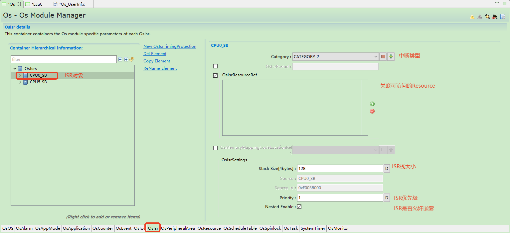
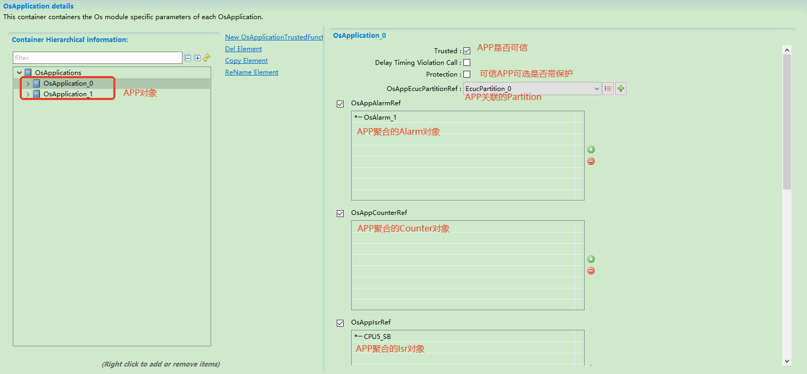

===================
Os
===================

文档信息（Document Information）
=======================================

版本历史（Version History）
-----------------------------------

.. list-table::
   :widths: 10 10 10 10 20
   :header-rows: 1

   * - 日期（Date）
     - 作者（Author）
     - 版本（Version）
     - 状态（Status）
     - 说明（Description）
   * - 2025/01/13
     - Chao.Ye
     - V0.1
     - 发布（Release）
     - 首次发布（First release）
   * - 2025/04/04
     - Chao.Ye
     - V1.0
     - 发布（Release）
     - 正式发布（Official release）

参考文档（References）
-------------------------------------------
.. list-table::
    :header-rows: 1

    * - 编号
      - 分类
      - 标题
      - 版本

    * - [1]
      - Autosar
      - AUTOSAR_SWS_OS.pdf
      - R23-11

    * - [2]
      - ISO
      - ISO 17356-3:2005 Part 3:OSEK/VDX Operating System(OS).pdf
      - V2.2.3

术语与简写（Terms and Abbreviations）
========================================

术语（terminology）
----------------------
.. list-table::
   :widths: 15 40
   :header-rows: 1

   * - 术语（Term）
     - 解释（Explanation）

   * - OSEK/VDX
     - 汽车电子类开放系统和对应接口标准/汽车分布式执行标准
       
       Open Systems and Corresponding Interfaces for Automotive Electronics / Vehicle Distributed Execution standard

   * - Scalability Class（可扩展类别）
     - 本文档介绍的ORIENTAIS OS功能（例如内存保护或时间保护）可以组合在一起，以根据应用程序的需要自定义操作系统。有4个定义的功能组，称为可扩展类别(SC1/SC2/SC3/SC4)。
       
       The ORIENTAIS OS functions (such as memory protection or time protection) introduced in this document can be combined to customize the operating system according to the needs of the application. There are 4 defined function groups called Scalability Classes (SC1/SC2/SC3/SC4).

   * - OS-Application（操作系统对象集）
     - 操作系统对象的集合
       
       A collection of operating system objects
       可信：可以在特权模式下执行并且可以不受限制地访问API和硬件资源的OS-Application。只有受信任的OS-Application才能提供受信任的功能。
       Trusted: An OS-Application that can execute in privileged mode and has unrestricted access to APIs and hardware resources. Only trusted OS-Applications can provide trusted functions.
       不可信：在非特权模式下执行的OS-Application已限制对API和硬件资源的访问。
       Untrusted: An OS-Application that executes in unprivileged mode with restricted access to APIs and hardware resources.

   * - Access Right（访问权限）
     - OS-Application的对象（例如Task，ISR，hook函数）具有对内存，操作系统服务或对象集的访问或操作的许可权限。
       
       Objects of an OS-Application (such as Task, ISR, hook function) have permission to access or operate on memory, operating system services, or object sets.

   * - Expiry Point（溢出点）
     - 调度表上的偏移量，从零开始计算，ORIENTAIS OS将在该偏移量处激活任务和（或）设置事件。

       初始溢出点：具有最小偏移量的溢出点。

       结束溢出点：具有最大偏移量的溢出点。

       An offset on the schedule table, calculated from zero, at which the ORIENTAIS OS will activate tasks and/or set events.
        
       Initial Expiry Point: The expiry point with the smallest offset.
        
       End Expiry Point: The expiry point with the largest offset.

   * - Schedule Table（调度表）
     - 调度表是一组不同时间偏移溢出点的集合。
       
       A schedule table is a collection of expiry points with different time offsets.

   * - Spinlock（自旋锁）
     - 自旋锁是一种锁定机制，其中任务或中断在循环（"自旋"）中等待，反复检查共享变量是否变为某个值，该值表示自旋锁的当前锁定状态。在多核系统中，变量的比较和更改通常需要原子操作。由于任务或中断保持活动状态(等待其他核释放自旋锁)，但没有执行任何有用的操作，因此自旋锁是一种忙等机制。
       
       A spinlock is a locking mechanism where a task or interrupt waits in a loop ("spins"), repeatedly checking if a shared variable changes to a value indicating the current locked state of the spinlock. In multi-core systems, the comparison and modification of variables usually require atomic operations. Since the task or interrupt remains active (waiting for another core to release the spinlock) but does not perform any useful operations, a spinlock is a busy-wait mechanism.

   * - Spinlock Variable（自旋锁变量）
     - 自旋锁变量是自旋锁使用的共享变量，用于表示自旋锁是空闲还是已被占用。
       
       A spinlock variable is a shared variable used by a spinlock to indicate whether the spinlock is idle or occupied.

   * - Trusted Function（可信函数）
     - 由受信任的OS-Application提供的服务(函数)，可以由其他OS-Application（受信任或不受信任）使用(调用)。
       
       A service (function) provided by a trusted OS-Application that can be used (called) by other OS-Applications (trusted or untrusted).

   * - Master core（主核）
     - 主核是硬件启动后自动启动的核。
       
       The master core is the core that starts automatically after the hardware is powered on.

   * - Slave Core（从核）
     - 从核是由主核激活后启动的核。
       
       The slave core is the core that starts after being activated by the master core.

简写（Abbreviations）
----------------------------

.. list-table::
   :widths:  15 20 25
   :header-rows: 1

   * - **缩略词（Abbreviations）**
     - **描述（Description）**
     - **解释（Explanation）**

   * - API
     - Application Programming Interface (应用程序接口)
     - A set of routines, protocols, and tools for building software applications (用于构建软件应用程序的一组例程、协议和工具)
   * - HW
     - Hardware (硬件)
     - A physical component of a computer system (计算机系统的物理组件)
   * - SW
     - Software (软件)
     - A set of programs and data that make up a computer system (组成计算机系统的一组程序和数据)
   * - ISR
     - Interrupt Service Routine (中断服务程序)
     - A program that runs in response to an interrupt (响应中断的程序)
   * - MCU
     - Microcontroller Unit (微控制器单元)
     - A small, general-purpose computer designed to control small electronic devices (由小而General-purpose计算机设计的小型通用计算机，用于控制小型电子设备)
   * - MPU
     - Memory Protection Unit (存储器保护单元)
     - A hardware component that provides memory protection services to the operating system (一个提供内存保护服务的硬件组件，用于操作系统)
   * - OS
     - Operating System (操作系统)
     - A computer operating system that provides services to other operating systems and applications (一个为其他操作系统和应用程序提供服务，并运行在计算机上的操作系统)
   * - STM
     - System Timer (系统定时器)
     - A peripheral component that provides a timer service to the operating system (一个提供定时服务的外设组件，用于操作系统)
   * - MISRA
     - The Motor Industry Software Reliability Association (电机工业软件可靠性协会)
     - A non-profit organization that promotes software reliability in the motor industry (一个非营利组织，用于电机行业推广软件可靠性)
   * - TCL
     - Tool Confidence Level (工具置信度水平)
     - A level of confidence in the quality of a software tool (软件工具的可信度水平)

简介（Introduction）
============================
Os是为汽车电子领域开发的可抢占，多任务，高性能，低资源消耗和可定制的实时操作系统。它符合AUTOSAR R19标准（汽车电子领域中广泛接受的标准），并满足MISRA-C 2012编程规范。

Os is a preemptive, multi-tasking, high-performance, low-resource-consuming and customizable real-time operating system developed for the automotive electronics field. It complies with the AUTOSAR R19 standard (a widely accepted standard in the automotive electronics field) and meets the MISRA-C 2012 programming specifications.

ORIENTAIS OS满足以下要求:

ORIENTAIS OS meets the following requirements:

 #. 系统是完全静态配置的，在正常运行期间不允许进行任何配置更改；

    The system is completely statically configured, and no configuration changes are allowed during normal operation;

 #. 系统易于移植；

    The system is easy to port;
 
 #. 系统具有灵活的可扩展性。

    The system has flexible scalability.

ORIENTAIS OS具有广泛的可扩展性，完善的系统服务，各种调度机制以及便捷的配置功能，可以适应各种需求并在多种硬件平台上有效地运行。

ORIENTAIS OS features extensive scalability, comprehensive system services, various scheduling mechanisms, and convenient configuration functions, enabling it to adapt to various needs and run efficiently on multiple hardware platforms.

用户须在ORIENTAIS配置工具OS上修改参数以生成所需的代码，并将生成的代码加入到集成项目中。

Users must modify parameters on the ORIENTAIS configuration tool OS to generate the required code and add the generated code to the integration project.

功能描述（Function Description）
==================================

特性（Features）
---------------------------------
ORIENTAIS OS使用静态配置和动态管理将其功能集成到相关对象中。对象之间的相互调用是通过相关接口实现的。

ORIENTAIS OS integrates its functions into related objects using static configuration and dynamic management. Mutual calls between objects are implemented through related interfaces.

ORIENTAIS OS软件结构见

The software structure of ORIENTAIS OS is shown in

.. figure:: ../../../_static/参考手册/Os/OS软件结构.png
   :alt: ORIENTAIS OS软件结构图片
   :name: ORIENTAIS OS软件结构
   :align: center

   ORIENTAIS OS架构框图（ORIENTAIS OS Architecture Diagram）

各部分的功能如下:

The functions of each part are as follows:

- **Task management**

  它主要实现拓展任务和基本任务的激活，终止，重新调度，以及信息的获取。

  It mainly implements the activation, termination, rescheduling of extended tasks and basic tasks, as well as information acquisition.

- **Interrupt management**

  它主要实现全局中断，ORIENTAIS OS中断的打开和关闭功能。

  It mainly implements the functions of enabling and disabling global interrupts and ORIENTAIS OS interrupts.

- **Resource management**

  ORIENTAIS OS中的资源是一种互斥访问资源的方法。资源管理主要实现资源的获取和释放等功能。

  Resources in ORIENTAIS OS are a method for mutually exclusive access to resources. Resource management mainly implements functions such as resource acquisition and release.

- **Event management**

  它是任务之间的同步机制，而不是独立的对象，必须依附于拓展任务。事件管理主要负责实现设置，等待，查询和清除事件功能。

  It is a synchronization mechanism between tasks rather than an independent object, and must be attached to extended tasks. Event management is mainly responsible for implementing functions such as setting, waiting, querying and clearing events.

- **Counter management**

  它主要实现计数器计数，信息查询等功能，并为Alarm提供定时计数功能。

  It mainly implements functions such as counter counting and information query, and provides timing counting functions for Alarm.

- **Alarm management**

  它主要实现计时功能，并在预定时间到达时触发相关操作，例如设置事件，激活任务和执行回调。

  It mainly implements timing functions and triggers related operations when the scheduled time is reached, such as setting events, activating tasks and executing callbacks.

- **ScheduleTable management**

  它主要实现启动，停止和同步调度表的功能。

  It mainly implements the functions of starting, stopping and synchronizing schedule tables.

- **Timing protection management**

  为了安全和准确的时间保护，ORIENTAIS OS必须在运行时控制这些因素，以确保任务/ ISR能够满足各自的截止时间。该模块主要为任务/中断的各种截止时间实施操作系统的保护。

  For safe and accurate time protection, ORIENTAIS OS must control these factors during runtime to ensure that tasks/ISRs can meet their respective deadlines. This module mainly implements the operating system's protection for various deadlines of tasks/interrupts.

- **Memory protection management**

  内存保护的最终目标是为空间中正在运行的实体（任务/中断）提供访问保护，即“空间隔离”。内存保护提供相应任务的内存访问。内存保护为2类中断提供内存分区和相应的段访问权限。Hook为内存保护提供ProtectionHook系统服务。

  The ultimate goal of memory protection is to provide access protection for running entities (tasks/interrupts) in the space, namely "spatial isolation". Memory protection provides memory access for corresponding tasks. Memory protection provides memory partitions and corresponding segment access permissions for 2 types of interrupts. Hook provides ProtectionHook system services for memory protection.

- **Service protection management**

  运行时，服务保护可以防止服务调用不会破坏ORIENTAIS OS本身。

  During runtime, service protection can prevent service calls from damaging ORIENTAIS OS itself.

- **Application management**

  有效资源的分配是通过OS-Application实现的。如果用户使用OS-Application，则所有任务，中断，资源，计数器，警报和调度表必须属于同一OS-Application。OS-Application分为可信和不可信两类。受信任的OS-Application在特权模式下运行，不受信任的OS-Application以用户模式运行。用户模式下的OS-Application无法直接访问内核资源。如果用户需要访问内核资源，则用户必须进入特权模式。当然，这里有一个前提，OS内核本身是受信任的。受信任的OS-Application可以提供外部服务，包括对不受信任的OS-Application的服务。

  The allocation of effective resources is realized through OS-Application. If the user uses OS-Application, all tasks, interrupts, resources, counters, alarms and schedule tables must belong to the same OS-Application. OS-Applications are divided into trusted and untrusted categories. Trusted OS-Applications run in privileged mode, and untrusted OS-Applications run in user mode. OS-Applications in user mode cannot directly access kernel resources. If users need to access kernel resources, they must enter privileged mode. Of course, there is a premise here that the OS kernel itself is trusted. Trusted OS-Applications can provide external services, including services to untrusted OS-Applications.

- **Spinlock management**

  在多核系统中，一些资源涉及跨核互斥使用，因此需要引入自旋锁。在任何时候，最多只有一个执行单元获取该锁，其他执行单元不断循环以检查旋转锁的持有者是否已释放自旋锁。

  In multi-core systems, some resources involve cross-core mutually exclusive use, so spinlocks need to be introduced. At any time, at most one execution unit can acquire the lock, and other execution units keep looping to check whether the holder of the spinlock has released the spinlock.

- **Peripheral management**

  外设访问功能主要用于在内存保护打开的情况下，不可信的 Application 去访问 MCU 的硬件寄存器。

  The peripheral access function is mainly used for untrusted Applications to access the hardware registers of the MCU when memory protection is enabled.

- **IOC management**

  IOC 为OS提供的通信机制，能够实现跨核、跨任务、跨分区（OS-Application）间的通信。AUTOSAR OS标准定义的IOC需与RTE进行交互，ORIENTAIS OS能够兼容有RTE与无RTE两种情况下的IOC通信。

  IOC is a communication mechanism provided by the OS, which can realize communication across cores, tasks, and partitions (OS-Application). The IOC defined by the AUTOSAR OS standard needs to interact with RTE, and ORIENTAIS OS can be compatible with IOC communication with and without RTE.

偏差（deviation）
---------------------
None

扩展（expansion）
--------------------

负载率监控（Load Rate Monitoring）
~~~~~~~~~~~~~~~~~~~~~~~~~~~~~~~~~~~~~~~~~~~~~~~~

CPU负载率监控（CPU Load Rate Monitoring）
******************************************************************

CPU负载率表示CPU在一段时间忙碌处理事务的时间占比。

CPU load rate represents the proportion of time that the CPU spends busy processing transactions within a certain period.

- 在任务切换或者中断进出的时候会记录当前运行的object(中断或任务)的执行时间。

  The execution time of the currently running object (interrupt or task) is recorded during task switching or when entering/exiting an interrupt.

- 在systimer中断中周期计算CPU的负载率。

  The CPU load rate is calculated periodically in the systimer interrupt.

- CPU负载率计算公式：CPU 负载率 = ( 单位时间 - 单位时间内 IDLE TASK 运行时间 ) / 单位时间 * 100%

  CPU load rate calculation formula: CPU load rate = (Unit time - Running time of IDLE TASK within the unit time) / Unit time * 100%

对于用户来说，计算CPU负载率是无感的，用户只需要配置负载率监控功能之后查看Os_CpuLoadRatio变量即可。同时支持，最大负载、最小负载、平均负载的查看。

For users, the calculation of CPU load rate is imperceptible. Users only need to configure the load rate monitoring function and then check the Os_CpuLoadRatio variable. It also supports viewing the maximum load, minimum load, and average load.

Task负载率监控（Task Load Rate Monitoring）
****************************************************************
Task负载率表示CPU在一段时间内运行Task的时间占比。

Task load rate represents the proportion of time that the CPU spends running a Task within a certain period.

- 在Os_EnterTaskRecordTick或者Os_ExitTaskRecordTick的时候会记录当前运行的Task的执行时间。

  The execution time of the currently running Task is recorded when Os_EnterTaskRecordTick or Os_ExitTaskRecordTick is called.

- 在systimer中断中周期计算Task的负载率。

  The Task load rate is calculated periodically in the systimer interrupt.

- Task负载率计算公式：TASK负载率 = ( 单位时间内 TASK运行时间 ) / 单位时间 * 100%

  Task load rate calculation formula: TASK load rate = (Running time of TASK within the unit time) / Unit time * 100%

对于用户来说，计算Task负载率是无感的，用户只需要配置负载率监控功能之后查看对应的Os_TaskLoadRatio[TaskID]变量即可。同时支持，最大负载、最小负载、平均负载的查看。

For users, the calculation of Task load rate is imperceptible. Users only need to configure the load rate monitoring function and then check the corresponding Os_TaskLoadRatio[TaskID] variable. It also supports viewing the maximum load, minimum load, and average load.

ISR负载率监控（ISR Load Rate Monitoring）
******************************************************************
ISR负载率表示CPU在一段时间内运行ISR的时间占比。

ISR load rate represents the proportion of time that the CPU spends running ISR within a certain period.

- 在Os_EnterIsrRecordTick或者Os_ExitIsrRecordTick的时候会记录当前运行的ISR的执行时间。

  The execution time of the currently running ISR is recorded when Os_EnterIsrRecordTick or Os_ExitIsrRecordTick is called.

- 在systimer中断中周期计算ISR的负载率。

  The ISR load rate is calculated periodically in the systimer interrupt.

- ISR负载率计算公式：ISR 负载率 = ( 单位时间内 ISR 运行时间 ) / 单位时间 * 100%
       
  ISR load rate calculation formula: ISR load rate = (Running time of ISR within the unit time) / Unit time * 100%

对于用户来说，计算ISR负载率是无感的，用户只需要配置负载率监控功能之后查看对应的Os_IsrLoadRatio[IsrID]变量即可。同时支持，最大负载、最小负载、平均负载的查看。

For users, the calculation of ISR load rate is imperceptible. Users only need to configure the load rate monitoring function and then check the corresponding Os_IsrLoadRatio[IsrID] variable. It also supports viewing the maximum load, minimum load, and average load.

TaskResponseTime监控（TaskResponseTime Monitoring）
~~~~~~~~~~~~~~~~~~~~~~~~~~~~~~~~~~~~~~~~~~~~~~~~~~~~~~~~~~~~~~~~~~~~~~~~~~~~~~~~~
TaskResponseTime表示任务从开时运行到结束运行的绝对时间。

TaskResponseTime represents the absolute time from when a task starts running to when it finishes running.

- 在Os_TaskRecordStartTick开时记录Task的起始时间，在Os_TaskRecordTotalTick的时候会记录当前运行的ISR的执行时间。

  The start time of the Task is recorded when Os_TaskRecordStartTick is called, and the execution time of the currently running ISR is recorded when Os_TaskRecordTotalTick is called.

- TaskResponseTime = Task结束时间 - Task起始时间

  TaskResponseTime = Task end time - Task start time

对于用户来说，计算TaskResponseTime是无感的，用户只需要配置Task监控功能之后查看对应的Os_TaskResponseTime[TaskID]变量即可。同时支持，最大时间、最小时间、平均时间的查看。

For users, the calculation of TaskResponseTime is imperceptible. Users only need to configure the Task monitoring function and then check the corresponding Os_TaskResponseTime[TaskID] variable. It also supports viewing the maximum time, minimum time, and average time.

Os_InterLockTime监控（Os_InterLockTime Monitoring）
~~~~~~~~~~~~~~~~~~~~~~~~~~~~~~~~~~~~~~~~~~~~~~~~~~~~~~~~~~~~~~~~~~~~~~~~~~~~~~~~~
Os_InterLockTime（关中断时长监控）用于Os_InitOsMonitor接口调用之后，监控所有中断（包括2类中断）或者2类中断的关闭时长。

Os_InterLockTime (interrupt disable duration monitoring) is used to monitor the duration for which all interrupts (including Class 2 interrupts) or Class 2 interrupts are disabled after the Os_InitOsMonitor interface is called.

- 用户调用接口SuspendAllInterrupts()、SuspendOSInterrupts()关中断时，中断监控模块开始统计所有中断类型或者2类中断类型的关中断时长；用户调用ResumeAllInterrupts()、ResumeOSInterrupts()恢复中断使能时，暂停所有中断类型或者2类中断类型的关中断时长统计，并更新计算结果。
    
  When the user calls the interfaces SuspendAllInterrupts() or SuspendOSInterrupts() to disable interrupts, the interrupt monitoring module starts counting the duration for which all interrupt types or Class 2 interrupt types are disabled; when the user calls ResumeAllInterrupts() or ResumeOSInterrupts() to resume interrupt enabling, the counting of the duration for which all interrupt types or Class 2 interrupt types are disabled is paused, and the calculation result is updated.
    
- 在systimer中断中周期计算关中断时间的在该周期时间的占比，用户可通过Os_InterTatio变量查看。

  The proportion of interrupt disable time within the current cycle is calculated periodically in the systimer interrupt, which users can view through the Os_InterTatio variable.

对于用户来说，计算Os_InterLockTime是无感的，用户只需要配置监控功能之后查看对应的TopRecordTableHead、Os_InterRecordTable变量，即可查看最长关中断时间、最近关中断时间的记录情况。

For users, the calculation of Os_InterLockTime is imperceptible. Users only need to configure the monitoring function and then check the corresponding TopRecordTableHead and Os_InterRecordTable variables to view records of the longest interrupt disable time and the latest interrupt disable time.

调度次数监控（Scheduling Count Monitoring）
~~~~~~~~~~~~~~~~~~~~~~~~~~~~~~~~~~~~~~~~~~~~~~~~~~~~~~

Task调度监控（Task Scheduling Monitoring）
******************************************************************
Task调度监控用于监控从StartOS起至当前时刻，各个Task的总调度次数。

Task scheduling monitoring is used to monitor the total number of schedulings for each Task from the start of StartOS to the current moment.

用户需要配置监控功能，之后Os在调度函数中记录各个Task被触发的次数，用户可以调用Os_GetTaskScheduleCount来获取某个task的总调度次数。

Users need to configure the monitoring function. After that, Os records the number of times each Task is triggered in the scheduling function, and users can call Os_GetTaskScheduleCount to obtain the total number of schedulings for a certain task.

.. note::

      某一个Task被打断后重新返回到该Task，也被视为产生了一次调度。

      If a Task is interrupted and then returns to the Task, it is also regarded as a scheduling occurrence.

Isr2调度监控（Isr2 Scheduling Monitoring）
******************************************************************
Isr2调度监控用于监控从StartOS起至当前时刻，各个Isr2的总调度次数。

Isr2 scheduling monitoring is used to monitor the total number of schedulings for each Isr2 from the start of StartOS to the current moment.

用户需要配置监控功能，之后Os在中断进入退出序言中记录Isr2被触发的次数，用户可以调用Os_GetIsr2ScheduleCount来获取某个Isr2被触发的次数。

Users need to configure the monitoring function. After that, Os records the number of times Isr2 is triggered in the interrupt entry and exit prologues, and users can call Os_GetIsr2ScheduleCount to obtain the number of times a certain Isr2 is triggered.

.. note::

      某一Isr2被打断后重新返回到该Isr2，也被视为产生了一次调度

      If an Isr2 is interrupted and then returns to the Isr2, it is also regarded as a scheduling occurrence.

Event监控（Event Monitoring）
~~~~~~~~~~~~~~~~~~~~~~~~~~~~~~~~~~~~~~~~~~~~~~~~~~~~~~

Event实时性监控（Event Real-time Monitoring）
******************************************************************

Event实时性监控用于监控从event被触发到task最终响应event的这段时间是否过长。

Event real-time monitoring is used to monitor whether the time from when an event is triggered to when the task finally responds to the event is too long.

- 在SetEvent中Os_MonitorEventStartTime中记录event被触发的时刻；

  The moment when the event is triggered is recorded in Os_MonitorEventStartTime within SetEvent;

- 在WaitEvent和WaitAllEvents中调用Os_MonitorEventEndTime记录响应截止时间；

  The response deadline is recorded by calling Os_MonitorEventEndTime in WaitEvent and WaitAllEvents;

- 在ClearEvent中通过调用Os_MonitorEventResponseTime判断event响应时长是否大于等于配置门限，如果超出门限且配置HOOK则进入EventResponseTimeHook。

  In ClearEvent, Os_MonitorEventResponseTime is called to determine whether the event response duration is greater than or equal to the configured threshold. If it exceeds the threshold and the HOOK is configured, it enters EventResponseTimeHook.

Event响应率监控（Event Response Rate Monitoring）
******************************************************************
Event响应率监控用于监控是否存在Event响应率过低的场景。

Event response rate monitoring is used to monitor scenarios where the event response rate is too low.

- 在SetEvent中Os_AddEventResponseNum记录event被触发的次数;

  The number of times an event is triggered is recorded by Os_AddEventResponseNum in SetEvent;

- 在ClearEvent中通过调用Os_MonitorEventResponseRate判断event是否存在多次SetEvent对应一次ClearEvent的场景，如果存在且配置了HOOK则进入EventResponseRateHook。

  In ClearEvent, Os_MonitorEventResponseRate is called to determine whether there is a scenario where multiple SetEvents correspond to one ClearEvent for an event. If such a scenario exists and the HOOK is configured, it will enter EventResponseRateHook.

集成（Integration）
==================================
操作步骤如下:

The operation steps are as follows:

选择ORIENTAIS配置工具OS模块中的选项并生成配置文件；

Select options in the OS module of the ORIENTAIS configuration tool and generate configuration files;

在IDE中创建新项目；

Create a new project in the IDE;

集成Os源码，配置文件和其他源文件；

Integrate Os source code, configuration files and other source files;

构建项目以生成可执行文件。

Build the project to generate an executable file.

.. caution:: 

    #. 请参阅OS用户手册以获取ORIENTAIS配置工具OS模块的详细信息

       Please refer to the OS user manual for detailed information about the OS module of the ORIENTAIS configuration tool

    #. 不同芯片平台生成的配置文件有些许差异，请参考芯片平台相关用户手册
     
       The configuration files generated by different chip platforms are slightly different. Please refer to the user manual related to the chip platform

文件列表（File List）
-------------------------

静态文件(static files)
~~~~~~~~~~~~~~~~~~~~~~~~~~~~~~
.. list-table::
   :widths: 10 30
   :header-rows: 1

   * - **文件（Files）**
     - **描述（Description）**
   * - Os.h
     - 公共头文件（Public header file）
   * - Os_Types.h
     - 类型定义头文件（Type definition header file）
   * - Os_Marcos.h
     - 宏定义头文件（Macro definition header file）
   * - Os_Kernel.c
     - 内核逻辑源代码（Kernel Logic Source Code）
   * - Os_Internal.h
     - 内部头文件（Internal header file）
   * - Os_Alarm.c
     - Alarm管理源文件（Alarm Management Source Files）
   * - Os_Counter.c
     - Counter管理源文件（Counter manages source files）
   * - Os_Err.h
     - 错误管理头文件（Error management header file）
   * - Os_Event.c 
     - 事件管理源文件（Event Management Source Files）
   * - Os_Resource.c
     - 资源管理源文件（Resource Management Source Files）
   * - Os_Task.c
     - 任务管理源文件（Task Management Source Files）
   * - Os_ScheduleTable.c
     - 调度表管理源文件（Scheduling table management source file）
   * - Os_Tprot.c 
     - 时间保护源文件（Time protected source files）
   * - Os_Sprot.c 
     - 服务保护源文件（Service protection source files）
   * - Os_Mprot.c
     - 内存保护源文件（Memory protected source files）
   * - Os_Appl.c
     - OS-Application管理源文件（OS Application manages source files）
   * - Os_Spinlock.c 
     - Spinlock管理源文件（Spinlock manages source files）
   * - Os_Core.c 
     - 控制核操作源文件（Control nuclear operation source files）
   * - Os_Rpc.c 
     - Rpc管理源文件（Rpc manages source files）
   * - Os_Interrupt.c 
     - 中断控制源文件（Interrupt control source file）
   * - Os_Peripheral.c
     - 外设访问功能源文件（Source file for peripheral access function）
   * - Os_Ioc.c
     - 核间通信功能源文件（Source file for inter nuclear communication function）
   * - Os_ECode.h 
     - 系统服务错误类型头文件（System service error type header file）
   * - Os_Hook.c
     - Hook功能源文件（Hook function source file）
   * - Os_StackMonitor.c
     - 栈监控源文件（Stack monitoring source file）
   * - Os_MemMap.h
     - OS内存映射头文件（OS memory mapping header file）
   * - Os_Panic.c 
     - Panic管理源文件（Panic manages source files）
   * - Os_Extend.h
     - 扩展接口头文件（内核）Extension interface header file (kernel) 
   * - Platform
     - 请参考芯片相关的用户手册（Please refer to the user manual related to the chip）

动态文件（Dynamic files）
~~~~~~~~~~~~~~~~~~~~~~~~~~~~~~
.. list-table::
   :widths: 10 30
   :header-rows: 1

   * - 文件
     - 描述
   * - Os_Cfg_s.h
     - Os Cfg Asm Declarations
   * - Os_Cfg.c
     - Os Cfg Data Definitions
   * - Os_Cfg.h
     - Os Cfg define data Declarations 
   * - Os_CfgData.h
     - Os Cfg Data Declarations 
   * - Os_CoreCfg.c
     - Os Cfg Code Data Definitions
   * - Os_CoreCfg.h
     - Os Cfg Code Data Declarations
   * - Os_DataSection.lsl
     - Os app linck script
   * - Os_Intvet.c
     - Os ISR install src 
   * - Os_Kdata.c 
     - Os control data Definitions
   * - Os_Linklsl
     - Os app data linck script  
   * - Os_Mp_MemMap.h
     - Os Memmap marcos Declarations
   * - Os_MprotCfg.c
     - Os Memmap cfg data Definitions
   * - Os_MprotCfg.h
     - Os Memmap cfg data Declarations
   * -  Os_Trace.orti
     - Os ORTI cfg Declarations
   * - Os_Userlnf.c
     - Os Interface api Declarations

错误处理(Error Handling)
-------------------------------
None

.. 引用接口描述。来自于code->doxygen->latex->rst
.. include:: Os_api.rst

配置（Configuration）
========================
本章主要介绍OS模块的配置参数。它主要包括配置界面上显示的名称，相应的标准，值范围，默认值，参数说明和相关性。它旨在帮助用户使用配置工具来完成OS模块的配置。

This chapter mainly introduces the configuration parameters of the OS module. It mainly includes the names displayed on the configuration interface, corresponding standards, value ranges, default values, parameter descriptions, and correlations. It aims to help users use the configuration tool to complete the configuration of the OS module.

OS基本对象配置（OS Basic Object Configuration）
----------------------------------------------------

控制系统运行的关键数据可以抽象为一系列的OS对象，以下简单说明OS运行过程中所必须配置的一些关键实体：

The key data that controls the operation of the system can be abstracted into a series of OS objects. The following briefly describes some key entities that must be configured during the operation of the OS:

OS对象（OS Object）
~~~~~~~~~~~~~~~~~~~~~~~~
OS基本配置如下：

The basic OS configurations are as follows:

.. figure:: ../../../_static/参考手册/Os/Os_obj.png
   :align: center

   OS对象配置（OS Object Configuration）

Core运行数量、Scalability Class（OS运行可拓展等级）、OsHooks等关键配置由此页面配置。

Key configurations such as the number of running cores, Scalability Class (OS running scalability level), and OsHooks are configured on this page.

SystemTimer对象（SystemTimer Object）
~~~~~~~~~~~~~~~~~~~~~~~~~~~~~~~~~~~~~~~~~~
SystemTimer对象主要用于生成OS正常运行依赖的一系列中断：如时钟中断、时间保护中断、跨核通信中断（多核使用）。

The SystemTimer object is mainly used to generate a series of interrupts that the OS depends on for normal operation: such as clock interrupts, time protection interrupts, and cross-core communication interrupts (for multi-core use).

.. figure:: ../../../_static/参考手册/Os/SystemTimer_obj.png
   :align: center

   SystemTimer对象配置（SystemTimer Object Configuration）

.. note::

      用户配置SystemTimer对象默认生成OS所依赖的中断，建议如非必要请不要修改此类中断频率，优先级等配置数据。

      The interrupts that the OS depends on are generated by default when the user configures the SystemTimer object. It is recommended not to modify the configuration data such as the frequency and priority of such interrupts unless necessary.

Counter对象（Counter Object）
~~~~~~~~~~~~~~~~~~~~~~~~~~~~~~~~
Counter对象主要用于生成OS所依赖的计时器，可分为软件counter与硬件counter两类。

Counter objects are mainly used to generate timers relied on by the OS, which can be divided into software counters and hardware counters.

.. figure:: ../../../_static/参考手册/Os/Counter_obj.png
   :align: center

   Counter对象配置（Counter Object Configuration）

.. note::

      用户配置Counter对象后将默认生成SystemTimer所关联的Counter。

      After the user configures the Counter object, the Counter associated with the SystemTimer will be generated by default.

Task对象配置（Task Object Configuration）
~~~~~~~~~~~~~~~~~~~~~~~~~~~~~~~~~~~~~~~~~~~~~~
Task对象是用户代码的执行者，配置该对象将在Os_UserInf.c中生成任务对应的entry，用户可以在entry中添加自己的代码或调用AUTOSAR规范定义的标准API以实现自己的功能需求。

The Task object is the executor of user code. Configuring this object will generate the corresponding entry for the task in Os_UserInf.c. Users can add their own code in the entry or call the standard APIs defined by the AUTOSAR specification to realize their functional requirements.

.. figure:: ../../../_static/参考手册/Os/Task_obj.png
   :align: center

   Task对象配置（Task Object Configuration）

.. figure:: ../../../_static/参考手册/Os/Task_entry.png
   :align: center

   Task entry

.. note::

      用户还可在Task对象中关联所需的Event、Resource从而实现任务的同步和对关键资源的访问。

      Users can also associate required Events and Resources in the Task object to realize task synchronization and access to key resources.

ISR对象配置（ISR Object Configuration）
~~~~~~~~~~~~~~~~~~~~~~~~~~~~~~~~~~~~~~~~~~~
Task对象是中断执行的载体，分为二类中断与一类中断两类。二类中断受OS的管理控制且可以调用AUTOSAR规范定义的标准API，一类中断则不受OS控制可能会引起一些未定义的行为。

The ISR object is the carrier for interrupt execution, which is divided into two types: Class 2 interrupts and Class 1 interrupts. Class 2 interrupts are managed and controlled by the OS and can call standard APIs defined by the AUTOSAR specification, while Class 1 interrupts are not controlled by the OS and may cause some undefined behaviors.

   Isr对象配置（Isr Object Configuration）

Alarm对象配置（Alarm Object Configuration）
~~~~~~~~~~~~~~~~~~~~~~~~~~~~~~~~~~~~~~~~~~~~~~~~
Alarm对象主要用于在设置的counter计数点执行执行对应的动作。如激活任务、调用用户回调函数、增加counter计数、设置Event。使用Alarm必须关联对应的counter作为触发者。

The Alarm object is mainly used to execute corresponding actions at the set counter counting points, such as activating tasks, calling user callback functions, increasing counter counts, and setting Events. To use an Alarm, it must be associated with a corresponding counter as the trigger.

.. figure:: ../../../_static/参考手册/Os/Alarm_obj.png
   :align: center

   Alarm对象配置（Alarm Object Configuration）

APP对象配置（APP Object Configuration）
~~~~~~~~~~~~~~~~~~~~~~~~~~~~~~~~~~~~~~~~~
AUTOSAR OS 能够支持构成一个内聚功能单元的操作系统对象集合（任务、ISR、警报、计划表、计数器）。此对象集合称为 OS Application 。

AUTOSAR OS can support a collection of operating system objects (tasks, ISRs, alarms, schedule tables, counters) that form a cohesive functional unit. This collection of objects is called an OS Application.

操作系统模块负责在共享处理器的Application之间调度可用的处理资源。如果使用Application，则所有任务、ISR、计数器、警报和计划表都必须属于一个Application。属于同一Application的所有对象都可以相互访问。在配置期间可以授予访问其他Application对象的权限。

The operating system module is responsible for scheduling available processing resources among Applications that share a processor. If Applications are used, all tasks, ISRs, counters, alarms, and schedule tables must belong to an Application. All objects belonging to the same Application can access each other. Permissions to access objects of other Applications can be granted during configuration.

Application可分为：不可信APP、可信不带保护APP、可信带保护APP。配合内存保护功能可以实现不同类型的APP对不同数据段和代码段的控制访问。

Applications can be divided into: untrusted APPs, trusted APPs without protection, and trusted APPs with protection. Cooperating with the memory protection function can realize that different types of APPs have controlled access to different data segments and code segments.

**App安全机制（App Security Mechanisms）**

- 限制非信任OS应用调用服务（非信任OS应用不能调用ShutdownOS和ShutdownAllCores服务），超出限制直接返回。

  Restrict untrusted OS applications from calling services (untrusted OS applications cannot call ShutdownOS and ShutdownAllCores services), and return directly if the restriction is exceeded.

- 如果超出配置的权限，操作系统应用程序访问另一个应用程序的对象将触发服务保护错误，返回的错误代码应由用户处理。

  If the configured permissions are exceeded, the operating system application's access to an object of another application will trigger a service protection error, and the returned error code should be handled by the user.

- 如果输入参数无效，则应在 OS 应用程序模块中触发错误挂钩，用户应决定如何处理。

  If the input parameters are invalid, an error hook should be triggered in the OS application module, and the user should decide how to handle it.

   app对象配置（App Object Configuration）

OS多核配置（OS Multi-Core Configuration）
-----------------------------------------------
要配置OS多核，必须在工具中配置EcuC模块，然后再工具OS模块中由Partition关联到不同的核上。

To configure OS multi-core, the EcuC module must be configured in the tool, and then the Partition is associated with different cores in the tool's OS module.

EcuC配置多核（EcuC Configuration for Multi-Core）
~~~~~~~~~~~~~~~~~~~~~~~~~~~~~~~~~~~~~~~~~~~~~~~~~~~~~~

EcuC首先需要配置Core对象，确定工程中Core的数量及ID。

First, EcuC needs to configure Core objects to determine the number and IDs of Cores in the project.

.. figure:: ../../../_static/参考手册/Os/Ecuc_part.png
   :align: center

   Ecuc配置Partition对象（Ecuc Configuring Partition Objects）

之后EcuC定义EcuC Partition对象，并将Partition对象关联到之前配置的Core对象当中。

After that, EcuC defines EcuC Partition objects and associates the Partition objects with the previously configured Core objects.

OS配置多核（OS Configuring Multi-Core）
~~~~~~~~~~~~~~~~~~~~~~~~~~~~~~~~~~~~~~~~~~~~
OS首先需要再OSos对象中，配置Core num（必须与EcuC首先需要配置Core对象num一致）。

First, OS needs to configure Core num in the OSos object (which must be consistent with the num of Core objects configured first in EcuC).

然后，OS在OSAPP中，关联EcuC Partition对象，从而映射到不同的Core当中。

Then, OS associates EcuC Partition objects in OSAPP to map to different Cores.

.. figure:: ../../../_static/参考手册/Os/OS_app.png
   :align: center

   OS配置Partition对象（OS Configuring Partition Objects）

OS保护功能配置（OS Protection Function Configuration）
--------------------------------------------------------------

时间保护（Time Protection）
~~~~~~~~~~~~~~~~~~~~~~~~~~~~~~

当任务或中断在运行时错过其截止时间时，就会发生实时系统中的计时故障。

Timing failures in real-time systems occur when a task or interrupt misses its deadline during operation.

为了安全、准确地保护时间，操作系统必须在运行时控制以下因素，以确保任务/ISR 能够满足各自的截止期限：

For safe and accurate time protection, the operating system must control the following factors at runtime to ensure that tasks/ISRs can meet their respective deadlines:

#. 系统中Task/ISR的执行时间

   The execution time of Task/ISR in the system

#. 低优先级任务/ISR 锁定共享资源或禁用中断时，任务/ISR 所遭受的阻塞时间

   The blocking time suffered by tasks/ISRs when low-priority tasks/ISRs lock shared resources or disable interrupts

#. 系统中Task/ISR的到达间隔率。

   The arrival interval rate of Task/ISR in the system.

AUTOSAR OS 通过使用执行时序保护来保证执行时间的静态配置上限（称为执行预算），从而防止（1）出现时序错误：

AUTOSAR OS prevents timing errors in (1) by using execution timing protection to ensure a statically configured upper limit of execution time (called execution budget) for:

 - 任务（Tasks）
 - 第 2 类 ISR（Class 2 ISRs）

AUTOSAR OS 通过使用锁定时序保护来保证静态配置的上限（称为锁定预算），从而防止出现 (2) 的时序错误，时间如下：

AUTOSAR OS prevents timing errors in (2) by using lock timing protection to ensure a statically configured upper limit (called lock budget) for the following times:

 - 资源由任务/第 2 类 ISR 持有（Resources held by tasks/Class 2 ISRs）
 - 操作系统中断被任务/第 2 类 ISR 暂停（OS interrupts paused by tasks/Class 2 ISRs）
 - 所有中断均被任务/第 2 类 ISR 暂停/禁用（All interrupts paused/disabled by tasks/Class 2 ISRs）

AUTOSAR OS 通过使用到达间隔时序保护来保证以下时间的静态配置下限（称为时间帧），从而防止出现 (3) 中的时序错误：

AUTOSAR OS prevents timing errors in (3) by using arrival interval timing protection to ensure a statically configured lower limit (called time frame) for the following times:

.. figure:: ../../../_static/参考手册/Os/Tprot.png
   :align: center

   Task配置时间保护功能（Task Configuring Time Protection Function）

.. note::

    - 该功能依赖于额外的高精度时钟。

      This function relies on an additional high-precision clock.

    - OS在可扩展等级为SC2、SC4时提供该功能。
       
      The OS provides this function when the scalability level is SC2 or SC4.

内存保护（Memory Protection）
~~~~~~~~~~~~~~~~~~~~~~~~~~~~~~~~~~~

内存保护限制对内存的访问（读/写/执行）。超过限制会触发内存保护异常，然后进入保护钩子，由用户处理。

Memory protection restricts access to memory (read/write/execute). Exceeding the restrictions will trigger a memory protection exception, which then enters the protection hook for user handling.

该保护功能通常与APP配合使用，从而限制不可信APP对关键代码和数据的访问。

This protection function is usually used in conjunction with APP to restrict untrusted APPs from accessing critical code and data.

.. note::

    - 内存保护仅在提供内存保护硬件支持的处理器上才可行。内存保护方案基于可执行程序的（数据、代码和堆栈）部分。

      Memory protection is only feasible on processors that provide hardware support for memory protection. The memory protection scheme is based on the (data, code, and stack) sections of the executable program.

    - OS在可扩展等级为SC3、SC4时提供该功能。

      The OS provides this function when the scalability level is SC3 or SC4.

服务保护（Service Protection）
~~~~~~~~~~~~~~~~~~~~~~~~~~~~~~~~~~~

由于操作系统应用程序可以通过服务与操作系统模块交互，因此服务调用不会损坏操作系统模块本身至关重要。服务保护在运行时防止此类损坏。

Since operating system applications can interact with operating system modules through services, it is crucial that service calls do not damage the operating system modules themselves. Service protection prevents such damage at runtime.

服务保护有许多情况需要考虑：操作系统应用程序进行API调用

There are many scenarios to consider for service protection when an operating system application makes an API call:

#. 句柄无效或值超出范围。

   The handle is invalid or the value is out of range.

#. 在错误的上下文中，例如在StartupHook（）中调用ActivateTask（）。

   In the wrong context, such as calling ActivateTask() in StartupHook().

#. 或未能进行API调用，导致ORIENTAIS OS处于未定义状态，例如，它在不调用ReleaseResource（）的情况下终止。

   Failing to make an API call, causing ORIENTAIS OS to be in an undefined state, for example, terminating without calling ReleaseResource().

#. 这会影响系统中其他所有操作系统应用程序的行为，例如ShutdownOS（）

   Affecting the behavior of all other operating system applications in the system, such as ShutdownOS()

#. 操纵属于另一个操作系统应用程序（它没有必要的权限）的操作系统对象，例如，操作系统应用程式试图对它不拥有的任务执行ActivateTask（）。

   Manipulating operating system objects belonging to another operating system application (for which it does not have the necessary permissions), for example, an operating system application attempting to execute ActivateTask() on a task it does not own.
 
ORIENTAIS OS已经通过服务调用返回的状态码提供了一些服务保护，这将为服务保护提供基础。这意味着服务保护仅适用于ORIENTAIS OS的扩展状态。

ORIENTAIS OS already provides some service protection through the status codes returned by service calls, which will provide the basis for service protection. This means that service protection only applies to the extended state of ORIENTAIS OS.

.. figure:: ../../../_static/参考手册/Os/service_prot.png
   :align: center

   配置服务保护（Configuring Service Protection）

